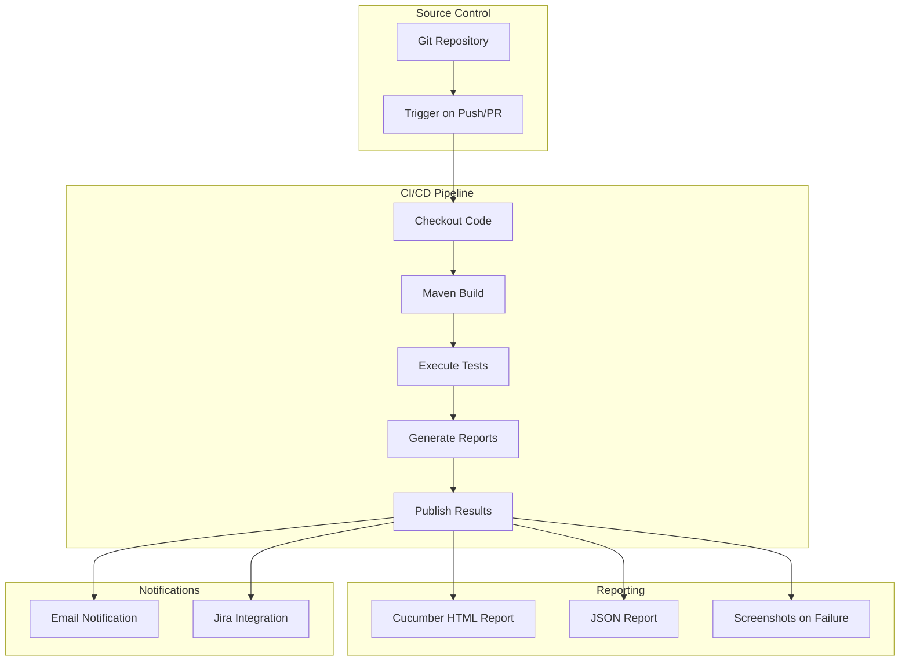
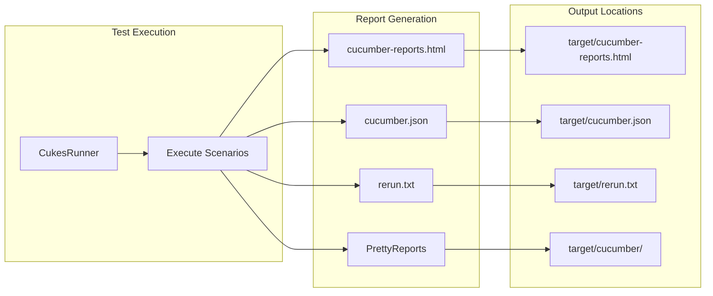
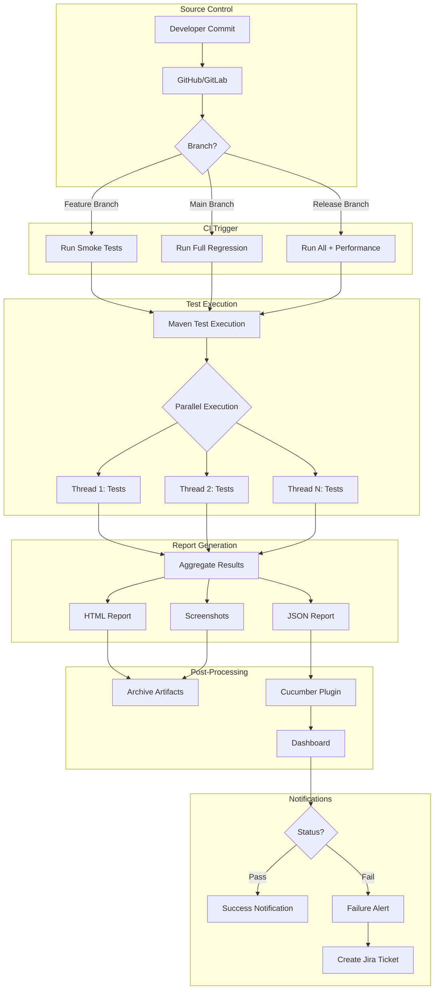

# Deployment Guide

## Testinium-QA CI/CD Integration and Deployment

This guide provides comprehensive documentation for integrating the Testinium-QA test automation framework into Continuous Integration and Continuous Deployment (CI/CD) pipelines. It covers Jenkins setup, Maven execution strategies, parallel execution configuration, report publishing, and optional Docker containerization.

---

## Table of Contents

- [CI/CD Integration Overview](#cicd-integration-overview)
- [Jenkins Pipeline Setup](#jenkins-pipeline-setup)
- [Maven Test Execution in CI](#maven-test-execution-in-ci)
- [Parallel Execution Configuration](#parallel-execution-configuration)
- [Report Publishing](#report-publishing)
- [Environment Configuration](#environment-configuration)
- [Docker Containerization (Optional)](#docker-containerization-optional)
- [Cross-References](#cross-references)

---

## CI/CD Integration Overview

The Testinium-QA framework is designed for seamless integration with CI/CD pipelines. The framework supports automated test execution, parallel test runs, and comprehensive reporting that integrates with popular CI tools.

### Key Integration Points



### Integration Benefits

| Benefit | Description |
|---------|-------------|
| **Automated Execution** | Tests run automatically on code changes |
| **Parallel Testing** | Thread-local WebDriver enables parallel execution |
| **Comprehensive Reporting** | HTML, JSON, and TXT reports generated automatically |
| **Failure Tracking** | Screenshots captured on test failures |
| **Rerun Capability** | Failed tests can be re-executed using rerun.txt |

### Prerequisites for CI Integration

1. **JDK 8 or higher** installed on CI server
2. **Maven 3.6+** installed and configured in PATH
3. **Browser** (Chrome or Firefox) installed on CI server
4. **Display server** (Xvfb for headless execution on Linux)
5. **Network access** to the application under test

---

## Jenkins Pipeline Setup

### Declarative Pipeline Configuration

Create a `Jenkinsfile` in your repository root with the following declarative pipeline configuration:

```groovy
pipeline {
    agent any
    
    tools {
        maven 'Maven 3.8'
        jdk 'JDK 8'
    }
    
    environment {
        // Set browser for headless execution
        BROWSER = 'chrome'
        // Enable CI mode for test runners
        CI = 'true'
    }
    
    options {
        // Discard old builds to save space
        buildDiscarder(logRotator(numToKeepStr: '10'))
        // Set timeout for the entire pipeline
        timeout(time: 30, unit: 'MINUTES')
        // Add timestamps to console output
        timestamps()
    }
    
    stages {
        stage('Checkout') {
            steps {
                checkout scm
                echo 'Source code checked out successfully'
            }
        }
        
        stage('Build') {
            steps {
                sh 'mvn clean compile -DskipTests'
                echo 'Project compiled successfully'
            }
        }
        
        stage('Test - Smoke') {
            steps {
                sh '''
                    mvn test -Dcucumber.filter.tags="@Smoke" \
                        -Dbrowser=${BROWSER}
                '''
            }
        }
        
        stage('Test - Regression') {
            when {
                branch 'main'
            }
            steps {
                sh '''
                    mvn test -Dcucumber.filter.tags="@Regression" \
                        -Dbrowser=${BROWSER}
                '''
            }
        }
        
        stage('Rerun Failed Tests') {
            when {
                expression { 
                    return fileExists('target/rerun.txt') && 
                           readFile('target/rerun.txt').trim() != '' 
                }
            }
            steps {
                sh '''
                    mvn test -Dcucumber.features="@target/rerun.txt" \
                        -Dbrowser=${BROWSER}
                '''
            }
        }
        
        stage('Generate Reports') {
            steps {
                echo 'Reports generated in target directory'
            }
        }
    }
    
    post {
        always {
            // Archive test results
            junit allowEmptyResults: true, 
                  testResults: '**/target/surefire-reports/*.xml'
            
            // Publish Cucumber reports
            cucumber buildStatus: 'UNSTABLE',
                     fileIncludePattern: '**/cucumber.json',
                     jsonReportDirectory: 'target',
                     reportTitle: 'Testinium-QA Cucumber Report',
                     sortingMethod: 'NATURAL'
            
            // Archive HTML reports
            archiveArtifacts allowEmptyArchive: true,
                            artifacts: 'target/cucumber-reports.html, target/cucumber/**/*',
                            fingerprint: true
            
            // Clean workspace
            cleanWs()
        }
        
        success {
            echo 'Pipeline completed successfully!'
            // Optional: Send success notification
            // slackSend(color: 'good', message: "Build Successful: ${env.JOB_NAME} #${env.BUILD_NUMBER}")
        }
        
        failure {
            echo 'Pipeline failed!'
            // Archive screenshots from failed tests
            archiveArtifacts allowEmptyArchive: true,
                            artifacts: '**/screenshots/*.png',
                            fingerprint: true
            // Optional: Send failure notification
            // slackSend(color: 'danger', message: "Build Failed: ${env.JOB_NAME} #${env.BUILD_NUMBER}")
        }
        
        unstable {
            echo 'Pipeline unstable - some tests failed!'
        }
    }
}
```

### Jenkins Job Configuration (Freestyle)

For teams preferring freestyle jobs over pipeline:

1. **General Configuration**
   - Check "Discard old builds" and set max builds to keep
   - Check "This project is parameterized" and add:
     - String Parameter: `BROWSER` with default `chrome`
     - String Parameter: `TAGS` with default `@Smoke`

2. **Source Code Management**
   - Select "Git"
   - Add repository URL: `https://github.com/BalamiRR/Testinium-QA.git`
   - Specify branch: `*/main`

3. **Build Triggers**
   - Poll SCM: `H/15 * * * *` (every 15 minutes)
   - Or use webhooks for immediate triggering

4. **Build Environment**
   - Check "Add timestamps to Console Output"
   - Check "Delete workspace before build starts"

5. **Build Steps**
   - Add "Invoke top-level Maven targets":
     - Goals: `clean test`
     - Advanced → Properties: `cucumber.filter.tags=${TAGS}`

6. **Post-build Actions**
   - Publish JUnit test result report: `**/target/surefire-reports/*.xml`
   - Cucumber reports: Target directory `target`
   - Archive artifacts: `target/cucumber-reports.html, target/cucumber/**/*`

### Required Jenkins Plugins

| Plugin | Purpose |
|--------|---------|
| **Cucumber Reports** | Generate and display Cucumber test reports |
| **Pipeline** | Enable declarative and scripted pipelines |
| **Git** | Source code management integration |
| **Maven Integration** | Maven build support |
| **Timestamper** | Add timestamps to console output |
| **Workspace Cleanup** | Clean workspace after builds |

---

## Maven Test Execution in CI

### Basic Test Execution Commands

```bash
# Run all tests
mvn clean test

# Run tests with specific tag
mvn test -Dcucumber.filter.tags="@Smoke"

# Run multiple tags (OR condition)
mvn test -Dcucumber.filter.tags="@Smoke or @Login"

# Run multiple tags (AND condition)
mvn test -Dcucumber.filter.tags="@Smoke and @Regression"

# Exclude specific tags
mvn test -Dcucumber.filter.tags="not @WIP"

# Run with specific browser
mvn test -Dbrowser=firefox

# Run with combined options
mvn test -Dcucumber.filter.tags="@Smoke" -Dbrowser=chrome
```

### Available Test Tags

Based on the framework's feature files, the following tags are available:

| Tag | Purpose |
|-----|---------|
| `@Smoke` | Quick smoke test suite |
| `@Login` | Login functionality tests |
| `@LogOut` | Logout functionality tests |
| `@Regression` | Full regression test suite |
| `@SalesManager` | Tests for Sales Manager user role |
| `@PosManager` | Tests for POS Manager user role |
| `@UPGN-XXX` | Jira ticket-specific tests |

### Environment-Specific Execution

```bash
# Development environment
mvn test -Denvironment=dev -Dcucumber.filter.tags="@Smoke"

# Staging environment
mvn test -Denvironment=staging -Dcucumber.filter.tags="@Regression"

# Production environment (read-only tests)
mvn test -Denvironment=prod -Dcucumber.filter.tags="@ReadOnly"
```

### Headless Browser Execution

For CI servers without display (Linux):

```bash
# Using Xvfb wrapper
xvfb-run mvn test -Dcucumber.filter.tags="@Smoke"

# Alternative: Set headless mode in browser options
mvn test -Dheadless=true -Dcucumber.filter.tags="@Smoke"
```

### Retry Failed Tests

The framework automatically generates `target/rerun.txt` containing failed scenarios:

```bash
# First run
mvn test -Dcucumber.filter.tags="@Regression"

# Rerun only failed tests
mvn test -Dcucumber.features="@target/rerun.txt"
```

---

## Parallel Execution Configuration

### Maven Surefire Plugin Configuration

The framework is configured for parallel test execution in `pom.xml`:

```xml
<!-- Source: pom.xml:17-30 -->
<plugin>
    <groupId>org.apache.maven.plugins</groupId>
    <artifactId>maven-surefire-plugin</artifactId>
    <version>3.0.0-M5</version>
    <configuration>
        <parallel>methods</parallel>
        <useUnlimitedThreads>true</useUnlimitedThreads>
        <!-- <threadCount>4</threadCount> -->
        <testFailureIgnore>true</testFailureIgnore>
        <includes>
            <include>**/CukesRunner*.java</include>
        </includes>
    </configuration>
</plugin>
```

### Configuration Options Explained

| Parameter | Current Value | Description |
|-----------|--------------|-------------|
| `parallel` | `methods` | Runs test methods in parallel |
| `useUnlimitedThreads` | `true` | No limit on concurrent threads |
| `threadCount` | Commented (4) | Maximum number of threads when limited |
| `testFailureIgnore` | `true` | Continue execution after test failures |
| `includes` | `**/CukesRunner*.java` | Pattern for test runner classes |

### Thread-Local WebDriver Management

The framework ensures thread-safety for parallel execution through `InheritableThreadLocal`:

```java
// Source: src/main/java/com/testinium/utilities/Driver.java:94
private static InheritableThreadLocal<WebDriver> driverPool = new InheritableThreadLocal<>();
```

This design ensures:
- **Thread Isolation**: Each test thread gets its own WebDriver instance
- **No Shared State**: Browser instances don't interfere with each other
- **Automatic Cleanup**: `closeDriver()` removes the thread-local reference

### Recommended Parallel Configuration

For different environments, adjust the Surefire configuration:

**CI Server (High Resources)**
```xml
<parallel>methods</parallel>
<threadCount>8</threadCount>
<perCoreThreadCount>false</perCoreThreadCount>
```

**Local Development**
```xml
<parallel>methods</parallel>
<threadCount>2</threadCount>
<perCoreThreadCount>false</perCoreThreadCount>
```

**Conservative (Low Resources)**
```xml
<parallel>methods</parallel>
<threadCount>1</threadCount>
```

### Override at Runtime

```bash
# Limit threads at runtime
mvn test -DthreadCount=4 -DuseUnlimitedThreads=false

# Use per-core thread count
mvn test -DthreadCount=2 -DperCoreThreadCount=true
```

---

## Report Publishing

### Generated Report Types

The Testinium-QA framework generates multiple report formats automatically:



### Report Configuration in CukesRunner

```java
// Source: src/main/java/com/testinium/runners/CukesRunner.java:119-126
@CucumberOptions(
    plugin = {
        "html:target/cucumber-reports.html",
        "json:target/cucumber.json",
        "rerun:target/rerun.txt",
        "me.jvt.cucumber.report.PrettyReports:target/cucumber"
    },
    // ... other options
)
```

### Report Types and Usage

| Report | Location | Purpose | CI Integration |
|--------|----------|---------|----------------|
| **HTML Report** | `target/cucumber-reports.html` | Human-readable test results | Archive as artifact |
| **JSON Report** | `target/cucumber.json` | Machine-readable results | Input for Jenkins Cucumber plugin |
| **Rerun File** | `target/rerun.txt` | List of failed scenarios | Used for retry mechanism |
| **PrettyReports** | `target/cucumber/` | Enhanced HTML reports with charts | Archive as artifact |

### Screenshots on Failure

The Hooks class automatically captures screenshots when tests fail:

```java
// Source: src/main/java/com/testinium/step_definitions/Hooks.java:115-121
@After
public void teardownScenario(Scenario scenario){
    if(scenario.isFailed()){
        byte [] screenshot = ((TakesScreenshot) Driver.getDriver()).getScreenshotAs(OutputType.BYTES);
        scenario.attach(screenshot, "image/png", scenario.getName());
    }
    Driver.closeDriver();
}
```

Screenshots are embedded directly into the Cucumber reports.

### Jenkins Cucumber Reports Plugin Configuration

1. Install "Cucumber Reports" plugin in Jenkins
2. Add post-build action "Cucumber reports"
3. Configure:
   - **JSON Reports Path**: `target`
   - **File Include Pattern**: `**/cucumber.json`
   - **Report Title**: `Testinium-QA Test Results`

### Archiving Reports in Jenkins

```groovy
// In Jenkinsfile post section
post {
    always {
        // Archive HTML reports
        archiveArtifacts allowEmptyArchive: true,
            artifacts: '''
                target/cucumber-reports.html,
                target/cucumber/**/*,
                target/surefire-reports/**/*
            ''',
            fingerprint: true
        
        // Publish Cucumber reports
        cucumber buildStatus: 'UNSTABLE',
                 fileIncludePattern: '**/cucumber.json',
                 jsonReportDirectory: 'target',
                 reportTitle: 'Testinium-QA Results'
    }
}
```

---

## Environment Configuration

### Configuration File Structure

The framework uses `configuration.properties` for environment settings:

```properties
# configuration.properties

# Browser Configuration
browser=chrome

# Application URLs
url=https://your-app-url.com
qa_url=https://qa.your-app-url.com
staging_url=https://staging.your-app-url.com
prod_url=https://prod.your-app-url.com

# Credentials (use environment variables in CI)
username=${TESTINIUM_USERNAME}
password=${TESTINIUM_PASSWORD}

# Timeouts (in seconds)
implicit_wait=10
explicit_wait=15
page_load_timeout=30
```

### System Properties Override

Override configuration at runtime using Maven system properties:

```bash
# Override browser
mvn test -Dbrowser=firefox

# Override URL
mvn test -Durl=https://staging.example.com

# Multiple overrides
mvn test -Dbrowser=chrome -Durl=https://qa.example.com -Dimplicit_wait=15
```

### Environment-Specific Configuration Files

Create separate configuration files for each environment:

```
src/main/resources/
├── configuration.properties          # Default/local
├── configuration-qa.properties       # QA environment
├── configuration-staging.properties  # Staging environment
└── configuration-prod.properties     # Production environment
```

Load specific configuration using system property:

```bash
mvn test -Denvironment=qa
```

### CI Environment Variables

Configure sensitive data as CI environment variables:

**Jenkins Environment Variables:**
```groovy
environment {
    TESTINIUM_USERNAME = credentials('testinium-username')
    TESTINIUM_PASSWORD = credentials('testinium-password')
    BROWSER = 'chrome'
}
```

**Access in configuration.properties:**
```properties
username=${TESTINIUM_USERNAME}
password=${TESTINIUM_PASSWORD}
```

### Browser Selection at Runtime

The framework supports multiple browsers via the Driver utility:

```bash
# Chrome (default)
mvn test -Dbrowser=chrome

# Firefox
mvn test -Dbrowser=firefox

# Headless Chrome (requires modification to Driver.java)
mvn test -Dbrowser=chrome-headless
```

Supported browsers are configured in `Driver.java`:
- `chrome` - Google Chrome
- `firefox` - Mozilla Firefox

---

## Docker Containerization (Optional)

### Dockerfile for Headless Execution

Create a `Dockerfile` in your project root:

```dockerfile
# Dockerfile
FROM maven:3.8-openjdk-8

# Install Chrome
RUN apt-get update && apt-get install -y \
    wget \
    gnupg2 \
    unzip \
    xvfb \
    && wget -q -O - https://dl.google.com/linux/linux_signing_key.pub | apt-key add - \
    && echo "deb [arch=amd64] http://dl.google.com/linux/chrome/deb/ stable main" >> /etc/apt/sources.list.d/google-chrome.list \
    && apt-get update \
    && apt-get install -y google-chrome-stable \
    && rm -rf /var/lib/apt/lists/*

# Install Firefox
RUN apt-get update && apt-get install -y firefox-esr \
    && rm -rf /var/lib/apt/lists/*

# Set working directory
WORKDIR /app

# Copy project files
COPY pom.xml .
COPY src ./src
COPY configuration.properties .

# Download dependencies
RUN mvn dependency:resolve

# Set display for headless execution
ENV DISPLAY=:99

# Default command
CMD ["sh", "-c", "Xvfb :99 -screen 0 1920x1080x24 & mvn test"]
```

### Docker Build and Run Commands

```bash
# Build the Docker image
docker build -t testinium-qa:latest .

# Run all tests
docker run --rm testinium-qa:latest

# Run specific tags
docker run --rm testinium-qa:latest \
    sh -c "Xvfb :99 -screen 0 1920x1080x24 & mvn test -Dcucumber.filter.tags='@Smoke'"

# Run with custom browser
docker run --rm \
    -e BROWSER=firefox \
    testinium-qa:latest

# Mount reports to host
docker run --rm \
    -v $(pwd)/reports:/app/target \
    testinium-qa:latest
```

### Docker Compose for Selenium Grid

Create `docker-compose.yml` for distributed test execution:

```yaml
# docker-compose.yml
version: '3.8'

services:
  # Selenium Hub
  selenium-hub:
    image: selenium/hub:4.8.0
    container_name: selenium-hub
    ports:
      - "4442:4442"
      - "4443:4443"
      - "4444:4444"
    environment:
      - SE_NODE_MAX_SESSIONS=5
      - SE_NODE_OVERRIDE_MAX_SESSIONS=true
    networks:
      - grid

  # Chrome Node
  chrome:
    image: selenium/node-chrome:4.8.0
    shm_size: 2gb
    depends_on:
      - selenium-hub
    environment:
      - SE_EVENT_BUS_HOST=selenium-hub
      - SE_EVENT_BUS_PUBLISH_PORT=4442
      - SE_EVENT_BUS_SUBSCRIBE_PORT=4443
      - SE_NODE_MAX_SESSIONS=3
    networks:
      - grid

  # Firefox Node
  firefox:
    image: selenium/node-firefox:4.8.0
    shm_size: 2gb
    depends_on:
      - selenium-hub
    environment:
      - SE_EVENT_BUS_HOST=selenium-hub
      - SE_EVENT_BUS_PUBLISH_PORT=4442
      - SE_EVENT_BUS_SUBSCRIBE_PORT=4443
      - SE_NODE_MAX_SESSIONS=3
    networks:
      - grid

  # Test Runner
  test-runner:
    build: .
    depends_on:
      - chrome
      - firefox
    environment:
      - SELENIUM_GRID_URL=http://selenium-hub:4444/wd/hub
      - BROWSER=chrome
    volumes:
      - ./target:/app/target
    networks:
      - grid
    command: >
      sh -c "
        sleep 30 && 
        mvn test -Dcucumber.filter.tags='@Smoke' -Dselenium.grid.url=http://selenium-hub:4444/wd/hub
      "

networks:
  grid:
    driver: bridge
```

### Docker Compose Commands

```bash
# Start Selenium Grid
docker-compose up -d selenium-hub chrome firefox

# Wait for grid to be ready
sleep 30

# Run tests
docker-compose up test-runner

# View reports (mounted to ./target)
open target/cucumber-reports.html

# Shutdown grid
docker-compose down
```

### CI/CD Pipeline with Docker

```groovy
// Jenkinsfile with Docker
pipeline {
    agent {
        docker {
            image 'maven:3.8-openjdk-8'
            args '-v /var/run/docker.sock:/var/run/docker.sock'
        }
    }
    
    stages {
        stage('Test with Docker Compose') {
            steps {
                sh '''
                    docker-compose up -d selenium-hub chrome firefox
                    sleep 30
                    docker-compose up --exit-code-from test-runner test-runner
                '''
            }
            post {
                always {
                    sh 'docker-compose down'
                }
            }
        }
    }
}
```

---

## CI/CD Pipeline Diagram

The following diagram illustrates the complete CI/CD workflow:



---

## Troubleshooting CI/CD Issues

### Common Issues and Solutions

| Issue | Cause | Solution |
|-------|-------|----------|
| Browser not found | Browser not installed on CI server | Install Chrome/Firefox or use Docker |
| Display not available | No X server on Linux CI | Use Xvfb: `xvfb-run mvn test` |
| Tests timeout | Network latency or slow server | Increase implicit/explicit waits |
| WebDriver version mismatch | WebDriverManager cache outdated | Clear cache: `rm -rf ~/.cache/selenium` |
| Parallel tests fail randomly | Shared state between threads | Verify thread-local WebDriver usage |
| Out of memory | Too many parallel threads | Reduce `threadCount` in pom.xml |

### Debug Commands

```bash
# Check Java version
java -version

# Check Maven version
mvn -version

# Check Chrome version
google-chrome --version

# Verify WebDriverManager cache
ls -la ~/.cache/selenium/

# Run with debug output
mvn test -X -Dcucumber.filter.tags="@Smoke"

# Check for display availability
echo $DISPLAY
```

---

## Cross-References

For additional documentation, refer to:

- **[README.md](README.md)** - Project overview, prerequisites, and quick start guide
- **[docs/CONFIGURATION.md](docs/CONFIGURATION.md)** - Detailed configuration reference guide
- **[docs/ARCHITECTURE.md](docs/ARCHITECTURE.md)** - Framework architecture and design patterns
- **[docs/TROUBLESHOOTING.md](docs/TROUBLESHOOTING.md)** - Common issues and debugging tips

### External Resources

- [Cucumber Documentation](https://cucumber.io/docs/cucumber/)
- [Selenium WebDriver Documentation](https://www.selenium.dev/documentation/)
- [Maven Surefire Plugin](https://maven.apache.org/surefire/maven-surefire-plugin/)
- [Jenkins Cucumber Reports Plugin](https://plugins.jenkins.io/cucumber-reports/)
- [Selenium Grid Documentation](https://www.selenium.dev/documentation/grid/)

---

## Version History

| Version | Date | Changes |
|---------|------|---------|
| 1.0 | 2024 | Initial deployment guide creation |

---

*Source: This documentation is based on the Testinium-QA framework configuration in `pom.xml` and `CukesRunner.java`.*
