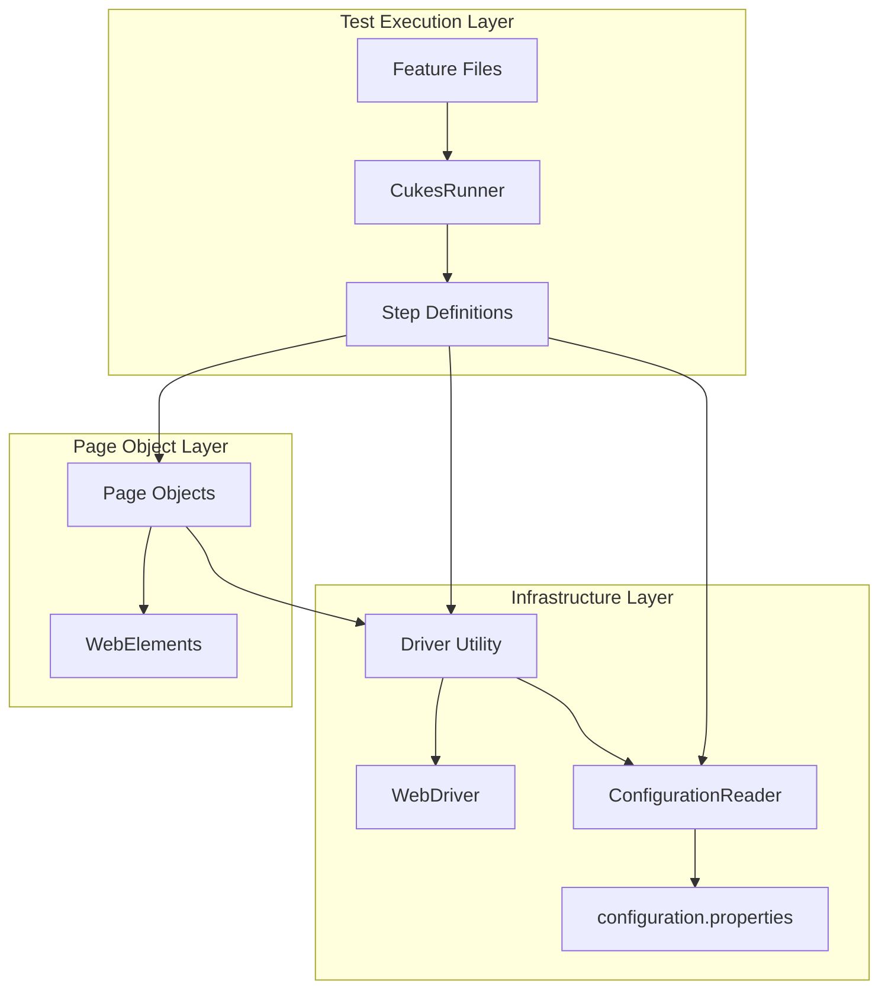
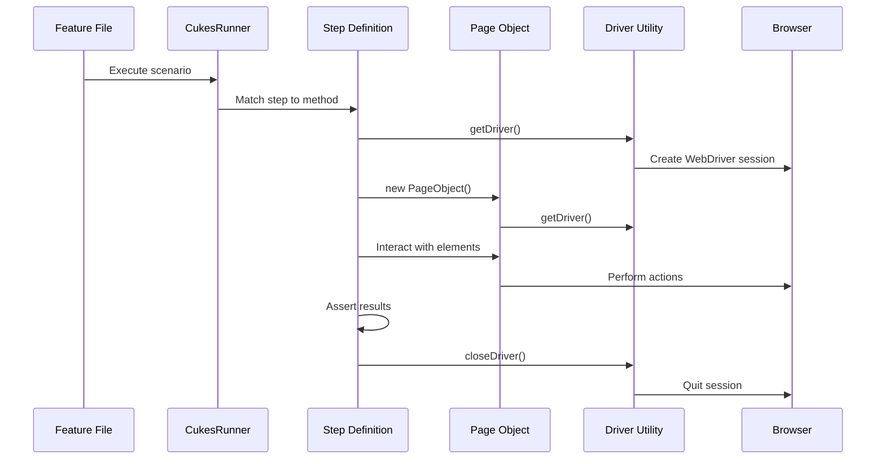
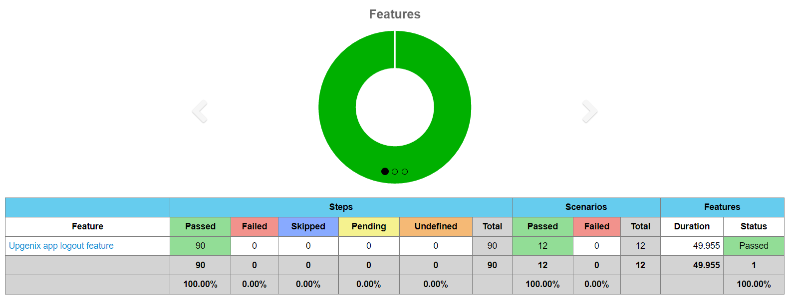
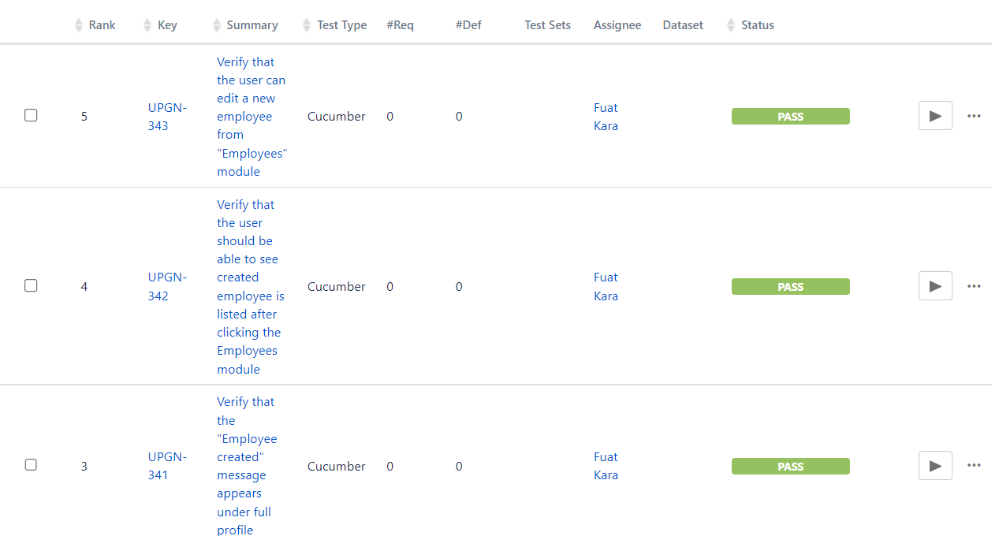

# :fallen_leaf: :leaves: Testinium-QA :leaves: :fallen_leaf:

[](https://github.com/BalamiRR/Testinium-QA)
[](https://www.oracle.com/java/technologies/javase-jdk8-downloads.html)
[](https://www.selenium.dev/)
[](https://cucumber.io/)
[](LICENSE)

> A comprehensive Java-based Selenium/Cucumber BDD test automation framework for browser testing with integrated reporting.

---

## Table of Contents

- [Overview](#overview)
- [Technology Stack](#technology-stack)
- [Tools](#tools)
- [Prerequisites](#prerequisites)
- [Installation](#installation)
- [Configuration](#configuration)
- [Running Tests](#running-tests)
- [Project Structure](#project-structure)
- [Architecture Overview](#architecture-overview)
- [Writing New Tests](#writing-new-tests)
- [Reports](#reports)
- [Troubleshooting](#troubleshooting)
- [Additional Documentation](#additional-documentation)
- [Contributing](#contributing)
- [License](#license)

---

## Overview

Testinium-QA is a robust test automation framework built with Java, Selenium WebDriver, and Cucumber BDD. It provides a scalable architecture for automating browser-based tests using the **Page Object Model (POM)** design pattern.

### Key Features

- **BDD Framework**: Write tests in Gherkin syntax for better readability and collaboration
- **Page Object Model**: Maintainable and reusable page object classes
- **Parallel Execution**: Thread-safe WebDriver management for concurrent test execution
- **Multi-Browser Support**: Chrome and Firefox browsers supported
- **Rich Reporting**: HTML, JSON, and PrettyReports output formats
- **Screenshot Capture**: Automatic screenshots on test failure
- **CI/CD Ready**: Jenkins and Maven integration for continuous testing

---

## Technology Stack

| Technology | Version | Purpose |
|------------|---------|---------|
| Java | 8+ | Programming Language |
| Selenium WebDriver | 3.141.59 | Browser Automation |
| Cucumber | 7.2.3 | BDD Framework |
| JUnit | 4.13.2 | Test Runner |
| WebDriverManager | 5.1.0 | Automatic Driver Management |
| Maven | 3.x | Build Tool & Dependency Management |
| JavaFaker | 1.0.2 | Test Data Generation |
| Cucumber Reporting | 7.2.0 | Enhanced HTML Reports |

---

## Tools

<p align="left"> 

<a href="https://www.java.com" target="_blank" rel="noreferrer"> 
   
</a> 

<a href="https://www.selenium.dev" target="_blank" rel="noreferrer">
   
</a>    

<a href="https://www.oracle.com/" target="_blank" rel="noreferrer"> 
   
</a>

<a href="https://encrypted-tbn0.gstatic.com/images?q=tbn:ANd9GcSPEOYG6Ap6vFoqv5bNXkDvnCa1yAqbDr_f_YQhXa97QwYXvNqWIvnCzpFJJz1ZwcLrwbM&usqp=CAU" rel="noreferrer">
   
</a> 
<a href="https://encrypted-tbn0.gstatic.com/images?q=tbn:ANd9GcSPEOYG6Ap6vFoqv5bNXkDvnCa1yAqbDr_f_YQhXa97QwYXvNqWIvnCzpFJJz1ZwcLrwbM&usqp=CAU" rel="noreferrer">
   
</a> 
<a href="https://encrypted-tbn0.gstatic.com/images?q=tbn:ANd9GcSPEOYG6Ap6vFoqv5bNXkDvnCa1yAqbDr_f_YQhXa97QwYXvNqWIvnCzpFJJz1ZwcLrwbM&usqp=CAU" rel="noreferrer">
   
</a> 
</p>

* **JAVA** - Programming language
* **SELENIUM** - Browser automation
* **CUCUMBER** - BDD framework
* **JUNIT** - Test runner
* **JIRA** - Test management
* **JENKINS** - CI/CD pipeline

---

## Prerequisites

Before setting up the framework, ensure you have the following installed:

### 1. Java Development Kit (JDK) 8+

```bash
# Verify Java installation
java -version

# Expected output: java version "1.8.x" or higher
```

**Installation:**
- **Windows/Mac/Linux**: Download from [Oracle JDK](https://www.oracle.com/java/technologies/javase-jdk8-downloads.html) or [OpenJDK](https://adoptopenjdk.net/)
- Set `JAVA_HOME` environment variable to your JDK installation path
- Add `$JAVA_HOME/bin` to your `PATH`

### 2. Apache Maven 3.x

```bash
# Verify Maven installation
mvn -version

# Expected output: Apache Maven 3.x.x
```

**Installation:**
- Download from [Apache Maven](https://maven.apache.org/download.cgi)
- Set `MAVEN_HOME` environment variable
- Add `$MAVEN_HOME/bin` to your `PATH`

### 3. IDE (IntelliJ IDEA Recommended)

- Download [IntelliJ IDEA](https://www.jetbrains.com/idea/download/)
- Install the following plugins:
  - **Maven** (usually pre-installed)
  - **Cucumber for Java** (for Gherkin syntax support)
  - **Gherkin** (for feature file highlighting)

### 4. Browser Requirements

The framework supports Chrome and Firefox browsers. WebDriverManager automatically handles driver downloads, so no manual driver setup is required.

**Supported Browsers:**
- Google Chrome (latest)
- Mozilla Firefox (latest)

---

## Installation

### Option 1: Git Clone

```bash
# Clone the repository
git clone https://github.com/BalamiRR/Testinium-QA.git

# Navigate to project directory
cd Testinium-QA

# Install dependencies
mvn clean install -DskipTests
```

### Option 2: Download ZIP

1. Download the repository from [here](https://github.com/BalamiRR/Testinium-QA/archive/main.zip)
2. Extract the ZIP file to your workspace
3. Open the project in your IDE
4. Run `mvn clean install -DskipTests` to download dependencies

### Verify Installation

```bash
# Verify project builds successfully
mvn compile

# Run a dry-run to check step definitions
mvn test -Dcucumber.options="--dry-run"
```

---

## Configuration

### Configuration File

The framework uses `configuration.properties` located at the project root for environment-specific settings.

**File Location:** `configuration.properties`

### Available Configuration Keys

| Key | Description | Example Values |
|-----|-------------|----------------|
| `browser` | Browser to use for test execution | `chrome`, `firefox` |
| `web.table.url` | Base URL of the application under test | `https://your-app.com/web/login` |
| `username` | Test user username | `testuser@example.com` |
| `password` | Test user password | `testpassword` |

### Example Configuration

```properties
# Browser configuration
browser=chrome

# Application URL
web.table.url=https://your-odoo-instance.com/web/login

# Test credentials (use environment variables for production)
username=salesmanager@info.com
password=salesmanager
```

### Environment-Specific Configuration

For different environments, create separate property files:
- `configuration-dev.properties`
- `configuration-qa.properties`
- `configuration-staging.properties`

> **Security Note**: Never commit real credentials to version control. Use environment variables or secure vaults for sensitive data.

For detailed configuration options, see [docs/CONFIGURATION.md](docs/CONFIGURATION.md).

---

## Running Tests

### Basic Test Execution

```bash
# Run all tests
mvn test

# Clean build and run tests
mvn clean test
```

### Tag-Based Execution

Run specific test scenarios using Cucumber tags:

```bash
# Run smoke tests
mvn test -Dcucumber.options="--tags @Smoke"

# Run login tests
mvn test -Dcucumber.options="--tags @Login"

# Run multiple tags (AND)
mvn test -Dcucumber.options="--tags '@Smoke and @Login'"

# Run multiple tags (OR)
mvn test -Dcucumber.options="--tags '@Smoke or @Login'"

# Exclude specific tags
mvn test -Dcucumber.options="--tags 'not @WIP'"
```

### Available Tags

| Tag | Description |
|-----|-------------|
| `@Smoke` | Smoke test suite |
| `@Login` | Login functionality tests |
| `@UPGN-XXX` | Jira ticket reference |
| `@SalesManager` | Sales manager role tests |
| `@PosManager` | POS manager role tests |

### Parallel Execution

The framework supports parallel test execution via Maven Surefire Plugin:

```bash
# Run tests in parallel (configured in pom.xml)
mvn test

# Specify thread count
mvn test -Dparallel=methods -DthreadCount=4
```

### CukesRunner Configuration

The test runner class (`CukesRunner.java`) defines the Cucumber configuration:

```java
import io.cucumber.junit.Cucumber;
import io.cucumber.junit.CucumberOptions;
import org.junit.runner.RunWith;

@RunWith(Cucumber.class)
@CucumberOptions(
    plugin = {
        "html:target/cucumber-reports.html",
        "json:target/cucumber.json",
        "rerun:target/rerun.txt",
        "me.jvt.cucumber.report.PrettyReports:target/cucumber"
    },
    features = "src/main/resources/features",
    glue = "com/testinium/step_definitions",
    dryRun = false,
    tags = "@Smoke"
)
public class CukesRunner {

}
```

**Configuration Options:**
- `plugin`: Report output formats and locations
- `features`: Path to feature files
- `glue`: Package containing step definitions
- `dryRun`: Set to `true` to validate step definitions without executing
- `tags`: Filter scenarios by tags

---

## Project Structure

```
Testinium-QA/
├── src/
│   └── main/
│       ├── java/
│       │   └── com/
│       │       └── testinium/
│       │           ├── pages/              # Page Object classes
│       │           │   ├── CalendarP.java
│       │           │   ├── ContactsP.java
│       │           │   ├── CrmP.java
│       │           │   ├── EmployeeP.java
│       │           │   ├── InventoryP.java
│       │           │   ├── LogOutP.java
│       │           │   ├── LoginP.java
│       │           │   ├── NotesP.java
│       │           │   ├── SalesP.java
│       │           │   └── SessionP.java
│       │           ├── step_definitions/   # Cucumber step definitions
│       │           │   ├── Calendar.java
│       │           │   ├── Contacts.java
│       │           │   ├── Crm.java
│       │           │   ├── EmployeeStage.java
│       │           │   ├── Hooks.java      # Test lifecycle hooks
│       │           │   ├── Inventory.java
│       │           │   ├── LogOutSD.java
│       │           │   ├── LoginSD.java
│       │           │   ├── Notes.java
│       │           │   ├── Sales.java
│       │           │   └── Session.java
│       │           ├── runners/            # Test runner classes
│       │           │   ├── CukesRunner.java
│       │           │   └── FailedTestRunner.java
│       │           └── utilities/          # Framework utilities
│       │               ├── ConfigurationReader.java
│       │               └── Driver.java
│       └── resources/
│           └── features/                   # Gherkin feature files
├── target/                                 # Build output & reports
│   ├── cucumber-reports.html
│   ├── cucumber.json
│   ├── cucumber/                           # PrettyReports output
│   └── rerun.txt
├── docs/                                   # Additional documentation
│   ├── ARCHITECTURE.md
│   ├── CONFIGURATION.md
│   ├── EXTENDING.md
│   └── TROUBLESHOOTING.md
├── image/                                  # Screenshots for documentation
├── configuration.properties                # Environment configuration
├── pom.xml                                 # Maven build file
├── DEPLOYMENT.md                           # CI/CD deployment guide
└── README.md                               # This file
```

### Package Descriptions

| Package | Description |
|---------|-------------|
| `pages` | Page Object classes representing web pages/components with WebElement locators |
| `step_definitions` | Cucumber glue code that maps Gherkin steps to Java methods |
| `runners` | JUnit runner classes with Cucumber configuration |
| `utilities` | Shared infrastructure (WebDriver management, configuration) |

---

## Architecture Overview

The framework follows a layered architecture based on the **Page Object Model (POM)** design pattern.

### Component Diagram



### Test Execution Flow



### Key Design Decisions

1. **Thread-Local WebDriver**: Uses `InheritableThreadLocal<WebDriver>` for thread-safe parallel execution
2. **PageFactory Pattern**: Lazy initialization of WebElements via `@FindBy` annotations
3. **Implicit Wait**: 10-second default wait configured in Driver utility
4. **Screenshot on Failure**: Automatic capture via Hooks class
5. **Report Generation**: Multiple output formats for CI integration

For detailed architecture documentation, see [docs/ARCHITECTURE.md](docs/ARCHITECTURE.md).

---

## Writing New Tests

### Develop Automation Scripts Using BDD Approach

Tests are written using the Cucumber BDD framework with Gherkin syntax. Here's an example feature file:

```gherkin
@Login
Feature: Testinium app login feature
  User Story:
  As a user, I should be able to login with correct credentials to different accounts.

  Accounts are: PosManager, SalesManager

  Background: For the scenarios in the feature file, user is expected to be on login page
    Given User is on the Testinium login page

  #1-Users can log in with valid credentials (We have 5 types of users but will test only 2 user: PosManager, SalesManager)
  @UPGN-286
  Scenario Outline: Users log in with valid credentials
    When User enters "<username>" username
    And User enters "<password>" password
    And User clicks the login button
    Then User should see the dashboard
  
  #2-"Wrong login/password" should be displayed for invalid credentials
  @UPGN-287
  Scenario Outline: Users log in with invalid email or invalid password credentials
    When User enters "<username>" username
    And User enters "<password>" password
    And User clicks the login button
    Then User sees error message
    
  #3- "Please fill out this field" message should be displayed if the password or username is empty
  @UPGN-288
  Scenario Outline: Users log in with invalid email or invalid password credentials
    When User enters "<password>" username
    And User clicks the login button
    Then User sees "Veuillez renseigner ce champ." message

    @SalesManager
    Examples: SalesManager's username and password
      |username               |password    |
      |salesmanager7@info.com |salesmanager|
      |salesmanager8@info.com |salesmanager|
      |salesmanager9@info.com |salesmanager|
      
    @PosManager
    Examples: PosManager's username and password
      |username               |password  |
      |posmanager5@info.com   |posmanager|
      |posmanager6@info.com   |posmanager|
```

### Quick Start Guide

1. **Create a Page Object** in `src/main/java/com/testinium/pages/`
2. **Create Step Definitions** in `src/main/java/com/testinium/step_definitions/`
3. **Create Feature File** in `src/main/resources/features/`
4. **Add Tags** for test filtering
5. **Run Tests** using Maven

For detailed instructions, see [docs/EXTENDING.md](docs/EXTENDING.md).

---

## Reports

### Report Types

The framework generates multiple report formats:

| Report Type | Location | Description |
|-------------|----------|-------------|
| HTML Report | `target/cucumber-reports.html` | Basic Cucumber HTML report |
| JSON Report | `target/cucumber.json` | Machine-readable JSON format |
| PrettyReports | `target/cucumber/` | Enhanced visual reports |
| Rerun File | `target/rerun.txt` | Failed scenario paths for rerun |

### Generate Reports

```bash
# Generate HTML report
mvn test -Dcucumber.options="--plugin html:target/cucumber-reports.html"

# Generate JSON report for CI integration
mvn test -Dcucumber.options="--plugin json:target/cucumber.json"

# Generate rerun file for failed tests
mvn test -Dcucumber.options="--plugin rerun:target/rerun.txt"
```

### Jenkins Cucumber Reports



### Jira Test Execution



### Screenshot Capture

The framework automatically captures screenshots on test failure:
- Screenshots are attached to Cucumber scenarios via the `Hooks` class
- Screenshot format: PNG
- Location: Embedded in Cucumber reports

---

## Troubleshooting

### Common Issues and Solutions

#### 1. Element Not Found Exception

**Symptom**: `NoSuchElementException` during test execution

**Solutions**:
- Verify the locator is correct using browser DevTools
- Add explicit wait before interacting with the element
- Check if the element is inside an iframe

#### 2. WebDriver Session Issues

**Symptom**: `SessionNotCreatedException` or browser doesn't open

**Solutions**:
- Ensure browser is installed and up to date
- WebDriverManager should auto-download drivers
- Check for conflicting driver versions

#### 3. Configuration File Not Found

**Symptom**: `File is not found in the ConfigurationReader class`

**Solutions**:
- Ensure `configuration.properties` exists at project root
- Verify file name spelling

#### 4. Tests Timing Out

**Symptom**: Tests fail due to timeout exceptions

**Solutions**:
- Increase implicit wait in `Driver.java`
- Use explicit waits for specific elements
- Check application performance

#### 5. Parallel Execution Issues

**Symptom**: Tests interfere with each other when running in parallel

**Solutions**:
- Ensure test data isolation
- Verify thread-local WebDriver usage
- Check for shared state between tests

For detailed troubleshooting, see [docs/TROUBLESHOOTING.md](docs/TROUBLESHOOTING.md).

---

## Additional Documentation

| Document | Description |
|----------|-------------|
| [ARCHITECTURE.md](docs/ARCHITECTURE.md) | Detailed framework architecture and design patterns |
| [CONFIGURATION.md](docs/CONFIGURATION.md) | Complete configuration reference guide |
| [EXTENDING.md](docs/EXTENDING.md) | Guide for adding new Page Objects and Step Definitions |
| [TROUBLESHOOTING.md](docs/TROUBLESHOOTING.md) | Common issues and debugging guide |
| [DEPLOYMENT.md](DEPLOYMENT.md) | CI/CD integration and Jenkins setup |

---

## Contributing

1. Fork the repository
2. Create a feature branch (`git checkout -b feature/amazing-feature`)
3. Commit your changes (`git commit -m 'Add amazing feature'`)
4. Push to the branch (`git push origin feature/amazing-feature`)
5. Open a Pull Request

---

## License

This project is licensed under the MIT License - see the [LICENSE](LICENSE) file for details.

---

<p align="center">
  <strong>Happy Testing!</strong> :rocket:
</p>
