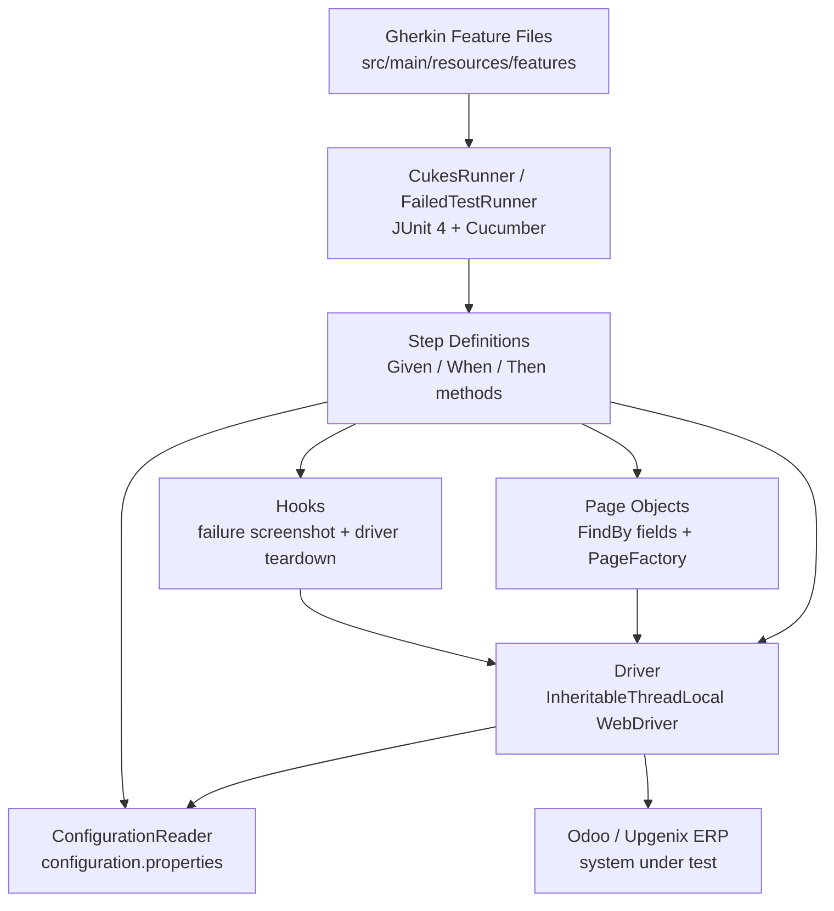
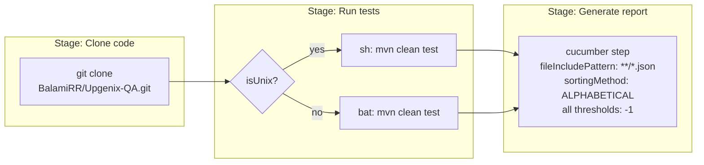
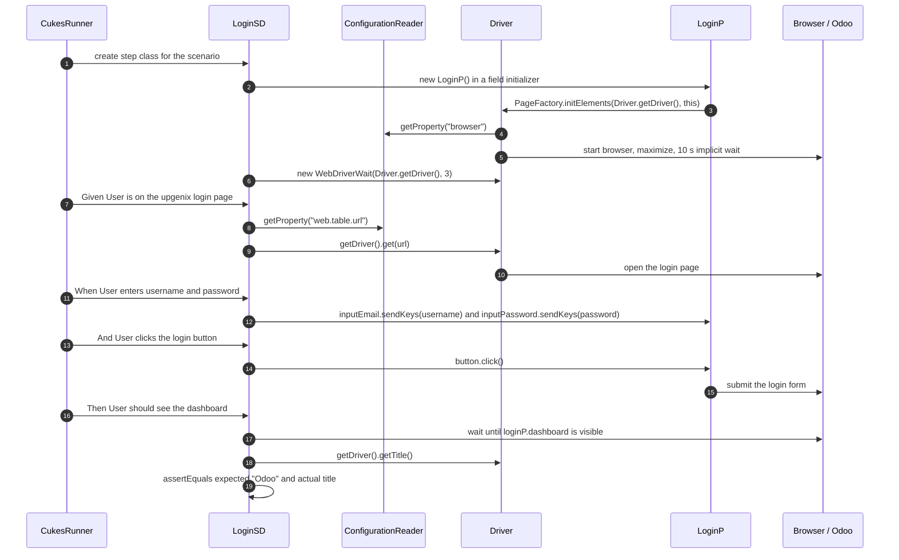
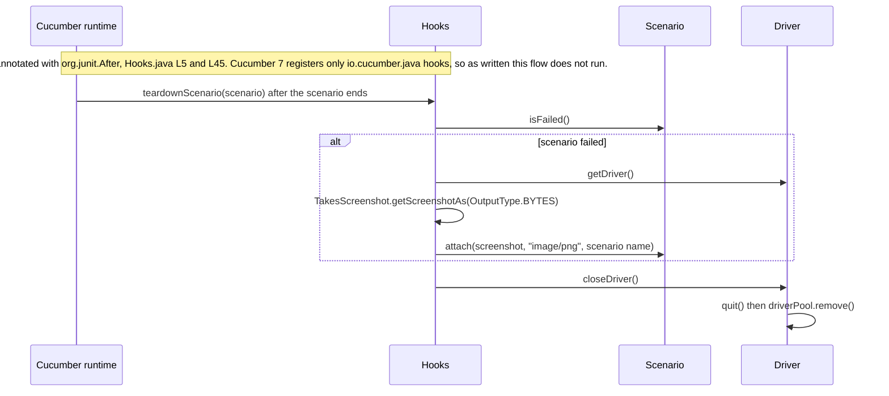

 # :fallen_leaf: :leaves: Testinium-QA :leaves: :fallen_leaf:
Automating the Testinium browser  (JAVA, Selenium, Cucumber, JUnit, Jira, Jenkins)

### Tools

<p align="left"> 

<a href="https://www.java.com" target="_blank" rel="noreferrer"> 
   
</a> 

<a href="https://www.selenium.dev" target="_blank" rel="noreferrer">
   
</a>    

<a href="https://www.oracle.com/" target="_blank" rel="noreferrer"> 
   
</a>

<a href="https://encrypted-tbn0.gstatic.com/images?q=tbn:ANd9GcSPEOYG6Ap6vFoqv5bNXkDvnCa1yAqbDr_f_YQhXa97QwYXvNqWIvnCzpFJJz1ZwcLrwbM&usqp=CAU" rel="noreferrer">
   
</a> 
<a href="https://encrypted-tbn0.gstatic.com/images?q=tbn:ANd9GcSPEOYG6Ap6vFoqv5bNXkDvnCa1yAqbDr_f_YQhXa97QwYXvNqWIvnCzpFJJz1ZwcLrwbM&usqp=CAU" rel="noreferrer">
   
</a> 
<a href="https://encrypted-tbn0.gstatic.com/images?q=tbn:ANd9GcSPEOYG6Ap6vFoqv5bNXkDvnCa1yAqbDr_f_YQhXa97QwYXvNqWIvnCzpFJJz1ZwcLrwbM&usqp=CAU" rel="noreferrer">
   
</a> 
</p>

* JAVA
* SELENIUM
* CUCUMBER
* JUNIT
* JIRA
* JENKINS

## Overview

This repository contains a collection of sample `Testinium-QA` projects and libraries that demonstrate how to
use the tool and develop automation scripts using the Cucumber BDD framework with Java as the programming language.
It generates JSON, HTML and Txt reports as well. It also generates `screen shots` for your tests if you enable it and
is designed to generate `error shots` for your failed test cases as well (the failure-screenshot hook is currently not
registered by Cucumber, see [Known Findings](#known-findings)).

The framework drives the web UI of an **Odoo/Upgenix ERP** instance (the system under test) through Selenium WebDriver.
It exposes no HTTP/REST endpoints: its API is the Java framework itself (utilities, runners, Page Objects, Step
Definitions) and the Gherkin step vocabulary, both documented in the [API Reference](#api-reference). Every Java class
also carries Javadoc in source.

| Item | Value | Source |
|------|-------|--------|
| Build | Maven, single module `org.example:testinium-qa:1.0-SNAPSHOT`, Java 8 source/target | `pom.xml:L7-L14` |
| UI automation | Selenium Java 3.141.59, WebDriverManager 5.1.0 | `pom.xml:L36-L46` |
| BDD and test runner | Cucumber Java 7.2.3, Cucumber JUnit 7.3.4 (effective version, see [Known Findings](#known-findings)), JUnit 4.13.2 | `pom.xml:L54-L80` |
| Reporting | Cucumber HTML, JSON and rerun plugins, PrettyReports (`me.jvt.cucumber:reporting-plugin` 7.2.0) | `pom.xml:L66-L70`; `src/main/java/com/testinium/runners/CukesRunner.java:L39-L44` |
| Test data library | JavaFaker 1.0.2 (declared, not referenced by the current sources) | `pom.xml:L48-L52` |
| System under test | Odoo/Upgenix ERP web UI; after login the page title is asserted to equal `Odoo` | `src/main/java/com/testinium/step_definitions/LoginSD.java:L96-L102` |
| CI | Jenkins scripted pipeline in the `Jenkins` file | `Jenkins:L1-L17` |

## Table of Contents

- [Overview](#overview)
- [Architecture](#architecture)
- [Prerequisites](#prerequisites)
- [Setup & Configuration](#setup--configuration)
  - [Clone the Repository](#clone-the-repository)
  - [Build](#build)
  - [Create `configuration.properties`](#create-configurationproperties)
- [Running Tests](#running-tests)
  - [How Execution Works Today](#how-execution-works-today)
  - [Run from IntelliJ](#run-from-intellij)
  - [Run from the Command Line](#run-from-the-command-line)
  - [Configured Maven Command](#configured-maven-command)
  - [Run a Tag Subset](#run-a-tag-subset)
  - [Rerun Failed Scenarios](#rerun-failed-scenarios)
  - [Dry Run](#dry-run)
  - [Report Output](#report-output)
- [API Reference](#api-reference)
  - [Utilities](#utilities)
  - [Runners](#runners)
  - [Hooks](#hooks)
  - [Page Objects](#page-objects)
  - [Step Definitions](#step-definitions)
  - [Gherkin Feature Catalog](#gherkin-feature-catalog)
  - [Writing Scenarios with Cucumber BDD](#writing-scenarios-with-cucumber-bdd)
- [Deployment & CI](#deployment--ci)
  - [Jenkins Pipeline](#jenkins-pipeline)
  - [Setting Up the Jenkins Job](#setting-up-the-jenkins-job)
  - [Report Artifacts](#report-artifacts)
  - [CI Caveats](#ci-caveats)
- [Inline Code Explanations](#inline-code-explanations)
  - [Thread-Local WebDriver: `Driver`](#thread-local-webdriver-driver)
  - [Externalized Configuration: `ConfigurationReader`](#externalized-configuration-configurationreader)
  - [Step Definition Anatomy: `LoginSD`](#step-definition-anatomy-loginsd)
  - [Failure Hook: `Hooks.teardownScenario`](#failure-hook-hooksteardownscenario)
  - [Page Object Construction with `PageFactory`](#page-object-construction-with-pagefactory)
  - [Login Flow Sequence](#login-flow-sequence)
  - [Failure Hook Sequence](#failure-hook-sequence)
- [Reports](#reports)
- [Project Structure](#project-structure)
- [Known Findings & Troubleshooting](#known-findings--troubleshooting)
  - [Known Findings](#known-findings)
  - [Troubleshooting](#troubleshooting)

## Architecture

The framework combines the Page Object Model (POM) with Cucumber BDD. Gherkin feature files describe behavior, a
JUnit 4 runner hands execution to Cucumber, step definitions translate each Gherkin step into Selenium actions on
Page Objects, and two utilities manage the browser session and the external configuration.


```mermaid
flowchart TB
    Feature["Gherkin Feature Files<br/>src/main/resources/features"] --> Runner["CukesRunner / FailedTestRunner<br/>JUnit 4 + Cucumber"]
    Runner --> Steps["Step Definitions<br/>Given / When / Then methods"]
    Steps --> Hooks["Hooks<br/>failure screenshot + driver teardown"]
    Steps --> Pages["Page Objects<br/>FindBy fields + PageFactory"]
    Steps --> Driver
    Pages --> Driver["Driver<br/>InheritableThreadLocal WebDriver"]
    Hooks --> Driver
    Driver --> Config["ConfigurationReader<br/>configuration.properties"]
    Steps --> Config
    Driver --> SUT["Odoo / Upgenix ERP<br/>system under test"]
```

| Layer | Package / location | Responsibility | Source |
|-------|--------------------|----------------|--------|
| Feature | `src/main/resources/features` (10 files) | Gherkin scenarios for the ERP modules under test | `src/main/java/com/testinium/runners/CukesRunner.java:L45` |
| Runner | `com.testinium.runners` | JUnit 4 entry points: `@RunWith(Cucumber.class)` plus `@CucumberOptions` (features, glue, tags, report plugins) | `src/main/java/com/testinium/runners/CukesRunner.java:L37-L51`; `src/main/java/com/testinium/runners/FailedTestRunner.java:L35-L40` |
| Step Definition | `com.testinium.step_definitions` (glue) | Binds each Gherkin step to a Java method; navigates, waits and asserts | `src/main/java/com/testinium/runners/CukesRunner.java:L46` |
| Hook | `com.testinium.step_definitions.Hooks` | Written to attach a screenshot to failed scenarios and close the driver | `src/main/java/com/testinium/step_definitions/Hooks.java:L45-L52` |
| Page Object | `com.testinium.pages` (10 classes) | `@FindBy` element containers initialized with `PageFactory`; no waits or assertions | `src/main/java/com/testinium/pages/LoginP.java:L25-L55` |
| Utility | `com.testinium.utilities` | `Driver` (one WebDriver per thread) and `ConfigurationReader` (`configuration.properties` accessor) | `src/main/java/com/testinium/utilities/Driver.java:L34-L125`; `src/main/java/com/testinium/utilities/ConfigurationReader.java:L41-L72` |
| System under test | external | Odoo/Upgenix ERP web application reached at the configured URLs | `src/main/java/com/testinium/step_definitions/LoginSD.java:L46-L51` |

Execution order for one scenario:

1. The runner collects the feature files under `features` and keeps the scenarios matching `tags`
   (Source: `src/main/java/com/testinium/runners/CukesRunner.java:L45-L48`).
2. Cucumber matches every step's text against the `@Given`/`@When`/`@Then`/`@And` expressions in the glue package
   (Source: `src/main/java/com/testinium/runners/CukesRunner.java:L46`).
3. The step class is instantiated for the scenario. Its field initializers create the Page Object and a
   `WebDriverWait`, both of which call `Driver.getDriver()`, so the browser opens on first use
   (Source: `src/main/java/com/testinium/step_definitions/LoginSD.java:L34-L36`).
4. `Driver.getDriver()` reads `browser` through `ConfigurationReader` and creates the WebDriver for the current thread
   (Source: `src/main/java/com/testinium/utilities/Driver.java:L81-L105`).
5. Step methods act on Page Object elements and assert on the resulting page
   (Source: `src/main/java/com/testinium/step_definitions/LoginSD.java:L96-L102`).

## Prerequisites

1. JDK 1.8+ (the compiler source and target are Java 8). Source: `pom.xml:L11-L14`
2. Maven 3.x
3. IntelliJ
4. IntelliJ Plugins for
    - Maven
    - Cucumber for Java (with Gherkin)
5. Google Chrome or Mozilla Firefox installed locally. You do not need to download a driver or set a driver class
   path: WebDriverManager 5.1.0 provisions the driver binary at runtime through
   `WebDriverManager.chromedriver().setup()`. The Firefox branch also calls the chromedriver setup, see
   [Known Findings](#known-findings). Source: `pom.xml:L42-L46`; `src/main/java/com/testinium/utilities/Driver.java:L90-L101`
6. Network access to the Odoo/Upgenix instance under test, and to the driver download hosts that WebDriverManager
   contacts when it resolves a driver.

## Setup & Configuration

### Clone the Repository

Git:

```bash
git clone https://github.com/BalamiRR/Testinium-QA.git
cd Testinium-QA
```

Manually:

Fork / Clone repository from [here](https://github.com/BalamiRR/Testinium-QA/archive/main.zip) or download zip and set
it up in your local workspace. In IntelliJ, open `pom.xml` as a project so the Maven dependencies are imported.

> **Note (CI remote):** the Jenkins pipeline clones `https://github.com/BalamiRR/Upgenix-QA.git`, not the
> `Testinium-QA` URL above. Point your Jenkins job at the repository you actually build.
> Source: `Jenkins:L2-L4`. See [Known Findings](#known-findings), item 2.

### Build

```bash
mvn -B clean test-compile
```

Compiles the 25 classes under `src/main/java` and copies the feature files to `target/classes`. The build succeeds
with expected warnings: the duplicate `cucumber-junit` declaration (see [Known Findings](#known-findings), item 1),
and the platform-encoding warnings (`Using platform encoding ...`, `File encoding has not been set ...`), because the
pom sets no `project.build.sourceEncoding`.
Source: `pom.xml:L11-L14`; `pom.xml:L60-L65`; `pom.xml:L76-L80`

> **Note:** a snapshot of `target/` (compiled classes and the reports of an earlier run) is committed to the
> repository, so any Maven build shows modified or deleted files under `target/` in `git status`. If you do not intend
> to commit them, restore the snapshot with
> `git restore --source=HEAD --worktree -- target && git clean -fdq -- target`.

### Create `configuration.properties`

`ConfigurationReader` loads `configuration.properties` once, in a static initializer, with
`new FileInputStream("configuration.properties")`. That path is resolved against the JVM working directory. The file
is **not committed**: create it in the **project root** (next to `pom.xml`) and run the tests with the project root as
the working directory. Source: `src/main/java/com/testinium/utilities/ConfigurationReader.java:L43-L57`

If the file is missing, the console prints `File is not found in the ConfigurationReader class` and a stack trace. The
class still loads, every `getProperty` call returns `null`, and the first `Driver.getDriver()` call fails with a
`NullPointerException` at its `switch`. Source: `src/main/java/com/testinium/utilities/ConfigurationReader.java:L53-L56`;
`src/main/java/com/testinium/utilities/ConfigurationReader.java:L70-L72`; `src/main/java/com/testinium/utilities/Driver.java:L87-L89`

| Key | Used by (Source) | Purpose | Example (placeholder) |
|-----|------------------|---------|-----------------------|
| `browser` | `Driver.getDriver()`: `src/main/java/com/testinium/utilities/Driver.java:L87` | Browser to launch. Supported values are `chrome` (L90) and `firefox` (L96); the match is case-sensitive | `chrome` |
| `web.table.url` | `src/main/java/com/testinium/step_definitions/LoginSD.java:L49`; `src/main/java/com/testinium/step_definitions/Session.java:L49`; `src/main/java/com/testinium/step_definitions/EmployeeStage.java:L56` | Login page URL opened by the login steps | `https://<your-odoo-host>/web/login` |
| `username` | `src/main/java/com/testinium/step_definitions/Session.java:L50` | Login of the shared account typed by the step `User login to test other features` | `<username>` |
| `password` | `src/main/java/com/testinium/step_definitions/Session.java:L51` | Password of that shared account | `<password>` |
| `url` | `src/main/java/com/testinium/step_definitions/EmployeeStage.java:L68`, `L141`, `L215` | Start URL of the Employees flow. It must show the login form, because `EmployeeP.login()` fills that form next | `https://<your-odoo-host>/web/login` |
| `EmplTitle` | `src/main/java/com/testinium/step_definitions/EmployeeStage.java:L82` | Page title awaited after clicking Employees. The next line asserts the hard-coded title `Employees - Odoo` (L83), so use that value | `Employees - Odoo` |

```properties
# configuration.properties: create it in the project root and never commit it.
browser=chrome
web.table.url=https://<your-odoo-host>/web/login
url=https://<your-odoo-host>/web/login
username=<username>
password=<password>
EmplTitle=Employees - Odoo
```

Only the shared login step reads `username` and `password`. The Login and Logout scenarios take their accounts from
the `Examples` tables of their feature files, and `EmployeeP.login()` types an account hard-coded in the Page Object
(see [Known Findings](#known-findings), item 7). Source: `src/main/java/com/testinium/step_definitions/Session.java:L47-L53`;
`src/main/resources/features/Login.feature:L20-L22`; `src/main/java/com/testinium/pages/EmployeeP.java:L99-L103`

> The repository has no `.gitignore`. Check `git status` before every commit so that `configuration.properties` and
> its credentials are never committed.

## Running Tests

### How Execution Works Today

Both runners are compiled from `src/main/java` into `target/classes`. Maven Surefire scans only compiled **test**
classes (`target/test-classes`, built from `src/test/java`, which this project does not have). So `mvn test` compiles
the project and then reports `No tests to run.`, and no scenario executes, even though Surefire's include pattern
names `**/CukesRunner*.java`. Run the suite from the IDE or with JUnit's command-line runner as shown below.
Source: `pom.xml:L17-L30`; `src/main/java/com/testinium/runners/FailedTestRunner.java:L30-L33`.
See [Known Findings](#known-findings), item 6.

| Mode | Command | Runs scenarios today |
|------|---------|----------------------|
| IDE | Right-click `CukesRunner`, then **Run** | Yes |
| Command line | `java ... org.junit.runner.JUnitCore com.testinium.runners.CukesRunner` | Yes |
| Maven / Jenkins | `mvn clean test` | No: `No tests to run.` |

### Run from IntelliJ

Right-click `src/main/java/com/testinium/runners/CukesRunner.java`, then choose **Run 'CukesRunner'**. IntelliJ runs
the class as a JUnit test wherever its source folder is. Keep the run configuration's working directory at the project
root so that `configuration.properties` and `src/main/resources/features` resolve. Add Cucumber properties such as
`-Dcucumber.filter.tags="@Login"` to the run configuration's **VM options**.
Source: `src/main/java/com/testinium/runners/CukesRunner.java:L37-L51`; `src/main/java/com/testinium/utilities/ConfigurationReader.java:L46`

### Run from the Command Line

Compile the project and write the dependency classpath to a file, then start the runner with JUnit 4 from the project
root. Without extra options this runs the default `@Smoke` selection: the 4 scenarios of `Crm.feature`.

```bash
mvn -B clean compile dependency:build-classpath -Dmdep.outputFile=target/classpath.txt
java -cp "target/classes:$(cat target/classpath.txt)" org.junit.runner.JUnitCore com.testinium.runners.CukesRunner
```

JUnit prints `OK (<n> tests)` or the list of failures. On Windows, use `;` instead of `:` as the classpath separator.
Source: `src/main/java/com/testinium/runners/CukesRunner.java:L45-L48`; `src/main/resources/features/Crm.feature:L1`

### Configured Maven Command

This is the command that the Jenkins `Run tests` stage executes.

```bash
mvn clean test
```

Surefire is configured with `parallel=methods` and `useUnlimitedThreads=true` (L22-L23), `testFailureIgnore=true`
(L25), so failed tests do not fail the build, and an include pattern of `**/CukesRunner*.java` (L27). In the current
layout it ends with `No tests to run.` and `BUILD SUCCESS`, see [How Execution Works Today](#how-execution-works-today).
Source: `pom.xml:L17-L30`; `Jenkins:L6-L12`

### Run a Tag Subset

Pass a Cucumber tag expression in `cucumber.filter.tags`. It replaces `tags = "@Smoke"` from `CukesRunner`.

```bash
java -Dcucumber.filter.tags="@Login" -cp "target/classes:$(cat target/classpath.txt)" org.junit.runner.JUnitCore com.testinium.runners.CukesRunner
```

The Maven form, `mvn clean test -Dcucumber.filter.tags="@Login"`, passes the same property, but it runs nothing until
Surefire can see the runner. Source: `src/main/java/com/testinium/runners/CukesRunner.java:L48`

| Tag | Level | Where (Source) |
|-----|-------|----------------|
| `@Smoke` | Feature | `src/main/resources/features/Crm.feature:L1` (the default runner selection) |
| `@Login` | Feature | `src/main/resources/features/Login.feature:L1` |
| `@LogOut` | Feature | `src/main/resources/features/Logout.feature:L1` |
| `@Calendar` | Feature | `src/main/resources/features/Calendar.feature:L1` |
| `@UPGN-344` | Feature | `src/main/resources/features/EmployeeFc.feature:L1` |
| `@UPGN-340` … `@UPGN-343` | Scenario | `src/main/resources/features/EmployeeFc.feature:L7`, `L15`, `L25`, `L35` |
| `@UPGN-286` … `@UPGN-290` | Scenario Outline | `src/main/resources/features/Login.feature:L13`, `L58`, `L85`, `L105`, `L122` |
| `@UPGN-291`, `@UPGN-292` | Scenario Outline | `src/main/resources/features/Logout.feature:L13`, `L37` |
| `@SalesManager`, `@PosManager` | Examples | `src/main/resources/features/Login.feature`, `src/main/resources/features/Logout.feature` |

`Contact.feature`, `Inventory.feature`, `Notes.feature`, `Sales.feature` and `Session.feature` carry no tag. Combine
tags with `and`, `or`, `not` and parentheses:

| Expression | Selects |
|------------|---------|
| `"@Login and @SalesManager"` | Login outlines, SalesManager example rows only |
| `"@Login and not @PosManager"` | The same rows, written as an exclusion (23 scenarios) |
| `"@Smoke or @Calendar"` | `Crm.feature` and `Calendar.feature` |
| `"not @LogOut"` | Every scenario except `Logout.feature` |
| `"@Smoke or not @Smoke"` | Every scenario (87 in total), including the untagged features |

To run one feature file, override `cucumber.features` as well. The annotation's `@Smoke` filter still applies unless
you also override the tags:

```bash
java -Dcucumber.features=src/main/resources/features/Notes.feature -Dcucumber.filter.tags="@Smoke or not @Smoke" -cp "target/classes:$(cat target/classpath.txt)" org.junit.runner.JUnitCore com.testinium.runners.CukesRunner
```

### Rerun Failed Scenarios

`CukesRunner`'s `rerun:target/rerun.txt` plugin writes the `path:line` location of every failed scenario.
`FailedTestRunner` reads that file through `features = "@target/rerun.txt"` and runs only those scenarios.

```bash
java -cp "target/classes:$(cat target/classpath.txt)" org.junit.runner.JUnitCore com.testinium.runners.FailedTestRunner
```

Run it after a `CukesRunner` run, from the project root, and without `mvn clean` in between, because `clean` deletes
`target/rerun.txt`. From the IDE, right-click `FailedTestRunner`, then **Run**. `mvn test -Dtest=FailedTestRunner`
stops with `No tests were executed!`, because Surefire does not see the class.
Source: `src/main/java/com/testinium/runners/CukesRunner.java:L42`; `src/main/java/com/testinium/runners/FailedTestRunner.java:L35-L40`;
`src/main/java/com/testinium/runners/FailedTestRunner.java:L30-L33`

### Dry Run

`dryRun = false` makes Cucumber execute every step. A dry run only checks that every Gherkin step has a matching step
definition. It executes no step, so it opens no browser and needs no `configuration.properties`. Enable it with the
`cucumber.execution.dry-run` property, or by setting `dryRun = true` locally in `CukesRunner`.

```bash
java -Dcucumber.execution.dry-run=true -Dcucumber.filter.tags="@Smoke or not @Smoke" -cp "target/classes:$(cat target/classpath.txt)" org.junit.runner.JUnitCore com.testinium.runners.CukesRunner
```

With every feature selected, the dry run reports `OK (87 tests)`. An unmatched step fails its scenario with an
`UndefinedStepException` that prints a snippet for the missing step definition.
Source: `src/main/java/com/testinium/runners/CukesRunner.java:L47`

### Report Output

Every `CukesRunner` run writes the four report artifacts configured in its `plugin` list, see
[Report Artifacts](#report-artifacts). To add another output, pass `cucumber.plugin`, the Cucumber 7 property. It is
added to the annotation's plugins; it does not replace them.

```bash
java -Dcucumber.plugin="html:target/cucumber-reports.html" -cp "target/classes:$(cat target/classpath.txt)" org.junit.runner.JUnitCore com.testinium.runners.CukesRunner
```

Source: `src/main/java/com/testinium/runners/CukesRunner.java:L39-L44`


## API Reference

The project exposes no HTTP/REST endpoints. Its API is the Java framework under `src/main/java/com/testinium` and the
Gherkin step vocabulary. Every class listed here is documented with Javadoc in source. To render that Javadoc as
HTML with the JDK tool (no pom change), pass the dependency classpath, otherwise `javadoc` reports
`package ... does not exist` errors:

```bash
mvn -B dependency:build-classpath -Dmdep.outputFile=target/classpath.txt
javadoc -d target/apidocs -sourcepath src/main/java -subpackages com.testinium -classpath "$(cat target/classpath.txt)"
```

Open `target/apidocs/index.html` in a browser.

### Utilities

#### `Driver`

Package `com.testinium.utilities`, file [`Driver.java`](src/main/java/com/testinium/utilities/Driver.java)
(documented with Javadoc in source). The factory and lifecycle manager of the Selenium `WebDriver`, holding one
session per thread. All members are static.

| Member | Signature | Behavior | Source |
|--------|-----------|----------|--------|
| Constructor | `private Driver()` | Prevents instantiation | `Driver.java:L37-L39` |
| Field | `private static InheritableThreadLocal<WebDriver> driverPool` | One `WebDriver` per thread. A child thread inherits the reference its parent held when the child started | `Driver.java:L42` |
| Method | `public static WebDriver getDriver()` | Creates the thread's driver lazily from the `browser` key (`chrome` or `firefox`), maximizes the window and sets a 10-second implicit wait. Later calls on the same thread return the same instance. Returns `null` for an unsupported `browser` value | `Driver.java:L81-L105` |
| Method | `public static void closeDriver()` | Calls `quit()` on the thread's driver, then `driverPool.remove()`, so the next `getDriver()` opens a fresh session. Does nothing when the thread holds no driver | `Driver.java:L120-L125` |

#### `ConfigurationReader`

Package `com.testinium.utilities`, file
[`ConfigurationReader.java`](src/main/java/com/testinium/utilities/ConfigurationReader.java) (documented with Javadoc
in source). Read-only accessor for `configuration.properties`; see
[Create `configuration.properties`](#create-configurationproperties) for the keys.

| Member | Signature | Behavior | Source |
|--------|-----------|----------|--------|
| Field | `private static Properties properties` | In-memory snapshot of the file | `ConfigurationReader.java:L41` |
| Static initializer | `static { ... }` | Loads `configuration.properties` from the working directory once, at class load. On an `IOException` it prints a message and the stack trace and does not rethrow | `ConfigurationReader.java:L43-L57` |
| Method | `public static String getProperty(String keyword)` | Returns the value for `keyword`, or `null` when the key is absent or the file failed to load. No reload happens during a run | `ConfigurationReader.java:L70-L72` |

### Runners

#### `CukesRunner`

Package `com.testinium.runners`, file [`CukesRunner.java`](src/main/java/com/testinium/runners/CukesRunner.java)
(documented with Javadoc in source). The primary JUnit 4 entry point. The code below is the current source; the class
Javadoc (L7-L36) is omitted.

```java
package com.testinium.runners;

import io.cucumber.junit.Cucumber;
import io.cucumber.junit.CucumberOptions;
import org.junit.runner.RunWith;

@RunWith(Cucumber.class)
@CucumberOptions(
    plugin = {
        "html:target/cucumber-reports.html",
        "json:target/cucumber.json",
        "rerun:target/rerun.txt",
        "me.jvt.cucumber.report.PrettyReports:target/cucumber"
    },
    features = "src/main/resources/features",
    glue = "com/testinium/step_definitions",
    dryRun = false,
    tags = "@Smoke"

)
public class CukesRunner {


}
```

Source: `src/main/java/com/testinium/runners/CukesRunner.java:L1-L6`, `L37-L55`

| `@CucumberOptions` element | Value | Effect | Source |
|----------------------------|-------|--------|--------|
| `plugin` | `"html:target/cucumber-reports.html"` | Single-file HTML report | `CukesRunner.java:L40` |
| `plugin` | `"json:target/cucumber.json"` | JSON report, published by the Jenkins `cucumber` step | `CukesRunner.java:L41` |
| `plugin` | `"rerun:target/rerun.txt"` | Locations of failed scenarios, read by `FailedTestRunner` | `CukesRunner.java:L42` |
| `plugin` | `"me.jvt.cucumber.report.PrettyReports:target/cucumber"` | PrettyReports HTML bundle under `target/cucumber/` | `CukesRunner.java:L43` |
| `features` | `"src/main/resources/features"` | Directory scanned for `.feature` files | `CukesRunner.java:L45` |
| `glue` | `"com/testinium/step_definitions"` | Package searched for step definitions and hooks | `CukesRunner.java:L46` |
| `dryRun` | `false` | Steps are executed, not only matched | `CukesRunner.java:L47` |
| `tags` | `"@Smoke"` | Only scenarios tagged `@Smoke` run | `CukesRunner.java:L48` |

#### `FailedTestRunner`

Package `com.testinium.runners`, file
[`FailedTestRunner.java`](src/main/java/com/testinium/runners/FailedTestRunner.java) (documented with Javadoc in
source). Re-runs only the scenarios listed in `target/rerun.txt`; it sets no `tags` and no `plugin`.

```java
@RunWith(Cucumber.class)
@CucumberOptions(
        glue = "com/testinium/step_definitions",
        features = "@target/rerun.txt"
)
public class FailedTestRunner {

}
```

Source: `src/main/java/com/testinium/runners/FailedTestRunner.java:L35-L42`

| `@CucumberOptions` element | Value | Effect | Source |
|----------------------------|-------|--------|--------|
| `glue` | `"com/testinium/step_definitions"` | Same glue package as `CukesRunner` | `FailedTestRunner.java:L37` |
| `features` | `"@target/rerun.txt"` | The leading `@` makes Cucumber read scenario locations from the rerun file instead of scanning a directory | `FailedTestRunner.java:L38` |

### Hooks

Class `com.testinium.step_definitions.Hooks`, file
[`Hooks.java`](src/main/java/com/testinium/step_definitions/Hooks.java) (documented with Javadoc in source). It
declares no fields and uses no Page Objects.

| Method | Signature | Behavior | Source |
|--------|-----------|----------|--------|
| `teardownScenario` | `@After public void teardownScenario(Scenario scenario)` | If `scenario.isFailed()`, captures `getScreenshotAs(OutputType.BYTES)` from `Driver.getDriver()` and attaches it as `image/png`, named after the scenario. It then always calls `Driver.closeDriver()` | `Hooks.java:L45-L52` |

> **Finding:** `@After` is imported from JUnit (`org.junit.After`, L5), not from Cucumber (`io.cucumber.java.After`).
> Cucumber 7 registers hooks only from `io.cucumber.java` annotations, so as written this method never runs: no failure
> screenshot is attached and no driver is closed by it. See [Known Findings](#known-findings), item 3.
> Source: `src/main/java/com/testinium/step_definitions/Hooks.java:L5`; `src/main/java/com/testinium/step_definitions/Hooks.java:L18-L23`

### Page Objects

Every Page Object in `com.testinium.pages` follows the same pattern. A public no-argument constructor calls
`PageFactory.initElements(Driver.getDriver(), this)`, and every element is a `public` field annotated with `@FindBy`
that Selenium binds to a lazy proxy, located only when the field is used. Page Objects contain no waits or assertions.
Each class is documented with Javadoc in source. Source: `src/main/java/com/testinium/pages/LoginP.java:L8-L27`

| Class | Page / module | Constructor (Source) | `@FindBy` elements | Helper methods (Source) | Used by (Source) |
|-------|---------------|----------------------|--------------------|-------------------------|------------------|
| [`CalendarP`](src/main/java/com/testinium/pages/CalendarP.java) | Calendar (Meetings) module | `PageFactory.initElements(Driver.getDriver(), this)`: `CalendarP.java:L25-L27` | 21 | none | `Calendar` (`Calendar.java:L29`) |
| [`ContactsP`](src/main/java/com/testinium/pages/ContactsP.java) | Contacts module | same pattern: `ContactsP.java:L26-L28` | 16 | none | `Contacts` (`Contacts.java:L41`) |
| [`CrmP`](src/main/java/com/testinium/pages/CrmP.java) | CRM pipeline and customer screens | same pattern: `CrmP.java:L26-L28` | 28 | none | `Crm` (`Crm.java:L41`) |
| [`EmployeeP`](src/main/java/com/testinium/pages/EmployeeP.java) | Employees module, including its login form | same pattern: `EmployeeP.java:L28-L30` | 15 | `login()` (`L99-L103`), `login(String, String)` (`L114-L118`) | `EmployeeStage` (`EmployeeStage.java:L43`) |
| [`InventoryP`](src/main/java/com/testinium/pages/InventoryP.java) | Inventory / Products screens | same pattern: `InventoryP.java:L27-L29` | 8 | none | `Inventory` (`Inventory.java:L30`), `Notes` (`Notes.java:L36`) |
| [`LogOutP`](src/main/java/com/testinium/pages/LogOutP.java) | User menu and logout | same pattern: `LogOutP.java:L26-L28` | 3 | none | `LogOutSD` (`LogOutSD.java:L36`) |
| [`LoginP`](src/main/java/com/testinium/pages/LoginP.java) | Login page and post-login dashboard | same pattern: `LoginP.java:L25-L27` | 7 | none | `LoginSD` (`LoginSD.java:L34`) |
| [`NotesP`](src/main/java/com/testinium/pages/NotesP.java) | Notes module | same pattern: `NotesP.java:L26-L28` | 10 | none | `Notes` (`Notes.java:L38`) |
| [`SalesP`](src/main/java/com/testinium/pages/SalesP.java) | Sales / Customers screens | same pattern: `SalesP.java:L30-L32` | 20 (one is a `List<WebElement>`) | none | `Sales` (`Sales.java:L42`) |
| [`SessionP`](src/main/java/com/testinium/pages/SessionP.java) | Login form used by the shared login step | same pattern: `SessionP.java:L27-L29` | 3 | none | `Session` (`Session.java:L30`) |

Worked example, the `LoginP` elements:

| Field | Locator | Element | Source |
|-------|---------|---------|--------|
| `inputEmail` | `@FindBy(name = "login")` | Email (login) input | `LoginP.java:L30-L31` |
| `inputPassword` | `@FindBy(name="password")` | Password input | `LoginP.java:L34-L35` |
| `button` | `@FindBy(xpath = "//button[.='Log in']")` | "Log in" button | `LoginP.java:L38-L39` |
| `resetPass` | `@FindBy(xpath = "//a[.='Reset Password']")` | "Reset Password" link, not used by any step | `LoginP.java:L42-L43` |
| `dashboard` | `@FindBy(id = "oe_main_menu_navbar")` | Main menu bar shown after a successful login | `LoginP.java:L46-L47` |
| `alertErrorMessage` | `@FindBy(className = "alert")` | Alert shown when login fails | `LoginP.java:L50-L51` |
| `bulletPass` | `@FindBy(name="password")` | Same password input, used to check that it is masked | `LoginP.java:L54-L55` |

### Step Definitions

All step classes live in the glue package `com.testinium.step_definitions` and are documented with Javadoc in source.
Cucumber matches a feature step by its **text** against every class in the glue package; the keyword (`Given`,
`When`, `Then`, `And`) does not have to match the annotation. Cucumber's default object factory creates a new instance
of a step class for each scenario, and the field initializers create that class's Page Object and `WebDriverWait`.
Source: `src/main/java/com/testinium/runners/CukesRunner.java:L46`; `src/main/java/com/testinium/step_definitions/LoginSD.java:L25-L36`

> **Shared step:** `User login to test other features` (`Session.java:L47-L53`) logs in with the `web.table.url`,
> `username` and `password` keys. The Backgrounds of `Calendar.feature` (L9), `Contact.feature` (L5), `Crm.feature`
> (L7), `Inventory.feature` (L9), `Notes.feature` (L8) and `Sales.feature` (L10) use it, and it is the only step of
> `Session.feature` (L4).

Steps reused across features: `User should see the dashboard` (`LoginSD`) also closes the first scenario of
`Inventory.feature` (L16), and `User clicks save button` (`Notes`) is also used by `Contact.feature` (L13, L32). The
`EmployeeStage` step `User is on upgenix login page` (L54) is not used by any feature file.

| Class | Steps | Feature files that use it | Page Object field (Source) | `WebDriverWait` (Source) |
|-------|-------|---------------------------|----------------------------|--------------------------|
| [`Calendar`](src/main/java/com/testinium/step_definitions/Calendar.java) | 13 | `Calendar.feature` | `calendarP` (L29) | 2 s (L31) |
| [`Contacts`](src/main/java/com/testinium/step_definitions/Contacts.java) | 14 | `Contact.feature` | `contactP` (L41) | 20 s (L44) |
| [`Crm`](src/main/java/com/testinium/step_definitions/Crm.java) | 12 | `Crm.feature` | `crm` (L41) | 2 s (L44) |
| [`EmployeeStage`](src/main/java/com/testinium/step_definitions/EmployeeStage.java) | 12 | `EmployeeFc.feature` | `employeePage` (L43) | 3 s (L45) |
| [`Inventory`](src/main/java/com/testinium/step_definitions/Inventory.java) | 9 | `Inventory.feature` | `inventory` (L30) | 20 s (L32) |
| [`LoginSD`](src/main/java/com/testinium/step_definitions/LoginSD.java) | 9 | `Login.feature`, `Logout.feature`, `Inventory.feature` | `loginP` (L34) | 3 s (L36) |
| [`LogOutSD`](src/main/java/com/testinium/step_definitions/LogOutSD.java) | 3 | `Logout.feature` | `logOutP` (L36) | 3 s (L33) |
| [`Notes`](src/main/java/com/testinium/step_definitions/Notes.java) | 11 | `Notes.feature`, `Contact.feature` | `inventoryP` (L36), `notesP` (L38) | 20 s (L41) |
| [`Sales`](src/main/java/com/testinium/step_definitions/Sales.java) | 7 | `Sales.feature` | `salesp` (L42) | 4 s (L45) |
| [`Session`](src/main/java/com/testinium/step_definitions/Session.java) | 1 | Backgrounds of six features, `Session.feature` | `session` (L30) | none |

The tables below list every step verbatim. `Line` is the annotation's line in the class file; `{string}` matches a
double-quoted value, which is passed to the listed parameter.

#### `Calendar`

| Line | Keyword | Step expression | Java method | Parameters |
|------|---------|-----------------|-------------|------------|
| L43 | `@When` | `User click on the calendar dashboard` | `user_clicks_on_the_calendar_dashboard` | — |
| L55 | `@When` | `User click on day button` | `user_clicks_on_day_button` | — |
| L67 | `@When` | `User click on week button` | `user_clicks_on_week_button` | — |
| L79 | `@When` | `User click on month button` | `user_clicks_on_month_button` | — |
| L93 | `@Then` | `User should see the last stage of calendar view` | `user_should_see_the_last_stage_of_calendar_view` | — |
| L121 | `@When` | `User click day on the calendar and display day` | `user_clicks_day_on_the_calendar_and_display_day` | — |
| L199 | `@Then` | `User click month on the calendar and display month` | `user_click_month_on_the_calendar_and_display_month` | — |
| L259 | `@And` | `User click on desired date time` | `userClickOnDesiredDateTime` | — |
| L277 | `@Then` | `User enters {string} in the box and clicks the create button` | `userEntersInTheBoxAndClicksTheCreateButton` | `String note` |
| L293 | `@When` | `User can see all the note` | `user_can_see_all_the_note` | — |
| L304 | `@When` | `User can select the note` | `user_can_select_the_note` | — |
| L321 | `@When` | `User can edit the information` | `user_can_edit_the_information` | — |
| L338 | `@Then` | `User can save all edit` | `user_can_save_all_edit` | — |

Source: `src/main/java/com/testinium/step_definitions/Calendar.java`

#### `Contacts`

The commented-out step at L207 is not active and is not listed.

| Line | Keyword | Step expression | Java method | Parameters |
|------|---------|-----------------|-------------|------------|
| L53 | `@When` | `User is at Contact dashboard` | `user_is_at_contact_dashboard` | — |
| L66 | `@When` | `User clicks the create button` | `user_clicks_the_create_button` | — |
| L80 | `@When` | `User enters name {string}` | `user_enters_name` | `String string` |
| L95 | `@When` | `User enters {string}` | `user_enters` | `String streetName` |
| L109 | `@When` | `User enters {string} and {string}` | `user_enters_and` | `String phoneNo, String eMail` |
| L122 | `@Then` | `User sees the created new contact details at dashboard` | `user_sees_the_created_new_contact_details_at_dashboard` | — |
| L137 | `@When` | `User clicks list section and choose the profile` | `user_clicks_list_section_and_choose_the_profile` | — |
| L152 | `@When` | `User clicks Action to choose delete button` | `user_clicks_action_to_choose_delete_button` | — |
| L163 | `@When` | `User clicks for editing button` | `user_clicks_for_editing_button` | — |
| L177 | `@Then` | `User sees deleted profile` | `user_sees_deleted_profile` | — |
| L190 | `@When` | `User selects the profile` | `user_selects_the_profile` | — |
| L202 | `@Then` | `User sees the updated contact details at dashboard` | `user_sees_the_updated_contact_details_at_dashboard` | — |
| L220 | `@When` | `User clicks the print button and then select due payments` | `user_clicks_the_print_button_and_then_select_due_payments` | — |
| L232 | `@Then` | `User can see the downloaded file` | `user_can_see_the_downloaded_file` | — |

Source: `src/main/java/com/testinium/step_definitions/Contacts.java`

#### `Crm`

| Line | Keyword | Step expression | Java method | Parameters |
|------|---------|-----------------|-------------|------------|
| L53 | `@When` | `User click on the crm dashboard` | `user_click_on_the_crm_dashboard` | — |
| L65 | `@And` | `User click on the pipeline button` | `userClickOnThePipelineButton` | — |
| L84 | `@And` | `User can create the new pipeline` | `userCanCreateTheNewPipeline` | — |
| L116 | `@And` | `User can see the total price` | `userCanSeeTheTotalPrice` | — |
| L137 | `@Then` | `User can see new pipeline` | `userCanSeeNewPipeline` | — |
| L167 | `@And` | `User can change any user's information like {string} , {string} and {string}` | `userCanChangeAnyUserSInformationLikeAnd` | `String opportunity, String revenue, String probability` |
| L186 | `@And` | `User can save information` | `userCanSaveInformation` | — |
| L204 | `@Then` | `User can verify the information` | `userCanVerifyTheInformation` | — |
| L235 | `@And` | `User can drag and drop the pipeline` | `userCanDragAndDropThePipeline` | — |
| L257 | `@Then` | `User can see the new changes in progress` | `userCanSeeTheNewChangesInProgress` | — |
| L279 | `@And` | `User can register new customer` | `userCanRegisterNewCustomer` | — |
| L302 | `@Then` | `User can print the profile` | `userCanPrintTheProfile` | — |

Source: `src/main/java/com/testinium/step_definitions/Crm.java`

#### `EmployeeStage`

| Line | Keyword | Step expression | Java method | Parameters |
|------|---------|-----------------|-------------|------------|
| L54 | `@When` | `User is on upgenix login page` | `user_is_on_upgenix_login_page` | — |
| L66 | `@When` | `User is on the dashboard` | `user_is_on_the_dashboard` | — |
| L79 | `@When` | `User clicks Employees stage` | `user_clicks_employees_stage` | — |
| L93 | `@When` | `User clicks Challenges stage` | `user_clicks_challenges_stage` | — |
| L110 | `@When` | `User clicks Departments stage` | `user_clicks_departments_stage` | — |
| L122 | `@Then` | `User should see the last stage title` | `user_should_see_the_last_stage_title` | — |
| L139 | `@When` | `User is on the employees dashboard` | `user_is_on_the_employees_dashboard` | — |
| L158 | `@When` | `User creates new employees {string} in the Employees stage` | `user_creates_new_employees_in_the_employees_stage` | `String name` |
| L175 | `@Then` | `User should see the Employee created message under full profile` | `user_should_see_the_message_under_full_profile` | — |
| L193 | `@Then` | `User should see listed employees in the Employees stage` | `user_should_see_listed_employees_in_the_employees_stage` | — |
| L213 | `@When` | `User edits created employees in the Employees module` | `user_edits_created_employees_in_the_employees_module` | — |
| L235 | `@Then` | `User should see the edited name in the Employees module` | `user_should_see_the_edited_name_in_the_employees_module` | — |

Source: `src/main/java/com/testinium/step_definitions/EmployeeStage.java`

#### `Inventory`

| Line | Keyword | Step expression | Java method | Parameters |
|------|---------|-----------------|-------------|------------|
| L39 | `@When` | `Logged user clicks on Inventory Module` | `logged_user_clicks_on_inventory_module` | — |
| L50 | `@When` | `User clicks on Product module` | `user_clicks_on_product_module` | — |
| L62 | `@When` | `User see the products` | `user_see_the_products` | — |
| L72 | `@When` | `User clicks create button` | `user_clicks_create_button` | — |
| L83 | `@When` | `User clicks the save button` | `user_clicks_the_save_button` | — |
| L96 | `@Then` | `User should see the error` | `user_should_see_the_error` | — |
| L107 | `@When` | `User enters Product Name` | `user_enters_product_name` | — |
| L121 | `@Then` | `User should see the title includes the Product Name` | `user_should_see_the_title_includes_the_product_name` | — |
| L133 | `@Then` | `User sees the created Product` | `user_sees_the_created_product` | — |

Source: `src/main/java/com/testinium/step_definitions/Inventory.java`

#### `LoginSD`

| Line | Keyword | Step expression | Java method | Parameters |
|------|---------|-----------------|-------------|------------|
| L46 | `@Given` | `User is on the upgenix login page` | `user_is_on_the_upgenix_login_page` | — |
| L61 | `@When` | `User enters {string} username` | `user_enters_username` | `String username` |
| L74 | `@When` | `User enters {string} password` | `user_enters_password` | `String password` |
| L84 | `@When` | `User clicks the login button` | `user_clicks_the_login_button` | — |
| L96 | `@Then` | `User should see the dashboard` | `user_should_see_the_dashboard` | — |
| L110 | `@Then` | `User sees error message` | `user_sees_error_message` | — |
| L129 | `@Then` | `User sees {string} message` | `user_sees_please_fill_out_this_field_message` | `String alertMessage` |
| L141 | `@Then` | `User should see the password in bullet signs` | `user_should_see_the_password_in_bullet_signs` | — |
| L155 | `@When` | `User clicks the enter button` | `user_clicks_the_enter_button` | — |

Source: `src/main/java/com/testinium/step_definitions/LoginSD.java`

#### `LogOutSD`

| Line | Keyword | Step expression | Java method | Parameters |
|------|---------|-----------------|-------------|------------|
| L46 | `@Then` | `User click Log out option` | `user_clicks_the_account_icon_and_then_click_log_out_option` | — |
| L61 | `@Then` | `User should see the login dashboard` | `user_should_see_the_login_dashboard` | — |
| L79 | `@Then` | `User can not click the step back button to go the home page` | `user_can_not_click_the_step_back_button_to_go_the_home_page` | — |

Source: `src/main/java/com/testinium/step_definitions/LogOutSD.java`

#### `Notes`

| Line | Keyword | Step expression | Java method | Parameters |
|------|---------|-----------------|-------------|------------|
| L50 | `@When` | `User clicks the Notes module` | `user_clicks_the_notes_module` | — |
| L62 | `@When` | `User clicks create button in Notes module` | `user_clicks_create_button_in_notes_module` | — |
| L74 | `@When` | `User enters a tag name` | `user_enters_a_tag_name` | — |
| L87 | `@When` | `User enters description` | `user_enters_description` | — |
| L98 | `@When` | `User clicks save button` | `user_clicks_save_button` | — |
| L111 | `@Then` | `User sees the created new notes` | `user_sees_the_created_new_notes` | — |
| L124 | `@When` | `User clicks the edit button` | `user_clicks_the_edit_button` | — |
| L138 | `@When` | `User enters new description` | `user_enters_new_description` | — |
| L152 | `@Then` | `User should see the Notes list` | `user_should_see_the_notes_list` | — |
| L166 | `@When` | `User move element from New section to Today section` | `user_move_element_from_new_section_to_today_section` | — |
| L180 | `@Then` | `User sees Today new added element` | `user_sees_today_new_added_element` | — |

Source: `src/main/java/com/testinium/step_definitions/Notes.java`

#### `Sales`

| Line | Keyword | Step expression | Java method | Parameters |
|------|---------|-----------------|-------------|------------|
| L55 | `@When` | `User click on the sales dashboard` | `user_click_on_the_sales_dashboard` | — |
| L77 | `@When` | `User click customers button` | `user_click_customers_button` | — |
| L107 | `@When` | `User can create the customer` | `user_can_create_the_customer` | — |
| L129 | `@When` | `User can save the customer` | `user_can_save_the_customer` | — |
| L153 | `@Then` | `User can find his name {string} from search bar` | `userCanFindHisNameFromSearchBar` | `String name` |
| L174 | `@And` | `User can create new customer` | `userCanCreateNewCustomer` | — |
| L190 | `@Then` | `User can get the error` | `userCanGetTheError` | — |

Source: `src/main/java/com/testinium/step_definitions/Sales.java`

#### `Session`

| Line | Keyword | Step expression | Java method | Parameters |
|------|---------|-----------------|-------------|------------|
| L47 | `@When` | `User login to test other features` | `user_login_to_test_other_features` | — |

Source: `src/main/java/com/testinium/step_definitions/Session.java`

### Gherkin Feature Catalog

The 10 feature files define 34 scenarios and scenario outlines. With every `Examples` row expanded, they produce 87
executable scenarios (the count reported by a dry run over all features).

| File | Feature title | Feature-level tag | Scenarios | Background step (Source) |
|------|---------------|-------------------|-----------|--------------------------|
| `Calendar.feature` | Testinium app Calendar Module | `@Calendar` | 4 (1 outline) | `Given User login to test other features` (L9) |
| `Contact.feature` | Testinium app Inventory feature | none | 4 (2 outlines) | `Given User login to test other features`, `Given User is at Contact dashboard` (L5-L6) |
| `Crm.feature` | Testinium app CRM Module | `@Smoke` | 4 (1 outline) | `Given User login to test other features` (L7) |
| `EmployeeFc.feature` | Testinium app Employees module | `@UPGN-344` | 4 (2 outlines) | none; the Background has a description only (L5) |
| `Inventory.feature` | Testinium app Inventory feature | none | 4 | `Given User login to test other features` (L9) |
| `Login.feature` | Testinium app login feature | `@Login` | 5 (all outlines) | `Given User is on the upgenix login page` (L10) |
| `Logout.feature` | Testinium app logout feature | `@LogOut` | 2 (all outlines) | `Given User is on the upgenix login page` (L10) |
| `Notes.feature` | Testinium app login feature | none | 3 | `Given User login to test other features` (L8) |
| `Sales.feature` | .... app Sales feature | none | 3 (1 outline) | `Given User login to test other features` (L10) |
| `Session.feature` | Default | none | 1 | no Background; its scenario runs `When User login to test other features` (L4) |

Source: `src/main/resources/features/*.feature` (line 1 or 2 holds each feature title).
The titles of `Contact.feature`, `Notes.feature` and `Sales.feature` do not match their modules, see
[Known Findings](#known-findings), item 8.

### Writing Scenarios with Cucumber BDD

Tests are written in the Cucumber framework using the Gherkin syntax. There are already many predefined step
definitions, listed in the [Step Definitions](#step-definitions) catalog. Reuse them so that a new scenario needs no
new Java code; the login steps are packaged in `step_definitions/LoginSD.java`. A new step needs a method in a glue
class and, usually, new `@FindBy` fields on the matching Page Object.

The `@Smoke` feature that `CukesRunner` runs by default (verbatim):

```gherkin
@Smoke
Feature: Testinium app CRM Module

  Account is: PosManager

  Background: As a Posmanager, I should be able to create and to see my pipeline and custommers on my customers from "CRM" module.
    Given User login to test other features

  Scenario: User can create pipeline in the displayed dashboard
    When User click on the crm dashboard
    And User click on the pipeline button
    And User can create the new pipeline
    And User can see the total price
    Then User can see new pipeline
```

Source: `src/main/resources/features/Crm.feature:L1-L14`

A login Scenario Outline with tagged `Examples`. The header, Background and outline are verbatim; the account rows
are elided so that no test-account data is repeated here:

```gherkin
@Login
Feature: Testinium app login feature

  User Story:
  As a user, I should be able to login with correct credentials to different accounts.

  Accounts are: PosManager, SalesManager

  Background: For the scenarios in the feature file, user is expected to be on login page
    Given User is on the upgenix login page

  #1-Users can log in with valid credentials (We have 5 types of users but will test only 2 user: PosManager, SalesManager)
  @UPGN-286
  Scenario Outline: Users log in with valid credentials
    When User enters "<username>" username
    And User enters "<password>" password
    And User clicks the login button
    Then User should see the dashboard

    @SalesManager
    Examples: SalesManager's username and password
      |username               |password    |
      # account rows elided – see Login.feature:L23-L35

    @PosManager
    Examples: PosManager's username and password
      |username               |password  |
      # account rows elided – see Login.feature:L40-L54
```

Source: `src/main/resources/features/Login.feature:L1-L22`, `L37-L39` (account rows L23-L35 and L40-L54 elided)


## Deployment & CI

The suite is delivered through a Jenkins **scripted pipeline** stored in the `Jenkins` file at the repository root.
Nothing is deployed: the pipeline clones the repository, runs Maven and publishes the Cucumber results.

### Jenkins Pipeline


```mermaid
flowchart LR
    subgraph Clone["Stage: Clone code"]
        Git["git clone<br/>BalamiRR/Upgenix-QA.git"]
    end
    subgraph Run["Stage: Run tests"]
        Unix{"isUnix?"}
        Sh["sh: mvn clean test"]
        Bat["bat: mvn clean test"]
    end
    subgraph Report["Stage: Generate report"]
        Cuc["cucumber step<br/>fileIncludePattern: **/*.json<br/>sortingMethod: ALPHABETICAL<br/>all thresholds: -1"]
    end
    Git --> Unix
    Unix -- "yes" --> Sh
    Unix -- "no" --> Bat
    Sh --> Cuc
    Bat --> Cuc
```

| Stage | Jenkins step | What it does | Source |
|-------|--------------|--------------|--------|
| `Clone code` | `git 'https://github.com/BalamiRR/Upgenix-QA.git'` | Clones the repository into the workspace | `Jenkins:L2-L4` |
| `Run tests` | `sh "mvn clean test"` on Unix agents, `bat "mvn clean test"` otherwise, chosen by `isUnix()` | Runs the Maven build and Surefire | `Jenkins:L6-L12` |
| `Generate report` | `cucumber` with `fileIncludePattern: '**/*.json'`, `sortingMethod: 'ALPHABETICAL'` and `failedFeaturesNumber`, `failedScenariosNumber`, `failedStepsNumber`, `pendingStepsNumber`, `skippedStepsNumber`, `undefinedStepsNumber` all set to `-1` | Publishes every JSON file in the workspace with the Cucumber Reports plugin. A threshold of `-1` skips that rule, so the step never changes the build result because of test counts | `Jenkins:L14-L16` |

### Setting Up the Jenkins Job

1. Install the Git, Pipeline, Maven Integration and Cucumber Reports plugins. Configure a JDK 8 and a Maven 3
   installation. The pipeline calls `mvn` directly through `sh`/`bat`, so `java` and `mvn` must be on the agent's
   `PATH`. Source: `Jenkins:L8`, `L10`
2. Install Chrome or Firefox on the agent. `Driver` starts a regular, non-headless browser and maximizes its window,
   so a Linux agent needs a display (for example a virtual X server). Source:
   `src/main/java/com/testinium/utilities/Driver.java:L90-L101`
3. Create the job: **New Item**, then **Pipeline**. Either paste the contents of `Jenkins` as the *Pipeline script*,
   or choose *Pipeline script from SCM* and set *Script Path* to `Jenkins` (the file is not named `Jenkinsfile`).
4. Provide `configuration.properties` in the workspace root before the `Run tests` stage, for example with a
   managed file or a secret-file credential. Never commit it. See
   [Create `configuration.properties`](#create-configurationproperties).
5. Run **Build Now**, then open the **Cucumber reports** link on the build page.

### Report Artifacts

| Artifact | Produced by (`plugin`) | Content | Consumer | Source |
|----------|------------------------|---------|----------|--------|
| `target/cucumber-reports.html` | `html:target/cucumber-reports.html` | Single-file Cucumber HTML report | Browser | `src/main/java/com/testinium/runners/CukesRunner.java:L40` |
| `target/cucumber.json` | `json:target/cucumber.json` | Cucumber JSON results | Jenkins `cucumber` step (`fileIncludePattern: '**/*.json'`) | `src/main/java/com/testinium/runners/CukesRunner.java:L41`; `Jenkins:L15` |
| `target/rerun.txt` | `rerun:target/rerun.txt` | `path:line` of each failed scenario | `FailedTestRunner` | `src/main/java/com/testinium/runners/CukesRunner.java:L42`; `src/main/java/com/testinium/runners/FailedTestRunner.java:L38` |
| `target/cucumber/` | `me.jvt.cucumber.report.PrettyReports:target/cucumber` | PrettyReports HTML site (`cucumber-html-reports/`) | Browser | `src/main/java/com/testinium/runners/CukesRunner.java:L43` |

### CI Caveats

- In the current layout `mvn clean test` runs no scenario (see
  [How Execution Works Today](#how-execution-works-today)). `mvn clean` also deletes the committed `target/`
  snapshot, so the `Generate report` stage has no fresh `cucumber.json` to publish. Source: `pom.xml:L17-L30`;
  `Jenkins:L6-L16`
- `testFailureIgnore=true` keeps the Maven build green when tests fail, and the `-1` thresholds leave the build
  result unchanged, so failures show only in the published report. Source: `pom.xml:L25`; `Jenkins:L15`
- The `Clone code` stage uses the `Upgenix-QA` remote. Source: `Jenkins:L3`

## Inline Code Explanations

The excerpts below are copied from the current sources; Javadoc blocks are omitted unless a line range says
otherwise.

### Thread-Local WebDriver: `Driver`

```java
    private static InheritableThreadLocal<WebDriver> driverPool = new InheritableThreadLocal<>();

    public static WebDriver getDriver(){
        if(driverPool.get() == null){
            /*
            We read our browserType from configuration.properties.
            This way, we can control which browser is opened from outside our code, from configuration.properties.
            */
            String browserType = ConfigurationReader.getProperty("browser");

            switch(browserType){
                case "chrome":
                    WebDriverManager.chromedriver().setup();
                    driverPool.set(new ChromeDriver());
                    driverPool.get().manage().window().maximize();
                    driverPool.get().manage().timeouts().implicitlyWait(10, TimeUnit.SECONDS);
                    break;
                case "firefox":
                    WebDriverManager.chromedriver().setup();
                    driverPool.set(new FirefoxDriver());
                    driverPool.get().manage().window().maximize();
                    driverPool.get().manage().timeouts().implicitlyWait(10, TimeUnit.SECONDS);
                    break;
            }
        }
        return driverPool.get();
    }

    public static void closeDriver(){
        if (driverPool.get() != null){
            driverPool.get().quit();
            driverPool.remove();
        }
    }
```

Source: `src/main/java/com/testinium/utilities/Driver.java:L42`, `L81-L105`, `L120-L125`

1. **One driver per thread (L42).** `driverPool` is an `InheritableThreadLocal`, so every thread sees its own
   `WebDriver`. Surefire is configured with `parallel=methods` and `useUnlimitedThreads` (`pom.xml:L22-L23`); when
   tests run on several threads, each thread gets its own browser and no scenario touches another scenario's session.
   A thread started by a thread that already holds a driver inherits that driver reference.
2. **Lazy creation (L82).** A browser is created only on the first `getDriver()` call of a thread; later calls return
   the same instance (L104).
3. **Externalized browser choice (L87-L89).** The `browser` key selects the branch, so switching browsers needs no
   code change. The `switch` has no `default`: an unknown value returns `null`, and a missing key throws a
   `NullPointerException` (see [Known Findings](#known-findings), item 5).
4. **Driver provisioning (L91, L97).** `WebDriverManager.chromedriver().setup()` downloads and registers the
   chromedriver binary. The Firefox branch calls the same chromedriver setup (item 4).
5. **Session defaults (L93-L94, L99-L100).** The window is maximized and a 10-second implicit wait applies to every
   `findElement`, including the lazy `@FindBy` proxies.
6. **Teardown (L120-L125).** `closeDriver()` quits the browser and calls `remove()`, so the thread's next
   `getDriver()` starts a fresh session instead of returning a dead driver. Its only caller is
   `Hooks.teardownScenario` (`Hooks.java:L51`).

### Externalized Configuration: `ConfigurationReader`

```java
    private static Properties properties = new Properties();

    static {
        try {
            //2 - We need to open the file in java memory: FileInputStream
            FileInputStream file = new FileInputStream("configuration.properties");

            //3- Load the properties object using FileInputStream object
            properties.load(file);

            //close the file
            file.close();
        } catch (IOException e) {
            System.out.println("File is not found in the ConfigurationReader class");
            e.printStackTrace();
        }
    }

    public static String getProperty(String keyword){
        return properties.getProperty(keyword);
    }
```

Source: `src/main/java/com/testinium/utilities/ConfigurationReader.java:L41-L57`, `L70-L72`

1. **Load once (L43).** The static initializer runs when the class is first used, typically from
   `Driver.getDriver()` or a step reading a URL, and fills the shared `properties` object.
2. **Working-directory path (L46).** `"configuration.properties"` is relative, so the JVM must start in the project
   root, which is the default for Maven and for IntelliJ run configurations.
3. **Errors are swallowed (L53-L55).** A missing or unreadable file prints a message and a stack trace but does not
   stop the run; `getProperty` then returns `null` for every key. The stream is closed only on the success path (L52).
4. **Plain lookup (L70-L72).** `getProperty` reads the snapshot and never reloads, so edits made during a run take
   effect on the next JVM start.

### Step Definition Anatomy: `LoginSD`

```java
    LoginP loginP = new LoginP();
    /** Explicit wait of 3 seconds on the thread's driver. */
    WebDriverWait wait = new WebDriverWait(Driver.getDriver(),3);
```

```java
    @Given("User is on the upgenix login page")
    public void user_is_on_the_upgenix_login_page() {
        //String expectedTitle = "Login | Best solution for startups";
        String url = ConfigurationReader.getProperty("web.table.url");
        Driver.getDriver().get(url);
    }
```

```java
    @Then("User should see the dashboard")
    public void user_should_see_the_dashboard() {
        wait.until(ExpectedConditions.visibilityOf(loginP.dashboard));
        String expectedDashboard = "Odoo";
        String actualDashboard = Driver.getDriver().getTitle();
        Assert.assertEquals("The title is not same as the expected! ", expectedDashboard, actualDashboard);
    }
```

Source: `src/main/java/com/testinium/step_definitions/LoginSD.java:L34-L36`, `L46-L51`, `L96-L102`

1. **Field initializers (L34, L36).** Creating `LoginP` binds its `@FindBy` fields to the thread's driver, and the
   `WebDriverWait` gives explicit waits a 3-second timeout. Both call `Driver.getDriver()`, so the first step of a
   scenario that uses this class opens the browser.
2. **Binding (L46).** The annotation text must equal the Gherkin step text; the method name is free.
3. **Navigation (L49-L50).** The login URL comes from `web.table.url`, keeping environments out of the code. The
   commented-out line (L48) is inactive.
4. **Explicit wait (L98).** `wait.until(ExpectedConditions.visibilityOf(loginP.dashboard))` blocks for up to 3 seconds
   until the main menu bar is visible, and throws a `TimeoutException` otherwise.
5. **Assertion (L99-L101).** The page title must equal `"Odoo"`; `Assert.assertEquals(message, expected, actual)`
   fails the step with the given message otherwise.

### Failure Hook: `Hooks.teardownScenario`

```java
import org.junit.After;
```

```java
    @After
    public void teardownScenario(Scenario scenario){
        if(scenario.isFailed()){
            byte [] screenshot = ((TakesScreenshot) Driver.getDriver()).getScreenshotAs(OutputType.BYTES);
            scenario.attach(screenshot, "image/png", scenario.getName());
        }
        Driver.closeDriver();
    }
```

Source: `src/main/java/com/testinium/step_definitions/Hooks.java:L5`, `L45-L52`

1. **Failure check (L47).** `scenario.isFailed()` is true when any step of the scenario failed.
2. **Screenshot (L48).** The driver is cast to Selenium's `TakesScreenshot`, and the page is captured as PNG bytes.
3. **Attachment (L49).** `scenario.attach(bytes, "image/png", name)` embeds the image in the Cucumber HTML and JSON
   reports, named after the scenario.
4. **Teardown (L51).** `Driver.closeDriver()` runs for passed and failed scenarios alike.
5. **Registration caveat (L5, L45).** The annotation is JUnit's `org.junit.After`, which Cucumber does not register
   as a hook, so none of the steps above run today (see [Known Findings](#known-findings), item 3).

### Page Object Construction with `PageFactory`

```java
    public LoginP(){
        PageFactory.initElements(Driver.getDriver(), this);
    }

    /** Email (login) input of the login form ({@code name="login"}). */
    @FindBy(name = "login")
    public WebElement inputEmail;
```

Source: `src/main/java/com/testinium/pages/LoginP.java:L25-L31`

1. **Driver binding (L26).** `Driver.getDriver()` returns, or creates, the thread's browser, and
   `PageFactory.initElements` replaces every `@FindBy` field with a proxy that uses that driver.
2. **Lazy lookup (L30-L31).** The proxy locates the element by `name="login"` on every use, so the Page Object can be
   created before the page is loaded, and each call sees the current DOM.
3. **Same pattern everywhere.** All 10 Page Objects use this constructor; see [Page Objects](#page-objects).

### Login Flow Sequence

The `@UPGN-286` outline of `Login.feature`, traced through the code.


```mermaid
sequenceDiagram
    autonumber
    participant R as CukesRunner
    participant S as LoginSD
    participant C as ConfigurationReader
    participant D as Driver
    participant P as LoginP
    participant B as Browser / Odoo
    R->>S: create step class for the scenario
    S->>P: new LoginP() in a field initializer
    P->>D: PageFactory.initElements(Driver.getDriver(), this)
    D->>C: getProperty("browser")
    D->>B: start browser, maximize, 10 s implicit wait
    S->>D: new WebDriverWait(Driver.getDriver(), 3)
    R->>S: Given User is on the upgenix login page
    S->>C: getProperty("web.table.url")
    S->>D: getDriver().get(url)
    D->>B: open the login page
    R->>S: When User enters username and password
    S->>P: inputEmail.sendKeys(username) and inputPassword.sendKeys(password)
    R->>S: And User clicks the login button
    S->>P: button.click()
    P->>B: submit the login form
    R->>S: Then User should see the dashboard
    S->>B: wait until loginP.dashboard is visible
    S->>D: getDriver().getTitle()
    S->>S: assertEquals expected "Odoo" and actual title
```

Source: `src/main/java/com/testinium/step_definitions/LoginSD.java:L34-L102`; `src/main/java/com/testinium/pages/LoginP.java:L25-L39`;
`src/main/java/com/testinium/utilities/Driver.java:L81-L105`; `src/main/resources/features/Login.feature:L9-L18`

### Failure Hook Sequence

The flow `Hooks.teardownScenario` is written to perform after each scenario.


```mermaid
sequenceDiagram
    participant Cu as Cucumber runtime
    participant H as Hooks
    participant Sc as Scenario
    participant D as Driver
    Note over Cu,H: teardownScenario is annotated with org.junit.After, Hooks.java L5 and L45. Cucumber 7 registers only io.cucumber.java hooks, so as written this flow does not run.
    Cu->>H: teardownScenario(scenario) after the scenario ends
    H->>Sc: isFailed()
    alt scenario failed
        H->>D: getDriver()
        H->>H: TakesScreenshot.getScreenshotAs(OutputType.BYTES)
        H->>Sc: attach(screenshot, "image/png", scenario name)
    end
    H->>D: closeDriver()
    D->>D: quit() then driverPool.remove()
```

Source: `src/main/java/com/testinium/step_definitions/Hooks.java:L5`, `L45-L52`; `src/main/java/com/testinium/utilities/Driver.java:L120-L125`

## Reports

### Jenkins Cucumber Reports


### HTML Report

`CukesRunner` already writes the HTML report to `target/cucumber-reports.html` on every run. Cucumber 7 no longer
reads `cucumber.options`; to request the report explicitly, use the `cucumber.plugin` property:

```bash
mvn test -Dcucumber.plugin="html:target/cucumber-reports.html"
```

Source: `src/main/java/com/testinium/runners/CukesRunner.java:L40`

### Txt Report

`CukesRunner` already writes the rerun (Txt) report to `target/rerun.txt` on every run. To request it explicitly:

```bash
mvn test -Dcucumber.plugin="rerun:target/rerun.txt"
```

Source: `src/main/java/com/testinium/runners/CukesRunner.java:L42`

Both Maven commands take effect only once Surefire executes the runner (see
[How Execution Works Today](#how-execution-works-today)). Until then, pass the same `-Dcucumber.plugin` option to
the command-line run in [Report Output](#report-output).

### Jira Test Execution

  

## Project Structure

```text
.
├── Jenkins                          # Jenkins scripted pipeline (Clone code, Run tests, Generate report)
├── README.md
├── image/                           # report screenshots used in this README
│   ├── Jenkins-Cucumber-Reports.png
│   └── Jira-Test-Exectuion.png
├── pom.xml                          # Maven build: Java 8, Surefire, Selenium, Cucumber, JUnit 4
├── src/main
│   ├── java/com/testinium
│   │   ├── pages/                   # 10 Page Objects
│   │   │   ├── CalendarP.java  ContactsP.java  CrmP.java  EmployeeP.java  InventoryP.java
│   │   │   └── LogOutP.java  LoginP.java  NotesP.java  SalesP.java  SessionP.java
│   │   ├── runners/                 # 2 runners
│   │   │   └── CukesRunner.java  FailedTestRunner.java
│   │   ├── step_definitions/        # 11 classes: 10 step classes + Hooks
│   │   │   ├── Calendar.java  Contacts.java  Crm.java  EmployeeStage.java  Hooks.java  Inventory.java
│   │   │   └── LogOutSD.java  LoginSD.java  Notes.java  Sales.java  Session.java
│   │   └── utilities/               # 2 utilities
│   │       └── ConfigurationReader.java  Driver.java
│   └── resources/features/          # 10 Gherkin feature files
│       ├── Calendar.feature  Contact.feature  Crm.feature  EmployeeFc.feature  Inventory.feature
│       └── Login.feature  Logout.feature  Notes.feature  Sales.feature  Session.feature
└── target/                          # generated build output and reports (a snapshot is committed)
```

There is no `src/test/java`: the runners and step definitions are compiled from `src/main/java`, which is why
Surefire finds no tests (see [How Execution Works Today](#how-execution-works-today)). `configuration.properties` is
created locally in the project root and is not part of the repository.

## Known Findings & Troubleshooting

### Known Findings

The items below are documented as found; this documentation does not change the code, build or pipeline.

1. **Duplicate `cucumber-junit` dependency.** `pom.xml` declares `cucumber-junit` 7.2.3 with `test` scope (L60-L65)
   and again as 7.3.4 with the default `compile` scope (L76-L80). Maven warns that the dependency must be unique, and
   the later declaration (7.3.4) takes effect, next to `cucumber-java`/`cucumber-core` 7.2.3.
   Source: `pom.xml:L54-L65`; `pom.xml:L76-L80`
2. **Clone remote differs between README and CI.** This README clones `BalamiRR/Testinium-QA`, while the pipeline
   clones `https://github.com/BalamiRR/Upgenix-QA.git`. Source: `Jenkins:L3`
3. **Hook not registered.** `Hooks` imports `org.junit.After` instead of `io.cucumber.java.After`. Cucumber 7 does not
   register `teardownScenario`, so no failure screenshot is attached and nothing calls `Driver.closeDriver()`, its
   only caller being this hook. The thread's browser session is therefore reused by later scenarios on the same
   thread. Source: `src/main/java/com/testinium/step_definitions/Hooks.java:L5`, `L45-L52`
4. **Firefox branch provisions chromedriver.** The `firefox` case calls `WebDriverManager.chromedriver().setup()`
   before creating a `FirefoxDriver`, so geckodriver is not provisioned. Source:
   `src/main/java/com/testinium/utilities/Driver.java:L96-L101`
5. **No `default` in the browser `switch`.** An unsupported `browser` value leaves the pool empty and
   `getDriver()` returns `null`; a missing key (or file) makes the `switch` throw a `NullPointerException`.
   Source: `src/main/java/com/testinium/utilities/Driver.java:L87-L104`
6. **Runners live in `src/main/java`.** Surefire scans only compiled test classes, so `mvn test` and Jenkins'
   `mvn clean test` report `No tests to run.`, and `mvn test -Dtest=FailedTestRunner` fails with
   `No tests were executed!`. Run from the IDE or with `JUnitCore`. Source: `pom.xml:L17-L30`;
   `src/main/java/com/testinium/runners/FailedTestRunner.java:L30-L33`
7. **`EmployeeP.login(String, String)` ignores its arguments.** Both `login` overloads type the same account,
   hard-coded in the Page Object, instead of the parameters or configuration keys. No step calls the two-argument
   overload. Source: `src/main/java/com/testinium/pages/EmployeeP.java:L99-L118`
8. **Mislabeled feature titles.** `Contact.feature` is titled "Testinium app Inventory feature", `Notes.feature`
   "Testinium app login feature", and `Sales.feature` ".... app Sales feature". Source:
   `src/main/resources/features/Contact.feature:L1`; `src/main/resources/features/Notes.feature:L1`;
   `src/main/resources/features/Sales.feature:L1`

### Troubleshooting

| Symptom | Cause | Fix |
|---------|-------|-----|
| Console shows `File is not found in the ConfigurationReader class`, then a `NullPointerException` in `Driver.getDriver()` | `configuration.properties` is missing, or the JVM working directory is not the project root (`ConfigurationReader.java:L46`, `L54`; `Driver.java:L89`) | Create the file in the project root with the keys in [Create `configuration.properties`](#create-configurationproperties), and set the IDE run configuration's working directory to the project root |
| `getDriver()` returns `null` and steps fail with a `NullPointerException` | `browser` is neither `chrome` nor `firefox`; the match is case-sensitive (`Driver.java:L89-L102`) | Set `browser=chrome` or `browser=firefox` |
| The browser does not start; WebDriverManager errors or a `SessionNotCreatedException` about the driver version | WebDriverManager 5.1.0 cannot download the driver (no network or proxy), or it resolves a chromedriver older than the installed Chrome (`pom.xml:L42-L46`; `Driver.java:L91`) | Allow access to the driver download hosts, and use a Chrome version that the resolved chromedriver supports. Upgrading WebDriverManager would require a `pom.xml` change |
| `firefox` is configured but Firefox does not start | The Firefox branch provisions chromedriver, not geckodriver (`Driver.java:L97`) | Put a geckodriver matching your Firefox on the `PATH`, or use `browser=chrome` |
| The browser does not start on a CI agent | No display for the non-headless browser (`Driver.java:L92-L93`) | Run the agent with a desktop session or a virtual display |
| `mvn test` prints `No tests to run.` | The runners compile from `src/main/java` (item 6) | Use [Run from IntelliJ](#run-from-intellij) or [Run from the Command Line](#run-from-the-command-line) |
| `FailedTestRunner` reports `OK (0 tests)` | `target/rerun.txt` is empty because the last `CukesRunner` run had no failed scenario (`FailedTestRunner.java:L38`) | Nothing to rerun; run `CukesRunner` again first if you expected failures |
| `FailedTestRunner` fails with `CucumberException: Failed to parse 'target/rerun.txt'` | The rerun file does not exist: no `CukesRunner` run yet, `mvn clean` deleted `target/`, or the working directory is not the project root | Run `CukesRunner` from the project root first, and do not run `mvn clean` before the rerun |
| No screenshot is attached to a failed scenario | The hook is not registered (item 3) | Known finding; see [Known Findings](#known-findings) |

### THE END

