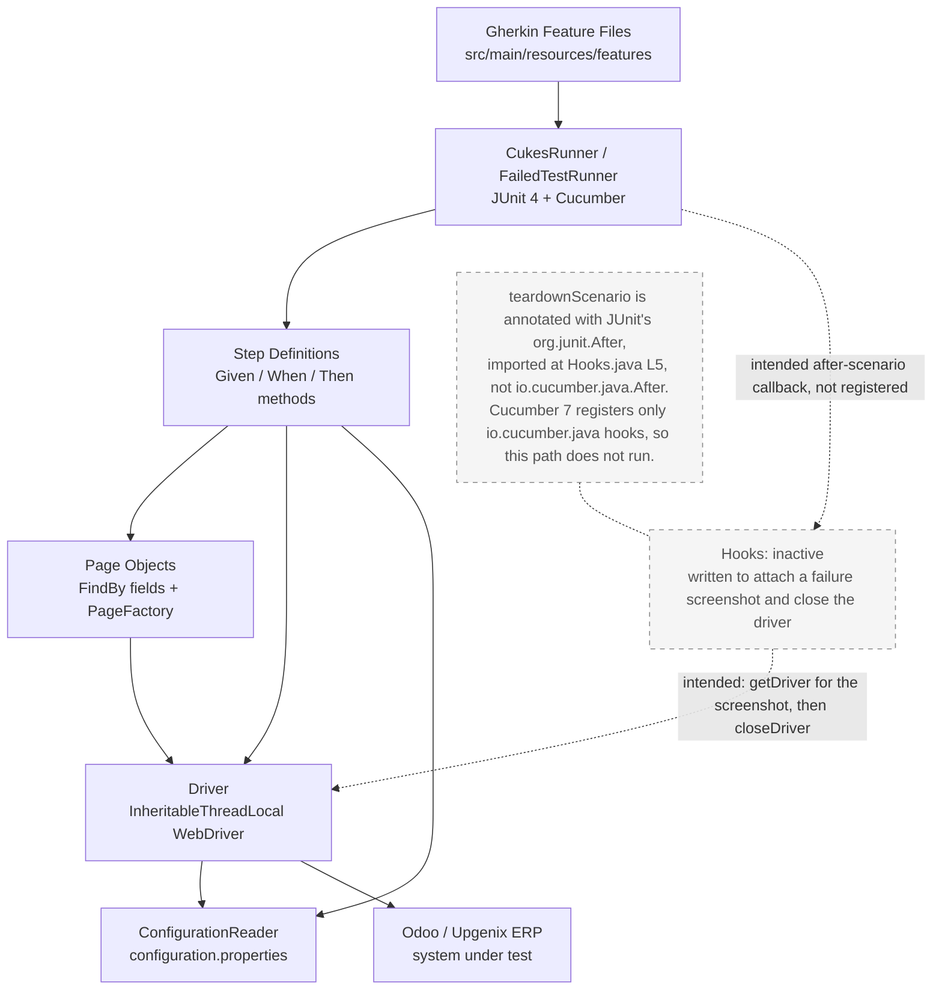
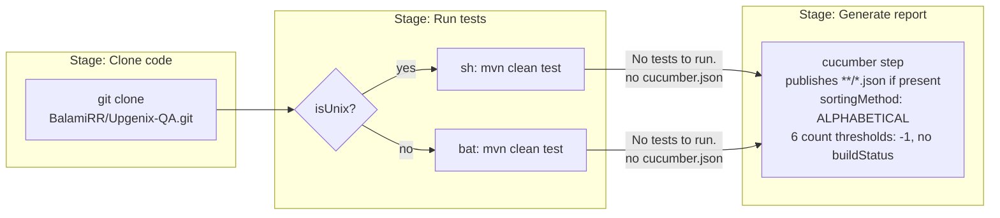
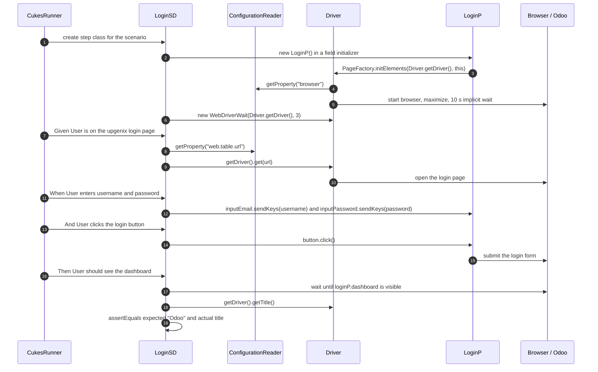
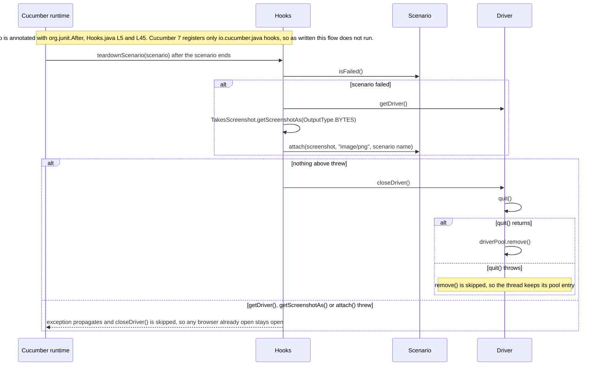
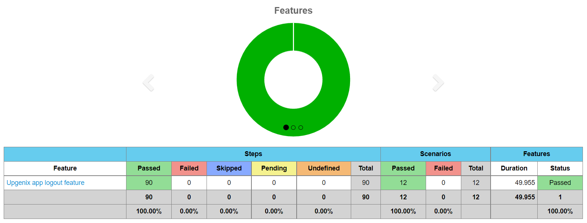
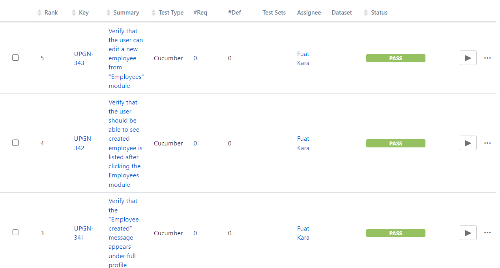

 # :fallen_leaf: :leaves: Testinium-QA :leaves: :fallen_leaf:
Automating the Testinium browser  (JAVA, Selenium, Cucumber, JUnit, Jira, Jenkins)

## Tools

<p align="left"> 

<a href="https://www.java.com" target="_blank" rel="noreferrer"> 
   
</a> 

<a href="https://www.selenium.dev" target="_blank" rel="noreferrer">
   
</a>    

<a href="https://cucumber.io/" target="_blank" rel="noreferrer">
  
</a>

<a href="https://junit.org/junit4/" rel="noreferrer">
  
</a> 
<a href="https://www.atlassian.com/software/jira" rel="noreferrer">
  
</a> 
<a href="https://www.jenkins.io/" rel="noreferrer">
  
</a> 
</p>

* JAVA
* SELENIUM
* CUCUMBER
* JUNIT
* JIRA
* JENKINS

## Overview

This repository contains `Testinium-QA`, a single Java 8 Maven module (`org.example:testinium-qa`) that implements a
Selenium WebDriver and Cucumber BDD UI test-automation framework. It demonstrates how to develop automation scripts
with the Cucumber BDD framework, using Java as the programming language. Each `CukesRunner` run writes an HTML report,
a JSON report and a PrettyReports HTML site, plus a plain-text list of the failed scenarios (`target/rerun.txt`) that
`FailedTestRunner` replays. Screenshots are limited to failures: the `Hooks` class is written to attach an `error shot`
to each failed scenario, and no code path captures screenshots of passing scenarios. That hook is currently not
registered by Cucumber, so today no screenshot is taken at all (see [Known Findings](#known-findings)).
Source: `pom.xml:L7-L14`; `src/main/java/com/testinium/runners/CukesRunner.java:L39-L44`;
`src/main/java/com/testinium/runners/FailedTestRunner.java:L38`; `src/main/java/com/testinium/step_definitions/Hooks.java:L5`,
`L45-L52`

The framework drives the web UI of an **Odoo/Upgenix ERP** instance (the system under test) through Selenium WebDriver.
It exposes no HTTP/REST endpoints: its API is the Java framework itself (utilities, runners, Page Objects, Step
Definitions) and the Gherkin step vocabulary, both documented in the [API Reference](#api-reference). Every Java class
also carries Javadoc in source.

| Item | Value | Source |
|------|-------|--------|
| Build | Maven, single module `org.example:testinium-qa:1.0-SNAPSHOT`, Java 8 source/target | `pom.xml:L7-L14` |
| UI automation | Selenium Java 3.141.59, WebDriverManager 5.1.0 | `pom.xml:L36-L46` |
| BDD and test runner | Cucumber Java 7.2.3, Cucumber JUnit 7.3.4 (effective version, see [Known Findings](#known-findings)), JUnit 4.13.2 | `pom.xml:L54-L80` |
| Reporting | Cucumber HTML, JSON and rerun plugins, PrettyReports (`me.jvt.cucumber:reporting-plugin` 7.2.0) | `pom.xml:L66-L70`; `src/main/java/com/testinium/runners/CukesRunner.java:L39-L44` |
| Test data library | JavaFaker 1.0.2 (declared, not referenced by the current sources) | `pom.xml:L48-L52` |
| System under test | Odoo/Upgenix ERP web UI; after login the page title is asserted to equal `Odoo` | `src/main/java/com/testinium/step_definitions/LoginSD.java:L96-L102` |
| CI | Jenkins scripted pipeline in the `Jenkins` file | `Jenkins:L1-L17` |

## Table of Contents

- [Tools](#tools)
- [Overview](#overview)
- [Architecture](#architecture)
- [Prerequisites](#prerequisites)
- [Setup & Configuration](#setup--configuration)
  - [Clone the Repository](#clone-the-repository)
  - [Build](#build)
  - [Create `configuration.properties`](#create-configurationproperties)
- [Running Tests](#running-tests)
  - [How Execution Works Today](#how-execution-works-today)
  - [Run from IntelliJ](#run-from-intellij)
  - [Run from the Command Line](#run-from-the-command-line)
  - [Configured Maven Command](#configured-maven-command)
  - [Run a Tag Subset](#run-a-tag-subset)
  - [Rerun Failed Scenarios](#rerun-failed-scenarios)
  - [Dry Run](#dry-run)
  - [Report Output](#report-output)
- [API Reference](#api-reference)
  - [Utilities](#utilities)
    - [`Driver`](#driver)
    - [`ConfigurationReader`](#configurationreader)
  - [Runners](#runners)
    - [`CukesRunner`](#cukesrunner)
    - [`FailedTestRunner`](#failedtestrunner)
  - [Hooks](#hooks)
  - [Page Objects](#page-objects)
  - [Step Definitions](#step-definitions)
    - [`Calendar`](#calendar)
    - [`Contacts`](#contacts)
    - [`Crm`](#crm)
    - [`EmployeeStage`](#employeestage)
    - [`Inventory`](#inventory)
    - [`LoginSD`](#loginsd)
    - [`LogOutSD`](#logoutsd)
    - [`Notes`](#notes)
    - [`Sales`](#sales)
    - [`Session`](#session)
  - [Gherkin Feature Catalog](#gherkin-feature-catalog)
  - [Writing Scenarios with Cucumber BDD](#writing-scenarios-with-cucumber-bdd)
- [Deployment & CI](#deployment--ci)
  - [Jenkins Pipeline](#jenkins-pipeline)
  - [Setting Up the Jenkins Job](#setting-up-the-jenkins-job)
  - [Report Artifacts](#report-artifacts)
  - [CI Caveats](#ci-caveats)
- [Inline Code Explanations](#inline-code-explanations)
  - [Thread-Local WebDriver: `Driver`](#thread-local-webdriver-driver)
  - [Externalized Configuration: `ConfigurationReader`](#externalized-configuration-configurationreader)
  - [Step Definition Anatomy: `LoginSD`](#step-definition-anatomy-loginsd)
  - [Failure Hook: `Hooks.teardownScenario`](#failure-hook-hooksteardownscenario)
  - [Page Object Construction with `PageFactory`](#page-object-construction-with-pagefactory)
  - [Login Flow Sequence](#login-flow-sequence)
  - [Failure Hook Sequence](#failure-hook-sequence)
- [Reports](#reports)
  - [Jenkins Cucumber Reports](#jenkins-cucumber-reports)
  - [HTML Report](#html-report)
  - [Failed-Scenario Rerun List](#failed-scenario-rerun-list)
  - [Jira Test Execution](#jira-test-execution)
- [Project Structure](#project-structure)
- [Known Findings & Troubleshooting](#known-findings--troubleshooting)
  - [Known Findings](#known-findings)
  - [Troubleshooting](#troubleshooting)

## Architecture

The framework combines the Page Object Model (POM) with Cucumber BDD. Gherkin feature files describe behavior, a
JUnit 4 runner hands execution to Cucumber, step definitions translate each Gherkin step into Selenium actions on
Page Objects, and two utilities manage the browser session and the external configuration.


```mermaid
flowchart TB
    Feature["Gherkin Feature Files<br/>src/main/resources/features"] --> Runner["CukesRunner / FailedTestRunner<br/>JUnit 4 + Cucumber"]
    Runner --> Steps["Step Definitions<br/>Given / When / Then methods"]
    Steps --> Pages["Page Objects<br/>FindBy fields + PageFactory"]
    Steps --> Driver
    Pages --> Driver["Driver<br/>InheritableThreadLocal WebDriver"]
    Driver --> Config["ConfigurationReader<br/>configuration.properties"]
    Steps --> Config
    Driver --> SUT["Odoo / Upgenix ERP<br/>system under test"]
    Runner -.->|"intended after-scenario callback, not registered"| Hooks["Hooks: inactive<br/>written to attach a failure screenshot and close the driver"]
    Hooks -.->|"intended: getDriver for the screenshot, then closeDriver"| Driver
    HookNote["teardownScenario is annotated with JUnit's org.junit.After,<br/>imported at Hooks.java L5, not io.cucumber.java.After.<br/>Cucumber 7 registers only io.cucumber.java hooks, so this path does not run."] -.- Hooks
    classDef inactive fill:#f5f5f5,stroke:#888,stroke-dasharray:5 5,color:#555
    class Hooks,HookNote inactive
```

| Layer | Package / location | Responsibility | Source |
|-------|--------------------|----------------|--------|
| Feature | `src/main/resources/features` (10 files) | Gherkin scenarios for the ERP modules under test | The ten `Feature:` lines under `src/main/resources/features/`: `Calendar.feature:L2`, `Contact.feature:L1`, `Crm.feature:L2`, `EmployeeFc.feature:L2`, `Inventory.feature:L1`, `Login.feature:L2`, `Logout.feature:L2`, `Notes.feature:L1`, `Sales.feature:L1`, `Session.feature:L1`; scanned folder: `src/main/java/com/testinium/runners/CukesRunner.java:L45` |
| Runner | `com.testinium.runners` | JUnit 4 entry points: `@RunWith(Cucumber.class)` plus `@CucumberOptions` (features, glue, tags, report plugins) | `src/main/java/com/testinium/runners/CukesRunner.java:L37-L51`; `src/main/java/com/testinium/runners/FailedTestRunner.java:L35-L40` |
| Step Definition | `com.testinium.step_definitions` (glue) | Binds each Gherkin step to a Java method; navigates, waits and asserts | `src/main/java/com/testinium/runners/CukesRunner.java:L46` |
| Hook | `com.testinium.step_definitions.Hooks` | Written to attach a screenshot to failed scenarios and close the driver | `src/main/java/com/testinium/step_definitions/Hooks.java:L45-L52` |
| Page Object | `com.testinium.pages` (10 classes) | `@FindBy` element containers initialized with `PageFactory`; no waits or assertions | The ten class declarations under `src/main/java/com/testinium/pages/`: `CalendarP.java:L16`, `ContactsP.java:L16`, `CrmP.java:L17`, `EmployeeP.java:L18`, `InventoryP.java:L17`, `LogOutP.java:L16`, `LoginP.java:L16`, `NotesP.java:L16`, `SalesP.java:L20`, `SessionP.java:L17`; constructor and `@FindBy` fields, for example: `src/main/java/com/testinium/pages/LoginP.java:L25-L55` |
| Utility | `com.testinium.utilities` | `Driver` (one WebDriver per thread; a child thread shares the driver its parent held when the child was created) and `ConfigurationReader` (`configuration.properties` accessor) | `src/main/java/com/testinium/utilities/Driver.java:L34-L125`; `src/main/java/com/testinium/utilities/ConfigurationReader.java:L41-L72` |
| System under test | external | Odoo/Upgenix ERP web application reached at the configured URLs | `src/main/java/com/testinium/step_definitions/LoginSD.java:L46-L51` |

Execution order for one scenario:

1. The runner collects the feature files under `features` and keeps the scenarios matching `tags`
   (Source: `src/main/java/com/testinium/runners/CukesRunner.java:L45` (features), `L48` (tags)).
2. Cucumber matches every step's text against the `@Given`/`@When`/`@Then`/`@And` expressions in the glue package
   (Source: `src/main/java/com/testinium/runners/CukesRunner.java:L46`).
3. The step class is instantiated for the scenario. Its field initializers create its Page Object (two in `Notes`) and,
   in every step class except `Session`, a `WebDriverWait`. Each calls `Driver.getDriver()`, which reuses the thread's
   open browser, for example one opened by the `Session` login step or left open by an earlier scenario, because the
   unregistered hook never closes it. If the thread has none, a browser starts only when `browser` is `chrome` or
   `firefox`: a missing key or file makes instantiation throw `NullPointerException`, and any other value yields a
   `null` driver, so the `WebDriverWait` constructor or the first element use throws one
   (Source: `src/main/java/com/testinium/step_definitions/LoginSD.java:L34-L36`;
   `src/main/java/com/testinium/step_definitions/Session.java:L30`; `src/main/java/com/testinium/utilities/Driver.java:L82`, `L87-L104`).
4. When the thread has no driver, `Driver.getDriver()` reads `browser` through `ConfigurationReader` and creates the
   WebDriver for the current thread (Source: `src/main/java/com/testinium/utilities/Driver.java:L81-L105`).
5. Step methods act on Page Object elements and assert on the resulting page
   (Source: `src/main/java/com/testinium/step_definitions/LoginSD.java:L96-L102`).

## Prerequisites

Required to build the project and to run a [dry run](#dry-run), which executes no step and opens no browser:

1. JDK 1.8+ (the compiler source and target are Java 8). Source: `pom.xml:L11-L14`
2. Maven 3.6.3 or a later 3.x release (tested with Maven 3.9.16). The pom pins no `maven-dependency-plugin` version,
   so the `dependency:build-classpath` goal used in [Run from the Command Line](#run-from-the-command-line) and the
   [API Reference](#api-reference) runs the version that the super-POM of your Maven release sets: 3.7.0 under 3.9.16.
   That plugin requires Maven 3.6.3, the plugin baseline of Apache's
   [Maven compatibility plan](https://maven.apache.org/developers/compatibility-plan.html).
   Source: `pom.xml:L15-L32` (no `maven-dependency-plugin` entry); Maven 3.9.16 super-POM
   [`pom-4.0.0.xml:L80-L83`](https://github.com/apache/maven/blob/maven-3.9.16/maven-model-builder/src/main/resources/org/apache/maven/model/pom-4.0.0.xml#L80-L83)
   (`maven-dependency-plugin` 3.7.0); maven-dependency-plugin 3.7.0
   [`pom.xml:L64-L66`](https://github.com/apache/maven-dependency-plugin/blob/maven-dependency-plugin-3.7.0/pom.xml#L64-L66)
   (`<prerequisites>`) and [`L90`](https://github.com/apache/maven-dependency-plugin/blob/maven-dependency-plugin-3.7.0/pom.xml#L90)
   (`mavenVersion` 3.6.3)
    - To run exactly that plugin with any 3.6.3+ release, replace `dependency:build-classpath` in those commands with
      `org.apache.maven.plugins:maven-dependency-plugin:3.7.0:build-classpath`.
    - Maven 4 release candidates are not covered: they need Java 17 to run, and this project uses JDK 8. The
      4.0.0-rc-7 launcher stops on an older JDK with `Error: Apache Maven 4.x requires Java 17 or newer to run.`
      Source: Maven 4.0.0-rc-7
      [`apache-maven/src/assembly/maven/bin/mvn:L110-L114`](https://github.com/apache/maven/blob/maven-4.0.0-rc-7/apache-maven/src/assembly/maven/bin/mvn#L110-L114)
      and [`pom.xml:L131`](https://github.com/apache/maven/blob/maven-4.0.0-rc-7/pom.xml#L131) (`javaVersion` 17)
3. Access to a Maven artifact repository for the first build, which downloads the declared dependencies and the Maven
   plugins. The pom declares no `<repositories>`, so Maven uses Maven Central (`https://repo.maven.apache.org/maven2`)
   unless `settings.xml` routes it through an approved [mirror](https://maven.apache.org/guides/mini/guide-mirror-settings.html).
   Without that access, use a prewarmed local repository (`~/.m2/repository`) and pass `-o` (offline) to every `mvn`
   command. Source: `pom.xml:L1-L82`; `pom.xml:L34-L81`

Additionally required for live runs, which drive a browser against the system under test:

4. Google Chrome or Mozilla Firefox installed locally. You do not need to download a driver or set a driver class
   path: WebDriverManager 5.1.0 provisions the driver binary at runtime through
   `WebDriverManager.chromedriver().setup()`. The Firefox branch also calls the chromedriver setup, see
   [Known Findings](#known-findings). Source: `pom.xml:L42-L46`; `src/main/java/com/testinium/utilities/Driver.java:L90-L101`
5. Network access to the Odoo/Upgenix instance under test, and to the driver download hosts that WebDriverManager
   contacts when it resolves a driver.

Optional, for IDE use only. [Run from the Command Line](#run-from-the-command-line) needs no IDE:

- IntelliJ
- IntelliJ Plugins for
    - Maven
    - Cucumber for Java (with Gherkin)

## Setup & Configuration

Preparing a working copy takes three steps: clone the repository, compile it with Maven, and create the untracked
`configuration.properties` file in the project root. That file supplies the browser, the login URLs, the shared login
account and the expected Employees page title that the tests read at run time.
Source: `src/main/java/com/testinium/utilities/ConfigurationReader.java:L46`

### Clone the Repository

Git:

```bash
git clone https://github.com/BalamiRR/Testinium-QA.git
cd Testinium-QA
```

Manually:

Fork / Clone repository from [here](https://github.com/BalamiRR/Testinium-QA/archive/main.zip) or download zip and set
it up in your local workspace. In IntelliJ, open `pom.xml` as a project so the Maven dependencies are imported.

> **Note (CI remote):** the Jenkins pipeline clones `https://github.com/BalamiRR/Upgenix-QA.git`, not the
> `Testinium-QA` URL above. Point your Jenkins job at the repository you actually build.
> Source: `Jenkins:L2-L4`. See [Known Findings](#known-findings), item 2.

### Build

```bash
mvn -B clean test-compile
```

Compiles the 25 classes under `src/main/java` and copies the feature files to `target/classes`. The build succeeds
with expected warnings: the duplicate `cucumber-junit` declaration (see [Known Findings](#known-findings), item 1),
and the platform-encoding warnings (`Using platform encoding ...`, `File encoding has not been set ...`), because the
pom sets no `project.build.sourceEncoding`.
Source: `pom.xml:L11-L14`; `pom.xml:L60-L65`; `pom.xml:L76-L80`

> **Note:** a snapshot of `target/` (compiled classes and the reports of an earlier run) is committed to the
> repository, so any Maven build shows modified or deleted files under `target/` in `git status`. If you do not intend
> to commit them, first review `git status --short -- target` and copy any report you want to keep out of `target/`,
> because both cleanup options below discard output:
>
> - Tracked files only: `git restore --source=HEAD --worktree -- target` overwrites every tracked file under `target/`
>   with the committed snapshot, including reports that a run regenerates, such as `target/cucumber-reports.html`,
>   `target/cucumber.json` and `target/rerun.txt`. Untracked output, such as `target/classpath.txt` and new `.class`
>   files, is kept.
> - Full reset: appending `&& git clean -fdq -- target` also **permanently deletes** every untracked file and
>   directory under `target/` that no ignore rule matches. Preview what it would remove with `git clean -nd -- target`.
>
> Source: `git ls-files -- target | wc -l` prints `45` (the tracked snapshot); Maven 3.9.16 super-POM
> [`pom-4.0.0.xml:L51-L52`](https://github.com/apache/maven/blob/maven-3.9.16/maven-model-builder/src/main/resources/org/apache/maven/model/pom-4.0.0.xml#L51-L52)
> (a build writes to `target/` and `target/classes`); Git 2.51.0 `git restore`
> [description](https://git-scm.com/docs/git-restore/2.51.0#_description),
> [`--source`](https://git-scm.com/docs/git-restore/2.51.0#Documentation/git-restore.txt---sourcetree) and
> [`--worktree`](https://git-scm.com/docs/git-restore/2.51.0#Documentation/git-restore.txt---worktree) (restores the
> tracked paths from the given tree into the working tree; untracked files are not touched); Git 2.45.0 `git clean`
> [description](https://git-scm.com/docs/git-clean/2.45.0#_description) (removes files not under version control,
> ignored ones only with `-x`), [`-f`](https://git-scm.com/docs/git-clean/2.45.0#Documentation/git-clean.txt--f),
> [`-d`](https://git-scm.com/docs/git-clean/2.45.0#Documentation/git-clean.txt--d),
> [`-n`](https://git-scm.com/docs/git-clean/2.45.0#Documentation/git-clean.txt--n) and
> [`-q`](https://git-scm.com/docs/git-clean/2.45.0#Documentation/git-clean.txt--q);
> `src/main/java/com/testinium/runners/CukesRunner.java:L39-L44` (the report outputs that a run regenerates)

### Create `configuration.properties`

`ConfigurationReader` loads `configuration.properties` once, in a static initializer, with
`new FileInputStream("configuration.properties")`. That path is resolved against the JVM working directory. The file
is **not committed**: create it in the **project root** (next to `pom.xml`) and run the tests with the project root as
the working directory. Source: `src/main/java/com/testinium/utilities/ConfigurationReader.java:L43-L57`

If the file is missing, the console prints `File is not found in the ConfigurationReader class` and a stack trace. The
class still loads, every `getProperty` call returns `null`, and the first `Driver.getDriver()` call fails with a
`NullPointerException` at its `switch`. Source: `src/main/java/com/testinium/utilities/ConfigurationReader.java:L53-L56`;
`src/main/java/com/testinium/utilities/ConfigurationReader.java:L70-L72`; `src/main/java/com/testinium/utilities/Driver.java:L87-L89`

Values follow `java.util.Properties` escaping, so write a literal backslash as `\\` (or use `/` in paths). A `\u` that is
not followed by four hex digits, such as an unescaped Windows path like `C:\users\...`, makes `properties.load` throw
an `IllegalArgumentException`. The initializer catches only `IOException`, so the class fails to initialize
(`ExceptionInInitializerError`), and every later use throws
`NoClassDefFoundError: Could not initialize class com.testinium.utilities.ConfigurationReader`.
Source: `src/main/java/com/testinium/utilities/ConfigurationReader.java:L49`, `L53`

| Key | Used by (Source) | Purpose | Example (placeholder) |
|-----|------------------|---------|-----------------------|
| `browser` | `Driver.getDriver()`: `src/main/java/com/testinium/utilities/Driver.java:L87` | Browser to launch. Supported values are `chrome` (L90) and `firefox` (L96); the match is case-sensitive | `chrome` |
| `web.table.url` | `src/main/java/com/testinium/step_definitions/LoginSD.java:L49`; `src/main/java/com/testinium/step_definitions/Session.java:L49`; `src/main/java/com/testinium/step_definitions/EmployeeStage.java:L56` | Login page URL opened by the login steps | `https://<your-odoo-host>/web/login` |
| `username` | `src/main/java/com/testinium/step_definitions/Session.java:L50` | Login of the shared account typed by the step `User login to test other features` | `<username>` |
| `password` | `src/main/java/com/testinium/step_definitions/Session.java:L51` | Password of that shared account | `<password>` |
| `url` | `src/main/java/com/testinium/step_definitions/EmployeeStage.java:L68`, `L141`, `L215` | Start URL of the Employees flow. It must show the login form, because `EmployeeP.login()` fills that form next | `https://<your-odoo-host>/web/login` |
| `EmplTitle` | `src/main/java/com/testinium/step_definitions/EmployeeStage.java:L82` | Page title awaited after clicking Employees. The next line asserts the hard-coded title `Employees - Odoo` (L83), so use that value | `Employees - Odoo` |

```properties
# configuration.properties: create it in the project root and never commit it.
browser=chrome
web.table.url=https://<your-odoo-host>/web/login
url=https://<your-odoo-host>/web/login
username=<username>
password=<password>
EmplTitle=Employees - Odoo
```

Only the shared login step reads `username` and `password`. The Login and Logout scenarios take their accounts from
the `Examples` tables of their feature files, and `EmployeeP.login()` types an account hard-coded in the Page Object
(see [Known Findings](#known-findings), item 7). Source: `src/main/java/com/testinium/step_definitions/Session.java:L47-L53`;
`src/main/resources/features/Login.feature:L20-L22`; `src/main/java/com/testinium/pages/EmployeeP.java:L99-L103`

> The repository has no `.gitignore`. Check `git status` before every commit so that `configuration.properties` and
> its credentials are never committed.
> Source: `git ls-files -- .gitignore` and `git ls-files -- configuration.properties` print nothing (neither file is
> tracked); `src/main/java/com/testinium/utilities/ConfigurationReader.java:L46` (the file is opened relative to the
> working directory, the project root)

## Running Tests

Scenarios run through two JUnit 4 classes: `CukesRunner` executes the scenarios of the feature directory that match its
`@Smoke` tag filter and writes the reports, and `FailedTestRunner` replays the scenarios that failed in the previous
`CukesRunner` run. The subsections explain which launch modes execute scenarios today, then cover the IDE and JUnit
command-line launches, the configured Maven command, tag subsets, reruns, dry runs and additional report output.
Source: `src/main/java/com/testinium/runners/CukesRunner.java:L37-L48`;
`src/main/java/com/testinium/runners/FailedTestRunner.java:L35-L40`

### How Execution Works Today

Both runners are compiled from `src/main/java` into `target/classes`. Maven Surefire scans only compiled **test**
classes (`target/test-classes`, built from `src/test/java`, which this project does not have). So `mvn test` compiles
the project and then reports `No tests to run.`, and no scenario executes, even though Surefire's include pattern
names `**/CukesRunner*.java`. Run the suite from the IDE or with JUnit's command-line runner as shown below.
Source: `pom.xml:L17-L30`; `src/main/java/com/testinium/runners/FailedTestRunner.java:L30-L33`.
See [Known Findings](#known-findings), item 6.

| Mode | Command | Runs scenarios today |
|------|---------|----------------------|
| IDE | Right-click `CukesRunner`, then **Run** | Yes |
| Command line | `java ... org.junit.runner.JUnitCore com.testinium.runners.CukesRunner` | Yes |
| Maven / Jenkins | `mvn clean test` | No: `No tests to run.` |

### Run from IntelliJ

Right-click `src/main/java/com/testinium/runners/CukesRunner.java`, then choose **Run 'CukesRunner'**. IntelliJ runs
the class as a JUnit test wherever its source folder is. Keep the run configuration's working directory at the project
root so that `configuration.properties` and `src/main/resources/features` resolve. Add Cucumber properties such as
`-Dcucumber.filter.tags="@Login"` to the run configuration's **VM options**.
Source: `src/main/java/com/testinium/runners/CukesRunner.java:L37-L51`; `src/main/java/com/testinium/utilities/ConfigurationReader.java:L46`

### Run from the Command Line

Compile the project and write the dependency classpath to a file, then start the runner with JUnit 4 from the project
root. Without extra options this runs the default `@Smoke` selection: the 4 scenarios of `Crm.feature`.

```bash
mvn -B clean compile dependency:build-classpath -Dmdep.outputFile=target/classpath.txt
java -cp "target/classes:$(cat target/classpath.txt)" org.junit.runner.JUnitCore com.testinium.runners.CukesRunner
```

On Windows, run these commands from PowerShell: `cmd.exe` has no `$(...)` command substitution, so it cannot run them.
PowerShell expands [`$( )`](https://learn.microsoft.com/en-us/powershell/module/microsoft.powershell.core/about/about_operators)
inside the quoted classpath. Use `;` as the classpath separator, the
[separator](https://maven.apache.org/plugins/maven-dependency-plugin/build-classpath-mojo.html#pathSeparator) that
`build-classpath` also writes into `target/classpath.txt` on Windows, and quote each `-D` argument as a whole,
because PowerShell splits an unquoted argument that starts with `-` at its first `.`
([PowerShell issue #6291](https://github.com/PowerShell/PowerShell/issues/6291)):

```powershell
mvn -B clean compile dependency:build-classpath "-Dmdep.outputFile=target/classpath.txt"
java -cp "target/classes;$(Get-Content target/classpath.txt)" org.junit.runner.JUnitCore com.testinium.runners.CukesRunner
```

The other `java` and `mvn` commands in this README take the same changes in PowerShell: `;` after `target/classes`
in each `java` classpath, and each `-D` argument quoted as a whole, for example
`"-Dcucumber.filter.tags=@Smoke or not @Smoke"`.
Their `$(cat target/classpath.txt)` can stay, because PowerShell on Windows defines `cat` as an alias of
[`Get-Content`](https://learn.microsoft.com/en-us/powershell/module/microsoft.powershell.management/get-content).

JUnit prints `OK (<n> tests)` or the list of failures.
Source: `src/main/java/com/testinium/runners/CukesRunner.java:L48` (`tags = "@Smoke"`);
`src/main/resources/features/Crm.feature:L1` (the only `@Smoke` tag, see the tag table in
[Run a Tag Subset](#run-a-tag-subset)); `src/main/resources/features/Crm.feature:L9`, `L16`, `L26`, `L31` (the four
scenario headings; the `L16` outline has a single `Examples` row, `L24`)

### Configured Maven Command

This is the command that the Jenkins `Run tests` stage executes.

```bash
mvn clean test
```

Surefire is configured with `parallel=methods` and `useUnlimitedThreads=true` (L22-L23), `testFailureIgnore=true`
(L25), so failed tests do not fail the build, and an include pattern of `**/CukesRunner*.java` (L27). In the current
layout it ends with `No tests to run.` and `BUILD SUCCESS`, see [How Execution Works Today](#how-execution-works-today).
Source: `pom.xml:L17-L30`; `Jenkins:L6-L12`

### Run a Tag Subset

Pass a Cucumber tag expression in `cucumber.filter.tags`. It replaces `tags = "@Smoke"` from `CukesRunner`.

```bash
java -Dcucumber.filter.tags="@Login" -cp "target/classes:$(cat target/classpath.txt)" org.junit.runner.JUnitCore com.testinium.runners.CukesRunner
```

The Maven form, `mvn clean test -Dcucumber.filter.tags="@Login"`, passes the same property, but it runs nothing until
Surefire can see the runner. Source: `src/main/java/com/testinium/runners/CukesRunner.java:L48`

| Tag | Level | Where (Source) |
|-----|-------|----------------|
| `@Smoke` | Feature | `src/main/resources/features/Crm.feature:L1` (the default runner selection) |
| `@Login` | Feature | `src/main/resources/features/Login.feature:L1` |
| `@LogOut` | Feature | `src/main/resources/features/Logout.feature:L1` |
| `@Calendar` | Feature | `src/main/resources/features/Calendar.feature:L1` |
| `@UPGN-344` | Feature | `src/main/resources/features/EmployeeFc.feature:L1` |
| `@UPGN-340` … `@UPGN-343` | Scenario | `src/main/resources/features/EmployeeFc.feature:L7`, `L15`, `L25`, `L35` |
| `@UPGN-286` … `@UPGN-290` | Scenario Outline | `src/main/resources/features/Login.feature:L13`, `L58`, `L85`, `L105`, `L122` |
| `@UPGN-291`, `@UPGN-292` | Scenario Outline | `src/main/resources/features/Logout.feature:L13`, `L37` |
| `@SalesManager`, `@PosManager` | Examples | `src/main/resources/features/Login.feature`, `src/main/resources/features/Logout.feature` |

`Contact.feature`, `Inventory.feature`, `Notes.feature`, `Sales.feature` and `Session.feature` carry no tag. Combine
tags with `and`, `or`, `not` and parentheses:

| Expression | Selects |
|------------|---------|
| `"@Login and @SalesManager"` | Login outlines, SalesManager example rows only |
| `"@Login and not @PosManager"` | The same rows, written as an exclusion (23 scenarios) |
| `"@Smoke or @Calendar"` | `Crm.feature` and `Calendar.feature` |
| `"not @LogOut"` | Every scenario except `Logout.feature` |
| `"@Smoke or not @Smoke"` | Every scenario (87 in total), including the untagged features |

Source: the 23 scenarios are the `@SalesManager` `Examples` rows of `Login.feature` (13 + 5 + 1 + 1 + 3, at
`src/main/resources/features/Login.feature:L23-L35`, `L68-L72`, `L94`, `L113`, `L133-L135`), and the 87 are the Runs
total of the scenario index in [Gherkin Feature Catalog](#gherkin-feature-catalog).

To run one feature file, override `cucumber.features` as well. The annotation's `@Smoke` filter still applies unless
you also override the tags:

```bash
java -Dcucumber.features=src/main/resources/features/Notes.feature -Dcucumber.filter.tags="@Smoke or not @Smoke" -cp "target/classes:$(cat target/classpath.txt)" org.junit.runner.JUnitCore com.testinium.runners.CukesRunner
```

### Rerun Failed Scenarios

`CukesRunner`'s `rerun:target/rerun.txt` plugin writes the `path:line` location of every failed scenario.
`FailedTestRunner` reads that file through `features = "@target/rerun.txt"` and runs only those scenarios.

```bash
java -cp "target/classes:$(cat target/classpath.txt)" org.junit.runner.JUnitCore com.testinium.runners.FailedTestRunner
```

Run it after a `CukesRunner` run, from the project root, and without `mvn clean` in between, because `clean` deletes
`target/rerun.txt`. From the IDE, right-click `FailedTestRunner`, then **Run**. `mvn test -Dtest=FailedTestRunner`
stops with `No tests were executed!`, because Surefire does not see the class.
Source: `src/main/java/com/testinium/runners/CukesRunner.java:L42`; `src/main/java/com/testinium/runners/FailedTestRunner.java:L35-L40`;
`src/main/java/com/testinium/runners/FailedTestRunner.java:L30-L33`

### Dry Run

`dryRun = false` makes Cucumber execute every step. A dry run only checks that every Gherkin step has a matching step
definition. It executes no step, so it opens no browser and needs no `configuration.properties`. Enable it with the
`cucumber.execution.dry-run` property, or by setting `dryRun = true` locally in `CukesRunner`.

```bash
java -Dcucumber.execution.dry-run=true -Dcucumber.filter.tags="@Smoke or not @Smoke" -cp "target/classes:$(cat target/classpath.txt)" org.junit.runner.JUnitCore com.testinium.runners.CukesRunner
```

With every feature selected, the dry run reports `OK (87 tests)`. An unmatched step fails its scenario with an
`UndefinedStepException` that prints a snippet for the missing step definition.
Source: `src/main/java/com/testinium/runners/CukesRunner.java:L47` (`dryRun = false`); the 87 tests are the sum of
the Runs column of the scenario index in [Gherkin Feature Catalog](#gherkin-feature-catalog); undefined steps:
cucumber-junit 7.3.4 (the effective version, `pom.xml:L76-L80`) records an `UndefinedStepException` for an
`UNDEFINED` step result in
[`JUnitReporter.java:L121-L123`](https://github.com/cucumber/cucumber-jvm/blob/v7.3.4/junit/src/main/java/io/cucumber/junit/JUnitReporter.java#L121-L123)
and builds its message, with the snippet, in
[`UndefinedStepException.java:L16-L41`](https://github.com/cucumber/cucumber-jvm/blob/v7.3.4/junit/src/main/java/io/cucumber/junit/UndefinedStepException.java#L16-L41)

### Report Output

Every `CukesRunner` run already writes the four report artifacts configured in its `plugin` list, so no option is
needed to get them, see [Report Artifacts](#report-artifacts). To write an **additional** output, pass the Cucumber 7
property `cucumber.plugin` with a plugin or path that the annotation does not list. Cucumber adds it to the
annotation's plugins and still writes the four configured artifacts. This run also writes a JUnit XML report of the
selected scenarios to `target/cucumber-junit.xml`:

```bash
java -Dcucumber.plugin="junit:target/cucumber-junit.xml" -cp "target/classes:$(cat target/classpath.txt)" org.junit.runner.JUnitCore com.testinium.runners.CukesRunner
```

Cucumber builds the runtime options in layers: a `cucumber.properties` file (this project has none), the
`@CucumberOptions` annotation, environment variables, then JVM system properties such as `cucumber.plugin`. Each layer
adds its plugins to those of the layer before, into an insertion-ordered set in which two entries are equal when they
have the same plugin class and the same argument. Repeating an annotation entry, such as
`html:target/cucumber-reports.html`, therefore adds no report.
Source: `src/main/java/com/testinium/runners/CukesRunner.java:L39-L44` (the configured entries); cucumber-junit 7.3.4
[`Cucumber.java:L114-L130`](https://github.com/cucumber/cucumber-jvm/blob/v7.3.4/junit/src/main/java/io/cucumber/junit/Cucumber.java#L114-L130)
(each layer is built on the previous one); cucumber-core 7.2.3
[`RuntimeOptionsBuilder.java:L129`](https://github.com/cucumber/cucumber-jvm/blob/v7.2.3/core/src/main/java/io/cucumber/core/options/RuntimeOptionsBuilder.java#L129)
(adds the layer's plugins to the earlier options),
[`RuntimeOptions.java:L42`](https://github.com/cucumber/cucumber-jvm/blob/v7.2.3/core/src/main/java/io/cucumber/core/options/RuntimeOptions.java#L42)
(`LinkedHashSet`) and
[`L80-L82`](https://github.com/cucumber/cucumber-jvm/blob/v7.2.3/core/src/main/java/io/cucumber/core/options/RuntimeOptions.java#L80-L82)
(`addPlugins`),
[`PluginOption.java:L207-L220`](https://github.com/cucumber/cucumber-jvm/blob/v7.2.3/core/src/main/java/io/cucumber/core/options/PluginOption.java#L207-L220)
(`equals` and `hashCode` compare the plugin class and its argument); `git ls-files -- src/main/resources` lists only
the ten feature files (no `cucumber.properties`)


## API Reference

The project exposes no HTTP/REST endpoints. Its API is the Java framework under `src/main/java/com/testinium` and the
Gherkin step vocabulary. Every class listed here is documented with Javadoc in source. To render that Javadoc as
HTML with the JDK tool (no pom change), pass the dependency classpath, otherwise `javadoc` reports
`package ... does not exist` errors:

```bash
mvn -B dependency:build-classpath -Dmdep.outputFile=target/classpath.txt
javadoc -d target/apidocs -sourcepath src/main/java -subpackages com.testinium -classpath "$(cat target/classpath.txt)"
```

Open `target/apidocs/index.html` in a browser.

Source: `pom.xml:L34-L81` (the declared dependencies are Selenium, WebDriverManager, JavaFaker, Cucumber, the reporting
plugin and JUnit; none is an HTTP server library); `git ls-files -- src/main/java` lists 25 files in the packages `pages`,
`runners`, `step_definitions` and `utilities` under `src/main/java/com/testinium`;
`src/main/resources/features/*.feature` (the Gherkin vocabulary). Class Javadoc, paths under
`src/main/java/com/testinium/`: `utilities/Driver.java:L11-L33`, `utilities/ConfigurationReader.java:L7-L37`;
`runners/CukesRunner.java:L7-L36`, `runners/FailedTestRunner.java:L8-L34`; `pages/CalendarP.java:L8-L15`,
`pages/ContactsP.java:L8-L15`, `pages/CrmP.java:L8-L16`, `pages/EmployeeP.java:L8-L17`, `pages/InventoryP.java:L8-L16`,
`pages/LogOutP.java:L8-L15`, `pages/LoginP.java:L8-L15`, `pages/NotesP.java:L8-L15`, `pages/SalesP.java:L11-L19`,
`pages/SessionP.java:L8-L16`; `step_definitions/Calendar.java:L12-L25`, `step_definitions/Contacts.java:L11-L37`,
`step_definitions/Crm.java:L14-L37`, `step_definitions/EmployeeStage.java:L12-L40`, `step_definitions/Hooks.java:L9-L26`,
`step_definitions/Inventory.java:L10-L26`, `step_definitions/LogOutSD.java:L10-L28`,
`step_definitions/LoginSD.java:L14-L30`, `step_definitions/Notes.java:L14-L32`, `step_definitions/Sales.java:L13-L38`,
`step_definitions/Session.java:L8-L26`. Classpath: the sources import pom dependencies, such as
`io.github.bonigarcia.wdm` and `org.openqa.selenium` in `src/main/java/com/testinium/utilities/Driver.java:L3-L9`,
which are not on `javadoc`'s default classpath. Run without `-classpath` with the JDK 8 `javadoc` (measured with
OpenJDK 1.8.0_492), the command above prints 39 `error: package ... does not exist` lines for the current sources,
followed by `error: cannot find symbol` lines. That `javadoc` counts these messages as warnings: its summary reads
`100 warnings`, it still writes the HTML pages, and it exits with status 0, so check its output rather than its exit
status.
JDK 8 `javadoc` option [`-classpath`](https://docs.oracle.com/javase/8/docs/technotes/tools/unix/javadoc.html#CHDGAHAJ);
maven-dependency-plugin 3.7.0
[`BuildClasspathMojo.java:L94-L98`](https://github.com/apache/maven-dependency-plugin/blob/maven-dependency-plugin-3.7.0/src/main/java/org/apache/maven/plugins/dependency/fromDependencies/BuildClasspathMojo.java#L94-L98)
(`mdep.outputFile`, the file the classpath is written to)

### Utilities

`com.testinium.utilities` holds the two classes that every scenario depends on; callers use only their static
methods. `Driver` creates, returns and closes the current thread's Selenium `WebDriver` session, which Page Objects and
step definitions obtain through `Driver.getDriver()`. `ConfigurationReader` returns values from
`configuration.properties`, including the `browser` key that `Driver` reads to choose the browser.
Source: `src/main/java/com/testinium/utilities/Driver.java:L81-L105`, `L87`, `L120-L125`;
`src/main/java/com/testinium/utilities/ConfigurationReader.java:L70-L72`

#### `Driver`

Package `com.testinium.utilities`, file [`Driver.java`](src/main/java/com/testinium/utilities/Driver.java)
(documented with Javadoc in source). The factory and lifecycle manager of the Selenium `WebDriver`, holding one
driver per thread; a child thread shares the driver its parent held when the child was created. All members are static.

| Member | Signature | Behavior | Source |
|--------|-----------|----------|--------|
| Constructor | `private Driver()` | Prevents instantiation | `Driver.java:L37-L39` |
| Field | `private static InheritableThreadLocal<WebDriver> driverPool` | One `WebDriver` per thread. A thread that inherits no entry creates its own browser. A child thread created after its parent obtained a driver inherits the same `WebDriver` object, not a copy, so parent and child share one browser session, and a `closeDriver()` on either quits it for both | `Driver.java:L42` |
| Method | `public static WebDriver getDriver()` | Creates the thread's driver lazily from the `browser` key (`chrome` or `firefox`), maximizes the window and sets a 10-second implicit wait. Later calls on the same thread return the same instance. Returns `null` for an unsupported `browser` value | `Driver.java:L81-L105` |
| Method | `public static void closeDriver()` | Calls `quit()` on the thread's driver, then `driverPool.remove()`, so the next `getDriver()` opens a fresh session. Does nothing when the thread holds no driver. There is no `finally`: if `quit()` throws, `remove()` is skipped and later `getDriver()` calls return that same driver. Its only caller is the unregistered `Hooks.teardownScenario` | `Driver.java:L120-L125` |

#### `ConfigurationReader`

Package `com.testinium.utilities`, file
[`ConfigurationReader.java`](src/main/java/com/testinium/utilities/ConfigurationReader.java) (documented with Javadoc
in source). Read-only accessor for `configuration.properties`; see
[Create `configuration.properties`](#create-configurationproperties) for the keys.

| Member | Signature | Behavior | Source |
|--------|-----------|----------|--------|
| Field | `private static Properties properties` | In-memory snapshot of the file | `ConfigurationReader.java:L41` |
| Static initializer | `static { ... }` | Loads `configuration.properties` from the working directory once, when the class is first initialized (normally by the first `getProperty` call); edits made after that are not reloaded. On an `IOException` it prints a message and the stack trace and does not rethrow. Any other exception, such as the `IllegalArgumentException` from a malformed `\uXXXX` escape, propagates and the class fails to initialize | `ConfigurationReader.java:L43-L57` |
| Method | `public static String getProperty(String keyword)` | Returns the value for `keyword`, or `null` when the key is not in the loaded snapshot: absent from the file, or lost because the file could not be opened or its read failed partway. No reload happens during a run | `ConfigurationReader.java:L70-L72` |

### Runners

`com.testinium.runners` holds the two JUnit 4 entry points. Their class bodies are empty: all behavior is declared in
`@RunWith(Cucumber.class)` and `@CucumberOptions`. `CukesRunner` runs the feature directory through the `@Smoke` filter
and writes the reports, and `FailedTestRunner` replays the scenario locations listed in `target/rerun.txt`. Both use
the same glue package, `com/testinium/step_definitions`.
Source: `src/main/java/com/testinium/runners/CukesRunner.java:L37-L55`;
`src/main/java/com/testinium/runners/FailedTestRunner.java:L35-L42`

#### `CukesRunner`

Package `com.testinium.runners`, file [`CukesRunner.java`](src/main/java/com/testinium/runners/CukesRunner.java)
(documented with Javadoc in source). The primary JUnit 4 entry point. The code below is the current source; the class
Javadoc (L7-L36) is omitted.

```java
package com.testinium.runners;

import io.cucumber.junit.Cucumber;
import io.cucumber.junit.CucumberOptions;
import org.junit.runner.RunWith;

@RunWith(Cucumber.class)
@CucumberOptions(
    plugin = {
        "html:target/cucumber-reports.html",
        "json:target/cucumber.json",
        "rerun:target/rerun.txt",
        "me.jvt.cucumber.report.PrettyReports:target/cucumber"
    },
    features = "src/main/resources/features",
    glue = "com/testinium/step_definitions",
    dryRun = false,
    tags = "@Smoke"

)
public class CukesRunner {


}
```

Source: `src/main/java/com/testinium/runners/CukesRunner.java:L1-L6`, `L37-L55`

| `@CucumberOptions` element | Value | Effect | Source |
|----------------------------|-------|--------|--------|
| `plugin` | `"html:target/cucumber-reports.html"` | Single-file HTML report | `CukesRunner.java:L40` |
| `plugin` | `"json:target/cucumber.json"` | JSON report. The Jenkins `cucumber` step is configured to publish it when present; the pipeline's `mvn clean test` produces none today (see [CI Caveats](#ci-caveats)) | `CukesRunner.java:L41` |
| `plugin` | `"rerun:target/rerun.txt"` | Locations of failed scenarios, read by `FailedTestRunner` | `CukesRunner.java:L42` |
| `plugin` | `"me.jvt.cucumber.report.PrettyReports:target/cucumber"` | PrettyReports HTML bundle under `target/cucumber/` | `CukesRunner.java:L43` |
| `features` | `"src/main/resources/features"` | Directory scanned for `.feature` files | `CukesRunner.java:L45` |
| `glue` | `"com/testinium/step_definitions"` | Package searched for step definitions and hooks | `CukesRunner.java:L46` |
| `dryRun` | `false` | Steps are executed, not only matched | `CukesRunner.java:L47` |
| `tags` | `"@Smoke"` | Only scenarios tagged `@Smoke` run | `CukesRunner.java:L48` |

#### `FailedTestRunner`

Package `com.testinium.runners`, file
[`FailedTestRunner.java`](src/main/java/com/testinium/runners/FailedTestRunner.java) (documented with Javadoc in
source). Re-runs only the scenarios listed in `target/rerun.txt`; it sets no `tags` and no `plugin`.

```java
@RunWith(Cucumber.class)
@CucumberOptions(
        glue = "com/testinium/step_definitions",
        features = "@target/rerun.txt"
)
public class FailedTestRunner {

}
```

Source: `src/main/java/com/testinium/runners/FailedTestRunner.java:L35-L42`

| `@CucumberOptions` element | Value | Effect | Source |
|----------------------------|-------|--------|--------|
| `glue` | `"com/testinium/step_definitions"` | Same glue package as `CukesRunner` | `FailedTestRunner.java:L37` |
| `features` | `"@target/rerun.txt"` | The leading `@` makes Cucumber read scenario locations from the rerun file instead of scanning a directory | `FailedTestRunner.java:L38` |

### Hooks

Class `com.testinium.step_definitions.Hooks`, file
[`Hooks.java`](src/main/java/com/testinium/step_definitions/Hooks.java) (documented with Javadoc in source). It
declares no fields and uses no Page Objects.

| Method | Signature | Behavior | Source |
|--------|-----------|----------|--------|
| `teardownScenario` | `@After public void teardownScenario(Scenario scenario)` | If `scenario.isFailed()`, captures `getScreenshotAs(OutputType.BYTES)` from `Driver.getDriver()` (which, if the thread holds none, starts a new browser only for a `browser` value of `chrome` or `firefox`) and attaches it as `image/png`, named after the scenario. It then calls `Driver.closeDriver()` only if nothing before it throws: there is no `finally`, so an exception from `getDriver()`, the screenshot or `attach` skips the cleanup and leaves any browser already open (none exists when `getDriver()` itself failed to create one) | `Hooks.java:L45-L52` |

> **Finding:** `@After` is imported from JUnit (`org.junit.After`, L5), not from Cucumber (`io.cucumber.java.After`).
> Cucumber 7 registers hooks only from `io.cucumber.java` annotations, so as written this method never runs: no failure
> screenshot is attached and no driver is closed by it. See [Known Findings](#known-findings), item 3.
> Source: `src/main/java/com/testinium/step_definitions/Hooks.java:L5`; `src/main/java/com/testinium/step_definitions/Hooks.java:L18-L23`

### Page Objects

Every Page Object in `com.testinium.pages` follows the same pattern. A public no-argument constructor calls
`PageFactory.initElements(Driver.getDriver(), this)`, and every element is a `public` field annotated with `@FindBy`
that Selenium binds to a lazy proxy, located only when the field is used. Page Objects contain no waits or assertions.
Each class is documented with Javadoc in source. Source: `src/main/java/com/testinium/pages/LoginP.java:L8-L27`

| Class | Page / module | Constructor (Source) | `@FindBy` elements | Helper methods (Source) | Used by (Source) |
|-------|---------------|----------------------|--------------------|-------------------------|------------------|
| [`CalendarP`](src/main/java/com/testinium/pages/CalendarP.java) | Calendar (Meetings) module | `PageFactory.initElements(Driver.getDriver(), this)`: `CalendarP.java:L25-L27` | 21 | none | `Calendar` (`Calendar.java:L29`) |
| [`ContactsP`](src/main/java/com/testinium/pages/ContactsP.java) | Contacts module | same pattern: `ContactsP.java:L26-L28` | 16 | none | `Contacts` (`Contacts.java:L41`) |
| [`CrmP`](src/main/java/com/testinium/pages/CrmP.java) | CRM pipeline and customer screens | same pattern: `CrmP.java:L26-L28` | 28 | none | `Crm` (`Crm.java:L41`) |
| [`EmployeeP`](src/main/java/com/testinium/pages/EmployeeP.java) | Employees module, including its login form | same pattern: `EmployeeP.java:L28-L30` | 15 | `login()` (`L99-L103`), `login(String, String)` (`L114-L118`) | `EmployeeStage` (`EmployeeStage.java:L43`) |
| [`InventoryP`](src/main/java/com/testinium/pages/InventoryP.java) | Inventory / Products screens | same pattern: `InventoryP.java:L27-L29` | 8 | none | `Inventory` (`Inventory.java:L30`), `Notes` (`Notes.java:L36`) |
| [`LogOutP`](src/main/java/com/testinium/pages/LogOutP.java) | User menu and logout | same pattern: `LogOutP.java:L26-L28` | 3 | none | `LogOutSD` (`LogOutSD.java:L36`) |
| [`LoginP`](src/main/java/com/testinium/pages/LoginP.java) | Login page and post-login dashboard | same pattern: `LoginP.java:L25-L27` | 7 | none | `LoginSD` (`LoginSD.java:L34`) |
| [`NotesP`](src/main/java/com/testinium/pages/NotesP.java) | Notes module | same pattern: `NotesP.java:L26-L28` | 10 | none | `Notes` (`Notes.java:L38`) |
| [`SalesP`](src/main/java/com/testinium/pages/SalesP.java) | Sales / Customers screens | same pattern: `SalesP.java:L30-L32` | 20 (one is a `List<WebElement>`) | none | `Sales` (`Sales.java:L42`) |
| [`SessionP`](src/main/java/com/testinium/pages/SessionP.java) | Login form used by the shared login step | same pattern: `SessionP.java:L27-L29` | 3 | none | `Session` (`Session.java:L30`) |

Worked example, the `LoginP` elements:

| Field | Locator | Element | Source |
|-------|---------|---------|--------|
| `inputEmail` | `@FindBy(name = "login")` | Email (login) input | `LoginP.java:L30-L31` |
| `inputPassword` | `@FindBy(name="password")` | Password input | `LoginP.java:L34-L35` |
| `button` | `@FindBy(xpath = "//button[.='Log in']")` | "Log in" button | `LoginP.java:L38-L39` |
| `resetPass` | `@FindBy(xpath = "//a[.='Reset Password']")` | "Reset Password" link, not used by any step | `LoginP.java:L42-L43` |
| `dashboard` | `@FindBy(id = "oe_main_menu_navbar")` | Main menu bar shown after a successful login | `LoginP.java:L46-L47` |
| `alertErrorMessage` | `@FindBy(className = "alert")` | Alert shown when login fails | `LoginP.java:L50-L51` |
| `bulletPass` | `@FindBy(name="password")` | Same password input, used to check that it is masked | `LoginP.java:L54-L55` |

### Step Definitions

All step classes live in the glue package `com.testinium.step_definitions` and are documented with Javadoc in source.
Cucumber matches a feature step by its **text** against every class in the glue package; the keyword (`Given`,
`When`, `Then`, `And`) does not have to match the annotation. Cucumber's default object factory creates a new instance
of a step class for each scenario. Its field initializers create the class's Page Object (two in `Notes`) and, in every
class except `Session`, a `WebDriverWait`; `LoginSD`, for example, declares `loginP` and a 3-second `wait`, while
`Session` declares only its `session` Page Object.
Source: `src/main/java/com/testinium/runners/CukesRunner.java:L46`; `src/main/java/com/testinium/step_definitions/LoginSD.java:L25-L36`;
`src/main/java/com/testinium/step_definitions/Notes.java:L36-L41`; `src/main/java/com/testinium/step_definitions/Session.java:L30`

> **Shared step:** `User login to test other features` (`Session.java:L47-L53`) attempts a login with the
> `web.table.url`, `username` and `password` keys and does not verify the result, so a rejected login surfaces only in
> a later step that checks the logged-in state. The Backgrounds of `Calendar.feature` (L9), `Contact.feature` (L5),
> `Crm.feature` (L7), `Inventory.feature` (L9), `Notes.feature` (L8) and `Sales.feature` (L10) use it, and it is the
> only step of `Session.feature` (L4), which therefore passes even when the login is rejected.

Steps reused across features: `User should see the dashboard` (`LoginSD`) also closes the first scenario of
`Inventory.feature` (L16), and `User clicks save button` (`Notes`) is also used by `Contact.feature` (L13, L32). The
`EmployeeStage` step `User is on upgenix login page` (L54) is not used by any feature file.

| Class | Steps | Feature files that use it | Page Object field (Source) | `WebDriverWait` (Source) |
|-------|-------|---------------------------|----------------------------|--------------------------|
| [`Calendar`](src/main/java/com/testinium/step_definitions/Calendar.java) | 13 | `Calendar.feature` | `calendarP` (L29) | 2 s (L31) |
| [`Contacts`](src/main/java/com/testinium/step_definitions/Contacts.java) | 14 | `Contact.feature` | `contactP` (L41) | 20 s (L44) |
| [`Crm`](src/main/java/com/testinium/step_definitions/Crm.java) | 12 | `Crm.feature` | `crm` (L41) | 2 s (L44) |
| [`EmployeeStage`](src/main/java/com/testinium/step_definitions/EmployeeStage.java) | 12 | `EmployeeFc.feature` | `employeePage` (L43) | 3 s (L45) |
| [`Inventory`](src/main/java/com/testinium/step_definitions/Inventory.java) | 9 | `Inventory.feature` | `inventory` (L30) | 20 s (L32) |
| [`LoginSD`](src/main/java/com/testinium/step_definitions/LoginSD.java) | 9 | `Login.feature`, `Logout.feature`, `Inventory.feature` | `loginP` (L34) | 3 s (L36) |
| [`LogOutSD`](src/main/java/com/testinium/step_definitions/LogOutSD.java) | 3 | `Logout.feature` | `logOutP` (L36) | 3 s (L33) |
| [`Notes`](src/main/java/com/testinium/step_definitions/Notes.java) | 11 | `Notes.feature`, `Contact.feature` | `inventoryP` (L36), `notesP` (L38) | 20 s (L41) |
| [`Sales`](src/main/java/com/testinium/step_definitions/Sales.java) | 7 | `Sales.feature` | `salesp` (L42) | 4 s (L45) |
| [`Session`](src/main/java/com/testinium/step_definitions/Session.java) | 1 | Backgrounds of six features, `Session.feature` | `session` (L30) | none |

The tables below list every step verbatim. `Line` is the annotation's line in the class file; `{string}` matches a
double-quoted value, which is passed to the listed parameter.

#### `Calendar`

| Line | Keyword | Step expression | Java method | Parameters |
|------|---------|-----------------|-------------|------------|
| L43 | `@When` | `User click on the calendar dashboard` | `user_clicks_on_the_calendar_dashboard` | — |
| L55 | `@When` | `User click on day button` | `user_clicks_on_day_button` | — |
| L67 | `@When` | `User click on week button` | `user_clicks_on_week_button` | — |
| L79 | `@When` | `User click on month button` | `user_clicks_on_month_button` | — |
| L93 | `@Then` | `User should see the last stage of calendar view` | `user_should_see_the_last_stage_of_calendar_view` | — |
| L121 | `@When` | `User click day on the calendar and display day` | `user_clicks_day_on_the_calendar_and_display_day` | — |
| L199 | `@Then` | `User click month on the calendar and display month` | `user_click_month_on_the_calendar_and_display_month` | — |
| L259 | `@And` | `User click on desired date time` | `userClickOnDesiredDateTime` | — |
| L277 | `@Then` | `User enters {string} in the box and clicks the create button` | `userEntersInTheBoxAndClicksTheCreateButton` | `String note` |
| L293 | `@When` | `User can see all the note` | `user_can_see_all_the_note` | — |
| L304 | `@When` | `User can select the note` | `user_can_select_the_note` | — |
| L321 | `@When` | `User can edit the information` | `user_can_edit_the_information` | — |
| L338 | `@Then` | `User can save all edit` | `user_can_save_all_edit` | — |

Source: `src/main/java/com/testinium/step_definitions/Calendar.java:L43-L344`

#### `Contacts`

The commented-out step at L207 is not active and is not listed.

| Line | Keyword | Step expression | Java method | Parameters |
|------|---------|-----------------|-------------|------------|
| L53 | `@When` | `User is at Contact dashboard` | `user_is_at_contact_dashboard` | — |
| L66 | `@When` | `User clicks the create button` | `user_clicks_the_create_button` | — |
| L80 | `@When` | `User enters name {string}` | `user_enters_name` | `String string` |
| L95 | `@When` | `User enters {string}` | `user_enters` | `String streetName` |
| L109 | `@When` | `User enters {string} and {string}` | `user_enters_and` | `String phoneNo, String eMail` |
| L122 | `@Then` | `User sees the created new contact details at dashboard` | `user_sees_the_created_new_contact_details_at_dashboard` | — |
| L137 | `@When` | `User clicks list section and choose the profile` | `user_clicks_list_section_and_choose_the_profile` | — |
| L152 | `@When` | `User clicks Action to choose delete button` | `user_clicks_action_to_choose_delete_button` | — |
| L163 | `@When` | `User clicks for editing button` | `user_clicks_for_editing_button` | — |
| L177 | `@Then` | `User sees deleted profile` | `user_sees_deleted_profile` | — |
| L190 | `@When` | `User selects the profile` | `user_selects_the_profile` | — |
| L202 | `@Then` | `User sees the updated contact details at dashboard` | `user_sees_the_updated_contact_details_at_dashboard` | — |
| L220 | `@When` | `User clicks the print button and then select due payments` | `user_clicks_the_print_button_and_then_select_due_payments` | — |
| L232 | `@Then` | `User can see the downloaded file` | `user_can_see_the_downloaded_file` | — |

Source: `src/main/java/com/testinium/step_definitions/Contacts.java:L53-L236`

#### `Crm`

| Line | Keyword | Step expression | Java method | Parameters |
|------|---------|-----------------|-------------|------------|
| L53 | `@When` | `User click on the crm dashboard` | `user_click_on_the_crm_dashboard` | — |
| L65 | `@And` | `User click on the pipeline button` | `userClickOnThePipelineButton` | — |
| L84 | `@And` | `User can create the new pipeline` | `userCanCreateTheNewPipeline` | — |
| L116 | `@And` | `User can see the total price` | `userCanSeeTheTotalPrice` | — |
| L137 | `@Then` | `User can see new pipeline` | `userCanSeeNewPipeline` | — |
| L167 | `@And` | `User can change any user's information like {string} , {string} and {string}` | `userCanChangeAnyUserSInformationLikeAnd` | `String opportunity, String revenue, String probability` |
| L186 | `@And` | `User can save information` | `userCanSaveInformation` | — |
| L204 | `@Then` | `User can verify the information` | `userCanVerifyTheInformation` | — |
| L235 | `@And` | `User can drag and drop the pipeline` | `userCanDragAndDropThePipeline` | — |
| L257 | `@Then` | `User can see the new changes in progress` | `userCanSeeTheNewChangesInProgress` | — |
| L279 | `@And` | `User can register new customer` | `userCanRegisterNewCustomer` | — |
| L302 | `@Then` | `User can print the profile` | `userCanPrintTheProfile` | — |

Source: `src/main/java/com/testinium/step_definitions/Crm.java:L53-L311`

#### `EmployeeStage`

| Line | Keyword | Step expression | Java method | Parameters |
|------|---------|-----------------|-------------|------------|
| L54 | `@When` | `User is on upgenix login page` | `user_is_on_upgenix_login_page` | — |
| L66 | `@When` | `User is on the dashboard` | `user_is_on_the_dashboard` | — |
| L79 | `@When` | `User clicks Employees stage` | `user_clicks_employees_stage` | — |
| L93 | `@When` | `User clicks Challenges stage` | `user_clicks_challenges_stage` | — |
| L110 | `@When` | `User clicks Departments stage` | `user_clicks_departments_stage` | — |
| L122 | `@Then` | `User should see the last stage title` | `user_should_see_the_last_stage_title` | — |
| L139 | `@When` | `User is on the employees dashboard` | `user_is_on_the_employees_dashboard` | — |
| L158 | `@When` | `User creates new employees {string} in the Employees stage` | `user_creates_new_employees_in_the_employees_stage` | `String name` |
| L175 | `@Then` | `User should see the Employee created message under full profile` | `user_should_see_the_message_under_full_profile` | — |
| L193 | `@Then` | `User should see listed employees in the Employees stage` | `user_should_see_listed_employees_in_the_employees_stage` | — |
| L213 | `@When` | `User edits created employees in the Employees module` | `user_edits_created_employees_in_the_employees_module` | — |
| L235 | `@Then` | `User should see the edited name in the Employees module` | `user_should_see_the_edited_name_in_the_employees_module` | — |

Source: `src/main/java/com/testinium/step_definitions/EmployeeStage.java:L54-L241`

#### `Inventory`

| Line | Keyword | Step expression | Java method | Parameters |
|------|---------|-----------------|-------------|------------|
| L39 | `@When` | `Logged user clicks on Inventory Module` | `logged_user_clicks_on_inventory_module` | — |
| L50 | `@When` | `User clicks on Product module` | `user_clicks_on_product_module` | — |
| L62 | `@When` | `User see the products` | `user_see_the_products` | — |
| L72 | `@When` | `User clicks create button` | `user_clicks_create_button` | — |
| L83 | `@When` | `User clicks the save button` | `user_clicks_the_save_button` | — |
| L96 | `@Then` | `User should see the error` | `user_should_see_the_error` | — |
| L107 | `@When` | `User enters Product Name` | `user_enters_product_name` | — |
| L121 | `@Then` | `User should see the title includes the Product Name` | `user_should_see_the_title_includes_the_product_name` | — |
| L133 | `@Then` | `User sees the created Product` | `user_sees_the_created_product` | — |

Source: `src/main/java/com/testinium/step_definitions/Inventory.java:L39-L140`

#### `LoginSD`

| Line | Keyword | Step expression | Java method | Parameters |
|------|---------|-----------------|-------------|------------|
| L46 | `@Given` | `User is on the upgenix login page` | `user_is_on_the_upgenix_login_page` | — |
| L61 | `@When` | `User enters {string} username` | `user_enters_username` | `String username` |
| L74 | `@When` | `User enters {string} password` | `user_enters_password` | `String password` |
| L84 | `@When` | `User clicks the login button` | `user_clicks_the_login_button` | — |
| L96 | `@Then` | `User should see the dashboard` | `user_should_see_the_dashboard` | — |
| L110 | `@Then` | `User sees error message` | `user_sees_error_message` | — |
| L129 | `@Then` | `User sees {string} message` | `user_sees_please_fill_out_this_field_message` | `String alertMessage` |
| L141 | `@Then` | `User should see the password in bullet signs` | `user_should_see_the_password_in_bullet_signs` | — |
| L155 | `@When` | `User clicks the enter button` | `user_clicks_the_enter_button` | — |

Source: `src/main/java/com/testinium/step_definitions/LoginSD.java:L46-L159`

#### `LogOutSD`

| Line | Keyword | Step expression | Java method | Parameters |
|------|---------|-----------------|-------------|------------|
| L46 | `@Then` | `User click Log out option` | `user_clicks_the_account_icon_and_then_click_log_out_option` | — |
| L61 | `@Then` | `User should see the login dashboard` | `user_should_see_the_login_dashboard` | — |
| L79 | `@Then` | `User can not click the step back button to go the home page` | `user_can_not_click_the_step_back_button_to_go_the_home_page` | — |

Source: `src/main/java/com/testinium/step_definitions/LogOutSD.java:L46-L84`

#### `Notes`

| Line | Keyword | Step expression | Java method | Parameters |
|------|---------|-----------------|-------------|------------|
| L50 | `@When` | `User clicks the Notes module` | `user_clicks_the_notes_module` | — |
| L62 | `@When` | `User clicks create button in Notes module` | `user_clicks_create_button_in_notes_module` | — |
| L74 | `@When` | `User enters a tag name` | `user_enters_a_tag_name` | — |
| L87 | `@When` | `User enters description` | `user_enters_description` | — |
| L98 | `@When` | `User clicks save button` | `user_clicks_save_button` | — |
| L111 | `@Then` | `User sees the created new notes` | `user_sees_the_created_new_notes` | — |
| L124 | `@When` | `User clicks the edit button` | `user_clicks_the_edit_button` | — |
| L138 | `@When` | `User enters new description` | `user_enters_new_description` | — |
| L152 | `@Then` | `User should see the Notes list` | `user_should_see_the_notes_list` | — |
| L166 | `@When` | `User move element from New section to Today section` | `user_move_element_from_new_section_to_today_section` | — |
| L180 | `@Then` | `User sees Today new added element` | `user_sees_today_new_added_element` | — |

Source: `src/main/java/com/testinium/step_definitions/Notes.java:L50-L187`

#### `Sales`

| Line | Keyword | Step expression | Java method | Parameters |
|------|---------|-----------------|-------------|------------|
| L55 | `@When` | `User click on the sales dashboard` | `user_click_on_the_sales_dashboard` | — |
| L77 | `@When` | `User click customers button` | `user_click_customers_button` | — |
| L107 | `@When` | `User can create the customer` | `user_can_create_the_customer` | — |
| L129 | `@When` | `User can save the customer` | `user_can_save_the_customer` | — |
| L153 | `@Then` | `User can find his name {string} from search bar` | `userCanFindHisNameFromSearchBar` | `String name` |
| L174 | `@And` | `User can create new customer` | `userCanCreateNewCustomer` | — |
| L190 | `@Then` | `User can get the error` | `userCanGetTheError` | — |

Source: `src/main/java/com/testinium/step_definitions/Sales.java:L55-L202`

#### `Session`

| Line | Keyword | Step expression | Java method | Parameters |
|------|---------|-----------------|-------------|------------|
| L47 | `@When` | `User login to test other features` | `user_login_to_test_other_features` | — |

Source: `src/main/java/com/testinium/step_definitions/Session.java:L47-L54`

### Gherkin Feature Catalog

The 10 feature files define 34 scenarios and scenario outlines. With every `Examples` row expanded, they produce 87
executable scenarios (the count reported by a dry run over all features).

| File | Feature title | Feature-level tag | Scenarios | Executable | Background step (Source) |
|------|---------------|-------------------|-----------|------------|--------------------------|
| `Calendar.feature` | Testinium app Calendar Module | `@Calendar` | 4 (1 outline) | 4 | `Given User login to test other features` (L9) |
| `Contact.feature` | Testinium app Inventory feature | none | 4 (2 outlines) | 4 | `Given User login to test other features`, `Given User is at Contact dashboard` (L5-L6) |
| `Crm.feature` | Testinium app CRM Module | `@Smoke` | 4 (1 outline) | 4 | `Given User login to test other features` (L7) |
| `EmployeeFc.feature` | Testinium app Employees module | `@UPGN-344` | 4 (2 outlines) | 4 | none; the Background has a description only (L5) |
| `Inventory.feature` | Testinium app Inventory feature | none | 4 | 4 | `Given User login to test other features` (L9) |
| `Login.feature` | Testinium app login feature | `@Login` | 5 (all outlines) | 48 | `Given User is on the upgenix login page` (L10) |
| `Logout.feature` | Testinium app logout feature | `@LogOut` | 2 (all outlines) | 12 | `Given User is on the upgenix login page` (L10) |
| `Notes.feature` | Testinium app login feature | none | 3 | 3 | `Given User login to test other features` (L8) |
| `Sales.feature` | .... app Sales feature | none | 3 (1 outline) | 3 | `Given User login to test other features` (L10) |
| `Session.feature` | Default | none | 1 | 1 | no Background; its scenario runs `When User login to test other features` (L4) |
| **Total** | | | **34 (14 outlines)** | **87** | |

Source: the ten `Feature:` lines under `src/main/resources/features/`: `Calendar.feature:L2`, `Contact.feature:L1`,
`Crm.feature:L2`, `EmployeeFc.feature:L2`, `Inventory.feature:L1`, `Login.feature:L2`, `Logout.feature:L2`,
`Notes.feature:L1`, `Sales.feature:L1`, `Session.feature:L1`; the scenario and `Examples` lines behind the 34 and 87
counts are listed row by row in the scenario index below.
The titles of `Contact.feature`, `Notes.feature` and `Sales.feature` do not match their modules, see
[Known Findings](#known-findings), item 8.

**Scenario index.** Every scenario and scenario outline under `src/main/resources/features/`, in file and line order.
Source is the line of the `Scenario:` or `Scenario Outline:` keyword, and the title is copied verbatim from it. Own tags
are the tags written on the scenario itself; the file's feature-level tag in the table above applies to every row of
that file as well. For an outline, Examples lists each `Examples:` block as its tag (when it has one), its heading line
(the `Examples:` keyword line) and its data-row lines; Runs counts those data rows. A plain Scenario runs once. The row
contents are not reproduced here, because the `Login.feature` and `Logout.feature` rows hold test-account data.

| # | Source | Keyword | Title (verbatim) | Own tags | Examples (tag, heading line: data rows) | Runs |
|---|--------|---------|------------------|----------|------------------------------------------|------|
| 1 | `Calendar.feature:L11` | Scenario | Verify that all buttons work as expected at the Calendar stage | — | — | 1 |
| 2 | `Calendar.feature:L18` | Scenario | User can change display between Day-Week-Month | — | — | 1 |
| 3 | `Calendar.feature:L23` | Scenario Outline | User can create event by clicking on daily time box | — | L29: 1 row (L31) | 1 |
| 4 | `Calendar.feature:L33` | Scenario | User can edit a created event | — | — | 1 |
| 5 | `Contact.feature:L8` | Scenario Outline | Verify that the user can create a new contact | — | L15: 1 row (L17) | 1 |
| 6 | `Contact.feature:L19` | Scenario | Verify that the user can delete a contact from 2 different side | — | — | 1 |
| 7 | `Contact.feature:L26` | Scenario Outline | Verify that the user can edit the contact | — | L34: 1 row (L36) | 1 |
| 8 | `Contact.feature:L38` | Scenario | Verify that the user can print for his due payments | — | — | 1 |
| 9 | `Crm.feature:L9` | Scenario | User can create pipeline in the displayed dashboard | — | — | 1 |
| 10 | `Crm.feature:L16` | Scenario Outline | User can change information in dashboard | — | L22: 1 row (L24) | 1 |
| 11 | `Crm.feature:L26` | Scenario | User can change the situation in progress | — | — | 1 |
| 12 | `Crm.feature:L31` | Scenario | User can register new customer and can print the profile | — | — | 1 |
| 13 | `EmployeeFc.feature:L8` | Scenario | Verify that all buttons work as expected at the employees stage | `@UPGN-340` | — | 1 |
| 14 | `EmployeeFc.feature:L16` | Scenario Outline | Verify that the "Employee created" message appears under full profile | `@UPGN-341` | L21: 1 row (L23) | 1 |
| 15 | `EmployeeFc.feature:L26` | Scenario Outline | Verify that the user should be able to see created employee is listed after clicking the Employees module | `@UPGN-342` | L31: 1 row (L33) | 1 |
| 16 | `EmployeeFc.feature:L36` | Scenario | Verify that the user can edit a new employee from "Employees" module | `@UPGN-343` | — | 1 |
| 17 | `Inventory.feature:L11` | Scenario | Verify that User can reach New Products Form by clicking Inventory --> Products --> Create | — | — | 1 |
| 18 | `Inventory.feature:L18` | Scenario | Verify that after creating a Product, the page title includes the Product name. | — | — | 1 |
| 19 | `Inventory.feature:L26` | Scenario | Verify that if Product name field leaves blank, an error message 'The following fields are invalid:' is appeared | — | — | 1 |
| 20 | `Inventory.feature:L33` | Scenario | Verify that the user should be able to see created Product is listed after clicking the Products module. | — | — | 1 |
| 21 | `Login.feature:L14` | Scenario Outline | Users log in with valid credentials | `@UPGN-286` | `@SalesManager` L21: 13 rows (L23-L35); `@PosManager` L38: 15 rows (L40-L54) | 28 |
| 22 | `Login.feature:L59` | Scenario Outline | Users log in with invalid email or invalid password credentials | `@UPGN-287` | `@SalesManager` L66: 5 rows (L68-L72); `@PosManager` L75: 5 rows (L77-L81) | 10 |
| 23 | `Login.feature:L86` | Scenario Outline | Users log in with invalid email or invalid password credentials | `@UPGN-288` | `@SalesManager` L92: 1 row (L94); `@PosManager` L97: 1 row (L99) | 2 |
| 24 | `Login.feature:L106` | Scenario Outline | User should see the password in bullet signs by default | `@UPGN-289` | `@SalesManager` L111: 1 row (L113); `@PosManager` L116: 1 row (L118) | 2 |
| 25 | `Login.feature:L123` | Scenario Outline | User tries whether enter button works on the login page. | `@UPGN-290` | `@SalesManager` L131: 3 rows (L133-L135); `@PosManager` L138: 3 rows (L140-L142) | 6 |
| 26 | `Logout.feature:L14` | Scenario Outline | For the scenarios in the feature file, user is expected to be on logout page | `@UPGN-291` | `@SalesManager` L22: 3 rows (L24-L26); `@PosManager` L29: 3 rows (L31-L33) | 6 |
| 27 | `Logout.feature:L38` | Scenario Outline | For the scenarios in the feature file, user is expected to be clicked the step back button on logout page | `@UPGN-292` | `@SalesManager` L48: 3 rows (L50-L52); `@PosManager` L55: 3 rows (L57-L59) | 6 |
| 28 | `Notes.feature:L10` | Scenario | Verify that User can create new Notes and see the created notes on the list | — | — | 1 |
| 29 | `Notes.feature:L18` | Scenario | Verify that User can edit the Notes | — | — | 1 |
| 30 | `Notes.feature:L26` | Scenario | Verify that User can move element from New section to Today section | — | — | 1 |
| 31 | `Sales.feature:L12` | Scenario | Verify that User can reach New Customer Form by clicking Sales --> Customers --> Create | — | — | 1 |
| 32 | `Sales.feature:L19` | Scenario | Verify that if customer name field leaves blank, an error message "The following fields are invalid:" is appeared. | — | — | 1 |
| 33 | `Sales.feature:L25` | Scenario Outline | Verify that after creating a new customer, the page title includes the customer name. | — | L30: 1 row (L32) | 1 |
| 34 | `Session.feature:L3` | Scenario | Users log in to access additional feature | — | — | 1 |
| **Total** | | | **34 scenarios (14 outlines)** | | | **87** |

`Login.feature:L59` (`@UPGN-287`) and `Login.feature:L86` (`@UPGN-288`) share the same title; only the tag and line tell
them apart, and the comment above the second one (`Login.feature:L84`) states the empty-field check it covers.
`Login.feature:L86` and `Inventory.feature:L26` have no space after the keyword's colon; Gherkin reads the title the
same way with or without that space.
Source: the `Scenario:`, `Scenario Outline:`, `Examples:` and data-row lines cited in each row, under
`src/main/resources/features/`; each tag sits on the line directly above the keyword it tags (see the tag table in
[Run a Tag Subset](#run-a-tag-subset)). The Runs total of 87 matches the `OK (87 tests)` of the dry run in
[Dry Run](#dry-run).

### Writing Scenarios with Cucumber BDD

Tests are written in the Cucumber framework using the Gherkin syntax. There are already many predefined step
definitions, listed in the [Step Definitions](#step-definitions) catalog. Reuse them so that a new scenario needs no
new Java code; the login steps are packaged in `step_definitions/LoginSD.java`. A new step needs a method in a glue
class and, usually, new `@FindBy` fields on the matching Page Object.

The `@Smoke` feature that `CukesRunner` runs by default (verbatim):

```gherkin
@Smoke
Feature: Testinium app CRM Module

  Account is: PosManager

  Background: As a Posmanager, I should be able to create and to see my pipeline and custommers on my customers from "CRM" module.
    Given User login to test other features

  Scenario: User can create pipeline in the displayed dashboard
    When User click on the crm dashboard
    And User click on the pipeline button
    And User can create the new pipeline
    And User can see the total price
    Then User can see new pipeline
```

Source: `src/main/resources/features/Crm.feature:L1-L14`

A login Scenario Outline with tagged `Examples`. The header, Background and outline are verbatim; the account rows
are elided so that no test-account data is repeated here:

```gherkin
@Login
Feature: Testinium app login feature

  User Story:
  As a user, I should be able to login with correct credentials to different accounts.

  Accounts are: PosManager, SalesManager

  Background: For the scenarios in the feature file, user is expected to be on login page
    Given User is on the upgenix login page

  #1-Users can log in with valid credentials (We have 5 types of users but will test only 2 user: PosManager, SalesManager)
  @UPGN-286
  Scenario Outline: Users log in with valid credentials
    When User enters "<username>" username
    And User enters "<password>" password
    And User clicks the login button
    Then User should see the dashboard

    @SalesManager
    Examples: SalesManager's username and password
      |username               |password    |
      # account rows elided – see Login.feature:L23-L35

    @PosManager
    Examples: PosManager's username and password
      |username               |password  |
      # account rows elided – see Login.feature:L40-L54
```

Source: `src/main/resources/features/Login.feature:L1-L22`, `L37-L39` (account rows L23-L35 and L40-L54 elided)


## Deployment & CI

The suite is delivered through a Jenkins **scripted pipeline** stored in the `Jenkins` file at the repository root.
Nothing is deployed: the pipeline clones the repository and runs `mvn clean test`, and its `Generate report` stage is
**configured** to publish the Cucumber JSON files (`**/*.json`) that a run produced. In the current layout it cannot:
`mvn clean test` runs no scenario (see [How Execution Works Today](#how-execution-works-today)), and `clean` removes
the committed `target/cucumber.json`, so the pipeline publishes no scenario results.
Source: `Jenkins:L6-L16`; `pom.xml:L17-L30`

### Jenkins Pipeline


```mermaid
flowchart LR
    subgraph Clone["Stage: Clone code"]
        Git["git clone<br/>BalamiRR/Upgenix-QA.git"]
    end
    subgraph Run["Stage: Run tests"]
        Unix{"isUnix?"}
        Sh["sh: mvn clean test"]
        Bat["bat: mvn clean test"]
    end
    subgraph Report["Stage: Generate report"]
        Cuc["cucumber step<br/>publishes **/*.json if present<br/>sortingMethod: ALPHABETICAL<br/>6 count thresholds: -1, no buildStatus"]
    end
    Git --> Unix
    Unix -- "yes" --> Sh
    Unix -- "no" --> Bat
    Sh -- "No tests to run.<br/>no cucumber.json" --> Cuc
    Bat -- "No tests to run.<br/>no cucumber.json" --> Cuc
```

| Stage | Jenkins step | What it does | Source |
|-------|--------------|--------------|--------|
| `Clone code` | `git 'https://github.com/BalamiRR/Upgenix-QA.git'` | Clones the repository into the workspace | `Jenkins:L2-L4` |
| `Run tests` | `sh "mvn clean test"` on Unix agents, `bat "mvn clean test"` otherwise, chosen by `isUnix()` | Runs the Maven build. Surefire reports `No tests to run.`, so no scenario executes and no Cucumber JSON is written | `Jenkins:L6-L12`; `pom.xml:L17-L30` |
| `Generate report` | `cucumber` with `fileIncludePattern: '**/*.json'`, `sortingMethod: 'ALPHABETICAL'` and `failedFeaturesNumber`, `failedScenariosNumber`, `failedStepsNumber`, `pendingStepsNumber`, `skippedStepsNumber`, `undefinedStepsNumber` all set to `-1` | Configured to publish every `**/*.json` file in the workspace with the Cucumber Reports plugin. None exists after `mvn clean test`: `clean` deletes the only committed one, `target/cucumber.json`, and the `Run tests` stage writes none. A value of `-1` skips each of those six count rules. The percentage rules, which the step does not set, default to 0, so any failed, skipped, pending or undefined step marks the report failed. The build result still stays unchanged: no `buildStatus` is set, so the plugin only logs `Build status is left unchanged`, and without `stopBuildOnFailedReport` the build is not stopped | `Jenkins:L14-L16`; Cucumber Reports plugin 5.11.0 [`help-failedStepsNumber.html:L1-L2`](https://github.com/jenkinsci/cucumber-reports-plugin/blob/cucumber-reports-5.11.0/src/main/resources/net/masterthought/jenkins/CucumberReportPublisher/help-failedStepsNumber.html#L1-L2), [`help-buildStatus.html:L1-L2`](https://github.com/jenkinsci/cucumber-reports-plugin/blob/cucumber-reports-5.11.0/src/main/resources/net/masterthought/jenkins/CucumberReportPublisher/help-buildStatus.html#L1-L2), [`CucumberReportPublisher.java:L65-L73`](https://github.com/jenkinsci/cucumber-reports-plugin/blob/cucumber-reports-5.11.0/src/main/java/net/masterthought/jenkins/CucumberReportPublisher.java#L65-L73) (unset fields), [`L580-L592`](https://github.com/jenkinsci/cucumber-reports-plugin/blob/cucumber-reports-5.11.0/src/main/java/net/masterthought/jenkins/CucumberReportPublisher.java#L580-L592) (build result), [`L651-L680`](https://github.com/jenkinsci/cucumber-reports-plugin/blob/cucumber-reports-5.11.0/src/main/java/net/masterthought/jenkins/CucumberReportPublisher.java#L651-L680) (count rules), [`L682-L716`](https://github.com/jenkinsci/cucumber-reports-plugin/blob/cucumber-reports-5.11.0/src/main/java/net/masterthought/jenkins/CucumberReportPublisher.java#L682-L716) (percentage rules) |

### Setting Up the Jenkins Job

1. Install the Git (`git` step), Pipeline (`node`, `stage`, `isUnix`, `sh`, `bat`) and Cucumber Reports (`cucumber`)
   plugins. The Maven Integration plugin is not required: the pipeline calls `mvn` through plain `sh`/`bat` and has no
   `withMaven` or `tool` step. That plugin is optional, for other job styles such as Maven project jobs. Install a
   JDK 8 and Maven on the agent as listed in [Prerequisites](#prerequisites), and keep `java` and `mvn` on the agent's
   `PATH`. JDK and Maven installations managed by Jenkins are not applied, because the script has no `tool` step.
   Source: `Jenkins:L1-L17`; `Jenkins:L8`, `L10`
2. Install Chrome or Firefox on the agent. `Driver` starts a regular, non-headless browser and maximizes its window,
   so a Linux agent needs a display (for example a virtual X server). Source:
   `src/main/java/com/testinium/utilities/Driver.java:L90-L101`
3. Create the job: **New Item**, then **Pipeline**. Either paste the contents of `Jenkins` as the *Pipeline script*,
   or choose *Pipeline script from SCM* and set *Script Path* to `Jenkins` (the file is not named `Jenkinsfile`).
4. Provide `configuration.properties`, which holds the ERP login account, only for the duration of the test command.
   The committed pipeline provisions no secrets: it has no credentials binding, no permission restriction and no
   cleanup step, so do not run it with live ERP credentials as written. The `Jenkins` file is documented as found and
   left unchanged. For live runs, set up an approved job on a trusted, isolated agent, a dedicated node or a single
   executor that runs no untrusted jobs, and handle the file as follows:

   - Store the whole `configuration.properties` as a Jenkins **Secret file** credential, and bind it with
     `withCredentials([file(...)])` around the test command only. The binding copies it to a temporary location that
     is deleted when the build completes; other builds running at the same time on a node with several executors can
     read that copy, and, at least on Linux, other processes of the same account can read the bound variables.
   - `ConfigurationReader` opens the fixed relative path `configuration.properties`, resolved against the JVM working
     directory, so the bound file has to be copied to the workspace root. First remove any file or symbolic link
     already at that path, for example one left by an aborted build in a reused workspace: `cp` keeps the permissions
     of an existing destination file, whatever the `umask`, and writes through a symbolic link. Then copy the file
     under `umask 077`, set mode `600` (owner read and write only), check that mode before the test command runs, and
     delete the file in a `finally` block. A secret file inside the workspace is visible to anyone who can browse the
     job's workspace, so restrict who holds the Workspace permission on the job.
   - Never archive, stash or print the file. Pass the path in single-quoted `sh` scripts, so that the shell and not
     Groovy expands the variable, and start them with `set +x`, so that the shell does not echo the commands.

   Job-side example, not a change to the repository's `Jenkins` file. `testinium-configuration` stands for the ID you
   give the Secret file credential:

   ```groovy
   stage('Run tests') {
       withCredentials([file(credentialsId: 'testinium-configuration', variable: 'TESTINIUM_CONFIG')]) {
           try {
               sh '''
                   set +x
                   set -e
                   umask 077
                   rm -f configuration.properties
                   cp "$TESTINIUM_CONFIG" configuration.properties
                   chmod 600 configuration.properties
                   test ! -L configuration.properties
                   test "$(stat -c %a configuration.properties)" = 600
               '''
               sh 'mvn clean test'
           } finally {
               sh 'rm -f configuration.properties'
           }
       }
   }
   ```

   With `set -e`, a failed removal, copy, `chmod` or mode check ends the script with a non-zero status, so the `sh`
   step fails before `mvn` starts and the `finally` block still deletes the file. `stat -c` is the GNU coreutils form
   used on Linux agents. Windows agents need `bat` equivalents and an ACL that limits the copied file to the build
   account. The example only shows where the file belongs: `mvn clean test` runs no scenario today, see
   [CI Caveats](#ci-caveats). Never commit the file. See [Create `configuration.properties`](#create-configurationproperties).
   Source: `Jenkins:L1-L17`; `src/main/java/com/testinium/step_definitions/Session.java:L50-L51` (account keys);
   `src/main/java/com/testinium/utilities/ConfigurationReader.java:L46` (fixed relative path); GNU Coreutils 9.12
   [`cp` invocation](https://www.gnu.org/software/coreutils/manual/html_node/cp-invocation.html) (introduction:
   copying to a symbolic link that refers to an existing regular file follows the link) and its
   [`--preserve`](https://www.gnu.org/software/coreutils/manual/html_node/cp-invocation.html#index-_002d_002dpreserve)
   option (without it the permissions of an existing destination file are unchanged, and a new file takes the source
   mode limited by the `umask`); Credentials Binding plugin
   [`BindingStep/help.html:L9-L49`](https://github.com/jenkinsci/credentials-binding-plugin/blob/728.v902a_273b_8947/src/main/resources/org/jenkinsci/plugins/credentialsbinding/impl/BindingStep/help.html#L9-L49)
   (single-quoted `sh` with `set +x`, Groovy interpolation, no untrusted jobs on the same node),
   [`BindingStep/help.html:L86-L99`](https://github.com/jenkinsci/credentials-binding-plugin/blob/728.v902a_273b_8947/src/main/resources/org/jenkinsci/plugins/credentialsbinding/impl/BindingStep/help.html#L86-L99)
   (a secret file inside the workspace is visible to anyone able to browse it) and
   [`FileBinding/help.html:L1-L9`](https://github.com/jenkinsci/credentials-binding-plugin/blob/728.v902a_273b_8947/src/main/resources/org/jenkinsci/plugins/credentialsbinding/impl/FileBinding/help.html#L1-L9)
   (temporary copy deleted when the build completes, readable by concurrent builds on the same node)
5. Run **Build Now** to execute the three stages. The build shows Cucumber scenario results only if a Cucumber JSON
   file is in the workspace when the `Generate report` stage runs, and the committed `Jenkins` and `pom.xml` do not
   produce one (see [CI Caveats](#ci-caveats)). To generate the reports, run `CukesRunner` with `JUnitCore` from the
   project root as in [Run from the Command Line](#run-from-the-command-line) and [Report Output](#report-output);
   that run writes the artifacts listed in [Report Artifacts](#report-artifacts).
   Source: `Jenkins:L6-L16`; `pom.xml:L17-L30`

### Report Artifacts

| Artifact | Produced by (`plugin`) | Content | Consumer | Source |
|----------|------------------------|---------|----------|--------|
| `target/cucumber-reports.html` | `html:target/cucumber-reports.html` | Single-file Cucumber HTML report | Browser | `src/main/java/com/testinium/runners/CukesRunner.java:L40` |
| `target/cucumber.json` | `json:target/cucumber.json` | Cucumber JSON results | Jenkins `cucumber` step (`fileIncludePattern: '**/*.json'`), when the file is in the workspace at the `Generate report` stage | `src/main/java/com/testinium/runners/CukesRunner.java:L41`; `Jenkins:L15` |
| `target/rerun.txt` | `rerun:target/rerun.txt` | `path:line` of each failed scenario | `FailedTestRunner` | `src/main/java/com/testinium/runners/CukesRunner.java:L42`; `src/main/java/com/testinium/runners/FailedTestRunner.java:L38` |
| `target/cucumber/` | `me.jvt.cucumber.report.PrettyReports:target/cucumber` | PrettyReports HTML site (`cucumber-html-reports/`) | Browser | `src/main/java/com/testinium/runners/CukesRunner.java:L43` |

> **Sensitive report data.** Treat the HTML, JSON and PrettyReports output as confidential. Cucumber writes every
> Scenario Outline step with the cells of its `Examples` row substituted into the step text, the JSON report stores
> that text as the step name, and the HTML report embeds the same run messages. The committed snapshot shows it:
> `target/cucumber-reports.html`, `target/cucumber.json` and
> `target/cucumber/cucumber-html-reports/report-feature_1735223818.html` contain the `Crm.feature` outline step (L18)
> with the values of its `Examples` row (L24), and the HTML reports also record the absolute path of the feature files
> on the machine that ran them. The Login and Logout outlines type the `username` and `password` cells of their
> `Examples` tables, so the reports of a live run hold those account values in plain text. Once the failure hook is
> registered, it also embeds a PNG screenshot of the page open at the failure, which can show ERP records, in the HTML
> and JSON reports. The hook is currently not registered, so no screenshot is taken today (see
> [Known Findings](#known-findings), item 3). `target/rerun.txt` holds only feature paths and line numbers.
>
> - **Access.** Restrict who can view the Jenkins job and its builds: the Cucumber Reports plugin copies the JSON files
>   into each build's directory and generates the report there. Restrict shared copies of the reports the same way.
> - **Redaction.** Remove account values and page data before sharing a report outside the team.
> - **No commits.** `target/` is tracked, so a run modifies tracked report files. Check `git status --short -- target`
>   and restore the snapshot as described under [Build](#build) before every commit.
> - **Retention.** Delete local reports when you no longer need them, and give the Jenkins job a build discarder, for
>   example `properties([buildDiscarder(logRotator(numToKeepStr: '10'))])`, so that old builds and their reports are
>   deleted.
>
> Source: Gherkin 22.0.0 (on the classpath that `mvn dependency:build-classpath` lists)
> [`PickleCompiler.java:L186`](https://github.com/cucumber/common/blob/gherkin/v22.0.0/gherkin/java/src/main/java/io/cucumber/gherkin/pickles/PickleCompiler.java#L186)
> and [`L221-L230`](https://github.com/cucumber/common/blob/gherkin/v22.0.0/gherkin/java/src/main/java/io/cucumber/gherkin/pickles/PickleCompiler.java#L221-L230);
> cucumber-core 7.2.3
> [`JsonFormatter.java:L239`](https://github.com/cucumber/cucumber-jvm/blob/v7.2.3/core/src/main/java/io/cucumber/core/plugin/JsonFormatter.java#L239)
> (step name),
> [`L137-L139`](https://github.com/cucumber/cucumber-jvm/blob/v7.2.3/core/src/main/java/io/cucumber/core/plugin/JsonFormatter.java#L137-L139)
> and [`L337-L343`](https://github.com/cucumber/cucumber-jvm/blob/v7.2.3/core/src/main/java/io/cucumber/core/plugin/JsonFormatter.java#L337-L343)
> (`embeddings`),
> [`HtmlFormatter.java:L22-L33`](https://github.com/cucumber/cucumber-jvm/blob/v7.2.3/core/src/main/java/io/cucumber/core/plugin/HtmlFormatter.java#L22-L33);
> `src/main/resources/features/Crm.feature:L18`, `L24`; `src/main/resources/features/Login.feature:L14-L16`, `L21`,
> `L38`; `src/main/resources/features/Logout.feature:L14-L16`, `L22`, `L29`, `L38-L40`, `L48`, `L55`;
> `src/main/java/com/testinium/step_definitions/LoginSD.java:L61-L63`, `L74-L76`;
> `src/main/java/com/testinium/step_definitions/Hooks.java:L5`, `L48-L49`;
> `src/main/java/com/testinium/runners/CukesRunner.java:L40-L43`; Cucumber Reports plugin 5.11.0
> [`CucumberReportPublisher.java:L478-L481`](https://github.com/jenkinsci/cucumber-reports-plugin/blob/cucumber-reports-5.11.0/src/main/java/net/masterthought/jenkins/CucumberReportPublisher.java#L478-L481),
> [`L516-L517`](https://github.com/jenkinsci/cucumber-reports-plugin/blob/cucumber-reports-5.11.0/src/main/java/net/masterthought/jenkins/CucumberReportPublisher.java#L516-L517)
> and [`L530`](https://github.com/jenkinsci/cucumber-reports-plugin/blob/cucumber-reports-5.11.0/src/main/java/net/masterthought/jenkins/CucumberReportPublisher.java#L530);
> `git ls-files -- target | wc -l` prints `45` (tracked snapshot); Jenkins
> [`properties` step](https://www.jenkins.io/doc/pipeline/steps/workflow-multibranch/#properties-set-job-properties)
> (`buildDiscarder`)

### CI Caveats

- In the current layout `mvn clean test` runs no scenario (see
  [How Execution Works Today](#how-execution-works-today)). `mvn clean` also deletes the committed `target/`
  snapshot, including `target/cucumber.json`, the only committed JSON file, so the `Generate report` stage has no
  `cucumber.json` to publish. Source: `pom.xml:L17-L30`; `Jenkins:L6-L16`
- Once Surefire executes the runner and a run produces `target/cucumber.json`, `testFailureIgnore=true` would keep
  the Maven build green when tests fail, and the `cucumber` step would leave the build result unchanged, because it
  sets no `buildStatus`: when the plugin marks the report failed, it only logs `Build status is left unchanged`. The
  `-1` values only disable the six count rules; the unset percentage rules default to 0 and still mark the report
  failed on any failed, skipped, pending or undefined step. Failed tests would still be listed in Maven's console
  test summary, in Surefire's reports (its default `target/surefire-reports`) and in the published Cucumber report.
  Source: `pom.xml:L17-L30`; `Jenkins:L15`; Cucumber Reports plugin 5.11.0
  [`CucumberReportPublisher.java:L65-L73`](https://github.com/jenkinsci/cucumber-reports-plugin/blob/cucumber-reports-5.11.0/src/main/java/net/masterthought/jenkins/CucumberReportPublisher.java#L65-L73),
  [`L580-L592`](https://github.com/jenkinsci/cucumber-reports-plugin/blob/cucumber-reports-5.11.0/src/main/java/net/masterthought/jenkins/CucumberReportPublisher.java#L580-L592),
  [`L651-L680`](https://github.com/jenkinsci/cucumber-reports-plugin/blob/cucumber-reports-5.11.0/src/main/java/net/masterthought/jenkins/CucumberReportPublisher.java#L651-L680)
  and [`L682-L716`](https://github.com/jenkinsci/cucumber-reports-plugin/blob/cucumber-reports-5.11.0/src/main/java/net/masterthought/jenkins/CucumberReportPublisher.java#L682-L716);
  [`help-failedStepsNumber.html:L1-L2`](https://github.com/jenkinsci/cucumber-reports-plugin/blob/cucumber-reports-5.11.0/src/main/resources/net/masterthought/jenkins/CucumberReportPublisher/help-failedStepsNumber.html#L1-L2)
  and [`help-buildStatus.html:L1-L2`](https://github.com/jenkinsci/cucumber-reports-plugin/blob/cucumber-reports-5.11.0/src/main/resources/net/masterthought/jenkins/CucumberReportPublisher/help-buildStatus.html#L1-L2)
- Today the reports are generated by running `CukesRunner` with `JUnitCore` from the project root, see
  [Run from the Command Line](#run-from-the-command-line) and [Report Output](#report-output). The `Jenkins` file is
  documented as found and left unchanged; see [Known Findings](#known-findings), item 6.
- The `Clone code` stage uses the `Upgenix-QA` remote. Source: `Jenkins:L3`

## Inline Code Explanations

The excerpts below copy the statements of the current sources verbatim and keep their accurate `//` and `/* */`
comments. A source comment that is commented-out code, only restates the next statement, or misstates the behavior is
omitted or replaced by an explanatory README comment, and the excerpt's `Source:` line or its notes name the affected
source comment lines. Each `Source:` line lists the line ranges its excerpt shows, less those named comments. A code
block that joins several ranges skips only the Javadoc blocks and named source comments between them; separate code
blocks show separate parts of a file, and Javadoc that falls inside a listed range is shown.

### Thread-Local WebDriver: `Driver`

```java
    private static InheritableThreadLocal<WebDriver> driverPool = new InheritableThreadLocal<>();
    /*
    Returns the calling thread's driver: its own, or the one inherited from its parent thread when the thread
    was created. A new browser session is created only when the thread holds none, including after closeDriver()
    removed its entry. An unsupported browser value creates nothing and returns null.
    */
    public static WebDriver getDriver(){
        if(driverPool.get() == null){
            /*
            We read our browserType from configuration.properties.
            This way, we can control which browser is opened from outside our code, from configuration.properties.
            */
            String browserType = ConfigurationReader.getProperty("browser");

            switch(browserType){
                case "chrome":
                    WebDriverManager.chromedriver().setup();
                    driverPool.set(new ChromeDriver());
                    driverPool.get().manage().window().maximize();
                    driverPool.get().manage().timeouts().implicitlyWait(10, TimeUnit.SECONDS);
                    break;
                case "firefox":
                    WebDriverManager.chromedriver().setup();
                    driverPool.set(new FirefoxDriver());
                    driverPool.get().manage().window().maximize();
                    driverPool.get().manage().timeouts().implicitlyWait(10, TimeUnit.SECONDS);
                    break;
            }
        }
        return driverPool.get();
    }

    /*
       With a driver present, calls quit() and then removes the thread's pool entry, so the next getDriver()
       starts a new session; with none, does nothing. If quit() throws, remove() is skipped and the thread
       keeps that driver.
    */
    public static void closeDriver(){
        if (driverPool.get() != null){
            driverPool.get().quit();
            driverPool.remove();
        }
    }
```

Source: `src/main/java/com/testinium/utilities/Driver.java:L42`, `L81-L106`, `L120-L125`. The two `/* */` comments
above `getDriver()` and `closeDriver()` are README annotations standing in for the source comments at `L43-L45` and
`L107-L109`.

1. **One driver per thread (L42).** `driverPool` is an `InheritableThreadLocal`, so each thread reads its own pool
   entry. Surefire is configured with `parallel=methods` and `useUnlimitedThreads` (`pom.xml:L22-L23`). Separate
   browsers are not guaranteed:
   - **Independent threads.** A thread that inherits no entry creates its own browser on its first `getDriver()` call.
   - **Child threads.** A thread created by a thread that already holds a driver inherits the **same** `WebDriver`
     object, not a copy. Parent and child then drive one shared browser session and see each other's navigation, and
     a `closeDriver()` on either quits that browser while the other thread still holds the quit driver.
   - **Scenarios on one thread.** Scenarios that run one after another on a thread share its browser until
     `closeDriver()` runs, which today never happens (see [Known Findings](#known-findings), item 3).
2. **Lazy creation (L82).** A browser is created only when `getDriver()` finds no driver for the thread, its own or
   inherited; later calls return the same instance (L104) until `closeDriver()` removes it (item 6).
3. **Externalized browser choice (L87-L89).** The `browser` key selects the branch, so switching browsers needs no
   code change. The `switch` has no `default`: an unknown value returns `null`, and a missing key throws a
   `NullPointerException` (see [Known Findings](#known-findings), item 5).
4. **Driver provisioning (L91, L97).** `WebDriverManager.chromedriver().setup()` downloads and registers the
   chromedriver binary. The Firefox branch calls the same chromedriver setup (item 4).
5. **Session defaults (L93-L94, L99-L100).** The window is maximized and a 10-second implicit wait applies to every
   `findElement`, including the lazy `@FindBy` proxies.
6. **Teardown (L120-L125).** `closeDriver()` quits the browser and calls `remove()`, so the thread's next
   `getDriver()` starts a fresh session instead of returning a dead driver. `remove()` (L123) runs only after
   `quit()` (L122) returns; if `quit()` throws, the entry stays and `getDriver()` keeps returning that driver. Its only
   caller is `Hooks.teardownScenario` (`Hooks.java:L51`), which Cucumber does not register.

### Externalized Configuration: `ConfigurationReader`

```java
    private static Properties properties = new Properties();

    static {
        try {
            // FileInputStream only opens a byte stream on the file, resolved against the JVM working directory;
            // properties.load(file) below reads its key/value pairs into the in-memory snapshot.
            FileInputStream file = new FileInputStream("configuration.properties");

            properties.load(file);

            file.close();
        } catch (IOException e) {
            System.out.println("File is not found in the ConfigurationReader class");
            e.printStackTrace();
        }
    }

    public static String getProperty(String keyword){
        return properties.getProperty(keyword);
    }
```

Source: `src/main/java/com/testinium/utilities/ConfigurationReader.java:L41-L58`, `L70-L72`. The excerpt omits the
source comments at `L39`, `L48` and `L51`, which only restate the next statement, and replaces the one at `L45` with a
README annotation.

1. **Load once (L43).** The static initializer runs once, when the class is first initialized, which in this code base
   is the first `getProperty` call, typically from `Driver.getDriver()` or a step reading a URL (`Driver.java:L87`,
   `LoginSD.java:L49`), and fills the shared `properties` object.
2. **Working-directory path (L46).** `"configuration.properties"` is relative, so the JVM must start in the project
   root, which is the default for Maven and for IntelliJ run configurations.
3. **I/O errors are swallowed (L53-L55).** Any `IOException` prints a message and a stack trace but does not stop the
   run. A file that cannot be opened (L46) leaves the snapshot empty, so `getProperty` returns `null` for every key. A
   read that fails partway through `properties.load` (L49) keeps the pairs parsed before the failure, so only the keys
   after that point return `null`. The stream is closed only on the success path (L52). Nothing else is caught: a
   malformed `\uXXXX` escape makes `load` throw an `IllegalArgumentException`, and the class fails to initialize (see
   [Create `configuration.properties`](#create-configurationproperties)).
4. **Plain lookup (L70-L72).** `getProperty` reads the snapshot and never reloads the file: an edit made before the
   first `getProperty` call is read, and one made after it is not reloaded by that JVM.

### Step Definition Anatomy: `LoginSD`

```java
    LoginP loginP = new LoginP();
    /** Explicit wait of 3 seconds on the thread's driver. */
    WebDriverWait wait = new WebDriverWait(Driver.getDriver(),3);
```

```java
    @Given("User is on the upgenix login page")
    public void user_is_on_the_upgenix_login_page() {
        String url = ConfigurationReader.getProperty("web.table.url");
        Driver.getDriver().get(url);
    }
```

```java
    @Then("User should see the dashboard")
    public void user_should_see_the_dashboard() {
        wait.until(ExpectedConditions.visibilityOf(loginP.dashboard));
        String expectedDashboard = "Odoo";
        String actualDashboard = Driver.getDriver().getTitle();
        Assert.assertEquals("The title is not same as the expected! ", expectedDashboard, actualDashboard);
    }
```

Source: `src/main/java/com/testinium/step_definitions/LoginSD.java:L34-L36`, `L46-L47`, `L49-L51`, `L96-L102`

1. **Field initializers (L34, L36).** Creating `LoginP` binds its `@FindBy` fields to the thread's driver, and the
   `WebDriverWait` gives explicit waits a 3-second timeout. Both call `Driver.getDriver()`, so the first step of a
   scenario that uses this class reuses the thread's open browser, for example one the `Session` Background step
   already opened in `Inventory.feature` or one left by an earlier scenario. If the thread has none, a browser starts
   only when `browser` is `chrome` or `firefox`; a missing key or any other value makes instantiation throw
   `NullPointerException` (`Driver.java:L82`, `L87-L104`; `Session.java:L30`;
   `src/main/resources/features/Inventory.feature:L9`, `L16`).
2. **Binding (L46).** The annotation text must equal the Gherkin step text; the method name is free.
3. **Navigation (L49-L50).** The login URL comes from `web.table.url`, keeping environments out of the code. The
   source's inactive commented-out line at L48 is omitted from the excerpt.
4. **Explicit wait (L98).** `wait.until(ExpectedConditions.visibilityOf(loginP.dashboard))` waits, with a configured
   3-second timeout, until the main menu bar is visible, and throws a `TimeoutException` otherwise. Each check looks
   the bar up under the driver's 10-second implicit wait (`Driver.java:L94`, `L100`), so the step can run past
   3 seconds.
5. **Assertion (L99-L101).** The page title must equal `"Odoo"`; `Assert.assertEquals(message, expected, actual)`
   fails the step with the given message otherwise.

### Failure Hook: `Hooks.teardownScenario`

```java
import org.junit.After;
```

```java
    @After
    public void teardownScenario(Scenario scenario){
        if(scenario.isFailed()){
            byte [] screenshot = ((TakesScreenshot) Driver.getDriver()).getScreenshotAs(OutputType.BYTES);
            scenario.attach(screenshot, "image/png", scenario.getName());
        }
        Driver.closeDriver();
    }
```

Source: `src/main/java/com/testinium/step_definitions/Hooks.java:L5`, `L45-L52`

1. **Failure check (L47).** `scenario.isFailed()` is true when any step of the scenario failed.
2. **Screenshot (L48).** The driver is cast to Selenium's `TakesScreenshot`, and the page is captured as PNG bytes.
   `Driver.getDriver()` returns the thread's existing driver; when the thread holds none, it starts a new browser at
   this point and captures that blank session instead (`Driver.java:L81-L105`).
3. **Attachment (L49).** `scenario.attach(bytes, "image/png", name)` embeds the image in the Cucumber HTML and JSON
   reports, named after the scenario. The screenshot can show ERP page data, so handle those reports as described in
   the sensitive-data note under [Report Artifacts](#report-artifacts); the hook does not run today (step 5).
4. **Teardown (L51).** `Driver.closeDriver()` is reached for passed scenarios and for failed ones whose screenshot and
   attachment succeed. There is no `try`/`finally`: an exception at L48 or L49 skips it and leaves any browser already
   open. When no driver could be created, no browser exists: a missing `browser` value makes `getDriver()` throw, and
   an unsupported one makes it return `null`, so the screenshot call throws (`Driver.java:L87-L104`). Inside
   `closeDriver()`, a `quit()` that throws skips `driverPool.remove()` (`Driver.java:L122-L123`).
5. **Registration caveat (L5, L45).** The annotation is JUnit's `org.junit.After`, which Cucumber does not register
   as a hook, so none of the steps above run today (see [Known Findings](#known-findings), item 3).

### Page Object Construction with `PageFactory`

```java
    public LoginP(){
        PageFactory.initElements(Driver.getDriver(), this);
    }

    /** Email (login) input of the login form ({@code name="login"}). */
    @FindBy(name = "login")
    public WebElement inputEmail;
```

Source: `src/main/java/com/testinium/pages/LoginP.java:L25-L31`

1. **Driver binding (L26).** `Driver.getDriver()` returns the thread's browser or, if there is none, creates one when
   `browser` is `chrome` or `firefox`, and `PageFactory.initElements` replaces every `@FindBy` field with a proxy that
   uses that driver. Any other value yields a `null` driver, so each proxy throws `NullPointerException` when used,
   and a missing key or configuration file makes the constructor throw it (`Driver.java:L87-L104`).
2. **Lazy lookup (L30-L31).** The proxy locates the element by `name="login"` on every use, so the Page Object can be
   created before the page is loaded, and each call sees the current DOM.
3. **Same pattern everywhere.** All 10 Page Objects use this constructor; see [Page Objects](#page-objects).

### Login Flow Sequence

The `@UPGN-286` outline of `Login.feature`, traced through the code.


```mermaid
sequenceDiagram
    autonumber
    participant R as CukesRunner
    participant S as LoginSD
    participant C as ConfigurationReader
    participant D as Driver
    participant P as LoginP
    participant B as Browser / Odoo
    R->>S: create step class for the scenario
    S->>P: new LoginP() in a field initializer
    P->>D: PageFactory.initElements(Driver.getDriver(), this)
    D->>C: getProperty("browser")
    D->>B: start browser, maximize, 10 s implicit wait
    S->>D: new WebDriverWait(Driver.getDriver(), 3)
    R->>S: Given User is on the upgenix login page
    S->>C: getProperty("web.table.url")
    S->>D: getDriver().get(url)
    D->>B: open the login page
    R->>S: When User enters username and password
    S->>P: inputEmail.sendKeys(username) and inputPassword.sendKeys(password)
    R->>S: And User clicks the login button
    S->>P: button.click()
    P->>B: submit the login form
    R->>S: Then User should see the dashboard
    S->>B: wait until loginP.dashboard is visible
    S->>D: getDriver().getTitle()
    S->>S: assertEquals expected "Odoo" and actual title
```

Source: `src/main/java/com/testinium/step_definitions/LoginSD.java:L34-L102`; `src/main/java/com/testinium/pages/LoginP.java:L25-L39`;
`src/main/java/com/testinium/utilities/Driver.java:L81-L105`; `src/main/resources/features/Login.feature:L9-L18`

### Failure Hook Sequence

The flow `Hooks.teardownScenario` is written to perform after each scenario.


```mermaid
sequenceDiagram
    participant Cu as Cucumber runtime
    participant H as Hooks
    participant Sc as Scenario
    participant D as Driver
    Note over Cu,H: teardownScenario is annotated with org.junit.After, Hooks.java L5 and L45. Cucumber 7 registers only io.cucumber.java hooks, so as written this flow does not run.
    Cu->>H: teardownScenario(scenario) after the scenario ends
    H->>Sc: isFailed()
    alt scenario failed
        H->>D: getDriver()
        H->>H: TakesScreenshot.getScreenshotAs(OutputType.BYTES)
        H->>Sc: attach(screenshot, "image/png", scenario name)
    end
    alt nothing above threw
        H->>D: closeDriver()
        D->>D: quit()
        alt quit() returns
            D->>D: driverPool.remove()
        else quit() throws
            Note over D: remove() is skipped, so the thread keeps its pool entry
        end
    else getDriver(), getScreenshotAs() or attach() threw
        H-->>Cu: exception propagates and closeDriver() is skipped, so any browser already open stays open
    end
```

Source: `src/main/java/com/testinium/step_definitions/Hooks.java:L5`, `L45-L52`; `src/main/java/com/testinium/utilities/Driver.java:L120-L125`

## Reports

Each `CukesRunner` run writes its results under `target/` (the full list is in [Report Artifacts](#report-artifacts)).
The Jenkins `Generate report` stage publishes every `**/*.json` file it finds with the Cucumber Reports plugin; see
[CI Caveats](#ci-caveats) for why the current pipeline produces no fresh JSON to publish. The Jira screenshot shows a
Jira test execution listing Cucumber tests with the keys `UPGN-341` to `UPGN-343`. The feature files reference Jira
keys only through their `@UPGN-...` tags: the scenario tags `@UPGN-341` to `@UPGN-343` of `EmployeeFc.feature` match
the screenshot. No Jira integration is configured: neither `pom.xml`, the `Jenkins` pipeline nor the Java sources
mention Jira. The subsections below show both screenshots, how to open or add an HTML report, and what the
failed-scenario rerun list contains.
Source: `src/main/java/com/testinium/runners/CukesRunner.java:L39-L44`; `Jenkins:L14-L16`;
`src/main/resources/features/EmployeeFc.feature:L15`, `L25`, `L35`

### Jenkins Cucumber Reports


### HTML Report

`CukesRunner` already writes the single-file HTML report to `target/cucumber-reports.html`, and the PrettyReports HTML
site to `target/cucumber/`, on every run, so no option is needed: open the file in a browser after the run. The
`cucumber.options` commands of earlier versions of this README no longer work, because Cucumber 7 does not read that
property. To keep a separate HTML report, for example one per tag selection, pass an `html` plugin with a **new** path:

```bash
java -Dcucumber.filter.tags="@Login" -Dcucumber.plugin="html:target/login-report.html" -cp "target/classes:$(cat target/classpath.txt)" org.junit.runner.JUnitCore com.testinium.runners.CukesRunner
```

This run writes `target/login-report.html` for the `@Login` scenarios, next to the four configured artifacts. Passing
the configured `html:target/cucumber-reports.html` again adds nothing, see [Report Output](#report-output). The Maven
form, `mvn test -Dcucumber.plugin="html:target/login-report.html"`, passes the same property but runs no scenario until
Surefire can see the runner, see [How Execution Works Today](#how-execution-works-today).
Source: `src/main/java/com/testinium/runners/CukesRunner.java:L40`, `L43`, `L48`

### Failed-Scenario Rerun List

`target/rerun.txt` is not an execution report. It is a plain-text list that the `rerun:target/rerun.txt` plugin of
`CukesRunner` rewrites on every run, holding one line per feature file with the locations of its failed scenarios. For
example, `file:src/main/resources/features/Crm.feature:9:24` names the scenario at line 9 of `Crm.feature` and the
Scenario Outline example row at line 24. The file is empty when no scenario failed. Its only consumer is
`FailedTestRunner`, which reads it through `features = "@target/rerun.txt"`, see
[Rerun Failed Scenarios](#rerun-failed-scenarios). The plugin is already configured, so no option is needed to produce
the list. To see which scenarios the next rerun will replay:

```bash
cat target/rerun.txt
```

Source: `src/main/java/com/testinium/runners/CukesRunner.java:L42`;
`src/main/java/com/testinium/runners/FailedTestRunner.java:L38`; `src/main/resources/features/Crm.feature:L9`, `L24`

### Jira Test Execution

  

## Project Structure

```text
.
├── .gitattributes                   # *.html linguist-detectable=false (.gitattributes:L1)
├── Hello_World Blitzy AI Technical Specification (1).pdf  # committed technical specification document
├── Jenkins                          # scripted pipeline: Clone code, Run tests, Generate report (Jenkins:L1, L2, L6, L14)
├── README.md
├── image/                           # 2 report screenshots, shown under Reports
│   ├── Jenkins-Cucumber-Reports.png
│   └── Jira-Test-Exectuion.png
├── pom.xml                          # Java 8 (pom.xml:L11-L14), Surefire (L17-L30), Selenium, Cucumber, JUnit 4 (L34-L81)
├── src/main
│   ├── java/com/testinium
│   │   ├── pages/                   # 10 Page Objects (git ls-files)
│   │   │   ├── CalendarP.java  ContactsP.java  CrmP.java  EmployeeP.java  InventoryP.java
│   │   │   └── LogOutP.java  LoginP.java  NotesP.java  SalesP.java  SessionP.java
│   │   ├── runners/                 # 2 runners (git ls-files; CukesRunner.java:L37, FailedTestRunner.java:L35)
│   │   │   └── CukesRunner.java  FailedTestRunner.java
│   │   ├── step_definitions/        # 11 classes: 10 step classes + Hooks (git ls-files; Hooks.java:L45)
│   │   │   ├── Calendar.java  Contacts.java  Crm.java  EmployeeStage.java  Hooks.java  Inventory.java
│   │   │   └── LogOutSD.java  LoginSD.java  Notes.java  Sales.java  Session.java
│   │   └── utilities/               # 2 utilities (git ls-files)
│   │       └── ConfigurationReader.java  Driver.java
│   └── resources/features/          # 10 Gherkin feature files (git ls-files)
│       ├── Calendar.feature  Contact.feature  Crm.feature  EmployeeFc.feature  Inventory.feature
│       └── Login.feature  Logout.feature  Notes.feature  Sales.feature  Session.feature
└── target/                          # build output; 45 tracked files of an earlier run (git ls-files -- target)
```

Source: `git ls-files` lists 87 tracked files: the 42 shown above and the 45 under `target/`. The counts in the tree
are `git ls-files -- <directory> | wc -l`; `git ls-files -- src/test` and `git ls-files -- configuration.properties`
print nothing. The screenshots are embedded under [Reports](#reports).

There is no `src/test/java`: the runners and step definitions are compiled from `src/main/java`, which is why
Surefire finds no tests (see [How Execution Works Today](#how-execution-works-today)). `configuration.properties` is
created locally in the project root and is not part of the repository.
Source: `pom.xml:L15-L32` (the `<build>` section overrides no source or test directory; Surefire 3.0.0-M5 at L17-L30);
Maven 3.9.16 super-POM
[`pom-4.0.0.xml:L52-L57`](https://github.com/apache/maven/blob/maven-3.9.16/maven-model-builder/src/main/resources/org/apache/maven/model/pom-4.0.0.xml#L52-L57)
(`src/main/java` compiles to `target/classes`, `src/test/java` to `target/test-classes`); Surefire 3.0.0-M5
[`AbstractSurefireMojo.java:L238-L243`](https://github.com/apache/maven-surefire/blob/surefire-3.0.0-M5/maven-surefire-common/src/main/java/org/apache/maven/plugin/surefire/AbstractSurefireMojo.java#L238-L243)
(`testClassesDirectory` defaults to `target/test-classes`) and
[`L1108-L1116`](https://github.com/apache/maven-surefire/blob/surefire-3.0.0-M5/maven-surefire-common/src/main/java/org/apache/maven/plugin/surefire/AbstractSurefireMojo.java#L1108-L1116)
(`No tests to run.` when that directory does not exist); `src/main/java/com/testinium/utilities/ConfigurationReader.java:L46`
(the file is opened relative to the working directory)

## Known Findings & Troubleshooting

This section records what documenting the code, build, pipeline and feature files turned up. Known Findings lists the
discrepancies that affect how the suite builds and runs. Troubleshooting maps the symptoms that those discrepancies,
or an incomplete setup, produce to their causes and fixes.

### Known Findings

The items below are documented as found; this documentation does not change the code, build or pipeline.

1. **Duplicate `cucumber-junit` dependency.** `pom.xml` declares `cucumber-junit` 7.2.3 with `test` scope (L60-L65)
   and again as 7.3.4 with the default `compile` scope (L76-L80). Maven warns that the dependency must be unique, and
   the later declaration (7.3.4) takes effect, next to `cucumber-java`/`cucumber-core` 7.2.3.
   Source: `pom.xml:L54-L65`; `pom.xml:L76-L80`
2. **Clone remote differs between README and CI.** This README clones `BalamiRR/Testinium-QA`, while the pipeline
   clones `https://github.com/BalamiRR/Upgenix-QA.git`. Source: `Jenkins:L3`
3. **Hook not registered.** `Hooks` imports `org.junit.After` instead of `io.cucumber.java.After`. Cucumber 7 does not
   register `teardownScenario`, so no failure screenshot is attached and nothing calls `Driver.closeDriver()`, its
   only caller being this hook. The thread's browser session is therefore reused by later scenarios on the same
   thread. Source: `src/main/java/com/testinium/step_definitions/Hooks.java:L5`, `L45-L52`
4. **Firefox branch provisions chromedriver.** The `firefox` case calls `WebDriverManager.chromedriver().setup()`
   before creating a `FirefoxDriver`, so geckodriver is not provisioned. Source:
   `src/main/java/com/testinium/utilities/Driver.java:L96-L101`
5. **No `default` in the browser `switch`.** An unsupported `browser` value leaves the pool empty and
   `getDriver()` returns `null`; a missing key (or file) makes the `switch` throw a `NullPointerException`.
   Source: `src/main/java/com/testinium/utilities/Driver.java:L87-L104`
6. **Runners live in `src/main/java`.** Surefire scans only compiled test classes, so `mvn test` and Jenkins'
   `mvn clean test` report `No tests to run.`, and `mvn test -Dtest=FailedTestRunner` fails with
   `No tests were executed!`. Run from the IDE or with `JUnitCore`. Source: `pom.xml:L17-L30`;
   `src/main/java/com/testinium/runners/FailedTestRunner.java:L30-L33`
7. **`EmployeeP.login(String, String)` ignores its arguments.** Both `login` overloads type the same account,
   hard-coded in the Page Object, instead of the parameters or configuration keys. No step calls the two-argument
   overload. Source: `src/main/java/com/testinium/pages/EmployeeP.java:L99-L118`
8. **Mislabeled feature titles.** `Contact.feature` is titled "Testinium app Inventory feature", `Notes.feature`
   "Testinium app login feature", and `Sales.feature` ".... app Sales feature". Source:
   `src/main/resources/features/Contact.feature:L1`; `src/main/resources/features/Notes.feature:L1`;
   `src/main/resources/features/Sales.feature:L1`

### Troubleshooting

| Symptom | Cause | Fix | Source |
|---------|-------|-----|--------|
| Console shows `File is not found in the ConfigurationReader class`, then a `NullPointerException` in `Driver.getDriver()` | `configuration.properties` is missing, or the JVM working directory is not the project root | Create the file in the project root with the keys in [Create `configuration.properties`](#create-configurationproperties), and set the IDE run configuration's working directory to the project root | `src/main/java/com/testinium/utilities/ConfigurationReader.java:L46`, `L54`; `src/main/java/com/testinium/utilities/Driver.java:L87-L89` |
| `ExceptionInInitializerError` caused by `IllegalArgumentException: Malformed \uxxxx encoding.`, then `NoClassDefFoundError: Could not initialize class com.testinium.utilities.ConfigurationReader` | A value in `configuration.properties` contains `\u` not followed by four hex digits, such as an unescaped Windows path; the initializer catches only `IOException` | Write each literal backslash as `\\`, or use `/` in paths | `src/main/java/com/testinium/utilities/ConfigurationReader.java:L49`, `L53`; JDK 8 [`Properties.load(InputStream)`](https://docs.oracle.com/javase/8/docs/api/java/util/Properties.html#load-java.io.InputStream-) (throws `IllegalArgumentException` for a malformed Unicode escape) |
| `getDriver()` returns `null` and steps fail with a `NullPointerException` | `browser` is neither `chrome` nor `firefox`; the match is case-sensitive | Set `browser=chrome` or `browser=firefox` | `src/main/java/com/testinium/utilities/Driver.java:L89-L102` |
| The browser does not start; WebDriverManager errors or a `SessionNotCreatedException` about the driver version | WebDriverManager 5.1.0 cannot download the driver (no network or proxy), or it resolves a chromedriver older than the installed Chrome | Allow access to the driver download hosts, and use a Chrome version that the resolved chromedriver supports. Upgrading WebDriverManager would require a `pom.xml` change | `pom.xml:L42-L46`; `src/main/java/com/testinium/utilities/Driver.java:L91` |
| `firefox` is configured but Firefox does not start | The Firefox branch provisions chromedriver, not geckodriver | Put a geckodriver matching your Firefox on the `PATH`, or use `browser=chrome` | `src/main/java/com/testinium/utilities/Driver.java:L96-L97` |
| The browser does not start on a CI agent | No display for the non-headless browser | Run the agent with a desktop session or a virtual display | `src/main/java/com/testinium/utilities/Driver.java:L92-L93`, `L98-L99` |
| `mvn test` prints `No tests to run.` | The runners compile from `src/main/java`, and Surefire runs only compiled test classes from `target/test-classes`, which does not exist (Known Findings item 6) | Use [Run from IntelliJ](#run-from-intellij) or [Run from the Command Line](#run-from-the-command-line) | `pom.xml:L17-L30`; Surefire 3.0.0-M5 [`AbstractSurefireMojo.java:L238-L243`](https://github.com/apache/maven-surefire/blob/surefire-3.0.0-M5/maven-surefire-common/src/main/java/org/apache/maven/plugin/surefire/AbstractSurefireMojo.java#L238-L243) and [`L1108-L1116`](https://github.com/apache/maven-surefire/blob/surefire-3.0.0-M5/maven-surefire-common/src/main/java/org/apache/maven/plugin/surefire/AbstractSurefireMojo.java#L1108-L1116) |
| `FailedTestRunner` reports `OK (0 tests)` | `target/rerun.txt` is empty because the last `CukesRunner` run had no failed scenario | Nothing to rerun; run `CukesRunner` again first if you expected failures | `src/main/java/com/testinium/runners/FailedTestRunner.java:L38`; `src/main/java/com/testinium/runners/CukesRunner.java:L42` |
| `FailedTestRunner` fails with `CucumberException: Failed to parse 'target/rerun.txt'`, caused by `java.nio.file.NoSuchFileException: target/rerun.txt` | The rerun file does not exist: no `CukesRunner` run yet, `mvn clean` deleted `target/`, or the working directory is not the project root | Run `CukesRunner` from the project root first, and do not run `mvn clean` before the rerun | `src/main/java/com/testinium/runners/FailedTestRunner.java:L38`; cucumber-core 7.2.3 [`CucumberOptionsAnnotationParser.java:L134-L136`](https://github.com/cucumber/cucumber-jvm/blob/v7.2.3/core/src/main/java/io/cucumber/core/options/CucumberOptionsAnnotationParser.java#L134-L136) (reads the `@` path) and [`OptionsFileParser.java:L24-L37`](https://github.com/cucumber/cucumber-jvm/blob/v7.2.3/core/src/main/java/io/cucumber/core/options/OptionsFileParser.java#L24-L37) (wraps the read failure) |
| No screenshot is attached to a failed scenario | The hook is not registered (Known Findings item 3) | Known finding; see [Known Findings](#known-findings) | `src/main/java/com/testinium/step_definitions/Hooks.java:L5`, `L45-L52` |

### THE END

