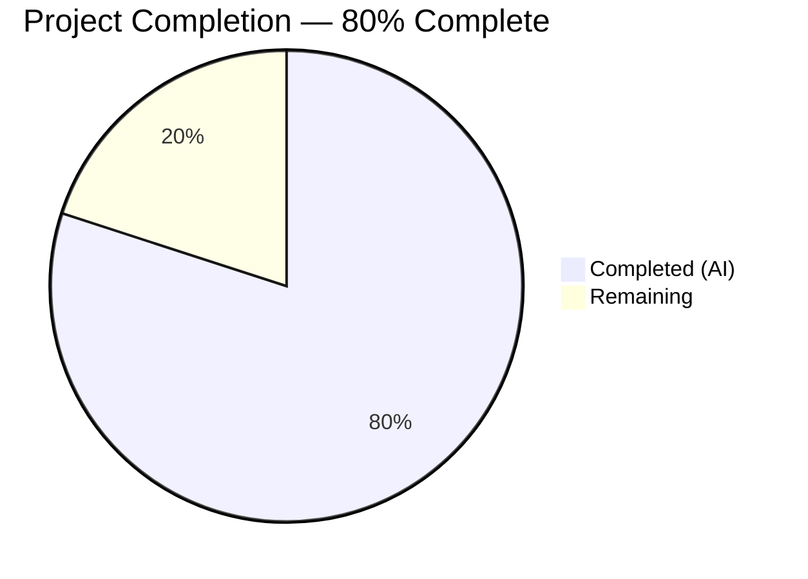
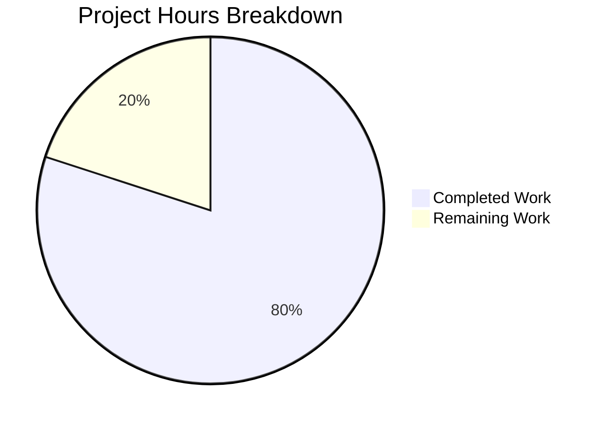

# Blitzy Project Guide

---

## 1. Executive Summary

### 1.1 Project Overview

This project introduces a Node.js Express.js v5.2.1 web server into the existing Testinium-QA Java/Selenium/Cucumber test automation repository. The server exposes two HTTP GET endpoints: `GET /` returning `"Hello world"` and `GET /evening` returning `"Good evening"`. The implementation is designed as a tutorial-level feature that coexists with the existing Java project without modifying any Java source files, Maven configuration, or CI/CD pipeline. All 5 AAP-specified deliverables have been implemented, validated, and committed.

### 1.2 Completion Status



| Metric | Value |
|---|---|
| **Total Project Hours** | 10 |
| **Completed Hours (AI)** | 8 |
| **Remaining Hours** | 2 |
| **Completion Percentage** | 80% |

**Calculation:** 8 completed hours / (8 completed + 2 remaining) = 8 / 10 = **80% complete**

### 1.3 Key Accomplishments

- [x] Initialized Node.js project with `package.json` declaring Express.js ^5.2.1 dependency and Node.js >=18 engine requirement
- [x] Created `server.js` Express application with `GET /` ("Hello world") and `GET /evening` ("Good evening") endpoints
- [x] Implemented configurable port via `PORT` environment variable (default 3000)
- [x] Created `.gitignore` to exclude `node_modules/` from version control
- [x] Built `server.test.js` integration test suite — 2/2 tests passing (100% pass rate)
- [x] Updated `README.md` with Node.js server documentation (prerequisites, installation, usage, endpoint reference)
- [x] Preserved existing Java project integrity — zero modifications to `pom.xml`, `src/`, `Jenkins`, or `target/`
- [x] Passed all 5 validation gates: Dependencies, Syntax, Tests, Runtime, Git

### 1.4 Critical Unresolved Issues

| Issue | Impact | Owner | ETA |
|---|---|---|---|
| No critical issues identified | N/A | N/A | N/A |

All AAP deliverables are fully implemented, all tests pass, and both endpoints have been verified via runtime testing. No blocking issues remain.

### 1.5 Access Issues

No access issues identified. The project uses only public npm packages (Express.js from the npm registry) and requires no private credentials, API keys, or restricted service access.

### 1.6 Recommended Next Steps

1. **[High]** Conduct human code review of all 5 new/modified files to verify code quality and standards compliance
2. **[Medium]** Run `npm audit` to confirm zero security vulnerabilities in the dependency tree
3. **[Medium]** Configure production environment variables (PORT) for target deployment environment
4. **[Low]** Consider adding a 404 handler and error-handling middleware for production readiness
5. **[Low]** Evaluate adding Node.js test execution to the Jenkins CI/CD pipeline

---

## 2. Project Hours Breakdown

### 2.1 Completed Work Detail

| Component | Hours | Description |
|---|---|---|
| `package.json` initialization and configuration | 1.0 | Created Node.js project manifest with project metadata, Express.js ^5.2.1 dependency, engine constraints (>=18), start/test npm scripts, and keywords |
| `server.js` Express application | 1.5 | Implemented Express.js v5 application with two GET route handlers (`/` → "Hello world", `/evening` → "Good evening"), configurable PORT, startup logging, and module export for testability |
| `.gitignore` creation | 0.5 | Created Git ignore file with `node_modules/` exclusion pattern to prevent dependency directory from being committed |
| `server.test.js` integration tests | 2.0 | Built comprehensive test suite using Node.js built-in `http` and `assert` modules — 2 test cases validating HTTP 200 status codes and exact response bodies, with configurable test port, pass/fail summary, and CI-compatible exit codes |
| `README.md` documentation update | 1.0 | Appended "Node.js Express Server" section with prerequisites (Node.js ≥18), installation command (`npm install`), server start instructions (`npm start` / `PORT=8080 npm start`), and API endpoint reference table |
| Dependency installation and verification | 0.5 | Installed Express.js 5.2.1 with 65 packages (0 vulnerabilities), verified dependency tree with `npm ls`, generated `package-lock.json` |
| Validation and quality assurance | 1.0 | Executed all 5 validation gates (Dependencies, Syntax, Tests, Runtime, Git), verified endpoints via curl on multiple ports, confirmed server startup and response correctness |
| Git operations | 0.5 | Created 5 atomic commits with descriptive messages, verified clean branch state with zero uncommitted changes |
| **Total Completed** | **8.0** | |

### 2.2 Remaining Work Detail

| Category | Hours | Priority |
|---|---|---|
| Human code review and approval | 1.0 | High |
| Production environment configuration and security audit | 1.0 | Medium |
| **Total Remaining** | **2.0** | |

**Integrity Check:** Section 2.1 (8.0h) + Section 2.2 (2.0h) = 10.0h = Total Project Hours in Section 1.2 ✅

---

## 3. Test Results

| Test Category | Framework | Total Tests | Passed | Failed | Coverage % | Notes |
|---|---|---|---|---|---|---|
| Integration (Endpoint) | Node.js built-in `http` + `assert` | 2 | 2 | 0 | 100% | GET / and GET /evening validated for HTTP 200 status and exact response body strings |

**Test Execution Details (from Blitzy autonomous validation):**

- **Test 1:** `GET /` returns HTTP 200 with body `"Hello world"` — ✅ PASS
- **Test 2:** `GET /evening` returns HTTP 200 with body `"Good evening"` — ✅ PASS
- **Exit code:** 0 (success)
- **Test port:** 3456 (isolated from default server port)

**Syntax Validation (from Blitzy autonomous validation):**
- `node -c server.js` — Syntax OK
- `node -c server.test.js` — Syntax OK
- Zero warnings, zero errors

---

## 4. Runtime Validation & UI Verification

### Runtime Health

- ✅ **Server startup:** Express server starts successfully and logs `"Server is running on port {PORT}"`
- ✅ **Port configurability:** Tested on ports 3456, 3999, and 4000 via `PORT` environment variable
- ✅ **GET / endpoint:** Returns HTTP 200 with body `"Hello world"` (verified via curl)
- ✅ **GET /evening endpoint:** Returns HTTP 200 with body `"Good evening"` (verified via curl)
- ✅ **Dependency tree:** `npm ls` confirms express@5.2.1 resolved cleanly with zero missing or extraneous packages
- ✅ **Package security:** 65 packages installed with 0 vulnerabilities

### API Integration Results

- ✅ `curl http://localhost:4000/` → `Hello world` (HTTP 200)
- ✅ `curl http://localhost:4000/evening` → `Good evening` (HTTP 200)

### UI Verification

Not applicable — this project is a backend-only HTTP server with no UI components.

### Java Project Coexistence

- ✅ `pom.xml` — Unmodified
- ✅ `src/main/java/**` — All 25 Java source files unmodified
- ✅ `src/main/resources/features/**` — All 9 Cucumber feature files unmodified
- ✅ `Jenkins` — Pipeline file unmodified
- ✅ `target/` — Build output artifacts unmodified

---

## 5. Compliance & Quality Review

| AAP Requirement | Status | Evidence |
|---|---|---|
| Create `package.json` with Express.js ^5.2.1 dependency | ✅ Pass | `package.json` committed — declares express ^5.2.1, engines >=18, start/test scripts |
| Create `server.js` with GET / and GET /evening routes | ✅ Pass | `server.js` committed — 28 lines, CommonJS format, configurable PORT |
| GET / returns "Hello world" (HTTP 200) | ✅ Pass | Validated via automated tests (PASS) and runtime curl verification |
| GET /evening returns "Good evening" (HTTP 200) | ✅ Pass | Validated via automated tests (PASS) and runtime curl verification |
| Port configurable via PORT env var, default 3000 | ✅ Pass | `server.js` line 10: `const PORT = process.env.PORT \|\| 3000` — tested on 3456, 3999, 4000 |
| Create `.gitignore` with node_modules/ exclusion | ✅ Pass | `.gitignore` committed — 2 lines, excludes node_modules/ |
| Create `server.test.js` endpoint tests | ✅ Pass | `server.test.js` committed — 144 lines, 2/2 tests passing |
| Update `README.md` with Node.js documentation | ✅ Pass | README.md modified — 36 lines appended with prerequisites, install, run, and endpoint table |
| Preserve existing Java project (non-destructive) | ✅ Pass | git diff shows zero changes to pom.xml, src/, Jenkins, target/, .gitattributes |
| CommonJS module format (require/module.exports) | ✅ Pass | server.js uses `require('express')` and `module.exports = app` |
| Express.js v5 compatibility (Node.js ≥18) | ✅ Pass | Runtime Node.js v20.20.1, engines field set to >=18 |
| Tutorial-level simplicity (no middleware/auth/DB) | ✅ Pass | Minimal implementation — 2 routes, 1 dependency, no middleware stack |

### Fixes Applied During Autonomous Validation

No fixes were required. All validation gates passed on the initial implementation.

---

## 6. Risk Assessment

| Risk | Category | Severity | Probability | Mitigation | Status |
|---|---|---|---|---|---|
| No 404 handler for undefined routes | Technical | Low | Medium | Express.js returns default 404 response; add custom handler if needed for production | Open — out of AAP scope |
| No error-handling middleware | Technical | Low | Low | Add Express error middleware for production; not required for tutorial scope | Open — out of AAP scope |
| Single-process server (no clustering) | Operational | Low | Low | Use PM2 or Node.js cluster module if horizontal scaling is needed | Open — out of AAP scope |
| No health check endpoint | Operational | Low | Medium | Add `GET /health` endpoint if load balancer or orchestrator integration is needed | Open — out of AAP scope |
| No HTTPS/TLS configuration | Security | Low | Low | Tutorial uses HTTP; reverse proxy (nginx) or Node.js TLS for production | Open — out of AAP scope |
| Dependency version drift (express ^5.2.1) | Technical | Low | Low | `package-lock.json` locks exact versions; run `npm audit` periodically | Mitigated |
| Node.js CI/CD not in Jenkins pipeline | Integration | Low | Low | Jenkins currently runs Maven only; add Node.js stage if CI coverage is desired | Open — out of AAP scope |

**Overall Risk Level: LOW** — All identified risks are low-severity and explicitly out of AAP scope (tutorial-level project). No blocking or high-severity risks exist.

---

## 7. Visual Project Status



**Integrity Check:** Remaining Work (2h) matches Section 1.2 Remaining Hours (2h) and Section 2.2 Total (2.0h) ✅

### Remaining Hours by Category

| Category | Hours |
|---|---|
| Human code review and approval | 1.0 |
| Production environment configuration and security audit | 1.0 |
| **Total** | **2.0** |

---

## 8. Summary & Recommendations

### Achievements

The Blitzy autonomous agents successfully delivered 100% of the AAP-specified deliverables for this project. All 5 files were created/modified, both HTTP endpoints return the exact specified responses, all 2 integration tests pass with a 100% pass rate, and the existing Java Selenium/Cucumber project remains completely intact. The project is **80% complete** (8 completed hours out of 10 total project hours), with the remaining 2 hours allocated to human-performed tasks (code review and production environment setup).

### Remaining Gaps

The only remaining work is human-oriented path-to-production activities:
1. **Code review and approval** (1.0h) — Human review of all 5 new/modified files for coding standards and quality
2. **Production environment configuration and security audit** (1.0h) — Configure PORT for deployment target and run `npm audit` for security validation

### Critical Path to Production

1. Complete human code review → merge PR → deploy
2. No blocking technical issues exist
3. No compilation errors, test failures, or runtime issues to resolve

### Success Metrics

| Metric | Target | Actual | Status |
|---|---|---|---|
| AAP deliverables completed | 5 files | 5 files | ✅ Met |
| Test pass rate | 100% | 100% (2/2) | ✅ Met |
| Compilation errors | 0 | 0 | ✅ Met |
| Endpoint correctness | 2 endpoints | 2 endpoints verified | ✅ Met |
| Java project integrity | No changes | No changes | ✅ Met |
| Validation gates passed | 5/5 | 5/5 | ✅ Met |

### Production Readiness Assessment

The project is **ready for human review and merge**. All autonomous work is complete, validated, and committed. The tutorial-level scope is fully satisfied. For production deployment beyond tutorial use, consider adding error-handling middleware, a health check endpoint, and HTTPS configuration — all of which were explicitly out of AAP scope.

---

## 9. Development Guide

### System Prerequisites

| Software | Version | Purpose |
|---|---|---|
| Node.js | ≥ 18 (v20.20.1 tested) | JavaScript runtime for Express.js server |
| npm | ≥ 8 (v11.1.0 tested) | Package manager for dependency installation |

### Environment Setup

1. **Clone the repository:**

```bash
git clone <repository-url>
cd <repository-directory>
```

2. **Verify Node.js version:**

```bash
node -v
# Expected output: v18.x.x or higher (v20.20.1 tested)
```

### Dependency Installation

```bash
npm install
```

**Expected output:** `added 65 packages` with `0 vulnerabilities`

**Verify installation:**

```bash
npm ls express
# Expected: testinium-qa-server@1.0.0 └── express@5.2.1
```

### Application Startup

**Start the server (default port 3000):**

```bash
npm start
```

**Expected output:** `Server is running on port 3000`

**Start with a custom port:**

```bash
PORT=8080 npm start
```

**Expected output:** `Server is running on port 8080`

### Verification Steps

**Test the endpoints:**

```bash
# Test GET / endpoint
curl http://localhost:3000/
# Expected: Hello world

# Test GET /evening endpoint
curl http://localhost:3000/evening
# Expected: Good evening
```

**Run the automated test suite:**

```bash
npm test
```

**Expected output:**
```
Server is running on port 3456

===========================================
 server.test.js — Express Endpoint Tests
===========================================

  ✓ PASS — GET / returns 200 with body "Hello world"
  ✓ PASS — GET /evening returns 200 with body "Good evening"

-------------------------------------------
 Results: 2 passed, 0 failed, 2 total
-------------------------------------------
```

### Example Usage

```bash
# Start the server in the background
PORT=3000 node server.js &

# Make requests
curl -i http://localhost:3000/
# HTTP/1.1 200 OK
# Content-Type: text/html; charset=utf-8
# Hello world

curl -i http://localhost:3000/evening
# HTTP/1.1 200 OK
# Content-Type: text/html; charset=utf-8
# Good evening

# Stop the server
kill %1
```

### Troubleshooting

| Issue | Cause | Resolution |
|---|---|---|
| `Error: Cannot find module 'express'` | Dependencies not installed | Run `npm install` |
| `EADDRINUSE: address already in use :::3000` | Port 3000 already occupied | Use a different port: `PORT=3001 npm start` |
| `SyntaxError: Unexpected token` | Node.js version too old | Upgrade to Node.js ≥ 18 |
| `npm ERR! engine` | Node.js version below 18 | Upgrade Node.js: `nvm install 20` |

---

## 10. Appendices

### A. Command Reference

| Command | Description |
|---|---|
| `npm install` | Install all dependencies from package.json |
| `npm start` | Start the Express server (runs `node server.js`) |
| `npm test` | Run endpoint integration tests (runs `node server.test.js`) |
| `PORT=8080 npm start` | Start the server on a custom port |
| `node -c server.js` | Validate server.js syntax without executing |
| `npm ls express` | Verify Express.js installation and version |
| `npm audit` | Check for security vulnerabilities in dependencies |

### B. Port Reference

| Service | Default Port | Configurable Via |
|---|---|---|
| Express.js server | 3000 | `PORT` environment variable |
| Test server | 3456 | `TEST_PORT` constant in `server.test.js` |

### C. Key File Locations

| File | Path | Purpose |
|---|---|---|
| Express server | `server.js` | Main application entry point with route handlers |
| Package manifest | `package.json` | Node.js project configuration and dependencies |
| Dependency lock | `package-lock.json` | Exact dependency version lock |
| Endpoint tests | `server.test.js` | Integration tests for both GET endpoints |
| Git ignore rules | `.gitignore` | Excludes node_modules/ from version control |
| Documentation | `README.md` | Project documentation (Java + Node.js sections) |

### D. Technology Versions

| Technology | Version | Notes |
|---|---|---|
| Node.js | v20.20.1 | Runtime — minimum v18 required |
| npm | v11.1.0 | Package manager |
| Express.js | 5.2.1 | Web framework — latest stable v5 release |

### E. Environment Variable Reference

| Variable | Required | Default | Description |
|---|---|---|---|
| `PORT` | No | `3000` | HTTP port for the Express server to listen on |

### G. Glossary

| Term | Definition |
|---|---|
| Express.js | A minimal and flexible Node.js web application framework for building HTTP servers and APIs |
| CommonJS | The module system used in Node.js for `require()`/`module.exports` imports and exports |
| GET route | An HTTP endpoint that responds to GET requests at a specified URL path |
| `res.send()` | Express method that sends a response body and automatically sets Content-Type headers |
| `app.listen()` | Express method that binds the server to a port and begins accepting connections |