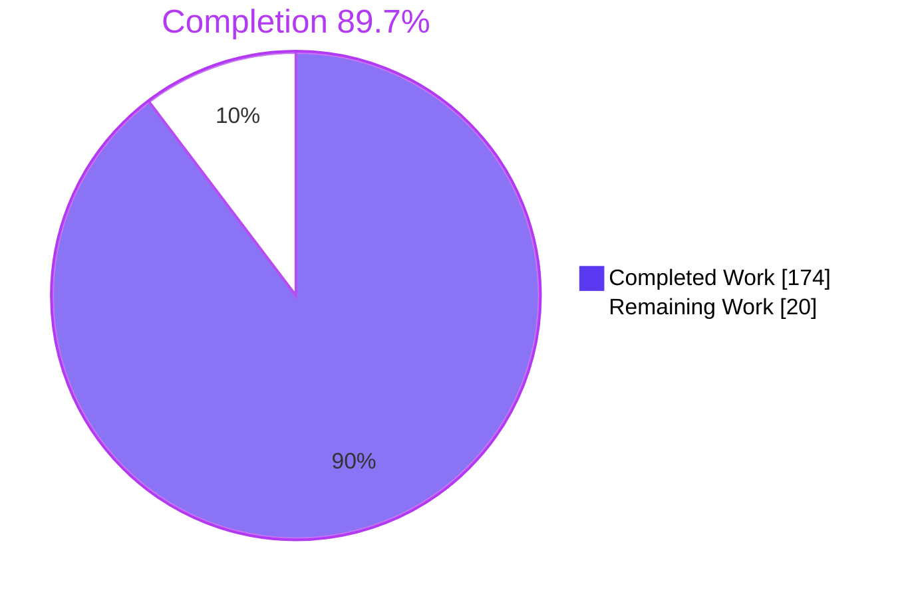
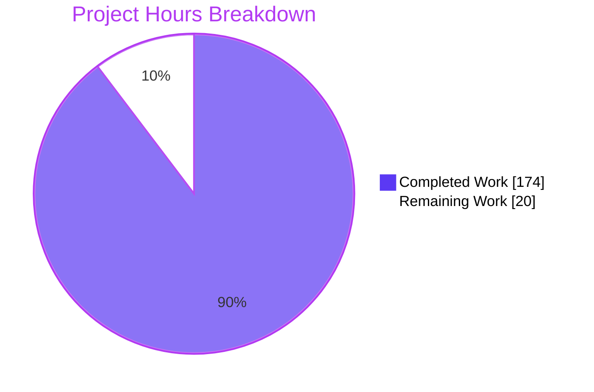
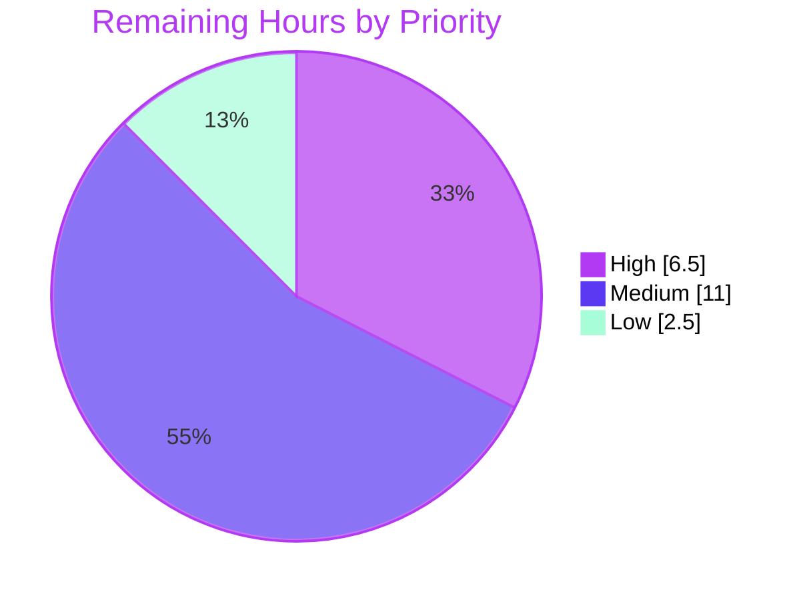

# 1. Executive Summary

## 1.1 Project Overview

Testinium-QA is a Java 8 Maven Selenium/Cucumber framework that drives UI tests against the Odoo/Upgenix ERP. For QA engineers and new contributors, the project added Javadoc to all 25 classes under `src/main/java/com/testinium` and expanded `README.md` from 171 to 1,936 lines. The README now covers setup, configuration, the Java API and Gherkin catalog, test execution, Jenkins CI and annotated code walkthroughs. The request named `server.js` and JSDoc. The repository has no JavaScript, so both were delivered as their Java equivalents. Only comments and README text changed.

## 1.2 Completion Status


```mermaid
%%{init: {"themeVariables": {"pie1": "#5B39F3", "pie2": "#FFFFFF", "pieStrokeColor": "#B23AF2", "pieOuterStrokeColor": "#B23AF2", "pieTitleTextColor": "#B23AF2"}}}%%
pie showData title Completion 89.7%
    "Completed Work" : 174
    "Remaining Work" : 20
```

| Metric | Value |
|---|---|
| Total Hours | 194 |
| Completed Hours (AI + Manual) | 174 (174 AI + 0 manual) |
| Remaining Hours | 20 |
| Percent Complete | **89.7%** = 174 / (174 + 20) |

## 1.3 Key Accomplishments

- ✅ Javadoc on all 25 classes and 286 declarations, placed before annotations; no executable line changed.
- ✅ `javac -Xdoclint:all` and `javadoc` exit 0; 2 "no comment" warnings remain, both on local variables.
- ✅ Every step still binds: Cucumber dry run `OK (87 tests)` across 10 features.
- ✅ README has 12 sections and a full Table of Contents; all 157 internal links resolve and all 4 Mermaid diagrams render.
- ✅ 6-key `configuration.properties` table (placeholders only), with each key's failure message mapped.
- ✅ API Reference for 25 classes and 91 step bindings; catalog of 34 scenarios (87 executable).
- ✅ Deployment & CI guide describing the Jenkins stages as they behave, with Secret-file credential guidance.
- ✅ 8 pre-existing code, build and pipeline discrepancies surfaced in Known Findings, not silently changed.

## 1.4 Critical Unresolved Issues

**0 of 6** requested deliverables (R1–R6) has an open defect. **5** open items remain, all verification or confirmation steps. None blocks merging the documentation.

| Issue | Impact | Owner | ETA |
|---|---|---|---|
| JSDoc/`server.js` request delivered as Javadoc on Java sources awaits requester confirmation (Section 5.2, D1) | The deliverable's form rests on an interpretation | Requester | 0.5 h |
| README setup steps, Troubleshooting messages and locator descriptions never exercised against the real Odoo/Upgenix ERP | Accuracy against the live system is unproven | QA engineer | 6 h |
| Jenkins job guidance (plugins, Secret-file credentials, report publishing) never run on a Jenkins server | CI instructions are unproven in practice | DevOps | 4 h |
| GitHub rendering of the 4 Mermaid diagrams, badges and anchors not checked | Presentation or navigation defects possible | Maintainer | 1 h |
| PowerShell/Windows command variants never executed | Windows users may hit quoting or separator errors | Maintainer | 1.5 h |

## 1.5 Access Issues

| System/Resource | Type of Access | Issue Description | Resolution Status | Owner |
|---|---|---|---|---|
| Odoo/Upgenix ERP instance | Test URL and account credentials (`configuration.properties`) | No URL or credentials were supplied, so the live end-to-end suite could not run against the real system | Open | Requester / QA |
| Jenkins server | CI job administration | No Jenkins instance was available; job guidance was checked against the `Jenkins` pipeline file only | Open | DevOps |

## 1.6 Recommended Next Steps

1. [High] Confirm that Javadoc on the Java sources is the intended reading of the JSDoc/`server.js` request.
2. [High] Review and merge the 26-file documentation change (`README.md` plus 25 Java files).
3. [Medium] Follow the README setup against a real Odoo/Upgenix instance on a non-root host with a display and window manager.
4. [Medium] Exercise the Deployment & CI steps on a Jenkins server and check the README as rendered on GitHub.
5. [Low] Schedule follow-up code fixes, outside this scope, for the unregistered `Hooks` import and the CI path that runs no scenario.

# 2. Project Hours Breakdown

## 2.1 Completed Work Detail

| Component | Hours | Description |
|---|---|---|
| Javadoc — utilities (R1) | 9 | `Driver` and `ConfigurationReader`: class, field and method contracts covering per-thread driver inheritance, lazy browser creation, teardown exception paths, one-time configuration loading and every failure mode |
| Javadoc — runners (R1) | 5 | `CukesRunner` options (plugin, features, glue, dryRun, tags) and `FailedTestRunner` rerun workflow, including why Surefire does not execute them |
| Javadoc — 10 Page Objects (R1) | 16 | Class, constructor and all 131 `@FindBy` fields described by what each locator actually selects; shared constructor contract identical in all 10 files |
| Javadoc — 11 step-definition classes incl. `Hooks` (R1) | 32 | 91 step methods with Gherkin expression, `@param`/`@throws`, wait semantics and known behaviour limits; `Hooks.teardownScenario(Scenario)` and its unregistered annotation |
| README — structure, overview, badges, ToC, project structure, reports (R2) | 6 | 12-section layout, retained badges with working links and alt text, retained Jenkins/Jira screenshots, provenance-cited source tree |
| README — architecture and diagrams (R2, 0.7.3) | 6 | Layer table and 4 Mermaid diagrams: architecture, Jenkins pipeline, login sequence, failure-hook sequence |
| README — prerequisites, setup and configuration (R3) | 8 | Build/dry-run vs live-run prerequisites, clone and build steps, safe `target/` restore, 6-key configuration table with placeholders and parsing pitfalls |
| README — running tests (R3, R5) | 12 | IDE, bash and PowerShell JUnitCore commands, Maven behaviour, tag subsets with verified counts, rerun, dry run and report output |
| README — API reference (R4) | 16 | Entries for all 25 classes, runner option tables, per-page element counts, 91-row step-binding tables |
| README — Gherkin catalog (R4) | 6 | 10 feature files, 34 scenarios / 87 executable, 34-row scenario index, verbatim `Crm.feature` example |
| README — deployment and CI (R5) | 10 | Jenkins stages as they behave, job setup, Secret-file credential handling, report artifacts, sensitive-report guidance, CI caveats |
| README — inline code explanations (R6) | 10 | Annotated walkthroughs of `Driver`, `ConfigurationReader`, `LoginSD`, `Hooks` and `PageFactory` construction |
| README — known findings and troubleshooting (R2–R6) | 10 | 8 surfaced discrepancies and a 17-row symptom → cause → fix table reproduced against observed errors |
| Verification of all deliverables | 28 | Compile, doclint, javadoc render, step-binding dry runs, BASE-vs-HEAD runtime parity, README command execution, citation, link and diagram checks |
| **Total** | **174** | |

## 2.2 Remaining Work Detail

| Category | Hours | Priority |
|---|---|---|
| Confirm the JSDoc → Javadoc interpretation with the requester (D1) | 0.5 | High |
| Maintainer review of `README.md` (1,936 lines) and the Javadoc diff (1,524 lines) | 6 | High |
| Validate README setup and Troubleshooting against a real Odoo/Upgenix instance | 6 | Medium |
| Validate the Deployment & CI guidance on a Jenkins server | 4 | Medium |
| Check GitHub rendering of diagrams, badges and anchors | 1 | Medium |
| Execute the PowerShell/Windows command variants | 1.5 | Low |
| Merge the change and optionally publish the generated Javadoc HTML | 1 | Low |
| **Total** | **20** | |

## 2.3 Completion Calculation

- Every AAP-specified deliverable (R1–R6, diagrams, configuration documentation, discrepancy reporting, build validation) is Completed; the 20 remaining hours are path-to-production activities.
- Total Project Hours = 174 completed + 20 remaining = **194**.
- Completion = 174 / 194 × 100 = **89.7%**.
- Optional items the AAP marked out of required scope (`maven-javadoc-plugin`, `configuration.properties.sample`, a `docs/` split) and pre-existing code defects the AAP forbade fixing carry no hours.

# 3. Test Results

The project has no unit-test suite (`src/test` does not exist) and no coverage tooling. Verification of a documentation change therefore rests on the checks below, each run against the delivered tree (commit `b50b03d`) with results observed first-hand.

| Area / Category | Framework | Tests | Passed | Failed | Coverage | What This Proves |
|---|---|---|---|---|---|---|
| Javadoc well-formedness | JDK 8 `javac -Xdoclint:all` | 1 compile of 25 sources | 1 | 0 | 2 "no comment" warnings, both on local variables (`ConfigurationReader.java:46`, `:53`) | Every added doc comment is syntactically valid and every documentable declaration has one |
| API documentation generation | JDK 8 `javadoc` with dependency classpath | 1 run | 1 | 0 | 37 pages for 25 classes, empty diagnostic output | The in-source Javadoc renders to HTML without errors or warnings |
| Gherkin step binding | Cucumber 7.2.3 dry run via JUnit 4 `JUnitCore` | 87 scenarios | 87 | 0 | 10 of 10 feature files | Comment-only edits left every step bound to its `@Given/@When/@Then` method |
| Tag-selection counts quoted in the README | Cucumber dry run | 6 tag expressions | 6 | 0 | Default `@Smoke` 4, `@Login` 48, `@LogOut` 12, `@Login and @SalesManager` 23, `@Smoke or @Calendar` 8, `not @LogOut` 75 | The README's documented selections and counts are exact |
| Build gate | Maven 3.9.16 offline (`clean test-compile`, then `test`) | 2 goals | 2 | 0 | 25 sources compiled for Java 8; Surefire "No tests to run." | The project builds exactly as before; only the pre-existing duplicate-dependency and encoding warnings appear |
| README diagrams | Mermaid CLI (`mmdc`) | 4 diagrams | 4 | 0 | Architecture, Jenkins pipeline, login sequence, failure-hook sequence | All diagrams parse and render with no syntax-error output |
| README navigation | Scripted GitHub-slug anchor check | 157 internal links | 157 | 0 | 63 headings, 61 distinct targets | Every Table of Contents and cross-reference link lands on a heading |

**Not Covered**

- **Live execution against the real Odoo/Upgenix ERP** — no URL or credentials exist, so README claims about real pages, locators and login outcomes rest on the code and a local stub. Test before release: run `Session.feature` and the `@Smoke` selection with a real `configuration.properties`.
- **Jenkins job setup** — the plugin list, Secret-file `withCredentials` example and report-publishing behaviour were never run on Jenkins. Test: create the Pipeline job as the README describes and run **Build Now**.
- **GitHub rendering** — diagrams were rendered with the Mermaid CLI, not GitHub's renderer. Test: open `README.md` on the Git host.
- **PowerShell and IntelliJ launch paths** — never executed. Test: run the PowerShell block of "Run from the Command Line" and the IDE run configuration.
- **Firefox window-maximize failure** — the README states the window-manager requirement for the `firefox` branch from the EWMH standard; only the Chrome message was observed.

# 4. Runtime Validation & UI Verification

The framework has no server, API or UI of its own; its runtime is the Cucumber suite driving a browser against the ERP. Runtime checks compared the original tree (`c16cae2`) with the delivered tree to prove the documentation change is behaviour-neutral, and executed the README's commands as written.

- ✅ **Build and API docs** — offline Maven build compiles 25 sources with BUILD SUCCESS; `javadoc` generates the API site with no diagnostics.
- ✅ **Step binding** — dry runs bind all 87 scenarios; per-tag counts match the README tables exactly.
- ✅ **README command journey** — build-classpath, JUnitCore run, tag subset, rerun via `FailedTestRunner`, dry run, extra report output and HTML report commands run as documented, including the classpath-file and rerun-list side effects the README warns about.
- ✅ **Configuration failure modes** — missing file, each missing key, wrong-case key, trailing whitespace, UTF-8 BOM and malformed `\u` escape each produce the exact message the Troubleshooting table maps.
- ✅ **Framework behaviour vs Javadoc** — `Driver` thread inheritance, `closeDriver()` paths, one-time configuration loading and `FailedTestRunner` rerun semantics behave as documented, identically on both trees.
- ⚠ **Browser launch** — as coded, Chrome cannot start on a root host without a display, and WebDriverManager 5.1.0 resolves chromedriver 114 for Chrome 153; launch succeeded only with a Chrome-for-Testing 153 driver plus a display and window manager, as the README's remedies describe.
- ⚠ **Full suite against a local stub ERP** — all 87 scenarios ran with identical per-scenario outcomes on both trees (3 passed, 84 failed because the stub lacks the ERP's pages); locators for all 131 Page Object fields resolved identically.
- ⚠ **CI-equivalent run** — `mvn clean test` (the Jenkins `Run tests` stage) runs locally with BUILD SUCCESS but executes no scenario and writes no JSON, exactly as the README documents; no Jenkins server was exercised.
- ✅ **Cucumber HTML report** — the generated report renders in Chrome with no console errors or failed requests.
- ❌ **Real Odoo/Upgenix ERP** — never exercised: no URL or credentials were supplied, so real login, page locators and end-to-end journeys remain unverified.

# 5. Compliance & Quality Review

## 5.1 Compliance Matrix

| # | AAP Deliverable | Benchmark | Status | Progress | Evidence |
|---|---|---|---|---|---|
| 1 | Class-level Javadoc on every Java class (R1) | AAP 0.7.1: 25 / 25 | ✅ Pass | 100% | 25 classes; doclint reports no undocumented declaration |
| 2 | Javadoc on every constructor, field and method (R1) | AAP 0.7.1: 100% | ✅ Pass | 100% | 286 / 286 declarations; the only doclint warnings are 2 local variables, which Javadoc cannot document |
| 3 | Tags and placement | AAP 0.7.2: `@param`/`@return`/`@throws` match signatures; Javadoc before annotations | ✅ Pass | 100% | doclint clean; every annotated declaration carries its block above the annotation |
| 4 | Documentation-only source change | AAP 0.8.2 | ✅ Pass | 100% | Java diff +1,524 / −0 lines, 0 non-comment lines changed; `pom.xml`, `Jenkins`, features, `target/` untouched |
| 5 | README content areas: setup, API, deployment, inline explanations | AAP 0.7.1: 4 / 4 | ✅ Pass | 100% | `README.md` sections Setup & Configuration, API Reference, Deployment & CI, Inline Code Explanations |
| 6 | Configuration keys documented with placeholders | AAP 0.7.1 / 0.10 | ✅ Pass | 6 / 6 | `browser`, `web.table.url`, `username`, `password`, `url`, `EmplTitle` (`README.md:L336-L356`) |
| 7 | Gherkin feature catalog | AAP 0.7.1: 10 / 10 | ✅ Pass | 100% | 10 files, 34 scenarios, 87 executable, confirmed by dry run |
| 8 | Mermaid diagrams | AAP 0.7.3: ≥ 3 | ✅ Pass | 4 / 3 | Architecture, Jenkins pipeline, login sequence, failure-hook sequence; all render |
| 9 | Runnable examples per execution mode | AAP 0.7.3 | ✅ Pass | 100% | Full suite, tag subset, rerun, dry run, report output; executed as written |
| 10 | Source citations for technical claims | AAP 0.9 / 0.10 | ✅ Pass | 100% | All in-repository `path:line` citations fall within their files |
| 11 | No secrets in documentation | AAP 0.10 | ✅ Pass | 100% | No credential values in added README or Javadoc lines |
| 12 | Discrepancies surfaced, build unchanged | AAP 0.10 / 0.9 | ✅ Pass | 100% | 8 Known Findings; Maven gate BUILD SUCCESS |

## 5.2 AAP & Rule Divergences and Gaps

| # | What the AAP/Rule Required | What Was Delivered Instead | Why It Diverged | Impact | Remediation |
|---|---|---|---|---|---|
| D1 | JSDoc comments on `server.js` functions (user request) | Javadoc on all 25 Java classes | No JavaScript exists; AAP 0.1.1–0.1.2 substituted Javadoc and flagged it for confirmation | None if confirmed | Requester confirms (Section 2.2) |
| D2 | Maven commands, one Maven invocation per execution mode (AAP 0.5.2, 0.7.3) | JUnitCore and IDE commands; Maven documented as running no scenario | Surefire never executes the runners; `pom.xml` changes forbidden | Maven/Jenkins cannot run scenarios; documented | None for docs; optional code follow-up |
| D3 | `javadoc -d target/apidocs -sourcepath src/main/java -subpackages com.testinium` (AAP 0.9) | Same command plus `-classpath "$(cat target/classpath.txt)"` | Bare command cannot resolve dependency imports on JDK 8 | Positive | None |
| D4 | Representative diagram with active `Steps --> Hooks` edge (AAP 0.4.3) | Hooks drawn inactive, reached from the runner lifecycle, with an import note | Hook is never registered; accuracy rule (0.7.2) | Diagram matches runtime | Redraw if the hook is fixed |
| D5 | Surface, don't fix, pre-existing defects (AAP 0.8.2, 0.10) — **Sanctioned** | 8 defects documented in Known Findings; misleading original comments kept in source | Code, pom and pipeline changes forbidden | Defects remain in code | Separate engineering work (Section 6) |
| D6 | Cite every claim as `path:line` (AAP 0.9, 0.10); no rule on citation stability | Javadoc reflowed inside original line spans; ~330 line-level citations | Keep citations valid as Javadoc landed | Citations drift on future code edits | Re-check citations when cited files change |
| D7 | Verbatim scenario example and complete catalog (AAP 0.7.3) under no-secrets rule (0.10) — **Sanctioned** | Account rows elided; catalog lists `Examples` metadata, not values; single index table | Feature files and `EmployeeP` hold account data | No credentials exposed | None |

**D1 — JSDoc on `server.js` delivered as Javadoc.** The request asked for JSDoc on `server.js` functions. The repository has no `server.js` and no JavaScript; `pom.xml:L7-L14` defines a single Java 8 Maven module. JSDoc cannot apply to Java, so the AAP read the request as Javadoc on the Java classes and flagged that reading for confirmation. Javadoc now covers all 25 classes, for example `Driver.getDriver()` at `src/main/java/com/testinium/utilities/Driver.java:L46-L80`. Nothing is lost if the reading is right. The requester must confirm it; if a Node.js service was meant, the request belongs to another repository.

**D2 — Execution commands use JUnitCore rather than Maven.** AAP 0.5.2 and 0.7.3 asked for Maven commands per execution mode. In this layout Maven cannot run a scenario: the runners compile from `src/main/java`, while Surefire scans only `target/test-classes` (`pom.xml:L17-L30`), so `mvn test` prints `No tests to run.` and `mvn test -Dtest=FailedTestRunner` fails with `No tests were executed!`. Changing `pom.xml` was forbidden (AAP 0.8.2), and accuracy (0.7.2) ruled out documenting commands that do nothing. `README.md:L378-L467` states this and supplies JUnitCore and IDE commands for every mode. If Maven-driven execution is wanted, moving the runners to `src/test/java` is a separate code change.

**D3 — Javadoc command gains a classpath.** AAP 0.9 gave a bare `javadoc` command as the documentation build. On JDK 8 it cannot resolve the Selenium and Cucumber imports: it prints dozens of `package ... does not exist` lines and ends with 100 warnings while still exiting 0. `README.md:L656` therefore appends `-classpath "$(cat target/classpath.txt)"`, which produces the API site with empty diagnostic output, as verified here. The deviation is an improvement and needs no action; the reader must build `target/classpath.txt` first, which "Run from the Command Line" explains.

**D4 — Architecture diagram shows the hook as inactive.** AAP 0.4.3 supplied a representative diagram with a solid `Steps --> Hooks` edge. That edge would promise failure screenshots and driver teardown that never happen: `Hooks.java:L5` imports JUnit's `org.junit.After`, and Cucumber 7 registers only `io.cucumber.java` hooks, so `teardownScenario` never runs; every observed run showed zero hook registrations. The delivered diagram (`README.md:L136-L150`) keeps the Hooks node but draws it dashed and grey, reached only through the runner's lifecycle, with a note naming the import. Accuracy (AAP 0.7.2) decided it. If the hook is later fixed, redraw the edge as solid.

**D5 — Pre-existing defects documented, not fixed (Sanctioned).** The AAP forbade executable, annotation, pom and pipeline changes (0.8.2) and required discrepancies to be surfaced rather than fixed (0.10). Eight defects are documented in `README.md:L1881-L1911`: the duplicate `cucumber-junit`, the README/CI clone-remote mismatch, the unregistered hook, the Firefox branch provisioning chromedriver, the missing `default` case, runners Surefire never runs, `EmployeeP.login(String, String)` ignoring its arguments, and mislabeled feature titles. Misleading original comments such as `Driver.java:L107-L109` also stay in the code; README excerpts replace them and name the lines. The defects remain; fixing them is separate engineering work (Section 6).

**D6 — Line-preserving Javadoc and line-level citations.** The AAP requires `path:line` citations but sets no rule on keeping them stable. Delivery reflowed every revised Javadoc block inside its original line span so the README's roughly 330 line-level citations stay valid. Two consequences follow: some single-line field comments run to about 175 characters (for example `InventoryP.java:L55`, `L59`), and any future edit that shifts lines in a cited Java file silently invalidates README citations. Nothing is broken today; every in-repository citation is in bounds. Maintainers should re-check citations whenever a cited file changes, or later replace line numbers with symbol references.

**D7 — Account data withheld from examples and catalog (Sanctioned).** AAP 0.7.3 asked for a verbatim scenario and a complete catalog; AAP 0.10 forbids reproducing credentials. The Login and Logout `Examples` rows hold test-account usernames and passwords, and `EmployeeP.java` hard-codes an account. The README therefore shows `Crm.feature:L1-L14` verbatim, elides account rows in the Login example (`README.md:L1158`), lists each scenario's `Examples` tag, line range and row count without values (`README.md:L1073-L1078`), and calls the `EmployeeP` literals only "a hard-coded account". The catalog is one 34-row index table, keeping the Table of Contents stable. No action is needed.

# 6. Risk Assessment

Risks 3–8 are pre-existing properties of the framework that the documentation now describes; the AAP excluded fixing them.

| # | Risk | Category | Severity | Probability | Mitigation | Status |
|---|---|---|---|---|---|---|
| 1 | README carries ~330 `path:line` citations; any edit that shifts lines in a cited Java file silently makes them stale | Technical | Medium | High | Re-verify citations in review whenever a cited file changes; consider a scripted citation check or symbol-based references | Open |
| 2 | Runtime claims (locator targets, login outcomes, Troubleshooting messages) were proven against a local stub, not the real ERP DOM | Integration | Medium | Medium | Run the README setup and `@Smoke` selection against a real Odoo/Upgenix instance (Section 2.2) | Open |
| 3 | Hard-coded account literals in `EmployeeP.java:L100-L101`, `L115-L116`, account rows in Login/Logout `Examples`, and reports under the tracked `target/` that capture those values | Security | High | Medium | Move credentials to `configuration.properties` or a secret store; follow the README's Sensitive report data guidance; never commit run reports | Open (documented) |
| 4 | `Hooks` uses `org.junit.After`, so no failure screenshot is attached and `closeDriver()` never runs; each failed session leaves a chromedriver process behind | Operational | Medium | High | Switch the import to `io.cucumber.java.After` in a follow-up code change; until then clean up browser processes on agents | Open (documented) |
| 5 | Jenkins `mvn clean test` executes zero scenarios yet reports BUILD SUCCESS; `testFailureIgnore=true` also hides harness errors | Operational | High | High | Move runners to `src/test/java` or reconfigure Surefire in a follow-up; meanwhile run suites with JUnitCore as documented | Open (documented) |
| 6 | WebDriverManager 5.1.0 resolves chromedriver 114 for Chrome ≥ 115, and `Driver` passes no `ChromeOptions`, so launches fail as root, headless or without a window manager | Integration | High | High | Use the README remedy (`-Dwdm.chromeDriverVersion` with a cached Chrome-for-Testing driver, non-root user, display with an EWMH window manager) or upgrade the dependency | Open (documented) |
| 7 | `target/` is tracked: every build overwrites or deletes committed files, and `target/cucumber.json` already starts with a merge-conflict marker | Operational | Low | High | Restore with `git restore --source=HEAD --worktree -- target`; consider untracking `target/` and adding a `.gitignore` | Open (documented) |
| 8 | Duplicate `cucumber-junit` (7.2.3 test scope, 7.3.4 compile scope) mixed with `cucumber-core` 7.2.3 | Technical | Low | Medium | Remove the duplicate and align Cucumber versions in a follow-up `pom.xml` change | Open (documented) |

# 7. Visual Project Status


```mermaid
%%{init: {"themeVariables": {"pie1": "#5B39F3", "pie2": "#FFFFFF", "pieStrokeColor": "#B23AF2", "pieOuterStrokeColor": "#B23AF2", "pieTitleTextColor": "#B23AF2"}}}%%
pie showData title Project Hours Breakdown
    "Completed Work" : 174
    "Remaining Work" : 20
```

Remaining 20 hours by priority (Section 2.2):


```mermaid
%%{init: {"themeVariables": {"pie1": "#B23AF2", "pie2": "#5B39F3", "pie3": "#A8FDD9", "pieStrokeColor": "#B23AF2", "pieOuterStrokeColor": "#B23AF2", "pieTitleTextColor": "#B23AF2"}}}%%
pie showData title Remaining Hours by Priority
    "High" : 6.5
    "Medium" : 11
    "Low" : 2.5
```

| Deliverable group | Completed Hours | Remaining Hours |
|---|---|---|
| In-source Javadoc (R1) | 62 | 0 |
| README (R2–R6) | 84 | 0 |
| Verification | 28 | 0 |
| Path to production (confirmation, review, live validation, merge) | 0 | 20 |
| **Total** | **174** | **20** |

# 8. Summary & Recommendations

The project is **89.7% complete** (174 of 194 hours). Every AAP deliverable is in place: Javadoc on all 25 classes and 286 declarations, and a 1,936-line README covering setup and configuration, the Java API and Gherkin catalog, test execution, Jenkins CI, inline code walkthroughs and troubleshooting. The change is strictly documentation: 1,524 Java lines were added and none removed, and not one executable line, annotation, dependency or pipeline step changed.

Verification is strong for a documentation deliverable. Doclint and `javadoc` run clean, all 87 scenarios still bind, the offline Maven build succeeds, the four diagrams render and all 157 internal links resolve. The README's commands were executed as written, its configuration failure messages were reproduced one by one, and the full suite behaved identically before and after the change against a local stub. What was never exercised is the real Odoo/Upgenix ERP, a Jenkins server, GitHub's renderer and the Windows/IDE launch paths.

The remaining 20 hours are path-to-production work. The critical path is short: confirm the Javadoc interpretation of the JSDoc/`server.js` request (0.5 h), review the 26-file change (6 h), then validate the setup against a real ERP (6 h) and the CI guidance on Jenkins (4 h). None of these blocks merging the documentation; the live validations raise confidence that the runtime descriptions hold on the real system.

The documentation honestly exposes several framework weaknesses that the AAP excluded from this work and that a maintainer should schedule next: the unregistered `Hooks` import, a CI job that runs no scenario while reporting success, a browser-driver setup that fails on modern Chrome and containers, hard-coded credentials in `EmployeeP`, and a tracked `target/` directory. Fixing any of them will also require refreshing the README's line-level citations and the affected Known Findings.

| Success Metric | Target | Achieved |
|---|---|---|
| Classes with Javadoc | 25 / 25 | 25 / 25 |
| Declarations documented | 100% | 286 / 286 |
| README content areas | 4 / 4 | 4 / 4 |
| Features catalogued | 10 / 10 | 10 / 10 |
| Mermaid diagrams | ≥ 3 | 4 |
| Executable lines changed | 0 | 0 |

**Production readiness:** ready to merge as a documentation release after requester confirmation and maintainer review.

# 9. Development Guide

Every command below was run against the delivered tree on Linux with JDK 1.8.0_492 and Maven 3.9.16. All commands run from the repository root unless a step says otherwise.

## 9.1 System Prerequisites

| Requirement | Version | Needed for |
|---|---|---|
| JDK | 8 (1.8.0_492 tested). The project compiles with `source`/`target` 8 (`pom.xml:L11-L14`) | Everything |
| Apache Maven | 3.6.3 or later 3.x (3.9.16 tested). Do not use Maven 4, which requires Java 17 | Build, classpath file |
| Maven Central access | Or a pre-populated `~/.m2/repository`, with `-o` added to every `mvn` command | First build |
| Git | Any recent version | Clone, restoring `target/` |
| Google Chrome or Firefox | Chrome 153 was observed | Live runs only |
| Display plus an EWMH-compliant window manager, non-root user | — | Live runs only (`Driver.java:L93`, `L99` call `maximize()`) |
| Reachable Odoo/Upgenix instance and test accounts | — | Live runs only |
| IntelliJ IDEA with the Maven and Cucumber for Java plugins | Optional | IDE-driven runs |
| Mermaid CLI (`mmdc`) | Optional | Rendering the README diagrams locally |

The project binds no ports, starts no services and reads no environment variables. Configuration comes only from `configuration.properties` and `-D` system properties.

## 9.2 Environment Setup

1. Clone and enter the repository:

```bash
git clone https://github.com/BalamiRR/Testinium-QA.git
cd Testinium-QA
```

The CI pipeline clones `BalamiRR/Upgenix-QA` instead (`Jenkins:L3`). Clone whichever remote your team treats as canonical (see README Known Findings).

2. **Live runs only.** Create `configuration.properties` in the repository root. It is deliberately not committed. Use these placeholder keys, save the file as UTF-8 without a BOM, and never commit real credentials:

```properties
browser=chrome
web.table.url=https://<your-odoo-host>/web/login
url=https://<your-odoo-host>/web/login
username=<username>
password=<password>
EmplTitle=Employees - Odoo
```

The key table with each consumer and each failure mode is in `README.md:L336-L356`. The repository has no `.gitignore`, so check `git status` before every commit to confirm this file is not staged.

## 9.3 Dependency Installation and Build

```bash
# Compile all 25 sources and resolve dependencies
mvn -B clean test-compile

# Compile and write the runtime classpath used by the java commands below
mvn -B clean compile dependency:build-classpath -Dmdep.outputFile=target/classpath.txt
```

Expected output:
- `Compiling 25 source files with javac [debug target 8] to target/classes`
- `BUILD SUCCESS`

Two warnings also appear and are expected:
- `'dependencies.dependency...' must be unique: io.cucumber:cucumber-junit:jar -> version 7.2.3 vs 7.3.4 @ line 76`
- a platform-encoding warning

`target/` is tracked in Git. Every Maven build rewrites files under it, so restore them before committing:

```bash
git restore --source=HEAD --worktree -- target && git clean -fdq -- target
```

## 9.4 Running the Suite

`mvn test` compiles but runs no scenarios. The runners live in `src/main/java`, while Surefire executes only compiled test classes from `target/test-classes`, so Maven prints `No tests to run.` Scenarios therefore run through JUnit's `JUnitCore` or the IDE.

```bash
# Default run: CukesRunner, tag @Smoke (4 scenarios). Needs configuration.properties and a live ERP.
java -cp "target/classes:$(cat target/classpath.txt)" org.junit.runner.JUnitCore com.testinium.runners.CukesRunner

# Tag subset (48 scenarios)
java -Dcucumber.filter.tags="@Login" -cp "target/classes:$(cat target/classpath.txt)" org.junit.runner.JUnitCore com.testinium.runners.CukesRunner

# Rerun only the scenarios listed in target/rerun.txt (do not run mvn clean in between)
java -cp "target/classes:$(cat target/classpath.txt)" org.junit.runner.JUnitCore com.testinium.runners.FailedTestRunner
```

- **IntelliJ:** right-click `src/main/java/com/testinium/runners/CukesRunner.java` and choose **Run**.
- **Windows PowerShell:** separate classpath entries with `;` and quote each `-D` argument. Copy-paste forms are in the README's Running Tests section.

Reports are written relative to the working directory:
- `target/cucumber-reports.html`
- `target/cucumber.json`
- `target/rerun.txt`
- `target/cucumber/`

## 9.5 Verification Steps (no browser, no ERP)

```bash
# 1. Every Gherkin step binds to a step method: expect "OK (87 tests)"
java -Dcucumber.execution.dry-run=true -Dcucumber.filter.tags="@Smoke or not @Smoke" \
  -cp "target/classes:$(cat target/classpath.txt)" org.junit.runner.JUnitCore com.testinium.runners.CukesRunner

# 2. Javadoc is well formed: expect exit 0, 0 errors, 2 "no comment" warnings (ConfigurationReader.java:46, :53)
SCRATCH="$(mktemp -d)"
javac -encoding UTF-8 -Xdoclint:all -Xmaxwarns 10000 -d "$SCRATCH" -cp "$(cat target/classpath.txt)" $(find src/main/java -name '*.java')

# 3. Generate HTML API docs: expect exit 0 and no output; open target/apidocs/index.html
javadoc -quiet -encoding UTF-8 -d target/apidocs -sourcepath src/main/java -subpackages com.testinium \
  -classpath "$(cat target/classpath.txt)"

# 4. Whole-package gate: expect BUILD SUCCESS twice and "No tests to run."
mvn -B clean test-compile && mvn -B test

# 5. Put tracked target/ files back
git restore --source=HEAD --worktree -- target && git clean -fdq -- target
```

Run from the repository root, the dry run in step 1 overwrites the tracked reports under `target/`. To avoid that, run it from a scratch directory and pass absolute paths: the features path as `-Dcucumber.features="<repo>/src/main/resources/features"`, and `<repo>/target/classes` on the classpath.

## 9.6 Example Usage

A dry run of one module confirms that new or edited steps bind before you touch a browser:

```bash
java -Dcucumber.execution.dry-run=true -Dcucumber.filter.tags="@LogOut" \
  -cp "target/classes:$(cat target/classpath.txt)" org.junit.runner.JUnitCore com.testinium.runners.CukesRunner
# Expected: OK (12 tests)
```

Other observed counts:

| Filter | Scenarios |
|---|---|
| `@Login and @SalesManager` | 23 |
| `@Smoke or @Calendar` | 8 |
| `not @LogOut` | 75 |

A live run without `configuration.properties` fails in a known way:
- It prints `File is not found in the ConfigurationReader class`, then a `NullPointerException`, then `Tests run: 4, Failures: 4`.
- It writes `target/rerun.txt` as `file:src/main/resources/features/Crm.feature:9:24:26:31`.

## 9.7 Troubleshooting

| Symptom | Cause | Resolution |
|---|---|---|
| `javadoc` prints `package ... does not exist` and other unresolved-symbol errors, ends with `100 warnings`, yet exits 0 | Dependency classpath not supplied | Add `-classpath "$(cat target/classpath.txt)"` |
| `cat: target/classpath.txt: No such file or directory` | A `mvn clean` deleted it | Re-run the `dependency:build-classpath` command in 9.3 |
| `File is not found in the ConfigurationReader class`, then NPE | `configuration.properties` missing from the working directory | Create it in the repository root (9.2) and run from there |
| `browser` treated as unset although the file is present | UTF-8 BOM before the first key, wrong key case, or trailing whitespace | Save without a BOM, use the exact lower-case keys, trim values |
| `SessionNotCreatedException: ... only supports Chrome version 114` | WebDriverManager 5.1.0 cannot resolve drivers for Chrome 115 and later | Place a matching Chrome for Testing driver in the WebDriverManager cache and pass `-Dwdm.chromeDriverVersion=<version>` |
| `DevToolsActivePort file doesn't exist` | Running as root, or without a display | Run as a non-root user with a display |
| `unknown error: JavaScript code failed` at `maximize()` | Display has no window manager (bare Xvfb) | Start an EWMH-compliant window manager on the display |
| `FailedTestRunner` runs nothing | `target/rerun.txt` empty or removed by `mvn clean` | Run `CukesRunner` first, then rerun without cleaning |
| `mvn test` passes with 0 scenarios | Surefire runs no class from `src/main/java` | Use the `JUnitCore` commands in 9.4 |

For chromedriver diagnostics, add `-Dwebdriver.chrome.verboseLogging=true -Dwebdriver.chrome.logfile=chromedriver.log` to any live run command. The full table is in the README's Known Findings & Troubleshooting section (`README.md:L1875-L1935`).

# 10. Appendices

## A. Command Reference

| Purpose | Command (from repository root) | Expected result |
|---|---|---|
| Compile | `mvn -B clean test-compile` | `Compiling 25 source files`, `BUILD SUCCESS` |
| Build classpath file | `mvn -B clean compile dependency:build-classpath -Dmdep.outputFile=target/classpath.txt` | `target/classpath.txt` written |
| Run default suite (@Smoke) | `java -cp "target/classes:$(cat target/classpath.txt)" org.junit.runner.JUnitCore com.testinium.runners.CukesRunner` | 4 scenarios run |
| Run a tag subset | Add `-Dcucumber.filter.tags="<expression>"` to the run command | For example, `@Login` selects 48 scenarios |
| Rerun failures | `java -cp "target/classes:$(cat target/classpath.txt)" org.junit.runner.JUnitCore com.testinium.runners.FailedTestRunner` | Replays `target/rerun.txt` |
| Step-binding check | Add `-Dcucumber.execution.dry-run=true -Dcucumber.filter.tags="@Smoke or not @Smoke"` to the run command | `OK (87 tests)` |
| Javadoc lint | `javac -encoding UTF-8 -Xdoclint:all -Xmaxwarns 10000 -d "$(mktemp -d)" -cp "$(cat target/classpath.txt)" $(find src/main/java -name '*.java')` | Exit 0; 2 warnings |
| HTML API docs | `javadoc -quiet -encoding UTF-8 -d target/apidocs -sourcepath src/main/java -subpackages com.testinium -classpath "$(cat target/classpath.txt)"` | Exit 0; `target/apidocs/index.html` |
| Build gate | `mvn -B clean test-compile && mvn -B test` | `BUILD SUCCESS`; `No tests to run.` |
| Restore tracked `target/` | `git restore --source=HEAD --worktree -- target && git clean -fdq -- target` | `git status` clean |
| Offline builds | Append `-o` to any `mvn` command once `~/.m2` is populated | No network access |

## B. Port Reference

The framework binds no ports and runs no server. The only network traffic is outbound: to the Odoo/Upgenix URL in `configuration.properties`, and to WebDriverManager's driver download endpoints on first browser launch.

## C. Key File Locations

| Path | Contents |
|---|---|
| `README.md` | Comprehensive README (1,936 lines, 12 sections, 4 Mermaid diagrams) |
| `src/main/java/com/testinium/utilities/` | `Driver` (thread-local WebDriver), `ConfigurationReader` (properties loader) |
| `src/main/java/com/testinium/runners/` | `CukesRunner` (tag `@Smoke`), `FailedTestRunner` (`@target/rerun.txt`) |
| `src/main/java/com/testinium/pages/` | 10 Page Objects (`LoginP` … `SessionP`) |
| `src/main/java/com/testinium/step_definitions/` | 11 step classes, including `Hooks` |
| `src/main/resources/features/` | 10 Gherkin feature files (34 scenarios, 87 executable) |
| `pom.xml` | Dependencies and Surefire 3.0.0-M5; `cucumber-junit` declared twice (`L60-L65` at 7.2.3 test scope, `L76-L80` at 7.3.4) |
| `Jenkins` | Three-stage pipeline: clone, `mvn clean test`, Cucumber report |
| `target/` | Tracked in Git: `cucumber-reports.html`, `cucumber.json`, `rerun.txt`, `cucumber/` |
| `image/` | Jenkins and Jira report screenshots referenced by the README |
| `configuration.properties` | Not committed; created locally in the repository root (Section 9.2) |

## D. Technology Versions

| Component | Version | Source |
|---|---|---|
| Java (source/target) | 8 | `pom.xml:L11-L14` |
| Selenium Java | 3.141.59 | `pom.xml:L38-L39` |
| WebDriverManager | 5.1.0 | `pom.xml:L44-L45` |
| cucumber-java / cucumber-core | 7.2.3 | `pom.xml:L56-L57` |
| cucumber-junit | 7.3.4 effective (7.2.3 also declared) | `pom.xml:L62-L63`, `L78-L79` |
| me.jvt.cucumber reporting-plugin | 7.2.0 (brings cucumber-reporting 5.6.1) | `pom.xml:L67-L69` |
| JUnit | 4.13.2 | `pom.xml:L73-L74` |
| JavaFaker | 1.0.2 (declared, unused) | `pom.xml:L50-L51` |
| maven-surefire-plugin | 3.0.0-M5 | `pom.xml:L19-L20` |
| Tested toolchain | OpenJDK 1.8.0_492, Apache Maven 3.9.16 | — |

## E. Environment Variable Reference

The framework reads no environment variables. It is configured through `configuration.properties` and JVM system properties.

| Name | Kind | Purpose | Example |
|---|---|---|---|
| `browser` | Properties key | Selects `chrome` or `firefox` (case-sensitive) | `chrome` |
| `web.table.url` | Properties key | Login URL used by `LoginSD` | `https://<your-odoo-host>/web/login` |
| `url` | Properties key | Login URL used by `Session` and `EmployeeStage` | `https://<your-odoo-host>/web/login` |
| `username` / `password` | Properties keys | Shared test account | `<username>` / `<password>` |
| `EmplTitle` | Properties key | Expected Employees page title | `Employees - Odoo` |
| `cucumber.filter.tags` | `-D` property | Overrides the runner tag expression | `"@Login"` |
| `cucumber.execution.dry-run` | `-D` property | Binds steps without launching a browser | `true` |
| `cucumber.features` | `-D` property | Overrides the feature path | `"$PWD/src/main/resources/features"` |
| `wdm.chromeDriverVersion` | `-D` property | Pins the chromedriver version WebDriverManager resolves | `<chrome-major-version>` |
| `webdriver.chrome.verboseLogging` / `webdriver.chrome.logfile` | `-D` properties | chromedriver diagnostics | `true` / `chromedriver.log` |

## F. Developer Tools Guide

- **IntelliJ IDEA:** open `pom.xml` as a project. With the Cucumber for Java plugin installed, run `CukesRunner` or a single `.feature` file from the gutter.
- **Javadoc browsing:** generate `target/apidocs` (Appendix A) and open `index.html`. The docs cover all 4 packages and 25 classes.
- **Step-binding safety net:** run the dry run after any change to a feature or step class. An unbound step makes the `OK (87 tests)` result fail.
- **Diagram preview:** the README diagrams render natively on GitHub. Locally, `mmdc -i diagram.mmd -o diagram.svg` renders an extracted block.
- **Clean working tree:** restore `target/` after every Maven run, and check `git status` before every commit. `configuration.properties` must never be committed.

## G. Glossary

| Term | Meaning |
|---|---|
| Page Object (POM) | A class holding `@FindBy` locators for one ERP screen, initialised by `PageFactory` |
| Step Definition | A method bound to a Gherkin step by `@Given`/`@When`/`@Then` |
| Hook | A Cucumber lifecycle method; `Hooks.teardownScenario` is intended to run after each scenario |
| Runner | A JUnit class annotated with `@CucumberOptions` that selects features, glue and tags |
| Dry run | Cucumber mode that checks every step binds, without executing step bodies |
| Tag expression | A Boolean filter over scenario tags, for example `@Login and not @LogOut` |
| WebDriverManager (WDM) | A library that downloads a browser driver matching the installed browser |
| Chrome for Testing (CfT) | Google's versioned Chrome and chromedriver builds, needed for Chrome 115 and later |
| EWMH | Extended Window Manager Hints, the window-manager standard that `maximize()` depends on |
| doclint | The JDK's Javadoc correctness checker (`-Xdoclint:all`) |
