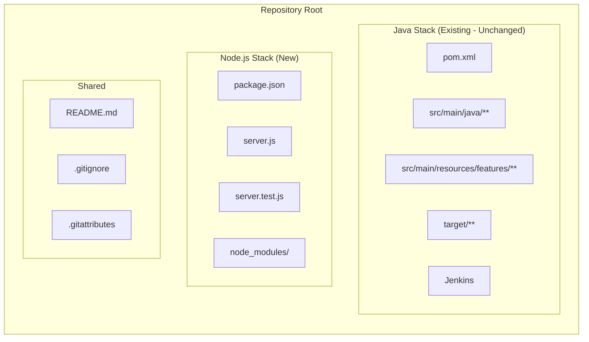

# Technical Specification

# 0. Agent Action Plan

## 0.1 Intent Clarification


### 0.1.1 Core Feature Objective

Based on the prompt, the Blitzy platform understands that the new feature requirement is to introduce Express.js into the existing repository and add an HTTP endpoint that returns the response "Good evening". Specifically, the user has described this project as a Node.js server tutorial that currently hosts one endpoint returning "Hello world", and they wish to:

- **Add Express.js as the web framework**: Integrate the Express.js library into the project so that HTTP routing and server management is handled by Express rather than the bare Node.js `http` module
- **Add a new "Good evening" endpoint**: Create an additional HTTP GET route that, when requested, returns the plain-text response `"Good evening"`
- **Preserve the existing "Hello world" endpoint**: The original endpoint returning `"Hello world"` must continue to function after Express.js is introduced

**Implicit requirements detected:**

- The existing repository is a **Java-based Selenium + Cucumber + JUnit test automation project** (Testinium-QA). There are no Node.js source files, `package.json`, or JavaScript/TypeScript modules present in the codebase. The user's description of a "node js server hosting one endpoint" does not match the current repository state. Therefore, the platform interprets the requirement as **creating the Node.js server component from scratch** within the existing repository, alongside the Java project
- A `package.json` must be initialized to manage the Node.js project metadata and Express.js dependency
- A main server entry point file (e.g., `server.js`) must be created with both the "Hello world" and "Good evening" endpoints
- The Express.js server must listen on a configurable port (defaulting to `3000`)
- Node.js runtime version compatibility must be ensured (Node.js ≥ 18 is required by Express.js v5.x)

### 0.1.2 Special Instructions and Constraints

- **No user-provided setup instructions**: The user did not supply environment setup commands, environment variables, secrets, or attachment files
- **No design system specified**: This feature is a backend-only HTTP server; no UI components, design tokens, or component libraries are applicable
- **No Figma attachments**: No design files were provided
- **Coexistence with existing Java project**: The Node.js server must be added without disrupting the existing Maven-based Java Selenium project. The `pom.xml`, `src/` tree, and `target/` build artifacts must remain untouched
- **Tutorial-level simplicity**: The user explicitly frames this as a tutorial, implying the implementation should be minimal, clean, and easy to follow — no middleware, authentication, database integration, or production hardening is required

### 0.1.3 Technical Interpretation

These feature requirements translate to the following technical implementation strategy:

- To **initialize the Node.js project**, we will create a `package.json` at the repository root using `npm init` conventions, declaring the project name, version, and Express.js dependency
- To **install Express.js**, we will add `express@^5.2.1` (the latest stable release) as a dependency in `package.json`, requiring Node.js ≥ 18
- To **create the HTTP server**, we will create a `server.js` file at the repository root that imports Express, creates an application instance, and defines two GET routes
- To **serve the "Hello world" response**, we will define a `GET /` route handler that sends the string `"Hello world"`
- To **serve the "Good evening" response**, we will define a `GET /evening` route handler that sends the string `"Good evening"`
- To **start the server**, the `server.js` file will call `app.listen()` on port `3000` (or a `PORT` environment variable) and log a startup confirmation message
- To **support easy execution**, we will add a `start` script in `package.json` that runs `node server.js`
- To **document the feature**, we will update `README.md` with instructions on how to install dependencies and run the Node.js server


## 0.2 Repository Scope Discovery


### 0.2.1 Comprehensive File Analysis

The repository is the **Testinium-QA** project — a Java-based Selenium + Cucumber + JUnit BDD test automation framework. A thorough inspection reveals **zero Node.js infrastructure**: no `package.json`, no `.js`/`.ts` source files, no `node_modules/`, and no `.nvmrc`. The complete existing file inventory is documented below.

**Existing Repository File Inventory (files that will NOT be modified for this feature):**

| File / Path | Type | Purpose |
|---|---|---|
| `.gitattributes` | Config | GitHub Linguist configuration — excludes `.html` from language detection |
| `README.md` | Documentation | Project quickstart, prerequisites (JDK 1.8+, Maven, IntelliJ), CI/report instructions |
| `pom.xml` | Build | Maven POM — Java 8 compatibility, Surefire plugin, Selenium/Cucumber/JUnit dependencies |
| `Jenkins` | CI/CD | Jenkinsfile pipeline — clone, run Maven tests, generate Cucumber reports |
| `image/Jenkins-Cucumber-Reports.png` | Asset | Jenkins report screenshot for README |
| `image/Jira-Test-Exectuion.png` | Asset | Jira test execution screenshot for README |
| `Hello_World Blitzy AI Technical Specification (1).pdf` | Document | Technical specification PDF |
| `src/main/java/com/testinium/pages/*.java` | Source | 10 PageFactory-based Page Object classes (CalendarP, ContactsP, CrmP, EmployeeP, InventoryP, LogOutP, LoginP, NotesP, SalesP, SessionP) |
| `src/main/java/com/testinium/runners/*.java` | Source | 2 JUnit/Cucumber runner classes (CukesRunner, FailedTestRunner) |
| `src/main/java/com/testinium/step_definitions/*.java` | Source | 11 step definition classes (Calendar, Contacts, Crm, EmployeeStage, Hooks, Inventory, LogOutSD, LoginSD, Notes, Sales, Session) |
| `src/main/java/com/testinium/utilities/*.java` | Source | 2 utility classes (ConfigurationReader, Driver) |
| `src/main/resources/features/*.feature` | Test Specs | 9 Cucumber feature files (Calendar, Contact, Crm, EmployeeFc, Inventory, Login, Logout, Notes, Sales, Session) |
| `target/**` | Build Output | Generated Cucumber reports (HTML, JSON, rerun.txt) and report bundle |

**Integration point discovery:**

- No existing API endpoints, database models, service classes, controllers, or middleware exist in the Node.js context — all must be created from scratch
- The Java project's `pom.xml` and Maven build pipeline are completely independent from the Node.js feature and will not be modified
- The `Jenkins` pipeline file currently runs only Maven tests; a future enhancement could add a Node.js stage, but that is out of scope for this feature

### 0.2.2 New File Requirements

**New source files to create:**

| File Path | Purpose |
|---|---|
| `server.js` | Main Express.js application entry point — defines two GET routes (`/` → "Hello world", `/evening` → "Good evening") and starts the HTTP server on port 3000 |
| `package.json` | Node.js project manifest — declares project metadata, Express.js dependency, and npm scripts |

**New test files to create:**

| File Path | Purpose |
|---|---|
| `server.test.js` | Unit/integration tests for both endpoints — validates HTTP 200 responses and correct response bodies using `supertest` or direct HTTP requests |

**New configuration files:**

| File Path | Purpose |
|---|---|
| `.gitignore` (update) | Add `node_modules/` to prevent committing installed dependencies to version control |

**Existing files to modify:**

| File Path | Modification |
|---|---|
| `README.md` | Append a "Node.js Server" section documenting installation, running, and endpoint descriptions |

### 0.2.3 Web Search Research Conducted

- **Express.js latest stable version**: Confirmed as **5.2.1** via npm registry — the latest release, published approximately 4 months ago, with 28 dependencies and MIT license
- **Express.js v5 Node.js requirement**: Express 5.x dropped support for Node.js versions before v18; the available runtime (Node.js v20.20.1) is fully compatible
- **Express.js v5 key improvements over v4**: Native async/await middleware support, security-focused path-to-regexp update (ReDoS mitigation), removed deprecated v3/v4 API methods, automatic rejected promise handling
- **Express.js quick-start pattern**: The official npm documentation provides the canonical pattern — import express, create app, define routes with `app.get()`, and call `app.listen()`


## 0.3 Dependency Inventory


### 0.3.1 Private and Public Packages

The following table lists all key packages relevant to this feature addition exercise. Since no Node.js infrastructure currently exists in the repository, all packages are new additions.

| Registry | Package Name | Version | Purpose |
|---|---|---|---|
| npm (public) | `express` | `^5.2.1` | Core web framework — provides HTTP server, routing, request/response handling, and middleware pipeline for serving the "Hello world" and "Good evening" endpoints |
| npm (public) | `node` (runtime) | `v20.20.1` | JavaScript runtime — already available in the environment; Express 5.x requires Node.js ≥ 18 |

**Existing Java dependencies (unchanged — for reference only):**

| Registry | Package Name | Version | Purpose |
|---|---|---|---|
| Maven Central | `selenium-java` | `3.141.59` | Browser automation (existing Java project) |
| Maven Central | `webdrivermanager` | `5.1.0` | Browser driver binary management (existing Java project) |
| Maven Central | `cucumber-java` | `7.2.3` | BDD step definitions (existing Java project) |
| Maven Central | `cucumber-junit` | `7.2.3` / `7.3.4` | JUnit runner integration (existing Java project — duplicate version conflict) |
| Maven Central | `junit` | `4.13.2` | Test assertions and runner (existing Java project) |
| Maven Central | `reporting-plugin` | `7.2.0` | PrettyReports enhanced HTML reporting (existing Java project) |
| Maven Central | `javafaker` | `1.0.2` | Test data generation (existing Java project) |

No private packages are required for this feature.

### 0.3.2 Dependency Updates

**Import updates:**

Since no Node.js files currently exist in the repository, there are no existing imports to update. All imports will be created fresh in the new files:

- `server.js` — Will contain `import express from 'express'` (ESM) or `const express = require('express')` (CommonJS). Given the tutorial nature and broad compatibility, the CommonJS `require()` pattern is recommended
- `server.test.js` — Will import the server module and any test utilities

**External reference updates:**

| File | Update Required |
|---|---|
| `package.json` (new) | Declare `express` dependency with version `^5.2.1` and define `scripts.start` as `node server.js` |
| `README.md` (existing) | Add Node.js prerequisites (Node.js ≥ 18), `npm install` instructions, and `npm start` command documentation |
| `.gitignore` (new/update) | Add `node_modules/` pattern to exclude installed dependencies from version control |

**No changes required to:**
- `pom.xml` — Maven build configuration is unrelated to the Node.js feature
- `Jenkins` — CI pipeline is Maven-only; Node.js CI integration is out of scope
- Any `.java`, `.feature`, or `.properties` files — The Java project remains unmodified


## 0.4 Integration Analysis


### 0.4.1 Existing Code Touchpoints

Because the repository currently contains no Node.js infrastructure, the integration surface is minimal. The Node.js Express server is being introduced as a **parallel, independent component** alongside the existing Java Selenium project. The two stacks share only the repository root and documentation.

**Direct modifications required:**

| File | Modification | Location |
|---|---|---|
| `README.md` | Append a new "Node.js Express Server" section with installation instructions, usage commands, and endpoint documentation | End of file — after the existing "THE END" marker at line 170 |

**No dependency injections required:**
- The Node.js server is a self-contained application with no shared services, containers, or dependency wiring with the Java project

**No database or schema updates required:**
- Both endpoints return static string responses — no database, ORM, or migration infrastructure is needed

### 0.4.2 Coexistence Architecture

The repository will operate as a **polyglot project** with two independent technology stacks sharing the same root directory:



**Key isolation principles:**
- The Node.js `package.json` and `server.js` live at the repository root, adjacent to `pom.xml` — standard for polyglot repositories
- The `node_modules/` directory will be excluded via `.gitignore` and has no overlap with `target/` (Maven output)
- Maven Surefire discovers tests using `**/CukesRunner*.java` — this pattern will never match `.js` files, ensuring zero test discovery conflicts
- The Jenkins pipeline only executes `mvn clean test` — it will not interact with Node.js files

### 0.4.3 Runtime Integration Points

| Integration Aspect | Details |
|---|---|
| **Port binding** | The Express server listens on port `3000` (or `PORT` environment variable). This does not conflict with the Java project, which has no server component |
| **Process model** | The Node.js server runs as an independent process via `node server.js` — completely separate from Maven test execution |
| **File system** | New files (`server.js`, `package.json`, `server.test.js`) are placed at root level. No existing file paths or directories are displaced |
| **Git workflow** | All new files are standard, non-generated source files. The `.gitignore` update ensures `node_modules/` is not committed |
| **Environment variables** | Only `PORT` is optionally used — no overlap with Java's `configuration.properties` |


## 0.5 Technical Implementation


### 0.5.1 File-by-File Execution Plan

Every file listed below MUST be created or modified to deliver the feature.

**Group 1 — Core Feature Files:**

| Action | File Path | Purpose |
|---|---|---|
| CREATE | `package.json` | Node.js project manifest declaring project name `testinium-qa-server`, version `1.0.0`, main entry point `server.js`, Express.js dependency `^5.2.1`, and npm scripts (`start`: `node server.js`) |
| CREATE | `server.js` | Express.js application entry point — imports Express, creates an app instance, defines `GET /` returning `"Hello world"`, defines `GET /evening` returning `"Good evening"`, and starts the server on port 3000 |

**Group 2 — Supporting Infrastructure:**

| Action | File Path | Purpose |
|---|---|---|
| CREATE | `.gitignore` | Git ignore rules — add `node_modules/` to prevent dependency directory from being committed to version control |

**Group 3 — Tests and Documentation:**

| Action | File Path | Purpose |
|---|---|---|
| CREATE | `server.test.js` | Test file — validates both endpoints return correct HTTP 200 status codes and expected response bodies (`"Hello world"` and `"Good evening"`) |
| MODIFY | `README.md` | Append "Node.js Express Server" section with prerequisites, installation, start command, and endpoint reference table |

### 0.5.2 Implementation Approach per File

**Step 1 — Establish Node.js foundation by creating `package.json`:**

```json
{ "name": "testinium-qa-server", "main": "server.js" }
```

The manifest declares Express `^5.2.1` as a dependency and defines the `start` script pointing to `server.js`.

**Step 2 — Create the Express server in `server.js`:**

```js
const express = require('express');
const app = express();
```

The file defines two route handlers — `app.get('/', ...)` sending `"Hello world"` and `app.get('/evening', ...)` sending `"Good evening"` — then calls `app.listen(PORT)`.

**Step 3 — Add `.gitignore` for `node_modules/`:**

A single-line `.gitignore` file (or append to existing) containing `node_modules/` ensures installed dependencies stay out of version control.

**Step 4 — Create `server.test.js` for endpoint validation:**

The test file imports the Express app (exported from `server.js`), makes HTTP GET requests to `/` and `/evening`, and asserts the response status is `200` with the correct body strings.

**Step 5 — Update `README.md` with usage documentation:**

A new section is appended after the existing content, describing:
- Prerequisites: Node.js ≥ 18
- Installation: `npm install`
- Running the server: `npm start`
- Endpoint table listing `GET /` → `"Hello world"` and `GET /evening` → `"Good evening"`

### 0.5.3 Endpoint Specification

| Method | Path | Response Body | Content-Type | Status Code |
|---|---|---|---|---|
| GET | `/` | `Hello world` | `text/html; charset=utf-8` (Express default for `res.send()` with string) | 200 |
| GET | `/evening` | `Good evening` | `text/html; charset=utf-8` (Express default for `res.send()` with string) | 200 |


## 0.6 Scope Boundaries


### 0.6.1 Exhaustively In Scope

**All feature source files:**
- `server.js` — Express application with both route handlers
- `package.json` — Node.js project manifest with Express dependency

**All feature tests:**
- `server.test.js` — HTTP endpoint validation tests

**Integration points:**
- `README.md` — Append Node.js server documentation section (after line 170)

**Configuration files:**
- `.gitignore` — Add `node_modules/` exclusion pattern
- `package.json` — `scripts.start` set to `node server.js`

**Documentation:**
- `README.md` — New "Node.js Express Server" section covering installation, startup, and endpoint reference

**Runtime dependencies installed via `npm install`:**
- `express@^5.2.1` and its 28 transitive dependencies (installed into `node_modules/`)

### 0.6.2 Explicitly Out of Scope

- **All Java source files** (`src/main/java/com/testinium/**/*.java`) — No modifications to Page Objects, step definitions, runners, or utilities
- **All Cucumber feature files** (`src/main/resources/features/*.feature`) — No test specification changes
- **Maven build configuration** (`pom.xml`) — No changes to Java dependencies, plugins, or compiler settings
- **Jenkins pipeline** (`Jenkins`) — No CI/CD updates for Node.js; the pipeline remains Maven-only
- **Build output artifacts** (`target/**`) — Generated reports are not affected
- **Image assets** (`image/*.png`) — Screenshots for README remain unchanged
- **PDF documents** (`Hello_World Blitzy AI Technical Specification (1).pdf`) — No modifications
- **Git configuration** (`.gitattributes`) — Linguist settings remain as-is
- **Middleware, authentication, or session management** — Not required for this tutorial-level feature
- **Database integration, ORM, or migrations** — Both endpoints return static strings; no persistence layer needed
- **Production hardening** (HTTPS, rate limiting, logging, error handling middleware) — Out of scope for this tutorial
- **Docker or containerization** — No `Dockerfile` or `docker-compose.yml` changes
- **Performance optimization** beyond basic feature requirements
- **Refactoring of existing Java code** unrelated to this feature integration
- **Additional Node.js endpoints** beyond the two specified (`/` and `/evening`)


## 0.7 Rules for Feature Addition


### 0.7.1 Feature-Specific Rules

The user did not provide explicit implementation rules. The following rules are derived from best practices, the repository's existing conventions, and the requirements implied by the user's tutorial-level request:

- **Non-destructive addition**: The Node.js server must be introduced without modifying, removing, or interfering with any existing Java project files. The `pom.xml`, Java source tree, Cucumber features, Jenkins pipeline, and all Maven build artifacts must remain fully intact and functional
- **Tutorial-level simplicity**: The implementation should remain minimal and readable. Avoid over-engineering with unnecessary middleware stacks, complex project structures, or abstractions. Two routes, one file, one dependency
- **Express.js v5 compatibility**: Use Express.js `^5.2.1` (the latest stable version). The server code must be compatible with Express 5 API conventions — specifically using `res.send()` for string responses and `app.listen()` for server startup
- **CommonJS module format**: Use `require()`/`module.exports` rather than ES module `import`/`export` syntax to maintain maximum compatibility without requiring `"type": "module"` in `package.json` or `.mjs` file extensions
- **Port configurability**: The server should respect a `PORT` environment variable for flexibility, defaulting to `3000` when not set
- **Exact response strings**: The "Hello world" and "Good evening" response strings must exactly match the user's specification — `"Hello world"` (capital H, lowercase w) and `"Good evening"` (capital G, lowercase e)
- **Root-level file placement**: New Node.js files (`server.js`, `package.json`, `server.test.js`) should be placed at the repository root, consistent with the flat structure of existing configuration files (`pom.xml`, `Jenkins`, `README.md`)


## 0.8 References


### 0.8.1 Repository Files and Folders Searched

The following files and folders were retrieved and analyzed during the context-gathering phase to derive the conclusions documented in this Agent Action Plan:

**Root-level files inspected:**
- `.gitattributes` — Confirmed GitHub Linguist configuration (HTML exclusion)
- `README.md` — Reviewed all 170 lines for project description, prerequisites, and existing documentation structure
- `pom.xml` — Reviewed all 83 lines for Maven coordinates, Java 8 compiler settings, Surefire plugin configuration, and full dependency manifest (7 dependencies including duplicate `cucumber-junit` versions)
- `Jenkins` — Reviewed Jenkinsfile pipeline stages (Clone, Run tests, Generate report)
- `Hello_World Blitzy AI Technical Specification (1).pdf` — Identified as a technical specification document

**Source directories explored (3+ levels deep):**
- `src/` → `src/main/` → `src/main/java/` → `src/main/java/com/` → `src/main/java/com/testinium/`
- `src/main/java/com/testinium/pages/` — 10 Page Object classes confirmed (CalendarP, ContactsP, CrmP, EmployeeP, InventoryP, LogOutP, LoginP, NotesP, SalesP, SessionP)
- `src/main/java/com/testinium/runners/` — 2 runner classes confirmed (CukesRunner, FailedTestRunner)
- `src/main/java/com/testinium/step_definitions/` — 11 step definition classes confirmed (Calendar, Contacts, Crm, EmployeeStage, Hooks, Inventory, LogOutSD, LoginSD, Notes, Sales, Session)
- `src/main/java/com/testinium/utilities/` — 2 utility classes confirmed (ConfigurationReader, Driver)
- `src/main/resources/features/` — 9 Cucumber feature files confirmed
- `target/` — Build output artifacts explored (cucumber-reports.html, cucumber.json, rerun.txt, cucumber/ report bundle)
- `image/` — 2 PNG screenshot assets confirmed

**System-wide searches:**
- Searched for `*.js`, `*.ts`, `package.json`, `.nvmrc`, `server.js`, `app.js`, `index.js` across the entire filesystem — confirmed zero Node.js files exist in the repository
- Searched for `.blitzyignore` files — none found

### 0.8.2 Technical Specification Sections Retrieved

The following tech spec sections were consulted for architectural context:

| Section | Key Information Extracted |
|---|---|
| 1.1 Executive Summary | Project overview (BDD test automation framework), business problem, key stakeholders |
| 2.1 Feature Catalog | Complete catalog of 10 tested features (F-001 through F-010) with metadata and dependencies |
| 5.1 High-Level Architecture | Layered architecture description, Page Object Model pattern, system boundaries, data flow, external integrations |
| 5.2 Component Details | Detailed component analysis for Driver, ConfigurationReader, runners, page objects, step definitions, and hooks |
| 8.2 Build Infrastructure | Maven build system configuration, dependency management, build artifacts structure |

### 0.8.3 External Research Conducted

| Search Topic | Source | Key Finding |
|---|---|---|
| Express.js latest stable version | npm registry (npmjs.com/package/express) | Latest version: **5.2.1**, published approximately 4 months ago, 101,270 dependents |
| Express.js v5 release details | GitHub (expressjs/express/releases) | Express v5 focuses on stability and security, drops support for Node.js < 18, updated path-to-regexp for ReDoS mitigation |
| Express.js v5.1 LTS timeline | expressjs.com blog | Express 5.1.0 became the default (`latest` tag) on npm with a formal LTS schedule (CURRENT → ACTIVE → MAINTENANCE) |
| Express.js v5 Node.js requirement | Multiple sources | Express 5.x requires Node.js ≥ 18; environment has Node.js v20.20.1 (fully compatible) |

### 0.8.4 Attachments and Figma Screens

- **No user attachments** were provided for this project
- **No Figma URLs** were specified
- **No environment files** were supplied in `/tmp/environments_files/`


