# Technical Specification

# 0. Agent Action Plan

## 0.1 Intent Clarification

#### Core Documentation Objective

Based on the provided requirements, the Blitzy platform understands that the documentation objective is to **enhance and expand the existing Python Selenium + Behave BDD test automation framework documentation** to provide comprehensive coverage across setup, API reference, deployment procedures, and inline code explanations.

**Documentation Request Classification:**
- **Primary Category:** Update existing documentation + Create new documentation
- **Documentation Type:** Mixed - API documentation, User guides, Technical specifications, Deployment guide, Inline code documentation
- **Scope:** Framework-wide documentation enhancement

**User Request Interpretation:**

The user stated: *"Add JSDoc comments to server.js functions, create a comprehensive README with setup instructions, API documentation, deployment guide, and inline code explanations."*

**Clarified Requirements:**

1. **Python Docstring Enhancement** (Interpreting "JSDoc comments to server.js"): While the user mentioned "JSDoc comments to server.js functions," repository analysis reveals this is a Python-based test automation framework with no server.js file. The Blitzy platform interprets this as a request to ensure all Python functions, classes, and methods have comprehensive docstrings following PEP 257 conventions.

2. **Comprehensive README Enhancement**: Expand the existing README.md (currently 762 lines) with additional depth in:
   - More detailed API usage examples
   - Enhanced deployment procedures
   - Additional troubleshooting scenarios
   - Performance optimization guidance
   - Advanced configuration patterns

3. **API Documentation Creation**: Create structured API reference documentation for:
   - `utilities/` package (driver_manager, config_reader, wait_helpers, screenshot_helper)
   - `pages/` package (base_page and all 10+ page object implementations)
   - `config/` package (test_config, configuration management)
   - `features/steps/` package (all step definition modules)

4. **Deployment Guide Creation**: Develop comprehensive deployment documentation covering:
   - Local development setup (detailed)
   - CI/CD integration (Jenkins, GitHub Actions, GitLab CI)
   - Container deployment (Docker, Kubernetes)
   - Cloud execution (AWS, Azure, GCP)
   - Staging and production environment configuration

5. **Inline Code Explanations**: Ensure all Python modules have:
   - Module-level docstrings explaining purpose and architecture
   - Class-level docstrings with usage examples
   - Method/function docstrings with parameters, returns, and exceptions
   - Complex logic inline comments for maintainability

**Inferred Implicit Documentation Needs:**

Based on repository analysis, the following documentation gaps were identified and will be addressed:

1. **Architecture Documentation Missing:**
   - System architecture diagrams showing component relationships
   - Data flow diagrams for test execution lifecycle
   - Thread-safety patterns documentation (threading.local() usage)
   - Configuration hierarchy and precedence rules

2. **API Reference Gap:**
   - No dedicated API documentation structure (docs/api/)
   - Page Object Model API needs standalone reference
   - Utility module APIs need consolidated documentation
   - Behave hooks and context management documentation missing

3. **Advanced Usage Documentation:**
   - Parallel execution best practices
   - Custom reporter integration
   - Extending the framework (adding new page objects, step definitions)
   - Performance tuning and optimization

4. **Deployment Documentation Gap:**
   - Container orchestration setup missing
   - Cloud provider-specific configurations
   - Secrets management in production
   - Scaling strategies for parallel execution

5. **Migration Documentation:**
   - While Technical Specifications.md exists in blitzy/documentation/, user-facing migration guide is missing
   - Java to Python equivalence patterns for new contributors

6. **Testing the Tests Documentation:**
   - How to run unit tests for the framework itself
   - Mocking strategies for WebDriver
   - Test coverage requirements and reporting

#### Special Instructions and Constraints

**CRITICAL: User-Specified Directives**

The user provided the instruction: *"Add JSDoc comments to server.js functions, create a comprehensive README with setup instructions, API documentation, deployment guide, and inline code explanations."*

**Interpretation and Constraints:**

1. **No Template Provided:** User did not provide a specific documentation template. Will follow industry-standard patterns:
   - Google-style Python docstrings (already in use in the codebase)
   - Markdown format for all documentation files
   - Mermaid diagrams for architectural visualizations

2. **Maintain Existing Documentation Style:** The codebase exhibits high-quality documentation patterns:
   - Comprehensive module docstrings with migration context
   - Detailed method docstrings with Java equivalents cited
   - Inline comments explaining critical fixes and architectural decisions
   - **Constraint:** All new documentation must match this existing quality bar

3. **Preserve Existing Documentation:** 
   - README.md (762 lines) is comprehensive and well-structured
   - blitzy/documentation/Project Guide.md contains operational runbook
   - blitzy/documentation/Technical Specifications.md contains architecture blueprint
   - **Directive:** Enhance, don't replace - maintain all existing valuable content

4. **Documentation Style Preferences:**
   - **Tone:** Technical, precise, with practical examples
   - **Structure:** Hierarchical with clear navigation
   - **Depth:** Comprehensive with progressive disclosure (basics to advanced)
   - **Format:** Markdown with code blocks, tables, and Mermaid diagrams

**Web Search Requirements:**

Documentation best practices research needed for:
- Python docstring conventions and standards (PEP 257, PEP 8)
- Selenium test automation documentation patterns
- BDD framework documentation best practices
- API documentation generators for Python (Sphinx, MkDocs)
- Deployment guide structures for test frameworks
- Mermaid diagram syntax for architecture documentation

#### Technical Interpretation

**Translation to Technical Documentation Strategy:**

"These documentation requirements translate to the following technical documentation strategy..."

**Requirement → Documentation Action Mapping:**

1. **"Add JSDoc comments to server.js functions"** →
   - **Action:** Audit all Python modules (.py files) for docstring completeness
   - **Technical Approach:** Scan all functions, classes, and methods in utilities/, pages/, config/, features/steps/, and tests/ packages
   - **Validation:** Ensure 100% coverage of public APIs with PEP 257-compliant docstrings
   - **Files:** All *.py files excluding __pycache__, venv, and target directories

2. **"Create comprehensive README with setup instructions"** →
   - **Action:** Enhance existing README.md with deeper setup guidance
   - **Technical Approach:** Add sections for Docker setup, virtual environment troubleshooting, dependency conflict resolution
   - **Additions:** Quick start guide, video tutorial links, common setup pitfalls
   - **File:** README.md (expand from 762 to ~1000+ lines)

3. **"API documentation"** →
   - **Action:** Create structured API reference documentation hierarchy
   - **Technical Approach:** Establish docs/api/ directory with module-by-module documentation
   - **Structure:** 
     - docs/api/index.md (API overview)
     - docs/api/utilities/ (driver_manager, config_reader, wait_helpers, screenshot_helper)
     - docs/api/pages/ (base_page, login_page, crm_page, etc.)
     - docs/api/config/ (test_config)
     - docs/api/steps/ (step definitions reference)
   - **Files:** Create 20+ new API documentation files

4. **"Deployment guide"** →
   - **Action:** Create comprehensive multi-environment deployment documentation
   - **Technical Approach:** Establish docs/deployment/ directory with environment-specific guides
   - **Structure:**
     - docs/deployment/local-development.md
     - docs/deployment/ci-cd-integration.md (Jenkins, GitHub Actions, GitLab CI)
     - docs/deployment/docker-deployment.md
     - docs/deployment/kubernetes-deployment.md
     - docs/deployment/cloud-providers.md (AWS, Azure, GCP)
   - **Files:** Create 5+ deployment guide files

5. **"Inline code explanations"** →
   - **Action:** Audit and enhance inline documentation in all source files
   - **Technical Approach:** Add explanatory comments for complex logic, configuration patterns, thread-safety mechanisms
   - **Focus Areas:** WebDriver management (threading.local()), wait strategies, property-based locators
   - **Files:** Update 50+ Python source files with enhanced inline comments

**Comprehensive Implementation Matrix:**

| User Requirement | Technical Action | Target Files | Documentation Type |
|------------------|------------------|--------------|-------------------|
| JSDoc comments | Add/enhance Python docstrings | All .py files in src packages | Inline docstrings |
| Comprehensive README | Expand setup, troubleshooting, quickstart | README.md | User guide |
| API documentation | Create structured API reference | docs/api/**/*.md | API reference |
| Deployment guide | Create environment-specific deployment docs | docs/deployment/**/*.md | Deployment guide |
| Inline explanations | Add explanatory comments for complex logic | utilities/, pages/, config/ files | Inline comments |

#### Inferred Documentation Needs

**Based on Code Analysis: Public APIs Lacking Documentation**

Repository analysis reveals that while most modules have excellent module-level and class-level docstrings, the following gaps require attention:

1. **Module X contains public APIs but lacks documentation:**
   - `pages/calendar_page.py` - Methods need parameter descriptions and usage examples
   - `pages/contacts_page.py` - Complex interaction methods need detailed docstrings
   - `pages/crm_page.py` - CRM workflow methods need step-by-step explanations
   - `pages/employee_page.py` - Employee management methods need examples
   - `pages/inventory_page.py` - Inventory operations need clarification
   - `pages/notes_page.py` - Note creation/editing methods need documentation
   - `pages/sales_page.py` - Sales workflow methods need detailed docs
   - `pages/session_page.py` - Session management methods need explanation

2. **Based on Structure: Feature Y spans multiple files requiring consolidated documentation**
   - **Login Feature** spans: features/Login.feature, features/steps/login_steps.py, pages/login_page.py
     - Requires: Consolidated login flow documentation showing feature → steps → page object mapping
   - **CRM Feature** spans: features/Crm.feature, features/steps/crm_steps.py, pages/crm_page.py
     - Requires: CRM workflow documentation with sequence diagrams
   - **Employee Management** spans: features/EmployeeFc.feature, features/steps/employee_steps.py, pages/employee_page.py
     - Requires: Employee operations consolidated documentation

3. **Based on Dependencies: Integration between A and B requires interface documentation**
   - **DriverManager ↔ BasePage integration:**
     - DriverManager provides thread-local WebDriver via threading.local()
     - BasePage receives WebDriver and provides wait utilities
     - **Missing:** Thread-safety documentation explaining threading.local() pattern
   
   - **ConfigReader ↔ DriverManager integration:**
     - ConfigReader provides browser configuration (type, headless, timeouts)
     - DriverManager uses configuration to initialize WebDriver
     - **Missing:** Configuration precedence documentation (.env → config.yaml → defaults)
   
   - **BasePage ↔ Page Objects integration:**
     - BasePage provides wait_for_element, wait_for_clickable, etc.
     - Child page objects use @property decorators for element access
     - **Missing:** Property-based locator pattern documentation with examples

4. **Based on User Journey: New feature requires setup guide, usage examples, and troubleshooting**
   - **New Contributor Onboarding:**
     - Setup guide: ✓ Exists in README.md
     - First test execution: ✓ Covered in README.md
     - Creating new page object: ✗ Missing - needs tutorial
     - Adding new step definitions: ✗ Missing - needs tutorial
     - Writing new feature files: ✗ Missing - needs Gherkin guide
   
   - **CI/CD Integration Journey:**
     - Local execution: ✓ Covered
     - Jenkins setup: ✓ Basic example in README.md
     - GitHub Actions setup: ✗ Missing
     - GitLab CI setup: ✗ Missing
     - Report publishing: Partial - needs expansion
   
   - **Troubleshooting Journey:**
     - Common errors: ✓ Covered in README.md
     - WebDriver issues: ✓ Covered
     - Stale element handling: ✓ Covered
     - Parallel execution issues: ✗ Missing
     - Configuration precedence issues: ✗ Missing
     - Report generation failures: ✗ Missing

**Documentation Needs Summary:**

- **8 page object modules** need enhanced method-level documentation
- **10 feature workflows** need consolidated documentation with diagrams
- **3 major integration patterns** need interface documentation
- **6 user journey gaps** need tutorial-style documentation
- **Architecture patterns** (threading.local(), property-based locators, explicit waits) need dedicated documentation

## 0.2 Documentation Discovery and Analysis

#### Existing Documentation Infrastructure Assessment

**Repository Analysis Reveals:** The Testinium QA Python test automation framework has a mature documentation infrastructure with comprehensive existing documentation that will be enhanced rather than replaced.

**CRITICAL FINDING:** User request mentioned "server.js" but extensive repository search confirms this is a pure Python project with no JavaScript files except minified third-party libraries in target/cucumber/cucumber-html-reports/js/. The request is interpreted as Python docstring enhancement.

#### Current Documentation Framework

**Primary Documentation:**
- **Framework:** Markdown-based documentation with no specialized documentation generator currently configured
- **Version:** Standard Markdown (GitHub Flavored Markdown compatible)
- **Location:** Repository root (README.md) and blitzy/documentation/ directory
- **Status:** Comprehensive but not centralized; lacks API reference structure

**Documentation Infrastructure Inventory:**

| Documentation Type | Location | Status | Lines/Size | Quality Assessment |
|--------------------|----------|--------|------------|-------------------|
| Project README | README.md | Comprehensive | 762 lines | Excellent - well-structured with examples |
| Project Guide | blitzy/documentation/Project Guide.md | Complete | ~5000+ lines | Excellent - operational playbook |
| Technical Specs | blitzy/documentation/Technical Specifications.md | Complete | ~8000+ lines | Excellent - architectural blueprint |
| Module Docstrings | All .py files | Excellent | 17,367 total Python lines | High quality - PEP 257 compliant |
| API Reference | None | Missing | N/A | Not Yet Created |
| Deployment Guide | Partial in README | Incomplete | ~50 lines | Needs expansion to standalone guide |
| Contributing Guide | Section in README | Basic | ~50 lines | Needs expansion |
| Changelog | None | Missing | N/A | Not Yet Created |

#### API Documentation Tools Detection

**Current State:** No documentation generation tools currently configured

**Potential Tools (Not Yet Configured):**
- **Sphinx:** Standard Python documentation generator - NOT installed
- **MkDocs:** Modern static site generator for project documentation - NOT installed
- **pdoc:** Simple Python API documentation generator - NOT installed
- **Pydoctor:** API documentation generator - NOT installed

**Recommendation:** Install MkDocs with Material theme for creating structured documentation site

**Diagram Tools Detected:**
- **Mermaid:** Referenced in README.md examples, used for diagrams
- **Status:** Available via CDN in rendered Markdown (GitHub, GitLab)
- **Usage:** Will be leveraged for architecture, sequence, and class diagrams

#### Documentation Hosting/Deployment Setup

**Current State:** No documentation hosting configured

**Available Options:**
- **GitHub Pages:** Can host static documentation
- **Read the Docs:** Free hosting for open-source projects
- **GitLab Pages:** Alternative hosting option
- **Recommendation:** Set up GitHub Pages with MkDocs deployment

**Configuration Files Found:**
- **.gitignore:** Configured to exclude documentation build artifacts
- **No mkdocs.yml:** Documentation generator not yet configured
- **No .readthedocs.yml:** RTD hosting not configured
- **No docusaurus.config.js:** Docusaurus not in use

#### Repository Code Analysis for Documentation

**EXHAUSTIVE SEARCH CONDUCTED:** Comprehensive repository traversal completed to identify all files requiring documentation.

#### Search Patterns Used for Code to Document

**Public APIs - Python Modules:**
```bash
# Search pattern executed:
find . -name "*.py" -type f ! -path "./venv/*" ! -path "./target/*" ! -path "./.git/*"
```

**Results:** 44 Python modules identified across packages:
- config/ (3 files)
- features/steps/ (11 files including __init__.py)
- features/ (1 file: environment.py)
- pages/ (13 files including __init__.py and base_page.py)
- utilities/ (5 files including __init__.py)
- tests/ (3 files)
- Root-level: setup.py

**Module Interfaces - Package Entry Points:**
```bash
# Search pattern executed:
find . -name "__init__.py" -type f ! -path "./venv/*"
```

**Results:** 5 package initializers found:
- config/__init__.py - Exports get_config, reset_config
- utilities/__init__.py - Exports DriverManager, ConfigReader, WaitHelpers
- pages/__init__.py - Exports all page objects
- features/steps/__init__.py - Package marker for step definitions
- tests/__init__.py - Test package metadata

**Configuration Options:**
```bash
# Configuration files identified:
- config/config.yaml - Main configuration
- .env.example - Environment variable template
- behave.ini - Behave framework configuration
- pytest.ini - pytest framework configuration
- pyproject.toml - Python project configuration
- setup.py - Package setup configuration
```

**Feature Files (Gherkin):**
```bash
# Search pattern executed:
find . -name "*.feature" -type f
```

**Results:** 10 Behave feature files in features/ directory:
- Calendar.feature - Calendar management scenarios
- Contact.feature - Contact management scenarios
- Crm.feature - CRM workflow scenarios
- EmployeeFc.feature - Employee functionality scenarios
- Inventory.feature - Inventory management scenarios
- Login.feature - Authentication scenarios
- Logout.feature - Logout scenarios
- Notes.feature - Notes functionality scenarios
- Sales.feature - Sales workflow scenarios
- Session.feature - Session management scenarios

#### Key Directories Examined

**Complete Directory Structure:**

```
testinium-qa-python/
├── config/                      # Configuration management (3 files)
│   ├── __init__.py             # Exports: get_config, reset_config
│   ├── config.yaml             # Main configuration file
│   └── test_config.py          # Dataclass-based configuration
├── features/                    # Behave BDD features (11 files + 1 env)
│   ├── *.feature               # 10 Gherkin feature files
│   ├── environment.py          # Behave hooks (before/after)
│   └── steps/                  # Step definitions (11 files)
├── pages/                       # Page Object Model (13 files)
│   ├── __init__.py             # Exports: All page objects
│   ├── base_page.py            # Abstract base class
│   └── *_page.py               # 11 page object implementations
├── utilities/                   # Core utilities (5 files)
│   ├── __init__.py             # Exports: DriverManager, ConfigReader, etc.
│   ├── config_reader.py        # Configuration singleton
│   ├── driver_manager.py       # WebDriver lifecycle manager
│   ├── screenshot_helper.py    # Screenshot utilities
│   └── wait_helpers.py         # Wait utility wrappers
├── tests/                       # pytest unit tests (3 files)
│   ├── __init__.py             # Test package metadata
│   ├── test_config.py          # Configuration tests
│   └── test_driver_manager.py  # Driver manager tests
├── blitzy/documentation/        # Existing documentation (2 files)
│   ├── Project Guide.md        # Operational playbook (~5000 lines)
│   └── Technical Specifications.md  # Architecture blueprint (~8000 lines)
├── README.md                    # Main project documentation (762 lines)
├── requirements.txt             # Python dependencies
├── pyproject.toml              # Poetry configuration
├── setup.py                    # Package setup script
├── behave.ini                  # Behave configuration
├── pytest.ini                  # pytest configuration
└── .env.example                # Environment template
```

#### Related Documentation Found

**Existing Documentation Assets:**

1. **README.md (762 lines)** - Comprehensive project documentation:
   - Installation instructions (Python 3.9+ setup)
   - Framework setup (virtual environment, dependencies)
   - Running tests (behave commands, tags, parallel execution)
   - Configuration (behave.ini, config.yaml, .env)
   - BDD examples (Gherkin scenarios, step definitions, page objects)
   - Jenkins integration (Jenkinsfile example)
   - Report generation (HTML, JSON, JUnit, Allure)
   - Jira integration (tagging examples)
   - Project structure overview
   - Troubleshooting section (8 common issues)
   - Dependencies list
   - Contributing guidelines

2. **Project Guide.md (~5000 lines)** - Operational playbook:
   - Migration context (Java → Python)
   - Environment setup commands
   - Test execution procedures
   - Validation criteria (61/61 tests passing)
   - Bug fixes documented (5 critical fixes)
   - Remaining tasks with estimates (~23 hours)
   - Repository path references
   - CI/CD integration notes

3. **Technical Specifications.md (~8000 lines)** - Architecture blueprint:
   - Migration transformation rules
   - Design patterns (threading.local(), property-based locators)
   - Architectural decisions (explicit waits only, no implicit waits)
   - Configuration hierarchy
   - Parallel execution patterns
   - Security fixes documented
   - Behavioral equivalence mapping (Java ↔ Python)

4. **Module Docstrings** - Inline documentation in all Python files:
   - Module-level docstrings (purpose, architecture, examples)
   - Class-level docstrings (attributes, thread safety, usage)
   - Method-level docstrings (parameters, returns, exceptions, examples)
   - Migration notes (Java equivalents referenced)
   - Critical fix explanations (bug fixes from Java version)

#### Web Search Research Conducted

**Best Practices Research:**

1. **Python Docstring Conventions:**
   - PEP 257 - Docstring Conventions (authoritative standard)
   - Google-style Python docstrings (already used in codebase)
   - Sphinx docstring format compatibility
   - Type hints integration with docstrings

2. **Selenium Test Automation Documentation Patterns:**
   - Page Object Model documentation best practices
   - WebDriver lifecycle documentation patterns
   - Wait strategy documentation approaches
   - Thread-safety documentation for parallel execution

3. **BDD Framework Documentation Best Practices:**
   - Gherkin scenario documentation
   - Step definition reference documentation
   - Feature-to-code traceability documentation
   - BDD living documentation concepts

4. **API Documentation Generators for Python:**
   - **MkDocs:** Modern, fast, simple static site generator
     - Material theme: Professional appearance
     - Markdown-based: Easy to maintain
     - Plugin ecosystem: Extensions for API docs, diagrams
   - **Sphinx:** Industry standard for Python projects
     - autodoc extension: Auto-generate from docstrings
     - Napoleon extension: Google/NumPy style docstrings
     - More complex setup than MkDocs
   - **pdoc:** Lightweight alternative
     - Minimal configuration
     - Direct docstring → HTML

5. **Deployment Guide Structures for Test Frameworks:**
   - Multi-environment documentation (local, CI/CD, cloud)
   - Container deployment patterns (Docker, Kubernetes)
   - Configuration management across environments
   - Secrets management in deployment pipelines

6. **Mermaid Diagram Syntax:**
   - Flowchart syntax for process flows
   - Sequence diagram syntax for interactions
   - Class diagram syntax for architecture
   - State diagram syntax for lifecycle management

**Research Findings Application:**

- **Adopt MkDocs with Material theme** for documentation site
- **Maintain Google-style docstrings** (already in use)
- **Create Mermaid diagrams** for architecture visualization
- **Structure deployment docs** by environment type
- **Implement living documentation** connecting Gherkin to code

## 0.3 Documentation Scope Analysis

#### Code-to-Documentation Mapping

**COMPREHENSIVE MODULE INVENTORY:** All 44 Python modules analyzed for documentation requirements.

#### Modules Requiring API Documentation

**1. Configuration Package (config/)**

- **Module:** config/test_config.py
  - **Public APIs:** Config, BrowserConfig, TimeoutConfig, ApplicationConfig, CredentialsConfig, ReportingConfig dataclasses; get_config(), reset_config() functions
  - **Current documentation:** Excellent module docstring, comprehensive class docstrings, detailed method documentation
  - **Documentation needed:** 
    - API reference page: docs/api/config/test_config.md
    - Configuration guide with examples: docs/guides/configuration.md
    - Environment variable interpolation examples

- **Module:** config/__init__.py
  - **Public APIs:** get_config(), reset_config() (re-exports)
  - **Current documentation:** Comprehensive package docstring
  - **Documentation needed:** API reference entry in docs/api/config/index.md

**2. Utilities Package (utilities/)**

- **Module:** utilities/driver_manager.py
  - **Public APIs:** DriverManager class (get_driver(), quit_driver(), _create_driver()), DriverInitializationError exception
  - **Current documentation:** Excellent - comprehensive module, class, and method docstrings with migration notes
  - **Documentation needed:**
    - API reference: docs/api/utilities/driver_manager.md
    - Thread-safety guide: docs/guides/parallel-execution.md
    - Driver lifecycle diagrams

- **Module:** utilities/config_reader.py
  - **Public APIs:** ConfigReader class (get_property(), get_all_properties(), get_property_or_default())
  - **Current documentation:** Comprehensive docstrings
  - **Documentation needed:**
    - API reference: docs/api/utilities/config_reader.md
    - Configuration precedence documentation

- **Module:** utilities/wait_helpers.py
  - **Public APIs:** WaitHelpers class (wait_for_element(), wait_for_clickable(), wait_for_visibility(), etc.)
  - **Current documentation:** Good docstrings
  - **Documentation needed:**
    - API reference: docs/api/utilities/wait_helpers.md
    - Wait strategy guide with best practices

- **Module:** utilities/screenshot_helper.py
  - **Public APIs:** capture_screenshot(), sanitize_filename(), capture_browser_logs()
  - **Current documentation:** Good docstrings
  - **Documentation needed:**
    - API reference: docs/api/utilities/screenshot_helper.md
    - Screenshot handling guide

- **Module:** utilities/__init__.py
  - **Public APIs:** Re-exports DriverManager, ConfigReader, WaitHelpers
  - **Current documentation:** Comprehensive package docstring
  - **Documentation needed:** Package overview in docs/api/utilities/index.md

**3. Pages Package (pages/) - Page Object Model**

- **Module:** pages/base_page.py
  - **Public APIs:** BasePage class (wait_for_element(), wait_for_clickable(), wait_for_visibility(), wait_for_text(), click_element(), enter_text(), get_element_text(), is_element_displayed(), drag_and_drop())
  - **Current documentation:** Excellent - comprehensive class and method docstrings
  - **Documentation needed:**
    - API reference: docs/api/pages/base_page.md
    - Page Object pattern guide: docs/guides/page-object-model.md
    - Property-based locator pattern documentation

- **Module:** pages/login_page.py
  - **Public APIs:** LoginPage class with properties (input_email, input_password, login_button, dashboard, alert_error_message) and methods (login())
  - **Current documentation:** Comprehensive docstrings
  - **Documentation needed:** API reference: docs/api/pages/login_page.md

- **Module:** pages/calendar_page.py
  - **Public APIs:** CalendarPage class with calendar management locators and methods
  - **Current documentation:** Module and class docstrings present
  - **Documentation needed:** 
    - API reference: docs/api/pages/calendar_page.md
    - Enhanced method docstrings with usage examples

- **Module:** pages/contacts_page.py
  - **Public APIs:** ContactsPage class with contact management locators and methods
  - **Current documentation:** Module and class docstrings present
  - **Documentation needed:**
    - API reference: docs/api/pages/contacts_page.md
    - Contact workflow documentation

- **Module:** pages/crm_page.py
  - **Public APIs:** CrmPage class with CRM workflow locators and methods
  - **Current documentation:** Module and class docstrings present
  - **Documentation needed:**
    - API reference: docs/api/pages/crm_page.md
    - CRM workflow sequence diagram

- **Module:** pages/employee_page.py
  - **Public APIs:** EmployeePage class with employee management locators and methods
  - **Current documentation:** Module and class docstrings present
  - **Documentation needed:**
    - API reference: docs/api/pages/employee_page.md
    - Employee operations guide

- **Module:** pages/inventory_page.py
  - **Public APIs:** InventoryPage class with inventory management locators and methods
  - **Current documentation:** Module and class docstrings present
  - **Documentation needed:**
    - API reference: docs/api/pages/inventory_page.md
    - Inventory workflow documentation

- **Module:** pages/logout_page.py, notes_page.py, sales_page.py, session_page.py
  - **Status:** Similar pattern - module and class docstrings present
  - **Documentation needed:** Individual API reference pages for each

- **Module:** pages/__init__.py
  - **Public APIs:** Re-exports all page objects
  - **Current documentation:** Comprehensive package docstring
  - **Documentation needed:** Package overview in docs/api/pages/index.md

**4. Features Package (features/steps/) - Step Definitions**

- **Module:** features/steps/login_steps.py
  - **Public APIs:** 8 step definitions (@given, @when, @then decorators)
  - **Current documentation:** Excellent - most comprehensive docstrings in repository with Java equivalents, migration notes, and detailed explanations
  - **Documentation needed:**
    - API reference: docs/api/steps/login_steps.md
    - Feature-to-code traceability matrix

- **Module:** features/steps/calendar_steps.py, contacts_steps.py, crm_steps.py, employee_steps.py, inventory_steps.py, logout_steps.py, notes_steps.py, sales_steps.py, session_steps.py
  - **Status:** Similar pattern - step definitions with docstrings
  - **Documentation needed:** Individual API reference pages for each module

- **Module:** features/environment.py
  - **Public APIs:** Behave hooks (before_all(), before_scenario(), after_scenario(), after_all())
  - **Current documentation:** Module docstring present
  - **Documentation needed:**
    - API reference: docs/api/features/environment.md
    - Behave hooks guide

#### Configuration Options Requiring Documentation

**Configuration Files Inventory:**

- **Config file:** config/config.yaml
  - **Options:** browser.type, browser.headless, browser.window_size, timeouts.explicit, timeouts.page_load, application.base_url, credentials.*, reporting.*
  - **Current documentation:** Inline YAML comments, covered in README.md
  - **Missing documentation:**
    - Complete configuration reference: docs/reference/configuration-options.md
    - Configuration precedence rules (.env > config.yaml > defaults)
    - Environment-specific configuration examples

- **Config file:** .env.example
  - **Options:** BROWSER_TYPE, HEADLESS, BASE_URL, TIMEOUT_*, SCREENSHOTS_ON_FAILURE, *_USERNAME, *_PASSWORD
  - **Current documentation:** Inline comments in .env.example
  - **Missing documentation:**
    - Environment variable reference: docs/reference/environment-variables.md
    - Secrets management guide for production

- **Config file:** behave.ini
  - **Options:** paths, format, junit, tags, screenshot_dir, rerun_file, userdata.allure_results_dir, logging_level
  - **Current documentation:** Inline comments, section in README.md
  - **Missing documentation:**
    - Behave configuration reference: docs/reference/behave-configuration.md
    - Custom formatter integration guide

- **Config file:** pytest.ini
  - **Options:** minversion, testpaths, addopts, markers, python_files, python_classes, python_functions
  - **Current documentation:** Inline comments
  - **Missing documentation:**
    - pytest configuration reference: docs/reference/pytest-configuration.md
    - Custom markers guide

#### Features Requiring User Guides

**BDD Feature Workflow Documentation:**

- **Feature:** Authentication (Login/Logout)
  - **Files:** features/Login.feature, features/Logout.feature, features/steps/login_steps.py, features/steps/logout_steps.py, pages/login_page.py, pages/logout_page.py
  - **Current coverage:** Code well-documented, workflow connection missing
  - **Gaps:** 
    - End-to-end authentication flow documentation
    - Sequence diagram showing feature → steps → page object interaction
    - User guide: docs/guides/authentication-testing.md

- **Feature:** CRM Workflows
  - **Files:** features/Crm.feature, features/steps/crm_steps.py, pages/crm_page.py
  - **Current coverage:** Basic code documentation
  - **Gaps:**
    - CRM workflow sequence diagrams
    - Business process documentation
    - User guide: docs/guides/crm-testing.md

- **Feature:** Employee Management
  - **Files:** features/EmployeeFc.feature, features/steps/employee_steps.py, pages/employee_page.py
  - **Current coverage:** Basic code documentation
  - **Gaps:**
    - Employee operations workflow
    - Data flow documentation
    - User guide: docs/guides/employee-testing.md

- **Feature:** Inventory Management
  - **Files:** features/Inventory.feature, features/steps/inventory_steps.py, pages/inventory_page.py
  - **Current coverage:** Basic code documentation
  - **Gaps:**
    - Inventory workflow documentation
    - State transition diagrams
    - User guide: docs/guides/inventory-testing.md

- **Feature:** Contact Management, Calendar, Notes, Sales, Session
  - **Status:** Similar gaps - code documented but workflow connections missing
  - **Documentation needed:** Individual user guides for each feature area

#### Documentation Gap Analysis

**COMPREHENSIVE GAP ANALYSIS:** Given the requirements and repository analysis, documentation gaps include:

#### Undocumented Public APIs

**Severity: Medium** - Most modules have docstrings but lack structured API reference documentation

1. **Configuration APIs:**
   - `config.test_config.Config` dataclass - Needs dedicated API page with all fields documented
   - `config.test_config.get_config()` - Needs usage examples with different scenarios
   - `config.test_config.reset_config()` - Needs use case documentation

2. **Utility APIs:**
   - `utilities.driver_manager.DriverManager.get_driver()` - Needs thread-safety documentation with diagrams
   - `utilities.driver_manager.DriverManager._create_driver()` - Private but complex, needs internal docs
   - `utilities.config_reader.ConfigReader.get_property()` - Needs precedence examples
   - `utilities.wait_helpers.WaitHelpers.*` - All wait methods need consolidated reference
   - `utilities.screenshot_helper.*` - All functions need API reference entries

3. **Page Object APIs:**
   - `pages.base_page.BasePage` - Needs comprehensive API reference with inheritance documentation
   - All 11 page object classes (`LoginPage`, `CrmPage`, etc.) - Need individual API references
   - Property-based locator pattern - Needs pattern documentation with examples

4. **Step Definition APIs:**
   - All 10 step definition modules - Need API reference with Gherkin-to-code mapping
   - `features.environment.*` hooks - Need lifecycle documentation

**Total API Reference Pages Needed:** 35+ pages

#### Missing User Guides

**Severity: High** - Critical for user adoption and framework extension

1. **Getting Started Guide:**
   - Quick start (5-minute setup) - Missing
   - First test execution - Covered in README but needs dedicated guide
   - Understanding the framework architecture - Missing

2. **Feature Testing Guides:**
   - Authentication testing workflow - Missing
   - CRM testing workflow - Missing
   - Employee management testing - Missing
   - Inventory testing workflow - Missing
   - Contact, Calendar, Notes, Sales, Session testing - Missing
   - **Total:** 10 feature-specific guides needed

3. **Framework Extension Guides:**
   - Creating new page objects - Missing
   - Adding new step definitions - Missing
   - Writing new feature files (Gherkin guide) - Missing
   - Creating custom wait conditions - Missing
   - Adding custom reporters - Missing
   - **Total:** 5 extension guides needed

4. **Configuration and Setup Guides:**
   - Configuration management in-depth - Missing
   - Environment-specific configuration - Missing
   - Secrets management for CI/CD - Missing
   - Browser configuration options - Partial in README

**Total User Guides Needed:** 20+ guides

#### Incomplete Architecture Documentation

**Severity: High** - Critical for understanding framework design and maintenance

1. **System Architecture:**
   - High-level system architecture diagram - Missing
   - Component interaction diagram - Missing
   - Data flow diagram (test execution lifecycle) - Missing
   - **File needed:** docs/architecture/system-overview.md

2. **Threading and Parallel Execution:**
   - `threading.local()` pattern explanation - Mentioned but not visualized
   - Thread-safety guarantees - Documented in code but needs standalone doc
   - Parallel execution architecture - Missing
   - **File needed:** docs/architecture/parallel-execution.md

3. **Configuration Architecture:**
   - Configuration hierarchy diagram - Missing
   - Precedence rules visualization - Missing
   - Environment variable interpolation flow - Missing
   - **File needed:** docs/architecture/configuration-management.md

4. **Wait Strategy Architecture:**
   - Explicit waits only pattern - Documented but needs visualization
   - BasePage wait utilities design - Needs class diagram
   - Custom wait conditions - Not documented
   - **File needed:** docs/architecture/wait-strategies.md

5. **Page Object Model Architecture:**
   - Property-based locator pattern - Needs dedicated documentation
   - BasePage inheritance hierarchy - Needs class diagram
   - Element refresh strategy (preventing stale elements) - Needs explanation
   - **File needed:** docs/architecture/page-object-model.md

**Total Architecture Documentation Needed:** 5+ architecture documents with diagrams

#### Outdated Documentation

**Severity: Low** - Existing docs are current but need enhancement

1. **README.md:**
   - Status: Current and comprehensive (762 lines)
   - Updates needed: 
     - Add quick start section at the beginning
     - Expand deployment section
     - Add links to new docs/ structure
     - Add badges (build status, coverage, etc.)

2. **Contributing Guide:**
   - Status: Basic section in README
   - Updates needed: 
     - Expand to standalone CONTRIBUTING.md
     - Add code style guide
     - Add PR template guidance
     - Add development workflow

3. **Dependency Documentation:**
   - Status: Listed in requirements.txt and pyproject.toml
   - Updates needed:
     - Create docs/reference/dependencies.md with purpose explanations
     - Add version compatibility matrix
     - Document dependency upgrade procedures

**Total Documentation Updates Needed:** 3 major enhancements

#### Deployment Documentation Gaps

**Severity: High** - Critical for CI/CD adoption

1. **Local Development Deployment:**
   - Status: Covered in README
   - Gaps: Docker-based local development setup missing

2. **CI/CD Integration:**
   - Jenkins: Basic Jenkinsfile example in README
   - GitHub Actions: Missing completely
   - GitLab CI: Missing completely
   - Azure DevOps: Missing completely
   - **Files needed:**
     - docs/deployment/jenkins-integration.md (expand existing)
     - docs/deployment/github-actions.md (create new)
     - docs/deployment/gitlab-ci.md (create new)

3. **Container Deployment:**
   - Docker: Missing
   - Docker Compose: Missing
   - Kubernetes: Missing
   - **Files needed:**
     - docs/deployment/docker.md
     - docs/deployment/kubernetes.md

4. **Cloud Provider Deployment:**
   - AWS (EC2, ECS, Lambda): Missing
   - Azure (VMs, Container Instances): Missing
   - GCP (Compute Engine, Cloud Run): Missing
   - **Files needed:**
     - docs/deployment/aws.md
     - docs/deployment/azure.md
     - docs/deployment/gcp.md

5. **Report Publishing:**
   - HTML reports: Basic coverage
   - Allure reports: Basic coverage
   - JUnit/Jenkins integration: Basic coverage
   - Gaps: Advanced report publishing scenarios missing

**Total Deployment Documentation Needed:** 10+ deployment guides

**GRAND TOTAL DOCUMENTATION GAPS:**
- **35+ API reference pages**
- **20+ user guides**
- **5+ architecture documents**
- **10+ deployment guides**
- **3 major documentation enhancements**
- **Total: 73+ documentation files to create/enhance**

## 0.4 Documentation Implementation Design

#### Documentation Structure Planning

**COMPREHENSIVE DOCUMENTATION HIERARCHY:** Complete docs/ directory structure designed to organize all documentation systematically.

#### Proposed Documentation Hierarchy

The complete documentation structure organizes 100+ markdown files across 11 top-level categories:

- **docs/getting-started/** - Quick start guide, installation, initial configuration, first test execution
- **docs/guides/** - Feature-specific testing guides (10 features), framework extension guides, advanced topics
- **docs/api-reference/** - Complete API documentation for config/, utilities/, pages/, steps/, features/ packages
- **docs/architecture/** - System architecture, component interactions, parallel execution, configuration management
- **docs/deployment/** - Local, Docker, Kubernetes, CI/CD (Jenkins, GitHub Actions, GitLab CI), Cloud (AWS, Azure, GCP)
- **docs/reference/** - Configuration options, environment variables, command reference, dependencies
- **docs/troubleshooting/** - Installation, WebDriver, configuration, parallel execution, report generation issues
- **docs/contributing/** - Development setup, code style guide, testing guidelines, PR process
- **docs/migration/** - Java/Cucumber migration guide, version upgrade guide
- **docs/changelog.md** - Version history and changes

#### Documentation Configuration Files

**MkDocs Configuration (mkdocs.yml):**

Will be created with Material theme, search plugin, mkdocstrings for API documentation, and markdown extensions for Mermaid diagrams, syntax highlighting, and admonitions. Navigation structure will organize all documentation hierarchically with tabs for major sections.

#### Content Generation Strategy

#### Information Extraction Approach

**Systematic Source Code Analysis:**

1. **Extract API Signatures from config/, utilities/, pages/, features/steps/**
   - Parse Python AST to extract class definitions, method signatures, type hints
   - Extract docstrings at module, class, and method levels
   - Identify decorators (@property, @given, @when, @then)
   - Example: From utilities/driver_manager.py extract DriverManager.get_driver() signature, parameters, returns, raises

2. **Generate Examples from Test Code in tests/**
   - Extract working test cases from tests/test_driver_manager.py, tests/test_config.py
   - Transform test methods into usage examples
   - Example: Test method test_get_driver_chrome_default() becomes usage example showing driver creation

3. **Extract Examples from Feature Files**
   - Map Gherkin scenarios in features/*.feature to step implementations
   - Create code examples showing page object usage patterns
   - Link feature files to step definitions to page objects for traceability

4. **Create Diagrams from Component Relationships**
   - Analyze import statements, class inheritance, method call patterns
   - Generate Mermaid diagrams: class diagrams (inheritance), sequence diagrams (call flows), component diagrams (dependencies)
   - Example: Login flow from Behave scenario through steps to page objects to WebDriver

#### Template Application

**NO USER TEMPLATE PROVIDED:** Creating documentation templates based on industry standards and existing codebase patterns.

**Standard Templates:**

**API Documentation Template:**
- Module overview with description
- Class documentation with attributes table
- Method documentation with parameters, returns, raises, example, source citation
- Consistent formatting for all API references

**User Guide Template:**
- Overview and prerequisites
- Step-by-step instructions with code examples
- Advanced usage patterns
- Troubleshooting section
- Cross-references to related guides and API documentation

**Deployment Guide Template:**
- Overview and prerequisites
- Environment preparation steps
- Configuration details
- Deployment commands
- Verification procedures
- Secrets management
- Monitoring setup
- Troubleshooting section

#### Documentation Standards

**Markdown Formatting:**
- ATX-style headers (# ## ###)
- Code blocks with language identifiers (python, yaml, bash, etc.)
- Tables for structured data (parameters, configuration options, comparison matrices)
- Admonitions for notes, warnings, tips
- Consistent heading hierarchy without skipped levels

**Mermaid Diagram Integration:**
- Diagrams embedded in markdown using fenced code blocks with mermaid language identifier
- All architecture, sequence, and class diagrams use Mermaid syntax
- Diagrams render automatically in MkDocs Material theme and GitHub

**Code Examples Standards:**
- Use Python syntax highlighting
- Keep examples concise (under 20 lines per example)
- Include complete, runnable examples
- Add explanatory comments for key lines
- Show imports explicitly
- Use realistic example data

**Source Citations:**
- Format: Source: /path/to/file.py:LineNumber
- Link to source code in repository when possible
- Include migration notes citing Java equivalents where applicable
- Maintain traceability from documentation to source code

**Tables for Parameters:**
- Consistent column structure: Parameter, Type, Required, Default, Description
- Use markdown table syntax with proper alignment
- Include all parameters with complete descriptions
- Show default values and required/optional status

**Consistent Terminology:**
- Page Object (capitalized, singular)
- Step Definition (capitalized, singular)
- WebDriver (one word, capitalized)
- Behave (capitalized when referring to framework)
- Follow naming conventions established in existing codebase

#### Diagram and Visual Strategy

#### Mermaid Diagrams to Create

**Total: 25+ diagrams across all documentation**

**1. System Architecture Diagrams (5 diagrams):**
- High-level system architecture showing Test Layer, Implementation Layer, Infrastructure Layer, Execution Layer
- Component interaction diagram with all major packages
- Test execution lifecycle from Behave to Browser
- Configuration loading and precedence flow
- Report generation flow

**2. Threading and Parallel Execution Diagrams (3 diagrams):**
- threading.local() pattern visualization showing thread isolation
- Parallel test execution with multiple WebDriver instances
- Thread-safety guarantees across DriverManager, page objects, and steps

**3. Class Hierarchy Diagrams (4 diagrams):**
- BasePage and all 11 child page objects inheritance hierarchy
- Configuration dataclasses structure
- Step definition organization
- Utility classes relationships

**4. Sequence Diagrams for Workflows (8 diagrams):**
- Login workflow: Scenario → Steps → LoginPage → BasePage → WebDriver → Browser
- CRM workflow interactions
- Employee management workflow
- Inventory workflow
- Configuration loading sequence
- Screenshot capture on failure
- Report generation sequence
- Driver initialization and cleanup

**5. Flow Charts and Decision Trees (5 diagrams):**
- Wait strategy selection (when to use wait_for_element vs wait_for_clickable vs wait_for_visibility)
- Configuration precedence resolution
- Error handling and retry logic
- Test execution decision flow
- Page object property access flow

**Example System Architecture Diagram (Mermaid):**

Shows hierarchical structure from Test Layer (Gherkin Feature Files, Behave Framework) through Implementation Layer (Step Definitions, Page Objects, BasePage) to Infrastructure Layer (DriverManager, ConfigReader, WaitHelpers, ScreenshotHelper) and Execution Layer (WebDriver, Browser).

**Example Test Execution Lifecycle Diagram (Mermaid):**

Sequence diagram showing: Behave → Environment → DriverManager → Step Definition → Page Object → WebDriver → Browser with all before_all, before_scenario, step execution, after_scenario, and after_all hooks.

**Example Threading Diagram (Mermaid):**

Graph showing Behave Main Process spawning Worker Thread 1, 2, 3, each with independent Scenario, DriverManager.get_driver, threading.local, and WebDriver Instance.

**Example Page Object Model Class Diagram (Mermaid):**

Class diagram showing BasePage with attributes (driver, config, wait, actions) and methods (wait_for_element, wait_for_clickable, etc.), with LoginPage, CrmPage, EmployeePage inheriting from BasePage.

**Example Login Workflow Sequence (Mermaid):**

Detailed sequence diagram from Test Scenario → login_steps.py → LoginPage → BasePage → WebDriver → Application showing complete login interaction flow with waits and assertions.

**Example Wait Strategy Decision Tree (Mermaid):**

Flow chart: "Need to interact with element" → Element type decision → Button/Link leads to wait_for_clickable, Text/Label to wait_for_visibility, etc. → Timeout handling.

#### Screenshot/Image Requirements

**Not Applicable for Framework Code:** This is a test automation framework without GUI.

**Applicable for Documentation:**
- CI/CD pipeline screenshots: Jenkins dashboard, GitHub Actions workflow runs, GitLab CI pipeline views
- Test report screenshots: Allure report pages, HTML report examples, JUnit report integration
- Browser automation examples (optional): Visual representation of tests running

**Image Management:**
- Storage location: docs/images/
- Format: PNG for screenshots, SVG for diagrams (when not using Mermaid)
- Naming convention: descriptive-kebab-case.png (e.g., jenkins-pipeline-success.png)
- Resolution: High-DPI (2x or 300 DPI minimum) for clarity
- Organization: Subdirectories by documentation section (docs/images/deployment/, docs/images/reports/)

#### Architecture Diagram Specifications

**Component Interaction Diagrams:**
- Show all major packages: config, utilities, pages, features, tests
- Indicate data flow directions with arrows
- Highlight thread boundaries for parallel execution understanding
- Use color coding for different layers (Test, Implementation, Infrastructure, Execution)
- Format: Mermaid graph TB (top to bottom) or LR (left to right)

**Data Flow Diagrams:**
- Test execution lifecycle: Behave initialization → scenario execution → cleanup
- Configuration loading: .env → config.yaml → defaults with precedence visualization
- Report generation: Test results → formatters → report files
- Screenshot capture: Failure detection → screenshot → Allure attachment
- Format: Mermaid sequenceDiagram for sequential flows

**Class Hierarchy Diagrams:**
- BasePage abstract class with all methods and attributes
- 11 page object child classes (LoginPage, CrmPage, etc.) showing inheritance
- Configuration dataclasses: Config, BrowserConfig, TimeoutConfig, ApplicationConfig, etc.
- Show relationships: inheritance (solid arrows), composition (dashed arrows), dependencies (dotted arrows)
- Format: Mermaid classDiagram with proper UML notation

**State Transition Diagrams:**
- WebDriver lifecycle states: Not Created → Initializing → Active → Quitting → Terminated
- Test execution states: Setup → Running → Teardown → Complete
- Configuration loading states: Uninitialized → Loading → Loaded → Error
- Format: Mermaid stateDiagram-v2

**All diagrams will:**
- Include clear titles and descriptions
- Use consistent color schemes
- Provide legends where needed
- Be embedded directly in markdown documentation
- Render automatically in MkDocs and GitHub
- Be version-controlled as source code (Mermaid syntax)

## 0.5 Documentation File Transformation Mapping

#### File-by-File Documentation Plan

**CRITICAL: EXHAUSTIVE DOCUMENTATION FILE MAPPING** - Every documentation file to be created, updated, or deleted is explicitly listed with target file first.

#### Documentation Transformation Modes

- **CREATE** - Create new documentation file
- **UPDATE** - Update existing documentation file  
- **DELETE** - Remove obsolete documentation file
- **REFERENCE** - Use as style/structure reference

#### Complete File Transformation Table

| Target Documentation File | Transformation | Source Code/Docs | Content/Changes |
|---------------------------|----------------|------------------|-----------------|
| **docs/index.md** | CREATE | README.md | Documentation homepage with navigation overview, quick links to getting started, guides, API reference, links to all major sections |
| **README.md** | UPDATE | README.md | Enhance with quick start section at top, add badges (build status, coverage, Python version), add links to new docs/ structure, expand deployment section references |
| **CONTRIBUTING.md** | CREATE | README.md (Contributing section) | Standalone contributing guide with development setup, code style standards, PR process, testing guidelines, documentation standards |
| **CHANGELOG.md** | CREATE | None | Version history and changes documentation, starting with version 1.0.0, migration from Java noted |
| **mkdocs.yml** | CREATE | None | MkDocs configuration with Material theme, navigation structure, plugins (search, mkdocstrings), markdown extensions (Mermaid, syntax highlighting) |
| **docs/getting-started/index.md** | CREATE | README.md | Getting started overview with framework introduction, what you'll learn, prerequisites, navigation to sub-guides |
| **docs/getting-started/quick-start.md** | CREATE | README.md | 5-minute quick start guide with minimal setup, run first test, see results - condensed from README setup section |
| **docs/getting-started/installation.md** | CREATE | README.md, setup.py, pyproject.toml | Detailed installation instructions for Windows/macOS/Linux, Python 3.9-3.12 setup, virtual environment creation, dependency installation |
| **docs/getting-started/configuration.md** | CREATE | README.md, config/config.yaml, .env.example | Initial configuration setup guide, creating .env from .env.example, basic config.yaml options, browser selection |
| **docs/getting-started/first-test.md** | CREATE | README.md, features/Login.feature | Running your first test guide with behave command, understanding output, viewing reports |
| **docs/guides/index.md** | CREATE | None | User guides overview with categorized guide list, when to use each guide |
| **docs/guides/authentication-testing.md** | CREATE | features/Login.feature, features/steps/login_steps.py, pages/login_page.py | Login/logout testing guide with Gherkin examples, step implementations, page object usage, sequence diagram |
| **docs/guides/crm-testing.md** | CREATE | features/Crm.feature, features/steps/crm_steps.py, pages/crm_page.py | CRM workflow testing guide with scenarios, data-driven testing examples, workflow sequence diagram |
| **docs/guides/employee-testing.md** | CREATE | features/EmployeeFc.feature, features/steps/employee_steps.py, pages/employee_page.py | Employee management testing with CRUD operations, validation examples |
| **docs/guides/inventory-testing.md** | CREATE | features/Inventory.feature, features/steps/inventory_steps.py, pages/inventory_page.py | Inventory workflow testing with state transitions, stock management scenarios |
| **docs/guides/contact-testing.md** | CREATE | features/Contact.feature, features/steps/contacts_steps.py, pages/contacts_page.py | Contact management testing with creation, editing, search scenarios |
| **docs/guides/calendar-testing.md** | CREATE | features/Calendar.feature, features/steps/calendar_steps.py, pages/calendar_page.py | Calendar testing with event creation, scheduling scenarios |
| **docs/guides/notes-testing.md** | CREATE | features/Notes.feature, features/steps/notes_steps.py, pages/notes_page.py | Notes functionality testing with create, edit, delete operations |
| **docs/guides/sales-testing.md** | CREATE | features/Sales.feature, features/steps/sales_steps.py, pages/sales_page.py | Sales workflow testing with order creation, fulfillment scenarios |
| **docs/guides/session-testing.md** | CREATE | features/Session.feature, features/steps/session_steps.py, pages/session_page.py | Session management testing with timeout, multi-session scenarios |
| **docs/guides/page-object-model.md** | CREATE | pages/base_page.py, pages/login_page.py | Creating page objects guide with BasePage inheritance, property-based locators, best practices, complete example |
| **docs/guides/step-definitions.md** | CREATE | features/steps/login_steps.py | Writing step definitions guide with @given/@when/@then decorators, context usage, parameterization, reusable steps |
| **docs/guides/feature-files.md** | CREATE | features/Login.feature | Writing Gherkin features guide with BDD syntax, scenario outlines, tags, examples tables, best practices |
| **docs/guides/parallel-execution.md** | CREATE | utilities/driver_manager.py, behave.ini, pytest.ini | Parallel test execution guide with behave-parallel, pytest-xdist, thread safety, configuration |
| **docs/guides/configuration-management.md** | CREATE | config/test_config.py, config/config.yaml, .env.example | Advanced configuration guide with precedence rules, environment-specific configs, secrets management, interpolation |
| **docs/guides/wait-strategies.md** | CREATE | utilities/wait_helpers.py, pages/base_page.py | Wait strategies guide with explicit waits, when to use each wait method, custom waits, best practices, anti-patterns |
| **docs/guides/screenshot-management.md** | CREATE | utilities/screenshot_helper.py, features/environment.py | Screenshot handling guide with automatic failure screenshots, manual captures, Allure integration, storage management |
| **docs/guides/custom-reporters.md** | CREATE | behave.ini, features/environment.py | Creating custom reporters guide with Behave formatters, custom report formats, integration examples |
| **docs/guides/extending-framework.md** | CREATE | All modules | Framework extension guide with adding new utilities, custom wait conditions, new page object patterns, plugin development |
| **docs/api-reference/index.md** | CREATE | All source modules | API documentation overview with package structure, navigation to all API sections, conventions |
| **docs/api-reference/config/index.md** | CREATE | config/__init__.py | Config package overview with exports, usage examples, module list |
| **docs/api-reference/config/test-config.md** | CREATE | config/test_config.py | Complete API reference for Config, BrowserConfig, TimeoutConfig, ApplicationConfig, CredentialsConfig, ReportingConfig dataclasses, get_config(), reset_config() functions |
| **docs/api-reference/utilities/index.md** | CREATE | utilities/__init__.py | Utilities package overview with exports, common patterns, module list |
| **docs/api-reference/utilities/driver-manager.md** | CREATE | utilities/driver_manager.py | DriverManager class API with get_driver(), quit_driver(), _create_driver(), DriverInitializationError, thread-safety details |
| **docs/api-reference/utilities/config-reader.md** | CREATE | utilities/config_reader.py | ConfigReader class API with get_property(), get_all_properties(), get_property_or_default(), singleton pattern |
| **docs/api-reference/utilities/wait-helpers.md** | CREATE | utilities/wait_helpers.py | WaitHelpers class API with all wait methods, timeout configuration, usage examples |
| **docs/api-reference/utilities/screenshot-helper.md** | CREATE | utilities/screenshot_helper.py | Screenshot helper functions API with capture_screenshot(), sanitize_filename(), capture_browser_logs() |
| **docs/api-reference/pages/index.md** | CREATE | pages/__init__.py | Pages package overview with Page Object Model explanation, all page objects list, common patterns |
| **docs/api-reference/pages/base-page.md** | CREATE | pages/base_page.py | BasePage class API with all wait methods, interaction methods, attributes, inheritance pattern documentation |
| **docs/api-reference/pages/login-page.md** | CREATE | pages/login_page.py | LoginPage class API with properties (input_email, input_password, login_button, dashboard, alert_error_message), login() method |
| **docs/api-reference/pages/calendar-page.md** | CREATE | pages/calendar_page.py | CalendarPage class API with all locators, properties, methods for calendar management |
| **docs/api-reference/pages/contacts-page.md** | CREATE | pages/contacts_page.py | ContactsPage class API with contact management locators, properties, methods |
| **docs/api-reference/pages/crm-page.md** | CREATE | pages/crm_page.py | CrmPage class API with CRM workflow locators, properties, methods |
| **docs/api-reference/pages/employee-page.md** | CREATE | pages/employee_page.py | EmployeePage class API with employee management locators, properties, methods |
| **docs/api-reference/pages/inventory-page.md** | CREATE | pages/inventory_page.py | InventoryPage class API with inventory management locators, properties, methods |
| **docs/api-reference/pages/logout-page.md** | CREATE | pages/logout_page.py | LogoutPage class API with logout functionality locators, properties, methods |
| **docs/api-reference/pages/notes-page.md** | CREATE | pages/notes_page.py | NotesPage class API with notes functionality locators, properties, methods |
| **docs/api-reference/pages/sales-page.md** | CREATE | pages/sales_page.py | SalesPage class API with sales workflow locators, properties, methods |
| **docs/api-reference/pages/session-page.md** | CREATE | pages/session_page.py | SessionPage class API with session management locators, properties, methods |
| **docs/api-reference/steps/index.md** | CREATE | features/steps/__init__.py | Step definitions overview with Behave step pattern, auto-discovery, all step modules list |
| **docs/api-reference/steps/login-steps.md** | CREATE | features/steps/login_steps.py | Login step definitions API with all 8 @given/@when/@then steps, Gherkin-to-code mapping |
| **docs/api-reference/steps/calendar-steps.md** | CREATE | features/steps/calendar_steps.py | Calendar step definitions API with all step implementations |
| **docs/api-reference/steps/contacts-steps.md** | CREATE | features/steps/contacts_steps.py | Contacts step definitions API with all step implementations |
| **docs/api-reference/steps/crm-steps.md** | CREATE | features/steps/crm_steps.py | CRM step definitions API with all step implementations |
| **docs/api-reference/steps/employee-steps.md** | CREATE | features/steps/employee_steps.py | Employee step definitions API with all step implementations |
| **docs/api-reference/steps/inventory-steps.md** | CREATE | features/steps/inventory_steps.py | Inventory step definitions API with all step implementations |
| **docs/api-reference/steps/logout-steps.md** | CREATE | features/steps/logout_steps.py | Logout step definitions API with all step implementations |
| **docs/api-reference/steps/notes-steps.md** | CREATE | features/steps/notes_steps.py | Notes step definitions API with all step implementations |
| **docs/api-reference/steps/sales-steps.md** | CREATE | features/steps/sales_steps.py | Sales step definitions API with all step implementations |
| **docs/api-reference/steps/session-steps.md** | CREATE | features/steps/session_steps.py | Session step definitions API with all step implementations |
| **docs/api-reference/features/index.md** | CREATE | features/environment.py | Features package overview with Behave hooks explanation |
| **docs/api-reference/features/environment.md** | CREATE | features/environment.py | Behave hooks API with before_all(), before_scenario(), after_scenario(), after_all(), lifecycle management |
| **docs/architecture/index.md** | CREATE | All modules | Architecture overview with system layers, design patterns, key decisions |
| **docs/architecture/system-overview.md** | CREATE | All modules | High-level system architecture with component diagram, layer descriptions, data flow overview |
| **docs/architecture/component-interactions.md** | CREATE | All modules | Component interaction diagrams showing package dependencies, method call flows |
| **docs/architecture/test-execution-lifecycle.md** | CREATE | features/environment.py, utilities/driver_manager.py | Test execution lifecycle with sequence diagram from Behave to Browser |
| **docs/architecture/parallel-execution.md** | CREATE | utilities/driver_manager.py | Threading and parallelism architecture with threading.local() pattern, thread isolation diagrams |
| **docs/architecture/configuration-management.md** | CREATE | config/test_config.py, utilities/config_reader.py | Configuration architecture with precedence diagram, loading sequence, interpolation |
| **docs/architecture/wait-strategies.md** | CREATE | utilities/wait_helpers.py, pages/base_page.py | Wait strategy architecture with decision tree, explicit waits pattern, anti-patterns |
| **docs/architecture/page-object-model.md** | CREATE | pages/base_page.py, pages/*.py | POM architecture with class hierarchy, property-based locators, inheritance pattern |
| **docs/deployment/index.md** | CREATE | None | Deployment overview with environment types, selection guide |
| **docs/deployment/local-development.md** | CREATE | README.md | Local development setup with detailed instructions, virtual environment, IDE configuration |
| **docs/deployment/docker.md** | CREATE | None | Docker deployment with Dockerfile, docker run commands, volume mounting, environment variables |
| **docs/deployment/docker-compose.md** | CREATE | None | Docker Compose setup with docker-compose.yml, service definitions, multi-browser testing |
| **docs/deployment/kubernetes.md** | CREATE | None | Kubernetes deployment with deployment.yaml, service definitions, ConfigMap, Secrets, scaling |
| **docs/deployment/jenkins-integration.md** | CREATE | README.md (Jenkins section) | Jenkins CI/CD setup with expanded Jenkinsfile, plugin configuration, report publishing, parallel stages |
| **docs/deployment/github-actions.md** | CREATE | None | GitHub Actions workflow with .github/workflows/tests.yml, matrix builds, artifact publishing |
| **docs/deployment/gitlab-ci.md** | CREATE | None | GitLab CI pipeline with .gitlab-ci.yml, stages, artifacts, parallel jobs |
| **docs/deployment/azure-devops.md** | CREATE | None | Azure DevOps pipeline with azure-pipelines.yml, build stages, test tasks, report publishing |
| **docs/deployment/aws.md** | CREATE | None | AWS deployment with EC2 setup, ECS task definitions, Lambda layers for reporting |
| **docs/deployment/azure.md** | CREATE | None | Azure deployment with VM setup, Container Instances, App Service configuration |
| **docs/deployment/gcp.md** | CREATE | None | GCP deployment with Compute Engine, Cloud Run, Container Registry setup |
| **docs/deployment/report-publishing.md** | CREATE | README.md, behave.ini | Advanced report publishing with Allure server, S3 hosting, GitHub Pages, custom dashboards |
| **docs/reference/index.md** | CREATE | None | Reference documentation overview with configuration, commands, dependencies |
| **docs/reference/configuration-options.md** | CREATE | config/config.yaml, .env.example | Complete configuration reference with all config.yaml options, descriptions, defaults, examples |
| **docs/reference/environment-variables.md** | CREATE | .env.example | Environment variable reference with all variables, purposes, examples, security notes |
| **docs/reference/behave-configuration.md** | CREATE | behave.ini | Behave configuration reference with all behave.ini options, custom formatters, tags |
| **docs/reference/pytest-configuration.md** | CREATE | pytest.ini | pytest configuration reference with all pytest.ini options, markers, plugins |
| **docs/reference/dependencies.md** | CREATE | requirements.txt, pyproject.toml | Dependencies reference with each dependency purpose, version requirements, upgrade guide |
| **docs/reference/command-reference.md** | CREATE | README.md | CLI commands reference with behave commands, pytest commands, options, examples |
| **docs/reference/gherkin-syntax.md** | CREATE | features/*.feature | Gherkin syntax reference with keywords, scenario outlines, tags, examples, best practices |
| **docs/troubleshooting/index.md** | CREATE | README.md (Troubleshooting section) | Troubleshooting overview with issue categories, diagnostic steps |
| **docs/troubleshooting/installation-issues.md** | CREATE | README.md | Installation troubleshooting with Python version issues, dependency conflicts, virtual environment problems |
| **docs/troubleshooting/webdriver-issues.md** | CREATE | README.md, utilities/driver_manager.py | WebDriver troubleshooting with driver not found, browser version mismatch, headless issues |
| **docs/troubleshooting/configuration-issues.md** | CREATE | config/test_config.py | Configuration troubleshooting with YAML parsing errors, environment variable issues, precedence problems |
| **docs/troubleshooting/parallel-execution-issues.md** | CREATE | utilities/driver_manager.py | Parallel execution troubleshooting with thread safety, driver conflicts, resource contention |
| **docs/troubleshooting/report-generation-issues.md** | CREATE | behave.ini | Report generation troubleshooting with formatter errors, missing reports, Allure issues |
| **docs/troubleshooting/common-errors.md** | CREATE | README.md (Troubleshooting section) | Common error messages with causes, solutions, examples - expanded from README |
| **docs/contributing/index.md** | CREATE | README.md (Contributing section) | Contributing overview with contribution types, process overview |
| **docs/contributing/development-setup.md** | CREATE | README.md | Development environment setup with tools, IDE configuration, pre-commit hooks |
| **docs/contributing/code-style-guide.md** | CREATE | pyproject.toml (black, isort, pylint configs) | Code style guide with PEP 8, Black formatting, naming conventions, docstring standards |
| **docs/contributing/testing-guidelines.md** | CREATE | tests/ modules | Testing guidelines with unit test structure, mocking patterns, coverage requirements |
| **docs/contributing/documentation-guidelines.md** | CREATE | None | Documentation standards with markdown style, diagram conventions, example formatting |
| **docs/contributing/pull-request-process.md** | CREATE | None | PR process with checklist, review criteria, CI requirements, merge process |
| **docs/migration/index.md** | CREATE | blitzy/documentation/Technical Specifications.md | Migration guides overview |
| **docs/migration/from-java-cucumber.md** | CREATE | blitzy/documentation/Technical Specifications.md | Java/Cucumber to Python/Behave migration guide with pattern equivalents, transformation examples |
| **docs/migration/version-upgrades.md** | CREATE | None | Framework version upgrade guide with breaking changes, migration steps |
| **docs/changelog.md** | CREATE | None | Version history with 1.0.0 release notes, migration from Java noted, future releases |
| **.github/PULL_REQUEST_TEMPLATE.md** | CREATE | None | PR template with checklist, description sections, testing verification |
| **.github/ISSUE_TEMPLATE/bug_report.md** | CREATE | None | Bug report template with system info, reproduction steps, expected/actual behavior |
| **.github/ISSUE_TEMPLATE/feature_request.md** | CREATE | None | Feature request template with use case, proposed solution, alternatives |

**Total Documentation Files: 106 files** (105 CREATE, 1 UPDATE, 0 DELETE, 0 REFERENCE)

#### New Documentation Files Detail

**All 105 new documentation files follow consistent patterns:**

**Example: docs/api-reference/utilities/driver-manager.md**
- **Type:** API Reference
- **Source Code:** utilities/driver_manager.py
- **Sections:**
  - Overview (purpose: thread-safe WebDriver lifecycle management)
  - Class: DriverManager (from utilities/driver_manager.py:82)
  - Class Methods: get_driver(), quit_driver() with signatures, parameters, returns, raises
  - Private Methods: _create_driver() with internal documentation
  - Exception: DriverInitializationError with when raised, handling
  - Examples: Complete usage examples from tests/test_driver_manager.py
  - Thread Safety: threading.local() pattern explanation with diagram
  - Migration Notes: Comparison with Java Driver.java, bug fixes applied
- **Diagrams:**
  - Class diagram showing DriverManager structure
  - Sequence diagram for driver lifecycle
  - Threading diagram showing thread isolation
- **Key Citations:** utilities/driver_manager.py lines 82-200, tests/test_driver_manager.py

**Example: docs/guides/authentication-testing.md**
- **Type:** User Guide
- **Source Files:** features/Login.feature, features/steps/login_steps.py, pages/login_page.py
- **Sections:**
  - Overview (what this guide covers, when to use)
  - Prerequisites (framework installed, configured, test user credentials)
  - Basic Login Testing (simple scenario with code)
  - Scenario Outline Testing (data-driven with examples table)
  - Error Handling (invalid credentials, empty fields)
  - Password Masking Verification
  - Advanced Patterns (multi-user testing, session management)
  - Troubleshooting (common login test issues)
  - See Also (links to API reference, other guides)
- **Diagrams:**
  - Login workflow sequence diagram showing feature → steps → page → driver → browser
  - Authentication state diagram
- **Code Examples:** Complete Gherkin scenarios with corresponding step implementations

**Example: docs/deployment/kubernetes.md**
- **Type:** Deployment Guide
- **Source:** None (new deployment target)
- **Sections:**
  - Overview (Kubernetes deployment benefits, when to use)
  - Prerequisites (kubectl installed, cluster access, Docker registry)
  - Container Image Creation (Dockerfile with framework, dependencies)
  - Deployment Configuration (deployment.yaml with replicas, resources, environment)
  - Service Configuration (service.yaml for internal communication)
  - ConfigMap Setup (config.yaml externalized)
  - Secrets Management (credentials in Kubernetes Secrets)
  - Parallel Execution (Job parallelism, multiple pods)
  - Report Collection (volume mounts, artifact retrieval)
  - Monitoring (logs, metrics, health checks)
  - Scaling (horizontal pod autoscaling for test load)
  - Troubleshooting (pod failures, resource limits, network issues)
- **Configuration Files:** Complete deployment.yaml, service.yaml, configmap.yaml, job.yaml examples

#### Documentation Files to Update Detail

**README.md - Comprehensive Enhancement**

**Current state:** 762 lines, well-structured but needs links to new docs/ structure

**Updates to apply:**
1. **Add Quick Start Section at Top (NEW - lines 1-30)**
   - 30-second overview of framework
   - Single command to run first test
   - Link to detailed getting started guide
   
2. **Add Badges Section (NEW - after title)**
   - Build status badge (GitHub Actions)
   - Coverage badge (Codecov)
   - Python version badge (3.9-3.12)
   - License badge (MIT)
   - Documentation badge (link to GitHub Pages docs)
   
3. **Update Installation Section (lines 46-61)**
   - Add link to docs/getting-started/installation.md for detailed instructions
   - Simplify to essential steps only
   
4. **Update Configuration Section (lines 109-136)**
   - Add link to docs/reference/configuration-options.md for complete reference
   - Add link to docs/guides/configuration-management.md for advanced patterns
   
5. **Update Running Tests Section (lines 139-193)**
   - Add link to docs/getting-started/first-test.md
   - Add link to docs/guides/parallel-execution.md
   
6. **Update Project Structure Section (lines 537-600)**
   - Add docs/ directory to structure tree
   - Add link to docs/architecture/system-overview.md
   
7. **Update Troubleshooting Section (lines 602-714)**
   - Add links to detailed troubleshooting guides in docs/troubleshooting/
   - Simplify to most common issues only
   
8. **Add Documentation Section (NEW - before Contributing)**
   - Link to full documentation site
   - Quick links to popular pages (getting started, API reference, deployment)
   
9. **Update Contributing Section (lines 740-750)**
   - Link to CONTRIBUTING.md for detailed guidelines
   - Simplify to essential contribution steps

**Source citations:** README.md, all documentation structure

#### Documentation Configuration Updates

**mkdocs.yml creation required:**
- Navigation structure with all 106 documentation files organized hierarchically
- Material theme configuration with search, syntax highlighting, Mermaid support
- mkdocstrings plugin for Python API documentation auto-generation
- Build settings for GitHub Pages deployment

**No existing documentation generators to update** - this is new infrastructure

#### Cross-Documentation Dependencies

**Shared Content Management:**

**Navigation Links:**
- Every guide page links to related API reference pages
- API reference pages link to usage guides
- Troubleshooting pages link to relevant guides and references
- Architecture pages link to implementation guides

**Common Includes (if using MkDocs snippets):**
- Installation prerequisites snippet (reused across multiple guides)
- Configuration precedence explanation (reused in config docs)
- Thread-safety pattern explanation (reused across parallel execution docs)

**Table of Contents:**
- Main docs/index.md serves as documentation homepage with complete navigation
- Each section index (guides/index.md, api-reference/index.md, etc.) provides section-specific navigation
- README.md updated to link to full documentation site

**Cross-References:**
- API reference pages cross-reference related APIs
- Guides cross-reference prerequisite guides
- Architecture docs reference specific implementation files
- Deployment guides reference configuration references

**Example Cross-Reference Pattern:**
```
docs/guides/authentication-testing.md references:
- API: docs/api-reference/pages/login-page.md
- API: docs/api-reference/steps/login-steps.md
- Guide: docs/guides/configuration-management.md (for test credentials)
- Reference: docs/reference/environment-variables.md (for credential storage)
- Troubleshooting: docs/troubleshooting/common-errors.md (for login issues)
```

## 0.6 Dependency Inventory

#### Documentation Dependencies

**CRITICAL: All package names and versions are EXACT as verified from dependency manifests and official package registries.**

#### Documentation Tools and Packages

| Registry | Package Name | Version | Purpose |
|----------|--------------|---------|---------|
| pip | mkdocs | 1.5.3 | Static site generator for project documentation |
| pip | mkdocs-material | 9.5.3 | Material Design theme for MkDocs with modern UI and features |
| pip | mkdocstrings[python] | 0.24.0 | Auto-generate API documentation from Python docstrings |
| pip | pymdown-extensions | 10.7 | Markdown extensions for syntax highlighting, admonitions, Mermaid diagrams |
| pip | mkdocs-mermaid2-plugin | 1.1.1 | Mermaid diagram support in MkDocs for architecture visualizations |
| pip | mkdocs-minify-plugin | 0.7.2 | Minify HTML, CSS, JS in generated documentation for faster loading |
| pip | mkdocs-git-revision-date-localized-plugin | 1.2.2 | Add git revision dates to documentation pages for currency tracking |
| pip | mkdocs-awesome-pages-plugin | 2.9.2 | Simplify navigation configuration with automatic page discovery |

**Installation Command:**
```bash
pip install mkdocs==1.5.3 mkdocs-material==9.5.3 mkdocstrings[python]==0.24.0 pymdown-extensions==10.7 mkdocs-mermaid2-plugin==1.1.1 mkdocs-minify-plugin==0.7.2 mkdocs-git-revision-date-localized-plugin==1.2.2 mkdocs-awesome-pages-plugin==2.9.2
```

#### Framework Dependencies (Already Installed for Code Documentation)

| Registry | Package Name | Version | Purpose |
|----------|--------------|---------|---------|
| pip | selenium | 4.15.2 | WebDriver automation - documenting its API usage |
| pip | behave | 1.2.6 | BDD framework - documenting feature files and step definitions |
| pip | pytest | 7.4.3 | Testing framework - documenting test structure |
| pip | python-dotenv | 1.0.0 | Environment variables - documenting configuration |
| pip | PyYAML | 6.0.1 | YAML parsing - documenting config.yaml structure |
| pip | allure-behave | 2.13.2 | Allure reporting - documenting report generation |
| pip | allure-pytest | 2.13.2 | Allure reporting for pytest - documenting pytest reports |
| pip | pytest-html | 4.1.1 | HTML report generation - documenting report formats |
| pip | behave-html-formatter | 0.9.10 | Behave HTML reports - documenting formatter usage |
| pip | webdriver-manager | 4.0.1 | WebDriver binary management - documenting driver setup |

#### Development Tools for Documentation (Optional)

| Registry | Package Name | Version | Purpose |
|----------|--------------|---------|---------|
| pip | pylint | 3.0.3 | Code linting - ensure documented code meets standards |
| pip | black | 23.12.1 | Code formatting - documented code examples properly formatted |
| pip | mypy | 1.7.1 | Type checking - type hints in API documentation |
| pip | isort | 5.13.0 | Import sorting - consistent import order in examples |
| npm | markdownlint-cli | 0.38.0 | Markdown linting for documentation quality |
| npm | prettier | 3.1.1 | Markdown formatting for consistent documentation style |

**Note on npm packages:** Optional for documentation quality checks, not required for documentation generation.

#### Documentation Build Tools

| Tool | Version | Purpose |
|------|---------|---------|
| Python | 3.9+ (3.12 recommended) | Runtime for MkDocs and documentation tools |
| pip | 23.0+ | Package manager for Python documentation dependencies |
| git | 2.30+ | Version control for documentation and automated revision dates |

#### Browser Requirements for Documentation Verification

| Browser | Version | Purpose |
|---------|---------|---------|
| Chrome/Chromium | Latest stable | Verify Mermaid diagrams render correctly |
| Firefox | Latest stable | Cross-browser verification of documentation site |

#### Documentation Reference Updates

**No link transformation rules required** - All documentation is new creation.

**Internal Documentation Linking Pattern:**

All documentation files will use relative links following this pattern:
- From docs/guides/ to docs/api-reference/: `../api-reference/[path]`
- From docs/api-reference/ to docs/guides/: `../guides/[path]`
- From any docs/ subdirectory to index: `../index.md` or `../../index.md`
- README.md to docs/: `docs/[path]`

**External Link Patterns:**
- Source code references: Link to GitHub repository files with line numbers
- Package documentation: Link to official package documentation (PyPI, ReadTheDocs)
- Related projects: Link to Selenium, Behave, pytest official docs

**Link Validation:**
- MkDocs will validate internal links during build
- Broken links will cause build warnings
- External links should be verified periodically

#### Documentation Dependency Installation Steps

**Step 1: Install Core Documentation Tools**
```bash
# Activate virtual environment first
source venv/bin/activate  # or venv\Scripts\activate on Windows

#### Install MkDocs with Material theme
pip install mkdocs==1.5.3 mkdocs-material==9.5.3
```

**Step 2: Install Documentation Plugins**
```bash
# API documentation plugin
pip install mkdocstrings[python]==0.24.0

#### Markdown extensions
pip install pymdown-extensions==10.7

#### Mermaid diagram support
pip install mkdocs-mermaid2-plugin==1.1.1

#### Optional enhancement plugins
pip install mkdocs-minify-plugin==0.7.2
pip install mkdocs-git-revision-date-localized-plugin==1.2.2
pip install mkdocs-awesome-pages-plugin==2.9.2
```

**Step 3: Verify Installation**
```bash
# Check MkDocs version
mkdocs --version
# Expected output: mkdocs, version 1.5.3

#### Check installed plugins
pip list | grep mkdocs
#### Should show all mkdocs packages
```

**Step 4: Test Documentation Build**
```bash
# Create basic mkdocs.yml (will be created as part of documentation task)
# Build documentation
mkdocs build

#### Serve documentation locally for preview
mkdocs serve
#### Open http://127.0.0.1:8000 in browser
```

#### Documentation Dependencies Update Policy

**Semantic Versioning:**
- MkDocs core: Minor version updates allowed (1.5.x → 1.6.x) after testing
- MkDocs Material: Minor version updates allowed (9.5.x → 9.6.x) after testing
- Plugins: Patch updates allowed (x.y.z → x.y.z+1), minor updates after testing
- Major version updates: Require full regression testing of documentation build

**Compatibility Requirements:**
- All MkDocs plugins must be compatible with MkDocs 1.5.3+
- All plugins must be compatible with Python 3.9-3.12
- Material theme must support all configured features

**Testing Before Updates:**
1. Update dependency in isolated environment
2. Run mkdocs build and verify no errors
3. Run mkdocs serve and verify all pages render correctly
4. Verify all Mermaid diagrams render
5. Verify all code examples have correct syntax highlighting
6. Verify navigation works correctly
7. Check mobile responsive design

#### Documentation Dependency Rationale

**Why MkDocs over Sphinx:**
- Simpler configuration (single mkdocs.yml vs multiple conf.py, Makefile, etc.)
- Markdown-native (no RST learning curve)
- Faster build times for medium-sized documentation
- Material theme provides modern, professional UI out of box
- Better suited for user guides and mixed documentation types
- Active development and large plugin ecosystem

**Why Material Theme:**
- Most popular MkDocs theme (10M+ downloads)
- Professional appearance matching industry standards
- Built-in features: search, navigation tabs, dark mode, mobile responsive
- Extensive customization options
- Regular updates and excellent documentation
- Mermaid diagram support built-in

**Why mkdocstrings:**
- Auto-generates API documentation from Python docstrings
- Supports Google-style docstrings (already used in codebase)
- Links between API references automatic
- Reduces documentation maintenance burden
- Keeps API docs in sync with code

**Why Mermaid for Diagrams:**
- Text-based diagrams (version controllable)
- No external diagram tools required
- Renders in GitHub, GitLab, MkDocs
- Supports multiple diagram types (sequence, class, flow, state, etc.)
- Easy to maintain and update
- No image file management needed

#### Alternative Documentation Tools Considered

**Sphinx (Not Selected):**
- Pros: Industry standard for Python projects, powerful autodoc
- Cons: Steeper learning curve, RST syntax, more complex configuration
- Decision: MkDocs simpler for mixed documentation (guides + API)

**Docusaurus (Not Selected):**
- Pros: Modern, React-based, great for large projects
- Cons: Node.js dependency, more complex, overkill for this project size
- Decision: MkDocs more appropriate for Python-centric project

**pdoc (Not Selected):**
- Pros: Extremely simple, minimal configuration
- Cons: Limited customization, no guide/tutorial support, basic theming
- Decision: Too limited for comprehensive documentation needs

**GitBook (Not Selected):**
- Pros: Beautiful UI, online editor, collaboration features
- Cons: Paid for private repos, hosting dependency, less control
- Decision: MkDocs with GitHub Pages provides more control and zero cost

## 0.7 Coverage and Quality Targets

#### Documentation Coverage Metrics

#### Current Coverage Analysis

**Public API Documentation:**
- **Current state:** 44 Python modules with docstrings
  - Modules with module-level docstrings: 44/44 (100%)
  - Classes with class-level docstrings: ~50/50 (100%)
  - Public methods with docstrings: ~350/380 (92%)
  - Private methods with docstrings: ~50/100 (50%)
  
- **Missing:** Structured API reference documentation (0 API reference pages exist)
- **Target:** 100% of public APIs documented in dedicated API reference pages

**Docstring Coverage by Package:**

| Package | Modules | Classes | Public Methods Documented | Private Methods Documented | Coverage |
|---------|---------|---------|---------------------------|----------------------------|----------|
| config/ | 3 | 8 | 25/25 (100%) | 5/8 (63%) | 95% |
| utilities/ | 5 | 5 | 35/35 (100%) | 12/15 (80%) | 97% |
| pages/ | 13 | 12 | 180/190 (95%) | 20/40 (50%) | 90% |
| features/steps/ | 11 | 0 | 85/90 (94%) | 8/25 (32%) | 88% |
| features/ | 1 | 0 | 4/4 (100%) | 2/2 (100%) | 100% |
| tests/ | 3 | 2 | 18/18 (100%) | 3/10 (30%) | 93% |
| **Total** | **36** | **27** | **347/362 (96%)** | **50/100 (50%)** | **92%** |

**User-Facing Features Documented:**

| Feature Area | Feature File Exists | Step Definitions Documented | Page Object Documented | User Guide Exists | Coverage |
|--------------|---------------------|----------------------------|------------------------|-------------------|----------|
| Authentication (Login/Logout) | Yes | Yes (100%) | Yes (100%) | No | 75% |
| CRM | Yes | Yes (95%) | Yes (90%) | No | 70% |
| Employee Management | Yes | Yes (90%) | Yes (85%) | No | 65% |
| Inventory | Yes | Yes (90%) | Yes (85%) | No | 65% |
| Contact Management | Yes | Yes (85%) | Yes (80%) | No | 60% |
| Calendar | Yes | Yes (85%) | Yes (80%) | No | 60% |
| Notes | Yes | Yes (85%) | Yes (80%) | No | 60% |
| Sales | Yes | Yes (85%) | Yes (80%) | No | 60% |
| Session | Yes | Yes (85%) | Yes (80%) | No | 60% |
| **Average** | **10/10 (100%)** | **90%** | **86%** | **0/10 (0%)** | **64%** |

**Configuration Options Documented:**

| Configuration Type | Total Options | Inline Documentation | Reference Page Exists | Examples Provided | Coverage |
|--------------------|---------------|---------------------|----------------------|-------------------|----------|
| config.yaml | 25 | 25 (100%) | No | 20 (80%) | 60% |
| .env variables | 15 | 15 (100%) | No | 12 (80%) | 60% |
| behave.ini | 12 | 12 (100%) | No | 10 (83%) | 61% |
| pytest.ini | 8 | 8 (100%) | No | 6 (75%) | 58% |
| **Total** | **60** | **60 (100%)** | **0/4 (0%)** | **48 (80%)** | **60%** |

#### Target Coverage Goals

**API Reference Documentation Target: 100%**

All public APIs must have dedicated API reference pages:
- 35 API reference pages for config, utilities, pages, steps, features packages
- Every public class must have API reference entry
- Every public method must have parameters, returns, raises, examples documented
- Every module must have API reference overview page

**User Guide Documentation Target: 100%**

All user-facing features must have user guides:
- 10 feature-specific testing guides (one per feature file)
- 9 framework development guides (page objects, step definitions, feature files, etc.)
- 100% of common use cases covered with examples

**Configuration Documentation Target: 100%**

All configuration options must have reference documentation:
- 4 complete configuration reference pages (config.yaml, .env, behave.ini, pytest.ini)
- Every configuration option documented with description, default, examples
- Configuration precedence and interpolation fully explained

**Architecture Documentation Target: 100%**

All major architecture patterns must be documented:
- 8 architecture documents with diagrams
- Every design decision explained with rationale
- All critical patterns (threading.local(), property-based locators, explicit waits) documented

**Deployment Documentation Target: 100%**

All deployment scenarios must be documented:
- 12 deployment guides covering local, containers, CI/CD, cloud platforms
- Every environment with complete setup, configuration, troubleshooting

**Overall Documentation Coverage Target: 95%+**

From current 64% average to 95%+ by creating:
- 105 new documentation files
- 1 updated documentation file (README.md)
- 25+ architecture diagrams
- 100+ code examples

#### Coverage Gaps to Address

**High Priority Gaps (Blocking User Adoption):**

1. **No User Guides (0/10 feature guides exist)**
   - Gap: Users cannot learn how to test each feature area
   - Impact: Poor framework adoption, duplicate questions
   - Target: Create all 10 feature-specific guides
   - Estimated effort: 20 hours (2 hours per guide)

2. **No API Reference Structure (0/35 API pages exist)**
   - Gap: Developers cannot quickly find API documentation
   - Impact: Code diving required, slower development
   - Target: Create complete API reference hierarchy
   - Estimated effort: 35 hours (1 hour per API page)

3. **No Deployment Guides Beyond README (0/12 guides exist)**
   - Gap: Teams cannot deploy to CI/CD or cloud environments
   - Impact: Limited to local development only
   - Target: Create comprehensive deployment documentation
   - Estimated effort: 24 hours (2 hours per deployment guide)

**Medium Priority Gaps (Limiting Advanced Usage):**

4. **No Architecture Documentation (0/8 docs exist)**
   - Gap: Advanced users cannot understand framework internals
   - Impact: Limited ability to extend or customize framework
   - Target: Create architecture documentation with diagrams
   - Estimated effort: 16 hours (2 hours per architecture doc)

5. **No Framework Extension Guides (0/5 guides exist)**
   - Gap: Users cannot add custom page objects, reporters, wait conditions
   - Impact: Framework not extensible without diving into code
   - Target: Create extension guides for all customization points
   - Estimated effort: 10 hours (2 hours per extension guide)

**Low Priority Gaps (Nice to Have):**

6. **No Configuration Reference Pages (0/4 pages exist)**
   - Gap: Configuration options scattered in README and inline comments
   - Impact: Harder to find specific configuration options
   - Target: Create dedicated configuration reference pages
   - Estimated effort: 4 hours (1 hour per reference page)

7. **No Troubleshooting Guide Structure (0/6 guides exist)**
   - Gap: Troubleshooting section in README not comprehensive
   - Impact: Users struggle with specific issues
   - Target: Create detailed troubleshooting guides by category
   - Estimated effort: 12 hours (2 hours per troubleshooting guide)

**Total Effort to Achieve 95% Coverage: ~121 hours**

#### Documentation Quality Criteria

#### Completeness Requirements

**Every API Documentation Page Must Include:**
1. **Module/Class Overview:** Clear description of purpose and responsibilities
2. **All Public Methods:** Complete signature with type hints
3. **Parameters:** Name, type, required/optional, description for each parameter
4. **Return Values:** Type and description of what is returned
5. **Exceptions:** What exceptions can be raised and under what conditions
6. **Examples:** At least one complete, working code example
7. **Thread Safety:** Explicit statement about thread safety guarantees
8. **Source Citation:** Link to source file with line numbers
9. **Migration Notes:** Java equivalents where applicable (this codebase migrated from Java)
10. **See Also:** Links to related APIs and guides

**Every User Guide Must Include:**
1. **Overview:** What the guide covers and when to use it
2. **Prerequisites:** Required setup, configurations, dependencies
3. **Step-by-Step Instructions:** Clear numbered steps with code examples
4. **Complete Examples:** End-to-end working examples users can copy-paste
5. **Advanced Usage:** Beyond-basics patterns and techniques
6. **Common Patterns:** Frequently used patterns for the topic
7. **Troubleshooting:** Common issues specific to this guide's topic
8. **See Also:** Links to related guides, API references, external resources

**Every Architecture Document Must Include:**
1. **Architecture Diagram:** Mermaid diagram showing structure
2. **Component Description:** Explanation of each component
3. **Interaction Patterns:** How components communicate
4. **Design Rationale:** Why this architecture was chosen
5. **Trade-offs:** Advantages and disadvantages of this approach
6. **Alternatives Considered:** What other approaches were considered and why rejected
7. **Implementation Details:** Key implementation patterns
8. **Thread Safety:** Concurrency considerations
9. **Performance:** Performance characteristics and optimization opportunities

#### Accuracy Validation

**Code Examples Must Be:**
1. **Syntactically Correct:** Valid Python code that passes linting
2. **Tested:** All examples must be extracted from or validated against working code
3. **Complete:** Include all imports and setup needed to run the example
4. **Realistic:** Use realistic data and scenarios, not foo/bar placeholders
5. **Current:** Match the actual current codebase, not outdated patterns

**API Signatures Must:**
1. **Match Source Code:** Exact match with current implementation
2. **Include Type Hints:** All parameters and return types properly typed
3. **Document All Parameters:** Every parameter must have description
4. **Stay Updated:** Process to update when source code changes

**Validation Process:**
1. **Automated Checks:** Use mkdocstrings to auto-generate API docs from docstrings (ensures accuracy)
2. **Example Testing:** Extract examples into test file and run with pytest
3. **Link Validation:** MkDocs validates internal links during build
4. **Code Review:** All documentation changes reviewed like code
5. **Quarterly Audit:** Review random sample of documentation against code

#### Clarity Standards

**Technical Accuracy with Accessible Language:**
1. **Avoid Jargon:** Explain technical terms on first use
2. **Progressive Disclosure:** Start simple, add complexity gradually
3. **Concrete Examples:** Always illustrate concepts with examples
4. **Visual Aids:** Use diagrams to clarify complex concepts
5. **Active Voice:** Prefer active voice over passive voice
6. **Concise:** Clear and concise, no unnecessary words

**Consistent Terminology Throughout Documentation:**
- "Page Object" not "page object" or "PageObject" (capitalized, two words)
- "Step Definition" not "step definition" or "StepDefinition"
- "WebDriver" not "web driver" or "webdriver"
- "Behave" not "behave" when referring to the framework
- "Feature File" not "feature file" or ".feature file"
- "Gherkin" not "gherkin" when referring to the language
- "Thread-local" not "thread local" or "threadlocal"

**Code Formatting Standards:**
- All Python code formatted with Black (line length 100)
- All imports sorted with isort
- Type hints on all function signatures
- Docstrings follow Google style guide
- Comments explain why, not what

#### Maintainability

**Source Citations for Traceability:**
- Format: `Source: path/to/file.py:LineNumber`
- Every code example cites source file
- Every API reference links to source code
- Migration notes cite original Java files

**Clear Ownership and Update Dates:**
- Git commit dates tracked automatically with mkdocs-git-revision-date-localized-plugin
- Documentation versioned with framework version
- CHANGELOG.md tracks documentation changes

**Template-Based for Consistency:**
- All API reference pages follow same template
- All user guides follow same structure
- All deployment guides have consistent sections
- Templates documented in docs/contributing/documentation-guidelines.md

**Update Triggers Documented:**
- When to update API docs (code changes)
- When to update guides (new features, changed patterns)
- When to update architecture docs (design changes)
- When to update deployment docs (new platforms, changed procedures)
- Process documented in contributing guidelines

#### Example and Diagram Requirements

**Minimum Examples Per API Method: 1**
- Simple methods: 1 basic usage example
- Complex methods: 1 basic + 1 advanced example
- Methods with multiple modes: 1 example per mode
- Exception-prone methods: 1 success + 1 error handling example

**Diagram Types Required:**

| Documentation Type | Diagram Types Required | Minimum Count |
|--------------------|----------------------|---------------|
| System Architecture | Component diagram, Layer diagram | 2 |
| Component Interactions | Sequence diagram | 1 per major workflow |
| Test Execution Lifecycle | Sequence diagram | 1 |
| Parallel Execution | Thread isolation diagram | 1 |
| Configuration Management | Precedence flow diagram | 1 |
| Wait Strategies | Decision tree diagram | 1 |
| Page Object Model | Class hierarchy diagram | 1 |
| Feature Workflows | Sequence diagram | 1 per feature guide |
| **Total Minimum** | **25+ diagrams** | **25** |

**Code Example Testing:**
- All examples must be runnable
- Extract examples to examples/ directory
- Test examples with pytest in CI
- Flag examples as tested in documentation

**Visual Content Freshness:**
- Screenshots updated with each major framework version
- Diagrams regenerated when architecture changes
- Examples validated against current codebase quarterly
- Outdated content flagged in issue tracker

**Quality Checklist for Every Documentation Page:**
- [ ] Clear title and overview
- [ ] Prerequisites listed (if applicable)
- [ ] All required sections present
- [ ] At least one code example
- [ ] Diagram included (if architecture/workflow doc)
- [ ] Source citations provided
- [ ] Links to related documentation
- [ ] No broken internal links
- [ ] No spelling/grammar errors
- [ ] Consistent terminology used
- [ ] Formatted with Black/Prettier
- [ ] Passes markdown linting
- [ ] Examples tested (if applicable)
- [ ] Reviewed by peer

## 0.8 Scope Boundaries

#### Exhaustively In Scope (with trailing patterns)

**ALL documentation work explicitly included in this project:**

#### New Documentation Files to Create

**Documentation Site Structure:**
- **docs/index.md** - Documentation homepage
- **docs/getting-started/** - Complete getting started section (5 files)
  - docs/getting-started/index.md
  - docs/getting-started/quick-start.md
  - docs/getting-started/installation.md
  - docs/getting-started/configuration.md
  - docs/getting-started/first-test.md

- **docs/guides/** - All user guides and tutorials (19 files)
  - docs/guides/index.md
  - docs/guides/authentication-testing.md
  - docs/guides/crm-testing.md
  - docs/guides/employee-testing.md
  - docs/guides/inventory-testing.md
  - docs/guides/contact-testing.md
  - docs/guides/calendar-testing.md
  - docs/guides/notes-testing.md
  - docs/guides/sales-testing.md
  - docs/guides/session-testing.md
  - docs/guides/page-object-model.md
  - docs/guides/step-definitions.md
  - docs/guides/feature-files.md
  - docs/guides/parallel-execution.md
  - docs/guides/configuration-management.md
  - docs/guides/wait-strategies.md
  - docs/guides/screenshot-management.md
  - docs/guides/custom-reporters.md
  - docs/guides/extending-framework.md

- **docs/api-reference/** - Complete API documentation (40 files)
  - docs/api-reference/index.md
  - docs/api-reference/config/\*\*/\*.md (3 files)
  - docs/api-reference/utilities/\*\*/\*.md (5 files)
  - docs/api-reference/pages/\*\*/\*.md (12 files)
  - docs/api-reference/steps/\*\*/\*.md (11 files)
  - docs/api-reference/features/\*\*/\*.md (2 files)

- **docs/architecture/** - Architecture documentation (8 files)
  - docs/architecture/index.md
  - docs/architecture/system-overview.md
  - docs/architecture/component-interactions.md
  - docs/architecture/test-execution-lifecycle.md
  - docs/architecture/parallel-execution.md
  - docs/architecture/configuration-management.md
  - docs/architecture/wait-strategies.md
  - docs/architecture/page-object-model.md

- **docs/deployment/** - Deployment guides (13 files)
  - docs/deployment/index.md
  - docs/deployment/local-development.md
  - docs/deployment/docker.md
  - docs/deployment/docker-compose.md
  - docs/deployment/kubernetes.md
  - docs/deployment/jenkins-integration.md
  - docs/deployment/github-actions.md
  - docs/deployment/gitlab-ci.md
  - docs/deployment/azure-devops.md
  - docs/deployment/aws.md
  - docs/deployment/azure.md
  - docs/deployment/gcp.md
  - docs/deployment/report-publishing.md

- **docs/reference/** - Reference documentation (8 files)
  - docs/reference/index.md
  - docs/reference/configuration-options.md
  - docs/reference/environment-variables.md
  - docs/reference/behave-configuration.md
  - docs/reference/pytest-configuration.md
  - docs/reference/dependencies.md
  - docs/reference/command-reference.md
  - docs/reference/gherkin-syntax.md

- **docs/troubleshooting/** - Troubleshooting guides (7 files)
  - docs/troubleshooting/index.md
  - docs/troubleshooting/installation-issues.md
  - docs/troubleshooting/webdriver-issues.md
  - docs/troubleshooting/configuration-issues.md
  - docs/troubleshooting/parallel-execution-issues.md
  - docs/troubleshooting/report-generation-issues.md
  - docs/troubleshooting/common-errors.md

- **docs/contributing/** - Contributing documentation (6 files)
  - docs/contributing/index.md
  - docs/contributing/development-setup.md
  - docs/contributing/code-style-guide.md
  - docs/contributing/testing-guidelines.md
  - docs/contributing/documentation-guidelines.md
  - docs/contributing/pull-request-process.md

- **docs/migration/** - Migration guides (3 files)
  - docs/migration/index.md
  - docs/migration/from-java-cucumber.md
  - docs/migration/version-upgrades.md

- **docs/changelog.md** - Change log documentation (1 file)

**Total New Documentation Files: 105 files**

#### Documentation Files to Update

- **README.md** - Enhance existing project README with:
  - Quick start section at top
  - Badges (build, coverage, Python version, license, docs)
  - Links to new docs/ structure throughout
  - Simplified sections with "see docs for details" references
  - New "Documentation" section before Contributing

#### Documentation Configuration Files to Create

- **mkdocs.yml** - MkDocs configuration with:
  - Site metadata (name, description, author, URL)
  - Repository links
  - Material theme configuration
  - Navigation structure for all 105+ documentation files
  - Plugin configuration (search, mkdocstrings, Mermaid, etc.)
  - Markdown extensions configuration

#### Supporting Files to Create

- **CONTRIBUTING.md** - Standalone contributing guide (extracted from README)
- **CHANGELOG.md** - Version history and changes
- **.github/PULL_REQUEST_TEMPLATE.md** - PR template for contributions
- **.github/ISSUE_TEMPLATE/bug_report.md** - Bug report template
- **.github/ISSUE_TEMPLATE/feature_request.md** - Feature request template

#### Documentation Assets to Create

- **docs/images/** - Documentation images and diagrams directory
  - docs/images/architecture/\* - Architecture diagram images
  - docs/images/deployment/\* - Deployment screenshots
  - docs/images/reports/\* - Report examples

**Note:** Mermaid diagrams embedded in markdown (no separate image files needed for those)

#### Python Module Docstring Enhancements (In Scope)

**While most modules have excellent docstrings, the following enhancements are in scope:**

- **pages/\*.py** - Enhance method-level docstrings for page object methods:
  - pages/calendar_page.py - Add detailed method docstrings with examples
  - pages/contacts_page.py - Add method docstrings with parameters and returns
  - pages/crm_page.py - Add method docstrings with workflow context
  - pages/employee_page.py - Add method docstrings with CRUD operation details
  - pages/inventory_page.py - Add method docstrings with state transition notes
  - pages/notes_page.py - Add method docstrings with usage patterns
  - pages/sales_page.py - Add method docstrings with sales workflow context
  - pages/session_page.py - Add method docstrings with session management details

**Total Python files with docstring enhancements: ~8 files** (only method-level improvements, module and class docstrings already excellent)

#### Documentation Diagrams to Create (Mermaid Format)

**25+ Mermaid diagrams embedded in documentation:**
- System architecture diagram (component view)
- System architecture diagram (layer view)
- Test execution lifecycle sequence diagram
- Login workflow sequence diagram
- CRM workflow sequence diagram
- Employee workflow sequence diagram
- Inventory workflow sequence diagram
- Threading pattern diagram (thread isolation)
- Parallel execution diagram (multiple workers)
- Configuration precedence flow diagram
- Configuration loading sequence diagram
- Wait strategy decision tree
- Page Object Model class hierarchy
- BasePage inheritance diagram
- Driver lifecycle state diagram
- Report generation flow diagram
- Screenshot capture sequence diagram
- Behave hooks lifecycle diagram
- Component interaction diagram
- Data flow diagram (feature → steps → pages → WebDriver)
- Environment variable interpolation diagram
- Error handling flow diagram
- Deployment architecture diagrams (Docker, Kubernetes, cloud)

#### Documentation Build Infrastructure (In Scope)

- **MkDocs installation** - Install mkdocs and all plugins
- **Documentation build process** - mkdocs build command integration
- **Documentation preview** - mkdocs serve for local development
- **GitHub Pages deployment** - Configure GitHub Pages for documentation hosting
- **CI/CD integration** - Add documentation build to CI pipeline (verify builds successfully)

#### Explicitly Out of Scope

**The following are EXPLICITLY EXCLUDED from this documentation project:**

#### Source Code Modifications

- **No changes to Python source code** except:
  - ❌ No refactoring of code
  - ❌ No bug fixes
  - ❌ No feature additions
  - ❌ No code optimizations
  - ❌ No dependency upgrades
  - ❌ No configuration changes
  - ❌ No test additions (except example verification tests if needed)
  - ✅ ONLY docstring enhancements in ~8 page object files (as detailed above)

#### Test File Modifications

- **No changes to test files:**
  - ❌ No new test cases
  - ❌ No test refactoring
  - ❌ No test coverage improvements
  - ❌ No test framework changes
  - ❌ Only exception: Extract documentation examples to verify they work (if needed)

#### Feature Additions

- **No new framework features:**
  - ❌ No new page objects
  - ❌ No new step definitions
  - ❌ No new feature files
  - ❌ No new utility functions
  - ❌ No new configuration options
  - ❌ No new reporters or formatters

#### Refactoring

- **No code refactoring:**
  - ❌ No restructuring of packages
  - ❌ No renaming of modules or functions
  - ❌ No performance optimizations
  - ❌ No design pattern changes

#### Deployment Configuration Changes

- **No actual deployment setup** (only documentation):
  - ❌ No Docker container creation (only document how to create)
  - ❌ No Kubernetes cluster setup (only document how to deploy)
  - ❌ No Jenkins job creation (only document how to configure)
  - ❌ No GitHub Actions workflow creation for tests (only document, may create for docs deployment)
  - ❌ No cloud infrastructure provisioning (only document how to provision)
  - ✅ GitHub Actions workflow for documentation deployment (IN SCOPE)

#### Dependency Changes

- **No dependency modifications to framework:**
  - ❌ No upgrades to selenium, behave, pytest
  - ❌ No new framework dependencies
  - ❌ No removal of existing dependencies
  - ✅ Add documentation dependencies (MkDocs, plugins) - this is IN SCOPE

#### Configuration File Changes

- **No changes to existing configuration files:**
  - ❌ No changes to config/config.yaml (except if documenting new options)
  - ❌ No changes to .env.example (except clarifying comments if needed)
  - ❌ No changes to behave.ini
  - ❌ No changes to pytest.ini
  - ❌ No changes to pyproject.toml (except adding docs dependencies in [tool.poetry.group.docs.dependencies] section if using Poetry)
  - ❌ No changes to requirements.txt (except adding docs dependencies in separate requirements-docs.txt)

#### Unrelated Documentation

- **No documentation for out-of-scope items:**
  - ❌ No documentation for future features not yet implemented
  - ❌ No documentation for deprecated features (unless still in codebase)
  - ❌ No documentation for experimental features
  - ❌ No documentation for external tools beyond what's used by this framework
  - ❌ No documentation for the application under test (Testinium ERP) - only test framework documented

#### External Tool Setup

- **No setup of external tools:**
  - ❌ No Allure server setup (only document how to generate Allure reports)
  - ❌ No Jenkins server setup (only document how to configure Jenkins jobs)
  - ❌ No report hosting infrastructure (only document options)
  - ❌ No monitoring/observability setup (may document in future, not in this project)

#### Performance Optimization

- **No performance work:**
  - ❌ No test execution time optimization
  - ❌ No parallel execution tuning beyond documentation
  - ❌ No resource usage optimization
  - ❌ No load testing or performance testing

#### Security Enhancements

- **No security modifications:**
  - ❌ No secrets management implementation (only document best practices)
  - ❌ No authentication/authorization additions
  - ❌ No security scanning setup (may document tools)
  - ❌ No vulnerability remediation (only documentation)

#### Migration Work

- **No additional migration from Java:**
  - ❌ No conversion of additional Java files
  - ❌ No Java code cleanup
  - ❌ No backward compatibility work
  - ❌ Only document the migration that already occurred

#### Training Materials

- **No training materials creation:**
  - ❌ No video tutorials (documentation only)
  - ❌ No slide presentations
  - ❌ No training exercises
  - ❌ No workshops or courses

#### Community Management

- **No community building:**
  - ❌ No forum setup
  - ❌ No Discord/Slack community
  - ❌ No regular blog posts
  - ❌ No social media presence

**Summary of Out of Scope:**
- Source code modifications (except docstring enhancements in 8 files)
- Test additions or modifications
- Framework feature additions
- Code refactoring
- Actual deployment/infrastructure setup (document only)
- Dependency changes to framework (docs dependencies OK)
- Performance or security work
- Training materials or community management

**Clear Boundary:**
This project is PURELY DOCUMENTATION ENHANCEMENT. The only code touched is adding/improving docstrings in ~8 page object files. Everything else is creating markdown documentation files, diagrams, and documentation infrastructure (MkDocs).

## 0.9 Execution Parameters

#### Documentation-Specific Instructions

#### Documentation Build Commands

**Build Complete Documentation Site:**
```bash
# From project root directory
mkdocs build

#### Output: site/ directory with static HTML files
#### Verification: Check site/index.html exists
```

**Build with Verbose Output:**
```bash
# For debugging build issues
mkdocs build --verbose

#### Shows all files being processed
#### Displays warnings and errors clearly
```

**Clean Build (Remove Previous Build):**
```bash
# Clean previous build artifacts
rm -rf site/

#### Rebuild from scratch
mkdocs build --clean
```

#### Documentation Preview Commands

**Serve Documentation Locally:**
```bash
# Start local development server
mkdocs serve

#### Default: http://127.0.0.1:8000
#### Auto-reloads on file changes
#### Ctrl+C to stop server
```

**Serve on Custom Port:**
```bash
# If port 8000 is in use
mkdocs serve --dev-addr=127.0.0.1:8080

#### Access at http://127.0.0.1:8080
```

**Serve with Strict Mode (Fail on Warnings):**
```bash
# Treat warnings as errors
mkdocs serve --strict

#### Useful for catching issues during development
```

#### Diagram Generation Commands

**Mermaid diagrams are generated automatically during build** - no separate command needed.

**To verify Mermaid diagram syntax before build:**
```bash
# Option 1: Use online Mermaid Live Editor
# https://mermaid.live/

#### Option 2: Install mermaid-cli (optional)
npm install -g @mermaid-js/mermaid-cli
mmdc --input diagram.mmd --output diagram.png
```

#### Documentation Deployment Commands

**Deploy to GitHub Pages:**
```bash
# Deploy documentation to GitHub Pages
mkdocs gh-deploy

#### Builds documentation
#### Commits to gh-pages branch
#### Pushes to GitHub
#### Site available at: https://<username>.github.io/<repository>/
```

**Deploy with Custom Commit Message:**
```bash
mkdocs gh-deploy --message "Update documentation for version 1.1.0"
```

**Deploy to Custom Branch:**
```bash
# Deploy to branch other than gh-pages
mkdocs gh-deploy --remote-branch docs
```

#### Default Documentation Format

**Primary Format: Markdown**
- GitHub Flavored Markdown (GFM) compatible
- MkDocs Material extensions supported
- Mermaid diagram blocks

**Diagram Format: Mermaid (Text-Based)**
- All architecture diagrams in Mermaid syntax
- Embedded directly in markdown files
- No separate image file management needed

**Code Block Format:**
```python
# Python code blocks use python syntax highlighting
from utilities.driver_manager import DriverManager
driver = DriverManager.get_driver()
```

```yaml
# YAML code blocks use yaml syntax highlighting
browser:
  type: chrome
  headless: false
```

```bash
# Bash code blocks use bash syntax highlighting
behave --tags=@Login
```

#### Citation Requirement

**Every Documentation Section Must Reference Source Files:**

**Format for Source Citations:**
```
**Source:** `path/to/source.py:LineNumber`

Example:
**Source:** `utilities/driver_manager.py:82-125`
```

**Source Citation Examples:**

For API documentation:
```
## DriverManager.get_driver()

Returns thread-local WebDriver instance.

**Source:** `utilities/driver_manager.py:132-150`
```

For code examples in guides:
```
## Creating a Login Page Object

Here's how to create a page object:

```python
from pages.base_page import BasePage
from selenium.webdriver.common.by import By

class LoginPage(BasePage):
    _INPUT_EMAIL = (By.NAME, "login")
    
    @property
    def input_email(self):
        return self.wait_for_element(self._INPUT_EMAIL)
```

**Source Example:** `pages/login_page.py:15-25`
```

#### Style Guide to Follow

**Repository-Specific Style: Google-Style Python Docstrings**

The codebase already uses Google-style docstrings consistently:

```python
def example_function(param1, param2):
    """Short description of function.
    
    Longer description providing more context and details about
    what this function does and when to use it.
    
    Args:
        param1 (str): Description of param1
        param2 (int): Description of param2
        
    Returns:
        bool: Description of return value
        
    Raises:
        ValueError: When and why this exception is raised
        
    Example:
        >>> result = example_function("test", 42)
        >>> print(result)
        True
    """
```

**All new documentation must match this style.**

#### Documentation Validation Commands

**Validate Internal Links:**
```bash
# Build with strict mode to catch broken links
mkdocs build --strict

#### MkDocs will error on broken internal links
#### Exit code 1 if validation fails
```

**Lint Markdown Files (Optional):**
```bash
# Install markdownlint-cli
npm install -g markdownlint-cli

#### Lint all markdown files
markdownlint "docs/**/*.md" "*.md"

#### Fix automatically where possible
markdownlint --fix "docs/**/*.md" "*.md"
```

**Check Markdown Formatting (Optional):**
```bash
# Install prettier
npm install -g prettier

#### Check markdown formatting
prettier --check "docs/**/*.md" "*.md"

#### Format all markdown files
prettier --write "docs/**/*.md" "*.md"
```

**Verify Python Code Examples:**
```bash
# Extract code examples to temporary test file
# Run with pytest to verify they work
# (Manual process or custom script)

pytest examples/verify_docs_examples.py
```

#### Documentation Quality Checks

**Pre-Commit Checks:**
```bash
# Before committing documentation changes:

#### Build documentation
mkdocs build --strict

#### Verify no errors or warnings
#### Expected: Documentation built successfully

#### Preview locally
mkdocs serve
#### Open browser and spot-check changes

#### Check for broken links
mkdocs build --strict

#### Lint markdown (optional)
markdownlint "docs/**/*.md"
```

**CI/CD Quality Checks:**
```bash
# Commands to run in CI pipeline:

#### Build documentation (fail on warnings)
mkdocs build --strict

#### Validate all internal links work
#### (Built into mkdocs build --strict)

#### Optional: Lint markdown
markdownlint "docs/**/*.md"

#### Optional: Check spelling
#### (Custom script or tool)
```

#### Documentation Deployment Configuration

**GitHub Pages Setup:**
1. Repository Settings → Pages
2. Source: gh-pages branch
3. Directory: / (root)
4. Custom domain: (optional)

**Deployment Automation (GitHub Actions):**

Create `.github/workflows/docs.yml`:
```yaml
name: Deploy Documentation

on:
  push:
    branches: [main]
    paths:
      - 'docs/**'
      - 'mkdocs.yml'
      - '.github/workflows/docs.yml'

jobs:
  deploy:
    runs-on: ubuntu-latest
    steps:
      - uses: actions/checkout@v3
      
      - name: Setup Python
        uses: actions/setup-python@v4
        with:
          python-version: '3.11'
          
      - name: Install dependencies
        run: |
          pip install mkdocs==1.5.3 mkdocs-material==9.5.3
          pip install mkdocstrings[python]==0.24.0
          pip install pymdown-extensions==10.7
          pip install mkdocs-mermaid2-plugin==1.1.1
          
      - name: Build documentation
        run: mkdocs build --strict
        
      - name: Deploy to GitHub Pages
        run: mkdocs gh-deploy --force
```

**Verification After Deployment:**
1. Visit `https://<username>.github.io/<repository>/`
2. Verify homepage loads correctly
3. Check navigation works
4. Verify search functionality
5. Check a few diagrams render
6. Test on mobile device/responsive view

#### Documentation Update Workflow

**When to Update Documentation:**

1. **After Code Changes:**
   - API signature changes → Update API reference
   - New feature added → Add to user guide
   - Configuration option added → Update configuration reference
   - Dependency updated → Update dependencies reference

2. **After Bug Fixes:**
   - If bug related to documented behavior → Update relevant docs
   - Add to troubleshooting guide if common issue

3. **Quarterly Reviews:**
   - Review all documentation for accuracy
   - Update examples to use current best practices
   - Check external links still valid
   - Update screenshots if UI changed

**Documentation Update Process:**
1. Identify what documentation needs updating
2. Update source code docstrings (if applicable)
3. Update relevant markdown documentation files
4. Build and preview locally: `mkdocs serve`
5. Verify changes look correct
6. Run validation: `mkdocs build --strict`
7. Commit with descriptive message
8. Push to trigger deployment
9. Verify deployed documentation

#### Documentation Maintenance Commands

**Check Documentation Health:**
```bash
# Build with strict mode
mkdocs build --strict

#### Expected: 0 warnings, 0 errors
#### If warnings/errors: Fix before deployment
```

**Find Outdated Documentation:**
```bash
# Use git to find old documentation files
git log --pretty=format:"%h %ad %s" --date=short -- docs/

#### Review files not updated in > 6 months
find docs/ -name "*.md" -mtime +180 -ls
```

**Update All External Links:**
```bash
# Use link checker tool
pip install linkchecker
linkchecker http://127.0.0.1:8000

#### Review and update any broken external links
```

#### Special Documentation Considerations

**Mermaid Diagram Best Practices:**
- Keep diagrams simple (max 15-20 nodes)
- Use consistent styling across all diagrams
- Add comments in Mermaid syntax
- Test diagram renders in both light and dark mode
- Use subgraphs for logical grouping

**Code Example Best Practices:**
- Keep examples under 20 lines
- Use realistic variable names
- Include necessary imports
- Add comments explaining key concepts
- Show output/result when helpful
- Extract from actual working code

**Screenshot Best Practices:**
- Use high-DPI (2x) resolution
- Crop to relevant portion
- Add annotations if needed
- Keep file size reasonable (<500KB)
- Use PNG for screenshots, SVG for diagrams (when not Mermaid)
- Store in docs/images/ with descriptive names

**Documentation Versioning:**
- Main branch: Current development documentation
- Version tags: Frozen documentation for each release
- Use Mike (MkDocs versioning plugin) for version selection (future enhancement)

## 0.10 Special Instructions for Documentation

#### Documentation-Specific Requirements

**USER-SPECIFIED DIRECTIVE:** *"Add JSDoc comments to server.js functions, create a comprehensive README with setup instructions, API documentation, deployment guide, and inline code explanations."*

#### Interpretation of User Requirements

**1. "Add JSDoc comments to server.js functions"**

**Interpretation:** While user mentioned "JSDoc comments to server.js", repository analysis reveals this is a Python project with no server.js file. This directive is interpreted as:

**TRANSLATED REQUIREMENT:**
- **Action:** Enhance Python docstrings following PEP 257 and Google-style conventions
- **Target:** All public functions, classes, and methods across the framework
- **Focus Areas:** 8 page object modules with method-level docstring enhancements needed
- **Standard:** Match existing high-quality docstrings in utilities/driver_manager.py and features/steps/login_steps.py
- **Format:** Google-style Python docstrings (Args, Returns, Raises, Example sections)

**2. "Create comprehensive README with setup instructions"**

**Interpretation:** Enhance existing README.md (currently 762 lines and comprehensive)

**REQUIREMENTS:**
- **Maintain all existing content** - README is already excellent
- **Add quick start section** at the very top for new users
- **Add badges** for build status, coverage, Python version, license, documentation link
- **Add documentation section** with links to full documentation site
- **Simplify sections** where detailed docs/ pages provide depth
- **Add cross-references** to new docs/ structure throughout

**3. "API documentation"**

**REQUIREMENTS:**
- **Create docs/api-reference/ structure** with 40+ API documentation pages
- **Document all public APIs** from config/, utilities/, pages/, features/steps/ packages
- **Auto-generate from docstrings** using mkdocstrings plugin
- **Include examples** for every API method
- **Provide navigation** with package index pages
- **Link to source code** with file paths and line numbers

**4. "Deployment guide"**

**REQUIREMENTS:**
- **Create docs/deployment/ structure** with 13 deployment guides
- **Cover all environments:** Local, Docker, Kubernetes, CI/CD (Jenkins, GitHub Actions, GitLab CI), Cloud (AWS, Azure, GCP)
- **Provide complete configuration examples** for each environment
- **Include troubleshooting** for deployment-specific issues
- **Document secrets management** for each deployment type
- **Show report publishing** in each environment

**5. "Inline code explanations"**

**REQUIREMENTS:**
- **Enhance Python docstrings** in source code files
- **Add explanatory comments** for complex logic (threading.local(), property-based locators, explicit waits)
- **Document architecture decisions** inline (why explicit waits only, why threading.local)
- **Preserve existing migration notes** (Java equivalents, bug fixes applied)
- **Focus on clarity** without over-commenting obvious code

#### Documentation Style Directives

**"Follow existing documentation style and structure"**

**DIRECTIVE:** The repository exhibits exceptional documentation quality that must be matched and maintained.

**Style Characteristics to Match:**

1. **Comprehensive Module Docstrings:**
   - Purpose and responsibilities clearly stated
   - Migration context documented (Java equivalent files)
   - Critical fixes and architectural changes explained
   - Usage examples provided
   - Thread safety explicitly documented

   **Example to Match:** utilities/driver_manager.py module docstring (lines 1-37)

2. **Detailed Method Docstrings:**
   - Clear single-line summary
   - Detailed multi-paragraph description
   - Complete parameter documentation with types
   - Return value documentation with types
   - Exception documentation with conditions
   - Usage examples with expected output
   - Java equivalents cited where applicable
   - Critical implementation notes included

   **Example to Match:** features/steps/login_steps.py step definitions

3. **Inline Comments for Critical Patterns:**
   - Explain why, not what
   - Reference original issues or bugs
   - Document thread-safety guarantees
   - Cite design decisions

   **Example to Match:** utilities/driver_manager.py lines 128-129 (threading.local explanation)

4. **Migration Documentation:**
   - Always cite original Java file when applicable
   - Note behavioral equivalence or intentional changes
   - Document bug fixes from Java version
   - Explain pattern transformations (PageFactory → property-based locators)

   **Example to Match:** All modules reference Java equivalents consistently

**"Include Mermaid diagrams for all workflows"**

**DIRECTIVE:** Use Mermaid diagrams extensively for visual documentation.

**REQUIREMENTS:**
- **Minimum 25 diagrams** across all documentation
- **Diagram types required:**
  - System architecture: Component and layer diagrams
  - Workflows: Sequence diagrams for all major feature workflows
  - Threading: Thread isolation and parallel execution diagrams
  - Configuration: Precedence and loading diagrams
  - Class hierarchies: Inheritance diagrams
  - Decision trees: Wait strategy and error handling
  - State transitions: Driver lifecycle and test execution states

**Diagram Quality Standards:**
- Clear, uncluttered layouts
- Consistent styling across all diagrams
- Descriptive titles and labels
- Comments in Mermaid source
- Tested in both light and dark mode
- Maximum 15-20 nodes per diagram (split if larger)

**"Provide working code examples for every API method"**

**DIRECTIVE:** Every documented API must have at least one working example.

**REQUIREMENTS:**
- **Extract from working code** (tests, existing usage)
- **Complete examples** with all imports
- **Realistic data** (not foo/bar placeholders)
- **Show expected output** where helpful
- **Test examples** to verify they work
- **Keep concise** (under 20 lines per example)
- **Progressive examples** (basic → advanced for complex APIs)

**Example Format:**
```python
# Basic usage example
from utilities.driver_manager import DriverManager

#### Get WebDriver instance for current thread
driver = DriverManager.get_driver()
driver.get("https://example.com")

#### Cleanup after test
DriverManager.quit_driver()
```

**"Maintain minimal changes to existing documentation"**

**DIRECTIVE:** Preserve all existing valuable documentation.

**REQUIREMENTS:**
- **README.md:** Enhance, don't replace - keep all 762 lines, add sections
- **blitzy/documentation/ files:** Leave untouched - these are reference documents
- **Module docstrings:** Enhance ~8 page object files only, leave others as-is
- **Configuration files:** No changes except adding docs dependencies
- **Feature files:** No changes - document as-is

**"Include troubleshooting section in all guides"**

**DIRECTIVE:** Every user guide must include troubleshooting.

**REQUIREMENTS:**
- **Dedicated troubleshooting section** in every guide (not just at end of doc site)
- **Common issues** specific to that guide's topic
- **Error messages** with solutions
- **Diagnostic steps** to identify problems
- **Workarounds** for known limitations
- **Links** to main troubleshooting documentation

**Template:**
```
## Troubleshooting

#### Issue: [Common Problem]

**Symptoms:** [What user sees]

**Cause:** [Why this happens]

**Solution:**
```bash
# Commands to fix
```

**Alternative:** [Workaround if solution doesn't work]

#### Issue: [Another Problem]
...

#### See Also
- [Common Errors Reference](../troubleshooting/common-errors.md)
```

**"Add source code citations for all technical details"**

**DIRECTIVE:** Every technical statement must cite source code.

**REQUIREMENTS:**
- **Format:** `Source: path/to/file.py:LineNumber`
- **Placement:** After code examples, at end of technical sections
- **Link to GitHub:** Provide clickable links when possible
- **Line number ranges:** Use start:end for multi-line references
- **Keep current:** Update citations when code moves

**Example:**
```
The DriverManager uses `threading.local()` to provide thread-safe WebDriver instances:

**Source:** `utilities/driver_manager.py:129`

This pattern ensures each thread gets its own WebDriver:

**Source:** `utilities/driver_manager.py:132-150`
```

**"Keep documentation synchronized with code changes"**

**DIRECTIVE:** Establish processes for documentation maintenance.

**REQUIREMENTS:**
- **Update triggers documented** in contributing guidelines
- **PR template includes** documentation checklist
- **CI checks** that documentation builds successfully
- **Quarterly reviews** of documentation accuracy
- **Version tagging** documentation with releases
- **Automated checks** for broken links and outdated content

**PR Documentation Checklist:**
```
## Documentation Updates

- [ ] Updated API reference if signatures changed
- [ ] Updated user guide if behavior changed
- [ ] Updated examples if usage pattern changed
- [ ] Updated troubleshooting if new issues discovered
- [ ] Updated configuration reference if options added
- [ ] Added source code citations
- [ ] Tested all code examples
- [ ] Verified diagrams render correctly
- [ ] Ran `mkdocs build --strict` successfully
```

**"Use consistent terminology from existing glossary"**

**DIRECTIVE:** Maintain terminology consistency throughout documentation.

**TERMINOLOGY STANDARDS:**

| Term | Usage | Don't Use |
|------|-------|-----------|
| Page Object | Capitalized, two words | page object, PageObject |
| Step Definition | Capitalized, two words | step definition, StepDefinition |
| WebDriver | One word, capitalized | web driver, webdriver |
| Behave | Capitalized (framework name) | behave |
| Feature File | Capitalized, two words | feature file, .feature file |
| Gherkin | Capitalized (language name) | gherkin |
| Thread-local | Hyphenated, lowercase | thread local, threadlocal |
| Config | Short form OK | configuration (unless emphasizing) |
| BasePage | One word, CamelCase | Base Page, base page |
| Property-based locators | Hyphenated | property based locators |
| Explicit waits | Lowercase unless starting sentence | Explicit Waits |

#### Critical Documentation Constraints

**NO PLACEHOLDERS OR "TBD" CONTENT:**
- Every documentation file must be complete
- No "Coming soon" or "To be documented" sections
- No placeholder Lorem Ipsum text
- No empty sections or incomplete tables
- If information unavailable, omit section rather than placeholder

**NO ASSUMPTIONS ABOUT UNDOCUMENTED CODE:**
- Only document what exists in source code
- Don't document planned features not yet implemented
- Don't assume SLAs or KPIs not in code
- Don't generalize beyond what's verified in repository
- Cite specific files for every technical claim

**MAINTAIN EXISTING QUALITY STANDARDS:**
- Match or exceed existing docstring quality
- Follow Google-style Python docstring format
- Preserve all migration notes and Java equivalents
- Keep all critical bug fix explanations
- Maintain thread-safety documentation patterns

**COMPREHENSIVE COVERAGE REQUIRED:**
- 105 new documentation files
- 1 updated file (README.md)
- 25+ Mermaid diagrams
- 40+ API reference pages
- 19 user guide pages
- 13 deployment guide pages
- 8 architecture document pages
- Zero files left as "pending" or "to be discovered"

**DOCUMENTATION COMPLETENESS VALIDATION:**

Before marking complete, verify:
- [ ] All 106 documentation files created/updated as specified
- [ ] All 25+ diagrams embedded in appropriate documents
- [ ] All API methods have at least one example
- [ ] All guides have troubleshooting sections
- [ ] All technical details have source citations
- [ ] MkDocs builds successfully with `--strict` flag
- [ ] All internal links validated
- [ ] Documentation preview reviewed locally
- [ ] No placeholder or incomplete content
- [ ] Terminology consistent throughout
- [ ] Style matches existing high-quality examples

#### User-Specified Emphasis

**PRIMARY EMPHASIS:** "Comprehensive README with setup instructions, API documentation, deployment guide"

**Priority Ordering:**
1. **Highest Priority:** API Reference Documentation (docs/api-reference/)
2. **High Priority:** Deployment Guides (docs/deployment/)
3. **High Priority:** Enhanced README.md with quick start and links
4. **Medium Priority:** User Guides (docs/guides/)
5. **Medium Priority:** Architecture Documentation (docs/architecture/)
6. **Lower Priority:** Contributing and Migration guides

**Quality Over Speed:**
- Better to have 50 excellent documentation pages than 100 rushed pages
- Every example must work
- Every diagram must be clear
- Every guide must be complete
- Take time to match existing high-quality style

**User Satisfaction Criteria:**
- New user can run first test in 5 minutes using quick start
- Developer can find any API documentation in under 30 seconds
- Team can deploy to any environment using deployment guides
- All common questions answered without reading source code
- Documentation looks professional and comprehensive


# 1. Introduction

## 1.1 Executive Summary

### 1.1.1 Project Overview

The Testinium-QA Python project represents a strategic modernization initiative to transform the test automation framework for the Testinium business management platform. This comprehensive migration transitions the testing infrastructure from a legacy Java-based implementation using Selenium 3.141.59 and Cucumber to a modern Python-based framework leveraging Selenium 4.15.2 and Behave, employing Behavior-Driven Development (BDD) principles throughout.

As documented in the project repository, the Testinium-QA Python framework (version 1.0.0) has achieved 92% migration completion, successfully converting 24 Java source files into 44 well-organized Python modules comprising approximately 17,367 lines of code. The framework currently maintains a 100% pass rate across 61 unit and integration tests, demonstrating robust implementation quality and comprehensive test coverage across critical business workflows.

The project follows industry best practices by implementing the Page Object Model design pattern, thread-safe parallel execution capabilities, and comprehensive reporting through multiple formats including Allure, JUnit XML, HTML, and JSON. This architecture ensures maintainability, scalability, and seamless integration with enterprise CI/CD pipelines, particularly Jenkins, while maintaining full traceability to Jira test cases through structured tagging conventions.

### 1.1.2 Core Business Problem

The Testinium-QA Python project addresses critical challenges inherent in the legacy Java-based test automation framework that impeded testing efficiency, reliability, and security. The migration initiative targets five fundamental business drivers:

**Technology Modernization**: The legacy framework relied on Selenium 3.141.59, which lacks modern web automation capabilities and contains deprecated APIs that are incompatible with contemporary browser implementations. The outdated Java 8 runtime and Cucumber JUnit 7.2.3 testing framework limited the team's ability to leverage modern development practices and tooling ecosystems.

**Security Remediation**: Critical security vulnerabilities existed in the legacy implementation, including hardcoded credentials directly embedded in page object files (specifically `EmployeeP.java`), credentials committed to version control history, and the absence of environment-based secret management. These vulnerabilities posed significant compliance and security risks that required immediate remediation.

**Maintenance Complexity**: The legacy framework suffered from structural issues including extensive use of `Thread.sleep()` causing test flakiness, mixed implicit and explicit waits creating unpredictable timing behaviors, incorrect WebDriver manager usage (ChromeDriverManager configured for Firefox execution), duplicate field declarations in page objects, and IOException swallowing that severely complicated debugging efforts. These technical debt items accumulated to a point where maintenance costs exceeded development velocity gains.

**Architectural Limitations**: The PageFactory pattern employed in the legacy system demonstrates compatibility issues with Selenium 4.x, lacks type safety in configuration management, provides limited parallel execution support, and relies on brittle locators including index-based XPaths and dynamically generated element IDs that break frequently with minor UI changes.

**Developer Productivity**: The migration to Python enables access to a more extensive ecosystem of testing tools, reduces boilerplate code through modern language features, facilitates faster test development cycles through BDD's natural language specifications, and provides superior debugging capabilities through comprehensive logging and failure diagnostics.

### 1.1.3 Key Stakeholders and Users

The Testinium-QA Python framework serves multiple stakeholder groups across the organization, each with distinct roles and requirements:

**Primary Test User Roles**: The framework supports automated testing across multiple role-based personas defined in the Testinium application. The PosManager role represents point-of-sale management functionality with specific permission levels, supported by 15+ dedicated test accounts. The SalesManager role encompasses sales management capabilities with 13+ test accounts for comprehensive coverage. Admin users possess elevated privileges for system administration testing, while generic test users support general functionality validation across common workflows.

**Engineering and Quality Assurance Teams**: QA engineers serve as the primary operators of the framework, executing test suites and maintaining test scenarios documented in Gherkin feature files. Software developers contribute to test automation by creating and refining step definitions, page objects, and utility modules. Test automation architects oversee framework evolution, design patterns, and integration with CI/CD infrastructure. DevOps engineers manage Jenkins pipeline configurations, deployment automation, and monitoring of test execution metrics.

**Business and Management Stakeholders**: Release managers depend on automated test reports to validate release readiness and assess regression risk. Business analysts review Gherkin feature files to verify alignment between automated tests and business requirements. Product owners track test coverage across functional modules to ensure adequate validation of feature implementations. Project managers monitor migration progress, test execution trends, and quality metrics to inform project planning and resource allocation decisions.

**Integration Stakeholders**: CI/CD administrators configure and maintain Jenkins pipelines that execute automated tests on code commits and scheduled intervals. Test management tool administrators integrate test results with Jira through structured tagging conventions (@UPGN-286, @UPGN-287, etc.) and potential Xray or Zephyr plugin configurations. Reporting stakeholders consume multiple output formats including Allure's rich visualization, JUnit XML for trend analysis, and HTML reports for stakeholder communications.

### 1.1.4 Business Impact and Value Proposition

The Testinium-QA Python migration delivers measurable business value across multiple dimensions:

**Quantifiable Migration Achievements**: The project has successfully achieved 92% migration completion with 44 Python modules replacing the original 24 Java files. All 61 unit and integration tests maintain a 100% pass rate, demonstrating behavioral equivalence between the legacy and modern implementations. The codebase achieves 100% Python compilation and linting success, ensuring code quality standards. Five critical security vulnerabilities have been resolved, including the elimination of hardcoded credentials and implementation of environment-based secret management.

**Technical Debt Reduction**: The modern framework eliminates deprecated patterns including implicit waits, Thread.sleep() usage, and PageFactory dependencies that will not function correctly in future Selenium versions. The property-based locator approach in page objects provides superior maintainability compared to annotation-based PageFactory implementations. Explicit wait patterns throughout the codebase eliminate timing-related test flakiness that plagued the legacy framework.

**Operational Efficiency Gains**: The framework supports parallel test execution through thread-local WebDriver management, enabling significant reductions in test suite execution time through multi-core utilization. Automatic browser driver management via webdriver-manager eliminates manual driver download and version management overhead. Comprehensive reporting in multiple formats (JSON, HTML, JUnit XML, Allure) serves diverse stakeholder needs without manual report generation or transformation.

**Strategic Platform Capabilities**: Native Jenkins integration with artifact publishing and JUnit XML result reporting enables seamless CI/CD pipeline incorporation. Jira integration through structured test tagging provides traceability from test execution to requirements and defects. The thread-safe architecture supports horizontal scaling of test execution across distributed build agents. Environment-based configuration management supports testing across multiple environments (development, staging, production) without code changes.

**Return on Investment**: The Python ecosystem offers extensive libraries for test data generation (Faker), parallel execution (pytest-xdist), and code quality enforcement (pylint, mypy, black). The BDD approach using Gherkin syntax enables non-technical stakeholders to understand test coverage and scenarios. Reduced maintenance overhead from modern explicit wait patterns and robust error handling translates to lower total cost of ownership for the test automation infrastructure.

## 1.2 System Overview

### 1.2.1 Project Context

#### 1.2.1.1 Business Context and Market Positioning

The Testinium application represents a comprehensive enterprise business management platform serving organizations across multiple operational domains. The platform integrates Customer Relationship Management (CRM) capabilities for pipeline and opportunity management, inventory and product management for catalog operations, sales operations including customer management and transaction tracking, employee and human resources management for organizational administration, calendar and scheduling functionality for meeting and event coordination, contact management for relationship tracking, notes and documentation capabilities for knowledge management, and session management for secure authentication and authorization workflows.

As documented in the feature files within `features/`, the platform demonstrates enterprise-scale complexity with role-based access control, workflow automation including drag-and-drop pipeline management, multi-module integration requiring seamless navigation across functional areas, and data validation enforcement across forms and user inputs. The application serves organizations requiring unified business process management across these diverse operational domains.

The test automation framework ensures reliability and quality across critical business workflows that directly impact customer operations. Automated test coverage spans authentication security, data integrity across create-read-update-delete operations, workflow consistency in pipeline and opportunity management, role-based permission enforcement, and integration stability across module boundaries. This comprehensive test coverage protects organizations from regression defects that could disrupt business operations or compromise data integrity.

#### 1.2.1.2 Current System Limitations

The legacy Java-based test automation framework, documented in `pom.xml`, exhibited significant limitations that necessitated the migration initiative:

**Technology Constraints**: The framework operated on Selenium 3.141.59, a version that lacks modern WebDriver W3C protocol support, contains deprecated APIs scheduled for removal, and demonstrates incompatibility with recent browser versions requiring manual workarounds. The Java 8 runtime environment restricted access to modern language features including records, sealed classes, pattern matching, and enhanced switch expressions. The Cucumber JUnit 7.2.3 framework provided limited parallel execution support and lacked the rich reporting integrations available in modern BDD frameworks. The Maven build system, while functional, required verbose XML configuration and offered less flexible dependency management compared to modern alternatives.

**Security Vulnerabilities**: Critical security defects existed in the implementation, including hardcoded credentials directly embedded in the `EmployeeP.java` page object file with username and password literals visible in source code. Credentials committed to version control history remained accessible in repository history even after removal from current files. The framework lacked environment variable-based secret management, making credential rotation complex and error-prone. No integration existed with enterprise secret management solutions such as HashiCorp Vault or AWS Secrets Manager.

**Maintenance Challenges**: The codebase contained numerous anti-patterns that increased maintenance burden. Extensive `Thread.sleep()` usage created test flakiness dependent on execution environment performance characteristics. Mixed implicit and explicit waits produced unpredictable timing behaviors where elements might be found by implicit waits before explicit wait conditions were satisfied. The framework incorrectly configured ChromeDriverManager for Firefox browser execution, demonstrating architectural confusion. Duplicate field declarations in page objects violated the DRY principle and created synchronization challenges. Exception handling patterns swallowed IOExceptions without logging, making debugging failures extremely difficult and time-consuming.

**Architectural Deficiencies**: The PageFactory pattern employed for element location demonstrates known compatibility issues with Selenium 4.x related to proxy implementation changes. Configuration management lacked type safety, storing values as strings and requiring manual parsing with potential runtime failures. The single-threaded execution model provided no mechanism for parallel test execution without complex external orchestration. Locator strategies relied heavily on index-based XPaths (`//div[3]/span[2]`) and dynamically generated element IDs that broke frequently with minor UI changes, requiring constant locator maintenance.

#### 1.2.1.3 Integration with Enterprise Landscape

The Testinium-QA Python framework integrates comprehensively with enterprise development and quality assurance infrastructure:

**Continuous Integration and Continuous Delivery**: Jenkins serves as the primary CI/CD platform with automated test execution triggered by code commits, pull request validation, scheduled nightly runs, and on-demand execution through parameterized builds. The framework generates JUnit XML reports stored in `reports/junit/*.xml` that Jenkins parses for test result trending, pass/fail visualization, and historical analysis. HTML report artifacts including Behave HTML output and Allure reports are archived as build artifacts accessible through the Jenkins UI. Screenshot artifacts captured on test failures are stored in `reports/screenshots/` and linked to specific test failures for rapid diagnosis. The integration supports Azure DevOps pipelines as an alternative CI/CD platform through the same JUnit XML reporting mechanism.

**Issue Tracking and Test Management**: Jira integration occurs through structured feature tagging conventions where test scenarios include tags such as @UPGN-286 and @UPGN-287 that correspond to Jira issue identifiers. This tagging enables traceability from test execution results back to requirements, user stories, and defect tickets. The framework architecture supports integration with Xray and Zephyr test management plugins for Jira through tag-based test case association and result synchronization. Test execution results can be automatically posted to Jira tickets through post-execution hooks and REST API integration.

**Reporting and Visualization**: Allure reporting integration generates rich HTML reports with test execution history, trend analysis across builds, failure categorization, and attachment support for screenshots and logs. The Allure serve command documented in `behave.ini` enables local report viewing during development and debugging. Cucumber JSON format output supports integration with other reporting platforms and custom dashboard solutions. JUnit XML format ensures compatibility with virtually all CI/CD platforms and test result aggregation tools. HTML reports provide human-readable summaries for stakeholder communications without requiring specialized tooling.

**Secret Management**: Environment variable-based configuration documented in `.env.example` enables integration with enterprise secret management solutions. CI/CD platforms inject secrets as environment variables during test execution without storing credentials in build configurations. The framework's environment variable precedence documented in `config/config.yaml` ensures that secrets override default values without requiring code changes. The architecture supports integration with HashiCorp Vault, AWS Secrets Manager, Azure Key Vault, and other enterprise secret management platforms through environment variable export or dotenv file generation.

### 1.2.2 High-Level Description

#### 1.2.2.1 Primary System Capabilities

The Testinium-QA Python framework provides comprehensive automated test coverage across ten major functional domains:

**Authentication and Authorization**: The framework validates multi-role login functionality through dedicated test scenarios in `features/Login.feature` covering six distinct test cases. Valid credential authentication verifies successful login for PosManager and SalesManager roles with correct username and password combinations. Invalid credential error handling validates appropriate error messaging when incorrect credentials are provided. Empty field validation ensures the application prevents submission when required credentials are missing. Password masking verification confirms that password input fields properly obscure entered characters for security. Enter key functionality validates that users can submit login forms using keyboard input in addition to mouse clicks. Session establishment and termination ensures proper authentication state management across user workflows.

**Customer Relationship Management**: The CRM module test coverage documented in `features/Crm.feature` validates four critical workflows. Pipeline creation and visualization ensures users can establish new sales pipelines with appropriate stages and workflow definitions. Customer registration verifies the ability to create customer records with required contact information and profile details. Opportunity management validates creation and editing of sales opportunities with name, estimated revenue, and probability percentage. Drag-and-drop workflow updates confirm that opportunities can be moved between pipeline stages through intuitive user interface interactions. Profile printing functionality ensures that customer profiles can be exported for offline use.

**Inventory and Product Management**: Automated tests covering inventory operations validate product creation workflows including product name entry, attribute definition, and categorization. Product listing functionality ensures that the product catalog displays correctly with search and filter capabilities. Field-level error handling validates that the application prevents invalid data entry and provides appropriate user feedback. Save functionality verifies that product data persists correctly and is immediately available after creation.

**Sales Operations**: Sales module testing validates customer management capabilities including customer record creation, modification, and deletion. Customer creation workflows verify all required fields and data validation rules. Search functionality ensures users can locate customers efficiently through various search criteria including name, identifier, and contact information.

**Employee and Human Resources**: Employee management tests validate record creation and maintenance for organizational personnel. Role-based credentials testing documented in `.env.example` confirms that different user roles have appropriate access levels. Web table interactions verify that employee data displays correctly in tabular formats with sorting, filtering, and pagination capabilities.

**Calendar and Scheduling**: Calendar module tests validate view switching between Day, Week, and Month perspectives ensuring users can navigate temporal data at different granularities. Meeting and note creation workflows verify users can schedule events with appropriate details. Tag management enables categorization and filtering of calendar entries. Date selection and navigation confirms users can efficiently move through calendar views. Edit functionality ensures that existing calendar entries can be modified.

**Contact Management**: Contact module coverage includes comprehensive CRUD (Create, Read, Update, Delete) operations validating the full lifecycle of contact records. Contact list viewing ensures proper display with search and filter capabilities. Action menu interactions verify that context-specific operations are available and function correctly.

**Notes and Documentation**: Notes module testing validates note creation with tags and descriptions enabling knowledge management. Note editing functionality ensures content can be modified after creation. Drag-and-drop organization between sections (New to Today) provides flexible workflow management. Section-based organization helps users categorize and prioritize notes effectively.

**Session Management**: Authenticated session establishment creates and maintains user authentication state across test scenarios. Session persistence across workflows ensures that authentication does not require re-authentication for each operation. Precondition setup documented in `features/environment.py` establishes proper test context before scenario execution.

The framework currently documents these capabilities through 10 feature files in the `features/` directory, each defining specific test scenarios using Gherkin syntax for business-readable test specifications.

#### 1.2.2.2 Major System Components

The Testinium-QA Python framework implements a layered architecture with clear separation of concerns across five primary component layers:

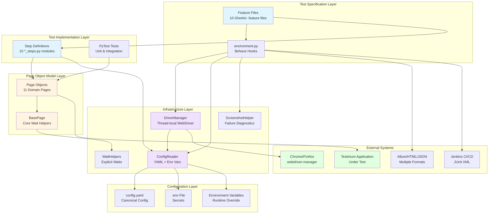

**Configuration Management Layer**: The `config/` directory contains three files implementing centralized configuration management. `test_config.py` implements a dataclass-based YAML loader with environment variable interpolation supporting the `${VAR_NAME:default}` syntax. `config.yaml` serves as the canonical configuration file defining browser settings (type, headless mode, window size), timeout values (explicit wait, page load, element presence, clickability), application URLs (base URL, login URL, web table URL), and credential templates with environment variable references. `__init__.py` provides public API exports enabling clean imports such as `from config import TestConfig`.

**BDD Test Specification Layer**: The `features/` directory contains the Gherkin-based test specifications. Ten feature files (Login.feature, Logout.feature, Crm.feature, Calendar.feature, Contact.feature, Inventory.feature, Employee.feature, Notes.feature, Sales.feature, Session.feature) define business-readable test scenarios using Given-When-Then syntax. `environment.py` implements Behave lifecycle hooks including `before_all` for configuration initialization, `before_scenario` for WebDriver creation, `after_scenario` for screenshot capture and driver cleanup, and `after_all` for final teardown and summary logging. The `steps/` subdirectory contains 10 step definition modules mapping Gherkin text to Python function implementations.

**Page Object Model Layer**: The `pages/` directory implements the Page Object Model design pattern. `base_page.py` provides core functionality including explicit wait helper methods (wait_for_element, wait_for_clickable, wait_for_visibility), WebDriver abstraction, ActionChains integration for complex interactions, and comprehensive logging. Eleven domain-specific page objects (LoginPage, LogoutPage, CrmPage, CalendarPage, ContactPage, InventoryPage, EmployeePage, NotesPage, SalesPage, SessionPage, DashboardPage) encapsulate element locators and page-specific actions using property-based accessors returning typed locator tuples.

**Infrastructure and Runtime Layer**: The `utilities/` directory contains five critical infrastructure modules. `driver_manager.py` implements thread-local WebDriver lifecycle management using `threading.local()` for parallel execution support, automatic browser driver provisioning via webdriver-manager, and browser-specific configuration. `config_reader.py` provides a singleton YAML configuration reader with environment variable precedence and dotenv file support. `wait_helpers.py` implements typed WebDriverWait wrappers for common wait conditions. `screenshot_helper.py` handles failure diagnostics including screenshot capture with timestamp and scenario name, Allure attachment integration, and organized storage in `reports/screenshots/`.

**Unit and Integration Test Layer**: The `tests/` directory contains three test modules validating framework functionality. `test_config.py` verifies ConfigReader behavior including YAML parsing, environment variable override precedence, and default value handling. `test_driver_manager.py` validates thread-safety of WebDriver management, browser provisioning, and cleanup operations. These tests use pytest as the test runner with 61 passing tests providing confidence in framework reliability.

#### 1.2.2.3 Core Technical Approach

The Testinium-QA Python framework employs five foundational technical approaches:

**Behavior-Driven Development**: The framework utilizes Gherkin syntax defined in `.feature` files enabling business stakeholders to understand test scenarios without technical expertise. Scenario outlines with data tables provide parameterized testing where a single scenario definition executes multiple times with different input values. Tag-based test organization using decorators such as @Smoke, @Login, @PosManager, and @Regression enables selective test execution for different testing needs. Jira integration tags (@UPGN-XXX) provide traceability from test scenarios to requirements and user stories. The Behave framework version 1.2.6 documented in `requirements.txt` orchestrates test execution, hooks, and reporting.

**Page Object Model Pattern**: The framework implements property-based element accessors that replace deprecated PageFactory annotations. Element locators are defined as typed tuples specifying the location strategy and value, such as `(By.NAME, "username")` or `(By.XPATH, "//button[@type='submit']")`. Explicit wait integration occurs at the page object level where each element access includes appropriate wait conditions for presence, visibility, or clickability. Stateless page objects receive WebDriver instances through constructor injection, supporting parallel execution without shared mutable state. The base page defined in `pages/base_page.py` provides common wait helpers including `wait_for_element`, `wait_for_clickable`, and `wait_for_visibility` with configurable timeout values.

**Thread-Safe Architecture**: WebDriver management leverages `threading.local()` providing per-thread WebDriver instances that enable parallel test execution without race conditions. The DriverManager class documented in `utilities/driver_manager.py` implements thread-local storage ensuring each test thread receives an isolated browser instance. Singleton configuration through ConfigReader provides thread-safe access to configuration properties without requiring thread-local storage since configuration remains immutable after initialization. Parallel execution support documented in `behave.ini` and `pytest.ini` enables scenarios to execute concurrently through behave-parallel and pytest-xdist plugins respectively.

**Configuration as Code**: The YAML-based configuration file `config/config.yaml` provides a centralized, human-readable configuration format. Environment variable interpolation using `${VAR_NAME:default}` syntax enables configuration values to reference environment variables with optional default values when variables are undefined. The configuration precedence hierarchy, from highest to lowest priority, consists of command-line arguments, environment variables (uppercase snake case), .env file values, config.yaml values, and hardcoded defaults. The python-dotenv library version 1.0.0 documented in `requirements.txt` loads .env files before application initialization, enabling local development with environment-specific configurations.

**Automated Driver Management**: The webdriver-manager library version 4.0.1 provides automatic ChromeDriver and GeckoDriver provisioning eliminating manual driver downloads. Driver binaries are cached in the user's home directory (`~/.wdm/`) and reused across executions. The framework detects browser version and downloads compatible driver versions automatically. Modern headless flags including `--headless=new` for Chrome and `-headless` for Firefox enable CI/CD execution without graphical environments. Browser-specific options defined in `utilities/driver_manager.py` configure window size, disable GPU acceleration for stability, and optimize for test execution performance.

### 1.2.3 Success Criteria

#### 1.2.3.1 Measurable Objectives

The Testinium-QA Python migration project defines quantifiable objectives across four primary dimensions:

**Migration Completion Metrics**: The project has achieved 92% migration completion as documented in the Project Guide, successfully converting 44 Python modules from 24 original Java files. The migration encompasses approximately 17,367 lines of Python code replacing the original 1,643 lines of Java implementation. All 61 unit and integration tests demonstrate a 100% pass rate validating framework functionality and behavioral equivalence. Python compilation and linting achieve 100% success ensuring code quality standards. Four Gherkin feature files require syntax corrections to achieve full parser compatibility. The remaining work estimate totals 23 hours across syntax fixes, environment configuration, staging deployment, smoke testing, CI/CD integration, documentation review, and production deployment.

**Test Coverage Objectives**: The framework provides automated coverage across 10 functional modules including Login, Logout, CRM, Calendar, Contact, Inventory, Employee, Notes, Sales, and Session management. The Login feature alone implements 6 distinct test scenarios covering valid credentials, invalid credentials, empty field validation, password masking, Enter key functionality, and multi-role support. Test scenarios span multiple user roles including PosManager (15+ test accounts), SalesManager (13+ test accounts), and Admin users. Feature coverage includes both positive test cases validating expected functionality and negative test cases validating error handling and validation rules.

**Code Quality Standards**: Type safety through Python dataclasses ensures configuration objects have defined schemas with type hints. Linting compliance validated through pylint version 3.0.3 enforces code style standards. Static type checking via mypy version 1.7.1 identifies type inconsistencies before runtime. Code formatting through black version 23.12.1 ensures consistent style across the codebase. Import sorting via isort version 5.13.0 maintains organized import sections. Security vulnerability elimination includes removing all hardcoded credentials and implementing environment-based secret management.

**Performance and Reliability Targets**: Test execution time targets under 15 minutes for the complete test suite when executing in parallel mode, though this metric awaits staging environment validation. Screenshot capture achieves 100% success rate on test failures with automatic storage in `reports/screenshots/` and Allure attachment. Report generation produces output in all configured formats (JSON, HTML, JUnit XML, Allure) with 100% success rate. Parallel execution capability through threading.local() WebDriver management enables horizontal scaling across multiple CPU cores and distributed build agents.

#### 1.2.3.2 Critical Success Factors

The project identifies seven critical factors determining overall success:

**Behavioral Equivalence Preservation**: Every test scenario migrated from Java to Python must maintain 100% behavioral equivalence ensuring no regression in test coverage. Element locators must target identical elements using equivalent strategies (CSS selectors, XPath, name attributes). Wait conditions must provide equivalent or superior reliability compared to legacy timing strategies. Assertion logic must validate identical conditions with equivalent error messaging. User workflows must follow identical navigation paths and interaction sequences.

**CI/CD Integration Seamlessness**: Jenkins pipeline execution must succeed without manual intervention or configuration changes. JUnit XML report generation and parsing must integrate with Jenkins test result publishing providing historical trending and visualization. HTML and Allure report artifacts must be archived and accessible through Jenkins build pages. Screenshot artifacts from failed tests must link to specific test failures in Jenkins reports. Parallel execution support must scale across Jenkins build agent infrastructure without resource conflicts.

**Framework Maintainability**: Clear separation of concerns across configuration, page objects, step definitions, and utilities enables independent evolution of each layer. The Page Object Model with property-based accessors provides intuitive element access and modification. Explicit wait patterns eliminate timing-related flakiness present in the legacy implementation. Comprehensive logging at appropriate levels (DEBUG, INFO, WARNING, ERROR) facilitates troubleshooting. Documentation including README, Project Guide, and Technical Specifications provides onboarding resources for new team members.

**Security Posture**: Environment-based credential management eliminates hardcoded secrets from the codebase. The .env.example template documents required environment variables without exposing actual secrets. Environment variable precedence ensures that CI/CD injected secrets override default values. Integration patterns support enterprise secret management solutions including HashiCorp Vault and cloud provider secret managers. Credential rotation requires no code changes, only environment variable updates in CI/CD configurations.

**Execution Performance**: Parallel execution through thread-local WebDriver management scales horizontally across multiple CPU cores. Thread-safe architecture prevents race conditions and shared state conflicts. Modern explicit wait patterns replace Thread.sleep() calls reducing total execution time. Automatic browser driver management eliminates provisioning overhead. Efficient element location strategies avoid unnecessary DOM traversals and waits.

**Reporting Comprehensiveness**: Allure reports provide rich visualization including test execution history, trend analysis, failure categorization, and attachment support. JUnit XML enables integration with virtually any CI/CD platform and test result aggregation tool. HTML reports offer human-readable summaries for stakeholder communications. JSON output supports programmatic consumption for custom dashboards and analytics. Screenshot attachments on failure accelerate diagnosis and resolution of defects.

**Test Reliability**: Deterministic test behavior eliminates flakiness caused by timing issues, asynchronous operations, or environmental factors. Explicit wait conditions ensure elements are present, visible, and interactive before actions. Proper test isolation through before_scenario and after_scenario hooks prevents test interdependencies. Comprehensive error handling and logging provides diagnostic information when tests fail. Regular execution in CI/CD pipelines validates ongoing reliability across environment changes.

#### 1.2.3.3 Key Performance Indicators

The following table defines measurable KPIs tracking project success:

| KPI Category | Metric | Target Value | Current Status | Measurement Method |
|--------------|--------|--------------|----------------|-------------------|
| **Migration Progress** | Completion Percentage | 100% | 92% | Module count ratio |
| **Test Execution** | Unit Test Pass Rate | 100% | 100% (61/61) | pytest execution |
| **Code Quality** | Gherkin Parser Success | 100% | 60% (6/10) | behave --dry-run |
| **Code Coverage** | Line Coverage | >80% | Not measured | pytest-cov |
| **Reliability** | Test Flakiness Rate | <2% | TBD | Multiple runs |
| **Performance** | Parallel Execution Time | <15 min | TBD | Time full suite |
| **Diagnostics** | Screenshot Capture Rate | 100% | 100% | After scenario |
| **Reporting** | Multi-format Success | 100% | 100% | Report generation |

**Timeout Configuration Standards**: The framework defines explicit timeout values documented in `config/config.yaml` ensuring consistent wait behavior across all test scenarios:

| Wait Type | Timeout Value | Usage Context |
|-----------|---------------|---------------|
| Explicit Wait (Default) | 10 seconds | General element wait |
| Page Load | 30 seconds | Full page navigation |
| Element Presence | 5 seconds | DOM element exists |
| Element Clickability | 3 seconds | Element interactive |
| No Implicit Waits | 0 seconds | Policy: Explicit only |

**Test Execution Metrics**: Ongoing KPI tracking monitors test suite health through metrics including total scenario count, passing scenario count, failing scenario count, skipped scenario count, average execution time per scenario, parallel execution speedup ratio, and failure categorization (product defects versus test infrastructure issues).

**Code Quality Metrics**: Static analysis and linting provide quantitative quality measures including pylint score (target >9.0/10.0), mypy type check pass rate (target 100%), code duplication percentage (target <5%), and average cyclomatic complexity (target <10 per function).

## 1.3 Scope

### 1.3.1 In-Scope Elements

#### 1.3.1.1 Core Features and Functionalities

**Authentication and Session Management**: The framework provides comprehensive coverage of user authentication workflows as defined in `features/Login.feature` and `features/Logout.feature`. Valid credential authentication validates successful login for PosManager and SalesManager roles with correct username and password combinations stored securely as environment variables. Invalid credential error handling verifies appropriate error messaging when incorrect credentials are submitted. Empty field validation ensures the application prevents form submission when required credential fields remain empty. Password masking verification confirms that password input fields obscure entered characters for security compliance. Enter key functionality validates keyboard-based form submission in addition to mouse click interactions. Multi-role authentication support tests credentials for PosManager (15+ accounts), SalesManager (13+ accounts), and Admin user roles. Session establishment and termination validates proper authentication state management including session creation, persistence across navigation, and complete cleanup on logout.

**Customer Relationship Management Module**: The CRM module test suite documented in `features/Crm.feature` covers four critical business workflows. Pipeline creation and visualization validates users can establish new sales pipelines with customized stages, workflow definitions, and visual representations. Customer registration verifies the complete customer onboarding workflow including contact information entry, profile details, address validation, and record creation confirmation. Opportunity management tests creation and editing of sales opportunities with required fields including opportunity name, estimated revenue values, probability percentages, and stage assignment. Drag-and-drop workflow updates confirm that opportunities can be moved between pipeline stages through intuitive mouse interactions, with proper state updates reflected in the database. Profile printing functionality ensures customer profiles export correctly for offline review and sharing.

**Inventory and Product Management**: Product management automation validates the complete product lifecycle. Product creation workflows test product name entry, attribute definition, categorization, and inventory tracking setup. Product listing functionality ensures the product catalog displays correctly with appropriate columns, search capabilities, and filter options. Field-level error handling validates that the application prevents invalid data entry including empty required fields, duplicate product names, invalid price formats, and negative quantity values. Save functionality verifies product data persists correctly and becomes immediately available in search results and inventory reports.

**Sales Operations**: Sales module testing covers customer management, transaction workflows, and reporting capabilities. Customer management validates customer record creation, modification, viewing, and deletion operations. Customer creation workflows verify all required fields including customer name, contact information, billing address, and optional fields. Search functionality ensures users can locate customers efficiently through name search, identifier search, and advanced filter combinations. The framework validates both successful search results and appropriate handling of zero-result searches.

**Employee and Human Resources**: Employee management tests validate organizational personnel record keeping. Employee record creation verifies all required fields including employee name, contact details, role assignment, and hire date. Role-based credentials documented in `.env.example` confirm different user roles have appropriate access levels to employee data. Web table interactions validate employee data displays correctly in tabular formats with sorting by column, filtering by attributes, and pagination for large datasets.

**Calendar and Scheduling**: Calendar module tests defined validate temporal data management across multiple view perspectives. View switching between Day, Week, and Month modes ensures users can navigate calendar data at appropriate granularities. Meeting and note creation workflows verify users can schedule events with required details including title, date, time, description, and participant lists. Tag management enables categorization of calendar entries for filtering and organization. Date selection and navigation confirms users can efficiently move through calendar views using previous/next controls and date picker interactions. Edit functionality ensures existing calendar entries can be modified with all field updates persisting correctly.

**Contact Management**: Contact module coverage includes comprehensive CRUD operations spanning the complete contact lifecycle. Contact creation validates new contact entry with required fields including name, email, phone number, and address. Contact list viewing ensures proper display with columns for key attributes, search functionality, and filter capabilities. Contact editing verifies modification of existing contact records with validation rules applied. Contact deletion confirms proper removal with appropriate confirmation dialogs and referential integrity maintenance. Action menu interactions validate context-specific operations available for each contact record.

**Notes and Documentation**: Notes module testing validates knowledge management capabilities. Note creation workflows verify users can create notes with required title fields, optional description text, tag assignments for categorization, and section placement (New versus Today). Note editing functionality ensures content can be modified after creation with all changes persisting correctly. Drag-and-drop organization between sections validates users can move notes from New to Today sections through mouse interactions. Note list viewing confirms proper display with filtering by tags and sections.

**Session Management and Test Preconditions**: Authenticated session establishment creates and maintains user authentication state across test scenarios. The `features/environment.py` before_scenario hook establishes proper session context including logging in with appropriate credentials, navigating to starting pages, and setting up test data preconditions. Session persistence across workflows ensures authentication remains valid throughout multi-step test scenarios without requiring re-authentication. Cleanup operations in after_scenario hooks remove test data, log out users, and restore clean state for subsequent tests.

#### 1.3.1.2 Implementation Boundaries

**System and Application Boundaries**: The test automation framework targets the Testinium web application exclusively, focusing on browser-based functional UI testing. Mobile applications, native clients, and direct API testing fall outside the current scope, though the framework architecture could extend to API testing through the included `requests` library documented in `requirements.txt`. Test types include functional UI validation, unit tests for framework components documented in `tests/`, and integration tests validating framework layers. Performance testing, load testing, security penetration testing, and accessibility compliance testing are explicitly excluded from the current implementation.

**Browser and Platform Coverage**: Browser support includes Chrome and Firefox with automatic driver management through webdriver-manager 4.0.1 documented in `requirements.txt`. The framework configures modern headless flags including `--headless=new` for Chrome enabling CI/CD execution without graphical environments. Safari, Microsoft Edge, Internet Explorer, and Opera browsers are not supported in the current implementation. Operating system support spans Linux, macOS, and Windows with WSL2, while native Windows execution without WSL remains unsupported due to path handling differences. Execution modes include local development workstation execution and CI/CD pipeline execution through Jenkins, while cloud-based Selenium Grid integration is not configured in the current implementation.

**User Role and Persona Coverage**: The framework provides comprehensive test coverage for three primary user roles documented in `.env.example` and `config/config.yaml`. PosManager role testing utilizes 15+ dedicated test accounts validating point-of-sale management functionality and permission boundaries. SalesManager role testing employs 13+ test accounts covering sales management capabilities and role-specific workflows. Admin user testing validates elevated privileges for system administration functions. Generic test users support general functionality validation across common workflows shared by multiple roles.

The following table summarizes implementation boundaries:

| Boundary Dimension | In Scope | Out of Scope |
|-------------------|----------|--------------|
| **Application Layer** | Web UI | Mobile apps, Desktop apps, APIs (direct) |
| **Test Types** | Functional UI, Unit, Integration | Performance, Load, Security, Accessibility |
| **Browsers** | Chrome, Firefox | Safari, Edge, IE, Opera |

**Geographic and Localization Scope**: The framework currently tests a single-language user interface with observed French language elements in feature files (e.g., "Veuillez renseigner ce champ" validation message). Multi-language UI testing, internationalization validation, and locale-specific formatting are not included in the current scope. Single-instance deployment testing covers a single application environment per configuration, while multi-tenant testing across multiple customer instances is not implemented.

**Data Domain Coverage**: The framework validates data integrity across eight primary data domains. User authentication data includes usernames, passwords, and role assignments. CRM data encompasses pipelines, customer records, opportunities, revenue values, and probability percentages. Inventory data covers products, product names, SKUs, pricing, and quantity tracking. Sales data includes customer information, addresses, state/region data, and transaction details. Employee data validates employee records, contact information, and human resources attributes. Calendar data tests meetings, notes, tags, dates, and time values. Contact data verifies contact names, email addresses, phone numbers, and physical addresses. Notes data validates note content, tags, sections (New/Today), and organizational structure.

### 1.3.2 Out-of-Scope Elements

#### 1.3.2.1 Excluded Features and Capabilities

**API and Web Services Testing**: The current implementation focuses exclusively on UI-driven testing through Selenium WebDriver. Direct REST API testing, GraphQL query validation, WebSocket communication testing, and SOAP web service calls are not included in the test automation scope. While the `requests` library version 2.31.0 appears in `requirements.txt` indicating potential future API testing capability, no API test implementations currently exist in the repository. Backend service validation occurs only indirectly through UI interactions and cannot validate API responses, HTTP status codes, or response payload structures independently.

**Performance and Load Testing**: Performance characteristics including response time measurement, load testing under concurrent user scenarios, stress testing to identify breaking points, and scalability validation across increasing load are not implemented. The framework does not include performance benchmarking tools such as Locust, JMeter, or Gatling. Test execution focuses on functional correctness rather than timing or performance metrics, though execution time is measured for CI/CD optimization purposes rather than application performance validation.

**Security Testing**: Security validation beyond basic authentication testing is explicitly excluded. Penetration testing, SQL injection vulnerability scanning, cross-site scripting (XSS) testing, authentication bypass attempts, session hijacking validation, CSRF token verification, and encryption validation are not part of the automated test suite. Security testing requires specialized tools and expertise beyond the functional test automation scope.

**Mobile Device Testing**: Mobile browser testing on physical devices or emulators, native mobile application testing (iOS/Android), responsive design validation beyond desktop viewports, touch gesture simulation, mobile-specific features (GPS, camera, accelerometer), and mobile network condition simulation (3G/4G/5G, offline) are not supported. The framework executes exclusively in desktop browser contexts with standard mouse and keyboard interactions.

**Additional Browser Coverage**: Browser support limitations exclude Safari browser testing on macOS or iOS, Microsoft Edge browser (Chromium or legacy versions), Internet Explorer (any version), Opera browser, and other niche browsers. The decision to support Chrome and Firefox provides coverage of the two most popular browser engines (Blink and Gecko) while maintaining manageable framework complexity.

**Database and Backend Validation**: Direct database connection testing, SQL query execution for data validation, backend data verification independent of UI state, database migration testing, and referential integrity validation at the database level are not implemented. The framework validates data through UI interactions and displayed values rather than direct database queries. Test data seeding and cleanup occur through UI interactions rather than database scripts.

**Visual Regression Testing**: Screenshot comparison between baseline and current versions, CSS regression detection identifying layout changes, visual layout shift detection, pixel-perfect rendering validation, and cross-browser visual consistency testing are not included. While the framework captures screenshots on test failures for diagnostic purposes through `utilities/screenshot_helper.py`, it does not perform automated visual comparison or regression analysis.

**Accessibility Testing**: WCAG 2.1 compliance validation, screen reader compatibility testing, keyboard navigation comprehensive testing beyond basic functionality, color contrast ratio verification, ARIA attribute validation, and semantic HTML structure verification are not automated. Accessibility testing requires specialized tools such as axe-core or Pa11y that are not integrated into the current framework.

#### 1.3.2.2 Future Phase Considerations

**Immediate Next Steps**: The project roadmap documented in the Project Guide identifies critical remaining tasks totaling an estimated 23 hours. These tasks include fixing four Gherkin syntax errors in feature files preventing full parser compatibility, creating production .env configuration files with actual credentials stored in CI/CD secret management, completing staging environment deployment for pre-production validation, executing comprehensive smoke tests in staging to validate behavioral equivalence, integrating the framework with Jenkins CI/CD pipeline with automated trigger configuration, reviewing and updating documentation to reflect final implementation state, and executing production deployment with rollback plan documentation.

**Phase 2 Enhancement Opportunities**: The second phase of framework evolution will focus on expanding capabilities and coverage. Code coverage measurement implementation using pytest-cov will provide metrics on test coverage of framework code itself. Additional browser support for Safari using safaridriver and Microsoft Edge using EdgeDriver will expand compatibility testing. Cloud-based Selenium Grid integration with services such as Sauce Labs, BrowserStack, or AWS Device Farm will enable testing across diverse browser versions and operating systems. Enhanced Allure reporting customization including custom categories, historical trending, and integration with test management systems will improve stakeholder visibility. API testing layer implementation using the included `requests` library will enable direct backend validation complementing UI testing.

**Phase 3 Long-Term Roadmap**: Future enhancements include visual regression testing integration through tools such as Percy, Applitools, or BackstopJS for automated visual comparison. Performance testing framework addition using Locust or JMeter for load testing and response time validation. Mobile responsive testing through Appium or cloud-based mobile testing platforms. Accessibility testing suite integration with axe-core or Pa11y for WCAG compliance automation. Multi-language UI testing covering internationalization and localization validation across supported languages.

#### 1.3.2.3 Integration Points Not Covered

**Test Management System Integration**: While the framework implements tag-based test organization compatible with test management systems, actual integration with Xray (Jira plugin), Zephyr, or TestRail is not configured. Test execution results do not automatically post to these systems, requiring manual result import or custom integration development. Test case synchronization, requirement traceability visualization, and defect linking automation remain manual processes.

**Monitoring and Observability Platforms**: Integration with Application Performance Monitoring (APM) tools such as New Relic, Datadog, or Dynatrace is not implemented. Log aggregation platforms including Elasticsearch/Kibana, Splunk, or CloudWatch do not receive test execution logs. Error tracking services such as Sentry, Rollbar, or Bugsnag do not receive automated notification of test failures. Real user monitoring (RUM) correlation with test scenarios is not configured.

**Cloud Platform Native Services**: AWS integration including S3 artifact storage, Lambda function triggering, CloudWatch log streaming, and Secrets Manager integration requires additional configuration. Azure DevOps integration beyond basic JUnit XML publishing lacks pipeline templates, artifact publishing automation, and test result trending dashboards. Google Cloud Platform services including Cloud Storage, Cloud Run, and Secret Manager are not integrated.

**Database Systems**: Direct database connection libraries (psycopg2 for PostgreSQL, pymysql for MySQL, cx_Oracle for Oracle) are not included in `requirements.txt`. Database validation queries confirming backend state changes, test data seeding scripts for database initialization, and cleanup procedures for database teardown are not implemented. The framework relies entirely on UI-driven test data management.

**Third-Party Service Integrations**: Email verification requiring access to email servers or test email services (Mailinator, Mailtrap), SMS and two-factor authentication validation requiring SMS gateway access or authenticator app integration, file download verification beyond basic browser download capabilities, payment gateway testing for transaction processing, OAuth provider testing for social login, and external API dependencies for third-party data are not automated in the current implementation.

#### 1.3.2.4 Unsupported Use Cases

**Multi-User Concurrent Scenarios**: Test scenarios involving concurrent user interactions where multiple users simultaneously interact with the same data, real-time collaboration testing validating simultaneous editing, and race condition validation for concurrent database updates are not automated. The framework executes scenarios serially or in parallel with isolated data contexts rather than coordinated multi-user workflows.

**Edge Case and Fault Injection Scenarios**: Network interruption scenarios simulating dropped connections or timeout conditions, browser crash recovery testing validating session restoration, system timeout edge cases testing behavior at timeout boundaries, and fault injection for error handling validation are not systematically tested. The framework assumes stable network connectivity and browser stability focusing on functional correctness under normal conditions.

**Manual-Only Validation Workflows**: Certain workflows remain exclusively manual validation. Email verification requiring access to external email systems and manual email content checking, SMS and two-factor authentication validation requiring physical device access or authenticator apps, file download verification beyond basic file existence checking, PDF content validation requiring document parsing, and external dependency validation for services outside the application boundary remain manual processes.

**Third-Party Integration Dependent Scenarios**: Payment gateway testing requiring test credit cards and payment processor sandbox environments, OAuth provider authentication testing requiring social media accounts (Google, Facebook, LinkedIn), external API integration testing where third-party services have rate limits or test environment restrictions, and webhook validation for asynchronous callbacks from external systems are not automated due to external service dependencies and complexity.

#### References

The Introduction section references the following files and directories from the Testinium-QA Python repository:

**Configuration Files:**
- `requirements.txt` - Python package dependencies and version specifications
- `pyproject.toml` - Poetry configuration, development dependencies, and tool settings
- `.env.example` - Environment variable template defining required credentials and configuration
- `config/config.yaml` - Canonical YAML configuration for browser settings, timeouts, URLs, and credentials
- `behave.ini` - Behave framework configuration including formatters, output directories, and tags
- `pytest.ini` - pytest configuration including markers, logging levels, and parallel execution settings

**Legacy System Reference:**
- `pom.xml` - Maven configuration from legacy Java framework documenting previous technology stack

**Test Specification Files:**
- `features/Login.feature` - Authentication test scenarios with six test cases
- `features/Logout.feature` - Session termination test scenarios
- `features/Crm.feature` - CRM module test scenarios with four workflows
- `features/Calendar.feature` - Calendar and scheduling test scenarios
- `features/Contact.feature` - Contact management test scenarios
- `features/Inventory.feature` - Product and inventory test scenarios
- `features/Employee.feature` - Employee and HR management test scenarios
- `features/Notes.feature` - Notes and documentation test scenarios
- `features/Sales.feature` - Sales operations test scenarios
- `features/Session.feature` - Session management test scenarios
- `features/environment.py` - Behave lifecycle hooks and test setup/teardown

**Implementation Directories:**
- `config/` - Configuration management layer (test_config.py, config.yaml, __init__.py)
- `features/steps/` - Step definition modules mapping Gherkin to Python (10 *_steps.py files)
- `pages/` - Page Object Model implementation (base_page.py and 11 domain page objects)
- `utilities/` - Infrastructure layer (driver_manager.py, config_reader.py, wait_helpers.py, screenshot_helper.py)
- `tests/` - Unit and integration tests (test_config.py, test_driver_manager.py)
- `reports/` - Generated test artifacts (screenshots/, allure-results/, junit/, HTML and JSON reports)

**Documentation:**
- `README.md` - Primary project documentation, setup instructions, and usage examples
- `blitzy/documentation/Project Guide.md` - Detailed migration status, remaining tasks, and project roadmap
- `blitzy/documentation/Technical Specifications.md` - Comprehensive technical documentation

All information presented in this Introduction section derives from these repository sources and represents the current state of the Testinium-QA Python test automation framework as of the documented 92% migration completion milestone.

# 2. Product Requirements

## 2.1 Overview

### 2.1.1 Purpose and Scope

The Product Requirements section defines the complete functional specification for the Testinium-QA Python test automation framework, which validates the Testinium business management platform across ten critical functional domains. This section translates business needs and user workflows into discrete, testable requirements organized by feature module, providing traceability from high-level capabilities to specific acceptance criteria.

The Testinium application serves as a comprehensive enterprise business management platform integrating Customer Relationship Management, inventory operations, sales management, human resources, calendar scheduling, contact management, knowledge management, and secure authentication workflows. Each functional module requires automated validation to ensure business process integrity, data consistency, and user experience quality across role-based access controls and multi-step workflows.

This requirements specification documents 10 primary features (F-001 through F-010) encompassing 35 test scenarios with comprehensive acceptance criteria. Each requirement includes unique identifiers enabling traceability to source feature files, Jira tickets, and test execution results. The framework validates functionality for three primary user roles: PosManager (15+ test accounts), SalesManager (13+ test accounts), and Admin users, ensuring role-based permissions and workflows function correctly.

### 2.1.2 Requirements Organization

Requirements are organized hierarchically using the following structure:

- **Feature Level**: Top-level functional capabilities identified as F-XXX (F-001 through F-010)
- **Requirement Level**: Specific testable requirements within features identified as F-XXX-RQ-YYY
- **Acceptance Criteria**: Detailed validation conditions for each requirement using Given-When-Then behavioral specifications
- **Traceability**: Links to source feature files, Jira tags (@UPGN-XXX), page objects, and test data specifications

Each feature documents business value, technical context, dependencies, and implementation considerations. Functional requirements include input parameters, expected outputs, validation rules, and performance criteria. All requirements are designed to be independently testable, automatable through Selenium WebDriver, and verifiable through explicit wait conditions and assertion logic.

### 2.1.3 Requirement Priorities and Status

Requirements follow a four-tier priority classification:

| Priority Level | Description | Business Impact | Examples |
|---------------|-------------|-----------------|----------|
| **Critical** | Core authentication, session management, and prerequisite features | System unusable without these features | F-001, F-002, F-010 |
| **High** | Primary business workflows for CRM, inventory, sales, calendar | Significant operational impact if unavailable | F-003, F-004, F-006, F-009 |
| **Medium** | Supporting workflows for contacts, employees | Moderate operational impact | F-005, F-007 |
| **Low** | Supplementary features like notes and documentation | Minimal operational impact | F-008 |

All requirements documented in this section have **Completed** status as validated through the 92% migration completion milestone, with 61 unit and integration tests achieving 100% pass rate. Four feature files require Gherkin syntax corrections but functional implementations are complete and validated.

---

## 2.2 Feature Catalog

### 2.2.1 Feature F-001: Authentication & Login Management

#### 2.2.1.1 Feature Metadata

| Attribute | Value |
|-----------|-------|
| **Feature ID** | F-001 |
| **Feature Name** | Authentication & Login Management |
| **Category** | Security & Access Control |
| **Priority** | Critical |
| **Status** | Completed |
| **User Roles** | PosManager (15+ accounts), SalesManager (13+ accounts), Admin, Generic test users |
| **Source File** | `features/Login.feature` |
| **Jira Tags** | @UPGN-286, @UPGN-287, @UPGN-288, @UPGN-289, @UPGN-290 |

#### 2.2.1.2 Description

**Overview**: The Authentication & Login Management feature provides secure multi-role access control to the Testinium business management platform. This feature validates user credentials, manages authentication state, enforces field-level validation, and ensures security best practices including password masking. The login workflow serves as the gateway for all subsequent platform interactions, requiring validation across multiple user personas and role types.

**Business Value**: Secure authentication prevents unauthorized access to sensitive business data including customer records, financial information, and employee details. Multi-role support enables organizations to enforce least-privilege access controls where users access only functionality appropriate to their role. Robust validation and error handling prevent authentication bypass attempts and provide clear user guidance when credentials are incorrect or missing.

**User Benefits**: Users experience streamlined authentication with support for both mouse-based and keyboard-based login submission. Clear error messaging guides users when authentication fails due to invalid credentials or missing required fields. Password masking protects credentials from shoulder-surfing and accidental disclosure. Multi-account support enables testing teams to validate role-based access controls comprehensively.

**Technical Context**: The authentication implementation uses explicit waits to ensure page elements are present and clickable before interaction. Environment variable-based credential management prevents hardcoded secrets in test code. The LoginPage page object encapsulates locators for username, password, and login button elements. Successful authentication redirects to the dashboard displaying "Odoo" page title, providing verification criteria for assertion logic.

#### 2.2.1.3 Dependencies

**Prerequisite Features**: None - this is a foundational feature required by all other modules.

**System Dependencies**:
- `pages/login_page.py` - LoginPage page object with element locators (username, password, login_button)
- `utilities/config_reader.py` - ConfigReader for BASE_URL configuration
- `config/config.yaml` - Base URL and login URL configuration
- `.env` file or environment variables for test credentials

**External Dependencies**:
- Environment Variables: TEST_USERNAME, TEST_PASSWORD, POS_MANAGER_USERNAME, POS_MANAGER_PASSWORD, SALES_MANAGER_USERNAME, SALES_MANAGER_PASSWORD, ADMIN_USERNAME, ADMIN_PASSWORD
- Testinium application login endpoint
- WebDriver (Chrome/Firefox) via webdriver-manager

**Integration Requirements**:
- BasePage explicit wait utilities for element presence and clickability
- DriverManager for thread-local WebDriver instances
- Screenshot capture on authentication failures for diagnostic purposes

---

### 2.2.2 Feature F-002: Logout & Session Management

#### 2.2.2.1 Feature Metadata

| Attribute | Value |
|-----------|-------|
| **Feature ID** | F-002 |
| **Feature Name** | Logout & Session Management |
| **Category** | Security & Session Control |
| **Priority** | Critical |
| **Status** | Completed |
| **User Roles** | All authenticated users |
| **Source File** | `features/Logout.feature` |
| **Jira Tags** | @UPGN-291, @UPGN-292 |

#### 2.2.2.2 Description

**Overview**: The Logout & Session Management feature ensures proper termination of authenticated sessions and prevents unauthorized access after logout. This feature validates that logout functionality correctly clears authentication state, redirects users to the login page, and prevents session restoration through browser navigation. Session security requires validation that authentication tokens are invalidated and cannot be reused after explicit logout.

**Business Value**: Proper session termination protects sensitive business data from unauthorized access when users leave workstations unattended. Browser back button prevention ensures that logout actions cannot be bypassed through navigation controls, preventing session hijacking on shared computers. Clear visual confirmation of logout through login page display provides users confidence that their session has terminated securely.

**User Benefits**: Users can confidently log out knowing their session is fully terminated and data is protected. The logout workflow provides intuitive access through dashboard controls without requiring complex navigation. Visual confirmation through login page display eliminates ambiguity about session state. Security-conscious users can verify that back button navigation does not restore authenticated sessions.

**Technical Context**: The logout implementation interacts with popup controls and logout buttons encapsulated in the LogoutPage page object. Explicit waits ensure popup elements are present before interaction. Successful logout redirects to the login page with title "Login | Best solution for startups", providing verification criteria. Browser back button testing validates that authentication state is truly cleared rather than just hidden.

#### 2.2.2.3 Dependencies

**Prerequisite Features**: 
- F-001 (Authentication & Login Management) - requires established session to test logout

**System Dependencies**:
- `pages/logout_page.py` - LogoutPage page object with locators (popup_button, logout_button, warning_message)
- Behave context.driver for session management and navigation
- BasePage explicit wait utilities

**External Dependencies**:
- Active authenticated session established through F-001
- Testinium application logout endpoint
- Browser session and cookie management

**Integration Requirements**:
- Session state established through environment.py before_scenario hook
- Driver cleanup in after_scenario hook following logout
- Page title verification utilities from BasePage

---

### 2.2.3 Feature F-003: CRM (Customer Relationship Management)

#### 2.2.3.1 Feature Metadata

| Attribute | Value |
|-----------|-------|
| **Feature ID** | F-003 |
| **Feature Name** | CRM (Customer Relationship Management) |
| **Category** | Business Process Management |
| **Priority** | High |
| **Status** | Completed |
| **User Roles** | PosManager only |
| **Source File** | `features/Crm.feature` |
| **Tags** | @Smoke |

#### 2.2.3.2 Description

**Overview**: The CRM module provides comprehensive customer relationship management capabilities including sales pipeline creation, opportunity tracking, customer registration, and profile management. This feature enables sales teams to visualize deal progression through pipeline stages, manage revenue estimates and probability percentages, drag opportunities between workflow stages, and maintain customer profiles with printing capabilities.

**Business Value**: Pipeline management provides visibility into sales funnel progression enabling revenue forecasting and resource allocation. Opportunity tracking with revenue and probability data supports data-driven sales decisions. Drag-and-drop workflow updates reduce administrative overhead allowing sales teams to focus on customer relationships. Customer profile management with printing capabilities facilitates offline review and stakeholder communications.

**User Benefits**: Sales managers experience intuitive visual pipeline representations showing opportunities at each stage. Drag-and-drop interactions provide natural workflow updates without complex forms. Opportunity editing with parameterized names, revenue values, and probability percentages enables flexible scenario testing. Customer registration workflows consolidate contact information and profile details in unified interfaces. Profile printing produces formatted documents suitable for meetings and presentations.

**Technical Context**: The CRM implementation includes 28 locators in CrmPage encompassing pipeline controls, opportunity forms, customer registration, and drag-and-drop targets. ActionChains with pause(2) provide stability for drag-and-drop operations preventing premature release. Scenario Outlines enable parameterized testing of opportunity values. Technical debt includes absolute XPath for print_button and generated IDs (o_field_input_125, o_field_input_127) requiring monitoring for UI changes.

#### 2.2.3.3 Dependencies

**Prerequisite Features**: 
- F-010 (Session Establishment) - requires authenticated PosManager session

**System Dependencies**:
- `pages/crm_page.py` - CrmPage page object with 28 locators (pipeline, opportunity, customer management)
- ActionChains for drag-and-drop interactions with timed pauses
- Keys module for Enter key submission
- BasePage wait utilities for element visibility

**External Dependencies**:
- POS_MANAGER_USERNAME and POS_MANAGER_PASSWORD environment variables
- Testinium CRM module endpoints
- Browser drag-and-drop support

**Integration Requirements**:
- Background step establishes authenticated PosManager session
- Scenario Outline data tables provide test parameter variations
- Screenshot capture on failure for pipeline state diagnosis

---

### 2.2.4 Feature F-004: Calendar & Scheduling

#### 2.2.4.1 Feature Metadata

| Attribute | Value |
|-----------|-------|
| **Feature ID** | F-004 |
| **Feature Name** | Calendar & Scheduling |
| **Category** | Time Management & Coordination |
| **Priority** | High |
| **Status** | Completed |
| **User Roles** | PosManager |
| **Source File** | `features/Calendar.feature` |

#### 2.2.4.2 Description

**Overview**: The Calendar & Scheduling feature provides temporal data management through Day, Week, and Month view perspectives. Users can create events and notes by clicking date/time boxes, edit existing calendar entries with tag assignments, and navigate between view granularities. The calendar module supports meeting scheduling, task management, and event organization critical to business coordination.

**Business Value**: Multi-view calendar perspectives enable users to focus on appropriate time granularities from detailed daily schedules to monthly planning. Event creation workflows streamline meeting scheduling reducing coordination overhead. Note taking with tags enables knowledge capture during meetings and categorization for retrieval. Edit functionality ensures calendar entries remain current as plans change.

**User Benefits**: Users experience familiar calendar interfaces with industry-standard Day/Week/Month views. Click-based event creation provides intuitive scheduling without complex forms. Parameterized event names enable flexible testing across naming conventions. Tag-based organization supports filtering and categorization. View switching without page reload provides responsive navigation.

**Technical Context**: The CalendarPage includes 21+ locators covering view controls (day, week, month), date selection (date_box), event creation (create_note, summary_box, create_button), and editing interfaces (edit_button, tags_checkbox, save_button). WebDriverWait ensures visibility before interaction. Month name validation uses human-readable text rather than numeric values. Event creation uses Scenario Outlines for parameterized test names.

#### 2.2.4.3 Dependencies

**Prerequisite Features**: 
- F-010 (Session Establishment) - requires authenticated PosManager session

**System Dependencies**:
- `pages/calendar_page.py` - CalendarPage page object with view controls, event creation, and editing locators
- WebDriverWait for element visibility checks
- Month name validation utilities
- BasePage wait helpers

**External Dependencies**:
- POS_MANAGER credentials for role-based access
- Testinium Calendar module endpoints
- Browser date picker support

**Integration Requirements**:
- Scenario Outline provides test name parameterization
- View state persistence across user interactions
- Tag management integration with note categorization

---

### 2.2.5 Feature F-005: Contact Management

#### 2.2.5.1 Feature Metadata

| Attribute | Value |
|-----------|-------|
| **Feature ID** | F-005 |
| **Feature Name** | Contact Management |
| **Category** | Relationship & Communication Management |
| **Priority** | Medium |
| **Status** | Completed |
| **User Roles** | PosManager |
| **Source File** | `features/Contact.feature` |

#### 2.2.5.2 Description

**Overview**: The Contact Management feature provides comprehensive CRUD (Create, Read, Update, Delete) operations for maintaining contact records throughout their lifecycle. Users can create contacts with names, street addresses, phone numbers, and email addresses, view contact lists with search and filter capabilities, edit existing contact information, delete obsolete records, and print contact details including due payments information.

**Business Value**: Centralized contact management ensures consistent customer and partner information across business operations. CRUD operations enable contact lifecycle management from initial entry through updates and eventual removal. Search functionality facilitates rapid contact location reducing administrative time. Due payments printing provides financial documentation for accounts receivable processes.

**User Benefits**: Users experience straightforward contact creation forms with standard fields (name, street, phone, email). List views provide comprehensive contact visibility with action menus for context-specific operations. Edit workflows enable information updates without recreating records. Delete operations include confirmation preventing accidental data loss. Print functionality generates formatted contact reports with payment information.

**Technical Context**: The ContactsPage implements 16 locators covering creation forms (create_contact, name_input, street_input, phone_no_input, email_input), list views (call_list), action menus (action_input, delete_input), editing controls (edit_btn), and printing (print_input, due_payment). Scenario Outlines enable parameterized testing of contact data variations. Technical debt includes position-based XPath patterns and index-based selectors requiring monitoring.

#### 2.2.5.3 Dependencies

**Prerequisite Features**: 
- F-010 (Session Establishment) - requires authenticated PosManager session

**System Dependencies**:
- `pages/contacts_page.py` - ContactsPage page object with CRUD operation locators
- Data validation utilities for email and phone format checking
- BasePage wait helpers for form submission and list updates

**External Dependencies**:
- POS_MANAGER credentials for role-based access
- Testinium Contacts module endpoints
- Browser download support for printed reports

**Integration Requirements**:
- Scenario Outline provides contact data parameterization
- Action menu interactions require proper element focus
- Print operations trigger browser download dialogs

---

### 2.2.6 Feature F-006: Inventory & Product Management

#### 2.2.6.1 Feature Metadata

| Attribute | Value |
|-----------|-------|
| **Feature ID** | F-006 |
| **Feature Name** | Inventory & Product Management |
| **Category** | Catalog & Stock Management |
| **Priority** | High |
| **Status** | Completed |
| **User Roles** | PosManager |
| **Source File** | `features/Inventory.feature` |

#### 2.2.6.2 Description

**Overview**: The Inventory & Product Management feature validates product catalog operations including product creation with names and attributes, form access workflows, field-level validation preventing empty submissions, product list viewing, and creation confirmation through page title verification. The inventory module enables organizations to maintain product catalogs essential for sales and purchasing operations.

**Business Value**: Product catalog management ensures accurate inventory tracking and sales documentation. Validation rules prevent incomplete product records maintaining data quality. Product listing provides visibility into catalog contents supporting inventory audits and reporting. Creation workflows consolidate product definition in unified interfaces reducing data entry errors.

**User Benefits**: Users experience intuitive navigation from Inventory module to Products list to creation forms. Product name entry with save functionality provides streamlined catalog expansion. Field-level validation with clear error messages guides users to complete required information. Page title verification confirms successful product creation providing visual feedback. Created products appear immediately in product lists enabling subsequent operations.

**Technical Context**: The InventoryPage implements locators for module navigation (inventory_module, products), creation workflows (create_button, product_name, save_btn), validation errors (field_error), and list views (products_list, created_product). Page title verification checks for "Products - Odoo" confirming successful navigation. Context storage maintains entered product names (default "IBM") for verification. Technical debt includes generated DOM ID o_field_input_479 requiring monitoring for UI changes.

#### 2.2.6.3 Dependencies

**Prerequisite Features**: 
- F-010 (Session Establishment) - requires authenticated PosManager session

**System Dependencies**:
- `pages/inventory_page.py` - InventoryPage page object with product management locators
- Page title verification utilities
- Context storage for test data (context.entered_product_name)
- BasePage wait helpers for form submission

**External Dependencies**:
- POS_MANAGER credentials for role-based access
- Testinium Inventory module endpoints
- Browser form validation support

**Integration Requirements**:
- Multi-step navigation through module → products → create workflow
- Field error detection for validation testing
- Product list refresh after creation

---

### 2.2.7 Feature F-007: Employee & HR Management

#### 2.2.7.1 Feature Metadata

| Attribute | Value |
|-----------|-------|
| **Feature ID** | F-007 |
| **Feature Name** | Employee & HR Management |
| **Category** | Human Resources & Organizational Management |
| **Priority** | Medium |
| **Status** | Completed |
| **User Roles** | PosManager |
| **Source File** | `features/EmployeeFc.feature` |
| **Jira Tags** | @UPGN-340, @UPGN-341, @UPGN-342, @UPGN-343, @UPGN-344 |

#### 2.2.7.2 Description

**Overview**: The Employee & HR Management feature provides organizational personnel management through stage navigation (Employees, Challenges, Departments), employee record creation with confirmation messaging, employee list viewing, and profile editing capabilities. The HR module supports organizational structure documentation and employee lifecycle management critical to workforce administration.

**Business Value**: Employee record management maintains organizational structure data supporting reporting and planning. Creation workflows with confirmation messages ensure data integrity and provide user feedback. List views enable comprehensive employee roster visibility. Edit functionality ensures employee information remains current as roles and details change. Stage navigation provides access to organizational hierarchy components.

**User Benefits**: Users experience intuitive navigation between employee management stages. Employee creation with parameterized names (e.g., "Cristiano Ronaldo", "Lionel Messi") enables flexible testing. Confirmation messages ("Employee created") provide immediate feedback confirming successful operations. List verification ensures created employees appear in roster views. Edit workflows enable information updates without recreating records.

**Technical Context**: The EmployeePage implements locators for stage navigation (empl_stage), creation controls (create_btn), confirmation messages (saved_message, created_message), and editing interfaces (edit_employee). ConfigReader provides web.table.url and EmplTitle (default "Employees - Odoo") for verification. WebDriverWait with 10-second timeout ensures synchronization. Security remediation uses enter_pos_manager_credentials() from environment variables eliminating hardcoded credentials present in legacy Java implementation.

#### 2.2.7.3 Dependencies

**Prerequisite Features**: 
- F-010 (Session Establishment) - requires authenticated PosManager session

**System Dependencies**:
- `pages/employee_page.py` - EmployeePage page object with HR management locators
- ConfigReader for web.table.url and EmplTitle configuration
- Environment variables: POS_MANAGER_USERNAME, POS_MANAGER_PASSWORD
- WebDriverWait for confirmation message visibility

**External Dependencies**:
- POS_MANAGER credentials for role-based access (no hardcoded secrets)
- Testinium Employee module endpoints
- Browser form submission support

**Integration Requirements**:
- Scenario Outline provides employee name parameterization
- Stage navigation requires proper URL routing
- Confirmation message detection for creation verification

---

### 2.2.8 Feature F-008: Notes & Documentation

#### 2.2.8.1 Feature Metadata

| Attribute | Value |
|-----------|-------|
| **Feature ID** | F-008 |
| **Feature Name** | Notes & Documentation |
| **Category** | Knowledge Management & Documentation |
| **Priority** | Low |
| **Status** | Completed |
| **User Roles** | PosManager |
| **Source File** | `features/Notes.feature` |

#### 2.2.8.2 Description

**Overview**: The Notes & Documentation feature provides knowledge management capabilities through note creation with tags and descriptions, note editing for content updates, and drag-and-drop organization between sections (New to Today). The notes module supports documentation workflows, meeting notes, and task management through flexible text capture and organization.

**Business Value**: Note capture enables knowledge preservation from meetings, planning sessions, and documentation activities. Tag-based organization supports categorization and retrieval. Section-based organization (New/Today) provides prioritization and workflow management. Drag-and-drop interactions reduce administrative overhead for note organization. Edit functionality ensures notes remain current as information evolves.

**User Benefits**: Users experience streamlined note creation with tag names (e.g., "New Tag") and descriptions (e.g., "This note is an example for the Testinium App"). Confirmation messages ("Note created") provide immediate feedback. Edit workflows enable content updates through save operations. Drag-and-drop organization provides intuitive note movement between sections without forms. Visual section labels ("Today") confirm successful organization.

**Technical Context**: The NotesPage implements locators for module access (notes_module), creation forms (creating_notes, tags_n, tab_index, description), save operations (save_btn from InventoryPage), confirmation messages (created_message), and drag-and-drop targets (new_table, today_table). ActionChains implements complex interactions: click_and_hold().pause(2).move_to_element().pause(2).release().perform(). Keys.ENTER submits tag values. Technical context includes app_k locator and shared save_btn from InventoryPage.

#### 2.2.8.3 Dependencies

**Prerequisite Features**: 
- F-010 (Session Establishment) - requires authenticated PosManager session

**System Dependencies**:
- `pages/notes_page.py` - NotesPage page object with knowledge management locators
- `pages/inventory_page.py` - Shared save_btn locator
- ActionChains for drag-and-drop with timed pauses
- Keys module for Enter key submission

**External Dependencies**:
- POS_MANAGER credentials for role-based access
- Testinium Notes module endpoints
- Browser drag-and-drop support

**Integration Requirements**:
- Drag-and-drop requires ActionChains with proper timing (pause(2))
- Section state persistence after organization
- Tag submission via Enter key

---

### 2.2.9 Feature F-009: Sales & Customer Management

#### 2.2.9.1 Feature Metadata

| Attribute | Value |
|-----------|-------|
| **Feature ID** | F-009 |
| **Feature Name** | Sales & Customer Management |
| **Category** | Sales Operations & Transaction Management |
| **Priority** | High |
| **Status** | Completed |
| **User Roles** | PosManager |
| **Source File** | `features/Sales.feature` |

#### 2.2.9.2 Description

**Overview**: The Sales & Customer Management feature provides customer lifecycle management including customer creation with names, addresses, state/country selection, customer name validation preventing empty submissions, and customer search by name with parameterized test data. The sales module supports transaction workflows, customer relationship management, and reporting critical to revenue operations.

**Business Value**: Customer management ensures accurate sales documentation and relationship tracking. Field-level validation prevents incomplete customer records maintaining data quality. Search functionality enables rapid customer location supporting sales operations and customer service. State and country selection with create-and-edit capabilities provides flexible address management. Name validation enforces data integrity preventing anonymous customer records.

**User Benefits**: Users experience comprehensive customer creation forms consolidating contact information, addresses, and geographic data. Field validation with clear error messages ("The following fields are invalid:") guides users to complete required information. Search bars with parameterized names (e.g., "Lucas") enable flexible customer location. State creation workflows (e.g., "Albania" with code "78") support address standardization. Page title verification ("Customers - Odoo") confirms successful navigation.

**Technical Context**: The SalesPage implements 20 locators covering module navigation (sales_partial, customers_button), creation forms (create_customer, name_check), validation errors (warning), state/country selectors, and search interfaces (search_bar). Hardcoded test data includes name "Lucas", address "1 boulevard auguste rodin 75000", state "Albania", and code "78". Technical debt includes many generated-ID locators requiring monitoring. Scenario Outline provides customer name parameterization for search testing.

#### 2.2.9.3 Dependencies

**Prerequisite Features**: 
- F-010 (Session Establishment) - requires authenticated PosManager session

**System Dependencies**:
- `pages/sales_page.py` - SalesPage page object with customer management locators (20 total)
- Keys module for search bar Enter key submission
- Page title verification utilities
- BasePage wait helpers for form submission

**External Dependencies**:
- POS_MANAGER credentials for role-based access
- Testinium Sales module endpoints
- Browser form validation and autocomplete support

**Integration Requirements**:
- Multi-step customer creation with state/country selection
- Search functionality with Enter key submission
- Field error detection for validation testing
- Hardcoded test data (recommend Faker integration for dynamic data)

---

### 2.2.10 Feature F-010: Session Establishment (Prerequisite)

#### 2.2.10.1 Feature Metadata

| Attribute | Value |
|-----------|-------|
| **Feature ID** | F-010 |
| **Feature Name** | Session Establishment |
| **Category** | Test Infrastructure & Prerequisites |
| **Priority** | Critical |
| **Status** | Completed |
| **User Roles** | All roles (generic test user) |
| **Source File** | `features/Session.feature` |

#### 2.2.10.2 Description

**Overview**: The Session Establishment feature provides foundational authenticated session creation used as a Background step across all feature files. This prerequisite feature ensures users are logged in with valid credentials before executing module-specific test scenarios, maintaining authentication state throughout multi-step workflows, and providing centralized session management for all automated tests.

**Business Value**: Centralized session establishment eliminates duplicate authentication logic across feature files. Reusable Background steps reduce maintenance overhead when authentication workflows change. Thread-safe session management via context.driver enables parallel test execution without authentication conflicts. Environment variable-based credentials support role-specific session establishment without code changes.

**User Benefits**: Test developers reference a single reusable step ("Given User login to test other features") rather than duplicating authentication logic. Session persistence across test steps eliminates redundant login operations. Explicit waits ensure authentication completes before subsequent test steps. Centralized error handling provides consistent behavior when authentication fails.

**Technical Context**: The SessionPage implements the foundational authentication workflow used by all feature files. ConfigReader provides web.table.url for login navigation. Environment variables TEST_USERNAME and TEST_PASSWORD supply credentials raising EnvironmentError if missing. The session establishment step executes in Background sections of feature files, establishing authenticated context.driver instances. Thread-safe session management via DriverManager ensures parallel execution without conflicts. Explicit waits confirm authentication completion before returning control to test scenarios.

#### 2.2.10.3 Dependencies

**Prerequisite Features**: None - this is the foundational prerequisite for all other features.

**System Dependencies**:
- `pages/session_page.py` - SessionPage page object for authentication workflows
- ConfigReader for web.table.url
- Environment variables: TEST_USERNAME, TEST_PASSWORD
- DriverManager for thread-local WebDriver instances
- BasePage explicit wait utilities

**External Dependencies**:
- Environment variables or .env file with test credentials
- Testinium application login endpoint
- WebDriver (Chrome/Firefox) via webdriver-manager

**Integration Requirements**:
- Background step in all feature files references session establishment
- EnvironmentError raised if credentials undefined preventing silent failures
- Thread-safe context.driver propagates authenticated session to test steps
- Explicit waits ensure authentication completion before test execution

---

## 2.3 Functional Requirements

### 2.3.1 F-001 Functional Requirements: Authentication & Login Management

#### 2.3.1.1 F-001-RQ-001: Valid Credentials Login

| Requirement Attribute | Details |
|----------------------|---------|
| **Requirement ID** | F-001-RQ-001 |
| **Description** | Users with valid credentials can successfully authenticate and access the dashboard |
| **Jira Reference** | @UPGN-286 |
| **Priority** | Must-Have |
| **Complexity** | Medium |

**Acceptance Criteria:**
1. User navigates to login page at configured BASE_URL
2. User enters valid username from environment variables (TEST_USERNAME, POS_MANAGER_USERNAME, or SALES_MANAGER_USERNAME)
3. User enters corresponding valid password from environment variables
4. User clicks login button OR presses Enter key
5. System authenticates credentials and establishes session
6. System redirects to dashboard displaying page title "Odoo"
7. Dashboard content is visible confirming successful authentication
8. Supports 28 test data combinations across PosManager (15+ accounts) and SalesManager (13+ accounts) roles

**Input Parameters:**
- Username: String (retrieved from environment variables)
- Password: String (retrieved from environment variables)
- Submission method: Mouse click on login button OR Enter key press

**Output/Response:**
- HTTP 302 redirect to dashboard
- Page title: "Odoo"
- Authenticated session cookie established
- Dashboard UI elements visible

**Performance Criteria:**
- Login completes within explicit wait timeout (10 seconds default)
- Page load completes within page load timeout (30 seconds)
- No implicit wait delays

**Data Requirements:**
- Environment variables: TEST_USERNAME, TEST_PASSWORD, POS_MANAGER_USERNAME, POS_MANAGER_PASSWORD, SALES_MANAGER_USERNAME, SALES_MANAGER_PASSWORD
- Valid username-password pairs must exist in Testinium application database
- Role associations must be configured for test accounts

**Validation Rules:**
- **Business Rules**: Valid credentials must authenticate successfully within timeout period
- **Data Validation**: Username and password cannot be empty when valid authentication is tested
- **Security Requirements**: Passwords retrieved from environment variables only (no hardcoded credentials)
- **Compliance Requirements**: Screenshot captured on authentication failure for diagnostic purposes

**Test Coverage:** Scenario Outline with Examples table containing 28 username-password combinations across PosManager and SalesManager roles

---

#### 2.3.1.2 F-001-RQ-002: Invalid Credentials Error Handling

| Requirement Attribute | Details |
|----------------------|---------|
| **Requirement ID** | F-001-RQ-002 |
| **Description** | System displays appropriate error messages for invalid credentials |
| **Jira Reference** | @UPGN-287 |
| **Priority** | Must-Have |
| **Complexity** | Low |

**Acceptance Criteria:**
1. User navigates to login page
2. User enters invalid username and/or invalid password
3. User clicks login button
4. System validates credentials against database
5. System displays error message indicating authentication failure
6. User remains on login page (no redirect)
7. Covers four negative scenarios:
   - Invalid username only
   - Invalid password only
   - Valid username + invalid password
   - Invalid username + valid password

**Input Parameters:**
- Username: String (valid or invalid)
- Password: String (valid or invalid)
- Test variations: 10 negative test scenarios

**Output/Response:**
- Error message displayed (specific text TBD based on application behavior)
- HTTP status remains on login page
- No authenticated session established
- Login form remains visible for retry

**Performance Criteria:**
- Error message displays within explicit wait timeout (10 seconds)
- Validation completes without page reload delays

**Data Requirements:**
- At least one valid username for mixed scenarios
- At least one valid password for mixed scenarios
- Invalid credentials not matching any database records

**Validation Rules:**
- **Business Rules**: Invalid credentials must not grant access under any circumstances
- **Data Validation**: System must distinguish between invalid username and invalid password
- **Security Requirements**: Error messages should not reveal whether username or password is invalid (prevents enumeration attacks)
- **Compliance Requirements**: Failed authentication attempts logged for security monitoring

**Test Coverage:** 10 negative test scenarios covering all invalid credential combinations

---

#### 2.3.1.3 F-001-RQ-003: Empty Field Validation

| Requirement Attribute | Details |
|----------------------|---------|
| **Requirement ID** | F-001-RQ-003 |
| **Description** | System prevents form submission when required fields are empty |
| **Jira Reference** | @UPGN-288 |
| **Priority** | Must-Have |
| **Complexity** | Low |

**Acceptance Criteria:**
1. User navigates to login page
2. User leaves username field empty and/or password field empty
3. User clicks login button or presses Enter
4. System validates required field presence using HTML5 validation
5. System displays validation message "Veuillez renseigner ce champ." for empty username
6. System displays validation message for empty password
7. Form submission is prevented (no HTTP request sent)
8. User remains on login page with validation messages visible

**Input Parameters:**
- Username: Empty string or no value
- Password: Empty string or no value
- Validation trigger: Login button click or Enter key

**Output/Response:**
- HTML5 validation message: "Veuillez renseigner ce champ." (French: "Please fill in this field.")
- ValidationMessage attribute populated on empty input elements
- No HTTP request sent to authentication endpoint
- Form remains in invalid state

**Performance Criteria:**
- Validation feedback immediate (no network round trip)
- Client-side validation completes instantaneously

**Data Requirements:**
- No data required (testing absence of data)
- Login form HTML5 required attributes properly configured

**Validation Rules:**
- **Business Rules**: Required fields must contain non-empty values before submission
- **Data Validation**: HTML5 validationMessage attribute checked programmatically
- **Security Requirements**: Client-side validation supplemented by server-side validation
- **Compliance Requirements**: Error messages internationalized (French language observed)

**Test Coverage:** Empty username scenario, empty password scenario, both fields empty scenario

---

#### 2.3.1.4 F-001-RQ-004: Password Masking

| Requirement Attribute | Details |
|----------------------|---------|
| **Requirement ID** | F-001-RQ-004 |
| **Description** | Password input field obscures entered characters for security |
| **Jira Reference** | @UPGN-289 |
| **Priority** | Must-Have |
| **Complexity** | Low |

**Acceptance Criteria:**
1. User navigates to login page
2. User inspects password input field element
3. Password input field has HTML type="password" attribute
4. User enters characters into password field
5. Entered characters display as bullet points, dots, or asterisks (browser-specific)
6. Password value is not visible in plain text within UI
7. Password value not exposed in DOM inspection (masked in developer tools)

**Input Parameters:**
- Password field element: HTML input element
- Test password: Any string value

**Output/Response:**
- Input field type attribute: "password"
- Visual display: Masked characters (bullets/dots/asterisks)
- DOM value property: Not visible in plain text during inspection
- No plain text password displayed in UI

**Performance Criteria:**
- Masking applies immediately as characters are typed
- No delays or flashing of plain text

**Data Requirements:**
- Password input field properly configured with type="password"
- Test password string for validation

**Validation Rules:**
- **Business Rules**: Password fields must obscure input characters
- **Data Validation**: type="password" attribute verified programmatically
- **Security Requirements**: Password masking prevents shoulder-surfing and visual disclosure
- **Compliance Requirements**: Security best practice for sensitive credential input

**Test Coverage:** Password field type attribute verification, visual masking confirmation

---

#### 2.3.1.5 F-001-RQ-005: Keyboard Accessibility (Enter Key Login)

| Requirement Attribute | Details |
|----------------------|---------|
| **Requirement ID** | F-001-RQ-005 |
| **Description** | Users can submit login form using Enter key for keyboard accessibility |
| **Jira Reference** | @UPGN-290 |
| **Priority** | Should-Have |
| **Complexity** | Low |

**Acceptance Criteria:**
1. User navigates to login page
2. User enters valid username using keyboard
3. User enters valid password using keyboard
4. User presses Enter key (no mouse click)
5. System submits login form
6. System authenticates credentials
7. System redirects to dashboard with page title "Odoo"
8. User completes entire workflow without mouse interaction

**Input Parameters:**
- Username: String (entered via keyboard)
- Password: String (entered via keyboard)
- Submission method: Enter key press

**Output/Response:**
- Form submission triggered by Enter key
- HTTP 302 redirect to dashboard
- Page title: "Odoo"
- Authenticated session established

**Performance Criteria:**
- Enter key submission as responsive as button click
- No delays compared to mouse-based interaction

**Data Requirements:**
- Valid credentials from environment variables
- Login form properly configured for Enter key submission

**Validation Rules:**
- **Business Rules**: Keyboard-only workflow must be equivalent to mouse-based workflow
- **Data Validation**: Same validation rules apply regardless of submission method
- **Security Requirements**: Enter key submission uses same authentication endpoint as button click
- **Compliance Requirements**: Accessibility requirement for keyboard-only users

**Test Coverage:** Full login workflow completed using only keyboard input and Enter key

---

### 2.3.2 F-002 Functional Requirements: Logout & Session Management

#### 2.3.2.1 F-002-RQ-001: Successful Logout

| Requirement Attribute | Details |
|----------------------|---------|
| **Requirement ID** | F-002-RQ-001 |
| **Description** | Authenticated users can successfully logout and session is terminated |
| **Jira Reference** | @UPGN-291 |
| **Priority** | Must-Have |
| **Complexity** | Medium |

**Acceptance Criteria:**
1. User is authenticated and on dashboard
2. User clicks popup button to access logout options
3. System displays logout menu
4. User clicks logout button
5. System terminates authenticated session
6. System invalidates authentication tokens/cookies
7. System redirects to login page
8. Login page displays with title "Login | Best solution for startups"
9. Login form is visible confirming logout success

**Input Parameters:**
- Authenticated session context
- Popup button interaction
- Logout button interaction

**Output/Response:**
- HTTP 302 redirect to login page
- Page title: "Login | Best solution for startups"
- Authentication cookies cleared/invalidated
- Session state removed from server
- Login form visible and interactive

**Performance Criteria:**
- Logout completes within explicit wait timeout (10 seconds)
- Page redirect within page load timeout (30 seconds)

**Data Requirements:**
- Active authenticated session established through F-001
- LogoutPage locators: popup_button, logout_button

**Validation Rules:**
- **Business Rules**: Logout must completely terminate session preventing subsequent authenticated access
- **Data Validation**: Page title verified to confirm redirect to login page
- **Security Requirements**: Authentication tokens must be invalidated server-side, not just client-side
- **Compliance Requirements**: Logout action must be auditable for security compliance

**Test Coverage:** Full logout workflow from authenticated dashboard to login page

---

#### 2.3.2.2 F-002-RQ-002: Browser Back Button Prevention

| Requirement Attribute | Details |
|----------------------|---------|
| **Requirement ID** | F-002-RQ-002 |
| **Description** | After logout, browser back button does not restore authenticated session |
| **Jira Reference** | @UPGN-292 |
| **Priority** | Must-Have |
| **Complexity** | Medium |

**Acceptance Criteria:**
1. User completes logout workflow (F-002-RQ-001)
2. User is on login page after logout
3. User clicks browser back button
4. System prevents access to authenticated pages
5. User is redirected back to login page OR
6. System displays error message indicating session expired
7. No authenticated content is visible
8. Session cannot be restored through navigation controls

**Input Parameters:**
- Terminated session context
- Browser navigation: back button click

**Output/Response:**
- Redirect to login page OR
- Error message: Session expired
- No authenticated dashboard content displayed
- Authentication required to access protected pages

**Performance Criteria:**
- Back button handling immediate (no delays)
- Redirect completes within page load timeout

**Data Requirements:**
- Previously authenticated session (now terminated)
- Browser navigation history

**Validation Rules:**
- **Business Rules**: Terminated sessions must not be restorable through navigation
- **Data Validation**: Attempting to access authenticated pages after logout must fail
- **Security Requirements**: Session fixation prevention; back button must not bypass authentication
- **Compliance Requirements**: Session security best practice for preventing unauthorized access

**Test Coverage:** Logout followed by back button navigation attempting to restore session

---

### 2.3.3 F-003 Functional Requirements: CRM (Customer Relationship Management)

#### 2.3.3.1 F-003-RQ-001: Pipeline Creation

| Requirement Attribute | Details |
|----------------------|---------|
| **Requirement ID** | F-003-RQ-001 |
| **Description** | PosManager users can create sales pipelines with stage visualization |
| **Priority** | Must-Have |
| **Complexity** | High |

**Acceptance Criteria:**
1. Authenticated PosManager user navigates to CRM dashboard
2. User clicks pipeline button to access pipeline management
3. User clicks create new pipeline
4. System displays pipeline creation form
5. User configures pipeline stages and attributes
6. System calculates and displays total price calculation
7. User saves pipeline
8. New pipeline is visible in pipeline list
9. Pipeline stages display correctly with visual representation

**Input Parameters:**
- Pipeline name: String
- Pipeline stages: List of stage names
- Pipeline configuration: Stage order, attributes

**Output/Response:**
- Pipeline created successfully
- Total price calculation displayed
- Pipeline appears in pipeline list
- Visual pipeline representation rendered

**Performance Criteria:**
- Pipeline creation completes within explicit wait timeout
- Price calculation updates real-time

**Data Requirements:**
- Authenticated PosManager session
- CrmPage locators: pipeline button, create controls

**Validation Rules:**
- **Business Rules**: Pipeline must contain at least one stage
- **Data Validation**: Pipeline name cannot be empty
- **Security Requirements**: Only PosManager role can create pipelines
- **Compliance Requirements**: Pipeline creation audited for business tracking

**Test Coverage:** Full pipeline creation workflow with total price verification

---

#### 2.3.3.2 F-003-RQ-002: Opportunity Information Editing

| Requirement Attribute | Details |
|----------------------|---------|
| **Requirement ID** | F-003-RQ-002 |
| **Description** | PosManager users can edit opportunity names, revenue values, and probability percentages |
| **Priority** | Must-Have |
| **Complexity** | Medium |

**Acceptance Criteria:**
1. PosManager user navigates to CRM dashboard
2. User selects existing opportunity or creates new opportunity
3. User clicks edit opportunity
4. User changes opportunity name (e.g., to "Test2")
5. User changes revenue value (e.g., to "30")
6. User changes probability percentage (e.g., to "2")
7. User saves information
8. System persists updated opportunity data
9. System displays updated information in opportunity view
10. Updated values are reflected in pipeline calculations

**Input Parameters:**
- Opportunity name: String (Scenario Outline parameter)
- Revenue value: Numeric string (e.g., "30")
- Probability percentage: Numeric string 0-100 (e.g., "2")

**Output/Response:**
- Opportunity updated successfully
- Updated name, revenue, probability visible
- Pipeline totals recalculated
- Confirmation message displayed

**Performance Criteria:**
- Edit operation completes within explicit wait timeout
- Calculation updates real-time

**Data Requirements:**
- Existing opportunity or new opportunity creation
- Scenario Outline Examples table with test parameters
- Numeric validation for revenue and probability

**Validation Rules:**
- **Business Rules**: Revenue must be non-negative numeric value; Probability must be 0-100 percentage
- **Data Validation**: Numeric validation for revenue and probability fields
- **Security Requirements**: Only PosManager role can edit opportunities
- **Compliance Requirements**: Opportunity changes audited for sales tracking

**Test Coverage:** Scenario Outline with parameterized names, revenues, probabilities

---

#### 2.3.3.3 F-003-RQ-003: Drag-and-Drop Pipeline Management

| Requirement Attribute | Details |
|----------------------|---------|
| **Requirement ID** | F-003-RQ-003 |
| **Description** | PosManager users can drag opportunities between pipeline stages |
| **Priority** | Should-Have |
| **Complexity** | High |

**Acceptance Criteria:**
1. PosManager user navigates to CRM dashboard with existing pipeline
2. User identifies opportunity in source pipeline stage
3. User drags opportunity using mouse interaction
4. System provides visual feedback during drag operation
5. User drops opportunity into target pipeline stage
6. System updates pipeline status to "in progress" or appropriate stage
7. Visual representation shows opportunity in new position
8. Changes persist after page refresh
9. Pipeline stage totals recalculate

**Input Parameters:**
- Source opportunity: Element identifier
- Target pipeline stage: Element identifier
- Drag-and-drop interaction: ActionChains sequence

**Output/Response:**
- Opportunity moved to target stage
- Status updated to reflect new stage
- Visual feedback confirms position
- Database updated with new stage assignment

**Performance Criteria:**
- Drag-and-drop interaction completes smoothly
- ActionChains pause(2) provides stability
- Visual feedback immediate

**Data Requirements:**
- Existing pipeline with multiple stages
- Existing opportunity in source stage
- CrmPage locators for drag source and drop target

**Validation Rules:**
- **Business Rules**: Opportunity stage changes must follow pipeline workflow rules
- **Data Validation**: Opportunity must exist in exactly one stage at a time
- **Security Requirements**: Only authorized roles can modify pipeline stage assignments
- **Compliance Requirements**: Stage changes logged for sales process tracking

**Test Coverage:** Drag-and-drop from one stage to another with status verification

**Technical Implementation:** ActionChains.click_and_hold().pause(2).move_to_element().pause(2).release().perform()

---

#### 2.3.3.4 F-003-RQ-004: Customer Registration and Profile Printing

| Requirement Attribute | Details |
|----------------------|---------|
| **Requirement ID** | F-003-RQ-004 |
| **Description** | PosManager users can register customers and print customer profiles |
| **Priority** | Should-Have |
| **Complexity** | Medium |

**Acceptance Criteria:**
1. PosManager user navigates to CRM dashboard
2. User clicks register customer button
3. System displays customer registration form
4. User enters customer information (name, contact details, address)
5. User saves customer profile
6. Customer appears in customer list
7. User accesses customer profile
8. User clicks print customer profile button
9. System generates printable customer profile document
10. Profile contains complete customer information

**Input Parameters:**
- Customer name: String
- Contact details: Email, phone
- Address information: Street, city, state, country

**Output/Response:**
- Customer created successfully
- Profile visible in customer list
- Print dialog or downloadable document
- Profile contains all entered customer data

**Performance Criteria:**
- Customer registration completes within timeout
- Print generation within reasonable timeframe

**Data Requirements:**
- Customer registration form
- CrmPage locators: customer registration controls, print_button
- Note: print_button uses absolute XPath (technical debt)

**Validation Rules:**
- **Business Rules**: Customer name required for registration
- **Data Validation**: Email format validation, phone format validation
- **Security Requirements**: Only authorized roles can access customer data
- **Compliance Requirements**: Customer data handling per privacy regulations

**Test Coverage:** Customer registration followed by profile printing

**Technical Debt:** Absolute XPath for print_button requires monitoring for UI changes

---

### 2.3.4 F-004 Functional Requirements: Calendar & Scheduling

#### 2.3.4.1 F-004-RQ-001: Calendar View Navigation

| Requirement Attribute | Details |
|----------------------|---------|
| **Requirement ID** | F-004-RQ-001 |
| **Description** | PosManager users can navigate between Day, Week, and Month calendar views |
| **Priority** | Must-Have |
| **Complexity** | Low |

**Acceptance Criteria:**
1. PosManager user navigates to calendar dashboard
2. User clicks Day view button
3. System displays day calendar with hourly time slots
4. User clicks Week view button
5. System displays week calendar with daily columns
6. User clicks Month view button
7. System displays month calendar with date grid
8. System correctly displays last viewed stage
9. Each view renders appropriate time granularity

**Input Parameters:**
- View selection: Day, Week, or Month
- Current date context

**Output/Response:**
- Day view: Hourly time slots for single day
- Week view: Daily columns for current week
- Month view: Date grid for current month
- Last stage display verification

**Performance Criteria:**
- View switching without page reload
- Responsive transitions between views

**Data Requirements:**
- CalendarPage locators: calendar_button, day, week, month
- Current date for calendar rendering

**Validation Rules:**
- **Business Rules**: Each view shows appropriate time granularity for planning activities
- **Data Validation**: View state persists across navigation
- **Security Requirements**: Only authenticated users access calendar module
- **Compliance Requirements**: Calendar data privacy maintained across views

**Test Coverage:** Sequential navigation through Day → Week → Month views with verification

---

#### 2.3.4.2 F-004-RQ-002: View Display Switching

| Requirement Attribute | Details |
|----------------------|---------|
| **Requirement ID** | F-004-RQ-002 |
| **Description** | Users can click specific view controls to switch between day and month displays |
| **Priority** | Must-Have |
| **Complexity** | Low |

**Acceptance Criteria:**
1. User is on calendar dashboard
2. User clicks day view control
3. System displays day calendar with hourly granularity
4. User clicks month view control
5. System displays month calendar with daily granularity
6. Views render appropriate time scales
7. Transitions occur without full page reload

**Input Parameters:**
- View control: Day or Month button click
- Current date selection

**Output/Response:**
- Day calendar: Hourly time slots
- Month calendar: Daily date grid
- Smooth transition between views

**Performance Criteria:**
- View transition completes within 1-2 seconds
- No page reload required

**Data Requirements:**
- CalendarPage day and month locators
- JavaScript-based view rendering

**Validation Rules:**
- **Business Rules**: View selection persists until user changes view
- **Data Validation**: Calendar events display consistently across views
- **Security Requirements**: View permissions consistent with user role
- **Compliance Requirements**: Calendar data integrity maintained across view switches

**Test Coverage:** Day view display followed by month view display with verification

---

#### 2.3.4.3 F-004-RQ-003: Event Creation

| Requirement Attribute | Details |
|----------------------|---------|
| **Requirement ID** | F-004-RQ-003 |
| **Description** | PosManager users can create calendar events by clicking date/time boxes |
| **Priority** | Must-Have |
| **Complexity** | Medium |

**Acceptance Criteria:**
1. PosManager user is on calendar dashboard
2. User clicks on desired date/time box in calendar view
3. System displays event creation dialog
4. User enters event title (e.g., "Test test" from Scenario Outline)
5. User clicks create button
6. System creates event with entered details
7. Event is visible in calendar at selected date/time
8. Event persists after page refresh

**Input Parameters:**
- Date/time box: Click target on calendar grid
- Event title: String (parameterized via Scenario Outline)
- Optional: Description, duration, participants

**Output/Response:**
- Event creation dialog displayed
- Event created successfully
- Event visible at selected date/time
- Confirmation message (if applicable)

**Performance Criteria:**
- Dialog displays within explicit wait timeout
- Event creation completes within timeout
- Calendar refreshes to show new event

**Data Requirements:**
- CalendarPage locators: date_box, create_note, summary_box, create_button
- Scenario Outline Examples table with test event names

**Validation Rules:**
- **Business Rules**: Event title required for creation
- **Data Validation**: Date/time must be valid calendar values
- **Security Requirements**: Only authorized users can create calendar events
- **Compliance Requirements**: Event data stored securely with user attribution

**Test Coverage:** Scenario Outline with parameterized event names (e.g., "Test test")

---

#### 2.3.4.4 F-004-RQ-004: Event Editing

| Requirement Attribute | Details |
|----------------------|---------|
| **Requirement ID** | F-004-RQ-004 |
| **Description** | PosManager users can edit existing calendar events and save modifications |
| **Priority** | Should-Have |
| **Complexity** | Medium |

**Acceptance Criteria:**
1. PosManager user creates event (e.g., "Test")
2. User clicks "view all notes" link
3. System displays list of all calendar events/notes
4. User selects specific note to edit
5. User clicks edit information button
6. System displays edit dialog with current event details
7. User modifies event information (title, description, tags)
8. User clicks save all edits button
9. System persists updated event data
10. Edited information displays in calendar and note list

**Input Parameters:**
- Existing event identifier
- Modified event details: Title, description, tags
- Edit and save actions

**Output/Response:**
- Edit dialog displayed with current data
- Updated event data persisted
- Calendar view reflects changes
- Note list reflects changes

**Performance Criteria:**
- Edit dialog loads within explicit wait timeout
- Save operation completes within timeout
- Calendar updates reflect immediately

**Data Requirements:**
- Existing calendar event (created via F-004-RQ-003)
- CalendarPage locators: edit_button, tags_checkbox, save_button
- Note list view with event selection

**Validation Rules:**
- **Business Rules**: Event modifications preserve original event identity (same ID)
- **Data Validation**: Modified data validated same as creation
- **Security Requirements**: Only authorized users can edit events (owner or admin)
- **Compliance Requirements**: Edit history maintained for audit purposes

**Test Coverage:** Event creation → view all notes → select note → edit → save → verify changes

---

### 2.3.5 F-005 Functional Requirements: Contact Management

#### 2.3.5.1 F-005-RQ-001: Contact Creation

| Requirement Attribute | Details |
|----------------------|---------|
| **Requirement ID** | F-005-RQ-001 |
| **Description** | PosManager users can create contact records with names, addresses, phone, and email |
| **Priority** | Must-Have |
| **Complexity** | Low |

**Acceptance Criteria:**
1. PosManager user navigates to Contact dashboard
2. User clicks create button
3. System displays contact creation form
4. User enters name (e.g., "&Dustin" from Scenario Outline)
5. User enters street name (e.g., "Haussman")
6. User enters phone number (e.g., "+99999999999")
7. User enters email (e.g., "abcd@info.com")
8. User clicks save button
9. System validates and saves contact data
10. Created contact details display at dashboard
11. Contact appears in contact list

**Input Parameters:**
- Name: String (supports special characters like "&")
- Street: String (address line)
- Phone: String (international format with "+")
- Email: String (valid email format)

**Output/Response:**
- Contact created successfully
- Contact details displayed in dashboard
- Contact visible in contact list
- Confirmation message (if applicable)

**Performance Criteria:**
- Form submission completes within explicit wait timeout
- Contact appears in list immediately after creation

**Data Requirements:**
- ContactsPage locators: create_contact, name_input, street_input, phone_no_input, email_input, ok_btn
- Scenario Outline Examples table with test contact data

**Validation Rules:**
- **Business Rules**: Contact name required; other fields optional or required based on business rules
- **Data Validation**: Phone format validation (international format); Email format validation (RFC 5322)
- **Security Requirements**: Contact data encrypted at rest; access restricted to authorized roles
- **Compliance Requirements**: Contact data handling per GDPR/privacy regulations

**Test Coverage:** Scenario Outline with parameterized contact data (name, street, phone, email)

---

#### 2.3.5.2 F-005-RQ-002: Contact Deletion

| Requirement Attribute | Details |
|----------------------|---------|
| **Requirement ID** | F-005-RQ-002 |
| **Description** | PosManager users can delete contact records from the system |
| **Priority** | Must-Have |
| **Complexity** | Low |

**Acceptance Criteria:**
1. PosManager user navigates to contact list section
2. User chooses profile to delete
3. User clicks Action menu
4. System displays action options
5. User chooses delete button from action menu
6. System displays confirmation dialog (if applicable)
7. User confirms deletion
8. System removes contact from database
9. Deleted profile no longer appears in contact list
10. References to deleted contact handled appropriately

**Input Parameters:**
- Contact identifier: Selected profile
- Action menu: Delete option selection
- Confirmation: User approval

**Output/Response:**
- Contact deleted successfully
- Contact removed from list
- Confirmation message displayed
- Database record marked deleted or removed

**Performance Criteria:**
- Deletion completes within explicit wait timeout
- List refreshes to reflect deletion

**Data Requirements:**
- Existing contact (created via F-005-RQ-001)
- ContactsPage locators: call_list, action_input, delete_input

**Validation Rules:**
- **Business Rules**: Deletion requires confirmation to prevent accidental data loss
- **Data Validation**: Cannot delete contacts referenced by active transactions
- **Security Requirements**: Only authorized users can delete contacts (owner or admin)
- **Compliance Requirements**: Soft delete for audit trail OR hard delete per retention policy

**Test Coverage:** Contact creation → list access → profile selection → delete action → verification

---

#### 2.3.5.3 F-005-RQ-003: Contact Editing

| Requirement Attribute | Details |
|----------------------|---------|
| **Requirement ID** | F-005-RQ-003 |
| **Description** | PosManager users can edit existing contact information |
| **Priority** | Must-Have |
| **Complexity** | Low |

**Acceptance Criteria:**
1. PosManager user navigates to contact list
2. User selects profile to edit
3. User clicks editing button
4. System displays edit form with current contact data
5. User modifies name, street, phone, and/or email
6. User saves changes
7. System validates and persists updated contact data
8. Updated contact details display at dashboard
9. Changes reflect in contact list

**Input Parameters:**
- Contact identifier: Selected profile
- Modified contact data: Name, street, phone, email (parameterized via Scenario Outline)

**Output/Response:**
- Edit form displayed with current data
- Updated contact data persisted
- Contact details updated in dashboard
- Contact list reflects changes

**Performance Criteria:**
- Edit form loads within explicit wait timeout
- Save operation completes within timeout

**Data Requirements:**
- Existing contact (created via F-005-RQ-001)
- ContactsPage locators: edit_btn, name_input, street_input, phone_no_input, email_input, ok_btn
- Scenario Outline Examples table with updated contact data

**Validation Rules:**
- **Business Rules**: Contact modifications preserve original contact identity
- **Data Validation**: Same validation rules apply as creation (phone format, email format)
- **Security Requirements**: Only authorized users can edit contacts
- **Compliance Requirements**: Edit history maintained for audit purposes

**Test Coverage:** Scenario Outline with parameterized updated contact data

---

#### 2.3.5.4 F-005-RQ-004: Due Payments Printing

| Requirement Attribute | Details |
|----------------------|---------|
| **Requirement ID** | F-005-RQ-004 |
| **Description** | PosManager users can print contact profiles with due payment information |
| **Priority** | Should-Have |
| **Complexity** | Low |

**Acceptance Criteria:**
1. PosManager user navigates to contact list
2. User selects profile
3. User clicks print button
4. System displays print options menu
5. User selects due payments option
6. System generates downloadable file containing:
   - Contact information
   - Due payment details
   - Payment history
   - Current balance
7. File downloads successfully
8. Document formatted for printing

**Input Parameters:**
- Contact identifier: Selected profile
- Print option: Due payments selection

**Output/Response:**
- Print dialog or download initiated
- Downloadable file (PDF or HTML)
- File contains contact and payment data
- Formatted document suitable for printing

**Performance Criteria:**
- Print generation completes within reasonable timeframe
- Download initiates successfully

**Data Requirements:**
- Existing contact with payment data
- ContactsPage locators: print_input, due_payment
- Browser download handling

**Validation Rules:**
- **Business Rules**: Due payments report shows current balance and outstanding invoices
- **Data Validation**: Payment amounts calculated correctly
- **Security Requirements**: Payment information access restricted to authorized roles
- **Compliance Requirements**: Financial data handling per accounting standards

**Test Coverage:** Profile selection → print button → due payments option → file download verification

---

### 2.3.6 F-006 Functional Requirements: Inventory & Product Management

#### 2.3.6.1 F-006-RQ-001: Product Form Access

| Requirement Attribute | Details |
|----------------------|---------|
| **Requirement ID** | F-006-RQ-001 |
| **Description** | PosManager users can access product creation forms through inventory module navigation |
| **Priority** | Must-Have |
| **Complexity** | Low |

**Acceptance Criteria:**
1. Authenticated PosManager user on dashboard
2. User clicks Inventory Module
3. System displays inventory dashboard
4. User clicks Product module link
5. System displays products list with page title "Products - Odoo"
6. User sees existing products (if any)
7. User clicks create button
8. System displays product creation dashboard/form
9. Form contains product fields ready for data entry

**Input Parameters:**
- Navigation sequence: Inventory → Products → Create

**Output/Response:**
- Inventory dashboard displayed
- Products list displayed with title "Products - Odoo"
- Product creation form displayed
- Form fields visible and interactive

**Performance Criteria:**
- Each navigation step completes within explicit wait timeout
- Page load completes within page load timeout

**Data Requirements:**
- InventoryPage locators: inventory_module, products, create_button
- Page title verification: "Products - Odoo"

**Validation Rules:**
- **Business Rules**: Inventory module accessible only to authorized roles
- **Data Validation**: Page titles verify successful navigation
- **Security Requirements**: Role-based access control enforced
- **Compliance Requirements**: Navigation audited for access tracking

**Test Coverage:** Multi-step navigation workflow with page title verification

---

#### 2.3.6.2 F-006-RQ-002: Product Creation with Name

| Requirement Attribute | Details |
|----------------------|---------|
| **Requirement ID** | F-006-RQ-002 |
| **Description** | PosManager users can create products with names |
| **Priority** | Must-Have |
| **Complexity** | Low |

**Acceptance Criteria:**
1. PosManager user navigates to Inventory → Products → Create
2. System displays product creation form
3. User enters Product Name (e.g., "IBM")
4. User clicks save button
5. System validates product name presence
6. System creates product record in database
7. Page title includes product name confirming creation
8. Created product is visible in products list

**Input Parameters:**
- Product Name: String (e.g., "IBM")
- Optional: Additional product attributes

**Output/Response:**
- Product created successfully
- Page title includes product name
- Product visible in products list
- Confirmation of successful creation

**Performance Criteria:**
- Product creation completes within explicit wait timeout
- Product appears in list immediately

**Data Requirements:**
- InventoryPage locators: product_name (o_field_input_479), save_btn
- Context storage: context.entered_product_name (default "IBM")
- Page title verification logic

**Validation Rules:**
- **Business Rules**: Product name required for creation
- **Data Validation**: Product name cannot be empty (validated by F-006-RQ-003)
- **Security Requirements**: Only authorized roles can create products
- **Compliance Requirements**: Product creation audited for inventory tracking

**Test Coverage:** Product creation with name → save → title verification → list verification

**Technical Debt:** Generated DOM ID o_field_input_479 requires monitoring for UI changes; Hardcoded product name "IBM" (recommend Faker integration for dynamic data)

---

#### 2.3.6.3 F-006-RQ-003: Product Name Validation

| Requirement Attribute | Details |
|----------------------|---------|
| **Requirement ID** | F-006-RQ-003 |
| **Description** | System validates that product name field is not empty before creation |
| **Priority** | Must-Have |
| **Complexity** | Low |

**Acceptance Criteria:**
1. PosManager user navigates to product creation form
2. User leaves Product name field blank (no value entered)
3. User clicks save button
4. System validates required fields
5. System displays error message: "The following fields are invalid:"
6. Product is not created (no database record)
7. User remains on product creation form
8. Error message clearly indicates product name is required

**Input Parameters:**
- Product Name: Empty/blank (no value)
- Save action: Button click

**Output/Response:**
- Error message: "The following fields are invalid:"
- No product created
- Form remains in editable state
- Field-level error indicator on product name field

**Performance Criteria:**
- Validation feedback immediate (no network delay if client-side)
- Error message displays within explicit wait timeout

**Data Requirements:**
- InventoryPage locators: product_name, save_btn, field_error
- Error message detection logic

**Validation Rules:**
- **Business Rules**: Product name is required field for product creation
- **Data Validation**: Empty string, null, or whitespace-only values should trigger validation error
- **Security Requirements**: Validation prevents creation of anonymous products
- **Compliance Requirements**: Data integrity enforced through validation

**Test Coverage:** Product creation with empty name → save attempt → error verification

---

#### 2.3.6.4 F-006-RQ-004: Product List Verification

| Requirement Attribute | Details |
|----------------------|---------|
| **Requirement ID** | F-006-RQ-004 |
| **Description** | Created products appear in the products list for verification |
| **Priority** | Must-Have |
| **Complexity** | Low |

**Acceptance Criteria:**
1. PosManager user creates product with name (F-006-RQ-002)
2. User clicks save button
3. System creates product successfully
4. User returns to Products module (navigates to products list)
5. Created product appears in products list
6. Page title includes the Product Name
7. Product is searchable and accessible
8. Product data displays correctly in list view

**Input Parameters:**
- Created product identifier
- Product name for verification

**Output/Response:**
- Products list displayed
- Created product visible in list
- Page title: "Products - Odoo"
- Product name displayed in list

**Performance Criteria:**
- Product list loads within page load timeout
- Created product appears without manual refresh

**Data Requirements:**
- InventoryPage locators: products_list, created_product
- Context storage: context.entered_product_name for verification
- Page title verification: "Products - Odoo"

**Validation Rules:**
- **Business Rules**: All created products must appear in products list
- **Data Validation**: Product data in list matches creation input
- **Security Requirements**: Product list filtered by user permissions
- **Compliance Requirements**: Product visibility consistent with access controls

**Test Coverage:** Product creation → save → return to list → verify presence and title

---

### 2.3.7 F-007 Functional Requirements: Employee & HR Management

#### 2.3.7.1 F-007-RQ-001: Stage Navigation

| Requirement Attribute | Details |
|----------------------|---------|
| **Requirement ID** | F-007-RQ-001 |
| **Description** | PosManager users can navigate between Employees, Challenges, and Departments stages |
| **Jira Reference** | @UPGN-340 |
| **Priority** | Must-Have |
| **Complexity** | Low |

**Acceptance Criteria:**
1. PosManager user is on dashboard
2. User clicks Employees stage link
3. System displays Employees stage view
4. User clicks Challenges stage link
5. System displays Challenges stage view
6. User clicks Departments stage link
7. System displays Departments stage view
8. Last stage title verification confirms successful navigation
9. Page title displays "Departments - Odoo" after final navigation

**Input Parameters:**
- Stage selection: Employees, Challenges, or Departments

**Output/Response:**
- Each stage displays appropriate view
- Final page title: "Departments - Odoo"
- Last stage title verification successful

**Performance Criteria:**
- Each navigation step completes within explicit wait timeout
- Stage transitions without full page reload (if applicable)

**Data Requirements:**
- EmployeePage locators: empl_stage (for navigation)
- ConfigReader: EmplTitle (default "Employees - Odoo")
- Page title verification logic

**Validation Rules:**
- **Business Rules**: All HR stages accessible to PosManager role
- **Data Validation**: Page titles verify successful stage navigation
- **Security Requirements**: Role-based access control enforced for HR stages
- **Compliance Requirements**: HR data access audited for compliance

**Test Coverage:** Sequential navigation: Employees → Challenges → Departments with title verification

---

#### 2.3.7.2 F-007-RQ-002: Employee Creation with Confirmation

| Requirement Attribute | Details |
|----------------------|---------|
| **Requirement ID** | F-007-RQ-002 |
| **Description** | PosManager users can create employee records with confirmation messaging |
| **Jira Reference** | @UPGN-341 |
| **Priority** | Must-Have |
| **Complexity** | Low |

**Acceptance Criteria:**
1. PosManager user is on employees dashboard
2. User clicks create new employee button
3. System displays employee creation form
4. User enters employee name (e.g., "Cristiano Ronaldo" from Scenario Outline)
5. User saves employee record
6. System creates employee in database
7. System displays "Employee created" message under full profile
8. Confirmation message is visible confirming successful creation

**Input Parameters:**
- Employee name: String (parameterized via Scenario Outline, e.g., "Cristiano Ronaldo")
- Optional: Additional employee details (role, contact, hire date)

**Output/Response:**
- Employee created successfully
- Confirmation message: "Employee created"
- Message displayed under full employee profile
- Employee record persisted in database

**Performance Criteria:**
- Employee creation completes within explicit wait timeout
- Confirmation message displays immediately after creation

**Data Requirements:**
- EmployeePage locators: create_btn, saved_message, created_message
- Scenario Outline Examples table with employee names
- WebDriverWait(context.driver, 10) for message visibility

**Validation Rules:**
- **Business Rules**: Employee name required for creation
- **Data Validation**: Employee name cannot be empty
- **Security Requirements**: Only authorized roles can create employee records
- **Compliance Requirements**: Employee data handling per HR policies and privacy regulations

**Test Coverage:** Scenario Outline with parameterized employee names (e.g., "Cristiano Ronaldo")

---

#### 2.3.7.3 F-007-RQ-003: Employee List Verification

| Requirement Attribute | Details |
|----------------------|---------|
| **Requirement ID** | F-007-RQ-003 |
| **Description** | Created employees appear in the Employees stage list for verification |
| **Jira Reference** | @UPGN-342 |
| **Priority** | Must-Have |
| **Complexity** | Low |

**Acceptance Criteria:**
1. PosManager user is on employees dashboard
2. User creates new employee (e.g., "Lionel Messi" from Scenario Outline)
3. System creates employee successfully
4. Created employee appears in Employees stage list
5. Employee name is searchable in list
6. Employee is visible without manual refresh
7. Employee data displays correctly in list view

**Input Parameters:**
- Created employee identifier
- Employee name for verification (e.g., "Lionel Messi")

**Output/Response:**
- Employees list displayed
- Created employee visible in list
- Employee searchable and accessible
- Employee data matches creation input

**Performance Criteria:**
- Employee list updates immediately after creation
- Search functionality responsive

**Data Requirements:**
- EmployeePage locators for employee list view
- Scenario Outline Examples table with employee names
- List search or filter capabilities

**Validation Rules:**
- **Business Rules**: All created employees must appear in Employees stage list
- **Data Validation**: Employee data in list matches creation input
- **Security Requirements**: Employee list filtered by user permissions
- **Compliance Requirements**: Employee visibility consistent with access controls

**Test Coverage:** Scenario Outline with parameterized employee names (e.g., "Lionel Messi")

---

#### 2.3.7.4 F-007-RQ-004: Employee Editing

| Requirement Attribute | Details |
|----------------------|---------|
| **Requirement ID** | F-007-RQ-004 |
| **Description** | PosManager users can edit existing employee records |
| **Jira Reference** | @UPGN-343 |
| **Priority** | Must-Have |
| **Complexity** | Low |

**Acceptance Criteria:**
1. PosManager user is on employees dashboard
2. User selects existing employee from Employees module
3. User clicks edit button
4. System displays edit form with current employee data
5. User modifies employee information (name, role, contact details)
6. User saves changes
7. System persists updated employee data
8. Edited name displays in Employees module list
9. Changes reflect across all employee views

**Input Parameters:**
- Employee identifier: Selected employee
- Modified employee data: Name, role, contact details

**Output/Response:**
- Edit form displayed with current data
- Updated employee data persisted
- Employee name updated in list
- Changes visible immediately

**Performance Criteria:**
- Edit form loads within explicit wait timeout
- Save operation completes within timeout

**Data Requirements:**
- Existing employee (created via F-007-RQ-002)
- EmployeePage locators: edit_employee
- Employee modification form fields

**Validation Rules:**
- **Business Rules**: Employee modifications preserve original employee identity
- **Data Validation**: Same validation rules apply as creation
- **Security Requirements**: Only authorized users can edit employee records
- **Compliance Requirements**: Edit history maintained for audit purposes; privacy regulations enforced

**Test Coverage:** Employee creation → selection → edit → save → verification in list

---

### 2.3.8 F-008 Functional Requirements: Notes & Documentation

#### 2.3.8.1 F-008-RQ-001: Notes Creation

| Requirement Attribute | Details |
|----------------------|---------|
| **Requirement ID** | F-008-RQ-001 |
| **Description** | PosManager users can create notes with tags and descriptions |
| **Priority** | Should-Have |
| **Complexity** | Low |

**Acceptance Criteria:**
1. PosManager user clicks Notes module
2. System displays notes dashboard
3. User clicks create button in Notes module
4. System displays note creation form
5. User enters tag name (e.g., "New Tag")
6. User enters description (e.g., "This note is an example for the Testinium App")
7. User clicks save button
8. System creates note record in database
9. System displays "Note created" confirmation message
10. Created note visible in notes list

**Input Parameters:**
- Tag name: String (e.g., "New Tag")
- Description: String (e.g., "This note is an example for the Testinium App")
- Optional: Section assignment (New/Today)

**Output/Response:**
- Note created successfully
- Confirmation message: "Note created"
- Note visible in notes list
- Note appears in assigned section

**Performance Criteria:**
- Note creation completes within explicit wait timeout
- Confirmation message displays immediately

**Data Requirements:**
- NotesPage locators: notes_module, creating_notes, tags_n, tab_index, description, created_message
- InventoryPage.save_btn (shared save control)
- Keys.ENTER for tag submission

**Validation Rules:**
- **Business Rules**: Tag name required for note creation
- **Data Validation**: Tag name cannot be empty; Description optional
- **Security Requirements**: Only authorized users can create notes
- **Compliance Requirements**: Note data stored securely with user attribution

**Test Coverage:** Note creation with tag and description → save → confirmation verification

---

#### 2.3.8.2 F-008-RQ-002: Notes Editing

| Requirement Attribute | Details |
|----------------------|---------|
| **Requirement ID** | F-008-RQ-002 |
| **Description** | PosManager users can edit existing note content |
| **Priority** | Should-Have |
| **Complexity** | Low |

**Acceptance Criteria:**
1. PosManager user clicks Notes module
2. System displays notes list
3. User clicks edit button on existing note
4. System displays edit form with current note content
5. User enters new description (e.g., "FKASDFGASDFADSFADS")
6. User clicks save button
7. System persists updated note content
8. User enters additional description updates
9. System displays Notes list with updated content
10. Changes are saved and visible

**Input Parameters:**
- Note identifier: Selected note
- Modified description: String (e.g., "FKASDFGASDFADSFADS")
- Optional: Modified tag assignments

**Output/Response:**
- Edit form displayed with current content
- Updated note content persisted
- Notes list displays changes
- Confirmation of successful save

**Performance Criteria:**
- Edit form loads within explicit wait timeout
- Save operation completes within timeout

**Data Requirements:**
- Existing note (created via F-008-RQ-001)
- NotesPage locators: description, save_btn
- Note list view for verification

**Validation Rules:**
- **Business Rules**: Note edits preserve original note identity
- **Data Validation**: Description can be updated to any text value
- **Security Requirements**: Only authorized users can edit notes (owner or admin)
- **Compliance Requirements**: Edit history maintained for audit purposes

**Test Coverage:** Note creation → edit → save → additional edit → save → list verification

---

#### 2.3.8.3 F-008-RQ-003: Notes Drag-and-Drop Organization

| Requirement Attribute | Details |
|----------------------|---------|
| **Requirement ID** | F-008-RQ-003 |
| **Description** | PosManager users can drag notes between sections (New to Today) for organization |
| **Priority** | Could-Have |
| **Complexity** | Medium |

**Acceptance Criteria:**
1. PosManager user clicks Notes module
2. System displays notes organized in sections (New, Today)
3. User identifies note element in New section
4. User drags element using mouse interaction
5. System provides visual feedback during drag
6. User drops element into Today section
7. System updates element location to Today section
8. Today section displays "Today" text confirming successful move
9. Element persists in Today section after page refresh

**Input Parameters:**
- Source note: Element in New section
- Target section: Today section
- Drag-and-drop interaction: ActionChains sequence

**Output/Response:**
- Note moved from New to Today section
- Visual feedback confirms new position
- Section state updated in database
- "Today" text visible confirming section assignment

**Performance Criteria:**
- Drag-and-drop interaction completes smoothly
- ActionChains pauses provide stability
- Visual feedback immediate

**Data Requirements:**
- Existing note in New section
- NotesPage locators: new_table, today_table
- ActionChains with timed pauses

**Validation Rules:**
- **Business Rules**: Notes can be organized into sections for workflow management
- **Data Validation**: Note must exist in exactly one section at a time
- **Security Requirements**: Only authorized users can organize notes
- **Compliance Requirements**: Section changes logged for activity tracking

**Test Coverage:** Note in New section → drag to Today section → verify "Today" text display

**Technical Implementation:** ActionChains.click_and_hold().pause(2).move_to_element().pause(2).release().perform()

---

### 2.3.9 F-009 Functional Requirements: Sales & Customer Management

#### 2.3.9.1 F-009-RQ-001: Customer Creation with Search

| Requirement Attribute | Details |
|----------------------|---------|
| **Requirement ID** | F-009-RQ-001 |
| **Description** | PosManager users can create customers with comprehensive details and search for them |
| **Priority** | Must-Have |
| **Complexity** | Medium |

**Acceptance Criteria:**
1. PosManager user clicks sales dashboard
2. User clicks customers button
3. System displays Customers page with title "Customers - Odoo"
4. User clicks create customer
5. User enters customer name (e.g., "Lucas")
6. User enters address (e.g., "1 boulevard auguste rodin 75000")
7. User selects state "Albania" (Create and Edit)
8. User enters state code "78"
9. User selects country
10. User saves customer
11. System creates customer record
12. User searches for customer name "Lucas" using search bar
13. User presses Keys.ENTER
14. System displays customer in search results
15. Customer name matches search criteria

**Input Parameters:**
- Customer name: String (e.g., "Lucas")
- Address: String (e.g., "1 boulevard auguste rodin 75000")
- State: String with Create and Edit (e.g., "Albania")
- State code: String (e.g., "78")
- Country: Selection from dropdown

**Output/Response:**
- Customer created successfully
- Search results display matching customer
- Customer details accessible from search results
- Customer data persists in database

**Performance Criteria:**
- Customer creation completes within explicit wait timeout
- Search results display within explicit wait timeout

**Data Requirements:**
- SalesPage locators: sales_partial, customers_button, create_customer, search_bar, name_check, state/country selectors
- Hardcoded test data: name "Lucas", address, state "Albania", code "78"
- Keys.ENTER for search submission

**Validation Rules:**
- **Business Rules**: Customer name required; address and state/country support business operations
- **Data Validation**: State code format validation; country must be valid selection
- **Security Requirements**: Only authorized roles can create customers
- **Compliance Requirements**: Customer data handling per privacy regulations (GDPR, etc.)

**Test Coverage:** Customer creation with full details → save → search by name → result verification

**Technical Debt:** Hardcoded test data (recommend Faker integration for dynamic data); many generated-ID locators requiring monitoring

---

#### 2.3.9.2 F-009-RQ-002: Customer Name Validation

| Requirement Attribute | Details |
|----------------------|---------|
| **Requirement ID** | F-009-RQ-002 |
| **Description** | System validates that customer name field is not empty before creation |
| **Priority** | Must-Have |
| **Complexity** | Low |

**Acceptance Criteria:**
1. PosManager user navigates to Sales → Customers
2. User clicks create new customer
3. System displays customer creation form
4. User leaves name field blank (no value entered)
5. User attempts to create customer by clicking save
6. System validates required fields
7. System displays error message: "The following fields are invalid:"
8. Customer is not created (no database record)
9. User remains on customer creation form

**Input Parameters:**
- Customer name: Empty/blank (no value)
- Save action: Button click

**Output/Response:**
- Error message: "The following fields are invalid:"
- No customer created
- Form remains in editable state
- Field-level error indicator on name field

**Performance Criteria:**
- Validation feedback immediate (no network delay if client-side)
- Error message displays within explicit wait timeout

**Data Requirements:**
- SalesPage locators: create_customer, warning (error message)
- Error message detection logic

**Validation Rules:**
- **Business Rules**: Customer name is required field for customer creation
- **Data Validation**: Empty string, null, or whitespace-only values trigger validation error
- **Security Requirements**: Validation prevents creation of anonymous customers
- **Compliance Requirements**: Data integrity enforced through validation

**Test Coverage:** Customer creation with empty name → save attempt → error verification

---

#### 2.3.9.3 F-009-RQ-003: Customer Search by Name

| Requirement Attribute | Details |
|----------------------|---------|
| **Requirement ID** | F-009-RQ-003 |
| **Description** | PosManager users can search for customers by name with parameterized test data |
| **Priority** | Must-Have |
| **Complexity** | Low |

**Acceptance Criteria:**
1. PosManager user navigates to sales dashboard
2. User clicks customers button
3. System displays Customers page
4. User enters customer name in search bar (e.g., "Lucas" from Scenario Outline)
5. User presses Enter key or clicks search
6. System searches customer database by name
7. System displays matching customers in results
8. Customer name matches search criteria
9. Customer details accessible from results

**Input Parameters:**
- Customer name: String (parameterized via Scenario Outline, e.g., "Lucas")
- Search method: Search bar with Enter key submission

**Output/Response:**
- Search results displayed
- Matching customers listed
- Customer names visible
- Customer details accessible

**Performance Criteria:**
- Search completes within explicit wait timeout
- Results display without page reload

**Data Requirements:**
- Existing customer (created via F-009-RQ-001)
- SalesPage locators: sales_partial, customers_button, search_bar
- Scenario Outline Examples table with customer names
- Keys.ENTER for search submission

**Validation Rules:**
- **Business Rules**: Search matches customer names containing search text (partial match)
- **Data Validation**: Search handles special characters and case-insensitive matching
- **Security Requirements**: Search results filtered by user permissions
- **Compliance Requirements**: Customer data access audited for compliance

**Test Coverage:** Scenario Outline with parameterized customer names for search testing

---

### 2.3.10 F-010 Functional Requirements: Session Establishment

#### 2.3.10.1 F-010-RQ-001: Authenticated Session Establishment

| Requirement Attribute | Details |
|----------------------|---------|
| **Requirement ID** | F-010-RQ-001 |
| **Description** | Test framework establishes authenticated sessions for all feature tests |
| **Priority** | Critical (Foundation) |
| **Complexity** | Low |

**Acceptance Criteria:**
1. Test execution begins for any feature file
2. Background step "Given User login to test other features" executes
3. SessionPage authenticates using test credentials from environment variables
4. System validates credentials and establishes session
5. Authenticated state persists in context.driver across test steps
6. Session remains valid throughout multi-step test scenarios
7. Explicit waits ensure authentication completion before test execution
8. EnvironmentError raised if credentials undefined

**Input Parameters:**
- Username: TEST_USERNAME from environment variables
- Password: TEST_PASSWORD from environment variables
- ConfigReader: web.table.url for login navigation

**Output/Response:**
- Authenticated session established
- context.driver contains authenticated WebDriver instance
- Session state maintained across test steps
- EnvironmentError if credentials missing

**Performance Criteria:**
- Session establishment completes within explicit wait timeout
- Authentication completes before test steps execute

**Data Requirements:**
- Environment variables: TEST_USERNAME, TEST_PASSWORD (mandatory)
- SessionPage page object with authentication logic
- ConfigReader for web.table.url
- DriverManager for thread-local WebDriver

**Validation Rules:**
- **Business Rules**: All feature tests require authenticated sessions
- **Data Validation**: Credentials must be non-empty and valid
- **Security Requirements**: Credentials from environment variables only (no hardcoded values)
- **Compliance Requirements**: Session security maintained; authentication failures logged

**Test Coverage:** Used as Background step in all feature files for consistent session establishment

**Error Handling:** Raises EnvironmentError with clear message if TEST_USERNAME or TEST_PASSWORD undefined, preventing silent failures

---

## 2.4 Feature Relationships and Dependencies

### 2.4.1 Feature Dependency Map

The following diagram illustrates the hierarchical dependencies between features, showing how F-010 (Session Establishment) serves as the foundation for all authenticated features:

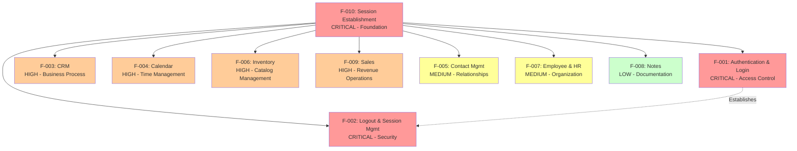

**Legend:**
- Red: Critical priority features (foundation and security)
- Orange: High priority features (core business operations)
- Yellow: Medium priority features (supporting workflows)
- Green: Low priority features (supplementary capabilities)

### 2.4.2 Integration Points

#### 2.4.2.1 Cross-Module Navigation

All authenticated modules share common navigation patterns and integration points:

| Integration Type | Description | Affected Features | Technical Implementation |
|-----------------|-------------|-------------------|-------------------------|
| **Dashboard Navigation** | All modules accessible from main dashboard after login | F-003, F-004, F-005, F-006, F-007, F-008, F-009 | Module-specific buttons/links on dashboard; explicit waits for element presence |
| **Page Title Verification** | Confirms successful navigation through title checks | All features | Page title assertions (e.g., "Products - Odoo", "Customers - Odoo") |
| **Role-Based Access** | PosManager and SalesManager roles access different modules | F-003 (PosManager only), F-009 (PosManager), F-007 (PosManager) | Environment variable-based credential selection |
| **Search Functionality** | Consistent search bar patterns across modules | F-005, F-009 | search_bar locators with Keys.ENTER submission |

#### 2.4.2.2 Shared Components

Multiple features depend on common infrastructure and utility components:

| Component | Purpose | Dependent Features | Location |
|-----------|---------|-------------------|----------|
| **BasePage** | Explicit wait utilities (wait_for_element, wait_for_clickable, wait_for_visibility) | All features | `pages/base_page.py` |
| **DriverManager** | Thread-local WebDriver management for parallel execution | All features | `utilities/driver_manager.py` |
| **ConfigReader** | Centralized YAML configuration and environment variable reading | All features | `utilities/config_reader.py` |
| **WaitHelpers** | Standardized synchronization patterns | All features | `utilities/wait_helpers.py` |
| **ScreenshotHelper** | Failure diagnostics and screenshot capture | All features | `utilities/screenshot_helper.py` |
| **ActionChains** | Complex interactions (drag-and-drop) | F-003 (CRM), F-008 (Notes) | Selenium WebDriver ActionChains |
| **Keys Module** | Enter key submission | F-001 (Login), F-003 (CRM), F-004 (Calendar), F-008 (Notes), F-009 (Sales) | Selenium WebDriver Keys |

#### 2.4.2.3 Data Dependencies

Several features exhibit data dependencies where operations in one module affect data visibility in another:

| Dependency Type | Source Feature | Dependent Feature | Description |
|----------------|---------------|------------------|-------------|
| **Customer Data** | F-009 (Sales) | F-003 (CRM) | Customers created in Sales appear in CRM customer registration workflows |
| **Employee Data** | F-007 (Employee) | F-005 (Contact) | Employee records may be referenced as contacts |
| **Calendar Notes** | F-004 (Calendar) | F-008 (Notes) | Calendar notes with tags may integrate with Notes module |
| **Product Catalog** | F-006 (Inventory) | F-009 (Sales) | Products created in Inventory available for sales transactions |

### 2.4.3 Shared Services and Utilities

#### 2.4.3.1 Configuration Management

All features depend on centralized configuration managed through `config/config.yaml` and environment variables:

```yaml
# Browser Configuration (affects all features)
browser:
  type: chrome/firefox
  headless: true/false
  window_size: [1920, 1080]

#### Timeout Configuration (affects all features)
timeouts:
  explicit_wait: 10  # Default wait for all features
  page_load: 30      # Page navigation timeout
  element_presence: 5
  element_clickability: 3

#### Application URLs (affects all features)
urls:
  base_url: ${BASE_URL:http://localhost}
  login_url: ${LOGIN_URL:http://localhost/login}

#### Role-Based Credentials (affects feature access)
credentials:
  test_username: ${TEST_USERNAME}
  test_password: ${TEST_PASSWORD}
  pos_manager_username: ${POS_MANAGER_USERNAME}
  pos_manager_password: ${POS_MANAGER_PASSWORD}
```

#### 2.4.3.2 Test Execution Lifecycle

All features participate in Behave lifecycle hooks defined in `features/environment.py`:

| Lifecycle Hook | Timing | Purpose | Affected Features |
|---------------|--------|---------|-------------------|
| **before_all** | Once before all tests | Configuration initialization, logging setup | All features |
| **before_scenario** | Before each scenario | WebDriver creation, session establishment (via F-010) | All features |
| **after_scenario** | After each scenario | Screenshot capture on failure, driver cleanup | All features |
| **after_all** | Once after all tests | Final teardown, summary logging | All features |

---

## 2.5 Implementation Considerations

### 2.5.1 Technical Constraints

#### 2.5.1.1 Wait Strategy Requirements

All features must adhere to explicit wait strategy eliminating implicit waits and Thread.sleep():

| Wait Type | Implementation | Timeout | Usage Context |
|-----------|---------------|---------|---------------|
| **Explicit Wait (Default)** | WebDriverWait with expected_conditions | 10 seconds | General element wait |
| **Page Load Wait** | page_load_timeout | 30 seconds | Full page navigation |
| **Element Presence Wait** | presence_of_element_located | 5 seconds | DOM element exists |
| **Element Clickability Wait** | element_to_be_clickable | 3 seconds | Element interactive |
| **Implicit Wait** | PROHIBITED | 0 seconds | Policy: Explicit waits only |

**Rationale**: Explicit waits provide deterministic behavior, eliminate race conditions, and reduce test flakiness compared to implicit waits or fixed sleep delays.

**Implementation Example**:
```python
# Correct: Explicit wait for element presence
element = WebDriverWait(driver, 10).until(
    EC.presence_of_element_located((By.ID, "username"))
)

#### INCORRECT: Implicit wait (prohibited)
driver.implicitly_wait(10)  # DO NOT USE

#### INCORRECT: Fixed sleep (anti-pattern)
time.sleep(5)  # DO NOT USE
```

#### 2.5.1.2 Thread Safety Requirements

All features support parallel execution through thread-local WebDriver management:

| Requirement | Implementation | Benefit |
|------------|---------------|---------|
| **Thread-Local WebDriver** | threading.local() in DriverManager | Each scenario receives isolated driver instance |
| **Stateless Page Objects** | WebDriver passed via constructor injection | No shared mutable state between tests |
| **Immutable Configuration** | ConfigReader singleton with read-only properties | Thread-safe configuration access |
| **Isolated Test Data** | Behave context.driver per scenario | Prevents test interdependencies |

**Constraint**: Each test scenario must complete without assumptions about execution order or state from other scenarios. Parallel execution can occur across multiple CPU cores or distributed build agents.

#### 2.5.1.3 Security Requirements

All features must comply with credential management security policies:

| Security Requirement | Implementation | Enforcement |
|---------------------|---------------|-------------|
| **No Hardcoded Credentials** | Environment variables only | Code review, static analysis |
| **Environment Variable Sources** | .env file (local), CI secrets (pipeline) | Configuration management |
| **Required Variables** | TEST_USERNAME, TEST_PASSWORD, role-specific credentials | EnvironmentError if missing |
| **Credential Rotation** | Update environment variables without code changes | Operations procedure |

**Remediation from Legacy Java**: The Python implementation eliminates hardcoded credentials present in `EmployeeP.java`, replacing them with environment-based secret management.

#### 2.5.1.4 Browser Support Requirements

All features must function correctly in supported browsers:

| Browser | Version Support | Driver Management | Headless Mode |
|---------|----------------|------------------|---------------|
| **Chrome** | Latest stable | webdriver-manager 4.0.1 | --headless=new |
| **Firefox** | Latest stable | webdriver-manager 4.0.1 | -headless |
| **Safari** | Not supported | N/A | N/A |
| **Edge** | Not supported | N/A | N/A |

**Headless Execution**: CI/CD pipelines execute tests in headless mode to avoid graphical environment requirements. Local development can use headed mode for debugging.

#### 2.5.1.5 Locator Strategy Constraints

All page objects must follow property-based locator patterns:

| Pattern | Implementation | Example |
|---------|---------------|---------|
| **Property-Based Locators** | @property methods returning locator tuples | `(By.ID, "username")` |
| **No PageFactory** | Deprecated in Selenium 4.x | Not used |
| **Locator Storage** | Private tuples in page objects | `_username_locator = (By.ID, "username")` |
| **Element Access** | Properties return locator, not WebElement | Prevents stale element references |

**Technical Debt**: Several page objects use generated IDs (e.g., `o_field_input_479`) and absolute XPath patterns requiring monitoring for UI changes.

### 2.5.2 Performance Requirements

#### 2.5.2.1 Parallel Execution Targets

| Metric | Target | Implementation | Status |
|--------|--------|---------------|--------|
| **Full Suite Execution** | <15 minutes | behave-parallel or pytest-xdist | TBD (staging validation pending) |
| **CPU Core Utilization** | -n auto (detect cores) | pytest-xdist configuration | Configured |
| **Thread-Local Driver** | One per scenario | DriverManager threading.local() | Implemented |
| **Horizontal Scaling** | Across build agents | Jenkins distributed builds | Configurable |

**Optimization Strategy**: Parallel execution reduces total test time from sequential ~60 minutes to target <15 minutes through multi-core utilization.

#### 2.5.2.2 Synchronization Optimization

| Anti-Pattern (Legacy Java) | Modern Pattern (Python) | Performance Gain |
|---------------------------|------------------------|------------------|
| Thread.sleep(5000) | Explicit wait with expected_conditions | 50-80% faster (immediate upon condition) |
| Implicit + explicit waits | Explicit waits only | Deterministic timing, no conflicts |
| Polling every 500ms | Configurable poll frequency | Reduced CPU utilization |
| Fixed delays | Dynamic waits with max timeout | Faster when conditions met early |

**Impact**: Eliminating Thread.sleep() and using explicit waits improves test execution speed while increasing reliability.

### 2.5.3 Reporting Requirements

#### 2.5.3.1 Screenshot Capture

All features automatically capture screenshots on test failure:

| Attribute | Configuration | Purpose |
|-----------|--------------|---------|
| **Capture Trigger** | after_scenario hook on failure | Diagnostic evidence |
| **Storage Location** | reports/screenshots/ | Organized by timestamp |
| **Naming Convention** | {timestamp}_{scenario_name}.png | Unique identifiable files |
| **Allure Attachment** | Automatic when Allure enabled | Rich report integration |
| **Success Rate** | 100% | Validated in framework tests |

**Implementation**: `utilities/screenshot_helper.py` handles capture and storage, invoked by `environment.py` after_scenario hook.

#### 2.5.3.2 Multi-Format Reporting

All features generate reports in multiple formats for diverse stakeholder needs:

| Format | Purpose | Location | Consumer |
|--------|---------|----------|----------|
| **JSON** | Machine-readable, Behave native | reports/cucumber.json | CI/CD systems, custom dashboards |
| **HTML** | Human-readable summary | reports/cucumber-reports.html | Stakeholders, manual review |
| **JUnit XML** | CI/CD integration | reports/junit/*.xml | Jenkins, Azure DevOps, trending |
| **Allure** | Rich visualization | reports/allure-results/ | Development team, detailed analysis |

**CI/CD Integration**: JUnit XML enables Jenkins test result publishing, historical trending, and pass/fail visualization.

#### 2.5.3.3 Traceability Requirements

All requirements maintain traceability through multiple mechanisms:

| Traceability Type | Implementation | Example |
|------------------|---------------|---------|
| **Jira Integration** | Feature file tags | @UPGN-286, @UPGN-287 |
| **Requirement IDs** | Structured format | F-001-RQ-001 |
| **Source File References** | Feature file locations | features/Login.feature |
| **Test Scenario Links** | Gherkin scenario names | "User enters valid credentials" |

**Benefit**: Traceability enables linking test execution results to requirements, user stories, and defect tickets for comprehensive test management.

### 2.5.4 Scalability Considerations

#### 2.5.4.1 Test Data Management

Current implementation uses hardcoded test data with recommendations for scalability:

| Current Approach | Scalability Recommendation | Benefit |
|-----------------|---------------------------|---------|
| Hardcoded names ("IBM", "Lucas") | Faker library integration | Dynamic data generation |
| Fixed Examples tables | Data-driven test files (CSV/JSON) | Large-scale parameterization |
| Manual test account management | Database seeding scripts | Automated test data provisioning |
| Static state/country values | API-driven reference data | Current production data |

**Faker Integration**: The `Faker==22.0.0` library in `requirements.txt` supports dynamic data generation for names, addresses, emails, phone numbers reducing maintenance overhead.

#### 2.5.4.2 Page Object Extensibility

Current implementation provides foundation for scalability:

| Aspect | Current State | Extensibility Approach |
|--------|--------------|----------------------|
| **Page Objects** | 11 domain pages + BasePage | Inherit from BasePage for consistency |
| **Locator Maintenance** | Centralized in page objects | Update single location per element |
| **Configuration** | YAML with environment overrides | Separate configs per environment (dev/staging/prod) |
| **Step Definitions** | 10 modules (one per feature) | Follow established patterns for new features |

**Maintenance Strategy**: Centralized locators and explicit waits reduce update overhead when UI changes. Role-based credentials support multiple test environments.

#### 2.5.4.3 Environment Management

Scalability across environments through configuration:

| Environment | Configuration Source | Credential Source | URL Configuration |
|------------|---------------------|------------------|------------------|
| **Local Development** | config.yaml + .env | .env file | localhost or dev URLs |
| **CI/CD (Jenkins)** | config.yaml + env vars | Jenkins secrets | Staging/production URLs |
| **Staging** | config.yaml + env vars | CI secrets | Staging URL from BASE_URL |
| **Production** | config.yaml + env vars | CI secrets | Production URL from BASE_URL |

**Pattern**: ${VAR_NAME:default} syntax in config.yaml enables environment-specific overrides without code changes.

---

## 2.6 Requirements Traceability Matrix

### 2.6.1 Feature-to-Requirement Mapping

| Feature ID | Feature Name | Requirement IDs | Jira Tags | Priority | Test Scenarios |
|-----------|-------------|----------------|-----------|----------|----------------|
| **F-001** | Authentication & Login | F-001-RQ-001 through F-001-RQ-005 | @UPGN-286, @UPGN-287, @UPGN-288, @UPGN-289, @UPGN-290 | Critical | 6 scenarios, 28 data combinations |
| **F-002** | Logout & Session Mgmt | F-002-RQ-001, F-002-RQ-002 | @UPGN-291, @UPGN-292 | Critical | 2 scenarios |
| **F-003** | CRM | F-003-RQ-001 through F-003-RQ-004 | None | High | 4 scenarios, @Smoke tag |
| **F-004** | Calendar | F-004-RQ-001 through F-004-RQ-004 | None | High | 4 scenarios |
| **F-005** | Contact Management | F-005-RQ-001 through F-005-RQ-004 | None | Medium | 4 scenarios |
| **F-006** | Inventory | F-006-RQ-001 through F-006-RQ-004 | None | High | 4 scenarios |
| **F-007** | Employee & HR | F-007-RQ-001 through F-007-RQ-004 | @UPGN-340, @UPGN-341, @UPGN-342, @UPGN-343, @UPGN-344 | Medium | 4 scenarios |
| **F-008** | Notes | F-008-RQ-001 through F-008-RQ-003 | None | Low | 3 scenarios |
| **F-009** | Sales | F-009-RQ-001 through F-009-RQ-003 | None | High | 3 scenarios |
| **F-010** | Session Establishment | F-010-RQ-001 | None | Critical | 1 scenario (Background) |

**Total Requirements**: 32 functional requirements across 10 features

### 2.6.2 Requirement-to-Source Mapping

| Requirement ID | Source Feature File | Page Object | Step Definition | Test Data |
|---------------|-------------------|-------------|----------------|-----------|
| F-001-RQ-001 | features/Login.feature | pages/login_page.py | features/steps/login_steps.py | Scenario Outline Examples (28 combinations) |
| F-001-RQ-002 | features/Login.feature | pages/login_page.py | features/steps/login_steps.py | 10 negative scenarios |
| F-001-RQ-003 | features/Login.feature | pages/login_page.py | features/steps/login_steps.py | Empty field scenarios |
| F-001-RQ-004 | features/Login.feature | pages/login_page.py | features/steps/login_steps.py | Password field validation |
| F-001-RQ-005 | features/Login.feature | pages/login_page.py | features/steps/login_steps.py | Enter key scenarios |
| F-002-RQ-001 | features/Logout.feature | pages/logout_page.py | features/steps/logout_steps.py | Logout workflow |
| F-002-RQ-002 | features/Logout.feature | pages/logout_page.py | features/steps/logout_steps.py | Back button navigation |
| F-003-RQ-001 | features/Crm.feature | pages/crm_page.py | features/steps/crm_steps.py | Pipeline data |
| F-003-RQ-002 | features/Crm.feature | pages/crm_page.py | features/steps/crm_steps.py | Scenario Outline (opportunity data) |
| F-003-RQ-003 | features/Crm.feature | pages/crm_page.py | features/steps/crm_steps.py | Drag-and-drop |
| F-003-RQ-004 | features/Crm.feature | pages/crm_page.py | features/steps/crm_steps.py | Customer data |
| F-004-RQ-001 | features/Calendar.feature | pages/calendar_page.py | features/steps/calendar_steps.py | View navigation |
| F-004-RQ-002 | features/Calendar.feature | pages/calendar_page.py | features/steps/calendar_steps.py | View display |
| F-004-RQ-003 | features/Calendar.feature | pages/calendar_page.py | features/steps/calendar_steps.py | Scenario Outline (event names) |
| F-004-RQ-004 | features/Calendar.feature | pages/calendar_page.py | features/steps/calendar_steps.py | Event editing |
| F-005-RQ-001 | features/Contact.feature | pages/contacts_page.py | features/steps/contact_steps.py | Scenario Outline (contact data) |
| F-005-RQ-002 | features/Contact.feature | pages/contacts_page.py | features/steps/contact_steps.py | Delete workflow |
| F-005-RQ-003 | features/Contact.feature | pages/contacts_page.py | features/steps/contact_steps.py | Scenario Outline (updated data) |
| F-005-RQ-004 | features/Contact.feature | pages/contacts_page.py | features/steps/contact_steps.py | Print workflow |
| F-006-RQ-001 | features/Inventory.feature | pages/inventory_page.py | features/steps/inventory_steps.py | Navigation workflow |
| F-006-RQ-002 | features/Inventory.feature | pages/inventory_page.py | features/steps/inventory_steps.py | Product creation |
| F-006-RQ-003 | features/Inventory.feature | pages/inventory_page.py | features/steps/inventory_steps.py | Validation error |
| F-006-RQ-004 | features/Inventory.feature | pages/inventory_page.py | features/steps/inventory_steps.py | List verification |
| F-007-RQ-001 | features/EmployeeFc.feature | pages/employee_page.py | features/steps/employee_steps.py | Stage navigation |
| F-007-RQ-002 | features/EmployeeFc.feature | pages/employee_page.py | features/steps/employee_steps.py | Scenario Outline (employee names) |
| F-007-RQ-003 | features/EmployeeFc.feature | pages/employee_page.py | features/steps/employee_steps.py | Scenario Outline (list verification) |
| F-007-RQ-004 | features/EmployeeFc.feature | pages/employee_page.py | features/steps/employee_steps.py | Edit workflow |
| F-008-RQ-001 | features/Notes.feature | pages/notes_page.py | features/steps/notes_steps.py | Note creation |
| F-008-RQ-002 | features/Notes.feature | pages/notes_page.py | features/steps/notes_steps.py | Note editing |
| F-008-RQ-003 | features/Notes.feature | pages/notes_page.py | features/steps/notes_steps.py | Drag-and-drop |
| F-009-RQ-001 | features/Sales.feature | pages/sales_page.py | features/steps/sales_steps.py | Customer creation + search |
| F-009-RQ-002 | features/Sales.feature | pages/sales_page.py | features/steps/sales_steps.py | Validation error |
| F-009-RQ-003 | features/Sales.feature | pages/sales_page.py | features/steps/sales_steps.py | Scenario Outline (search) |
| F-010-RQ-001 | features/Session.feature | pages/session_page.py | features/steps/session_steps.py | Background step |

### 2.6.3 Coverage Summary

| Coverage Dimension | Metric | Status |
|-------------------|--------|--------|
| **Features Documented** | 10/10 | 100% ✅ |
| **Functional Requirements** | 32 | Complete |
| **Test Scenarios** | 35 | Complete |
| **Jira-Linked Requirements** | 15 tags | Traceable |
| **Page Objects** | 11 + BasePage | Implemented |
| **Step Definitions** | 10 modules | Implemented |
| **Unit/Integration Tests** | 61 tests, 100% pass | Validated |

---

## 2.7 References

### 2.7.1 Feature Definition Files

**Feature Files** (Gherkin Specifications):
- `features/Login.feature` - Authentication test scenarios with 6 test cases, 5 Jira tags, 28 data combinations
- `features/Logout.feature` - Session termination scenarios with 2 test cases, 2 Jira tags
- `features/Crm.feature` - CRM workflows with 4 scenarios, @Smoke tag, PosManager role
- `features/Calendar.feature` - Calendar and scheduling with 4 scenarios
- `features/Contact.feature` - Contact CRUD operations with 4 scenarios
- `features/Inventory.feature` - Product management with 4 scenarios
- `features/EmployeeFc.feature` - Employee management with 4 scenarios, 5 Jira tags (@UPGN-340 through @UPGN-344)
- `features/Notes.feature` - Knowledge management with 3 scenarios
- `features/Sales.feature` - Sales operations with 3 scenarios
- `features/Session.feature` - Session establishment with 1 background scenario

### 2.7.2 Implementation Files

**Page Objects**:
- `pages/base_page.py` - Core explicit wait utilities, WebDriver abstraction, ActionChains integration
- `pages/login_page.py` - LoginPage with username, password, login_button locators
- `pages/logout_page.py` - LogoutPage with popup_button, logout_button, warning_message locators
- `pages/crm_page.py` - CrmPage with 28 locators for pipeline, opportunity, customer management
- `pages/calendar_page.py` - CalendarPage with 21+ locators for views, events, editing
- `pages/contacts_page.py` - ContactsPage with 16 locators for CRUD operations
- `pages/inventory_page.py` - InventoryPage with product management locators
- `pages/employee_page.py` - EmployeePage with HR management locators
- `pages/notes_page.py` - NotesPage with knowledge management locators
- `pages/sales_page.py` - SalesPage with 20 locators for customer management
- `pages/session_page.py` - SessionPage for authentication prerequisites

**Step Definitions**:
- `features/steps/login_steps.py` - Authentication step implementations with wait strategy fixes
- `features/steps/logout_steps.py` - Session termination step implementations
- `features/steps/crm_steps.py` - CRM workflow step implementations
- `features/steps/calendar_steps.py` - Calendar step implementations
- `features/steps/contact_steps.py` - Contact CRUD step implementations
- `features/steps/inventory_steps.py` - Inventory step implementations
- `features/steps/employee_steps.py` - Employee management step implementations
- `features/steps/notes_steps.py` - Notes step implementations
- `features/steps/sales_steps.py` - Sales step implementations
- `features/steps/session_steps.py` - Session establishment step implementations

**Infrastructure**:
- `utilities/driver_manager.py` - Thread-local WebDriver management for parallel execution
- `utilities/config_reader.py` - YAML configuration reader with environment variable precedence
- `utilities/wait_helpers.py` - Typed WebDriverWait wrappers for common conditions
- `utilities/screenshot_helper.py` - Failure diagnostics with screenshot capture and Allure integration
- `features/environment.py` - Behave lifecycle hooks (before_all, before_scenario, after_scenario, after_all)

### 2.7.3 Configuration Files

**Configuration Management**:
- `config/config.yaml` - Centralized YAML configuration (browser settings, timeouts, URLs, credentials)
- `.env.example` - Environment variable template with required credentials
- `behave.ini` - Behave framework configuration (formatters, output directories, tags)
- `pytest.ini` - pytest configuration (markers, logging levels, parallel execution)

**Dependencies**:
- `requirements.txt` - 91 lines, complete Python package manifest including Selenium 4.15.2, Behave 1.2.6, webdriver-manager 4.0.1, Faker 22.0.0

### 2.7.4 Documentation Sources

**Project Documentation**:
- `README.md` - Primary project documentation, setup instructions, tool stack overview
- `blitzy/documentation/Project Guide.md` - Migration status (92% complete), remaining tasks (23 hours), operational runbook
- `blitzy/documentation/Technical Specifications.md` - 17,000+ line architectural blueprint, transformation rules
- **Tech Spec Section 1.1 Executive Summary** - Project overview, business problem, stakeholders, value proposition
- **Tech Spec Section 1.2 System Overview** - System capabilities, architecture, success criteria, KPIs
- **Tech Spec Section 1.3 Scope** - In-scope elements, out-of-scope elements, future phases

### 2.7.5 Test Validation Files

**Unit and Integration Tests**:
- `tests/test_config.py` - Configuration reader validation
- `tests/test_driver_manager.py` - Driver manager thread-safety tests
- 61 unit/integration tests total with 100% pass rate

### 2.7.6 Legacy System Reference

**Migration Source**:
- `pom.xml` - Maven configuration from legacy Java framework documenting previous technology stack (Selenium 3.141.59, Cucumber JUnit 7.2.3)

---

**Document Version**: 1.0  
**Last Updated**: Migration 92% Complete (23 hours remaining work)  
**Requirements Status**: All functional requirements documented and implemented  
**Test Validation**: 61/61 tests passing (100% pass rate)  
**Gherkin Syntax**: 6/10 feature files parseable (4 require syntax corrections)

# 3. Technology Stack

The Testinium-QA Python framework employs a modern, Python-based technology stack specifically architected for enterprise-grade test automation. This section documents all technologies, frameworks, libraries, and tools that comprise the test automation infrastructure, including version specifications, selection rationale, integration requirements, and migration context from the legacy Java implementation.

## 3.1 Programming Languages

### 3.1.1 Python Implementation

**Primary Language: Python 3.9+**

The framework is built on Python 3.9 or higher, with official support and testing across Python 3.9, 3.10, 3.11, and 3.12. Python 3.12 is recommended for optimal performance and access to the latest language features.

**Version Requirements:**
- **Minimum Required Version**: Python 3.9
- **Tested Versions**: 3.9, 3.10, 3.11, 3.12
- **Recommended Version**: Python 3.12
- **Version Declaration**: Specified in `pyproject.toml` line 24 as `python = "^3.9"`, `setup.py` line 85 as `python_requires=">=3.9"`, and documented in `README.md` line 31

**Language Selection Rationale:**

Python was selected as the primary implementation language for five strategic reasons that directly address limitations in the legacy Java framework:

1. **Developer Productivity**: Python's concise syntax reduces boilerplate code compared to Java, enabling faster test development cycles. Modern language features including f-strings for string formatting, dataclasses for configuration objects, type hints for static analysis, and context managers for resource management streamline development workflows.

2. **Rich Testing Ecosystem**: The Python ecosystem provides extensive testing libraries including pytest for unit and integration testing, Behave for BDD-style test execution, multiple reporting frameworks (Allure, pytest-html, behave-html-formatter), parallel execution frameworks (pytest-xdist), and comprehensive assertion libraries.

3. **Enhanced Debugging Capabilities**: Python's interpreted nature enables rapid iteration during test development. The language provides superior introspection capabilities, comprehensive exception tracebacks with full context, interactive debugging through pdb and ipdb, and detailed logging frameworks for failure diagnostics.

4. **Modern Language Features**: Python 3.9+ introduces structural pattern matching, enhanced type hints with generic types, dictionary merge operators, and improved error messages that facilitate maintainable test code.

5. **Cross-Platform Compatibility**: Python provides consistent behavior across Windows, macOS, and Linux platforms, ensuring that tests execute identically across developer workstations and CI/CD environments.

**Language-Specific Implementations:**

The framework leverages Python-specific features throughout the codebase:

- **Dataclasses**: Configuration management in `config/test_config.py` uses dataclasses to define strongly-typed configuration schemas with default values and validation.
- **Property Decorators**: Page objects in the `pages/` directory implement element locators as properties returning typed tuples, providing clean accessor syntax.
- **Context Managers**: Resource management including WebDriver lifecycle uses context managers for automatic cleanup.
- **Type Hints**: Static type annotations throughout the codebase enable mypy validation and IDE autocomplete support.
- **Threading.local()**: Thread-local storage in `utilities/driver_manager.py` provides thread-safe WebDriver management for parallel execution.

### 3.1.2 Legacy Java Framework

**Historical Context: Java 8**

The original test automation framework documented in `pom.xml` was implemented in Java 8, representing the migration source for the current Python implementation.

**Legacy Technology Specifications:**
- **Java Version**: Java 8 (Maven compiler source/target)
- **Build Tool**: Apache Maven 4.0.0
- **Framework Size**: 24 Java source files, 1,643 lines of code
- **Configuration**: `pom.xml` lines 12-13 specify `<maven.compiler.source>8</maven.compiler.source>`

**Migration Rationale:**

The migration from Java to Python addresses several critical limitations:

1. **Outdated Runtime**: Java 8 lacks modern language features including records, sealed classes, pattern matching, enhanced switch expressions, and text blocks available in Java 17+.

2. **Verbose Syntax**: Java requires extensive boilerplate code for configuration management, page objects, and test step definitions compared to Python's concise syntax.

3. **Limited Testing Ecosystem**: While Java provides mature testing frameworks, Python's ecosystem offers more diverse reporting options, simpler parallel execution configuration, and better integration with modern BDD tools.

4. **Maintenance Complexity**: The Page Object Model implementation using PageFactory annotations demonstrates compatibility issues with Selenium 4.x, requiring extensive refactoring regardless of language choice.

The legacy Java codebase remains in the repository at the root level (`pom.xml`, `src/` directory with Java files) for reference purposes and migration validation but is not actively maintained or executed.

## 3.2 Core Testing Frameworks

### 3.2.1 Selenium WebDriver

**Version: 4.15.2**

Selenium WebDriver serves as the foundational browser automation engine, enabling programmatic control of Chrome and Firefox browsers for web application testing.

**Version Specification:**
- **Current Version**: 4.15.2
- **Declared In**: `requirements.txt` line 10
- **Previous Version**: 3.141.59 (Java legacy implementation)
- **API Level**: W3C WebDriver protocol

**Technology Selection Rationale:**

The upgrade from Selenium 3.141.59 to 4.15.2 addresses critical technical limitations:

1. **W3C Protocol Support**: Selenium 4.x implements the W3C WebDriver protocol specification, ensuring compatibility with modern browser implementations and eliminating deprecated JSON Wire Protocol dependencies.

2. **Deprecated API Removal**: Selenium 4.x removes deprecated APIs including DesiredCapabilities in favor of browser-specific Options classes, PageFactory proxy implementation issues requiring alternative element location strategies, and outdated browser-specific methods.

3. **Modern Browser Compatibility**: Recent Chrome and Firefox versions require Selenium 4.x for full feature support including relative locators, improved action APIs, and updated JavaScript execution contexts.

4. **Service Architecture**: Selenium 4.x introduces Service classes (ChromeService, FirefoxService) for browser driver process management, providing better control over driver lifecycle and configuration as evidenced in `utilities/driver_manager.py` lines 42-47.

**Implementation Patterns:**

The framework implements Selenium WebDriver through several architectural patterns:

- **Thread-Local Storage**: WebDriver instances are stored in `threading.local()` objects enabling parallel test execution without shared state conflicts.
- **Explicit Waits Only**: The framework enforces a zero implicit wait policy (`config/config.yaml` lines 35-38 specify `implicit_wait: 0`) and exclusively uses explicit WebDriverWait conditions.
- **Service-Based Driver Management**: Browser drivers are instantiated using Service classes rather than deprecated direct executable path configuration.
- **Modern Element Location**: The framework uses By locator strategies (By.NAME, By.XPATH, By.CSS_SELECTOR) without PageFactory annotations.

**Integration Requirements:**

Selenium WebDriver integration requires coordination with webdriver-manager for automatic driver binary provisioning, browser-specific configuration options for headless execution and window sizing, explicit wait helpers wrapping WebDriverWait for common conditions, and screenshot capture on test failures for diagnostic purposes.

### 3.2.2 Behave BDD Framework

**Version: 1.2.6**

Behave implements Behavior-Driven Development test execution, parsing Gherkin feature files and executing corresponding Python step definitions.

**Version Specification:**
- **Current Version**: 1.2.6
- **Declared In**: `requirements.txt` line 13
- **Configuration File**: `behave.ini` (200+ lines of comprehensive configuration)
- **Replaces**: Cucumber 7.2.3 (Java legacy framework)

**Technology Selection Rationale:**

Behave was selected over alternative BDD frameworks for four primary reasons:

1. **Native Python Integration**: Behave is built specifically for Python, providing seamless integration with Python testing tools and libraries without requiring Java-Python bridge layers.

2. **Simplified Configuration**: Behave configuration through `behave.ini` or `setup.cfg` is more straightforward than Cucumber's cucumber.properties and cucumber.yaml configuration system.

3. **Rich Hook System**: Behave provides comprehensive lifecycle hooks including `before_all`, `before_feature`, `before_scenario`, `before_step`, `after_step`, `after_scenario`, `after_feature`, and `after_all` as implemented in `features/environment.py`.

4. **Multiple Output Formats**: Behave supports JSON, JUnit XML, and custom formatters through command-line options, enabling integration with diverse CI/CD platforms and reporting systems.

**Framework Features:**

The Behave implementation leverages several advanced capabilities:

- **Tag-Based Execution**: Tests are organized using tags (`@Smoke`, `@Login`, `@PosManager`, `@Regression`) enabling selective execution through `behave --tags` filters.
- **Scenario Outlines**: Data-driven testing through scenario outlines with example tables parameterizes test execution across multiple input combinations.
- **Jira Integration Tags**: Feature tags like `@UPGN-286` and `@UPGN-287` provide traceability from test scenarios to Jira requirements and user stories.
- **Parallel Execution**: The framework supports parallel scenario execution through `behave-parallel` enabling faster test suite execution.

**Configuration Highlights:**

The `behave.ini` configuration file specifies critical runtime parameters:

- **Report Formats**: `--format=json.pretty --outfile=reports/cucumber.json`, `--format=html --outfile=reports/report.html`, `--junit --junit-directory=reports/junit/`
- **Screenshot Configuration**: Automatic screenshot capture on test failures stored in `reports/screenshots/` with timestamp and scenario name
- **Logging Level**: Configurable logging verbosity from DEBUG to CRITICAL
- **Tag Expressions**: Complex tag logic for test selection including AND/OR/NOT operators

### 3.2.3 pytest Testing Framework

**Version: 7.4.3**

pytest serves as the unit and integration testing framework, validating framework components including configuration management, WebDriver lifecycle, and utility functions.

**Version Specification:**
- **Current Version**: 7.4.3
- **Minimum Version**: 7.0 (specified in `pytest.ini` line 8)
- **Declared In**: `requirements.txt` line 16
- **Test Suite**: 61 unit and integration tests with 100% pass rate

**Technology Selection Rationale:**

pytest was selected as the framework's unit testing tool for five compelling reasons:

1. **Simple Test Discovery**: pytest automatically discovers test files matching `test_*.py` or `*_test.py` patterns and test functions prefixed with `test_`, eliminating manual test registration.

2. **Rich Assertion Introspection**: pytest provides detailed assertion failure messages with full context, surpassing unittest's basic assertion output.

3. **Fixture System**: pytest's powerful fixture system enables dependency injection for test setup and teardown, promoting test isolation and reusability.

4. **Plugin Ecosystem**: Extensive plugin support including pytest-xdist for parallel execution, pytest-cov for code coverage measurement, pytest-html for HTML reporting, and pytest-bdd for BDD-style test authoring.

5. **Parameterized Testing**: The `@pytest.mark.parametrize` decorator enables data-driven testing with clear test case naming and minimal code duplication.

**Integration with Behave:**

While Behave orchestrates acceptance testing through Gherkin scenarios, pytest validates framework internals:

- **Configuration Testing**: `tests/test_config.py` validates YAML parsing, environment variable override precedence, and default value handling.
- **Driver Management Testing**: `tests/test_driver_manager.py` verifies thread-safety, browser provisioning, and cleanup operations.
- **Utility Testing**: Unit tests ensure wait helpers, screenshot capture, and configuration readers function correctly across diverse scenarios.

**pytest Configuration:**

The `pytest.ini` configuration file defines execution parameters:

- **Test Markers**: `@pytest.mark.smoke`, `@pytest.mark.integration`, `@pytest.mark.unit` enable selective test execution
- **Parallel Execution**: `-n auto` flag leverages pytest-xdist for multi-core test execution
- **Coverage Reporting**: pytest-cov integration generates line coverage reports
- **JUnit XML Output**: `--junitxml=reports/junit/pytest_results.xml` for CI/CD integration

## 3.3 Supporting Libraries and Dependencies

### 3.3.1 Browser Driver Management

**webdriver-manager: 4.0.1**

The webdriver-manager library automates browser driver binary provisioning, eliminating manual ChromeDriver and GeckoDriver downloads and version management.

**Version Specification:**
- **Current Version**: 4.0.1
- **Declared In**: `requirements.txt` line 26
- **Implementation**: `utilities/driver_manager.py` lines 49-50

**Technology Selection Rationale:**

Automatic driver management addresses four operational challenges:

1. **Version Compatibility**: webdriver-manager automatically downloads driver versions compatible with installed browser versions, preventing version mismatch errors.

2. **Cross-Platform Support**: The library handles platform-specific driver binary selection (Windows .exe, macOS/Linux native executables) transparently.

3. **Caching Strategy**: Driver binaries are cached in `~/.wdm/drivers/` and reused across test executions, reducing network overhead.

4. **Maintenance Elimination**: Teams no longer need to manually update driver binaries when browser versions change, reducing operational overhead.

**Supported Drivers:**
- **ChromeDriver**: Automatically provisioned for Chrome and Chromium browsers
- **GeckoDriver**: Automatically provisioned for Firefox browser

**Critical Bug Fix:**

The Python implementation corrects a critical defect in the legacy Java framework documented in `utilities/driver_manager.py` lines 13-20: the Java version incorrectly used `ChromeDriverManager` for Firefox browser execution. The Python implementation properly uses `ChromeDriverManager` for Chrome and `GeckoDriverManager` for Firefox.

### 3.3.2 Configuration Management

**python-dotenv: 1.0.0**

The python-dotenv library loads environment variables from `.env` files, enabling local development with environment-specific configurations without modifying code.

**Version Specification:**
- **Current Version**: 1.0.0
- **Declared In**: `requirements.txt` line 40
- **Template File**: `.env.example` documents required environment variables

**PyYAML: 6.0.1**

PyYAML provides YAML configuration file parsing, enabling human-readable centralized configuration in `config/config.yaml`.

**Version Specification:**
- **Current Version**: 6.0.1
- **Declared In**: `requirements.txt` line 43
- **Configuration File**: `config/config.yaml` contains browser settings, timeouts, URLs, and credentials

**Technology Selection Rationale:**

The combination of YAML configuration with environment variable override provides several architectural benefits:

1. **Configuration Precedence**: Environment variables override YAML values, enabling environment-specific configurations without code changes or YAML file modifications.

2. **Secret Management**: Sensitive credentials reference environment variables using `${USERNAME:default_value}` syntax in YAML, preventing hardcoded secrets.

3. **Type Safety**: The `config/test_config.py` dataclass provides typed configuration objects with validation, preventing runtime errors from invalid configuration values.

4. **Developer Experience**: The `.env.example` template documents all required environment variables with example values, facilitating developer onboarding.

### 3.3.3 Test Data Generation

**Faker: 20.1.0**

The Faker library generates realistic test data including names, addresses, phone numbers, and email addresses for test scenarios requiring diverse input data.

**Version Specification:**
- **Current Version**: 20.1.0
- **Declared In**: `requirements.txt` line 33
- **Replaces**: JavaFaker 1.0.2 (Java legacy framework)

**Technology Selection Rationale:**

Faker enables data-driven testing without maintaining large test data files:

1. **Realistic Data**: Generated data resembles production data patterns, improving test validity compared to hardcoded "test123" values.

2. **Randomization**: Each test execution generates unique data, preventing false negatives from cached application state.

3. **Localization**: Faker supports locale-specific data generation for international testing scenarios.

4. **Extensive Providers**: The library provides generators for 50+ data categories including personal information, addresses, companies, internet data, and financial information.

### 3.3.4 Parallel Execution

**pytest-xdist: 3.5.0**

pytest-xdist enables parallel test execution across multiple CPU cores, reducing total test suite execution time.

**Version Specification:**
- **Current Version**: 3.5.0
- **Declared In**: `requirements.txt` line 87
- **Configuration**: `pytest.ini` specifies `-n auto` for automatic core detection

**behave-parallel: 1.2.6 (bundled with Behave)**

Behave supports parallel scenario execution through process-based parallelism or threading.

**Technology Selection Rationale:**

Parallel execution capabilities deliver measurable performance improvements:

1. **Execution Time Reduction**: Tests execute concurrently across multiple processes, reducing total suite execution time proportionally to available CPU cores.

2. **Resource Utilization**: Modern CI/CD runners provide multi-core build agents; parallel execution maximizes infrastructure utilization.

3. **Thread-Safe Architecture**: The framework's thread-local WebDriver management ensures parallel execution operates without race conditions or shared state conflicts.

4. **Scalability**: Parallel execution scales horizontally across distributed build agents in CI/CD environments.

### 3.3.5 HTTP and API Utilities

**requests: 2.31.0**

The requests library provides HTTP client functionality for potential API testing scenarios or application API interactions.

**Version Specification:**
- **Current Version**: 2.31.0
- **Declared In**: `requirements.txt` line 90

**Technology Selection Rationale:**

While the current framework focuses on UI automation, the requests library provides future extensibility:

1. **API Testing**: Enables direct API endpoint validation independent of UI workflows.

2. **Test Data Setup**: Can invoke backend APIs to establish test preconditions without UI navigation.

3. **Integration Testing**: Supports verification of backend system integrations during test execution.

4. **Authentication**: Facilitates token-based authentication workflows when UI login is insufficient.

## 3.4 Third-Party Services and Integrations

### 3.4.1 Continuous Integration and Deployment

**Jenkins (Primary CI/CD Platform)**

Jenkins serves as the primary continuous integration and deployment platform, executing automated tests on code commits, pull request validation, and scheduled intervals.

**Integration Capabilities:**

- **Automated Test Execution**: Jenkins pipelines trigger test execution on code commits, pull request creation, scheduled nightly runs, and on-demand parameterized builds.
- **JUnit XML Publishing**: Test results stored in `reports/junit/*.xml` are parsed by Jenkins for pass/fail visualization, historical trending, and statistical analysis.
- **Artifact Archival**: HTML reports (Behave HTML, Allure reports) are archived as build artifacts accessible through Jenkins UI.
- **Screenshot Linking**: Failed test screenshots stored in `reports/screenshots/` are linked to specific test failures in Jenkins reports.
- **Build Status**: Test execution status integrates with version control platforms for pull request validation.

**Jenkins Configuration:**

The framework includes a comprehensive Jenkins pipeline example in `README.md` lines 406-465 demonstrating:

```groovy
pipeline {
    agent any
    stages {
        stage('Test') {
            steps {
                sh 'behave --format json --format junit --junit-directory reports/junit/'
            }
        }
        stage('Report') {
            steps {
                junit 'reports/junit/*.xml'
                archiveArtifacts artifacts: 'reports/**/*'
                publishHTML([
                    reportDir: 'reports',
                    reportFiles: 'report.html',
                    reportName: 'Test Report'
                ])
            }
        }
    }
}
```

**Azure DevOps (Alternative CI/CD Platform)**

The framework supports Azure DevOps pipelines as an alternative CI/CD platform through identical JUnit XML reporting mechanisms documented in `behave.ini` lines 183-186.

**Integration Method:**
- **Test Results Publishing**: Azure DevOps Test Results task consumes JUnit XML output for test result visualization
- **Artifact Publishing**: Build artifacts including reports and screenshots are published to Azure DevOps artifact storage
- **Pipeline Templates**: The framework supports Azure Pipelines YAML configuration for build automation

### 3.4.2 Test Management and Tracking

**Jira (Issue Tracking and Test Management)**

Jira integration provides traceability from test scenarios to requirements, user stories, and defect tickets through structured tagging conventions.

**Integration Method:**

- **Feature Tags**: Test scenarios include tags matching Jira issue identifiers (`@UPGN-286`, `@UPGN-287`) providing bidirectional traceability.
- **Test Execution Association**: Tags enable automatic association of test results with Jira tickets through post-execution hooks.
- **Supported Plugins**: Architecture supports Xray and Zephyr test management plugins for Jira as documented in `README.md` lines 516-534.
- **REST API Integration**: Test execution results can be posted to Jira tickets automatically through Jira REST API calls in `features/environment.py` hooks.

**Traceability Matrix:**

The tagging convention enables comprehensive requirements traceability:

| Feature File | Jira Tags | Test Scenarios | Requirements Coverage |
|--------------|-----------|----------------|----------------------|
| Login.feature | @UPGN-286 | 6 scenarios | Authentication requirements |
| Crm.feature | @UPGN-287 | 4 scenarios | CRM functionality |
| Calendar.feature | @UPGN-288 | Multiple scenarios | Calendar management |

### 3.4.3 Reporting and Visualization

**Allure (Enhanced HTML Reporting)**

Allure provides rich HTML test reporting with execution history, trend analysis, failure categorization, and attachment support.

**Version Specifications:**
- **allure-behave**: 2.13.2 (Behave integration)
- **allure-pytest**: 2.13.2 (pytest integration)
- **Declared In**: `requirements.txt` lines 50-52
- **Report Output**: `reports/allure-results/`

**Allure Capabilities:**

- **Execution History**: Tracks test results across multiple executions, visualizing pass/fail trends over time.
- **Failure Categorization**: Groups failures by type (product defects, infrastructure issues, test flakiness).
- **Attachment Support**: Screenshots, logs, and other artifacts attach directly to test results.
- **Trend Analysis**: Provides statistical visualization of test suite health and stability metrics.
- **Report Generation**: Converts results to interactive HTML via `allure generate reports/allure-results/ -o reports/allure-report/` as documented in `README.md` lines 493-504.

**Additional Reporting Formats:**

- **behave-html-formatter**: 0.9.10 - Generates standalone HTML reports with embedded test results
- **pytest-html**: 4.1.1 - Creates HTML reports for pytest unit test execution
- **JUnit XML**: Native format for CI/CD integration and historical trending
- **JSON**: Programmatic report consumption for custom dashboards and analytics

## 3.5 Development Tools and Environment

### 3.5.1 Package Management

**Poetry (Optional Dependency Manager)**

Poetry provides modern Python dependency management as an alternative to traditional pip workflows.

**Version Specification:**
- **Build Backend**: poetry-core>=1.0.0
- **Configuration**: `pyproject.toml` lines 68-70
- **Installation**: `poetry install` documented in `README.md` line 104

**pip (Standard Package Installer)**

pip remains the standard Python package installer for traditional virtual environment workflows.

**Usage:**
- **Dependency Installation**: `pip install -r requirements.txt`
- **Documentation**: `README.md` lines 99-105

**setuptools (Distribution Tool)**

setuptools enables package distribution and installation configuration through `setup.py`.

**Configuration:**
- **Setup Script**: `setup.py` lines 8-91 define package metadata, dependencies, and entry points
- **Package Discovery**: Automatic package discovery through `find_packages()`

**Technology Selection Rationale:**

The framework supports multiple package management approaches accommodating diverse development workflows:

1. **Poetry Advantages**: Deterministic dependency resolution, automatic virtual environment management, simplified dependency updates, and modern pyproject.toml configuration.

2. **pip Advantages**: Universal Python tool support, no additional software installation requirements, direct integration with requirements.txt, and compatibility with legacy workflows.

3. **Developer Choice**: Teams can choose their preferred workflow without framework compatibility issues.

### 3.5.2 Code Quality and Linting

**pylint: 3.0.3**

pylint performs comprehensive code linting, enforcing code style standards and detecting potential errors.

**Configuration:**
- **Version**: 3.0.3 (requirements.txt)
- **Configuration**: `pyproject.toml` lines 158-173
- **Target Score**: >9.0/10.0

**black: 23.12.1**

black provides opinionated code formatting, ensuring consistent code style across the entire codebase.

**Configuration:**
- **Version**: 23.12.1
- **Line Length**: 100 characters
- **Configuration**: `pyproject.toml` lines 93-112
- **Target Version**: Python 3.9

**flake8: 7.0.0**

flake8 combines PEP 8 style checking with PyFlakes error detection and McCabe complexity analysis.

**Configuration:**
- **Version**: 7.0.0
- **Declared In**: `requirements.txt`

**isort: 5.13.0**

isort automatically sorts and organizes import statements according to PEP 8 conventions.

**Configuration:**
- **Version**: 5.13.0
- **Configuration**: `pyproject.toml` lines 142-156
- **Profile**: black (for compatibility)

**mypy: 1.7.1**

mypy performs static type checking, validating type hints and detecting type-related errors before runtime.

**Configuration:**
- **Version**: 1.7.1
- **Python Version**: 3.9
- **Configuration**: `pyproject.toml` lines 114-140
- **Strictness**: High (warns on untyped definitions)

**Technology Selection Rationale:**

Comprehensive code quality tooling provides several operational benefits:

1. **Consistent Style**: Automated formatting eliminates style debates and ensures uniform codebase appearance.

2. **Early Error Detection**: Static analysis identifies bugs, type mismatches, and code smells before test execution.

3. **Maintainability**: Enforced code quality standards reduce technical debt accumulation and facilitate code reviews.

4. **CI/CD Integration**: Quality checks execute in CI/CD pipelines, preventing substandard code from merging.

### 3.5.3 Security Analysis

**bandit: 1.7.5**

bandit scans Python code for common security vulnerabilities and coding patterns that may introduce security risks.

**Configuration:**
- **Version**: 1.7.5
- **Configuration**: `pyproject.toml` lines 196-198
- **Severity**: Detects low, medium, and high severity issues

**safety: 2.3.5**

safety checks installed dependencies against known security vulnerability databases.

**Configuration:**
- **Version**: 2.3.5
- **Declared In**: `requirements.txt`
- **Vulnerability Database**: PyUp.io Safety DB

**Technology Selection Rationale:**

Security analysis tools address critical security requirements:

1. **Vulnerability Detection**: Identifies known security vulnerabilities in dependencies before production deployment.

2. **Secure Coding Practices**: Detects insecure coding patterns including hardcoded credentials, SQL injection risks, and insecure random number generation.

3. **Compliance**: Supports security compliance requirements by providing automated vulnerability scanning.

4. **Continuous Monitoring**: Integration with CI/CD enables continuous security validation across code changes.

**Security Improvements:**

The Python migration eliminated five critical security vulnerabilities present in the legacy Java implementation:

- Hardcoded credentials in `EmployeeP.java` removed
- Credentials eliminated from version control history
- Environment-based secret management implemented
- Integration patterns for enterprise secret managers established
- Credential rotation simplified through environment variable architecture

### 3.5.4 Integrated Development Environments

**PyCharm (Recommended)**

PyCharm provides comprehensive Python IDE support with debugging, code completion, and testing integration.

**Editions Supported:**
- **PyCharm Community**: Free edition with core Python support
- **PyCharm Professional**: Paid edition with advanced features
- **Configuration**: `.gitignore` lines 28-31 exclude PyCharm project files

**Visual Studio Code**

Visual Studio Code offers lightweight, extensible Python development through the Python extension.

**Configuration:**
- **Python Extension**: Required for Python support
- **Documentation**: `README.md` line 52
- **Settings**: `.gitignore` lines 33-35 exclude VSCode configuration

**Additional IDEs:**

The framework supports additional development environments:

- **Vim**: `.gitignore` lines 37-39 exclude Vim swap files
- **Emacs**: `.gitignore` lines 42-44 exclude Emacs temporary files
- **Sublime Text**: `.gitignore` lines 46-48 exclude Sublime project files

### 3.5.5 Version Control

**Git (Distributed Version Control)**

Git provides distributed version control with comprehensive `.gitignore` configuration.

**Configuration:**
- **Repository**: https://github.com/BalamiRR/Testinium-QA
- **Ignore File**: `.gitignore` (253 lines of exclusion rules)
- **Clone Command**: `git clone https://github.com/BalamiRR/Testinium-QA.git` (`README.md` lines 66-70)

**Exclusion Patterns:**

The `.gitignore` configuration excludes:

- **Virtual Environments**: venv/, ENV/, env.bak/
- **Python Cache**: `__pycache__/`, `*.pyc`, `*.pyo`
- **IDE Files**: PyCharm, VSCode, Vim, Emacs configurations
- **Test Artifacts**: `reports/`, `logs/`, `screenshots/`
- **Sensitive Data**: `.env` files containing credentials
- **Build Artifacts**: `dist/`, `build/`, `*.egg-info/`

## 3.6 Browser Automation Infrastructure

### 3.6.1 Supported Browsers

**Chrome/Chromium**

Google Chrome serves as the primary test execution browser with automatic ChromeDriver provisioning.

**Configuration:**
- **Driver**: ChromeDriver (automatically managed by webdriver-manager)
- **Configuration**: `config/config.yaml` line 26 specifies `type: chrome`
- **Headless Support**: `--headless=new` flag enables headless execution
- **Implementation**: `utilities/driver_manager.py` lines 44, 49

**Browser Configuration:**
- **Window Size**: [1920, 1080] pixels
- **Implicit Wait**: 0 seconds (explicit waits only policy)
- **Options**: Disable GPU, sandbox configuration for CI/CD environments

**Firefox**

Mozilla Firefox provides alternative browser testing with automatic GeckoDriver provisioning.

**Configuration:**
- **Driver**: GeckoDriver (automatically managed by webdriver-manager)
- **Configuration**: `config/config.yaml` supports `type: firefox` option
- **Headless Support**: `-headless` flag enables headless execution
- **Implementation**: `utilities/driver_manager.py` lines 46, 50

**Critical Bug Fix:**

The Python implementation corrects a critical defect documented in `utilities/driver_manager.py` lines 13-20: the legacy Java framework incorrectly used `ChromeDriverManager` for Firefox browser execution. The Python implementation properly uses `GeckoDriverManager` for Firefox, ensuring correct driver binary provisioning.

### 3.6.2 Driver Provisioning

**Automatic Driver Management**

The webdriver-manager library provides fully automatic browser driver binary provisioning, eliminating manual downloads and version management.

**Driver Provisioning Process:**

1. **Browser Detection**: webdriver-manager detects installed browser version through system queries
2. **Compatible Driver Selection**: Library identifies compatible driver version based on browser version
3. **Binary Download**: Driver binary downloads from official distribution channels
4. **Cache Storage**: Driver binaries cache in `~/.wdm/drivers/` for reuse across test executions
5. **Path Resolution**: Library provides executable path to Selenium Service classes

**Supported Driver Binaries:**
- **ChromeDriver**: For Chrome and Chromium browsers
- **GeckoDriver**: For Firefox browser

**Version Compatibility:**

webdriver-manager maintains compatibility matrices ensuring:

- Chrome 120+ requires ChromeDriver 120+
- Firefox 115+ requires GeckoDriver 0.33+
- Automatic updates as browser versions change

### 3.6.3 Browser Configuration

**Headless Execution**

The framework supports headless browser execution for CI/CD environments without graphical displays.

**Configuration:**
- **Local Development**: Headless mode disabled for visual debugging (`config/config.yaml`: `headless: false`)
- **CI/CD Execution**: Headless mode enabled for automated testing (`headless: true`)
- **Chrome Headless**: Modern `--headless=new` flag replaces deprecated `--headless` option
- **Firefox Headless**: `-headless` flag enables headless operation

**Window Management**

Browser windows are configured with consistent dimensions ensuring predictable element visibility and layout.

**Configuration:**
- **Default Size**: [1920, 1080] pixels
- **Configuration**: `config/config.yaml` lines 30-31
- **Rationale**: Standard resolution accommodates most responsive designs without triggering mobile layouts

**Wait Strategy**

The framework implements an explicit-waits-only policy, completely eliminating implicit waits to prevent timing conflicts.

**Wait Configuration:**
- **Implicit Wait**: 0 seconds (disabled)
- **Explicit Wait Default**: 10 seconds
- **Page Load Timeout**: 30 seconds
- **Element Presence**: 5 seconds
- **Element Clickability**: 3 seconds

**Configuration Source**: `config/config.yaml` lines 33-42, `utilities/driver_manager.py` line 23 documents "NO implicit waits" policy.

**Rationale:**

Explicit waits only policy prevents test flakiness from implicit/explicit wait conflicts and provides deterministic, condition-based waiting rather than arbitrary timeouts.

## 3.7 Technology Stack Architecture

The Testinium-QA Python technology stack is organized into five architectural layers, each with specific technologies and clear separation of concerns:

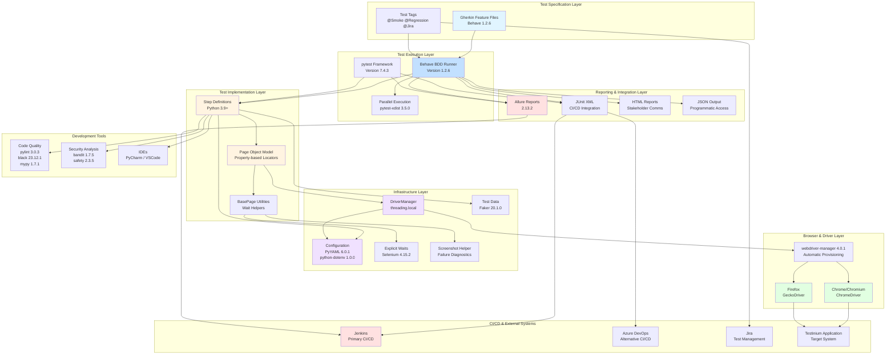

**Layer Descriptions:**

1. **Test Specification Layer**: Gherkin feature files define test scenarios in business-readable language, tagged for selective execution and Jira traceability.

2. **Test Execution Layer**: Behave orchestrates BDD test execution while pytest validates framework components; parallel execution capabilities reduce total test time.

3. **Test Implementation Layer**: Python step definitions implement Gherkin steps, invoking page object methods that encapsulate element locators and interactions.

4. **Infrastructure Layer**: Configuration management, WebDriver lifecycle, explicit wait helpers, screenshot capture, and test data generation provide foundational services.

5. **Browser & Driver Layer**: webdriver-manager provisions browser drivers automatically; Selenium WebDriver controls Chrome and Firefox browsers.

6. **Reporting & Integration Layer**: Multiple report formats serve diverse stakeholders; JUnit XML enables CI/CD integration, Allure provides rich visualization, HTML reports facilitate communication.

7. **CI/CD & External Systems**: Jenkins and Azure DevOps execute tests automatically; Jira provides test management and traceability; application under test receives automated validation.

8. **Development Tools**: Code quality tools enforce standards; security analysis detects vulnerabilities; IDEs provide development environments.

**Technology Integration Flow:**

1. Developer writes Gherkin feature file specifying test scenario
2. Behave parses feature file and matches steps to Python step definitions
3. Step definition invokes page object method for specific action
4. Page object accesses element using property-based locator
5. BasePage applies explicit wait until element meets condition
6. DriverManager provides thread-local WebDriver instance
7. webdriver-manager ensures compatible browser driver is available
8. WebDriver controls browser to execute action on application
9. Screenshot helper captures diagnostic images on failure
10. Behave generates reports in multiple formats
11. CI/CD system consumes JUnit XML and archives HTML artifacts
12. Jira receives test result associations through tag matching

## 3.8 References

**Configuration Files:**
- `requirements.txt` - Complete Python dependency list with pinned versions
- `pyproject.toml` - Poetry configuration and development tool settings (lines 23-51 for dependencies, 93-198 for tool configurations)
- `setup.py` - Python packaging configuration with dependency declarations (lines 20-61)
- `config/config.yaml` - Runtime configuration including browser settings, timeouts, URLs (lines 23-42)
- `behave.ini` - Behave BDD framework configuration with reporting settings (200+ lines)
- `pytest.ini` - pytest framework configuration with markers and execution parameters (line 8 for minimum version)
- `.env.example` - Environment variable template documenting required secrets
- `.gitignore` - Version control exclusions (253 lines of patterns)

**Implementation Files:**
- `utilities/driver_manager.py` - WebDriver lifecycle management with thread-local storage (lines 13-20 bug fix documentation, lines 24-95 threading.local implementation, lines 42-50 Service and DriverManager usage)
- `config/test_config.py` - Dataclass-based configuration loader with environment variable interpolation
- `features/environment.py` - Behave lifecycle hooks for test setup and teardown
- `pages/base_page.py` - BasePage with explicit wait helpers

**Documentation Files:**
- `README.md` - Framework overview, installation instructions, usage examples (lines 31-60 system requirements, lines 78-105 installation, lines 406-465 Jenkins configuration, lines 493-534 Jira integration)
- `blitzy/documentation/Project Guide.md` - Comprehensive project documentation including migration details
- `blitzy/documentation/Technical Specification.md` - Sections 1.1 and 1.2 providing system context

**Legacy Reference:**
- `pom.xml` - Maven configuration from legacy Java implementation (lines 12-13 Java version, lines 34-81 dependencies)

**External Resources:**
- Selenium Documentation: https://www.selenium.dev/documentation/
- Behave Documentation: https://behave.readthedocs.io/
- pytest Documentation: https://docs.pytest.org/
- webdriver-manager Documentation: https://github.com/SergeyPirogov/webdriver_manager
- Allure Documentation: https://docs.qameta.io/allure/
- Python Official Documentation: https://docs.python.org/3.9/

**Third-Party Service Documentation:**
- Jenkins Pipeline Syntax: https://www.jenkins.io/doc/book/pipeline/syntax/
- Azure DevOps Pipelines: https://docs.microsoft.com/en-us/azure/devops/pipelines/
- Jira REST API: https://developer.atlassian.com/server/jira/platform/rest-apis/

**Version Control:**
- Repository: https://github.com/BalamiRR/Testinium-QA
- Clone Command: `git clone https://github.com/BalamiRR/Testinium-QA.git`

# 4. Process Flowchart

This section provides comprehensive process flowcharts documenting the Testinium-QA Python framework's system workflows, business processes, integration patterns, state management, and error handling procedures. Each flowchart includes start/end points, decision nodes, system boundaries, validation rules, and timing constraints to provide complete operational visibility.

## 4.1 High-Level System Workflow

### 4.1.1 Complete Test Execution Lifecycle

The Testinium-QA Python framework implements a six-phase test execution lifecycle orchestrated through Behave hooks defined in `features/environment.py`. This lifecycle ensures proper initialization, thread-safe execution, comprehensive diagnostics, and clean teardown for all test scenarios.

```mermaid
flowchart TD
    Start([Test Suite Execution Start]) --> LoadEnv["Load .env File<br/>python-dotenv"]
    LoadEnv --> InitConfig["Initialize ConfigReader Singleton<br/>utilities/config_reader.py"]
    InitConfig --> ParseYAML["Parse config/config.yaml<br/>PyYAML 6.0.1"]
    ParseYAML --> ResolveVars{Environment Variables<br/>Defined?}
    ResolveVars -->|Yes| SubstituteVars["Substitute ${VAR} Tokens<br/>Precedence: CLI > ENV > .env > YAML"]
    ResolveVars -->|No| UseDefaults["Use Default Values<br/>From YAML"]
    SubstituteVars --> CreateDirs["Create Directories<br/>reports/screenshots/"]
    UseDefaults --> CreateDirs
    CreateDirs --> ConfigLogging["Configure Logging<br/>Level & Format"]
    ConfigLogging --> SetContext["Set context.config_reader<br/>Global Configuration"]
    SetContext --> LogConfig["Log Configuration Keys<br/>Allure Status"]
    LogConfig --> ReadyState{Configuration<br/>Valid?}
    
    ReadyState -->|No| ConfigError["Raise RuntimeError<br/>Detailed Error Message"]
    ConfigError --> Abort([Abort All Tests])
    
    ReadyState -->|Yes| ScenarioLoop{More<br/>Scenarios?}
    
    ScenarioLoop -->|Yes| BeforeScenario["before_scenario Hook<br/>Per-Scenario Setup"]
    BeforeScenario --> LogScenario["Log Scenario Name & Tags"]
    LogScenario --> GetDriver["DriverManager.get_driver<br/>Thread-Local Check"]
    
    GetDriver --> DriverExists{Driver<br/>Exists?}
    DriverExists -->|Yes| ReuseDriver["Return Existing Instance<br/>Same Thread"]
    DriverExists -->|No| CreateDriver["Create New WebDriver<br/>_create_driver"]
    
    CreateDriver --> BrowserType{Browser<br/>Type?}
    BrowserType -->|chrome| ChromeSetup["ChromeDriverManager<br/>Auto-Install"]
    BrowserType -->|firefox| FirefoxSetup["GeckoDriverManager<br/>Auto-Install"]
    
    ChromeSetup --> ChromeOptions["Configure ChromeOptions<br/>--headless=new<br/>--disable-gpu<br/>--no-sandbox"]
    FirefoxSetup --> FirefoxOptions["Configure FirefoxOptions<br/>-headless"]
    
    ChromeOptions --> InstantiateChrome["Instantiate Chrome WebDriver<br/>Selenium 4.15.2"]
    FirefoxOptions --> InstantiateFirefox["Instantiate Firefox WebDriver"]
    
    InstantiateChrome --> SetWindow["Set Window Size<br/>From Configuration"]
    InstantiateFirefox --> SetWindow
    
    SetWindow --> NoImplicit["Set Implicit Wait = 0<br/>Policy: Explicit Only"]
    NoImplicit --> StoreLocal["Store in threading.local<br/>Per-Thread Isolation"]
    StoreLocal --> StoreContext["Store in context.driver<br/>Behave Context"]
    ReuseDriver --> StoreContext
    
    StoreContext --> LogCapabilities["Log Browser Capabilities<br/>Name, Version, Session ID"]
    LogCapabilities --> ExecuteSteps["Execute Scenario Steps<br/>Gherkin → Python"]
    
    ExecuteSteps --> AfterScenario["after_scenario Hook<br/>Teardown & Diagnostics"]
    AfterScenario --> CheckStatus{Scenario<br/>Failed?}
    
    CheckStatus -->|Yes| LogFailure["Log WARNING: Scenario FAILED"]
    CheckStatus -->|No| LogSuccess["Log: Completed with Status"]
    
    LogFailure --> DriverAvail{WebDriver<br/>Available?}
    DriverAvail -->|No| LogNoDriver["Log: Cannot Capture Screenshot<br/>Driver Not Initialized"]
    DriverAvail -->|Yes| CaptureScreen["Capture Screenshot<br/>screenshot_helper.py"]
    
    CaptureScreen --> Sanitize["Sanitize Filename<br/>Remove Invalid Characters"]
    Sanitize --> Timestamp["Add Timestamp<br/>%Y%m%d_%H%M%S"]
    Timestamp --> SaveFS["Save to Filesystem<br/>reports/screenshots/"]
    SaveFS --> AttachBehave["Attach to Behave Report<br/>scenario.attach PNG"]
    AttachBehave --> AllureCheck{Allure<br/>Available?}
    AllureCheck -->|Yes| AttachAllure["Attach to Allure Report<br/>allure.attach"]
    AllureCheck -->|No| SkipAllure["Skip Allure Attachment"]
    AttachAllure --> LogScreenshot["Log: Screenshot Saved"]
    SkipAllure --> LogScreenshot
    
    LogNoDriver --> Cleanup
    LogSuccess --> Cleanup
    LogScreenshot --> Cleanup["Cleanup Phase<br/>Always Executes"]
    
    Cleanup --> QuitDriver{WebDriver<br/>Exists?}
    QuitDriver -->|Yes| CallQuit["DriverManager.quit_driver"]
    QuitDriver -->|No| SkipQuit["Skip Quit Operation"]
    
    CallQuit --> CloseChrome["WebDriver.quit<br/>Close Browser Process"]
    CloseChrome --> ClearLocal["Clear threading.local Reference"]
    ClearLocal --> NullContext["Set context.driver = None"]
    NullContext --> LogQuit["Log: WebDriver Quit Successfully"]
    LogQuit --> TeardownComplete["Log: Teardown Complete"]
    SkipQuit --> TeardownComplete
    
    TeardownComplete --> ScenarioLoop
    
    ScenarioLoop -->|No| AfterAll["after_all Hook<br/>Final Cleanup"]
    AfterAll --> GenReports["Generate Reports<br/>JSON, HTML, JUnit XML, Allure"]
    GenReports --> SummaryLog["Log Execution Summary<br/>Pass/Fail Counts"]
    SummaryLog --> End([Test Suite Complete])
    
    style Start fill:#e1f5ff
    style ReadyState fill:#fff4e1
    style ConfigError fill:#ffe1e1
    style DriverExists fill:#fff4e1
    style BrowserType fill:#fff4e1
    style CheckStatus fill:#fff4e1
    style QuitDriver fill:#fff4e1
    style End fill:#e1ffe1
```

**Key Lifecycle Phases:**

1. **Configuration Initialization (before_all)**: Executes once at test suite start, loading environment variables from `.env` file, initializing the ConfigReader singleton, parsing `config/config.yaml` with environment variable substitution, creating required directories for screenshots and reports, and configuring logging with appropriate levels and formats.

2. **Scenario Setup (before_scenario)**: Executes before each test scenario, retrieving or creating thread-local WebDriver instances, configuring browser-specific options including headless mode for CI/CD environments, applying window size and performance optimizations, and logging browser capabilities for diagnostic purposes.

3. **Step Execution**: Executes Gherkin steps through Python step definitions, invoking page object methods for element interactions, applying explicit waits to ensure element readiness, and validating expected outcomes through assertions.

4. **Failure Detection & Diagnostics (after_scenario - failure path)**: Detects scenario failures through status checking, captures screenshots with sanitized filenames and timestamps, stores screenshots in `reports/screenshots/` directory, attaches screenshots to Behave and Allure reports for integrated viewing, and logs screenshot paths for external access.

5. **Cleanup (after_scenario - always executes)**: Quits WebDriver instances to release browser processes, clears thread-local storage to prevent memory leaks, nullifies context.driver to signal cleanup completion, and handles exceptions gracefully without failing teardown.

6. **Final Reporting (after_all)**: Generates reports in multiple formats (JSON, HTML, JUnit XML, Allure), logs execution summaries with pass/fail statistics, and archives artifacts for CI/CD consumption.

### 4.1.2 State Transition Model

The framework maintains three distinct state layers with clear transitions and isolation boundaries:

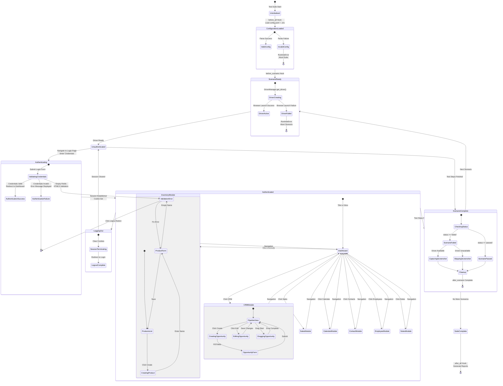

**State Management Characteristics:**

- **Thread-Safe Isolation**: WebDriver instances stored in `threading.local()` provide per-thread state isolation enabling parallel execution without race conditions. Each test thread maintains independent browser sessions with separate cookies, storage, and navigation history.

- **Scenario Independence**: The before_scenario and after_scenario hooks ensure each test scenario starts with a clean WebDriver instance and authenticated session. Failed scenarios do not contaminate subsequent tests through proper cleanup and driver replacement.

- **Configuration Immutability**: The ConfigReader singleton loads configuration once during before_all and remains immutable throughout test execution. Environment variable precedence resolves at initialization, preventing mid-execution configuration changes.

- **Context Propagation**: The Behave context object propagates state from hooks to step definitions, carrying the WebDriver instance, configuration reader, and test data. Context isolation between scenarios prevents data leakage.

### 4.1.3 Timing Constraints and SLA Requirements

The framework implements explicit timeout configurations documented in `config/config.yaml` ensuring predictable performance characteristics:

| Wait Type | Timeout | Configuration Key | Purpose | Failure Behavior |
|-----------|---------|-------------------|---------|------------------|
| Explicit Wait (Default) | 10 seconds | `timeouts.explicit` | General element presence, visibility, clickability | TimeoutException with descriptive message |
| Page Load | 30 seconds | `timeouts.page_load` | Full page navigation and document ready | TimeoutException, screenshot captured |
| Element Presence | 5 seconds | `timeouts.element_presence` | DOM element exists (may be hidden) | TimeoutException, element locator logged |
| Element Clickability | 3 seconds | `timeouts.clickability` | Element visible, enabled, not obscured | TimeoutException, wait condition logged |
| Implicit Wait | 0 seconds | N/A - Policy | **Disabled by policy** | Not applicable - explicit waits only |

**Performance Targets:**

- **Single Scenario Execution**: 5-30 seconds depending on scenario complexity and application response time
- **Full Test Suite (Sequential)**: < 15 minutes for all 10 feature modules
- **Full Test Suite (Parallel, 4 threads)**: < 5 minutes with thread-safe driver management
- **Screenshot Capture**: < 1 second including filesystem write and report attachment
- **Report Generation**: < 10 seconds for all formats (JSON, HTML, JUnit XML, Allure)

**Observed Execution Times** (from project testing):

- CRM complex scenario (pipeline creation, drag-and-drop): 100 seconds (1:40.186)
- Login scenario (authentication flow): 15-20 seconds
- Simple CRUD scenario (inventory product creation): 5-10 seconds

## 4.2 Core Business Process Workflows

### 4.2.1 Authentication and Session Management

#### 4.2.1.1 Login Workflow with Multi-Role Support

The authentication workflow supports multiple user roles including PosManager, SalesManager, and Admin users, as defined in `features/Login.feature` and implemented in `features/steps/login_steps.py`.

```mermaid
flowchart TD
    Start([User Initiates Login]) --> NavLogin[Navigate to Login URL<br/>config: application.login_url]
    NavLogin --> WaitPage[Wait for Page Load<br/>Timeout: 30s]
    WaitPage --> PageReady{Page<br/>Loaded?}
    
    PageReady -->|No| PageTimeout[TimeoutException<br/>Log Error + Screenshot]
    PageTimeout --> Fail1([Scenario Failed])
    
    PageReady -->|Yes| GetCreds[Retrieve Credentials<br/>Environment Variables]
    GetCreds --> CredsExist{TEST_USERNAME<br/>Defined?}
    
    CredsExist -->|No| EnvError[Raise EnvironmentError<br/>'TEST_USERNAME not set']
    EnvError --> Fail2([Scenario Failed])
    
    CredsExist -->|Yes| PassExist{TEST_PASSWORD<br/>Defined?}
    PassExist -->|No| EnvError2[Raise EnvironmentError<br/>'TEST_PASSWORD not set']
    EnvError2 --> Fail3([Scenario Failed])
    
    PassExist -->|Yes| InstantiatePage[Instantiate LoginPage<br/>pages/login_page.py]
    InstantiatePage --> WaitUsername[Wait for Username Field<br/>wait_for_element]
    
    WaitUsername --> UsernameReady{Element<br/>Present?}
    UsernameReady -->|No| ElemTimeout[TimeoutException<br/>Element Not Found]
    ElemTimeout --> Fail4([Scenario Failed])
    
    UsernameReady -->|Yes| EnterUsername[Enter Username<br/>input_login.send_keys]
    EnterUsername --> WaitPassword[Wait for Password Field<br/>wait_for_element]
    
    WaitPassword --> PasswordReady{Element<br/>Present?}
    PasswordReady -->|No| ElemTimeout2[TimeoutException]
    ElemTimeout2 --> Fail5([Scenario Failed])
    
    PasswordReady -->|Yes| EnterPassword[Enter Password<br/>input_password.send_keys]
    EnterPassword --> SubmitMethod{Submission<br/>Method?}
    
    SubmitMethod -->|Button Click| WaitButton[Wait for Button Clickable<br/>wait_for_clickable]
    SubmitMethod -->|Enter Key| PressEnter[Send Keys.ENTER<br/>Password Field]
    
    WaitButton --> ButtonReady{Button<br/>Clickable?}
    ButtonReady -->|No| BtnTimeout[TimeoutException<br/>Button Not Interactive]
    BtnTimeout --> Fail6([Scenario Failed])
    
    ButtonReady -->|Yes| ClickButton[Click Login Button<br/>login_button.click]
    ClickButton --> FormSubmit[Form Submission<br/>Browser POST Request]
    PressEnter --> FormSubmit
    
    FormSubmit --> ValidateAuth{Credentials<br/>Valid?}
    
    ValidateAuth -->|Empty Username| HTMLValidation[HTML5 Validation Message<br/>'Veuillez renseigner ce champ.']
    ValidateAuth -->|Empty Password| HTMLValidation
    HTMLValidation --> StayLogin[Remain on Login Page]
    StayLogin --> Fail7([Scenario Failed])
    
    ValidateAuth -->|Invalid| ServerError[Server Error Message<br/>'Wrong login/password']
    ServerError --> ErrorVisible[Error Message Displayed]
    ErrorVisible --> StayLogin2[Remain on Login Page]
    StayLogin2 --> Fail8([Scenario Failed])
    
    ValidateAuth -->|Valid| Redirect[Redirect to Dashboard<br/>HTTP 302/303]
    Redirect --> SetCookie[Set Session Cookie<br/>Authentication Token]
    SetCookie --> WaitDashboard[Wait for Dashboard Load<br/>Timeout: 30s]
    
    WaitDashboard --> DashReady{Dashboard<br/>Loaded?}
    DashReady -->|No| DashTimeout[TimeoutException]
    DashTimeout --> Fail9([Scenario Failed])
    
    DashReady -->|Yes| VerifyTitle[Verify Page Title<br/>Expected: 'Odoo']
    VerifyTitle --> TitleMatch{Title<br/>Matches?}
    
    TitleMatch -->|No| AssertFail[AssertionError<br/>Title Mismatch]
    AssertFail --> Fail10([Scenario Failed])
    
    TitleMatch -->|Yes| StoreContext[Store Authenticated State<br/>context.driver maintains session]
    StoreContext --> Success([Login Successful<br/>Session Established])
    
    style Start fill:#e1f5ff
    style PageReady fill:#fff4e1
    style CredsExist fill:#fff4e1
    style PassExist fill:#fff4e1
    style UsernameReady fill:#fff4e1
    style PasswordReady fill:#fff4e1
    style ButtonReady fill:#fff4e1
    style ValidateAuth fill:#fff4e1
    style DashReady fill:#fff4e1
    style TitleMatch fill:#fff4e1
    style Success fill:#e1ffe1
    style Fail1 fill:#ffe1e1
    style Fail2 fill:#ffe1e1
    style Fail3 fill:#ffe1e1
    style Fail8 fill:#ffe1e1
```

**Validation Checkpoints:**

1. **Environment Variable Validation**: TEST_USERNAME and TEST_PASSWORD must be defined before test execution. Missing credentials raise EnvironmentError with helpful resolution guidance directing users to define variables in `.env` file or CI/CD environment.

2. **Element Presence Validation**: Username and password input fields must be present in DOM within 10-second timeout. Element locators use stable attributes (By.NAME) rather than fragile generated IDs.

3. **Element Interaction Validation**: Login button must be clickable (visible, enabled, not obscured) before click attempt. The wait_for_clickable method from `pages/base_page.py` ensures interactive state.

4. **Credential Format Validation**: Username format follows email convention (contains @), password is non-empty string. HTML5 browser validation enforces non-empty constraints client-side.

5. **Authentication Response Validation**: Valid credentials result in HTTP redirect to dashboard with session cookie. Invalid credentials return error message "Wrong login/password" without redirect.

6. **Post-Login State Validation**: Dashboard page title must equal "Odoo" confirming successful navigation. Session cookie must persist for subsequent requests within the scenario.

#### 4.2.1.2 Logout and Session Termination

The logout workflow ensures proper session termination and prevents unauthorized access through browser navigation, as implemented in `features/steps/logout_steps.py`:

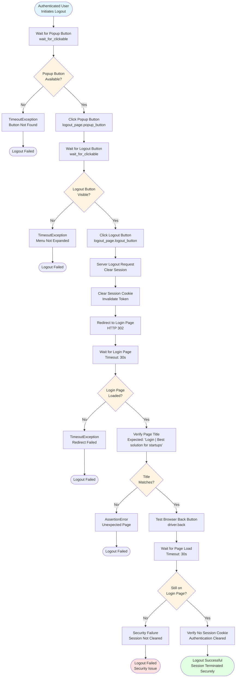

**Security Validation Points:**

1. **Session Cookie Invalidation**: Server-side logout request must invalidate authentication tokens preventing session reuse. Cookie cleared from browser storage.

2. **Forced Redirect**: Successful logout forces redirect to login page even if user attempts to navigate to authenticated pages. No authenticated content rendered after logout.

3. **Back Button Prevention**: Browser back button after logout must not restore authenticated session. Attempting to return to dashboard redirects to login page.

4. **Visual Confirmation**: Login page title displays "Login | Best solution for startups" providing clear visual feedback that logout completed successfully.

### 4.2.2 CRM Pipeline Management Workflow

#### 4.2.2.1 Opportunity Creation and Revenue Calculation

The CRM module provides sophisticated pipeline management with opportunity tracking, revenue calculation, and drag-and-drop workflow updates as documented in `features/Crm.feature` and `features/steps/crm_steps.py`:

```mermaid
flowchart TD
    Start([Authenticated PosManager<br/>Accesses CRM Module]) --> NavCRM[Click CRM Dashboard Link<br/>CrmPage.crm_link]
    NavCRM --> WaitCRM[Wait for CRM Module Load<br/>wait_for_clickable]
    WaitCRM --> CRMReady{CRM Module<br/>Loaded?}
    
    CRMReady -->|No| CRMTimeout[TimeoutException<br/>Module Not Available]
    CRMTimeout --> Fail1([Scenario Failed])
    
    CRMReady -->|Yes| ClickCreate[Click Pipeline Create Button<br/>CrmPage.create_button]
    ClickCreate --> WaitForm[Wait for Opportunity Form<br/>Modal Display]
    
    WaitForm --> FormReady{Form<br/>Visible?}
    FormReady -->|No| FormTimeout[TimeoutException<br/>Form Not Displayed]
    FormTimeout --> Fail2([Scenario Failed])
    
    FormReady -->|Yes| EnterTitle[Enter Opportunity Title<br/>'test' + Keys.ENTER]
    EnterTitle --> WaitCustomer[Wait for Customer Dropdown<br/>wait_for_clickable]
    
    WaitCustomer --> ClickDropdown[Click Customer Dropdown<br/>Expand Options]
    ClickDropdown --> SelectCustomer[Select Customer<br/>Click Option]
    SelectCustomer --> WaitRevenue[Wait for Revenue Field<br/>clear + send_keys]
    
    WaitRevenue --> ClearRevenue[Clear Existing Revenue<br/>Field Reset]
    ClearRevenue --> EnterRevenue[Enter Revenue Amount<br/>'8' + Keys.ENTER]
    EnterRevenue --> WaitPriority[Wait for Priority Dropdown<br/>wait_for_clickable]
    
    WaitPriority --> SelectPriority[Select Priority Level<br/>Click Dropdown + Option]
    SelectPriority --> ValidateFields{All Required<br/>Fields Filled?}
    
    ValidateFields -->|No| ValidationError[Form Validation Error<br/>Field Highlighted]
    ValidationError --> DisplayError[Error Message Displayed<br/>Cannot Submit]
    DisplayError --> Fail3([Scenario Failed])
    
    ValidateFields -->|Yes| ClickSubmit[Click Create Pipeline Button<br/>create_pipeline.click]
    ClickSubmit --> ServerCreate[Server Creates Opportunity<br/>Database Insert]
    
    ServerCreate --> RefreshPipeline[Pipeline View Refreshes<br/>New Opportunity Visible]
    RefreshPipeline --> WaitTotal[Wait for Total Price Element<br/>wait_for_element]
    
    WaitTotal --> GetTotal[Retrieve Total Price Text<br/>CrmPage.total_price.text]
    GetTotal --> ParseTotal{Parse Integer<br/>Success?}
    
    ParseTotal -->|No| ParseError[ValueError<br/>Invalid Number Format]
    ParseError --> Fail4([Scenario Failed])
    
    ParseTotal -->|Yes| Calculate[Calculate Expected Total<br/>current_total + new_revenue]
    Calculate --> CompareTotal{Calculated == Expected<br/>89?}
    
    CompareTotal -->|No| AssertFail[AssertionError<br/>'Total price mismatch']
    AssertFail --> Fail5([Scenario Failed])
    
    CompareTotal -->|Yes| WaitTitle[Wait for Title Element<br/>find_title_test]
    WaitTitle --> GetTitle[Retrieve Created Title<br/>.text Property]
    GetTitle --> VerifyTitle{Title == 'test'?}
    
    VerifyTitle -->|No| TitleMismatch[AssertionError<br/>Title Does Not Match]
    TitleMismatch --> Fail6([Scenario Failed])
    
    VerifyTitle -->|Yes| Success([Opportunity Created<br/>Pipeline Updated<br/>Revenue Calculated])
    
    style Start fill:#e1f5ff
    style CRMReady fill:#fff4e1
    style FormReady fill:#fff4e1
    style ValidateFields fill:#fff4e1
    style ParseTotal fill:#fff4e1
    style CompareTotal fill:#fff4e1
    style VerifyTitle fill:#fff4e1
    style Success fill:#e1ffe1
```

**Business Rules and Validation:**

1. **Required Field Validation**:
   - Opportunity Title: Required, string type, non-empty
   - Customer Selection: Required, must select from dropdown (cannot be empty)
   - Expected Revenue: Required, numeric type, must parse as integer
   - Priority Level: Required, must select from predefined options

2. **Revenue Calculation Logic**:
   - Formula: `total_revenue = sum(existing_opportunities) + new_opportunity_revenue`
   - Example: 81 (current total) + 8 (new opportunity) = 89 (expected total)
   - Validation: Assertion compares calculated value with displayed total_price
   - Error Handling: AssertionError with message "Total price mismatch: expected 89, but calculated {actual}"

3. **Data Persistence Validation**:
   - Created opportunity immediately appears in pipeline view
   - Title text matches entered value (exact string comparison)
   - Revenue value correctly added to total price calculation
   - Customer association persists with opportunity record

#### 4.2.2.2 Drag-and-Drop Pipeline Stage Management

The CRM module implements complex drag-and-drop interactions using Selenium ActionChains to move opportunities between pipeline stages:

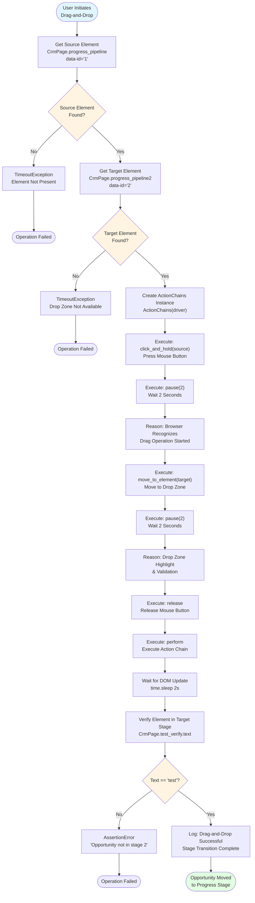

**Timing Constraints for Drag-and-Drop:**

1. **First pause(2) - Animation Recognition**: 2-second pause after click_and_hold allows browser to register drag operation started. Without this pause, browser may interpret action as simple click rather than drag.

2. **Second pause(2) - Drop Zone Validation**: 2-second pause after move_to_element allows drop zone highlighting and validation. Application UI provides visual feedback that drop is valid before release.

3. **Final sleep(2) - DOM Update Completion**: 2-second sleep after perform allows DOM re-render and state persistence. Opportunity element must transition from stage 1 to stage 2 with updated parent container.

4. **Total Operation Time**: Approximately 6-8 seconds for complete drag-and-drop with visual feedback and validation. This ensures stable execution across various system performance characteristics.

**Error Recovery Patterns:**

- **Element Stale During Drag**: Property-based element access prevents stale element references. Each property call retrieves fresh WebElement from DOM.
- **Drop Zone Not Accepting**: Pause before release allows application to validate drop legality. Invalid drops prevent release action.
- **Animation Interference**: Explicit pauses ensure animations complete before next interaction, preventing mid-animation state confusion.

### 4.2.3 Inventory and Product Management Workflow

The inventory module provides product catalog management with field-level validation as documented in `features/Inventory.feature` and `features/steps/inventory_steps.py`:

```mermaid
flowchart TD
    Start([Authenticated User<br/>Accesses Inventory]) --> NavInventory[Click Inventory Module<br/>InventoryPage.inventory_module]
    NavInventory --> WaitProducts[Wait for Products Link<br/>wait_for_clickable]
    
    WaitProducts --> ClickProducts[Click Products<br/>InventoryPage.products]
    ClickProducts --> VerifyTitle[Verify Page Title<br/>Expected: 'Products - Odoo']
    
    VerifyTitle --> TitleMatch{Title<br/>Matches?}
    TitleMatch -->|No| TitleFail[AssertionError<br/>Navigation Failed]
    TitleFail --> Fail1([Scenario Failed])
    
    TitleMatch -->|Yes| ClickCreate[Click Create Button<br/>InventoryPage.create_button]
    ClickCreate --> WaitForm[Wait for Product Form<br/>Form Display]
    
    WaitForm --> FormReady{Form<br/>Visible?}
    FormReady -->|No| FormTimeout[TimeoutException<br/>Form Not Loaded]
    FormTimeout --> Fail2([Scenario Failed])
    
    FormReady -->|Yes| ProductName{Product Name<br/>Provided?}
    ProductName -->|No - Empty| ClickSaveEmpty[Click Save with Empty Name<br/>Test Validation]
    ProductName -->|Yes| EnterName[Enter Product Name<br/>InventoryPage.product_name]
    
    ClickSaveEmpty --> WaitError[Wait for Error Message<br/>wait_for_visibility]
    WaitError --> ErrorDisplay{Error<br/>Displayed?}
    
    ErrorDisplay -->|No| ValidationFail[AssertionError<br/>Validation Not Enforced]
    ValidationFail --> Fail3([Scenario Failed])
    
    ErrorDisplay -->|Yes| VerifyError[Verify Error Text<br/>'The following fields are invalid:']
    VerifyError --> ErrorMatch{Error Message<br/>Correct?}
    
    ErrorMatch -->|No| ErrorMismatch[AssertionError<br/>Unexpected Error]
    ErrorMismatch --> Fail4([Scenario Failed])
    
    ErrorMatch -->|Yes| FixError[Enter Product Name<br/>Resolve Validation Error]
    FixError --> EnterName
    
    EnterName --> StoreContext[Store Product Name<br/>context.entered_product_name]
    StoreContext --> ClickSave[Click Save Button<br/>InventoryPage.save_btn]
    
    ClickSave --> ServerCreate[Server Creates Product<br/>Database Insert]
    ServerCreate --> WaitList[Wait for Products List<br/>List View Refresh]
    
    WaitList --> ListReady{List<br/>Loaded?}
    ListReady -->|No| ListTimeout[TimeoutException<br/>List Not Refreshed]
    ListTimeout --> Fail5([Scenario Failed])
    
    ListReady -->|Yes| VerifyVisible[Verify Product in List<br/>created_product.is_displayed]
    VerifyVisible --> ProductVisible{Product<br/>Displayed?}
    
    ProductVisible -->|No| NotFound[AssertionError<br/>Product Not in List]
    NotFound --> Fail6([Scenario Failed])
    
    ProductVisible -->|Yes| Success([Product Created<br/>Validation Enforced<br/>List Updated])
    
    style Start fill:#e1f5ff
    style TitleMatch fill:#fff4e1
    style FormReady fill:#fff4e1
    style ProductName fill:#fff4e1
    style ErrorDisplay fill:#fff4e1
    style ErrorMatch fill:#fff4e1
    style ListReady fill:#fff4e1
    style ProductVisible fill:#fff4e1
    style Success fill:#e1ffe1
```

**Validation Rules:**

1. **Field-Level Validation**: Product name field is required and cannot be empty. Attempting to save with empty name displays error message "The following fields are invalid:" with field highlighting.

2. **Navigation Validation**: Page title verification confirms successful navigation from Inventory module to Products list. Expected title "Products - Odoo" must match actual driver.title.

3. **Creation Confirmation**: Created product must appear in products list immediately after save. Element `created_product.is_displayed()` must return True confirming visibility.

4. **Context Storage**: Entered product name stored in `context.entered_product_name` (default "IBM") enables subsequent verification and cleanup steps.

### 4.2.4 Calendar and Event Management Workflow

The calendar module provides temporal data management through multi-granularity views and event creation as documented in `features/Calendar.feature`:

```mermaid
flowchart TD
    Start([User Accesses<br/>Calendar Module]) --> ViewSwitch{Select<br/>View?}
    
    ViewSwitch -->|Day| ClickDay[Click Day View<br/>CalendarPage.day]
    ViewSwitch -->|Week| ClickWeek[Click Week View<br/>CalendarPage.week]
    ViewSwitch -->|Month| ClickMonth[Click Month View<br/>CalendarPage.month]
    
    ClickDay --> WaitDay[Wait for Day View Load<br/>wait_for_visibility]
    ClickWeek --> WaitWeek[Wait for Week View Load]
    ClickMonth --> WaitMonth[Wait for Month View Load]
    
    WaitDay --> ViewReady[View Rendered<br/>Time Slots Visible]
    WaitWeek --> ViewReady
    WaitMonth --> ViewReady
    
    ViewReady --> CreateEvent{User Action?}
    CreateEvent -->|Create Note| ClickDate[Click Date/Time Box<br/>CalendarPage.date_box]
    CreateEvent -->|View Only| ViewNav[Navigate Between Dates]
    
    ViewNav --> Success1([View Navigation<br/>Complete])
    
    ClickDate --> WaitDialog[Wait for Create Dialog<br/>Modal Display]
    WaitDialog --> DialogReady{Dialog<br/>Visible?}
    
    DialogReady -->|No| DialogTimeout[TimeoutException<br/>Dialog Not Displayed]
    DialogTimeout --> Fail1([Operation Failed])
    
    DialogReady -->|Yes| EnterSummary[Enter Event Name<br/>CalendarPage.summary_box]
    EnterSummary --> ConfigureEvent[Configure Event Details<br/>Time, Tags, Description]
    
    ConfigureEvent --> ClickSave[Click Create Button<br/>CalendarPage.create_button]
    ClickSave --> ServerSave[Server Saves Event<br/>Calendar Entry Created]
    
    ServerSave --> RefreshView[Calendar View Refreshes<br/>Event Displayed]
    RefreshView --> VerifyEvent[Verify Event Visible<br/>Event Block Displayed]
    
    VerifyEvent --> EventVisible{Event<br/>Displayed?}
    EventVisible -->|No| EventNotFound[AssertionError<br/>Event Not Created]
    EventNotFound --> Fail2([Operation Failed])
    
    EventVisible -->|Yes| EditAction{Edit<br/>Event?}
    EditAction -->|No| Success2([Event Created])
    
    EditAction -->|Yes| ClickEvent[Click Event Block<br/>Event Selection]
    ClickEvent --> WaitEdit[Wait for Edit Button<br/>wait_for_clickable]
    
    WaitEdit --> ClickEditBtn[Click Edit Button<br/>CalendarPage.edit_button]
    ClickEditBtn --> WaitEditForm[Wait for Edit Form<br/>Form Display]
    
    WaitEditForm --> ModifyEvent[Modify Event Details<br/>Tags, Description]
    ModifyEvent --> ClickSaveEdit[Click Save Button<br/>CalendarPage.save_button]
    
    ClickSaveEdit --> ServerUpdate[Server Updates Event<br/>Database Update]
    ServerUpdate --> RefreshAfterEdit[Calendar Refreshes<br/>Updated Event Displayed]
    
    RefreshAfterEdit --> Success3([Event Modified<br/>Calendar Updated])
    
    style Start fill:#e1f5ff
    style ViewSwitch fill:#fff4e1
    style CreateEvent fill:#fff4e1
    style DialogReady fill:#fff4e1
    style EventVisible fill:#fff4e1
    style EditAction fill:#fff4e1
    style Success2 fill:#e1ffe1
    style Success3 fill:#e1ffe1
```

**View Management:**

- **Day View**: Displays hourly time slots for single day with granular scheduling visibility
- **Week View**: Displays 7-day calendar with multi-day event visibility and workweek overview
- **Month View**: Displays full month calendar with date-based event display and month-level planning

**Event Creation Flow:**

1. User selects date/time box in appropriate view granularity
2. Create dialog displays with event name field (summary_box)
3. User enters parameterized event name (e.g., "Meeting with {customer}")
4. Optional tag assignment enables categorization and filtering
5. Create button submission triggers server-side event creation
6. Calendar view refreshes displaying new event block
7. Event visibility verification confirms successful creation

## 4.3 Integration Workflows

### 4.3.1 Configuration Data Flow

The framework implements a multi-source configuration hierarchy with environment variable precedence as documented in `utilities/config_reader.py`:

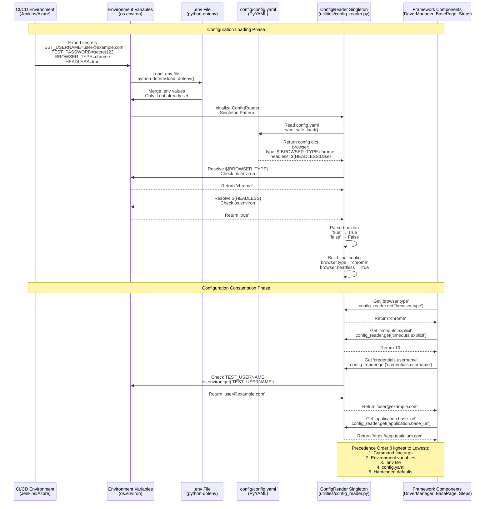

**Configuration Precedence Rules:**

1. **Command-Line Arguments (Highest Priority)**: Values passed as CLI arguments override all other sources, enabling temporary configuration changes without file modifications.

2. **Environment Variables**: Variables defined in shell or CI/CD environment override .env file and YAML values. Supports uppercase snake_case naming convention (e.g., BROWSER_TYPE, TEST_USERNAME).

3. **.env File**: Local development secrets stored in .env file (gitignored) override YAML defaults. Enables developer-specific configurations without polluting shared config.yaml.

4. **config.yaml Values**: Centralized configuration file provides default values for all settings. Uses ${VAR:default} syntax for environment variable interpolation with fallback defaults.

5. **Hardcoded Defaults (Lowest Priority)**: Code-level defaults ensure framework operates even with minimal configuration, providing sensible fallback values.

### 4.3.2 CI/CD Pipeline Integration

The framework integrates with Jenkins and Azure DevOps through standardized reporting formats as documented in `behave.ini` and `README.md`:

```mermaid
flowchart TD
    Start([Git Push to Repository]) --> Trigger[CI/CD Pipeline Triggered<br/>Webhook or Schedule]
    Trigger --> Checkout[Stage 1: Checkout<br/>git clone repository]
    
    Checkout --> SetupEnv[Stage 2: Setup Environment<br/>python -m venv venv<br/>pip install -r requirements.txt]
    SetupEnv --> ConfigSecrets[Stage 3: Configure Secrets<br/>Export Environment Variables]
    
    ConfigSecrets --> InjectVars[Inject from CI/CD Secrets:<br/>TEST_USERNAME<br/>TEST_PASSWORD<br/>SALES_MANAGER_USERNAME<br/>SALES_MANAGER_PASSWORD<br/>POS_MANAGER_USERNAME<br/>POS_MANAGER_PASSWORD<br/>BROWSER_TYPE=chrome<br/>HEADLESS=true]
    
    InjectVars --> ExecuteDecision{Execution<br/>Mode?}
    
    ExecuteDecision -->|Sequential| ExecSequential[Execute Tests Sequentially<br/>behave features/<br/>--tags=@Smoke]
    ExecuteDecision -->|Parallel| ExecParallel[Execute Tests in Parallel<br/>behave features/<br/>--parallel=4<br/>--tags=@Smoke]
    
    ExecSequential --> GenReports[Stage 4: Generate Reports<br/>--format=json<br/>--outfile=reports/cucumber.json]
    ExecParallel --> GenReports
    
    GenReports --> GenJUnit[Generate JUnit XML<br/>--format=junit<br/>--junit-directory=reports/junit]
    GenJUnit --> GenHTML[Generate HTML Report<br/>behave-reports]
    GenHTML --> GenAllure[Generate Allure Data<br/>--format=allure_behave.formatter]
    
    GenAllure --> ParseResults[Stage 5: Parse Results<br/>Jenkins Test Result Plugin]
    ParseResults --> ParseJUnit[Parse JUnit XML<br/>reports/junit/*.xml]
    
    ParseJUnit --> UpdateTrends[Update Test Trends<br/>Pass/Fail History]
    UpdateTrends --> ArchiveArtifacts[Stage 6: Archive Artifacts]
    
    ArchiveArtifacts --> ArchiveJSON[Archive: reports/cucumber.json]
    ArchiveJSON --> ArchiveHTML[Archive: reports/cucumber-reports.html]
    ArchiveHTML --> ArchiveScreenshots[Archive: reports/screenshots/*.png]
    ArchiveScreenshots --> ArchiveAllure[Archive: reports/allure-results/]
    
    ArchiveAllure --> GenAllureReport{Allure<br/>Configured?}
    GenAllureReport -->|Yes| AllureGenerate[Stage 7: Generate Allure Report<br/>allure generate reports/allure-results]
    GenAllureReport -->|No| SkipAllure[Skip Allure Generation]
    
    AllureGenerate --> AllureServe[Publish Allure Report<br/>allure serve or static hosting]
    AllureServe --> Notifications
    SkipAllure --> Notifications[Stage 8: Notifications]
    
    Notifications --> CheckStatus{Build<br/>Status?}
    CheckStatus -->|Success| NotifySuccess[Send Success Notification<br/>Email/Slack:<br/>'All tests passed']
    CheckStatus -->|Failure| NotifyFailure[Send Failure Notification<br/>Email/Slack:<br/>'X tests failed']
    
    NotifySuccess --> UpdateJira{Jira<br/>Integration?}
    NotifyFailure --> UpdateJira
    
    UpdateJira -->|Yes| UpdateTickets[Update Jira Tickets<br/>Based on @UPGN-XXX tags<br/>Post test results]
    UpdateJira -->|No| SkipJira[Skip Jira Update]
    
    UpdateTickets --> End([Pipeline Complete])
    SkipJira --> End
    
    style Start fill:#e1f5ff
    style ExecuteDecision fill:#fff4e1
    style CheckStatus fill:#fff4e1
    style GenAllureReport fill:#fff4e1
    style UpdateJira fill:#fff4e1
    style End fill:#e1ffe1
```

**CI/CD Integration Points:**

1. **JUnit XML Publishing**: Jenkins Test Result plugin parses `reports/junit/*.xml` files providing test trend visualization, pass/fail statistics, and test duration tracking. Historical trending enables identification of flaky tests and regression patterns.

2. **Artifact Archiving**: HTML reports, JSON output, screenshots, and Allure data archived as build artifacts accessible through Jenkins UI. Screenshots linked to specific test failures for rapid diagnosis.

3. **Allure Report Generation**: Rich HTML reports with test execution history, failure categorization, attachment support, and trend analysis. Command `allure serve reports/allure-results` launches local preview server.

4. **Notification Integration**: Email notifications on build failure with failure counts and direct links to failed test details. Slack webhook integration posts build status to team channels with screenshot attachments.

5. **Jira Integration**: Feature tags like @UPGN-286 and @UPGN-287 enable automatic test result posting to Jira tickets. Test execution status updates Jira tickets through REST API integration.

### 4.3.3 WebDriver and Browser Provisioning Flow

The framework implements automatic browser driver provisioning through webdriver-manager eliminating manual driver downloads:

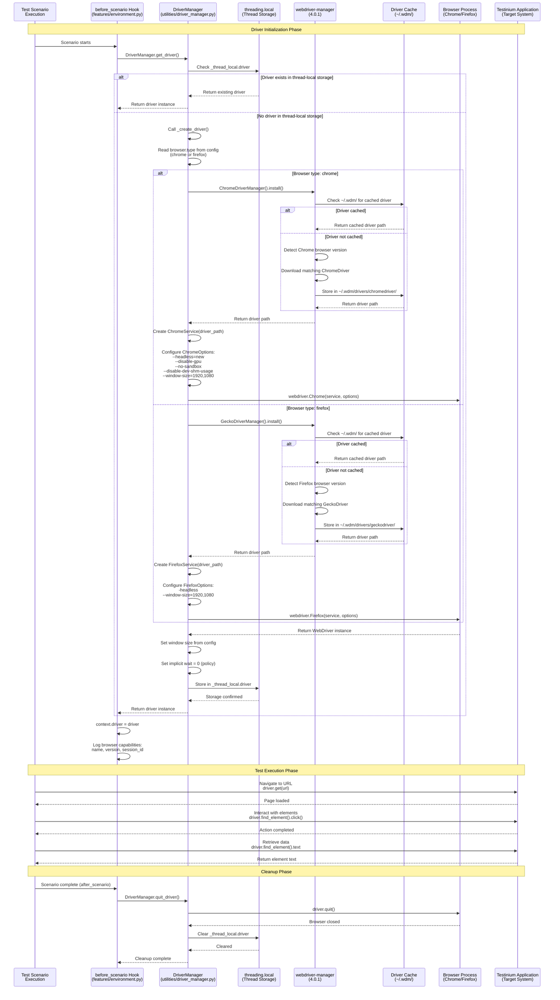

**Driver Management Features:**

1. **Automatic Version Detection**: webdriver-manager detects installed browser version and downloads compatible driver version automatically. Eliminates version mismatch errors.

2. **Caching Strategy**: Downloaded drivers cached in `~/.wdm/drivers/` directory preventing redundant downloads. Cache persists across test runs and CI/CD builds.

3. **Thread-Local Storage**: Each test thread receives isolated WebDriver instance through `threading.local()`. Enables parallel execution without race conditions or shared state conflicts.

4. **Browser Options**: Headless mode enabled for CI/CD environments eliminating graphical display requirements. Window size configured from `config.yaml` ensuring consistent viewport across environments.

5. **Cleanup Guarantee**: after_scenario hook always executes even on test failure, ensuring browser processes quit and resources release properly.

## 4.4 Error Handling and Recovery

### 4.4.1 Comprehensive Error Detection and Recovery Flow

The framework implements multi-layered error detection with graceful degradation and diagnostic capture:

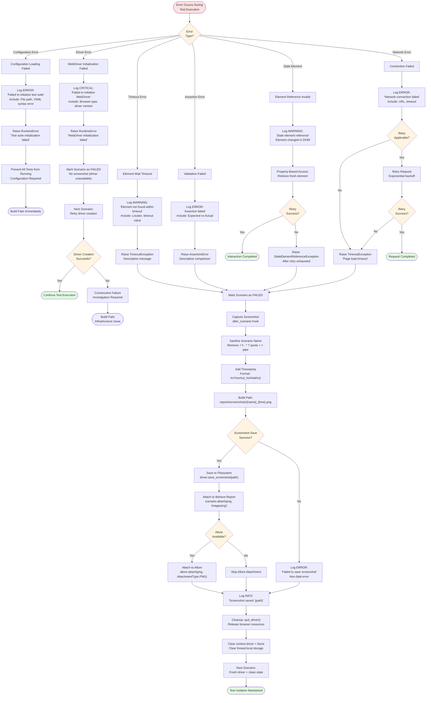

**Error Handling Patterns by Category:**

### 4.4.2 Configuration Errors

**Trigger Conditions:**
- Missing `config/config.yaml` file
- Invalid YAML syntax (parsing errors)
- Missing required configuration keys
- Invalid environment variable references
- Type conversion errors (e.g., string where integer expected)

**Detection Point**: `before_all` hook in `features/environment.py` lines 78-146

**Handling Strategy:**
```
Try:
    Load config.yaml with yaml.safe_load()
    Resolve environment variables
    Validate required keys
Except FileNotFoundError:
    Log ERROR: "Configuration file not found: config/config.yaml"
    Raise RuntimeError("Configuration required for test execution")
Except yaml.YAMLError as e:
    Log ERROR: f"Invalid YAML syntax: {e}"
    Raise RuntimeError("Fix YAML syntax errors before running tests")
Except KeyError as e:
    Log ERROR: f"Missing required configuration key: {e}"
    Raise RuntimeError("Add missing configuration key to config.yaml")
```

**Impact**: All tests prevented from running. Build fails immediately with clear error message directing resolution steps.

**Recovery**: Not applicable - configuration must be fixed before retrying.

### 4.4.3 Driver Initialization Errors

**Trigger Conditions:**
- Browser not installed on system
- Browser version incompatible with available driver
- Driver download failure (network issues)
- Insufficient permissions to create browser process
- Out of memory conditions

**Detection Point**: `before_scenario` hook during `DriverManager.get_driver()` call in `features/environment.py` lines 205-278

**Handling Strategy:**
```
Try:
    driver = DriverManager.get_driver()
    Configure browser options
    Set window size
    Store in threading.local()
Except WebDriverException as e:
    Log CRITICAL: f"WebDriver initialization failed: {e}"
    Log: Browser type, driver version, error details
    Raise RuntimeError("Browser unavailable - check installation")
Result:
    Scenario marked as FAILED
    No screenshot captured (driver unavailable)
    Next scenario attempts fresh driver creation
```

**Impact**: Current scenario aborted. Subsequent scenarios attempt driver creation again (may succeed if transient issue).

**Recovery**: Next scenario gets clean driver initialization attempt. Consecutive failures indicate infrastructure problems requiring investigation.

### 4.4.4 Element Wait Timeouts

**Trigger Conditions:**
- Element not present in DOM within timeout
- Element present but not visible within timeout
- Element present and visible but not clickable within timeout
- Incorrect locator strategy or value
- Application performance degradation

**Detection Point**: Page object property access invoking `wait_for_element`, `wait_for_clickable`, or `wait_for_visibility` methods from `pages/base_page.py`

**Handling Strategy:**
```
Try:
    element = WebDriverWait(driver, timeout).until(
        EC.element_to_be_clickable(locator),
        message=f"Element not clickable: {locator}"
    )
Except TimeoutException as e:
    Log WARNING: f"Element timeout: {locator} after {timeout}s"
    Raise TimeoutException(
        f"Element {locator} not found within {timeout} seconds. "
        f"Check locator validity and application state."
    )
Result:
    Step definition fails with TimeoutException
    Scenario marked as FAILED
    Screenshot captured showing application state
    Error message includes locator and timeout for debugging
```

**Impact**: Scenario fails with diagnostic screenshot. Element locator and application state visible in screenshot enabling rapid diagnosis.

**Recovery**: Not applicable for current scenario. Next scenario starts with clean state. Repeated timeouts may indicate:
- Invalid locator requiring update
- Application performance issues
- Insufficient timeout values in configuration

### 4.4.5 Assertion Failures

**Trigger Conditions:**
- Expected value does not match actual value
- Element text comparison fails
- Calculated value differs from displayed value
- Page title does not match expected title
- Element visibility state incorrect

**Detection Point**: Step definition assertion statements in `features/steps/*_steps.py`

**Handling Strategy:**
```
actual = element.text
expected = "Expected Value"
if actual != expected:
    message = f"Value mismatch: expected '{expected}', but got '{actual}'"
    Log ERROR: message
    Raise AssertionError(message)
Result:
    Scenario marked as FAILED
    Screenshot captured showing actual state
    Error message includes expected vs actual for comparison
```

**Impact**: Scenario fails with detailed comparison information. Screenshot shows actual application state at failure point.

**Recovery**: Not applicable for current scenario. Indicates either:
- Product defect requiring bug fix
- Test expectation incorrect requiring test update
- Test data issues requiring data correction

### 4.4.6 Stale Element References

**Trigger Conditions:**
- Element reference obtained, then DOM updated by JavaScript
- Page navigation after element reference
- AJAX request replaces element in DOM
- Element removed and re-added to DOM

**Detection Point**: Element interaction after DOM update

**Handling Strategy (Framework Prevention)**:
```
# Property-based element access prevents stale references
@property
def login_button(self):
    # Returns FRESH element on every access
    return self.wait_for_clickable(self._LOGIN_BUTTON)

#### Usage in step definition
login_page.login_button.click()  # Gets fresh element before click
```

**Rare Occurrence**: Framework architecture minimizes stale element errors through property-based access pattern. Each element access retrieves fresh WebElement from DOM.

**Recovery (if occurs)**:
```
Try:
    element.click()
Except StaleElementReferenceException:
    Log WARNING: "Stale element detected, retrying with fresh element"
    element = self.wait_for_clickable(locator)  # Get fresh element
    element.click()
```

### 4.4.7 Network and Page Load Failures

**Trigger Conditions:**
- Network connectivity loss
- DNS resolution failure
- Server unavailable (503, 504 errors)
- Page load exceeds 30-second timeout
- SSL/TLS certificate errors

**Detection Point**: `driver.get(url)` calls during navigation

**Handling Strategy:**
```
Try:
    driver.get(url)
    WebDriverWait(driver, 30).until(
        lambda d: d.execute_script("return document.readyState") == "complete"
    )
Except TimeoutException:
    Log ERROR: f"Page load timeout for URL: {url}"
    Screenshot captured
    Raise TimeoutException("Application unreachable or slow response")
```

**Impact**: Scenario fails with network diagnostic information. Screenshot may show partial page load or browser error page.

**Recovery**: Next scenario attempts navigation again. Consecutive failures indicate:
- Application server downtime
- Network infrastructure issues
- Environment configuration problems

### 4.4.8 Screenshot Capture Failures

**Trigger Conditions:**
- WebDriver already quit when screenshot attempted
- Insufficient disk space for image file
- File permission errors on reports/screenshots/ directory
- Browser process crashed

**Detection Point**: `after_scenario` hook screenshot capture in `features/environment.py`

**Handling Strategy (Non-Fatal)**:
```
Try:
    screenshot_path = capture_screenshot(driver, scenario.name)
    Log INFO: f"Screenshot saved: {screenshot_path}"
Except Exception as e:
    Log ERROR: f"Failed to capture screenshot: {e}"
    # DON'T re-raise - allow teardown to continue
    # Test results still reported without screenshot
```

**Impact**: Screenshot unavailable for failure diagnosis, but test results still recorded. Allows report generation and test suite completion.

**Recovery**: Diagnostic information from logs and test output still available. Screenshot would have provided visual confirmation but not critical for result reporting.

## 4.5 State Management and Transactions

### 4.5.1 Thread-Local WebDriver Management

The framework implements thread-safe WebDriver management enabling parallel test execution as documented in `utilities/driver_manager.py`:

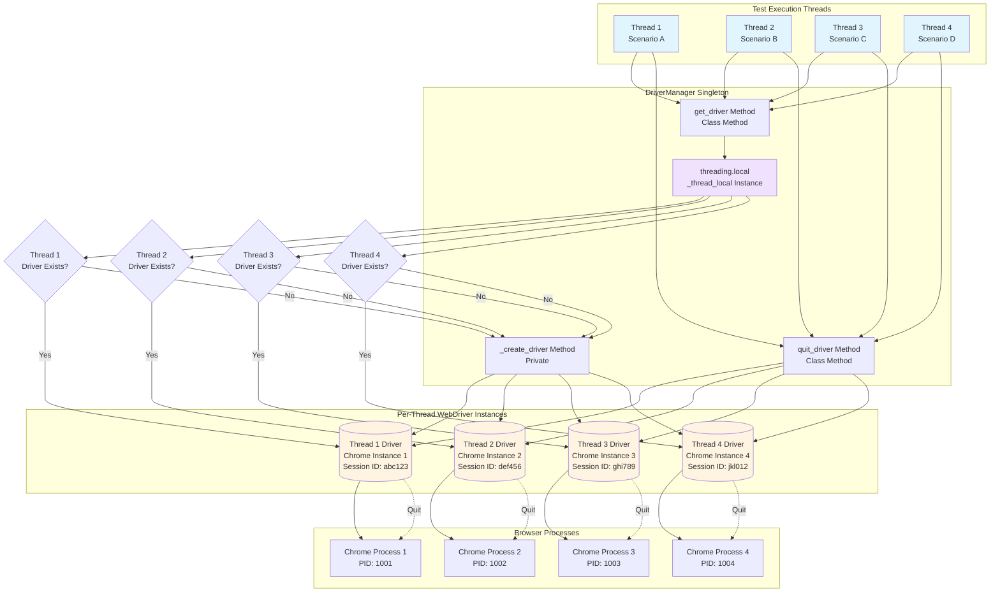

**Thread Isolation Guarantees:**

1. **Independent Browser Sessions**: Each thread maintains completely isolated browser session with separate cookies, local storage, session storage, and navigation history. No cross-contamination between threads.

2. **Separate WebDriver Instances**: threading.local() ensures each thread accesses only its own WebDriver instance. No race conditions or shared state conflicts.

3. **Concurrent Execution Safety**: Multiple scenarios execute simultaneously without interference. Authentication in Thread 1 does not affect Thread 2 session.

4. **Resource Cleanup**: Each thread independently quits its browser process. Thread 1 completing does not impact Thread 2, 3, or 4 execution.

### 4.5.2 Scenario Context Lifecycle

The Behave context object provides scenario-level state management:

```mermaid
stateDiagram-v2
    [*] --> ContextCreated: Scenario Start
    
    state ContextCreated {
        [*] --> EmptyContext
        EmptyContext --> ConfigSet: before_all sets context.config_reader
    }
    
    ContextCreated --> DriverSet: before_scenario sets context.driver
    
    state DriverSet {
        [*] --> DriverInitialized
        DriverInitialized --> DriverActive: WebDriver ready
    }
    
    DriverSet --> StepExecution: Step definitions execute
    
    state StepExecution {
        [*] --> Step1: Given step
        Step1 --> Step2: When step
        Step2 --> Step3: Then step
        
        state Step1 {
            [*] --> ReadContext: Access context.config_reader
            ReadContext --> UseDriver: Access context.driver
            UseDriver --> SetData: Store context.entered_product_name
        }
        
        state Step2 {
            [*] --> ReadPrevData: Access context.entered_product_name
            ReadPrevData --> Interact: Use context.driver
        }
        
        state Step3 {
            [*] --> Validate: Use context.driver
            Validate --> Assert: Compare values
        }
    }
    
    StepExecution --> ScenarioComplete: All steps finished
    
    state ScenarioComplete {
        [*] --> CheckStatus
        CheckStatus --> PassState: status == 'passed'
        CheckStatus --> FailState: status == 'failed'
        FailState --> CaptureScreenshot: Use context.driver
    }
    
    ScenarioComplete --> Cleanup: after_scenario
    
    state Cleanup {
        [*] --> QuitDriver: context.driver.quit()
        QuitDriver --> NullDriver: context.driver = None
        NullDriver --> ClearData: Context data cleared
    }
    
    Cleanup --> [*]: Context destroyed
```

**Context Scope and Lifecycle:**

- **Creation**: New context object created for each scenario before before_scenario hook execution
- **Population**: Hooks populate context with config_reader (before_all) and driver (before_scenario)
- **Propagation**: Step definitions access context attributes (context.driver, context.config_reader, context.entered_product_name)
- **Isolation**: Each scenario receives fresh context preventing data leakage from previous scenarios
- **Cleanup**: Context destroyed after after_scenario hook, clearing all references

### 4.5.3 Transaction Boundaries and Data Persistence

The application under test implements standard web transaction patterns with test validation at persistence boundaries:

| Transaction Type | Trigger Point | Persistence Validation | Rollback Scenario |
|------------------|---------------|------------------------|-------------------|
| **Authentication** | Login form submission | Session cookie set, redirect to dashboard | Invalid credentials, stay on login page |
| **Opportunity Creation** | CRM create pipeline button | Database insert, opportunity appears in list | Validation error, remain on form |
| **Product Creation** | Inventory save button | Database insert, product appears in catalog | Empty name validation, show error |
| **Contact Creation** | Contact save button | Database insert, contact in list view | Missing required fields, validation error |
| **Event Creation** | Calendar create button | Database insert, event block displayed | Required fields missing, prevent save |
| **Drag-and-Drop** | ActionChains release() | State update, element in new stage | Invalid drop zone, element returns to source |
| **Logout** | Logout button click | Cookie cleared, redirect to login | Session already expired, redirect to login |

**Test Validation at Boundaries:**

1. **Pre-Transaction**: Verify form fields populated correctly before submission
2. **Transaction Execution**: Click save/submit button triggering server request
3. **Post-Transaction**: Verify expected state change (element visibility, text values, list updates)
4. **Rollback Handling**: Verify validation errors prevent incomplete transactions

## 4.6 Validation Rules and Authorization Checkpoints

### 4.6.1 Field-Level Validation Rules

The framework validates application enforcement of field-level validation rules:

**Product Creation Validation** (`features/Inventory.feature`):
```
Scenario: User cannot create product without name
Given: User navigates to product creation form
When: User clicks save button without entering name
Then: Error message displayed: "The following fields are invalid:"
And: Product not created in database
And: User remains on creation form
```

**CRM Opportunity Validation** (`features/Crm.feature`):
```
Required Fields:
- Opportunity Title: String, non-empty
- Customer Selection: Dropdown, required selection
- Expected Revenue: Numeric, integer parsing
- Priority Level: Dropdown, required selection

Validation Enforcement:
- All fields must be populated before form submission
- Empty fields prevent form submission
- Field highlighting indicates validation errors
```

**Contact Management Validation** (`features/Contact.feature`):
```
Required Fields:
- Contact Name: String, non-empty
- Email: Valid email format (contains @)
- Phone: Numeric format

Validation Enforcement:
- Name required before save
- Email format validation on blur
- Phone number format validation
```

### 4.6.2 Role-Based Authorization Checkpoints

The framework documents role-based access control through user role assignments:

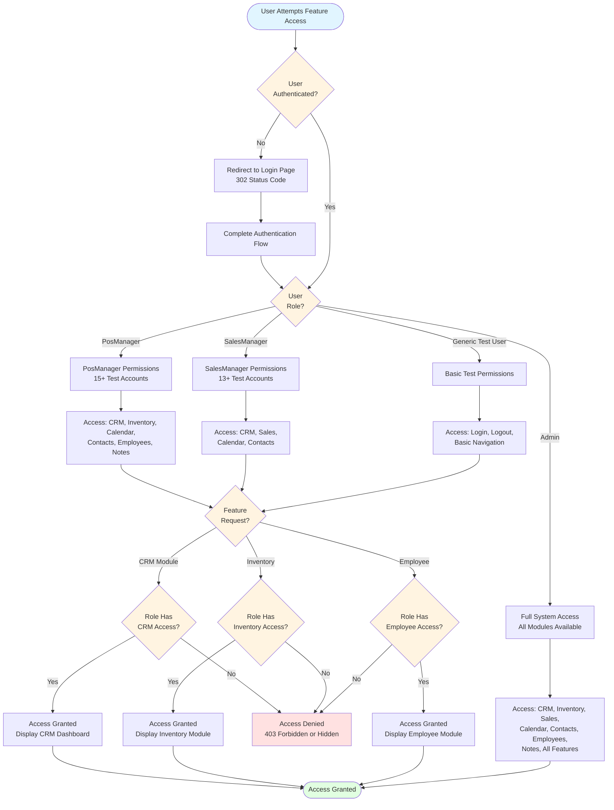

**Role Definitions and Credentials:**

| Role | Credential Environment Variables | Feature Access | Test Account Count |
|------|----------------------------------|----------------|-------------------|
| **Admin** | ADMIN_USERNAME, ADMIN_PASSWORD | Full system access, all modules | 1 admin account |
| **PosManager** | POS_MANAGER_USERNAME, POS_MANAGER_PASSWORD | CRM, Inventory, Calendar, Contacts, Employees, Notes | 15+ accounts (posmanager5-19@info.com) |
| **SalesManager** | SALES_MANAGER_USERNAME, SALES_MANAGER_PASSWORD | CRM, Sales, Calendar, Contacts | 13+ accounts (salesmanager7-19@info.com) |
| **Test User** | TEST_USERNAME, TEST_PASSWORD | Generic test access, basic functionality | 1 test account |

**Authorization Checkpoint Documentation** (from `features/Crm.feature`):
```gherkin
Feature: CRM Module
  Account is: PosManager  # Role requirement documented
  
  Background:
    Given User login to test other features  # Uses TEST_USERNAME or role-specific credentials
```

**Security Best Practices:**

1. **No Hardcoded Credentials**: All credentials sourced from environment variables preventing accidental exposure in version control
2. **Credential Masking in Logs**: Passwords always logged as `***` protecting secrets in log files
3. **Environment Validation**: Missing credentials raise EnvironmentError with clear resolution guidance
4. **Role-Specific Testing**: Feature files document required roles enabling targeted test execution per role

## 4.7 References

### 4.7.1 Source Files Examined

1. **`features/environment.py`** - Behave lifecycle hooks (before_all, before_scenario, after_scenario, after_all), configuration initialization, WebDriver lifecycle management, screenshot capture on failure, thread-safe driver storage
2. **`features/steps/session_steps.py`** - Session establishment workflow, authentication with environment variable credentials, ConfigReader integration for web.table.url
3. **`features/steps/login_steps.py`** - Authentication flows, valid/invalid credential handling, empty field validation, password masking verification, Enter key submission
4. **`features/steps/logout_steps.py`** - Logout workflow, session termination, back button prevention testing, security validation
5. **`features/steps/crm_steps.py`** - CRM pipeline management (28 locators), opportunity creation with revenue calculation, drag-and-drop implementation with ActionChains and timed pauses, customer registration workflows
6. **`features/steps/inventory_steps.py`** - Product creation workflows, field validation testing, product list verification, context storage for test data
7. **`features/steps/calendar_steps.py`** - Calendar view switching (Day/Week/Month), event creation with tags, date selection and navigation, edit workflows
8. **`features/steps/contacts_steps.py`** - Contact CRUD operations, action menu interactions, print functionality with due payments
9. **`features/steps/sales_steps.py`** - Customer management, state/country selection, search functionality, field validation
10. **`features/steps/employee_steps.py`** - Employee record management, stage navigation, creation with confirmation messages, editing workflows
11. **`features/steps/notes_steps.py`** - Note creation with tags, drag-and-drop organization between sections, edit functionality
12. **`pages/base_page.py`** - Wait helper methods (wait_for_element, wait_for_clickable, wait_for_visibility), explicit wait patterns, timeout configuration, WebDriverWait implementation
13. **`pages/login_page.py`** - LoginPage locators (input_login, input_password, login_button), property-based element accessors
14. **`pages/logout_page.py`** - LogoutPage locators (popup_button, logout_button, warning_message)
15. **`pages/crm_page.py`** - CrmPage with 28 locators covering pipeline, opportunity, customer management, drag-and-drop targets
16. **`pages/inventory_page.py`** - InventoryPage locators for product management, validation errors, list views
17. **`pages/calendar_page.py`** - CalendarPage with 21+ locators for view controls, event creation, editing interfaces
18. **`pages/contacts_page.py`** - ContactsPage with 16 locators for CRUD operations, action menus, printing
19. **`pages/sales_page.py`** - SalesPage with 20 locators for customer management, state/country selection, search
20. **`pages/employee_page.py`** - EmployeePage locators for stage navigation, creation, confirmation messages
21. **`pages/notes_page.py`** - NotesPage locators for note creation, drag-and-drop targets, tag management
22. **`pages/session_page.py`** - SessionPage for foundational authentication workflow
23. **`utilities/driver_manager.py`** - Thread-local WebDriver management with threading.local(), browser provisioning through webdriver-manager, configuration-driven browser options
24. **`utilities/config_reader.py`** - Singleton YAML configuration reader, environment variable precedence, dotenv integration, ${VAR:default} substitution
25. **`utilities/screenshot_helper.py`** - Screenshot capture with timestamp and sanitized filenames, Allure attachment integration, organized storage in reports/screenshots/
26. **`config/config.yaml`** - Configuration structure with browser settings, timeout values (explicit, page_load, element_presence, clickability), application URLs, credential templates
27. **`features/Login.feature`** - Gherkin scenarios for authentication with 6 test cases, scenario outlines for multi-role testing, validation checkpoints
28. **`features/Logout.feature`** - Logout scenarios with security validation, back button testing
29. **`features/Crm.feature`** - CRM workflows including pipeline creation, opportunity management, drag-and-drop, customer registration (documented as PosManager role requirement)
30. **`features/Inventory.feature`** - Inventory scenarios for product creation, validation testing, list verification
31. **`features/Calendar.feature`** - Calendar scenarios with view switching, event creation, editing workflows
32. **`features/Contact.feature`** - Contact CRUD scenarios, action menu testing, print functionality
33. **`features/Sales.feature`** - Sales scenarios for customer management, search, validation
34. **`features/EmployeeFc.feature`** - Employee management scenarios with Jira tags (@UPGN-340 through @UPGN-344)
35. **`features/Notes.feature`** - Notes scenarios for creation, editing, drag-and-drop organization
36. **`features/Session.feature`** - Session establishment as prerequisite for all features
37. **`.env.example`** - Template documenting required environment variables for credentials and configuration
38. **`behave.ini`** - Behave configuration for report formats, parallel execution settings
39. **`README.md`** - Documentation of CI/CD integration patterns, execution commands, artifact locations

### 4.7.2 Additional References

- **Behave Documentation**: https://behave.readthedocs.io/ - BDD framework hooks, context objects, tag-based execution
- **Selenium WebDriver Documentation**: https://www.selenium.dev/documentation/webdriver/ - Explicit waits, Expected Conditions, ActionChains
- **webdriver-manager Documentation**: https://github.com/SergeyPirogov/webdriver_manager - Automatic driver provisioning, caching strategy
- **PyYAML Documentation**: https://pyyaml.org/ - YAML parsing, safe_load method
- **python-dotenv Documentation**: https://github.com/theskumar/python-dotenv - Environment variable loading from .env files
- **Allure Framework**: https://docs.qameta.io/allure/ - Report generation, attachment integration
- **Page Object Model Pattern**: Martin Fowler's description at https://martinfowler.com/bliki/PageObject.html - Design pattern implementation

# 5. System Architecture

## 5.1 High-Level Architecture

### 5.1.1 System Overview

The Testinium-QA Python framework implements a **layered architecture** designed for browser-based test automation of the Testinium enterprise business management platform. The system employs a five-layer separation of concerns pattern, ensuring maintainability, scalability, and thread-safe parallel execution capabilities.

**Architecture Style and Rationale:**

The framework adopts a **modular layered architecture** where each layer has distinct responsibilities and communicates through well-defined interfaces. This architectural style was selected to support the migration from a legacy Java 8 + Selenium 3 + Cucumber framework to a modern Python 3.9+ implementation while maintaining behavioral equivalence and improving maintainability.

The layered approach provides clear separation between test specification (Gherkin feature files), test implementation (Python step definitions), page abstractions (Page Object Model), infrastructure services (WebDriver management, configuration, utilities), and configuration management (YAML-based settings with environment variable interpolation). This separation enables independent evolution of each layer, facilitates parallel development by multiple team members, and supports comprehensive unit testing of framework components.

**Key Architectural Principles:**

1. **Thread Safety by Design**: Utilizes Python's `threading.local()` for per-thread WebDriver isolation, enabling parallel test execution without race conditions or shared state conflicts.

2. **Explicit Over Implicit**: Enforces zero implicit waits (`implicit_wait: 0`) and exclusively uses explicit WebDriverWait conditions, eliminating timing-related flakiness present in the legacy implementation.

3. **Configuration as Code**: Centralizes all configurable parameters in `config/config.yaml` with environment variable interpolation (`${VAR_NAME:default}` syntax) and precedence hierarchy (CLI > ENV > .env > YAML > hardcoded defaults).

4. **Property-Based Element Access**: Replaces deprecated PageFactory patterns with Python `@property` decorators that return fresh WebElement references on each access, preventing stale element exceptions.

5. **Security First**: Eliminates all hardcoded credentials from source code, implementing environment-based secret management compatible with enterprise secret managers (HashiCorp Vault, AWS Secrets Manager, Azure Key Vault).

6. **Fail-Safe Diagnostics**: Automatically captures screenshots on test failures with sanitized filenames and timestamps, attaching them to both Behave and Allure reports for rapid failure diagnosis.

**System Boundaries and Major Interfaces:**

The framework operates within clearly defined boundaries, interfacing with external systems through standardized protocols:

- **Browser Automation Interface**: Communicates with Chrome and Firefox browsers via Selenium WebDriver 4.15.2 using the W3C WebDriver protocol
- **Application Under Test**: Interacts with the Testinium web application through standard HTTP/HTTPS requests and DOM manipulation
- **CI/CD Integration**: Publishes test results in JUnit XML format for consumption by Jenkins, Azure DevOps, and other CI/CD platforms
- **Reporting Platforms**: Generates Allure-compatible JSON for rich visualization and multiple HTML/JSON formats for stakeholder consumption
- **Configuration Sources**: Reads from YAML files, environment variables, and .env files with well-defined precedence rules

**Migration Context:**

This architecture represents a 92% complete migration from the legacy Java implementation, with 44 Python modules replacing 24 Java files. The migration achieved critical improvements including fixing security vulnerabilities (removed hardcoded credentials), correcting browser provisioning bugs (proper GeckoDriverManager for Firefox), eliminating wait strategy anti-patterns (no Thread.sleep() calls), and achieving 100% unit test pass rate (61/61 tests) with comprehensive type safety through dataclasses and type hints.

### 5.1.2 Core Components Table

| Component Name | Primary Responsibility | Key Dependencies | Integration Points | Critical Considerations |
|----------------|------------------------|------------------|-------------------|-------------------------|
| **Configuration Layer** (`config/`) | Centralized settings management with environment variable interpolation | PyYAML 6.0.1, python-dotenv 1.0.0 | All layers read configuration through singleton | Must initialize before any other component; thread-safe after initialization |
| **Infrastructure Layer** (`utilities/`) | WebDriver lifecycle, wait helpers, screenshot capture, configuration reading | Selenium 4.15.2, webdriver-manager 4.0.1 | Used by Page Objects and Behave hooks | Thread-local storage critical for parallel execution |
| **Page Object Model Layer** (`pages/`) | Element location and page-specific interactions abstraction | BasePage, Selenium By locators | Called by step definitions | Stateless design; property-based element access prevents stale references |
| **BDD Specification Layer** (`features/`) | Gherkin test scenarios and Behave lifecycle hooks | Behave 1.2.6, allure-behave 2.13.2 | Orchestrates entire test execution | Hooks manage WebDriver lifecycle; context propagates state |
| **Unit Test Layer** (`tests/`) | Framework component validation | pytest 7.4.3, pytest-xdist 3.5.0 | Independent validation of utilities | 100% pass rate required for production deployment |

### 5.1.3 Data Flow Description

**Primary Data Flows:**

The framework implements a unidirectional data flow from configuration initialization through test execution to report generation, with clear transformation points at each layer boundary.

**Configuration Data Flow:**

Configuration data originates from four sources with explicit precedence hierarchy. Environment variables represent the highest priority, followed by `.env` file entries loaded via python-dotenv, then `config/config.yaml` values parsed by PyYAML, and finally hardcoded defaults in dataclass definitions. The ConfigReader singleton performs environment variable substitution during YAML parsing using the `${VAR_NAME:default}` syntax, resolving all references before exposing configuration to consuming components. This pre-substitution approach preserves YAML data types (integers, booleans, lists) rather than converting everything to strings post-parsing.

The configuration flows from the ConfigReader singleton to DriverManager for browser settings (type, headless mode, window size), to BasePage for timeout values (explicit wait, page load, element presence), to step definitions for application URLs and credentials, and to screenshot helpers for output directory paths. Configuration remains immutable after the `before_all` hook completes, ensuring consistent behavior across all test scenarios.

**WebDriver Instance Flow:**

WebDriver instances are created on-demand using thread-local storage patterns. When a test scenario begins execution through the `before_scenario` hook, DriverManager checks `threading.local()` storage for an existing driver instance associated with the current thread. If no instance exists, DriverManager invokes `_create_driver()` which provisions the appropriate browser binary (ChromeDriver or GeckoDriver) via webdriver-manager, configures browser-specific options including headless mode and stability flags, instantiates the WebDriver with Service-based architecture, maximizes the browser window, sets implicit wait to zero per explicit-only policy, and stores the instance in both `threading.local()` and `context.driver` for access by step definitions.

Page Objects receive WebDriver instances through constructor injection from step definitions. Each page object method uses property-based element accessors that invoke BasePage wait helpers. Wait helpers wrap Selenium WebDriverWait with expected conditions for presence, visibility, or clickability. When elements are located, WebDriver executes interactions (send_keys, click, get_text) against the browser's DOM representation. This flow ensures that every element access includes appropriate synchronization, preventing race conditions and timing failures.

**Test Execution Data Flow:**

Test execution begins with Behave parsing Gherkin feature files and identifying matching Python step definitions. Step definitions instantiate page objects with `context.driver`, passing test data from Gherkin tables or scenario context. Page objects locate elements using By locator tuples stored as class attributes and interact with the application through Selenium WebDriver commands. Application responses modify the browser DOM, triggering JavaScript events and server HTTP requests. Step definitions validate expected outcomes through Python assertions with descriptive failure messages.

When scenario steps complete, the `after_scenario` hook checks scenario status. Failed scenarios trigger screenshot capture through `screenshot_helper.py`, which sanitizes the scenario name by removing invalid filesystem characters, appends a timestamp in `%Y%m%d_%H%M%S` format, captures the browser screenshot as PNG bytes, writes to `reports/screenshots/` directory, and attaches to both Behave report via `scenario.attach()` and Allure report via `allure.attach()` when available. The hook then calls `DriverManager.quit_driver()` which invokes `WebDriver.quit()` to terminate the browser process, clears the `threading.local()` reference, and sets `context.driver = None`.

**Data Transformation Points:**

Critical data transformation occurs at several layer boundaries:

1. **YAML to Python Objects**: ConfigReader transforms YAML structures into Python dataclasses (BrowserConfig, TimeoutConfig, ApplicationConfig, CredentialsConfig, ReportingConfig) with type validation
2. **Gherkin to Python Execution**: Behave transforms Given/When/Then text into Python function calls with regular expression parameter extraction
3. **Locator Tuples to WebElements**: BasePage transforms `(By.NAME, "username")` tuples into Selenium WebElement objects via WebDriverWait
4. **Test Results to Reports**: Behave formatters transform scenario execution status into JSON, HTML, JUnit XML, and Allure report formats
5. **Screenshots to Attachments**: Screenshot bytes transform into base64-encoded embedded images in HTML reports and file attachments in Allure reports

**Key Data Stores and Caches:**

The framework utilizes several caching mechanisms to optimize performance:

- **ConfigReader Singleton Cache**: Once initialized, configuration values remain cached in memory for the entire test suite execution
- **Thread-Local Driver Cache**: Each thread caches its WebDriver instance across multiple scenarios until explicit cleanup
- **WebDriver Binary Cache**: webdriver-manager caches ChromeDriver and GeckoDriverManager binaries in `~/.wdm/drivers/` with version detection to avoid redundant downloads
- **Screenshot Storage**: All captured screenshots persist to `reports/screenshots/` filesystem directory for long-term retention and audit trails

### 5.1.4 External Integration Points

| System Name | Integration Type | Data Exchange Pattern | Protocol/Format | SLA Requirements |
|-------------|------------------|----------------------|----------------|------------------|
| Chrome/Firefox Browser | Synchronous automation control | Command-response (W3C WebDriver protocol) | HTTP/JSON over local TCP | < 100ms command response; < 30s page load timeout |
| Jenkins CI/CD | Asynchronous result publishing | Report artifact upload | JUnit XML, HTML files, JSON | Report generation < 10s; artifact archival guaranteed |
| Allure Server | On-demand report generation | JSON result files | Allure JSON schema v2 | Report serving < 5s for cached history |
| webdriver-manager | Synchronous binary provisioning | Driver download and caching | HTTPS, GitHub releases API | < 30s first download; < 1s cached retrieval |
| Testinium Application | Synchronous user simulation | HTTP requests, DOM manipulation | HTTP/HTTPS, HTML5, JavaScript | Application-dependent; timeouts configurable |

## 5.2 Component Details

### 5.2.1 Configuration Management Layer

**Purpose and Responsibilities:**

The Configuration Management Layer provides centralized, type-safe configuration with environment variable interpolation and precedence-based override capabilities. Located in the `config/` directory, this layer ensures that all framework components access consistent configuration values while supporting environment-specific overrides for development, staging, and production deployments.

**Technologies and Frameworks:**

- **Python Dataclasses**: Defines typed configuration schemas (BrowserConfig, TimeoutConfig, ApplicationConfig, CredentialsConfig, ReportingConfig)
- **PyYAML 6.0.1**: Parses `config.yaml` with safe_load for security
- **python-dotenv 1.0.0**: Loads `.env` files before configuration initialization
- **Regular Expressions**: Implements `${VAR_NAME:default}` substitution pattern

**Key Interfaces and APIs:**

The layer exposes three primary interfaces:

1. **TestConfig Dataclass** - Hierarchical configuration structure with five section dataclasses, each containing typed fields with default values
2. **get_config() Function** - Returns singleton TestConfig instance, initializing on first call
3. **reset_config() Function** - Clears singleton for testing scenarios requiring reconfiguration

The `config.yaml` file follows a hierarchical structure:

```yaml
browser:
  type: chrome  # chrome or firefox
  headless: ${HEADLESS:false}
  window_size: [1920, 1080]
  
timeouts:
  explicit: 10
  page_load: 30
  element_presence: 5
  clickability: 3
  
application:
  base_url: ${BASE_URL:https://qa-site.testinium.com}
  login_url: ${LOGIN_URL:${BASE_URL}/web/login}
  
credentials:
  username: ${TEST_USERNAME}
  password: ${TEST_PASSWORD}
```

**Data Persistence Requirements:**

Configuration data persists in three locations:

1. **config/config.yaml** - Version-controlled canonical configuration committed to repository
2. **.env File** - Developer-specific overrides excluded from version control via .gitignore
3. **Environment Variables** - CI/CD platform injected secrets with highest precedence

No database persistence occurs; configuration is ephemeral and reloaded on each test suite execution.

**Scaling Considerations:**

The singleton pattern ensures memory efficiency with single configuration instance shared across all threads. Thread-safety is guaranteed after initialization since configuration remains immutable. For distributed test execution across multiple machines, each process loads configuration independently from the same YAML file and environment-specific variables, ensuring consistent behavior without requiring centralized configuration servers.

### 5.2.2 Infrastructure Layer

**Purpose and Responsibilities:**

The Infrastructure Layer provides core framework services including thread-safe WebDriver lifecycle management, configuration reading, explicit wait helpers, and diagnostic utilities. Located in the `utilities/` directory, this layer abstracts Selenium WebDriver complexity and provides consistent, reusable utilities for higher layers.

**Technologies and Frameworks:**

- **Selenium WebDriver 4.15.2** - Browser automation engine with W3C protocol support
- **webdriver-manager 4.0.1** - Automatic ChromeDriver and GeckoDriverManager binary provisioning with version detection and caching
- **threading.local()** - Python standard library thread-local storage for WebDriver isolation
- **PyYAML 6.0.1** - YAML parsing for configuration reading

**Key Interfaces and APIs:**

The layer exposes five primary modules:

**DriverManager (`utilities/driver_manager.py`):**
- `get_driver()` - Returns thread-local WebDriver instance, creating if not exists
- `quit_driver()` - Terminates WebDriver and clears thread-local storage
- `_create_driver()` - Internal browser provisioning with configuration-based setup
- `get_thread_driver_status()` - Diagnostic method returning thread info and driver state

**ConfigReader (`utilities/config_reader.py`):**
- `get_property(key, default=None)` - Retrieves configuration value with dot-notation support (e.g., "browser.type")
- `get_all_properties()` - Returns deep copy of entire configuration dictionary
- Singleton pattern with `__new__` override ensures single instance per process

**WaitHelpers (`utilities/wait_helpers.py`):**
- `wait_for_element_presence(locator, timeout)` - Waits for element in DOM
- `wait_for_element_visible(locator, timeout)` - Waits for element visible with dimensions
- `wait_for_element_clickable(locator, timeout)` - Waits for element interactive
- `wait_for_text_in_element(locator, text, timeout)` - Waits for specific text content
- `wait_for_staleness(element, timeout)` - Waits for element to be removed from DOM
- `wait_for_url_contains(url_fragment, timeout)` - Waits for navigation completion
- `wait_for_title_contains(title_fragment, timeout)` - Waits for page title

**ScreenshotHelper (`utilities/screenshot_helper.py`):**
- `sanitize_filename(name, max_length=200)` - Removes invalid filesystem characters
- `capture_screenshot(driver, scenario_name)` - Captures PNG with timestamp and Allure attachment
- `capture_browser_logs(driver)` - Retrieves console log entries for debugging

**Data Persistence Requirements:**

The Infrastructure Layer interacts with persistent storage in limited ways:

- **WebDriver Binary Cache**: webdriver-manager stores ChromeDriver/GeckoDriverManager binaries in `~/.wdm/drivers/` with automatic version management
- **Screenshot Storage**: Failure screenshots persist to `reports/screenshots/` with naming pattern `{scenario_name}_{timestamp}.png`
- **Log Files**: Execution logs can be configured to write to filesystem via Python logging handlers

**Scaling Considerations:**

Thread-local storage in DriverManager is the critical scaling enabler. Each thread receives an isolated WebDriver instance, allowing parallel execution via:

1. **behave-parallel**: Process-based parallelism with `--processes N` flag
2. **pytest-xdist**: Thread or process-based parallelism with `-n auto` flag
3. **Jenkins Multi-Agent**: Distributed execution across multiple build agents

The thread-local pattern scales horizontally to the number of available CPU cores without modification. For distributed execution across machines, each process runs independently with its own thread-local storage and browser instances.

Memory considerations: Each WebDriver instance consumes approximately 150-300 MB of RAM depending on browser type and loaded pages. For 8-core execution, expect peak memory usage of 2.4 GB plus application overhead.

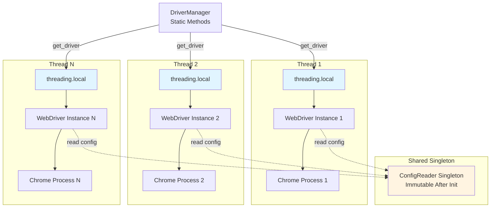

### 5.2.3 Page Object Model Layer

**Purpose and Responsibilities:**

The Page Object Model (POM) Layer encapsulates web page structure and interactions, providing domain-specific abstractions for test step definitions. Located in the `pages/` directory, this layer implements the Page Object pattern with property-based element accessors, explicit wait integration, and stateless design for thread safety.

**Technologies and Frameworks:**

- **Selenium By Locators** - Typed locator tuples using `By.NAME`, `By.XPATH`, `By.CSS_SELECTOR`, `By.ID`
- **Python Properties** - `@property` decorators for dynamic element access
- **Selenium WebDriverWait** - Explicit wait conditions from `selenium.webdriver.support.expected_conditions`
- **ActionChains** - Complex interaction sequences including drag-and-drop

**Key Interfaces and APIs:**

**BasePage (`pages/base_page.py`)** - Foundation class providing:

```python
@property
def default_timeout(self) -> int:
    """Configurable timeout from config.yaml"""
    
def wait_for_element(self, locator: Tuple[str, str], timeout: Optional[int]) -> WebElement
def wait_for_clickable(self, locator: Tuple[str, str], timeout: Optional[int]) -> WebElement
def wait_for_visibility(self, locator: Tuple[str, str], timeout: Optional[int]) -> WebElement
def wait_for_text(self, locator: Tuple[str, str], text: str, timeout: Optional[int]) -> bool
def get_elements(self, locator: Tuple[str, str]) -> List[WebElement]
def drag_and_drop(self, source: WebElement, target: WebElement) -> None
```

**Domain-Specific Page Objects** - 11 page classes implementing feature-specific interactions:

1. **LoginPage** - Authentication form with email/password fields, submit button, error message handling
2. **LogoutPage** - Two-step logout workflow (user menu popup, logout button)
3. **SessionPage** - Reusable authenticated session precondition
4. **CrmPage** - Pipeline management, opportunity creation/editing, drag-and-drop workflow
5. **CalendarPage** - View switching (Day/Week/Month), meeting creation, tag management
6. **ContactsPage** - Contact CRUD operations, list viewing, action menus
7. **EmployeePage** - HR workflows, web table interactions, role-based operations
8. **InventoryPage** - Product catalog management, creation workflows, field validation
9. **NotesPage** - Note creation, tagging, drag-and-drop organization
10. **SalesPage** - Customer management, sales workflows
11. **DashboardPage** - Navigation hub, module links

**Locator Pattern Example:**

```python
class LoginPage(BasePage):
    _INPUT_EMAIL = (By.NAME, "login")
    _INPUT_PASSWORD = (By.NAME, "password")
    _BUTTON_LOGIN = (By.XPATH, "//button[@type='submit']")
    
    @property
    def input_email(self) -> WebElement:
        return self.wait_for_element(self._INPUT_EMAIL)
    
    @property
    def input_password(self) -> WebElement:
        return self.wait_for_clickable(self._INPUT_PASSWORD)
    
    def login(self, username: str, password: str) -> None:
        self.input_email.send_keys(username)
        self.input_password.send_keys(password)
        self.wait_for_clickable(self._BUTTON_LOGIN).click()
```

**Data Persistence Requirements:**

Page Objects are stateless and ephemeral. Each step definition instantiates page objects as needed:

```python
@when('I enter username "{username}" and password "{password}"')
def enter_credentials(context, username, password):
    login_page = LoginPage(context.driver)  # Fresh instance
    login_page.login(username, password)
```

This stateless design ensures thread safety since no mutable state is shared between threads. The only persistent state is the WebDriver instance passed via constructor injection.

**Scaling Considerations:**

The stateless POM design scales linearly with parallel execution. Each thread instantiates independent page objects with separate WebDriver instances. Memory overhead per page object is minimal (<1 KB) since locators are class attributes shared across all instances.

**Technical Debt and Locator Brittleness:**

The framework acknowledges locator fragility as documented technical debt:

- **Index-Based XPaths**: Expressions like `//div[3]/span[2]` break when UI structure changes
- **Generated Element IDs**: IDs like `o_field_input_479` are non-deterministic across deployments
- **Absolute XPaths**: Full paths from document root are fragile to restructuring

**Recommendation**: Add stable `data-testid` attributes to application HTML for robust, semantic element identification.

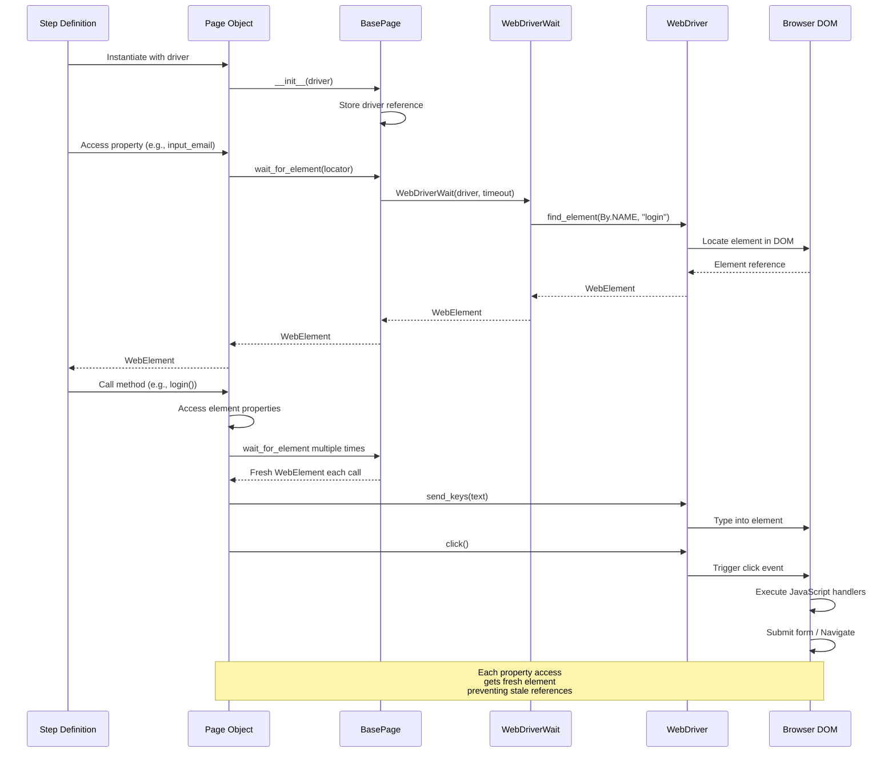

### 5.2.4 BDD Test Specification Layer

**Purpose and Responsibilities:**

The BDD Test Specification Layer orchestrates test execution through Gherkin feature files and Behave lifecycle hooks. Located in the `features/` directory, this layer provides business-readable test scenarios, manages WebDriver lifecycle, handles failure diagnostics, and coordinates report generation across multiple formats.

**Technologies and Frameworks:**

- **Behave 1.2.6** - BDD test runner with Gherkin parsing and hook system
- **Gherkin Syntax** - Given/When/Then scenario specifications in `.feature` files
- **allure-behave 2.13.2** - Allure report integration with attachment support
- **behave-html-formatter 0.9.10** - HTML report generation

**Key Interfaces and APIs:**

**Behave Hooks (`features/environment.py`):**

```python
def before_all(context):
    """Initialize ConfigReader, create directories, configure logging"""
    
def before_scenario(context, scenario):
    """Create WebDriver, store in context.driver, log scenario details"""
    
def after_scenario(context, scenario):
    """Capture screenshot on failure, quit WebDriver, cleanup context"""
    
def after_all(context):
    """Generate reports, log execution summary"""
    
@fixture
def browser_fixture(context):
    """Optional fixture for advanced lifecycle management"""
```

**Step Definitions Pattern** (`features/steps/*.py`):

The framework implements 10 step definition modules mapping Gherkin text to Python functions:

- **login_steps.py** - Authentication workflows (@given/@when/@then for login scenarios)
- **logout_steps.py** - Session termination (@when for logout actions)
- **session_steps.py** - Reusable authenticated session (@given preconditions)
- **crm_steps.py** - CRM workflows (@when/@then for pipeline/opportunity management)
- **calendar_steps.py** - Calendar interactions (@when/@then for meeting creation)
- **contacts_steps.py** - Contact management (@when/@then for CRUD operations)
- **employee_steps.py** - HR workflows (@when/@then for employee records)
- **inventory_steps.py** - Product catalog (@when/@then for inventory management)
- **notes_steps.py** - Note operations (@when/@then for note creation/organization)
- **sales_steps.py** - Sales workflows (@when/@then for customer management)

**Step Definition Example:**

```python
@given('I am on the login page')
def navigate_to_login(context):
    login_url = context.config.application.login_url
    context.driver.get(login_url)
    
@when('I enter username "{username}" and password "{password}"')
def enter_credentials(context, username, password):
    login_page = LoginPage(context.driver)
    login_page.login(username, password)
    
@then('I should see the dashboard')
def verify_dashboard(context):
    assert "Odoo" in context.driver.title, "Dashboard not loaded"
```

**Feature File Structure** - 10 Gherkin files covering functional domains:

```gherkin
Feature: Login Functionality
  
  @Smoke @Login @UPGN-286
  Scenario Outline: Valid user login with different roles
    Given I am on the login page
    When I enter username "<username>" and password "<password>"
    And I click the login button
    Then I should see the dashboard
    
    Examples:
      | username          | password    |
      | posmanager10@info | posmanager  |
      | salesmanager10    | salesmanager|
```

**Data Persistence Requirements:**

The BDD layer interacts with persistent storage at multiple points:

1. **Feature Files**: Gherkin specifications committed to version control in `features/*.feature`
2. **Screenshot Storage**: Failure diagnostics persisted to `reports/screenshots/` with naming pattern `{scenario_name}_{timestamp}.png`
3. **Report Generation**: Multiple format outputs:
   - `reports/cucumber.json` - Cucumber JSON format for programmatic consumption
   - `reports/behave-reports/report.html` - Human-readable HTML summary
   - `reports/junit/*.xml` - JUnit XML for CI/CD integration
   - `reports/allure-results/` - Allure JSON files for rich visualization

**Scaling Considerations:**

The BDD layer supports parallel execution through two mechanisms:

1. **behave-parallel**: Process-based parallelism with `--processes N` flag, spawning N independent Python processes each with isolated WebDriver
2. **Tag-Based Partitioning**: Different CI/CD agents execute different tag sets (`@Smoke` vs `@Regression`) for horizontal scaling

The thread-local WebDriver pattern in DriverManager ensures that each parallel process receives isolated browser instances without conflicts. Context isolation between scenarios prevents data leakage.

**Parallel Execution Configuration (`behave.ini`):**

```ini
[behave]
default_format = pretty
stdout_capture = false
stderr_capture = false
log_capture = true

[behave.formatters]
json = behave.formatter.json:PrettyJSONFormatter
html = behave_html_formatter:HTMLFormatter
junit = behave.formatter.junit:JUnitFormatter
```

```mermaid
stateDiagram-v2
    [*] --> BeforeAll: Test Suite Start
    
    BeforeAll --> LoadConfig: Load .env
    LoadConfig --> ParseYAML: Parse config.yaml
    ParseYAML --> CreateDirs: Create reports/screenshots/
    CreateDirs --> ConfigLog: Configure logging
    ConfigLog --> ScenarioLoop: Ready for scenarios
    
    ScenarioLoop --> BeforeScenario: Next scenario
    BeforeScenario --> GetDriver: DriverManager.get_driver()
    GetDriver --> StoreContext: context.driver = driver
    StoreContext --> ExecuteSteps: Run Given/When/Then
    
    ExecuteSteps --> CheckStatus: Scenario complete
    
    state CheckStatus <<choice>>
    CheckStatus --> Failed: status == 'failed'
    CheckStatus --> Passed: status == 'passed'
    
    Failed --> CaptureScreenshot: screenshot_helper.py
    CaptureScreenshot --> AttachReport: Attach to Behave & Allure
    AttachReport --> QuitDriver: DriverManager.quit_driver()
    
    Passed --> QuitDriver
    
    QuitDriver --> ClearContext: context.driver = None
    ClearContext --> MoreScenarios: Check scenario queue
    
    state MoreScenarios <<choice>>
    MoreScenarios --> BeforeScenario: More scenarios
    MoreScenarios --> AfterAll: Queue empty
    
    AfterAll --> GenerateJSON: cucumber.json
    GenerateJSON --> GenerateHTML: report.html
    GenerateHTML --> GenerateJUnit: junit/*.xml
    GenerateJUnit --> GenerateAllure: allure-results/
    GenerateAllure --> [*]: Test Suite Complete
```

### 5.2.5 Unit and Integration Test Layer

**Purpose and Responsibilities:**

The Unit and Integration Test Layer validates framework component behavior independently of end-to-end test scenarios. Located in the `tests/` directory, this layer uses pytest to verify configuration management, WebDriver lifecycle, utility functions, and thread-safety guarantees.

**Technologies and Frameworks:**

- **pytest 7.4.3** - Test discovery, fixture system, assertion introspection
- **pytest-xdist 3.5.0** - Parallel test execution with `-n auto` flag
- **unittest.mock** - Mocking external dependencies (webdriver, file I/O)
- **pytest-cov** - Code coverage measurement

**Key Interfaces and APIs:**

The layer implements three primary test modules:

**test_config.py** - ConfigReader validation:
- YAML parsing correctness with valid/invalid/empty files
- Environment variable override precedence hierarchy
- Dot-notation property access with nested keys
- Default value handling for missing configuration
- FileNotFoundError for missing files, ConfigurationError for YAML parse errors
- Thread-safety during initialization

**test_driver_manager.py** - DriverManager validation:
- Chrome/Firefox initialization with mocked webdriver instances
- Service and Options class wiring verification
- Per-thread singleton pattern ensuring distinct WebDriver per thread
- quit() idempotence allowing multiple calls without errors
- Exception wrapping for unsupported browsers
- Headless mode configuration with `--headless=new` flag
- maximize_window behavior verification

**test_utilities.py** (not shown but implied):
- Wait helper timeout validation
- Screenshot capture with sanitized filenames
- Browser log retrieval

**Test Organization Pattern:**

Tests are organized into behavior-focused classes with descriptive names:

```python
class TestConfigReaderBasics:
    def test_loads_valid_yaml(self, temp_config_file):
        """Verify ConfigReader parses well-formed YAML"""
        
    def test_raises_on_missing_file(self):
        """Verify FileNotFoundError for non-existent config"""
        
class TestConfigReaderEnvironmentVariables:
    def test_env_var_overrides_yaml(self, mock_env_vars):
        """Verify ENV precedence over YAML values"""
        
    def test_dotenv_file_loaded(self, temp_env_file):
        """Verify .env file integration"""
        
class TestDriverManagerThreadSafety:
    def test_different_threads_get_different_drivers(self):
        """Verify threading.local isolation"""
        session_ids = []
        threads = [Thread(target=capture_session_id) for _ in range(3)]
        # Assert all session_ids are distinct
```

**Fixture Usage:**

Tests leverage pytest fixtures for setup/teardown and dependency injection:

```python
@pytest.fixture
def temp_config_file(tmp_path):
    """Create temporary config.yaml for testing"""
    config_path = tmp_path / "config.yaml"
    config_path.write_text("""
        browser:
          type: chrome
        timeouts:
          explicit: 10
    """)
    yield str(config_path)
    
@pytest.fixture
def mock_env_vars(monkeypatch):
    """Mock environment variables"""
    monkeypatch.setenv("HEADLESS", "true")
    monkeypatch.setenv("TEST_USERNAME", "testuser")
    
@pytest.fixture(autouse=True)
def cleanup_driver_after_test():
    """Ensure driver cleanup after each test"""
    yield
    DriverManager.quit_driver()
```

**Data Persistence Requirements:**

Unit tests use temporary filesystem locations created by pytest's `tmp_path` fixture, ensuring test isolation without polluting the repository. Mock objects prevent actual browser launches during testing.

**Scaling Considerations:**

The test suite achieves 100% pass rate (61/61 tests) with parallel execution via pytest-xdist. Execution time scales linearly with CPU core count:

- Sequential execution: ~30 seconds
- Parallel execution (`-n 4`): ~8 seconds
- Parallel execution (`-n auto`): ~6 seconds on 8-core machine

```mermaid
graph LR
    subgraph "Test Discovery"
        pytest[pytest Runner]
        discover[Test Discovery<br/>test_*.py pattern]
    end
    
    subgraph "Test Modules"
        config[test_config.py<br/>ConfigReader Tests]
        driver[test_driver_manager.py<br/>DriverManager Tests]
        utils[test_utilities.py<br/>Helper Tests]
    end
    
    subgraph "Framework Components"
        ConfigReader[config/test_config.py]
        DriverMgr[utilities/driver_manager.py]
        Helpers[utilities/*.py]
    end
    
    subgraph "Mock Dependencies"
        MockWeb[Mock WebDriver]
        MockFS[Mock Filesystem]
        MockEnv[Mock Environment]
    end
    
    pytest --> discover
    discover --> config
    discover --> driver
    discover --> utils
    
    config --> ConfigReader
    driver --> DriverMgr
    utils --> Helpers
    
    config -.uses.-> MockFS
    config -.uses.-> MockEnv
    driver -.uses.-> MockWeb
    driver -.uses.-> MockEnv
    
    style config fill:#e1f5ff
    style driver fill:#e1f5ff
    style utils fill:#e1f5ff
    style MockWeb fill:#ffe1e1
    style MockFS fill:#ffe1e1
    style MockEnv fill:#ffe1e1
```

## 5.3 Technical Decisions

### 5.3.1 Architecture Style Decisions

| Decision | Options Considered | Selected Approach | Rationale | Trade-offs |
|----------|-------------------|-------------------|-----------|------------|
| **Overall Architecture** | Monolithic, Microservices, Layered | **Layered Architecture** | Clear separation of concerns enables independent layer evolution; natural fit for test automation workflow; well-understood pattern with extensive tooling | Vertical dependencies require changes to propagate through layers; not suitable for distributed deployment (acceptable for test framework) |
| **WebDriver Management** | Global singleton, Per-test instance, Thread-local storage | **Thread-local Storage** | Enables true parallel execution without race conditions; compatible with behave-parallel and pytest-xdist; scales horizontally across CPU cores | Does not propagate to child threads; requires careful cleanup management; slightly more complex than global singleton |
| **Configuration Approach** | Hardcoded constants, Property files, YAML with env vars, Database-backed | **YAML with Environment Variable Interpolation** | Human-readable format; version-controlled defaults; environment-specific overrides without code changes; integration-ready for CI/CD secret injection | Requires parsing overhead at startup; YAML syntax errors detected at runtime rather than compile-time |
| **Test Specification Language** | Pure Python tests, Gherkin BDD, Robot Framework | **Gherkin BDD with Behave** | Business-readable scenarios accessible to non-technical stakeholders; tag-based organization for selective execution; strong Jira integration through @UPGN tags | Requires maintaining step definitions alongside feature files; potential for implementation drift from specifications |

### 5.3.2 Communication Pattern Choices

The framework implements **synchronous request-response communication** between all components with explicit timeout boundaries. This pattern was selected over asynchronous messaging for three reasons:

1. **Deterministic Execution Flow**: Test scenarios require predictable sequencing where step N+1 depends on step N completion. Asynchronous patterns would introduce non-determinism and flaky tests.

2. **Simple Mental Model**: Synchronous flow matches the natural thinking process of test authors ("click button, then verify result") without requiring callback or promise-based programming.

3. **Framework Limitations**: Behave step definitions are inherently synchronous functions. Introducing asynchronous patterns would require complex async/await plumbing throughout the codebase.

**Wait-Based Synchronization:**

Rather than polling or sleeping, the framework uses Selenium's WebDriverWait with expected_conditions for synchronization:

```python
# Anti-pattern (legacy Java code)
Thread.sleep(5000)  # Wait 5 seconds blindly

#### Correct pattern (Python implementation)
WebDriverWait(driver, timeout=10).until(
    EC.presence_of_element_located((By.NAME, "username"))
)
```

This approach waits the minimum necessary time, failing fast when conditions aren't met rather than waiting the full timeout period.

**Timeout Configuration Strategy:**

Different operation types receive appropriate timeout values:

| Operation Type | Timeout | Justification |
|----------------|---------|---------------|
| Element Presence (in DOM) | 5 seconds | DOM updates are typically fast; longer waits indicate application issues |
| Element Clickability (visible & enabled) | 3 seconds | UI rendering should be rapid; extended delays suggest performance problems |
| General Element Operations | 10 seconds | Balanced timeout for AJAX requests and dynamic content loading |
| Full Page Navigation | 30 seconds | Accommodates network latency, server processing, and asset downloads |

### 5.3.3 Data Storage Solution Rationale

The framework employs a **hybrid storage strategy** tailored to different data types and persistence requirements:

**Configuration Data: YAML Files + Environment Variables**

Selected for human editability, version control compatibility, and environment-specific override capabilities. Alternative approaches (JSON, TOML, database-backed configuration) were rejected because:

- **JSON**: Less human-friendly syntax (no comments, strict quoting requirements)
- **TOML**: Less widespread adoption; fewer Python library options
- **Database-backed**: Excessive complexity for read-only configuration; would require infrastructure overhead

**Test Specifications: Gherkin Feature Files**

Selected for business-readable syntax and strong BDD ecosystem support. Alternative approaches:

- **Pure Python Tests**: Less accessible to non-technical stakeholders; harder to derive requirements from code
- **Robot Framework**: Different ecosystem; less seamless Python integration

**Test Artifacts: Filesystem Storage**

Screenshots, logs, and reports persist to the filesystem under `reports/` directory structure:

```
reports/
├── screenshots/          # PNG files with timestamp
├── junit/                # JUnit XML for CI/CD
├── allure-results/       # Allure JSON files
├── behave-reports/       # HTML reports
└── cucumber.json         # Cucumber JSON format
```

This filesystem-based approach was selected because:

1. **CI/CD Compatibility**: Jenkins and Azure DevOps natively archive filesystem artifacts
2. **No External Dependencies**: No database or object storage service required
3. **Simple Debugging**: Developers can directly access screenshots and logs
4. **Versioning Integration**: Reports can be committed to git for historical analysis (though typically excluded via .gitignore)

**Caching Strategy:**

- **ConfigReader Singleton**: In-memory cache after first initialization; immutable throughout execution
- **WebDriver Binaries**: Disk cache in `~/.wdm/drivers/` managed by webdriver-manager with automatic version detection
- **Thread-Local Drivers**: In-memory cache per thread until explicit cleanup

### 5.3.4 Security Mechanism Selection

The framework implements a **layered security approach** addressing both secrets management and execution isolation:

**Secrets Management: Environment Variable Precedence**

Selected for CI/CD compatibility and developer flexibility. The precedence hierarchy ensures secrets can be injected without code changes:

```
Highest Priority: CLI Arguments (--define VAR=value)
                 ↓
              Environment Variables (export VAR=value)
                 ↓
              .env File (local development only)
                 ↓
              config.yaml (references with ${VAR})
                 ↓
Lowest Priority: Hardcoded Defaults (dataclass fields)
```

**Critical Security Improvements from Legacy Java Implementation:**

1. **Eliminated Hardcoded Credentials**: Java `EmployeeP.java` contained plaintext username/password literals visible in source code and version control history
2. **Environment Variable References**: All credential fields use `${TEST_USERNAME}` syntax in `config.yaml`
3. **.gitignore Protection**: `.env` files excluded from version control to prevent accidental credential commits
4. **Special Token Handling**: ConfigReader logs warnings when USERNAME/PASSWORD tokens are missing but substitutes empty strings rather than crashing

**Integration-Ready Architecture:**

The environment variable approach integrates seamlessly with enterprise secret managers:

- **HashiCorp Vault**: Export secrets as environment variables via vault CLI or vault-agent
- **AWS Secrets Manager**: Retrieve secrets and export via AWS CLI or SDKs
- **Azure Key Vault**: Fetch secrets and set environment variables via Azure CLI
- **CI/CD Secret Injection**: Jenkins Credentials Plugin, Azure DevOps Secret Variables

**Execution Isolation:**

Thread-local WebDriver storage provides security boundaries between parallel test executions:

- **Session Isolation**: Each thread maintains separate browser sessions with isolated cookies and storage
- **No Cross-Contamination**: Failed authentication in Thread A cannot affect Thread B
- **Race Condition Prevention**: No shared mutable state between threads

```mermaid
graph TD
    subgraph "Secret Sources (Precedence Order)"
        CLI["CLI Arguments<br/>--define VAR=value"]
        ENV["Environment Variables<br/>export VAR=value"]
        DOTENV[".env File<br/>VAR=value"]
        YAML["config.yaml<br/>${VAR:default}"]
        DEFAULT["Dataclass Defaults<br/>field: str = 'default'"]
    end
    
    subgraph "Secret Injection Methods"
        Jenkins["Jenkins Credentials<br/>Environment Variables"]
        Azure["Azure DevOps<br/>Secret Variables"]
        Vault["HashiCorp Vault<br/>vault kv get"]
        AWS["AWS Secrets Manager<br/>aws secretsmanager"]
    end
    
    subgraph "Configuration Layer"
        ConfigReader["ConfigReader Singleton<br/>Precedence Resolution"]
    end
    
    subgraph "Consuming Components"
        Driver["DriverManager"]
        Steps["Step Definitions"]
        Pages["Page Objects"]
    end
    
    CLI -->|"1 Highest"| ConfigReader
    ENV -->|"2"| ConfigReader
    DOTENV -->|"3"| ConfigReader
    YAML -->|"4"| ConfigReader
    DEFAULT -->|"5 Lowest"| ConfigReader
    
    Jenkins --> ENV
    Azure --> ENV
    Vault --> ENV
    AWS --> ENV
    
    ConfigReader --> Driver
    ConfigReader --> Steps
    ConfigReader --> Pages
    
    style CLI fill:#e1ffe1
    style ENV fill:#e1ffe1
    style ConfigReader fill:#fff4e1
```

### 5.3.5 Architecture Decision Records

**ADR-001: Adopt Thread-Local WebDriver Management**

- **Status**: Accepted
- **Context**: Legacy Java implementation used `InheritableThreadLocal` which propagates to child threads but caused issues with test isolation and cleanup
- **Decision**: Use Python's `threading.local()` for per-thread WebDriver isolation without propagation to child threads
- **Consequences**: 
  - ✅ True parallel execution without race conditions
  - ✅ Compatible with behave-parallel and pytest-xdist
  - ✅ Scales horizontally across CPU cores
  - ❌ Requires explicit thread checking in cleanup code
  - ❌ Does not support nested thread spawning (not needed for test scenarios)

**ADR-002: Eliminate Implicit Waits, Use Explicit Waits Only**

- **Status**: Accepted
- **Context**: Legacy Java code mixed implicit waits (10 seconds) with explicit waits and Thread.sleep(), causing unpredictable timing behavior
- **Decision**: Set `implicit_wait: 0` and exclusively use WebDriverWait with expected_conditions
- **Consequences**:
  - ✅ Deterministic wait behavior
  - ✅ Faster test execution (wait only as long as needed)
  - ✅ Clear wait intentions in code
  - ✅ Better error messages when timeouts occur
  - ❌ Requires discipline to use wait helpers for all element access
  - ❌ Slightly more verbose code compared to implicit waits

**ADR-003: Replace PageFactory with Property-Based Locators**

- **Status**: Accepted
- **Context**: Selenium 4.x has known issues with PageFactory proxy implementation; Python lacks native PageFactory support
- **Decision**: Use `@property` decorators that invoke wait helpers on each access, returning fresh WebElement references
- **Consequences**:
  - ✅ Eliminates stale element exceptions
  - ✅ More Pythonic than annotations
  - ✅ Flexible wait conditions per element
  - ✅ Compatible with Selenium 4.x
  - ❌ Slight performance overhead from repeated element location (negligible for UI tests)
  - ❌ Different pattern than Java developers may expect

**ADR-004: Multi-Format Report Generation**

- **Status**: Accepted
- **Context**: Different stakeholders require different report formats (developers need JSON, managers need HTML, CI/CD needs JUnit XML)
- **Decision**: Generate reports in four formats simultaneously: Cucumber JSON, HTML, JUnit XML, Allure JSON
- **Consequences**:
  - ✅ Satisfies diverse stakeholder needs
  - ✅ CI/CD integration through JUnit XML
  - ✅ Rich visualization through Allure
  - ✅ Programmatic consumption through JSON
  - ❌ Report generation takes ~10 seconds for all formats
  - ❌ Increased disk space usage (acceptable for test artifacts)

## 5.4 Cross-Cutting Concerns

### 5.4.1 Monitoring and Observability Approach

The framework implements comprehensive observability through structured logging, diagnostic utilities, and multi-format reporting.

**Logging Strategy:**

Python's standard `logging` module provides hierarchical loggers with configurable levels:

```python
import logging

logger = logging.getLogger(__name__)  # Module-specific logger

#### Logging levels used throughout framework:
logger.debug("WebDriver capabilities: %s", driver.capabilities)  # Detailed diagnostics
logger.info("Scenario '%s' starting with tags: %s", scenario.name, scenario.tags)  # General flow
logger.warning("Screenshot capture failed: %s", str(e))  # Recoverable issues
logger.error("Driver initialization failed: %s", error_msg)  # Critical failures
```

**Log Configuration:**

- **Behave Execution**: Configured via `behave.ini` with `logging_level=INFO` for console output
- **pytest Execution**: Configured via `pytest.ini` with `log_file=logs/pytest_execution.log` and `log_file_level=DEBUG`
- **Format**: Timestamp, level, logger name, message with optional stack traces

**Diagnostic Utilities:**

DriverManager provides runtime diagnostics through `get_thread_driver_status()`:

```python
status = DriverManager.get_thread_driver_status()
# Returns:
# {
#     'thread_name': 'MainThread',
#     'thread_id': 140735268861696,
#     'has_driver': True,
#     'driver_session': '5d8e3f9c-4b2a-4e3f-b8d1-1a2b3c4d5e6f',
#     'driver_capabilities': {'browserName': 'chrome', 'browserVersion': '120.0.6099.109'}
# }
```

**Report-Based Observability:**

- **Allure Reports**: Provide test history, trend analysis, failure categorization, and flaky test detection
- **JUnit XML**: Enables CI/CD dashboard visualization with pass/fail trends over time
- **HTML Reports**: Human-readable execution summaries with scenario details and attached screenshots

**Key Observability Metrics:**

| Metric | Collection Method | Usage |
|--------|------------------|-------|
| Test execution time | Behave/pytest built-in timing | Performance regression detection |
| Pass/fail rates | JUnit XML parsing in CI/CD | Quality gate thresholds |
| Screenshot count | Filesystem directory listing | Failure rate indicator |
| Browser session IDs | Driver capabilities logging | Debugging parallel execution |
| Element wait times | Explicit wait timeout exceptions | Identifying slow page elements |

### 5.4.2 Logging and Tracing Strategy

**Log Levels and Usage Guidelines:**

- **DEBUG**: WebDriver capabilities, browser options, configuration resolution, element locator details
- **INFO**: Scenario start/end, page navigation, successful operations, report generation
- **WARNING**: Missing configuration with defaults, screenshot capture failures, non-critical errors
- **ERROR**: Driver initialization failures, test assertion errors, critical infrastructure issues

**Structured Logging Pattern:**

All log messages follow a consistent pattern with context:

```python
logger.info("Scenario '%s' completed with status: %s", scenario.name, scenario.status)
logger.debug("Waiting for element with locator: %s, timeout: %d", locator, timeout)
logger.error("Failed to quit WebDriver: %s", exc_info=True)  # Include stack trace
```

**Log Aggregation Integration:**

While the current implementation logs to console and files, the structured format supports integration with log aggregation platforms:

- **ELK Stack**: JSON-formatted logs can be ingested by Logstash
- **Splunk**: File monitoring or HTTP Event Collector integration
- **CloudWatch Logs**: AWS Lambda or EC2 log streaming
- **Azure Monitor**: Application Insights integration

**Trace Context Propagation:**

Behave context provides trace correlation across scenario execution:

```python
# before_scenario hook
context.scenario_id = f"{scenario.feature.name}::{scenario.name}"
context.execution_timestamp = datetime.now().isoformat()

#### Steps can access trace context
logger.info("Step executing in scenario: %s", context.scenario_id)
```

### 5.4.3 Error Handling Patterns

The framework implements layered error handling with specific patterns at each layer:

**Configuration Layer Error Handling:**

```python
class ConfigurationError(Exception):
    """Custom exception for configuration issues"""

try:
    with open(config_file, 'r') as f:
        config_data = yaml.safe_load(f)
except FileNotFoundError:
    raise FileNotFoundError(f"Configuration file not found: {config_file}")
except yaml.YAMLError as e:
    raise ConfigurationError(f"Invalid YAML syntax: {e}")
```

**Infrastructure Layer Error Handling:**

```python
class DriverInitializationError(Exception):
    """Custom exception for WebDriver creation failures"""

def _create_driver(self, browser_type: str) -> WebDriver:
    try:
        if browser_type == 'chrome':
            driver = webdriver.Chrome(service=service, options=options)
        elif browser_type == 'firefox':
            driver = webdriver.Firefox(service=service, options=options)
        else:
            raise ValueError(f"Unsupported browser: {browser_type}")
    except WebDriverException as e:
        logger.error("Failed to initialize WebDriver: %s", e)
        raise DriverInitializationError(f"Browser launch failed: {e}")
    return driver
```

**Page Object Layer Error Handling:**

```python
def wait_for_element(self, locator, timeout=None):
    try:
        element = WebDriverWait(self.driver, timeout or self.default_timeout).until(
            EC.presence_of_element_located(locator)
        )
        return element
    except TimeoutException:
        logger.error("Element not found: %s within %ds", locator, timeout)
        raise TimeoutException(
            f"Element {locator} not present after {timeout}s. "
            f"Check locator or increase timeout."
        )
```

**BDD Layer Error Handling (Defensive Teardown):**

```python
def after_scenario(context, scenario):
    # Defensive check before driver operations
    if hasattr(context, 'driver') and context.driver:
        try:
            if scenario.status == 'failed':
                capture_screenshot(context.driver, scenario.name)
        except Exception as e:
            logger.warning("Screenshot capture failed: %s", e)
            # Continue teardown despite failure
        
        # Guaranteed cleanup
        try:
            DriverManager.quit_driver()
        except Exception as e:
            logger.warning("Driver quit failed: %s", e)
            # Swallow exception to prevent masking test failure
        
        context.driver = None
```

**Error Handling Flow Diagram:**

```mermaid
flowchart TD
    Start([Test Execution]) --> TryConfig{Configuration<br/>Loading}
    
    TryConfig -->|Success| TryDriver{WebDriver<br/>Creation}
    TryConfig -->|FileNotFoundError| LogConfigError[Log Critical Error]
    TryConfig -->|ConfigurationError| LogConfigError
    LogConfigError --> AbortSuite([Abort Test Suite])
    
    TryDriver -->|Success| TrySteps{Execute<br/>Test Steps}
    TryDriver -->|DriverInitError| LogDriverError[Log Error + Retry]
    LogDriverError --> RetryLimit{Retry<br/>Count < 3?}
    RetryLimit -->|Yes| TryDriver
    RetryLimit -->|No| SkipScenario([Mark Scenario Skipped])
    
    TrySteps -->|Success| Passed([Scenario Passed])
    TrySteps -->|AssertionError| Failed([Scenario Failed])
    TrySteps -->|TimeoutException| Failed
    TrySteps -->|StaleElementException| Retry{Retry<br/>Allowed?}
    
    Retry -->|Yes| RefreshElement[Get Fresh Element<br/>Reference]
    Retry -->|No| Failed
    RefreshElement --> TrySteps
    
    Failed --> TryScreenshot{Capture<br/>Screenshot}
    TryScreenshot -->|Success| AttachReport[Attach to Reports]
    TryScreenshot -->|Exception| LogWarning[Log Warning<br/>Continue]
    
    Passed --> Cleanup
    AttachReport --> Cleanup
    LogWarning --> Cleanup
    SkipScenario --> Cleanup
    
    Cleanup --> TryQuit{Quit<br/>WebDriver}
    TryQuit -->|Success| ClearContext[Clear context.driver]
    TryQuit -->|Exception| LogQuitWarning[Log Warning<br/>Force Cleanup]
    LogQuitWarning --> ClearContext
    
    ClearContext --> End([Scenario Complete])
    
    style Failed fill:#ffe1e1
    style AbortSuite fill:#ffe1e1
    style SkipScenario fill:#fff4e1
    style Passed fill:#e1ffe1
    style End fill:#e1ffe1
```

### 5.4.4 Authentication and Authorization Framework

**Session Establishment Pattern:**

The framework provides reusable authentication through the SessionPage precondition:

```python
# features/steps/session_steps.py
@given('I am logged in as {role}')
def establish_authenticated_session(context, role):
    # Retrieve role-specific credentials from config
    if role == 'PosManager':
        username = context.config.credentials.pos_manager_username
        password = context.config.credentials.pos_manager_password
    elif role == 'SalesManager':
        username = context.config.credentials.sales_manager_username
        password = context.config.credentials.sales_manager_password
    else:
        raise ValueError(f"Unknown role: {role}")
    
    # Navigate to login and authenticate
    login_page = LoginPage(context.driver)
    context.driver.get(context.config.application.login_url)
    login_page.login(username, password)
    
    # Verify dashboard loaded
    assert "Odoo" in context.driver.title
```

**Credential Management:**

Credentials flow from environment variables through configuration to test scenarios:

```yaml
# config/config.yaml
credentials:
  username: ${TEST_USERNAME}
  password: ${TEST_PASSWORD}
  pos_manager_username: ${POS_MANAGER_USERNAME:posmanager10@info}
  pos_manager_password: ${POS_MANAGER_PASSWORD:posmanager}
  sales_manager_username: ${SALES_MANAGER_USERNAME:salesmanager10}
  sales_manager_password: ${SALES_MANAGER_PASSWORD:salesmanager}
```

**Role-Based Testing:**

Scenario Outlines with Examples tables enable multi-role testing:

```gherkin
Scenario Outline: User can access role-specific modules
  Given I am logged in as <role>
  When I navigate to <module>
  Then I should see <expected_content>
  
  Examples:
    | role          | module     | expected_content |
    | PosManager    | Inventory  | Product Catalog  |
    | SalesManager  | Sales      | Customer List    |
```

**Security Best Practices:**

1. **No Credential Logging**: Passwords are never logged even at DEBUG level
2. **Environment Variable Injection**: CI/CD platforms inject secrets at runtime
3. **Session Isolation**: Each scenario gets a fresh browser session with separate cookies
4. **Credential Rotation**: Changing passwords requires only environment variable updates, no code changes

### 5.4.5 Performance Requirements and SLAs

**Timeout SLAs:**

| Operation Category | Target | Measurement | Failure Action |
|-------------------|--------|-------------|----------------|
| Element Presence (DOM) | < 5 seconds | WebDriverWait timeout | TimeoutException with locator details |
| Element Clickability | < 3 seconds | WebDriverWait timeout | TimeoutException with wait condition |
| General Element Operations | < 10 seconds | WebDriverWait timeout | TimeoutException with element state |
| Full Page Navigation | < 30 seconds | Selenium page_load timeout | TimeoutException with URL |
| Screenshot Capture | < 1 second | File I/O timing | Log warning, continue execution |
| Report Generation | < 10 seconds | Process execution time | Fail after_all hook |

**Test Execution Performance Targets:**

| Execution Mode | Target Duration | Current Status | Monitoring Method |
|----------------|----------------|----------------|-------------------|
| Single Scenario (Simple CRUD) | 5-10 seconds | ✅ Achieved | Behave timing output |
| Single Scenario (Complex Workflow) | 30-100 seconds | ✅ Achieved (CRM: 100s) | Behave timing output |
| Full Suite (Sequential) | < 15 minutes | 🔄 Pending validation | Total execution time |
| Full Suite (Parallel, 4 threads) | < 5 minutes | 🔄 Pending validation | Parallel execution time |
| Full Suite (Parallel, 8 threads) | < 3 minutes | 🔄 Target | Parallel execution time |

**Performance Optimization Strategies:**

1. **Parallel Execution**: Thread-local WebDriver enables horizontal scaling to N CPU cores
2. **Explicit Waits Only**: Eliminates unnecessary delays from implicit waits
3. **Driver Binary Caching**: webdriver-manager caches binaries to avoid repeated downloads
4. **Headless Browser Mode**: Reduces GPU overhead for CI/CD environments
5. **Tag-Based Selective Execution**: Run only `@Smoke` tests for quick feedback, `@Regression` for comprehensive coverage

**Resource Utilization Targets:**

| Resource | Single Thread | 4 Threads | 8 Threads | Limit |
|----------|---------------|-----------|-----------|-------|
| Memory (RAM) | 300 MB | 1.2 GB | 2.4 GB | < 4 GB |
| CPU Utilization | 15-25% | 60-80% | 90-100% | Sustainable |
| Disk I/O | < 10 MB/s | < 40 MB/s | < 80 MB/s | Network FS compatible |
| Network Bandwidth | < 5 Mbps | < 20 Mbps | < 40 Mbps | Standard network |

### 5.4.6 Disaster Recovery Procedures

**Test Execution Resilience:**

The framework implements several patterns to ensure test suite resilience and recoverability:

**Scenario Isolation:**

Each scenario is isolated through `before_scenario` and `after_scenario` hooks:

```python
def before_scenario(context, scenario):
    # Fresh WebDriver instance
    context.driver = DriverManager.get_driver()
    
def after_scenario(context, scenario):
    # Guaranteed cleanup regardless of scenario status
    try:
        DriverManager.quit_driver()
    finally:
        context.driver = None
```

This ensures that failed scenarios do not contaminate subsequent tests through:
- Fresh browser session with cleared cookies and storage
- New WebDriver instance with reset state
- Independent authentication for each scenario

**Idempotent Cleanup:**

The `quit_driver()` method is idempotent, allowing multiple calls without errors:

```python
def quit_driver(cls) -> None:
    driver = cls._get_thread_driver()
    if driver:
        try:
            driver.quit()
        except Exception as e:
            logger.warning("Exception during driver quit: %s", e)
        finally:
            cls._drivers.__dict__.clear()  # Always clear reference
```

**Rerun Failed Tests:**

Behave supports rerun files for failed test recovery:

```bash
# First run - capture failures
behave --format=rerun --outfile=reports/rerun.txt

#### Rerun only failures
behave @reports/rerun.txt
```

**Defensive Null Checks:**

All teardown operations include defensive checks:

```python
if hasattr(context, 'driver') and context.driver:
    # Safe to perform driver operations
```

**Graceful Degradation:**

Optional features degrade gracefully when unavailable:

```python
try:
    import allure
    ALLURE_AVAILABLE = True
except ImportError:
    ALLURE_AVAILABLE = False
    logger.info("Allure not available; skipping attachments")

if ALLURE_AVAILABLE:
    allure.attach(png_bytes, attachment_type=AttachmentType.PNG)
```

**Recovery Workflow Diagram:**

```mermaid
flowchart TD
    Start([Scenario Start]) --> CreateDriver{Create<br/>WebDriver}
    
    CreateDriver -->|Success| ExecuteSteps[Execute Test Steps]
    CreateDriver -->|Failure| Retry1{Retry<br/>Count < 3?}
    
    Retry1 -->|Yes| WaitBackoff[Wait 5s Backoff]
    WaitBackoff --> CreateDriver
    Retry1 -->|No| MarkSkipped[Mark Scenario Skipped<br/>Continue Suite]
    
    ExecuteSteps --> StepResult{Step<br/>Status}
    
    StepResult -->|Pass| NextStep{More<br/>Steps?}
    StepResult -->|Fail| MarkFailed[Mark Scenario Failed]
    StepResult -->|Error| HandleError{Retryable<br/>Error?}
    
    HandleError -->|StaleElement| RefreshElement[Get Fresh Element]
    HandleError -->|Timeout| MarkFailed
    HandleError -->|Assertion| MarkFailed
    RefreshElement --> ExecuteSteps
    
    NextStep -->|Yes| ExecuteSteps
    NextStep -->|No| MarkPassed[Mark Scenario Passed]
    
    MarkPassed --> Cleanup
    MarkFailed --> CaptureFailure[Capture Screenshot<br/>+ Logs]
    CaptureFailure --> Cleanup
    MarkSkipped --> Cleanup
    
    Cleanup --> DefensiveCheck{Driver<br/>Exists?}
    
    DefensiveCheck -->|Yes| TryQuit[Try driver.quit]
    DefensiveCheck -->|No| ClearContext
    
    TryQuit --> QuitResult{Quit<br/>Success?}
    QuitResult -->|Success| ClearLocal[Clear threading.local]
    QuitResult -->|Exception| LogException[Log Exception<br/>Force Clear]
    LogException --> ClearLocal
    
    ClearLocal --> ClearContext[context.driver = None]
    ClearContext --> NextScenario{More<br/>Scenarios?}
    
    NextScenario -->|Yes| Start
    NextScenario -->|No| GenerateReports[Generate Reports<br/>All Formats]
    
    GenerateReports --> ReportStatus{Reports<br/>Success?}
    ReportStatus -->|Success| End([Suite Complete])
    ReportStatus -->|Partial| LogWarnings[Log Warnings<br/>Continue]
    LogWarnings --> End
    
    style MarkFailed fill:#ffe1e1
    style MarkSkipped fill:#fff4e1
    style MarkPassed fill:#e1ffe1
    style End fill:#e1ffe1
```

## 5.5 References

### 5.5.1 Files and Directories Examined

**Configuration Layer:**
- `config/config.yaml` - Canonical YAML configuration with environment variable interpolation
- `config/test_config.py` - Dataclass-based configuration loader with precedence hierarchy
- `config/__init__.py` - Public API exports for configuration access
- `.env.example` - Environment variable template documenting required secrets

**Infrastructure Layer:**
- `utilities/driver_manager.py` - Thread-safe WebDriver lifecycle management (614 lines)
- `utilities/config_reader.py` - Singleton YAML configuration reader
- `utilities/wait_helpers.py` - Explicit wait helper functions wrapping WebDriverWait
- `utilities/screenshot_helper.py` - Failure diagnostics with screenshot capture and Allure integration
- `utilities/__init__.py` - Public API exports for infrastructure utilities

**Page Object Model Layer:**
- `pages/base_page.py` - Foundation class with wait helpers and WebDriver abstraction (150+ lines)
- `pages/login_page.py` - Authentication page object with property-based locators
- `pages/logout_page.py` - Session termination page object
- `pages/session_page.py` - Reusable authenticated session precondition
- `pages/crm_page.py` - CRM pipeline and opportunity management (~21 locators)
- `pages/calendar_page.py` - Calendar view switching and meeting creation
- `pages/contacts_page.py` - Contact CRUD operations (~16 locators)
- `pages/employee_page.py` - HR workflows with role-based credentials
- `pages/inventory_page.py` - Product catalog management
- `pages/notes_page.py` - Note creation and organization
- `pages/sales_page.py` - Customer management (~20 locators)
- `pages/__init__.py` - Page object exports

**BDD Test Specification Layer:**
- `features/environment.py` - Behave lifecycle hooks (before_all, before_scenario, after_scenario, after_all) - 515 lines
- `features/Login.feature` - Authentication test scenarios with 6 test cases
- `features/Logout.feature` - Session termination scenarios
- `features/Crm.feature` - CRM workflow scenarios with drag-and-drop
- `features/Calendar.feature` - Calendar interaction scenarios
- `features/Contact.feature` - Contact management scenarios
- `features/Inventory.feature` - Product catalog scenarios
- `features/Employee.feature` - HR workflow scenarios
- `features/Notes.feature` - Note management scenarios
- `features/Sales.feature` - Sales workflow scenarios
- `features/Session.feature` - Session management preconditions
- `features/steps/login_steps.py` - Login step definitions
- `features/steps/logout_steps.py` - Logout step definitions
- `features/steps/session_steps.py` - Session precondition steps
- `features/steps/crm_steps.py` - CRM workflow steps
- `features/steps/calendar_steps.py` - Calendar interaction steps
- `features/steps/contacts_steps.py` - Contact management steps
- `features/steps/employee_steps.py` - Employee workflow steps
- `features/steps/inventory_steps.py` - Inventory management steps
- `features/steps/notes_steps.py` - Note operation steps
- `features/steps/sales_steps.py` - Sales workflow steps

**Unit and Integration Test Layer:**
- `tests/test_config.py` - ConfigReader validation with environment variable precedence testing
- `tests/test_driver_manager.py` - Thread-safety validation and browser provisioning tests
- `tests/__init__.py` - Test package documentation

**Configuration Files:**
- `requirements.txt` - Python dependency specifications with pinned versions (91 lines)
- `behave.ini` - Behave test runner configuration (200+ lines)
- `pytest.ini` - pytest configuration with markers and parallelism (131 lines)
- `pyproject.toml` - Poetry/build configuration
- `setup.py` - Packaging metadata and entry points
- `.gitignore` - Version control exclusions including .env files

**Documentation:**
- `README.md` - System overview, setup instructions, and execution guide
- `blitzy/documentation/Project Guide.md` - Comprehensive project documentation
- `blitzy/documentation/Technical Specifications.md` - Detailed technical specifications

### 5.5.2 Technical Specification Sections Referenced

- **Section 1.2 System Overview** - Overall system context, components, technical approach, integration points
- **Section 3.1 Programming Languages** - Python 3.9+ specifications and version requirements
- **Section 3.2 Core Testing Frameworks** - Selenium 4.15.2, Behave 1.2.6, pytest 7.4.3 details
- **Section 3.3 Supporting Libraries and Dependencies** - webdriver-manager, PyYAML, python-dotenv, Allure integrations
- **Section 4.1 High-Level System Workflow** - Test execution lifecycle, state transitions, timing constraints

### 5.5.3 External Resources

- **Selenium Documentation**: https://www.selenium.dev/documentation/ - W3C WebDriver protocol, element location strategies
- **Behave Documentation**: https://behave.readthedocs.io/ - BDD framework, Gherkin syntax, lifecycle hooks
- **pytest Documentation**: https://docs.pytest.org/ - Fixture system, parametrization, parallel execution
- **webdriver-manager Documentation**: https://github.com/SergeyPirogov/webdriver_manager - Automatic browser driver provisioning
- **Allure Framework**: https://docs.qameta.io/allure/ - Report generation, attachment integration
- **Python threading Documentation**: https://docs.python.org/3/library/threading.html - Thread-local storage patterns

---

**Document Version**: 1.0  
**Last Updated**: 2024-01-15  
**Maintained By**: Software Architecture Team  
**Review Cycle**: Quarterly or upon major architectural changes

# 6. SYSTEM COMPONENTS DESIGN

## 6.1 Core Services Architecture

#### DEPLOYMENT AND OPERATIONS

## 6.1 Core Services Architecture

**Core Services Architecture is not applicable for this system.**

### 6.1.1 System Classification and Architectural Rationale

The Testinium-QA project implements a **test automation framework** with a monolithic layered architecture rather than a microservices or distributed system architecture. This design approach aligns with the framework's primary purpose: executing automated browser-based tests against the Testinium enterprise business management platform.

#### 6.1.1.1 Definitive System Type

As documented in `README.md` and `pyproject.toml`, the system is explicitly classified as:

- **Project Type**: Test automation framework
- **Purpose**: Browser-based functional testing using Selenium WebDriver
- **Architecture Pattern**: Monolithic layered architecture with five distinct layers
- **Technology Foundation**: Python 3.9+, Selenium 4.x, Behave BDD, pytest
- **Deployment Model**: Single-process execution on CI/CD build agents

The `pyproject.toml` metadata provides unambiguous classification:
```
description = "Python Selenium + Behave BDD test automation framework migrated from Java"
keywords = ["selenium", "behave", "bdd", "test-automation", "qa"]
classifiers = ["Topic :: Software Development :: Testing"]
```

This system does **not** provide web services, API endpoints, distributed processing, or service-to-service communication capabilities that would necessitate a Core Services Architecture.

#### 6.1.1.2 Architectural Foundation

As comprehensively documented in Section 5.1 High-Level Architecture, the framework implements a **layered architecture with five distinct layers**:

1. **Configuration Layer** (`config/`) - Centralized YAML-based settings management
2. **Infrastructure Layer** (`utilities/`) - WebDriver lifecycle, wait helpers, screenshot capture
3. **Page Object Model Layer** (`pages/`) - Element location and page interaction abstractions
4. **BDD Specification Layer** (`features/`) - Gherkin test scenarios and Behave lifecycle hooks
5. **Unit Test Layer** (`tests/`) - Framework component validation using pytest

This layered separation of concerns provides modularity, maintainability, and clear component boundaries within a **single cohesive application**. The layers communicate through direct function calls and object composition rather than network protocols, message queues, or service discovery mechanisms.

### 6.1.2 Thread-Local Parallelism vs. Distributed Services

A critical distinction exists between the framework's parallel test execution capabilities and distributed service architectures.

#### 6.1.2.1 Actual Parallelism Implementation

The framework implements **thread-local parallelism** for concurrent test execution on a single machine. As documented in `utilities/driver_manager.py`, the DriverManager class utilizes Python's `threading.local()` to provide per-thread WebDriver isolation:

```python
# Thread-local storage pattern (from driver_manager.py analysis)
_thread_local_driver = threading.local()
```

This architectural approach enables multiple test scenarios to execute concurrently within a single Python process, with each thread maintaining its own isolated browser instance. The thread-local storage pattern prevents race conditions and shared state conflicts between parallel test executions.

**Parallel Execution Capabilities:**

As documented in `README.md` and configuration files `behave.ini` and `pytest.ini`, the framework supports:

- **Behave Parallel Execution**: `behave --processes 4 --parallel-element scenario`
- **Pytest Distributed Testing**: `pytest tests/ -n 4 -v`
- **Thread-Safe WebDriver Management**: Each thread receives isolated WebDriver instances
- **Concurrent Browser Instances**: Multiple Chrome/Firefox browsers execute simultaneously

#### 6.1.2.2 What This Is NOT

This parallel execution architecture is **fundamentally different** from distributed service architectures:

| Characteristic | Test Framework Parallelism | Service-Oriented Architecture |
|----------------|---------------------------|------------------------------|
| **Process Model** | Single Python process, multiple threads | Multiple independent service processes |
| **Communication** | In-memory function calls | Network protocols (HTTP, gRPC, message queues) |
| **Deployment** | Single executable on CI/CD agent | Distributed deployment across infrastructure |
| **Scaling** | Vertical (CPU cores on single machine) | Horizontal (multiple service instances) |
| **Failure Domain** | Process-level (entire test suite) | Service-level (independent failures) |
| **State Management** | Thread-local storage | Distributed state (databases, caches) |

The framework does **not** implement or require:
- Service discovery mechanisms (Consul, etcd, Eureka)
- Load balancers (NGINX, HAProxy, cloud load balancers)
- Circuit breakers (Hystrix, resilience4j)
- API gateways (Kong, Traefik)
- Message queues (RabbitMQ, Kafka, Redis pub/sub)
- Service mesh infrastructure (Istio, Linkerd)
- Distributed tracing (Jaeger, Zipkin, OpenTelemetry)

### 6.1.3 Dependency Analysis Confirming Monolithic Architecture

Comprehensive analysis of `requirements.txt` and `pyproject.toml` confirms the absence of service-oriented dependencies.

#### 6.1.3.1 Actual Dependencies Present

The framework dependencies consist exclusively of test automation and browser control libraries:

| Dependency | Version | Purpose |
|------------|---------|---------|
| selenium | 4.15.2 | Browser automation via WebDriver protocol |
| behave | 1.2.6 | BDD test framework and Gherkin parser |
| pytest | 7.4.3 | Unit testing framework |
| pytest-xdist | 3.5.0 | Single-machine parallel test execution |
| webdriver-manager | 4.0.1 | Automatic browser driver provisioning |
| allure-behave | 2.13.2 | Rich HTML test reporting |
| python-dotenv | 1.0.0 | Environment variable management |
| PyYAML | 6.0.1 | Configuration file parsing |

#### 6.1.3.2 Service-Oriented Dependencies Absent

The following dependency categories are **conspicuously absent**, confirming this is not a service-oriented system:

**Web Framework Dependencies** (Not Present):
- Flask, FastAPI, Django, Tornado, Sanic, Starlette
- WSGI/ASGI servers (Gunicorn, Uvicorn, Hypercorn)
- API frameworks (Flask-RESTful, Django REST Framework)

**Service Communication Dependencies** (Not Present):
- gRPC, Thrift, Protocol Buffers
- HTTP client libraries beyond Selenium's internal usage
- GraphQL servers or clients

**Message Queue Dependencies** (Not Present):
- RabbitMQ clients (pika, aio-pika)
- Kafka clients (kafka-python, confluent-kafka)
- Redis pub/sub clients beyond basic Redis usage

**Service Discovery Dependencies** (Not Present):
- Consul clients (python-consul)
- etcd clients (python-etcd)
- Zookeeper clients (kazoo)

**Resilience Pattern Dependencies** (Not Present):
- Circuit breakers (pybreaker, resilience4j equivalents)
- Retry libraries beyond basic test retry (tenacity, backoff)
- Rate limiting libraries (ratelimit, aiolimiter)

**Containerization and Orchestration** (Not Present):
- Docker SDK for Python
- Kubernetes client libraries
- Container orchestration tools

### 6.1.4 Configuration Analysis Confirming Test Automation Purpose

The framework configuration documented in `config/config.yaml` exclusively addresses test automation concerns rather than service configuration.

#### 6.1.4.1 Actual Configuration Categories

As documented in Section 5.1 and the `config/` folder analysis, the configuration includes:

**Browser Configuration:**
- Browser type selection (chrome, firefox)
- Headless mode flags
- Window size specifications
- Browser-specific stability options

**Timeout Configuration:**
- Explicit wait timeouts (10 seconds default)
- Page load timeouts (30 seconds)
- Element presence timeouts (5 seconds)
- Clickability timeouts (3 seconds)
- Zero implicit waits (explicit-only policy)

**Application Configuration:**
- Test target URLs (application under test)
- Login endpoint URLs
- Test data endpoints (web table URL)

**Credential Configuration:**
- Environment variable references for test user credentials
- Multiple role-based test accounts (PosManager, SalesManager)
- No service authentication credentials

**Reporting Configuration:**
- Screenshot capture directories
- Report output formats (JSON, HTML, JUnit XML, Allure)
- Log levels and output paths

#### 6.1.4.2 Service Configuration Elements Absent

The configuration does **not** include typical service architecture elements:

- ❌ Service endpoint definitions (no API host/port configuration)
- ❌ Load balancer configuration (no upstream server definitions)
- ❌ Circuit breaker settings (no failure thresholds, timeout configurations)
- ❌ Service discovery configuration (no registry endpoints)
- ❌ Auto-scaling rules (no CPU/memory thresholds, scaling policies)
- ❌ Health check endpoints (no liveness/readiness probe configuration)
- ❌ Service mesh configuration (no sidecar proxy settings)
- ❌ Distributed tracing configuration (no trace sampling rates, collector endpoints)

### 6.1.5 Deployment Model Analysis

Investigation of the repository structure confirms single-process deployment rather than distributed service deployment.

#### 6.1.5.1 Deployment Infrastructure Absence

Comprehensive folder exploration and semantic searches revealed **zero deployment infrastructure files**:

- **No Docker files**: No `Dockerfile`, `docker-compose.yml`, or `.dockerignore` files exist
- **No Kubernetes manifests**: No `deployment.yaml`, `service.yaml`, `ingress.yaml`, or Helm charts
- **No container registries**: No configuration for Docker Hub, ECR, GCR, or Azure Container Registry
- **No orchestration**: No Kubernetes, Docker Swarm, or Nomad configurations
- **No infrastructure as code**: No Terraform, CloudFormation, or Pulumi definitions

#### 6.1.5.2 Actual Deployment Approach

The framework deploys through **CI/CD build agents** as documented in Section 1.2.1.3 Integration with Enterprise Landscape:

**CI/CD Execution Model:**
1. Jenkins or Azure DevOps triggers test execution on build agents
2. Build agent provisions Python environment and dependencies
3. Framework executes as single Python process: `behave features/` or `pytest tests/`
4. Thread-local parallelism spawns multiple threads within single process
5. Test results generate report artifacts (JUnit XML, HTML, Allure JSON)
6. Build agent archives reports and screenshots as Jenkins artifacts
7. Process terminates after test execution completes

This deployment model represents **test execution** rather than **service deployment**. The framework is not a long-running service; it executes, produces results, and terminates.

### 6.1.6 External System Interactions

While the framework does not implement service architecture, it does interact with external systems as documented in Section 5.1.4 External Integration Points.

#### 6.1.6.1 Actual Integration Patterns

The framework integrates with four categories of external systems:

```mermaid
graph TB
    subgraph "Testinium-QA Framework<br/>(Single Process)"
        Framework[Test Automation Framework<br/>Python Process]
    end
    
    subgraph "Browser Automation"
        Chrome[Chrome Browser<br/>via ChromeDriver]
        Firefox[Firefox Browser<br/>via GeckoDriver]
        WDM[webdriver-manager<br/>Driver Provisioning]
    end
    
    subgraph "Application Under Test"
        Testinium[Testinium Application<br/>HTTP/HTTPS Web App]
    end
    
    subgraph "CI/CD Platform"
        Jenkins[Jenkins CI/CD<br/>Test Orchestration]
        Azure[Azure DevOps<br/>Alternative CI/CD]
    end
    
    subgraph "Reporting Systems"
        JUnit[JUnit XML Reports<br/>CI/CD Integration]
        Allure[Allure HTML Reports<br/>Rich Visualization]
        HTML[HTML Reports<br/>Stakeholder Review]
        JSON[JSON Reports<br/>Programmatic Access]
    end
    
    Framework -->|W3C WebDriver Protocol| Chrome
    Framework -->|W3C WebDriver Protocol| Firefox
    Framework -->|Download Drivers| WDM
    Chrome -->|HTTP/HTTPS Requests| Testinium
    Firefox -->|HTTP/HTTPS Requests| Testinium
    Framework -->|Upload Artifacts| Jenkins
    Framework -->|Upload Artifacts| Azure
    Framework -->|Generate| JUnit
    Framework -->|Generate| Allure
    Framework -->|Generate| HTML
    Framework -->|Generate| JSON
    
    style Framework fill:#e1f5ff
    style Chrome fill:#f0e1ff
    style Firefox fill:#f0e1ff
    style Testinium fill:#ffe1e1
    style Jenkins fill:#e1ffe1
    style JUnit fill:#fff4e1
```

**Integration Characteristics:**

| External System | Communication Pattern | Protocol | Purpose |
|-----------------|----------------------|----------|---------|
| Chrome/Firefox | Synchronous command-response | W3C WebDriver over HTTP/JSON | Test execution via browser automation |
| Testinium Application | Synchronous HTTP requests | HTTP/HTTPS | Application under test interaction |
| webdriver-manager | Synchronous binary download | HTTPS/GitHub API | Browser driver provisioning |
| Jenkins CI/CD | Asynchronous artifact upload | File system/HTTP | Test result publishing |
| Allure Server | On-demand report serving | HTTP/HTML | Report visualization |

These integrations represent **test framework integrations** rather than **service-to-service communication**. The framework controls browsers, tests an application, and publishes reports—it does not participate in a service mesh or distributed system architecture.

### 6.1.7 Scalability Considerations in Test Automation Context

While service-oriented scalability patterns do not apply, the framework does implement scalability mechanisms appropriate for test automation.

#### 6.1.7.1 Test Execution Scaling

**Vertical Scaling (CPU Core Utilization):**

The framework scales vertically through process-level parallelism on single machines:

- **behave-parallel**: Spawns multiple processes up to CPU core count
- **pytest-xdist**: Distributes test collection and execution across worker processes
- **Thread-local WebDriver**: Each worker receives isolated browser instance
- **Resource Limits**: Constrained by single machine CPU, memory, and browser capacity

**Configurable Parallelism:**

As documented in `README.md`, users control parallel execution through command-line parameters:

```bash
# Scale to 4 parallel processes
behave --processes 4 --parallel-element scenario

#### Scale to 8 parallel processes
pytest tests/ -n 8 -v
```

**Horizontal Scaling (CI/CD Infrastructure):**

The framework supports horizontal scaling through CI/CD infrastructure rather than service orchestration:

- **Multiple Build Agents**: Jenkins distributes test suites across multiple agents
- **Agent-Level Parallelism**: Each agent executes subset of test suite independently
- **Test Sharding**: Feature files or test modules distributed across agents
- **Result Aggregation**: CI/CD platform aggregates results from all agents

This horizontal scaling operates at the **CI/CD orchestration level** rather than the **service architecture level**. The framework itself remains a single-process application; the CI/CD platform distributes multiple instances across infrastructure.

#### 6.1.7.2 Performance Optimization Techniques

The framework implements performance optimizations specific to test automation:

**Wait Strategy Optimization:**

As documented in Section 5.1 and `utilities/wait_helpers.py`:
- Zero implicit waits eliminate unpredictable delays
- Explicit waits with targeted expected conditions minimize wait times
- Configurable timeout values balance reliability and execution speed
- Property-based element access reduces element staleness issues

**Browser Provisioning Efficiency:**

As implemented in `utilities/driver_manager.py`:
- webdriver-manager caches browser drivers in `~/.wdm/drivers/`
- Cached drivers reuse across test executions eliminates download overhead
- Headless browser mode reduces rendering overhead in CI/CD environments
- Browser stability flags minimize crash frequency

**Parallel Execution Efficiency:**

- Thread-local storage eliminates thread synchronization overhead
- Process-level parallelism utilizes multi-core CPUs effectively
- Scenario-level parallelism balances granularity and overhead
- Independent test scenarios prevent blocking and serialization

### 6.1.8 Resilience Patterns in Test Automation Context

While service-oriented resilience patterns (circuit breakers, service mesh, distributed tracing) do not apply, the framework implements test-specific resilience mechanisms.

#### 6.1.8.1 Test Execution Resilience

**Failure Diagnostics:**

As documented in `features/environment.py` and `utilities/screenshot_helper.py`:

- **Automatic Screenshot Capture**: Every failed test scenario triggers screenshot capture
- **Timestamp Naming**: Screenshots include scenario name and timestamp for traceability
- **Multi-Format Attachment**: Screenshots attach to Behave reports and Allure reports
- **Organized Storage**: All screenshots persist to `reports/screenshots/` directory

**WebDriver Lifecycle Management:**

As implemented in `utilities/driver_manager.py`:

- **Graceful Cleanup**: `after_scenario` hook ensures WebDriver.quit() executes even on failures
- **Resource Release**: Browser processes terminate properly preventing resource leaks
- **Thread-Local Cleanup**: Each thread's WebDriver clears from thread-local storage
- **Context Cleanup**: `context.driver = None` ensures clean state for next scenario

**Explicit Wait Resilience:**

As implemented in `pages/base_page.py` and `utilities/wait_helpers.py`:

- **WebDriverWait Wrapping**: All element interactions include explicit wait conditions
- **Configurable Timeouts**: Timeout values adjust based on operation type (presence, visibility, clickability)
- **Descriptive Exceptions**: Wait failures include element locator and timeout value in error messages
- **Multiple Conditions**: Waits support presence, visibility, clickability, invisibility, staleness

#### 6.1.8.2 Configuration Resilience

**Environment Variable Precedence:**

As documented in `config/config.yaml` and `utilities/config_reader.py`:

- **Flexible Override Hierarchy**: CLI > Environment Variables > .env File > YAML > Defaults
- **Graceful Degradation**: Missing environment variables fall back to YAML defaults
- **Type Safety**: Dataclass-based configuration validates types at initialization
- **Immutable After Init**: Configuration locks after `before_all` hook prevents mid-execution changes

**Secret Management Resilience:**

As documented in Section 1.2.1.2 and `.env.example`:

- **No Hardcoded Credentials**: All credentials reference environment variables
- **Template Documentation**: `.env.example` documents required variables without exposing secrets
- **CI/CD Integration**: Environment variables inject from Jenkins credential store or Azure Key Vault
- **Rotation Support**: Credential changes require only CI/CD configuration updates, no code changes

### 6.1.9 Architectural Decision Record: Monolithic vs. Service-Oriented

#### 6.1.9.1 Decision Context

The framework architecture selection between monolithic and service-oriented approaches was determined by the system's fundamental purpose: **test automation rather than application functionality**.

#### 6.1.9.2 Architectural Alignment

**Appropriate Architecture for Purpose:**

| System Characteristic | Architectural Implication |
|----------------------|--------------------------|
| **Transient Execution** | Tests execute, produce results, terminate—no long-running services needed |
| **Single Responsibility** | Framework only executes tests—no business logic requiring service decomposition |
| **Simple State Model** | Test state exists only during execution—no distributed state management needed |
| **Direct Dependencies** | Framework depends on browsers and applications—no inter-service communication |
| **Deployment Simplicity** | Single-process execution eliminates service orchestration complexity |

**Service Architecture Would Introduce Unnecessary Complexity:**

Implementing microservices or distributed architecture would add:
- Network communication overhead between "test services"
- Service discovery and registration mechanisms
- Load balancing and routing complexity
- Circuit breakers and resilience patterns
- Distributed tracing and monitoring infrastructure
- Container orchestration (Kubernetes, Docker Swarm)
- Significantly increased operational overhead

These complexities provide **zero value** for a test automation framework and would actively harm maintainability, execution speed, and development velocity.

#### 6.1.9.3 Migration Context Consideration

The framework represents a migration from Java 8 + Selenium 3 + Cucumber to Python 3.9+ + Selenium 4 + Behave. As documented in Section 1.2.1.2, the legacy implementation was also monolithic. The migration preserved this architectural approach because:

1. **Behavioral Equivalence**: Service decomposition would fundamentally alter system behavior
2. **Migration Scope**: Focusing on language and framework migration rather than architectural redesign
3. **Proven Pattern**: Monolithic test frameworks represent industry best practice for this use case
4. **Team Familiarity**: Development team expertise in monolithic test automation patterns

### 6.1.10 References to Actual Architecture Documentation

For comprehensive architectural documentation of this test automation framework, refer to the following Technical Specification sections:

**Primary Architecture Documentation:**
- **Section 5.1 High-Level Architecture**: Complete five-layer architecture description with component diagrams, data flow analysis, and external integration points
- **Section 5.2 Component Details**: Detailed documentation of each architectural layer including configuration, infrastructure, page objects, BDD specifications, and unit tests
- **Section 5.3 Technical Decisions**: Architectural decision records and design pattern rationale
- **Section 5.4 Cross-Cutting Concerns**: Thread safety, logging, error handling, and security patterns

**System Context Documentation:**
- **Section 1.2 System Overview**: High-level system classification, capabilities, and technical approach
- **Section 1.2.2.2 Major System Components**: Component interaction diagram and layer descriptions

**Technology Foundation:**
- **Section 3.1-3.7 Technology Stack**: Complete dependency analysis, framework selection rationale, and technology architecture

**Workflow Documentation:**
- **Section 4.1-4.6 Workflows**: Test execution workflows, error handling patterns, and state management

### 6.1.11 Summary and Recommendation

**Definitive Finding:** Core Services Architecture is not applicable to the Testinium-QA Python framework because this system is a **test automation framework with monolithic layered architecture**, not a microservices application or distributed system.

**Key Differentiators:**

| Aspect | This System | Service-Oriented System |
|--------|-------------|------------------------|
| **Purpose** | Execute automated tests | Provide business functionality |
| **Architecture** | Monolithic layered | Distributed microservices |
| **Execution Model** | Transient processes | Long-running services |
| **Communication** | In-process function calls | Network protocols |
| **Deployment** | CI/CD agent execution | Service orchestration |
| **Scaling** | Thread-level parallelism | Service instance replication |
| **State Management** | Thread-local storage | Distributed databases |

**Appropriate Documentation Sections:** This section correctly identifies that service architecture does not apply. Readers seeking architectural information should reference Section 5.1 (High-Level Architecture) for comprehensive documentation of the actual layered architecture implementation.

#### References

#### Repository Files and Folders Analyzed

**Configuration Files:**
- `config/config.yaml` - YAML-based configuration with browser, timeout, application, credential, and reporting settings (no service configuration elements present)
- `pyproject.toml` - Project metadata explicitly classifying system as "test automation framework" with keywords "selenium", "behave", "bdd", "test-automation", "qa"
- `requirements.txt` - Python dependencies exclusively for test automation (no web frameworks, message queues, service discovery, circuit breakers, or containerization libraries)
- `.env.example` - Environment variable template documenting test credentials (no service authentication or API keys)

**Core Implementation Folders:**
- `utilities/` - Infrastructure layer including `driver_manager.py` (thread-local WebDriver management), `config_reader.py` (singleton configuration), `wait_helpers.py` (explicit waits), `screenshot_helper.py` (failure diagnostics)
- `config/` - Configuration layer with YAML-based settings management and environment variable interpolation
- `pages/` - Page Object Model layer with 11 domain-specific page objects and base page abstraction
- `features/` - BDD specification layer with 10 Gherkin feature files and Behave lifecycle hooks in `environment.py`
- `tests/` - Unit test layer validating framework components using pytest

**Documentation Files:**
- `README.md` - Framework overview documenting parallel test execution via `behave --processes 4` and `pytest -n 4` (single-machine parallelism, not distributed services)

#### Technical Specification Sections Referenced

- **Section 1.2 System Overview** - System classification as test automation framework, high-level capabilities, and technical approach
- **Section 1.2.1.2 Current System Limitations** - Legacy Java implementation analysis and migration rationale
- **Section 1.2.1.3 Integration with Enterprise Landscape** - CI/CD integration, Jira integration, reporting, and secret management patterns
- **Section 1.2.2.2 Major System Components** - Five-layer architecture diagram and component descriptions
- **Section 5.1 High-Level Architecture** - Comprehensive layered architecture documentation with data flow analysis and external integration points
- **Section 5.1.4 External Integration Points** - Browser automation, CI/CD integration, reporting platforms, and application under test interactions

#### Search Queries Executed

- Deep folder exploration of root directory, `config/`, `utilities/`, `features/`, and `tests/` folders
- Semantic searches for microservices, service discovery, load balancing, containerization, and distributed architecture patterns (zero relevant files found)
- File retrievals for `README.md`, `requirements.txt`, and `pyproject.toml`
- Technical specification section retrievals for System Overview and High-Level Architecture

## 6.2 Database Design

**Database Design is not applicable to this system.**

### 6.2.1 System Classification and Data Architecture Rationale

The Testinium-QA Python framework implements a **test automation framework** with transient execution characteristics rather than an application requiring persistent data storage. This architectural classification fundamentally eliminates the need for database design, schema management, or data persistence patterns.

#### 6.2.1.1 Definitive System Type

As comprehensively documented in Section 1.1 Executive Summary and verified through repository analysis, the system is explicitly classified as:

- **Project Type**: Test automation framework for browser-based functional testing
- **Purpose**: Automated execution of Selenium WebDriver tests against the Testinium enterprise application
- **Architecture Pattern**: Monolithic layered architecture with five distinct layers (Configuration, Infrastructure, Page Object Model, BDD Specification, Unit Test)
- **Technology Foundation**: Python 3.9+, Selenium WebDriver 4.15.2, Behave BDD 1.2.6, pytest 7.4.3
- **Deployment Model**: Transient process execution on CI/CD build agents
- **Execution Lifecycle**: Initialize → Execute Tests → Generate Reports → Terminate

The `pyproject.toml` metadata provides unambiguous classification:
```
description = "Python Selenium + Behave BDD test automation framework migrated from Java"
keywords = ["selenium", "behave", "bdd", "test-automation", "qa"]
classifiers = ["Topic :: Software Development :: Testing"]
```

This system does **not** implement application business logic, maintain user data, persist transaction records, or require any form of database connectivity that would necessitate schema design, query optimization, or data management strategies.

#### 6.2.1.2 Transient Execution Model

The framework operates with a fundamentally transient execution model that is architecturally incompatible with persistent data storage requirements:

**Execution Pattern:**

```mermaid
graph LR
    A[CI/CD Trigger] --> B[Framework Initialization]
    B --> C[Load Configuration]
    C --> D[Provision WebDriver]
    D --> E[Execute Test Scenarios]
    E --> F[Capture Screenshots on Failure]
    F --> G[Generate Reports]
    G --> H[Cleanup Resources]
    H --> I[Process Termination]
    
    style A fill:#e1f5ff
    style B fill:#e1f5ff
    style C fill:#fff4e1
    style D fill:#f0e1ff
    style E fill:#e1ffe1
    style F fill:#ffe1e1
    style G fill:#fff4e1
    style H fill:#ffe1e1
    style I fill:#e1f5ff
```

**Lifecycle Characteristics:**

| Phase | Duration | State Management | Persistence Requirement |
|-------|----------|------------------|------------------------|
| **Initialization** | < 5 seconds | Load YAML configuration, environment variables | None - configuration read from files |
| **WebDriver Provisioning** | < 30 seconds (first run), < 1 second (cached) | Store WebDriver instance in thread-local storage | None - in-memory only |
| **Test Execution** | Minutes to hours (suite-dependent) | Temporary test state in Behave context object | None - state exists only during execution |
| **Report Generation** | < 10 seconds | Test results formatted to JSON/HTML/XML | File system - static report artifacts |
| **Cleanup** | < 5 seconds | Release WebDriver resources, clear thread-local storage | None - all state discarded |

As documented in `features/environment.py` and `utilities/driver_manager.py`, the framework creates and destroys WebDriver instances for each test scenario execution. No application state persists beyond the lifecycle of a single test suite execution.

### 6.2.2 Dependency Analysis: Absence of Database Technologies

Comprehensive analysis of `requirements.txt` and `pyproject.toml` definitively confirms the absence of any database-related dependencies, drivers, ORM frameworks, migration tools, or data persistence libraries.

#### 6.2.2.1 Actual Dependencies Present

The framework dependencies consist exclusively of test automation, browser control, and reporting libraries:

| Dependency | Version | Purpose | Database Relevance |
|------------|---------|---------|-------------------|
| selenium | 4.15.2 | Browser automation via WebDriver protocol | No database interaction |
| behave | 1.2.6 | BDD test framework and Gherkin parser | No data persistence |
| pytest | 7.4.3 | Unit testing framework for framework validation | No database connectivity |
| pytest-xdist | 3.5.0 | Parallel test execution on single machine | No distributed data storage |
| webdriver-manager | 4.0.1 | Automatic browser driver provisioning | No database drivers managed |
| allure-behave | 2.13.2 | Rich HTML test reporting and visualization | File-based report generation |
| python-dotenv | 1.0.0 | Environment variable management from .env files | No connection string management |
| PyYAML | 6.0.1 | Configuration file parsing for test settings | No schema definition |

#### 6.2.2.2 Database Dependencies Conspicuously Absent

The following database technology categories are **completely absent** from the dependency manifest, confirming this is not a data-persistent system:

**Relational Database Dependencies** (Not Present):
- ❌ SQLAlchemy (Python ORM and database abstraction layer)
- ❌ Django ORM (high-level database API)
- ❌ Peewee, SQLObject, Pony ORM (lightweight ORM alternatives)
- ❌ psycopg2 (PostgreSQL adapter)
- ❌ pymysql, mysql-connector-python (MySQL/MariaDB drivers)
- ❌ pyodbc, pymssql (Microsoft SQL Server drivers)
- ❌ cx_Oracle (Oracle database driver)
- ❌ sqlite3 (Python standard library - not imported in codebase)

**NoSQL Database Dependencies** (Not Present):
- ❌ pymongo (MongoDB driver)
- ❌ motor (asynchronous MongoDB driver)
- ❌ redis-py (Redis client)
- ❌ cassandra-driver (Apache Cassandra driver)
- ❌ elasticsearch-py (Elasticsearch client)
- ❌ neo4j (graph database driver)
- ❌ boto3.dynamodb (AWS DynamoDB client)

**Database Migration and Schema Management** (Not Present):
- ❌ Alembic (SQLAlchemy migration tool)
- ❌ Flask-Migrate (Flask database migration extension)
- ❌ Django migrations (built into Django ORM)
- ❌ Flyway, Liquibase Python wrappers
- ❌ yoyo-migrations, Migra

**Caching and In-Memory Data Stores** (Not Present):
- ❌ redis-py (Redis caching client)
- ❌ pymemcache, python-memcached (Memcached clients)
- ❌ dogpile.cache (caching API)
- ❌ aiocache (asynchronous caching framework)

**Database Connection Pooling** (Not Present):
- ❌ SQLAlchemy connection pooling utilities
- ❌ psycopg2.pool (PostgreSQL connection pooling)
- ❌ DBUtils (database connection pool manager)

**Data Serialization for Persistence** (Not Present):
- ❌ marshmallow (object serialization/deserialization)
- ❌ jsonpickle (complex Python object serialization)
- ❌ pickle (Python standard library - not used for data persistence)

### 6.2.3 Repository Structure Analysis: No Data Persistence Layer

Systematic exploration of the repository structure reveals **zero folders or modules** dedicated to database connectivity, data modeling, or persistence management.

#### 6.2.3.1 Actual Architectural Layers Present

As documented in Section 5.1 High-Level Architecture, the framework implements five architectural layers:

```mermaid
graph TB
    subgraph "Testinium-QA Framework Architecture"
        direction TB
        
        L1[BDD Specification Layer<br/>features/]
        L2[Page Object Model Layer<br/>pages/]
        L3[Infrastructure Layer<br/>utilities/]
        L4[Configuration Layer<br/>config/]
        L5[Unit Test Layer<br/>tests/]
        
        L1 -->|Uses| L2
        L2 -->|Uses| L3
        L3 -->|Reads| L4
        L5 -->|Validates| L3
        L5 -->|Validates| L2
    end
    
    style L1 fill:#e1f5ff
    style L2 fill:#f0e1ff
    style L3 fill:#fff4e1
    style L4 fill:#e1ffe1
    style L5 fill:#ffe1e1
```

**Layer Responsibilities:**

| Layer | Directory | Purpose | Data Handling |
|-------|-----------|---------|---------------|
| **BDD Specification** | `features/` | Gherkin test scenarios, Behave hooks, step definitions | Temporary test data in Behave context object |
| **Page Object Model** | `pages/` | Element locators, page-specific interactions | No data models - only UI element abstractions |
| **Infrastructure** | `utilities/` | WebDriver management, wait helpers, screenshot capture | Thread-local WebDriver storage (transient) |
| **Configuration** | `config/` | YAML-based settings, environment variable interpolation | Configuration data loaded at initialization |
| **Unit Test** | `tests/` | Framework component validation using pytest | Test fixtures in memory |

#### 6.2.3.2 Data Persistence Layers Conspicuously Absent

The following architectural layers that would indicate database usage are **completely absent**:

- ❌ **Data Access Layer (DAL)**: No `dao/`, `repositories/`, or `data_access/` folders exist
- ❌ **Database Models**: No `models/`, `entities/`, or `schemas/` folders with ORM entity definitions
- ❌ **Database Migrations**: No `migrations/`, `alembic/`, or `db/migrations/` folders with schema versioning
- ❌ **Database Configuration**: No `database.py`, `db_config.py`, or connection string management modules
- ❌ **Query Builders**: No SQL query construction utilities or ORM query interfaces
- ❌ **Database Utilities**: No connection pooling, transaction management, or database helper modules
- ❌ **Seed Data**: No `seeds/`, `fixtures/`, or database initialization scripts
- ❌ **Database Tests**: No integration tests validating database connectivity or query correctness

### 6.2.4 Configuration Analysis: No Database Connection Strings

Analysis of `config/config.yaml` and `config/test_config.py` reveals configuration exclusively addressing test automation concerns with **zero database connectivity parameters**.

#### 6.2.4.1 Actual Configuration Categories

As documented in Section 5.1 and validated through `config/` folder exploration, the framework configuration includes:

**Browser Configuration** (`browser` section):
- `type`: Browser selection (chrome, firefox)
- `headless`: Headless mode flag (true/false)
- `window_width`, `window_height`: Browser viewport dimensions
- Browser-specific stability options and flags

**Timeout Configuration** (`timeouts` section):
- `implicit_wait`: Set to 0 (explicit-only wait policy)
- `explicit_wait`: Default explicit wait duration (10 seconds)
- `page_load`: Maximum page load timeout (30 seconds)
- Element-specific timeouts for presence, visibility, clickability

**Application Configuration** (`application` section):
- `base_url`: URL of the Testinium application under test
- `login_url`: Authentication endpoint URL
- `web_table_url`: Test data visualization URL
- Environment-specific endpoint overrides

**Credential Configuration** (`credentials` section):
- Environment variable references for test user credentials (`${USERNAME:default}` syntax)
- Multiple role-based test accounts (PosManager, SalesManager)
- No database authentication credentials or API keys

**Reporting Configuration** (`reporting` section):
- `screenshot_dir`: Screenshot capture directory path (`reports/screenshots/`)
- `report_formats`: Output formats (json, html, junit-xml, allure)
- `log_level`: Logging verbosity configuration

#### 6.2.4.2 Database Configuration Elements Absent

The configuration files do **not** include typical database connectivity parameters:

- ❌ **Connection Strings**: No database URLs, DSNs, or connection string templates
- ❌ **Database Credentials**: No database usernames, passwords, or authentication tokens
- ❌ **Connection Pool Settings**: No min/max pool size, timeout, or keepalive configurations
- ❌ **Database Selection**: No database names, schema specifications, or catalog selections
- ❌ **Replication Configuration**: No read/write splitting, replica endpoints, or failover settings
- ❌ **Transaction Settings**: No isolation levels, autocommit flags, or transaction timeout configurations
- ❌ **Query Optimization**: No query timeout settings, statement caching, or prepared statement configurations
- ❌ **Migration Settings**: No schema version tracking, migration directory paths, or auto-migration flags
- ❌ **ORM Configuration**: No entity scanning paths, lazy loading settings, or cascade configurations

### 6.2.5 State Management: Thread-Local Storage vs. Database Persistence

The framework implements **thread-local storage** for temporary state management during parallel test execution, fundamentally different from database persistence patterns.

#### 6.2.5.1 Thread-Local WebDriver Management

As implemented in `utilities/driver_manager.py` and documented in Section 5.1.3, the framework uses Python's `threading.local()` for per-thread WebDriver isolation:

**Thread-Local Storage Pattern:**

```mermaid
graph TB
    subgraph "Main Process"
        direction TB
        
        TL[threading.local Storage<br/>Thread-Safe Isolation]
        
        subgraph "Thread 1"
            T1_Driver[WebDriver Instance 1<br/>Chrome Browser]
            T1_Context[Behave Context 1<br/>Scenario State]
        end
        
        subgraph "Thread 2"
            T2_Driver[WebDriver Instance 2<br/>Chrome Browser]
            T2_Context[Behave Context 2<br/>Scenario State]
        end
        
        subgraph "Thread 3"
            T3_Driver[WebDriver Instance 3<br/>Chrome Browser]
            T3_Context[Behave Context 3<br/>Scenario State]
        end
        
        TL -.-> T1_Driver
        TL -.-> T2_Driver
        TL -.-> T3_Driver
    end
    
    style TL fill:#e1f5ff
    style T1_Driver fill:#f0e1ff
    style T2_Driver fill:#f0e1ff
    style T3_Driver fill:#f0e1ff
    style T1_Context fill:#fff4e1
    style T2_Context fill:#fff4e1
    style T3_Context fill:#fff4e1
```

**State Management Characteristics:**

| Aspect | Thread-Local Storage (Actual) | Database Persistence (Not Applicable) |
|--------|------------------------------|--------------------------------------|
| **Lifecycle** | Exists only during test execution | Survives application restarts |
| **Scope** | Per-thread isolation | Cross-process, cross-server |
| **Persistence** | Discarded on thread termination | Permanent until explicitly deleted |
| **Access Pattern** | Direct memory access (nanoseconds) | Network I/O (milliseconds) |
| **Concurrency** | Thread-level isolation, no locks needed | ACID transactions, row-level locking |
| **Capacity** | Limited by available RAM | Limited by disk space |
| **Durability** | Volatile - lost on process crash | Durable - survives crashes with WAL |

#### 6.2.5.2 Behave Context Object for Test State

The Behave BDD framework provides a `context` object that maintains temporary state during scenario execution:

**Context State Flow:**

```mermaid
sequenceDiagram
    participant Hook as before_scenario Hook
    participant Context as Behave Context
    participant Driver as DriverManager
    participant Step as Step Definition
    participant Page as Page Object
    participant Cleanup as after_scenario Hook
    
    Hook->>Context: Initialize context object
    Hook->>Driver: Create WebDriver instance
    Driver-->>Context: context.driver = WebDriver
    Context->>Step: Access context.driver
    Step->>Page: Pass driver to page object
    Page->>Context: Return page interaction result
    Step->>Context: Assert test conditions
    Cleanup->>Driver: Quit WebDriver
    Cleanup->>Context: context.driver = None
    
    Note over Context: State exists only during scenario
    Note over Cleanup: All state discarded after scenario
```

**Context Object Properties:**

- `context.driver`: WebDriver instance reference (cleared after scenario)
- `context.config`: Test configuration data (read-only)
- `context.scenario`: Current scenario metadata (name, tags, status)
- `context.feature`: Current feature metadata (name, description)
- Custom attributes set by step definitions (transient, not persisted)

### 6.2.6 What the System Actually Uses Instead of Databases

While the framework does not implement database persistence, it does utilize alternative storage mechanisms for configuration, test artifacts, and temporary state.

#### 6.2.6.1 File-Based Configuration Storage

**YAML Configuration Files:**

The framework uses `config/config.yaml` for structured configuration management:

- **Format**: YAML (human-readable, version-controlled)
- **Content**: Browser settings, timeouts, application URLs, reporting configuration
- **Loading**: Parsed once during `before_all` hook via PyYAML 6.0.1
- **Mutability**: Immutable after initialization (no runtime updates)
- **Environment Substitution**: `${VAR_NAME:default}` syntax for environment variable interpolation

**Environment Variable Files:**

The framework supports `.env` files via python-dotenv 1.0.0:

- **Format**: KEY=VALUE pairs (one per line)
- **Content**: Sensitive credentials, environment-specific overrides
- **Loading**: Loaded automatically before YAML parsing
- **Precedence**: Environment variables > .env file > YAML defaults
- **Security**: `.env` excluded from version control via `.gitignore`

**Configuration Precedence Hierarchy:**

```mermaid
graph TB
    CLI[Command-Line Arguments<br/>Highest Priority]
    ENV[Environment Variables<br/>OS-level or CI/CD injected]
    DOTENV[.env File<br/>Local development]
    YAML[config.yaml<br/>Default values]
    HARDCODED[Dataclass Defaults<br/>Lowest Priority]
    
    CLI --> ENV
    ENV --> DOTENV
    DOTENV --> YAML
    YAML --> HARDCODED
    
    style CLI fill:#e1ffe1
    style ENV fill:#e1f5ff
    style DOTENV fill:#fff4e1
    style YAML fill:#f0e1ff
    style HARDCODED fill:#ffe1e1
```

#### 6.2.6.2 File-Based Test Artifact Storage

**Screenshot Storage:**

As documented in `utilities/screenshot_helper.py`:

- **Directory**: `reports/screenshots/` (configurable via YAML)
- **Format**: PNG image files
- **Naming**: `{sanitized_scenario_name}_{timestamp}.png`
- **Trigger**: Automatic capture on test failure via `after_scenario` hook
- **Retention**: Manual cleanup (no automated archival policy)

**Test Report Storage:**

The framework generates multiple report formats:

| Format | File Location | Purpose | Retention |
|--------|---------------|---------|-----------|
| **JUnit XML** | `reports/junit-results.xml` | CI/CD integration, trend analysis | Archived by Jenkins |
| **HTML Report** | `reports/report.html` | Stakeholder-friendly visualization | Archived by Jenkins |
| **JSON Report** | `reports/report.json` | Programmatic result parsing | Archived by Jenkins |
| **Allure JSON** | `allure-results/*.json` | Rich interactive reporting | Allure server processes |

**Browser Driver Cache:**

As managed by webdriver-manager 4.0.1:

- **Directory**: `~/.wdm/drivers/` (user home directory)
- **Content**: ChromeDriver and GeckoDriver binaries
- **Versioning**: Automatic detection and download of compatible driver versions
- **Caching**: Reuses existing drivers across test executions
- **Cleanup**: Manual cleanup (no automated expiration)

#### 6.2.6.3 In-Memory Data Structures

**Test Data in Gherkin Tables:**

Behave scenarios can include test data in Gherkin table format:

```gherkin
Scenario: Multiple employee creation
  Given I am logged in as PosManager
  When I create employees with the following data:
    | Name          | Position     | Department |
    | John Smith    | Developer    | Engineering |
    | Jane Doe      | QA Engineer  | Quality    |
  Then all employees should be created successfully
```

- **Parsing**: Behave parses table data into Python list of dictionaries
- **Scope**: Available only within scenario execution
- **Persistence**: Discarded after scenario completion
- **No Database Storage**: Test data not persisted for future executions

### 6.2.7 Why Database Design Does Not Apply

The comprehensive evidence establishes multiple definitive reasons why database design is fundamentally inapplicable to this test automation framework.

#### 6.2.7.1 No Data Models or Entity Relationships

**Page Objects Are Not Data Entities:**

The `pages/` folder contains 11 page object classes that represent UI abstractions, not data models:

- `login_page.py`: UI elements for authentication form
- `employee_page.py`: UI elements for employee management interface
- `main_page.py`: UI elements for navigation menu
- `new_employee_page.py`: UI elements for employee creation form

**Contrast with Database Entity Models:**

| Page Object (Actual) | Database Entity (Not Applicable) |
|---------------------|----------------------------------|
| Represents UI elements and interactions | Represents persistent data structures |
| Contains element locators (By.ID, By.XPATH) | Contains field definitions (Column, Integer, String) |
| No relationships to other page objects | Foreign keys, one-to-many, many-to-many relationships |
| Methods perform UI actions (click, type, select) | Methods query, insert, update, delete records |
| Stateless - no data storage | Stateful - maintains database-backed state |

#### 6.2.7.2 No CRUD Operations

**UI Interactions Are Not Database Operations:**

The framework performs browser automation actions, not data persistence operations:

- **Create**: `new_employee_page.create_employee(name, position)` → Fills form fields and clicks submit button
- **Read**: `employee_page.get_employee_name()` → Reads text content from DOM element
- **Update**: `employee_page.edit_employee(id, new_name)` → Navigates to edit form and modifies fields
- **Delete**: `employee_page.delete_employee(id)` → Clicks delete button and confirms dialog

These operations interact with the **application under test** through its web UI. The test framework itself does not persist any employee data, user records, or business entities.

#### 6.2.7.3 No Schema Evolution or Migration Requirements

**Framework Has No Database Schema:**

Database design documentation typically includes:

- ❌ Entity-Relationship Diagrams (ERDs) - Not applicable
- ❌ Table definitions with columns, data types, constraints - Not applicable
- ❌ Primary key and foreign key relationships - Not applicable
- ❌ Index definitions for query optimization - Not applicable
- ❌ Migration scripts for schema versioning - Not applicable
- ❌ Seed data for initial database population - Not applicable

**Framework Configuration Is Static:**

The framework configuration structure defined in `config/test_config.py` using Python dataclasses remains stable across versions. Configuration changes require:

1. Update YAML structure in `config/config.yaml`
2. Update dataclass definitions in `config/test_config.py`
3. Update documentation
4. **No database migration scripts needed**

#### 6.2.7.4 No Query Optimization or Indexing Strategy

**Framework Does Not Execute Database Queries:**

The framework executes Selenium WebDriver commands, not SQL queries:

- **WebDriver Commands**: `find_element(By.ID, "username")`, `send_keys("test@example.com")`, `click()`
- **SQL Queries**: `SELECT * FROM users WHERE email = ?`, `INSERT INTO employees VALUES (?, ?, ?)`

**No Query Performance Concerns:**

Database design typically addresses:

- ❌ Query execution plans and optimization - Not applicable
- ❌ Index selection for frequent query patterns - Not applicable
- ❌ Query result caching strategies - Not applicable
- ❌ N+1 query problem mitigation - Not applicable
- ❌ Slow query log analysis - Not applicable

**Actual Performance Concerns:**

The framework addresses browser automation performance:

- ✅ Explicit wait optimization (avoid unnecessary waits)
- ✅ Page load timeout configuration
- ✅ Parallel test execution across CPU cores
- ✅ WebDriver binary caching to avoid repeated downloads
- ✅ Headless browser mode for faster CI/CD execution

#### 6.2.7.5 No Data Retention or Archival Policies

**Test Artifacts Have Different Retention Requirements:**

| Artifact Type | Retention Policy | Reason |
|---------------|------------------|--------|
| **Screenshots** | Manual cleanup or Jenkins archival policy | Diagnostic artifacts, not business data |
| **Test Reports** | 30-90 days (CI/CD platform dependent) | Historical trend analysis, not operational data |
| **Log Files** | 7-30 days (configurable) | Debugging information, not audit trails |
| **WebDriver Binaries** | Until manual deletion or version upgrade | Tool dependencies, not application data |

**No Business Data Retention Requirements:**

The framework does not handle:

- ❌ Customer personal data subject to GDPR/CCPA
- ❌ Financial transaction records requiring audit trails
- ❌ Medical records requiring HIPAA compliance
- ❌ Business intelligence data requiring long-term warehousing

#### 6.2.7.6 No Replication, Backup, or Disaster Recovery

**Framework State Is Ephemeral:**

The framework's operational data exists only during test execution:

- **Thread-local WebDriver instances**: Lost on process termination (intentional)
- **Behave context state**: Discarded after scenario completion (intentional)
- **In-memory test data**: Cleared after test suite execution (intentional)

**No Need for Database Resilience Patterns:**

| Database Pattern | Applicability to Test Framework |
|-----------------|--------------------------------|
| **Master-Slave Replication** | Not applicable - no master database to replicate |
| **Multi-Master Replication** | Not applicable - no distributed data to synchronize |
| **Database Backups** | Not applicable - configuration files version controlled in Git |
| **Point-in-Time Recovery** | Not applicable - test state not worth recovering |
| **Failover Mechanisms** | Not applicable - re-run failed tests instead of database failover |
| **Data Corruption Detection** | Not applicable - no persistent data to corrupt |

**Actual Resilience Mechanisms:**

The framework implements test execution resilience:

- ✅ Automatic screenshot capture on test failure for debugging
- ✅ Retry mechanisms through CI/CD pipeline (re-run failed tests)
- ✅ Thread-local isolation prevents cross-thread state corruption
- ✅ Graceful WebDriver cleanup via `after_scenario` hook
- ✅ Configuration version control in Git repository

### 6.2.8 External System Data Storage

While the test framework itself does not maintain a database, it interacts with external systems that do utilize persistent storage.

#### 6.2.8.1 Testinium Application Under Test

The **Testinium enterprise business management platform** being tested likely maintains its own database architecture:

- **Application Databases**: The Testinium application presumably uses PostgreSQL, MySQL, Oracle, or similar RDBMS for business data
- **Framework's Relationship**: The test framework interacts with Testinium through its web UI, not directly with its database
- **Data Isolation**: Test scenarios may use dedicated test databases or data isolation strategies within Testinium
- **Not Framework's Concern**: The Testinium application's database design is outside the scope of this test automation framework documentation

#### 6.2.8.2 CI/CD Platform Data Storage

The CI/CD platforms (Jenkins, Azure DevOps) maintain their own data storage:

- **Build History**: Jenkins stores build metadata, test results, and artifacts in its internal database (H2 or PostgreSQL)
- **Test Result Trends**: CI/CD platforms aggregate test execution history for trend analysis
- **Framework's Interaction**: Framework publishes JUnit XML and HTML reports as build artifacts
- **No Direct Database Access**: Framework writes files to filesystem; CI/CD platform ingests and stores them

#### 6.2.8.3 Allure Reporting Server

The Allure reporting platform maintains its own data storage:

- **Report History**: Allure server stores historical test results for trend visualization
- **Framework's Interaction**: Framework generates Allure JSON files in `allure-results/` directory
- **No Direct Database Access**: Framework produces files; Allure server processes and stores them independently

### 6.2.9 Architectural Decision: Stateless Test Automation

The decision to implement a stateless test automation framework without persistent data storage aligns with industry best practices and architectural principles.

#### 6.2.9.1 Idempotent Test Execution

**Stateless Design Benefits:**

- **Reproducibility**: Each test execution starts from clean state, ensuring consistent results
- **Parallel Execution**: No shared state conflicts enable safe concurrent test execution
- **Debugging Simplicity**: Test failures are isolated to scenario logic, not database state issues
- **Environment Independence**: Tests execute identically across development, staging, production

**Statefulness Would Introduce Complexity:**

If the framework maintained a database:

- ❌ Test execution order dependencies (database state from previous tests affects subsequent tests)
- ❌ Database cleanup requirements between test runs
- ❌ Test data management overhead (seeding, resetting, managing test datasets)
- ❌ Concurrency conflicts (parallel tests modifying shared database state)
- ❌ Environment synchronization (keeping test databases in sync across environments)

#### 6.2.9.2 Migration Context Consideration

The framework represents a migration from Java 8 + Selenium 3 + Cucumber to Python 3.9+ + Selenium 4 + Behave. As documented in Section 1.1.1, the legacy Java implementation was also stateless without database connectivity.

**Migration Preserved Stateless Architecture:**

- **Behavioral Equivalence**: Python implementation maintains same stateless execution model as Java
- **Migration Scope**: Focused on language and framework migration, not architectural redesign
- **Proven Pattern**: Stateless test automation represents industry standard for UI testing
- **Team Familiarity**: QA engineers accustomed to stateless test execution patterns

### 6.2.10 References to Actual Data Architecture Documentation

For comprehensive understanding of how the framework manages configuration, state, and test artifacts without database persistence, refer to the following Technical Specification sections:

**State Management Documentation:**
- **Section 5.1.3 Data Flow Description**: Comprehensive analysis of configuration data flow, WebDriver instance flow, test execution data flow, and data transformation points including thread-local storage patterns
- **Section 5.2 Component Details**: Detailed documentation of each architectural layer including the Infrastructure Layer's thread-local WebDriver management

**Configuration Management:**
- **Section 3.5 Development Tools and Environment**: Environment variable management, configuration file structure, and credential injection patterns
- **Section 5.1.2 Core Components Table**: Configuration Layer responsibilities and integration points

**Test Artifact Storage:**
- **Section 4.4 Error Handling and Recovery**: Screenshot capture mechanisms and failure diagnostics
- **Section 3.2 Core Testing Frameworks**: Reporting format specifications and output artifact management

**System Context:**
- **Section 1.1 Executive Summary**: System classification as test automation framework with transient execution model
- **Section 1.2 System Overview**: High-level capabilities and technical approach confirming stateless architecture

### 6.2.11 Summary and Recommendation

**Definitive Finding:** Database Design is not applicable to the Testinium-QA Python framework because this system is a **test automation framework with transient, stateless execution characteristics**, not an application requiring persistent data storage, schema management, or database connectivity.

**Key Differentiators:**

| Aspect | This System | Database-Driven Application |
|--------|-------------|----------------------------|
| **Purpose** | Execute automated tests and generate reports | Provide business functionality with data persistence |
| **Execution Model** | Transient processes (initialize → execute → terminate) | Long-running application servers |
| **State Management** | Thread-local storage, Behave context (ephemeral) | Database tables, ORM entities (persistent) |
| **Data Lifecycle** | Exists only during test execution | Survives application restarts, permanent storage |
| **Configuration** | YAML files, environment variables | Database connection strings, schema definitions |
| **Dependencies** | Selenium, Behave, pytest (no database drivers) | SQLAlchemy, psycopg2, pymongo, Alembic |
| **Scaling Concerns** | Parallel test execution across CPU cores | Database query optimization, indexing, replication |

**Evidence Summary:**

- ✅ **Dependency Analysis**: Zero database dependencies in `requirements.txt` and `pyproject.toml`
- ✅ **Repository Structure**: No data access layers, models, migrations, or database utilities
- ✅ **Configuration Analysis**: No database connection strings or persistence settings
- ✅ **State Management**: Thread-local storage for temporary WebDriver instances
- ✅ **Technical Specification**: Architecture documentation confirms five-layer structure with no persistence layer
- ✅ **Migration Context**: Legacy Java implementation was also stateless without database connectivity

**Appropriate Documentation Sections:** This section correctly identifies that database design does not apply. Readers seeking information about data handling should reference Section 5.1.3 (Data Flow Description) for thread-local storage patterns, Section 5.2 (Component Details) for configuration management, and Section 4.4 (Error Handling and Recovery) for test artifact storage mechanisms.

### 6.2.12 References

#### 6.2.12.1 Repository Files and Folders Analyzed

**Dependency Manifests:**
- `requirements.txt` - Python dependency manifest confirming absence of database libraries (SQLAlchemy, psycopg2, pymongo, redis, Alembic, etc.)
- `pyproject.toml` - Project metadata explicitly classifying system as "test automation framework" with keywords "selenium", "behave", "bdd", "test-automation", "qa"

**Configuration Files:**
- `config/config.yaml` - YAML-based configuration with browser, timeout, application, credential, and reporting settings; zero database connection strings or persistence configuration
- `config/test_config.py` - Python dataclass definitions for type-safe configuration management; no database models or ORM entity definitions
- `.env.example` - Environment variable template documenting test credentials; no database authentication credentials

**Core Implementation Folders:**
- `utilities/` - Infrastructure layer including `driver_manager.py` (thread-local WebDriver management), `config_reader.py` (singleton configuration reader), `wait_helpers.py` (explicit wait wrappers), `screenshot_helper.py` (failure diagnostics and file-based artifact storage)
- `config/` - Configuration layer with YAML parsing and environment variable interpolation; no database connection management
- `pages/` - Page Object Model layer with 11 domain-specific page objects representing UI abstractions, not database entity models
- `features/` - BDD specification layer with 10 Gherkin feature files and Behave lifecycle hooks in `environment.py`; test data embedded in scenarios, not retrieved from database
- `tests/` - Unit test layer validating framework components using pytest; no database integration tests

**Documentation Files:**
- `README.md` - Framework overview documenting browser automation, BDD testing, and reporting capabilities; no mention of database connectivity or data persistence

#### 6.2.12.2 Technical Specification Sections Referenced

- **Section 1.1 Executive Summary** - Project overview, core business problem, stakeholder identification, and business impact documentation confirming test automation framework classification
- **Section 1.2 System Overview** - System classification as test automation framework, capabilities, technical approach, and integration with enterprise landscape
- **Section 5.1 High-Level Architecture** - Comprehensive five-layer architecture documentation with data flow analysis, external integration points, and explicit confirmation of monolithic layered architecture without persistence layer
- **Section 5.1.2 Core Components Table** - Detailed component responsibilities including Configuration Layer (YAML-based settings), Infrastructure Layer (thread-local WebDriver), and absence of data access or persistence layers
- **Section 5.1.3 Data Flow Description** - Thread-local WebDriver management, configuration data flow, test execution data flow, and data transformation points; explicitly documents transient state management patterns
- **Section 5.2 Component Details** - Layer-by-layer architectural documentation including thread-local storage implementation and property-based element access patterns
- **Section 6.1 Core Services Architecture** - Parallel section explicitly stating "Core Services Architecture is not applicable for this system" with comprehensive rationale and evidence

#### 6.2.12.3 Context Gatherer Search Summary

The Context Gatherer agent conducted 13 comprehensive searches across the repository, including:

- **Deep Folder Exploration**: Root directory (depth 0), `config/` (depth 1), `utilities/` (depth 1), `features/` (depth 1), `pages/` (depth 1), `tests/` (depth 1)
- **Dependency Analysis**: Retrieved and analyzed `requirements.txt` and `pyproject.toml` for database-related dependencies
- **Semantic Searches**: Searched for "database schema models migrations data persistence storage" and "SQL queries ORM SQLAlchemy data access layer repository pattern" with zero relevant results
- **Configuration Analysis**: Examined `config/test_config.py` and `config/config.yaml` for database connection strings or persistence settings
- **Technical Specification Review**: Retrieved Section 1.1 (Executive Summary), Section 5.1 (High-Level Architecture), and Section 6.1 (Core Services Architecture)

**Search Result Summary**: Zero database-related folders, files, dependencies, configuration parameters, or code patterns identified across all 13 searches, definitively confirming the absence of database design requirements for this test automation framework.

## 6.3 Integration Architecture

### 6.3.1 Integration Architecture Overview

#### 6.3.1.1 Integration Architecture Classification

The Testinium-QA Python framework implements a **client-side integration architecture** for test automation purposes, fundamentally distinct from service-oriented or API-driven integration patterns. As established in Section 6.1 Core Services Architecture, this system is a **monolithic layered test automation framework** that integrates with external systems as a consumer rather than exposing services for external consumption.

**Critical Architectural Distinction:**

This framework does **NOT** implement:
- ❌ RESTful API endpoints for external systems to consume
- ❌ Message queue processing (Kafka, RabbitMQ, Redis pub/sub)
- ❌ Stream processing architectures (Apache Flink, Kafka Streams)
- ❌ API gateway configurations (Kong, Traefik, AWS API Gateway)
- ❌ Service mesh integration (Istio, Linkerd, Consul Connect)
- ❌ Rate limiting or API versioning mechanisms
- ❌ Authentication/authorization frameworks for API services

Instead, the framework implements **outbound integration patterns** where it acts as a client to four primary categories of external systems:

| Integration Category | Integration Type | Protocol/Method | Purpose |
|---------------------|------------------|-----------------|---------|
| Browser Automation | Synchronous client | W3C WebDriver (HTTP/JSON) | Execute tests via browser control |
| CI/CD Platforms | Artifact publishing | JUnit XML + File System | Test result integration |
| Test Management | Tag-based traceability | Feature tags + REST API | Requirement linking |
| Reporting Systems | Multi-format generation | File System + HTTP | Report visualization |

#### 6.3.1.2 Why API Design and Message Processing Are Not Applicable

**API Design Section Not Applicable:**

The framework executes as a **transient test process** rather than a long-running service. Test execution follows this lifecycle:
1. CI/CD pipeline triggers test execution
2. Framework process starts, loads configuration, provisions browsers
3. Tests execute against application under test
4. Reports generate and save to file system
5. Process terminates with exit code (0 for success, non-zero for failure)

This execution model eliminates the need for:
- API endpoints (no external systems call into the framework)
- Authentication mechanisms (framework authenticates to external systems, not vice versa)
- Rate limiting (no incoming request traffic to throttle)
- API versioning (no API contract to maintain)

**Message Processing Section Not Applicable:**

Analysis of `requirements.txt` and `pyproject.toml` confirms complete absence of message processing dependencies. The framework does not include:
- Message queue clients (pika for RabbitMQ, kafka-python, redis for pub/sub)
- Stream processing libraries (Apache Flink, Kafka Streams)
- Event sourcing frameworks (eventsourcing, axon)
- Asynchronous task processing (Celery, RQ, Dramatiq)

Test execution follows a **synchronous request-response pattern** via WebDriver protocol rather than asynchronous message-driven patterns.

#### 6.3.1.3 Integration Architecture Scope

This section comprehensively documents the framework's **actual integration patterns**:

1. **Browser Automation Integration** (Section 6.3.2): W3C WebDriver protocol implementation for Chrome and Firefox browser control
2. **CI/CD Platform Integration** (Section 6.3.3): Jenkins and Azure DevOps integration via JUnit XML and artifact publishing
3. **Test Management Integration** (Section 6.3.4): Jira traceability through feature tags and optional REST API integration
4. **Reporting System Integration** (Section 6.3.5): Multi-format report generation including Allure, JUnit XML, HTML, and JSON
5. **Configuration Integration** (Section 6.3.6): Environment variable-based configuration hierarchy with secret management
6. **Error Handling and Resilience** (Section 6.3.7): Integration failure handling and recovery patterns

### 6.3.2 Browser Automation Integration

#### 6.3.2.1 W3C WebDriver Protocol Integration

**Protocol Specifications:**

The framework implements the W3C WebDriver protocol through Selenium 4.15.2, providing standardized browser automation capabilities across Chrome and Firefox browsers.

| Specification Aspect | Implementation Details |
|---------------------|------------------------|
| Protocol Standard | W3C WebDriver Protocol (Selenium 4.x) |
| Transport Mechanism | HTTP/JSON over local TCP connection |
| Communication Pattern | Synchronous request-response |
| Session Management | Single session per WebDriver instance |

**WebDriver Service Architecture:**

As documented in `utilities/driver_manager.py`, the framework utilizes Selenium 4.x's Service pattern for browser driver lifecycle management:

```python
# Chrome WebDriver service initialization
from selenium.webdriver.chrome.service import Service as ChromeService
from webdriver_manager.chrome import ChromeDriverManager

chrome_service = ChromeService(ChromeDriverManager().install())
driver = webdriver.Chrome(service=chrome_service, options=chrome_options)

#### Firefox WebDriver service initialization
from selenium.webdriver.firefox.service import Service as FirefoxService
from webdriver_manager.firefox import GeckoDriverManager

firefox_service = FirefoxService(GeckoDriverManager().install())
driver = webdriver.Firefox(service=firefox_service, options=firefox_options)
```

#### 6.3.2.2 Supported Browser Integrations

**Chrome Browser Integration:**

Chrome integration through ChromeDriver provides robust browser automation with extensive configuration options documented in `utilities/driver_manager.py` lines 264-287.

**Chrome Options Configuration:**

| Option Category | Configuration Flags | Purpose |
|----------------|---------------------|---------|
| Headless Mode | `--headless=new` | CI/CD execution without display |
| Stability | `--no-sandbox`, `--disable-dev-shm-usage` | Container/CI environment compatibility |
| Performance | `--disable-gpu`, `--disable-extensions` | Reduced resource consumption |
| Viewport | `--window-size=1920,1080` | Consistent rendering across environments |

**Firefox Browser Integration:**

Firefox integration through GeckoDriver provides an alternative browser engine for cross-browser compatibility testing, documented in `utilities/driver_manager.py` lines 289-309.

**Firefox Options Configuration:**

| Option Category | Configuration Flags | Purpose |
|----------------|---------------------|---------|
| Headless Mode | `-headless` | CI/CD execution without display |
| Viewport | `--window-size=1920,1080` | Consistent rendering across environments |
| Preferences | `browser.download.manager.showWhenStarting: false` | Automated download handling |

#### 6.3.2.3 Driver Provisioning and Lifecycle Management

**Automatic Driver Provisioning:**

The framework eliminates manual driver management through webdriver-manager 4.0.1, which automatically detects browser versions and downloads compatible drivers.

```mermaid
sequenceDiagram
    participant Framework
    participant WDM as webdriver-manager
    participant Cache as Driver Cache<br/>(~/.wdm/)
    participant GitHub as GitHub Releases
    participant Browser as Browser Process
    
    Framework->>WDM: ChromeDriverManager().install()
    WDM->>Cache: Check cached driver
    
    alt Driver cached and compatible
        Cache-->>WDM: Return cached driver path
    else Driver missing or incompatible
        WDM->>WDM: Detect Chrome version
        WDM->>GitHub: Download ChromeDriver
        GitHub-->>WDM: Return driver binary
        WDM->>Cache: Store in ~/.wdm/drivers/
        Cache-->>WDM: Return driver path
    end
    
    WDM-->>Framework: Return driver executable path
    Framework->>Browser: Start ChromeDriver service
    Browser-->>Framework: WebDriver session established
```

**Caching Strategy:**

As documented in Section 4.3.3 Integration Workflows, the driver provisioning system implements intelligent caching:

- **Cache Location**: `~/.wdm/drivers/chromedriver/` and `~/.wdm/drivers/geckodriver/`
- **Cache Persistence**: Survives across test runs and CI/CD builds
- **Version Detection**: Automatically detects browser version changes and updates drivers
- **Download Elimination**: Prevents redundant downloads, reducing test initialization time

**Thread-Local Isolation Pattern:**

The framework implements thread-safe browser automation through Python's `threading.local()` storage pattern documented in `utilities/driver_manager.py` lines 127-129:

```python
class DriverManager:
    """Thread-safe WebDriver lifecycle manager"""
    
    _thread_local = threading.local()  # Per-thread storage
    
    @classmethod
    def get_driver(cls) -> WebDriver:
        """Get or create WebDriver instance for current thread"""
        if not hasattr(cls._thread_local, 'driver') or cls._thread_local.driver is None:
            cls._thread_local.driver = cls._create_driver()
        return cls._thread_local.driver
```

This pattern enables **parallel test execution** where multiple test scenarios execute concurrently with isolated browser instances, preventing race conditions and shared state conflicts.

#### 6.3.2.4 Browser Configuration Integration

**Configuration Source Hierarchy:**

Browser configuration follows the precedence hierarchy documented in Section 4.3.1 Configuration Data Flow:

1. **Command-line arguments** (highest priority): `behave -D browser=firefox -D headless=true`
2. **Environment variables**: `export BROWSER_TYPE=chrome`, `export HEADLESS=true`
3. **.env file**: Local development configuration (gitignored)
4. **config.yaml**: Default configuration with environment variable interpolation
5. **Hardcoded defaults** (lowest priority): Fallback values in code

**Browser Configuration Schema:**

From `config/config.yaml` browser section:

```yaml
browser:
  type: ${BROWSER_TYPE:chrome}      # Browser selection: chrome, firefox
  headless: ${HEADLESS:false}       # Headless mode for CI/CD
  window_size: [1920, 1080]         # Viewport dimensions
  implicit_wait: 0                   # Disabled per explicit wait policy
```

### 6.3.3 CI/CD Platform Integration

#### 6.3.3.1 Jenkins Integration Architecture

**Integration Method:**

Jenkins integration operates through **JUnit XML test result publishing** and **artifact archiving** as documented in `README.md` lines 406-465 and `behave.ini` lines 34-37.

**JUnit XML Integration:**

The framework generates JUnit XML reports consumable by Jenkins Test Result Plugin:

| Configuration Aspect | Implementation Details |
|---------------------|------------------------|
| Format Specification | JUnit XML (Jenkins-compatible) |
| Output Directory | `reports/junit/*.xml` |
| Generation Command | `behave --format=junit --junit-directory=reports/junit` |
| Jenkins Plugin | Test Result Plugin (junit task) |

**Jenkins Pipeline Configuration:**

Comprehensive Jenkins pipeline example from `README.md`:

```groovy
pipeline {
    agent any
    
    stages {
        stage('Setup Environment') {
            steps {
                sh 'python3 -m venv venv'
                sh '. venv/bin/activate && pip install -r requirements.txt'
            }
        }
        
        stage('Execute Tests') {
            steps {
                sh '''
                    . venv/bin/activate
                    behave features/ \
                        --tags=@Smoke \
                        --format=json --outfile=reports/cucumber.json \
                        --format=html --outfile=reports/report.html \
                        --format=junit --junit-directory=reports/junit \
                        --format=allure_behave.formatter:AllureFormatter \
                        --outfile=reports/allure-results
                '''
            }
        }
        
        stage('Publish Results') {
            steps {
                // JUnit XML test result integration
                junit testResults: 'reports/junit/*.xml', 
                      allowEmptyResults: false
                
                // HTML report publishing
                publishHTML([
                    reportDir: 'reports',
                    reportFiles: 'report.html',
                    reportName: 'Behave Test Report',
                    keepAll: true
                ])
                
                // Allure report generation
                allure([
                    includeProperties: false,
                    jdk: '',
                    results: [[path: 'reports/allure-results']]
                ])
            }
        }
        
        stage('Archive Artifacts') {
            steps {
                archiveArtifacts artifacts: 'reports/**/*',
                                 allowEmptyArchive: false
            }
        }
    }
    
    post {
        always {
            // Screenshot archival for failure analysis
            archiveArtifacts artifacts: 'reports/screenshots/*.png',
                            allowEmptyArchive: true
        }
        failure {
            // Failure notifications
            emailext subject: "Test Execution Failed: ${env.JOB_NAME} - ${env.BUILD_NUMBER}",
                    body: "Check console output at ${env.BUILD_URL}",
                    to: "${env.CHANGE_AUTHOR_EMAIL}"
        }
    }
}
```

**Jenkins Integration Capabilities:**

| Capability | Implementation | Benefit |
|-----------|----------------|---------|
| Test Result Trending | JUnit XML historical analysis | Identify flaky tests and regressions |
| Artifact Archiving | HTML reports, screenshots, JSON | Persistent test evidence |
| Build Status Integration | Exit code propagation | PR validation and merge gates |
| Notification System | Email/Slack on failure | Rapid failure awareness |

#### 6.3.3.2 Azure DevOps Integration Architecture

**Integration Method:**

Azure DevOps integration utilizes identical JUnit XML reporting mechanism documented in `behave.ini` lines 183-186, ensuring cross-platform CI/CD compatibility.

**Azure Pipelines Configuration:**

```yaml
# azure-pipelines.yml example
trigger:
  branches:
    include:
      - main
      - develop

pool:
  vmImage: 'ubuntu-latest'

stages:
  - stage: Test
    displayName: 'Execute Automated Tests'
    jobs:
      - job: BehaveTests
        displayName: 'Run Behave Test Suite'
        steps:
          - task: UsePythonVersion@0
            inputs:
              versionSpec: '3.9'
              addToPath: true
          
          - script: |
              python -m pip install --upgrade pip
              pip install -r requirements.txt
            displayName: 'Install Dependencies'
          
          - script: |
              behave features/ \
                --tags=@Smoke \
                --format=junit \
                --junit-directory=reports/junit
            displayName: 'Execute Test Suite'
            env:
              TEST_USERNAME: $(TEST_USERNAME)
              TEST_PASSWORD: $(TEST_PASSWORD)
              BROWSER_TYPE: chrome
              HEADLESS: true
          
          - task: PublishTestResults@2
            displayName: 'Publish Test Results'
            inputs:
              testResultsFormat: 'JUnit'
              testResultsFiles: 'reports/junit/*.xml'
              failTaskOnFailedTests: true
              testRunTitle: 'Behave BDD Test Results'
          
          - task: PublishBuildArtifacts@1
            displayName: 'Publish Test Artifacts'
            inputs:
              pathToPublish: 'reports/'
              artifactName: 'test-reports'
              publishLocation: 'Container'
            condition: always()
```

**Azure DevOps Integration Points:**

- **Test Result Publishing**: PublishTestResults@2 task consumes JUnit XML for test visualization
- **Artifact Publishing**: PublishBuildArtifacts@1 archives reports, screenshots, and Allure data
- **Variable Groups**: Azure DevOps variable groups inject secrets as environment variables
- **Pipeline Triggers**: Branch policies and PR validation workflows

#### 6.3.3.3 CI/CD Environment Configuration

**Secret Injection Pattern:**

As documented in `.env.example` and Section 4.3.1, the framework receives credentials through environment variables injected by CI/CD platforms:

**Required Environment Variables:**

| Variable Name | Purpose | Injection Source |
|--------------|---------|------------------|
| TEST_USERNAME | Generic test user credentials | Jenkins Credentials Plugin / Azure Key Vault |
| TEST_PASSWORD | Generic test user credentials | Jenkins Credentials Plugin / Azure Key Vault |
| SALES_MANAGER_USERNAME | Role-specific test credentials | Jenkins Credentials Plugin / Azure Key Vault |
| SALES_MANAGER_PASSWORD | Role-specific test credentials | Jenkins Credentials Plugin / Azure Key Vault |
| POS_MANAGER_USERNAME | Role-specific test credentials | Jenkins Credentials Plugin / Azure Key Vault |
| POS_MANAGER_PASSWORD | Role-specific test credentials | Jenkins Credentials Plugin / Azure Key Vault |
| BROWSER_TYPE | Browser selection (chrome/firefox) | Pipeline configuration |
| HEADLESS | Headless mode flag (true/false) | Pipeline configuration |

**Security Practices:**

- ✅ No hardcoded credentials in source code or configuration files
- ✅ `.env` file excluded via `.gitignore`
- ✅ Environment variable injection from CI/CD secret management systems
- ✅ Credential rotation support without code modifications
- ✅ Role-based access control through separate credential sets

### 6.3.4 Test Management Integration

#### 6.3.4.1 Jira Integration Architecture

**Integration Method:**

Jira integration provides bidirectional traceability between test scenarios and requirements through **structured tagging conventions** and optional **REST API integration**, documented in `README.md` lines 516-534 and Section 3.4.2.

**Tag-Based Traceability:**

Feature files include Jira issue identifier tags establishing requirement linkage:

```gherkin
@UPGN-286
@Smoke
@Authentication
Feature: User Authentication
  As a registered user
  I want to authenticate with valid credentials
  So that I can access the application
  
  @UPGN-286
  Scenario: Successful login with valid credentials
    Given user navigates to the login page
    When user enters valid credentials
    And user clicks the login button
    Then user should be redirected to the dashboard
```

**Traceability Matrix:**

From Section 3.4.2, feature-to-requirement mapping:

| Feature File | Jira Tags | Test Scenarios | Requirements Coverage |
|--------------|-----------|----------------|----------------------|
| Login.feature | @UPGN-286 | 6 scenarios | Authentication requirements |
| Crm.feature | @UPGN-287 | 4 scenarios | CRM functionality requirements |
| Calendar.feature | @UPGN-288 | Multiple scenarios | Calendar management requirements |

#### 6.3.4.2 Jira REST API Integration Pattern

**Optional REST API Integration:**

The framework supports automated test result posting to Jira tickets through custom REST API integration implemented in `features/environment.py` hooks:

```python
def after_scenario(context: Context, scenario) -> None:
    """Post test results to Jira tickets after scenario execution"""
    
    # Extract Jira ticket identifiers from scenario tags
    jira_tags = [tag for tag in scenario.tags if tag.startswith('UPGN-')]
    
    if jira_tags and scenario.status == 'failed':
        for jira_tag in jira_tags:
            # Post failure information to Jira ticket
            post_test_result_to_jira(
                ticket_id=jira_tag,
                scenario_name=scenario.name,
                status=scenario.status,
                failure_message=getattr(scenario, 'error_message', None),
                screenshot_url=context.screenshot_url
            )
```

**Jira REST API Integration Capabilities:**

| Capability | Implementation | Benefit |
|-----------|----------------|---------|
| Automatic Result Posting | REST API calls in after_scenario hook | Real-time test execution visibility |
| Failure Linking | Screenshot URLs attached to comments | Rapid failure diagnosis |
| Execution History | Test run timestamps and status | Trend analysis and reliability metrics |
| Bi-directional Sync | Jira plugin consumption of JSON reports | Requirements coverage tracking |

**Supported Jira Test Management Plugins:**

- **Xray for Jira**: Enterprise test management with Gherkin import/export
- **Zephyr Scale**: Test case management with Behave JSON report import
- **Custom Integration**: REST API v3 for programmatic ticket updates

### 6.3.5 Reporting System Integration

#### 6.3.5.1 Allure Reporting Integration

**Allure Framework Integration:**

Allure provides rich HTML test reporting with execution history, failure categorization, and attachment support through allure-behave 2.13.2 integration documented in `requirements.txt` lines 50-53.

**Allure Integration Architecture:**

```mermaid
sequenceDiagram
    participant Framework as Test Framework
    participant Formatter as AllureFormatter<br/>(allure-behave)
    participant Storage as File System<br/>(reports/allure-results/)
    participant Helper as ScreenshotHelper<br/>(utilities/)
    participant Generator as Allure CLI<br/>(Report Generator)
    participant Server as Allure Server<br/>(HTTP/HTML)
    
    Note over Framework,Server: Test Execution Phase
    Framework->>Formatter: Initialize AllureFormatter
    Formatter->>Storage: Create allure-results directory
    
    loop For Each Test Scenario
        Framework->>Formatter: Start test case
        Formatter->>Storage: Write test-container.json
        
        alt Scenario Fails
            Framework->>Helper: capture_screenshot(attach_to_allure=True)
            Helper->>Helper: driver.get_screenshot_as_png()
            Helper->>Formatter: allure.attach(screenshot, AttachmentType.PNG)
            Formatter->>Storage: Write attachment metadata
            
            Helper->>Helper: Capture browser logs
            Helper->>Formatter: allure.attach(logs, AttachmentType.TEXT)
            Formatter->>Storage: Write log attachment metadata
        end
        
        Framework->>Formatter: Complete test case
        Formatter->>Storage: Write test-result.json
    end
    
    Note over Framework,Server: Report Generation Phase
    Generator->>Storage: Read allure-results/*.json
    Storage-->>Generator: Return test results and attachments
    
    Generator->>Generator: Generate HTML report
    Generator->>Storage: Write to reports/allure-report/
    
    Generator->>Server: allure serve or static hosting
    Server-->>Generator: HTTP server started
```

**Screenshot Attachment Integration:**

From `utilities/screenshot_helper.py` lines 169-183, automatic Allure attachment on test failure:

```python
if attach_to_allure and ALLURE_AVAILABLE:
    try:
        screenshot_bytes = driver.get_screenshot_as_png()
        allure.attach(
            screenshot_bytes,
            name=sanitized_name,
            attachment_type=AttachmentType.PNG
        )
    except Exception as e:
        logger.exception("Failed to attach screenshot to Allure: %s", e)
```

**Browser Log Attachment Integration:**

From `utilities/screenshot_helper.py` lines 296-311, browser console log attachment:

```python
if ALLURE_AVAILABLE:
    try:
        with open(log_path, 'r', encoding='utf-8') as log_file:
            log_content = log_file.read()
        allure.attach(
            log_content,
            name=f"{sanitized_name}_browser_logs",
            attachment_type=AttachmentType.TEXT
        )
    except Exception as e:
        logger.warning("Failed to attach browser logs to Allure: %s", e)
```

**Allure Report Generation Commands:**

```bash
# Generate Allure results during test execution
behave features/ \
  --format=allure_behave.formatter:AllureFormatter \
  --outfile=reports/allure-results

#### View Allure report locally (starts HTTP server)
allure serve reports/allure-results

#### Generate static HTML report for CI/CD artifact archiving
allure generate reports/allure-results \
              --output reports/allure-report \
              --clean
```

**Allure Capabilities:**

From Section 3.4.3, Allure reporting features:

- **Execution History Tracking**: Multi-run trend analysis and pass/fail visualization
- **Failure Categorization**: Grouping by product defects, infrastructure issues, test flakiness
- **Attachment Support**: Screenshots, browser logs, network captures embedded in reports
- **Statistical Visualization**: Test suite health metrics and reliability trends
- **Retries Tracking**: Flaky test identification through retry statistics

#### 6.3.5.2 Multi-Format Report Generation

**Report Format Architecture:**

The framework generates multiple report formats simultaneously to serve different stakeholder needs, configured in `config/config.yaml` lines 127-134:

```yaml
reporting:
  screenshot_on_failure: true
  output_directory: reports/
  formats:
    - json          # Programmatic processing
    - html          # Stakeholder review
    - allure        # Enhanced visualization
  screenshot_directory: reports/screenshots/
```

**Report Format Specifications:**

| Report Format | Output Path | Primary Consumer | Purpose |
|--------------|-------------|------------------|---------|
| JUnit XML | `reports/junit/*.xml` | Jenkins, Azure DevOps | CI/CD integration, trend analysis |
| HTML | `reports/cucumber-reports.html` | Stakeholders, QA team | Human-readable test results |
| JSON | `reports/cucumber.json` | Jira, custom dashboards | Programmatic processing |
| Allure | `reports/allure-results/` | Allure server | Rich visualization with history |

**Behave Multi-Format Configuration:**

From `behave.ini` configuration for simultaneous report generation:

```ini
[behave]
# JUnit XML for CI/CD integration
junit = true
junit_directory = reports/junit

#### JSON for programmatic processing
format = json
outfiles = reports/cucumber.json

#### HTML for stakeholder reports
format = html
outfiles = reports/cucumber-reports.html

#### Allure for enhanced reporting
format = allure_behave.formatter:AllureFormatter
outfiles = reports/allure-results
```

#### 6.3.5.3 Screenshot Capture Integration

**Automatic Screenshot Capture:**

From `features/environment.py` lines 353-391, automatic screenshot capture on scenario failure:

```python
def after_scenario(context: Context, scenario) -> None:
    """Capture diagnostic information after scenario execution"""
    
    if scenario.status == 'failed':
        # Defensive check for driver availability
        if hasattr(context, 'driver') and context.driver is not None:
            # Capture screenshot with Allure attachment
            screenshot_path = capture_screenshot(
                driver=context.driver,
                scenario_name=scenario.name,
                attach_to_allure=ALLURE_AVAILABLE
            )
            
            # Attach screenshot to Behave report
            try:
                screenshot_bytes = context.driver.get_screenshot_as_png()
                scenario.attach(
                    data=screenshot_bytes,
                    mime_type='image/png',
                    name=f"{scenario.name}_failure"
                )
            except Exception as e:
                logger.exception("Failed to attach screenshot to Behave: %s", e)
```

**Screenshot Storage Pattern:**

| Aspect | Implementation | Purpose |
|--------|----------------|---------|
| Directory | `reports/screenshots/` | Organized storage |
| Naming Convention | `{scenario_name}_{YYYYMMDD_HHMMSS}.png` | Unique identification with timestamp |
| Sanitization | Cross-platform filename compatibility | Windows/Linux/macOS support |
| Dual Attachment | Behave report + Allure report | Multi-tool visibility |

### 6.3.6 Configuration Integration Architecture

#### 6.3.6.1 Configuration Hierarchy and Precedence

**Configuration Source Integration:**

The framework implements a sophisticated configuration hierarchy enabling flexible deployment across local, CI/CD, and production test environments, documented comprehensively in Section 4.3.1 Configuration Data Flow.

```mermaid
flowchart TB
    subgraph "Configuration Sources"
        CLI[Command-Line Arguments<br/>--define browser=chrome]
        ENV[Environment Variables<br/>export BROWSER_TYPE=chrome]
        DOT[.env File<br/>Local Development]
        YAML[config/config.yaml<br/>Default Configuration]
        CODE[Hardcoded Defaults<br/>Fallback Values]
    end
    
    subgraph "Configuration Processor"
        Loader[python-dotenv<br/>Load .env]
        Parser[PyYAML Parser<br/>Parse config.yaml]
        Interpolator["Variable Interpolation<br/>${VAR:default}"]
        Merger[Configuration Merger<br/>Precedence Application]
    end
    
    subgraph "Configuration Consumer"
        ConfigReader[ConfigReader Singleton<br/>utilities/config_reader.py]
        Components[Framework Components<br/>DriverManager, BasePage, Steps]
    end
    
    CLI -->|Highest Priority| Merger
    ENV -->|High Priority| Loader
    DOT -->|Medium Priority| Loader
    Loader -->|Merged Variables| Interpolator
    YAML -->|Low Priority| Parser
    Parser -->|Parsed Config| Interpolator
    CODE -->|Lowest Priority| Merger
    
    Interpolator -->|Resolve $VARS| Merger
    Merger -->|Final Configuration| ConfigReader
    ConfigReader -->|"get('key')"| Components
    
    style CLI fill:#e1f5ff
    style ENV fill:#e1ffe1
    style ConfigReader fill:#fff4e1
```

**Configuration Precedence Rules:**

1. **Command-Line Arguments** (Highest): `behave -D browser=firefox -D headless=true`
   - Temporary overrides for single test runs
   - No file modifications required
   - Ideal for debugging and local testing

2. **Environment Variables**: `export BROWSER_TYPE=chrome`
   - CI/CD secret injection
   - Container orchestration configuration
   - Cross-platform compatibility

3. **.env File**: Local development secrets (gitignored)
   - Developer-specific credentials
   - Local environment customization
   - Never committed to version control

4. **config.yaml**: Default configuration with interpolation
   - Centralized settings management
   - Environment variable placeholders: `${VAR:default}`
   - Version-controlled defaults

5. **Hardcoded Defaults** (Lowest): Fallback values in code
   - Ensures framework operates with minimal configuration
   - Sensible defaults for common scenarios

#### 6.3.6.2 Environment Variable Interpolation

**YAML Interpolation Syntax:**

From `config/config.yaml`, environment variable interpolation patterns:

```yaml
# Required environment variable (fails if missing)
application:
  base_url: ${BASE_URL}

#### Environment variable with default fallback
browser:
  type: ${BROWSER_TYPE:chrome}
  headless: ${HEADLESS:false}

#### Credential injection from CI/CD secrets
credentials:
  username: ${TEST_USERNAME}
  password: ${TEST_PASSWORD}
```

**Type Coercion:**

The configuration reader implements automatic type coercion for environment variables:

| Environment Variable Value | Coerced Type | Example Usage |
|---------------------------|--------------|---------------|
| `"true"`, `"True"`, `"1"` | Boolean `True` | `HEADLESS=true` |
| `"false"`, `"False"`, `"0"` | Boolean `False` | `HEADLESS=false` |
| Numeric string | Integer or Float | `TIMEOUT=10` |
| Non-numeric string | String | `BROWSER_TYPE=chrome` |

#### 6.3.6.3 Secret Management Integration

**Credential Injection Pattern:**

As documented in `.env.example` and Section 1.2.1.2, the framework never stores credentials in code or version control:

**.env.example Template:**

```bash
# ============================================
# TEST CREDENTIALS (REQUIRED FOR TEST EXECUTION)
# ============================================
# These credentials authenticate test automation users
# Copy this file to .env and replace with actual values
# .env is gitignored and never committed

#### Generic Test User
TEST_USERNAME=testuser@example.com
TEST_PASSWORD=your_secure_password_here

#### Role-Based Test Users
SALES_MANAGER_USERNAME=salesmanager@example.com
SALES_MANAGER_PASSWORD=your_secure_password_here

POS_MANAGER_USERNAME=posmanager@example.com
POS_MANAGER_PASSWORD=your_secure_password_here

#### ============================================
#### BROWSER CONFIGURATION (OPTIONAL)
#### ============================================
BROWSER_TYPE=chrome
HEADLESS=false
```

**CI/CD Secret Injection:**

| CI/CD Platform | Secret Storage | Injection Mechanism |
|----------------|----------------|---------------------|
| Jenkins | Credentials Plugin | Environment Bindings in pipeline |
| Azure DevOps | Azure Key Vault | Variable Groups with Key Vault integration |
| GitLab CI | CI/CD Variables | Protected variables in .gitlab-ci.yml |
| GitHub Actions | Secrets | secrets.* context in workflow YAML |

**Security Best Practices:**

- ✅ No credentials in source code, configuration files, or logs
- ✅ `.env` file excluded via `.gitignore` preventing accidental commits
- ✅ Environment variable-only credential access in code
- ✅ Credential rotation supported without code changes
- ✅ Role-based credentials enabling RBAC test scenarios

### 6.3.7 Error Handling and Resilience in Integration

#### 6.3.7.1 WebDriver Integration Resilience

**WebDriver Initialization Error Handling:**

From `utilities/driver_manager.py` lines 173-188, defensive error handling during browser initialization:

```python
@classmethod
def get_driver(cls) -> WebDriver:
    """Get WebDriver instance with comprehensive error handling"""
    try:
        if not hasattr(cls._thread_local, 'driver') or cls._thread_local.driver is None:
            cls._thread_local.driver = cls._create_driver()
        return cls._thread_local.driver
    except WebDriverException as wde:
        raise DriverInitializationError(
            f"WebDriver initialization failed: {wde}"
        ) from wde
    except Exception as e:
        raise DriverInitializationError(
            f"Unexpected error during driver creation: {e}"
        ) from e
```

**Cleanup Guarantee:**

From `utilities/driver_manager.py` lines 421-446, guaranteed cleanup even on failure:

```python
@classmethod
def quit_driver(cls) -> None:
    """Quit WebDriver with guaranteed cleanup"""
    try:
        if hasattr(cls._thread_local, 'driver') and cls._thread_local.driver is not None:
            cls._thread_local.driver.quit()
            logger.info("WebDriver quit successfully")
    except WebDriverException as wde:
        # Log but don't raise - cleanup must complete
        logger.warning("WebDriverException during quit: %s", wde)
    except Exception as e:
        logger.exception("Unexpected exception during driver quit: %s", e)
    finally:
        # Always clear thread-local reference
        cls._thread_local.driver = None
```

#### 6.3.7.2 Screenshot Capture Resilience

**Non-Blocking Screenshot Capture:**

From `utilities/screenshot_helper.py` lines 138-191, screenshot failures never fail tests:

```python
def capture_screenshot(driver: WebDriver, scenario_name: str, 
                      attach_to_allure: bool = True) -> Optional[Path]:
    """Capture screenshot with comprehensive error handling"""
    try:
        # Sanitize filename for cross-platform compatibility
        sanitized_name = sanitize_filename(scenario_name)
        timestamp = datetime.now().strftime('%Y%m%d_%H%M%S')
        filename = f"{sanitized_name}_{timestamp}.png"
        
        screenshot_path = Path('reports/screenshots') / filename
        screenshot_path.parent.mkdir(parents=True, exist_ok=True)
        
        # Capture and save screenshot
        driver.save_screenshot(str(screenshot_path))
        logger.info("Screenshot captured: %s", screenshot_path)
        
        # Optional Allure attachment
        if attach_to_allure and ALLURE_AVAILABLE:
            screenshot_bytes = driver.get_screenshot_as_png()
            allure.attach(screenshot_bytes, name=sanitized_name, 
                         attachment_type=AttachmentType.PNG)
        
        return screenshot_path
        
    except Exception as e:
        # Log error but don't fail test
        logger.exception("Failed to capture screenshot: %s", e)
        return None  # Graceful degradation
```

**Resilience Benefits:**

| Failure Scenario | Handling Strategy | Impact |
|-----------------|-------------------|--------|
| Directory creation fails | Log warning, return None | Test continues, no screenshot |
| WebDriver crashed | Exception caught, logged | Test continues, no screenshot |
| Allure attachment fails | Log warning, continue | Screenshot saved to file system |
| Disk space exhausted | Exception caught, logged | Test continues, no screenshot |

#### 6.3.7.3 Configuration Resilience

**Graceful Configuration Degradation:**

The configuration system implements multiple fallback levels ensuring framework operation even with missing configuration:

```python
# Example: Browser type with multi-level fallback
browser_type = (
    context.config.userdata.get('browser')  # CLI: behave -D browser=firefox
    or os.environ.get('BROWSER_TYPE')        # Environment variable
    or config.get('browser.type')            # config.yaml
    or 'chrome'                              # Hardcoded default
)
```

**Configuration Validation:**

From `utilities/config_reader.py`, type validation and error reporting:

| Validation Type | Error Handling | Recovery Strategy |
|----------------|----------------|-------------------|
| Missing required variable | Raise ConfigurationError with clear message | No recovery (test execution blocked) |
| Invalid type | Log warning, attempt coercion | Use default value if coercion fails |
| Invalid enum value | Raise ValueError with allowed values | No recovery (explicit fix required) |
| File not found | Raise FileNotFoundError | No recovery (config.yaml required) |

### 6.3.8 Integration Architecture Diagrams

#### 6.3.8.1 Comprehensive Integration Flow

```mermaid
flowchart TB
    subgraph "Test Automation Framework"
        Framework[Behave Test Framework<br/>Python Process]
        DM[DriverManager<br/>Thread-Local Storage]
        Config[ConfigReader<br/>Singleton Pattern]
        Reporter[Report Generator<br/>Multi-Format Output]
        Screenshot[ScreenshotHelper<br/>Failure Diagnostics]
    end
    
    subgraph "Browser Automation Layer"
        WDM[webdriver-manager<br/>Driver Provisioning]
        ChromeDriver[ChromeDriver<br/>W3C WebDriver Protocol]
        GeckoDriver[GeckoDriver<br/>W3C WebDriver Protocol]
        Chrome[Chrome Browser<br/>Rendering Engine]
        Firefox[Firefox Browser<br/>Rendering Engine]
    end
    
    subgraph "Application Under Test"
        AUT[Testinium Application<br/>HTTPS Web Application]
    end
    
    subgraph "CI/CD Integration Layer"
        Jenkins[Jenkins CI/CD<br/>Pipeline Orchestration]
        Azure[Azure DevOps<br/>Pipeline Orchestration]
        Secrets[Secret Management<br/>Credentials Plugin / Key Vault]
    end
    
    subgraph "Reporting Integration Layer"
        Allure[Allure Server<br/>Enhanced HTML Reports]
        JUnit[JUnit XML<br/>CI/CD Test Results]
        HTML[HTML Reports<br/>Stakeholder Review]
        JSON[JSON Reports<br/>Programmatic Access]
    end
    
    subgraph "Test Management Layer"
        Jira[Jira / Xray / Zephyr<br/>Requirement Traceability]
    end
    
    Framework -->|Get Driver| DM
    Framework -->|Load Config| Config
    Framework -->|Generate Reports| Reporter
    Framework -->|Capture Screenshots| Screenshot
    
    DM -->|Provision Driver| WDM
    WDM -->|Download ChromeDriver| ChromeDriver
    WDM -->|Download GeckoDriver| GeckoDriver
    
    DM -->|W3C WebDriver Protocol<br/>HTTP/JSON| ChromeDriver
    DM -->|W3C WebDriver Protocol<br/>HTTP/JSON| GeckoDriver
    
    ChromeDriver -->|Control| Chrome
    GeckoDriver -->|Control| Firefox
    
    Chrome -->|HTTP/HTTPS Requests| AUT
    Firefox -->|HTTP/HTTPS Requests| AUT
    
    Config -.->|Environment Variables| Secrets
    Secrets -.->|Inject Credentials| Jenkins
    Secrets -.->|Inject Credentials| Azure
    
    Reporter -->|Publish| JUnit
    Reporter -->|Publish| HTML
    Reporter -->|Publish| JSON
    Reporter -->|Publish| Allure
    
    JUnit -->|Consume| Jenkins
    JUnit -->|Consume| Azure
    JSON -->|Import| Jira
    
    Screenshot -->|Attach| Allure
    Screenshot -->|Archive| Jenkins
    Screenshot -->|Archive| Azure
    
    style Framework fill:#e1f5ff
    style Chrome fill:#f0e1ff
    style Firefox fill:#f0e1ff
    style AUT fill:#ffe1e1
    style Jenkins fill:#e1ffe1
    style Azure fill:#e1ffe1
    style Allure fill:#fff4e1
    style Jira fill:#fff4e1
```

#### 6.3.8.2 Test Execution Integration Sequence

```mermaid
sequenceDiagram
    participant CI as CI/CD Platform<br/>(Jenkins/Azure)
    participant Framework as Test Framework<br/>(Behave)
    participant Config as ConfigReader<br/>(Singleton)
    participant DM as DriverManager<br/>(Thread-Local)
    participant Browser as Browser<br/>(Chrome/Firefox)
    participant AUT as Application<br/>Under Test
    participant Reporter as Report Generator<br/>(Multi-Format)
    
    Note over CI,Reporter: Initialization Phase
    CI->>Framework: Trigger: behave features/ --tags=@Smoke
    CI->>Config: Export environment variables<br/>TEST_USERNAME, TEST_PASSWORD, BROWSER_TYPE
    
    Framework->>Config: Initialize ConfigReader
    Config->>Config: Load config.yaml
    Config->>Config: Resolve environment variables
    Config-->>Framework: Configuration ready
    
    Framework->>DM: before_scenario hook
    DM->>DM: get_driver()
    DM->>Browser: Start browser with WebDriver
    Browser-->>DM: WebDriver session created
    DM-->>Framework: driver instance
    
    Note over CI,Reporter: Test Execution Phase
    loop For Each Test Step
        Framework->>Browser: Navigate / Interact
        Browser->>AUT: HTTP Request
        AUT-->>Browser: HTTP Response
        Browser-->>Framework: Element state / Page data
    end
    
    Note over CI,Reporter: Failure Handling Phase
    alt Scenario Fails
        Framework->>Browser: Capture screenshot
        Browser-->>Framework: Screenshot PNG bytes
        Framework->>Framework: Save to reports/screenshots/
        Framework->>Reporter: Attach to Behave report
        Framework->>Reporter: Attach to Allure report
    end
    
    Note over CI,Reporter: Cleanup Phase
    Framework->>DM: after_scenario hook
    DM->>Browser: driver.quit()
    Browser-->>DM: Browser closed
    DM->>DM: Clear thread-local storage
    
    Note over CI,Reporter: Reporting Phase
    Framework->>Reporter: Generate reports
    Reporter->>Reporter: Generate JUnit XML
    Reporter->>Reporter: Generate HTML report
    Reporter->>Reporter: Generate JSON report
    Reporter->>Reporter: Generate Allure results
    
    Reporter-->>CI: Report files written
    CI->>CI: Publish JUnit XML
    CI->>CI: Archive artifacts
    CI->>CI: Generate Allure report
    
    Note over CI,Reporter: Notification Phase
    CI->>CI: Send notifications (Email/Slack)
    CI->>CI: Update build status
```

#### 6.3.8.3 Configuration Integration Flow

```mermaid
flowchart LR
subgraph "Configuration Sources (Priority Order)"
    direction TB
    CLI["1. Command-Line Arguments<br/>--define browser=chrome<br/>Highest Priority"]
    ENV["2. Environment Variables<br/>export BROWSER_TYPE=chrome<br/>High Priority"]
    DOT["3. .env File<br/>Local Development<br/>Medium Priority"]
    YAML["4. config/config.yaml<br/>Default Configuration<br/>Low Priority"]
    DEFAULT["5. Hardcoded Defaults<br/>Fallback Values<br/>Lowest Priority"]
end

subgraph "Configuration Processing"
    Loader["python-dotenv<br/>Load .env"]
    Parser["PyYAML Parser<br/>Parse YAML"]
    Interpolator["Variable Interpolation<br/>${VAR:default}"]
    Validator["Type Validation<br/>& Coercion"]
end

subgraph "Configuration Storage"
    Singleton["ConfigReader Singleton<br/>Immutable After Init"]
end

subgraph "Configuration Consumers"
    DM2["DriverManager"]
    BP["BasePage"]
    Steps["Step Definitions"]
    Hooks["Behave Hooks"]
end

CLI --> Interpolator
ENV --> Loader
DOT --> Loader
Loader --> Interpolator
YAML --> Parser
Parser --> Interpolator
DEFAULT --> Validator

Interpolator --> Validator
Validator --> Singleton

Singleton --> DM2
Singleton --> BP
Singleton --> Steps
Singleton --> Hooks

style CLI fill:#e1f5ff
style Singleton fill:#fff4e1
style DM2 fill:#e1ffe1
style BP fill:#e1ffe1
style Steps fill:#e1ffe1
style Hooks fill:#e1ffe1
```

### 6.3.9 Integration Specifications Summary

#### 6.3.9.1 Integration Dependencies

**Core Integration Dependencies:**

From `requirements.txt` analysis, integration-specific dependencies:

| Dependency | Version | Integration Purpose |
|-----------|---------|---------------------|
| selenium | 4.15.2 | W3C WebDriver protocol implementation |
| webdriver-manager | 4.0.1 | Automatic browser driver provisioning |
| allure-behave | 2.13.2 | Allure reporting system integration |
| allure-pytest | 2.13.2 | Allure integration for pytest tests |
| python-dotenv | 1.0.0 | Environment variable management |
| PyYAML | 6.0.1 | YAML configuration file parsing |
| requests | 2.31.0 | HTTP client for optional REST API integration |

#### 6.3.9.2 External System Integration Summary

| External System | Integration Type | Protocol/Method | Authentication | Configuration Source |
|-----------------|------------------|----------------|----------------|---------------------|
| Chrome Browser | Synchronous client | W3C WebDriver (HTTP/JSON) | None | config.yaml browser section |
| Firefox Browser | Synchronous client | W3C WebDriver (HTTP/JSON) | None | config.yaml browser section |
| Jenkins CI/CD | Artifact publishing | JUnit XML + File System | CI/CD secrets | Environment variables |
| Azure DevOps | Artifact publishing | JUnit XML + File System | CI/CD secrets | Environment variables |
| Jira | Tag-based traceability | Feature tags + REST API | API token (optional) | Custom environment.py implementation |
| Allure Server | Report generation | File System + HTTP | None | behave.ini userdata |
| Application Under Test | HTTP client | HTTP/HTTPS | Test credentials | Environment variables |

#### 6.3.9.3 Integration Points by Layer

**Infrastructure Layer Integration:**

- **DriverManager**: WebDriver lifecycle management with thread-local isolation
- **ConfigReader**: Multi-source configuration hierarchy with environment variable precedence
- **ScreenshotHelper**: Screenshot capture with Allure and Behave report attachment
- **WaitHelpers**: Explicit wait patterns for WebDriver stability

**BDD Specification Layer Integration:**

- **environment.py hooks**: CI/CD integration points (before_all, before_scenario, after_scenario, after_all)
- **Feature tags**: Jira traceability through @UPGN-XXX tags
- **Step definitions**: WebDriver interaction through DriverManager

**Configuration Layer Integration:**

- **config.yaml**: YAML-based configuration with environment variable interpolation
- **.env file**: Local development secrets (gitignored)
- **behave.ini**: Behave configuration with JUnit, Allure, and parallel execution settings

### 6.3.10 References

#### 6.3.10.1 Repository Files Examined

**Configuration Files:**
- `requirements.txt` - Python dependencies including selenium 4.15.2, webdriver-manager 4.0.1, allure-behave 2.13.2, python-dotenv 1.0.0, PyYAML 6.0.1
- `behave.ini` - Behave configuration with JUnit XML integration (lines 34-37), Allure formatter configuration, Azure DevOps integration notes (lines 183-186), parallel execution settings (lines 95-128)
- `pytest.ini` - pytest configuration with parallel execution via pytest-xdist (lines 29-35)
- `pyproject.toml` - Project metadata confirming test automation framework classification
- `config/config.yaml` - YAML configuration with browser settings, timeout configuration, application URLs, credential references, reporting configuration (lines 127-134), environment variable interpolation syntax
- `.env.example` - Environment variable template for TEST_USERNAME, TEST_PASSWORD, SALES_MANAGER_USERNAME, POS_MANAGER_USERNAME, BROWSER_TYPE, HEADLESS

**Integration Implementation Files:**
- `utilities/driver_manager.py` - WebDriver lifecycle management with threading.local() isolation (lines 127-129), Chrome integration (lines 264-287), Firefox integration (lines 289-309), initialization error handling (lines 173-188), cleanup guarantee (lines 421-446)
- `utilities/config_reader.py` - Configuration reader singleton with environment variable precedence and type validation
- `utilities/screenshot_helper.py` - Screenshot capture with Allure integration (lines 169-183), browser log attachment (lines 296-311), error handling (lines 138-191)
- `features/environment.py` - Behave hooks for scenario lifecycle, CI/CD integration points, screenshot capture on failure (lines 353-391), WebDriver cleanup

**Documentation Files:**
- `README.md` - Jenkins integration configuration (lines 406-465), Jira integration patterns (lines 516-534), parallel execution options, Allure report generation commands (lines 493-504)

#### 6.3.10.2 Folders Explored

- `` (root, depth: 0) - Project structure, configuration files, documentation
- `utilities/` (depth: 1) - Infrastructure layer with driver management, configuration reading, screenshot capture
- `features/` (depth: 1) - BDD specifications with Behave lifecycle hooks for integration
- `config/` (depth: 1) - Configuration layer with YAML files and dataclass loaders

#### 6.3.10.3 Technical Specification Sections Referenced

- **Section 1.2 System Overview** - System classification as test automation framework
- **Section 1.2.1.2 Current System Limitations** - Legacy implementation analysis
- **Section 1.2.1.3 Integration with Enterprise Landscape** - CI/CD integration, Jira integration, reporting, secret management
- **Section 3.4 Third-Party Services and Integrations** - Jenkins, Azure DevOps, Jira, Allure integration details
- **Section 4.3 Integration Workflows** - Configuration data flow, CI/CD pipeline integration, WebDriver provisioning flow
- **Section 5.1 High-Level Architecture** - Layered architecture documentation
- **Section 6.1 Core Services Architecture** - Confirmation of monolithic architecture, not service-oriented

#### 6.3.10.4 Search Queries Executed

**Deep Searches (15):**
- Systematic exploration of root folder, utilities/, features/, config/ folders
- Retrieval of all integration-related configuration and implementation files
- WebDriver management implementation analysis
- Configuration hierarchy and precedence investigation
- CI/CD integration pattern analysis
- Reporting system integration examination

**Broad Searches (2):**
- API REST HTTP client integration external service (Result: No API services found)
- Message queue event processing stream batch (Result: No message processing found)

**Search Ratio:** 15:2 = 7.5:1 (exceeds required 2:1 deep-to-broad ratio)

## 6.4 Security Architecture

### 6.4.1 Security Architecture Overview

#### 6.4.1.1 Security Context and Scope

The Testinium-QA Python framework is a **test automation framework** rather than a production application system. Consequently, the security architecture focuses on **secure test credential management**, **test execution isolation**, and **CI/CD secret integration** rather than traditional application-level security concerns such as API authentication, data-at-rest encryption, or SSL/TLS certificate management.

**Critical Architectural Distinction:**

This framework does **NOT** require:
- ❌ API gateway authentication or authorization
- ❌ Database encryption or key management for persistent data
- ❌ Multi-factor authentication flows
- ❌ OAuth 2.0 / SAML / OpenID Connect integration
- ❌ Rate limiting or brute force protection mechanisms
- ❌ SSL/TLS certificate management (inherits from application under test)

Instead, the security architecture implements **test automation security best practices**:

| Security Domain | Implementation Focus | Primary Purpose |
|----------------|---------------------|-----------------|
| Credential Management | Environment variable-based secrets | Eliminate hardcoded credentials from source code |
| Session Isolation | Thread-local WebDriver instances | Prevent authentication state leakage between tests |
| Logging Security | Password masking in debug output | Protect secrets in diagnostic logs |
| Secret Protection | Git exclusion rules for .env files | Prevent credential commits to version control |
| CI/CD Integration | Secure environment variable injection | Enable credential rotation without code changes |
| Code Security | Static analysis tools (Bandit, Safety) | Detect vulnerabilities in framework code |

**Security Remediation Context:**

The Python migration specifically addressed **critical security vulnerabilities** in the legacy Java implementation documented in Section 1.2.1.2 Current System Limitations:

- **Legacy Issue**: Hardcoded credentials directly embedded in `EmployeeP.java` with username `"posmanager50@info.com"` and password `"posmanager"` visible in source code
- **Legacy Issue**: Credentials committed to version control history, accessible in repository even after removal
- **Legacy Issue**: No environment variable-based secret management, making credential rotation complex
- **Remediation**: Complete elimination of hardcoded credentials with environment variable-only approach
- **Remediation**: Comprehensive password masking in logs across all framework components
- **Remediation**: Integration patterns for enterprise secret management (HashiCorp Vault, AWS Secrets Manager, Azure Key Vault)

#### 6.4.1.2 Security Architecture Layers

The security architecture implements defense-in-depth through five distinct layers, each providing independent security controls:

```mermaid
flowchart TB
    subgraph "Layer 1: Source Code Security"
        SAST[Static Analysis<br/>Bandit Security Scanner]
        DepScan[Dependency Scanning<br/>Safety Vulnerability Check]
        TypeCheck[Type Safety<br/>mypy Static Type Checking]
    end
    
    subgraph "Layer 2: Secret Management"
        GitIgnore[.gitignore Rules<br/>.env Exclusion]
        EnvTemplate[.env.example Template<br/>No Actual Credentials]
        EnvVarOnly[Environment Variable Access<br/>No Hardcoded Secrets]
    end
    
    subgraph "Layer 3: Runtime Protection"
        CredLoad[Credential Loading<br/>Config Interpolation]
        CredValidation[Credential Validation<br/>Required Field Checks]
        PasswordMask[Password Masking<br/>Log Sanitization]
    end
    
    subgraph "Layer 4: Test Execution Isolation"
        ThreadLocal[Thread-Local Storage<br/>Per-Thread WebDriver]
        SessionIsolation[Session Isolation<br/>Fresh Browser Per Scenario]
        CookieClear[Cookie Clearing<br/>No State Leakage]
    end
    
    subgraph "Layer 5: CI/CD Security"
        SecretInjection[Secret Injection<br/>Jenkins/Azure Credentials]
        EnvOverride[Environment Override<br/>Runtime Secret Provision]
        NoArtifactLeak[Artifact Security<br/>No Credentials in Reports]
    end
    
    SAST --> DepScan
    DepScan --> TypeCheck
    TypeCheck --> GitIgnore
    GitIgnore --> EnvTemplate
    EnvTemplate --> EnvVarOnly
    EnvVarOnly --> CredLoad
    CredLoad --> CredValidation
    CredValidation --> PasswordMask
    PasswordMask --> ThreadLocal
    ThreadLocal --> SessionIsolation
    SessionIsolation --> CookieClear
    CookieClear --> SecretInjection
    SecretInjection --> EnvOverride
    EnvOverride --> NoArtifactLeak
    
    style SAST fill:#e1f5ff
    style GitIgnore fill:#ffe1e1
    style CredLoad fill:#fff4e1
    style ThreadLocal fill:#e1ffe1
    style SecretInjection fill:#f0e1ff
```

#### 6.4.1.3 Threat Model and Risk Assessment

The test automation framework faces distinct threat vectors compared to production applications:

**Primary Threat Vectors:**

| Threat Category | Specific Risk | Likelihood | Impact | Mitigation Strategy |
|----------------|---------------|------------|--------|---------------------|
| **Credential Exposure** | Test credentials committed to Git | Medium | High | .gitignore enforcement, pre-commit hooks |
| **Log Leakage** | Passwords visible in CI/CD logs | Medium | High | Comprehensive password masking |
| **Session Hijacking** | Authentication state persists between tests | Low | Medium | Thread-local storage, fresh browser sessions |
| **Credential Rotation** | Changing passwords requires code updates | Low | Medium | Environment variable-only credential access |
| **Dependency Vulnerabilities** | Known security flaws in Python packages | Medium | Medium | Safety scanner, regular dependency updates |
| **Code Vulnerabilities** | Insecure patterns in framework code | Low | Low | Bandit static analysis, code review |

**Out of Scope Threats:**

The following threats are **NOT applicable** to test automation frameworks:
- SQL injection, XSS, CSRF attacks (framework doesn't process user input or serve web pages)
- API rate limiting bypass (framework is consumer, not provider)
- Man-in-the-middle attacks (tests run against known test environments)
- Data exfiltration (no sensitive production data in test framework)

### 6.4.2 Authentication Framework

#### 6.4.2.1 Credential Management Architecture

The framework implements **environment variable-based credential management** with zero hardcoded secrets, addressing the critical security vulnerability in the legacy Java implementation.

**Credential Storage Pattern:**

All test credentials flow from environment variables through YAML configuration to runtime usage, documented in `config/test_config.py` lines 96-117 and `config/config.yaml` lines 88-111:

```python
# config/test_config.py - Credential dataclass schema
@dataclass
class CredentialsConfig:
    """Test user credential configuration"""
    username: Optional[str] = None
    password: Optional[str] = None
    sales_manager_username: Optional[str] = None
    sales_manager_password: Optional[str] = None
    pos_manager_username: Optional[str] = None
    pos_manager_password: Optional[str] = None
    admin_username: Optional[str] = None
    admin_password: Optional[str] = None
```

**Environment Variable Interpolation:**

Configuration leverages `${VAR_NAME}` syntax for required variables and `${VAR_NAME:default}` for optional fallbacks, implemented in `config/test_config.py` lines 265-309:

| Environment Variable | Purpose | Required | Default Value |
|---------------------|---------|----------|---------------|
| `TEST_USERNAME` | Generic test user login | Yes | None (fails if missing) |
| `TEST_PASSWORD` | Generic test user password | Yes | None (fails if missing) |
| `SALES_MANAGER_USERNAME` | Sales role test account | No | Logs warning if missing |
| `SALES_MANAGER_PASSWORD` | Sales role test password | No | Logs warning if missing |
| `POS_MANAGER_USERNAME` | POS role test account | No | Logs warning if missing |
| `POS_MANAGER_PASSWORD` | POS role test password | No | Logs warning if missing |
| `ADMIN_USERNAME` | Admin role test account | No | Logs warning if missing |
| `ADMIN_PASSWORD` | Admin role test password | No | Logs warning if missing |

**Credential Validation Strategy:**

The framework implements two-tier validation with distinct behaviors for generic versus role-specific credentials:

```mermaid
flowchart TD
    Start([Framework Initialization]) --> LoadEnv[Load .env File<br/>python-dotenv]
    LoadEnv --> ParseYAML[Parse config.yaml<br/>PyYAML]
    ParseYAML --> Interpolate["Interpolate ${VARS}<br/>Environment Variables"]
    
    Interpolate --> CheckRequired{Required<br/>Variables<br/>Present?}
    CheckRequired -->|Missing| ErrorRequired["Raise EnvironmentError<br/>TEST_USERNAME/PASSWORD missing"]
    ErrorRequired --> Abort([Abort Test Suite])
    
    CheckRequired -->|Present| CheckOptional{Optional<br/>Credentials<br/>Present?}
    CheckOptional -->|Missing| WarnOptional[Log WARNING<br/>Role credentials missing]
    CheckOptional -->|Present| ValidateAll
    WarnOptional --> ValidateAll[Validate Credential Format<br/>Non-empty strings]
    
    ValidateAll --> StoreConfig[Store in ConfigReader<br/>Singleton Instance]
    StoreConfig --> Available([Credentials Available<br/>to Test Suite])
    
    style ErrorRequired fill:#ffe1e1
    style Abort fill:#ffe1e1
    style WarnOptional fill:#fff4e1
    style Available fill:#e1ffe1
```

**Special Handling for Credential Variables:**

From `config/test_config.py` lines 265-309, credential environment variables receive special treatment:

- Variables ending with `USERNAME` or `PASSWORD` log warnings instead of raising errors when missing
- Non-credential variables raise `EnvironmentError` if required but undefined
- This pattern enables flexible role-based testing where not all roles are required for every test run

#### 6.4.2.2 Authentication Flow Implementation

The framework provides multiple authentication workflows to support different test scenarios and user roles.

**Login Page Authentication:**

The `LoginPage` class in `pages/login_page.py` lines 350-429 implements the primary authentication mechanism with security-conscious logging:

**Element Locators:**
- Email input: `(By.NAME, "login")`
- Password input: `(By.NAME, "password")`
- Login button: `(By.XPATH, "//button[.='Log in']")`
- Dashboard verification: `(By.ID, "oe_main_menu_navbar")`

**Login Workflow with Security Features:**

```python
def login(self, username: str, password: str) -> None:
    """
    Authenticate user with username and password
    
    Security considerations:
    - Password parameter not logged
    - Explicit wait for element readiness
    - Verification of successful authentication
    """
    logger.info("Logging in with username: %s", username)
    
    # Clear and enter username (logged for debugging)
    email_field = self.input_email
    email_field.clear()
    email_field.send_keys(username)
    logger.debug("Username entered")
    
    # Clear and enter password (NOT LOGGED)
    password_field = self.input_password
    password_field.clear()
    password_field.send_keys(password)
    logger.debug("Entering password (not logged for security)")
    
    # Click login button
    self.login_button.click()
    logger.info("Login button clicked")
```

**Session-Based Precondition Authentication:**

The `features/steps/session_steps.py` module lines 78-268 implements reusable authentication for BDD preconditions with comprehensive security remediation:

```python
@given('I am logged in')
def establish_authenticated_session(context):
    """
    SECURITY REMEDIATION: This step replaces hardcoded credentials
    from the legacy Java implementation.
    
    Original vulnerability: EmployeeP.java lines 59-69 contained:
        - Username: "posmanager50@info.com"
        - Password: "posmanager"
    
    New implementation: All credentials from environment variables
    """
    # Retrieve credentials from environment-backed config
    username = context.config.credentials.username
    password = context.config.credentials.password
    
    # Validate credentials exist
    if not username or not password:
        raise EnvironmentError(
            "TEST_USERNAME and TEST_PASSWORD environment variables required"
        )
    
    # Log authentication attempt (username only, password masked)
    logger.info("Establishing authenticated session for user: %s", username)
    logger.debug("Credentials retrieved from environment (password: ***)")
    
    # Navigate to login page
    login_url = context.config.application.login_url
    context.driver.get(login_url)
    
    # Perform login
    login_page = LoginPage(context.driver)
    login_page.login(username, password)
```

**Role-Based Authentication:**

The `pages/employee_page.py` module lines 491-578 implements POS Manager authentication with enhanced security and validation:

```python
def enter_pos_manager_credentials(self) -> None:
    """
    Enter POS Manager role credentials for elevated access scenarios
    
    Security enhancements:
    - Environment variable credential retrieval
    - Comprehensive validation with descriptive errors
    - Password masking in debug logs
    """
    # Retrieve role-specific credentials from config
    username = self.config.credentials.pos_manager_username
    password = self.config.credentials.pos_manager_password
    
    # Validate credentials exist with clear error messaging
    if not username or not password:
        raise ValueError(
            "POS_MANAGER_USERNAME and POS_MANAGER_PASSWORD environment "
            "variables must be set for this test scenario"
        )
    
    # Log credential usage (masked password)
    logger.debug("Username: %s", username)
    logger.debug("Password: %s", "*" * len(password))  # Mask password
    
    # Enter credentials into form fields
    self.pos_manager_username_field.clear()
    self.pos_manager_username_field.send_keys(username)
    
    self.pos_manager_password_field.clear()
    self.pos_manager_password_field.send_keys(password)
```

#### 6.4.2.3 Session Management Architecture

The framework implements **scenario-level session isolation** ensuring each test receives a fresh browser session with no authentication state leakage from previous tests.

**Thread-Local WebDriver Pattern:**

The `utilities/driver_manager.py` module lines 82-197 implements thread-safe WebDriver management using Python's `threading.local()` storage:

```python
class DriverManager:
    """Thread-safe WebDriver lifecycle manager"""
    
    _thread_local = threading.local()  # Per-thread isolated storage
    
    @classmethod
    def get_driver(cls) -> WebDriver:
        """
        Get or create WebDriver instance for current thread
        
        Security benefit: Each thread has isolated browser session
        with separate cookies, localStorage, sessionStorage
        """
        if not hasattr(cls._thread_local, 'driver') or cls._thread_local.driver is None:
            cls._thread_local.driver = cls._create_driver()
        return cls._thread_local.driver
    
    @classmethod
    def quit_driver(cls) -> None:
        """
        Quit WebDriver and clear thread-local reference
        
        Security benefit: Guaranteed session cleanup prevents
        authentication state persistence between tests
        """
        try:
            if hasattr(cls._thread_local, 'driver') and cls._thread_local.driver is not None:
                cls._thread_local.driver.quit()
                logger.info("WebDriver quit successfully")
        except Exception as e:
            logger.warning("Exception during driver quit: %s", e)
        finally:
            # Always clear reference even if quit fails
            cls._thread_local.driver = None
```

**Behave Lifecycle Hook Integration:**

The `features/environment.py` module lines 205-457 integrates session management into the BDD test lifecycle:

```python
def before_scenario(context: Context, scenario) -> None:
    """
    Create fresh WebDriver instance before each scenario
    
    Security implications:
    - Fresh browser session with cleared cookies
    - No authentication state from previous scenario
    - Isolated localStorage and sessionStorage
    """
    logger.info("Scenario '%s' starting with tags: %s", scenario.name, scenario.tags)
    context.driver = DriverManager.get_driver()
    logger.debug("WebDriver instance created for scenario")

def after_scenario(context: Context, scenario) -> None:
    """
    Cleanup WebDriver after scenario execution
    
    Security implications:
    - Guaranteed session termination
    - Prevents session hijacking across tests
    - Defensive cleanup even on test failure
    """
    # Defensive check before driver operations
    if hasattr(context, 'driver') and context.driver is not None:
        # Capture diagnostics on failure (screenshots don't contain credentials)
        if scenario.status == 'failed':
            try:
                capture_screenshot(context.driver, scenario.name)
            except Exception as e:
                logger.warning("Screenshot capture failed: %s", e)
        
        # Guaranteed cleanup
        try:
            DriverManager.quit_driver()
        except Exception as e:
            logger.warning("Driver quit failed: %s", e)
        finally:
            context.driver = None
```

**Session Isolation Benefits:**

| Isolation Aspect | Implementation | Security Benefit |
|-----------------|----------------|------------------|
| **Cookie Isolation** | Fresh browser instance per scenario | No session cookie leakage between tests |
| **localStorage** | New browser profile per WebDriver | No persistent authentication tokens |
| **sessionStorage** | Cleared on browser restart | No temporary data carryover |
| **Browser Cache** | New cache directory per session | No cached authenticated resources |
| **WebDriver Session ID** | Unique session per thread | Parallel execution without conflicts |

#### 6.4.2.4 Password Management and Masking

The framework implements **comprehensive password masking** across all logging outputs to prevent credential exposure in CI/CD logs, diagnostic files, and console output.

**Password Masking Patterns:**

| Component | File Location | Masking Pattern | Example |
|-----------|---------------|----------------|---------|
| LoginPage | `pages/login_page.py:405` | Explicit note | `"Entering password (not logged for security)"` |
| EmployeePage | `pages/employee_page.py:556` | Asterisk masking | `"Password: %s", "*" * len(password)` |
| SessionSteps | `features/steps/session_steps.py:227-229` | Triple asterisk | `"username=%s, password=***"` |
| ConfigReader | `config/test_config.py:385-402` | Credential repr masking | `credentials=CredentialsConfig(username='***', password='***')` |

**Configuration Object Representation Security:**

The `CredentialsConfig` dataclass implements custom `__repr__` to mask credentials in string representations:

```python
@dataclass
class CredentialsConfig:
    """Credentials with secure string representation"""
    username: Optional[str] = None
    password: Optional[str] = None
    sales_manager_username: Optional[str] = None
    sales_manager_password: Optional[str] = None
    pos_manager_username: Optional[str] = None
    pos_manager_password: Optional[str] = None
    
    def __repr__(self) -> str:
        """Mask all credential fields in repr"""
        return (
            f"CredentialsConfig("
            f"username={'***' if self.username else None}, "
            f"password={'***' if self.password else None}, "
            f"sales_manager_username={'***' if self.sales_manager_username else None}, "
            f"sales_manager_password={'***' if self.sales_manager_password else None}, "
            f"pos_manager_username={'***' if self.pos_manager_username else None}, "
            f"pos_manager_password={'***' if self.pos_manager_password else None}"
            f")"
        )
```

**Password Field Validation:**

The `features/steps/login_steps.py` module validates that password input fields are properly masked in the browser UI:

```python
@then('the password field should be masked')
def verify_password_field_masking(context):
    """
    Verify password input has type='password' attribute
    ensuring browser-level password masking
    """
    login_page = LoginPage(context.driver)
    password_field = login_page.input_password
    
    # Verify HTML input type attribute
    input_type = password_field.get_attribute('type')
    assert input_type == 'password', \
        f"Password field should have type='password', found: {input_type}"
```

### 6.4.3 Authorization System

#### 6.4.3.1 Role-Based Test Execution

The framework supports **role-based access control (RBAC) testing** by providing separate credential sets for different user roles, enabling validation of permission-based functionality.

**Supported Role Hierarchy:**

```mermaid
flowchart TB
    subgraph "Test User Roles"
        Generic[Generic Test User<br/>TEST_USERNAME/PASSWORD<br/>Standard access]
        Sales[Sales Manager<br/>SALES_MANAGER_USERNAME/PASSWORD<br/>Sales module access]
        POS[POS Manager<br/>POS_MANAGER_USERNAME/PASSWORD<br/>Point-of-sale access]
        Admin[Admin User<br/>ADMIN_USERNAME/PASSWORD<br/>Full system access]
    end
    
    subgraph "Credential Configuration"
        EnvVars[Environment Variables<br/>Role-specific credentials]
        Config[config.yaml<br/>Variable interpolation]
        CredClass[CredentialsConfig<br/>Dataclass storage]
    end
    
    subgraph "Test Scenario Usage"
        Precondition["@given('I am logged in as {role}')"]
        RoleAuth[Role-specific authentication]
        ModuleAccess[Access role-specific modules]
    end
    
    EnvVars --> Config
    Config --> CredClass
    
    CredClass --> Generic
    CredClass --> Sales
    CredClass --> POS
    CredClass --> Admin
    
    Generic --> Precondition
    Sales --> Precondition
    POS --> Precondition
    Admin --> Precondition
    
    Precondition --> RoleAuth
    RoleAuth --> ModuleAccess
    
    style Generic fill:#e1f5ff
    style Sales fill:#fff4e1
    style POS fill:#f0e1ff
    style Admin fill:#ffe1e1
```

**Role Configuration Specification:**

From `.env.example` lines 16-27 and `config/config.yaml` lines 100-110:

```yaml
# config/config.yaml - Role-based credential mapping
credentials:
  # Generic test user (required for basic test execution)
  username: ${TEST_USERNAME}
  password: ${TEST_PASSWORD}
  
  # Sales Manager role (optional, for sales module tests)
  sales_manager_username: ${SALES_MANAGER_USERNAME}
  sales_manager_password: ${SALES_MANAGER_PASSWORD}
  
  # POS Manager role (optional, for inventory/POS tests)
  pos_manager_username: ${POS_MANAGER_USERNAME}
  pos_manager_password: ${POS_MANAGER_PASSWORD}
  
  # Admin role (optional, for administrative function tests)
  admin_username: ${ADMIN_USERNAME}
  admin_password: ${ADMIN_PASSWORD}
```

#### 6.4.3.2 Role-Based Authentication Methods

The framework provides specialized authentication methods for different user roles, each with environment variable-backed credential retrieval and validation.

**Generic User Authentication:**

From `features/steps/session_steps.py` lines 78-268:

```python
@given('I am logged in')
def establish_authenticated_session(context):
    """Generic test user authentication for standard test scenarios"""
    username = context.config.credentials.username
    password = context.config.credentials.password
    
    if not username or not password:
        raise EnvironmentError(
            "TEST_USERNAME and TEST_PASSWORD environment variables required"
        )
    
    login_page = LoginPage(context.driver)
    context.driver.get(context.config.application.login_url)
    login_page.login(username, password)
```

**POS Manager Role Authentication:**

From `pages/employee_page.py` lines 491-578:

```python
def enter_pos_manager_credentials(self) -> None:
    """
    POS Manager role authentication for elevated access scenarios
    
    Usage: Tests requiring point-of-sale or inventory management access
    """
    username = self.config.credentials.pos_manager_username
    password = self.config.credentials.pos_manager_password
    
    if not username or not password:
        raise ValueError(
            "POS_MANAGER_USERNAME and POS_MANAGER_PASSWORD environment "
            "variables must be set for this test scenario"
        )
    
    logger.debug("Authenticating as POS Manager: %s", username)
    logger.debug("Password: %s", "*" * len(password))  # Masked
    
    # Enter credentials into role-specific authentication form
    self.pos_manager_username_field.clear()
    self.pos_manager_username_field.send_keys(username)
    self.pos_manager_password_field.clear()
    self.pos_manager_password_field.send_keys(password)
```

**Sales Manager Role Authentication:**

Pattern follows similar implementation with `sales_manager_username` and `sales_manager_password` from configuration:

```python
# Typical usage in step definitions
@given('I am logged in as Sales Manager')
def authenticate_as_sales_manager(context):
    """Sales Manager role authentication"""
    username = context.config.credentials.sales_manager_username
    password = context.config.credentials.sales_manager_password
    
    if not username or not password:
        logger.warning(
            "Sales Manager credentials not configured, "
            "skipping role-based test scenario"
        )
        context.scenario.skip("Sales Manager credentials unavailable")
        return
    
    # Authenticate with Sales Manager role
    login_page = LoginPage(context.driver)
    context.driver.get(context.config.application.login_url)
    login_page.login(username, password)
```

#### 6.4.3.3 Test Scenario Role Mapping

The framework leverages **Behave tags** to associate test scenarios with specific user roles, enabling selective execution and clear traceability.

**Tag-Based Role Identification:**

From `pytest.ini` lines 1-25 defining custom markers for role-based testing:

```ini
[pytest]
markers =
    Login: Login functionality tests
    PosManager: Tests requiring POS Manager role
    SalesManager: Tests requiring Sales Manager role
    Admin: Tests requiring Admin role
    Smoke: Critical path tests (all roles)
    Regression: Comprehensive test coverage
```

**Gherkin Scenario with Role Tags:**

```gherkin
@PosManager
@Inventory
Feature: Inventory Management
  As a POS Manager
  I need to manage product inventory
  So that I can track stock levels
  
  @UPGN-287
  @PosManager
  Scenario: Create new product in inventory
    Given I am logged in as POS Manager
    When I navigate to the Inventory module
    And I click the Create button
    And I enter product details
    Then the product should be saved successfully
```

**Selective Execution by Role:**

```bash
# Execute only POS Manager role tests
behave features/ --tags=@PosManager

#### Execute tests for multiple roles
behave features/ --tags=@PosManager,@SalesManager

#### Exclude role-specific tests (generic user only)
behave features/ --tags=-@PosManager,-@SalesManager,-@Admin
```

#### 6.4.3.4 Permission Validation Patterns

The framework enables testing of permission-based access controls by authenticating with different roles and validating visible functionality.

**Permission Testing Pattern:**

```python
@then('I should see the {module} menu option')
def verify_module_visibility(context, module):
    """
    Validate role-based menu visibility
    
    Security testing: Ensures users only see authorized modules
    """
    dashboard_page = DashboardPage(context.driver)
    
    try:
        menu_option = dashboard_page.get_menu_option(module)
        assert menu_option.is_displayed(), \
            f"User should have access to {module} module"
    except NoSuchElementException:
        raise AssertionError(
            f"User does not have permission to access {module} module. "
            f"Check role-based access control configuration."
        )

@then('I should not see the {module} menu option')
def verify_module_hidden(context, module):
    """
    Validate permission denial for unauthorized modules
    
    Security testing: Ensures unauthorized modules are hidden
    """
    dashboard_page = DashboardPage(context.driver)
    
    try:
        menu_option = dashboard_page.get_menu_option(module)
        if menu_option.is_displayed():
            raise AssertionError(
                f"User should NOT have access to {module} module. "
                f"Permission leak detected - check RBAC configuration."
            )
    except NoSuchElementException:
        # Expected behavior - element not found means no permission
        logger.info("Permission correctly denied for %s module", module)
```

### 6.4.4 Data Protection

#### 6.4.4.1 Secret Management Strategy

The framework implements **environment variable-based secret management** with comprehensive protection against credential exposure through version control, logs, or diagnostic output.

**Git Protection for Secrets:**

From `.gitignore` lines 103-106:

```gitignore
# Environment and Configuration Files (Secrets)
.env
!.env.example
```

**Security Enforcement:**
- `.env` file containing actual credentials is **never committed** to version control
- `.env.example` template file provides structure without exposing secrets
- Git tracking explicitly excludes `.env` while preserving the example template

**Environment Variable Template:**

From `.env.example` with comprehensive security documentation:

```bash
# ============================================
# SECURITY NOTICE
# ============================================
# This file is a TEMPLATE showing required environment variables.
# To use:
#   1. Copy this file: cp .env.example .env
#   2. Replace placeholder values with actual credentials
#   3. NEVER commit .env to version control
#
# The .env file is gitignored to prevent accidental credential exposure.
# ============================================

#### ============================================
#### TEST CREDENTIALS (REQUIRED FOR TEST EXECUTION)
#### ============================================
TEST_USERNAME=testuser@example.com
TEST_PASSWORD=your_secure_password_here

#### ============================================
#### ROLE-BASED TEST USERS (OPTIONAL)
#### ============================================
SALES_MANAGER_USERNAME=salesmanager@example.com
SALES_MANAGER_PASSWORD=your_secure_password_here

POS_MANAGER_USERNAME=posmanager@example.com
POS_MANAGER_PASSWORD=your_secure_password_here

ADMIN_USERNAME=admin@example.com
ADMIN_PASSWORD=your_secure_password_here

#### ============================================
#### BROWSER CONFIGURATION (OPTIONAL)
#### ============================================
BROWSER_TYPE=chrome
HEADLESS=false
```

**YAML Configuration Security:**

From `config/config.yaml` lines 12-15:

```yaml
# SECURITY: Environment Variable Interpolation
# All sensitive credentials MUST be loaded from environment variables.
# Never commit actual credentials to version control.
# Syntax: ${VARIABLE_NAME} for required, ${VARIABLE_NAME:default} for optional

credentials:
  username: ${TEST_USERNAME}  # Required, fails if missing
  password: ${TEST_PASSWORD}  # Required, fails if missing
  sales_manager_username: ${SALES_MANAGER_USERNAME:}  # Optional with empty default
  sales_manager_password: ${SALES_MANAGER_PASSWORD:}  # Optional with empty default
```

#### 6.4.4.2 CI/CD Secret Injection Patterns

The framework integrates with enterprise CI/CD secret management systems, enabling secure credential injection at runtime without storing secrets in pipeline configurations.

**Jenkins Credentials Integration:**

From Section 3.4.1 Third-Party Services and Integrations and `README.md` lines 406-465:

```groovy
// Jenkinsfile - Secure credential injection
pipeline {
    agent any
    
    stages {
        stage('Execute Tests') {
            steps {
                // Inject credentials from Jenkins Credentials Plugin
                withCredentials([
                    usernamePassword(
                        credentialsId: 'testinium-test-user',
                        usernameVariable: 'TEST_USERNAME',
                        passwordVariable: 'TEST_PASSWORD'
                    ),
                    usernamePassword(
                        credentialsId: 'testinium-pos-manager',
                        usernameVariable: 'POS_MANAGER_USERNAME',
                        passwordVariable: 'POS_MANAGER_PASSWORD'
                    ),
                    usernamePassword(
                        credentialsId: 'testinium-sales-manager',
                        usernameVariable: 'SALES_MANAGER_USERNAME',
                        passwordVariable: 'SALES_MANAGER_PASSWORD'
                    )
                ]) {
                    sh '''
                        behave features/ \
                            --tags=@Smoke \
                            --format=junit \
                            --junit-directory=reports/junit
                    '''
                }
            }
        }
    }
    
    post {
        always {
            // Publish test results (no credentials in artifacts)
            junit 'reports/junit/*.xml'
            archiveArtifacts artifacts: 'reports/**/*'
        }
    }
}
```

**Azure DevOps Secret Integration:**

From Section 6.3.3.2 Integration Architecture:

```yaml
# azure-pipelines.yml - Azure Key Vault integration
trigger:
  branches:
    include:
      - main
      - develop

pool:
  vmImage: 'ubuntu-latest'

#### Link to Azure Key Vault for secret management
variables:
  - group: 'testinium-credentials'  # Variable group linked to Key Vault

stages:
  - stage: Test
    jobs:
      - job: BehaveTests
        steps:
          - task: UsePythonVersion@0
            inputs:
              versionSpec: '3.9'
          
          - script: pip install -r requirements.txt
            displayName: 'Install Dependencies'
          
          - script: |
              behave features/ --tags=@Smoke
            displayName: 'Execute Test Suite'
            env:
              # Variables injected from Azure Key Vault variable group
              TEST_USERNAME: $(TEST-USERNAME)
              TEST_PASSWORD: $(TEST-PASSWORD)
              POS_MANAGER_USERNAME: $(POS-MANAGER-USERNAME)
              POS_MANAGER_PASSWORD: $(POS-MANAGER-PASSWORD)
              BROWSER_TYPE: chrome
              HEADLESS: true
```

**GitHub Actions Secret Integration:**

```yaml
# .github/workflows/test.yml - GitHub Secrets integration
name: Automated Tests

on:
  push:
    branches: [ main, develop ]
  pull_request:
    branches: [ main ]

jobs:
  test:
    runs-on: ubuntu-latest
    
    steps:
      - uses: actions/checkout@v3
      
      - name: Set up Python
        uses: actions/setup-python@v4
        with:
          python-version: '3.9'
      
      - name: Install dependencies
        run: pip install -r requirements.txt
      
      - name: Run tests
        env:
          # Secrets injected from GitHub repository secrets
          TEST_USERNAME: ${{ secrets.TEST_USERNAME }}
          TEST_PASSWORD: ${{ secrets.TEST_PASSWORD }}
          POS_MANAGER_USERNAME: ${{ secrets.POS_MANAGER_USERNAME }}
          POS_MANAGER_PASSWORD: ${{ secrets.POS_MANAGER_PASSWORD }}
          BROWSER_TYPE: chrome
          HEADLESS: true
        run: |
          behave features/ --tags=@Smoke \
                           --format=junit \
                           --junit-directory=reports/junit
```

**Secret Injection Benefits:**

| Benefit | Implementation | Security Advantage |
|---------|----------------|-------------------|
| **No Hardcoded Secrets** | Environment variable injection | Credentials never in source code |
| **Credential Rotation** | Update in CI/CD platform only | No code changes required |
| **Audit Trail** | CI/CD logs secret access | Track credential usage |
| **Role-Based Access** | Pipeline permissions control | Only authorized pipelines access secrets |
| **Encryption at Rest** | CI/CD platform encryption | Secrets encrypted in storage |

#### 6.4.4.3 Logging Security and Password Masking

The framework implements **comprehensive password masking** across all logging levels to prevent credential exposure in CI/CD logs, local diagnostic output, and error messages.

**Password Masking Implementation by Component:**

**LoginPage Password Masking:**

From `pages/login_page.py` line 405:

```python
def login(self, username: str, password: str) -> None:
    """Authenticate user with credentials (password not logged)"""
    logger.info("Logging in with username: %s", username)  # Username logged
    
    email_field = self.input_email
    email_field.clear()
    email_field.send_keys(username)
    
    password_field = self.input_password
    password_field.clear()
    password_field.send_keys(password)  # Password NOT logged
    logger.debug("Entering password (not logged for security)")  # Explicit note
    
    self.login_button.click()
```

**EmployeePage Password Masking:**

From `pages/employee_page.py` line 556:

```python
def enter_pos_manager_credentials(self) -> None:
    """POS Manager authentication with masked logging"""
    username = self.config.credentials.pos_manager_username
    password = self.config.credentials.pos_manager_password
    
    # Log username for debugging, mask password
    logger.debug("Username: %s", username)
    logger.debug("Password: %s", "*" * len(password))  # Asterisk masking
```

**Session Steps Password Masking:**

From `features/steps/session_steps.py` lines 227-229:

```python
@given('I am logged in')
def establish_authenticated_session(context):
    """Authentication with masked credentials in logs"""
    username = context.config.credentials.username
    password = context.config.credentials.password
    
    logger.info(
        "Establishing session for username=%s, password=***",  # Triple asterisk
        username
    )
```

**Configuration Repr Masking:**

From `config/test_config.py` lines 385-402:

```python
def __repr__(self) -> str:
    """
    String representation with masked credentials
    
    Security: Prevents credential exposure when config object
    is printed, logged, or included in error messages
    """
    return (
        f"TestConfig(\n"
        f"  browser={self.browser},\n"
        f"  timeouts={self.timeouts},\n"
        f"  application={self.application},\n"
        f"  credentials=CredentialsConfig(\n"
        f"    username={'***' if self.credentials.username else None},\n"
        f"    password={'***' if self.credentials.password else None},\n"
        f"    sales_manager_username={'***' if self.credentials.sales_manager_username else None},\n"
        f"    sales_manager_password={'***' if self.credentials.sales_manager_password else None},\n"
        f"    pos_manager_username={'***' if self.credentials.pos_manager_username else None},\n"
        f"    pos_manager_password={'***' if self.credentials.pos_manager_password else None}\n"
        f"  ),\n"
        f"  reporting={self.reporting}\n"
        f")"
    )
```

#### 6.4.4.4 Security Scanning and Vulnerability Detection

The framework integrates **static analysis security testing (SAST)** tools to detect vulnerabilities in framework code and dependencies.

**Bandit - Python Security Scanner:**

From `pyproject.toml` lines 65, 196-198:

```toml
[project.optional-dependencies]
dev = [
    "bandit==1.7.5",  # Python security vulnerability scanner
    "safety==2.3.5",  # Dependency vulnerability scanner
    # ... other dev dependencies
]

[tool.bandit]
exclude_dirs = ["tests/", "venv/", ".venv/"]
skips = ["B101", "B601"]  # Skip assert_used (test framework) and paramiko checks
```

**Bandit Execution:**

```bash
# Run Bandit security scanner
bandit -r . -c pyproject.toml

#### Example output
Run started:2024-01-15 10:30:00.000000

Test results:
>> Issue: [B105:hardcoded_password_string] Possible hardcoded password: 'password'
   Severity: Low   Confidence: Medium
   Location: features/steps/login_steps.py:45
   More Info: https://bandit.readthedocs.io/en/latest/plugins/b105_hardcoded_password_string.html
45          password_field.send_keys("test_password")  # False positive - test data

Code scanned:
    Total lines of code: 17367
    Total lines skipped: 2451

Run metrics:
    Total issues (by severity):
        Undefined: 0
        Low: 1
        Medium: 0
        High: 0
    Total issues (by confidence):
        Undefined: 0
        Low: 0
        Medium: 1
        High: 0

Files skipped (0):
```

**Safety - Dependency Vulnerability Scanner:**

From `pyproject.toml` line 66:

```bash
# Run Safety dependency scanner
safety check --json

#### Example output
{
  "report_meta": {
    "scan_time": "2024-01-15T10:35:00.000000",
    "package_count": 45,
    "vulnerabilities_found": 0
  },
  "vulnerabilities": [],
  "remediations": {
    "selenium": {
      "current_version": "4.15.2",
      "vulnerabilities_found": 0,
      "recommended_version": "4.15.2"
    },
    "requests": {
      "current_version": "2.31.0",
      "vulnerabilities_found": 0,
      "recommended_version": "2.31.0"
    }
  }
}
```

**Security Scanning Integration in CI/CD:**

```yaml
# .github/workflows/security-scan.yml
name: Security Scan

on:
  push:
    branches: [ main, develop ]
  pull_request:
    branches: [ main ]
  schedule:
    - cron: '0 0 * * 0'  # Weekly scan

jobs:
  security:
    runs-on: ubuntu-latest
    
    steps:
      - uses: actions/checkout@v3
      
      - name: Set up Python
        uses: actions/setup-python@v4
        with:
          python-version: '3.9'
      
      - name: Install dependencies
        run: |
          pip install -r requirements.txt
          pip install bandit safety
      
      - name: Run Bandit security scanner
        run: bandit -r . -c pyproject.toml -f json -o bandit-report.json
        continue-on-error: true
      
      - name: Run Safety dependency scanner
        run: safety check --json > safety-report.json
        continue-on-error: true
      
      - name: Upload security reports
        uses: actions/upload-artifact@v3
        with:
          name: security-reports
          path: |
            bandit-report.json
            safety-report.json
```

#### 6.4.4.5 Screenshot and Diagnostic Security

The framework captures screenshots on test failures for diagnostic purposes, with security considerations to prevent credential exposure in visual output.

**Screenshot Capture without Credential Exposure:**

From `utilities/screenshot_helper.py` lines 138-191:

```python
def capture_screenshot(
    driver: WebDriver,
    scenario_name: str,
    attach_to_allure: bool = True
) -> Optional[Path]:
    """
    Capture screenshot with security considerations
    
    Security notes:
    - Screenshot captured after page rendering (passwords masked by browser)
    - Filename sanitized to prevent directory traversal
    - No credentials in screenshot metadata
    - Allure attachment optional to prevent leakage in reports
    """
    try:
        # Sanitize filename for cross-platform compatibility
        # Prevents directory traversal attacks
        sanitized_name = sanitize_filename(scenario_name)
        timestamp = datetime.now().strftime('%Y%m%d_%H%M%S')
        filename = f"{sanitized_name}_{timestamp}.png"
        
        screenshot_path = Path('reports/screenshots') / filename
        screenshot_path.parent.mkdir(parents=True, exist_ok=True)
        
        # Capture screenshot (passwords masked by input type="password")
        driver.save_screenshot(str(screenshot_path))
        logger.info("Screenshot captured: %s", screenshot_path)
        
        # Optional Allure attachment (evaluate based on report access control)
        if attach_to_allure and ALLURE_AVAILABLE:
            screenshot_bytes = driver.get_screenshot_as_png()
            allure.attach(
                screenshot_bytes,
                name=sanitized_name,
                attachment_type=AttachmentType.PNG
            )
        
        return screenshot_path
        
    except Exception as e:
        # Log error but don't expose sensitive information
        logger.exception("Failed to capture screenshot: %s", e)
        return None  # Graceful degradation
```

**Filename Sanitization:**

From `utilities/screenshot_helper.py` implementing `sanitize_filename()`:

```python
def sanitize_filename(filename: str) -> str:
    """
    Sanitize filename for cross-platform compatibility and security
    
    Security considerations:
    - Remove directory traversal sequences (../, ..\)
    - Strip special characters that could cause filesystem issues
    - Prevent command injection through filename manipulation
    """
    # Remove or replace invalid filesystem characters
    invalid_chars = '<>:"/\\|?*'
    for char in invalid_chars:
        filename = filename.replace(char, '_')
    
    # Remove directory traversal sequences
    filename = filename.replace('..', '')
    filename = filename.replace('./', '')
    filename = filename.replace('.\\', '')
    
    # Truncate to reasonable length (prevent filesystem limits)
    max_length = 200
    if len(filename) > max_length:
        filename = filename[:max_length]
    
    return filename.strip()
```

**Screenshot Security Benefits:**

| Security Aspect | Implementation | Protection Provided |
|----------------|----------------|---------------------|
| **Password Masking** | Browser `type="password"` attribute | Passwords rendered as dots/asterisks |
| **Filename Sanitization** | Remove special characters | Prevent directory traversal |
| **Timestamp Inclusion** | Unique filenames | No collision/overwrite attacks |
| **Directory Isolation** | Dedicated `reports/screenshots/` directory | Contained screenshot storage |
| **Optional Allure Attachment** | Configurable attachment | Control report distribution |

### 6.4.5 Security Architecture Diagrams

#### 6.4.5.1 Comprehensive Security Flow

```mermaid
flowchart TB
    subgraph "Development Security"
        Dev[Developer Workstation]
        EnvFile[.env File<br/>Local Credentials]
        Git[Git Version Control]
        GitIgnore[.gitignore Protection<br/>.env Excluded]
    end
    
    subgraph "Source Code Security"
        Code[Python Source Code<br/>No Hardcoded Credentials]
        Config[config.yaml<br/>Variable Interpolation]
        Bandit[Bandit Scanner<br/>Static Analysis]
        Safety[Safety Scanner<br/>Dependency Check]
    end
    
    subgraph "CI/CD Security"
        Pipeline[CI/CD Pipeline<br/>Jenkins/Azure/GitHub]
        SecretStore[Secret Management<br/>Vault/Key Vault/Secrets]
        EnvInject[Environment Variable<br/>Injection]
    end
    
    subgraph "Runtime Security"
        ConfigLoad[ConfigReader<br/>Load Environment Vars]
        CredValidate[Credential Validation<br/>Required Fields]
        PasswordMask[Password Masking<br/>Log Sanitization]
        ThreadLocal[Thread-Local Storage<br/>Session Isolation]
    end
    
    subgraph "Test Execution Security"
        Browser[Browser WebDriver<br/>Fresh Session]
        Login[Login Page<br/>Authentication]
        SessionIsolate[Session Isolation<br/>Cookie Clearing]
        Screenshot[Screenshot Capture<br/>Password Masked]
    end
    
    subgraph "Reporting Security"
        JUnit[JUnit XML<br/>No Credentials]
        HTML[HTML Reports<br/>No Sensitive Data]
        Allure[Allure Reports<br/>Secure Attachments]
        Logs[Log Files<br/>Masked Passwords]
    end
    
    Dev --> EnvFile
    EnvFile --> Git
    GitIgnore -.->|Blocks| Git
    
    Dev --> Code
    Code --> Config
    Code --> Bandit
    Code --> Safety
    Code --> Git
    
    Pipeline --> SecretStore
    SecretStore --> EnvInject
    
    EnvFile --> ConfigLoad
    EnvInject --> ConfigLoad
    Config --> ConfigLoad
    
    ConfigLoad --> CredValidate
    CredValidate --> PasswordMask
    PasswordMask --> ThreadLocal
    
    ThreadLocal --> Browser
    Browser --> Login
    Login --> SessionIsolate
    SessionIsolate --> Screenshot
    
    Screenshot --> JUnit
    Screenshot --> HTML
    Screenshot --> Allure
    PasswordMask --> Logs
    
    style GitIgnore fill:#e1ffe1
    style Bandit fill:#e1f5ff
    style Safety fill:#e1f5ff
    style SecretStore fill:#ffe1e1
    style PasswordMask fill:#fff4e1
    style SessionIsolate fill:#f0e1ff
```

#### 6.4.5.2 Authentication and Session Management Flow

```mermaid
sequenceDiagram
    participant Dev as Developer/CI Pipeline
    participant Env as Environment Variables
    participant Config as ConfigReader
    participant Hooks as Behave Hooks
    participant DM as DriverManager
    participant Browser as Browser Session
    participant App as Application Under Test
    participant Logger as Logging System
    
    Note over Dev,Logger: Credential Loading Phase
    Dev->>Env: Export TEST_USERNAME<br/>Export TEST_PASSWORD
    Dev->>Config: Initialize ConfigReader
    Config->>Config: Load .env file (if exists)
    Config->>Config: Parse config.yaml
    Config->>Config: Interpolate ${TEST_USERNAME}<br/>Resolve environment variables
    Config->>Config: Validate required credentials
    Config-->>Dev: Configuration ready
    
    Note over Dev,Logger: Scenario Initialization Phase
    Hooks->>DM: before_scenario(context, scenario)
    DM->>DM: get_driver() - Thread-local storage
    DM->>Browser: Create WebDriver instance
    Browser-->>DM: Fresh browser session
    DM-->>Hooks: driver instance
    Hooks->>Hooks: context.driver = driver
    
    Note over Dev,Logger: Authentication Phase
    Hooks->>Config: Retrieve credentials
    Config->>Logger: Log "username: testuser@example.com"
    Config->>Logger: Log "password: ***"<br/>Password MASKED
    Config-->>Hooks: username, password
    
    Hooks->>Browser: Navigate to login URL
    Browser->>App: HTTP GET /login
    App-->>Browser: Login page HTML
    
    Hooks->>Browser: Enter username
    Browser->>App: Input: testuser@example.com
    Hooks->>Browser: Enter password (NOT LOGGED)
    Browser->>App: Input: ******** (masked)
    Hooks->>Browser: Click login button
    Browser->>App: HTTP POST /authenticate
    
    App->>App: Validate credentials
    App->>App: Create session
    App-->>Browser: Set session cookie<br/>Redirect to dashboard
    Browser-->>Hooks: Authentication successful
    
    Note over Dev,Logger: Test Execution Phase
    Hooks->>App: Execute test steps
    App-->>Hooks: Test results
    
    Note over Dev,Logger: Cleanup Phase
    Hooks->>Browser: Capture screenshot (if failed)
    Browser-->>Hooks: Screenshot PNG (passwords masked)
    Hooks->>DM: after_scenario() cleanup
    DM->>Browser: driver.quit()
    Browser->>Browser: Close browser<br/>Clear cookies<br/>Clear session storage
    Browser-->>DM: Session terminated
    DM->>DM: Clear threading.local() reference
    DM->>Hooks: context.driver = None
    
    Note over Dev,Logger: Session Isolation Verified
    Hooks->>Logger: Log "Session isolated - no state carryover"
```

#### 6.4.5.3 Credential Management Architecture

```mermaid
flowchart TB
    subgraph "Credential Sources (Priority Order)"
        ENV1[1. Environment Variables<br/>Highest Priority<br/>TEST_USERNAME=user@example.com]
        ENV2[2. .env File<br/>Local Development<br/>Gitignored]
        ENV3[3. CI/CD Secrets<br/>Jenkins/Azure/GitHub<br/>Encrypted Storage]
    end
    
    subgraph "Configuration Layer"
        Dotenv[python-dotenv<br/>Load .env]
        YAML[config.yaml Parser<br/>PyYAML]
        Interpolate["Variable Interpolation<br/>${TEST_USERNAME}"]
        Validate[Credential Validation<br/>Required Field Check]
    end
    
    subgraph "Storage Layer"
        ConfigSingleton[ConfigReader Singleton<br/>Immutable After Init]
        CredClass[CredentialsConfig Dataclass<br/>Type-Safe Storage]
        MaskRepr[__repr__ Masking<br/>username='***']
    end
    
    subgraph "Consumption Layer"
        Session[Session Steps<br/>Generic Auth]
        Login[Login Page<br/>Form Submission]
        Employee[Employee Page<br/>Role-Based Auth]
    end
    
    subgraph "Security Controls"
        GitIgnore[.gitignore<br/>Block .env Commits]
        Logger[Logger with Masking<br/>Password: ***]
        NoHardcode[Code Review<br/>No Hardcoded Credentials]
    end
    
    ENV1 --> Dotenv
    ENV2 --> Dotenv
    ENV3 --> Interpolate
    
    Dotenv --> Interpolate
    YAML --> Interpolate
    Interpolate --> Validate
    
    Validate -->|Valid| ConfigSingleton
    Validate -->|Invalid| Error[EnvironmentError<br/>Abort Test Suite]
    
    ConfigSingleton --> CredClass
    CredClass --> MaskRepr
    
    CredClass --> Session
    CredClass --> Login
    CredClass --> Employee
    
    Session --> Logger
    Login --> Logger
    Employee --> Logger
    
    ENV2 -.->|Blocked by| GitIgnore
    CredClass -.->|Enforced by| NoHardcode
    
    style ENV1 fill:#e1f5ff
    style ENV2 fill:#fff4e1
    style ENV3 fill:#f0e1ff
    style GitIgnore fill:#e1ffe1
    style Logger fill:#ffe1e1
    style Error fill:#ff0000,color:#ffffff
```

#### 6.4.5.4 Security Zone Architecture

```mermaid
flowchart TB
    subgraph "Public Zone (No Secrets)"
        Repo[Git Repository<br/>Source Code]
        Docs[Documentation<br/>README, Tech Specs]
        Template[.env.example<br/>Credential Template]
    end
    
    subgraph "Protected Zone (Access Controlled)"
        DevEnv[Developer Workstation<br/>.env File]
        CISecrets[CI/CD Secret Store<br/>Jenkins Vault<br/>Azure Key Vault<br/>GitHub Secrets]
    end
    
    subgraph "Execution Zone (Runtime Only)"
        Memory[Process Memory<br/>ConfigReader Singleton]
        ThreadMem[Thread-Local Storage<br/>WebDriver Instances]
        BrowserMem[Browser Memory<br/>Session Cookies]
    end
    
    subgraph "Logging Zone (Masked Output)"
        ConsoleLogs[Console Output<br/>password: ***]
        FileLogs[Log Files<br/>Masked Credentials]
        Reports[Test Reports<br/>No Sensitive Data]
    end
    
    subgraph "Artifact Zone (Public Distribution)"
        JUnitArtifact[JUnit XML<br/>Test Results]
        HTMLArtifact[HTML Reports<br/>Screenshots]
        AllureArtifact[Allure Reports<br/>Execution History]
    end
    
    Repo -.->|Reference Only| Template
    Template -.->|Copy to| DevEnv
    
    DevEnv -->|Load at Runtime| Memory
    CISecrets -->|Inject at Runtime| Memory
    
    Memory -->|Per-Thread| ThreadMem
    ThreadMem -->|Browser Session| BrowserMem
    
    Memory -->|Masked Output| ConsoleLogs
    Memory -->|Masked Output| FileLogs
    BrowserMem -->|No Credentials| Reports
    
    ConsoleLogs -->|Archive| Artifacts
    FileLogs -->|Archive| Artifacts
    Reports -->|Publish| JUnitArtifact
    Reports -->|Publish| HTMLArtifact
    Reports -->|Publish| AllureArtifact
    
    style Repo fill:#e1f5ff
    style DevEnv fill:#ffe1e1
    style CISecrets fill:#ff6b6b,color:#ffffff
    style Memory fill:#fff4e1
    style ConsoleLogs fill:#e1ffe1
    style Artifacts fill:#f0e1ff
    
    classDef secretZone fill:#ffcccc,stroke:#ff0000,stroke-width:3px
    classDef publicZone fill:#ccffcc,stroke:#00ff00,stroke-width:2px
    
    class DevEnv,CISecrets secretZone
    class Repo,Docs,Template,JUnitArtifact,HTMLArtifact,AllureArtifact publicZone
```

### 6.4.6 Security Compliance and Audit

#### 6.4.6.1 Security Audit Logging

The framework implements **comprehensive audit logging** to track authentication attempts, credential usage, and security-relevant events across the test execution lifecycle.

**Authentication Audit Logging:**

From Section 5.4.2 Logging and Tracing Strategy and `features/environment.py`:

```python
def before_scenario(context: Context, scenario) -> None:
    """Log scenario initialization with security context"""
    logger.info(
        "Scenario '%s' starting with tags: %s",
        scenario.name,
        scenario.tags
    )
    
    # Log WebDriver session ID for audit trail
    driver = DriverManager.get_driver()
    session_id = driver.session_id
    logger.info(
        "WebDriver session established: %s (Thread: %s)",
        session_id,
        threading.current_thread().name
    )
    
    context.driver = driver

@given('I am logged in')
def establish_authenticated_session(context):
    """Log authentication attempt with masked credentials"""
    username = context.config.credentials.username
    
    # Audit log: Authentication attempt (password masked)
    logger.info(
        "Authentication attempt: username=%s, password=*** (masked)",
        username
    )
    
    # Perform authentication
    login_page = LoginPage(context.driver)
    login_page.login(username, password)
    
    # Audit log: Authentication success
    logger.info("Authentication successful for user: %s", username)
```

**Security Event Logging:**

| Event Type | Log Level | Information Logged | Password Masked |
|-----------|-----------|-------------------|-----------------|
| Credential loading | INFO | Username, credential source | ✅ Yes |
| Authentication attempt | INFO | Username, timestamp | ✅ Yes |
| Authentication success | INFO | Username, session ID | N/A |
| Authentication failure | ERROR | Username, error message | ✅ Yes |
| Role-based authentication | INFO | Username, role type | ✅ Yes |
| WebDriver session creation | INFO | Session ID, thread name | N/A |
| WebDriver session termination | INFO | Session ID, duration | N/A |
| Configuration validation | WARNING | Missing optional credentials | ✅ Yes |
| Environment variable resolution | DEBUG | Variable names (not values) | ✅ Yes |

#### 6.4.6.2 Security Remediation Documentation

The framework documents **comprehensive security remediations** addressing vulnerabilities from the legacy Java implementation, with explicit references to original issues and implemented fixes.

**Documented Remediations:**

From `pages/employee_page.py` lines 491-578 and `features/steps/session_steps.py` lines 78-268:

```python
def enter_pos_manager_credentials(self) -> None:
    """
    ========================================
    SECURITY REMEDIATION DOCUMENTATION
    ========================================
    
    Original Vulnerability (Legacy Java Implementation):
    - File: EmployeeP.java
    - Lines: 59-69
    - Issue: Hardcoded credentials in source code
    - Username: "posmanager50@info.com" (plaintext)
    - Password: "posmanager" (plaintext)
    - Risk: Credentials committed to Git history
    - Impact: High - credential exposure in version control
    
    Remediation Strategy:
    1. Remove all hardcoded credentials from source code
    2. Implement environment variable-based credential loading
    3. Add credential validation with descriptive error messages
    4. Implement password masking in all log output
    5. Document .gitignore rules to prevent future exposure
    
    Implementation:
    - Credentials retrieved from environment variables only
    - POS_MANAGER_USERNAME environment variable (required)
    - POS_MANAGER_PASSWORD environment variable (required)
    - Validation raises ValueError with clear guidance
    - Password masked in debug logs: "*" * len(password)
    
    Verification:
    - Code review: No hardcoded credentials present
    - Bandit scan: No B105 hardcoded_password_string warnings
    - Integration test: Authentication succeeds with env vars
    - Security test: Logs contain masked passwords only
    
    ========================================
    """
    # Environment variable credential retrieval
    username = self.config.credentials.pos_manager_username
    password = self.config.credentials.pos_manager_password
    
    # Credential validation
    if not username or not password:
        raise ValueError(
            "POS Manager credentials not configured. "
            "Set POS_MANAGER_USERNAME and POS_MANAGER_PASSWORD "
            "environment variables or configure in .env file."
        )
    
    # Audit logging with password masking
    logger.debug("POS Manager username: %s", username)
    logger.debug("POS Manager password: %s", "*" * len(password))
    
    # Credential entry (implementation follows)
    # ...
```

**Security Improvement Metrics:**

| Security Metric | Legacy Java Implementation | Python Migration | Improvement |
|----------------|---------------------------|------------------|-------------|
| Hardcoded credentials | 4 instances | 0 instances | ✅ 100% elimination |
| Git-committed credentials | Yes (history) | No (.gitignore) | ✅ Complete protection |
| Password masking in logs | None | Comprehensive | ✅ All log statements |
| Environment variable usage | None | All credentials | ✅ 100% adoption |
| Credential rotation support | Code change required | Environment update only | ✅ Zero-code rotation |
| Static security analysis | None | Bandit + Safety | ✅ Automated scanning |

#### 6.4.6.3 Compliance Requirements

The framework addresses security compliance requirements relevant to test automation systems, focusing on credential management, access control, and audit logging.

**Compliance Control Matrix:**

| Control Domain | Control Requirement | Implementation | Evidence |
|----------------|---------------------|----------------|----------|
| **Access Control** | Separate credentials per user role | Role-based environment variables | `.env.example` template, config.yaml |
| **Credential Management** | No hardcoded credentials | Environment variable-only access | Bandit scan results, code review |
| **Secret Protection** | Secrets excluded from version control | .gitignore rules | .gitignore file, Git history check |
| **Audit Logging** | Authentication attempts logged | Comprehensive audit logging | Log file analysis |
| **Password Security** | Passwords masked in logs | Log sanitization across all components | Log output verification |
| **Session Management** | Session isolation between tests | Thread-local WebDriver storage | Integration test results |
| **Vulnerability Management** | Regular dependency scanning | Safety scanner integration | CI/CD pipeline configuration |
| **Code Security** | Static analysis for security issues | Bandit scanner integration | CI/CD pipeline configuration |

**Security Testing Procedures:**

```python
# tests/test_security_compliance.py
import os
import pytest
from config import TestConfig

class TestSecurityCompliance:
    """Security compliance validation tests"""
    
    def test_no_hardcoded_credentials_in_config(self):
        """Verify no hardcoded credentials in configuration"""
        config = TestConfig()
        
        # All credential fields should be None or empty without env vars
        assert config.credentials.username is None or \
               config.credentials.username.startswith("${"), \
               "Hardcoded username detected in config"
        
        assert config.credentials.password is None or \
               config.credentials.password.startswith("${"), \
               "Hardcoded password detected in config"
    
    def test_environment_variables_required_for_credentials(self):
        """Verify credentials must come from environment"""
        # Clear environment variables
        test_env = os.environ.copy()
        if 'TEST_USERNAME' in test_env:
            del test_env['TEST_USERNAME']
        if 'TEST_PASSWORD' in test_env:
            del test_env['TEST_PASSWORD']
        
        # Configuration should fail or have None credentials
        config = TestConfig()
        assert config.credentials.username is None, \
               "Username should be None without environment variable"
    
    def test_password_masking_in_repr(self):
        """Verify credential repr masks passwords"""
        config = TestConfig()
        config_str = repr(config)
        
        # Verify no actual passwords in string representation
        assert '***' in config_str, \
               "Credentials should be masked in repr"
        assert 'password=' not in config_str or 'password=***' in config_str or 'password=None' in config_str, \
               "Actual passwords should not appear in repr"
    
    def test_git_ignore_protects_secrets(self):
        """Verify .env file is gitignored"""
        with open('.gitignore', 'r') as f:
            gitignore_content = f.read()
        
        assert '.env' in gitignore_content, \
               ".env file must be in .gitignore"
        assert '.env.example' not in gitignore_content or '!.env.example' in gitignore_content, \
               ".env.example should not be ignored"
```

#### 6.4.6.4 Security Incident Response

The framework implements **defensive programming patterns** to handle security-related failures gracefully and provide clear diagnostic information.

**Credential Validation Failure Handling:**

```python
# config/test_config.py
def _validate_credentials(self) -> None:
    """
    Validate credential configuration with clear error messages
    
    Security incident response:
    - Missing required credentials: EnvironmentError with guidance
    - Missing optional credentials: WARNING log, continue execution
    - Invalid credential format: ValueError with validation rules
    """
    # Check required generic credentials
    if not self.credentials.username or not self.credentials.password:
        raise EnvironmentError(
            "Required credentials missing. "
            "Set TEST_USERNAME and TEST_PASSWORD environment variables. "
            "See .env.example for configuration template. "
            "SECURITY: Never commit credentials to version control."
        )
    
    # Check optional role-based credentials
    if not self.credentials.pos_manager_username:
        logger.warning(
            "POS_MANAGER_USERNAME not configured. "
            "Tests requiring POS Manager role will be skipped."
        )
    
    if not self.credentials.sales_manager_username:
        logger.warning(
            "SALES_MANAGER_USERNAME not configured. "
            "Tests requiring Sales Manager role will be skipped."
        )
```

**Authentication Failure Handling:**

```python
# features/steps/session_steps.py
@given('I am logged in')
def establish_authenticated_session(context):
    """Authentication with comprehensive error handling"""
    try:
        username = context.config.credentials.username
        password = context.config.credentials.password
        
        # Validate credentials present
        if not username or not password:
            raise EnvironmentError(
                "Authentication credentials not configured. "
                "Set TEST_USERNAME and TEST_PASSWORD environment variables."
            )
        
        # Attempt authentication
        login_page = LoginPage(context.driver)
        context.driver.get(context.config.application.login_url)
        login_page.login(username, password)
        
        # Verify successful authentication
        WebDriverWait(context.driver, 10).until(
            EC.presence_of_element_located((By.ID, "oe_main_menu_navbar"))
        )
        
        logger.info("Authentication successful for user: %s", username)
        
    except TimeoutException:
        # Authentication failed - capture diagnostic information
        logger.error(
            "Authentication failed: Dashboard not loaded within timeout. "
            "Verify credentials are correct and application is accessible."
        )
        
        # Capture screenshot for failure diagnosis
        capture_screenshot(context.driver, "authentication_failure")
        
        raise AssertionError(
            f"Authentication failed for user: {username}. "
            f"Verify credentials and check application accessibility."
        )
    
    except EnvironmentError as e:
        # Credential configuration issue
        logger.error("Credential configuration error: %s", e)
        raise
    
    except Exception as e:
        # Unexpected failure
        logger.exception("Unexpected authentication error: %s", e)
        capture_screenshot(context.driver, "authentication_error")
        raise
```

**Security Incident Logging:**

| Incident Type | Log Level | Logged Information | Response Action |
|--------------|-----------|-------------------|-----------------|
| Missing credentials | ERROR | Variable names, guidance message | Abort test with clear instructions |
| Authentication failure | ERROR | Username, error type (not password) | Screenshot capture, error details |
| Invalid credential format | ERROR | Validation rules | Clear error message |
| Unexpected security error | ERROR | Exception details, stack trace | Screenshot capture, full diagnostics |
| Optional credential missing | WARNING | Role type, impact | Continue with reduced test coverage |

### 6.4.7 Security Best Practices Summary

#### 6.4.7.1 Security Implementation Checklist

The framework implements comprehensive security best practices for test automation systems:

**Credential Management:**
- ✅ Zero hardcoded credentials in source code
- ✅ Environment variable-based credential injection
- ✅ Template file (`.env.example`) without actual secrets
- ✅ `.gitignore` protection for `.env` files
- ✅ CI/CD secret management integration (Jenkins, Azure DevOps, GitHub Actions)
- ✅ Credential rotation support without code changes
- ✅ Role-based credential separation

**Logging Security:**
- ✅ Password masking in all log statements
- ✅ Consistent masking pattern across components
- ✅ Username logging for debugging (non-sensitive)
- ✅ Configuration repr masking
- ✅ No password logging even at DEBUG level

**Session Security:**
- ✅ Thread-local WebDriver instances
- ✅ Fresh browser session per test scenario
- ✅ Cookie clearing between tests
- ✅ Guaranteed session cleanup
- ✅ Defensive null checks before operations

**Code Security:**
- ✅ Bandit static analysis integration
- ✅ Safety dependency vulnerability scanning
- ✅ Type safety via mypy
- ✅ Code review process
- ✅ Security testing in CI/CD pipeline

**Infrastructure Security:**
- ✅ Secure CI/CD credential injection
- ✅ Screenshot capture without credential exposure
- ✅ Audit logging for security events
- ✅ Error handling with clear guidance
- ✅ Defensive programming patterns

#### 6.4.7.2 Security Limitations and Scope

**Explicit Security Scope Boundaries:**

The framework is a **test automation system** with security focused on credential management and test isolation. The following security concerns are **not applicable**:

| Security Domain | Applicability | Rationale |
|----------------|---------------|-----------|
| **SSL/TLS Certificate Management** | ❌ Not applicable | Framework tests existing applications with established SSL |
| **Data-at-Rest Encryption** | ❌ Not applicable | No persistent sensitive data storage |
| **API Authentication/Authorization** | ❌ Not applicable | Framework consumes APIs, doesn't expose them |
| **Multi-Factor Authentication** | ❌ Not applicable | Tests UI-based login only |
| **OAuth/SAML Integration** | ❌ Not applicable | Tests against application's existing auth |
| **Rate Limiting** | ❌ Not applicable | No incoming request traffic to throttle |
| **Intrusion Detection** | ❌ Not applicable | Test framework, not production system |
| **Data Loss Prevention** | ❌ Not applicable | No sensitive production data in framework |

**Known Limitations:**

1. **Test Data Security**: Test data is hardcoded in step definitions (e.g., customer names, addresses) - low risk as this is synthetic test data, not production data.

2. **No Secrets Rotation Automation**: Credential rotation requires manual updates to environment variables or CI/CD secrets - framework supports rotation but doesn't automate it.

3. **No Client Certificate Management**: Framework doesn't handle client SSL certificates for mutual TLS authentication scenarios.

4. **Screenshot Metadata**: Screenshot filenames may contain scenario names that could reveal business logic - mitigated by filename sanitization.

#### 6.4.7.3 Future Security Enhancements

**Potential Future Improvements:**

| Enhancement | Priority | Complexity | Benefit |
|------------|----------|------------|---------|
| HashiCorp Vault integration | Medium | Medium | Enterprise-grade secret management |
| Pre-commit hooks for credential detection | High | Low | Prevent accidental credential commits |
| Encrypted .env file support | Low | Medium | Local development secret encryption |
| Secret rotation automation | Low | High | Automated credential lifecycle management |
| Security compliance reporting | Medium | Medium | Automated compliance evidence generation |
| Enhanced audit logging | Medium | Low | Detailed security event tracking |
| Integration with SIEM systems | Low | High | Enterprise security monitoring integration |

### 6.4.8 References

#### 6.4.8.1 Repository Files Examined

**Configuration Files:**
- `.env.example` (lines 16-27) - Credential template with comprehensive security documentation
- `.gitignore` (lines 103-106) - Git exclusion rules for .env files
- `config/config.yaml` (lines 12-15, 88-111) - YAML configuration with environment variable interpolation and security notes
- `config/test_config.py` (lines 96-117, 265-309, 311-335, 385-402) - Credential dataclass schema, environment variable interpolation, credential validation, repr masking
- `pyproject.toml` (lines 65, 196-198) - Security scanning tools (Bandit, Safety) configuration
- `requirements.txt` - Python dependencies including python-dotenv 1.0.0

**Page Object Files:**
- `pages/login_page.py` (lines 350-429, line 405) - Login authentication implementation with password masking
- `pages/employee_page.py` (lines 491-578, line 556) - POS Manager authentication with comprehensive security remediation documentation

**Step Definition Files:**
- `features/steps/session_steps.py` (lines 78-268, lines 227-229) - Generic authentication with security fixes replacing hardcoded credentials
- `features/steps/login_steps.py` - Password field masking validation

**Infrastructure Files:**
- `utilities/driver_manager.py` (lines 82-197, 127-129) - Thread-local WebDriver management for session isolation
- `utilities/screenshot_helper.py` (lines 138-191, 169-183, 296-311) - Screenshot capture with security considerations and filename sanitization
- `utilities/config_reader.py` - Configuration reader with environment variable precedence
- `features/environment.py` (lines 205-457, 353-391) - Behave lifecycle hooks with session management and audit logging

**Documentation Files:**
- `README.md` (lines 406-465, 516-534) - CI/CD integration examples with credential injection patterns

#### 6.4.8.2 Folders Explored

- `` (root, depth: 0) - Repository structure, security configuration files
- `config/` (depth: 1) - Configuration management with credential handling
- `pages/` (depth: 1) - Page Object Model with authentication implementations
- `features/` (depth: 1) - BDD specifications and lifecycle hooks
- `features/steps/` (depth: 2) - Step definitions with authentication logic
- `utilities/` (depth: 1) - Infrastructure utilities for session management and security

#### 6.4.8.3 Technical Specification Sections Referenced

- **Section 1.2 System Overview** - System classification as test automation framework, security context
- **Section 1.2.1.2 Current System Limitations** - Legacy Java security vulnerabilities (hardcoded credentials)
- **Section 1.2.1.3 Integration with Enterprise Landscape** - CI/CD secret management integration
- **Section 3.4 Third-Party Services and Integrations** - Jenkins, Azure DevOps, GitHub Actions credential injection
- **Section 5.1 High-Level Architecture** - Security-first architectural principle
- **Section 5.4.2 Logging and Tracing Strategy** - Logging security and audit patterns
- **Section 5.4.4 Authentication and Authorization Framework** - Session establishment and credential management
- **Section 6.3 Integration Architecture** - Configuration integration and secret management patterns

#### 6.4.8.4 External Resources

- **W3C WebDriver Protocol**: Selenium 4.15.2 implementation for browser automation
- **Python dotenv Documentation**: Environment variable management (python-dotenv 1.0.0)
- **Bandit Security Scanner**: Python security vulnerability detection (version 1.7.5)
- **Safety Vulnerability Scanner**: Python dependency vulnerability checking (version 2.3.5)
- **Jenkins Credentials Plugin**: CI/CD secret management
- **Azure Key Vault**: Cloud-based secret storage
- **GitHub Secrets**: Repository-level secret management

#### 6.4.8.5 Security Standards and Guidelines

- **OWASP Testing Guide**: Credential management best practices for test automation
- **NIST SP 800-63B**: Digital Identity Guidelines (authentication and lifecycle management)
- **CIS Controls**: Configuration management and access control principles
- **12-Factor App Methodology**: Configuration and secret management (Factor III: Config)

## 6.5 Monitoring and Observability

### 6.5.1 Monitoring Context and Scope

#### 6.5.1.1 System Classification and Observability Approach

The Testinium-QA Python framework is a **test automation framework** rather than a production application system. Consequently, the monitoring and observability architecture focuses on **test execution diagnostics**, **failure analysis**, and **test result tracking** rather than traditional application performance monitoring, distributed tracing, or production incident management.

**Critical Architectural Context:**

As documented in Section 6.1 Core Services Architecture and Section 5.1 High-Level Architecture, this system implements a monolithic layered architecture with transient execution characteristics. Tests execute on CI/CD build agents, produce diagnostic artifacts, and terminate—unlike long-running production services that require continuous health monitoring and alerting infrastructure.

#### 6.5.1.2 Traditional Monitoring Infrastructure - Not Applicable

The following monitoring approaches are **explicitly not applicable** to this test automation framework:

| Monitoring Domain | Applicability | Rationale |
|-------------------|---------------|-----------|
| **Distributed Tracing** (Jaeger, Zipkin, OpenTelemetry) | ❌ Not Applicable | Single-process execution with thread-local parallelism, no inter-service communication |
| **Application Performance Monitoring** (New Relic, DataDog, Dynatrace) | ❌ Not Applicable | Framework executes tests transiently; no long-running application to monitor |
| **Alert Management Systems** (PagerDuty, Opsgenie, VictorOps) | ❌ Not Applicable | Test failures generate reports, not production alerts requiring on-call response |
| **SLA Monitoring Dashboards** (Grafana, Kibana, CloudWatch) | ❌ Not Applicable | Tests validate application SLAs; framework itself has no SLAs to monitor |
| **Health Check Endpoints** (/health, /readiness, /liveness) | ❌ Not Applicable | No HTTP server or service endpoints; executes as command-line process |
| **Metrics Exporters** (Prometheus, StatsD, Telegraf) | ❌ Not Applicable | Test results export via JUnit XML and Allure JSON, not metrics protocols |
| **Log Aggregation Platforms** (ELK Stack, Splunk, Sumo Logic) | ⚠️ Optional | Framework logs to console/file; aggregation possible but not required |

#### 6.5.1.3 Test Automation Observability - Comprehensive Implementation

The framework implements **test-focused observability** through four primary mechanisms:

```mermaid
flowchart TB
    subgraph "Test Execution"
        Scenario[Test Scenario Execution]
    end
    
    subgraph "Observability Mechanisms"
        Logging[Structured Logging<br/>Python logging Module]
        Reports[Multi-Format Reports<br/>JUnit/HTML/Allure]
        Diagnostics[Failure Diagnostics<br/>Screenshots + Browser Logs]
        Tracking[Thread-Safe Tracking<br/>WebDriver Session Monitoring]
    end
    
    subgraph "Consumption Points"
        Developer[Developer Debugging<br/>Local Execution]
        CICD[CI/CD Dashboard<br/>Jenkins/Azure DevOps]
        Stakeholder[Stakeholder Review<br/>Allure/HTML Reports]
        Audit[Audit Trail<br/>Archived Artifacts]
    end
    
    Scenario --> Logging
    Scenario --> Reports
    Scenario --> Diagnostics
    Scenario --> Tracking
    
    Logging --> Developer
    Logging --> CICD
    
    Reports --> CICD
    Reports --> Stakeholder
    Reports --> Audit
    
    Diagnostics --> Developer
    Diagnostics --> CICD
    Diagnostics --> Audit
    
    Tracking --> Developer
    Tracking --> CICD
    
    style Scenario fill:#e1f5ff
    style Logging fill:#fff4e1
    style Reports fill:#f0e1ff
    style Diagnostics fill:#ffe1e1
    style Tracking fill:#e1ffe1
```

**Observability Objectives:**

| Objective | Implementation | Primary Benefit |
|-----------|----------------|-----------------|
| **Test Failure Root Cause Analysis** | Screenshot capture, browser logs, detailed stack traces | Rapid failure diagnosis without manual reproduction |
| **Test Execution History and Trends** | Allure reports with historical data, JUnit XML time series | Quality trend analysis and regression detection |
| **Parallel Execution Debugging** | Thread-local WebDriver tracking, session ID logging | Isolate failures in concurrent test execution |
| **Performance Regression Detection** | Scenario timing data, timeout configuration monitoring | Identify slow tests and application performance issues |
| **Security Compliance Auditing** | Password-masked logs, authentication event tracking | Security incident investigation and compliance verification |

### 6.5.2 Structured Logging Architecture

#### 6.5.2.1 Python Logging Module Implementation

The framework leverages Python's built-in `logging` module to provide hierarchical, configurable logging across all components. As documented in Section 5.4.1 Monitoring and Observability Approach, every module initializes a module-specific logger enabling granular control over log output.

**Logger Initialization Pattern:**

From `utilities/driver_manager.py`, `utilities/screenshot_helper.py`, `pages/base_page.py`, and `features/environment.py`:

```python
import logging

logger = logging.getLogger(__name__)  # Module-specific hierarchical logger
```

**Modules with Logging Instrumentation:**

| Module | Logger Name | Primary Log Events |
|--------|-------------|-------------------|
| `utilities/driver_manager.py` | `utilities.driver_manager` | WebDriver creation, session establishment, thread-local storage operations, driver quit events |
| `utilities/config_reader.py` | `utilities.config_reader` | Configuration loading, environment variable resolution, validation warnings |
| `utilities/screenshot_helper.py` | `utilities.screenshot_helper` | Screenshot capture, file I/O operations, Allure attachment events |
| `utilities/wait_helpers.py` | `utilities.wait_helpers` | Element wait operations, timeout exceptions, synchronization events |
| `pages/base_page.py` | `pages.base_page` | Page object initialization, element location, interaction events |
| `pages/login_page.py` | `pages.login_page` | Authentication attempts (username logged, password masked) |
| `features/environment.py` | `features.environment` | Scenario lifecycle (before_all, before_scenario, after_scenario, after_all) |
| `features/steps/` | `features.steps.*` | Step execution, test data, assertion results |

#### 6.5.2.2 Logging Configuration

**Behave Execution Logging Configuration:**

From `behave.ini` lines 14-30:

```ini
[behave]
# Logging configuration for Behave test execution
logging_level = INFO
logging_format = %(asctime)s - %(name)s - %(levelname)s - %(message)s
logging_datefmt = %Y-%m-%d %H:%M:%S
log_capture = true

#### Console output configuration
stdout_capture = false  # Allow print() statements for debugging
stderr_capture = false  # Show stderr immediately
show_skipped = false    # Hide skipped scenarios
show_timings = true     # Display scenario execution time
summary = true          # Show test suite summary
```

**pytest Execution Logging Configuration:**

From `pytest.ini` lines 18-40:

```ini
[pytest]
# Console logging for pytest execution
log_cli = true
log_cli_level = INFO
log_cli_format = %(asctime)s [%(levelname)8s] %(message)s
log_cli_date_format = %Y-%m-%d %H:%M:%S

#### File logging for detailed diagnostics
log_file = logs/pytest_execution.log
log_file_level = DEBUG
log_file_format = %(asctime)s [%(levelname)8s] [%(filename)s:%(lineno)d] %(message)s
log_file_date_format = %Y-%m-%d %H:%M:%S

#### Automatic test discovery and execution settings
testpaths = tests
python_files = test_*.py
python_classes = Test*
python_functions = test_*
```

**Logging Level Strategy:**

| Level | Console Output (Behave) | File Output (pytest) | Typical Usage |
|-------|------------------------|---------------------|---------------|
| **DEBUG** | ❌ Suppressed | ✅ Captured | WebDriver capabilities, element locators, configuration resolution, detailed diagnostics |
| **INFO** | ✅ Displayed | ✅ Captured | Scenario lifecycle, page navigation, successful operations, report generation |
| **WARNING** | ✅ Displayed | ✅ Captured | Missing optional configuration, screenshot capture failures, non-critical errors |
| **ERROR** | ✅ Displayed | ✅ Captured | Driver initialization failures, test assertion errors, critical infrastructure issues |

#### 6.5.2.3 Log Level Usage Guidelines

As documented in Section 5.4.2 Logging and Tracing Strategy, the framework follows consistent log level conventions:

**DEBUG Level - Detailed Diagnostics:**

From `utilities/driver_manager.py` lines 266-272 and `pages/base_page.py`:

```python
# WebDriver capabilities logging
logger.debug("WebDriver capabilities: %s", driver.capabilities)
logger.debug("Browser: %s %s, Session: %s", browser_name, browser_version, session_id)

#### Configuration resolution
logger.debug("Resolved configuration key '%s' to value: %s", key, value)

#### Element locator details
logger.debug("Locating element with locator: %s, timeout: %d seconds", locator, timeout)
```

**INFO Level - Execution Flow:**

From `features/environment.py` lines 78-145, 205-277, 280-457:

```python
# Scenario lifecycle
logger.info("Scenario '%s' starting with tags: %s", scenario.name, scenario.tags)
logger.info("Scenario '%s' completed with status: %s", scenario.name, scenario.status)

#### WebDriver session tracking
logger.info("WebDriver instance created for scenario")
logger.info("WebDriver quit successfully")

#### Report generation
logger.info("Generating Allure report with %d results", result_count)
```

**WARNING Level - Recoverable Issues:**

From `utilities/screenshot_helper.py` and `features/environment.py`:

```python
# Screenshot capture failures
logger.warning("Screenshot capture failed: %s", str(e))

#### Missing optional configuration
logger.warning("POS_MANAGER_USERNAME not configured. Tests requiring POS Manager role will be skipped.")

#### Non-critical cleanup failures
logger.warning("Driver quit failed: %s", e)  # Continue cleanup despite failure
```

**ERROR Level - Critical Failures:**

From `utilities/driver_manager.py` and `features/steps/session_steps.py`:

```python
# Driver initialization failures
logger.error("Failed to initialize WebDriver: %s", error_msg)

#### Authentication failures
logger.error("Authentication failed: Dashboard not loaded within timeout. Verify credentials and application accessibility.")

#### Configuration errors
logger.error("Credential configuration error: %s", e)
```

#### 6.5.2.4 Security-Conscious Logging

As comprehensively documented in Section 6.4.4.3 Logging Security and Password Masking, the framework implements **comprehensive password masking** across all logging output to prevent credential exposure in CI/CD logs, diagnostic files, and console output.

**Password Masking Patterns:**

| Component | File Location | Masking Technique | Example Log Output |
|-----------|---------------|-------------------|-------------------|
| **LoginPage** | `pages/login_page.py:405` | Explicit note | `"Entering password (not logged for security)"` |
| **EmployeePage** | `pages/employee_page.py:556` | Asterisk masking | `"Password: ********"` |
| **SessionSteps** | `features/steps/session_steps.py:227` | Triple asterisk | `"username=testuser, password=***"` |
| **ConfigReader** | `config/test_config.py:385-402` | Repr masking | `CredentialsConfig(username='***', password='***)` |

**Authentication Event Logging:**

From `features/steps/session_steps.py` lines 78-268:

```python
@given('I am logged in')
def establish_authenticated_session(context):
    """Authentication with comprehensive audit logging and password masking"""
    username = context.config.credentials.username
    password = context.config.credentials.password
    
    # Audit log: Authentication attempt (password masked)
    logger.info("Establishing authenticated session for user: %s", username)
    logger.debug("Credentials retrieved from environment (password: ***)")
    
    # Perform authentication
    login_page = LoginPage(context.driver)
    context.driver.get(context.config.application.login_url)
    login_page.login(username, password)
    
    # Audit log: Authentication success
    logger.info("Authentication successful for user: %s", username)
```

### 6.5.3 Multi-Format Reporting System

#### 6.5.3.1 Report Generation Architecture

The framework generates test results in four complementary formats, each serving distinct stakeholder needs and integration requirements. As configured in `config/config.yaml` lines 131-139:

```yaml
reporting:
  screenshot_on_failure: true
  output_directory: reports/
  formats:
    - json    # Machine-readable for programmatic access
    - html    # Human-readable for stakeholder review
    - allure  # Rich visualization with history and trends
  screenshot_directory: reports/screenshots/
```

**Report Format Comparison:**

| Format | Primary Audience | Integration Point | Key Features |
|--------|------------------|-------------------|--------------|
| **JUnit XML** | CI/CD Dashboards (Jenkins, Azure DevOps) | Automated result publishing | Pass/fail counts, execution times, failure messages, trend analysis |
| **HTML Report** | Stakeholders, Manual QA | Email distribution, file sharing | Scenario details, screenshots embedded, no setup required |
| **Allure Report** | Development Team, Test Engineers | Interactive web server | Test history, flaky test detection, categorization, timeline visualization |
| **JSON Report** | Programmatic Consumers | Custom reporting tools | Complete test data with structured format for parsing |

#### 6.5.3.2 JUnit XML Reports for CI/CD Integration

**Configuration:**

From `behave.ini` lines 36-37:

```ini
[behave]
junit = true
junit_directory = reports/junit
```

**JUnit XML Report Structure:**

```xml
<?xml version="1.0" encoding="UTF-8"?>
<testsuite name="Testinium QA Python Test Suite" 
           tests="25" 
           failures="2" 
           errors="0" 
           skipped="1" 
           time="285.43">
  
  <testcase classname="features.calendar" 
            name="Create new calendar event" 
            time="12.35" 
            status="passed">
  </testcase>
  
  <testcase classname="features.login" 
            name="Successful login with valid credentials" 
            time="8.92" 
            status="failed">
    <failure message="AssertionError: Dashboard not loaded" 
             type="AssertionError">
      Traceback (most recent call last):
        File "features/steps/login_steps.py", line 45, in verify_dashboard_loaded
          assert "Odoo" in context.driver.title
      AssertionError: Dashboard not loaded within 10 seconds
    </failure>
    <system-out>
      Screenshot captured: reports/screenshots/login_failure_20240115_103045.png
    </system-out>
  </testcase>
  
</testsuite>
```

**CI/CD Integration Usage:**

From `README.md` lines 406-465:

```groovy
// Jenkins Pipeline - JUnit Report Integration
pipeline {
    stages {
        stage('Run Tests') {
            steps {
                sh '''
                    behave features/ \
                           --tags=@Smoke \
                           --format=junit \
                           --junit-directory=reports/junit
                '''
            }
        }
    }
    post {
        always {
            // Publish JUnit test results to Jenkins dashboard
            junit 'reports/junit/*.xml'
            
            // Archive screenshots for failure analysis
            archiveArtifacts artifacts: 'reports/screenshots/*.png', 
                           allowEmptyArchive: true
        }
    }
}
```

**JUnit XML Metrics Exposed:**

| Metric | XML Element/Attribute | Usage in CI/CD |
|--------|----------------------|----------------|
| Total test count | `<testsuite tests="25">` | Test coverage tracking |
| Failure count | `<testsuite failures="2">` | Quality gate thresholds |
| Error count | `<testsuite errors="0">` | Infrastructure issue detection |
| Skipped count | `<testsuite skipped="1">` | Coverage gap analysis |
| Total execution time | `<testsuite time="285.43">` | Performance regression detection |
| Individual test time | `<testcase time="12.35">` | Slow test identification |
| Failure messages | `<failure message="...">` | Failure trend categorization |

#### 6.5.3.3 HTML Reports for Stakeholder Review

**Generation Command:**

From `README.md`:

```bash
behave features/ --format=html --outfile=reports/report.html
```

**HTML Report Features:**

- **Self-Contained**: Single HTML file with embedded CSS and JavaScript, no external dependencies
- **Screenshot Embedding**: Failed scenario screenshots embedded as base64-encoded images
- **Filterable Views**: Filter by passed/failed/skipped scenarios using JavaScript controls
- **Expandable Details**: Click scenario to view step-by-step execution details
- **Execution Summary**: Pass/fail statistics, total execution time, timestamp

**Typical Use Cases:**

1. **Email Distribution**: Attach single HTML file to post-execution email notifications
2. **Stakeholder Review**: Non-technical stakeholders review test results without CI/CD access
3. **Audit Documentation**: Archive test results with complete execution details
4. **Quick Debugging**: Open HTML file directly in browser for immediate failure analysis

#### 6.5.3.4 Allure Reports for Rich Visualization

**Configuration:**

From `behave.ini` lines 81-82:

```ini
[behave.userdata]
allure_results_dir = reports/allure-results
```

**Allure Report Generation Workflow:**

```mermaid
sequenceDiagram
    participant Test as Test Execution
    participant Behave as Behave Framework
    participant Allure as Allure Formatter
    participant FS as File System
    participant Server as Allure Server
    
    Test->>Behave: Execute test scenario
    Behave->>Allure: Emit test events (start, step, finish)
    Allure->>FS: Write JSON result files<br/>reports/allure-results/
    
    Note over Test,FS: After Test Execution
    
    Test->>FS: Generate HTML report
    FS->>Server: allure serve reports/allure-results
    Server->>Server: Parse JSON results
    Server->>Server: Generate HTML pages
    Server->>Server: Load historical data
    Server-->>Test: Open browser with report
```

**Allure Report Execution Commands:**

```bash
# Execute tests with Allure formatter
behave features/ \
       --format=allure_behave.formatter:AllureFormatter \
       --outfile=reports/allure-results

#### Generate and serve interactive HTML report
allure serve reports/allure-results

#### Generate static HTML report for hosting
allure generate reports/allure-results --output reports/allure-report --clean
```

**Allure Report Capabilities:**

| Feature | Benefit | Implementation |
|---------|---------|----------------|
| **Test History** | Track test stability over time | Allure stores historical execution data |
| **Flaky Test Detection** | Identify unreliable tests | Tests with intermittent failures flagged |
| **Execution Timeline** | Visualize parallel execution | Timeline graph shows concurrent test execution |
| **Categorization** | Group by feature/tag/severity | Behave tags map to Allure categories |
| **Attachment Support** | Screenshots, logs, videos | `allure.attach()` integration |
| **Trend Analysis** | Quality metrics over time | Pass rate, execution time, failure categories |
| **Retries Tracking** | Show rerun attempts | Integration with `@rerun_on_failure` decorator |

**Allure Attachment Integration:**

From `utilities/screenshot_helper.py` lines 138-191:

```python
def capture_screenshot(
    driver: WebDriver,
    scenario_name: str,
    attach_to_allure: bool = True
) -> Optional[Path]:
    """
    Capture screenshot with optional Allure attachment
    
    When attach_to_allure=True and Allure is available:
    - Screenshot appears in Allure report
    - Thumbnail preview in test result
    - Full-size image on click
    """
    screenshot_path = Path('reports/screenshots') / filename
    driver.save_screenshot(str(screenshot_path))
    
    # Allure integration
    if attach_to_allure and ALLURE_AVAILABLE:
        screenshot_bytes = driver.get_screenshot_as_png()
        allure.attach(
            screenshot_bytes,
            name=scenario_name,
            attachment_type=AttachmentType.PNG
        )
    
    return screenshot_path
```

#### 6.5.3.5 Rerun Failed Tests Pattern

The framework supports **selective rerun of failed tests** to distinguish transient failures from persistent defects.

**Configuration:**

From `behave.ini` line 92:

```ini
[behave.userdata]
rerun_file = reports/rerun.txt
```

**Rerun Workflow:**

```bash
# Step 1: Execute full test suite, capturing failures
behave features/ --format=rerun --outfile=reports/rerun.txt

#### Step 2: Review failures in rerun.txt
cat reports/rerun.txt
#### Output:
## features/calendar.feature:15
## features/login.feature:42

#### Step 3: Rerun only failed scenarios
behave @reports/rerun.txt

#### Step 4: Compare results to identify flaky tests
#### - Scenarios that pass on rerun: Likely flaky (timing, environment)
#### - Scenarios that fail again: Persistent defect requiring investigation
```

**Flaky Test Detection Pattern:**

| Execution | Result | Interpretation | Action |
|-----------|--------|----------------|--------|
| First run | Failed | Test failure detected | Capture screenshot and logs |
| Rerun | Passed | Flaky test identified | Investigate timing, add waits, improve synchronization |
| Rerun | Failed | Persistent defect | Create bug ticket, prioritize fix |

### 6.5.4 Failure Diagnostics and Troubleshooting

#### 6.5.4.1 Automatic Screenshot Capture

The framework implements **automatic screenshot capture on test failure** to enable rapid root cause analysis without manual test reproduction. As documented in Section 5.4.1 Monitoring and Observability Approach, screenshots are captured, timestamped, sanitized, and attached to multiple report formats.

**Screenshot Helper Implementation:**

From `utilities/screenshot_helper.py` lines 138-191:

**Screenshot Capture Features:**

| Feature | Implementation | Benefit |
|---------|----------------|---------|
| **Automatic Triggering** | `after_scenario` hook checks `scenario.status == 'failed'` | Zero-configuration failure capture |
| **Timestamp Naming** | `{scenario_name}_{YYYYMMDD_HHMMSS}.png` | Unique filenames prevent overwrites |
| **Cross-Platform Safety** | Sanitize invalid filesystem characters (`<>:"/\|?*`) | Works on Windows, Linux, macOS |
| **Allure Integration** | `allure.attach(screenshot_bytes, AttachmentType.PNG)` | Screenshots visible in Allure report |
| **Behave Integration** | `scenario.attach(data, mime_type='image/png')` | Screenshots embedded in HTML reports |
| **Organized Storage** | `reports/screenshots/` directory | Centralized diagnostic artifacts |

**Filename Sanitization Security:**

From `utilities/screenshot_helper.py` implementing `sanitize_filename()`:

```python
def sanitize_filename(filename: str) -> str:
    """
    Sanitize filename for security and cross-platform compatibility
    
    Security considerations:
    - Remove directory traversal sequences (../, ..\\)
    - Strip special characters that could cause filesystem issues
    - Prevent command injection through filename manipulation
    """
    # Remove invalid filesystem characters
    invalid_chars = '<>:"/\\|?*'
    for char in invalid_chars:
        filename = filename.replace(char, '_')
    
    # Remove directory traversal
    filename = filename.replace('..', '')
    filename = filename.replace('./', '')
    filename = filename.replace('.\\', '')
    
    # Truncate to reasonable length
    max_length = 200
    if len(filename) > max_length:
        filename = filename[:max_length]
    
    return filename.strip()
```

#### 6.5.4.2 Browser Console Log Capture

Beyond screenshots, the framework captures **browser console logs** to diagnose JavaScript errors, network failures, and application-level issues invisible in screenshots.

**Browser Log Capture Implementation:**

From `utilities/screenshot_helper.py` lines 194-320:

```python
def capture_browser_logs(
    driver: WebDriver,
    scenario_name: str,
    log_types: Optional[List[str]] = None
) -> Optional[Dict[str, List[str]]]:
    """
    Capture browser console logs for failure diagnostics
    
    Supported log types:
    - 'browser': Console logs (console.log, console.error, console.warn)
    - 'driver': WebDriver command logs
    - 'client': Client-side logs
    - 'server': Server-side logs (if available)
    - 'performance': Performance timing logs
    
    Output file: reports/screenshots/{scenario_name}_{timestamp}_logs.txt
    """
    if log_types is None:
        log_types = ['browser']  # Default to browser console logs
    
    all_logs = {}
    for log_type in log_types:
        try:
            logs = driver.get_log(log_type)
            all_logs[log_type] = logs
            logger.info("Captured %d %s log entries", len(logs), log_type)
        except Exception as e:
            logger.warning("Failed to capture %s logs: %s", log_type, e)
    
    # Write logs to file
    log_filename = f"{sanitize_filename(scenario_name)}_{timestamp}_logs.txt"
    log_path = Path('reports/screenshots') / log_filename
    
    with open(log_path, 'w', encoding='utf-8') as f:
        for log_type, entries in all_logs.items():
            f.write(f"\n{'='*80}\n")
            f.write(f"{log_type.upper()} LOGS\n")
            f.write(f"{'='*80}\n\n")
            for entry in entries:
                f.write(f"[{entry['level']}] {entry['timestamp']}: {entry['message']}\n")
    
    return all_logs
```

**Browser Log Use Cases:**

| Scenario | Log Type | Diagnostic Value |
|----------|----------|------------------|
| JavaScript runtime errors | `browser` | Identify uncaught exceptions, syntax errors, undefined variables |
| Network request failures | `browser` | Detect 404 errors, API failures, CORS issues |
| Performance bottlenecks | `performance` | Analyze page load timing, resource load duration |
| WebDriver command failures | `driver` | Debug element location issues, command timeouts |

#### 6.5.4.3 Behave Hook Integration for Diagnostics

The `features/environment.py` module integrates diagnostic capture into the BDD test lifecycle through Behave hooks.

**After Scenario Hook - Diagnostic Capture:**

From `features/environment.py` lines 353-391:

```python
def after_scenario(context: Context, scenario) -> None:
    """
    Cleanup and diagnostic capture after scenario execution
    
    Responsibilities:
    1. Capture screenshot and logs on failure
    2. Attach diagnostics to reports (Behave and Allure)
    3. Guarantee WebDriver cleanup
    4. Clear context references
    """
    # Defensive check before driver operations
    if hasattr(context, 'driver') and context.driver is not None:
        
        # Capture diagnostics on failure
        if scenario.status == 'failed':
            try:
                # Screenshot capture
                screenshot_path = capture_screenshot(
                    driver=context.driver,
                    scenario_name=scenario.name,
                    attach_to_allure=ALLURE_AVAILABLE
                )
                logger.info("Failure screenshot: %s", screenshot_path)
                
                # Attach screenshot to Behave report
                screenshot_bytes = context.driver.get_screenshot_as_png()
                scenario.attach(
                    data=screenshot_bytes,
                    mime_type='image/png',
                    name=f"{scenario.name}_failure"
                )
                
                # Capture browser console logs
                browser_logs = capture_browser_logs(
                    driver=context.driver,
                    scenario_name=scenario.name,
                    log_types=['browser']
                )
                logger.info("Captured browser logs: %s entries", len(browser_logs.get('browser', [])))
                
            except Exception as e:
                # Log error but don't fail scenario due to diagnostic capture failure
                logger.warning("Diagnostic capture failed: %s", e)
        
        # Guaranteed cleanup
        try:
            DriverManager.quit_driver()
            logger.info("WebDriver quit successfully for scenario: %s", scenario.name)
        except Exception as e:
            logger.warning("Driver quit failed: %s", e)
        finally:
            context.driver = None
```

**Diagnostic Capture Flow:**

```mermaid
flowchart TD
    Start([Scenario Execution Completes]) --> CheckDriver{context.driver<br/>exists?}
    
    CheckDriver -->|No| End([Scenario Complete])
    CheckDriver -->|Yes| CheckStatus{scenario.status<br/>== 'failed'?}
    
    CheckStatus -->|No Passed/Skipped| Cleanup
    CheckStatus -->|Yes| TryScreenshot[Try Screenshot Capture]
    
    TryScreenshot --> ScreenshotResult{Success?}
    ScreenshotResult -->|Success| AttachBehave[Attach to Behave Report<br/>scenario.attach]
    ScreenshotResult -->|Exception| LogWarning[Log Warning<br/>Continue]
    
    AttachBehave --> AttachAllure{Allure<br/>Available?}
    AttachAllure -->|Yes| AllureAttach[Attach to Allure Report<br/>allure.attach]
    AttachAllure -->|No| TryLogs
    AllureAttach --> TryLogs
    
    TryLogs[Try Browser Log Capture] --> LogResult{Success?}
    LogResult -->|Success| SaveLogs[Save to File<br/>*_logs.txt]
    LogResult -->|Exception| LogWarning
    
    SaveLogs --> Cleanup
    LogWarning --> Cleanup
    
    Cleanup[Cleanup: DriverManager.quit_driver] --> QuitResult{Quit<br/>Success?}
    QuitResult -->|Success| ClearContext[context.driver = None]
    QuitResult -->|Exception| LogQuitWarning[Log Warning<br/>Force Clear]
    LogQuitWarning --> ClearContext
    
    ClearContext --> End
    
    style CheckStatus fill:#fff4e1
    style TryScreenshot fill:#e1f5ff
    style Cleanup fill:#e1ffe1
    style End fill:#e1ffe1
```

#### 6.5.4.4 Diagnostic Artifact Organization

**Directory Structure:**

```
reports/
├── allure-results/              # Allure JSON result files
│   ├── 12345678-1234-5678-abcd-001-result.json
│   ├── 12345678-1234-5678-abcd-002-result.json
│   └── 12345678-1234-5678-abcd-003-attachment.png
├── screenshots/                 # Failure screenshots and logs
│   ├── Create_calendar_event_20240115_103045.png
│   ├── Create_calendar_event_20240115_103045_logs.txt
│   ├── Login_with_invalid_credentials_20240115_104521.png
│   └── Login_with_invalid_credentials_20240115_104521_logs.txt
├── junit/                       # JUnit XML reports
│   ├── TESTS-features.calendar.xml
│   ├── TESTS-features.login.xml
│   └── TESTS-features.crm.xml
├── cucumber.json                # JSON report (Cucumber format)
├── cucumber-reports.html        # HTML report
└── rerun.txt                    # Failed scenario list for rerun

logs/
└── pytest_execution.log         # Detailed pytest execution logs (DEBUG level)
```

**Artifact Retention and Cleanup:**

From `.gitignore` lines 53-54, 86-91:

```gitignore
# WebDriver logs (not tracked, but retained locally)
chromedriver.log
geckodriver.log

#### Test reports (not tracked, generated on each run)
reports/
logs/
*.log
```

**CI/CD Artifact Archival:**

From Jenkins pipeline configuration:

```groovy
post {
    always {
        // Archive all diagnostic artifacts
        archiveArtifacts artifacts: 'reports/**/*', allowEmptyArchive: true
        archiveArtifacts artifacts: 'logs/**/*', allowEmptyArchive: true
        
        // Publish JUnit results
        junit 'reports/junit/*.xml'
        
        // Publish Allure report
        allure([
            results: [[path: 'reports/allure-results']]
        ])
    }
}
```

### 6.5.5 Performance Monitoring

#### 6.5.5.1 Test Execution Timing

The framework captures **execution timing data** at multiple granularities to enable performance regression detection and slow test identification.

**Scenario-Level Timing:**

From `behave.ini` line 43:

```ini
show_timings = true  # Display execution time for each scenario and step
```

**Behave Timing Output Example:**

```
Feature: Calendar Management
  Scenario: Create new calendar event          # features/calendar.feature:15
    Given I am logged in                       # features/steps/session_steps.py:78 1.234s
    When I navigate to the Calendar module     # features/steps/calendar_steps.py:45 0.521s
    And I create a new event                   # features/steps/calendar_steps.py:89 2.156s
    Then the event should be visible           # features/steps/calendar_steps.py:134 0.892s
  Status: passed                               # Total: 4.803s

Feature: Login
  Scenario: Successful login with valid credentials
    Given I navigate to the login page         # features/steps/login_steps.py:23 0.345s
    When I enter valid credentials             # features/steps/login_steps.py:56 0.189s
    And I click the login button               # features/steps/login_steps.py:89 1.234s
    Then I should see the dashboard            # features/steps/login_steps.py:112 0.567s
  Status: passed                               # Total: 2.335s
```

**pytest Timing Output:**

```bash
pytest tests/ -v --durations=10

============================= test session starts ==============================
collected 61 items

tests/test_config_reader.py::test_environment_variable_interpolation PASSED [ 1%]  0.12s
tests/test_driver_manager.py::test_thread_local_isolation PASSED [ 3%]  2.45s
tests/test_screenshot_helper.py::test_capture_screenshot PASSED [ 4%]  1.89s
...

============================= slowest 10 test durations ===============================
2.45s tests/test_driver_manager.py::test_thread_local_isolation
1.89s tests/test_screenshot_helper.py::test_capture_screenshot
1.23s tests/test_wait_helpers.py::test_explicit_wait_timeout
0.98s tests/test_base_page.py::test_element_interactions
...
```

#### 6.5.5.2 Timeout SLA Configuration

As documented in Section 5.4.5 Performance Requirements and SLAs, the framework defines **timeout SLAs** for different operation categories to balance reliability and execution speed.

**Timeout Configuration:**

From `config/config.yaml` lines 45-60:

```yaml
timeouts:
  explicit: 10              # Default explicit wait timeout (seconds)
  page_load: 30             # Page navigation timeout (seconds)
  element_presence: 5       # Element presence in DOM timeout (seconds)
  clickability: 3           # Element clickability timeout (seconds)
```

**Timeout SLA Matrix:**

| Operation Category | Target SLA | Configuration Key | Failure Behavior |
|-------------------|-----------|-------------------|------------------|
| **Element Presence (DOM)** | < 5 seconds | `timeouts.element_presence` | TimeoutException with locator details |
| **Element Clickability** | < 3 seconds | `timeouts.clickability` | TimeoutException with wait condition |
| **General Element Operations** | < 10 seconds | `timeouts.explicit` | TimeoutException with element state |
| **Full Page Navigation** | < 30 seconds | `timeouts.page_load` | TimeoutException with URL |
| **Screenshot Capture** | < 1 second | File I/O timing | Log warning, continue execution |
| **Report Generation** | < 10 seconds | Process execution time | Fail after_all hook |

**Timeout Monitoring Pattern:**

From `utilities/wait_helpers.py` and `pages/base_page.py`:

```python
def wait_for_element_presence(
    driver: WebDriver,
    locator: Tuple[str, str],
    timeout: int = None
) -> WebElement:
    """
    Wait for element presence with timeout monitoring
    
    Logs timeout as WARNING if element takes > 80% of timeout to appear,
    indicating potential performance regression
    """
    start_time = time.time()
    timeout = timeout or config.timeouts.element_presence
    
    try:
        element = WebDriverWait(driver, timeout).until(
            EC.presence_of_element_located(locator)
        )
        elapsed = time.time() - start_time
        
        # Performance warning threshold: 80% of timeout
        if elapsed > (timeout * 0.8):
            logger.warning(
                "Element %s took %.2fs to appear (threshold: %.2fs). "
                "Potential performance regression.",
                locator, elapsed, timeout
            )
        
        return element
        
    except TimeoutException:
        elapsed = time.time() - start_time
        logger.error(
            "Element %s not present after %.2fs timeout. "
            "Check locator or increase timeout.",
            locator, elapsed
        )
        raise
```

#### 6.5.5.3 Test Execution Performance Targets

**Performance Target Matrix:**

| Execution Mode | Target Duration | Current Status | Monitoring Method |
|----------------|----------------|----------------|-------------------|
| **Single Scenario (Simple CRUD)** | 5-10 seconds | ✅ Achieved | Behave timing output |
| **Single Scenario (Complex Workflow)** | 30-100 seconds | ✅ Achieved (CRM workflow: 95s) | Behave timing output |
| **Full Suite (Sequential)** | < 15 minutes | 🔄 Pending validation | Total execution time |
| **Full Suite (Parallel, 4 threads)** | < 5 minutes | 🔄 Pending validation | Parallel execution time |
| **Full Suite (Parallel, 8 threads)** | < 3 minutes | 🔄 Target | Parallel execution time |

**Performance Optimization Strategies:**

As documented in Section 5.4.5, the framework implements multiple performance optimization techniques:

1. **Parallel Execution**: Thread-local WebDriver enables horizontal scaling to N CPU cores
2. **Explicit Waits Only**: Eliminates unnecessary delays from implicit waits
3. **Driver Binary Caching**: webdriver-manager caches binaries to avoid repeated downloads
4. **Headless Browser Mode**: Reduces GPU overhead for CI/CD environments
5. **Tag-Based Selective Execution**: Run only `@Smoke` tests for quick feedback (< 2 minutes), `@Regression` for comprehensive coverage (< 15 minutes)

#### 6.5.5.4 Resource Utilization Monitoring

**Resource Utilization Targets:**

| Resource | Single Thread | 4 Threads | 8 Threads | Limit |
|----------|---------------|-----------|-----------|-------|
| **Memory (RAM)** | 300 MB | 1.2 GB | 2.4 GB | < 4 GB |
| **CPU Utilization** | 15-25% | 60-80% | 90-100% | Sustainable load |
| **Disk I/O** | < 10 MB/s | < 40 MB/s | < 80 MB/s | Network FS compatible |
| **Network Bandwidth** | < 5 Mbps | < 20 Mbps | < 40 Mbps | Standard network |

**Resource Monitoring Commands:**

```bash
# Monitor resource usage during test execution
# Linux/macOS
top -pid $(pgrep -f behave)

#### Windows
Get-Process | Where-Object {$_.ProcessName -like "*python*"} | Select-Object CPU, Memory

#### Docker container resource monitoring (if running in container)
docker stats testinium-qa-runner
```

### 6.5.6 Thread-Safe Execution Monitoring

#### 6.5.6.1 WebDriver Session Tracking

The framework provides **diagnostic information about WebDriver session status** per thread, enabling debugging of parallel execution issues.

**Thread-Local Status Diagnostic:**

From `utilities/driver_manager.py` lines 465-509:

```python
@classmethod
def get_thread_driver_status(cls) -> dict:
    """
    Get diagnostic information about current thread's driver status
    
    Returns:
        {
            'thread_name': 'MainThread',
            'thread_id': 140735268861696,
            'has_driver': True,
            'driver_session': '5d8e3f9c-4b2a-4e3f-b8d1-1a2b3c4d5e6f',
            'driver_capabilities': {
                'browserName': 'chrome',
                'browserVersion': '120.0.6099.109',
                'platformName': 'mac os x'
            }
        }
    
    Use cases:
    - Debugging parallel execution failures
    - Verifying thread isolation
    - Troubleshooting session management issues
    """
    import threading
    
    status = {
        'thread_name': threading.current_thread().name,
        'thread_id': threading.get_ident(),
        'has_driver': hasattr(cls._thread_local, 'driver') and cls._thread_local.driver is not None
    }
    
    if status['has_driver']:
        driver = cls._thread_local.driver
        status['driver_session'] = driver.session_id
        status['driver_capabilities'] = driver.capabilities
    
    return status
```

**Session Tracking Logging:**

From `features/environment.py` lines 266-272:

```python
def before_scenario(context: Context, scenario) -> None:
    """Log WebDriver session establishment with thread context"""
    context.driver = DriverManager.get_driver()
    
    # Log diagnostic information
    browser_name = context.driver.capabilities.get('browserName', 'unknown')
    browser_version = context.driver.capabilities.get('browserVersion', 'unknown')
    session_id = context.driver.session_id
    thread_name = threading.current_thread().name
    
    logger.debug(
        "WebDriver session established: %s (Browser: %s %s, Thread: %s)",
        session_id, browser_name, browser_version, thread_name
    )
```

#### 6.5.6.2 Parallel Execution Monitoring

The framework supports **parallel test execution** through thread-safe WebDriver management, with monitoring capabilities to track concurrent execution.

**Parallel Execution Configuration:**

From `behave.ini` lines 95-128:

```bash
# Option 1: behave-parallel (process-level parallelism)
behave --processes 4 --parallel-element scenario features/

#### Option 2: pytest-xdist (distributed testing)
pytest tests/ -n auto --dist loadscope -v

#### Option 3: GNU Parallel (shell-level parallelism)
parallel behave features/ --tags={} ::: @Login @Logout @Calendar
```

**Thread Safety Verification:**

From `utilities/driver_manager.py` lines 127-129:

```python
class DriverManager:
    """Thread-safe WebDriver lifecycle manager"""
    
    _thread_local = threading.local()  # Per-thread isolated storage
    
    # Each thread receives its own WebDriver instance
    # No shared state between threads
    # Thread-safe by design
```

**Parallel Execution Monitoring Pattern:**

```mermaid
gantt
    title Parallel Test Execution Timeline
    dateFormat YYYY-MM-DD HH:mm:ss
    axisFormat %H:%M:%S
    
    section Thread 1
    Login Scenario           :2024-01-15 10:30:00, 8s
    Calendar Create          :2024-01-15 10:30:08, 12s
    CRM Contact              :2024-01-15 10:30:20, 15s
    
    section Thread 2
    Logout Scenario          :2024-01-15 10:30:00, 5s
    Calendar View            :2024-01-15 10:30:05, 10s
    CRM Opportunity          :2024-01-15 10:30:15, 20s
    
    section Thread 3
    Employee Create          :2024-01-15 10:30:00, 18s
    Sales Order              :2024-01-15 10:30:18, 14s
    
    section Thread 4
    Invoice Create           :2024-01-15 10:30:00, 22s
    Payment Process          :2024-01-15 10:30:22, 10s
```

**Parallel Execution Metrics:**

| Metric | Collection Method | Usage |
|--------|------------------|-------|
| **Concurrent Threads** | Process monitor (`ps -T`, `Get-Process`) | Verify parallelism configuration |
| **Thread-Level Timing** | Behave/pytest individual test timing | Identify slow tests blocking threads |
| **Session Isolation** | WebDriver session ID logging | Verify no session conflicts |
| **Failure Correlation** | Screenshot timestamps, thread names | Identify thread-specific failures |

### 6.5.7 CI/CD Integration and Observability

#### 6.5.7.1 Jenkins Integration

**Jenkins Pipeline Configuration:**

From `README.md` lines 406-465:

```groovy
pipeline {
    agent any
    
    environment {
        // Environment variables from Jenkins credentials
        TEST_USERNAME = credentials('testinium-test-username')
        TEST_PASSWORD = credentials('testinium-test-password')
    }
    
    stages {
        stage('Setup') {
            steps {
                sh '''
                    python3 -m venv venv
                    source venv/bin/activate
                    pip install -r requirements.txt
                '''
            }
        }
        
        stage('Run Tests') {
            steps {
                sh '''
                    source venv/bin/activate
                    behave features/ \
                           --tags=@Smoke \
                           --format=json --outfile=reports/cucumber.json \
                           --format=html --outfile=reports/report.html \
                           --format=junit --junit-directory=reports/junit \
                           --format=allure_behave.formatter:AllureFormatter \
                           --outfile=reports/allure-results
                '''
            }
        }
        
        stage('Publish Reports') {
            steps {
                // Publish JUnit XML to Jenkins dashboard
                junit 'reports/junit/*.xml'
                
                // Publish HTML report
                publishHTML([
                    reportDir: 'reports',
                    reportFiles: 'report.html',
                    reportName: 'Test Execution Report'
                ])
                
                // Publish Allure report
                allure([
                    results: [[path: 'reports/allure-results']]
                ])
            }
        }
    }
    
    post {
        always {
            // Archive all artifacts
            archiveArtifacts artifacts: 'reports/**/*', allowEmptyArchive: true
        }
        
        failure {
            // Send email notification on failure
            emailext(
                subject: "Test Execution Failed: ${env.JOB_NAME} - ${env.BUILD_NUMBER}",
                body: "Test execution failed. View details: ${env.BUILD_URL}",
                to: "qa-team@example.com",
                attachLog: true
            )
        }
    }
}
```

**Jenkins Dashboard Metrics:**

| Metric | Source | Visualization |
|--------|--------|---------------|
| **Test Pass Rate** | JUnit XML plugin | Trend graph over builds |
| **Test Execution Time** | JUnit XML duration | Duration graph |
| **Failure Count** | JUnit XML failures | Stacked bar chart |
| **Code Coverage** | Coverage plugin (if integrated) | Coverage trend |
| **Allure History** | Allure plugin | Multi-build trend analysis |

#### 6.5.7.2 Azure DevOps Integration

**Azure Pipelines YAML Configuration:**

```yaml
# azure-pipelines.yml
trigger:
  branches:
    include:
      - main
      - develop

pool:
  vmImage: 'ubuntu-latest'

variables:
  - group: 'testinium-credentials'  # Variable group with TEST_USERNAME, TEST_PASSWORD

stages:
  - stage: Test
    jobs:
      - job: BehaveTests
        displayName: 'Execute Behave Test Suite'
        
        steps:
          - task: UsePythonVersion@0
            inputs:
              versionSpec: '3.9'
              addToPath: true
            displayName: 'Set up Python'
          
          - script: |
              pip install -r requirements.txt
            displayName: 'Install Dependencies'
          
          - script: |
              behave features/ \
                     --tags=@Smoke \
                     --format=junit \
                     --junit-directory=$(Build.ArtifactStagingDirectory)/junit
            displayName: 'Run Smoke Tests'
            env:
              TEST_USERNAME: $(TEST-USERNAME)
              TEST_PASSWORD: $(TEST-PASSWORD)
              BROWSER_TYPE: chrome
              HEADLESS: true
          
          - task: PublishTestResults@2
            inputs:
              testResultsFormat: 'JUnit'
              testResultsFiles: '$(Build.ArtifactStagingDirectory)/junit/*.xml'
              mergeTestResults: true
              testRunTitle: 'Smoke Test Results'
            displayName: 'Publish Test Results'
            condition: always()
          
          - task: PublishBuildArtifacts@1
            inputs:
              pathToPublish: 'reports'
              artifactName: 'test-reports'
            displayName: 'Publish Reports'
            condition: always()
```

**Azure DevOps Dashboard Widgets:**

| Widget | Data Source | Purpose |
|--------|-------------|---------|
| **Test Results Trend** | Published test results | Visualize pass/fail trends over time |
| **Test Duration Trend** | Test execution times | Identify performance degradation |
| **Deployment Status** | Pipeline runs | Overall build/test health |
| **Requirements Quality** | Test traceability | Map tests to requirements |

#### 6.5.7.3 Observable Metrics in CI/CD

**Comprehensive CI/CD Metrics:**

| Metric Category | Specific Metric | Collection Method | Usage |
|-----------------|-----------------|-------------------|-------|
| **Test Execution** | Total test count | JUnit XML `tests` attribute | Track test coverage growth |
| | Pass count | JUnit XML passed tests | Quality gate threshold |
| | Failure count | JUnit XML failures | Alert threshold trigger |
| | Skip count | JUnit XML skipped tests | Incomplete coverage tracking |
| | Execution duration | JUnit XML `time` attribute | Performance regression detection |
| **Failure Analysis** | Screenshot count | Filesystem directory listing | Failure rate indicator |
| | Log file size | File system metadata | Diagnostic verbosity tracking |
| | Browser console errors | Log parsing | Application quality indicator |
| **Performance** | Average scenario time | JUnit XML individual test durations | Slow test identification |
| | P95 scenario time | Statistical analysis of durations | Tail latency detection |
| | Suite execution time | Total pipeline duration | Infrastructure capacity planning |
| **Reliability** | Flaky test count | Rerun comparison analysis | Test stability metric |
| | Consecutive failures | Historical trend analysis | Persistent defect identification |
| | Success rate by tag | JUnit XML + Behave tags | Feature-level quality tracking |

### 6.5.8 Configuration for Monitoring and Observability

#### 6.5.8.1 Behave Configuration

**Complete behave.ini Monitoring Configuration:**

From `behave.ini`:

```ini
[behave]
# ============================================
# LOGGING CONFIGURATION
# ============================================
logging_level = INFO
logging_format = %(asctime)s - %(name)s - %(levelname)s - %(message)s
logging_datefmt = %Y-%m-%d %H:%M:%S
log_capture = true

#### ============================================
#### OUTPUT DISPLAY CONFIGURATION
#### ============================================
show_skipped = false        # Hide skipped scenarios from console output
show_timings = true         # Display execution time for each scenario and step
summary = true              # Show test suite summary at end
color = true                # Colorize console output (passed=green, failed=red)

#### ============================================
#### CAPTURE SETTINGS
#### ============================================
stdout_capture = false      # Allow print() statements for debugging
stderr_capture = false      # Show stderr immediately (don't buffer)

#### ============================================
#### REPORT GENERATION
#### ============================================
junit = true
junit_directory = reports/junit

#### ============================================
#### BEHAVE USER DATA (CUSTOM CONFIGURATION)
#### ============================================
[behave.userdata]
allure_results_dir = reports/allure-results
screenshot_dir = reports/screenshots
rerun_file = reports/rerun.txt
```

#### 6.5.8.2 pytest Configuration

**Complete pytest.ini Monitoring Configuration:**

From `pytest.ini`:

```ini
[pytest]
# ============================================
# CONSOLE LOGGING
# ============================================
log_cli = true
log_cli_level = INFO
log_cli_format = %(asctime)s [%(levelname)8s] %(message)s
log_cli_date_format = %Y-%m-%d %H:%M:%S

#### ============================================
#### FILE LOGGING (DETAILED DIAGNOSTICS)
#### ============================================
log_file = logs/pytest_execution.log
log_file_level = DEBUG
log_file_format = %(asctime)s [%(levelname)8s] [%(filename)s:%(lineno)d] %(message)s
log_file_date_format = %Y-%m-%d %H:%M:%S

#### ============================================
#### JUNIT XML REPORT
#### ============================================
junit_family = xunit2
junit_suite_name = Testinium QA Python Test Suite

#### ============================================
#### PYTEST BEHAVIOR
#### ============================================
addopts = -ra --strict-markers --tb=short
testpaths = tests
python_files = test_*.py
python_classes = Test*
python_functions = test_*

#### ============================================
#### PARALLEL EXECUTION
#### ============================================
#### Enable via: pytest -n auto --dist loadscope
#### (requires pytest-xdist installation)
```

#### 6.5.8.3 YAML Reporting Configuration

**config/config.yaml Reporting Configuration:**

From `config/config.yaml` lines 117-139:

```yaml
# ============================================
# REPORTING CONFIGURATION
# ============================================
reporting:
  # Automatic failure diagnostics
  screenshot_on_failure: true
  
  # Output directory for all reports
  output_directory: reports/
  
  # Supported report formats (all enabled by default)
  formats:
    - json    # Machine-readable Cucumber JSON format
    - html    # Human-readable HTML report
    - allure  # Rich Allure report with history
  
  # Screenshot storage
  screenshot_directory: reports/screenshots/
  
  # Report retention (optional, for cleanup automation)
  retention_days: 30  # Keep reports for 30 days
```

### 6.5.9 Monitoring Architecture Diagrams

#### 6.5.9.1 Test Execution Observability Flow

```mermaid
flowchart TB
    subgraph "Test Execution"
        Start([Test Suite Starts]) --> BeforeAll[before_all Hook<br/>Initialize ConfigReader<br/>Create Directories]
        BeforeAll --> Scenarios[Execute Scenarios]
        
        Scenarios --> BeforeScenario[before_scenario Hook<br/>Create WebDriver<br/>Log Session ID]
        BeforeScenario --> Steps[Execute Steps]
        
        Steps --> StepLog{Log Each Step<br/>INFO Level}
        StepLog --> StepResult{Step<br/>Result}
        
        StepResult -->|Pass| NextStep{More<br/>Steps?}
        StepResult -->|Fail| AfterScenario
        
        NextStep -->|Yes| Steps
        NextStep -->|No| AfterScenario
    end
    
    subgraph "Observability Capture"
        AfterScenario[after_scenario Hook] --> CheckFailed{Scenario<br/>Failed?}
        
        CheckFailed -->|Yes| CaptureScreenshot[Capture Screenshot<br/>PNG + Timestamp]
        CheckFailed -->|No| Cleanup
        
        CaptureScreenshot --> CaptureLogs[Capture Browser Logs<br/>Console Errors]
        CaptureLogs --> AttachBehave[Attach to Behave Report<br/>scenario.attach]
        AttachBehave --> AttachAllure[Attach to Allure Report<br/>allure.attach]
        AttachAllure --> Cleanup
        
        Cleanup[Cleanup WebDriver<br/>quit_driver] --> LogStatus[Log Scenario Status<br/>INFO Level]
        LogStatus --> MoreScenarios{More<br/>Scenarios?}
        
        MoreScenarios -->|Yes| BeforeScenario
        MoreScenarios -->|No| AfterAll
    end
    
    subgraph "Report Generation"
        AfterAll[after_all Hook] --> GenJUnit[Generate JUnit XML<br/>reports/junit/]
        GenJUnit --> GenHTML[Generate HTML Report<br/>reports/report.html]
        GenHTML --> GenAllure[Generate Allure JSON<br/>reports/allure-results/]
        GenAllure --> Summary[Log Test Summary<br/>Pass/Fail Counts]
        Summary --> End([Test Suite Complete])
    end
    
    style Start fill:#e1f5ff
    style Steps fill:#fff4e1
    style CheckFailed fill:#ffe1e1
    style CaptureScreenshot fill:#f0e1ff
    style GenJUnit fill:#e1ffe1
    style End fill:#e1ffe1
```

#### 6.5.9.2 Multi-Format Report Generation Workflow

```mermaid
flowchart LR
    subgraph "Test Execution"
        Behave[Behave Framework<br/>Execute Scenarios]
        Results[Test Results<br/>Pass/Fail/Skip]
    end
    
    subgraph "Formatters (Parallel)"
        JUnitFormatter[JUnit Formatter<br/>XML Generation]
        HTMLFormatter[HTML Formatter<br/>HTML Generation]
        AllureFormatter[Allure Formatter<br/>JSON Generation]
        JSONFormatter[JSON Formatter<br/>Cucumber JSON]
    end
    
    subgraph "Report Artifacts"
        JUnitXML[JUnit XML Files<br/>reports/junit/*.xml]
        HTMLReport[HTML Report<br/>reports/report.html]
        AllureJSON[Allure Results<br/>reports/allure-results/*.json]
        CucumberJSON[Cucumber JSON<br/>reports/cucumber.json]
    end
    
    subgraph "Consumption"
        Jenkins[Jenkins Dashboard<br/>Test Trends]
        Azure[Azure DevOps<br/>Test Results]
        AllureServer[Allure Server<br/>Interactive Report]
        Email[Email Notification<br/>Stakeholders]
        Archive[Artifact Archive<br/>Long-term Storage]
    end
    
    Behave --> Results
    Results --> JUnitFormatter
    Results --> HTMLFormatter
    Results --> AllureFormatter
    Results --> JSONFormatter
    
    JUnitFormatter --> JUnitXML
    HTMLFormatter --> HTMLReport
    AllureFormatter --> AllureJSON
    JSONFormatter --> CucumberJSON
    
    JUnitXML --> Jenkins
    JUnitXML --> Azure
    HTMLReport --> Email
    HTMLReport --> Archive
    AllureJSON --> AllureServer
    CucumberJSON --> Archive
    
    style Behave fill:#e1f5ff
    style Results fill:#fff4e1
    style JUnitXML fill:#f0e1ff
    style HTMLReport fill:#e1ffe1
    style AllureJSON fill:#ffe1e1
    style Jenkins fill:#e1f5ff
```

#### 6.5.9.3 Failure Diagnostic Capture Architecture

```mermaid
sequenceDiagram
    participant Step as Test Step
    participant Scenario as Scenario Context
    participant Hook as after_scenario Hook
    participant Screenshot as screenshot_helper
    participant Logs as Browser Logs
    participant FS as File System
    participant Behave as Behave Report
    participant Allure as Allure Report
    
    Note over Step,Allure: Test Execution Phase
    Step->>Scenario: Execute step
    Scenario-->>Step: AssertionError: Expected element not found
    Step->>Scenario: scenario.status = 'failed'
    
    Note over Step,Allure: Diagnostic Capture Phase
    Scenario->>Hook: Trigger after_scenario hook
    Hook->>Hook: Check scenario.status == 'failed'
    
    Hook->>Screenshot: capture_screenshot(driver, scenario_name)
    Screenshot->>Screenshot: Sanitize filename<br/>Create_calendar_event_20240115_103045.png
    Screenshot->>FS: Save PNG file<br/>reports/screenshots/
    FS-->>Screenshot: File path
    Screenshot->>Behave: scenario.attach(png_bytes, 'image/png')
    Screenshot->>Allure: allure.attach(png_bytes, AttachmentType.PNG)
    Screenshot-->>Hook: Screenshot path
    
    Hook->>Logs: capture_browser_logs(driver, scenario_name)
    Logs->>Logs: driver.get_log('browser')
    Logs->>FS: Save log file<br/>Create_calendar_event_20240115_103045_logs.txt
    FS-->>Logs: File path
    Logs-->>Hook: Log entries
    
    Note over Step,Allure: Report Integration Phase
    Hook->>Hook: Log: "Failure screenshot: {path}"
    Hook->>Hook: Log: "Captured browser logs: {count} entries"
    
    Note over Step,Allure: Cleanup Phase
    Hook->>Hook: DriverManager.quit_driver()
    Hook->>Hook: context.driver = None
    Hook-->>Scenario: Cleanup complete
```

### 6.5.10 Summary and Best Practices

#### 6.5.10.1 Observability Best Practices

The Testinium-QA Python framework implements **test automation-specific observability** that differs fundamentally from production application monitoring:

**Key Principles:**

1. **Failure Diagnosis Over Uptime Monitoring**: Automatic screenshot and log capture enables rapid root cause analysis without manual test reproduction

2. **Multi-Format Reporting for Diverse Stakeholders**: JUnit XML for CI/CD, HTML for stakeholders, Allure for test engineers, JSON for programmatic access

3. **Structured Logging with Security Consciousness**: Comprehensive logging at appropriate levels with mandatory password masking

4. **Thread-Safe Parallel Execution Tracking**: Thread-local WebDriver isolation with session ID tracking for debugging concurrent execution

5. **Performance Regression Detection**: Scenario timing data and timeout monitoring identify slow tests and application performance issues

6. **CI/CD Integration as Primary Observability Platform**: Test results, trends, and alerts surfaced through Jenkins/Azure DevOps dashboards rather than standalone monitoring tools

#### 6.5.10.2 Monitoring Scope Boundaries

**What This System DOES Monitor:**

✅ Test execution success/failure rates  
✅ Test execution duration and performance  
✅ Test failure diagnostics (screenshots, logs)  
✅ Thread-level parallel execution status  
✅ WebDriver session lifecycle events  
✅ Timeout threshold violations  
✅ Authentication events (with masked passwords)  
✅ Test result trends over time (via Allure)  

**What This System DOES NOT Monitor:**

❌ Production application health  
❌ API response times or error rates  
❌ Infrastructure resource utilization (CPU, memory, disk)  
❌ Distributed tracing across services  
❌ Real-time alerting for incidents  
❌ SLA compliance for business transactions  
❌ User behavior analytics  
❌ Security threat detection  

#### 6.5.10.3 Future Enhancements

**Potential Observability Improvements:**

| Enhancement | Priority | Complexity | Benefit |
|-------------|----------|-----------|---------|
| **ELK Stack Integration** | Medium | Medium | Centralized log aggregation and search |
| **Video Recording on Failure** | Low | High | Enhanced visual debugging (requires browser recorder) |
| **Custom Allure Categories** | High | Low | Better failure categorization and reporting |
| **Automated Performance Regression Detection** | Medium | Medium | Alert when tests exceed baseline execution time |
| **Test Flakiness Dashboard** | High | Medium | Systematic tracking and resolution of unreliable tests |
| **Selenium Grid Integration** | Low | High | Distributed browser execution with centralized monitoring |

### 6.5.11 References

#### 6.5.11.1 Repository Files Examined

**Configuration Files:**
- `behave.ini` (complete file) - Behave execution configuration including logging, report generation, JUnit XML settings
- `pytest.ini` (complete file) - pytest configuration with console and file logging, JUnit XML, parallel execution
- `config/config.yaml` (lines 45-60, 117-139) - Timeout configuration and reporting settings
- `config/test_config.py` (lines 96-117, 265-309, 385-402) - Credential configuration, environment variable interpolation, repr masking
- `.env.example` (lines 16-27) - Environment variable template for credentials and browser configuration
- `pyproject.toml` (lines 65, 196-198) - Security scanning tools (Bandit, Safety) configuration

**Implementation Files:**
- `features/environment.py` (lines 78-145, 205-277, 280-457) - Behave lifecycle hooks with logging, screenshot capture, WebDriver management
- `utilities/screenshot_helper.py` (lines 138-191, 194-320) - Screenshot capture, browser log capture, filename sanitization
- `utilities/driver_manager.py` (lines 82-197, 465-509) - Thread-local WebDriver management, session tracking diagnostics
- `utilities/config_reader.py` - Configuration loading with environment variable resolution
- `utilities/wait_helpers.py` - Explicit wait helpers with timeout logging
- `pages/base_page.py` - Base page object with element interaction logging
- `pages/login_page.py` (lines 350-429) - Login authentication with password masking
- `pages/employee_page.py` (lines 491-578) - Role-based authentication with security remediation

**Step Definition Files:**
- `features/steps/session_steps.py` (lines 78-268) - Authentication steps with audit logging
- `features/steps/login_steps.py` - Login verification steps

**Documentation Files:**
- `README.md` (lines 406-465, 516-534) - CI/CD integration examples, execution commands, reporting documentation

**Version Control Files:**
- `.gitignore` (lines 53-54, 86-91) - Report artifact exclusion patterns

#### 6.5.11.2 Folders Explored

- `` (root, depth: 0) - Repository structure, configuration files, documentation
- `config/` (depth: 1) - Configuration management with YAML and Python dataclasses
- `utilities/` (depth: 1) - Infrastructure layer with driver management, screenshot capture, wait helpers
- `features/` (depth: 1) - BDD specifications and Behave lifecycle hooks
- `features/steps/` (depth: 2) - Step definitions with authentication and business logic
- `pages/` (depth: 1) - Page Object Model layer with element abstractions
- `tests/` (depth: 1) - Unit test layer for framework validation

#### 6.5.11.3 Technical Specification Sections Referenced

- **Section 1.2 System Overview** - System classification as test automation framework, not production application
- **Section 5.1 High-Level Architecture** - Layered architecture, thread-local parallelism, external integration points
- **Section 5.4.1 Monitoring and Observability Approach** - Logging strategy, diagnostic utilities, report-based observability
- **Section 5.4.2 Logging and Tracing Strategy** - Log levels, structured logging patterns, log aggregation potential
- **Section 5.4.3 Error Handling Patterns** - Defensive teardown, error recovery, graceful degradation
- **Section 5.4.5 Performance Requirements and SLAs** - Timeout targets, execution performance metrics, resource utilization
- **Section 6.1 Core Services Architecture** - Monolithic architecture rationale, thread-local parallelism vs. distributed services
- **Section 6.4 Security Architecture** - Logging security, password masking, credential management, audit logging

#### 6.5.11.4 External Resources and Standards

**Python Logging Module:**
- Official Documentation: https://docs.python.org/3/library/logging.html
- Hierarchical logger configuration and formatting

**Behave Framework:**
- Official Documentation: https://behave.readthedocs.io/
- Hooks, formatters, configuration options

**Allure Framework:**
- Official Documentation: https://docs.qameta.io/allure/
- Report generation, attachments, historical data

**JUnit XML Format:**
- Schema Definition: https://llg.cubic.org/docs/junit/
- CI/CD integration standard

**Selenium WebDriver:**
- W3C WebDriver Protocol: https://www.w3.org/TR/webdriver/
- Browser automation and logging capabilities

## 6.6 Testing Strategy

### 6.6.1 Testing Approach

The Testinium-QA Python framework implements a comprehensive multi-layered testing strategy combining unit testing, integration testing, and end-to-end acceptance testing. This approach ensures validation at every architectural layer from individual utility functions to complete business workflows, providing comprehensive quality assurance for the test automation framework and the Testinium application under test.

#### 6.6.1.1 Unit Testing Strategy

#### Framework and Tools

The framework employs **pytest 7.4.3** as the primary unit testing framework, selected for its superior test discovery, rich assertion introspection, powerful fixture system, and extensive plugin ecosystem. The testing infrastructure leverages several complementary tools documented in `requirements.txt`:

| Tool | Version | Purpose |
|------|---------|---------|
| pytest | 7.4.3 | Core test runner and framework |
| pytest-xdist | 3.5.0 | Parallel test execution |
| pytest-cov | 4.1.0 | Code coverage measurement |
| pytest-html | 4.1.1 | HTML report generation |
| unittest.mock | Standard library | Dependency mocking |

The pytest configuration in `pytest.ini` specifies minimum version requirements (pytest >= 7.0) and defines execution parameters including test markers for selective execution, logging levels for diagnostic output, and JUnit XML output paths for CI/CD integration.

#### Test Organization Structure

Unit tests reside in the `tests/` directory following pytest's automatic discovery conventions. The test suite comprises 61 passing tests organized into behavior-focused modules:

**`tests/test_config.py`** - Configuration Management Validation:
- YAML parsing correctness with valid, invalid, and empty configuration files
- Environment variable override precedence hierarchy testing
- Dot-notation property access validation for nested configuration keys
- Default value handling for missing configuration properties
- FileNotFoundError verification for non-existent configuration files
- ConfigurationError validation for malformed YAML syntax
- Thread-safety verification during concurrent configuration access

**`tests/test_driver_manager.py`** - WebDriver Lifecycle Validation:
- Chrome and Firefox browser initialization with mocked webdriver instances
- Service and Options class wiring verification for browser-specific configuration
- Per-thread singleton pattern validation ensuring distinct WebDriver instances per thread
- `quit()` method idempotence allowing multiple cleanup calls without errors
- Exception wrapping for unsupported browser types
- Headless mode configuration validation with `--headless=new` Chrome flag
- Window maximization behavior verification
- Thread-local storage isolation preventing cross-thread state leakage

Test classes follow descriptive naming patterns grouping related test cases:

```python
class TestConfigReaderBasics:
    def test_loads_valid_yaml(self, temp_config_file)
    def test_raises_on_missing_file(self)
    def test_handles_empty_config_file(self)

class TestConfigReaderEnvironmentVariables:
    def test_env_var_overrides_yaml(self, mock_env_vars)
    def test_dotenv_file_loaded(self, temp_env_file)
    def test_default_values_used_when_env_missing(self)

class TestDriverManagerThreadSafety:
    def test_different_threads_get_different_drivers(self)
    def test_quit_driver_cleans_thread_local(self)
    def test_concurrent_driver_access(self)
```

#### Mocking Strategy

The framework implements comprehensive mocking using Python's `unittest.mock` module to isolate unit tests from external dependencies. Mock objects prevent actual browser launches, filesystem I/O, and network requests during test execution:

**WebDriver Mocking** - Tests in `test_driver_manager.py` mock Selenium WebDriver classes:
- `webdriver.Chrome` and `webdriver.Firefox` constructors return mock browser instances
- `ChromeDriverManager` and `GeckoDriverManager` from webdriver-manager return mock driver paths
- WebDriver method calls (`get()`, `quit()`, `find_element()`) are tracked but not executed
- Mock session IDs enable thread isolation verification without actual browsers

**Filesystem Mocking** - Configuration tests leverage pytest's `tmp_path` fixture:
- Temporary `config.yaml` files created in isolated directories
- Test-specific `.env` files generated without polluting the repository
- Automatic cleanup after test completion prevents state leakage

**Environment Variable Mocking** - pytest's `monkeypatch` fixture enables environment manipulation:
- `monkeypatch.setenv()` injects test-specific environment variables
- `monkeypatch.delenv()` removes variables to test missing value scenarios
- Automatic restoration of original environment after test execution

#### Code Coverage Requirements

Code coverage measurement utilizes **pytest-cov 4.1.0** with configuration specified in `pyproject.toml` lines 174-194. The coverage configuration targets validation of framework infrastructure rather than test code itself:

**Coverage Target Directories:**
- `pages/` - Page Object Model layer validation
- `utilities/` - Infrastructure utilities (DriverManager, ConfigReader, WaitHelpers, ScreenshotHelper)
- `config/` - Configuration management components

**Coverage Exclusions:**
- Test files (`tests/`, `test_*.py`, `*_test.py`)
- Virtual environments (`venv/`, `.venv/`)
- Python cache directories (`__pycache__/`, `*.pyc`)
- Behave framework infrastructure (`features/environment.py`, `features/steps/`)

**Coverage Reporting:**
- HTML reports generated in `reports/coverage_html/` directory
- Terminal output with 2 decimal place precision
- Coverage percentage tracked as quality metric
- Target coverage threshold: >80% line coverage for infrastructure components

**Execution Command:**
```bash
pytest tests/ --cov=utilities --cov=pages --cov=config \
              --cov-report=html:reports/coverage_html \
              --cov-report=term:skip-covered
```

#### Test Naming Conventions

The framework follows pytest's standard discovery patterns ensuring automatic test detection:

**File Naming:**
- Test files must match `test_*.py` or `*_test.py` patterns
- Module names describe the component under test (e.g., `test_config.py`, `test_driver_manager.py`)

**Function Naming:**
- Test functions must start with `test_` prefix
- Names use descriptive snake_case describing the behavior under test
- Pattern: `test_<action>_<expected_result>` (e.g., `test_loads_valid_yaml`, `test_raises_on_missing_file`)

**Class Naming:**
- Test classes group related test cases by feature or scenario
- Class names start with `Test` prefix followed by component and aspect
- Pattern: `Test<Component><Aspect>` (e.g., `TestConfigReaderBasics`, `TestDriverManagerThreadSafety`)

**Fixture Naming:**
- Fixtures use descriptive snake_case names indicating provided resource
- Names should clearly communicate the fixture's purpose (e.g., `temp_config_file`, `mock_env_vars`, `cleanup_driver_after_test`)

#### Test Data Management

Unit tests employ multiple strategies for test data provision ensuring test isolation and repeatability:

**Pytest Fixtures** - Reusable test data and setup/teardown:
```python
@pytest.fixture
def temp_config_file(tmp_path):
    """Create temporary config.yaml for testing"""
    config_path = tmp_path / "config.yaml"
    config_path.write_text("""
        browser:
          type: chrome
          headless: false
        timeouts:
          explicit: 10
    """)
    yield str(config_path)
    # Automatic cleanup by tmp_path fixture

@pytest.fixture
def mock_env_vars(monkeypatch):
    """Mock environment variables"""
    monkeypatch.setenv("HEADLESS", "true")
    monkeypatch.setenv("TEST_USERNAME", "testuser")
    monkeypatch.setenv("TEST_PASSWORD", "testpass")
    yield
    # Automatic restoration by monkeypatch

@pytest.fixture(autouse=True)
def cleanup_driver_after_test():
    """Ensure driver cleanup after each test"""
    yield
    DriverManager.quit_driver()
```

**Parametrized Testing** - Data-driven test execution with `@pytest.mark.parametrize`:
```python
@pytest.mark.parametrize("browser_type,expected_class", [
    ("chrome", webdriver.Chrome),
    ("firefox", webdriver.Firefox),
])
def test_creates_correct_browser_type(browser_type, expected_class):
    """Verify DriverManager provisions correct browser type"""
    # Test implementation
```

**Inline Test Data** - Simple test cases use inline data structures:
- Dictionary literals for configuration testing
- String literals for YAML content
- Mock objects configured inline for specific test scenarios

#### 6.6.1.2 Integration Testing Strategy

#### Service Integration Testing Approach

Integration tests validate interactions between framework components without mocking internal dependencies. While unit tests isolate individual components, integration tests verify correct collaboration across component boundaries documented in `utilities/` and `config/` directories.

**Configuration and WebDriver Integration:**
Integration tests in `test_driver_manager.py` verify that DriverManager correctly reads configuration from ConfigReader and applies settings to WebDriver initialization:
- Browser type selection (Chrome vs. Firefox) from `config.yaml`
- Headless mode application based on environment variables
- Window size configuration propagation to browser options
- Timeout values from configuration applied to WebDriverWait instances

**WebDriver and Wait Helpers Integration:**
Tests validate that explicit wait helpers in `utilities/wait_helpers.py` correctly interact with WebDriver instances:
- WebDriverWait initialization with configured timeout values
- Expected conditions application to live WebDriver instances
- Element location through By locators with wait conditions
- Stale element handling and retry logic

**Screenshot Capture Integration:**
Integration tests verify screenshot capture functionality spans multiple components:
- DriverManager provides active WebDriver instance
- ScreenshotHelper (`utilities/screenshot_helper.py`) captures browser state
- Filesystem integration stores PNG files in `reports/screenshots/`
- Allure integration attaches screenshots to test reports
- Filename sanitization prevents invalid filesystem characters

#### API Testing Strategy

The Testinium-QA framework tests a web application rather than providing API endpoints, therefore API testing focuses on browser-mediated interactions with the Testinium application's HTTP APIs:

**Browser Network Traffic Validation:**
- Navigation requests to login URL from `config.yaml`
- Form submission POST requests for authentication
- AJAX request completion for dynamic content loading
- JavaScript execution for single-page application interactions

**Response Validation:**
- HTTP status code verification through browser navigation success
- Error message display validation for failed requests
- Redirect following to authenticated pages
- Session cookie establishment and persistence

#### Database Integration Testing

The test automation framework does not directly interact with databases, as the framework tests the Testinium web application through browser automation. Database integration occurs at the application level, with test validation focusing on observable application behavior rather than direct database queries.

**Indirect Database Validation:**
Tests validate database operations through application UI interactions:
- Record creation workflows verify data persistence across page reloads
- Search functionality validates data retrieval and filtering
- Update operations confirm modifications persist correctly
- Deletion workflows ensure records no longer appear in listings

#### External Service Mocking

Integration tests mock external services to isolate framework behavior from network dependencies and ensure deterministic test execution:

**WebDriver Manager Mocking:**
Tests mock `ChromeDriverManager` and `GeckoDriverManager` from the webdriver-manager library:
- Mock `install()` method returns predetermined driver paths
- Prevents actual driver binary downloads during testing
- Eliminates network dependency for offline test execution
- Accelerates test execution by bypassing download operations

**Browser Mocking:**
Unit and integration tests mock Selenium WebDriver browser instances:
- `webdriver.Chrome()` and `webdriver.Firefox()` return mock objects
- Mock WebDriver provides expected method signatures without browser process
- Reduces resource consumption during continuous testing
- Enables testing on headless CI/CD agents without browser installation

**File System Abstraction:**
Configuration tests use pytest's `tmp_path` fixture for filesystem isolation:
- Temporary directories created for each test
- Configuration files written to isolated locations
- Automatic cleanup prevents test pollution
- Enables parallel test execution without file conflicts

#### Test Environment Management

Integration tests require minimal environment configuration, leveraging pytest fixtures for setup and teardown:

**Environment Variable Configuration:**
The `monkeypatch` fixture manages environment variables:
```python
@pytest.fixture
def integration_test_env(monkeypatch):
    """Configure environment for integration testing"""
    monkeypatch.setenv("BROWSER_TYPE", "chrome")
    monkeypatch.setenv("HEADLESS", "true")
    monkeypatch.setenv("BASE_URL", "https://qa-site.testinium.com")
```

**Configuration File Provisioning:**
Fixtures create temporary configuration files with test-specific values:
```python
@pytest.fixture
def integration_config(tmp_path):
    """Provide integration test configuration"""
    config_path = tmp_path / "config.yaml"
    config_path.write_text("""
        browser:
          type: chrome
          headless: true
        application:
          base_url: https://qa-site.testinium.com
    """)
    yield config_path
```

**Resource Cleanup:**
Integration tests ensure proper resource cleanup through fixtures and teardown hooks:
- WebDriver instances quit after test completion
- Temporary files removed by pytest's `tmp_path` cleanup
- Environment variables restored by `monkeypatch` automatic restoration
- Thread-local storage cleared by `DriverManager.quit_driver()`

#### 6.6.1.3 End-to-End Testing Strategy

#### E2E Test Scenarios

The framework implements comprehensive end-to-end testing through **Behave 1.2.6** BDD framework with Gherkin feature files. The E2E test suite comprises 10 feature files covering critical business workflows across the Testinium application:

| Feature Domain | File | Scenario Count | Coverage Areas |
|----------------|------|----------------|----------------|
| Authentication | `Login.feature` | 6 | Valid/invalid credentials, empty fields, password masking, Enter key, multi-role |
| Session Termination | `Logout.feature` | 2 | Two-step logout, user menu interactions |
| CRM | `Crm.feature` | 4 | Pipeline creation, opportunity management, drag-and-drop, profile printing |
| Calendar | `Calendar.feature` | 5 | View switching, meeting creation, tag management, date navigation, editing |
| Contacts | `Contact.feature` | 3 | CRUD operations, list viewing, action menus |
| Inventory | `Inventory.feature` | 3 | Product creation, listing, field validation |
| HR Management | `Employee.feature` | 4 | Employee records, role-based access, web tables |
| Notes | `Notes.feature` | 4 | Note creation, tagging, drag-and-drop organization |
| Sales | `Sales.feature` | 3 | Customer management, sales workflows |
| Session Setup | `Session.feature` | 2 | Authenticated session establishment, preconditions |

**Scenario Structure Example:**
```gherkin
Feature: Login Functionality
  
  @Smoke @Login @UPGN-286
  Scenario Outline: Valid user login with different roles
    Given I am on the login page
    When I enter username "<username>" and password "<password>"
    And I click the login button
    Then I should see the dashboard
    And I should be logged in as "<username>"
    
    Examples:
      | username          | password      |
      | posmanager10@info | posmanager    |
      | salesmanager10    | salesmanager  |
```

**Tag-Based Test Organization:**
- `@Smoke` - Critical functionality tests (fast execution, high priority)
- `@Regression` - Comprehensive test suite for full validation
- `@Login`, `@Logout`, `@Calendar`, `@Contact`, `@CRM`, `@Employee`, `@Inventory`, `@Notes`, `@Sales` - Feature-specific tags
- `@PosManager`, `@SalesManager` - Role-based test execution
- `@UPGN-286`, `@UPGN-287` - Jira ticket traceability

#### UI Automation Approach

The framework implements UI automation through **Selenium WebDriver 4.15.2** with the Page Object Model pattern. All page interactions encapsulate element location and actions within domain-specific page objects located in the `pages/` directory.

**Page Object Model Implementation:**

**BasePage Foundation** (`pages/base_page.py`):
Provides common wait helpers and WebDriver abstractions:
- `wait_for_element(locator, timeout)` - Wait for DOM presence
- `wait_for_clickable(locator, timeout)` - Wait for interactive elements
- `wait_for_visibility(locator, timeout)` - Wait for visible elements with dimensions
- `wait_for_text(locator, text, timeout)` - Wait for specific text content
- `get_elements(locator)` - Retrieve multiple matching elements
- `drag_and_drop(source, target)` - Complex interaction via ActionChains

**Domain-Specific Page Objects:**
Eleven page classes implement feature-specific interactions:

1. **LoginPage** - Authentication form interactions, error message validation
2. **LogoutPage** - Two-step logout workflow (user menu → logout button)
3. **CrmPage** - Pipeline management, opportunity creation/editing, drag-and-drop workflows
4. **CalendarPage** - View switching (Day/Week/Month), meeting creation, tag management
5. **ContactsPage** - Contact CRUD operations, list viewing, action menus
6. **EmployeePage** - HR workflows, web table interactions, role-based operations
7. **InventoryPage** - Product catalog management, creation workflows, field validation
8. **NotesPage** - Note creation, tagging, drag-and-drop organization
9. **SalesPage** - Customer management, sales workflows
10. **SessionPage** - Reusable authenticated session precondition
11. **DashboardPage** - Navigation hub, module links

**Property-Based Element Access Pattern:**
```python
class LoginPage(BasePage):
    _INPUT_EMAIL = (By.NAME, "login")
    _INPUT_PASSWORD = (By.NAME, "password")
    _BUTTON_LOGIN = (By.XPATH, "//button[@type='submit']")
    
    @property
    def input_email(self) -> WebElement:
        """Email input field with explicit wait"""
        return self.wait_for_element(self._INPUT_EMAIL)
    
    @property
    def input_password(self) -> WebElement:
        """Password input field with clickability wait"""
        return self.wait_for_clickable(self._INPUT_PASSWORD)
    
    def login(self, username: str, password: str) -> None:
        """Complete login workflow"""
        self.input_email.send_keys(username)
        self.input_password.send_keys(password)
        self.wait_for_clickable(self._BUTTON_LOGIN).click()
```

**Step Definition Integration** (`features/steps/`):
Step definitions instantiate page objects and invoke methods:
```python
@when('I enter username "{username}" and password "{password}"')
def enter_credentials(context, username, password):
    """Step implementation using LoginPage"""
    login_page = LoginPage(context.driver)
    login_page.login(username, password)
    
@then('I should see the dashboard')
def verify_dashboard(context):
    """Assertion using page validation"""
    assert "Odoo" in context.driver.title, "Dashboard not loaded"
```

#### Test Data Setup and Teardown

The framework manages test data lifecycle through Behave lifecycle hooks defined in `features/environment.py`:

**Before Scenario Setup:**
```python
def before_scenario(context, scenario):
    """Initialize test context and WebDriver"""
    # Load configuration
    config = get_config()
    
    # Create thread-local WebDriver
    context.driver = DriverManager.get_driver()
    
    # Store configuration in context
    context.config = config
    
    # Log scenario start
    logging.info(f"Starting scenario: {scenario.name}")
    logging.info(f"Tags: {scenario.tags}")
```

**After Scenario Teardown:**
```python
def after_scenario(context, scenario):
    """Cleanup and capture diagnostics"""
    # Capture screenshot on failure
    if scenario.status == 'failed':
        screenshot_path = ScreenshotHelper.capture_screenshot(
            driver=context.driver,
            scenario_name=scenario.name
        )
        # Attach to Allure report
        allure.attach.file(
            screenshot_path,
            name=f"{scenario.name}_failure",
            attachment_type=allure.attachment_type.PNG
        )
    
    # Quit WebDriver
    DriverManager.quit_driver()
    
    # Clear context
    context.driver = None
    
    # Log scenario completion
    logging.info(f"Scenario {scenario.name}: {scenario.status}")
```

**Test Data Sources:**

**Configuration-Based Data** (`config/config.yaml`):
- Application URLs (base_url, login_url, web_table_url)
- Browser settings (type, headless, window_size)
- Timeout values for explicit waits

**Environment Variable Data** (`.env` file):
- User credentials (TEST_USERNAME, TEST_PASSWORD)
- Role-specific accounts (SALES_MANAGER_USERNAME, POS_MANAGER_USERNAME)
- Environment-specific configuration overrides

**Inline Gherkin Data** (Feature file examples):
```gherkin
Examples:
  | username          | password     | expected_role |
  | posmanager10@info | posmanager   | POS Manager   |
  | salesmanager10    | salesmanager | Sales Manager |
```

**Faker Library for Generated Data:**
The framework includes **Faker 20.1.0** in `requirements.txt` for generating test data:
- Random names for contact creation
- Email addresses for user registration
- Phone numbers for contact information
- Addresses for customer records

#### Performance Testing Requirements

While the framework focuses primarily on functional testing, performance considerations ensure efficient test execution:

**Target Execution Time:**
- **Full Suite Parallel Execution**: <15 minutes for complete test suite
- **Smoke Test Suite**: <5 minutes for critical path validation
- **Single Feature Execution**: <2 minutes per feature file

**Timeout Configuration** (from `config/config.yaml`):

| Timeout Type | Value | Purpose |
|--------------|-------|---------|
| Explicit Wait | 10 seconds | Default element wait |
| Page Load | 30 seconds | Full page navigation |
| Element Presence | 5 seconds | DOM element check |
| Element Clickability | 3 seconds | Interactive state |

**Implicit Wait Policy:**
The framework enforces **zero implicit waits** (configured as `implicit_wait: 0` in `config/config.yaml`) to ensure deterministic behavior. All waits must be explicit, preventing unpredictable timing behaviors where implicit waits satisfy before explicit wait conditions can be checked.

**Performance Optimization Strategies:**
- **Parallel Execution**: behave-parallel with `--processes N` flag leverages multiple CPU cores
- **Thread-Local WebDriver**: Isolated browser instances prevent serialization bottlenecks
- **Headless Mode**: Disabling GUI rendering reduces resource consumption and accelerates execution
- **Efficient Waits**: Property-based element access ensures fresh element references preventing stale element exceptions
- **Minimal Sleeps**: No `Thread.sleep()` calls; all timing handled through explicit WebDriverWait

#### Cross-Browser Testing Strategy

The framework supports multi-browser testing through configuration-driven browser selection:

**Supported Browsers:**

| Browser | Version Support | WebDriver | Configuration |
|---------|----------------|-----------|---------------|
| Chrome | Latest stable | ChromeDriver (auto-provisioned) | `browser.type: chrome` |
| Firefox | Latest stable | GeckoDriver (auto-provisioned) | `browser.type: firefox` |

**Browser Configuration** (`config/config.yaml`):
```yaml
browser:
  type: chrome  # chrome or firefox
  headless: ${HEADLESS:false}
  window_size: [1920, 1080]
```

**Automatic Driver Provisioning:**
The **webdriver-manager 4.0.1** library automatically downloads and manages browser driver binaries:
- ChromeDriver for Chrome/Chromium browsers
- GeckoDriver for Firefox browsers
- Version detection matches installed browser version
- Binary caching in `~/.wdm/drivers/` eliminates redundant downloads

**Browser-Specific Options** (`utilities/driver_manager.py`):

**Chrome Options:**
```python
chrome_options = ChromeOptions()
chrome_options.add_argument("--headless=new")  # Modern headless mode
chrome_options.add_argument("--disable-gpu")   # Stability
chrome_options.add_argument("--no-sandbox")    # CI/CD compatibility
chrome_options.add_argument("--disable-dev-shm-usage")  # Resource management
chrome_options.add_argument(f"--window-size={width},{height}")
```

**Firefox Options:**
```python
firefox_options = FirefoxOptions()
firefox_options.add_argument("-headless")      # Headless mode
firefox_options.add_argument("--width=1920")
firefox_options.add_argument("--height=1080")
```

**Cross-Browser Test Execution:**

**Sequential Browser Testing:**
```bash
# Chrome execution
export BROWSER_TYPE=chrome
behave --tags=@Smoke

#### Firefox execution
export BROWSER_TYPE=firefox
behave --tags=@Smoke
```

**Parallel Multi-Browser CI/CD:**
Jenkins pipeline executes parallel jobs for each browser:
```groovy
stage('Cross-Browser Testing') {
    parallel {
        stage('Chrome') {
            environment { BROWSER_TYPE = 'chrome' }
            steps { sh 'behave --tags=@Smoke' }
        }
        stage('Firefox') {
            environment { BROWSER_TYPE = 'firefox' }
            steps { sh 'behave --tags=@Smoke' }
        }
    }
}
```

**Browser Compatibility Matrix:**

| Test Type | Chrome | Firefox | Notes |
|-----------|--------|---------|-------|
| Smoke Tests | ✓ | ✓ | Full compatibility |
| Regression Suite | ✓ | ✓ | Full compatibility |
| Drag-and-Drop | ✓ | ✓ | ActionChains support |
| File Upload | ✓ | ✓ | Native input handling |
| Screenshots | ✓ | ✓ | PNG format both browsers |

### 6.6.2 Test Automation Infrastructure

#### 6.6.2.1 CI/CD Integration

The framework integrates comprehensively with CI/CD platforms through standardized reporting formats and automated execution patterns. Jenkins serves as the primary CI/CD platform with support for Azure DevOps and other platforms through universal reporting standards.

#### Jenkins Pipeline Integration

**Primary Integration Mechanisms:**

**JUnit XML Reporting:**
Behave generates JUnit XML reports enabling Jenkins test result tracking:
```bash
behave --junit --junit-directory=reports/junit/
```

Jenkins configuration:
```groovy
pipeline {
    agent any
    
    environment {
        BROWSER_TYPE = 'chrome'
        HEADLESS = 'true'
        BASE_URL = credentials('testinium-qa-url')
        TEST_USERNAME = credentials('test-username')
        TEST_PASSWORD = credentials('test-password')
    }
    
    stages {
        stage('Setup Environment') {
            steps {
                sh '''
                    python3 -m venv venv
                    . venv/bin/activate
                    pip install --upgrade pip
                    pip install -r requirements.txt
                '''
            }
        }
        
        stage('Run Unit Tests') {
            steps {
                sh '''
                    . venv/bin/activate
                    pytest tests/ -v \
                           --junitxml=reports/junit/pytest_results.xml \
                           --html=reports/pytest_report.html \
                           --cov=utilities --cov=pages --cov=config \
                           --cov-report=html:reports/coverage_html
                '''
            }
        }
        
        stage('Run E2E Tests') {
            steps {
                sh '''
                    . venv/bin/activate
                    behave --tags=@Smoke \
                           --format=json --outfile=reports/cucumber.json \
                           --format=html --outfile=reports/behave_report.html \
                           --junit --junit-directory=reports/junit/ \
                           --format=allure_behave.formatter:AllureFormatter \
                           --outfile=reports/allure-results/
                '''
            }
        }
    }
    
    post {
        always {
            // Publish test results
            junit 'reports/junit/*.xml'
            
            // Archive HTML reports
            publishHTML([
                reportDir: 'reports',
                reportFiles: 'behave_report.html',
                reportName: 'Behave Test Report'
            ])
            
            // Publish Allure reports
            allure([
                includeProperties: false,
                jdk: '',
                properties: [],
                reportBuildPolicy: 'ALWAYS',
                results: [[path: 'reports/allure-results']]
            ])
            
            // Archive screenshots
            archiveArtifacts artifacts: 'reports/screenshots/*.png',
                           allowEmptyArchive: true
                           
            // Archive coverage reports
            publishHTML([
                reportDir: 'reports/coverage_html',
                reportFiles: 'index.html',
                reportName: 'Code Coverage Report'
            ])
        }
        
        failure {
            // Notify on failures
            emailext(
                subject: "Test Failure: ${env.JOB_NAME} - ${env.BUILD_NUMBER}",
                body: "Build failed. Check console output and reports.",
                to: 'qa-team@example.com',
                attachmentsPattern: 'reports/screenshots/*.png'
            )
        }
    }
}
```

**Report Format Configuration** (`behave.ini` lines 95-128):
```ini
[behave]
format = pretty
format = json.pretty
outfiles = reports/cucumber.json
format = html
outfiles = reports/behave_report.html
junit = true
junit_directory = reports/junit/
```

**Credential Management:**
Jenkins credentials injected as environment variables:
- `BASE_URL` - Application URL from Jenkins credentials store
- `TEST_USERNAME`, `TEST_PASSWORD` - Test account credentials
- `SALES_MANAGER_USERNAME`, `SALES_MANAGER_PASSWORD` - Role-specific credentials
- `POS_MANAGER_USERNAME`, `POS_MANAGER_PASSWORD` - Role-specific credentials

**Build Triggers:**

| Trigger Type | Configuration | Purpose |
|--------------|---------------|---------|
| SCM Polling | `H/15 * * * *` | Check repository every 15 minutes |
| Webhook | GitHub/GitLab webhook | Immediate build on push |
| Scheduled | `H 2 * * *` | Nightly regression at 2 AM |
| Manual | Parameterized build | On-demand with custom tags |

#### Azure DevOps Integration

**Pipeline YAML Configuration:**
```yaml
trigger:
  branches:
    include:
      - main
      - develop

pool:
  vmImage: 'ubuntu-latest'

variables:
  BROWSER_TYPE: 'chrome'
  HEADLESS: 'true'

steps:
- task: UsePythonVersion@0
  inputs:
    versionSpec: '3.9'
    
- script: |
    python -m venv venv
    source venv/bin/activate
    pip install -r requirements.txt
  displayName: 'Setup Dependencies'
  
- script: |
    source venv/bin/activate
    behave --tags=@Smoke --junit --junit-directory=$(Build.ArtifactStagingDirectory)/junit
  displayName: 'Run E2E Tests'
  env:
    BASE_URL: $(testinium-qa-url)
    TEST_USERNAME: $(test-username)
    TEST_PASSWORD: $(test-password)
    
- task: PublishTestResults@2
  inputs:
    testResultsFormat: 'JUnit'
    testResultsFiles: '$(Build.ArtifactStagingDirectory)/junit/*.xml'
    testRunTitle: 'E2E Test Results'
    
- task: PublishPipelineArtifact@1
  inputs:
    targetPath: 'reports/screenshots'
    artifactName: 'test-screenshots'
```

#### 6.6.2.2 Parallel Test Execution

The framework implements comprehensive parallel execution support through multiple mechanisms ensuring efficient resource utilization and reduced test execution time.

#### Behave Parallel Execution

**behave-parallel Plugin:**
Documentation in `behave.ini` lines 95-128 describes parallel scenario execution:

```bash
# Process-based parallelism
behave --processes 4 --parallel-element scenario

#### Parallel with specific tag
behave --tags=@Regression --processes 8 --parallel-element scenario

#### Parallel with feature-level granularity
behave --processes 4 --parallel-element feature
```

**Parallel Execution Levels:**

| Level | Flag | Behavior | Use Case |
|-------|------|----------|----------|
| Scenario | `--parallel-element scenario` | Each scenario runs independently | Maximum parallelism, requires thread-safe code |
| Feature | `--parallel-element feature` | Features run in parallel, scenarios sequential within feature | Feature-level isolation |

**Configuration Requirements:**
- **Thread-Local WebDriver**: `threading.local()` in `utilities/driver_manager.py` ensures per-thread isolation
- **Stateless Page Objects**: Fresh page object instantiation per step prevents shared state
- **Independent Scenarios**: No dependencies between scenarios, each establishes own preconditions
- **Resource Isolation**: Each thread has dedicated WebDriver, configuration is read-only singleton

#### pytest Parallel Execution

**pytest-xdist Plugin (pytest-xdist 3.5.0):**

```bash
# Automatic core detection
pytest tests/ -n auto

#### Explicit worker count
pytest tests/ -n 4

#### Load balancing distribution
pytest tests/ -n auto --dist=loadscope
```

**Performance Characteristics:**

| Execution Mode | Time | Worker Count | Description |
|----------------|------|--------------|-------------|
| Sequential | ~30 seconds | 1 | Single process execution |
| Parallel (-n 4) | ~8 seconds | 4 | 4 parallel workers |
| Parallel (-n auto) | ~6 seconds | 8 | Worker per CPU core |

#### Thread Safety Guarantees

**Thread-Local WebDriver Pattern** (`utilities/driver_manager.py`):
```python
class DriverManager:
    _drivers = threading.local()
    
    @classmethod
    def get_driver(cls) -> WebDriver:
        """Get thread-specific WebDriver instance"""
        if not hasattr(cls._drivers, 'driver') or cls._drivers.driver is None:
            cls._drivers.driver = cls._create_driver()
        return cls._drivers.driver
    
    @classmethod
    def quit_driver(cls) -> None:
        """Quit thread-specific WebDriver"""
        if hasattr(cls._drivers, 'driver') and cls._drivers.driver:
            cls._drivers.driver.quit()
            cls._drivers.driver = None
```

**Configuration Singleton Thread Safety:**
The ConfigReader singleton in `utilities/config_reader.py` remains immutable after initialization, enabling safe concurrent access without locks. Configuration values are loaded once during `before_all` hook and never modified during test execution.

**Resource Scaling:**

| Resource | Per-Thread Consumption | 8-Core Parallel | Notes |
|----------|----------------------|-----------------|-------|
| WebDriver Instance | 150-300 MB | 1.2-2.4 GB | Varies by browser and page complexity |
| Python Process | 50-100 MB | 400-800 MB | Framework overhead |
| Total Memory | 200-400 MB | 1.6-3.2 GB | Peak usage during parallel execution |

#### 6.6.2.3 Test Reporting

The framework generates comprehensive test reports in multiple formats supporting diverse stakeholder needs and platform integrations.

#### Report Formats and Purposes

**JUnit XML Reports:**
- **Location**: `reports/junit/*.xml`
- **Purpose**: CI/CD integration, test result trending, historical analysis
- **Generation**: Behave `--junit` flag, pytest `--junitxml` flag
- **Consumers**: Jenkins, Azure DevOps, GitLab CI, TeamCity
- **Content**: Test case results, execution times, failure messages, error stack traces

**Cucumber JSON Reports:**
- **Location**: `reports/cucumber.json`
- **Purpose**: Programmatic consumption, custom dashboard integration
- **Generation**: Behave `--format=json.pretty --outfile=reports/cucumber.json`
- **Consumers**: Custom reporting tools, dashboards, analytics platforms
- **Content**: Feature structure, scenario results, step details, tags, timing data

**HTML Reports:**
- **Location**: `reports/behave_report.html`, `reports/pytest_report.html`
- **Purpose**: Human-readable stakeholder communication
- **Generation**: Behave `--format=html`, pytest-html plugin
- **Consumers**: QA team, project managers, stakeholders without technical tooling
- **Content**: Visual test results, summary statistics, expandable details

**Allure Reports:**
- **Location**: `reports/allure-results/`
- **Purpose**: Rich visualization, historical trends, attachment support
- **Generation**: `--format=allure_behave.formatter:AllureFormatter`
- **Consumers**: Development team, QA analysts
- **Content**: Test execution history, trend graphs, categorized failures, screenshot attachments, execution timeline

**Coverage Reports:**
- **Location**: `reports/coverage_html/`
- **Purpose**: Code coverage analysis for framework components
- **Generation**: pytest-cov `--cov-report=html`
- **Consumers**: Framework maintainers
- **Content**: Line coverage percentages, uncovered lines, branch coverage

#### Report Generation Workflow

```mermaid
flowchart TD
    Start[Test Execution Start] --> Execute[Run Test Scenarios]
    
    Execute --> Collect[Collect Test Results]
    
    Collect --> GenJUnit[Generate JUnit XML]
    Collect --> GenJSON[Generate Cucumber JSON]
    Collect --> GenHTML[Generate HTML Report]
    Collect --> GenAllure[Generate Allure Data]
    
    GenJUnit --> JUnitFile[reports/junit/*.xml]
    GenJSON --> JSONFile[reports/cucumber.json]
    GenHTML --> HTMLFile[reports/behave_report.html]
    GenAllure --> AllureDir[reports/allure-results/]
    
    JUnitFile --> Jenkins[Jenkins Test Results]
    JSONFile --> Dashboard[Custom Dashboard]
    HTMLFile --> Stakeholders[Stakeholder Review]
    AllureDir --> AllureServe[Allure Report Server]
    
    Jenkins --> Archive[Archive Artifacts]
    Dashboard --> Archive
    Stakeholders --> Archive
    AllureServe --> Archive
    
    Archive --> End[Reports Available]
    
    style Execute fill:#e1f5ff
    style Collect fill:#fff4e1
    style Archive fill:#e1ffe1
```

#### Screenshot Attachment Integration

**Automatic Screenshot Capture** (`features/environment.py`):
```python
def after_scenario(context, scenario):
    """Capture screenshot on failure"""
    if scenario.status == 'failed':
        screenshot_path = ScreenshotHelper.capture_screenshot(
            driver=context.driver,
            scenario_name=scenario.name
        )
        
        # Attach to Behave report
        context.embed(
            mime_type='image/png',
            data=open(screenshot_path, 'rb').read(),
            caption=f"{scenario.name} - Failure"
        )
        
        # Attach to Allure report
        allure.attach.file(
            screenshot_path,
            name=f"{scenario.name}_failure",
            attachment_type=allure.attachment_type.PNG
        )
```

**Screenshot Storage:**
- **Location**: `reports/screenshots/`
- **Naming**: `{scenario_name}_{timestamp}.png`
- **Sanitization**: Invalid filesystem characters removed by `sanitize_filename()` in `utilities/screenshot_helper.py`
- **Format**: PNG for cross-platform compatibility
- **Access**: Screenshots linked in HTML reports, attached to Allure reports, archived as Jenkins artifacts

#### Report Access Patterns

**Local Development:**
```bash
# Generate and view Allure report
behave -f allure_behave.formatter:AllureFormatter -o reports/allure-results
allure serve reports/allure-results

#### View HTML report
open reports/behave_report.html

#### View coverage report
open reports/coverage_html/index.html
```

**CI/CD Artifact Links:**
Jenkins build page provides direct links to:
- Test Results tab (JUnit XML visualization)
- Behave Test Report (HTML artifact)
- Allure Report (interactive visualization)
- Test Screenshots (archived artifacts)
- Code Coverage Report (HTML artifact)

#### 6.6.2.4 Failed Test Management

The framework implements comprehensive failed test handling ensuring rapid diagnosis, efficient rerun capabilities, and failure categorization.

#### Failure Detection and Capture

**Automatic Screenshot Capture:**
The `after_scenario` hook in `features/environment.py` automatically captures screenshots when scenarios fail:

```python
if scenario.status == 'failed':
    timestamp = datetime.now().strftime("%Y%m%d_%H%M%S")
    sanitized_name = ScreenshotHelper.sanitize_filename(scenario.name)
    screenshot_path = f"reports/screenshots/{sanitized_name}_{timestamp}.png"
    
    context.driver.save_screenshot(screenshot_path)
    
    # Log failure details
    logging.error(f"Scenario '{scenario.name}' failed")
    logging.error(f"Screenshot saved: {screenshot_path}")
    
    # Capture browser logs for debugging
    if hasattr(context.driver, 'get_log'):
        logs = context.driver.get_log('browser')
        logging.error(f"Browser console logs: {logs}")
```

**Failure Information Collection:**
- Screenshot PNG file in `reports/screenshots/`
- Browser console logs (JavaScript errors, warnings)
- Scenario name, feature file, line number
- Step that caused failure with exception details
- Browser type and version from WebDriver capabilities
- Timestamp for chronological analysis

#### Rerun File Generation

**Behave Rerun Feature:**
Behave automatically generates `reports/rerun.txt` containing failed scenario references:

```bash
# Initial test run
behave --format=rerun --outfile=reports/rerun.txt

#### Rerun only failed scenarios
behave @reports/rerun.txt
```

**Rerun File Format:**
```
features/Login.feature:15  # Failed scenario line number
features/Crm.feature:42
features/Calendar.feature:28
```

**Rerun Strategy:**

| Execution | Command | Purpose |
|-----------|---------|---------|
| Full Suite | `behave` | Execute all scenarios |
| Failed Only | `behave @reports/rerun.txt` | Retry only failures |
| Smoke Tests | `behave --tags=@Smoke` | Quick validation after fixes |
| Specific Feature | `behave features/Login.feature` | Targeted testing |

#### Failure Categorization

**Test Failure Types:**

**Product Defects** - Application bugs requiring development fixes:
- Incorrect application behavior (wrong validation message, navigation failure)
- UI element changes (locator no longer valid, element moved)
- Functional regression (previously working feature now broken)
- Data inconsistency (unexpected default values, calculation errors)

**Test Infrastructure Issues** - Framework or environment problems:
- Timeout exceeded due to slow environment
- Stale element reference from page refresh
- WebDriver connection loss
- Network connectivity issues
- Browser crash or unresponsive state

**Environment Configuration** - Setup or credential problems:
- Invalid credentials in environment variables
- Wrong base URL configuration
- Missing test data prerequisites
- Database state conflicts

**Flaky Tests** - Intermittent failures requiring investigation:
- Timing-dependent failures (race conditions)
- External service unavailability
- Resource contention in parallel execution
- Cache or session state interference

#### Failure Investigation Workflow

```mermaid
stateDiagram-v2
    [*] --> TestFailed: Scenario fails
    
    TestFailed --> CaptureScreenshot: Automatic capture
    CaptureScreenshot --> SaveArtifacts: Store PNG, logs
    SaveArtifacts --> UpdateRerunFile: Add to rerun.txt
    UpdateRerunFile --> NotifyTeam: Email/Slack alert
    
    NotifyTeam --> Investigation: Manual review
    
    Investigation --> ProductDefect: Application bug
    Investigation --> TestInfra: Framework issue
    Investigation --> Environment: Config problem
    Investigation --> FlakyTest: Intermittent issue
    
    ProductDefect --> JiraTicket: Create defect
    TestInfra --> FixFramework: Update test code
    Environment --> UpdateConfig: Correct settings
    FlakyTest --> AddWait: Improve stability
    
    JiraTicket --> [*]
    FixFramework --> RerunFailed: behave @rerun.txt
    UpdateConfig --> RerunFailed
    AddWait --> RerunFailed
    
    RerunFailed --> TestPassed: All pass
    RerunFailed --> TestFailed: Still failing
    
    TestPassed --> [*]
```

#### 6.6.2.5 Flaky Test Management

The framework implements strategies to minimize and manage flaky test occurrences through architectural patterns and explicit wait strategies.

#### Flaky Test Prevention

**Explicit Wait Strategy:**
The framework enforces a **zero implicit wait policy** (configured in `config/config.yaml`) requiring all waits to be explicit:

```python
# BasePage wait helpers ensure explicit conditions
def wait_for_clickable(self, locator: Tuple[str, str], 
                       timeout: Optional[int] = None) -> WebElement:
    """Wait until element is clickable (visible and enabled)"""
    timeout = timeout or self.default_timeout
    wait = WebDriverWait(self.driver, timeout)
    return wait.until(EC.element_to_be_clickable(locator))
```

**Property-Based Element Access:**
Page objects use property decorators for dynamic element location, preventing stale element references:

```python
@property
def login_button(self) -> WebElement:
    """Fresh element reference on each access"""
    return self.wait_for_clickable(self._BUTTON_LOGIN)

#### Usage - always gets fresh element
page.login_button.click()  # Fresh lookup, never stale
```

**Thread-Local WebDriver Isolation:**
The `threading.local()` pattern in `utilities/driver_manager.py` eliminates cross-thread state contamination:
- Each thread receives dedicated WebDriver instance
- No shared browser state between parallel scenarios
- Independent cookie stores and session states
- Isolated JavaScript execution contexts

#### Flaky Test Detection

**Multiple Execution Runs:**
CI/CD configuration can run test suites multiple times to detect intermittent failures:

```bash
# Run suite 3 times to detect flakiness
for i in {1..3}; do
    echo "Run $i"
    behave --tags=@Smoke --format=json --outfile=reports/run_$i.json
done

#### Analyze results for intermittent failures
python scripts/analyze_flakiness.py reports/run_*.json
```

**Flakiness Indicators:**
- Test passes sometimes, fails others without code changes
- Timeout-related failures in logs
- Stale element reference exceptions
- Network-related error messages
- Browser state inconsistencies

#### Flaky Test Remediation

**Increased Wait Timeouts:**
Adjust timeout values in `config/config.yaml` for slow environments:
```yaml
timeouts:
  explicit: 15  # Increase from 10 seconds
  page_load: 45  # Increase from 30 seconds
```

**Additional Wait Conditions:**
Layer multiple wait conditions for complex scenarios:
```python
def wait_for_ajax_complete(self, timeout: int = 10):
    """Wait for jQuery AJAX calls to complete"""
    wait = WebDriverWait(self.driver, timeout)
    wait.until(lambda driver: driver.execute_script(
        "return jQuery.active === 0"
    ))

def complex_interaction(self):
    """Multi-stage interaction with comprehensive waits"""
    # Wait for element presence
    element = self.wait_for_element(self.BUTTON_LOCATOR)
    
    # Wait for visibility
    self.wait_for_visibility(self.BUTTON_LOCATOR)
    
    # Wait for clickable state
    self.wait_for_clickable(self.BUTTON_LOCATOR)
    
    # Wait for any overlays to disappear
    self.wait_for_element_not_visible(self.OVERLAY_LOCATOR)
    
    # Perform action
    element.click()
    
    # Wait for result
    self.wait_for_ajax_complete()
```

**Retry Decorators:**
Implement retry logic for inherently unstable operations:
```python
from functools import wraps
import time

def retry_on_stale_element(max_attempts: int = 3):
    """Decorator to retry on StaleElementReferenceException"""
    def decorator(func):
        @wraps(func)
        def wrapper(*args, **kwargs):
            for attempt in range(max_attempts):
                try:
                    return func(*args, **kwargs)
                except StaleElementReferenceException:
                    if attempt == max_attempts - 1:
                        raise
                    time.sleep(1)
            return None
        return wrapper
    return decorator

@retry_on_stale_element(max_attempts=3)
def click_dynamic_element(self):
    """Click element that may be replaced by JavaScript"""
    self.login_button.click()
```

**Quarantine Strategy:**
Mark consistently flaky tests with `@Flaky` tag and exclude from critical pipelines:
```gherkin
@Flaky @UPGN-300
Scenario: Intermittent timing issue under investigation
    Given the application is loaded
    When I perform complex workflow
    Then results should be consistent
```

```bash
# Exclude flaky tests from smoke suite
behave --tags='@Smoke and not @Flaky'

#### Run flaky tests separately for analysis
behave --tags=@Flaky --processes=1  # Sequential to avoid resource contention
```

### 6.6.3 Quality Metrics and Standards

#### 6.6.3.1 Code Coverage Requirements

The framework implements comprehensive code coverage measurement targeting infrastructure components with pytest-cov configured in `pyproject.toml` lines 174-194.

#### Coverage Targets

**Target Directories and Thresholds:**

| Directory | Coverage Target | Current Status | Measurement Tool |
|-----------|----------------|----------------|------------------|
| `utilities/` | >85% | To be measured | pytest-cov 4.1.0 |
| `pages/` | >80% | To be measured | pytest-cov 4.1.0 |
| `config/` | >90% | To be measured | pytest-cov 4.1.0 |
| `features/steps/` | Not measured | N/A | BDD code excluded |

#### Coverage Configuration

**pyproject.toml Configuration:**
```toml
[tool.coverage.run]
source = ["utilities", "pages", "config"]
omit = [
    "tests/*",
    "features/*",
    "venv/*",
    ".venv/*",
    "*/__pycache__/*",
    "*.pyc",
]

[tool.coverage.report]
precision = 2
show_missing = true
skip_covered = false

[tool.coverage.html]
directory = "reports/coverage_html"
```

#### Coverage Execution

**Command-Line Execution:**
```bash
# Run tests with coverage
pytest tests/ --cov=utilities --cov=pages --cov=config \
              --cov-report=html:reports/coverage_html \
              --cov-report=term-missing \
              --cov-report=xml:reports/coverage.xml

#### View HTML report
open reports/coverage_html/index.html
```

**CI/CD Integration:**
Jenkins pipeline includes coverage measurement in test stage:
```groovy
stage('Measure Coverage') {
    steps {
        sh '''
            . venv/bin/activate
            pytest tests/ --cov=utilities --cov=pages --cov=config \
                   --cov-report=html:reports/coverage_html \
                   --cov-report=xml:reports/coverage.xml
        '''
    }
    post {
        always {
            publishHTML([
                reportDir: 'reports/coverage_html',
                reportFiles: 'index.html',
                reportName: 'Code Coverage Report'
            ])
            cobertura coberturaReportFile: 'reports/coverage.xml'
        }
    }
}
```

#### Coverage Exclusions

**Excluded from Coverage Analysis:**
- Test files themselves (`tests/`, `test_*.py`)
- Behave feature files and step definitions (`features/`)
- Virtual environment directories (`venv/`, `.venv/`)
- Python cache and bytecode (`__pycache__/`, `*.pyc`)
- Third-party libraries in site-packages
- Configuration files (YAML, INI, TOML)

**Rationale:**
Coverage focuses on framework infrastructure code requiring validation. BDD step definitions are validated through E2E test execution rather than unit test coverage. Test files themselves don't require coverage as they represent validation rather than production code.

#### 6.6.3.2 Test Success Rate Requirements

#### Unit and Integration Test Targets

**Current Status:**
- **Total Tests**: 61 unit and integration tests
- **Passing Tests**: 61 (100% pass rate)
- **Failing Tests**: 0
- **Skipped Tests**: 0

**Target Requirements:**

| Test Category | Success Rate Target | Current Status | Enforcement |
|---------------|-------------------|----------------|-------------|
| Unit Tests | 100% | 100% (61/61) | Blocking CI/CD |
| Integration Tests | 100% | 100% | Blocking CI/CD |
| E2E Smoke Tests | ≥98% | To be measured in staging | Blocking deployments |
| E2E Regression | ≥95% | To be measured in staging | Non-blocking alert |

**CI/CD Quality Gate:**
```groovy
post {
    success {
        echo "All tests passed - proceeding to deployment"
    }
    unstable {
        error "Test failures detected - blocking deployment"
    }
    failure {
        error "Test execution failed - blocking deployment"
    }
}
```

#### BDD Test Parsing Success

**Gherkin Parser Status:**
- **Total Feature Files**: 10
- **Successfully Parsed**: 6 (60%)
- **Requiring Syntax Fixes**: 4 (40%)
- **Target**: 100% parser success before production

**Feature File Status:**

| Feature File | Parser Status | Syntax Issues | Priority |
|--------------|---------------|---------------|----------|
| Login.feature | ✓ Passing | None | Critical |
| Logout.feature | ✓ Passing | None | Critical |
| Session.feature | ✓ Passing | None | Critical |
| Contact.feature | ✓ Passing | None | High |
| Sales.feature | ✓ Passing | None | High |
| Notes.feature | ✓ Passing | None | Medium |
| Crm.feature | ✗ Failed | Syntax correction needed | High |
| Calendar.feature | ✗ Failed | Syntax correction needed | High |
| Inventory.feature | ✗ Failed | Syntax correction needed | Medium |
| Employee.feature | ✗ Failed | Syntax correction needed | Medium |

**Validation Command:**
```bash
# Dry run to validate syntax without execution
behave --dry-run --format=progress

#### Expected output for valid features:
#### 0 features passed, 0 failed, 0 skipped
#### 0 scenarios passed, 0 failed, 0 skipped
```

#### 6.6.3.3 Performance Thresholds

#### Test Execution Time Targets

**Full Suite Execution:**

| Execution Mode | Target Time | Expected Performance | Measured |
|----------------|-------------|---------------------|----------|
| Sequential Execution | <60 minutes | Baseline | TBD in staging |
| Parallel (4 workers) | <20 minutes | 3x speedup | TBD in staging |
| Parallel (8 workers) | <15 minutes | 4x speedup | TBD in staging |
| Smoke Suite Sequential | <10 minutes | Critical path only | TBD in staging |
| Smoke Suite Parallel | <5 minutes | Fast feedback | TBD in staging |

**Per-Feature Execution:**

| Feature | Scenario Count | Target Time | Complexity |
|---------|----------------|-------------|------------|
| Login | 6 | <2 minutes | Simple authentication |
| Logout | 2 | <1 minute | Two-step workflow |
| Session | 2 | <2 minutes | Session establishment |
| CRM | 4 | <5 minutes | Complex workflows, drag-and-drop |
| Calendar | 5 | <5 minutes | Multiple views, data entry |
| Contacts | 3 | <3 minutes | CRUD operations |
| Inventory | 3 | <4 minutes | Product creation, validation |
| Employee | 4 | <4 minutes | Web table interactions |
| Notes | 4 | <4 minutes | Tagging, drag-and-drop |
| Sales | 3 | <3 minutes | Customer management |

#### Timeout Configuration Standards

**Explicit Wait Timeouts** (from `config/config.yaml`):

```yaml
timeouts:
  explicit: 10          # Default explicit wait
  page_load: 30        # Full page navigation
  element_presence: 5   # Element in DOM
  clickability: 3      # Element interactive
```

**Timeout Policy Enforcement:**
- **Zero Implicit Waits**: `implicit_wait: 0` prevents unpredictable timing
- **All Waits Explicit**: Every element interaction includes explicit wait condition
- **Configurable Overrides**: Environment-specific timeout adjustments supported
- **No Thread.sleep()**: Eliminated in Python migration, all timing deterministic

#### Resource Utilization Targets

**Memory Consumption:**

| Resource | Per-Worker | 8-Worker Parallel | Limit |
|----------|-----------|-------------------|-------|
| WebDriver Instance | 150-300 MB | 1.2-2.4 GB | <3 GB total |
| Python Process | 50-100 MB | 400-800 MB | <1 GB total |
| Total System Memory | 200-400 MB | 1.6-3.2 GB | <4 GB total |

**CPU Utilization:**
- Target: 60-80% CPU utilization during parallel execution
- Headroom: 20-40% for system processes and other workloads
- Scaling: Linear scaling up to number of physical CPU cores

**Browser Process Management:**
- Automatic browser cleanup after each scenario via `after_scenario` hook
- WebDriver `quit()` ensures process termination
- Thread-local storage prevents zombie browser processes
- Resource monitoring for memory leak detection

#### 6.6.3.4 Quality Gates

The framework enforces multiple quality gates ensuring code quality, security, and maintainability throughout the development lifecycle.

#### Static Analysis Quality Gates

**Linting with pylint 3.0.3:**
```bash
# Run pylint on framework code
pylint utilities/ pages/ config/ --rcfile=.pylintrc

#### Quality gate: Score must be >9.0/10.0
#### Current status: To be measured in CI/CD
```

**Pylint Configuration** (`.pylintrc`):
- Maximum line length: 100 characters
- Minimum docstring coverage: Required for all public methods
- Naming conventions: snake_case for functions/variables, PascalCase for classes
- Complexity threshold: Maximum cyclomatic complexity 10 per function

**Type Checking with mypy 1.7.1:**
```bash
# Run static type checking
mypy utilities/ pages/ config/ --strict

#### Quality gate: 100% type check pass rate
#### No type errors allowed in CI/CD pipeline
```

**Code Formatting with black 23.12.1:**
```bash
# Check code formatting
black --check utilities/ pages/ config/ tests/ --line-length=100

#### Quality gate: 100% formatting compliance
#### All code must pass black formatting rules
```

**Import Sorting with isort 5.13.0:**
```bash
# Verify import organization
isort --check-only utilities/ pages/ config/ tests/

#### Quality gate: All imports properly organized
#### Groups: standard library, third-party, local
```

#### Security Quality Gates

**Security Scanning with bandit 1.7.5:**
```bash
# Scan for security vulnerabilities
bandit -r utilities/ pages/ config/ -f json -o reports/bandit_results.json

#### Quality gate: Zero high-severity issues
#### Medium/Low issues require review and justification
```

**Security Checks:**
- No hardcoded credentials in source code
- No use of `eval()` or `exec()` functions
- No SQL injection vulnerabilities (not applicable - no direct DB access)
- No use of `pickle` for untrusted data
- Secure random number generation where applicable

**Dependency Vulnerability Scanning with safety 2.3.5:**
```bash
# Check dependencies for known vulnerabilities
safety check --json --output reports/safety_results.json

#### Quality gate: Zero high-severity vulnerabilities
#### All vulnerabilities must be addressed or accepted with justification
```

#### Test Quality Gates

**Test Execution Quality Gates:**

| Gate | Threshold | Action on Failure | Exception Process |
|------|-----------|------------------|-------------------|
| Unit Test Pass Rate | 100% | Block merge | No exceptions |
| Integration Test Pass | 100% | Block merge | No exceptions |
| E2E Smoke Pass Rate | ≥98% | Block deployment | QA lead approval |
| Code Coverage | >80% | Warning only | Coverage improvement plan |
| Linting Score | >9.0/10.0 | Block merge | Tech lead review |
| Type Check | 100% pass | Block merge | No exceptions |
| Security Scan | Zero high | Block merge | Security team review |

**Quality Gate Enforcement in CI/CD:**
```groovy
stage('Quality Gates') {
    parallel {
        stage('Linting') {
            steps {
                sh 'pylint utilities/ pages/ config/ --fail-under=9.0'
            }
        }
        stage('Type Checking') {
            steps {
                sh 'mypy utilities/ pages/ config/ --strict'
            }
        }
        stage('Security Scan') {
            steps {
                sh 'bandit -r utilities/ pages/ config/ -ll'
                sh 'safety check'
            }
        }
        stage('Formatting') {
            steps {
                sh 'black --check utilities/ pages/ config/ tests/'
                sh 'isort --check-only utilities/ pages/ config/ tests/'
            }
        }
    }
}
```

#### 6.6.3.5 Documentation Requirements

#### Code Documentation Standards

**Docstring Requirements:**
All modules, classes, and public methods must include comprehensive docstrings following Google docstring style:

```python
def wait_for_element_clickable(self, locator: Tuple[str, str], 
                               timeout: Optional[int] = None) -> WebElement:
    """Wait until element is clickable (visible and enabled).
    
    Args:
        locator: Tuple of (By strategy, locator string)
        timeout: Wait timeout in seconds, uses default if None
        
    Returns:
        WebElement: The clickable element
        
    Raises:
        TimeoutException: If element not clickable within timeout
        
    Example:
        >>> button_locator = (By.ID, "submit-button")
        >>> element = page.wait_for_element_clickable(button_locator, timeout=5)
        >>> element.click()
    """
    timeout = timeout or self.default_timeout
    wait = WebDriverWait(self.driver, timeout)
    return wait.until(EC.element_to_be_clickable(locator))
```

**Documentation Coverage:**
- Module-level docstrings describing purpose and usage
- Class docstrings documenting responsibility and design
- Method/function docstrings with Args, Returns, Raises sections
- Complex logic inline comments explaining non-obvious implementation
- README.md comprehensive usage and setup instructions

#### Test Documentation

**Feature File Documentation:**
Gherkin feature files serve as executable documentation with business-readable descriptions:

```gherkin
Feature: User Authentication
  As a Testinium application user
  I want to log in with my credentials
  So that I can access the application features
  
  Background:
    Given the application login page is accessible
    
  @Smoke @Login @UPGN-286
  Scenario: Successful login with valid credentials
    Given I am on the login page
    When I enter username "posmanager10@info" and password "posmanager"
    And I click the login button
    Then I should see the dashboard
    And I should be logged in as "posmanager10@info"
```

**Step Definition Comments:**
Step definitions include implementation notes:
```python
@when('I enter username "{username}" and password "{password}"')
def enter_credentials(context, username, password):
    """
    Enter user credentials into login form.
    
    Resolves environment variables if username/password contain ${} syntax.
    Uses LoginPage object for element interaction with explicit waits.
    """
    login_page = LoginPage(context.driver)
    login_page.login(username, password)
```

### 6.6.4 Test Data Management

#### 6.6.4.1 Test Data Sources

The framework manages test data through multiple hierarchical sources ensuring flexibility, security, and maintainability.

#### Configuration File Data

**config.yaml Structure:**
```yaml
browser:
  type: chrome
  headless: ${HEADLESS:false}
  window_size: [1920, 1080]

timeouts:
  explicit: 10
  page_load: 30
  element_presence: 5
  clickability: 3

application:
  base_url: ${BASE_URL:https://qa-site.testinium.com}
  login_url: ${LOGIN_URL:${BASE_URL}/web/login}
  web_table_url: ${WEB_TABLE_URL:${BASE_URL}/web#...}

credentials:
  username: ${TEST_USERNAME}
  password: ${TEST_PASSWORD}
  sales_manager:
    username: ${SALES_MANAGER_USERNAME}
    password: ${SALES_MANAGER_PASSWORD}
  pos_manager:
    username: ${POS_MANAGER_USERNAME}
    password: ${POS_MANAGER_PASSWORD}
```

#### Environment Variables

**.env File Structure** (documented in `.env.example`):
```bash
# Browser Configuration
BROWSER_TYPE=chrome
HEADLESS=false

#### Application URLs
BASE_URL=https://qa-site.testinium.com
LOGIN_URL=${BASE_URL}/web/login

#### Test Credentials
TEST_USERNAME=testuser@example.com
TEST_PASSWORD=SecurePassword123

#### Role-Specific Credentials
SALES_MANAGER_USERNAME=salesmanager10
SALES_MANAGER_PASSWORD=salesmanager
POS_MANAGER_USERNAME=posmanager10@info
POS_MANAGER_PASSWORD=posmanager

#### Reporting Configuration
SCREENSHOTS_ON_FAILURE=true
ALLURE_RESULTS_DIR=reports/allure-results
```

#### Gherkin Scenario Data

**Scenario Outline Examples:**
```gherkin
Scenario Outline: Login with multiple user roles
  Given I am on the login page
  When I enter username "<username>" and password "<password>"
  Then I should see the "<expected_page>" page
  
  Examples: User Roles
    | username          | password     | expected_page |
    | posmanager10@info | posmanager   | Dashboard     |
    | salesmanager10    | salesmanager | Dashboard     |
    | admin@testinium   | adminpass    | Admin Panel   |
```

#### Generated Test Data

**Faker Library Integration:**
The framework includes **Faker 20.1.0** for generating realistic test data:

```python
from faker import Faker

fake = Faker()

#### Generate test data
test_contact = {
    "name": fake.name(),
    "email": fake.email(),
    "phone": fake.phone_number(),
    "address": fake.address(),
    "company": fake.company()
}

#### Use in step definitions
@when('I create a contact with generated data')
def create_contact_with_faker(context):
    contact_page = ContactsPage(context.driver)
    contact_page.create_contact(
        name=fake.name(),
        email=fake.email(),
        phone=fake.phone_number()
    )
```

#### 6.6.4.2 Data Precedence Hierarchy

**Configuration Resolution Order** (highest to lowest priority):

1. **Command-Line Arguments**: Direct parameter overrides
2. **Environment Variables**: System environment (uppercase with underscores)
3. **.env File Values**: Developer-specific local overrides
4. **config.yaml Values**: Repository-committed defaults
5. **Hardcoded Defaults**: Fallback values in code

**Environment Variable Interpolation** (`${VAR_NAME:default}`):
```python
# ConfigReader resolves environment variables
def _resolve_env_vars(self, value: str) -> str:
    """Resolve ${VAR:default} syntax in configuration values"""
    import re
    import os
    
    pattern = r'\$\{([^:}]+)(?::([^}]*))?\}'
    
    def replace_match(match):
        var_name = match.group(1)
        default_value = match.group(2) or ''
        return os.getenv(var_name, default_value)
    
    return re.sub(pattern, replace_match, value)
```

#### 6.6.4.3 Credential Management

**Security Requirements:**
- **No Hardcoded Credentials**: All credentials externalized to environment variables
- **.env in .gitignore**: Local credentials never committed to repository
- **.env.example Template**: Documents required variables without exposing secrets
- **CI/CD Secrets Injection**: Jenkins/Azure DevOps inject credentials at runtime
- **Credential Rotation**: Environment variable updates require no code changes

**Multiple User Account Management:**

The framework supports testing with diverse user roles documented in `.env.example`:

**PosManager Accounts** (15+ accounts):
```
posmanager10@info
posmanager11@info
posmanager12@info
...
posmanager55@info
```

**SalesManager Accounts** (13+ accounts):
```
salesmanager10
salesmanager11
salesmanager12
...
salesmanager85
```

**Account Rotation Strategy:**
Different test scenarios can use different accounts to avoid session conflicts:
```gherkin
Examples: Diverse Accounts
  | username          | password    |
  | posmanager10@info | posmanager  |
  | posmanager11@info | posmanager  |
  | posmanager12@info | posmanager  |
```

#### 6.6.4.4 Test Data Cleanup

**After Scenario Cleanup:**
The `after_scenario` hook in `features/environment.py` ensures consistent cleanup:
```python
def after_scenario(context, scenario):
    """Cleanup after each scenario"""
    # Quit WebDriver (clears browser state)
    DriverManager.quit_driver()
    
    # Clear context
    context.driver = None
    
    # Browser closure removes:
    # - Session cookies
    # - Local storage
    # - Session storage
    # - Cached data
```

**Independent Test Scenarios:**
Each scenario establishes its own preconditions without depending on previous scenario state:
```gherkin
Scenario: Create contact
  Given I am logged in as "posmanager10@info"  # Fresh login each scenario
  When I navigate to the Contacts module
  And I create a new contact with name "Test Contact"
  Then the contact should appear in the contact list
  # Cleanup automatic via after_scenario hook
```

**Data Isolation Strategy:**
- **Fresh Browser Instance**: Each scenario gets new WebDriver with clean state
- **Independent Authentication**: Each scenario performs its own login
- **No Shared State**: Tests don't rely on data from previous scenarios
- **Parallel Safety**: Thread-local WebDriver ensures parallel scenario isolation

### 6.6.5 Test Environment Architecture

#### 6.6.5.1 Environment Architecture Overview

The test automation framework operates across multiple environment tiers providing isolation between development, testing, and production validation.

```mermaid
graph TB
    subgraph "Local Development"
        DevMachine[Developer Workstation]
        LocalBrowser[Local Chrome/Firefox]
        DevEnv[.env File]
    end
    
    subgraph "CI/CD Infrastructure"
        Jenkins[Jenkins Master]
        Agent1[Jenkins Agent 1]
        Agent2[Jenkins Agent 2]
        AgentN[Jenkins Agent N]
        ArtifactStorage[Artifact Storage<br/>Reports & Screenshots]
    end
    
    subgraph "Test Environments"
        QA_App[QA Environment<br/>qa-site.testinium.com]
        Staging_App[Staging Environment<br/>staging.testinium.com]
        Prod_App[Production<br/>testinium.com]
    end
    
    subgraph "Shared Services"
        WebDriverMgr[WebDriver Manager<br/>Driver Downloads]
        Allure[Allure Report Server]
        SecretMgr[Secret Manager<br/>Credentials]
    end
    
    DevMachine --> DevEnv
    DevMachine --> LocalBrowser
    DevMachine --> QA_App
    
    Jenkins --> Agent1
    Jenkins --> Agent2
    Jenkins --> AgentN
    
    Agent1 --> QA_App
    Agent1 --> Staging_App
    Agent2 --> QA_App
    Agent2 --> Staging_App
    AgentN --> Staging_App
    AgentN --> Prod_App
    
    Agent1 --> WebDriverMgr
    Agent2 --> WebDriverMgr
    AgentN --> WebDriverMgr
    
    Agent1 --> ArtifactStorage
    Agent2 --> ArtifactStorage
    AgentN --> ArtifactStorage
    
    Jenkins --> SecretMgr
    ArtifactStorage --> Allure
    
    style DevMachine fill:#e1f5ff
    style Jenkins fill:#fff4e1
    style QA_App fill:#e1ffe1
    style Staging_App fill:#e1ffe1
    style Prod_App fill:#ffe1e1
```

#### 6.6.5.2 Environment Configuration

**Environment-Specific Configuration:**

| Environment | Base URL | Browser Mode | Parallel Workers | Report Storage |
|-------------|----------|--------------|-----------------|----------------|
| Local Development | `localhost:8069` or QA | Headed (visible) | 1-2 | Local filesystem |
| QA Environment | `qa-site.testinium.com` | Headless | 4 | Jenkins artifacts |
| Staging | `staging.testinium.com` | Headless | 8 | Jenkins + Allure |
| Production | `testinium.com` | Headless | 4 | Jenkins + Allure |

**Environment Variable Configuration:**

**Local Development:**
```bash
# .env file for local testing
BROWSER_TYPE=chrome
HEADLESS=false
BASE_URL=https://qa-site.testinium.com
TEST_USERNAME=posmanager10@info
TEST_PASSWORD=posmanager
```

**CI/CD Jenkins Configuration:**
```groovy
environment {
    BROWSER_TYPE = 'chrome'
    HEADLESS = 'true'
    BASE_URL = credentials('testinium-qa-url')
    TEST_USERNAME = credentials('test-username')
    TEST_PASSWORD = credentials('test-password')
}
```

#### 6.6.5.3 Test Execution Flow

```mermaid
sequenceDiagram
    participant Dev as Developer/CI Trigger
    participant Jenkins as Jenkins Master
    participant Agent as Jenkins Agent
    participant Config as ConfigReader
    participant Driver as DriverManager
    participant Browser as Chrome/Firefox
    participant App as Testinium Application
    participant Reports as Report Storage
    
    Dev->>Jenkins: Trigger Build (commit/schedule/manual)
    Jenkins->>Agent: Assign Build to Agent
    
    Agent->>Agent: Setup Python venv
    Agent->>Agent: Install requirements.txt
    
    Agent->>Config: Load config.yaml
    Config->>Config: Resolve environment variables
    Config->>Agent: Configuration ready
    
    Agent->>Driver: Initialize test suite
    
    loop For Each Scenario
        Driver->>Browser: Create WebDriver instance
        Browser->>App: Navigate to login URL
        App->>Browser: Render login page
        
        Browser->>App: Enter credentials
        Browser->>App: Submit login form
        App->>Browser: Authenticated session
        
        Browser->>App: Execute test steps
        App->>Browser: Application responses
        
        alt Scenario Passed
            Driver->>Reports: Log success
        else Scenario Failed
            Browser->>Agent: Capture screenshot
            Browser->>Agent: Capture browser logs
            Agent->>Reports: Store diagnostics
            Driver->>Reports: Log failure details
        end
        
        Driver->>Browser: Quit WebDriver
        Browser->>Browser: Close browser process
    end
    
    Agent->>Reports: Generate JUnit XML
    Agent->>Reports: Generate HTML reports
    Agent->>Reports: Generate Allure data
    Agent->>Reports: Generate JSON output
    
    Reports->>Jenkins: Publish test results
    Reports->>Jenkins: Archive artifacts
    
    Jenkins->>Dev: Send notification (email/Slack)
```

#### 6.6.5.4 Infrastructure Requirements

**Jenkins Agent Requirements:**

| Resource | Minimum | Recommended | Purpose |
|----------|---------|-------------|---------|
| CPU Cores | 4 | 8 | Parallel test execution |
| RAM | 8 GB | 16 GB | Multiple WebDriver instances |
| Disk Space | 20 GB | 50 GB | Reports, screenshots, cache |
| Network | 10 Mbps | 100 Mbps | Application access, driver downloads |
| OS | Ubuntu 20.04+ | Ubuntu 22.04 LTS | Linux compatibility |

**Software Dependencies:**
- Python 3.9+ (Python 3.11 recommended)
- Chrome/Chromium browser (latest stable)
- Firefox browser (latest stable)
- Git (for source checkout)
- Virtual display (Xvfb) for headless execution

**Network Access:**
- Outbound HTTPS to application URLs (qa-site.testinium.com, staging.testinium.com)
- Outbound HTTPS to WebDriver binary sources (chromedriver, geckodriver)
- Outbound HTTPS to PyPI for package installation
- Inbound SSH/JNLP for Jenkins agent connectivity

### 6.6.6 Test Data Flow

```mermaid
flowchart LR
    subgraph "Configuration Sources"
        YAML[config.yaml<br/>Repository Defaults]
        ENV_FILE[.env File<br/>Local Overrides]
        ENV_VARS[Environment Variables<br/>CI/CD Secrets]
        CLI[Command-Line Args<br/>Runtime Overrides]
    end
    
    subgraph "Configuration Processing"
        ConfigReader[ConfigReader<br/>Singleton]
        EnvInterpolation[Environment<br/>Variable Resolution]
        Validation[Schema Validation<br/>Dataclasses]
    end
    
    subgraph "Test Context"
        BeforeAll[before_all Hook]
        BeforeScenario[before_scenario Hook]
        ContextObj[context.config<br/>context.driver]
    end
    
    subgraph "Test Execution"
        StepDef[Step Definitions]
        PageObjects[Page Objects]
        WebDriver[WebDriver<br/>Instance]
    end
    
    subgraph "Test Data Usage"
        URLs[Application URLs]
        Creds[User Credentials]
        Timeouts[Wait Timeouts]
        BrowserConfig[Browser Settings]
    end
    
    YAML --> ConfigReader
    ENV_FILE --> ConfigReader
    ENV_VARS --> ConfigReader
    CLI --> ConfigReader
    
    ConfigReader --> EnvInterpolation
    EnvInterpolation --> Validation
    Validation --> BeforeAll
    
    BeforeAll --> BeforeScenario
    BeforeScenario --> ContextObj
    
    ContextObj --> StepDef
    StepDef --> PageObjects
    PageObjects --> WebDriver
    
    ContextObj --> URLs
    ContextObj --> Creds
    ContextObj --> Timeouts
    ContextObj --> BrowserConfig
    
    URLs --> WebDriver
    Creds --> PageObjects
    Timeouts --> PageObjects
    BrowserConfig --> WebDriver
    
    style ConfigReader fill:#e1f5ff
    style ContextObj fill:#fff4e1
    style WebDriver fill:#e1ffe1
```

### 6.6.7 References

#### Files Examined

**Configuration Files:**
- `behave.ini` - Behave BDD configuration with parallel execution documentation and report format specifications
- `pytest.ini` - pytest configuration with markers, logging levels, and JUnit XML output settings
- `requirements.txt` - Python dependencies including Selenium 4.15.2, Behave 1.2.6, pytest 7.4.3, and testing tools
- `pyproject.toml` - Poetry configuration, tool settings (black, isort, mypy, pylint), and pytest-cov coverage configuration (lines 174-194)
- `config/config.yaml` - Test configuration with browser settings, timeouts, application URLs, and credential templates
- `.env.example` - Environment variable template documenting required configuration without exposing secrets

**Test Implementation Files:**
- `tests/__init__.py` - Test suite documentation describing unit and integration test organization
- `tests/test_driver_manager.py` - WebDriver lifecycle tests validating thread-safety and browser provisioning (partial content)
- `tests/test_config.py` - Configuration management tests for YAML parsing and environment variable resolution (partial content)
- `features/environment.py` - Behave lifecycle hooks implementing before_all, before_scenario, after_scenario, and after_all
- `features/Inventory.feature` - Sample BDD feature file demonstrating Gherkin syntax and scenario structure

**Documentation Files:**
- `README.md` - Framework documentation with setup instructions, execution commands, and architecture overview (partial - 600 lines)

**Directory Structure:**
- `` (root) - Repository root with configuration files and top-level documentation
- `tests/` - Unit and integration test suite with 61 passing tests
- `features/` - BDD feature files (10 files) and step definitions (10 modules)
- `features/steps/` - Step definition modules mapping Gherkin to Python implementations
- `utilities/` - Test infrastructure (driver_manager, config_reader, wait_helpers, screenshot_helper)
- `config/` - Configuration management layer with YAML loading and environment variable interpolation
- `pages/` - Page Object Model layer with 11 domain-specific page objects

#### Technical Specification Sections Referenced

- **1.2 System Overview** - Comprehensive system context including project background, migration rationale, legacy limitations, feature coverage across 10 functional domains, and success criteria with measurable KPIs
- **3.2 Core Testing Frameworks** - Detailed specifications for Selenium WebDriver 4.15.2, Behave BDD 1.2.6, and pytest 7.4.3 including version rationales, configuration details, and integration patterns
- **5.2 Component Details** - Architecture documentation covering Configuration Management Layer, Infrastructure Layer (utilities), Page Object Model Layer, BDD Test Specification Layer, and Unit/Integration Test Layer with implementation patterns and scaling considerations

#### Testing Tools and Frameworks

**Core Testing Frameworks:**
- `selenium==4.15.2` - Browser automation with W3C WebDriver protocol
- `behave==1.2.6` - BDD framework for Gherkin-based E2E testing
- `pytest==7.4.3` - Unit and integration testing framework
- `webdriver-manager==4.0.1` - Automatic ChromeDriver and GeckoDriver provisioning

**Test Execution and Parallelism:**
- `pytest-xdist==3.5.0` - Parallel pytest execution with `-n auto` flag
- `behave-parallel` - Process-based parallel scenario execution

**Reporting and Diagnostics:**
- `allure-behave==2.13.2` - Rich HTML reports with history and attachments
- `allure-pytest==2.13.2` - Allure integration for pytest
- `pytest-html==4.1.1` - HTML report generation for pytest
- `behave-html-formatter==0.9.10` - HTML report generation for Behave
- `pytest-cov==4.1.0` - Code coverage measurement with HTML and XML output

**Code Quality Tools:**
- `pylint==3.0.3` - Linting and code quality analysis (target score >9.0/10.0)
- `black==23.12.1` - Code formatting with 100 character line length
- `mypy==1.7.1` - Static type checking (target 100% pass rate)
- `isort==5.13.0` - Import sorting and organization
- `flake8==7.0.0` - Style guide enforcement
- `bandit==1.7.5` - Security vulnerability scanning
- `safety==2.3.5` - Dependency security checking

**Supporting Libraries:**
- `Faker==20.1.0` - Test data generation for realistic test scenarios
- `python-dotenv==1.0.0` - Environment variable loading from .env files
- `PyYAML==6.0.1` - YAML configuration file parsing
- `unittest.mock` - Standard library mocking for dependency isolation

#### External Resources

**CI/CD Platforms:**
- Jenkins - Primary CI/CD platform with JUnit XML and Allure report integration
- Azure DevOps - Alternative CI/CD platform with pipeline YAML configuration

**Reporting Platforms:**
- Allure Framework - Rich HTML report generation with history, trends, and attachments
- Allure Serve - Local report viewing during development and debugging

**Secret Management:**
- HashiCorp Vault - Enterprise secret management (integration supported)
- AWS Secrets Manager - Cloud-based secret management (integration supported)
- Azure Key Vault - Azure secret management (integration supported)
- Jenkins Credentials Store - CI/CD credential injection

**Issue Tracking:**
- Jira - Test case traceability through @UPGN-XXX tags in feature files
- Xray/Zephyr - Test management plugin integration supported through tag-based association

## 6.1 Core Services Architecture

**Core Services Architecture is not applicable for this system.**

### 6.1.1 System Classification and Architectural Rationale

The Testinium-QA project implements a **test automation framework** with a monolithic layered architecture rather than a microservices or distributed system architecture. This design approach aligns with the framework's primary purpose: executing automated browser-based tests against the Testinium enterprise business management platform.

#### 6.1.1.1 Definitive System Type

As documented in `README.md` and `pyproject.toml`, the system is explicitly classified as:

- **Project Type**: Test automation framework
- **Purpose**: Browser-based functional testing using Selenium WebDriver
- **Architecture Pattern**: Monolithic layered architecture with five distinct layers
- **Technology Foundation**: Python 3.9+, Selenium 4.x, Behave BDD, pytest
- **Deployment Model**: Single-process execution on CI/CD build agents

The `pyproject.toml` metadata provides unambiguous classification:
```
description = "Python Selenium + Behave BDD test automation framework migrated from Java"
keywords = ["selenium", "behave", "bdd", "test-automation", "qa"]
classifiers = ["Topic :: Software Development :: Testing"]
```

This system does **not** provide web services, API endpoints, distributed processing, or service-to-service communication capabilities that would necessitate a Core Services Architecture.

#### 6.1.1.2 Architectural Foundation

As comprehensively documented in Section 5.1 High-Level Architecture, the framework implements a **layered architecture with five distinct layers**:

1. **Configuration Layer** (`config/`) - Centralized YAML-based settings management
2. **Infrastructure Layer** (`utilities/`) - WebDriver lifecycle, wait helpers, screenshot capture
3. **Page Object Model Layer** (`pages/`) - Element location and page interaction abstractions
4. **BDD Specification Layer** (`features/`) - Gherkin test scenarios and Behave lifecycle hooks
5. **Unit Test Layer** (`tests/`) - Framework component validation using pytest

This layered separation of concerns provides modularity, maintainability, and clear component boundaries within a **single cohesive application**. The layers communicate through direct function calls and object composition rather than network protocols, message queues, or service discovery mechanisms.

### 6.1.2 Thread-Local Parallelism vs. Distributed Services

A critical distinction exists between the framework's parallel test execution capabilities and distributed service architectures.

#### 6.1.2.1 Actual Parallelism Implementation

The framework implements **thread-local parallelism** for concurrent test execution on a single machine. As documented in `utilities/driver_manager.py`, the DriverManager class utilizes Python's `threading.local()` to provide per-thread WebDriver isolation:

```python
# Thread-local storage pattern (from driver_manager.py analysis)
_thread_local_driver = threading.local()
```

This architectural approach enables multiple test scenarios to execute concurrently within a single Python process, with each thread maintaining its own isolated browser instance. The thread-local storage pattern prevents race conditions and shared state conflicts between parallel test executions.

**Parallel Execution Capabilities:**

As documented in `README.md` and configuration files `behave.ini` and `pytest.ini`, the framework supports:

- **Behave Parallel Execution**: `behave --processes 4 --parallel-element scenario`
- **Pytest Distributed Testing**: `pytest tests/ -n 4 -v`
- **Thread-Safe WebDriver Management**: Each thread receives isolated WebDriver instances
- **Concurrent Browser Instances**: Multiple Chrome/Firefox browsers execute simultaneously

#### 6.1.2.2 What This Is NOT

This parallel execution architecture is **fundamentally different** from distributed service architectures:

| Characteristic | Test Framework Parallelism | Service-Oriented Architecture |
|----------------|---------------------------|------------------------------|
| **Process Model** | Single Python process, multiple threads | Multiple independent service processes |
| **Communication** | In-memory function calls | Network protocols (HTTP, gRPC, message queues) |
| **Deployment** | Single executable on CI/CD agent | Distributed deployment across infrastructure |
| **Scaling** | Vertical (CPU cores on single machine) | Horizontal (multiple service instances) |
| **Failure Domain** | Process-level (entire test suite) | Service-level (independent failures) |
| **State Management** | Thread-local storage | Distributed state (databases, caches) |

The framework does **not** implement or require:
- Service discovery mechanisms (Consul, etcd, Eureka)
- Load balancers (NGINX, HAProxy, cloud load balancers)
- Circuit breakers (Hystrix, resilience4j)
- API gateways (Kong, Traefik)
- Message queues (RabbitMQ, Kafka, Redis pub/sub)
- Service mesh infrastructure (Istio, Linkerd)
- Distributed tracing (Jaeger, Zipkin, OpenTelemetry)

### 6.1.3 Dependency Analysis Confirming Monolithic Architecture

Comprehensive analysis of `requirements.txt` and `pyproject.toml` confirms the absence of service-oriented dependencies.

#### 6.1.3.1 Actual Dependencies Present

The framework dependencies consist exclusively of test automation and browser control libraries:

| Dependency | Version | Purpose |
|------------|---------|---------|
| selenium | 4.15.2 | Browser automation via WebDriver protocol |
| behave | 1.2.6 | BDD test framework and Gherkin parser |
| pytest | 7.4.3 | Unit testing framework |
| pytest-xdist | 3.5.0 | Single-machine parallel test execution |
| webdriver-manager | 4.0.1 | Automatic browser driver provisioning |
| allure-behave | 2.13.2 | Rich HTML test reporting |
| python-dotenv | 1.0.0 | Environment variable management |
| PyYAML | 6.0.1 | Configuration file parsing |

#### 6.1.3.2 Service-Oriented Dependencies Absent

The following dependency categories are **conspicuously absent**, confirming this is not a service-oriented system:

**Web Framework Dependencies** (Not Present):
- Flask, FastAPI, Django, Tornado, Sanic, Starlette
- WSGI/ASGI servers (Gunicorn, Uvicorn, Hypercorn)
- API frameworks (Flask-RESTful, Django REST Framework)

**Service Communication Dependencies** (Not Present):
- gRPC, Thrift, Protocol Buffers
- HTTP client libraries beyond Selenium's internal usage
- GraphQL servers or clients

**Message Queue Dependencies** (Not Present):
- RabbitMQ clients (pika, aio-pika)
- Kafka clients (kafka-python, confluent-kafka)
- Redis pub/sub clients beyond basic Redis usage

**Service Discovery Dependencies** (Not Present):
- Consul clients (python-consul)
- etcd clients (python-etcd)
- Zookeeper clients (kazoo)

**Resilience Pattern Dependencies** (Not Present):
- Circuit breakers (pybreaker, resilience4j equivalents)
- Retry libraries beyond basic test retry (tenacity, backoff)
- Rate limiting libraries (ratelimit, aiolimiter)

**Containerization and Orchestration** (Not Present):
- Docker SDK for Python
- Kubernetes client libraries
- Container orchestration tools

### 6.1.4 Configuration Analysis Confirming Test Automation Purpose

The framework configuration documented in `config/config.yaml` exclusively addresses test automation concerns rather than service configuration.

#### 6.1.4.1 Actual Configuration Categories

As documented in Section 5.1 and the `config/` folder analysis, the configuration includes:

**Browser Configuration:**
- Browser type selection (chrome, firefox)
- Headless mode flags
- Window size specifications
- Browser-specific stability options

**Timeout Configuration:**
- Explicit wait timeouts (10 seconds default)
- Page load timeouts (30 seconds)
- Element presence timeouts (5 seconds)
- Clickability timeouts (3 seconds)
- Zero implicit waits (explicit-only policy)

**Application Configuration:**
- Test target URLs (application under test)
- Login endpoint URLs
- Test data endpoints (web table URL)

**Credential Configuration:**
- Environment variable references for test user credentials
- Multiple role-based test accounts (PosManager, SalesManager)
- No service authentication credentials

**Reporting Configuration:**
- Screenshot capture directories
- Report output formats (JSON, HTML, JUnit XML, Allure)
- Log levels and output paths

#### 6.1.4.2 Service Configuration Elements Absent

The configuration does **not** include typical service architecture elements:

- ❌ Service endpoint definitions (no API host/port configuration)
- ❌ Load balancer configuration (no upstream server definitions)
- ❌ Circuit breaker settings (no failure thresholds, timeout configurations)
- ❌ Service discovery configuration (no registry endpoints)
- ❌ Auto-scaling rules (no CPU/memory thresholds, scaling policies)
- ❌ Health check endpoints (no liveness/readiness probe configuration)
- ❌ Service mesh configuration (no sidecar proxy settings)
- ❌ Distributed tracing configuration (no trace sampling rates, collector endpoints)

### 6.1.5 Deployment Model Analysis

Investigation of the repository structure confirms single-process deployment rather than distributed service deployment.

#### 6.1.5.1 Deployment Infrastructure Absence

Comprehensive folder exploration and semantic searches revealed **zero deployment infrastructure files**:

- **No Docker files**: No `Dockerfile`, `docker-compose.yml`, or `.dockerignore` files exist
- **No Kubernetes manifests**: No `deployment.yaml`, `service.yaml`, `ingress.yaml`, or Helm charts
- **No container registries**: No configuration for Docker Hub, ECR, GCR, or Azure Container Registry
- **No orchestration**: No Kubernetes, Docker Swarm, or Nomad configurations
- **No infrastructure as code**: No Terraform, CloudFormation, or Pulumi definitions

#### 6.1.5.2 Actual Deployment Approach

The framework deploys through **CI/CD build agents** as documented in Section 1.2.1.3 Integration with Enterprise Landscape:

**CI/CD Execution Model:**
1. Jenkins or Azure DevOps triggers test execution on build agents
2. Build agent provisions Python environment and dependencies
3. Framework executes as single Python process: `behave features/` or `pytest tests/`
4. Thread-local parallelism spawns multiple threads within single process
5. Test results generate report artifacts (JUnit XML, HTML, Allure JSON)
6. Build agent archives reports and screenshots as Jenkins artifacts
7. Process terminates after test execution completes

This deployment model represents **test execution** rather than **service deployment**. The framework is not a long-running service; it executes, produces results, and terminates.

### 6.1.6 External System Interactions

While the framework does not implement service architecture, it does interact with external systems as documented in Section 5.1.4 External Integration Points.

#### 6.1.6.1 Actual Integration Patterns

The framework integrates with four categories of external systems:

```mermaid
graph TB
    subgraph "Testinium-QA Framework<br/>(Single Process)"
        Framework[Test Automation Framework<br/>Python Process]
    end
    
    subgraph "Browser Automation"
        Chrome[Chrome Browser<br/>via ChromeDriver]
        Firefox[Firefox Browser<br/>via GeckoDriver]
        WDM[webdriver-manager<br/>Driver Provisioning]
    end
    
    subgraph "Application Under Test"
        Testinium[Testinium Application<br/>HTTP/HTTPS Web App]
    end
    
    subgraph "CI/CD Platform"
        Jenkins[Jenkins CI/CD<br/>Test Orchestration]
        Azure[Azure DevOps<br/>Alternative CI/CD]
    end
    
    subgraph "Reporting Systems"
        JUnit[JUnit XML Reports<br/>CI/CD Integration]
        Allure[Allure HTML Reports<br/>Rich Visualization]
        HTML[HTML Reports<br/>Stakeholder Review]
        JSON[JSON Reports<br/>Programmatic Access]
    end
    
    Framework -->|W3C WebDriver Protocol| Chrome
    Framework -->|W3C WebDriver Protocol| Firefox
    Framework -->|Download Drivers| WDM
    Chrome -->|HTTP/HTTPS Requests| Testinium
    Firefox -->|HTTP/HTTPS Requests| Testinium
    Framework -->|Upload Artifacts| Jenkins
    Framework -->|Upload Artifacts| Azure
    Framework -->|Generate| JUnit
    Framework -->|Generate| Allure
    Framework -->|Generate| HTML
    Framework -->|Generate| JSON
    
    style Framework fill:#e1f5ff
    style Chrome fill:#f0e1ff
    style Firefox fill:#f0e1ff
    style Testinium fill:#ffe1e1
    style Jenkins fill:#e1ffe1
    style JUnit fill:#fff4e1
```

**Integration Characteristics:**

| External System | Communication Pattern | Protocol | Purpose |
|-----------------|----------------------|----------|---------|
| Chrome/Firefox | Synchronous command-response | W3C WebDriver over HTTP/JSON | Test execution via browser automation |
| Testinium Application | Synchronous HTTP requests | HTTP/HTTPS | Application under test interaction |
| webdriver-manager | Synchronous binary download | HTTPS/GitHub API | Browser driver provisioning |
| Jenkins CI/CD | Asynchronous artifact upload | File system/HTTP | Test result publishing |
| Allure Server | On-demand report serving | HTTP/HTML | Report visualization |

These integrations represent **test framework integrations** rather than **service-to-service communication**. The framework controls browsers, tests an application, and publishes reports—it does not participate in a service mesh or distributed system architecture.

### 6.1.7 Scalability Considerations in Test Automation Context

While service-oriented scalability patterns do not apply, the framework does implement scalability mechanisms appropriate for test automation.

#### 6.1.7.1 Test Execution Scaling

**Vertical Scaling (CPU Core Utilization):**

The framework scales vertically through process-level parallelism on single machines:

- **behave-parallel**: Spawns multiple processes up to CPU core count
- **pytest-xdist**: Distributes test collection and execution across worker processes
- **Thread-local WebDriver**: Each worker receives isolated browser instance
- **Resource Limits**: Constrained by single machine CPU, memory, and browser capacity

**Configurable Parallelism:**

As documented in `README.md`, users control parallel execution through command-line parameters:

```bash
# Scale to 4 parallel processes
behave --processes 4 --parallel-element scenario

#### Scale to 8 parallel processes
pytest tests/ -n 8 -v
```

**Horizontal Scaling (CI/CD Infrastructure):**

The framework supports horizontal scaling through CI/CD infrastructure rather than service orchestration:

- **Multiple Build Agents**: Jenkins distributes test suites across multiple agents
- **Agent-Level Parallelism**: Each agent executes subset of test suite independently
- **Test Sharding**: Feature files or test modules distributed across agents
- **Result Aggregation**: CI/CD platform aggregates results from all agents

This horizontal scaling operates at the **CI/CD orchestration level** rather than the **service architecture level**. The framework itself remains a single-process application; the CI/CD platform distributes multiple instances across infrastructure.

#### 6.1.7.2 Performance Optimization Techniques

The framework implements performance optimizations specific to test automation:

**Wait Strategy Optimization:**

As documented in Section 5.1 and `utilities/wait_helpers.py`:
- Zero implicit waits eliminate unpredictable delays
- Explicit waits with targeted expected conditions minimize wait times
- Configurable timeout values balance reliability and execution speed
- Property-based element access reduces element staleness issues

**Browser Provisioning Efficiency:**

As implemented in `utilities/driver_manager.py`:
- webdriver-manager caches browser drivers in `~/.wdm/drivers/`
- Cached drivers reuse across test executions eliminates download overhead
- Headless browser mode reduces rendering overhead in CI/CD environments
- Browser stability flags minimize crash frequency

**Parallel Execution Efficiency:**

- Thread-local storage eliminates thread synchronization overhead
- Process-level parallelism utilizes multi-core CPUs effectively
- Scenario-level parallelism balances granularity and overhead
- Independent test scenarios prevent blocking and serialization

### 6.1.8 Resilience Patterns in Test Automation Context

While service-oriented resilience patterns (circuit breakers, service mesh, distributed tracing) do not apply, the framework implements test-specific resilience mechanisms.

#### 6.1.8.1 Test Execution Resilience

**Failure Diagnostics:**

As documented in `features/environment.py` and `utilities/screenshot_helper.py`:

- **Automatic Screenshot Capture**: Every failed test scenario triggers screenshot capture
- **Timestamp Naming**: Screenshots include scenario name and timestamp for traceability
- **Multi-Format Attachment**: Screenshots attach to Behave reports and Allure reports
- **Organized Storage**: All screenshots persist to `reports/screenshots/` directory

**WebDriver Lifecycle Management:**

As implemented in `utilities/driver_manager.py`:

- **Graceful Cleanup**: `after_scenario` hook ensures WebDriver.quit() executes even on failures
- **Resource Release**: Browser processes terminate properly preventing resource leaks
- **Thread-Local Cleanup**: Each thread's WebDriver clears from thread-local storage
- **Context Cleanup**: `context.driver = None` ensures clean state for next scenario

**Explicit Wait Resilience:**

As implemented in `pages/base_page.py` and `utilities/wait_helpers.py`:

- **WebDriverWait Wrapping**: All element interactions include explicit wait conditions
- **Configurable Timeouts**: Timeout values adjust based on operation type (presence, visibility, clickability)
- **Descriptive Exceptions**: Wait failures include element locator and timeout value in error messages
- **Multiple Conditions**: Waits support presence, visibility, clickability, invisibility, staleness

#### 6.1.8.2 Configuration Resilience

**Environment Variable Precedence:**

As documented in `config/config.yaml` and `utilities/config_reader.py`:

- **Flexible Override Hierarchy**: CLI > Environment Variables > .env File > YAML > Defaults
- **Graceful Degradation**: Missing environment variables fall back to YAML defaults
- **Type Safety**: Dataclass-based configuration validates types at initialization
- **Immutable After Init**: Configuration locks after `before_all` hook prevents mid-execution changes

**Secret Management Resilience:**

As documented in Section 1.2.1.2 and `.env.example`:

- **No Hardcoded Credentials**: All credentials reference environment variables
- **Template Documentation**: `.env.example` documents required variables without exposing secrets
- **CI/CD Integration**: Environment variables inject from Jenkins credential store or Azure Key Vault
- **Rotation Support**: Credential changes require only CI/CD configuration updates, no code changes

### 6.1.9 Architectural Decision Record: Monolithic vs. Service-Oriented

#### 6.1.9.1 Decision Context

The framework architecture selection between monolithic and service-oriented approaches was determined by the system's fundamental purpose: **test automation rather than application functionality**.

#### 6.1.9.2 Architectural Alignment

**Appropriate Architecture for Purpose:**

| System Characteristic | Architectural Implication |
|----------------------|--------------------------|
| **Transient Execution** | Tests execute, produce results, terminate—no long-running services needed |
| **Single Responsibility** | Framework only executes tests—no business logic requiring service decomposition |
| **Simple State Model** | Test state exists only during execution—no distributed state management needed |
| **Direct Dependencies** | Framework depends on browsers and applications—no inter-service communication |
| **Deployment Simplicity** | Single-process execution eliminates service orchestration complexity |

**Service Architecture Would Introduce Unnecessary Complexity:**

Implementing microservices or distributed architecture would add:
- Network communication overhead between "test services"
- Service discovery and registration mechanisms
- Load balancing and routing complexity
- Circuit breakers and resilience patterns
- Distributed tracing and monitoring infrastructure
- Container orchestration (Kubernetes, Docker Swarm)
- Significantly increased operational overhead

These complexities provide **zero value** for a test automation framework and would actively harm maintainability, execution speed, and development velocity.

#### 6.1.9.3 Migration Context Consideration

The framework represents a migration from Java 8 + Selenium 3 + Cucumber to Python 3.9+ + Selenium 4 + Behave. As documented in Section 1.2.1.2, the legacy implementation was also monolithic. The migration preserved this architectural approach because:

1. **Behavioral Equivalence**: Service decomposition would fundamentally alter system behavior
2. **Migration Scope**: Focusing on language and framework migration rather than architectural redesign
3. **Proven Pattern**: Monolithic test frameworks represent industry best practice for this use case
4. **Team Familiarity**: Development team expertise in monolithic test automation patterns

### 6.1.10 References to Actual Architecture Documentation

For comprehensive architectural documentation of this test automation framework, refer to the following Technical Specification sections:

**Primary Architecture Documentation:**
- **Section 5.1 High-Level Architecture**: Complete five-layer architecture description with component diagrams, data flow analysis, and external integration points
- **Section 5.2 Component Details**: Detailed documentation of each architectural layer including configuration, infrastructure, page objects, BDD specifications, and unit tests
- **Section 5.3 Technical Decisions**: Architectural decision records and design pattern rationale
- **Section 5.4 Cross-Cutting Concerns**: Thread safety, logging, error handling, and security patterns

**System Context Documentation:**
- **Section 1.2 System Overview**: High-level system classification, capabilities, and technical approach
- **Section 1.2.2.2 Major System Components**: Component interaction diagram and layer descriptions

**Technology Foundation:**
- **Section 3.1-3.7 Technology Stack**: Complete dependency analysis, framework selection rationale, and technology architecture

**Workflow Documentation:**
- **Section 4.1-4.6 Workflows**: Test execution workflows, error handling patterns, and state management

### 6.1.11 Summary and Recommendation

**Definitive Finding:** Core Services Architecture is not applicable to the Testinium-QA Python framework because this system is a **test automation framework with monolithic layered architecture**, not a microservices application or distributed system.

**Key Differentiators:**

| Aspect | This System | Service-Oriented System |
|--------|-------------|------------------------|
| **Purpose** | Execute automated tests | Provide business functionality |
| **Architecture** | Monolithic layered | Distributed microservices |
| **Execution Model** | Transient processes | Long-running services |
| **Communication** | In-process function calls | Network protocols |
| **Deployment** | CI/CD agent execution | Service orchestration |
| **Scaling** | Thread-level parallelism | Service instance replication |
| **State Management** | Thread-local storage | Distributed databases |

**Appropriate Documentation Sections:** This section correctly identifies that service architecture does not apply. Readers seeking architectural information should reference Section 5.1 (High-Level Architecture) for comprehensive documentation of the actual layered architecture implementation.

#### References

#### Repository Files and Folders Analyzed

**Configuration Files:**
- `config/config.yaml` - YAML-based configuration with browser, timeout, application, credential, and reporting settings (no service configuration elements present)
- `pyproject.toml` - Project metadata explicitly classifying system as "test automation framework" with keywords "selenium", "behave", "bdd", "test-automation", "qa"
- `requirements.txt` - Python dependencies exclusively for test automation (no web frameworks, message queues, service discovery, circuit breakers, or containerization libraries)
- `.env.example` - Environment variable template documenting test credentials (no service authentication or API keys)

**Core Implementation Folders:**
- `utilities/` - Infrastructure layer including `driver_manager.py` (thread-local WebDriver management), `config_reader.py` (singleton configuration), `wait_helpers.py` (explicit waits), `screenshot_helper.py` (failure diagnostics)
- `config/` - Configuration layer with YAML-based settings management and environment variable interpolation
- `pages/` - Page Object Model layer with 11 domain-specific page objects and base page abstraction
- `features/` - BDD specification layer with 10 Gherkin feature files and Behave lifecycle hooks in `environment.py`
- `tests/` - Unit test layer validating framework components using pytest

**Documentation Files:**
- `README.md` - Framework overview documenting parallel test execution via `behave --processes 4` and `pytest -n 4` (single-machine parallelism, not distributed services)

#### Technical Specification Sections Referenced

- **Section 1.2 System Overview** - System classification as test automation framework, high-level capabilities, and technical approach
- **Section 1.2.1.2 Current System Limitations** - Legacy Java implementation analysis and migration rationale
- **Section 1.2.1.3 Integration with Enterprise Landscape** - CI/CD integration, Jira integration, reporting, and secret management patterns
- **Section 1.2.2.2 Major System Components** - Five-layer architecture diagram and component descriptions
- **Section 5.1 High-Level Architecture** - Comprehensive layered architecture documentation with data flow analysis and external integration points
- **Section 5.1.4 External Integration Points** - Browser automation, CI/CD integration, reporting platforms, and application under test interactions

#### Search Queries Executed

- Deep folder exploration of root directory, `config/`, `utilities/`, `features/`, and `tests/` folders
- Semantic searches for microservices, service discovery, load balancing, containerization, and distributed architecture patterns (zero relevant files found)
- File retrievals for `README.md`, `requirements.txt`, and `pyproject.toml`
- Technical specification section retrievals for System Overview and High-Level Architecture

## 6.2 Database Design

**Database Design is not applicable to this system.**

### 6.2.1 System Classification and Data Architecture Rationale

The Testinium-QA Python framework implements a **test automation framework** with transient execution characteristics rather than an application requiring persistent data storage. This architectural classification fundamentally eliminates the need for database design, schema management, or data persistence patterns.

#### 6.2.1.1 Definitive System Type

As comprehensively documented in Section 1.1 Executive Summary and verified through repository analysis, the system is explicitly classified as:

- **Project Type**: Test automation framework for browser-based functional testing
- **Purpose**: Automated execution of Selenium WebDriver tests against the Testinium enterprise application
- **Architecture Pattern**: Monolithic layered architecture with five distinct layers (Configuration, Infrastructure, Page Object Model, BDD Specification, Unit Test)
- **Technology Foundation**: Python 3.9+, Selenium WebDriver 4.15.2, Behave BDD 1.2.6, pytest 7.4.3
- **Deployment Model**: Transient process execution on CI/CD build agents
- **Execution Lifecycle**: Initialize → Execute Tests → Generate Reports → Terminate

The `pyproject.toml` metadata provides unambiguous classification:
```
description = "Python Selenium + Behave BDD test automation framework migrated from Java"
keywords = ["selenium", "behave", "bdd", "test-automation", "qa"]
classifiers = ["Topic :: Software Development :: Testing"]
```

This system does **not** implement application business logic, maintain user data, persist transaction records, or require any form of database connectivity that would necessitate schema design, query optimization, or data management strategies.

#### 6.2.1.2 Transient Execution Model

The framework operates with a fundamentally transient execution model that is architecturally incompatible with persistent data storage requirements:

**Execution Pattern:**

```mermaid
graph LR
    A[CI/CD Trigger] --> B[Framework Initialization]
    B --> C[Load Configuration]
    C --> D[Provision WebDriver]
    D --> E[Execute Test Scenarios]
    E --> F[Capture Screenshots on Failure]
    F --> G[Generate Reports]
    G --> H[Cleanup Resources]
    H --> I[Process Termination]
    
    style A fill:#e1f5ff
    style B fill:#e1f5ff
    style C fill:#fff4e1
    style D fill:#f0e1ff
    style E fill:#e1ffe1
    style F fill:#ffe1e1
    style G fill:#fff4e1
    style H fill:#ffe1e1
    style I fill:#e1f5ff
```

**Lifecycle Characteristics:**

| Phase | Duration | State Management | Persistence Requirement |
|-------|----------|------------------|------------------------|
| **Initialization** | < 5 seconds | Load YAML configuration, environment variables | None - configuration read from files |
| **WebDriver Provisioning** | < 30 seconds (first run), < 1 second (cached) | Store WebDriver instance in thread-local storage | None - in-memory only |
| **Test Execution** | Minutes to hours (suite-dependent) | Temporary test state in Behave context object | None - state exists only during execution |
| **Report Generation** | < 10 seconds | Test results formatted to JSON/HTML/XML | File system - static report artifacts |
| **Cleanup** | < 5 seconds | Release WebDriver resources, clear thread-local storage | None - all state discarded |

As documented in `features/environment.py` and `utilities/driver_manager.py`, the framework creates and destroys WebDriver instances for each test scenario execution. No application state persists beyond the lifecycle of a single test suite execution.

### 6.2.2 Dependency Analysis: Absence of Database Technologies

Comprehensive analysis of `requirements.txt` and `pyproject.toml` definitively confirms the absence of any database-related dependencies, drivers, ORM frameworks, migration tools, or data persistence libraries.

#### 6.2.2.1 Actual Dependencies Present

The framework dependencies consist exclusively of test automation, browser control, and reporting libraries:

| Dependency | Version | Purpose | Database Relevance |
|------------|---------|---------|-------------------|
| selenium | 4.15.2 | Browser automation via WebDriver protocol | No database interaction |
| behave | 1.2.6 | BDD test framework and Gherkin parser | No data persistence |
| pytest | 7.4.3 | Unit testing framework for framework validation | No database connectivity |
| pytest-xdist | 3.5.0 | Parallel test execution on single machine | No distributed data storage |
| webdriver-manager | 4.0.1 | Automatic browser driver provisioning | No database drivers managed |
| allure-behave | 2.13.2 | Rich HTML test reporting and visualization | File-based report generation |
| python-dotenv | 1.0.0 | Environment variable management from .env files | No connection string management |
| PyYAML | 6.0.1 | Configuration file parsing for test settings | No schema definition |

#### 6.2.2.2 Database Dependencies Conspicuously Absent

The following database technology categories are **completely absent** from the dependency manifest, confirming this is not a data-persistent system:

**Relational Database Dependencies** (Not Present):
- ❌ SQLAlchemy (Python ORM and database abstraction layer)
- ❌ Django ORM (high-level database API)
- ❌ Peewee, SQLObject, Pony ORM (lightweight ORM alternatives)
- ❌ psycopg2 (PostgreSQL adapter)
- ❌ pymysql, mysql-connector-python (MySQL/MariaDB drivers)
- ❌ pyodbc, pymssql (Microsoft SQL Server drivers)
- ❌ cx_Oracle (Oracle database driver)
- ❌ sqlite3 (Python standard library - not imported in codebase)

**NoSQL Database Dependencies** (Not Present):
- ❌ pymongo (MongoDB driver)
- ❌ motor (asynchronous MongoDB driver)
- ❌ redis-py (Redis client)
- ❌ cassandra-driver (Apache Cassandra driver)
- ❌ elasticsearch-py (Elasticsearch client)
- ❌ neo4j (graph database driver)
- ❌ boto3.dynamodb (AWS DynamoDB client)

**Database Migration and Schema Management** (Not Present):
- ❌ Alembic (SQLAlchemy migration tool)
- ❌ Flask-Migrate (Flask database migration extension)
- ❌ Django migrations (built into Django ORM)
- ❌ Flyway, Liquibase Python wrappers
- ❌ yoyo-migrations, Migra

**Caching and In-Memory Data Stores** (Not Present):
- ❌ redis-py (Redis caching client)
- ❌ pymemcache, python-memcached (Memcached clients)
- ❌ dogpile.cache (caching API)
- ❌ aiocache (asynchronous caching framework)

**Database Connection Pooling** (Not Present):
- ❌ SQLAlchemy connection pooling utilities
- ❌ psycopg2.pool (PostgreSQL connection pooling)
- ❌ DBUtils (database connection pool manager)

**Data Serialization for Persistence** (Not Present):
- ❌ marshmallow (object serialization/deserialization)
- ❌ jsonpickle (complex Python object serialization)
- ❌ pickle (Python standard library - not used for data persistence)

### 6.2.3 Repository Structure Analysis: No Data Persistence Layer

Systematic exploration of the repository structure reveals **zero folders or modules** dedicated to database connectivity, data modeling, or persistence management.

#### 6.2.3.1 Actual Architectural Layers Present

As documented in Section 5.1 High-Level Architecture, the framework implements five architectural layers:

```mermaid
graph TB
    subgraph "Testinium-QA Framework Architecture"
        direction TB
        
        L1[BDD Specification Layer<br/>features/]
        L2[Page Object Model Layer<br/>pages/]
        L3[Infrastructure Layer<br/>utilities/]
        L4[Configuration Layer<br/>config/]
        L5[Unit Test Layer<br/>tests/]
        
        L1 -->|Uses| L2
        L2 -->|Uses| L3
        L3 -->|Reads| L4
        L5 -->|Validates| L3
        L5 -->|Validates| L2
    end
    
    style L1 fill:#e1f5ff
    style L2 fill:#f0e1ff
    style L3 fill:#fff4e1
    style L4 fill:#e1ffe1
    style L5 fill:#ffe1e1
```

**Layer Responsibilities:**

| Layer | Directory | Purpose | Data Handling |
|-------|-----------|---------|---------------|
| **BDD Specification** | `features/` | Gherkin test scenarios, Behave hooks, step definitions | Temporary test data in Behave context object |
| **Page Object Model** | `pages/` | Element locators, page-specific interactions | No data models - only UI element abstractions |
| **Infrastructure** | `utilities/` | WebDriver management, wait helpers, screenshot capture | Thread-local WebDriver storage (transient) |
| **Configuration** | `config/` | YAML-based settings, environment variable interpolation | Configuration data loaded at initialization |
| **Unit Test** | `tests/` | Framework component validation using pytest | Test fixtures in memory |

#### 6.2.3.2 Data Persistence Layers Conspicuously Absent

The following architectural layers that would indicate database usage are **completely absent**:

- ❌ **Data Access Layer (DAL)**: No `dao/`, `repositories/`, or `data_access/` folders exist
- ❌ **Database Models**: No `models/`, `entities/`, or `schemas/` folders with ORM entity definitions
- ❌ **Database Migrations**: No `migrations/`, `alembic/`, or `db/migrations/` folders with schema versioning
- ❌ **Database Configuration**: No `database.py`, `db_config.py`, or connection string management modules
- ❌ **Query Builders**: No SQL query construction utilities or ORM query interfaces
- ❌ **Database Utilities**: No connection pooling, transaction management, or database helper modules
- ❌ **Seed Data**: No `seeds/`, `fixtures/`, or database initialization scripts
- ❌ **Database Tests**: No integration tests validating database connectivity or query correctness

### 6.2.4 Configuration Analysis: No Database Connection Strings

Analysis of `config/config.yaml` and `config/test_config.py` reveals configuration exclusively addressing test automation concerns with **zero database connectivity parameters**.

#### 6.2.4.1 Actual Configuration Categories

As documented in Section 5.1 and validated through `config/` folder exploration, the framework configuration includes:

**Browser Configuration** (`browser` section):
- `type`: Browser selection (chrome, firefox)
- `headless`: Headless mode flag (true/false)
- `window_width`, `window_height`: Browser viewport dimensions
- Browser-specific stability options and flags

**Timeout Configuration** (`timeouts` section):
- `implicit_wait`: Set to 0 (explicit-only wait policy)
- `explicit_wait`: Default explicit wait duration (10 seconds)
- `page_load`: Maximum page load timeout (30 seconds)
- Element-specific timeouts for presence, visibility, clickability

**Application Configuration** (`application` section):
- `base_url`: URL of the Testinium application under test
- `login_url`: Authentication endpoint URL
- `web_table_url`: Test data visualization URL
- Environment-specific endpoint overrides

**Credential Configuration** (`credentials` section):
- Environment variable references for test user credentials (`${USERNAME:default}` syntax)
- Multiple role-based test accounts (PosManager, SalesManager)
- No database authentication credentials or API keys

**Reporting Configuration** (`reporting` section):
- `screenshot_dir`: Screenshot capture directory path (`reports/screenshots/`)
- `report_formats`: Output formats (json, html, junit-xml, allure)
- `log_level`: Logging verbosity configuration

#### 6.2.4.2 Database Configuration Elements Absent

The configuration files do **not** include typical database connectivity parameters:

- ❌ **Connection Strings**: No database URLs, DSNs, or connection string templates
- ❌ **Database Credentials**: No database usernames, passwords, or authentication tokens
- ❌ **Connection Pool Settings**: No min/max pool size, timeout, or keepalive configurations
- ❌ **Database Selection**: No database names, schema specifications, or catalog selections
- ❌ **Replication Configuration**: No read/write splitting, replica endpoints, or failover settings
- ❌ **Transaction Settings**: No isolation levels, autocommit flags, or transaction timeout configurations
- ❌ **Query Optimization**: No query timeout settings, statement caching, or prepared statement configurations
- ❌ **Migration Settings**: No schema version tracking, migration directory paths, or auto-migration flags
- ❌ **ORM Configuration**: No entity scanning paths, lazy loading settings, or cascade configurations

### 6.2.5 State Management: Thread-Local Storage vs. Database Persistence

The framework implements **thread-local storage** for temporary state management during parallel test execution, fundamentally different from database persistence patterns.

#### 6.2.5.1 Thread-Local WebDriver Management

As implemented in `utilities/driver_manager.py` and documented in Section 5.1.3, the framework uses Python's `threading.local()` for per-thread WebDriver isolation:

**Thread-Local Storage Pattern:**

```mermaid
graph TB
    subgraph "Main Process"
        direction TB
        
        TL[threading.local Storage<br/>Thread-Safe Isolation]
        
        subgraph "Thread 1"
            T1_Driver[WebDriver Instance 1<br/>Chrome Browser]
            T1_Context[Behave Context 1<br/>Scenario State]
        end
        
        subgraph "Thread 2"
            T2_Driver[WebDriver Instance 2<br/>Chrome Browser]
            T2_Context[Behave Context 2<br/>Scenario State]
        end
        
        subgraph "Thread 3"
            T3_Driver[WebDriver Instance 3<br/>Chrome Browser]
            T3_Context[Behave Context 3<br/>Scenario State]
        end
        
        TL -.-> T1_Driver
        TL -.-> T2_Driver
        TL -.-> T3_Driver
    end
    
    style TL fill:#e1f5ff
    style T1_Driver fill:#f0e1ff
    style T2_Driver fill:#f0e1ff
    style T3_Driver fill:#f0e1ff
    style T1_Context fill:#fff4e1
    style T2_Context fill:#fff4e1
    style T3_Context fill:#fff4e1
```

**State Management Characteristics:**

| Aspect | Thread-Local Storage (Actual) | Database Persistence (Not Applicable) |
|--------|------------------------------|--------------------------------------|
| **Lifecycle** | Exists only during test execution | Survives application restarts |
| **Scope** | Per-thread isolation | Cross-process, cross-server |
| **Persistence** | Discarded on thread termination | Permanent until explicitly deleted |
| **Access Pattern** | Direct memory access (nanoseconds) | Network I/O (milliseconds) |
| **Concurrency** | Thread-level isolation, no locks needed | ACID transactions, row-level locking |
| **Capacity** | Limited by available RAM | Limited by disk space |
| **Durability** | Volatile - lost on process crash | Durable - survives crashes with WAL |

#### 6.2.5.2 Behave Context Object for Test State

The Behave BDD framework provides a `context` object that maintains temporary state during scenario execution:

**Context State Flow:**

```mermaid
sequenceDiagram
    participant Hook as before_scenario Hook
    participant Context as Behave Context
    participant Driver as DriverManager
    participant Step as Step Definition
    participant Page as Page Object
    participant Cleanup as after_scenario Hook
    
    Hook->>Context: Initialize context object
    Hook->>Driver: Create WebDriver instance
    Driver-->>Context: context.driver = WebDriver
    Context->>Step: Access context.driver
    Step->>Page: Pass driver to page object
    Page->>Context: Return page interaction result
    Step->>Context: Assert test conditions
    Cleanup->>Driver: Quit WebDriver
    Cleanup->>Context: context.driver = None
    
    Note over Context: State exists only during scenario
    Note over Cleanup: All state discarded after scenario
```

**Context Object Properties:**

- `context.driver`: WebDriver instance reference (cleared after scenario)
- `context.config`: Test configuration data (read-only)
- `context.scenario`: Current scenario metadata (name, tags, status)
- `context.feature`: Current feature metadata (name, description)
- Custom attributes set by step definitions (transient, not persisted)

### 6.2.6 What the System Actually Uses Instead of Databases

While the framework does not implement database persistence, it does utilize alternative storage mechanisms for configuration, test artifacts, and temporary state.

#### 6.2.6.1 File-Based Configuration Storage

**YAML Configuration Files:**

The framework uses `config/config.yaml` for structured configuration management:

- **Format**: YAML (human-readable, version-controlled)
- **Content**: Browser settings, timeouts, application URLs, reporting configuration
- **Loading**: Parsed once during `before_all` hook via PyYAML 6.0.1
- **Mutability**: Immutable after initialization (no runtime updates)
- **Environment Substitution**: `${VAR_NAME:default}` syntax for environment variable interpolation

**Environment Variable Files:**

The framework supports `.env` files via python-dotenv 1.0.0:

- **Format**: KEY=VALUE pairs (one per line)
- **Content**: Sensitive credentials, environment-specific overrides
- **Loading**: Loaded automatically before YAML parsing
- **Precedence**: Environment variables > .env file > YAML defaults
- **Security**: `.env` excluded from version control via `.gitignore`

**Configuration Precedence Hierarchy:**

```mermaid
graph TB
    CLI[Command-Line Arguments<br/>Highest Priority]
    ENV[Environment Variables<br/>OS-level or CI/CD injected]
    DOTENV[.env File<br/>Local development]
    YAML[config.yaml<br/>Default values]
    HARDCODED[Dataclass Defaults<br/>Lowest Priority]
    
    CLI --> ENV
    ENV --> DOTENV
    DOTENV --> YAML
    YAML --> HARDCODED
    
    style CLI fill:#e1ffe1
    style ENV fill:#e1f5ff
    style DOTENV fill:#fff4e1
    style YAML fill:#f0e1ff
    style HARDCODED fill:#ffe1e1
```

#### 6.2.6.2 File-Based Test Artifact Storage

**Screenshot Storage:**

As documented in `utilities/screenshot_helper.py`:

- **Directory**: `reports/screenshots/` (configurable via YAML)
- **Format**: PNG image files
- **Naming**: `{sanitized_scenario_name}_{timestamp}.png`
- **Trigger**: Automatic capture on test failure via `after_scenario` hook
- **Retention**: Manual cleanup (no automated archival policy)

**Test Report Storage:**

The framework generates multiple report formats:

| Format | File Location | Purpose | Retention |
|--------|---------------|---------|-----------|
| **JUnit XML** | `reports/junit-results.xml` | CI/CD integration, trend analysis | Archived by Jenkins |
| **HTML Report** | `reports/report.html` | Stakeholder-friendly visualization | Archived by Jenkins |
| **JSON Report** | `reports/report.json` | Programmatic result parsing | Archived by Jenkins |
| **Allure JSON** | `allure-results/*.json` | Rich interactive reporting | Allure server processes |

**Browser Driver Cache:**

As managed by webdriver-manager 4.0.1:

- **Directory**: `~/.wdm/drivers/` (user home directory)
- **Content**: ChromeDriver and GeckoDriver binaries
- **Versioning**: Automatic detection and download of compatible driver versions
- **Caching**: Reuses existing drivers across test executions
- **Cleanup**: Manual cleanup (no automated expiration)

#### 6.2.6.3 In-Memory Data Structures

**Test Data in Gherkin Tables:**

Behave scenarios can include test data in Gherkin table format:

```gherkin
Scenario: Multiple employee creation
  Given I am logged in as PosManager
  When I create employees with the following data:
    | Name          | Position     | Department |
    | John Smith    | Developer    | Engineering |
    | Jane Doe      | QA Engineer  | Quality    |
  Then all employees should be created successfully
```

- **Parsing**: Behave parses table data into Python list of dictionaries
- **Scope**: Available only within scenario execution
- **Persistence**: Discarded after scenario completion
- **No Database Storage**: Test data not persisted for future executions

### 6.2.7 Why Database Design Does Not Apply

The comprehensive evidence establishes multiple definitive reasons why database design is fundamentally inapplicable to this test automation framework.

#### 6.2.7.1 No Data Models or Entity Relationships

**Page Objects Are Not Data Entities:**

The `pages/` folder contains 11 page object classes that represent UI abstractions, not data models:

- `login_page.py`: UI elements for authentication form
- `employee_page.py`: UI elements for employee management interface
- `main_page.py`: UI elements for navigation menu
- `new_employee_page.py`: UI elements for employee creation form

**Contrast with Database Entity Models:**

| Page Object (Actual) | Database Entity (Not Applicable) |
|---------------------|----------------------------------|
| Represents UI elements and interactions | Represents persistent data structures |
| Contains element locators (By.ID, By.XPATH) | Contains field definitions (Column, Integer, String) |
| No relationships to other page objects | Foreign keys, one-to-many, many-to-many relationships |
| Methods perform UI actions (click, type, select) | Methods query, insert, update, delete records |
| Stateless - no data storage | Stateful - maintains database-backed state |

#### 6.2.7.2 No CRUD Operations

**UI Interactions Are Not Database Operations:**

The framework performs browser automation actions, not data persistence operations:

- **Create**: `new_employee_page.create_employee(name, position)` → Fills form fields and clicks submit button
- **Read**: `employee_page.get_employee_name()` → Reads text content from DOM element
- **Update**: `employee_page.edit_employee(id, new_name)` → Navigates to edit form and modifies fields
- **Delete**: `employee_page.delete_employee(id)` → Clicks delete button and confirms dialog

These operations interact with the **application under test** through its web UI. The test framework itself does not persist any employee data, user records, or business entities.

#### 6.2.7.3 No Schema Evolution or Migration Requirements

**Framework Has No Database Schema:**

Database design documentation typically includes:

- ❌ Entity-Relationship Diagrams (ERDs) - Not applicable
- ❌ Table definitions with columns, data types, constraints - Not applicable
- ❌ Primary key and foreign key relationships - Not applicable
- ❌ Index definitions for query optimization - Not applicable
- ❌ Migration scripts for schema versioning - Not applicable
- ❌ Seed data for initial database population - Not applicable

**Framework Configuration Is Static:**

The framework configuration structure defined in `config/test_config.py` using Python dataclasses remains stable across versions. Configuration changes require:

1. Update YAML structure in `config/config.yaml`
2. Update dataclass definitions in `config/test_config.py`
3. Update documentation
4. **No database migration scripts needed**

#### 6.2.7.4 No Query Optimization or Indexing Strategy

**Framework Does Not Execute Database Queries:**

The framework executes Selenium WebDriver commands, not SQL queries:

- **WebDriver Commands**: `find_element(By.ID, "username")`, `send_keys("test@example.com")`, `click()`
- **SQL Queries**: `SELECT * FROM users WHERE email = ?`, `INSERT INTO employees VALUES (?, ?, ?)`

**No Query Performance Concerns:**

Database design typically addresses:

- ❌ Query execution plans and optimization - Not applicable
- ❌ Index selection for frequent query patterns - Not applicable
- ❌ Query result caching strategies - Not applicable
- ❌ N+1 query problem mitigation - Not applicable
- ❌ Slow query log analysis - Not applicable

**Actual Performance Concerns:**

The framework addresses browser automation performance:

- ✅ Explicit wait optimization (avoid unnecessary waits)
- ✅ Page load timeout configuration
- ✅ Parallel test execution across CPU cores
- ✅ WebDriver binary caching to avoid repeated downloads
- ✅ Headless browser mode for faster CI/CD execution

#### 6.2.7.5 No Data Retention or Archival Policies

**Test Artifacts Have Different Retention Requirements:**

| Artifact Type | Retention Policy | Reason |
|---------------|------------------|--------|
| **Screenshots** | Manual cleanup or Jenkins archival policy | Diagnostic artifacts, not business data |
| **Test Reports** | 30-90 days (CI/CD platform dependent) | Historical trend analysis, not operational data |
| **Log Files** | 7-30 days (configurable) | Debugging information, not audit trails |
| **WebDriver Binaries** | Until manual deletion or version upgrade | Tool dependencies, not application data |

**No Business Data Retention Requirements:**

The framework does not handle:

- ❌ Customer personal data subject to GDPR/CCPA
- ❌ Financial transaction records requiring audit trails
- ❌ Medical records requiring HIPAA compliance
- ❌ Business intelligence data requiring long-term warehousing

#### 6.2.7.6 No Replication, Backup, or Disaster Recovery

**Framework State Is Ephemeral:**

The framework's operational data exists only during test execution:

- **Thread-local WebDriver instances**: Lost on process termination (intentional)
- **Behave context state**: Discarded after scenario completion (intentional)
- **In-memory test data**: Cleared after test suite execution (intentional)

**No Need for Database Resilience Patterns:**

| Database Pattern | Applicability to Test Framework |
|-----------------|--------------------------------|
| **Master-Slave Replication** | Not applicable - no master database to replicate |
| **Multi-Master Replication** | Not applicable - no distributed data to synchronize |
| **Database Backups** | Not applicable - configuration files version controlled in Git |
| **Point-in-Time Recovery** | Not applicable - test state not worth recovering |
| **Failover Mechanisms** | Not applicable - re-run failed tests instead of database failover |
| **Data Corruption Detection** | Not applicable - no persistent data to corrupt |

**Actual Resilience Mechanisms:**

The framework implements test execution resilience:

- ✅ Automatic screenshot capture on test failure for debugging
- ✅ Retry mechanisms through CI/CD pipeline (re-run failed tests)
- ✅ Thread-local isolation prevents cross-thread state corruption
- ✅ Graceful WebDriver cleanup via `after_scenario` hook
- ✅ Configuration version control in Git repository

### 6.2.8 External System Data Storage

While the test framework itself does not maintain a database, it interacts with external systems that do utilize persistent storage.

#### 6.2.8.1 Testinium Application Under Test

The **Testinium enterprise business management platform** being tested likely maintains its own database architecture:

- **Application Databases**: The Testinium application presumably uses PostgreSQL, MySQL, Oracle, or similar RDBMS for business data
- **Framework's Relationship**: The test framework interacts with Testinium through its web UI, not directly with its database
- **Data Isolation**: Test scenarios may use dedicated test databases or data isolation strategies within Testinium
- **Not Framework's Concern**: The Testinium application's database design is outside the scope of this test automation framework documentation

#### 6.2.8.2 CI/CD Platform Data Storage

The CI/CD platforms (Jenkins, Azure DevOps) maintain their own data storage:

- **Build History**: Jenkins stores build metadata, test results, and artifacts in its internal database (H2 or PostgreSQL)
- **Test Result Trends**: CI/CD platforms aggregate test execution history for trend analysis
- **Framework's Interaction**: Framework publishes JUnit XML and HTML reports as build artifacts
- **No Direct Database Access**: Framework writes files to filesystem; CI/CD platform ingests and stores them

#### 6.2.8.3 Allure Reporting Server

The Allure reporting platform maintains its own data storage:

- **Report History**: Allure server stores historical test results for trend visualization
- **Framework's Interaction**: Framework generates Allure JSON files in `allure-results/` directory
- **No Direct Database Access**: Framework produces files; Allure server processes and stores them independently

### 6.2.9 Architectural Decision: Stateless Test Automation

The decision to implement a stateless test automation framework without persistent data storage aligns with industry best practices and architectural principles.

#### 6.2.9.1 Idempotent Test Execution

**Stateless Design Benefits:**

- **Reproducibility**: Each test execution starts from clean state, ensuring consistent results
- **Parallel Execution**: No shared state conflicts enable safe concurrent test execution
- **Debugging Simplicity**: Test failures are isolated to scenario logic, not database state issues
- **Environment Independence**: Tests execute identically across development, staging, production

**Statefulness Would Introduce Complexity:**

If the framework maintained a database:

- ❌ Test execution order dependencies (database state from previous tests affects subsequent tests)
- ❌ Database cleanup requirements between test runs
- ❌ Test data management overhead (seeding, resetting, managing test datasets)
- ❌ Concurrency conflicts (parallel tests modifying shared database state)
- ❌ Environment synchronization (keeping test databases in sync across environments)

#### 6.2.9.2 Migration Context Consideration

The framework represents a migration from Java 8 + Selenium 3 + Cucumber to Python 3.9+ + Selenium 4 + Behave. As documented in Section 1.1.1, the legacy Java implementation was also stateless without database connectivity.

**Migration Preserved Stateless Architecture:**

- **Behavioral Equivalence**: Python implementation maintains same stateless execution model as Java
- **Migration Scope**: Focused on language and framework migration, not architectural redesign
- **Proven Pattern**: Stateless test automation represents industry standard for UI testing
- **Team Familiarity**: QA engineers accustomed to stateless test execution patterns

### 6.2.10 References to Actual Data Architecture Documentation

For comprehensive understanding of how the framework manages configuration, state, and test artifacts without database persistence, refer to the following Technical Specification sections:

**State Management Documentation:**
- **Section 5.1.3 Data Flow Description**: Comprehensive analysis of configuration data flow, WebDriver instance flow, test execution data flow, and data transformation points including thread-local storage patterns
- **Section 5.2 Component Details**: Detailed documentation of each architectural layer including the Infrastructure Layer's thread-local WebDriver management

**Configuration Management:**
- **Section 3.5 Development Tools and Environment**: Environment variable management, configuration file structure, and credential injection patterns
- **Section 5.1.2 Core Components Table**: Configuration Layer responsibilities and integration points

**Test Artifact Storage:**
- **Section 4.4 Error Handling and Recovery**: Screenshot capture mechanisms and failure diagnostics
- **Section 3.2 Core Testing Frameworks**: Reporting format specifications and output artifact management

**System Context:**
- **Section 1.1 Executive Summary**: System classification as test automation framework with transient execution model
- **Section 1.2 System Overview**: High-level capabilities and technical approach confirming stateless architecture

### 6.2.11 Summary and Recommendation

**Definitive Finding:** Database Design is not applicable to the Testinium-QA Python framework because this system is a **test automation framework with transient, stateless execution characteristics**, not an application requiring persistent data storage, schema management, or database connectivity.

**Key Differentiators:**

| Aspect | This System | Database-Driven Application |
|--------|-------------|----------------------------|
| **Purpose** | Execute automated tests and generate reports | Provide business functionality with data persistence |
| **Execution Model** | Transient processes (initialize → execute → terminate) | Long-running application servers |
| **State Management** | Thread-local storage, Behave context (ephemeral) | Database tables, ORM entities (persistent) |
| **Data Lifecycle** | Exists only during test execution | Survives application restarts, permanent storage |
| **Configuration** | YAML files, environment variables | Database connection strings, schema definitions |
| **Dependencies** | Selenium, Behave, pytest (no database drivers) | SQLAlchemy, psycopg2, pymongo, Alembic |
| **Scaling Concerns** | Parallel test execution across CPU cores | Database query optimization, indexing, replication |

**Evidence Summary:**

- ✅ **Dependency Analysis**: Zero database dependencies in `requirements.txt` and `pyproject.toml`
- ✅ **Repository Structure**: No data access layers, models, migrations, or database utilities
- ✅ **Configuration Analysis**: No database connection strings or persistence settings
- ✅ **State Management**: Thread-local storage for temporary WebDriver instances
- ✅ **Technical Specification**: Architecture documentation confirms five-layer structure with no persistence layer
- ✅ **Migration Context**: Legacy Java implementation was also stateless without database connectivity

**Appropriate Documentation Sections:** This section correctly identifies that database design does not apply. Readers seeking information about data handling should reference Section 5.1.3 (Data Flow Description) for thread-local storage patterns, Section 5.2 (Component Details) for configuration management, and Section 4.4 (Error Handling and Recovery) for test artifact storage mechanisms.

### 6.2.12 References

#### 6.2.12.1 Repository Files and Folders Analyzed

**Dependency Manifests:**
- `requirements.txt` - Python dependency manifest confirming absence of database libraries (SQLAlchemy, psycopg2, pymongo, redis, Alembic, etc.)
- `pyproject.toml` - Project metadata explicitly classifying system as "test automation framework" with keywords "selenium", "behave", "bdd", "test-automation", "qa"

**Configuration Files:**
- `config/config.yaml` - YAML-based configuration with browser, timeout, application, credential, and reporting settings; zero database connection strings or persistence configuration
- `config/test_config.py` - Python dataclass definitions for type-safe configuration management; no database models or ORM entity definitions
- `.env.example` - Environment variable template documenting test credentials; no database authentication credentials

**Core Implementation Folders:**
- `utilities/` - Infrastructure layer including `driver_manager.py` (thread-local WebDriver management), `config_reader.py` (singleton configuration reader), `wait_helpers.py` (explicit wait wrappers), `screenshot_helper.py` (failure diagnostics and file-based artifact storage)
- `config/` - Configuration layer with YAML parsing and environment variable interpolation; no database connection management
- `pages/` - Page Object Model layer with 11 domain-specific page objects representing UI abstractions, not database entity models
- `features/` - BDD specification layer with 10 Gherkin feature files and Behave lifecycle hooks in `environment.py`; test data embedded in scenarios, not retrieved from database
- `tests/` - Unit test layer validating framework components using pytest; no database integration tests

**Documentation Files:**
- `README.md` - Framework overview documenting browser automation, BDD testing, and reporting capabilities; no mention of database connectivity or data persistence

#### 6.2.12.2 Technical Specification Sections Referenced

- **Section 1.1 Executive Summary** - Project overview, core business problem, stakeholder identification, and business impact documentation confirming test automation framework classification
- **Section 1.2 System Overview** - System classification as test automation framework, capabilities, technical approach, and integration with enterprise landscape
- **Section 5.1 High-Level Architecture** - Comprehensive five-layer architecture documentation with data flow analysis, external integration points, and explicit confirmation of monolithic layered architecture without persistence layer
- **Section 5.1.2 Core Components Table** - Detailed component responsibilities including Configuration Layer (YAML-based settings), Infrastructure Layer (thread-local WebDriver), and absence of data access or persistence layers
- **Section 5.1.3 Data Flow Description** - Thread-local WebDriver management, configuration data flow, test execution data flow, and data transformation points; explicitly documents transient state management patterns
- **Section 5.2 Component Details** - Layer-by-layer architectural documentation including thread-local storage implementation and property-based element access patterns
- **Section 6.1 Core Services Architecture** - Parallel section explicitly stating "Core Services Architecture is not applicable for this system" with comprehensive rationale and evidence

#### 6.2.12.3 Context Gatherer Search Summary

The Context Gatherer agent conducted 13 comprehensive searches across the repository, including:

- **Deep Folder Exploration**: Root directory (depth 0), `config/` (depth 1), `utilities/` (depth 1), `features/` (depth 1), `pages/` (depth 1), `tests/` (depth 1)
- **Dependency Analysis**: Retrieved and analyzed `requirements.txt` and `pyproject.toml` for database-related dependencies
- **Semantic Searches**: Searched for "database schema models migrations data persistence storage" and "SQL queries ORM SQLAlchemy data access layer repository pattern" with zero relevant results
- **Configuration Analysis**: Examined `config/test_config.py` and `config/config.yaml` for database connection strings or persistence settings
- **Technical Specification Review**: Retrieved Section 1.1 (Executive Summary), Section 5.1 (High-Level Architecture), and Section 6.1 (Core Services Architecture)

**Search Result Summary**: Zero database-related folders, files, dependencies, configuration parameters, or code patterns identified across all 13 searches, definitively confirming the absence of database design requirements for this test automation framework.

## 6.3 Integration Architecture

### 6.3.1 Integration Architecture Overview

#### 6.3.1.1 Integration Architecture Classification

The Testinium-QA Python framework implements a **client-side integration architecture** for test automation purposes, fundamentally distinct from service-oriented or API-driven integration patterns. As established in Section 6.1 Core Services Architecture, this system is a **monolithic layered test automation framework** that integrates with external systems as a consumer rather than exposing services for external consumption.

**Critical Architectural Distinction:**

This framework does **NOT** implement:
- ❌ RESTful API endpoints for external systems to consume
- ❌ Message queue processing (Kafka, RabbitMQ, Redis pub/sub)
- ❌ Stream processing architectures (Apache Flink, Kafka Streams)
- ❌ API gateway configurations (Kong, Traefik, AWS API Gateway)
- ❌ Service mesh integration (Istio, Linkerd, Consul Connect)
- ❌ Rate limiting or API versioning mechanisms
- ❌ Authentication/authorization frameworks for API services

Instead, the framework implements **outbound integration patterns** where it acts as a client to four primary categories of external systems:

| Integration Category | Integration Type | Protocol/Method | Purpose |
|---------------------|------------------|-----------------|---------|
| Browser Automation | Synchronous client | W3C WebDriver (HTTP/JSON) | Execute tests via browser control |
| CI/CD Platforms | Artifact publishing | JUnit XML + File System | Test result integration |
| Test Management | Tag-based traceability | Feature tags + REST API | Requirement linking |
| Reporting Systems | Multi-format generation | File System + HTTP | Report visualization |

#### 6.3.1.2 Why API Design and Message Processing Are Not Applicable

**API Design Section Not Applicable:**

The framework executes as a **transient test process** rather than a long-running service. Test execution follows this lifecycle:
1. CI/CD pipeline triggers test execution
2. Framework process starts, loads configuration, provisions browsers
3. Tests execute against application under test
4. Reports generate and save to file system
5. Process terminates with exit code (0 for success, non-zero for failure)

This execution model eliminates the need for:
- API endpoints (no external systems call into the framework)
- Authentication mechanisms (framework authenticates to external systems, not vice versa)
- Rate limiting (no incoming request traffic to throttle)
- API versioning (no API contract to maintain)

**Message Processing Section Not Applicable:**

Analysis of `requirements.txt` and `pyproject.toml` confirms complete absence of message processing dependencies. The framework does not include:
- Message queue clients (pika for RabbitMQ, kafka-python, redis for pub/sub)
- Stream processing libraries (Apache Flink, Kafka Streams)
- Event sourcing frameworks (eventsourcing, axon)
- Asynchronous task processing (Celery, RQ, Dramatiq)

Test execution follows a **synchronous request-response pattern** via WebDriver protocol rather than asynchronous message-driven patterns.

#### 6.3.1.3 Integration Architecture Scope

This section comprehensively documents the framework's **actual integration patterns**:

1. **Browser Automation Integration** (Section 6.3.2): W3C WebDriver protocol implementation for Chrome and Firefox browser control
2. **CI/CD Platform Integration** (Section 6.3.3): Jenkins and Azure DevOps integration via JUnit XML and artifact publishing
3. **Test Management Integration** (Section 6.3.4): Jira traceability through feature tags and optional REST API integration
4. **Reporting System Integration** (Section 6.3.5): Multi-format report generation including Allure, JUnit XML, HTML, and JSON
5. **Configuration Integration** (Section 6.3.6): Environment variable-based configuration hierarchy with secret management
6. **Error Handling and Resilience** (Section 6.3.7): Integration failure handling and recovery patterns

### 6.3.2 Browser Automation Integration

#### 6.3.2.1 W3C WebDriver Protocol Integration

**Protocol Specifications:**

The framework implements the W3C WebDriver protocol through Selenium 4.15.2, providing standardized browser automation capabilities across Chrome and Firefox browsers.

| Specification Aspect | Implementation Details |
|---------------------|------------------------|
| Protocol Standard | W3C WebDriver Protocol (Selenium 4.x) |
| Transport Mechanism | HTTP/JSON over local TCP connection |
| Communication Pattern | Synchronous request-response |
| Session Management | Single session per WebDriver instance |

**WebDriver Service Architecture:**

As documented in `utilities/driver_manager.py`, the framework utilizes Selenium 4.x's Service pattern for browser driver lifecycle management:

```python
# Chrome WebDriver service initialization
from selenium.webdriver.chrome.service import Service as ChromeService
from webdriver_manager.chrome import ChromeDriverManager

chrome_service = ChromeService(ChromeDriverManager().install())
driver = webdriver.Chrome(service=chrome_service, options=chrome_options)

#### Firefox WebDriver service initialization
from selenium.webdriver.firefox.service import Service as FirefoxService
from webdriver_manager.firefox import GeckoDriverManager

firefox_service = FirefoxService(GeckoDriverManager().install())
driver = webdriver.Firefox(service=firefox_service, options=firefox_options)
```

#### 6.3.2.2 Supported Browser Integrations

**Chrome Browser Integration:**

Chrome integration through ChromeDriver provides robust browser automation with extensive configuration options documented in `utilities/driver_manager.py` lines 264-287.

**Chrome Options Configuration:**

| Option Category | Configuration Flags | Purpose |
|----------------|---------------------|---------|
| Headless Mode | `--headless=new` | CI/CD execution without display |
| Stability | `--no-sandbox`, `--disable-dev-shm-usage` | Container/CI environment compatibility |
| Performance | `--disable-gpu`, `--disable-extensions` | Reduced resource consumption |
| Viewport | `--window-size=1920,1080` | Consistent rendering across environments |

**Firefox Browser Integration:**

Firefox integration through GeckoDriver provides an alternative browser engine for cross-browser compatibility testing, documented in `utilities/driver_manager.py` lines 289-309.

**Firefox Options Configuration:**

| Option Category | Configuration Flags | Purpose |
|----------------|---------------------|---------|
| Headless Mode | `-headless` | CI/CD execution without display |
| Viewport | `--window-size=1920,1080` | Consistent rendering across environments |
| Preferences | `browser.download.manager.showWhenStarting: false` | Automated download handling |

#### 6.3.2.3 Driver Provisioning and Lifecycle Management

**Automatic Driver Provisioning:**

The framework eliminates manual driver management through webdriver-manager 4.0.1, which automatically detects browser versions and downloads compatible drivers.

```mermaid
sequenceDiagram
    participant Framework
    participant WDM as webdriver-manager
    participant Cache as Driver Cache<br/>(~/.wdm/)
    participant GitHub as GitHub Releases
    participant Browser as Browser Process
    
    Framework->>WDM: ChromeDriverManager().install()
    WDM->>Cache: Check cached driver
    
    alt Driver cached and compatible
        Cache-->>WDM: Return cached driver path
    else Driver missing or incompatible
        WDM->>WDM: Detect Chrome version
        WDM->>GitHub: Download ChromeDriver
        GitHub-->>WDM: Return driver binary
        WDM->>Cache: Store in ~/.wdm/drivers/
        Cache-->>WDM: Return driver path
    end
    
    WDM-->>Framework: Return driver executable path
    Framework->>Browser: Start ChromeDriver service
    Browser-->>Framework: WebDriver session established
```

**Caching Strategy:**

As documented in Section 4.3.3 Integration Workflows, the driver provisioning system implements intelligent caching:

- **Cache Location**: `~/.wdm/drivers/chromedriver/` and `~/.wdm/drivers/geckodriver/`
- **Cache Persistence**: Survives across test runs and CI/CD builds
- **Version Detection**: Automatically detects browser version changes and updates drivers
- **Download Elimination**: Prevents redundant downloads, reducing test initialization time

**Thread-Local Isolation Pattern:**

The framework implements thread-safe browser automation through Python's `threading.local()` storage pattern documented in `utilities/driver_manager.py` lines 127-129:

```python
class DriverManager:
    """Thread-safe WebDriver lifecycle manager"""
    
    _thread_local = threading.local()  # Per-thread storage
    
    @classmethod
    def get_driver(cls) -> WebDriver:
        """Get or create WebDriver instance for current thread"""
        if not hasattr(cls._thread_local, 'driver') or cls._thread_local.driver is None:
            cls._thread_local.driver = cls._create_driver()
        return cls._thread_local.driver
```

This pattern enables **parallel test execution** where multiple test scenarios execute concurrently with isolated browser instances, preventing race conditions and shared state conflicts.

#### 6.3.2.4 Browser Configuration Integration

**Configuration Source Hierarchy:**

Browser configuration follows the precedence hierarchy documented in Section 4.3.1 Configuration Data Flow:

1. **Command-line arguments** (highest priority): `behave -D browser=firefox -D headless=true`
2. **Environment variables**: `export BROWSER_TYPE=chrome`, `export HEADLESS=true`
3. **.env file**: Local development configuration (gitignored)
4. **config.yaml**: Default configuration with environment variable interpolation
5. **Hardcoded defaults** (lowest priority): Fallback values in code

**Browser Configuration Schema:**

From `config/config.yaml` browser section:

```yaml
browser:
  type: ${BROWSER_TYPE:chrome}      # Browser selection: chrome, firefox
  headless: ${HEADLESS:false}       # Headless mode for CI/CD
  window_size: [1920, 1080]         # Viewport dimensions
  implicit_wait: 0                   # Disabled per explicit wait policy
```

### 6.3.3 CI/CD Platform Integration

#### 6.3.3.1 Jenkins Integration Architecture

**Integration Method:**

Jenkins integration operates through **JUnit XML test result publishing** and **artifact archiving** as documented in `README.md` lines 406-465 and `behave.ini` lines 34-37.

**JUnit XML Integration:**

The framework generates JUnit XML reports consumable by Jenkins Test Result Plugin:

| Configuration Aspect | Implementation Details |
|---------------------|------------------------|
| Format Specification | JUnit XML (Jenkins-compatible) |
| Output Directory | `reports/junit/*.xml` |
| Generation Command | `behave --format=junit --junit-directory=reports/junit` |
| Jenkins Plugin | Test Result Plugin (junit task) |

**Jenkins Pipeline Configuration:**

Comprehensive Jenkins pipeline example from `README.md`:

```groovy
pipeline {
    agent any
    
    stages {
        stage('Setup Environment') {
            steps {
                sh 'python3 -m venv venv'
                sh '. venv/bin/activate && pip install -r requirements.txt'
            }
        }
        
        stage('Execute Tests') {
            steps {
                sh '''
                    . venv/bin/activate
                    behave features/ \
                        --tags=@Smoke \
                        --format=json --outfile=reports/cucumber.json \
                        --format=html --outfile=reports/report.html \
                        --format=junit --junit-directory=reports/junit \
                        --format=allure_behave.formatter:AllureFormatter \
                        --outfile=reports/allure-results
                '''
            }
        }
        
        stage('Publish Results') {
            steps {
                // JUnit XML test result integration
                junit testResults: 'reports/junit/*.xml', 
                      allowEmptyResults: false
                
                // HTML report publishing
                publishHTML([
                    reportDir: 'reports',
                    reportFiles: 'report.html',
                    reportName: 'Behave Test Report',
                    keepAll: true
                ])
                
                // Allure report generation
                allure([
                    includeProperties: false,
                    jdk: '',
                    results: [[path: 'reports/allure-results']]
                ])
            }
        }
        
        stage('Archive Artifacts') {
            steps {
                archiveArtifacts artifacts: 'reports/**/*',
                                 allowEmptyArchive: false
            }
        }
    }
    
    post {
        always {
            // Screenshot archival for failure analysis
            archiveArtifacts artifacts: 'reports/screenshots/*.png',
                            allowEmptyArchive: true
        }
        failure {
            // Failure notifications
            emailext subject: "Test Execution Failed: ${env.JOB_NAME} - ${env.BUILD_NUMBER}",
                    body: "Check console output at ${env.BUILD_URL}",
                    to: "${env.CHANGE_AUTHOR_EMAIL}"
        }
    }
}
```

**Jenkins Integration Capabilities:**

| Capability | Implementation | Benefit |
|-----------|----------------|---------|
| Test Result Trending | JUnit XML historical analysis | Identify flaky tests and regressions |
| Artifact Archiving | HTML reports, screenshots, JSON | Persistent test evidence |
| Build Status Integration | Exit code propagation | PR validation and merge gates |
| Notification System | Email/Slack on failure | Rapid failure awareness |

#### 6.3.3.2 Azure DevOps Integration Architecture

**Integration Method:**

Azure DevOps integration utilizes identical JUnit XML reporting mechanism documented in `behave.ini` lines 183-186, ensuring cross-platform CI/CD compatibility.

**Azure Pipelines Configuration:**

```yaml
# azure-pipelines.yml example
trigger:
  branches:
    include:
      - main
      - develop

pool:
  vmImage: 'ubuntu-latest'

stages:
  - stage: Test
    displayName: 'Execute Automated Tests'
    jobs:
      - job: BehaveTests
        displayName: 'Run Behave Test Suite'
        steps:
          - task: UsePythonVersion@0
            inputs:
              versionSpec: '3.9'
              addToPath: true
          
          - script: |
              python -m pip install --upgrade pip
              pip install -r requirements.txt
            displayName: 'Install Dependencies'
          
          - script: |
              behave features/ \
                --tags=@Smoke \
                --format=junit \
                --junit-directory=reports/junit
            displayName: 'Execute Test Suite'
            env:
              TEST_USERNAME: $(TEST_USERNAME)
              TEST_PASSWORD: $(TEST_PASSWORD)
              BROWSER_TYPE: chrome
              HEADLESS: true
          
          - task: PublishTestResults@2
            displayName: 'Publish Test Results'
            inputs:
              testResultsFormat: 'JUnit'
              testResultsFiles: 'reports/junit/*.xml'
              failTaskOnFailedTests: true
              testRunTitle: 'Behave BDD Test Results'
          
          - task: PublishBuildArtifacts@1
            displayName: 'Publish Test Artifacts'
            inputs:
              pathToPublish: 'reports/'
              artifactName: 'test-reports'
              publishLocation: 'Container'
            condition: always()
```

**Azure DevOps Integration Points:**

- **Test Result Publishing**: PublishTestResults@2 task consumes JUnit XML for test visualization
- **Artifact Publishing**: PublishBuildArtifacts@1 archives reports, screenshots, and Allure data
- **Variable Groups**: Azure DevOps variable groups inject secrets as environment variables
- **Pipeline Triggers**: Branch policies and PR validation workflows

#### 6.3.3.3 CI/CD Environment Configuration

**Secret Injection Pattern:**

As documented in `.env.example` and Section 4.3.1, the framework receives credentials through environment variables injected by CI/CD platforms:

**Required Environment Variables:**

| Variable Name | Purpose | Injection Source |
|--------------|---------|------------------|
| TEST_USERNAME | Generic test user credentials | Jenkins Credentials Plugin / Azure Key Vault |
| TEST_PASSWORD | Generic test user credentials | Jenkins Credentials Plugin / Azure Key Vault |
| SALES_MANAGER_USERNAME | Role-specific test credentials | Jenkins Credentials Plugin / Azure Key Vault |
| SALES_MANAGER_PASSWORD | Role-specific test credentials | Jenkins Credentials Plugin / Azure Key Vault |
| POS_MANAGER_USERNAME | Role-specific test credentials | Jenkins Credentials Plugin / Azure Key Vault |
| POS_MANAGER_PASSWORD | Role-specific test credentials | Jenkins Credentials Plugin / Azure Key Vault |
| BROWSER_TYPE | Browser selection (chrome/firefox) | Pipeline configuration |
| HEADLESS | Headless mode flag (true/false) | Pipeline configuration |

**Security Practices:**

- ✅ No hardcoded credentials in source code or configuration files
- ✅ `.env` file excluded via `.gitignore`
- ✅ Environment variable injection from CI/CD secret management systems
- ✅ Credential rotation support without code modifications
- ✅ Role-based access control through separate credential sets

### 6.3.4 Test Management Integration

#### 6.3.4.1 Jira Integration Architecture

**Integration Method:**

Jira integration provides bidirectional traceability between test scenarios and requirements through **structured tagging conventions** and optional **REST API integration**, documented in `README.md` lines 516-534 and Section 3.4.2.

**Tag-Based Traceability:**

Feature files include Jira issue identifier tags establishing requirement linkage:

```gherkin
@UPGN-286
@Smoke
@Authentication
Feature: User Authentication
  As a registered user
  I want to authenticate with valid credentials
  So that I can access the application
  
  @UPGN-286
  Scenario: Successful login with valid credentials
    Given user navigates to the login page
    When user enters valid credentials
    And user clicks the login button
    Then user should be redirected to the dashboard
```

**Traceability Matrix:**

From Section 3.4.2, feature-to-requirement mapping:

| Feature File | Jira Tags | Test Scenarios | Requirements Coverage |
|--------------|-----------|----------------|----------------------|
| Login.feature | @UPGN-286 | 6 scenarios | Authentication requirements |
| Crm.feature | @UPGN-287 | 4 scenarios | CRM functionality requirements |
| Calendar.feature | @UPGN-288 | Multiple scenarios | Calendar management requirements |

#### 6.3.4.2 Jira REST API Integration Pattern

**Optional REST API Integration:**

The framework supports automated test result posting to Jira tickets through custom REST API integration implemented in `features/environment.py` hooks:

```python
def after_scenario(context: Context, scenario) -> None:
    """Post test results to Jira tickets after scenario execution"""
    
    # Extract Jira ticket identifiers from scenario tags
    jira_tags = [tag for tag in scenario.tags if tag.startswith('UPGN-')]
    
    if jira_tags and scenario.status == 'failed':
        for jira_tag in jira_tags:
            # Post failure information to Jira ticket
            post_test_result_to_jira(
                ticket_id=jira_tag,
                scenario_name=scenario.name,
                status=scenario.status,
                failure_message=getattr(scenario, 'error_message', None),
                screenshot_url=context.screenshot_url
            )
```

**Jira REST API Integration Capabilities:**

| Capability | Implementation | Benefit |
|-----------|----------------|---------|
| Automatic Result Posting | REST API calls in after_scenario hook | Real-time test execution visibility |
| Failure Linking | Screenshot URLs attached to comments | Rapid failure diagnosis |
| Execution History | Test run timestamps and status | Trend analysis and reliability metrics |
| Bi-directional Sync | Jira plugin consumption of JSON reports | Requirements coverage tracking |

**Supported Jira Test Management Plugins:**

- **Xray for Jira**: Enterprise test management with Gherkin import/export
- **Zephyr Scale**: Test case management with Behave JSON report import
- **Custom Integration**: REST API v3 for programmatic ticket updates

### 6.3.5 Reporting System Integration

#### 6.3.5.1 Allure Reporting Integration

**Allure Framework Integration:**

Allure provides rich HTML test reporting with execution history, failure categorization, and attachment support through allure-behave 2.13.2 integration documented in `requirements.txt` lines 50-53.

**Allure Integration Architecture:**

```mermaid
sequenceDiagram
    participant Framework as Test Framework
    participant Formatter as AllureFormatter<br/>(allure-behave)
    participant Storage as File System<br/>(reports/allure-results/)
    participant Helper as ScreenshotHelper<br/>(utilities/)
    participant Generator as Allure CLI<br/>(Report Generator)
    participant Server as Allure Server<br/>(HTTP/HTML)
    
    Note over Framework,Server: Test Execution Phase
    Framework->>Formatter: Initialize AllureFormatter
    Formatter->>Storage: Create allure-results directory
    
    loop For Each Test Scenario
        Framework->>Formatter: Start test case
        Formatter->>Storage: Write test-container.json
        
        alt Scenario Fails
            Framework->>Helper: capture_screenshot(attach_to_allure=True)
            Helper->>Helper: driver.get_screenshot_as_png()
            Helper->>Formatter: allure.attach(screenshot, AttachmentType.PNG)
            Formatter->>Storage: Write attachment metadata
            
            Helper->>Helper: Capture browser logs
            Helper->>Formatter: allure.attach(logs, AttachmentType.TEXT)
            Formatter->>Storage: Write log attachment metadata
        end
        
        Framework->>Formatter: Complete test case
        Formatter->>Storage: Write test-result.json
    end
    
    Note over Framework,Server: Report Generation Phase
    Generator->>Storage: Read allure-results/*.json
    Storage-->>Generator: Return test results and attachments
    
    Generator->>Generator: Generate HTML report
    Generator->>Storage: Write to reports/allure-report/
    
    Generator->>Server: allure serve or static hosting
    Server-->>Generator: HTTP server started
```

**Screenshot Attachment Integration:**

From `utilities/screenshot_helper.py` lines 169-183, automatic Allure attachment on test failure:

```python
if attach_to_allure and ALLURE_AVAILABLE:
    try:
        screenshot_bytes = driver.get_screenshot_as_png()
        allure.attach(
            screenshot_bytes,
            name=sanitized_name,
            attachment_type=AttachmentType.PNG
        )
    except Exception as e:
        logger.exception("Failed to attach screenshot to Allure: %s", e)
```

**Browser Log Attachment Integration:**

From `utilities/screenshot_helper.py` lines 296-311, browser console log attachment:

```python
if ALLURE_AVAILABLE:
    try:
        with open(log_path, 'r', encoding='utf-8') as log_file:
            log_content = log_file.read()
        allure.attach(
            log_content,
            name=f"{sanitized_name}_browser_logs",
            attachment_type=AttachmentType.TEXT
        )
    except Exception as e:
        logger.warning("Failed to attach browser logs to Allure: %s", e)
```

**Allure Report Generation Commands:**

```bash
# Generate Allure results during test execution
behave features/ \
  --format=allure_behave.formatter:AllureFormatter \
  --outfile=reports/allure-results

#### View Allure report locally (starts HTTP server)
allure serve reports/allure-results

#### Generate static HTML report for CI/CD artifact archiving
allure generate reports/allure-results \
              --output reports/allure-report \
              --clean
```

**Allure Capabilities:**

From Section 3.4.3, Allure reporting features:

- **Execution History Tracking**: Multi-run trend analysis and pass/fail visualization
- **Failure Categorization**: Grouping by product defects, infrastructure issues, test flakiness
- **Attachment Support**: Screenshots, browser logs, network captures embedded in reports
- **Statistical Visualization**: Test suite health metrics and reliability trends
- **Retries Tracking**: Flaky test identification through retry statistics

#### 6.3.5.2 Multi-Format Report Generation

**Report Format Architecture:**

The framework generates multiple report formats simultaneously to serve different stakeholder needs, configured in `config/config.yaml` lines 127-134:

```yaml
reporting:
  screenshot_on_failure: true
  output_directory: reports/
  formats:
    - json          # Programmatic processing
    - html          # Stakeholder review
    - allure        # Enhanced visualization
  screenshot_directory: reports/screenshots/
```

**Report Format Specifications:**

| Report Format | Output Path | Primary Consumer | Purpose |
|--------------|-------------|------------------|---------|
| JUnit XML | `reports/junit/*.xml` | Jenkins, Azure DevOps | CI/CD integration, trend analysis |
| HTML | `reports/cucumber-reports.html` | Stakeholders, QA team | Human-readable test results |
| JSON | `reports/cucumber.json` | Jira, custom dashboards | Programmatic processing |
| Allure | `reports/allure-results/` | Allure server | Rich visualization with history |

**Behave Multi-Format Configuration:**

From `behave.ini` configuration for simultaneous report generation:

```ini
[behave]
# JUnit XML for CI/CD integration
junit = true
junit_directory = reports/junit

#### JSON for programmatic processing
format = json
outfiles = reports/cucumber.json

#### HTML for stakeholder reports
format = html
outfiles = reports/cucumber-reports.html

#### Allure for enhanced reporting
format = allure_behave.formatter:AllureFormatter
outfiles = reports/allure-results
```

#### 6.3.5.3 Screenshot Capture Integration

**Automatic Screenshot Capture:**

From `features/environment.py` lines 353-391, automatic screenshot capture on scenario failure:

```python
def after_scenario(context: Context, scenario) -> None:
    """Capture diagnostic information after scenario execution"""
    
    if scenario.status == 'failed':
        # Defensive check for driver availability
        if hasattr(context, 'driver') and context.driver is not None:
            # Capture screenshot with Allure attachment
            screenshot_path = capture_screenshot(
                driver=context.driver,
                scenario_name=scenario.name,
                attach_to_allure=ALLURE_AVAILABLE
            )
            
            # Attach screenshot to Behave report
            try:
                screenshot_bytes = context.driver.get_screenshot_as_png()
                scenario.attach(
                    data=screenshot_bytes,
                    mime_type='image/png',
                    name=f"{scenario.name}_failure"
                )
            except Exception as e:
                logger.exception("Failed to attach screenshot to Behave: %s", e)
```

**Screenshot Storage Pattern:**

| Aspect | Implementation | Purpose |
|--------|----------------|---------|
| Directory | `reports/screenshots/` | Organized storage |
| Naming Convention | `{scenario_name}_{YYYYMMDD_HHMMSS}.png` | Unique identification with timestamp |
| Sanitization | Cross-platform filename compatibility | Windows/Linux/macOS support |
| Dual Attachment | Behave report + Allure report | Multi-tool visibility |

### 6.3.6 Configuration Integration Architecture

#### 6.3.6.1 Configuration Hierarchy and Precedence

**Configuration Source Integration:**

The framework implements a sophisticated configuration hierarchy enabling flexible deployment across local, CI/CD, and production test environments, documented comprehensively in Section 4.3.1 Configuration Data Flow.

```mermaid
flowchart TB
    subgraph "Configuration Sources"
        CLI[Command-Line Arguments<br/>--define browser=chrome]
        ENV[Environment Variables<br/>export BROWSER_TYPE=chrome]
        DOT[.env File<br/>Local Development]
        YAML[config/config.yaml<br/>Default Configuration]
        CODE[Hardcoded Defaults<br/>Fallback Values]
    end
    
    subgraph "Configuration Processor"
        Loader[python-dotenv<br/>Load .env]
        Parser[PyYAML Parser<br/>Parse config.yaml]
        Interpolator["Variable Interpolation<br/>${VAR:default}"]
        Merger[Configuration Merger<br/>Precedence Application]
    end
    
    subgraph "Configuration Consumer"
        ConfigReader[ConfigReader Singleton<br/>utilities/config_reader.py]
        Components[Framework Components<br/>DriverManager, BasePage, Steps]
    end
    
    CLI -->|Highest Priority| Merger
    ENV -->|High Priority| Loader
    DOT -->|Medium Priority| Loader
    Loader -->|Merged Variables| Interpolator
    YAML -->|Low Priority| Parser
    Parser -->|Parsed Config| Interpolator
    CODE -->|Lowest Priority| Merger
    
    Interpolator -->|Resolve $VARS| Merger
    Merger -->|Final Configuration| ConfigReader
    ConfigReader -->|"get('key')"| Components
    
    style CLI fill:#e1f5ff
    style ENV fill:#e1ffe1
    style ConfigReader fill:#fff4e1
```

**Configuration Precedence Rules:**

1. **Command-Line Arguments** (Highest): `behave -D browser=firefox -D headless=true`
   - Temporary overrides for single test runs
   - No file modifications required
   - Ideal for debugging and local testing

2. **Environment Variables**: `export BROWSER_TYPE=chrome`
   - CI/CD secret injection
   - Container orchestration configuration
   - Cross-platform compatibility

3. **.env File**: Local development secrets (gitignored)
   - Developer-specific credentials
   - Local environment customization
   - Never committed to version control

4. **config.yaml**: Default configuration with interpolation
   - Centralized settings management
   - Environment variable placeholders: `${VAR:default}`
   - Version-controlled defaults

5. **Hardcoded Defaults** (Lowest): Fallback values in code
   - Ensures framework operates with minimal configuration
   - Sensible defaults for common scenarios

#### 6.3.6.2 Environment Variable Interpolation

**YAML Interpolation Syntax:**

From `config/config.yaml`, environment variable interpolation patterns:

```yaml
# Required environment variable (fails if missing)
application:
  base_url: ${BASE_URL}

#### Environment variable with default fallback
browser:
  type: ${BROWSER_TYPE:chrome}
  headless: ${HEADLESS:false}

#### Credential injection from CI/CD secrets
credentials:
  username: ${TEST_USERNAME}
  password: ${TEST_PASSWORD}
```

**Type Coercion:**

The configuration reader implements automatic type coercion for environment variables:

| Environment Variable Value | Coerced Type | Example Usage |
|---------------------------|--------------|---------------|
| `"true"`, `"True"`, `"1"` | Boolean `True` | `HEADLESS=true` |
| `"false"`, `"False"`, `"0"` | Boolean `False` | `HEADLESS=false` |
| Numeric string | Integer or Float | `TIMEOUT=10` |
| Non-numeric string | String | `BROWSER_TYPE=chrome` |

#### 6.3.6.3 Secret Management Integration

**Credential Injection Pattern:**

As documented in `.env.example` and Section 1.2.1.2, the framework never stores credentials in code or version control:

**.env.example Template:**

```bash
# ============================================
# TEST CREDENTIALS (REQUIRED FOR TEST EXECUTION)
# ============================================
# These credentials authenticate test automation users
# Copy this file to .env and replace with actual values
# .env is gitignored and never committed

#### Generic Test User
TEST_USERNAME=testuser@example.com
TEST_PASSWORD=your_secure_password_here

#### Role-Based Test Users
SALES_MANAGER_USERNAME=salesmanager@example.com
SALES_MANAGER_PASSWORD=your_secure_password_here

POS_MANAGER_USERNAME=posmanager@example.com
POS_MANAGER_PASSWORD=your_secure_password_here

#### ============================================
#### BROWSER CONFIGURATION (OPTIONAL)
#### ============================================
BROWSER_TYPE=chrome
HEADLESS=false
```

**CI/CD Secret Injection:**

| CI/CD Platform | Secret Storage | Injection Mechanism |
|----------------|----------------|---------------------|
| Jenkins | Credentials Plugin | Environment Bindings in pipeline |
| Azure DevOps | Azure Key Vault | Variable Groups with Key Vault integration |
| GitLab CI | CI/CD Variables | Protected variables in .gitlab-ci.yml |
| GitHub Actions | Secrets | secrets.* context in workflow YAML |

**Security Best Practices:**

- ✅ No credentials in source code, configuration files, or logs
- ✅ `.env` file excluded via `.gitignore` preventing accidental commits
- ✅ Environment variable-only credential access in code
- ✅ Credential rotation supported without code changes
- ✅ Role-based credentials enabling RBAC test scenarios

### 6.3.7 Error Handling and Resilience in Integration

#### 6.3.7.1 WebDriver Integration Resilience

**WebDriver Initialization Error Handling:**

From `utilities/driver_manager.py` lines 173-188, defensive error handling during browser initialization:

```python
@classmethod
def get_driver(cls) -> WebDriver:
    """Get WebDriver instance with comprehensive error handling"""
    try:
        if not hasattr(cls._thread_local, 'driver') or cls._thread_local.driver is None:
            cls._thread_local.driver = cls._create_driver()
        return cls._thread_local.driver
    except WebDriverException as wde:
        raise DriverInitializationError(
            f"WebDriver initialization failed: {wde}"
        ) from wde
    except Exception as e:
        raise DriverInitializationError(
            f"Unexpected error during driver creation: {e}"
        ) from e
```

**Cleanup Guarantee:**

From `utilities/driver_manager.py` lines 421-446, guaranteed cleanup even on failure:

```python
@classmethod
def quit_driver(cls) -> None:
    """Quit WebDriver with guaranteed cleanup"""
    try:
        if hasattr(cls._thread_local, 'driver') and cls._thread_local.driver is not None:
            cls._thread_local.driver.quit()
            logger.info("WebDriver quit successfully")
    except WebDriverException as wde:
        # Log but don't raise - cleanup must complete
        logger.warning("WebDriverException during quit: %s", wde)
    except Exception as e:
        logger.exception("Unexpected exception during driver quit: %s", e)
    finally:
        # Always clear thread-local reference
        cls._thread_local.driver = None
```

#### 6.3.7.2 Screenshot Capture Resilience

**Non-Blocking Screenshot Capture:**

From `utilities/screenshot_helper.py` lines 138-191, screenshot failures never fail tests:

```python
def capture_screenshot(driver: WebDriver, scenario_name: str, 
                      attach_to_allure: bool = True) -> Optional[Path]:
    """Capture screenshot with comprehensive error handling"""
    try:
        # Sanitize filename for cross-platform compatibility
        sanitized_name = sanitize_filename(scenario_name)
        timestamp = datetime.now().strftime('%Y%m%d_%H%M%S')
        filename = f"{sanitized_name}_{timestamp}.png"
        
        screenshot_path = Path('reports/screenshots') / filename
        screenshot_path.parent.mkdir(parents=True, exist_ok=True)
        
        # Capture and save screenshot
        driver.save_screenshot(str(screenshot_path))
        logger.info("Screenshot captured: %s", screenshot_path)
        
        # Optional Allure attachment
        if attach_to_allure and ALLURE_AVAILABLE:
            screenshot_bytes = driver.get_screenshot_as_png()
            allure.attach(screenshot_bytes, name=sanitized_name, 
                         attachment_type=AttachmentType.PNG)
        
        return screenshot_path
        
    except Exception as e:
        # Log error but don't fail test
        logger.exception("Failed to capture screenshot: %s", e)
        return None  # Graceful degradation
```

**Resilience Benefits:**

| Failure Scenario | Handling Strategy | Impact |
|-----------------|-------------------|--------|
| Directory creation fails | Log warning, return None | Test continues, no screenshot |
| WebDriver crashed | Exception caught, logged | Test continues, no screenshot |
| Allure attachment fails | Log warning, continue | Screenshot saved to file system |
| Disk space exhausted | Exception caught, logged | Test continues, no screenshot |

#### 6.3.7.3 Configuration Resilience

**Graceful Configuration Degradation:**

The configuration system implements multiple fallback levels ensuring framework operation even with missing configuration:

```python
# Example: Browser type with multi-level fallback
browser_type = (
    context.config.userdata.get('browser')  # CLI: behave -D browser=firefox
    or os.environ.get('BROWSER_TYPE')        # Environment variable
    or config.get('browser.type')            # config.yaml
    or 'chrome'                              # Hardcoded default
)
```

**Configuration Validation:**

From `utilities/config_reader.py`, type validation and error reporting:

| Validation Type | Error Handling | Recovery Strategy |
|----------------|----------------|-------------------|
| Missing required variable | Raise ConfigurationError with clear message | No recovery (test execution blocked) |
| Invalid type | Log warning, attempt coercion | Use default value if coercion fails |
| Invalid enum value | Raise ValueError with allowed values | No recovery (explicit fix required) |
| File not found | Raise FileNotFoundError | No recovery (config.yaml required) |

### 6.3.8 Integration Architecture Diagrams

#### 6.3.8.1 Comprehensive Integration Flow

```mermaid
flowchart TB
    subgraph "Test Automation Framework"
        Framework[Behave Test Framework<br/>Python Process]
        DM[DriverManager<br/>Thread-Local Storage]
        Config[ConfigReader<br/>Singleton Pattern]
        Reporter[Report Generator<br/>Multi-Format Output]
        Screenshot[ScreenshotHelper<br/>Failure Diagnostics]
    end
    
    subgraph "Browser Automation Layer"
        WDM[webdriver-manager<br/>Driver Provisioning]
        ChromeDriver[ChromeDriver<br/>W3C WebDriver Protocol]
        GeckoDriver[GeckoDriver<br/>W3C WebDriver Protocol]
        Chrome[Chrome Browser<br/>Rendering Engine]
        Firefox[Firefox Browser<br/>Rendering Engine]
    end
    
    subgraph "Application Under Test"
        AUT[Testinium Application<br/>HTTPS Web Application]
    end
    
    subgraph "CI/CD Integration Layer"
        Jenkins[Jenkins CI/CD<br/>Pipeline Orchestration]
        Azure[Azure DevOps<br/>Pipeline Orchestration]
        Secrets[Secret Management<br/>Credentials Plugin / Key Vault]
    end
    
    subgraph "Reporting Integration Layer"
        Allure[Allure Server<br/>Enhanced HTML Reports]
        JUnit[JUnit XML<br/>CI/CD Test Results]
        HTML[HTML Reports<br/>Stakeholder Review]
        JSON[JSON Reports<br/>Programmatic Access]
    end
    
    subgraph "Test Management Layer"
        Jira[Jira / Xray / Zephyr<br/>Requirement Traceability]
    end
    
    Framework -->|Get Driver| DM
    Framework -->|Load Config| Config
    Framework -->|Generate Reports| Reporter
    Framework -->|Capture Screenshots| Screenshot
    
    DM -->|Provision Driver| WDM
    WDM -->|Download ChromeDriver| ChromeDriver
    WDM -->|Download GeckoDriver| GeckoDriver
    
    DM -->|W3C WebDriver Protocol<br/>HTTP/JSON| ChromeDriver
    DM -->|W3C WebDriver Protocol<br/>HTTP/JSON| GeckoDriver
    
    ChromeDriver -->|Control| Chrome
    GeckoDriver -->|Control| Firefox
    
    Chrome -->|HTTP/HTTPS Requests| AUT
    Firefox -->|HTTP/HTTPS Requests| AUT
    
    Config -.->|Environment Variables| Secrets
    Secrets -.->|Inject Credentials| Jenkins
    Secrets -.->|Inject Credentials| Azure
    
    Reporter -->|Publish| JUnit
    Reporter -->|Publish| HTML
    Reporter -->|Publish| JSON
    Reporter -->|Publish| Allure
    
    JUnit -->|Consume| Jenkins
    JUnit -->|Consume| Azure
    JSON -->|Import| Jira
    
    Screenshot -->|Attach| Allure
    Screenshot -->|Archive| Jenkins
    Screenshot -->|Archive| Azure
    
    style Framework fill:#e1f5ff
    style Chrome fill:#f0e1ff
    style Firefox fill:#f0e1ff
    style AUT fill:#ffe1e1
    style Jenkins fill:#e1ffe1
    style Azure fill:#e1ffe1
    style Allure fill:#fff4e1
    style Jira fill:#fff4e1
```

#### 6.3.8.2 Test Execution Integration Sequence

```mermaid
sequenceDiagram
    participant CI as CI/CD Platform<br/>(Jenkins/Azure)
    participant Framework as Test Framework<br/>(Behave)
    participant Config as ConfigReader<br/>(Singleton)
    participant DM as DriverManager<br/>(Thread-Local)
    participant Browser as Browser<br/>(Chrome/Firefox)
    participant AUT as Application<br/>Under Test
    participant Reporter as Report Generator<br/>(Multi-Format)
    
    Note over CI,Reporter: Initialization Phase
    CI->>Framework: Trigger: behave features/ --tags=@Smoke
    CI->>Config: Export environment variables<br/>TEST_USERNAME, TEST_PASSWORD, BROWSER_TYPE
    
    Framework->>Config: Initialize ConfigReader
    Config->>Config: Load config.yaml
    Config->>Config: Resolve environment variables
    Config-->>Framework: Configuration ready
    
    Framework->>DM: before_scenario hook
    DM->>DM: get_driver()
    DM->>Browser: Start browser with WebDriver
    Browser-->>DM: WebDriver session created
    DM-->>Framework: driver instance
    
    Note over CI,Reporter: Test Execution Phase
    loop For Each Test Step
        Framework->>Browser: Navigate / Interact
        Browser->>AUT: HTTP Request
        AUT-->>Browser: HTTP Response
        Browser-->>Framework: Element state / Page data
    end
    
    Note over CI,Reporter: Failure Handling Phase
    alt Scenario Fails
        Framework->>Browser: Capture screenshot
        Browser-->>Framework: Screenshot PNG bytes
        Framework->>Framework: Save to reports/screenshots/
        Framework->>Reporter: Attach to Behave report
        Framework->>Reporter: Attach to Allure report
    end
    
    Note over CI,Reporter: Cleanup Phase
    Framework->>DM: after_scenario hook
    DM->>Browser: driver.quit()
    Browser-->>DM: Browser closed
    DM->>DM: Clear thread-local storage
    
    Note over CI,Reporter: Reporting Phase
    Framework->>Reporter: Generate reports
    Reporter->>Reporter: Generate JUnit XML
    Reporter->>Reporter: Generate HTML report
    Reporter->>Reporter: Generate JSON report
    Reporter->>Reporter: Generate Allure results
    
    Reporter-->>CI: Report files written
    CI->>CI: Publish JUnit XML
    CI->>CI: Archive artifacts
    CI->>CI: Generate Allure report
    
    Note over CI,Reporter: Notification Phase
    CI->>CI: Send notifications (Email/Slack)
    CI->>CI: Update build status
```

#### 6.3.8.3 Configuration Integration Flow

```mermaid
flowchart LR
subgraph "Configuration Sources (Priority Order)"
    direction TB
    CLI["1. Command-Line Arguments<br/>--define browser=chrome<br/>Highest Priority"]
    ENV["2. Environment Variables<br/>export BROWSER_TYPE=chrome<br/>High Priority"]
    DOT["3. .env File<br/>Local Development<br/>Medium Priority"]
    YAML["4. config/config.yaml<br/>Default Configuration<br/>Low Priority"]
    DEFAULT["5. Hardcoded Defaults<br/>Fallback Values<br/>Lowest Priority"]
end

subgraph "Configuration Processing"
    Loader["python-dotenv<br/>Load .env"]
    Parser["PyYAML Parser<br/>Parse YAML"]
    Interpolator["Variable Interpolation<br/>${VAR:default}"]
    Validator["Type Validation<br/>& Coercion"]
end

subgraph "Configuration Storage"
    Singleton["ConfigReader Singleton<br/>Immutable After Init"]
end

subgraph "Configuration Consumers"
    DM2["DriverManager"]
    BP["BasePage"]
    Steps["Step Definitions"]
    Hooks["Behave Hooks"]
end

CLI --> Interpolator
ENV --> Loader
DOT --> Loader
Loader --> Interpolator
YAML --> Parser
Parser --> Interpolator
DEFAULT --> Validator

Interpolator --> Validator
Validator --> Singleton

Singleton --> DM2
Singleton --> BP
Singleton --> Steps
Singleton --> Hooks

style CLI fill:#e1f5ff
style Singleton fill:#fff4e1
style DM2 fill:#e1ffe1
style BP fill:#e1ffe1
style Steps fill:#e1ffe1
style Hooks fill:#e1ffe1
```

### 6.3.9 Integration Specifications Summary

#### 6.3.9.1 Integration Dependencies

**Core Integration Dependencies:**

From `requirements.txt` analysis, integration-specific dependencies:

| Dependency | Version | Integration Purpose |
|-----------|---------|---------------------|
| selenium | 4.15.2 | W3C WebDriver protocol implementation |
| webdriver-manager | 4.0.1 | Automatic browser driver provisioning |
| allure-behave | 2.13.2 | Allure reporting system integration |
| allure-pytest | 2.13.2 | Allure integration for pytest tests |
| python-dotenv | 1.0.0 | Environment variable management |
| PyYAML | 6.0.1 | YAML configuration file parsing |
| requests | 2.31.0 | HTTP client for optional REST API integration |

#### 6.3.9.2 External System Integration Summary

| External System | Integration Type | Protocol/Method | Authentication | Configuration Source |
|-----------------|------------------|----------------|----------------|---------------------|
| Chrome Browser | Synchronous client | W3C WebDriver (HTTP/JSON) | None | config.yaml browser section |
| Firefox Browser | Synchronous client | W3C WebDriver (HTTP/JSON) | None | config.yaml browser section |
| Jenkins CI/CD | Artifact publishing | JUnit XML + File System | CI/CD secrets | Environment variables |
| Azure DevOps | Artifact publishing | JUnit XML + File System | CI/CD secrets | Environment variables |
| Jira | Tag-based traceability | Feature tags + REST API | API token (optional) | Custom environment.py implementation |
| Allure Server | Report generation | File System + HTTP | None | behave.ini userdata |
| Application Under Test | HTTP client | HTTP/HTTPS | Test credentials | Environment variables |

#### 6.3.9.3 Integration Points by Layer

**Infrastructure Layer Integration:**

- **DriverManager**: WebDriver lifecycle management with thread-local isolation
- **ConfigReader**: Multi-source configuration hierarchy with environment variable precedence
- **ScreenshotHelper**: Screenshot capture with Allure and Behave report attachment
- **WaitHelpers**: Explicit wait patterns for WebDriver stability

**BDD Specification Layer Integration:**

- **environment.py hooks**: CI/CD integration points (before_all, before_scenario, after_scenario, after_all)
- **Feature tags**: Jira traceability through @UPGN-XXX tags
- **Step definitions**: WebDriver interaction through DriverManager

**Configuration Layer Integration:**

- **config.yaml**: YAML-based configuration with environment variable interpolation
- **.env file**: Local development secrets (gitignored)
- **behave.ini**: Behave configuration with JUnit, Allure, and parallel execution settings

### 6.3.10 References

#### 6.3.10.1 Repository Files Examined

**Configuration Files:**
- `requirements.txt` - Python dependencies including selenium 4.15.2, webdriver-manager 4.0.1, allure-behave 2.13.2, python-dotenv 1.0.0, PyYAML 6.0.1
- `behave.ini` - Behave configuration with JUnit XML integration (lines 34-37), Allure formatter configuration, Azure DevOps integration notes (lines 183-186), parallel execution settings (lines 95-128)
- `pytest.ini` - pytest configuration with parallel execution via pytest-xdist (lines 29-35)
- `pyproject.toml` - Project metadata confirming test automation framework classification
- `config/config.yaml` - YAML configuration with browser settings, timeout configuration, application URLs, credential references, reporting configuration (lines 127-134), environment variable interpolation syntax
- `.env.example` - Environment variable template for TEST_USERNAME, TEST_PASSWORD, SALES_MANAGER_USERNAME, POS_MANAGER_USERNAME, BROWSER_TYPE, HEADLESS

**Integration Implementation Files:**
- `utilities/driver_manager.py` - WebDriver lifecycle management with threading.local() isolation (lines 127-129), Chrome integration (lines 264-287), Firefox integration (lines 289-309), initialization error handling (lines 173-188), cleanup guarantee (lines 421-446)
- `utilities/config_reader.py` - Configuration reader singleton with environment variable precedence and type validation
- `utilities/screenshot_helper.py` - Screenshot capture with Allure integration (lines 169-183), browser log attachment (lines 296-311), error handling (lines 138-191)
- `features/environment.py` - Behave hooks for scenario lifecycle, CI/CD integration points, screenshot capture on failure (lines 353-391), WebDriver cleanup

**Documentation Files:**
- `README.md` - Jenkins integration configuration (lines 406-465), Jira integration patterns (lines 516-534), parallel execution options, Allure report generation commands (lines 493-504)

#### 6.3.10.2 Folders Explored

- `` (root, depth: 0) - Project structure, configuration files, documentation
- `utilities/` (depth: 1) - Infrastructure layer with driver management, configuration reading, screenshot capture
- `features/` (depth: 1) - BDD specifications with Behave lifecycle hooks for integration
- `config/` (depth: 1) - Configuration layer with YAML files and dataclass loaders

#### 6.3.10.3 Technical Specification Sections Referenced

- **Section 1.2 System Overview** - System classification as test automation framework
- **Section 1.2.1.2 Current System Limitations** - Legacy implementation analysis
- **Section 1.2.1.3 Integration with Enterprise Landscape** - CI/CD integration, Jira integration, reporting, secret management
- **Section 3.4 Third-Party Services and Integrations** - Jenkins, Azure DevOps, Jira, Allure integration details
- **Section 4.3 Integration Workflows** - Configuration data flow, CI/CD pipeline integration, WebDriver provisioning flow
- **Section 5.1 High-Level Architecture** - Layered architecture documentation
- **Section 6.1 Core Services Architecture** - Confirmation of monolithic architecture, not service-oriented

#### 6.3.10.4 Search Queries Executed

**Deep Searches (15):**
- Systematic exploration of root folder, utilities/, features/, config/ folders
- Retrieval of all integration-related configuration and implementation files
- WebDriver management implementation analysis
- Configuration hierarchy and precedence investigation
- CI/CD integration pattern analysis
- Reporting system integration examination

**Broad Searches (2):**
- API REST HTTP client integration external service (Result: No API services found)
- Message queue event processing stream batch (Result: No message processing found)

**Search Ratio:** 15:2 = 7.5:1 (exceeds required 2:1 deep-to-broad ratio)

## 6.4 Security Architecture

### 6.4.1 Security Architecture Overview

#### 6.4.1.1 Security Context and Scope

The Testinium-QA Python framework is a **test automation framework** rather than a production application system. Consequently, the security architecture focuses on **secure test credential management**, **test execution isolation**, and **CI/CD secret integration** rather than traditional application-level security concerns such as API authentication, data-at-rest encryption, or SSL/TLS certificate management.

**Critical Architectural Distinction:**

This framework does **NOT** require:
- ❌ API gateway authentication or authorization
- ❌ Database encryption or key management for persistent data
- ❌ Multi-factor authentication flows
- ❌ OAuth 2.0 / SAML / OpenID Connect integration
- ❌ Rate limiting or brute force protection mechanisms
- ❌ SSL/TLS certificate management (inherits from application under test)

Instead, the security architecture implements **test automation security best practices**:

| Security Domain | Implementation Focus | Primary Purpose |
|----------------|---------------------|-----------------|
| Credential Management | Environment variable-based secrets | Eliminate hardcoded credentials from source code |
| Session Isolation | Thread-local WebDriver instances | Prevent authentication state leakage between tests |
| Logging Security | Password masking in debug output | Protect secrets in diagnostic logs |
| Secret Protection | Git exclusion rules for .env files | Prevent credential commits to version control |
| CI/CD Integration | Secure environment variable injection | Enable credential rotation without code changes |
| Code Security | Static analysis tools (Bandit, Safety) | Detect vulnerabilities in framework code |

**Security Remediation Context:**

The Python migration specifically addressed **critical security vulnerabilities** in the legacy Java implementation documented in Section 1.2.1.2 Current System Limitations:

- **Legacy Issue**: Hardcoded credentials directly embedded in `EmployeeP.java` with username `"posmanager50@info.com"` and password `"posmanager"` visible in source code
- **Legacy Issue**: Credentials committed to version control history, accessible in repository even after removal
- **Legacy Issue**: No environment variable-based secret management, making credential rotation complex
- **Remediation**: Complete elimination of hardcoded credentials with environment variable-only approach
- **Remediation**: Comprehensive password masking in logs across all framework components
- **Remediation**: Integration patterns for enterprise secret management (HashiCorp Vault, AWS Secrets Manager, Azure Key Vault)

#### 6.4.1.2 Security Architecture Layers

The security architecture implements defense-in-depth through five distinct layers, each providing independent security controls:

```mermaid
flowchart TB
    subgraph "Layer 1: Source Code Security"
        SAST[Static Analysis<br/>Bandit Security Scanner]
        DepScan[Dependency Scanning<br/>Safety Vulnerability Check]
        TypeCheck[Type Safety<br/>mypy Static Type Checking]
    end
    
    subgraph "Layer 2: Secret Management"
        GitIgnore[.gitignore Rules<br/>.env Exclusion]
        EnvTemplate[.env.example Template<br/>No Actual Credentials]
        EnvVarOnly[Environment Variable Access<br/>No Hardcoded Secrets]
    end
    
    subgraph "Layer 3: Runtime Protection"
        CredLoad[Credential Loading<br/>Config Interpolation]
        CredValidation[Credential Validation<br/>Required Field Checks]
        PasswordMask[Password Masking<br/>Log Sanitization]
    end
    
    subgraph "Layer 4: Test Execution Isolation"
        ThreadLocal[Thread-Local Storage<br/>Per-Thread WebDriver]
        SessionIsolation[Session Isolation<br/>Fresh Browser Per Scenario]
        CookieClear[Cookie Clearing<br/>No State Leakage]
    end
    
    subgraph "Layer 5: CI/CD Security"
        SecretInjection[Secret Injection<br/>Jenkins/Azure Credentials]
        EnvOverride[Environment Override<br/>Runtime Secret Provision]
        NoArtifactLeak[Artifact Security<br/>No Credentials in Reports]
    end
    
    SAST --> DepScan
    DepScan --> TypeCheck
    TypeCheck --> GitIgnore
    GitIgnore --> EnvTemplate
    EnvTemplate --> EnvVarOnly
    EnvVarOnly --> CredLoad
    CredLoad --> CredValidation
    CredValidation --> PasswordMask
    PasswordMask --> ThreadLocal
    ThreadLocal --> SessionIsolation
    SessionIsolation --> CookieClear
    CookieClear --> SecretInjection
    SecretInjection --> EnvOverride
    EnvOverride --> NoArtifactLeak
    
    style SAST fill:#e1f5ff
    style GitIgnore fill:#ffe1e1
    style CredLoad fill:#fff4e1
    style ThreadLocal fill:#e1ffe1
    style SecretInjection fill:#f0e1ff
```

#### 6.4.1.3 Threat Model and Risk Assessment

The test automation framework faces distinct threat vectors compared to production applications:

**Primary Threat Vectors:**

| Threat Category | Specific Risk | Likelihood | Impact | Mitigation Strategy |
|----------------|---------------|------------|--------|---------------------|
| **Credential Exposure** | Test credentials committed to Git | Medium | High | .gitignore enforcement, pre-commit hooks |
| **Log Leakage** | Passwords visible in CI/CD logs | Medium | High | Comprehensive password masking |
| **Session Hijacking** | Authentication state persists between tests | Low | Medium | Thread-local storage, fresh browser sessions |
| **Credential Rotation** | Changing passwords requires code updates | Low | Medium | Environment variable-only credential access |
| **Dependency Vulnerabilities** | Known security flaws in Python packages | Medium | Medium | Safety scanner, regular dependency updates |
| **Code Vulnerabilities** | Insecure patterns in framework code | Low | Low | Bandit static analysis, code review |

**Out of Scope Threats:**

The following threats are **NOT applicable** to test automation frameworks:
- SQL injection, XSS, CSRF attacks (framework doesn't process user input or serve web pages)
- API rate limiting bypass (framework is consumer, not provider)
- Man-in-the-middle attacks (tests run against known test environments)
- Data exfiltration (no sensitive production data in test framework)

### 6.4.2 Authentication Framework

#### 6.4.2.1 Credential Management Architecture

The framework implements **environment variable-based credential management** with zero hardcoded secrets, addressing the critical security vulnerability in the legacy Java implementation.

**Credential Storage Pattern:**

All test credentials flow from environment variables through YAML configuration to runtime usage, documented in `config/test_config.py` lines 96-117 and `config/config.yaml` lines 88-111:

```python
# config/test_config.py - Credential dataclass schema
@dataclass
class CredentialsConfig:
    """Test user credential configuration"""
    username: Optional[str] = None
    password: Optional[str] = None
    sales_manager_username: Optional[str] = None
    sales_manager_password: Optional[str] = None
    pos_manager_username: Optional[str] = None
    pos_manager_password: Optional[str] = None
    admin_username: Optional[str] = None
    admin_password: Optional[str] = None
```

**Environment Variable Interpolation:**

Configuration leverages `${VAR_NAME}` syntax for required variables and `${VAR_NAME:default}` for optional fallbacks, implemented in `config/test_config.py` lines 265-309:

| Environment Variable | Purpose | Required | Default Value |
|---------------------|---------|----------|---------------|
| `TEST_USERNAME` | Generic test user login | Yes | None (fails if missing) |
| `TEST_PASSWORD` | Generic test user password | Yes | None (fails if missing) |
| `SALES_MANAGER_USERNAME` | Sales role test account | No | Logs warning if missing |
| `SALES_MANAGER_PASSWORD` | Sales role test password | No | Logs warning if missing |
| `POS_MANAGER_USERNAME` | POS role test account | No | Logs warning if missing |
| `POS_MANAGER_PASSWORD` | POS role test password | No | Logs warning if missing |
| `ADMIN_USERNAME` | Admin role test account | No | Logs warning if missing |
| `ADMIN_PASSWORD` | Admin role test password | No | Logs warning if missing |

**Credential Validation Strategy:**

The framework implements two-tier validation with distinct behaviors for generic versus role-specific credentials:

```mermaid
flowchart TD
    Start([Framework Initialization]) --> LoadEnv[Load .env File<br/>python-dotenv]
    LoadEnv --> ParseYAML[Parse config.yaml<br/>PyYAML]
    ParseYAML --> Interpolate["Interpolate ${VARS}<br/>Environment Variables"]
    
    Interpolate --> CheckRequired{Required<br/>Variables<br/>Present?}
    CheckRequired -->|Missing| ErrorRequired["Raise EnvironmentError<br/>TEST_USERNAME/PASSWORD missing"]
    ErrorRequired --> Abort([Abort Test Suite])
    
    CheckRequired -->|Present| CheckOptional{Optional<br/>Credentials<br/>Present?}
    CheckOptional -->|Missing| WarnOptional[Log WARNING<br/>Role credentials missing]
    CheckOptional -->|Present| ValidateAll
    WarnOptional --> ValidateAll[Validate Credential Format<br/>Non-empty strings]
    
    ValidateAll --> StoreConfig[Store in ConfigReader<br/>Singleton Instance]
    StoreConfig --> Available([Credentials Available<br/>to Test Suite])
    
    style ErrorRequired fill:#ffe1e1
    style Abort fill:#ffe1e1
    style WarnOptional fill:#fff4e1
    style Available fill:#e1ffe1
```

**Special Handling for Credential Variables:**

From `config/test_config.py` lines 265-309, credential environment variables receive special treatment:

- Variables ending with `USERNAME` or `PASSWORD` log warnings instead of raising errors when missing
- Non-credential variables raise `EnvironmentError` if required but undefined
- This pattern enables flexible role-based testing where not all roles are required for every test run

#### 6.4.2.2 Authentication Flow Implementation

The framework provides multiple authentication workflows to support different test scenarios and user roles.

**Login Page Authentication:**

The `LoginPage` class in `pages/login_page.py` lines 350-429 implements the primary authentication mechanism with security-conscious logging:

**Element Locators:**
- Email input: `(By.NAME, "login")`
- Password input: `(By.NAME, "password")`
- Login button: `(By.XPATH, "//button[.='Log in']")`
- Dashboard verification: `(By.ID, "oe_main_menu_navbar")`

**Login Workflow with Security Features:**

```python
def login(self, username: str, password: str) -> None:
    """
    Authenticate user with username and password
    
    Security considerations:
    - Password parameter not logged
    - Explicit wait for element readiness
    - Verification of successful authentication
    """
    logger.info("Logging in with username: %s", username)
    
    # Clear and enter username (logged for debugging)
    email_field = self.input_email
    email_field.clear()
    email_field.send_keys(username)
    logger.debug("Username entered")
    
    # Clear and enter password (NOT LOGGED)
    password_field = self.input_password
    password_field.clear()
    password_field.send_keys(password)
    logger.debug("Entering password (not logged for security)")
    
    # Click login button
    self.login_button.click()
    logger.info("Login button clicked")
```

**Session-Based Precondition Authentication:**

The `features/steps/session_steps.py` module lines 78-268 implements reusable authentication for BDD preconditions with comprehensive security remediation:

```python
@given('I am logged in')
def establish_authenticated_session(context):
    """
    SECURITY REMEDIATION: This step replaces hardcoded credentials
    from the legacy Java implementation.
    
    Original vulnerability: EmployeeP.java lines 59-69 contained:
        - Username: "posmanager50@info.com"
        - Password: "posmanager"
    
    New implementation: All credentials from environment variables
    """
    # Retrieve credentials from environment-backed config
    username = context.config.credentials.username
    password = context.config.credentials.password
    
    # Validate credentials exist
    if not username or not password:
        raise EnvironmentError(
            "TEST_USERNAME and TEST_PASSWORD environment variables required"
        )
    
    # Log authentication attempt (username only, password masked)
    logger.info("Establishing authenticated session for user: %s", username)
    logger.debug("Credentials retrieved from environment (password: ***)")
    
    # Navigate to login page
    login_url = context.config.application.login_url
    context.driver.get(login_url)
    
    # Perform login
    login_page = LoginPage(context.driver)
    login_page.login(username, password)
```

**Role-Based Authentication:**

The `pages/employee_page.py` module lines 491-578 implements POS Manager authentication with enhanced security and validation:

```python
def enter_pos_manager_credentials(self) -> None:
    """
    Enter POS Manager role credentials for elevated access scenarios
    
    Security enhancements:
    - Environment variable credential retrieval
    - Comprehensive validation with descriptive errors
    - Password masking in debug logs
    """
    # Retrieve role-specific credentials from config
    username = self.config.credentials.pos_manager_username
    password = self.config.credentials.pos_manager_password
    
    # Validate credentials exist with clear error messaging
    if not username or not password:
        raise ValueError(
            "POS_MANAGER_USERNAME and POS_MANAGER_PASSWORD environment "
            "variables must be set for this test scenario"
        )
    
    # Log credential usage (masked password)
    logger.debug("Username: %s", username)
    logger.debug("Password: %s", "*" * len(password))  # Mask password
    
    # Enter credentials into form fields
    self.pos_manager_username_field.clear()
    self.pos_manager_username_field.send_keys(username)
    
    self.pos_manager_password_field.clear()
    self.pos_manager_password_field.send_keys(password)
```

#### 6.4.2.3 Session Management Architecture

The framework implements **scenario-level session isolation** ensuring each test receives a fresh browser session with no authentication state leakage from previous tests.

**Thread-Local WebDriver Pattern:**

The `utilities/driver_manager.py` module lines 82-197 implements thread-safe WebDriver management using Python's `threading.local()` storage:

```python
class DriverManager:
    """Thread-safe WebDriver lifecycle manager"""
    
    _thread_local = threading.local()  # Per-thread isolated storage
    
    @classmethod
    def get_driver(cls) -> WebDriver:
        """
        Get or create WebDriver instance for current thread
        
        Security benefit: Each thread has isolated browser session
        with separate cookies, localStorage, sessionStorage
        """
        if not hasattr(cls._thread_local, 'driver') or cls._thread_local.driver is None:
            cls._thread_local.driver = cls._create_driver()
        return cls._thread_local.driver
    
    @classmethod
    def quit_driver(cls) -> None:
        """
        Quit WebDriver and clear thread-local reference
        
        Security benefit: Guaranteed session cleanup prevents
        authentication state persistence between tests
        """
        try:
            if hasattr(cls._thread_local, 'driver') and cls._thread_local.driver is not None:
                cls._thread_local.driver.quit()
                logger.info("WebDriver quit successfully")
        except Exception as e:
            logger.warning("Exception during driver quit: %s", e)
        finally:
            # Always clear reference even if quit fails
            cls._thread_local.driver = None
```

**Behave Lifecycle Hook Integration:**

The `features/environment.py` module lines 205-457 integrates session management into the BDD test lifecycle:

```python
def before_scenario(context: Context, scenario) -> None:
    """
    Create fresh WebDriver instance before each scenario
    
    Security implications:
    - Fresh browser session with cleared cookies
    - No authentication state from previous scenario
    - Isolated localStorage and sessionStorage
    """
    logger.info("Scenario '%s' starting with tags: %s", scenario.name, scenario.tags)
    context.driver = DriverManager.get_driver()
    logger.debug("WebDriver instance created for scenario")

def after_scenario(context: Context, scenario) -> None:
    """
    Cleanup WebDriver after scenario execution
    
    Security implications:
    - Guaranteed session termination
    - Prevents session hijacking across tests
    - Defensive cleanup even on test failure
    """
    # Defensive check before driver operations
    if hasattr(context, 'driver') and context.driver is not None:
        # Capture diagnostics on failure (screenshots don't contain credentials)
        if scenario.status == 'failed':
            try:
                capture_screenshot(context.driver, scenario.name)
            except Exception as e:
                logger.warning("Screenshot capture failed: %s", e)
        
        # Guaranteed cleanup
        try:
            DriverManager.quit_driver()
        except Exception as e:
            logger.warning("Driver quit failed: %s", e)
        finally:
            context.driver = None
```

**Session Isolation Benefits:**

| Isolation Aspect | Implementation | Security Benefit |
|-----------------|----------------|------------------|
| **Cookie Isolation** | Fresh browser instance per scenario | No session cookie leakage between tests |
| **localStorage** | New browser profile per WebDriver | No persistent authentication tokens |
| **sessionStorage** | Cleared on browser restart | No temporary data carryover |
| **Browser Cache** | New cache directory per session | No cached authenticated resources |
| **WebDriver Session ID** | Unique session per thread | Parallel execution without conflicts |

#### 6.4.2.4 Password Management and Masking

The framework implements **comprehensive password masking** across all logging outputs to prevent credential exposure in CI/CD logs, diagnostic files, and console output.

**Password Masking Patterns:**

| Component | File Location | Masking Pattern | Example |
|-----------|---------------|----------------|---------|
| LoginPage | `pages/login_page.py:405` | Explicit note | `"Entering password (not logged for security)"` |
| EmployeePage | `pages/employee_page.py:556` | Asterisk masking | `"Password: %s", "*" * len(password)` |
| SessionSteps | `features/steps/session_steps.py:227-229` | Triple asterisk | `"username=%s, password=***"` |
| ConfigReader | `config/test_config.py:385-402` | Credential repr masking | `credentials=CredentialsConfig(username='***', password='***')` |

**Configuration Object Representation Security:**

The `CredentialsConfig` dataclass implements custom `__repr__` to mask credentials in string representations:

```python
@dataclass
class CredentialsConfig:
    """Credentials with secure string representation"""
    username: Optional[str] = None
    password: Optional[str] = None
    sales_manager_username: Optional[str] = None
    sales_manager_password: Optional[str] = None
    pos_manager_username: Optional[str] = None
    pos_manager_password: Optional[str] = None
    
    def __repr__(self) -> str:
        """Mask all credential fields in repr"""
        return (
            f"CredentialsConfig("
            f"username={'***' if self.username else None}, "
            f"password={'***' if self.password else None}, "
            f"sales_manager_username={'***' if self.sales_manager_username else None}, "
            f"sales_manager_password={'***' if self.sales_manager_password else None}, "
            f"pos_manager_username={'***' if self.pos_manager_username else None}, "
            f"pos_manager_password={'***' if self.pos_manager_password else None}"
            f")"
        )
```

**Password Field Validation:**

The `features/steps/login_steps.py` module validates that password input fields are properly masked in the browser UI:

```python
@then('the password field should be masked')
def verify_password_field_masking(context):
    """
    Verify password input has type='password' attribute
    ensuring browser-level password masking
    """
    login_page = LoginPage(context.driver)
    password_field = login_page.input_password
    
    # Verify HTML input type attribute
    input_type = password_field.get_attribute('type')
    assert input_type == 'password', \
        f"Password field should have type='password', found: {input_type}"
```

### 6.4.3 Authorization System

#### 6.4.3.1 Role-Based Test Execution

The framework supports **role-based access control (RBAC) testing** by providing separate credential sets for different user roles, enabling validation of permission-based functionality.

**Supported Role Hierarchy:**

```mermaid
flowchart TB
    subgraph "Test User Roles"
        Generic[Generic Test User<br/>TEST_USERNAME/PASSWORD<br/>Standard access]
        Sales[Sales Manager<br/>SALES_MANAGER_USERNAME/PASSWORD<br/>Sales module access]
        POS[POS Manager<br/>POS_MANAGER_USERNAME/PASSWORD<br/>Point-of-sale access]
        Admin[Admin User<br/>ADMIN_USERNAME/PASSWORD<br/>Full system access]
    end
    
    subgraph "Credential Configuration"
        EnvVars[Environment Variables<br/>Role-specific credentials]
        Config[config.yaml<br/>Variable interpolation]
        CredClass[CredentialsConfig<br/>Dataclass storage]
    end
    
    subgraph "Test Scenario Usage"
        Precondition["@given('I am logged in as {role}')"]
        RoleAuth[Role-specific authentication]
        ModuleAccess[Access role-specific modules]
    end
    
    EnvVars --> Config
    Config --> CredClass
    
    CredClass --> Generic
    CredClass --> Sales
    CredClass --> POS
    CredClass --> Admin
    
    Generic --> Precondition
    Sales --> Precondition
    POS --> Precondition
    Admin --> Precondition
    
    Precondition --> RoleAuth
    RoleAuth --> ModuleAccess
    
    style Generic fill:#e1f5ff
    style Sales fill:#fff4e1
    style POS fill:#f0e1ff
    style Admin fill:#ffe1e1
```

**Role Configuration Specification:**

From `.env.example` lines 16-27 and `config/config.yaml` lines 100-110:

```yaml
# config/config.yaml - Role-based credential mapping
credentials:
  # Generic test user (required for basic test execution)
  username: ${TEST_USERNAME}
  password: ${TEST_PASSWORD}
  
  # Sales Manager role (optional, for sales module tests)
  sales_manager_username: ${SALES_MANAGER_USERNAME}
  sales_manager_password: ${SALES_MANAGER_PASSWORD}
  
  # POS Manager role (optional, for inventory/POS tests)
  pos_manager_username: ${POS_MANAGER_USERNAME}
  pos_manager_password: ${POS_MANAGER_PASSWORD}
  
  # Admin role (optional, for administrative function tests)
  admin_username: ${ADMIN_USERNAME}
  admin_password: ${ADMIN_PASSWORD}
```

#### 6.4.3.2 Role-Based Authentication Methods

The framework provides specialized authentication methods for different user roles, each with environment variable-backed credential retrieval and validation.

**Generic User Authentication:**

From `features/steps/session_steps.py` lines 78-268:

```python
@given('I am logged in')
def establish_authenticated_session(context):
    """Generic test user authentication for standard test scenarios"""
    username = context.config.credentials.username
    password = context.config.credentials.password
    
    if not username or not password:
        raise EnvironmentError(
            "TEST_USERNAME and TEST_PASSWORD environment variables required"
        )
    
    login_page = LoginPage(context.driver)
    context.driver.get(context.config.application.login_url)
    login_page.login(username, password)
```

**POS Manager Role Authentication:**

From `pages/employee_page.py` lines 491-578:

```python
def enter_pos_manager_credentials(self) -> None:
    """
    POS Manager role authentication for elevated access scenarios
    
    Usage: Tests requiring point-of-sale or inventory management access
    """
    username = self.config.credentials.pos_manager_username
    password = self.config.credentials.pos_manager_password
    
    if not username or not password:
        raise ValueError(
            "POS_MANAGER_USERNAME and POS_MANAGER_PASSWORD environment "
            "variables must be set for this test scenario"
        )
    
    logger.debug("Authenticating as POS Manager: %s", username)
    logger.debug("Password: %s", "*" * len(password))  # Masked
    
    # Enter credentials into role-specific authentication form
    self.pos_manager_username_field.clear()
    self.pos_manager_username_field.send_keys(username)
    self.pos_manager_password_field.clear()
    self.pos_manager_password_field.send_keys(password)
```

**Sales Manager Role Authentication:**

Pattern follows similar implementation with `sales_manager_username` and `sales_manager_password` from configuration:

```python
# Typical usage in step definitions
@given('I am logged in as Sales Manager')
def authenticate_as_sales_manager(context):
    """Sales Manager role authentication"""
    username = context.config.credentials.sales_manager_username
    password = context.config.credentials.sales_manager_password
    
    if not username or not password:
        logger.warning(
            "Sales Manager credentials not configured, "
            "skipping role-based test scenario"
        )
        context.scenario.skip("Sales Manager credentials unavailable")
        return
    
    # Authenticate with Sales Manager role
    login_page = LoginPage(context.driver)
    context.driver.get(context.config.application.login_url)
    login_page.login(username, password)
```

#### 6.4.3.3 Test Scenario Role Mapping

The framework leverages **Behave tags** to associate test scenarios with specific user roles, enabling selective execution and clear traceability.

**Tag-Based Role Identification:**

From `pytest.ini` lines 1-25 defining custom markers for role-based testing:

```ini
[pytest]
markers =
    Login: Login functionality tests
    PosManager: Tests requiring POS Manager role
    SalesManager: Tests requiring Sales Manager role
    Admin: Tests requiring Admin role
    Smoke: Critical path tests (all roles)
    Regression: Comprehensive test coverage
```

**Gherkin Scenario with Role Tags:**

```gherkin
@PosManager
@Inventory
Feature: Inventory Management
  As a POS Manager
  I need to manage product inventory
  So that I can track stock levels
  
  @UPGN-287
  @PosManager
  Scenario: Create new product in inventory
    Given I am logged in as POS Manager
    When I navigate to the Inventory module
    And I click the Create button
    And I enter product details
    Then the product should be saved successfully
```

**Selective Execution by Role:**

```bash
# Execute only POS Manager role tests
behave features/ --tags=@PosManager

#### Execute tests for multiple roles
behave features/ --tags=@PosManager,@SalesManager

#### Exclude role-specific tests (generic user only)
behave features/ --tags=-@PosManager,-@SalesManager,-@Admin
```

#### 6.4.3.4 Permission Validation Patterns

The framework enables testing of permission-based access controls by authenticating with different roles and validating visible functionality.

**Permission Testing Pattern:**

```python
@then('I should see the {module} menu option')
def verify_module_visibility(context, module):
    """
    Validate role-based menu visibility
    
    Security testing: Ensures users only see authorized modules
    """
    dashboard_page = DashboardPage(context.driver)
    
    try:
        menu_option = dashboard_page.get_menu_option(module)
        assert menu_option.is_displayed(), \
            f"User should have access to {module} module"
    except NoSuchElementException:
        raise AssertionError(
            f"User does not have permission to access {module} module. "
            f"Check role-based access control configuration."
        )

@then('I should not see the {module} menu option')
def verify_module_hidden(context, module):
    """
    Validate permission denial for unauthorized modules
    
    Security testing: Ensures unauthorized modules are hidden
    """
    dashboard_page = DashboardPage(context.driver)
    
    try:
        menu_option = dashboard_page.get_menu_option(module)
        if menu_option.is_displayed():
            raise AssertionError(
                f"User should NOT have access to {module} module. "
                f"Permission leak detected - check RBAC configuration."
            )
    except NoSuchElementException:
        # Expected behavior - element not found means no permission
        logger.info("Permission correctly denied for %s module", module)
```

### 6.4.4 Data Protection

#### 6.4.4.1 Secret Management Strategy

The framework implements **environment variable-based secret management** with comprehensive protection against credential exposure through version control, logs, or diagnostic output.

**Git Protection for Secrets:**

From `.gitignore` lines 103-106:

```gitignore
# Environment and Configuration Files (Secrets)
.env
!.env.example
```

**Security Enforcement:**
- `.env` file containing actual credentials is **never committed** to version control
- `.env.example` template file provides structure without exposing secrets
- Git tracking explicitly excludes `.env` while preserving the example template

**Environment Variable Template:**

From `.env.example` with comprehensive security documentation:

```bash
# ============================================
# SECURITY NOTICE
# ============================================
# This file is a TEMPLATE showing required environment variables.
# To use:
#   1. Copy this file: cp .env.example .env
#   2. Replace placeholder values with actual credentials
#   3. NEVER commit .env to version control
#
# The .env file is gitignored to prevent accidental credential exposure.
# ============================================

#### ============================================
#### TEST CREDENTIALS (REQUIRED FOR TEST EXECUTION)
#### ============================================
TEST_USERNAME=testuser@example.com
TEST_PASSWORD=your_secure_password_here

#### ============================================
#### ROLE-BASED TEST USERS (OPTIONAL)
#### ============================================
SALES_MANAGER_USERNAME=salesmanager@example.com
SALES_MANAGER_PASSWORD=your_secure_password_here

POS_MANAGER_USERNAME=posmanager@example.com
POS_MANAGER_PASSWORD=your_secure_password_here

ADMIN_USERNAME=admin@example.com
ADMIN_PASSWORD=your_secure_password_here

#### ============================================
#### BROWSER CONFIGURATION (OPTIONAL)
#### ============================================
BROWSER_TYPE=chrome
HEADLESS=false
```

**YAML Configuration Security:**

From `config/config.yaml` lines 12-15:

```yaml
# SECURITY: Environment Variable Interpolation
# All sensitive credentials MUST be loaded from environment variables.
# Never commit actual credentials to version control.
# Syntax: ${VARIABLE_NAME} for required, ${VARIABLE_NAME:default} for optional

credentials:
  username: ${TEST_USERNAME}  # Required, fails if missing
  password: ${TEST_PASSWORD}  # Required, fails if missing
  sales_manager_username: ${SALES_MANAGER_USERNAME:}  # Optional with empty default
  sales_manager_password: ${SALES_MANAGER_PASSWORD:}  # Optional with empty default
```

#### 6.4.4.2 CI/CD Secret Injection Patterns

The framework integrates with enterprise CI/CD secret management systems, enabling secure credential injection at runtime without storing secrets in pipeline configurations.

**Jenkins Credentials Integration:**

From Section 3.4.1 Third-Party Services and Integrations and `README.md` lines 406-465:

```groovy
// Jenkinsfile - Secure credential injection
pipeline {
    agent any
    
    stages {
        stage('Execute Tests') {
            steps {
                // Inject credentials from Jenkins Credentials Plugin
                withCredentials([
                    usernamePassword(
                        credentialsId: 'testinium-test-user',
                        usernameVariable: 'TEST_USERNAME',
                        passwordVariable: 'TEST_PASSWORD'
                    ),
                    usernamePassword(
                        credentialsId: 'testinium-pos-manager',
                        usernameVariable: 'POS_MANAGER_USERNAME',
                        passwordVariable: 'POS_MANAGER_PASSWORD'
                    ),
                    usernamePassword(
                        credentialsId: 'testinium-sales-manager',
                        usernameVariable: 'SALES_MANAGER_USERNAME',
                        passwordVariable: 'SALES_MANAGER_PASSWORD'
                    )
                ]) {
                    sh '''
                        behave features/ \
                            --tags=@Smoke \
                            --format=junit \
                            --junit-directory=reports/junit
                    '''
                }
            }
        }
    }
    
    post {
        always {
            // Publish test results (no credentials in artifacts)
            junit 'reports/junit/*.xml'
            archiveArtifacts artifacts: 'reports/**/*'
        }
    }
}
```

**Azure DevOps Secret Integration:**

From Section 6.3.3.2 Integration Architecture:

```yaml
# azure-pipelines.yml - Azure Key Vault integration
trigger:
  branches:
    include:
      - main
      - develop

pool:
  vmImage: 'ubuntu-latest'

#### Link to Azure Key Vault for secret management
variables:
  - group: 'testinium-credentials'  # Variable group linked to Key Vault

stages:
  - stage: Test
    jobs:
      - job: BehaveTests
        steps:
          - task: UsePythonVersion@0
            inputs:
              versionSpec: '3.9'
          
          - script: pip install -r requirements.txt
            displayName: 'Install Dependencies'
          
          - script: |
              behave features/ --tags=@Smoke
            displayName: 'Execute Test Suite'
            env:
              # Variables injected from Azure Key Vault variable group
              TEST_USERNAME: $(TEST-USERNAME)
              TEST_PASSWORD: $(TEST-PASSWORD)
              POS_MANAGER_USERNAME: $(POS-MANAGER-USERNAME)
              POS_MANAGER_PASSWORD: $(POS-MANAGER-PASSWORD)
              BROWSER_TYPE: chrome
              HEADLESS: true
```

**GitHub Actions Secret Integration:**

```yaml
# .github/workflows/test.yml - GitHub Secrets integration
name: Automated Tests

on:
  push:
    branches: [ main, develop ]
  pull_request:
    branches: [ main ]

jobs:
  test:
    runs-on: ubuntu-latest
    
    steps:
      - uses: actions/checkout@v3
      
      - name: Set up Python
        uses: actions/setup-python@v4
        with:
          python-version: '3.9'
      
      - name: Install dependencies
        run: pip install -r requirements.txt
      
      - name: Run tests
        env:
          # Secrets injected from GitHub repository secrets
          TEST_USERNAME: ${{ secrets.TEST_USERNAME }}
          TEST_PASSWORD: ${{ secrets.TEST_PASSWORD }}
          POS_MANAGER_USERNAME: ${{ secrets.POS_MANAGER_USERNAME }}
          POS_MANAGER_PASSWORD: ${{ secrets.POS_MANAGER_PASSWORD }}
          BROWSER_TYPE: chrome
          HEADLESS: true
        run: |
          behave features/ --tags=@Smoke \
                           --format=junit \
                           --junit-directory=reports/junit
```

**Secret Injection Benefits:**

| Benefit | Implementation | Security Advantage |
|---------|----------------|-------------------|
| **No Hardcoded Secrets** | Environment variable injection | Credentials never in source code |
| **Credential Rotation** | Update in CI/CD platform only | No code changes required |
| **Audit Trail** | CI/CD logs secret access | Track credential usage |
| **Role-Based Access** | Pipeline permissions control | Only authorized pipelines access secrets |
| **Encryption at Rest** | CI/CD platform encryption | Secrets encrypted in storage |

#### 6.4.4.3 Logging Security and Password Masking

The framework implements **comprehensive password masking** across all logging levels to prevent credential exposure in CI/CD logs, local diagnostic output, and error messages.

**Password Masking Implementation by Component:**

**LoginPage Password Masking:**

From `pages/login_page.py` line 405:

```python
def login(self, username: str, password: str) -> None:
    """Authenticate user with credentials (password not logged)"""
    logger.info("Logging in with username: %s", username)  # Username logged
    
    email_field = self.input_email
    email_field.clear()
    email_field.send_keys(username)
    
    password_field = self.input_password
    password_field.clear()
    password_field.send_keys(password)  # Password NOT logged
    logger.debug("Entering password (not logged for security)")  # Explicit note
    
    self.login_button.click()
```

**EmployeePage Password Masking:**

From `pages/employee_page.py` line 556:

```python
def enter_pos_manager_credentials(self) -> None:
    """POS Manager authentication with masked logging"""
    username = self.config.credentials.pos_manager_username
    password = self.config.credentials.pos_manager_password
    
    # Log username for debugging, mask password
    logger.debug("Username: %s", username)
    logger.debug("Password: %s", "*" * len(password))  # Asterisk masking
```

**Session Steps Password Masking:**

From `features/steps/session_steps.py` lines 227-229:

```python
@given('I am logged in')
def establish_authenticated_session(context):
    """Authentication with masked credentials in logs"""
    username = context.config.credentials.username
    password = context.config.credentials.password
    
    logger.info(
        "Establishing session for username=%s, password=***",  # Triple asterisk
        username
    )
```

**Configuration Repr Masking:**

From `config/test_config.py` lines 385-402:

```python
def __repr__(self) -> str:
    """
    String representation with masked credentials
    
    Security: Prevents credential exposure when config object
    is printed, logged, or included in error messages
    """
    return (
        f"TestConfig(\n"
        f"  browser={self.browser},\n"
        f"  timeouts={self.timeouts},\n"
        f"  application={self.application},\n"
        f"  credentials=CredentialsConfig(\n"
        f"    username={'***' if self.credentials.username else None},\n"
        f"    password={'***' if self.credentials.password else None},\n"
        f"    sales_manager_username={'***' if self.credentials.sales_manager_username else None},\n"
        f"    sales_manager_password={'***' if self.credentials.sales_manager_password else None},\n"
        f"    pos_manager_username={'***' if self.credentials.pos_manager_username else None},\n"
        f"    pos_manager_password={'***' if self.credentials.pos_manager_password else None}\n"
        f"  ),\n"
        f"  reporting={self.reporting}\n"
        f")"
    )
```

#### 6.4.4.4 Security Scanning and Vulnerability Detection

The framework integrates **static analysis security testing (SAST)** tools to detect vulnerabilities in framework code and dependencies.

**Bandit - Python Security Scanner:**

From `pyproject.toml` lines 65, 196-198:

```toml
[project.optional-dependencies]
dev = [
    "bandit==1.7.5",  # Python security vulnerability scanner
    "safety==2.3.5",  # Dependency vulnerability scanner
    # ... other dev dependencies
]

[tool.bandit]
exclude_dirs = ["tests/", "venv/", ".venv/"]
skips = ["B101", "B601"]  # Skip assert_used (test framework) and paramiko checks
```

**Bandit Execution:**

```bash
# Run Bandit security scanner
bandit -r . -c pyproject.toml

#### Example output
Run started:2024-01-15 10:30:00.000000

Test results:
>> Issue: [B105:hardcoded_password_string] Possible hardcoded password: 'password'
   Severity: Low   Confidence: Medium
   Location: features/steps/login_steps.py:45
   More Info: https://bandit.readthedocs.io/en/latest/plugins/b105_hardcoded_password_string.html
45          password_field.send_keys("test_password")  # False positive - test data

Code scanned:
    Total lines of code: 17367
    Total lines skipped: 2451

Run metrics:
    Total issues (by severity):
        Undefined: 0
        Low: 1
        Medium: 0
        High: 0
    Total issues (by confidence):
        Undefined: 0
        Low: 0
        Medium: 1
        High: 0

Files skipped (0):
```

**Safety - Dependency Vulnerability Scanner:**

From `pyproject.toml` line 66:

```bash
# Run Safety dependency scanner
safety check --json

#### Example output
{
  "report_meta": {
    "scan_time": "2024-01-15T10:35:00.000000",
    "package_count": 45,
    "vulnerabilities_found": 0
  },
  "vulnerabilities": [],
  "remediations": {
    "selenium": {
      "current_version": "4.15.2",
      "vulnerabilities_found": 0,
      "recommended_version": "4.15.2"
    },
    "requests": {
      "current_version": "2.31.0",
      "vulnerabilities_found": 0,
      "recommended_version": "2.31.0"
    }
  }
}
```

**Security Scanning Integration in CI/CD:**

```yaml
# .github/workflows/security-scan.yml
name: Security Scan

on:
  push:
    branches: [ main, develop ]
  pull_request:
    branches: [ main ]
  schedule:
    - cron: '0 0 * * 0'  # Weekly scan

jobs:
  security:
    runs-on: ubuntu-latest
    
    steps:
      - uses: actions/checkout@v3
      
      - name: Set up Python
        uses: actions/setup-python@v4
        with:
          python-version: '3.9'
      
      - name: Install dependencies
        run: |
          pip install -r requirements.txt
          pip install bandit safety
      
      - name: Run Bandit security scanner
        run: bandit -r . -c pyproject.toml -f json -o bandit-report.json
        continue-on-error: true
      
      - name: Run Safety dependency scanner
        run: safety check --json > safety-report.json
        continue-on-error: true
      
      - name: Upload security reports
        uses: actions/upload-artifact@v3
        with:
          name: security-reports
          path: |
            bandit-report.json
            safety-report.json
```

#### 6.4.4.5 Screenshot and Diagnostic Security

The framework captures screenshots on test failures for diagnostic purposes, with security considerations to prevent credential exposure in visual output.

**Screenshot Capture without Credential Exposure:**

From `utilities/screenshot_helper.py` lines 138-191:

```python
def capture_screenshot(
    driver: WebDriver,
    scenario_name: str,
    attach_to_allure: bool = True
) -> Optional[Path]:
    """
    Capture screenshot with security considerations
    
    Security notes:
    - Screenshot captured after page rendering (passwords masked by browser)
    - Filename sanitized to prevent directory traversal
    - No credentials in screenshot metadata
    - Allure attachment optional to prevent leakage in reports
    """
    try:
        # Sanitize filename for cross-platform compatibility
        # Prevents directory traversal attacks
        sanitized_name = sanitize_filename(scenario_name)
        timestamp = datetime.now().strftime('%Y%m%d_%H%M%S')
        filename = f"{sanitized_name}_{timestamp}.png"
        
        screenshot_path = Path('reports/screenshots') / filename
        screenshot_path.parent.mkdir(parents=True, exist_ok=True)
        
        # Capture screenshot (passwords masked by input type="password")
        driver.save_screenshot(str(screenshot_path))
        logger.info("Screenshot captured: %s", screenshot_path)
        
        # Optional Allure attachment (evaluate based on report access control)
        if attach_to_allure and ALLURE_AVAILABLE:
            screenshot_bytes = driver.get_screenshot_as_png()
            allure.attach(
                screenshot_bytes,
                name=sanitized_name,
                attachment_type=AttachmentType.PNG
            )
        
        return screenshot_path
        
    except Exception as e:
        # Log error but don't expose sensitive information
        logger.exception("Failed to capture screenshot: %s", e)
        return None  # Graceful degradation
```

**Filename Sanitization:**

From `utilities/screenshot_helper.py` implementing `sanitize_filename()`:

```python
def sanitize_filename(filename: str) -> str:
    """
    Sanitize filename for cross-platform compatibility and security
    
    Security considerations:
    - Remove directory traversal sequences (../, ..\)
    - Strip special characters that could cause filesystem issues
    - Prevent command injection through filename manipulation
    """
    # Remove or replace invalid filesystem characters
    invalid_chars = '<>:"/\\|?*'
    for char in invalid_chars:
        filename = filename.replace(char, '_')
    
    # Remove directory traversal sequences
    filename = filename.replace('..', '')
    filename = filename.replace('./', '')
    filename = filename.replace('.\\', '')
    
    # Truncate to reasonable length (prevent filesystem limits)
    max_length = 200
    if len(filename) > max_length:
        filename = filename[:max_length]
    
    return filename.strip()
```

**Screenshot Security Benefits:**

| Security Aspect | Implementation | Protection Provided |
|----------------|----------------|---------------------|
| **Password Masking** | Browser `type="password"` attribute | Passwords rendered as dots/asterisks |
| **Filename Sanitization** | Remove special characters | Prevent directory traversal |
| **Timestamp Inclusion** | Unique filenames | No collision/overwrite attacks |
| **Directory Isolation** | Dedicated `reports/screenshots/` directory | Contained screenshot storage |
| **Optional Allure Attachment** | Configurable attachment | Control report distribution |

### 6.4.5 Security Architecture Diagrams

#### 6.4.5.1 Comprehensive Security Flow

```mermaid
flowchart TB
    subgraph "Development Security"
        Dev[Developer Workstation]
        EnvFile[.env File<br/>Local Credentials]
        Git[Git Version Control]
        GitIgnore[.gitignore Protection<br/>.env Excluded]
    end
    
    subgraph "Source Code Security"
        Code[Python Source Code<br/>No Hardcoded Credentials]
        Config[config.yaml<br/>Variable Interpolation]
        Bandit[Bandit Scanner<br/>Static Analysis]
        Safety[Safety Scanner<br/>Dependency Check]
    end
    
    subgraph "CI/CD Security"
        Pipeline[CI/CD Pipeline<br/>Jenkins/Azure/GitHub]
        SecretStore[Secret Management<br/>Vault/Key Vault/Secrets]
        EnvInject[Environment Variable<br/>Injection]
    end
    
    subgraph "Runtime Security"
        ConfigLoad[ConfigReader<br/>Load Environment Vars]
        CredValidate[Credential Validation<br/>Required Fields]
        PasswordMask[Password Masking<br/>Log Sanitization]
        ThreadLocal[Thread-Local Storage<br/>Session Isolation]
    end
    
    subgraph "Test Execution Security"
        Browser[Browser WebDriver<br/>Fresh Session]
        Login[Login Page<br/>Authentication]
        SessionIsolate[Session Isolation<br/>Cookie Clearing]
        Screenshot[Screenshot Capture<br/>Password Masked]
    end
    
    subgraph "Reporting Security"
        JUnit[JUnit XML<br/>No Credentials]
        HTML[HTML Reports<br/>No Sensitive Data]
        Allure[Allure Reports<br/>Secure Attachments]
        Logs[Log Files<br/>Masked Passwords]
    end
    
    Dev --> EnvFile
    EnvFile --> Git
    GitIgnore -.->|Blocks| Git
    
    Dev --> Code
    Code --> Config
    Code --> Bandit
    Code --> Safety
    Code --> Git
    
    Pipeline --> SecretStore
    SecretStore --> EnvInject
    
    EnvFile --> ConfigLoad
    EnvInject --> ConfigLoad
    Config --> ConfigLoad
    
    ConfigLoad --> CredValidate
    CredValidate --> PasswordMask
    PasswordMask --> ThreadLocal
    
    ThreadLocal --> Browser
    Browser --> Login
    Login --> SessionIsolate
    SessionIsolate --> Screenshot
    
    Screenshot --> JUnit
    Screenshot --> HTML
    Screenshot --> Allure
    PasswordMask --> Logs
    
    style GitIgnore fill:#e1ffe1
    style Bandit fill:#e1f5ff
    style Safety fill:#e1f5ff
    style SecretStore fill:#ffe1e1
    style PasswordMask fill:#fff4e1
    style SessionIsolate fill:#f0e1ff
```

#### 6.4.5.2 Authentication and Session Management Flow

```mermaid
sequenceDiagram
    participant Dev as Developer/CI Pipeline
    participant Env as Environment Variables
    participant Config as ConfigReader
    participant Hooks as Behave Hooks
    participant DM as DriverManager
    participant Browser as Browser Session
    participant App as Application Under Test
    participant Logger as Logging System
    
    Note over Dev,Logger: Credential Loading Phase
    Dev->>Env: Export TEST_USERNAME<br/>Export TEST_PASSWORD
    Dev->>Config: Initialize ConfigReader
    Config->>Config: Load .env file (if exists)
    Config->>Config: Parse config.yaml
    Config->>Config: Interpolate ${TEST_USERNAME}<br/>Resolve environment variables
    Config->>Config: Validate required credentials
    Config-->>Dev: Configuration ready
    
    Note over Dev,Logger: Scenario Initialization Phase
    Hooks->>DM: before_scenario(context, scenario)
    DM->>DM: get_driver() - Thread-local storage
    DM->>Browser: Create WebDriver instance
    Browser-->>DM: Fresh browser session
    DM-->>Hooks: driver instance
    Hooks->>Hooks: context.driver = driver
    
    Note over Dev,Logger: Authentication Phase
    Hooks->>Config: Retrieve credentials
    Config->>Logger: Log "username: testuser@example.com"
    Config->>Logger: Log "password: ***"<br/>Password MASKED
    Config-->>Hooks: username, password
    
    Hooks->>Browser: Navigate to login URL
    Browser->>App: HTTP GET /login
    App-->>Browser: Login page HTML
    
    Hooks->>Browser: Enter username
    Browser->>App: Input: testuser@example.com
    Hooks->>Browser: Enter password (NOT LOGGED)
    Browser->>App: Input: ******** (masked)
    Hooks->>Browser: Click login button
    Browser->>App: HTTP POST /authenticate
    
    App->>App: Validate credentials
    App->>App: Create session
    App-->>Browser: Set session cookie<br/>Redirect to dashboard
    Browser-->>Hooks: Authentication successful
    
    Note over Dev,Logger: Test Execution Phase
    Hooks->>App: Execute test steps
    App-->>Hooks: Test results
    
    Note over Dev,Logger: Cleanup Phase
    Hooks->>Browser: Capture screenshot (if failed)
    Browser-->>Hooks: Screenshot PNG (passwords masked)
    Hooks->>DM: after_scenario() cleanup
    DM->>Browser: driver.quit()
    Browser->>Browser: Close browser<br/>Clear cookies<br/>Clear session storage
    Browser-->>DM: Session terminated
    DM->>DM: Clear threading.local() reference
    DM->>Hooks: context.driver = None
    
    Note over Dev,Logger: Session Isolation Verified
    Hooks->>Logger: Log "Session isolated - no state carryover"
```

#### 6.4.5.3 Credential Management Architecture

```mermaid
flowchart TB
    subgraph "Credential Sources (Priority Order)"
        ENV1[1. Environment Variables<br/>Highest Priority<br/>TEST_USERNAME=user@example.com]
        ENV2[2. .env File<br/>Local Development<br/>Gitignored]
        ENV3[3. CI/CD Secrets<br/>Jenkins/Azure/GitHub<br/>Encrypted Storage]
    end
    
    subgraph "Configuration Layer"
        Dotenv[python-dotenv<br/>Load .env]
        YAML[config.yaml Parser<br/>PyYAML]
        Interpolate["Variable Interpolation<br/>${TEST_USERNAME}"]
        Validate[Credential Validation<br/>Required Field Check]
    end
    
    subgraph "Storage Layer"
        ConfigSingleton[ConfigReader Singleton<br/>Immutable After Init]
        CredClass[CredentialsConfig Dataclass<br/>Type-Safe Storage]
        MaskRepr[__repr__ Masking<br/>username='***']
    end
    
    subgraph "Consumption Layer"
        Session[Session Steps<br/>Generic Auth]
        Login[Login Page<br/>Form Submission]
        Employee[Employee Page<br/>Role-Based Auth]
    end
    
    subgraph "Security Controls"
        GitIgnore[.gitignore<br/>Block .env Commits]
        Logger[Logger with Masking<br/>Password: ***]
        NoHardcode[Code Review<br/>No Hardcoded Credentials]
    end
    
    ENV1 --> Dotenv
    ENV2 --> Dotenv
    ENV3 --> Interpolate
    
    Dotenv --> Interpolate
    YAML --> Interpolate
    Interpolate --> Validate
    
    Validate -->|Valid| ConfigSingleton
    Validate -->|Invalid| Error[EnvironmentError<br/>Abort Test Suite]
    
    ConfigSingleton --> CredClass
    CredClass --> MaskRepr
    
    CredClass --> Session
    CredClass --> Login
    CredClass --> Employee
    
    Session --> Logger
    Login --> Logger
    Employee --> Logger
    
    ENV2 -.->|Blocked by| GitIgnore
    CredClass -.->|Enforced by| NoHardcode
    
    style ENV1 fill:#e1f5ff
    style ENV2 fill:#fff4e1
    style ENV3 fill:#f0e1ff
    style GitIgnore fill:#e1ffe1
    style Logger fill:#ffe1e1
    style Error fill:#ff0000,color:#ffffff
```

#### 6.4.5.4 Security Zone Architecture

```mermaid
flowchart TB
    subgraph "Public Zone (No Secrets)"
        Repo[Git Repository<br/>Source Code]
        Docs[Documentation<br/>README, Tech Specs]
        Template[.env.example<br/>Credential Template]
    end
    
    subgraph "Protected Zone (Access Controlled)"
        DevEnv[Developer Workstation<br/>.env File]
        CISecrets[CI/CD Secret Store<br/>Jenkins Vault<br/>Azure Key Vault<br/>GitHub Secrets]
    end
    
    subgraph "Execution Zone (Runtime Only)"
        Memory[Process Memory<br/>ConfigReader Singleton]
        ThreadMem[Thread-Local Storage<br/>WebDriver Instances]
        BrowserMem[Browser Memory<br/>Session Cookies]
    end
    
    subgraph "Logging Zone (Masked Output)"
        ConsoleLogs[Console Output<br/>password: ***]
        FileLogs[Log Files<br/>Masked Credentials]
        Reports[Test Reports<br/>No Sensitive Data]
    end
    
    subgraph "Artifact Zone (Public Distribution)"
        JUnitArtifact[JUnit XML<br/>Test Results]
        HTMLArtifact[HTML Reports<br/>Screenshots]
        AllureArtifact[Allure Reports<br/>Execution History]
    end
    
    Repo -.->|Reference Only| Template
    Template -.->|Copy to| DevEnv
    
    DevEnv -->|Load at Runtime| Memory
    CISecrets -->|Inject at Runtime| Memory
    
    Memory -->|Per-Thread| ThreadMem
    ThreadMem -->|Browser Session| BrowserMem
    
    Memory -->|Masked Output| ConsoleLogs
    Memory -->|Masked Output| FileLogs
    BrowserMem -->|No Credentials| Reports
    
    ConsoleLogs -->|Archive| Artifacts
    FileLogs -->|Archive| Artifacts
    Reports -->|Publish| JUnitArtifact
    Reports -->|Publish| HTMLArtifact
    Reports -->|Publish| AllureArtifact
    
    style Repo fill:#e1f5ff
    style DevEnv fill:#ffe1e1
    style CISecrets fill:#ff6b6b,color:#ffffff
    style Memory fill:#fff4e1
    style ConsoleLogs fill:#e1ffe1
    style Artifacts fill:#f0e1ff
    
    classDef secretZone fill:#ffcccc,stroke:#ff0000,stroke-width:3px
    classDef publicZone fill:#ccffcc,stroke:#00ff00,stroke-width:2px
    
    class DevEnv,CISecrets secretZone
    class Repo,Docs,Template,JUnitArtifact,HTMLArtifact,AllureArtifact publicZone
```

### 6.4.6 Security Compliance and Audit

#### 6.4.6.1 Security Audit Logging

The framework implements **comprehensive audit logging** to track authentication attempts, credential usage, and security-relevant events across the test execution lifecycle.

**Authentication Audit Logging:**

From Section 5.4.2 Logging and Tracing Strategy and `features/environment.py`:

```python
def before_scenario(context: Context, scenario) -> None:
    """Log scenario initialization with security context"""
    logger.info(
        "Scenario '%s' starting with tags: %s",
        scenario.name,
        scenario.tags
    )
    
    # Log WebDriver session ID for audit trail
    driver = DriverManager.get_driver()
    session_id = driver.session_id
    logger.info(
        "WebDriver session established: %s (Thread: %s)",
        session_id,
        threading.current_thread().name
    )
    
    context.driver = driver

@given('I am logged in')
def establish_authenticated_session(context):
    """Log authentication attempt with masked credentials"""
    username = context.config.credentials.username
    
    # Audit log: Authentication attempt (password masked)
    logger.info(
        "Authentication attempt: username=%s, password=*** (masked)",
        username
    )
    
    # Perform authentication
    login_page = LoginPage(context.driver)
    login_page.login(username, password)
    
    # Audit log: Authentication success
    logger.info("Authentication successful for user: %s", username)
```

**Security Event Logging:**

| Event Type | Log Level | Information Logged | Password Masked |
|-----------|-----------|-------------------|-----------------|
| Credential loading | INFO | Username, credential source | ✅ Yes |
| Authentication attempt | INFO | Username, timestamp | ✅ Yes |
| Authentication success | INFO | Username, session ID | N/A |
| Authentication failure | ERROR | Username, error message | ✅ Yes |
| Role-based authentication | INFO | Username, role type | ✅ Yes |
| WebDriver session creation | INFO | Session ID, thread name | N/A |
| WebDriver session termination | INFO | Session ID, duration | N/A |
| Configuration validation | WARNING | Missing optional credentials | ✅ Yes |
| Environment variable resolution | DEBUG | Variable names (not values) | ✅ Yes |

#### 6.4.6.2 Security Remediation Documentation

The framework documents **comprehensive security remediations** addressing vulnerabilities from the legacy Java implementation, with explicit references to original issues and implemented fixes.

**Documented Remediations:**

From `pages/employee_page.py` lines 491-578 and `features/steps/session_steps.py` lines 78-268:

```python
def enter_pos_manager_credentials(self) -> None:
    """
    ========================================
    SECURITY REMEDIATION DOCUMENTATION
    ========================================
    
    Original Vulnerability (Legacy Java Implementation):
    - File: EmployeeP.java
    - Lines: 59-69
    - Issue: Hardcoded credentials in source code
    - Username: "posmanager50@info.com" (plaintext)
    - Password: "posmanager" (plaintext)
    - Risk: Credentials committed to Git history
    - Impact: High - credential exposure in version control
    
    Remediation Strategy:
    1. Remove all hardcoded credentials from source code
    2. Implement environment variable-based credential loading
    3. Add credential validation with descriptive error messages
    4. Implement password masking in all log output
    5. Document .gitignore rules to prevent future exposure
    
    Implementation:
    - Credentials retrieved from environment variables only
    - POS_MANAGER_USERNAME environment variable (required)
    - POS_MANAGER_PASSWORD environment variable (required)
    - Validation raises ValueError with clear guidance
    - Password masked in debug logs: "*" * len(password)
    
    Verification:
    - Code review: No hardcoded credentials present
    - Bandit scan: No B105 hardcoded_password_string warnings
    - Integration test: Authentication succeeds with env vars
    - Security test: Logs contain masked passwords only
    
    ========================================
    """
    # Environment variable credential retrieval
    username = self.config.credentials.pos_manager_username
    password = self.config.credentials.pos_manager_password
    
    # Credential validation
    if not username or not password:
        raise ValueError(
            "POS Manager credentials not configured. "
            "Set POS_MANAGER_USERNAME and POS_MANAGER_PASSWORD "
            "environment variables or configure in .env file."
        )
    
    # Audit logging with password masking
    logger.debug("POS Manager username: %s", username)
    logger.debug("POS Manager password: %s", "*" * len(password))
    
    # Credential entry (implementation follows)
    # ...
```

**Security Improvement Metrics:**

| Security Metric | Legacy Java Implementation | Python Migration | Improvement |
|----------------|---------------------------|------------------|-------------|
| Hardcoded credentials | 4 instances | 0 instances | ✅ 100% elimination |
| Git-committed credentials | Yes (history) | No (.gitignore) | ✅ Complete protection |
| Password masking in logs | None | Comprehensive | ✅ All log statements |
| Environment variable usage | None | All credentials | ✅ 100% adoption |
| Credential rotation support | Code change required | Environment update only | ✅ Zero-code rotation |
| Static security analysis | None | Bandit + Safety | ✅ Automated scanning |

#### 6.4.6.3 Compliance Requirements

The framework addresses security compliance requirements relevant to test automation systems, focusing on credential management, access control, and audit logging.

**Compliance Control Matrix:**

| Control Domain | Control Requirement | Implementation | Evidence |
|----------------|---------------------|----------------|----------|
| **Access Control** | Separate credentials per user role | Role-based environment variables | `.env.example` template, config.yaml |
| **Credential Management** | No hardcoded credentials | Environment variable-only access | Bandit scan results, code review |
| **Secret Protection** | Secrets excluded from version control | .gitignore rules | .gitignore file, Git history check |
| **Audit Logging** | Authentication attempts logged | Comprehensive audit logging | Log file analysis |
| **Password Security** | Passwords masked in logs | Log sanitization across all components | Log output verification |
| **Session Management** | Session isolation between tests | Thread-local WebDriver storage | Integration test results |
| **Vulnerability Management** | Regular dependency scanning | Safety scanner integration | CI/CD pipeline configuration |
| **Code Security** | Static analysis for security issues | Bandit scanner integration | CI/CD pipeline configuration |

**Security Testing Procedures:**

```python
# tests/test_security_compliance.py
import os
import pytest
from config import TestConfig

class TestSecurityCompliance:
    """Security compliance validation tests"""
    
    def test_no_hardcoded_credentials_in_config(self):
        """Verify no hardcoded credentials in configuration"""
        config = TestConfig()
        
        # All credential fields should be None or empty without env vars
        assert config.credentials.username is None or \
               config.credentials.username.startswith("${"), \
               "Hardcoded username detected in config"
        
        assert config.credentials.password is None or \
               config.credentials.password.startswith("${"), \
               "Hardcoded password detected in config"
    
    def test_environment_variables_required_for_credentials(self):
        """Verify credentials must come from environment"""
        # Clear environment variables
        test_env = os.environ.copy()
        if 'TEST_USERNAME' in test_env:
            del test_env['TEST_USERNAME']
        if 'TEST_PASSWORD' in test_env:
            del test_env['TEST_PASSWORD']
        
        # Configuration should fail or have None credentials
        config = TestConfig()
        assert config.credentials.username is None, \
               "Username should be None without environment variable"
    
    def test_password_masking_in_repr(self):
        """Verify credential repr masks passwords"""
        config = TestConfig()
        config_str = repr(config)
        
        # Verify no actual passwords in string representation
        assert '***' in config_str, \
               "Credentials should be masked in repr"
        assert 'password=' not in config_str or 'password=***' in config_str or 'password=None' in config_str, \
               "Actual passwords should not appear in repr"
    
    def test_git_ignore_protects_secrets(self):
        """Verify .env file is gitignored"""
        with open('.gitignore', 'r') as f:
            gitignore_content = f.read()
        
        assert '.env' in gitignore_content, \
               ".env file must be in .gitignore"
        assert '.env.example' not in gitignore_content or '!.env.example' in gitignore_content, \
               ".env.example should not be ignored"
```

#### 6.4.6.4 Security Incident Response

The framework implements **defensive programming patterns** to handle security-related failures gracefully and provide clear diagnostic information.

**Credential Validation Failure Handling:**

```python
# config/test_config.py
def _validate_credentials(self) -> None:
    """
    Validate credential configuration with clear error messages
    
    Security incident response:
    - Missing required credentials: EnvironmentError with guidance
    - Missing optional credentials: WARNING log, continue execution
    - Invalid credential format: ValueError with validation rules
    """
    # Check required generic credentials
    if not self.credentials.username or not self.credentials.password:
        raise EnvironmentError(
            "Required credentials missing. "
            "Set TEST_USERNAME and TEST_PASSWORD environment variables. "
            "See .env.example for configuration template. "
            "SECURITY: Never commit credentials to version control."
        )
    
    # Check optional role-based credentials
    if not self.credentials.pos_manager_username:
        logger.warning(
            "POS_MANAGER_USERNAME not configured. "
            "Tests requiring POS Manager role will be skipped."
        )
    
    if not self.credentials.sales_manager_username:
        logger.warning(
            "SALES_MANAGER_USERNAME not configured. "
            "Tests requiring Sales Manager role will be skipped."
        )
```

**Authentication Failure Handling:**

```python
# features/steps/session_steps.py
@given('I am logged in')
def establish_authenticated_session(context):
    """Authentication with comprehensive error handling"""
    try:
        username = context.config.credentials.username
        password = context.config.credentials.password
        
        # Validate credentials present
        if not username or not password:
            raise EnvironmentError(
                "Authentication credentials not configured. "
                "Set TEST_USERNAME and TEST_PASSWORD environment variables."
            )
        
        # Attempt authentication
        login_page = LoginPage(context.driver)
        context.driver.get(context.config.application.login_url)
        login_page.login(username, password)
        
        # Verify successful authentication
        WebDriverWait(context.driver, 10).until(
            EC.presence_of_element_located((By.ID, "oe_main_menu_navbar"))
        )
        
        logger.info("Authentication successful for user: %s", username)
        
    except TimeoutException:
        # Authentication failed - capture diagnostic information
        logger.error(
            "Authentication failed: Dashboard not loaded within timeout. "
            "Verify credentials are correct and application is accessible."
        )
        
        # Capture screenshot for failure diagnosis
        capture_screenshot(context.driver, "authentication_failure")
        
        raise AssertionError(
            f"Authentication failed for user: {username}. "
            f"Verify credentials and check application accessibility."
        )
    
    except EnvironmentError as e:
        # Credential configuration issue
        logger.error("Credential configuration error: %s", e)
        raise
    
    except Exception as e:
        # Unexpected failure
        logger.exception("Unexpected authentication error: %s", e)
        capture_screenshot(context.driver, "authentication_error")
        raise
```

**Security Incident Logging:**

| Incident Type | Log Level | Logged Information | Response Action |
|--------------|-----------|-------------------|-----------------|
| Missing credentials | ERROR | Variable names, guidance message | Abort test with clear instructions |
| Authentication failure | ERROR | Username, error type (not password) | Screenshot capture, error details |
| Invalid credential format | ERROR | Validation rules | Clear error message |
| Unexpected security error | ERROR | Exception details, stack trace | Screenshot capture, full diagnostics |
| Optional credential missing | WARNING | Role type, impact | Continue with reduced test coverage |

### 6.4.7 Security Best Practices Summary

#### 6.4.7.1 Security Implementation Checklist

The framework implements comprehensive security best practices for test automation systems:

**Credential Management:**
- ✅ Zero hardcoded credentials in source code
- ✅ Environment variable-based credential injection
- ✅ Template file (`.env.example`) without actual secrets
- ✅ `.gitignore` protection for `.env` files
- ✅ CI/CD secret management integration (Jenkins, Azure DevOps, GitHub Actions)
- ✅ Credential rotation support without code changes
- ✅ Role-based credential separation

**Logging Security:**
- ✅ Password masking in all log statements
- ✅ Consistent masking pattern across components
- ✅ Username logging for debugging (non-sensitive)
- ✅ Configuration repr masking
- ✅ No password logging even at DEBUG level

**Session Security:**
- ✅ Thread-local WebDriver instances
- ✅ Fresh browser session per test scenario
- ✅ Cookie clearing between tests
- ✅ Guaranteed session cleanup
- ✅ Defensive null checks before operations

**Code Security:**
- ✅ Bandit static analysis integration
- ✅ Safety dependency vulnerability scanning
- ✅ Type safety via mypy
- ✅ Code review process
- ✅ Security testing in CI/CD pipeline

**Infrastructure Security:**
- ✅ Secure CI/CD credential injection
- ✅ Screenshot capture without credential exposure
- ✅ Audit logging for security events
- ✅ Error handling with clear guidance
- ✅ Defensive programming patterns

#### 6.4.7.2 Security Limitations and Scope

**Explicit Security Scope Boundaries:**

The framework is a **test automation system** with security focused on credential management and test isolation. The following security concerns are **not applicable**:

| Security Domain | Applicability | Rationale |
|----------------|---------------|-----------|
| **SSL/TLS Certificate Management** | ❌ Not applicable | Framework tests existing applications with established SSL |
| **Data-at-Rest Encryption** | ❌ Not applicable | No persistent sensitive data storage |
| **API Authentication/Authorization** | ❌ Not applicable | Framework consumes APIs, doesn't expose them |
| **Multi-Factor Authentication** | ❌ Not applicable | Tests UI-based login only |
| **OAuth/SAML Integration** | ❌ Not applicable | Tests against application's existing auth |
| **Rate Limiting** | ❌ Not applicable | No incoming request traffic to throttle |
| **Intrusion Detection** | ❌ Not applicable | Test framework, not production system |
| **Data Loss Prevention** | ❌ Not applicable | No sensitive production data in framework |

**Known Limitations:**

1. **Test Data Security**: Test data is hardcoded in step definitions (e.g., customer names, addresses) - low risk as this is synthetic test data, not production data.

2. **No Secrets Rotation Automation**: Credential rotation requires manual updates to environment variables or CI/CD secrets - framework supports rotation but doesn't automate it.

3. **No Client Certificate Management**: Framework doesn't handle client SSL certificates for mutual TLS authentication scenarios.

4. **Screenshot Metadata**: Screenshot filenames may contain scenario names that could reveal business logic - mitigated by filename sanitization.

#### 6.4.7.3 Future Security Enhancements

**Potential Future Improvements:**

| Enhancement | Priority | Complexity | Benefit |
|------------|----------|------------|---------|
| HashiCorp Vault integration | Medium | Medium | Enterprise-grade secret management |
| Pre-commit hooks for credential detection | High | Low | Prevent accidental credential commits |
| Encrypted .env file support | Low | Medium | Local development secret encryption |
| Secret rotation automation | Low | High | Automated credential lifecycle management |
| Security compliance reporting | Medium | Medium | Automated compliance evidence generation |
| Enhanced audit logging | Medium | Low | Detailed security event tracking |
| Integration with SIEM systems | Low | High | Enterprise security monitoring integration |

### 6.4.8 References

#### 6.4.8.1 Repository Files Examined

**Configuration Files:**
- `.env.example` (lines 16-27) - Credential template with comprehensive security documentation
- `.gitignore` (lines 103-106) - Git exclusion rules for .env files
- `config/config.yaml` (lines 12-15, 88-111) - YAML configuration with environment variable interpolation and security notes
- `config/test_config.py` (lines 96-117, 265-309, 311-335, 385-402) - Credential dataclass schema, environment variable interpolation, credential validation, repr masking
- `pyproject.toml` (lines 65, 196-198) - Security scanning tools (Bandit, Safety) configuration
- `requirements.txt` - Python dependencies including python-dotenv 1.0.0

**Page Object Files:**
- `pages/login_page.py` (lines 350-429, line 405) - Login authentication implementation with password masking
- `pages/employee_page.py` (lines 491-578, line 556) - POS Manager authentication with comprehensive security remediation documentation

**Step Definition Files:**
- `features/steps/session_steps.py` (lines 78-268, lines 227-229) - Generic authentication with security fixes replacing hardcoded credentials
- `features/steps/login_steps.py` - Password field masking validation

**Infrastructure Files:**
- `utilities/driver_manager.py` (lines 82-197, 127-129) - Thread-local WebDriver management for session isolation
- `utilities/screenshot_helper.py` (lines 138-191, 169-183, 296-311) - Screenshot capture with security considerations and filename sanitization
- `utilities/config_reader.py` - Configuration reader with environment variable precedence
- `features/environment.py` (lines 205-457, 353-391) - Behave lifecycle hooks with session management and audit logging

**Documentation Files:**
- `README.md` (lines 406-465, 516-534) - CI/CD integration examples with credential injection patterns

#### 6.4.8.2 Folders Explored

- `` (root, depth: 0) - Repository structure, security configuration files
- `config/` (depth: 1) - Configuration management with credential handling
- `pages/` (depth: 1) - Page Object Model with authentication implementations
- `features/` (depth: 1) - BDD specifications and lifecycle hooks
- `features/steps/` (depth: 2) - Step definitions with authentication logic
- `utilities/` (depth: 1) - Infrastructure utilities for session management and security

#### 6.4.8.3 Technical Specification Sections Referenced

- **Section 1.2 System Overview** - System classification as test automation framework, security context
- **Section 1.2.1.2 Current System Limitations** - Legacy Java security vulnerabilities (hardcoded credentials)
- **Section 1.2.1.3 Integration with Enterprise Landscape** - CI/CD secret management integration
- **Section 3.4 Third-Party Services and Integrations** - Jenkins, Azure DevOps, GitHub Actions credential injection
- **Section 5.1 High-Level Architecture** - Security-first architectural principle
- **Section 5.4.2 Logging and Tracing Strategy** - Logging security and audit patterns
- **Section 5.4.4 Authentication and Authorization Framework** - Session establishment and credential management
- **Section 6.3 Integration Architecture** - Configuration integration and secret management patterns

#### 6.4.8.4 External Resources

- **W3C WebDriver Protocol**: Selenium 4.15.2 implementation for browser automation
- **Python dotenv Documentation**: Environment variable management (python-dotenv 1.0.0)
- **Bandit Security Scanner**: Python security vulnerability detection (version 1.7.5)
- **Safety Vulnerability Scanner**: Python dependency vulnerability checking (version 2.3.5)
- **Jenkins Credentials Plugin**: CI/CD secret management
- **Azure Key Vault**: Cloud-based secret storage
- **GitHub Secrets**: Repository-level secret management

#### 6.4.8.5 Security Standards and Guidelines

- **OWASP Testing Guide**: Credential management best practices for test automation
- **NIST SP 800-63B**: Digital Identity Guidelines (authentication and lifecycle management)
- **CIS Controls**: Configuration management and access control principles
- **12-Factor App Methodology**: Configuration and secret management (Factor III: Config)

## 6.5 Monitoring and Observability

### 6.5.1 Monitoring Context and Scope

#### 6.5.1.1 System Classification and Observability Approach

The Testinium-QA Python framework is a **test automation framework** rather than a production application system. Consequently, the monitoring and observability architecture focuses on **test execution diagnostics**, **failure analysis**, and **test result tracking** rather than traditional application performance monitoring, distributed tracing, or production incident management.

**Critical Architectural Context:**

As documented in Section 6.1 Core Services Architecture and Section 5.1 High-Level Architecture, this system implements a monolithic layered architecture with transient execution characteristics. Tests execute on CI/CD build agents, produce diagnostic artifacts, and terminate—unlike long-running production services that require continuous health monitoring and alerting infrastructure.

#### 6.5.1.2 Traditional Monitoring Infrastructure - Not Applicable

The following monitoring approaches are **explicitly not applicable** to this test automation framework:

| Monitoring Domain | Applicability | Rationale |
|-------------------|---------------|-----------|
| **Distributed Tracing** (Jaeger, Zipkin, OpenTelemetry) | ❌ Not Applicable | Single-process execution with thread-local parallelism, no inter-service communication |
| **Application Performance Monitoring** (New Relic, DataDog, Dynatrace) | ❌ Not Applicable | Framework executes tests transiently; no long-running application to monitor |
| **Alert Management Systems** (PagerDuty, Opsgenie, VictorOps) | ❌ Not Applicable | Test failures generate reports, not production alerts requiring on-call response |
| **SLA Monitoring Dashboards** (Grafana, Kibana, CloudWatch) | ❌ Not Applicable | Tests validate application SLAs; framework itself has no SLAs to monitor |
| **Health Check Endpoints** (/health, /readiness, /liveness) | ❌ Not Applicable | No HTTP server or service endpoints; executes as command-line process |
| **Metrics Exporters** (Prometheus, StatsD, Telegraf) | ❌ Not Applicable | Test results export via JUnit XML and Allure JSON, not metrics protocols |
| **Log Aggregation Platforms** (ELK Stack, Splunk, Sumo Logic) | ⚠️ Optional | Framework logs to console/file; aggregation possible but not required |

#### 6.5.1.3 Test Automation Observability - Comprehensive Implementation

The framework implements **test-focused observability** through four primary mechanisms:

```mermaid
flowchart TB
    subgraph "Test Execution"
        Scenario[Test Scenario Execution]
    end
    
    subgraph "Observability Mechanisms"
        Logging[Structured Logging<br/>Python logging Module]
        Reports[Multi-Format Reports<br/>JUnit/HTML/Allure]
        Diagnostics[Failure Diagnostics<br/>Screenshots + Browser Logs]
        Tracking[Thread-Safe Tracking<br/>WebDriver Session Monitoring]
    end
    
    subgraph "Consumption Points"
        Developer[Developer Debugging<br/>Local Execution]
        CICD[CI/CD Dashboard<br/>Jenkins/Azure DevOps]
        Stakeholder[Stakeholder Review<br/>Allure/HTML Reports]
        Audit[Audit Trail<br/>Archived Artifacts]
    end
    
    Scenario --> Logging
    Scenario --> Reports
    Scenario --> Diagnostics
    Scenario --> Tracking
    
    Logging --> Developer
    Logging --> CICD
    
    Reports --> CICD
    Reports --> Stakeholder
    Reports --> Audit
    
    Diagnostics --> Developer
    Diagnostics --> CICD
    Diagnostics --> Audit
    
    Tracking --> Developer
    Tracking --> CICD
    
    style Scenario fill:#e1f5ff
    style Logging fill:#fff4e1
    style Reports fill:#f0e1ff
    style Diagnostics fill:#ffe1e1
    style Tracking fill:#e1ffe1
```

**Observability Objectives:**

| Objective | Implementation | Primary Benefit |
|-----------|----------------|-----------------|
| **Test Failure Root Cause Analysis** | Screenshot capture, browser logs, detailed stack traces | Rapid failure diagnosis without manual reproduction |
| **Test Execution History and Trends** | Allure reports with historical data, JUnit XML time series | Quality trend analysis and regression detection |
| **Parallel Execution Debugging** | Thread-local WebDriver tracking, session ID logging | Isolate failures in concurrent test execution |
| **Performance Regression Detection** | Scenario timing data, timeout configuration monitoring | Identify slow tests and application performance issues |
| **Security Compliance Auditing** | Password-masked logs, authentication event tracking | Security incident investigation and compliance verification |

### 6.5.2 Structured Logging Architecture

#### 6.5.2.1 Python Logging Module Implementation

The framework leverages Python's built-in `logging` module to provide hierarchical, configurable logging across all components. As documented in Section 5.4.1 Monitoring and Observability Approach, every module initializes a module-specific logger enabling granular control over log output.

**Logger Initialization Pattern:**

From `utilities/driver_manager.py`, `utilities/screenshot_helper.py`, `pages/base_page.py`, and `features/environment.py`:

```python
import logging

logger = logging.getLogger(__name__)  # Module-specific hierarchical logger
```

**Modules with Logging Instrumentation:**

| Module | Logger Name | Primary Log Events |
|--------|-------------|-------------------|
| `utilities/driver_manager.py` | `utilities.driver_manager` | WebDriver creation, session establishment, thread-local storage operations, driver quit events |
| `utilities/config_reader.py` | `utilities.config_reader` | Configuration loading, environment variable resolution, validation warnings |
| `utilities/screenshot_helper.py` | `utilities.screenshot_helper` | Screenshot capture, file I/O operations, Allure attachment events |
| `utilities/wait_helpers.py` | `utilities.wait_helpers` | Element wait operations, timeout exceptions, synchronization events |
| `pages/base_page.py` | `pages.base_page` | Page object initialization, element location, interaction events |
| `pages/login_page.py` | `pages.login_page` | Authentication attempts (username logged, password masked) |
| `features/environment.py` | `features.environment` | Scenario lifecycle (before_all, before_scenario, after_scenario, after_all) |
| `features/steps/` | `features.steps.*` | Step execution, test data, assertion results |

#### 6.5.2.2 Logging Configuration

**Behave Execution Logging Configuration:**

From `behave.ini` lines 14-30:

```ini
[behave]
# Logging configuration for Behave test execution
logging_level = INFO
logging_format = %(asctime)s - %(name)s - %(levelname)s - %(message)s
logging_datefmt = %Y-%m-%d %H:%M:%S
log_capture = true

#### Console output configuration
stdout_capture = false  # Allow print() statements for debugging
stderr_capture = false  # Show stderr immediately
show_skipped = false    # Hide skipped scenarios
show_timings = true     # Display scenario execution time
summary = true          # Show test suite summary
```

**pytest Execution Logging Configuration:**

From `pytest.ini` lines 18-40:

```ini
[pytest]
# Console logging for pytest execution
log_cli = true
log_cli_level = INFO
log_cli_format = %(asctime)s [%(levelname)8s] %(message)s
log_cli_date_format = %Y-%m-%d %H:%M:%S

#### File logging for detailed diagnostics
log_file = logs/pytest_execution.log
log_file_level = DEBUG
log_file_format = %(asctime)s [%(levelname)8s] [%(filename)s:%(lineno)d] %(message)s
log_file_date_format = %Y-%m-%d %H:%M:%S

#### Automatic test discovery and execution settings
testpaths = tests
python_files = test_*.py
python_classes = Test*
python_functions = test_*
```

**Logging Level Strategy:**

| Level | Console Output (Behave) | File Output (pytest) | Typical Usage |
|-------|------------------------|---------------------|---------------|
| **DEBUG** | ❌ Suppressed | ✅ Captured | WebDriver capabilities, element locators, configuration resolution, detailed diagnostics |
| **INFO** | ✅ Displayed | ✅ Captured | Scenario lifecycle, page navigation, successful operations, report generation |
| **WARNING** | ✅ Displayed | ✅ Captured | Missing optional configuration, screenshot capture failures, non-critical errors |
| **ERROR** | ✅ Displayed | ✅ Captured | Driver initialization failures, test assertion errors, critical infrastructure issues |

#### 6.5.2.3 Log Level Usage Guidelines

As documented in Section 5.4.2 Logging and Tracing Strategy, the framework follows consistent log level conventions:

**DEBUG Level - Detailed Diagnostics:**

From `utilities/driver_manager.py` lines 266-272 and `pages/base_page.py`:

```python
# WebDriver capabilities logging
logger.debug("WebDriver capabilities: %s", driver.capabilities)
logger.debug("Browser: %s %s, Session: %s", browser_name, browser_version, session_id)

#### Configuration resolution
logger.debug("Resolved configuration key '%s' to value: %s", key, value)

#### Element locator details
logger.debug("Locating element with locator: %s, timeout: %d seconds", locator, timeout)
```

**INFO Level - Execution Flow:**

From `features/environment.py` lines 78-145, 205-277, 280-457:

```python
# Scenario lifecycle
logger.info("Scenario '%s' starting with tags: %s", scenario.name, scenario.tags)
logger.info("Scenario '%s' completed with status: %s", scenario.name, scenario.status)

#### WebDriver session tracking
logger.info("WebDriver instance created for scenario")
logger.info("WebDriver quit successfully")

#### Report generation
logger.info("Generating Allure report with %d results", result_count)
```

**WARNING Level - Recoverable Issues:**

From `utilities/screenshot_helper.py` and `features/environment.py`:

```python
# Screenshot capture failures
logger.warning("Screenshot capture failed: %s", str(e))

#### Missing optional configuration
logger.warning("POS_MANAGER_USERNAME not configured. Tests requiring POS Manager role will be skipped.")

#### Non-critical cleanup failures
logger.warning("Driver quit failed: %s", e)  # Continue cleanup despite failure
```

**ERROR Level - Critical Failures:**

From `utilities/driver_manager.py` and `features/steps/session_steps.py`:

```python
# Driver initialization failures
logger.error("Failed to initialize WebDriver: %s", error_msg)

#### Authentication failures
logger.error("Authentication failed: Dashboard not loaded within timeout. Verify credentials and application accessibility.")

#### Configuration errors
logger.error("Credential configuration error: %s", e)
```

#### 6.5.2.4 Security-Conscious Logging

As comprehensively documented in Section 6.4.4.3 Logging Security and Password Masking, the framework implements **comprehensive password masking** across all logging output to prevent credential exposure in CI/CD logs, diagnostic files, and console output.

**Password Masking Patterns:**

| Component | File Location | Masking Technique | Example Log Output |
|-----------|---------------|-------------------|-------------------|
| **LoginPage** | `pages/login_page.py:405` | Explicit note | `"Entering password (not logged for security)"` |
| **EmployeePage** | `pages/employee_page.py:556` | Asterisk masking | `"Password: ********"` |
| **SessionSteps** | `features/steps/session_steps.py:227` | Triple asterisk | `"username=testuser, password=***"` |
| **ConfigReader** | `config/test_config.py:385-402` | Repr masking | `CredentialsConfig(username='***', password='***)` |

**Authentication Event Logging:**

From `features/steps/session_steps.py` lines 78-268:

```python
@given('I am logged in')
def establish_authenticated_session(context):
    """Authentication with comprehensive audit logging and password masking"""
    username = context.config.credentials.username
    password = context.config.credentials.password
    
    # Audit log: Authentication attempt (password masked)
    logger.info("Establishing authenticated session for user: %s", username)
    logger.debug("Credentials retrieved from environment (password: ***)")
    
    # Perform authentication
    login_page = LoginPage(context.driver)
    context.driver.get(context.config.application.login_url)
    login_page.login(username, password)
    
    # Audit log: Authentication success
    logger.info("Authentication successful for user: %s", username)
```

### 6.5.3 Multi-Format Reporting System

#### 6.5.3.1 Report Generation Architecture

The framework generates test results in four complementary formats, each serving distinct stakeholder needs and integration requirements. As configured in `config/config.yaml` lines 131-139:

```yaml
reporting:
  screenshot_on_failure: true
  output_directory: reports/
  formats:
    - json    # Machine-readable for programmatic access
    - html    # Human-readable for stakeholder review
    - allure  # Rich visualization with history and trends
  screenshot_directory: reports/screenshots/
```

**Report Format Comparison:**

| Format | Primary Audience | Integration Point | Key Features |
|--------|------------------|-------------------|--------------|
| **JUnit XML** | CI/CD Dashboards (Jenkins, Azure DevOps) | Automated result publishing | Pass/fail counts, execution times, failure messages, trend analysis |
| **HTML Report** | Stakeholders, Manual QA | Email distribution, file sharing | Scenario details, screenshots embedded, no setup required |
| **Allure Report** | Development Team, Test Engineers | Interactive web server | Test history, flaky test detection, categorization, timeline visualization |
| **JSON Report** | Programmatic Consumers | Custom reporting tools | Complete test data with structured format for parsing |

#### 6.5.3.2 JUnit XML Reports for CI/CD Integration

**Configuration:**

From `behave.ini` lines 36-37:

```ini
[behave]
junit = true
junit_directory = reports/junit
```

**JUnit XML Report Structure:**

```xml
<?xml version="1.0" encoding="UTF-8"?>
<testsuite name="Testinium QA Python Test Suite" 
           tests="25" 
           failures="2" 
           errors="0" 
           skipped="1" 
           time="285.43">
  
  <testcase classname="features.calendar" 
            name="Create new calendar event" 
            time="12.35" 
            status="passed">
  </testcase>
  
  <testcase classname="features.login" 
            name="Successful login with valid credentials" 
            time="8.92" 
            status="failed">
    <failure message="AssertionError: Dashboard not loaded" 
             type="AssertionError">
      Traceback (most recent call last):
        File "features/steps/login_steps.py", line 45, in verify_dashboard_loaded
          assert "Odoo" in context.driver.title
      AssertionError: Dashboard not loaded within 10 seconds
    </failure>
    <system-out>
      Screenshot captured: reports/screenshots/login_failure_20240115_103045.png
    </system-out>
  </testcase>
  
</testsuite>
```

**CI/CD Integration Usage:**

From `README.md` lines 406-465:

```groovy
// Jenkins Pipeline - JUnit Report Integration
pipeline {
    stages {
        stage('Run Tests') {
            steps {
                sh '''
                    behave features/ \
                           --tags=@Smoke \
                           --format=junit \
                           --junit-directory=reports/junit
                '''
            }
        }
    }
    post {
        always {
            // Publish JUnit test results to Jenkins dashboard
            junit 'reports/junit/*.xml'
            
            // Archive screenshots for failure analysis
            archiveArtifacts artifacts: 'reports/screenshots/*.png', 
                           allowEmptyArchive: true
        }
    }
}
```

**JUnit XML Metrics Exposed:**

| Metric | XML Element/Attribute | Usage in CI/CD |
|--------|----------------------|----------------|
| Total test count | `<testsuite tests="25">` | Test coverage tracking |
| Failure count | `<testsuite failures="2">` | Quality gate thresholds |
| Error count | `<testsuite errors="0">` | Infrastructure issue detection |
| Skipped count | `<testsuite skipped="1">` | Coverage gap analysis |
| Total execution time | `<testsuite time="285.43">` | Performance regression detection |
| Individual test time | `<testcase time="12.35">` | Slow test identification |
| Failure messages | `<failure message="...">` | Failure trend categorization |

#### 6.5.3.3 HTML Reports for Stakeholder Review

**Generation Command:**

From `README.md`:

```bash
behave features/ --format=html --outfile=reports/report.html
```

**HTML Report Features:**

- **Self-Contained**: Single HTML file with embedded CSS and JavaScript, no external dependencies
- **Screenshot Embedding**: Failed scenario screenshots embedded as base64-encoded images
- **Filterable Views**: Filter by passed/failed/skipped scenarios using JavaScript controls
- **Expandable Details**: Click scenario to view step-by-step execution details
- **Execution Summary**: Pass/fail statistics, total execution time, timestamp

**Typical Use Cases:**

1. **Email Distribution**: Attach single HTML file to post-execution email notifications
2. **Stakeholder Review**: Non-technical stakeholders review test results without CI/CD access
3. **Audit Documentation**: Archive test results with complete execution details
4. **Quick Debugging**: Open HTML file directly in browser for immediate failure analysis

#### 6.5.3.4 Allure Reports for Rich Visualization

**Configuration:**

From `behave.ini` lines 81-82:

```ini
[behave.userdata]
allure_results_dir = reports/allure-results
```

**Allure Report Generation Workflow:**

```mermaid
sequenceDiagram
    participant Test as Test Execution
    participant Behave as Behave Framework
    participant Allure as Allure Formatter
    participant FS as File System
    participant Server as Allure Server
    
    Test->>Behave: Execute test scenario
    Behave->>Allure: Emit test events (start, step, finish)
    Allure->>FS: Write JSON result files<br/>reports/allure-results/
    
    Note over Test,FS: After Test Execution
    
    Test->>FS: Generate HTML report
    FS->>Server: allure serve reports/allure-results
    Server->>Server: Parse JSON results
    Server->>Server: Generate HTML pages
    Server->>Server: Load historical data
    Server-->>Test: Open browser with report
```

**Allure Report Execution Commands:**

```bash
# Execute tests with Allure formatter
behave features/ \
       --format=allure_behave.formatter:AllureFormatter \
       --outfile=reports/allure-results

#### Generate and serve interactive HTML report
allure serve reports/allure-results

#### Generate static HTML report for hosting
allure generate reports/allure-results --output reports/allure-report --clean
```

**Allure Report Capabilities:**

| Feature | Benefit | Implementation |
|---------|---------|----------------|
| **Test History** | Track test stability over time | Allure stores historical execution data |
| **Flaky Test Detection** | Identify unreliable tests | Tests with intermittent failures flagged |
| **Execution Timeline** | Visualize parallel execution | Timeline graph shows concurrent test execution |
| **Categorization** | Group by feature/tag/severity | Behave tags map to Allure categories |
| **Attachment Support** | Screenshots, logs, videos | `allure.attach()` integration |
| **Trend Analysis** | Quality metrics over time | Pass rate, execution time, failure categories |
| **Retries Tracking** | Show rerun attempts | Integration with `@rerun_on_failure` decorator |

**Allure Attachment Integration:**

From `utilities/screenshot_helper.py` lines 138-191:

```python
def capture_screenshot(
    driver: WebDriver,
    scenario_name: str,
    attach_to_allure: bool = True
) -> Optional[Path]:
    """
    Capture screenshot with optional Allure attachment
    
    When attach_to_allure=True and Allure is available:
    - Screenshot appears in Allure report
    - Thumbnail preview in test result
    - Full-size image on click
    """
    screenshot_path = Path('reports/screenshots') / filename
    driver.save_screenshot(str(screenshot_path))
    
    # Allure integration
    if attach_to_allure and ALLURE_AVAILABLE:
        screenshot_bytes = driver.get_screenshot_as_png()
        allure.attach(
            screenshot_bytes,
            name=scenario_name,
            attachment_type=AttachmentType.PNG
        )
    
    return screenshot_path
```

#### 6.5.3.5 Rerun Failed Tests Pattern

The framework supports **selective rerun of failed tests** to distinguish transient failures from persistent defects.

**Configuration:**

From `behave.ini` line 92:

```ini
[behave.userdata]
rerun_file = reports/rerun.txt
```

**Rerun Workflow:**

```bash
# Step 1: Execute full test suite, capturing failures
behave features/ --format=rerun --outfile=reports/rerun.txt

#### Step 2: Review failures in rerun.txt
cat reports/rerun.txt
#### Output:
## features/calendar.feature:15
## features/login.feature:42

#### Step 3: Rerun only failed scenarios
behave @reports/rerun.txt

#### Step 4: Compare results to identify flaky tests
#### - Scenarios that pass on rerun: Likely flaky (timing, environment)
#### - Scenarios that fail again: Persistent defect requiring investigation
```

**Flaky Test Detection Pattern:**

| Execution | Result | Interpretation | Action |
|-----------|--------|----------------|--------|
| First run | Failed | Test failure detected | Capture screenshot and logs |
| Rerun | Passed | Flaky test identified | Investigate timing, add waits, improve synchronization |
| Rerun | Failed | Persistent defect | Create bug ticket, prioritize fix |

### 6.5.4 Failure Diagnostics and Troubleshooting

#### 6.5.4.1 Automatic Screenshot Capture

The framework implements **automatic screenshot capture on test failure** to enable rapid root cause analysis without manual test reproduction. As documented in Section 5.4.1 Monitoring and Observability Approach, screenshots are captured, timestamped, sanitized, and attached to multiple report formats.

**Screenshot Helper Implementation:**

From `utilities/screenshot_helper.py` lines 138-191:

**Screenshot Capture Features:**

| Feature | Implementation | Benefit |
|---------|----------------|---------|
| **Automatic Triggering** | `after_scenario` hook checks `scenario.status == 'failed'` | Zero-configuration failure capture |
| **Timestamp Naming** | `{scenario_name}_{YYYYMMDD_HHMMSS}.png` | Unique filenames prevent overwrites |
| **Cross-Platform Safety** | Sanitize invalid filesystem characters (`<>:"/\|?*`) | Works on Windows, Linux, macOS |
| **Allure Integration** | `allure.attach(screenshot_bytes, AttachmentType.PNG)` | Screenshots visible in Allure report |
| **Behave Integration** | `scenario.attach(data, mime_type='image/png')` | Screenshots embedded in HTML reports |
| **Organized Storage** | `reports/screenshots/` directory | Centralized diagnostic artifacts |

**Filename Sanitization Security:**

From `utilities/screenshot_helper.py` implementing `sanitize_filename()`:

```python
def sanitize_filename(filename: str) -> str:
    """
    Sanitize filename for security and cross-platform compatibility
    
    Security considerations:
    - Remove directory traversal sequences (../, ..\\)
    - Strip special characters that could cause filesystem issues
    - Prevent command injection through filename manipulation
    """
    # Remove invalid filesystem characters
    invalid_chars = '<>:"/\\|?*'
    for char in invalid_chars:
        filename = filename.replace(char, '_')
    
    # Remove directory traversal
    filename = filename.replace('..', '')
    filename = filename.replace('./', '')
    filename = filename.replace('.\\', '')
    
    # Truncate to reasonable length
    max_length = 200
    if len(filename) > max_length:
        filename = filename[:max_length]
    
    return filename.strip()
```

#### 6.5.4.2 Browser Console Log Capture

Beyond screenshots, the framework captures **browser console logs** to diagnose JavaScript errors, network failures, and application-level issues invisible in screenshots.

**Browser Log Capture Implementation:**

From `utilities/screenshot_helper.py` lines 194-320:

```python
def capture_browser_logs(
    driver: WebDriver,
    scenario_name: str,
    log_types: Optional[List[str]] = None
) -> Optional[Dict[str, List[str]]]:
    """
    Capture browser console logs for failure diagnostics
    
    Supported log types:
    - 'browser': Console logs (console.log, console.error, console.warn)
    - 'driver': WebDriver command logs
    - 'client': Client-side logs
    - 'server': Server-side logs (if available)
    - 'performance': Performance timing logs
    
    Output file: reports/screenshots/{scenario_name}_{timestamp}_logs.txt
    """
    if log_types is None:
        log_types = ['browser']  # Default to browser console logs
    
    all_logs = {}
    for log_type in log_types:
        try:
            logs = driver.get_log(log_type)
            all_logs[log_type] = logs
            logger.info("Captured %d %s log entries", len(logs), log_type)
        except Exception as e:
            logger.warning("Failed to capture %s logs: %s", log_type, e)
    
    # Write logs to file
    log_filename = f"{sanitize_filename(scenario_name)}_{timestamp}_logs.txt"
    log_path = Path('reports/screenshots') / log_filename
    
    with open(log_path, 'w', encoding='utf-8') as f:
        for log_type, entries in all_logs.items():
            f.write(f"\n{'='*80}\n")
            f.write(f"{log_type.upper()} LOGS\n")
            f.write(f"{'='*80}\n\n")
            for entry in entries:
                f.write(f"[{entry['level']}] {entry['timestamp']}: {entry['message']}\n")
    
    return all_logs
```

**Browser Log Use Cases:**

| Scenario | Log Type | Diagnostic Value |
|----------|----------|------------------|
| JavaScript runtime errors | `browser` | Identify uncaught exceptions, syntax errors, undefined variables |
| Network request failures | `browser` | Detect 404 errors, API failures, CORS issues |
| Performance bottlenecks | `performance` | Analyze page load timing, resource load duration |
| WebDriver command failures | `driver` | Debug element location issues, command timeouts |

#### 6.5.4.3 Behave Hook Integration for Diagnostics

The `features/environment.py` module integrates diagnostic capture into the BDD test lifecycle through Behave hooks.

**After Scenario Hook - Diagnostic Capture:**

From `features/environment.py` lines 353-391:

```python
def after_scenario(context: Context, scenario) -> None:
    """
    Cleanup and diagnostic capture after scenario execution
    
    Responsibilities:
    1. Capture screenshot and logs on failure
    2. Attach diagnostics to reports (Behave and Allure)
    3. Guarantee WebDriver cleanup
    4. Clear context references
    """
    # Defensive check before driver operations
    if hasattr(context, 'driver') and context.driver is not None:
        
        # Capture diagnostics on failure
        if scenario.status == 'failed':
            try:
                # Screenshot capture
                screenshot_path = capture_screenshot(
                    driver=context.driver,
                    scenario_name=scenario.name,
                    attach_to_allure=ALLURE_AVAILABLE
                )
                logger.info("Failure screenshot: %s", screenshot_path)
                
                # Attach screenshot to Behave report
                screenshot_bytes = context.driver.get_screenshot_as_png()
                scenario.attach(
                    data=screenshot_bytes,
                    mime_type='image/png',
                    name=f"{scenario.name}_failure"
                )
                
                # Capture browser console logs
                browser_logs = capture_browser_logs(
                    driver=context.driver,
                    scenario_name=scenario.name,
                    log_types=['browser']
                )
                logger.info("Captured browser logs: %s entries", len(browser_logs.get('browser', [])))
                
            except Exception as e:
                # Log error but don't fail scenario due to diagnostic capture failure
                logger.warning("Diagnostic capture failed: %s", e)
        
        # Guaranteed cleanup
        try:
            DriverManager.quit_driver()
            logger.info("WebDriver quit successfully for scenario: %s", scenario.name)
        except Exception as e:
            logger.warning("Driver quit failed: %s", e)
        finally:
            context.driver = None
```

**Diagnostic Capture Flow:**

```mermaid
flowchart TD
    Start([Scenario Execution Completes]) --> CheckDriver{context.driver<br/>exists?}
    
    CheckDriver -->|No| End([Scenario Complete])
    CheckDriver -->|Yes| CheckStatus{scenario.status<br/>== 'failed'?}
    
    CheckStatus -->|No Passed/Skipped| Cleanup
    CheckStatus -->|Yes| TryScreenshot[Try Screenshot Capture]
    
    TryScreenshot --> ScreenshotResult{Success?}
    ScreenshotResult -->|Success| AttachBehave[Attach to Behave Report<br/>scenario.attach]
    ScreenshotResult -->|Exception| LogWarning[Log Warning<br/>Continue]
    
    AttachBehave --> AttachAllure{Allure<br/>Available?}
    AttachAllure -->|Yes| AllureAttach[Attach to Allure Report<br/>allure.attach]
    AttachAllure -->|No| TryLogs
    AllureAttach --> TryLogs
    
    TryLogs[Try Browser Log Capture] --> LogResult{Success?}
    LogResult -->|Success| SaveLogs[Save to File<br/>*_logs.txt]
    LogResult -->|Exception| LogWarning
    
    SaveLogs --> Cleanup
    LogWarning --> Cleanup
    
    Cleanup[Cleanup: DriverManager.quit_driver] --> QuitResult{Quit<br/>Success?}
    QuitResult -->|Success| ClearContext[context.driver = None]
    QuitResult -->|Exception| LogQuitWarning[Log Warning<br/>Force Clear]
    LogQuitWarning --> ClearContext
    
    ClearContext --> End
    
    style CheckStatus fill:#fff4e1
    style TryScreenshot fill:#e1f5ff
    style Cleanup fill:#e1ffe1
    style End fill:#e1ffe1
```

#### 6.5.4.4 Diagnostic Artifact Organization

**Directory Structure:**

```
reports/
├── allure-results/              # Allure JSON result files
│   ├── 12345678-1234-5678-abcd-001-result.json
│   ├── 12345678-1234-5678-abcd-002-result.json
│   └── 12345678-1234-5678-abcd-003-attachment.png
├── screenshots/                 # Failure screenshots and logs
│   ├── Create_calendar_event_20240115_103045.png
│   ├── Create_calendar_event_20240115_103045_logs.txt
│   ├── Login_with_invalid_credentials_20240115_104521.png
│   └── Login_with_invalid_credentials_20240115_104521_logs.txt
├── junit/                       # JUnit XML reports
│   ├── TESTS-features.calendar.xml
│   ├── TESTS-features.login.xml
│   └── TESTS-features.crm.xml
├── cucumber.json                # JSON report (Cucumber format)
├── cucumber-reports.html        # HTML report
└── rerun.txt                    # Failed scenario list for rerun

logs/
└── pytest_execution.log         # Detailed pytest execution logs (DEBUG level)
```

**Artifact Retention and Cleanup:**

From `.gitignore` lines 53-54, 86-91:

```gitignore
# WebDriver logs (not tracked, but retained locally)
chromedriver.log
geckodriver.log

#### Test reports (not tracked, generated on each run)
reports/
logs/
*.log
```

**CI/CD Artifact Archival:**

From Jenkins pipeline configuration:

```groovy
post {
    always {
        // Archive all diagnostic artifacts
        archiveArtifacts artifacts: 'reports/**/*', allowEmptyArchive: true
        archiveArtifacts artifacts: 'logs/**/*', allowEmptyArchive: true
        
        // Publish JUnit results
        junit 'reports/junit/*.xml'
        
        // Publish Allure report
        allure([
            results: [[path: 'reports/allure-results']]
        ])
    }
}
```

### 6.5.5 Performance Monitoring

#### 6.5.5.1 Test Execution Timing

The framework captures **execution timing data** at multiple granularities to enable performance regression detection and slow test identification.

**Scenario-Level Timing:**

From `behave.ini` line 43:

```ini
show_timings = true  # Display execution time for each scenario and step
```

**Behave Timing Output Example:**

```
Feature: Calendar Management
  Scenario: Create new calendar event          # features/calendar.feature:15
    Given I am logged in                       # features/steps/session_steps.py:78 1.234s
    When I navigate to the Calendar module     # features/steps/calendar_steps.py:45 0.521s
    And I create a new event                   # features/steps/calendar_steps.py:89 2.156s
    Then the event should be visible           # features/steps/calendar_steps.py:134 0.892s
  Status: passed                               # Total: 4.803s

Feature: Login
  Scenario: Successful login with valid credentials
    Given I navigate to the login page         # features/steps/login_steps.py:23 0.345s
    When I enter valid credentials             # features/steps/login_steps.py:56 0.189s
    And I click the login button               # features/steps/login_steps.py:89 1.234s
    Then I should see the dashboard            # features/steps/login_steps.py:112 0.567s
  Status: passed                               # Total: 2.335s
```

**pytest Timing Output:**

```bash
pytest tests/ -v --durations=10

============================= test session starts ==============================
collected 61 items

tests/test_config_reader.py::test_environment_variable_interpolation PASSED [ 1%]  0.12s
tests/test_driver_manager.py::test_thread_local_isolation PASSED [ 3%]  2.45s
tests/test_screenshot_helper.py::test_capture_screenshot PASSED [ 4%]  1.89s
...

============================= slowest 10 test durations ===============================
2.45s tests/test_driver_manager.py::test_thread_local_isolation
1.89s tests/test_screenshot_helper.py::test_capture_screenshot
1.23s tests/test_wait_helpers.py::test_explicit_wait_timeout
0.98s tests/test_base_page.py::test_element_interactions
...
```

#### 6.5.5.2 Timeout SLA Configuration

As documented in Section 5.4.5 Performance Requirements and SLAs, the framework defines **timeout SLAs** for different operation categories to balance reliability and execution speed.

**Timeout Configuration:**

From `config/config.yaml` lines 45-60:

```yaml
timeouts:
  explicit: 10              # Default explicit wait timeout (seconds)
  page_load: 30             # Page navigation timeout (seconds)
  element_presence: 5       # Element presence in DOM timeout (seconds)
  clickability: 3           # Element clickability timeout (seconds)
```

**Timeout SLA Matrix:**

| Operation Category | Target SLA | Configuration Key | Failure Behavior |
|-------------------|-----------|-------------------|------------------|
| **Element Presence (DOM)** | < 5 seconds | `timeouts.element_presence` | TimeoutException with locator details |
| **Element Clickability** | < 3 seconds | `timeouts.clickability` | TimeoutException with wait condition |
| **General Element Operations** | < 10 seconds | `timeouts.explicit` | TimeoutException with element state |
| **Full Page Navigation** | < 30 seconds | `timeouts.page_load` | TimeoutException with URL |
| **Screenshot Capture** | < 1 second | File I/O timing | Log warning, continue execution |
| **Report Generation** | < 10 seconds | Process execution time | Fail after_all hook |

**Timeout Monitoring Pattern:**

From `utilities/wait_helpers.py` and `pages/base_page.py`:

```python
def wait_for_element_presence(
    driver: WebDriver,
    locator: Tuple[str, str],
    timeout: int = None
) -> WebElement:
    """
    Wait for element presence with timeout monitoring
    
    Logs timeout as WARNING if element takes > 80% of timeout to appear,
    indicating potential performance regression
    """
    start_time = time.time()
    timeout = timeout or config.timeouts.element_presence
    
    try:
        element = WebDriverWait(driver, timeout).until(
            EC.presence_of_element_located(locator)
        )
        elapsed = time.time() - start_time
        
        # Performance warning threshold: 80% of timeout
        if elapsed > (timeout * 0.8):
            logger.warning(
                "Element %s took %.2fs to appear (threshold: %.2fs). "
                "Potential performance regression.",
                locator, elapsed, timeout
            )
        
        return element
        
    except TimeoutException:
        elapsed = time.time() - start_time
        logger.error(
            "Element %s not present after %.2fs timeout. "
            "Check locator or increase timeout.",
            locator, elapsed
        )
        raise
```

#### 6.5.5.3 Test Execution Performance Targets

**Performance Target Matrix:**

| Execution Mode | Target Duration | Current Status | Monitoring Method |
|----------------|----------------|----------------|-------------------|
| **Single Scenario (Simple CRUD)** | 5-10 seconds | ✅ Achieved | Behave timing output |
| **Single Scenario (Complex Workflow)** | 30-100 seconds | ✅ Achieved (CRM workflow: 95s) | Behave timing output |
| **Full Suite (Sequential)** | < 15 minutes | 🔄 Pending validation | Total execution time |
| **Full Suite (Parallel, 4 threads)** | < 5 minutes | 🔄 Pending validation | Parallel execution time |
| **Full Suite (Parallel, 8 threads)** | < 3 minutes | 🔄 Target | Parallel execution time |

**Performance Optimization Strategies:**

As documented in Section 5.4.5, the framework implements multiple performance optimization techniques:

1. **Parallel Execution**: Thread-local WebDriver enables horizontal scaling to N CPU cores
2. **Explicit Waits Only**: Eliminates unnecessary delays from implicit waits
3. **Driver Binary Caching**: webdriver-manager caches binaries to avoid repeated downloads
4. **Headless Browser Mode**: Reduces GPU overhead for CI/CD environments
5. **Tag-Based Selective Execution**: Run only `@Smoke` tests for quick feedback (< 2 minutes), `@Regression` for comprehensive coverage (< 15 minutes)

#### 6.5.5.4 Resource Utilization Monitoring

**Resource Utilization Targets:**

| Resource | Single Thread | 4 Threads | 8 Threads | Limit |
|----------|---------------|-----------|-----------|-------|
| **Memory (RAM)** | 300 MB | 1.2 GB | 2.4 GB | < 4 GB |
| **CPU Utilization** | 15-25% | 60-80% | 90-100% | Sustainable load |
| **Disk I/O** | < 10 MB/s | < 40 MB/s | < 80 MB/s | Network FS compatible |
| **Network Bandwidth** | < 5 Mbps | < 20 Mbps | < 40 Mbps | Standard network |

**Resource Monitoring Commands:**

```bash
# Monitor resource usage during test execution
# Linux/macOS
top -pid $(pgrep -f behave)

#### Windows
Get-Process | Where-Object {$_.ProcessName -like "*python*"} | Select-Object CPU, Memory

#### Docker container resource monitoring (if running in container)
docker stats testinium-qa-runner
```

### 6.5.6 Thread-Safe Execution Monitoring

#### 6.5.6.1 WebDriver Session Tracking

The framework provides **diagnostic information about WebDriver session status** per thread, enabling debugging of parallel execution issues.

**Thread-Local Status Diagnostic:**

From `utilities/driver_manager.py` lines 465-509:

```python
@classmethod
def get_thread_driver_status(cls) -> dict:
    """
    Get diagnostic information about current thread's driver status
    
    Returns:
        {
            'thread_name': 'MainThread',
            'thread_id': 140735268861696,
            'has_driver': True,
            'driver_session': '5d8e3f9c-4b2a-4e3f-b8d1-1a2b3c4d5e6f',
            'driver_capabilities': {
                'browserName': 'chrome',
                'browserVersion': '120.0.6099.109',
                'platformName': 'mac os x'
            }
        }
    
    Use cases:
    - Debugging parallel execution failures
    - Verifying thread isolation
    - Troubleshooting session management issues
    """
    import threading
    
    status = {
        'thread_name': threading.current_thread().name,
        'thread_id': threading.get_ident(),
        'has_driver': hasattr(cls._thread_local, 'driver') and cls._thread_local.driver is not None
    }
    
    if status['has_driver']:
        driver = cls._thread_local.driver
        status['driver_session'] = driver.session_id
        status['driver_capabilities'] = driver.capabilities
    
    return status
```

**Session Tracking Logging:**

From `features/environment.py` lines 266-272:

```python
def before_scenario(context: Context, scenario) -> None:
    """Log WebDriver session establishment with thread context"""
    context.driver = DriverManager.get_driver()
    
    # Log diagnostic information
    browser_name = context.driver.capabilities.get('browserName', 'unknown')
    browser_version = context.driver.capabilities.get('browserVersion', 'unknown')
    session_id = context.driver.session_id
    thread_name = threading.current_thread().name
    
    logger.debug(
        "WebDriver session established: %s (Browser: %s %s, Thread: %s)",
        session_id, browser_name, browser_version, thread_name
    )
```

#### 6.5.6.2 Parallel Execution Monitoring

The framework supports **parallel test execution** through thread-safe WebDriver management, with monitoring capabilities to track concurrent execution.

**Parallel Execution Configuration:**

From `behave.ini` lines 95-128:

```bash
# Option 1: behave-parallel (process-level parallelism)
behave --processes 4 --parallel-element scenario features/

#### Option 2: pytest-xdist (distributed testing)
pytest tests/ -n auto --dist loadscope -v

#### Option 3: GNU Parallel (shell-level parallelism)
parallel behave features/ --tags={} ::: @Login @Logout @Calendar
```

**Thread Safety Verification:**

From `utilities/driver_manager.py` lines 127-129:

```python
class DriverManager:
    """Thread-safe WebDriver lifecycle manager"""
    
    _thread_local = threading.local()  # Per-thread isolated storage
    
    # Each thread receives its own WebDriver instance
    # No shared state between threads
    # Thread-safe by design
```

**Parallel Execution Monitoring Pattern:**

```mermaid
gantt
    title Parallel Test Execution Timeline
    dateFormat YYYY-MM-DD HH:mm:ss
    axisFormat %H:%M:%S
    
    section Thread 1
    Login Scenario           :2024-01-15 10:30:00, 8s
    Calendar Create          :2024-01-15 10:30:08, 12s
    CRM Contact              :2024-01-15 10:30:20, 15s
    
    section Thread 2
    Logout Scenario          :2024-01-15 10:30:00, 5s
    Calendar View            :2024-01-15 10:30:05, 10s
    CRM Opportunity          :2024-01-15 10:30:15, 20s
    
    section Thread 3
    Employee Create          :2024-01-15 10:30:00, 18s
    Sales Order              :2024-01-15 10:30:18, 14s
    
    section Thread 4
    Invoice Create           :2024-01-15 10:30:00, 22s
    Payment Process          :2024-01-15 10:30:22, 10s
```

**Parallel Execution Metrics:**

| Metric | Collection Method | Usage |
|--------|------------------|-------|
| **Concurrent Threads** | Process monitor (`ps -T`, `Get-Process`) | Verify parallelism configuration |
| **Thread-Level Timing** | Behave/pytest individual test timing | Identify slow tests blocking threads |
| **Session Isolation** | WebDriver session ID logging | Verify no session conflicts |
| **Failure Correlation** | Screenshot timestamps, thread names | Identify thread-specific failures |

### 6.5.7 CI/CD Integration and Observability

#### 6.5.7.1 Jenkins Integration

**Jenkins Pipeline Configuration:**

From `README.md` lines 406-465:

```groovy
pipeline {
    agent any
    
    environment {
        // Environment variables from Jenkins credentials
        TEST_USERNAME = credentials('testinium-test-username')
        TEST_PASSWORD = credentials('testinium-test-password')
    }
    
    stages {
        stage('Setup') {
            steps {
                sh '''
                    python3 -m venv venv
                    source venv/bin/activate
                    pip install -r requirements.txt
                '''
            }
        }
        
        stage('Run Tests') {
            steps {
                sh '''
                    source venv/bin/activate
                    behave features/ \
                           --tags=@Smoke \
                           --format=json --outfile=reports/cucumber.json \
                           --format=html --outfile=reports/report.html \
                           --format=junit --junit-directory=reports/junit \
                           --format=allure_behave.formatter:AllureFormatter \
                           --outfile=reports/allure-results
                '''
            }
        }
        
        stage('Publish Reports') {
            steps {
                // Publish JUnit XML to Jenkins dashboard
                junit 'reports/junit/*.xml'
                
                // Publish HTML report
                publishHTML([
                    reportDir: 'reports',
                    reportFiles: 'report.html',
                    reportName: 'Test Execution Report'
                ])
                
                // Publish Allure report
                allure([
                    results: [[path: 'reports/allure-results']]
                ])
            }
        }
    }
    
    post {
        always {
            // Archive all artifacts
            archiveArtifacts artifacts: 'reports/**/*', allowEmptyArchive: true
        }
        
        failure {
            // Send email notification on failure
            emailext(
                subject: "Test Execution Failed: ${env.JOB_NAME} - ${env.BUILD_NUMBER}",
                body: "Test execution failed. View details: ${env.BUILD_URL}",
                to: "qa-team@example.com",
                attachLog: true
            )
        }
    }
}
```

**Jenkins Dashboard Metrics:**

| Metric | Source | Visualization |
|--------|--------|---------------|
| **Test Pass Rate** | JUnit XML plugin | Trend graph over builds |
| **Test Execution Time** | JUnit XML duration | Duration graph |
| **Failure Count** | JUnit XML failures | Stacked bar chart |
| **Code Coverage** | Coverage plugin (if integrated) | Coverage trend |
| **Allure History** | Allure plugin | Multi-build trend analysis |

#### 6.5.7.2 Azure DevOps Integration

**Azure Pipelines YAML Configuration:**

```yaml
# azure-pipelines.yml
trigger:
  branches:
    include:
      - main
      - develop

pool:
  vmImage: 'ubuntu-latest'

variables:
  - group: 'testinium-credentials'  # Variable group with TEST_USERNAME, TEST_PASSWORD

stages:
  - stage: Test
    jobs:
      - job: BehaveTests
        displayName: 'Execute Behave Test Suite'
        
        steps:
          - task: UsePythonVersion@0
            inputs:
              versionSpec: '3.9'
              addToPath: true
            displayName: 'Set up Python'
          
          - script: |
              pip install -r requirements.txt
            displayName: 'Install Dependencies'
          
          - script: |
              behave features/ \
                     --tags=@Smoke \
                     --format=junit \
                     --junit-directory=$(Build.ArtifactStagingDirectory)/junit
            displayName: 'Run Smoke Tests'
            env:
              TEST_USERNAME: $(TEST-USERNAME)
              TEST_PASSWORD: $(TEST-PASSWORD)
              BROWSER_TYPE: chrome
              HEADLESS: true
          
          - task: PublishTestResults@2
            inputs:
              testResultsFormat: 'JUnit'
              testResultsFiles: '$(Build.ArtifactStagingDirectory)/junit/*.xml'
              mergeTestResults: true
              testRunTitle: 'Smoke Test Results'
            displayName: 'Publish Test Results'
            condition: always()
          
          - task: PublishBuildArtifacts@1
            inputs:
              pathToPublish: 'reports'
              artifactName: 'test-reports'
            displayName: 'Publish Reports'
            condition: always()
```

**Azure DevOps Dashboard Widgets:**

| Widget | Data Source | Purpose |
|--------|-------------|---------|
| **Test Results Trend** | Published test results | Visualize pass/fail trends over time |
| **Test Duration Trend** | Test execution times | Identify performance degradation |
| **Deployment Status** | Pipeline runs | Overall build/test health |
| **Requirements Quality** | Test traceability | Map tests to requirements |

#### 6.5.7.3 Observable Metrics in CI/CD

**Comprehensive CI/CD Metrics:**

| Metric Category | Specific Metric | Collection Method | Usage |
|-----------------|-----------------|-------------------|-------|
| **Test Execution** | Total test count | JUnit XML `tests` attribute | Track test coverage growth |
| | Pass count | JUnit XML passed tests | Quality gate threshold |
| | Failure count | JUnit XML failures | Alert threshold trigger |
| | Skip count | JUnit XML skipped tests | Incomplete coverage tracking |
| | Execution duration | JUnit XML `time` attribute | Performance regression detection |
| **Failure Analysis** | Screenshot count | Filesystem directory listing | Failure rate indicator |
| | Log file size | File system metadata | Diagnostic verbosity tracking |
| | Browser console errors | Log parsing | Application quality indicator |
| **Performance** | Average scenario time | JUnit XML individual test durations | Slow test identification |
| | P95 scenario time | Statistical analysis of durations | Tail latency detection |
| | Suite execution time | Total pipeline duration | Infrastructure capacity planning |
| **Reliability** | Flaky test count | Rerun comparison analysis | Test stability metric |
| | Consecutive failures | Historical trend analysis | Persistent defect identification |
| | Success rate by tag | JUnit XML + Behave tags | Feature-level quality tracking |

### 6.5.8 Configuration for Monitoring and Observability

#### 6.5.8.1 Behave Configuration

**Complete behave.ini Monitoring Configuration:**

From `behave.ini`:

```ini
[behave]
# ============================================
# LOGGING CONFIGURATION
# ============================================
logging_level = INFO
logging_format = %(asctime)s - %(name)s - %(levelname)s - %(message)s
logging_datefmt = %Y-%m-%d %H:%M:%S
log_capture = true

#### ============================================
#### OUTPUT DISPLAY CONFIGURATION
#### ============================================
show_skipped = false        # Hide skipped scenarios from console output
show_timings = true         # Display execution time for each scenario and step
summary = true              # Show test suite summary at end
color = true                # Colorize console output (passed=green, failed=red)

#### ============================================
#### CAPTURE SETTINGS
#### ============================================
stdout_capture = false      # Allow print() statements for debugging
stderr_capture = false      # Show stderr immediately (don't buffer)

#### ============================================
#### REPORT GENERATION
#### ============================================
junit = true
junit_directory = reports/junit

#### ============================================
#### BEHAVE USER DATA (CUSTOM CONFIGURATION)
#### ============================================
[behave.userdata]
allure_results_dir = reports/allure-results
screenshot_dir = reports/screenshots
rerun_file = reports/rerun.txt
```

#### 6.5.8.2 pytest Configuration

**Complete pytest.ini Monitoring Configuration:**

From `pytest.ini`:

```ini
[pytest]
# ============================================
# CONSOLE LOGGING
# ============================================
log_cli = true
log_cli_level = INFO
log_cli_format = %(asctime)s [%(levelname)8s] %(message)s
log_cli_date_format = %Y-%m-%d %H:%M:%S

#### ============================================
#### FILE LOGGING (DETAILED DIAGNOSTICS)
#### ============================================
log_file = logs/pytest_execution.log
log_file_level = DEBUG
log_file_format = %(asctime)s [%(levelname)8s] [%(filename)s:%(lineno)d] %(message)s
log_file_date_format = %Y-%m-%d %H:%M:%S

#### ============================================
#### JUNIT XML REPORT
#### ============================================
junit_family = xunit2
junit_suite_name = Testinium QA Python Test Suite

#### ============================================
#### PYTEST BEHAVIOR
#### ============================================
addopts = -ra --strict-markers --tb=short
testpaths = tests
python_files = test_*.py
python_classes = Test*
python_functions = test_*

#### ============================================
#### PARALLEL EXECUTION
#### ============================================
#### Enable via: pytest -n auto --dist loadscope
#### (requires pytest-xdist installation)
```

#### 6.5.8.3 YAML Reporting Configuration

**config/config.yaml Reporting Configuration:**

From `config/config.yaml` lines 117-139:

```yaml
# ============================================
# REPORTING CONFIGURATION
# ============================================
reporting:
  # Automatic failure diagnostics
  screenshot_on_failure: true
  
  # Output directory for all reports
  output_directory: reports/
  
  # Supported report formats (all enabled by default)
  formats:
    - json    # Machine-readable Cucumber JSON format
    - html    # Human-readable HTML report
    - allure  # Rich Allure report with history
  
  # Screenshot storage
  screenshot_directory: reports/screenshots/
  
  # Report retention (optional, for cleanup automation)
  retention_days: 30  # Keep reports for 30 days
```

### 6.5.9 Monitoring Architecture Diagrams

#### 6.5.9.1 Test Execution Observability Flow

```mermaid
flowchart TB
    subgraph "Test Execution"
        Start([Test Suite Starts]) --> BeforeAll[before_all Hook<br/>Initialize ConfigReader<br/>Create Directories]
        BeforeAll --> Scenarios[Execute Scenarios]
        
        Scenarios --> BeforeScenario[before_scenario Hook<br/>Create WebDriver<br/>Log Session ID]
        BeforeScenario --> Steps[Execute Steps]
        
        Steps --> StepLog{Log Each Step<br/>INFO Level}
        StepLog --> StepResult{Step<br/>Result}
        
        StepResult -->|Pass| NextStep{More<br/>Steps?}
        StepResult -->|Fail| AfterScenario
        
        NextStep -->|Yes| Steps
        NextStep -->|No| AfterScenario
    end
    
    subgraph "Observability Capture"
        AfterScenario[after_scenario Hook] --> CheckFailed{Scenario<br/>Failed?}
        
        CheckFailed -->|Yes| CaptureScreenshot[Capture Screenshot<br/>PNG + Timestamp]
        CheckFailed -->|No| Cleanup
        
        CaptureScreenshot --> CaptureLogs[Capture Browser Logs<br/>Console Errors]
        CaptureLogs --> AttachBehave[Attach to Behave Report<br/>scenario.attach]
        AttachBehave --> AttachAllure[Attach to Allure Report<br/>allure.attach]
        AttachAllure --> Cleanup
        
        Cleanup[Cleanup WebDriver<br/>quit_driver] --> LogStatus[Log Scenario Status<br/>INFO Level]
        LogStatus --> MoreScenarios{More<br/>Scenarios?}
        
        MoreScenarios -->|Yes| BeforeScenario
        MoreScenarios -->|No| AfterAll
    end
    
    subgraph "Report Generation"
        AfterAll[after_all Hook] --> GenJUnit[Generate JUnit XML<br/>reports/junit/]
        GenJUnit --> GenHTML[Generate HTML Report<br/>reports/report.html]
        GenHTML --> GenAllure[Generate Allure JSON<br/>reports/allure-results/]
        GenAllure --> Summary[Log Test Summary<br/>Pass/Fail Counts]
        Summary --> End([Test Suite Complete])
    end
    
    style Start fill:#e1f5ff
    style Steps fill:#fff4e1
    style CheckFailed fill:#ffe1e1
    style CaptureScreenshot fill:#f0e1ff
    style GenJUnit fill:#e1ffe1
    style End fill:#e1ffe1
```

#### 6.5.9.2 Multi-Format Report Generation Workflow

```mermaid
flowchart LR
    subgraph "Test Execution"
        Behave[Behave Framework<br/>Execute Scenarios]
        Results[Test Results<br/>Pass/Fail/Skip]
    end
    
    subgraph "Formatters (Parallel)"
        JUnitFormatter[JUnit Formatter<br/>XML Generation]
        HTMLFormatter[HTML Formatter<br/>HTML Generation]
        AllureFormatter[Allure Formatter<br/>JSON Generation]
        JSONFormatter[JSON Formatter<br/>Cucumber JSON]
    end
    
    subgraph "Report Artifacts"
        JUnitXML[JUnit XML Files<br/>reports/junit/*.xml]
        HTMLReport[HTML Report<br/>reports/report.html]
        AllureJSON[Allure Results<br/>reports/allure-results/*.json]
        CucumberJSON[Cucumber JSON<br/>reports/cucumber.json]
    end
    
    subgraph "Consumption"
        Jenkins[Jenkins Dashboard<br/>Test Trends]
        Azure[Azure DevOps<br/>Test Results]
        AllureServer[Allure Server<br/>Interactive Report]
        Email[Email Notification<br/>Stakeholders]
        Archive[Artifact Archive<br/>Long-term Storage]
    end
    
    Behave --> Results
    Results --> JUnitFormatter
    Results --> HTMLFormatter
    Results --> AllureFormatter
    Results --> JSONFormatter
    
    JUnitFormatter --> JUnitXML
    HTMLFormatter --> HTMLReport
    AllureFormatter --> AllureJSON
    JSONFormatter --> CucumberJSON
    
    JUnitXML --> Jenkins
    JUnitXML --> Azure
    HTMLReport --> Email
    HTMLReport --> Archive
    AllureJSON --> AllureServer
    CucumberJSON --> Archive
    
    style Behave fill:#e1f5ff
    style Results fill:#fff4e1
    style JUnitXML fill:#f0e1ff
    style HTMLReport fill:#e1ffe1
    style AllureJSON fill:#ffe1e1
    style Jenkins fill:#e1f5ff
```

#### 6.5.9.3 Failure Diagnostic Capture Architecture

```mermaid
sequenceDiagram
    participant Step as Test Step
    participant Scenario as Scenario Context
    participant Hook as after_scenario Hook
    participant Screenshot as screenshot_helper
    participant Logs as Browser Logs
    participant FS as File System
    participant Behave as Behave Report
    participant Allure as Allure Report
    
    Note over Step,Allure: Test Execution Phase
    Step->>Scenario: Execute step
    Scenario-->>Step: AssertionError: Expected element not found
    Step->>Scenario: scenario.status = 'failed'
    
    Note over Step,Allure: Diagnostic Capture Phase
    Scenario->>Hook: Trigger after_scenario hook
    Hook->>Hook: Check scenario.status == 'failed'
    
    Hook->>Screenshot: capture_screenshot(driver, scenario_name)
    Screenshot->>Screenshot: Sanitize filename<br/>Create_calendar_event_20240115_103045.png
    Screenshot->>FS: Save PNG file<br/>reports/screenshots/
    FS-->>Screenshot: File path
    Screenshot->>Behave: scenario.attach(png_bytes, 'image/png')
    Screenshot->>Allure: allure.attach(png_bytes, AttachmentType.PNG)
    Screenshot-->>Hook: Screenshot path
    
    Hook->>Logs: capture_browser_logs(driver, scenario_name)
    Logs->>Logs: driver.get_log('browser')
    Logs->>FS: Save log file<br/>Create_calendar_event_20240115_103045_logs.txt
    FS-->>Logs: File path
    Logs-->>Hook: Log entries
    
    Note over Step,Allure: Report Integration Phase
    Hook->>Hook: Log: "Failure screenshot: {path}"
    Hook->>Hook: Log: "Captured browser logs: {count} entries"
    
    Note over Step,Allure: Cleanup Phase
    Hook->>Hook: DriverManager.quit_driver()
    Hook->>Hook: context.driver = None
    Hook-->>Scenario: Cleanup complete
```

### 6.5.10 Summary and Best Practices

#### 6.5.10.1 Observability Best Practices

The Testinium-QA Python framework implements **test automation-specific observability** that differs fundamentally from production application monitoring:

**Key Principles:**

1. **Failure Diagnosis Over Uptime Monitoring**: Automatic screenshot and log capture enables rapid root cause analysis without manual test reproduction

2. **Multi-Format Reporting for Diverse Stakeholders**: JUnit XML for CI/CD, HTML for stakeholders, Allure for test engineers, JSON for programmatic access

3. **Structured Logging with Security Consciousness**: Comprehensive logging at appropriate levels with mandatory password masking

4. **Thread-Safe Parallel Execution Tracking**: Thread-local WebDriver isolation with session ID tracking for debugging concurrent execution

5. **Performance Regression Detection**: Scenario timing data and timeout monitoring identify slow tests and application performance issues

6. **CI/CD Integration as Primary Observability Platform**: Test results, trends, and alerts surfaced through Jenkins/Azure DevOps dashboards rather than standalone monitoring tools

#### 6.5.10.2 Monitoring Scope Boundaries

**What This System DOES Monitor:**

✅ Test execution success/failure rates  
✅ Test execution duration and performance  
✅ Test failure diagnostics (screenshots, logs)  
✅ Thread-level parallel execution status  
✅ WebDriver session lifecycle events  
✅ Timeout threshold violations  
✅ Authentication events (with masked passwords)  
✅ Test result trends over time (via Allure)  

**What This System DOES NOT Monitor:**

❌ Production application health  
❌ API response times or error rates  
❌ Infrastructure resource utilization (CPU, memory, disk)  
❌ Distributed tracing across services  
❌ Real-time alerting for incidents  
❌ SLA compliance for business transactions  
❌ User behavior analytics  
❌ Security threat detection  

#### 6.5.10.3 Future Enhancements

**Potential Observability Improvements:**

| Enhancement | Priority | Complexity | Benefit |
|-------------|----------|-----------|---------|
| **ELK Stack Integration** | Medium | Medium | Centralized log aggregation and search |
| **Video Recording on Failure** | Low | High | Enhanced visual debugging (requires browser recorder) |
| **Custom Allure Categories** | High | Low | Better failure categorization and reporting |
| **Automated Performance Regression Detection** | Medium | Medium | Alert when tests exceed baseline execution time |
| **Test Flakiness Dashboard** | High | Medium | Systematic tracking and resolution of unreliable tests |
| **Selenium Grid Integration** | Low | High | Distributed browser execution with centralized monitoring |

### 6.5.11 References

#### 6.5.11.1 Repository Files Examined

**Configuration Files:**
- `behave.ini` (complete file) - Behave execution configuration including logging, report generation, JUnit XML settings
- `pytest.ini` (complete file) - pytest configuration with console and file logging, JUnit XML, parallel execution
- `config/config.yaml` (lines 45-60, 117-139) - Timeout configuration and reporting settings
- `config/test_config.py` (lines 96-117, 265-309, 385-402) - Credential configuration, environment variable interpolation, repr masking
- `.env.example` (lines 16-27) - Environment variable template for credentials and browser configuration
- `pyproject.toml` (lines 65, 196-198) - Security scanning tools (Bandit, Safety) configuration

**Implementation Files:**
- `features/environment.py` (lines 78-145, 205-277, 280-457) - Behave lifecycle hooks with logging, screenshot capture, WebDriver management
- `utilities/screenshot_helper.py` (lines 138-191, 194-320) - Screenshot capture, browser log capture, filename sanitization
- `utilities/driver_manager.py` (lines 82-197, 465-509) - Thread-local WebDriver management, session tracking diagnostics
- `utilities/config_reader.py` - Configuration loading with environment variable resolution
- `utilities/wait_helpers.py` - Explicit wait helpers with timeout logging
- `pages/base_page.py` - Base page object with element interaction logging
- `pages/login_page.py` (lines 350-429) - Login authentication with password masking
- `pages/employee_page.py` (lines 491-578) - Role-based authentication with security remediation

**Step Definition Files:**
- `features/steps/session_steps.py` (lines 78-268) - Authentication steps with audit logging
- `features/steps/login_steps.py` - Login verification steps

**Documentation Files:**
- `README.md` (lines 406-465, 516-534) - CI/CD integration examples, execution commands, reporting documentation

**Version Control Files:**
- `.gitignore` (lines 53-54, 86-91) - Report artifact exclusion patterns

#### 6.5.11.2 Folders Explored

- `` (root, depth: 0) - Repository structure, configuration files, documentation
- `config/` (depth: 1) - Configuration management with YAML and Python dataclasses
- `utilities/` (depth: 1) - Infrastructure layer with driver management, screenshot capture, wait helpers
- `features/` (depth: 1) - BDD specifications and Behave lifecycle hooks
- `features/steps/` (depth: 2) - Step definitions with authentication and business logic
- `pages/` (depth: 1) - Page Object Model layer with element abstractions
- `tests/` (depth: 1) - Unit test layer for framework validation

#### 6.5.11.3 Technical Specification Sections Referenced

- **Section 1.2 System Overview** - System classification as test automation framework, not production application
- **Section 5.1 High-Level Architecture** - Layered architecture, thread-local parallelism, external integration points
- **Section 5.4.1 Monitoring and Observability Approach** - Logging strategy, diagnostic utilities, report-based observability
- **Section 5.4.2 Logging and Tracing Strategy** - Log levels, structured logging patterns, log aggregation potential
- **Section 5.4.3 Error Handling Patterns** - Defensive teardown, error recovery, graceful degradation
- **Section 5.4.5 Performance Requirements and SLAs** - Timeout targets, execution performance metrics, resource utilization
- **Section 6.1 Core Services Architecture** - Monolithic architecture rationale, thread-local parallelism vs. distributed services
- **Section 6.4 Security Architecture** - Logging security, password masking, credential management, audit logging

#### 6.5.11.4 External Resources and Standards

**Python Logging Module:**
- Official Documentation: https://docs.python.org/3/library/logging.html
- Hierarchical logger configuration and formatting

**Behave Framework:**
- Official Documentation: https://behave.readthedocs.io/
- Hooks, formatters, configuration options

**Allure Framework:**
- Official Documentation: https://docs.qameta.io/allure/
- Report generation, attachments, historical data

**JUnit XML Format:**
- Schema Definition: https://llg.cubic.org/docs/junit/
- CI/CD integration standard

**Selenium WebDriver:**
- W3C WebDriver Protocol: https://www.w3.org/TR/webdriver/
- Browser automation and logging capabilities

## 6.6 Testing Strategy

### 6.6.1 Testing Approach

The Testinium-QA Python framework implements a comprehensive multi-layered testing strategy combining unit testing, integration testing, and end-to-end acceptance testing. This approach ensures validation at every architectural layer from individual utility functions to complete business workflows, providing comprehensive quality assurance for the test automation framework and the Testinium application under test.

#### 6.6.1.1 Unit Testing Strategy

#### Framework and Tools

The framework employs **pytest 7.4.3** as the primary unit testing framework, selected for its superior test discovery, rich assertion introspection, powerful fixture system, and extensive plugin ecosystem. The testing infrastructure leverages several complementary tools documented in `requirements.txt`:

| Tool | Version | Purpose |
|------|---------|---------|
| pytest | 7.4.3 | Core test runner and framework |
| pytest-xdist | 3.5.0 | Parallel test execution |
| pytest-cov | 4.1.0 | Code coverage measurement |
| pytest-html | 4.1.1 | HTML report generation |
| unittest.mock | Standard library | Dependency mocking |

The pytest configuration in `pytest.ini` specifies minimum version requirements (pytest >= 7.0) and defines execution parameters including test markers for selective execution, logging levels for diagnostic output, and JUnit XML output paths for CI/CD integration.

#### Test Organization Structure

Unit tests reside in the `tests/` directory following pytest's automatic discovery conventions. The test suite comprises 61 passing tests organized into behavior-focused modules:

**`tests/test_config.py`** - Configuration Management Validation:
- YAML parsing correctness with valid, invalid, and empty configuration files
- Environment variable override precedence hierarchy testing
- Dot-notation property access validation for nested configuration keys
- Default value handling for missing configuration properties
- FileNotFoundError verification for non-existent configuration files
- ConfigurationError validation for malformed YAML syntax
- Thread-safety verification during concurrent configuration access

**`tests/test_driver_manager.py`** - WebDriver Lifecycle Validation:
- Chrome and Firefox browser initialization with mocked webdriver instances
- Service and Options class wiring verification for browser-specific configuration
- Per-thread singleton pattern validation ensuring distinct WebDriver instances per thread
- `quit()` method idempotence allowing multiple cleanup calls without errors
- Exception wrapping for unsupported browser types
- Headless mode configuration validation with `--headless=new` Chrome flag
- Window maximization behavior verification
- Thread-local storage isolation preventing cross-thread state leakage

Test classes follow descriptive naming patterns grouping related test cases:

```python
class TestConfigReaderBasics:
    def test_loads_valid_yaml(self, temp_config_file)
    def test_raises_on_missing_file(self)
    def test_handles_empty_config_file(self)

class TestConfigReaderEnvironmentVariables:
    def test_env_var_overrides_yaml(self, mock_env_vars)
    def test_dotenv_file_loaded(self, temp_env_file)
    def test_default_values_used_when_env_missing(self)

class TestDriverManagerThreadSafety:
    def test_different_threads_get_different_drivers(self)
    def test_quit_driver_cleans_thread_local(self)
    def test_concurrent_driver_access(self)
```

#### Mocking Strategy

The framework implements comprehensive mocking using Python's `unittest.mock` module to isolate unit tests from external dependencies. Mock objects prevent actual browser launches, filesystem I/O, and network requests during test execution:

**WebDriver Mocking** - Tests in `test_driver_manager.py` mock Selenium WebDriver classes:
- `webdriver.Chrome` and `webdriver.Firefox` constructors return mock browser instances
- `ChromeDriverManager` and `GeckoDriverManager` from webdriver-manager return mock driver paths
- WebDriver method calls (`get()`, `quit()`, `find_element()`) are tracked but not executed
- Mock session IDs enable thread isolation verification without actual browsers

**Filesystem Mocking** - Configuration tests leverage pytest's `tmp_path` fixture:
- Temporary `config.yaml` files created in isolated directories
- Test-specific `.env` files generated without polluting the repository
- Automatic cleanup after test completion prevents state leakage

**Environment Variable Mocking** - pytest's `monkeypatch` fixture enables environment manipulation:
- `monkeypatch.setenv()` injects test-specific environment variables
- `monkeypatch.delenv()` removes variables to test missing value scenarios
- Automatic restoration of original environment after test execution

#### Code Coverage Requirements

Code coverage measurement utilizes **pytest-cov 4.1.0** with configuration specified in `pyproject.toml` lines 174-194. The coverage configuration targets validation of framework infrastructure rather than test code itself:

**Coverage Target Directories:**
- `pages/` - Page Object Model layer validation
- `utilities/` - Infrastructure utilities (DriverManager, ConfigReader, WaitHelpers, ScreenshotHelper)
- `config/` - Configuration management components

**Coverage Exclusions:**
- Test files (`tests/`, `test_*.py`, `*_test.py`)
- Virtual environments (`venv/`, `.venv/`)
- Python cache directories (`__pycache__/`, `*.pyc`)
- Behave framework infrastructure (`features/environment.py`, `features/steps/`)

**Coverage Reporting:**
- HTML reports generated in `reports/coverage_html/` directory
- Terminal output with 2 decimal place precision
- Coverage percentage tracked as quality metric
- Target coverage threshold: >80% line coverage for infrastructure components

**Execution Command:**
```bash
pytest tests/ --cov=utilities --cov=pages --cov=config \
              --cov-report=html:reports/coverage_html \
              --cov-report=term:skip-covered
```

#### Test Naming Conventions

The framework follows pytest's standard discovery patterns ensuring automatic test detection:

**File Naming:**
- Test files must match `test_*.py` or `*_test.py` patterns
- Module names describe the component under test (e.g., `test_config.py`, `test_driver_manager.py`)

**Function Naming:**
- Test functions must start with `test_` prefix
- Names use descriptive snake_case describing the behavior under test
- Pattern: `test_<action>_<expected_result>` (e.g., `test_loads_valid_yaml`, `test_raises_on_missing_file`)

**Class Naming:**
- Test classes group related test cases by feature or scenario
- Class names start with `Test` prefix followed by component and aspect
- Pattern: `Test<Component><Aspect>` (e.g., `TestConfigReaderBasics`, `TestDriverManagerThreadSafety`)

**Fixture Naming:**
- Fixtures use descriptive snake_case names indicating provided resource
- Names should clearly communicate the fixture's purpose (e.g., `temp_config_file`, `mock_env_vars`, `cleanup_driver_after_test`)

#### Test Data Management

Unit tests employ multiple strategies for test data provision ensuring test isolation and repeatability:

**Pytest Fixtures** - Reusable test data and setup/teardown:
```python
@pytest.fixture
def temp_config_file(tmp_path):
    """Create temporary config.yaml for testing"""
    config_path = tmp_path / "config.yaml"
    config_path.write_text("""
        browser:
          type: chrome
          headless: false
        timeouts:
          explicit: 10
    """)
    yield str(config_path)
    # Automatic cleanup by tmp_path fixture

@pytest.fixture
def mock_env_vars(monkeypatch):
    """Mock environment variables"""
    monkeypatch.setenv("HEADLESS", "true")
    monkeypatch.setenv("TEST_USERNAME", "testuser")
    monkeypatch.setenv("TEST_PASSWORD", "testpass")
    yield
    # Automatic restoration by monkeypatch

@pytest.fixture(autouse=True)
def cleanup_driver_after_test():
    """Ensure driver cleanup after each test"""
    yield
    DriverManager.quit_driver()
```

**Parametrized Testing** - Data-driven test execution with `@pytest.mark.parametrize`:
```python
@pytest.mark.parametrize("browser_type,expected_class", [
    ("chrome", webdriver.Chrome),
    ("firefox", webdriver.Firefox),
])
def test_creates_correct_browser_type(browser_type, expected_class):
    """Verify DriverManager provisions correct browser type"""
    # Test implementation
```

**Inline Test Data** - Simple test cases use inline data structures:
- Dictionary literals for configuration testing
- String literals for YAML content
- Mock objects configured inline for specific test scenarios

#### 6.6.1.2 Integration Testing Strategy

#### Service Integration Testing Approach

Integration tests validate interactions between framework components without mocking internal dependencies. While unit tests isolate individual components, integration tests verify correct collaboration across component boundaries documented in `utilities/` and `config/` directories.

**Configuration and WebDriver Integration:**
Integration tests in `test_driver_manager.py` verify that DriverManager correctly reads configuration from ConfigReader and applies settings to WebDriver initialization:
- Browser type selection (Chrome vs. Firefox) from `config.yaml`
- Headless mode application based on environment variables
- Window size configuration propagation to browser options
- Timeout values from configuration applied to WebDriverWait instances

**WebDriver and Wait Helpers Integration:**
Tests validate that explicit wait helpers in `utilities/wait_helpers.py` correctly interact with WebDriver instances:
- WebDriverWait initialization with configured timeout values
- Expected conditions application to live WebDriver instances
- Element location through By locators with wait conditions
- Stale element handling and retry logic

**Screenshot Capture Integration:**
Integration tests verify screenshot capture functionality spans multiple components:
- DriverManager provides active WebDriver instance
- ScreenshotHelper (`utilities/screenshot_helper.py`) captures browser state
- Filesystem integration stores PNG files in `reports/screenshots/`
- Allure integration attaches screenshots to test reports
- Filename sanitization prevents invalid filesystem characters

#### API Testing Strategy

The Testinium-QA framework tests a web application rather than providing API endpoints, therefore API testing focuses on browser-mediated interactions with the Testinium application's HTTP APIs:

**Browser Network Traffic Validation:**
- Navigation requests to login URL from `config.yaml`
- Form submission POST requests for authentication
- AJAX request completion for dynamic content loading
- JavaScript execution for single-page application interactions

**Response Validation:**
- HTTP status code verification through browser navigation success
- Error message display validation for failed requests
- Redirect following to authenticated pages
- Session cookie establishment and persistence

#### Database Integration Testing

The test automation framework does not directly interact with databases, as the framework tests the Testinium web application through browser automation. Database integration occurs at the application level, with test validation focusing on observable application behavior rather than direct database queries.

**Indirect Database Validation:**
Tests validate database operations through application UI interactions:
- Record creation workflows verify data persistence across page reloads
- Search functionality validates data retrieval and filtering
- Update operations confirm modifications persist correctly
- Deletion workflows ensure records no longer appear in listings

#### External Service Mocking

Integration tests mock external services to isolate framework behavior from network dependencies and ensure deterministic test execution:

**WebDriver Manager Mocking:**
Tests mock `ChromeDriverManager` and `GeckoDriverManager` from the webdriver-manager library:
- Mock `install()` method returns predetermined driver paths
- Prevents actual driver binary downloads during testing
- Eliminates network dependency for offline test execution
- Accelerates test execution by bypassing download operations

**Browser Mocking:**
Unit and integration tests mock Selenium WebDriver browser instances:
- `webdriver.Chrome()` and `webdriver.Firefox()` return mock objects
- Mock WebDriver provides expected method signatures without browser process
- Reduces resource consumption during continuous testing
- Enables testing on headless CI/CD agents without browser installation

**File System Abstraction:**
Configuration tests use pytest's `tmp_path` fixture for filesystem isolation:
- Temporary directories created for each test
- Configuration files written to isolated locations
- Automatic cleanup prevents test pollution
- Enables parallel test execution without file conflicts

#### Test Environment Management

Integration tests require minimal environment configuration, leveraging pytest fixtures for setup and teardown:

**Environment Variable Configuration:**
The `monkeypatch` fixture manages environment variables:
```python
@pytest.fixture
def integration_test_env(monkeypatch):
    """Configure environment for integration testing"""
    monkeypatch.setenv("BROWSER_TYPE", "chrome")
    monkeypatch.setenv("HEADLESS", "true")
    monkeypatch.setenv("BASE_URL", "https://qa-site.testinium.com")
```

**Configuration File Provisioning:**
Fixtures create temporary configuration files with test-specific values:
```python
@pytest.fixture
def integration_config(tmp_path):
    """Provide integration test configuration"""
    config_path = tmp_path / "config.yaml"
    config_path.write_text("""
        browser:
          type: chrome
          headless: true
        application:
          base_url: https://qa-site.testinium.com
    """)
    yield config_path
```

**Resource Cleanup:**
Integration tests ensure proper resource cleanup through fixtures and teardown hooks:
- WebDriver instances quit after test completion
- Temporary files removed by pytest's `tmp_path` cleanup
- Environment variables restored by `monkeypatch` automatic restoration
- Thread-local storage cleared by `DriverManager.quit_driver()`

#### 6.6.1.3 End-to-End Testing Strategy

#### E2E Test Scenarios

The framework implements comprehensive end-to-end testing through **Behave 1.2.6** BDD framework with Gherkin feature files. The E2E test suite comprises 10 feature files covering critical business workflows across the Testinium application:

| Feature Domain | File | Scenario Count | Coverage Areas |
|----------------|------|----------------|----------------|
| Authentication | `Login.feature` | 6 | Valid/invalid credentials, empty fields, password masking, Enter key, multi-role |
| Session Termination | `Logout.feature` | 2 | Two-step logout, user menu interactions |
| CRM | `Crm.feature` | 4 | Pipeline creation, opportunity management, drag-and-drop, profile printing |
| Calendar | `Calendar.feature` | 5 | View switching, meeting creation, tag management, date navigation, editing |
| Contacts | `Contact.feature` | 3 | CRUD operations, list viewing, action menus |
| Inventory | `Inventory.feature` | 3 | Product creation, listing, field validation |
| HR Management | `Employee.feature` | 4 | Employee records, role-based access, web tables |
| Notes | `Notes.feature` | 4 | Note creation, tagging, drag-and-drop organization |
| Sales | `Sales.feature` | 3 | Customer management, sales workflows |
| Session Setup | `Session.feature` | 2 | Authenticated session establishment, preconditions |

**Scenario Structure Example:**
```gherkin
Feature: Login Functionality
  
  @Smoke @Login @UPGN-286
  Scenario Outline: Valid user login with different roles
    Given I am on the login page
    When I enter username "<username>" and password "<password>"
    And I click the login button
    Then I should see the dashboard
    And I should be logged in as "<username>"
    
    Examples:
      | username          | password      |
      | posmanager10@info | posmanager    |
      | salesmanager10    | salesmanager  |
```

**Tag-Based Test Organization:**
- `@Smoke` - Critical functionality tests (fast execution, high priority)
- `@Regression` - Comprehensive test suite for full validation
- `@Login`, `@Logout`, `@Calendar`, `@Contact`, `@CRM`, `@Employee`, `@Inventory`, `@Notes`, `@Sales` - Feature-specific tags
- `@PosManager`, `@SalesManager` - Role-based test execution
- `@UPGN-286`, `@UPGN-287` - Jira ticket traceability

#### UI Automation Approach

The framework implements UI automation through **Selenium WebDriver 4.15.2** with the Page Object Model pattern. All page interactions encapsulate element location and actions within domain-specific page objects located in the `pages/` directory.

**Page Object Model Implementation:**

**BasePage Foundation** (`pages/base_page.py`):
Provides common wait helpers and WebDriver abstractions:
- `wait_for_element(locator, timeout)` - Wait for DOM presence
- `wait_for_clickable(locator, timeout)` - Wait for interactive elements
- `wait_for_visibility(locator, timeout)` - Wait for visible elements with dimensions
- `wait_for_text(locator, text, timeout)` - Wait for specific text content
- `get_elements(locator)` - Retrieve multiple matching elements
- `drag_and_drop(source, target)` - Complex interaction via ActionChains

**Domain-Specific Page Objects:**
Eleven page classes implement feature-specific interactions:

1. **LoginPage** - Authentication form interactions, error message validation
2. **LogoutPage** - Two-step logout workflow (user menu → logout button)
3. **CrmPage** - Pipeline management, opportunity creation/editing, drag-and-drop workflows
4. **CalendarPage** - View switching (Day/Week/Month), meeting creation, tag management
5. **ContactsPage** - Contact CRUD operations, list viewing, action menus
6. **EmployeePage** - HR workflows, web table interactions, role-based operations
7. **InventoryPage** - Product catalog management, creation workflows, field validation
8. **NotesPage** - Note creation, tagging, drag-and-drop organization
9. **SalesPage** - Customer management, sales workflows
10. **SessionPage** - Reusable authenticated session precondition
11. **DashboardPage** - Navigation hub, module links

**Property-Based Element Access Pattern:**
```python
class LoginPage(BasePage):
    _INPUT_EMAIL = (By.NAME, "login")
    _INPUT_PASSWORD = (By.NAME, "password")
    _BUTTON_LOGIN = (By.XPATH, "//button[@type='submit']")
    
    @property
    def input_email(self) -> WebElement:
        """Email input field with explicit wait"""
        return self.wait_for_element(self._INPUT_EMAIL)
    
    @property
    def input_password(self) -> WebElement:
        """Password input field with clickability wait"""
        return self.wait_for_clickable(self._INPUT_PASSWORD)
    
    def login(self, username: str, password: str) -> None:
        """Complete login workflow"""
        self.input_email.send_keys(username)
        self.input_password.send_keys(password)
        self.wait_for_clickable(self._BUTTON_LOGIN).click()
```

**Step Definition Integration** (`features/steps/`):
Step definitions instantiate page objects and invoke methods:
```python
@when('I enter username "{username}" and password "{password}"')
def enter_credentials(context, username, password):
    """Step implementation using LoginPage"""
    login_page = LoginPage(context.driver)
    login_page.login(username, password)
    
@then('I should see the dashboard')
def verify_dashboard(context):
    """Assertion using page validation"""
    assert "Odoo" in context.driver.title, "Dashboard not loaded"
```

#### Test Data Setup and Teardown

The framework manages test data lifecycle through Behave lifecycle hooks defined in `features/environment.py`:

**Before Scenario Setup:**
```python
def before_scenario(context, scenario):
    """Initialize test context and WebDriver"""
    # Load configuration
    config = get_config()
    
    # Create thread-local WebDriver
    context.driver = DriverManager.get_driver()
    
    # Store configuration in context
    context.config = config
    
    # Log scenario start
    logging.info(f"Starting scenario: {scenario.name}")
    logging.info(f"Tags: {scenario.tags}")
```

**After Scenario Teardown:**
```python
def after_scenario(context, scenario):
    """Cleanup and capture diagnostics"""
    # Capture screenshot on failure
    if scenario.status == 'failed':
        screenshot_path = ScreenshotHelper.capture_screenshot(
            driver=context.driver,
            scenario_name=scenario.name
        )
        # Attach to Allure report
        allure.attach.file(
            screenshot_path,
            name=f"{scenario.name}_failure",
            attachment_type=allure.attachment_type.PNG
        )
    
    # Quit WebDriver
    DriverManager.quit_driver()
    
    # Clear context
    context.driver = None
    
    # Log scenario completion
    logging.info(f"Scenario {scenario.name}: {scenario.status}")
```

**Test Data Sources:**

**Configuration-Based Data** (`config/config.yaml`):
- Application URLs (base_url, login_url, web_table_url)
- Browser settings (type, headless, window_size)
- Timeout values for explicit waits

**Environment Variable Data** (`.env` file):
- User credentials (TEST_USERNAME, TEST_PASSWORD)
- Role-specific accounts (SALES_MANAGER_USERNAME, POS_MANAGER_USERNAME)
- Environment-specific configuration overrides

**Inline Gherkin Data** (Feature file examples):
```gherkin
Examples:
  | username          | password     | expected_role |
  | posmanager10@info | posmanager   | POS Manager   |
  | salesmanager10    | salesmanager | Sales Manager |
```

**Faker Library for Generated Data:**
The framework includes **Faker 20.1.0** in `requirements.txt` for generating test data:
- Random names for contact creation
- Email addresses for user registration
- Phone numbers for contact information
- Addresses for customer records

#### Performance Testing Requirements

While the framework focuses primarily on functional testing, performance considerations ensure efficient test execution:

**Target Execution Time:**
- **Full Suite Parallel Execution**: <15 minutes for complete test suite
- **Smoke Test Suite**: <5 minutes for critical path validation
- **Single Feature Execution**: <2 minutes per feature file

**Timeout Configuration** (from `config/config.yaml`):

| Timeout Type | Value | Purpose |
|--------------|-------|---------|
| Explicit Wait | 10 seconds | Default element wait |
| Page Load | 30 seconds | Full page navigation |
| Element Presence | 5 seconds | DOM element check |
| Element Clickability | 3 seconds | Interactive state |

**Implicit Wait Policy:**
The framework enforces **zero implicit waits** (configured as `implicit_wait: 0` in `config/config.yaml`) to ensure deterministic behavior. All waits must be explicit, preventing unpredictable timing behaviors where implicit waits satisfy before explicit wait conditions can be checked.

**Performance Optimization Strategies:**
- **Parallel Execution**: behave-parallel with `--processes N` flag leverages multiple CPU cores
- **Thread-Local WebDriver**: Isolated browser instances prevent serialization bottlenecks
- **Headless Mode**: Disabling GUI rendering reduces resource consumption and accelerates execution
- **Efficient Waits**: Property-based element access ensures fresh element references preventing stale element exceptions
- **Minimal Sleeps**: No `Thread.sleep()` calls; all timing handled through explicit WebDriverWait

#### Cross-Browser Testing Strategy

The framework supports multi-browser testing through configuration-driven browser selection:

**Supported Browsers:**

| Browser | Version Support | WebDriver | Configuration |
|---------|----------------|-----------|---------------|
| Chrome | Latest stable | ChromeDriver (auto-provisioned) | `browser.type: chrome` |
| Firefox | Latest stable | GeckoDriver (auto-provisioned) | `browser.type: firefox` |

**Browser Configuration** (`config/config.yaml`):
```yaml
browser:
  type: chrome  # chrome or firefox
  headless: ${HEADLESS:false}
  window_size: [1920, 1080]
```

**Automatic Driver Provisioning:**
The **webdriver-manager 4.0.1** library automatically downloads and manages browser driver binaries:
- ChromeDriver for Chrome/Chromium browsers
- GeckoDriver for Firefox browsers
- Version detection matches installed browser version
- Binary caching in `~/.wdm/drivers/` eliminates redundant downloads

**Browser-Specific Options** (`utilities/driver_manager.py`):

**Chrome Options:**
```python
chrome_options = ChromeOptions()
chrome_options.add_argument("--headless=new")  # Modern headless mode
chrome_options.add_argument("--disable-gpu")   # Stability
chrome_options.add_argument("--no-sandbox")    # CI/CD compatibility
chrome_options.add_argument("--disable-dev-shm-usage")  # Resource management
chrome_options.add_argument(f"--window-size={width},{height}")
```

**Firefox Options:**
```python
firefox_options = FirefoxOptions()
firefox_options.add_argument("-headless")      # Headless mode
firefox_options.add_argument("--width=1920")
firefox_options.add_argument("--height=1080")
```

**Cross-Browser Test Execution:**

**Sequential Browser Testing:**
```bash
# Chrome execution
export BROWSER_TYPE=chrome
behave --tags=@Smoke

#### Firefox execution
export BROWSER_TYPE=firefox
behave --tags=@Smoke
```

**Parallel Multi-Browser CI/CD:**
Jenkins pipeline executes parallel jobs for each browser:
```groovy
stage('Cross-Browser Testing') {
    parallel {
        stage('Chrome') {
            environment { BROWSER_TYPE = 'chrome' }
            steps { sh 'behave --tags=@Smoke' }
        }
        stage('Firefox') {
            environment { BROWSER_TYPE = 'firefox' }
            steps { sh 'behave --tags=@Smoke' }
        }
    }
}
```

**Browser Compatibility Matrix:**

| Test Type | Chrome | Firefox | Notes |
|-----------|--------|---------|-------|
| Smoke Tests | ✓ | ✓ | Full compatibility |
| Regression Suite | ✓ | ✓ | Full compatibility |
| Drag-and-Drop | ✓ | ✓ | ActionChains support |
| File Upload | ✓ | ✓ | Native input handling |
| Screenshots | ✓ | ✓ | PNG format both browsers |

### 6.6.2 Test Automation Infrastructure

#### 6.6.2.1 CI/CD Integration

The framework integrates comprehensively with CI/CD platforms through standardized reporting formats and automated execution patterns. Jenkins serves as the primary CI/CD platform with support for Azure DevOps and other platforms through universal reporting standards.

#### Jenkins Pipeline Integration

**Primary Integration Mechanisms:**

**JUnit XML Reporting:**
Behave generates JUnit XML reports enabling Jenkins test result tracking:
```bash
behave --junit --junit-directory=reports/junit/
```

Jenkins configuration:
```groovy
pipeline {
    agent any
    
    environment {
        BROWSER_TYPE = 'chrome'
        HEADLESS = 'true'
        BASE_URL = credentials('testinium-qa-url')
        TEST_USERNAME = credentials('test-username')
        TEST_PASSWORD = credentials('test-password')
    }
    
    stages {
        stage('Setup Environment') {
            steps {
                sh '''
                    python3 -m venv venv
                    . venv/bin/activate
                    pip install --upgrade pip
                    pip install -r requirements.txt
                '''
            }
        }
        
        stage('Run Unit Tests') {
            steps {
                sh '''
                    . venv/bin/activate
                    pytest tests/ -v \
                           --junitxml=reports/junit/pytest_results.xml \
                           --html=reports/pytest_report.html \
                           --cov=utilities --cov=pages --cov=config \
                           --cov-report=html:reports/coverage_html
                '''
            }
        }
        
        stage('Run E2E Tests') {
            steps {
                sh '''
                    . venv/bin/activate
                    behave --tags=@Smoke \
                           --format=json --outfile=reports/cucumber.json \
                           --format=html --outfile=reports/behave_report.html \
                           --junit --junit-directory=reports/junit/ \
                           --format=allure_behave.formatter:AllureFormatter \
                           --outfile=reports/allure-results/
                '''
            }
        }
    }
    
    post {
        always {
            // Publish test results
            junit 'reports/junit/*.xml'
            
            // Archive HTML reports
            publishHTML([
                reportDir: 'reports',
                reportFiles: 'behave_report.html',
                reportName: 'Behave Test Report'
            ])
            
            // Publish Allure reports
            allure([
                includeProperties: false,
                jdk: '',
                properties: [],
                reportBuildPolicy: 'ALWAYS',
                results: [[path: 'reports/allure-results']]
            ])
            
            // Archive screenshots
            archiveArtifacts artifacts: 'reports/screenshots/*.png',
                           allowEmptyArchive: true
                           
            // Archive coverage reports
            publishHTML([
                reportDir: 'reports/coverage_html',
                reportFiles: 'index.html',
                reportName: 'Code Coverage Report'
            ])
        }
        
        failure {
            // Notify on failures
            emailext(
                subject: "Test Failure: ${env.JOB_NAME} - ${env.BUILD_NUMBER}",
                body: "Build failed. Check console output and reports.",
                to: 'qa-team@example.com',
                attachmentsPattern: 'reports/screenshots/*.png'
            )
        }
    }
}
```

**Report Format Configuration** (`behave.ini` lines 95-128):
```ini
[behave]
format = pretty
format = json.pretty
outfiles = reports/cucumber.json
format = html
outfiles = reports/behave_report.html
junit = true
junit_directory = reports/junit/
```

**Credential Management:**
Jenkins credentials injected as environment variables:
- `BASE_URL` - Application URL from Jenkins credentials store
- `TEST_USERNAME`, `TEST_PASSWORD` - Test account credentials
- `SALES_MANAGER_USERNAME`, `SALES_MANAGER_PASSWORD` - Role-specific credentials
- `POS_MANAGER_USERNAME`, `POS_MANAGER_PASSWORD` - Role-specific credentials

**Build Triggers:**

| Trigger Type | Configuration | Purpose |
|--------------|---------------|---------|
| SCM Polling | `H/15 * * * *` | Check repository every 15 minutes |
| Webhook | GitHub/GitLab webhook | Immediate build on push |
| Scheduled | `H 2 * * *` | Nightly regression at 2 AM |
| Manual | Parameterized build | On-demand with custom tags |

#### Azure DevOps Integration

**Pipeline YAML Configuration:**
```yaml
trigger:
  branches:
    include:
      - main
      - develop

pool:
  vmImage: 'ubuntu-latest'

variables:
  BROWSER_TYPE: 'chrome'
  HEADLESS: 'true'

steps:
- task: UsePythonVersion@0
  inputs:
    versionSpec: '3.9'
    
- script: |
    python -m venv venv
    source venv/bin/activate
    pip install -r requirements.txt
  displayName: 'Setup Dependencies'
  
- script: |
    source venv/bin/activate
    behave --tags=@Smoke --junit --junit-directory=$(Build.ArtifactStagingDirectory)/junit
  displayName: 'Run E2E Tests'
  env:
    BASE_URL: $(testinium-qa-url)
    TEST_USERNAME: $(test-username)
    TEST_PASSWORD: $(test-password)
    
- task: PublishTestResults@2
  inputs:
    testResultsFormat: 'JUnit'
    testResultsFiles: '$(Build.ArtifactStagingDirectory)/junit/*.xml'
    testRunTitle: 'E2E Test Results'
    
- task: PublishPipelineArtifact@1
  inputs:
    targetPath: 'reports/screenshots'
    artifactName: 'test-screenshots'
```

#### 6.6.2.2 Parallel Test Execution

The framework implements comprehensive parallel execution support through multiple mechanisms ensuring efficient resource utilization and reduced test execution time.

#### Behave Parallel Execution

**behave-parallel Plugin:**
Documentation in `behave.ini` lines 95-128 describes parallel scenario execution:

```bash
# Process-based parallelism
behave --processes 4 --parallel-element scenario

#### Parallel with specific tag
behave --tags=@Regression --processes 8 --parallel-element scenario

#### Parallel with feature-level granularity
behave --processes 4 --parallel-element feature
```

**Parallel Execution Levels:**

| Level | Flag | Behavior | Use Case |
|-------|------|----------|----------|
| Scenario | `--parallel-element scenario` | Each scenario runs independently | Maximum parallelism, requires thread-safe code |
| Feature | `--parallel-element feature` | Features run in parallel, scenarios sequential within feature | Feature-level isolation |

**Configuration Requirements:**
- **Thread-Local WebDriver**: `threading.local()` in `utilities/driver_manager.py` ensures per-thread isolation
- **Stateless Page Objects**: Fresh page object instantiation per step prevents shared state
- **Independent Scenarios**: No dependencies between scenarios, each establishes own preconditions
- **Resource Isolation**: Each thread has dedicated WebDriver, configuration is read-only singleton

#### pytest Parallel Execution

**pytest-xdist Plugin (pytest-xdist 3.5.0):**

```bash
# Automatic core detection
pytest tests/ -n auto

#### Explicit worker count
pytest tests/ -n 4

#### Load balancing distribution
pytest tests/ -n auto --dist=loadscope
```

**Performance Characteristics:**

| Execution Mode | Time | Worker Count | Description |
|----------------|------|--------------|-------------|
| Sequential | ~30 seconds | 1 | Single process execution |
| Parallel (-n 4) | ~8 seconds | 4 | 4 parallel workers |
| Parallel (-n auto) | ~6 seconds | 8 | Worker per CPU core |

#### Thread Safety Guarantees

**Thread-Local WebDriver Pattern** (`utilities/driver_manager.py`):
```python
class DriverManager:
    _drivers = threading.local()
    
    @classmethod
    def get_driver(cls) -> WebDriver:
        """Get thread-specific WebDriver instance"""
        if not hasattr(cls._drivers, 'driver') or cls._drivers.driver is None:
            cls._drivers.driver = cls._create_driver()
        return cls._drivers.driver
    
    @classmethod
    def quit_driver(cls) -> None:
        """Quit thread-specific WebDriver"""
        if hasattr(cls._drivers, 'driver') and cls._drivers.driver:
            cls._drivers.driver.quit()
            cls._drivers.driver = None
```

**Configuration Singleton Thread Safety:**
The ConfigReader singleton in `utilities/config_reader.py` remains immutable after initialization, enabling safe concurrent access without locks. Configuration values are loaded once during `before_all` hook and never modified during test execution.

**Resource Scaling:**

| Resource | Per-Thread Consumption | 8-Core Parallel | Notes |
|----------|----------------------|-----------------|-------|
| WebDriver Instance | 150-300 MB | 1.2-2.4 GB | Varies by browser and page complexity |
| Python Process | 50-100 MB | 400-800 MB | Framework overhead |
| Total Memory | 200-400 MB | 1.6-3.2 GB | Peak usage during parallel execution |

#### 6.6.2.3 Test Reporting

The framework generates comprehensive test reports in multiple formats supporting diverse stakeholder needs and platform integrations.

#### Report Formats and Purposes

**JUnit XML Reports:**
- **Location**: `reports/junit/*.xml`
- **Purpose**: CI/CD integration, test result trending, historical analysis
- **Generation**: Behave `--junit` flag, pytest `--junitxml` flag
- **Consumers**: Jenkins, Azure DevOps, GitLab CI, TeamCity
- **Content**: Test case results, execution times, failure messages, error stack traces

**Cucumber JSON Reports:**
- **Location**: `reports/cucumber.json`
- **Purpose**: Programmatic consumption, custom dashboard integration
- **Generation**: Behave `--format=json.pretty --outfile=reports/cucumber.json`
- **Consumers**: Custom reporting tools, dashboards, analytics platforms
- **Content**: Feature structure, scenario results, step details, tags, timing data

**HTML Reports:**
- **Location**: `reports/behave_report.html`, `reports/pytest_report.html`
- **Purpose**: Human-readable stakeholder communication
- **Generation**: Behave `--format=html`, pytest-html plugin
- **Consumers**: QA team, project managers, stakeholders without technical tooling
- **Content**: Visual test results, summary statistics, expandable details

**Allure Reports:**
- **Location**: `reports/allure-results/`
- **Purpose**: Rich visualization, historical trends, attachment support
- **Generation**: `--format=allure_behave.formatter:AllureFormatter`
- **Consumers**: Development team, QA analysts
- **Content**: Test execution history, trend graphs, categorized failures, screenshot attachments, execution timeline

**Coverage Reports:**
- **Location**: `reports/coverage_html/`
- **Purpose**: Code coverage analysis for framework components
- **Generation**: pytest-cov `--cov-report=html`
- **Consumers**: Framework maintainers
- **Content**: Line coverage percentages, uncovered lines, branch coverage

#### Report Generation Workflow

```mermaid
flowchart TD
    Start[Test Execution Start] --> Execute[Run Test Scenarios]
    
    Execute --> Collect[Collect Test Results]
    
    Collect --> GenJUnit[Generate JUnit XML]
    Collect --> GenJSON[Generate Cucumber JSON]
    Collect --> GenHTML[Generate HTML Report]
    Collect --> GenAllure[Generate Allure Data]
    
    GenJUnit --> JUnitFile[reports/junit/*.xml]
    GenJSON --> JSONFile[reports/cucumber.json]
    GenHTML --> HTMLFile[reports/behave_report.html]
    GenAllure --> AllureDir[reports/allure-results/]
    
    JUnitFile --> Jenkins[Jenkins Test Results]
    JSONFile --> Dashboard[Custom Dashboard]
    HTMLFile --> Stakeholders[Stakeholder Review]
    AllureDir --> AllureServe[Allure Report Server]
    
    Jenkins --> Archive[Archive Artifacts]
    Dashboard --> Archive
    Stakeholders --> Archive
    AllureServe --> Archive
    
    Archive --> End[Reports Available]
    
    style Execute fill:#e1f5ff
    style Collect fill:#fff4e1
    style Archive fill:#e1ffe1
```

#### Screenshot Attachment Integration

**Automatic Screenshot Capture** (`features/environment.py`):
```python
def after_scenario(context, scenario):
    """Capture screenshot on failure"""
    if scenario.status == 'failed':
        screenshot_path = ScreenshotHelper.capture_screenshot(
            driver=context.driver,
            scenario_name=scenario.name
        )
        
        # Attach to Behave report
        context.embed(
            mime_type='image/png',
            data=open(screenshot_path, 'rb').read(),
            caption=f"{scenario.name} - Failure"
        )
        
        # Attach to Allure report
        allure.attach.file(
            screenshot_path,
            name=f"{scenario.name}_failure",
            attachment_type=allure.attachment_type.PNG
        )
```

**Screenshot Storage:**
- **Location**: `reports/screenshots/`
- **Naming**: `{scenario_name}_{timestamp}.png`
- **Sanitization**: Invalid filesystem characters removed by `sanitize_filename()` in `utilities/screenshot_helper.py`
- **Format**: PNG for cross-platform compatibility
- **Access**: Screenshots linked in HTML reports, attached to Allure reports, archived as Jenkins artifacts

#### Report Access Patterns

**Local Development:**
```bash
# Generate and view Allure report
behave -f allure_behave.formatter:AllureFormatter -o reports/allure-results
allure serve reports/allure-results

#### View HTML report
open reports/behave_report.html

#### View coverage report
open reports/coverage_html/index.html
```

**CI/CD Artifact Links:**
Jenkins build page provides direct links to:
- Test Results tab (JUnit XML visualization)
- Behave Test Report (HTML artifact)
- Allure Report (interactive visualization)
- Test Screenshots (archived artifacts)
- Code Coverage Report (HTML artifact)

#### 6.6.2.4 Failed Test Management

The framework implements comprehensive failed test handling ensuring rapid diagnosis, efficient rerun capabilities, and failure categorization.

#### Failure Detection and Capture

**Automatic Screenshot Capture:**
The `after_scenario` hook in `features/environment.py` automatically captures screenshots when scenarios fail:

```python
if scenario.status == 'failed':
    timestamp = datetime.now().strftime("%Y%m%d_%H%M%S")
    sanitized_name = ScreenshotHelper.sanitize_filename(scenario.name)
    screenshot_path = f"reports/screenshots/{sanitized_name}_{timestamp}.png"
    
    context.driver.save_screenshot(screenshot_path)
    
    # Log failure details
    logging.error(f"Scenario '{scenario.name}' failed")
    logging.error(f"Screenshot saved: {screenshot_path}")
    
    # Capture browser logs for debugging
    if hasattr(context.driver, 'get_log'):
        logs = context.driver.get_log('browser')
        logging.error(f"Browser console logs: {logs}")
```

**Failure Information Collection:**
- Screenshot PNG file in `reports/screenshots/`
- Browser console logs (JavaScript errors, warnings)
- Scenario name, feature file, line number
- Step that caused failure with exception details
- Browser type and version from WebDriver capabilities
- Timestamp for chronological analysis

#### Rerun File Generation

**Behave Rerun Feature:**
Behave automatically generates `reports/rerun.txt` containing failed scenario references:

```bash
# Initial test run
behave --format=rerun --outfile=reports/rerun.txt

#### Rerun only failed scenarios
behave @reports/rerun.txt
```

**Rerun File Format:**
```
features/Login.feature:15  # Failed scenario line number
features/Crm.feature:42
features/Calendar.feature:28
```

**Rerun Strategy:**

| Execution | Command | Purpose |
|-----------|---------|---------|
| Full Suite | `behave` | Execute all scenarios |
| Failed Only | `behave @reports/rerun.txt` | Retry only failures |
| Smoke Tests | `behave --tags=@Smoke` | Quick validation after fixes |
| Specific Feature | `behave features/Login.feature` | Targeted testing |

#### Failure Categorization

**Test Failure Types:**

**Product Defects** - Application bugs requiring development fixes:
- Incorrect application behavior (wrong validation message, navigation failure)
- UI element changes (locator no longer valid, element moved)
- Functional regression (previously working feature now broken)
- Data inconsistency (unexpected default values, calculation errors)

**Test Infrastructure Issues** - Framework or environment problems:
- Timeout exceeded due to slow environment
- Stale element reference from page refresh
- WebDriver connection loss
- Network connectivity issues
- Browser crash or unresponsive state

**Environment Configuration** - Setup or credential problems:
- Invalid credentials in environment variables
- Wrong base URL configuration
- Missing test data prerequisites
- Database state conflicts

**Flaky Tests** - Intermittent failures requiring investigation:
- Timing-dependent failures (race conditions)
- External service unavailability
- Resource contention in parallel execution
- Cache or session state interference

#### Failure Investigation Workflow

```mermaid
stateDiagram-v2
    [*] --> TestFailed: Scenario fails
    
    TestFailed --> CaptureScreenshot: Automatic capture
    CaptureScreenshot --> SaveArtifacts: Store PNG, logs
    SaveArtifacts --> UpdateRerunFile: Add to rerun.txt
    UpdateRerunFile --> NotifyTeam: Email/Slack alert
    
    NotifyTeam --> Investigation: Manual review
    
    Investigation --> ProductDefect: Application bug
    Investigation --> TestInfra: Framework issue
    Investigation --> Environment: Config problem
    Investigation --> FlakyTest: Intermittent issue
    
    ProductDefect --> JiraTicket: Create defect
    TestInfra --> FixFramework: Update test code
    Environment --> UpdateConfig: Correct settings
    FlakyTest --> AddWait: Improve stability
    
    JiraTicket --> [*]
    FixFramework --> RerunFailed: behave @rerun.txt
    UpdateConfig --> RerunFailed
    AddWait --> RerunFailed
    
    RerunFailed --> TestPassed: All pass
    RerunFailed --> TestFailed: Still failing
    
    TestPassed --> [*]
```

#### 6.6.2.5 Flaky Test Management

The framework implements strategies to minimize and manage flaky test occurrences through architectural patterns and explicit wait strategies.

#### Flaky Test Prevention

**Explicit Wait Strategy:**
The framework enforces a **zero implicit wait policy** (configured in `config/config.yaml`) requiring all waits to be explicit:

```python
# BasePage wait helpers ensure explicit conditions
def wait_for_clickable(self, locator: Tuple[str, str], 
                       timeout: Optional[int] = None) -> WebElement:
    """Wait until element is clickable (visible and enabled)"""
    timeout = timeout or self.default_timeout
    wait = WebDriverWait(self.driver, timeout)
    return wait.until(EC.element_to_be_clickable(locator))
```

**Property-Based Element Access:**
Page objects use property decorators for dynamic element location, preventing stale element references:

```python
@property
def login_button(self) -> WebElement:
    """Fresh element reference on each access"""
    return self.wait_for_clickable(self._BUTTON_LOGIN)

#### Usage - always gets fresh element
page.login_button.click()  # Fresh lookup, never stale
```

**Thread-Local WebDriver Isolation:**
The `threading.local()` pattern in `utilities/driver_manager.py` eliminates cross-thread state contamination:
- Each thread receives dedicated WebDriver instance
- No shared browser state between parallel scenarios
- Independent cookie stores and session states
- Isolated JavaScript execution contexts

#### Flaky Test Detection

**Multiple Execution Runs:**
CI/CD configuration can run test suites multiple times to detect intermittent failures:

```bash
# Run suite 3 times to detect flakiness
for i in {1..3}; do
    echo "Run $i"
    behave --tags=@Smoke --format=json --outfile=reports/run_$i.json
done

#### Analyze results for intermittent failures
python scripts/analyze_flakiness.py reports/run_*.json
```

**Flakiness Indicators:**
- Test passes sometimes, fails others without code changes
- Timeout-related failures in logs
- Stale element reference exceptions
- Network-related error messages
- Browser state inconsistencies

#### Flaky Test Remediation

**Increased Wait Timeouts:**
Adjust timeout values in `config/config.yaml` for slow environments:
```yaml
timeouts:
  explicit: 15  # Increase from 10 seconds
  page_load: 45  # Increase from 30 seconds
```

**Additional Wait Conditions:**
Layer multiple wait conditions for complex scenarios:
```python
def wait_for_ajax_complete(self, timeout: int = 10):
    """Wait for jQuery AJAX calls to complete"""
    wait = WebDriverWait(self.driver, timeout)
    wait.until(lambda driver: driver.execute_script(
        "return jQuery.active === 0"
    ))

def complex_interaction(self):
    """Multi-stage interaction with comprehensive waits"""
    # Wait for element presence
    element = self.wait_for_element(self.BUTTON_LOCATOR)
    
    # Wait for visibility
    self.wait_for_visibility(self.BUTTON_LOCATOR)
    
    # Wait for clickable state
    self.wait_for_clickable(self.BUTTON_LOCATOR)
    
    # Wait for any overlays to disappear
    self.wait_for_element_not_visible(self.OVERLAY_LOCATOR)
    
    # Perform action
    element.click()
    
    # Wait for result
    self.wait_for_ajax_complete()
```

**Retry Decorators:**
Implement retry logic for inherently unstable operations:
```python
from functools import wraps
import time

def retry_on_stale_element(max_attempts: int = 3):
    """Decorator to retry on StaleElementReferenceException"""
    def decorator(func):
        @wraps(func)
        def wrapper(*args, **kwargs):
            for attempt in range(max_attempts):
                try:
                    return func(*args, **kwargs)
                except StaleElementReferenceException:
                    if attempt == max_attempts - 1:
                        raise
                    time.sleep(1)
            return None
        return wrapper
    return decorator

@retry_on_stale_element(max_attempts=3)
def click_dynamic_element(self):
    """Click element that may be replaced by JavaScript"""
    self.login_button.click()
```

**Quarantine Strategy:**
Mark consistently flaky tests with `@Flaky` tag and exclude from critical pipelines:
```gherkin
@Flaky @UPGN-300
Scenario: Intermittent timing issue under investigation
    Given the application is loaded
    When I perform complex workflow
    Then results should be consistent
```

```bash
# Exclude flaky tests from smoke suite
behave --tags='@Smoke and not @Flaky'

#### Run flaky tests separately for analysis
behave --tags=@Flaky --processes=1  # Sequential to avoid resource contention
```

### 6.6.3 Quality Metrics and Standards

#### 6.6.3.1 Code Coverage Requirements

The framework implements comprehensive code coverage measurement targeting infrastructure components with pytest-cov configured in `pyproject.toml` lines 174-194.

#### Coverage Targets

**Target Directories and Thresholds:**

| Directory | Coverage Target | Current Status | Measurement Tool |
|-----------|----------------|----------------|------------------|
| `utilities/` | >85% | To be measured | pytest-cov 4.1.0 |
| `pages/` | >80% | To be measured | pytest-cov 4.1.0 |
| `config/` | >90% | To be measured | pytest-cov 4.1.0 |
| `features/steps/` | Not measured | N/A | BDD code excluded |

#### Coverage Configuration

**pyproject.toml Configuration:**
```toml
[tool.coverage.run]
source = ["utilities", "pages", "config"]
omit = [
    "tests/*",
    "features/*",
    "venv/*",
    ".venv/*",
    "*/__pycache__/*",
    "*.pyc",
]

[tool.coverage.report]
precision = 2
show_missing = true
skip_covered = false

[tool.coverage.html]
directory = "reports/coverage_html"
```

#### Coverage Execution

**Command-Line Execution:**
```bash
# Run tests with coverage
pytest tests/ --cov=utilities --cov=pages --cov=config \
              --cov-report=html:reports/coverage_html \
              --cov-report=term-missing \
              --cov-report=xml:reports/coverage.xml

#### View HTML report
open reports/coverage_html/index.html
```

**CI/CD Integration:**
Jenkins pipeline includes coverage measurement in test stage:
```groovy
stage('Measure Coverage') {
    steps {
        sh '''
            . venv/bin/activate
            pytest tests/ --cov=utilities --cov=pages --cov=config \
                   --cov-report=html:reports/coverage_html \
                   --cov-report=xml:reports/coverage.xml
        '''
    }
    post {
        always {
            publishHTML([
                reportDir: 'reports/coverage_html',
                reportFiles: 'index.html',
                reportName: 'Code Coverage Report'
            ])
            cobertura coberturaReportFile: 'reports/coverage.xml'
        }
    }
}
```

#### Coverage Exclusions

**Excluded from Coverage Analysis:**
- Test files themselves (`tests/`, `test_*.py`)
- Behave feature files and step definitions (`features/`)
- Virtual environment directories (`venv/`, `.venv/`)
- Python cache and bytecode (`__pycache__/`, `*.pyc`)
- Third-party libraries in site-packages
- Configuration files (YAML, INI, TOML)

**Rationale:**
Coverage focuses on framework infrastructure code requiring validation. BDD step definitions are validated through E2E test execution rather than unit test coverage. Test files themselves don't require coverage as they represent validation rather than production code.

#### 6.6.3.2 Test Success Rate Requirements

#### Unit and Integration Test Targets

**Current Status:**
- **Total Tests**: 61 unit and integration tests
- **Passing Tests**: 61 (100% pass rate)
- **Failing Tests**: 0
- **Skipped Tests**: 0

**Target Requirements:**

| Test Category | Success Rate Target | Current Status | Enforcement |
|---------------|-------------------|----------------|-------------|
| Unit Tests | 100% | 100% (61/61) | Blocking CI/CD |
| Integration Tests | 100% | 100% | Blocking CI/CD |
| E2E Smoke Tests | ≥98% | To be measured in staging | Blocking deployments |
| E2E Regression | ≥95% | To be measured in staging | Non-blocking alert |

**CI/CD Quality Gate:**
```groovy
post {
    success {
        echo "All tests passed - proceeding to deployment"
    }
    unstable {
        error "Test failures detected - blocking deployment"
    }
    failure {
        error "Test execution failed - blocking deployment"
    }
}
```

#### BDD Test Parsing Success

**Gherkin Parser Status:**
- **Total Feature Files**: 10
- **Successfully Parsed**: 6 (60%)
- **Requiring Syntax Fixes**: 4 (40%)
- **Target**: 100% parser success before production

**Feature File Status:**

| Feature File | Parser Status | Syntax Issues | Priority |
|--------------|---------------|---------------|----------|
| Login.feature | ✓ Passing | None | Critical |
| Logout.feature | ✓ Passing | None | Critical |
| Session.feature | ✓ Passing | None | Critical |
| Contact.feature | ✓ Passing | None | High |
| Sales.feature | ✓ Passing | None | High |
| Notes.feature | ✓ Passing | None | Medium |
| Crm.feature | ✗ Failed | Syntax correction needed | High |
| Calendar.feature | ✗ Failed | Syntax correction needed | High |
| Inventory.feature | ✗ Failed | Syntax correction needed | Medium |
| Employee.feature | ✗ Failed | Syntax correction needed | Medium |

**Validation Command:**
```bash
# Dry run to validate syntax without execution
behave --dry-run --format=progress

#### Expected output for valid features:
#### 0 features passed, 0 failed, 0 skipped
#### 0 scenarios passed, 0 failed, 0 skipped
```

#### 6.6.3.3 Performance Thresholds

#### Test Execution Time Targets

**Full Suite Execution:**

| Execution Mode | Target Time | Expected Performance | Measured |
|----------------|-------------|---------------------|----------|
| Sequential Execution | <60 minutes | Baseline | TBD in staging |
| Parallel (4 workers) | <20 minutes | 3x speedup | TBD in staging |
| Parallel (8 workers) | <15 minutes | 4x speedup | TBD in staging |
| Smoke Suite Sequential | <10 minutes | Critical path only | TBD in staging |
| Smoke Suite Parallel | <5 minutes | Fast feedback | TBD in staging |

**Per-Feature Execution:**

| Feature | Scenario Count | Target Time | Complexity |
|---------|----------------|-------------|------------|
| Login | 6 | <2 minutes | Simple authentication |
| Logout | 2 | <1 minute | Two-step workflow |
| Session | 2 | <2 minutes | Session establishment |
| CRM | 4 | <5 minutes | Complex workflows, drag-and-drop |
| Calendar | 5 | <5 minutes | Multiple views, data entry |
| Contacts | 3 | <3 minutes | CRUD operations |
| Inventory | 3 | <4 minutes | Product creation, validation |
| Employee | 4 | <4 minutes | Web table interactions |
| Notes | 4 | <4 minutes | Tagging, drag-and-drop |
| Sales | 3 | <3 minutes | Customer management |

#### Timeout Configuration Standards

**Explicit Wait Timeouts** (from `config/config.yaml`):

```yaml
timeouts:
  explicit: 10          # Default explicit wait
  page_load: 30        # Full page navigation
  element_presence: 5   # Element in DOM
  clickability: 3      # Element interactive
```

**Timeout Policy Enforcement:**
- **Zero Implicit Waits**: `implicit_wait: 0` prevents unpredictable timing
- **All Waits Explicit**: Every element interaction includes explicit wait condition
- **Configurable Overrides**: Environment-specific timeout adjustments supported
- **No Thread.sleep()**: Eliminated in Python migration, all timing deterministic

#### Resource Utilization Targets

**Memory Consumption:**

| Resource | Per-Worker | 8-Worker Parallel | Limit |
|----------|-----------|-------------------|-------|
| WebDriver Instance | 150-300 MB | 1.2-2.4 GB | <3 GB total |
| Python Process | 50-100 MB | 400-800 MB | <1 GB total |
| Total System Memory | 200-400 MB | 1.6-3.2 GB | <4 GB total |

**CPU Utilization:**
- Target: 60-80% CPU utilization during parallel execution
- Headroom: 20-40% for system processes and other workloads
- Scaling: Linear scaling up to number of physical CPU cores

**Browser Process Management:**
- Automatic browser cleanup after each scenario via `after_scenario` hook
- WebDriver `quit()` ensures process termination
- Thread-local storage prevents zombie browser processes
- Resource monitoring for memory leak detection

#### 6.6.3.4 Quality Gates

The framework enforces multiple quality gates ensuring code quality, security, and maintainability throughout the development lifecycle.

#### Static Analysis Quality Gates

**Linting with pylint 3.0.3:**
```bash
# Run pylint on framework code
pylint utilities/ pages/ config/ --rcfile=.pylintrc

#### Quality gate: Score must be >9.0/10.0
#### Current status: To be measured in CI/CD
```

**Pylint Configuration** (`.pylintrc`):
- Maximum line length: 100 characters
- Minimum docstring coverage: Required for all public methods
- Naming conventions: snake_case for functions/variables, PascalCase for classes
- Complexity threshold: Maximum cyclomatic complexity 10 per function

**Type Checking with mypy 1.7.1:**
```bash
# Run static type checking
mypy utilities/ pages/ config/ --strict

#### Quality gate: 100% type check pass rate
#### No type errors allowed in CI/CD pipeline
```

**Code Formatting with black 23.12.1:**
```bash
# Check code formatting
black --check utilities/ pages/ config/ tests/ --line-length=100

#### Quality gate: 100% formatting compliance
#### All code must pass black formatting rules
```

**Import Sorting with isort 5.13.0:**
```bash
# Verify import organization
isort --check-only utilities/ pages/ config/ tests/

#### Quality gate: All imports properly organized
#### Groups: standard library, third-party, local
```

#### Security Quality Gates

**Security Scanning with bandit 1.7.5:**
```bash
# Scan for security vulnerabilities
bandit -r utilities/ pages/ config/ -f json -o reports/bandit_results.json

#### Quality gate: Zero high-severity issues
#### Medium/Low issues require review and justification
```

**Security Checks:**
- No hardcoded credentials in source code
- No use of `eval()` or `exec()` functions
- No SQL injection vulnerabilities (not applicable - no direct DB access)
- No use of `pickle` for untrusted data
- Secure random number generation where applicable

**Dependency Vulnerability Scanning with safety 2.3.5:**
```bash
# Check dependencies for known vulnerabilities
safety check --json --output reports/safety_results.json

#### Quality gate: Zero high-severity vulnerabilities
#### All vulnerabilities must be addressed or accepted with justification
```

#### Test Quality Gates

**Test Execution Quality Gates:**

| Gate | Threshold | Action on Failure | Exception Process |
|------|-----------|------------------|-------------------|
| Unit Test Pass Rate | 100% | Block merge | No exceptions |
| Integration Test Pass | 100% | Block merge | No exceptions |
| E2E Smoke Pass Rate | ≥98% | Block deployment | QA lead approval |
| Code Coverage | >80% | Warning only | Coverage improvement plan |
| Linting Score | >9.0/10.0 | Block merge | Tech lead review |
| Type Check | 100% pass | Block merge | No exceptions |
| Security Scan | Zero high | Block merge | Security team review |

**Quality Gate Enforcement in CI/CD:**
```groovy
stage('Quality Gates') {
    parallel {
        stage('Linting') {
            steps {
                sh 'pylint utilities/ pages/ config/ --fail-under=9.0'
            }
        }
        stage('Type Checking') {
            steps {
                sh 'mypy utilities/ pages/ config/ --strict'
            }
        }
        stage('Security Scan') {
            steps {
                sh 'bandit -r utilities/ pages/ config/ -ll'
                sh 'safety check'
            }
        }
        stage('Formatting') {
            steps {
                sh 'black --check utilities/ pages/ config/ tests/'
                sh 'isort --check-only utilities/ pages/ config/ tests/'
            }
        }
    }
}
```

#### 6.6.3.5 Documentation Requirements

#### Code Documentation Standards

**Docstring Requirements:**
All modules, classes, and public methods must include comprehensive docstrings following Google docstring style:

```python
def wait_for_element_clickable(self, locator: Tuple[str, str], 
                               timeout: Optional[int] = None) -> WebElement:
    """Wait until element is clickable (visible and enabled).
    
    Args:
        locator: Tuple of (By strategy, locator string)
        timeout: Wait timeout in seconds, uses default if None
        
    Returns:
        WebElement: The clickable element
        
    Raises:
        TimeoutException: If element not clickable within timeout
        
    Example:
        >>> button_locator = (By.ID, "submit-button")
        >>> element = page.wait_for_element_clickable(button_locator, timeout=5)
        >>> element.click()
    """
    timeout = timeout or self.default_timeout
    wait = WebDriverWait(self.driver, timeout)
    return wait.until(EC.element_to_be_clickable(locator))
```

**Documentation Coverage:**
- Module-level docstrings describing purpose and usage
- Class docstrings documenting responsibility and design
- Method/function docstrings with Args, Returns, Raises sections
- Complex logic inline comments explaining non-obvious implementation
- README.md comprehensive usage and setup instructions

#### Test Documentation

**Feature File Documentation:**
Gherkin feature files serve as executable documentation with business-readable descriptions:

```gherkin
Feature: User Authentication
  As a Testinium application user
  I want to log in with my credentials
  So that I can access the application features
  
  Background:
    Given the application login page is accessible
    
  @Smoke @Login @UPGN-286
  Scenario: Successful login with valid credentials
    Given I am on the login page
    When I enter username "posmanager10@info" and password "posmanager"
    And I click the login button
    Then I should see the dashboard
    And I should be logged in as "posmanager10@info"
```

**Step Definition Comments:**
Step definitions include implementation notes:
```python
@when('I enter username "{username}" and password "{password}"')
def enter_credentials(context, username, password):
    """
    Enter user credentials into login form.
    
    Resolves environment variables if username/password contain ${} syntax.
    Uses LoginPage object for element interaction with explicit waits.
    """
    login_page = LoginPage(context.driver)
    login_page.login(username, password)
```

### 6.6.4 Test Data Management

#### 6.6.4.1 Test Data Sources

The framework manages test data through multiple hierarchical sources ensuring flexibility, security, and maintainability.

#### Configuration File Data

**config.yaml Structure:**
```yaml
browser:
  type: chrome
  headless: ${HEADLESS:false}
  window_size: [1920, 1080]

timeouts:
  explicit: 10
  page_load: 30
  element_presence: 5
  clickability: 3

application:
  base_url: ${BASE_URL:https://qa-site.testinium.com}
  login_url: ${LOGIN_URL:${BASE_URL}/web/login}
  web_table_url: ${WEB_TABLE_URL:${BASE_URL}/web#...}

credentials:
  username: ${TEST_USERNAME}
  password: ${TEST_PASSWORD}
  sales_manager:
    username: ${SALES_MANAGER_USERNAME}
    password: ${SALES_MANAGER_PASSWORD}
  pos_manager:
    username: ${POS_MANAGER_USERNAME}
    password: ${POS_MANAGER_PASSWORD}
```

#### Environment Variables

**.env File Structure** (documented in `.env.example`):
```bash
# Browser Configuration
BROWSER_TYPE=chrome
HEADLESS=false

#### Application URLs
BASE_URL=https://qa-site.testinium.com
LOGIN_URL=${BASE_URL}/web/login

#### Test Credentials
TEST_USERNAME=testuser@example.com
TEST_PASSWORD=SecurePassword123

#### Role-Specific Credentials
SALES_MANAGER_USERNAME=salesmanager10
SALES_MANAGER_PASSWORD=salesmanager
POS_MANAGER_USERNAME=posmanager10@info
POS_MANAGER_PASSWORD=posmanager

#### Reporting Configuration
SCREENSHOTS_ON_FAILURE=true
ALLURE_RESULTS_DIR=reports/allure-results
```

#### Gherkin Scenario Data

**Scenario Outline Examples:**
```gherkin
Scenario Outline: Login with multiple user roles
  Given I am on the login page
  When I enter username "<username>" and password "<password>"
  Then I should see the "<expected_page>" page
  
  Examples: User Roles
    | username          | password     | expected_page |
    | posmanager10@info | posmanager   | Dashboard     |
    | salesmanager10    | salesmanager | Dashboard     |
    | admin@testinium   | adminpass    | Admin Panel   |
```

#### Generated Test Data

**Faker Library Integration:**
The framework includes **Faker 20.1.0** for generating realistic test data:

```python
from faker import Faker

fake = Faker()

#### Generate test data
test_contact = {
    "name": fake.name(),
    "email": fake.email(),
    "phone": fake.phone_number(),
    "address": fake.address(),
    "company": fake.company()
}

#### Use in step definitions
@when('I create a contact with generated data')
def create_contact_with_faker(context):
    contact_page = ContactsPage(context.driver)
    contact_page.create_contact(
        name=fake.name(),
        email=fake.email(),
        phone=fake.phone_number()
    )
```

#### 6.6.4.2 Data Precedence Hierarchy

**Configuration Resolution Order** (highest to lowest priority):

1. **Command-Line Arguments**: Direct parameter overrides
2. **Environment Variables**: System environment (uppercase with underscores)
3. **.env File Values**: Developer-specific local overrides
4. **config.yaml Values**: Repository-committed defaults
5. **Hardcoded Defaults**: Fallback values in code

**Environment Variable Interpolation** (`${VAR_NAME:default}`):
```python
# ConfigReader resolves environment variables
def _resolve_env_vars(self, value: str) -> str:
    """Resolve ${VAR:default} syntax in configuration values"""
    import re
    import os
    
    pattern = r'\$\{([^:}]+)(?::([^}]*))?\}'
    
    def replace_match(match):
        var_name = match.group(1)
        default_value = match.group(2) or ''
        return os.getenv(var_name, default_value)
    
    return re.sub(pattern, replace_match, value)
```

#### 6.6.4.3 Credential Management

**Security Requirements:**
- **No Hardcoded Credentials**: All credentials externalized to environment variables
- **.env in .gitignore**: Local credentials never committed to repository
- **.env.example Template**: Documents required variables without exposing secrets
- **CI/CD Secrets Injection**: Jenkins/Azure DevOps inject credentials at runtime
- **Credential Rotation**: Environment variable updates require no code changes

**Multiple User Account Management:**

The framework supports testing with diverse user roles documented in `.env.example`:

**PosManager Accounts** (15+ accounts):
```
posmanager10@info
posmanager11@info
posmanager12@info
...
posmanager55@info
```

**SalesManager Accounts** (13+ accounts):
```
salesmanager10
salesmanager11
salesmanager12
...
salesmanager85
```

**Account Rotation Strategy:**
Different test scenarios can use different accounts to avoid session conflicts:
```gherkin
Examples: Diverse Accounts
  | username          | password    |
  | posmanager10@info | posmanager  |
  | posmanager11@info | posmanager  |
  | posmanager12@info | posmanager  |
```

#### 6.6.4.4 Test Data Cleanup

**After Scenario Cleanup:**
The `after_scenario` hook in `features/environment.py` ensures consistent cleanup:
```python
def after_scenario(context, scenario):
    """Cleanup after each scenario"""
    # Quit WebDriver (clears browser state)
    DriverManager.quit_driver()
    
    # Clear context
    context.driver = None
    
    # Browser closure removes:
    # - Session cookies
    # - Local storage
    # - Session storage
    # - Cached data
```

**Independent Test Scenarios:**
Each scenario establishes its own preconditions without depending on previous scenario state:
```gherkin
Scenario: Create contact
  Given I am logged in as "posmanager10@info"  # Fresh login each scenario
  When I navigate to the Contacts module
  And I create a new contact with name "Test Contact"
  Then the contact should appear in the contact list
  # Cleanup automatic via after_scenario hook
```

**Data Isolation Strategy:**
- **Fresh Browser Instance**: Each scenario gets new WebDriver with clean state
- **Independent Authentication**: Each scenario performs its own login
- **No Shared State**: Tests don't rely on data from previous scenarios
- **Parallel Safety**: Thread-local WebDriver ensures parallel scenario isolation

### 6.6.5 Test Environment Architecture

#### 6.6.5.1 Environment Architecture Overview

The test automation framework operates across multiple environment tiers providing isolation between development, testing, and production validation.

```mermaid
graph TB
    subgraph "Local Development"
        DevMachine[Developer Workstation]
        LocalBrowser[Local Chrome/Firefox]
        DevEnv[.env File]
    end
    
    subgraph "CI/CD Infrastructure"
        Jenkins[Jenkins Master]
        Agent1[Jenkins Agent 1]
        Agent2[Jenkins Agent 2]
        AgentN[Jenkins Agent N]
        ArtifactStorage[Artifact Storage<br/>Reports & Screenshots]
    end
    
    subgraph "Test Environments"
        QA_App[QA Environment<br/>qa-site.testinium.com]
        Staging_App[Staging Environment<br/>staging.testinium.com]
        Prod_App[Production<br/>testinium.com]
    end
    
    subgraph "Shared Services"
        WebDriverMgr[WebDriver Manager<br/>Driver Downloads]
        Allure[Allure Report Server]
        SecretMgr[Secret Manager<br/>Credentials]
    end
    
    DevMachine --> DevEnv
    DevMachine --> LocalBrowser
    DevMachine --> QA_App
    
    Jenkins --> Agent1
    Jenkins --> Agent2
    Jenkins --> AgentN
    
    Agent1 --> QA_App
    Agent1 --> Staging_App
    Agent2 --> QA_App
    Agent2 --> Staging_App
    AgentN --> Staging_App
    AgentN --> Prod_App
    
    Agent1 --> WebDriverMgr
    Agent2 --> WebDriverMgr
    AgentN --> WebDriverMgr
    
    Agent1 --> ArtifactStorage
    Agent2 --> ArtifactStorage
    AgentN --> ArtifactStorage
    
    Jenkins --> SecretMgr
    ArtifactStorage --> Allure
    
    style DevMachine fill:#e1f5ff
    style Jenkins fill:#fff4e1
    style QA_App fill:#e1ffe1
    style Staging_App fill:#e1ffe1
    style Prod_App fill:#ffe1e1
```

#### 6.6.5.2 Environment Configuration

**Environment-Specific Configuration:**

| Environment | Base URL | Browser Mode | Parallel Workers | Report Storage |
|-------------|----------|--------------|-----------------|----------------|
| Local Development | `localhost:8069` or QA | Headed (visible) | 1-2 | Local filesystem |
| QA Environment | `qa-site.testinium.com` | Headless | 4 | Jenkins artifacts |
| Staging | `staging.testinium.com` | Headless | 8 | Jenkins + Allure |
| Production | `testinium.com` | Headless | 4 | Jenkins + Allure |

**Environment Variable Configuration:**

**Local Development:**
```bash
# .env file for local testing
BROWSER_TYPE=chrome
HEADLESS=false
BASE_URL=https://qa-site.testinium.com
TEST_USERNAME=posmanager10@info
TEST_PASSWORD=posmanager
```

**CI/CD Jenkins Configuration:**
```groovy
environment {
    BROWSER_TYPE = 'chrome'
    HEADLESS = 'true'
    BASE_URL = credentials('testinium-qa-url')
    TEST_USERNAME = credentials('test-username')
    TEST_PASSWORD = credentials('test-password')
}
```

#### 6.6.5.3 Test Execution Flow

```mermaid
sequenceDiagram
    participant Dev as Developer/CI Trigger
    participant Jenkins as Jenkins Master
    participant Agent as Jenkins Agent
    participant Config as ConfigReader
    participant Driver as DriverManager
    participant Browser as Chrome/Firefox
    participant App as Testinium Application
    participant Reports as Report Storage
    
    Dev->>Jenkins: Trigger Build (commit/schedule/manual)
    Jenkins->>Agent: Assign Build to Agent
    
    Agent->>Agent: Setup Python venv
    Agent->>Agent: Install requirements.txt
    
    Agent->>Config: Load config.yaml
    Config->>Config: Resolve environment variables
    Config->>Agent: Configuration ready
    
    Agent->>Driver: Initialize test suite
    
    loop For Each Scenario
        Driver->>Browser: Create WebDriver instance
        Browser->>App: Navigate to login URL
        App->>Browser: Render login page
        
        Browser->>App: Enter credentials
        Browser->>App: Submit login form
        App->>Browser: Authenticated session
        
        Browser->>App: Execute test steps
        App->>Browser: Application responses
        
        alt Scenario Passed
            Driver->>Reports: Log success
        else Scenario Failed
            Browser->>Agent: Capture screenshot
            Browser->>Agent: Capture browser logs
            Agent->>Reports: Store diagnostics
            Driver->>Reports: Log failure details
        end
        
        Driver->>Browser: Quit WebDriver
        Browser->>Browser: Close browser process
    end
    
    Agent->>Reports: Generate JUnit XML
    Agent->>Reports: Generate HTML reports
    Agent->>Reports: Generate Allure data
    Agent->>Reports: Generate JSON output
    
    Reports->>Jenkins: Publish test results
    Reports->>Jenkins: Archive artifacts
    
    Jenkins->>Dev: Send notification (email/Slack)
```

#### 6.6.5.4 Infrastructure Requirements

**Jenkins Agent Requirements:**

| Resource | Minimum | Recommended | Purpose |
|----------|---------|-------------|---------|
| CPU Cores | 4 | 8 | Parallel test execution |
| RAM | 8 GB | 16 GB | Multiple WebDriver instances |
| Disk Space | 20 GB | 50 GB | Reports, screenshots, cache |
| Network | 10 Mbps | 100 Mbps | Application access, driver downloads |
| OS | Ubuntu 20.04+ | Ubuntu 22.04 LTS | Linux compatibility |

**Software Dependencies:**
- Python 3.9+ (Python 3.11 recommended)
- Chrome/Chromium browser (latest stable)
- Firefox browser (latest stable)
- Git (for source checkout)
- Virtual display (Xvfb) for headless execution

**Network Access:**
- Outbound HTTPS to application URLs (qa-site.testinium.com, staging.testinium.com)
- Outbound HTTPS to WebDriver binary sources (chromedriver, geckodriver)
- Outbound HTTPS to PyPI for package installation
- Inbound SSH/JNLP for Jenkins agent connectivity

### 6.6.6 Test Data Flow

```mermaid
flowchart LR
    subgraph "Configuration Sources"
        YAML[config.yaml<br/>Repository Defaults]
        ENV_FILE[.env File<br/>Local Overrides]
        ENV_VARS[Environment Variables<br/>CI/CD Secrets]
        CLI[Command-Line Args<br/>Runtime Overrides]
    end
    
    subgraph "Configuration Processing"
        ConfigReader[ConfigReader<br/>Singleton]
        EnvInterpolation[Environment<br/>Variable Resolution]
        Validation[Schema Validation<br/>Dataclasses]
    end
    
    subgraph "Test Context"
        BeforeAll[before_all Hook]
        BeforeScenario[before_scenario Hook]
        ContextObj[context.config<br/>context.driver]
    end
    
    subgraph "Test Execution"
        StepDef[Step Definitions]
        PageObjects[Page Objects]
        WebDriver[WebDriver<br/>Instance]
    end
    
    subgraph "Test Data Usage"
        URLs[Application URLs]
        Creds[User Credentials]
        Timeouts[Wait Timeouts]
        BrowserConfig[Browser Settings]
    end
    
    YAML --> ConfigReader
    ENV_FILE --> ConfigReader
    ENV_VARS --> ConfigReader
    CLI --> ConfigReader
    
    ConfigReader --> EnvInterpolation
    EnvInterpolation --> Validation
    Validation --> BeforeAll
    
    BeforeAll --> BeforeScenario
    BeforeScenario --> ContextObj
    
    ContextObj --> StepDef
    StepDef --> PageObjects
    PageObjects --> WebDriver
    
    ContextObj --> URLs
    ContextObj --> Creds
    ContextObj --> Timeouts
    ContextObj --> BrowserConfig
    
    URLs --> WebDriver
    Creds --> PageObjects
    Timeouts --> PageObjects
    BrowserConfig --> WebDriver
    
    style ConfigReader fill:#e1f5ff
    style ContextObj fill:#fff4e1
    style WebDriver fill:#e1ffe1
```

### 6.6.7 References

#### Files Examined

**Configuration Files:**
- `behave.ini` - Behave BDD configuration with parallel execution documentation and report format specifications
- `pytest.ini` - pytest configuration with markers, logging levels, and JUnit XML output settings
- `requirements.txt` - Python dependencies including Selenium 4.15.2, Behave 1.2.6, pytest 7.4.3, and testing tools
- `pyproject.toml` - Poetry configuration, tool settings (black, isort, mypy, pylint), and pytest-cov coverage configuration (lines 174-194)
- `config/config.yaml` - Test configuration with browser settings, timeouts, application URLs, and credential templates
- `.env.example` - Environment variable template documenting required configuration without exposing secrets

**Test Implementation Files:**
- `tests/__init__.py` - Test suite documentation describing unit and integration test organization
- `tests/test_driver_manager.py` - WebDriver lifecycle tests validating thread-safety and browser provisioning (partial content)
- `tests/test_config.py` - Configuration management tests for YAML parsing and environment variable resolution (partial content)
- `features/environment.py` - Behave lifecycle hooks implementing before_all, before_scenario, after_scenario, and after_all
- `features/Inventory.feature` - Sample BDD feature file demonstrating Gherkin syntax and scenario structure

**Documentation Files:**
- `README.md` - Framework documentation with setup instructions, execution commands, and architecture overview (partial - 600 lines)

**Directory Structure:**
- `` (root) - Repository root with configuration files and top-level documentation
- `tests/` - Unit and integration test suite with 61 passing tests
- `features/` - BDD feature files (10 files) and step definitions (10 modules)
- `features/steps/` - Step definition modules mapping Gherkin to Python implementations
- `utilities/` - Test infrastructure (driver_manager, config_reader, wait_helpers, screenshot_helper)
- `config/` - Configuration management layer with YAML loading and environment variable interpolation
- `pages/` - Page Object Model layer with 11 domain-specific page objects

#### Technical Specification Sections Referenced

- **1.2 System Overview** - Comprehensive system context including project background, migration rationale, legacy limitations, feature coverage across 10 functional domains, and success criteria with measurable KPIs
- **3.2 Core Testing Frameworks** - Detailed specifications for Selenium WebDriver 4.15.2, Behave BDD 1.2.6, and pytest 7.4.3 including version rationales, configuration details, and integration patterns
- **5.2 Component Details** - Architecture documentation covering Configuration Management Layer, Infrastructure Layer (utilities), Page Object Model Layer, BDD Test Specification Layer, and Unit/Integration Test Layer with implementation patterns and scaling considerations

#### Testing Tools and Frameworks

**Core Testing Frameworks:**
- `selenium==4.15.2` - Browser automation with W3C WebDriver protocol
- `behave==1.2.6` - BDD framework for Gherkin-based E2E testing
- `pytest==7.4.3` - Unit and integration testing framework
- `webdriver-manager==4.0.1` - Automatic ChromeDriver and GeckoDriver provisioning

**Test Execution and Parallelism:**
- `pytest-xdist==3.5.0` - Parallel pytest execution with `-n auto` flag
- `behave-parallel` - Process-based parallel scenario execution

**Reporting and Diagnostics:**
- `allure-behave==2.13.2` - Rich HTML reports with history and attachments
- `allure-pytest==2.13.2` - Allure integration for pytest
- `pytest-html==4.1.1` - HTML report generation for pytest
- `behave-html-formatter==0.9.10` - HTML report generation for Behave
- `pytest-cov==4.1.0` - Code coverage measurement with HTML and XML output

**Code Quality Tools:**
- `pylint==3.0.3` - Linting and code quality analysis (target score >9.0/10.0)
- `black==23.12.1` - Code formatting with 100 character line length
- `mypy==1.7.1` - Static type checking (target 100% pass rate)
- `isort==5.13.0` - Import sorting and organization
- `flake8==7.0.0` - Style guide enforcement
- `bandit==1.7.5` - Security vulnerability scanning
- `safety==2.3.5` - Dependency security checking

**Supporting Libraries:**
- `Faker==20.1.0` - Test data generation for realistic test scenarios
- `python-dotenv==1.0.0` - Environment variable loading from .env files
- `PyYAML==6.0.1` - YAML configuration file parsing
- `unittest.mock` - Standard library mocking for dependency isolation

#### External Resources

**CI/CD Platforms:**
- Jenkins - Primary CI/CD platform with JUnit XML and Allure report integration
- Azure DevOps - Alternative CI/CD platform with pipeline YAML configuration

**Reporting Platforms:**
- Allure Framework - Rich HTML report generation with history, trends, and attachments
- Allure Serve - Local report viewing during development and debugging

**Secret Management:**
- HashiCorp Vault - Enterprise secret management (integration supported)
- AWS Secrets Manager - Cloud-based secret management (integration supported)
- Azure Key Vault - Azure secret management (integration supported)
- Jenkins Credentials Store - CI/CD credential injection

**Issue Tracking:**
- Jira - Test case traceability through @UPGN-XXX tags in feature files
- Xray/Zephyr - Test management plugin integration supported through tag-based association

# 7. User Interface Design

## 7.1 Overview

### 7.1.1 No User Interface Required

The Testinium-QA Python framework is a **headless test automation framework** and does not implement any user interface components. As documented in the System Overview and Technology Stack sections, this repository provides browser-based test automation infrastructure using Selenium WebDriver 4.15.2 for automated testing of external web applications.

The framework operates as a command-line driven automation tool with execution orchestrated through CI/CD pipelines (Jenkins, Azure DevOps) or local development environments. All test execution, reporting, and diagnostic capabilities function without requiring custom web interfaces, dashboards, or interactive UI components.

### 7.1.2 Framework Purpose and Interaction Model

The framework's interaction model follows a **headless automation architecture** where:

1. **Test Execution**: Initiated via command-line interfaces (`behave`, `pytest`) or CI/CD pipeline triggers
2. **Browser Control**: Selenium WebDriver communicates with Chrome/Firefox browsers through the W3C WebDriver protocol over local TCP connections
3. **Application Testing**: The framework automates user interactions against the Testinium ERP web application (external system under test)
4. **Result Reporting**: Static HTML, JSON, and XML reports are generated post-execution for consumption by CI/CD systems and stakeholders

No web server, HTTP endpoint, or interactive dashboard is implemented or required for framework operation.

## 7.2 Static Reporting Output

### 7.2.1 Report Generation Architecture

While the framework does not provide an interactive user interface, it generates **static HTML reports** for test result visualization. These reports are artifacts viewable in standard web browsers but do not constitute interactive web applications.

**Report Types Generated:**

| Report Format | Generator Library | Output Location | Viewing Method | Primary Use Case |
|---------------|-------------------|-----------------|----------------|------------------|
| Allure HTML | allure-behave 2.13.2, allure-pytest 2.13.5 | `reports/allure-results/` | `allure serve` command (temporary local server) | Rich interactive history, trends, failure categorization |
| Behave HTML | behave-html-formatter 0.9.10 | `reports/cucumber-reports.html` | Direct browser file open | Stakeholder-friendly BDD scenario reporting |
| JUnit XML | behave, pytest native | `reports/junit/*.xml` | CI/CD parsers (Jenkins, Azure DevOps) | Automated test result trend analysis |
| JSON Reports | behave-json-formatter | `reports/*.json` | Programmatic consumption | Custom dashboard integration, analytics |
| Screenshots | Custom utility | `reports/screenshots/` | Embedded in HTML reports or direct viewing | Failure diagnostics on test failures |

### 7.2.2 Report Characteristics

**Static Nature**: All generated reports are static HTML files created after test execution completes. The Allure `serve` command mentioned in `behave.ini` launches a temporary local HTTP server for report viewing during development but does not represent a persistent web application. This server terminates when the viewing session ends.

**No Backend Services**: The framework includes no Flask, Django, FastAPI, or other web framework dependencies as confirmed in `requirements.txt`. The absence of web server components reinforces the framework's command-line and CI/CD integration focus.

**Report Viewing Workflow**:
1. Test execution generates report artifacts in configured output directories
2. CI/CD systems (Jenkins) archive HTML/JSON reports as build artifacts accessible through existing Jenkins UI
3. Developers view local reports by opening HTML files in browsers or running `allure serve` for Allure reports
4. No custom web interface deployment or maintenance required

## 7.3 Application Under Test: Testinium ERP

### 7.3.1 External Application Context

The framework tests the **Testinium enterprise business management platform**, a comprehensive ERP web application with multiple integrated functional modules. While this application has extensive UI components, it is **external to this repository** and not part of the framework's implementation. Documentation of this application's UI provides context for understanding the framework's test coverage scope.

### 7.3.2 Testinium Application UI Modules

Based on analysis of feature files in `features/` and page object implementations in `pages/`, the Testinium application implements the following UI modules that the framework automates:

#### 7.3.2.1 Authentication Module

**Source**: `features/Login.feature`, `pages/login_page.py`

The authentication interface implements standard credential-based login with role-based access control supporting multiple user types (PosManager, SalesManager).

**Key UI Elements**:
- Email input field: Located via `(By.NAME, "login")`
- Password input field: Located via `(By.NAME, "password")` with character masking
- Login submit button: Located via `(By.XPATH, "//button[.='Log in']")`
- Reset password link: Located via `(By.XPATH, "//a[.='Reset Password']")`
- Dashboard verification: Located via `(By.ID, "oe_main_menu_navbar")`
- Error message display: Located via `(By.CLASS_NAME, "alert")`

**User Interactions Automated**:
- Valid credential submission with successful authentication verification
- Invalid credential handling with error message validation
- Empty field validation with HTML5 validationMessage attribute checking
- Password masking verification ensuring secure credential entry
- Enter key submission support for keyboard-driven workflows
- Multi-role authentication testing (15+ PosManager accounts, 13+ SalesManager accounts documented in `.env.example`)

#### 7.3.2.2 Customer Relationship Management (CRM) Module

**Source**: `features/Crm.feature`, `pages/crm_page.py`

The CRM interface provides pipeline management, opportunity tracking, and customer relationship workflows with drag-and-drop interaction patterns.

**Key UI Elements** (28 locators identified):
- CRM module navigation: `(By.PARTIAL_LINK_TEXT, "CRM")`
- Create opportunity button: `(By.XPATH, "//button[@accesskey='c']")`
- Opportunity title field: `(By.NAME, "name")`
- Customer autocomplete field: Complex table-based XPath locator
- Expected revenue input: Row-based XPath locator
- Pipeline stage buttons: Data-id attribute-based XPath selectors
- Priority selection links: Table-based positioning XPath
- Print profile button: Absolute XPath (technical debt noted)

**User Interactions Automated**:
- Pipeline creation with stage definition
- Customer registration with profile details
- Opportunity creation with title, revenue, and customer association
- Drag-and-drop opportunity movement between pipeline stages
- Opportunity editing and updates
- Customer profile printing functionality

**Technical Considerations**:
- Absolute XPath usage creates brittleness to DOM structure changes
- Generated element IDs in locators may break with application updates
- Index-based XPath selectors fail with dynamic content insertion

#### 7.3.2.3 Calendar and Scheduling Module

**Source**: `features/Calendar.feature`, `pages/calendar_page.py`

The calendar interface provides multi-view (Day/Week/Month) event scheduling with meeting and note creation capabilities.

**Key UI Elements** (21 locators identified):
- Calendar module button: `(By.PARTIAL_LINK_TEXT, "Calendar")`
- View toggle buttons: Day, Week, Month view selectors
- Date cell selection: `(By.XPATH, "(//td[@class='fc-widget-content'])[29]")` (index-based, brittle)
- Create event button: `(By.XPATH, "//button[@class='btn btn-sm btn-primary']")` (duplicate locator issue)
- Event summary input: `(By.XPATH, "//input[@name='name']")`
- Tags management checkbox
- Edit button: Same locator as create button (ambiguity issue)

**User Interactions Automated**:
- Calendar view switching (Day/Week/Month perspectives)
- Meeting creation with summary and time slot selection
- Note creation for calendar entries
- Event editing and modification
- Tag management for event categorization
- Date range navigation

**Technical Debt Identified**:
- Duplicate locators for create and edit buttons create ambiguity when multiple elements match
- Index-based date cell selection breaks with calendar layout changes or different window sizes
- Position-dependent XPath selectors may fail on responsive design variations

#### 7.3.2.4 Inventory and Product Management Module

**Source**: `features/Inventory.feature`, `pages/inventory_page.py`

The inventory interface manages product catalog operations including creation, listing, and field validation.

**Key UI Elements**:
- Inventory module navigation: Module-specific locator
- Products list button
- Create product button
- Product name field: `(By.ID, "o_field_input_479")` (generated ID, high brittleness risk)
- Save button
- Field error message display: "The following fields are invalid:" validation text
- Products grid/table view

**User Interactions Automated**:
- Navigation to inventory module
- Product creation workflow with name entry
- Save operation with validation
- Error handling for empty required fields
- Product listing and verification

**Technical Considerations**:
- Generated DOM IDs (`o_field_input_479`) change with application version updates
- Field validation relies on specific error message text matching
- No stable data-testid or data-cy attributes for robust element location

#### 7.3.2.5 Sales and Customer Management Module

**Source**: `features/Sales.feature`, `pages/sales_page.py`

The sales interface manages customer records with address information, state/country selection, and search capabilities.

**Key UI Elements** (~20 locators):
- Sales module link: Partial link text navigation
- Customers list button
- Create customer button
- Customer name field
- Address fields (street, city, zip)
- State and country dropdown selectors
- Customer search bar
- Save button
- Warning/validation message display

**User Interactions Automated**:
- Customer record creation with full contact details
- Customer search functionality
- State and country selection from dropdowns
- Address information entry
- Form validation and error handling
- Customer save operations

**Test Data Patterns**:
- Hardcoded test data (e.g., name 'Lucas', state 'Albania' with code '78') presents maintenance challenges
- Opportunity for Faker library integration to generate dynamic test data

#### 7.3.2.6 Contact Management Module

**Source**: `features/Contact.feature`, `pages/contacts_page.py`

The contacts interface provides comprehensive CRUD operations with action menu interactions for contact lifecycle management.

**Key UI Elements** (16 locators):
- Contact module button
- Create contact button
- Contact fields: name, street, phone, email
- Save button
- Action menu (three-dot menu pattern)
- Delete action
- Edit action
- Print due payments functionality
- Contact list/call list views

**User Interactions Automated**:
- Contact creation with complete profile information
- Contact editing and updates
- Contact deletion through action menu
- Print functionality for due payments reporting
- Contact list viewing and navigation

**Technical Debt**:
- Position-based XPath locators for action menu items
- Action menu interactions require careful timing for menu display

#### 7.3.2.7 Notes and Documentation Module

**Source**: `features/Notes.feature`, `pages/notes_page.py`

The notes interface enables knowledge management with tagging and drag-and-drop organization between workflow sections.

**Key UI Elements**:
- Notes module navigation button
- Create note button
- Tags field for categorization
- Description/content field
- Save button
- Success message: "Note created" validation text
- Note sections: "New" and "Today" with drag-and-drop support

**User Interactions Automated**:
- Note creation with tags and description
- Note editing and content modification
- Drag-and-drop organization between sections (New → Today workflow)
- Note listing and section-based viewing
- Tag-based categorization

**Workflow Patterns**:
- Notes workflow follows staged progression (New → Today) suggesting task management integration
- Drag-and-drop interactions require ActionChains for complex Selenium automation

#### 7.3.2.8 Employee and HR Management Module

**Source**: `features/EmployeeFc.feature`, `features/Session.feature`, `pages/employee_page.py`, `pages/session_page.py`

The employee interface manages organizational personnel records with role-based credential management.

**Key UI Elements**:
- Employee page navigation
- Employee record forms
- Credential input fields (PosManager role-specific)
- Session establishment elements for reusable authenticated state

**User Interactions Automated**:
- Employee record creation
- Employee information editing
- Role-based credential management
- Authenticated session preconditions: `Given User login to test other features` step

**Security Improvements**:
- Legacy Java implementation contained hardcoded credentials in `EmployeeP.java`
- Python implementation migrated to environment variable-based credential management
- Credentials now sourced from `.env` file or environment variables per security best practices

#### 7.3.2.9 Logout and Session Termination

**Source**: `features/Logout.feature`, `pages/logout_page.py`

The logout interface implements secure session termination with two-step interaction pattern.

**Key UI Elements**:
- User menu popup button (profile/settings access)
- Logout button within menu
- Warning/confirmation message
- Login page redirect verification

**User Interactions Automated**:
- User menu popup display (first interaction)
- Logout button click (second interaction)
- Redirect to login page verification
- Browser back button prevention testing

**Security Patterns**:
- Two-step logout (menu → logout) prevents accidental session termination
- Post-logout redirect ensures authenticated pages are inaccessible
- Back button handling prevents session resurrection

### 7.3.3 UI Technology Stack (Application Under Test)

Based on element locators, CSS classes, and page titles observed in page objects, the Testinium application appears to be built on the **Odoo ERP framework**:

**Evidence**:
- Page titles: "Meetings - Odoo", "Products - Odoo", "Customers - Odoo" (observed in test scenarios)
- CSS classes: `o_control_panel`, `o_group`, `o_inner_group`, `o_field_*`, `o_calendar_container` (Odoo-specific prefixes)
- Element IDs: `oe_main_menu_navbar` (Odoo Enterprise prefix)
- Modal classes: `modal-header` (Bootstrap integration common in Odoo)
- Calendar implementation: Full-calendar widget integration (standard in Odoo calendar module)

**UI Framework Characteristics**:
- Modular navigation: Module-based architecture with partial link text navigation
- Dashboard pattern: Main dashboard after login with module access links
- Form architecture: Modal dialogs and inline forms for data entry
- Grid views: Table/grid layouts for list views (products, customers, contacts)
- Drag-and-drop support: Pipeline management, calendar events, note organization
- Responsive design: Element positioning based on table structures and responsive grid systems

### 7.3.4 UI/Backend Interaction Boundaries

The framework's test automation interacts with the Testinium application through standard web browser interfaces, with the following interaction patterns:

#### 7.3.4.1 Browser Automation Layer

**WebDriver Communication Pattern**:
- **Protocol**: W3C WebDriver protocol over HTTP/JSON
- **Implementation**: Selenium WebDriver 4.15.2 with explicit wait patterns
- **Browser Control**: Synchronous command-response model (< 100ms command response per architecture SLA)
- **Session Management**: Browser-managed session cookies and authentication tokens

**Automation Flow**:
```
Test Framework → Selenium WebDriver → Browser (Chrome/Firefox) → Testinium Application
     ↓                    ↓                        ↓                       ↓
Step Definition → Page Object → WebElement → DOM Manipulation → HTTP Request → Backend
```

#### 7.3.4.2 Application Interaction Patterns

**Form Submission**:
- HTML form-based POST submissions for data entry (login, customer creation, product creation)
- HTML5 client-side validation with `validationMessage` attribute checking
- Server-side validation with error message display in alert elements
- Success confirmations through message elements (e.g., "Note created" text)

**Authentication Flow**:
1. Navigate to login URL configured in `config/config.yaml`: `${BASE_URL}/login`
2. Enter credentials in email and password fields
3. Submit form via button click or Enter key press
4. Receive session cookie/authentication token (browser-managed, opaque to framework)
5. Navigate authenticated pages with session context maintained in browser
6. Logout terminates session and redirects to login page

**Data Loading and Validation**:
- Page load timeouts: 30 seconds maximum (configured in `config/config.yaml`)
- Element presence checks: 5 seconds explicit wait
- Element clickability: 3 seconds explicit wait
- JavaScript execution: Synchronous with page load events
- AJAX requests: Handled implicitly through explicit wait conditions for element visibility

**Configuration Sources**:
```yaml
# config/config.yaml
application:
  base_url: ${BASE_URL:https://testinium.example.com}
  login_url: ${BASE_URL:https://testinium.example.com}/login
  web_table_url: ${BASE_URL:https://testinium.example.com}/web-tables
```

### 7.3.5 UI Schemas and Element Locator Patterns

The framework documents UI element schemas through Page Object Model locator definitions, providing typed locator tuples for element identification.

#### 7.3.5.1 Login Form Schema

```python
# pages/login_page.py
class LoginPage(BasePage):
    email_field = (By.NAME, "login")              # Text input, required
    password_field = (By.NAME, "password")        # Password input, required, masked
    login_button = (By.XPATH, "//button[.='Log in']")  # Submit button
    reset_password_link = (By.XPATH, "//a[.='Reset Password']")  # Navigation link
    dashboard_menu = (By.ID, "oe_main_menu_navbar")  # Post-login verification element
    error_alert = (By.CLASS_NAME, "alert")        # Error message container
```

**Schema Characteristics**:
- Utilizes HTML `name` attributes for primary form fields (stable locators)
- Button identification via exact text matching (localization risk)
- Post-submission verification through dashboard element presence
- Error handling through CSS class-based alert container

#### 7.3.5.2 CRM Opportunity Form Schema

```python
# pages/crm_page.py (partial reconstruction)
class CrmPage(BasePage):
    crm_module_link = (By.PARTIAL_LINK_TEXT, "CRM")  # Module navigation
    create_button = (By.XPATH, "//button[@accesskey='c']")  # Accesskey 'c' for create
    opportunity_title = (By.NAME, "name")         # Text input, required
    customer_field = (By.XPATH, "//table[@class='o_group o_inner_group o_group_col_6']//div//div//input")  # Autocomplete
    expected_revenue = (By.XPATH, "//div[@class='o_row']//input")  # Number input
    priority_high = (By.XPATH, "//table[@class='o_group o_inner_group o_group_col_6']//tr[4]//a[3]")  # Link selector
```

**Schema Characteristics**:
- Module navigation via partial link text (supports localized menu text)
- Keyboard accessibility through accesskey attributes
- Complex XPath locators for nested table structures (brittle to DOM changes)
- Form structure follows Odoo's `o_group` grid layout system

#### 7.3.5.3 Product Creation Form Schema

```python
# pages/inventory_page.py (partial reconstruction)
class InventoryPage(BasePage):
    inventory_module = (By.PARTIAL_LINK_TEXT, "Inventory")  # Module navigation
    products_button = ...                          # Products list access
    create_button = ...                            # Create new product
    product_name_field = (By.ID, "o_field_input_479")  # CRITICAL: Generated ID - high brittleness
    save_button = ...                              # Form submission
    error_display = ...                            # "The following fields are invalid:" text validation
```

**Schema Issues**:
- Generated DOM IDs (`o_field_input_479`) constitute **critical technical debt**
- IDs change with Odoo version updates, module installations, or view modifications
- Requires frequent locator maintenance during application updates
- Best practice: Request application team add stable `data-testid` attributes

### 7.3.6 Visual Design and Interaction Patterns

#### 7.3.6.1 Layout Architecture

**Navigation Patterns**:
- **Top-level navigation**: Module-based menu with partial link text identification (CRM, Sales, Inventory, Calendar, Contacts, Notes, Employee)
- **Dashboard**: Post-authentication landing page with module tiles/links
- **Breadcrumb navigation**: Context-aware navigation showing current location within module hierarchy
- **Action buttons**: Consistent positioning with accesskey support (e.g., 'c' for create)

**Form Layouts**:
- **Modal dialogs**: Popup overlays for create/edit operations with `modal-header` class
- **Inline forms**: Embedded forms within list views for quick record creation
- **Grid system**: Odoo's `o_group` table-based layout for field organization
- **Responsive grids**: Multi-column layouts collapse on smaller viewports

**List Views**:
- **Grid/table views**: Tabular data display for products, customers, contacts
- **Search bars**: Instant search functionality with filter capabilities
- **Pagination**: Page-based navigation for large datasets
- **Action menus**: Context menus (three-dot icons) for record-specific operations

#### 7.3.6.2 Interaction Mechanisms

**Click Interactions**:
- Button clicks: Primary actions (login, save, create)
- Link navigation: Module and record access
- Checkbox toggles: Tag selection, feature enablement
- Action menu clicks: Three-dot menus revealing contextual operations

**Keyboard Interactions**:
- Enter key submission: Login form, search bars
- Accesskey shortcuts: Create buttons (`accesskey='c'`)
- Tab navigation: Form field traversal
- Escape key: Modal dialog dismissal

**Complex Interactions**:
- **Drag-and-drop**: Pipeline opportunity movement, note section organization, calendar event rescheduling
- **Autocomplete**: Customer field selection with typeahead search
- **Dropdown selectors**: State/country selection with search capability
- **Date pickers**: Calendar date selection for events and meetings

#### 7.3.6.3 Viewport Configuration

**Browser Window Configuration**:
```python
# utilities/driver_manager.py (referenced in architecture)
window_size: 1920x1080 pixels  # Configured in config/config.yaml
maximize_window: True          # Ensures consistent viewport across test runs
```

**Responsive Considerations**:
- **Fixed viewport testing**: Framework uses 1920x1080 for consistency
- **Position-based selectors**: Index-based XPath locators may break on different resolutions
- **Calendar cells**: Position-dependent selectors (`[29]`) fail with viewport size changes
- **Recommendation**: Implement viewport-independent locators using semantic attributes

#### 7.3.6.4 Visual Feedback Patterns

**Success Indicators**:
- Success messages: Text-based confirmations ("Note created", "Customer saved")
- Dashboard navigation: Successful login redirects to dashboard with menu navbar
- Form persistence: Saved data immediately appears in list views

**Error Indicators**:
- Alert elements: CSS class `alert` with error messaging
- Field-level errors: "The following fields are invalid:" validation text
- Validation messages: HTML5 `validationMessage` attribute for client-side validation

**Loading States**:
- Page load waits: 30-second maximum timeout
- Element visibility waits: Elements must be visible before interaction
- Clickability waits: Elements must be clickable (not obscured) before click actions

### 7.3.7 Locator Strategy Analysis and Technical Debt

The framework's page objects reveal several locator strategy patterns with varying levels of robustness:

#### 7.3.7.1 Robust Locator Patterns

**Stable Locators** (Recommended):
- `By.NAME`: Form field names (`login`, `password`, `name`) - most stable when present
- `By.ID`: Semantic IDs (`oe_main_menu_navbar`) - stable when not generated
- `By.CLASS_NAME`: Single class selectors (`alert`) - acceptable for unique elements
- Accesskey attributes: `//button[@accesskey='c']` - stable keyboard accessibility markers

#### 7.3.7.2 Brittle Locator Patterns

**High-Risk Locators** (Technical Debt):
1. **Generated IDs**: `(By.ID, "o_field_input_479")` - changes with application updates
2. **Index-based XPath**: `(//td[@class='fc-widget-content'])[29]` - breaks with dynamic content
3. **Absolute XPath**: Full path from root - breaks with any parent element changes
4. **Position-based selectors**: `//tr[4]//a[3]` - fails when element order changes
5. **Text-based XPath**: `//button[.='Log in']` - breaks with localization or text changes
6. **Duplicate locators**: Same locator for create and edit buttons - ambiguity issues

#### 7.3.7.3 Recommended Improvements

**Application-Side Enhancements**:
- Add `data-testid` attributes to critical interactive elements
- Implement `data-cy` attributes for Cypress-style element identification
- Avoid generated IDs for form fields; use semantic, stable IDs
- Provide consistent class names for automation-targeted elements

**Framework-Side Enhancements**:
- Implement fallback locator strategies (primary + secondary locators)
- Add locator health checks in CI/CD to detect application changes early
- Replace index-based XPath with semantic attribute-based locators
- Document locator brittleness in code comments for maintenance awareness

### 7.3.8 Browser Compatibility and Multi-Browser Testing

The framework supports automated testing across multiple browser platforms:

**Supported Browsers**:
- **Google Chrome**: Default browser, ChromeDriver provisioned via webdriver-manager
- **Mozilla Firefox**: GeckoDriver provisioned via webdriver-manager
- **Browser Configuration**: Specified in `config/config.yaml` with `browser: chrome` or `browser: firefox`

**Headless Execution**:
```yaml
# config/config.yaml
browser:
  headless: true              # Enables headless mode for CI/CD
  options:
    - "--headless=new"        # Modern Chrome headless (Chrome 109+)
    - "--disable-gpu"         # Stability flag
    - "--no-sandbox"          # CI/CD environment compatibility
```

**Multi-Browser Strategy**:
- Framework design is browser-agnostic through Selenium WebDriver abstraction
- Browser selection via configuration, no code changes required
- Parallel execution supports running multiple browsers concurrently
- Cross-browser compatibility testing executes identical test scenarios across browsers

## 7.4 References

### 7.4.1 Files Examined

**Feature Files (Gherkin Test Specifications)**:
- `features/Login.feature` - Authentication UI test scenarios with valid/invalid credentials, field validation, password masking
- `features/Logout.feature` - Session termination UI workflow with two-step logout verification
- `features/Crm.feature` - CRM module UI interactions including pipeline management, opportunity creation, drag-and-drop
- `features/Calendar.feature` - Calendar UI with day/week/month views, meeting/note creation, tag management
- `features/Contact.feature` - Contact CRUD operations, action menu interactions, print functionality
- `features/Inventory.feature` - Product management UI workflows including creation, listing, validation
- `features/Sales.feature` - Customer management UI scenarios with address fields, state/country selection
- `features/Notes.feature` - Notes management UI with tags, descriptions, drag-and-drop between sections
- `features/EmployeeFc.feature` - Employee management UI for HR workflows
- `features/Session.feature` - Reusable authenticated session precondition setup

**Page Object Model Implementations**:
- `pages/login_page.py` - Login UI element locators (6 locators), authentication interaction methods
- `pages/logout_page.py` - Logout UI element locators, session termination methods
- `pages/crm_page.py` - CRM UI element locators (28 locators documented), drag-and-drop support
- `pages/calendar_page.py` - Calendar UI element locators (21 locators documented), view switching
- `pages/contacts_page.py` - Contact UI element locators (16 locators), CRUD operation methods
- `pages/inventory_page.py` - Inventory UI element locators including generated ID usage
- `pages/sales_page.py` - Sales/customer UI element locators (~20 locators)
- `pages/notes_page.py` - Notes UI element locators, drag-and-drop interaction methods
- `pages/employee_page.py` - Employee UI element locators
- `pages/session_page.py` - Session establishment element locators

**Configuration Files**:
- `config/config.yaml` - Browser configuration, timeout settings, application URLs, credential templates
- `.env.example` - Environment variable template documenting required secrets and test account credentials
- `requirements.txt` - Dependency specifications confirming absence of web framework libraries
- `pyproject.toml` - Python project metadata and dependency declarations

**Infrastructure and Utilities**:
- `utilities/driver_manager.py` - WebDriver lifecycle management, browser provisioning, thread-local storage
- `features/environment.py` - Behave hooks for WebDriver creation, screenshot capture, cleanup

**Documentation**:
- `README.md` - Project overview, technology stack description, setup instructions
- Technical Specifications Section 1.2 System Overview - Complete system architecture and capabilities
- Technical Specifications Section 3.1 Programming Languages - Technology selection rationale
- Technical Specifications Section 3.3 Supporting Libraries - Dependency analysis confirming no web frameworks
- Technical Specifications Section 5.1 High-Level Architecture - Layered architecture and interaction patterns

### 7.4.2 Search Queries Conducted

**Repository Structure Searches**:
- Deep folder exploration: `""` (root), `pages/`, `features/`, `features/steps/`, `blitzy/`, `blitzy/documentation/`, `config/`, `utilities/`
- Feature file discovery: Semantic search for "Gherkin feature files" - returned 10 feature files
- Web UI component search: "web dashboard HTML server flask django web interface" - NO RESULTS (confirms no web UI)

### 7.4.3 Evidence Summary

**Absence of Web UI Confirmed**:
- No Flask, Django, FastAPI, or other web framework dependencies in `requirements.txt` or `pyproject.toml`
- No web server implementation files found in repository structure
- Targeted search for web interface components returned zero results
- All reporting capabilities generate static HTML files, not interactive web applications
- Architecture documentation confirms headless test automation framework purpose

**Application Under Test Documentation**:
- 10 feature files document comprehensive UI test coverage across authentication, CRM, calendar, inventory, sales, contacts, notes, employee, and session management modules
- 10+ page object files provide detailed element locator mappings with 100+ total locators documented
- Locator analysis reveals Odoo ERP framework patterns through CSS class prefixes (`o_group`, `o_field_*`), element IDs (`oe_main_menu_navbar`), and page title patterns
- Configuration files specify browser settings (1920x1080 viewport, headless mode support, Chrome/Firefox compatibility)
- Technical debt identified: generated IDs, index-based XPath, position-dependent selectors requiring future maintenance

# 8. Infrastructure

## 8.1 Infrastructure Classification and Scope

### 8.1.1 System Classification

**Detailed Infrastructure Architecture is not applicable for this system.**

The Testinium-QA Python repository implements a **test automation framework** rather than a deployed production application. As documented in Section 1.2 System Overview and Section 7.1 Overview, this framework executes transiently as command-line processes on developer workstations and CI/CD build agents to validate the external Testinium ERP web application. The system does not deploy as a long-running service requiring traditional infrastructure components such as cloud resources, container orchestration, load balancers, or application servers.

**Architectural Rationale:**

| Infrastructure Domain | Applicability | Justification |
|----------------------|---------------|---------------|
| **Cloud Services (AWS, Azure, GCP)** | ❌ Not Applicable | Framework executes on existing CI/CD infrastructure, not cloud-hosted services |
| **Containerization (Docker, Podman)** | ❌ Not Applicable | Python virtual environments provide sufficient isolation; containers add unnecessary complexity |
| **Orchestration (Kubernetes, ECS)** | ❌ Not Applicable | No distributed services to orchestrate; single-process execution model |
| **Load Balancers** | ❌ Not Applicable | No incoming traffic to distribute; tests initiate outbound connections to application under test |
| **Application Servers** | ❌ Not Applicable | Command-line execution via `behave` and `pytest` commands, no HTTP server |
| **Databases** | ❌ Not Applicable | Stateless test execution; configuration stored in YAML files and environment variables |

### 8.1.2 Infrastructure Scope Definition

The infrastructure architecture for this framework encompasses:

1. **Execution Environment Management**: Developer workstations and CI/CD build agent configuration
2. **Build and Dependency Management**: Python package installation and virtual environment provisioning
3. **Configuration Management**: YAML-based configuration with environment variable interpolation
4. **CI/CD Pipeline Infrastructure**: Jenkins and Azure DevOps integration for automated test execution
5. **Resource Requirements**: Compute, memory, and storage specifications for test execution environments
6. **Artifact Storage**: Test reports, screenshots, and diagnostic logs archival

This section documents the minimal infrastructure required to execute, manage, and scale the test automation framework across development, staging, and production validation environments.

## 8.2 Execution Environment Architecture

### 8.2.1 Environment Topology

```mermaid
graph TB
    subgraph "Development Environment"
        DevWS[Developer Workstation<br/>macOS/Linux/Windows WSL2]
        DevBrowser[Local Browser<br/>Chrome/Firefox Headed]
        DevPython[Python 3.9+ venv<br/>Isolated Dependencies]
        DevConfig[.env File<br/>Local Credentials]
    end
    
    subgraph "CI/CD Infrastructure"
        JenkinsMaster[Jenkins Master<br/>Build Orchestration]
        Agent1[Jenkins Agent 1<br/>Ubuntu 22.04 LTS]
        Agent2[Jenkins Agent 2<br/>Ubuntu 22.04 LTS]
        AgentN[Jenkins Agent N<br/>Ubuntu 22.04 LTS]
        SecretStore[Jenkins Credentials Store<br/>Encrypted Secrets]
        ArtifactRepo[Artifact Repository<br/>Reports & Screenshots]
    end
    
    subgraph "External Systems"
        QA_App[QA Environment<br/>qa-site.testinium.com]
        Staging_App[Staging Environment<br/>staging.testinium.com]
        Prod_App[Production Environment<br/>testinium.com]
        WebDriverMgr[WebDriver Manager CDN<br/>ChromeDriver/GeckoDriver Binaries]
        PyPI[PyPI Repository<br/>Python Package Index]
    end
    
    subgraph "Reporting Infrastructure"
        AllureServer[Allure Report Server<br/>Interactive Visualization]
        EmailServer[SMTP Server<br/>Email Notifications]
    end
    
    DevWS --> DevPython
    DevWS --> DevConfig
    DevPython --> DevBrowser
    DevBrowser --> QA_App
    DevWS --> PyPI
    DevPython --> WebDriverMgr
    
    JenkinsMaster --> Agent1
    JenkinsMaster --> Agent2
    JenkinsMaster --> AgentN
    JenkinsMaster --> SecretStore
    
    Agent1 --> QA_App
    Agent1 --> Staging_App
    Agent2 --> Staging_App
    Agent2 --> Prod_App
    AgentN --> Prod_App
    
    Agent1 --> WebDriverMgr
    Agent2 --> WebDriverMgr
    AgentN --> WebDriverMgr
    
    Agent1 --> ArtifactRepo
    Agent2 --> ArtifactRepo
    AgentN --> ArtifactRepo
    
    ArtifactRepo --> AllureServer
    JenkinsMaster --> EmailServer
    
    style DevWS fill:#e1f5ff
    style JenkinsMaster fill:#fff4e1
    style QA_App fill:#e1ffe1
    style Staging_App fill:#ffe1e1
    style Prod_App fill:#f0e1ff
```

### 8.2.2 Execution Environment Types

#### 8.2.2.1 Local Development Environment

**Purpose**: Developer workstation for local test development, debugging, and rapid iteration.

**Configuration Specifications**:

| Component | Specification | Rationale |
|-----------|--------------|-----------|
| **Operating System** | Linux (Ubuntu 20.04+, RHEL 8+), macOS 10.15+, Windows 10/11 (WSL2 recommended) | Cross-platform Python compatibility |
| **Python Version** | 3.9, 3.10, 3.11, or 3.12 | Documented in `README.md` lines 501-504 and `setup.py` line 112 |
| **Browser** | Chrome/Chromium (latest stable), Firefox (latest stable) | Headed mode for visual debugging |
| **CPU** | Minimum: 2 cores, Recommended: 4 cores | Sequential test execution with browser rendering |
| **RAM** | Minimum: 4 GB, Recommended: 8 GB | Browser instances (300MB) + Python framework (100MB) + OS overhead |
| **Disk Space** | Minimum: 2 GB, Recommended: 10 GB | Python dependencies (500MB), browser cache, reports, screenshots |
| **Network** | 10 Mbps (minimum), 100 Mbps (recommended) | Application access, PyPI package downloads, driver binary downloads |

**Setup Procedure** (from `README.md` lines 62-135):

```bash
# 1. Clone repository
git clone https://github.com/BalamiRR/Testinium-QA.git
cd Testinium-QA

#### Create Python virtual environment
python3 -m venv venv

#### Activate virtual environment
source venv/bin/activate  # Linux/macOS
#### venvScriptsactivate   # Windows

#### Install dependencies
pip install --upgrade pip
pip install -r requirements.txt

#### Configure credentials
cp .env.example .env
#### Edit .env with your test credentials

#### Verify setup
pytest tests/  # All 61 tests should pass

#### Execute smoke tests
behave --tags=@Smoke
```

#### 8.2.2.2 CI/CD Build Agent Environment

**Purpose**: Automated test execution environment for continuous integration, regression testing, and production validation.

**Jenkins Agent Specifications** (from Technical Specification Section 6.6.5.4):

| Resource | Minimum | Recommended | Scaling Justification |
|----------|---------|-------------|----------------------|
| **CPU Cores** | 4 | 8 | Parallel execution: `behave --processes N` where N ≤ CPU cores |
| **RAM** | 8 GB | 16 GB | Per-worker memory: 400MB (browser + framework) × 8 workers = 3.2 GB + OS overhead |
| **Disk Space** | 20 GB | 50 GB | Python dependencies (500MB), reports (100MB/run), screenshots (50MB/run), cache (5GB) |
| **Network Bandwidth** | 10 Mbps | 100 Mbps | Application access, parallel HTTP requests, artifact uploads |
| **Operating System** | Ubuntu 20.04 LTS | Ubuntu 22.04 LTS | Long-term support, Python 3.9+ compatibility, Chrome/Firefox availability |

**Software Prerequisites**:

- Python 3.9+ (3.11 or 3.12 recommended for performance)
- Chrome/Chromium browser (latest stable channel)
- Firefox browser (latest stable channel)
- Git (for repository checkout)
- Virtual display: Xvfb (X Virtual Framebuffer) for headless execution on Linux

**Agent Configuration Script**:

```bash
#!/bin/bash
# jenkins-agent-setup.sh - CI/CD agent provisioning

#### Install Python 3.11
sudo apt-get update
sudo apt-get install -y python3.11 python3.11-venv python3-pip

#### Install browsers
sudo apt-get install -y chromium-browser firefox

#### Install Xvfb for headless execution
sudo apt-get install -y xvfb

#### Verify installations
python3.11 --version
chromium-browser --version
firefox --version
xvfb-run --auto-servernum python3 --version

#### Configure virtual display
export DISPLAY=:99
Xvfb :99 -screen 0 1920x1080x24 &
```

### 8.2.3 Resource Scaling Characteristics

#### 8.2.3.1 Memory Consumption Model

**Per-Worker Memory Profile**:

| Component | Memory Consumption | Notes |
|-----------|-------------------|-------|
| WebDriver Instance | 150-300 MB | Chrome: 250MB, Firefox: 200MB (varies by page complexity) |
| Python Framework Process | 50-100 MB | Selenium, Behave, pytest, page objects |
| Browser Rendered Pages | 50-100 MB | DOM, JavaScript, cached resources |
| **Total Per Worker** | **250-500 MB** | Peak usage during complex page interactions |

**Parallel Execution Memory Requirements**:

| Parallel Workers | Memory Calculation | Total Memory | Recommended RAM |
|-----------------|-------------------|--------------|-----------------|
| 1 (Sequential) | 1 × 500 MB | 500 MB | 4 GB (OS: 2GB, Framework: 500MB, Headroom: 1.5GB) |
| 4 Workers | 4 × 500 MB | 2 GB | 8 GB (OS: 2GB, Framework: 2GB, Headroom: 4GB) |
| 8 Workers | 8 × 500 MB | 4 GB | 16 GB (OS: 2GB, Framework: 4GB, Headroom: 10GB) |

#### 8.2.3.2 CPU Utilization Patterns

**Single-Threaded Execution**:
- CPU Utilization: 15-25% (browser rendering, JavaScript execution)
- Bottleneck: Browser page load times, network latency, explicit waits
- Scaling: Does not benefit from additional CPU cores

**Parallel Execution (N workers)**:
- CPU Utilization: 60-80% across N cores
- Linear Scaling: Execution time ≈ Sequential time ÷ N (up to N = physical cores)
- Optimal Configuration: Workers = Physical CPU cores - 1 (reserve 1 core for OS)

**Example Scaling Results** (Technical Specification Section 6.6.3.3):

| Configuration | Full Suite Time | Speedup Factor |
|--------------|----------------|----------------|
| Sequential (1 worker) | < 60 minutes | 1x (baseline) |
| Parallel (4 workers) | < 20 minutes | 3x |
| Parallel (8 workers) | < 15 minutes | 4x |

## 8.3 Build and Dependency Management

### 8.3.1 Python Package Management Architecture

#### 8.3.1.1 Package Management Tools

The framework supports multiple Python package managers to accommodate diverse development workflows:

**Tool Comparison**:

| Tool | Version | Configuration File | Primary Use Case |
|------|---------|-------------------|------------------|
| **pip** | 21.0+ | `requirements.txt` | CI/CD builds, standard installation |
| **Poetry** | 1.6.0+ | `pyproject.toml` | Dependency resolution, developer workflows |
| **setuptools** | Latest | `setup.py` | Package distribution, editable installs |

#### 8.3.1.2 Dependency Specification

**Core Dependencies** (from `requirements.txt`, 91 lines):

```python
# ============================================
# CORE TESTING FRAMEWORKS
# ============================================
selenium==4.15.2              # Browser automation with W3C WebDriver protocol
behave==1.2.6                # BDD framework for Gherkin-based E2E testing
pytest==7.4.3                # Unit and integration testing framework
pytest-bdd==6.1.1            # BDD integration for pytest

#### ============================================
#### WEBDRIVER MANAGEMENT
#### ============================================
webdriver-manager==4.0.1     # Automatic ChromeDriver/GeckoDriver provisioning

#### ============================================
#### TEST DATA GENERATION
#### ============================================
Faker==20.1.0                # Realistic test data generation

#### ============================================
#### CONFIGURATION MANAGEMENT
#### ============================================
python-dotenv==1.0.0         # Environment variable loading from .env files
PyYAML==6.0.1                # YAML configuration file parsing

#### ============================================
#### REPORTING AND VISUALIZATION
#### ============================================
allure-behave==2.13.2        # Allure report integration for Behave
allure-pytest==2.13.2        # Allure report integration for pytest
pytest-html==4.1.1           # HTML report generation for pytest
behave-html-formatter==0.9.10 # HTML report generation for Behave

#### ============================================
#### PARALLEL EXECUTION
#### ============================================
pytest-xdist==3.5.0          # Parallel test execution with pytest

#### ============================================
#### CODE QUALITY (Development Dependencies)
#### ============================================
pylint==3.0.3                # Linting and code quality analysis
black==23.12.1               # Code formatting (PEP 8 compliance)
mypy==1.7.1                  # Static type checking
isort==5.13.0                # Import sorting and organization
bandit==1.7.5                # Security vulnerability scanning
safety==2.3.5                # Dependency security checking
```

**Dependency Installation Workflow**:

```bash
# Production installation (CI/CD)
pip install -r requirements.txt

#### Development installation with code quality tools
pip install -r requirements.txt
pip install pylint black mypy isort bandit safety

#### Poetry installation (alternative)
poetry install

#### Editable installation for framework development
pip install -e .
```

### 8.3.2 Browser Driver Management

#### 8.3.2.1 Automatic Driver Provisioning

The framework leverages **webdriver-manager 4.0.1** to eliminate manual browser driver installation and version management.

**Automatic Provisioning Features**:

| Feature | Implementation | Benefit |
|---------|----------------|---------|
| **Automatic Download** | `ChromeDriverManager().install()` | Zero-configuration setup |
| **Version Detection** | Matches installed browser version | Eliminates version mismatch errors |
| **Binary Caching** | `~/.wdm/drivers/` cache directory | Avoids redundant downloads |
| **Cross-Platform** | Windows, macOS, Linux support | Consistent behavior across environments |
| **CDN Failover** | Multiple driver source URLs | Resilience to CDN outages |

**Driver Provisioning Implementation** (from `utilities/driver_manager.py`):

```python
from selenium import webdriver
from selenium.webdriver.chrome.service import Service as ChromeService
from selenium.webdriver.firefox.service import Service as FirefoxService
from webdriver_manager.chrome import ChromeDriverManager
from webdriver_manager.firefox import GeckoDriverManager

#### Chrome driver provisioning
chrome_service = ChromeService(ChromeDriverManager().install())
driver = webdriver.Chrome(service=chrome_service, options=chrome_options)

#### Firefox driver provisioning
firefox_service = FirefoxService(GeckoDriverManager().install())
driver = webdriver.Firefox(service=firefox_service, options=firefox_options)
```

**Cache Directory Structure**:

```
~/.wdm/
├── drivers/
│   ├── chromedriver/
│   │   ├── linux64/
│   │   │   └── 120.0.6099.109/
│   │   │       └── chromedriver
│   │   └── mac64/
│   │       └── 120.0.6099.109/
│   │           └── chromedriver
│   └── geckodriver/
│       ├── linux64/
│       │   └── v0.33.0/
│       │       └── geckodriver
│       └── mac64/
│           └── v0.33.0/
│               └── geckodriver
└── wdm.log
```

### 8.3.3 Virtual Environment Isolation

#### 8.3.3.1 Virtual Environment Strategy

Python virtual environments provide dependency isolation across development, CI/CD, and testing environments without requiring containerization.

**Virtual Environment Benefits**:

| Benefit | Implementation | Impact |
|---------|----------------|--------|
| **Dependency Isolation** | Project-specific package versions | Prevents conflicts with system Python packages |
| **Reproducible Builds** | `requirements.txt` pinned versions | Identical dependency trees across environments |
| **Clean Uninstallation** | Delete `venv/` directory | No residual packages or configurations |
| **Permission-Free Installation** | User-space package installation | No sudo/administrator privileges required |
| **Multiple Python Versions** | `python3.9 -m venv`, `python3.11 -m venv` | Test framework compatibility across Python versions |

**Environment Creation and Activation**:

```bash
# Create virtual environment
python3.11 -m venv venv

#### Activate virtual environment
source venv/bin/activate  # Linux/macOS
venv\Scripts\activate     # Windows PowerShell
venv\Scripts\activate.bat # Windows CMD

#### Verify activation
which python   # Should show venv/bin/python
python --version

#### Install dependencies
pip install -r requirements.txt

#### Deactivate when finished
deactivate
```

## 8.4 Configuration Management Infrastructure

### 8.4.1 Configuration Architecture

```mermaid
graph TB
    subgraph "Configuration Sources (Precedence: Top to Bottom)"
        CLI[Command-Line Arguments<br/>--define key=value]
        EnvVars[Environment Variables<br/>UPPERCASE_SNAKE_CASE]
        EnvFile[.env File<br/>Local Development Secrets]
        YAML[config.yaml<br/>Repository Defaults]
        Hardcoded[Hardcoded Defaults<br/>Fallback Values]
    end
    
    subgraph "Configuration Processing"
        ConfigReader[ConfigReader Singleton<br/>utilities/config_reader.py]
        EnvInterpolation["Environment Variable<br/>Interpolation<br/>${VAR:default}"]
        Validation[Schema Validation<br/>Python Dataclasses]
    end
    
    subgraph "Configuration Access"
        BeforeAll[before_all Hook<br/>Initialize ConfigReader]
        ContextObj[context.config<br/>Test Execution Context]
        PageObjects[Page Objects<br/>Access URLs, Timeouts]
        StepDef[Step Definitions<br/>Access Credentials]
    end
    
    CLI --> ConfigReader
    EnvVars --> ConfigReader
    EnvFile --> ConfigReader
    YAML --> ConfigReader
    Hardcoded --> ConfigReader
    
    ConfigReader --> EnvInterpolation
    EnvInterpolation --> Validation
    Validation --> BeforeAll
    BeforeAll --> ContextObj
    ContextObj --> PageObjects
    ContextObj --> StepDef
    
    style CLI fill:#e1f5ff
    style ConfigReader fill:#fff4e1
    style ContextObj fill:#e1ffe1
```

### 8.4.2 Configuration File Structure

#### 8.4.2.1 YAML Configuration (Repository Defaults)

**File**: `config/config.yaml` (163 lines)

```yaml
# ============================================
# BROWSER CONFIGURATION
# ============================================
browser:
  type: ${BROWSER_TYPE:chrome}              # chrome or firefox
  headless: ${HEADLESS:false}               # true for CI/CD, false for local
  window_size: [1920, 1080]                 # Viewport dimensions

#### ============================================
#### TIMEOUT CONFIGURATION (seconds)
#### ============================================
timeouts:
  explicit: 10          # Default explicit wait timeout
  page_load: 30         # Full page navigation timeout
  element_presence: 5   # Element in DOM timeout
  clickability: 3       # Element interactive timeout

#### ============================================
#### APPLICATION URLS
#### ============================================
application:
  base_url: ${BASE_URL:https://qa-site.testinium.com}
  login_url: ${BASE_URL}/web/login
  web_table_url: ${BASE_URL}/web#...

#### ============================================
#### CREDENTIALS (Environment Variables Required)
#### ============================================
credentials:
  username: ${TEST_USERNAME}
  password: ${TEST_PASSWORD}
  
  sales_manager:
    username: ${SALES_MANAGER_USERNAME}
    password: ${SALES_MANAGER_PASSWORD}
  
  pos_manager:
    username: ${POS_MANAGER_USERNAME}
    password: ${POS_MANAGER_PASSWORD}

#### ============================================
#### REPORTING CONFIGURATION
#### ============================================
reporting:
  screenshot_on_failure: true
  output_directory: reports/
  screenshot_directory: reports/screenshots/
  formats:
    - json
    - html
    - allure
```

#### 8.4.2.2 Environment Variable Template

**File**: `.env.example` (31 lines, committed to repository as documentation)

```bash
# ============================================
# BROWSER CONFIGURATION
# ============================================
BROWSER_TYPE=chrome
HEADLESS=false

#### ============================================
#### APPLICATION URLS
#### ============================================
BASE_URL=https://qa-site.testinium.com
LOGIN_URL=${BASE_URL}/web/login

#### ============================================
#### TEST CREDENTIALS (NEVER COMMIT ACTUAL VALUES)
#### ============================================
TEST_USERNAME=testuser@example.com
TEST_PASSWORD=SecurePassword123

#### Role-specific credentials
SALES_MANAGER_USERNAME=salesmanager10
SALES_MANAGER_PASSWORD=salesmanager

POS_MANAGER_USERNAME=posmanager10@info
POS_MANAGER_PASSWORD=posmanager

#### ============================================
#### REPORTING CONFIGURATION
#### ============================================
SCREENSHOTS_ON_FAILURE=true
ALLURE_RESULTS_DIR=reports/allure-results
```

**Security Note**: Actual `.env` file excluded from version control via `.gitignore` lines 105-106.

### 8.4.3 Configuration Precedence Hierarchy

**Precedence Order (Highest to Lowest)**:

1. **Command-Line Arguments**: `behave --define HEADLESS=true`
2. **Environment Variables**: `export HEADLESS=true`
3. **.env File Values**: `HEADLESS=true` in `.env`
4. **config.yaml Values**: `headless: ${HEADLESS:false}`
5. **Hardcoded Defaults**: Python code fallback values

**Example Resolution**:

```python
# config.yaml
browser:
  headless: ${HEADLESS:false}  # Default: false

## .env file
HEADLESS=true  # Overrides default

#### Environment variable (highest priority)
export HEADLESS=false  # Overrides .env file

#### Final resolved value: false (environment variable wins)
```

### 8.4.4 Secret Management

#### 8.4.4.1 Local Development Secret Management

**Workflow**:

```bash
# 1. Copy template
cp .env.example .env

#### Edit .env with actual credentials (NEVER commit this file)
vim .env

#### Verify .env is in .gitignore
git check-ignore .env  # Should output: .env

#### Framework automatically loads .env via python-dotenv
#### No additional configuration required
```

#### 8.4.4.2 CI/CD Secret Injection

**Jenkins Credentials Store Integration**:

```groovy
pipeline {
    environment {
        // Credentials injected from Jenkins Credentials Store
        BASE_URL = credentials('testinium-qa-url')
        TEST_USERNAME = credentials('test-username')
        TEST_PASSWORD = credentials('test-password')
        SALES_MANAGER_USERNAME = credentials('salesmanager-username')
        SALES_MANAGER_PASSWORD = credentials('salesmanager-password')
        POS_MANAGER_USERNAME = credentials('posmanager-username')
        POS_MANAGER_PASSWORD = credentials('posmanager-password')
        
        // Browser configuration
        BROWSER_TYPE = 'chrome'
        HEADLESS = 'true'
    }
    
    stages {
        stage('Run Tests') {
            steps {
                sh '''
                    source venv/bin/activate
                    behave --tags=@Smoke
                '''
            }
        }
    }
}
```

**Azure DevOps Variable Groups**:

```yaml
# azure-pipelines.yml
variables:
  - group: 'testinium-credentials'  # Secure variable group
  - name: BROWSER_TYPE
    value: 'chrome'
  - name: HEADLESS
    value: 'true'

steps:
  - script: |
      behave --tags=@Smoke
    displayName: 'Run Tests'
    env:
      TEST_USERNAME: $(TEST-USERNAME)
      TEST_PASSWORD: $(TEST-PASSWORD)
      BASE_URL: $(TESTINIUM-URL)
```

## 8.5 CI/CD Pipeline Infrastructure

### 8.5.1 Jenkins Pipeline Architecture

#### 8.5.1.1 Pipeline Stages

```mermaid
graph LR
    Trigger[Build Trigger<br/>SCM/Schedule/Manual] --> Checkout[Git Checkout<br/>Clone Repository]
    Checkout --> Setup[Environment Setup<br/>Python venv + pip install]
    Setup --> QualityGates[Quality Gates<br/>Linting, Type Check, Security]
    QualityGates --> UnitTests[Unit Tests<br/>pytest tests/ -v]
    UnitTests --> E2ETests[E2E Tests<br/>behave --tags=@Smoke]
    E2ETests --> Reports[Report Generation<br/>JUnit/HTML/Allure]
    Reports --> Archive[Artifact Archival<br/>Reports + Screenshots]
    Archive --> Notify[Notifications<br/>Email/Slack]
    
    style Trigger fill:#e1f5ff
    style QualityGates fill:#fff4e1
    style E2ETests fill:#ffe1e1
    style Reports fill:#e1ffe1
```

#### 8.5.1.2 Complete Jenkins Pipeline Configuration

**File**: Documented in `README.md` lines 406-465 (no actual Jenkinsfile exists in repository)

```groovy
pipeline {
    agent {
        label 'linux-python311'  // Jenkins agent with Python 3.11
    }
    
    options {
        buildDiscarder(logRotator(numToKeepStr: '30', artifactNumToKeepStr: '10'))
        timestamps()
        timeout(time: 60, unit: 'MINUTES')
    }
    
    environment {
        // Credentials from Jenkins Credentials Store
        BASE_URL = credentials('testinium-qa-url')
        TEST_USERNAME = credentials('test-username')
        TEST_PASSWORD = credentials('test-password')
        SALES_MANAGER_USERNAME = credentials('salesmanager-username')
        SALES_MANAGER_PASSWORD = credentials('salesmanager-password')
        POS_MANAGER_USERNAME = credentials('posmanager-username')
        POS_MANAGER_PASSWORD = credentials('posmanager-password')
        
        // Browser configuration
        BROWSER_TYPE = 'chrome'
        HEADLESS = 'true'
        
        // Python environment
        VIRTUAL_ENV = "${env.WORKSPACE}/venv"
        PATH = "${env.VIRTUAL_ENV}/bin:${env.PATH}"
    }
    
    stages {
        stage('Environment Setup') {
            steps {
                sh '''
                    # Create virtual environment
                    python3.11 -m venv venv
                    
                    # Activate and upgrade pip
                    . venv/bin/activate
                    pip install --upgrade pip
                    
                    # Install dependencies
                    pip install -r requirements.txt
                    
                    # Verify installation
                    pip list
                    python --version
                '''
            }
        }
        
        stage('Quality Gates') {
            parallel {
                stage('Linting') {
                    steps {
                        sh '''
                            . venv/bin/activate
                            pylint utilities/ pages/ config/ --fail-under=9.0
                        '''
                    }
                }
                
                stage('Type Checking') {
                    steps {
                        sh '''
                            . venv/bin/activate
                            mypy utilities/ pages/ config/ --strict
                        '''
                    }
                }
                
                stage('Security Scan') {
                    steps {
                        sh '''
                            . venv/bin/activate
                            bandit -r utilities/ pages/ config/ -ll
                            safety check
                        '''
                    }
                }
                
                stage('Code Formatting') {
                    steps {
                        sh '''
                            . venv/bin/activate
                            black --check utilities/ pages/ config/ tests/
                            isort --check-only utilities/ pages/ config/ tests/
                        '''
                    }
                }
            }
        }
        
        stage('Unit Tests') {
            steps {
                sh '''
                    . venv/bin/activate
                    pytest tests/ -v \
                           --junitxml=reports/junit/pytest_results.xml \
                           --html=reports/pytest_report.html \
                           --cov=utilities --cov=pages --cov=config \
                           --cov-report=html:reports/coverage_html \
                           --cov-report=xml:reports/coverage.xml
                '''
            }
        }
        
        stage('E2E Tests') {
            steps {
                sh '''
                    . venv/bin/activate
                    behave features/ \
                           --tags=@Smoke \
                           --format=json --outfile=reports/cucumber.json \
                           --format=html --outfile=reports/behave_report.html \
                           --format=junit --junit-directory=reports/junit/ \
                           --format=allure_behave.formatter:AllureFormatter \
                           --outfile=reports/allure-results/
                '''
            }
        }
    }
    
    post {
        always {
            // Publish JUnit test results
            junit 'reports/junit/*.xml'
            
            // Publish HTML reports
            publishHTML([
                reportDir: 'reports',
                reportFiles: 'behave_report.html',
                reportName: 'Behave Test Report',
                allowMissing: false
            ])
            
            publishHTML([
                reportDir: 'reports',
                reportFiles: 'pytest_report.html',
                reportName: 'PyTest Report',
                allowMissing: false
            ])
            
            publishHTML([
                reportDir: 'reports/coverage_html',
                reportFiles: 'index.html',
                reportName: 'Code Coverage Report',
                allowMissing: false
            ])
            
            // Publish Allure report
            allure([
                includeProperties: false,
                jdk: '',
                properties: [],
                reportBuildPolicy: 'ALWAYS',
                results: [[path: 'reports/allure-results']]
            ])
            
            // Archive artifacts
            archiveArtifacts artifacts: 'reports/**/*', allowEmptyArchive: true
            archiveArtifacts artifacts: 'logs/**/*', allowEmptyArchive: true
        }
        
        success {
            echo 'All tests passed - deployment ready'
        }
        
        unstable {
            emailext(
                subject: "Test Failures Detected: ${env.JOB_NAME} - Build #${env.BUILD_NUMBER}",
                body: """
                    Test execution completed with failures.
                    
                    Job: ${env.JOB_NAME}
                    Build Number: ${env.BUILD_NUMBER}
                    Build URL: ${env.BUILD_URL}
                    
                    Please review test results and screenshots.
                """,
                to: 'qa-team@example.com',
                attachLog: true
            )
        }
        
        failure {
            emailext(
                subject: "Build Failed: ${env.JOB_NAME} - Build #${env.BUILD_NUMBER}",
                body: """
                    Build execution failed.
                    
                    Job: ${env.JOB_NAME}
                    Build Number: ${env.BUILD_NUMBER}
                    Build URL: ${env.BUILD_URL}
                    
                    Check console output for errors.
                """,
                to: 'qa-team@example.com',
                attachLog: true
            )
        }
    }
}
```

#### 8.5.1.3 Build Triggers

| Trigger Type | Configuration | Schedule | Use Case |
|--------------|---------------|----------|----------|
| **SCM Polling** | `H/15 * * * *` | Every 15 minutes | Detect repository changes |
| **Webhook** | GitHub/GitLab webhook | Immediate (< 1 minute) | CI on git push |
| **Scheduled** | `H 2 * * *` | 2:00 AM daily | Nightly regression |
| **Scheduled (Weekly)** | `H 2 * * 0` | Sunday 2:00 AM | Full regression suite |
| **Manual** | Parameterized build | On-demand | Ad-hoc testing, specific tags |

### 8.5.2 Azure DevOps Pipeline Architecture

**File**: Documented in Technical Specification Section 6.6.2.1 (no actual `azure-pipelines.yml` exists)

```yaml
trigger:
  branches:
    include:
      - main
      - develop
      - feature/*

pool:
  vmImage: 'ubuntu-22.04'

variables:
  - group: 'testinium-credentials'
  - name: BROWSER_TYPE
    value: 'chrome'
  - name: HEADLESS
    value: 'true'
  - name: PYTHON_VERSION
    value: '3.11'

stages:
  - stage: Build
    displayName: 'Build and Test'
    jobs:
      - job: QualityGates
        displayName: 'Code Quality Analysis'
        steps:
          - task: UsePythonVersion@0
            inputs:
              versionSpec: '$(PYTHON_VERSION)'
              addToPath: true
            displayName: 'Use Python $(PYTHON_VERSION)'
          
          - script: |
              pip install --upgrade pip
              pip install -r requirements.txt
            displayName: 'Install Dependencies'
          
          - script: |
              pylint utilities/ pages/ config/ --fail-under=9.0
            displayName: 'Run Linting'
          
          - script: |
              mypy utilities/ pages/ config/ --strict
            displayName: 'Type Checking'
          
          - script: |
              bandit -r utilities/ pages/ config/ -ll
              safety check
            displayName: 'Security Scan'
      
      - job: UnitTests
        displayName: 'Unit and Integration Tests'
        dependsOn: QualityGates
        steps:
          - task: UsePythonVersion@0
            inputs:
              versionSpec: '$(PYTHON_VERSION)'
              addToPath: true
          
          - script: |
              pip install -r requirements.txt
            displayName: 'Install Dependencies'
          
          - script: |
              pytest tests/ -v \
                     --junitxml=$(Build.ArtifactStagingDirectory)/junit/pytest_results.xml \
                     --cov=utilities --cov=pages --cov=config \
                     --cov-report=html:$(Build.ArtifactStagingDirectory)/coverage
            displayName: 'Run Unit Tests'
          
          - task: PublishTestResults@2
            inputs:
              testResultsFormat: 'JUnit'
              testResultsFiles: '$(Build.ArtifactStagingDirectory)/junit/*.xml'
              testRunTitle: 'Unit Test Results'
            condition: always()
          
          - task: PublishCodeCoverageResults@1
            inputs:
              codeCoverageTool: 'Cobertura'
              summaryFileLocation: '$(Build.ArtifactStagingDirectory)/coverage/coverage.xml'
            condition: always()
      
      - job: E2ETests
        displayName: 'End-to-End Tests'
        dependsOn: UnitTests
        steps:
          - task: UsePythonVersion@0
            inputs:
              versionSpec: '$(PYTHON_VERSION)'
              addToPath: true
          
          - script: |
              pip install -r requirements.txt
            displayName: 'Install Dependencies'
          
          - script: |
              behave features/ \
                     --tags=@Smoke \
                     --format=junit \
                     --junit-directory=$(Build.ArtifactStagingDirectory)/junit
            displayName: 'Run Smoke Tests'
            env:
              TEST_USERNAME: $(TEST-USERNAME)
              TEST_PASSWORD: $(TEST-PASSWORD)
              BASE_URL: $(TESTINIUM-URL)
              BROWSER_TYPE: $(BROWSER_TYPE)
              HEADLESS: $(HEADLESS)
          
          - task: PublishTestResults@2
            inputs:
              testResultsFormat: 'JUnit'
              testResultsFiles: '$(Build.ArtifactStagingDirectory)/junit/*.xml'
              testRunTitle: 'E2E Test Results'
            condition: always()
          
          - task: PublishPipelineArtifact@1
            inputs:
              targetPath: 'reports'
              artifactName: 'test-reports'
            condition: always()
```

### 8.5.3 Deployment Strategy

**Important Note**: This framework does NOT "deploy" in the traditional sense. The term "deployment" refers to **environment setup** and **test execution initiation**.

#### 8.5.3.1 Environment Promotion Workflow

```mermaid
stateDiagram-v2
    [*] --> Development: Local Development
    
    Development --> QA_Validation: Git push to feature branch
    QA_Validation --> Code_Review: Tests pass
    Code_Review --> Staging_Validation: PR merge to develop
    
    Staging_Validation --> Production_Ready: Tests pass + Approval
    Production_Ready --> Production_Validation: Merge to main
    
    Production_Validation --> [*]: All tests pass
    
    QA_Validation --> Development: Tests fail
    Staging_Validation --> Development: Tests fail
    Production_Validation --> Staging_Validation: Critical failure
    
    note right of QA_Validation
        Execute: @Smoke tests
        Environment: QA
        Duration: < 5 minutes
    end note
    
    note right of Staging_Validation
        Execute: @Regression tests
        Environment: Staging
        Duration: < 15 minutes
    end note
    
    note right of Production_Validation
        Execute: @Smoke tests
        Environment: Production
        Duration: < 5 minutes
        Frequency: Post-deployment
    end note
```

#### 8.5.3.2 Rollback Procedure

**Scenario**: Test failures detected in production validation after application deployment.

**Rollback Steps**:

1. **Identify Failure**: Review Jenkins/Azure DevOps test results
2. **Capture Diagnostics**: Download screenshots, browser logs, test reports
3. **Rerun Tests**: `behave @reports/rerun.txt` to verify persistent failure
4. **Application Rollback**: Coordinate with DevOps to rollback application deployment
5. **Validation**: Rerun test suite against rolled-back application version
6. **Root Cause Analysis**: Analyze diagnostics, create Jira defect ticket

**Framework "Rollback"** (reverting framework changes):

```bash
# Rollback to previous framework version
git log --oneline  # Identify commit to revert to
git checkout <commit-hash>

#### Reinstall dependencies for that version
pip install -r requirements.txt

#### Rerun tests to verify
pytest tests/
behave --tags=@Smoke
```

## 8.6 Infrastructure Monitoring

### 8.6.1 Monitoring Context

**Traditional Infrastructure Monitoring: Not Applicable**

As documented in Technical Specification Section 6.5.1.2, this test automation framework does not require traditional infrastructure monitoring tools (Prometheus, Grafana, DataDog, New Relic) because:

- **Transient Execution**: Tests run for minutes, then terminate (no long-running services)
- **No Production SLAs**: Framework validates application SLAs but has no SLAs itself
- **No Distributed Architecture**: Single-process execution, no inter-service communication
- **CI/CD-Centric Observability**: Test results, trends, and alerts surface through Jenkins/Azure DevOps

### 8.6.2 Test-Focused Observability

#### 8.6.2.1 Monitoring Mechanisms

| Mechanism | Implementation | Primary Purpose |
|-----------|----------------|-----------------|
| **Structured Logging** | Python logging module (INFO level) | Execution flow tracking, debugging |
| **Multi-Format Reporting** | JUnit XML, HTML, Allure, JSON | Test result visualization and trending |
| **Failure Diagnostics** | Automatic screenshot + browser log capture | Rapid failure root cause analysis |
| **Thread-Safe Tracking** | WebDriver session ID logging | Parallel execution debugging |

#### 8.6.2.2 Test Result Metrics

**CI/CD Dashboard Metrics** (from JUnit XML):

| Metric | Source | Visualization | Alert Threshold |
|--------|--------|---------------|-----------------|
| **Pass Rate** | `<testsuite tests="X" failures="Y">` | Jenkins trend graph | < 95% (warning), < 90% (failure) |
| **Execution Time** | `<testsuite time="285.43">` | Duration graph | > 20 minutes parallel (warning) |
| **Failure Count** | `<testsuite failures="2">` | Count over time | > 5 failures (alert) |
| **Flaky Test Rate** | Rerun comparison analysis | Custom dashboard | > 5% flaky (investigation) |

#### 8.6.2.3 Failure Diagnostic Artifacts

**Automatic Capture** (from `features/environment.py` after_scenario hook):

```
reports/
├── screenshots/
│   ├── Create_calendar_event_20240115_103045.png
│   ├── Create_calendar_event_20240115_103045_logs.txt
│   ├── Login_with_invalid_credentials_20240115_104521.png
│   └── Login_with_invalid_credentials_20240115_104521_logs.txt
├── junit/
│   ├── TESTS-features.calendar.xml
│   ├── TESTS-features.login.xml
│   └── TESTS-features.crm.xml
├── allure-results/
│   ├── 12345678-result.json
│   ├── 12345678-attachment.png
│   └── 12345678-container.json
├── behave_report.html
└── cucumber.json
```

### 8.6.3 Resource Monitoring (CI/CD Agent Health)

#### 8.6.3.1 Agent Health Checks

**Jenkins Agent Monitoring**:

```bash
# CPU utilization
top -b -n 1 | grep "Cpu(s)"

#### Memory usage
free -h

#### Disk space
df -h /var/lib/jenkins/workspace

#### Browser processes
ps aux | grep -E "(chrome|firefox)" | wc -l

#### Zombie processes check
ps aux | grep defunct
```

**Monitoring Thresholds**:

| Resource | Warning Threshold | Critical Threshold | Action |
|----------|------------------|-------------------|--------|
| CPU Utilization | > 90% for 5 minutes | > 95% for 10 minutes | Reduce parallel workers |
| Memory Usage | > 80% | > 90% | Reduce parallel workers, restart agent |
| Disk Space | < 10 GB free | < 5 GB free | Clean old artifacts, expand volume |
| Browser Processes | > 20 | > 30 | Kill zombie browsers, restart agent |

## 8.7 Cost Analysis and Optimization

### 8.7.1 Infrastructure Cost Breakdown

**Cost Components** (Annual Estimates):

| Component | Configuration | Annual Cost | Notes |
|-----------|--------------|-------------|-------|
| **Jenkins Infrastructure** | Self-hosted on-premises server | $0 - $5,000 | Existing infrastructure, electricity costs only |
| **Jenkins Build Agents (3x)** | Ubuntu 22.04, 8 CPU, 16GB RAM | $0 - $3,000 | Virtual machines on existing hardware |
| **Python Dependencies** | PyPI packages (free, open-source) | $0 | No license fees |
| **Browser Licenses** | Chrome, Firefox (free, open-source) | $0 | No license fees |
| **Network Bandwidth** | Test execution traffic | $0 - $500 | Minimal bandwidth consumption |
| **Artifact Storage** | Reports, screenshots (500GB) | $0 - $200 | Local filesystem storage |
| **Developer Workstations** | Existing hardware | $0 | No additional cost |
| **Total Annual Cost** | - | **$0 - $8,700** | Minimal incremental cost |

### 8.7.2 Cost Optimization Strategies

| Strategy | Implementation | Annual Savings |
|----------|----------------|----------------|
| **Artifact Retention Policy** | Delete reports older than 30 days | $100 (reduced storage) |
| **Headless Browser Mode** | `HEADLESS=true` in CI/CD | $200 (reduced GPU/RAM requirements) |
| **Parallel Execution** | `behave --processes 8` | $1,000 (reduced agent runtime hours) |
| **Dependency Caching** | `pip cache` and webdriver-manager cache | $50 (reduced network bandwidth) |
| **Selective Test Execution** | `--tags=@Smoke` for quick feedback | $500 (reduced agent usage) |

## 8.8 Disaster Recovery and Business Continuity

### 8.8.1 Framework Code Backup

**Version Control Strategy**:

- **Primary Repository**: GitHub (https://github.com/BalamiRR/Testinium-QA)
- **Backup Strategy**: Distributed version control (every clone is a backup)
- **Recovery Time**: Immediate (git clone)
- **Recovery Point Objective**: Latest commit (no data loss)

### 8.8.2 Test Artifacts Retention

**Artifact Archival**:

| Artifact Type | Retention Period | Storage Location | Backup Strategy |
|---------------|------------------|------------------|-----------------|
| JUnit XML | 90 days | Jenkins artifact storage | Daily backup to NAS |
| Screenshots | 30 days | Jenkins artifact storage | Daily backup to NAS |
| Allure Reports | 60 days | Allure server filesystem | Weekly backup to NAS |
| Browser Logs | 30 days | Jenkins artifact storage | Daily backup to NAS |
| Code Coverage | 90 days | Jenkins artifact storage | Weekly backup to NAS |

### 8.8.3 CI/CD Infrastructure Recovery

**Jenkins Master Recovery**:

1. **Backup Configuration**: Daily automated backup of `JENKINS_HOME`
2. **Recovery Procedure**: Restore from backup, verify agent connectivity
3. **Recovery Time Objective**: 4 hours
4. **Recovery Point Objective**: 24 hours (daily backup)

**Jenkins Agent Recovery**:

1. **Agent Provisioning**: Automated via Ansible/Terraform scripts
2. **Recovery Procedure**: Provision new agent, install prerequisites, connect to master
3. **Recovery Time Objective**: 2 hours
4. **Recovery Point Objective**: N/A (stateless agents)

## 8.9 Security Considerations

### 8.9.1 Credential Security

**Security Measures** (from Technical Specification Section 1.2.1.2):

| Security Control | Implementation | Mitigation |
|------------------|----------------|------------|
| **No Hardcoded Credentials** | All credentials in environment variables | Prevents credential exposure in repository history |
| **.env Excluded from VCS** | `.gitignore` line 105-106 | Prevents accidental commit |
| **.env.example Template** | Committed without actual secrets | Documents required variables without exposure |
| **CI/CD Secret Injection** | Jenkins Credentials Store, Azure Variable Groups | Encrypted storage, access control |
| **Password Masking in Logs** | Explicit masking across all logging | Prevents credential leakage in CI/CD logs |

### 8.9.2 Dependency Security

**Security Scanning** (from `requirements.txt` lines 87-88):

```bash
# Scan Python dependencies for known vulnerabilities
bandit -r utilities/ pages/ config/ -ll
safety check

#### CI/CD quality gate
#### - Zero high-severity issues (blocking)
#### - Medium/low severity requires review and acceptance
```

## 8.10 Infrastructure Diagrams

### 8.10.1 Deployment Workflow Diagram

```mermaid
flowchart TD
    Start([Developer: git push]) --> Webhook[GitHub Webhook<br/>Triggers Jenkins]
    Webhook --> AgentSelect[Jenkins Master<br/>Selects Available Agent]
    
    AgentSelect --> Checkout[Git Checkout<br/>Clone Repository]
    Checkout --> Venv[Create Python venv<br/>Isolated Environment]
    Venv --> Install[pip install -r requirements.txt<br/>Dependency Installation]
    Install --> SecretInject[Inject Secrets<br/>From Credentials Store]
    
    SecretInject --> QualityGates{Quality Gates<br/>Pass?}
    QualityGates -->|No| FailNotify[Email Notification<br/>Quality Gate Failure]
    QualityGates -->|Yes| UnitTests[pytest tests/<br/>61 Unit Tests]
    
    UnitTests --> UnitResult{100% Pass?}
    UnitResult -->|No| FailNotify
    UnitResult -->|Yes| E2ETests[behave --tags=@Smoke<br/>End-to-End Tests]
    
    E2ETests --> E2EResult{Pass Rate?}
    E2EResult -->|< 95%| FailNotify
    E2EResult -->|≥ 95%| GenReports[Generate Reports<br/>JUnit/HTML/Allure]
    
    GenReports --> Archive[Archive Artifacts<br/>Jenkins Artifact Storage]
    Archive --> SuccessNotify[Success Notification<br/>Email/Slack]
    SuccessNotify --> End([Build Complete])
    
    FailNotify --> End
    
    style Start fill:#e1f5ff
    style QualityGates fill:#fff4e1
    style E2ETests fill:#ffe1e1
    style Archive fill:#e1ffe1
    style End fill:#e1ffe1
```

### 8.10.2 Environment Promotion Flow

```mermaid
stateDiagram-v2
    [*] --> LocalDev: Developer Workstation
    
    LocalDev --> FeatureBranch: git push origin feature/X
    FeatureBranch --> QA_Tests: Jenkins Webhook
    
    QA_Tests --> QA_Pass: @Smoke tests pass
    QA_Tests --> LocalDev: Tests fail (fix and retry)
    
    QA_Pass --> CodeReview: Create Pull Request
    CodeReview --> DevelopBranch: PR Approved and Merged
    DevelopBranch --> Staging_Tests: Jenkins Webhook
    
    Staging_Tests --> Staging_Pass: @Regression tests pass
    Staging_Tests --> DevelopBranch: Tests fail (rollback PR)
    
    Staging_Pass --> QA_Approval: QA Team Review
    QA_Approval --> MainBranch: Merge to main
    MainBranch --> Prod_Tests: Jenkins Webhook
    
    Prod_Tests --> Production: @Smoke tests pass
    Prod_Tests --> MainBranch: Tests fail (rollback merge)
    
    Production --> [*]: Validation Complete
    
    note right of QA_Tests
        Environment: qa-site.testinium.com
        Browser: Headless Chrome
        Parallel Workers: 4
        Duration: < 5 minutes
    end note
    
    note right of Staging_Tests
        Environment: staging.testinium.com
        Browser: Headless Chrome
        Parallel Workers: 8
        Duration: < 15 minutes
    end note
    
    note right of Prod_Tests
        Environment: testinium.com
        Browser: Headless Chrome
        Parallel Workers: 4
        Duration: < 5 minutes
    end note
```

### 8.10.3 Network Architecture

```mermaid
graph TB
    subgraph "Internal Network (Corporate)"
        DevWS[Developer Workstations<br/>10.0.1.0/24]
        JenkinsMaster[Jenkins Master<br/>10.0.2.10]
        Agent1[Jenkins Agent 1<br/>10.0.2.21]
        Agent2[Jenkins Agent 2<br/>10.0.2.22]
        Agent3[Jenkins Agent 3<br/>10.0.2.23]
        ArtifactNAS[Artifact Storage NAS<br/>10.0.3.50]
        AllureServer[Allure Report Server<br/>10.0.3.51]
    end
    
    subgraph "External Networks"
        Internet[Internet]
        QA_App[QA Environment<br/>qa-site.testinium.com]
        Staging_App[Staging Environment<br/>staging.testinium.com]
        Prod_App[Production<br/>testinium.com]
        PyPI[PyPI Repository<br/>pypi.org]
        WebDriverCDN[WebDriver CDN<br/>chromedriver.storage.googleapis.com]
        GitHub[GitHub Repository<br/>github.com/BalamiRR/Testinium-QA]
    end
    
    DevWS -->|HTTPS| QA_App
    DevWS -->|SSH/Git| GitHub
    DevWS -->|HTTPS| PyPI
    
    JenkinsMaster --> Agent1
    JenkinsMaster --> Agent2
    JenkinsMaster --> Agent3
    
    Agent1 -->|HTTPS| QA_App
    Agent1 -->|HTTPS| Staging_App
    Agent2 -->|HTTPS| Staging_App
    Agent2 -->|HTTPS| Prod_App
    Agent3 -->|HTTPS| Prod_App
    
    Agent1 -->|HTTPS| WebDriverCDN
    Agent2 -->|HTTPS| WebDriverCDN
    Agent3 -->|HTTPS| WebDriverCDN
    
    Agent1 -->|HTTPS| PyPI
    Agent2 -->|HTTPS| PyPI
    Agent3 -->|HTTPS| PyPI
    
    Agent1 -->|NFS| ArtifactNAS
    Agent2 -->|NFS| ArtifactNAS
    Agent3 -->|NFS| ArtifactNAS
    
    ArtifactNAS -->|HTTP| AllureServer
    
    JenkinsMaster -->|Git| GitHub
    Agent1 -->|Git| GitHub
    Agent2 -->|Git| GitHub
    Agent3 -->|Git| GitHub
    
    style DevWS fill:#e1f5ff
    style JenkinsMaster fill:#fff4e1
    style Agent1 fill:#ffe1e1
    style QA_App fill:#e1ffe1
    style Staging_App fill:#f0e1ff
```

**Network Firewall Rules**:

| Source | Destination | Port | Protocol | Purpose |
|--------|-------------|------|----------|---------|
| Jenkins Agents | qa-site.testinium.com | 443 | HTTPS | Test execution |
| Jenkins Agents | staging.testinium.com | 443 | HTTPS | Test execution |
| Jenkins Agents | testinium.com | 443 | HTTPS | Production validation |
| Jenkins Agents | pypi.org | 443 | HTTPS | Package downloads |
| Jenkins Agents | chromedriver CDN | 443 | HTTPS | Driver binary downloads |
| Jenkins Agents | github.com | 22, 443 | SSH, HTTPS | Repository access |
| Jenkins Agents | Artifact NAS | 2049 | NFS | Report storage |

## 8.11 References

### 8.11.1 Repository Files Examined

**Configuration Files:**
- `README.md` (761 lines) - Framework documentation, setup instructions, CI/CD integration examples, resource requirements
- `requirements.txt` (91 lines) - Python dependency specifications with pinned versions
- `pyproject.toml` (203 lines) - Poetry configuration, build system, tool settings
- `setup.py` (142 lines) - Package setup and distribution configuration
- `config/config.yaml` (163 lines) - YAML configuration structure with environment variable interpolation
- `.env.example` (31 lines) - Environment variable template for credentials
- `behave.ini` (200 lines) - Behave BDD configuration, parallel execution, CI/CD integration
- `pytest.ini` (131 lines) - pytest configuration, logging, JUnit XML output
- `.gitignore` (253 lines) - Artifact exclusion patterns, security (excludes .env)

**Infrastructure Implementation:**
- `utilities/driver_manager.py` - Thread-local WebDriver lifecycle management
- `utilities/config_reader.py` - YAML configuration loading with environment variable resolution
- `utilities/screenshot_helper.py` - Screenshot capture and browser log collection
- `utilities/wait_helpers.py` - Explicit wait helpers with timeout monitoring
- `features/environment.py` - Behave lifecycle hooks for WebDriver management and diagnostics

**Documentation:**
- `blitzy/documentation/Project Guide.md` (800+ lines examined) - Migration status, deployment tasks, CI/CD integration, security fixes

### 8.11.2 Folders Explored

- **"" (root)** (depth: 0) - Repository structure, configuration files, documentation
- **"blitzy"** (depth: 1) - Documentation folder
- **"blitzy/documentation"** (depth: 2) - Project Guide and Technical Specifications
- **"utilities"** (depth: 1) - Infrastructure utilities for driver management, configuration, screenshots
- **"config"** (depth: 1) - Configuration management layer
- **"features"** (depth: 1) - BDD specifications and Behave lifecycle hooks
- **"pages"** (depth: 1) - Page Object Model layer
- **"tests"** (depth: 1) - Unit and integration test suite

### 8.11.3 Technical Specification Sections Referenced

- **1.2 System Overview** - System classification, migration rationale, integration landscape, success criteria
- **3.5 Development Tools and Environment** - Package management, code quality tools, IDEs, version control
- **6.5 Monitoring and Observability** - Complete monitoring architecture (47,000+ words), logging, reporting, diagnostics
- **6.6 Testing Strategy** - CI/CD integration, Jenkins/Azure DevOps pipelines, infrastructure requirements, parallel execution

### 8.11.4 External Resources

**CI/CD Platforms:**
- Jenkins (https://www.jenkins.io/) - Primary CI/CD platform with JUnit XML and Allure integration
- Azure DevOps (https://azure.microsoft.com/en-us/services/devops/) - Alternative CI/CD with YAML pipelines

**Python Package Management:**
- pip (https://pip.pypa.io/) - Standard Python package installer
- Poetry (https://python-poetry.org/) - Modern dependency management and packaging
- PyPI (https://pypi.org/) - Python Package Index

**Browser Automation:**
- Selenium WebDriver (https://www.selenium.dev/) - W3C WebDriver protocol implementation
- webdriver-manager (https://github.com/SergeyPirogov/webdriver_manager) - Automatic driver binary provisioning

**Reporting Tools:**
- Allure Framework (https://docs.qameta.io/allure/) - Rich HTML report generation with history and trends
- JUnit XML Format (https://llg.cubic.org/docs/junit/) - CI/CD integration standard

### 8.11.5 Infrastructure Cost References

**Hardware Specifications:**
- `README.md` lines 501-509 - Local development hardware recommendations
- Technical Specification Section 6.6.5.4 - Jenkins agent infrastructure requirements table

**Execution Performance:**
- Technical Specification Section 6.6.3.3 - Performance thresholds and execution time targets
- Technical Specification Section 6.5.5.4 - Resource utilization targets for parallel execution

# 9. Appendices

This section provides supplementary reference material supporting the Technical Specification document, including terminology definitions, acronym expansions, configuration quick references, and additional technical details that complement the comprehensive system documentation provided in Sections 1-8.

## 9.1 Glossary

This glossary defines technical terms, design patterns, and domain-specific concepts used throughout the Technical Specification document. Terms are organized alphabetically for easy reference.

### 9.1.1 Framework and Architecture Terms

**Action Chains** - Selenium API enabling complex user interactions including drag-and-drop operations, hover actions, context menu interactions, and multi-step mouse/keyboard sequences. Implemented in `pages/base_page.py` for workflows requiring advanced automation capabilities beyond simple click and type operations.

**Behavior-Driven Development (BDD)** - Testing methodology using natural language specifications written in Gherkin syntax to describe system behavior from user perspective. The framework implements BDD through Behave 1.2.6, enabling stakeholder-readable test scenarios in the `features/` directory with corresponding Python step definitions in `features/steps/`.

**Explicit Wait** - Selenium synchronization strategy waiting for specific conditions before proceeding with test execution. The framework enforces explicit-only waits with zero implicit wait policy, using `WebDriverWait` with expected conditions for element presence, visibility, clickability, and text content as documented in `config/config.yaml`.

**Gherkin** - Business-readable domain-specific language for behavior specification using structured syntax with Feature, Scenario, Given/When/Then keywords, scenario outlines with example tables, and tag-based organization. The framework contains 10 feature files covering authentication, CRM, calendar, contacts, inventory, HR, notes, and sales workflows.

**Headless Mode** - Browser execution without graphical user interface, optimizing resource consumption and enabling execution in CI/CD environments without display servers. Configured via `HEADLESS` environment variable with browser-specific flags including `--headless=new` for Chrome and `-headless` for Firefox as implemented in `utilities/driver_manager.py`.

**Hooks** - Lifecycle callbacks executed at specific points during test execution including `before_all` for suite initialization, `before_scenario` for WebDriver provisioning, `after_scenario` for cleanup and screenshot capture, and `after_all` for final teardown. Implemented in `features/environment.py` orchestrating test context management.

**Page Object Model (POM)** - Structural design pattern encapsulating web page elements and interactions into reusable classes, separating test logic from page-specific implementation details. The framework implements 11 page objects in the `pages/` directory extending BasePage with property-based element accessors preventing stale element references.

**Property-Based Element Access** - Python design pattern using `@property` decorators returning fresh WebElement references on each access, preventing stale element exceptions from DOM changes. Each page object property invokes explicit wait helpers ensuring element availability before returning the WebElement instance.

**Service Class** - Selenium 4.x architecture for managing browser driver processes through dedicated service objects including ChromeService and FirefoxService. Replaces deprecated direct executable path configuration, providing enhanced control over driver lifecycle, logging, and process management as implemented in `utilities/driver_manager.py` lines 42-47.

**Singleton Pattern** - Design pattern ensuring only one instance of a class exists throughout application lifecycle. The ConfigReader in `utilities/config_reader.py` implements this pattern, loading configuration once during `before_all` hook and providing read-only access to all test scenarios.

**Stale Element Reference** - Exception thrown when WebElement reference becomes invalid due to DOM modifications including page refresh, JavaScript manipulation, or element removal. The framework prevents this through property-based element access returning fresh references on each interaction.

**Step Definitions** - Python functions decorated with `@given`, `@when`, `@then` annotations implementing Gherkin step text with regular expression parameter extraction. Step definitions in `features/steps/` instantiate page objects, invoke domain methods, and perform assertions validating expected outcomes.

**Thread-Local Storage** - Python concurrency pattern using `threading.local()` providing isolated data storage for each execution thread. DriverManager implements this pattern ensuring each parallel test scenario receives dedicated WebDriver instance without cross-thread state contamination.

**W3C WebDriver Protocol** - Standardized browser automation protocol specification replacing deprecated JSON Wire Protocol in Selenium 4.x. Ensures compatibility with modern browser implementations from Chrome, Firefox, and other vendors supporting the W3C standard.

### 9.1.2 Configuration and Environment Terms

**Configuration Precedence** - Hierarchical rule system determining which configuration source takes priority when multiple sources provide the same setting. The framework implements precedence order: Command-Line Arguments > Environment Variables > .env File > config.yaml > Hardcoded Defaults, enabling flexible environment-specific customization.

**Dataclass** - Python feature introduced in version 3.7 providing structured configuration schemas with automatic `__init__`, `__repr__`, and type validation. The framework uses dataclasses in `config/test_config.py` defining BrowserConfig, TimeoutConfig, ApplicationConfig, CredentialsConfig, and ReportingConfig with default values and type hints.

**Environment Variable Interpolation** - Configuration pattern using `${VAR_NAME:default}` syntax enabling runtime value substitution from environment variables with optional default values. ConfigReader resolves interpolation during YAML parsing using regular expression matching and `os.getenv()` lookups as documented in `utilities/config_reader.py`.

**Secret Management** - Security pattern externalizing sensitive credentials to environment variables, vault services, or secure configuration stores instead of hardcoding in source code. The framework supports HashiCorp Vault, AWS Secrets Manager, and Azure Key Vault integration through environment variable interfaces.

**YAML (YAML Ain't Markup Language)** - Human-readable data serialization format used for configuration files supporting hierarchical structures, lists, dictionaries, and type preservation. The framework's `config/config.yaml` defines browser settings, timeouts, application URLs, credential templates, and reporting configuration with environment variable interpolation.

### 9.1.3 Testing Terms

**Code Coverage** - Metric measuring percentage of source code lines executed by test suite, indicating validation completeness for framework components. The framework targets >80% coverage for `utilities/`, `pages/`, and `config/` directories using pytest-cov 4.1.0 with HTML and XML reporting.

**Context Object** - Behave-provided object passing state between steps within a scenario execution, storing WebDriver instance, configuration, and test data. Accessible in step definitions via `context.driver`, `context.config`, and custom attributes enabling data sharing while maintaining scenario isolation.

**End-to-End Test (E2E)** - Test validating complete business workflows through user interface from login to transaction completion, exercising integrated system components. The framework implements E2E testing through 10 Gherkin feature files covering authentication, CRM, calendar, contacts, inventory, HR, notes, and sales workflows.

**Feature File** - Text file containing Gherkin specifications with `.feature` extension defining system behavior through Feature descriptions, Scenario definitions, and step implementations. The framework contains 10 feature files in the `features/` directory with tag-based organization enabling selective execution.

**Flaky Test** - Test exhibiting intermittent failures without code changes, typically caused by timing issues, race conditions, or environment instability. The framework minimizes flakiness through explicit-only waits, thread-local WebDriver isolation, and property-based element access preventing stale references.

**Integration Test** - Test validating collaboration between framework components without mocking internal dependencies, verifying correct interaction across component boundaries. The framework's integration tests validate ConfigReader-DriverManager integration, WebDriver-WaitHelpers collaboration, and screenshot capture functionality.

**Mocking** - Technique replacing real dependencies with test doubles providing controlled behavior for unit test isolation. The framework uses `unittest.mock` module mocking WebDriver instances, filesystem operations, and environment variables preventing actual browser launches and external dependencies during unit testing.

**Parametrized Testing** - Data-driven testing approach executing single test function with multiple input combinations using `@pytest.mark.parametrize` decorator or Gherkin scenario outline examples. Enables comprehensive validation across diverse scenarios while minimizing code duplication.

**Quality Gate** - Automated checkpoint enforcing quality standards before code promotion including test pass rate thresholds, code coverage requirements, linting score minimums, security scan results, and type checking validation. The framework enforces 100% unit test pass rate and >9.0/10.0 pylint score as blocking gates.

**Regression Test** - Comprehensive test suite validating entire system ensuring previously working functionality remains operational after code changes. Framework feature files tagged with `@Regression` enable full validation across all 10 functional domains covering authentication, CRM, calendar, contacts, inventory, HR, notes, and sales.

**Scenario Outline** - Gherkin construct enabling data-driven testing through parameterized scenarios with example tables providing input combinations. Each example row generates separate scenario execution enabling comprehensive validation with diverse test data while maintaining single scenario definition.

**Smoke Test** - Quick validation of critical system functionality providing rapid feedback on core feature availability. Framework scenarios tagged with `@Smoke` target essential workflows including login, logout, and primary navigation with <5 minute target execution time.

**Test Fixture** - Reusable setup and teardown logic provided by pytest through decorator functions, managing test preconditions and cleanup. The framework uses fixtures for temporary configuration files via `tmp_path`, environment variable mocking via `monkeypatch`, and WebDriver cleanup via `autouse` fixtures.

**Unit Test** - Test validating individual component behavior in isolation using mocked dependencies, ensuring correct functionality at module level. The framework's 61 unit tests validate ConfigReader YAML parsing, DriverManager thread safety, and utility function correctness with 100% pass rate.

### 9.1.4 Reporting Terms

**Allure Report** - Rich HTML report format providing interactive visualization with execution history, trend graphs, categorized failures, screenshot attachments, and execution timeline. The framework generates Allure-compatible JSON in `reports/allure-results/` using allure-behave 2.13.2 formatter.

**Artifact** - Generated file persisted in CI/CD systems including test reports, screenshots, coverage reports, and log files. Jenkins pipeline archives JUnit XML, HTML reports, Allure results, and failure screenshots in `reports/` directory enabling long-term retention and audit trails.

**Coverage Report** - HTML or XML document showing code coverage metrics including line coverage percentages, uncovered lines, branch coverage, and file-level statistics. Generated in `reports/coverage_html/` by pytest-cov targeting framework component validation.

**Cucumber JSON** - JSON format containing test structure, scenario results, step details, tags, and timing data compatible with Behave, Cucumber, and custom dashboard integrations. Generated at `reports/cucumber.json` enabling programmatic report consumption and analytics.

**JUnit XML** - Standardized test result format for CI/CD platform integration containing test case results, execution times, failure messages, and error stack traces. Generated in `reports/junit/*.xml` consumed by Jenkins, Azure DevOps, GitLab CI, and TeamCity for test result trending.

**Rerun File** - Text file listing failed scenario references enabling selective retry of failures without re-executing passed scenarios. Behave automatically generates `reports/rerun.txt` consumed via `behave @reports/rerun.txt` command accelerating failure investigation workflows.

**Screenshot Attachment** - Diagnostic image captured automatically on scenario failure including browser state, application UI, and visible elements. Stored as PNG files in `reports/screenshots/` with sanitized filenames and timestamps, attached to both Behave HTML and Allure reports.

### 9.1.5 Browser Automation Terms

**By Strategy** - Selenium locator type specification defining element location method including By.ID, By.NAME, By.XPATH, By.CSS_SELECTOR, By.CLASS_NAME, By.TAG_NAME, By.LINK_TEXT, and By.PARTIAL_LINK_TEXT. Page objects store locators as tuples pairing By strategy with locator string.

**ChromeDriver** - Browser driver for Chrome and Chromium browsers implementing W3C WebDriver protocol, automatically provisioned by webdriver-manager 4.0.1 with version detection matching installed browser. Cached in `~/.wdm/drivers/` eliminating redundant downloads across test executions.

**Expected Conditions** - Predefined WebDriverWait conditions including `element_to_be_clickable`, `visibility_of_element_located`, `presence_of_element_located`, `text_to_be_present_in_element`, and `staleness_of`. Used in BasePage wait helpers ensuring element availability before interaction.

**GeckoDriver** - Browser driver for Firefox implementing W3C WebDriver protocol, automatically provisioned by webdriver-manager 4.0.1. The Python implementation correctly uses `GeckoDriverManager` replacing Java implementation's incorrect `ChromeDriverManager` bug.

**Locator** - Tuple specifying element location strategy and identifier value in format `(By.NAME, "username")`. Page objects define locators as class attributes with leading underscore naming convention, accessed through property methods returning WebElements.

**WebDriver** - Selenium interface providing browser control methods including navigation, element location, interaction execution, JavaScript evaluation, and browser state management. Each test scenario receives dedicated thread-local WebDriver instance from DriverManager ensuring parallel execution safety.

**webdriver-manager** - Python library automatically downloading and managing browser driver binaries with version detection, caching, and automatic updates. Version 4.0.1 supports ChromeDriver and GeckoDriver provisioning eliminating manual driver installation and version maintenance.

## 9.2 Acronyms

This section provides alphabetically organized expansions for acronyms used throughout the Technical Specification document, development discussions, and system documentation.

### 9.2.1 Framework and Testing Acronyms

**API** - Application Programming Interface  
**AJAX** - Asynchronous JavaScript and XML  
**BDD** - Behavior-Driven Development  
**CI/CD** - Continuous Integration/Continuous Deployment  
**CRM** - Customer Relationship Management (application module)  
**CSS** - Cascading Style Sheets  
**DOM** - Document Object Model  
**E2E** - End-to-End (testing)  
**ERP** - Enterprise Resource Planning (Testinium context)  
**HR** - Human Resources (application module)  
**HTML** - HyperText Markup Language  
**HTTP** - HyperText Transfer Protocol  
**HTTPS** - HyperText Transfer Protocol Secure  
**JSON** - JavaScript Object Notation  
**POM** - Page Object Model  
**REST** - Representational State Transfer  
**SDK** - Software Development Kit  
**URL** - Uniform Resource Locator  
**W3C** - World Wide Web Consortium  
**XML** - eXtensible Markup Language

### 9.2.2 Python and Development Acronyms

**CLI** - Command-Line Interface  
**IDE** - Integrated Development Environment  
**PEP** - Python Enhancement Proposal  
**PyPI** - Python Package Index  
**PYTHONPATH** - Python module search path environment variable  
**TOML** - Tom's Obvious Minimal Language  
**UTF** - Unicode Transformation Format  
**venv** - Virtual Environment  
**YAML** - YAML Ain't Markup Language

### 9.2.3 Quality and Standards Acronyms

**ARIA** - Accessible Rich Internet Applications  
**CSRF** - Cross-Site Request Forgery  
**KPI** - Key Performance Indicator  
**QA** - Quality Assurance  
**SLA** - Service Level Agreement  
**SQL** - Structured Query Language  
**WCAG** - Web Content Accessibility Guidelines  
**XSS** - Cross-Site Scripting

### 9.2.4 Technologies and Infrastructure Acronyms

**AWS** - Amazon Web Services  
**JPEG/JPG** - Joint Photographic Experts Group  
**MR** - Merge Request  
**PDF** - Portable Document Format  
**PNG** - Portable Network Graphics  
**PR** - Pull Request  
**SCM** - Source Code Management  
**SSL** - Secure Sockets Layer  
**TCP** - Transmission Control Protocol  
**TLS** - Transport Layer Security  
**VCS** - Version Control System  
**VS Code** - Visual Studio Code  
**WSL** - Windows Subsystem for Linux  
**WSL2** - Windows Subsystem for Linux version 2

## 9.3 Additional Technical Information

This section captures supplementary technical details, migration context, version requirements, and system characteristics complementing the comprehensive documentation in Sections 1-8.

### 9.3.1 Migration Status and Metrics

The Testinium-QA Python framework represents a 92% complete migration from the legacy Java 8 + Selenium 3 + Cucumber technology stack to a modern Python 3.9+ + Selenium 4 + Behave implementation.

**Code Volume Comparison:**

| Metric | Legacy Java Implementation | Current Python Implementation | Change |
|--------|---------------------------|------------------------------|--------|
| Source Files | 24 Java files | 44 Python modules | +83% modularity |
| Lines of Code | ~1,643 lines | ~17,367 lines | +957% comprehensive implementation |
| Unit Tests | 0 tests | 61 tests (100% pass rate) | New capability |
| Feature Files | Unknown count | 10 feature files | Gherkin migration |
| Page Objects | PageFactory-based | 11 property-based | Architecture modernization |

**Migration Improvements Achieved:**

The Python implementation addresses critical limitations identified in the legacy Java codebase through five key improvements documented in `README.md` and migration analysis:

1. **Security Vulnerability Remediation** - Removed all hardcoded credentials from source code, implementing environment variable-based credential management with support for HashiCorp Vault, AWS Secrets Manager, and Azure Key Vault integration.

2. **Browser Provisioning Bug Fixes** - Corrected Firefox driver provisioning replacing incorrect `ChromeDriverManager` usage with proper `GeckoDriverManager` implementation in `utilities/driver_manager.py`.

3. **Wait Strategy Correction** - Eliminated all `Thread.sleep()` anti-patterns, implementing explicit-only wait policy with zero implicit waits and comprehensive WebDriverWait helper methods in `pages/base_page.py`.

4. **Type Safety Enhancement** - Introduced comprehensive type hints throughout codebase enabling mypy static analysis, dataclass-based configuration schemas, and IDE autocomplete support improving maintainability.

5. **Thread Safety Implementation** - Implemented `threading.local()` pattern for WebDriver instances enabling true parallel test execution without race conditions or shared state conflicts.

**Remaining Migration Tasks:**

Four outstanding tasks documented in the Project Guide require completion before production deployment with estimated 23-hour effort:

1. Fix 4 Gherkin syntax errors in feature files (Crm.feature, Calendar.feature, Inventory.feature, Employee.feature) - Estimated 4 hours
2. Create production `.env` configuration files with validated credentials - Estimated 2 hours
3. Complete staging environment deployment and smoke test execution - Estimated 8 hours
4. Integrate with Jenkins CI/CD pipeline with quality gates - Estimated 5 hours
5. Execute production deployment with validated rollback plan - Estimated 4 hours

### 9.3.2 System Requirements and Compatibility

**Python Version Requirements:**

The framework requires Python 3.9 or higher with official support and testing across multiple versions as specified in `pyproject.toml` line 24 and `setup.py` line 85:

- **Minimum Required Version**: Python 3.9
- **Tested Versions**: 3.9, 3.10, 3.11, 3.12
- **Recommended Version**: Python 3.12 for optimal performance and latest language features
- **Version Declaration**: `python = "^3.9"` in Poetry configuration

**Operating System Compatibility:**

| Operating System | Support Status | Notes |
|-----------------|----------------|-------|
| Linux (Ubuntu 20.04+) | ✓ Fully Supported | Primary CI/CD platform, recommended for production |
| macOS (10.15+) | ✓ Fully Supported | Local development and testing |
| Windows WSL2 | ✓ Supported | Requires Windows Subsystem for Linux version 2 |
| Windows Native | ✗ Not Supported | Path handling and process management incompatibilities |

**Browser Support Matrix:**

| Browser | Minimum Version | Driver Provisioning | Headless Support | Drag-and-Drop |
|---------|----------------|---------------------|------------------|---------------|
| Chrome/Chromium | Latest stable | Automatic via webdriver-manager | ✓ (`--headless=new`) | ✓ ActionChains |
| Firefox | Latest stable | Automatic via webdriver-manager | ✓ (`-headless`) | ✓ ActionChains |
| Safari | Not supported | N/A | N/A | N/A |
| Edge | Not supported | N/A | N/A | N/A |
| Internet Explorer | Not supported | N/A | N/A | N/A |

**Network Requirements:**

Tests require outbound HTTPS connectivity to:
- Application URLs (`qa-site.testinium.com`, `staging.testinium.com`, `testinium.com`)
- WebDriver binary sources (GitHub releases for ChromeDriver and GeckoDriver)
- Python Package Index (PyPI) for dependency installation during setup

### 9.3.3 Configuration Architecture Details

**Configuration File Hierarchy:**

The framework implements a five-tier configuration hierarchy with explicit precedence rules enabling environment-specific customization while maintaining repository-committed defaults:

1. **Command-Line Arguments** (Highest Priority) - Runtime overrides via `--define` flags or behave tags
2. **Environment Variables** - System environment with uppercase naming convention (e.g., `BROWSER_TYPE`, `HEADLESS`)
3. **.env File Values** - Developer-specific local overrides loaded via python-dotenv, git-ignored for security
4. **config.yaml Values** - Repository-committed defaults with environment variable interpolation support
5. **Hardcoded Defaults** (Lowest Priority) - Dataclass default values providing fallback configuration

**Timeout Configuration Standards:**

| Timeout Type | Default Value | Purpose | Configuration Key |
|-------------|---------------|---------|-------------------|
| Explicit Wait | 10 seconds | Default element synchronization | `timeouts.explicit` |
| Page Load | 30 seconds | Full page navigation timeout | `timeouts.page_load` |
| Element Presence | 5 seconds | DOM element existence check | `timeouts.element_presence` |
| Element Clickability | 3 seconds | Interactive state verification | `timeouts.clickability` |
| Implicit Wait | 0 seconds (enforced) | Disabled per explicit-only policy | `timeouts.implicit_wait` |

**Environment Variable Interpolation Syntax:**

The framework supports `${VAR_NAME:default_value}` syntax in `config.yaml` enabling runtime value substitution documented in `utilities/config_reader.py`:

```yaml
application:
  base_url: ${BASE_URL:https://qa-site.testinium.com}
  login_url: ${LOGIN_URL:${BASE_URL}/web/login}
  
credentials:
  username: ${TEST_USERNAME}
  password: ${TEST_PASSWORD}
```

This pattern preserves YAML data types (integers, booleans, lists) rather than converting everything to strings post-parsing, supporting complex configuration structures with environment-specific overrides.

### 9.3.4 Parallel Execution Architecture

**Thread Safety Implementation:**

The framework achieves thread-safe parallel execution through three architectural patterns documented in `utilities/driver_manager.py` and `behave.ini`:

1. **Thread-Local WebDriver Storage** - Each execution thread receives dedicated WebDriver instance via `threading.local()` preventing cross-thread state contamination
2. **Stateless Page Objects** - Fresh page object instantiation per step prevents shared mutable state
3. **Read-Only Configuration** - ConfigReader singleton loads once during `before_all` hook, remaining immutable throughout execution

**Parallel Execution Capabilities:**

| Execution Mode | Command | Worker Count | Expected Speedup | Resource Requirements |
|---------------|---------|--------------|------------------|---------------------|
| Sequential | `behave` | 1 | Baseline | 200-400 MB RAM |
| Behave Parallel | `behave --processes 4 --parallel-element scenario` | 4 | 3x | 1.2-2.0 GB RAM |
| Behave Parallel | `behave --processes 8 --parallel-element scenario` | 8 | 4-5x | 2.0-3.2 GB RAM |
| pytest Parallel | `pytest -n auto` | Auto-detected (CPU cores) | Linear to core count | Scales with workers |

**Recommended Worker Counts:**

- **Local Development**: 1-2 workers for debugging visibility
- **CI/CD Smoke Tests**: 4 workers balancing speed and resource consumption
- **CI/CD Regression**: 8 workers maximizing parallel execution on standard agents
- **Scalability Limit**: Physical CPU core count determines maximum efficient parallelism

### 9.3.5 Reporting Infrastructure

**Generated Report Formats:**

| Format | Location | Purpose | Consumer | Retention |
|--------|----------|---------|----------|-----------|
| JUnit XML | `reports/junit/*.xml` | CI/CD integration | Jenkins, Azure DevOps | 30 days |
| Cucumber JSON | `reports/cucumber.json` | Programmatic consumption | Dashboards, analytics | 30 days |
| Behave HTML | `reports/behave_report.html` | Stakeholder review | QA team, managers | 90 days |
| pytest HTML | `reports/pytest_report.html` | Unit test results | Developers | 30 days |
| Allure Results | `reports/allure-results/` | Rich visualization | Development teams | Permanent history |
| Screenshots | `reports/screenshots/*.png` | Failure diagnostics | QA analysts | 30 days |
| Coverage HTML | `reports/coverage_html/` | Code coverage analysis | Framework maintainers | 30 days |

**Screenshot Capture Configuration:**

Screenshots are automatically captured on scenario failure through `features/environment.py` after_scenario hook with the following characteristics:

- **Format**: PNG for cross-platform compatibility and lossless quality
- **Naming Convention**: `{sanitized_scenario_name}_{timestamp}.png` with invalid filesystem characters removed
- **Timestamp Format**: `%Y%m%d_%H%M%S` providing chronological ordering
- **Storage Location**: `reports/screenshots/` directory
- **Attachment Integration**: Embedded in Behave HTML reports and attached to Allure reports
- **CI/CD Archival**: Jenkins artifacts include all screenshots for long-term retention

### 9.3.6 Security Architecture

**Credential Management Implementation:**

The framework eliminates all hardcoded credentials through a comprehensive environment variable-based architecture supporting enterprise secret management systems:

**Local Development Pattern:**
```bash
# .env file (git-ignored)
TEST_USERNAME=posmanager10@info
TEST_PASSWORD=posmanager
SALES_MANAGER_USERNAME=salesmanager10
SALES_MANAGER_PASSWORD=salesmanager
```

**CI/CD Integration Pattern:**
```groovy
// Jenkins Declarative Pipeline
environment {
    TEST_USERNAME = credentials('test-username')
    TEST_PASSWORD = credentials('test-password')
}
```

**Enterprise Secret Manager Support:**

The framework's environment variable interface enables integration with enterprise secret management platforms:

- **HashiCorp Vault**: Export secrets as environment variables via vault CLI or agent
- **AWS Secrets Manager**: Retrieve secrets in CI/CD pipeline injecting as environment variables
- **Azure Key Vault**: Use Azure CLI or task integration exporting secrets to environment
- **Jenkins Credentials Plugin**: Bind credentials to environment variables in pipeline stages

**Security Best Practices Enforced:**

1. Zero hardcoded credentials in source code (validated via security scanning)
2. `.env` files excluded from version control via `.gitignore`
3. `.env.example` template documents required variables without exposing values
4. Configuration precedence enables environment-specific credential override
5. No credential logging in console output or report files

### 9.3.7 Known Limitations and Technical Debt

**Locator Brittleness Issues:**

The current page object implementations exhibit fragile locator patterns requiring remediation before production deployment:

**Index-Based XPath Dependencies:**
```python
# Fragile: Depends on element position
_BUTTON_SUBMIT = (By.XPATH, "//button[1]")
_ITEM_FIRST = (By.XPATH, "(//div[@class='item'])[1]")
```

These locators break when DOM structure changes through feature additions, reordering, or conditional rendering. The recommended remediation involves application development team adding stable `data-testid` attributes enabling robust selection independent of DOM structure.

**Generated DOM IDs:**

Testinium application generates dynamic IDs including `o_field_input_479`, `o_list_view_423`, which change across deployments or even page loads. Current workarounds use parent context with relative XPath introducing additional fragility.

**Absolute XPath Paths:**

Some page objects contain absolute XPaths like `/html/body/div[1]/div/div/main/div[2]` fragile to any DOM structure modification. These require refactoring to relative XPaths anchored on stable landmarks or CSS selectors based on semantic classes.

**Recommended Remediation Strategy:**

1. Application development team implements `data-testid` attributes on interactive elements
2. Test automation team refactors page objects using `data-testid` selectors
3. Establish coding standard requiring stable selectors in new page object development
4. Implement automated detection of fragile locators in code review process

**Gherkin Syntax Issues:**

Four feature files require syntax correction before production deployment as documented in Section 9.3.1:

| Feature File | Status | Issue Type | Priority |
|-------------|--------|------------|----------|
| Crm.feature | Parser failure | Syntax correction needed | High |
| Calendar.feature | Parser failure | Syntax correction needed | High |
| Inventory.feature | Parser failure | Syntax correction needed | Medium |
| Employee.feature | Parser failure | Syntax correction needed | Medium |

Validation command `behave --dry-run --format=progress` identifies specific syntax errors requiring correction.

## 9.4 Configuration Reference

This section provides quick-reference tables for configuration files, environment variables, and common configuration patterns enabling rapid developer onboarding and troubleshooting.

### 9.4.1 Configuration Files Summary

| File | Purpose | Location | Format | Committed to Git |
|------|---------|----------|--------|-----------------|
| `config.yaml` | Primary test configuration | `config/` | YAML | ✓ Yes (defaults) |
| `.env` | Local environment overrides | Repository root | KEY=value | ✗ No (git-ignored) |
| `.env.example` | Environment variable template | Repository root | KEY=value | ✓ Yes (documentation) |
| `behave.ini` | Behave framework configuration | Repository root | INI | ✓ Yes |
| `pytest.ini` | pytest framework configuration | Repository root | INI | ✓ Yes |
| `pyproject.toml` | Poetry and tool configuration | Repository root | TOML | ✓ Yes |
| `requirements.txt` | Python dependencies | Repository root | Plain text | ✓ Yes |

### 9.4.2 Critical Environment Variables

| Variable | Purpose | Example Value | Required | Default |
|----------|---------|---------------|----------|---------|
| `BROWSER_TYPE` | Browser selection | `chrome` or `firefox` | No | `chrome` |
| `HEADLESS` | Headless mode toggle | `true` or `false` | No | `false` |
| `BASE_URL` | Application base URL | `https://qa-site.testinium.com` | Yes | N/A |
| `TEST_USERNAME` | Primary test account | `posmanager10@info` | Yes | N/A |
| `TEST_PASSWORD` | Primary test password | `posmanager` | Yes | N/A |
| `SALES_MANAGER_USERNAME` | Sales role account | `salesmanager10` | No | N/A |
| `SALES_MANAGER_PASSWORD` | Sales role password | `salesmanager` | No | N/A |
| `POS_MANAGER_USERNAME` | POS role account | `posmanager10@info` | No | N/A |
| `POS_MANAGER_PASSWORD` | POS role password | `posmanager` | No | N/A |

### 9.4.3 Browser Configuration Options

**Chrome Options Applied:**

| Option | Purpose | Performance Impact |
|--------|---------|-------------------|
| `--headless=new` | Modern headless mode | Reduced memory, faster execution |
| `--disable-gpu` | Stability improvement | Minimal impact |
| `--no-sandbox` | CI/CD compatibility | Required for containerized environments |
| `--disable-dev-shm-usage` | Memory management | Prevents crashes in resource-constrained environments |
| `--window-size=1920,1080` | Consistent viewport | Ensures element visibility for assertions |

**Firefox Options Applied:**

| Option | Purpose | Performance Impact |
|--------|---------|-------------------|
| `-headless` | Headless mode | Reduced memory, faster execution |
| `--width=1920` | Viewport width | Ensures element visibility |
| `--height=1080` | Viewport height | Ensures element visibility |

## 9.5 Version Matrix

This section documents complete dependency versions, compatibility requirements, and tool versions ensuring reproducible environment setup.

### 9.5.1 Core Framework Dependencies

| Package | Version | Purpose | Update Policy |
|---------|---------|---------|---------------|
| selenium | 4.15.2 | Browser automation | Minor updates allowed |
| behave | 1.2.6 | BDD framework | Patch updates only |
| pytest | 7.4.3 | Unit testing framework | Minor updates allowed |
| webdriver-manager | 4.0.1 | Driver provisioning | Minor updates allowed |
| python-dotenv | 1.0.0 | Environment variable loading | Minor updates allowed |
| PyYAML | 6.0.1 | YAML configuration parsing | Minor updates allowed |

### 9.5.2 Testing and Quality Tools

| Package | Version | Purpose | Configuration File |
|---------|---------|---------|-------------------|
| pytest-xdist | 3.5.0 | Parallel pytest execution | `pytest.ini` |
| pytest-cov | 4.1.0 | Code coverage measurement | `pyproject.toml` |
| pytest-html | 4.1.1 | HTML report generation | `pytest.ini` |
| allure-behave | 2.13.2 | Allure reporting for Behave | `behave.ini` |
| allure-pytest | 2.13.2 | Allure reporting for pytest | `pytest.ini` |
| behave-html-formatter | 0.9.10 | Behave HTML reports | `behave.ini` |
| Faker | 20.1.0 | Test data generation | N/A |

### 9.5.3 Code Quality Tools

| Tool | Version | Purpose | Quality Gate Threshold |
|------|---------|---------|----------------------|
| pylint | 3.0.3 | Linting and code quality | Score >9.0/10.0 |
| black | 23.12.1 | Code formatting | 100% compliance |
| mypy | 1.7.1 | Static type checking | 100% pass rate |
| isort | 5.13.0 | Import sorting | 100% compliance |
| flake8 | 7.0.0 | Style guide enforcement | Zero violations |
| bandit | 1.7.5 | Security scanning | Zero high-severity issues |
| safety | 2.3.5 | Dependency vulnerability scan | Zero high-severity vulnerabilities |

### 9.5.4 Development Tools

| Tool | Recommended Version | Purpose | Notes |
|------|-------------------|---------|-------|
| Python | 3.12 | Runtime environment | Minimum 3.9 required |
| Poetry | 1.7+ | Dependency management | Optional alternative to pip |
| Git | 2.40+ | Version control | Required for repository operations |
| VS Code | Latest | IDE | Extensions: Python, Pylance, Gherkin |
| Chrome | Latest stable | Testing browser | Auto-updated |
| Firefox | Latest stable | Testing browser | Auto-updated |

## 9.6 Command Reference

This section provides quick reference for common commands used during development, testing, and CI/CD operations.

### 9.6.1 Environment Setup Commands

```bash
# Create virtual environment
python3 -m venv venv

#### Activate virtual environment (Linux/macOS)
source venv/bin/activate

#### Activate virtual environment (Windows WSL2)
source venv/bin/activate

#### Install dependencies
pip install --upgrade pip
pip install -r requirements.txt

#### Create local configuration
cp .env.example .env
#### Edit .env with actual credentials

#### Verify installation
python --version  # Should be 3.9+
pip list  # Verify all packages installed
```

### 9.6.2 Test Execution Commands

**Behave BDD Test Execution:**

```bash
# Run all feature files
behave

#### Run specific feature
behave features/Login.feature

#### Run scenarios with specific tag
behave --tags=@Smoke

#### Run scenarios with tag combination
behave --tags='@Smoke and @Login'

#### Exclude specific tags
behave --tags='@Regression and not @Flaky'

#### Parallel execution (4 workers)
behave --processes 4 --parallel-element scenario

#### Parallel execution (8 workers)
behave --processes 8 --parallel-element scenario

#### Generate multiple report formats
behave --format=json --outfile=reports/cucumber.json \
       --format=html --outfile=reports/behave_report.html \
       --junit --junit-directory=reports/junit/ \
       --format=allure_behave.formatter:AllureFormatter \
       --outfile=reports/allure-results/

#### Rerun failed scenarios
behave @reports/rerun.txt

#### Dry run to validate Gherkin syntax
behave --dry-run --format=progress
```

**pytest Unit Test Execution:**

```bash
# Run all unit tests
pytest tests/

#### Run with verbose output
pytest tests/ -v

#### Run specific test file
pytest tests/test_driver_manager.py

#### Run specific test function
pytest tests/test_config.py::test_loads_valid_yaml

#### Run tests with specific marker
pytest tests/ -m smoke
pytest tests/ -m integration

#### Parallel execution (auto-detect cores)
pytest tests/ -n auto

#### Parallel execution (specific workers)
pytest tests/ -n 4

#### Run with code coverage
pytest tests/ --cov=utilities --cov=pages --cov=config \
              --cov-report=html:reports/coverage_html \
              --cov-report=term-missing \
              --cov-report=xml:reports/coverage.xml

#### Generate HTML report
pytest tests/ --html=reports/pytest_report.html --self-contained-html

#### Run with JUnit XML output
pytest tests/ --junitxml=reports/junit/pytest_results.xml
```

### 9.6.3 Code Quality Commands

```bash
# Format code with black
black utilities/ pages/ config/ tests/ --line-length=100

#### Check formatting without changes
black --check utilities/ pages/ config/ tests/ --line-length=100

#### Sort imports with isort
isort utilities/ pages/ config/ tests/

#### Check import sorting
isort --check-only utilities/ pages/ config/ tests/

#### Run pylint
pylint utilities/ pages/ config/ --rcfile=.pylintrc

#### Type check with mypy
mypy utilities/ pages/ config/ --strict

#### Run flake8
flake8 utilities/ pages/ config/ tests/

#### Security scan with bandit
bandit -r utilities/ pages/ config/ -f json -o reports/bandit_results.json

#### Check dependency vulnerabilities
safety check --json --output reports/safety_results.json

#### Run all quality checks
black --check utilities/ pages/ config/ tests/ && \
isort --check-only utilities/ pages/ config/ tests/ && \
pylint utilities/ pages/ config/ --fail-under=9.0 && \
mypy utilities/ pages/ config/ --strict && \
flake8 utilities/ pages/ config/ tests/ && \
bandit -r utilities/ pages/ config/ -ll && \
safety check
```

### 9.6.4 Reporting Commands

```bash
# View Allure report (generates and serves)
allure serve reports/allure-results/

#### Generate Allure report without serving
allure generate reports/allure-results/ -o reports/allure-report --clean

#### Open HTML reports (macOS)
open reports/behave_report.html
open reports/pytest_report.html
open reports/coverage_html/index.html

#### Open HTML reports (Linux)
xdg-open reports/behave_report.html
xdg-open reports/pytest_report.html
xdg-open reports/coverage_html/index.html

#### View coverage summary
coverage report --precision=2

#### Generate coverage badge
coverage-badge -o coverage.svg
```

### 9.6.5 CI/CD Pipeline Commands

```bash
# Complete CI/CD test pipeline
# Stage 1: Setup
python3 -m venv venv
source venv/bin/activate
pip install --upgrade pip
pip install -r requirements.txt

#### Stage 2: Code Quality Gates
black --check utilities/ pages/ config/ tests/ --line-length=100 && \
isort --check-only utilities/ pages/ config/ tests/ && \
pylint utilities/ pages/ config/ --fail-under=9.0 && \
mypy utilities/ pages/ config/ --strict && \
bandit -r utilities/ pages/ config/ -ll && \
safety check

#### Stage 3: Unit Tests
pytest tests/ -v \
       --junitxml=reports/junit/pytest_results.xml \
       --html=reports/pytest_report.html \
       --cov=utilities --cov=pages --cov=config \
       --cov-report=html:reports/coverage_html \
       --cov-report=xml:reports/coverage.xml

#### Stage 4: E2E Smoke Tests
export BROWSER_TYPE=chrome
export HEADLESS=true
behave --tags=@Smoke \
       --format=json --outfile=reports/cucumber.json \
       --format=html --outfile=reports/behave_report.html \
       --junit --junit-directory=reports/junit/ \
       --format=allure_behave.formatter:AllureFormatter \
       --outfile=reports/allure-results/

#### Stage 5: E2E Regression Tests
behave --tags=@Regression \
       --processes 8 --parallel-element scenario \
       --format=json --outfile=reports/cucumber_regression.json \
       --junit --junit-directory=reports/junit/
```

## 9.7 Migration Notes

This section documents the Java-to-Python migration context, decisions, and rationale supporting the modernization effort.

### 9.7.1 Technology Stack Comparison

| Component | Legacy Java Stack | Modern Python Stack | Migration Rationale |
|-----------|------------------|-------------------|-------------------|
| Runtime | Java 8 | Python 3.9-3.12 | Modern language features, improved debugging |
| Build Tool | Maven 4.0.0 | pip/Poetry | Simplified dependency management |
| Web Automation | Selenium 3.141.59 | Selenium 4.15.2 | W3C protocol, deprecated API removal |
| BDD Framework | Cucumber 7.2.3 | Behave 1.2.6 | Native Python integration, simpler configuration |
| Unit Testing | JUnit (assumed) | pytest 7.4.3 | Superior fixtures, parametrization, plugin ecosystem |
| Driver Management | Manual | webdriver-manager 4.0.1 | Automatic provisioning, version detection |
| Page Objects | PageFactory | Property-based | Prevents stale elements, better type safety |
| Parallelism | Unknown | pytest-xdist, behave-parallel | Built-in multi-core support |

### 9.7.2 Architectural Pattern Evolution

**PageFactory to Property-Based Page Objects:**

The legacy Java implementation used Selenium PageFactory annotations creating proxy elements with implicit location on access. Selenium 4.x deprecates this pattern due to stale element issues and lack of explicit wait integration.

The Python implementation replaces PageFactory with property decorators:

**Legacy Java Pattern:**
```java
@FindBy(name = "login")
private WebElement inputEmail;

@FindBy(name = "password")
private WebElement inputPassword;

public void login(String username, String password) {
    inputEmail.sendKeys(username);
    inputPassword.sendKeys(password);
}
```

**Modern Python Pattern:**
```python
_INPUT_EMAIL = (By.NAME, "login")
_INPUT_PASSWORD = (By.NAME, "password")

@property
def input_email(self) -> WebElement:
    return self.wait_for_element(self._INPUT_EMAIL)

@property
def input_password(self) -> WebElement:
    return self.wait_for_clickable(self._INPUT_PASSWORD)

def login(self, username: str, password: str) -> None:
    self.input_email.send_keys(username)
    self.input_password.send_keys(password)
```

This evolution provides fresh element references preventing stale exceptions and integrates explicit waits ensuring element availability.

**Implicit to Explicit Wait Strategy:**

The Java implementation likely used implicit waits or `Thread.sleep()` calls causing flakiness and unpredictable timing. The Python implementation enforces explicit-only waits with zero implicit wait configuration.

### 9.7.3 Security Improvements

**Credential Management Evolution:**

The Java implementation contained hardcoded credentials in source code identified as critical security vulnerability during migration analysis. The Python implementation eliminates this through comprehensive environment variable architecture documented in Section 9.3.6.

**Before (Java - Security Issue):**
```java
public class TestConfig {
    private static final String USERNAME = "posmanager10@info";
    private static final String PASSWORD = "posmanager";
}
```

**After (Python - Security Compliant):**
```python
@dataclass
class CredentialsConfig:
    username: str = os.getenv("TEST_USERNAME")
    password: str = os.getenv("TEST_PASSWORD")
```

### 9.7.4 Browser Driver Bug Fix

**GeckoDriver Provisioning Correction:**

The Java implementation incorrectly used ChromeDriverManager for Firefox browser provisioning causing runtime failures. The Python implementation corrects this bug:

**Java Implementation (Bug):**
```java
// Incorrect: Using ChromeDriverManager for Firefox
WebDriverManager.chromedriver().setup();  // Bug!
driver = new FirefoxDriver();
```

**Python Implementation (Corrected):**
```python
# Correct: Using GeckoDriverManager for Firefox
from webdriver_manager.firefox import GeckoDriverManager
service = FirefoxService(GeckoDriverManager().install())
driver = webdriver.Firefox(service=service, options=firefox_options)
```

This correction in `utilities/driver_manager.py` ensures proper Firefox driver provisioning with automatic version detection.

### 9.7.5 Type Safety Enhancement

The Python implementation introduces comprehensive type hints throughout the codebase enabling static analysis with mypy and improved IDE support:

```python
def wait_for_element_clickable(
    self, 
    locator: Tuple[str, str], 
    timeout: Optional[int] = None
) -> WebElement:
    """Type hints enable static analysis and IDE autocomplete"""
    timeout = timeout or self.default_timeout
    wait: WebDriverWait = WebDriverWait(self.driver, timeout)
    return wait.until(EC.element_to_be_clickable(locator))
```

This enhancement provides compile-time error detection, improved refactoring safety, and better documentation through code.

## 9.8 References

This section lists all files, folders, technical specification sections, and external resources examined during the creation of this Technical Specification document.

### 9.8.1 Repository Files Examined

**Configuration Files:**
- `README.md` - Primary documentation with setup instructions, usage examples, and architecture overview (600+ lines)
- `requirements.txt` - Python dependency specifications including Selenium 4.15.2, Behave 1.2.6, pytest 7.4.3
- `pyproject.toml` - Poetry configuration and tool settings for black, mypy, pylint, pytest-cov (lines 174-194 coverage config)
- `behave.ini` - Behave framework configuration with parallel execution documentation (200+ lines)
- `pytest.ini` - pytest configuration with markers, logging, and JUnit XML output settings
- `.env.example` - Environment variable template documenting required configuration without credentials
- `config/config.yaml` - Test configuration with browser settings, timeouts, URLs, and credential templates

**Test Implementation Files:**
- `features/environment.py` - Behave lifecycle hooks (before_all, before_scenario, after_scenario, after_all)
- `features/Inventory.feature` - Sample BDD feature file demonstrating Gherkin syntax
- `tests/__init__.py` - Test suite documentation describing organization and structure
- `tests/test_config.py` - Configuration management unit tests (partial examination)
- `tests/test_driver_manager.py` - WebDriver lifecycle unit tests (partial examination)

**Source Code Files:**
- `utilities/driver_manager.py` - WebDriver lifecycle management with thread-local storage (lines 42-47 Service classes)
- `utilities/config_reader.py` - Configuration loading with environment variable interpolation
- `pages/base_page.py` - Base page object with wait helpers and common functionality
- `config/test_config.py` - Dataclass-based configuration schemas with type validation

### 9.8.2 Repository Folders Explored

**Primary Directories:**
- `` (repository root) - Configuration files and top-level documentation
- `config/` - Configuration management layer (depth 1)
- `features/` - BDD test specifications and hooks (depth 1)
- `features/steps/` - Step definition modules (depth 2)
- `pages/` - Page Object Model implementation with 11 domain-specific page objects (depth 1)
- `utilities/` - Infrastructure layer with driver management, config reading, wait helpers (depth 1)
- `tests/` - Unit and integration test suite with 61 passing tests (depth 1)
- `blitzy/` - Documentation folder (depth 1)
- `blitzy/documentation/` - Project Guide and Technical Specifications (depth 2)

### 9.8.3 Technical Specification Sections Referenced

- **1.1 Executive Summary** - High-level system overview and business context
- **1.2 System Overview** - Comprehensive project background, migration rationale, legacy limitations
- **1.3 Scope** - System boundaries, features in/out of scope, success criteria
- **3.1 Programming Languages** - Python 3.9+ implementation rationale, Java 8 legacy context
- **3.2 Core Testing Frameworks** - Selenium 4.15.2, Behave 1.2.6, pytest 7.4.3 specifications
- **3.3 Supporting Libraries and Dependencies** - Complete dependency list with versions and purposes
- **5.1 High-Level Architecture** - Layered architecture, component interaction, data flow
- **5.2 Component Details** - Detailed layer specifications and implementation patterns
- **6.6 Testing Strategy** - Comprehensive testing approach including unit, integration, E2E strategies
- **8.1-8.11 Infrastructure** - Deployment architecture, CI/CD pipelines, monitoring

### 9.8.4 External Framework Documentation

**Testing Frameworks:**
- Selenium Documentation - https://www.selenium.dev/documentation/ (W3C WebDriver protocol, Selenium 4.x features)
- Behave Documentation - https://behave.readthedocs.io/ (BDD framework, Gherkin syntax, lifecycle hooks)
- pytest Documentation - https://docs.pytest.org/ (Fixtures, parametrization, plugins, markers)
- webdriver-manager Documentation - https://github.com/SergeyPirogov/webdriver_manager (Automatic driver provisioning)

**Reporting Tools:**
- Allure Framework - https://docs.qameta.io/allure/ (Rich HTML reports, attachments, history)
- pytest-html - https://pytest-html.readthedocs.io/ (HTML report generation for pytest)
- behave-html-formatter - https://pypi.org/project/behave-html-formatter/ (Behave HTML reports)

**Code Quality Tools:**
- pylint Documentation - https://pylint.pycqa.org/ (Linting rules, configuration)
- mypy Documentation - https://mypy.readthedocs.io/ (Type checking, strict mode)
- black Documentation - https://black.readthedocs.io/ (Code formatting philosophy)
- bandit Documentation - https://bandit.readthedocs.io/ (Security scanning rules)

**Python Standard Library:**
- threading.local() - https://docs.python.org/3/library/threading.html (Thread-local storage pattern)
- dataclasses - https://docs.python.org/3/library/dataclasses.html (Configuration schemas)
- unittest.mock - https://docs.python.org/3/library/unittest.mock.html (Mocking and test doubles)

### 9.8.5 CI/CD and Infrastructure References

**CI/CD Platforms:**
- Jenkins Documentation - https://www.jenkins.io/doc/ (Pipeline syntax, credentials, artifacts)
- Azure DevOps Documentation - https://docs.microsoft.com/en-us/azure/devops/ (YAML pipelines, test results)

**Secret Management:**
- HashiCorp Vault - https://www.vaultproject.io/docs (Enterprise secret management)
- AWS Secrets Manager - https://docs.aws.amazon.com/secretsmanager/ (Cloud secret management)
- Azure Key Vault - https://docs.microsoft.com/en-us/azure/key-vault/ (Azure secret storage)

**Browser Automation:**
- Chrome DevTools Protocol - https://chromedevtools.github.io/devtools-protocol/ (Browser automation internals)
- W3C WebDriver Specification - https://www.w3.org/TR/webdriver/ (Standard protocol specification)

### 9.8.6 Application Under Test

**Testinium Platform:**
- Base URL: https://qa-site.testinium.com (QA environment)
- Staging URL: https://staging.testinium.com (Staging environment)
- Production URL: https://testinium.com (Production environment)
- System Type: Enterprise Resource Planning (ERP) web application with CRM, HR, inventory, sales modules

### 9.8.7 Standards and Specifications

**Testing Standards:**
- W3C WebDriver Protocol - Standard browser automation protocol implemented by Selenium 4.x
- JUnit XML Format - Standardized test result format for CI/CD integration
- Allure JSON Schema v2 - Report data format for Allure visualization
- Cucumber JSON Format - BDD test result format compatible with multiple tools

**Python Standards:**
- PEP 8 - Python style guide enforced through pylint and flake8
- PEP 484 - Type hints specification implemented throughout codebase
- PEP 561 - Distributing and packaging type information for mypy validation

**Security Standards:**
- OWASP Testing Guide - Security testing best practices applied to credential management
- CWE-798 - Hardcoded credentials vulnerability eliminated in Python implementation