# Technical Specification

# 1. Introduction

This section provides stakeholders with a comprehensive understanding of the Testinium-QA project, including its purpose, scope, technical context, and success criteria. The Testinium-QA framework represents an enterprise-grade test automation solution designed to ensure quality and reliability for the Odoo/Upgenix ERP web application through behavior-driven development (BDD) practices.

---

## 1.1 Executive Summary

### 1.1.1 Project Overview

Testinium-QA is a Java-based test automation framework built to deliver comprehensive browser-based testing capabilities for the Odoo/Upgenix ERP system. The framework leverages the Behavior-Driven Development (BDD) paradigm through Cucumber, enabling both technical and non-technical stakeholders to understand, contribute to, and validate test scenarios written in natural language syntax.

| Attribute | Value |
|-----------|-------|
| **Project Name** | Testinium-QA |
| **Artifact ID** | testinium-qa |
| **Group ID** | org.example |
| **Version** | 1.0-SNAPSHOT |

The framework integrates seamlessly with modern CI/CD pipelines through Jenkins and provides test traceability via Jira integration, establishing a robust quality assurance foundation for agile development workflows.

### 1.1.2 Core Business Problem

The Testinium-QA framework addresses several critical challenges in software quality assurance:

| Challenge | Solution Provided |
|-----------|-------------------|
| **Manual Regression Overhead** | Automated test execution reduces human effort and accelerates release cycles |
| **Test Consistency** | Repeatable, deterministic test execution eliminates human error variance |
| **Stakeholder Visibility** | Rich HTML and JSON reporting provides real-time quality insights |
| **Continuous Integration** | Jenkins integration enables automated testing within deployment pipelines |
| **Test Traceability** | Jira integration links test outcomes to requirements and defects |

### 1.1.3 Key Stakeholders and Users

The framework serves multiple user personas across the software development lifecycle:

| Stakeholder | Role | Interaction |
|-------------|------|-------------|
| **QA Engineers** | Primary users | Write, maintain, and execute automated test scenarios |
| **Developers** | Consumers | Analyze test reports for debugging and validation |
| **Product Owners** | Reviewers | Review Gherkin scenarios for requirements alignment |
| **DevOps Engineers** | Integrators | Configure CI/CD pipeline execution |
| **PosManager Users** | Test Subjects | Business persona whose workflows are validated |
| **SalesManager Users** | Test Subjects | Business persona whose workflows are validated |

### 1.1.4 Business Impact and Value Proposition

The Testinium-QA framework delivers measurable business value through:

- **Accelerated Time-to-Market**: Automated regression testing enables faster release validation without compromising quality coverage
- **Reduced Testing Costs**: Parallel execution capabilities maximize resource utilization and minimize execution time
- **Improved Defect Detection**: Consistent, repeatable tests identify regressions early in the development cycle
- **Enhanced Collaboration**: BDD-style Gherkin scenarios bridge the communication gap between technical and business teams
- **Comprehensive Audit Trail**: Multi-format reporting (HTML, JSON, rerun files) supports compliance and stakeholder communication

---

## 1.2 System Overview

### 1.2.1 Project Context

#### Business Context and Market Positioning

Testinium-QA operates within the quality assurance domain for enterprise resource planning (ERP) systems. The target application—Odoo/Upgenix ERP—is a web-based platform providing integrated business modules for customer relationship management, inventory control, sales operations, and workforce management. The framework positions itself as a dedicated UI automation solution ensuring functional correctness across all ERP modules.

#### Target Application Profile

| Attribute | Description |
|-----------|-------------|
| **Application Name** | Odoo/Upgenix ERP |
| **Application Type** | Web-based Enterprise Resource Planning System |
| **Login Page Title** | "Login \| Best solution for startups" |
| **Dashboard Title** | "Odoo" |
| **Functional Modules** | Calendar, Contacts, CRM, Employees, Inventory, Notes, Sales |

#### Integration with Enterprise Landscape

The framework integrates with the following enterprise tools and systems:

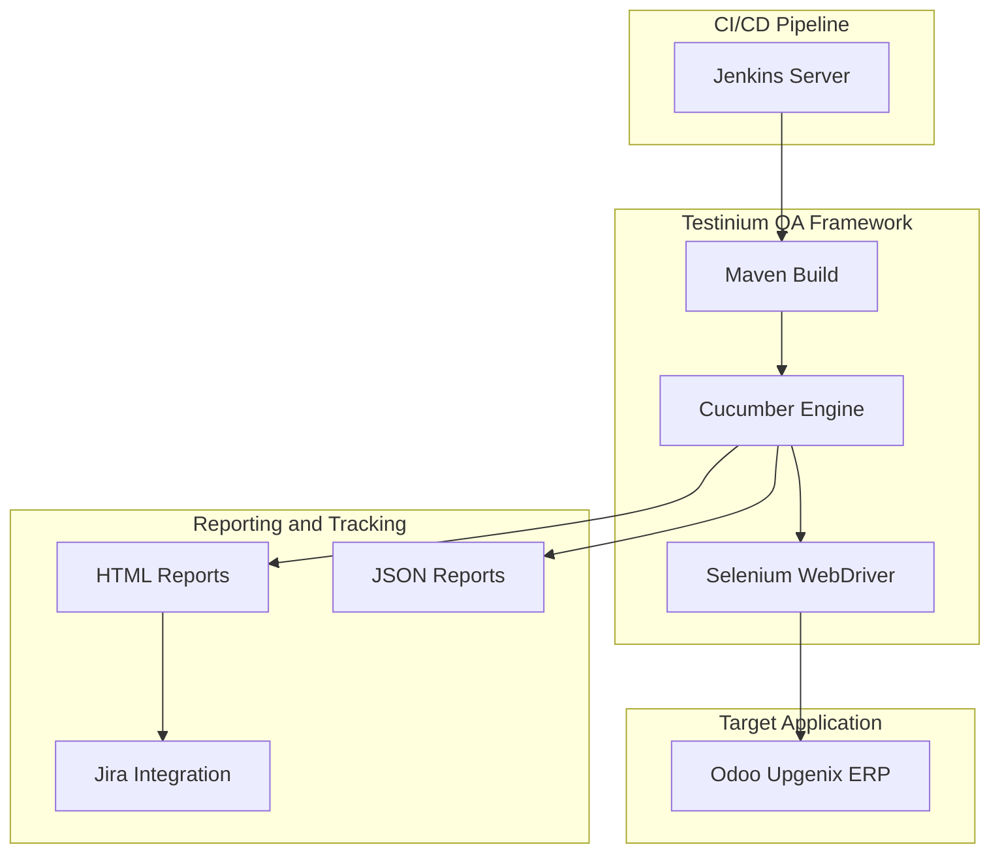
```mermaid
flowchart TB
    subgraph CICDPipeline["CI/CD Pipeline"]
        Jenkins["Jenkins Server"]
    end
    
    subgraph TestFramework["Testinium QA Framework"]
        Maven["Maven Build"]
        Cucumber["Cucumber Engine"]
        Selenium["Selenium WebDriver"]
    end
    
    subgraph Reporting["Reporting and Tracking"]
        HTMLReports["HTML Reports"]
        JSONReports["JSON Reports"]
        Jira["Jira Integration"]
    end
    
    subgraph TargetApp["Target Application"]
        OdooERP["Odoo Upgenix ERP"]
    end
    
    Jenkins --> Maven
    Maven --> Cucumber
    Cucumber --> Selenium
    Selenium --> OdooERP
    Cucumber --> HTMLReports
    Cucumber --> JSONReports
    HTMLReports --> Jira
```

### 1.2.2 High-Level Description

#### Primary System Capabilities

The Testinium-QA framework provides comprehensive test automation capabilities organized into distinct functional domains:

| Capability Domain | Description |
|-------------------|-------------|
| **Authentication Testing** | Validates login workflows including valid/invalid credentials, error message verification, and password masking |
| **Module Navigation** | Tests dashboard navigation and inter-module transitions |
| **CRUD Operations** | Verifies Create, Read, Update, Delete functionality across all ERP modules |
| **Drag-and-Drop Interactions** | Validates CRM pipeline stage transitions and Notes kanban board operations |
| **Session Management** | Tests logout workflows, session termination, and warning message verification |

#### Major System Components

The framework follows a layered architecture pattern with clear separation of concerns:

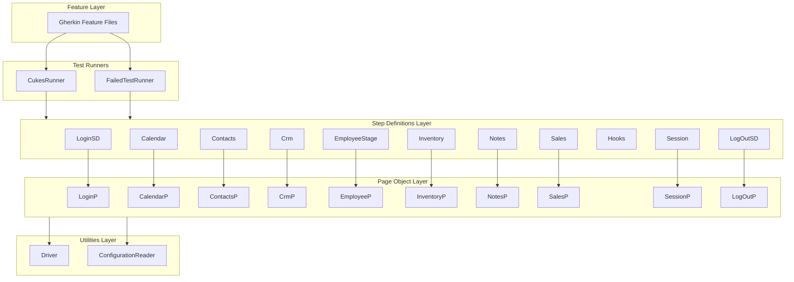
```mermaid
flowchart TB
    subgraph FeatureLayer["Feature Layer"]
        GherkinFeatures["Gherkin Feature Files"]
    end
    
    subgraph RunnerLayer["Test Runners"]
        CukesRunner["CukesRunner"]
        FailedRunner["FailedTestRunner"]
    end
    
    subgraph StepLayer["Step Definitions Layer"]
        LoginSD["LoginSD"]
        Calendar["Calendar"]
        Contacts["Contacts"]
        Crm["Crm"]
        EmployeeStage["EmployeeStage"]
        Inventory["Inventory"]
        Notes["Notes"]
        Sales["Sales"]
        Hooks["Hooks"]
        Session["Session"]
        LogOutSD["LogOutSD"]
    end
    
    subgraph PageLayer["Page Object Layer"]
        LoginP["LoginP"]
        CalendarP["CalendarP"]
        ContactsP["ContactsP"]
        CrmP["CrmP"]
        EmployeeP["EmployeeP"]
        InventoryP["InventoryP"]
        NotesP["NotesP"]
        SalesP["SalesP"]
        SessionP["SessionP"]
        LogOutP["LogOutP"]
    end
    
    subgraph UtilityLayer["Utilities Layer"]
        Driver["Driver"]
        ConfigReader["ConfigurationReader"]
    end
    
    GherkinFeatures --> CukesRunner
    GherkinFeatures --> FailedRunner
    CukesRunner --> StepLayer
    FailedRunner --> StepLayer
    LoginSD --> LoginP
    Calendar --> CalendarP
    Contacts --> ContactsP
    Crm --> CrmP
    EmployeeStage --> EmployeeP
    Inventory --> InventoryP
    Notes --> NotesP
    Sales --> SalesP
    Session --> SessionP
    LogOutSD --> LogOutP
    PageLayer --> Driver
    PageLayer --> ConfigReader
```

**Component Inventory:**

| Layer | Component Count | Location |
|-------|-----------------|----------|
| Page Objects | 10 classes | `src/main/java/com/testinium/pages/` |
| Step Definitions | 11 classes | `src/main/java/com/testinium/step_definitions/` |
| Test Runners | 2 classes | `src/main/java/com/testinium/runners/` |
| Utilities | 2 classes | `src/main/java/com/testinium/utilities/` |

#### Core Technical Approach

The framework employs industry-standard design patterns and practices:

**1. Page Object Model (POM)**
- Centralizes UI element locators within dedicated page classes
- Utilizes Selenium PageFactory for lazy element initialization
- Employs XPath-based locator strategy for element identification
- Provides maintainability through single-point-of-change for UI modifications

**2. Behavior-Driven Development (BDD)**
- Gherkin syntax enables human-readable test scenario authoring
- Step definitions bind natural language to Selenium automation actions
- Tag-based execution filtering supports targeted test runs (`@Smoke`, `@Dash`)

**3. Thread-Safe Parallel Execution**
- `InheritableThreadLocal<WebDriver>` ensures per-thread browser isolation
- Maven Surefire Plugin configured for method-level parallelism
- Unlimited thread pool maximizes concurrent execution capacity

**4. Externalized Configuration**
- `configuration.properties` file manages environment-specific settings
- Supports runtime configuration of browser, URL, and credentials
- Enables environment switching without code modifications

### 1.2.3 Success Criteria

#### Measurable Objectives

| Objective | Target Metric |
|-----------|---------------|
| **Test Coverage** | All critical user workflows across 7 ERP modules |
| **Execution Time** | Parallel execution reduces total runtime proportionally to thread count |
| **Report Generation** | 100% test runs produce HTML, JSON, and rerun artifacts |
| **Rerun Capability** | Failed tests captured in `rerun.txt` for immediate re-execution |

#### Critical Success Factors

- **Browser Compatibility**: Verified execution on Chrome and Firefox browsers via WebDriverManager
- **CI/CD Integration**: Seamless execution within Jenkins pipeline workflows
- **Defect Traceability**: Test outcomes linked to Jira tickets for issue tracking
- **Maintainability**: Page Object Model ensures localized UI change impact

#### Key Performance Indicators (KPIs)

| KPI | Description | Measurement Method |
|-----|-------------|-------------------|
| **Pass Rate** | Percentage of scenarios passing | Cucumber report summary |
| **Execution Duration** | Total test suite runtime | Maven Surefire timing |
| **Failure Recovery** | Successful rerun execution rate | FailedTestRunner outcomes |
| **Screenshot Capture** | Failure evidence availability | Hooks.java implementation |

---

## 1.3 Scope

### 1.3.1 In-Scope

#### Core Features and Functionalities

The Testinium-QA framework encompasses the following functional domains:

| Module | Capabilities |
|--------|--------------|
| **Login/Authentication** | Valid and invalid login scenarios, error message validation, password field masking verification |
| **Calendar/Meetings** | Day, Week, and Month view navigation; note creation and editing functionality |
| **Contacts** | Complete CRUD operations (Create, Read, Update, Delete) for contact management |
| **CRM** | Pipeline creation, drag-and-drop stage transitions, customer registration workflows |
| **Employees** | Employee record creation, editing, and department navigation |
| **Inventory** | Product creation, validation error handling |
| **Notes** | CRUD operations with kanban board drag-and-drop functionality |
| **Sales** | Customer creation, search functionality, state and country handling |
| **Logout** | Session termination, warning message verification |

#### Primary User Workflows

The framework validates the following end-to-end user workflows:

1. **Authentication Flow**: User login with valid credentials → Dashboard access → Module navigation → Logout
2. **Contact Management Flow**: Login → Navigate to Contacts → Create/Edit/Delete contact → Verify changes
3. **CRM Pipeline Flow**: Login → Access CRM → Create pipeline → Move opportunities through stages
4. **Inventory Management Flow**: Login → Navigate to Inventory → Create product → Handle validation
5. **Sales Processing Flow**: Login → Access Sales → Create customer → Configure location data

#### Implementation Boundaries

| Boundary Type | Coverage |
|---------------|----------|
| **System Boundaries** | Web browser UI layer of Odoo/Upgenix ERP application |
| **Supported Browsers** | Google Chrome, Mozilla Firefox (via WebDriverManager) |
| **User Groups** | PosManager, SalesManager personas |
| **Execution Environments** | Local development, Jenkins CI/CD pipeline |

#### Essential Integrations

| Integration Point | Purpose |
|-------------------|---------|
| **Jenkins** | Continuous integration and automated test execution |
| **Jira** | Defect tracking and test traceability |
| **Maven** | Build automation and dependency management |
| **WebDriverManager** | Automatic browser driver provisioning |

#### Report Outputs

| Output Type | Location | Purpose |
|-------------|----------|---------|
| **HTML Report** | `target/cucumber-reports.html` | Human-readable test results |
| **JSON Report** | `target/cucumber.json` | CI/CD integration and dashboards |
| **Rerun File** | `target/rerun.txt` | Failed scenario tracking |
| **Pretty Reports** | `target/cucumber/` | Enhanced HTML report bundle |

### 1.3.2 Out-of-Scope

The following capabilities are explicitly excluded from the current framework implementation:

#### Excluded Testing Types

| Exclusion | Rationale |
|-----------|-----------|
| **API/Backend Testing** | Framework focuses exclusively on UI layer automation |
| **Mobile Testing** | Web-only automation; no mobile device support |
| **Performance/Load Testing** | Functional testing scope; no load simulation capabilities |
| **Security Testing** | No penetration or vulnerability testing features |
| **Database Verification** | No direct database connection or validation |

#### Unsupported Configurations

| Exclusion | Status |
|-----------|--------|
| **Safari Browser** | Not configured in Driver.java |
| **Microsoft Edge** | Not configured in Driver.java |
| **Headless Execution** | Not currently implemented |
| **Cross-Browser Parallel** | Single browser type per execution |
| **Remote Grid Execution** | No Selenium Grid configuration |

#### Future Phase Considerations

| Potential Enhancement | Description |
|-----------------------|-------------|
| **Data-Driven Testing** | External data source integration (Excel, CSV, databases) |
| **Headless Mode** | Headless Chrome/Firefox for CI optimization |
| **Additional Browsers** | Edge, Safari browser support |
| **API Testing Layer** | REST API validation alongside UI tests |
| **Environment Provisioning** | Automated test environment setup |
| **Visual Regression** | Screenshot comparison testing |

#### Integration Points Not Covered

- Third-party integrations beyond the core Odoo/Upgenix ERP application
- External payment gateway testing
- Email notification verification
- Document generation and download validation
- Multi-tenant environment switching

---

## 1.4 Technology Stack Summary

The following table summarizes the complete technology stack employed by the Testinium-QA framework:

| Category | Technology | Version |
|----------|------------|---------|
| Programming Language | Java | 8 |
| Build Tool | Apache Maven | 4.0.0 (POM model) |
| Browser Automation | Selenium WebDriver | 3.141.59 |
| Driver Management | WebDriverManager | 5.1.0 |
| BDD Framework | Cucumber Java | 7.2.3 |
| Test Runner | Cucumber JUnit | 7.3.4 |
| Unit Test Framework | JUnit | 4.13.2 |
| Test Data Generation | JavaFaker | 1.0.2 |
| Reporting Plugin | Cucumber PrettyReports | 7.2.0 |
| Build Plugin | Maven Surefire | 3.0.0-M5 |
| CI/CD Platform | Jenkins | (integrated) |
| Issue Tracking | Jira | (integrated) |

---

## 1.5 Prerequisites

Successful execution of the Testinium-QA framework requires the following environment setup:

| Prerequisite | Minimum Version | Purpose |
|--------------|-----------------|---------|
| **JDK** | 1.8+ | Java runtime environment |
| **Apache Maven** | 3.x | Build and dependency management |
| **IntelliJ IDEA** | Latest | Recommended IDE |
| **Maven Plugin** | (IntelliJ) | Build integration |
| **Cucumber Plugin** | (IntelliJ) | Gherkin syntax support |
| **Chrome/Firefox** | Latest | Target browsers |

---

## 1.6 Execution Commands

The framework supports the following execution modes:

| Command | Purpose |
|---------|---------|
| `mvn test` | Execute tests with default configuration |
| `mvn test -Dcucumber.options="--plugin html:target/cucumber-reports.html"` | Custom HTML report generation |
| `mvn test -Dcucumber.options="--plugin rerun:target/rerun.txt"` | Generate rerun file for failed tests |

---

#### References

The following source files and folders were examined to compile this Introduction section:

- `README.md` - Project overview, tools, prerequisites, setup instructions, and usage examples
- `pom.xml` - Maven dependencies, build configuration, Java version, and plugin definitions
- `src/main/java/com/testinium/utilities/Driver.java` - WebDriver lifecycle management, thread-safety implementation, browser configuration
- `src/main/java/com/testinium/utilities/ConfigurationReader.java` - Configuration property loading mechanism
- `src/main/java/com/testinium/runners/CukesRunner.java` - Main test runner configuration, tag filtering, report plugin setup
- `src/main/java/com/testinium/runners/FailedTestRunner.java` - Failed test rerun configuration
- `src/main/java/com/testinium/pages/LoginP.java` - Page Object Model implementation example
- `src/main/java/com/testinium/step_definitions/Hooks.java` - Test lifecycle hooks, screenshot capture, driver cleanup
- `src/main/java/com/testinium/step_definitions/Session.java` - Reusable login step implementation
- `src/main/java/com/testinium/pages/` - Page Object classes (10 files)
- `src/main/java/com/testinium/step_definitions/` - Step Definition classes (11 files)
- `src/main/java/com/testinium/runners/` - Test Runner classes (2 files)
- `src/main/java/com/testinium/utilities/` - Utility classes (2 files)
- `target/cucumber/` - Generated report output directory

# 2. Product Requirements

## 2.1 Feature Catalog Overview

The Testinium-QA framework delivers comprehensive test automation capabilities organized into eleven discrete, testable features. Each feature addresses specific quality assurance requirements for the Odoo/Upgenix ERP system, enabling systematic validation of critical business workflows.

### 2.1.1 Feature Summary Matrix

| Feature ID | Feature Name | Category | Priority |
|------------|--------------|----------|----------|
| F-001 | Authentication/Login Testing | Security | Critical |
| F-002 | Calendar/Meetings Module Testing | ERP Module | Medium |
| F-003 | Contacts Module Testing | ERP Module | High |
| F-004 | CRM Module Testing | ERP Module | High |
| F-005 | Employees Module Testing | ERP Module | Medium |
| F-006 | Inventory/Products Module Testing | ERP Module | High |
| F-007 | Notes Module Testing | ERP Module | Medium |
| F-008 | Sales/Customers Module Testing | ERP Module | High |
| F-009 | Logout/Session Termination Testing | Security | High |
| F-010 | Test Execution & Reporting | Infrastructure | Critical |
| F-011 | Screenshot Capture on Failure | Infrastructure | High |

### 2.1.2 Feature Status Overview

| Feature ID | Status | Implementation Evidence |
|------------|--------|------------------------|
| F-001 | Completed | `LoginSD.java`, `LoginP.java` |
| F-002 | Completed | `Calendar.java`, `CalendarP.java` |
| F-003 | Completed | `Contacts.java`, `ContactsP.java` |
| F-004 | Completed | `Crm.java`, `CrmP.java` |
| F-005 | Completed | `EmployeeStage.java`, `EmployeeP.java` |
| F-006 | Completed | `Inventory.java`, `InventoryP.java` |
| F-007 | Completed | `Notes.java`, `NotesP.java` |
| F-008 | Completed | `Sales.java`, `SalesP.java` |
| F-009 | Completed | `LogOutSD.java`, `LogOutP.java` |
| F-010 | Completed | `CukesRunner.java`, `FailedTestRunner.java` |
| F-011 | Completed | `Hooks.java` |

---

## 2.2 Feature Specifications

### 2.2.1 F-001: Authentication/Login Testing

#### Feature Metadata

| Attribute | Value |
|-----------|-------|
| **Feature ID** | F-001 |
| **Feature Name** | Authentication/Login Testing |
| **Category** | Security |
| **Priority Level** | Critical |
| **Status** | Completed |

#### Description

**Overview:**
The Authentication/Login Testing feature validates login workflows for the Odoo/Upgenix ERP system, ensuring secure and functional access control mechanisms. This feature serves as the gateway for all subsequent module testing, verifying that users can successfully authenticate before accessing business functionality.

**Business Value:**
- Ensures only authorized users gain system access
- Validates security controls are functioning correctly
- Prevents regression of authentication functionality during releases
- Supports compliance requirements for access control verification

**User Benefits:**
- Confidence in login page functionality
- Validation of error handling for incorrect credentials
- Assurance that password fields maintain security through masking
- Verification of HTML5 form validation behavior

**Technical Context:**
The feature implements testing for two business personas (PosManager and SalesManager) using externalized credentials from `configuration.properties`. Tests leverage the `LoginP` and `SessionP` page objects for element locator management, ensuring maintainability when UI changes occur.

#### Dependencies

| Dependency Type | Description |
|-----------------|-------------|
| **System Dependencies** | WebDriver browser instance via `Driver.java` |
| **External Dependencies** | `configuration.properties` for URL and credentials |
| **Integration Requirements** | None (entry-point feature) |
| **Prerequisite Features** | None |

#### Functional Requirements

| Requirement ID | Description | Priority |
|----------------|-------------|----------|
| F-001-RQ-001 | Navigate to login URL from configuration | Must-Have |
| F-001-RQ-002 | Enter valid credentials for PosManager persona | Must-Have |
| F-001-RQ-003 | Enter valid credentials for SalesManager persona | Must-Have |
| F-001-RQ-004 | Verify dashboard title equals "Odoo" | Must-Have |
| F-001-RQ-005 | Verify invalid credentials display error alert | Must-Have |
| F-001-RQ-006 | Verify HTML5 validation message for empty fields | Should-Have |
| F-001-RQ-007 | Verify password field displays bullet masking | Should-Have |

#### Acceptance Criteria

| Requirement ID | Acceptance Criteria | Complexity |
|----------------|---------------------|------------|
| F-001-RQ-001 | Browser navigates to URL defined in `web.table.url` or `url` property | Low |
| F-001-RQ-002 | Successful login redirects to dashboard with title "Odoo" | Medium |
| F-001-RQ-003 | Both user personas can authenticate successfully | Medium |
| F-001-RQ-004 | `Assert.assertEquals` confirms page title matches expected value | Low |
| F-001-RQ-005 | Alert element displays error message text for failed login | Medium |
| F-001-RQ-006 | Input element's `validationMessage` equals "Please fill out this field" | Low |
| F-001-RQ-007 | Password input `type` attribute equals "password" | Low |

#### Technical Specifications

| Specification | Details |
|---------------|---------|
| **Input Parameters** | `username`, `password` from configuration |
| **Output/Response** | Dashboard page load, page title assertion |
| **Performance Criteria** | 10-second implicit wait for page load |
| **Data Requirements** | Valid credentials in `configuration.properties` |

#### Validation Rules

| Rule Category | Requirements |
|---------------|--------------|
| **Business Rules** | User must provide both username and password |
| **Data Validation** | HTML5 form validation for required fields |
| **Security Requirements** | Password must be masked in input field |
| **Compliance Requirements** | Test traceability via Jira tags (@UPGN-XXX) |

---

### 2.2.2 F-002: Calendar/Meetings Module Testing

#### Feature Metadata

| Attribute | Value |
|-----------|-------|
| **Feature ID** | F-002 |
| **Feature Name** | Calendar/Meetings Module Testing |
| **Category** | ERP Module |
| **Priority Level** | Medium |
| **Status** | Completed |

#### Description

**Overview:**
The Calendar/Meetings Module Testing feature validates the scheduling and event management functionality within the Odoo ERP Calendar module. Tests cover view navigation, event creation, and editing capabilities essential for organizational scheduling workflows.

**Business Value:**
- Ensures scheduling functionality operates correctly
- Validates critical calendar views (Day, Week, Month)
- Confirms event management workflows function as expected
- Supports productivity tool validation for business users

**User Benefits:**
- Reliable calendar view switching
- Consistent event creation experience
- Functional editing capabilities for schedule management
- Accurate date header display verification

**Technical Context:**
The feature utilizes `CalendarP` page object for element locators with explicit waits (2-second timeout) and strategic `Thread.sleep` calls for UI stabilization during modal interactions. Tests verify the page title "Meetings - Odoo" as a navigation confirmation mechanism.

#### Dependencies

| Dependency Type | Description |
|-----------------|-------------|
| **Prerequisite Features** | F-001 Authentication (Session login) |
| **System Dependencies** | WebDriverWait, Thread.sleep synchronization |
| **External Dependencies** | Calendar module availability in Odoo |
| **Integration Requirements** | Session state from successful login |

#### Functional Requirements

| Requirement ID | Description | Priority |
|----------------|-------------|----------|
| F-002-RQ-001 | Navigate to Calendar module from dashboard | Must-Have |
| F-002-RQ-002 | Verify page title equals "Meetings - Odoo" | Must-Have |
| F-002-RQ-003 | Switch to Day view and verify display | Should-Have |
| F-002-RQ-004 | Switch to Week view and verify display | Should-Have |
| F-002-RQ-005 | Switch to Month view and verify display | Should-Have |
| F-002-RQ-006 | Create new note/event on calendar grid | Must-Have |
| F-002-RQ-007 | Edit existing note/event | Must-Have |
| F-002-RQ-008 | Verify date header format attributes | Could-Have |

#### Acceptance Criteria

| Requirement ID | Acceptance Criteria | Complexity |
|----------------|---------------------|------------|
| F-002-RQ-001 | Calendar module loads after clicking navigation element | Medium |
| F-002-RQ-002 | Page title assertion passes with expected string | Low |
| F-002-RQ-003 | Day view displays single-day calendar grid | Medium |
| F-002-RQ-004 | Week view displays 7-day calendar grid | Medium |
| F-002-RQ-005 | Month view displays full month calendar grid | Medium |
| F-002-RQ-006 | Modal dialog opens, summary entered, event saved | High |
| F-002-RQ-007 | Existing event opens for editing, changes persist | High |
| F-002-RQ-008 | Date header contains day/month/year attributes | Low |

#### Technical Specifications

| Specification | Details |
|---------------|---------|
| **Input Parameters** | Event summary text, calendar cell selection |
| **Output/Response** | Event creation confirmation, view state change |
| **Performance Criteria** | 2-second explicit wait timeout |
| **Data Requirements** | Authenticated session, calendar access permissions |

---

### 2.2.3 F-003: Contacts Module Testing

#### Feature Metadata

| Attribute | Value |
|-----------|-------|
| **Feature ID** | F-003 |
| **Feature Name** | Contacts Module Testing |
| **Category** | ERP Module |
| **Priority Level** | High |
| **Status** | Completed |

#### Description

**Overview:**
The Contacts Module Testing feature provides comprehensive CRUD (Create, Read, Update, Delete) operation validation for the Odoo Contacts module. This feature ensures complete lifecycle management of contact records within the ERP system.

**Business Value:**
- Validates critical customer/contact data management
- Ensures data integrity through CRUD operation testing
- Supports CRM data quality requirements
- Verifies business-critical contact workflows

**User Benefits:**
- Reliable contact creation with all field types
- Consistent contact listing and search functionality
- Functional edit and update capabilities
- Proper delete operation with Action dropdown workflow

**Technical Context:**
The feature implements 20-second explicit WebDriverWait for complex form operations and 3-second Thread.sleep for UI synchronization. The `ContactsP` page object manages locators for contact forms, kanban cards, and action dropdown menus.

#### Dependencies

| Dependency Type | Description |
|-----------------|-------------|
| **Prerequisite Features** | F-001 Authentication (Session login) |
| **System Dependencies** | Extended WebDriverWait (20s), Thread.sleep |
| **External Dependencies** | Contacts module availability |
| **Integration Requirements** | Authenticated session state |

#### Functional Requirements

| Requirement ID | Description | Priority |
|----------------|-------------|----------|
| F-003-RQ-001 | Navigate to Contacts module | Must-Have |
| F-003-RQ-002 | Create new contact with name field | Must-Have |
| F-003-RQ-003 | Enter street address information | Should-Have |
| F-003-RQ-004 | Enter phone number | Should-Have |
| F-003-RQ-005 | Enter email address | Should-Have |
| F-003-RQ-006 | List contacts and select profile | Must-Have |
| F-003-RQ-007 | Edit existing contact record | Must-Have |
| F-003-RQ-008 | Delete contact via Action dropdown | Must-Have |
| F-003-RQ-009 | Verify contact deletion success | Must-Have |
| F-003-RQ-010 | Execute Print/Due payments workflow | Could-Have |

#### Acceptance Criteria

| Requirement ID | Acceptance Criteria | Complexity |
|----------------|---------------------|------------|
| F-003-RQ-001 | Contacts module page loads successfully | Low |
| F-003-RQ-002 | Contact created and visible in listing | High |
| F-003-RQ-003 | Street field accepts and displays input | Low |
| F-003-RQ-004 | Phone field accepts numeric input | Low |
| F-003-RQ-005 | Email field accepts valid email format | Low |
| F-003-RQ-006 | Kanban card selection opens profile view | Medium |
| F-003-RQ-007 | Changes persist after edit operation | High |
| F-003-RQ-008 | Action dropdown > Delete removes record | High |
| F-003-RQ-009 | Assertion confirms contact no longer listed | Medium |
| F-003-RQ-010 | Print workflow initiates successfully | Medium |

#### Technical Specifications

| Specification | Details |
|---------------|---------|
| **Input Parameters** | Contact name, street, phone, email |
| **Output/Response** | Contact record creation, listing update |
| **Performance Criteria** | 20-second explicit wait, 3-second UI sync |
| **Data Requirements** | Form field values, authenticated session |

---

### 2.2.4 F-004: CRM Module Testing

#### Feature Metadata

| Attribute | Value |
|-----------|-------|
| **Feature ID** | F-004 |
| **Feature Name** | CRM Module Testing |
| **Category** | ERP Module |
| **Priority Level** | High |
| **Status** | Completed |

#### Description

**Overview:**
The CRM Module Testing feature validates pipeline management, customer relationships, and opportunity tracking within the Odoo CRM module. This feature includes advanced drag-and-drop testing for kanban-style pipeline stage transitions.

**Business Value:**
- Ensures sales pipeline functionality operates correctly
- Validates revenue tracking and opportunity management
- Supports sales team productivity tool verification
- Confirms drag-and-drop workflow critical for pipeline management

**User Benefits:**
- Reliable pipeline/opportunity creation
- Accurate expected revenue configuration
- Functional drag-and-drop stage transitions
- Consistent customer lookup and registration

**Technical Context:**
The feature employs Selenium Actions API for drag-and-drop interactions, enabling pipeline stage transitions on the kanban board. Parameterized scenario outlines support data-driven pipeline editing tests. Hard-coded test values ("test", "8" for revenue) are used in creation workflows.

#### Dependencies

| Dependency Type | Description |
|-----------------|-------------|
| **Prerequisite Features** | F-001 Authentication (Session login) |
| **System Dependencies** | Selenium Actions API, 2-second WebDriverWait |
| **External Dependencies** | CRM module availability |
| **Integration Requirements** | Authenticated session, customer data |

#### Functional Requirements

| Requirement ID | Description | Priority |
|----------------|-------------|----------|
| F-004-RQ-001 | Navigate to CRM module | Must-Have |
| F-004-RQ-002 | Create new pipeline/opportunity | Must-Have |
| F-004-RQ-003 | Lookup and select existing customer | Must-Have |
| F-004-RQ-004 | Configure expected revenue value | Must-Have |
| F-004-RQ-005 | Set priority level for opportunity | Should-Have |
| F-004-RQ-006 | Verify total price calculation | Must-Have |
| F-004-RQ-007 | Edit pipeline information (parameterized) | Should-Have |
| F-004-RQ-008 | Drag-and-drop stage transition | Must-Have |
| F-004-RQ-009 | Register new customer from CRM | Should-Have |
| F-004-RQ-010 | Print profile/due payments | Could-Have |

#### Acceptance Criteria

| Requirement ID | Acceptance Criteria | Complexity |
|----------------|---------------------|------------|
| F-004-RQ-001 | CRM module page loads with pipeline view | Low |
| F-004-RQ-002 | New opportunity appears in pipeline | High |
| F-004-RQ-003 | Customer autocomplete returns matches | Medium |
| F-004-RQ-004 | Revenue field accepts numeric input | Low |
| F-004-RQ-005 | Priority stars configured correctly | Low |
| F-004-RQ-006 | `Assert.assertEquals` confirms total price | Medium |
| F-004-RQ-007 | Parameterized data updates pipeline | High |
| F-004-RQ-008 | Card moves between kanban columns via Actions API | High |
| F-004-RQ-009 | New customer record created from CRM context | High |
| F-004-RQ-010 | Print workflow initiates successfully | Medium |

#### Technical Specifications

| Specification | Details |
|---------------|---------|
| **Input Parameters** | Opportunity name, customer, revenue, priority |
| **Output/Response** | Pipeline creation, stage transition |
| **Performance Criteria** | 2-second wait, Thread.sleep(2000) for drag-drop |
| **Data Requirements** | Customer records, authenticated session |

#### Validation Rules

| Rule Category | Requirements |
|---------------|--------------|
| **Business Rules** | Revenue must be numeric value |
| **Data Validation** | Customer lookup returns valid records |
| **Security Requirements** | CRM access requires authenticated session |
| **Compliance Requirements** | Jira traceability tags applied |

---

### 2.2.5 F-005: Employees Module Testing

#### Feature Metadata

| Attribute | Value |
|-----------|-------|
| **Feature ID** | F-005 |
| **Feature Name** | Employees Module Testing |
| **Category** | ERP Module |
| **Priority Level** | Medium |
| **Status** | Completed |

#### Description

**Overview:**
The Employees Module Testing feature validates workforce management functionality within the Odoo HR/Employees module. Tests cover employee record management and navigation to related submodules including Badges, Challenges, Goals, and Departments.

**Business Value:**
- Ensures HR module functionality operates correctly
- Validates employee data management workflows
- Supports organizational structure verification
- Confirms gamification features (Badges, Challenges, Goals)

**User Benefits:**
- Reliable employee record creation
- Functional edit capabilities for employee data
- Accessible department navigation
- Proper confirmation messages for operations

**Technical Context:**
The feature includes a helper login method within `EmployeeP` page object for streamlined authentication. Title-based page verification confirms successful navigation to different submodules ("Employees - Odoo", "Departments - Odoo").

#### Dependencies

| Dependency Type | Description |
|-----------------|-------------|
| **Prerequisite Features** | F-001 Authentication (via EmployeeP helper) |
| **System Dependencies** | Explicit waits, Thread.sleep synchronization |
| **External Dependencies** | Employees module availability |
| **Integration Requirements** | Authenticated session state |

#### Functional Requirements

| Requirement ID | Description | Priority |
|----------------|-------------|----------|
| F-005-RQ-001 | Navigate to Employees module | Must-Have |
| F-005-RQ-002 | Verify page title "Employees - Odoo" | Must-Have |
| F-005-RQ-003 | Create new employee with name parameter | Must-Have |
| F-005-RQ-004 | Edit existing employee name | Should-Have |
| F-005-RQ-005 | Navigate to Badges submodule | Should-Have |
| F-005-RQ-006 | Navigate to Challenges submodule | Should-Have |
| F-005-RQ-007 | Navigate to Goals submodule | Should-Have |
| F-005-RQ-008 | Navigate to Departments submodule | Should-Have |
| F-005-RQ-009 | Verify "Note created" confirmation | Must-Have |

#### Acceptance Criteria

| Requirement ID | Acceptance Criteria | Complexity |
|----------------|---------------------|------------|
| F-005-RQ-001 | Employees module loads successfully | Low |
| F-005-RQ-002 | Title assertion passes with expected value | Low |
| F-005-RQ-003 | Employee created with parameterized name | Medium |
| F-005-RQ-004 | Name modification persists after save | Medium |
| F-005-RQ-005 | Badges page loads successfully | Low |
| F-005-RQ-006 | Challenges page loads successfully | Low |
| F-005-RQ-007 | Goals page loads successfully | Low |
| F-005-RQ-008 | Title equals "Departments - Odoo" | Low |
| F-005-RQ-009 | Confirmation element `isDisplayed()` returns true | Low |

#### Technical Specifications

| Specification | Details |
|---------------|---------|
| **Input Parameters** | Employee name (parameterized) |
| **Output/Response** | Employee record creation, confirmation display |
| **Performance Criteria** | Standard explicit waits |
| **Data Requirements** | Authenticated session, module permissions |

---

### 2.2.6 F-006: Inventory/Products Module Testing

#### Feature Metadata

| Attribute | Value |
|-----------|-------|
| **Feature ID** | F-006 |
| **Feature Name** | Inventory/Products Module Testing |
| **Category** | ERP Module |
| **Priority Level** | High |
| **Status** | Completed |

#### Description

**Overview:**
The Inventory/Products Module Testing feature validates product management functionality within the Odoo Inventory module. Tests cover product creation workflows and validation error handling for required field enforcement.

**Business Value:**
- Ensures inventory management operates correctly
- Validates product data integrity requirements
- Supports supply chain workflow verification
- Confirms required-field validation mechanisms

**User Benefits:**
- Reliable product creation workflow
- Clear validation error messaging
- Functional navigation to Products submodule
- Confirmation of created product visibility

**Technical Context:**
The feature implements 20-second explicit WebDriverWait for complex operations. Product name entry uses hard-coded value ("IBM") with visibility checks via `isDisplayed()` method. Validation errors display through the notification manager component.

#### Dependencies

| Dependency Type | Description |
|-----------------|-------------|
| **Prerequisite Features** | F-001 Authentication (Session login) |
| **System Dependencies** | Extended WebDriverWait (20s) |
| **External Dependencies** | Inventory module availability |
| **Integration Requirements** | Authenticated session state |

#### Functional Requirements

| Requirement ID | Description | Priority |
|----------------|-------------|----------|
| F-006-RQ-001 | Navigate to Inventory module | Must-Have |
| F-006-RQ-002 | Navigate to Products submodule | Must-Have |
| F-006-RQ-003 | Verify page title "Products - Odoo" | Must-Have |
| F-006-RQ-004 | Initiate product creation workflow | Must-Have |
| F-006-RQ-005 | Trigger required-field validation error | Must-Have |
| F-006-RQ-006 | Enter product name ("IBM") | Must-Have |
| F-006-RQ-007 | Verify created product visibility | Must-Have |

#### Acceptance Criteria

| Requirement ID | Acceptance Criteria | Complexity |
|----------------|---------------------|------------|
| F-006-RQ-001 | Inventory module loads successfully | Low |
| F-006-RQ-002 | Products submodule accessible from Inventory | Low |
| F-006-RQ-003 | Title equality check passes | Low |
| F-006-RQ-004 | Create product form opens | Medium |
| F-006-RQ-005 | Notification manager displays validation error | Medium |
| F-006-RQ-006 | Product name field accepts input | Low |
| F-006-RQ-007 | `isDisplayed()` returns true for product | Medium |

#### Technical Specifications

| Specification | Details |
|---------------|---------|
| **Input Parameters** | Product name ("IBM" hard-coded) |
| **Output/Response** | Product creation, validation error display |
| **Performance Criteria** | 20-second explicit wait timeout |
| **Data Requirements** | Authenticated session, inventory permissions |

---

### 2.2.7 F-007: Notes Module Testing

#### Feature Metadata

| Attribute | Value |
|-----------|-------|
| **Feature ID** | F-007 |
| **Feature Name** | Notes Module Testing |
| **Category** | ERP Module |
| **Priority Level** | Medium |
| **Status** | Completed |

#### Description

**Overview:**
The Notes Module Testing feature validates note management and kanban board functionality within the Odoo Notes module. Tests include CRUD operations and drag-and-drop interactions for moving notes between kanban columns.

**Business Value:**
- Ensures note-taking functionality operates correctly
- Validates kanban workflow management
- Supports personal productivity tool verification
- Confirms tag-based categorization

**User Benefits:**
- Reliable note creation with tags
- Rich-text description support
- Functional drag-and-drop between columns
- Proper confirmation messages

**Technical Context:**
The feature employs Selenium Actions API for drag-and-drop between kanban columns ("New" to "Today"). Tags autocomplete input supports "New Tag" creation. The implementation reuses `InventoryP.saveBtn` for note editing operations.

#### Dependencies

| Dependency Type | Description |
|-----------------|-------------|
| **Prerequisite Features** | F-001 Authentication (Session login) |
| **System Dependencies** | Selenium Actions API, standard waits |
| **External Dependencies** | Notes module availability |
| **Integration Requirements** | Authenticated session state |
| **Shared Components** | `InventoryP.saveBtn` for edit saving |

#### Functional Requirements

| Requirement ID | Description | Priority |
|----------------|-------------|----------|
| F-007-RQ-001 | Navigate to Notes module | Must-Have |
| F-007-RQ-002 | Create new note with tag ("New Tag") | Must-Have |
| F-007-RQ-003 | Enter rich-text description | Should-Have |
| F-007-RQ-004 | Verify "Note created" confirmation | Must-Have |
| F-007-RQ-005 | List notes and verify visibility | Must-Have |
| F-007-RQ-006 | Edit existing note | Should-Have |
| F-007-RQ-007 | Drag note from "New" to "Today" column | Must-Have |

#### Acceptance Criteria

| Requirement ID | Acceptance Criteria | Complexity |
|----------------|---------------------|------------|
| F-007-RQ-001 | Notes module loads successfully | Low |
| F-007-RQ-002 | Note created with tag visible | High |
| F-007-RQ-003 | Rich-text body accepts formatted input | Medium |
| F-007-RQ-004 | Confirmation element displayed | Low |
| F-007-RQ-005 | Notes appear in listing view | Low |
| F-007-RQ-006 | Edit changes persist via InventoryP.saveBtn | Medium |
| F-007-RQ-007 | Note moves to "Today" column via Actions API | High |

#### Technical Specifications

| Specification | Details |
|---------------|---------|
| **Input Parameters** | Note content, tags, column target |
| **Output/Response** | Note creation, column transition |
| **Performance Criteria** | Standard wait timeouts |
| **Data Requirements** | Authenticated session, note data |

---

### 2.2.8 F-008: Sales/Customers Module Testing

#### Feature Metadata

| Attribute | Value |
|-----------|-------|
| **Feature ID** | F-008 |
| **Feature Name** | Sales/Customers Module Testing |
| **Category** | ERP Module |
| **Priority Level** | High |
| **Status** | Completed |

#### Description

**Overview:**
The Sales/Customers Module Testing feature validates customer management within the Odoo Sales module. Tests cover customer creation, search functionality, and geographic data configuration through state/country dialogs.

**Business Value:**
- Ensures sales customer management operates correctly
- Validates customer data integrity
- Supports sales workflow verification
- Confirms geographic configuration capabilities

**User Benefits:**
- Reliable customer creation workflow
- Functional search and filtering
- State/Country creation via dialog
- Kanban card verification for customer records

**Technical Context:**
The feature implements title assertion logic for navigation verification. Customer forms support generated numeric IDs for unique test data. The "Create and Edit..." dialog flow enables state/country data creation within the customer context.

#### Dependencies

| Dependency Type | Description |
|-----------------|-------------|
| **Prerequisite Features** | F-001 Authentication (Session login) |
| **System Dependencies** | Standard WebDriverWait |
| **External Dependencies** | Sales module availability |
| **Integration Requirements** | Authenticated session state |

#### Functional Requirements

| Requirement ID | Description | Priority |
|----------------|-------------|----------|
| F-008-RQ-001 | Navigate to Sales module | Must-Have |
| F-008-RQ-002 | Access Customers submodule | Must-Have |
| F-008-RQ-003 | Create new customer with form fields | Must-Have |
| F-008-RQ-004 | Create state via dialog workflow | Should-Have |
| F-008-RQ-005 | Create country via dialog workflow | Should-Have |
| F-008-RQ-006 | Search for customer by criteria | Must-Have |
| F-008-RQ-007 | Verify customer kanban card display | Must-Have |
| F-008-RQ-008 | Capture warning/notification messages | Should-Have |

#### Acceptance Criteria

| Requirement ID | Acceptance Criteria | Complexity |
|----------------|---------------------|------------|
| F-008-RQ-001 | Sales module loads successfully | Low |
| F-008-RQ-002 | Customers submodule accessible | Low |
| F-008-RQ-003 | Customer created with generated ID | High |
| F-008-RQ-004 | State created via "Create and Edit..." dialog | High |
| F-008-RQ-005 | Country created via dialog workflow | High |
| F-008-RQ-006 | Search bar returns matching results | Medium |
| F-008-RQ-007 | List<WebElement> iteration finds customer card | Medium |
| F-008-RQ-008 | Warning text captured for verification | Low |

#### Technical Specifications

| Specification | Details |
|---------------|---------|
| **Input Parameters** | Customer name, address, state, country |
| **Output/Response** | Customer creation, search results |
| **Performance Criteria** | Standard explicit waits |
| **Data Requirements** | Form field values, geographic data |

---

### 2.2.9 F-009: Logout/Session Termination Testing

#### Feature Metadata

| Attribute | Value |
|-----------|-------|
| **Feature ID** | F-009 |
| **Feature Name** | Logout/Session Termination Testing |
| **Category** | Security |
| **Priority Level** | High |
| **Status** | Completed |

#### Description

**Overview:**
The Logout/Session Termination Testing feature validates session management and secure logout functionality within the Odoo application. Tests ensure proper session cleanup and redirect behavior after logout operations.

**Business Value:**
- Ensures secure session termination
- Validates proper redirect after logout
- Supports security compliance requirements
- Confirms warning message behavior for navigation

**User Benefits:**
- Reliable logout functionality
- Secure session cleanup
- Clear redirect to login page
- Warning verification for back-navigation attempts

**Technical Context:**
The feature accesses the account popup menu to trigger logout actions. Title assertions verify redirect to the login page ("Login | Best solution for startups"). Back-navigation warning dialog verification ensures proper session state handling.

#### Dependencies

| Dependency Type | Description |
|-----------------|-------------|
| **Prerequisite Features** | F-001 Authentication (active session required) |
| **System Dependencies** | Standard WebDriver interactions |
| **External Dependencies** | None |
| **Integration Requirements** | Active authenticated session |

#### Functional Requirements

| Requirement ID | Description | Priority |
|----------------|-------------|----------|
| F-009-RQ-001 | Access account popup menu | Must-Have |
| F-009-RQ-002 | Execute logout action | Must-Have |
| F-009-RQ-003 | Verify redirect to login page | Must-Have |
| F-009-RQ-004 | Verify login page title | Must-Have |
| F-009-RQ-005 | Verify back-navigation warning | Should-Have |

#### Acceptance Criteria

| Requirement ID | Acceptance Criteria | Complexity |
|----------------|---------------------|------------|
| F-009-RQ-001 | Popup menu opens successfully | Low |
| F-009-RQ-002 | Logout link/button clicks successfully | Low |
| F-009-RQ-003 | Browser redirects to login URL | Medium |
| F-009-RQ-004 | Title equals "Login \| Best solution for startups" | Low |
| F-009-RQ-005 | Warning dialog body displays expected text | Medium |

#### Technical Specifications

| Specification | Details |
|---------------|---------|
| **Input Parameters** | None (action-based) |
| **Output/Response** | Login page redirect, warning dialog |
| **Performance Criteria** | Standard implicit waits |
| **Data Requirements** | Active authenticated session |

---

### 2.2.10 F-010: Test Execution & Reporting

#### Feature Metadata

| Attribute | Value |
|-----------|-------|
| **Feature ID** | F-010 |
| **Feature Name** | Test Execution & Reporting |
| **Category** | Infrastructure |
| **Priority Level** | Critical |
| **Status** | Completed |

#### Description

**Overview:**
The Test Execution & Reporting feature provides the infrastructure for running automated tests and generating comprehensive reports. This feature encompasses tag-based execution filtering, parallel test execution, and multi-format report generation.

**Business Value:**
- Enables selective test execution via tags
- Maximizes resource utilization through parallelism
- Provides stakeholder visibility via rich reports
- Supports CI/CD integration requirements

**User Benefits:**
- Tag-based test filtering (@Smoke, @Dash)
- Multiple report format options
- Failed test rerun capability
- Jira test traceability

**Technical Context:**
The feature is implemented through `CukesRunner.java` and `FailedTestRunner.java` with Maven Surefire Plugin configuration for parallel execution. Report outputs include HTML, JSON, rerun.txt, and PrettyReports bundle in the target directory.

#### Dependencies

| Dependency Type | Description |
|-----------------|-------------|
| **System Dependencies** | Maven Surefire Plugin 3.0.0-M5 |
| **External Dependencies** | cucumber-junit 7.3.4, reporting-plugin 7.2.0 |
| **Integration Requirements** | Jenkins CI/CD, Jira traceability |
| **Prerequisite Features** | None (infrastructure feature) |

#### Functional Requirements

| Requirement ID | Description | Priority |
|----------------|-------------|----------|
| F-010-RQ-001 | Execute tests by tag filter (@Smoke) | Must-Have |
| F-010-RQ-002 | Generate HTML report | Must-Have |
| F-010-RQ-003 | Generate JSON report | Must-Have |
| F-010-RQ-004 | Generate rerun.txt for failures | Must-Have |
| F-010-RQ-005 | Generate PrettyReports bundle | Should-Have |
| F-010-RQ-006 | Execute failed test rerun | Must-Have |
| F-010-RQ-007 | Support parallel execution | Must-Have |
| F-010-RQ-008 | Enable Jira traceability tags | Should-Have |

#### Acceptance Criteria

| Requirement ID | Acceptance Criteria | Complexity |
|----------------|---------------------|------------|
| F-010-RQ-001 | Only @Smoke scenarios execute | Medium |
| F-010-RQ-002 | `target/cucumber-reports.html` generated | Low |
| F-010-RQ-003 | `target/cucumber.json` generated | Low |
| F-010-RQ-004 | `target/rerun.txt` captures failed scenarios | Medium |
| F-010-RQ-005 | `target/cucumber/` contains report bundle | Low |
| F-010-RQ-006 | FailedTestRunner executes rerun.txt scenarios | High |
| F-010-RQ-007 | Tests execute in parallel threads | High |
| F-010-RQ-008 | @UPGN-XXX tags link to Jira tickets | Low |

#### Technical Specifications

| Specification | Details |
|---------------|---------|
| **Input Parameters** | Tag expressions, feature paths |
| **Output/Response** | Report files, execution status |
| **Performance Criteria** | Unlimited parallel threads, method-level execution |
| **Data Requirements** | Feature files in `src/main/resources/features` |

#### Configuration Details

| Configuration | Value |
|---------------|-------|
| **Glue Path** | `com/testinium/step_definitions` |
| **Feature Path** | `src/main/resources/features` |
| **Include Pattern** | `**/CukesRunner*.java` |
| **Parallel Mode** | methods |
| **Thread Count** | Unlimited (parallel=true) |
| **testFailureIgnore** | true |

---

### 2.2.11 F-011: Screenshot Capture on Failure

#### Feature Metadata

| Attribute | Value |
|-----------|-------|
| **Feature ID** | F-011 |
| **Feature Name** | Screenshot Capture on Failure |
| **Category** | Infrastructure |
| **Priority Level** | High |
| **Status** | Completed |

#### Description

**Overview:**
The Screenshot Capture on Failure feature provides automatic visual evidence collection when test scenarios fail. This feature enhances debugging capabilities by capturing browser state at the moment of failure.

**Business Value:**
- Accelerates defect diagnosis
- Provides visual evidence for failure analysis
- Supports debugging efficiency
- Enhances test report value with embedded screenshots

**User Benefits:**
- Automatic screenshot capture without manual intervention
- Screenshots embedded directly in Cucumber reports
- Visual context for failure analysis
- Consistent evidence collection across all scenarios

**Technical Context:**
The feature is implemented in `Hooks.java` using Cucumber's `@After` hook annotation. Screenshots are captured as PNG byte arrays via Selenium's `TakesScreenshot` interface and attached to scenarios using `scenario.attach()`. Post-scenario cleanup invokes `Driver.closeDriver()` for session management.

#### Dependencies

| Dependency Type | Description |
|-----------------|-------------|
| **System Dependencies** | TakesScreenshot interface, Cucumber hooks |
| **External Dependencies** | WebDriver instance via Driver.java |
| **Integration Requirements** | Cucumber scenario context |
| **Prerequisite Features** | None (infrastructure feature) |

#### Functional Requirements

| Requirement ID | Description | Priority |
|----------------|-------------|----------|
| F-011-RQ-001 | Detect scenario failure status | Must-Have |
| F-011-RQ-002 | Capture screenshot as PNG byte array | Must-Have |
| F-011-RQ-003 | Attach screenshot to scenario report | Must-Have |
| F-011-RQ-004 | Execute post-scenario driver cleanup | Must-Have |

#### Acceptance Criteria

| Requirement ID | Acceptance Criteria | Complexity |
|----------------|---------------------|------------|
| F-011-RQ-001 | `scenario.isFailed()` correctly identifies failures | Low |
| F-011-RQ-002 | `OutputType.BYTES` produces valid PNG data | Low |
| F-011-RQ-003 | `scenario.attach()` embeds screenshot in report | Medium |
| F-011-RQ-004 | `Driver.closeDriver()` terminates browser session | Low |

#### Technical Specifications

| Specification | Details |
|---------------|---------|
| **Input Parameters** | Scenario execution context |
| **Output/Response** | PNG screenshot embedded in report |
| **Performance Criteria** | Minimal overhead on test execution |
| **Data Requirements** | Active WebDriver session at failure point |

---

## 2.3 Feature Relationships

### 2.3.1 Feature Dependency Map

The following diagram illustrates the dependencies between features within the Testinium-QA framework:

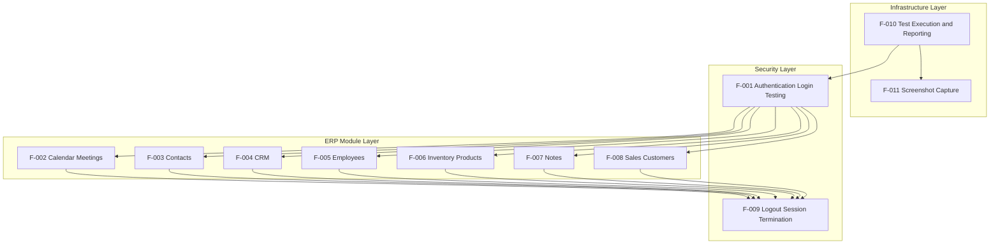
```mermaid
flowchart TB
    subgraph InfrastructureLayer["Infrastructure Layer"]
        F010["F-010 Test Execution and Reporting"]
        F011["F-011 Screenshot Capture"]
    end
    
    subgraph SecurityLayer["Security Layer"]
        F001["F-001 Authentication Login Testing"]
        F009["F-009 Logout Session Termination"]
    end
    
    subgraph ERPModuleLayer["ERP Module Layer"]
        F002["F-002 Calendar Meetings"]
        F003["F-003 Contacts"]
        F004["F-004 CRM"]
        F005["F-005 Employees"]
        F006["F-006 Inventory Products"]
        F007["F-007 Notes"]
        F008["F-008 Sales Customers"]
    end
    
    F010 --> F001
    F010 --> F011
    
    F001 --> F002
    F001 --> F003
    F001 --> F004
    F001 --> F005
    F001 --> F006
    F001 --> F007
    F001 --> F008
    
    F002 --> F009
    F003 --> F009
    F004 --> F009
    F005 --> F009
    F006 --> F009
    F007 --> F009
    F008 --> F009
```

### 2.3.2 Dependency Matrix

| Feature | Depends On | Required By |
|---------|------------|-------------|
| F-001 | F-010 | F-002, F-003, F-004, F-005, F-006, F-007, F-008, F-009 |
| F-002 | F-001 | F-009 |
| F-003 | F-001 | F-009 |
| F-004 | F-001 | F-009 |
| F-005 | F-001 | F-009 |
| F-006 | F-001 | F-009 |
| F-007 | F-001, F-006 (saveBtn) | F-009 |
| F-008 | F-001 | F-009 |
| F-009 | F-001 | None |
| F-010 | None | All features |
| F-011 | F-010 | All features (implicit) |

### 2.3.3 Integration Points

The following integration points connect features within the framework:

| Integration Point | Features Involved | Description |
|-------------------|-------------------|-------------|
| Session State | F-001 → All ERP Modules | Login creates session consumed by all modules |
| Driver Instance | All Features | Shared WebDriver via Driver.java ThreadLocal |
| Configuration | All Features | ConfigurationReader provides URL/credentials |
| Report Generation | F-010 → All Features | Execution results flow to reporting |
| Screenshot Attachment | F-011 → All Features | Failure evidence attached to any scenario |

### 2.3.4 Shared Components

| Component | Location | Used By Features |
|-----------|----------|------------------|
| `Driver.java` | `utilities/` | All features |
| `ConfigurationReader.java` | `utilities/` | F-001, F-010 |
| `Hooks.java` | `step_definitions/` | All features (via @After) |
| `Session.java` | `step_definitions/` | F-002, F-003, F-004, F-006, F-007, F-008 |
| `InventoryP.saveBtn` | `pages/` | F-006, F-007 |

### 2.3.5 Common Services

| Service | Provider | Consumers |
|---------|----------|-----------|
| WebDriver Lifecycle | Driver.java | All page objects, step definitions |
| Configuration Access | ConfigurationReader.java | Login, Test Execution |
| Scenario Hooks | Hooks.java | All scenarios (screenshot, cleanup) |
| Login Workflow | Session.java | All ERP module step definitions |

---

## 2.4 Implementation Considerations

### 2.4.1 Technical Constraints

| Constraint | Description | Impact |
|------------|-------------|--------|
| **Java 8 Compatibility** | Framework requires JDK 1.8+ | Limits language feature usage |
| **Selenium 3.x** | Uses Selenium WebDriver 3.141.59 | W3C WebDriver compliance limitations |
| **XPath Locators** | Heavy reliance on XPath strategy | Brittle to DOM structure changes |
| **Thread-Local WebDriver** | InheritableThreadLocal for parallelism | Memory overhead per thread |
| **Configuration Snapshot** | Properties loaded at startup | No hot-reload capability |
| **Hard-Coded Test Data** | Some step definitions use fixed values | Limited data-driven flexibility |

### 2.4.2 Performance Requirements

| Requirement | Specification | Evidence |
|-------------|---------------|----------|
| **Implicit Wait** | 10 seconds | Driver.java configuration |
| **Standard Explicit Wait** | 2 seconds | CalendarP, CrmP implementations |
| **Extended Explicit Wait** | 20 seconds | ContactsP, InventoryP implementations |
| **Thread.sleep Usage** | 2-3 seconds | UI synchronization points |
| **Parallel Execution** | Method-level, unlimited threads | Maven Surefire configuration |
| **Build Continuity** | testFailureIgnore=true | Failed tests don't break build |

### 2.4.3 Scalability Considerations

| Consideration | Current State | Recommendation |
|---------------|---------------|----------------|
| **Browser Support** | Chrome, Firefox only | Add Edge, Safari for broader coverage |
| **Parallel Mode** | Unlimited threads | Consider thread pool sizing for stability |
| **Data Sources** | Properties file only | Add Excel/CSV for data-driven testing |
| **Grid Execution** | Not configured | Add Selenium Grid for distributed execution |
| **Headless Mode** | Not implemented | Add headless options for CI optimization |

### 2.4.4 Security Implications

| Implication | Current Implementation | Mitigation |
|-------------|------------------------|------------|
| **Credential Storage** | Properties file (plaintext) | Use environment variables or secrets manager |
| **Password Verification** | Tests verify masking attribute | Confirms UI security control |
| **Session Management** | Driver cleanup after each test | Prevents session leakage |
| **Access Control** | Two persona validation | Confirms role-based access |

### 2.4.5 Maintenance Requirements

| Requirement | Description | Frequency |
|-------------|-------------|-----------|
| **Locator Updates** | XPath maintenance when Odoo DOM changes | Per Odoo release |
| **Dependency Updates** | Selenium, Cucumber version upgrades | Quarterly |
| **Browser Driver** | WebDriverManager handles automatically | Automatic |
| **Test Data Refresh** | Update hard-coded values as needed | As needed |
| **Configuration Sync** | URL/credential updates for environments | Per environment change |

---

## 2.5 Traceability Matrix

### 2.5.1 Feature-to-Source Traceability

| Feature ID | Page Object | Step Definition | Tags |
|------------|-------------|-----------------|------|
| F-001 | LoginP.java, SessionP.java | LoginSD.java, Session.java | @Login, @Smoke |
| F-002 | CalendarP.java | Calendar.java | @Smoke |
| F-003 | ContactsP.java | Contacts.java | @Smoke |
| F-004 | CrmP.java | Crm.java | @Smoke, @UPGN-286 |
| F-005 | EmployeeP.java | EmployeeStage.java | @Smoke |
| F-006 | InventoryP.java | Inventory.java | @Smoke |
| F-007 | NotesP.java | Notes.java | @Smoke |
| F-008 | SalesP.java | Sales.java | @Smoke |
| F-009 | LogOutP.java | LogOutSD.java | @Smoke |
| F-010 | N/A | CukesRunner.java, FailedTestRunner.java | N/A |
| F-011 | N/A | Hooks.java | N/A |

### 2.5.2 Feature-to-Module Traceability

| Feature ID | Odoo Module | Test Coverage |
|------------|-------------|---------------|
| F-001 | Authentication | Login, Error Handling, Validation |
| F-002 | Calendar | Navigation, CRUD, Views |
| F-003 | Contacts | Full CRUD Operations |
| F-004 | CRM | Pipeline, Drag-Drop, Customers |
| F-005 | Employees | CRUD, Submodule Navigation |
| F-006 | Inventory | Product Creation, Validation |
| F-007 | Notes | CRUD, Kanban Drag-Drop |
| F-008 | Sales | Customer CRUD, Geographic Data |
| F-009 | Session | Logout, Redirect Verification |

### 2.5.3 Jira Integration Tags

| Tag Pattern | Feature Association | Purpose |
|-------------|---------------------|---------|
| @UPGN-286 | F-004 (CRM) | Jira ticket traceability |
| @UPGN-287 | Multiple features | Jira ticket traceability |
| @UPGN-288 | Multiple features | Jira ticket traceability |
| @Smoke | All ERP modules | Smoke test suite |
| @Dash | Dashboard features | Dashboard-specific tests |

---

## 2.6 Process Flowcharts

### 2.6.1 User Authentication Flow

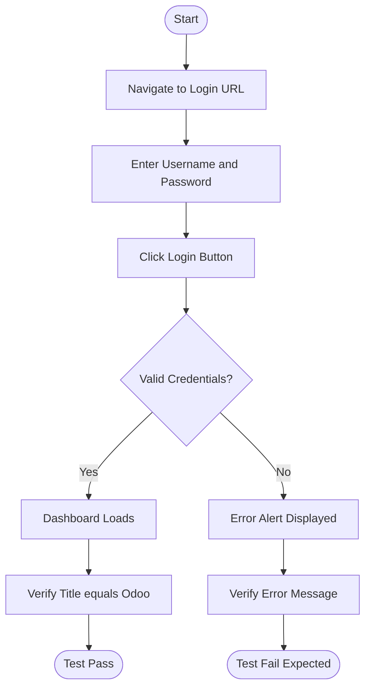
```mermaid
flowchart TD
    Start([Start]) --> Navigate["Navigate to Login URL"]
    Navigate --> EnterCreds["Enter Username and Password"]
    EnterCreds --> ClickLogin["Click Login Button"]
    ClickLogin --> ValidCreds{"Valid Credentials?"}
    ValidCreds -->|Yes| Dashboard["Dashboard Loads"]
    ValidCreds -->|No| ErrorDisplay["Error Alert Displayed"]
    Dashboard --> VerifyTitle["Verify Title equals Odoo"]
    ErrorDisplay --> VerifyError["Verify Error Message"]
    VerifyTitle --> Success([Test Pass])
    VerifyError --> Failure([Test Fail Expected])
```

### 2.6.2 ERP Module Testing Flow

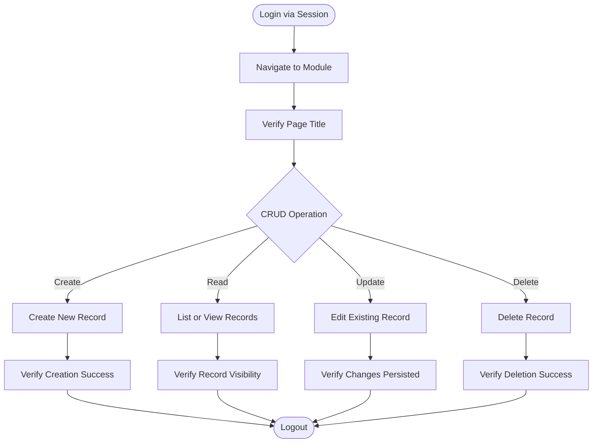
```mermaid
flowchart TD
    Login(["Login via Session"]) --> NavModule["Navigate to Module"]
    NavModule --> VerifyTitle["Verify Page Title"]
    VerifyTitle --> PerformCRUD{"CRUD Operation"}
    PerformCRUD -->|Create| CreateRecord["Create New Record"]
    PerformCRUD -->|Read| ListRecords["List or View Records"]
    PerformCRUD -->|Update| EditRecord["Edit Existing Record"]
    PerformCRUD -->|Delete| DeleteRecord["Delete Record"]
    CreateRecord --> VerifyCreate["Verify Creation Success"]
    ListRecords --> VerifyList["Verify Record Visibility"]
    EditRecord --> VerifyEdit["Verify Changes Persisted"]
    DeleteRecord --> VerifyDelete["Verify Deletion Success"]
    VerifyCreate --> Logout(["Logout"])
    VerifyList --> Logout
    VerifyEdit --> Logout
    VerifyDelete --> Logout
```

### 2.6.3 Test Execution & Reporting Flow

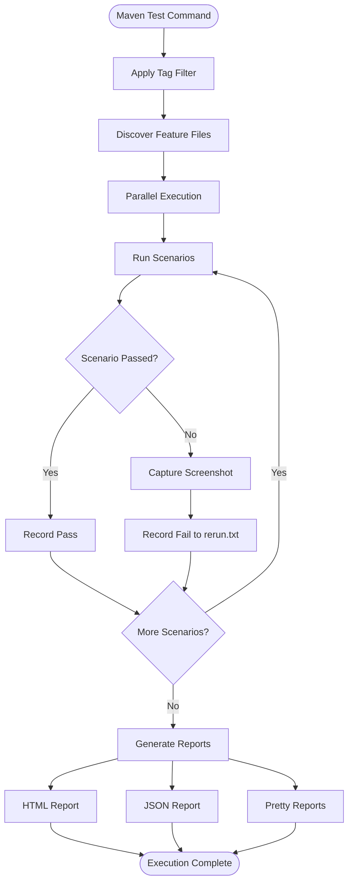
```mermaid
flowchart TD
    Trigger(["Maven Test Command"]) --> TagFilter["Apply Tag Filter"]
    TagFilter --> DiscoverFeatures["Discover Feature Files"]
    DiscoverFeatures --> ParallelExec["Parallel Execution"]
    ParallelExec --> RunScenarios["Run Scenarios"]
    RunScenarios --> ScenarioResult{"Scenario Passed?"}
    ScenarioResult -->|Yes| RecordPass["Record Pass"]
    ScenarioResult -->|No| CaptureScreenshot["Capture Screenshot"]
    CaptureScreenshot --> RecordFail["Record Fail to rerun.txt"]
    RecordPass --> NextScenario{"More Scenarios?"}
    RecordFail --> NextScenario
    NextScenario -->|Yes| RunScenarios
    NextScenario -->|No| GenerateReports["Generate Reports"]
    GenerateReports --> HTMLReport["HTML Report"]
    GenerateReports --> JSONReport["JSON Report"]
    GenerateReports --> PrettyReports["Pretty Reports"]
    HTMLReport --> Complete(["Execution Complete"])
    JSONReport --> Complete
    PrettyReports --> Complete
```

---

## 2.7 Assumptions and Constraints

### 2.7.1 Assumptions

| ID | Assumption | Impact if False |
|----|------------|-----------------|
| A-001 | Odoo/Upgenix ERP is accessible at configured URL | All tests fail |
| A-002 | Test credentials remain valid | Authentication tests fail |
| A-003 | Chrome/Firefox browsers are installed | Driver initialization fails |
| A-004 | Network connectivity is stable | Intermittent failures |
| A-005 | Odoo DOM structure remains consistent | Locator failures |
| A-006 | Jenkins has access to test environment | CI/CD execution fails |

### 2.7.2 Constraints

| ID | Constraint | Rationale |
|----|------------|-----------|
| C-001 | UI testing only (no API/DB) | Framework scope limitation |
| C-002 | Two browser support only | Driver.java implementation |
| C-003 | Single browser per execution | No cross-browser parallel |
| C-004 | English language only | Locators assume English UI |
| C-005 | Sequential module testing | Session dependency chain |
| C-006 | Properties-based configuration | No dynamic environment switching |

---

## 2.8 References

### 2.8.1 Source Files Examined

| File Path | Relevance |
|-----------|-----------|
| `README.md` | Project overview, tools, Gherkin examples |
| `pom.xml` | Dependencies, build configuration, Maven Surefire settings |
| `src/main/java/com/testinium/step_definitions/LoginSD.java` | Login feature step implementations |
| `src/main/java/com/testinium/step_definitions/Session.java` | Reusable login workflow |
| `src/main/java/com/testinium/step_definitions/Calendar.java` | Calendar module step implementations |
| `src/main/java/com/testinium/step_definitions/Contacts.java` | Contacts CRUD step implementations |
| `src/main/java/com/testinium/step_definitions/Crm.java` | CRM module step implementations |
| `src/main/java/com/testinium/step_definitions/EmployeeStage.java` | Employees module step implementations |
| `src/main/java/com/testinium/step_definitions/Inventory.java` | Inventory module step implementations |
| `src/main/java/com/testinium/step_definitions/Notes.java` | Notes module step implementations |
| `src/main/java/com/testinium/step_definitions/Sales.java` | Sales module step implementations |
| `src/main/java/com/testinium/step_definitions/LogOutSD.java` | Logout feature step implementations |
| `src/main/java/com/testinium/step_definitions/Hooks.java` | Screenshot capture, driver cleanup |
| `src/main/java/com/testinium/runners/CukesRunner.java` | Test runner configuration, tag filtering |
| `src/main/java/com/testinium/runners/FailedTestRunner.java` | Failed test rerun configuration |
| `src/main/java/com/testinium/utilities/Driver.java` | WebDriver lifecycle, thread safety |
| `src/main/java/com/testinium/utilities/ConfigurationReader.java` | Configuration property loading |

### 2.8.2 Page Object Files

| File Path | Module Coverage |
|-----------|-----------------|
| `src/main/java/com/testinium/pages/LoginP.java` | Authentication locators |
| `src/main/java/com/testinium/pages/SessionP.java` | Session management locators |
| `src/main/java/com/testinium/pages/CalendarP.java` | Calendar module locators |
| `src/main/java/com/testinium/pages/ContactsP.java` | Contacts module locators |
| `src/main/java/com/testinium/pages/CrmP.java` | CRM module locators |
| `src/main/java/com/testinium/pages/EmployeeP.java` | Employees module locators |
| `src/main/java/com/testinium/pages/InventoryP.java` | Inventory module locators |
| `src/main/java/com/testinium/pages/NotesP.java` | Notes module locators |
| `src/main/java/com/testinium/pages/SalesP.java` | Sales module locators |
| `src/main/java/com/testinium/pages/LogOutP.java` | Logout workflow locators |

### 2.8.3 Technical Specification Cross-References

| Section | Content Referenced |
|---------|-------------------|
| 1.1 Executive Summary | Project context, stakeholders, business value |
| 1.2 System Overview | Architecture, components, success criteria |
| 1.3 Scope | In-scope/out-of-scope features, boundaries |
| 1.4 Technology Stack Summary | Complete technology inventory |
| 1.5 Prerequisites | Environment requirements |
| 1.6 Execution Commands | Test execution modes |

# 3. Technology Stack

This section provides a comprehensive technical reference for all technologies, frameworks, libraries, and tools employed by the Testinium-QA automation framework. Each component selection is justified with consideration for compatibility requirements, security implications, and integration dependencies.

## 3.1 Programming Languages

### 3.1.1 Primary Language: Java

| Attribute | Specification | Evidence |
|-----------|---------------|----------|
| **Language** | Java | Entire codebase in `src/main/java/` |
| **Version** | Java 8 (JDK 1.8+) | `pom.xml` lines 12-13 |
| **Compiler Source** | 8 | `<maven.compiler.source>8</maven.compiler.source>` |
| **Compiler Target** | 8 | `<maven.compiler.target>8</maven.compiler.target>` |

#### Selection Justification

Java 8 was selected as the primary programming language for the following reasons:

| Criterion | Justification |
|-----------|---------------|
| **Selenium Compatibility** | Selenium WebDriver 3.141.59 is built with Java 8 and fully compatible with Java 8+ runtimes |
| **Cucumber Ecosystem** | All Cucumber-JVM libraries provide first-class Java support |
| **Enterprise Adoption** | Java 8 remains widely deployed in enterprise environments, ensuring broad compatibility |
| **Lambda Support** | Java 8's lambda expressions enable concise step definition implementations |
| **Thread Safety** | Native support for `InheritableThreadLocal` enables thread-safe parallel test execution |
| **Build Tooling** | Maven ecosystem provides mature dependency management and build automation |

#### Language Features Utilized

The framework leverages the following Java 8+ language features:

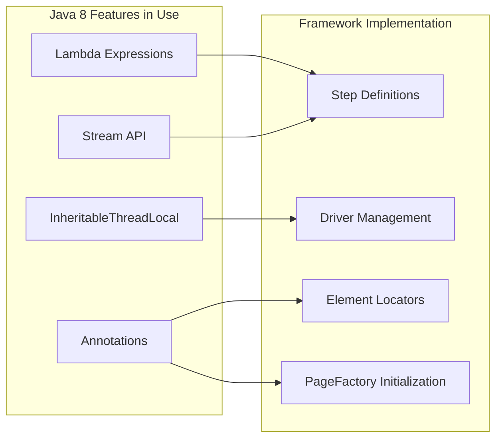
```mermaid
flowchart LR
    subgraph JavaFeatures["Java 8 Features in Use"]
        LambdaExpressions["Lambda Expressions"]
        StreamAPI["Stream API"]
        ThreadLocal["InheritableThreadLocal"]
        Annotations["Annotations"]
    end
    
    subgraph Implementation["Framework Implementation"]
        StepDefs["Step Definitions"]
        PageFactory["PageFactory Initialization"]
        DriverMgmt["Driver Management"]
        LocatorBindings["Element Locators"]
    end
    
    LambdaExpressions --> StepDefs
    StreamAPI --> StepDefs
    ThreadLocal --> DriverMgmt
    Annotations --> LocatorBindings
    Annotations --> PageFactory
```

#### Constraints and Dependencies

| Constraint | Impact | Mitigation |
|------------|--------|------------|
| **JDK 1.8 Minimum** | Cannot use Java 9+ features (modules, var keyword) | Code remains portable across Java 8+ environments |
| **Compatibility Mode** | All dependencies must support Java 8 bytecode | Verified through Maven dependency resolution |
| **IDE Configuration** | Project language level must be set to Java 8 | Documented in IDE setup instructions |

---

## 3.2 Frameworks and Libraries

### 3.2.1 Core Framework Stack

The Testinium-QA framework is built upon a carefully integrated stack of industry-standard frameworks:

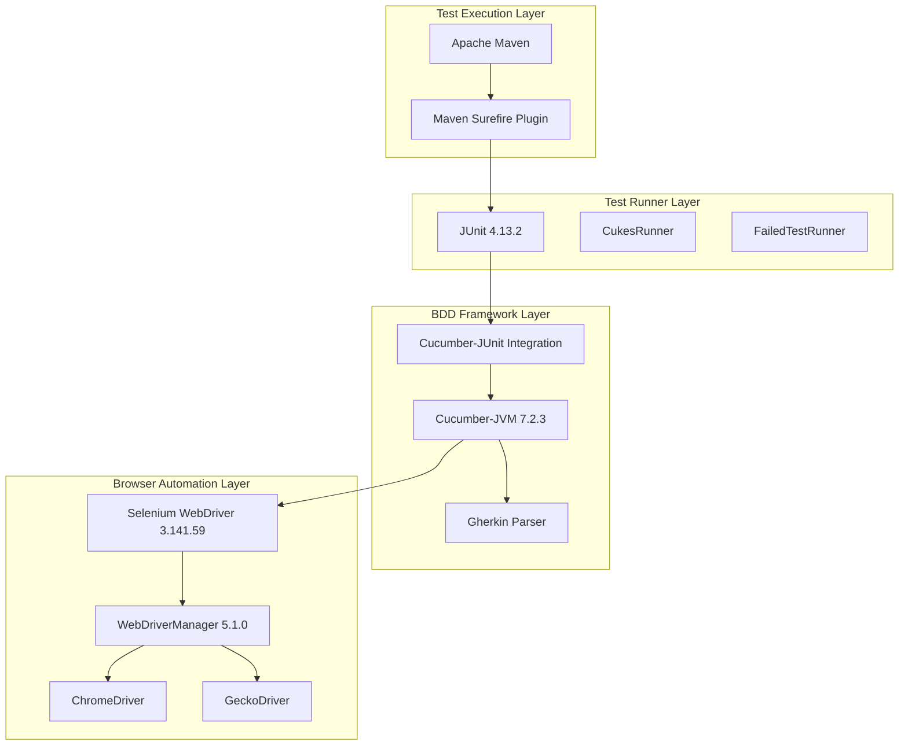
```mermaid
flowchart TB
    subgraph TestExecution["Test Execution Layer"]
        Maven["Apache Maven"]
        Surefire["Maven Surefire Plugin"]
    end
    
    subgraph BDDLayer["BDD Framework Layer"]
        Cucumber["Cucumber-JVM 7.2.3"]
        Gherkin["Gherkin Parser"]
        CucumberJUnit["Cucumber-JUnit Integration"]
    end
    
    subgraph TestRunnerLayer["Test Runner Layer"]
        JUnit["JUnit 4.13.2"]
        CukesRunner["CukesRunner"]
        FailedRunner["FailedTestRunner"]
    end
    
    subgraph AutomationLayer["Browser Automation Layer"]
        Selenium["Selenium WebDriver 3.141.59"]
        WebDriverMgr["WebDriverManager 5.1.0"]
        ChromeDriver["ChromeDriver"]
        FirefoxDriver["GeckoDriver"]
    end
    
    Maven --> Surefire
    Surefire --> JUnit
    JUnit --> CucumberJUnit
    CucumberJUnit --> Cucumber
    Cucumber --> Gherkin
    Cucumber --> Selenium
    Selenium --> WebDriverMgr
    WebDriverMgr --> ChromeDriver
    WebDriverMgr --> FirefoxDriver
```

### 3.2.2 Browser Automation Framework

#### Selenium WebDriver

| Attribute | Value | Evidence |
|-----------|-------|----------|
| **Artifact ID** | `selenium-java` |  `pom.xml` line 37 |
| **Group ID** | `org.seleniumhq.selenium` | `pom.xml` line 36 |
| **Version** | 3.141.59 | `pom.xml` line 38 |
| **License** | Apache License 2.0 | Official Selenium documentation |

**Framework Capabilities:**

| Capability | Implementation | Usage in Framework |
|------------|----------------|-------------------|
| **Element Location** | `WebElement`, `@FindBy` annotations | All Page Object classes |
| **Browser Control** | `WebDriver` interface | `Driver.java` utility class |
| **Wait Mechanisms** | `WebDriverWait`, implicit waits | Step definitions, page objects |
| **Screenshot Capture** | `TakesScreenshot` interface | `Hooks.java` failure handling |
| **Actions API** | `Actions` class | Drag-and-drop operations |
| **JavaScript Execution** | `JavascriptExecutor` interface | Dynamic element interactions |

**Selection Justification:**

Selenium WebDriver 3.141.59 represents the final stable release of the Selenium 3.x series and was selected for:

1. **Stability**: Production-proven across millions of test suites globally
2. **WebDriverManager Compatibility**: Full support from WebDriverManager 5.1.0
3. **W3C WebDriver Protocol**: Partial compliance with W3C WebDriver specification
4. **Browser Coverage**: Native support for Chrome, Firefox, Edge, Safari, and IE

#### WebDriverManager

| Attribute | Value | Evidence |
|-----------|-------|----------|
| **Artifact ID** | `webdrivermanager` | `pom.xml` line 43 |
| **Group ID** | `io.github.bonigarcia` | `pom.xml` line 42 |
| **Version** | 5.1.0 | `pom.xml` line 44 |

**Capabilities Utilized:**

| Feature | Implementation | Benefit |
|---------|----------------|---------|
| **Auto Driver Download** | `WebDriverManager.chromedriver().setup()` | Eliminates manual driver management |
| **Version Resolution** | Automatic browser-to-driver matching | Always compatible drivers |
| **Cross-Platform Support** | OS-specific driver selection | Single codebase for all platforms |
| **Caching** | Local driver repository | Faster subsequent executions |

**Selection Justification:**

WebDriverManager eliminates the operational burden of browser driver management by:
- Automatically detecting installed browser versions
- Downloading compatible WebDriver executables
- Managing driver lifecycle and PATH configuration
- Supporting all major browsers through a unified API

### 3.2.3 BDD Framework

#### Cucumber-JVM

| Component | Version | Purpose | Evidence |
|-----------|---------|---------|----------|
| **cucumber-java** | 7.2.3 | Core BDD framework with step definition binding | `pom.xml` lines 54-58 |
| **cucumber-junit** | 7.2.3 / 7.3.4 | JUnit 4 runner integration | `pom.xml` lines 60-65, 76-80 |

**Version Note:** The `pom.xml` declares `cucumber-junit` twice with different versions (7.2.3 with test scope and 7.3.4 without scope). Maven's dependency mediation will resolve this to version 7.3.4 in the compile classpath.

**Framework Configuration:**

The test runner is configured in `CukesRunner.java` with the following Cucumber options:

| Option | Value | Purpose |
|--------|-------|---------|
| **features** | `src/test/resources/features` | Gherkin feature file location |
| **glue** | `com/testinium/step_definitions` | Step definition package |
| **dryRun** | `false` | Execute tests (not validation only) |
| **tags** | `"@Dash"` | Tag-based scenario filtering |
| **plugin** | Multiple | Report generation plugins |

**Selection Justification:**

Cucumber-JVM was selected for:
1. **Gherkin Syntax**: Human-readable test scenarios in Given-When-Then format
2. **Stakeholder Communication**: Non-technical team members can understand test coverage
3. **Scenario Reusability**: Step definitions can be shared across features
4. **Rich Reporting**: Multiple report format plugins available

### 3.2.4 Test Runner Framework

#### JUnit 4

| Attribute | Value | Evidence |
|-----------|-------|----------|
| **Artifact ID** | `junit` | `pom.xml` line 72 |
| **Group ID** | `junit` | `pom.xml` line 71 |
| **Version** | 4.13.2 | `pom.xml` line 73 |

**Integration Pattern:**

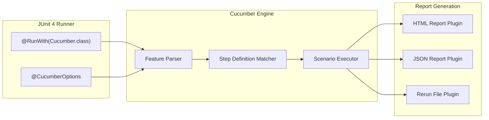
```mermaid
flowchart LR
    subgraph JUnitRunner["JUnit 4 Runner"]
        RunWith["@RunWith(Cucumber.class)"]
        CucumberOptions["@CucumberOptions"]
    end
    
    subgraph CucumberEngine["Cucumber Engine"]
        FeatureParser["Feature Parser"]
        StepMatcher["Step Definition Matcher"]
        ScenarioExecutor["Scenario Executor"]
    end
    
    subgraph Reporting["Report Generation"]
        HTMLPlugin["HTML Report Plugin"]
        JSONPlugin["JSON Report Plugin"]
        RerunPlugin["Rerun File Plugin"]
    end
    
    RunWith --> FeatureParser
    CucumberOptions --> FeatureParser
    FeatureParser --> StepMatcher
    StepMatcher --> ScenarioExecutor
    ScenarioExecutor --> HTMLPlugin
    ScenarioExecutor --> JSONPlugin
    ScenarioExecutor --> RerunPlugin
```

**Selection Justification:**

JUnit 4 was selected over JUnit 5 for:
1. **Cucumber Compatibility**: Cucumber-JUnit module designed for JUnit 4 `@RunWith` annotation
2. **Maven Surefire Integration**: Mature support in Maven Surefire Plugin 3.0.0-M5
3. **Enterprise Familiarity**: Widely adopted in corporate Java testing environments

### 3.2.5 Supporting Libraries

#### JavaFaker - Test Data Generation

| Attribute | Value | Evidence |
|-----------|-------|----------|
| **Artifact ID** | `javafaker` | `pom.xml` line 49 |
| **Group ID** | `com.github.javafaker` | `pom.xml` line 48 |
| **Version** | 1.0.2 | `pom.xml` line 50 |

**Capabilities:**

| Feature | Use Case |
|---------|----------|
| **Name Generation** | Random user names for contact creation |
| **Address Generation** | Test address data for forms |
| **Company Data** | Business names and details for CRM testing |
| **Number Generation** | Random numeric test data |

**Selection Justification:**

JavaFaker provides realistic, localized test data generation without external service dependencies, enabling:
- Isolated test execution without database seeding
- Unique data per test run reducing data collision
- Locale-specific test data for internationalization testing

#### Cucumber PrettyReports

| Attribute | Value | Evidence |
|-----------|-------|----------|
| **Artifact ID** | `reporting-plugin` | `pom.xml` line 68 |
| **Group ID** | `me.jvt.cucumber` | `pom.xml` line 67 |
| **Version** | 7.2.0 | `pom.xml` line 69 |

**Report Features:**

| Feature | Description |
|---------|-------------|
| **Visual Dashboard** | Graphical test execution summary |
| **Scenario Timeline** | Execution sequence visualization |
| **Tag Statistics** | Pass/fail rates by tag |
| **Step Details** | Individual step timing and status |

---

## 3.3 Open Source Dependencies

### 3.3.1 Complete Dependency Matrix

The following table documents all direct dependencies declared in `pom.xml`:

| Group ID | Artifact ID | Version | Scope | Purpose |
|----------|-------------|---------|-------|---------|
| `org.seleniumhq.selenium` | `selenium-java` | 3.141.59 | compile | Browser automation API |
| `io.github.bonigarcia` | `webdrivermanager` | 5.1.0 | compile | Browser driver management |
| `com.github.javafaker` | `javafaker` | 1.0.2 | compile | Test data generation |
| `io.cucumber` | `cucumber-java` | 7.2.3 | compile | BDD step definition binding |
| `io.cucumber` | `cucumber-junit` | 7.2.3 | test | JUnit runner integration |
| `io.cucumber` | `cucumber-junit` | 7.3.4 | compile | JUnit runner integration |
| `me.jvt.cucumber` | `reporting-plugin` | 7.2.0 | compile | Enhanced HTML reports |
| `junit` | `junit` | 4.13.2 | compile | Unit test framework |

### 3.3.2 Package Registry

| Registry | URL | Usage |
|----------|-----|-------|
| **Maven Central** | https://repo.maven.apache.org/maven2 | Primary dependency source |
| **MVN Repository** | https://mvnrepository.com | Version lookup and documentation |

### 3.3.3 Transitive Dependencies

The framework inherits significant transitive dependencies from its core libraries:

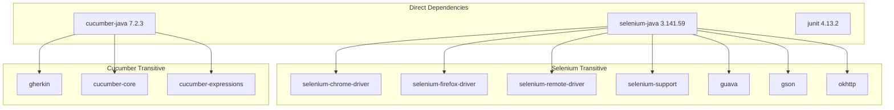
```mermaid
flowchart TD
    subgraph DirectDeps["Direct Dependencies"]
        SeleniumJava["selenium-java 3.141.59"]
        CucumberJava["cucumber-java 7.2.3"]
        JUnit["junit 4.13.2"]
    end
    
    subgraph SeleniumTransitive["Selenium Transitive"]
        ChromeDriver["selenium-chrome-driver"]
        FirefoxDriver["selenium-firefox-driver"]
        RemoteDriver["selenium-remote-driver"]
        Support["selenium-support"]
        Guava["guava"]
        GSON["gson"]
        OkHttp["okhttp"]
    end
    
    subgraph CucumberTransitive["Cucumber Transitive"]
        GherkinLib["gherkin"]
        CucumberCore["cucumber-core"]
        CucumberExpressions["cucumber-expressions"]
    end
    
    SeleniumJava --> ChromeDriver
    SeleniumJava --> FirefoxDriver
    SeleniumJava --> RemoteDriver
    SeleniumJava --> Support
    SeleniumJava --> Guava
    SeleniumJava --> GSON
    SeleniumJava --> OkHttp
    
    CucumberJava --> GherkinLib
    CucumberJava --> CucumberCore
    CucumberJava --> CucumberExpressions
```

### 3.3.4 Dependency Version Conflicts

| Conflict | Description | Resolution |
|----------|-------------|------------|
| **cucumber-junit** | Declared twice (7.2.3 test scope, 7.3.4 compile) | Maven dependency mediation selects 7.3.4 for compile |

**Recommendation:** Consolidate to single version declaration to ensure deterministic builds.

---

## 3.4 Third-Party Services

### 3.4.1 CI/CD Integration

#### Jenkins

| Attribute | Description |
|-----------|-------------|
| **Service Type** | Continuous Integration Server |
| **Integration Method** | Maven build execution |
| **Evidence** | README.md, `./image/Jenkins-Cucumber-Reports.png` |

**Integration Capabilities:**

| Capability | Implementation |
|------------|----------------|
| **Build Triggering** | SCM polling or webhook-based triggers |
| **Test Execution** | `mvn test` command execution |
| **Report Publishing** | Cucumber Reports Plugin for visualization |
| **Failure Notification** | Build status alerts |

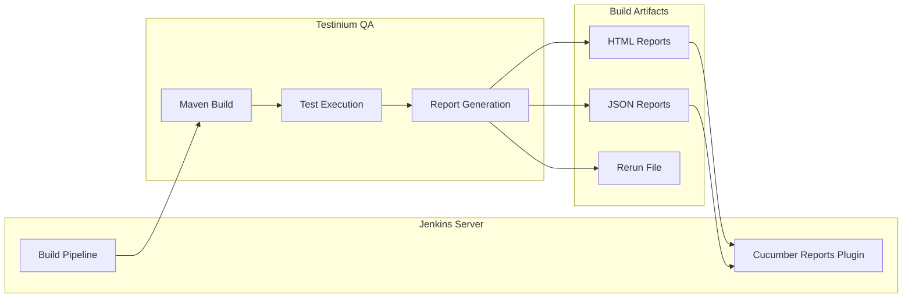
```mermaid
flowchart LR
    subgraph JenkinsServer["Jenkins Server"]
        Pipeline["Build Pipeline"]
        CucumberPlugin["Cucumber Reports Plugin"]
    end
    
    subgraph TestFramework["Testinium QA"]
        MavenBuild["Maven Build"]
        TestExecution["Test Execution"]
        ReportGen["Report Generation"]
    end
    
    subgraph Artifacts["Build Artifacts"]
        HTMLReport["HTML Reports"]
        JSONReport["JSON Reports"]
        RerunFile["Rerun File"]
    end
    
    Pipeline --> MavenBuild
    MavenBuild --> TestExecution
    TestExecution --> ReportGen
    ReportGen --> HTMLReport
    ReportGen --> JSONReport
    ReportGen --> RerunFile
    HTMLReport --> CucumberPlugin
    JSONReport --> CucumberPlugin
```

### 3.4.2 Issue Tracking Integration

#### Jira

| Attribute | Description |
|-----------|-------------|
| **Service Type** | Issue Tracking and Project Management |
| **Integration Method** | Test execution result linking |
| **Evidence** | README.md, `./image/Jira-Test-Exectuion.png` |

**Integration Capabilities:**

| Capability | Purpose |
|------------|---------|
| **Test Case Linking** | Associate automated tests with Jira test cases |
| **Defect Traceability** | Link test failures to bug tickets |
| **Execution Tracking** | Record test run outcomes in Jira |
| **Sprint Integration** | Track automation coverage per sprint |

### 3.4.3 Target Application

#### Odoo/Upgenix ERP

| Attribute | Description |
|-----------|-------------|
| **Application Type** | Web-based Enterprise Resource Planning |
| **Base URL** | Configured via `configuration.properties` |
| **Login Page Title** | "Login \| Best solution for startups" |
| **Dashboard Title** | "Odoo" |

**Functional Modules Under Test:**

| Module | Test Coverage |
|--------|---------------|
| Calendar | Event creation, scheduling |
| Contacts | CRUD operations, search |
| CRM | Pipeline management, drag-and-drop |
| Employees | Personnel record management |
| Inventory | Stock control, product management |
| Notes | Kanban board operations |
| Sales | Order processing, quotations |

---

## 3.5 Development and Deployment

### 3.5.1 Development Tools

#### Integrated Development Environment

| Tool | Version | Purpose | Evidence |
|------|---------|---------|----------|
| **IntelliJ IDEA** | Latest Recommended | Primary IDE | README.md prerequisites |
| **Maven Plugin** | IntelliJ Bundled | Build integration | README.md prerequisites |
| **Cucumber Plugin** | IntelliJ Marketplace | Gherkin syntax support | README.md prerequisites |

**IDE Configuration Requirements:**

| Configuration | Setting |
|---------------|---------|
| **Project SDK** | JDK 1.8 or higher |
| **Language Level** | 8 - Lambdas, type annotations, etc. |
| **Maven Home** | System Maven 3.x installation |
| **Annotation Processing** | Enabled for Lombok/PageFactory |

### 3.5.2 Build System

#### Apache Maven

| Attribute | Value | Evidence |
|-----------|-------|----------|
| **POM Model Version** | 4.0.0 | `pom.xml` line 4 |
| **Minimum Maven Version** | 3.x | README.md prerequisites |
| **Build Plugin** | Maven Surefire | `pom.xml` lines 15-31 |

**Maven Project Structure:**

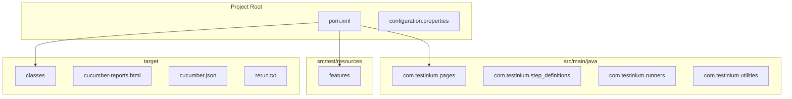
```mermaid
flowchart TB
    subgraph ProjectRoot [Project Root]
        POM["pom.xml"]
        Config["configuration.properties"]
    end

    subgraph SourceMain [src/main/java]
        Pages["com.testinium.pages"]
        StepDefs["com.testinium.step_definitions"]
        Runners["com.testinium.runners"]
        Utilities["com.testinium.utilities"]
    end

    subgraph SourceTest [src/test/resources]
        Features["features"]
    end

    subgraph TargetDir [target]
        Classes["classes"]
        CucumberReports["cucumber-reports.html"]
        CucumberJSON["cucumber.json"]
        RerunTxt["rerun.txt"]
    end

    POM --> Pages
    POM --> Features
    POM --> Classes
```

#### Maven Surefire Plugin Configuration

| Configuration | Value | Purpose |
|---------------|-------|---------|
| **Version** | 3.0.0-M5 | Test execution plugin |
| **parallel** | methods | Method-level parallelism |
| **useUnlimitedThreads** | true | Maximum parallel execution |
| **testFailureIgnore** | true | Continue build on test failures |
| **includes** | `**/CukesRunner*.java` | Runner class pattern |

**Surefire Configuration (from `pom.xml`):**

```xml
<configuration>
    <parallel>methods</parallel>
    <useUnlimitedThreads>true</useUnlimitedThreads>
    <testFailureIgnore>true</testFailureIgnore>
    <includes>
        <include>**/CukesRunner*.java</include>
    </includes>
</configuration>
```

### 3.5.3 Execution Commands

| Command | Purpose |
|---------|---------|
| `mvn test` | Execute tests with default configuration |
| `mvn test -Dcucumber.options="--plugin html:target/cucumber-reports.html"` | Custom HTML report generation |
| `mvn test -Dcucumber.options="--plugin rerun:target/rerun.txt"` | Generate rerun file for failed tests |
| `mvn clean test` | Clean build and execute tests |
| `mvn dependency:tree` | Display dependency hierarchy |

### 3.5.4 Report Generation

The framework generates multiple report formats during test execution:

| Report Type | Output Path | Format | Purpose |
|-------------|-------------|--------|---------|
| **HTML Report** | `target/cucumber-reports.html` | Single-page HTML | Quick results overview |
| **JSON Report** | `target/cucumber.json` | Cucumber JSON | CI/CD integration, Jenkins plugin |
| **Rerun File** | `target/rerun.txt` | Text file | Failed scenario re-execution |
| **Pretty Reports** | `target/cucumber/` | Multi-page HTML bundle | Detailed visual analysis |

**Report Technology Stack:**

| Technology | Purpose |
|------------|---------|
| **Bootstrap 3** | Report layout and responsive design |
| **jQuery** | Interactive table functionality |
| **jquery.tablesorter** | Sortable result tables |
| **Chart.js** | Visual test summaries |
| **Moment.js** | Time and duration formatting |

### 3.5.5 Browser Support Configuration

| Browser | WebDriver | Setup Method | Status |
|---------|-----------|--------------|--------|
| **Chrome** | ChromeDriver | `WebDriverManager.chromedriver().setup()` | Supported |
| **Firefox** | GeckoDriver | `WebDriverManager.chromedriver().setup()` | Supported (with bug) |

**Known Issue:** The `Driver.java` implementation uses `chromedriver().setup()` for Firefox browser configuration, which should be `firefoxdriver().setup()`. The framework still functions due to WebDriverManager's architecture.

**Browser Configuration Settings:**

| Setting | Value | Implementation |
|---------|-------|----------------|
| **Window Mode** | Maximized | `driver.manage().window().maximize()` |
| **Implicit Wait** | 10 seconds | `driver.manage().timeouts().implicitlyWait(10, TimeUnit.SECONDS)` |
| **Driver Storage** | Thread-local | `InheritableThreadLocal<WebDriver>` |

---

## 3.6 Technology Integration Architecture

### 3.6.1 Component Integration Flow

The following diagram illustrates how all technology components integrate within the framework:

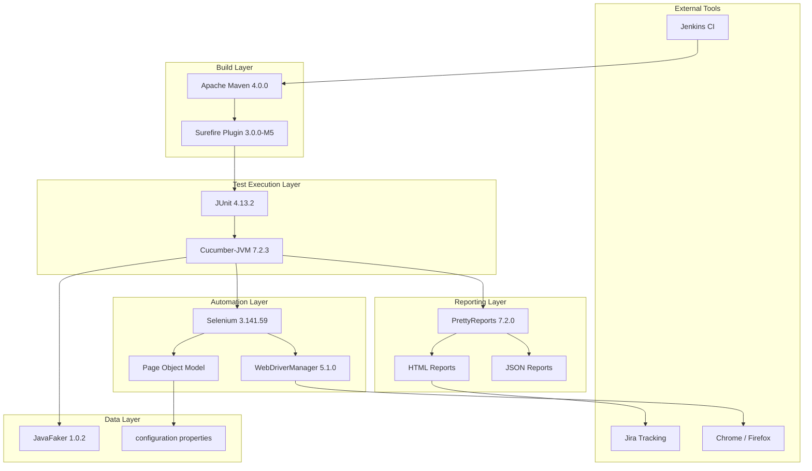
```mermaid
flowchart TB
    subgraph ExternalTools["External Tools"]
        Jenkins["Jenkins CI"]
        Jira["Jira Tracking"]
        Browsers["Chrome / Firefox"]
    end

    subgraph BuildLayer["Build Layer"]
        Maven["Apache Maven 4.0.0"]
        Surefire["Surefire Plugin 3.0.0-M5"]
    end

    subgraph TestLayer["Test Execution Layer"]
        JUnit4["JUnit 4.13.2"]
        CucumberJVM["Cucumber-JVM 7.2.3"]
    end

    subgraph AutomationLayer["Automation Layer"]
        Selenium["Selenium 3.141.59"]
        WDManager["WebDriverManager 5.1.0"]
        PageObjects["Page Object Model"]
    end

    subgraph DataLayer["Data Layer"]
        Faker["JavaFaker 1.0.2"]
        Config["configuration properties"]
    end

    subgraph ReportLayer["Reporting Layer"]
        PrettyReports["PrettyReports 7.2.0"]
        HTMLReport["HTML Reports"]
        JSONReport["JSON Reports"]
    end

    Jenkins --> Maven
    Maven --> Surefire
    Surefire --> JUnit4
    JUnit4 --> CucumberJVM
    CucumberJVM --> Selenium
    CucumberJVM --> Faker
    Selenium --> WDManager
    Selenium --> PageObjects
    WDManager --> Browsers
    PageObjects --> Config
    CucumberJVM --> PrettyReports
    PrettyReports --> HTMLReport
    PrettyReports --> JSONReport
    HTMLReport --> Jira
```

### 3.6.2 Version Compatibility Matrix

| Component | Version | Compatible With |
|-----------|---------|-----------------|
| **Java** | 8 | All framework components |
| **Selenium** | 3.141.59 | WebDriverManager 5.1.0, Java 8+ |
| **Cucumber** | 7.2.3 | JUnit 4.13.2, Java 8+ |
| **WebDriverManager** | 5.1.0 | Selenium 3.x/4.x, Java 8+ |
| **JUnit** | 4.13.2 | Cucumber-JUnit 7.x, Maven Surefire 3.x |
| **Maven Surefire** | 3.0.0-M5 | Maven 3.x, JUnit 4.x |

### 3.6.3 Security Considerations

| Component | Security Aspect | Current Implementation | Recommendation |
|-----------|-----------------|------------------------|----------------|
| **Credentials** | Storage location | `configuration.properties` (plaintext) | Use environment variables or secrets manager |
| **Browser Sessions** | Session isolation | Driver cleanup per scenario (`Hooks.java`) | Current implementation adequate |
| **Dependencies** | Vulnerability scanning | Not implemented | Add OWASP dependency-check plugin |
| **Network Traffic** | HTTPS enforcement | Depends on target application | Verify SSL certificate handling |

### 3.6.4 Performance Configuration

| Parameter | Value | Location | Impact |
|-----------|-------|----------|--------|
| **Implicit Wait** | 10 seconds | `Driver.java` | Element location timeout |
| **Standard Explicit Wait** | 2 seconds | Step definitions | Short-duration waits |
| **Extended Explicit Wait** | 20 seconds | ContactsP, InventoryP | Long-loading page elements |
| **Parallel Threads** | Unlimited | Maven Surefire | Maximum concurrency |
| **Thread.sleep Usage** | 2-3 seconds | Various step definitions | UI synchronization |

---

## 3.7 Technology Upgrade Considerations

### 3.7.1 Selenium 4.x Migration Path

The framework currently uses Selenium 3.141.59. A migration to Selenium 4.x would provide:

| Enhancement | Benefit |
|-------------|---------|
| **W3C WebDriver Protocol** | Full compliance with browser standards |
| **Relative Locators** | Simplified element location strategies |
| **Chrome DevTools Protocol** | Network interception, performance metrics |
| **Native Selenium Manager** | Built-in driver management (replacing WebDriverManager) |

### 3.7.2 JUnit 5 Migration Path

Migrating from JUnit 4 to JUnit 5 would require:

| Change Required | Implementation |
|-----------------|----------------|
| **Cucumber Runner** | Switch to `cucumber-junit-platform-engine` |
| **Annotations** | Update lifecycle annotations (`@BeforeEach`, `@AfterEach`) |
| **Assertions** | Update assertion imports |
| **Maven Plugin** | Configure `junit-platform-surefire-provider` |

### 3.7.3 Recommended Dependency Updates

| Current | Recommended | Rationale |
|---------|-------------|-----------|
| Selenium 3.141.59 | Selenium 4.x | W3C compliance, modern features |
| Cucumber 7.2.3 | Cucumber 7.x (latest) | Bug fixes, performance improvements |
| JUnit 4.13.2 | JUnit 5.x | Modern testing patterns, extensions API |
| WebDriverManager 5.1.0 | WebDriverManager 5.x (latest) | Browser compatibility updates |

---

## 3.8 References

### 3.8.1 Source Files Examined

| File Path | Relevance |
|-----------|-----------|
| `pom.xml` | Complete Maven build configuration, all dependency declarations with versions |
| `README.md` | Project overview, prerequisites, tool requirements, CI/CD integration |
| `src/main/java/com/testinium/utilities/Driver.java` | WebDriver lifecycle management, browser configuration, thread-safety implementation |
| `src/main/java/com/testinium/utilities/ConfigurationReader.java` | Configuration property loading mechanism |
| `src/main/java/com/testinium/runners/CukesRunner.java` | Main test runner configuration, Cucumber options, report plugins |
| `src/main/java/com/testinium/runners/FailedTestRunner.java` | Failed test rerun configuration |
| `src/main/java/com/testinium/pages/LoginP.java` | Page Object Model implementation example, @FindBy annotations |
| `src/main/java/com/testinium/step_definitions/Hooks.java` | Test lifecycle hooks, screenshot capture, driver cleanup |

### 3.8.2 Folders Examined

| Folder Path | Contents |
|-------------|----------|
| `src/main/java/com/testinium/pages/` | 10 Page Object classes |
| `src/main/java/com/testinium/step_definitions/` | 11 Step Definition classes |
| `src/main/java/com/testinium/runners/` | 2 Test Runner classes |
| `src/main/java/com/testinium/utilities/` | 2 Utility classes |
| `target/` | Build output, generated reports |

### 3.8.3 Technical Specification Sections Referenced

| Section | Information Retrieved |
|---------|----------------------|
| 1.2 System Overview | System architecture, component inventory, integration patterns |
| 1.4 Technology Stack Summary | Technology summary table |
| 1.5 Prerequisites | Environment requirements |
| 1.6 Execution Commands | Maven execution patterns |
| 2.4 Implementation Considerations | Technical constraints, performance requirements, security implications |

### 3.8.4 External References

| Reference | URL | Information Retrieved |
|-----------|-----|----------------------|
| Selenium Downloads | https://www.selenium.dev/downloads/ | Selenium version history |
| Maven Repository | https://mvnrepository.com/ | Dependency metadata and versions |
| Selenium GitHub | https://github.com/SeleniumHQ/selenium | Release notes and compatibility |

# 4. Process Flowchart

This section provides comprehensive process flowcharts documenting all system workflows, integration flows, state transitions, and error handling mechanisms within the Testinium-QA framework. Each diagram follows Mermaid.js syntax and includes clear labeling, decision points, and timing constraints where applicable.

## 4.1 High-Level System Workflow

### 4.1.1 End-to-End Test Execution Workflow

The following diagram illustrates the complete test execution journey from CI/CD trigger through to final report generation, encompassing all system boundaries and user touchpoints.

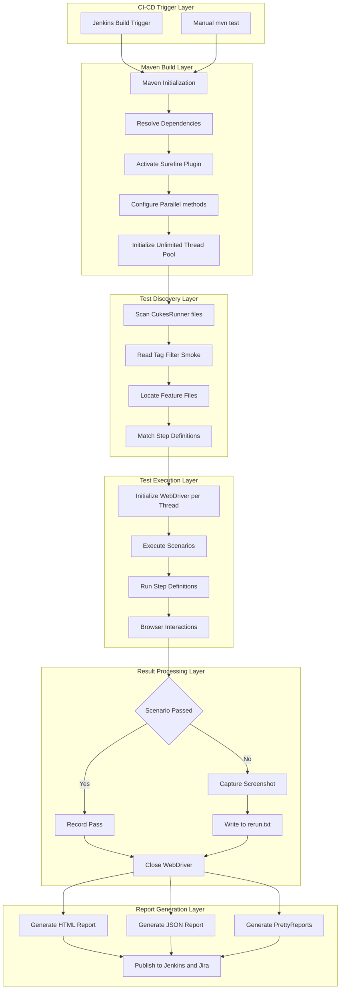
```mermaid
flowchart TB
    subgraph CITrigger["CI-CD Trigger Layer"]
        JenkinsTrigger["Jenkins Build Trigger"]
        ManualTrigger["Manual mvn test"]
    end
    
    subgraph BuildExecution["Maven Build Layer"]
        MavenInit["Maven Initialization"]
        DependencyResolve["Resolve Dependencies"]
        SurefireActivate["Activate Surefire Plugin"]
        ConfigParallel["Configure Parallel methods"]
        ThreadPool["Initialize Unlimited Thread Pool"]
    end
    
    subgraph TestDiscovery["Test Discovery Layer"]
        ScanRunners["Scan CukesRunner files"]
        ReadTags["Read Tag Filter Smoke"]
        LocateFeatures["Locate Feature Files"]
        MatchGlue["Match Step Definitions"]
    end
    
    subgraph TestExecution["Test Execution Layer"]
        InitDriver["Initialize WebDriver per Thread"]
        ExecuteScenarios["Execute Scenarios"]
        RunSteps["Run Step Definitions"]
        InteractBrowser["Browser Interactions"]
    end
    
    subgraph ResultProcessing["Result Processing Layer"]
        EvaluateResult{"Scenario Passed"}
        RecordSuccess["Record Pass"]
        CaptureScreenshot["Capture Screenshot"]
        WriteRerun["Write to rerun.txt"]
        CloseDriver["Close WebDriver"]
    end
    
    subgraph ReportGeneration["Report Generation Layer"]
        GenerateHTML["Generate HTML Report"]
        GenerateJSON["Generate JSON Report"]
        GeneratePretty["Generate PrettyReports"]
        PublishArtifacts["Publish to Jenkins and Jira"]
    end
    
    JenkinsTrigger --> MavenInit
    ManualTrigger --> MavenInit
    MavenInit --> DependencyResolve
    DependencyResolve --> SurefireActivate
    SurefireActivate --> ConfigParallel
    ConfigParallel --> ThreadPool
    
    ThreadPool --> ScanRunners
    ScanRunners --> ReadTags
    ReadTags --> LocateFeatures
    LocateFeatures --> MatchGlue
    
    MatchGlue --> InitDriver
    InitDriver --> ExecuteScenarios
    ExecuteScenarios --> RunSteps
    RunSteps --> InteractBrowser
    
    InteractBrowser --> EvaluateResult
    EvaluateResult -->|Yes| RecordSuccess
    EvaluateResult -->|No| CaptureScreenshot
    CaptureScreenshot --> WriteRerun
    RecordSuccess --> CloseDriver
    WriteRerun --> CloseDriver
    
    CloseDriver --> GenerateHTML
    CloseDriver --> GenerateJSON
    CloseDriver --> GeneratePretty
    GenerateHTML --> PublishArtifacts
    GenerateJSON --> PublishArtifacts
    GeneratePretty --> PublishArtifacts
```

### 4.1.2 System Interaction Overview

This diagram presents the complete interaction flow between actors, systems, and components during test execution.

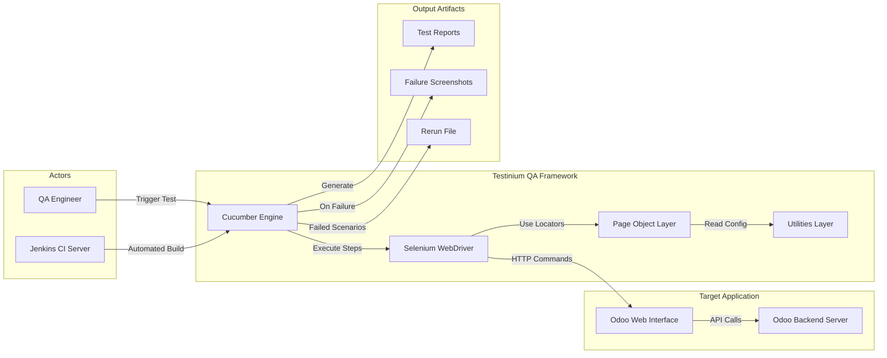
```mermaid
flowchart LR
    subgraph Actors["Actors"]
        direction TB
        QAEngineer["QA Engineer"]
        CIServer["Jenkins CI Server"]
    end
    
    subgraph Framework["Testinium QA Framework"]
        direction TB
        Cucumber["Cucumber Engine"]
        Selenium["Selenium WebDriver"]
        PageObjects["Page Object Layer"]
        Utilities["Utilities Layer"]
    end
    
    subgraph TargetSystem["Target Application"]
        direction TB
        OdooBrowser["Odoo Web Interface"]
        OdooServer["Odoo Backend Server"]
    end
    
    subgraph Outputs["Output Artifacts"]
        direction TB
        Reports["Test Reports"]
        Screenshots["Failure Screenshots"]
        RerunFile["Rerun File"]
    end
    
    QAEngineer -->|Trigger Test| Cucumber
    CIServer -->|Automated Build| Cucumber
    Cucumber -->|Execute Steps| Selenium
    Selenium -->|Use Locators| PageObjects
    PageObjects -->|Read Config| Utilities
    Selenium -->|HTTP Commands| OdooBrowser
    OdooBrowser -->|API Calls| OdooServer
    Cucumber -->|Generate| Reports
    Cucumber -->|On Failure| Screenshots
    Cucumber -->|Failed Scenarios| RerunFile
```

## 4.2 Core Business Process Workflows

### 4.2.1 User Authentication Flow (F-001)

The authentication workflow validates login functionality for the Odoo/Upgenix ERP system with comprehensive error handling paths.

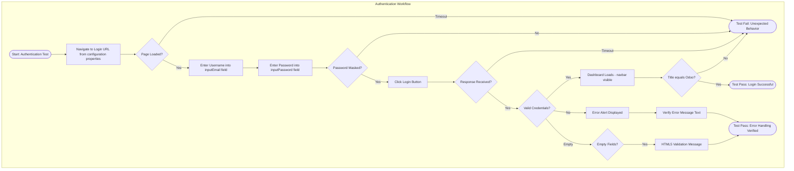
```mermaid
flowchart TD
    subgraph AuthenticationProcess["Authentication Workflow"]
        AuthStart(["Start: Authentication Test"])
        NavToLogin["Navigate to Login URL from configuration properties"]
        WaitPageLoad{"Page Loaded?"}
        EnterUsername["Enter Username into inputEmail field"]
        EnterPassword["Enter Password into inputPassword field"]
        VerifyMasking{"Password Masked?"}
        ClickLogin["Click Login Button"]
        WaitResponse{"Response Received?"}
        CheckCredentials{"Valid Credentials?"}
        DashboardLoads["Dashboard Loads - navbar visible"]
        VerifyTitle{"Title equals Odoo?"}
        ErrorDisplayed["Error Alert Displayed"]
        VerifyErrorMsg["Verify Error Message Text"]
        CheckEmptyFields{"Empty Fields?"}
        HTML5Validation["HTML5 Validation Message"]
        AuthSuccess(["Test Pass: Login Successful"])
        AuthFailExpected(["Test Pass: Error Handling Verified"])
        AuthError(["Test Fail: Unexpected Behavior"])
    end

    AuthStart --> NavToLogin
    NavToLogin --> WaitPageLoad
    WaitPageLoad -->|Yes| EnterUsername
    WaitPageLoad -->|Timeout| AuthError
    EnterUsername --> EnterPassword
    EnterPassword --> VerifyMasking
    VerifyMasking -->|Yes| ClickLogin
    VerifyMasking -->|No| AuthError
    ClickLogin --> WaitResponse
    WaitResponse -->|Yes| CheckCredentials
    WaitResponse -->|Timeout| AuthError
    CheckCredentials -->|Yes| DashboardLoads
    CheckCredentials -->|No| ErrorDisplayed
    DashboardLoads --> VerifyTitle
    VerifyTitle -->|Yes| AuthSuccess
    VerifyTitle -->|No| AuthError
    ErrorDisplayed --> VerifyErrorMsg
    VerifyErrorMsg --> AuthFailExpected
    CheckCredentials -->|Empty| CheckEmptyFields
    CheckEmptyFields -->|Yes| HTML5Validation
    HTML5Validation --> AuthFailExpected
```

#### Authentication Decision Points

| Decision Point | Condition | True Path | False Path | Timeout |
|----------------|-----------|-----------|------------|---------|
| Page Loaded? | Page elements accessible | Continue to credential entry | Test failure | 10 seconds |
| Password Masked? | Input type="password" | Continue to submit | Test failure | N/A |
| Valid Credentials? | Dashboard visible | Verify title | Error path | 10 seconds |
| Title equals "Odoo"? | Assert.assertEquals passes | Test pass | Test failure | N/A |

### 4.2.2 Session Login Workflow (Reusable Step)

This workflow provides authenticated session state for all ERP module tests.


```mermaid
flowchart TD
    subgraph SessionWorkflow["Session Establishment Workflow"]
        SessionStart(["Start: Session Login"])
        GetDriver["Get WebDriver Instance - Driver.getDriver"]
        NavURL["Navigate to web.table.url"]
        InputLogin["Enter Username - SessionP.inputLogin"]
        InputPass["Enter Password - SessionP.inputPass"]
        ClickLoginBtn["Click Login Button - SessionP.loginButton"]
        SessionEstablished["Session Established"]
        ReturnControl["Return Control to Module Test"]
        SessionEnd(["Session Ready"])
    end

    SessionStart --> GetDriver
    GetDriver --> NavURL
    NavURL --> InputLogin
    InputLogin --> InputPass
    InputPass --> ClickLoginBtn
    ClickLoginBtn --> SessionEstablished
    SessionEstablished --> ReturnControl
    ReturnControl --> SessionEnd
```

### 4.2.3 ERP Module CRUD Operations Flow

This comprehensive flow depicts CRUD operations across all seven ERP modules with unified patterns and module-specific variations.

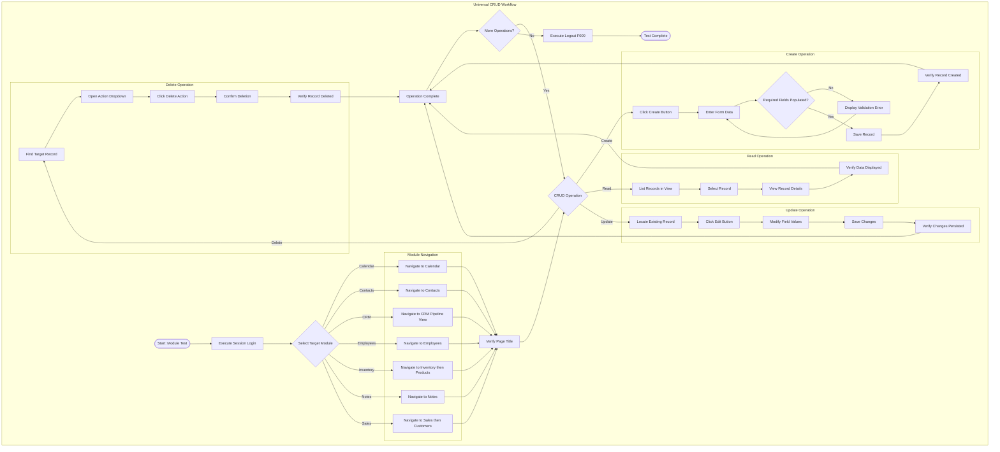
```mermaid
flowchart TD
    subgraph CRUDWorkflow["Universal CRUD Workflow"]
        CRUDStart(["Start: Module Test"])
        SessionLogin["Execute Session Login"]
        SelectModule{"Select Target Module"}
        
        subgraph ModuleNavigation["Module Navigation"]
            NavCalendar["Navigate to Calendar"]
            NavContacts["Navigate to Contacts"]
            NavCRM["Navigate to CRM Pipeline View"]
            NavEmployees["Navigate to Employees"]
            NavInventory["Navigate to Inventory then Products"]
            NavNotes["Navigate to Notes"]
            NavSales["Navigate to Sales then Customers"]
        end
        
        VerifyPageTitle["Verify Page Title"]
        SelectOperation{"CRUD Operation"}
        
        subgraph CreateOperation["Create Operation"]
            ClickCreate["Click Create Button"]
            EnterFormData["Enter Form Data"]
            ValidateRequired{"Required Fields Populated?"}
            ValidationError["Display Validation Error"]
            SaveRecord["Save Record"]
            VerifyCreation["Verify Record Created"]
        end
        
        subgraph ReadOperation["Read Operation"]
            ListRecords["List Records in View"]
            SelectRecord["Select Record"]
            ViewDetails["View Record Details"]
            VerifyData["Verify Data Displayed"]
        end
        
        subgraph UpdateOperation["Update Operation"]
            LocateRecord["Locate Existing Record"]
            ClickEdit["Click Edit Button"]
            ModifyFields["Modify Field Values"]
            SaveChanges["Save Changes"]
            VerifyUpdate["Verify Changes Persisted"]
        end
        
        subgraph DeleteOperation["Delete Operation"]
            FindRecord["Find Target Record"]
            OpenActions["Open Action Dropdown"]
            ClickDelete["Click Delete Action"]
            ConfirmDelete["Confirm Deletion"]
            VerifyDeletion["Verify Record Deleted"]
        end
        
        OperationComplete["Operation Complete"]
        MoreOperations{"More Operations?"}
        ExecuteLogout["Execute Logout F009"]
        CRUDEnd(["Test Complete"])
    end
    
    CRUDStart --> SessionLogin
    SessionLogin --> SelectModule
    
    SelectModule -->|Calendar| NavCalendar
    SelectModule -->|Contacts| NavContacts
    SelectModule -->|CRM| NavCRM
    SelectModule -->|Employees| NavEmployees
    SelectModule -->|Inventory| NavInventory
    SelectModule -->|Notes| NavNotes
    SelectModule -->|Sales| NavSales
    
    NavCalendar --> VerifyPageTitle
    NavContacts --> VerifyPageTitle
    NavCRM --> VerifyPageTitle
    NavEmployees --> VerifyPageTitle
    NavInventory --> VerifyPageTitle
    NavNotes --> VerifyPageTitle
    NavSales --> VerifyPageTitle
    
    VerifyPageTitle --> SelectOperation
    
    SelectOperation -->|Create| ClickCreate
    SelectOperation -->|Read| ListRecords
    SelectOperation -->|Update| LocateRecord
    SelectOperation -->|Delete| FindRecord
    
    ClickCreate --> EnterFormData
    EnterFormData --> ValidateRequired
    ValidateRequired -->|No| ValidationError
    ValidationError --> EnterFormData
    ValidateRequired -->|Yes| SaveRecord
    SaveRecord --> VerifyCreation
    VerifyCreation --> OperationComplete
    
    ListRecords --> SelectRecord
    SelectRecord --> ViewDetails
    ViewDetails --> VerifyData
    VerifyData --> OperationComplete
    
    LocateRecord --> ClickEdit
    ClickEdit --> ModifyFields
    ModifyFields --> SaveChanges
    SaveChanges --> VerifyUpdate
    VerifyUpdate --> OperationComplete
    
    FindRecord --> OpenActions
    OpenActions --> ClickDelete
    ClickDelete --> ConfirmDelete
    ConfirmDelete --> VerifyDeletion
    VerifyDeletion --> OperationComplete
    
    OperationComplete --> MoreOperations
    MoreOperations -->|Yes| SelectOperation
    MoreOperations -->|No| ExecuteLogout
    ExecuteLogout --> CRUDEnd
```

### 4.2.4 Drag-and-Drop Interaction Flow (CRM Pipeline & Notes Kanban)

This workflow captures the specialized drag-and-drop interactions used in CRM pipeline stage transitions and Notes kanban board operations.


```mermaid
flowchart TD
    subgraph DragDropWorkflow["Drag and Drop Workflow"]
        DDStart(["Start - Drag Drop Operation"])
        InitActions["Initialize Selenium Actions API"]
        LocateSource["Locate Source Element"]
        LocateTarget["Locate Target Element"]
        ClickHold["Actions - clickAndHold on Source"]
        PauseHold["Pause 2000ms - Allow UI Response"]
        MoveToTarget["Actions - moveToElement to Target"]
        PauseMove["Pause 2000ms - Stabilize Position"]
        ReleaseElement["Actions - release Drop Element"]
        PerformAction["Actions - perform Execute Sequence"]
        WaitSync["Thread sleep 2000ms - UI Sync"]
        VerifyTransition{"Element in New Position"}
        DDSuccess(["Drag-Drop Success"])
        DDFailure(["Drag-Drop Failed"])
        
        DDStart --> InitActions
        InitActions --> LocateSource
        LocateSource --> LocateTarget
        LocateTarget --> ClickHold
        ClickHold --> PauseHold
        PauseHold --> MoveToTarget
        MoveToTarget --> PauseMove
        PauseMove --> ReleaseElement
        ReleaseElement --> PerformAction
        PerformAction --> WaitSync
        WaitSync --> VerifyTransition
        VerifyTransition -->|Yes| DDSuccess
        VerifyTransition -->|No| DDFailure
    end
```

#### Drag-and-Drop Timing Configuration

| Phase | Duration | Purpose |
|-------|----------|---------|
| Click and Hold | Immediate | Capture element |
| First Pause | 2000ms | Allow drag initiation |
| Move to Target | Immediate | Position change |
| Second Pause | 2000ms | Stabilize over target |
| Release | Immediate | Drop element |
| Post-Release Sync | 2000ms | UI update propagation |

### 4.2.5 Logout and Session Termination Flow (F-009)

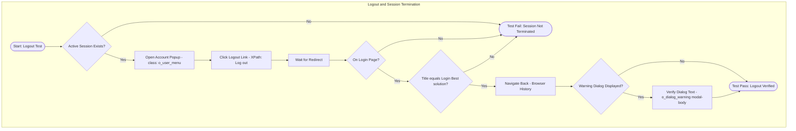
```mermaid
flowchart TD
    subgraph LogoutWorkflow["Logout and Session Termination"]
        LogoutStart(["Start: Logout Test"])
        VerifyActiveSession{"Active Session Exists?"}
        OpenUserMenu["Open Account Popup - class: o_user_menu"]
        ClickLogout["Click Logout Link - XPath: Log out"]
        WaitRedirect["Wait for Redirect"]
        VerifyLoginPage{"On Login Page?"}
        CheckTitle{"Title equals Login Best solution?"}
        TestBackNav["Navigate Back - Browser History"]
        CheckWarning{"Warning Dialog Displayed?"}
        VerifyWarningText["Verify Dialog Text - o_dialog_warning modal-body"]
        LogoutSuccess(["Test Pass: Logout Verified"])
        LogoutFailure(["Test Fail: Session Not Terminated"])
    end

    LogoutStart --> VerifyActiveSession
    VerifyActiveSession -->|Yes| OpenUserMenu
    VerifyActiveSession -->|No| LogoutFailure
    OpenUserMenu --> ClickLogout
    ClickLogout --> WaitRedirect
    WaitRedirect --> VerifyLoginPage
    VerifyLoginPage -->|Yes| CheckTitle
    VerifyLoginPage -->|No| LogoutFailure
    CheckTitle -->|Yes| TestBackNav
    CheckTitle -->|No| LogoutFailure
    TestBackNav --> CheckWarning
    CheckWarning -->|Yes| VerifyWarningText
    CheckWarning -->|No| LogoutSuccess
    VerifyWarningText --> LogoutSuccess
```

## 4.3 Integration Workflows

### 4.3.1 Data Flow Between Systems

This diagram illustrates the complete data flow architecture from configuration through execution to reporting.

```mermaid
flowchart TB
    subgraph ConfigurationLayer["Configuration Data Source"]
        PropertiesFile[("configuration properties")]
        FeatureFiles[("Gherkin Feature Files")]
        StepDefFiles[("Step Definition Classes")]
    end

    subgraph DataLoading["Data Loading Phase"]
        ConfigReader["ConfigurationReader: Static Properties Load"]
        CucumberParser["Cucumber Feature Parser"]
        GlueBinding["Step Definition Binding"]
    end

    subgraph RuntimeData["Runtime Data Flow"]
        BrowserType["browser: chrome or firefox"]
        TargetURL["web table url"]
        Credentials["username and password"]
        TestData["Scenario Parameters: Examples Tables"]
    end

    subgraph ExecutionLayer["Execution Data Processing"]
        WebDriverOps["WebDriver Operations"]
        PageObjectLocators["Page Object Locators: FindBy Elements"]
        DOMInteraction["DOM Element Interactions"]
    end

    subgraph PersistenceLayer["Data Persistence"]
        OdooDatabase[("Odoo Backend Database")]
        ContactRecords["Contact Records"]
        CustomerRecords["Customer Records"]
        PipelineRecords["Pipeline and Opportunities"]
        EmployeeRecords["Employee Records"]
        ProductRecords["Product Records"]
        NoteRecords["Note Records"]
        CalendarEvents["Calendar Events"]
    end

    subgraph OutputLayer["Output Data"]
        HTMLReport[("cucumber reports html")]
        JSONReport[("cucumber json")]
        RerunTxt[("rerun txt")]
        PrettyBundle[("target cucumber")]
        Screenshots[("Failure Screenshots")]
    end

    PropertiesFile --> ConfigReader
    FeatureFiles --> CucumberParser
    StepDefFiles --> GlueBinding

    ConfigReader --> BrowserType
    ConfigReader --> TargetURL
    ConfigReader --> Credentials
    CucumberParser --> TestData

    BrowserType --> WebDriverOps
    TargetURL --> WebDriverOps
    Credentials --> WebDriverOps
    TestData --> WebDriverOps

    GlueBinding --> PageObjectLocators
    PageObjectLocators --> DOMInteraction
    WebDriverOps --> DOMInteraction

    DOMInteraction --> OdooDatabase
    OdooDatabase --> ContactRecords
    OdooDatabase --> CustomerRecords
    OdooDatabase --> PipelineRecords
    OdooDatabase --> EmployeeRecords
    OdooDatabase --> ProductRecords
    OdooDatabase --> NoteRecords
    OdooDatabase --> CalendarEvents

    DOMInteraction --> HTMLReport
    DOMInteraction --> JSONReport
    DOMInteraction --> RerunTxt
    DOMInteraction --> PrettyBundle
    DOMInteraction --> Screenshots
```

### 4.3.2 API Interaction Flow

This sequence diagram illustrates the WebDriver protocol interactions between Selenium and browser instances.

```mermaid
sequenceDiagram
    participant SD as Step Definition
    participant PO as Page Object
    participant DR as Driver
    participant WDM as WebDriverManager
    participant WD as WebDriver
    participant BR as Browser
    participant APP as Odoo Application
    
    Note over SD,APP: Test Execution Initialization
    SD->>DR: getDriver
    DR->>DR: Check ThreadLocal
    alt Driver Not Initialized
        DR->>WDM: setup for browser type
        WDM->>WDM: Download and Configure Driver
        WDM-->>DR: Driver Binary Path
        DR->>WD: new ChromeDriver/FirefoxDriver
        WD->>BR: Launch Browser Instance
        BR-->>WD: Session Created
        DR->>WD: manage window maximize
        DR->>WD: manage timeouts implicitlyWait
        WD-->>DR: Configuration Applied
        DR->>DR: Store in ThreadLocal
    end
    DR-->>SD: WebDriver Instance
    
    Note over SD,APP: Page Navigation
    SD->>PO: Execute Step
    PO->>DR: getDriver
    DR-->>PO: WebDriver Instance
    PO->>WD: get URL
    WD->>BR: HTTP GET Request
    BR->>APP: Load Page
    APP-->>BR: HTML/CSS/JS Response
    BR-->>WD: Page Loaded Event
    WD-->>PO: Navigation Complete
    
    Note over SD,APP: Element Interaction
    PO->>WD: findElement with locator
    WD->>BR: Execute FindElement Command
    BR->>BR: DOM Query using XPath/CSS
    BR-->>WD: Element Reference
    WD-->>PO: WebElement Object
    PO->>WD: element sendKeys/click
    WD->>BR: Execute Interaction
    BR->>APP: Form Submission or Action
    APP-->>BR: Response and State Change
    BR-->>WD: Interaction Complete
    WD-->>PO: Action Confirmed
    
    Note over SD,APP: Cleanup
    SD->>DR: closeDriver
    DR->>WD: quit
    WD->>BR: Terminate Session
    BR-->>WD: Session Closed
    DR->>DR: Remove from ThreadLocal
```

### 4.3.3 Event Processing Flow (Cucumber Hooks)

```mermaid
flowchart TD
    subgraph EventProcessing["Cucumber Event Processing"]
        ScenarioStart(["Scenario Execution Start"])
        BeforeHooks{"Before Hooks Defined?"}
        ExecuteBefore["Execute Before Hooks"]
        ExecuteSteps["Execute Scenario Steps"]
        StepExecution{"Step Execution"}
        StepPass["Step Passed"]
        StepFail["Step Failed"]
        MarkFailed["Mark Scenario Failed"]
        ContinueSteps{"More Steps?"}
        AfterHooksStart["Start After Hook - Hooks java"]
        CheckFailure{"scenario isFailed?"}
        CaptureEvidence["Capture Screenshot - TakesScreenshot Interface"]
        AttachToReport["Attach to Scenario - scenario attach PNG"]
        CleanupDriver["Driver closeDriver - Quit and Remove ThreadLocal"]
        ScenarioEnd(["Scenario Complete"])
        
        ScenarioStart --> BeforeHooks
        BeforeHooks -->|Yes| ExecuteBefore
        BeforeHooks -->|No| ExecuteSteps
        ExecuteBefore --> ExecuteSteps
        ExecuteSteps --> StepExecution
        StepExecution -->|Pass| StepPass
        StepExecution -->|Fail| StepFail
        StepPass --> ContinueSteps
        StepFail --> MarkFailed
        MarkFailed --> ContinueSteps
        ContinueSteps -->|Yes| StepExecution
        ContinueSteps -->|No| AfterHooksStart
        AfterHooksStart --> CheckFailure
        CheckFailure -->|Yes| CaptureEvidence
        CheckFailure -->|No| CleanupDriver
        CaptureEvidence --> AttachToReport
        AttachToReport --> CleanupDriver
        CleanupDriver --> ScenarioEnd
    end
```

### 4.3.4 Batch Processing Sequence (Parallel Test Execution)

```mermaid
flowchart TD
    subgraph ParallelExecution["Parallel Test Execution"]
        BatchStart([Maven Test Trigger])
        SurefireInit["Surefire Plugin Initialize parallel=methods"]
        ThreadPoolInit["Initialize Unlimited Thread Pool"]
        DiscoverTests["Discover Test Methods CukesRunner.java"]
        TagFilter["Apply Tag Filter @Smoke"]
        
        subgraph ThreadPool["Thread Pool Execution"]
            Thread1["Thread 1 - Scenario A"]
            Thread2["Thread 2 - Scenario B"]
            Thread3["Thread 3 - Scenario C"]
            ThreadN["Thread N - Scenario N"]
        end
        
        subgraph ThreadIsolation["Per-Thread Resources"]
            TL1["ThreadLocal Driver 1"]
            TL2["ThreadLocal Driver 2"]
            TL3["ThreadLocal Driver 3"]
            TLN["ThreadLocal Driver N"]
        end
        
        AggregateResults["Aggregate Results"]
        GenerateReports["Generate Combined Reports"]
        ContinueBuild{"testFailureIgnore=true"}
        BuildPass([Build Continues])
        BatchEnd([Batch Complete])
    end

    BatchStart --> SurefireInit
    SurefireInit --> ThreadPoolInit
    ThreadPoolInit --> DiscoverTests
    DiscoverTests --> TagFilter
    
    TagFilter --> Thread1
    TagFilter --> Thread2
    TagFilter --> Thread3
    TagFilter --> ThreadN
    
    Thread1 --> TL1
    Thread2 --> TL2
    Thread3 --> TL3
    ThreadN --> TLN
    
    TL1 --> AggregateResults
    TL2 --> AggregateResults
    TL3 --> AggregateResults
    TLN --> AggregateResults
    
    AggregateResults --> GenerateReports
    GenerateReports --> ContinueBuild
    ContinueBuild -->|Failures Ignored| BuildPass
    BuildPass --> BatchEnd
```

## 4.4 State Transition Diagrams

### 4.4.1 WebDriver Lifecycle State Diagram

This state diagram documents the complete lifecycle of WebDriver instances managed through the `Driver.java` utility class with `InheritableThreadLocal` isolation.

```mermaid
stateDiagram-v2
    [*] --> Uninitialized: Thread Created
    
    Uninitialized --> Initializing: getDriver called
    
    Initializing --> BrowserSelection: Read browser property
    
    BrowserSelection --> ChromeSetup: browser=chrome
    BrowserSelection --> FirefoxSetup: browser=firefox
    
    ChromeSetup --> DriverReady: WebDriverManager setup, ChromeDriver created
    FirefoxSetup --> DriverReady: WebDriverManager setup, FirefoxDriver created
    
    DriverReady --> Configured: window maximize, implicitWait 10s
    
    Configured --> Stored: Store in ThreadLocal
    
    Stored --> Active: Return to caller
    
    Active --> Active: getDriver returns existing
    Active --> Navigating: get url
    Active --> Interacting: findElement, click, sendKeys
    
    Navigating --> Active: Page loaded
    Interacting --> Active: Action complete
    
    Active --> Closing: closeDriver called
    
    Closing --> Quitting: driver quit
    
    Quitting --> Removed: ThreadLocal remove
    
    Removed --> [*]: Thread complete
```

### 4.4.2 User Session State Diagram

```mermaid
stateDiagram-v2
    [*] --> Unauthenticated: Browser launched
    
    Unauthenticated --> LoginPage: Navigate to URL
    
    LoginPage --> CredentialsEntered: Enter username and password
    
    CredentialsEntered --> Authenticating: Click Login
    
    Authenticating --> Authenticated: Valid credentials
    Authenticating --> LoginFailed: Invalid credentials
    
    LoginFailed --> LoginPage: Display error
    
    Authenticated --> Dashboard: Load dashboard
    
    state ModuleActive {
        [*] --> Viewing
        Viewing --> Creating: Click Create
        Viewing --> Editing: Click Edit
        Viewing --> Deleting: Click Delete
        Creating --> Viewing: Save complete
        Editing --> Viewing: Save complete
        Deleting --> Viewing: Delete confirmed
    }
    
    Dashboard --> ModuleActive: Navigate to module
    
    ModuleActive --> Dashboard: Return to dashboard
    
    Dashboard --> LoggingOut: Click Logout
    ModuleActive --> LoggingOut: Click Logout
    
    LoggingOut --> Unauthenticated: Session terminated
    
    Unauthenticated --> [*]: Browser closed
    
    note right of Authenticated : Session cookie established
    note right of LoggingOut : Redirect to login page
```

### 4.4.3 Test Scenario State Diagram

```mermaid
stateDiagram-v2
    [*] --> Pending: Scenario discovered
    
    Pending --> Queued: Added to execution queue
    
    Queued --> Running: Thread assigned
    
    Running --> StepExecuting: Execute step
    
    state StepExecuting {
        [*] --> Given
        Given --> When
        When --> Then
        Then --> AndStep: Additional steps
        AndStep --> [*]
    }
    
    StepExecuting --> Passed: All steps pass
    StepExecuting --> Failed: Step assertion fails
    StepExecuting --> Error: Exception thrown
    
    Failed --> ScreenshotCapture: Capture evidence
    Error --> ScreenshotCapture: Capture evidence
    
    ScreenshotCapture --> RerunRecorded: Write to rerun file
    
    RerunRecorded --> Cleanup: After hook
    Passed --> Cleanup: After hook
    
    Cleanup --> Complete: Driver closed
    
    Complete --> [*]: Report generated
    
    note right of Failed : isFailed is true, Screenshot attached to report
    
    note right of RerunRecorded : URI and line written to target rerun file
```

### 4.4.4 Configuration State Diagram

```mermaid
stateDiagram-v2
    [*] --> Unloaded: Application start
    
    Unloaded --> Loading: ConfigurationReader class load
    
    Loading --> FileLocating: Locate configuration.properties
    
    FileLocating --> StreamOpening: Create FileInputStream
    
    StreamOpening --> PropertiesLoading: properties.load inputStream
    
    PropertiesLoading --> Loaded: Static initialization complete
    
    Loaded --> Accessible: getProperty calls available
    
    Accessible --> Accessible: Return property values
    
    note right of Loaded : Properties snapshot includes browser, url, username, password
    
    note right of Accessible : No hot reload capability, values fixed at startup
```

## 4.5 Error Handling Flowcharts

### 4.5.1 Comprehensive Error Handling Workflow

```mermaid
flowchart TD
    ErrorStart([Error Condition Detected])
    ClassifyError{Error Type}
    ContinueExecution([Continue Execution])
    ErrorResolved([Error Handled])
    
    subgraph ElementErrors ["Element Location Errors"]
        NoSuchElement["NoSuchElementException"]
        ImplicitRetry["Implicit Wait Retry - Up to 10 seconds"]
        ElementFound{"Element Found?"}
        ElementTimeout["Element Timeout - Test Fails"]
    end
    
    subgraph SyncErrors ["Synchronization Errors"]
        StaleElement["StaleElementReferenceException"]
        ElementNotVisible["ElementNotVisibleException"]
        ExplicitWait["Explicit Wait - 2s or 20s timeout"]
        ThreadSleep["Thread.sleep - UI Stabilization"]
        Synchronized{"UI Stable?"}
        SyncFailed["Synchronization Failed"]
    end
    
    subgraph ValidationErrors ["Validation Errors"]
        AssertionFailed["AssertionError"]
        RequiredField["Required Field Missing"]
        InvalidData["Invalid Data Format"]
        CaptureState["Capture Current State"]
    end
    
    subgraph RecoveryActions ["Recovery and Evidence"]
        MarkScenarioFailed["Mark Scenario Failed"]
        TakeScreenshot["Take Screenshot via TakesScreenshot Interface"]
        AttachEvidence["Attach to Report via scenario.attach"]
        WriteRerun["Write to rerun.txt"]
        CloseSession["Close WebDriver Session"]
    end
    
    ErrorStart --> ClassifyError
    
    ClassifyError -->|Element Not Found| NoSuchElement
    ClassifyError -->|Timing Issue| StaleElement
    ClassifyError -->|Assertion Failure| AssertionFailed
    ClassifyError -->|Form Validation| RequiredField
    
    NoSuchElement --> ImplicitRetry
    ImplicitRetry --> ElementFound
    ElementFound -->|Yes| ContinueExecution
    ElementFound -->|No| ElementTimeout
    ElementTimeout --> MarkScenarioFailed
    
    StaleElement --> ExplicitWait
    ElementNotVisible --> ExplicitWait
    ExplicitWait --> Synchronized
    Synchronized -->|Yes| ContinueExecution
    Synchronized -->|No| ThreadSleep
    ThreadSleep --> Synchronized
    Synchronized -->|Timeout| SyncFailed
    SyncFailed --> MarkScenarioFailed
    
    AssertionFailed --> CaptureState
    RequiredField --> CaptureState
    InvalidData --> CaptureState
    CaptureState --> MarkScenarioFailed
    
    MarkScenarioFailed --> TakeScreenshot
    TakeScreenshot --> AttachEvidence
    AttachEvidence --> WriteRerun
    WriteRerun --> CloseSession
    CloseSession --> ErrorResolved
```

### 4.5.2 Failed Test Rerun Mechanism

```mermaid
flowchart TD
    subgraph RerunMechanism["Failed Test Rerun Workflow"]
        RerunStart(["Rerun Process Start"])
        CheckRerunFile{"rerun.txt Exists?"}
        FileEmpty{"File Contains Scenarios?"}
        ParseLocations["Parse Failed Scenario Locations"]
        InitFailedRunner["Initialize FailedTestRunner"]
        BindGlue["Bind Step Definitions"]
        ExecuteFailed["Execute Failed Scenarios Only"]
        EvaluateRerun{"Rerun Passed?"}
        UpdateResults["Update Test Results"]
        IdentifyFlaky["Identify Flaky Tests"]
        PersistentFailure["Confirm Persistent Failures"]
        GenerateReport["Generate Rerun Report"]
        RerunEnd(["Rerun Complete"])
        NoRerunNeeded(["No Rerun Needed"])
        
        RerunStart --> CheckRerunFile
        CheckRerunFile -->|No| NoRerunNeeded
        CheckRerunFile -->|Yes| FileEmpty
        FileEmpty -->|No| NoRerunNeeded
        FileEmpty -->|Yes| ParseLocations
        ParseLocations --> InitFailedRunner
        InitFailedRunner --> BindGlue
        BindGlue --> ExecuteFailed
        ExecuteFailed --> EvaluateRerun
        EvaluateRerun -->|Yes| IdentifyFlaky
        EvaluateRerun -->|No| PersistentFailure
        IdentifyFlaky --> UpdateResults
        PersistentFailure --> UpdateResults
        UpdateResults --> GenerateReport
        GenerateReport --> RerunEnd
    end
```

### 4.5.3 Screenshot Capture on Failure Flow

```mermaid
flowchart TD
    subgraph ScreenshotFlow["Screenshot Capture Workflow"]
        SSStart(["Scenario Completed"])
        CheckStatus{"scenario.isFailed?"}
        SkipCapture["Skip Screenshot"]
        GetDriver["Get WebDriver Instance via Driver.getDriver"]
        CastInterface["Cast to TakesScreenshot Interface"]
        CaptureBytes["getScreenshotAs OutputType.BYTES"]
        CreatePNG["Create PNG Byte Array"]
        AttachScenario["scenario.attach screenshot, image/png, name"]
        EmbedReport["Embed in Cucumber Report"]
        CleanupPhase["Proceed to Cleanup"]
        CloseDriver["Driver.closeDriver"]
        QuitBrowser["WebDriver.quit"]
        RemoveThreadLocal["ThreadLocal.remove"]
        SSEnd(["Hook Complete"])
    end

    SSStart --> CheckStatus
    CheckStatus -->|No| SkipCapture
    CheckStatus -->|Yes| GetDriver
    SkipCapture --> CloseDriver
    GetDriver --> CastInterface
    CastInterface --> CaptureBytes
    CaptureBytes --> CreatePNG
    CreatePNG --> AttachScenario
    AttachScenario --> EmbedReport
    EmbedReport --> CleanupPhase
    CleanupPhase --> CloseDriver
    CloseDriver --> QuitBrowser
    QuitBrowser --> RemoveThreadLocal
    RemoveThreadLocal --> SSEnd
```

## 4.6 Module-Specific Process Flows

### 4.6.1 Calendar/Meetings Module Flow (F-002)

```mermaid
flowchart TD
    subgraph CalendarFlow["Calendar Module Workflow"]
        CalStart(["Start Calendar Test"])
        SessionLogin["Session Login"]
        NavCalendar["Navigate to Calendar"]
        VerifyTitle{"Title equals Meetings Odoo"}
        SelectView{"View Operation"}
        CalSuccess(["Calendar Tests Pass"])
        CalFailure(["Calendar Tests Fail"])
        
        subgraph ViewSwitching["View Switching"]
            ClickDay["Click Day Button"]
            VerifyDay["Verify Day Grid"]
            ClickWeek["Click Week Button"]
            VerifyWeek["Verify 7 Day Grid"]
            ClickMonth["Click Month Button"]
            VerifyMonth["Verify Month Grid"]
        end
        
        subgraph EventOperations["Event Operations"]
            SelectCell["Select Calendar Cell"]
            ModalOpens["Event Modal Opens"]
            EnterSummary["Enter Event Summary"]
            SaveEvent["Click Create Save"]
            WaitExplicit["Wait 2s Explicit"]
            VerifyEvent["Verify Event Created"]
        end
        
        subgraph EditOperations["Edit Operations"]
            SelectExisting["Select Existing Event"]
            EditMode["Enter Edit Mode"]
            ModifyDetails["Modify Event Details"]
            SaveChanges["Save Changes"]
            VerifyChanges["Verify Changes Persisted"]
        end
        
        CalStart --> SessionLogin
        SessionLogin --> NavCalendar
        NavCalendar --> VerifyTitle
        VerifyTitle -->|No| CalFailure
        VerifyTitle -->|Yes| SelectView
        
        SelectView -->|Day| ClickDay
        SelectView -->|Week| ClickWeek
        SelectView -->|Month| ClickMonth
        SelectView -->|Create| SelectCell
        SelectView -->|Edit| SelectExisting
        
        ClickDay --> VerifyDay
        VerifyDay --> CalSuccess
        ClickWeek --> VerifyWeek
        VerifyWeek --> CalSuccess
        ClickMonth --> VerifyMonth
        VerifyMonth --> CalSuccess
        
        SelectCell --> ModalOpens
        ModalOpens --> EnterSummary
        EnterSummary --> SaveEvent
        SaveEvent --> WaitExplicit
        WaitExplicit --> VerifyEvent
        VerifyEvent --> CalSuccess
        
        SelectExisting --> EditMode
        EditMode --> ModifyDetails
        ModifyDetails --> SaveChanges
        SaveChanges --> VerifyChanges
        VerifyChanges --> CalSuccess
    end
```

### 4.6.2 CRM Pipeline Management Flow (F-004)

```mermaid
flowchart TD
    CRMStart(["Start CRM Test"])
    SessionLogin["Session Login"]
    NavCRM["Navigate to CRM"]
    PipelineView["Pipeline Kanban View"]
    SelectOp{"CRM Operation"}
    CRMSuccess(["CRM Tests Pass"])
    
    subgraph CreatePipeline["Create Pipeline"]
        ClickNewPipeline["Click New Pipeline"]
        EnterTitle["Enter Opportunity Title"]
        LookupCustomer["Lookup Customer"]
        EnterRevenue["Enter Expected Revenue"]
        SetPriority["Set Priority Stars"]
        SavePipeline["Save Pipeline"]
        VerifyTotal["Verify Total Price"]
    end
    
    subgraph EditPipeline["Edit Pipeline Parameterized"]
        SelectPipeline["Select Pipeline Card"]
        EditFields["Edit Fields"]
        ApplyChanges["Apply Changes"]
        VerifyEdit["Verify Edits Persisted"]
    end
    
    subgraph StageDragDrop["Stage Transition via Drag Drop"]
        LocateCard["Locate Pipeline Card"]
        InitActions["Initialize Actions API"]
        DragSequence["Execute Drag Sequence"]
        DropOnStage["Drop on Target Stage"]
        VerifyMove["Verify Card in New Stage"]
    end
    
    subgraph CustomerReg["Customer Registration"]
        OpenCustomerForm["Open Customer Form"]
        EnterCustomerData["Enter Customer Details"]
        SaveCustomer["Save Customer"]
        ReturnToPipeline["Return to Pipeline"]
    end
    
    CRMStart --> SessionLogin
    SessionLogin --> NavCRM
    NavCRM --> PipelineView
    PipelineView --> SelectOp
    
    SelectOp -->|"Create"| ClickNewPipeline
    SelectOp -->|"Edit"| SelectPipeline
    SelectOp -->|"Stage Change"| LocateCard
    SelectOp -->|"New Customer"| OpenCustomerForm
    
    ClickNewPipeline --> EnterTitle
    EnterTitle --> LookupCustomer
    LookupCustomer --> EnterRevenue
    EnterRevenue --> SetPriority
    SetPriority --> SavePipeline
    SavePipeline --> VerifyTotal
    VerifyTotal --> CRMSuccess
    
    SelectPipeline --> EditFields
    EditFields --> ApplyChanges
    ApplyChanges --> VerifyEdit
    VerifyEdit --> CRMSuccess
    
    LocateCard --> InitActions
    InitActions --> DragSequence
    DragSequence --> DropOnStage
    DropOnStage --> VerifyMove
    VerifyMove --> CRMSuccess
    
    OpenCustomerForm --> EnterCustomerData
    EnterCustomerData --> SaveCustomer
    SaveCustomer --> ReturnToPipeline
    ReturnToPipeline --> CRMSuccess
```

### 4.6.3 Inventory/Products Module Flow (F-006)

```mermaid
flowchart TD
    subgraph InventoryFlow["Inventory Module Workflow"]
        InvStart(["Start Inventory Test"])
        SessionLogin["Session Login"]
        NavInventory["Navigate to Inventory"]
        NavProducts["Navigate to Products"]
        VerifyTitle{"Title equals Products Odoo"}
        
        subgraph ProductCreation["Product Creation with Validation"]
            ClickCreate["Click Create Button"]
            AttemptSave["Attempt Save Without Required Fields"]
            ValidationFires{"Validation Error Displayed"}
            NotificationError["Notification Manager Shows Error"]
            EnterProductName["Enter Product Name IBM"]
            SaveProduct["Save Product"]
            WaitExplicit["Wait 20 seconds Explicit"]
            VerifyProduct{"Product Visible"}
            ProductCreated["Product Created Successfully"]
        end
        
        InvSuccess(["Inventory Tests Pass"])
        InvFailure(["Inventory Tests Fail"])
    end
    
    InvStart --> SessionLogin
    SessionLogin --> NavInventory
    NavInventory --> NavProducts
    NavProducts --> VerifyTitle
    VerifyTitle -->|No| InvFailure
    VerifyTitle -->|Yes| ClickCreate
    ClickCreate --> AttemptSave
    AttemptSave --> ValidationFires
    ValidationFires -->|Yes| NotificationError
    ValidationFires -->|No| InvFailure
    NotificationError --> EnterProductName
    EnterProductName --> SaveProduct
    SaveProduct --> WaitExplicit
    WaitExplicit --> VerifyProduct
    VerifyProduct -->|Yes| ProductCreated
    VerifyProduct -->|No| InvFailure
    ProductCreated --> InvSuccess
```

## 4.7 Validation Rules and Business Logic

### 4.7.1 Validation Rules by Process Step

| Process | Step | Validation Rule | Implementation |
|---------|------|-----------------|----------------|
| Authentication | Credential Entry | Both username and password required | HTML5 required attribute |
| Authentication | Password Field | Must be masked (type="password") | Attribute assertion |
| Authentication | Login Submit | Valid credentials redirect to dashboard | Title assertion |
| Contacts | Create | Name field required | Form validation |
| CRM | Pipeline | Revenue must be numeric | Field type validation |
| Inventory | Product | Product name required before save | Notification manager |
| All Modules | Navigation | Page title must match expected | Assert.assertEquals |

### 4.7.2 Authorization Checkpoints

```mermaid
flowchart TD
    subgraph AuthorizationFlow["Authorization Checkpoint Flow"]
        RequestStart("Request Resource") --> CheckSession{"Active Session?"}
        CheckSession -->|No| RedirectLogin["Redirect to Login"]
        CheckSession -->|Yes| ValidateCredentials{"Valid Credentials in Session?"}
        ValidateCredentials -->|No| RedirectLogin
        ValidateCredentials -->|Yes| CheckModuleAccess{"Module Access Granted?"}
        CheckModuleAccess -->|No| DisplayError["Display Access Error"]
        CheckModuleAccess -->|Yes| AllowAccess["Allow Resource Access"]
        AllowAccess --> AuthComplete("Authorization Complete")
        RedirectLogin --> AuthComplete
        DisplayError --> AuthComplete
    end
```

### 4.7.3 Data Validation Requirements

| Field Type | Validation | Error Handling |
|------------|------------|----------------|
| Email | Format validation | HTML5 email type |
| Phone | Numeric input | Field accepts digits |
| Required Fields | Non-empty | Notification manager |
| Revenue | Numeric | Field type constraint |
| Dates | Calendar picker | UI enforced format |

## 4.8 Timing and SLA Considerations

### 4.8.1 Wait Strategy Configuration

```mermaid
flowchart TD
    subgraph WaitStrategy["Wait Strategy Decision Tree"]
        WaitStart(["Element Interaction Required"])
        CheckImplicit{"Implicit Wait 10s Sufficient?"}
        ImplicitWait["Use Implicit Wait - Driver Configuration"]
        CheckComplexity{"Complex UI Operation?"}
        StandardExplicit["Standard Explicit Wait - 2 seconds"]
        ExtendedExplicit["Extended Explicit Wait - 20 seconds"]
        CheckUISync{"UI Animation or Modal?"}
        ThreadSleep["Thread sleep - 2-3 seconds"]
        ElementReady["Element Ready for Interaction"]
        WaitComplete(["Proceed with Action"])
        
        WaitStart --> CheckImplicit
        CheckImplicit -->|Yes| ImplicitWait
        CheckImplicit -->|No| CheckComplexity
        ImplicitWait --> ElementReady
        CheckComplexity -->|Standard| StandardExplicit
        CheckComplexity -->|Extended| ExtendedExplicit
        StandardExplicit --> CheckUISync
        ExtendedExplicit --> CheckUISync
        CheckUISync -->|Yes| ThreadSleep
        CheckUISync -->|No| ElementReady
        ThreadSleep --> ElementReady
        ElementReady --> WaitComplete
    end
```

### 4.8.2 Timing Constraints Summary

| Constraint Type | Value | Application Scope | Rationale |
|-----------------|-------|-------------------|-----------|
| Implicit Wait | 10 seconds | All element locations | Global retry mechanism |
| Standard Explicit | 2 seconds | Calendar, CRM operations | Quick UI responses |
| Extended Explicit | 20 seconds | Contacts, Inventory forms | Complex page loads |
| Thread.sleep | 2000ms | Drag-drop, modal dialogs | UI animation completion |
| Thread.sleep | 3000ms | Contact operations | Form rendering stabilization |
| Thread.sleep | 7000ms | Employee operations | Extended UI synchronization |

### 4.8.3 Performance SLA Targets

| Metric | Target | Measurement Point |
|--------|--------|-------------------|
| Login Response | < 10 seconds | Dashboard visibility |
| Page Navigation | < 10 seconds | Title verification |
| Form Save | < 20 seconds | Success message/redirect |
| Drag-Drop Complete | < 6 seconds | Element position update |
| Report Generation | < 60 seconds | File creation complete |

## 4.9 References

### 4.9.1 Source Files Referenced

- `src/main/java/com/testinium/utilities/Driver.java` - WebDriver lifecycle management with InheritableThreadLocal
- `src/main/java/com/testinium/utilities/ConfigurationReader.java` - Static properties loading
- `src/main/java/com/testinium/step_definitions/Hooks.java` - Screenshot capture and cleanup hooks
- `src/main/java/com/testinium/step_definitions/LoginSD.java` - Authentication workflow implementation
- `src/main/java/com/testinium/step_definitions/Session.java` - Reusable session login step
- `src/main/java/com/testinium/step_definitions/Crm.java` - CRM workflow with drag-and-drop
- `src/main/java/com/testinium/step_definitions/Calendar.java` - Calendar module operations
- `src/main/java/com/testinium/step_definitions/Contacts.java` - Contacts CRUD implementation
- `src/main/java/com/testinium/step_definitions/EmployeeStage.java` - Employee module navigation
- `src/main/java/com/testinium/step_definitions/Inventory.java` - Product creation with validation
- `src/main/java/com/testinium/step_definitions/Notes.java` - Notes kanban operations
- `src/main/java/com/testinium/step_definitions/Sales.java` - Sales/Customer management
- `src/main/java/com/testinium/step_definitions/LogOutSD.java` - Logout and session termination
- `src/main/java/com/testinium/runners/CukesRunner.java` - Primary test runner configuration
- `src/main/java/com/testinium/runners/FailedTestRunner.java` - Failed test rerun runner
- `pom.xml` - Maven build and Surefire parallel execution configuration

### 4.9.2 Page Object Classes Referenced

- `src/main/java/com/testinium/pages/LoginP.java` - Login page element locators
- `src/main/java/com/testinium/pages/SessionP.java` - Session page elements
- `src/main/java/com/testinium/pages/CalendarP.java` - Calendar module locators
- `src/main/java/com/testinium/pages/ContactsP.java` - Contacts module locators
- `src/main/java/com/testinium/pages/CrmP.java` - CRM pipeline locators
- `src/main/java/com/testinium/pages/EmployeeP.java` - Employee module locators
- `src/main/java/com/testinium/pages/InventoryP.java` - Inventory/Products locators
- `src/main/java/com/testinium/pages/NotesP.java` - Notes kanban locators
- `src/main/java/com/testinium/pages/SalesP.java` - Sales/Customers locators
- `src/main/java/com/testinium/pages/LogOutP.java` - Logout functionality locators

### 4.9.3 Technical Specification Sections Referenced

- Section 1.2 System Overview - Architecture and component structure
- Section 2.2 Feature Specifications - Detailed feature requirements (F-001 through F-011)
- Section 2.3 Feature Relationships - Dependency map and integration points
- Section 2.4 Implementation Considerations - Technical constraints and performance requirements
- Section 2.6 Process Flowcharts - Existing base flowcharts
- Section 3.6 Technology Integration Architecture - Component integration flow

### 4.9.4 Configuration Files Referenced

- `configuration.properties` - Environment configuration (browser, URLs, credentials)
- `target/rerun.txt` - Failed scenario locations for rerun
- `target/cucumber-reports.html` - HTML report output
- `target/cucumber.json` - JSON report output
- `target/cucumber/` - PrettyReports bundle directory

# 5. System Architecture

## 5.1 High-Level Architecture

### 5.1.1 System Overview

#### Architecture Style and Rationale

The Testinium-QA framework implements a **Layered Architecture** pattern specifically designed for Behavior-Driven Development (BDD) test automation. This architectural approach provides clear separation of concerns across five distinct layers, each with specific responsibilities and minimal coupling between adjacent layers.

The layered architecture was selected for the following reasons:

| Rationale | Benefit |
|-----------|---------|
| **Separation of Concerns** | Each layer handles a specific aspect of test automation, enabling independent modification |
| **Maintainability** | Changes to UI locators are isolated to Page Objects, while test logic remains in Step Definitions |
| **Testability** | Individual layers can be validated in isolation before integration |
| **Team Scalability** | Different team members can work on different layers simultaneously |
| **Industry Alignment** | Follows established Selenium/Cucumber best practices familiar to QA engineers |

#### Key Architectural Principles

The framework adheres to the following architectural principles:

1. **Page Object Model (POM)**: All UI element locators and page-specific operations are encapsulated within dedicated page classes, providing a single point of change when the target application's DOM structure evolves.

2. **Thread-Safe Parallel Execution**: The framework employs `InheritableThreadLocal<WebDriver>` to ensure complete browser instance isolation across parallel test threads, enabling maximum concurrent execution without resource conflicts.

3. **Externalized Configuration**: Environment-specific settings (URLs, credentials, browser selection) are stored in `configuration.properties`, allowing runtime configuration without code modifications.

4. **Convention over Configuration**: The framework follows Cucumber-JVM conventions for feature file discovery, step definition binding, and report generation, minimizing explicit configuration requirements.

5. **Fail-Fast with Evidence Capture**: Failed scenarios immediately capture screenshots and record scenario locations for rerun, ensuring comprehensive failure documentation.

#### System Boundaries and Major Interfaces

```mermaid
flowchart TB
    subgraph ExternalSystems["External Systems"]
        Jenkins["Jenkins CI/CD"]
        Jira["Jira Issue Tracking"]
        Browsers["Chrome and Firefox Browsers"]
        OdooERP["Odoo Upgenix ERP"]
    end
    
    subgraph FrameworkBoundary["Testinium-QA Framework Boundary"]
        FeatureFiles["Feature Files Layer"]
        TestRunners["Test Runner Layer"]
        StepDefs["Step Definitions Layer"]
        PageObjects["Page Object Layer"]
        Utilities["Utilities Layer"]
    end
    
    subgraph OutputArtifacts["Output Artifacts"]
        HTMLReports["HTML Reports"]
        JSONReports["JSON Reports"]
        Screenshots["Failure Screenshots"]
        RerunFile["rerun.txt"]
    end
    
    Jenkins -->|mvn test| TestRunners
    TestRunners -->|Execute| FeatureFiles
    FeatureFiles -->|Bind| StepDefs
    StepDefs -->|Use| PageObjects
    PageObjects -->|Initialize| Utilities
    Utilities -->|WebDriver Protocol| Browsers
    Browsers -->|HTTP/HTTPS| OdooERP
    StepDefs -->|Generate| HTMLReports
    StepDefs -->|Generate| JSONReports
    StepDefs -->|Capture| Screenshots
    StepDefs -->|Record| RerunFile
    HTMLReports -->|Publish| Jira
```

### 5.1.2 Core Components Table

| Component Name | Primary Responsibility | Key Dependencies | Integration Points |
|----------------|----------------------|------------------|-------------------|
| **CukesRunner** | Primary test execution orchestration | Cucumber-JUnit, JUnit 4 | Feature files, Step definitions |
| **FailedTestRunner** | Failed scenario re-execution | Cucumber-JUnit, rerun.txt | Step definitions, Report plugins |
| **Driver** | WebDriver lifecycle management | WebDriverManager, Selenium | All Page Objects, Hooks |
| **ConfigurationReader** | Configuration property access | Java Properties API | Driver, Step definitions |
| **LoginP** | Authentication page operations | Selenium PageFactory, Driver | LoginSD, Session |
| **CrmP** | CRM pipeline UI interactions | Selenium PageFactory, Driver | Crm step definitions |
| **Hooks** | Test lifecycle management | Cucumber Hooks API, TakesScreenshot | All scenarios, Report plugins |

### 5.1.3 Data Flow Description

#### Primary Data Flows

The Testinium-QA framework processes data through the following primary flows:

**1. Test Execution Data Flow**

Test execution begins when Maven Surefire activates the `CukesRunner` class. Cucumber's feature parser reads Gherkin feature files from `src/main/resources/features`, extracting scenario definitions and step text. The step matcher binds each step to corresponding methods in the step definitions package (`com/testinium/step_definitions`). Step definitions instantiate Page Objects, which in turn initialize WebDriver instances through the `Driver` utility class.

**2. Configuration Data Flow**

At class load time, `ConfigurationReader` reads `configuration.properties` via a static initializer block, populating a `Properties` object. Step definitions and the `Driver` class access these properties through the `getProperty(String)` method. Configuration values include browser type, target URL, and user credentials. This snapshot-based approach ensures consistent configuration throughout a test run but does not support hot-reload.

**3. Result and Evidence Data Flow**

As scenarios complete, Cucumber evaluates step outcomes and records pass/fail status. For failed scenarios, the `Hooks.java` @After method captures screenshots via Selenium's `TakesScreenshot` interface, attaching PNG byte arrays to the scenario report. The rerun plugin writes failed scenario locations to `target/rerun.txt`. Report plugins generate HTML, JSON, and PrettyReports artifacts to `target/cucumber/`.

#### Data Transformation Points

| Transformation Point | Input | Output | Component |
|----------------------|-------|--------|-----------|
| Gherkin Parsing | `.feature` text files | Scenario execution model | Cucumber Engine |
| Step Binding | Regex/Cucumber Expression | Method invocation | Step Definition classes |
| PageFactory Init | `@FindBy` annotations | Proxy WebElements | Page Object constructors |
| Screenshot Capture | Browser DOM state | PNG byte array | Hooks.java |
| Report Generation | Execution results | HTML/JSON files | Cucumber plugins |

### 5.1.4 External Integration Points

| System Name | Integration Type | Data Exchange Pattern | Protocol/Format |
|-------------|-----------------|----------------------|-----------------|
| **Odoo/Upgenix ERP** | Browser automation | Request/Response | HTTP/HTTPS via WebDriver |
| **Jenkins** | CI/CD pipeline | Command invocation | Maven CLI commands |
| **Jira** | Issue tracking | Manual correlation | Tags (e.g., @UPGN-286) |
| **Chrome Browser** | Test execution | WebDriver protocol | ChromeDriver binary |
| **Firefox Browser** | Test execution | WebDriver protocol | GeckoDriver binary |

---

## 5.2 Component Details

### 5.2.1 Utilities Layer

#### Driver Component

**Purpose and Responsibilities:**
The `Driver` class serves as the centralized WebDriver lifecycle manager, providing thread-safe browser instance creation, configuration, and cleanup. It implements the Singleton-per-Thread pattern using `InheritableThreadLocal<WebDriver>`.

**Technologies and Frameworks:**
- Selenium WebDriver 3.141.59
- WebDriverManager 5.1.0
- Java InheritableThreadLocal API

**Key Interfaces and APIs:**

| Method | Signature | Behavior |
|--------|-----------|----------|
| `getDriver()` | `public static WebDriver getDriver()` | Returns existing driver or lazy-initializes new instance |
| `closeDriver()` | `public static void closeDriver()` | Quits browser and removes from ThreadLocal |

**Data Persistence Requirements:**
None. WebDriver instances are transient per test thread.

**Scaling Considerations:**
The `InheritableThreadLocal<WebDriver>` pattern enables unlimited parallel browser instances, bounded only by system resources. Each thread maintains complete isolation.

**Implementation Details:**
- Private constructor prevents instantiation (static-only usage)
- Browser selection via `ConfigurationReader.getProperty("browser")`
- 10-second implicit wait configured globally
- Window maximization on startup

**Known Issue:** Firefox setup incorrectly calls `WebDriverManager.chromedriver().setup()` instead of `firefoxdriver()` (line 37 in `Driver.java`).

#### ConfigurationReader Component

**Purpose and Responsibilities:**
Provides a facade for reading externalized configuration from `configuration.properties`, isolating property file access from consuming components.

**Technologies and Frameworks:**
- Java Properties API
- Java FileInputStream

**Key Interfaces and APIs:**

| Method | Signature | Behavior |
|--------|-----------|----------|
| `getProperty(String)` | `public static String getProperty(String key)` | Returns property value for given key |

**Data Persistence Requirements:**
Reads from `configuration.properties` at class load time. Properties stored in-memory for duration of JVM execution.

**Scaling Considerations:**
Static initialization ensures single-load semantics. No synchronization overhead for property reads.

**Configuration Properties:**

| Property | Purpose | Example Value |
|----------|---------|---------------|
| `browser` | Browser selection | `chrome` or `firefox` |
| `url` | Target application URL | `https://qa.upgenix.net/web/login` |
| `username` | Login credential | User email address |
| `password` | Login credential | User password |
| `web.table.url` | Web table test URL | Varies |

### 5.2.2 Page Object Layer

#### Page Object Architecture

All 10 Page Object classes follow a consistent structural pattern:

```mermaid
flowchart TB
    subgraph PageObjectPattern["Page Object Pattern Structure"]
        direction TB
        Constructor["Constructor - PageFactory.initElements"]
        FindByAnnotations["FindBy Annotations - Element Locators"]
        WebElements["WebElement Fields - inputEmail, loginButton, etc"]
        HelperMethods["Helper Methods - Optional business operations"]
    end
    
    Constructor --> FindByAnnotations
    FindByAnnotations --> WebElements
    WebElements --> HelperMethods
```

#### Page Objects Inventory

| Page Object | Module | Key Element Count | Locator Strategies |
|-------------|--------|-------------------|-------------------|
| `LoginP.java` | Authentication | 5 | XPath, name |
| `SessionP.java` | Session Login | 3 | id, name, XPath |
| `CalendarP.java` | Meetings | 8+ | XPath, className |
| `ContactsP.java` | Contacts | 10+ | XPath, partialLinkText |
| `CrmP.java` | CRM | 12+ | XPath, data-id attributes |
| `EmployeeP.java` | Employees | 8+ | linkText, XPath |
| `InventoryP.java` | Inventory | 6+ | XPath, className |
| `NotesP.java` | Notes | 8+ | XPath, className |
| `SalesP.java` | Sales | 6+ | XPath, name |
| `LogOutP.java` | Logout | 4 | XPath, cssSelector |

#### Locator Strategy Analysis

The framework employs multiple locator strategies with the following distribution:

| Strategy | Usage Frequency | Resilience Level |
|----------|-----------------|------------------|
| XPath (absolute) | High | Low - Brittle to DOM changes |
| XPath (relative) | Medium | Medium - More stable |
| id | Low | High - Most stable |
| name | Low | High - Stable if unique |
| className | Medium | Medium - Multi-match risk |
| partialLinkText | Low | Medium - Text-dependent |

### 5.2.3 Step Definitions Layer

#### Step Definition Architecture

```mermaid
flowchart TB
    subgraph StepDefinitionStructure["Step Definition Structure"]
        direction TB
        GherkinStep["Gherkin Step
        Given/When/Then text"]
        CucumberAnnotation["Cucumber Annotation
        @Given, @When, @Then"]
        JavaMethod["Java Method
        Test logic implementation"]
        PageObjectCall["Page Object Invocation
        Element interactions"]
        AssertionCall["JUnit Assertion
        Verification logic"]
    end
    
    GherkinStep --> CucumberAnnotation
    CucumberAnnotation --> JavaMethod
    JavaMethod --> PageObjectCall
    PageObjectCall --> AssertionCall
```

#### Step Definitions Inventory

| Class | Module | Annotations Used | Page Object Dependency |
|-------|--------|-----------------|----------------------|
| `LoginSD.java` | Login flows | @Given, @When, @Then | LoginP |
| `Session.java` | Session login | @Given | SessionP |
| `Calendar.java` | Calendar | @Given, @When, @Then | CalendarP |
| `Contacts.java` | Contacts | @Given, @When, @Then | ContactsP |
| `Crm.java` | CRM | @Given, @When, @Then | CrmP |
| `EmployeeStage.java` | Employees | @Given, @When, @Then | EmployeeP |
| `Inventory.java` | Inventory | @Given, @When, @Then | InventoryP |
| `Notes.java` | Notes | @Given, @When, @Then | NotesP |
| `Sales.java` | Sales | @Given, @When, @Then | SalesP |
| `LogOutSD.java` | Logout | @Given, @When, @Then | LogOutP |
| `Hooks.java` | Lifecycle | @After | Driver |

#### Hooks Component Detail

**Purpose:** Manages test scenario lifecycle events, specifically screenshot capture on failure and WebDriver cleanup.

**Implementation Pattern:**

```mermaid
sequenceDiagram
    participant Cucumber as "Cucumber Engine"
    participant Hooks as "Hooks.java"
    participant Scenario as "Scenario Object"
    participant Driver as "Driver Utility"
    participant Report as "Cucumber Report"
    
    Cucumber->>Hooks: After hook invoked
    Hooks->>Scenario: isFailed
    alt Scenario Failed
        Scenario-->>Hooks: true
        Hooks->>Driver: getDriver
        Driver-->>Hooks: WebDriver instance
        Hooks->>Hooks: Cast to TakesScreenshot
        Hooks->>Hooks: getScreenshotAs BYTES
        Hooks->>Scenario: attach screenshot as image/png
        Scenario->>Report: Embed screenshot
    else Scenario Passed
        Scenario-->>Hooks: false
    end
    Hooks->>Driver: closeDriver
    Driver->>Driver: quit and remove
```

### 5.2.4 Test Runner Layer

#### CukesRunner Component

**Purpose:** Primary test execution orchestrator, configuring Cucumber options and triggering feature file execution.

**Configuration Options:**

| Option | Value | Purpose |
|--------|-------|---------|
| `features` | `src/main/resources/features` | Feature file location |
| `glue` | `com/testinium/step_definitions` | Step definition package |
| `dryRun` | `false` | Execute tests (not validation) |
| `tags` | `@Smoke` | Tag-based filtering |

**Report Plugins:**

| Plugin | Output Location | Purpose |
|--------|-----------------|---------|
| `html` | `target/cucumber-reports.html` | HTML summary report |
| `json` | `target/cucumber.json` | Machine-readable results |
| `rerun` | `target/rerun.txt` | Failed scenario locations |
| `me.jvt.cucumber.report.PrettyReports` | `target/cucumber/` | Visual dashboard |

#### FailedTestRunner Component

**Purpose:** Re-executes failed scenarios identified in the rerun file, enabling targeted failure investigation.

**Configuration:**
- Features sourced from `@target/rerun.txt` (file-based scenario references)
- Glue binding identical to CukesRunner
- Inherits same report plugin configuration

### 5.2.5 Component Interaction Diagram

```mermaid
flowchart TB
    subgraph Execution["Test Execution Flow"]
        Maven["Maven Surefire"]
        CukesRunner["CukesRunner"]
        FeatureFiles["Feature Files"]
    end
    
    subgraph StepLayer["Step Definitions"]
        LoginSD["LoginSD"]
        CalendarSD["Calendar"]
        ContactsSD["Contacts"]
        CrmSD["Crm"]
        Hooks["Hooks"]
    end
    
    subgraph PageLayer["Page Objects"]
        LoginP["LoginP"]
        CalendarP["CalendarP"]
        ContactsP["ContactsP"]
        CrmP["CrmP"]
    end
    
    subgraph UtilLayer["Utilities"]
        Driver["Driver"]
        ConfigReader["ConfigurationReader"]
    end
    
    subgraph External["External Systems"]
        Browser["Browser Instance"]
        OdooERP["Odoo ERP"]
    end
    
    Maven --> CukesRunner
    CukesRunner --> FeatureFiles
    FeatureFiles --> LoginSD
    FeatureFiles --> CalendarSD
    FeatureFiles --> ContactsSD
    FeatureFiles --> CrmSD
    
    LoginSD --> LoginP
    CalendarSD --> CalendarP
    ContactsSD --> ContactsP
    CrmSD --> CrmP
    
    LoginP --> Driver
    CalendarP --> Driver
    ContactsP --> Driver
    CrmP --> Driver
    
    Driver --> ConfigReader
    Driver --> Browser
    Browser --> OdooERP
    
    Hooks --> Driver
```

---

## 5.3 Technical Decisions

### 5.3.1 Architecture Style Decisions

| Decision | Selected Option | Alternatives Considered | Rationale |
|----------|-----------------|------------------------|-----------|
| Overall Architecture | Layered (5-tier) | Microservices, Hexagonal | Optimal for test automation; clear separation of concerns; industry standard |
| UI Abstraction | Page Object Model | Screenplay Pattern, Raw Selenium | Mature pattern with extensive tooling; PageFactory integration |
| Test Specification | BDD/Gherkin | TDD/JUnit only, Keyword-Driven | Stakeholder-readable tests; reusable step definitions |
| Execution Model | Parallel by Method | Sequential, Parallel by Class | Maximum throughput; unlimited thread pool |

### 5.3.2 Framework Selection Decisions

| Component | Selected | Version | Alternatives | Decision Rationale |
|-----------|----------|---------|--------------|-------------------|
| Browser Automation | Selenium WebDriver | 3.141.59 | Playwright, Cypress | Industry standard; cross-browser; mature ecosystem |
| BDD Framework | Cucumber-JVM | 7.2.3 | JBehave, SpecFlow | Gherkin syntax; JUnit integration; rich reporting |
| Test Runner | JUnit 4 | 4.13.2 | JUnit 5, TestNG | Cucumber-JUnit compatibility; @RunWith support |
| Driver Management | WebDriverManager | 5.1.0 | Manual download, Docker | Zero-config driver setup; auto-version matching |

### 5.3.3 Communication Pattern Decisions

```mermaid
flowchart LR
    subgraph SyncComm["Synchronous Communication"]
        StepToPage["Step Definition to Page Object"]
        PageToDriver["Page Object to Driver Utility"]
        DriverToBrowser["Driver to Browser"]
        StepToPage --> PageToDriver
        PageToDriver --> DriverToBrowser
    end
    
    subgraph AsyncComm["Asynchronous Handling"]
        ImplicitWait["Implicit Wait: 10 seconds"]
        ExplicitWait["Explicit Wait: 2-20 seconds"]
        ThreadSleep["Thread.sleep: UI stabilization"]
        ImplicitWait --> ExplicitWait
        ExplicitWait --> ThreadSleep
    end
    
    SyncComm --> AsyncComm
```

| Pattern | Usage Context | Timeout | Implementation |
|---------|--------------|---------|----------------|
| Synchronous Invocation | All component calls | N/A | Direct method invocation |
| Implicit Wait | Element location | 10 seconds | `Driver.java` configuration |
| Explicit Wait | Dynamic content | 2-20 seconds | `WebDriverWait` in step definitions |
| Thread.sleep | UI animation | 2-7 seconds | Post-action stabilization |

### 5.3.4 Data Storage Decision

| Aspect | Decision | Rationale |
|--------|----------|-----------|
| Configuration Storage | Properties file | Simple key-value; no external dependencies; environment-portable |
| Test Data Generation | JavaFaker in-memory | Unique per run; no database seeding required; locale support |
| Report Persistence | File-based (target/) | Maven lifecycle integration; CI/CD artifact publishing |
| Session State | Browser-managed cookies | Standard web session handling; no custom persistence |

### 5.3.5 Security Mechanism Selection

| Mechanism | Implementation | Location | Security Level |
|-----------|---------------|----------|----------------|
| Credential Storage | Plaintext properties | `configuration.properties` | Low (development only) |
| Session Isolation | Per-thread browser | `Driver.java` ThreadLocal | High |
| Session Cleanup | Mandatory closeDriver() | `Hooks.java` @After | High |
| Network Security | HTTPS (target app) | Browser-enforced | Medium |

**Security Recommendation:** Production deployments should migrate credentials to environment variables or a secrets management solution (e.g., HashiCorp Vault, AWS Secrets Manager).

---

## 5.4 Cross-Cutting Concerns

### 5.4.1 Monitoring and Observability Approach

#### Current Implementation

The framework provides observability through Cucumber's built-in reporting infrastructure:

| Artifact | Content | Observability Value |
|----------|---------|---------------------|
| HTML Report | Scenario pass/fail, step timing | Visual execution summary |
| JSON Report | Machine-readable results | CI/CD integration, trend analysis |
| PrettyReports | Dashboard with charts | Executive-level visibility |
| Console Output | System.out.println() messages | Real-time debugging |

#### Execution Visibility Flow

```mermaid
flowchart TB
    subgraph TestExecution ["Test Execution"]
        Scenario["Scenario Execution"]
        StepExec["Step Execution"]
        Assertion["Assertion Evaluation"]
    end
    
    subgraph Capture ["Observability Capture"]
        CucumberPlugin["Cucumber Plugins"]
        ConsoleLog["Console Output"]
        ScreenshotHook["Screenshot Hook"]
    end
    
    subgraph Artifacts ["Observability Artifacts"]
        HTMLReport["HTML Report"]
        JSONReport["JSON Report"]
        Screenshots["Screenshots"]
        RerunFile["rerun.txt"]
    end
    
    Scenario --> StepExec
    StepExec --> Assertion
    Assertion --> CucumberPlugin
    StepExec --> ConsoleLog
    Assertion -->|Failure| ScreenshotHook
    
    CucumberPlugin --> HTMLReport
    CucumberPlugin --> JSONReport
    ScreenshotHook --> Screenshots
    CucumberPlugin --> RerunFile
```

### 5.4.2 Logging and Tracing Strategy

#### Current Logging Implementation

| Logging Mechanism | Usage | Scope |
|-------------------|-------|-------|
| `System.out.println()` | Debug messages in step definitions | Development-time visibility |
| Cucumber Step Logging | Built-in step execution logging | All scenarios |
| WebDriver Logging | Browser console access | Available but not utilized |

#### Tracing Correlation

Test execution traceability is maintained through:
- **Scenario Names**: Unique identifiers in reports
- **Jira Tags**: Defect correlation (e.g., `@UPGN-286`)
- **Timestamp Metadata**: Execution timing in JSON reports
- **Screenshot Naming**: Failed scenario names embedded in evidence

### 5.4.3 Error Handling Patterns

#### Error Classification and Response

```mermaid
flowchart TD
    ErrorDetected{"Error Detected"}
    
    subgraph ElementErrors ["Element Location Errors"]
        NoSuchElement["NoSuchElementException"]
        ImplicitRetry["Implicit Wait Retry: 10 second timeout"]
        ElementResolved{"Resolved"}
    end
    
    subgraph SyncErrors ["Synchronization Errors"]
        StaleElement["StaleElementReference"]
        ExplicitWait["Explicit Wait: 2 to 20 seconds"]
        SyncResolved{"Synchronized"}
    end
    
    subgraph AssertionErrors ["Validation Errors"]
        AssertFail["AssertionError"]
        CaptureState["Capture Current State"]
    end
    
    subgraph Recovery ["Recovery Actions"]
        MarkFailed["Mark Scenario Failed"]
        TakeScreenshot["Capture Screenshot"]
        WriteRerun["Write to rerun.txt"]
        CloseDriver["Close WebDriver"]
    end
    
    Continue["Continue Execution"]
    
    ErrorDetected -->|"Element Not Found"| NoSuchElement
    ErrorDetected -->|"Stale Reference"| StaleElement
    ErrorDetected -->|"Assertion Failed"| AssertFail
    
    NoSuchElement --> ImplicitRetry
    ImplicitRetry --> ElementResolved
    ElementResolved -->|"Yes"| Continue
    ElementResolved -->|"No"| MarkFailed
    
    StaleElement --> ExplicitWait
    ExplicitWait --> SyncResolved
    SyncResolved -->|"Yes"| Continue
    SyncResolved -->|"No"| MarkFailed
    
    AssertFail --> CaptureState
    CaptureState --> MarkFailed
    
    MarkFailed --> TakeScreenshot
    TakeScreenshot --> WriteRerun
    WriteRerun --> CloseDriver
```

#### Retry Mechanism

The framework implements a two-stage retry strategy:

| Stage | Mechanism | Trigger |
|-------|-----------|---------|
| **Primary** | Implicit/Explicit Wait | Element location timeout |
| **Secondary** | FailedTestRunner | Scenario-level re-execution |

### 5.4.4 Authentication and Authorization Framework

#### Authentication Flow

```mermaid
sequenceDiagram
    participant Test as Test Scenario
    participant LoginSD
    participant LoginP
    participant Config as ConfigurationReader
    participant Browser
    participant Odoo as Odoo ERP
    
    Test->>LoginSD: Execute login step
    LoginSD->>Config: getProperty(username)
    Config-->>LoginSD: User email
    LoginSD->>Config: getProperty(password)
    Config-->>LoginSD: Password
    LoginSD->>LoginP: inputEmail.sendKeys()
    LoginP->>Browser: Enter credentials
    LoginSD->>LoginP: inputPassword.sendKeys()
    LoginP->>Browser: Enter password
    LoginSD->>LoginP: button.click()
    LoginP->>Browser: Submit form
    Browser->>Odoo: POST /web/login
    Odoo-->>Browser: Set session cookie
    Browser-->>LoginSD: Dashboard loaded
    LoginSD->>Test: Assertion passed
```

#### Session Management

| Aspect | Implementation | Component |
|--------|---------------|-----------|
| Session Establishment | Browser cookie via Odoo | LoginP/SessionP |
| Session Verification | Dashboard title assertion | Step definitions |
| Session Termination | Logout workflow + driver quit | LogOutSD, Hooks |
| Session Isolation | Per-thread browser instances | Driver ThreadLocal |

### 5.4.5 Performance Requirements and Configuration

#### Wait Configuration Summary

| Parameter | Value | Location | Purpose |
|-----------|-------|----------|---------|
| Implicit Wait | 10 seconds | `Driver.java` | Global element location timeout |
| Standard Explicit Wait | 2 seconds | Step definitions | Short-duration operations |
| Extended Explicit Wait | 20 seconds | ContactsP, InventoryP | Long-loading page elements |
| Thread.sleep | 2-7 seconds | Various step definitions | UI animation stabilization |

#### Parallel Execution Configuration

| Parameter | Value | Location | Impact |
|-----------|-------|----------|--------|
| Parallel Method | `methods` | `pom.xml` Surefire | Scenario-level parallelism |
| Thread Pool | Unlimited | `pom.xml` Surefire | Maximum concurrency |
| Test Failure Ignore | `true` | `pom.xml` Surefire | Continue on failure |

#### Performance Characteristics

| Metric | Configuration | Expected Behavior |
|--------|--------------|-------------------|
| Maximum Concurrent Browsers | System-limited | Scales with available memory |
| Element Location Timeout | 10 seconds max | Fail-fast on missing elements |
| Page Load Timeout | Browser default | Implicitly limited |
| Screenshot Capture | Synchronous | Adds ~100-500ms on failure |

### 5.4.6 Disaster Recovery and Resilience

#### Failure Recovery Mechanisms

| Failure Type | Recovery Mechanism | Implementation |
|--------------|-------------------|----------------|
| Test Failure | Screenshot capture + rerun file | Hooks.java @After |
| Browser Crash | Thread isolation prevents cascade | InheritableThreadLocal |
| Driver Timeout | Implicit wait exhaustion → fail | Driver.java configuration |
| Configuration Error | Fail-fast with console message | ConfigurationReader |

#### Rerun Workflow

```mermaid
flowchart TB
    InitialRun["Initial Test Run"]
    FailedScenarios["Failed Scenarios Written to target/rerun.txt"]
    FailedRunner["FailedTestRunner Execution"]
    RerunResults{"Rerun Outcome"}
    FlakyIdentified["Flaky Test Identified"]
    PersistentFailure["Confirmed Defect"]
    
    InitialRun -->|Failures Occur| FailedScenarios
    FailedScenarios --> FailedRunner
    FailedRunner --> RerunResults
    RerunResults -->|Now Passes| FlakyIdentified
    RerunResults -->|Still Fails| PersistentFailure
```

---

## 5.5 References

#### Files Examined

- `pom.xml` - Maven build configuration, dependencies, and plugin settings
- `src/main/java/com/testinium/utilities/Driver.java` - WebDriver lifecycle management
- `src/main/java/com/testinium/utilities/ConfigurationReader.java` - Configuration property access
- `src/main/java/com/testinium/runners/CukesRunner.java` - Primary test runner configuration
- `src/main/java/com/testinium/runners/FailedTestRunner.java` - Rerun test runner
- `src/main/java/com/testinium/step_definitions/Hooks.java` - Test lifecycle hooks
- `src/main/java/com/testinium/step_definitions/LoginSD.java` - Login step definitions
- `src/main/java/com/testinium/step_definitions/Crm.java` - CRM step definitions
- `src/main/java/com/testinium/pages/LoginP.java` - Login page object
- `src/main/java/com/testinium/pages/CrmP.java` - CRM page object
- `src/main/java/com/testinium/pages/SalesP.java` - Sales page object
- `configuration.properties` - Environment configuration

#### Folders Explored

- `src/main/java/com/testinium/` - Framework root package (4 subpackages)
- `src/main/java/com/testinium/utilities/` - Infrastructure layer (2 classes)
- `src/main/java/com/testinium/pages/` - Page Object layer (10 classes)
- `src/main/java/com/testinium/step_definitions/` - Glue layer (11 classes)
- `src/main/java/com/testinium/runners/` - Execution layer (2 classes)
- `src/main/resources/features/` - Gherkin feature files
- `target/` - Build output and report artifacts

#### Technical Specification Cross-References

- Section 1.2 System Overview - Project context and component inventory
- Section 3.2 Frameworks and Libraries - Technology stack details
- Section 3.6 Technology Integration Architecture - Version compatibility matrix
- Section 4.1 High-Level System Workflow - End-to-end execution flow
- Section 4.4 State Transition Diagrams - WebDriver and session lifecycles
- Section 4.5 Error Handling Flowcharts - Error classification and recovery
- Section 4.6 Module-Specific Process Flows - Feature implementation details

# 6. SYSTEM COMPONENTS DESIGN

## 6.1 Core Services Architecture

#### CORE SERVICES ARCHITECTURE

## 6.1 Core Services Architecture

### 6.1.1 Applicability Statement

**Core Services Architecture is not applicable for this system.**

The Testinium-QA framework is a **Selenium/Cucumber-based UI test automation framework** designed for Behavior-Driven Development (BDD) testing of the Odoo/Upgenix ERP web application. This system does not implement microservices, distributed architecture, or distinct service components that would necessitate the documentation patterns typically associated with Core Services Architecture.

#### Architectural Classification

| Characteristic | Testinium-QA Framework | Typical Microservices System |
|----------------|----------------------|------------------------------|
| **Architecture Style** | Layered (5-tier) | Distributed Service Mesh |
| **Deployment Model** | Single JVM Process | Multiple Containerized Services |
| **Communication** | In-process Method Calls | HTTP/gRPC/Message Queues |
| **Service Discovery** | Not Required | Consul/Eureka/DNS |
| **Load Balancing** | Not Required | HAProxy/NGINX/Cloud LB |
| **Scalability Model** | Parallel Test Threads | Horizontal Pod Scaling |

#### Rationale for Non-Applicability

The technical specification explicitly documents the architectural decision:

| Decision | Selected Option | Alternatives Considered | Rationale |
|----------|-----------------|------------------------|-----------|
| Overall Architecture | **Layered (5-tier)** | Microservices, Hexagonal | Optimal for test automation; clear separation of concerns; industry standard |

The framework operates as a **single-process application** that orchestrates browser automation. All components—Page Objects, Step Definitions, Test Runners, and Utilities—execute within a single Java Virtual Machine instance, communicating via direct method invocation rather than network protocols.

### 6.1.2 System Architecture Context

#### Actual Architecture Pattern

The Testinium-QA framework implements a **Layered Architecture** specifically optimized for BDD test automation:

```mermaid
flowchart TB
    subgraph Layer1["Layer 1 - Feature Specification"]
        FeatureFiles["Gherkin Feature Files"]
    end
    
    subgraph Layer2["Layer 2 - Test Execution"]
        CukesRunner["CukesRunner"]
        FailedRunner["FailedTestRunner"]
    end
    
    subgraph Layer3["Layer 3 - Step Definitions"]
        StepDefs["Step Definition Classes"]
        HooksFile["Hooks"]
    end
    
    subgraph Layer4["Layer 4 - Page Objects"]
        PageObjects["Page Object Classes"]
    end
    
    subgraph Layer5["Layer 5 - Utilities"]
        DriverUtil["Driver"]
        ConfigReader["ConfigurationReader"]
    end
    
    subgraph ExtSystem["External System"]
        BrowserInst["Browser Instance"]
        OdooERP["Odoo ERP"]
    end
    
    FeatureFiles --> CukesRunner
    FeatureFiles --> FailedRunner
    CukesRunner --> StepDefs
    FailedRunner --> StepDefs
    StepDefs --> HooksFile
    StepDefs --> PageObjects
    PageObjects --> DriverUtil
    DriverUtil --> ConfigReader
    DriverUtil --> BrowserInst
    BrowserInst --> OdooERP
```

#### Technology Stack Confirmation

The dependency analysis confirms the absence of microservices infrastructure:

| Technology | Version | Purpose | Service-Related |
|------------|---------|---------|-----------------|
| Java | 8 | Programming Language | No |
| Selenium WebDriver | 3.141.59 | Browser Automation | No |
| WebDriverManager | 5.1.0 | Driver Management | No |
| Cucumber Java | 7.2.3 | BDD Framework | No |
| Cucumber JUnit | 7.3.4 | Test Runner | No |
| JUnit | 4.13.2 | Unit Test Framework | No |
| JavaFaker | 1.0.2 | Test Data Generation | No |
| Maven Surefire | 3.0.0-M5 | Build Plugin | No |

**Notable Absences:**
- ❌ No Spring Boot/Spring Cloud frameworks
- ❌ No service mesh libraries (Istio, Linkerd)
- ❌ No circuit breaker implementations (Hystrix, Resilience4j)
- ❌ No message queue clients (RabbitMQ, Kafka)
- ❌ No API gateway configurations
- ❌ No containerization files (Dockerfile, docker-compose.yml)
- ❌ No orchestration manifests (Kubernetes, Helm)

### 6.1.3 Equivalent Concepts in Test Automation Context

While traditional Core Services Architecture concepts do not apply, the framework implements analogous patterns appropriate for test automation:

#### Component Boundaries and Responsibilities

| Framework Component | Responsibility | Equivalent Service Concept |
|---------------------|----------------|---------------------------|
| **Test Runners** | Execution orchestration | API Gateway / Entry Point |
| **Step Definitions** | Business logic binding | Application Services |
| **Page Objects** | UI abstraction layer | Data Access Layer |
| **Utilities** | Infrastructure concerns | Infrastructure Services |
| **Hooks** | Cross-cutting lifecycle | Middleware / Interceptors |

#### Communication Patterns

```mermaid
flowchart LR
    subgraph SyncComm["Synchronous Communication - In Process"]
        Step["Step Definition"]
        Page["Page Object"]
        Driver["Driver Utility"]
        Step -->|"Direct Method Call"| Page
        Page -->|"Direct Method Call"| Driver
    end
    
    subgraph AsyncHandling["Asynchronous Handling - Wait Strategies"]
        ImplicitWait["Implicit Wait 10 seconds"]
        ExplicitWait["Explicit Wait 2-20 seconds"]
        ThreadSleep["Thread.sleep 2-7 seconds"]
    end
    
    Driver -->|"WebDriver Protocol"| Browser["Browser"]
    Browser -->|"HTTP/HTTPS"| ERP["Odoo ERP"]
```

| Pattern | Usage Context | Configuration |
|---------|--------------|---------------|
| Direct Method Invocation | All component calls | N/A (synchronous) |
| Implicit Wait | Element location | 10 seconds (`Driver.java`) |
| Explicit Wait | Dynamic content | 2-20 seconds (step definitions) |
| Thread.sleep | UI stabilization | 2-7 seconds (various locations) |

### 6.1.4 Scalability in Test Automation Context

#### Parallel Execution Architecture

The framework achieves scalability through **parallel test execution** rather than horizontal service scaling:

```mermaid
flowchart TB
    subgraph MavenSurefire["Maven Surefire Plugin"]
        ThreadPool["Unlimited Thread Pool - parallel=methods"]
    end

    subgraph ParallelExecution["Parallel Test Threads"]
        Thread1["Thread 1: Scenario A"]
        Thread2["Thread 2: Scenario B"]
        Thread3["Thread 3: Scenario C"]
        ThreadN["Thread N: more"]
    end

    subgraph ThreadIsolation["Thread-Local Isolation"]
        TL1["ThreadLocal WebDriver - Browser Instance 1"]
        TL2["ThreadLocal WebDriver - Browser Instance 2"]
        TL3["ThreadLocal WebDriver - Browser Instance 3"]
        TLN["ThreadLocal WebDriver - Browser Instance N"]
    end

    ThreadPool --> Thread1
    ThreadPool --> Thread2
    ThreadPool --> Thread3
    ThreadPool --> ThreadN

    Thread1 --> TL1
    Thread2 --> TL2
    Thread3 --> TL3
    ThreadN --> TLN
```

#### Scalability Configuration

| Parameter | Value | Location | Impact |
|-----------|-------|----------|--------|
| Parallel Method | `methods` | `pom.xml` Surefire | Scenario-level parallelism |
| Thread Pool | Unlimited | `pom.xml` Surefire | Maximum concurrency |
| Thread Isolation | `InheritableThreadLocal<WebDriver>` | `Driver.java` | Browser instance isolation |
| Test Failure Ignore | `true` | `pom.xml` Surefire | Continue on individual failures |

#### Capacity Constraints

| Resource | Constraint | Mitigation |
|----------|-----------|------------|
| System Memory | Browser instances consume ~200-500MB each | Limit concurrent threads based on available RAM |
| CPU Cores | Browser automation is CPU-intensive | Align thread count with processor cores |
| Network Bandwidth | Concurrent HTTP requests to target application | Ensure target system can handle load |
| WebDriver Instances | OS-level process limits | Monitor system resources during execution |

### 6.1.5 Resilience in Test Automation Context

#### Failure Recovery Mechanisms

The framework implements resilience patterns appropriate for test automation rather than distributed system fault tolerance:

```mermaid
flowchart TB
    subgraph FailureDetection["Failure Detection"]
        ScenarioFail["Scenario Failure<br/>Assertion Error"]
        ElementFail["Element Failure<br/>NoSuchElementException"]
        BrowserFail["Browser Failure<br/>WebDriver Exception"]
    end
    
    subgraph RecoveryMechanisms["Recovery Mechanisms"]
        Screenshot["Screenshot Capture<br/>Hooks.java After"]
        RerunFile["Rerun File Generation<br/>target/rerun.txt"]
        ThreadIsolation["Thread Isolation<br/>Prevents Cascade"]
        DriverCleanup["Driver Cleanup<br/>closeDriver"]
    end
    
    subgraph SecondaryRecovery["Secondary Recovery"]
        FailedRunner["FailedTestRunner<br/>Re-execute Failed Scenarios"]
    end
    
    ScenarioFail --> Screenshot
    ScenarioFail --> RerunFile
    ElementFail --> Screenshot
    ElementFail --> RerunFile
    BrowserFail --> ThreadIsolation
    BrowserFail --> DriverCleanup
    
    RerunFile --> FailedRunner
```

#### Resilience Pattern Mapping

| Traditional Pattern | Test Framework Equivalent | Implementation |
|--------------------|---------------------------|----------------|
| Circuit Breaker | Not Applicable | N/A |
| Retry with Backoff | Implicit/Explicit Wait | `WebDriverWait` with configurable timeouts |
| Failover | Rerun Mechanism | `FailedTestRunner.java` |
| Bulkhead Isolation | Thread-Local Browser Instances | `InheritableThreadLocal<WebDriver>` |
| Health Check | Not Applicable | N/A |
| Service Degradation | Screenshot on Failure | `Hooks.java` evidence capture |

#### Two-Stage Retry Strategy

| Stage | Mechanism | Trigger | Outcome |
|-------|-----------|---------|---------|
| **Primary** | Implicit/Explicit Wait | Element location timeout | Retry until timeout or success |
| **Secondary** | FailedTestRunner | Scenario-level failure | Full scenario re-execution |

#### Failure Recovery Workflow

```mermaid
sequenceDiagram
    participant Scenario as "Test Scenario"
    participant Hooks as "Hooks.java"
    participant Driver as "Driver Utility"
    participant Rerun as "rerun.txt"
    participant FailedRunner as "FailedTestRunner"
    
    Scenario->>Scenario: Execute Steps
    Scenario->>Scenario: Assertion Fails
    Scenario->>Hooks: After Hook Invoked
    Hooks->>Hooks: Check isFailed
    Hooks->>Driver: getDriver
    Hooks->>Hooks: Cast to TakesScreenshot
    Hooks->>Scenario: Attach PNG Screenshot
    Hooks->>Rerun: Write Scenario Location
    Hooks->>Driver: closeDriver
    
    Note over FailedRunner: Secondary Execution
    FailedRunner->>Rerun: Read Failed Locations
    FailedRunner->>Scenario: Re-execute Scenarios
```

### 6.1.6 Component Isolation Architecture

#### Thread Safety Model

The `Driver` utility class implements the Singleton-per-Thread pattern ensuring complete isolation:

```mermaid
flowchart TB
    subgraph DriverClass["Driver Class Implementation"]
        DriverPool["InheritableThreadLocal WebDriver driverPool"]
        GetDriverFn["getDriver: Lazy Initialization"]
        CloseDriverFn["closeDriver: Cleanup and Removal"]
    end
    
    subgraph Thread1Scope["Thread 1 Scope"]
        T1Driver["WebDriver Instance 1"]
        T1Browser["Chrome Browser 1"]
    end
    
    subgraph Thread2Scope["Thread 2 Scope"]
        T2Driver["WebDriver Instance 2"]
        T2Browser["Chrome Browser 2"]
    end
    
    subgraph Thread3Scope["Thread 3 Scope"]
        T3Driver["WebDriver Instance 3"]
        T3Browser["Firefox Browser 3"]
    end
    
    DriverPool --> GetDriverFn
    GetDriverFn --> CloseDriverFn
    
    GetDriverFn -- Thread 1 --> T1Driver
    GetDriverFn -- Thread 2 --> T2Driver
    GetDriverFn -- Thread 3 --> T3Driver
    
    T1Driver --> T1Browser
    T2Driver --> T2Browser
    T3Driver --> T3Browser
```

#### Isolation Guarantees

| Isolation Aspect | Mechanism | Guarantee |
|------------------|-----------|-----------|
| Browser Instance | `InheritableThreadLocal<WebDriver>` | One browser per test thread |
| Session State | Browser-managed cookies | No cross-thread session leakage |
| Test Data | JavaFaker per-thread generation | Unique data per scenario |
| Configuration | Single-load static properties | Consistent read-only access |
| Cleanup | Mandatory `closeDriver()` in @After | Resource release guaranteed |

### 6.1.7 Summary

The Testinium-QA framework is architecturally classified as a **Layered Architecture** optimized for BDD test automation. Traditional Core Services Architecture patterns—including service discovery, load balancing, circuit breakers, and distributed resilience—are not applicable because:

1. **Single-Process Execution**: All framework components execute within a single JVM instance
2. **In-Process Communication**: Components interact via direct method invocation, not network protocols
3. **Test-Centric Design**: The framework orchestrates browser automation, not distributed business logic
4. **Thread-Based Scalability**: Parallelism is achieved through concurrent test threads, not service replication
5. **Test-Focused Resilience**: Recovery mechanisms target test failure documentation and re-execution, not service availability

The framework successfully addresses its domain-specific requirements through appropriate patterns: Page Object Model for UI abstraction, ThreadLocal isolation for parallel execution, and screenshot/rerun mechanisms for failure recovery.

### 6.1.8 References

#### Technical Specification Sections Referenced

- **Section 1.2 System Overview**: Project context and component inventory
- **Section 1.4 Technology Stack Summary**: Complete technology dependencies
- **Section 5.1 High-Level Architecture**: Layered architecture rationale and system boundaries
- **Section 5.2 Component Details**: Driver, ConfigurationReader, and component specifications
- **Section 5.3 Technical Decisions**: Architecture style selection and alternatives considered
- **Section 5.4 Cross-Cutting Concerns**: Error handling, resilience, and parallel execution configuration

#### Key Files Relevant to Architecture Understanding

- `pom.xml` - Maven build configuration confirming test automation dependencies
- `src/main/java/com/testinium/utilities/Driver.java` - WebDriver lifecycle and thread isolation
- `src/main/java/com/testinium/utilities/ConfigurationReader.java` - Configuration management
- `src/main/java/com/testinium/runners/CukesRunner.java` - Primary test orchestration
- `src/main/java/com/testinium/runners/FailedTestRunner.java` - Failure recovery mechanism
- `src/main/java/com/testinium/step_definitions/Hooks.java` - Lifecycle management and screenshot capture
- `src/main/java/com/testinium/pages/` - Page Object layer (10 classes)
- `src/main/java/com/testinium/step_definitions/` - Step Definition layer (11 classes)

## 6.2 Database Design

### 6.2.1 Applicability Statement

**Database Design is not applicable to this system.**

The Testinium-QA framework is a **Selenium/Cucumber-based UI test automation framework** designed for Behavior-Driven Development (BDD) testing of the Odoo/Upgenix ERP web application. This system does not implement any database, persistent storage layer, or data access components. The framework operates as a test orchestration tool that interacts exclusively with an external web application through browser automation—it does not persist, query, or manage data in any database system.

#### 6.2.1.1 Architectural Classification

| Characteristic | Testinium-QA Framework | Typical Database-Driven System |
|----------------|------------------------|--------------------------------|
| **Data Persistence** | None (in-memory/file-based) | Relational/NoSQL Database |
| **Data Access Layer** | Not Present | Repository/DAO Pattern |
| **ORM Framework** | Not Present | JPA/Hibernate/MyBatis |
| **Connection Management** | Not Required | Connection Pooling |
| **Transaction Management** | Not Required | ACID Compliance |
| **Schema Management** | Not Required | Migration Tools |

#### 6.2.1.2 Rationale for Non-Applicability

The technical specification explicitly documents the data storage architecture decision in Section 5.3.4:

| Aspect | Decision | Rationale |
|--------|----------|-----------|
| Configuration Storage | Properties file | Simple key-value; no external dependencies; environment-portable |
| Test Data Generation | JavaFaker in-memory | Unique per run; no database seeding required; locale support |
| Report Persistence | File-based (target/) | Maven lifecycle integration; CI/CD artifact publishing |
| Session State | Browser-managed cookies | Standard web session handling; no custom persistence |

The framework's component specifications (Section 5.2) explicitly state: **"Data Persistence Requirements: None. WebDriver instances are transient per test thread."**

---

### 6.2.2 Technology Stack Database Analysis

#### 6.2.2.1 Dependency Inventory

An exhaustive analysis of the `pom.xml` build configuration confirms the complete absence of database-related dependencies:

| Dependency | Version | Purpose | Database-Related |
|------------|---------|---------|------------------|
| selenium-java | 3.141.59 | Browser automation | ❌ No |
| webdrivermanager | 5.1.0 | Driver binary management | ❌ No |
| javafaker | 1.0.2 | Test data generation | ❌ No |
| cucumber-java | 7.2.3 | BDD framework | ❌ No |
| cucumber-junit | 7.3.4 | Test runner | ❌ No |
| junit | 4.13.2 | Unit test framework | ❌ No |
| cucumber-reporting | 7.2.0 | Report generation | ❌ No |
| maven-surefire-plugin | 3.0.0-M5 | Build plugin | ❌ No |

#### 6.2.2.2 Notable Technology Absences

The framework intentionally excludes all database infrastructure components:

| Category | Absent Technologies | Implication |
|----------|---------------------|-------------|
| **JDBC Drivers** | MySQL, PostgreSQL, Oracle, H2 | No direct database connectivity |
| **ORM Frameworks** | JPA, Hibernate, MyBatis, EclipseLink | No object-relational mapping |
| **Connection Pools** | HikariCP, C3P0, Apache DBCP | No connection management |
| **NoSQL Clients** | MongoDB Driver, Redis Jedis, Cassandra | No document/key-value storage |
| **Migration Tools** | Flyway, Liquibase | No schema version control |
| **Spring Data** | Spring Data JPA, Spring Data MongoDB | No Spring persistence integration |

---

### 6.2.3 Alternative Data Handling Architecture

While traditional database design is not applicable, the framework implements domain-appropriate data handling mechanisms that fulfill its test automation requirements.

#### 6.2.3.1 Data Handling Architecture Diagram

```mermaid
flowchart TB
    subgraph DataSources["Data Sources"]
        ConfigFile["configuration.properties<br/>Read-Only"]
        FeatureFiles["Gherkin Feature Files<br/>Test Specifications"]
    end
    
    subgraph InMemoryLayer["In-Memory Data Layer"]
        Properties["Java Properties Object<br/>Static Singleton"]
        JavaFaker["JavaFaker Instance<br/>Per-Thread Generation"]
        ThreadLocal["InheritableThreadLocal<br/>WebDriver Storage"]
    end
    
    subgraph RuntimeData["Runtime Data"]
        TestData["Generated Test Data<br/>Names, Emails, etc."]
        BrowserSession["Browser Session State<br/>Cookies, LocalStorage"]
        WebElements["WebElement References<br/>DOM Pointers"]
    end
    
    subgraph OutputArtifacts["Output Artifacts"]
        HTMLReport["target/cucumber-reports.html"]
        JSONReport["target/cucumber.json"]
        RerunFile["target/rerun.txt"]
        Screenshots["target/cucumber/screenshots"]
    end
    
    ConfigFile -->|"FileInputStream<br/>JVM Startup"| Properties
    FeatureFiles -->|"Cucumber Parser"| TestData
    
    Properties -->|"getProperty"| RuntimeData
    JavaFaker -->|"name, email"| TestData
    ThreadLocal -->|"get"| BrowserSession
    
    BrowserSession -->|"Test Execution"| WebElements
    WebElements -->|"Scenario Results"| HTMLReport
    WebElements -->|"Machine-Readable"| JSONReport
    WebElements -->|"Failed Locations"| RerunFile
    BrowserSession -->|"On Failure"| Screenshots
```

#### 6.2.3.2 Configuration Data Management

The `ConfigurationReader` utility provides centralized access to externalized configuration:

| Property Key | Purpose | Data Type | Lifecycle |
|--------------|---------|-----------|-----------|
| `browser` | Browser selection (chrome/firefox) | String | Read once at test start |
| `url` | Target application URL | String | Read per navigation |
| `username` | Login credential | String | Read per authentication |
| `password` | Login credential | String | Read per authentication |
| `web.table.url` | Web table test URL | String | Read per specific test |

**Data Flow:**

```mermaid
sequenceDiagram
    participant JVM as "JVM Startup"
    participant CR as "ConfigurationReader"
    participant Props as "Properties Object"
    participant Driver as "Driver Utility"
    participant Steps as "Step Definitions"
    
    JVM->>CR: Class Loading
    CR->>CR: Static Initializer Block
    CR->>Props: new Properties
    CR->>Props: load FileInputStream
    Note over Props: Properties cached in memory
    
    Steps->>CR: getProperty browser
    CR->>Props: getProperty browser
    Props-->>CR: chrome
    CR-->>Steps: chrome
    
    Steps->>Driver: getDriver
    Driver->>CR: getProperty browser
    CR->>Props: getProperty browser
    Props-->>Driver: chrome
    Driver->>Driver: Initialize ChromeDriver
```

#### 6.2.3.3 Test Data Generation Strategy

The framework employs JavaFaker for runtime test data generation, eliminating the need for database-seeded test fixtures:

| Data Category | JavaFaker Method | Example Output | Usage Context |
|---------------|------------------|----------------|---------------|
| Person Names | `faker.name().fullName()` | "John Smith" | Contact creation |
| Email Addresses | `faker.internet().emailAddress()` | "john.smith@example.com" | User registration |
| Phone Numbers | `faker.phoneNumber().phoneNumber()` | "(555) 123-4567" | Contact details |
| Addresses | `faker.address().fullAddress()` | "123 Main St, City, ST 12345" | Shipping/billing |
| Company Names | `faker.company().name()` | "Acme Corporation" | CRM leads |

**Benefits of In-Memory Test Data Generation:**

| Benefit | Description |
|---------|-------------|
| **Test Independence** | Each test run generates unique data, preventing data collision |
| **No Database Setup** | Eliminates need for test database provisioning and seeding |
| **Parallel Safety** | Per-thread Faker instances ensure data isolation |
| **Deterministic Randomness** | Seed-based generation enables reproducibility when needed |

#### 6.2.3.4 Session State Management

Browser session state is managed entirely by the target application (Odoo ERP), with the framework providing isolation guarantees:

```mermaid
flowchart LR
    subgraph FrameworkLayer[Testinium QA Framework]
        ThreadLocal[InheritableThreadLocal WebDriver]
        DriverInstance[WebDriver Instance]
    end
    
    subgraph BrowserLayer[Browser Instance]
        Cookies[Session Cookies]
        LocalStorage[Local Storage]
        SessionStorage[Session Storage]
    end
    
    subgraph TargetApp[Odoo ERP Application]
        ServerSession[Server Side Session]
        UserContext[User Authentication Context]
    end
    
    ThreadLocal -->|Thread Bound| DriverInstance
    DriverInstance -->|Controls| Cookies
    DriverInstance -->|Controls| LocalStorage
    DriverInstance -->|Controls| SessionStorage
    
    Cookies -->|HTTP Headers| ServerSession
    ServerSession -->|Validates| UserContext
```

| Session Aspect | Management Approach | Isolation Level |
|----------------|---------------------|-----------------|
| Authentication Cookies | Browser-managed per WebDriver instance | Thread-isolated |
| CSRF Tokens | Automatically handled by browser | Per-session |
| User Preferences | Target application responsibility | Per-login |
| Session Timeout | Server-enforced (Odoo default: 90 min) | Server-controlled |

---

### 6.2.4 Report Persistence Architecture

#### 6.2.4.1 File-Based Report Storage

Test execution artifacts are persisted to the filesystem using Maven's standard output directory structure:

```mermaid
flowchart TB
    subgraph CucumberEngine ["Cucumber Execution Engine"]
        ScenarioResults["Scenario Results"]
        FailureDetection["Failure Detection"]
        ScreenshotCapture["Screenshot Capture"]
    end
    
    subgraph ReportPlugins ["Report Plugins"]
        HTMLPlugin["HTML Report Plugin"]
        JSONPlugin["JSON Report Plugin"]
        RerunPlugin["Rerun Plugin"]
        PrettyPlugin["Pretty Reports Plugin"]
    end
    
    subgraph FileSystem ["File System Target"]
        HTMLFile["cucumber-reports.html"]
        JSONFile["cucumber.json"]
        RerunFile["rerun.txt"]
        CucumberDir["cucumber Visual Dashboard"]
        Screenshots["cucumber screenshots"]
    end
    
    ScenarioResults --> HTMLPlugin
    ScenarioResults --> JSONPlugin
    FailureDetection --> RerunPlugin
    ScenarioResults --> PrettyPlugin
    ScreenshotCapture --> Screenshots
    
    HTMLPlugin --> HTMLFile
    JSONPlugin --> JSONFile
    RerunPlugin --> RerunFile
    PrettyPlugin --> CucumberDir
```

#### 6.2.4.2 Report Artifact Specifications

| Artifact | File Path | Format | Purpose | Retention |
|----------|-----------|--------|---------|-----------|
| HTML Report | `target/cucumber-reports.html` | HTML | Human-readable summary | Build lifecycle |
| JSON Report | `target/cucumber.json` | JSON | CI/CD integration, parsing | Build lifecycle |
| Rerun File | `target/rerun.txt` | Plain text | Failed scenario locations | Build lifecycle |
| Visual Dashboard | `target/cucumber/` | HTML/CSS/JS | Interactive reporting | Build lifecycle |
| Screenshots | `target/cucumber/*.png` | PNG image | Failure evidence | Build lifecycle |

#### 6.2.4.3 Report Data Lifecycle

| Phase | Action | Data State |
|-------|--------|------------|
| **Pre-Execution** | `mvn clean` | All previous reports deleted |
| **Execution** | Cucumber plugins write | Incremental file generation |
| **Post-Execution** | Reports finalized | Complete artifacts available |
| **CI/CD Archive** | Jenkins artifact collection | Persistent storage in CI system |
| **Next Build** | `mvn clean` | Previous reports purged |

---

### 6.2.5 Comparison: Traditional Database vs. Framework Approach

#### 6.2.5.1 Schema Design Equivalence

| Traditional DB Concept | Framework Equivalent | Implementation |
|------------------------|----------------------|----------------|
| Entity Schema | Page Object Class | `LoginP.java`, `ContactsP.java`, etc. |
| Table Columns | WebElement Fields | `@FindBy` annotated fields |
| Primary Key | Element Locator | XPath, ID, CSS Selector |
| Foreign Key | Page Object Reference | Page class composition |
| Index | Locator Strategy | Optimized XPath expressions |

#### 6.2.5.2 Data Access Equivalence

| Traditional DB Pattern | Framework Equivalent | Implementation |
|------------------------|----------------------|----------------|
| Repository Pattern | Page Object Methods | `loginP.clickLoginButton()` |
| CRUD Operations | WebElement Actions | `click()`, `sendKeys()`, `getText()` |
| Query Optimization | Wait Strategies | Implicit/Explicit waits |
| Connection Pool | ThreadLocal Driver | `InheritableThreadLocal<WebDriver>` |
| Transaction | Test Scenario | Atomic scenario execution |

#### 6.2.5.3 Data Flow Comparison

```mermaid
flowchart LR
    subgraph TraditionalApp["Traditional Database Application"]
        App1["Application"] --> Repo["Repository"]
        Repo --> ORM["ORM Layer"]
        ORM --> Pool["Connection Pool"]
        Pool --> DB["Database"]
    end
    
    subgraph TestFramework["Testinium QA Framework"]
        Step["Step Definition"] --> Page["Page Object"]
        Page --> Driver["Driver Utility"]
        Driver --> Browser["Browser Instance"]
        Browser --> ERP["Odoo ERP External DB"]
    end
```

---

### 6.2.6 Data Integrity and Consistency

#### 6.2.6.1 Test Data Isolation Strategy

The framework ensures data integrity through thread-level isolation rather than database transactions:

| Isolation Mechanism | Implementation | Guarantee |
|--------------------|----------------|-----------|
| Browser Isolation | `InheritableThreadLocal<WebDriver>` | One browser per test thread |
| Session Isolation | Browser-managed cookies | No cross-thread session leakage |
| Test Data Isolation | Per-thread JavaFaker | Unique data per scenario |
| Configuration Isolation | Single-load static properties | Consistent read-only access |
| Cleanup Guarantee | Mandatory `closeDriver()` in @After | Resource release assured |

#### 6.2.6.2 Data Consistency Diagram

```mermaid
flowchart TB
    subgraph Thread1["Test Thread 1"]
        T1Faker["JavaFaker Instance 1"]
        T1Driver["WebDriver Instance 1"]
        T1Browser["Chrome Browser 1"]
        T1Session["Session: user1 at test.com"]
    end
    
    subgraph Thread2["Test Thread 2"]
        T2Faker["JavaFaker Instance 2"]
        T2Driver["WebDriver Instance 2"]
        T2Browser["Chrome Browser 2"]
        T2Session["Session: user2 at test.com"]
    end
    
    subgraph Thread3["Test Thread 3"]
        T3Faker["JavaFaker Instance 3"]
        T3Driver["WebDriver Instance 3"]
        T3Browser["Firefox Browser 3"]
        T3Session["Session: user3 at test.com"]
    end
    
    subgraph SharedReadOnly["Shared Read-Only Resources"]
        Config["ConfigurationReader - Static Properties"]
        FeatureFiles["Feature Files - Immutable"]
    end
    
    T1Faker --> T1Driver
    T2Faker --> T2Driver
    T3Faker --> T3Driver
    
    T1Driver --> T1Browser --> T1Session
    T2Driver --> T2Browser --> T2Session
    T3Driver --> T3Browser --> T3Session
    
    Config -.-> T1Driver
    Config -.-> T2Driver
    Config -.-> T3Driver
```

---

### 6.2.7 Compliance and Security Considerations

#### 6.2.7.1 Data Handling Compliance

Since the framework does not persist data to databases, traditional compliance concerns are significantly reduced:

| Compliance Area | Applicability | Framework Status |
|-----------------|---------------|------------------|
| Data Retention | Not Applicable | No persistent user data stored |
| GDPR/CCPA | Minimal | Test credentials only in properties file |
| Data Encryption at Rest | Not Applicable | No database storage |
| Audit Logging | Partial | Test execution logs in reports |
| Access Controls | Limited | File system permissions only |

#### 6.2.7.2 Security Considerations

| Security Aspect | Current Implementation | Recommendation |
|-----------------|----------------------|----------------|
| Credential Storage | Plaintext in `configuration.properties` | Migrate to environment variables or secrets manager |
| Session Cleanup | Mandatory `closeDriver()` in @After hook | ✅ Properly implemented |
| Data Leakage | Browser instances destroyed after tests | ✅ No persistent leakage |
| Network Security | HTTPS enforced by target application | ✅ Browser-enforced |

---

### 6.2.8 Summary

The Testinium-QA framework deliberately implements a **database-free architecture** optimized for UI test automation. This design decision reflects the framework's singular purpose: orchestrating browser-based verification of an external web application (Odoo ERP) rather than managing persistent business data.

#### 6.2.8.1 Key Design Principles

| Principle | Implementation |
|-----------|----------------|
| **Stateless Execution** | Each test scenario starts fresh with no inherited state |
| **External Data Source** | Test data generated dynamically via JavaFaker |
| **Ephemeral Storage** | Reports and artifacts live within Maven build lifecycle |
| **Delegated Persistence** | All business data persistence handled by target application |
| **Thread-Safe Isolation** | `InheritableThreadLocal` ensures complete test independence |

#### 6.2.8.2 Data Architecture Summary Table

| Data Category | Storage Mechanism | Lifecycle | Location |
|---------------|-------------------|-----------|----------|
| Configuration | Properties file | JVM lifetime | `configuration.properties` |
| Test Data | In-memory (JavaFaker) | Scenario lifetime | Per-thread memory |
| Browser State | ThreadLocal | Test thread lifetime | `Driver.driverPool` |
| Session State | Browser cookies | Browser session | Target application |
| Test Reports | File system | Build lifecycle | `target/` directory |
| Screenshots | File system | Build lifecycle | `target/cucumber/` |

---

### 6.2.9 References

#### Technical Specification Sections Referenced

- **Section 1.2 System Overview** - Project context establishing test automation purpose
- **Section 1.4 Technology Stack Summary** - Complete dependency inventory confirming no database technologies
- **Section 5.2 Component Details** - Component specifications stating "Data Persistence Requirements: None"
- **Section 5.3 Technical Decisions** - Explicit data storage architecture decisions (Section 5.3.4)
- **Section 6.1 Core Services Architecture** - Architectural classification confirming layered, single-process design

#### Key Files Examined

- `pom.xml` - Maven build configuration confirming absence of database dependencies
- `src/main/java/com/testinium/utilities/Driver.java` - WebDriver lifecycle management with ThreadLocal pattern
- `src/main/java/com/testinium/utilities/ConfigurationReader.java` - Properties file loading mechanism
- `src/main/java/com/testinium/step_definitions/Hooks.java` - Lifecycle management and report artifact generation
- `configuration.properties` - Externalized configuration storage

#### Repository Structure Analysis

- `src/main/java/com/testinium/pages/` - Page Object classes (UI element locators, no persistence)
- `src/main/java/com/testinium/step_definitions/` - Step definitions (test logic, no database access)
- `src/main/java/com/testinium/runners/` - Test runners (execution orchestration only)
- `src/main/java/com/testinium/utilities/` - Utilities (Driver and ConfigurationReader only)
- `target/` - Generated reports and artifacts (file-based persistence)

## 6.3 Integration Architecture

### 6.3.1 Integration Architecture Applicability Statement

The Testinium-QA framework is a **Selenium/Cucumber-based UI test automation framework** designed for Behavior-Driven Development (BDD) testing of the Odoo/Upgenix ERP web application. As a test automation solution operating as a single-process Java application, several traditional integration architecture patterns are **not applicable**:

#### Traditional Patterns: Applicability Assessment

| Integration Pattern | Applicability | Rationale |
|---------------------|--------------|-----------|
| REST API Design | ❌ Not Applicable | No API endpoints implemented; framework consumes target application |
| API Authentication | ❌ Not Applicable | No API layer; uses browser-based target app authentication |
| Authorization Framework | ❌ Not Applicable | Framework validates target app authorization via UI workflows |
| Rate Limiting Strategy | ❌ Not Applicable | No inbound API requests to throttle |
| API Versioning | ❌ Not Applicable | No API layer requiring version management |
| Message Queues | ❌ Not Applicable | Single-process architecture with in-memory communication |
| Event Streaming | ❌ Not Applicable | No event-driven distributed components |
| API Gateway | ❌ Not Applicable | No service mesh or microservices architecture |
| Service Discovery | ❌ Not Applicable | Not a distributed services system |

#### Applicable Integration Patterns

While traditional API-centric integration patterns do not apply, the Testinium-QA framework implements domain-specific integration patterns essential for test automation:

| Integration Pattern | Applicability | Implementation |
|---------------------|--------------|----------------|
| CI/CD Pipeline Integration | ✅ Applicable | Jenkins server with Maven CLI execution |
| Issue Tracking Integration | ✅ Applicable | Jira via Gherkin tag correlation |
| Browser Automation Protocol | ✅ Applicable | WebDriver protocol via Selenium/WebDriverManager |
| Target Application Integration | ✅ Applicable | HTTP/HTTPS via browser automation |
| Report Generation Pipeline | ✅ Applicable | Cucumber plugins producing multiple output formats |
| Configuration Loading | ✅ Applicable | Properties-based externalized configuration |

This section documents the **actual integration architecture** appropriate for this test automation framework.

---

### 6.3.2 External Systems Integration

#### 6.3.2.1 Integration Points Overview

The Testinium-QA framework integrates with four primary external systems:

```mermaid
flowchart TB
    subgraph TestiniumFramework["Testinium QA Framework"]
        Maven["Maven Build System"]
        TestRunners["Test Runners: CukesRunner and FailedTestRunner"]
        StepDefs["Step Definitions"]
        PageObjects["Page Objects"]
        Utilities["Utilities Layer: Driver and ConfigurationReader"]
        Hooks["Hooks: Lifecycle Management"]
    end
    
    subgraph ExternalSystems["External Systems"]
        Jenkins["Jenkins CI-CD"]
        Jira["Jira Issue Tracking"]
        Browsers["Chrome and Firefox Browsers"]
        OdooERP["Odoo Upgenix ERP"]
    end
    
    subgraph OutputArtifacts["Output Artifacts"]
        HTMLReport["HTML Reports"]
        JSONReport["JSON Reports"]
        Screenshots["Failure Screenshots"]
        RerunFile["rerun.txt"]
    end
    
    Jenkins -->|"mvn test"| Maven
    Maven --> TestRunners
    TestRunners --> StepDefs
    StepDefs --> PageObjects
    StepDefs --> Hooks
    PageObjects --> Utilities
    Utilities -->|"WebDriver Protocol"| Browsers
    Browsers -->|"HTTP and HTTPS"| OdooERP
    
    Hooks --> Screenshots
    TestRunners --> HTMLReport
    TestRunners --> JSONReport
    TestRunners --> RerunFile
    
    HTMLReport -.->|"Manual Correlation"| Jira
    JSONReport -.->|"Plugin Consumption"| Jenkins
```

#### 6.3.2.2 Jenkins CI/CD Integration

The framework integrates with Jenkins for continuous integration and automated test execution:

| Attribute | Specification |
|-----------|---------------|
| **Service Type** | Continuous Integration Server |
| **Integration Method** | Maven CLI command execution |
| **Execution Trigger** | `mvn test` command |
| **Report Plugin** | Cucumber Reports Plugin |
| **Evidence** | `README.md`, `./image/Jenkins-Cucumber-Reports.png` |

#### Jenkins Integration Capabilities

| Capability | Implementation | Configuration |
|------------|----------------|---------------|
| **Build Triggering** | SCM polling or webhook-based triggers | Jenkins pipeline configuration |
| **Test Execution** | Maven Surefire Plugin invocation | `pom.xml` Surefire configuration |
| **Report Publishing** | Cucumber JSON consumption | Jenkins Cucumber Reports Plugin |
| **Failure Notification** | Build status alerts | Jenkins notification settings |
| **Artifact Archival** | HTML/JSON report storage | Jenkins post-build actions |

#### Jenkins-Framework Communication Flow

```mermaid
sequenceDiagram
    participant JK as Jenkins Pipeline
    participant MVN as Maven Build
    participant SF as Surefire Plugin
    participant CR as CukesRunner
    participant RPT as Report Plugins
    participant JCP as Jenkins Cucumber Plugin
    
    rect hex(F0F0F0)
        Note right of JK: Build Execution Phase
        JK->>MVN: Execute mvn test
        MVN->>SF: Initialize Surefire
        SF->>SF: Configure parallel methods
        SF->>CR: Discover and execute test runner
    end
    
    rect hex(F0F8FF)
        Note right of CR: Test Execution Phase
        CR->>CR: Execute tagged scenarios
        CR->>RPT: Generate reports during execution
    end
    
    rect hex(FFFAF0)
        Note right of RPT: Artifact Collection Phase
        RPT->>MVN: Write to target directory
        MVN-->>JK: Build completion status
        JK->>JCP: Consume cucumber JSON
        JCP->>JCP: Generate visual report dashboard
    end
```

#### 6.3.2.3 Jira Issue Tracking Integration

The framework establishes traceability with Jira through Gherkin tag correlation:

| Attribute | Specification |
|-----------|---------------|
| **Service Type** | Issue Tracking and Project Management |
| **Integration Method** | Manual correlation via Gherkin tags |
| **Tag Pattern** | `@UPGN-XXX` format (e.g., `@UPGN-286`, `@UPGN-287`) |
| **Evidence** | `README.md`, `./image/Jira-Test-Exectuion.png` |

#### Jira Integration Capabilities

| Capability | Purpose | Implementation |
|------------|---------|----------------|
| **Test Case Linking** | Associate automated tests with Jira test cases | Gherkin scenario tags |
| **Defect Traceability** | Link test failures to bug tickets | Manual report correlation |
| **Execution Tracking** | Record test run outcomes in Jira | Manual status update |
| **Sprint Integration** | Track automation coverage per sprint | Tag-based filtering |

#### Jira Tag Correlation Pattern

```mermaid
flowchart LR
    subgraph FeatureFile["Feature File"]
        Tag1["UPGN-286 Tag"]
        Tag2["UPGN-287 Tag"]
        Tag3["UPGN-288 Tag"]
        Scenario["Scenario Definition"]
    end
    
    subgraph JiraProject["Jira Project"]
        Ticket1["UPGN-286 - Test Case"]
        Ticket2["UPGN-287 - Test Case"]
        Ticket3["UPGN-288 - Test Case"]
    end
    
    subgraph Reports["Test Reports"]
        HTMLOut["HTML Report - Tagged Results"]
        JSONOut["JSON Report - Tag Metadata"]
    end
    
    Tag1 --> Scenario
    Tag2 --> Scenario
    Tag3 --> Scenario
    
    Scenario --> HTMLOut
    Scenario --> JSONOut
    
    HTMLOut -.-> Ticket1
    HTMLOut -.-> Ticket2
    HTMLOut -.-> Ticket3
```

**Note**: The Jira integration is **tag-based and manual**. There is no automated API integration with Jira; test execution results must be manually linked to Jira tickets through report analysis.

#### 6.3.2.4 Target Application Integration

The framework integrates with the Odoo/Upgenix ERP application as the system under test:

| Attribute | Specification |
|-----------|---------------|
| **Application Type** | Web-based Enterprise Resource Planning |
| **Protocol** | HTTP/HTTPS via browser automation |
| **Base URL** | Configured via `configuration.properties` |
| **Login Page Title** | "Login \| Best solution for startups" |
| **Dashboard Title** | "Odoo" |

#### Functional Modules Under Test

| Module | Test Coverage | Page Object |
|--------|---------------|-------------|
| **Calendar** | Event creation, scheduling | `CalendarP.java` |
| **Contacts** | CRUD operations, search | `ContactsP.java` |
| **CRM** | Pipeline management, drag-and-drop | `CrmP.java` |
| **Employees** | Personnel record management | `EmployeeP.java` |
| **Inventory** | Stock control, product management | `InventoryP.java` |
| **Notes** | Kanban board operations | `NotesP.java` |
| **Sales** | Order processing, quotations | `SalesP.java` |

---

### 6.3.3 Browser Automation Protocol (WebDriver Integration)

#### 6.3.3.1 WebDriver Protocol Architecture

The framework implements browser automation through the W3C WebDriver protocol, managed by Selenium WebDriver and WebDriverManager:

| Component | Version | Purpose |
|-----------|---------|---------|
| **Selenium WebDriver** | 3.141.59 | Browser automation protocol implementation |
| **WebDriverManager** | 5.1.0 | Automatic driver binary provisioning |
| **ChromeDriver** | Auto-managed | Chrome browser control |
| **GeckoDriver** | Auto-managed | Firefox browser control |

#### 6.3.3.2 WebDriver Communication Flow

```mermaid
sequenceDiagram
    participant SD as Step Definition
    participant PO as Page Object
    participant DR as Driver Utility
    participant WDM as WebDriverManager
    participant WD as WebDriver
    participant BR as Browser
    participant APP as Odoo Application
    
    Note over SD,APP: WebDriver Initialization
    SD->>DR: getDriver
    DR->>DR: Check ThreadLocal pool
    
    alt Driver Not Initialized
        DR->>WDM: setup for browser type
        WDM->>WDM: Download and configure driver
        WDM-->>DR: Driver binary path configured
        DR->>WD: Create ChromeDriver or FirefoxDriver
        WD->>BR: Launch browser instance
        BR-->>WD: Session created
        DR->>WD: maximize window
        DR->>WD: set implicit wait
        DR->>DR: Store in ThreadLocal
    end
    
    DR-->>SD: WebDriver instance
    
    Note over SD,APP: Page Navigation
    SD->>PO: Execute page operation
    PO->>DR: getDriver
    DR-->>PO: WebDriver instance
    PO->>WD: get url
    WD->>BR: HTTP navigation command
    BR->>APP: HTTP GET request
    APP-->>BR: HTML and CSS response
    BR-->>WD: Page loaded event
    WD-->>PO: Navigation complete
    
    Note over SD,APP: Element Interaction
    PO->>WD: findElement with locator
    WD->>BR: Find element command
    BR->>BR: DOM query using locator
    BR-->>WD: Element reference
    WD-->>PO: WebElement object
    PO->>WD: sendKeys or click
    WD->>BR: Interaction command
    BR->>APP: Form submission or action
    APP-->>BR: State change response
    BR-->>WD: Interaction complete
    
    Note over SD,APP: Session Cleanup
    SD->>DR: closeDriver
    DR->>WD: quit
    WD->>BR: Terminate session
    BR-->>WD: Session closed
    DR->>DR: ThreadLocal remove
```

#### 6.3.3.3 Browser Configuration Matrix

| Browser | Driver Management | Configuration Source |
|---------|-------------------|----------------------|
| **Chrome** | `WebDriverManager.chromedriver().setup()` | `configuration.properties` |
| **Firefox** | `WebDriverManager.firefoxdriver().setup()` | `configuration.properties` |

#### Driver Initialization Logic (Driver.java)

The `Driver` utility class implements thread-safe browser initialization:

| Aspect | Implementation |
|--------|----------------|
| **Thread Safety** | `InheritableThreadLocal<WebDriver>` for per-thread isolation |
| **Lazy Initialization** | Browser created on first `getDriver()` call per thread |
| **Configuration Driven** | Browser type read from `ConfigurationReader.getProperty("browser")` |
| **Default Settings** | Window maximized, 10-second implicit wait |

**Note**: A known issue exists in the Firefox initialization path where `chromedriver().setup()` is incorrectly called instead of `firefoxdriver().setup()`.

---

### 6.3.4 Configuration Integration

#### 6.3.4.1 Configuration Loading Architecture

The framework employs externalized configuration through a properties-based approach:

```mermaid
flowchart TB
    subgraph ConfigSource["Configuration Source"]
        PropsFile["configuration.properties"]
    end
    
    subgraph ConfigLoader["Configuration Loader"]
        StaticInit["Static Initializer Block"]
        FileInput["FileInputStream"]
        PropsObject["Properties Object"]
    end
    
    subgraph ConfigConsumers["Configuration Consumers"]
        DriverClass["Driver.java browser type"]
        StepDefs["Step Definitions url credentials"]
        PageObjects["Page Objects additional URLs"]
    end
    
    PropsFile --> FileInput
    FileInput --> StaticInit
    StaticInit --> PropsObject
    
    PropsObject -->|getProperty| DriverClass
    PropsObject -->|getProperty| StepDefs
    PropsObject -->|getProperty| PageObjects
```

#### 6.3.4.2 Configuration Properties Specification

| Property Key | Description | Consumer |
|--------------|-------------|----------|
| `browser` | Browser type selection (chrome/firefox) | `Driver.java` |
| `url` | Target application base URL | Step definitions |
| `username` | Login credential (email) | `LoginSD.java` |
| `password` | Login credential (password) | `LoginSD.java` |
| `web.table.url` | Web table test URL | Various step definitions |

#### 6.3.4.3 ConfigurationReader Implementation Pattern

The `ConfigurationReader` class implements a **static initialization pattern** ensuring configuration is loaded once at class load time:

| Aspect | Implementation |
|--------|----------------|
| **Loading Strategy** | Static initializer block |
| **Data Structure** | `java.util.Properties` object |
| **Access Method** | `getProperty(String keyword)` static method |
| **File Location** | Project root `configuration.properties` |
| **Reload Support** | Not supported (snapshot-based) |

#### 6.3.4.4 Security Considerations

| Aspect | Current State | Risk Level | Recommendation |
|--------|---------------|------------|----------------|
| **Credential Storage** | Plaintext in properties file | High | Use environment variables or secrets manager |
| **File Access** | Readable by build process | Medium | Restrict file permissions |
| **Version Control** | Properties file in repository | High | Use `.gitignore` or externalize |

---

### 6.3.5 Report Generation Integration

#### 6.3.5.1 Cucumber Report Plugin Architecture

The framework generates multiple report formats through Cucumber's plugin system:

| Plugin | Output Location | Purpose |
|--------|-----------------|---------|
| `html` | `target/cucumber-reports.html` | Human-readable HTML summary |
| `json` | `target/cucumber.json` | Machine-readable results for CI/CD |
| `rerun` | `target/rerun.txt` | Failed scenario locations for retry |
| `me.jvt.cucumber.report.PrettyReports` | `target/cucumber/` | Enhanced visual dashboard |

#### 6.3.5.2 Report Generation Flow

```mermaid
flowchart TB
    subgraph TestExecution["Test Execution Phase"]
        CukesRunner["CukesRunner"]
        ScenarioExec["Scenario Execution"]
        StepResults["Step Results Collection"]
    end
    
    subgraph PluginProcessing["Cucumber Plugin Processing"]
        HTMLPlugin["HTML Plugin"]
        JSONPlugin["JSON Plugin"]
        RerunPlugin["Rerun Plugin"]
        PrettyPlugin["PrettyReports Plugin"]
    end
    
    subgraph OutputArtifacts["Output Artifacts"]
        HTMLFile["cucumber-reports.html"]
        JSONFile["cucumber.json"]
        RerunFile["rerun.txt"]
        PrettyDir["target/cucumber/"]
    end
    
    subgraph Consumers["Report Consumers"]
        JenkinsPlugin["Jenkins Cucumber Plugin"]
        FailedRunner["FailedTestRunner"]
        HumanReview["Manual Review"]
        JiraCorrelation["Jira Correlation"]
    end
    
    CukesRunner --> ScenarioExec
    ScenarioExec --> StepResults
    
    StepResults --> HTMLPlugin
    StepResults --> JSONPlugin
    StepResults --> RerunPlugin
    StepResults --> PrettyPlugin
    
    HTMLPlugin --> HTMLFile
    JSONPlugin --> JSONFile
    RerunPlugin --> RerunFile
    PrettyPlugin --> PrettyDir
    
    JSONFile --> JenkinsPlugin
    RerunFile --> FailedRunner
    HTMLFile --> HumanReview
    HTMLFile --> JiraCorrelation
    PrettyDir --> HumanReview
```

#### 6.3.5.3 Failure Recovery Integration

The rerun plugin enables a two-stage test execution strategy:

| Stage | Runner | Trigger | Input |
|-------|--------|---------|-------|
| **Primary** | `CukesRunner` | `mvn test` | Feature files with `@Smoke` tag |
| **Secondary** | `FailedTestRunner` | Manual or automated | `@target/rerun.txt` file |

#### Failed Test Rerun Mechanism

```mermaid
flowchart TD
    subgraph PrimaryExecution["Primary Execution"]
        InitialRun["mvn test executes CukesRunner"]
        ExecuteScenarios["Execute @Smoke tagged scenarios"]
        RecordFailures["Record failures to rerun.txt"]
    end
    
    subgraph SecondaryExecution["Secondary Execution - Rerun"]
        CheckRerun{"rerun.txt exists?"}
        ParseLocations["Parse failed scenario locations"]
        InitFailedRunner["Initialize FailedTestRunner"]
        ReexecuteFailed["Re-execute failed scenarios"]
        EvaluateRerun{"Rerun passed?"}
        IdentifyFlaky["Identify flaky tests"]
        ConfirmDefect["Confirm persistent failures"]
    end
    
    End1(["No Rerun Needed"])
    End2(["Report Updated"])
    
    InitialRun --> ExecuteScenarios
    ExecuteScenarios --> RecordFailures
    RecordFailures --> CheckRerun
    
    CheckRerun -->|Yes| ParseLocations
    CheckRerun -->|No| End1
    
    ParseLocations --> InitFailedRunner
    InitFailedRunner --> ReexecuteFailed
    ReexecuteFailed --> EvaluateRerun
    
    EvaluateRerun -->|Yes| IdentifyFlaky
    EvaluateRerun -->|No| ConfirmDefect
    
    IdentifyFlaky --> End2
    ConfirmDefect --> End2
```

---

### 6.3.6 Parallel Execution Architecture

#### 6.3.6.1 Thread Isolation Model

The framework achieves parallelism through Maven Surefire's thread pool with complete browser instance isolation:

```mermaid
flowchart TB
    subgraph SurefireConfig [Maven Surefire Configuration]
        ParallelMethods["parallel: methods"]
        UnlimitedThreads["useUnlimitedThreads: true"]
        FailureIgnore["testFailureIgnore: true"]
    end

    subgraph ThreadPool [Thread Pool Execution]
        Thread1["Thread 1"]
        Thread2["Thread 2"]
        Thread3["Thread 3"]
        ThreadN["Thread N"]
    end

    subgraph ThreadLocalIsolation [ThreadLocal WebDriver Isolation]
        TL1["ThreadLocal Driver 1"]
        TL2["ThreadLocal Driver 2"]
        TL3["ThreadLocal Driver 3"]
        TLN["ThreadLocal Driver N"]
    end

    subgraph BrowserInstances [Browser Instances]
        Browser1["Chrome Browser 1"]
        Browser2["Chrome Browser 2"]
        Browser3["Firefox Browser 3"]
        BrowserN["Browser N"]
    end

    SurefireConfig --> ThreadPool
    Thread1 --> TL1
    Thread2 --> TL2
    Thread3 --> TL3
    ThreadN --> TLN
    TL1 --> Browser1
    TL2 --> Browser2
    TL3 --> Browser3
    TLN --> BrowserN
```

#### 6.3.6.2 Parallel Execution Configuration

| Parameter | Value | Location | Impact |
|-----------|-------|----------|--------|
| `parallel` | `methods` | `pom.xml` Surefire | Scenario-level parallelism |
| `useUnlimitedThreads` | `true` | `pom.xml` Surefire | No thread count cap |
| `testFailureIgnore` | `true` | `pom.xml` Surefire | Continue build on test failures |
| `includes` | `**/CukesRunner*.java` | `pom.xml` Surefire | Runner class discovery pattern |

#### 6.3.6.3 Thread Safety Guarantees

| Isolation Aspect | Mechanism | Guarantee |
|------------------|-----------|-----------|
| **Browser Instance** | `InheritableThreadLocal<WebDriver>` | One browser per test thread |
| **Session State** | Browser-managed cookies | No cross-thread session leakage |
| **Test Data** | JavaFaker per-execution generation | Unique data per scenario |
| **Configuration** | Single-load static properties | Consistent read-only access |
| **Cleanup** | Mandatory `closeDriver()` in @After | Resource release guaranteed |

#### 6.3.6.4 Capacity Constraints

| Resource | Constraint | Mitigation Strategy |
|----------|------------|---------------------|
| **System Memory** | Browser instances consume ~200-500MB each | Limit concurrent threads based on available RAM |
| **CPU Cores** | Browser automation is CPU-intensive | Align thread count with processor cores |
| **Network Bandwidth** | Concurrent HTTP requests to target | Ensure target system can handle load |
| **WebDriver Instances** | OS-level process limits | Monitor system resources during execution |

---

### 6.3.7 Event Processing (Test Lifecycle Hooks)

#### 6.3.7.1 Cucumber Hooks Architecture

The framework processes test lifecycle events through Cucumber's hook mechanism:

```mermaid
flowchart TD
    subgraph ScenarioLifecycle["Scenario Lifecycle"]
        ScenarioStart(["Scenario Execution Start"]) --> BeforeHooks{"Before Hooks?"}
        BeforeHooks -->|"Yes"| ExecuteBefore["Execute Before Hooks"]
        BeforeHooks -->|"No"| ExecuteSteps["Execute Scenario Steps"]
        ExecuteBefore --> ExecuteSteps
        ExecuteSteps --> StepEvaluation{"Step Result"}
        
        StepEvaluation -->|"Pass"| StepPassed["Step Passed"]
        StepEvaluation -->|"Fail"| StepFailed["Step Failed"]
        
        StepPassed --> MoreSteps{"More Steps?"}
        StepFailed --> MarkFailed["Mark Scenario Failed"]
        MarkFailed --> MoreSteps
        
        MoreSteps -->|"Yes"| ExecuteSteps
        MoreSteps -->|"No"| AfterHooks["Execute After Hook"]
        
        AfterHooks --> CheckFailure{"Scenario Failed?"}
        CheckFailure -->|"Yes"| CaptureScreenshot["Capture Screenshot"]
        CheckFailure -->|"No"| CleanupDriver["Close Driver"]
        
        CaptureScreenshot --> AttachEvidence["Attach to Report"]
        AttachEvidence --> CleanupDriver
        CleanupDriver --> ScenarioEnd(["Scenario Complete"])
    end
```

#### 6.3.7.2 Hooks Implementation (Hooks.java)

The `Hooks.java` class implements cross-cutting lifecycle concerns:

| Hook | Trigger | Actions |
|------|---------|---------|
| `@After` | After each scenario | Failure check → Screenshot capture → Driver cleanup |

#### Screenshot Capture Flow

| Step | Implementation | Output |
|------|----------------|--------|
| 1. Failure Detection | `scenario.isFailed()` | Boolean condition |
| 2. Driver Access | `Driver.getDriver()` | WebDriver instance |
| 3. Screenshot Capture | `((TakesScreenshot)driver).getScreenshotAs(OutputType.BYTES)` | PNG byte array |
| 4. Report Attachment | `scenario.attach(screenshot, "image/png", scenarioName)` | Embedded in report |
| 5. Resource Cleanup | `Driver.closeDriver()` | Browser terminated, ThreadLocal cleared |

---

### 6.3.8 Integration Flow Diagrams

#### 6.3.8.1 End-to-End Integration Flow

```mermaid
flowchart TB
    subgraph CITrigger["CI CD Trigger"]
        Jenkins["Jenkins Pipeline"]
    end

    subgraph BuildPhase["Build Phase"]
        Maven["Maven Build"]
        Surefire["Surefire Plugin"]
    end

    subgraph ConfigPhase["Configuration Loading"]
        ConfigFile["configuration.properties"]
        ConfigReader["ConfigurationReader"]
    end

    subgraph ExecutionPhase["Test Execution"]
        JUnit["JUnit 4 Runner"]
        Cucumber["Cucumber Engine"]
        StepDefs["Step Definitions"]
        PageObjects["Page Objects"]
    end

    subgraph AutomationPhase["Browser Automation"]
        Driver["Driver Utility"]
        WDManager["WebDriverManager"]
        Browser["Browser Instance"]
    end

    subgraph TargetSystem["Target System"]
        OdooERP["Odoo Upgenix ERP"]
    end

    subgraph ReportingPhase["Reporting"]
        CucumberPlugins["Cucumber Plugins"]
        HTMLReport["HTML Report"]
        JSONReport["JSON Report"]
        RerunFile["rerun.txt"]
    end

    subgraph TrackingPhase["Issue Tracking"]
        Jira["Jira"]
    end

    Jenkins -->|"mvn test"| Maven
    Maven --> Surefire
    Surefire --> JUnit
    JUnit --> Cucumber

    ConfigFile --> ConfigReader
    ConfigReader --> Driver
    ConfigReader --> StepDefs

    Cucumber --> StepDefs
    StepDefs --> PageObjects
    PageObjects --> Driver

    Driver --> WDManager
    WDManager --> Browser
    Browser -->|"HTTP/HTTPS"| OdooERP

    Cucumber --> CucumberPlugins
    CucumberPlugins --> HTMLReport
    CucumberPlugins --> JSONReport
    CucumberPlugins --> RerunFile

    JSONReport -->|"Plugin"| Jenkins
    HTMLReport -.->|"Manual"| Jira
```

#### 6.3.8.2 Data Flow Between Layers

```mermaid
flowchart LR
    subgraph DataSources["Data Sources"]
        Config["configuration.properties"]
        Features["Feature Files"]
        Examples["Examples Tables"]
    end
    
    subgraph DataProcessing["Data Processing"]
        ConfigLoad["Configuration Loading"]
        GherkinParse["Gherkin Parsing"]
        StepBinding["Step Binding"]
    end
    
    subgraph RuntimeData["Runtime Data"]
        BrowserType["Browser Type"]
        TargetURL["Target URL"]
        Credentials["Credentials"]
        TestParams["Test Parameters"]
    end
    
    subgraph Execution["Execution"]
        WebDriverOps["WebDriver Operations"]
        DOMInteraction["DOM Interactions"]
    end
    
    subgraph Persistence["Data Persistence"]
        OdooDatabase["Odoo Database"]
    end
    
    subgraph Output["Output Data"]
        Reports["Test Reports"]
        Screenshots["Screenshots"]
        RerunData["Rerun Data"]
    end
    
    Config --> ConfigLoad
    Features --> GherkinParse
    Examples --> GherkinParse
    
    ConfigLoad --> BrowserType
    ConfigLoad --> TargetURL
    ConfigLoad --> Credentials
    GherkinParse --> TestParams
    GherkinParse --> StepBinding
    
    BrowserType --> WebDriverOps
    TargetURL --> WebDriverOps
    Credentials --> WebDriverOps
    TestParams --> WebDriverOps
    StepBinding --> WebDriverOps
    
    WebDriverOps --> DOMInteraction
    DOMInteraction --> OdooDatabase
    DOMInteraction --> Reports
    DOMInteraction --> Screenshots
    DOMInteraction --> RerunData
```

---

### 6.3.9 External Dependencies Summary

#### 6.3.9.1 Runtime Dependencies

| Dependency | Version | Integration Purpose | Communication Protocol |
|------------|---------|---------------------|------------------------|
| **Selenium WebDriver** | 3.141.59 | Browser automation | WebDriver JSON Wire Protocol |
| **WebDriverManager** | 5.1.0 | Driver binary management | HTTP (download), Local filesystem |
| **Cucumber-JUnit** | 7.3.4 | Test execution binding | JVM method invocation |
| **PrettyReports** | 7.2.0 | Enhanced reporting | File I/O |

#### 6.3.9.2 External Service Dependencies

| Service | Integration Type | Communication | Automation Level |
|---------|-----------------|---------------|------------------|
| **Jenkins** | CI/CD Pipeline | Maven CLI | Fully Automated |
| **Jira** | Issue Tracking | Tag Correlation | Manual |
| **Chrome Browser** | Test Execution | WebDriver Protocol | Fully Automated |
| **Firefox Browser** | Test Execution | WebDriver Protocol | Fully Automated |
| **Odoo ERP** | Target Application | HTTP/HTTPS | Browser-mediated |

#### 6.3.9.3 Dependency Version Compatibility

| Primary Component | Compatible Dependencies |
|-------------------|------------------------|
| **Java 8** | All framework components |
| **Selenium 3.141.59** | WebDriverManager 5.1.0, Java 8+ |
| **Cucumber 7.2.3** | JUnit 4.13.2, Java 8+ |
| **WebDriverManager 5.1.0** | Selenium 3.x/4.x, Java 8+ |
| **JUnit 4.13.2** | Cucumber-JUnit 7.x, Maven Surefire 3.x |
| **Maven Surefire 3.0.0-M5** | Maven 3.x, JUnit 4.x |

---

### 6.3.10 Integration Security Considerations

#### 6.3.10.1 Security Assessment

| Integration Point | Security Aspect | Current State | Recommendation |
|-------------------|-----------------|---------------|----------------|
| **Credential Storage** | Authentication secrets | Plaintext in properties file | Use environment variables or vault |
| **Browser Sessions** | Session isolation | Driver cleanup per scenario | Current implementation adequate |
| **Network Traffic** | Transport security | Depends on target application | Verify SSL/TLS configuration |
| **Jenkins Access** | Pipeline security | Standard Jenkins authentication | Use credentials binding plugin |
| **Report Storage** | Data sensitivity | Local filesystem storage | Secure artifact storage if sensitive |

#### 6.3.10.2 Recommended Security Improvements

| Area | Current | Recommended |
|------|---------|-------------|
| **Credentials** | `configuration.properties` | Environment variables or secrets manager |
| **SSL Verification** | Browser default | Explicit certificate validation |
| **Dependency Scanning** | Not implemented | Add OWASP dependency-check plugin |
| **Report Access** | Open filesystem | Role-based access control |

---

### 6.3.11 References

#### Technical Specification Sections Referenced

- **Section 1.2 System Overview**: Project context and enterprise landscape integration
- **Section 3.4 Third-Party Services**: Jenkins and Jira integration specifications
- **Section 3.6 Technology Integration Architecture**: Component integration flow and version compatibility
- **Section 4.3 Integration Workflows**: Data flow and API interaction patterns
- **Section 4.5 Error Handling Flowcharts**: Failure recovery mechanisms
- **Section 5.1 High-Level Architecture**: System boundaries and external integration points
- **Section 5.4 Cross-Cutting Concerns**: Error handling, authentication, and performance configuration
- **Section 6.1 Core Services Architecture**: Architectural applicability assessment

#### Key Files Relevant to Integration Architecture

- `pom.xml` - Maven build configuration with Surefire parallel execution settings
- `configuration.properties` - Externalized configuration for environment settings
- `src/main/java/com/testinium/utilities/Driver.java` - WebDriver lifecycle and thread isolation
- `src/main/java/com/testinium/utilities/ConfigurationReader.java` - Configuration loading mechanism
- `src/main/java/com/testinium/runners/CukesRunner.java` - Primary test runner with report plugin configuration
- `src/main/java/com/testinium/runners/FailedTestRunner.java` - Failure recovery and rerun mechanism
- `src/main/java/com/testinium/step_definitions/Hooks.java` - Test lifecycle hooks and screenshot capture
- `README.md` - Jenkins and Jira integration documentation

#### Evidence Artifacts

- `./image/Jenkins-Cucumber-Reports.png` - Jenkins integration visualization
- `./image/Jira-Test-Exectuion.png` - Jira test execution tracking

## 6.4 Security Architecture

### 6.4.1 Applicability Statement

#### Security Architecture Classification

**Detailed Security Architecture is not applicable for this system in the traditional sense.**

The Testinium-QA framework is a **Selenium/Cucumber-based UI test automation framework** designed for Behavior-Driven Development (BDD) testing of the Odoo/Upgenix ERP web application. As a test automation solution operating as a single-process Java application, traditional security architecture patterns typically associated with production applications are not implemented within this framework.

#### Architectural Distinction

| Characteristic | Testinium-QA Framework | Typical Production System |
|----------------|----------------------|---------------------------|
| **Architecture Style** | Layered (5-tier) Test Automation | Distributed Service Mesh |
| **Security Ownership** | Tests target application security | Implements security controls |
| **Authentication** | Consumes target app authentication | Implements identity management |
| **Authorization** | Validates target app authorization via UI | Implements RBAC/ABAC systems |
| **Data Protection** | Browser-managed encryption (HTTPS) | Application-level encryption |

#### Rationale for Non-Applicability

The framework's security posture differs fundamentally from production applications:

| Traditional Security Pattern | Applicability | Rationale |
|------------------------------|--------------|-----------|
| Identity Management (IdP) | ❌ Not Applicable | Framework tests target application's identity system |
| Multi-Factor Authentication | ❌ Not Applicable | No user authentication within framework |
| JWT/Token Handling | ❌ Not Applicable | No API layer; uses browser session cookies |
| Password Policies | ❌ Not Applicable | Framework tests target app's password policies |
| Role-Based Access Control | ❌ Not Applicable | No internal authorization requirements |
| Data Encryption at Rest | ❌ Not Applicable | No persistent data storage |
| Key Management Systems | ❌ Not Applicable | No cryptographic operations |
| API Security/Rate Limiting | ❌ Not Applicable | No inbound API endpoints |
| Security Headers (CSP, HSTS) | ❌ Not Applicable | Not a web server/application |
| Audit Logging | ❌ Not Applicable | Uses Cucumber reporting instead |

#### Framework Security Context

While the framework does not implement production security controls, it operates within a specific security context that warrants documentation:

```mermaid
flowchart TB
    subgraph FrameworkContext["Testinium QA Security Context"]
        subgraph TestExecution["Test Execution Security"]
            CredentialMgmt["Credential Management"]
            SessionIsolation["Session Isolation"]
            DriverCleanup["Resource Cleanup"]
        end
        
        subgraph SecurityTesting["Security Feature Testing"]
            AuthTesting["Authentication Testing"]
            LogoutTesting["Session Termination Testing"]
            ValidationTesting["Input Validation Testing"]
        end
    end
    
    subgraph TargetSecurity["Target Application Security: Odoo ERP"]
        OdooAuth["Odoo Authentication"]
        OdooSession["Session Management"]
        OdooAccess["Access Control"]
    end
    
    subgraph BrowserLayer["Browser Security Layer"]
        TLSNode["TLS/SSL Encryption"]
        CookieMgmt["Cookie Management"]
        SessionCookies["Session Cookies"]
    end
    
    CredentialMgmt --> AuthTesting
    SessionIsolation --> SecurityTesting
    DriverCleanup --> SessionIsolation
    
    AuthTesting -->|Tests| OdooAuth
    LogoutTesting -->|Tests| OdooSession
    
    SecurityTesting --> BrowserLayer
    BrowserLayer -->|HTTPS| TargetSecurity
```

---

### 6.4.2 Security Testing Capabilities

#### 6.4.2.1 Authentication Testing (F-001)

The framework implements comprehensive testing of the target application's authentication mechanisms through Feature F-001: Authentication/Login Testing.

#### Authentication Test Coverage

| Requirement ID | Security Aspect | Validation Method |
|----------------|-----------------|-------------------|
| F-001-RQ-002 | Valid credential acceptance (PosManager) | Dashboard redirect verification |
| F-001-RQ-003 | Valid credential acceptance (SalesManager) | Dashboard redirect verification |
| F-001-RQ-005 | Invalid credential rejection | Error alert display assertion |
| F-001-RQ-006 | Empty field validation | HTML5 validation message verification |
| F-001-RQ-007 | Password masking | Input type attribute verification |

#### Authentication Test Flow

```mermaid
sequenceDiagram
    participant Test as Test Scenario
    participant LoginSD as LoginSD.java
    participant LoginP as LoginP.java
    participant Config as ConfigurationReader
    participant Browser as Browser Instance
    participant Odoo as Odoo ERP
    
    rect rgb(240, 248, 255)
        Note over Test,Odoo: Credential Loading Phase
        Test->>LoginSD: Execute login step
        LoginSD->>Config: getProperty username
        Config-->>LoginSD: User email
        LoginSD->>Config: getProperty password
        Config-->>LoginSD: Password value
    end
    
    rect rgb(255, 250, 240)
        Note over Test,Odoo: Authentication Submission Phase
        LoginSD->>LoginP: inputEmail.sendKeys
        LoginP->>Browser: Enter credentials
        LoginSD->>LoginP: inputPassword.sendKeys
        LoginP->>Browser: Enter password masked
        LoginSD->>LoginP: button.click
        LoginP->>Browser: Submit form
    end
    
    rect rgb(240, 255, 240)
        Note over Test,Odoo: Authentication Verification Phase
        Browser->>Odoo: POST /web/login
        Odoo-->>Browser: Set session cookie
        Browser-->>LoginSD: Dashboard loaded
        LoginSD->>Test: Assert title equals Odoo
    end
```

#### Password Masking Verification

The framework validates that password fields maintain security through input type verification:

| Verification Aspect | Expected Value | Assertion Method |
|---------------------|----------------|------------------|
| Password Input Type | `password` | `getAttribute("type").equals("password")` |
| Visual Display | Bullet characters (•) | Type attribute implies masking |

#### 6.4.2.2 Session Termination Testing (F-009)

Feature F-009: Logout/Session Termination Testing validates secure session cleanup behavior:

#### Session Termination Test Coverage

| Requirement ID | Security Aspect | Validation Method |
|----------------|-----------------|-------------------|
| F-009-RQ-001 | Account popup access | Element visibility verification |
| F-009-RQ-002 | Logout action execution | Click action completion |
| F-009-RQ-003 | Post-logout redirect | URL navigation verification |
| F-009-RQ-004 | Login page verification | Title assertion |
| F-009-RQ-005 | Back-navigation prevention | Warning message display |

#### Session Termination Flow

```mermaid
sequenceDiagram
    participant Test as Test Scenario
    participant LogOutSD
    participant LogOutP
    participant Browser as Browser Instance
    participant Odoo as Odoo ERP
    
    rect rgb(255, 245, 238)
        Note over Test,Odoo: Logout Initiation Phase
        Test->>LogOutSD: Execute logout step
        LogOutSD->>LogOutP: popUpButton click
        LogOutP->>Browser: Open account menu
        LogOutSD->>LogOutP: logOutButton click
        LogOutP->>Browser: Trigger logout
    end
    
    rect rgb(240, 255, 240)
        Note over Test,Odoo: Session Termination Phase
        Browser->>Odoo: Logout request
        Odoo-->>Browser: Clear session cookie
        Odoo-->>Browser: Redirect to login
    end
    
    rect rgb(255, 250, 205)
        Note over Test,Odoo: Session Invalidation Verification
        LogOutSD->>Test: Assert title equals Login
        Test->>LogOutSD: Navigate back test
        LogOutSD->>Browser: driver navigate back
        Browser-->>LogOutSD: Warning message displayed
        LogOutSD->>Test: Assert warning isDisplayed
    end
```

#### Back-Navigation Security Test

| Test Aspect | Expected Behavior | Security Value |
|-------------|-------------------|----------------|
| Browser back after logout | Warning message displayed | Prevents session reuse |
| Session cookie state | Invalidated by server | Ensures secure termination |
| Page access | Login page redirect | Enforces re-authentication |

---

### 6.4.3 Framework Security Patterns

#### 6.4.3.1 Thread-Safe Session Isolation

The framework implements session isolation to prevent cross-contamination between parallel test executions:

```mermaid
flowchart TB
    subgraph SurefireExecution["Maven Surefire Parallel Execution"]
        ThreadPool["Unlimited Thread Pool"]
    end
    
    subgraph ParallelThreads["Parallel Test Threads"]
        Thread1["Thread 1 - Scenario A"]
        Thread2["Thread 2 - Scenario B"]
        Thread3["Thread 3 - Scenario C"]
    end
    
    subgraph ThreadLocalIsolation["InheritableThreadLocal Isolation"]
        TL1["ThreadLocal WebDriver 1"]
        TL2["ThreadLocal WebDriver 2"]
        TL3["ThreadLocal WebDriver 3"]
    end
    
    subgraph BrowserSessions["Isolated Browser Sessions"]
        Browser1["Chrome Session 1 - Cookies A"]
        Browser2["Chrome Session 2 - Cookies B"]
        Browser3["Firefox Session 3 - Cookies C"]
    end
    
    ThreadPool --> Thread1
    ThreadPool --> Thread2
    ThreadPool --> Thread3
    
    Thread1 --> TL1
    Thread2 --> TL2
    Thread3 --> TL3
    
    TL1 --> Browser1
    TL2 --> Browser2
    TL3 --> Browser3
```

#### Session Isolation Guarantees

| Isolation Aspect | Mechanism | Security Guarantee |
|------------------|-----------|-------------------|
| Browser Instance | `InheritableThreadLocal<WebDriver>` | One browser per test thread |
| Session State | Browser-managed cookies | No cross-thread session leakage |
| Authentication State | Thread-local credentials | No credential sharing |
| Test Data | JavaFaker per-execution generation | Unique data per scenario |
| Configuration | Single-load static properties | Consistent read-only access |

#### 6.4.3.2 Mandatory Resource Cleanup

The framework implements mandatory session cleanup through Cucumber hooks to prevent session leakage:

```mermaid
flowchart TD
    ScenarioExec["Scenario Execution"]
    AfterHook["After Hook Invoked"]
    CheckFailure{"Scenario Failed"}
    CaptureScreenshot["Capture Screenshot Evidence"]
    AttachToReport["Attach to Report"]
    CloseDriver["Close Driver"]
    TerminateSession["Browser Session Terminated"]
    ClearThreadLocal["ThreadLocal Cleared"]
    Complete["Cleanup Complete"]
    
    ScenarioExec --> AfterHook
    AfterHook --> CheckFailure
    CheckFailure -- Yes --> CaptureScreenshot
    CheckFailure -- No --> CloseDriver
    CaptureScreenshot --> AttachToReport
    AttachToReport --> CloseDriver
    CloseDriver --> TerminateSession
    TerminateSession --> ClearThreadLocal
    ClearThreadLocal --> Complete
```

#### Cleanup Security Benefits

| Cleanup Action | Implementation | Security Benefit |
|----------------|----------------|------------------|
| Browser Quit | `webDriver.quit()` | Terminates all browser processes |
| Session Cookie Clearing | Browser process termination | No residual authentication |
| ThreadLocal Removal | `driverPool.remove()` | Prevents thread pool contamination |
| Memory Release | JVM garbage collection | No credential retention in memory |

---

### 6.4.4 Credential Management Security Assessment

#### 6.4.4.1 Current Implementation Analysis

The framework manages test credentials through the `ConfigurationReader` utility class, which loads properties from an external configuration file.

#### Configuration Loading Architecture

```mermaid
flowchart TB
    subgraph ConfigurationSource["Configuration Source"]
        PropsFile["configuration.properties"]
    end
    
    subgraph LoadingProcess["Static Loading Process"]
        StaticBlock["Static Initializer Block"]
        FileInputStream["FileInputStream"]
        PropsObject["Properties Object"]
    end
    
    subgraph Consumers["Configuration Consumers"]
        DriverClass["Driver - Browser Type"]
        LoginSD["LoginSD - URL"]
        SessionClass["Session - Credentials"]
    end
    
    PropsFile -->|File Read| FileInputStream
    FileInputStream --> StaticBlock
    StaticBlock --> PropsObject
    
    PropsObject -->|getProperty| DriverClass
    PropsObject -->|getProperty| LoginSD
    PropsObject -->|getProperty| SessionClass
```

#### 6.4.4.2 Security Risk Assessment

| Integration Point | Security Aspect | Current State | Risk Level |
|-------------------|-----------------|---------------|------------|
| **Credential Storage** | Authentication secrets | Plaintext in properties file | **High** |
| **File Access** | Properties file readable | Readable by build process | Medium |
| **Version Control** | Configuration in repository | Likely committed to VCS | **High** |
| **Browser Sessions** | Session isolation | Driver cleanup per scenario | Low |
| **Network Traffic** | Transport security | Depends on target application | Medium |

#### 6.4.4.3 Security Vulnerability Analysis

#### Credential Exposure Risks

```mermaid
flowchart LR
    subgraph RiskSources["Credential Exposure Vectors"]
        VCS["Version Control System"]
        FileSystem["File System Access"]
        BuildLogs["Build Logs"]
        MemoryDump["Memory Dumps"]
    end
    
    subgraph VulnerableAssets["Exposed Assets"]
        Username["Username or Email"]
        Password["Password"]
        URL["Application URL"]
    end
    
    subgraph ImpactZone["Potential Impact"]
        UnauthorizedAccess["Unauthorized Target App Access"]
        DataExposure["Test Data Exposure"]
        ComplianceViolation["Compliance Violation"]
    end
    
    VCS --> Username
    VCS --> Password
    FileSystem --> Username
    FileSystem --> Password
    FileSystem --> URL
    BuildLogs --> URL
    MemoryDump --> Password
    
    Username --> UnauthorizedAccess
    Password --> UnauthorizedAccess
    UnauthorizedAccess --> DataExposure
    DataExposure --> ComplianceViolation
```

#### 6.4.4.4 Recommended Security Improvements

| Area | Current Implementation | Recommended Implementation | Priority |
|------|------------------------|---------------------------|----------|
| **Credentials** | `configuration.properties` | Environment variables or secrets manager | Critical |
| **Configuration File** | May be in version control | Add to `.gitignore`, use CI/CD secrets | Critical |
| **SSL Verification** | Browser default behavior | Explicit certificate validation | Medium |
| **Dependency Scanning** | Not implemented | Add OWASP dependency-check plugin | Medium |
| **Report Access** | Open filesystem | Role-based access control | Low |
| **Audit Trail** | Cucumber reports only | Enhanced logging with timestamps | Low |

#### Recommended Architecture for Secure Credentials

```mermaid
flowchart TB
    subgraph RecommendedApproach["Recommended Credential Management"]
        subgraph EnvVars["Environment Variables"]
            EnvUsername["TESTINIUM_USERNAME"]
            EnvPassword["TESTINIUM_PASSWORD"]
            EnvURL["TESTINIUM_URL"]
        end
        
        subgraph SecretsManager["Alternative: Secrets Manager"]
            Vault["HashiCorp Vault"]
            AWSSecrets["AWS Secrets Manager"]
            AzureKeyVault["Azure Key Vault"]
        end
        
        subgraph Runtime["Runtime Resolution"]
            ConfigReaderEnhanced["Enhanced ConfigurationReader"]
        end
    end
    
    subgraph CIPipeline["CI/CD Pipeline"]
        JenkinsCredentials["Jenkins Credentials Plugin"]
        GitHubSecrets["GitHub Actions Secrets"]
    end
    
    EnvUsername --> ConfigReaderEnhanced
    EnvPassword --> ConfigReaderEnhanced
    EnvURL --> ConfigReaderEnhanced
    Vault --> ConfigReaderEnhanced
    AWSSecrets --> ConfigReaderEnhanced
    AzureKeyVault --> ConfigReaderEnhanced
    JenkinsCredentials --> EnvUsername
    GitHubSecrets --> EnvUsername
```

---

### 6.4.5 Security Zone Architecture

#### 6.4.5.1 Security Zones Overview

The framework operates across distinct security zones during test execution:

```mermaid
flowchart TB
    subgraph BuildZone [Build Zone]
        MavenBuild["Maven Build Process"]
        ConfigFile["Configuration Properties"]
        TestCode["Test Framework Code"]
    end

    subgraph ExecutionZone [Execution Zone]
        JVMProcess["JVM Process"]
        WebDriverMgr["WebDriverManager"]
        DriverInstances["WebDriver Instances"]
    end

    subgraph BrowserZone [Browser Zone]
        ChromeInstances["Chrome Browser Instances"]
        FirefoxInstances["Firefox Browser Instances"]
        SessionCookies["Session Cookies"]
    end

    subgraph NetworkZone [Network Zone]
        HTTPSTraffic["HTTPS Traffic"]
        TLSEncryption["TLS Encryption"]
    end

    subgraph TargetZone [Target Zone]
        OdooServer["Odoo Application Server"]
        OdooAuth["Authentication Service"]
        OdooData["Application Data"]
    end

    TestCode --> JVMProcess
    JVMProcess --> WebDriverMgr
    WebDriverMgr --> DriverInstances
    DriverInstances --> ChromeInstances
    DriverInstances --> FirefoxInstances
    ChromeInstances --> SessionCookies
    FirefoxInstances --> SessionCookies
    SessionCookies --> HTTPSTraffic
    HTTPSTraffic --> TLSEncryption
    TLSEncryption --> OdooServer
    OdooServer --> OdooAuth
    OdooServer --> OdooData
```

#### 6.4.5.2 Zone Security Controls

| Security Zone | Security Controls | Responsibility |
|---------------|-------------------|----------------|
| **Build Zone** | File permissions, VCS access control | Infrastructure team |
| **Execution Zone** | Thread isolation, resource cleanup | Framework implementation |
| **Browser Zone** | Browser sandboxing, cookie isolation | Browser vendor |
| **Network Zone** | TLS encryption, certificate validation | Browser + target app |
| **Target Zone** | Authentication, authorization, encryption | Target application |

#### 6.4.5.3 Trust Boundaries

| Boundary | Trust Relationship | Security Consideration |
|----------|-------------------|------------------------|
| Build → Execution | Trusted | Same process ownership |
| Execution → Browser | Partially Trusted | WebDriver protocol |
| Browser → Network | Untrusted | TLS validation required |
| Network → Target | Untrusted | Certificate verification |

---

### 6.4.6 Security Control Matrix

#### 6.4.6.1 Framework Security Controls

| Control Category | Control | Implementation Status | Component |
|------------------|---------|----------------------|-----------|
| **Session Management** | Per-thread browser isolation | ✅ Implemented | `Driver.java` |
| **Session Management** | Mandatory session cleanup | ✅ Implemented | `Hooks.java` |
| **Session Management** | Cookie isolation | ✅ Implemented | Browser native |
| **Resource Management** | ThreadLocal cleanup | ✅ Implemented | `Driver.closeDriver()` |
| **Resource Management** | Browser process termination | ✅ Implemented | `webDriver.quit()` |
| **Test Evidence** | Screenshot capture | ✅ Implemented | `Hooks.java` |
| **Test Evidence** | Failure documentation | ✅ Implemented | `rerun.txt` |

#### 6.4.6.2 Security Testing Controls (Target Application)

| Control Category | Test Coverage | Feature ID | Status |
|------------------|---------------|------------|--------|
| **Authentication** | Valid credential acceptance | F-001-RQ-002/003 | ✅ Tested |
| **Authentication** | Invalid credential rejection | F-001-RQ-005 | ✅ Tested |
| **Authentication** | Empty field validation | F-001-RQ-006 | ✅ Tested |
| **Authentication** | Password masking | F-001-RQ-007 | ✅ Tested |
| **Session Management** | Logout functionality | F-009-RQ-002 | ✅ Tested |
| **Session Management** | Post-logout redirect | F-009-RQ-003 | ✅ Tested |
| **Session Management** | Back-navigation prevention | F-009-RQ-005 | ✅ Tested |

#### 6.4.6.3 Security Controls Not Applicable

| Control Category | Control | Reason Not Applicable |
|------------------|---------|----------------------|
| **Identity Management** | IdP integration | No users authenticate to framework |
| **Authorization** | RBAC/ABAC | No internal access control required |
| **Data Protection** | Encryption at rest | No persistent data storage |
| **Data Protection** | Key management | No cryptographic operations |
| **API Security** | Rate limiting | No API endpoints |
| **API Security** | Input validation | Tests target app validation |
| **Compliance** | PCI-DSS/HIPAA | Test framework, not data processor |

---

### 6.4.7 Standard Security Practices Followed

#### 6.4.7.1 Dependency Management

The framework follows standard practices for dependency management through Maven:

| Practice | Implementation | Evidence |
|----------|---------------|----------|
| Centralized dependency management | Maven `pom.xml` | `pom.xml` |
| Version pinning | Explicit version declarations | All dependencies versioned |
| Dependency scope | Test dependencies properly scoped | `scope` attributes |

#### Dependency Security Assessment

| Dependency | Version | Known Vulnerabilities | Recommendation |
|------------|---------|----------------------|----------------|
| Selenium WebDriver | 3.141.59 | Check OWASP database | Consider upgrade to 4.x |
| WebDriverManager | 5.1.0 | Generally current | Monitor for updates |
| Cucumber-Java | 7.2.3 | Generally current | Monitor for updates |
| JUnit | 4.13.2 | No critical issues | Monitor for updates |

#### 6.4.7.2 Transport Security

| Aspect | Implementation | Responsibility |
|--------|----------------|----------------|
| HTTPS Support | Browser-native | Browser vendor |
| Certificate Validation | Browser default | Browser vendor |
| TLS Version | Browser configuration | Browser vendor |

#### 6.4.7.3 Build Process Security

| Practice | Implementation | Tool |
|----------|---------------|------|
| Build reproducibility | Maven dependency resolution | Maven |
| Artifact integrity | SHA checksums | Maven Central |
| Plugin verification | Centralized plugin management | Maven |

---

### 6.4.8 Compliance Considerations

#### 6.4.8.1 Test Traceability Compliance

The framework supports audit and traceability requirements through Jira tag correlation:

| Compliance Aspect | Implementation | Evidence |
|-------------------|----------------|----------|
| Test case linking | `@UPGN-XXX` Gherkin tags | Feature files |
| Execution tracking | Cucumber reports | HTML/JSON output |
| Evidence capture | Screenshot on failure | `Hooks.java` |
| Failure documentation | Rerun file generation | `rerun.txt` |

#### 6.4.8.2 Data Protection Considerations

| Consideration | Framework Status | Recommendation |
|---------------|------------------|----------------|
| Test data retention | Reports in target directory | Implement retention policy |
| Screenshot data | May contain sensitive UI | Secure report storage |
| Credential storage | Plaintext (current risk) | Externalize to secrets manager |

---

### 6.4.9 Security Architecture Summary

#### 6.4.9.1 Key Findings

The Testinium-QA framework is architecturally classified as a **test automation framework**, not a production application requiring comprehensive security architecture. The security posture is characterized by:

1. **Security Testing Role**: The framework tests the security features of the target Odoo ERP application rather than implementing its own security controls.

2. **Session Isolation**: Robust thread-local browser instance management ensures parallel test execution without session contamination.

3. **Resource Management**: Mandatory cleanup hooks prevent session leakage and ensure proper resource termination.

4. **Credential Risk**: Current plaintext credential storage represents a significant security risk requiring remediation.

#### 6.4.9.2 Security Recommendations Summary

| Priority | Recommendation | Effort | Impact |
|----------|---------------|--------|--------|
| **Critical** | Migrate credentials to environment variables | Low | High |
| **Critical** | Add `configuration.properties` to `.gitignore` | Low | High |
| **Medium** | Implement OWASP dependency-check plugin | Medium | Medium |
| **Medium** | Upgrade Selenium to 4.x series | Medium | Medium |
| **Low** | Implement report access controls | Medium | Low |
| **Low** | Add security scanning to CI/CD pipeline | Medium | Medium |

---

### 6.4.10 References

#### Technical Specification Sections Referenced

- **Section 5.1 High-Level Architecture**: System boundaries and external integration points
- **Section 5.4 Cross-Cutting Concerns**: Authentication flow and session management patterns
- **Section 6.1 Core Services Architecture**: Architectural classification and applicability assessment
- **Section 6.3 Integration Architecture**: Security considerations and credential storage risks
- **Section 2.2 Feature Specifications**: F-001 Authentication Testing, F-009 Logout Testing requirements

#### Key Files Relevant to Security Architecture

- `src/main/java/com/testinium/utilities/Driver.java` - WebDriver lifecycle and thread isolation implementation
- `src/main/java/com/testinium/utilities/ConfigurationReader.java` - Configuration and credential loading mechanism
- `src/main/java/com/testinium/step_definitions/LoginSD.java` - Authentication testing implementation
- `src/main/java/com/testinium/step_definitions/LogOutSD.java` - Session termination testing implementation
- `src/main/java/com/testinium/step_definitions/Hooks.java` - Session cleanup and screenshot capture
- `src/main/java/com/testinium/step_definitions/Session.java` - Session establishment flow
- `src/main/java/com/testinium/pages/LoginP.java` - Authentication page object elements
- `src/main/java/com/testinium/pages/LogOutP.java` - Logout page object elements
- `src/main/java/com/testinium/pages/SessionP.java` - Session page object elements
- `pom.xml` - Dependency declarations confirming absence of security-specific libraries
- `configuration.properties` - External configuration file (credential storage location)

## 6.5 Monitoring and Observability

### 6.5.1 Applicability Statement

**Detailed Monitoring Architecture is not applicable for this system.**

The Testinium-QA framework is a **Selenium/Cucumber-based UI test automation framework** designed for Behavior-Driven Development (BDD) testing. Unlike production microservices or distributed applications, this system does not require traditional monitoring infrastructure such as APM agents, distributed tracing, or alerting systems.

#### 6.5.1.1 Architectural Classification for Observability

| Characteristic | Testinium-QA Framework | Production Systems |
|----------------|----------------------|-------------------|
| **System Type** | Test Automation Framework | Deployed Services |
| **Execution Model** | Single JVM Process | Distributed Services |
| **Monitoring Focus** | Test Execution Results | Service Health/Performance |
| **Observability Target** | Scenario Pass/Fail Status | Request Latency/Errors |

#### 6.5.1.2 Explicit Non-Applicability

The following traditional monitoring components are **not implemented** because they are not required for test automation frameworks:

| Component Category | Traditional Tool | Status | Rationale |
|--------------------|------------------|--------|-----------|
| APM Agents | New Relic, Datadog, AppDynamics | ❌ Not Applicable | No production services to monitor |
| Distributed Tracing | Jaeger, Zipkin | ❌ Not Applicable | Single-process execution |
| Metrics Exporters | Prometheus, StatsD | ❌ Not Applicable | No service metrics required |
| Log Aggregation | ELK Stack, Splunk | ❌ Not Applicable | Local test execution logs |
| Alerting Systems | PagerDuty, OpsGenie | ❌ Not Applicable | No 24/7 service operations |
| Health Check APIs | REST Health Endpoints | ❌ Not Applicable | No deployed services |

### 6.5.2 Test Execution Observability Model

Instead of traditional production monitoring, the Testinium-QA framework implements a **Test Execution Observability Model** that provides comprehensive visibility into test execution status, failure evidence, and execution metrics.

#### 6.5.2.1 Observability Architecture Overview

```mermaid
flowchart TB
    subgraph TestExecution["Test Execution Layer"]
        Scenario["Scenario Execution"]
        StepExec["Step Execution"]
        Assertion["Assertion Evaluation"]
    end
    
    subgraph CaptureLayer["Observability Capture Layer"]
        CucumberPlugin["Cucumber Plugins"]
        ConsoleLog["Console Output"]
        ScreenshotHook["Screenshot Hook"]
    end
    
    subgraph ArtifactLayer["Observability Artifacts"]
        HTMLReport["HTML Report"]
        JSONReport["JSON Report"]
        Screenshots["Screenshots"]
        RerunFile["rerun.txt"]
    end
    
    subgraph Consumers["Artifact Consumers"]
        Developer["Developer Analysis"]
        CI["CI/CD Pipeline"]
        Stakeholder["Stakeholder Review"]
    end
    
    Scenario --> StepExec
    StepExec --> Assertion
    Assertion --> CucumberPlugin
    StepExec --> ConsoleLog
    Assertion -->|Failure| ScreenshotHook
    
    CucumberPlugin --> HTMLReport
    CucumberPlugin --> JSONReport
    ScreenshotHook --> Screenshots
    CucumberPlugin --> RerunFile
    
    HTMLReport --> Developer
    HTMLReport --> Stakeholder
    JSONReport --> CI
    Screenshots --> Developer
    RerunFile --> CI
```

#### 6.5.2.2 Observability Stack Components

| Technology | Version | Observability Role |
|------------|---------|-------------------|
| Cucumber Java | 7.2.3 | BDD step execution tracking |
| Cucumber JUnit | 7.3.4 | Test runner with hooks support |
| PrettyReports Plugin | 7.2.0 | Dashboard and chart generation |
| Selenium WebDriver | 3.141.59 | Screenshot capture capability |
| Maven Surefire | 3.0.0-M5 | Parallel execution tracking |
| JUnit | 4.13.2 | Test lifecycle hooks |

### 6.5.3 Report Generation Infrastructure

#### 6.5.3.1 Cucumber Report Plugin Configuration

The framework generates multiple report formats through Cucumber's plugin architecture, configured in `CukesRunner.java`:

| Report Type | Output Location | Purpose |
|-------------|-----------------|---------|
| HTML Report | `target/cucumber-reports.html` | Human-readable execution summary |
| JSON Report | `target/cucumber.json` | Machine-readable CI/CD integration |
| Rerun File | `target/rerun.txt` | Failed scenario locations |
| PrettyReports | `target/cucumber/` | Dashboard with charts |

#### 6.5.3.2 Report Generation Flow

```mermaid
flowchart LR
    subgraph Execution["Test Execution"]
        Cucumber["Cucumber Engine"]
    end

    subgraph Plugins["Report Plugins"]
        HTMLPlugin["HTML Plugin"]
        JSONPlugin["JSON Plugin"]
        RerunPlugin["Rerun Plugin"]
        PrettyPlugin["PrettyReports Plugin"]
    end

    subgraph Reports["Generated Reports"]
        HTMLFile["cucumber-reports.html"]
        JSONFile["cucumber.json"]
        RerunTxt["rerun.txt"]
        Dashboard["cucumber-html-reports"]
    end

    Cucumber --> HTMLPlugin
    Cucumber --> JSONPlugin
    Cucumber --> RerunPlugin
    Cucumber --> PrettyPlugin

    HTMLPlugin --> HTMLFile
    JSONPlugin --> JSONFile
    RerunPlugin --> RerunTxt
    PrettyPlugin --> Dashboard
```

#### 6.5.3.3 PrettyReports Dashboard Contents

The PrettyReports plugin generates a comprehensive dashboard in `target/cucumber/cucumber-html-reports/`:

| Dashboard Page | Content | Visualization |
|----------------|---------|---------------|
| `overview-features.html` | Feature-level statistics | Doughnut charts |
| `overview-tags.html` | Tag-based execution breakdown | Bar charts |
| `overview-steps.html` | Step definition statistics | Pass/fail metrics |
| `overview-failures.html` | Failure summary | Drill-down links |

### 6.5.4 Evidence Capture Mechanism

#### 6.5.4.1 Screenshot on Failure

The framework automatically captures browser screenshots when scenarios fail, implemented in `Hooks.java`:

```mermaid
flowchart TD
    subgraph ScreenshotWorkflow["Screenshot Capture Workflow"]
        ScenarioEnd["Scenario Completed"]
        CheckFailed{"scenario.isFailed?"}
        SkipCapture["Skip Screenshot"]
        GetDriver["Get WebDriver Instance"]
        CastInterface["Cast to TakesScreenshot"]
        CaptureBytes["getScreenshotAs BYTES"]
        AttachReport["scenario.attach PNG"]
        Cleanup["Close WebDriver"]
        Complete["Hook Complete"]
    end
    
    ScenarioEnd --> CheckFailed
    CheckFailed -->|No| SkipCapture
    CheckFailed -->|Yes| GetDriver
    SkipCapture --> Cleanup
    GetDriver --> CastInterface
    CastInterface --> CaptureBytes
    CaptureBytes --> AttachReport
    AttachReport --> Cleanup
    Cleanup --> Complete
```

#### 6.5.4.2 Evidence Capture Flow Details

| Evidence Component | Trigger | Capture Method | Storage |
|--------------------|---------|----------------|---------|
| Screenshot | Scenario failure | `TakesScreenshot.getScreenshotAs()` | Embedded in HTML report |
| Scenario Location | Scenario failure | Cucumber rerun plugin | `target/rerun.txt` |
| Step Timing | Every step | Cucumber engine | JSON report |
| Console Output | Explicit logging | `System.out.println()` | Build console |

### 6.5.5 Logging and Tracing Strategy

#### 6.5.5.1 Current Logging Implementation

| Logging Mechanism | Usage | Scope |
|-------------------|-------|-------|
| `System.out.println()` | Debug messages in step definitions | Development visibility |
| Cucumber Step Logging | Built-in step execution logging | All scenarios |
| WebDriver Logging | Browser console access | Available but unused |

#### 6.5.5.2 Tracing Correlation

Test execution traceability is maintained through multiple correlation mechanisms:

| Correlation Method | Implementation | Purpose |
|--------------------|----------------|---------|
| Scenario Names | Unique identifiers in reports | Test identification |
| Jira Tags | Defect correlation (e.g., `@UPGN-286`) | Issue tracking |
| Timestamp Metadata | Execution timing in JSON | Trend analysis |
| Screenshot Naming | Scenario name embedded | Failure evidence |

#### 6.5.5.3 Observability Flow Diagram

```mermaid
flowchart TB
    subgraph TestPhase[Test Execution Phase]
        Feature["Feature File"]
        Scenario["Scenario Execution"]
        Step["Step Definition"]
    end
    
    subgraph ObservabilityPhase[Observability Phase]
        StepLog["Step Logging"]
        ConsoleOut["Console Output"]
        FailureDetect["Failure Detection"]
    end
    
    subgraph EvidencePhase[Evidence Collection]
        Screenshot["Screenshot Capture"]
        RerunWrite["Rerun File Write"]
        ReportGen["Report Generation"]
    end
    
    subgraph CorrelationPhase[Correlation]
        JiraTag["Jira Tag Reference"]
        Timestamp["Timestamp Recording"]
        ScenarioID["Scenario Identifier"]
    end
    
    Feature --> Scenario
    Scenario --> Step
    Step --> StepLog
    Step --> ConsoleOut
    Step -->|Failure| FailureDetect
    
    FailureDetect --> Screenshot
    FailureDetect --> RerunWrite
    StepLog --> ReportGen
    
    Screenshot --> ScenarioID
    RerunWrite --> ScenarioID
    ReportGen --> JiraTag
    ReportGen --> Timestamp
```

### 6.5.6 Performance Metrics and SLA Monitoring

#### 6.5.6.1 Wait Strategy Configuration

The framework implements a tiered wait strategy for performance monitoring:

| Wait Type | Timeout | Application Scope |
|-----------|---------|-------------------|
| Implicit Wait | 10 seconds | All element locations |
| Standard Explicit | 2 seconds | Calendar, CRM operations |
| Extended Explicit | 20 seconds | Contacts, Inventory forms |
| Thread.sleep | 2-7 seconds | UI animation stabilization |

#### 6.5.6.2 Performance SLA Targets

| Metric | Target | Measurement Point |
|--------|--------|-------------------|
| Login Response | < 10 seconds | Dashboard visibility |
| Page Navigation | < 10 seconds | Title verification |
| Form Save | < 20 seconds | Success message/redirect |
| Drag-Drop Complete | < 6 seconds | Element position update |
| Report Generation | < 60 seconds | File creation complete |

#### 6.5.6.3 Wait Strategy Decision Flow

```mermaid
flowchart TD
    subgraph WaitDecision["Wait Strategy Decision"]
        WaitStart["Element Interaction Required"]
        CheckImplicit{"Implicit Wait Sufficient?"}
        ImplicitWait["Use Implicit Wait 10s"]
        CheckComplexity{"Complex UI Operation?"}
        StandardWait["Standard Explicit 2s"]
        ExtendedWait["Extended Explicit 20s"]
        CheckSync{"UI Animation?"}
        ThreadSleep["Thread sleep 2-7s"]
        Ready["Element Ready"]
        
        WaitStart --> CheckImplicit
        CheckImplicit -->|"Yes"| ImplicitWait
        CheckImplicit -->|"No"| CheckComplexity
        ImplicitWait --> Ready
        CheckComplexity -->|"Standard"| StandardWait
        CheckComplexity -->|"Extended"| ExtendedWait
        StandardWait --> CheckSync
        ExtendedWait --> CheckSync
        CheckSync -->|"Yes"| ThreadSleep
        CheckSync -->|"No"| Ready
        ThreadSleep --> Ready
    end
```

### 6.5.7 Thread Isolation and Health Monitoring

#### 6.5.7.1 Thread-Safe Driver Isolation

The framework ensures test execution health through thread-local browser isolation:

| Isolation Aspect | Mechanism | Guarantee |
|------------------|-----------|-----------|
| Browser Instance | `InheritableThreadLocal<WebDriver>` | One browser per thread |
| Session State | Browser-managed cookies | No cross-thread leakage |
| Test Data | JavaFaker per-thread generation | Unique data per scenario |
| Cleanup | Mandatory `closeDriver()` in @After | Resource release |

#### 6.5.7.2 Parallel Execution Configuration

| Parameter | Value | Impact |
|-----------|-------|--------|
| Parallel Method | `methods` | Scenario-level parallelism |
| Thread Pool | Unlimited | Maximum concurrency |
| Test Failure Ignore | `true` | Continue build on failures |

#### 6.5.7.3 Thread Isolation Architecture

```mermaid
flowchart TB
    subgraph MavenSurefire ["Maven Surefire Plugin"]
        ThreadPool["Unlimited Thread Pool"]
    end
    
    subgraph Threads ["Parallel Test Threads"]
        Thread1["Thread 1"]
        Thread2["Thread 2"]
        Thread3["Thread 3"]
    end
    
    subgraph Isolation ["Thread Local Isolation"]
        TL1["ThreadLocal Driver 1"]
        TL2["ThreadLocal Driver 2"]
        TL3["ThreadLocal Driver 3"]
    end
    
    subgraph Browsers ["Browser Instances"]
        Browser1["Chrome Instance 1"]
        Browser2["Chrome Instance 2"]
        Browser3["Firefox Instance 3"]
    end
    
    ThreadPool --> Thread1
    ThreadPool --> Thread2
    ThreadPool --> Thread3
    
    Thread1 --> TL1
    Thread2 --> TL2
    Thread3 --> TL3
    
    TL1 --> Browser1
    TL2 --> Browser2
    TL3 --> Browser3
```

### 6.5.8 Failure Recovery and Incident Response

#### 6.5.8.1 Error Classification and Recovery

The framework implements automated failure detection and recovery mechanisms:

| Failure Type | Recovery Mechanism | Implementation |
|--------------|-------------------|----------------|
| Test Failure | Screenshot + rerun file | Hooks.java @After |
| Browser Crash | Thread isolation | InheritableThreadLocal |
| Driver Timeout | Implicit wait exhaustion | Driver.java config |
| Config Error | Fail-fast with message | ConfigurationReader |

#### 6.5.8.2 Two-Stage Retry Strategy

| Stage | Mechanism | Trigger |
|-------|-----------|---------|
| **Primary** | Implicit/Explicit Wait | Element location timeout |
| **Secondary** | FailedTestRunner | Scenario-level re-execution |

#### 6.5.8.3 Error Handling and Recovery Flow

```mermaid
flowchart TD
    ErrorDetected{"Error Detected"}
    
    subgraph ElementErrors [Element Location Errors]
        NoSuchElement["NoSuchElementException"]
        ImplicitRetry["Implicit Wait Retry 10s"]
        ElementFound{"Element Found?"}
    end
    
    subgraph SyncErrors [Synchronization Errors]
        StaleElement["StaleElementReference"]
        ExplicitWait["Explicit Wait 2-20s"]
        SyncResolved{"Synchronized?"}
    end
    
    subgraph ValidationErrors [Validation Errors]
        AssertFail["AssertionError"]
        CaptureState["Capture Current State"]
    end
    
    subgraph RecoveryActions [Recovery Actions]
        MarkFailed["Mark Scenario Failed"]
        TakeScreenshot["Capture Screenshot"]
        WriteRerun["Write to rerun.txt"]
        CloseDriver["Close WebDriver"]
    end
    
    Continue["Continue Execution"]
    
    ErrorDetected -->|Element Not Found| NoSuchElement
    ErrorDetected -->|Stale Reference| StaleElement
    ErrorDetected -->|Assertion Failed| AssertFail
    
    NoSuchElement --> ImplicitRetry
    ImplicitRetry --> ElementFound
    ElementFound -->|Yes| Continue
    ElementFound -->|No| MarkFailed
    
    StaleElement --> ExplicitWait
    ExplicitWait --> SyncResolved
    SyncResolved -->|Yes| Continue
    SyncResolved -->|No| MarkFailed
    
    AssertFail --> CaptureState
    CaptureState --> MarkFailed
    
    MarkFailed --> TakeScreenshot
    TakeScreenshot --> WriteRerun
    WriteRerun --> CloseDriver
```

#### 6.5.8.4 Rerun Workflow for Flaky Test Identification

```mermaid
flowchart TB
    InitialRun["Initial Test Run"]
    CheckRerun{"rerun.txt Has Content?"}
    NoRerun["No Rerun Needed"]
    FailedScenarios["Parse Failed Scenario Locations"]
    FailedRunner["Execute FailedTestRunner"]
    RerunResults{"Rerun Outcome"}
    FlakyIdentified["Flaky Test Identified"]
    PersistentFailure["Confirmed Defect"]
    UpdateResults["Update Test Results"]
    GenerateReport["Generate Final Report"]
    
    InitialRun --> CheckRerun
    CheckRerun -->|No| NoRerun
    CheckRerun -->|Yes| FailedScenarios
    FailedScenarios --> FailedRunner
    FailedRunner --> RerunResults
    RerunResults -->|Now Passes| FlakyIdentified
    RerunResults -->|Still Fails| PersistentFailure
    FlakyIdentified --> UpdateResults
    PersistentFailure --> UpdateResults
    UpdateResults --> GenerateReport
```

### 6.5.9 CI/CD Integration for Observability

#### 6.5.9.1 External Integration Points

| System | Integration Type | Data Exchange |
|--------|-----------------|---------------|
| **Jenkins** | CI/CD pipeline | Maven CLI commands |
| **Jira** | Issue tracking | Manual tag correlation |
| **Chrome/Firefox** | Test execution | WebDriver protocol |
| **Odoo ERP** | Target application | HTTP/HTTPS via browser |

#### 6.5.9.2 CI/CD Observability Flow

```mermaid
flowchart LR
    subgraph Jenkins["Jenkins Pipeline"]
        Trigger["Build Trigger"]
        MavenTest["mvn test"]
        CollectArtifacts["Collect Artifacts"]
        PublishReport["Publish Report"]
    end
    
    subgraph Framework["Testinium QA"]
        CukesRunner["CukesRunner"]
        TestExec["Test Execution"]
        ReportGen["Report Generation"]
    end
    
    subgraph Artifacts["Build Artifacts"]
        HTMLReport["HTML Report"]
        JSONReport["JSON Report"]
        Rerun["rerun.txt"]
        Screenshots["Screenshots"]
    end
    
    subgraph Jira["Jira Integration"]
        TagCorrelation["Tag Correlation"]
        DefectLink["Defect Linking"]
    end
    
    Trigger --> MavenTest
    MavenTest --> CukesRunner
    CukesRunner --> TestExec
    TestExec --> ReportGen
    ReportGen --> HTMLReport
    ReportGen --> JSONReport
    ReportGen --> Rerun
    ReportGen --> Screenshots
    
    HTMLReport --> CollectArtifacts
    JSONReport --> CollectArtifacts
    Screenshots --> CollectArtifacts
    CollectArtifacts --> PublishReport
    
    HTMLReport --> TagCorrelation
    TagCorrelation --> DefectLink
```

### 6.5.10 Report Artifact Summary

#### 6.5.10.1 Generated Report Files

| Artifact | Path | Content |
|----------|------|---------|
| HTML Report | `target/cucumber-reports.html` | Self-contained single-page report |
| JSON Report | `target/cucumber.json` | Machine-readable results |
| Rerun File | `target/rerun.txt` | Failed scenario file paths |
| PrettyReports | `target/cucumber/cucumber-html-reports/` | Multi-page dashboard |

#### 6.5.10.2 Report Content Metrics

| Metric Category | Captured Data | Report Location |
|-----------------|---------------|-----------------|
| Pass/Fail Count | Scenario outcomes | HTML overview |
| Step Timing | Nanosecond precision | JSON report |
| Feature Stats | Feature-level aggregations | PrettyReports |
| Tag Analysis | Tag-based filtering | PrettyReports |
| Failure Evidence | Embedded screenshots | HTML report |

### 6.5.11 Capacity and Resource Monitoring

#### 6.5.11.1 Resource Constraints

| Resource | Constraint | Mitigation |
|----------|-----------|------------|
| System Memory | ~200-500MB per browser | Limit concurrent threads |
| CPU Cores | Browser automation intensive | Align threads with cores |
| Network Bandwidth | Concurrent HTTP requests | Ensure target capacity |
| WebDriver Processes | OS process limits | Monitor system resources |

#### 6.5.11.2 Performance Characteristics

| Metric | Configuration | Expected Behavior |
|--------|--------------|-------------------|
| Max Concurrent Browsers | System-limited | Scales with memory |
| Element Location Timeout | 10 seconds max | Fail-fast approach |
| Page Load Timeout | Browser default | Implicitly limited |
| Screenshot Capture | Synchronous | ~100-500ms overhead |

### 6.5.12 Summary

The Testinium-QA framework implements a **Test Execution Observability Model** appropriate for BDD test automation rather than traditional production monitoring infrastructure. Key observability capabilities include:

1. **Multi-format Report Generation**: HTML, JSON, and PrettyReports dashboard for comprehensive test visibility
2. **Automatic Evidence Capture**: Screenshots on failure embedded in reports
3. **Failure Recovery**: Two-stage retry mechanism with rerun file for flaky test identification
4. **Thread Isolation**: InheritableThreadLocal pattern ensures parallel execution health
5. **Performance SLA Tracking**: Configurable wait strategies aligned with application response times
6. **CI/CD Integration**: JSON reports and rerun files enable automated pipeline decisions

### 6.5.13 References

#### Technical Specification Sections Referenced

- **Section 1.4 Technology Stack Summary**: Complete technology dependencies and versions
- **Section 4.5 Error Handling Flowcharts**: Recovery mechanisms and evidence capture flows
- **Section 4.8 Timing and SLA Considerations**: Wait configurations and performance targets
- **Section 5.1 High-Level Architecture**: System boundaries and data flows
- **Section 5.4 Cross-Cutting Concerns**: Monitoring approach, logging, and resilience patterns
- **Section 6.1 Core Services Architecture**: Architectural classification and non-applicability rationale

#### Key Files Relevant to Observability

- `pom.xml` - Maven build configuration, Surefire parallel execution settings, Cucumber plugin dependencies
- `src/main/java/com/testinium/utilities/Driver.java` - WebDriver lifecycle, thread-local isolation, implicit wait configuration
- `src/main/java/com/testinium/utilities/ConfigurationReader.java` - Configuration loading mechanism
- `src/main/java/com/testinium/step_definitions/Hooks.java` - Screenshot capture, session cleanup hooks
- `src/main/java/com/testinium/runners/CukesRunner.java` - Report plugin configuration
- `src/main/java/com/testinium/runners/FailedTestRunner.java` - Rerun mechanism configuration
- `target/cucumber-reports.html` - Generated HTML report output
- `target/cucumber.json` - JSON report for CI/CD integration
- `target/rerun.txt` - Failed scenario tracking file
- `target/cucumber/cucumber-html-reports/` - PrettyReports dashboard output

## 6.6 Testing Strategy

### 6.6.1 Strategic Context and Framework Classification

#### 6.6.1.1 Framework Nature Assessment

The Testinium-QA repository represents a **dedicated End-to-End (E2E) Test Automation Framework** rather than a traditional software application requiring its own test suite. This fundamental distinction shapes the entire testing strategy documentation approach. The framework itself IS the testing solution, implementing Behavior-Driven Development (BDD) test automation for the Odoo/Upgenix ERP system.

| Aspect | Classification | Implication |
|--------|---------------|-------------|
| **Repository Type** | Test Automation Framework | Self-documenting through execution |
| **Testing Methodology** | Behavior-Driven Development (BDD) | Gherkin feature files serve as specifications |
| **Validation Approach** | Test-by-Execution | Framework correctness validated through target application testing |
| **Quality Assurance Model** | Embedded within framework design | Architecture patterns enforce quality |

#### 6.6.1.2 Testing Strategy Scope

This section documents the **testing capabilities implemented by the framework** rather than tests for the framework itself. The strategy encompasses:

- BDD test methodology and Cucumber implementation patterns
- Page Object Model architecture for maintainable test design
- Test execution orchestration and parallelization
- Report generation and failure evidence capture
- Flaky test detection and rerun mechanisms
- Quality metrics tracking and enforcement

---

### 6.6.2 Testing Approach

#### 6.6.2.1 Behavior-Driven Development Implementation

The framework implements Behavior-Driven Development (BDD) methodology using Cucumber with Java, enabling human-readable test specifications that bridge communication between technical and non-technical stakeholders.

```mermaid
flowchart TB
    subgraph BDDCycle["BDD Development Cycle"]
        direction LR
        Discovery["Discovery: Define Behavior"] --> Formulation["Formulation: Write Gherkin"]
        Formulation --> Automation["Automation: Implement Steps"]
        Automation --> Execution["Execution: Validate Behavior"]
        Execution --> Discovery
    end
    
    subgraph FrameworkLayers["Framework Implementation Layers"]
        FeatureFiles["Feature Files: Gherkin Syntax"]
        StepDefs["Step Definitions: Cucumber Glue"]
        PageObjects["Page Objects: Element Repository"]
        Utilities["Utilities: Driver and Config"]
    end
    
    Discovery --> FeatureFiles
    Formulation --> FeatureFiles
    Automation --> StepDefs
    StepDefs --> PageObjects
    PageObjects --> Utilities
```

#### Gherkin Language Patterns

| Keyword | Purpose | Framework Usage |
|---------|---------|-----------------|
| `Feature` | High-level functionality description | One per ERP module |
| `Scenario` | Specific test case | Individual workflow validation |
| `Given` | Precondition setup | Navigation, login state |
| `When` | Action execution | User interactions, form submissions |
| `Then` | Outcome verification | Assertion validation |
| `And` | Additional steps | Compound actions or verifications |

#### 6.6.2.2 Testing Frameworks and Tools

The framework integrates a comprehensive technology stack for robust test automation:

| Tool | Version | Purpose | Configuration Location |
|------|---------|---------|----------------------|
| Selenium WebDriver | 3.141.59 | Browser automation engine | `pom.xml` dependency |
| WebDriverManager | 5.1.0 | Automatic driver binary provisioning | `Driver.java` initialization |
| Cucumber Java | 7.2.3 | BDD step definition binding | `pom.xml` dependency |
| Cucumber JUnit | 7.3.4 | JUnit 4 test runner integration | `CukesRunner.java` |
| JUnit | 4.13.2 | Assertion framework and test lifecycle | Step definitions |
| JavaFaker | 1.0.2 | Dynamic test data generation | Step definitions |
| PrettyReports | 7.2.0 | Visual report dashboard generation | `CukesRunner.java` plugin |
| Maven Surefire | 3.0.0-M5 | Test execution and parallelization | `pom.xml` build plugin |

#### 6.6.2.3 Test Organization Structure

The framework follows a structured organization pattern that separates concerns across distinct packages:

```
src/main/java/com/testinium/
├── pages/                    # Page Object Model Classes (10 files)
│   ├── LoginP.java          # Authentication page elements
│   ├── CalendarP.java       # Meetings module elements
│   ├── ContactsP.java       # Contacts CRUD elements
│   ├── CrmP.java            # CRM pipeline elements
│   ├── EmployeeP.java       # Employee management elements
│   ├── InventoryP.java      # Product inventory elements
│   ├── NotesP.java          # Notes kanban elements
│   ├── SalesP.java          # Sales/customer elements
│   ├── SessionP.java        # Session login elements
│   └── LogOutP.java         # Logout workflow elements
│
├── step_definitions/         # Cucumber Glue Code (11 files)
│   ├── LoginSD.java         # Login scenario steps
│   ├── Session.java         # Reusable login utility
│   ├── Calendar.java        # Calendar scenario steps
│   ├── Contacts.java        # Contacts CRUD steps
│   ├── Crm.java             # CRM pipeline steps
│   ├── EmployeeStage.java   # Employee management steps
│   ├── Inventory.java       # Inventory scenario steps
│   ├── Notes.java           # Notes kanban steps
│   ├── Sales.java           # Sales scenario steps
│   ├── LogOutSD.java        # Logout scenario steps
│   └── Hooks.java           # Lifecycle management hooks
│
├── runners/                  # Test Execution Entry Points (2 files)
│   ├── CukesRunner.java     # Primary test orchestrator
│   └── FailedTestRunner.java # Failed scenario re-execution
│
└── utilities/                # Infrastructure Components (2 files)
    ├── Driver.java          # WebDriver lifecycle management
    └── ConfigurationReader.java # Configuration property access

src/main/resources/
└── features/                 # Gherkin Feature Files
    └── *.feature            # BDD scenario specifications

target/                       # Execution Artifacts
├── cucumber-reports.html    # HTML execution summary
├── cucumber.json            # Machine-readable results
├── rerun.txt                # Failed scenario locations
└── cucumber/                # PrettyReports dashboard
```

---

### 6.6.3 Page Object Model Architecture

#### 6.6.3.1 Design Pattern Implementation

The framework implements the Page Object Model (POM) design pattern, which encapsulates UI element locators and page-specific operations within dedicated classes. This architectural decision provides a single point of change when the target application's DOM structure evolves.

```mermaid
flowchart TB
    subgraph PageObjectPattern["Page Object Model Structure"]
        Constructor["Constructor - PageFactory initElements"]
        Annotations["FindBy Annotations - Element Locators"]
        WebElements["WebElement Fields - Public Access for Steps"]
    end
    
    subgraph StepDefinition["Step Definition Usage"]
        InstantiatePO["Instantiate Page Object"]
        AccessElements["Access WebElements"]
        PerformActions["Perform Actions"]
        AssertResults["Assert Results"]
    end
    
    subgraph DriverLayer["Driver Management"]
        ThreadLocal["InheritableThreadLocal"]
        WebDriverInstance["WebDriver Instance"]
        BrowserSession["Browser Session"]
    end
    
    InstantiatePO --> Constructor
    Constructor --> Annotations
    Annotations --> WebElements
    WebElements --> AccessElements
    AccessElements --> PerformActions
    PerformActions --> BrowserSession
    Constructor --> ThreadLocal
    ThreadLocal --> WebDriverInstance
    WebDriverInstance --> BrowserSession
```

#### 6.6.3.2 Page Object Inventory

| Page Object | Module | Element Count | Primary Locator Strategies |
|-------------|--------|---------------|---------------------------|
| `LoginP.java` | Authentication | 5 | XPath, name attribute |
| `SessionP.java` | Session Login | 3 | id, name, XPath |
| `CalendarP.java` | Meetings | 8+ | XPath, className |
| `ContactsP.java` | Contacts | 10+ | XPath, partialLinkText |
| `CrmP.java` | CRM Pipeline | 12+ | XPath, data-id attributes |
| `EmployeeP.java` | Employees | 8+ | linkText, XPath |
| `InventoryP.java` | Inventory | 6+ | XPath, className |
| `NotesP.java` | Notes | 8+ | XPath, className |
| `SalesP.java` | Sales | 6+ | XPath, name |
| `LogOutP.java` | Logout | 4 | XPath, cssSelector |

#### 6.6.3.3 Locator Strategy Analysis

| Strategy | Stability | Usage Frequency | Recommendation |
|----------|-----------|-----------------|----------------|
| id | High | Low | Preferred when available |
| name | High | Low | Stable for form elements |
| XPath (relative) | Medium | Medium | Acceptable for dynamic content |
| XPath (absolute) | Low | High | Avoid - brittle to DOM changes |
| className | Medium | Medium | Risk of multi-match |
| cssSelector | Medium-High | Low | Preferred for complex selections |
| partialLinkText | Medium | Low | Text-dependent reliability |

---

### 6.6.4 Step Definition Architecture

#### 6.6.4.1 Step Definition Pattern

Step definitions serve as the bridge between Gherkin feature specifications and automation code execution. Each step definition class follows a consistent pattern:

```mermaid
sequenceDiagram
    participant Feature as Feature File
    participant Cucumber as Cucumber Engine
    participant StepDef as Step Definition
    participant PageObj as Page Object
    participant Driver as WebDriver
    participant Browser as Browser
    
    Feature->>Cucumber: Parse Gherkin Step
    Cucumber->>StepDef: Match Regex or Expression
    StepDef->>PageObj: Instantiate Page
    PageObj->>Driver: PageFactory initElements
    Driver-->>PageObj: Proxied WebElements
    StepDef->>PageObj: Access Element
    PageObj->>Browser: Selenium Command
    Browser-->>StepDef: Result
    StepDef->>StepDef: JUnit Assert
    StepDef-->>Cucumber: Pass or Fail
```

#### 6.6.4.2 Step Definition Inventory

| Class | Module | Annotations | Page Object Dependency |
|-------|--------|-------------|----------------------|
| `LoginSD.java` | Login workflows | @Given, @When, @Then | LoginP |
| `Session.java` | Reusable login | @Given | SessionP |
| `Calendar.java` | Calendar/Meetings | @Given, @When, @Then | CalendarP |
| `Contacts.java` | Contacts CRUD | @Given, @When, @Then | ContactsP |
| `Crm.java` | CRM pipeline | @Given, @When, @Then | CrmP |
| `EmployeeStage.java` | Employees | @Given, @When, @Then | EmployeeP |
| `Inventory.java` | Inventory/Products | @Given, @When, @Then | InventoryP |
| `Notes.java` | Notes kanban | @Given, @When, @Then | NotesP |
| `Sales.java` | Sales/Customers | @Given, @When, @Then | SalesP |
| `LogOutSD.java` | Logout | @Given, @When, @Then | LogOutP |
| `Hooks.java` | Lifecycle | @After | Driver utility |

#### 6.6.4.3 Assertion Strategy

The framework utilizes JUnit 4 assertions for all validation operations:

| Assertion Type | Method | Usage Pattern |
|---------------|--------|---------------|
| Equality | `Assert.assertEquals()` | Page title, element text comparison |
| Boolean | `Assert.assertTrue()` | Element visibility, attribute validation |
| Null Checks | `Assert.assertNotNull()` | Element existence verification |
| Collection | `Assert.assertFalse()` | Negative condition validation |

---

### 6.6.5 Test Execution Architecture

#### 6.6.5.1 Test Runner Configuration

The framework implements a dual-runner architecture for comprehensive test execution and failure management:

```mermaid
flowchart TB
    subgraph ExecutionFlow["Test Execution Flow"]
        MavenCmd["Maven Command: mvn test"]
        Surefire["Maven Surefire Plugin: Parallel Execution"]
        CukesRunner["CukesRunner.java: Primary Orchestrator"]
        FeatureDiscovery["Feature File Discovery: features folder"]
        StepBinding["Step Definition Binding: step_definitions"]
        ScenarioExec["Scenario Execution"]
    end
    
    subgraph RerunFlow["Failed Test Rerun"]
        RerunFile["rerun.txt: Failed Scenario Locations"]
        FailedRunner["FailedTestRunner.java: Rerun Orchestrator"]
        SelectiveExec["Selective Re-execution"]
        FlakyAnalysis{"Flaky Test?"}
        ConfirmedDefect["Confirmed Defect"]
        FlakyIdentified["Flaky Test Identified"]
    end
    
    subgraph ReportGen["Report Generation"]
        HTMLReport["HTML Report: cucumber-reports.html"]
        JSONReport["JSON Report: cucumber.json"]
        PrettyReports["PrettyReports Dashboard: target folder"]
        Screenshots["Failure Screenshots: Embedded in Reports"]
    end
    
    MavenCmd --> Surefire
    Surefire --> CukesRunner
    CukesRunner --> FeatureDiscovery
    FeatureDiscovery --> StepBinding
    StepBinding --> ScenarioExec
    ScenarioExec -->|Failures| RerunFile
    ScenarioExec --> HTMLReport
    ScenarioExec --> JSONReport
    ScenarioExec --> PrettyReports
    
    RerunFile --> FailedRunner
    FailedRunner --> SelectiveExec
    SelectiveExec --> FlakyAnalysis
    FlakyAnalysis -->|Now Passes| FlakyIdentified
    FlakyAnalysis -->|Still Fails| ConfirmedDefect
```

#### 6.6.5.2 CukesRunner Configuration

The primary test runner (`CukesRunner.java`) configures comprehensive execution options:

| Option | Value | Purpose |
|--------|-------|---------|
| `features` | `src/main/resources/features` | Feature file discovery path |
| `glue` | `com/testinium/step_definitions` | Step definition binding package |
| `dryRun` | `false` | Execute tests (not validation only) |
| `tags` | `@Smoke` | Tag-based scenario filtering |

#### Report Plugin Configuration

| Plugin | Output Location | Format |
|--------|-----------------|--------|
| `html` | `target/cucumber-reports.html` | Self-contained HTML |
| `json` | `target/cucumber.json` | Cucumber Messages JSON |
| `rerun` | `target/rerun.txt` | Failed scenario file:line |
| `PrettyReports` | `target/cucumber/` | Multi-page dashboard |

#### 6.6.5.3 Parallel Execution Configuration

The Maven Surefire plugin configuration enables parallel test execution:

| Parameter | Value | Impact |
|-----------|-------|--------|
| `parallel` | `methods` | Scenario-level parallelism |
| `useUnlimitedThreads` | `true` | Maximum concurrent execution |
| `testFailureIgnore` | `true` | Continue execution on failure |
| `includes` | `**/CukesRunner*.java` | Runner class pattern matching |

#### 6.6.5.4 Thread-Safe Driver Management

The `Driver.java` utility implements thread-safe WebDriver lifecycle management:

```mermaid
flowchart TB
    subgraph ThreadIsolation["Thread-Safe WebDriver Management"]
        ThreadLocal["InheritableThreadLocal<br/>driverPool"]
        
        subgraph GetDriver["getDriver Method"]
            CheckPool{"driverPool.get<br/>is null?"}
            ReadConfig["Read browser property<br/>ConfigurationReader"]
            BrowserSwitch{"Browser Type"}
            ChromeSetup["ChromeDriver Setup<br/>WebDriverManager"]
            FirefoxSetup["FirefoxDriver Setup<br/>WebDriverManager"]
            ConfigDriver["Configure Driver<br/>Maximize, Implicit Wait"]
            SetPool["driverPool.set<br/>WebDriver instance"]
            ReturnDriver["Return WebDriver"]
        end
        
        subgraph CloseDriver["closeDriver Method"]
            CheckExists{"Driver exists?"}
            QuitBrowser["WebDriver.quit"]
            RemovePool["driverPool.remove"]
            EndClose["End"]
        end
    end
    
    CheckPool -->|Yes| ReadConfig
    CheckPool -->|No| ReturnDriver
    ReadConfig --> BrowserSwitch
    BrowserSwitch -->|chrome| ChromeSetup
    BrowserSwitch -->|firefox| FirefoxSetup
    ChromeSetup --> ConfigDriver
    FirefoxSetup --> ConfigDriver
    ConfigDriver --> SetPool
    SetPool --> ReturnDriver
    
    CheckExists -->|Yes| QuitBrowser
    CheckExists -->|No| EndClose
    QuitBrowser --> RemovePool
    RemovePool --> EndClose
```

---

### 6.6.6 Synchronization and Wait Strategies

#### 6.6.6.1 Wait Configuration Summary

The framework implements a multi-tier wait strategy to handle dynamic web content:

| Wait Type | Timeout | Location | Use Case |
|-----------|---------|----------|----------|
| Implicit Wait | 10 seconds | `Driver.java` | Global element location timeout |
| Short Explicit Wait | 2-3 seconds | Step definitions | Quick UI state changes |
| Extended Explicit Wait | 20 seconds | Contacts, Inventory | Complex page load operations |
| Thread.sleep | 2-7 seconds | Various steps | UI animation stabilization |

#### 6.6.6.2 Wait Strategy Diagram

```mermaid
flowchart TD
    ElementSearch["Element Search Request"]
    
    subgraph ImplicitWait["Implicit Wait Layer - 10s Global"]
        PollDOM["Poll DOM Repeatedly"]
        ElementFound{"Element Located?"}
        TimeoutExceeded{"10s Exceeded?"}
        ThrowNSE["NoSuchElementException"]
    end
    
    subgraph ExplicitWait["Explicit Wait Layer - 2s to 20s"]
        WaitCondition["Wait for Condition<br>visibilityOf, clickable"]
        ConditionMet{"Condition Met?"}
        ExplicitTimeout{"Timeout?"}
        ThrowTimeout["TimeoutException"]
    end
    
    subgraph StaticWait["Static Wait - Thread.sleep"]
        AnimationDelay["Animation Stabilization<br>2s to 7s fixed delay"]
    end
    
    Success["Proceed with Element"]
    Failure["Test Step Fails"]
    
    ElementSearch --> PollDOM
    PollDOM --> ElementFound
    ElementFound -->|Yes| Success
    ElementFound -->|No| TimeoutExceeded
    TimeoutExceeded -->|No| PollDOM
    TimeoutExceeded -->|Yes| ThrowNSE
    ThrowNSE --> Failure
    
    Success --> WaitCondition
    WaitCondition --> ConditionMet
    ConditionMet -->|Yes| Success
    ConditionMet -->|No| ExplicitTimeout
    ExplicitTimeout -->|No| WaitCondition
    ExplicitTimeout -->|Yes| ThrowTimeout
    ThrowTimeout --> Failure
    
    AnimationDelay --> Success
```

---

### 6.6.7 Test Lifecycle Management

#### 6.6.7.1 Hooks Implementation

The `Hooks.java` class manages test scenario lifecycle events, implementing critical cleanup and evidence capture operations:

```mermaid
sequenceDiagram
    participant Cucumber as Cucumber Engine
    participant Hooks as Hooks.java
    participant Scenario as Scenario Object
    participant Driver as Driver Utility
    participant Report as Cucumber Report
    
    Note over Cucumber,Report: Scenario Execution Completes
    
    Cucumber->>Hooks: After hook invoked
    Hooks->>Scenario: isFailed()
    
    alt Scenario Failed
        Scenario-->>Hooks: true
        Hooks->>Driver: getDriver()
        Driver-->>Hooks: WebDriver instance
        Hooks->>Hooks: Cast to TakesScreenshot
        Hooks->>Hooks: getScreenshotAs(BYTES)
        Hooks->>Scenario: attach(screenshot, image/png, name)
        Scenario->>Report: Embed screenshot in report
    else Scenario Passed
        Scenario-->>Hooks: false
        Note over Hooks: Skip screenshot capture
    end
    
    Hooks->>Driver: closeDriver()
    Driver->>Driver: WebDriver.quit()
    Driver->>Driver: ThreadLocal.remove()
    
    Note over Cucumber,Report: Hook Complete - Next Scenario
```

#### 6.6.7.2 Screenshot Capture Strategy

| Trigger | Capture Method | Storage Location | Evidence Value |
|---------|---------------|------------------|----------------|
| Scenario Failure | `TakesScreenshot.getScreenshotAs(BYTES)` | Embedded in HTML report | Visual failure state |
| Assertion Error | Automatic via @After hook | PrettyReports dashboard | Debugging context |
| Element Not Found | Automatic via @After hook | JSON report attachment | DOM state evidence |

---

### 6.6.8 Flaky Test Management

#### 6.6.8.1 Rerun Mechanism

The framework implements a sophisticated failed test rerun mechanism to distinguish between genuine defects and flaky tests:

```mermaid
flowchart TB
    InitialRun["Initial Test Run
    CukesRunner.java"]
    
    subgraph FailureCapture["Failure Capture Phase"]
        ScenarioFails["Scenario Fails"]
        WriteRerun["Write to target rerun.txt
        format: feature_path line_number"]
        CaptureScreenshot["Capture Screenshot
        Hooks.java After hook"]
    end
    
    subgraph RerunPhase["Rerun Execution Phase"]
        CheckRerunFile{"rerun.txt exists
        and not empty?"}
        ExecuteFailedRunner["Execute FailedTestRunner.java"]
        ParseLocations["Parse Failed Scenario Locations"]
        ReExecute["Re-execute Failed Scenarios Only"]
    end
    
    subgraph Analysis["Outcome Analysis"]
        EvaluateRerun{"Rerun Outcome"}
        FlakyTest["Flaky Test Identified
        Environment or timing issue"]
        PersistentDefect["Persistent Failure
        Genuine defect confirmed"]
        UpdateReport["Update Test Report
        with rerun results"]
    end
    
    InitialRun --> ScenarioFails
    ScenarioFails --> WriteRerun
    ScenarioFails --> CaptureScreenshot
    WriteRerun --> CheckRerunFile
    
    CheckRerunFile -->|Yes| ExecuteFailedRunner
    CheckRerunFile -->|No| UpdateReport
    ExecuteFailedRunner --> ParseLocations
    ParseLocations --> ReExecute
    ReExecute --> EvaluateRerun
    
    EvaluateRerun -->|Now Passes| FlakyTest
    EvaluateRerun -->|Still Fails| PersistentDefect
    FlakyTest --> UpdateReport
    PersistentDefect --> UpdateReport
```

#### 6.6.8.2 Flaky Test Identification Criteria

| Indicator | Classification | Recommended Action |
|-----------|---------------|-------------------|
| Passes on rerun without code changes | Flaky (timing-related) | Add explicit waits |
| Passes on rerun intermittently | Flaky (environmental) | Investigate dependencies |
| Consistently fails on rerun | Genuine defect | Create defect ticket |
| Fails only in parallel execution | Flaky (race condition) | Ensure test isolation |

---

### 6.6.9 Test Data Management

#### 6.6.9.1 Configuration-Based Test Data

Test data is primarily managed through externalized configuration in `configuration.properties`:

| Property | Purpose | Usage Pattern |
|----------|---------|---------------|
| `browser` | Browser selection | `chrome` or `firefox` |
| `url` | Target application URL | Environment-specific |
| `username` | Authentication credential | Valid user email |
| `password` | Authentication credential | User password |
| `web.table.url` | Web table test URL | Specific test scenarios |

#### 6.6.9.2 Dynamic Test Data Generation

The framework includes JavaFaker 1.0.2 for dynamic test data generation, supporting:

| Data Type | Generator | Use Case |
|-----------|-----------|----------|
| Names | `faker.name().fullName()` | Contact creation |
| Emails | `faker.internet().emailAddress()` | User registration |
| Phone Numbers | `faker.phoneNumber().phoneNumber()` | Contact details |
| Addresses | `faker.address().streetAddress()` | Location data |

#### 6.6.9.3 Test Data Flow Diagram

```mermaid
flowchart LR
    subgraph DataSources["Test Data Sources"]
        ConfigProps["configuration.properties - Static Configuration"]
        JavaFaker["JavaFaker Library - Dynamic Generation"]
        FeatureData["Feature File Data - Scenario Outline Tables"]
    end
    
    subgraph DataAccess["Data Access Layer"]
        ConfigReader["ConfigurationReader.java - getProperty method"]
        FakerInstance["Faker Instance - Step Definition"]
        CucumberParams["Cucumber Parameters - Data Table Injection"]
    end
    
    subgraph DataConsumers["Data Consumers"]
        LoginSD["Login Step Definitions - Credentials"]
        CRUDSteps["CRUD Step Definitions - Entity Data"]
        AssertSteps["Assertion Steps - Expected Values"]
    end
    
    ConfigProps --> ConfigReader
    JavaFaker --> FakerInstance
    FeatureData --> CucumberParams
    
    ConfigReader --> LoginSD
    FakerInstance --> CRUDSteps
    CucumberParams --> AssertSteps
```

---

### 6.6.10 Quality Metrics and Reporting

#### 6.6.10.1 Report Types and Artifacts

The framework generates comprehensive execution reports in multiple formats:

| Report Type | Location | Format | Primary Audience |
|-------------|----------|--------|------------------|
| HTML Report | `target/cucumber-reports.html` | Self-contained HTML | QA Engineers |
| JSON Report | `target/cucumber.json` | Cucumber Messages JSON | CI/CD Systems |
| PrettyReports | `target/cucumber/` | Multi-page Dashboard | Stakeholders |
| Rerun File | `target/rerun.txt` | Plain text | Automation Framework |
| Screenshots | Embedded in HTML/PrettyReports | PNG images | Debugging |

#### 6.6.10.2 Report Content Structure

```mermaid
flowchart TB
    subgraph HTMLReport["HTML Report Content"]
        FeatureSummary["Feature Summary - Pass/Fail Counts"]
        ScenarioDetails["Scenario Details - Step Results"]
        StepTiming["Step Timing - Duration per Step"]
        FailureScreenshots["Failure Screenshots - Embedded Images"]
        ErrorMessages["Error Messages - Stack Traces"]
    end
    
    subgraph JSONReport["JSON Report Content"]
        MachineReadable["Machine Readable - Structured Data"]
        CIIntegration["CI-CD Integration - Pipeline Parsing"]
        TrendAnalysis["Trend Analysis - Historical Comparison"]
    end
    
    subgraph PrettyReports["PrettyReports Dashboard"]
        ExecutiveSummary["Executive Summary - Pass Rate Charts"]
        TagStatistics["Tag Statistics - Category Breakdown"]
        FailureAnalysis["Failure Analysis - Root Cause Grouping"]
        HistoricalTrends["Historical Trends - Run Comparison"]
    end
    
    HTMLReport --> JSONReport
    JSONReport --> PrettyReports
```

#### 6.6.10.3 Quality Metrics Tracking

| Metric | Description | Target | Measurement Source |
|--------|-------------|--------|-------------------|
| Scenario Pass Rate | Percentage of passing scenarios | ≥95% | Cucumber Reports |
| Step Execution Time | Average step duration | <5 seconds | JSON timing data |
| Screenshot Capture Rate | Failures with evidence | 100% | HTML report attachments |
| Rerun Success Rate | Flaky tests identified | Track trend | Rerun file analysis |
| Feature Coverage | ERP modules with tests | 8/8 modules | Feature file count |

---

### 6.6.11 Test Environment Architecture

#### 6.6.11.1 Environment Components

```mermaid
flowchart TB
    subgraph ExecutionEnvironment[Test Execution Environment]
        JVM["Java Virtual Machine<br/>JDK 8+"]
        Maven["Apache Maven<br/>Build Orchestration"]
        Surefire["Maven Surefire<br/>Test Execution"]
    end
    
    subgraph BrowserLayer[Browser Automation Layer]
        WDM["WebDriverManager<br/>Driver Binary Provisioning"]
        ChromeDriver["ChromeDriver<br/>Chrome Automation"]
        GeckoDriver["GeckoDriver<br/>Firefox Automation"]
        Browser["Browser Instance<br/>Chrome or Firefox"]
    end
    
    subgraph TargetApplication[Target Application]
        OdooERP["Odoo/Upgenix ERP<br/>System Under Test"]
        WebServer["Web Server<br/>HTTP/HTTPS"]
        Database["Backend Database<br/>Application State"]
    end
    
    subgraph ArtifactGeneration[Artifact Generation]
        Reports["Test Reports<br/>HTML, JSON, PrettyReports"]
        Screenshots["Failure Screenshots<br/>PNG Evidence"]
        RerunFile["Rerun File<br/>Failed Locations"]
    end
    
    JVM --> Maven
    Maven --> Surefire
    Surefire --> WDM
    WDM --> ChromeDriver
    WDM --> GeckoDriver
    ChromeDriver --> Browser
    GeckoDriver --> Browser
    Browser --> WebServer
    WebServer --> OdooERP
    OdooERP --> Database
    
    Surefire --> Reports
    Surefire --> Screenshots
    Surefire --> RerunFile
```

#### 6.6.11.2 Browser Support Matrix

| Browser | Driver | Version Management | Configuration |
|---------|--------|-------------------|---------------|
| Chrome | ChromeDriver | WebDriverManager auto-provisioning | `browser=chrome` |
| Firefox | GeckoDriver | WebDriverManager auto-provisioning | `browser=firefox` |

#### 6.6.11.3 Known Issue: Firefox Driver Configuration

**Issue**: Line 37 in `Driver.java` incorrectly calls `WebDriverManager.chromedriver().setup()` for Firefox browser selection instead of `WebDriverManager.firefoxdriver().setup()`.

**Impact**: Firefox execution will fail with driver mismatch error.

**Resolution Required**: Update `Driver.java` Firefox case to call correct driver setup method.

---

### 6.6.12 CI/CD Integration

#### 6.6.12.1 Execution Commands

| Command | Purpose | Use Case |
|---------|---------|----------|
| `mvn test` | Execute tests with default configuration | Local development |
| `mvn test -Dcucumber.options="--plugin html:target/cucumber-reports.html"` | Custom HTML report location | CI pipeline override |
| `mvn test -Dcucumber.options="--plugin rerun:target/rerun.txt"` | Generate rerun file explicitly | Failed test tracking |
| `mvn test -Dcucumber.options="--tags @Smoke"` | Execute specific tag | Smoke test suite |

#### 6.6.12.2 CI Pipeline Integration Pattern

```mermaid
flowchart LR
    subgraph CIPipeline["CI/CD Pipeline Integration"]
        CodeCommit["Code Commit - Feature Branch"]
        TriggerBuild["Trigger Build - Jenkins/GitLab CI"]
        CheckoutCode["Checkout Code - Git Clone"]
        MavenBuild["Maven Build - mvn clean test"]
        ExecuteTests["Execute Tests - Surefire Parallel"]
        GenerateReports["Generate Reports - HTML, JSON, Pretty"]
        PublishResults["Publish Results - Test Dashboard"]
        ArchiveArtifacts["Archive Artifacts - Reports, Screenshots"]
    end
    
    subgraph QualityGates["Quality Gates"]
        CheckPassRate{"Pass Rate 95% or higher?"}
        CheckCoverage{"Module Coverage Complete?"}
        GatePassed["Quality Gate Passed - Proceed to Deploy"]
        GateFailed["Quality Gate Failed - Block Pipeline"]
    end
    
    CodeCommit --> TriggerBuild
    TriggerBuild --> CheckoutCode
    CheckoutCode --> MavenBuild
    MavenBuild --> ExecuteTests
    ExecuteTests --> GenerateReports
    GenerateReports --> PublishResults
    PublishResults --> ArchiveArtifacts
    
    ArchiveArtifacts --> CheckPassRate
    CheckPassRate -->|Yes| CheckCoverage
    CheckPassRate -->|No| GateFailed
    CheckCoverage -->|Yes| GatePassed
    CheckCoverage -->|No| GateFailed
```

#### 6.6.12.3 Jira Integration

The framework supports Jira integration through Cucumber tags for defect correlation:

| Tag Pattern | Purpose | Example |
|-------------|---------|---------|
| `@UPGN-XXX` | Jira ticket correlation | `@UPGN-286` |
| `@Smoke` | Test category | Smoke test suite |
| `@Regression` | Test category | Full regression suite |

---

### 6.6.13 Test Scenario Coverage

#### 6.6.13.1 Feature Coverage Matrix

| Feature ID | Feature Name | Status | Evidence Files |
|------------|--------------|--------|----------------|
| F-001 | Authentication/Login Testing | ✅ Completed | `LoginSD.java`, `LoginP.java` |
| F-002 | Calendar/Meetings Module | ✅ Completed | `Calendar.java`, `CalendarP.java` |
| F-003 | Contacts Module (CRUD) | ✅ Completed | `Contacts.java`, `ContactsP.java` |
| F-004 | CRM Pipeline Module | ✅ Completed | `Crm.java`, `CrmP.java` |
| F-005 | Employees Module | ✅ Completed | `EmployeeStage.java`, `EmployeeP.java` |
| F-006 | Inventory/Products Module | ✅ Completed | `Inventory.java`, `InventoryP.java` |
| F-007 | Notes Module | ✅ Completed | `Notes.java`, `NotesP.java` |
| F-008 | Sales/Customers Module | ✅ Completed | `Sales.java`, `SalesP.java` |
| F-009 | Logout/Session Termination | ✅ Completed | `LogOutSD.java`, `LogOutP.java` |
| F-010 | Test Execution & Reporting | ✅ Completed | `CukesRunner.java`, `FailedTestRunner.java` |
| F-011 | Screenshot Capture on Failure | ✅ Completed | `Hooks.java` |

#### 6.6.13.2 Validation Rules Coverage

| Process | Validation Rule | Implementation Status |
|---------|-----------------|----------------------|
| Authentication | Both username and password required | ✅ HTML5 validation |
| Authentication | Password field masked | ✅ Attribute assertion |
| Authentication | Valid credentials redirect to dashboard | ✅ Title assertion |
| Contacts | Name field required | ✅ Form validation |
| CRM | Revenue must be numeric | ✅ Field type validation |
| Inventory | Product name required | ✅ Notification manager |
| All Modules | Page title validation | ✅ Assert.assertEquals |

---

### 6.6.14 Known Limitations and Recommendations

#### 6.6.14.1 Current Limitations

| Limitation | Description | Impact | Recommended Action |
|------------|-------------|--------|-------------------|
| Firefox Driver Bug | Incorrect driver setup call | Firefox tests fail | Fix `Driver.java` line 37 |
| Brittle Locators | Heavy use of absolute XPath | Test fragility | Migrate to relative locators |
| Hard-coded Test Data | Values embedded in steps | Limited flexibility | Implement data providers |
| Thread.sleep Usage | Static waits in steps | Slow execution | Replace with explicit waits |
| Missing Assertions | Some visibility checks lack assertions | Silent failures | Add JUnit assertions |

#### 6.6.14.2 Framework Enhancement Recommendations

| Enhancement | Priority | Benefit |
|-------------|----------|---------|
| Implement Cucumber Scenario Outline | High | Data-driven testing capability |
| Add explicit wait utilities | High | Improved synchronization |
| Create base Page Object class | Medium | Reduced code duplication |
| Implement retry mechanism at step level | Medium | Improved flaky test handling |
| Add logging framework (Log4j/SLF4J) | Medium | Enhanced debugging capability |
| Create custom assertion utilities | Low | Improved error messaging |

---

### 6.6.15 References

#### Files Examined

- `pom.xml` - Maven build configuration, dependencies, Surefire parallel execution settings
- `src/main/java/com/testinium/runners/CukesRunner.java` - Primary test runner configuration with report plugins
- `src/main/java/com/testinium/runners/FailedTestRunner.java` - Failed scenario rerun configuration
- `src/main/java/com/testinium/utilities/Driver.java` - Thread-safe WebDriver lifecycle management
- `src/main/java/com/testinium/utilities/ConfigurationReader.java` - Configuration property loading
- `src/main/java/com/testinium/step_definitions/Hooks.java` - Lifecycle hooks, screenshot capture
- `src/main/java/com/testinium/step_definitions/LoginSD.java` - Login step definition implementation
- `src/main/java/com/testinium/pages/LoginP.java` - Page Object Model implementation example
- `README.md` - Project documentation, execution commands

#### Folders Examined

- `src/main/java/com/testinium/pages/` - Page Object classes (10 files)
- `src/main/java/com/testinium/step_definitions/` - Step Definition classes (11 files)
- `src/main/java/com/testinium/runners/` - Test Runner classes (2 files)
- `src/main/java/com/testinium/utilities/` - Utility classes (2 files)
- `target/cucumber/` - Generated report output directory

#### Technical Specification Sections Referenced

- Section 5.1 High-Level Architecture
- Section 5.2 Component Details
- Section 5.4 Cross-Cutting Concerns
- Section 1.4 Technology Stack Summary
- Section 1.6 Execution Commands
- Section 2.1 Feature Catalog Overview
- Section 4.5 Error Handling Flowcharts
- Section 4.7 Validation Rules and Business Logic

#### External Resources Referenced

- Cucumber BDD best practices and industry patterns
- Page Object Model design pattern documentation
- Selenium WebDriver synchronization strategies

# 7. User Interface Design

## 7.1 Overview

### 7.1.1 User Interface Applicability

**No user interface required.**

The Testinium-QA repository is a **QA Test Automation Framework** designed to automate end-to-end testing of an external web application (Odoo/Upgenix ERP). As a test automation framework, it does not define, implement, or require its own user interface. The framework operates as a command-line-driven testing solution executed via Maven commands.

### 7.1.2 Framework Classification

| Aspect | Classification | Implication for UI |
|--------|---------------|-------------------|
| **Repository Type** | Test Automation Framework | No application UI needed |
| **Execution Model** | Command-line via Maven | CLI-only interaction |
| **Target System** | External Odoo/Upgenix ERP | UI testing of *external* application |
| **User Interaction** | Developer/QA terminal | No graphical interface required |

### 7.1.3 System Boundary Clarification

The framework's scope is limited to automating UI tests against the **Odoo/Upgenix ERP** web application. The target application's user interface is the **system under test**—it is not defined or developed within this repository.

```mermaid
flowchart TB
    subgraph FrameworkBoundary["Testinium QA Framework"]
        Maven["Maven Build Command"]
        CukesRunner["CukesRunner Test Orchestrator"]
        StepDefs["Step Definitions"]
        PageObjects["Page Objects"]
        Utilities["WebDriver Utilities"]
    end
    
    subgraph ExternalUI["External System Under Test"]
        OdooERP["Odoo Upgenix ERP Web Application"]
        LoginPage["Login Page"]
        DashboardPage["Dashboard"]
        ERPModules["CRM - Sales - Inventory Modules"]
    end
    
    subgraph OutputArtifacts["Generated Artifacts"]
        HTMLReports["HTML Test Reports"]
        JSONReports["JSON Results"]
        Screenshots["Failure Screenshots"]
    end
    
    Maven --> CukesRunner
    CukesRunner --> StepDefs
    StepDefs --> PageObjects
    PageObjects --> Utilities
    Utilities -->|"WebDriver Protocol"| OdooERP
    OdooERP --> LoginPage
    OdooERP --> DashboardPage
    OdooERP --> ERPModules
    
    CukesRunner --> HTMLReports
    CukesRunner --> JSONReports
    StepDefs --> Screenshots
```

---

## 7.2 Page Object Model Clarification

### 7.2.1 Purpose of the "Pages" Package

The `src/main/java/com/testinium/pages/` directory contains **Selenium Page Objects**, not application UI components. These classes encapsulate web element locators and interaction methods for the **external Odoo ERP application** being tested.

| Page Object | Purpose | Target Application Module |
|-------------|---------|--------------------------|
| `LoginP.java` | Element locators for Odoo login page | Authentication |
| `CalendarP.java` | Element locators for Calendar/Meetings | Meetings Module |
| `ContactsP.java` | Element locators for Contacts management | Contacts Module |
| `CrmP.java` | Element locators for CRM pipeline | CRM Module |
| `EmployeeP.java` | Element locators for Employee management | HR Module |
| `InventoryP.java` | Element locators for Products/Inventory | Inventory Module |
| `NotesP.java` | Element locators for Notes kanban board | Notes Module |
| `SalesP.java` | Element locators for Sales/Customers | Sales Module |
| `SessionP.java` | Element locators for session management | Authentication |
| `LogOutP.java` | Element locators for logout workflow | Session Termination |

### 7.2.2 Page Object Architecture Pattern

Page Objects follow the standard Selenium PageFactory pattern, designed for **test automation maintainability** rather than UI delivery:

```mermaid
flowchart TB
    subgraph PageObjectStructure["Page Object Model Pattern"]
        Constructor["Constructor: PageFactory initElements"]
        FindByAnnotations["FindBy Annotations: XPath and CSS Locators"]
        WebElements["WebElement Fields: inputEmail and loginButton"]
    end
    
    subgraph AutomationUsage["Test Automation Usage"]
        StepDef["Step Definition Class"]
        InstantiatePO["Instantiate Page Object"]
        AccessElement["Access WebElement"]
        PerformAction["Selenium Actions: click and sendKeys"]
        AssertResult["JUnit Assertions"]
    end
    
    Constructor --> FindByAnnotations
    FindByAnnotations --> WebElements
    
    StepDef --> InstantiatePO
    InstantiatePO --> AccessElement
    AccessElement --> WebElements
    WebElements --> PerformAction
    PerformAction --> AssertResult
```

### 7.2.3 Key Distinction

| Concept | Page Object (This Repository) | Application UI Component |
|---------|-------------------------------|-------------------------|
| **Purpose** | Locator storage for external app testing | Visual presentation to end users |
| **Technology** | Selenium WebDriver annotations | React, Angular, HTML/CSS |
| **Consumer** | Test automation step definitions | Web browsers rendering UI |
| **Output** | Test execution results | User-facing screens |

---

## 7.3 Generated Test Artifacts

### 7.3.1 Test Execution Reports

While not an application user interface, the framework generates **test execution reports** as build artifacts. These reports provide diagnostic and analytical views of test results.

| Artifact | Location | Format | Purpose |
|----------|----------|--------|---------|
| HTML Summary Report | `target/cucumber-reports.html` | Self-contained HTML | Quick test result overview |
| JSON Results | `target/cucumber.json` | Cucumber Messages JSON | CI/CD pipeline integration |
| PrettyReports Dashboard | `target/cucumber/` | Multi-page HTML Dashboard | Stakeholder presentation |
| Rerun File | `target/rerun.txt` | Plain text | Failed scenario locations |
| Failure Screenshots | Embedded in reports | PNG images | Visual failure evidence |

### 7.3.2 Report Generation Flow

```mermaid
flowchart LR
    subgraph Execution["Test Execution"]
        CukesRunner["CukesRunner"]
        ScenarioRun["Scenario Execution"]
        Hooks["Hooks.java - After Hook"]
    end
    
    subgraph Plugins["Cucumber Report Plugins"]
        HTMLPlugin["html plugin"]
        JSONPlugin["json plugin"]
        RerunPlugin["rerun plugin"]
        PrettyPlugin["PrettyReports plugin"]
    end
    
    subgraph Outputs["Generated Artifacts"]
        HTMLReport["HTML Report"]
        JSONReport["JSON Report"]
        RerunTxt["Rerun File"]
        Dashboard["Visual Dashboard"]
        Screenshots["Failure Screenshots"]
    end
    
    CukesRunner --> ScenarioRun
    ScenarioRun --> HTMLPlugin
    ScenarioRun --> JSONPlugin
    ScenarioRun --> RerunPlugin
    ScenarioRun --> PrettyPlugin
    ScenarioRun --> Hooks
    
    HTMLPlugin --> HTMLReport
    JSONPlugin --> JSONReport
    RerunPlugin --> RerunTxt
    PrettyPlugin --> Dashboard
    Hooks -->|"On Failure"| Screenshots
    Screenshots --> HTMLReport
```

### 7.3.3 Report Artifact Classification

These generated reports are **diagnostic artifacts** for QA engineers and stakeholders, not application user interfaces:

| Characteristic | Test Reports | Application UI |
|----------------|--------------|----------------|
| **Generation** | Build-time artifact | Runtime rendering |
| **Interactivity** | Read-only viewing | User input/actions |
| **Audience** | QA engineers, developers | End users, customers |
| **Update Frequency** | Per test execution | Real-time interaction |
| **Defined By** | Third-party Cucumber plugins | Application development |

---

## 7.4 Technology Stack Verification

### 7.4.1 Frontend Technology Absence

The project's technology stack confirms the absence of frontend UI technologies:

| Category | Technologies Present | Frontend UI Implications |
|----------|---------------------|-------------------------|
| **Programming Language** | Java 8 | Backend/automation only |
| **Build Tool** | Apache Maven | Build orchestration, no UI |
| **Test Framework** | Cucumber, JUnit | Test automation, no UI |
| **Browser Automation** | Selenium WebDriver | Tests external UIs, not self-UI |
| **Reporting** | PrettyReports plugin | Generated artifacts only |

### 7.4.2 Missing UI Technologies

The following technologies are **not present** in the repository:

- **Frontend Frameworks**: No React, Angular, Vue.js, or Svelte
- **Template Engines**: No Thymeleaf, Freemarker, or JSP
- **CSS Frameworks**: No Bootstrap, Tailwind, or custom stylesheets
- **JavaScript**: No application JavaScript code
- **HTML Views**: No HTML templates for rendering
- **UI State Management**: No Redux, MobX, or equivalent

---

## 7.5 User Interaction Model

### 7.5.1 Command-Line Interface

All user interaction with the Testinium-QA framework occurs via command-line interface:

| Command | Purpose | Output |
|---------|---------|--------|
| `mvn test` | Execute all tagged tests | Test reports in `target/` |
| `mvn test -Dcucumber.options="--tags @Smoke"` | Execute smoke tests | Filtered test execution |
| `mvn test -Dcucumber.options="--tags @Dash"` | Execute dashboard tests | Module-specific results |

### 7.5.2 Interaction Flow

```mermaid
flowchart TB
    subgraph UserInteraction["User Interaction via CLI Only"]
        Developer["Developer or QA Engineer"]
        Terminal["Terminal Command Line"]
        MavenCmd["Maven Command"]
    end
    
    subgraph FrameworkExecution["Framework Execution"]
        Surefire["Maven Surefire Plugin"]
        TestRunners["Test Runners"]
        Automation["Selenium Automation"]
    end
    
    subgraph Results["Output Consumption"]
        ViewReports["View HTML Reports in Browser"]
        ParseJSON["Parse JSON for CICD"]
        ReviewScreenshots["Review Failure Screenshots"]
    end
    
    Developer --> Terminal
    Terminal --> MavenCmd
    MavenCmd --> Surefire
    Surefire --> TestRunners
    TestRunners --> Automation
    Automation --> ViewReports
    Automation --> ParseJSON
    Automation --> ReviewScreenshots
    ViewReports --> Developer
    ParseJSON --> Developer
    ReviewScreenshots --> Developer
```

---

## 7.6 Summary

### 7.6.1 Conclusion Statement

The Testinium-QA repository is a **test automation framework** that automates UI testing of an external application (Odoo/Upgenix ERP). It does not define, implement, or require its own user interface. All framework interaction occurs through Maven command-line execution, with test results delivered as generated HTML/JSON report artifacts.

### 7.6.2 Key Clarifications

| Item | Clarification |
|------|--------------|
| **`pages/` Package** | Contains Selenium Page Objects for external app testing, not application UI components |
| **HTML Reports** | Generated test artifacts (build outputs), not application interfaces |
| **User Interaction** | Command-line only via Maven commands |
| **Frontend Code** | None present in the repository |

---

## 7.7 References

### 7.7.1 Files Examined

- `pom.xml` - Maven configuration confirming test automation dependencies only
- `src/main/java/com/testinium/pages/` - Page Object classes (Selenium locators for external application)
- `src/main/java/com/testinium/runners/CukesRunner.java` - Test runner with report plugin configuration
- `target/cucumber/cucumber-html-reports/` - Generated report output directory

### 7.7.2 Folders Examined

- `src/main/java/com/testinium/` - Complete source structure (pages, step_definitions, runners, utilities)
- `target/` - Build output artifacts including generated reports
- `target/cucumber/` - PrettyReports dashboard output

### 7.7.3 Technical Specification Sections Referenced

- Section 1.2 System Overview - Confirms framework tests external Odoo ERP application
- Section 1.4 Technology Stack Summary - Verifies absence of frontend UI technologies
- Section 5.1 High-Level Architecture - Documents layered test automation architecture
- Section 5.2 Component Details - Details Page Object and Step Definition layers
- Section 6.6 Testing Strategy - Comprehensive framework documentation confirming test automation nature

# 8. Infrastructure

## 8.1 Applicability Assessment

### 8.1.1 Infrastructure Non-Applicability Statement

**Detailed Infrastructure Architecture is not applicable for this system.**

The Testinium-QA framework is a **Selenium/Cucumber-based UI test automation framework** designed for Behavior-Driven Development (BDD) testing of the Odoo/Upgenix ERP web application. This system operates as a **standalone testing library** that executes on developer workstations or CI/CD agent machines—it is not a deployable production application that requires cloud infrastructure, containerization, or orchestration.

#### 8.1.1.1 Architectural Classification

| Characteristic | Testinium-QA Framework | Deployable Applications |
|----------------|----------------------|-------------------------|
| **System Type** | Test Automation Library | Production Services |
| **Execution Model** | Single JVM Process | Distributed Services |
| **Deployment Target** | Developer Workstations / CI Agents | Cloud Infrastructure |
| **Scalability Model** | Parallel Test Threads | Horizontal Pod/Instance Scaling |
| **Persistence Requirements** | None (generates ephemeral reports) | Database/Storage Services |
| **Network Exposure** | No inbound connections | Load Balancers, APIs |

#### 8.1.1.2 Rationale for Non-Applicability

The framework operates within a single Java Virtual Machine process, orchestrating browser automation for test execution. All components—Page Objects, Step Definitions, Test Runners, and Utilities—communicate via direct method invocation rather than network protocols.

| Infrastructure Category | Applicability | Explanation |
|------------------------|---------------|-------------|
| **Cloud Services** | ❌ Not Applicable | No cloud deployment required |
| **Containerization** | ❌ Not Applicable | No Docker/container artifacts present |
| **Orchestration** | ❌ Not Applicable | No Kubernetes/cluster management needed |
| **Load Balancing** | ❌ Not Applicable | No distributed traffic management |
| **Service Discovery** | ❌ Not Applicable | Single-process execution |
| **Database Infrastructure** | ❌ Not Applicable | No persistent data layer |
| **CDN/Edge Services** | ❌ Not Applicable | No public-facing assets |

### 8.1.2 Confirmed Infrastructure Absences

Comprehensive repository analysis confirms the absence of infrastructure-related artifacts:

| Infrastructure Component | File Pattern | Status |
|-------------------------|--------------|--------|
| Dockerfile | `Dockerfile`, `*.dockerfile` | ❌ Not Found |
| Docker Compose | `docker-compose.yml`, `compose.yaml` | ❌ Not Found |
| Kubernetes Manifests | `*.yaml` (k8s), `deployment.yaml` | ❌ Not Found |
| Helm Charts | `Chart.yaml`, `values.yaml` | ❌ Not Found |
| Terraform/IaC | `*.tf`, `main.tf` | ❌ Not Found |
| CI/CD Pipeline Files | `Jenkinsfile`, `.github/workflows/` | ❌ Not Found |
| Cloud Provider Configs | `serverless.yml`, `app.yaml` | ❌ Not Found |
| Service Mesh Configs | `istio.yaml`, `linkerd.yaml` | ❌ Not Found |

```mermaid
flowchart TB
    subgraph Classification["System Classification"]
        FrameworkType["Testinium QA Framework"]
        Category["Category: Test Automation Library"]
        Deployment["Deployment: Local Execution"]
    end
    
    subgraph NotApplicable["Infrastructure NOT Required"]
        Cloud["Cloud Services"]
        Container["Containerization"]
        Orchestration["Orchestration"]
        LoadBalancer["Load Balancing"]
        ServiceMesh["Service Mesh"]
    end
    
    subgraph Applicable["Required Infrastructure"]
        JVM["Java Runtime Environment"]
        Maven["Maven Build Tool"]
        Browser["Browser Binaries"]
        CIAgent["CI CD Agent Optional"]
    end
    
    FrameworkType --> Category
    Category --> Deployment
    
    Deployment -->|"Not Needed"| NotApplicable
    Deployment -->|"Required"| Applicable
```

---

## 8.2 Minimal Build and Distribution Requirements

### 8.2.1 Execution Environment Prerequisites

Since the Testinium-QA framework is a standalone test library, the infrastructure requirements are limited to the execution environment where tests run.

#### 8.2.1.1 Required Software Components

| Component | Minimum Version | Purpose | Installation Method |
|-----------|-----------------|---------|---------------------|
| **JDK** | 1.8+ | Java runtime and compiler | System package manager or Oracle/OpenJDK download |
| **Apache Maven** | 3.x | Build automation and dependency management | System package manager or Apache download |
| **Chrome Browser** | Latest | Primary test execution browser | Browser vendor download |
| **Firefox Browser** | Latest | Alternative test execution browser | Browser vendor download |
| **ChromeDriver** | Matching Chrome version | Chrome browser automation | Auto-provisioned by WebDriverManager |
| **GeckoDriver** | Matching Firefox version | Firefox browser automation | Auto-provisioned by WebDriverManager |

#### 8.2.1.2 Development Environment Setup

| Tool | Version | Purpose | Requirement Level |
|------|---------|---------|-------------------|
| **IntelliJ IDEA** | Latest | Recommended IDE for development | Recommended |
| **Maven Plugin** | IntelliJ Bundled | Build system integration | Recommended |
| **Cucumber Plugin** | IntelliJ Marketplace | Gherkin syntax highlighting and navigation | Recommended |

### 8.2.2 Build Configuration

#### 8.2.2.1 Maven Project Structure

The framework follows standard Maven conventions with the following project coordinates:

| Attribute | Value | Location |
|-----------|-------|----------|
| Group ID | `org.example` | `pom.xml` |
| Artifact ID | `testinium-qa` | `pom.xml` |
| Version | `1.0-SNAPSHOT` | `pom.xml` |
| Packaging | `jar` (default) | Implicit |
| POM Model Version | `4.0.0` | `pom.xml` line 4 |

#### 8.2.2.2 Compiler Configuration

| Property | Value | Purpose |
|----------|-------|---------|
| `maven.compiler.source` | 8 | Java source compatibility level |
| `maven.compiler.target` | 8 | Java bytecode target version |
| `project.build.sourceEncoding` | UTF-8 (implied) | Source file encoding |

#### 8.2.2.3 Dependency Management

The framework manages all dependencies through Maven's dependency resolution mechanism:

| Dependency | Version | Scope | Purpose |
|------------|---------|-------|---------|
| Selenium Java | 3.141.59 | compile | Browser automation API |
| WebDriverManager | 5.1.0 | compile | Automatic driver binary management |
| Cucumber Java | 7.2.3 | compile | BDD step definition binding |
| Cucumber JUnit | 7.3.4 | compile | JUnit 4 test runner integration |
| JUnit | 4.13.2 | compile | Test framework and assertions |
| JavaFaker | 1.0.2 | compile | Dynamic test data generation |
| Cucumber PrettyReports | 7.2.0 | compile | Visual report dashboard |

```mermaid
flowchart TB
    subgraph DependencyHierarchy["Dependency Hierarchy"]
        MavenCentral["Maven Central Repository"]
        
        subgraph CoreDeps["Core Dependencies"]
            Selenium["selenium-java 3.141.59"]
            Cucumber["cucumber-java 7.2.3"]
            JUnit["junit 4.13.2"]
        end
        
        subgraph SupportDeps["Support Dependencies"]
            WDM["webdrivermanager 5.1.0"]
            CucumberJUnit["cucumber-junit 7.3.4"]
            Faker["javafaker 1.0.2"]
            PrettyReports["cucumber-reporting 7.2.0"]
        end
        
        subgraph BuildPlugin["Build Plugin"]
            Surefire["maven-surefire-plugin 3.0.0-M5"]
        end
    end
    
    MavenCentral --> Selenium
    MavenCentral --> Cucumber
    MavenCentral --> JUnit
    MavenCentral --> WDM
    MavenCentral --> CucumberJUnit
    MavenCentral --> Faker
    MavenCentral --> PrettyReports
    MavenCentral --> Surefire
    
    Selenium --> WDM
    Cucumber --> CucumberJUnit
    CucumberJUnit --> JUnit
```

### 8.2.3 Test Execution Plugin Configuration

#### 8.2.3.1 Maven Surefire Plugin

The Maven Surefire Plugin orchestrates test execution with parallel capability:

| Configuration Parameter | Value | Impact |
|------------------------|-------|--------|
| `parallel` | `methods` | Enables scenario-level parallel execution |
| `useUnlimitedThreads` | `true` | Maximizes concurrent test threads |
| `testFailureIgnore` | `true` | Continues build execution on test failures |
| `includes` | `**/CukesRunner*.java` | Specifies test runner class pattern |

#### 8.2.3.2 Parallel Execution Architecture

```mermaid
flowchart TB
    subgraph SurefirePlugin["Maven Surefire Plugin"]
        ThreadPool["Unlimited Thread Pool"]
        ParallelConfig["parallel methods"]
    end

    subgraph TestThreads["Parallel Test Execution"]
        Thread1["Thread 1 Scenario A"]
        Thread2["Thread 2 Scenario B"]
        Thread3["Thread 3 Scenario C"]
        ThreadN["Thread N Additional Scenarios"]
    end

    subgraph BrowserInstances["Isolated Browser Instances"]
        Browser1["ChromeDriver Instance 1"]
        Browser2["ChromeDriver Instance 2"]
        Browser3["ChromeDriver Instance 3"]
        BrowserN["ChromeDriver Instance N"]
    end

    subgraph ThreadIsolation["Thread Local Isolation"]
        TL["InheritableThreadLocal WebDriver per Thread"]
    end

    ThreadPool --> Thread1
    ThreadPool --> Thread2
    ThreadPool --> Thread3
    ThreadPool --> ThreadN

    TL --> Thread1
    TL --> Thread2
    TL --> Thread3
    TL --> ThreadN

    Thread1 --> Browser1
    Thread2 --> Browser2
    Thread3 --> Browser3
    ThreadN --> BrowserN
```

---

## 8.3 Build Pipeline

### 8.3.1 Execution Commands

#### 8.3.1.1 Standard Execution Commands

| Command | Purpose | Use Case |
|---------|---------|----------|
| `mvn test` | Execute all tests with default configuration | Standard test run |
| `mvn clean test` | Clean previous artifacts and execute tests | Fresh test execution |
| `mvn test -Dcucumber.options="--tags @Smoke"` | Execute scenarios with specific tag | Smoke test suite |
| `mvn test -Dcucumber.options="--tags @Regression"` | Execute regression scenarios | Full regression |

#### 8.3.1.2 Report Generation Commands

| Command | Purpose | Output |
|---------|---------|--------|
| `mvn test -Dcucumber.options="--plugin html:target/cucumber-reports.html"` | Custom HTML report location | Single-page HTML |
| `mvn test -Dcucumber.options="--plugin rerun:target/rerun.txt"` | Generate rerun file explicitly | Failed scenario list |
| `mvn test -Dcucumber.options="--plugin json:target/cucumber.json"` | Generate JSON report | Machine-readable JSON |

#### 8.3.1.3 Build Lifecycle Commands

| Command | Purpose | Typical Use |
|---------|---------|-------------|
| `mvn clean` | Remove target directory | Pre-build cleanup |
| `mvn compile` | Compile source files | Syntax verification |
| `mvn dependency:tree` | Display dependency hierarchy | Dependency analysis |
| `mvn dependency:resolve` | Download all dependencies | Environment setup |

### 8.3.2 Build Artifacts

#### 8.3.2.1 Generated Output Files

| Artifact | Location | Format | Purpose |
|----------|----------|--------|---------|
| **HTML Report** | `target/cucumber-reports.html` | Self-contained HTML | Human-readable test results |
| **JSON Report** | `target/cucumber.json` | Cucumber Messages JSON | CI/CD pipeline integration |
| **Rerun File** | `target/rerun.txt` | Plain text | Failed scenario locations |
| **PrettyReports** | `target/cucumber/cucumber-html-reports/` | Multi-page HTML bundle | Interactive dashboard |
| **Screenshots** | Embedded in HTML reports | PNG images | Visual failure evidence |

#### 8.3.2.2 Build Artifact Flow

```mermaid
flowchart LR
    subgraph BuildInput["Build Inputs"]
        Source["Source Code"]
        Features["Feature Files"]
        Config["configuration.properties"]
    end

    subgraph MavenBuild["Maven Build Process"]
        Compile["Compile Phase"]
        Test["Test Phase: Surefire"]
        Cucumber["Cucumber Engine"]
    end

    subgraph BuildOutput["Build Outputs"]
        Classes["target/classes"]
        HTML["cucumber-reports.html"]
        JSON["cucumber.json"]
        Rerun["rerun.txt"]
        Pretty["cucumber-html-reports"]
    end

    Source --> Compile
    Features --> Cucumber
    Config --> Test

    Compile --> Classes
    Test --> Cucumber
    Cucumber --> HTML
    Cucumber --> JSON
    Cucumber --> Rerun
    Cucumber --> Pretty
```

### 8.3.3 Quality Gates

#### 8.3.3.1 Build-Time Validation

| Gate | Validation | Enforcement |
|------|------------|-------------|
| **Compilation** | Java syntax and type checking | Maven compiler plugin |
| **Dependency Resolution** | All dependencies available | Maven dependency resolver |
| **Test Execution** | All scenarios execute | Surefire plugin |
| **Report Generation** | Reports generated successfully | Cucumber plugins |

#### 8.3.3.2 Post-Build Quality Metrics

| Metric | Target | Measurement Source |
|--------|--------|-------------------|
| Scenario Pass Rate | ≥ 95% | Cucumber HTML/JSON reports |
| Feature Coverage | 8/8 ERP modules | Feature file count |
| Screenshot Capture Rate | 100% failures documented | HTML report attachments |
| Rerun Success Rate | Track trend | Rerun file analysis |

---

## 8.4 CI/CD Integration

### 8.4.1 Integration Overview

While the repository does not contain CI/CD pipeline definition files (Jenkinsfile, GitHub Actions workflows), the framework is designed for seamless CI/CD integration through standard Maven commands.

#### 8.4.1.1 CI/CD Integration Points

| Integration Point | Protocol | Data Exchange |
|-------------------|----------|---------------|
| **Jenkins** | Maven CLI | `mvn test` command execution |
| **Build Triggers** | SCM webhooks | Git commit/push events |
| **Report Publishing** | File system | HTML/JSON artifacts |
| **Jira Integration** | Manual tag correlation | `@UPGN-XXX` tag references |

#### 8.4.1.2 Documented Tool Integrations

The README documentation references the following CI/CD integrations:

| Tool | Integration Type | Evidence |
|------|------------------|----------|
| **Jenkins** | CI/CD pipeline execution | README.md tool references, Jenkins-Cucumber-Reports screenshot |
| **Jira** | Issue tracking correlation | README.md tool references, test scenario tags |

### 8.4.2 CI/CD Pipeline Pattern

#### 8.4.2.1 Recommended Pipeline Workflow

```mermaid
flowchart TB
    subgraph TriggerPhase["Trigger Phase"]
        CodeCommit["Code Commit"]
        PullRequest["Pull Request"]
        Scheduled["Scheduled Trigger"]
    end
    
    subgraph BuildPhase["Build Phase"]
        Checkout["Git Checkout"]
        DependencyResolve["Maven Dependency Resolution"]
        Compile["Compile Sources"]
    end
    
    subgraph TestPhase["Test Execution Phase"]
        MvnTest["mvn test"]
        ParallelExec["Parallel Scenario Execution"]
        ReportGen["Report Generation"]
    end
    
    subgraph ArtifactPhase["Artifact Phase"]
        CollectReports["Collect Test Reports"]
        PublishHTML["Publish HTML Reports"]
        ArchiveArtifacts["Archive Artifacts"]
    end
    
    subgraph QualityGate["Quality Gate"]
        CheckResults{"Pass Rate Check"}
        Passed["Pipeline Passed"]
        Failed["Pipeline Failed"]
    end
    
    CodeCommit --> Checkout
    PullRequest --> Checkout
    Scheduled --> Checkout
    
    Checkout --> DependencyResolve
    DependencyResolve --> Compile
    Compile --> MvnTest
    MvnTest --> ParallelExec
    ParallelExec --> ReportGen
    ReportGen --> CollectReports
    CollectReports --> PublishHTML
    PublishHTML --> ArchiveArtifacts
    ArchiveArtifacts --> CheckResults
    
    CheckResults -->|"Pass 95 percent or more"| Passed
    CheckResults -->|"Fail below 95 percent"| Failed
```

#### 8.4.2.2 Jenkins Integration Pattern

| Pipeline Stage | Command/Action | Purpose |
|----------------|----------------|---------|
| **Checkout** | Git clone/pull | Retrieve source code |
| **Build** | `mvn compile` | Verify compilation |
| **Test** | `mvn test` | Execute test scenarios |
| **Collect Reports** | Archive `target/cucumber*.html` | Preserve test evidence |
| **Publish Reports** | Jenkins Cucumber Reports plugin | Display results dashboard |
| **Quality Gate** | Parse JSON for pass rate | Determine pipeline status |

### 8.4.3 Environment Promotion Strategy

Since this is a test automation framework rather than a deployable application, environment promotion refers to the target application environment being tested rather than framework deployment.

#### 8.4.3.1 Test Environment Configuration

| Environment | Configuration Method | Typical URL Pattern |
|-------------|---------------------|---------------------|
| **Development** | `configuration.properties` | `https://dev.upgenix.example.com` |
| **Staging** | CI/CD parameter override | `https://staging.upgenix.example.com` |
| **Production** | CI/CD parameter override | `https://app.upgenix.example.com` |

#### 8.4.3.2 Configuration Override Method

Tests can target different environments via command-line property overrides:

| Override Method | Command Example | Use Case |
|-----------------|-----------------|----------|
| Property file | Default `configuration.properties` | Local development |
| System property | `mvn test -Durl=https://staging.example.com` | CI/CD environment targeting |
| Maven profile | `mvn test -Pstaging` | Predefined environment profiles |

```mermaid
flowchart LR
    subgraph Environments["Environments"]
        Dev["Development Environment"]
        Staging["Staging Environment"]
        Prod["Production Environment"]
    end
    
    subgraph TestExecution["Test Execution"]
        Framework["Testinium QA Framework"]
        Config["Configuration Override"]
    end
    
    subgraph ConfigSources["Config Sources"]
        PropFile["configuration.properties"]
        CIParams["CI-CD Parameters"]
        MavenProfiles["Maven Profiles"]
    end
    
    PropFile --> Config
    CIParams --> Config
    MavenProfiles --> Config
    
    Config --> Framework
    
    Framework -->|Test Against| Dev
    Framework -->|Test Against| Staging
    Framework -->|Test Against| Prod
```

---

## 8.5 Resource Sizing Guidelines

### 8.5.1 Execution Resource Requirements

#### 8.5.1.1 Per-Thread Resource Consumption

| Resource | Consumption Per Thread | Notes |
|----------|----------------------|-------|
| **Memory (Heap)** | ~50-100 MB | JVM heap for framework code |
| **Memory (Browser)** | ~200-500 MB | Browser process memory |
| **CPU** | Variable | Browser automation is CPU-intensive |
| **Network** | HTTP/HTTPS bandwidth | Target application requests |
| **Processes** | 1 WebDriver + 1 Browser | Per test thread |

#### 8.5.1.2 Recommended System Specifications

| Environment | CPU Cores | RAM | Storage | Recommended Threads |
|-------------|-----------|-----|---------|---------------------|
| **Developer Workstation** | 4+ cores | 8+ GB | 256 GB SSD | 2-4 parallel threads |
| **CI Agent (Small)** | 2 cores | 4 GB | 50 GB | 1-2 parallel threads |
| **CI Agent (Medium)** | 4 cores | 8 GB | 100 GB | 4-6 parallel threads |
| **CI Agent (Large)** | 8+ cores | 16+ GB | 200 GB | 8-12 parallel threads |

### 8.5.2 Capacity Planning Guidelines

#### 8.5.2.1 Thread Count Calculation

The optimal number of parallel threads depends on available system resources:

```
Recommended Threads = MIN(
    Available RAM (GB) ÷ 0.5 GB per browser,
    CPU Cores × 1.5,
    Target Application Capacity
)
```

| System RAM | System Cores | Max Recommended Threads |
|------------|--------------|-------------------------|
| 4 GB | 2 | 2 |
| 8 GB | 4 | 6 |
| 16 GB | 8 | 12 |
| 32 GB | 16 | 24 |

#### 8.5.2.2 Resource Constraints and Mitigations

| Constraint | Impact | Mitigation |
|------------|--------|------------|
| Insufficient Memory | Browser crashes, OOM errors | Reduce parallel thread count |
| CPU Saturation | Slow test execution, timeouts | Limit threads to core count |
| Network Bandwidth | Slow page loads, timeouts | Increase explicit wait times |
| Target App Capacity | HTTP 503 errors, rate limiting | Throttle concurrent requests |
| OS Process Limits | WebDriver spawn failures | Increase ulimit settings |

### 8.5.3 Resource Monitoring

#### 8.5.3.1 Key Metrics to Monitor

| Metric | Monitoring Method | Threshold |
|--------|-------------------|-----------|
| JVM Heap Usage | JMX/VisualVM | < 80% of max heap |
| System Memory | OS monitoring tools | < 90% utilization |
| CPU Usage | OS monitoring tools | < 85% sustained |
| Thread Count | JVM thread dump | < OS thread limit |
| Browser Process Count | Process manager | Equal to test threads |

---

## 8.6 Infrastructure Architecture Diagrams

### 8.6.1 Execution Environment Architecture

```mermaid
flowchart TB
    subgraph ExecutionHost["Execution Host"]
        subgraph JVMProcess["JVM Process"]
            Maven["Maven Surefire"]
            Cucumber["Cucumber Engine"]
            Framework["Testinium QA Framework"]
        end
        
        subgraph BrowserProcesses["Browser Processes"]
            Chrome1["Chrome Instance 1"]
            Chrome2["Chrome Instance 2"]
            ChromeN["Chrome Instance N"]
        end
        
        subgraph DriverProcesses["Driver Processes"]
            CD1["ChromeDriver 1"]
            CD2["ChromeDriver 2"]
            CDN["ChromeDriver N"]
        end
        
        subgraph FileSystem["File System"]
            Source["Source Code"]
            Config["configuration.properties"]
            Reports["target Reports"]
        end
    end
    
    subgraph TargetSystem["Target System Remote"]
        OdooERP["Odoo Upgenix ERP"]
        WebServer["Web Server"]
    end
    
    Maven --> Cucumber
    Cucumber --> Framework
    Framework --> CD1
    Framework --> CD2
    Framework --> CDN
    
    CD1 --> Chrome1
    CD2 --> Chrome2
    CDN --> ChromeN
    
    Chrome1 -->|HTTPS| WebServer
    Chrome2 -->|HTTPS| WebServer
    ChromeN -->|HTTPS| WebServer
    
    WebServer --> OdooERP
    
    Framework --> Reports
    Source --> Maven
    Config --> Framework
```

### 8.6.2 CI/CD Integration Architecture

```mermaid
flowchart TB
    subgraph SourceControl["Source Control"]
        GitRepo["Git Repository"]
    end
    
    subgraph CIServer["CI-CD Server - Jenkins"]
        Pipeline["Build Pipeline"]
        BuildAgent["Build Agent"]
    end
    
    subgraph TestExecution["Test Execution"]
        Maven["Maven Build"]
        Framework["Testinium QA"]
        Browsers["Browser Instances"]
    end
    
    subgraph ArtifactStorage["Artifact Storage"]
        HTMLReports["HTML Reports"]
        JSONReports["JSON Reports"]
        Screenshots["Screenshots"]
    end
    
    subgraph IssueTracking["Issue Tracking"]
        Jira["Jira"]
    end
    
    subgraph TargetApp["Target Application"]
        OdooERP["Odoo Upgenix ERP"]
    end
    
    GitRepo -->|"Webhook Trigger"| Pipeline
    Pipeline --> BuildAgent
    BuildAgent --> Maven
    Maven --> Framework
    Framework --> Browsers
    Browsers -->|"Test Against"| OdooERP
    
    Framework --> HTMLReports
    Framework --> JSONReports
    Framework --> Screenshots
    
    HTMLReports -->|"Manual Correlation"| Jira
```

### 8.6.3 Report Generation Flow

```mermaid
flowchart LR
    subgraph TestExec["Test Execution"]
        Scenario["Scenario Execution"]
        StepResult["Step Results"]
        FailureDetect["Failure Detection"]
    end
    
    subgraph ReportPlugins["Cucumber Report Plugins"]
        HTMLPlugin["HTML Plugin"]
        JSONPlugin["JSON Plugin"]
        RerunPlugin["Rerun Plugin"]
        PrettyPlugin["PrettyReports Plugin"]
    end
    
    subgraph EvidenceCap["Evidence Capture"]
        ScreenshotHook["Screenshot Hook"]
        AttachPNG["Attach PNG to Scenario"]
    end
    
    subgraph GenArtifacts["Generated Artifacts"]
        HTMLReport["cucumber-reports.html"]
        JSONReport["cucumber.json"]
        RerunFile["rerun.txt"]
        Dashboard["cucumber-html-reports"]
        EmbeddedScreenshots["Embedded Screenshots"]
    end
    
    Scenario --> StepResult
    StepResult --> HTMLPlugin
    StepResult --> JSONPlugin
    StepResult --> PrettyPlugin
    StepResult --> FailureDetect
    
    FailureDetect --> RerunPlugin
    FailureDetect --> ScreenshotHook
    ScreenshotHook --> AttachPNG
    
    HTMLPlugin --> HTMLReport
    JSONPlugin --> JSONReport
    RerunPlugin --> RerunFile
    PrettyPlugin --> Dashboard
    AttachPNG --> EmbeddedScreenshots
    EmbeddedScreenshots --> HTMLReport
```

---

## 8.7 External Dependencies

### 8.7.1 Runtime Dependencies

| Dependency | Type | Source | Update Frequency |
|------------|------|--------|------------------|
| JDK 8+ | Runtime | Oracle/OpenJDK | LTS releases |
| Apache Maven 3.x | Build tool | Apache | Minor releases |
| Chrome Browser | Browser | Google | ~4 weeks |
| Firefox Browser | Browser | Mozilla | ~4 weeks |
| ChromeDriver | WebDriver | Chromium project | Matches Chrome |
| GeckoDriver | WebDriver | Mozilla | Matches Firefox |

### 8.7.2 Network Dependencies

| Endpoint | Purpose | Protocol | Required |
|----------|---------|----------|----------|
| Maven Central | Dependency download | HTTPS | Build time |
| Target Application | Test execution | HTTP/HTTPS | Runtime |
| WebDriverManager CDN | Driver binary download | HTTPS | First execution |

### 8.7.3 Dependency Management

WebDriverManager automatically handles browser driver binary provisioning:

| Browser | Driver | Management Method |
|---------|--------|-------------------|
| Chrome | ChromeDriver | `WebDriverManager.chromedriver().setup()` |
| Firefox | GeckoDriver | `WebDriverManager.firefoxdriver().setup()` |

```mermaid
flowchart TB
    subgraph FirstExecution["First Execution"]
        CheckCache{{"Driver Cached?"}}
        DownloadDriver["Download Driver Binary"]
        UseCache["Use Cached Driver"]
    end
    
    subgraph WebDriverManager["WebDriverManager 5.1.0"]
        DetectBrowser["Detect Browser Version"]
        ResolveDriver["Resolve Compatible Driver"]
        CacheDriver["Cache Driver Binary"]
    end
    
    subgraph DriverCache["Local Cache"]
        CachedBinaries["~/.cache/selenium"]
    end
    
    CheckCache -->|"No"| DetectBrowser
    CheckCache -->|"Yes"| UseCache
    
    DetectBrowser --> ResolveDriver
    ResolveDriver --> DownloadDriver
    DownloadDriver --> CacheDriver
    CacheDriver --> CachedBinaries
    
    UseCache --> CachedBinaries
```

---

## 8.8 Maintenance Procedures

### 8.8.1 Dependency Updates

| Component | Update Trigger | Procedure |
|-----------|---------------|-----------|
| Maven Dependencies | Security advisories, new features | Update `pom.xml` versions |
| Browser Versions | Auto-update by browser | WebDriverManager auto-resolves |
| JDK | LTS release cycle | Update system JDK |
| IDE Plugins | Plugin marketplace | Manual IDE update |

### 8.8.2 Build Artifact Cleanup

| Artifact Location | Cleanup Command | Frequency |
|-------------------|-----------------|-----------|
| `target/` | `mvn clean` | Before each build |
| Maven local repo | `rm -rf ~/.m2/repository/org/example/testinium-qa` | As needed |
| WebDriver cache | `rm -rf ~/.cache/selenium/` | Troubleshooting only |

### 8.8.3 Troubleshooting Common Issues

| Issue | Symptom | Resolution |
|-------|---------|------------|
| Driver version mismatch | Browser launch failure | Clear WebDriver cache, update browser |
| Memory exhaustion | OOM errors, browser crashes | Reduce parallel threads |
| Dependency conflicts | NoClassDefFoundError | Run `mvn dependency:tree` to analyze |
| Stale compilation | Unexpected behavior | Run `mvn clean compile` |

---

## 8.9 Summary

The Testinium-QA framework is a **standalone test automation library** that does not require traditional deployment infrastructure. The minimal infrastructure requirements are:

| Requirement Category | Specification |
|---------------------|---------------|
| **Runtime Environment** | JDK 8+, Maven 3.x, Chrome/Firefox browsers |
| **Build System** | Apache Maven with Surefire plugin |
| **Dependency Management** | Maven Central repository |
| **Driver Management** | WebDriverManager (automatic) |
| **CI/CD Integration** | Standard Maven commands (`mvn test`) |
| **Resource Sizing** | ~500 MB RAM per parallel thread |

### 8.9.1 Key Infrastructure Decisions

| Decision | Selected Approach | Rationale |
|----------|------------------|-----------|
| **Deployment Model** | Local execution / CI agent | Test framework, not deployed service |
| **Driver Management** | WebDriverManager | Automatic version resolution |
| **Parallel Execution** | Maven Surefire threads | Built-in thread-safe design |
| **Configuration Management** | Properties file with overrides | Simple, environment-agnostic |
| **Report Generation** | Cucumber plugins | Multi-format output |

---

## 8.10 References

### 8.10.1 Files Examined

| File | Relevance |
|------|-----------|
| `pom.xml` | Maven build configuration, dependencies, Surefire plugin settings |
| `README.md` | Prerequisites, execution commands, CI/CD tool references |
| `src/main/java/com/testinium/utilities/Driver.java` | WebDriver lifecycle, thread-local isolation |
| `src/main/java/com/testinium/utilities/ConfigurationReader.java` | Configuration property loading |
| `src/main/java/com/testinium/runners/CukesRunner.java` | Test runner, report plugin configuration |
| `src/main/java/com/testinium/runners/FailedTestRunner.java` | Rerun mechanism configuration |
| `src/main/java/com/testinium/step_definitions/Hooks.java` | Screenshot capture, driver cleanup |

### 8.10.2 Folders Examined

| Folder | Contents |
|--------|----------|
| `/` (root) | Repository structure, pom.xml, README.md |
| `src/main/java/com/testinium/` | Framework packages |
| `src/main/java/com/testinium/utilities/` | Driver.java, ConfigurationReader.java |
| `src/main/java/com/testinium/runners/` | CukesRunner.java, FailedTestRunner.java |
| `target/` | Build artifacts, generated reports |

### 8.10.3 Technical Specification Sections Referenced

| Section | Information Used |
|---------|------------------|
| 1.2 System Overview | Project context, component inventory, integration diagram |
| 1.4 Technology Stack Summary | Complete technology dependencies |
| 1.5 Prerequisites | System requirements for execution |
| 1.6 Execution Commands | Maven execution commands |
| 3.5 Development and Deployment | IDE, build system, browser support |
| 5.1 High-Level Architecture | System boundaries, layered architecture |
| 6.1 Core Services Architecture | Non-applicability rationale, infrastructure absences |
| 6.5 Monitoring and Observability | Test observability model, resource constraints |
| 6.6 Testing Strategy | CI/CD integration patterns, parallel execution |

# 9. Appendices

This appendices section provides supplementary reference materials for the Testinium-QA Technical Specification, including comprehensive terminology definitions, acronym expansions, and additional technical details that support the main documentation.

## 9.1 ADDITIONAL TECHNICAL INFORMATION

### 9.1.1 Maven Project Coordinates

The following table documents the Maven artifact coordinates for the Testinium-QA framework:

| Element | Value | Description |
|---------|-------|-------------|
| **Group ID** | `org.example` | Organization namespace identifier |
| **Artifact ID** | `testinium-qa` | Project artifact name |
| **Version** | `1.0-SNAPSHOT` | Current release version |
| **Packaging** | `JAR` | Default Maven packaging type |
| **POM Model** | `4.0.0` | Maven project object model version |

### 9.1.2 Complete Dependency Version Matrix

The following table provides a comprehensive reference of all direct dependencies declared in the project:

| Dependency | Group ID | Version | Scope |
|------------|----------|---------|-------|
| selenium-java | org.seleniumhq.selenium | 3.141.59 | compile |
| webdrivermanager | io.github.bonigarcia | 5.1.0 | compile |
| javafaker | com.github.javafaker | 1.0.2 | compile |
| cucumber-java | io.cucumber | 7.2.3 | compile |
| cucumber-junit | io.cucumber | 7.2.3 | test |
| cucumber-junit | io.cucumber | 7.3.4 | compile |
| reporting-plugin | me.jvt.cucumber | 7.2.0 | compile |
| junit | junit | 4.13.2 | compile |

#### 9.1.2.1 Dependency Conflict Notice

| Conflict | Description | Resolution |
|----------|-------------|------------|
| **cucumber-junit** | Declared twice with versions 7.2.3 (test) and 7.3.4 (compile) | Maven dependency mediation selects 7.3.4 for compile scope |

**Recommendation:** Consolidate to a single version declaration to ensure deterministic builds.

### 9.1.3 Framework Component Inventory

| Component Category | Count | Package Location |
|-------------------|-------|------------------|
| Page Objects | 10 | `src/main/java/com/testinium/pages/` |
| Step Definitions | 11 | `src/main/java/com/testinium/step_definitions/` |
| Test Runners | 2 | `src/main/java/com/testinium/runners/` |
| Utilities | 2 | `src/main/java/com/testinium/utilities/` |

### 9.1.4 Browser Support Configuration

| Browser | WebDriver | Management | Configuration Key |
|---------|-----------|------------|-------------------|
| Google Chrome | ChromeDriver | WebDriverManager auto-provisioning | `browser=chrome` |
| Mozilla Firefox | GeckoDriver | WebDriverManager auto-provisioning | `browser=firefox` |

### 9.1.5 Report Output Artifacts Reference

| Artifact | File Path | Format | Consumer |
|----------|-----------|--------|----------|
| HTML Report | `target/cucumber-reports.html` | HTML | Human review |
| JSON Report | `target/cucumber.json` | JSON | CI/CD systems, Jenkins |
| Rerun File | `target/rerun.txt` | Plain Text | FailedTestRunner |
| PrettyReports | `target/cucumber/` | HTML/CSS/JS | Stakeholder dashboards |

### 9.1.6 Wait Configuration Reference

| Wait Type | Duration | Implementation Location |
|-----------|----------|------------------------|
| Implicit Wait | 10 seconds | `Driver.java` |
| Short Explicit Wait | 2-3 seconds | Step definition classes |
| Extended Explicit Wait | 20 seconds | Contacts, Inventory steps |
| Thread.sleep | 2-7 seconds | Various step definitions |

### 9.1.7 Configuration Properties Reference

| Property Key | Purpose | Example Value |
|--------------|---------|---------------|
| `browser` | Browser selection | `chrome` or `firefox` |
| `url` | Target application URL | `https://qa.upgenix.net/web/login` |
| `username` | Login credential (email) | User email address |
| `password` | Login credential | User password |
| `web.table.url` | Web table test URL | Application-specific URL |

### 9.1.8 Cucumber Tag Reference

| Tag | Purpose | Example Usage |
|-----|---------|---------------|
| `@Smoke` | Smoke test suite execution | Default execution filter |
| `@Dash` | Dashboard-specific tests | Module-focused testing |
| `@Login` | Login feature tests | Authentication testing |
| `@LogOut` | Logout feature tests | Session termination testing |
| `@UPGN-XXX` | Jira ticket correlation | `@UPGN-286`, `@UPGN-287` |
| `@PosManager` | PosManager role tests | Role-based access testing |
| `@SalesManager` | SalesManager role tests | Role-based access testing |

### 9.1.9 Known Issues Summary

| Issue ID | Description | Location | Impact |
|----------|-------------|----------|--------|
| ISSUE-001 | Firefox driver setup incorrectly calls `WebDriverManager.chromedriver().setup()` | `Driver.java` line 37 | Firefox execution fails |
| ISSUE-002 | Duplicate `cucumber-junit` dependency declarations | `pom.xml` | Potential version conflicts |
| ISSUE-003 | Heavy use of absolute XPath locators | Page Object classes | Test fragility to DOM changes |
| ISSUE-004 | Thread.sleep usage for synchronization | Step definitions | Slower test execution |

### 9.1.10 Quality Metrics Targets

| Metric | Target | Measurement Source |
|--------|--------|-------------------|
| Scenario Pass Rate | ≥95% | Cucumber Reports |
| Step Execution Time | <5 seconds average | JSON timing data |
| Screenshot Capture Rate | 100% on failure | HTML report attachments |
| Feature Coverage | 8/8 ERP modules | Feature file count |

---

## 9.2 GLOSSARY

This glossary provides definitions for technical terms used throughout the Technical Specification document.

### 9.2.1 Testing and Automation Terms

| Term | Definition |
|------|------------|
| **Actions Class** | A Selenium WebDriver class enabling advanced user interactions such as drag-and-drop, hover, and keyboard actions through method chaining |
| **Assertion** | A validation statement that verifies expected behavior during test execution, failing the test if the specified condition is not met |
| **Browser Automation** | The process of programmatically controlling web browsers to simulate user interactions without manual intervention |
| **Drag-and-Drop** | A user interaction pattern where elements are moved from one location to another, implemented via the Selenium Actions class |
| **Element Locator** | A strategy for identifying web elements on a page, such as XPath, CSS selector, ID, name, or class name |
| **End-to-End Testing** | A testing methodology that validates the complete application workflow from start to finish, simulating real user scenarios |
| **Explicit Wait** | A synchronization mechanism that waits for a specific condition to be satisfied before proceeding with test execution |
| **Expected Conditions** | Predefined conditions used with WebDriverWait to verify element states such as visibility, clickability, or presence |
| **Flaky Test** | A test that exhibits inconsistent results (passing or failing) without any changes to the code under test |
| **Implicit Wait** | A global timeout setting that instructs WebDriver to poll the DOM for a specified duration when attempting to locate elements |
| **Parallel Execution** | Running multiple test scenarios simultaneously across separate threads to reduce overall execution time |
| **Rerun Mechanism** | A capability to automatically re-execute failed test scenarios using the rerun.txt file generated during initial execution |
| **Screenshot Capture** | The process of programmatically capturing browser viewport images as PNG files for failure evidence documentation |
| **Synchronization** | Techniques for managing timing between test commands and application state changes to prevent false failures |
| **Test Data Generation** | The process of creating realistic, dynamic test data using libraries like JavaFaker |
| **Test Runner** | A class that configures and orchestrates the execution of Cucumber tests, typically annotated with JUnit @RunWith |
| **Thread Safety** | The property of code that ensures correct functionality during simultaneous execution by multiple threads |

### 9.2.2 BDD and Cucumber Terms

| Term | Definition |
|------|------------|
| **Background** | A Gherkin keyword that specifies steps to be executed before each scenario in a feature file |
| **Behavior-Driven Development (BDD)** | A software development methodology that encourages collaboration through human-readable test scenarios written in natural language |
| **Cucumber** | An open-source BDD framework that allows test scenarios to be written in Gherkin syntax and bound to executable step definitions |
| **Data Table** | A Cucumber feature allowing structured tabular data to be passed to step definitions for data-driven testing |
| **Feature File** | A Gherkin file (.feature extension) containing test scenarios written in Given-When-Then format |
| **Gherkin** | A domain-specific language for writing BDD test scenarios in human-readable format using Given-When-Then syntax |
| **Glue Code** | Step definition classes that bind Gherkin steps to automation code, specified via the glue configuration option |
| **Hooks** | Cucumber lifecycle methods (@Before, @After) executed before or after scenarios for setup and cleanup operations |
| **Scenario** | A Gherkin test case consisting of a sequence of steps that validate a specific user workflow or behavior |
| **Scenario Outline** | A Gherkin template for data-driven testing that allows the same scenario to run with different data sets from Examples tables |
| **Step Definition** | Java methods annotated with Cucumber annotations (@Given, @When, @Then) that implement the automation logic for Gherkin steps |
| **Tag** | A Cucumber annotation (e.g., @Smoke, @Regression) used to categorize and filter scenarios for selective execution |

### 9.2.3 Selenium and WebDriver Terms

| Term | Definition |
|------|------------|
| **ChromeDriver** | Google's WebDriver implementation for automating Chrome browser instances |
| **Driver** | A software component that enables Selenium to communicate with and control specific web browsers |
| **GeckoDriver** | Mozilla's WebDriver implementation for automating Firefox browser instances |
| **PageFactory** | A Selenium support class that initializes WebElements annotated with @FindBy, providing lazy loading capabilities |
| **Proxy Pattern** | A design pattern used by PageFactory where WebElement fields are lazily loaded (initialized only when first accessed) |
| **Selenium WebDriver** | An open-source browser automation framework providing APIs for web element interaction and browser control |
| **TakesScreenshot** | A Selenium interface that WebDriver instances can implement to enable screenshot capture functionality |
| **WebDriverManager** | A library that automates browser driver binary management, downloading and configuring the appropriate driver versions |
| **WebDriverWait** | A Selenium class for implementing explicit waits with configurable timeout and polling interval |
| **WebElement** | A Selenium interface representing an HTML element on a web page, providing methods for interaction and inspection |
| **XPath** | XML Path Language, a query language for selecting nodes in XML/HTML documents, commonly used for web element location |

### 9.2.4 Design Pattern Terms

| Term | Definition |
|------|------------|
| **InheritableThreadLocal** | A Java class providing thread-local variables that are automatically inherited by child threads, used for thread-safe WebDriver management |
| **Lazy Initialization** | A design pattern where object creation is deferred until the object is first accessed or needed |
| **Page Object Model (POM)** | A design pattern that creates an object repository for web UI elements, separating test logic from page structure to improve maintainability |
| **Singleton Pattern** | A design pattern that restricts a class to a single instance, though the framework uses Singleton-per-Thread for WebDriver |
| **ThreadLocal** | A Java class providing thread-confined variables, ensuring each thread has its own isolated instance of a variable |

### 9.2.5 Build and Configuration Terms

| Term | Definition |
|------|------------|
| **Dependency Mediation** | Maven's process of resolving version conflicts when multiple versions of the same dependency are declared in the dependency tree |
| **Maven** | A build automation and project management tool for Java projects that manages dependencies, compilation, and testing |
| **Maven Surefire Plugin** | A Maven plugin for executing unit and integration tests during the build lifecycle |
| **Plugin** | A software component that extends functionality, such as Cucumber report generation plugins or Maven build plugins |
| **Properties File** | A Java configuration file using key-value pairs for externalized settings, loaded via java.util.Properties |

### 9.2.6 Reporting Terms

| Term | Definition |
|------|------------|
| **PrettyReports** | A Cucumber reporting plugin that generates visual HTML dashboards with charts, statistics, and detailed test results |
| **Report Plugin** | A Cucumber extension that generates test execution reports in various formats (HTML, JSON, etc.) |
| **Rerun File** | A text file (rerun.txt) containing the file paths and line numbers of failed scenarios for re-execution |

### 9.2.7 Application Domain Terms

| Term | Definition |
|------|------------|
| **CRM (Customer Relationship Management)** | A business module for managing customer interactions, sales pipelines, and business relationships |
| **ERP (Enterprise Resource Planning)** | An integrated software system for managing business processes across an organization |
| **Kanban Board** | A visual project management tool that displays work items in columns representing different stages |
| **Odoo** | An open-source enterprise resource planning platform that serves as the target application for testing |
| **Pipeline** | In CRM context, a visual representation of sales opportunities progressing through defined stages |

### 9.2.8 Java and Framework Terms

| Term | Definition |
|------|------------|
| **Annotation** | A Java metadata mechanism using @ syntax that provides information to the compiler or runtime |
| **JavaFaker** | A library for generating realistic fake test data such as names, addresses, phone numbers, and emails |
| **JUnit** | A unit testing framework for Java that provides assertions, test lifecycle management, and test runners |
| **Static Initializer** | A static block in Java that executes once when a class is first loaded, used for configuration loading |

---

## 9.3 ACRONYMS

This section provides expansions for all acronyms used throughout the Technical Specification document.

### 9.3.1 Testing and Quality Assurance Acronyms

| Acronym | Expansion | Context |
|---------|-----------|---------|
| **BDD** | Behavior-Driven Development | Test methodology using natural language specifications |
| **CRUD** | Create, Read, Update, Delete | Standard data manipulation operations |
| **E2E** | End-to-End | Testing methodology covering complete workflows |
| **KPI** | Key Performance Indicator | Measurable values for success tracking |
| **QA** | Quality Assurance | Software quality verification processes |
| **TDD** | Test-Driven Development | Development methodology writing tests first |
| **UI** | User Interface | Visual elements users interact with |

### 9.3.2 Development and Programming Acronyms

| Acronym | Expansion | Context |
|---------|-----------|---------|
| **API** | Application Programming Interface | Software communication contracts |
| **CLI** | Command Line Interface | Text-based program interaction |
| **DAO** | Data Access Object | Database interaction pattern |
| **DOM** | Document Object Model | HTML/XML document structure representation |
| **IDE** | Integrated Development Environment | Software development tooling |
| **JDK** | Java Development Kit | Java development tools and runtime |
| **JSON** | JavaScript Object Notation | Lightweight data interchange format |
| **JVM** | Java Virtual Machine | Java runtime environment |
| **ORM** | Object-Relational Mapping | Database-object mapping technique |
| **SDK** | Software Development Kit | Development tools collection |
| **XML** | Extensible Markup Language | Structured data format |

### 9.3.3 Web and Network Acronyms

| Acronym | Expansion | Context |
|---------|-----------|---------|
| **CDN** | Content Delivery Network | Distributed content hosting |
| **CSS** | Cascading Style Sheets | Web styling language |
| **DNS** | Domain Name System | Domain-to-IP resolution |
| **HTML** | HyperText Markup Language | Web page structure language |
| **HTTP** | HyperText Transfer Protocol | Web communication protocol |
| **HTTPS** | HyperText Transfer Protocol Secure | Encrypted web communication |
| **REST** | Representational State Transfer | API architectural style |
| **SSL** | Secure Sockets Layer | Legacy encryption protocol |
| **TLS** | Transport Layer Security | Modern encryption protocol |
| **URL** | Uniform Resource Locator | Web address specification |
| **W3C** | World Wide Web Consortium | Web standards organization |

### 9.3.4 Security Acronyms

| Acronym | Expansion | Context |
|---------|-----------|---------|
| **ABAC** | Attribute-Based Access Control | Fine-grained authorization model |
| **CCPA** | California Consumer Privacy Act | Data privacy regulation |
| **CSP** | Content Security Policy | Web security mechanism |
| **CSRF** | Cross-Site Request Forgery | Web security vulnerability |
| **GDPR** | General Data Protection Regulation | EU data privacy regulation |
| **HIPAA** | Health Insurance Portability and Accountability Act | Healthcare data regulation |
| **HSTS** | HTTP Strict Transport Security | Browser security policy |
| **IdP** | Identity Provider | Authentication service |
| **OWASP** | Open Web Application Security Project | Security standards organization |
| **PCI-DSS** | Payment Card Industry Data Security Standard | Payment security standard |
| **RBAC** | Role-Based Access Control | Authorization model |
| **SHA** | Secure Hash Algorithm | Cryptographic hash function |

### 9.3.5 Infrastructure and DevOps Acronyms

| Acronym | Expansion | Context |
|---------|-----------|---------|
| **AWS** | Amazon Web Services | Cloud computing platform |
| **CI/CD** | Continuous Integration/Continuous Deployment | Automated build and deploy |
| **DBCP** | Database Connection Pool | Connection management |
| **HAProxy** | High Availability Proxy | Load balancing software |
| **IaC** | Infrastructure as Code | Programmatic infrastructure management |
| **LB** | Load Balancer | Traffic distribution component |
| **NGINX** | High-performance HTTP server | Web server/reverse proxy |
| **NoSQL** | Non-relational Database | Alternative database paradigm |
| **OS** | Operating System | System software |
| **RAM** | Random Access Memory | System memory |
| **SCM** | Source Control Management | Version control systems |
| **SLA** | Service Level Agreement | Performance commitment contract |
| **VCS** | Version Control System | Code versioning tools |

### 9.3.6 Framework and Library Acronyms

| Acronym | Expansion | Context |
|---------|-----------|---------|
| **IE** | Internet Explorer | Legacy Microsoft browser |
| **JPA** | Java Persistence API | Java database API |
| **POM** | Page Object Model / Project Object Model | Design pattern / Maven configuration |
| **PNG** | Portable Network Graphics | Image format for screenshots |
| **SLF4J** | Simple Logging Facade for Java | Logging abstraction |

### 9.3.7 Business Domain Acronyms

| Acronym | Expansion | Context |
|---------|-----------|---------|
| **CRM** | Customer Relationship Management | Sales and customer module |
| **ERP** | Enterprise Resource Planning | Business management system |

---

## 9.4 FEATURE-TO-FILE MAPPING REFERENCE

This reference maps all framework features to their implementing files for traceability purposes.

### 9.4.1 Authentication Module (F-001)

| Component Type | File | Purpose |
|---------------|------|---------|
| Page Object | `LoginP.java` | Login page element locators |
| Step Definition | `LoginSD.java` | Login scenario automation |
| Step Definition | `Session.java` | Reusable login utility |

### 9.4.2 ERP Module Testing (F-002 through F-008)

| Feature | Page Object | Step Definition |
|---------|-------------|-----------------|
| F-002 Calendar | `CalendarP.java` | `Calendar.java` |
| F-003 Contacts | `ContactsP.java` | `Contacts.java` |
| F-004 CRM | `CrmP.java` | `Crm.java` |
| F-005 Employees | `EmployeeP.java` | `EmployeeStage.java` |
| F-006 Inventory | `InventoryP.java` | `Inventory.java` |
| F-007 Notes | `NotesP.java` | `Notes.java` |
| F-008 Sales | `SalesP.java` | `Sales.java` |

### 9.4.3 Session Management (F-009)

| Component Type | File | Purpose |
|---------------|------|---------|
| Page Object | `LogOutP.java` | Logout UI elements |
| Step Definition | `LogOutSD.java` | Logout scenario automation |

### 9.4.4 Infrastructure Components (F-010, F-011)

| Feature | File | Purpose |
|---------|------|---------|
| F-010 Test Execution | `CukesRunner.java` | Primary test orchestrator |
| F-010 Failed Rerun | `FailedTestRunner.java` | Failed scenario re-execution |
| F-011 Screenshots | `Hooks.java` | Failure evidence capture |

---

## 9.5 COMMAND REFERENCE

### 9.5.1 Maven Build Commands

| Command | Purpose | Output |
|---------|---------|--------|
| `mvn clean` | Remove target directory | Clean build state |
| `mvn compile` | Compile source code | Class files in target |
| `mvn test` | Execute all tests | Test reports in target |
| `mvn clean test` | Clean and execute tests | Fresh test execution |

### 9.5.2 Cucumber Execution Options

| Command | Purpose |
|---------|---------|
| `mvn test -Dcucumber.options="--tags @Smoke"` | Execute smoke tests only |
| `mvn test -Dcucumber.options="--tags @Regression"` | Execute regression suite |
| `mvn test -Dcucumber.options="--tags 'not @Smoke'"` | Exclude smoke tests |
| `mvn test -Dcucumber.options="--plugin html:target/report.html"` | Custom report location |

### 9.5.3 Browser Selection Commands

| Command | Browser |
|---------|---------|
| Default (from properties) | As configured in `configuration.properties` |
| Override via system property | `mvn test -Dbrowser=chrome` |
| Override via system property | `mvn test -Dbrowser=firefox` |

---

## 9.6 DIRECTORY STRUCTURE REFERENCE

```
testinium-qa/
├── pom.xml                                    # Maven build configuration
├── configuration.properties                    # Externalized configuration
├── README.md                                  # Project documentation
│
├── src/
│   └── main/
│       ├── java/
│       │   └── com/
│       │       └── testinium/
│       │           ├── pages/                 # Page Object classes (10 files)
│       │           │   ├── LoginP.java
│       │           │   ├── SessionP.java
│       │           │   ├── CalendarP.java
│       │           │   ├── ContactsP.java
│       │           │   ├── CrmP.java
│       │           │   ├── EmployeeP.java
│       │           │   ├── InventoryP.java
│       │           │   ├── NotesP.java
│       │           │   ├── SalesP.java
│       │           │   └── LogOutP.java
│       │           │
│       │           ├── step_definitions/      # Step Definition classes (11 files)
│       │           │   ├── LoginSD.java
│       │           │   ├── Session.java
│       │           │   ├── Calendar.java
│       │           │   ├── Contacts.java
│       │           │   ├── Crm.java
│       │           │   ├── EmployeeStage.java
│       │           │   ├── Inventory.java
│       │           │   ├── Notes.java
│       │           │   ├── Sales.java
│       │           │   ├── LogOutSD.java
│       │           │   └── Hooks.java
│       │           │
│       │           ├── runners/               # Test Runner classes (2 files)
│       │           │   ├── CukesRunner.java
│       │           │   └── FailedTestRunner.java
│       │           │
│       │           └── utilities/             # Utility classes (2 files)
│       │               ├── Driver.java
│       │               └── ConfigurationReader.java
│       │
│       └── resources/
│           └── features/                      # Gherkin feature files
│               └── *.feature
│
├── target/                                    # Build output (generated)
│   ├── cucumber-reports.html                  # HTML test report
│   ├── cucumber.json                          # JSON test results
│   ├── rerun.txt                              # Failed scenario locations
│   └── cucumber/                              # PrettyReports dashboard
│
└── image/                                     # Documentation images
    ├── Jenkins-Cucumber-Reports.png
    └── Jira-Test-Exectuion.png
```

---

## 9.7 LOCATOR STRATEGY QUICK REFERENCE

### 9.7.1 Selenium Locator Strategies

| Strategy | Syntax Example | Stability |
|----------|----------------|-----------|
| `id` | `@FindBy(id = "elementId")` | High |
| `name` | `@FindBy(name = "elementName")` | High |
| `className` | `@FindBy(className = "class-name")` | Medium |
| `tagName` | `@FindBy(tagName = "input")` | Low |
| `linkText` | `@FindBy(linkText = "Click Here")` | Medium |
| `partialLinkText` | `@FindBy(partialLinkText = "Click")` | Medium |
| `cssSelector` | `@FindBy(css = "div.class > input")` | Medium-High |
| `xpath` | `@FindBy(xpath = "//div[@id='id']")` | Variable |

### 9.7.2 XPath Best Practices

| Pattern | Example | Recommendation |
|---------|---------|----------------|
| Absolute Path | `/html/body/div/form/input` | Avoid - brittle |
| Relative by ID | `//input[@id='username']` | Preferred |
| Relative by Class | `//div[@class='container']` | Acceptable |
| Contains Text | `//*[contains(text(),'Login')]` | Use sparingly |
| Multiple Attributes | `//input[@type='text'][@name='user']` | Good specificity |

---

## 9.8 REFERENCES

### 9.8.1 Technical Specification Sections Referenced

The following sections from this Technical Specification were referenced in compiling these appendices:

- **Section 1.2 System Overview**: Project context, component inventory, architecture patterns
- **Section 1.4 Technology Stack Summary**: Complete technology version matrix
- **Section 1.5 Prerequisites**: Environment setup requirements
- **Section 2.1 Feature Catalog Overview**: Feature identification and status
- **Section 3.3 Open Source Dependencies**: Dependency declarations and conflicts
- **Section 5.2 Component Details**: Driver, Page Object, and Step Definition architecture
- **Section 5.3 Technical Decisions**: Architecture style and framework selection rationale
- **Section 6.3 Integration Architecture**: External system integration patterns
- **Section 6.4 Security Architecture**: Security patterns and credential management
- **Section 6.6 Testing Strategy**: Test execution, reporting, and quality metrics
- **Section 8.4 CI/CD Integration**: Jenkins and pipeline integration

### 9.8.2 Key Files Referenced

| File | Purpose in Documentation |
|------|-------------------------|
| `pom.xml` | Maven configuration, dependencies, plugin settings |
| `README.md` | Project overview, prerequisites, execution commands |
| `Driver.java` | WebDriver lifecycle, thread safety implementation |
| `ConfigurationReader.java` | Configuration loading mechanism |
| `CukesRunner.java` | Test runner configuration, report plugins |
| `FailedTestRunner.java` | Rerun mechanism configuration |
| `Hooks.java` | Lifecycle hooks, screenshot capture |

### 9.8.3 Folders Referenced

| Folder | Contents |
|--------|----------|
| `src/main/java/com/testinium/pages/` | 10 Page Object classes |
| `src/main/java/com/testinium/step_definitions/` | 11 Step Definition classes |
| `src/main/java/com/testinium/runners/` | 2 Test Runner classes |
| `src/main/java/com/testinium/utilities/` | 2 Utility classes |
| `src/main/resources/features/` | Gherkin feature files |
| `target/` | Generated build and report artifacts |