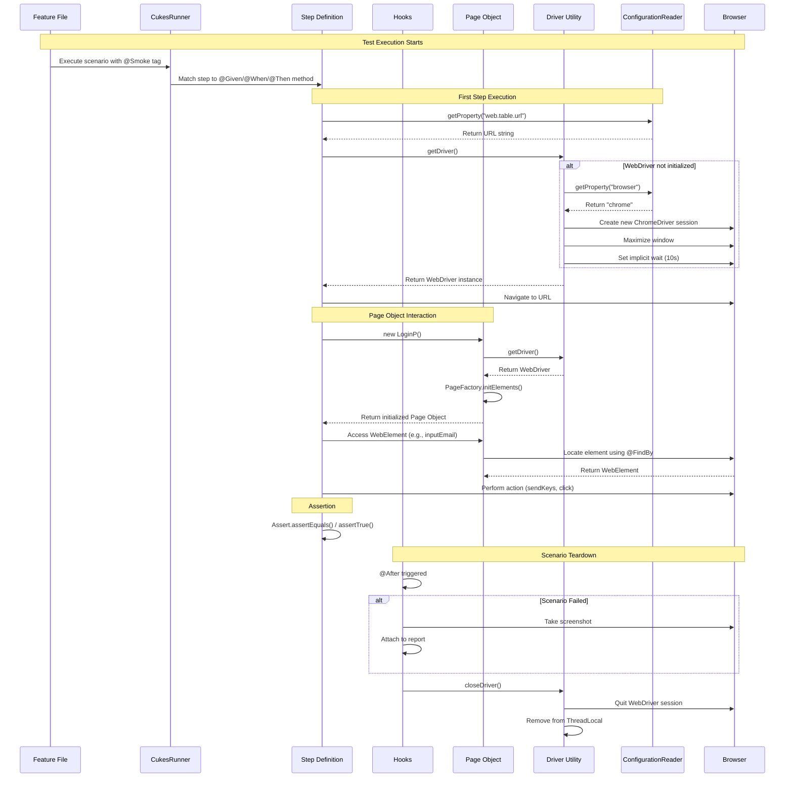
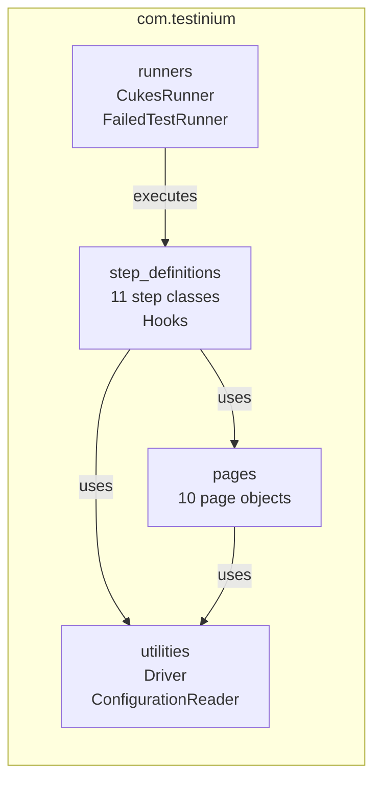

# Testinium-QA Framework Architecture

This document provides a comprehensive overview of the Testinium-QA test automation framework architecture, including the Selenium/Cucumber/JUnit integration, design patterns, and component relationships.

## Table of Contents

- [Framework Overview](#framework-overview)
- [Component Architecture](#component-architecture)
- [Page Object Model Design Pattern](#page-object-model-design-pattern)
- [Cucumber/JUnit Integration](#cucumberjunit-integration)
- [Test Execution Flow](#test-execution-flow)
- [WebDriver Management](#webdriver-management)
- [Configuration Management](#configuration-management)
- [Package Structure](#package-structure)
- [Package Responsibilities](#package-responsibilities)
- [Key Design Decisions](#key-design-decisions)
- [See Also](#see-also)

---

## Framework Overview

### Purpose

The Testinium-QA framework is a **UI test automation solution** designed for testing the **Odoo/Upgenix web application**. It enables automated end-to-end testing of various Odoo modules including CRM, Sales, Contacts, Calendar, Notes, Inventory, and Employee management.

### Technology Stack

| Technology | Version | Purpose |
|------------|---------|---------|
| Java | 8 | Core programming language |
| Selenium WebDriver | 3.141.59 | Browser automation API |
| Cucumber | 7.2.3 | BDD test framework |
| JUnit | 4.13.2 | Test runner and assertions |
| WebDriverManager | 5.1.0 | Automatic browser driver management |
| JavaFaker | 1.0.2 | Test data generation |
| Maven | 3.x | Build and dependency management |
| Cucumber Reporting Plugin | 7.2.0 | HTML/JSON report generation |

*Source: pom.xml:50-81*

### Build Configuration

The framework uses **Maven** as the build tool with the `maven-surefire-plugin` configured for test execution:

```xml
<plugin>
    <groupId>org.apache.maven.plugins</groupId>
    <artifactId>maven-surefire-plugin</artifactId>
    <version>3.0.0-M5</version>
    <configuration>
        <parallel>methods</parallel>
        <useUnlimitedThreads>true</useUnlimitedThreads>
        <testFailureIgnore>true</testFailureIgnore>
        <includes>
            <include>**/CukesRunner*.java</include>
        </includes>
    </configuration>
</plugin>
```

*Source: pom.xml:17-30*

### Architecture Style

The framework follows the **Behavior-Driven Development (BDD)** approach combined with the **Page Object Model (POM)** design pattern:

- **BDD**: Feature files written in Gherkin syntax describe test scenarios in business-readable format
- **POM**: Separation of page locators from test logic for maintainability
- **Layered Architecture**: Clear separation between test runners, step definitions, page objects, and utilities

---

## Component Architecture

The following diagram illustrates the high-level component architecture and their relationships:

```mermaid
graph TB
    subgraph "Test Execution Layer"
        FF[Feature Files<br/>src/main/resources/features/]
        CR[CukesRunner<br/>@RunWith Cucumber.class]
        FTR[FailedTestRunner<br/>Rerun failed scenarios]
    end
    
    subgraph "Glue Code Layer"
        SD[Step Definitions<br/>11 classes]
        HK[Hooks<br/>@After lifecycle]
    end
    
    subgraph "Page Object Layer"
        PO[Page Objects<br/>10 classes]
        WE[WebElements<br/>@FindBy annotations]
    end
    
    subgraph "Infrastructure Layer"
        DU[Driver Utility<br/>Thread-safe WebDriver]
        CFG[ConfigurationReader<br/>Properties management]
        WD[WebDriver Instance<br/>Chrome/Firefox]
        CP[configuration.properties<br/>Runtime settings]
    end
    
    FF --> CR
    CR --> SD
    CR --> HK
    FTR --> SD
    SD --> PO
    SD --> DU
    SD --> CFG
    HK --> DU
    PO --> WE
    PO --> DU
    DU --> WD
    DU --> CFG
    CFG --> CP
```

### Component Descriptions

| Component | Location | Responsibility |
|-----------|----------|----------------|
| Feature Files | `src/main/resources/features/` | Gherkin test scenarios |
| CukesRunner | `com.testinium.runners` | Main test execution entry point |
| FailedTestRunner | `com.testinium.runners` | Reruns failed scenarios |
| Step Definitions | `com.testinium.step_definitions` | Gherkin step implementations |
| Hooks | `com.testinium.step_definitions` | Test lifecycle management |
| Page Objects | `com.testinium.pages` | Page element locators |
| Driver Utility | `com.testinium.utilities` | WebDriver management |
| ConfigurationReader | `com.testinium.utilities` | Configuration file access |

---

## Page Object Model Design Pattern

### Overview

The **Page Object Model (POM)** is a design pattern that creates an object repository for web UI elements. Each page or component of the application is represented by a corresponding Java class that encapsulates the locators and interactions for that page.

### Purpose

- **Separation of Concerns**: Page locators are separated from test logic
- **Maintainability**: Locator changes only need updates in one place
- **Reusability**: Page objects can be shared across multiple tests
- **Readability**: Tests read like business workflows

### Implementation Location

All Page Object classes are located in:

```
src/main/java/com/testinium/pages/
├── CalendarP.java
├── ContactsP.java
├── CrmP.java
├── EmployeeP.java
├── InventoryP.java
├── LogOutP.java
├── LoginP.java
├── NotesP.java
├── SalesP.java
└── SessionP.java
```

### Page Object Structure

Each Page Object class follows this pattern:

```java
package com.testinium.pages;

import com.testinium.utilities.Driver;
import org.openqa.selenium.WebElement;
import org.openqa.selenium.support.FindBy;
import org.openqa.selenium.support.PageFactory;

public class LoginP {
    // Constructor initializes WebElements via PageFactory
    public LoginP() {
        PageFactory.initElements(Driver.getDriver(), this);
    }

    // WebElements defined using @FindBy annotations
    @FindBy(name = "login")
    public WebElement inputEmail;

    @FindBy(name = "password")
    public WebElement inputPassword;

    @FindBy(xpath = "//button[.='Log in']")
    public WebElement button;

    @FindBy(id = "oe_main_menu_navbar")
    public WebElement dashboard;

    @FindBy(className = "alert")
    public WebElement alertErrorMessage;
}
```

*Source: src/main/java/com/testinium/pages/LoginP.java:1-228*

### Key Components

#### PageFactory Initialization

The `PageFactory.initElements()` method initializes all `@FindBy` annotated WebElements:

```java
public LoginP() {
    PageFactory.initElements(Driver.getDriver(), this);
}
```

*Source: LoginP.java:59-61*

This provides **lazy initialization** - elements are located only when first accessed.

#### @FindBy Annotation Strategies

The framework uses various locator strategies via `@FindBy`:

| Strategy | Example | Use Case |
|----------|---------|----------|
| `id` | `@FindBy(id = "oe_main_menu_navbar")` | Preferred - most stable |
| `name` | `@FindBy(name = "login")` | HTML form elements |
| `className` | `@FindBy(className = "alert")` | CSS class selectors |
| `xpath` | `@FindBy(xpath = "//button[.='Log in']")` | Complex element queries |
| `css` | `@FindBy(css = ".nav-item")` | CSS selector syntax |

### Existing Page Object Classes

| Class | Module | WebElements |
|-------|--------|-------------|
| `LoginP` | Authentication | Email, password, login button, dashboard |
| `ContactsP` | Contacts Module | Contact list, form fields, save buttons |
| `CrmP` | CRM Module | Pipeline, leads, opportunities |
| `SalesP` | Sales Module | Quotations, orders, products |
| `CalendarP` | Calendar Module | Events, date pickers, reminders |
| `NotesP` | Notes Module | Note list, editor, categories |
| `InventoryP` | Inventory Module | Products, stock levels, transfers |
| `EmployeeP` | HR Module | Employee list, details, departments |
| `LogOutP` | Authentication | User menu, logout button |
| `SessionP` | Session Management | Session controls |

---

## Cucumber/JUnit Integration

### Overview

The framework integrates **Cucumber** (BDD framework) with **JUnit 4** (test runner) to execute Gherkin feature files as automated tests.

### CukesRunner Configuration

The main test runner class is `CukesRunner.java`:

```java
package com.testinium.runners;

import io.cucumber.junit.Cucumber;
import io.cucumber.junit.CucumberOptions;
import org.junit.runner.RunWith;

@RunWith(Cucumber.class)
@CucumberOptions(
    plugin = {
        "html:target/cucumber-reports.html",
        "json:target/cucumber.json",
        "rerun:target/rerun.txt",
        "me.jvt.cucumber.report.PrettyReports:target/cucumber"
    },
    features = "src/main/resources/features",
    glue = "com/testinium/step_definitions",
    dryRun = false,
    tags = "@Smoke"
)
public class CukesRunner {
}
```

*Source: src/main/java/com/testinium/runners/CukesRunner.java:1-136*

### @CucumberOptions Parameters

| Parameter | Value | Description |
|-----------|-------|-------------|
| `plugin` | Multiple | Report generation formats |
| `features` | `src/main/resources/features` | Location of Gherkin feature files |
| `glue` | `com/testinium/step_definitions` | Package containing step definitions |
| `dryRun` | `false` | Execute tests (true = validate only) |
| `tags` | `@Smoke` | Filter scenarios by tag |

### Report Plugins

The framework generates multiple report formats:

| Plugin | Output | Purpose |
|--------|--------|---------|
| `html:target/cucumber-reports.html` | Single HTML file | Quick test results review |
| `json:target/cucumber.json` | JSON format | CI/CD integration |
| `rerun:target/rerun.txt` | Text file | List of failed scenarios |
| `me.jvt.cucumber.report.PrettyReports:target/cucumber` | Enhanced HTML | Detailed visual reports |

### FailedTestRunner

The `FailedTestRunner` class enables rerunning only failed scenarios:

```java
package com.testinium.runners;

import io.cucumber.junit.Cucumber;
import io.cucumber.junit.CucumberOptions;
import org.junit.runner.RunWith;

@RunWith(Cucumber.class)
@CucumberOptions(
    glue = "com/testinium/step_definitions",
    features = "@target/rerun.txt"
)
public class FailedTestRunner {
}
```

*Source: src/main/java/com/testinium/runners/FailedTestRunner.java:1-96*

The `@target/rerun.txt` file contains paths to failed scenarios from the previous run.

### Hooks (Test Lifecycle)

The `Hooks` class manages test lifecycle events:

```java
package com.testinium.step_definitions;

import com.testinium.utilities.Driver;
import io.cucumber.java.Scenario;
import org.junit.After;
import org.openqa.selenium.OutputType;
import org.openqa.selenium.TakesScreenshot;

public class Hooks {

    @After
    public void teardownScenario(Scenario scenario) {
        if (scenario.isFailed()) {
            byte[] screenshot = ((TakesScreenshot) Driver.getDriver())
                .getScreenshotAs(OutputType.BYTES);
            scenario.attach(screenshot, "image/png", scenario.getName());
        }
        Driver.closeDriver();
    }
}
```

*Source: src/main/java/com/testinium/step_definitions/Hooks.java:1-124*

#### Hook Functionality

- **Screenshot on Failure**: Captures screenshot when a scenario fails
- **Driver Cleanup**: Closes WebDriver after each scenario
- **Automatic Attachment**: Screenshots are embedded in Cucumber reports

---

## Test Execution Flow

The following sequence diagram illustrates how a test scenario is executed:



### Execution Steps Explained

1. **Scenario Selection**: CukesRunner selects scenarios matching `@Smoke` tag
2. **Step Matching**: Cucumber matches Gherkin steps to annotated Java methods
3. **Driver Initialization**: First call to `Driver.getDriver()` creates browser session
4. **Page Object Creation**: Step definitions instantiate Page Objects as needed
5. **Element Interaction**: Page Objects provide WebElements for test actions
6. **Assertions**: JUnit assertions validate expected results
7. **Cleanup**: Hooks handle screenshot capture and driver cleanup

---

## WebDriver Management

### Overview

The `Driver` utility class provides **thread-safe WebDriver management** using `InheritableThreadLocal`, enabling parallel test execution.

### Implementation

```java
package com.testinium.utilities;

import io.github.bonigarcia.wdm.WebDriverManager;
import org.openqa.selenium.WebDriver;
import org.openqa.selenium.chrome.ChromeDriver;
import org.openqa.selenium.firefox.FirefoxDriver;
import java.util.concurrent.TimeUnit;

public class Driver {

    // Private constructor prevents instantiation
    private Driver() {
    }

    // Thread-local storage for WebDriver instances
    private static InheritableThreadLocal<WebDriver> driverPool = 
        new InheritableThreadLocal<>();

    // Returns the WebDriver for the current thread
    public static WebDriver getDriver() {
        if (driverPool.get() == null) {
            String browserType = ConfigurationReader.getProperty("browser");

            switch (browserType) {
                case "chrome":
                    WebDriverManager.chromedriver().setup();
                    driverPool.set(new ChromeDriver());
                    driverPool.get().manage().window().maximize();
                    driverPool.get().manage().timeouts()
                        .implicitlyWait(10, TimeUnit.SECONDS);
                    break;
                case "firefox":
                    WebDriverManager.firefoxdriver().setup();
                    driverPool.set(new FirefoxDriver());
                    driverPool.get().manage().window().maximize();
                    driverPool.get().manage().timeouts()
                        .implicitlyWait(10, TimeUnit.SECONDS);
                    break;
            }
        }
        return driverPool.get();
    }

    // Closes the WebDriver and removes from thread-local
    public static void closeDriver() {
        if (driverPool.get() != null) {
            driverPool.get().quit();
            driverPool.remove();
        }
    }
}
```

*Source: src/main/java/com/testinium/utilities/Driver.java:1-218*

### Thread Safety

The `InheritableThreadLocal<WebDriver>` pattern ensures:

- **Isolation**: Each thread gets its own WebDriver instance
- **Parallel Execution**: Multiple tests can run simultaneously
- **No State Leakage**: WebDriver state is not shared between threads
- **Child Thread Support**: Child threads inherit parent's WebDriver reference

*Source: Driver.java:94*

### Browser Configuration

| Browser | Driver Setup | Window State | Implicit Wait |
|---------|--------------|--------------|---------------|
| Chrome | `WebDriverManager.chromedriver().setup()` | Maximized | 10 seconds |
| Firefox | `WebDriverManager.firefoxdriver().setup()` | Maximized | 10 seconds |

*Source: Driver.java:152-163*

### Key Methods

#### getDriver()

- Returns existing WebDriver for current thread, or creates new one
- Reads browser type from `configuration.properties`
- Configures window maximization and implicit wait
- Returns: `WebDriver` instance

*Source: Driver.java:142-166*

#### closeDriver()

- Quits the WebDriver session (closes browser)
- Removes WebDriver from ThreadLocal storage
- Ensures clean state for next test

*Source: Driver.java:211-216*

---

## Configuration Management

### Overview

The `ConfigurationReader` utility class loads and provides access to configuration properties from the `configuration.properties` file.

### Implementation

```java
package com.testinium.utilities;

import java.io.FileInputStream;
import java.io.IOException;
import java.util.Properties;

public class ConfigurationReader {
    
    // Properties object to store configuration values
    private static Properties properties = new Properties();

    // Static initializer loads properties at class load time
    static {
        try {
            FileInputStream file = new FileInputStream("configuration.properties");
            properties.load(file);
            file.close();
        } catch (IOException e) {
            System.out.println("File is not found in the ConfigurationReader class");
            e.printStackTrace();
        }
    }

    // Returns the property value for the given key
    public static String getProperty(String keyword) {
        return properties.getProperty(keyword);
    }
}
```

*Source: src/main/java/com/testinium/utilities/ConfigurationReader.java:1-133*

### Configuration Loading

| Aspect | Detail |
|--------|--------|
| **File Location** | `configuration.properties` (project root) |
| **Load Timing** | Static initializer at class load |
| **Error Handling** | Prints error message and stack trace |
| **Thread Safety** | Read-only after initialization |

*Source: ConfigurationReader.java:80-94*

### Key Method: getProperty()

```java
public static String getProperty(String keyword) {
    return properties.getProperty(keyword);
}
```

*Source: ConfigurationReader.java:130-132*

- **Parameter**: `keyword` - the property key to look up
- **Returns**: Property value as String, or `null` if not found
- **Usage**: `ConfigurationReader.getProperty("browser")`

### Configuration Properties

The `configuration.properties` file typically contains:

```properties
# Browser configuration
browser=chrome

# Application URL
web.table.url=https://your-odoo-instance.com/web/login

# Credentials (for testing only - do not commit real credentials)
username=test@example.com
password=testpassword
```

### Usage Examples

```java
// Get browser type for WebDriver initialization
String browserType = ConfigurationReader.getProperty("browser");

// Get application URL for navigation
String url = ConfigurationReader.getProperty("web.table.url");
Driver.getDriver().get(url);
```

*Source: Driver.java:148, LoginSD.java:108-109*

---

## Package Structure

The following diagram shows the package dependency relationships:



### Directory Layout

```
src/main/java/com/testinium/
├── runners/
│   ├── CukesRunner.java          # Main test runner
│   └── FailedTestRunner.java     # Failed test rerunner
│
├── step_definitions/
│   ├── Calendar.java             # Calendar module steps
│   ├── Contacts.java             # Contacts module steps
│   ├── Crm.java                  # CRM module steps
│   ├── EmployeeStage.java        # Employee module steps
│   ├── Hooks.java                # Test lifecycle hooks
│   ├── Inventory.java            # Inventory module steps
│   ├── LogOutSD.java             # Logout steps
│   ├── LoginSD.java              # Login steps
│   ├── Notes.java                # Notes module steps
│   ├── Sales.java                # Sales module steps
│   └── Session.java              # Session management steps
│
├── pages/
│   ├── CalendarP.java            # Calendar page elements
│   ├── ContactsP.java            # Contacts page elements
│   ├── CrmP.java                 # CRM page elements
│   ├── EmployeeP.java            # Employee page elements
│   ├── InventoryP.java           # Inventory page elements
│   ├── LogOutP.java              # Logout page elements
│   ├── LoginP.java               # Login page elements
│   ├── NotesP.java               # Notes page elements
│   ├── SalesP.java               # Sales page elements
│   └── SessionP.java             # Session page elements
│
└── utilities/
    ├── ConfigurationReader.java  # Configuration management
    └── Driver.java               # WebDriver management
```

---

## Package Responsibilities

### runners Package

**Location**: `src/main/java/com/testinium/runners/`

**Purpose**: JUnit/Cucumber test entry points that define test execution configuration.

| Class | Responsibility |
|-------|----------------|
| `CukesRunner` | Main test runner with Cucumber options for features, glue, plugins, and tags |
| `FailedTestRunner` | Reruns failed scenarios from `target/rerun.txt` |

**Dependencies**: JUnit 4, Cucumber-JUnit

### step_definitions Package

**Location**: `src/main/java/com/testinium/step_definitions/`

**Purpose**: Cucumber glue code that maps Gherkin steps to Java implementations.

| File Count | Content |
|------------|---------|
| 11 classes | Step definition methods with `@Given`, `@When`, `@Then` annotations |
| ~80 methods | Test logic, page object interactions, and assertions |

**Key Features**:
- Page object instantiation and usage
- WebDriverWait for explicit synchronization
- JUnit assertions for validation
- Configuration access via `ConfigurationReader`

**Dependencies**: Page objects, utilities, Cucumber-Java, JUnit, Selenium

### pages Package

**Location**: `src/main/java/com/testinium/pages/`

**Purpose**: Page Object classes containing WebElement locators and PageFactory initialization.

| File Count | Content |
|------------|---------|
| 10 classes | ~107 WebElements across all pages |

**Pattern**: Each class represents a page or component with:
- Constructor calling `PageFactory.initElements()`
- `@FindBy` annotated WebElement fields
- Optional helper methods for complex interactions

**Dependencies**: utilities (Driver), Selenium (WebElement, FindBy, PageFactory)

### utilities Package

**Location**: `src/main/java/com/testinium/utilities/`

**Purpose**: Shared infrastructure components used across the framework.

| Class | Responsibility |
|-------|----------------|
| `Driver` | Thread-safe WebDriver lifecycle management |
| `ConfigurationReader` | Properties file loading and access |

**Dependencies**: WebDriverManager, Selenium WebDriver, java.util.Properties

---

## Key Design Decisions

### 1. Thread-Local WebDriver for Parallel Execution

**Decision**: Use `InheritableThreadLocal<WebDriver>` for WebDriver management.

**Rationale**:
- Enables parallel test execution without state conflicts
- Each test thread maintains its own browser instance
- Surefire plugin configured with `<parallel>methods</parallel>`

*Source: Driver.java:94, pom.xml:22*

### 2. PageFactory for Lazy Element Initialization

**Decision**: Use Selenium's `PageFactory` with `@FindBy` annotations.

**Rationale**:
- Elements are located only when first accessed (lazy loading)
- Clean separation of locator definitions from test logic
- Reduced boilerplate compared to manual `driver.findElement()` calls

*Source: LoginP.java:59-61*

### 3. Implicit Wait as Default Synchronization

**Decision**: Set 10-second implicit wait on all WebDriver instances.

**Rationale**:
- Provides baseline synchronization for all element lookups
- Reduces timing-related test flakiness
- Supplements explicit waits for specific conditions

*Source: Driver.java:155, 161*

### 4. Screenshot on Failure for Debugging

**Decision**: Capture and attach screenshots when scenarios fail.

**Rationale**:
- Visual evidence for failure analysis
- Automatically embedded in Cucumber reports
- Accelerates debugging and root cause analysis

*Source: Hooks.java:117-119*

### 5. JSON/HTML Report Generation for CI Integration

**Decision**: Generate multiple report formats (HTML, JSON, rerun.txt).

**Rationale**:
- HTML reports for human review
- JSON format for CI/CD tool integration
- Rerun file enables failed test retry workflows

*Source: CukesRunner.java:120-125*

### 6. WebDriverManager for Automatic Driver Management

**Decision**: Use WebDriverManager library instead of manual driver setup.

**Rationale**:
- Automatic browser driver download and setup
- Version compatibility management
- Eliminates manual driver maintenance

*Source: Driver.java:152, 158; pom.xml:58-62*

### 7. BDD with Cucumber for Business Readability

**Decision**: Implement BDD using Cucumber with Gherkin syntax.

**Rationale**:
- Test scenarios readable by non-technical stakeholders
- Living documentation of system behavior
- Clear separation between specification and implementation

*Source: CukesRunner.java:15*

---

## See Also

- [Configuration Guide](CONFIGURATION.md) - Detailed configuration options
- [Extending the Framework](EXTENDING.md) - Adding new page objects and step definitions
- [Troubleshooting Guide](TROUBLESHOOTING.md) - Common issues and solutions

### External Resources

- [Selenium WebDriver Documentation](https://www.selenium.dev/documentation/webdriver/)
- [Cucumber Documentation](https://cucumber.io/docs/cucumber/)
- [JUnit 4 Documentation](https://junit.org/junit4/)
- [WebDriverManager Documentation](https://bonigarcia.dev/webdrivermanager/)
- [Page Object Model Pattern](https://www.selenium.dev/documentation/test_practices/encouraged/page_object_models/)

---

*This documentation is automatically generated from source files in the Testinium-QA framework.*

*Last Updated: Based on source analysis of Driver.java, ConfigurationReader.java, CukesRunner.java, FailedTestRunner.java, LoginP.java, LoginSD.java, Hooks.java, and pom.xml*
