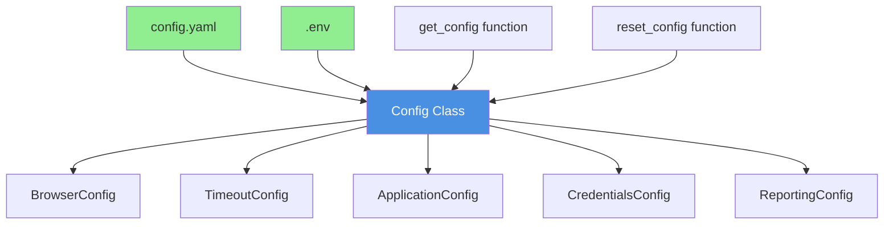
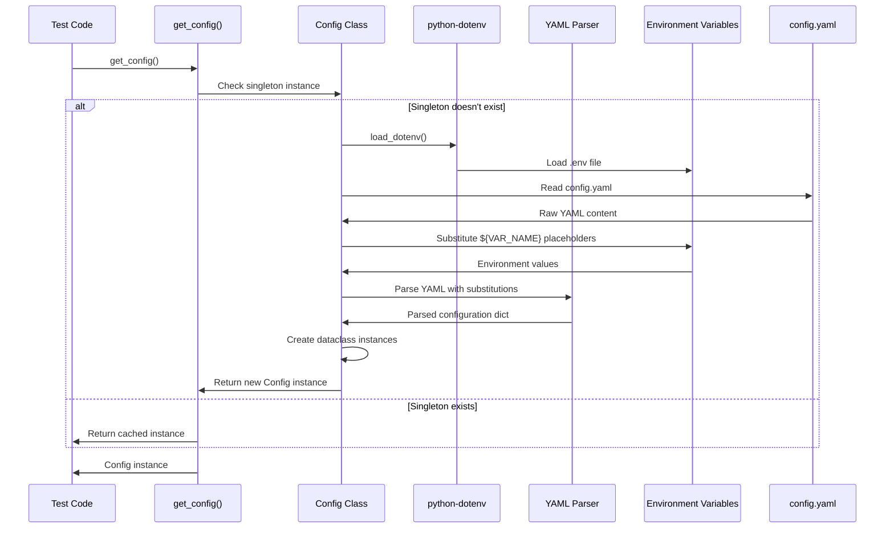

# Config Package API Reference

## Overview

The `config` package provides centralized, type-safe configuration management for the Testinium Python test automation framework. It replaces the Java `ConfigurationReader.java` Properties-based approach with a modern Python dataclass-based implementation that offers full IDE autocompletion, environment variable substitution, and comprehensive validation.

**Source:** `config/__init__.py:1-143`

## Key Features

- **Type-Safe Configuration Access** - Dataclass-based configuration with full IDE autocompletion
- **YAML-Based Configuration** - Human-readable YAML format with structured hierarchy
- **Environment Variable Substitution** - Secure credential injection using `${VAR_NAME}` syntax
- **Singleton Pattern** - Convenient global access without explicit object passing
- **Backward Compatibility** - Key-based access pattern for gradual migration
- **Comprehensive Validation** - Error handling and validation for all configuration sections
- **Security First** - All credentials loaded from environment variables, never hardcoded

## Package Structure



## Public API Exports

The `config` package exports the following classes and functions:

| Export | Type | Description |
|--------|------|-------------|
| `Config` | Class | Main configuration class providing type-safe access to all settings |
| `BrowserConfig` | Dataclass | Browser settings (type, headless, window_size, implicit_wait) |
| `TimeoutConfig` | Dataclass | Timeout values (explicit, page_load, element_presence, clickability) |
| `ApplicationConfig` | Dataclass | Application URLs (base_url, login_url, web_table_url, empl_title) |
| `CredentialsConfig` | Dataclass | User credentials (username, password, role-based credentials) |
| `ReportingConfig` | Dataclass | Reporting settings (screenshot_on_failure, output_directory, formats) |
| `get_config()` | Function | Get or create singleton Config instance |
| `reset_config()` | Function | Reset singleton (useful for testing) |

**Source:** `config/__init__.py:120-134`

## Configuration Hierarchy

The configuration is organized into five logical sections, each represented by a dataclass:

### BrowserConfig
Browser-specific settings for WebDriver initialization:
- `type` (str) - Browser type: 'chrome', 'firefox', 'edge', 'safari'
- `headless` (bool) - Whether to run browser in headless mode
- `window_size` (Tuple[int, int]) - Browser window dimensions (width, height)
- `implicit_wait` (int) - Implicit wait timeout in seconds (deprecated, use 0)

### TimeoutConfig
Timeout values for WebDriver waits, replacing hardcoded values from Java step definitions:
- `explicit` (int) - Default explicit wait timeout in seconds
- `page_load` (int) - Page load timeout in seconds
- `element_presence` (int) - Wait for element presence timeout in seconds
- `clickability` (int) - Wait for element clickability timeout in seconds

### ApplicationConfig
Application URLs with environment variable substitution support:
- `base_url` (str) - Base application URL
- `login_url` (str) - Login page URL
- `web_table_url` (str) - Web table page URL
- `empl_title` (str) - Expected employee page title

### CredentialsConfig
User credentials loaded from environment variables (never hardcoded):
- `username` (Optional[str]) - Default test user username
- `password` (Optional[str]) - Default test user password
- `sales_manager_username` (Optional[str]) - Sales manager role username
- `sales_manager_password` (Optional[str]) - Sales manager role password
- `pos_manager_username` (Optional[str]) - POS manager role username
- `pos_manager_password` (Optional[str]) - POS manager role password

### ReportingConfig
Test reporting configuration:
- `screenshot_on_failure` (bool) - Whether to capture screenshots on test failures
- `output_directory` (str) - Base output directory for all reports
- `formats` (List[str]) - List of report formats to generate (e.g., ['json', 'html', 'allure'])
- `screenshot_directory` (str) - Directory for screenshot storage

**Source:** `config/__init__.py:29-35`, `config/test_config.py:40-137`

## Import Patterns

The `config` package supports two import patterns for flexibility:

### Pattern 1: Direct Class Imports (Recommended)

```python
from config import Config, BrowserConfig, TimeoutConfig

# Direct instantiation
config = Config()
print(config.browser.type)  # 'chrome'
print(config.timeouts.explicit)  # 10
```

**When to use:** New code, type hints, when you need specific configuration sections

### Pattern 2: Submodule Imports (Explicit)

```python
from config.test_config import Config, get_config

# Singleton pattern
config = get_config()
driver_type = config.browser.type
```

**When to use:** Singleton access, existing code migration, global configuration needs

**Source:** `config/__init__.py:17-27`

## Quick Start Examples

### Basic Usage with Type-Safe Access

```python
from config import Config

# Create configuration instance
config = Config()

# Access browser settings with IDE autocompletion
print(config.browser.type)        # 'chrome'
print(config.browser.headless)    # False
print(config.browser.window_size) # (1920, 1080)

# Access timeout values
print(config.timeouts.explicit)   # 10
print(config.timeouts.page_load)  # 30

# Access application URLs
print(config.application.base_url)   # 'https://testinium.example.com'
print(config.application.login_url)  # 'https://testinium.example.com/login'
```

**Source:** `config/__init__.py:51-61`

### Using Singleton Pattern

```python
from config import get_config

# Get singleton instance (created once, reused everywhere)
config = get_config()

# Access configuration anywhere in your test framework
driver_type = config.browser.type
base_url = config.application.base_url
```

**Source:** `config/__init__.py:63-67`

### Backward-Compatible Key Access

For gradual migration from the Java ConfigurationReader pattern:

```python
from config import Config

config = Config()

# Key-based access with dot notation
browser_type = config.get('browser.type', 'chrome')
headless = config.get('browser.headless', False)
timeout = config.get('timeouts.explicit', 10)

# Provides default value if key not found
custom_value = config.get('nonexistent.key', 'default_value')
```

**Source:** `config/__init__.py:68-72`, `config/test_config.py:337-384`

### Using in Behave Step Definitions

```python
# In features/environment.py
from config import Config

def before_all(context):
    """Initialize configuration before all tests."""
    context.config = Config()
    context.base_url = context.config.application.base_url
    context.browser_type = context.config.browser.type
    
# In features/steps/login_steps.py
@given('I am on the login page')
def step_navigate_to_login(context):
    """Navigate to login page using configured URL."""
    config = context.config
    context.driver.get(config.application.login_url)
```

**Source:** `config/__init__.py:73-79`

### Type Hints for Better IDE Support

```python
from config import Config, BrowserConfig, ReportingConfig

def setup_browser(browser_config: BrowserConfig) -> None:
    """
    Setup browser with provided configuration.
    
    Args:
        browser_config: Browser configuration dataclass
    """
    print(f"Setting up {browser_config.type} browser")
    print(f"Headless mode: {browser_config.headless}")

# Usage
config = Config()
setup_browser(config.browser)
```

**Source:** `config/__init__.py:80-84`

## Security Considerations

### Critical Security Requirement

**ALL credentials MUST be loaded from environment variables, never hardcoded.**

This requirement remediates a critical security vulnerability found in the original Java implementation (`EmployeeP.java`) which contained hardcoded credentials.

**Source:** `config/__init__.py:37-42`, `config/test_config.py:99-111`

### Environment Variable Configuration

Create a `.env` file in your project root with all credentials:

```bash
# .env file (DO NOT commit to version control)
TEST_USERNAME=user@example.com
TEST_PASSWORD=secure_password
SALES_MANAGER_USERNAME=sales@example.com
SALES_MANAGER_PASSWORD=sales_password
POS_MANAGER_USERNAME=pos@example.com
POS_MANAGER_PASSWORD=pos_password
```

**Example:** `config/__init__.py:43-49`

### Environment Variable Substitution in YAML

The configuration system supports `${VAR_NAME}` syntax for injecting environment variables:

```yaml
# config/config.yaml
credentials:
  username: ${TEST_USERNAME}
  password: ${TEST_PASSWORD}
  sales_manager_username: ${SALES_MANAGER_USERNAME:sales@example.com}
  sales_manager_password: ${SALES_MANAGER_PASSWORD}
```

Two substitution formats are supported:
- `${VAR_NAME}` - Required variable (raises error if missing)
- `${VAR_NAME:default}` - Optional variable with default value

**Source:** `config/test_config.py:265-309`

### Credential Validation

The configuration system validates credentials at initialization and logs warnings for missing credentials:

```python
config = Config()
# Logs warnings if TEST_USERNAME, TEST_PASSWORD not set
# Logs warnings if role-based credentials (SALES_MANAGER_*, POS_MANAGER_*) not set
```

**Source:** `config/test_config.py:311-336`

## Migration Notes

### From Java ConfigurationReader.java

This package replaces the Java `ConfigurationReader.java` Properties-based approach with significant improvements:

#### Java Implementation (Replaced)
```java
// ConfigurationReader.java
Properties properties = new Properties();
properties.load(new FileInputStream("config.properties"));
String browserType = properties.getProperty("browser.type", "chrome");
```

#### Python Implementation (New)
```python
# config/test_config.py
from config import Config

config = Config()  # Loads config.yaml automatically
browser_type = config.browser.type  # Type-safe access with IDE autocompletion
```

### Benefits Over Java Implementation

| Aspect | Java (Old) | Python (New) |
|--------|------------|--------------|
| **Type Safety** | None - all strings | Full type safety with dataclasses |
| **IDE Support** | No autocompletion | Complete IDE autocompletion |
| **Error Handling** | Swallowed IOExceptions | Comprehensive validation and error messages |
| **Credentials** | Hardcoded in code files | Environment variables only |
| **Format** | Properties files | YAML with structure and comments |
| **Testability** | Difficult to test | Singleton reset for easy testing |

**Source:** `config/__init__.py:85-97`

### Replaced Java Files

- `ConfigurationReader.java` - Replaced by `config/test_config.py`
- `Driver.java` (hardcoded config) - Now uses `config.browser` settings
- `EmployeeP.java` (hardcoded credentials) - Now uses `config.credentials` from env vars

**Source:** `config/__init__.py:87-90`

## Configuration Lifecycle



## Advanced Usage

### Custom Configuration File

```python
from config import Config

# Load configuration from a different file
config = Config(config_file='config/staging.yaml')
print(config.application.base_url)
```

### Resetting Configuration (Testing)

```python
from config import get_config, reset_config

# Get initial configuration
config1 = get_config()
print(config1.browser.type)  # 'chrome'

# Change environment variable
import os
os.environ['BROWSER_TYPE'] = 'firefox'

# Reset singleton to reload configuration
reset_config()

# Get new configuration with updated values
config2 = get_config()
print(config2.browser.type)  # Now reflects new environment variable
```

**Source:** `config/test_config.py:436-444`

### Configuration Representation

The Config class provides a secure string representation that masks sensitive credentials:

```python
from config import Config

config = Config()
print(config)
# Output:
# Config(
#   browser=BrowserConfig(type='chrome', headless=False, ...),
#   timeouts=TimeoutConfig(explicit=10, page_load=30, ...),
#   application=ApplicationConfig(base_url='https://testinium.example.com', ...),
#   credentials=CredentialsConfig(username='***', password='***', ...),
#   reporting=ReportingConfig(screenshot_on_failure=True, ...)
# )
```

**Source:** `config/test_config.py:385-402`

## Package Metadata

- **Version:** 1.0.0
- **Author:** Testinium QA Team
- **Description:** Type-safe configuration management for Python test automation framework

**Source:** `config/__init__.py:136-139`

## See Also

### Detailed API Documentation
- [test-config.md](test-config.md) - Complete API reference for Config class and all dataclasses

### Related Guides
- [Configuration Management Guide](../../guides/configuration-management.md) - Advanced configuration patterns and best practices
- [Getting Started - Configuration](../../getting-started/configuration.md) - Initial configuration setup guide

### Reference Documentation
- [Configuration Options Reference](../../reference/configuration-options.md) - Complete config.yaml options
- [Environment Variables Reference](../../reference/environment-variables.md) - All supported environment variables

### Deployment Documentation
- [Local Development](../../deployment/local-development.md) - Setting up configuration for local development
- [CI/CD Integration](../../deployment/jenkins-integration.md) - Configuration management in CI/CD pipelines
- [Docker Deployment](../../deployment/docker.md) - Managing configuration in containerized environments

## Common Use Cases

### Use Case 1: Accessing Browser Configuration

```python
from config import get_config

config = get_config()

# Get browser type for driver initialization
browser_type = config.browser.type  # 'chrome'

# Check if headless mode is enabled
if config.browser.headless:
    print("Running in headless mode")

# Get window size for driver setup
width, height = config.browser.window_size  # (1920, 1080)
```

### Use Case 2: Using Timeouts in Wait Strategies

```python
from config import get_config
from selenium.webdriver.support.ui import WebDriverWait
from selenium.webdriver.support import expected_conditions as EC

config = get_config()

# Use configured explicit wait timeout
wait = WebDriverWait(driver, config.timeouts.explicit)
element = wait.until(EC.presence_of_element_located(locator))

# Use configured clickability timeout
wait_clickable = WebDriverWait(driver, config.timeouts.clickability)
button = wait_clickable.until(EC.element_to_be_clickable(button_locator))
```

### Use Case 3: Role-Based Test Credentials

```python
from config import get_config

config = get_config()

# Default test user credentials
username = config.credentials.username
password = config.credentials.password

# Sales manager role credentials
sales_username = config.credentials.sales_manager_username
sales_password = config.credentials.sales_manager_password

# POS manager role credentials
pos_username = config.credentials.pos_manager_username
pos_password = config.credentials.pos_manager_password
```

### Use Case 4: Environment-Specific Configuration

```python
import os
from config import Config

# Determine environment from environment variable
env = os.getenv('TEST_ENV', 'local')

# Load environment-specific configuration
config = Config(config_file=f'config/{env}.yaml')

print(f"Testing against: {config.application.base_url}")
# local: http://localhost:8080
# staging: https://staging.testinium.com
# production: https://testinium.com
```

## Troubleshooting

### Issue: Configuration File Not Found

**Symptoms:**
```
FileNotFoundError: Configuration file not found: config/config.yaml
```

**Cause:** Config file doesn't exist or incorrect path specified

**Solution:**
```bash
# Ensure config.yaml exists in the correct location
ls config/config.yaml

# If missing, copy from example
cp config/config.yaml.example config/config.yaml
```

### Issue: Required Environment Variable Not Set

**Symptoms:**
```
ValueError: Required environment variable not set: BASE_URL
```

**Cause:** Required environment variable referenced in config.yaml is not set

**Solution:**
```bash
# Set environment variable
export BASE_URL=https://testinium.example.com

# Or add to .env file
echo "BASE_URL=https://testinium.example.com" >> .env
```

### Issue: Missing Credentials Warnings

**Symptoms:**
```
WARNING: Default test credentials not configured. Set TEST_USERNAME and TEST_PASSWORD environment variables.
```

**Cause:** Credential environment variables not set

**Solution:**
```bash
# Create .env file with credentials
cat > .env << EOF
TEST_USERNAME=user@example.com
TEST_PASSWORD=secure_password
SALES_MANAGER_USERNAME=sales@example.com
SALES_MANAGER_PASSWORD=sales_password
POS_MANAGER_USERNAME=pos@example.com
POS_MANAGER_PASSWORD=pos_password
EOF

# Reload configuration
python
>>> from config import reset_config, get_config
>>> reset_config()
>>> config = get_config()  # Will load credentials from .env
```

### Issue: YAML Parsing Error

**Symptoms:**
```
yaml.YAMLError: while parsing a block mapping
```

**Cause:** Invalid YAML syntax in config.yaml

**Solution:**
```bash
# Validate YAML syntax
python -c "import yaml; yaml.safe_load(open('config/config.yaml'))"

# Common issues:
# - Inconsistent indentation (use spaces, not tabs)
# - Missing colons after keys
# - Incorrect list syntax
```

### Issue: Type Error When Accessing Configuration

**Symptoms:**
```
AttributeError: 'NoneType' object has no attribute 'type'
```

**Cause:** Configuration section missing or incorrectly structured

**Solution:**
```python
# Verify configuration loaded correctly
from config import Config
config = Config()
print(config)  # Should show all configuration sections

# Check for None values
assert config.browser is not None
assert config.timeouts is not None
assert config.application is not None
```

---

**Last Updated:** 2024-01-01  
**Framework Version:** 1.0.0
