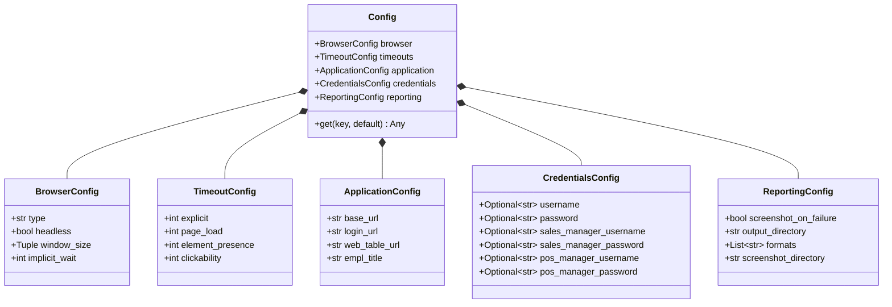
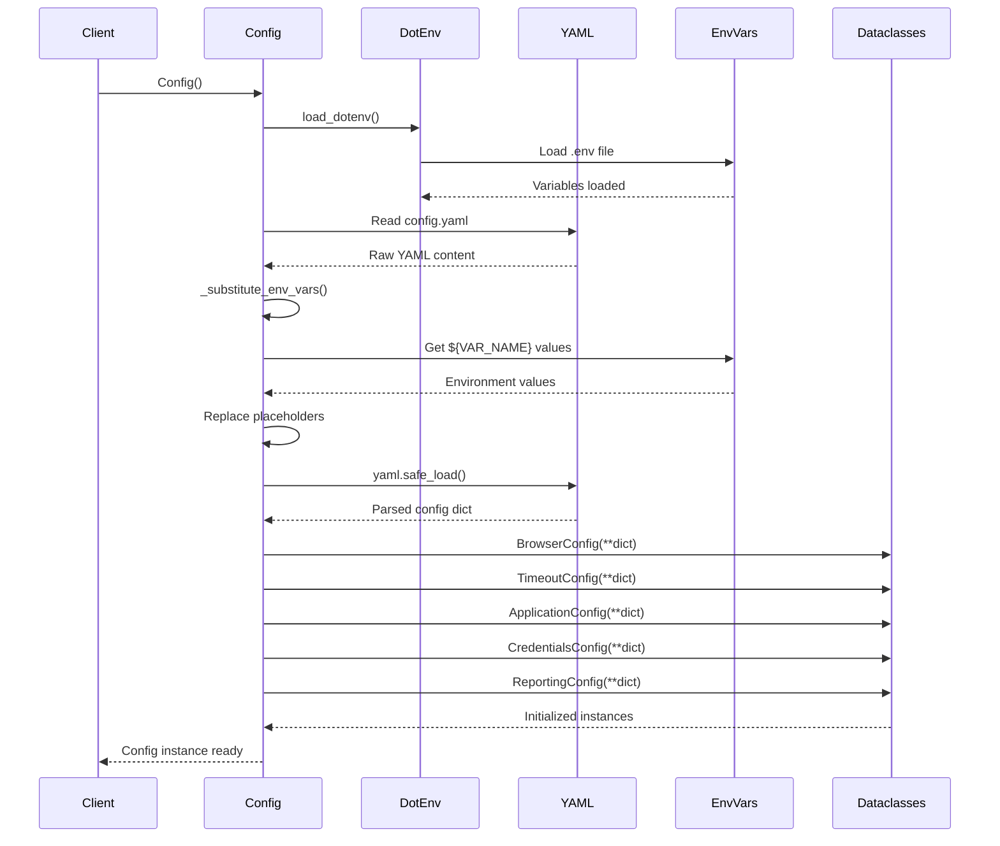

# test_config Module

Type-safe configuration management for Testinium test automation framework.

## Overview

The `config.test_config` module provides structured, type-safe access to test configuration loaded from `config.yaml` with support for environment variable substitution. It replaces the Java `ConfigurationReader.java` pattern with a modern Python dataclass-based approach.

**Key Features:**

- **Type-safe configuration access** through Python dataclasses
- **Environment variable substitution** using `${VAR_NAME}` or `${VAR_NAME:default}` syntax
- **Secure credential management** without hardcoded values
- **Backward-compatible API** supporting both dot notation and key-based access
- **Singleton pattern** for convenient framework-wide access
- **Comprehensive validation** with helpful error messages

**Source:** `config/test_config.py`

---

## Configuration Hierarchy

The configuration is organized into five logical sections:



---

## BrowserConfig

Browser configuration settings controlling WebDriver behavior.

**Source:** `config/test_config.py:40-54`

### Attributes

| Attribute | Type | Description |
|-----------|------|-------------|
| `type` | `str` | Browser type: `'chrome'`, `'firefox'`, `'edge'`, or `'safari'` |
| `headless` | `bool` | Whether to run browser in headless mode (no GUI) |
| `window_size` | `Tuple[int, int]` | Browser window dimensions as `(width, height)` tuple |
| `implicit_wait` | `int` | Implicit wait timeout in seconds (default: 0, **deprecated**) |

### Usage Example

```python
from config.test_config import Config

config = Config()

# Access browser settings
print(config.browser.type)          # 'chrome'
print(config.browser.headless)      # False
print(config.browser.window_size)   # (1920, 1080)
print(config.browser.implicit_wait) # 0 (use explicit waits instead)
```

### Configuration (config.yaml)

```yaml
browser:
  type: chrome
  headless: false
  window_size: [1920, 1080]
  implicit_wait: 0
```

!!! warning "Implicit Wait Deprecated"
    The `implicit_wait` attribute is deprecated and should always be set to 0. Use explicit waits with `WebDriverWait` and `expected_conditions` instead to avoid mixing implicit and explicit wait strategies.

---

## TimeoutConfig

Timeout configuration for WebDriver waits, replacing hardcoded timeout values scattered throughout Java step definitions.

**Source:** `config/test_config.py:57-74`

### Attributes

| Attribute | Type | Default | Description |
|-----------|------|---------|-------------|
| `explicit` | `int` | 10 | Default explicit wait timeout in seconds |
| `page_load` | `int` | 30 | Page load timeout in seconds |
| `element_presence` | `int` | 5 | Wait for element presence timeout in seconds |
| `clickability` | `int` | 3 | Wait for element clickability timeout in seconds |

### Usage Example

```python
from config.test_config import Config

config = Config()

# Access timeout settings
print(config.timeouts.explicit)          # 10
print(config.timeouts.page_load)         # 30
print(config.timeouts.element_presence)  # 5
print(config.timeouts.clickability)      # 3

# Use in WebDriverWait
from selenium.webdriver.support.ui import WebDriverWait
from selenium.webdriver.support import expected_conditions as EC
from selenium.webdriver.common.by import By

wait = WebDriverWait(driver, config.timeouts.explicit)
element = wait.until(EC.presence_of_element_located((By.ID, "login")))
```

### Configuration (config.yaml)

```yaml
timeouts:
  explicit: 10
  page_load: 30
  element_presence: 5
  clickability: 3
```

---

## ApplicationConfig

Application URL configuration with environment variable substitution support for deployment flexibility.

**Source:** `config/test_config.py:77-93`

### Attributes

| Attribute | Type | Description |
|-----------|------|-------------|
| `base_url` | `str` | Base application URL (supports environment variable substitution) |
| `login_url` | `str` | Login page URL |
| `web_table_url` | `str` | Web table page URL for employee management tests |
| `empl_title` | `str` | Expected employee page title for verification |

### Usage Example

```python
from config.test_config import Config

config = Config()

# Access application URLs
print(config.application.base_url)      # 'https://testinium.example.com'
print(config.application.login_url)     # 'https://testinium.example.com/login'
print(config.application.web_table_url) # 'https://testinium.example.com/web-tables'
print(config.application.empl_title)    # 'Employee Management'

# Use in test navigation
driver.get(config.application.login_url)
```

### Configuration (config.yaml)

```yaml
application:
  base_url: ${BASE_URL:https://testinium.example.com}
  login_url: ${BASE_URL:https://testinium.example.com}/login
  web_table_url: ${BASE_URL:https://testinium.example.com}/web-tables
  empl_title: "Employee Management"
```

### Environment Variable Substitution

The `base_url` and other URL fields support environment variable substitution:

- **Syntax:** `${VAR_NAME}` for required variables
- **Syntax:** `${VAR_NAME:default_value}` for optional variables with defaults

**Example (.env file):**

```bash
BASE_URL=https://staging.testinium.com
```

---

## CredentialsConfig

User credentials configuration loaded from environment variables for secure credential management.

**Source:** `config/test_config.py:96-117`

!!! danger "Security Requirement"
    All credentials **MUST** be loaded from environment variables. Never hardcode credentials in configuration files. This remediates the security vulnerability found in the original Java `EmployeeP.java` implementation.

### Attributes

| Attribute | Type | Description |
|-----------|------|-------------|
| `username` | `Optional[str]` | Default test user username |
| `password` | `Optional[str]` | Default test user password |
| `sales_manager_username` | `Optional[str]` | Sales manager role username |
| `sales_manager_password` | `Optional[str]` | Sales manager role password |
| `pos_manager_username` | `Optional[str]` | POS manager role username |
| `pos_manager_password` | `Optional[str]` | POS manager role password |

### Usage Example

```python
from config.test_config import Config

config = Config()

# Access credentials (loaded from environment variables)
username = config.credentials.username
password = config.credentials.password

# Use in login steps
login_page.login(username, password)

# Role-based testing
sales_manager_username = config.credentials.sales_manager_username
sales_manager_password = config.credentials.sales_manager_password
```

### Configuration (config.yaml)

```yaml
credentials:
  username: ${TEST_USERNAME}
  password: ${TEST_PASSWORD}
  sales_manager_username: ${SALES_MANAGER_USERNAME}
  sales_manager_password: ${SALES_MANAGER_PASSWORD}
  pos_manager_username: ${POS_MANAGER_USERNAME}
  pos_manager_password: ${POS_MANAGER_PASSWORD}
```

### Environment Variables (.env file)

```bash
TEST_USERNAME=test.user@example.com
TEST_PASSWORD=secure_password_here
SALES_MANAGER_USERNAME=sales.manager@example.com
SALES_MANAGER_PASSWORD=secure_password_here
POS_MANAGER_USERNAME=pos.manager@example.com
POS_MANAGER_PASSWORD=secure_password_here
```

---

## ReportingConfig

Test reporting configuration controlling screenshot capture, output directories, and report formats.

**Source:** `config/test_config.py:120-136`

### Attributes

| Attribute | Type | Default | Description |
|-----------|------|---------|-------------|
| `screenshot_on_failure` | `bool` | - | Whether to capture screenshots on test failures |
| `output_directory` | `str` | - | Base output directory for all reports |
| `formats` | `List[str]` | `[]` | List of report formats to generate (e.g., `['json', 'html', 'allure']`) |
| `screenshot_directory` | `str` | `"reports/screenshots"` | Directory for screenshot storage |

### Usage Example

```python
from config.test_config import Config

config = Config()

# Access reporting settings
print(config.reporting.screenshot_on_failure)  # True
print(config.reporting.output_directory)       # 'reports/'
print(config.reporting.formats)                # ['json', 'html', 'allure']
print(config.reporting.screenshot_directory)   # 'reports/screenshots/'

# Use in test hooks
if config.reporting.screenshot_on_failure and scenario.status == "failed":
    capture_screenshot(driver, config.reporting.screenshot_directory)
```

### Configuration (config.yaml)

```yaml
reporting:
  screenshot_on_failure: true
  output_directory: reports/
  formats:
    - json
    - html
    - allure
  screenshot_directory: reports/screenshots/
```

---

## Config Class

Main configuration class providing type-safe access to test configuration with two access patterns:

1. **Type-safe dot notation:** `config.browser.type`
2. **Backward-compatible key access:** `config.get('browser.type')`

**Source:** `config/test_config.py:139-403`

### Constructor

```python
Config(config_file: str = 'config/config.yaml')
```

Initialize configuration by loading YAML and creating dataclass instances.

#### Parameters

| Parameter | Type | Default | Description |
|-----------|------|---------|-------------|
| `config_file` | `str` | `'config/config.yaml'` | Path to YAML configuration file |

#### Raises

| Exception | When |
|-----------|------|
| `FileNotFoundError` | If config file doesn't exist |
| `yaml.YAMLError` | If YAML parsing fails |
| `ValueError` | If required configuration keys are missing |

#### Example

```python
from config.test_config import Config

# Create with default config file
config = Config()

# Create with custom config file
config = Config('config/test_config.yaml')
```

### Attributes

| Attribute | Type | Description |
|-----------|------|-------------|
| `browser` | `BrowserConfig` | Browser configuration settings |
| `timeouts` | `TimeoutConfig` | Timeout configuration for waits |
| `application` | `ApplicationConfig` | Application URL configuration |
| `credentials` | `CredentialsConfig` | User credentials configuration |
| `reporting` | `ReportingConfig` | Test reporting configuration |

### Methods

#### get()

Get configuration value using dot notation key for backward compatibility.

```python
get(key: str, default: Any = None) -> Any
```

Provides backward compatibility with Java `ConfigurationReader.getProperty(key)` pattern. Supports nested key access using dots.

**Parameters:**

| Parameter | Type | Default | Description |
|-----------|------|---------|-------------|
| `key` | `str` | - | Configuration key in dot notation (e.g., `'browser.type'`) |
| `default` | `Any` | `None` | Default value to return if key not found |

**Returns:** Configuration value or default if key not found

**Source:** `config/test_config.py:337-383`

**Example:**

```python
from config.test_config import Config

config = Config()

# Dot notation access
browser_type = config.get('browser.type')           # 'chrome'
headless = config.get('browser.headless')           # False
timeout = config.get('timeouts.explicit')           # 10

# With default value
port = config.get('server.port', 8080)              # 8080 (key doesn't exist)

# Nested navigation
base_url = config.get('application.base_url')       # 'https://testinium.example.com'
```

### Complete Usage Example

```python
from config.test_config import Config

# Initialize configuration
config = Config()

# Type-safe dot notation access (recommended)
browser = config.browser.type
headless = config.browser.headless
timeout = config.timeouts.explicit
base_url = config.application.base_url
username = config.credentials.username

# Backward-compatible key access
browser_alt = config.get('browser.type')
timeout_alt = config.get('timeouts.explicit')

# Use in WebDriver setup
from selenium import webdriver
from selenium.webdriver.chrome.options import Options

options = Options()
if config.browser.headless:
    options.add_argument('--headless')

driver = webdriver.Chrome(options=options)
driver.set_window_size(*config.browser.window_size)
driver.set_page_load_timeout(config.timeouts.page_load)

# Navigate to application
driver.get(config.application.base_url)
```

### Thread Safety

The `Config` class itself is **not thread-safe** for modification, but is safe for concurrent reads. For multi-threaded test execution, use the singleton pattern with `get_config()` which creates the configuration once during initialization.

---

## get_config()

Get or create singleton Config instance for convenient framework-wide access.

```python
get_config(config_file: str = 'config/config.yaml') -> Config
```

Provides convenient access to configuration throughout the test framework without needing to pass config objects explicitly. The singleton is created on first access and reused thereafter.

**Source:** `config/test_config.py:409-433`

### Parameters

| Parameter | Type | Default | Description |
|-----------|------|---------|-------------|
| `config_file` | `str` | `'config/config.yaml'` | Path to YAML configuration file |

### Returns

`Config` - Singleton Config instance

### Example

```python
from config.test_config import get_config

# Get singleton configuration (created on first call)
config = get_config()
print(config.browser.type)  # 'chrome'

# Subsequent calls return the same instance
config2 = get_config()
assert config is config2  # True - same object

# Use in Behave step definitions
@given('I am on the login page')
def step_impl(context):
    config = get_config()
    context.driver.get(config.application.login_url)

# Use in page objects
class LoginPage(BasePage):
    def __init__(self, driver):
        super().__init__(driver)
        self.config = get_config()
    
    def navigate(self):
        self.driver.get(self.config.application.login_url)
```

---

## reset_config()

Reset singleton Config instance for testing or reloading configuration after changes.

```python
reset_config() -> None
```

Clears the singleton instance, forcing the next call to `get_config()` to create a fresh configuration instance. Useful for:

- Unit testing with different configuration files
- Reloading configuration after runtime changes
- Testing configuration error handling

**Source:** `config/test_config.py:436-444`

### Returns

`None`

### Example

```python
from config.test_config import get_config, reset_config

# Get initial configuration
config1 = get_config()
print(config1.browser.type)  # 'chrome'

# Reset singleton
reset_config()

# Get new configuration (will reload from file)
config2 = get_config()
assert config1 is not config2  # True - different objects

# Useful in unit tests
def test_config_with_different_file():
    # Reset before test
    reset_config()
    
    # Load custom test config
    config = get_config('config/test_config.yaml')
    assert config.browser.type == 'firefox'
    
    # Cleanup
    reset_config()
```

---

## Configuration Loading Flow

The following diagram illustrates how configuration is loaded with environment variable substitution:



---

## Environment Variable Substitution

The configuration system supports flexible environment variable substitution with two patterns:

### Required Variables

**Syntax:** `${VAR_NAME}`

Raises `ValueError` if the environment variable is not set.

**Example:**

```yaml
application:
  base_url: ${BASE_URL}
```

If `BASE_URL` is not set, configuration loading will fail with a clear error message.

### Optional Variables with Defaults

**Syntax:** `${VAR_NAME:default_value}`

Uses the default value if the environment variable is not set.

**Example:**

```yaml
application:
  base_url: ${BASE_URL:https://testinium.example.com}
```

If `BASE_URL` is not set, defaults to `https://testinium.example.com`.

### Credential Handling

Credentials are treated specially - if credential environment variables are not set, they default to empty strings with a warning logged. This allows configuration to load even when credentials are not needed for all test scenarios.

**Example:**

```yaml
credentials:
  username: ${TEST_USERNAME}
  password: ${TEST_PASSWORD}
```

If not set, both will be empty strings and warnings will be logged.

---

## Configuration Precedence

Configuration values are resolved in the following order (highest to lowest priority):

1. **Environment Variables** - Runtime environment variables (highest priority)
2. **`.env` File** - Local development environment file
3. **`config.yaml` Defaults** - Default values specified in YAML
4. **Dataclass Defaults** - Hardcoded defaults in dataclass definitions (lowest priority)

**Example Precedence:**

```yaml
# config.yaml
browser:
  type: ${BROWSER_TYPE:chrome}  # Default: chrome
  headless: ${HEADLESS:false}   # Default: false
```

```bash
# .env file
BROWSER_TYPE=firefox
# HEADLESS not set
```

**Result:**
- `browser.type` = `'firefox'` (from .env file)
- `browser.headless` = `False` (from config.yaml default)

---

## Complete Usage Examples

### Basic Configuration Access

```python
from config.test_config import Config

# Initialize configuration
config = Config()

# Access all configuration sections
print(f"Browser: {config.browser.type}")
print(f"Headless: {config.browser.headless}")
print(f"Timeout: {config.timeouts.explicit}s")
print(f"Base URL: {config.application.base_url}")
print(f"Screenshot on failure: {config.reporting.screenshot_on_failure}")
```

### Singleton Pattern Usage

```python
from config.test_config import get_config

# Get configuration singleton
config = get_config()

# Use throughout application
def setup_driver():
    config = get_config()
    options = Options()
    if config.browser.headless:
        options.add_argument('--headless')
    return webdriver.Chrome(options=options)

def navigate_to_login():
    config = get_config()
    driver.get(config.application.login_url)
```

### Behave Integration

```python
# features/environment.py
from config.test_config import get_config

def before_all(context):
    """Initialize configuration before all tests."""
    context.config = get_config()
    print(f"Running tests against: {context.config.application.base_url}")

def before_scenario(context, scenario):
    """Set up driver with configuration."""
    config = context.config
    # Use config for driver setup
    context.driver.set_page_load_timeout(config.timeouts.page_load)

# features/steps/login_steps.py
from behave import given, when, then
from config.test_config import get_config

@given('I am on the login page')
def step_impl(context):
    config = get_config()
    context.driver.get(config.application.login_url)

@when('I login with test credentials')
def step_impl(context):
    config = get_config()
    username = config.credentials.username
    password = config.credentials.password
    context.login_page.login(username, password)
```

### Page Object Integration

```python
from pages.base_page import BasePage
from config.test_config import get_config

class LoginPage(BasePage):
    """Login page object with configuration integration."""
    
    def __init__(self, driver):
        super().__init__(driver)
        self.config = get_config()
    
    def navigate(self):
        """Navigate to login page using configured URL."""
        self.driver.get(self.config.application.login_url)
    
    def login(self, username=None, password=None):
        """
        Login with credentials.
        
        Args:
            username: Username (defaults to configured test user)
            password: Password (defaults to configured test password)
        """
        # Use configured credentials if not provided
        username = username or self.config.credentials.username
        password = password or self.config.credentials.password
        
        self.input_email.send_keys(username)
        self.input_password.send_keys(password)
        self.login_button.click()
```

### Custom Configuration File

```python
from config.test_config import Config, reset_config

# Use custom configuration for specific test suite
def setup_integration_tests():
    reset_config()  # Clear any existing config
    config = Config('config/integration_config.yaml')
    return config

# Use in test
def test_with_custom_config():
    config = setup_integration_tests()
    assert config.application.base_url == 'https://integration.testinium.com'
```

---

## Migration Notes

### From Java ConfigurationReader

The `Config` class replaces the Java `ConfigurationReader.java` pattern with these improvements:

**Java Pattern:**
```java
// Java - ConfigurationReader.java
ConfigurationReader config = new ConfigurationReader();
String browser = config.getProperty("browser");
String url = config.getProperty("web.table.url");
```

**Python Equivalent:**
```python
# Python - Type-safe dot notation (recommended)
from config.test_config import get_config

config = get_config()
browser = config.browser.type
url = config.application.web_table_url

# Python - Backward-compatible key access
browser = config.get('browser.type')
url = config.get('application.web_table_url')
```

**Advantages over Java implementation:**

1. **Type Safety** - Dataclasses provide IDE autocompletion and type checking
2. **Validation** - Configuration validated at load time with clear error messages
3. **Environment Variables** - Built-in support for `${VAR_NAME}` substitution
4. **Security** - Remediates hardcoded credential vulnerability from `EmployeeP.java`
5. **Documentation** - Self-documenting through type hints and docstrings

---

## Troubleshooting

### Configuration File Not Found

**Error:**
```
FileNotFoundError: Configuration file not found: config/config.yaml
```

**Solution:**
- Verify `config/config.yaml` exists in your project root
- Check your current working directory
- Provide absolute path: `Config('/absolute/path/to/config.yaml')`

### Missing Environment Variables

**Error:**
```
ValueError: Required environment variable not set: BASE_URL
```

**Solution:**
- Create `.env` file from `.env.example`: `cp .env.example .env`
- Set the required environment variable: `export BASE_URL=https://testinium.com`
- Or use default value in config.yaml: `${BASE_URL:https://default.com}`

### YAML Parsing Error

**Error:**
```
yaml.YAMLError: while parsing a block mapping...
```

**Solution:**
- Validate YAML syntax using online validator
- Check indentation (use spaces, not tabs)
- Ensure proper quoting of special characters

### Missing Credentials Warning

**Warning:**
```
WARNING: Default test credentials not configured
```

**Solution:**
- Set credentials in `.env` file:
  ```bash
  TEST_USERNAME=user@example.com
  TEST_PASSWORD=secure_password
  ```
- Or set environment variables before running tests

---

## See Also

- **[Configuration Management Guide](../../guides/configuration-management.md)** - Advanced configuration patterns
- **[Environment Variables Reference](../../reference/environment-variables.md)** - Complete environment variable listing
- **[Configuration Options Reference](../../reference/configuration-options.md)** - All config.yaml options
- **[Deployment Guides](../../deployment/index.md)** - Environment-specific configuration
- **[config Package Overview](./index.md)** - Configuration package documentation
