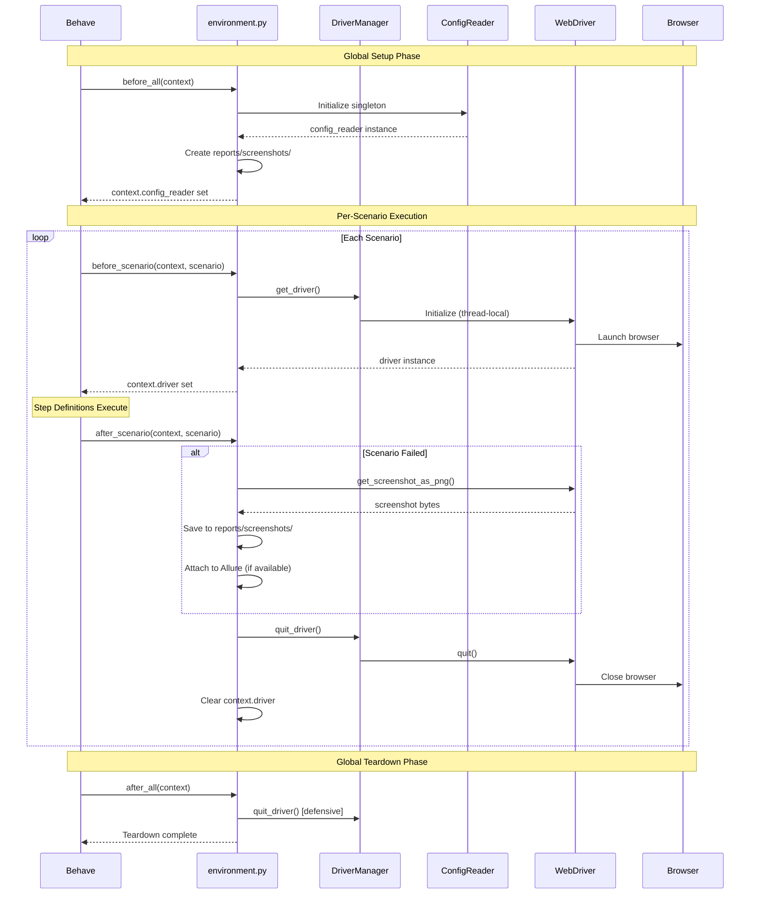
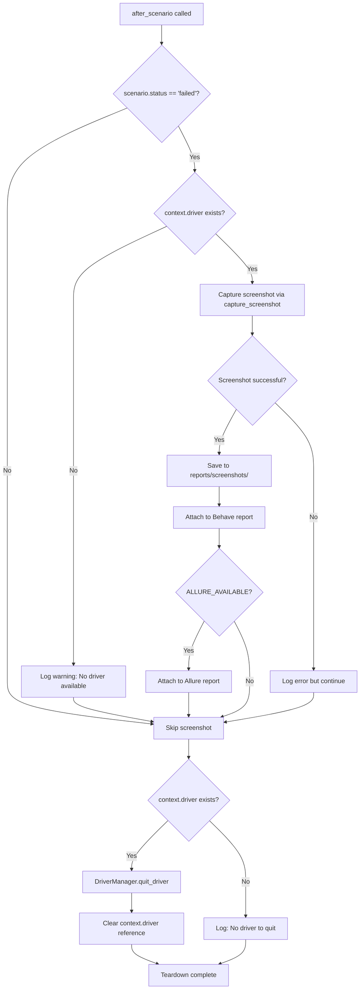
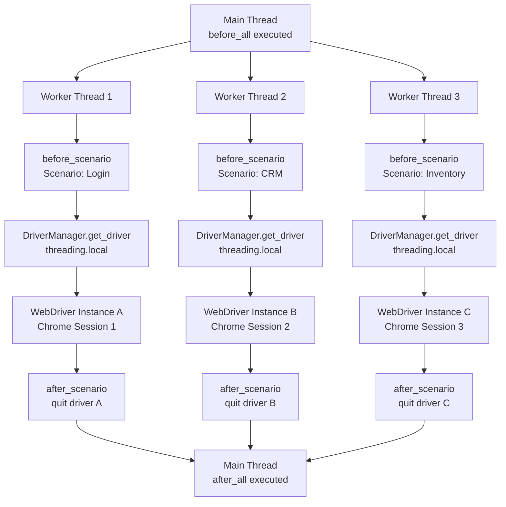

# features.environment

Complete API reference for Behave lifecycle hooks and test environment management.

## Module Overview

The `features.environment` module implements Behave lifecycle hooks for comprehensive test environment setup and teardown. This module is the cornerstone of test execution orchestration, managing WebDriver initialization, configuration access, screenshot capture, and resource cleanup throughout the test lifecycle.

**Module Purpose:** Provide Behave framework hooks that manage the complete test execution lifecycle from suite initialization through per-scenario setup/teardown to final cleanup.

**Migration Context:** Converted from Java Cucumber `Hooks.java` (`src/main/java/com/testinium/step_definitions/Hooks.java`) with significant enhancements for null safety, thread safety, and parallel execution support.

**Source:** `features/environment.py:1-515`

### Critical Enhancements from Java Version

The Python implementation provides six major improvements over the original Java Cucumber implementation:

1. **NULL SAFETY**: Defensive checks before all driver operations (fixes unguarded `Driver.getDriver()` calls in Java lines 14, 17)
2. **THREAD SAFETY**: WebDriver managed via `threading.local()` through `DriverManager` for safe parallel execution
3. **ALLURE INTEGRATION**: Optional Allure reporting support with screenshot attachments for enhanced observability
4. **COMPREHENSIVE LOGGING**: Detailed lifecycle event logging at all stages for debugging and monitoring
5. **ERROR HANDLING**: Graceful degradation and proper exception handling in teardown hooks
6. **PARALLEL EXECUTION**: Full compatibility with `behave-parallel` and `pytest-xdist` through thread-local storage

### Lifecycle Hooks Implemented

The module provides four primary Behave hooks that execute at different stages:

| Hook | Execution | Purpose | Thread Context |
|------|-----------|---------|----------------|
| `before_all` | Once before all features | Global configuration initialization | Main thread |
| `before_scenario` | Before each scenario | WebDriver initialization | Worker thread (if parallel) |
| `after_scenario` | After each scenario | Screenshot capture, driver cleanup | Worker thread (if parallel) |
| `after_all` | Once after all features | Final cleanup | Main thread |

### Test Execution Flow



### Module-Level Constants

| Constant | Type | Description |
|----------|------|-------------|
| `ALLURE_AVAILABLE` | `bool` | Flag indicating Allure integration status. `True` if `allure-behave` installed, `False` otherwise. |
| `logger` | `logging.Logger` | Module-level logger instance for lifecycle event logging. |

### Module Dependencies

**Internal Imports** (from framework utilities):

```python
from utilities.driver_manager import DriverManager
from utilities.config_reader import ConfigReader
from utilities.screenshot_helper import capture_screenshot
```

**External Imports** (Behave framework):

```python
from behave import fixture, use_fixture
from behave.runner import Context
```

**Optional Imports** (Allure reporting):

```python
from allure_commons.types import AttachmentType  # Optional
import allure  # Optional
```

---

## before_all

```python
def before_all(context: Context) -> None
```

Global setup hook executed once before all test features.

This hook runs before any feature file execution and performs one-time initialization of shared resources. It replaces suite-level setup that would be in Java `@BeforeClass` or test runner configuration.

**Source:** `features/environment.py:78-146`

### Parameters

| Parameter | Type | Required | Description |
|-----------|------|----------|-------------|
| `context` | `behave.runner.Context` | Yes | Behave context object shared across all scenarios. Used to store global configuration and pass data between hooks. |

### Returns

- **Type:** `None`
- **Description:** This hook has no return value. Side effects include context attribute assignment and filesystem operations.

### Raises

| Exception | Condition |
|-----------|-----------|
| `RuntimeError` | Configuration initialization fails (e.g., invalid config.yaml, missing .env file, permission errors creating reports directory). |

### Context Attributes Set

The hook sets the following attributes on the Behave context object:

| Attribute | Type | Description | Usage Example |
|-----------|------|-------------|---------------|
| `context.config_reader` | `ConfigReader` | Singleton instance for accessing configuration throughout test execution. | `browser_type = context.config_reader.get_property('browser.type')` |

### Responsibilities

1. **Initialize ConfigReader singleton** for configuration access across all tests
2. **Ensure reports/screenshots/ directory exists** for screenshot storage
3. **Configure logging** for test execution with appropriate log levels
4. **Store configuration in context** for scenario-level access
5. **Validate environment setup** and raise exceptions if critical initialization fails

### Thread Safety

This hook runs in the main thread before any parallel execution begins. ConfigReader singleton initialization is safe at this stage as no worker threads have been spawned yet.

### Usage Example

Behave automatically discovers and executes this hook when tests run:

```bash
$ behave features/
```

```
================================================================================
BEHAVE TEST SUITE INITIALIZATION - before_all hook
================================================================================
Initializing ConfigReader singleton...
ConfigReader initialized successfully: <utilities.config_reader.ConfigReader object at 0x7f...>
Reports directory ensured: /path/to/testinium-qa-python/reports/screenshots
Loaded configuration with 5 top-level keys: ['browser', 'timeouts', 'application', 'credentials', 'reporting']
Allure reporting integration: ENABLED
Test suite initialization complete
================================================================================
```

### Accessing Configuration in Tests

Once `before_all` completes, configuration is accessible in step definitions:

```python
from behave import given

@given('User navigates to application URL')
def navigate_to_app(context):
    # Access base URL from configuration
    base_url = context.config_reader.get_property('application.base_url')
    context.driver.get(base_url)
```

### Error Handling

If initialization fails, a `RuntimeError` is raised with detailed error context:

```python
try:
    context.config_reader = ConfigReader()
except Exception as e:
    raise RuntimeError(f"Test suite initialization failed: {e}") from e
```

This ensures test execution halts immediately if the environment cannot be properly configured, preventing cascading failures.

---

## after_all

```python
def after_all(context: Context) -> None
```

Global teardown hook executed once after all test features.

This hook runs after all feature file execution completes and performs final cleanup of shared resources. It replaces suite-level teardown that would be in Java `@AfterClass` or test runner configuration.

**Source:** `features/environment.py:148-199`

### Parameters

| Parameter | Type | Required | Description |
|-----------|------|----------|-------------|
| `context` | `behave.runner.Context` | Yes | Behave context object shared across all scenarios. Contains references to global resources initialized in `before_all`. |

### Returns

- **Type:** `None`
- **Description:** This hook has no return value. Performs cleanup operations as side effects.

### Raises

**No exceptions raised.** All errors are logged but not propagated to ensure test results can be reported even if teardown encounters issues.

### Responsibilities

1. **Log test execution summary** with completion status
2. **Perform final cleanup operations** for any remaining resources
3. **Ensure all resources are properly released** to prevent resource leaks
4. **Defensive cleanup of lingering WebDriver instances** (safety net for edge cases)

### Thread Safety

This hook runs in the main thread after all parallel execution completes. All scenario-level WebDriver instances should already be quit by `after_scenario`, making this a defensive final cleanup pass.

### Error Handling Strategy

The hook uses graceful degradation to ensure teardown never prevents test result reporting:

```python
try:
    # Perform cleanup operations
    logger.info("Test suite execution completed")
    DriverManager.quit_driver()  # Defensive cleanup
except Exception as e:
    logger.error("Error during teardown: %s", e, exc_info=True)
    # Don't raise exception - allow test results to be reported
```

### Usage Example

Behave automatically executes this hook after all features complete:

```bash
$ behave features/
```

```
[All feature execution logs...]

================================================================================
BEHAVE TEST SUITE TEARDOWN - after_all hook
================================================================================
Test suite execution completed
Performing final WebDriver cleanup check...
Final WebDriver cleanup complete
Test suite teardown complete
================================================================================
```

### Defensive Cleanup Pattern

The hook includes a safety net for lingering WebDriver instances:

```python
try:
    logger.debug("Performing final WebDriver cleanup check...")
    DriverManager.quit_driver()
    logger.debug("Final WebDriver cleanup complete")
except Exception as cleanup_error:
    logger.warning("Non-critical error during final cleanup: %s", cleanup_error)
```

This defensive approach ensures:
- WebDriver instances are cleaned up even if `after_scenario` failed
- Errors in cleanup don't prevent test result reporting
- Resource leaks are minimized in edge cases

---

## before_scenario

```python
def before_scenario(context: Context, scenario) -> None
```

Per-scenario setup hook executed before each test scenario.

This hook runs before every test scenario (including scenario outlines) and initializes a fresh WebDriver instance for test isolation. It ensures each test starts with a clean browser state, preventing test interdependencies.

**Source:** `features/environment.py:205-278`

### Parameters

| Parameter | Type | Required | Description |
|-----------|------|----------|-------------|
| `context` | `behave.runner.Context` | Yes | Behave context object for this scenario. Used to store the WebDriver instance and share data with step definitions. |
| `scenario` | `behave.model.Scenario` | Yes | Behave Scenario object containing scenario metadata including `name`, `tags`, `status`, `filename`, and `line`. |

### Returns

- **Type:** `None`
- **Description:** This hook has no return value. Side effect is setting `context.driver` attribute.

### Raises

| Exception | Condition |
|-----------|-----------|
| `RuntimeError` | WebDriver initialization fails (e.g., browser binary not found, driver incompatibility, port conflicts, system resource exhaustion). |

### Context Attributes Set

| Attribute | Type | Description | Usage Example |
|-----------|------|-------------|---------------|
| `context.driver` | `selenium.webdriver.remote.webdriver.WebDriver` | Thread-safe WebDriver instance for browser automation. | `context.driver.get("https://example.com")` |

### Responsibilities

1. **Initialize thread-local WebDriver** via `DriverManager.get_driver()` for thread safety
2. **Store WebDriver reference** in `context.driver` for step definition access
3. **Log scenario start** with name and tags for execution tracking
4. **Provide clean browser state** for each test to ensure isolation
5. **Log driver details** (browser name, version, session ID) for debugging

### Thread Safety

`DriverManager` uses `threading.local()` to provide isolated WebDriver instances per thread, supporting parallel test execution via `behave-parallel` or `pytest-xdist`. Each thread receives its own WebDriver instance without conflicts.

```python
# Thread-safe driver access pattern
context.driver = DriverManager.get_driver()  # Returns thread-local instance
```

### Critical Enhancement from Java

**Original Java Implementation:** The Java Cucumber `Hooks.java` had **no `@Before` hook** - driver initialization was implicit on the first `Driver.getDriver()` call within a step definition.

**Python Enhancement:** This explicit `before_scenario` hook provides:
- Better control over driver lifecycle
- Consistent initialization point across all scenarios
- Detailed logging of driver initialization
- Early failure detection if driver cannot be created

### Usage Example

Given a scenario in `Login.feature`:

```gherkin
@Login @Smoke
Scenario: Valid user login
    Given User is on the login page
    When User enters valid credentials
    Then User should be logged in successfully
```

**Execution flow:**

```
--------------------------------------------------------------------------------
SCENARIO START: Valid user login
Tags: ['Login', 'Smoke']
--------------------------------------------------------------------------------
Initializing WebDriver for scenario: Valid user login
WebDriver initialized successfully for scenario: Valid user login
Browser: chrome 120.0.6099.109, Session: 8a7b6c5d4e3f2a1b0c9d8e7f6a5b4c3d
[Step definitions execute using context.driver...]
```

### Accessing Driver in Step Definitions

Step definitions automatically receive the initialized driver through context:

```python
from behave import given
from selenium.webdriver.common.by import By

@given('User is on the login page')
def navigate_to_login(context):
    # context.driver is initialized by before_scenario hook
    base_url = context.config_reader.get_property('application.base_url')
    context.driver.get(f"{base_url}/login")
    
    # Verify page loaded
    assert "Login" in context.driver.title
```

### Error Handling

If WebDriver initialization fails, execution halts immediately with a descriptive error:

```python
try:
    context.driver = DriverManager.get_driver()
except Exception as e:
    logger.exception("CRITICAL: Failed to initialize WebDriver: %s", e)
    raise RuntimeError(f"WebDriver initialization failed for scenario '{scenario.name}': {e}") from e
```

This prevents scenarios from attempting to execute without a functional driver, which would cause cascading failures.

### Driver Details Logging

The hook logs detailed driver information for troubleshooting:

```python
browser_name = context.driver.capabilities.get('browserName', 'unknown')
browser_version = context.driver.capabilities.get('browserVersion', 'unknown')
session_id = context.driver.session_id
logger.debug("Browser: %s %s, Session: %s", browser_name, browser_version, session_id)
```

**Example output:**

```
Browser: chrome 120.0.6099.109, Session: 8a7b6c5d4e3f2a1b0c9d8e7f6a5b4c3d
```

This information is invaluable when debugging test failures or investigating browser-specific issues.

---

## after_scenario

```python
def after_scenario(context: Context, scenario) -> None
```

Per-scenario teardown hook executed after each test scenario.

This hook runs after every test scenario (including scenario outlines) and performs cleanup operations including screenshot capture for failed tests and WebDriver termination. Converted from Java `Hooks.java` `@After` annotation with enhanced null safety and error handling.

**Source:** `features/environment.py:280-458`

### Original Java Implementation

The Python implementation was converted from this Java Cucumber code:

```java
// Source: src/main/java/com/testinium/step_definitions/Hooks.java (lines 11-18)
@After
public void teardownScenario(Scenario scenario){
    if(scenario.isFailed()){
        byte [] screenshot = ((TakesScreenshot) Driver.getDriver())
                            .getScreenshotAs(OutputType.BYTES);
        scenario.attach(screenshot, "image/png", scenario.getName());
    }
    Driver.closeDriver();
}
```

### Critical Enhancements from Java Version

The Python implementation provides six major improvements over the Java code:

1. **NULL SAFETY**: Defensive check for `context.driver` before operations (Java code had unguarded `Driver.getDriver()` calls on lines 14, 17)
2. **THREAD SAFETY**: Uses `DriverManager.quit_driver()` with `threading.local()` for safe parallel execution
3. **ALLURE INTEGRATION**: Optional attachment of screenshots to Allure reports for enhanced observability
4. **FILE SYSTEM STORAGE**: Screenshots saved to `reports/screenshots/` directory (not just attached to report)
5. **COMPREHENSIVE LOGGING**: Detailed scenario execution logging with status tracking
6. **ERROR HANDLING**: Graceful degradation on screenshot capture failures (doesn't break teardown)

### Parameters

| Parameter | Type | Required | Description |
|-----------|------|----------|-------------|
| `context` | `behave.runner.Context` | Yes | Behave context object for this scenario. Contains `context.driver` initialized by `before_scenario`. |
| `scenario` | `behave.model.Scenario` | Yes | Behave Scenario object with execution results including `name`, `status` ('passed', 'failed', 'skipped'), and `tags`. |

### Returns

- **Type:** `None`
- **Description:** This hook has no return value. Performs cleanup operations as side effects.

### Raises

**No exceptions raised.** All errors are logged but not propagated to ensure cleanup completes even if individual operations fail. This follows the principle that teardown hooks should never prevent test result reporting.

### Responsibilities

1. **Check scenario.status** for failure detection to determine if screenshot is needed
2. **Capture screenshot if scenario failed** (with null safety checks before driver access)
3. **Quit WebDriver** and cleanup browser process to free system resources
4. **Log scenario execution results** with status and timing information
5. **Optional: Attach screenshot to Allure report** for enhanced failure analysis

### Thread Safety

`DriverManager.quit_driver()` safely removes the thread-local WebDriver reference without affecting other threads in parallel execution. Each thread's driver is cleaned up independently.

### Idempotent Behavior

The hook is safe to call even if driver initialization failed in `before_scenario`. Null checks ensure no errors from missing driver:

```python
if hasattr(context, 'driver') and context.driver is not None:
    # Safe to perform driver operations
else:
    logger.warning("No driver to quit - may have failed to initialize")
```

### Screenshot Capture Workflow



### Usage Example

After a scenario completes execution:

```gherkin
@Login @Smoke
Scenario: Invalid user login with empty credentials
    Given User is on the login page
    When User submits login form without entering credentials
    Then Error message "Username is required" should be displayed
```

**If scenario fails:**

```
--------------------------------------------------------------------------------
SCENARIO END: Invalid user login with empty credentials
Status: failed
--------------------------------------------------------------------------------
Scenario FAILED: Invalid user login with empty credentials
Capturing failure screenshot for scenario: Invalid user login with empty credentials
Screenshot saved successfully: reports/screenshots/Invalid_user_login_with_empty_credentials_20240115_143022.png
Screenshot attached to Behave scenario report
Quitting WebDriver for scenario: Invalid user login with empty credentials
WebDriver quit successfully for scenario: Invalid user login with empty credentials
Cleared context.driver reference
Scenario teardown complete: Invalid user login with empty credentials
================================================================================
```

### Screenshot Capture Details

The hook uses the `capture_screenshot` utility for comprehensive screenshot handling:

```python
from utilities.screenshot_helper import capture_screenshot

screenshot_path = capture_screenshot(
    driver=context.driver,
    scenario_name=scenario.name,
    attach_to_allure=ALLURE_AVAILABLE
)
```

**Screenshot file naming pattern:**

```
reports/screenshots/<scenario_name_sanitized>_<timestamp>.png
```

**Example:**

```
reports/screenshots/Invalid_user_login_with_empty_credentials_20240115_143022.png
```

### Behave Report Attachment

Screenshots are attached to the Behave HTML report for inline viewing:

```python
screenshot_bytes = context.driver.get_screenshot_as_png()
scenario.attach(
    data=screenshot_bytes,
    mime_type='image/png',
    name=scenario.name
)
```

This mimics the Java `scenario.attach()` behavior but with additional file system storage.

### WebDriver Cleanup with Null Safety

The hook performs defensive cleanup to handle edge cases:

```python
if hasattr(context, 'driver') and context.driver is not None:
    logger.debug("Quitting WebDriver for scenario: %s", scenario.name)
    try:
        DriverManager.quit_driver()
        logger.info("WebDriver quit successfully")
    except Exception as quit_error:
        logger.error("Error quitting WebDriver: %s", quit_error, exc_info=True)
    finally:
        context.driver = None  # Clear reference
else:
    logger.debug("No WebDriver to quit (driver is None or not initialized)")
```

**Key safety features:**

1. **Attribute existence check**: `hasattr(context, 'driver')` handles cases where `before_scenario` failed before setting the attribute
2. **Null check**: `context.driver is not None` handles cases where the attribute exists but is None
3. **Exception handling**: Try-except block prevents quit errors from breaking teardown
4. **Reference clearing**: `finally` block ensures `context.driver = None` always executes
5. **Logging**: All branches log appropriate messages for debugging

### Error Handling Pattern

The hook follows the "log errors but don't raise" pattern in teardown:

```python
try:
    # Perform cleanup operation
    DriverManager.quit_driver()
except Exception as quit_error:
    # Log error with full traceback
    logger.error("Error during cleanup: %s", quit_error, exc_info=True)
    # Don't raise - allow teardown to complete
```

This ensures:
- Partial cleanup failures don't prevent other cleanup operations
- Test results are still reported even if teardown has issues
- Full error details are captured in logs for troubleshooting
- Subsequent scenarios can still execute

---

## browser_fixture

```python
@fixture
def browser_fixture(context: Context)
```

Optional fixture for advanced WebDriver lifecycle management.

This fixture provides an alternative pattern to `before_scenario`/`after_scenario` hooks using Behave's fixture system. It's useful for feature-level or step-level driver scoping instead of scenario-level scoping.

**Status:** Not used by default in this framework (scenario-level hooks are the primary pattern), but provided as reference for advanced use cases.

**Source:** `features/environment.py:464-504`

### Parameters

| Parameter | Type | Required | Description |
|-----------|------|----------|-------------|
| `context` | `behave.runner.Context` | Yes | Behave context object. The fixture will set `context.driver` attribute. |

### Yields

- **Type:** `selenium.webdriver.remote.webdriver.WebDriver`
- **Description:** Initialized WebDriver instance available for the fixture scope duration.

### Cleanup

Automatically quits driver after fixture scope ends using a `finally` block. This ensures cleanup happens even if the fixture scope encounters errors.

### Purpose

Provides flexibility for alternative WebDriver scoping strategies:

- **Feature-level scoping**: One driver instance for entire feature file
- **Step-level scoping**: Explicit control over when driver is initialized/cleaned up
- **Custom scoping**: Advanced scenarios requiring non-standard lifecycle management

### Use Cases

**1. Feature-Level Driver Scoping**

Share a single WebDriver instance across all scenarios in a feature:

```python
def before_feature(context, feature):
    """Initialize driver once per feature instead of per scenario."""
    use_fixture(browser_fixture, context)
```

**Benefits:**
- Faster execution (no driver restart between scenarios)
- Reduced resource usage

**Trade-offs:**
- Test isolation reduced (state can leak between scenarios)
- Requires manual state cleanup in scenarios

**2. Conditional Driver Initialization**

Initialize driver only for specific scenarios based on tags:

```python
def before_scenario(context, scenario):
    """Initialize driver only for scenarios that need browser."""
    if 'no_browser' not in scenario.tags:
        use_fixture(browser_fixture, context)
```

**3. Step-Level Control**

Control driver lifecycle at step definition level:

```python
from behave import given

@given('Browser is launched')
def launch_browser(context):
    """Explicit driver initialization in step."""
    use_fixture(browser_fixture, context)
```

### Usage Example

Implementing feature-level driver scoping:

```python
# In features/environment.py

from behave import use_fixture

def before_feature(context, feature):
    """Initialize WebDriver once per feature."""
    logger.info("Initializing browser for feature: %s", feature.name)
    use_fixture(browser_fixture, context)
    # context.driver is now available for all scenarios in this feature

def after_feature(context, feature):
    """
    Cleanup handled automatically by fixture.
    This hook can perform additional feature-level cleanup.
    """
    logger.info("Feature completed: %s", feature.name)
```

**Gherkin feature file:**

```gherkin
Feature: User Authentication

  Scenario: Login with valid credentials
    Given User is on the login page
    When User enters valid credentials
    Then User should be logged in

  Scenario: Login with invalid credentials
    Given User is on the login page
    When User enters invalid credentials
    Then Error message should be displayed
```

**Execution flow:**

```
Browser fixture: Initializing WebDriver
Browser fixture: WebDriver initialized
[Scenario 1 executes using context.driver]
[Scenario 2 executes using same context.driver]
Browser fixture: Cleaning up WebDriver
Browser fixture: Cleanup complete
```

### Implementation Details

The fixture uses Python's generator pattern with cleanup:

```python
@fixture
def browser_fixture(context: Context):
    logger.debug("Browser fixture: Initializing WebDriver")
    
    try:
        # Setup phase: Initialize driver
        context.driver = DriverManager.get_driver()
        logger.debug("Browser fixture: WebDriver initialized")
        
        # Yield control back to test execution
        yield context.driver
        
    finally:
        # Cleanup phase: Quit driver (always executes)
        logger.debug("Browser fixture: Cleaning up WebDriver")
        if hasattr(context, 'driver') and context.driver is not None:
            DriverManager.quit_driver()
            context.driver = None
        logger.debug("Browser fixture: Cleanup complete")
```

**Key characteristics:**

1. **Generator pattern**: `yield` suspends execution, returning control to test
2. **Automatic cleanup**: `finally` block ensures cleanup even on exceptions
3. **Null safety**: Checks driver exists before cleanup
4. **Reuses DriverManager**: Consistent with scenario-level hooks

### Comparison: Fixture vs Hooks

| Aspect | Fixture (`browser_fixture`) | Hooks (`before/after_scenario`) |
|--------|---------------------------|--------------------------------|
| **Scope** | Flexible (feature, scenario, step) | Fixed (scenario-level) |
| **Control** | Explicit via `use_fixture()` | Automatic by Behave |
| **Initialization** | On-demand when `use_fixture()` called | Automatic before every scenario |
| **Cleanup** | Automatic at fixture scope end | Automatic after every scenario |
| **Use Case** | Advanced custom scoping | Standard scenario isolation |
| **Complexity** | Higher (requires explicit management) | Lower (convention over configuration) |
| **Recommended** | Special cases only | Default for most tests |

### When to Use Fixture vs Hooks

**Use fixture (`browser_fixture`) when:**

- Feature-level driver sharing needed for performance
- Conditional driver initialization based on tags
- Custom cleanup logic required
- Step-level control over driver lifecycle needed

**Use hooks (`before_scenario`/`after_scenario`) when:**

- Standard scenario-level isolation is sufficient (most cases)
- Consistent driver initialization/cleanup desired
- Simplicity and convention preferred
- Parallel execution used (hooks work seamlessly with parallelism)

**Default recommendation:** Use scenario-level hooks unless you have a specific requirement for alternative scoping.

---

## Common Usage Patterns

### Pattern 1: Accessing Driver in Step Definitions

The most common pattern is accessing the WebDriver instance initialized by `before_scenario`:

```python
from behave import given, when, then
from selenium.webdriver.common.by import By

@given('User is on the login page')
def navigate_to_login(context):
    # Access driver from context (initialized by before_scenario)
    base_url = context.config_reader.get_property('application.base_url')
    context.driver.get(f"{base_url}/login")

@when('User enters username "{username}"')
def enter_username(context, username):
    # Driver is available throughout scenario lifecycle
    username_field = context.driver.find_element(By.NAME, "login")
    username_field.send_keys(username)

@then('User should be logged in')
def verify_login(context):
    # Driver persists until after_scenario hook
    assert "Dashboard" in context.driver.title
```

### Pattern 2: Accessing Configuration

Access configuration loaded by `before_all`:

```python
from behave import given

@given('Application is configured for "{environment}" environment')
def configure_environment(context, environment):
    # Configuration available via context.config_reader
    if environment == "staging":
        base_url = context.config_reader.get_property('application.staging_url')
    else:
        base_url = context.config_reader.get_property('application.base_url')
    
    context.driver.get(base_url)
    
    # Access other configuration
    timeout = context.config_reader.get_property('timeouts.explicit')
    logger.info(f"Using timeout: {timeout}s")
```

### Pattern 3: Manual Screenshot Capture

While `after_scenario` automatically captures screenshots on failure, you can manually capture screenshots at any point:

```python
from behave import when
from utilities.screenshot_helper import capture_screenshot

@when('User submits the form')
def submit_form(context):
    submit_button = context.driver.find_element(By.ID, "submit")
    
    # Capture screenshot before critical action
    capture_screenshot(
        driver=context.driver,
        scenario_name="Before_form_submission",
        attach_to_allure=True
    )
    
    submit_button.click()
    
    # Capture screenshot after critical action
    capture_screenshot(
        driver=context.driver,
        scenario_name="After_form_submission",
        attach_to_allure=True
    )
```

### Pattern 4: Context Object Lifecycle Understanding

The context object has different lifecopes at different levels:

```python
# In environment.py

def before_all(context):
    # Suite-level: Available to all features and scenarios
    context.suite_start_time = datetime.now()
    context.config_reader = ConfigReader()  # Shared across all scenarios

def before_feature(context, feature):
    # Feature-level: Available to all scenarios in this feature
    context.feature_name = feature.name
    context.feature_tags = feature.tags

def before_scenario(context, scenario):
    # Scenario-level: Available only to this scenario
    context.scenario_name = scenario.name
    context.driver = DriverManager.get_driver()  # Fresh for each scenario
    context.scenario_start_time = datetime.now()

def before_step(context, step):
    # Step-level: Available only to this step
    context.step_name = step.name
```

**Key principles:**

- **Suite-level data** (`before_all`): Configuration, shared utilities, global settings
- **Feature-level data** (`before_feature`): Feature-specific setup
- **Scenario-level data** (`before_scenario`): WebDriver, fresh state
- **Step-level data** (`before_step`): Step-specific temporary data

### Pattern 5: Parallel Execution with Environment Hooks

The hooks are designed for safe parallel execution:

```bash
# Run scenarios in parallel across 4 processes
$ behave -f progress3 --processes 4 --parallel-element scenario
```

**How parallelism works with hooks:**

1. **before_all**: Runs once in main process before workers spawn
2. **Worker processes created**: Each gets copy of context with `config_reader`
3. **before_scenario**: Runs in each worker process (thread-safe via `threading.local()`)
4. **Scenario execution**: Each worker has isolated WebDriver instance
5. **after_scenario**: Runs in each worker process (cleans up worker's driver)
6. **Workers complete**: All return to main process
7. **after_all**: Runs once in main process after all workers finish

**Thread-local storage ensures:**

```python
# Worker 1
context.driver = DriverManager.get_driver()  # Gets WebDriver instance A

# Worker 2 (simultaneously)
context.driver = DriverManager.get_driver()  # Gets WebDriver instance B

# No conflicts - each thread has its own driver
```

---

## Thread Safety Details

### threading.local() Pattern

The framework uses Python's `threading.local()` pattern for thread-safe WebDriver management:

```python
# In utilities/driver_manager.py
class DriverManager:
    _drivers = threading.local()  # Thread-local storage
    
    @classmethod
    def get_driver(cls):
        # Each thread gets its own driver attribute
        if not hasattr(cls._drivers, 'driver') or cls._drivers.driver is None:
            cls._drivers.driver = cls._create_driver()
        return cls._drivers.driver
```

### Thread Isolation Visualization



### Thread-Safe Guarantee

The environment hooks guarantee thread safety through:

1. **Thread-local driver storage**: `DriverManager` uses `threading.local()` so each thread gets isolated driver
2. **Independent cleanup**: `after_scenario` quits only the current thread's driver
3. **No shared mutable state**: Each scenario operates on independent context and driver
4. **ConfigReader singleton**: Initialized in main thread before workers spawn, safe for read-only access

### Safe Parallel Execution

Run parallel tests safely:

```bash
# Parallel by scenario (recommended)
$ behave --processes 4 --parallel-element scenario

# Parallel by feature
$ behave --processes 4 --parallel-element feature
```

**The hooks automatically handle:**
- Separate WebDriver instances per worker thread
- Independent screenshot capture per scenario
- Isolated cleanup per scenario
- No race conditions on shared resources

---

## Error Handling Patterns

### Pattern 1: Setup Errors (Raise Exceptions)

Setup hooks (`before_all`, `before_scenario`) raise exceptions on critical errors to prevent invalid test execution:

```python
def before_all(context):
    try:
        context.config_reader = ConfigReader()
    except Exception as e:
        # CRITICAL ERROR - halt test execution
        raise RuntimeError(f"Configuration initialization failed: {e}") from e

def before_scenario(context, scenario):
    try:
        context.driver = DriverManager.get_driver()
    except Exception as e:
        # CRITICAL ERROR - scenario cannot execute without driver
        raise RuntimeError(f"WebDriver initialization failed: {e}") from e
```

**Rationale:** If setup fails, tests cannot execute validly. Better to fail fast with clear error than produce meaningless results.

### Pattern 2: Teardown Errors (Log But Don't Raise)

Teardown hooks (`after_scenario`, `after_all`) log errors but don't raise exceptions to ensure cleanup completes:

```python
def after_scenario(context, scenario):
    # Screenshot capture errors - non-critical
    try:
        capture_screenshot(context.driver, scenario.name)
    except Exception as screenshot_error:
        logger.error("Screenshot capture failed: %s", screenshot_error, exc_info=True)
        # Don't raise - continue with driver cleanup
    
    # Driver cleanup errors - non-critical
    try:
        DriverManager.quit_driver()
    except Exception as quit_error:
        logger.error("Driver quit failed: %s", quit_error, exc_info=True)
        # Don't raise - allow test results to be reported
```

**Rationale:** Teardown errors shouldn't prevent test result reporting. Better to log the error and continue than fail the entire test run.

### Pattern 3: Defensive Null Checks

All teardown operations check for null/None before proceeding:

```python
# Check attribute exists and is not None
if hasattr(context, 'driver') and context.driver is not None:
    DriverManager.quit_driver()
else:
    logger.warning("No driver to quit - may have failed to initialize")
```

**Rationale:** Teardown must be resilient to setup failures. If `before_scenario` failed, `context.driver` might not exist or be None.

### Pattern 4: Graceful Degradation

Optional features degrade gracefully when unavailable:

```python
# Allure integration - optional
if ALLURE_AVAILABLE:
    logger.info("Allure reporting integration: ENABLED")
    try:
        allure.attach(screenshot_bytes, attachment_type=AttachmentType.PNG)
    except Exception as allure_error:
        logger.warning("Failed to attach to Allure: %s", allure_error)
else:
    logger.debug("Allure reporting: DISABLED (allure-behave not installed)")
```

**Rationale:** Framework should work without optional dependencies. Core functionality doesn't depend on Allure.

---

## Integration Points

This module integrates with several other framework components. See related documentation:

### Utility Integrations

- **[DriverManager API Reference](../utilities/driver-manager.md)** - WebDriver lifecycle management with thread-local storage
  - `DriverManager.get_driver()` - Used in `before_scenario` to initialize driver
  - `DriverManager.quit_driver()` - Used in `after_scenario` and `after_all` to cleanup driver

- **[ConfigReader API Reference](../utilities/config-reader.md)** - Configuration access throughout test execution
  - `ConfigReader()` - Initialized in `before_all` and stored in `context.config_reader`
  - Used by step definitions to access application URLs, credentials, timeouts

- **[Screenshot Helper API Reference](../utilities/screenshot-helper.md)** - Screenshot capture for test failures
  - `capture_screenshot()` - Used in `after_scenario` to capture failure screenshots
  - Handles file naming, storage, and optional Allure attachment

### User Guides

- **[Authentication Testing Guide](../../guides/authentication-testing.md)** - Example usage of environment hooks in login scenarios

- **[Parallel Execution Guide](../../guides/parallel-execution.md)** - How to run tests in parallel with thread-safe hooks

- **[Configuration Management Guide](../../guides/configuration-management.md)** - Understanding `context.config_reader` usage

### Architecture Documentation

- **[Test Execution Lifecycle Architecture](../../architecture/test-execution-lifecycle.md)** - Detailed sequence diagrams showing hook execution flow

- **[Parallel Execution Architecture](../../architecture/parallel-execution.md)** - Thread-safety patterns and `threading.local()` explanation

---

## Migration Documentation

### Java to Python Transformation

This module was migrated from Java Cucumber `Hooks.java` to Python Behave `environment.py` with significant enhancements.

#### Original Java Source

**File:** `src/main/java/com/testinium/step_definitions/Hooks.java`

```java
package com.testinium.step_definitions;

import io.cucumber.java.After;
import io.cucumber.java.Scenario;
import org.openqa.selenium.OutputType;
import org.openqa.selenium.TakesScreenshot;

public class Hooks {

    @After
    public void teardownScenario(Scenario scenario){
        if(scenario.isFailed()){
            byte [] screenshot = ((TakesScreenshot) Driver.getDriver())
                                .getScreenshotAs(OutputType.BYTES);
            scenario.attach(screenshot, "image/png", scenario.getName());
        }
        Driver.closeDriver();
    }
}
```

#### Behavioral Equivalence Mapping

| Java Cucumber Concept | Python Behave Equivalent | Notes |
|-----------------------|--------------------------|-------|
| `@After` annotation | `after_scenario(context, scenario)` function | Behave uses function-based hooks instead of annotations |
| `scenario.isFailed()` | `scenario.status == 'failed'` | Behave exposes status as string property |
| `Driver.getDriver()` | `DriverManager.get_driver()` | Singleton pattern → Class method pattern |
| `TakesScreenshot` cast | `context.driver.get_screenshot_as_png()` | Direct method call (no cast needed in Python) |
| `scenario.attach()` | `scenario.attach()` | Same API in Behave |
| `Driver.closeDriver()` | `DriverManager.quit_driver()` | Renamed for clarity (quit vs close) |
| No `@Before` hook | `before_scenario()` | Enhancement - explicit driver initialization |
| No `@BeforeAll` | `before_all()` | Enhancement - global configuration setup |
| No `@AfterAll` | `after_all()` | Enhancement - global cleanup |

#### Enhancements Over Java Implementation

**1. NULL SAFETY**

- **Java issue:** Unguarded `Driver.getDriver()` calls on lines 14, 17 could NPE if driver not initialized
- **Python fix:** Defensive checks before all driver operations

```python
if hasattr(context, 'driver') and context.driver is not None:
    # Safe to use driver
```

**2. THREAD SAFETY**

- **Java issue:** Static driver storage unsafe for parallel execution
- **Python fix:** Thread-local storage via `threading.local()` in `DriverManager`

**3. EXPLICIT SETUP**

- **Java issue:** No `@Before` hook - driver init was implicit on first use
- **Python enhancement:** Explicit `before_scenario` hook for controlled initialization

**4. FILE SYSTEM STORAGE**

- **Java limitation:** Screenshots only attached to report, not saved to disk
- **Python enhancement:** Screenshots saved to `reports/screenshots/` directory

**5. COMPREHENSIVE LOGGING**

- **Java limitation:** Minimal logging
- **Python enhancement:** Detailed logging at all lifecycle stages

**6. ALLURE INTEGRATION**

- **Java limitation:** No Allure support
- **Python enhancement:** Optional Allure screenshot attachment

#### Bug Fixes Applied

**Bug 1: Unguarded driver access**

- **Java code (line 14):** `((TakesScreenshot) Driver.getDriver())`
- **Problem:** No check if driver is null
- **Python fix:**

```python
if hasattr(context, 'driver') and context.driver is not None:
    screenshot = context.driver.get_screenshot_as_png()
```

**Bug 2: No cleanup on initialization failure**

- **Java problem:** If `Driver.getDriver()` fails in test, `closeDriver()` still called
- **Python fix:** Null check before quit operation

**Bug 3: Screenshot errors fail teardown**

- **Java problem:** Exception during screenshot capture prevents `closeDriver()` execution
- **Python fix:** Try-except around screenshot with continued execution

---

## See Also

### API References

- [features package overview](./index.md) - Overview of features package structure
- [DriverManager API](../utilities/driver-manager.md) - WebDriver lifecycle management
- [ConfigReader API](../utilities/config-reader.md) - Configuration access patterns
- [Screenshot Helper API](../utilities/screenshot-helper.md) - Screenshot capture utilities
- [Step Definitions API](../steps/login-steps.md) - Example step definition usage with context

### User Guides

- [Getting Started - First Test](../../getting-started/first-test.md) - Running your first test with environment hooks
- [Authentication Testing Guide](../../guides/authentication-testing.md) - Complete testing workflow using hooks
- [Parallel Execution Guide](../../guides/parallel-execution.md) - Thread-safe parallel test execution
- [Configuration Management Guide](../../guides/configuration-management.md) - Using `context.config_reader`
- [Screenshot Management Guide](../../guides/screenshot-management.md) - Advanced screenshot handling

### Architecture Documentation

- [System Overview](../../architecture/system-overview.md) - High-level system architecture
- [Test Execution Lifecycle](../../architecture/test-execution-lifecycle.md) - Detailed hook execution sequence
- [Parallel Execution Architecture](../../architecture/parallel-execution.md) - Thread-local storage patterns
- [Configuration Management Architecture](../../architecture/configuration-management.md) - Configuration loading and precedence

### Reference Documentation

- [Behave Configuration Reference](../../reference/behave-configuration.md) - Behave framework configuration options
- [Command Reference](../../reference/command-reference.md) - Behave CLI commands and options

### External Resources

- [Behave Official Documentation](https://behave.readthedocs.io/) - Behave framework documentation
- [Selenium Python Documentation](https://selenium-python.readthedocs.io/) - Selenium WebDriver API reference
- [Python threading.local() Documentation](https://docs.python.org/3/library/threading.html#thread-local-data) - Thread-local storage explanation

---

**Last Updated:** Based on `features/environment.py` (515 lines, migration from Java Cucumber Hooks.java)

**Python Version:** 3.9+  
**Framework:** Behave 1.2.6  
**Selenium Version:** 4.15.2
