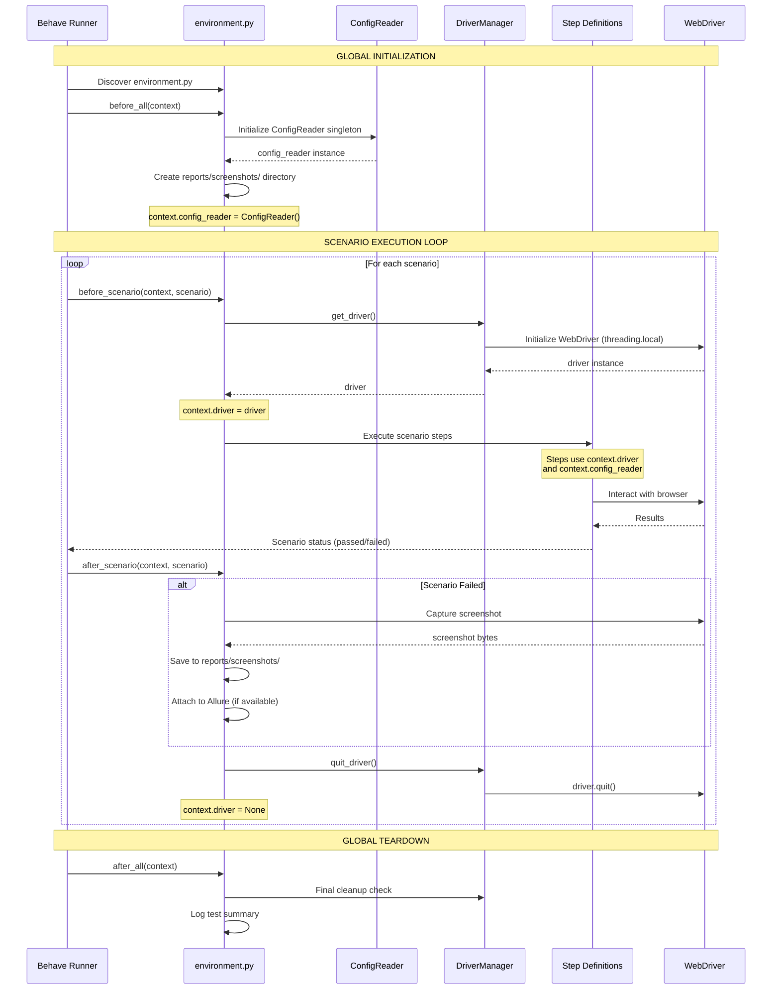

# Features Package API Reference

## Overview

The `features` package contains Behave lifecycle hooks that manage the test environment setup and teardown for the entire test suite and individual scenarios. This package implements the core test execution lifecycle using Behave's hook pattern to provide automated, consistent environment management.

**Package Purpose:**
- **Global Initialization:** One-time setup before all test features execute (`before_all`)
- **Scenario Isolation:** Clean WebDriver initialization for each test scenario (`before_scenario`)
- **Failure Capture:** Automatic screenshot capture when tests fail (`after_scenario`)
- **Resource Cleanup:** Proper teardown of WebDriver and shared resources (`after_all`, `after_scenario`)

**Migration Context:**  
Converted from Java Cucumber `Hooks.java` with `@Before`/`@After` annotations to Python Behave's environment hooks pattern, with significant enhancements for null safety, thread safety, and comprehensive error handling.

**Source:** `features/environment.py:1-515`

---

## Lifecycle Hooks Summary

The features package provides four primary lifecycle hooks that Behave automatically discovers and executes:

| Hook | Scope | Execution | Purpose |
|------|-------|-----------|---------|
| **`before_all`** | Global | Once before all features | Initialize ConfigReader singleton, create reports directory, configure logging |
| **`after_all`** | Global | Once after all features | Final cleanup, log test summary, ensure no lingering resources |
| **`before_scenario`** | Per-scenario | Before each scenario | Initialize fresh WebDriver instance, provide clean browser state |
| **`after_scenario`** | Per-scenario | After each scenario | Capture failure screenshots, quit WebDriver, cleanup browser process |

### Additional Hooks

- **`browser_fixture`** - Optional fixture for advanced WebDriver lifecycle management with custom scoping

---

## Test Execution Flow

The following diagram illustrates the complete test execution lifecycle from Behave initialization through final cleanup:



**Source:** `features/environment.py:78-458`

---

## Key Features and Enhancements

### 1. NULL SAFETY ✓
**Problem in Java:** Original `Hooks.java` had unguarded `Driver.getDriver()` calls on lines 14 and 17 that could fail if driver was null.

**Solution:** Defensive checks before all driver operations:
```python
if hasattr(context, 'driver') and context.driver is not None:
    # Safe to use context.driver
```

**Source:** `features/environment.py:358, 422`

### 2. THREAD SAFETY ✓
**Implementation:** WebDriver managed via `threading.local()` through DriverManager, ensuring each thread in parallel execution has its own isolated WebDriver instance.

**Benefits:**
- Compatible with `behave-parallel` for parallel scenario execution
- Compatible with `pytest-xdist` for distributed testing
- No cross-thread driver conflicts

**Source:** `features/environment.py:256-261`

### 3. ALLURE INTEGRATION ✓
**Feature:** Optional Allure reporting support for enhanced test observability.

**Automatic Detection:**
```python
try:
    from allure_commons.types import AttachmentType
    import allure
    ALLURE_AVAILABLE = True
except ImportError:
    ALLURE_AVAILABLE = False
```

**Usage:** Screenshots automatically attached to Allure reports when available.

**Source:** `features/environment.py:60-67`

### 4. COMPREHENSIVE LOGGING ✓
**Feature:** Detailed lifecycle event logging for debugging and monitoring.

**Log Levels:**
- `INFO`: Lifecycle events, scenario start/end, initialization success
- `WARNING`: Scenario failures, missing drivers
- `ERROR`: Critical failures, screenshot capture errors
- `DEBUG`: Driver details, cleanup operations

**Source:** `features/environment.py:112-457`

### 5. ERROR HANDLING ✓
**Feature:** Graceful degradation and proper exception handling throughout lifecycle.

**Patterns:**
- Try-except blocks around all critical operations
- Logging of errors without failing teardown
- Defensive cleanup in `finally` blocks
- Clear error messages with context

**Source:** `features/environment.py:392-440`

### 6. PARALLEL EXECUTION SUPPORT ✓
**Feature:** Full compatibility with parallel test execution frameworks.

**Supported Tools:**
- `behave --processes 4` - Behave parallel execution
- `pytest-xdist` - pytest distributed testing
- `behave-parallel` - Advanced parallel execution

**Thread Safety Guarantee:** Each thread gets isolated WebDriver via `threading.local()`.

**Source:** `features/environment.py:230-233`

---

## Context Object Management

The Behave `context` object serves as shared state across hooks and step definitions. The features package sets two critical attributes:

### context.config_reader

**Set In:** `before_all` hook  
**Type:** `ConfigReader` singleton  
**Lifecycle:** Entire test suite execution  
**Purpose:** Access configuration from `config/config.yaml` and `.env` files

**Usage Example:**
```python
# In step definitions
@given('User is on the application')
def navigate_to_app(context):
    base_url = context.config_reader.get_property('application.base_url')
    context.driver.get(base_url)
```

**Source:** `features/environment.py:120`

### context.driver

**Set In:** `before_scenario` hook  
**Type:** Selenium `WebDriver` instance (thread-local)  
**Lifecycle:** Single scenario execution  
**Purpose:** Interact with web browser for test automation

**Usage Example:**
```python
# In step definitions
@when('User clicks the login button')
def click_login(context):
    login_button = context.driver.find_element(By.ID, "login-btn")
    login_button.click()
```

**Important:** `context.driver` is set to `None` after each scenario in `after_scenario`, ensuring clean state for next test.

**Source:** `features/environment.py:261, 445`

---

## Usage Patterns

### Basic Test Scenario Flow

```python
# features/Login.feature
Feature: User Authentication
    
    @Login @Smoke
    Scenario: Successful login with valid credentials
        Given User is on the login page
        When User enters valid username and password
        And User clicks the login button
        Then Dashboard should be displayed
```

```python
# features/steps/login_steps.py
from behave import given, when, then

@given('User is on the login page')
def navigate_to_login(context):
    # context.driver automatically available from before_scenario hook
    # context.config_reader automatically available from before_all hook
    base_url = context.config_reader.get_property('application.base_url')
    context.driver.get(f"{base_url}/login")

@when('User enters valid username and password')
def enter_credentials(context):
    # Driver is already initialized and ready to use
    username = context.config_reader.get_property('credentials.default_username')
    password = context.config_reader.get_property('credentials.default_password')
    
    context.driver.find_element(By.NAME, "login").send_keys(username)
    context.driver.find_element(By.NAME, "password").send_keys(password)

# ... additional steps
```

**Execution Flow:**
1. Behave calls `before_all` → initializes `context.config_reader`
2. Behave calls `before_scenario` → initializes `context.driver`
3. Behave executes step definitions → steps use `context.driver` and `context.config_reader`
4. Behave calls `after_scenario` → captures screenshot if failed, quits driver
5. Behave calls `after_all` → final cleanup

**Source:** `features/environment.py:36-43`

### Accessing Configuration in Tests

```python
@given('User navigates to the {page} page')
def navigate_to_page(context, page):
    # Access configuration via context.config_reader
    base_url = context.config_reader.get_property('application.base_url')
    timeout = context.config_reader.get_property('timeouts.page_load', default=30)
    
    context.driver.get(f"{base_url}/{page}")
    context.driver.implicitly_wait(timeout)
```

**Configuration Precedence:**
1. Environment variables (`.env`)
2. Configuration file (`config/config.yaml`)
3. Default values (provided in code)

### Handling Failed Scenarios

```python
# No explicit handling needed in step definitions
# after_scenario automatically:
# 1. Detects scenario.status == 'failed'
# 2. Captures screenshot using capture_screenshot()
# 3. Saves to reports/screenshots/
# 4. Attaches to Behave report and Allure (if available)
# 5. Quits driver and cleans up
```

**Screenshot Naming Convention:**  
`{sanitized_scenario_name}_{timestamp}.png`

**Example:** `Invalid_login_credentials_20240115_143052.png`

**Source:** `features/environment.py:353-409`

---

## Module Navigation

### Detailed API Documentation

- **[environment.md](environment.md)** - Complete API reference for all lifecycle hooks
  - `before_all(context)` - Global initialization hook
  - `after_all(context)` - Global cleanup hook
  - `before_scenario(context, scenario)` - Per-scenario setup hook
  - `after_scenario(context, scenario)` - Per-scenario teardown hook
  - `browser_fixture(context)` - Optional fixture for advanced scenarios

### Related Documentation

**API References:**
- [Step Definitions](../steps/index.md) - How step definitions use context.driver
- [Utilities - DriverManager](../utilities/driver-manager.md) - WebDriver lifecycle management
- [Utilities - ConfigReader](../utilities/config-reader.md) - Configuration access patterns
- [Utilities - Screenshot Helper](../utilities/screenshot-helper.md) - Screenshot capture functionality

**User Guides:**
- [Configuration Management](../../guides/configuration-management.md) - Advanced configuration patterns
- [Parallel Execution](../../guides/parallel-execution.md) - Running tests in parallel
- [Screenshot Management](../../guides/screenshot-management.md) - Screenshot handling best practices

**Architecture:**
- [Test Execution Lifecycle](../../architecture/test-execution-lifecycle.md) - Detailed lifecycle architecture
- [Parallel Execution Architecture](../../architecture/parallel-execution.md) - Threading patterns

---

## Quick Reference: Hook Execution Order

```python
# Test Suite Execution Order:

1. before_all(context)
   ├── Initialize ConfigReader
   ├── Create reports directory
   └── Set context.config_reader

2. For each Feature:
   └── For each Scenario:
       ├── before_scenario(context, scenario)
       │   ├── Initialize WebDriver
       │   └── Set context.driver
       │
       ├── Execute Scenario Steps
       │   └── Steps use context.driver and context.config_reader
       │
       └── after_scenario(context, scenario)
           ├── If failed: Capture screenshot
           ├── Quit WebDriver
           └── Clear context.driver

3. after_all(context)
   ├── Log test summary
   └── Final cleanup check
```

---

## Migration Notes

### From Java Cucumber (Hooks.java)

**Original Java Implementation:**
```java
// src/main/java/com/testinium/step_definitions/Hooks.java
@After
public void teardownScenario(Scenario scenario){
    if(scenario.isFailed()){
        byte [] screenshot = ((TakesScreenshot) Driver.getDriver())
                            .getScreenshotAs(OutputType.BYTES);
        scenario.attach(screenshot, "image/png", scenario.getName());
    }
    Driver.closeDriver();
}
```

**Python Behave Implementation:**
```python
# features/environment.py
def after_scenario(context: Context, scenario) -> None:
    """Per-scenario teardown with enhanced safety and features."""
    
    if scenario.status == 'failed':
        # NULL SAFETY: Check driver exists before screenshot
        if hasattr(context, 'driver') and context.driver is not None:
            screenshot_path = capture_screenshot(
                driver=context.driver,
                scenario_name=scenario.name,
                attach_to_allure=ALLURE_AVAILABLE
            )
            
            # Attach to Behave report (equivalent to Java scenario.attach)
            screenshot_bytes = context.driver.get_screenshot_as_png()
            scenario.attach(screenshot_bytes, 'image/png', scenario.name)
    
    # Quit driver with null safety
    if hasattr(context, 'driver') and context.driver is not None:
        DriverManager.quit_driver()
        context.driver = None
```

**Key Improvements:**
1. **Null Safety:** Defensive checks prevent NullPointerException equivalent errors
2. **Reusable Function:** `capture_screenshot()` replaces inline screenshot code
3. **Allure Integration:** Optional Allure attachment for enhanced reporting
4. **File System Storage:** Screenshots saved to disk for later analysis
5. **Comprehensive Logging:** Detailed logging throughout lifecycle
6. **Thread Safety:** `DriverManager.quit_driver()` handles threading.local cleanup

**Source:** `features/environment.py:280-458`

### Critical Fixes Applied

**Issue 1: Unguarded Driver Access (Java lines 14, 17)**
- **Problem:** `Driver.getDriver()` called without null check
- **Fix:** Added `if hasattr(context, 'driver') and context.driver is not None`

**Issue 2: No @Before Hook**
- **Problem:** Java had no explicit driver initialization hook
- **Fix:** Added `before_scenario` hook for explicit driver lifecycle management

**Issue 3: No Global Setup**
- **Problem:** Java had no suite-level setup
- **Fix:** Added `before_all` and `after_all` hooks for global resource management

**Source:** `features/environment.py:19-25`

---

## See Also

- **[Complete Hook API Reference](environment.md)** - Detailed documentation for each hook
- **[Getting Started Guide](../../getting-started/first-test.md)** - Running your first test
- **[Architecture Overview](../../architecture/test-execution-lifecycle.md)** - Test execution lifecycle architecture

---

**Last Updated:** January 2024  
**Python Version:** 3.9+  
**Behave Version:** 1.2.6+
