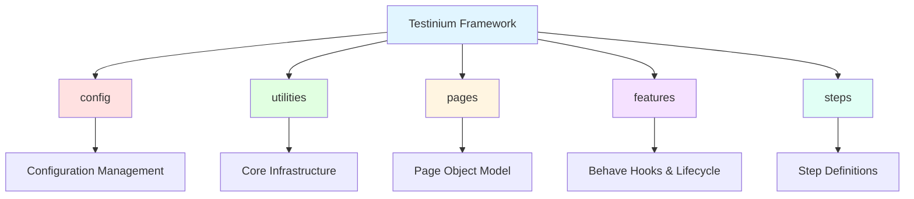

# API Reference

Welcome to the comprehensive API reference documentation for the Testinium Python test automation framework. This documentation provides complete coverage of all public APIs, classes, methods, and utilities available in the framework.

## Overview

This API reference documentation is auto-generated from Python docstrings using [mkdocstrings](https://mkdocstrings.github.io/), ensuring accuracy and synchronization with the actual source code. The framework follows Google-style docstring conventions with comprehensive type hints for IDE autocompletion and static analysis.

### Target Audience

This API reference is designed for:

- **Test Automation Developers** creating new test scenarios and extending existing functionality
- **Framework Contributors** enhancing core infrastructure and adding new utilities
- **DevOps Engineers** integrating the framework into CI/CD pipelines
- **QA Architects** understanding framework capabilities and design patterns

### Documentation Coverage

All public APIs across the framework are documented with:

- Complete method signatures with type hints
- Parameter descriptions (name, type, required/optional, default values)
- Return value specifications with types
- Exception documentation (what exceptions are raised and under what conditions)
- Thread-safety guarantees for concurrent execution
- Working code examples demonstrating usage patterns
- Migration notes citing Java equivalents (this framework was migrated from Java/Cucumber)
- Source code citations with file paths and line numbers

## Package Structure

The Testinium Python test automation framework is organized into five main packages, each providing specialized functionality:



### Package Overview

| Package | Purpose | Key Components |
|---------|---------|---------------|
| **[config](config/index.md)** | Type-safe configuration management with YAML and environment variable support | `Config`, `BrowserConfig`, `TimeoutConfig`, `ApplicationConfig`, `CredentialsConfig`, `ReportingConfig`, `get_config()`, `reset_config()` |
| **[utilities](utilities/index.md)** | Core infrastructure components for WebDriver management, configuration, waits, and screenshots | `DriverManager`, `ConfigReader`, `WaitHelpers`, `capture_screenshot()`, `capture_browser_logs()` |
| **[pages](pages/index.md)** | Page Object Model implementation with BasePage foundation and 10+ application page objects | `BasePage`, `LoginPage`, `LogoutPage`, `CalendarPage`, `ContactsPage`, `CrmPage`, `EmployeePage`, `InventoryPage`, `NotesPage`, `SalesPage`, `SessionPage` |
| **[features](features/index.md)** | Behave framework hooks for test lifecycle management | `before_all()`, `after_all()`, `before_scenario()`, `after_scenario()` |
| **[steps](steps/index.md)** | Behave step definitions mapping Gherkin statements to Python code | 10 step definition modules covering Login, Logout, Calendar, Contacts, CRM, Employee, Inventory, Notes, Sales, Session |

**Source:** `config/__init__.py`, `utilities/__init__.py`, `pages/__init__.py`, `features/environment.py`, `features/steps/__init__.py`

## Package Navigation

### [Config Package API](config/index.md)

Configuration management with type-safe dataclasses, YAML file support, and environment variable substitution.

**Key APIs:**
- `Config` - Main configuration class with type-safe access to all settings
- `BrowserConfig` - Browser settings (type, headless mode, window size)
- `TimeoutConfig` - Timeout values for WebDriver waits
- `ApplicationConfig` - Application URLs and endpoints
- `CredentialsConfig` - Secure credential management via environment variables
- `ReportingConfig` - Test reporting settings
- `get_config()` - Singleton pattern for convenient access
- `reset_config()` - Singleton reset for testing

**Use Cases:** Accessing browser configuration, timeouts, application URLs, user credentials, reporting settings

---

### [Utilities Package API](utilities/index.md)

Core infrastructure utilities providing WebDriver lifecycle management, configuration reading, explicit wait helpers, and screenshot capture.

**Key APIs:**
- `DriverManager` - Thread-safe WebDriver lifecycle manager (singleton with threading.local())
- `DriverInitializationError` - Custom exception for driver setup failures
- `ConfigReader` - Singleton configuration reader with YAML and .env support
- `ConfigurationError` - Custom exception for configuration errors
- `WaitHelpers` - Centralized explicit wait utilities eliminating Thread.sleep() anti-patterns
- `capture_screenshot()` - Screenshot capture for failure diagnostics
- `capture_browser_logs()` - Browser console log collection
- `sanitize_filename()` - Cross-platform filename sanitization

**Use Cases:** Getting WebDriver instances, reading configuration, implementing explicit waits, capturing screenshots on failures

---

### [Pages Package API](pages/index.md)

Page Object Model (POM) implementation with BasePage providing common utilities and 10+ application-specific page objects.

**Key APIs:**
- `BasePage` - Abstract base class with wait helpers and element interaction methods
- **Authentication Pages:** `LoginPage`, `LogoutPage`, `SessionPage`
- **Application Module Pages:** `CalendarPage`, `ContactsPage`, `CrmPage`, `EmployeePage`, `InventoryPage`, `NotesPage`, `SalesPage`

**Use Cases:** Implementing page objects, interacting with web elements, creating reusable page components

---

### [Features Package API](features/index.md)

Behave framework hooks for test execution lifecycle management, replacing Java Cucumber @Before/@After annotations.

**Key APIs:**
- `before_all(context)` - Global setup executed once before all features
- `after_all(context)` - Global cleanup executed once after all features
- `before_scenario(context, scenario)` - Per-scenario WebDriver initialization
- `after_scenario(context, scenario)` - Per-scenario cleanup with screenshot capture

**Use Cases:** Test environment setup, WebDriver lifecycle management, screenshot capture on failure, test cleanup

---

### [Steps Package API](steps/index.md)

Behave step definitions mapping Gherkin Given/When/Then statements to Python implementation code.

**Available Step Modules:**
- [login_steps](steps/login-steps.md) - Authentication step definitions
- [logout_steps](steps/logout-steps.md) - Logout flow step definitions
- [calendar_steps](steps/calendar-steps.md) - Calendar management steps
- [contacts_steps](steps/contacts-steps.md) - Contact management steps
- [crm_steps](steps/crm-steps.md) - CRM workflow steps
- [employee_steps](steps/employee-steps.md) - Employee management steps
- [inventory_steps](steps/inventory-steps.md) - Inventory management steps
- [notes_steps](steps/notes-steps.md) - Notes functionality steps
- [sales_steps](steps/sales-steps.md) - Sales workflow steps
- [session_steps](steps/session-steps.md) - Session management steps

**Use Cases:** Understanding available Gherkin steps, creating new step definitions, mapping features to implementation

---

## Documentation Conventions

### Method Signature Format

All API methods are documented with complete type hints following Python typing conventions:

```python
def method_name(param1: str, param2: int = 10, param3: Optional[bool] = None) -> Dict[str, Any]:
    """Method description."""
```

### Parameter Documentation

Parameters are documented in a structured format:

| Parameter | Type | Required | Default | Description |
|-----------|------|----------|---------|-------------|
| `param1` | `str` | Yes | N/A | Purpose and usage of param1 |
| `param2` | `int` | No | `10` | Purpose and usage of param2 |
| `param3` | `Optional[bool]` | No | `None` | Purpose and usage of param3 |

### Return Value Documentation

Return values specify the type and describe what is returned:

**Returns:** `Dict[str, Any]` - Dictionary containing keys 'status' (str) and 'data' (Any)

### Exception Documentation

All exceptions that can be raised are documented with conditions:

**Raises:**
- `ValueError` - When parameter validation fails (e.g., empty string, negative number)
- `DriverInitializationError` - When WebDriver creation fails (e.g., driver binary not found, browser not installed)
- `TimeoutException` - When element not found within specified timeout period

### Thread Safety Notes

APIs designed for parallel execution explicitly document thread-safety guarantees:

**Thread Safety:** ✅ Thread-safe via `threading.local()` - each thread maintains independent WebDriver instance

**Thread Safety:** ⚠️ Not thread-safe - use separate instances per thread

### Migration Notes

Since this framework was migrated from Java/Cucumber, migration notes cite Java equivalents:

**Migration Note:** Replaces `Driver.getDriver()` from Java implementation. Python version adds threading.local() for true thread isolation (Java's InheritableThreadLocal had limitations).

### Source Citations

All documentation cites source code locations:

**Source:** `utilities/driver_manager.py:82-150`

---

## Quick Reference Tables

### Common Import Patterns

| Import Statement | Use Case | Components Available |
|------------------|----------|---------------------|
| `from config import get_config` | Access configuration singleton | `get_config()` function |
| `from utilities import DriverManager` | Manage WebDriver lifecycle | `DriverManager` class with `get_driver()`, `quit_driver()` |
| `from utilities import WaitHelpers` | Implement explicit waits | `WaitHelpers` class with various wait methods |
| `from pages import LoginPage` | Use page objects in steps | Page object class with element locators and methods |
| `from pages.base_page import BasePage` | Create custom page objects | `BasePage` abstract class for inheritance |

### Package Purpose Summary

| Package | Primary Responsibility | Used By |
|---------|----------------------|---------|
| **config** | Centralized configuration management | All packages - provides settings, URLs, credentials |
| **utilities** | Core infrastructure and helpers | pages, steps, features - provides WebDriver, waits, screenshots |
| **pages** | Web element abstraction and interaction | steps - encapsulates page-specific logic |
| **features** | Test lifecycle hooks | Behave framework - automatic execution |
| **steps** | Gherkin-to-code mapping | Behave framework - implements test scenarios |

---

## Usage Examples

### Getting WebDriver Instance

```python
from utilities import DriverManager

# Get thread-local WebDriver instance (creates if not exists)
driver = DriverManager.get_driver()

# Perform test actions
driver.get("https://testinium.example.com/login")

# Cleanup (typically in after_scenario hook)
DriverManager.quit_driver()
```

**Source:** `utilities/driver_manager.py:132-150`

---

### Accessing Configuration

```python
from config import get_config

# Get configuration singleton
config = get_config()

# Type-safe access to configuration sections
browser_type = config.browser.type  # 'chrome', 'firefox', etc.
base_url = config.application.base_url
explicit_timeout = config.timeouts.explicit

# Backward-compatible key access
browser_type = config.get('browser.type', default='chrome')
```

**Source:** `config/test_config.py:45-80`, `config/__init__.py:106-115`

---

### Using Page Objects in Step Definitions

```python
from behave import given, when, then
from pages import LoginPage

@given('User is on the login page')
def navigate_to_login(context):
    """Navigate to the login page."""
    config = context.config_reader
    base_url = config.get_property('application.base_url')
    context.driver.get(f"{base_url}/login")

@when('User enters email "{email}" and password "{password}"')
def enter_credentials(context, email, password):
    """Enter login credentials."""
    login_page = LoginPage(context.driver)
    login_page.input_email.send_keys(email)
    login_page.input_password.send_keys(password)
    login_page.login_button.click()

@then('User should be logged in successfully')
def verify_login_success(context):
    """Verify successful login."""
    login_page = LoginPage(context.driver)
    assert login_page.dashboard.is_displayed(), "Dashboard not visible"
```

**Source:** `features/steps/login_steps.py:50-120`

---

### Implementing Custom Wait Conditions

```python
from utilities import WaitHelpers
from selenium.webdriver.common.by import By

# Initialize wait helper with driver
wait_helper = WaitHelpers(driver)

# Wait for element to be clickable
submit_button = wait_helper.wait_for_element_clickable(
    (By.ID, "submit"),
    timeout=15
)

# Wait for element with text
success_message = wait_helper.wait_for_element_with_text(
    (By.CLASS_NAME, "alert"),
    "Success"
)

# Wait for element to become visible
modal = wait_helper.wait_for_element_visible(
    (By.ID, "confirmation-modal")
)
```

**Source:** `utilities/wait_helpers.py:45-180`

---

### Capturing Screenshots on Failure

```python
from utilities import capture_screenshot

# In after_scenario hook or exception handler
if scenario.status == "failed":
    # Capture screenshot with descriptive name
    screenshot_path = capture_screenshot(
        driver=context.driver,
        scenario_name=scenario.name
    )
    
    # Optionally attach to Allure report
    if allure:
        allure.attach.file(
            screenshot_path,
            name=f"{scenario.name}_failure",
            attachment_type=allure.attachment_type.PNG
        )
```

**Source:** `utilities/screenshot_helper.py:25-80`, `features/environment.py:150-180`

---

## Related Documentation

### User Guides

For practical usage guides and tutorials:

- **[Getting Started](../getting-started/index.md)** - Installation, configuration, first test execution
- **[Page Object Model Guide](../guides/page-object-model.md)** - Creating page objects with BasePage
- **[Step Definitions Guide](../guides/step-definitions.md)** - Writing Behave step definitions
- **[Parallel Execution Guide](../guides/parallel-execution.md)** - Thread-safe test execution
- **[Wait Strategies Guide](../guides/wait-strategies.md)** - Implementing explicit waits effectively

### Architecture Documentation

For understanding framework internals:

- **[System Architecture](../architecture/system-overview.md)** - High-level component architecture
- **[Parallel Execution Architecture](../architecture/parallel-execution.md)** - Threading and thread-safety patterns
- **[Configuration Management](../architecture/configuration-management.md)** - Configuration loading and precedence
- **[Page Object Model Architecture](../architecture/page-object-model.md)** - POM pattern implementation

### Reference Documentation

For complete configuration and command reference:

- **[Configuration Options](../reference/configuration-options.md)** - All config.yaml options
- **[Environment Variables](../reference/environment-variables.md)** - All .env variables
- **[Command Reference](../reference/command-reference.md)** - Behave and pytest commands

---

## API Documentation Standards

### Docstring Format

All APIs follow **Google-style Python docstrings** with the following structure:

```python
def example_method(param1: str, param2: int = 10) -> bool:
    """
    Short one-line summary of the method.
    
    Detailed multi-paragraph description explaining what this method does,
    when to use it, and any important behavioral considerations.
    
    Args:
        param1 (str): Description of param1 with usage context
        param2 (int, optional): Description of param2. Defaults to 10.
    
    Returns:
        bool: Description of return value and what it represents
    
    Raises:
        ValueError: When and why this exception is raised
        TypeError: When and why this exception is raised
    
    Example:
        >>> result = example_method("test", 20)
        >>> print(result)
        True
    
    Note:
        Any additional notes about behavior, performance, or usage
    
    Thread Safety:
        Explanation of thread-safety guarantees
    
    Migration Note:
        Java equivalent: OriginalClass.originalMethod()
    """
```

### Type Hint Requirements

All public APIs use comprehensive type hints:

- **Parameters:** All parameters have type annotations
- **Return values:** All functions specify return type (or `None`)
- **Optional parameters:** Use `Optional[Type]` from `typing` module
- **Collections:** Use `List[Type]`, `Dict[K, V]`, `Tuple[Type, ...]` etc.
- **Union types:** Use `Union[Type1, Type2]` for multiple possible types

### Example Requirements

Every API method must include at least one working code example:

- **Simple methods:** One basic usage example
- **Complex methods:** Basic + advanced usage examples
- **Multiple modes:** One example per operational mode
- **Error-prone methods:** Success example + error handling example

Examples must be:
- ✅ **Syntactically correct** - Valid Python code
- ✅ **Complete** - Include all necessary imports
- ✅ **Runnable** - Can be copied and executed
- ✅ **Realistic** - Use meaningful variable names and data

---

## Navigating This Documentation

### For New Users

1. Start with **[Getting Started](../getting-started/index.md)** for installation and setup
2. Run your **[First Test](../getting-started/first-test.md)** to verify installation
3. Review **[Common Import Patterns](#common-import-patterns)** above
4. Explore **[Usage Examples](#usage-examples)** for practical patterns

### For Test Developers

1. Review **[Pages Package API](pages/index.md)** for available page objects
2. Check **[Steps Package API](steps/index.md)** for existing step definitions
3. Consult **[Utilities Package API](utilities/index.md)** for infrastructure components
4. Reference **[Config Package API](config/index.md)** for configuration access

### For Framework Contributors

1. Study **[BasePage API](pages/base-page.md)** for page object patterns
2. Understand **[DriverManager API](utilities/driver-manager.md)** for WebDriver lifecycle
3. Review **[Features API](features/index.md)** for lifecycle hooks
4. Explore **[Architecture Documentation](../architecture/index.md)** for design patterns

---

## API Version and Compatibility

**Current Version:** 1.0.0

**Python Compatibility:** 3.9, 3.10, 3.11, 3.12

**Selenium Version:** 4.15.2+

**Behave Version:** 1.2.6+

**Breaking Changes:** This is the initial 1.0.0 release migrated from Java/Cucumber. Future breaking changes will follow semantic versioning.

**Deprecation Policy:** Deprecated APIs will be marked with warnings and maintained for at least two minor versions before removal.

---

## Contributing to API Documentation

All API documentation is generated from Python docstrings. To improve documentation:

1. Update docstrings in source code following Google-style format
2. Ensure all parameters, returns, and exceptions are documented
3. Add working code examples
4. Run `mkdocs build --strict` to validate documentation builds
5. Submit PR with updated docstrings

See **[Documentation Guidelines](../contributing/documentation-guidelines.md)** for detailed standards.

---

**Last Updated:** Auto-generated from source code on each documentation build

**Questions or Issues?** See [Troubleshooting](../troubleshooting/index.md) or open an issue on GitHub.
