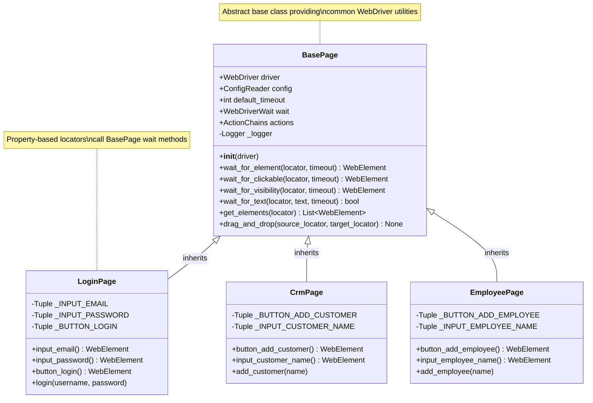
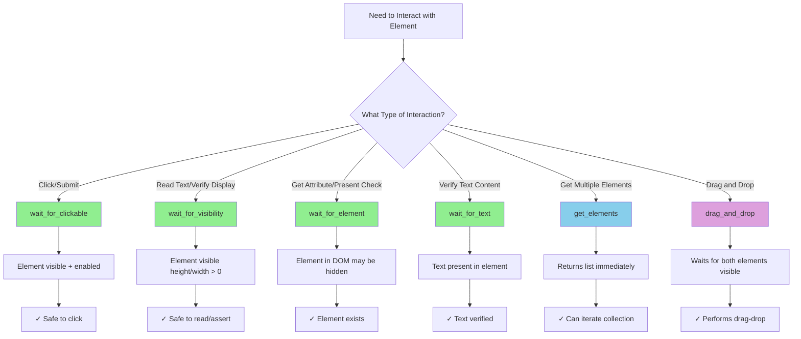
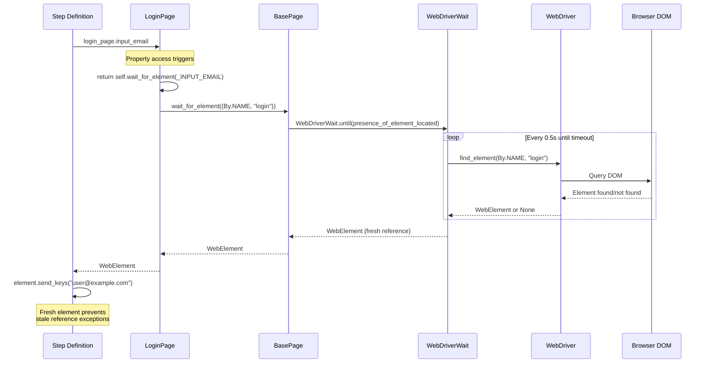
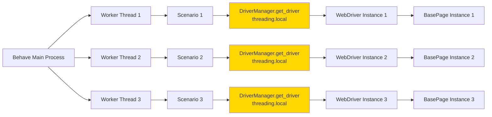

# BasePage API Reference

## Overview

`BasePage` is the abstract base class that provides common WebDriver utilities for all page objects in the test automation framework. It establishes the foundation for the Page Object Model (POM) pattern, replacing Java's PageFactory annotation-based approach with a more flexible property-based element access pattern.

**Module:** `pages.base_page`  
**Source:** `pages/base_page.py`

### Key Features

- **Explicit Wait Helpers**: Methods for waiting on element presence, clickability, visibility, and text content
- **Element Interaction Utilities**: Built-in waiting before element interactions to prevent flaky tests
- **ActionChains Integration**: Support for complex interactions like drag-and-drop operations
- **Configuration Integration**: Access to framework configuration via ConfigReader singleton
- **Comprehensive Logging**: Debug and info logging for all page object operations
- **Thread-Safe Design**: Safe for parallel test execution when using thread-local WebDriver instances
- **Property-Based Locators**: Foundation for preventing stale element reference exceptions

### Design Philosophy

BasePage follows these core design principles from the technical specifications:

1. **Explicit Waits Only**: No implicit waits to avoid unpredictable timing behavior
2. **Instance-Based Architecture**: Each page instance has its own WebDriver reference for isolation
3. **Configurable Timeouts**: Default timeout from `config.yaml`, overridable per-method call
4. **Fresh Element References**: Property-based locators in child classes call wait methods to get fresh elements
5. **Fail-Fast with Clear Errors**: TimeoutExceptions include locator and timeout details for debugging

### Migration Context

This class has no direct Java equivalent. The original Java implementation used PageFactory with `@FindBy` annotations for element location. This Python implementation provides a more flexible foundation using property-based locators that call wait methods, effectively eliminating stale element reference exceptions that were common in the Java version.

---

## Class: BasePage

```python
class BasePage:
    def __init__(self, driver: WebDriver) -> None
```

Abstract base class for all page objects providing common WebDriver utilities.

### Class Attributes

| Attribute | Type | Description |
|-----------|------|-------------|
| `driver` | `WebDriver` | Selenium WebDriver instance for browser interaction |
| `config` | `ConfigReader` | Configuration reader singleton for accessing framework settings |
| `default_timeout` | `int` | Default explicit wait timeout in seconds (from config or 10s default) |
| `wait` | `WebDriverWait` | Pre-configured WebDriverWait instance using default_timeout |
| `actions` | `ActionChains` | ActionChains instance for complex interactions (drag-and-drop, hover) |
| `_logger` | `Logger` | Python logging.Logger instance for page object operations |

### Thread Safety

BasePage instances are **thread-safe** when each thread has its own WebDriver instance. The framework achieves this through `threading.local()` in `DriverManager`, ensuring each thread gets an isolated WebDriver instance. Since BasePage stores the WebDriver reference as an instance attribute, parallel test execution with separate drivers maintains proper isolation.

**Thread Safety Guarantee**: Multiple threads can safely create and use different BasePage instances simultaneously, provided each thread uses its own WebDriver from `DriverManager.get_driver()`.

---

## Constructor

### `__init__(driver)`

```python
def __init__(self, driver: WebDriver) -> None
```

Initialize BasePage with WebDriver instance and common utilities.

This constructor establishes the foundation for all page objects by:
1. Storing the WebDriver reference for element interaction
2. Loading configuration via ConfigReader singleton
3. Setting up default explicit wait timeout (from config or 10s fallback)
4. Creating WebDriverWait instance for element synchronization
5. Initializing ActionChains for complex interactions
6. Setting up logger for page object operations

#### Parameters

| Parameter | Type | Required | Description |
|-----------|------|----------|-------------|
| `driver` | `WebDriver` | Yes | Selenium WebDriver instance for browser automation. Expected to be a thread-local instance from DriverManager supporting parallel test execution. |

#### Configuration

Attempts to load `timeouts.default_explicit_wait` from `config.yaml`. Falls back to 10 seconds if configuration key is missing or invalid.

#### Example

```python
from selenium import webdriver
from pages.base_page import BasePage

# Create WebDriver instance
driver = webdriver.Chrome()

# Initialize BasePage (typically done in child class)
base_page = BasePage(driver)

# Access initialized attributes
print(f"Default timeout: {base_page.default_timeout}s")
# Output: Default timeout: 10s
```

**Source:** `pages/base_page.py:99-164`

---

## Wait Methods

### `wait_for_element(locator, timeout=None)`

```python
def wait_for_element(
    locator: Tuple[str, str],
    timeout: Optional[int] = None
) -> WebElement
```

Wait for element to be present in the DOM and return it.

This method uses Selenium's `expected_conditions.presence_of_element_located` to wait for an element to appear in the DOM. The element may not be visible or interactable, but it exists in the page structure.

#### Use Cases

- Waiting for hidden elements that will become visible
- Confirming element existence without visibility requirement
- Retrieving elements that may be off-screen but present in the DOM

#### Parameters

| Parameter | Type | Required | Default | Description |
|-----------|------|----------|---------|-------------|
| `locator` | `Tuple[str, str]` | Yes | - | Tuple of (By strategy, locator value). Examples: `(By.ID, 'login')`, `(By.XPATH, '//button[@type="submit"]')` |
| `timeout` | `int` | No | `default_timeout` | Custom timeout in seconds. If None, uses `self.default_timeout` from configuration. |

#### Returns

`WebElement`: The located element when present in DOM.

#### Raises

| Exception | Condition |
|-----------|-----------|
| `TimeoutException` | Element not present within timeout period. Exception message includes locator details and timeout value. |

#### Example

```python
from selenium.webdriver.common.by import By

# Using default timeout
element = base_page.wait_for_element((By.NAME, "username"))
element.send_keys("testuser")

# Using custom timeout for slow-loading elements
slow_element = base_page.wait_for_element(
    (By.ID, "slow-loading-component"), 
    timeout=30
)

# Element may not be visible but is present in DOM
hidden_element = base_page.wait_for_element((By.ID, "hidden-field"))
print(f"Element present: {hidden_element is not None}")
# Output: Element present: True
```

**Source:** `pages/base_page.py:166-228`

---

### `wait_for_clickable(locator, timeout=None)`

```python
def wait_for_clickable(
    locator: Tuple[str, str],
    timeout: Optional[int] = None
) -> WebElement
```

Wait for element to be clickable (visible and enabled) and return it.

This method uses Selenium's `expected_conditions.element_to_be_clickable` to wait for an element to be both visible and enabled. **This is the recommended wait strategy before performing click() operations.**

#### Clickable Requirements

An element is considered clickable when:
1. Element must be visible on the page (not `display: none` or `visibility: hidden`)
2. Element must be enabled (no `disabled` attribute)
3. Element must not be obscured by other elements

#### Use Cases

- Waiting for buttons before clicking
- Ensuring form fields are enabled before interaction
- Confirming links are clickable before navigation
- Preventing "element not interactable" exceptions

#### Parameters

| Parameter | Type | Required | Default | Description |
|-----------|------|----------|---------|-------------|
| `locator` | `Tuple[str, str]` | Yes | - | Tuple of (By strategy, locator value). Examples: `(By.ID, 'submit-button')`, `(By.LINK_TEXT, 'Login')` |
| `timeout` | `int` | No | `default_timeout` | Custom timeout in seconds. If None, uses `self.default_timeout`. |

#### Returns

`WebElement`: The clickable element.

#### Raises

| Exception | Condition |
|-----------|-----------|
| `TimeoutException` | Element not clickable within timeout period. Element may exist but still loading, disabled, or obscured. |

#### Example

```python
from selenium.webdriver.common.by import By

# Wait for button to be clickable then click
button = base_page.wait_for_clickable((By.ID, "submit"))
button.click()

# Wait for link with custom timeout
link = base_page.wait_for_clickable(
    (By.LINK_TEXT, "Next Page"),
    timeout=15
)
link.click()

# Handle disabled buttons that become enabled
save_button = base_page.wait_for_clickable((By.ID, "save"), timeout=20)
save_button.click()
```

**Source:** `pages/base_page.py:230-300`

---

### `wait_for_visibility(locator, timeout=None)`

```python
def wait_for_visibility(
    locator: Tuple[str, str],
    timeout: Optional[int] = None
) -> WebElement
```

Wait for element to be visible on the page and return it.

This method uses Selenium's `expected_conditions.visibility_of_element_located` to wait for an element to be visible.

#### Visibility Requirements

An element is considered visible when:
1. It exists in the DOM
2. It has height and width greater than 0
3. It's not hidden (`display: none`, `visibility: hidden`, `opacity: 0`)

#### Use Cases

- Confirming alerts or modals are displayed
- Verifying success/error messages appear
- Ensuring UI elements rendered before assertion
- Waiting for animations to complete

#### Parameters

| Parameter | Type | Required | Default | Description |
|-----------|------|----------|---------|-------------|
| `locator` | `Tuple[str, str]` | Yes | - | Tuple of (By strategy, locator value). Examples: `(By.CLASS_NAME, 'alert')`, `(By.ID, 'success-message')` |
| `timeout` | `int` | No | `default_timeout` | Custom timeout in seconds. |

#### Returns

`WebElement`: The visible element.

#### Raises

| Exception | Condition |
|-----------|-----------|
| `TimeoutException` | Element not visible within timeout period. Element may be present in DOM but hidden or zero-sized. |

#### Example

```python
from selenium.webdriver.common.by import By

# Wait for success message to appear
message = base_page.wait_for_visibility(
    (By.CLASS_NAME, "success-message")
)
assert "Success" in message.text

# Wait for modal with custom timeout
modal = base_page.wait_for_visibility(
    (By.ID, "confirmation-modal"),
    timeout=5
)

# Verify element is visible before assertions
alert_element = base_page.wait_for_visibility((By.CLASS_NAME, "alert"))
assert alert_element.is_displayed()
print(f"Alert text: {alert_element.text}")
```

**Source:** `pages/base_page.py:302-371`

---

### `wait_for_text(locator, text, timeout=None)`

```python
def wait_for_text(
    locator: Tuple[str, str],
    text: str,
    timeout: Optional[int] = None
) -> bool
```

Wait for specific text to be present in an element.

This method uses Selenium's `expected_conditions.text_to_be_present_in_element` to wait for an element to contain expected text. Useful for verifying dynamic content updates or page state changes.

#### Text Matching Behavior

- **Case-sensitive** substring match
- Text must be present anywhere in element's visible text
- Includes text from child elements
- Matches against `element.text` property

#### Use Cases

- Verifying page title updates after navigation
- Confirming dynamic content loaded
- Validating form validation messages
- Checking status indicators changed

#### Parameters

| Parameter | Type | Required | Default | Description |
|-----------|------|----------|---------|-------------|
| `locator` | `Tuple[str, str]` | Yes | - | Tuple of (By strategy, locator value). Examples: `(By.ID, 'page-title')`, `(By.CLASS_NAME, 'status')` |
| `text` | `str` | Yes | - | Expected text string (case-sensitive substring) |
| `timeout` | `int` | No | `default_timeout` | Custom timeout in seconds. |

#### Returns

`bool`: Always returns `True` if text is present within timeout (TimeoutException raised on failure).

#### Raises

| Exception | Condition |
|-----------|-----------|
| `TimeoutException` | Text not present in element within timeout period. |

#### Example

```python
from selenium.webdriver.common.by import By

# Wait for dashboard title to appear
base_page.wait_for_text(
    (By.ID, "page-title"),
    "Dashboard"
)

# Wait for status update with custom timeout
base_page.wait_for_text(
    (By.CLASS_NAME, "status-indicator"),
    "Active",
    timeout=20
)

# Verify dynamic content update
base_page.wait_for_text(
    (By.ID, "counter"),
    "10 items"
)
```

**Source:** `pages/base_page.py:373-453`

---

## Element Interaction Methods

### `get_elements(locator)`

```python
def get_elements(locator: Tuple[str, str]) -> List[WebElement]
```

Get all elements matching the locator.

This method finds all elements matching the provided locator tuple. Unlike `wait_for_element` which waits for presence, this method **immediately returns all matching elements** (empty list if none found).

#### Behavior

- Returns immediately (no explicit wait)
- Returns empty list if no elements found (no exception raised)
- Returns all matching elements in DOM order
- Includes both hidden and visible elements

#### Use Cases

- Retrieving dynamic collections (customer cards, table rows, list items)
- Counting elements on the page
- Iterating over multiple similar elements
- Validating element collections

#### Parameters

| Parameter | Type | Required | Description |
|-----------|------|----------|-------------|
| `locator` | `Tuple[str, str]` | Yes | Tuple of (By strategy, locator value). Examples: `(By.CLASS_NAME, 'customer-card')`, `(By.XPATH, '//tr[@class="data-row"]')` |

#### Returns

`List[WebElement]`: List of all matching elements. Returns empty list `[]` if no elements found.

#### Important Note

If you need to wait for at least one element to be present before retrieving the collection, use `wait_for_element` first:

```python
# Wait for first element, then get all
base_page.wait_for_element((By.CLASS_NAME, "card"))
cards = base_page.get_elements((By.CLASS_NAME, "card"))
```

#### Example

```python
from selenium.webdriver.common.by import By

# Get all customer cards
cards = base_page.get_elements((By.CLASS_NAME, "customer-card"))
print(f"Found {len(cards)} customer cards")
# Output: Found 15 customer cards

# Iterate over table rows
rows = base_page.get_elements((By.XPATH, "//table//tr"))
for row in rows:
    print(row.text)

# Check if optional elements exist
elements = base_page.get_elements((By.CLASS_NAME, "optional"))
if elements:
    print("Optional elements found")
else:
    print("No optional elements")

# Count items dynamically
item_count = len(base_page.get_elements((By.CLASS_NAME, "item")))
assert item_count > 0, "Expected at least one item"
```

**Source:** `pages/base_page.py:455-523`

---

### `drag_and_drop(source_locator, target_locator)`

```python
def drag_and_drop(
    source_locator: Tuple[str, str],
    target_locator: Tuple[str, str]
) -> None
```

Perform drag-and-drop operation from source element to target element.

This method uses Selenium ActionChains to perform complex drag-and-drop interactions. It waits for both source and target elements to be visible before attempting the drag operation.

#### Operation Flow

1. Wait for source element visibility
2. Wait for target element visibility
3. Perform drag_and_drop action using ActionChains
4. Execute the action chain
5. Log success or failure

#### Use Cases

- Dragging tasks between lists/columns (Kanban boards)
- Reordering elements via drag-and-drop
- Moving items in visual editors
- Drag-to-upload interactions

#### Parameters

| Parameter | Type | Required | Description |
|-----------|------|----------|-------------|
| `source_locator` | `Tuple[str, str]` | Yes | Tuple of (By strategy, locator value) for element to drag. Example: `(By.ID, "task-123")` |
| `target_locator` | `Tuple[str, str]` | Yes | Tuple of (By strategy, locator value) for drop target. Example: `(By.ID, "column-done")` |

#### Returns

`None`

#### Raises

| Exception | Condition |
|-----------|-----------|
| `TimeoutException` | If source or target element not visible within timeout. |
| `Exception` | If drag-and-drop operation fails for any other reason. |

#### Example

```python
from selenium.webdriver.common.by import By

# Drag task to completed column
base_page.drag_and_drop(
    source_locator=(By.ID, "task-123"),
    target_locator=(By.ID, "column-done")
)

# Reorder list items
base_page.drag_and_drop(
    source_locator=(By.XPATH, "//li[@data-id='1']"),
    target_locator=(By.XPATH, "//li[@data-id='5']")
)

# Drag file to upload area
base_page.drag_and_drop(
    source_locator=(By.CLASS_NAME, "file-item"),
    target_locator=(By.ID, "dropzone")
)
```

**Source:** `pages/base_page.py:525-612`

---

## Property-Based Locator Pattern

### Overview

BasePage establishes the foundation for the **property-based locator pattern** used throughout the framework. This pattern prevents stale element reference exceptions and promotes clean, maintainable page objects.

### Pattern Explanation

Instead of storing WebElement references (which become stale after page updates), page objects:

1. Define locators as **private class constants** (tuples)
2. Create **properties** that call BasePage wait methods
3. Return **fresh element references** on each property access

### Why This Pattern?

**Problem with Stored Elements:**
```python
# ❌ Anti-pattern: Storing element references
class LoginPage(BasePage):
    def __init__(self, driver):
        super().__init__(driver)
        self.email_input = driver.find_element(By.NAME, "login")  # Stale after DOM update!
```

**Solution with Property-Based Locators:**
```python
# ✅ Best practice: Property-based locators
class LoginPage(BasePage):
    _INPUT_EMAIL = (By.NAME, "login")
    
    @property
    def input_email(self):
        return self.wait_for_element(self._INPUT_EMAIL)  # Fresh element every time!
```

### Complete Example

```python
from pages.base_page import BasePage
from selenium.webdriver.common.by import By

class LoginPage(BasePage):
    """Login page object with property-based locators."""
    
    # Define locators as private class constants
    _INPUT_EMAIL = (By.NAME, "login")
    _INPUT_PASSWORD = (By.NAME, "password")
    _BUTTON_LOGIN = (By.XPATH, "//button[.='Log in']")
    _DASHBOARD_TITLE = (By.XPATH, "//h2[contains(text(),'Dashboard')]")
    _ALERT_ERROR = (By.CLASS_NAME, "alert-error")
    
    # Use properties that call wait methods for fresh element references
    @property
    def input_email(self):
        """Email input field (waits for presence)."""
        return self.wait_for_element(self._INPUT_EMAIL)
    
    @property
    def input_password(self):
        """Password input field (waits for presence)."""
        return self.wait_for_element(self._INPUT_PASSWORD)
    
    @property
    def button_login(self):
        """Login button (waits for clickability)."""
        return self.wait_for_clickable(self._BUTTON_LOGIN)
    
    @property
    def dashboard(self):
        """Dashboard title element (waits for visibility)."""
        return self.wait_for_visibility(self._DASHBOARD_TITLE)
    
    @property
    def alert_error_message(self):
        """Error alert message (waits for visibility)."""
        return self.wait_for_visibility(self._ALERT_ERROR)
    
    # High-level action methods
    def login(self, username: str, password: str) -> None:
        """
        Perform login with credentials.
        
        Args:
            username: Email address for login
            password: Password for login
        """
        self.input_email.send_keys(username)
        self.input_password.send_keys(password)
        self.button_login.click()
```

### Usage in Step Definitions

```python
from behave import given, when, then
from pages.login_page import LoginPage

@when('I enter email "{email}" and password "{password}"')
def step_enter_credentials(context, email, password):
    login_page = LoginPage(context.driver)
    
    # Properties return fresh elements every time
    login_page.input_email.clear()
    login_page.input_email.send_keys(email)
    
    login_page.input_password.clear()
    login_page.input_password.send_keys(password)

@when('I click the login button')
def step_click_login(context):
    login_page = LoginPage(context.driver)
    login_page.button_login.click()  # Element is fresh and clickable

@then('I should see the dashboard')
def step_verify_dashboard(context):
    login_page = LoginPage(context.driver)
    assert login_page.dashboard.is_displayed()
```

### Benefits

1. **No Stale Element Exceptions**: Fresh elements on every access
2. **Built-in Waiting**: Wait logic integrated into property access
3. **Clean Syntax**: `page.button.click()` instead of `page.get_button().click()`
4. **Type Safety**: Properties provide better IDE autocomplete
5. **Maintainability**: Locator changes only affect one place
6. **Testability**: Easy to verify wait strategies

---

## Architecture Diagrams

### BasePage Class Structure



### Wait Strategy Decision Tree



### Property-Based Locator Flow



---

## Thread Safety Details

### Thread-Safe Architecture

BasePage is designed for **parallel test execution** with the following thread-safety guarantees:

#### Thread Isolation



#### Thread Safety Guarantees

1. **WebDriver Isolation**: Each thread gets its own WebDriver via `threading.local()` in DriverManager
2. **BasePage Instance Isolation**: Each thread creates its own BasePage instances with thread-local driver
3. **No Shared State**: ConfigReader is thread-safe singleton; no mutable shared state
4. **Independent Waits**: Each WebDriverWait instance tied to specific driver/thread
5. **ActionChains Isolation**: ActionChains instances are per-BasePage-instance

#### Usage in Parallel Tests

```python
# behave -f progress --processes 4 --parallel-element scenario

# Each scenario runs in separate process/thread
@when('I navigate to login page')
def step_navigate_login(context):
    # DriverManager.get_driver() returns thread-local WebDriver
    driver = DriverManager.get_driver()
    
    # Each thread creates its own LoginPage instance
    login_page = LoginPage(driver)  # Thread-safe
    
    # Property access uses thread's own driver and wait
    login_page.input_email.send_keys("user@example.com")  # No race conditions
```

#### Important Notes

- **Do NOT share BasePage instances between threads**: Each thread should create its own instances
- **Do NOT share WebDriver between threads**: Use DriverManager.get_driver() in each thread
- **ConfigReader is thread-safe**: Safe to share (immutable after initialization)

---

## Configuration Integration

### Timeout Configuration

BasePage integrates with the framework's configuration system via `ConfigReader`.

#### Default Timeout Loading

```python
# config/config.yaml
timeouts:
  default_explicit_wait: 15
  page_load: 30
  script: 10
```

```python
# BasePage __init__ loads this configuration
self.default_timeout = self.config.get_property(
    'timeouts.default_explicit_wait',
    default=10  # Fallback if config missing
)
```

#### Configuration Precedence

1. **Environment Variables** (`.env` file): Highest priority
2. **config.yaml**: Middle priority
3. **Code Default (10s)**: Lowest priority (fallback)

#### Example: Custom Timeout Configuration

```yaml
# config/config.yaml
timeouts:
  default_explicit_wait: 20  # Used by BasePage
```

```python
# In tests, BasePage uses configured timeout
from pages.login_page import LoginPage

login_page = LoginPage(driver)
# Property access uses 20s timeout from config
email_field = login_page.input_email  # Waits up to 20s
```

#### Per-Method Timeout Override

```python
# Override default timeout for specific operations
slow_element = base_page.wait_for_element(
    (By.ID, "slow-loading"),
    timeout=60  # Override 20s default with 60s
)
```

---

## Best Practices

### When to Use Each Wait Method

| Method | Use When | Example Use Case |
|--------|----------|------------------|
| `wait_for_element` | Element just needs to exist in DOM | Hidden fields, data attributes |
| `wait_for_clickable` | Before clicking buttons/links | Buttons, links, submit actions |
| `wait_for_visibility` | Verifying elements are displayed | Alerts, messages, modals |
| `wait_for_text` | Verifying specific text content | Page titles, status indicators |
| `get_elements` | Getting collections of elements | Table rows, lists, cards |

### Common Patterns

#### Pattern 1: Form Interaction

```python
class ContactPage(BasePage):
    _INPUT_NAME = (By.NAME, "contactName")
    _INPUT_EMAIL = (By.NAME, "contactEmail")
    _BUTTON_SAVE = (By.ID, "saveContact")
    
    @property
    def input_name(self):
        return self.wait_for_element(self._INPUT_NAME)
    
    @property
    def input_email(self):
        return self.wait_for_element(self._INPUT_EMAIL)
    
    @property
    def button_save(self):
        return self.wait_for_clickable(self._BUTTON_SAVE)
    
    def create_contact(self, name, email):
        """Create new contact with form data."""
        self.input_name.clear()
        self.input_name.send_keys(name)
        
        self.input_email.clear()
        self.input_email.send_keys(email)
        
        self.button_save.click()
```

#### Pattern 2: Verification Methods

```python
class DashboardPage(BasePage):
    _TITLE_DASHBOARD = (By.XPATH, "//h1[contains(text(),'Dashboard')]")
    _ALERT_SUCCESS = (By.CLASS_NAME, "alert-success")
    
    def verify_dashboard_loaded(self):
        """Verify dashboard page loaded successfully."""
        return self.wait_for_text(
            self._TITLE_DASHBOARD,
            "Dashboard",
            timeout=15
        )
    
    def get_success_message(self):
        """Get success alert message text."""
        alert = self.wait_for_visibility(self._ALERT_SUCCESS)
        return alert.text
```

#### Pattern 3: Dynamic Collections

```python
class CustomerListPage(BasePage):
    _CUSTOMER_CARDS = (By.CLASS_NAME, "customer-card")
    _CUSTOMER_NAME = (By.CLASS_NAME, "customer-name")
    
    def get_customer_count(self):
        """Get number of customer cards displayed."""
        # Wait for at least one card
        self.wait_for_element(self._CUSTOMER_CARDS)
        # Get all cards
        cards = self.get_elements(self._CUSTOMER_CARDS)
        return len(cards)
    
    def get_all_customer_names(self):
        """Get list of all customer names."""
        self.wait_for_element(self._CUSTOMER_NAME)
        name_elements = self.get_elements(self._CUSTOMER_NAME)
        return [elem.text for elem in name_elements]
```

---

## Troubleshooting

### Common Issues

#### Issue: TimeoutException on wait_for_element

**Symptoms:**
```
TimeoutException: Element not present within 10s: (By.ID, 'myElement')
```

**Causes:**
- Element locator incorrect (typo, wrong strategy)
- Element not rendered yet (page still loading)
- Element in iframe/frame not switched to
- Dynamic ID/class changed

**Solutions:**
1. Verify locator in browser DevTools: `$$("#myElement")`
2. Increase timeout for slow-loading elements
3. Switch to iframe if element is inside: `driver.switch_to.frame("frameName")`
4. Use more stable locator (XPath, data attributes)

#### Issue: StaleElementReferenceException

**Symptoms:**
```
StaleElementReferenceException: stale element reference: element is not attached to the page document
```

**Cause:**
Storing element reference instead of using property-based pattern.

**Solution:**
Use property-based locators (properties that call wait methods):

```python
# ❌ Wrong: Storing element
self.button = driver.find_element(By.ID, "btn")
self.button.click()  # May be stale if DOM updated

# ✅ Correct: Property-based
@property
def button(self):
    return self.wait_for_clickable((By.ID, "btn"))

self.button.click()  # Fresh element every time
```

#### Issue: Element Not Clickable (Obscured)

**Symptoms:**
```
ElementClickInterceptedException: element click intercepted: Element is not clickable at point (x, y)
```

**Causes:**
- Modal/overlay covering element
- Element off-screen
- Scroll required
- Element disabled

**Solutions:**
1. Wait for overlay to disappear first
2. Scroll element into view: `driver.execute_script("arguments[0].scrollIntoView();", element)`
3. Use `wait_for_clickable` (not just `wait_for_element`)
4. Verify element is enabled: `assert element.is_enabled()`

#### Issue: Parallel Execution Thread Safety

**Symptoms:**
- Tests pass individually but fail in parallel
- Unpredictable failures
- "Another driver instance already exists" errors

**Causes:**
- Sharing BasePage instances between threads
- Not using DriverManager.get_driver() per thread

**Solutions:**
```python
# ✅ Correct: Create page instance per thread
@when('I login')
def step_login(context):
    driver = DriverManager.get_driver()  # Thread-local
    login_page = LoginPage(driver)  # New instance per thread
    login_page.login("user@example.com", "password")

# ❌ Wrong: Sharing page instance
# context.login_page = LoginPage(driver)  # In before_scenario
# context.login_page.login(...)  # In step - may cause race conditions
```

---

## See Also

### Related Documentation

- **[Page Object Model Guide](../../guides/page-object-model.md)** - Comprehensive guide to creating page objects
- **[Wait Strategies Guide](../../guides/wait-strategies.md)** - Detailed wait strategy patterns and best practices
- **[Parallel Execution Architecture](../../architecture/parallel-execution.md)** - Thread safety and parallel test execution
- **[Configuration Management Guide](../../guides/configuration-management.md)** - Configuring timeouts and framework settings

### Related API References

- **[LoginPage API](login-page.md)** - Example page object implementation
- **[DriverManager API](../utilities/driver-manager.md)** - WebDriver lifecycle management
- **[ConfigReader API](../utilities/config-reader.md)** - Configuration access
- **[All Page Objects](index.md)** - Complete list of page object implementations

### External Resources

- **[Selenium Python Documentation](https://selenium-dev.github.io/selenium/docs/api/py/)** - Official Selenium Python API
- **[Selenium Expected Conditions](https://selenium-dev.github.io/selenium/docs/api/py/webdriver_support/selenium.webdriver.support.expected_conditions.html)** - Expected conditions reference
- **[PEP 257 - Docstring Conventions](https://peps.python.org/pep-0257/)** - Python docstring style guide

---

**Last Updated:** 2024  
**Version:** 1.0.0  
**Source:** `pages/base_page.py`


