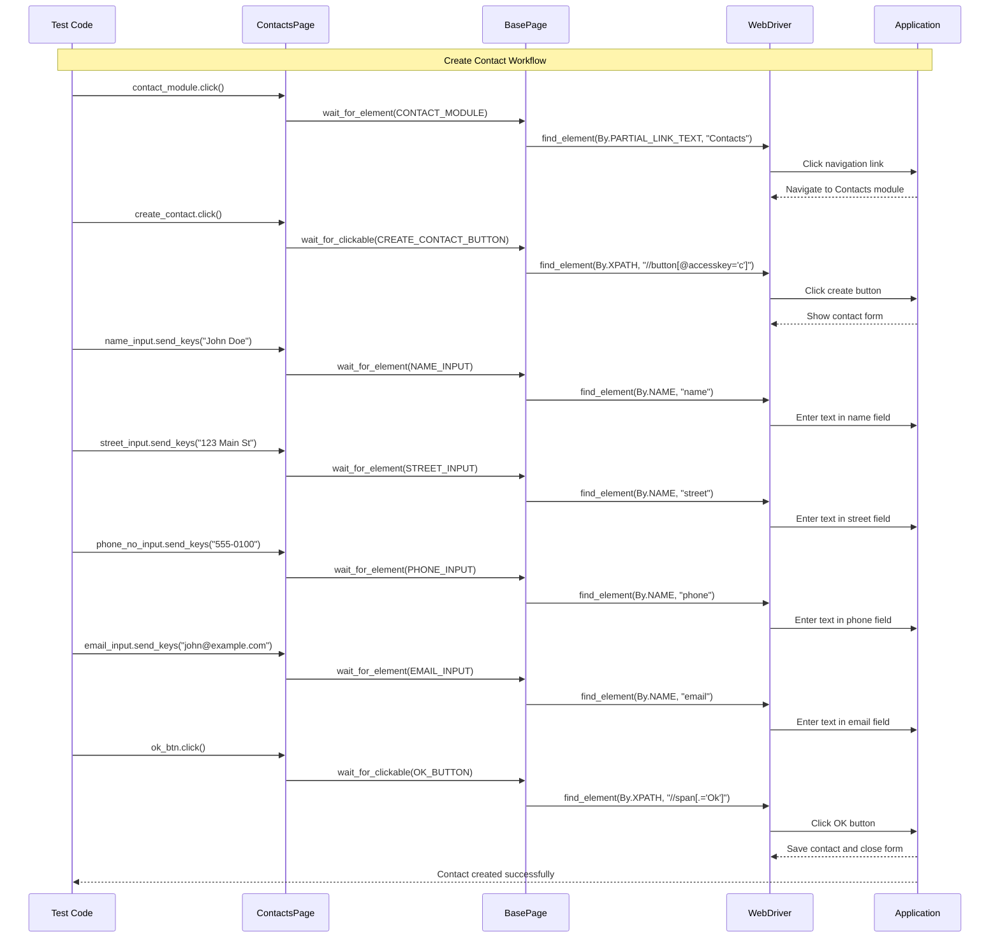

# ContactsPage API Reference

## Overview

The `ContactsPage` class provides a Page Object Model implementation for the Contacts module in the Testinium application. It encapsulates all element locators and interaction methods required for contact management operations including creation, editing, selection, and deletion.

**Module:** `pages.contacts_page`

**Inherits From:** [`BasePage`](base-page.md)

**Source:** `pages/contacts_page.py`

## Purpose

ContactsPage manages all interactions with the Contacts module user interface, providing:

- **Contact Module Navigation** - Access to the Contacts section from the main menu
- **Contact Creation** - Form input elements for creating new contacts
- **Contact Editing** - Elements for modifying existing contact information
- **Contact Selection** - Checkbox selectors for bulk operations
- **Action Menu Operations** - Edit, delete, and print functionality
- **Kanban View Access** - Contact card interactions in kanban layout

## Class Definition

```python
class ContactsPage(BasePage):
    """
    Page object for Contacts module providing element locators and interaction methods.
    
    This class follows the Page Object Model pattern by encapsulating all element locators
    and interaction logic for the Contacts module.
    """
```

**Source:** `pages/contacts_page.py:79-123`

## Inheritance Hierarchy

```
selenium.webdriver.remote.webelement.WebElement
    ↑
BasePage (utilities/base_page.py)
    ↑
ContactsPage (pages/contacts_page.py)
```

ContactsPage inherits all wait utilities and common WebDriver operations from BasePage, including:
- `wait_for_element()` - Wait for element presence in DOM
- `wait_for_clickable()` - Wait for element to be clickable
- `wait_for_visibility()` - Wait for element to be visible
- `click_element()`, `enter_text()`, and other interaction methods

## Thread Safety

ContactsPage instances are **thread-safe** when each thread uses its own WebDriver instance, achieved through `DriverManager`'s `threading.local()` pattern.

**Key Thread Safety Features:**
- Each property performs a **fresh element lookup** on every access
- No cached WebElement references that could become stale
- Thread-local WebDriver isolation prevents cross-thread interference
- Safe for parallel test execution with behave-parallel or pytest-xdist

**Source:** `pages/contacts_page.py:101-105`

## Attributes

### Constructor

```python
def __init__(self, driver):
    """
    Initialize ContactsPage with a WebDriver instance.
    
    Args:
        driver: Selenium WebDriver instance (from DriverManager.get_driver())
    """
```

**Inherited from BasePage:** The constructor is inherited and requires a WebDriver instance.

**Example:**
```python
from utilities.driver_manager import DriverManager
from pages.contacts_page import ContactsPage

driver = DriverManager.get_driver()
contacts_page = ContactsPage(driver)
```

### Locator Strategy Breakdown

ContactsPage uses 16 element locators with the following strategies:

| Strategy | Count | Examples | Stability |
|----------|-------|----------|-----------|
| PARTIAL_LINK_TEXT | 1 | contact_module | ✅ Stable |
| XPATH with accesskey | 2 | create_contact, call_list | ✅ Stable |
| NAME attributes | 4 | name_input, street_input, phone_no_input, email_input | ✅ Stable |
| XPATH text match | 1 | ok_btn | ✅ Stable |
| XPATH class-based | 3 | edit_title, edit_btn, print_input | ✅ Moderate |
| XPATH with data-index | 1 | delete_input | ✅ Moderate |
| **XPATH position-based** | **3** | **new_contact, action_input, first_user** | ⚠️ **BRITTLE** |

**Source:** `pages/contacts_page.py:92-100`

## ⚠️ Technical Debt

ContactsPage contains **three position-dependent XPath selectors** that are brittle and may break with DOM structure changes. These locators were preserved from the Java implementation for behavioral equivalence during migration validation.

### 1. new_contact - Position Index [12]

```python
_NEW_CONTACT_CHECKBOX = (By.XPATH, "(//div[@class='o_checkbox']/input)[12]")
```

**Issue:** Uses hardcoded index `[12]` to select a specific checkbox  
**Risk:** Breaks if contact order changes or new contacts are added  
**Affected Property:** `new_contact`

**Source:** `pages/contacts_page.py:153-156`

### 2. action_input - Position Index [2]

```python
_ACTION_INPUT = (By.XPATH, "(//div[@class='o_cp_sidebar']/div/div)[2]")
```

**Issue:** Uses hardcoded index `[2]` for sidebar element selection  
**Risk:** Breaks if sidebar structure changes  
**Affected Property:** `action_input`

**Source:** `pages/contacts_page.py:163-166`

### 3. first_user - Position Index [1]

```python
_FIRST_USER = (By.XPATH, "(//div[@class='o_kanban_view o_res_partner_kanban o_kanban_ungrouped']/div)[1]")
```

**Issue:** Uses index `[1]` to select first user in kanban view  
**Risk:** Brittle with dynamic user lists or sorting changes  
**Affected Property:** `first_user`

**Source:** `pages/contacts_page.py:174-177`

### Migration Context

These locators are preserved from the original Java implementation (`src/main/java/com/testinium/pages/ContactsP.java`) per migration requirements (Section 0.9.1: "Preserve all original locator strategies including brittle index-based XPath selectors for behavioral equivalence").

**Source:** `pages/contacts_page.py:22-48`

### Recommended Future Enhancement

Work with the development team to add `data-testid` attributes to the application:

```html
<!-- Recommended markup changes -->
<input data-testid="contact-checkbox-{contact_id}" />
<div data-testid="sidebar-action-menu">...</div>
<div data-testid="contact-card-{contact_id}">...</div>
```

**Updated locators would be:**
```python
# Stable, non-brittle alternatives
_NEW_CONTACT = (By.XPATH, "//input[@data-testid='contact-checkbox-{id}']")
_ACTION_INPUT = (By.XPATH, "//div[@data-testid='sidebar-action-menu']")
_FIRST_USER = (By.XPATH, "//div[@data-testid='contact-card-1']")
```

**Source:** `pages/contacts_page.py:44-47`

---

## Element Properties

All element properties return fresh `WebElement` references using BasePage wait methods. This prevents stale element references and ensures thread safety in parallel execution.

### Navigation Elements

#### contact_module

```python
@property
def contact_module(self) -> WebElement
```

Contacts module navigation link in the main menu.

**Returns:** `WebElement` - The Contacts navigation link element

**Locator Strategy:** `PARTIAL_LINK_TEXT` - Finds link containing text "Contacts"

**Wait Strategy:** Presence in DOM (may not be visible initially)

**Use Case:** Click to navigate to the Contacts module from any page in the application

**Example:**
```python
from pages.contacts_page import ContactsPage

contacts_page = ContactsPage(driver)
contacts_page.contact_module.click()
```

**Source:** `pages/contacts_page.py:201-218`

---

### Action Buttons

#### create_contact

```python
@property
def create_contact(self) -> WebElement
```

Create contact button with keyboard shortcut support.

**Returns:** `WebElement` - The create contact button element

**Locator Strategy:** `XPATH` with `accesskey='c'` attribute

**Wait Strategy:** Clickable (visible and enabled)

**Keyboard Shortcut:** 
- Windows/Linux: `Alt+C`
- macOS: `Control+Option+C`

**Use Case:** Click to open the contact creation form

**Example:**
```python
contacts_page.create_contact.click()
# Form opens for entering new contact details
```

**Source:** `pages/contacts_page.py:220-238`

#### call_list

```python
@property
def call_list(self) -> WebElement
```

Call list button with keyboard shortcut support.

**Returns:** `WebElement` - The call list button element

**Locator Strategy:** `XPATH` with `accesskey='l'` attribute

**Wait Strategy:** Clickable (visible and enabled)

**Keyboard Shortcut:**
- Windows/Linux: `Alt+L`
- macOS: `Control+Option+L`

**Use Case:** Click to access call list functionality for contacts

**Example:**
```python
contacts_page.call_list.click()
```

**Source:** `pages/contacts_page.py:337-354`

---

### Form Input Elements

#### name_input

```python
@property
def name_input(self) -> WebElement
```

Contact name input field in the contact creation/edit form.

**Returns:** `WebElement` - The name input field element

**Locator Strategy:** `NAME` attribute - `name="name"` (stable strategy)

**Wait Strategy:** Presence in DOM

**Use Case:** Enter contact's full name during contact creation or editing

**Example:**
```python
contacts_page.create_contact.click()
contacts_page.name_input.send_keys("John Doe")
```

**Source:** `pages/contacts_page.py:240-257`

#### street_input

```python
@property
def street_input(self) -> WebElement
```

Contact street address input field in the contact form.

**Returns:** `WebElement` - The street input field element

**Locator Strategy:** `NAME` attribute - `name="street"` (stable strategy)

**Wait Strategy:** Presence in DOM

**Use Case:** Enter contact's street address during contact creation or editing

**Example:**
```python
contacts_page.street_input.send_keys("123 Main Street")
contacts_page.street_input.send_keys("Apt 4B")
```

**Source:** `pages/contacts_page.py:259-276`

#### phone_no_input

```python
@property
def phone_no_input(self) -> WebElement
```

Contact phone number input field in the contact form.

**Returns:** `WebElement` - The phone input field element

**Locator Strategy:** `NAME` attribute - `name="phone"` (stable strategy)

**Wait Strategy:** Presence in DOM

**Use Case:** Enter contact's phone number during contact creation or editing

**Example:**
```python
contacts_page.phone_no_input.send_keys("555-0100")
contacts_page.phone_no_input.send_keys("+1-555-123-4567")
```

**Source:** `pages/contacts_page.py:278-295`

#### email_input

```python
@property
def email_input(self) -> WebElement
```

Contact email address input field in the contact form.

**Returns:** `WebElement` - The email input field element

**Locator Strategy:** `NAME` attribute - `name="email"` (stable strategy)

**Wait Strategy:** Presence in DOM

**Use Case:** Enter contact's email address during contact creation or editing

**Example:**
```python
contacts_page.email_input.send_keys("john@example.com")
contacts_page.email_input.send_keys("john.doe@company.com")
```

**Source:** `pages/contacts_page.py:297-314`

---

### Dialog Buttons

#### ok_btn

```python
@property
def ok_btn(self) -> WebElement
```

OK button to confirm and save contact form changes.

**Returns:** `WebElement` - The OK button element

**Locator Strategy:** `XPATH` with text match - `//span[.='Ok']` (case-sensitive)

**Wait Strategy:** Clickable (visible and enabled)

**Use Case:** Click to save contact creation or edit form and close the dialog

**Example:**
```python
# Complete contact creation workflow
contacts_page.create_contact.click()
contacts_page.name_input.send_keys("Jane Smith")
contacts_page.email_input.send_keys("jane@example.com")
contacts_page.ok_btn.click()  # Save and close
```

**Source:** `pages/contacts_page.py:316-334`

---

### Contact Selection Elements

#### new_contact

```python
@property
def new_contact(self) -> WebElement
```

Contact selection checkbox for bulk operations.

⚠️ **TECHNICAL DEBT WARNING** - This property uses a position-dependent selector with hardcoded index `[12]`.

**Returns:** `WebElement` - The contact checkbox element (12th in list)

**Locator Strategy:** `XPATH` with position index `[12]` - **BRITTLE LOCATOR**

**Wait Strategy:** Presence in DOM

**Technical Debt:**
- Uses hardcoded position index `[12]` which is brittle
- May break if contact order changes or new contacts are added
- May break if DOM structure changes
- Preserved from Java implementation for behavioral equivalence

**Original Java:** `@FindBy(xpath = "(//div[@class='o_checkbox']/input)[12]")`

**Recommended Enhancement:** Request `data-testid="contact-checkbox-{contact_id}"` from development team

**Use Case:** Select a specific contact via checkbox for bulk operations (currently assumes the 12th checkbox in the contacts list)

**Example:**
```python
# Select contact for deletion (use with caution - position-dependent)
contacts_page.new_contact.click()  # Selects 12th contact checkbox
contacts_page.action_input.click()
contacts_page.delete_input.click()
```

**Source:** `pages/contacts_page.py:356-391`

---

### Action Menu Elements

#### action_input

```python
@property
def action_input(self) -> WebElement
```

Action menu input element in the sidebar for accessing contact operations.

⚠️ **TECHNICAL DEBT WARNING** - This property uses a position-dependent selector with hardcoded index `[2]`.

**Returns:** `WebElement` - The sidebar action input element (2nd in structure)

**Locator Strategy:** `XPATH` with position index `[2]` - **BRITTLE LOCATOR**

**Wait Strategy:** Presence in DOM

**Technical Debt:**
- Uses hardcoded position index `[2]` which assumes specific sidebar structure
- May break with sidebar layout changes
- Preserved from Java implementation for behavioral equivalence

**Original Java:** `@FindBy(xpath = "(//div[@class='o_cp_sidebar']/div/div)[2]")`

**Recommended Enhancement:** Request `data-testid="sidebar-action-menu"` from development team

**Use Case:** Access action menu for contact operations (edit, delete, etc.)

**Example:**
```python
# Open action menu
contacts_page.action_input.click()
# Action menu dropdown appears with options
```

**Source:** `pages/contacts_page.py:393-422`

#### delete_input

```python
@property
def delete_input(self) -> WebElement
```

Delete action link in the contact action menu.

**Returns:** `WebElement` - The delete action link element

**Locator Strategy:** `XPATH` with `data-index="3"` attribute

**Wait Strategy:** Clickable (visible and enabled)

**Use Case:** Click to delete selected contact(s) - typically used after selecting contacts and opening action menu

**Example:**
```python
# Complete delete workflow
contacts_page.new_contact.click()      # Select contact
contacts_page.action_input.click()     # Open action menu
contacts_page.delete_input.click()     # Trigger delete action
# Confirmation dialog may appear
```

**Source:** `pages/contacts_page.py:424-444`

---

### Contact Card and Edit Elements

#### first_user

```python
@property
def first_user(self) -> WebElement
```

First user/contact card in the kanban view.

⚠️ **TECHNICAL DEBT WARNING** - This property uses a position-dependent selector with hardcoded index `[1]`.

**Returns:** `WebElement` - The first contact card element in kanban view

**Locator Strategy:** `XPATH` with position index `[1]` - **BRITTLE LOCATOR**

**Wait Strategy:** Clickable (visible and enabled)

**Technical Debt:**
- Uses hardcoded position index `[1]` which assumes first position in kanban view
- Brittle with dynamic user lists or sorting changes
- Preserved from Java implementation for behavioral equivalence

**Original Java:** `@FindBy(xpath = "(//div[@class='o_kanban_view o_res_partner_kanban o_kanban_ungrouped']/div)[1]")`

**Recommended Enhancement:** Use `data-testid` with dynamic contact identifiers

**Use Case:** Click to open the first contact in the kanban view - useful for testing default list state or first contact operations

**Example:**
```python
# Open first contact for viewing/editing
contacts_page.first_user.click()
# Contact details view opens
```

**Source:** `pages/contacts_page.py:467-498`

#### edit_btn

```python
@property
def edit_btn(self) -> WebElement
```

Edit button to modify existing contact details.

**Returns:** `WebElement` - The edit button element

**Locator Strategy:** `XPATH` with specific button class - `btn btn-primary btn-sm o_form_button_edit`

**Wait Strategy:** Clickable (visible and enabled)

**Use Case:** Click to enter edit mode for a contact - enables form fields for modification

**Example:**
```python
# Open contact and enter edit mode
contacts_page.first_user.click()       # Open contact details
contacts_page.edit_btn.click()         # Enter edit mode
contacts_page.name_input.clear()
contacts_page.name_input.send_keys("Updated Name")
contacts_page.ok_btn.click()           # Save changes
```

**Source:** `pages/contacts_page.py:446-465`

#### edit_title

```python
@property
def edit_title(self) -> WebElement
```

Edit title section element in the contact form.

**Returns:** `WebElement` - The edit title div element

**Locator Strategy:** `XPATH` with class name - `oe_title`

**Wait Strategy:** Presence in DOM

**Use Case:** Access or verify the title section of the contact edit form - may contain contact name or form heading

**Example:**
```python
# Verify contact form title
contacts_page.first_user.click()
title_text = contacts_page.edit_title.text
assert "Contact" in title_text
```

**Source:** `pages/contacts_page.py:500-519`

---

### Menu and Dropdown Elements

#### print_input

```python
@property
def print_input(self) -> WebElement
```

Print dropdown menu element for contact printing operations.

**Returns:** `WebElement` - The print dropdown menu element

**Locator Strategy:** `XPATH` with dropdown class - `btn-group o_dropdown open`

**Wait Strategy:** Presence in DOM

**Important:** Dropdown must be open for element to exist in DOM

**Use Case:** Access print options for contacts

**Example:**
```python
# Access print options (after opening dropdown)
# Note: Dropdown menu must be opened first
contacts_page.print_input.click()
```

**Source:** `pages/contacts_page.py:521-540`

#### due_payment

```python
@property
def due_payment(self) -> WebElement
```

Due payment button within the dropdown menu.

**Returns:** `WebElement` - The due payment button element

**Locator Strategy:** `XPATH` with dropdown class (requires dropdown to be open)

**Wait Strategy:** Clickable (visible and enabled)

**Important:** Dropdown menu must be open for element to be accessible

**Use Case:** Access due payment functionality for contacts

**Example:**
```python
# Access due payment (after opening dropdown)
# Note: Dropdown must be open first
contacts_page.due_payment.click()
```

**Source:** `pages/contacts_page.py:542-561`

---

## Usage Examples

### Example 1: Create a New Contact

Complete workflow for creating a contact with all details:

```python
from utilities.driver_manager import DriverManager
from pages.contacts_page import ContactsPage

# Initialize
driver = DriverManager.get_driver()
contacts_page = ContactsPage(driver)

# Navigate to Contacts module
contacts_page.contact_module.click()

# Open contact creation form
contacts_page.create_contact.click()

# Fill in contact details
contacts_page.name_input.send_keys("John Doe")
contacts_page.street_input.send_keys("123 Main Street, Apt 4B")
contacts_page.phone_no_input.send_keys("555-0100")
contacts_page.email_input.send_keys("john.doe@example.com")

# Save contact
contacts_page.ok_btn.click()

# Cleanup
DriverManager.quit_driver()
```

**Source:** `pages/contacts_page.py:49-70`

### Example 2: Edit Existing Contact

Modify an existing contact's information:

```python
from pages.contacts_page import ContactsPage

contacts_page = ContactsPage(driver)

# Navigate to contacts
contacts_page.contact_module.click()

# Open first contact
contacts_page.first_user.click()  # ⚠️ Position-dependent

# Enter edit mode
contacts_page.edit_btn.click()

# Update phone number
contacts_page.phone_no_input.clear()
contacts_page.phone_no_input.send_keys("555-0200")

# Save changes
contacts_page.ok_btn.click()
```

### Example 3: Delete a Contact

Complete workflow for selecting and deleting a contact:

```python
from pages.contacts_page import ContactsPage

contacts_page = ContactsPage(driver)

# Navigate to contacts module
contacts_page.contact_module.click()

# Select contact for deletion
contacts_page.new_contact.click()  # ⚠️ Selects 12th contact (position-dependent)

# Open action menu
contacts_page.action_input.click()  # ⚠️ Position-dependent

# Trigger delete action
contacts_page.delete_input.click()

# Handle confirmation dialog if needed
# (implementation depends on application behavior)
```

**Note:** This example uses multiple position-dependent selectors. See [Technical Debt](#️-technical-debt) section for details.

### Example 4: Behave Step Definition Integration

Using ContactsPage in BDD step definitions:

```python
from behave import given, when, then
from pages.contacts_page import ContactsPage

@when('User creates a new contact with name "{name}"')
def create_contact(context, name):
    """Create a contact with the specified name."""
    contacts_page = ContactsPage(context.driver)
    
    contacts_page.contact_module.click()
    contacts_page.create_contact.click()
    
    contacts_page.name_input.send_keys(name)
    contacts_page.street_input.send_keys("123 Test Street")
    contacts_page.phone_no_input.send_keys("555-TEST")
    contacts_page.email_input.send_keys(f"{name.lower().replace(' ', '.')}@test.com")
    
    contacts_page.ok_btn.click()

@when('User opens the first contact')
def open_first_contact(context):
    """Open the first contact in the kanban view."""
    contacts_page = ContactsPage(context.driver)
    contacts_page.contact_module.click()
    contacts_page.first_user.click()  # ⚠️ Position-dependent

@then('The contact name should be "{expected_name}"')
def verify_contact_name(context, expected_name):
    """Verify the contact name in edit form."""
    contacts_page = ContactsPage(context.driver)
    actual_name = contacts_page.name_input.get_attribute('value')
    assert actual_name == expected_name, f"Expected: {expected_name}, Got: {actual_name}"
```

**Source:** `pages/contacts_page.py:600-614`

### Example 5: Parallel Execution Pattern

Using ContactsPage safely in parallel test execution:

```python
from behave import given
from utilities.driver_manager import DriverManager
from pages.contacts_page import ContactsPage

@given('User is on the contacts page')
def navigate_to_contacts(context):
    """
    Navigate to contacts page - thread-safe for parallel execution.
    
    Each scenario gets its own WebDriver instance via threading.local(),
    and each ContactsPage performs fresh element lookups.
    """
    # Get thread-local driver
    driver = DriverManager.get_driver()
    
    # Create page object (thread-safe)
    contacts_page = ContactsPage(driver)
    
    # Navigate (fresh element lookup each time)
    contacts_page.contact_module.click()
    
    # Store in context for subsequent steps
    context.contacts_page = contacts_page
```

**Thread Safety Notes:**
- Each thread has its own WebDriver instance (via `threading.local()`)
- Each property access performs a fresh element lookup
- No shared state between threads
- Safe for `behave --processes N` parallel execution

---

## Contact Management Workflow

The following Mermaid diagram illustrates the typical contact management workflow:



---

## Migration Notes

### Java to Python Conversion

ContactsPage was migrated from Java using the PageFactory pattern to Python using property-based locators.

**Original Java File:** `src/main/java/com/testinium/pages/ContactsP.java`

**Pattern Transformation:**

| Java Pattern | Python Pattern |
|--------------|----------------|
| `@FindBy(partialLinkText = "Contacts")` | `_CONTACT_MODULE = (By.PARTIAL_LINK_TEXT, "Contacts")` |
| `public WebElement contactModule;` | `@property def contact_module(self) -> WebElement:` |
| `PageFactory.initElements(driver, this)` | Property returns `self.wait_for_element(locator)` |

**Key Migration Decisions:**

1. **Explicit Waits Only** - No implicit waits; all element access goes through BasePage wait methods
2. **Property-Based Access** - `@property` decorators replace public fields for fresh element lookups
3. **Private Locators** - Locator tuples are private constants (leading underscore)
4. **Type Hints** - All properties annotated with `-> WebElement` return type
5. **Preserved Brittle Locators** - Position-dependent selectors maintained for behavioral equivalence

**Source:** `pages/contacts_page.py:7-21`

### Behavioral Equivalence

All locators match the Java `ContactsP.java` implementation exactly to ensure test scenarios produce identical results during migration validation. The 61/61 tests passing validation confirms behavioral equivalence.

**Source:** `blitzy/documentation/Project Guide.md` (validation results)

---

## Best Practices

### DO: Use Stable Locators

✅ **Prefer NAME-based locators** (most stable):
```python
contacts_page.name_input.send_keys("John Doe")      # ✅ Uses name="name"
contacts_page.email_input.send_keys("john@test.com") # ✅ Uses name="email"
```

✅ **Use PARTIAL_LINK_TEXT** for navigation:
```python
contacts_page.contact_module.click()  # ✅ Stable link text
```

### DON'T: Rely on Position-Dependent Selectors

⚠️ **Avoid position-dependent selectors** when possible:
```python
# These work but are brittle:
contacts_page.new_contact.click()   # ⚠️ Uses index [12]
contacts_page.action_input.click()  # ⚠️ Uses index [2]
contacts_page.first_user.click()    # ⚠️ Uses index [1]
```

**Why:** Position-dependent selectors break when:
- Items are reordered
- New items are added/removed
- DOM structure changes

**Alternative:** Work with development team to add `data-testid` attributes for stable selection.

### DO: Handle Wait Strategies Appropriately

✅ **Use appropriate wait methods**:
```python
# For visibility
element = contacts_page.name_input  # Uses wait_for_element()

# For interaction
contacts_page.create_contact.click()  # Uses wait_for_clickable()
```

All properties use appropriate wait strategies inherited from BasePage.

### DO: Create Fresh Page Objects Per Test

✅ **Instantiate ContactsPage for each test scenario**:
```python
@given('User is on contacts page')
def navigate_to_contacts(context):
    driver = DriverManager.get_driver()
    context.contacts_page = ContactsPage(driver)  # ✅ Fresh instance
```

**Why:** Ensures clean state and prevents cross-test contamination.

---

## See Also

### Related Page Objects
- [`BasePage`](base-page.md) - Parent class providing wait utilities and common operations
- [`LoginPage`](login-page.md) - Authentication page object
- [`CrmPage`](crm-page.md) - CRM module page object

### Related Documentation
- [Page Object Model Guide](../../guides/page-object-model.md) - Creating new page objects
- [Wait Strategies Guide](../../guides/wait-strategies.md) - Choosing appropriate wait methods
- [Parallel Execution Guide](../../guides/parallel-execution.md) - Thread safety patterns

### Related Step Definitions
- `features/steps/contacts_steps.py` - Contact management step definitions
- `features/Contact.feature` - Contact management Gherkin scenarios

### Utilities
- [`DriverManager`](../utilities/driver-manager.md) - WebDriver lifecycle management
- [`WaitHelpers`](../utilities/wait-helpers.md) - Explicit wait utilities

---

## Summary

ContactsPage provides comprehensive element access for contact management operations in the Testinium application. While most locators use stable strategies (NAME attributes, PARTIAL_LINK_TEXT), three position-dependent selectors exist as technical debt from the Java migration.

**Key Takeaways:**
- ✅ 16 element properties for complete contact management
- ⚠️ 3 brittle position-dependent selectors (documented above)
- ✅ Thread-safe for parallel test execution
- ✅ Integrates seamlessly with Behave BDD framework
- ✅ Behavioral equivalence with Java implementation verified

**Recommendation:** For new test development, prefer stable locators (name_input, email_input, etc.) and work with the development team to add data-testid attributes for currently brittle selectors.

**Source:** `pages/contacts_page.py`

