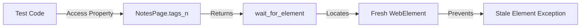

# NotesPage API Reference

## Overview

`NotesPage` is a page object class providing access to the Testinium Notes management interface. It encapsulates all element locators and interaction patterns for notes module operations including navigation, note creation, editing, and organization.

**Module:** `pages.notes_page`  
**Class:** `NotesPage`  
**Inherits:** `BasePage`  
**Source:** `pages/notes_page.py`

### Key Features

- **Notes Module Navigation:** Access notes module through navigation elements
- **Note Creation Interface:** Complete note creation workflow support
- **Tags Management:** Input field for categorizing notes with tags
- **Rich Text Editor:** Description field with rich text editing capabilities
- **Save Functionality:** Note persistence with confirmation messaging
- **Table Organization:** Separate views for new notes and today's notes
- **Property-Based Locators:** Fresh WebElement references preventing stale element exceptions
- **Explicit Wait Integration:** All elements use BasePage wait strategies

### Migration Context

**Original Java Class:** `src/main/java/com/testinium/pages/NotesP.java`

This Python implementation replaces the Java PageFactory pattern with property-based locators:
- Java used `@FindBy` annotations with public `WebElement` fields (10 total)
- Python uses private locator tuples with `@property` methods
- Java used `PageFactory.initElements()` initialization
- Python uses explicit waits through BasePage inheritance

**Key Improvements:**
- Eliminated stale element exceptions through property-based access
- Improved maintainability with private locator constants
- Enhanced thread safety for parallel test execution

### Thread Safety

`NotesPage` is thread-safe when each test thread uses its own WebDriver instance from `DriverManager`. Each page object instance is bound to a specific driver, supporting parallel test execution without interference.

## Class Definition

```python
class NotesPage(BasePage):
    """
    Page object for Testinium Notes management interface.
    
    Provides access to all elements on the Notes page including module navigation,
    note creation interface, form inputs, action buttons, confirmation messages,
    and table organization elements.
    """
```

**Source:** `pages/notes_page.py:78-125`

### Constructor

#### `__init__(driver)`

Initialize NotesPage with WebDriver instance.

**Parameters:**

| Parameter | Type | Required | Description |
|-----------|------|----------|-------------|
| driver | WebDriver | Yes | Selenium WebDriver instance (thread-local from DriverManager) |

**Returns:** None

**Example:**

```python
from pages.notes_page import NotesPage
from utilities.driver_manager import DriverManager

driver = DriverManager.get_driver()
notes_page = NotesPage(driver)
```

**Source:** `pages/notes_page.py:163-187`

### Inherited Attributes

From `BasePage`:

| Attribute | Type | Description |
|-----------|------|-------------|
| driver | WebDriver | Selenium WebDriver instance for element interaction |
| config | ConfigReader | Configuration reader singleton for accessing config.yaml |
| default_timeout | int | Default explicit wait timeout from configuration |
| wait | WebDriverWait | Pre-configured WebDriverWait instance |
| actions | ActionChains | ActionChains for complex interactions |

## Element Properties

All element properties return fresh `WebElement` references using explicit waits from `BasePage`. This prevents stale element exceptions and ensures elements are in the expected state before interaction.

### Navigation Elements

#### `tab_index`

Navigation link for 'Create and Edit...' tab.

**Type:** `WebElement` (property)

**Locator:** `(By.XPATH, "//a[. = 'Create and Edit...']")`

**Wait Strategy:** `wait_for_element()` - Waits for element presence in DOM

**Returns:** WebElement reference to the 'Create and Edit...' navigation link

**Raises:** 
- `TimeoutException` - If element not present within configured timeout

**Usage:**

```python
notes_page = NotesPage(driver)
notes_page.tab_index.click()
```

**Source:** `pages/notes_page.py:192-210`

---

#### `notes_module`

Module navigation link with partial text 'Notes'.

**Type:** `WebElement` (property)

**Locator:** `(By.PARTIAL_LINK_TEXT, "Notes")`

**Wait Strategy:** `wait_for_element()` - Waits for element presence in DOM

**Returns:** WebElement reference to the Notes module navigation link

**Raises:** 
- `TimeoutException` - If element not present within configured timeout

**Usage:**

```python
notes_page = NotesPage(driver)
notes_page.notes_module.click()
```

**Source:** `pages/notes_page.py:212-230`

### Note Creation Elements

#### `creating_notes`

Button to initiate new note creation.

**Type:** `WebElement` (property)

**Locator:** `(By.XPATH, "//button[@class='btn btn-primary btn-sm o-kanban-button-new']")`

**Wait Strategy:** `wait_for_clickable()` - Waits for element to be visible and enabled

**Returns:** WebElement reference to the note creation button in clickable state

**Raises:** 
- `TimeoutException` - If button not clickable within configured timeout

**Usage:**

```python
notes_page = NotesPage(driver)
notes_page.creating_notes.click()
```

**Source:** `pages/notes_page.py:232-250`

### Form Input Elements

#### `tags_n`

Input field for note tags/categories.

**Type:** `WebElement` (property)

**Locator:** `(By.XPATH, "//input[@class='o_input ui-autocomplete-input']")`

**Wait Strategy:** `wait_for_element()` - Waits for element presence in DOM

**Returns:** WebElement reference to the tags input field

**Raises:** 
- `TimeoutException` - If input field not present within configured timeout

**Usage:**

```python
notes_page = NotesPage(driver)
notes_page.tags_n.send_keys("automation, testing, BDD")
```

**Source:** `pages/notes_page.py:252-270`

---

#### `description`

Rich text editor for note content/description.

**Type:** `WebElement` (property)

**Locator:** `(By.XPATH, "//div[@class='note-editable panel-body']")`

**Wait Strategy:** `wait_for_element()` - Waits for element presence in DOM

**Returns:** WebElement reference to the description editor element (content-editable div)

**Raises:** 
- `TimeoutException` - If editor not present within configured timeout

**Usage:**

```python
notes_page = NotesPage(driver)
notes_page.description.send_keys("This is my note content with detailed information")
```

**Source:** `pages/notes_page.py:272-290`

### Action and Confirmation Elements

#### `save_btn`

Button to save note changes.

**Type:** `WebElement` (property)

**Locator:** `(By.XPATH, "//button[@class='btn btn-primary btn-sm o_form_button_save']")`

**Wait Strategy:** `wait_for_clickable()` - Waits for element to be visible and enabled

**Returns:** WebElement reference to the save button in clickable state

**Raises:** 
- `TimeoutException` - If button not clickable within configured timeout

**Usage:**

```python
notes_page = NotesPage(driver)
notes_page.save_btn.click()
```

**Source:** `pages/notes_page.py:315-334`

---

#### `created_message`

Confirmation message displaying 'Note created'.

**Type:** `WebElement` (property)

**Locator:** `(By.XPATH, "//p[.='Note created']")`

**Wait Strategy:** `wait_for_visibility()` - Waits for element to be visible on page

**Returns:** WebElement reference to the 'Note created' confirmation message in visible state

**Raises:** 
- `TimeoutException` - If message not visible within configured timeout

**Usage:**

```python
notes_page = NotesPage(driver)
notes_page.save_btn.click()

# Wait for and verify confirmation message
assert notes_page.created_message.is_displayed()
assert "Note created" in notes_page.created_message.text
```

**Source:** `pages/notes_page.py:292-313`

### Application Identifier Elements

#### `app_k`

Application identifier element with specific note title.

**Type:** `WebElement` (property)

**Locator:** `(By.XPATH, "//span[.='BDD Approach Framework with Cucumber']")`

**Wait Strategy:** `wait_for_element()` - Waits for element presence in DOM

**Returns:** WebElement reference to the application identifier span element

**Raises:** 
- `TimeoutException` - If element not present within configured timeout

**Usage:**

```python
notes_page = NotesPage(driver)
# Verify specific note is present
assert "BDD Approach Framework with Cucumber" in notes_page.app_k.text
```

**Source:** `pages/notes_page.py:336-355`

### Table Organization Elements

#### `new_table`

Table container with data-id='1193' for new notes organization.

**Type:** `WebElement` (property)

**Locator:** `(By.XPATH, "(//div[@data-id='1193']/div)[2]")`

**Wait Strategy:** `wait_for_element()` - Waits for element presence in DOM

**Returns:** WebElement reference to the new notes table container

**Raises:** 
- `TimeoutException` - If element not present within configured timeout

**⚠️ WARNING: BRITTLE LOCATOR**

This locator uses a data-id attribute with index-based XPath: `(//div[@data-id='1193']/div)[2]`

This selector is **fragile** and may break with DOM structure changes. It is preserved from the Java implementation to maintain behavioral equivalence during migration.

**Technical Debt:**
- **Issue:** data-id values ('1193') appear to be generated or database-specific
- **Risk:** May change between environments or application versions
- **Index Dependency:** The `[2]` index depends on exact DOM structure
- **Impact:** High - breaks if DOM structure changes or data-id values differ

**Recommended Refactoring:**

Replace with stable selectors:

```python
# Option 1: data-testid attribute (requires frontend change)
_NEW_TABLE = (By.XPATH, "//div[@data-testid='new-notes-table']")

# Option 2: aria-label attribute (accessibility improvement)
_NEW_TABLE = (By.XPATH, "//div[@aria-label='New Notes']")

# Option 3: Stable class name (requires CSS class addition)
_NEW_TABLE = (By.CLASS_NAME, "notes-table-new")
```

**Usage:**

```python
notes_page = NotesPage(driver)
new_table_element = notes_page.new_table
# Verify table is displayed
assert new_table_element.is_displayed()
```

**Source:** `pages/notes_page.py:357-392`

---

#### `today_table`

Table container with data-id='1194' for today's notes organization.

**Type:** `WebElement` (property)

**Locator:** `(By.XPATH, "(//div[@data-id='1194']/div)[1]")`

**Wait Strategy:** `wait_for_element()` - Waits for element presence in DOM

**Returns:** WebElement reference to today's notes table container

**Raises:** 
- `TimeoutException` - If element not present within configured timeout

**⚠️ WARNING: BRITTLE LOCATOR**

This locator uses a data-id attribute with index-based XPath: `(//div[@data-id='1194']/div)[1]`

This selector is **fragile** and may break with DOM structure changes. It is preserved from the Java implementation to maintain behavioral equivalence during migration.

**Technical Debt:**
- **Issue:** data-id values ('1194') appear to be generated or database-specific
- **Risk:** May change between environments or application versions
- **Index Dependency:** The `[1]` index depends on exact DOM structure
- **Impact:** High - breaks if DOM structure changes or data-id values differ

**Recommended Refactoring:**

Replace with stable selectors:

```python
# Option 1: data-testid attribute (requires frontend change)
_TODAY_TABLE = (By.XPATH, "//div[@data-testid='today-notes-table']")

# Option 2: aria-label attribute (accessibility improvement)
_TODAY_TABLE = (By.XPATH, "//div[@aria-label='Today Notes']")

# Option 3: Stable class name (requires CSS class addition)
_TODAY_TABLE = (By.CLASS_NAME, "notes-table-today")
```

**Usage:**

```python
notes_page = NotesPage(driver)
today_table_element = notes_page.today_table
# Verify table is displayed
assert today_table_element.is_displayed()
```

**Source:** `pages/notes_page.py:394-429`

## Usage Examples

### Basic Note Creation Workflow

Complete example showing navigation to notes module and creating a new note:

```python
from pages.notes_page import NotesPage
from utilities.driver_manager import DriverManager

# Get thread-local WebDriver instance
driver = DriverManager.get_driver()

# Initialize notes page object
notes_page = NotesPage(driver)

# Navigate to Notes module
notes_page.notes_module.click()

# Initiate note creation
notes_page.creating_notes.click()

# Fill in note details
notes_page.tags_n.send_keys("automation, testing, BDD")
notes_page.description.send_keys("Comprehensive test note for automation framework")

# Save note
notes_page.save_btn.click()

# Verify note created successfully
assert notes_page.created_message.is_displayed()
assert "Note created" in notes_page.created_message.text
```

### Using with Behave Step Definitions

Integration with BDD step definitions:

```python
from behave import given, when, then
from pages.notes_page import NotesPage

@when('User navigates to Notes module')
def navigate_to_notes(context):
    notes_page = NotesPage(context.driver)
    notes_page.notes_module.click()

@when('User creates a new note with tags "{tags}" and description "{description}"')
def create_note(context, tags, description):
    notes_page = NotesPage(context.driver)
    notes_page.creating_notes.click()
    notes_page.tags_n.send_keys(tags)
    notes_page.description.send_keys(description)
    notes_page.save_btn.click()

@then('User should see note created confirmation')
def verify_note_created(context):
    notes_page = NotesPage(context.driver)
    assert notes_page.created_message.is_displayed()
    assert "Note created" in notes_page.created_message.text
```

### Verifying Table Organization

Working with new and today table containers:

```python
from pages.notes_page import NotesPage

notes_page = NotesPage(driver)

# Navigate to notes
notes_page.notes_module.click()

# Verify table containers are displayed
new_table = notes_page.new_table
today_table = notes_page.today_table

assert new_table.is_displayed(), "New notes table should be visible"
assert today_table.is_displayed(), "Today's notes table should be visible"
```

### Complete Test Scenario

Full test scenario with navigation, creation, and verification:

```python
from pages.notes_page import NotesPage
from utilities.driver_manager import DriverManager

def test_create_note_workflow():
    """Test complete note creation workflow."""
    # Setup
    driver = DriverManager.get_driver()
    driver.get("https://example-testinium-app.com")
    
    # Login (assuming already authenticated)
    notes_page = NotesPage(driver)
    
    # Navigate to Notes module via tab
    notes_page.tab_index.click()
    notes_page.notes_module.click()
    
    # Create new note
    notes_page.creating_notes.click()
    
    # Fill note information
    notes_page.tags_n.send_keys("selenium, python, page-object")
    notes_page.description.send_keys("Testing NotesPage implementation")
    
    # Save and verify
    notes_page.save_btn.click()
    
    # Assertions
    assert notes_page.created_message.is_displayed()
    confirmation_text = notes_page.created_message.text
    assert "Note created" in confirmation_text
    
    # Cleanup
    DriverManager.quit_driver()
```

## Technical Debt Summary

### Brittle Locators Identified

The `NotesPage` class contains **2 brittle locators** that require attention:

| Property | Locator | Issue | Risk Level |
|----------|---------|-------|------------|
| `new_table` | `(//div[@data-id='1193']/div)[2]` | data-id + index-based XPath | **HIGH** |
| `today_table` | `(//div[@data-id='1194']/div)[1]` | data-id + index-based XPath | **HIGH** |

### Impact Analysis

**Failure Scenarios:**
1. **DOM Structure Changes:** Any modification to div hierarchy breaks index selection
2. **Dynamic data-id Values:** If data-id is generated or database-specific, values may differ across environments
3. **Content Changes:** Adding/removing div elements changes index positions
4. **Application Updates:** Frontend refactoring invalidates existing XPath

**Affected Test Scenarios:**
- Any tests verifying table organization
- Tests checking note visibility in different views
- Tests validating note categorization (new vs. today)

### Recommendations

#### Short-Term Workarounds

1. **Environment-Specific Configuration:**
   ```python
   # config/config.yaml
   notes_page:
     new_table_data_id: "1193"  # Development
     today_table_data_id: "1194"  # Development
   ```

2. **Defensive Assertions:**
   ```python
   try:
       new_table = notes_page.new_table
   except TimeoutException:
       pytest.skip("new_table locator needs update - known technical debt")
   ```

#### Long-Term Solutions

**Collaborate with Development Team:**

1. **Add data-testid Attributes** (Preferred):
   ```html
   <div data-testid="new-notes-table" data-id="1193">
       <!-- table content -->
   </div>
   ```

2. **Add aria-label Attributes** (Accessibility + Testing):
   ```html
   <div aria-label="New Notes Table" data-id="1193">
       <!-- table content -->
   </div>
   ```

3. **Add Stable CSS Classes**:
   ```html
   <div class="notes-table notes-table--new" data-id="1193">
       <!-- table content -->
   </div>
   ```

**Updated Locators After Frontend Changes:**
```python
# After data-testid implementation
_NEW_TABLE = (By.CSS_SELECTOR, "[data-testid='new-notes-table']")
_TODAY_TABLE = (By.CSS_SELECTOR, "[data-testid='today-notes-table']")
```

## Architecture Notes

### Property-Based Locator Pattern

`NotesPage` uses the property-based locator pattern for all element access:



**Benefits:**
- **Fresh References:** Each property access creates new WebElement reference
- **Explicit Waits:** Built-in wait strategies ensure element readiness
- **Encapsulation:** Locator logic hidden from test code
- **Maintainability:** Locator changes isolated to page object

### Wait Strategy Integration

All properties leverage `BasePage` wait methods:

| Property | Wait Method | Purpose |
|----------|-------------|---------|
| `tab_index`, `notes_module`, `tags_n`, `description`, `app_k` | `wait_for_element()` | Wait for presence in DOM |
| `creating_notes`, `save_btn` | `wait_for_clickable()` | Wait for visibility + enabled state |
| `created_message` | `wait_for_visibility()` | Wait for visible on page |
| `new_table`, `today_table` | `wait_for_element()` | Wait for presence in DOM |

**Explicit Wait Example:**
```python
# Property implementation
@property
def save_btn(self) -> WebElement:
    return self.wait_for_clickable(self._SAVE_BUTTON)

# Translates to:
# WebDriverWait(driver, timeout).until(
#     EC.element_to_be_clickable(self._SAVE_BUTTON)
# )
```

## See Also

### Related Page Objects
- [BasePage](base-page.md) - Abstract base class with wait utilities
- [LoginPage](login-page.md) - Authentication page object
- [CalendarPage](calendar-page.md) - Calendar management
- [ContactsPage](contacts-page.md) - Contact management

### Related Guides
- [Page Object Model Guide](../../guides/page-object-model.md) - Creating custom page objects
- [Wait Strategies Guide](../../guides/wait-strategies.md) - Explicit wait patterns
- [Notes Testing Guide](../../guides/notes-testing.md) - Notes feature testing

### Architecture Documentation
- [Page Object Model Architecture](../../architecture/page-object-model.md)
- [Wait Strategies Architecture](../../architecture/wait-strategies.md)

### Source Code
- **Implementation:** `pages/notes_page.py`
- **Original Java:** `src/main/java/com/testinium/pages/NotesP.java`
- **Step Definitions:** `features/steps/notes_steps.py`
- **Feature File:** `features/Notes.feature`

---

**API Version:** 1.0.0  
**Last Updated:** 2024-01-15  
**Maintained By:** QA Automation Team
