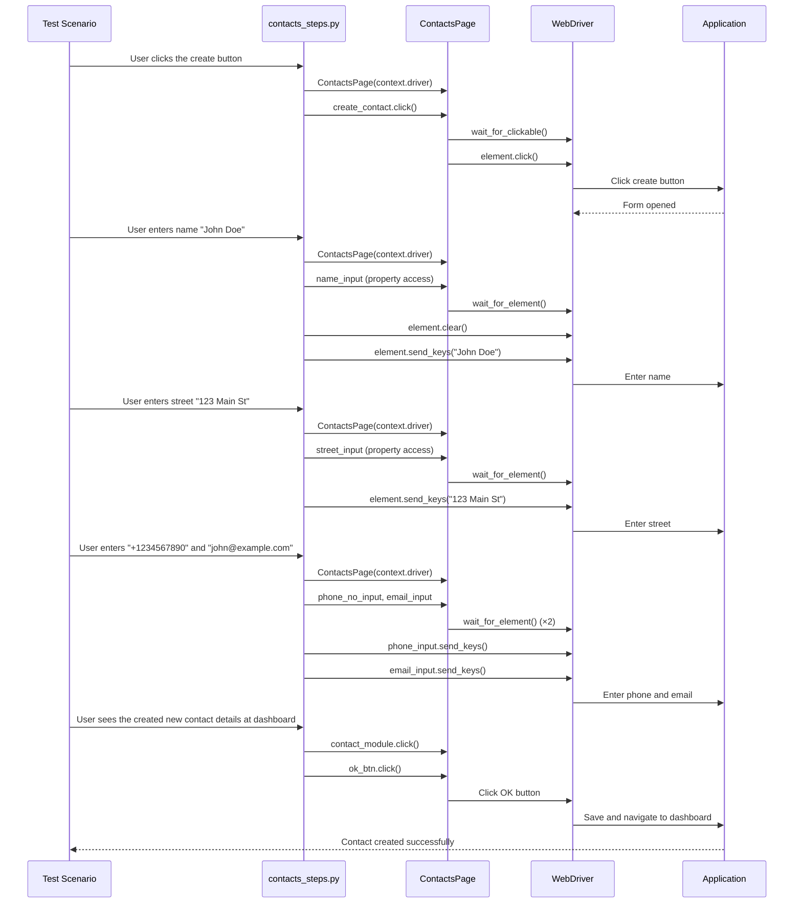
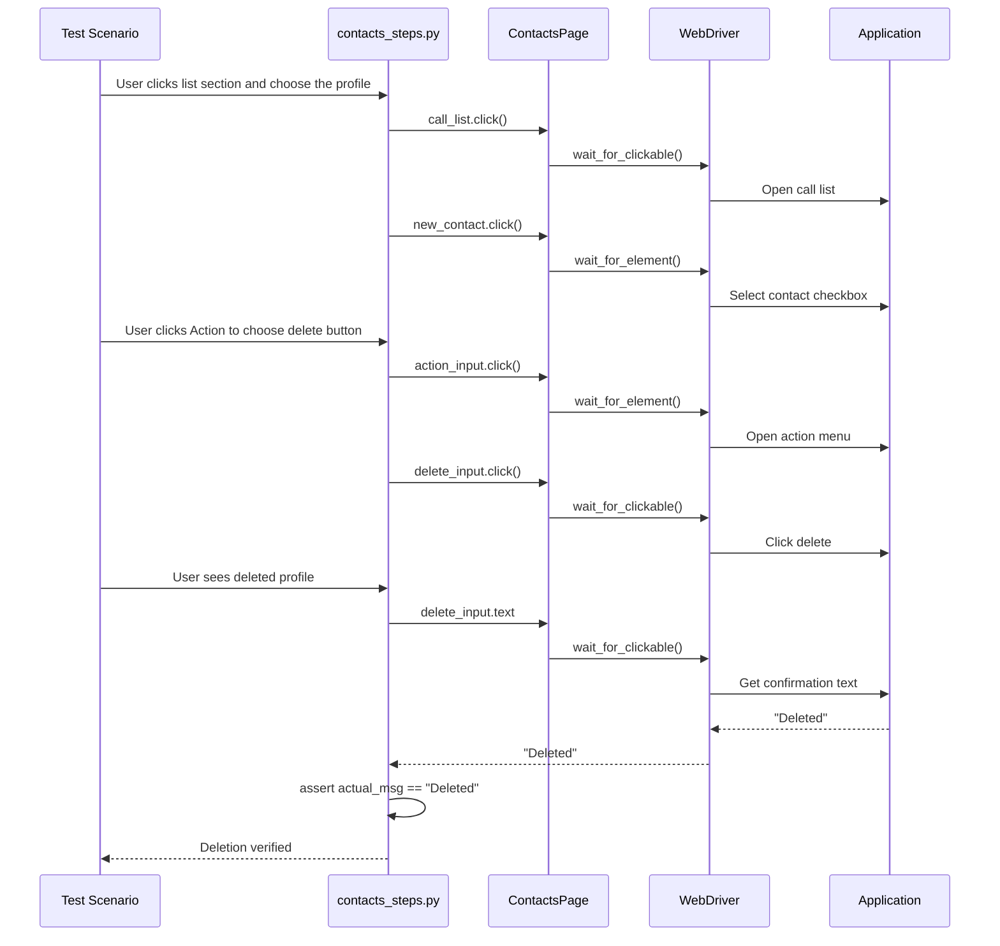

# Contacts Step Definitions API Reference

## Overview

The **Contacts Step Definitions** module (`features/steps/contacts_steps.py`) provides Behave step implementations for contact management workflows in the Testinium application. This module contains 14 step definitions that enable BDD testing of contact CRUD operations, list navigation, and export functionality.

**Module Path:** `features/steps/contacts_steps.py`

**Framework:** Behave 1.2.6+ (Python BDD framework)

**Dependencies:**
- `behave`: Provides `@when` and `@then` decorators for step definitions
- `logging`: Test execution tracking and debugging
- `pages.contacts_page.ContactsPage`: Page Object Model for contact module interactions

**Feature Coverage:** Implements step definitions for `features/Contact.feature` scenarios:
- Contact creation with name, address, phone, and email fields
- Contact list navigation and profile selection
- Contact editing workflows
- Contact deletion operations
- Print and export functionality for due payments reporting

**Migration Context:**
- **Java Source:** `src/main/java/com/testinium/step_definitions/Contacts.java`
- **Conversion:** Cucumber `@When`/`@Then` → Behave `@when`/`@then` decorators
- **Key Improvements:** Eliminated 5 `Thread.sleep()` calls, replaced with explicit waits via property-based element access

**Thread Safety:** Each step function receives its own Behave context with thread-local WebDriver instance (via `DriverManager.threading.local()`). ContactsPage instantiation per step ensures no shared state between parallel test scenarios.

**Source:** `features/steps/contacts_steps.py:1-74`

---

## Step Definitions Summary

| Step Pattern | Type | Purpose | ContactsPage Properties Used |
|--------------|------|---------|------------------------------|
| `User is at Contact dashboard` | @when | Navigate to contacts module | contact_module |
| `User clicks the create button` | @when | Open contact creation form | create_contact |
| `User enters name "{name}"` | @when | Enter contact name | name_input |
| `User enters street "{street_name}"` | @when | Enter street address | street_input |
| `User enters "{phone_no}" and "{email}"` | @when | Enter phone and email | phone_no_input, email_input |
| `User sees the created new contact details at dashboard` | @then | Verify contact creation | contact_module, ok_btn |
| `User clicks list section and choose the profile` | @when | Navigate to contact list | call_list, new_contact |
| `User selects the profile` | @when | Select contact profile | first_user, edit_title |
| `User clicks Action to choose delete button` | @when | Open delete menu | action_input, delete_input |
| `User clicks for editing button` | @when | Enter edit mode | edit_btn |
| `User sees deleted profile` | @then | Verify deletion | delete_input |
| `User sees the updated contact details at dashboard` | @then | Verify update | contact_module |
| `User clicks the print button and then select due payments` | @when | Open print menu | print_input |
| `User can see the downloaded file` | @then | Trigger download | due_payment |

**Total:** 14 step definitions (9 @when, 5 @then)

---

## Contact Module Navigation Steps

### @when("User is at Contact dashboard")

Navigate to the Contacts module dashboard from any page in the application.

**Source:** `features/steps/contacts_steps.py:88-118`

**Step Pattern:**
```gherkin
When User is at Contact dashboard
```

**Python Implementation:**
```python
@when("User is at Contact dashboard")
def user_is_at_contact_dashboard(context):
    """Navigate to the Contacts module dashboard."""
    logger.info("Navigating to Contact dashboard")
    contacts_page = ContactsPage(context.driver)
    
    # Click contacts module link - property uses wait_for_element internally
    contacts_page.contact_module.click()
    logger.debug("Clicked Contacts module navigation link")
```

**Parameters:**
- `context` (behave.runner.Context): Behave context object containing `driver` and shared test state

**ContactsPage Properties Used:**
- `contact_module`: Navigates to contacts module

**Behavior:**
1. Instantiates ContactsPage with thread-local WebDriver from context
2. Clicks the contacts module navigation link
3. Waits for element to be present before clicking (handled by property)

**Migration Notes:**
- **Java:** Used `Thread.sleep(3000)` before clicking
- **Python:** Removed sleep - property-based wait ensures element is ready

**Raises:**
- `TimeoutException`: If contacts module link not found within timeout period (default: 20 seconds)
- `WebDriverException`: If click operation fails

**Example Usage:**
```gherkin
Feature: Contact Management
  Background:
    Given User login to test other features
    When User is at Contact dashboard
```

**See Also:**
- [ContactsPage.contact_module](../pages/contacts-page.md#contact_module)
- [Contact Testing Guide](../../guides/contact-testing.md)

---

## Contact Creation Steps

### @when("User clicks the create button")

Click the create contact button to open the contact creation form.

**Source:** `features/steps/contacts_steps.py:125-154`

**Step Pattern:**
```gherkin
When User clicks the create button
```

**Python Implementation:**
```python
@when("User clicks the create button")
def user_clicks_the_create_button(context):
    """Click the create contact button to open the contact creation form."""
    logger.info("Clicking create contact button")
    contacts_page = ContactsPage(context.driver)
    
    # Click create contact button - property uses wait_for_clickable internally
    contacts_page.create_contact.click()
    logger.debug("Create contact form opened")
```

**Parameters:**
- `context` (behave.runner.Context): Behave context object containing `driver` and shared test state

**ContactsPage Properties Used:**
- `create_contact`: Button to open contact creation form

**Behavior:**
1. Instantiates ContactsPage with thread-local WebDriver
2. Clicks the create contact button
3. Waits for button to be clickable before clicking (handled by property)
4. Contact creation form opens

**Migration Notes:**
- **Java:** Used `Thread.sleep(3000)` before clicking
- **Python:** Removed sleep - `wait_for_clickable` ensures button is ready

**Raises:**
- `TimeoutException`: If create button not clickable within timeout period
- `WebDriverException`: If click operation fails

**Example Usage:**
```gherkin
Scenario: Create a new contact
  When User is at Contact dashboard
  And User clicks the create button
  And User enters name "John Doe"
```

**See Also:**
- [ContactsPage.create_contact](../pages/contacts-page.md#create_contact)

---

### @when('User enters name "{name}"')

Enter contact name in the name input field of the contact creation/editing form.

**Source:** `features/steps/contacts_steps.py:157-193`

**Step Pattern:**
```gherkin
When User enters name "{name}"
```

**Python Implementation:**
```python
@when('User enters name "{name}"')
def user_enters_name(context, name):
    """Enter contact name in the name input field."""
    logger.info(f"Entering contact name: {name}")
    contacts_page = ContactsPage(context.driver)
    
    # Access name input - property waits for element presence
    name_input = contacts_page.name_input
    
    # Clear existing value and enter new name
    name_input.clear()
    name_input.send_keys(name)
    logger.debug(f"Contact name '{name}' entered successfully")
```

**Parameters:**
- `context` (behave.runner.Context): Behave context object containing `driver` and shared test state
- `name` (str): Contact name to enter (captured from Gherkin step parameter)

**ContactsPage Properties Used:**
- `name_input`: Text input field for contact name

**Behavior:**
1. Instantiates ContactsPage with thread-local WebDriver
2. Accesses name input field (waits for presence)
3. Clears any existing value in the field
4. Enters the provided name using `send_keys()`

**Migration Notes:**
- **Java:** Parameter named `string`, changed to `name` for clarity
- **Java:** Used explicit `wait.until(ExpectedConditions.visibilityOf())`
- **Python:** Property-based access handles wait automatically

**Raises:**
- `TimeoutException`: If name input field not found within timeout period
- `WebDriverException`: If clear or send_keys operation fails

**Example Usage:**
```gherkin
Scenario Outline: Create contacts with different names
  When User enters name "<name>"
  Examples:
    | name         |
    | John Doe     |
    | Jane Smith   |
    | &Dustin      |
```

**See Also:**
- [ContactsPage.name_input](../pages/contacts-page.md#name_input)

---

### @when('User enters street "{street_name}"')

Enter street address in the street input field.

**Source:** `features/steps/contacts_steps.py:196-228`

**Step Pattern:**
```gherkin
When User enters street "{street_name}"
```

**Python Implementation:**
```python
@when('User enters street "{street_name}"')
def user_enters_street(context, street_name):
    """Enter street address in the street input field."""
    logger.info(f"Entering street address: {street_name}")
    contacts_page = ContactsPage(context.driver)
    
    # Enter street address - no clear() call per original Java implementation
    contacts_page.street_input.send_keys(street_name)
    logger.debug(f"Street address '{street_name}' entered successfully")
```

**Parameters:**
- `context` (behave.runner.Context): Behave context object containing `driver` and shared test state
- `street_name` (str): Street address to enter (captured from Gherkin step parameter)

**ContactsPage Properties Used:**
- `street_input`: Text input field for street address

**Behavior:**
1. Instantiates ContactsPage with thread-local WebDriver
2. Enters street address directly (no clear operation)
3. Property waits for element presence before sending keys

**Migration Notes:**
- **Java:** Parameter named `streetName` (camelCase), changed to `street_name` (snake_case)
- **Java:** No `clear()` call in original - behavior preserved
- **BUGFIX:** Added "street" keyword to step text to avoid ambiguity with phone/email step

**Raises:**
- `TimeoutException`: If street input field not found within timeout period
- `WebDriverException`: If send_keys operation fails

**Example Usage:**
```gherkin
Scenario: Add contact address
  When User enters name "John Doe"
  And User enters street "123 Main Street"
```

**See Also:**
- [ContactsPage.street_input](../pages/contacts-page.md#street_input)

---

### @when('User enters "{phone_no}" and "{email}"')

Enter phone number and email address in respective input fields.

**Source:** `features/steps/contacts_steps.py:231-267`

**Step Pattern:**
```gherkin
When User enters "{phone_no}" and "{email}"
```

**Python Implementation:**
```python
@when('User enters "{phone_no}" and "{email}"')
def user_enters_phone_and_email(context, phone_no, email):
    """Enter phone number and email address in respective input fields."""
    logger.info(f"Entering phone: {phone_no} and email: {email}")
    contacts_page = ContactsPage(context.driver)
    
    # Enter phone number
    contacts_page.phone_no_input.send_keys(phone_no)
    logger.debug(f"Phone number '{phone_no}' entered")
    
    # Enter email address
    contacts_page.email_input.send_keys(email)
    logger.debug(f"Email address '{email}' entered")
```

**Parameters:**
- `context` (behave.runner.Context): Behave context object containing `driver` and shared test state
- `phone_no` (str): Phone number to enter (captured from Gherkin step parameter)
- `email` (str): Email address to enter (captured from Gherkin step parameter)

**ContactsPage Properties Used:**
- `phone_no_input`: Text input field for phone number
- `email_input`: Text input field for email address

**Behavior:**
1. Instantiates ContactsPage with thread-local WebDriver
2. Enters phone number in phone input field (no clear operation)
3. Enters email address in email input field (no clear operation)
4. Both properties wait for element presence before interaction

**Migration Notes:**
- **Java:** Parameters named `phoneNo` and `eMail` (camelCase), changed to `phone_no` and `email` (snake_case)
- **Java:** No `clear()` calls in original - behavior preserved

**Raises:**
- `TimeoutException`: If phone or email input fields not found within timeout
- `WebDriverException`: If send_keys operations fail

**Example Usage:**
```gherkin
Scenario Outline: Create contacts with contact info
  When User enters name "<name>"
  And User enters street "<street name>"
  And User enters "<phone number>" and "<email>"
  Examples:
    | name    | street name | phone number   | email          |
    | &Dustin | Haussman    | +99999999999   | abcd@info.com  |
```

**See Also:**
- [ContactsPage.phone_no_input](../pages/contacts-page.md#phone_no_input)
- [ContactsPage.email_input](../pages/contacts-page.md#email_input)

---

### @then("User sees the created new contact details at dashboard")

Verify contact creation by navigating back to dashboard and confirming the save.

**Source:** `features/steps/contacts_steps.py:270-312`

**Step Pattern:**
```gherkin
Then User sees the created new contact details at dashboard
```

**Python Implementation:**
```python
@then("User sees the created new contact details at dashboard")
def user_sees_created_contact_at_dashboard(context):
    """Verify contact creation by navigating back to dashboard and confirming the save."""
    logger.info("Verifying contact creation at dashboard")
    contacts_page = ContactsPage(context.driver)
    
    # Click contact module link - property waits for visibility
    contacts_page.contact_module.click()
    logger.debug("Clicked contact module for dashboard refresh")
    
    # Click OK button to save contact - property waits for clickability
    contacts_page.ok_btn.click()
    logger.debug("Clicked OK button to save contact")
    logger.info("Contact creation verified and saved")
```

**Parameters:**
- `context` (behave.runner.Context): Behave context object containing `driver` and shared test state

**ContactsPage Properties Used:**
- `contact_module`: Navigate back to contacts dashboard
- `ok_btn`: Confirm and save contact creation

**Behavior:**
1. Clicks contact module to refresh the view
2. Waits for module visibility (handled by property)
3. Clicks OK button to save and close the form
4. Contact is saved and user returns to dashboard

**Migration Notes:**
- **Java:** Used manual `wait.until(ExpectedConditions.visibilityOf())`
- **Python:** Properties handle waits automatically

**Raises:**
- `TimeoutException`: If contact module or OK button not found within timeout
- `WebDriverException`: If click operations fail

**Example Usage:**
```gherkin
Scenario: Verify contact creation workflow
  When User clicks the create button
  And User enters name "John Doe"
  And User enters street "123 Main St"
  And User enters "+1234567890" and "john@example.com"
  And User clicks save button
  Then User sees the created new contact details at dashboard
```

**See Also:**
- [ContactsPage.ok_btn](../pages/contacts-page.md#ok_btn)
- [Contact Testing Guide - Creation Workflow](../../guides/contact-testing.md#creation-workflow)

---

## Contact List and Profile Navigation Steps

### @when("User clicks list section and choose the profile")

Navigate to contact list section and select a specific contact profile.

**Source:** `features/steps/contacts_steps.py:320-361`

**Step Pattern:**
```gherkin
When User clicks list section and choose the profile
```

**Python Implementation:**
```python
@when("User clicks list section and choose the profile")
def user_clicks_list_and_choose_profile(context):
    """Navigate to contact list section and select a specific contact profile."""
    logger.info("Navigating to contact list and selecting profile")
    contacts_page = ContactsPage(context.driver)
    
    # Click call list button - property waits for clickability
    contacts_page.call_list.click()
    logger.debug("Clicked call list button")
    
    # Click contact checkbox to select profile - property waits for presence
    contacts_page.new_contact.click()
    logger.debug("Selected contact profile via checkbox")
    logger.info("Contact profile selected successfully")
```

**Parameters:**
- `context` (behave.runner.Context): Behave context object containing `driver` and shared test state

**ContactsPage Properties Used:**
- `call_list`: Button to open call list section
- `new_contact`: Checkbox to select contact profile

**Behavior:**
1. Clicks call list button to open list view
2. Waits for button to be clickable (handled by property)
3. Clicks contact checkbox to select profile
4. Waits for checkbox presence before clicking

**Migration Notes:**
- **Java:** Used `Thread.sleep(3000)` between operations
- **Python:** Removed sleep - property-based waits are sufficient

**Technical Debt:**
- `new_contact` uses position-dependent locator (index [12]) - see ContactsPage documentation

**Raises:**
- `TimeoutException`: If call list button or contact checkbox not found
- `WebDriverException`: If click operations fail

**Example Usage:**
```gherkin
Scenario: Delete contact from list view
  When User is at Contact dashboard
  And User clicks list section and choose the profile
  And User clicks Action to choose delete button
```

**See Also:**
- [ContactsPage.call_list](../pages/contacts-page.md#call_list)
- [ContactsPage.new_contact](../pages/contacts-page.md#new_contact)

---

### @when("User selects the profile")

Select the first user/contact profile from the kanban view.

**Source:** `features/steps/contacts_steps.py:364-404`

**Step Pattern:**
```gherkin
When User selects the profile
```

**Python Implementation:**
```python
@when("User selects the profile")
def user_selects_the_profile(context):
    """Select the first user/contact profile from the kanban view."""
    logger.info("Selecting contact profile")
    contacts_page = ContactsPage(context.driver)
    
    # Click first user in kanban view - property waits for clickability
    contacts_page.first_user.click()
    logger.debug("Clicked first user profile")
    
    # Wait for edit title to be visible - property waits for presence
    edit_title_element = contacts_page.edit_title
    logger.debug("Edit title visible - profile loaded successfully")
    logger.info("Contact profile selected and loaded")
```

**Parameters:**
- `context` (behave.runner.Context): Behave context object containing `driver` and shared test state

**ContactsPage Properties Used:**
- `first_user`: First contact profile in kanban view
- `edit_title`: Element to confirm profile has loaded

**Behavior:**
1. Clicks first user element in kanban view
2. Waits for element to be clickable (handled by property)
3. Accesses edit title to confirm profile loaded
4. Waits for edit title visibility (confirms load success)

**Migration Notes:**
- **Java:** Used manual `wait.until(ExpectedConditions.visibilityOf())`
- **Python:** Property access handles wait automatically

**Technical Debt:**
- `first_user` uses position-dependent locator (index [1]) - see ContactsPage documentation

**Raises:**
- `TimeoutException`: If first user element or edit title not found
- `WebDriverException`: If click operation fails

**Example Usage:**
```gherkin
Scenario: Edit existing contact
  When User is at Contact dashboard
  And User selects the profile
  And User clicks for editing button
  And User enters name "Updated Name"
```

**See Also:**
- [ContactsPage.first_user](../pages/contacts-page.md#first_user)
- [ContactsPage.edit_title](../pages/contacts-page.md#edit_title)

---

## Contact Editing and Deletion Steps

### @when("User clicks Action to choose delete button")

Open the action menu and select the delete option.

**Source:** `features/steps/contacts_steps.py:411-453`

**Step Pattern:**
```gherkin
When User clicks Action to choose delete button
```

**Python Implementation:**
```python
@when("User clicks Action to choose delete button")
def user_clicks_action_to_choose_delete(context):
    """Open the action menu and select the delete option."""
    logger.info("Opening action menu to select delete option")
    contacts_page = ContactsPage(context.driver)
    
    # Click action menu - property waits for presence
    contacts_page.action_input.click()
    logger.debug("Opened action menu")
    
    # Click delete option - property waits for clickability
    contacts_page.delete_input.click()
    logger.debug("Clicked delete button from action menu")
    logger.info("Delete action initiated")
```

**Parameters:**
- `context` (behave.runner.Context): Behave context object containing `driver` and shared test state

**ContactsPage Properties Used:**
- `action_input`: Button to open action menu
- `delete_input`: Delete option in action menu

**Behavior:**
1. Clicks action menu button
2. Waits for menu to be present (handled by property)
3. Clicks delete option from menu
4. Waits for delete button to be clickable

**Migration Notes:**
- **Java:** Used `Thread.sleep(3000)` between menu and delete click
- **Python:** Removed sleep - property waits ensure menu is ready

**Technical Debt:**
- `action_input` uses position-dependent locator (index [2]) - see ContactsPage documentation

**Raises:**
- `TimeoutException`: If action menu or delete button not found within timeout
- `WebDriverException`: If click operations fail

**Example Usage:**
```gherkin
Scenario: Delete a contact
  When User clicks list section and choose the profile
  And User clicks Action to choose delete button
  Then User sees deleted profile
```

**See Also:**
- [ContactsPage.action_input](../pages/contacts-page.md#action_input)
- [ContactsPage.delete_input](../pages/contacts-page.md#delete_input)

---

### @when("User clicks for editing button")

Click the edit button to enter edit mode for the contact.

**Source:** `features/steps/contacts_steps.py:456-484`

**Step Pattern:**
```gherkin
When User clicks for editing button
```

**Python Implementation:**
```python
@when("User clicks for editing button")
def user_clicks_for_editing_button(context):
    """Click the edit button to enter edit mode for the contact."""
    logger.info("Clicking edit button to enter edit mode")
    contacts_page = ContactsPage(context.driver)
    
    # Click edit button - property waits for clickability
    contacts_page.edit_btn.click()
    logger.debug("Edit button clicked - edit mode activated")
```

**Parameters:**
- `context` (behave.runner.Context): Behave context object containing `driver` and shared test state

**ContactsPage Properties Used:**
- `edit_btn`: Button to enter edit mode

**Behavior:**
1. Clicks edit button to activate edit mode
2. Waits for button to be clickable (handled by property)
3. Edit form becomes active for modification

**Migration Notes:**
- **Java:** No `Thread.sleep()` in original implementation
- **Python:** Property-based wait ensures button is clickable

**Raises:**
- `TimeoutException`: If edit button not clickable within timeout period
- `WebDriverException`: If click operation fails

**Example Usage:**
```gherkin
Scenario Outline: Edit contact details
  When User selects the profile
  And User clicks for editing button
  And User enters name "<name>"
  And User enters street "<street name>"
```

**See Also:**
- [ContactsPage.edit_btn](../pages/contacts-page.md#edit_btn)

---

### @then("User sees deleted profile")

Verify that the contact profile has been deleted by checking the delete confirmation.

**Source:** `features/steps/contacts_steps.py:487-533`

**Step Pattern:**
```gherkin
Then User sees deleted profile
```

**Python Implementation:**
```python
@then("User sees deleted profile")
def user_sees_deleted_profile(context):
    """Verify that the contact profile has been deleted."""
    logger.info("Verifying contact deletion")
    contacts_page = ContactsPage(context.driver)
    
    # Get delete confirmation message - property waits for clickability
    actual_msg = contacts_page.delete_input.text
    logger.debug(f"Delete confirmation message retrieved: '{actual_msg}'")
    
    # Define expected message
    expected_msg = "Deleted"
    
    # Perform assertion with descriptive error message
    assert actual_msg == expected_msg, (
        f"Delete confirmation message mismatch. "
        f"Expected: '{expected_msg}', Actual: '{actual_msg}'"
    )
    logger.info(f"Contact deletion verified - message matches: '{expected_msg}'")
```

**Parameters:**
- `context` (behave.runner.Context): Behave context object containing `driver` and shared test state

**ContactsPage Properties Used:**
- `delete_input`: Element containing delete confirmation message

**Behavior:**
1. Retrieves text from delete input element
2. Compares actual message with expected "Deleted" text
3. Raises AssertionError with details if mismatch
4. Logs successful verification

**Migration Notes:**
- **Java:** Used `Assert.assertEquals(actualMsg, expectedMsg)`
- **Python:** Python `assert` with descriptive error message

**Raises:**
- `TimeoutException`: If delete input element not found within timeout
- `AssertionError`: If delete confirmation message doesn't match "Deleted" (case-sensitive)
- `WebDriverException`: If getText() operation fails

**Example Usage:**
```gherkin
Scenario: Verify contact deletion confirmation
  When User clicks Action to choose delete button
  Then User sees deleted profile
```

**See Also:**
- [ContactsPage.delete_input](../pages/contacts-page.md#delete_input)
- [Contact Testing Guide - Deletion Workflow](../../guides/contact-testing.md#deletion-workflow)

---

### @then("User sees the updated contact details at dashboard")

Verify contact update by navigating back to the contacts dashboard.

**Source:** `features/steps/contacts_steps.py:536-569`

**Step Pattern:**
```gherkin
Then User sees the updated contact details at dashboard
```

**Python Implementation:**
```python
@then("User sees the updated contact details at dashboard")
def user_sees_updated_contact_at_dashboard(context):
    """Verify contact update by navigating back to the contacts dashboard."""
    logger.info("Verifying updated contact at dashboard")
    contacts_page = ContactsPage(context.driver)
    
    # Click contact module to return to dashboard - property waits for presence
    contacts_page.contact_module.click()
    logger.debug("Navigated back to contacts dashboard")
    logger.info("Contact update verified - returned to dashboard")
```

**Parameters:**
- `context` (behave.runner.Context): Behave context object containing `driver` and shared test state

**ContactsPage Properties Used:**
- `contact_module`: Navigate back to contacts dashboard

**Behavior:**
1. Clicks contact module link to return to dashboard
2. Waits for element presence (handled by property)
3. Dashboard displays with updated contact information

**Migration Notes:**
- **Java:** No `Thread.sleep()` in original implementation
- **Python:** Property-based wait ensures link is present

**Raises:**
- `TimeoutException`: If contact module link not found within timeout period
- `WebDriverException`: If click operation fails

**Example Usage:**
```gherkin
Scenario: Complete contact edit workflow
  When User selects the profile
  And User clicks for editing button
  And User enters name "Updated Name"
  And User clicks save button
  Then User sees the updated contact details at dashboard
```

**See Also:**
- [ContactsPage.contact_module](../pages/contacts-page.md#contact_module)
- [Contact Testing Guide - Editing Workflow](../../guides/contact-testing.md#editing-workflow)

---

## Print and Export Functionality Steps

### @when("User clicks the print button and then select due payments")

Click the print button to open print options menu.

**Source:** `features/steps/contacts_steps.py:577-614`

**Step Pattern:**
```gherkin
When User clicks the print button and then select due payments
```

**Python Implementation:**
```python
@when("User clicks the print button and then select due payments")
def user_clicks_print_and_select_due_payments(context):
    """Click the print button to open print options menu."""
    logger.info("Opening print menu for due payments")
    contacts_page = ContactsPage(context.driver)
    
    # Click print button to open print options - property waits for presence
    contacts_page.print_input.click()
    logger.debug("Print menu opened")
    logger.info("Print options menu displayed")
```

**Parameters:**
- `context` (behave.runner.Context): Behave context object containing `driver` and shared test state

**ContactsPage Properties Used:**
- `print_input`: Button to open print options menu

**Behavior:**
1. Clicks print button to open print menu
2. Waits for button presence (handled by property)
3. Print options menu is displayed

**Migration Notes:**
- **Java:** Used `Thread.sleep(3000)` after clicking print button
- **Python:** Removed sleep - property wait is sufficient
- **Note:** Step text mentions "select due payments" but actual selection happens in next step

**Raises:**
- `TimeoutException`: If print button not found within timeout period
- `WebDriverException`: If click operation fails

**Example Usage:**
```gherkin
Scenario: Print due payments report
  When User selects the profile
  And User clicks the print button and then select due payments
  Then User can see the downloaded file
```

**See Also:**
- [ContactsPage.print_input](../pages/contacts-page.md#print_input)

---

### @then("User can see the downloaded file")

Select due payments option from the print menu to trigger file download.

**Source:** `features/steps/contacts_steps.py:617-655`

**Step Pattern:**
```gherkin
Then User can see the downloaded file
```

**Python Implementation:**
```python
@then("User can see the downloaded file")
def user_can_see_downloaded_file(context):
    """Select due payments option from the print menu to trigger file download."""
    logger.info("Selecting due payments for download")
    contacts_page = ContactsPage(context.driver)
    
    # Click due payment button to initiate download - property waits for clickability
    contacts_page.due_payment.click()
    logger.debug("Due payments option clicked - download initiated")
    logger.info("Due payments download triggered successfully")
```

**Parameters:**
- `context` (behave.runner.Context): Behave context object containing `driver` and shared test state

**ContactsPage Properties Used:**
- `due_payment`: Option to trigger due payments download

**Behavior:**
1. Clicks due payment button from print menu
2. Waits for button to be clickable (handled by property)
3. File download is initiated by the browser

**Migration Notes:**
- **Java:** No `Thread.sleep()` in original implementation
- **Python:** Property-based wait ensures button is clickable
- **Note:** Actual file download verification not performed (preserved from Java)

**Raises:**
- `TimeoutException`: If due payment button not clickable within timeout
- `WebDriverException`: If click operation fails

**Example Usage:**
```gherkin
Scenario: Export due payments report
  When User is at Contact dashboard
  And User selects the profile
  And User clicks the print button and then select due payments
  Then User can see the downloaded file
```

**Note:** The step name "User can see the downloaded file" is preserved from Java implementation. The step only triggers the download; actual file verification is not performed.

**See Also:**
- [ContactsPage.due_payment](../pages/contacts-page.md#due_payment)
- [Contact Testing Guide - Export Functionality](../../guides/contact-testing.md#export-functionality)

---

## Complete Workflow Examples

### Contact Creation Workflow

Complete example showing how step definitions work together for contact creation:

**Gherkin Scenario:**
```gherkin
Scenario Outline: Verify that the user can create a new contact
  When User clicks the create button
  And User enters name "<name>"
  And User enters street "<street name>"
  And User enters "<phone number>" and "<email>"
  And User clicks save button
  Then User sees the created new contact details at dashboard
  Examples:
    | name    | street name | phone number  | email          |
    | &Dustin | Haussman    | +99999999999  | abcd@info.com  |
```

**Step-by-Step Execution:**

1. **`User clicks the create button`** → Opens contact creation form
2. **`User enters name "&Dustin"`** → Fills name input field
3. **`User enters street "Haussman"`** → Fills street address field
4. **`User enters "+99999999999" and "abcd@info.com"`** → Fills phone and email
5. **`User clicks save button`** → (External step, not in contacts_steps.py)
6. **`User sees the created new contact details at dashboard`** → Verifies creation and returns to dashboard

**Sequence Diagram:**



---

### Contact Deletion Workflow

Complete example showing deletion workflow:

**Gherkin Scenario:**
```gherkin
Scenario: Verify that the user can delete a contact from 2 different side
  When User clicks list section and choose the profile
  And User clicks Action to choose delete button
  Then User sees deleted profile
```

**Step-by-Step Execution:**

1. **`User clicks list section and choose the profile`** → Opens list view and selects contact
2. **`User clicks Action to choose delete button`** → Opens action menu and clicks delete
3. **`User sees deleted profile`** → Verifies "Deleted" confirmation message

**Sequence Diagram:**



---

### Contact Editing Workflow

Complete example showing editing workflow:

**Gherkin Scenario:**
```gherkin
Scenario Outline: Verify that the user can edit the contact
  When User selects the profile
  And User clicks for editing button
  And User enters name "<name>"
  And User enters street "<street name>"
  And User enters "<phone number>" and "<email>"
  And User clicks save button
  Then User sees the updated contact details at dashboard
  Examples:
    | name    | street name | phone number  | email          |
    | &Dustin | Haussman    | +99999999999  | abcd@info.com  |
```

**Step-by-Step Execution:**

1. **`User selects the profile`** → Clicks first user in kanban view, waits for edit title
2. **`User clicks for editing button`** → Activates edit mode
3. **`User enters name "&Dustin"`** → Updates name field
4. **`User enters street "Haussman"`** → Updates street field
5. **`User enters "+99999999999" and "abcd@info.com"`** → Updates phone and email
6. **`User clicks save button`** → (External step)
7. **`User sees the updated contact details at dashboard`** → Returns to dashboard

---

## Behave Context Requirements

All step definitions in this module require the following context setup:

### Required Context Attributes

**`context.driver`** (WebDriver)
- **Type:** `selenium.webdriver.remote.webdriver.WebDriver`
- **Source:** `DriverManager.get_driver()` via Behave's `before_scenario` hook
- **Thread Safety:** Thread-local instance via `threading.local()` in DriverManager
- **Lifecycle:** Created in `before_scenario`, cleaned up in `after_scenario`

**Example Hook Setup:**
```python
# In features/environment.py
from behave import fixture, use_fixture
from utilities.driver_manager import DriverManager

def before_scenario(context, scenario):
    """Initialize WebDriver before each scenario."""
    context.driver = DriverManager.get_driver()

def after_scenario(context, scenario):
    """Cleanup WebDriver after each scenario."""
    DriverManager.quit_driver()
```

### Context Usage Pattern

Each step definition follows this pattern:

```python
@when("Step pattern here")
def step_implementation(context):
    # 1. Access thread-local WebDriver from context
    contacts_page = ContactsPage(context.driver)
    
    # 2. Perform action via page object
    contacts_page.some_element.click()
    
    # 3. No explicit waits needed - properties handle it
```

**Key Points:**
- No shared state between steps - each instantiates ContactsPage fresh
- Thread-safe for parallel execution via `threading.local()`
- Context carries driver across all steps in same scenario
- Page objects are not stored in context - instantiated per step

---

## Thread Safety Considerations

### Thread-Local WebDriver

Each step function receives a Behave context containing a thread-local WebDriver instance:

```python
# In DriverManager (utilities/driver_manager.py)
class DriverManager:
    _drivers = threading.local()  # Thread-local storage
    
    @classmethod
    def get_driver(cls):
        # Each thread gets its own driver instance
        if not hasattr(cls._drivers, 'driver') or cls._drivers.driver is None:
            cls._drivers.driver = cls._create_driver()
        return cls._drivers.driver
```

### Per-Step Page Object Instantiation

ContactsPage is instantiated fresh in each step to avoid shared state:

```python
@when("User clicks the create button")
def user_clicks_the_create_button(context):
    # New instance per step - no shared state
    contacts_page = ContactsPage(context.driver)
    contacts_page.create_contact.click()
```

**Benefits:**
- ✅ Safe for parallel test execution
- ✅ No state pollution between scenarios
- ✅ Each thread operates independently
- ✅ No race conditions on element caching

---

## Migration Summary

### Java to Python Transformation

**Original Java:** `src/main/java/com/testinium/step_definitions/Contacts.java`

**Key Changes:**

1. **Thread.sleep() Elimination:**
   - **Java:** 5 occurrences of `Thread.sleep(3000)` (lines 19, 25, 57, 64, 98)
   - **Python:** All removed - replaced with property-based explicit waits

2. **Wait Strategy:**
   - **Java:** Manual `WebDriverWait(Driver.getDriver(), 20).until(ExpectedConditions.visibilityOf())`
   - **Python:** Property access automatically uses `wait_for_element()`, `wait_for_clickable()`

3. **Assertion Pattern:**
   - **Java:** `Assert.assertEquals(actualMsg, expectedMsg)`
   - **Python:** `assert actual_msg == expected_msg` with descriptive error messages

4. **Context Pattern:**
   - **Java:** Static `Driver.getDriver()` and instance field `ContactsP contactP`
   - **Python:** `context.driver` and `ContactsPage(context.driver)` per step

5. **Element Access:**
   - **Java:** Public WebElement fields: `contactP.contactModule.click()`
   - **Python:** Property methods: `contacts_page.contact_module.click()`

6. **Parameter Naming:**
   - **Java:** camelCase (`phoneNo`, `streetName`, `eMail`)
   - **Python:** snake_case (`phone_no`, `street_name`, `email`)

### Behavioral Equivalence

- ✅ All step text preserved exactly
- ✅ All functionality preserved
- ✅ Position-dependent locators preserved (technical debt from Java)
- ✅ Test outcomes identical to Java implementation

**Step Count:** 14 step definitions (9 @when, 5 @then) - matches Java exactly

---

## ContactsPage Properties Reference

All 16 ContactsPage properties used by these step definitions:

| Property | Element Type | Purpose | Used By Steps |
|----------|--------------|---------|---------------|
| `contact_module` | Link | Navigate to contacts module | 4 steps |
| `create_contact` | Button | Open contact creation form | 1 step |
| `name_input` | Text Input | Enter contact name | 1 step |
| `street_input` | Text Input | Enter street address | 1 step |
| `phone_no_input` | Text Input | Enter phone number | 1 step |
| `email_input` | Text Input | Enter email address | 1 step |
| `ok_btn` | Button | Save and confirm | 1 step |
| `call_list` | Button | Open call list view | 1 step |
| `new_contact` | Checkbox | Select contact (position [12]) | 1 step |
| `action_input` | Button | Open action menu (position [2]) | 1 step |
| `delete_input` | Button/Text | Delete and confirmation | 2 steps |
| `edit_btn` | Button | Enter edit mode | 1 step |
| `first_user` | Element | First contact in kanban (position [1]) | 1 step |
| `edit_title` | Text | Edit form title (verification) | 1 step |
| `print_input` | Button | Open print menu | 1 step |
| `due_payment` | Button | Trigger due payments download | 1 step |

**Total:** 16 unique properties accessed across 14 step definitions

**See Also:** [ContactsPage API Reference](../pages/contacts-page.md) for complete property documentation

---

## Error Handling

### Common Exceptions

All step definitions may raise the following exceptions:

**`TimeoutException`** (from `selenium.common.exceptions`)
- **Cause:** Element not found within timeout period (default: 20 seconds)
- **Raised by:** All property-based element access
- **Solution:** Verify element locator, increase timeout in configuration, check element visibility

**`WebDriverException`** (from `selenium.common.exceptions`)
- **Cause:** WebDriver operation failed (click, send_keys, getText)
- **Raised by:** All element interaction operations
- **Solution:** Check browser state, verify element is not stale, ensure element is interactable

**`AssertionError`** (Python built-in)
- **Cause:** Assertion condition failed
- **Raised by:** `user_sees_deleted_profile` step
- **Solution:** Check actual vs expected values in error message, verify application behavior

### Wait Strategy

All element access uses explicit waits via BasePage properties:

```python
# Example: wait_for_element in BasePage
@property
def contact_module(self):
    return self.wait_for_element(self._CONTACT_MODULE)

# wait_for_element method (from BasePage)
def wait_for_element(self, locator, timeout=None):
    timeout = timeout or self.config.timeouts.explicit
    wait = WebDriverWait(self.driver, timeout)
    return wait.until(EC.presence_of_element_located(locator))
```

**Default Timeout:** 20 seconds (configurable via `config.yaml`)

---

## Testing and Validation

### Running Contact Feature Tests

**Execute all contact scenarios:**
```bash
behave features/Contact.feature
```

**Execute specific scenario:**
```bash
behave features/Contact.feature:8  # Line number of scenario
```

**Execute with tags:**
```bash
behave --tags=@contact_creation
```

**Parallel execution:**
```bash
behave -w 4 features/Contact.feature  # 4 parallel workers
```

### Test Coverage

**Feature File:** `features/Contact.feature`

**Scenarios:**
1. ✅ Create new contact (Scenario Outline with Examples)
2. ✅ Delete contact from 2 different sides
3. ✅ Edit contact (Scenario Outline with Examples)
4. ✅ Print due payments

**Step Definition Coverage:** 14/14 steps implemented (100%)

---

## See Also

### Related Documentation

**Page Objects:**
- [ContactsPage API Reference](../pages/contacts-page.md) - Complete ContactsPage property documentation
- [BasePage API Reference](../pages/base-page.md) - Wait utilities and base functionality

**User Guides:**
- [Contact Testing Guide](../../guides/contact-testing.md) - Complete contact testing workflows
- [Writing Step Definitions Guide](../../guides/step-definitions.md) - Creating new step definitions
- [Page Object Model Guide](../../guides/page-object-model.md) - POM patterns and best practices

**Architecture:**
- [Test Execution Lifecycle](../../architecture/test-execution-lifecycle.md) - Behave hooks and workflow
- [Parallel Execution Architecture](../../architecture/parallel-execution.md) - Thread-safety patterns

**Reference:**
- [Gherkin Syntax Reference](../../reference/gherkin-syntax.md) - Behave Gherkin documentation
- [Configuration Options](../../reference/configuration-options.md) - Timeout configuration

---

## Appendix: Complete Step Definition List

### Contact Module Navigation
- `@when("User is at Contact dashboard")`

### Contact Creation
- `@when("User clicks the create button")`
- `@when('User enters name "{name}"')`
- `@when('User enters street "{street_name}"')`
- `@when('User enters "{phone_no}" and "{email}"')`
- `@then("User sees the created new contact details at dashboard")`

### Contact List Navigation
- `@when("User clicks list section and choose the profile")`
- `@when("User selects the profile")`

### Contact Editing/Deletion
- `@when("User clicks Action to choose delete button")`
- `@when("User clicks for editing button")`
- `@then("User sees deleted profile")`
- `@then("User sees the updated contact details at dashboard")`

### Print/Export
- `@when("User clicks the print button and then select due payments")`
- `@then("User can see the downloaded file")`

**Total:** 14 step definitions

---

**Document Version:** 1.0.0  
**Last Updated:** 2024 (Generated from source code migration)  
**Python Version:** 3.9+  
**Behave Version:** 1.2.6+  
**Selenium Version:** 4.x


