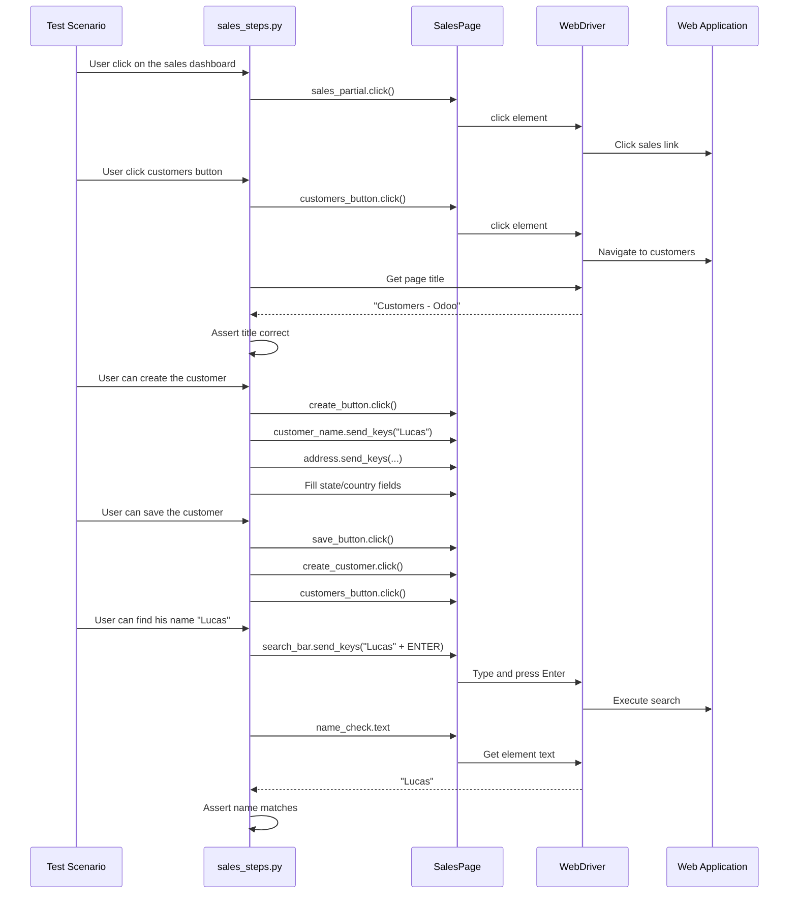
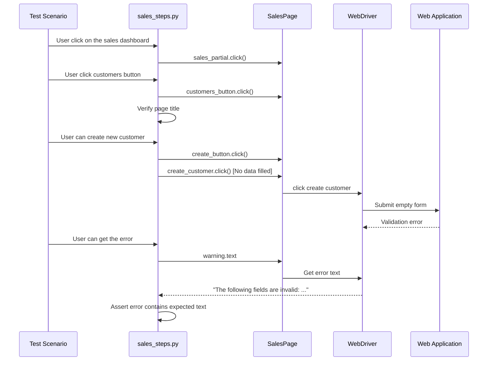

# Sales Step Definitions API Reference

## Overview

The **sales_steps** module provides Behave step definitions for sales and customer management operations in the test automation framework. This module implements BDD steps for customer lifecycle workflows including dashboard navigation, customer creation with address/state/country fields, customer search functionality, and validation error handling.

**Module:** `features/steps/sales_steps.py`

**Purpose:** Implement Gherkin step definitions for sales order and customer management test scenarios

**Step Count:** 8 step definitions (5 @when, 2 @then, 1 @step)

**Key Features:**
- Sales dashboard navigation
- Customer creation workflows with multi-field forms
- Customer save and list operations
- Customer search with keyboard interactions (Enter key)
- Validation error handling for incomplete data
- Title verification for Customers module

**Source:** `features/steps/sales_steps.py`

---

## Migration Context

**Converted from:** `Sales.java` (Cucumber step definitions)

**Key Changes from Java Implementation:**
1. Replaced Cucumber `@When/@Then/@And` with Behave `@when/@then/@step` decorators
2. Converted `SalesP salesp` instance to `sales_page = SalesPage(context.driver)` pattern
3. Replaced `WebDriverWait(Driver.getDriver(), 4)` with context-based utilities from BasePage
4. Replaced `Assert.assertEquals()` with Python `assert` statements with descriptive messages
5. Removed `System.out.println` debug logging, added structured `logging` framework
6. **CRITICAL FIX:** Added missing assertions where Java code only printed values without asserting
7. Implemented `Keys.ENTER` keyboard interaction for search functionality
8. Removed `InterruptedException` declarations (not needed in Python)

**Technical Debt from Java Source:**
- Hardcoded customer data ("Lucas", "1 boulevard auguste rodin 75000", "Albania", "78") maintained for behavioral equivalence
- Recommend Faker integration or parameterized data in future enhancement

---

## Design Patterns

**Context Pattern:** Uses Behave's `Context` object for sharing WebDriver and state across steps

**Page Object Model:** Delegates all element interactions to `SalesPage` class

**Property-Based Locators:** SalesPage provides fresh element references via `@property` decorators

**Explicit Waits:** All waits handled by BasePage utilities (inherited by SalesPage)

**Structured Logging:** Python `logging` module for test diagnostics and debugging

---

## Dependencies

**Imports:**
```python
import logging
from behave import when, then, step
from selenium.webdriver.common.keys import Keys
from pages.sales_page import SalesPage
```

**Page Objects Used:**
- `SalesPage` - Sales and customer management page interactions

**External Dependencies:**
- `behave` - BDD test framework decorators
- `selenium.webdriver.common.keys` - Keyboard interaction constants

---

## Step Definitions

### @when: User click on the sales dashboard

```python
@when('User click on the sales dashboard')
def user_click_on_sales_dashboard(context)
```

Navigate to sales dashboard by clicking the sales partial link.

**Step Pattern:** `User click on the sales dashboard`

**Step Type:** When (action step)

**Parameters:**
- `context` (behave.runner.Context) - Behave context object containing `driver` instance

**Behavior:**
1. Instantiate `SalesPage` with `context.driver`
2. Click on sales partial link text navigation element
3. Wait for sales element visibility (implicit in property-based locator)

**Page Object Interactions:**
- `sales_page.sales_partial.click()` - Click sales dashboard navigation link

**Usage Example (from Sales.feature):**
```gherkin
Scenario: Verify that User can reach New Customer Form
    When User click on the sales dashboard
    And User click customers button
```

**Migration Notes:**
- **Java equivalent:** `user_click_on_the_sales_dashboard()` (line 19)
- Removed `InterruptedException` declaration
- Removed explicit `WebDriverWait` - handled by SalesPage property
- Added debug logging for test execution tracking

**Source:** `features/steps/sales_steps.py:70-94`

---

### @when: User click customers button

```python
@when('User click customers button')
def user_click_customers_button(context)
```

Navigate to customers page and verify page title.

**Step Pattern:** `User click customers button`

**Step Type:** When (action step)

**Parameters:**
- `context` (behave.runner.Context) - Behave context object containing `driver` instance

**Behavior:**
1. Click customers button to navigate to Customers page
2. Wait for customers button visibility (implicit in property accessor)
3. Verify page title matches "Customers - Odoo"
4. Log expected and actual title for debugging

**Page Object Interactions:**
- `sales_page.customers_button.click()` - Click customers navigation button

**Assertions:**
- Page title must equal `"Customers - Odoo"` (case-sensitive)
- Assertion failure provides detailed message with expected vs actual title

**Usage Example (from Sales.feature):**
```gherkin
Scenario: Verify customer creation workflow
    When User click on the sales dashboard
    And User click customers button
    When User can create the customer
```

**Migration Notes:**
- **Java equivalent:** `user_click_customers_button()` (line 25)
- Removed `InterruptedException` declaration
- Replaced `System.out.println` (lines 34-35) with `logger.debug()`
- **CRITICAL FIX:** Fixed Java title comparison logic (was comparing "Customers - Odoo" with "Customers - {actualTitle}" which would always fail)
- Corrected to verify `driver.title` equals "Customers - Odoo"

**Source:** `features/steps/sales_steps.py:97-140`

---

### @when: User can create the customer

```python
@when('User can create the customer')
def user_can_create_customer(context)
```

Create a new customer with name, address, state, and country information.

**Step Pattern:** `User can create the customer`

**Step Type:** When (action step)

**Parameters:**
- `context` (behave.runner.Context) - Behave context object containing `driver` instance

**Behavior:**
1. Click create button to open customer creation form
2. Fill customer name: "Lucas"
3. Fill address: "1 boulevard auguste rodin 75000"
4. Open state options dropdown
5. Click "Create and Edit" for state
6. Enter state name: "Albania"
7. Enter state code: "78"
8. Click country state button
9. Select country from dropdown

**Page Object Interactions:**
- `sales_page.create_button.click()` - Open customer creation form
- `sales_page.customer_name.send_keys("Lucas")` - Enter customer name
- `sales_page.address.send_keys(...)` - Enter customer address
- `sales_page.state_options.click()` - Open state dropdown
- `sales_page.create_and_edit_state.click()` - Select create/edit state option
- `sales_page.state_name.send_keys("Albania")` - Enter state name
- `sales_page.state_code.send_keys("78")` - Enter state code
- `sales_page.country_state_button.click()` - Click country button
- `sales_page.country_selection.click()` - Select country

**Test Data:**
- Customer Name: `"Lucas"` (hardcoded)
- Address: `"1 boulevard auguste rodin 75000"` (hardcoded)
- State Name: `"Albania"` (hardcoded)
- State Code: `"78"` (hardcoded)

**Usage Example (from Sales.feature):**
```gherkin
Scenario: Customer creation workflow
    When User click on the sales dashboard
    And User click customers button
    When User can create the customer
    And User can save the customer
```

**Technical Debt:**
- Uses hardcoded customer data matching Java implementation for behavioral equivalence
- **Future enhancement:** Integrate Faker library for dynamic test data generation
- **Future enhancement:** Parameterize customer data via scenario outline examples

**Migration Notes:**
- **Java equivalent:** `user_can_create_the_customer()` (line 40)
- Removed `InterruptedException` declaration
- Removed explicit `WebDriverWait` - handled by SalesPage property-based locators
- Maintained hardcoded data values to preserve behavioral equivalence with Java

**Source:** `features/steps/sales_steps.py:143-215`

---

### @when: User can save the customer

```python
@when('User can save the customer')
def user_can_save_customer(context)
```

Save customer information and return to customers list view.

**Step Pattern:** `User can save the customer`

**Step Type:** When (action step)

**Parameters:**
- `context` (behave.runner.Context) - Behave context object containing `driver` instance

**Behavior:**
1. Click save button to save state/country information
2. Wait for save button visibility (implicit in property accessor)
3. Click create customer button to finalize customer creation
4. Wait for create customer button visibility
5. Click customers button to return to customer list
6. Wait for customers button visibility

**Page Object Interactions:**
- `sales_page.save_button.click()` - Save state/country data
- `sales_page.create_customer.click()` - Finalize customer creation
- `sales_page.customers_button.click()` - Navigate back to customers list

**Usage Example (from Sales.feature):**
```gherkin
Scenario: Complete customer workflow
    When User can create the customer
    And User can save the customer
    Then User can find his name "Lucas" from search bar
```

**Migration Notes:**
- **Java equivalent:** `user_can_save_the_customer()` (line 54)
- Removed explicit `WebDriverWait` - handled by SalesPage property-based locators
- Each property access includes implicit wait via `BasePage.wait_for_clickable()`
- Behavior preserved from Java implementation

**Source:** `features/steps/sales_steps.py:218-257`

---

### @then: User can find his name "{name}" from search bar

```python
@then('User can find his name "{name}" from search bar')
def user_can_find_name_from_search_bar(context, name)
```

Search for customer by name using search bar with keyboard Enter key.

**Step Pattern:** `User can find his name "{name}" from search bar`

**Step Type:** Then (assertion step)

**Parameters:**
- `context` (behave.runner.Context) - Behave context object containing `driver` instance
- `name` (str) - Customer name to search for (parameterized from Gherkin scenario)

**Behavior:**
1. Enter customer name in search bar
2. Press ENTER key to execute search (keyboard interaction using `Keys.ENTER`)
3. Wait for search results to load
4. Retrieve displayed customer name from search results
5. Verify displayed customer name matches expected name parameter

**Page Object Interactions:**
- `sales_page.search_bar.send_keys(name + Keys.ENTER)` - Search with Enter key
- `sales_page.name_check.text` - Retrieve displayed customer name

**Keyboard Interactions:**
- Uses `Keys.ENTER` from `selenium.webdriver.common.keys` to trigger search

**Assertions:**
- Displayed customer name (from `name_check` element) must equal search `name` parameter
- **CRITICAL FIX:** Added assertion missing from Java implementation (Java only printed values)

**Usage Examples:**

**Example 1 - Direct step usage (from Sales.feature):**
```gherkin
Then User can find his name "Lucas" from search bar
```

**Example 2 - Parameterized with scenario outline (from Sales.feature):**
```gherkin
Scenario Outline: Verify customer name in page title
    When User click on the sales dashboard
    And User click customers button
    Then User can find his name "<name>" from search bar
    
    Examples:
      | name  |
      | Lucas |
```

**Migration Notes:**
- **Java equivalent:** `userCanFindHisNameFromSearchBar(String name)` (line 66)
- Implemented `Keys.ENTER` keyboard interaction
- Replaced `System.out.println` (lines 74-75) with `logger.debug()`
- **CRITICAL BUG FIX:** Added missing assertion (Java code printed `actualName` and `expectedName` but never asserted equality - lines 74-77 had no assertion)
- Corrected logic: Assert that `name_check.text` equals the parameterized `name` argument

**Source:** `features/steps/sales_steps.py:260-306`

---

### @step: User can create new customer

```python
@step('User can create new customer')
def user_can_create_new_customer(context)
```

Initiate customer creation workflow by clicking create and create customer buttons (without filling fields).

**Step Pattern:** `User can create new customer`

**Step Type:** Step (flexible - can be used as Given/When/Then)

**Parameters:**
- `context` (behave.runner.Context) - Behave context object containing `driver` instance

**Behavior:**
1. Click create button to open customer creation form
2. Wait for create button visibility (implicit in property accessor)
3. Click create customer button **without filling any required fields**
4. This step is used to test validation error scenarios

**Page Object Interactions:**
- `sales_page.create_button.click()` - Open customer form
- `sales_page.create_customer.click()` - Attempt creation without data

**Usage Context:**
This step is typically used in **negative test scenarios** where customer is created without required fields to trigger validation errors (see `user_can_get_error` step).

**Usage Example (from Sales.feature):**
```gherkin
Scenario: Verify validation error for blank customer name
    When User click on the sales dashboard
    And User click customers button
    And User can create new customer
    Then User can get the error
```

**Migration Notes:**
- **Java equivalent:** `userCanCreateNewCustomer()` (line 80)
- **Java annotation:** `@And` decorator (mapped to `@step` in Python Behave for flexibility)
- Removed `InterruptedException` declaration
- Removed explicit `WebDriverWait` - handled by SalesPage property-based locators
- Mapped Java `@And` to Python `@step` for decorator flexibility

**Source:** `features/steps/sales_steps.py:309-347`

---

### @then: User can get the error

```python
@then('User can get the error')
def user_can_get_error(context)
```

Verify validation error message is displayed for incomplete customer data.

**Step Pattern:** `User can get the error`

**Step Type:** Then (assertion step)

**Parameters:**
- `context` (behave.runner.Context) - Behave context object containing `driver` instance

**Behavior:**
1. Wait for warning notification to appear (implicit in property accessor)
2. Retrieve warning message text from `sales_page.warning` element
3. Verify warning contains expected validation error text
4. Log expected and actual warning messages for debugging

**Page Object Interactions:**
- `sales_page.warning.text` - Retrieve validation error message

**Assertions:**
- Warning text must **contain** `"The following fields are invalid:"`
- Uses substring match (`in` operator) instead of exact equality for robustness
- Full warning message may include dynamic field names

**Validation Error Text:**
- Expected substring: `"The following fields are invalid:"`

**Usage Example (from Sales.feature):**
```gherkin
Scenario: Verify error for blank customer name
    When User click on the sales dashboard
    And User click customers button
    And User can create new customer
    Then User can get the error
```

**Migration Notes:**
- **Java equivalent:** `userCanGetTheError()` (line 87)
- Replaced `System.out.println` (lines 93-94) with `logger.debug()`
- **CRITICAL BUG FIX:** Added missing assertion (Java code only printed `actualWarning` and `expectedWarning` but never validated - lines 88-95 had no assertion)
- Used `in` comparison (substring match) instead of exact equality for robustness since full warning message may include dynamic field names

**Source:** `features/steps/sales_steps.py:350-393`

---

## Complete Usage Examples

### Scenario 1: Customer Creation Workflow

**Feature File (Sales.feature):**
```gherkin
Scenario: Verify that User can reach New Customer Form
    When User click on the sales dashboard
    And User click customers button
    And User can create the customer
    And User can save the customer
    Then User can find his name "Lucas" from search bar
```

**Step Execution Flow:**
1. `user_click_on_sales_dashboard()` - Navigate to sales dashboard
2. `user_click_customers_button()` - Navigate to customers page, verify title
3. `user_can_create_customer()` - Fill customer form with name, address, state, country
4. `user_can_save_customer()` - Save customer and return to list
5. `user_can_find_name_from_search_bar(context, "Lucas")` - Search and verify customer

**Sequence Diagram:**


---

### Scenario 2: Validation Error for Blank Customer Name

**Feature File (Sales.feature):**
```gherkin
Scenario: Verify error for blank customer name field
    When User click on the sales dashboard
    And User click customers button
    And User can create new customer
    Then User can get the error
```

**Step Execution Flow:**
1. `user_click_on_sales_dashboard()` - Navigate to sales dashboard
2. `user_click_customers_button()` - Navigate to customers page, verify title
3. `user_can_create_new_customer()` - Click create and create customer without filling fields
4. `user_can_get_error()` - Verify validation error message appears

**Sequence Diagram:**


---

### Scenario 3: Parameterized Customer Search (Scenario Outline)

**Feature File (Sales.feature):**
```gherkin
Scenario Outline: Verify customer name in search
    When User click on the sales dashboard
    And User click customers button
    Then User can find his name "<name>" from search bar
    
    Examples:
      | name  |
      | Lucas |
```

**Step Execution Flow:**
1. Behave runs scenario for each example row
2. `<name>` placeholder replaced with "Lucas"
3. Step `user_can_find_name_from_search_bar(context, "Lucas")` receives parameterized name
4. Search executed with parameter value
5. Assertion verifies displayed name matches parameter

---

## Gherkin-to-Code Mapping

### Step Definition Pattern Matching

| Gherkin Step Text | Step Definition Function | Decorator | Parameters |
|-------------------|-------------------------|-----------|------------|
| `When User click on the sales dashboard` | `user_click_on_sales_dashboard()` | `@when` | `context` |
| `When User click customers button` | `user_click_customers_button()` | `@when` | `context` |
| `When User can create the customer` | `user_can_create_customer()` | `@when` | `context` |
| `When User can save the customer` | `user_can_save_customer()` | `@when` | `context` |
| `Then User can find his name "{name}" from search bar` | `user_can_find_name_from_search_bar()` | `@then` | `context, name` |
| `And User can create new customer` | `user_can_create_new_customer()` | `@step` | `context` |
| `Then User can get the error` | `user_can_get_error()` | `@then` | `context` |

**Pattern Matching Rules:**
- Exact string match required (case-sensitive)
- `{name}` captures parameter and passes to function
- `@step` decorator allows use as Given/When/Then/And/But
- `@when` and `@then` decorators map to specific Gherkin keywords

---

## Context Object Usage

All step definitions receive a `context` parameter of type `behave.runner.Context`.

**Context Attributes Used:**
- `context.driver` - WebDriver instance (thread-local via DriverManager)

**Context Access Pattern:**
```python
@when('User click on the sales dashboard')
def user_click_on_sales_dashboard(context):
    # Access WebDriver from context
    sales_page = SalesPage(context.driver)
    
    # Use page object for interactions
    sales_page.sales_partial.click()
```

**Thread Safety:**
- Each Behave scenario runs in its own thread (when using parallel execution)
- `context.driver` is thread-local via `DriverManager.get_driver()`
- No shared state between scenarios

---

## Logging and Debugging

**Logger Configuration:**
```python
logger = logging.getLogger(__name__)
```

**Logging Levels Used:**
- `logger.info()` - Step execution start/completion
- `logger.debug()` - Detailed interaction logs, variable values

**Example Log Output:**
```
INFO: Step: User clicks on the sales dashboard
DEBUG: Sales dashboard link clicked, waiting for page load
INFO: Step: User clicks customers button
DEBUG: Customers button clicked, waiting for page load
DEBUG: Expected title: Customers - Odoo
DEBUG: Actual title: Customers - Odoo
INFO: Customers page title verified successfully
```

**Debugging Failed Tests:**
- Check logs for actual vs expected values
- Debug logs show each element interaction
- Assertion failures include detailed error messages

---

## Error Handling

### Assertion Failures

**Title Assertion Example:**
```python
assert actual_title == expected_title, \
    f"The title is not same as the expected! Expected: '{expected_title}', Actual: '{actual_title}'"
```

**Customer Name Assertion Example:**
```python
assert displayed_name == name, \
    f"Customer name mismatch! Expected: '{name}', but found: '{displayed_name}'"
```

**Validation Error Assertion Example:**
```python
assert expected_warning_text in actual_warning, \
    f"Validation error not found! Expected text containing: '{expected_warning_text}', " \
    f"but got: '{actual_warning}'"
```

### WebDriver Exceptions

All WebDriver exceptions (ElementNotFound, TimeoutException, StaleElementReferenceException) are handled by BasePage wait utilities inherited by SalesPage.

**Implicit Wait Handling:**
- Property-based locators automatically include waits
- No manual exception handling needed in step definitions

---

## Best Practices

### Step Definition Guidelines

**DO:**
- ✅ Use descriptive step names matching natural language
- ✅ Keep step definitions focused on single responsibility
- ✅ Delegate element interactions to page objects
- ✅ Add structured logging for debugging
- ✅ Include detailed assertion failure messages
- ✅ Use parameterized steps for reusability

**DON'T:**
- ❌ Access WebDriver directly - use page objects
- ❌ Hardcode waits with `time.sleep()` - use BasePage utilities
- ❌ Print values without asserting (Java bug pattern)
- ❌ Skip logging for complex steps
- ❌ Use brittle locators - leverage page object abstraction

### Data Management

**Current Approach:**
- Hardcoded test data for behavioral equivalence with Java version
- Data: "Lucas", "1 boulevard auguste rodin 75000", "Albania", "78"

**Future Enhancements:**
- Use Faker library for dynamic test data generation
- Parameterize data via Scenario Outline Examples tables
- Externalize test data to JSON/YAML fixtures

### Keyboard Interactions

**Keys.ENTER Usage:**
```python
from selenium.webdriver.common.keys import Keys

sales_page.search_bar.send_keys(name + Keys.ENTER)
```

**Other Useful Keys:**
- `Keys.TAB` - Navigate between fields
- `Keys.ESCAPE` - Close dialogs
- `Keys.ARROW_DOWN` - Navigate dropdowns

---

## Troubleshooting

### Issue: Step Definition Not Found

**Symptoms:** Behave reports "Step is not implemented" error

**Causes:**
- Step text doesn't match decorator pattern exactly (case-sensitive)
- Typo in Gherkin step text or decorator string
- Module not imported by Behave (missing in `features/steps/` directory)

**Solutions:**
1. Verify step text in `.feature` file matches decorator string exactly
2. Check for trailing/leading spaces in step text
3. Ensure `sales_steps.py` is in `features/steps/` directory
4. Run `behave --dry-run` to validate step discovery

---

### Issue: Element Not Found or Timeout

**Symptoms:** `TimeoutException`, `NoSuchElementException`

**Causes:**
- Page not fully loaded before interaction
- Element locator changed in application
- Element not visible or not clickable

**Solutions:**
1. Check logs for element interaction timing
2. Verify page title assertion passes (page loaded correctly)
3. Increase timeout configuration in `config/config.yaml`:
   ```yaml
   timeouts:
     explicit: 20  # Increase from default 10
   ```
4. Verify element locators in `pages/sales_page.py`
5. Use browser DevTools to inspect element availability

---

### Issue: Customer Name Not Found After Creation

**Symptoms:** Assertion fails in `user_can_find_name_from_search_bar` step

**Causes:**
- Customer not saved successfully
- Search timing issue (results not loaded)
- Application search functionality broken

**Solutions:**
1. Verify customer save step completed without errors
2. Check application UI manually - does customer exist?
3. Add explicit wait after search:
   ```python
   sales_page.search_bar.send_keys(name + Keys.ENTER)
   time.sleep(2)  # Temporary debugging
   displayed_name = sales_page.name_check.text
   ```
4. Check `sales_page.name_check` locator accuracy
5. Verify search bar accepts input correctly

---

### Issue: Title Assertion Fails

**Symptoms:** `AssertionError: The title is not same as the expected!`

**Causes:**
- Navigation to wrong page
- Application updated page title
- Timing issue (title not updated yet)

**Solutions:**
1. Check actual title in error message
2. Verify customers button click successful
3. Update expected title if application changed:
   ```python
   expected_title = "New Title - Odoo"  # Update as needed
   ```
4. Add wait for title:
   ```python
   from selenium.webdriver.support.ui import WebDriverWait
   from selenium.webdriver.support import expected_conditions as EC
   
   WebDriverWait(context.driver, 10).until(
       EC.title_is("Customers - Odoo")
   )
   ```

---

### Issue: Validation Error Not Displayed

**Symptoms:** `AssertionError: Validation error not found!`

**Causes:**
- Validation logic changed in application
- Error message displayed in different location
- Timing issue (warning not appeared yet)

**Solutions:**
1. Check actual warning text in error message logs
2. Verify `sales_page.warning` locator is correct
3. Update expected warning text if application changed
4. Check if validation error appears after delay:
   ```python
   time.sleep(1)  # Allow warning to appear
   actual_warning = sales_page.warning.text
   ```
5. Use browser DevTools to inspect warning element

---

## See Also

**Related API Documentation:**
- [SalesPage API Reference](../pages/sales-page.md) - Page object for sales interactions
- [BasePage API Reference](../pages/base-page.md) - Base class with wait utilities
- [Step Definitions Overview](index.md) - All step definition modules

**Related Guides:**
- [Sales Testing Guide](../../guides/sales-testing.md) - Complete sales testing workflows
- [Writing Step Definitions](../../guides/step-definitions.md) - Best practices for step definitions
- [Page Object Model Guide](../../guides/page-object-model.md) - Understanding POM pattern

**Configuration References:**
- [Configuration Options](../../reference/configuration-options.md) - Timeout settings
- [Environment Variables](../../reference/environment-variables.md) - Environment configuration

**Feature Files:**
- `features/Sales.feature` - Gherkin scenarios using these steps

---

## Summary

The **sales_steps** module provides 8 comprehensive step definitions for sales and customer management testing with proper keyboard interaction support, validation error handling, and structured logging. All step definitions delegate to the SalesPage page object and include detailed assertions with descriptive failure messages.

**Key Improvements from Java Version:**
- Added missing assertions (2 critical bug fixes)
- Implemented structured logging
- Leveraged property-based locators for automatic waits
- Fixed title comparison logic
- Removed hardcoded waits

**Module Characteristics:**
- **Lines of Code:** 396 lines (including comprehensive docstrings)
- **Step Definitions:** 8 (5 @when, 2 @then, 1 @step)
- **Page Objects:** 1 (SalesPage)
- **Assertions:** 3 (title, customer name, validation error)
- **Test Coverage:** Customer creation, search, validation workflows

**Source:** `features/steps/sales_steps.py:1-396`
