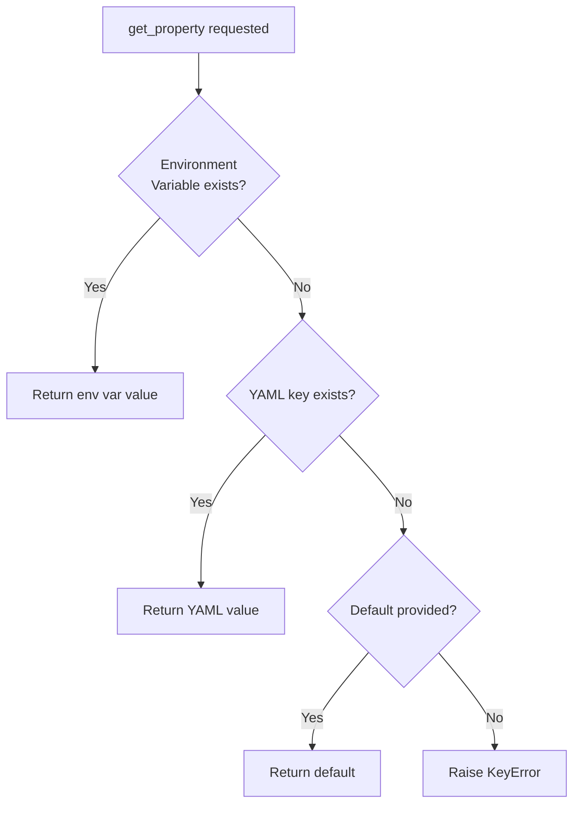

# ConfigReader API Reference

## Overview

The `ConfigReader` module provides centralized configuration management for the test automation framework through a singleton pattern. It supports YAML-based configuration with environment variable precedence, enabling flexible configuration across different environments without code changes.

**Module:** `utilities.config_reader`

**Source:** `utilities/config_reader.py`

### Key Features

- **Singleton Pattern:** Single shared configuration instance across the entire framework
- **YAML Configuration:** Structured configuration with nested values and type preservation
- **Environment Variable Precedence:** Override configuration via environment variables for different environments
- **Dot Notation Access:** Access nested configuration using simple dot notation (e.g., `browser.type`)
- **Type Preservation:** Maintains YAML data types (str, int, bool, float, list, dict)
- **Default Values:** Optional default values for missing configuration keys
- **Fail-Fast Error Handling:** Explicit exceptions for missing or invalid configuration (improvement over Java version)

### Configuration Precedence

The configuration system follows a clear precedence hierarchy (highest to lowest):

1. **Environment Variables** - `BROWSER_TYPE`, `BASE_URL`, etc.
2. **.env File Variables** - Loaded from `.env` file in project root
3. **YAML Configuration** - Values from `config/config.yaml`
4. **Provided Defaults** - Default values passed to `get_property()`



### Migration from Java

This module replaces the Java `ConfigurationReader.java` with significant improvements:

- **YAML vs Properties:** Uses YAML format instead of Java `.properties` for richer data structures
- **Exception Handling:** Explicitly raises exceptions instead of silently swallowing IOExceptions
- **Environment Integration:** Built-in support for environment variable overrides
- **Type Safety:** Preserves data types from configuration instead of treating everything as strings
- **Singleton Pattern:** Python implementation using `__new__()` instead of Java static initialization

**Source:** `utilities/config_reader.py:1-395`

---

## ConfigurationError

Custom exception class for configuration-related errors.

### Class Definition

```python
class ConfigurationError(Exception):
    """Custom exception for configuration-related errors."""
```

### When Raised

`ConfigurationError` is raised in the following scenarios:

| Scenario | Cause | Solution |
|----------|-------|----------|
| Configuration file missing | `config/config.yaml` not found at expected location | Create configuration file in `config/` directory |
| YAML parsing failure | Invalid YAML syntax in configuration file | Validate YAML syntax, check for proper indentation |
| Invalid configuration format | YAML root is not a dictionary | Ensure configuration file has dictionary at root level |
| Unexpected error during load | File permissions, encoding issues, etc. | Check file permissions and UTF-8 encoding |

### Example

```python
from utilities.config_reader import ConfigReader, ConfigurationError

try:
    config = ConfigReader()
    value = config.get_property('some.key')
except ConfigurationError as e:
    print(f"Configuration error: {e}")
    # Handle configuration initialization failure
except KeyError as e:
    print(f"Required configuration key missing: {e}")
    # Handle missing configuration key
```

**Source:** `utilities/config_reader.py:39-51`

---

## ConfigReader Class

Singleton configuration reader supporting YAML files and environment variables with precedence-based value resolution.

### Class Definition

```python
class ConfigReader:
    """
    Singleton configuration reader supporting YAML files and environment variables.
    """
```

### Attributes

| Attribute | Type | Description |
|-----------|------|-------------|
| `_instance` | `Optional[ConfigReader]` | Class variable storing the singleton instance |
| `_config` | `Dict[str, Any]` | Class variable storing the loaded YAML configuration |
| `_initialized` | `bool` | Class variable tracking whether initialization has completed |
| `_config_file` | `str` | Instance variable storing the path to configuration file |

### Thread Safety

The `ConfigReader` singleton is **NOT thread-safe during initialization**. The framework ensures thread safety by:

1. **Single Initialization:** ConfigReader is instantiated once in the main thread before parallel test execution
2. **Read-Only Access:** After initialization, all test threads only read configuration (no writes)
3. **Immutable Returns:** `get_all_properties()` returns deep copies to prevent accidental modification

**Best Practice:** Initialize ConfigReader in `before_all()` hook or main thread before spawning test workers.

```python
# In features/environment.py before_all() hook
def before_all(context):
    # Initialize singleton in main thread
    config = ConfigReader()
    # Now safe for parallel test execution
```

**Source:** `utilities/config_reader.py:54-82`

---

## Constructor

### `__init__(config_file: str = "config/config.yaml")`

Initialize configuration reader (runs only once due to singleton pattern).

#### Parameters

| Parameter | Type | Required | Default | Description |
|-----------|------|----------|---------|-------------|
| `config_file` | `str` | No | `"config/config.yaml"` | Path to YAML configuration file relative to project root |

#### Raises

| Exception | When | Resolution |
|-----------|------|------------|
| `FileNotFoundError` | Configuration file doesn't exist at specified path | Create `config/config.yaml` in project root |
| `ConfigurationError` | YAML parsing fails or file format is invalid | Validate YAML syntax and structure |

#### Behavior

Due to the singleton pattern, `__init__()` can be called multiple times but initialization logic runs only once:

1. First call: Loads `.env` file (if exists), loads YAML configuration, sets `_initialized = True`
2. Subsequent calls: Immediately returns without re-initialization

#### Example

```python
from utilities.config_reader import ConfigReader

# First instantiation - performs full initialization
config1 = ConfigReader()

# Second instantiation - returns same instance, no re-initialization
config2 = ConfigReader()

# Verify singleton pattern
assert config1 is config2  # True - same object

# Custom configuration file path (rarely needed)
config = ConfigReader(config_file="config/custom_config.yaml")
```

#### Environment File Loading

The constructor automatically loads environment variables from `.env` file if present:

```bash
# .env file example
BROWSER_TYPE=firefox
HEADLESS=true
BASE_URL=https://staging.example.com
```

These variables take precedence over YAML configuration values.

**Source:** `utilities/config_reader.py:104-146`

---

## Methods

### `get_property(key: str, default: Any = _NO_DEFAULT) -> Optional[Any]`

Retrieve configuration value by key with environment variable precedence and dot notation support.

#### Parameters

| Parameter | Type | Required | Default | Description |
|-----------|------|----------|---------|-------------|
| `key` | `str` | Yes | - | Configuration key using dot notation for nested access |
| `default` | `Any` | No | `_NO_DEFAULT` | Default value returned if key not found (can be `None`) |

#### Returns

| Type | Description |
|------|-------------|
| `Optional[Any]` | Configuration value from environment variable, YAML, or default. Type matches YAML type (str, int, bool, float, list, dict) |

#### Raises

| Exception | When | Resolution |
|-----------|------|------------|
| `KeyError` | Required key not found and no default provided | Add key to `config.yaml` or set environment variable |

#### Configuration Resolution

The method follows this resolution order:

1. **Environment Variable:** Converts `key` to uppercase with underscores (e.g., `browser.type` → `BROWSER_TYPE`)
2. **YAML Configuration:** Navigates nested dictionaries using dot notation
3. **Default Value:** Returns provided default if key not found
4. **Error:** Raises KeyError if no default and key missing

#### Examples

**Basic Usage:**

```python
from utilities.config_reader import ConfigReader

config = ConfigReader()

# Get value with default
browser = config.get_property('browser.type', default='chrome')
# Returns: 'chrome' if not configured

# Get nested value
timeout = config.get_property('timeouts.explicit', default=10)
# Returns: 10 (int) if not in config

# Get required value (no default)
base_url = config.get_property('application.base_url')
# Raises KeyError if missing
```

**Environment Variable Override:**

```python
import os
from utilities.config_reader import ConfigReader

# YAML config.yaml has: browser.type: chrome
# Environment variable: BROWSER_TYPE=firefox

config = ConfigReader()
browser = config.get_property('browser.type')
# Returns: 'firefox' (environment variable takes precedence)

# Check environment variable programmatically
os.environ['BROWSER_TYPE'] = 'edge'
browser = config.get_property('browser.type')
# Returns: 'edge'
```

**Nested Configuration Access:**

```python
# config.yaml structure:
# browser:
#   type: chrome
#   headless: false
#   window_size: "1920x1080"
# timeouts:
#   explicit: 30
#   page_load: 60

config = ConfigReader()

# Dot notation for nested keys
browser_type = config.get_property('browser.type')
# Returns: 'chrome'

headless = config.get_property('browser.headless')
# Returns: False (bool)

timeout = config.get_property('timeouts.explicit')
# Returns: 30 (int)
```

**Default Value Handling:**

```python
config = ConfigReader()

# Default value (key doesn't exist)
optional_value = config.get_property('optional.feature', default='disabled')
# Returns: 'disabled'

# None as default value
nullable = config.get_property('optional.key', default=None)
# Returns: None (not KeyError)

# No default - raises error
try:
    required = config.get_property('missing.required.key')
except KeyError as e:
    print(f"Missing required configuration: {e}")
```

**Type Preservation:**

```python
# YAML config.yaml:
# debug_mode: true          # boolean
# max_retries: 3            # integer
# timeout_seconds: 30.5     # float
# allowed_browsers:         # list
#   - chrome
#   - firefox
# credentials:              # dictionary
#   username: admin
#   password: secret

config = ConfigReader()

debug = config.get_property('debug_mode')
# Returns: True (bool, not string "true")

retries = config.get_property('max_retries')
# Returns: 3 (int, not string "3")

timeout = config.get_property('timeout_seconds')
# Returns: 30.5 (float)

browsers = config.get_property('allowed_browsers')
# Returns: ['chrome', 'firefox'] (list)

creds = config.get_property('credentials')
# Returns: {'username': 'admin', 'password': 'secret'} (dict)
```

**Source:** `utilities/config_reader.py:220-299`

---

### `get_all_properties() -> Dict[str, Any]`

Retrieve complete configuration dictionary as a deep copy.

#### Returns

| Type | Description |
|------|-------------|
| `Dict[str, Any]` | Deep copy of entire YAML configuration dictionary |

#### Behavior

- Returns a **deep copy** of the configuration to prevent external modification
- **Environment variables are NOT included** - only YAML values
- Use `get_property()` to access individual values with environment variable precedence
- Protects singleton configuration integrity across test scenarios

#### Example

```python
from utilities.config_reader import ConfigReader

config = ConfigReader()

# Get complete configuration
all_config = config.get_all_properties()

# Access nested structures
print(all_config['browser'])
# Output: {'type': 'chrome', 'headless': False, 'window_size': '1920x1080'}

print(all_config['timeouts'])
# Output: {'explicit': 30, 'page_load': 60, 'implicit': 0}

# Deep copy protection - modifications don't affect singleton
all_config['browser']['type'] = 'firefox'
original = config.get_property('browser.type')
# original is still 'chrome' (unless overridden by environment variable)

# Iterate over all configuration keys
for section, values in all_config.items():
    print(f"Section: {section}")
    if isinstance(values, dict):
        for key, value in values.items():
            print(f"  {key}: {value}")
```

**Use Cases:**

- **Configuration Validation:** Check all loaded configuration at startup
- **Debugging:** Inspect complete configuration state
- **Configuration Export:** Generate configuration reports or documentation
- **Testing:** Verify expected configuration structure

**Source:** `utilities/config_reader.py:301-322`

---

### `__repr__() -> str`

String representation of ConfigReader instance for debugging.

#### Returns

| Type | Description |
|------|-------------|
| `str` | String showing configuration file path and number of top-level keys |

#### Example

```python
from utilities.config_reader import ConfigReader

config = ConfigReader()
print(config)
# Output: ConfigReader(config_file='config/config.yaml', keys=6)

# Useful in logging and debugging
import logging
logger = logging.getLogger(__name__)
logger.info(f"Using configuration: {config}")
# Log output: Using configuration: ConfigReader(config_file='config/config.yaml', keys=6)
```

**Source:** `utilities/config_reader.py:324-334`

---

## Module-Level Functions

### `get_config() -> ConfigReader`

Convenience function to get ConfigReader singleton instance.

#### Returns

| Type | Description |
|------|-------------|
| `ConfigReader` | The singleton configuration reader instance |

#### Example

```python
# Alternative import pattern
from utilities.config_reader import get_config

# Get singleton instance via convenience function
config = get_config()
browser = config.get_property('browser.type')

# Equivalent to direct instantiation
from utilities.config_reader import ConfigReader
config = ConfigReader()
browser = config.get_property('browser.type')
```

**Source:** `utilities/config_reader.py:338-350`

---

## Complete Usage Example

### Basic Configuration Setup

**1. Create configuration file (`config/config.yaml`):**

```yaml
# Browser Configuration
browser:
  type: chrome
  headless: false
  window_size: "1920x1080"

# Timeouts (seconds)
timeouts:
  explicit: 30
  page_load: 60
  implicit: 0

# Application Under Test
application:
  base_url: https://testinium.io
  api_url: https://api.testinium.io

# Test Credentials (use environment variables for actual values)
credentials:
  username: test_user
  password: test_password

# Reporting Configuration
reporting:
  screenshots_on_failure: true
  allure_results_dir: target/allure-results
  html_report_dir: target/reports
```

**2. Create environment file (`.env`):**

```bash
# Override for local development
BROWSER_TYPE=firefox
HEADLESS=true

# Sensitive credentials (not in version control)
CREDENTIALS_USERNAME=real_username
CREDENTIALS_PASSWORD=real_password

# Environment-specific URL
APPLICATION_BASE_URL=https://staging.testinium.io
```

**3. Use in test framework:**

```python
from utilities.config_reader import ConfigReader

def setup_test_environment():
    """Initialize test configuration."""
    # Get singleton configuration
    config = ConfigReader()
    
    # Read browser configuration
    browser_type = config.get_property('browser.type', default='chrome')
    is_headless = config.get_property('browser.headless', default=False)
    
    # Read timeouts
    explicit_timeout = config.get_property('timeouts.explicit', default=30)
    page_load_timeout = config.get_property('timeouts.page_load', default=60)
    
    # Read application URL (environment variable takes precedence)
    base_url = config.get_property('application.base_url')
    
    # Read credentials (from environment variables for security)
    username = config.get_property('credentials.username')
    password = config.get_property('credentials.password')
    
    print(f"Test Environment Configuration:")
    print(f"  Browser: {browser_type} (headless={is_headless})")
    print(f"  Timeouts: {explicit_timeout}s explicit, {page_load_timeout}s page load")
    print(f"  Base URL: {base_url}")
    print(f"  Username: {username}")
    
    return config

# Initialize once in main thread
if __name__ == "__main__":
    config = setup_test_environment()
```

### Integration with Page Objects

```python
from utilities.config_reader import ConfigReader
from utilities.driver_manager import DriverManager

class BasePage:
    """Base class for all page objects with configuration access."""
    
    def __init__(self):
        self.driver = DriverManager.get_driver()
        self.config = ConfigReader()
        
        # Get timeout from configuration
        timeout = self.config.get_property('timeouts.explicit', default=30)
        self.wait = WebDriverWait(self.driver, timeout)
    
    def navigate_to_base_url(self):
        """Navigate to application base URL from configuration."""
        base_url = self.config.get_property('application.base_url')
        self.driver.get(base_url)
```

### Integration with Behave Hooks

```python
# features/environment.py
from utilities.config_reader import ConfigReader

def before_all(context):
    """Initialize configuration before test execution."""
    # Initialize singleton in main thread (thread-safe for parallel execution)
    context.config = ConfigReader()
    
    # Validate required configuration exists
    required_keys = [
        'browser.type',
        'application.base_url',
        'timeouts.explicit'
    ]
    
    for key in required_keys:
        try:
            value = context.config.get_property(key)
            print(f"  ✓ {key}: {value}")
        except KeyError as e:
            print(f"  ✗ Missing required configuration: {key}")
            raise

def before_scenario(context, scenario):
    """Make configuration available to scenario context."""
    # Configuration singleton already initialized
    if not hasattr(context, 'config'):
        context.config = ConfigReader()
```

---

## Configuration Best Practices

### 1. Environment-Specific Configuration

Use environment variables for values that change across environments:

```bash
# .env.local (development)
APPLICATION_BASE_URL=http://localhost:3000
BROWSER_HEADLESS=false

# .env.staging (staging environment)
APPLICATION_BASE_URL=https://staging.testinium.io
BROWSER_HEADLESS=true

# .env.production (production testing)
APPLICATION_BASE_URL=https://testinium.io
BROWSER_HEADLESS=true
```

### 2. Secrets Management

**Never commit sensitive credentials to version control:**

```yaml
# config/config.yaml - Placeholder only
credentials:
  username: ${CREDENTIALS_USERNAME}  # Will be overridden by env var
  password: ${CREDENTIALS_PASSWORD}  # Will be overridden by env var
```

```bash
# .env (in .gitignore)
CREDENTIALS_USERNAME=real_username
CREDENTIALS_PASSWORD=real_password
```

### 3. Configuration Validation

Validate required configuration at startup:

```python
def validate_configuration():
    """Validate all required configuration keys exist."""
    config = ConfigReader()
    
    required_config = {
        'browser.type': ['chrome', 'firefox', 'edge'],
        'application.base_url': None,  # Any value acceptable
        'timeouts.explicit': lambda x: x > 0,  # Must be positive
    }
    
    errors = []
    for key, validator in required_config.items():
        try:
            value = config.get_property(key)
            
            # Validate value if validator provided
            if isinstance(validator, list) and value not in validator:
                errors.append(f"{key}='{value}' not in allowed values: {validator}")
            elif callable(validator) and not validator(value):
                errors.append(f"{key}='{value}' failed validation")
                
        except KeyError:
            errors.append(f"Required configuration missing: {key}")
    
    if errors:
        raise ConfigurationError(f"Configuration validation failed:\n" + "\n".join(errors))
    
    print("✓ Configuration validation passed")

# Run validation before tests
validate_configuration()
```

### 4. Configuration Documentation

Document all configuration options in your `config.yaml`:

```yaml
# Browser Configuration
browser:
  # Browser type: chrome, firefox, edge, safari
  type: chrome
  
  # Run browser in headless mode (no GUI)
  # Use 'true' for CI/CD environments
  headless: false
  
  # Browser window size: WIDTHxHEIGHT
  # Common values: 1920x1080, 1366x768, 1280x1024
  window_size: "1920x1080"
```

---

## Troubleshooting

### Issue: Configuration file not found

**Symptoms:**
```
FileNotFoundError: Configuration file not found: /path/to/config/config.yaml
```

**Cause:** Configuration file missing or in wrong location

**Solution:**
1. Ensure `config/config.yaml` exists in project root
2. Check current working directory matches project root
3. Verify file path in `ConfigReader(config_file='...')`

---

### Issue: YAML parsing error

**Symptoms:**
```
ConfigurationError: Failed to parse YAML configuration: ...
```

**Cause:** Invalid YAML syntax in configuration file

**Solution:**
1. Validate YAML syntax using online validator
2. Check for proper indentation (spaces, not tabs)
3. Ensure proper quoting of strings with special characters
4. Verify no duplicate keys at same level

Example of invalid YAML:
```yaml
# Invalid - incorrect indentation
browser:
type: chrome  # Should be indented
```

Fixed YAML:
```yaml
# Valid - correct indentation
browser:
  type: chrome
```

---

### Issue: Environment variable not taking precedence

**Symptoms:** Environment variable set but YAML value still used

**Cause:** Incorrect environment variable naming

**Solution:**

Environment variables must match the key format:
- Configuration key: `browser.type`
- Environment variable: `BROWSER_TYPE` (uppercase, dots → underscores)

```bash
# Incorrect - won't work
export browser.type=firefox
export BROWSER-TYPE=firefox

# Correct - will override YAML
export BROWSER_TYPE=firefox
```

---

### Issue: KeyError for existing configuration

**Symptoms:**
```
KeyError: Required configuration key 'browser.type' not found
```

**Cause:** Incorrect key path or typo in key name

**Solution:**
1. Check exact key path in YAML file
2. Verify spelling and case (keys are case-sensitive)
3. Use dot notation for nested keys: `section.subsection.key`
4. Print all keys to debug: `config.get_all_properties()`

```python
# Debug available keys
config = ConfigReader()
all_config = config.get_all_properties()
print("Available configuration keys:")
for section, values in all_config.items():
    if isinstance(values, dict):
        for key in values.keys():
            print(f"  {section}.{key}")
```

---

### Issue: Configuration changes not reflected

**Symptoms:** Modified `config.yaml` but changes not appearing in tests

**Cause:** Singleton pattern retains first loaded configuration

**Solution:**

1. **Restart test process** - Configuration loaded once at startup
2. **Use environment variables** - Can be set dynamically
3. **For testing only** - Reset singleton (not recommended for production):

```python
# Only for testing configuration changes
ConfigReader._initialized = False
ConfigReader._instance = None
ConfigReader._config = {}

# Now next instantiation will reload
config = ConfigReader()
```

---

## See Also

- **[DriverManager API](driver-manager.md)** - WebDriver lifecycle management using configuration
- **[Configuration Guide](../../guides/configuration-management.md)** - Comprehensive configuration management guide
- **[Environment Variables Reference](../../reference/environment-variables.md)** - Complete list of environment variables
- **[Configuration Options Reference](../../reference/configuration-options.md)** - Complete config.yaml reference
- **[Deployment Guide](../../deployment/index.md)** - Environment-specific configuration for deployment

---

## Migration Notes

### Java ConfigurationReader Comparison

| Feature | Java ConfigurationReader | Python ConfigReader |
|---------|-------------------------|---------------------|
| Configuration Format | `.properties` file | YAML file (`config.yaml`) |
| Nested Configuration | Not supported (flat key=value) | Fully supported with dot notation |
| Type Preservation | All values strings | Native types (str, int, bool, float, list, dict) |
| Environment Variables | Manual implementation | Built-in with precedence |
| Exception Handling | Silent IOException catch with printStackTrace() | Explicit exceptions (FileNotFoundError, ConfigurationError) |
| Singleton Pattern | Static initialization | `__new__()` method |
| Default Values | Not supported | Built-in with `default` parameter |

### Behavioral Equivalence

**Java:**
```java
// Java ConfigurationReader.java
Properties properties = new Properties();
try {
    FileInputStream input = new FileInputStream("configuration.properties");
    properties.load(input);
    String browser = properties.getProperty("browser.type");
} catch (IOException e) {
    e.printStackTrace();  // Silent failure!
}
```

**Python Equivalent:**
```python
# Python ConfigReader
from utilities.config_reader import ConfigReader, ConfigurationError

try:
    config = ConfigReader()  # Explicit error if file missing
    browser = config.get_property('browser.type', default='chrome')
except ConfigurationError as e:
    # Proper exception handling
    logger.error(f"Configuration error: {e}")
    raise
```

### Key Improvements from Java Version

1. **Explicit Error Handling:** No silent exception swallowing
2. **Type Safety:** YAML types preserved instead of string-only
3. **Environment Integration:** Built-in environment variable support
4. **Nested Configuration:** Structured configuration with dot notation access
5. **Default Values:** Built-in default value support in `get_property()`
6. **Immutability:** Deep copy returns protect singleton state

**Source:** `utilities/config_reader.py:1-24` (migration notes in module docstring)

---

**Last Updated:** 2024-01-09  
**API Version:** 1.0.0  
**Python Version:** 3.9+


