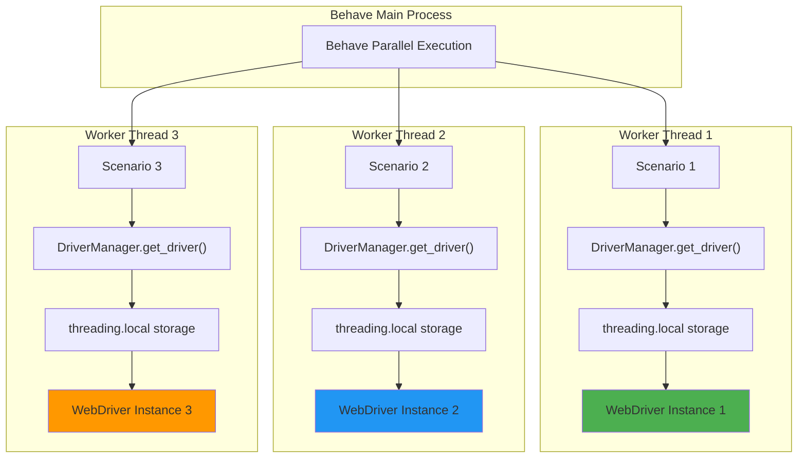
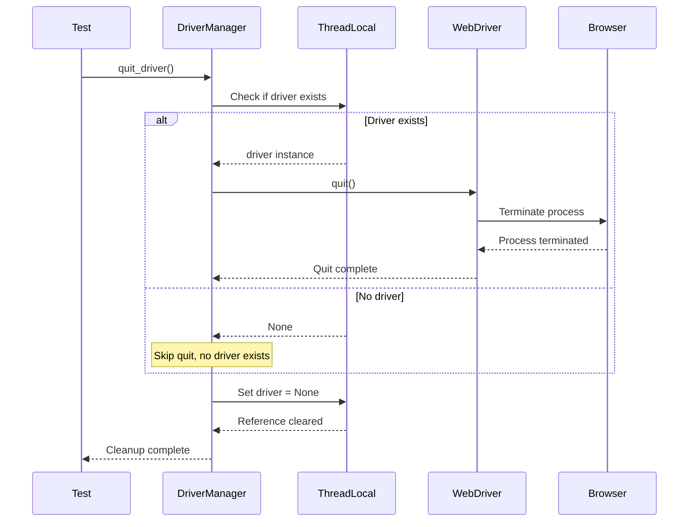

# DriverManager API Reference

## Overview

The `DriverManager` class provides thread-safe WebDriver lifecycle management for parallel test execution using Python's `threading.local()` pattern. This module replaces the Java `Driver.java` implementation with enhanced error handling, proper browser-specific driver provisioning, and explicit wait strategies.

**Module:** `utilities.driver_manager`

**Source:** `utilities/driver_manager.py`

### Key Features

- **Thread-Safe WebDriver Management**: Each thread gets its own isolated WebDriver instance via `threading.local()`
- **Lazy Initialization**: WebDriver instances are created only when first requested per thread
- **Automatic Driver Binary Management**: Uses `webdriver-manager` to automatically download and cache driver binaries
- **Configuration-Driven**: Browser selection and options loaded from `config/config.yaml` and environment variables
- **Proper Cleanup**: Idempotent cleanup ensuring no stale driver references
- **Explicit Waits Only**: No implicit waits configured (architectural decision from Java migration)

### Critical Bug Fixes from Java Version

**Firefox Driver Setup Bug (Java Driver.java:37)**

The original Java implementation had a critical bug where Firefox browser tests were calling:
```java
case "firefox":
    WebDriverManager.chromedriver().setup();  // BUG: chromedriver for Firefox!
    driverPool.set(new FirefoxDriver());
```

This Python implementation correctly uses:
```python
elif browser_type == "firefox":
    firefox_service = FirefoxService(GeckoDriverManager().install())
    driver = webdriver.Firefox(service=firefox_service, options=firefox_options)
```

**Implicit Wait Anti-Pattern Elimination**

The Java version configured 10-second implicit waits on lines 34 and 40, creating unpredictable behavior when mixed with explicit waits. This Python implementation uses **NO implicit waits**, relying exclusively on explicit waits via `utilities.wait_helpers` for predictable, controllable wait behavior.

### Supported Browsers

| Browser | Configuration Value | Driver Manager | Default |
|---------|-------------------|----------------|---------|
| Chrome | `chrome` | ChromeDriverManager | ✓ Yes |
| Firefox | `firefox` | GeckoDriverManager | No |

### Configuration Integration

The DriverManager reads configuration from `ConfigReader`, which provides the following precedence:

1. **Environment Variables** (highest priority)
2. **.env File Variables**
3. **config/config.yaml Values**
4. **Default Values** (lowest priority)

**Configuration Options:**

| Configuration Key | Environment Variable | Type | Default | Description |
|------------------|---------------------|------|---------|-------------|
| `browser.type` | `BROWSER_TYPE` | string | `'chrome'` | Browser to use ('chrome' or 'firefox') |
| `browser.headless` | `BROWSER_HEADLESS` | boolean | `false` | Run browser in headless mode |
| `browser.window_size` | `BROWSER_WINDOW_SIZE` | list | N/A | Custom window size [width, height] |

---

## Thread Safety Architecture

### Threading.local() Pattern

The DriverManager uses Python's `threading.local()` to provide thread-level isolation for WebDriver instances. This replaces Java's `InheritableThreadLocal` pattern.



**Thread Isolation Guarantees:**

- Each thread maintains its own WebDriver instance in thread-local storage
- No shared state between threads (prevents race conditions and interference)
- Parallel execution safe with `behave-parallel` (process-based) and `pytest-xdist` (thread/process-based)
- No locking or synchronization required (thread-local storage is inherently thread-safe)

---

## Exception Classes

### DriverInitializationError

Custom exception raised when WebDriver initialization fails.

**Source:** `utilities/driver_manager.py:59-79`

#### Description

Provides explicit error handling replacing Java's silent failures and generic exceptions. Raised when driver creation encounters unrecoverable errors.

#### Inheritance

```
BaseException
 └── Exception
      └── DriverInitializationError
```

#### When Raised

| Scenario | Cause | Example |
|----------|-------|---------|
| Unsupported Browser | Invalid `browser.type` configuration | `'safari'` specified but not supported |
| Driver Binary Download Failure | Network issues or missing permissions | webdriver-manager cannot download ChromeDriver |
| Browser Process Failure | Browser not installed or incompatible | Chrome not installed on system |
| Service Initialization Failure | Port conflicts or system resource limits | ChromeService cannot bind to port |
| Configuration Missing | Required configuration not found | ConfigReader cannot load config.yaml |

#### Usage Example

```python
from utilities.driver_manager import DriverManager, DriverInitializationError
import logging

logger = logging.getLogger(__name__)

try:
    driver = DriverManager.get_driver()
    driver.get("https://example.com")
except DriverInitializationError as e:
    logger.error(f"Failed to initialize WebDriver: {e}")
    # Handle error - skip test, retry, or fail gracefully
    raise
finally:
    DriverManager.quit_driver()
```

---

## DriverManager Class

Thread-safe WebDriver lifecycle manager using `threading.local()`.

**Source:** `utilities/driver_manager.py:82-509`

### Class Overview

Provides centralized WebDriver instantiation, configuration, and cleanup with strict thread isolation for parallel test execution. Replaces Java's `InheritableThreadLocal` pattern with Python `threading.local()`.

### Class Attributes

| Attribute | Type | Description |
|-----------|------|-------------|
| `_thread_local` | `threading.local()` | Thread-local storage container for WebDriver instances |

**Note:** `_thread_local` is a class-level attribute storing per-thread driver instances. Each thread accessing this attribute gets its own isolated namespace.

---

## Class Methods

### get_driver()

Get WebDriver instance for current thread with lazy initialization.

**Source:** `utilities/driver_manager.py:132-196`

#### Signature

```python
@classmethod
def get_driver(cls) -> WebDriver
```

#### Description

Returns the WebDriver instance for the calling thread. If no driver exists for the current thread, creates a new one using `_create_driver()`. Subsequent calls from the same thread return the existing driver instance (singleton per thread).

This replaces Java's `getDriver()` method with equivalent functionality:
- Lazy initialization (create only when needed)
- Thread-local storage (one driver per thread)
- Configuration-driven browser selection

#### Parameters

None

#### Returns

| Type | Description |
|------|-------------|
| `WebDriver` | Thread-local WebDriver instance (Chrome or Firefox based on configuration) |

#### Raises

| Exception | Condition |
|-----------|-----------|
| `DriverInitializationError` | If driver creation fails for any reason |
| `ValueError` | If unsupported browser type configured in `browser.type` |
| `ConfigurationError` | If required configuration is missing or invalid |

#### Thread Safety

Each thread calling this method gets its own WebDriver instance stored in `threading.local()`. No synchronization needed since `threading.local()` provides thread-isolated storage.

#### Example - Basic Usage

```python
from utilities.driver_manager import DriverManager

# Get WebDriver instance for current thread
driver = DriverManager.get_driver()
driver.get("https://example.com")

# Subsequent calls return same instance
same_driver = DriverManager.get_driver()
assert driver is same_driver  # True - same object reference

# Cleanup
DriverManager.quit_driver()
```

#### Example - Parallel Execution

```python
import threading
from utilities.driver_manager import DriverManager

def test_scenario(scenario_name, url):
    """Execute test in separate thread with isolated driver."""
    driver = DriverManager.get_driver()
    try:
        driver.get(url)
        print(f"{scenario_name}: {driver.title}")
    finally:
        DriverManager.quit_driver()

# Create multiple threads
threads = [
    threading.Thread(target=test_scenario, args=("Thread 1", "https://example.com")),
    threading.Thread(target=test_scenario, args=("Thread 2", "https://google.com")),
    threading.Thread(target=test_scenario, args=("Thread 3", "https://github.com"))
]

# Start all threads (each gets its own WebDriver instance)
for thread in threads:
    thread.start()

# Wait for completion
for thread in threads:
    thread.join()
```

#### Example - Error Handling

```python
from utilities.driver_manager import DriverManager, DriverInitializationError
import logging

logger = logging.getLogger(__name__)

try:
    driver = DriverManager.get_driver()
except DriverInitializationError as e:
    logger.error(f"Driver initialization failed: {e}")
    # Log additional context
    logger.error("Check browser installation and configuration")
    logger.error("Verify config/config.yaml has valid browser.type")
    raise
except ValueError as e:
    logger.error(f"Invalid configuration: {e}")
    raise
```

#### Migration Notes

**Java Equivalent:** `Driver.java:28-46 getDriver()`

**Key Differences:**
- **Thread Storage**: Python `threading.local()` vs Java `InheritableThreadLocal`
- **Lazy Initialization**: Same pattern, different implementation
- **Error Handling**: Python raises explicit exceptions vs Java's silent failures
- **Logging**: Python uses `logging` module vs Java's `System.out.println`

---

### _create_driver()

Create and configure new WebDriver instance based on configuration.

**Source:** `utilities/driver_manager.py:199-378`

#### Signature

```python
@classmethod
def _create_driver(cls) -> WebDriver
```

#### Description

Private class method that creates a new WebDriver instance configured according to `ConfigReader` settings. Reads browser type from configuration and instantiates appropriate WebDriver with Selenium 4.x service pattern and webdriver-manager for automatic driver binary provisioning.

**CRITICAL BUG FIX**: Original Java `Driver.java:37` incorrectly called `WebDriverManager.chromedriver().setup()` for Firefox browser. This Python implementation correctly uses `GeckoDriverManager().install()` for Firefox.

**CRITICAL CHANGE**: No implicit waits are configured. Java version had `driver.manage().timeouts().implicitlyWait(10, TimeUnit.SECONDS)` on lines 34 and 40. This Python version uses NO implicit waits, relying exclusively on explicit waits via `utilities/wait_helpers.py` for predictable behavior.

#### Parameters

None

#### Returns

| Type | Description |
|------|-------------|
| `WebDriver` | Newly created and configured Chrome or Firefox WebDriver instance |

#### Raises

| Exception | Condition |
|-----------|-----------|
| `ValueError` | If unsupported browser type specified in configuration |
| `DriverInitializationError` | If driver creation or configuration fails |
| `ConfigurationError` | If configuration retrieval fails |
| `WebDriverException` | If Selenium WebDriver initialization fails |

#### Implementation Details

##### Chrome Browser

- **Driver Manager**: `ChromeDriverManager` for automatic binary provisioning
- **Headless Mode**: `--headless=new` (Selenium 4.x syntax)
- **Stability Options**: 
  - `--disable-gpu`: Disable GPU hardware acceleration
  - `--no-sandbox`: Disable sandbox (required for CI/CD containers)
  - `--disable-dev-shm-usage`: Overcome limited resource problems in containers
  - `--disable-extensions`: Disable Chrome extensions
- **Service**: `ChromeService` with webdriver-manager path

##### Firefox Browser

- **Driver Manager**: `GeckoDriverManager` for automatic binary provisioning (BUG FIX)
- **Headless Mode**: `--headless` flag
- **Service**: `FirefoxService` with webdriver-manager path

#### Configuration Options

| Option | Type | Default | Description |
|--------|------|---------|-------------|
| `browser.type` | string | `'chrome'` | Browser type: 'chrome' or 'firefox' |
| `browser.headless` | boolean | `false` | Run browser in headless mode |
| `browser.window_size` | list[int] | N/A | Optional custom window size |

#### Example - Chrome Configuration

```python
# config/config.yaml
browser:
  type: chrome
  headless: false

# Code
from utilities.driver_manager import DriverManager

driver = DriverManager.get_driver()
# Creates Chrome WebDriver with window maximized
# No implicit waits configured
```

#### Example - Firefox Headless

```python
# config/config.yaml
browser:
  type: firefox
  headless: true

# Code  
from utilities.driver_manager import DriverManager

driver = DriverManager.get_driver()
# Creates Firefox WebDriver in headless mode
# Correctly uses GeckoDriverManager (bug fixed)
```

#### Example - Environment Variable Override

```bash
# Override via environment variable
export BROWSER_TYPE=firefox
export BROWSER_HEADLESS=true
```

```python
from utilities.driver_manager import DriverManager

# Will use Firefox in headless mode (env vars take precedence)
driver = DriverManager.get_driver()
```

#### Migration Notes

**Java Equivalent:** `Driver.java:48-80 createDriver()`

**Critical Bug Fixed:**
```java
// Java Driver.java:37 (INCORRECT)
case "firefox":
    WebDriverManager.chromedriver().setup();  // BUG!
    driverPool.set(new FirefoxDriver());
```

```python
# Python driver_manager.py (CORRECT)
elif browser_type == "firefox":
    firefox_service = FirefoxService(GeckoDriverManager().install())
    driver = webdriver.Firefox(service=firefox_service, options=firefox_options)
```

**Architectural Change - Implicit Waits Removed:**
```java
// Java Driver.java:34, 40 (REMOVED)
driver.manage().timeouts().implicitlyWait(10, TimeUnit.SECONDS);
```

```python
# Python driver_manager.py (NO IMPLICIT WAITS)
# All waits are explicit via utilities/wait_helpers.py
# This provides predictable, controllable wait behavior
```

---

### quit_driver()

Quit WebDriver and remove thread-local reference.

**Source:** `utilities/driver_manager.py:381-462`

#### Signature

```python
@classmethod
def quit_driver(cls) -> None
```

#### Description

Properly terminates the WebDriver session and browser process for the current thread, then removes the driver reference from thread-local storage. This ensures clean shutdown and prevents stale driver references.

Replaces Java's `closeDriver()` method with equivalent functionality:
- Null/None check before quit
- Proper exception handling
- Thread-local reference removal

#### Parameters

None

#### Returns

None

#### Raises

No exceptions are raised. All exceptions are caught, logged, and swallowed to ensure cleanup always completes.

#### Thread Safety

Only affects the current thread's driver instance. Other threads' drivers remain unaffected. Safe to call from any thread concurrently.

#### Idempotency

Safe to call multiple times. If no driver exists for the current thread, the method completes silently without error. This allows defensive cleanup in `finally` blocks without risk of exceptions.

#### Exception Handling

The method catches and logs all exceptions but does not raise them. This ensures:
- Thread-local cleanup always happens (in `finally` block)
- Test teardown does not fail due to driver quit issues
- Errors are logged for debugging but don't disrupt execution flow

| Exception Type | Handling | Log Level |
|----------------|----------|-----------|
| `WebDriverException` | Caught and logged | WARNING |
| `Exception` (any other) | Caught and logged | ERROR |
| All exceptions | Thread-local reference cleared in finally | DEBUG |

#### Example - Basic Cleanup

```python
from utilities.driver_manager import DriverManager

driver = DriverManager.get_driver()
try:
    driver.get("https://example.com")
    # Perform test operations
finally:
    # Always cleanup, even if test fails
    DriverManager.quit_driver()
```

#### Example - Idempotent Cleanup

```python
from utilities.driver_manager import DriverManager

driver = DriverManager.get_driver()
driver.get("https://example.com")

# First quit
DriverManager.quit_driver()

# Second quit - safe, no error
DriverManager.quit_driver()  # No exception raised

# Third quit - still safe
DriverManager.quit_driver()  # Still no exception
```

#### Example - Behave Hook Integration

```python
# features/environment.py
from utilities.driver_manager import DriverManager

def after_scenario(context, scenario):
    """Cleanup WebDriver after each scenario."""
    # Idempotent cleanup - safe even if driver never created
    DriverManager.quit_driver()
    
def after_all(context):
    """Final cleanup after all scenarios."""
    # Defensive cleanup
    DriverManager.quit_driver()
```

#### Cleanup Sequence



#### Migration Notes

**Java Equivalent:** `Driver.java:82-93 closeDriver()`

**Key Differences:**
- **Exception Handling**: Python catches all exceptions vs Java's simple try-catch
- **Logging**: Python uses logging module with different levels vs Java's printStackTrace
- **Thread-Local Cleanup**: Python explicitly sets to None vs Java's remove()
- **Idempotency**: Same pattern, both safe to call multiple times

---

### get_thread_driver_status()

Get diagnostic information about current thread's driver status.

**Source:** `utilities/driver_manager.py:465-509`

#### Signature

```python
@classmethod
def get_thread_driver_status(cls) -> dict
```

#### Description

Utility method for debugging and monitoring driver lifecycle. Provides detailed status information about the WebDriver instance for the calling thread. This method is **not present in the Java version** - it was added for enhanced observability in the Python implementation.

#### Parameters

None

#### Returns

| Type | Description |
|------|-------------|
| `dict` | Status dictionary with the following keys |

**Status Dictionary Keys:**

| Key | Type | Description |
|-----|------|-------------|
| `thread_name` | str | Name of the current thread |
| `thread_id` | int | Thread identifier (unique per thread) |
| `has_driver` | bool | Whether a WebDriver instance exists for this thread |
| `driver_session` | str or None | WebDriver session ID if driver exists, else None |
| `driver_capabilities` | dict or None | Browser capabilities if driver exists, else None |

#### Raises

No exceptions are raised. If driver details cannot be retrieved, fields are set to None and exception is logged at DEBUG level.

#### Use Cases

- **Debugging**: Verify driver initialization status in test setup
- **Monitoring**: Track driver lifecycle in test execution logs
- **Troubleshooting**: Diagnose thread isolation issues in parallel execution
- **Testing**: Validate driver manager behavior in unit tests

#### Example - Basic Status Check

```python
from utilities.driver_manager import DriverManager
import json

# Before driver creation
status = DriverManager.get_thread_driver_status()
print(json.dumps(status, indent=2))
# Output:
# {
#   "thread_name": "MainThread",
#   "thread_id": 140234567890,
#   "has_driver": false,
#   "driver_session": null,
#   "driver_capabilities": null
# }

# After driver creation
driver = DriverManager.get_driver()
status = DriverManager.get_thread_driver_status()
print(json.dumps(status, indent=2))
# Output:
# {
#   "thread_name": "MainThread",
#   "thread_id": 140234567890,
#   "has_driver": true,
#   "driver_session": "a1b2c3d4e5f6",
#   "driver_capabilities": {
#     "browserName": "chrome",
#     "browserVersion": "120.0.6099.109",
#     "platformName": "linux",
#     ...
#   }
# }
```

#### Example - Parallel Execution Monitoring

```python
import threading
from utilities.driver_manager import DriverManager
import logging

logger = logging.getLogger(__name__)

def test_with_status_logging(scenario_name):
    """Test scenario with driver status logging."""
    # Log initial status
    status = DriverManager.get_thread_driver_status()
    logger.info(f"{scenario_name} - Initial: {status}")
    
    # Create driver
    driver = DriverManager.get_driver()
    
    # Log after creation
    status = DriverManager.get_thread_driver_status()
    logger.info(f"{scenario_name} - Active: {status}")
    
    # Perform test
    driver.get("https://example.com")
    
    # Cleanup
    DriverManager.quit_driver()
    
    # Log after cleanup
    status = DriverManager.get_thread_driver_status()
    logger.info(f"{scenario_name} - Cleaned: {status}")

# Run in multiple threads
threads = [
    threading.Thread(target=test_with_status_logging, args=("Scenario A",)),
    threading.Thread(target=test_with_status_logging, args=("Scenario B",))
]

for thread in threads:
    thread.start()

for thread in threads:
    thread.join()
```

#### Example - Unit Test Verification

```python
import pytest
from utilities.driver_manager import DriverManager

def test_driver_lifecycle():
    """Verify driver lifecycle with status checks."""
    # Initially no driver
    status = DriverManager.get_thread_driver_status()
    assert status['has_driver'] is False
    assert status['driver_session'] is None
    
    # Create driver
    driver = DriverManager.get_driver()
    status = DriverManager.get_thread_driver_status()
    assert status['has_driver'] is True
    assert status['driver_session'] is not None
    assert 'browserName' in status['driver_capabilities']
    
    # Cleanup
    DriverManager.quit_driver()
    status = DriverManager.get_thread_driver_status()
    assert status['has_driver'] is False
    assert status['driver_session'] is None
```

#### Migration Notes

**Java Equivalent:** None - This is a new method added in the Python implementation

**Rationale for Addition:**
- Enhanced debugging capabilities for parallel execution
- Better observability of thread-local storage behavior
- Simplified unit testing of driver manager
- Improved troubleshooting for driver lifecycle issues

---

## Module-Level Convenience Functions

### get_driver()

Module-level convenience function to get WebDriver instance.

**Source:** `utilities/driver_manager.py:513-531`

#### Signature

```python
def get_driver() -> WebDriver
```

#### Description

Provides a simpler import pattern for the common use case of getting a WebDriver. This is a thin wrapper around `DriverManager.get_driver()`.

#### Preferred Import Pattern

```python
# Simpler (using module-level function)
from utilities.driver_manager import get_driver
driver = get_driver()
```

```python
# Explicit (using class method)
from utilities.driver_manager import DriverManager
driver = DriverManager.get_driver()
```

Both patterns are equivalent and supported.

#### Returns

| Type | Description |
|------|-------------|
| `WebDriver` | Thread-local WebDriver instance |

#### Raises

| Exception | Condition |
|-----------|-----------|
| `DriverInitializationError` | If driver creation fails |

#### Example

```python
from utilities.driver_manager import get_driver, quit_driver

# Simple usage without class reference
driver = get_driver()
driver.get("https://example.com")
quit_driver()
```

---

### quit_driver()

Module-level convenience function to quit WebDriver.

**Source:** `utilities/driver_manager.py:534-546`

#### Signature

```python
def quit_driver() -> None
```

#### Description

Provides a simpler import pattern for cleaning up the WebDriver. This is a thin wrapper around `DriverManager.quit_driver()`.

#### Preferred Import Pattern

```python
# Simpler (using module-level function)
from utilities.driver_manager import quit_driver
quit_driver()
```

```python
# Explicit (using class method)
from utilities.driver_manager import DriverManager
DriverManager.quit_driver()
```

Both patterns are equivalent and supported.

#### Returns

None

#### Example

```python
from utilities.driver_manager import get_driver, quit_driver

driver = get_driver()
try:
    driver.get("https://example.com")
    # Test operations
finally:
    quit_driver()  # Simple cleanup
```

---

## Complete Usage Examples

### Example 1: Basic WebDriver Usage

```python
from utilities.driver_manager import DriverManager

# Initialize driver
driver = DriverManager.get_driver()

try:
    # Navigate to application
    driver.get("https://testinium.io/login")
    
    # Interact with page
    email_field = driver.find_element("name", "login")
    email_field.send_keys("test@example.com")
    
    # Perform test actions
    # ...
    
finally:
    # Always cleanup
    DriverManager.quit_driver()
```

### Example 2: BDD Step Definition Integration

```python
# features/steps/login_steps.py
from behave import given, when, then
from utilities.driver_manager import DriverManager
from pages.login_page import LoginPage

@given('the user opens the login page')
def step_impl(context):
    # Get driver (creates if needed, reuses if exists)
    context.driver = DriverManager.get_driver()
    context.driver.get("https://testinium.io/login")
    context.login_page = LoginPage(context.driver)

@when('the user enters credentials "{email}" and "{password}"')
def step_impl(context, email, password):
    context.login_page.login(email, password)

@then('the user should be redirected to the dashboard')
def step_impl(context):
    assert "dashboard" in context.driver.current_url

# Cleanup handled in features/environment.py after_scenario hook
```

### Example 3: Behave Hooks Integration

```python
# features/environment.py
from utilities.driver_manager import DriverManager
from utilities.screenshot_helper import capture_screenshot
import logging

logger = logging.getLogger(__name__)

def before_all(context):
    """Setup before all scenarios."""
    logger.info("Test execution starting")

def before_scenario(context, scenario):
    """Setup before each scenario."""
    # Driver created lazily on first get_driver() call
    logger.info(f"Starting scenario: {scenario.name}")

def after_scenario(context, scenario):
    """Cleanup after each scenario."""
    if scenario.status == 'failed':
        # Capture screenshot on failure
        driver_status = DriverManager.get_thread_driver_status()
        if driver_status['has_driver']:
            capture_screenshot(
                DriverManager.get_driver(),
                f"failure_{scenario.name}"
            )
    
    # Always quit driver for this scenario
    DriverManager.quit_driver()
    logger.info(f"Scenario '{scenario.name}' completed with status: {scenario.status}")

def after_all(context):
    """Final cleanup after all scenarios."""
    # Defensive cleanup
    DriverManager.quit_driver()
    logger.info("Test execution complete")
```

### Example 4: Parallel Execution with behave-parallel

```python
# Run tests in parallel
# Command: behave --processes 4 --parallel-element scenario

# features/steps/common_steps.py
from behave import given
from utilities.driver_manager import DriverManager

@given('a browser is open')
def step_impl(context):
    # Each process/thread gets its own driver instance
    context.driver = DriverManager.get_driver()
    # Thread-safe - no interference between parallel scenarios

# features/environment.py
def after_scenario(context, scenario):
    # Each thread cleans up its own driver
    DriverManager.quit_driver()
```

### Example 5: pytest Integration

```python
# tests/test_login.py
import pytest
from utilities.driver_manager import DriverManager
from pages.login_page import LoginPage

@pytest.fixture(scope="function")
def driver():
    """Fixture providing WebDriver for each test."""
    driver = DriverManager.get_driver()
    yield driver
    DriverManager.quit_driver()

def test_successful_login(driver):
    """Test successful login flow."""
    driver.get("https://testinium.io/login")
    login_page = LoginPage(driver)
    
    login_page.login("test@example.com", "password123")
    
    assert "dashboard" in driver.current_url

def test_invalid_credentials(driver):
    """Test login with invalid credentials."""
    driver.get("https://testinium.io/login")
    login_page = LoginPage(driver)
    
    login_page.login("invalid@example.com", "wrongpassword")
    
    assert login_page.alert_error_message.is_displayed()
```

### Example 6: Configuration-Driven Browser Selection

```python
# config/config.yaml
browser:
  type: firefox  # or 'chrome'
  headless: true

# test_script.py
from utilities.driver_manager import DriverManager

# Driver created based on configuration
driver = DriverManager.get_driver()  # Firefox in headless mode

try:
    driver.get("https://example.com")
    print(f"Running on: {driver.capabilities['browserName']}")
finally:
    DriverManager.quit_driver()
```

---

## Troubleshooting

### Issue: DriverInitializationError - Unsupported Browser

**Symptoms:**
```
DriverInitializationError: WebDriver initialization failed: Unsupported browser type: 'safari'
```

**Cause:**  
Browser type configured in `config/config.yaml` or `BROWSER_TYPE` environment variable is not supported.

**Solution:**
```yaml
# config/config.yaml - Use supported browser
browser:
  type: chrome  # or 'firefox'
```

Or via environment variable:
```bash
export BROWSER_TYPE=chrome
```

### Issue: Driver Binary Download Fails

**Symptoms:**
```
DriverInitializationError: WebDriver initialization failed: Could not download ChromeDriver
```

**Cause:**  
Network connectivity issues, proxy blocking, or insufficient disk space for binary cache.

**Solution:**

1. **Check network connectivity**: Ensure internet access to download driver binaries
2. **Configure proxy** (if needed):
   ```bash
   export HTTP_PROXY=http://proxy.example.com:8080
   export HTTPS_PROXY=http://proxy.example.com:8080
   ```
3. **Clear webdriver-manager cache**:
   ```bash
   rm -rf ~/.wdm/drivers/
   ```
4. **Pre-download drivers**:
   ```python
   from webdriver_manager.chrome import ChromeDriverManager
   ChromeDriverManager().install()  # Download before tests
   ```

### Issue: Browser Not Installed

**Symptoms:**
```
selenium.common.exceptions.WebDriverException: Message: 'chromedriver' executable may have problems
```

**Cause:**  
Chrome or Firefox browser is not installed on the system.

**Solution:**

- **Ubuntu/Debian**:
  ```bash
  # Chrome
  wget https://dl.google.com/linux/direct/google-chrome-stable_current_amd64.deb
  sudo apt install ./google-chrome-stable_current_amd64.deb
  
  # Firefox
  sudo apt install firefox
  ```

- **macOS**:
  ```bash
  # Chrome
  brew install --cask google-chrome
  
  # Firefox
  brew install --cask firefox
  ```

- **CI/CD Docker**:
  ```dockerfile
  FROM python:3.11-slim
  
  # Install Chrome
  RUN apt-get update && apt-get install -y \
      wget \
      gnupg \
      && wget -q -O - https://dl-ssl.google.com/linux/linux_signing_key.pub | apt-key add - \
      && echo "deb http://dl.google.com/linux/chrome/deb/ stable main" >> /etc/apt/sources.list.d/google.list \
      && apt-get update \
      && apt-get install -y google-chrome-stable
  ```

### Issue: Thread Isolation Not Working in Parallel Tests

**Symptoms:**  
Parallel tests interfere with each other, seeing unexpected browser states.

**Cause:**  
Mixing `DriverManager.get_driver()` with manual driver creation, or using implicit waits alongside explicit waits.

**Solution:**

1. **Always use DriverManager**: Never create WebDriver manually
   ```python
   # ❌ DON'T DO THIS
   driver = webdriver.Chrome()
   
   # ✅ DO THIS
   driver = DriverManager.get_driver()
   ```

2. **Don't share driver across threads manually**:
   ```python
   # ❌ DON'T DO THIS
   global_driver = DriverManager.get_driver()
   
   def thread_func():
       # Using global_driver breaks thread isolation
       global_driver.get("https://example.com")
   
   # ✅ DO THIS
   def thread_func():
       # Each thread gets its own driver
       driver = DriverManager.get_driver()
       driver.get("https://example.com")
       DriverManager.quit_driver()
   ```

3. **Use explicit waits only** via `wait_helpers.py`:
   ```python
   from utilities.wait_helpers import WaitHelpers
   
   driver = DriverManager.get_driver()
   waiter = WaitHelpers(driver)
   element = waiter.wait_for_element(locator, timeout=10)
   ```

### Issue: Driver Not Quitting Properly

**Symptoms:**  
Browser windows remain open after tests complete, consuming system resources.

**Cause:**  
Not calling `quit_driver()` in test cleanup, or exceptions preventing cleanup.

**Solution:**

```python
# ✅ Always use try-finally
driver = DriverManager.get_driver()
try:
    driver.get("https://example.com")
    # Test operations
finally:
    DriverManager.quit_driver()  # Always executes

# ✅ Or use Behave hooks
# features/environment.py
def after_scenario(context, scenario):
    DriverManager.quit_driver()  # Idempotent - safe to call
```

### Issue: Headless Mode Not Working

**Symptoms:**  
Browser window appears even with `headless: true` configuration.

**Cause:**  
Configuration not being read correctly, or environment variable override.

**Solution:**

1. **Verify configuration**:
   ```yaml
   # config/config.yaml
   browser:
     type: chrome
     headless: true  # Must be boolean, not string
   ```

2. **Check environment variable override**:
   ```bash
   # Environment variables take precedence
   unset BROWSER_HEADLESS  # Remove override
   # Or explicitly set
   export BROWSER_HEADLESS=true
   ```

3. **Validate configuration loading**:
   ```python
   from utilities.config_reader import ConfigReader
   config = ConfigReader()
   print(config.get_property('browser.headless'))  # Should be True
   ```

---

## See Also

### Related APIs

- **[ConfigReader](./config-reader.md)** - Configuration management for browser settings
- **[WaitHelpers](./wait-helpers.md)** - Explicit wait utilities for element interactions
- **[ScreenshotHelper](./screenshot-helper.md)** - Screenshot capture for failure debugging
- **[BasePage](../pages/base-page.md)** - Page Object base class using DriverManager

### Related Guides

- **[Parallel Execution Guide](../../guides/parallel-execution.md)** - Running tests in parallel with thread-safe drivers
- **[Configuration Management Guide](../../guides/configuration-management.md)** - Configuring browser and driver options
- **[Wait Strategies Guide](../../guides/wait-strategies.md)** - Using explicit waits with WebDriver

### Architecture Documentation

- **[Thread Safety Architecture](../../architecture/parallel-execution.md)** - Threading.local() pattern deep dive
- **[Test Execution Lifecycle](../../architecture/test-execution-lifecycle.md)** - Driver creation and cleanup flow
- **[Configuration Architecture](../../architecture/configuration-management.md)** - Configuration precedence rules

### External Resources

- **[Selenium WebDriver Documentation](https://www.selenium.dev/documentation/webdriver/)** - Official Selenium docs
- **[webdriver-manager Documentation](https://github.com/SergeyPirogov/webdriver_manager)** - Automatic driver binary management
- **[Python threading.local() Documentation](https://docs.python.org/3/library/threading.html#threading.local)** - Thread-local storage

---

**Last Updated:** Auto-generated from source code  
**Source Code:** `utilities/driver_manager.py`  
**Migration Source:** Java `Driver.java` (with critical bug fixes)
