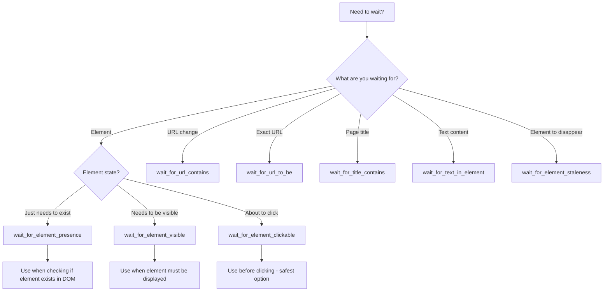

# WaitHelpers API Reference

## Overview

The `WaitHelpers` class provides centralized explicit wait utilities for Selenium WebDriver automation, eliminating Thread.sleep() anti-patterns and implicit/explicit wait mixing from the original Java implementation.

**Module:** `utilities.wait_helpers`

**Source:** `utilities/wait_helpers.py`

### Critical Problems Solved

This module addresses several critical issues found in the Java implementation:

1. **Thread.sleep() Scattered Across Codebase**
   - Original Java: `Thread.sleep(3000)` in LoginSD.java line 27
   - Original Java: Multiple 2-7 second hardcoded sleeps in Contacts.java
   - Python Solution: Condition-based explicit waits with configurable timeouts

2. **Implicit/Explicit Wait Mixing**
   - Original Java: 10-second global implicit wait (Driver.java:34) mixed with explicit waits
   - Problem: Unpredictable compound wait behavior
   - Python Solution: Explicit waits only, no implicit waits configured

3. **Hardcoded Timeout Values**
   - Original Java: Scattered timeout values (2s, 3s, 7s, 20s) throughout step definitions
   - Python Solution: Centralized configuration via config.yaml with three timeout tiers

4. **No Reusable Wait Utilities**
   - Original Java: Wait logic duplicated across multiple files
   - Python Solution: Single WaitHelpers class with comprehensive wait methods

### Migration Benefits

- **Predictable Synchronization**: Condition-based waits instead of blind sleeps
- **Configurable Timeouts**: All timeout values loaded from config.yaml
- **Comprehensive Logging**: Clear visibility into wait operations and timeout issues
- **Consistent Behavior**: Uniform wait strategy across all test scenarios
- **Reduced Flakiness**: Eliminates race conditions caused by insufficient sleep durations

### Quick Start

```python
from utilities.wait_helpers import WaitHelpers
from utilities.driver_manager import DriverManager
from selenium.webdriver.common.by import By

# Initialize wait helpers
driver = DriverManager.get_driver()
wait_helper = WaitHelpers(driver)

# Wait for element presence
element = wait_helper.wait_for_element_presence((By.ID, "email"))

# Wait for element to be clickable
button = wait_helper.wait_for_element_clickable((By.NAME, "submit"))
button.click()

# Wait for text to appear
wait_helper.wait_for_text_in_element((By.ID, "status"), "Success")

# Wait for URL change
wait_helper.wait_for_url_contains("/dashboard")
```

---

## WaitHelpers Class

Centralized explicit wait utilities with configurable timeouts.

**Source:** `utilities/wait_helpers.py:61-754`

### Class Overview

```python
class WaitHelpers:
    """
    Centralized explicit wait utilities for Selenium WebDriver automation.
    
    Provides reusable wait methods with configurable timeouts, eliminating:
    - Thread.sleep() anti-pattern from Java implementation
    - Implicit/explicit wait mixing (10s implicit + varying explicit)
    - Hardcoded timeout values scattered across test code
    """
```

### Features

- ✅ **Configurable Timeouts**: Load timeout values from config.yaml (default, long, short)
- ✅ **Comprehensive Logging**: Debug-level logging for all wait operations
- ✅ **Multiple Wait Conditions**: Presence, visibility, clickability, text, staleness, URL, title
- ✅ **Graceful Error Handling**: Descriptive TimeoutException messages with debugging context
- ✅ **Type Hints**: Full type annotations for IDE autocomplete and static type checking

### Timeout Configuration

Timeout values are loaded from `config/config.yaml` under the `timeouts` section:

| Timeout Tier | Configuration Key | Default Value | Use Case |
|--------------|------------------|---------------|----------|
| **Short** | `timeouts.short` | 5 seconds | Fast operations, quick checks |
| **Default** | `timeouts.explicit` | 10 seconds | Standard wait operations |
| **Long** | `timeouts.page_load` | 20 seconds | Slow operations, page loads |

**Configuration Example:**

```yaml
# config/config.yaml
timeouts:
  explicit: 10      # Default timeout for most operations
  page_load: 20     # Long timeout for slow operations
  short: 5          # Short timeout for fast operations
```

### Thread Safety

**Instance-Based Design**: Each thread should create its own `WaitHelpers` instance with a thread-local WebDriver.

The WaitHelpers class itself does not manage thread-local state, but it's designed to work with thread-local WebDriver instances from `DriverManager.get_driver()`. For parallel test execution:

```python
# Each thread gets its own driver and wait helper
driver = DriverManager.get_driver()  # Thread-local driver
wait_helper = WaitHelpers(driver)    # Thread-specific wait helper
```

**Source:** `utilities/wait_helpers.py:83-85`

---

## Constructor

### `__init__(driver)`

Initialize wait helpers with WebDriver instance and load timeout configuration.

**Source:** `utilities/wait_helpers.py:108-191`

#### Signature

```python
def __init__(self, driver: WebDriver) -> None
```

#### Parameters

| Parameter | Type | Required | Description |
|-----------|------|----------|-------------|
| `driver` | `WebDriver` | Yes | Selenium WebDriver instance for wait operations |

#### Raises

| Exception | Condition |
|-----------|-----------|
| `ValueError` | If driver is None |
| `ConfigurationError` | If timeout configuration is invalid (falls back to defaults) |

#### Behavior

1. Validates driver instance is not None
2. Loads timeout configuration from ConfigReader
3. Reads three timeout tiers from config.yaml:
   - `timeouts.explicit` → default_timeout (default: 10s)
   - `timeouts.page_load` → long_timeout (default: 20s)
   - `timeouts.short` → short_timeout (default: 5s)
4. Validates timeout values are positive integers
5. Falls back to safe defaults if configuration fails
6. Logs timeout configuration for debugging

#### Example

```python
from utilities.wait_helpers import WaitHelpers
from utilities.driver_manager import DriverManager

# Initialize with thread-local driver
driver = DriverManager.get_driver()
wait_helper = WaitHelpers(driver)

# Check configured timeouts
print(wait_helper)  # Output: WaitHelpers(default=10s, long=20s, short=5s)
```

#### Migration Note

**Java Original:**
```java
// No centralized wait helper in Java implementation
// Each test had inline waits or Thread.sleep()
Thread.sleep(3000);  // Hardcoded sleep
WebElement element = driver.findElement(By.id("field"));
```

**Python Improvement:**
```python
# Centralized, configurable wait utilities
wait_helper = WaitHelpers(driver)
element = wait_helper.wait_for_element_presence((By.ID, "field"))
```

---

## Wait Methods

### `wait_for_element_presence(locator, timeout=None)`

Wait for element to be present in the DOM (not necessarily visible).

**Source:** `utilities/wait_helpers.py:192-258`

#### When to Use

- Element must exist in DOM (may be hidden)
- Checking for element presence before interaction
- Loading dynamic content via AJAX

#### Signature

```python
def wait_for_element_presence(
    self,
    locator: Tuple[By, str],
    timeout: Optional[int] = None
) -> WebElement
```

#### Parameters

| Parameter | Type | Required | Default | Description |
|-----------|------|----------|---------|-------------|
| `locator` | `Tuple[By, str]` | Yes | - | Tuple of (By strategy, locator string). Examples: `(By.ID, "email")`, `(By.XPATH, "//button[@type='submit']")` |
| `timeout` | `int` | No | `default_timeout` | Maximum wait time in seconds |

#### Returns

`WebElement`: Located element ready for interaction

#### Raises

| Exception | Condition |
|-----------|-----------|
| `TimeoutException` | If element not found within timeout period |
| `ValueError` | If locator format is invalid |

#### Example

```python
from selenium.webdriver.common.by import By

# Basic usage - wait for element presence
element = wait_helper.wait_for_element_presence((By.NAME, "login"))
element.send_keys("user@example.com")

# With custom timeout
element = wait_helper.wait_for_element_presence(
    (By.ID, "delayed-content"),
    timeout=15
)

# XPath locator
submit_btn = wait_helper.wait_for_element_presence(
    (By.XPATH, "//button[@type='submit']")
)
```

#### Before/After Pattern

**Java (Anti-Pattern):**
```java
// Original Java code with Thread.sleep
Thread.sleep(2000);  // Hope element loads
WebElement element = driver.findElement(By.name("login"));
element.sendKeys("user@example.com");
```

**Python (Best Practice):**
```python
# Explicit wait for element presence
element = wait_helper.wait_for_element_presence((By.NAME, "login"))
element.send_keys("user@example.com")
```

---

### `wait_for_element_visible(locator, timeout=None)`

Wait for element to be visible (present in DOM and displayed).

**Source:** `utilities/wait_helpers.py:260-324`

#### When to Use

- Element must be visible to user (not just in DOM)
- Waiting for animations or transitions to complete
- Ensuring element is ready for user interaction

#### Signature

```python
def wait_for_element_visible(
    self,
    locator: Tuple[By, str],
    timeout: Optional[int] = None
) -> WebElement
```

#### Parameters

| Parameter | Type | Required | Default | Description |
|-----------|------|----------|---------|-------------|
| `locator` | `Tuple[By, str]` | Yes | - | Tuple of (By strategy, locator string) |
| `timeout` | `int` | No | `default_timeout` | Maximum wait time in seconds |

#### Returns

`WebElement`: Visible element ready for interaction

#### Raises

| Exception | Condition |
|-----------|-----------|
| `TimeoutException` | If element not visible within timeout |

#### Example

```python
# Wait for modal dialog to be visible
modal = wait_helper.wait_for_element_visible((By.CLASS_NAME, "modal-dialog"))
assert modal.is_displayed()

# Wait for success message with custom timeout
message = wait_helper.wait_for_element_visible(
    (By.ID, "success-message"),
    timeout=5
)
print(message.text)
```

#### Before/After Pattern

**Java (Anti-Pattern):**
```java
// Original Java code with hardcoded sleep
Thread.sleep(7000);  // Wait for animation
WebElement modal = driver.findElement(By.className("modal"));
// May still fail if animation takes > 7s
```

**Python (Best Practice):**
```python
# Wait for actual visibility condition
modal = wait_helper.wait_for_element_visible((By.CLASS_NAME, "modal"))
# Guaranteed to be visible when returned
```

---

### `wait_for_element_clickable(locator, timeout=None)`

Wait for element to be clickable (visible and enabled).

**Source:** `utilities/wait_helpers.py:326-394`

#### When to Use

- About to click an element
- Waiting for button/link to become enabled
- Ensuring element is interactive before action

#### Signature

```python
def wait_for_element_clickable(
    self,
    locator: Tuple[By, str],
    timeout: Optional[int] = None
) -> WebElement
```

#### Parameters

| Parameter | Type | Required | Default | Description |
|-----------|------|----------|---------|-------------|
| `locator` | `Tuple[By, str]` | Yes | - | Tuple of (By strategy, locator string) |
| `timeout` | `int` | No | `default_timeout` | Maximum wait time in seconds |

#### Returns

`WebElement`: Clickable element ready for click action

#### Raises

| Exception | Condition |
|-----------|-----------|
| `TimeoutException` | If element not clickable within timeout |

#### Example

```python
# Wait for button to be clickable then click
login_btn = wait_helper.wait_for_element_clickable((By.ID, "login-button"))
login_btn.click()

# Wait for submit button with XPath
submit_btn = wait_helper.wait_for_element_clickable(
    (By.XPATH, "//button[text()='Submit']"),
    timeout=5
)
submit_btn.click()

# Wait for link to be clickable
nav_link = wait_helper.wait_for_element_clickable((By.LINK_TEXT, "Dashboard"))
nav_link.click()
```

#### Before/After Pattern

**Java (Anti-Pattern):**
```java
// Original Java code with sleep before click
Thread.sleep(3000);  // Wait for button to be enabled
WebElement button = driver.findElement(By.name("submit"));
button.click();  // May still fail if not ready
```

**Python (Best Practice):**
```python
# Wait for clickable condition before click
button = wait_helper.wait_for_element_clickable((By.NAME, "submit"))
button.click()  # Guaranteed to be clickable
```

---

### `wait_for_text_in_element(locator, text, timeout=None)`

Wait for specific text to appear in an element.

**Source:** `utilities/wait_helpers.py:396-480`

#### When to Use

- Waiting for dynamic text to load (AJAX responses)
- Validating success/error messages appear
- Confirming page state through text content

#### Signature

```python
def wait_for_text_in_element(
    self,
    locator: Tuple[By, str],
    text: str,
    timeout: Optional[int] = None
) -> bool
```

#### Parameters

| Parameter | Type | Required | Default | Description |
|-----------|------|----------|---------|-------------|
| `locator` | `Tuple[By, str]` | Yes | - | Tuple of (By strategy, locator string) |
| `text` | `str` | Yes | - | Expected text to appear in element (case-sensitive substring match) |
| `timeout` | `int` | No | `default_timeout` | Maximum wait time in seconds |

#### Returns

`bool`: True if text appears within timeout

#### Raises

| Exception | Condition |
|-----------|-----------|
| `TimeoutException` | If text doesn't appear within timeout (includes actual text in error message) |

#### Example

```python
# Wait for success message after form submission
wait_helper.wait_for_text_in_element(
    (By.ID, "status-message"),
    "Registration successful"
)

# Wait for error message with custom timeout
wait_helper.wait_for_text_in_element(
    (By.CLASS_NAME, "alert-error"),
    "Invalid credentials",
    timeout=5
)

# Verify dynamic content loaded
wait_helper.wait_for_text_in_element(
    (By.ID, "user-name"),
    "John Doe"
)
```

#### Before/After Pattern

**Java (Anti-Pattern):**
```java
// Original Java polling pattern
for (int i = 0; i < 10; i++) {
    if (element.getText().contains("Success")) break;
    Thread.sleep(1000);  // Poll every second
}
```

**Python (Best Practice):**
```python
# Explicit wait for text condition
wait_helper.wait_for_text_in_element((By.ID, "status"), "Success")
```

---

### `wait_for_element_staleness(element, timeout=None)`

Wait for element to become stale (removed from DOM or DOM updated).

**Source:** `utilities/wait_helpers.py:482-549`

#### When to Use

- Waiting for DOM updates after AJAX operations
- Confirming page reload or partial refresh
- Avoiding StaleElementReferenceException

#### Signature

```python
def wait_for_element_staleness(
    self,
    element: WebElement,
    timeout: Optional[int] = None
) -> bool
```

#### Parameters

| Parameter | Type | Required | Default | Description |
|-----------|------|----------|---------|-------------|
| `element` | `WebElement` | Yes | - | WebElement instance to check for staleness |
| `timeout` | `int` | No | `default_timeout` | Maximum wait time in seconds |

#### Returns

`bool`: True if element becomes stale within timeout

#### Raises

| Exception | Condition |
|-----------|-----------|
| `TimeoutException` | If element doesn't become stale within timeout |
| `ValueError` | If element is None |

#### Example

```python
# Wait for table row to be removed after delete action
row = driver.find_element(By.ID, "row-123")
delete_button.click()
wait_helper.wait_for_element_staleness(row)

# Wait for element refresh after AJAX update
old_element = driver.find_element(By.ID, "dynamic-content")
refresh_button.click()
wait_helper.wait_for_element_staleness(old_element)
# Now safe to find element again
new_element = wait_helper.wait_for_element_presence((By.ID, "dynamic-content"))
```

#### Before/After Pattern

**Java (Anti-Pattern):**
```java
// Original Java code with sleep after DOM update
WebElement oldElement = driver.findElement(By.id("item"));
button.click();  // Triggers DOM update
Thread.sleep(2000);  // Hope DOM updated
WebElement newElement = driver.findElement(By.id("item"));
```

**Python (Best Practice):**
```python
# Wait for staleness confirmation
old_element = driver.find_element(By.ID, "item")
button.click()
wait_helper.wait_for_element_staleness(old_element)
new_element = wait_helper.wait_for_element_presence((By.ID, "item"))
```

---

### `wait_for_url_contains(url_fragment, timeout=None)`

Wait for current URL to contain specified fragment.

**Source:** `utilities/wait_helpers.py:551-619`

#### When to Use

- Waiting for navigation after action (login, form submit)
- Confirming redirect to expected page
- Validating routing in single-page applications

#### Signature

```python
def wait_for_url_contains(
    self,
    url_fragment: str,
    timeout: Optional[int] = None
) -> bool
```

#### Parameters

| Parameter | Type | Required | Default | Description |
|-----------|------|----------|---------|-------------|
| `url_fragment` | `str` | Yes | - | Expected substring in URL (e.g., "/dashboard", "success") |
| `timeout` | `int` | No | `default_timeout` | Maximum wait time in seconds |

#### Returns

`bool`: True if URL contains fragment within timeout

#### Raises

| Exception | Condition |
|-----------|-----------|
| `TimeoutException` | If URL doesn't contain fragment within timeout (includes current URL in error) |

#### Example

```python
# Wait for login redirect
login_button.click()
wait_helper.wait_for_url_contains("/dashboard")
print(f"Navigated to: {driver.current_url}")

# Wait for success page with custom timeout
submit_button.click()
wait_helper.wait_for_url_contains("/success", timeout=15)

# Validate URL parameter
wait_helper.wait_for_url_contains("?status=completed")
```

#### Before/After Pattern

**Java (Anti-Pattern):**
```java
// Original Java code with sleep before URL check
loginButton.click();
Thread.sleep(5000);  // Hope redirect completes
String currentUrl = driver.getCurrentUrl();
Assert.assertTrue(currentUrl.contains("/dashboard"));
```

**Python (Best Practice):**
```python
# Wait for actual URL change
login_button.click()
wait_helper.wait_for_url_contains("/dashboard")
assert "/dashboard" in driver.current_url
```

---

### `wait_for_url_to_be(url, timeout=None)`

Wait for current URL to exactly match expected URL.

**Source:** `utilities/wait_helpers.py:621-674`

#### When to Use

- Expecting exact URL match after navigation
- Validating complete URL including parameters
- Stricter validation than url_contains

#### Signature

```python
def wait_for_url_to_be(
    self,
    url: str,
    timeout: Optional[int] = None
) -> bool
```

#### Parameters

| Parameter | Type | Required | Default | Description |
|-----------|------|----------|---------|-------------|
| `url` | `str` | Yes | - | Complete expected URL |
| `timeout` | `int` | No | `default_timeout` | Maximum wait time in seconds |

#### Returns

`bool`: True if URL matches exactly within timeout

#### Raises

| Exception | Condition |
|-----------|-----------|
| `TimeoutException` | If URL doesn't match within timeout (includes current URL in error) |

#### Example

```python
# Wait for exact URL after redirect
logout_link.click()
wait_helper.wait_for_url_to_be("https://app.example.com/login")

# Validate complete URL with parameters
wait_helper.wait_for_url_to_be(
    "https://app.example.com/profile?id=123&edit=true",
    timeout=10
)
```

#### Comparison: url_contains vs url_to_be

```python
# url_contains: Flexible substring matching
wait_helper.wait_for_url_contains("/dashboard")  # Matches any URL with /dashboard

# url_to_be: Exact URL matching
wait_helper.wait_for_url_to_be("https://app.example.com/dashboard")  # Must match exactly
```

---

### `wait_for_title_contains(title_fragment, timeout=None)`

Wait for page title to contain specified text.

**Source:** `utilities/wait_helpers.py:676-741`

#### When to Use

- Waiting for page load completion
- Validating correct page after navigation
- Checking for dynamic title updates

#### Signature

```python
def wait_for_title_contains(
    self,
    title_fragment: str,
    timeout: Optional[int] = None
) -> bool
```

#### Parameters

| Parameter | Type | Required | Default | Description |
|-----------|------|----------|---------|-------------|
| `title_fragment` | `str` | Yes | - | Expected substring in page title |
| `timeout` | `int` | No | `default_timeout` | Maximum wait time in seconds |

#### Returns

`bool`: True if title contains fragment within timeout

#### Raises

| Exception | Condition |
|-----------|-----------|
| `TimeoutException` | If title doesn't contain fragment within timeout (includes current title in error) |

#### Example

```python
# Validate page title after navigation
dashboard_link.click()
wait_helper.wait_for_title_contains("Dashboard")
assert "Dashboard" in driver.title

# Wait for title update after action
wait_helper.wait_for_title_contains("(1) New Message", timeout=5)

# Verify page loaded correctly
wait_helper.wait_for_title_contains("User Profile")
```

#### Before/After Pattern

**Java (Anti-Pattern):**
```java
// Original Java code with sleep before title check
Thread.sleep(3000);
String title = driver.getTitle();
Assert.assertTrue(title.contains("Dashboard"));
```

**Python (Best Practice):**
```python
# Wait for actual title update
wait_helper.wait_for_title_contains("Dashboard")
```

---

## Convenience Functions

### `create_wait_helper(driver)`

Convenience function to create WaitHelpers instance.

**Source:** `utilities/wait_helpers.py:757-772`

#### Signature

```python
def create_wait_helper(driver: WebDriver) -> WaitHelpers
```

#### Parameters

| Parameter | Type | Required | Description |
|-----------|------|----------|-------------|
| `driver` | `WebDriver` | Yes | Selenium WebDriver instance |

#### Returns

`WaitHelpers`: Configured wait helper instance

#### Example

```python
from utilities.wait_helpers import create_wait_helper

# Alternative way to create wait helper
wait = create_wait_helper(driver)
wait.wait_for_element_clickable((By.ID, "submit"))
```

---

## Decision Guide

### Which Wait Method Should I Use?



### Method Selection Table

| Scenario | Recommended Method | Why |
|----------|-------------------|-----|
| Clicking button/link | `wait_for_element_clickable` | Ensures element is visible AND enabled |
| Verifying element exists | `wait_for_element_presence` | Element may be hidden but must exist |
| Checking visible text | `wait_for_element_visible` | Element must be displayed to user |
| After form submit | `wait_for_url_contains` | Verify navigation occurred |
| AJAX text update | `wait_for_text_in_element` | Wait for specific text to appear |
| DOM refresh | `wait_for_element_staleness` | Confirm old element removed |
| Page load verify | `wait_for_title_contains` | Confirm correct page loaded |

---

## Common Patterns

### Pattern 1: Login Flow

```python
# Complete login workflow with explicit waits
from utilities.wait_helpers import WaitHelpers
from selenium.webdriver.common.by import By

wait = WaitHelpers(driver)

# Wait for login page elements
email_field = wait.wait_for_element_presence((By.NAME, "email"))
email_field.send_keys("user@example.com")

password_field = wait.wait_for_element_presence((By.NAME, "password"))
password_field.send_keys("SecurePassword123")

# Wait for button to be clickable before clicking
login_btn = wait.wait_for_element_clickable((By.ID, "login-button"))
login_btn.click()

# Wait for successful navigation
wait.wait_for_url_contains("/dashboard")
wait.wait_for_title_contains("Dashboard")

# Verify success message
wait.wait_for_text_in_element((By.CLASS_NAME, "welcome-message"), "Welcome")
```

### Pattern 2: Dynamic Content Loading

```python
# Wait for AJAX content to load
search_button = wait.wait_for_element_clickable((By.ID, "search"))
search_button.click()

# Wait for loading spinner to appear then disappear
spinner = wait.wait_for_element_visible((By.CLASS_NAME, "spinner"))
wait.wait_for_element_staleness(spinner)

# Wait for results to be present
results = wait.wait_for_element_presence((By.ID, "search-results"))

# Verify result count text updated
wait.wait_for_text_in_element((By.ID, "result-count"), "Found 42 results")
```

### Pattern 3: Custom Timeout Strategy

```python
# Use different timeouts for different operations
wait = WaitHelpers(driver)

# Fast operation - use short timeout (5s)
quick_element = wait.wait_for_element_clickable(
    (By.ID, "quick-action"),
    timeout=wait.short_timeout
)

# Standard operation - use default (10s)
normal_element = wait.wait_for_element_visible(
    (By.CLASS_NAME, "content")
)

# Slow operation - use long timeout (20s)
slow_element = wait.wait_for_element_presence(
    (By.ID, "slow-loading-content"),
    timeout=wait.long_timeout
)
```

---

## Troubleshooting

### Issue: TimeoutException - Element Not Found

**Symptoms:**
```
TimeoutException: Element not found after 10s: By.ID='submit'
```

**Possible Causes:**
1. Element locator is incorrect
2. Element is in an iframe
3. Element loads slower than timeout
4. Element is dynamically generated with different ID

**Solutions:**

```python
# 1. Verify locator in browser DevTools
# Right-click element → Inspect → Copy selector

# 2. Check if element is in iframe
driver.switch_to.frame("iframe-name")
element = wait.wait_for_element_presence((By.ID, "submit"))

# 3. Increase timeout for slow elements
element = wait.wait_for_element_presence(
    (By.ID, "submit"),
    timeout=20  # Increase to 20s
)

# 4. Use more stable locator strategy
# Instead of: (By.ID, "submit-123")  # Dynamic ID
# Use: (By.XPATH, "//button[@type='submit']")  # Stable attribute
```

### Issue: Element Found But Not Clickable

**Symptoms:**
```
TimeoutException: Element not clickable after 10s: By.NAME='button'
Element may be disabled, covered, or not visible.
```

**Possible Causes:**
1. Element is covered by modal/overlay
2. Element is disabled
3. Element is outside viewport

**Solutions:**

```python
# 1. Close modal/overlay first
close_btn = wait.wait_for_element_clickable((By.CLASS_NAME, "modal-close"))
close_btn.click()
wait.wait_for_element_staleness(close_btn)  # Wait for modal to close

# Now element should be clickable
button = wait.wait_for_element_clickable((By.NAME, "button"))
button.click()

# 2. Check if element is enabled
element = wait.wait_for_element_presence((By.NAME, "button"))
print(f"Enabled: {element.is_enabled()}")  # Debug enabled state

# 3. Scroll element into view
element = wait.wait_for_element_presence((By.NAME, "button"))
driver.execute_script("arguments[0].scrollIntoView(true);", element)
# Wait a moment for scroll to complete
import time
time.sleep(0.5)
button = wait.wait_for_element_clickable((By.NAME, "button"))
button.click()
```

### Issue: Text Not Found in Element

**Symptoms:**
```
TimeoutException: Text 'Success' not found in element after 10s: By.ID='message'
Actual text: 'Processing...'
```

**Possible Causes:**
1. Text has different capitalization
2. Text hasn't loaded yet (need longer timeout)
3. Text is in different element
4. Extra whitespace in text

**Solutions:**

```python
# 1. Check exact text with case sensitivity
# Instead of: "success"
# Use: "Success"  # Match exact capitalization

# 2. Increase timeout for slow AJAX
wait.wait_for_text_in_element(
    (By.ID, "message"),
    "Success",
    timeout=20  # Increase timeout
)

# 3. Verify correct element
element = wait.wait_for_element_presence((By.ID, "message"))
print(f"Actual text: '{element.text}'")  # Debug actual text

# 4. Handle whitespace
# Get element and check with strip()
element = wait.wait_for_element_presence((By.ID, "message"))
print(f"Text with whitespace: '{element.text}'")
print(f"Text stripped: '{element.text.strip()}'")
```

### Issue: StaleElementReferenceException

**Symptoms:**
```
StaleElementReferenceException: element is not attached to the page document
```

**Cause:** DOM updated after element was located

**Solution:**

```python
# Use wait_for_element_staleness when expecting DOM update
old_element = driver.find_element(By.ID, "dynamic-content")
refresh_button.click()

# Wait for old element to become stale
wait.wait_for_element_staleness(old_element)

# Now safe to find element again
new_element = wait.wait_for_element_presence((By.ID, "dynamic-content"))
```

---

## See Also

### Related Documentation

- **[ConfigReader API](./config-reader.md)** - Timeout configuration management
- **[DriverManager API](./driver-manager.md)** - Thread-local WebDriver management
- **[BasePage API](../pages/base-page.md)** - Page Object base class using WaitHelpers
- **[Wait Strategies Guide](../../guides/wait-strategies.md)** - Comprehensive guide to wait patterns
- **[Configuration Guide](../../guides/configuration-management.md)** - Configuring timeout values

### External Resources

- [Selenium WebDriverWait Documentation](https://selenium-python.readthedocs.io/waits.html)
- [Expected Conditions Reference](https://selenium-python.readthedocs.io/api.html#module-selenium.webdriver.support.expected_conditions)
- [Avoiding Race Conditions](https://www.selenium.dev/documentation/webdriver/waits/)

---

**Last Updated:** 2024 (Documentation generated from source code)

**Source Code:** `utilities/wait_helpers.py`

