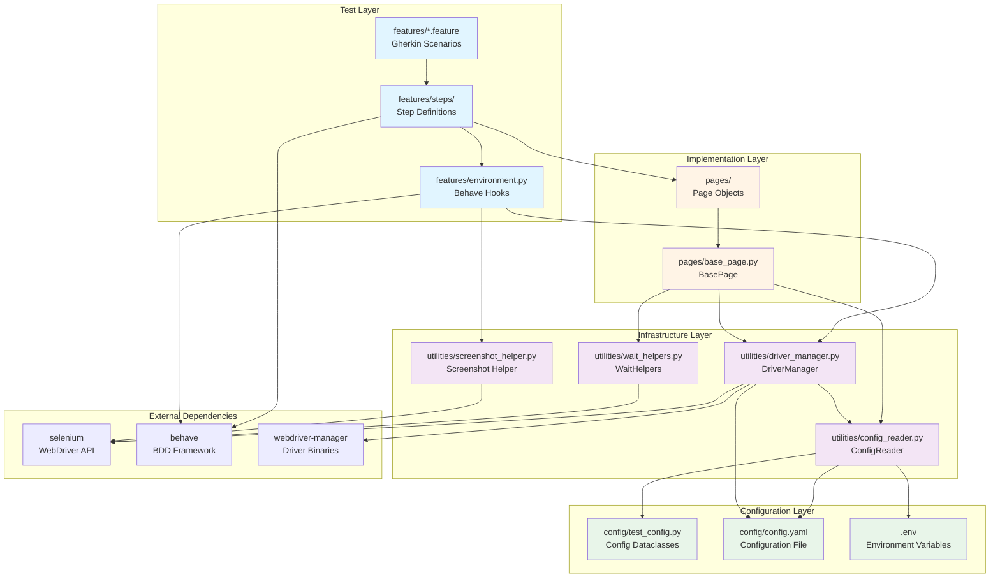
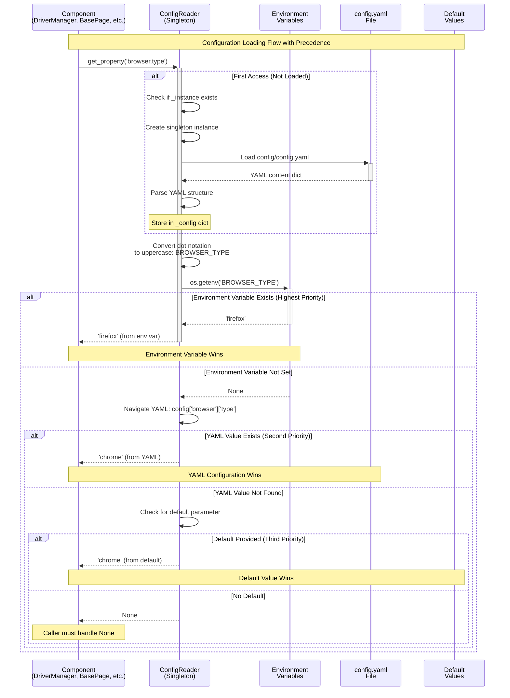
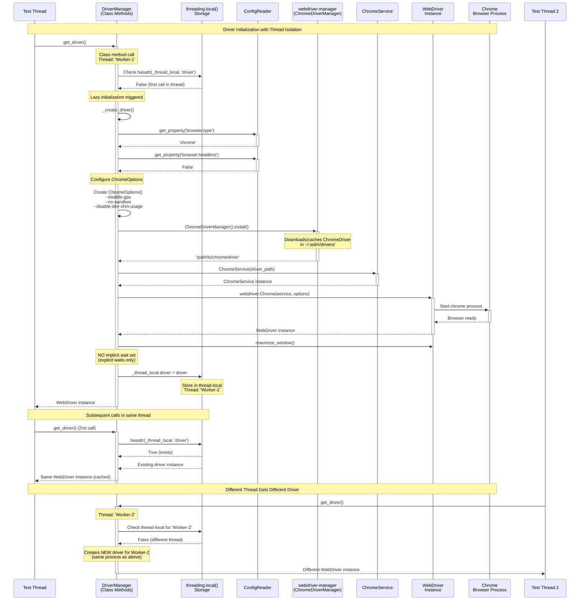
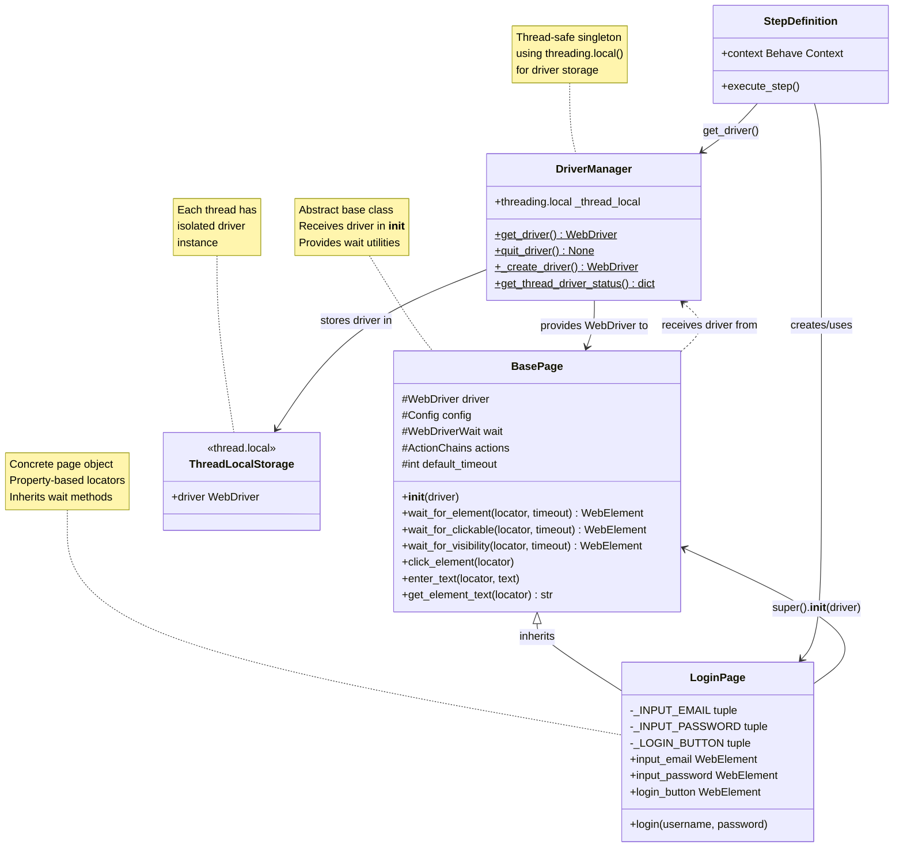
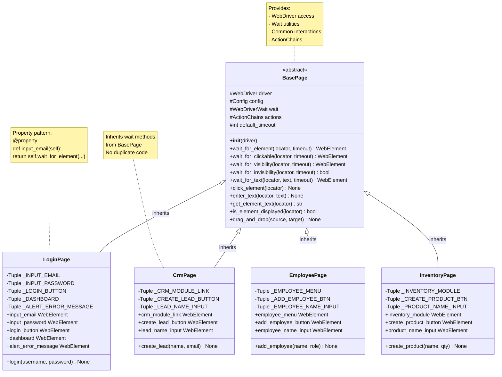
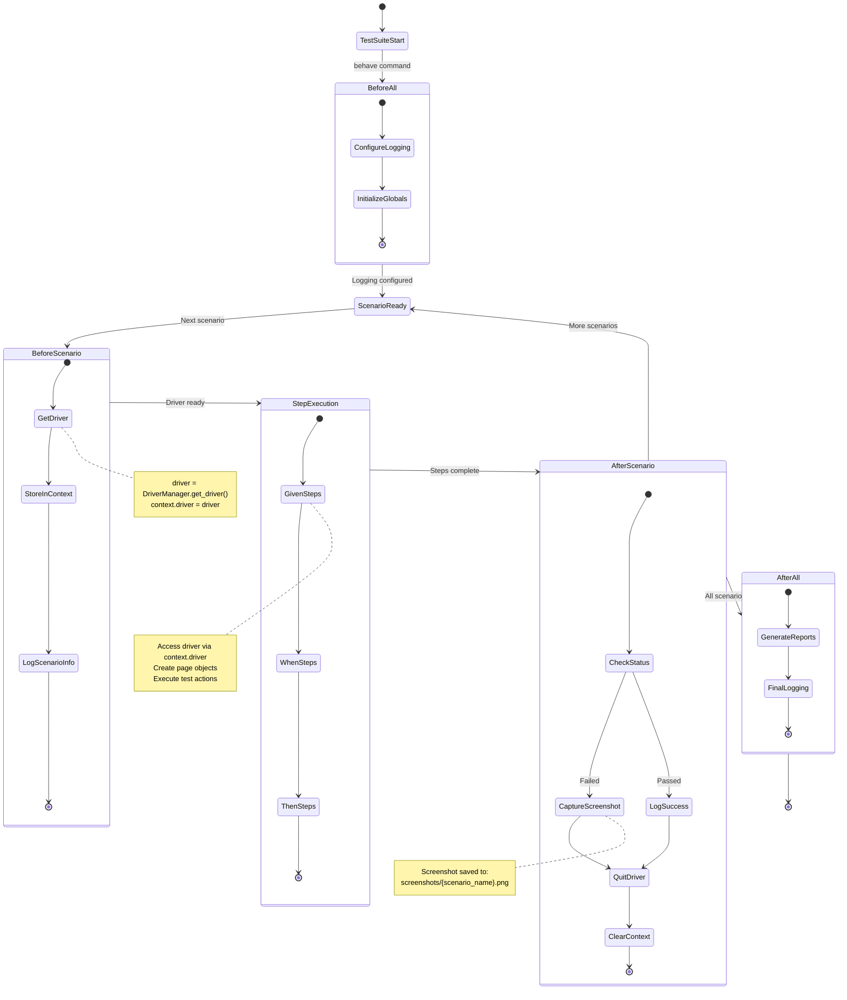

# Component Interactions

Comprehensive documentation of how major framework components communicate through dependency relationships, method calls, and data flow in the Testinium QA Python test automation framework.

## Overview

This document details the interaction patterns between all major framework components, showing how they collaborate to execute BDD test scenarios. Understanding these interactions is critical for:

- **Framework Extension**: Adding new page objects, utilities, or step definitions
- **Troubleshooting**: Diagnosing issues in the test execution lifecycle
- **Performance Optimization**: Identifying bottlenecks and optimization opportunities
- **Maintenance**: Understanding the impact of changes across component boundaries

## Component Dependency Graph

The following diagram shows all package-level dependencies and their import relationships:



**Source:** Architecture derived from import statements across `features/`, `pages/`, `utilities/`, and `config/` packages

### Dependency Relationships

| Component | Direct Dependencies | Purpose |
|-----------|---------------------|---------|
| **Step Definitions** | Pages, Behave context | Execute test steps using page objects and context state |
| **Environment Hooks** | DriverManager, Screenshot Helper | Manage test lifecycle and WebDriver instances |
| **Page Objects** | BasePage | Inherit common wait and interaction methods |
| **BasePage** | DriverManager, WaitHelpers, ConfigReader | Provide foundation for page object interactions |
| **DriverManager** | ConfigReader, webdriver-manager, Selenium | Manage WebDriver lifecycle with configuration |
| **ConfigReader** | test_config, config.yaml, .env | Load and provide configuration to consumers |
| **WaitHelpers** | Selenium WebDriverWait | Centralize explicit wait logic |

## Configuration Loading Sequence

Configuration loading follows a strict precedence order with environment variables overriding YAML file values:



**Source:** `utilities/config_reader.py:140-180` (ConfigReader.get_property method)

### Configuration Precedence Rules

1. **Highest Priority: Environment Variables** (e.g., `BROWSER_TYPE`)
   - Checked first by converting dot notation to uppercase underscore format
   - Use case: CI/CD overrides, developer-specific settings
   - Example: `BROWSER_TYPE=firefox` overrides `browser.type: chrome` in YAML

2. **Second Priority: YAML Configuration** (`config/config.yaml`)
   - Loaded from `config/config.yaml` on first ConfigReader access
   - Supports nested structure with dot notation access
   - Example: `browser.type`, `timeouts.explicit`

3. **Third Priority: Default Values**
   - Provided as parameter to `get_property()` method
   - Fallback when neither environment variable nor YAML value exists
   - Example: `get_property('browser.type', default='chrome')`

4. **Lowest Priority: None**
   - Returned when no value found at any level
   - Caller responsible for handling None case

**Example Configuration Precedence:**
```python
# Scenario: browser.type resolution
# YAML: browser.type: 'chrome'
# ENV:  BROWSER_TYPE='firefox'
# Code: get_property('browser.type', default='edge')
# Result: 'firefox' (environment variable wins)

# Scenario: custom.property resolution (not in YAML or ENV)
# YAML: (not present)
# ENV:  (not set)
# Code: get_property('custom.property', default='value')
# Result: 'value' (default wins)
```

## Driver Initialization Sequence

WebDriver initialization uses threading.local() for thread safety, enabling parallel test execution:



**Source:** `utilities/driver_manager.py:132-196` (get_driver), `utilities/driver_manager.py:199-378` (_create_driver)

### Threading.local() Pattern Explanation

**Thread Isolation Mechanism:**
```python
# Each thread gets its own namespace
_thread_local = threading.local()

# Thread 1:
_thread_local.driver = Chrome()  # Stored in Thread 1's namespace

# Thread 2:
_thread_local.driver = Chrome()  # Stored in Thread 2's namespace (different instance)

# Threads never see each other's drivers
# No race conditions or shared state issues
```

**Benefits:**
- **No Synchronization Needed**: Each thread has isolated storage
- **Parallel Execution Support**: Multiple tests run simultaneously with separate browsers
- **No Race Conditions**: Threads cannot interfere with each other's drivers
- **Clean Cleanup**: Each thread independently manages its driver lifecycle

**Java Equivalent:**
- Original Java code used `InheritableThreadLocal<WebDriver>`
- Python's `threading.local()` provides similar but simpler thread isolation
- Key difference: Python's version doesn't inherit to child threads (intentional design)

**Source:** `utilities/driver_manager.py:127-129` (thread-local storage), `utilities/driver_manager.py:165-170` (thread-local check)

## Page Object Element Access Sequence

Property-based locators with explicit waits prevent stale element references:

```mermaid
sequenceDiagram
    participant Step as Step Definition
    participant PageObj as LoginPage<br/>Instance
    participant Property as @property<br/>Decorator
    participant Base as BasePage<br/>(inherited)
    participant WaitHelp as WaitHelpers
    participant Wait as WebDriverWait
    participant WD as WebDriver
    participant DOM as Browser DOM
    
    Note over Step,DOM: Element Access with Explicit Wait
    
    Step->>+PageObj: login_page.input_email
    Note over PageObj: Property access triggers method
    
    PageObj->>+Property: Call input_email() getter
    Note over Property: @property decorator<br/>Line: pages/login_page.py:186
    
    Property->>+Base: wait_for_element(_INPUT_EMAIL)
    Note over Base: Inherited from BasePage<br/>_INPUT_EMAIL = (By.NAME, 'login')
    
    Base->>+WaitHelp: WaitHelpers(driver).wait_for_element()
    Note over WaitHelp: timeout from config.yaml<br/>default: 10 seconds
    
    WaitHelp->>+Wait: WebDriverWait(driver, timeout)
    Wait->>Wait: until(presence_of_element_located)
    
    loop Polling Until Element Present or Timeout
        Wait->>+WD: find_element(By.NAME, 'login')
        WD->>+DOM: Query DOM for element
        
        alt Element Found
            DOM-->>-WD: Element reference
            WD-->>-Wait: WebElement
            Note over Wait: Condition satisfied
        else Element Not Found (Yet)
            DOM-->>WD: NoSuchElementException
            WD-->>Wait: Exception
            Wait->>Wait: Sleep (poll_frequency)
            Note over Wait: Retry after 0.5s
        end
    end
    
    Wait-->>-WaitHelp: WebElement (fresh reference)
    WaitHelp-->>-Base: WebElement
    Base-->>-Property: WebElement
    Property-->>-PageObj: WebElement
    PageObj-->>-Step: WebElement (ready for interaction)
    
    Note over Step: Element is:

<br/>- Present in DOM<br/>- Fresh reference<br/>- Not stale
    
    Step->>PageObj: input_email.send_keys('user@example.com')
    Note over Step: Interaction succeeds
    
    Note over Step,DOM: Subsequent Property Access
    Step->>+PageObj: login_page.input_email (2nd access)
    Note over PageObj: NEW fresh element reference
    PageObj->>Property: Call getter again
    Property->>Base: wait_for_element() again
    Base->>WaitHelp: Query DOM again
    WaitHelp-->>Base: NEW WebElement reference
    Base-->>Property: NEW WebElement
    Property-->>PageObj: NEW WebElement
    PageObj-->>-Step: Fresh element (prevents stale reference)
    
    Note over Step,DOM: Why This Prevents Stale Elements
    Note over Step,DOM: Java PageFactory caches elements at initialization<br/>Python properties re-locate on every access<br/>DOM changes don't cause StaleElementReferenceException
```

**Source:** `pages/login_page.py:185-208` (input_email property), `pages/base_page.py:135-174` (wait_for_element)

### Property-Based Locator Pattern

**Pattern Explanation:**
```python
# Traditional approach (Java PageFactory):
# Elements cached at page initialization
@FindBy(name="login")
public WebElement inputEmail;  # Stored reference can become stale

# Python property-based approach:
@property
def input_email(self) -> WebElement:
    return self.wait_for_element(self._INPUT_EMAIL)  # Fresh lookup every time
```

**Advantages:**
1. **No Stale Elements**: Each access queries DOM, getting fresh reference
2. **Automatic Waits**: Explicit wait built into every element access
3. **Encapsulation**: Locator strategies hidden, can change without affecting tests
4. **Type Safety**: Returns WebElement with IDE autocomplete support
5. **Lazy Evaluation**: Element only located when actually accessed

**Comparison with Java PageFactory:**

| Aspect | Java PageFactory | Python Properties |
|--------|------------------|-------------------|
| **Initialization** | Elements located once at page init | No initialization needed |
| **Staleness** | Elements can become stale after DOM changes | Fresh element on every access |
| **Waits** | Must manually add waits before interaction | Built-in explicit waits |
| **Performance** | Faster (cached references) | Slightly slower (re-query each time) |
| **Reliability** | Lower (stale elements common) | Higher (always fresh) |
| **Recommended** | Not for dynamic applications | Yes, for all applications |

**Source:** `pages/base_page.py:88-132` (property pattern explanation), `pages/login_page.py:182-208` (example implementation)

## Complete Test Scenario Execution Sequence

End-to-end flow from Behave scenario to browser interaction:

```mermaid
sequenceDiagram
    participant Behave as Behave<br/>Framework
    participant Env as environment.py<br/>Hooks
    participant Context as context<br/>Object
    participant DriverMgr as DriverManager
    participant Step as Step<br/>Definition
    participant PageObj as Page<br/>Object
    participant Base as BasePage
    participant WD as WebDriver
    participant Browser as Browser
    participant Screenshot as Screenshot<br/>Helper
    
    Note over Behave,Browser: Test Suite Initialization
    
    Behave->>+Env: before_all(context)
    Env->>Env: Setup logging
    Env->>Context: Initialize context attributes
    Env-->>-Behave: Suite ready
    
    Note over Behave,Browser: Scenario Execution Start
    
    Behave->>+Env: before_scenario(context, scenario)
    Note over Env: Initialize WebDriver for scenario
    
    Env->>+DriverMgr: get_driver()
    DriverMgr->>DriverMgr: Create/return thread-local driver
    DriverMgr-->>-Env: WebDriver instance
    
    Env->>Context: context.driver = driver
    Env->>Env: Log scenario name, tags
    Env-->>-Behave: Scenario ready
    
    Note over Behave,Browser: Step Execution: Given
    
    Behave->>+Step: @given('User is on the upgenix login page')
    Step->>Context: base_url = context.driver (access)
    Step->>+DriverMgr: Get base_url from config
    DriverMgr-->>-Step: 'https://testinium.io/login'
    
    Step->>Context: driver = context.driver
    Step->>+WD: driver.get(base_url)
    WD->>+Browser: Navigate to URL
    Browser-->>-WD: Page loaded
    WD-->>-Step: Navigation complete
    Step-->>-Behave: Given step passed
    
    Note over Behave,Browser: Step Execution: When
    
    Behave->>+Step: @when('User logs in with "{user}" and "{pass}"')
    Step->>Context: driver = context.driver
    Step->>+PageObj: LoginPage(driver)
    PageObj->>+Base: super().__init__(driver)
    Base->>Base: Initialize wait utilities
    Base-->>-PageObj: BasePage initialized
    PageObj-->>-Step: LoginPage ready
    
    Step->>+PageObj: login(username, password)
    
    PageObj->>PageObj: input_email property access
    PageObj->>+Base: wait_for_element(_INPUT_EMAIL)
    Base->>+WD: WebDriverWait + find_element
    WD->>+Browser: Query DOM for email input
    Browser-->>-WD: Email element
    WD-->>-Base: WebElement
    Base-->>-PageObj: WebElement
    
    PageObj->>PageObj: email_element.clear()
    PageObj->>PageObj: email_element.send_keys(username)
    
    PageObj->>PageObj: input_password property access
    PageObj->>Base: wait_for_element(_INPUT_PASSWORD)
    Base->>WD: find_element
    WD->>Browser: Query DOM for password input
    Browser-->>WD: Password element
    WD-->>Base: WebElement
    Base-->>PageObj: WebElement
    
    PageObj->>PageObj: password_element.clear()
    PageObj->>PageObj: password_element.send_keys(password)
    
    PageObj->>PageObj: login_button property access
    PageObj->>Base: wait_for_clickable(_LOGIN_BUTTON)
    Base->>WD: WebDriverWait + element_to_be_clickable
    WD->>Browser: Query and check button clickable
    Browser-->>WD: Button element (clickable)
    WD-->>Base: WebElement
    Base-->>PageObj: WebElement
    
    PageObj->>PageObj: button.click()
    PageObj->>+WD: Click login button
    WD->>+Browser: Trigger click event
    Browser->>Browser: Process form submission
    Browser->>Browser: Navigate to dashboard
    Browser-->>-WD: Page changed
    WD-->>-PageObj: Click complete
    
    PageObj-->>-Step: login() complete
    Step-->>-Behave: When step passed
    
    Note over Behave,Browser: Step Execution: Then
    
    Behave->>+Step: @then('User should see dashboard')
    Step->>Context: driver = context.driver
    Step->>+PageObj: LoginPage(driver)
    PageObj-->>-Step: Page object ready
    
    Step->>+PageObj: dashboard property access
    PageObj->>+Base: wait_for_visibility(_DASHBOARD)
    Base->>+WD: WebDriverWait + visibility_of_element_located
    WD->>+Browser: Query and check dashboard visible
    Browser-->>-WD: Dashboard element (visible)
    WD-->>-Base: WebElement
    Base-->>-PageObj: WebElement
    PageObj-->>-Step: Dashboard element
    
    Step->>Step: assert dashboard.is_displayed()
    Step-->>-Behave: Then step passed
    
    Note over Behave,Browser: Scenario Completion
    
    Behave->>+Env: after_scenario(context, scenario)
    
    alt Scenario Failed
        Env->>Env: Check scenario.status == 'failed'
        Env->>+Screenshot: capture_screenshot(driver, scenario.name)
        Screenshot->>+WD: driver.get_screenshot_as_png()
        WD->>+Browser: Capture viewport
        Browser-->>-WD: PNG bytes
        WD-->>-Screenshot: Screenshot data
        Screenshot->>Screenshot: Save to screenshots/{name}.png
        Screenshot-->>-Env: Screenshot saved
        Env->>Env: Log failure with screenshot path
    else Scenario Passed
        Env->>Env: Log success
    end
    
    Env->>+DriverMgr: quit_driver()
    DriverMgr->>+WD: driver.quit()
    WD->>+Browser: Close browser process
    Browser-->>-WD: Process terminated
    WD-->>-DriverMgr: Cleanup complete
    DriverMgr->>DriverMgr: Clear thread-local reference
    DriverMgr-->>-Env: Driver quit
    
    Env-->>-Behave: Scenario complete
    
    Note over Behave,Browser: Test Suite Teardown
    
    Behave->>+Env: after_all(context)
    Env->>Env: Final logging
    Env->>Env: Generate reports
    Env-->>-Behave: Suite complete
```



**Source:** `features/environment.py:31-133` (Behave hooks), `features/steps/login_steps.py:45-143` (step definitions), `pages/login_page.py:350-429` (login method)

### Execution Flow Summary

**Phase 1: Suite Initialization (`before_all`)**
- Logging configuration
- Context object setup
- Global test suite preparation

**Phase 2: Scenario Setup (`before_scenario`)**
- WebDriver initialization via DriverManager
- Store driver in context.driver
- Log scenario metadata

**Phase 3: Step Execution**
- **Given steps**: Setup preconditions (navigate to pages, set state)
- **When steps**: Execute actions (login, click, fill forms)
- **Then steps**: Verify outcomes (assertions, element visibility)

**Phase 4: Scenario Teardown (`after_scenario`)**
- Capture screenshot if scenario failed
- Log scenario result
- Quit WebDriver and clean up

**Phase 5: Suite Teardown (`after_all`)**
- Final reporting
- Resource cleanup
- Test summary

**Context Object Role:**
- Shared state between steps within same scenario
- Stores WebDriver instance (context.driver)
- Stores page objects, configuration, test data
- Automatic cleanup between scenarios

**Source:** `features/environment.py:31-55` (before_all), `features/environment.py:58-87` (before_scenario), `features/environment.py:90-133` (after_scenario)

## DriverManager ↔ BasePage Interaction Pattern

Thread-local driver provision to page object instances:



**Interaction Flow:**

1. **Step Definition Requests Driver:**
   ```python
   # In step definition:
   driver = DriverManager.get_driver()  # Thread-local driver
   ```

2. **Step Definition Creates Page Object:**
   ```python
   login_page = LoginPage(driver)  # Pass driver to page object
   ```

3. **Page Object Calls Parent Constructor:**
   ```python
   # In LoginPage.__init__:
   super().__init__(driver)  # Call BasePage.__init__
   ```

4. **BasePage Stores Driver:**
   ```python
   # In BasePage.__init__:
   self.driver = driver  # Store for use in wait methods
   self.wait = WebDriverWait(driver, self.default_timeout)
   ```

5. **Page Object Uses Driver via BasePage Methods:**
   ```python
   # In LoginPage property:
   return self.wait_for_element(self._INPUT_EMAIL)  # Uses self.driver internally
   ```

**Key Design Decisions:**

- **DriverManager provides, doesn't inject**: Step definitions explicitly get driver and pass to page objects
- **BasePage stores, doesn't create**: Page objects receive driver, never create their own
- **Thread isolation**: Each thread gets its own driver from threading.local() storage
- **Single responsibility**: DriverManager manages lifecycle, BasePage manages interactions

**Thread Safety Guarantee:**
```python
# Thread 1:
driver1 = DriverManager.get_driver()  # Gets driver from Thread 1's storage
page1 = LoginPage(driver1)  # Uses Thread 1's driver

# Thread 2 (parallel execution):
driver2 = DriverManager.get_driver()  # Gets driver from Thread 2's storage
page2 = LoginPage(driver2)  # Uses Thread 2's driver

# driver1 != driver2 (isolated instances)
# page1 and page2 operate on different browsers
```

**Source:** `utilities/driver_manager.py:82-125` (DriverManager class), `pages/base_page.py:61-133` (BasePage class), `pages/login_page.py:158-180` (LoginPage.__init__)

## ConfigReader ↔ Consumers Pattern

Singleton configuration access from multiple components:

```mermaid
graph TB
    subgraph "Configuration Sources"
        EnvVars[Environment Variables<br/>BROWSER_TYPE=chrome<br/>HEADLESS=true]
        ConfigYAML[config.yaml<br/>browser:<br/>  type: chrome<br/>timeouts:<br/>  explicit: 10]
    end
    
    subgraph "ConfigReader Singleton"
        Singleton[ConfigReader Instance<br/>_instance = None<br/>_config = {loaded dict}]
        GetProperty[get_property method<br/>1. Check env vars<br/>2. Check YAML<br/>3. Return default]
    end
    
    subgraph "Consumer Components"
        DriverMgr[DriverManager<br/>get_property'browser.type'<br/>get_property'browser.headless']
        Base[BasePage<br/>get_property'timeouts.explicit'<br/>get_property'browser.window_size']
        WaitHelp[WaitHelpers<br/>get_property'timeouts.explicit']
        Steps[Step Definitions<br/>get_property'application.base_url'<br/>get_property'credentials.username']
    end
    
    EnvVars --> GetProperty
    ConfigYAML --> GetProperty
    GetProperty --> Singleton
    
    DriverMgr --> Singleton
    Base --> Singleton
    WaitHelp --> Singleton
    Steps --> Singleton
    
    Singleton -.->|'chrome'| DriverMgr
    Singleton -.->|10 seconds| Base
    Singleton -.->|10 seconds| WaitHelp
    Singleton -.->|'https://app.url'| Steps
    
    style Singleton fill:#e3f2fd
    style GetProperty fill:#bbdefb
    style EnvVars fill:#c8e6c9
    style ConfigYAML fill:#c8e6c9
    style DriverMgr fill:#fff9c4
    style Base fill:#fff9c4
    style WaitHelp fill:#fff9c4
    style Steps fill:#fff9c4
```

**Consumer Pattern Examples:**

**1. DriverManager Consuming Configuration:**
```python
# In utilities/driver_manager.py:
from utilities.config_reader import ConfigReader

def _create_driver(cls) -> WebDriver:
    config = ConfigReader()  # Get singleton instance
    browser_type = config.get_property('browser.type', default='chrome')
    headless = config.get_property('browser.headless', default=False)
    
    if browser_type.lower() == 'chrome':
        # Use configuration to create driver
        chrome_options = ChromeOptions()
        if headless:
            chrome_options.add_argument('--headless=new')
        # ...
```
**Source:** `utilities/driver_manager.py:250-262`

**2. BasePage Consuming Configuration:**
```python
# In pages/base_page.py:
from utilities.config_reader import ConfigReader

class BasePage:
    def __init__(self, driver: WebDriver):
        self.driver = driver
        self.config = ConfigReader()  # Store config instance
        
        # Get timeout from configuration
        timeout_config = self.config.get_property('timeouts.explicit', default=10)
        self.default_timeout = int(timeout_config)
        
        # Initialize wait with configured timeout
        self.wait = WebDriverWait(self.driver, self.default_timeout)
```
**Source:** `pages/base_page.py:93-106`

**3. Step Definition Consuming Configuration:**
```python
# In features/steps/login_steps.py:
from utilities.config_reader import ConfigReader

@given("User is on the upgenix login page")
def step_impl(context):
    config = ConfigReader()
    base_url = config.get_property('application.base_url')
    context.driver.get(base_url)
```
**Source:** `features/steps/login_steps.py:54-61`

**Singleton Pattern Benefits:**

1. **Single Configuration Load**: YAML file loaded once, shared across all consumers
2. **Consistent Values**: All components see same configuration state
3. **Memory Efficient**: One configuration dict in memory
4. **Thread Safe**: Singleton initialization happens once, reads are thread-safe

**Configuration Access Pattern:**
```python
# All consumers follow same pattern:

# 1. Import ConfigReader
from utilities.config_reader import ConfigReader

# 2. Get singleton instance (no parameters needed)
config = ConfigReader()

# 3. Request property with dot notation
value = config.get_property('section.subsection.key', default='fallback')

# 4. ConfigReader handles:
#    - Environment variable check (SECTION_SUBSECTION_KEY)
#    - YAML navigation (config['section']['subsection']['key'])
#    - Default value fallback
```

**Common Configuration Properties:**

| Property Path | Type | Used By | Purpose |
|---------------|------|---------|---------|
| `browser.type` | str | DriverManager | Select Chrome/Firefox |
| `browser.headless` | bool | DriverManager | Enable headless mode |
| `browser.window_size` | list | BasePage | Set window dimensions |
| `timeouts.explicit` | int | BasePage, WaitHelpers | Default wait timeout |
| `timeouts.page_load` | int | DriverManager | Page load timeout |
| `application.base_url` | str | Step Definitions | Application URL |
| `credentials.username` | str | Step Definitions | Test user credentials |
| `reporting.screenshots_on_failure` | bool | environment.py | Enable auto screenshots |

**Source:** `utilities/config_reader.py:73-137` (ConfigReader class), `config/config.yaml` (configuration structure)

## BasePage ↔ Page Objects Inheritance Pattern

Property-based locator inheritance with explicit waits:



**Inheritance Pattern Benefits:**

1. **Code Reuse**: All wait methods defined once in BasePage
2. **Consistency**: All page objects use same wait strategies
3. **Maintainability**: Changes to wait logic update all page objects
4. **Encapsulation**: Page objects focus on locators and workflows, not waits

**Property-Based Locator Implementation:**

**Step 1: Define Locator Constants (Private)**
```python
# In LoginPage class:
_INPUT_EMAIL: Tuple[str, str] = (By.NAME, "login")
_INPUT_PASSWORD: Tuple[str, str] = (By.NAME, "password")
_LOGIN_BUTTON: Tuple[str, str] = (By.XPATH, "//button[.='Log in']")
```
**Source:** `pages/login_page.py:131-144`

**Step 2: Create Property with Wait Method**
```python
# In LoginPage class:
@property
def input_email(self) -> WebElement:
    """Email input field element."""
    return self.wait_for_element(self._INPUT_EMAIL)  # Inherited from BasePage

@property
def login_button(self) -> WebElement:
    """Login button element."""
    return self.wait_for_clickable(self._LOGIN_BUTTON)  # Different wait method
```
**Source:** `pages/login_page.py:185-262`

**Step 3: Use Property in High-Level Method**
```python
# In LoginPage class:
def login(self, username: str, password: str) -> None:
    """Perform login workflow."""
    self.input_email.send_keys(username)  # Property access triggers wait
    self.input_password.send_keys(password)  # Fresh element each time
    self.login_button.click()  # Waits for clickable before returning
```
**Source:** `pages/login_page.py:350-429`

**Inherited Wait Methods from BasePage:**

| Method | Purpose | When to Use |
|--------|---------|-------------|
| `wait_for_element()` | Element present in DOM | Any element access |
| `wait_for_clickable()` | Element visible, enabled, clickable | Buttons, links |
| `wait_for_visibility()` | Element visible on page | Displayed content |
| `wait_for_invisibility()` | Element not visible or not present | Loading spinners |
| `wait_for_text()` | Element contains specific text | Text verification |

**Example: Multiple Page Objects Using BasePage:**

```python
# All page objects follow same pattern:

class LoginPage(BasePage):
    @property
    def input_email(self):
        return self.wait_for_element(self._INPUT_EMAIL)  # Uses inherited method

class CrmPage(BasePage):
    @property
    def create_lead_button(self):
        return self.wait_for_clickable(self._CREATE_LEAD_BTN)  # Uses inherited method

class EmployeePage(BasePage):
    @property
    def employee_menu(self):
        return self.wait_for_visibility(self._EMPLOYEE_MENU)  # Uses inherited method

# All share same WebDriver, Config, Wait utilities from BasePage
# No code duplication across page objects
```

**Source:** `pages/base_page.py:61-292` (BasePage implementation), `pages/login_page.py`, `pages/crm_page.py`, `pages/employee_page.py` (page object implementations)

## Features Environment Hooks Coordination Pattern

Behave lifecycle hooks orchestrating driver and reporting:



**Hook Coordination Details:**

**1. before_all(context) - Test Suite Initialization**
```python
def before_all(context):
    """Execute once before test suite starts."""
    # Configure logging for entire suite
    logging.basicConfig(
        level=logging.INFO,
        format='%(asctime)s - %(name)s - %(levelname)s - %(message)s'
    )
    
    # Initialize any global context attributes
    context.test_start_time = time.time()
    context.failed_scenarios = []
    
    logging.info("=== Test Suite Starting ===")
```
**Source:** `features/environment.py:31-55`

**Responsibilities:**
- Logging configuration
- Global context initialization
- Test suite preparation
- **Executed once per test run**

**2. before_scenario(context, scenario) - Scenario Setup**
```python
def before_scenario(context, scenario):
    """Execute before each scenario."""
    logging.info(f"Starting scenario: {scenario.name}")
    logging.info(f"Tags: {scenario.tags}")
    
    # Get WebDriver for this scenario (thread-local)
    context.driver = DriverManager.get_driver()
    
    # Store scenario info for later use
    context.scenario_name = scenario.name
    context.scenario_tags = scenario.tags
```
**Source:** `features/environment.py:58-87`

**Responsibilities:**
- WebDriver initialization
- Store driver in context for step access
- Log scenario metadata
- **Executed before each scenario**

**3. after_scenario(context, scenario) - Scenario Teardown**
```python
def after_scenario(context, scenario):
    """Execute after each scenario."""
    if scenario.status == 'failed':
        # Capture screenshot on failure
        screenshot_name = f"{scenario.name}_{datetime.now().strftime('%Y%m%d_%H%M%S')}"
        screenshot_path = capture_screenshot(context.driver, screenshot_name)
        logging.error(f"Scenario failed: {scenario.name}")
        logging.error(f"Screenshot saved: {screenshot_path}")
        
        # Store failure info
        context.failed_scenarios.append(scenario.name)
    else:
        logging.info(f"Scenario passed: {scenario.name}")
    
    # Always quit driver (cleanup)
    DriverManager.quit_driver()
    
    # Clear context driver reference
    context.driver = None
```
**Source:** `features/environment.py:90-133`

**Responsibilities:**
- Screenshot capture on failure
- Log scenario result
- WebDriver cleanup
- Context cleanup
- **Executed after each scenario (pass or fail)**

**4. after_all(context) - Test Suite Teardown**
```python
def after_all(context):
    """Execute once after all scenarios complete."""
    total_time = time.time() - context.test_start_time
    
    logging.info("=== Test Suite Complete ===")
    logging.info(f"Total execution time: {total_time:.2f} seconds")
    
    if context.failed_scenarios:
        logging.error(f"Failed scenarios: {len(context.failed_scenarios)}")
        for failed in context.failed_scenarios:
            logging.error(f"  - {failed}")
```
**Source:** `features/environment.py:136-158`

**Responsibilities:**
- Final reporting
- Summary statistics
- Resource cleanup
- **Executed once after all scenarios**

**Context Object Lifecycle:**

```
Test Suite Start
└── before_all(context)                    # context created
    ├── Scenario 1
    │   ├── before_scenario(context)       # context.driver = WebDriver
    │   ├── Given step (uses context.driver)
    │   ├── When step (uses context.driver)
    │   ├── Then step (uses context.driver)
    │   └── after_scenario(context)        # quit driver, context.driver = None
    ├── Scenario 2
    │   ├── before_scenario(context)       # NEW driver for new scenario
    │   ├── Steps...
    │   └── after_scenario(context)        # quit driver
    └── after_all(context)                 # context cleanup
```

**Key Design Decisions:**

1. **Fresh Driver Per Scenario**: Each scenario gets new WebDriver for isolation
2. **Automatic Screenshot**: Failures automatically captured for debugging
3. **Guaranteed Cleanup**: `quit_driver()` always called even if steps fail
4. **Context as State Holder**: Shared state between steps in same scenario
5. **Thread Safety**: Works with parallel execution (threading.local() in DriverManager)

**Source:** `features/environment.py:1-158` (complete file)

## Component Interaction Best Practices

Based on the architecture analysis, follow these patterns for reliable test automation:

### 1. Driver Management

**✅ DO:**
- Use `DriverManager.get_driver()` to obtain WebDriver instances
- Store driver in Behave context: `context.driver = DriverManager.get_driver()`
- Always call `DriverManager.quit_driver()` in teardown hooks
- Trust threading.local() for parallel execution safety

**❌ DON'T:**
- Create WebDriver instances directly with `webdriver.Chrome()`
- Share driver instances across threads
- Forget to quit driver in `after_scenario`
- Mix driver instances from different sources

### 2. Configuration Access

**✅ DO:**
- Use ConfigReader singleton: `config = ConfigReader()`
- Access with dot notation: `config.get_property('browser.type')`
- Provide sensible defaults: `get_property('key', default='value')`
- Override with environment variables for CI/CD

**❌ DON'T:**
- Hardcode configuration values in code
- Load config.yaml directly in multiple places
- Skip default values (handle None cases)
- Modify ConfigReader instance state

### 3. Page Object Design

**✅ DO:**
- Inherit from BasePage for all page objects
- Use property-based locators with `@property` decorator
- Call inherited wait methods: `self.wait_for_element(locator)`
- Return fresh WebElement references on each property access

**❌ DON'T:**
- Cache WebElement references in __init__
- Mix PageFactory pattern with properties
- Skip explicit waits (properties provide automatic waits)
- Create page objects without passing WebDriver

### 4. Step Definition Patterns

**✅ DO:**
- Access driver via context: `driver = context.driver`
- Create page objects in steps: `page = LoginPage(driver)`
- Keep steps focused on single actions
- Use page object methods for complex workflows

**❌ DON'T:**
- Create drivers in step definitions
- Manipulate WebDriver directly when page object exists
- Share page object instances across scenarios
- Store sensitive data (passwords) in context

### 5. Wait Strategy

**✅ DO:**
- Use explicit waits from BasePage/WaitHelpers
- Choose appropriate wait method:
  - `wait_for_element()` - Element present
  - `wait_for_clickable()` - Buttons, links
  - `wait_for_visibility()` - Displayed elements
- Configure timeouts in config.yaml
- Handle TimeoutException appropriately

**❌ DON'T:**
- Use `time.sleep()` for synchronization
- Set implicit waits (breaks explicit wait pattern)
- Use fixed timeouts in code
- Ignore TimeoutException (catch and log)

### 6. Behave Hook Usage

**✅ DO:**
- Initialize drivers in `before_scenario`
- Quit drivers in `after_scenario`
- Capture screenshots on failure
- Log scenario execution details
- Use context object for scenario state

**❌ DON'T:**
- Skip cleanup in `after_scenario`
- Assume driver exists without initialization
- Store global state outside context
- Forget error handling in hooks

### 7. Thread Safety

**✅ DO:**
- Trust threading.local() in DriverManager
- Use separate driver per scenario/thread
- Pass driver explicitly to page objects
- Keep page objects thread-isolated

**❌ DON'T:**
- Share WebDriver instances across threads
- Use global driver variables
- Synchronize access manually (not needed)
- Assume child thread inheritance (threading.local doesn't)

## Troubleshooting Component Interactions

Common issues and solutions:

### Issue: StaleElementReferenceException

**Cause:** Cached WebElement reference used after DOM changes

**Solution:** Use property-based locators that query DOM on each access
```python
# ❌ Bad (caching):
self.email_field = driver.find_element(By.NAME, 'login')
self.email_field.send_keys('user@example.com')  # May be stale

# ✅ Good (property):
@property
def input_email(self):
    return self.wait_for_element((By.NAME, 'login'))

self.input_email.send_keys('user@example.com')  # Fresh element
```

### Issue: TimeoutException in wait methods

**Cause:** Element not found within configured timeout

**Solution:** 
1. Verify locator accuracy
2. Increase timeout in config.yaml
3. Check element is in visible viewport
4. Ensure page fully loaded

```python
# Check configuration:
# config.yaml:
# timeouts:
#   explicit: 10  # Increase if needed

# Or override in specific call:
element = self.wait_for_element(locator, timeout=30)
```

### Issue: Driver not found in context

**Cause:** Missing `before_scenario` hook or direct driver creation

**Solution:** Always initialize driver in `before_scenario`
```python
# In environment.py:
def before_scenario(context, scenario):
    context.driver = DriverManager.get_driver()  # Required

# In step definition:
driver = context.driver  # Now available
```

### Issue: Configuration not loading

**Cause:** config.yaml path incorrect or YAML syntax error

**Solution:** Verify config file location and syntax
```bash
# Check file exists:
ls config/config.yaml

# Validate YAML syntax:
python -c "import yaml; yaml.safe_load(open('config/config.yaml'))"
```

### Issue: Parallel execution failures

**Cause:** Shared state between threads or incorrect driver management

**Solution:** Verify threading.local() isolation
```python
# Each thread should get different driver:
driver1 = DriverManager.get_driver()  # Thread 1
driver2 = DriverManager.get_driver()  # Thread 2
# Verify: driver1.session_id != driver2.session_id
```

## See Also

- [System Overview](system-overview.md) - High-level architecture and design patterns
- [Configuration Management](configuration-management.md) - Configuration precedence and loading
- [Parallel Execution](parallel-execution.md) - Thread safety and parallelism details
- [Wait Strategies](wait-strategies.md) - Explicit wait patterns and best practices
- [Page Object Model](page-object-model.md) - Property-based locator pattern deep dive

## Summary

Component interactions in the Testinium QA framework follow clear patterns:

1. **DriverManager** provides thread-local WebDriver instances
2. **ConfigReader** singleton supplies configuration to all consumers
3. **BasePage** provides wait utilities to all page objects via inheritance
4. **Behave hooks** orchestrate driver lifecycle and reporting
5. **Property-based locators** prevent stale elements and provide automatic waits
6. **Context object** shares state between steps within scenarios

Understanding these interactions enables effective framework usage, extension, and troubleshooting.
