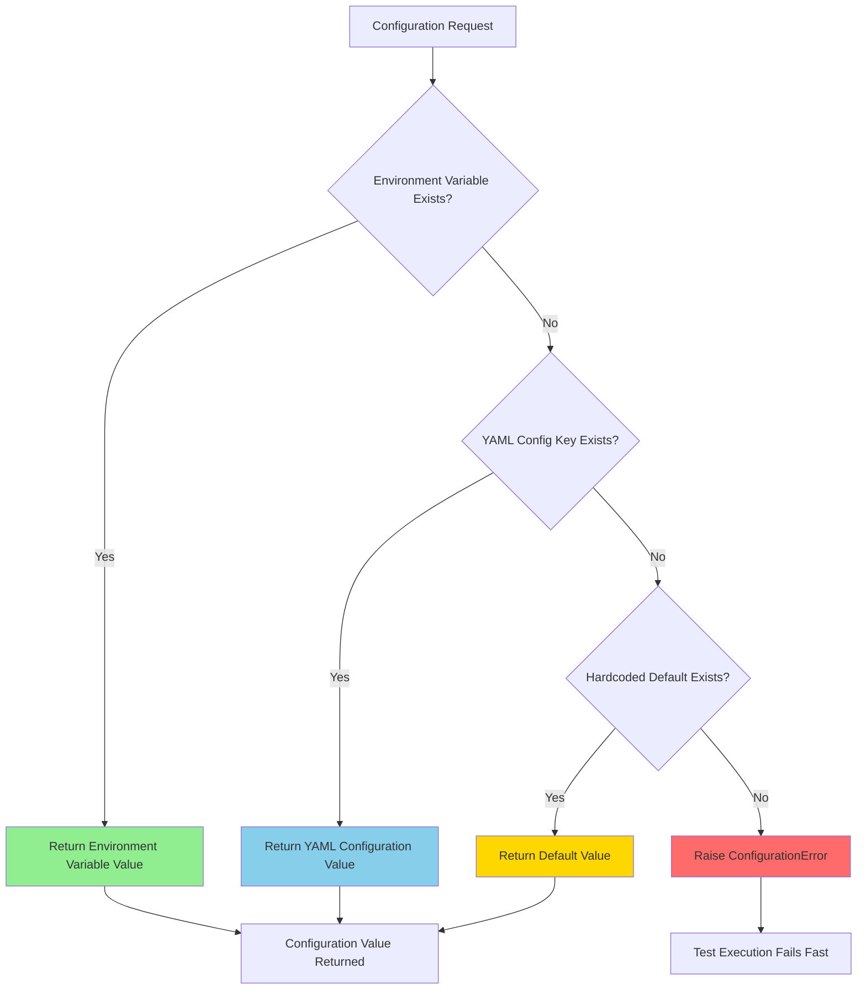
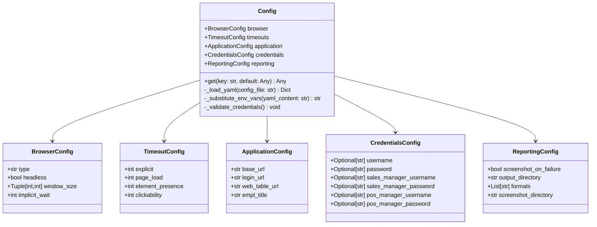
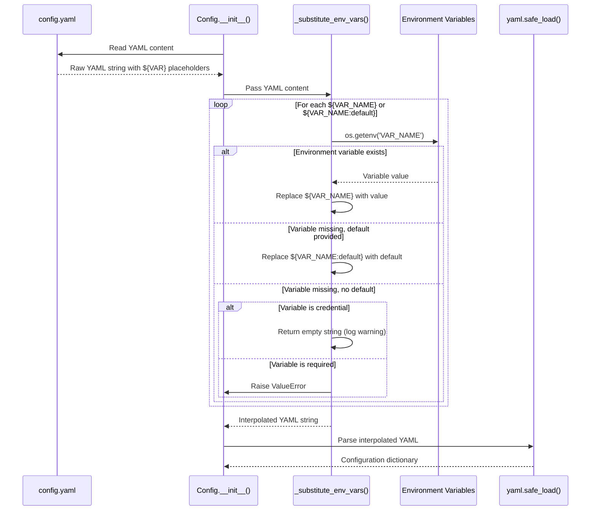
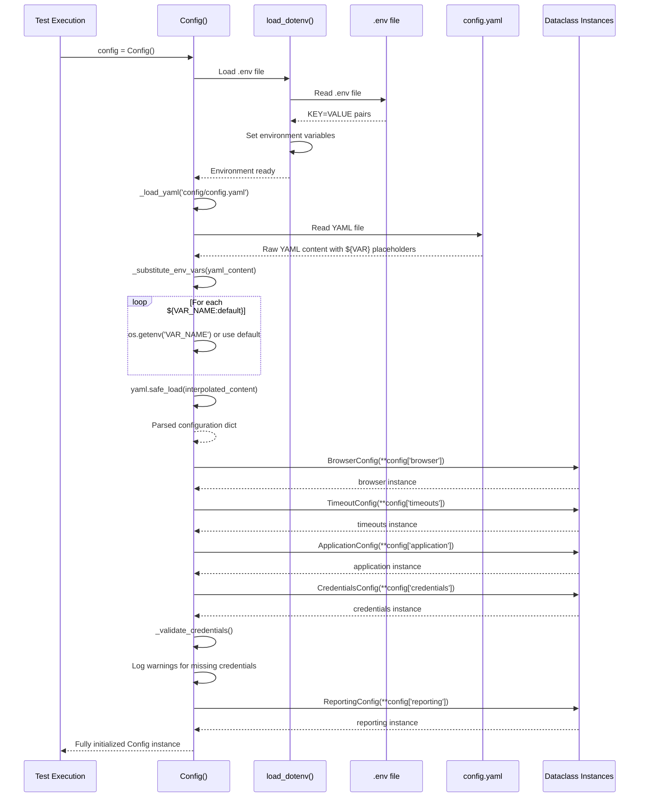

# Configuration Management Architecture

## Overview

The Testinium test automation framework implements a robust three-level configuration hierarchy that provides flexibility, security, and type safety for test execution across different environments. This architecture replaces the Java `ConfigurationReader.java` pattern with a modern Python dataclass-based approach that eliminates configuration errors through compile-time type checking.

**Key Features:**
- **Three-level precedence hierarchy**: Environment variables → YAML configuration → hardcoded defaults
- **Environment variable interpolation**: `${VAR_NAME}` and `${VAR_NAME:default}` syntax for dynamic configuration
- **Type-safe dataclass access**: IDE autocomplete and type checking for all configuration properties
- **Singleton pattern**: Consistent configuration state across the entire test framework
- **Security-first design**: Credentials loaded exclusively from environment variables, never hardcoded
- **Migration context**: Enhanced replacement for Java ConfigurationReader with proper error handling

**Source Files:**
- `config/test_config.py` - Dataclass-based type-safe configuration
- `utilities/config_reader.py` - Backward-compatible configuration reader singleton
- `config/config.yaml` - YAML configuration with environment variable placeholders
- `.env.example` - Template for local development environment variables

## Configuration Hierarchy

The framework implements a three-level configuration precedence system where higher-priority sources override lower-priority ones:

### Precedence Levels

**1. Environment Variables (Highest Priority)**
- Loaded from system environment or `.env` file
- Override all YAML configuration values
- Format: `BROWSER_TYPE`, `BASE_URL`, `TEST_USERNAME`
- Use case: CI/CD pipelines, cloud deployments, secure credential injection

**2. YAML Configuration (Medium Priority)**
- Loaded from `config/config.yaml`
- Contains structured configuration with defaults
- Supports environment variable interpolation using `${VAR_NAME}` syntax
- Use case: Project-wide defaults, test environment settings

**3. Hardcoded Defaults (Lowest Priority)**
- Defined in dataclass field defaults
- Fallback values when no other configuration exists
- Example: `implicit_wait: int = 0`
- Use case: Framework-level safe defaults

### Precedence Flow Diagram



### Precedence Examples

**Example 1: Browser Type Configuration**

```python
# Scenario: BROWSER_TYPE environment variable is set to 'firefox'
# config.yaml contains: browser.type = 'chrome'
# Dataclass default: No default for browser type

import os
os.environ['BROWSER_TYPE'] = 'firefox'

from config.test_config import get_config
config = get_config()

# Result: 'firefox' (environment variable overrides YAML)
print(config.browser.type)  # Output: firefox
```

**Example 2: Base URL with Default Fallback**

```yaml
# config.yaml
application:
  base_url: ${BASE_URL:https://testinium.example.com}
```

```python
# Scenario 1: BASE_URL environment variable NOT set
# Result: Uses default from YAML interpolation
config = get_config()
print(config.application.base_url)  
# Output: https://testinium.example.com

# Scenario 2: BASE_URL environment variable IS set
import os
os.environ['BASE_URL'] = 'https://staging.testinium.com'
# Result: Environment variable overrides YAML default
print(config.application.base_url)
# Output: https://staging.testinium.com
```

**Example 3: Timeout Configuration Precedence**

```python
# config.yaml contains: timeouts.explicit = 10
# Environment variable TIMEOUT_EXPLICIT = 15

from utilities.config_reader import ConfigReader
config_reader = ConfigReader()

# Using ConfigReader (checks environment first)
timeout = config_reader.get_property('timeouts.explicit')
print(timeout)  # Output: '15' (string from environment variable)

# Using type-safe Config dataclass (YAML only, no env var override)
from config.test_config import Config
config = Config()
print(config.timeouts.explicit)  # Output: 10 (int from YAML)
```

## Dataclass-Based Configuration Structure

The framework uses Python dataclasses to provide type-safe, IDE-friendly configuration access with compile-time validation.

### Configuration Dataclass Hierarchy



### Type Safety Benefits

**1. IDE Autocomplete**

```python
from config.test_config import get_config

config = get_config()

# IDE provides autocomplete after typing "config."
config.browser.    # Autocomplete shows: type, headless, window_size, implicit_wait
config.timeouts.   # Autocomplete shows: explicit, page_load, element_presence, clickability
config.application.  # Autocomplete shows: base_url, login_url, web_table_url, empl_title
```

**2. Type Checking with mypy**

```python
from config.test_config import get_config

config = get_config()

# Type checker knows browser.type is a string
browser_type: str = config.browser.type  # ✓ Type check passes

# Type checker catches incorrect type assignment
browser_type: int = config.browser.type  # ✗ Type error: str cannot be assigned to int

# Type checker validates timeout is an integer
timeout: int = config.timeouts.explicit  # ✓ Type check passes
timeout: str = config.timeouts.explicit  # ✗ Type error
```

**3. Compile-Time Error Detection**

```python
from config.test_config import get_config

config = get_config()

# Typo in attribute name caught by IDE/type checker
print(config.browser.typo)  # ✗ AttributeError: 'BrowserConfig' has no attribute 'typo'

# Correct attribute name
print(config.browser.type)  # ✓ Works correctly
```

### Configuration Dataclass Examples

**Accessing Browser Configuration:**

```python
from config.test_config import get_config

config = get_config()

# Type-safe dot notation access
browser_type = config.browser.type  # Returns: str
is_headless = config.browser.headless  # Returns: bool
window_width, window_height = config.browser.window_size  # Returns: Tuple[int, int]

print(f"Browser: {browser_type}, Headless: {is_headless}")
print(f"Window size: {window_width}x{window_height}")
```

**Source:** `config/test_config.py:40-54`

**Accessing Timeout Configuration:**

```python
from config.test_config import get_config

config = get_config()

# All timeout values are integers (seconds)
explicit_wait = config.timeouts.explicit  # Returns: int (default: 10)
page_load = config.timeouts.page_load  # Returns: int (default: 30)
element_presence = config.timeouts.element_presence  # Returns: int (default: 5)
clickability = config.timeouts.clickability  # Returns: int (default: 3)

# Use in WebDriverWait
from selenium.webdriver.support.ui import WebDriverWait
wait = WebDriverWait(driver, config.timeouts.explicit)
```

**Source:** `config/test_config.py:58-74`

**Accessing Application URLs:**

```python
from config.test_config import get_config

config = get_config()

# All URLs are strings with environment variable interpolation
base_url = config.application.base_url  # From ${BASE_URL:default}
login_url = config.application.login_url  # Derived from base_url
web_table_url = config.application.web_table_url  # For employee tests

# Navigate to application
driver.get(config.application.base_url)
```

**Source:** `config/test_config.py:78-94`

**Accessing Credentials (Security-First):**

```python
from config.test_config import get_config

config = get_config()

# All credentials are Optional[str] - may be None if env vars not set
username = config.credentials.username  # From ${TEST_USERNAME}
password = config.credentials.password  # From ${TEST_PASSWORD}

# Always check credentials exist before using
if username and password:
    login_page.login(username, password)
else:
    raise ValueError("Test credentials not configured. Set TEST_USERNAME and TEST_PASSWORD.")

# Role-based credentials for different user types
sales_manager_user = config.credentials.sales_manager_username
pos_manager_user = config.credentials.pos_manager_username
```

**Source:** `config/test_config.py:97-117`

## ConfigReader Singleton Pattern

The `ConfigReader` class implements the singleton pattern to ensure consistent configuration state across the entire test framework, with thread-safety considerations for parallel test execution.

### Singleton Implementation

```python
class ConfigReader:
    """Singleton configuration reader."""
    
    _instance: Optional['ConfigReader'] = None
    _config: Dict[str, Any] = {}
    _initialized: bool = False
    
    def __new__(cls, *args, **kwargs) -> 'ConfigReader':
        """Ensure single instance per process."""
        if cls._instance is None:
            cls._instance = super(ConfigReader, cls).__new__(cls)
        return cls._instance
    
    def __init__(self, config_file: str = "config/config.yaml") -> None:
        """Initialize only once due to singleton pattern."""
        if ConfigReader._initialized:
            return  # Skip re-initialization
        
        # Load configuration (runs only once)
        self._load_configuration()
        ConfigReader._initialized = True
```

**Source:** `utilities/config_reader.py:54-146`

### Singleton Usage Pattern

```python
# First instantiation - loads configuration
config1 = ConfigReader()
print(config1.get_property('browser.type'))  # Output: chrome

# Second instantiation - returns same instance
config2 = ConfigReader()
print(config1 is config2)  # Output: True (same object)

# Convenience function
from utilities.config_reader import get_config
config3 = get_config()
print(config1 is config3)  # Output: True (same singleton)
```

### Thread Safety Considerations

**⚠️ Important:** The `ConfigReader` singleton is **NOT thread-safe during initialization**. 

**Best Practice:**
```python
# In features/environment.py before_all hook
def before_all(context):
    """Initialize ConfigReader in main thread before parallel execution."""
    from utilities.config_reader import ConfigReader
    
    # Force initialization in main thread
    config = ConfigReader()
    logger.info("ConfigReader initialized: %s", config)
    
    # Now safe for parallel test execution
```

**Rationale:**
- Configuration is read-only after initialization
- All parallel test threads share the same configuration state
- Thread-local state handled by `DriverManager`, not `ConfigReader`

**Source:** `utilities/config_reader.py:54-146`

## Environment Variable Interpolation

The framework supports dynamic configuration through environment variable interpolation in YAML files, enabling secure credential management and environment-specific configuration.

### Interpolation Syntax

**Required Variable (No Default):**
```yaml
credentials:
  username: ${TEST_USERNAME}  # Raises error if TEST_USERNAME not set
```

**Optional Variable with Default:**
```yaml
application:
  base_url: ${BASE_URL:https://testinium.example.com}  # Uses default if BASE_URL not set
```

### Interpolation Flow Diagram



### Interpolation Examples

**Example 1: Base URL with Default**

```yaml
# config.yaml
application:
  base_url: ${BASE_URL:https://testinium.example.com}
```

```python
# Scenario 1: BASE_URL not set
# Result: Uses default value
import os
os.environ.pop('BASE_URL', None)  # Ensure not set

from config.test_config import Config
config = Config()
print(config.application.base_url)
# Output: https://testinium.example.com

# Scenario 2: BASE_URL set to staging
os.environ['BASE_URL'] = 'https://staging.testinium.com'
config = Config()  # Reload configuration
print(config.application.base_url)
# Output: https://staging.testinium.com
```

**Source:** `config/test_config.py:265-309`

**Example 2: Required Credentials**

```yaml
# config.yaml
credentials:
  username: ${TEST_USERNAME}
  password: ${TEST_PASSWORD}
```

```python
# Scenario 1: Credentials not set (raises error for non-credentials)
# For credentials specifically, logs warning and returns empty string
import os
os.environ.pop('TEST_USERNAME', None)
os.environ.pop('TEST_PASSWORD', None)

from config.test_config import Config
config = Config()
print(config.credentials.username)  # Output: '' (empty string)
print(config.credentials.password)  # Output: '' (empty string)
# Warning logged: "Credential environment variable not set: TEST_USERNAME"

# Scenario 2: Credentials set properly
os.environ['TEST_USERNAME'] = 'test.user@example.com'
os.environ['TEST_PASSWORD'] = 'secure_password'
config = Config()
print(config.credentials.username)  # Output: test.user@example.com
```

**Example 3: Multiple Role Credentials**

```yaml
# config.yaml
credentials:
  sales_manager_username: ${SALES_MANAGER_USERNAME}
  sales_manager_password: ${SALES_MANAGER_PASSWORD}
  pos_manager_username: ${POS_MANAGER_USERNAME}
  pos_manager_password: ${POS_MANAGER_PASSWORD}
```

```bash
# .env file
SALES_MANAGER_USERNAME=sales.manager@example.com
SALES_MANAGER_PASSWORD=sales_secure_password
POS_MANAGER_USERNAME=pos.manager@example.com
POS_MANAGER_PASSWORD=pos_secure_password
```

```python
from config.test_config import get_config

config = get_config()

# Access role-based credentials
if config.credentials.sales_manager_username:
    print(f"Sales Manager: {config.credentials.sales_manager_username}")
    
if config.credentials.pos_manager_username:
    print(f"POS Manager: {config.credentials.pos_manager_username}")
```

**Source:** `.env.example:16-27`, `config/config.yaml:89-110`

## Configuration Loading Sequence

The framework follows a specific initialization sequence to load configuration with proper precedence and error handling.

### Loading Sequence Diagram



### Initialization Steps

**Step 1: Load Environment Variables from .env**
```python
# config/test_config.py:181-183
from dotenv import load_dotenv
load_dotenv()  # Loads .env file into os.environ
logger.info("Environment variables loaded from .env file")
```

**Step 2: Load and Parse YAML Configuration**
```python
# config/test_config.py:185-188
self._config_file = config_file
self._raw_config = self._load_yaml(config_file)
logger.info("Configuration loaded from %s", config_file)
```

**Step 3: Substitute Environment Variables**
```python
# config/test_config.py:247
yaml_content = self._substitute_env_vars(yaml_content)
```

**Step 4: Parse Interpolated YAML**
```python
# config/test_config.py:250
config_dict = yaml.safe_load(yaml_content)
```

**Step 5: Instantiate Dataclasses**
```python
# config/test_config.py:192-210
self.browser = BrowserConfig(**self._raw_config['browser'])
self.timeouts = TimeoutConfig(**self._raw_config['timeouts'])
self.application = ApplicationConfig(**self._raw_config['application'])
self.credentials = CredentialsConfig(**self._raw_config.get('credentials', {}))
self.reporting = ReportingConfig(**self._raw_config['reporting'])
```

**Step 6: Validate Credentials**
```python
# config/test_config.py:207
self._validate_credentials()  # Logs warnings for missing credentials
```

**Source:** `config/test_config.py:169-217`

### Configuration File Discovery

The framework uses the following search order for configuration files:

1. **Explicit path parameter:** `Config(config_file='path/to/config.yaml')`
2. **Default path:** `config/config.yaml` (relative to project root)
3. **FileNotFoundError raised** if file not found

```python
# Successful configuration loading
config = Config('config/config.yaml')  # Explicit path

config = Config()  # Uses default: config/config.yaml

# Failed configuration loading
try:
    config = Config('nonexistent/config.yaml')
except FileNotFoundError as e:
    print(f"Configuration file not found: {e}")
```

**Source:** `config/test_config.py:236-240`

## Migration Context from Java

This Python configuration architecture replaces the Java `ConfigurationReader.java` pattern with significant improvements in error handling, type safety, and security.

### Java vs Python Configuration Pattern

**Java ConfigurationReader.java (Original):**
```java
// ConfigurationReader.java (lines 15-30)
public class ConfigurationReader {
    private static Properties properties;
    
    static {
        try {
            String path = "configuration.properties";  // File not found in repo
            FileInputStream input = new FileInputStream(path);
            properties = new Properties();
            properties.load(input);
            input.close();
        } catch (IOException e) {
            e.printStackTrace();  // ❌ Silent exception swallowing
        }
    }
    
    public static String getProperty(String key) {
        return properties.getProperty(key);  // ❌ Can return null
    }
}
```

**Python Config Implementation (Current):**
```python
# config/test_config.py
from dataclasses import dataclass
import yaml
from dotenv import load_dotenv

@dataclass
class Config:
    def __init__(self, config_file: str = 'config/config.yaml'):
        load_dotenv()  # ✓ Load environment variables
        self._raw_config = self._load_yaml(config_file)  # ✓ Explicit error handling
        
        # ✓ Type-safe dataclass instantiation
        self.browser = BrowserConfig(**self._raw_config['browser'])
        self.timeouts = TimeoutConfig(**self._raw_config['timeouts'])
        # ... other dataclasses
    
    def _load_yaml(self, config_file: str) -> Dict[str, Any]:
        if not Path(config_file).exists():
            raise FileNotFoundError(f"Config file not found: {config_file}")  # ✓ Fail fast
        
        with open(config_file, 'r') as f:
            return yaml.safe_load(f)  # ✓ Structured YAML
```

### Key Improvements Over Java Version

| Aspect | Java ConfigurationReader | Python Config | Improvement |
|--------|-------------------------|---------------|-------------|
| **Error Handling** | Silent IOException swallowing with printStackTrace() | Explicit FileNotFoundError and ConfigurationError | ✓ Fail-fast behavior, clear error messages |
| **Configuration Format** | .properties file (flat key-value) | YAML (nested structures) | ✓ Hierarchical organization |
| **Type Safety** | String-only, runtime casting required | Dataclasses with type hints | ✓ Compile-time type checking |
| **Environment Variables** | Not supported | Full support with interpolation | ✓ Secure credential management |
| **Default Values** | No support | ${VAR:default} syntax | ✓ Flexible configuration |
| **Null Handling** | Can return null, no validation | Optional[] types, explicit validation | ✓ Prevents NullPointerException equivalent |
| **IDE Support** | No autocomplete | Full autocomplete with dataclasses | ✓ Developer productivity |
| **Security** | Hardcoded credentials risk | Environment-only credentials | ✓ Security remediation |

**Source:** `config/test_config.py:1-445`, `utilities/config_reader.py:1-395`

### Migration Benefits

**1. Type Safety Eliminates Runtime Errors**

```java
// Java - Runtime error risk
String timeout = ConfigurationReader.getProperty("timeout");
int timeoutValue = Integer.parseInt(timeout);  // Can throw NumberFormatException
```

```python
# Python - Compile-time type safety
config = get_config()
timeout: int = config.timeouts.explicit  # Already an int, no parsing needed
```

**2. Environment Variable Support**

```java
// Java - No environment variable support
// Credentials hardcoded in configuration.properties (security risk)
```

```python
# Python - Environment variables with fallback
# config.yaml
credentials:
  username: ${TEST_USERNAME}  # Loaded from environment
  password: ${TEST_PASSWORD}
```

**3. Explicit Error Handling**

```java
// Java - Silent failure
static {
    try {
        // ... load configuration
    } catch (IOException e) {
        e.printStackTrace();  // Continues with null properties
    }
}
```

```python
# Python - Fail-fast with clear errors
def _load_yaml(self, config_file: str) -> Dict[str, Any]:
    if not Path(config_file).exists():
        raise FileNotFoundError(f"Configuration file not found: {config_file}")
```

## Complete Configuration Example

### Setup Configuration Files

**Step 1: Create config/config.yaml**
```yaml
browser:
  type: chrome
  headless: false
  window_size: [1920, 1080]
  implicit_wait: 0

timeouts:
  explicit: 10
  page_load: 30
  element_presence: 5
  clickability: 3

application:
  base_url: ${BASE_URL:https://testinium.example.com}
  login_url: ${BASE_URL:https://testinium.example.com}/login
  web_table_url: ${BASE_URL:https://testinium.example.com}/web-tables
  empl_title: "Employee Management"

credentials:
  username: ${TEST_USERNAME}
  password: ${TEST_PASSWORD}
  sales_manager_username: ${SALES_MANAGER_USERNAME}
  sales_manager_password: ${SALES_MANAGER_PASSWORD}

reporting:
  screenshot_on_failure: true
  output_directory: reports/
  formats: [json, html, allure]
  screenshot_directory: reports/screenshots/
```

**Step 2: Create .env File (Local Development)**
```bash
# .env (DO NOT COMMIT TO VERSION CONTROL)
BASE_URL=https://testinium.example.com
TEST_USERNAME=test.user@example.com
TEST_PASSWORD=secure_password_here
SALES_MANAGER_USERNAME=sales.manager@example.com
SALES_MANAGER_PASSWORD=sales_secure_password
```

**Step 3: Use Configuration in Test Code**
```python
# features/steps/login_steps.py
from behave import given, when, then
from config.test_config import get_config
from pages.login_page import LoginPage

@given('I navigate to the login page')
def step_navigate_to_login(context):
    """Navigate to application login page."""
    config = get_config()
    context.driver.get(config.application.login_url)

@when('I login with default test credentials')
def step_login_default_credentials(context):
    """Login using credentials from configuration."""
    config = get_config()
    
    # Validate credentials are configured
    if not config.credentials.username or not config.credentials.password:
        raise ValueError("Test credentials not configured. Set TEST_USERNAME and TEST_PASSWORD.")
    
    login_page = LoginPage(context.driver)
    login_page.login(config.credentials.username, config.credentials.password)

@when('I login as sales manager')
def step_login_sales_manager(context):
    """Login as sales manager role."""
    config = get_config()
    
    if not config.credentials.sales_manager_username:
        raise ValueError("Sales manager credentials not configured.")
    
    login_page = LoginPage(context.driver)
    login_page.login(
        config.credentials.sales_manager_username,
        config.credentials.sales_manager_password
    )
```

**Source:** `features/steps/login_steps.py` (pattern example)

## Best Practices

### 1. Never Hardcode Credentials

**❌ Bad Practice:**
```python
# DON'T hardcode credentials in code
username = "test.user@example.com"
password = "my_password"
login_page.login(username, password)
```

**✓ Good Practice:**
```python
# DO use configuration for credentials
config = get_config()
if not config.credentials.username or not config.credentials.password:
    raise ValueError("Credentials not configured")
login_page.login(config.credentials.username, config.credentials.password)
```

### 2. Use Type-Safe Dataclass Access

**❌ Less Optimal:**
```python
# String-based key access (no type checking)
from utilities.config_reader import ConfigReader
config = ConfigReader()
timeout = config.get_property('timeouts.explicit', default=10)
# Returns: Any type, no IDE autocomplete
```

**✓ Better:**
```python
# Type-safe dataclass access (compile-time checking)
from config.test_config import get_config
config = get_config()
timeout: int = config.timeouts.explicit
# Returns: int, full IDE autocomplete
```

### 3. Provide Defaults for Optional Configuration

**✓ Good Practice:**
```yaml
# config.yaml - Provide sensible defaults
application:
  base_url: ${BASE_URL:https://testinium.example.com}  # Default if BASE_URL not set
  
timeouts:
  explicit: ${TIMEOUT_EXPLICIT:10}  # Default to 10 seconds
```

### 4. Initialize ConfigReader Before Parallel Execution

**✓ Good Practice:**
```python
# features/environment.py
def before_all(context):
    """Initialize singletons in main thread before parallel execution."""
    from utilities.config_reader import ConfigReader
    from config.test_config import get_config
    
    # Force initialization in main thread
    config_reader = ConfigReader()
    config = get_config()
    
    logger.info("Configuration initialized: %s", config_reader)
```

### 5. Validate Required Configuration Early

**✓ Good Practice:**
```python
# features/environment.py
def before_all(context):
    """Validate required configuration before test execution."""
    config = get_config()
    
    # Validate browser configuration
    if config.browser.type not in ['chrome', 'firefox', 'edge']:
        raise ValueError(f"Unsupported browser: {config.browser.type}")
    
    # Validate timeouts are positive
    if config.timeouts.explicit <= 0:
        raise ValueError("Explicit timeout must be positive")
    
    # Warn if credentials missing
    if not config.credentials.username:
        logger.warning("Test credentials not configured")
```

### 6. Use .env for Local Development Only

**✓ Good Practice:**
```bash
# .env (local development only - NOT committed)
BASE_URL=https://localhost:8080
TEST_USERNAME=test.user@localhost
TEST_PASSWORD=local_password

# .gitignore
.env
*.env
!.env.example
```

**CI/CD environments should set environment variables directly, not use .env files.**

## Troubleshooting

### Issue: Configuration File Not Found

**Symptoms:**
```
FileNotFoundError: Configuration file not found: config/config.yaml
```

**Cause:** 
- Configuration file doesn't exist at expected path
- Working directory is incorrect
- File path typo in Config() initialization

**Solution:**
```bash
# Verify file exists
ls -la config/config.yaml

# Check current working directory
pwd

# Ensure running from project root
cd /path/to/testinium-qa-python

# Verify config.yaml is valid YAML
python -c "import yaml; yaml.safe_load(open('config/config.yaml'))"
```

### Issue: Environment Variable Not Substituted

**Symptoms:**
```python
config.application.base_url  # Returns: "${BASE_URL}" instead of actual URL
```

**Cause:**
- Environment variable not set
- Syntax error in interpolation (missing $ or {})
- .env file not loaded

**Solution:**
```bash
# Check if environment variable is set
echo $BASE_URL

# Verify .env file exists and is loaded
cat .env | grep BASE_URL

# Manually set environment variable for testing
export BASE_URL="https://testinium.example.com"

# Verify interpolation works
python -c "from config.test_config import get_config; print(get_config().application.base_url)"
```

### Issue: Credentials Return Empty String

**Symptoms:**
```python
config.credentials.username  # Returns: '' (empty string)
```

**Cause:**
- Credential environment variables not set
- .env file not present or not loaded
- Typo in environment variable name

**Solution:**
```bash
# Check credential environment variables
echo $TEST_USERNAME
echo $TEST_PASSWORD

# Verify .env file contains credentials
cat .env | grep TEST_USERNAME

# Check for typos (case-sensitive)
# Correct: TEST_USERNAME
# Wrong: test_username, TestUsername

# Set environment variables explicitly
export TEST_USERNAME="test.user@example.com"
export TEST_PASSWORD="secure_password"

# Reload configuration
python -c "from config.test_config import reset_config, get_config; reset_config(); print(get_config().credentials.username)"
```

### Issue: Type Error with Configuration Values

**Symptoms:**
```python
TypeError: unsupported operand type(s) for +: 'NoneType' and 'int'
```

**Cause:**
- Missing configuration key returns None
- No default value provided
- YAML structure doesn't match dataclass

**Solution:**
```python
# Always provide defaults for optional values
timeout = config.get('timeouts.explicit', default=10)

# Validate configuration after loading
config = get_config()
assert config.timeouts.explicit > 0, "Invalid timeout configuration"

# Check YAML structure matches dataclasses
# config.yaml must have:
# timeouts:
#   explicit: 10  # Must be int
#   page_load: 30
```

### Issue: Singleton Not Resetting Between Tests

**Symptoms:**
- Configuration changes in one test affect other tests
- Cannot reload configuration after environment variable changes

**Cause:**
- Singleton pattern retains state across tests
- Need to explicitly reset singleton

**Solution:**
```python
# In test setup/teardown
from config.test_config import reset_config

def setUp():
    """Reset configuration before each test."""
    reset_config()  # Clears singleton instance
    
    # Set test-specific environment variables
    os.environ['BASE_URL'] = 'https://test.example.com'
    
    # Get fresh configuration
    config = get_config()

def tearDown():
    """Clean up environment variables."""
    os.environ.pop('BASE_URL', None)
    reset_config()
```

### Issue: YAML Parsing Error

**Symptoms:**
```
yaml.scanner.ScannerError: while scanning for the next token
found character '\t' that cannot start any token
```

**Cause:**
- YAML file contains tabs instead of spaces
- Invalid YAML syntax
- Missing quotes around special characters

**Solution:**
```bash
# Validate YAML syntax
python -c "import yaml; yaml.safe_load(open('config/config.yaml'))"

# Check for tabs (should only use spaces)
cat -A config/config.yaml | grep '\t'

# Replace tabs with spaces
sed -i 's/\t/  /g' config/config.yaml

# Validate special characters are quoted
# Wrong: base_url: https://example.com?param=value
# Right: base_url: "https://example.com?param=value"
```

### Issue: Configuration Precedence Not Working

**Symptoms:**
- Environment variable should override YAML but doesn't
- Always getting YAML value instead of environment value

**Cause:**
- Using `Config` dataclass (doesn't check environment variables directly)
- Need to use `ConfigReader` for environment precedence
- Environment variable name doesn't match

**Solution:**
```python
# Config dataclass: Environment variables only in YAML interpolation
config = get_config()
config.browser.type  # Returns YAML value (no runtime env var check)

# ConfigReader: Checks environment variables at runtime
from utilities.config_reader import ConfigReader
config_reader = ConfigReader()
config_reader.get_property('browser.type')  # Checks BROWSER_TYPE env var first

# Environment variable names must match convention:
# YAML key: browser.type
# Env var: BROWSER_TYPE (uppercase, dots → underscores)
```

## See Also

- **[API Reference: config.test_config](../api-reference/config/test-config.md)** - Complete Config dataclass API documentation
- **[API Reference: utilities.config_reader](../api-reference/utilities/config-reader.md)** - ConfigReader API reference
- **[Reference: Configuration Options](../reference/configuration-options.md)** - Complete list of all configuration options
- **[Reference: Environment Variables](../reference/environment-variables.md)** - All supported environment variables
- **[Guide: Configuration Management](../guides/configuration-management.md)** - Advanced configuration patterns and examples
- **[Deployment: CI/CD Configuration](../deployment/jenkins-integration.md)** - Setting environment variables in CI/CD pipelines
- **[Architecture: System Overview](./system-overview.md)** - Overall framework architecture

---

**Last Updated:** 2024 (Migration from Java ConfigurationReader.java)  
**Source Files:** `config/test_config.py`, `utilities/config_reader.py`, `config/config.yaml`, `.env.example`
