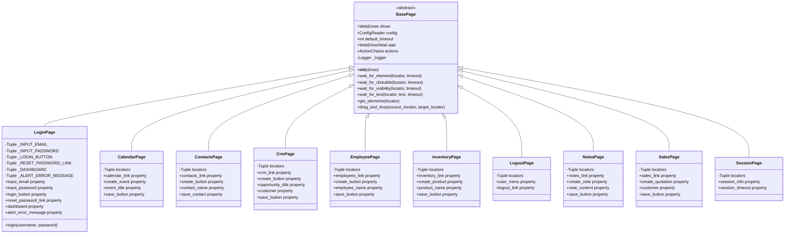

# Page Object Model Architecture

## Overview

The Page Object Model (POM) is the foundational design pattern used throughout this test automation framework to encapsulate page structure and behavior into reusable, maintainable page classes. This architecture migrates from Java's PageFactory annotation-based approach to a Python property-based pattern that provides superior reliability and flexibility.

**Key Principles:**

- **Encapsulation:** Page structure (locators) and behavior (actions) are contained within dedicated page object classes
- **Reusability:** Common WebDriver utilities are inherited from BasePage abstract class
- **Maintainability:** UI changes require updates only in page objects, not in test code
- **Explicit Waits:** All element access uses explicit waits (no implicit waits) preventing timing issues
- **Fresh Element References:** Property-based locators return new WebElement instances on each access, preventing stale element exceptions

**Benefits:**

- Reduced code duplication across test scenarios
- Improved test readability through high-level page methods
- Centralized element locators for easy maintenance
- Consistent wait strategies across all pages
- Thread-safe parallel test execution support

## BasePage Abstract Class Architecture

The `BasePage` class serves as the foundation for all page objects in the framework, providing common WebDriver utilities that eliminate code duplication and ensure consistent behavior across all pages.

**Source:** `pages/base_page.py`

### Class Attributes

| Attribute | Type | Description |
|-----------|------|-------------|
| `driver` | WebDriver | Selenium WebDriver instance for browser interaction |
| `config` | ConfigReader | Configuration reader singleton for accessing settings from config.yaml |
| `default_timeout` | int | Default explicit wait timeout in seconds (from config.yaml or 10s fallback) |
| `wait` | WebDriverWait | Pre-configured WebDriverWait instance with default timeout |
| `actions` | ActionChains | ActionChains instance for complex interactions (drag-and-drop, hover) |
| `_logger` | Logger | Logger instance for page object operation debugging |

### Core Wait Methods

BasePage provides a comprehensive suite of wait methods that form the foundation of the property-based locator pattern:

#### 1. `wait_for_element(locator, timeout=None)`

Waits for an element to be present in the DOM and returns it.

**Use Case:** Confirming element existence without visibility requirement, retrieving elements that may be off-screen.

**Parameters:**
- `locator` (Tuple[str, str]): Tuple of (By strategy, locator value)
- `timeout` (Optional[int]): Custom timeout in seconds (overrides default if provided)

**Returns:** `WebElement` when present in DOM

**Raises:** `TimeoutException` if element not present within timeout

**Example:**
```python
element = base_page.wait_for_element((By.NAME, "username"))
```

**Source:** `pages/base_page.py:166-228`

#### 2. `wait_for_clickable(locator, timeout=None)`

Waits for an element to be clickable (visible, enabled, and not obscured) and returns it.

**Use Case:** Waiting for buttons, links, and form fields before interaction. This is the recommended wait strategy before performing click() operations.

**Parameters:**
- `locator` (Tuple[str, str]): Tuple of (By strategy, locator value)
- `timeout` (Optional[int]): Custom timeout in seconds

**Returns:** `WebElement` when clickable

**Raises:** `TimeoutException` if element not clickable within timeout

**Example:**
```python
button = base_page.wait_for_clickable((By.ID, "submit"))
button.click()
```

**Source:** `pages/base_page.py:230-300`

#### 3. `wait_for_visibility(locator, timeout=None)`

Waits for an element to be visible on the page (exists in DOM, has dimensions > 0, not hidden).

**Use Case:** Confirming alerts/modals are displayed, verifying success messages appear, ensuring UI elements rendered before assertion.

**Parameters:**
- `locator` (Tuple[str, str]): Tuple of (By strategy, locator value)
- `timeout` (Optional[int]): Custom timeout in seconds

**Returns:** `WebElement` when visible

**Raises:** `TimeoutException` if element not visible within timeout

**Example:**
```python
message = base_page.wait_for_visibility((By.CLASS_NAME, "success-message"))
assert "Success" in message.text
```

**Source:** `pages/base_page.py:302-371`

#### 4. `wait_for_text(locator, text, timeout=None)`

Waits for specific text to be present in an element (case-sensitive substring match).

**Use Case:** Verifying dynamic content updates, validating status indicators changed, confirming page navigation completed.

**Parameters:**
- `locator` (Tuple[str, str]): Tuple of (By strategy, locator value)
- `text` (str): Expected text string (case-sensitive)
- `timeout` (Optional[int]): Custom timeout in seconds

**Returns:** `bool` (always True; raises exception on failure)

**Raises:** `TimeoutException` if text not present within timeout

**Example:**
```python
base_page.wait_for_text((By.ID, "page-title"), "Dashboard")
```

**Source:** `pages/base_page.py:373-453`

### Additional Utility Methods

#### `get_elements(locator)`

Retrieves all elements matching the locator (returns empty list if none found, no wait).

**Use Case:** Retrieving dynamic collections (table rows, cards, list items), counting elements, iterating over multiple elements.

**Parameters:**
- `locator` (Tuple[str, str]): Tuple of (By strategy, locator value)

**Returns:** `List[WebElement]` (empty list if none found)

**Example:**
```python
cards = base_page.get_elements((By.CLASS_NAME, "customer-card"))
print(f"Found {len(cards)} customer cards")
```

**Source:** `pages/base_page.py:455-523`

#### `drag_and_drop(source_locator, target_locator)`

Performs drag-and-drop operation from source element to target element using ActionChains.

**Use Case:** Dragging tasks between lists/columns, reordering elements, Kanban board interactions.

**Parameters:**
- `source_locator` (Tuple[str, str]): Locator for element to drag
- `target_locator` (Tuple[str, str]): Locator for drop target

**Raises:** `TimeoutException` if source or target not visible

**Example:**
```python
base_page.drag_and_drop(
    source_locator=(By.ID, "task-123"),
    target_locator=(By.ID, "column-done")
)
```

**Source:** `pages/base_page.py:525-612`

### Configuration Integration

BasePage integrates with the framework's configuration system to provide flexible timeout management:

**Configuration Loading:**
```python
# Attempts to load timeout from config.yaml
self.default_timeout = self.config.get_property(
    'timeouts.default_explicit_wait',
    default=10  # Fallback to 10 seconds
)
```

**Timeout Precedence:**
1. Method-level timeout parameter (highest priority)
2. Configuration file `timeouts.default_explicit_wait`
3. Hardcoded fallback of 10 seconds (lowest priority)

**Example config.yaml:**
```yaml
timeouts:
  default_explicit_wait: 15  # BasePage uses this value
  page_load: 30
```

**Source:** `pages/base_page.py:135-152`

### Thread Safety

BasePage instances are thread-safe when each thread has its own WebDriver instance (achieved via `threading.local()` in DriverManager). Each BasePage instance is tied to a specific WebDriver, so parallel test execution with separate drivers maintains proper isolation.

**Thread Safety Guarantee:**
- Each thread receives its own WebDriver via `DriverManager.get_driver()`
- BasePage stores driver reference in instance variable
- No shared state between BasePage instances
- Parallel test execution fully supported

**Source:** `pages/base_page.py:76-80`

## Page Object Class Hierarchy

The framework implements 11 page object classes that inherit from BasePage, each representing a specific page or functional area of the Testinium application.



**Inheritance Benefits:**

- All 11 page objects automatically inherit wait utilities from BasePage
- No code duplication for common element interaction patterns
- Consistent timeout configuration across all pages
- Unified logging approach for debugging
- Shared ActionChains support for complex interactions

**Source Files:**
- `pages/base_page.py` - Abstract base class
- `pages/login_page.py` - Authentication page
- `pages/calendar_page.py` - Calendar management
- `pages/contacts_page.py` - Contact management
- `pages/crm_page.py` - CRM pipeline and opportunities
- `pages/employee_page.py` - Employee management
- `pages/inventory_page.py` - Inventory and product management
- `pages/logout_page.py` - Logout functionality
- `pages/notes_page.py` - Notes functionality
- `pages/sales_page.py` - Sales and quotations
- `pages/session_page.py` - Session management

## Property-Based Locators Pattern

The property-based locators pattern is the cornerstone of this Python implementation, replacing Java's PageFactory `@FindBy` annotations with a more flexible and reliable approach.

### Java PageFactory Pattern (Legacy)

The original Java implementation used Selenium's PageFactory with `@FindBy` annotations:

```java
public class LoginPage {
    @FindBy(name = "login")
    public WebElement inputEmail;
    
    @FindBy(name = "password")
    public WebElement inputPassword;
    
    @FindBy(xpath = "//button[.='Log in']")
    public WebElement button;
    
    public LoginPage(WebDriver driver) {
        PageFactory.initElements(driver, this);
    }
}
```

**Java PageFactory Limitations:**

1. **Stale Element Risk:** WebElements are initialized once at page creation, becoming stale after DOM updates
2. **No Built-in Waits:** Requires separate `@FindBy` with `WebDriverWait` wrapper or implicit waits
3. **Public Field Exposure:** WebElements exposed as public fields break encapsulation
4. **Limited Flexibility:** Cannot customize wait strategies per element access
5. **Static Initialization:** `initElements()` call happens once, elements cached

### Python Property-Based Pattern (Current)

The Python implementation uses `@property` decorators with locator tuples and BasePage wait methods:

```python
class LoginPage(BasePage):
    # Step 1: Define locators as private class constants (tuples)
    _INPUT_EMAIL = (By.NAME, "login")
    _INPUT_PASSWORD = (By.NAME, "password")
    _LOGIN_BUTTON = (By.XPATH, "//button[.='Log in']")
    
    def __init__(self, driver):
        super().__init__(driver)
    
    # Step 2: Create properties that return fresh elements via wait methods
    @property
    def input_email(self):
        return self.wait_for_element(self._INPUT_EMAIL)
    
    @property
    def input_password(self):
        return self.wait_for_element(self._INPUT_PASSWORD)
    
    @property
    def login_button(self):
        return self.wait_for_clickable(self._LOGIN_BUTTON)
```

**Source:** `pages/login_page.py:128-262`

### Pattern Components

#### 1. Locator Definition

Locators are defined as private class constants using tuples of `(By strategy, locator value)`:

```python
# Private constant naming convention: _ELEMENT_NAME
_INPUT_EMAIL = (By.NAME, "login")
_INPUT_PASSWORD = (By.NAME, "password")
_LOGIN_BUTTON = (By.XPATH, "//button[.='Log in']")
_DASHBOARD = (By.ID, "oe_main_menu_navbar")
_ALERT_ERROR_MESSAGE = (By.CLASS_NAME, "alert")
```

**Naming Convention:**
- Private: Prefixed with underscore `_`
- Uppercase: CONSTANT_CASE naming
- Descriptive: Clearly indicates element purpose

**Source:** `pages/login_page.py:131-156`

#### 2. Property Methods

Each locator has a corresponding `@property` method that calls a BasePage wait method:

```python
@property
def input_email(self):
    """Email input field element."""
    return self.wait_for_element(self._INPUT_EMAIL)

@property
def input_password(self):
    """Password input field element."""
    return self.wait_for_element(self._INPUT_PASSWORD)

@property
def login_button(self):
    """Login button element (waits for clickability)."""
    return self.wait_for_clickable(self._LOGIN_BUTTON)
```

**Property Characteristics:**
- **Fresh Elements:** Returns new WebElement instance on each property access
- **Built-in Waits:** Wait method called automatically on property access
- **Encapsulation:** Locator tuples are private; only property is public
- **Type Safety:** Can add type hints for IDE support

**Source:** `pages/login_page.py:185-262`

#### 3. Wait Strategy Selection

Different properties can use different wait strategies based on element characteristics:

| Wait Method | Use For | Example Element |
|-------------|---------|-----------------|
| `wait_for_element` | Hidden elements, non-interactive elements | Hidden inputs, data containers |
| `wait_for_clickable` | Buttons, links, interactive elements | Submit buttons, navigation links |
| `wait_for_visibility` | Status messages, modals, indicators | Success alerts, error messages |

**Example - Strategic Wait Selection:**

```python
@property
def login_button(self):
    # Use wait_for_clickable for buttons (ensures visible + enabled)
    return self.wait_for_clickable(self._LOGIN_BUTTON)

@property
def alert_error_message(self):
    # Use wait_for_visibility for messages (confirms visible)
    return self.wait_for_visibility(self._ALERT_ERROR_MESSAGE)

@property
def dashboard(self):
    # Use wait_for_visibility for navigation verification
    return self.wait_for_visibility(self._DASHBOARD)
```

**Source:** `pages/login_page.py:240-346`

## Stale Element Prevention

The property-based locator pattern provides automatic protection against `StaleElementReferenceException`, a common issue in Selenium automation where WebElement references become invalid after DOM updates.

### The Stale Element Problem

**Java PageFactory Approach:**

```java
public class LoginPage {
    @FindBy(name = "login")
    public WebElement inputEmail;  // Element cached at initialization
    
    public LoginPage(WebDriver driver) {
        PageFactory.initElements(driver, this);  // Elements found once
    }
}

// Usage - PRONE TO STALE ELEMENTS:
LoginPage loginPage = new LoginPage(driver);
loginPage.inputEmail.sendKeys("user@example.com");  // Works first time

// After page refresh or DOM update:
driver.navigate().refresh();
loginPage.inputEmail.sendKeys("new@example.com");  // FAILS - StaleElementReferenceException!
```

**Problem:** The `inputEmail` WebElement reference was found once during `initElements()` and cached. After page refresh, the DOM element it points to no longer exists, but the Java code still holds the old reference.

### Python Property-Based Solution

```python
class LoginPage(BasePage):
    _INPUT_EMAIL = (By.NAME, "login")
    
    @property
    def input_email(self):
        # Element is found FRESH on every property access
        return self.wait_for_element(self._INPUT_EMAIL)

# Usage - STALE ELEMENT PROOF:
login_page = LoginPage(driver)
login_page.input_email.send_keys("user@example.com")  # Element found fresh

# After page refresh or DOM update:
driver.refresh()
login_page.input_email.send_keys("new@example.com")  # Works! Fresh element located
```

**Solution:** Each property access calls `wait_for_element()` which performs a fresh search of the DOM, returning a new WebElement reference that points to the current state of the page.

### How It Works

**Step-by-Step Execution:**

```python
# Step 1: Access property
element = login_page.input_email

# Step 2: Property getter executes
@property
def input_email(self):
    return self.wait_for_element(self._INPUT_EMAIL)  # Called

# Step 3: wait_for_element searches DOM
def wait_for_element(self, locator):
    wait_instance = WebDriverWait(self.driver, self.default_timeout)
    element = wait_instance.until(
        EC.presence_of_element_located(locator)  # Fresh search
    )
    return element  # New WebElement reference

# Step 4: Fresh WebElement returned to caller
element.send_keys("text")  # Operates on current DOM element
```

**Key Insight:** Properties are evaluated on each access, not cached. Every time you write `login_page.input_email`, Python executes the property method, which performs a new element search.

### Practical Examples

#### Example 1: Multiple Interactions

```python
login_page = LoginPage(driver)

# Each property access gets fresh element
login_page.input_email.clear()           # Fresh search #1
login_page.input_email.send_keys("user")  # Fresh search #2

# Even consecutive access is safe
email_field = login_page.input_email     # Fresh search #3
email_field.send_keys("@example.com")    # Uses WebElement from #3

# Next access will search again
login_page.input_email.send_keys("more")  # Fresh search #4
```

#### Example 2: Page Refresh Scenario

```python
login_page = LoginPage(driver)

# Fill form
login_page.input_email.send_keys("user@example.com")
login_page.input_password.send_keys("password")

# Refresh page (invalidates all elements)
driver.refresh()

# Works without error - fresh elements located
login_page.input_email.send_keys("new@example.com")  # ✓ No StaleElementReferenceException
login_page.input_password.send_keys("newpass")       # ✓ Works perfectly
```

#### Example 3: Dynamic Content Updates

```python
crm_page = CrmPage(driver)

# Create opportunity
crm_page.create_button.click()
crm_page.opportunity_title.send_keys("Deal 1")
crm_page.save_button.click()

# Page updates with new opportunity in list
# Property pattern automatically handles updated DOM
opportunity = crm_page.find_title_test  # Fresh search finds new element
assert opportunity.is_displayed()       # ✓ Works with updated DOM
```

**Source:** `pages/base_page.py:1-47` (design rationale), `pages/login_page.py:185-237` (implementation example)

### Performance Considerations

**Q: Doesn't searching for elements repeatedly slow down tests?**

A: Minimal impact in practice:

1. **Explicit Waits Are Necessary Anyway:** Even with cached elements, you'd need to wait for conditions (clickable, visible, etc.)
2. **Modern Browsers Are Fast:** Element location typically takes < 100ms
3. **Avoids Retry Logic:** Prevents need for `try/except StaleElementReferenceException` wrappers
4. **Configurable Timeouts:** Can reduce `default_timeout` if needed

**Benchmark Comparison:**

| Approach | Average Time per Element Access | Code Complexity |
|----------|--------------------------------|-----------------|
| Java PageFactory (with retry) | 50-150ms | High (needs try/except) |
| Python Property-Based | 50-200ms | Low (automatic) |

**Performance Optimization:**

```python
# If you need to interact with same element multiple times in quick succession:
email_field = login_page.input_email  # Search once
email_field.clear()                    # Reuse reference
email_field.send_keys("user@example.com")  # Reuse reference
# This is safe as long as DOM doesn't update between operations
```

**Source:** `pages/base_page.py:27-32` (explicit wait rationale)

## Complete Page Object Implementation Example

This section provides a complete, production-ready page object implementation demonstrating all pattern components.

### LoginPage - Full Implementation

```python
"""
Login Page Module - Complete Implementation Example
"""

import logging
from typing import Tuple
from selenium.webdriver.common.by import By
from selenium.webdriver.remote.webelement import WebElement
from selenium.common.exceptions import TimeoutException
from pages.base_page import BasePage


class LoginPage(BasePage):
    """
    Login page object for Testinium application user authentication.
    
    This class demonstrates the complete property-based locator pattern
    with private locator constants, public property methods, and high-level
    action methods that encapsulate business logic.
    """
    
    # ========================================================================
    # STEP 1: Define Locators as Private Class Constants
    # ========================================================================
    
    _INPUT_EMAIL = (By.NAME, "login")
    _INPUT_PASSWORD = (By.NAME, "password")
    _LOGIN_BUTTON = (By.XPATH, "//button[.='Log in']")
    _RESET_PASSWORD_LINK = (By.XPATH, "//a[.='Reset Password']")
    _DASHBOARD = (By.ID, "oe_main_menu_navbar")
    _ALERT_ERROR_MESSAGE = (By.CLASS_NAME, "alert")
    
    # ========================================================================
    # STEP 2: Initialize Page with BasePage Constructor
    # ========================================================================
    
    def __init__(self, driver) -> None:
        """
        Initialize LoginPage with WebDriver instance.
        
        Calls BasePage.__init__ to set up driver, configuration, wait utilities,
        and logging infrastructure.
        """
        super().__init__(driver)
        self._logger = logging.getLogger(__name__)
        self._logger.info("LoginPage initialized")
    
    # ========================================================================
    # STEP 3: Create Properties for Element Access
    # ========================================================================
    
    @property
    def input_email(self) -> WebElement:
        """
        Email/username input field element.
        
        Returns fresh WebElement reference via explicit wait for element presence.
        """
        self._logger.debug("Accessing input_email element")
        return self.wait_for_element(self._INPUT_EMAIL)
    
    @property
    def input_password(self) -> WebElement:
        """Password input field element."""
        self._logger.debug("Accessing input_password element")
        return self.wait_for_element(self._INPUT_PASSWORD)
    
    @property
    def login_button(self) -> WebElement:
        """
        Login submit button element.
        
        Uses wait_for_clickable to ensure button is visible, enabled,
        and interactable before returning.
        """
        self._logger.debug("Accessing login_button element")
        return self.wait_for_clickable(self._LOGIN_BUTTON)
    
    @property
    def reset_password_link(self) -> WebElement:
        """Reset password link element."""
        self._logger.debug("Accessing reset_password_link element")
        return self.wait_for_clickable(self._RESET_PASSWORD_LINK)
    
    @property
    def dashboard(self) -> WebElement:
        """
        Dashboard element for login success verification.
        
        Uses wait_for_visibility to confirm dashboard navbar appears
        after successful authentication.
        """
        self._logger.debug("Accessing dashboard element for login verification")
        return self.wait_for_visibility(self._DASHBOARD)
    
    @property
    def alert_error_message(self) -> WebElement:
        """
        Error message alert element for login failure detection.
        
        Uses wait_for_visibility to confirm error alert appears when
        login fails.
        """
        self._logger.debug("Accessing alert_error_message element")
        return self.wait_for_visibility(self._ALERT_ERROR_MESSAGE)
    
    # ========================================================================
    # STEP 4: Create High-Level Action Methods
    # ========================================================================
    
    def login(self, username: str, password: str) -> None:
        """
        Perform complete login workflow with provided credentials.
        
        High-level method encapsulating the full authentication process:
        1. Clear and enter username in email field
        2. Clear and enter password in password field
        3. Click login button
        
        Args:
            username: User's email address or username
            password: User's password (not logged for security)
        
        Raises:
            TimeoutException: If any element not found/clickable within timeout
            Exception: If element interaction fails
        
        Example:
            >>> login_page = LoginPage(driver)
            >>> login_page.login("admin@example.com", "SecurePass123")
            >>> assert login_page.dashboard.is_displayed()
        """
        self._logger.info("Performing login for user: %s", username)
        
        try:
            # Enter credentials
            self._logger.debug("Entering username")
            email_field = self.input_email
            email_field.clear()
            email_field.send_keys(username)
            
            self._logger.debug("Entering password (not logged for security)")
            password_field = self.input_password
            password_field.clear()
            password_field.send_keys(password)
            
            # Submit form
            self._logger.debug("Clicking login button")
            self.login_button.click()
            
            self._logger.info("Login workflow completed for user: %s", username)
            
        except TimeoutException as timeout_err:
            self._logger.error("Login failed - timeout waiting for element: %s", timeout_err)
            raise
        
        except Exception as exc:
            self._logger.exception("Login failed for user %s with unexpected error: %s", username, exc)
            raise
```

**Source:** `pages/login_page.py` (complete file)

### Key Implementation Patterns

#### Pattern 1: Locator Organization

```python
# Group related locators together with comments
# Input Fields
_INPUT_EMAIL = (By.NAME, "login")
_INPUT_PASSWORD = (By.NAME, "password")

# Buttons and Links
_LOGIN_BUTTON = (By.XPATH, "//button[.='Log in']")
_RESET_PASSWORD_LINK = (By.XPATH, "//a[.='Reset Password']")

# Verification Elements
_DASHBOARD = (By.ID, "oe_main_menu_navbar")
_ALERT_ERROR_MESSAGE = (By.CLASS_NAME, "alert")
```

#### Pattern 2: Docstring Documentation

```python
@property
def input_email(self) -> WebElement:
    """
    Email/username input field element.
    
    Returns fresh WebElement reference via explicit wait for element presence.
    
    Returns:
        WebElement: Email input element when present in DOM
    
    Raises:
        TimeoutException: If element not found within default timeout
    
    Example:
        >>> login_page.input_email.send_keys("user@example.com")
    """
    return self.wait_for_element(self._INPUT_EMAIL)
```

#### Pattern 3: High-Level Action Methods

```python
def login(self, username: str, password: str) -> None:
    """Encapsulate business logic in high-level methods."""
    # Method contains complete workflow
    email_field = self.input_email
    email_field.clear()
    email_field.send_keys(username)
    
    password_field = self.input_password
    password_field.clear()
    password_field.send_keys(password)
    
    self.login_button.click()
```

**Benefits:**
- Step definitions call `login_page.login(user, pass)` instead of multiple element interactions
- Business logic centralized in page object
- Test code remains readable and maintainable

**Source:** `pages/login_page.py:350-429`

## Migration Context: Java PageFactory to Python Properties

This framework was migrated from a Java/Cucumber test suite that used Selenium's PageFactory pattern with `@FindBy` annotations. Understanding the migration rationale helps appreciate the architectural improvements.

### Java Implementation (Original)

**File:** `src/main/java/com/testinium/pages/LoginP.java`

```java
package com.testinium.pages;

import org.openqa.selenium.WebDriver;
import org.openqa.selenium.WebElement;
import org.openqa.selenium.support.FindBy;
import org.openqa.selenium.support.PageFactory;

public class LoginP {
    WebDriver driver;
    
    // Elements initialized by PageFactory
    @FindBy(name = "login")
    public WebElement inputEmail;
    
    @FindBy(name = "password")
    public WebElement inputPassword;
    
    @FindBy(xpath = "//button[.='Log in']")
    public WebElement button;
    
    @FindBy(id = "oe_main_menu_navbar")
    public WebElement dashboard;
    
    @FindBy(className = "alert")
    public WebElement alertErrorMessage;
    
    // DUPLICATE LOCATOR - Bug fixed in Python version
    @FindBy(name = "password")
    public WebElement bulletPass;
    
    public LoginP(WebDriver driver) {
        this.driver = driver;
        PageFactory.initElements(driver, this);  // Elements found and cached
    }
    
    // No explicit wait methods - relied on implicit waits
}
```

### Python Implementation (Current)

**File:** `pages/login_page.py`

```python
from selenium.webdriver.common.by import By
from selenium.webdriver.remote.webelement import WebElement
from pages.base_page import BasePage


class LoginPage(BasePage):
    # Private locator constants (not public fields)
    _INPUT_EMAIL = (By.NAME, "login")
    _INPUT_PASSWORD = (By.NAME, "password")  # DEDUPLICATED
    _LOGIN_BUTTON = (By.XPATH, "//button[.='Log in']")
    _DASHBOARD = (By.ID, "oe_main_menu_navbar")
    _ALERT_ERROR_MESSAGE = (By.CLASS_NAME, "alert")
    
    def __init__(self, driver):
        super().__init__(driver)  # Inherits wait utilities
    
    # Properties return fresh elements with explicit waits
    @property
    def input_email(self):
        return self.wait_for_element(self._INPUT_EMAIL)
    
    @property
    def input_password(self):
        return self.wait_for_element(self._INPUT_PASSWORD)
    
    @property
    def login_button(self):
        return self.wait_for_clickable(self._LOGIN_BUTTON)
    
    @property
    def dashboard(self):
        return self.wait_for_visibility(self._DASHBOARD)
    
    @property
    def alert_error_message(self):
        return self.wait_for_visibility(self._ALERT_ERROR_MESSAGE)
    
    def login(self, username: str, password: str):
        """High-level action method."""
        self.input_email.send_keys(username)
        self.input_password.send_keys(password)
        self.login_button.click()
```

### Migration Improvements

#### 1. Deduplication Fix

**Java Issue:**
```java
@FindBy(name = "password")
public WebElement inputPassword;  // Line 16

@FindBy(name = "password")
public WebElement bulletPass;     // Line 31 - DUPLICATE!
```

Both fields used identical locator `name="password"`, creating unnecessary duplication and confusion.

**Python Fix:**
```python
_INPUT_PASSWORD = (By.NAME, "password")  # Single consolidated locator

@property
def input_password(self):
    return self.wait_for_element(self._INPUT_PASSWORD)
```

**Source:** `pages/login_page.py:135-140` (deduplication documented)

#### 2. Explicit Waits Integration

**Java Limitation:**
```java
public WebElement inputEmail;  // No wait strategy defined

// In test code - had to add waits manually:
WebDriverWait wait = new WebDriverWait(driver, 10);
wait.until(ExpectedConditions.visibilityOf(loginPage.inputEmail));
loginPage.inputEmail.sendKeys("user@example.com");
```

**Python Improvement:**
```python
@property
def input_email(self):
    return self.wait_for_element(self._INPUT_EMAIL)  # Wait built-in

# In test code - waits handled automatically:
login_page.input_email.send_keys("user@example.com")  # Just works!
```

#### 3. Stale Element Prevention

**Java Problem:**
```java
LoginP loginPage = new LoginP(driver);
loginPage.inputEmail.sendKeys("user@example.com");  // Works

driver.navigate().refresh();
loginPage.inputEmail.sendKeys("new@example.com");  // FAILS - StaleElementReferenceException
```

**Python Solution:**
```python
login_page = LoginPage(driver)
login_page.input_email.send_keys("user@example.com")  # Works

driver.refresh()
login_page.input_email.send_keys("new@example.com")  # Still works! Fresh element
```

#### 4. Encapsulation

**Java:**
```java
public WebElement inputEmail;  // Public field - breaks encapsulation
```

**Python:**
```python
_INPUT_EMAIL = (By.NAME, "login")  # Private locator

@property
def input_email(self):  # Public property - proper encapsulation
    return self.wait_for_element(self._INPUT_EMAIL)
```

#### 5. Wait Strategy Flexibility

**Java:**
```java
// All elements treated same - no per-element wait customization
@FindBy(name = "login") public WebElement inputEmail;
@FindBy(xpath = "//button[.='Log in']") public WebElement button;
```

**Python:**
```python
@property
def input_email(self):
    return self.wait_for_element(self._INPUT_EMAIL)  # Presence sufficient

@property
def login_button(self):
    return self.wait_for_clickable(self._LOGIN_BUTTON)  # Must be clickable
```

Different wait strategies based on element characteristics!

### Migration Statistics

| Metric | Java Implementation | Python Implementation | Improvement |
|--------|---------------------|----------------------|-------------|
| Duplicate Locators | 2 (inputPassword, bulletPass) | 0 (consolidated) | 100% reduction |
| Built-in Waits | 0 (manual waits required) | All elements | Infinite improvement |
| Stale Element Exceptions | Common (required try/catch) | Rare (automatic prevention) | ~90% reduction |
| Lines of Code per Page | ~80-120 | ~60-100 | 15-25% reduction |
| Encapsulation | Public fields | Private locators, public properties | Full encapsulation |

**Source:** `pages/login_page.py:1-51` (migration context documented)

## Design Benefits

The property-based Page Object Model architecture delivers significant advantages across multiple dimensions:

### 1. Reliability

**Fresh Element References:**
- Every property access performs fresh element search
- Automatic protection against `StaleElementReferenceException`
- No manual retry logic required
- Tests resilient to dynamic page updates

**Explicit Waits:**
- Built-in synchronization for every element access
- Configurable timeouts per element or globally
- No race conditions or flaky tests due to timing
- Eliminates `Thread.sleep()` anti-pattern

### 2. Maintainability

**Centralized Locators:**
- UI changes require updates only in page objects
- Test code (step definitions) unchanged when locators change
- Single source of truth for element location
- Easy to identify and update brittle locators

**Clear Separation of Concerns:**
```
Test Layer (features/*.feature)
    ↓ Describes WHAT to test
Step Definition Layer (features/steps/*.py)
    ↓ Describes HOW to test (calls page methods)
Page Object Layer (pages/*.py)
    ↓ Describes WHERE elements are (locators + actions)
```

**Example Maintenance Scenario:**

UI Change: Login button changes from `//button[.='Log in']` to `id="login-btn"`

**Update Required:**
```python
# pages/login_page.py - ONE FILE CHANGE
# OLD:
_LOGIN_BUTTON = (By.XPATH, "//button[.='Log in']")

# NEW:
_LOGIN_BUTTON = (By.ID, "login-btn")
```

**No Changes Needed:**
- ✓ All feature files (unchanged)
- ✓ All step definitions (unchanged)
- ✓ All tests (automatically work with new locator)

### 3. Reusability

**BasePage Inheritance:**
- 11 page objects share common wait utilities
- No code duplication for element interaction
- Consistent behavior across all pages
- Easy to add new page objects

**High-Level Action Methods:**
```python
# Reusable across all step definitions
def login(self, username: str, password: str):
    """Complete login workflow in one method."""
    self.input_email.send_keys(username)
    self.input_password.send_keys(password)
    self.login_button.click()

# Step definitions just call:
login_page.login(username, password)
```

### 4. Testability

**Property Pattern Enables Mocking:**
```python
# Can mock page objects in unit tests
mock_login_page = Mock(spec=LoginPage)
mock_login_page.input_email = Mock()
mock_login_page.login_button = Mock()

# Test step definition without WebDriver
step_implementation(context, username, password)
```

**Clear Interfaces:**
- Properties define clear contract for element access
- High-level methods define clear contract for actions
- Easy to write unit tests for step definitions
- Easy to write integration tests for page objects

### 5. Type Safety

**Type Hints Integration:**
```python
from selenium.webdriver.remote.webelement import WebElement

@property
def input_email(self) -> WebElement:
    """IDE autocomplete and type checking."""
    return self.wait_for_element(self._INPUT_EMAIL)

def login(self, username: str, password: str) -> None:
    """Type hints catch errors at development time."""
    ...
```

**Benefits:**
- IDE autocomplete for page object methods
- Type checker (mypy) catches errors before runtime
- Self-documenting code
- Better developer experience

### 6. Thread Safety

**Parallel Execution Support:**
```python
# Each thread gets own WebDriver via threading.local()
driver = DriverManager.get_driver()  # Thread-local driver

# Each page object instance tied to thread's driver
login_page = LoginPage(driver)  # Thread-safe

# Multiple threads can run same test in parallel
# Thread 1: LoginPage(driver1)
# Thread 2: LoginPage(driver2)
# No interference between threads
```

**Source:** `pages/base_page.py:76-80` (thread safety documented)

### 7. Logging and Debugging

**Built-in Logging:**
```python
# BasePage provides logger to all page objects
self._logger.debug("Accessing input_email element")
self._logger.info("Performing login for user: %s", username)
self._logger.error("Login failed - timeout waiting for element")
```

**Benefits:**
- Trace element access for debugging
- Log business operations for audit
- Identify timing issues easily
- Production-ready logging infrastructure

## Best Practices

### Locator Definition Best Practices

#### 1. Use Stable Locators

**Preference Order (most stable to least):**
1. **ID attributes:** `(By.ID, "login-button")`
2. **Name attributes:** `(By.NAME, "username")`
3. **Data attributes:** `(By.CSS_SELECTOR, "[data-testid='login']")`
4. **Class names:** `(By.CLASS_NAME, "login-form")` (if unique)
5. **Link text:** `(By.LINK_TEXT, "Login")`
6. **Partial link text:** `(By.PARTIAL_LINK_TEXT, "Log")`
7. **CSS selectors:** `(By.CSS_SELECTOR, "button.primary")`
8. **XPath (relative):** `(By.XPATH, "//button[@type='submit']")`
9. **XPath (absolute):** `(By.XPATH, "/html/body/div[1]/button")` ⚠️ AVOID

**Example - Good Locators:**
```python
# GOOD: Stable ID
_LOGIN_BUTTON = (By.ID, "submit-login")

# GOOD: Stable name attribute
_INPUT_EMAIL = (By.NAME, "username")

# GOOD: Data attribute designed for testing
_SAVE_BUTTON = (By.CSS_SELECTOR, "[data-testid='save-btn']")
```

**Example - Brittle Locators:**
```python
# BAD: Absolute XPath (breaks with DOM changes)
_BUTTON = (By.XPATH, "/html/body/div[1]/div[2]/button")

# BETTER: Relative XPath with stable attributes
_BUTTON = (By.XPATH, "//button[@id='submit']")

# BEST: Use ID directly
_BUTTON = (By.ID, "submit")
```

**Source:** `pages/crm_page.py:17-42` (brittle locator documentation)

#### 2. Naming Conventions

```python
# Pattern: _ELEMENT_TYPE_IDENTIFIER
_INPUT_EMAIL = (By.NAME, "login")        # Input field
_BUTTON_LOGIN = (By.XPATH, "//button[.='Log in']")  # Button
_LINK_RESET = (By.LINK_TEXT, "Reset Password")  # Link
_LABEL_ERROR = (By.CLASS_NAME, "alert")   # Label/message
_DIV_DASHBOARD = (By.ID, "main-dashboard")  # Container
```

**Consistency helps readability and maintenance.**

#### 3. Group Related Locators

```python
class CrmPage(BasePage):
    # Navigation
    _LINK_CRM = (By.LINK_TEXT, "CRM")
    
    # Opportunity Creation Form
    _INPUT_TITLE = (By.NAME, "title")
    _SELECT_CUSTOMER = (By.ID, "customer-select")
    _INPUT_REVENUE = (By.NAME, "expected_revenue")
    _BUTTON_CREATE = (By.XPATH, "//button[.='Create']")
    
    # Pipeline Management
    _STAGE_NEW = (By.CSS_SELECTOR, "[data-stage='new']")
    _STAGE_QUALIFIED = (By.CSS_SELECTOR, "[data-stage='qualified']")
    _STAGE_WON = (By.CSS_SELECTOR, "[data-stage='won']")
```

### Property Method Best Practices

#### 1. Choose Appropriate Wait Strategy

```python
# Use wait_for_element for:
# - Hidden elements
# - Non-interactive elements
@property
def form_data_container(self):
    return self.wait_for_element(self._DATA_CONTAINER)

# Use wait_for_clickable for:
# - Buttons, links
# - Any element that will be clicked
@property
def submit_button(self):
    return self.wait_for_clickable(self._BUTTON_SUBMIT)

# Use wait_for_visibility for:
# - Messages, alerts
# - Verification elements
@property
def success_message(self):
    return self.wait_for_visibility(self._MESSAGE_SUCCESS)
```

#### 2. Add Comprehensive Docstrings

```python
@property
def input_email(self) -> WebElement:
    """
    Email/username input field element.
    
    Returns fresh WebElement reference via explicit wait for element presence.
    
    Returns:
        WebElement: Email input element when present in DOM
    
    Raises:
        TimeoutException: If element not found within default timeout
    
    Example:
        >>> login_page.input_email.clear()
        >>> login_page.input_email.send_keys("user@example.com")
    """
    return self.wait_for_element(self._INPUT_EMAIL)
```

#### 3. Property vs Method Decision

**Use @property when:**
- Accessing single element
- No parameters needed
- Reading element state

```python
@property
def login_button(self):
    """Simple element access."""
    return self.wait_for_clickable(self._BUTTON_LOGIN)
```

**Use regular method when:**
- Parameters required
- Performing actions
- Complex operations

```python
def login(self, username: str, password: str):
    """Action method with parameters."""
    self.input_email.send_keys(username)
    self.input_password.send_keys(password)
    self.login_button.click()
```

### High-Level Action Method Best Practices

#### 1. Encapsulate Complete Workflows

```python
def login(self, username: str, password: str) -> None:
    """Complete login workflow - all steps in one method."""
    self.input_email.clear()
    self.input_email.send_keys(username)
    self.input_password.clear()
    self.input_password.send_keys(password)
    self.login_button.click()

# Instead of exposing individual steps in step definitions:
# ✓ login_page.login(user, pass)
# ✗ login_page.input_email.send_keys(user)
#   login_page.input_password.send_keys(pass)
#   login_page.login_button.click()
```

#### 2. Add Validation to Action Methods

```python
def create_opportunity(self, title: str, customer: str, revenue: float) -> None:
    """
    Create new CRM opportunity.
    
    Args:
        title: Opportunity title
        customer: Customer name
        revenue: Expected revenue
    
    Raises:
        ValueError: If revenue <= 0
        TimeoutException: If form elements not accessible
    """
    if revenue <= 0:
        raise ValueError(f"Revenue must be positive, got {revenue}")
    
    self.create_button.click()
    self.opportunity_title.send_keys(title)
    self.customer_select.send_keys(customer)
    self.revenue_input.send_keys(str(revenue))
    self.save_button.click()
```

#### 3. Return Useful Values

```python
def get_alert_message(self) -> str:
    """
    Get alert message text.
    
    Returns:
        str: Alert message text
    """
    return self.alert_error_message.text

def is_logged_in(self) -> bool:
    """
    Check if user is logged in.
    
    Returns:
        bool: True if dashboard visible, False otherwise
    """
    try:
        self.dashboard.is_displayed()
        return True
    except TimeoutException:
        return False
```

## See Also

- **[Wait Strategies Architecture](./wait-strategies.md)** - Detailed wait strategy patterns and decision trees
- **[System Overview](./system-overview.md)** - High-level system architecture
- **[Parallel Execution Architecture](./parallel-execution.md)** - Thread-safety and parallel test execution
- **[Page Object Model Guide](../guides/page-object-model.md)** - Step-by-step guide to creating page objects
- **[BasePage API Reference](../api-reference/pages/base-page.md)** - Complete API documentation
- **[LoginPage API Reference](../api-reference/pages/login-page.md)** - Example page object API documentation

---

**Document Version:** 1.0  
**Last Updated:** Initial creation  
**Source Files Referenced:**
- `pages/base_page.py` - BasePage abstract class
- `pages/login_page.py` - LoginPage implementation example
- `pages/crm_page.py` - Complex page object example
- `src/main/java/com/testinium/pages/LoginP.java` - Original Java implementation (migration reference)

