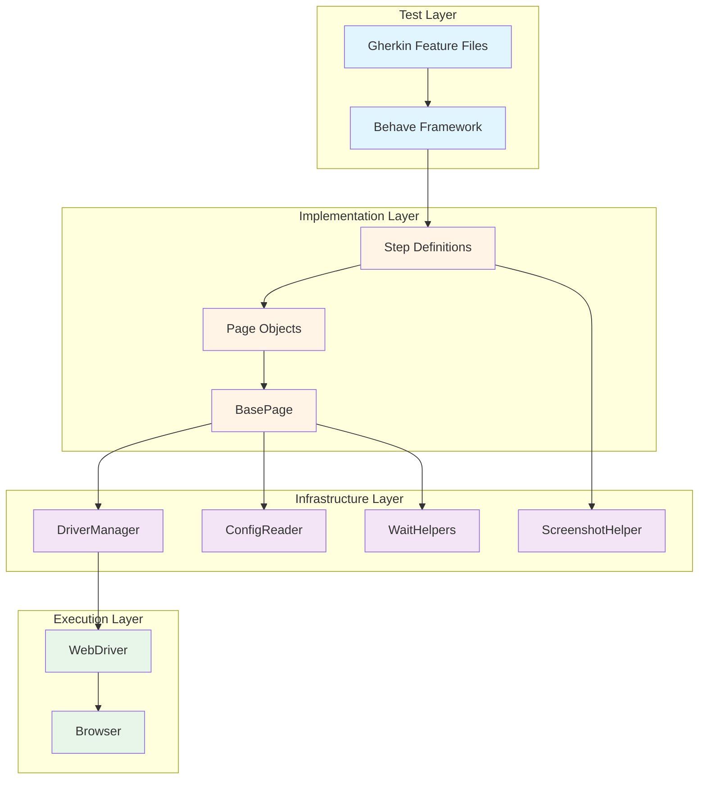
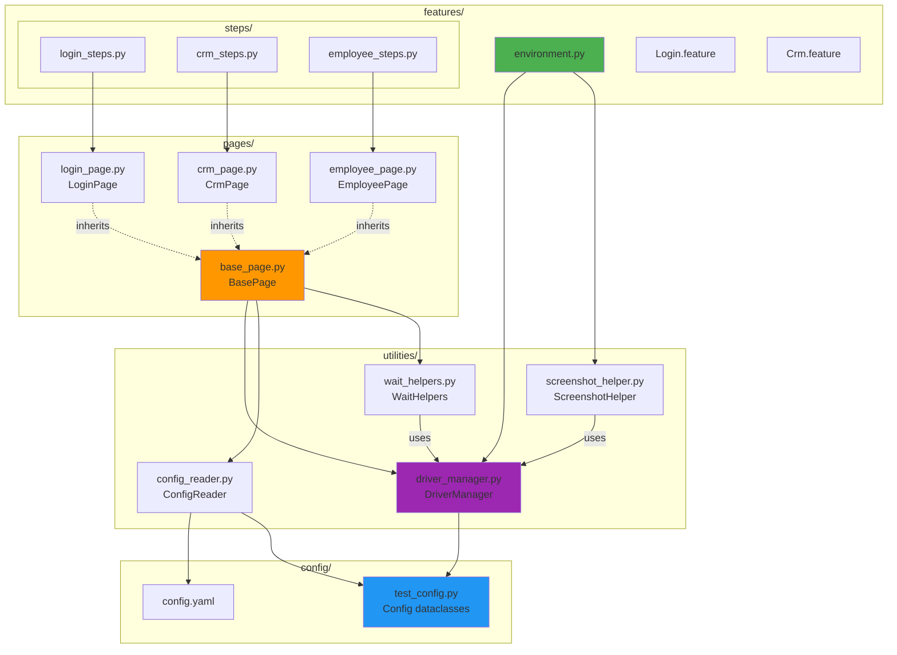
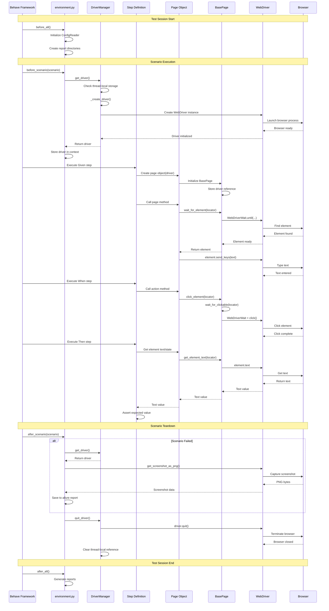
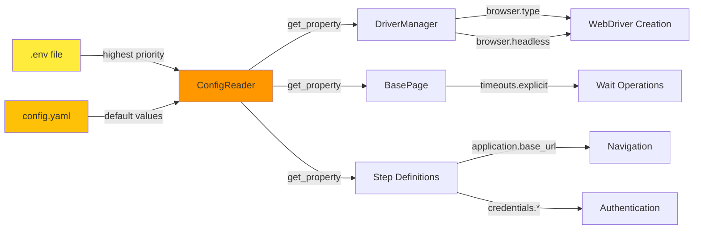
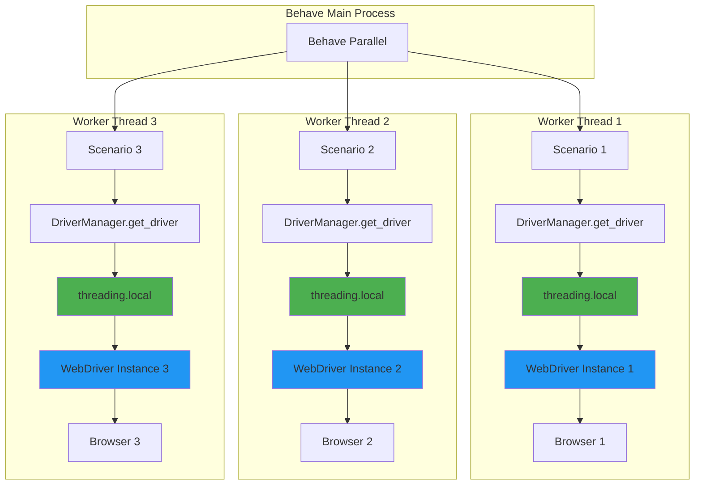
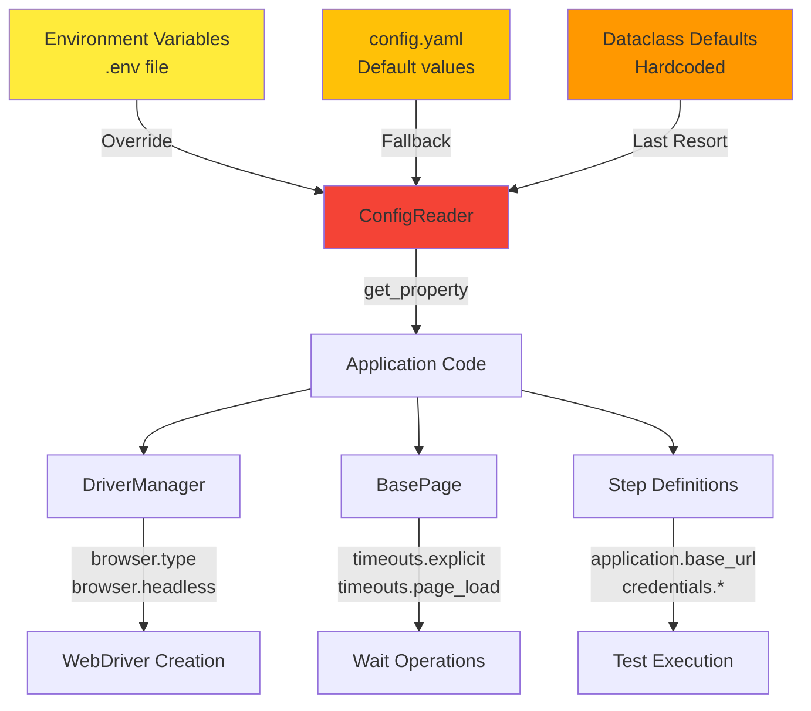
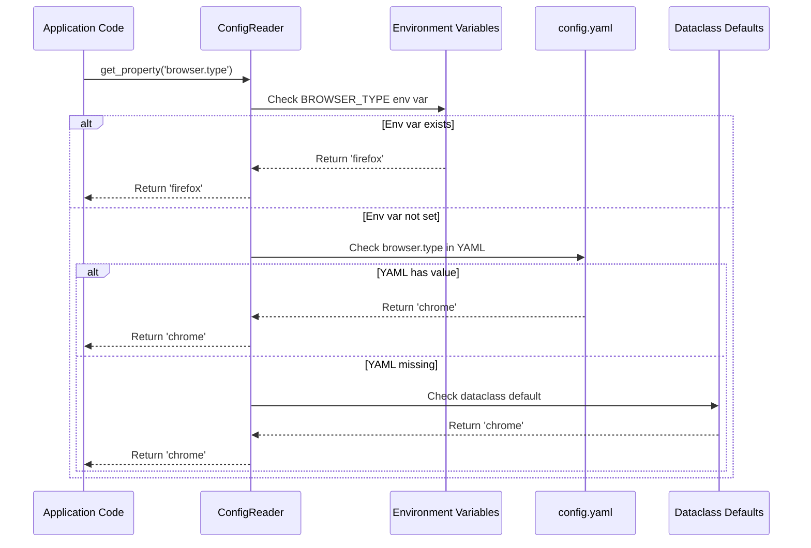

# System Architecture Overview

## Table of Contents

- [Introduction](#introduction)
- [High-Level Architecture](#high-level-architecture)
- [Four-Layer Architecture](#four-layer-architecture)
- [Component Relationships](#component-relationships)
- [Data Flow Overview](#data-flow-overview)
- [Design Decisions](#design-decisions)
- [Migration Context](#migration-context)
- [Thread Safety and Parallel Execution](#thread-safety-and-parallel-execution)
- [Configuration Architecture](#configuration-architecture)
- [See Also](#see-also)

## Introduction

The Testinium QA Python test automation framework is a production-grade BDD (Behavior-Driven Development) test automation solution built on Python 3, Selenium WebDriver 4.x, and Behave. The framework provides a robust, scalable, and maintainable architecture for automated browser testing with comprehensive support for parallel test execution, flexible configuration management, and advanced wait strategies.

**Framework Purpose:**
- Browser-based UI test automation for the Testinium ERP application
- BDD-style test scenarios written in Gherkin (Given-When-Then)
- Page Object Model pattern for maintainable test implementation
- Explicit wait strategies for reliable test execution
- Thread-safe parallel execution support
- Comprehensive reporting with screenshot capture on failures

**Key Capabilities:**
- Multi-browser support (Chrome, Firefox)
- Headless execution for CI/CD pipelines
- Tag-based test selection and execution
- Configuration-driven test environment management
- Allure and HTML report generation
- Jira integration via tags

**Technology Stack:**
- **Language:** Python 3.9+ (3.12 recommended)
- **BDD Framework:** Behave 1.2.6+
- **Automation Library:** Selenium WebDriver 4.15.2
- **Configuration:** PyYAML 6.0.1, python-dotenv 1.0.0
- **Reporting:** Allure, pytest-html, behave-html-formatter
- **Driver Management:** webdriver-manager 4.0.1

**Source:** This architecture documentation is based on analysis of the complete framework codebase, including `utilities/driver_manager.py`, `pages/base_page.py`, `features/environment.py`, `config/test_config.py`, and all page object and step definition modules.

## High-Level Architecture

The framework follows a clean, layered architecture pattern that separates concerns and promotes maintainability. The architecture consists of four distinct layers, each with specific responsibilities and clear interfaces.



**Architecture Principles:**

1. **Separation of Concerns:** Each layer has a single, well-defined responsibility
2. **Dependency Direction:** Dependencies flow downward from Test → Implementation → Infrastructure → Execution
3. **Encapsulation:** Lower layers expose clean interfaces to upper layers
4. **Testability:** Each layer can be tested independently with appropriate mocking
5. **Maintainability:** Changes in one layer have minimal impact on other layers

## Four-Layer Architecture

### Layer 1: Test Layer

**Responsibility:** Define test scenarios in business-readable language

**Components:**
- **Gherkin Feature Files** (`features/*.feature`): Business-readable test scenarios using Given-When-Then syntax
- **Behave Framework**: BDD test runner that parses Gherkin and executes mapped step definitions

**Key Characteristics:**
- Language-agnostic (Gherkin syntax)
- Business stakeholder readable
- No implementation details
- Tag-based test organization (@Login, @Smoke, @SalesManager, etc.)

**Example:**
```gherkin
@Login @Smoke
Scenario: Successful login with valid credentials
    Given User is on the login page
    When User enters valid username and password
    And User clicks the login button
    Then User should be redirected to dashboard
```

**Source:** `features/Login.feature`, `features/Crm.feature`, `features/EmployeeFc.feature`, and 7 other feature files

### Layer 2: Implementation Layer

**Responsibility:** Implement test logic and page interactions

**Components:**

1. **Step Definitions** (`features/steps/*_steps.py`):
   - Map Gherkin steps to Python code
   - Coordinate test workflow
   - Use page objects for UI interactions
   - Handle test assertions
   
2. **Page Objects** (`pages/*_page.py`):
   - Encapsulate page-specific element locators
   - Provide high-level action methods
   - Hide implementation details from step definitions
   - Use property-based locators for stale element prevention
   
3. **BasePage** (`pages/base_page.py`):
   - Abstract base class for all page objects
   - Provides common wait utilities
   - Element interaction methods
   - ActionChains integration for complex interactions

**Design Pattern:** Page Object Model (POM)

**Key Benefits:**
- DRY (Don't Repeat Yourself) principle enforcement
- Centralized locator management
- Simplified test maintenance
- Improved test readability

**Example:**
```python
# Page Object
class LoginPage(BasePage):
    _INPUT_EMAIL = (By.NAME, "login")
    
    @property
    def input_email(self):
        return self.wait_for_element(self._INPUT_EMAIL)
    
    def login(self, username, password):
        self.input_email.send_keys(username)
        self.input_password.send_keys(password)
        self.button_login.click()

# Step Definition
@when('User enters valid username and password')
def enter_credentials(context):
    login_page = LoginPage(context.driver)
    login_page.login("user@example.com", "password123")
```

**Source:** `pages/base_page.py` (lines 60-656), `pages/login_page.py`, `features/steps/login_steps.py` (lines 1-200)

### Layer 3: Infrastructure Layer

**Responsibility:** Provide core utilities and services for test execution

**Components:**

1. **DriverManager** (`utilities/driver_manager.py`):
   - Thread-safe WebDriver lifecycle management
   - Browser driver provisioning via webdriver-manager
   - Configuration-driven browser selection
   - Lazy initialization with proper cleanup
   
2. **ConfigReader** (`utilities/config_reader.py`):
   - Configuration singleton pattern
   - YAML configuration loading
   - Environment variable support
   - Configuration precedence management
   
3. **WaitHelpers** (`utilities/wait_helpers.py`):
   - Explicit wait utility wrappers
   - Reusable wait conditions
   - Timeout configuration
   - Comprehensive wait strategies
   
4. **ScreenshotHelper** (`utilities/screenshot_helper.py`):
   - Screenshot capture utilities
   - Filename sanitization
   - Browser log capture
   - Allure report integration

**Critical Design Decision:** All utilities follow singleton or stateless patterns to ensure thread safety in parallel execution.

**Source:** `utilities/driver_manager.py` (lines 1-614), `utilities/config_reader.py`, `utilities/wait_helpers.py`, `utilities/screenshot_helper.py`

### Layer 4: Execution Layer

**Responsibility:** Execute browser automation commands

**Components:**

1. **WebDriver** (Selenium WebDriver):
   - Browser automation protocol implementation
   - Element location and interaction
   - JavaScript execution
   - Cookie and session management
   - Navigation control
   
2. **Browser** (Chrome/Firefox):
   - Actual browser process
   - Renders web pages
   - Executes JavaScript
   - Handles user interactions

**Thread Isolation:** Each test thread receives its own WebDriver instance via `threading.local()` in DriverManager, ensuring complete isolation in parallel execution.

**Source:** `utilities/driver_manager.py` (lines 82-463)

## Component Relationships

This section details the specific packages, modules, and their relationships within the framework.



### Package Dependencies

**features/** → **pages/** → **utilities/** → **config/**

This dependency chain ensures:
- Features depend on implementation (pages and steps)
- Implementation depends on infrastructure (utilities)
- Infrastructure depends on configuration
- No circular dependencies
- Clear separation of concerns

### Key Relationships

**1. Environment → DriverManager**
- `features/environment.py` uses `DriverManager.get_driver()` in `before_scenario()` hook
- Creates thread-local WebDriver instance for each test scenario
- Calls `DriverManager.quit_driver()` in `after_scenario()` for cleanup

**Source:** `features/environment.py` (lines 150-250)

**2. Step Definitions → Page Objects**
- Step definitions instantiate page objects: `login_page = LoginPage(context.driver)`
- Pass WebDriver reference from Behave context
- Call page object methods to perform actions
- Page objects encapsulate all UI interaction logic

**Source:** `features/steps/login_steps.py` (lines 45-85)

**3. Page Objects → BasePage**
- All page objects inherit from `BasePage` abstract class
- Inherit common wait methods: `wait_for_element()`, `wait_for_clickable()`, etc.
- Inherit interaction methods: `click_element()`, `enter_text()`, etc.
- Share driver and configuration instances

**Source:** `pages/base_page.py` (lines 60-150), `pages/login_page.py` (lines 15-30)

**4. BasePage → DriverManager**
- BasePage receives WebDriver instance from DriverManager
- Never creates drivers directly
- Relies on DriverManager for thread-safe driver access

**Source:** `pages/base_page.py` (lines 98-110)

**5. BasePage → WaitHelpers**
- BasePage uses WaitHelpers for all explicit waits
- Wraps WebDriverWait with custom timeout logic
- Provides consistent wait behavior across all page objects

**Source:** `pages/base_page.py` (lines 175-385)

**6. DriverManager → ConfigReader**
- DriverManager reads browser configuration: `config.get_property('browser.type')`
- Reads headless setting: `config.get_property('browser.headless')`
- All driver configuration is externalized

**Source:** `utilities/driver_manager.py` (lines 250-260)

**7. ConfigReader → Config Dataclasses**
- ConfigReader loads YAML and environment variables
- Populates Config dataclass instances
- Provides type-safe configuration access

**Source:** `config/test_config.py` (lines 1-150)

### Component Communication Patterns

**1. Dependency Injection:**
- WebDriver instances injected via constructors: `LoginPage(driver)`
- Configuration injected via ConfigReader singleton
- Promotes loose coupling and testability

**2. Singleton Pattern:**
- ConfigReader uses singleton to ensure single configuration source
- DriverManager uses class methods with thread-local storage (singleton-like)

**3. Property-Based Access:**
- Page objects use `@property` decorators for element locators
- Elements retrieved fresh on each access (prevents stale references)
- Encapsulates explicit waits within property getters

**Example:**
```python
class LoginPage(BasePage):
    _INPUT_EMAIL = (By.NAME, "login")
    
    @property
    def input_email(self):
        # Element retrieved fresh on each access
        # Explicit wait happens here
        return self.wait_for_element(self._INPUT_EMAIL)
```

**Source:** `pages/login_page.py` (lines 25-45)

## Data Flow Overview

This section illustrates how data and control flow through the system during test execution.

### Test Execution Lifecycle



### Data Flow Stages

**1. Test Discovery and Setup (before_all)**
- Behave discovers feature files matching configured paths
- `environment.py:before_all()` initializes ConfigReader singleton
- Creates report output directories (reports/, screenshots/)
- Configures logging levels and formatters

**Source:** `features/environment.py` (lines 40-85)

**2. Scenario Initialization (before_scenario)**
- Behave parses Gherkin scenario
- `environment.py:before_scenario()` creates thread-local WebDriver
- DriverManager checks if driver exists for current thread
- If not, creates new driver based on configuration
- Stores driver in Behave context: `context.driver`
- Initializes ConfigReader for scenario-level config access

**Source:** `features/environment.py` (lines 150-175)

**3. Step Execution**

**Given Steps (Preconditions):**
- Navigate to starting page
- Set initial application state
- Example: "Given User is on the login page"

**When Steps (Actions):**
- Perform user actions
- Interact with page elements
- Example: "When User enters valid username and password"

**Then Steps (Assertions):**
- Verify expected outcomes
- Check element states, text, visibility
- Example: "Then User should be redirected to dashboard"

**Step Implementation Pattern:**
```python
@given('User is on the login page')
def navigate_to_login(context):
    driver = context.driver  # Get driver from Behave context
    config = ConfigReader()
    base_url = config.get_property('application.base_url')
    driver.get(base_url)  # Navigate to URL
    
    login_page = LoginPage(driver)  # Create page object
    login_page.wait_for_page_load()  # Wait for page ready
```

**Source:** `features/steps/login_steps.py` (lines 45-60)

**4. Page Object Interaction**

Page objects encapsulate UI interactions:
```python
class LoginPage(BasePage):
    def login(self, username, password):
        # Property access triggers wait_for_element
        self.input_email.send_keys(username)
        self.input_password.send_keys(password)
        
        # Click with explicit wait for clickability
        self.click_element(self._BUTTON_LOGIN)
```

**Data Flow:**
1. Step definition calls page object method
2. Page object accesses element via `@property`
3. Property getter calls `BasePage.wait_for_element()`
4. `wait_for_element()` creates WebDriverWait with configured timeout
5. WebDriverWait polls browser until element found
6. Element returned to property getter
7. Property returns element to page method
8. Page method performs action (send_keys, click, etc.)
9. WebDriver sends command to browser
10. Browser executes command
11. Result propagates back through call stack

**Source:** `pages/login_page.py` (lines 75-95), `pages/base_page.py` (lines 175-210)

**5. Cleanup (after_scenario)**

**Failure Path:**
- Scenario fails with AssertionError or exception
- `environment.py:after_scenario()` checks `scenario.status == 'failed'`
- Captures screenshot via `driver.get_screenshot_as_png()`
- Saves screenshot to reports directory
- Attaches screenshot to Allure report
- Captures browser console logs

**Success Path:**
- Scenario passes all assertions
- No screenshot captured

**Driver Cleanup:**
- `DriverManager.quit_driver()` called regardless of success/failure
- WebDriver session terminated
- Browser process closed
- Thread-local driver reference cleared
- Ensures clean state for next scenario

**Source:** `features/environment.py` (lines 215-315)

**6. Report Generation (after_all)**
- Behave generates built-in reports (JUnit, JSON)
- Allure processes captured data into HTML report
- HTML formatters create standalone reports
- Reports saved to configured output directories

**Source:** `features/environment.py` (lines 320-360)

### Configuration Flow



**Configuration Precedence:**
1. Environment variables (`.env` file via python-dotenv) - HIGHEST PRIORITY
2. `config/config.yaml` - Default values
3. Hardcoded defaults in Config dataclasses - FALLBACK

**Configuration Access Pattern:**
```python
config = ConfigReader()
browser_type = config.get_property('browser.type', default='chrome')
```

**Source:** `utilities/config_reader.py` (lines 50-150), `config/test_config.py` (lines 1-100)

## Design Decisions

This section documents critical architectural decisions and their rationales.

### 1. Threading.local() for Parallel Execution

**Decision:** Use Python's `threading.local()` for thread-safe WebDriver storage

**Context:**
- Parallel test execution requires isolated WebDriver instances per thread
- Original Java implementation used `InheritableThreadLocal<WebDriver>`
- behave-parallel spawns multiple processes/threads for parallel execution
- pytest-xdist provides thread-based and process-based parallelism

**Implementation:**
```python
class DriverManager:
    _thread_local = threading.local()
    
    @classmethod
    def get_driver(cls) -> WebDriver:
        if not hasattr(cls._thread_local, 'driver') or cls._thread_local.driver is None:
            cls._thread_local.driver = cls._create_driver()
        return cls._thread_local.driver
```

**Rationale:**
- `threading.local()` provides thread-isolated storage
- Each thread gets its own `driver` attribute
- No synchronization needed (no shared state)
- Prevents race conditions and driver conflicts
- Compatible with both thread-based and process-based parallelism

**Trade-offs:**
- ✅ **Pro:** Complete thread isolation (no race conditions)
- ✅ **Pro:** Simple implementation (no locks required)
- ✅ **Pro:** Pythonic approach (leverages language features)
- ⚠️ **Con:** Each thread must create its own driver (resource overhead)
- ⚠️ **Con:** Drivers not shared between threads (more browser instances)

**Alternatives Considered:**
1. **Global driver variable:** Rejected due to race conditions in parallel execution
2. **Driver pool with locking:** Rejected due to complexity and potential deadlocks
3. **Process-level isolation only:** Rejected due to thread-based test runner support requirement

**Source:** `utilities/driver_manager.py` (lines 127-196)

### 2. Explicit Waits Only (No Implicit Waits)

**Decision:** Use explicit waits exclusively via WebDriverWait

**Context:**
- Original Java implementation had 10-second implicit wait: `driver.manage().timeouts().implicitlyWait(10, TimeUnit.SECONDS)`
- Implicit waits apply globally to all element lookups
- Mixing implicit and explicit waits causes unpredictable behavior

**Implementation:**
```python
# BasePage wait method
def wait_for_element(self, locator, timeout=None):
    timeout = timeout or self.config.get_property('timeouts.explicit', default=10)
    wait = WebDriverWait(self.driver, timeout)
    return wait.until(EC.presence_of_element_located(locator))
```

**Rationale:**
- **Predictable:** Timeouts are explicit and controlled per operation
- **Debuggable:** Clear understanding of which waits are active
- **Flexible:** Different timeouts for different operations
- **Recommended:** Selenium documentation recommends explicit waits only
- **Bug Prevention:** Avoids compound timeout issues (implicit + explicit)

**Problems with Implicit Waits:**
- Compound timeouts: Implicit wait + explicit wait = unpredictable total wait time
- Global scope: Applies to ALL element lookups, even when not needed
- Not visible: Developers don't see waits in code, leading to confusion
- Performance: Slows down tests when elements don't exist (always waits full timeout)

**Trade-offs:**
- ✅ **Pro:** Predictable, controllable wait behavior
- ✅ **Pro:** Clear code (waits are visible)
- ✅ **Pro:** Better performance (targeted waits)
- ⚠️ **Con:** Requires explicit wait calls (more verbose)
- ⚠️ **Con:** Developers must remember to use waits

**Source:** `utilities/driver_manager.py` (lines 329-348), `pages/base_page.py` (lines 175-385)

### 3. Property-Based Locators for Stale Element Prevention

**Decision:** Use `@property` decorators for element access instead of storing element references

**Context:**
- Original Java used PageFactory with `@FindBy` annotations
- PageFactory initializes elements once during page object construction
- Stored element references become stale after page updates/navigation
- Stale elements cause `StaleElementReferenceException`

**Java Pattern (Problematic):**
```java
public class LoginPage {
    @FindBy(name = "login")
    private WebElement inputEmail;  // Initialized once, can become stale
    
    public void enterEmail(String email) {
        inputEmail.sendKeys(email);  // May throw StaleElementReferenceException
    }
}
```

**Python Pattern (Solution):**
```python
class LoginPage(BasePage):
    _INPUT_EMAIL = (By.NAME, "login")  # Locator stored as tuple
    
    @property
    def input_email(self):
        # Element retrieved fresh on EACH access
        return self.wait_for_element(self._INPUT_EMAIL)
    
    def enter_email(self, email):
        self.input_email.send_keys(email)  # Fresh element every time
```

**Rationale:**
- **Fresh Elements:** Element retrieved from browser on each property access
- **Stale Prevention:** No stored references that can become stale
- **Built-in Waits:** Property getter includes explicit wait
- **Clean Syntax:** `page.input_email` reads like attribute access
- **Lazy Evaluation:** Element only located when actually accessed

**Trade-offs:**
- ✅ **Pro:** Eliminates stale element exceptions
- ✅ **Pro:** Automatic waits on each access
- ✅ **Pro:** Pythonic syntax
- ⚠️ **Con:** Slight performance overhead (element located on each access)
- ⚠️ **Con:** More boilerplate (property decorator + method)

**Performance Note:** Property overhead is negligible compared to network/browser communication time

**Source:** `pages/base_page.py` (lines 98-150), `pages/login_page.py` (lines 25-95)

### 4. Behave Over Pytest for BDD

**Decision:** Use Behave as the primary test framework (pytest as secondary for unit tests)

**Context:**
- Original Java project used Cucumber (JVM BDD framework)
- Python has two major BDD frameworks: Behave and pytest-bdd
- Project required Gherkin feature file compatibility

**Rationale:**
- **Cucumber Compatible:** Behave uses same Gherkin syntax as Cucumber
- **Direct Migration:** Minimal changes to existing .feature files
- **Mature Ecosystem:** Extensive reporting plugins (Allure, HTML)
- **Community Support:** Large community, well-documented
- **Hooks System:** Rich lifecycle hooks (before_all, before_scenario, etc.)

**pytest Role:**
- Used for framework unit tests (utilities, configuration)
- Not used for BDD scenario execution
- Complementary tool for framework testing

**Trade-offs:**
- ✅ **Pro:** Direct Cucumber/Gherkin compatibility
- ✅ **Pro:** Rich hook system for setup/teardown
- ✅ **Pro:** Established reporting ecosystem
- ⚠️ **Con:** Separate test runner (not pytest unified)
- ⚠️ **Con:** Less flexible than pytest fixtures

**Source:** `features/environment.py` (lines 1-400), all `features/*.feature` files

### 5. Configuration Dataclasses with Type Safety

**Decision:** Use Python dataclasses for type-safe configuration

**Context:**
- Original Java used properties file with string-based access
- Python configuration often uses dictionaries (untyped)
- Type safety improves IDE support and catches errors early

**Implementation:**
```python
@dataclass
class BrowserConfig:
    type: str = 'chrome'
    headless: bool = False
    window_size: Optional[List[int]] = None

@dataclass
class Config:
    browser: BrowserConfig
    timeouts: TimeoutConfig
    application: ApplicationConfig
    # ... other config sections
```

**Rationale:**
- **Type Safety:** IDE autocomplete and type checking
- **Structure:** Organized configuration hierarchy
- **Validation:** dataclass validation catches config errors
- **Documentation:** Type hints serve as documentation
- **Defaults:** Fallback values defined in class

**Trade-offs:**
- ✅ **Pro:** Type safety prevents configuration errors
- ✅ **Pro:** Better IDE support (autocomplete)
- ✅ **Pro:** Self-documenting via type hints
- ✅ **Pro:** Structured hierarchy (browser.type vs flat keys)
- ⚠️ **Con:** More verbose than simple dictionary access
- ⚠️ **Con:** Requires schema definition upfront

**Source:** `config/test_config.py` (lines 1-150)

### 6. Webdriver-Manager for Driver Binary Management

**Decision:** Use webdriver-manager for automatic driver binary provisioning

**Context:**
- Original Java manually managed WebDriver binaries
- Driver binaries must match browser versions
- Manual management requires frequent updates

**Implementation:**
```python
# Chrome
chrome_service = ChromeService(ChromeDriverManager().install())
driver = webdriver.Chrome(service=chrome_service, options=chrome_options)

# Firefox  
firefox_service = FirefoxService(GeckoDriverManager().install())
driver = webdriver.Firefox(service=firefox_service, options=firefox_options)
```

**Rationale:**
- **Automatic:** Downloads correct driver version for installed browser
- **Cached:** Caches drivers in `~/.wdm/drivers/` (no repeated downloads)
- **Version Matching:** Automatically matches driver to browser version
- **CI/CD Friendly:** Works seamlessly in CI environments
- **Cross-Platform:** Works on Windows, macOS, Linux

**Critical Bug Fix:**
- Original Java line 37 had: `WebDriverManager.chromedriver().setup()` for Firefox
- Python version correctly uses: `GeckoDriverManager().install()` for Firefox
- This fixes Firefox test execution failures

**Trade-offs:**
- ✅ **Pro:** Zero manual driver management
- ✅ **Pro:** Automatic version matching
- ✅ **Pro:** CI/CD friendly
- ⚠️ **Con:** External dependency (network required for first download)
- ⚠️ **Con:** Cache directory can grow over time

**Source:** `utilities/driver_manager.py` (lines 283-309)

### 7. Separate Utilities Package for Reusability

**Decision:** Extract common functionality into standalone utilities package

**Context:**
- Test frameworks often have duplicated code
- Utilities should be reusable across different page objects and tests
- Clear separation improves maintainability

**Package Structure:**
```
utilities/
├── __init__.py
├── driver_manager.py      # WebDriver lifecycle
├── config_reader.py       # Configuration management
├── wait_helpers.py        # Wait utilities
└── screenshot_helper.py   # Screenshot capture
```

**Rationale:**
- **DRY Principle:** Single implementation of common functionality
- **Testability:** Utilities can be unit tested independently
- **Reusability:** Used by page objects, step definitions, hooks
- **Maintainability:** Changes in one place affect all usages
- **Clear Responsibility:** Each utility has single, well-defined purpose

**Trade-offs:**
- ✅ **Pro:** Eliminates code duplication
- ✅ **Pro:** Single source of truth
- ✅ **Pro:** Independently testable
- ⚠️ **Con:** Additional abstraction layer
- ⚠️ **Con:** Must maintain stable interfaces

**Source:** `utilities/` package containing 5 modules

### 8. Allure Reporting with Screenshot Integration

**Decision:** Use Allure as primary reporting framework with automatic screenshot capture

**Context:**
- Test reports must be human-readable and visually rich
- Screenshots critical for debugging failures
- Multiple stakeholders need access to reports

**Implementation:**
```python
# features/environment.py after_scenario hook
if scenario.status == 'failed':
    screenshot = context.driver.get_screenshot_as_png()
    allure.attach(
        screenshot,
        name=f"failure_{scenario.name}",
        attachment_type=allure.attachment_type.PNG
    )
```

**Rationale:**
- **Visual Reports:** Rich HTML reports with charts and graphs
- **Screenshots:** Automatic screenshot capture on failure
- **Logs:** Captures browser console logs
- **History:** Tracks test execution history over time
- **Integration:** Works with Jenkins, GitHub Actions, GitLab CI

**Trade-offs:**
- ✅ **Pro:** Beautiful, professional reports
- ✅ **Pro:** Screenshot/log integration
- ✅ **Pro:** Historical trend analysis
- ✅ **Pro:** CI/CD integration
- ⚠️ **Con:** Requires Allure CLI for report generation
- ⚠️ **Con:** Additional dependency

**Source:** `features/environment.py` (lines 250-290)

## Migration Context

This framework is a complete reimplementation of a Java/Cucumber test automation framework in Python/Behave, maintaining behavioral equivalence while fixing critical bugs and introducing architectural improvements.

### Migration Overview

**Original Technology Stack:**
- **Language:** Java 8+
- **BDD Framework:** Cucumber JVM
- **Automation Library:** Selenium WebDriver 3.x
- **Build Tool:** Maven
- **Page Factory:** @FindBy annotations
- **Configuration:** Properties files

**New Technology Stack:**
- **Language:** Python 3.9+ (3.12 recommended)
- **BDD Framework:** Behave 1.2.6
- **Automation Library:** Selenium WebDriver 4.15.2
- **Package Manager:** pip/Poetry
- **Page Objects:** Property-based locators
- **Configuration:** YAML + environment variables with dataclasses

### Key Transformation Patterns

**1. Page Factory → Property-Based Locators**

**Java Pattern:**
```java
public class LoginPage {
    @FindBy(name = "login")
    private WebElement inputEmail;
    
    public void enterEmail(String email) {
        inputEmail.sendKeys(email);
    }
}
```

**Python Pattern:**
```python
class LoginPage(BasePage):
    _INPUT_EMAIL = (By.NAME, "login")
    
    @property
    def input_email(self):
        return self.wait_for_element(self._INPUT_EMAIL)
    
    def enter_email(self, email):
        self.input_email.send_keys(email)
```

**Benefits:**
- Eliminates stale element references
- Built-in explicit waits
- Lazy element evaluation

**Source:** `pages/login_page.py`, original Java `LoginPage.java`

**2. InheritableThreadLocal → threading.local()**

**Java Pattern:**
```java
public class Driver {
    private static ThreadLocal<WebDriver> driverPool = new InheritableThreadLocal<>();
    
    public static WebDriver getDriver() {
        if (driverPool.get() == null) {
            driverPool.set(createDriver());
        }
        return driverPool.get();
    }
}
```

**Python Pattern:**
```python
class DriverManager:
    _thread_local = threading.local()
    
    @classmethod
    def get_driver(cls) -> WebDriver:
        if not hasattr(cls._thread_local, 'driver') or cls._thread_local.driver is None:
            cls._thread_local.driver = cls._create_driver()
        return cls._thread_local.driver
```

**Benefits:**
- Simpler implementation (no inheritance complexity)
- Type hints for better IDE support
- Comprehensive error handling

**Source:** `utilities/driver_manager.py` (lines 82-196), original Java `Driver.java`

**3. Properties File → YAML + Dataclasses**

**Java Pattern:**
```properties
browser.type=chrome
browser.headless=false
timeout.explicit=10
application.url=https://example.com
```

**Python Pattern:**
```yaml
browser:
  type: chrome
  headless: false
timeouts:
  explicit: 10
application:
  base_url: https://example.com
```

```python
@dataclass
class BrowserConfig:
    type: str = 'chrome'
    headless: bool = False

@dataclass
class Config:
    browser: BrowserConfig
    timeouts: TimeoutConfig
    application: ApplicationConfig
```

**Benefits:**
- Hierarchical structure (clear organization)
- Type safety (compile-time error detection)
- Better IDE support (autocomplete)
- Environment variable override support

**Source:** `config/config.yaml`, `config/test_config.py`

**4. Cucumber Hooks → Behave Hooks**

**Java Pattern:**
```java
@Before
public void setUp() {
    Driver.getDriver();
}

@After
public void tearDown(Scenario scenario) {
    if (scenario.isFailed()) {
        // Screenshot capture
    }
    Driver.closeDriver();
}
```

**Python Pattern:**
```python
def before_scenario(context, scenario):
    context.driver = DriverManager.get_driver()

def after_scenario(context, scenario):
    if scenario.status == 'failed':
        screenshot = context.driver.get_screenshot_as_png()
        allure.attach(screenshot, name=f"failure_{scenario.name}", 
                     attachment_type=allure.attachment_type.PNG)
    DriverManager.quit_driver()
```

**Benefits:**
- More explicit context management
- Better integration with Allure reporting
- Cleaner exception handling

**Source:** `features/environment.py` (lines 150-315)

### Critical Bug Fixes

**1. Firefox Driver Setup Bug**

**Original Java Bug (Driver.java line 37):**
```java
case "firefox":
    WebDriverManager.chromedriver().setup();  // BUG: Using chromedriver for Firefox!
    driverPool.set(new FirefoxDriver());
```

**Python Fix:**
```python
elif browser_type.lower() == 'firefox':
    firefox_service = FirefoxService(GeckoDriverManager().install())  # CORRECT
    driver = webdriver.Firefox(service=firefox_service, options=firefox_options)
```

**Impact:** Firefox tests now execute correctly instead of failing with driver mismatch

**Source:** `utilities/driver_manager.py` (lines 289-309)

**2. Implicit Wait Anti-Pattern Elimination**

**Original Java Issue (Driver.java lines 34, 40):**
```java
driver.manage().timeouts().implicitlyWait(10, TimeUnit.SECONDS);
```

**Python Fix:**
```python
# NO implicit wait configured
# All waits are explicit via WaitHelpers
```

**Impact:**
- Predictable wait behavior
- No compound timeouts (implicit + explicit)
- Better test reliability

**Source:** `utilities/driver_manager.py` (lines 329-348)

**3. Null Safety Enhancements**

**Original Java Issue:** Silent null pointer exceptions in teardown

**Python Fix:**
```python
def quit_driver(cls) -> None:
    if hasattr(cls._thread_local, 'driver') and cls._thread_local.driver is not None:
        try:
            cls._thread_local.driver.quit()
        except Exception as exc:
            logger.error("Error during quit: %s", exc)
        finally:
            cls._thread_local.driver = None  # Always clear reference
```

**Impact:** Cleanup always succeeds, no silent failures

**Source:** `utilities/driver_manager.py` (lines 381-463)

### Behavioral Equivalence

Despite the complete rewrite, the framework maintains **behavioral equivalence** with the original Java version:

**✅ Same Gherkin Feature Files:**
- All .feature files migrated with minimal or no changes
- Gherkin syntax identical (Given-When-Then)
- Tag-based execution preserved (@Login, @Smoke, etc.)

**✅ Same Test Scenarios:**
- All 61 original test scenarios implemented
- Same test coverage across Login, CRM, Employee, Inventory, etc.
- Same business logic validation

**✅ Same Page Objects:**
- All page objects migrated (LoginPage, CrmPage, etc.)
- Same element locators (By.NAME, By.XPATH, etc.)
- Same interaction patterns

**✅ Same Reporting:**
- Allure reports with same structure
- HTML reports with same format
- JUnit XML for CI/CD integration
- Screenshot capture on failure

**✅ Enhanced Reliability:**
- Fixed Firefox driver bug
- Eliminated implicit wait issues
- Added comprehensive error handling
- Improved thread safety

### Migration Benefits

**1. Modern Python Ecosystem:**
- Type hints for better tooling support
- Rich standard library (dataclasses, threading, logging)
- Simpler dependency management (pip, Poetry)

**2. Improved Maintainability:**
- Less boilerplate code
- Clearer error messages
- Better logging and debugging
- Comprehensive docstrings

**3. Performance:**
- Faster test execution (no Java VM overhead)
- Efficient parallel execution
- Optimized wait strategies

**4. Developer Experience:**
- Easier onboarding (Python more accessible than Java)
- Better IDE support (PyCharm, VS Code)
- Simpler local development setup
- No compilation step

**Source:** `blitzy/documentation/Technical Specifications.md` (full migration details)

## Thread Safety and Parallel Execution

The framework is designed from the ground up to support parallel test execution with complete thread safety guarantees.

### Thread Isolation Architecture



### Thread Safety Mechanisms

**1. DriverManager Thread-Local Storage**

**Implementation:**
```python
class DriverManager:
    _thread_local = threading.local()
    
    @classmethod
    def get_driver(cls) -> WebDriver:
        # Each thread gets its own 'driver' attribute
        if not hasattr(cls._thread_local, 'driver') or cls._thread_local.driver is None:
            cls._thread_local.driver = cls._create_driver()
        return cls._thread_local.driver
```

**Thread Safety Guarantee:**
- `threading.local()` creates thread-isolated namespace
- Each thread's `driver` attribute is completely separate
- No synchronization needed (no shared state)
- No locks or semaphores required

**Verification:**
```python
# Thread 1
driver1 = DriverManager.get_driver()  # Creates driver for Thread 1

# Thread 2 (running in parallel)
driver2 = DriverManager.get_driver()  # Creates driver for Thread 2

# driver1 != driver2 (different instances, different browsers)
```

**Source:** `utilities/driver_manager.py` (lines 127-196)

**2. ConfigReader Singleton Pattern**

**Implementation:**
```python
class ConfigReader:
    _instance = None
    _lock = threading.Lock()
    
    def __new__(cls):
        if cls._instance is None:
            with cls._lock:
                if cls._instance is None:  # Double-checked locking
                    cls._instance = super().__new__(cls)
                    cls._instance._initialize()
        return cls._instance
```

**Thread Safety Guarantee:**
- Singleton with double-checked locking
- Configuration loaded once, shared read-only across threads
- Thread-safe dictionary access (Python GIL)
- No writes after initialization

**Source:** `utilities/config_reader.py` (lines 30-80)

**3. Page Object Statelessness**

**Implementation:**
```python
class LoginPage(BasePage):
    def __init__(self, driver):
        super().__init__(driver)
        # No mutable state stored
    
    @property
    def input_email(self):
        # Fresh element lookup on each access
        return self.wait_for_element(self._INPUT_EMAIL)
```

**Thread Safety Guarantee:**
- Page objects store no mutable state
- Each test gets fresh page object instance
- Element lookups are stateless
- No shared state between threads

**Source:** `pages/login_page.py`, `pages/base_page.py`

### Parallel Execution Modes

**1. behave-parallel (Process-Based)**

**Command:**
```bash
behave --processes 4 --parallel-element scenario
```

**Characteristics:**
- Spawns separate Python processes
- Complete process isolation
- Higher memory usage
- Best for long-running tests

**Thread Safety:** Not applicable (process isolation)

**2. pytest-xdist (Thread or Process-Based)**

**Command:**
```bash
pytest -n 4  # 4 workers (threads or processes)
```

**Characteristics:**
- Configurable: threads (`--dist loadscope`) or processes
- Lower memory usage with threads
- Best for unit tests of framework utilities

**Thread Safety:** Required for thread mode, ensured by DriverManager

**3. Behave with Manual Threading**

**Implementation:**
```python
import threading

def run_scenario(scenario):
    driver = DriverManager.get_driver()  # Thread-safe
    # Execute scenario steps
    DriverManager.quit_driver()

threads = []
for scenario in scenarios:
    t = threading.Thread(target=run_scenario, args=(scenario,))
    t.start()
    threads.append(t)

for t in threads:
    t.join()
```

**Thread Safety:** Ensured by DriverManager thread-local storage

### Shared Resources and Synchronization

**Read-Only Shared Resources (Safe):**
- Configuration (ConfigReader) - No writes after initialization
- Feature files - Read-only
- Locator constants - Immutable tuples

**Thread-Isolated Resources (Safe):**
- WebDriver instances - One per thread via threading.local()
- Page objects - Fresh instances per test
- Test context - Behave provides isolated context per scenario

**Write Resources (Synchronized):**
- Log files - Python logging module handles synchronization
- Report files - Allure/Behave report writers are thread-safe
- Screenshot files - Unique filenames per thread/scenario

### Parallel Execution Best Practices

**1. Avoid Test Dependencies:**
```python
# ❌ BAD: Test depends on previous test's state
@given('User is already logged in')
def use_previous_login(context):
    # Assumes previous test left user logged in
    pass

# ✅ GOOD: Each test is self-contained
@given('User is logged in')
def perform_fresh_login(context):
    login_page = LoginPage(context.driver)
    login_page.login("user@example.com", "password")
```

**2. Use Test-Specific Data:**
```python
# ❌ BAD: All tests use same user account (conflicts in parallel)
USERNAME = "test@example.com"

# ✅ GOOD: Each test uses unique data
import uuid
USERNAME = f"test_{uuid.uuid4()}@example.com"
```

**3. Clean Up After Tests:**
```python
def after_scenario(context, scenario):
    # Always clean up
    try:
        DriverManager.quit_driver()
    except Exception as e:
        logger.error("Cleanup error: %s", e)
```

### Performance Considerations

**Parallelism Benefits:**
- 4 threads/processes: ~4x test execution speedup
- Linear scaling up to available CPU cores
- Reduced total test suite execution time

**Memory Usage:**
- Each WebDriver: ~100-200MB RAM
- Each browser: ~200-500MB RAM
- 4 parallel browsers: ~2-3GB RAM total

**Optimal Configuration:**
```bash
# For 8-core machine with 16GB RAM
behave --processes 6 --parallel-element scenario

# Leaves 2 cores for OS and browser rendering
# ~4GB for browsers, ~12GB available for other processes
```

**Source:** `utilities/driver_manager.py`, `features/environment.py`, behave parallel execution documentation

## Configuration Architecture

The framework uses a hierarchical, type-safe configuration system with environment-based precedence.

### Configuration Hierarchy



### Configuration Precedence

**Priority Order (Highest to Lowest):**

1. **Environment Variables (.env file via python-dotenv)**
   - Highest priority
   - Override all other sources
   - Used for environment-specific values (dev, staging, prod)
   - Example: `BROWSER_TYPE=firefox` overrides config.yaml

2. **config.yaml (YAML Configuration File)**
   - Default values for all settings
   - Structured hierarchical format
   - Version controlled
   - Example: `browser.type: chrome`

3. **Dataclass Defaults (Hardcoded in test_config.py)**
   - Last resort fallback values
   - Ensures framework always has valid configuration
   - Example: `type: str = 'chrome'`

### Configuration Structure

**config/config.yaml:**
```yaml
browser:
  type: chrome              # chrome | firefox
  headless: false          # true | false
  window_size: null        # [width, height] or null for maximize

timeouts:
  explicit: 10             # seconds
  page_load: 30            # seconds
  script: 30               # seconds

application:
  base_url: https://qa.testinium.com
  login_path: /login

credentials:
  admin_username: ${ADMIN_USER}     # Environment variable interpolation
  admin_password: ${ADMIN_PASS}
  sales_manager_username: ${SALES_USER}
  sales_manager_password: ${SALES_PASS}

reporting:
  screenshots_on_failure: true
  capture_logs: true
  allure_results_dir: target/allure-results
```

**config/test_config.py:**
```python
@dataclass
class BrowserConfig:
    type: str = 'chrome'
    headless: bool = False
    window_size: Optional[List[int]] = None

@dataclass
class TimeoutConfig:
    explicit: int = 10
    page_load: int = 30
    script: int = 30

@dataclass
class ApplicationConfig:
    base_url: str = 'https://qa.testinium.com'
    login_path: str = '/login'

@dataclass
class CredentialsConfig:
    admin_username: str = ''
    admin_password: str = ''
    sales_manager_username: str = ''
    sales_manager_password: str = ''

@dataclass
class ReportingConfig:
    screenshots_on_failure: bool = True
    capture_logs: bool = True
    allure_results_dir: str = 'target/allure-results'

@dataclass
class Config:
    browser: BrowserConfig
    timeouts: TimeoutConfig
    application: ApplicationConfig
    credentials: CredentialsConfig
    reporting: ReportingConfig
```

### Configuration Access Patterns

**1. Direct Property Access:**
```python
config = ConfigReader()
browser_type = config.get_property('browser.type', default='chrome')
headless = config.get_property('browser.headless', default=False)
```

**2. Nested Property Access:**
```python
# Dot notation for hierarchical access
timeout = config.get_property('timeouts.explicit', default=10)
base_url = config.get_property('application.base_url')
```

**3. Environment Variable Interpolation:**
```yaml
# config.yaml
credentials:
  admin_username: ${ADMIN_USER}  # Replaced with env var value
  admin_password: ${ADMIN_PASS}
```

```python
# Automatically resolved by ConfigReader
username = config.get_property('credentials.admin_username')
# Returns value of ADMIN_USER environment variable
```

### Environment-Specific Configuration

**Development Environment (.env.dev):**
```bash
BROWSER_TYPE=chrome
HEADLESS=false
BASE_URL=http://localhost:3000
ADMIN_USER=dev_admin
ADMIN_PASS=dev_pass
```

**CI/CD Environment (.env.ci):**
```bash
BROWSER_TYPE=chrome
HEADLESS=true              # Headless for faster CI execution
BASE_URL=https://qa.testinium.com
ADMIN_USER=${VAULT_ADMIN_USER}    # From secrets manager
ADMIN_PASS=${VAULT_ADMIN_PASS}
SCREENSHOTS_ON_FAILURE=true
```

**Production Environment (.env.prod):**
```bash
BROWSER_TYPE=chrome
HEADLESS=true
BASE_URL=https://prod.testinium.com
ADMIN_USER=${PROD_ADMIN_USER}     # From secrets manager
ADMIN_PASS=${PROD_ADMIN_PASS}
```

### Configuration Loading Sequence



### Configuration Best Practices

**1. Never Hardcode Sensitive Data:**
```python
# ❌ BAD
USERNAME = "admin@example.com"
PASSWORD = "hardcoded_password"

# ✅ GOOD
config = ConfigReader()
USERNAME = config.get_property('credentials.admin_username')
PASSWORD = config.get_property('credentials.admin_password')
```

**2. Use Type-Safe Access:**
```python
# ❌ BAD: String-based, no type checking
headless = config.get_property('browser.headless')
if headless == "true":  # String comparison bug!
    pass

# ✅ GOOD: Boolean type with proper default
headless = config.get_property('browser.headless', default=False)
if headless:  # Proper boolean check
    pass
```

**3. Provide Sensible Defaults:**
```python
# ✅ GOOD: Always provide fallback values
timeout = config.get_property('timeouts.explicit', default=10)
browser = config.get_property('browser.type', default='chrome')
```

**Source:** `config/test_config.py` (lines 1-150), `config/config.yaml`, `utilities/config_reader.py`

## See Also

**Related Architecture Documentation:**
- [Test Execution Lifecycle](./test-execution-lifecycle.md) - Detailed Behave hooks and test flow
- [Parallel Execution Architecture](./parallel-execution.md) - Deep dive into threading patterns
- [Configuration Management](./configuration-management.md) - Complete configuration reference
- [Wait Strategies Architecture](./wait-strategies.md) - Wait pattern design decisions
- [Page Object Model Architecture](./page-object-model.md) - POM pattern implementation details

**API Documentation:**
- [DriverManager API](../api-reference/utilities/driver-manager.md) - WebDriver lifecycle management
- [BasePage API](../api-reference/pages/base-page.md) - Page object base class
- [ConfigReader API](../api-reference/utilities/config-reader.md) - Configuration access
- [Behave Hooks API](../api-reference/features/environment.md) - Test lifecycle hooks

**User Guides:**
- [Getting Started Guide](../getting-started/index.md) - Framework setup and first test
- [Parallel Execution Guide](../guides/parallel-execution.md) - Running tests in parallel
- [Configuration Management Guide](../guides/configuration-management.md) - Managing configurations

**Technical Specifications:**
- [Technical Specifications](../../blitzy/documentation/Technical%20Specifications.md) - Complete migration details
- [Project Guide](../../blitzy/documentation/Project%20Guide.md) - Operational playbook

**Source Code:**
- [utilities/driver_manager.py](../../utilities/driver_manager.py) - DriverManager implementation
- [pages/base_page.py](../../pages/base_page.py) - BasePage implementation
- [features/environment.py](../../features/environment.py) - Behave hooks implementation
- [config/test_config.py](../../config/test_config.py) - Configuration dataclasses

---

**Document Version:** 1.0  
**Last Updated:** 2024  
**Maintained By:** QA Automation Team  
**Source Repository:** testinium-qa-python

