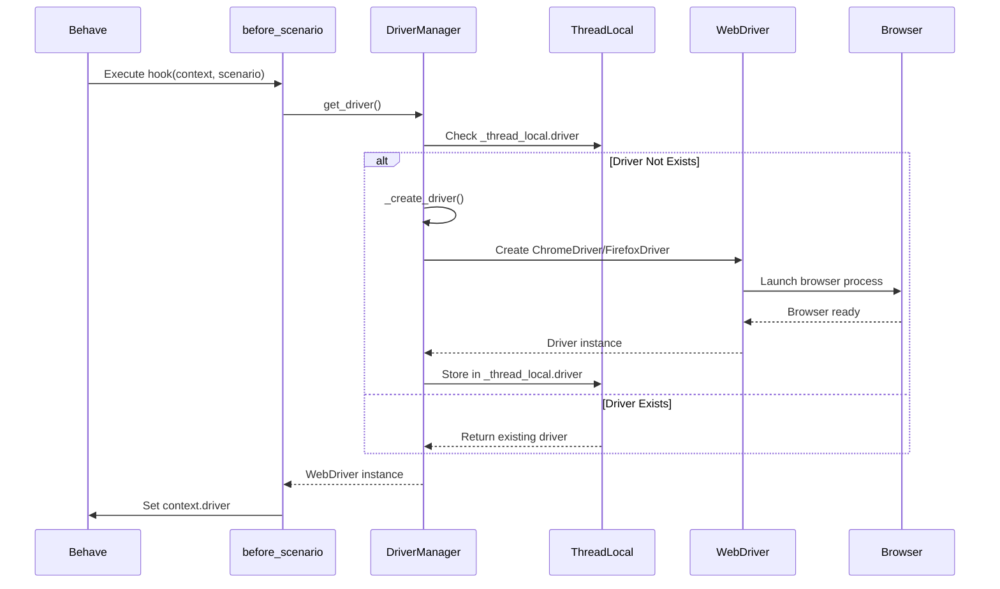
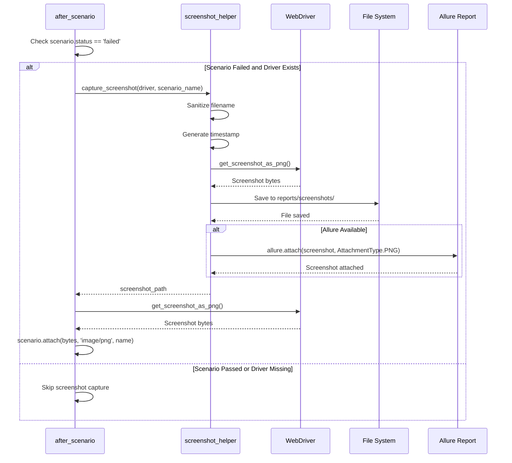
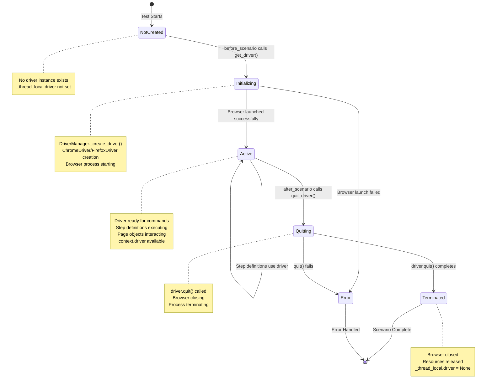
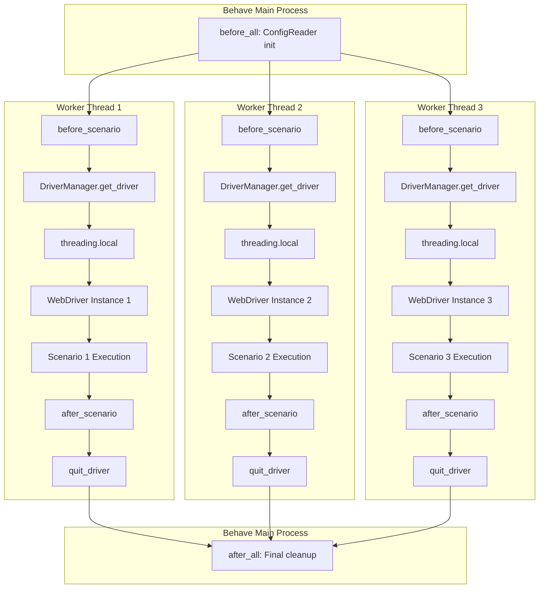

# Test Execution Lifecycle

## Overview

The test execution lifecycle in the Testinium QA Python framework orchestrates the complete flow from test invocation through Behave framework initialization, scenario execution, and cleanup. This document provides a comprehensive understanding of the lifecycle phases, Behave hooks, WebDriver management, and the interactions between components during test execution.

**What This Guide Covers:**
- Complete test execution flow from `behave` command to completion
- Behave lifecycle hooks (`before_all`, `before_scenario`, `after_scenario`, `after_all`)
- Scenario execution flow from Gherkin feature files to browser automation
- WebDriver lifecycle and thread-local management
- Screenshot capture on test failures
- State transitions and parallel execution patterns

**When to Use This Guide:**
- Understanding how tests execute from start to finish
- Debugging test initialization or cleanup issues
- Implementing custom hooks or modifying lifecycle behavior
- Optimizing parallel test execution
- Troubleshooting WebDriver lifecycle issues

## Prerequisites

- Understanding of [BDD (Behavior-Driven Development)](../../guides/feature-files.md) concepts
- Familiarity with [Behave framework](https://behave.readthedocs.io/) basics
- Knowledge of [Selenium WebDriver](https://www.selenium.dev/documentation/webdriver/) fundamentals
- Understanding of [Page Object Model](page-object-model.md) pattern

## Test Execution Lifecycle Overview

The test execution lifecycle follows a well-defined sequence of phases managed by the Behave framework:

### Lifecycle Phases

1. **Global Initialization (`before_all`)**: One-time setup before any tests execute
2. **Feature Processing**: Behave loads and parses all `.feature` files
3. **Per-Scenario Setup (`before_scenario`)**: Initialize WebDriver for each test scenario
4. **Scenario Execution**: Execute Gherkin steps through step definitions and page objects
5. **Per-Scenario Cleanup (`after_scenario`)**: Capture screenshots on failure, quit WebDriver
6. **Global Cleanup (`after_all`)**: Final teardown after all tests complete

### Command Invocation

Test execution begins with the `behave` command:

```bash
# Execute all tests
behave features/

# Execute specific feature file
behave features/Login.feature

# Execute scenarios with specific tags
behave --tags=@Login features/

# Execute with parallel execution (4 processes)
behave --processes 4 --parallel-element scenario features/
```

## Lifecycle Phase 1: Global Initialization (`before_all`)

The `before_all` hook executes once before any feature files are processed. This is the entry point for suite-level initialization.

**Source:** `features/environment.py:78-146`

### Responsibilities

1. **Initialize ConfigReader Singleton**: Loads configuration from `config/config.yaml` and `.env` file
2. **Create Reports Directory**: Ensures `reports/screenshots/` directory structure exists
3. **Configure Logging**: Sets up logging infrastructure for test execution
4. **Store Configuration in Context**: Makes configuration accessible to all scenarios

### Implementation

```python
def before_all(context: Context) -> None:
    """Global setup hook executed once before all test features."""
    logger.info("BEHAVE TEST SUITE INITIALIZATION - before_all hook")
    
    # Initialize ConfigReader singleton
    context.config_reader = ConfigReader()
    
    # Ensure reports directory structure exists
    reports_dir = os.path.join("reports", "screenshots")
    os.makedirs(reports_dir, exist_ok=True)
    
    # Log configuration summary
    all_config = context.config_reader.get_all_properties()
    logger.info("Loaded configuration with %d top-level keys", len(all_config))
```

### Context Attributes Set

- **`context.config_reader`**: ConfigReader singleton instance for accessing configuration throughout test execution

### Thread Safety

This hook runs in the main thread before any parallel execution begins. ConfigReader singleton initialization is safe at this stage because no concurrent test execution has started yet.

### Migration Context

Replaces Java suite-level setup that would be in `@BeforeClass` annotation or test runner configuration. The original Java implementation had implicit configuration loading; this Python version provides explicit initialization with comprehensive logging.

## Lifecycle Phase 2: Feature File Processing

After `before_all` completes, Behave discovers and parses all feature files matching the specified path pattern.

### Feature File Discovery

Behave searches for `.feature` files in the specified directory:

- Default: `features/` directory
- Configurable via `behave.ini` paths setting
- Supports nested directory structures

### Gherkin Parsing

Each feature file is parsed into a structured representation:

```gherkin
@Login
Feature: Testinium app login feature
  
  Background: For the scenarios in the feature file, user is expected to be on login page
    Given User is on the upgenix login page
  
  @UPGN-286
  Scenario Outline: Users log in with valid credentials
    When User enters "<username>" username
    And User enters "<password>" password
    And User clicks the login button
    Then User should see the dashboard
    
    Examples:
      |username               |password    |
      |salesmanager7@info.com |salesmanager|
```

**Source Example:** `features/Login.feature`

### Scenario Generation

- **Scenario**: Executed once with the steps as written
- **Scenario Outline**: Generates multiple scenarios, one per row in the Examples table
- **Background**: Prepended to each scenario in the feature file

## Lifecycle Phase 3: Per-Scenario Setup (`before_scenario`)

The `before_scenario` hook executes before each test scenario (including each scenario outline instance), providing test isolation through fresh WebDriver initialization.

**Source:** `features/environment.py:205-278`

### Responsibilities

1. **Initialize WebDriver**: Creates thread-local WebDriver instance via `DriverManager.get_driver()`
2. **Store Driver in Context**: Makes WebDriver accessible as `context.driver` for step definitions
3. **Log Scenario Start**: Records scenario name and tags for debugging
4. **Provide Clean Browser State**: Each scenario starts with a fresh browser instance

### Implementation

```python
def before_scenario(context: Context, scenario) -> None:
    """Per-scenario setup hook executed before each test scenario."""
    logger.info("SCENARIO START: %s", scenario.name)
    logger.info("Tags: %s", scenario.tags if scenario.tags else "No tags")
    
    # Initialize WebDriver for this scenario via DriverManager
    # Uses threading.local() for thread safety in parallel execution
    context.driver = DriverManager.get_driver()
    
    logger.info("WebDriver initialized successfully for scenario: %s", scenario.name)
```

### Context Attributes Set

- **`context.driver`**: Selenium WebDriver instance (thread-safe via `threading.local()`)
  - Used in step definitions to interact with browser
  - Isolated per thread for parallel execution
  - Example usage: `context.driver.get("https://example.com")`

### Thread Safety

`DriverManager` uses `threading.local()` to provide isolated WebDriver instances per thread, supporting parallel test execution via `behave-parallel` or `pytest-xdist`.

**Source:** `utilities/driver_manager.py:82-196`

### WebDriver Initialization Flow



### Critical Enhancement from Java

The original Java `Hooks.java` had no `@Before` hook - driver initialization was implicit on first `Driver.getDriver()` call. This explicit Python hook provides:

- Better control over driver lifecycle
- Comprehensive logging of initialization events
- Clear separation of setup and test execution phases
- Easier debugging of initialization failures

## Lifecycle Phase 4: Scenario Execution

After `before_scenario` completes, Behave executes the scenario steps by matching Gherkin text to step definitions.

### Step Definition Matching

Behave uses step decorators to match Gherkin steps:

```python
# Step definition with @given decorator
@given('User is on the upgenix login page')
def step_navigate_to_login_page(context):
    """Navigate to login page using configured URL."""
    config_reader = ConfigReader()
    login_url = config_reader.get_property('web.table.url')
    context.driver.get(login_url)
```

**Source:** `features/steps/login_steps.py:90-136`

### Step Execution Flow

For each step in a scenario, Behave:

1. **Matches Step Text**: Finds step definition with matching decorator text
2. **Extracts Parameters**: Captures parameterized values from step text or Examples table
3. **Invokes Step Function**: Calls the step definition function with `context` and parameters
4. **Step Definition Execution**: Step function interacts with page objects and WebDriver
5. **Assertion Verification**: Step completes successfully or raises assertion error

### Complete Execution Flow Diagram

```mermaid
sequenceDiagram
    participant Behave as Behave Framework
    participant Env as environment.py
    participant Step as Step Definition
    participant Page as Page Object
    participant Base as BasePage
    participant Driver as WebDriver
    participant Browser as Browser

    Note over Behave,Browser: Phase 1: Global Initialization
    Behave->>Env: before_all(context)
    Env->>Env: Initialize ConfigReader
    Env->>Env: Create reports/screenshots/
    Env-->>Behave: context.config_reader set

    Note over Behave,Browser: Phase 2: Feature Parsing
    Behave->>Behave: Parse Login.feature
    Behave->>Behave: Generate scenarios from Scenario Outline

    Note over Behave,Browser: Phase 3: Per-Scenario Setup
    Behave->>Env: before_scenario(context, scenario)
    Env->>Env: DriverManager.get_driver()
    Env->>Driver: Initialize ChromeDriver
    Driver->>Browser: Launch Chrome
    Browser-->>Driver: Browser ready
    Driver-->>Env: WebDriver instance
    Env-->>Behave: context.driver set

    Note over Behave,Browser: Phase 4: Scenario Execution

    Note over Behave,Step: Background Step
    Behave->>Step: @given("User is on the upgenix login page")
    Step->>Step: Get login_url from ConfigReader
    Step->>Driver: driver.get(login_url)
    Driver->>Browser: Navigate to URL
    Browser-->>Driver: Page loaded
    Driver-->>Step: Navigation complete
    Step-->>Behave: Step passed

    Note over Behave,Step: Step 1 (When)
    Behave->>Step: @when("User enters username")
    Step->>Page: LoginPage(context.driver)
    Step->>Page: login_page.input_email
    Page->>Base: wait_for_element(_INPUT_EMAIL)
    Base->>Driver: WebDriverWait.until()
    Driver->>Browser: Find element
    Browser-->>Driver: Element found
    Driver-->>Base: WebElement
    Base-->>Page: WebElement
    Page-->>Step: input_email element
    Step->>Page: input_email.send_keys("user@example.com")
    Page->>Driver: send_keys()
    Driver->>Browser: Type text
    Browser-->>Driver: Text entered
    Driver-->>Step: send_keys complete
    Step-->>Behave: Step passed

    Note over Behave,Step: Step 2 (And)
    Behave->>Step: @when("User enters password")
    Step->>Page: login_page.input_password
    Page->>Base: wait_for_element(_INPUT_PASSWORD)
    Base->>Driver: WebDriverWait.until()
    Driver->>Browser: Find element
    Browser-->>Driver: Element found
    Driver-->>Page: WebElement
    Page-->>Step: input_password element
    Step->>Page: input_password.send_keys("password123")
    Page->>Driver: send_keys()
    Driver->>Browser: Type text
    Browser-->>Step: send_keys complete
    Step-->>Behave: Step passed

    Note over Behave,Step: Step 3 (And)
    Behave->>Step: @when("User clicks the login button")
    Step->>Page: login_page.login_button
    Page->>Base: wait_for_clickable(_LOGIN_BUTTON)
    Base->>Driver: WebDriverWait.until(element_to_be_clickable)
    Driver->>Browser: Wait for element
    Browser-->>Driver: Element clickable
    Driver-->>Page: WebElement
    Page-->>Step: login_button element
    Step->>Page: login_button.click()
    Page->>Driver: click()
    Driver->>Browser: Click button
    Browser->>Browser: Form submission
    Browser-->>Driver: Click complete
    Driver-->>Step: click complete
    Step-->>Behave: Step passed

    Note over Behave,Step: Step 4 (Then)
    Behave->>Step: @then("User should see the dashboard")
    Step->>Page: login_page.dashboard
    Page->>Base: wait_for_visibility(_DASHBOARD)
    Base->>Driver: WebDriverWait.until(visibility_of_element_located)
    Driver->>Browser: Wait for element visible
    Browser-->>Driver: Element visible
    Driver-->>Page: WebElement
    Page-->>Step: dashboard element
    Step->>Step: assert dashboard.is_displayed()
    Step-->>Behave: Step passed (assertion succeeded)

    Note over Behave,Browser: Phase 5: Per-Scenario Cleanup
    Behave->>Env: after_scenario(context, scenario)
    
    alt Scenario Status = Failed
        Env->>Env: capture_screenshot(driver, scenario.name)
        Env->>Driver: get_screenshot_as_png()
        Driver->>Browser: Capture screenshot
        Browser-->>Driver: Screenshot bytes
        Driver-->>Env: Screenshot data
        Env->>Env: Save to reports/screenshots/
        Env->>Env: Attach to Allure report (if enabled)
    end
    
    Env->>Env: DriverManager.quit_driver()
    Env->>Driver: driver.quit()
    Driver->>Browser: Close browser
    Browser-->>Driver: Browser closed
    Driver-->>Env: Quit complete
    Env->>Env: Clear context.driver reference
    Env-->>Behave: Cleanup complete

    Note over Behave,Browser: Phase 6: Global Cleanup
    Behave->>Env: after_all(context)
    Env->>Env: Final cleanup check
    Env->>Env: DriverManager.quit_driver() (safety net)
    Env-->>Behave: Suite teardown complete
```



### Example: Login Scenario Step-by-Step

Using the login scenario from `features/Login.feature`:

```gherkin
Scenario Outline: Users log in with valid credentials
  Given User is on the upgenix login page           # Step 1
  When User enters "<username>" username           # Step 2
  And User enters "<password>" password            # Step 3
  And User clicks the login button                 # Step 4
  Then User should see the dashboard               # Step 5
```

**Step 1: Navigate to Login Page**
- **Step Definition:** `@given('User is on the upgenix login page')` 
- **Action:** `context.driver.get(login_url)` from configuration
- **WebDriver:** Navigates browser to login page URL

**Step 2: Enter Username**
- **Step Definition:** `@when('User enters "{username}" username')`
- **Parameter:** `username` = "salesmanager7@info.com" (from Examples table)
- **Page Object:** `LoginPage(context.driver)`
- **Action:** `login_page.input_email.send_keys(username)`
- **Element Access:** `@property` returns element via `wait_for_element(_INPUT_EMAIL)`
- **WebDriver:** Waits for element, then sends keys

**Step 3: Enter Password**
- **Step Definition:** `@when('User enters "{password}" password')`
- **Parameter:** `password` = "salesmanager" (from Examples table)
- **Action:** `login_page.input_password.send_keys(password)`
- **Element Access:** `@property` returns element via `wait_for_element(_INPUT_PASSWORD)`
- **WebDriver:** Waits for element, then sends keys

**Step 4: Click Login Button**
- **Step Definition:** `@when('User clicks the login button')`
- **Action:** `login_page.login_button.click()`
- **Element Access:** `@property` returns element via `wait_for_clickable(_LOGIN_BUTTON)`
- **WebDriver:** Waits for element to be clickable, then clicks

**Step 5: Verify Dashboard**
- **Step Definition:** `@then('User should see the dashboard')`
- **Action:** `assert login_page.dashboard.is_displayed()`
- **Element Access:** `@property` returns element via `wait_for_visibility(_DASHBOARD)`
- **WebDriver:** Waits for dashboard element visibility, then verifies display
- **Assertion:** Raises AssertionError if dashboard not displayed

### Property-Based Locator Pattern

Each page object property uses explicit waits to prevent stale element exceptions:

```python
class LoginPage(BasePage):
    _INPUT_EMAIL = (By.NAME, "login")
    
    @property
    def input_email(self):
        """Return email input element with explicit wait."""
        return self.wait_for_element(self._INPUT_EMAIL)
```

**Source:** `pages/login_page.py:101-152`

This pattern ensures:
- Fresh `WebElement` reference on each access
- Automatic waiting for element presence
- No stale element exceptions from page changes
- Thread-safe element access

## Lifecycle Phase 5: Per-Scenario Cleanup (`after_scenario`)

The `after_scenario` hook executes after each test scenario completes, handling cleanup operations including screenshot capture for failed tests and WebDriver termination.

**Source:** `features/environment.py:280-458`

### Responsibilities

1. **Check Scenario Status**: Determine if scenario passed or failed
2. **Capture Screenshot on Failure**: Save screenshot to file system and attach to reports
3. **Quit WebDriver**: Terminate browser and cleanup resources
4. **Clear Context References**: Reset `context.driver` to `None`
5. **Log Scenario Results**: Record scenario execution summary

### Implementation

```python
def after_scenario(context: Context, scenario) -> None:
    """Per-scenario teardown hook executed after each test scenario."""
    logger.info("SCENARIO END: %s", scenario.name)
    logger.info("Status: %s", scenario.status)
    
    # ========================================================================
    # SCREENSHOT CAPTURE ON FAILURE
    # ========================================================================
    
    if scenario.status == 'failed':
        if hasattr(context, 'driver') and context.driver is not None:
            # Capture screenshot using screenshot_helper
            screenshot_path = capture_screenshot(
                driver=context.driver,
                scenario_name=scenario.name,
                attach_to_allure=ALLURE_AVAILABLE
            )
            
            # Attach screenshot to Behave scenario report
            screenshot_bytes = context.driver.get_screenshot_as_png()
            scenario.attach(
                data=screenshot_bytes,
                mime_type='image/png',
                name=scenario.name
            )
    
    # ========================================================================
    # WEBDRIVER CLEANUP
    # ========================================================================
    
    if hasattr(context, 'driver') and context.driver is not None:
        # Use DriverManager.quit_driver() for proper cleanup
        DriverManager.quit_driver()
        context.driver = None
```

### Screenshot Capture on Failure

When a scenario fails (assertion error, exception), the hook automatically captures a screenshot for debugging.

**Screenshot Helper Flow:**



**Source:** `utilities/screenshot_helper.py:82-152`

### Critical Enhancements from Java

The original Java `Hooks.java` `@After` annotation had several issues that were fixed in this Python implementation:

**Java Implementation (Hooks.java lines 11-18):**
```java
@After
public void teardownScenario(Scenario scenario){
    if(scenario.isFailed()){
        byte [] screenshot = ((TakesScreenshot) Driver.getDriver())
                            .getScreenshotAs(OutputType.BYTES);
        scenario.attach(screenshot, "image/png", scenario.getName());
    }
    Driver.closeDriver();
}
```

**Issues Fixed:**

1. **NULL SAFETY**: Java code had unguarded `Driver.getDriver()` calls on lines 14, 17 that could fail if driver initialization failed. Python implementation adds defensive checks: `if hasattr(context, 'driver') and context.driver is not None`

2. **THREAD SAFETY**: Java used static `Driver.closeDriver()`. Python uses `DriverManager.quit_driver()` with `threading.local()` for proper thread isolation

3. **ALLURE INTEGRATION**: Python adds optional Allure report attachment for enhanced observability

4. **FILE SYSTEM STORAGE**: Python saves screenshots to `reports/screenshots/` directory for persistence beyond test run

5. **COMPREHENSIVE LOGGING**: Python adds detailed scenario execution logging for debugging

6. **ERROR HANDLING**: Python provides graceful degradation on screenshot capture failures without breaking teardown

### WebDriver Cleanup

After screenshot capture (if needed), the hook quits the WebDriver:

```python
# Quit WebDriver and cleanup browser process
DriverManager.quit_driver()
```

This method:
1. Calls `driver.quit()` to close browser and terminate process
2. Removes thread-local reference from `_thread_local.driver`
3. Ensures clean state for next scenario

**Thread Safety:** Each thread's WebDriver is isolated via `threading.local()`, so `quit_driver()` only affects the current thread's browser instance.

## Lifecycle Phase 6: Global Cleanup (`after_all`)

The `after_all` hook executes once after all feature files have been processed, performing final cleanup operations.

**Source:** `features/environment.py:148-199`

### Responsibilities

1. **Log Test Execution Summary**: Record suite completion
2. **Defensive WebDriver Cleanup**: Ensure no lingering driver instances (safety net)
3. **Final Resource Cleanup**: Release any remaining resources

### Implementation

```python
def after_all(context: Context) -> None:
    """Global teardown hook executed once after all test features."""
    logger.info("BEHAVE TEST SUITE TEARDOWN - after_all hook")
    
    # Log test execution summary
    logger.info("Test suite execution completed")
    
    # Defensive cleanup: Ensure no lingering WebDriver instances
    try:
        DriverManager.quit_driver()
    except Exception as cleanup_error:
        logger.warning("Non-critical error during final cleanup: %s", cleanup_error)
    
    logger.info("Test suite teardown complete")
```

### Safety Net Pattern

The `after_all` hook calls `DriverManager.quit_driver()` as a safety net even though `after_scenario` should have already quit all drivers. This defensive pattern ensures:

- No browser processes left running if `after_scenario` failed
- Proper cleanup even in edge cases
- Resource leak prevention

### Thread Safety

This hook runs in the main thread after all parallel execution completes. All scenario-level WebDriver instances should already be quit by `after_scenario`.

## WebDriver Lifecycle States

The WebDriver instance transitions through several states during its lifecycle:



### State Descriptions

- **NotCreated**: No WebDriver instance exists yet. Initial state before `before_scenario`.

- **Initializing**: WebDriver creation in progress. `DriverManager._create_driver()` is executing, browser process is starting.

- **Active**: WebDriver is ready and available. Step definitions can use `context.driver` to interact with the browser.

- **Quitting**: WebDriver cleanup in progress. `driver.quit()` has been called, browser is closing.

- **Terminated**: WebDriver has been quit successfully. Browser closed, resources released, thread-local reference cleared.

- **Error**: WebDriver initialization or cleanup failed. Error logged, exception may be raised.

## Thread Safety and Parallel Execution

The test execution lifecycle is designed for thread-safe parallel execution using `threading.local()` for WebDriver isolation.

### Thread-Local Storage Pattern

```python
# In DriverManager class
_thread_local = threading.local()

@classmethod
def get_driver(cls) -> WebDriver:
    """Get WebDriver instance for current thread."""
    if not hasattr(cls._thread_local, 'driver') or cls._thread_local.driver is None:
        cls._thread_local.driver = cls._create_driver()
    return cls._thread_local.driver
```

**Source:** `utilities/driver_manager.py:129-196`

### Parallel Execution Flow

When tests execute in parallel, each thread follows the same lifecycle with isolated resources:



### Key Thread Safety Guarantees

1. **Isolated WebDriver Instances**: Each thread has its own WebDriver stored in `threading.local()`, preventing race conditions

2. **Independent Browsers**: Each WebDriver controls a separate browser process, no shared browser state

3. **Thread-Safe Configuration**: ConfigReader singleton is initialized once in `before_all` before threads start

4. **Safe Cleanup**: `quit_driver()` only affects the calling thread's WebDriver instance

5. **No Shared State**: Page objects are instantiated per step with thread-local driver, no cross-thread contamination

### Parallel Execution Commands

```bash
# Execute scenarios in parallel (4 processes)
behave --processes 4 --parallel-element scenario features/

# Execute with pytest-xdist (8 threads)
pytest -n 8 --dist loadscope
```

For detailed parallel execution guidance, see [Parallel Execution Architecture](parallel-execution.md).

## Configuration Integration

The test execution lifecycle integrates with the configuration management system at multiple points:

### Configuration Loading Points

1. **before_all**: ConfigReader singleton initialized, loads `config/config.yaml` and `.env`
2. **before_scenario**: DriverManager reads browser configuration (`browser.type`, `browser.headless`, `browser.window_size`)
3. **Step Definitions**: ConfigReader provides test URLs, timeouts, credentials
4. **BasePage**: Reads timeout configuration for explicit waits

### Configuration Precedence

Configuration values follow this precedence order (highest to lowest):

1. **Environment Variables** (`.env` file): Override all other sources
2. **Configuration File** (`config/config.yaml`): Default configuration
3. **Hard-Coded Defaults**: Fallback values in code

For complete configuration details, see [Configuration Management Architecture](configuration-management.md).

## Migration Context from Java

This Python test execution lifecycle replaces the Java Cucumber + Selenium implementation with enhanced features and bug fixes.

### Java vs Python Lifecycle Comparison

| Aspect | Java (Cucumber) | Python (Behave) | Enhancement |
|--------|-----------------|-----------------|-------------|
| **Global Setup** | Implicit or @BeforeClass | `before_all` hook | Explicit initialization with logging |
| **Scenario Setup** | No @Before hook | `before_scenario` hook | Explicit driver initialization per scenario |
| **Scenario Cleanup** | `@After` annotation | `after_scenario` hook | Enhanced null safety, logging, Allure integration |
| **Global Cleanup** | Implicit or @AfterClass | `after_all` hook | Defensive cleanup, summary logging |
| **Thread Safety** | InheritableThreadLocal | threading.local() | Better thread isolation |
| **Screenshot Capture** | Inline in @After | Dedicated screenshot_helper | Reusable, file system storage, Allure integration |
| **Error Handling** | Silent failures | Comprehensive try/except | Graceful degradation, detailed logging |
| **Driver Cleanup** | Static Driver.closeDriver() | DriverManager.quit_driver() | Thread-safe, proper resource cleanup |

### Key Bug Fixes

1. **NULL SAFETY**: Original Java `@After` had unguarded `Driver.getDriver()` calls that could fail if initialization failed. Python adds defensive checks before all driver operations.

2. **DUPLICATE LOCATORS**: Java PageFactory had duplicate password field locators. Python consolidates to single locator with property-based access.

3. **FIREFOX DRIVER BUG**: Java incorrectly called `WebDriverManager.chromedriver().setup()` for Firefox. Python correctly uses `GeckoDriverManager().install()`.

4. **IMPLICIT WAITS**: Java used 10-second implicit waits causing timing issues. Python uses explicit waits only through BasePage utilities.

**Original Java Source:** `src/main/java/com/testinium/step_definitions/Hooks.java`

## Troubleshooting

### Issue: WebDriver Not Initialized in Step Definitions

**Symptoms:** `AttributeError: 'Context' object has no attribute 'driver'` in step definitions

**Cause:** `before_scenario` hook did not execute or failed to initialize driver

**Solution:**
1. Verify `environment.py` is in `features/` directory
2. Check logs for `before_scenario` execution and errors
3. Verify browser configuration in `config/config.yaml`:
   ```yaml
   browser:
     type: chrome  # or 'firefox'
     headless: false
   ```
4. Ensure ChromeDriver/GeckoDriver is installed:
   ```bash
   # webdriver-manager auto-installs on first run
   python -c "from utilities.driver_manager import DriverManager; DriverManager.get_driver()"
   ```

### Issue: Screenshots Not Captured on Failure

**Symptoms:** No screenshot files in `reports/screenshots/` after failed tests

**Cause:** `after_scenario` hook not executing or driver is None

**Solution:**
1. Verify `reports/screenshots/` directory exists (created by `before_all`)
2. Check `after_scenario` logs for screenshot capture errors
3. Verify driver exists: Add debug logging to `after_scenario`
4. Check file permissions on `reports/` directory
5. Ensure `capture_screenshot` utility is imported in `environment.py`

### Issue: Browser Processes Left Running

**Symptoms:** Multiple Chrome/Firefox processes remain after tests complete

**Cause:** `after_scenario` cleanup failed or tests interrupted

**Solution:**
1. Check `after_scenario` logs for quit errors
2. Add defensive cleanup in `after_all` (already included)
3. Manually kill processes:
   ```bash
   # Linux/macOS
   pkill -f chrome
   pkill -f firefox
   
   # Windows
   taskkill /F /IM chrome.exe
   taskkill /F /IM firefox.exe
   ```
4. Review test interruption handling (Ctrl+C during execution)

### Issue: Parallel Execution Driver Conflicts

**Symptoms:** Tests fail intermittently when running in parallel, driver commands go to wrong browser

**Cause:** Driver not properly isolated per thread

**Solution:**
1. Verify `DriverManager` uses `threading.local()` (already implemented)
2. Ensure page objects are instantiated per step, not stored in context
3. Don't share driver references between threads
4. Use scenario-level parallelism, not step-level:
   ```bash
   behave --processes 4 --parallel-element scenario
   ```
5. See [Parallel Execution Troubleshooting](../troubleshooting/parallel-execution-issues.md)

### Issue: Configuration Not Loaded

**Symptoms:** `KeyError` when accessing configuration in step definitions

**Cause:** `before_all` hook failed to initialize ConfigReader

**Solution:**
1. Verify `config/config.yaml` exists and is valid YAML
2. Check `before_all` logs for initialization errors
3. Verify `.env` file syntax (no spaces around `=`)
4. Check file permissions on configuration files
5. Test ConfigReader directly:
   ```python
   from utilities.config_reader import ConfigReader
   config = ConfigReader()
   print(config.get_all_properties())
   ```

## See Also

- **[Component Interactions](component-interactions.md)**: How components communicate during test execution
- **[Page Object Model Architecture](page-object-model.md)**: Property-based locator pattern details
- **[Parallel Execution Architecture](parallel-execution.md)**: Thread safety and parallel execution patterns
- **[Configuration Management Architecture](configuration-management.md)**: Configuration loading and precedence
- **[Wait Strategies Architecture](wait-strategies.md)**: Explicit wait patterns used throughout lifecycle

## Summary

The test execution lifecycle provides a robust, thread-safe framework for BDD test automation:

1. **Global Initialization**: One-time setup with ConfigReader and directory structure
2. **Per-Scenario Isolation**: Fresh WebDriver for each test ensures test independence
3. **Explicit Lifecycle Hooks**: Clear separation of setup, execution, and cleanup phases
4. **Comprehensive Error Handling**: Defensive coding prevents lifecycle failures from cascading
5. **Screenshot Diagnostics**: Automatic failure screenshots aid debugging
6. **Thread Safety**: `threading.local()` enables reliable parallel execution
7. **Enhanced from Java**: Fixes critical bugs and adds missing features from original implementation

Understanding this lifecycle is essential for effective test development, debugging, and framework extension.
