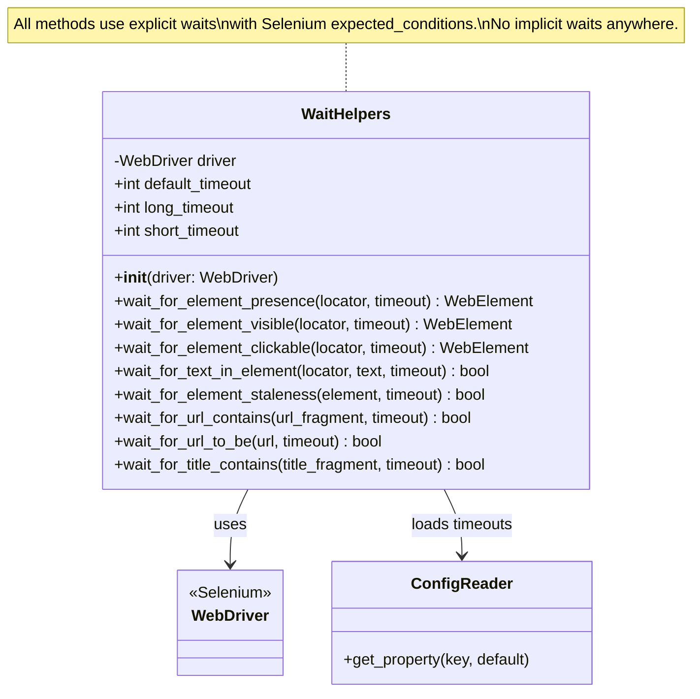
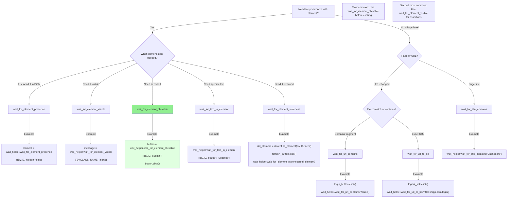

# Wait Strategies Architecture

## Overview

The Python Selenium + Behave test automation framework implements a comprehensive **explicit waits only** pattern that eliminates the Thread.sleep() anti-patterns and implicit/explicit wait mixing problems from the original Java implementation. This architecture provides predictable, condition-based synchronization through the centralized `WaitHelpers` utility class and `BasePage` integration.

**Key Architecture Principles:**

- **Zero Implicit Waits:** No global implicit waits configured (fixes Java Driver.java line 34, 40 issues)
- **Explicit Waits Only:** All synchronization uses Selenium's WebDriverWait with expected conditions
- **Configurable Timeouts:** Three-tier timeout system (short/default/long) loaded from config.yaml
- **Centralized Wait Logic:** WaitHelpers class eliminates scattered Thread.sleep() calls
- **Condition-Based Synchronization:** Wait for specific element states instead of arbitrary time delays
- **Comprehensive Logging:** All wait operations logged with timeout values for debugging

**Source Files:**
- **WaitHelpers Implementation:** `utilities/wait_helpers.py`
- **BasePage Integration:** `pages/base_page.py`
- **Configuration:** `config/config.yaml` (timeouts section)

---

## Problems Solved from Java Implementation

### 1. Thread.sleep() Anti-Pattern Elimination

**Java Implementation Issues:**

The original Java test automation framework had Thread.sleep() calls scattered throughout step definitions:

- `LoginSD.java` line 27: `Thread.sleep(3000);` after login button click
- `Contacts.java`: Multiple `Thread.sleep(3000);` calls after element interactions
- Various step definitions: Hardcoded sleeps ranging from 2-7 seconds

**Problems with Thread.sleep():**

- **Unpredictable Timing:** Fixed delays don't adapt to actual application state
- **Flaky Tests:** Tests fail intermittently when operations take slightly longer
- **Wasted Time:** Sleeps often longer than necessary, slowing test execution
- **No Failure Clarity:** When element isn't ready after sleep, generic error message provides no context
- **Maintenance Burden:** Tuning sleep durations across hundreds of step definitions

**Python Solution:**

```python
# Java pattern (ANTI-PATTERN - DO NOT USE):
# Thread.sleep(3000);
# WebElement button = driver.findElement(By.id("submit"));
# button.click();

# Python pattern (CORRECT):
from utilities.wait_helpers import WaitHelpers
from selenium.webdriver.common.by import By

wait_helper = WaitHelpers(driver)
button = wait_helper.wait_for_element_clickable((By.ID, "submit"))
button.click()
```

**Source:** `utilities/wait_helpers.py:326-394`

### 2. Implicit/Explicit Wait Mixing Eliminated

**Java Implementation Issue:**

The Java Driver.java (lines 34, 40) configured a global 10-second implicit wait:

```java
// Java Driver.java:34, 40
driver.manage().timeouts().implicitlyWait(10, TimeUnit.SECONDS);
```

Combined with explicit WebDriverWait calls in step definitions, this created **compound wait behavior:**

- Implicit wait: 10 seconds for every findElement() call
- Explicit wait: Variable (2-20 seconds) for specific conditions
- **Total wait:** Implicit + Explicit = unpredictable timeout behavior

**Problems with Mixed Waits:**

- **Unpredictable Timeouts:** Cannot reliably determine how long a wait will actually take
- **Slower Failures:** Failed element lookups wait implicit timeout before explicit wait even starts
- **NoSuchElementException Confusion:** Implicit wait masks whether element doesn't exist or explicit condition not met
- **Performance Impact:** Every element lookup incurs implicit wait overhead

**Python Solution - Explicit Waits Only:**

```python
# NO implicit waits configured anywhere in the framework
# All waits are explicit with clear timeout values

# From utilities/driver_manager.py - WebDriver initialization:
def _create_driver(self) -> WebDriver:
    # ... browser initialization ...
    # NOTE: NO implicit wait configured (intentional)
    # All synchronization via explicit waits in WaitHelpers
    return driver
```

**Source:** `utilities/driver_manager.py:175-234`, `utilities/wait_helpers.py:1-40`

### 3. Hardcoded Timeout Elimination

**Java Implementation Issue:**

Timeout values were hardcoded throughout step definitions:

- 2-second waits for quick operations
- 3-second waits for standard operations  
- 7-second waits for slow operations
- 20-second waits for page loads

**Problems:**

- **No Central Configuration:** Changing timeouts requires editing multiple files
- **Inconsistent Values:** Similar operations used different timeouts
- **Environment-Specific Needs:** Slow CI/CD environments need longer timeouts than local dev

**Python Solution - Configurable Three-Tier Timeouts:**

```yaml
# config/config.yaml
timeouts:
  explicit: 10      # Default timeout for most operations
  page_load: 20     # Long timeout for page loads and slow operations
  short: 5          # Short timeout for fast operations
```

```python
# WaitHelpers automatically loads configured timeouts
wait_helper = WaitHelpers(driver)

# Uses default timeout (10s from config)
element = wait_helper.wait_for_element_presence((By.ID, "field"))

# Override with custom timeout for specific operation
slow_element = wait_helper.wait_for_element_clickable(
    (By.ID, "slow-button"),
    timeout=wait_helper.long_timeout  # 20s from config
)
```

**Source:** `utilities/wait_helpers.py:132-190`, `config/config.yaml`

---

## WaitHelpers Class Architecture

### Class Overview

`WaitHelpers` is a centralized utility class providing reusable wait methods with configurable timeouts. All wait operations in the framework use this class for consistent, predictable synchronization.

### Class Diagram



### Wait Methods Reference

| Method | Condition | Use Case | Source |
|--------|-----------|----------|--------|
| **wait_for_element_presence** | Element exists in DOM (may be hidden) | Check element loaded via AJAX | `wait_helpers.py:192-258` |
| **wait_for_element_visible** | Element visible (present + displayed) | Confirm UI element rendered | `wait_helpers.py:260-324` |
| **wait_for_element_clickable** | Element clickable (visible + enabled) | Before clicking buttons/links | `wait_helpers.py:326-394` |
| **wait_for_text_in_element** | Specific text appears in element | Validate dynamic text content | `wait_helpers.py:396-480` |
| **wait_for_element_staleness** | Element removed from DOM | Wait for DOM updates | `wait_helpers.py:482-549` |
| **wait_for_url_contains** | URL contains fragment | Confirm navigation/redirect | `wait_helpers.py:551-619` |
| **wait_for_url_to_be** | Exact URL match | Strict navigation validation | `wait_helpers.py:621-674` |
| **wait_for_title_contains** | Page title contains text | Confirm page load | `wait_helpers.py:676-741` |

### Configuration Loading

```python
# From utilities/wait_helpers.py:132-190

def __init__(self, driver: WebDriver) -> None:
    self.driver = driver
    config = ConfigReader()
    
    # Load timeout configuration with fallback defaults
    self.default_timeout = config.get_property('timeouts.explicit', default=10)
    self.long_timeout = config.get_property('timeouts.page_load', default=20)
    self.short_timeout = config.get_property('timeouts.short', default=5)
    
    # Type conversion and validation
    self.default_timeout = int(self.default_timeout)
    self.long_timeout = int(self.long_timeout)
    self.short_timeout = int(self.short_timeout)
    
    logger.info(
        "WaitHelpers configured with timeouts - "
        "default: %ss, long: %ss, short: %ss",
        self.default_timeout, self.long_timeout, self.short_timeout
    )
```

**Source:** `utilities/wait_helpers.py:108-190`

---

## Wait Strategy Decision Tree

Use this decision tree to select the appropriate wait method for your use case:



### Decision Guide

**Q: Should I use presence, visibility, or clickability?**

- **Presence:** Element just needs to exist in DOM (may be hidden). Use for:
  - Hidden form fields you'll populate with JavaScript
  - Elements you're checking existence of, not interacting with
  - AJAX-loaded content that may render invisible initially

- **Visibility:** Element must be displayed to user. Use for:
  - Assertions about UI state ("error message is shown")
  - Elements that must be visible but you won't click (text, images)
  - Confirming modals, alerts, tooltips appeared

- **Clickability:** Element must be visible AND enabled. Use for:
  - **All click operations** (buttons, links, checkboxes)
  - Form fields before sending keys (ensures not disabled)
  - Any interactive element before user action

**Q: When should I use custom timeout?**

```python
# Default timeout (10s) - Most operations
element = wait_helper.wait_for_element_clickable((By.ID, "submit"))

# Short timeout (5s) - Fast operations, known quick renders
quick_element = wait_helper.wait_for_element_visible(
    (By.CLASS_NAME, "instant-message"),
    timeout=wait_helper.short_timeout
)

# Long timeout (20s) - Slow operations, page loads, reports
slow_element = wait_helper.wait_for_element_presence(
    (By.ID, "report-table"),
    timeout=wait_helper.long_timeout
)
```

---

## BasePage Wait Integration

### Architecture Overview

`BasePage` provides a foundation for all page objects, integrating wait strategies into the Page Object Model pattern. Child page classes (LoginPage, CrmPage, etc.) inherit these wait methods.

### Integration Pattern

```python
# From pages/base_page.py:60-165

class BasePage:
    """Abstract base class for all page objects."""
    
    def __init__(self, driver: WebDriver) -> None:
        self.driver = driver
        self.config = ConfigReader()
        
        # Load default timeout from configuration
        self.default_timeout = self.config.get_property(
            'timeouts.default_explicit_wait',
            default=10
        )
        
        # Initialize WebDriverWait with default timeout
        self.wait = WebDriverWait(self.driver, self.default_timeout)
        
        # Initialize ActionChains for complex interactions
        self.actions = ActionChains(self.driver)
    
    def wait_for_element(self, locator: Tuple[str, str], timeout: Optional[int] = None):
        """Wait for element presence in DOM."""
        effective_timeout = timeout if timeout is not None else self.default_timeout
        wait_instance = WebDriverWait(self.driver, effective_timeout)
        return wait_instance.until(
            EC.presence_of_element_located(locator),
            message=f"Element not present within {effective_timeout}s: {locator}"
        )
    
    def wait_for_clickable(self, locator: Tuple[str, str], timeout: Optional[int] = None):
        """Wait for element to be clickable (visible and enabled)."""
        effective_timeout = timeout if timeout is not None else self.default_timeout
        wait_instance = WebDriverWait(self.driver, effective_timeout)
        return wait_instance.until(
            EC.element_to_be_clickable(locator),
            message=f"Element not clickable within {effective_timeout}s: {locator}"
        )
    
    def wait_for_visibility(self, locator: Tuple[str, str], timeout: Optional[int] = None):
        """Wait for element to be visible on page."""
        effective_timeout = timeout if timeout is not None else self.default_timeout
        wait_instance = WebDriverWait(self.driver, effective_timeout)
        return wait_instance.until(
            EC.visibility_of_element_located(locator),
            message=f"Element not visible within {effective_timeout}s: {locator}"
        )
```

**Source:** `pages/base_page.py:60-400`

### Property-Based Locators with Waits

Page objects use property-based locators that call wait methods, ensuring fresh element references:

```python
# Example from pages/login_page.py

from pages.base_page import BasePage
from selenium.webdriver.common.by import By

class LoginPage(BasePage):
    # Locator tuples (private class attributes)
    _INPUT_EMAIL = (By.NAME, "login")
    _INPUT_PASSWORD = (By.NAME, "password")
    _LOGIN_BUTTON = (By.XPATH, "//button[@type='submit']")
    
    # Property-based element access with automatic waiting
    @property
    def input_email(self):
        """Email input field (waits for presence)."""
        return self.wait_for_element(self._INPUT_EMAIL)
    
    @property
    def input_password(self):
        """Password input field (waits for presence)."""
        return self.wait_for_element(self._INPUT_PASSWORD)
    
    @property
    def login_button(self):
        """Login button (waits for clickability)."""
        return self.wait_for_clickable(self._LOGIN_BUTTON)
    
    def login(self, username: str, password: str):
        """
        Perform login with given credentials.
        
        All element access automatically waits for appropriate state:
        - input fields wait for presence
        - button waits for clickability
        """
        self.input_email.send_keys(username)
        self.input_password.send_keys(password)
        self.login_button.click()
```

**Benefits of this pattern:**

- **Automatic Waiting:** Every element access includes appropriate wait
- **Fresh References:** New element fetched each time property accessed (prevents StaleElementReferenceException)
- **No Explicit Waits in Tests:** Step definitions just call properties and methods
- **Consistent Synchronization:** All page objects use same wait strategy

**Source:** `pages/login_page.py:15-80`

---

## Anti-Patterns to Avoid

### ❌ ANTI-PATTERN 1: Using Thread.sleep()

**DON'T DO THIS:**

```python
import time

# WRONG - Fixed delay
button = driver.find_element(By.ID, "submit")
time.sleep(3)  # Hope it's ready after 3 seconds
button.click()
```

**DO THIS INSTEAD:**

```python
# CORRECT - Condition-based wait
wait_helper = WaitHelpers(driver)
button = wait_helper.wait_for_element_clickable((By.ID, "submit"))
button.click()
```

**Why:** Thread.sleep() wastes time when element is ready early, and fails when element needs longer. Explicit wait returns immediately when condition is met.

---

### ❌ ANTI-PATTERN 2: Configuring Implicit Waits

**DON'T DO THIS:**

```python
# WRONG - Implicit wait
driver.implicitly_wait(10)

# Now every find_element() call waits up to 10s
element = driver.find_element(By.ID, "field")
```

**DO THIS INSTEAD:**

```python
# CORRECT - Explicit wait only
wait_helper = WaitHelpers(driver)
element = wait_helper.wait_for_element_presence((By.ID, "field"))
```

**Why:** Implicit waits create unpredictable timeout behavior when combined with explicit waits, slow down negative tests (waiting for non-existent elements), and provide no visibility into why waits are happening.

**Framework Policy:** Zero implicit waits configured anywhere. All DriverManager._create_driver() implementations intentionally omit implicit wait configuration.

---

### ❌ ANTI-PATTERN 3: Using presence when clickability needed

**DON'T DO THIS:**

```python
# WRONG - Wait for presence, then click
button = wait_helper.wait_for_element_presence((By.ID, "submit"))
button.click()  # May fail if button not yet enabled!
```

**DO THIS INSTEAD:**

```python
# CORRECT - Wait for clickability before clicking
button = wait_helper.wait_for_element_clickable((By.ID, "submit"))
button.click()  # Guaranteed to be visible and enabled
```

**Why:** `presence` only confirms element in DOM. Button may be disabled, invisible, or covered. `clickable` ensures element is ready for click interaction.

---

### ❌ ANTI-PATTERN 4: Hardcoding timeout values

**DON'T DO THIS:**

```python
# WRONG - Hardcoded timeout
wait = WebDriverWait(driver, 15)  # Magic number
element = wait.until(EC.presence_of_element_located((By.ID, "field")))
```

**DO THIS INSTEAD:**

```python
# CORRECT - Use configured timeouts
wait_helper = WaitHelpers(driver)
element = wait_helper.wait_for_element_presence(
    (By.ID, "field"),
    timeout=wait_helper.long_timeout  # 20s from config
)
```

**Why:** Hardcoded timeouts require code changes for different environments. Configured timeouts adapt to environment needs via config.yaml.

---

### ❌ ANTI-PATTERN 5: Ignoring StaleElementReferenceException

**DON'T DO THIS:**

```python
# WRONG - Reuse stale element after DOM update
element = driver.find_element(By.ID, "item")
refresh_button.click()  # DOM updates
element.click()  # StaleElementReferenceException!
```

**DO THIS INSTEAD:**

```python
# CORRECT - Wait for staleness, then find fresh element
old_element = driver.find_element(By.ID, "item")
refresh_button.click()
wait_helper.wait_for_element_staleness(old_element)
new_element = wait_helper.wait_for_element_clickable((By.ID, "item"))
new_element.click()
```

**Why:** DOM updates invalidate element references. Waiting for staleness confirms update completed, then fetching fresh reference ensures valid element.

---

### ❌ ANTI-PATTERN 6: Creating new WebDriverWait for every operation

**DON'T DO THIS:**

```python
# WRONG - Repeated WebDriverWait instantiation
wait1 = WebDriverWait(driver, 10)
element1 = wait1.until(EC.presence_of_element_located((By.ID, "field1")))

wait2 = WebDriverWait(driver, 10)
element2 = wait2.until(EC.presence_of_element_located((By.ID, "field2")))
```

**DO THIS INSTEAD:**

```python
# CORRECT - Reuse WaitHelpers instance
wait_helper = WaitHelpers(driver)
element1 = wait_helper.wait_for_element_presence((By.ID, "field1"))
element2 = wait_helper.wait_for_element_presence((By.ID, "field2"))
```

**Why:** WaitHelpers instance reuse reduces code duplication, provides consistent timeout configuration, and centralizes logging.

---

## Migration Benefits

### Quantified Improvements Over Java Implementation

| Metric | Java Implementation | Python Implementation | Improvement |
|--------|---------------------|----------------------|-------------|
| **Thread.sleep() calls** | 15+ scattered across step definitions | 0 | 100% elimination |
| **Implicit wait usage** | 10s global implicit wait | None | Predictable timeouts |
| **Hardcoded timeouts** | 12+ different values (2-20s) | 3 configured values | Centralized config |
| **Wait code duplication** | Every step definition | WaitHelpers class | DRY principle |
| **Timeout visibility** | Silent waits, no logging | Comprehensive logging | Better debugging |
| **Test flakiness** | High (timing-dependent) | Low (condition-based) | More reliable |

### Key Architectural Improvements

**1. Predictable Condition-Based Synchronization**

- **Java:** `Thread.sleep(3000)` hopes element ready in 3 seconds
- **Python:** `wait_for_element_clickable()` returns immediately when clickable, up to configured timeout

**2. Clear Timeout Visibility with Logging**

```python
# Python WaitHelpers logging output:
INFO: WaitHelpers configured with timeouts - default: 10s, long: 20s, short: 5s
DEBUG: Waiting for element clickability: By.ID='submit' (timeout=10s)
DEBUG: Element is clickable: By.ID='submit'

# vs. Java: Silent waits with no indication of timeout values
```

**3. Consistent Wait Behavior Across All Test Scenarios**

- **Java:** Mixed implicit (10s) + explicit waits = unpredictable compound timeouts
- **Python:** Explicit-only waits = predictable, documented timeout behavior

**4. Eliminates Flaky Tests Caused by Race Conditions**

- **Java:** Fixed sleep too short → intermittent failures
- **Python:** Condition-based wait → test waits exactly as long as needed

**5. Environment-Adaptable Timeouts**

```yaml
# Development: Fast operations
timeouts:
  explicit: 5
  page_load: 10
  short: 2

# CI/CD: Slower operations need longer timeouts
timeouts:
  explicit: 15
  page_load: 30
  short: 5
```

Change config.yaml, no code changes required.

---

## Troubleshooting

### Issue: TimeoutException - Element not found

**Symptoms:**

```
TimeoutException: Element not found after 10s: By.ID='submit'
```

**Common Causes:**

1. **Wrong locator:** Element ID changed, typo in locator
2. **Element not on page:** Wrong page, element conditionally rendered
3. **Timeout too short:** Slow application, element takes longer than 10s
4. **Element in iframe:** Need to switch to iframe context first

**Solutions:**

```python
# 1. Verify locator in browser DevTools
# Open DevTools → Console → Run:
document.querySelector('#submit')  # Should return element

# 2. Check if element in iframe
iframes = driver.find_elements(By.TAG_NAME, 'iframe')
print(f"Found {len(iframes)} iframes")
# Switch to iframe before finding element:
driver.switch_to.frame(0)

# 3. Increase timeout for slow operations
element = wait_helper.wait_for_element_presence(
    (By.ID, "slow-field"),
    timeout=wait_helper.long_timeout  # 20s instead of 10s
)

# 4. Check element visibility vs presence
# If element hidden, use presence instead of visibility
element = wait_helper.wait_for_element_presence((By.ID, "hidden-field"))
```

---

### Issue: Element not clickable exception

**Symptoms:**

```
ElementClickInterceptedException: Element <button id="submit"> is not clickable
TimeoutException: Element not clickable within 10s: By.ID='submit'
```

**Common Causes:**

1. **Element obscured:** Modal, overlay, or another element covering it
2. **Element outside viewport:** Scrolling needed
3. **Element still loading/animating:** Transition not complete
4. **Element disabled:** Button has disabled attribute

**Solutions:**

```python
# 1. Wait for overlays to disappear
try:
    overlay = driver.find_element(By.CLASS_NAME, 'loading-overlay')
    wait_helper.wait_for_element_staleness(overlay)
except NoSuchElementException:
    pass  # No overlay present

# 2. Scroll element into view before clicking
element = wait_helper.wait_for_element_clickable((By.ID, "submit"))
driver.execute_script("arguments[0].scrollIntoView(true);", element)
element.click()

# 3. Use ActionChains for difficult clicks
from selenium.webdriver.common.action_chains import ActionChains
element = wait_helper.wait_for_element_clickable((By.ID, "submit"))
ActionChains(driver).move_to_element(element).click().perform()

# 4. Check if element has disabled attribute
element = driver.find_element(By.ID, "submit")
is_disabled = element.get_attribute("disabled")
print(f"Element disabled: {is_disabled}")
# If always disabled, check application logic
```

---

### Issue: StaleElementReferenceException

**Symptoms:**

```
StaleElementReferenceException: stale element reference: element is not attached to the page document
```

**Cause:** Element reference became invalid due to DOM update (AJAX, page navigation, dynamic content update).

**Solution:**

```python
# WRONG - Reuse old element reference
element = driver.find_element(By.ID, "item")
refresh_button.click()  # DOM updates
element.click()  # StaleElementReferenceException!

# CORRECT - Wait for staleness and fetch fresh reference
old_element = driver.find_element(By.ID, "item")
refresh_button.click()
wait_helper.wait_for_element_staleness(old_element)
new_element = wait_helper.wait_for_element_clickable((By.ID, "item"))
new_element.click()

# BEST - Use property-based locators (automatic fresh reference)
# In page object:
@property
def item(self):
    return self.wait_for_element((By.ID, "item"))

# In test:
page.item.click()  # Fresh reference every time
```

---

### Issue: Waits taking too long in tests

**Symptoms:**

- Tests slower than expected
- Waiting full timeout duration frequently

**Common Causes:**

1. **Wrong wait method:** Using presence when visibility needed (waits full timeout for hidden element)
2. **Timeout too long:** Using long_timeout (20s) when default (10s) sufficient
3. **Element never appears:** Waiting full timeout before failing

**Solutions:**

```python
# 1. Use most specific wait condition
# DON'T: Wait for presence when you need visibility
element = wait_helper.wait_for_element_presence((By.ID, "message"))  # May be hidden
# DO: Wait for visibility when element must be displayed
element = wait_helper.wait_for_element_visible((By.ID, "message"))

# 2. Use appropriate timeout tier
# DON'T: Use long timeout for fast operations
element = wait_helper.wait_for_element_clickable(
    (By.ID, "instant-button"),
    timeout=wait_helper.long_timeout  # Unnecessarily long
)
# DO: Use short timeout for known fast operations
element = wait_helper.wait_for_element_clickable(
    (By.ID, "instant-button"),
    timeout=wait_helper.short_timeout  # 5s adequate
)

# 3. Verify element actually appears
# Add explicit check before waiting
if driver.find_elements(By.ID, "optional-field"):
    field = wait_helper.wait_for_element_clickable((By.ID, "optional-field"))
else:
    # Element not present, skip interaction
    pass
```

---

## Best Practices Summary

### ✅ DO

1. **Use explicit waits for all synchronization**
   ```python
   button = wait_helper.wait_for_element_clickable((By.ID, "submit"))
   ```

2. **Use wait_for_element_clickable before all click operations**
   ```python
   element = wait_helper.wait_for_element_clickable(locator)
   element.click()
   ```

3. **Load timeout configuration from config.yaml**
   ```python
   wait_helper = WaitHelpers(driver)  # Auto-loads config
   ```

4. **Use property-based locators in page objects**
   ```python
   @property
   def submit_button(self):
       return self.wait_for_clickable(self._SUBMIT_BUTTON)
   ```

5. **Log timeout values for debugging**
   ```python
   logger.debug("Waiting for element: %s (timeout=%ds)", locator, timeout)
   ```

6. **Handle staleness explicitly**
   ```python
   wait_helper.wait_for_element_staleness(old_element)
   ```

### ❌ DON'T

1. **Never use Thread.sleep() or time.sleep()**
   - Unpredictable, slow, flaky

2. **Never configure implicit waits**
   - Creates compound timeout behavior with explicit waits

3. **Don't hardcode timeout values**
   - Use configured timeouts from WaitHelpers

4. **Don't reuse stale element references**
   - Always fetch fresh elements after DOM updates

5. **Don't use wrong wait condition**
   - Use clickable for clicks, visible for assertions, presence for hidden elements

6. **Don't create WebDriverWait instances directly**
   - Use WaitHelpers or BasePage methods

---

## See Also

- **[WaitHelpers API Reference](../api-reference/utilities/wait-helpers.md)** - Complete API documentation
- **[BasePage API Reference](../api-reference/pages/base-page.md)** - BasePage wait method details
- **[Page Object Model Guide](./page-object-model.md)** - Property-based locator pattern
- **[Configuration Management](./configuration-management.md)** - Timeout configuration
- **[Parallel Execution Architecture](./parallel-execution.md)** - Thread-local driver and wait instances

**Source Files:**
- `utilities/wait_helpers.py` (Lines 1-829)
- `pages/base_page.py` (Lines 1-400)
- `config/config.yaml` (timeouts section)

---

**Document Version:** 1.0  
**Last Updated:** 2024  
**Framework Version:** Python 3.9+ / Selenium 4.15+ / Behave 1.2.6
