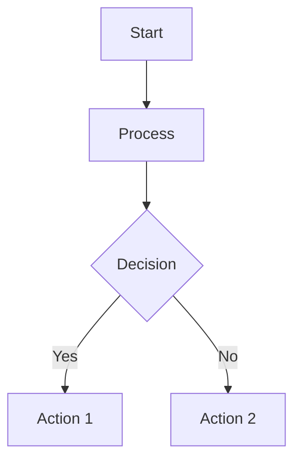
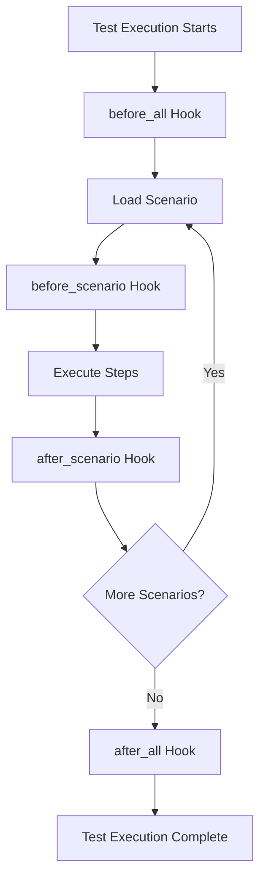
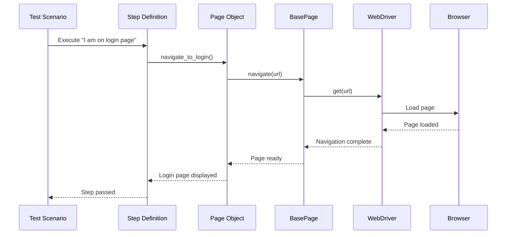
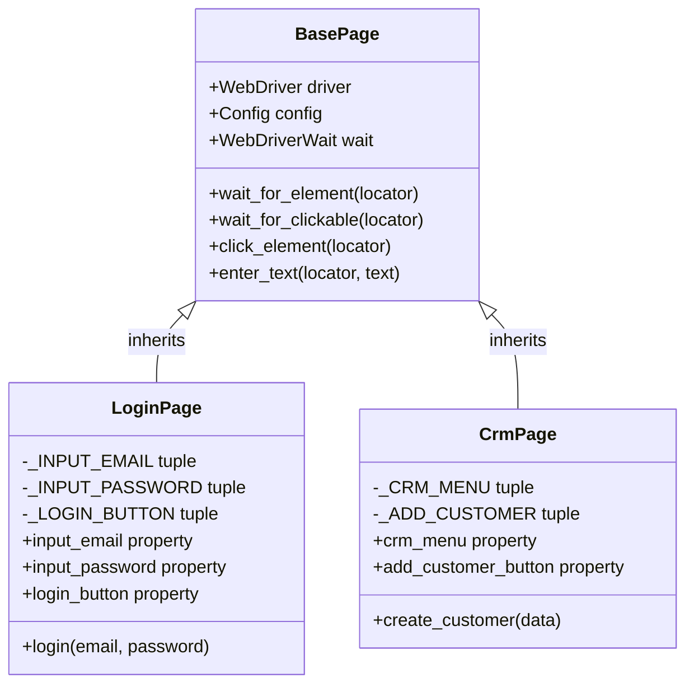
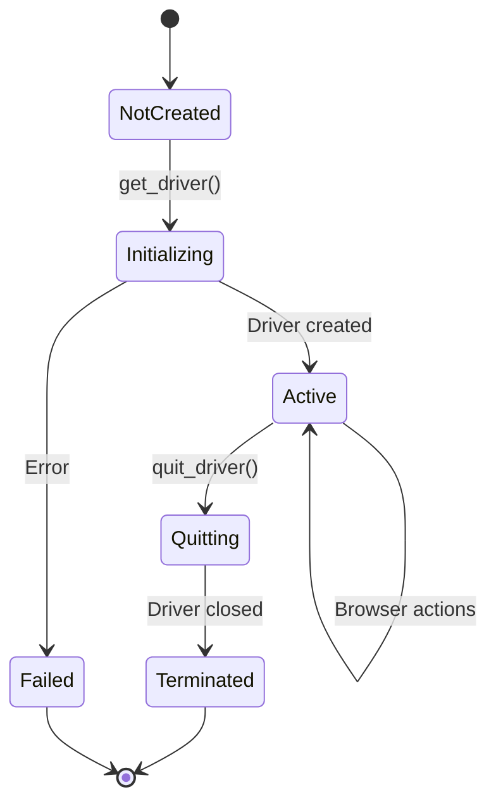
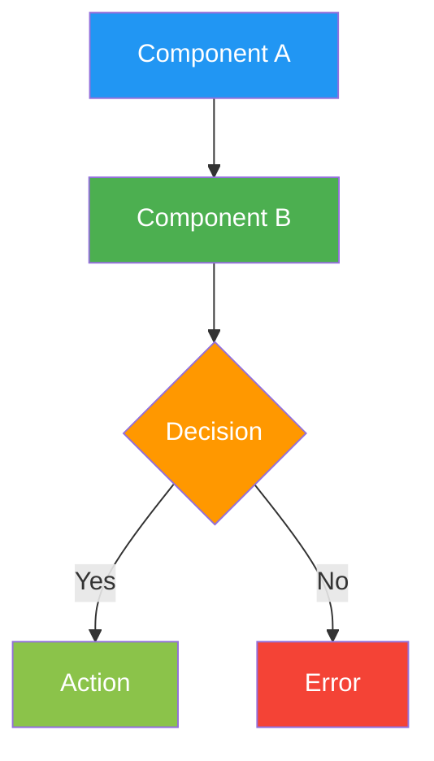
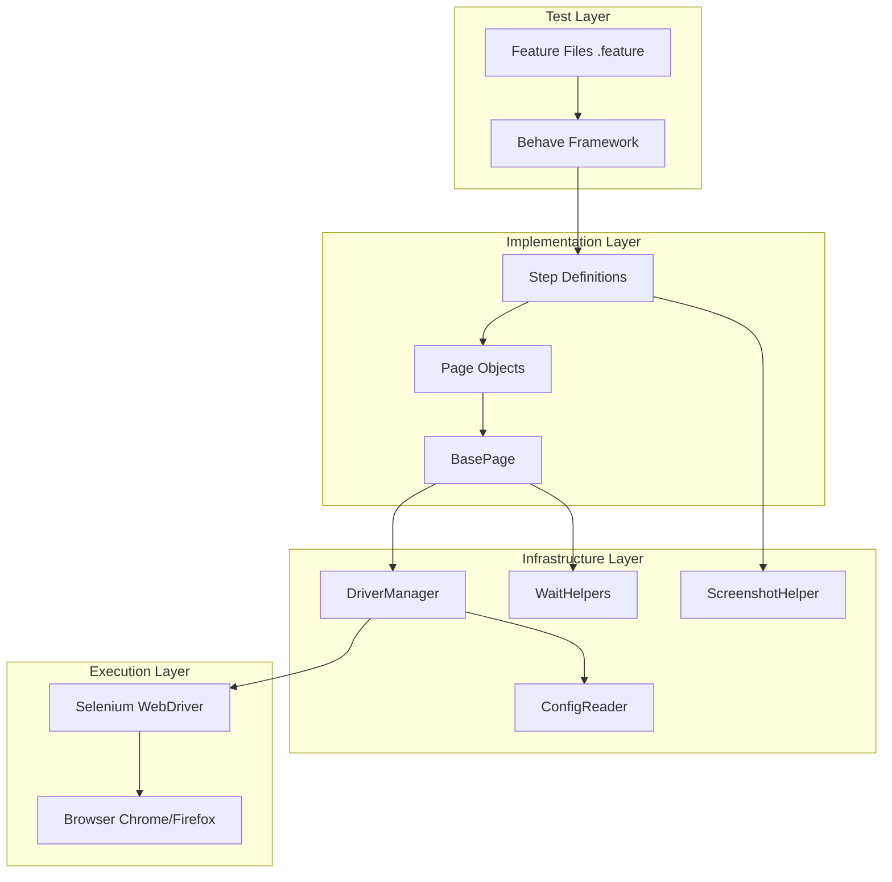
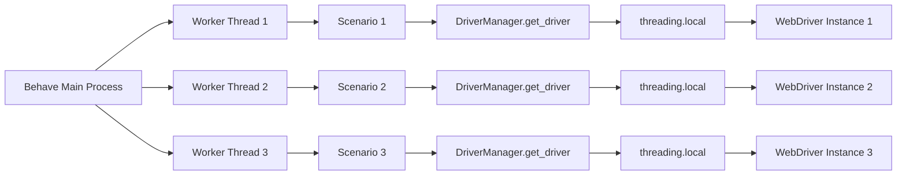

# Documentation Guidelines

Comprehensive standards and best practices for contributing to the Testinium QA Python framework documentation.

## Table of Contents

- [Documentation Philosophy](#documentation-philosophy)
- [Markdown Formatting Standards](#markdown-formatting-standards)
- [Code Example Standards](#code-example-standards)
- [Python Docstring Standards](#python-docstring-standards)
- [Mermaid Diagram Guidelines](#mermaid-diagram-guidelines)
- [Documentation Structure](#documentation-structure)
- [Source Citations](#source-citations)
- [Cross-Referencing](#cross-referencing)
- [Terminology Standards](#terminology-standards)
- [Quality Checklist](#quality-checklist)
- [Documentation Types and Templates](#documentation-types-and-templates)
- [Update Triggers](#update-triggers)
- [Review Process](#review-process)

## Documentation Philosophy

The Testinium QA Python framework maintains exceptional documentation standards that all contributors must match. Our documentation philosophy emphasizes:

### Comprehensive and Detailed

Documentation should provide complete information without requiring readers to dive into source code. Every public API, feature, and configuration option must be thoroughly documented with:

- Clear purpose and responsibilities
- Complete parameter and return value documentation
- Real-world usage examples
- Edge cases and error handling
- Performance and thread-safety considerations

**Example of Excellence:** The `utilities/driver_manager.py` module docstring (lines 1-37) demonstrates comprehensive documentation including migration context, critical bug fixes, architectural changes, and usage examples.

### Migration Context Preservation

This framework was migrated from Java/Cucumber to Python/Behave. Documentation must preserve this context by:

- Citing original Java file equivalents where applicable
- Documenting behavioral differences and improvements
- Explaining bug fixes applied during migration
- Noting architectural pattern transformations

**Source:** `blitzy/documentation/Technical Specifications.md` contains comprehensive migration mapping

### Progressive Disclosure

Organize documentation from basics to advanced topics:

1. **Quick Start** - Get users productive in 5 minutes
2. **Core Concepts** - Explain fundamental patterns and architecture
3. **Advanced Usage** - Cover complex scenarios and customization
4. **Troubleshooting** - Address common issues and edge cases

### Clear Navigation and Cross-References

Every documentation page must:

- Link to related API references
- Reference prerequisite guides
- Connect to troubleshooting resources
- Provide "See Also" sections

### Practical Examples

Every concept must be illustrated with working code examples:

- Extract from actual working code (tests, implementations)
- Include complete context (imports, setup)
- Show expected output where helpful
- Keep examples concise but complete (under 20 lines)

## Markdown Formatting Standards

All documentation uses **GitHub Flavored Markdown (GFM)** with MkDocs Material extensions.

### Heading Hierarchy

Use ATX-style headers with proper hierarchy:

```markdown
# Page Title (H1) - Only one per page

## Major Section (H2)

### Subsection (H3)

#### Minor Section (H4)
```

**Rules:**
- One H1 per page (page title)
- Never skip heading levels (e.g., H2 → H4)
- Use sentence case for headings ("Creating page objects" not "Creating Page Objects")
- Keep headings concise and descriptive

### Code Blocks

Always specify language for syntax highlighting:

````markdown
```python
from utilities.driver_manager import DriverManager

driver = DriverManager.get_driver()
driver.get("https://example.com")
```

```yaml
browser:
  type: chrome
  headless: false
```

```bash
behave --tags=@Login features/
```

```gherkin
Feature: User Login
  Scenario: Valid login
    Given I am on the login page
    When I enter valid credentials
    Then I should see the dashboard
```
````

**Supported Language Identifiers:**
- `python` - Python code
- `yaml` - YAML configuration files
- `bash` - Shell commands
- `gherkin` - Behave feature files
- `ini` - Configuration files (behave.ini, pytest.ini)
- `json` - JSON data
- `text` - Plain text output

### Tables

Use tables for structured data like parameters, configuration options, and comparisons:

```markdown
| Parameter | Type | Required | Default | Description |
|-----------|------|----------|---------|-------------|
| `browser_type` | str | No | "chrome" | Browser to use for testing |
| `headless` | bool | No | False | Run browser in headless mode |
| `timeout` | int | No | 10 | Default explicit wait timeout |
```

**Table Guidelines:**
- Use header row with proper column names
- Align columns for readability in source
- Use code formatting for parameter names (`parameter_name`)
- Keep cell content concise
- Use line breaks sparingly within cells

### Admonitions

Use blockquotes for notes, warnings, and tips:

```markdown
> **Note:** This feature requires Python 3.9 or higher.

> **Warning:** Modifying thread-local storage can break parallel execution.

> **Tip:** Use `mkdocs serve` to preview documentation locally before committing.
```

**Admonition Types:**
- **Note** - Additional information or context
- **Warning** - Critical information about potential issues
- **Tip** - Helpful suggestions and best practices
- **Important** - Key information that shouldn't be missed

### Links

**Internal Links** (within documentation):
```markdown
See the [Configuration Guide](../guides/configuration-management.md) for details.

Refer to the [DriverManager API](../api-reference/utilities/driver-manager.md).
```

**External Links**:
```markdown
For more information, see the [Selenium documentation](https://selenium.dev/documentation/).

Download Python from [python.org](https://www.python.org/downloads/).
```

**Source Code Links**:
```markdown
See [`utilities/driver_manager.py`](../../utilities/driver_manager.py) for implementation.
```

### Lists

**Unordered Lists:**
```markdown
- First item
- Second item
  - Nested item
  - Another nested item
- Third item
```

**Ordered Lists:**
```markdown
1. First step
2. Second step
   1. Sub-step A
   2. Sub-step B
3. Third step
```

**Rules:**
- Use `-` for unordered lists (consistent with codebase)
- Use proper indentation (2 spaces for nested lists)
- Keep list items concise
- Use complete sentences when items are complex

### Line Length

- **Markdown prose:** Wrap at 100 characters for readability in source
- **Code blocks:** Follow language-specific conventions (Python: 100 chars with Black)
- **Tables:** May exceed 100 characters if necessary for readability

## Code Example Standards

Every API documentation and user guide must include working code examples.

### Complete and Runnable

Examples must be complete enough to run without modification:

```python
# GOOD: Complete example with imports
from utilities.driver_manager import DriverManager
from utilities.config_reader import ConfigReader

# Get configuration
config = ConfigReader()
browser_type = config.get_property("browser.type")

# Get WebDriver instance
driver = DriverManager.get_driver()
driver.get("https://example.com")

# Cleanup
DriverManager.quit_driver()
```

```python
# BAD: Incomplete example missing imports and context
driver = get_driver()
driver.get("https://example.com")
```

### Realistic Data

Use realistic variable names and data, not placeholder values:

```python
# GOOD: Realistic example
from pages.login_page import LoginPage

login_page = LoginPage(driver)
login_page.login("admin@testinium.com", "SecurePass123!")
assert login_page.dashboard.is_displayed()
```

```python
# BAD: Placeholder values
login_page.login("foo@bar.com", "password")
```

### Explanatory Comments

Add comments for key concepts, not obvious code:

```python
# GOOD: Explains the why
from utilities.driver_manager import DriverManager

# Get thread-local WebDriver instance for parallel execution safety
driver = DriverManager.get_driver()

# Always use explicit waits - implicit waits disabled framework-wide
wait = WebDriverWait(driver, 10)
element = wait.until(EC.element_to_be_clickable((By.ID, "submit")))
```

```python
# BAD: Comments state the obvious
# Import DriverManager
from utilities.driver_manager import DriverManager

# Get driver
driver = DriverManager.get_driver()
```

### Show Expected Output

When helpful, show the expected output or result:

```python
# Get browser configuration
config = ConfigReader()
browser_type = config.get_property("browser.type")
print(f"Browser type: {browser_type}")
# Output: Browser type: chrome

headless = config.get_property("browser.headless")
print(f"Headless mode: {headless}")
# Output: Headless mode: False
```

### Keep Examples Concise

Target 5-20 lines per example. Split complex examples into multiple focused examples:

```python
# Example 1: Basic Usage
from utilities.driver_manager import DriverManager

driver = DriverManager.get_driver()
driver.get("https://example.com")
DriverManager.quit_driver()

# Example 2: Advanced - With Custom Configuration
from config.test_config import Config, BrowserConfig

config = Config(browser=BrowserConfig(type="firefox", headless=True))
driver = DriverManager.get_driver()
```

### Extract from Working Code

All examples should be extracted from or verified against working code:

- Test files (`tests/`)
- Step definitions (`features/steps/`)
- Page objects (`pages/`)
- Utility implementations (`utilities/`)

Mark examples with source citation:

```python
# Example from tests/test_driver_manager.py
def test_get_driver_chrome_default():
    driver = DriverManager.get_driver()
    assert driver is not None
    assert isinstance(driver, webdriver.Chrome)
```

**Source:** `tests/test_driver_manager.py:45-48`

## Python Docstring Standards

All Python modules, classes, and functions must have comprehensive docstrings following **Google Style** conventions.

### Module-Level Docstrings

Every Python module must start with a comprehensive docstring:

```python
"""
Module Name

Brief one-line description of the module's purpose.

Detailed multi-paragraph explanation covering:
- What this module does
- When to use it
- How it fits into the larger framework
- Key patterns and architectural decisions

MIGRATION CONTEXT (if applicable):
    This module replaces Java's OriginalClass.java with Python implementation:
    - Key difference 1
    - Key difference 2
    - Bug fixes applied

CRITICAL BUG FIX (if applicable):
    Original Java implementation had bug on line X:
        [description of bug]
    
    This Python implementation fixes it by:
        [description of fix]

ARCHITECTURAL CHANGES (if applicable):
    1. Change 1 and rationale
    2. Change 2 and rationale

Example Usage:
    >>> from package.module import Class
    >>> instance = Class()
    >>> result = instance.method()
    >>> print(result)
    Expected output
"""
```

**Example of Excellence:**

**Source:** `utilities/driver_manager.py:1-37`

```python
"""
Driver Manager Module

Thread-safe WebDriver lifecycle management for parallel test execution.

This module replaces Java's Driver.java with Python implementation:
- Threading.local() replaces InheritableThreadLocal for thread safety
- webdriver-manager handles automatic driver binary provisioning
- Explicit waits ONLY (eliminates 10-second implicit wait anti-pattern)
- Configuration-driven browser selection (Chrome, Firefox)
- Lazy initialization with proper cleanup

CRITICAL BUG FIX:
    Original Java Driver.java line 37 incorrectly called:
        WebDriverManager.chromedriver().setup()
    for Firefox browser, causing Firefox tests to fail.

    This Python implementation correctly uses:
        GeckoDriverManager().install()
    for Firefox, ensuring proper GeckoDriver binary provisioning.

ARCHITECTURAL CHANGES FROM JAVA VERSION:
    1. NO implicit waits (Java had 10s on lines 34, 40) - explicit waits only
    2. threading.local() provides thread-level isolation (not child inheritance)
    3. webdriver-manager caches binaries in ~/.wdm/drivers/
    4. Comprehensive logging replaces System.out.println
    5. Proper exception handling replaces silent failures
    6. Selenium 4.x syntax (headless=new, ChromeService, FirefoxService)

Example Usage:
    >>> from utilities.driver_manager import DriverManager
    >>> # Get WebDriver instance for current thread
    >>> driver = DriverManager.get_driver()
    >>> driver.get("https://example.com")
    >>> # Cleanup after test
    >>> DriverManager.quit_driver()
"""
```

### Class-Level Docstrings

Every class must have a docstring describing its purpose, attributes, and usage:

```python
class PageObject:
    """
    Brief one-line description of the class.
    
    Detailed explanation of the class's responsibilities, patterns used,
    and when to use it.
    
    Attributes:
        driver (WebDriver): Selenium WebDriver instance for browser automation
        config (Config): Configuration object with browser and timeout settings
        wait (WebDriverWait): Explicit wait helper for element synchronization
        
    Thread Safety:
        This class is thread-safe when using DriverManager.get_driver() which
        returns thread-local WebDriver instances.
        
    Example:
        >>> page = PageObject(driver)
        >>> page.navigate_to("https://example.com")
        >>> element = page.find_element(By.ID, "submit")
    """
```

### Method-Level Docstrings

Every public method must document parameters, return values, exceptions, and provide examples:

```python
def wait_for_element(self, locator: tuple, timeout: int = None) -> WebElement:
    """
    Wait for element to be present in DOM and return it.
    
    Uses explicit wait with customizable timeout. Element must be present
    in the DOM but doesn't need to be visible or clickable.
    
    Args:
        locator (tuple): Selenium locator tuple (By.ID, "element_id")
        timeout (int, optional): Maximum wait time in seconds. If None,
            uses config.timeouts.explicit (default: 10 seconds)
            
    Returns:
        WebElement: Located element ready for interaction
        
    Raises:
        TimeoutException: If element not found within timeout period
        NoSuchElementException: If locator is invalid
        
    Example:
        >>> from selenium.webdriver.common.by import By
        >>> element = page.wait_for_element((By.ID, "submit"))
        >>> element.click()
        
        >>> # With custom timeout
        >>> element = page.wait_for_element((By.NAME, "username"), timeout=20)
        
    Migration Note:
        Java version used implicit waits (Driver.java line 34).
        This Python implementation uses explicit waits only for better control.
    """
```

### Exception Class Docstrings

Exception classes must document when they're raised and how to handle them:

```python
class DriverInitializationError(Exception):
    """
    Raised when WebDriver initialization fails.
    
    This exception indicates that the WebDriver instance could not be created,
    typically due to:
    - Missing or incompatible browser driver binary
    - Invalid browser configuration
    - Insufficient system permissions
    - Browser not installed
    
    When Raised:
        - DriverManager.get_driver() cannot create WebDriver instance
        - Browser driver download fails
        - Browser process fails to start
        
    Handling:
        >>> try:
        ...     driver = DriverManager.get_driver()
        ... except DriverInitializationError as e:
        ...     logger.error(f"Failed to initialize driver: {e}")
        ...     # Fallback to alternative browser or fail gracefully
    """
```

### Property Docstrings

Properties should have concise docstrings:

```python
@property
def input_email(self) -> WebElement:
    """
    Email input field on login page.
    
    Returns:
        WebElement: Email input element, waited for presence in DOM
        
    Raises:
        TimeoutException: If element not found within default timeout
    """
    return self.wait_for_element(self._INPUT_EMAIL)
```

### Docstring Quality Checklist

- [ ] One-line summary (fits in 80 characters)
- [ ] Detailed description explaining purpose and usage
- [ ] All parameters documented with types and descriptions
- [ ] Return value documented with type and description
- [ ] All exceptions documented with conditions
- [ ] At least one working example provided
- [ ] Migration notes included (if migrated from Java)
- [ ] Thread safety explicitly stated (for utilities and page objects)
- [ ] Source citations for complex logic

## Mermaid Diagram Guidelines

Use Mermaid for all architecture, sequence, class, and flow diagrams.

### Why Mermaid?

- **Text-based**: Version controllable, no binary image files
- **Renders everywhere**: GitHub, GitLab, MkDocs automatically render
- **Easy to maintain**: Simple syntax, quick to update
- **Multiple types**: Supports sequence, class, flow, state diagrams

### Embedding Mermaid Diagrams

Embed diagrams directly in markdown using fenced code blocks:

````markdown

````

### Diagram Types

#### Flowchart (Process Flow)

Use for process flows and decision trees:



#### Sequence Diagram (Interactions)

Use for showing interactions between components:



#### Class Diagram (Architecture)

Use for showing class hierarchies and relationships:



#### State Diagram (Lifecycle)

Use for showing state transitions and lifecycle:



### Diagram Style Guidelines

**Keep Diagrams Simple:**
- Maximum 15-20 nodes per diagram
- Split complex diagrams into multiple simpler ones
- Use subgraphs for logical grouping

**Consistent Styling:**


**Clear Labels:**
- Use descriptive node labels
- Keep labels concise (2-5 words)
- Use consistent terminology

**Add Titles:**
Always add a title in the markdown before the diagram:

```markdown
### Test Execution Lifecycle

The following diagram shows the complete test execution lifecycle from Behave initialization through cleanup:

```mermaid
[diagram code]
```
```

**Test in Both Modes:**
Verify diagrams render correctly in both light and dark mode (MkDocs Material supports both).

### Mermaid Examples

**System Architecture:**



**Threading Pattern:**



## Documentation Structure

All documentation pages should follow consistent structure patterns.

### User Guide Structure

Every user guide must include these sections:

```markdown
# Guide Title

Brief one-paragraph overview of what this guide covers and who it's for.

## Prerequisites

- Prerequisite 1 (with link if it's another guide)
- Prerequisite 2
- Tool or setup requirement

## Overview

Detailed explanation of the concept or feature this guide covers.

## Basic Usage

Step-by-step instructions for the most common use case.

### Step 1: First Action

Explanation and code example.

### Step 2: Next Action

Explanation and code example.

## Advanced Usage

More complex patterns and techniques.

### Pattern 1: Advanced Technique

Explanation and example.

## Common Patterns

Frequently used patterns for this feature.

## Troubleshooting

### Issue 1: Common Problem

**Symptoms:** What the user sees

**Cause:** Why it happens

**Solution:** How to fix it

## See Also

- [Related Guide 1](link)
- [API Reference](link)
- [External Documentation](link)
```

### API Reference Structure

Every API reference page must include:

```markdown
# Module/Class Name

Brief one-line description.

Detailed description of the module or class, its purpose, and when to use it.

**Source:** `path/to/source.py:LineNumbers`

## Overview

Comprehensive explanation of the API's responsibilities and patterns.

## Class: ClassName

Description of the class.

### Attributes

| Attribute | Type | Description |
|-----------|------|-------------|
| `attribute1` | type | Description |
| `attribute2` | type | Description |

### Methods

#### method_name()

```python
def method_name(param1: type, param2: type) -> return_type:
```

Brief description.

**Parameters:**

| Parameter | Type | Required | Default | Description |
|-----------|------|----------|---------|-------------|
| `param1` | type | Yes | N/A | Description |
| `param2` | type | No | value | Description |

**Returns:**

| Type | Description |
|------|-------------|
| type | What is returned |

**Raises:**

| Exception | Condition |
|-----------|-----------|
| ExceptionType | When raised |

**Example:**

```python
# Code example with expected output
```

**Source:** `path/to/source.py:LineNumbers`

**Thread Safety:** Statement about thread safety guarantees

**Migration Note:** Comparison with Java equivalent (if applicable)

## See Also

- [Related API](link)
- [User Guide](link)
```

### Architecture Document Structure

Architecture documents must include:

```markdown
# Architecture Topic

## Overview

High-level explanation of this architectural aspect.

## Architecture Diagram

### Component View

```mermaid
[diagram]
```

Description of the diagram and key components.

## Component Descriptions

### Component 1

Detailed explanation of Component 1, its responsibilities, and interactions.

### Component 2

Detailed explanation of Component 2.

## Design Rationale

### Why This Approach?

Explanation of why this architectural approach was chosen.

### Trade-offs

**Advantages:**
- Advantage 1
- Advantage 2

**Disadvantages:**
- Disadvantage 1 (and mitigation if any)

### Alternatives Considered

- **Alternative 1:** Why it wasn't chosen
- **Alternative 2:** Why it wasn't chosen

## Implementation Details

Key implementation patterns and code examples.

## Thread Safety

Concurrency considerations and guarantees.

## Performance

Performance characteristics, bottlenecks, and optimization opportunities.

## See Also

- [Related Architecture Doc](link)
- [Implementation Guide](link)
```

## Source Citations

Every documentation page must cite its sources for traceability.

### Citation Format

Use this format for source code citations:

```markdown
**Source:** `path/to/file.py:LineNumbers`
```

**Examples:**

Single file:
```markdown
**Source:** `utilities/driver_manager.py:82-125`
```

Multiple files:
```markdown
**Source:** `utilities/driver_manager.py:82-125`, `config/test_config.py:45-60`
```

Entire module:
```markdown
**Source:** `utilities/driver_manager.py`
```

### When to Cite Sources

**Always cite sources for:**
- API signatures and documentation (reference the implementation file)
- Code examples (cite where the example comes from)
- Migration notes (cite original Java files)
- Bug fix explanations (cite the fixed code)
- Configuration examples (cite config files)
- Architecture decisions (cite implementation files)

**Example in API Documentation:**

```markdown
## DriverManager.get_driver()

Returns thread-local WebDriver instance for the current thread.

**Source:** `utilities/driver_manager.py:132-150`

**Migration Note:** Replaces `Driver.java` line 45 `getDriver()` method.
**Source:** `src/main/java/webdriver/Driver.java:45`
```

### Linking to Source Code

When possible, create clickable links to source code:

```markdown
See the implementation in [`utilities/driver_manager.py`](../../utilities/driver_manager.py).
```

For GitHub repositories:
```markdown
View source: [driver_manager.py](https://github.com/username/repo/blob/main/utilities/driver_manager.py#L82-L125)
```

## Cross-Referencing

Effective cross-referencing connects documentation and helps users discover related content.

### Internal Documentation Links

Use relative paths for links between documentation pages:

**From guides to API reference:**
```markdown
For API details, see [DriverManager API](../api-reference/utilities/driver-manager.md).
```

**From API reference to guides:**
```markdown
Learn how to use this in the [Parallel Execution Guide](../guides/parallel-execution.md).
```

**Between guides:**
```markdown
Before proceeding, complete the [Installation Guide](./installation.md).
```

### Link Structure Examples

From `docs/guides/authentication-testing.md`:
- To API: `../api-reference/pages/login-page.md`
- To another guide: `./configuration-management.md`
- To reference: `../reference/environment-variables.md`
- To troubleshooting: `../troubleshooting/common-errors.md`
- To homepage: `../index.md`

### "See Also" Sections

Every documentation page should end with a "See Also" section:

```markdown
## See Also

- [LoginPage API Reference](../api-reference/pages/login-page.md) - Complete API documentation
- [Configuration Guide](./configuration-management.md) - Managing test credentials
- [Troubleshooting Login Issues](../troubleshooting/common-errors.md#login-failures) - Common problems
- [Selenium WebDriver Documentation](https://selenium.dev/documentation/webdriver/) - External reference
```

### External Documentation Links

Link to official documentation for external dependencies:

```markdown
- [Selenium WebDriver](https://selenium.dev/documentation/webdriver/)
- [Behave BDD Framework](https://behave.readthedocs.io/)
- [pytest Documentation](https://docs.pytest.org/)
- [Python unittest](https://docs.python.org/3/library/unittest.html)
```

### Linking Best Practices

- **Use descriptive link text:** "See the [Configuration Guide](link)" not "Click [here](link)"
- **Link to specific sections:** Use `#heading-anchor` for deep links
- **Verify links:** Run `mkdocs build --strict` to catch broken links
- **Update links:** When moving files, update all references

## Terminology Standards

Use consistent terminology throughout all documentation.

### Standard Terms

| ✅ Use This | ❌ Not This | Context |
|------------|------------|---------|
| Page Object | page object, PageObject | Architecture pattern |
| Step Definition | step definition, StepDefinition | Behave steps |
| WebDriver | web driver, webdriver | Selenium WebDriver |
| Behave | behave | When referring to the framework |
| Feature File | feature file, .feature file | Gherkin files |
| Gherkin | gherkin | When referring to the language |
| thread-local | thread local, threadlocal | Threading pattern |
| explicit wait | Explicit Wait | Wait strategy |
| implicit wait | Implicit Wait | Anti-pattern (avoid in this framework) |

### Capitalization Rules

**Capitalize when referring to specific framework components:**
- Page Object Model (architecture pattern)
- Behave (framework name)
- WebDriver (Selenium component)
- Feature File (file type)
- Step Definition (Behave component)

**Lowercase in general usage:**
- "create a page object for the login page"
- "write step definitions for your scenarios"
- "the webdriver instance manages the browser"

### Technical Terms

**Use precise technical terms:**
- `threading.local()` not "thread local storage"
- "property-based locators" not "property locators"
- "explicit waits" not "explicit wait strategy"
- "thread-safe" not "threadsafe" or "thread safe"
- "screenshot" not "screen shot"

### Code vs. Prose

In prose, use proper terminology. In code examples, use actual code:

```markdown
The DriverManager class provides thread-safe WebDriver instances.

```python
# In code, use exact class name
from utilities.driver_manager import DriverManager
driver = DriverManager.get_driver()
```
```

## Quality Checklist

Before submitting documentation, verify it meets all quality criteria.

### Content Checklist

- [ ] **Clear title** - Descriptive and follows capitalization rules
- [ ] **Overview section** - Explains purpose and scope
- [ ] **Prerequisites listed** - All setup requirements documented
- [ ] **All required sections** - Structure matches template for doc type
- [ ] **Code examples** - At least one working example included
- [ ] **Diagrams** - Architecture/workflow docs include relevant diagrams
- [ ] **Source citations** - All examples and APIs cite source files
- [ ] **Cross-references** - Links to related documentation
- [ ] **Troubleshooting** - Common issues addressed (for guides)
- [ ] **See Also section** - Related links provided

### Technical Checklist

- [ ] **No broken links** - All internal links work (`mkdocs build --strict` passes)
- [ ] **Syntax highlighting** - All code blocks have language specified
- [ ] **Examples tested** - Code examples are verified to work
- [ ] **Headings hierarchy** - No skipped heading levels (H2 → H4)
- [ ] **Table formatting** - Tables render correctly with proper alignment
- [ ] **Mermaid diagrams** - Diagrams render in both light and dark mode

### Style Checklist

- [ ] **Consistent terminology** - Uses standard terms from terminology table
- [ ] **Spelling checked** - No spelling errors
- [ ] **Grammar checked** - Proper grammar and punctuation
- [ ] **Line length** - Prose wrapped at ~100 characters
- [ ] **Code formatted** - Python code follows Black formatting (100 chars)
- [ ] **Admonitions used** - Important notes use proper formatting

### Review Checklist

- [ ] **Peer reviewed** - Another contributor has reviewed
- [ ] **Build validated** - `mkdocs build --strict` completes without errors
- [ ] **Preview checked** - Reviewed with `mkdocs serve`
- [ ] **Mobile responsive** - Checked on mobile viewport
- [ ] **Search works** - Key terms findable via site search

## Documentation Types and Templates

### API Reference Template

```markdown
# Module/Class Name

Brief one-line description.

**Source:** `path/to/source.py`

## Overview

Detailed description of the API, its purpose, responsibilities, and when to use it.

## Class: ClassName

Class description.

**Attributes:**

| Attribute | Type | Description |
|-----------|------|-------------|
| `attr1` | type | Description |

**Thread Safety:** Statement about thread-safety guarantees

### Methods

#### method_name()

```python
def method_name(param: type) -> return_type:
```

Brief description.

**Parameters:**

| Parameter | Type | Required | Default | Description |
|-----------|------|----------|---------|-------------|
| `param` | type | Yes/No | value | Description |

**Returns:**

| Type | Description |
|------|-------------|
| type | What is returned |

**Raises:**

| Exception | Condition |
|-----------|-----------|
| Exception | When raised |

**Example:**

```python
# Working code example
```

**Source:** `path/to/source.py:LineNumbers`

## See Also

- [Related API](link)
- [User Guide](link)
```

### User Guide Template

```markdown
# Guide Title

Brief one-paragraph overview.

## Prerequisites

- Prerequisite 1
- Prerequisite 2

## Overview

Detailed explanation of the topic.

## Basic Usage

### Step 1: Action

Explanation and example.

### Step 2: Action

Explanation and example.

## Advanced Usage

### Advanced Pattern 1

Explanation and example.

## Common Patterns

### Pattern 1

Description and example.

## Troubleshooting

### Issue: Problem

**Symptoms:** What user sees

**Cause:** Why it happens

**Solution:** How to fix

## See Also

- [Related Guide](link)
- [API Reference](link)
```

### Architecture Document Template

```markdown
# Architecture Topic

## Overview

High-level explanation.

## Architecture Diagram

```mermaid
[diagram code]
```

Diagram explanation.

## Component Descriptions

### Component 1

Detailed explanation.

## Design Rationale

Why this approach was chosen.

### Trade-offs

**Advantages:**
- List advantages

**Disadvantages:**
- List disadvantages

### Alternatives Considered

- Alternative 1: Why not chosen
- Alternative 2: Why not chosen

## Implementation Details

Key patterns with code examples.

## Thread Safety

Concurrency considerations.

## Performance

Performance characteristics.

## See Also

- [Related Doc](link)
```

## Update Triggers

Documentation must be updated when code changes. Here's when to update each documentation type:

### API Reference Updates

**When to update:**
- Method signature changes (parameters added/removed/changed)
- New public methods added to classes
- Return type changes
- Exception handling changes
- New classes or modules added

**What to update:**
- Parameter tables
- Return type documentation
- Exception documentation
- Code examples reflecting new signatures
- "Since version X.Y" notes for new APIs

### User Guide Updates

**When to update:**
- New features added to framework
- Existing feature behavior changes
- New recommended patterns emerge
- Common issues resolved (update troubleshooting)
- New configuration options available

**What to update:**
- Step-by-step instructions
- Code examples
- Troubleshooting sections
- Prerequisites (if dependencies change)

### Architecture Documentation Updates

**When to update:**
- Design patterns change
- New architectural layers added
- Component responsibilities change
- Thread-safety guarantees change
- Performance characteristics change significantly

**What to update:**
- Architecture diagrams
- Component descriptions
- Design rationale
- Implementation details
- Performance characteristics

### Configuration Reference Updates

**When to update:**
- New configuration options added
- Configuration options deprecated
- Default values change
- Configuration precedence rules change

**What to update:**
- Configuration option tables
- Examples with new options
- Default value documentation

### Deployment Guide Updates

**When to update:**
- New deployment platforms supported
- Deployment procedures change
- New environment variables required
- Container image configurations change

**What to update:**
- Deployment steps
- Configuration examples
- Container definitions
- CI/CD pipeline examples

## Review Process

All documentation changes follow the same review process as code.

### Pre-Submission Checklist

Before submitting documentation changes:

1. **Build locally:**
   ```bash
   mkdocs build --strict
   ```
   Verify no warnings or errors.

2. **Preview locally:**
   ```bash
   mkdocs serve
   ```
   Open http://127.0.0.1:8000 and review changes.

3. **Check links:**
   Verify all internal links work (included in `mkdocs build --strict`)

4. **Test examples:**
   Verify code examples are syntactically correct and run as expected.

5. **Review checklist:**
   Complete the Quality Checklist above.

### Pull Request Process

1. **Create branch:**
   ```bash
   git checkout -b docs/feature-name
   ```

2. **Make changes:**
   Edit documentation files following these guidelines.

3. **Test locally:**
   Run pre-submission checklist.

4. **Commit changes:**
   ```bash
   git add docs/
   git commit -m "docs: Add configuration management guide"
   ```
   Use conventional commit format: `docs: description`

5. **Push and create PR:**
   ```bash
   git push origin docs/feature-name
   ```
   Create pull request with:
   - Clear title describing documentation changes
   - Description of what was added/updated
   - Links to related issues
   - Checklist from PR template

### Review Criteria

Reviewers will check:

- [ ] Documentation builds without errors
- [ ] Content is accurate and complete
- [ ] Examples are working and tested
- [ ] Style follows these guidelines
- [ ] Terminology is consistent
- [ ] Links are valid
- [ ] Diagrams render correctly
- [ ] Mobile responsive

### CI/CD Validation

Automated checks run on all PRs:

1. **Documentation build:** `mkdocs build --strict` must pass
2. **Link validation:** All internal links must be valid
3. **Markdown linting:** (optional) Markdown format checks
4. **Spell check:** (optional) Spelling validation

### Deployment

Once merged to main branch:

1. GitHub Actions automatically builds documentation
2. Deploys to GitHub Pages (https://username.github.io/repository/)
3. Verify deployment successful
4. Check that changes appear on live site

## Examples

### Complete API Reference Page Example

```markdown
# DriverManager

Thread-safe WebDriver lifecycle management for parallel test execution.

**Source:** `utilities/driver_manager.py`

## Overview

The DriverManager class provides centralized WebDriver instance management with thread-local storage for parallel test execution. It handles browser initialization, configuration, and cleanup automatically.

**Key Features:**
- Thread-safe WebDriver instances using `threading.local()`
- Automatic driver binary management via webdriver-manager
- Configuration-driven browser selection
- Lazy initialization with proper cleanup
- Explicit waits only (no implicit waits)

**Thread Safety:** DriverManager uses `threading.local()` to provide isolated WebDriver instances per thread, enabling safe parallel test execution.

## Class: DriverManager

Manages WebDriver lifecycle with thread-local storage.

**Attributes:**

| Attribute | Type | Description |
|-----------|------|-------------|
| `_driver_store` | threading.local | Thread-local storage for WebDriver instances |

### Methods

#### get_driver()

```python
@staticmethod
def get_driver() -> WebDriver:
```

Returns thread-local WebDriver instance, creating it if necessary.

**Parameters:** None

**Returns:**

| Type | Description |
|------|-------------|
| WebDriver | Thread-local Selenium WebDriver instance (Chrome or Firefox) |

**Raises:**

| Exception | Condition |
|-----------|-----------|
| DriverInitializationError | When WebDriver creation fails due to configuration or system issues |

**Example:**

```python
from utilities.driver_manager import DriverManager

# Get WebDriver for current thread
driver = DriverManager.get_driver()
driver.get("https://testinium.com")

# Driver is automatically thread-local
# Different threads get different instances
```

**Source:** `utilities/driver_manager.py:132-150`

**Thread Safety:** This method is thread-safe. Each thread gets its own WebDriver instance stored in `threading.local()`.

**Migration Note:** Replaces Java `Driver.getDriver()` from `Driver.java:45`. Python implementation uses `threading.local()` instead of `InheritableThreadLocal`.

#### quit_driver()

```python
@staticmethod
def quit_driver() -> None:
```

Quits WebDriver instance for current thread and removes it from thread-local storage.

**Parameters:** None

**Returns:** None

**Raises:** No exceptions raised. Failures are logged but suppressed.

**Example:**

```python
from utilities.driver_manager import DriverManager

driver = DriverManager.get_driver()
# ... test actions ...

# Cleanup WebDriver
DriverManager.quit_driver()
```

**Source:** `utilities/driver_manager.py:180-195`

## See Also

- [Parallel Execution Guide](../guides/parallel-execution.md) - Using DriverManager in parallel tests
- [Configuration Reference](../reference/configuration-options.md) - Browser configuration options
- [BasePage API](./base-page.md) - Using DriverManager with page objects
```

### Complete User Guide Example

```markdown
# Parallel Test Execution

Execute Behave tests in parallel to reduce test execution time.

## Prerequisites

- Testinium QA framework installed and configured
- Python 3.9+ with `behave-parallel` package
- Multiple test scenarios tagged appropriately
- Understanding of thread-safety (see [Architecture Guide](../architecture/parallel-execution.md))

## Overview

The Testinium QA framework supports parallel test execution using Behave's parallel processing capabilities. The DriverManager class provides thread-local WebDriver instances, ensuring thread-safe execution.

**Benefits of Parallel Execution:**
- Reduced total execution time (near-linear scaling)
- Better resource utilization
- Faster feedback in CI/CD pipelines

**Considerations:**
- Tests must be independent (no shared state)
- Each thread gets its own WebDriver instance
- Database operations may need synchronization
- Report generation requires thread-safe formatters

## Basic Usage

### Step 1: Install Parallel Execution Package

```bash
pip install behave-parallel
```

### Step 2: Run Tests in Parallel

```bash
# Run with 4 parallel processes
behave --processes 4 --parallel-element scenario

# Run tagged scenarios in parallel
behave --processes 4 --parallel-element scenario --tags=@Smoke
```

**Source:** Command-line execution pattern

### Step 3: Verify Results

Check test reports in `target/reports/` directory. Each scenario runs independently with its own WebDriver instance.

## Advanced Usage

### Configuring Parallel Processes

Match parallel processes to available CPU cores:

```bash
# Auto-detect CPU cores
behave --processes auto --parallel-element scenario

# Specific number of processes
behave --processes 8 --parallel-element scenario
```

### Parallel with pytest

Alternative parallel execution using pytest-xdist:

```bash
# Run pytest tests in parallel
pytest -n 4 tests/

# Auto-detect CPU cores
pytest -n auto tests/
```

**Source:** `pytest.ini` configuration

### Thread-Safe Page Objects

Page objects are thread-safe when using DriverManager:

```python
from utilities.driver_manager import DriverManager
from pages.login_page import LoginPage

# Each thread gets its own WebDriver
driver = DriverManager.get_driver()

# Page object uses thread-local driver
login_page = LoginPage(driver)
login_page.login("user@test.com", "password")

# Cleanup thread-local driver
DriverManager.quit_driver()
```

**Source:** Example from `features/steps/login_steps.py`

## Common Patterns

### Pattern 1: Tag-Based Parallel Execution

Run different test suites in parallel:

```bash
# Terminal 1: Run login tests
behave --tags=@Login &

# Terminal 2: Run CRM tests
behave --tags=@Crm &

# Terminal 3: Run inventory tests
behave --tags=@Inventory &

# Wait for all to complete
wait
```

### Pattern 2: Parallel with Environment Isolation

Use different environment configurations per thread:

```bash
# Each process can use different config
BROWSER_TYPE=chrome behave --processes 2 --tags=@Chrome &
BROWSER_TYPE=firefox behave --processes 2 --tags=@Firefox &
```

## Troubleshooting

### Issue: Tests Fail in Parallel but Pass Individually

**Symptoms:** Tests pass when run individually but fail during parallel execution.

**Cause:** Tests have shared state or dependencies between scenarios.

**Solution:**
1. Ensure each scenario is independent
2. Use `before_scenario` hook to reset state
3. Avoid sharing data between scenarios
4. Check for hard-coded waits or sleeps

### Issue: "WebDriver creation failed" Errors

**Symptoms:** Occasional WebDriver initialization failures during parallel execution.

**Cause:** Resource contention or system limits on browser instances.

**Solution:**
1. Reduce number of parallel processes
2. Increase system resources (memory, file descriptors)
3. Use headless browser mode to reduce resource usage
4. Check system limits: `ulimit -n` (file descriptors)

### Issue: Reports Overwrite Each Other

**Symptoms:** Final report only contains results from last thread.

**Cause:** Report formatter not thread-safe.

**Solution:**
Use thread-safe formatters:
```bash
# Use JSON formatter (thread-safe)
behave --format json --outfile target/reports/results.json

# Allure formatter is thread-safe
behave -f allure_behave.formatter:AllureFormatter \
       -o target/allure-results
```

## See Also

- [Parallel Execution Architecture](../architecture/parallel-execution.md) - Thread-safety design
- [DriverManager API](../api-reference/utilities/driver-manager.md) - Thread-local WebDriver management
- [Configuration Guide](./configuration-management.md) - Environment-specific configuration
- [Troubleshooting Parallel Execution](../troubleshooting/parallel-execution-issues.md) - Common issues
```

---

## Summary

These documentation guidelines ensure consistent, high-quality documentation across the Testinium QA Python framework. Key principles:

1. **Match existing excellence** - Follow patterns from utilities/driver_manager.py
2. **Comprehensive coverage** - Document everything users need
3. **Working examples** - All examples tested and verified
4. **Clear structure** - Consistent templates for each doc type
5. **Visual aids** - Mermaid diagrams for architecture and workflows
6. **Traceability** - Source citations for all content
7. **Cross-references** - Connect related documentation
8. **Quality validation** - Checklist and review process

Following these guidelines ensures documentation remains maintainable, accurate, and helpful for all users.

---

**Last Updated:** [Auto-generated by mkdocs-git-revision-date-localized-plugin]

**Questions?** See [Contributing Guide](./index.md) or [Open an Issue](https://github.com/username/repo/issues)

