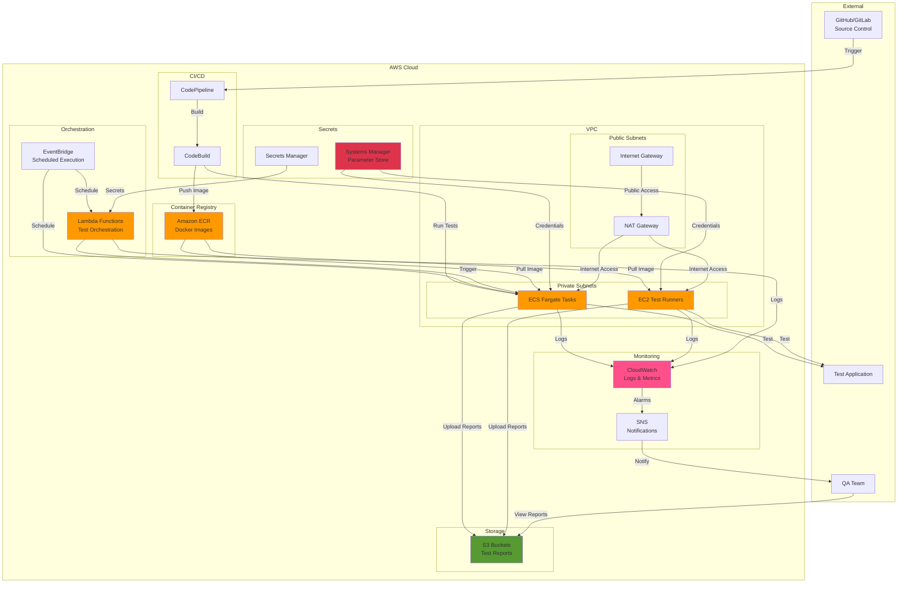

# AWS Deployment Guide

Comprehensive guide for deploying the Testinium QA Python test automation framework on Amazon Web Services (AWS).

## Overview

Deploying the test automation framework on AWS provides a scalable, reliable cloud infrastructure for executing your test suites with enterprise-grade capabilities.

### Benefits of AWS Deployment

**Scalable Cloud Infrastructure:**
- Elastic compute resources that scale based on test execution demand
- Auto-scaling groups for dynamic capacity management
- Distributed test execution across multiple availability zones

**Pay-Per-Use Pricing:**
- Pay only for compute resources used during test execution
- Spot instances for up to 90% cost savings on test runners
- No upfront infrastructure investment required

**Extensive Service Ecosystem:**
- EC2 for virtual machine-based test execution
- ECS/Fargate for containerized test workloads
- Lambda for serverless test orchestration
- S3 for test report storage and hosting
- CloudWatch for monitoring and logging
- Systems Manager for secrets management

**Global Availability:**
- Deploy test infrastructure in any AWS region worldwide
- Multi-region test execution for geographically distributed applications
- Low-latency access to application environments

**Enterprise Support:**
- AWS support tiers for production workloads
- Comprehensive SLA guarantees
- Security and compliance certifications (SOC 2, ISO 27001, HIPAA)

### When to Use AWS Deployment

Use AWS deployment when you need:
- Cloud-based test execution without managing physical infrastructure
- Elastic scaling for varying test workload demands
- Integration with existing AWS-hosted applications
- Global test execution across multiple regions
- Enterprise-grade reliability and support

## Prerequisites

Before deploying to AWS, ensure you have:

### AWS Account Requirements

- **AWS Account:** Active AWS account with appropriate permissions
- **IAM User/Role:** IAM user with permissions for:
  - EC2 instance management
  - ECS cluster and task management
  - Lambda function creation
  - S3 bucket operations
  - Systems Manager parameter access
  - CloudWatch logs and metrics
  - IAM role creation (if setting up service roles)

### Local Tools

- **AWS CLI:** AWS Command Line Interface installed and configured
  - Installation: [AWS CLI Installation Guide](https://docs.aws.amazon.com/cli/latest/userguide/getting-started-install.html)
  - Configuration: `aws configure` with access keys and default region

- **Docker:** For building container images (ECS/Fargate deployment)
  - Installation: [Docker Installation](https://docs.docker.com/get-docker/)

- **Python 3.9+:** For local testing and deployment script execution

### AWS Service Knowledge

Basic understanding of the following AWS services:

- **EC2 (Elastic Compute Cloud):** Virtual servers for test execution
- **ECS (Elastic Container Service):** Container orchestration for Docker-based tests
- **Lambda:** Serverless functions for test orchestration
- **S3 (Simple Storage Service):** Object storage for reports and artifacts
- **IAM (Identity and Access Management):** Access control and permissions
- **VPC (Virtual Private Cloud):** Network isolation and security
- **Systems Manager:** Parameter and secrets management
- **CloudWatch:** Monitoring, logging, and alerting

### Network Prerequisites

- **VPC Configuration:** Existing VPC or willingness to create one
- **Subnet Access:** Public and private subnets configured
- **Security Groups:** Understanding of security group configuration
- **Internet Connectivity:** NAT Gateway or Internet Gateway for external access

## EC2 Deployment

Deploy the test automation framework on EC2 instances for full control over the test execution environment.

### Instance Selection

**Recommended Instance Types:**

| Instance Type | vCPUs | Memory | Use Case | Cost (Approx) |
|---------------|-------|--------|----------|---------------|
| t3.medium | 2 | 4 GB | Single browser automation, dev/test | $0.0416/hour |
| t3.large | 2 | 8 GB | Single browser with parallel scenarios | $0.0832/hour |
| c5.xlarge | 4 | 8 GB | Parallel execution (4+ browsers) | $0.17/hour |
| c5.2xlarge | 8 | 16 GB | High-volume parallel testing | $0.34/hour |
| c5.4xlarge | 16 | 32 GB | Large-scale test suites | $0.68/hour |

**Selection Guidelines:**
- **t3.medium or larger** for browser automation (Chrome/Firefox require 2GB+ per instance)
- **Compute-optimized (c5 family)** for parallel test execution
- **Memory-optimized (r5 family)** if running tests with large datasets
- **Spot instances** for cost savings (up to 90% discount) for non-critical test runs

### AMI Selection

**Recommended AMIs:**

**Ubuntu 22.04 LTS (Recommended):**
```bash
# Find latest Ubuntu 22.04 AMI
aws ec2 describe-images \
  --owners 099720109477 \
  --filters "Name=name,Values=ubuntu/images/hvm-ssd/ubuntu-jammy-22.04-amd64-server-*" \
  --query 'Images | sort_by(@, &CreationDate) | [-1].ImageId' \
  --output text
```

**Amazon Linux 2023 (Alternative):**
```bash
# Find latest Amazon Linux 2023 AMI
aws ec2 describe-images \
  --owners amazon \
  --filters "Name=name,Values=al2023-ami-2023.*-x86_64" \
  --query 'Images | sort_by(@, &CreationDate) | [-1].ImageId' \
  --output text
```

### Security Group Configuration

Create a security group with appropriate rules:

```bash
# Create security group
aws ec2 create-security-group \
  --group-name testinium-qa-sg \
  --description "Security group for Testinium QA test execution" \
  --vpc-id vpc-xxxxxxxx

# Allow SSH access (restrict source IP in production)
aws ec2 authorize-security-group-ingress \
  --group-id sg-xxxxxxxx \
  --protocol tcp \
  --port 22 \
  --cidr 0.0.0.0/0  # Replace with your IP: YOUR_IP/32

# Allow HTTPS for report access (optional)
aws ec2 authorize-security-group-ingress \
  --group-id sg-xxxxxxxx \
  --protocol tcp \
  --port 443 \
  --cidr 0.0.0.0/0
```

**Security Best Practices:**
- Restrict SSH (port 22) to known IP addresses or VPN ranges
- Use Session Manager for SSH access instead of exposing port 22
- Enable VPC Flow Logs for network traffic monitoring
- Use private subnets with NAT Gateway for production deployments

### Instance Launch with User Data

Launch an EC2 instance with automated framework setup:

```bash
# Create user data script
cat > user-data.sh << 'EOF'
#!/bin/bash
set -e

# Update system packages
apt-get update -y
apt-get upgrade -y

# Install Python 3.11
apt-get install -y python3.11 python3.11-venv python3-pip

# Install Chrome browser for Selenium
wget -q -O - https://dl.google.com/linux/linux_signing_key.pub | apt-key add -
echo "deb [arch=amd64] http://dl.google.com/linux/chrome/deb/ stable main" > /etc/apt/sources.list.d/google-chrome.list
apt-get update -y
apt-get install -y google-chrome-stable

# Install ChromeDriver dependencies
apt-get install -y unzip xvfb libxi6 libgconf-2-4

# Clone test framework repository
cd /opt
git clone https://github.com/your-org/testinium-qa-python.git
cd testinium-qa-python

# Create virtual environment
python3.11 -m venv venv
source venv/bin/activate

# Install dependencies
pip install --upgrade pip
pip install -r requirements.txt

# Configure environment variables from Systems Manager
export TEST_USERNAME=$(aws ssm get-parameter --name "/testinium-qa/prod/TEST_USERNAME" --query "Parameter.Value" --output text)
export TEST_PASSWORD=$(aws ssm get-parameter --name "/testinium-qa/prod/TEST_PASSWORD" --with-decryption --query "Parameter.Value" --output text)
export BASE_URL=$(aws ssm get-parameter --name "/testinium-qa/prod/BASE_URL" --query "Parameter.Value" --output text)

# Create systemd service for test execution
cat > /etc/systemd/system/testinium-qa.service << 'SYSTEMD'
[Unit]
Description=Testinium QA Test Automation
After=network.target

[Service]
Type=oneshot
User=ubuntu
WorkingDirectory=/opt/testinium-qa-python
Environment="PATH=/opt/testinium-qa-python/venv/bin:/usr/local/bin:/usr/bin:/bin"
ExecStart=/opt/testinium-qa-python/venv/bin/behave --tags=@Smoke
StandardOutput=journal
StandardError=journal

[Install]
WantedBy=multi-user.target
SYSTEMD

systemctl daemon-reload
systemctl enable testinium-qa.service

# Start tests on boot (optional - comment out if not desired)
# systemctl start testinium-qa.service

EOF

# Launch EC2 instance
aws ec2 run-instances \
  --image-id ami-xxxxxxxxx \  # Replace with AMI ID from above
  --instance-type t3.medium \
  --key-name your-keypair \
  --security-group-ids sg-xxxxxxxx \
  --subnet-id subnet-xxxxxxxx \
  --iam-instance-profile Name=TestiniumQAInstanceProfile \
  --user-data file://user-data.sh \
  --tag-specifications 'ResourceType=instance,Tags=[{Key=Name,Value=Testinium-QA-Runner},{Key=Environment,Value=production}]'
```

**Source Configuration:** References `requirements.txt` for Python dependencies

### SSH Access and Test Execution

**Connect to Instance:**
```bash
# SSH to instance
ssh -i your-keypair.pem ubuntu@ec2-XX-XXX-XXX-XXX.compute-1.amazonaws.com

# Navigate to framework directory
cd /opt/testinium-qa-python
source venv/bin/activate
```

**Run Tests Manually:**
```bash
# Run all smoke tests
behave --tags=@Smoke

# Run specific feature
behave features/Login.feature

# Run with parallel execution
behave --processes 4 --parallel-element scenario --tags=@Regression

# Generate Allure reports
behave -f allure_behave.formatter:AllureFormatter -o reports/allure-results
allure serve reports/allure-results
```

**Source Configuration:** Test execution commands from `behave.ini` lines 133-168

### Auto Scaling Group Setup

Deploy multiple EC2 instances for dynamic capacity:

```bash
# Create launch template
aws ec2 create-launch-template \
  --launch-template-name testinium-qa-template \
  --launch-template-data '{
    "ImageId": "ami-xxxxxxxxx",
    "InstanceType": "t3.medium",
    "KeyName": "your-keypair",
    "SecurityGroupIds": ["sg-xxxxxxxx"],
    "IamInstanceProfile": {"Name": "TestiniumQAInstanceProfile"},
    "UserData": "'"$(base64 -w 0 user-data.sh)"'"
  }'

# Create Auto Scaling Group
aws autoscaling create-auto-scaling-group \
  --auto-scaling-group-name testinium-qa-asg \
  --launch-template LaunchTemplateName=testinium-qa-template,Version='$Latest' \
  --min-size 0 \
  --max-size 10 \
  --desired-capacity 2 \
  --vpc-zone-identifier subnet-xxxxxxxx,subnet-yyyyyyyy \
  --tags Key=Name,Value=Testinium-QA-ASG,PropagateAtLaunch=true
```

**Scaling Policies:**
```bash
# Scale up during business hours
aws autoscaling put-scheduled-action \
  --auto-scaling-group-name testinium-qa-asg \
  --scheduled-action-name scale-up-morning \
  --recurrence "0 8 * * MON-FRI" \
  --desired-capacity 5

# Scale down after hours
aws autoscaling put-scheduled-action \
  --auto-scaling-group-name testinium-qa-asg \
  --scheduled-action-name scale-down-evening \
  --recurrence "0 18 * * MON-FRI" \
  --desired-capacity 1
```

## ECS/Fargate Deployment

Deploy containerized test workloads using Amazon ECS with Fargate for serverless container execution.

### Docker Image Preparation

**Build Docker Image:**

First, create a Dockerfile (see [Docker Deployment Guide](docker.md) for details):

```bash
# Build Docker image
docker build -t testinium-qa:latest .

# Test image locally
docker run --rm -e TEST_USERNAME=user -e TEST_PASSWORD=pass testinium-qa:latest
```

**Push to Amazon ECR:**

```bash
# Create ECR repository
aws ecr create-repository --repository-name testinium-qa

# Authenticate Docker to ECR
aws ecr get-login-password --region us-east-1 | \
  docker login --username AWS --password-stdin \
  123456789012.dkr.ecr.us-east-1.amazonaws.com

# Tag image
docker tag testinium-qa:latest \
  123456789012.dkr.ecr.us-east-1.amazonaws.com/testinium-qa:latest

# Push image
docker push 123456789012.dkr.ecr.us-east-1.amazonaws.com/testinium-qa:latest

# Tag with version for production
docker tag testinium-qa:latest \
  123456789012.dkr.ecr.us-east-1.amazonaws.com/testinium-qa:1.0.0
docker push 123456789012.dkr.ecr.us-east-1.amazonaws.com/testinium-qa:1.0.0
```

### ECS Cluster Creation

```bash
# Create ECS cluster
aws ecs create-cluster --cluster-name testinium-qa-cluster

# Verify cluster
aws ecs describe-clusters --clusters testinium-qa-cluster
```

### Task Definition

Create ECS task definition for test execution:

```json
{
  "family": "testinium-qa-task",
  "networkMode": "awsvpc",
  "requiresCompatibilities": ["FARGATE"],
  "cpu": "2048",
  "memory": "4096",
  "executionRoleArn": "arn:aws:iam::123456789012:role/ecsTaskExecutionRole",
  "taskRoleArn": "arn:aws:iam::123456789012:role/testiniumQATaskRole",
  "containerDefinitions": [
    {
      "name": "testinium-qa",
      "image": "123456789012.dkr.ecr.us-east-1.amazonaws.com/testinium-qa:latest",
      "essential": true,
      "environment": [
        {
          "name": "BROWSER_TYPE",
          "value": "chrome"
        },
        {
          "name": "HEADLESS",
          "value": "true"
        }
      ],
      "secrets": [
        {
          "name": "TEST_USERNAME",
          "valueFrom": "arn:aws:ssm:us-east-1:123456789012:parameter/testinium-qa/prod/TEST_USERNAME"
        },
        {
          "name": "TEST_PASSWORD",
          "valueFrom": "arn:aws:ssm:us-east-1:123456789012:parameter/testinium-qa/prod/TEST_PASSWORD"
        },
        {
          "name": "BASE_URL",
          "valueFrom": "arn:aws:ssm:us-east-1:123456789012:parameter/testinium-qa/prod/BASE_URL"
        }
      ],
      "logConfiguration": {
        "logDriver": "awslogs",
        "options": {
          "awslogs-group": "/ecs/testinium-qa",
          "awslogs-region": "us-east-1",
          "awslogs-stream-prefix": "ecs"
        }
      },
      "command": ["behave", "--tags=@Smoke"]
    }
  ]
}
```

**Register Task Definition:**
```bash
aws ecs register-task-definition --cli-input-json file://task-definition.json
```

**Source Configuration:** 
- Environment variables from `config/config.yaml` lines 23-38
- Credentials from `.env.example` lines 16-28

**Resource Allocation Notes:**
- **CPU:** 2048 units (2 vCPU) recommended for browser automation
- **Memory:** 4096 MB (4 GB) minimum for Chrome/Firefox with Selenium
- **Increase resources** for parallel test execution or multiple browsers

### Service Definition

Create ECS service for continuous test execution:

```bash
aws ecs create-service \
  --cluster testinium-qa-cluster \
  --service-name testinium-qa-service \
  --task-definition testinium-qa-task \
  --desired-count 2 \
  --launch-type FARGATE \
  --network-configuration '{
    "awsvpcConfiguration": {
      "subnets": ["subnet-xxxxxxxx", "subnet-yyyyyyyy"],
      "securityGroups": ["sg-xxxxxxxx"],
      "assignPublicIp": "ENABLED"
    }
  }'
```

**Note:** Use `assignPublicIp: DISABLED` with NAT Gateway for production environments.

### One-Time Task Execution

Run tests as one-time tasks (ideal for CI/CD integration):

```bash
# Run task with default command
aws ecs run-task \
  --cluster testinium-qa-cluster \
  --task-definition testinium-qa-task \
  --launch-type FARGATE \
  --network-configuration '{
    "awsvpcConfiguration": {
      "subnets": ["subnet-xxxxxxxx"],
      "securityGroups": ["sg-xxxxxxxx"],
      "assignPublicIp": "ENABLED"
    }
  }'

# Run task with custom command (specific feature)
aws ecs run-task \
  --cluster testinium-qa-cluster \
  --task-definition testinium-qa-task \
  --launch-type FARGATE \
  --overrides '{
    "containerOverrides": [
      {
        "name": "testinium-qa",
        "command": ["behave", "features/Login.feature"]
      }
    ]
  }' \
  --network-configuration '{
    "awsvpcConfiguration": {
      "subnets": ["subnet-xxxxxxxx"],
      "securityGroups": ["sg-xxxxxxxx"],
      "assignPublicIp": "ENABLED"
    }
  }'
```

### Scheduled Tasks with EventBridge

Schedule nightly test runs:

```bash
# Create EventBridge rule for nightly execution
aws events put-rule \
  --name testinium-qa-nightly \
  --schedule-expression "cron(0 2 * * ? *)" \
  --state ENABLED \
  --description "Run Testinium QA tests nightly at 2 AM UTC"

# Add ECS task as target
aws events put-targets \
  --rule testinium-qa-nightly \
  --targets '[
    {
      "Id": "1",
      "Arn": "arn:aws:ecs:us-east-1:123456789012:cluster/testinium-qa-cluster",
      "RoleArn": "arn:aws:iam::123456789012:role/ecsEventsRole",
      "EcsParameters": {
        "TaskDefinitionArn": "arn:aws:ecs:us-east-1:123456789012:task-definition/testinium-qa-task",
        "TaskCount": 1,
        "LaunchType": "FARGATE",
        "NetworkConfiguration": {
          "awsvpcConfiguration": {
            "Subnets": ["subnet-xxxxxxxx"],
            "SecurityGroups": ["sg-xxxxxxxx"],
            "AssignPublicIp": "ENABLED"
          }
        }
      }
    }
  ]'
```

**Schedule Examples:**
- `cron(0 2 * * ? *)` - Daily at 2:00 AM UTC
- `cron(0 */6 * * ? *)` - Every 6 hours
- `cron(0 9 ? * MON-FRI *)` - Weekdays at 9:00 AM UTC

## Lambda Deployment

Deploy serverless test orchestration using AWS Lambda functions.

### Lambda Function Overview

Use Lambda for:
- **Test Orchestration:** Trigger ECS tasks based on events
- **Report Aggregation:** Collect and process test results
- **Notification:** Send alerts on test completion or failure
- **Scheduled Execution:** Alternative to EventBridge for simple schedules

### Lambda Function Code

**Python Lambda Function for ECS Task Triggering:**

```python
import json
import boto3
import os

ecs_client = boto3.client('ecs')
sns_client = boto3.client('sns')

def lambda_handler(event, context):
    """
    Orchestrate test execution by triggering ECS tasks.
    
    Event structure:
    {
        "test_suite": "Smoke",  # Optional: @Smoke, @Regression, etc.
        "environment": "staging",  # Optional: staging, production
        "parallel_count": 1  # Number of parallel tasks
    }
    """
    
    # Extract parameters from event
    test_suite = event.get('test_suite', 'Smoke')
    environment = event.get('environment', 'production')
    parallel_count = event.get('parallel_count', 1)
    
    # Construct behave command
    behave_command = ['behave', f'--tags=@{test_suite}']
    
    # ECS task parameters
    cluster = os.environ['ECS_CLUSTER']
    task_definition = os.environ['TASK_DEFINITION']
    subnets = os.environ['SUBNETS'].split(',')
    security_groups = os.environ['SECURITY_GROUPS'].split(',')
    
    task_arns = []
    
    # Launch parallel tasks
    for i in range(parallel_count):
        response = ecs_client.run_task(
            cluster=cluster,
            taskDefinition=task_definition,
            launchType='FARGATE',
            networkConfiguration={
                'awsvpcConfiguration': {
                    'subnets': subnets,
                    'securityGroups': security_groups,
                    'assignPublicIp': 'ENABLED'
                }
            },
            overrides={
                'containerOverrides': [
                    {
                        'name': 'testinium-qa',
                        'command': behave_command,
                        'environment': [
                            {
                                'name': 'ENVIRONMENT',
                                'value': environment
                            }
                        ]
                    }
                ]
            }
        )
        
        if response['tasks']:
            task_arns.append(response['tasks'][0]['taskArn'])
    
    # Send SNS notification
    sns_topic = os.environ['SNS_TOPIC_ARN']
    message = f"Started {len(task_arns)} test tasks for suite: {test_suite}"
    
    sns_client.publish(
        TopicArn=sns_topic,
        Subject=f'Testinium QA: Tests Started',
        Message=message
    )
    
    return {
        'statusCode': 200,
        'body': json.dumps({
            'message': f'Successfully triggered {len(task_arns)} test tasks',
            'test_suite': test_suite,
            'task_arns': task_arns
        })
    }
```

### Deployment Package Creation

**Create Lambda deployment package:**

```bash
# Create deployment directory
mkdir lambda-deploy
cd lambda-deploy

# Copy function code
cat > lambda_function.py << 'EOF'
# [Paste Lambda function code from above]
EOF

# Install dependencies to package directory
pip install boto3 -t .

# Create deployment package
zip -r lambda-function.zip .

# Upload to S3 (for packages > 50MB)
aws s3 cp lambda-function.zip s3://your-bucket/lambda/testinium-qa-orchestrator.zip
```

**Create Lambda Function:**

```bash
# Create Lambda function
aws lambda create-function \
  --function-name testinium-qa-orchestrator \
  --runtime python3.11 \
  --role arn:aws:iam::123456789012:role/testiniumQALambdaRole \
  --handler lambda_function.lambda_handler \
  --zip-file fileb://lambda-function.zip \
  --timeout 300 \
  --memory-size 512 \
  --environment Variables='{
    ECS_CLUSTER=testinium-qa-cluster,
    TASK_DEFINITION=testinium-qa-task,
    SUBNETS=subnet-xxxxxxxx,subnet-yyyyyyyy,
    SECURITY_GROUPS=sg-xxxxxxxx,
    SNS_TOPIC_ARN=arn:aws:sns:us-east-1:123456789012:testinium-qa-notifications
  }'
```

### EventBridge Integration

**Scheduled Lambda Execution:**

```bash
# Create EventBridge rule
aws events put-rule \
  --name testinium-qa-lambda-schedule \
  --schedule-expression "rate(1 day)" \
  --state ENABLED

# Add Lambda function as target
aws events put-targets \
  --rule testinium-qa-lambda-schedule \
  --targets '[
    {
      "Id": "1",
      "Arn": "arn:aws:lambda:us-east-1:123456789012:function:testinium-qa-orchestrator",
      "Input": "{\"test_suite\": \"Regression\", \"parallel_count\": 3}"
    }
  ]'

# Grant EventBridge permission to invoke Lambda
aws lambda add-permission \
  --function-name testinium-qa-orchestrator \
  --statement-id AllowEventBridgeInvoke \
  --action lambda:InvokeFunction \
  --principal events.amazonaws.com \
  --source-arn arn:aws:events:us-east-1:123456789012:rule/testinium-qa-lambda-schedule
```

### Lambda Permissions and IAM Roles

**Lambda Execution Role Policy:**

```json
{
  "Version": "2012-10-17",
  "Statement": [
    {
      "Effect": "Allow",
      "Action": [
        "ecs:RunTask",
        "ecs:DescribeTasks",
        "ecs:StopTask"
      ],
      "Resource": "*"
    },
    {
      "Effect": "Allow",
      "Action": [
        "sns:Publish"
      ],
      "Resource": "arn:aws:sns:us-east-1:123456789012:testinium-qa-notifications"
    },
    {
      "Effect": "Allow",
      "Action": [
        "logs:CreateLogGroup",
        "logs:CreateLogStream",
        "logs:PutLogEvents"
      ],
      "Resource": "arn:aws:logs:*:*:*"
    },
    {
      "Effect": "Allow",
      "Action": [
        "iam:PassRole"
      ],
      "Resource": [
        "arn:aws:iam::123456789012:role/ecsTaskExecutionRole",
        "arn:aws:iam::123456789012:role/testiniumQATaskRole"
      ]
    }
  ]
}
```

### SNS Notifications

**Create SNS topic for notifications:**

```bash
# Create SNS topic
aws sns create-topic --name testinium-qa-notifications

# Subscribe email to topic
aws sns subscribe \
  --topic-arn arn:aws:sns:us-east-1:123456789012:testinium-qa-notifications \
  --protocol email \
  --notification-endpoint qa-team@example.com

# Subscribe Slack webhook (optional)
aws sns subscribe \
  --topic-arn arn:aws:sns:us-east-1:123456789012:testinium-qa-notifications \
  --protocol https \
  --notification-endpoint https://hooks.slack.com/services/YOUR/SLACK/WEBHOOK
```

## S3 Bucket Configuration

Store and host test reports using Amazon S3.

### Bucket Creation

```bash
# Create S3 bucket for reports
aws s3 mb s3://testinium-qa-reports-123456789012

# Enable versioning (optional)
aws s3api put-bucket-versioning \
  --bucket testinium-qa-reports-123456789012 \
  --versioning-configuration Status=Enabled

# Add bucket tags
aws s3api put-bucket-tagging \
  --bucket testinium-qa-reports-123456789012 \
  --tagging 'TagSet=[{Key=Project,Value=TestiniumQA},{Key=Environment,Value=Production}]'
```

### Bucket Policy

**Create bucket policy for report access:**

```json
{
  "Version": "2012-10-17",
  "Statement": [
    {
      "Sid": "AllowECSTaskRoleUpload",
      "Effect": "Allow",
      "Principal": {
        "AWS": "arn:aws:iam::123456789012:role/testiniumQATaskRole"
      },
      "Action": [
        "s3:PutObject",
        "s3:PutObjectAcl"
      ],
      "Resource": "arn:aws:s3:::testinium-qa-reports-123456789012/*"
    },
    {
      "Sid": "AllowCloudFrontAccess",
      "Effect": "Allow",
      "Principal": {
        "Service": "cloudfront.amazonaws.com"
      },
      "Action": "s3:GetObject",
      "Resource": "arn:aws:s3:::testinium-qa-reports-123456789012/*",
      "Condition": {
        "StringEquals": {
          "AWS:SourceArn": "arn:aws:cloudfront::123456789012:distribution/DISTRIBUTION_ID"
        }
      }
    }
  ]
}
```

**Apply bucket policy:**
```bash
aws s3api put-bucket-policy \
  --bucket testinium-qa-reports-123456789012 \
  --policy file://bucket-policy.json
```

### Lifecycle Rules

**Configure lifecycle rules for report retention:**

```json
{
  "Rules": [
    {
      "Id": "DeleteOldReports",
      "Status": "Enabled",
      "Filter": {
        "Prefix": "reports/"
      },
      "Expiration": {
        "Days": 90
      }
    },
    {
      "Id": "TransitionToIA",
      "Status": "Enabled",
      "Filter": {
        "Prefix": "reports/"
      },
      "Transitions": [
        {
          "Days": 30,
          "StorageClass": "STANDARD_IA"
        }
      ]
    }
  ]
}
```

**Apply lifecycle policy:**
```bash
aws s3api put-bucket-lifecycle-configuration \
  --bucket testinium-qa-reports-123456789012 \
  --lifecycle-configuration file://lifecycle-policy.json
```

### Static Website Hosting

**Enable static website hosting for HTML reports:**

```bash
# Configure website hosting
aws s3api put-bucket-website \
  --bucket testinium-qa-reports-123456789012 \
  --website-configuration '{
    "IndexDocument": {"Suffix": "index.html"},
    "ErrorDocument": {"Key": "error.html"}
  }'

# Make bucket public for website access (use CloudFront instead for production)
aws s3api put-public-access-block \
  --bucket testinium-qa-reports-123456789012 \
  --public-access-block-configuration \
    BlockPublicAcls=false,IgnorePublicAcls=false,BlockPublicPolicy=false,RestrictPublicBuckets=false
```

**Website URL:** `http://testinium-qa-reports-123456789012.s3-website-us-east-1.amazonaws.com`

### Uploading Reports

**Upload reports from tests:**

**In `features/environment.py` after_all hook:**

```python
def after_all(context):
    """Upload test reports to S3 after all tests complete."""
    import boto3
    import os
    from datetime import datetime
    
    if not hasattr(context, 'config') or not context.config.userdata.get('upload_to_s3', 'false').lower() == 'true':
        return
    
    s3_client = boto3.client('s3')
    bucket_name = os.environ.get('S3_REPORTS_BUCKET', 'testinium-qa-reports-123456789012')
    timestamp = datetime.now().strftime('%Y-%m-%d_%H-%M-%S')
    
    # Upload HTML reports
    for root, dirs, files in os.walk('reports/'):
        for file in files:
            local_path = os.path.join(root, file)
            s3_key = f"reports/{timestamp}/{local_path}"
            
            s3_client.upload_file(
                local_path,
                bucket_name,
                s3_key,
                ExtraArgs={'ContentType': 'text/html' if file.endswith('.html') else 'application/octet-stream'}
            )
    
    print(f"Reports uploaded to s3://{bucket_name}/reports/{timestamp}/")
```

**Run tests with S3 upload:**
```bash
behave -D upload_to_s3=true
```

**Source Configuration:** Report paths from `behave.ini` lines 26-32

**Alternative: Upload script:**

```bash
#!/bin/bash
# upload-reports.sh

BUCKET="testinium-qa-reports-123456789012"
TIMESTAMP=$(date +%Y-%m-%d_%H-%M-%S)

# Upload all reports
aws s3 sync reports/ s3://${BUCKET}/reports/${TIMESTAMP}/ \
  --exclude "*.pyc" \
  --exclude "__pycache__/*" \
  --content-type "text/html"

# Generate report index
REPORT_URL="http://${BUCKET}.s3-website-us-east-1.amazonaws.com/reports/${TIMESTAMP}/behave-reports/report.html"
echo "Reports available at: ${REPORT_URL}"
```

### Accessing Reports

**Direct S3 URL:**
```
https://testinium-qa-reports-123456789012.s3.amazonaws.com/reports/2024-01-15_14-30-00/report.html
```

**S3 Website URL:**
```
http://testinium-qa-reports-123456789012.s3-website-us-east-1.amazonaws.com/reports/2024-01-15_14-30-00/report.html
```

**CloudFront Distribution (Recommended for Production):**

```bash
# Create CloudFront distribution
aws cloudfront create-distribution \
  --origin-domain-name testinium-qa-reports-123456789012.s3.amazonaws.com \
  --default-root-object index.html

# Access via CloudFront URL
https://d1234567890abc.cloudfront.net/reports/2024-01-15_14-30-00/report.html
```

## Secrets Management

Securely manage credentials and configuration using AWS Systems Manager Parameter Store or Secrets Manager.

### Systems Manager Parameter Store

**Store Credentials as Parameters:**

```bash
# Store test username (standard parameter)
aws ssm put-parameter \
  --name "/testinium-qa/prod/TEST_USERNAME" \
  --value "test.user@example.com" \
  --type String \
  --description "Test user username for production environment"

# Store test password (secure parameter)
aws ssm put-parameter \
  --name "/testinium-qa/prod/TEST_PASSWORD" \
  --value "SecurePassword123!" \
  --type SecureString \
  --description "Test user password for production environment"

# Store base URL
aws ssm put-parameter \
  --name "/testinium-qa/prod/BASE_URL" \
  --value "https://testinium.example.com" \
  --type String \
  --description "Base URL for production environment"

# Store sales manager credentials
aws ssm put-parameter \
  --name "/testinium-qa/prod/SALES_MANAGER_USERNAME" \
  --value "sales.manager@example.com" \
  --type String

aws ssm put-parameter \
  --name "/testinium-qa/prod/SALES_MANAGER_PASSWORD" \
  --value "SecurePassword456!" \
  --type SecureString

# Store POS manager credentials
aws ssm put-parameter \
  --name "/testinium-qa/prod/POS_MANAGER_USERNAME" \
  --value "pos.manager@example.com" \
  --type String

aws ssm put-parameter \
  --name "/testinium-qa/prod/POS_MANAGER_PASSWORD" \
  --value "SecurePassword789!" \
  --type SecureString
```

**Source Configuration:** Credentials from `config/config.yaml` lines 93-110

### Parameter Hierarchy

**Organize parameters by environment:**

```
/testinium-qa/
  ├── dev/
  │   ├── TEST_USERNAME
  │   ├── TEST_PASSWORD
  │   ├── BASE_URL
  │   └── ...
  ├── staging/
  │   ├── TEST_USERNAME
  │   ├── TEST_PASSWORD
  │   ├── BASE_URL
  │   └── ...
  └── prod/
      ├── TEST_USERNAME
      ├── TEST_PASSWORD
      ├── BASE_URL
      └── ...
```

### Retrieve Parameters in Application

**Using boto3 in Python:**

```python
import boto3
import os

def get_parameter(parameter_name, decrypt=False):
    """
    Retrieve parameter from Systems Manager Parameter Store.
    
    Args:
        parameter_name: Full parameter path (e.g., '/testinium-qa/prod/TEST_USERNAME')
        decrypt: Decrypt SecureString parameters
    
    Returns:
        Parameter value as string
    """
    ssm_client = boto3.client('ssm')
    
    response = ssm_client.get_parameter(
        Name=parameter_name,
        WithDecryption=decrypt
    )
    
    return response['Parameter']['Value']

# Usage in test framework
environment = os.environ.get('ENVIRONMENT', 'prod')
test_username = get_parameter(f'/testinium-qa/{environment}/TEST_USERNAME')
test_password = get_parameter(f'/testinium-qa/{environment}/TEST_PASSWORD', decrypt=True)
base_url = get_parameter(f'/testinium-qa/{environment}/BASE_URL')
```

**Get multiple parameters:**

```python
def get_parameters_by_path(path, decrypt=False):
    """
    Retrieve all parameters under a path.
    
    Args:
        path: Parameter path prefix (e.g., '/testinium-qa/prod/')
        decrypt: Decrypt SecureString parameters
    
    Returns:
        Dictionary of parameter names to values
    """
    ssm_client = boto3.client('ssm')
    parameters = {}
    
    paginator = ssm_client.get_paginator('get_parameters_by_path')
    
    for page in paginator.paginate(
        Path=path,
        Recursive=True,
        WithDecryption=decrypt
    ):
        for param in page['Parameters']:
            # Extract parameter name (last component of path)
            param_name = param['Name'].split('/')[-1]
            parameters[param_name] = param['Value']
    
    return parameters

# Load all environment parameters
environment = os.environ.get('ENVIRONMENT', 'prod')
params = get_parameters_by_path(f'/testinium-qa/{environment}/', decrypt=True)

# Set as environment variables
for key, value in params.items():
    os.environ[key] = value
```

### IAM Permissions

**IAM policy for parameter access:**

```json
{
  "Version": "2012-10-17",
  "Statement": [
    {
      "Effect": "Allow",
      "Action": [
        "ssm:GetParameter",
        "ssm:GetParameters",
        "ssm:GetParametersByPath"
      ],
      "Resource": [
        "arn:aws:ssm:us-east-1:123456789012:parameter/testinium-qa/*"
      ]
    },
    {
      "Effect": "Allow",
      "Action": [
        "kms:Decrypt"
      ],
      "Resource": [
        "arn:aws:kms:us-east-1:123456789012:key/*"
      ],
      "Condition": {
        "StringEquals": {
          "kms:ViaService": [
            "ssm.us-east-1.amazonaws.com"
          ]
        }
      }
    }
  ]
}
```

### AWS Secrets Manager (Alternative)

**For automatic rotation:**

```bash
# Create secret
aws secretsmanager create-secret \
  --name testinium-qa/prod/credentials \
  --description "Test credentials with automatic rotation" \
  --secret-string '{
    "TEST_USERNAME": "test.user@example.com",
    "TEST_PASSWORD": "SecurePassword123!",
    "SALES_MANAGER_USERNAME": "sales.manager@example.com",
    "SALES_MANAGER_PASSWORD": "SecurePassword456!"
  }'

# Retrieve secret
aws secretsmanager get-secret-value \
  --secret-id testinium-qa/prod/credentials \
  --query SecretString \
  --output text
```

**Retrieve in Python:**

```python
import boto3
import json

def get_secret(secret_name):
    """Retrieve secret from Secrets Manager."""
    client = boto3.client('secretsmanager')
    
    response = client.get_secret_value(SecretId=secret_name)
    secret = json.loads(response['SecretString'])
    
    return secret

# Usage
credentials = get_secret('testinium-qa/prod/credentials')
test_username = credentials['TEST_USERNAME']
test_password = credentials['TEST_PASSWORD']
```

### Rotation Policies

**Configure automatic rotation for Secrets Manager:**

```bash
# Enable automatic rotation (30 days)
aws secretsmanager rotate-secret \
  --secret-id testinium-qa/prod/credentials \
  --rotation-lambda-arn arn:aws:lambda:us-east-1:123456789012:function:SecretsManagerRotation \
  --rotation-rules AutomaticallyAfterDays=30
```

## CloudWatch Integration

Monitor test execution with Amazon CloudWatch for logs, metrics, and alarms.

### Log Groups

**Create log group for test logs:**

```bash
# Create log group for ECS tasks
aws logs create-log-group --log-group-name /ecs/testinium-qa

# Set retention period (30 days)
aws logs put-retention-policy \
  --log-group-name /ecs/testinium-qa \
  --retention-in-days 30

# Create log group for Lambda functions
aws logs create-log-group --log-group-name /aws/lambda/testinium-qa-orchestrator
```

### Log Streaming

**ECS Task Logs:**

Logs are automatically streamed from ECS tasks using the `logConfiguration` in the task definition (see ECS section above).

**Query logs:**

```bash
# View recent logs
aws logs tail /ecs/testinium-qa --follow

# Query for failed tests
aws logs filter-log-events \
  --log-group-name /ecs/testinium-qa \
  --filter-pattern "FAILED" \
  --start-time $(date -d '1 hour ago' +%s)000

# Export logs to S3
aws logs create-export-task \
  --log-group-name /ecs/testinium-qa \
  --from $(date -d '1 day ago' +%s)000 \
  --to $(date +%s)000 \
  --destination testinium-qa-logs-123456789012 \
  --destination-prefix ecs-logs/
```

### Custom Metrics

**Publish test result metrics:**

```python
import boto3

cloudwatch = boto3.client('cloudwatch')

def publish_test_metrics(total_tests, passed_tests, failed_tests, duration):
    """
    Publish test execution metrics to CloudWatch.
    
    Args:
        total_tests: Total number of tests executed
        passed_tests: Number of passed tests
        failed_tests: Number of failed tests
        duration: Test execution duration in seconds
    """
    cloudwatch.put_metric_data(
        Namespace='TestiniumQA',
        MetricData=[
            {
                'MetricName': 'TestsExecuted',
                'Value': total_tests,
                'Unit': 'Count'
            },
            {
                'MetricName': 'TestsPassed',
                'Value': passed_tests,
                'Unit': 'Count'
            },
            {
                'MetricName': 'TestsFailed',
                'Value': failed_tests,
                'Unit': 'Count'
            },
            {
                'MetricName': 'PassRate',
                'Value': (passed_tests / total_tests * 100) if total_tests > 0 else 0,
                'Unit': 'Percent'
            },
            {
                'MetricName': 'ExecutionDuration',
                'Value': duration,
                'Unit': 'Seconds'
            }
        ]
    )
```

**Add to `features/environment.py`:**

```python
def after_all(context):
    """Publish test metrics after all tests complete."""
    import boto3
    from datetime import datetime
    
    if not hasattr(context, '_start_time'):
        return
    
    # Calculate metrics
    duration = (datetime.now() - context._start_time).total_seconds()
    total_tests = len(context._scenarios_run)
    passed_tests = len([s for s in context._scenarios_run if s['status'] == 'passed'])
    failed_tests = total_tests - passed_tests
    
    # Publish to CloudWatch
    cloudwatch = boto3.client('cloudwatch')
    cloudwatch.put_metric_data(
        Namespace='TestiniumQA',
        MetricData=[
            {'MetricName': 'TestsExecuted', 'Value': total_tests, 'Unit': 'Count'},
            {'MetricName': 'TestsPassed', 'Value': passed_tests, 'Unit': 'Count'},
            {'MetricName': 'TestsFailed', 'Value': failed_tests, 'Unit': 'Count'},
            {'MetricName': 'PassRate', 'Value': (passed_tests/total_tests*100) if total_tests > 0 else 0, 'Unit': 'Percent'},
            {'MetricName': 'ExecutionDuration', 'Value': duration, 'Unit': 'Seconds'}
        ]
    )
```

### CloudWatch Alarms

**Create alarm for test failures:**

```bash
# Alarm when test pass rate drops below 80%
aws cloudwatch put-metric-alarm \
  --alarm-name testinium-qa-low-pass-rate \
  --alarm-description "Alert when test pass rate drops below 80%" \
  --metric-name PassRate \
  --namespace TestiniumQA \
  --statistic Average \
  --period 300 \
  --evaluation-periods 1 \
  --threshold 80 \
  --comparison-operator LessThanThreshold \
  --alarm-actions arn:aws:sns:us-east-1:123456789012:testinium-qa-notifications

# Alarm when tests fail
aws cloudwatch put-metric-alarm \
  --alarm-name testinium-qa-test-failures \
  --alarm-description "Alert when any tests fail" \
  --metric-name TestsFailed \
  --namespace TestiniumQA \
  --statistic Sum \
  --period 300 \
  --evaluation-periods 1 \
  --threshold 0 \
  --comparison-operator GreaterThanThreshold \
  --alarm-actions arn:aws:sns:us-east-1:123456789012:testinium-qa-notifications
```

### CloudWatch Dashboard

**Create dashboard for test monitoring:**

```json
{
  "widgets": [
    {
      "type": "metric",
      "properties": {
        "metrics": [
          ["TestiniumQA", "PassRate", {"stat": "Average", "color": "#2ca02c"}],
          [".", "TestsExecuted", {"stat": "Sum", "yAxis": "right"}]
        ],
        "period": 300,
        "stat": "Average",
        "region": "us-east-1",
        "title": "Test Pass Rate",
        "yAxis": {
          "left": {"min": 0, "max": 100}
        }
      }
    },
    {
      "type": "metric",
      "properties": {
        "metrics": [
          ["TestiniumQA", "TestsPassed", {"stat": "Sum", "color": "#2ca02c"}],
          [".", "TestsFailed", {"stat": "Sum", "color": "#d62728"}]
        ],
        "period": 300,
        "stat": "Sum",
        "region": "us-east-1",
        "title": "Test Results"
      }
    },
    {
      "type": "metric",
      "properties": {
        "metrics": [
          ["TestiniumQA", "ExecutionDuration", {"stat": "Average"}]
        ],
        "period": 300,
        "stat": "Average",
        "region": "us-east-1",
        "title": "Execution Duration"
      }
    }
  ]
}
```

**Create dashboard:**

```bash
aws cloudwatch put-dashboard \
  --dashboard-name testinium-qa-dashboard \
  --dashboard-body file://dashboard.json
```

### Log Insights Queries

**Query for failure analysis:**

```sql
# Find all failed scenarios
fields @timestamp, @message
| filter @message like /FAILED/
| sort @timestamp desc
| limit 20

# Count failures by feature
fields @message
| filter @message like /Feature:/
| stats count() by @message as feature
| sort count desc

# Execution time analysis
fields @duration
| filter @message like /Scenario:/
| stats avg(@duration), max(@duration), min(@duration)
```

**Run query:**

```bash
aws logs start-query \
  --log-group-name /ecs/testinium-qa \
  --start-time $(date -d '1 hour ago' +%s) \
  --end-time $(date +%s) \
  --query-string 'fields @timestamp, @message | filter @message like /FAILED/ | sort @timestamp desc | limit 20'
```

## IAM Roles and Policies

Configure IAM roles and policies with least privilege access.

### EC2 Instance Role

**Create IAM role for EC2 instances:**

```bash
# Create trust policy
cat > ec2-trust-policy.json << 'EOF'
{
  "Version": "2012-10-17",
  "Statement": [
    {
      "Effect": "Allow",
      "Principal": {
        "Service": "ec2.amazonaws.com"
      },
      "Action": "sts:AssumeRole"
    }
  ]
}
EOF

# Create role
aws iam create-role \
  --role-name TestiniumQAInstanceRole \
  --assume-role-policy-document file://ec2-trust-policy.json
```

**Attach permissions policy:**

```json
{
  "Version": "2012-10-17",
  "Statement": [
    {
      "Sid": "S3ReportUpload",
      "Effect": "Allow",
      "Action": [
        "s3:PutObject",
        "s3:PutObjectAcl"
      ],
      "Resource": "arn:aws:s3:::testinium-qa-reports-*/*"
    },
    {
      "Sid": "ParameterStoreAccess",
      "Effect": "Allow",
      "Action": [
        "ssm:GetParameter",
        "ssm:GetParameters",
        "ssm:GetParametersByPath"
      ],
      "Resource": "arn:aws:ssm:*:*:parameter/testinium-qa/*"
    },
    {
      "Sid": "KMSDecryption",
      "Effect": "Allow",
      "Action": "kms:Decrypt",
      "Resource": "*",
      "Condition": {
        "StringEquals": {
          "kms:ViaService": "ssm.*.amazonaws.com"
        }
      }
    },
    {
      "Sid": "CloudWatchMetrics",
      "Effect": "Allow",
      "Action": [
        "cloudwatch:PutMetricData"
      ],
      "Resource": "*",
      "Condition": {
        "StringEquals": {
          "cloudwatch:namespace": "TestiniumQA"
        }
      }
    },
    {
      "Sid": "CloudWatchLogs",
      "Effect": "Allow",
      "Action": [
        "logs:CreateLogGroup",
        "logs:CreateLogStream",
        "logs:PutLogEvents"
      ],
      "Resource": "arn:aws:logs:*:*:log-group:/testinium-qa/*"
    }
  ]
}
```

**Create and attach policy:**

```bash
aws iam create-policy \
  --policy-name TestiniumQAInstancePolicy \
  --policy-document file://instance-policy.json

aws iam attach-role-policy \
  --role-name TestiniumQAInstanceRole \
  --policy-arn arn:aws:iam::123456789012:policy/TestiniumQAInstancePolicy

# Create instance profile
aws iam create-instance-profile \
  --instance-profile-name TestiniumQAInstanceProfile

aws iam add-role-to-instance-profile \
  --instance-profile-name TestiniumQAInstanceProfile \
  --role-name TestiniumQAInstanceRole
```

### ECS Task Execution Role

**Role for ECS to pull images and write logs:**

```bash
# Create trust policy for ECS
cat > ecs-trust-policy.json << 'EOF'
{
  "Version": "2012-10-17",
  "Statement": [
    {
      "Effect": "Allow",
      "Principal": {
        "Service": "ecs-tasks.amazonaws.com"
      },
      "Action": "sts:AssumeRole"
    }
  ]
}
EOF

# Create role
aws iam create-role \
  --role-name ecsTaskExecutionRole \
  --assume-role-policy-document file://ecs-trust-policy.json

# Attach AWS managed policy
aws iam attach-role-policy \
  --role-name ecsTaskExecutionRole \
  --policy-arn arn:aws:iam::aws:policy/service-role/AmazonECSTaskExecutionRolePolicy
```

**Add parameter access:**

```json
{
  "Version": "2012-10-17",
  "Statement": [
    {
      "Effect": "Allow",
      "Action": [
        "ssm:GetParameters",
        "secretsmanager:GetSecretValue"
      ],
      "Resource": [
        "arn:aws:ssm:us-east-1:123456789012:parameter/testinium-qa/*",
        "arn:aws:secretsmanager:us-east-1:123456789012:secret:testinium-qa/*"
      ]
    },
    {
      "Effect": "Allow",
      "Action": "kms:Decrypt",
      "Resource": "*",
      "Condition": {
        "StringEquals": {
          "kms:ViaService": [
            "ssm.us-east-1.amazonaws.com",
            "secretsmanager.us-east-1.amazonaws.com"
          ]
        }
      }
    }
  ]
}
```

```bash
aws iam create-policy \
  --policy-name ecsTaskExecutionParameterAccess \
  --policy-document file://ecs-execution-params-policy.json

aws iam attach-role-policy \
  --role-name ecsTaskExecutionRole \
  --policy-arn arn:aws:iam::123456789012:policy/ecsTaskExecutionParameterAccess
```

### ECS Task Role

**Role for application permissions:**

```bash
# Create role
aws iam create-role \
  --role-name testiniumQATaskRole \
  --assume-role-policy-document file://ecs-trust-policy.json
```

**Attach application permissions (S3, CloudWatch):**

```bash
# Reuse instance policy from above
aws iam attach-role-policy \
  --role-name testiniumQATaskRole \
  --policy-arn arn:aws:iam::123456789012:policy/TestiniumQAInstancePolicy
```

### Least Privilege Principle

**Apply least privilege:**

- Grant only permissions required for the specific task
- Use resource-level restrictions (specific buckets, parameters)
- Add condition clauses to limit access scope
- Regularly audit and remove unused permissions
- Use separate roles for different environments (dev, staging, prod)

**Example: Environment-specific access:**

```json
{
  "Version": "2012-10-17",
  "Statement": [
    {
      "Effect": "Allow",
      "Action": "ssm:GetParameter*",
      "Resource": "arn:aws:ssm:*:*:parameter/testinium-qa/prod/*",
      "Condition": {
        "StringEquals": {
          "aws:RequestedRegion": "us-east-1"
        }
      }
    }
  ]
}
```

## Networking Considerations

Configure VPC networking for secure test infrastructure.

### VPC Configuration

**Create VPC for test infrastructure:**

```bash
# Create VPC
aws ec2 create-vpc \
  --cidr-block 10.0.0.0/16 \
  --tag-specifications 'ResourceType=vpc,Tags=[{Key=Name,Value=testinium-qa-vpc}]'

# Enable DNS hostnames
aws ec2 modify-vpc-attribute \
  --vpc-id vpc-xxxxxxxx \
  --enable-dns-hostnames
```

### Public vs Private Subnets

**Create subnets:**

```bash
# Public subnet (for NAT Gateway, bastion hosts)
aws ec2 create-subnet \
  --vpc-id vpc-xxxxxxxx \
  --cidr-block 10.0.1.0/24 \
  --availability-zone us-east-1a \
  --tag-specifications 'ResourceType=subnet,Tags=[{Key=Name,Value=testinium-qa-public-1a}]'

# Private subnet (for ECS tasks, EC2 instances)
aws ec2 create-subnet \
  --vpc-id vpc-xxxxxxxx \
  --cidr-block 10.0.10.0/24 \
  --availability-zone us-east-1a \
  --tag-specifications 'ResourceType=subnet,Tags=[{Key=Name,Value=testinium-qa-private-1a}]'

# Additional subnets in different AZs for high availability
aws ec2 create-subnet \
  --vpc-id vpc-xxxxxxxx \
  --cidr-block 10.0.2.0/24 \
  --availability-zone us-east-1b \
  --tag-specifications 'ResourceType=subnet,Tags=[{Key=Name,Value=testinium-qa-public-1b}]'

aws ec2 create-subnet \
  --vpc-id vpc-xxxxxxxx \
  --cidr-block 10.0.20.0/24 \
  --availability-zone us-east-1b \
  --tag-specifications 'ResourceType=subnet,Tags=[{Key=Name,Value=testinium-qa-private-1b}]'
```

**Private Subnets with NAT Gateway (Recommended for Production):**

```bash
# Create Internet Gateway
aws ec2 create-internet-gateway \
  --tag-specifications 'ResourceType=internet-gateway,Tags=[{Key=Name,Value=testinium-qa-igw}]'

# Attach to VPC
aws ec2 attach-internet-gateway \
  --internet-gateway-id igw-xxxxxxxx \
  --vpc-id vpc-xxxxxxxx

# Allocate Elastic IP for NAT Gateway
aws ec2 allocate-address --domain vpc

# Create NAT Gateway in public subnet
aws ec2 create-nat-gateway \
  --subnet-id subnet-public-1a \
  --allocation-id eipalloc-xxxxxxxx \
  --tag-specifications 'ResourceType=natgateway,Tags=[{Key=Name,Value=testinium-qa-nat}]'

# Create route table for public subnet
aws ec2 create-route-table \
  --vpc-id vpc-xxxxxxxx \
  --tag-specifications 'ResourceType=route-table,Tags=[{Key=Name,Value=testinium-qa-public-rt}]'

# Add route to Internet Gateway
aws ec2 create-route \
  --route-table-id rtb-xxxxxxxx \
  --destination-cidr-block 0.0.0.0/0 \
  --gateway-id igw-xxxxxxxx

# Associate with public subnets
aws ec2 associate-route-table \
  --route-table-id rtb-xxxxxxxx \
  --subnet-id subnet-public-1a

# Create route table for private subnet
aws ec2 create-route-table \
  --vpc-id vpc-xxxxxxxx \
  --tag-specifications 'ResourceType=route-table,Tags=[{Key=Name,Value=testinium-qa-private-rt}]'

# Add route to NAT Gateway
aws ec2 create-route \
  --route-table-id rtb-yyyyyyyy \
  --destination-cidr-block 0.0.0.0/0 \
  --nat-gateway-id nat-xxxxxxxx

# Associate with private subnets
aws ec2 associate-route-table \
  --route-table-id rtb-yyyyyyyy \
  --subnet-id subnet-private-1a
```

### Security Group Rules

**Security group for test execution:**

```bash
# Create security group
aws ec2 create-security-group \
  --group-name testinium-qa-execution-sg \
  --description "Security group for test execution instances" \
  --vpc-id vpc-xxxxxxxx

# Inbound rules
# Allow HTTPS outbound (for application access) - default egress allows all

# For EC2: Allow SSH from bastion or VPN
aws ec2 authorize-security-group-ingress \
  --group-id sg-xxxxxxxx \
  --protocol tcp \
  --port 22 \
  --source-group sg-bastion-xxxxxxxx

# For ECS: No inbound rules needed (tasks initiate connections)
```

**Security group for RDS (if testing against database):**

```bash
# Allow database access from test execution security group
aws ec2 authorize-security-group-ingress \
  --group-id sg-database-xxxxxxxx \
  --protocol tcp \
  --port 5432 \
  --source-group sg-testinium-qa-execution-xxxxxxxx
```

### VPC Endpoints

**Use VPC endpoints to avoid internet egress charges:**

```bash
# S3 VPC Endpoint (Gateway endpoint - no cost)
aws ec2 create-vpc-endpoint \
  --vpc-id vpc-xxxxxxxx \
  --service-name com.amazonaws.us-east-1.s3 \
  --route-table-ids rtb-private-xxxxxxxx \
  --vpc-endpoint-type Gateway

# Systems Manager VPC Endpoint (Interface endpoint)
aws ec2 create-vpc-endpoint \
  --vpc-id vpc-xxxxxxxx \
  --service-name com.amazonaws.us-east-1.ssm \
  --subnet-ids subnet-private-1a subnet-private-1b \
  --security-group-ids sg-vpc-endpoint-xxxxxxxx \
  --vpc-endpoint-type Interface \
  --private-dns-enabled

# ECR VPC Endpoints (for pulling Docker images)
aws ec2 create-vpc-endpoint \
  --vpc-id vpc-xxxxxxxx \
  --service-name com.amazonaws.us-east-1.ecr.api \
  --subnet-ids subnet-private-1a subnet-private-1b \
  --security-group-ids sg-vpc-endpoint-xxxxxxxx \
  --vpc-endpoint-type Interface \
  --private-dns-enabled

aws ec2 create-vpc-endpoint \
  --vpc-id vpc-xxxxxxxx \
  --service-name com.amazonaws.us-east-1.ecr.dkr \
  --subnet-ids subnet-private-1a subnet-private-1b \
  --security-group-ids sg-vpc-endpoint-xxxxxxxx \
  --vpc-endpoint-type Interface \
  --private-dns-enabled
```

**VPC Endpoint Benefits:**
- Reduced data transfer costs (no NAT Gateway charges)
- Improved security (traffic stays within AWS network)
- Lower latency for AWS service access

## CI/CD Integration

Integrate AWS deployment with CI/CD pipelines.

### CodePipeline

**Create pipeline for continuous test execution:**

```bash
# Create S3 bucket for artifacts
aws s3 mb s3://testinium-qa-pipeline-artifacts-123456789012

# Create pipeline
aws codepipeline create-pipeline --cli-input-json file://pipeline.json
```

**Pipeline definition (`pipeline.json`):**

```json
{
  "pipeline": {
    "name": "testinium-qa-pipeline",
    "roleArn": "arn:aws:iam::123456789012:role/CodePipelineServiceRole",
    "artifactStore": {
      "type": "S3",
      "location": "testinium-qa-pipeline-artifacts-123456789012"
    },
    "stages": [
      {
        "name": "Source",
        "actions": [
          {
            "name": "SourceAction",
            "actionTypeId": {
              "category": "Source",
              "owner": "ThirdParty",
              "provider": "GitHub",
              "version": "1"
            },
            "configuration": {
              "Owner": "your-org",
              "Repo": "testinium-qa-python",
              "Branch": "main",
              "OAuthToken": "{{resolve:secretsmanager:github-token:SecretString:token}}"
            },
            "outputArtifacts": [
              {
                "name": "SourceOutput"
              }
            ]
          }
        ]
      },
      {
        "name": "Build",
        "actions": [
          {
            "name": "BuildAction",
            "actionTypeId": {
              "category": "Build",
              "owner": "AWS",
              "provider": "CodeBuild",
              "version": "1"
            },
            "configuration": {
              "ProjectName": "testinium-qa-build"
            },
            "inputArtifacts": [
              {
                "name": "SourceOutput"
              }
            ],
            "outputArtifacts": [
              {
                "name": "BuildOutput"
              }
            ]
          }
        ]
      },
      {
        "name": "Test",
        "actions": [
          {
            "name": "RunTests",
            "actionTypeId": {
              "category": "Build",
              "owner": "AWS",
              "provider": "CodeBuild",
              "version": "1"
            },
            "configuration": {
              "ProjectName": "testinium-qa-test"
            },
            "inputArtifacts": [
              {
                "name": "BuildOutput"
              }
            ]
          }
        ]
      }
    ]
  }
}
```

### CodeBuild

**Create CodeBuild project for test execution:**

```yaml
# buildspec.yml
version: 0.2

phases:
  install:
    runtime-versions:
      python: 3.11
    commands:
      - echo "Installing Chrome browser"
      - wget -q -O - https://dl.google.com/linux/linux_signing_key.pub | apt-key add -
      - echo "deb [arch=amd64] http://dl.google.com/linux/chrome/deb/ stable main" > /etc/apt/sources.list.d/google-chrome.list
      - apt-get update
      - apt-get install -y google-chrome-stable
      
  pre_build:
    commands:
      - echo "Installing Python dependencies"
      - pip install --upgrade pip
      - pip install -r requirements.txt
      
      - echo "Loading secrets from Parameter Store"
      - export TEST_USERNAME=$(aws ssm get-parameter --name "/testinium-qa/prod/TEST_USERNAME" --query "Parameter.Value" --output text)
      - export TEST_PASSWORD=$(aws ssm get-parameter --name "/testinium-qa/prod/TEST_PASSWORD" --with-decryption --query "Parameter.Value" --output text)
      - export BASE_URL=$(aws ssm get-parameter --name "/testinium-qa/prod/BASE_URL" --query "Parameter.Value" --output text)
      
  build:
    commands:
      - echo "Running tests"
      - behave --tags=@Smoke --junit --junit-directory reports/junit
      - behave -f json -o reports/cucumber.json -f allure_behave.formatter:AllureFormatter -o reports/allure-results --tags=@Regression
      
  post_build:
    commands:
      - echo "Uploading reports to S3"
      - TIMESTAMP=$(date +%Y-%m-%d_%H-%M-%S)
      - aws s3 sync reports/ s3://testinium-qa-reports-123456789012/reports/${TIMESTAMP}/
      - echo "Reports available at https://testinium-qa-reports-123456789012.s3.amazonaws.com/reports/${TIMESTAMP}/index.html"

reports:
  test-reports:
    files:
      - 'reports/junit/*.xml'
    file-format: 'JUNITXML'

artifacts:
  files:
    - '**/*'
  name: testinium-qa-artifacts
```

**Source Configuration:** Behave commands from `behave.ini` lines 133-168

**Create CodeBuild project:**

```bash
aws codebuild create-project --cli-input-json file://codebuild-project.json
```

**Project definition (`codebuild-project.json`):**

```json
{
  "name": "testinium-qa-test",
  "source": {
    "type": "CODEPIPELINE",
    "buildspec": "buildspec.yml"
  },
  "artifacts": {
    "type": "CODEPIPELINE"
  },
  "environment": {
    "type": "LINUX_CONTAINER",
    "image": "aws/codebuild/standard:7.0",
    "computeType": "BUILD_GENERAL1_MEDIUM",
    "environmentVariables": [
      {
        "name": "HEADLESS",
        "value": "true",
        "type": "PLAINTEXT"
      }
    ],
    "privilegedMode": false
  },
  "serviceRole": "arn:aws:iam::123456789012:role/CodeBuildServiceRole",
  "timeoutInMinutes": 60
}
```

### GitHub Integration

**GitHub Actions can trigger AWS deployments:**

See [GitHub Actions Deployment Guide](github-actions.md) for details on triggering AWS ECS tasks or CodePipeline from GitHub workflows.

### GitLab CI Integration

**GitLab CI can deploy to AWS:**

See [GitLab CI Deployment Guide](gitlab-ci.md) for details on AWS integration from GitLab pipelines.

## Cost Optimization

Optimize AWS costs for test infrastructure.

### Spot Instances

**Use EC2 Spot Instances for up to 90% savings:**

```bash
# Launch Spot Instance
aws ec2 run-instances \
  --image-id ami-xxxxxxxxx \
  --instance-type t3.medium \
  --spot-price "0.01" \
  --instance-market-options '{
    "MarketType": "spot",
    "SpotOptions": {
      "MaxPrice": "0.01",
      "SpotInstanceType": "one-time",
      "InstanceInterruptionBehavior": "terminate"
    }
  }' \
  --key-name your-keypair \
  --security-group-ids sg-xxxxxxxx \
  --subnet-id subnet-xxxxxxxx \
  --user-data file://user-data.sh
```

**Spot Instances Best Practices:**
- Use for non-critical test runs
- Handle interruptions gracefully (2-minute warning)
- Use Spot Fleet for automatic replacement
- Set maximum price to prevent cost spikes

### Fargate Spot

**Use Fargate Spot for ECS tasks:**

```bash
# Update ECS service to use Spot capacity
aws ecs update-service \
  --cluster testinium-qa-cluster \
  --service testinium-qa-service \
  --capacity-provider-strategy \
    capacityProvider=FARGATE_SPOT,weight=1,base=0 \
    capacityProvider=FARGATE,weight=0,base=1
```

**Fargate Spot Savings:**
- Up to 70% cost reduction vs regular Fargate
- Automatic fallback to regular Fargate if Spot unavailable
- Suitable for non-urgent test executions

### Scheduled Start/Stop

**Automatically start/stop EC2 instances:**

```python
# Lambda function for scheduled start/stop
import boto3

ec2 = boto3.client('ec2')

def lambda_handler(event, context):
    action = event['action']  # 'start' or 'stop'
    tag_key = event.get('tag_key', 'AutoStartStop')
    tag_value = event.get('tag_value', 'true')
    
    # Find instances with tag
    response = ec2.describe_instances(
        Filters=[
            {'Name': f'tag:{tag_key}', 'Values': [tag_value]},
            {'Name': 'instance-state-name', 'Values': ['running', 'stopped']}
        ]
    )
    
    instance_ids = []
    for reservation in response['Reservations']:
        for instance in reservation['Instances']:
            instance_ids.append(instance['InstanceId'])
    
    if not instance_ids:
        return {'statusCode': 200, 'body': 'No instances found'}
    
    if action == 'start':
        ec2.start_instances(InstanceIds=instance_ids)
        return {'statusCode': 200, 'body': f'Started {len(instance_ids)} instances'}
    elif action == 'stop':
        ec2.stop_instances(InstanceIds=instance_ids)
        return {'statusCode': 200, 'body': f'Stopped {len(instance_ids)} instances'}
```

**Schedule with EventBridge:**

```bash
# Stop instances at 6 PM weekdays
aws events put-rule \
  --name stop-test-instances-evening \
  --schedule-expression "cron(0 18 ? * MON-FRI *)" \
  --state ENABLED

aws events put-targets \
  --rule stop-test-instances-evening \
  --targets '[{
    "Id": "1",
    "Arn": "arn:aws:lambda:us-east-1:123456789012:function:ec2-scheduler",
    "Input": "{\"action\": \"stop\", \"tag_key\": \"Environment\", \"tag_value\": \"test\"}"
  }]'

# Start instances at 8 AM weekdays
aws events put-rule \
  --name start-test-instances-morning \
  --schedule-expression "cron(0 8 ? * MON-FRI *)" \
  --state ENABLED

aws events put-targets \
  --rule start-test-instances-morning \
  --targets '[{
    "Id": "1",
    "Arn": "arn:aws:lambda:us-east-1:123456789012:function:ec2-scheduler",
    "Input": "{\"action\": \"start\", \"tag_key\": \"Environment\", \"tag_value\": \"test\"}"
  }]'
```

### S3 Intelligent Tiering

**Enable intelligent tiering for report storage:**

```bash
# Configure intelligent tiering
aws s3api put-bucket-intelligent-tiering-configuration \
  --bucket testinium-qa-reports-123456789012 \
  --id intelligent-tiering-reports \
  --intelligent-tiering-configuration '{
    "Id": "intelligent-tiering-reports",
    "Status": "Enabled",
    "Tierings": [
      {
        "Days": 90,
        "AccessTier": "ARCHIVE_ACCESS"
      },
      {
        "Days": 180,
        "AccessTier": "DEEP_ARCHIVE_ACCESS"
      }
    ]
  }'
```

**Storage Class Comparison:**

| Storage Class | Cost (per GB/month) | Retrieval Time | Use Case |
|---------------|---------------------|----------------|----------|
| Standard | $0.023 | Instant | Recent reports (0-30 days) |
| Intelligent-Tiering | $0.023 + $0.0025 monitoring | Automatic | Reports with varying access |
| Standard-IA | $0.0125 | Instant | Older reports (30-90 days) |
| Glacier | $0.004 | Minutes-hours | Archive reports (90+ days) |
| Glacier Deep Archive | $0.00099 | Hours | Long-term archive (1+ years) |

### Cost Allocation Tags

**Tag all resources for cost tracking:**

```bash
# Tag EC2 instances
aws ec2 create-tags \
  --resources i-xxxxxxxx \
  --tags Key=Project,Value=TestiniumQA Key=CostCenter,Value=QA Key=Environment,Value=production

# Tag S3 buckets
aws s3api put-bucket-tagging \
  --bucket testinium-qa-reports-123456789012 \
  --tagging 'TagSet=[{Key=Project,Value=TestiniumQA},{Key=CostCenter,Value=QA}]'

# Tag ECS services
aws ecs tag-resource \
  --resource-arn arn:aws:ecs:us-east-1:123456789012:service/testinium-qa-cluster/testinium-qa-service \
  --tags key=Project,value=TestiniumQA key=CostCenter,value=QA
```

**Use Cost Allocation Tags in AWS Cost Explorer:**
- Filter costs by Project=TestiniumQA
- Track costs by Environment (dev, staging, prod)
- Allocate costs to CostCenter

### Cost Monitoring

**Set up billing alarms:**

```bash
# Create SNS topic for billing alerts
aws sns create-topic --name billing-alerts

# Subscribe email
aws sns subscribe \
  --topic-arn arn:aws:sns:us-east-1:123456789012:billing-alerts \
  --protocol email \
  --notification-endpoint billing@example.com

# Create billing alarm
aws cloudwatch put-metric-alarm \
  --alarm-name testinium-qa-monthly-cost \
  --alarm-description "Alert when monthly costs exceed $500" \
  --metric-name EstimatedCharges \
  --namespace AWS/Billing \
  --statistic Maximum \
  --period 21600 \
  --evaluation-periods 1 \
  --threshold 500 \
  --comparison-operator GreaterThanThreshold \
  --dimensions Name=Currency,Value=USD \
  --alarm-actions arn:aws:sns:us-east-1:123456789012:billing-alerts
```

## Monitoring and Alerting

Comprehensive monitoring setup for test infrastructure.

### CloudWatch Alarms

**Key alarms to configure:**

1. **ECS Task Failures:**

```bash
aws cloudwatch put-metric-alarm \
  --alarm-name ecs-task-failures \
  --alarm-description "Alert on ECS task failures" \
  --metric-name CPUUtilization \
  --namespace AWS/ECS \
  --statistic Average \
  --period 300 \
  --evaluation-periods 1 \
  --threshold 0 \
  --comparison-operator LessThanThreshold \
  --dimensions Name=ServiceName,Value=testinium-qa-service Name=ClusterName,Value=testinium-qa-cluster \
  --alarm-actions arn:aws:sns:us-east-1:123456789012:testinium-qa-notifications
```

2. **Lambda Errors:**

```bash
aws cloudwatch put-metric-alarm \
  --alarm-name lambda-errors \
  --metric-name Errors \
  --namespace AWS/Lambda \
  --statistic Sum \
  --period 300 \
  --evaluation-periods 1 \
  --threshold 1 \
  --comparison-operator GreaterThanOrEqualToThreshold \
  --dimensions Name=FunctionName,Value=testinium-qa-orchestrator \
  --alarm-actions arn:aws:sns:us-east-1:123456789012:testinium-qa-notifications
```

3. **S3 Upload Failures:**

Monitor CloudWatch logs for upload errors and create metric filters.

### SNS Topics

**Configure multiple notification channels:**

```bash
# Create SNS topics for different severity levels
aws sns create-topic --name testinium-qa-critical
aws sns create-topic --name testinium-qa-warnings
aws sns create-topic --name testinium-qa-info

# Subscribe appropriate channels
# Critical: PagerDuty, phone, email
aws sns subscribe \
  --topic-arn arn:aws:sns:us-east-1:123456789012:testinium-qa-critical \
  --protocol https \
  --notification-endpoint https://events.pagerduty.com/integration/YOUR_KEY/enqueue

# Warnings: Email, Slack
aws sns subscribe \
  --topic-arn arn:aws:sns:us-east-1:123456789012:testinium-qa-warnings \
  --protocol email \
  --notification-endpoint qa-team@example.com

# Info: Slack only
aws sns subscribe \
  --topic-arn arn:aws:sns:us-east-1:123456789012:testinium-qa-info \
  --protocol https \
  --notification-endpoint https://hooks.slack.com/services/YOUR/SLACK/WEBHOOK
```

### PagerDuty/OpsGenie Integration

**Integrate with incident management platforms:**

**PagerDuty:**

```python
# Lambda function for PagerDuty integration
import json
import urllib3

http = urllib3.PoolManager()

def lambda_handler(event, context):
    """Forward CloudWatch alarms to PagerDuty."""
    message = json.loads(event['Records'][0]['Sns']['Message'])
    
    alarm_name = message['AlarmName']
    new_state = message['NewStateValue']
    reason = message['NewStateReason']
    
    pagerduty_event = {
        "routing_key": "YOUR_INTEGRATION_KEY",
        "event_action": "trigger" if new_state == "ALARM" else "resolve",
        "payload": {
            "summary": f"{alarm_name}: {reason}",
            "severity": "critical",
            "source": "aws-cloudwatch",
            "custom_details": message
        }
    }
    
    response = http.request(
        'POST',
        'https://events.pagerduty.com/v2/enqueue',
        body=json.dumps(pagerduty_event),
        headers={'Content-Type': 'application/json'}
    )
    
    return {'statusCode': 200}
```

**OpsGenie:**

Similar integration using OpsGenie API and webhook endpoint.

### X-Ray Tracing

**Enable X-Ray for distributed tracing:**

```bash
# Enable X-Ray for Lambda
aws lambda update-function-configuration \
  --function-name testinium-qa-orchestrator \
  --tracing-config Mode=Active

# Enable X-Ray for ECS (add to task definition)
"linuxParameters": {
  "capabilities": {
    "add": ["SYS_PTRACE"]
  }
}
```

## Troubleshooting

Common issues and solutions for AWS deployment.

### EC2 Instance Not Accessible

**Symptoms:**
- Cannot SSH to instance
- Instance shows "running" but not responding
- Connection timeout errors

**Causes and Solutions:**

1. **Security Group Blocking SSH:**
   - Check security group inbound rules
   - Verify port 22 is open from your IP
   - Solution: `aws ec2 authorize-security-group-ingress --group-id sg-xxx --protocol tcp --port 22 --cidr YOUR_IP/32`

2. **Instance in Private Subnet Without Public IP:**
   - Check if instance has public IP
   - Solution: Use Session Manager: `aws ssm start-session --target i-xxxxxxxx`
   - Or access via bastion host in public subnet

3. **Key Pair Issues:**
   - Verify using correct key pair
   - Check key file permissions: `chmod 400 keypair.pem`
   - Solution: Use Session Manager if key is lost

4. **Instance Not Fully Booted:**
   - Wait for status checks to pass
   - Check system log: `aws ec2 get-console-output --instance-id i-xxxxxxxx`

### ECS Task Fails to Start

**Symptoms:**
- Task transitions to STOPPED state immediately
- "Essential container exited" error
- Task definition registers but tasks won't run

**Causes and Solutions:**

1. **Container Image Pull Errors:**
   - Check ECR permissions for task execution role
   - Verify image URI is correct
   - Solution: `aws ecr get-login-password | docker login --username AWS --password-stdin ECR_URL`
   - Ensure task execution role has `ecr:GetAuthorizationToken`, `ecr:BatchCheckLayerAvailability`, `ecr:GetDownloadUrlForLayer`, `ecr:BatchGetImage`

2. **Insufficient Resources:**
   - Check CPU/memory allocation in task definition
   - Chrome requires minimum 2GB memory
   - Solution: Increase memory to 4096 MB minimum

3. **Missing Environment Variables:**
   - Check CloudWatch logs for missing variable errors
   - Verify Systems Manager parameters exist
   - Solution: Create missing parameters or add defaults

4. **Network Configuration:**
   - Verify subnets have route to internet (NAT Gateway or IGW)
   - Check security group allows outbound traffic
   - Solution: Add NAT Gateway or assign public IP

### Container Image Pull Errors

**Symptoms:**
- "CannotPullContainerError" in ECS task stopped reason
- Task fails during image pull phase

**Solutions:**

1. **ECR Permissions:**
   ```bash
   # Verify task execution role has ECR permissions
   aws iam get-role-policy --role-name ecsTaskExecutionRole --policy-name ECRAccess
   ```

2. **Image Exists:**
   ```bash
   # List images in repository
   aws ecr describe-images --repository-name testinium-qa
   ```

3. **Correct Region:**
   - Ensure ECR repository and ECS cluster in same region
   - Or configure cross-region ECR access

### Lambda Timeout Issues

**Symptoms:**
- Lambda function times out before completing
- ECS tasks are triggered but Lambda doesn't complete
- "Task timed out after X seconds" error

**Solutions:**

1. **Increase Timeout:**
   ```bash
   aws lambda update-function-configuration \
     --function-name testinium-qa-orchestrator \
     --timeout 300
   ```

2. **Async Invocation:**
   - Use async Lambda invocation for long-running tasks
   - Return immediately after starting ECS task
   - Use Step Functions for orchestration

3. **Optimize Code:**
   - Reduce unnecessary API calls
   - Use pagination for large result sets
   - Cache parameter values

### S3 Permission Denied

**Symptoms:**
- "Access Denied" when uploading reports
- 403 Forbidden errors from S3
- Tests complete but reports not in S3

**Solutions:**

1. **Check IAM Role:**
   ```bash
   # Verify task role has S3 permissions
   aws iam get-role-policy --role-name testiniumQATaskRole --policy-name S3Access
   ```

2. **Bucket Policy:**
   - Verify bucket policy allows uploads from task role
   - Check bucket is not blocking public access if needed

3. **Correct Bucket Name:**
   - Verify bucket name is correct (must be globally unique)
   - Check bucket exists: `aws s3 ls s3://testinium-qa-reports-123456789012/`

4. **Region Mismatch:**
   - Ensure bucket and resources in same region
   - Or use cross-region S3 access

### Parameter Not Found in Systems Manager

**Symptoms:**
- "ParameterNotFound" error in logs
- Container fails with missing environment variable
- Empty parameter values

**Solutions:**

1. **Verify Parameter Exists:**
   ```bash
   aws ssm get-parameter --name "/testinium-qa/prod/TEST_USERNAME"
   ```

2. **Check Parameter Path:**
   - Verify exact path including leading slash
   - Check case sensitivity
   - Environment parameter paths must match

3. **IAM Permissions:**
   ```bash
   # Verify role has SSM permissions
   aws iam simulate-principal-policy \
     --policy-source-arn arn:aws:iam::123456789012:role/testiniumQATaskRole \
     --action-names ssm:GetParameter \
     --resource-arns arn:aws:ssm:us-east-1:123456789012:parameter/testinium-qa/prod/TEST_USERNAME
   ```

4. **Decrypt SecureString:**
   - Ensure `WithDecryption=true` for SecureString parameters
   - Verify KMS permissions for decryption

### Network Connectivity Problems

**Symptoms:**
- Tests fail with connection timeouts
- Cannot reach application URL
- DNS resolution failures

**Solutions:**

1. **Check Security Groups:**
   - Verify outbound rules allow HTTPS (443)
   - Allow HTTP (80) if needed
   - Check application security group allows inbound from test security group

2. **Verify Routes:**
   ```bash
   # Check route table
   aws ec2 describe-route-tables --route-table-ids rtb-xxxxxxxx
   ```
   - Ensure route to 0.0.0.0/0 via NAT Gateway or IGW

3. **DNS Resolution:**
   - Verify VPC DNS settings enabled
   - Check /etc/resolv.conf in container
   - Use VPC DNS server (169.254.169.253)

4. **Application Availability:**
   - Verify application is running and accessible
   - Test with curl from test instance
   - Check application security group/firewall rules

### Browser Crashes in Container

**Symptoms:**
- Chrome/Firefox crashes during test execution
- "Chrome failed to start" errors
- Shared memory issues

**Solutions:**

1. **Increase Shared Memory:**
   Add to ECS task definition:
   ```json
   "linuxParameters": {
     "sharedMemorySize": 2048
   }
   ```

2. **Use --disable-dev-shm-usage:**
   Chrome options in Dockerfile or code:
   ```python
   chrome_options.add_argument('--disable-dev-shm-usage')
   ```

3. **Increase Memory Allocation:**
   - Minimum 4GB for stable browser automation
   - 8GB+ for parallel execution

4. **Disable GPU:**
   ```python
   chrome_options.add_argument('--disable-gpu')
   chrome_options.add_argument('--no-sandbox')
   ```

## Architecture Diagram

AWS deployment architecture showing all components:



## See Also

**Related Deployment Guides:**
- [Local Development Setup](local-development.md) - Development environment setup
- [Docker Deployment](docker.md) - Containerization guide
- [Kubernetes Deployment](kubernetes.md) - Container orchestration
- [Jenkins Integration](jenkins-integration.md) - Jenkins CI/CD setup
- [GitHub Actions](github-actions.md) - GitHub workflows
- [GitLab CI](gitlab-ci.md) - GitLab pipeline configuration

**AWS Documentation:**
- [Amazon EC2 User Guide](https://docs.aws.amazon.com/ec2/)
- [Amazon ECS Developer Guide](https://docs.aws.amazon.com/ecs/)
- [AWS Lambda Developer Guide](https://docs.aws.amazon.com/lambda/)
- [Amazon S3 User Guide](https://docs.aws.amazon.com/s3/)
- [AWS Systems Manager User Guide](https://docs.aws.amazon.com/systems-manager/)

**Framework Documentation:**
- [Configuration Guide](../guides/configuration-management.md) - Framework configuration
- [Architecture Overview](../architecture/system-overview.md) - System architecture
- [Troubleshooting Guide](../troubleshooting/index.md) - General troubleshooting

**Source Files:**
- `requirements.txt` - Python dependencies
- `behave.ini` - Behave configuration
- `config/config.yaml` - Application configuration
- `.env.example` - Environment variable template

