# Docker Deployment Guide

This guide provides comprehensive instructions for containerizing and deploying the Testinium QA test automation framework using Docker, enabling consistent and portable test execution across different environments.

## Overview

Docker deployment offers significant advantages for test automation:

- **Environment Consistency**: Eliminates "works on my machine" issues by packaging the entire test environment
- **Portable Execution**: Run tests identically on local machines, CI/CD servers, and cloud platforms
- **Version Locking**: Lock specific browser versions, WebDriver versions, and dependencies
- **Easy CI/CD Integration**: Simplified pipeline configuration with containerized test execution
- **Isolated Dependencies**: Test framework dependencies isolated from host system
- **Reproducible Builds**: Consistent test execution environment across team and time
- **Rapid Environment Setup**: New team members can run tests in minutes
- **Multi-Browser Testing**: Easy switching between browser configurations

## Prerequisites

Before deploying the test framework with Docker, ensure you have:

### Required Software

- **Docker Engine** 20.10+ or Docker Desktop
  - Linux: [Install Docker Engine](https://docs.docker.com/engine/install/)
  - macOS: [Install Docker Desktop](https://docs.docker.com/desktop/install/mac-install/)
  - Windows: [Install Docker Desktop](https://docs.docker.com/desktop/install/windows-install/)
- **Docker Compose** 2.0+ (included with Docker Desktop)
- **4GB+ RAM** allocated to Docker (8GB recommended for parallel execution)
- **10GB+ disk space** for images and containers

### Required Knowledge

- Basic Docker concepts (images, containers, volumes)
- Understanding of Docker commands (`docker build`, `docker run`)
- Familiarity with Dockerfile syntax
- Basic understanding of container networking

### Verification

Verify your Docker installation:

```bash
# Check Docker version
docker --version
# Expected: Docker version 20.10.0 or higher

# Check Docker Compose version
docker compose version
# Expected: Docker Compose version 2.0.0 or higher

# Verify Docker is running
docker ps
# Expected: List of running containers (may be empty)

# Check available resources
docker system df
# Shows disk usage
```

## Dockerfile Creation

The Dockerfile uses a multi-stage build approach to optimize image size and build caching while including all necessary components for headless browser testing.

### Complete Dockerfile

Create a `Dockerfile` in your project root with the following content:

```dockerfile
# =============================================================================
# Stage 1: Base - System Dependencies and Browser Installation
# =============================================================================
FROM python:3.11-slim as base

# Set build arguments for flexibility
ARG DEBIAN_FRONTEND=noninteractive
ARG CHROME_VERSION=stable
ARG FIREFOX_VERSION=latest

# Install system dependencies and browsers
RUN apt-get update && apt-get install -y \
    # Common dependencies
    wget \
    gnupg2 \
    ca-certificates \
    apt-transport-https \
    software-properties-common \
    # Chrome dependencies
    libnss3 \
    libgconf-2-4 \
    libx11-xcb1 \
    libxcb1 \
    libxcomposite1 \
    libxcursor1 \
    libxdamage1 \
    libxi6 \
    libxtst6 \
    libnss3-dev \
    libgdk-pixbuf2.0-0 \
    libgtk-3-0 \
    libxss1 \
    libasound2 \
    libatk-bridge2.0-0 \
    libdrm2 \
    libgbm1 \
    # Firefox dependencies
    firefox-esr \
    # Xvfb for virtual display (if needed)
    xvfb \
    # Utilities
    unzip \
    curl \
    && rm -rf /var/lib/apt/lists/*

# Install Google Chrome
RUN wget -q -O - https://dl-ssl.google.com/linux/linux_signing_key.pub | apt-key add - \
    && echo "deb [arch=amd64] http://dl.google.com/linux/chrome/deb/ stable main" >> /etc/apt/sources.list.d/google-chrome.list \
    && apt-get update \
    && apt-get install -y google-chrome-${CHROME_VERSION} \
    && rm -rf /var/lib/apt/lists/*

# Verify browser installations
RUN google-chrome --version && firefox-esr --version

# Set display environment variable for Xvfb
ENV DISPLAY=:99

# =============================================================================
# Stage 2: Dependencies - Python Package Installation
# =============================================================================
FROM base as dependencies

# Set working directory for dependencies
WORKDIR /app

# Copy requirements file first for better caching
# Docker caches this layer unless requirements.txt changes
COPY requirements.txt .

# Upgrade pip and install Python dependencies
RUN pip install --no-cache-dir --upgrade pip==23.3.1 \
    && pip install --no-cache-dir -r requirements.txt

# Verify key dependencies
RUN python -c "import selenium; print(f'Selenium: {selenium.__version__}')" \
    && python -c "import behave; print(f'Behave: {behave.__version__}')" \
    && python -c "from webdriver_manager.chrome import ChromeDriverManager; print('WebDriver Manager: OK')"

# =============================================================================
# Stage 3: Runtime - Application Code and Configuration
# =============================================================================
FROM dependencies as runtime

# Set working directory
WORKDIR /app

# Copy framework code
COPY config/ ./config/
COPY features/ ./features/
COPY pages/ ./pages/
COPY utilities/ ./utilities/
COPY tests/ ./tests/

# Copy configuration files
COPY behave.ini .
COPY pytest.ini .
COPY setup.py .
COPY .env.example .env

# Create reports directory structure
RUN mkdir -p reports/allure-results \
    reports/behave-reports \
    reports/junit \
    reports/screenshots \
    reports/logs

# Create non-root user for security
RUN useradd -m -u 1000 testrunner \
    && chown -R testrunner:testrunner /app

# Switch to non-root user
USER testrunner

# Set Python path
ENV PYTHONPATH=/app
ENV PYTHONUNBUFFERED=1

# Health check (optional)
HEALTHCHECK --interval=30s --timeout=10s --start-period=5s --retries=3 \
    CMD python -c "import sys; sys.exit(0)"

# =============================================================================
# Stage 4: Final - Entry Point Configuration
# =============================================================================
FROM runtime as final

# Expose any ports if needed (e.g., for debugging or report server)
# EXPOSE 8080

# Set default command to run behave tests
# Can be overridden at runtime with custom behave options
ENTRYPOINT ["behave"]

# Default arguments (can be overridden)
CMD ["--tags=@Smoke", "--format=pretty", "--junit", "--junit-directory=reports/junit"]

# =============================================================================
# Build Information Labels
# =============================================================================
LABEL maintainer="Testinium QA Team"
LABEL description="Testinium QA Test Automation Framework - Python Selenium + Behave BDD"
LABEL version="1.0.0"
LABEL org.opencontainers.image.source="https://github.com/your-org/testinium-qa-python"
```

**Source:** `requirements.txt` (Python dependencies), `behave.ini` (Behave configuration), `config/config.yaml:23-38` (browser configuration)

### Dockerfile Structure Explanation

**Stage 1: Base**
- Uses Python 3.11 slim image as foundation
- Installs system-level dependencies required for browsers
- Installs Google Chrome and Firefox ESR
- Configures virtual display for headless execution
- Minimizes image layers with combined RUN commands

**Stage 2: Dependencies**
- Copies and installs Python requirements
- Leverages Docker layer caching (rebuilds only if requirements.txt changes)
- Verifies critical dependencies after installation
- Uses `--no-cache-dir` to reduce image size

**Stage 3: Runtime**
- Copies application code and configuration
- Creates directory structure for test reports
- Creates non-root user for enhanced security
- Sets Python environment variables

**Stage 4: Final**
- Configures ENTRYPOINT for behave command
- Provides sensible default CMD arguments
- Adds metadata labels for image identification

### Optimization Features

- **Multi-stage build**: Reduces final image size
- **Layer caching**: Requirements installed separately for faster rebuilds
- **Security**: Non-root user (testrunner) for container execution
- **Combined RUN commands**: Reduces image layers
- **.dockerignore support**: Excludes unnecessary files (see below)

### .dockerignore File

Create a `.dockerignore` file in your project root to exclude unnecessary files from the Docker build context:

```
# Python artifacts
__pycache__/
*.py[cod]
*$py.class
*.so
.Python
env/
venv/
ENV/
build/
develop-eggs/
dist/
downloads/
eggs/
.eggs/
lib/
lib64/
parts/
sdist/
var/
wheels/
*.egg-info/
.installed.cfg
*.egg

# Test artifacts
reports/
target/
.pytest_cache/
.behave_cache/

# IDE and editor files
.vscode/
.idea/
*.swp
*.swo
*~
.DS_Store

# Git and CI/CD
.git/
.gitignore
.github/
.gitlab-ci.yml
Jenkinsfile

# Documentation
*.md
docs/
blitzy/

# Environment files
.env
.env.local
.env.*.local

# Logs
*.log
logs/
```

## Building Docker Images

Build your Docker image with appropriate tags and optimization strategies.

### Basic Build

```bash
# Navigate to project root directory
cd /path/to/testinium-qa-python

# Build image with tag
docker build -t testinium-qa:latest .

# Expected output:
# [+] Building 245.3s (23/23) FINISHED
# => [base 1/6] FROM python:3.11-slim
# ...
# => => naming to docker.io/library/testinium-qa:latest
```

### Build with Version Tags

```bash
# Build with semantic version tag
docker build -t testinium-qa:1.0.0 -t testinium-qa:latest .

# Build with branch-specific tag
docker build -t testinium-qa:develop .

# Build with commit SHA tag for traceability
docker build -t testinium-qa:$(git rev-parse --short HEAD) .
```

### Build with Custom Build Arguments

```bash
# Build with specific Chrome version
docker build --build-arg CHROME_VERSION=114.0.5735.90 -t testinium-qa:chrome114 .

# Build with all arguments
docker build \
  --build-arg CHROME_VERSION=stable \
  --build-arg FIREFOX_VERSION=latest \
  -t testinium-qa:latest \
  .
```

### Multi-Architecture Builds

For running on different CPU architectures (e.g., M1/M2 Macs with ARM):

```bash
# Set up Docker buildx for multi-platform builds
docker buildx create --name multiarch --driver docker-container --use

# Build for multiple architectures
docker buildx build \
  --platform linux/amd64,linux/arm64 \
  -t testinium-qa:latest \
  --push \
  .

# Build and load for local use (single platform)
docker buildx build \
  --platform linux/amd64 \
  -t testinium-qa:latest \
  --load \
  .
```

### Build Optimization Tips

**1. Use Build Cache**
```bash
# Build with inline cache
docker build --cache-from testinium-qa:latest -t testinium-qa:latest .
```

**2. Parallel Builds**
```bash
# Build with all available CPU cores
docker build --build-arg BUILDKIT_INLINE_CACHE=1 -t testinium-qa:latest .
```

**3. Prune Build Cache Periodically**
```bash
# Remove unused build cache
docker builder prune

# Remove all unused images and build cache
docker system prune -a
```

### Verify Built Image

```bash
# List Docker images
docker images | grep testinium-qa

# Inspect image details
docker inspect testinium-qa:latest

# Check image size
docker images testinium-qa:latest --format "{{.Size}}"

# Verify image layers
docker history testinium-qa:latest
```

## Running Tests in Containers

Execute tests in Docker containers with various configurations for different use cases.

### Basic Test Execution

```bash
# Run tests with default configuration (@Smoke tag)
docker run --rm testinium-qa:latest

# Expected output:
# Feature: Login # features/Login.feature:1
#   Scenario: Successful login with valid credentials
#     Given user navigates to login page
#     When user enters valid credentials
#     ...
```

### Run with Environment Variables

Pass environment variables to configure test execution:

```bash
# Run with environment variables for test configuration
docker run --rm \
  -e BASE_URL=https://staging.example.com \
  -e TEST_USERNAME=testuser@example.com \
  -e TEST_PASSWORD=SecurePass123 \
  -e BROWSER_TYPE=chrome \
  -e HEADLESS=true \
  testinium-qa:latest

# Run with multiple role credentials
docker run --rm \
  -e BASE_URL=https://testinium.example.com \
  -e TEST_USERNAME=testuser@example.com \
  -e TEST_PASSWORD=pass123 \
  -e SALES_MANAGER_USERNAME=sales@example.com \
  -e SALES_MANAGER_PASSWORD=salespass \
  -e POS_MANAGER_USERNAME=pos@example.com \
  -e POS_MANAGER_PASSWORD=pospass \
  testinium-qa:latest \
  --tags=@Login
```

**Source:** `.env.example` (environment variable template), `config/config.yaml:67-110` (configuration with environment variable interpolation)

### Run with .env File

Use an `.env` file for cleaner configuration:

```bash
# Create .env file with test configuration
cat > .env << EOF
BASE_URL=https://staging.example.com
TEST_USERNAME=testuser@example.com
TEST_PASSWORD=SecurePass123
SALES_MANAGER_USERNAME=sales@example.com
SALES_MANAGER_PASSWORD=salespass
POS_MANAGER_USERNAME=pos@example.com
POS_MANAGER_PASSWORD=pospass
BROWSER_TYPE=chrome
HEADLESS=true
EOF

# Run with .env file
docker run --rm --env-file .env testinium-qa:latest
```

### Mount Volumes for Reports

Persist test reports on the host filesystem:

```bash
# Run with volume mount for reports
docker run --rm \
  -v $(pwd)/reports:/app/reports \
  -e BASE_URL=https://testinium.example.com \
  testinium-qa:latest

# Reports are saved to ./reports/ on host machine
# - reports/junit/*.xml
# - reports/screenshots/*.png
# - reports/allure-results/
# - reports/behave-reports/
```

### Run with Custom Behave Options

Override default behave command and arguments:

```bash
# Run specific feature file
docker run --rm testinium-qa:latest features/Login.feature

# Run with specific tags
docker run --rm testinium-qa:latest --tags=@Login

# Run with multiple tags (OR condition)
docker run --rm testinium-qa:latest --tags=@Login,@Logout

# Run with AND condition
docker run --rm testinium-qa:latest --tags=@Smoke --tags=@SalesManager

# Run with excluded tags
docker run --rm testinium-qa:latest --tags='not @WIP'

# Run with custom format and output
docker run --rm \
  -v $(pwd)/reports:/app/reports \
  testinium-qa:latest \
  --format=json \
  --outfile=reports/cucumber.json \
  --format=pretty

# Run with Allure reporting
docker run --rm \
  -v $(pwd)/reports:/app/reports \
  testinium-qa:latest \
  --format=allure_behave.formatter:AllureFormatter \
  --outfile=reports/allure-results \
  --format=pretty
```

**Source:** `behave.ini:1-200` (Behave configuration and command examples)

### Interactive Mode for Debugging

Run container interactively to debug issues:

```bash
# Start container with bash shell
docker run --rm -it testinium-qa:latest /bin/bash

# Inside container, you can:
# - Run behave commands manually
# - Inspect configuration files
# - Debug Python code
# - Check browser installations

# Example commands inside container:
testrunner@container:/app$ behave --dry-run  # Validate step definitions
testrunner@container:/app$ google-chrome --version  # Check Chrome version
testrunner@container:/app$ python -c "from utilities.driver_manager import DriverManager; print('OK')"
```

### Run with Resource Limits

Control container resource usage:

```bash
# Run with memory limit
docker run --rm \
  --memory=2g \
  --memory-swap=2g \
  testinium-qa:latest

# Run with CPU limits
docker run --rm \
  --cpus=2 \
  testinium-qa:latest

# Run with combined limits
docker run --rm \
  --memory=4g \
  --cpus=4 \
  testinium-qa:latest \
  --processes=4 \
  --parallel-element=scenario
```

### Execute as Different User (Advanced)

```bash
# Run as root (not recommended except for debugging)
docker run --rm --user root testinium-qa:latest

# Run as specific UID (for permission matching)
docker run --rm --user 1001:1001 testinium-qa:latest
```

## Headless Browser Configuration

Configure browsers for headless execution in containerized environments where no display is available.

### Chrome Headless Configuration

Chrome headless mode is the recommended approach for Docker deployments as it's native to Chrome and doesn't require Xvfb.

**Configuration in config.yaml:**

```yaml
browser:
  type: chrome
  headless: true
  window_size: [1920, 1080]
```

**Source:** `config/config.yaml:23-33` (browser configuration with headless mode)

**Chrome Headless Options:**

The framework automatically configures Chrome options when headless mode is enabled:

- `--headless=new` (new headless mode in Chrome 109+)
- `--no-sandbox` (required in Docker containers)
- `--disable-dev-shm-usage` (prevents /dev/shm size issues in Docker)
- `--disable-gpu` (not needed for rendering in headless mode)
- `--window-size=1920,1080` (set viewport size)

**Override at Runtime:**

```bash
# Force headless mode via environment variable
docker run --rm -e HEADLESS=true testinium-qa:latest

# Force headless off for debugging (requires Xvfb)
docker run --rm -e HEADLESS=false testinium-qa:latest
```

### Firefox Headless Configuration

Firefox also supports native headless mode:

**Configuration in config.yaml:**

```yaml
browser:
  type: firefox
  headless: true
  window_size: [1920, 1080]
```

**Firefox Headless Options:**

- `--headless` (enable headless mode)
- `--width=1920` and `--height=1080` (viewport size)

### Xvfb Virtual Display (Alternative Approach)

Xvfb (X Virtual Framebuffer) provides a virtual display for non-headless browser testing in containers.

**When to Use Xvfb:**
- Debugging issues specific to headed mode
- Testing browser extensions that don't work in headless mode
- Capturing screenshots with visible browser UI
- Running legacy tests not compatible with headless mode

**Using Xvfb in Container:**

```bash
# Start Xvfb and run tests
docker run --rm testinium-qa:latest bash -c "
  Xvfb :99 -screen 0 1920x1080x24 &
  export DISPLAY=:99
  behave --tags=@Smoke
"

# With volume mount for reports
docker run --rm \
  -v $(pwd)/reports:/app/reports \
  testinium-qa:latest \
  bash -c "Xvfb :99 -screen 0 1920x1080x24 & export DISPLAY=:99; behave"
```

**Xvfb in Dockerfile:**

The Dockerfile already includes Xvfb installation and sets `DISPLAY=:99` environment variable.

### VNC Server for Visual Debugging (Advanced)

For visual debugging, you can add VNC server to the container:

```dockerfile
# Add to Dockerfile
RUN apt-get update && apt-get install -y \
    x11vnc \
    fluxbox \
    && rm -rf /var/lib/apt/lists/*

# Expose VNC port
EXPOSE 5900
```

```bash
# Run with VNC server
docker run --rm -p 5900:5900 testinium-qa:latest bash -c "
  Xvfb :99 -screen 0 1920x1080x24 &
  export DISPLAY=:99
  x11vnc -display :99 -forever -rfbport 5900 &
  behave --tags=@Login
"

# Connect with VNC viewer to localhost:5900
```

### Headless Configuration Best Practices

1. **Use Native Headless**: Prefer `--headless` over Xvfb for performance and stability
2. **Set Window Size**: Always specify window size to ensure consistent rendering
3. **Disable GPU**: Use `--disable-gpu` in headless mode to avoid GPU-related issues
4. **No Sandbox**: Always use `--no-sandbox` in Docker containers
5. **Disable /dev/shm**: Use `--disable-dev-shm-usage` to avoid shared memory issues

## Network Configuration

Configure container networking to enable communication between test containers and application under test.

### Network Modes Overview

```mermaid
graph TB
    subgraph "Host Network Mode"
        H[Container]
        H -->|Direct access| HN[Host Network Stack]
        HN -->|localhost| APP1[Application on Host]
    end
    
    subgraph "Bridge Network Mode"
        B[Container]
        B -->|Container IP| BR[Docker Bridge]
        BR -->|Host IP| APP2[Application on Host]
    end
    
    subgraph "Custom Bridge Network"
        C1[Test Container]
        C2[App Container]
        C1 -->|Service name| CN[Custom Network]
        C2 -->|Service name| CN
        CN -->|DNS resolution| C1
        CN -->|DNS resolution| C2
    end
```



### Host Network Mode

Use host network mode when the application under test runs on the host machine:

```bash
# Run with host network access
docker run --rm \
  --network=host \
  -e BASE_URL=http://localhost:8080 \
  testinium-qa:latest

# Test application running on host:8080 is accessible via localhost
```

**When to Use:**
- Application runs on host machine (not in container)
- Need to access services on localhost
- Testing local development environments

**Limitations:**
- Linux only (not supported on macOS/Windows Docker Desktop)
- Less isolation between container and host
- Port conflicts possible

### Bridge Network Mode (Default)

Default Docker network mode with container-specific IP address:

```bash
# Run with default bridge network
docker run --rm \
  -e BASE_URL=http://host.docker.internal:8080 \
  testinium-qa:latest

# On Linux, use host IP address instead of host.docker.internal
# docker run --rm \
#   -e BASE_URL=http://172.17.0.1:8080 \
#   testinium-qa:latest
```

**Access Host Services:**
- **macOS/Windows**: Use `host.docker.internal` to access host
- **Linux**: Use `172.17.0.1` (default bridge gateway) or `$(ip -4 addr show docker0 | grep -Po 'inet \K[\d.]+')`

### Custom Bridge Network

Create custom networks for multi-container testing:

```bash
# Create custom network
docker network create testinium-network

# Run application container on custom network
docker run -d \
  --name app-under-test \
  --network testinium-network \
  -p 8080:8080 \
  your-application-image:latest

# Run test container on same network
docker run --rm \
  --network testinium-network \
  -e BASE_URL=http://app-under-test:8080 \
  testinium-qa:latest

# Containers communicate via service names (app-under-test)
```

**Benefits:**
- Built-in DNS resolution between containers
- Network isolation from other containers
- Service discovery by container name
- Recommended for Docker Compose setups

### Network Troubleshooting Commands

```bash
# List Docker networks
docker network ls

# Inspect network details
docker network inspect testinium-network

# Test connectivity from container
docker run --rm --network testinium-network nicolaka/netshoot ping app-under-test

# Check if port is accessible from container
docker run --rm --network testinium-network nicolaka/netshoot curl http://app-under-test:8080

# View container IP address
docker inspect -f '{{range.NetworkSettings.Networks}}{{.IPAddress}}{{end}}' container-name
```

### Proxy Configuration

If your Docker environment requires proxy configuration:

```bash
# Run with HTTP proxy
docker run --rm \
  -e HTTP_PROXY=http://proxy.example.com:8080 \
  -e HTTPS_PROXY=http://proxy.example.com:8080 \
  -e NO_PROXY=localhost,127.0.0.1 \
  testinium-qa:latest

# Configure proxy in Dockerfile (build time)
# Add to Dockerfile before dependency installation:
# ENV HTTP_PROXY=http://proxy.example.com:8080
# ENV HTTPS_PROXY=http://proxy.example.com:8080
```

## Docker Compose Integration

For complex multi-container setups, Docker Compose simplifies configuration and orchestration.

**Preview of docker-compose.yml:**

```yaml
version: '3.8'

services:
  testinium-qa:
    build:
      context: .
      dockerfile: Dockerfile
    image: testinium-qa:latest
    environment:
      - BASE_URL=http://app-under-test:8080
      - TEST_USERNAME=${TEST_USERNAME}
      - TEST_PASSWORD=${TEST_PASSWORD}
      - HEADLESS=true
    volumes:
      - ./reports:/app/reports
    depends_on:
      - app-under-test
    networks:
      - testinium-network

  app-under-test:
    image: your-application:latest
    ports:
      - "8080:8080"
    networks:
      - testinium-network

networks:
  testinium-network:
    driver: bridge
```

**For complete Docker Compose documentation, see:**
- [Docker Compose Deployment Guide](docker-compose.md) - Comprehensive guide for multi-container setups

## Troubleshooting

Common issues and solutions when running tests in Docker containers.

### Issue: WebDriver Not Found in Container

**Symptoms:**
```
selenium.common.exceptions.WebDriverException: Message: 'chromedriver' executable needs to be in PATH
```

**Cause:** ChromeDriver or GeckoDriver not installed or not in PATH.

**Solution:**

1. **Verify browser installation:**
```bash
docker run --rm testinium-qa:latest google-chrome --version
docker run --rm testinium-qa:latest firefox-esr --version
```

2. **Check WebDriver Manager:**
```bash
docker run --rm testinium-qa:latest python -c "from webdriver_manager.chrome import ChromeDriverManager; print(ChromeDriverManager().install())"
```

3. **Rebuild image with verbose output:**
```bash
docker build --no-cache --progress=plain -t testinium-qa:latest .
```

4. **Use webdriver-manager** (already included in requirements.txt):
The framework uses `webdriver-manager` which automatically downloads and caches the appropriate WebDriver binary.

**Source:** `requirements.txt:26` (webdriver-manager==4.0.1)

### Issue: Browser Crashes in Headless Mode

**Symptoms:**
```
selenium.common.exceptions.WebDriverException: unknown error: Chrome failed to start: crashed
```

**Cause:** Insufficient shared memory (/dev/shm) in container or missing Chrome flags.

**Solution:**

1. **Increase shared memory size:**
```bash
docker run --rm \
  --shm-size=2g \
  testinium-qa:latest
```

2. **Use --disable-dev-shm-usage flag:**
Chrome options in `utilities/driver_manager.py` should include:
```python
options.add_argument('--disable-dev-shm-usage')
options.add_argument('--no-sandbox')
```

3. **Mount tmpfs to /dev/shm:**
```bash
docker run --rm \
  --tmpfs /dev/shm:rw,nosuid,nodev,exec,size=2g \
  testinium-qa:latest
```

4. **Verify Chrome can start:**
```bash
docker run --rm testinium-qa:latest google-chrome --headless --disable-gpu --dump-dom https://www.google.com
```

### Issue: Permission Issues with Volumes

**Symptoms:**
```
PermissionError: [Errno 13] Permission denied: '/app/reports/screenshots/test.png'
```

**Cause:** Volume mount has restrictive permissions, or container user doesn't have write access.

**Solution:**

1. **Create reports directory with correct permissions:**
```bash
mkdir -p reports/{junit,screenshots,allure-results,behave-reports}
chmod -R 777 reports/
```

2. **Run container as current user:**
```bash
docker run --rm \
  --user $(id -u):$(id -g) \
  -v $(pwd)/reports:/app/reports \
  testinium-qa:latest
```

3. **Fix permissions after test execution:**
```bash
# Run tests
docker run --rm -v $(pwd)/reports:/app/reports testinium-qa:latest

# Fix permissions on host
sudo chown -R $(whoami):$(whoami) reports/
```

4. **Use named volumes (alternative):**
```bash
# Create named volume
docker volume create testinium-reports

# Run with named volume
docker run --rm -v testinium-reports:/app/reports testinium-qa:latest

# Copy reports from volume to host
docker run --rm -v testinium-reports:/reports -v $(pwd):/backup alpine cp -r /reports /backup/
```

### Issue: Network Connectivity Problems

**Symptoms:**
```
selenium.common.exceptions.WebDriverException: Message: Reached error page: about:neterror
```
or
```
requests.exceptions.ConnectionError: Failed to establish a new connection
```

**Cause:** Container cannot reach application under test due to network configuration.

**Solution:**

1. **Test network connectivity:**
```bash
# Ping application from container
docker run --rm testinium-qa:latest ping -c 3 app-hostname

# Curl application endpoint
docker run --rm testinium-qa:latest curl -v http://app-hostname:8080
```

2. **Use correct hostname:**
- **macOS/Windows**: `host.docker.internal` for host services
- **Linux**: Use host IP or create custom bridge network
- **Docker Compose**: Use service name

3. **Check firewall rules:**
```bash
# Ensure application port is not blocked
sudo ufw status  # Linux
netstat -an | grep 8080  # Check if port is listening
```

4. **Use host network mode (Linux):**
```bash
docker run --rm --network=host testinium-qa:latest
```

5. **Verify DNS resolution:**
```bash
docker run --rm testinium-qa:latest nslookup app-hostname
docker run --rm testinium-qa:latest cat /etc/resolv.conf
```

### Issue: Memory Limits Causing OOM Errors

**Symptoms:**
```
Container exited with code 137 (Out of Memory)
```

**Cause:** Container runs out of memory due to browser instances or parallel execution.

**Solution:**

1. **Increase memory limit:**
```bash
docker run --rm \
  --memory=4g \
  --memory-swap=4g \
  testinium-qa:latest
```

2. **Check memory usage:**
```bash
# Monitor memory usage during test execution
docker stats testinium-qa-container

# Check available memory
docker run --rm testinium-qa:latest free -h
```

3. **Reduce parallel execution:**
```bash
# Reduce number of parallel scenarios
docker run --rm testinium-qa:latest --processes=2
```

4. **Optimize browser settings:**
```yaml
# In config.yaml, reduce window size
browser:
  window_size: [1280, 720]  # Smaller than 1920x1080
```

5. **Increase Docker Desktop memory allocation:**
- Docker Desktop → Settings → Resources → Memory
- Allocate at least 4GB for test execution

### Issue: Tests Pass Locally But Fail in Container

**Symptoms:** Tests pass on host machine but fail consistently in Docker container.

**Cause:** Timing differences, missing dependencies, or environment-specific issues.

**Solution:**

1. **Increase explicit wait timeouts:**
```yaml
# In config.yaml
timeouts:
  explicit: 15  # Increase from 10
  page_load: 45  # Increase from 30
```

**Source:** `config/config.yaml:45-60` (timeout configuration)

2. **Run container interactively to debug:**
```bash
docker run --rm -it testinium-qa:latest /bin/bash
# Inside container, run tests manually and inspect behavior
```

3. **Compare environments:**
```bash
# Check Python version
docker run --rm testinium-qa:latest python --version

# Check dependencies
docker run --rm testinium-qa:latest pip list

# Check environment variables
docker run --rm testinium-qa:latest env
```

4. **Enable verbose logging:**
```bash
docker run --rm \
  -e LOGGING_LEVEL=DEBUG \
  testinium-qa:latest \
  --verbose --no-capture
```

5. **Capture screenshots on failure:**
```bash
docker run --rm \
  -v $(pwd)/reports:/app/reports \
  -e SCREENSHOTS_ON_FAILURE=true \
  testinium-qa:latest
```

### Issue: Allure Reports Not Generated

**Symptoms:** Allure results directory is empty or reports don't generate.

**Cause:** Incorrect Allure formatter configuration or missing output directory.

**Solution:**

1. **Verify Allure dependency:**
```bash
docker run --rm testinium-qa:latest pip show allure-behave
```

**Source:** `requirements.txt:50` (allure-behave==2.13.2)

2. **Run with Allure formatter:**
```bash
docker run --rm \
  -v $(pwd)/reports:/app/reports \
  testinium-qa:latest \
  --format=allure_behave.formatter:AllureFormatter \
  --outfile=reports/allure-results \
  --format=pretty
```

3. **Generate Allure report on host:**
```bash
# Install Allure on host
brew install allure  # macOS
# or download from https://github.com/allure-framework/allure2/releases

# Generate report from results
allure serve reports/allure-results
```

4. **Check directory permissions:**
```bash
ls -la reports/allure-results/
# Ensure directory is writable
```

### Getting Additional Help

If you encounter issues not covered here:

1. **Check Docker logs:**
```bash
docker logs <container-id>
```

2. **Run with verbose output:**
```bash
docker run --rm testinium-qa:latest --verbose
```

3. **Inspect container state:**
```bash
docker inspect testinium-qa:latest
```

4. **Review related documentation:**
- [Docker Compose Guide](docker-compose.md) for multi-container setups
- [Kubernetes Deployment](kubernetes.md) for orchestrated deployments
- [CI/CD Integration Guides](../guides/parallel-execution.md) for pipeline-specific issues
- [Wait Strategies Guide](../guides/wait-strategies.md) for timing issues
- [Configuration Management](../guides/configuration-management.md) for environment setup

## See Also

- **[Docker Compose Deployment](docker-compose.md)** - Multi-container orchestration with Docker Compose
- **[Kubernetes Deployment](kubernetes.md)** - Scalable container orchestration with Kubernetes
- **[Jenkins Integration](jenkins-integration.md)** - CI/CD pipeline integration with Jenkins
- **[GitHub Actions](github-actions.md)** - Automated testing with GitHub Actions
- **[Configuration Management Guide](../guides/configuration-management.md)** - Environment-specific configuration
- **[Parallel Execution Guide](../guides/parallel-execution.md)** - Running tests in parallel
- **[Troubleshooting Guide](../troubleshooting/index.md)** - Comprehensive troubleshooting resources

## Summary

Docker deployment provides a robust, portable, and consistent way to execute your test automation framework across different environments. Key takeaways:

✅ **Use multi-stage Dockerfile** for optimized image size and build caching
✅ **Configure headless browsers** with appropriate Chrome/Firefox options
✅ **Mount volumes** to persist test reports and artifacts
✅ **Use environment variables** for flexible configuration
✅ **Leverage custom networks** for multi-container testing
✅ **Increase shared memory** with `--shm-size=2g` for stable browser execution
✅ **Run as non-root user** for enhanced security
✅ **Tag images appropriately** for version control and traceability

With this Docker setup, your test automation framework can run consistently on any platform that supports Docker, from local development machines to enterprise CI/CD pipelines.
