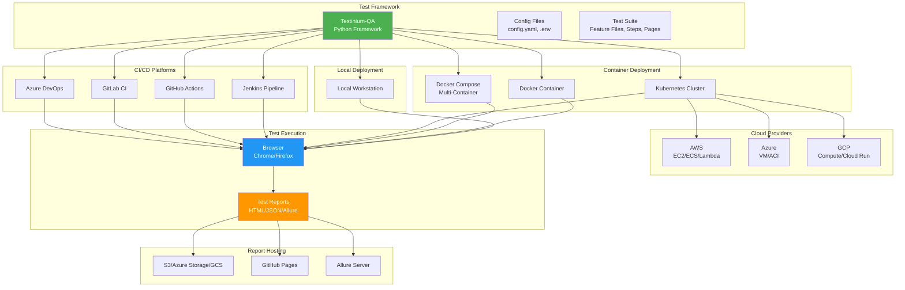

# Deployment Guide

## Overview

Selecting the right deployment strategy is critical for successful test automation adoption. This guide helps you choose and implement the deployment approach that best fits your team's needs, infrastructure, and operational requirements.

The Testinium-QA Python test automation framework is designed to run in diverse environments, from local developer workstations to enterprise-scale CI/CD pipelines and cloud infrastructure. Proper deployment ensures:

- **Environment Consistency:** Tests produce the same results regardless of where they execute
- **Parallel Execution:** Leverage multiple threads/processes to reduce overall test execution time
- **Report Accessibility:** Stakeholders can easily access and understand test results
- **CI/CD Integration:** Automated test execution triggered by code changes
- **Scalability:** Test infrastructure grows with your test suite and team

## Deployment Options Comparison

Choose your deployment strategy based on your use case, team size, infrastructure, and operational requirements:

| Deployment Type | Use Case | Complexity | Scalability | Best For |
|-----------------|----------|------------|-------------|----------|
| **[Local Development](local-development.md)** | Learning framework, debugging tests, developing new tests | Low | Single machine | New users, test development, troubleshooting |
| **[Docker](docker.md)** | Consistent environments, isolated test execution | Medium | Multiple containers on single host | Teams needing environment consistency, cross-platform testing |
| **[Docker Compose](docker-compose.md)** | Multi-container orchestration, browser grid testing | Medium | Multiple services on single host | Local integration testing, multi-browser matrix testing |
| **[Kubernetes](kubernetes.md)** | Enterprise-scale testing, dynamic scaling | High | Highly scalable across clusters | Large test suites, enterprise teams, cloud-native infrastructure |
| **[Jenkins](jenkins-integration.md)** | Traditional CI/CD, Java-based toolchain | Medium | Enterprise CI/CD | Java shops, existing Jenkins infrastructure, on-premise deployments |
| **[GitHub Actions](github-actions.md)** | Cloud-native CI/CD, GitHub repositories | Low-Medium | Cloud-based, parallel workflows | GitHub users, open-source projects, modern cloud-native teams |
| **[GitLab CI](gitlab-ci.md)** | Integrated DevOps, GitLab repositories | Medium | Cloud or self-hosted | GitLab users, comprehensive DevOps pipelines |
| **[Azure DevOps](azure-devops.md)** | Microsoft ecosystem, enterprise CI/CD | Medium | Enterprise-scale pipelines | Microsoft shops, Azure infrastructure, .NET teams |
| **[AWS](aws.md)** | Cloud infrastructure, serverless reporting | Medium-High | Unlimited cloud resources | AWS users, cloud-native architecture, serverless workflows |
| **[Azure](azure.md)** | Microsoft cloud, integrated DevOps | Medium-High | Cloud-scale resources | Azure users, Microsoft ecosystem, enterprise Azure deployments |
| **[GCP](gcp.md)** | Google Cloud, cloud-native services | Medium-High | Cloud infrastructure | GCP users, Google Cloud Platform, cloud-native teams |
| **[Report Publishing](report-publishing.md)** | Advanced report hosting and dashboards | Medium | Depends on hosting | Teams needing centralized reporting, historical test data |

## Quick Start Recommendations

### For New Users

**Start with [Local Development](local-development.md)**

Perfect for learning the framework, developing new tests, and troubleshooting:

```bash
# Clone repository
git clone https://github.com/BalamiRR/Testinium-QA.git
cd Testinium-QA

# Set up virtual environment
python3 -m venv venv
source venv/bin/activate  # On Windows: venv\Scripts\activate

# Install dependencies
pip install -r requirements.txt

# Run your first test
behave --tags=@Login
```

**Next Steps:** Once comfortable with local execution, explore [Docker](docker.md) for environment consistency.

### For Team Adoption

**Recommended: [Docker Compose](docker-compose.md)**

Provides consistent environments for all team members without complex infrastructure:

```bash
# Run tests in consistent Docker environment
docker-compose up --build

# View results in reports/ directory
```

**Benefits:**
- Identical execution environment for all team members
- No "works on my machine" issues
- Easy onboarding for new team members
- Browser version consistency

**Next Steps:** Integrate with your CI/CD platform ([Jenkins](jenkins-integration.md), [GitHub Actions](github-actions.md), or [GitLab CI](gitlab-ci.md)).

### For Enterprise Deployment

**Recommended: [Kubernetes](kubernetes.md)**

Scalable, resilient test execution infrastructure:

```bash
# Deploy test framework to Kubernetes
kubectl apply -f k8s/deployment.yaml

# Execute tests as Kubernetes Jobs
kubectl create job test-run-$(date +%s) --from=cronjob/scheduled-tests

# View logs and results
kubectl logs job/test-run-<timestamp>
```

**Benefits:**
- Dynamic scaling based on test load
- Resource isolation and management
- Self-healing infrastructure
- Enterprise-grade reliability

**Prerequisites:** Kubernetes cluster, kubectl access, container registry.

### For CI/CD Integration

**Choose based on your platform:**

- **GitHub repositories:** [GitHub Actions](github-actions.md) - fastest setup, native integration
- **GitLab repositories:** [GitLab CI](gitlab-ci.md) - comprehensive DevOps features
- **Existing Jenkins:** [Jenkins Integration](jenkins-integration.md) - mature, extensive plugin ecosystem
- **Azure ecosystem:** [Azure DevOps](azure-devops.md) - tight Microsoft integration

All CI/CD integrations support:
- Automated test execution on pull requests/merge requests
- Parallel test execution for faster feedback
- Test result publishing and trending
- Screenshot artifact archiving
- Integration with team notification channels

## Prerequisites

### Common Requirements (All Deployment Types)

The following prerequisites apply to all deployment scenarios:

**1. Framework Source Code**
```bash
git clone https://github.com/BalamiRR/Testinium-QA.git
cd Testinium-QA
```

**2. Python Environment**
- Python 3.9, 3.10, 3.11, or 3.12
- pip package manager (included with Python 3.9+)
- Virtual environment support (venv module)

**3. Dependencies**
- All Python packages listed in `requirements.txt`
- Browser drivers managed automatically by `webdriver-manager`

**4. Configuration Understanding**
- Familiarity with `config/config.yaml` structure
- Understanding of environment variable interpolation
- Knowledge of `.env` file usage for local development

### Deployment-Specific Prerequisites

Different deployment types have additional requirements:

**Container Deployments (Docker, Kubernetes):**
- Docker Engine 20.10+
- Docker Compose 2.0+ (for multi-container setups)
- Container registry access (Docker Hub, AWS ECR, Azure ACR, or GCP GCR)

**CI/CD Platforms:**
- Platform-specific account and access tokens
- Repository integration permissions
- Secrets management capabilities

**Cloud Deployments:**
- Cloud provider account (AWS, Azure, or GCP)
- IAM roles and permissions configured
- Understanding of cloud pricing models

See individual deployment guides for detailed prerequisite lists.

## Deployment Guides Navigation

### Local and Container Deployments

**[Local Development Setup](local-development.md)**  
Complete guide to setting up the framework on your local workstation for development and debugging.

**Topics covered:**
- Python and virtual environment setup
- IDE configuration (PyCharm, VS Code)
- Running tests locally
- Debugging test failures
- Local report generation

---

**[Docker Deployment](docker.md)**  
Run tests in isolated Docker containers for consistent execution environments.

**Topics covered:**
- Creating Dockerfile for test framework
- Building and running test containers
- Volume mounting for reports and configurations
- Environment variable management
- Multi-stage builds for optimization

---

**[Docker Compose Deployment](docker-compose.md)**  
Orchestrate multi-container test environments with browser grids and supporting services.

**Topics covered:**
- Selenium Grid with multiple browsers
- Multi-browser parallel execution
- Service dependencies and networking
- Scaling test execution containers
- Aggregating reports from multiple containers

---

**[Kubernetes Deployment](kubernetes.md)**  
Enterprise-scale test execution on Kubernetes clusters with dynamic scaling and resource management.

**Topics covered:**
- Creating Kubernetes manifests (Deployments, Jobs, CronJobs)
- ConfigMaps and Secrets for configuration
- Persistent volumes for reports
- Horizontal pod autoscaling
- Test execution scheduling
- Resource limits and requests

### CI/CD Platform Integrations

**[Jenkins Integration](jenkins-integration.md)**  
Integrate with Jenkins CI/CD pipelines for automated test execution.

**Topics covered:**
- Jenkinsfile pipeline configuration
- Multi-stage test execution
- Parallel test execution in Jenkins
- Report publishing (HTML, JUnit, Allure)
- Screenshot artifact archiving
- Build triggers and scheduling

**Source:** `README.md:406-465` (existing Jenkins pipeline example)

---

**[GitHub Actions Integration](github-actions.md)**  
Cloud-native CI/CD for GitHub repositories with matrix builds and parallel workflows.

**Topics covered:**
- Workflow YAML configuration
- Matrix strategy for multi-browser testing
- Secrets management with GitHub Secrets
- Artifact uploading and report publishing
- Pull request integration and status checks
- Scheduled test execution with cron triggers

---

**[GitLab CI Integration](gitlab-ci.md)**  
Comprehensive DevOps pipeline integration for GitLab repositories.

**Topics covered:**
- .gitlab-ci.yml configuration
- Pipeline stages and job dependencies
- Parallel execution with GitLab runners
- Artifacts and report publishing
- Merge request pipelines
- Environment-specific deployments

---

**[Azure DevOps Integration](azure-devops.md)**  
Microsoft ecosystem CI/CD pipeline integration with Azure Pipelines.

**Topics covered:**
- azure-pipelines.yml configuration
- Multi-stage pipeline design
- Variable groups and secret management
- Test result publishing to Azure DevOps
- Build artifacts and report hosting
- Integration with Azure Boards

### Cloud Provider Deployments

**[AWS Deployment](aws.md)**  
Deploy test framework to AWS cloud infrastructure with scalable execution and serverless reporting.

**Topics covered:**
- EC2 instance setup for test execution
- ECS task definitions for containerized tests
- Lambda functions for report processing
- S3 bucket hosting for test reports
- CloudWatch monitoring and alerting
- IAM roles and security configuration

---

**[Azure Deployment](azure.md)**  
Microsoft Azure cloud deployment with virtual machines and container instances.

**Topics covered:**
- Azure VM configuration for test runners
- Azure Container Instances for on-demand testing
- Azure Storage for report hosting
- Azure DevOps integration
- Azure Monitor for test execution tracking
- Managed identities and security

---

**[Google Cloud Platform Deployment](gcp.md)**  
GCP cloud-native deployment with Compute Engine and Cloud Run.

**Topics covered:**
- Compute Engine VM setup
- Cloud Run serverless container execution
- Container Registry for test images
- Cloud Storage for reports
- Cloud Functions for report processing
- IAM and service account configuration

### Advanced Topics

**[Report Publishing and Hosting](report-publishing.md)**  
Advanced strategies for test report generation, publishing, and centralized hosting.

**Topics covered:**
- Allure Report Server setup
- S3/Azure Storage/GCS static site hosting
- GitHub Pages for open-source projects
- Report aggregation across test runs
- Historical trend analysis
- Custom dashboards and visualizations
- Integration with team communication tools (Slack, MS Teams)

## Deployment Architecture Overview

The following diagram illustrates the high-level deployment architecture showing how different deployment options relate to the test framework:



## Best Practices for All Deployments

### 1. Environment Variable Management

**Always use environment variables for:**
- Application URLs (`BASE_URL`)
- User credentials (`TEST_USERNAME`, `TEST_PASSWORD`)
- Role-specific credentials (`SALES_MANAGER_USERNAME`, etc.)
- Browser configuration overrides
- Environment-specific settings

**Example .env file structure:**
```bash
# Application Configuration
BASE_URL=https://testinium.example.com

# Test User Credentials
TEST_USERNAME=test.user@example.com
TEST_PASSWORD=secure_password_here

# Role-Based Credentials
SALES_MANAGER_USERNAME=sales.manager@example.com
SALES_MANAGER_PASSWORD=secure_password_here
POS_MANAGER_USERNAME=pos.manager@example.com
POS_MANAGER_PASSWORD=secure_password_here

# Browser Configuration
BROWSER_TYPE=chrome
HEADLESS=true
```

**Source:** `config/config.yaml:1-163` (environment variable interpolation patterns)

### 2. Secrets Management

**Never commit secrets to version control:**
- Use `.gitignore` to exclude `.env` files
- Use platform-specific secrets management:
  - **GitHub Actions:** GitHub Secrets
  - **GitLab CI:** CI/CD Variables (masked and protected)
  - **Jenkins:** Jenkins Credentials Plugin
  - **Azure DevOps:** Variable Groups with secret variables
  - **Kubernetes:** Kubernetes Secrets
  - **AWS:** AWS Secrets Manager or Systems Manager Parameter Store
  - **Azure:** Azure Key Vault
  - **GCP:** Google Secret Manager

**Example: Loading secrets in CI/CD:**
```yaml
# GitHub Actions example
env:
  TEST_USERNAME: ${{ secrets.TEST_USERNAME }}
  TEST_PASSWORD: ${{ secrets.TEST_PASSWORD }}
```

### 3. Test Data Isolation

**Ensure test data isolation across parallel executions:**
- Use unique identifiers per test run (timestamps, UUIDs)
- Implement data cleanup in `after_scenario` hooks
- Avoid hard-coded test data that creates conflicts
- Use test data factories for dynamic data generation

**Example pattern:**
```python
# Generate unique test data
import uuid
test_user_email = f"test.user.{uuid.uuid4()}@example.com"
```

### 4. Report Artifact Preservation

**Configure artifact retention for all deployments:**
- **HTML Reports:** Full test execution details for stakeholders
- **JSON Reports:** Machine-readable format for processing and analysis
- **JUnit XML:** CI/CD platform integration and trend analysis
- **Screenshots:** Failure diagnostics and debugging
- **Allure Results:** Enhanced reporting with history and trends

**Retention recommendations:**
- Development/feature branches: 7-14 days
- Main/master branch: 90 days minimum
- Release tags: Indefinite retention

**Example Jenkins artifact archiving:**
```groovy
post {
    always {
        archiveArtifacts artifacts: 'reports/**/*', allowEmptyArchive: true
    }
}
```

**Source:** `README.md:458-463` (Jenkins artifact archiving example)

### 5. Parallel Execution Considerations

**Thread-safety requirements:**
- WebDriver instances use `threading.local()` for thread isolation
- Each test scenario gets independent WebDriver instance
- Behave context is thread-safe by default
- Page objects must not share mutable state

**Parallel execution options:**

```bash
# Option 1: behave-parallel (scenario-level parallelism)
pip install behave-parallel
behave --processes 4 --parallel-element scenario

# Option 2: pytest-bdd with pytest-xdist (recommended for large suites)
pip install pytest-bdd pytest-xdist
pytest -n auto --dist loadscope

# Option 3: GNU Parallel (tag-based parallelism)
parallel behave --tags={} ::: @Login @Logout @CRM @Employee
```

**Source:** `behave.ini:95-128` (parallel execution documentation)

### 6. Browser Driver Management

**Use webdriver-manager for automatic driver management:**
- No manual ChromeDriver or GeckoDriver downloads
- Automatic version matching with installed browsers
- Cross-platform compatibility (Windows, macOS, Linux)
- Automatic updates when browser versions change

**Framework handles this automatically via `utilities/driver_manager.py`**

### 7. Configuration Precedence

**Understand configuration priority (highest to lowest):**
1. **Command-line arguments** (highest priority)
   ```bash
   behave -D browser=firefox -D headless=true
   ```

2. **Environment variables**
   ```bash
   export BEHAVE_TAGS="@Login"
   export BASE_URL="https://staging.example.com"
   ```

3. **Configuration files** (`config.yaml`, `behave.ini`)

4. **Default framework settings** (lowest priority)

**Source:** `behave.ini:189-199` (configuration override precedence)

### 8. Monitoring and Observability

**Implement monitoring for production test environments:**
- Test execution duration tracking
- Failure rate monitoring and alerting
- Resource utilization (CPU, memory, network)
- Browser session management
- Report generation success rates

**Tools and approaches:**
- CloudWatch (AWS)
- Azure Monitor (Azure)
- Cloud Logging and Monitoring (GCP)
- Prometheus + Grafana (Kubernetes)
- Jenkins build monitoring and trends

## Troubleshooting Quick Links

Common deployment issues and their solutions:

### Installation and Setup Issues
**[Troubleshooting: Installation Issues](../troubleshooting/installation-issues.md)**
- Python version compatibility
- Dependency installation failures
- Virtual environment problems
- Permission errors

### WebDriver and Browser Issues
**[Troubleshooting: WebDriver Issues](../troubleshooting/webdriver-issues.md)**
- Browser driver not found
- Browser version mismatches
- Headless mode failures
- Display/X11 issues in containers

### Configuration Problems
**[Troubleshooting: Configuration Issues](../troubleshooting/configuration-issues.md)**
- Environment variable not interpolating
- YAML parsing errors
- Configuration precedence confusion
- Secrets not loading correctly

### Parallel Execution Problems
**[Troubleshooting: Parallel Execution Issues](../troubleshooting/parallel-execution-issues.md)**
- Thread safety violations
- WebDriver instance conflicts
- Resource contention
- Report corruption in parallel runs

### Report Generation Failures
**[Troubleshooting: Report Generation Issues](../troubleshooting/report-generation-issues.md)**
- HTML report not generating
- Allure report failures
- JUnit XML format issues
- Screenshot capture problems

### General Troubleshooting
**[Troubleshooting: Common Errors](../troubleshooting/common-errors.md)**
- Most frequent error messages and solutions
- Diagnostic commands and approaches
- When to check logs and where to find them

## Next Steps

### Choose Your Deployment Path

1. **New to the framework?**  
   Start with **[Local Development](local-development.md)** to understand the framework fundamentals.

2. **Ready for team adoption?**  
   Implement **[Docker Compose](docker-compose.md)** for consistent team environments.

3. **Need CI/CD integration?**  
   Select your platform: **[Jenkins](jenkins-integration.md)**, **[GitHub Actions](github-actions.md)**, **[GitLab CI](gitlab-ci.md)**, or **[Azure DevOps](azure-devops.md)**.

4. **Planning enterprise deployment?**  
   Explore **[Kubernetes](kubernetes.md)** for scalable, resilient test infrastructure.

5. **Moving to cloud?**  
   Choose your provider: **[AWS](aws.md)**, **[Azure](azure.md)**, or **[GCP](gcp.md)**.

### Additional Resources

- **[Architecture Overview](../architecture/system-overview.md):** Understand framework architecture and design patterns
- **[Configuration Management Guide](../guides/configuration-management.md):** Deep dive into configuration options and precedence
- **[Parallel Execution Guide](../guides/parallel-execution.md):** Optimize test execution with parallelism
- **[API Reference](../api-reference/index.md):** Complete framework API documentation
- **[Contributing Guide](../contributing/index.md):** Contribute improvements to the framework

## Getting Help

If you encounter issues not covered in the deployment guides:

1. **Check [Troubleshooting Documentation](../troubleshooting/index.md):** Comprehensive issue resolution guides
2. **Review [GitHub Issues](https://github.com/BalamiRR/Testinium-QA/issues):** Search for similar problems and solutions
3. **Consult [README.md](../../README.md):** Framework fundamentals and common patterns
4. **Ask the Community:** Open a new GitHub issue with detailed reproduction steps

---

**Documentation Version:** 1.0.0  
**Last Updated:** 2024  
**Framework Version:** Python 3.9+ | Selenium 4.x | Behave 1.2.6+
