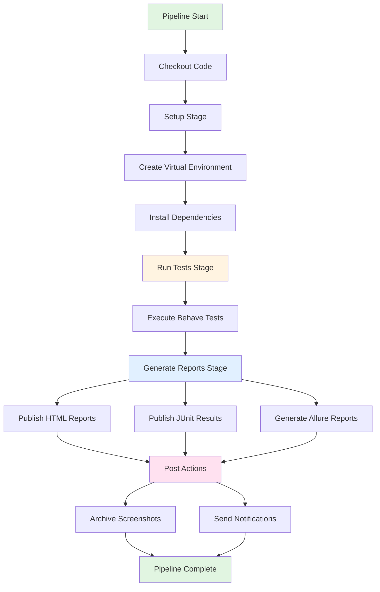
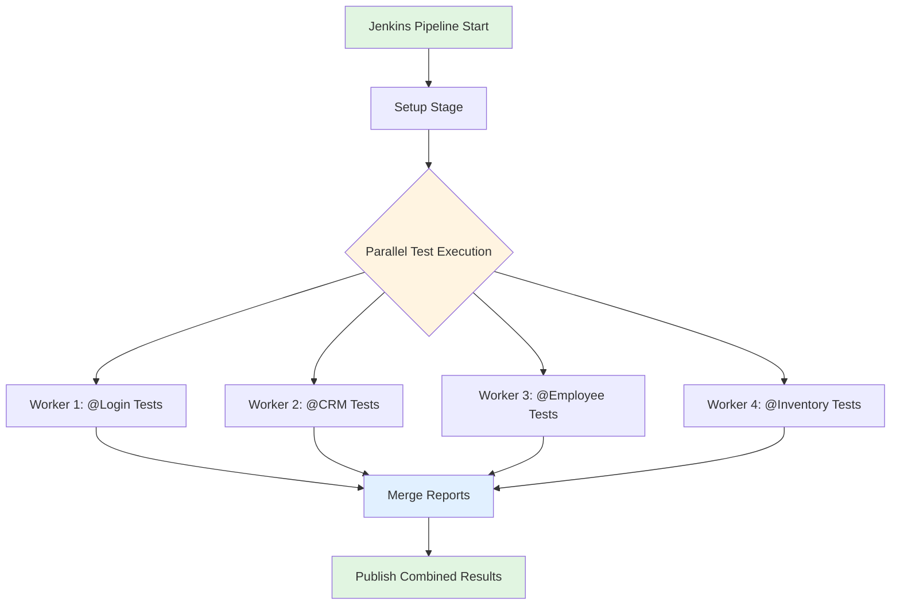

# Jenkins CI/CD Integration

## Overview

Jenkins is an industry-standard open-source automation server that provides robust CI/CD capabilities for the testinium-qa-python test automation framework. This guide provides comprehensive instructions for integrating the Behave BDD test framework with Jenkins pipelines.

**Why Jenkins for Test Automation:**

- **Mature CI/CD Platform:** Battle-tested automation server with 15+ years of development and widespread enterprise adoption
- **Java Ecosystem Integration:** Seamless integration with Java-based tools while supporting Python test frameworks through flexible pipeline scripts
- **Extensive Plugin Ecosystem:** 1,800+ plugins including HTML Publisher, JUnit, Allure, and Pipeline plugins that enhance test reporting and visualization
- **Enterprise Adoption:** Industry-standard tool with extensive documentation, community support, and enterprise-grade security features
- **Flexible Pipeline Configuration:** Declarative and scripted pipeline support enabling complex test orchestration, parallel execution, and environment management
- **Test Report Integration:** Native support for JUnit XML, HTML reports, and Allure reports with trend analysis and historical tracking

**What This Guide Covers:**

- Jenkins environment setup and plugin installation
- Comprehensive Jenkinsfile pipeline configuration
- Credential management for secure test execution
- Advanced pipeline patterns (parameterized builds, parallel execution, matrix strategies)
- Test report publishing and artifact archiving
- Environment-specific configurations (development, staging, production)
- Notification and alerting setup
- Performance optimization strategies
- Troubleshooting common Jenkins integration issues

**Source:** This guide expands on the Jenkins integration section in `README.md:406-465` and incorporates CI/CD configuration patterns from `behave.ini:172-186`.

---

## Prerequisites

Before setting up Jenkins integration, ensure the following requirements are met:

### Jenkins Environment

- **Jenkins Version:** 2.300+ (LTS release recommended)
- **Pipeline Support:** Pipeline plugin (workflow-aggregator) installed and enabled
- **Resource Requirements:**
  - Minimum 2GB RAM for Jenkins server (4GB+ recommended for parallel execution)
  - Minimum 10GB disk space for workspace, artifacts, and build history
  - Network access to Git repository and application under test

### Jenkins Agent Requirements

- **Python:** Version 3.9, 3.10, 3.11, or 3.12 installed on all Jenkins agents
- **pip:** Python package installer (version 23.0+ recommended)
- **Virtual Environment:** `python3-venv` package for isolated dependency management
- **Git:** Version 2.30+ for repository checkout
- **Chrome/Firefox:** Browser binaries for test execution (headless mode supported)
- **WebDriver Binaries:** ChromeDriver or GeckoDriver (automatically managed by webdriver-manager package)

### Required Jenkins Plugins

The following plugins must be installed for full framework integration:

| Plugin | Purpose | Installation |
|--------|---------|--------------|
| **Pipeline (workflow-aggregator)** | Core pipeline functionality for Jenkinsfile execution | Install from Jenkins Plugin Manager |
| **Git Plugin** | Git repository integration for source code checkout | Usually pre-installed |
| **HTML Publisher Plugin** | Publish HTML test reports with formatted styling | Required for Behave HTML reports |
| **JUnit Plugin** | Parse and display JUnit XML test results | Required for test trend analysis |
| **Allure Jenkins Plugin** | Generate and publish Allure test reports (optional but recommended) | Provides enhanced test visualization |
| **Workspace Cleanup Plugin** | Clean workspace before/after builds | Recommended for build isolation |
| **Timestamper Plugin** | Add timestamps to console output | Recommended for debugging |
| **Email Extension Plugin** | Send detailed email notifications | Optional for notifications |
| **Slack Notification Plugin** | Send build notifications to Slack | Optional for team notifications |

**Plugin Installation Steps:**

1. Navigate to Jenkins → Manage Jenkins → Manage Plugins
2. Select "Available" tab
3. Search for each required plugin
4. Check the plugin checkbox and click "Install without restart"
5. Verify installation in "Installed" tab after completion

**Source:** Plugin requirements derived from pipeline configuration in `README.md:440-453` (HTML Publisher, JUnit, Allure integration).

---

## Jenkins Pipeline Architecture

The testinium-qa-python framework uses a declarative Jenkins pipeline with multiple stages for test execution, report generation, and artifact archiving.

**Pipeline Execution Flow:**



---

## Basic Jenkinsfile Configuration

This section provides a complete, production-ready Jenkinsfile for the testinium-qa-python framework.

**Complete Jenkinsfile Example:**

```groovy
pipeline {
    agent any
    
    environment {
        // Python version for test execution
        PYTHON_VERSION = '3.11'
        
        // Browser configuration from config.yaml
        BROWSER_TYPE = 'chrome'
        HEADLESS = 'true'
        
        // Application URLs (override in Build Parameters)
        BASE_URL = 'https://testinium.example.com'
        
        // Test execution configuration
        TEST_TAGS = '@Smoke'
        PARALLEL_WORKERS = '2'
    }
    
    stages {
        stage('Setup') {
            steps {
                echo "Setting up Python virtual environment..."
                
                // Create virtual environment
                sh 'python3 -m venv venv'
                
                // Upgrade pip to latest version
                sh '. venv/bin/activate && pip install --upgrade pip'
                
                // Install framework dependencies
                sh '. venv/bin/activate && pip install -r requirements.txt'
                
                // Verify installation
                sh '. venv/bin/activate && pip list'
                sh '. venv/bin/activate && python --version'
                sh '. venv/bin/activate && behave --version'
            }
        }
        
        stage('Run Tests') {
            steps {
                echo "Executing Behave tests with tags: ${TEST_TAGS}"
                
                // Execute Behave with multiple formatters for comprehensive reporting
                sh '''
                    . venv/bin/activate
                    behave --tags=${TEST_TAGS} \\
                           --format=json --outfile=reports/cucumber.json \\
                           --format=html --outfile=reports/report.html \\
                           --format=junit --junit-directory=reports/junit \\
                           --no-capture \\
                           --no-capture-stderr
                '''
            }
        }
        
        stage('Generate Reports') {
            steps {
                echo "Publishing test reports..."
                
                // Publish HTML reports using HTML Publisher plugin
                publishHTML([
                    allowMissing: false,
                    alwaysLinkToLastBuild: true,
                    keepAll: true,
                    reportDir: 'reports',
                    reportFiles: 'report.html',
                    reportName: 'Behave Test Report',
                    reportTitles: 'BDD Test Execution Results'
                ])
                
                // Publish JUnit test results for trend analysis
                junit allowEmptyResults: true, 
                      testResults: 'reports/junit/*.xml',
                      skipPublishingChecks: false
                
                // Generate Allure report (if allure-behave is configured)
                script {
                    if (fileExists('reports/allure-results')) {
                        allure([
                            includeProperties: false,
                            jdk: '',
                            properties: [],
                            reportBuildPolicy: 'ALWAYS',
                            results: [[path: 'reports/allure-results']]
                        ])
                    }
                }
            }
        }
    }
    
    post {
        always {
            echo "Archiving test artifacts..."
            
            // Archive screenshots for failed scenarios
            archiveArtifacts artifacts: 'reports/screenshots/**/*.png', 
                           allowEmptyArchive: true,
                           fingerprint: true
            
            // Archive JSON reports for programmatic analysis
            archiveArtifacts artifacts: 'reports/*.json',
                           allowEmptyArchive: true
            
            // Clean workspace after build (if Workspace Cleanup plugin installed)
            cleanWs(
                deleteDirs: true,
                patterns: [
                    [pattern: 'venv/', type: 'INCLUDE'],
                    [pattern: '__pycache__/', type: 'INCLUDE']
                ]
            )
        }
        
        success {
            echo "✓ Test execution completed successfully!"
        }
        
        failure {
            echo "✗ Test execution failed. Check reports for details."
        }
    }
}
```

**Source:** Based on `README.md:413-465` with enhancements for production usage.

**Pipeline Stage Breakdown:**

### 1. Setup Stage

**Purpose:** Prepares the Python environment and installs all test framework dependencies.

**Key Actions:**
- Creates isolated virtual environment using `python3 -m venv venv`
- Upgrades pip to latest version for improved dependency resolution
- Installs all dependencies from `requirements.txt`
- Verifies Python, pip, and Behave versions for debugging

**Environment Isolation Benefits:**
- Prevents dependency conflicts between different Jenkins jobs
- Ensures consistent package versions across test executions
- Isolates framework dependencies from system Python packages

### 2. Run Tests Stage

**Purpose:** Executes Behave BDD tests with comprehensive reporting formatters.

**Key Actions:**
- Activates virtual environment for test execution
- Runs Behave with configurable tags (e.g., `@Smoke`, `@Login`, `@CRM`)
- Generates multiple report formats simultaneously:
  - **JSON** (`reports/cucumber.json`): Programmatic report parsing and analysis
  - **HTML** (`reports/report.html`): Human-readable test results with styling
  - **JUnit XML** (`reports/junit/*.xml`): Jenkins test result integration and trend analysis

**Formatter Configuration:**

The Behave command uses multiple `--format` flags as documented in `behave.ini:14-24`:
- `--format=json`: Structured JSON output for automation and parsing
- `--format=html`: Visual HTML report with scenario details and timing
- `--format=junit`: XML format for Jenkins test result plugin integration
- `--no-capture`: Display real-time test output for debugging (configured per `behave.ini:49-50`)

**Tag-Based Test Selection:**

Use `--tags` flag to filter test execution:
```bash
# Run only smoke tests
behave --tags=@Smoke

# Run login and logout tests (OR condition)
behave --tags=@Login,@Logout

# Run smoke tests for sales manager (AND condition)
behave --tags=@Smoke --tags=@SalesManager

# Exclude work-in-progress tests
behave --tags='not @WIP'
```

**Source:** Tag examples from `behave.ini:139-143`.

### 3. Generate Reports Stage

**Purpose:** Publishes test reports to Jenkins UI and generates enhanced visualizations.

**HTML Report Publishing:**

Uses HTML Publisher plugin to display Behave HTML reports in Jenkins:

```groovy
publishHTML([
    allowMissing: false,          // Fail build if report missing
    alwaysLinkToLastBuild: true,  // Persistent report link
    keepAll: true,                // Retain all historical reports
    reportDir: 'reports',         // Report directory path
    reportFiles: 'report.html',   // HTML report filename
    reportName: 'Behave Test Report',
    reportTitles: 'BDD Test Execution Results'
])
```

**JUnit Test Results:**

Integrates JUnit XML reports for test trend analysis and failure tracking:

```groovy
junit allowEmptyResults: true,          // Don't fail if no tests run
      testResults: 'reports/junit/*.xml', // JUnit XML pattern
      skipPublishingChecks: false       // Update GitHub commit status
```

**JUnit Configuration:**
- Enables test result tracking across builds
- Provides pass/fail trends and statistics
- Highlights flaky tests and failure patterns
- Integrates with GitHub pull request checks

**Source:** `behave.ini:34-37` (JUnit configuration), `README.md:447` (junit plugin usage).

**Allure Report Generation:**

Optionally generates Allure reports for enhanced test visualization:

```groovy
allure([
    includeProperties: false,
    jdk: '',
    properties: [],
    reportBuildPolicy: 'ALWAYS',
    results: [[path: 'reports/allure-results']]
])
```

**Allure Benefits:**
- Interactive test report with historical trends
- Test execution timeline and duration analysis
- Screenshot attachments for failed scenarios
- Categorization by feature, severity, and tags

**Allure Setup Requirements:**
```bash
# Install allure-behave formatter
pip install allure-behave

# Run tests with Allure formatter
behave -f allure_behave.formatter:AllureFormatter -o reports/allure-results
```

**Source:** `README.md:449-453` (Allure configuration), `behave.ini:147` (Allure formatter example).

---

## Credentials Management

Secure credential handling is critical for test automation in CI/CD pipelines. The framework uses environment variables for all sensitive data.

**Jenkins Credentials Store:**

1. Navigate to Jenkins → Manage Jenkins → Manage Credentials
2. Select appropriate credential domain (usually "Global")
3. Click "Add Credentials"
4. Configure credential types:

| Credential Type | Use Case | Example |
|----------------|----------|---------|
| **Username with password** | Application login credentials | Test user accounts |
| **Secret text** | API keys, tokens | BASE_URL, connection strings |
| **SSH Username with private key** | Git repository access | Private repo checkout |

**Credential Binding in Pipeline:**

Use `withCredentials` block to inject secrets as environment variables:

```groovy
pipeline {
    agent any
    
    stages {
        stage('Run Tests') {
            steps {
                // Bind credentials to environment variables
                withCredentials([
                    usernamePassword(
                        credentialsId: 'testinium-test-user',
                        usernameVariable: 'TEST_USERNAME',
                        passwordVariable: 'TEST_PASSWORD'
                    ),
                    usernamePassword(
                        credentialsId: 'testinium-sales-manager',
                        usernameVariable: 'SALES_MANAGER_USERNAME',
                        passwordVariable: 'SALES_MANAGER_PASSWORD'
                    ),
                    string(
                        credentialsId: 'testinium-base-url',
                        variable: 'BASE_URL'
                    )
                ]) {
                    sh '''
                        . venv/bin/activate
                        export TEST_USERNAME=$TEST_USERNAME
                        export TEST_PASSWORD=$TEST_PASSWORD
                        export SALES_MANAGER_USERNAME=$SALES_MANAGER_USERNAME
                        export SALES_MANAGER_PASSWORD=$SALES_MANAGER_PASSWORD
                        export BASE_URL=$BASE_URL
                        behave --tags=@Smoke
                    '''
                }
            }
        }
    }
}
```

**Required Credentials:**

Based on `config/config.yaml:93-110`, the following credentials must be configured:

| Credential ID | Type | Environment Variables | Purpose |
|---------------|------|----------------------|---------|
| `testinium-test-user` | Username/Password | `TEST_USERNAME`, `TEST_PASSWORD` | Generic test user for basic scenarios |
| `testinium-sales-manager` | Username/Password | `SALES_MANAGER_USERNAME`, `SALES_MANAGER_PASSWORD` | Sales Manager role testing |
| `testinium-pos-manager` | Username/Password | `POS_MANAGER_USERNAME`, `POS_MANAGER_PASSWORD` | POS Manager role testing |
| `testinium-base-url` | Secret Text | `BASE_URL` | Application base URL for environment |

**Environment Variable Interpolation:**

The framework automatically resolves environment variables in `config.yaml`:

```yaml
# config.yaml with environment variable syntax
credentials:
  username: ${TEST_USERNAME}
  password: ${TEST_PASSWORD}
  sales_manager_username: ${SALES_MANAGER_USERNAME}
  sales_manager_password: ${SALES_MANAGER_PASSWORD}

application:
  base_url: ${BASE_URL:https://testinium.example.com}
  login_url: ${BASE_URL:https://testinium.example.com}/login
```

**Security Best Practices:**

- ✓ Never hardcode credentials in Jenkinsfile or config files
- ✓ Use Jenkins credential store with restricted access
- ✓ Rotate credentials regularly (every 90 days)
- ✓ Use different credentials for each environment (dev, staging, prod)
- ✓ Mask sensitive values in console output using `wrap([$class: 'MaskPasswordsBuildWrapper'])`
- ✗ Avoid committing `.env` files with real credentials to version control

**Source:** Credential configuration structure from `config/config.yaml:87-110`.

---

## Advanced Pipeline Patterns

### Parameterized Builds

Enable dynamic configuration through build parameters for flexible test execution.

**Jenkinsfile with Parameters:**

```groovy
pipeline {
    agent any
    
    parameters {
        choice(
            name: 'BROWSER',
            choices: ['chrome', 'firefox'],
            description: 'Select browser for test execution'
        )
        
        choice(
            name: 'ENVIRONMENT',
            choices: ['dev', 'staging', 'production'],
            description: 'Target environment for testing'
        )
        
        string(
            name: 'TEST_TAGS',
            defaultValue: '@Smoke',
            description: 'Behave tags to execute (e.g., @Login, @CRM, @Smoke)'
        )
        
        booleanParam(
            name: 'HEADLESS',
            defaultValue: true,
            description: 'Run browser in headless mode'
        )
        
        choice(
            name: 'PARALLEL_WORKERS',
            choices: ['1', '2', '4', '8'],
            description: 'Number of parallel test workers'
        )
    }
    
    environment {
        // Use parameter values in environment variables
        BROWSER_TYPE = "${params.BROWSER}"
        HEADLESS = "${params.HEADLESS}"
        TEST_TAGS = "${params.TEST_TAGS}"
        
        // Environment-specific URLs
        BASE_URL = "${params.ENVIRONMENT == 'production' ? 'https://prod.testinium.com' : 
                     params.ENVIRONMENT == 'staging' ? 'https://staging.testinium.com' : 
                     'https://dev.testinium.com'}"
    }
    
    stages {
        stage('Run Tests') {
            steps {
                echo "Browser: ${BROWSER_TYPE}, Environment: ${params.ENVIRONMENT}"
                echo "Tags: ${TEST_TAGS}, Headless: ${HEADLESS}"
                
                withCredentials([
                    usernamePassword(
                        credentialsId: "testinium-${params.ENVIRONMENT}-credentials",
                        usernameVariable: 'TEST_USERNAME',
                        passwordVariable: 'TEST_PASSWORD'
                    )
                ]) {
                    sh '''
                        . venv/bin/activate
                        behave --tags=${TEST_TAGS} \\
                               --format=json --outfile=reports/cucumber.json \\
                               --format=html --outfile=reports/report.html \\
                               --format=junit --junit-directory=reports/junit
                    '''
                }
            }
        }
    }
}
```

**Build Triggers:**

Configure automatic test execution triggers:

```groovy
triggers {
    // Poll SCM every 15 minutes for changes
    pollSCM('H/15 * * * *')
    
    // Or use webhook for immediate triggering
    // Configure GitHub/GitLab webhook in repository settings
    
    // Schedule nightly regression tests
    cron('H 2 * * *')  // Run at 2 AM daily
}
```

**Trigger Examples:**

| Cron Expression | Description | Use Case |
|----------------|-------------|----------|
| `H 2 * * *` | Daily at 2 AM | Nightly regression suite |
| `H 2 * * 1-5` | Weekdays at 2 AM | Business day testing |
| `H/15 * * * *` | Every 15 minutes | Continuous smoke tests |
| `H 0,12 * * *` | Twice daily (midnight, noon) | Extended test runs |

**Source:** Cron syntax follows standard Jenkins configuration patterns.

### Parallel Execution Strategies

Execute tests in parallel to reduce overall execution time and improve CI/CD pipeline efficiency.

**Parallel Execution Architecture:**



**Strategy 1: Tag-Based Parallel Stages**

Execute different feature tags in parallel stages:

```groovy
pipeline {
    agent any
    
    stages {
        stage('Setup') {
            steps {
                sh 'python3 -m venv venv'
                sh '. venv/bin/activate && pip install -r requirements.txt'
            }
        }
        
        stage('Parallel Tests') {
            parallel {
                stage('Login Tests') {
                    steps {
                        sh '''
                            . venv/bin/activate
                            behave --tags=@Login \\
                                   --format=junit --junit-directory=reports/junit/login
                        '''
                    }
                }
                
                stage('CRM Tests') {
                    steps {
                        sh '''
                            . venv/bin/activate
                            behave --tags=@CRM \\
                                   --format=junit --junit-directory=reports/junit/crm
                        '''
                    }
                }
                
                stage('Employee Tests') {
                    steps {
                        sh '''
                            . venv/bin/activate
                            behave --tags=@Employee \\
                                   --format=junit --junit-directory=reports/junit/employee
                        '''
                    }
                }
                
                stage('Inventory Tests') {
                    steps {
                        sh '''
                            . venv/bin/activate
                            behave --tags=@Inventory \\
                                   --format=junit --junit-directory=reports/junit/inventory
                        '''
                    }
                }
            }
        }
        
        stage('Publish Reports') {
            steps {
                // Collect all JUnit results from parallel stages
                junit 'reports/junit/**/*.xml'
                
                publishHTML([
                    reportDir: 'reports',
                    reportFiles: '**/*.html',
                    reportName: 'Combined Test Report'
                ])
            }
        }
    }
}
```

**Strategy 2: Matrix Builds for Multi-Browser Testing**

Execute tests across multiple browsers simultaneously:

```groovy
pipeline {
    agent any
    
    stages {
        stage('Setup') {
            steps {
                sh 'python3 -m venv venv'
                sh '. venv/bin/activate && pip install -r requirements.txt'
            }
        }
        
        stage('Matrix Tests') {
            matrix {
                axes {
                    axis {
                        name 'BROWSER'
                        values 'chrome', 'firefox'
                    }
                    axis {
                        name 'ENVIRONMENT'
                        values 'staging', 'production'
                    }
                }
                
                stages {
                    stage('Test') {
                        steps {
                            script {
                                def reportDir = "reports/${BROWSER}-${ENVIRONMENT}"
                                sh """
                                    . venv/bin/activate
                                    export BROWSER_TYPE=${BROWSER}
                                    export BASE_URL=\${${ENVIRONMENT.toUpperCase()}_URL}
                                    behave --tags=@Smoke \\
                                           --format=junit --junit-directory=${reportDir}/junit
                                """
                            }
                        }
                    }
                }
            }
        }
        
        stage('Publish Results') {
            steps {
                junit 'reports/**/junit/*.xml'
            }
        }
    }
}
```

**Strategy 3: Multiple Jenkins Agents**

Distribute tests across multiple Jenkins agents for maximum parallelism:

```groovy
pipeline {
    stages {
        stage('Parallel Agent Tests') {
            parallel {
                stage('Agent 1 - Chrome') {
                    agent { label 'linux-chrome' }
                    steps {
                        sh 'python3 -m venv venv'
                        sh '. venv/bin/activate && pip install -r requirements.txt'
                        sh '''
                            . venv/bin/activate
                            export BROWSER_TYPE=chrome
                            behave --tags=@Smoke
                        '''
                    }
                }
                
                stage('Agent 2 - Firefox') {
                    agent { label 'linux-firefox' }
                    steps {
                        sh 'python3 -m venv venv'
                        sh '. venv/bin/activate && pip install -r requirements.txt'
                        sh '''
                            . venv/bin/activate
                            export BROWSER_TYPE=firefox
                            behave --tags=@Smoke
                        '''
                    }
                }
            }
        }
    }
}
```

**Thread Safety Requirements:**

The framework uses `threading.local()` for thread-safe WebDriver management:
- Each parallel stage gets an isolated WebDriver instance
- No shared state between parallel executions
- Page objects are thread-safe by design

**Source:** Parallel execution patterns from `behave.ini:95-128`, thread safety documented in `utilities/driver_manager.py`.

---

## Environment-Specific Configurations

Manage different environments (development, staging, production) with environment-specific pipelines.

**Multi-Environment Pipeline:**

```groovy
pipeline {
    agent any
    
    parameters {
        choice(
            name: 'ENVIRONMENT',
            choices: ['dev', 'staging', 'production'],
            description: 'Target environment'
        )
    }
    
    environment {
        // Environment-specific URLs
        DEV_URL = 'https://dev.testinium.com'
        STAGING_URL = 'https://staging.testinium.com'
        PROD_URL = 'https://prod.testinium.com'
        
        // Set BASE_URL based on environment parameter
        BASE_URL = "${params.ENVIRONMENT == 'production' ? env.PROD_URL : 
                     params.ENVIRONMENT == 'staging' ? env.STAGING_URL : 
                     env.DEV_URL}"
        
        // Environment-specific tags
        TEST_TAGS = "${params.ENVIRONMENT == 'production' ? '@Smoke' : '@Smoke,@Regression'}"
    }
    
    stages {
        stage('Environment Validation') {
            steps {
                echo "Testing environment: ${params.ENVIRONMENT}"
                echo "Base URL: ${BASE_URL}"
                echo "Test tags: ${TEST_TAGS}"
                
                // Validate environment is reachable
                sh "curl -f -s -o /dev/null ${BASE_URL}/health || echo 'Warning: Health check failed'"
            }
        }
        
        stage('Run Tests') {
            steps {
                withCredentials([
                    usernamePassword(
                        credentialsId: "testinium-${params.ENVIRONMENT}-user",
                        usernameVariable: 'TEST_USERNAME',
                        passwordVariable: 'TEST_PASSWORD'
                    )
                ]) {
                    sh '''
                        . venv/bin/activate
                        behave --tags=${TEST_TAGS} \\
                               --format=json --outfile=reports/cucumber.json \\
                               --format=junit --junit-directory=reports/junit
                    '''
                }
            }
        }
    }
    
    post {
        failure {
            script {
                if (params.ENVIRONMENT == 'production') {
                    // Send critical alert for production failures
                    emailext(
                        subject: "🚨 CRITICAL: Production Test Failure",
                        body: "Production tests failed. Immediate attention required.",
                        to: 'production-alerts@example.com',
                        recipientProviders: [developers(), culprits()]
                    )
                }
            }
        }
    }
}
```

**Source:** Configuration structure from `config/config.yaml:62-85` (application URLs and environment settings).

---

## Notification and Alerting

Configure notifications to keep teams informed of test results.

**Email Notifications:**

```groovy
post {
    success {
        emailext(
            subject: "✓ Test Execution Successful - Build #${BUILD_NUMBER}",
            body: """
                <h2>Test Execution Completed Successfully</h2>
                <p><strong>Build:</strong> #${BUILD_NUMBER}</p>
                <p><strong>Environment:</strong> ${params.ENVIRONMENT}</p>
                <p><strong>Browser:</strong> ${BROWSER_TYPE}</p>
                <p><strong>Tags:</strong> ${TEST_TAGS}</p>
                <p><a href="${BUILD_URL}">View Full Report</a></p>
            """,
            to: 'qa-team@example.com',
            mimeType: 'text/html'
        )
    }
    
    failure {
        emailext(
            subject: "✗ Test Execution Failed - Build #${BUILD_NUMBER}",
            body: """
                <h2>Test Execution Failed</h2>
                <p><strong>Build:</strong> #${BUILD_NUMBER}</p>
                <p><strong>Environment:</strong> ${params.ENVIRONMENT}</p>
                <p><strong>Failed Tests:</strong> Check JUnit report for details</p>
                <p><a href="${BUILD_URL}">View Failure Report</a></p>
                <p><a href="${BUILD_URL}artifact/reports/screenshots/">View Screenshots</a></p>
            """,
            to: 'qa-team@example.com',
            recipientProviders: [developers(), culprits()],
            mimeType: 'text/html'
        )
    }
    
    unstable {
        emailext(
            subject: "⚠️ Test Execution Unstable - Build #${BUILD_NUMBER}",
            body: """
                <h2>Test Execution Unstable (Some Tests Failed)</h2>
                <p><strong>Build:</strong> #${BUILD_NUMBER}</p>
                <p>Review failed tests and determine if they are flaky or genuine failures.</p>
                <p><a href="${BUILD_URL}testReport/">View Test Report</a></p>
            """,
            to: 'qa-team@example.com',
            mimeType: 'text/html'
        )
    }
}
```

**Slack Notifications:**

```groovy
post {
    success {
        slackSend(
            color: 'good',
            channel: '#qa-automation',
            message: "✓ Tests passed - Build #${BUILD_NUMBER} | <${BUILD_URL}|View Report>"
        )
    }
    
    failure {
        slackSend(
            color: 'danger',
            channel: '#qa-automation',
            message: "✗ Tests failed - Build #${BUILD_NUMBER} | <${BUILD_URL}|View Report> | <${BUILD_URL}artifact/reports/screenshots/|Screenshots>"
        )
    }
}
```

---

## Performance Optimization

Optimize Jenkins pipeline execution time and resource usage.

**Optimization Strategies:**

### 1. Workspace Cleanup

Clean workspace between builds to prevent disk space issues:

```groovy
options {
    // Clean workspace before build starts
    skipDefaultCheckout()
    
    // Discard old builds
    buildDiscarder(logRotator(
        numToKeepStr: '30',
        artifactNumToKeepStr: '10'
    ))
}

post {
    always {
        // Clean workspace after build
        cleanWs(
            deleteDirs: true,
            patterns: [
                [pattern: 'venv/', type: 'INCLUDE'],
                [pattern: '__pycache__/', type: 'INCLUDE'],
                [pattern: '*.pyc', type: 'INCLUDE']
            ]
        )
    }
}
```

### 2. Dependency Caching

Cache Python dependencies to speed up setup:

```groovy
stage('Setup with Cache') {
    steps {
        script {
            // Check if venv cache exists
            if (fileExists('venv-cache.tar.gz')) {
                echo "Restoring virtual environment from cache..."
                sh 'tar -xzf venv-cache.tar.gz'
            } else {
                echo "Creating new virtual environment..."
                sh 'python3 -m venv venv'
                sh '. venv/bin/activate && pip install -r requirements.txt'
                
                // Cache venv for future builds
                sh 'tar -czf venv-cache.tar.gz venv/'
            }
        }
    }
}
```

### 3. Parallel Execution

Utilize multiple agents for maximum parallelism as documented in parallel execution strategies section above.

### 4. Test Selection

Run only relevant tests based on code changes:

```groovy
stage('Smart Test Selection') {
    steps {
        script {
            def changedFiles = sh(
                script: 'git diff --name-only HEAD~1',
                returnStdout: true
            ).trim()
            
            def tags = '@Smoke'
            
            if (changedFiles.contains('pages/login_page.py') || 
                changedFiles.contains('features/Login.feature')) {
                tags += ',@Login'
            }
            
            if (changedFiles.contains('pages/crm_page.py') || 
                changedFiles.contains('features/Crm.feature')) {
                tags += ',@CRM'
            }
            
            echo "Running tests with tags: ${tags}"
            sh """
                . venv/bin/activate
                behave --tags='${tags}'
            """
        }
    }
}
```

**Source:** Workspace cleanup and optimization best practices for CI/CD environments.

---

## Integration Examples

### Multi-Branch Pipeline

Automatically test all branches with branch-specific configurations:

**Jenkinsfile for Multi-Branch:**

```groovy
pipeline {
    agent any
    
    environment {
        // Branch-specific environment selection
        ENVIRONMENT = "${env.BRANCH_NAME == 'main' ? 'production' : 
                       env.BRANCH_NAME == 'develop' ? 'staging' : 'dev'}"
        
        // Branch-specific test tags
        TEST_TAGS = "${env.BRANCH_NAME == 'main' ? '@Smoke' : '@Smoke,@Regression'}"
    }
    
    stages {
        stage('Branch Info') {
            steps {
                echo "Branch: ${env.BRANCH_NAME}"
                echo "Environment: ${ENVIRONMENT}"
                echo "Test Tags: ${TEST_TAGS}"
            }
        }
        
        stage('Run Tests') {
            steps {
                sh '''
                    python3 -m venv venv
                    . venv/bin/activate
                    pip install -r requirements.txt
                    behave --tags=${TEST_TAGS}
                '''
            }
        }
    }
}
```

### Pull Request Validation

Validate pull requests before merging:

```groovy
pipeline {
    agent any
    
    when {
        changeRequest()  // Only run for pull requests
    }
    
    stages {
        stage('PR Validation') {
            steps {
                echo "Validating PR #${env.CHANGE_ID}: ${env.CHANGE_TITLE}"
                
                sh '''
                    python3 -m venv venv
                    . venv/bin/activate
                    pip install -r requirements.txt
                    
                    # Run smoke tests only for PR validation
                    behave --tags=@Smoke
                '''
            }
        }
    }
    
    post {
        success {
            // Add success comment to PR
            echo "✓ All smoke tests passed. PR is safe to merge."
        }
        
        failure {
            // Add failure comment to PR
            echo "✗ Smoke tests failed. Please fix before merging."
        }
    }
}
```

### Nightly Regression Suite

Schedule comprehensive regression tests:

```groovy
pipeline {
    agent any
    
    triggers {
        cron('H 2 * * *')  // Run at 2 AM daily
    }
    
    stages {
        stage('Nightly Regression') {
            steps {
                echo "Starting nightly regression suite..."
                
                sh '''
                    python3 -m venv venv
                    . venv/bin/activate
                    pip install -r requirements.txt
                    
                    # Run all tests (no tag filter)
                    behave --format=json --outfile=reports/nightly-${BUILD_NUMBER}.json \\
                           --format=junit --junit-directory=reports/junit
                '''
            }
        }
    }
    
    post {
        always {
            // Archive comprehensive reports
            archiveArtifacts artifacts: 'reports/**/*', fingerprint: true
            
            // Email report to stakeholders
            emailext(
                subject: "Nightly Regression Report - ${new Date().format('yyyy-MM-dd')}",
                body: "Nightly regression completed. View report: ${BUILD_URL}",
                to: 'qa-team@example.com,product-owner@example.com'
            )
        }
    }
}
```

**Source:** CI/CD integration patterns from `behave.ini:170-186`.

---

## Troubleshooting

### Common Issues and Solutions

#### Issue: Python Virtual Environment Creation Fails

**Symptoms:**
```
ERROR: Command errored out with exit status 1
python3 -m venv venv failed
```

**Causes:**
- `python3-venv` package not installed on Jenkins agent
- Insufficient disk space
- Permission issues in workspace directory

**Solutions:**

```bash
# Install python3-venv on Jenkins agent (Ubuntu/Debian)
sudo apt-get update
sudo apt-get install python3-venv

# Check disk space
df -h

# Fix permissions
chmod -R 755 $WORKSPACE
```

**Jenkinsfile Fix:**

```groovy
stage('Setup') {
    steps {
        // Verify Python installation before creating venv
        sh 'python3 --version'
        sh 'which python3'
        
        // Clean old venv if exists
        sh 'rm -rf venv'
        
        // Create fresh venv
        sh 'python3 -m venv venv'
    }
}
```

---

#### Issue: WebDriver Binary Not Found

**Symptoms:**
```
selenium.common.exceptions.WebDriverException: Message: 'chromedriver' executable needs to be in PATH
```

**Cause:**
- ChromeDriver or GeckoDriver not installed
- PATH not configured correctly
- Browser version mismatch with driver version

**Solution:**

The framework uses `webdriver-manager` to automatically download and manage driver binaries:

```python
# utilities/driver_manager.py handles this automatically
from webdriver_manager.chrome import ChromeDriverManager
from selenium.webdriver.chrome.service import Service

service = Service(ChromeDriverManager().install())
driver = webdriver.Chrome(service=service)
```

**Verify Installation:**

```groovy
stage('Verify WebDriver') {
    steps {
        sh '''
            . venv/bin/activate
            python -c "from webdriver_manager.chrome import ChromeDriverManager; ChromeDriverManager().install()"
        '''
    }
}
```

---

#### Issue: Report Publishing Fails

**Symptoms:**
```
ERROR: Failed to archive artifacts: reports/report.html
No such file or directory
```

**Causes:**
- Report generation failed silently
- Incorrect report path configuration
- Formatter not properly configured

**Solutions:**

**1. Verify Report Generation:**

```groovy
stage('Generate Reports') {
    steps {
        sh '''
            . venv/bin/activate
            behave --format=html --outfile=reports/report.html || true
            
            # Verify report was created
            if [ ! -f reports/report.html ]; then
                echo "ERROR: HTML report not generated"
                exit 1
            fi
        '''
    }
}
```

**2. Use AllowEmptyArchive:**

```groovy
post {
    always {
        // Don't fail build if artifacts missing
        archiveArtifacts artifacts: 'reports/**/*', 
                       allowEmptyArchive: true
    }
}
```

**3. Check Formatter Installation:**

```bash
# Install HTML formatter if missing
pip install behave-html-formatter
```

**Source:** Report configuration from `behave.ini:14-32` and `README.md:440-444`.

---

#### Issue: Parallel Execution Fails with Driver Conflicts

**Symptoms:**
```
WebDriverException: session not created: This version of ChromeDriver only supports Chrome version X
Tests randomly fail in parallel but pass individually
```

**Cause:**
- Multiple threads trying to use same WebDriver instance
- Framework not using thread-local storage properly

**Solution:**

The framework uses `threading.local()` for thread-safe WebDriver management. Verify configuration:

```python
# utilities/driver_manager.py
import threading

class DriverManager:
    _drivers = threading.local()  # Thread-local storage
    
    @classmethod
    def get_driver(cls):
        if not hasattr(cls._drivers, 'driver'):
            cls._drivers.driver = cls._create_driver()
        return cls._drivers.driver
```

**Parallel Execution Best Practices:**
- Use separate report directories for each parallel stage
- Ensure each stage creates its own virtual environment (if using multiple agents)
- Use tag-based parallelism to avoid test interdependencies

**Source:** Thread safety pattern from `behave.ini:119-122`.

---

#### Issue: Credentials Not Loading from Jenkins Store

**Symptoms:**
```
KeyError: 'TEST_USERNAME'
Configuration error: Required environment variable not set
```

**Cause:**
- Credential ID mismatch
- Credentials not properly bound to environment variables
- Credential scope issue (folder vs. global)

**Solution:**

**1. Verify Credential ID:**

```groovy
withCredentials([
    usernamePassword(
        credentialsId: 'testinium-test-user',  // Must match exactly
        usernameVariable: 'TEST_USERNAME',
        passwordVariable: 'TEST_PASSWORD'
    )
]) {
    sh 'echo "Username: $TEST_USERNAME"'  // Debug: verify variable set
    sh 'behave --tags=@Smoke'
}
```

**2. Check Credential Scope:**
- Navigate to Jenkins → Manage Jenkins → Manage Credentials
- Verify credential exists in the correct domain (Global or Folder)
- Ensure Jenkins job has permission to access the credential

**3. Export Variables Explicitly:**

```groovy
withCredentials([...]) {
    sh '''
        export TEST_USERNAME=$TEST_USERNAME
        export TEST_PASSWORD=$TEST_PASSWORD
        . venv/bin/activate
        behave --tags=@Smoke
    '''
}
```

---

#### Issue: Plugin Compatibility Errors

**Symptoms:**
```
ERROR: Unable to load class 'hudson.plugins.git.GitPublisher'
Plugin 'workflow-aggregator' requires restart
```

**Cause:**
- Plugin version conflicts
- Jenkins version too old for plugin
- Missing plugin dependencies

**Solution:**

**1. Update Jenkins and Plugins:**
- Update Jenkins to LTS version 2.300+
- Update all plugins to compatible versions
- Install missing plugin dependencies

**2. Required Plugin Versions:**

| Plugin | Minimum Version |
|--------|----------------|
| Pipeline (workflow-aggregator) | 2.6+ |
| Git Plugin | 4.10+ |
| HTML Publisher | 1.30+ |
| JUnit Plugin | 1.50+ |
| Allure Jenkins Plugin | 2.30+ |

**3. Restart Jenkins After Plugin Updates:**

```bash
# Restart Jenkins (varies by installation method)
sudo systemctl restart jenkins

# Or use Jenkins UI
# Manage Jenkins → Prepare for Shutdown → Wait → Restart
```

---

#### Issue: High Memory Usage / Jenkins Agent Crashes

**Symptoms:**
```
java.lang.OutOfMemoryError: Java heap space
Jenkins agent disconnected
Build killed due to OOM
```

**Cause:**
- Too many parallel tests
- Large test reports consuming memory
- Insufficient agent memory allocation

**Solution:**

**1. Increase Jenkins Agent Memory:**

```bash
# Edit Jenkins service configuration
# /etc/default/jenkins or /etc/sysconfig/jenkins

JAVA_ARGS="-Xms512m -Xmx4096m -XX:MaxPermSize=1024m"
```

**2. Reduce Parallel Workers:**

```groovy
environment {
    PARALLEL_WORKERS = '2'  // Reduce from 4 to 2
}
```

**3. Clean Workspace More Frequently:**

```groovy
options {
    // Clean workspace before each build
    skipDefaultCheckout(false)
    
    // Discard old builds more aggressively
    buildDiscarder(logRotator(
        numToKeepStr: '10',      // Keep only last 10 builds
        artifactNumToKeepStr: '5' // Keep only last 5 artifacts
    ))
}
```

---

## See Also

- **[Docker Deployment Guide](docker.md)** - Containerized test execution
- **[Kubernetes Deployment](kubernetes.md)** - Scalable test orchestration
- **[GitHub Actions Integration](github-actions.md)** - Alternative CI/CD platform
- **[Configuration Reference](../reference/configuration-options.md)** - Complete config.yaml documentation
- **[Parallel Execution Guide](../guides/parallel-execution.md)** - Detailed parallel testing strategies
- **[API Reference: environment.py](../api-reference/features/environment.md)** - Behave hooks documentation

---

**Document Version:** 1.0  
**Last Updated:** 2024  
**Framework Version:** testinium-qa-python 1.0+

**Sources:**
- `README.md:406-465` - Base Jenkins configuration
- `behave.ini:34-37, 95-128, 172-186` - Behave CI/CD configuration
- `config/config.yaml:87-162` - Configuration structure and environment variables


