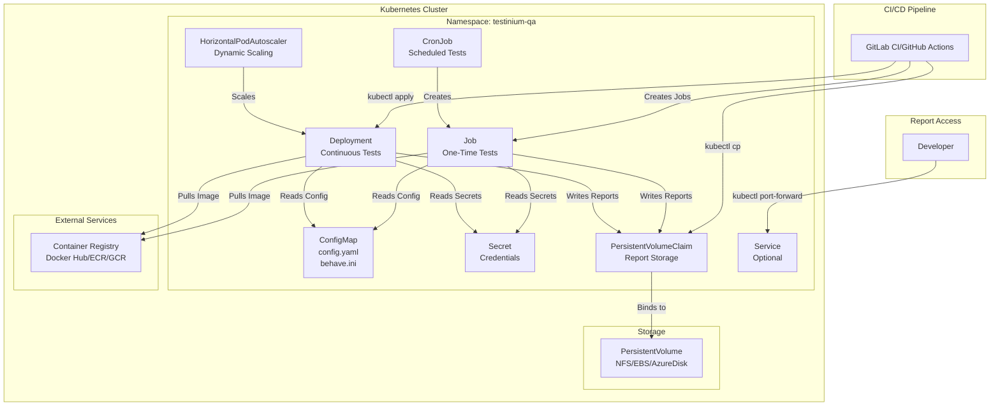
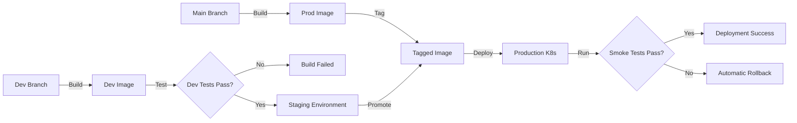

# Kubernetes Deployment Guide

## Overview

This guide provides comprehensive instructions for deploying the Testinium QA Python test automation framework on Kubernetes, enabling enterprise-scale test execution with dynamic scaling, high availability, and cloud-native orchestration.

### When to Use Kubernetes

Kubernetes deployment is recommended when you need:

- **Enterprise Scale**: Execute hundreds or thousands of tests in parallel across multiple nodes
- **Dynamic Scaling**: Automatically scale test execution based on test load and resource availability
- **Scheduled Test Runs**: Run tests on schedules (nightly, hourly, on-demand) using CronJobs
- **Cloud-Native Architecture**: Deploy tests in containerized environments with orchestration
- **High Availability**: Ensure test infrastructure resilience with automatic pod recovery
- **Multi-Environment Testing**: Isolate test environments using namespaces and resource quotas
- **CI/CD Integration**: Seamlessly integrate with Kubernetes-native CI/CD pipelines (Tekton, Argo, Flux)

### Architecture Overview



## Prerequisites

Before deploying to Kubernetes, ensure you have:

### Required Tools

| Tool | Minimum Version | Purpose | Installation |
|------|-----------------|---------|--------------|
| **kubectl** | 1.20+ | Kubernetes CLI | [Install kubectl](https://kubernetes.io/docs/tasks/tools/) |
| **Kubernetes Cluster** | 1.20+ | Orchestration platform | Minikube, EKS, GKE, AKS, or on-prem |
| **Docker** | 20.10+ | Container image building | [Install Docker](https://docs.docker.com/get-docker/) |
| **Container Registry Access** | N/A | Store and pull images | Docker Hub, ECR, GCR, ACR, Harbor |

### Required Knowledge

- **Kubernetes Fundamentals**: Understanding of Pods, Deployments, Jobs, Services, ConfigMaps, Secrets
- **Container Concepts**: Docker images, container registries, image tagging
- **YAML Syntax**: Kubernetes manifest file structure
- **kubectl Commands**: Basic cluster interaction and troubleshooting

### Cluster Requirements

- **Node Resources**: Minimum 2 CPU cores and 4GB RAM per node for test execution
- **Storage Class**: Dynamic provisioning support (for PersistentVolumeClaims)
- **Network Policies**: Optional but recommended for security
- **RBAC**: ServiceAccount with permissions to create/manage resources in target namespace

### Verify Cluster Access

```bash
# Check kubectl is configured correctly
kubectl version --client

# Verify cluster connectivity
kubectl cluster-info

# Check available nodes
kubectl get nodes

# Verify you have permissions in target namespace
kubectl auth can-i create deployments --namespace=testinium-qa
```

## Container Image Preparation

Before deploying to Kubernetes, you need to create and push a Docker container image containing the test framework.

### Building the Docker Image

**Reference**: See [Docker Deployment Guide](docker.md) for comprehensive Docker image creation instructions.

**Quick Start**:

```bash
# Build the test framework image
docker build -t testinium-qa-python:latest .

# Tag for your container registry
docker tag testinium-qa-python:latest <your-registry>/testinium-qa-python:1.0.0
```

### Pushing to Container Registry

#### Docker Hub

```bash
# Login to Docker Hub
docker login

# Push image
docker push <your-username>/testinium-qa-python:1.0.0
```

#### AWS Elastic Container Registry (ECR)

```bash
# Authenticate Docker to ECR
aws ecr get-login-password --region us-east-1 | \
    docker login --username AWS --password-stdin <account-id>.dkr.ecr.us-east-1.amazonaws.com

# Tag and push
docker tag testinium-qa-python:latest <account-id>.dkr.ecr.us-east-1.amazonaws.com/testinium-qa-python:1.0.0
docker push <account-id>.dkr.ecr.us-east-1.amazonaws.com/testinium-qa-python:1.0.0
```

#### Google Container Registry (GCR)

```bash
# Configure Docker to use gcloud as credential helper
gcloud auth configure-docker

# Tag and push
docker tag testinium-qa-python:latest gcr.io/<project-id>/testinium-qa-python:1.0.0
docker push gcr.io/<project-id>/testinium-qa-python:1.0.0
```

#### Azure Container Registry (ACR)

```bash
# Login to ACR
az acr login --name <registry-name>

# Tag and push
docker tag testinium-qa-python:latest <registry-name>.azurecr.io/testinium-qa-python:1.0.0
docker push <registry-name>.azurecr.io/testinium-qa-python:1.0.0
```

### Image Versioning Strategy

**Recommended approach**: Use semantic versioning with Git commit SHA for traceability.

```bash
# Tag with version and commit SHA
VERSION="1.0.0"
COMMIT_SHA=$(git rev-parse --short HEAD)

docker tag testinium-qa-python:latest <your-registry>/testinium-qa-python:${VERSION}
docker tag testinium-qa-python:latest <your-registry>/testinium-qa-python:${VERSION}-${COMMIT_SHA}
docker tag testinium-qa-python:latest <your-registry>/testinium-qa-python:latest

# Push all tags
docker push <your-registry>/testinium-qa-python:${VERSION}
docker push <your-registry>/testinium-qa-python:${VERSION}-${COMMIT_SHA}
docker push <your-registry>/testinium-qa-python:latest
```

### Image Pull Secrets (Private Registries)

If using a private container registry, create an image pull secret:

```bash
# Create secret for Docker Hub
kubectl create secret docker-registry regcred \
    --docker-server=https://index.docker.io/v1/ \
    --docker-username=<your-username> \
    --docker-password=<your-password> \
    --docker-email=<your-email> \
    --namespace=testinium-qa

# Create secret for AWS ECR
kubectl create secret docker-registry ecr-secret \
    --docker-server=<account-id>.dkr.ecr.us-east-1.amazonaws.com \
    --docker-username=AWS \
    --docker-password=$(aws ecr get-login-password --region us-east-1) \
    --namespace=testinium-qa

# Create secret for GCR
kubectl create secret docker-registry gcr-secret \
    --docker-server=gcr.io \
    --docker-username=_json_key \
    --docker-password="$(cat /path/to/key.json)" \
    --namespace=testinium-qa
```

## Kubernetes Manifests

### Namespace Creation

Create a dedicated namespace for test execution to isolate resources and apply resource quotas.

**File**: `k8s/namespace.yaml`

```yaml
apiVersion: v1
kind: Namespace
metadata:
  name: testinium-qa
  labels:
    name: testinium-qa
    purpose: test-automation
    team: qa
---
# Optional: Resource Quota to prevent resource exhaustion
apiVersion: v1
kind: ResourceQuota
metadata:
  name: testinium-qa-quota
  namespace: testinium-qa
spec:
  hard:
    requests.cpu: "20"
    requests.memory: 40Gi
    limits.cpu: "40"
    limits.memory: 80Gi
    persistentvolumeclaims: "5"
    pods: "50"
---
# Optional: Limit Range for default resource constraints
apiVersion: v1
kind: LimitRange
metadata:
  name: testinium-qa-limits
  namespace: testinium-qa
spec:
  limits:
  - max:
      cpu: "4"
      memory: 8Gi
    min:
      cpu: "100m"
      memory: 256Mi
    default:
      cpu: "1"
      memory: 2Gi
    defaultRequest:
      cpu: "500m"
      memory: 1Gi
    type: Container
```

```bash
# Create namespace and resource constraints
kubectl apply -f k8s/namespace.yaml
```

### ConfigMap Creation

ConfigMaps store non-sensitive configuration data: `config.yaml`, `behave.ini`, and environment-specific settings.

**File**: `k8s/configmap.yaml`

```yaml
apiVersion: v1
kind: ConfigMap
metadata:
  name: testinium-qa-config
  namespace: testinium-qa
  labels:
    app: testinium-qa
    component: configuration
data:
  # config.yaml content
  config.yaml: |
    # Browser Configuration
    browser:
      type: chrome
      headless: true  # Always headless in Kubernetes
      window_size: [1920, 1080]
      implicit_wait: 0
    
    # Timeout Configuration
    timeouts:
      explicit: 10
      page_load: 30
      element_presence: 5
      clickability: 3
    
    # Application Configuration
    application:
      base_url: ${BASE_URL:https://testinium.example.com}
      login_url: ${BASE_URL:https://testinium.example.com}/login
      web_table_url: ${BASE_URL:https://testinium.example.com}/web-tables
      empl_title: "Employee Management"
    
    # Credentials loaded from environment variables (Secrets)
    credentials:
      username: ${TEST_USERNAME}
      password: ${TEST_PASSWORD}
      sales_manager_username: ${SALES_MANAGER_USERNAME}
      sales_manager_password: ${SALES_MANAGER_PASSWORD}
      pos_manager_username: ${POS_MANAGER_USERNAME}
      pos_manager_password: ${POS_MANAGER_PASSWORD}
    
    # Reporting Configuration
    reporting:
      screenshot_on_failure: true
      output_directory: reports/
      formats:
        - json
        - html
        - allure
      screenshot_directory: reports/screenshots/
  
  # behave.ini content (Source: behave.ini lines 1-200)
  behave.ini: |
    [behave]
    paths = features/
    format = pretty
    junit = true
    junit_directory = reports/junit
    show_skipped = false
    show_timings = true
    stdout_capture = false
    stderr_capture = false
    log_capture = true
    logging_level = INFO
    logging_format = %(asctime)s - %(name)s - %(levelname)s - %(message)s
    logging_datefmt = %Y-%m-%d %H:%M:%S
    tags = @Smoke
    color = true
    summary = true
    
    [behave.userdata]
    allure_results_dir = reports/allure-results
    screenshot_dir = reports/screenshots
    rerun_file = reports/rerun.txt
  
  # Environment-specific non-sensitive variables
  BASE_URL: "https://testinium.example.com"
  BROWSER_TYPE: "chrome"
  HEADLESS: "true"
  TIMEOUT_EXPLICIT: "10"
  TIMEOUT_PAGE_LOAD: "30"
  SCREENSHOTS_ON_FAILURE: "true"
```

```bash
# Create ConfigMap
kubectl apply -f k8s/configmap.yaml

# Verify ConfigMap created successfully
kubectl get configmap testinium-qa-config -n testinium-qa
kubectl describe configmap testinium-qa-config -n testinium-qa
```

### Secret Management

Secrets store sensitive credentials securely. **Never commit secrets to version control.**

**File**: `k8s/secret.yaml`

```yaml
apiVersion: v1
kind: Secret
metadata:
  name: testinium-qa-secrets
  namespace: testinium-qa
  labels:
    app: testinium-qa
    component: credentials
type: Opaque
stringData:
  # Test user credentials (Source: config/config.yaml lines 94-110)
  TEST_USERNAME: "testuser@example.com"
  TEST_PASSWORD: "your_secure_password_here"
  
  # Sales Manager credentials
  SALES_MANAGER_USERNAME: "salesmanager@example.com"
  SALES_MANAGER_PASSWORD: "your_secure_password_here"
  
  # POS Manager credentials
  POS_MANAGER_USERNAME: "posmanager@example.com"
  POS_MANAGER_PASSWORD: "your_secure_password_here"
  
  # Admin credentials (if needed)
  ADMIN_USERNAME: "admin@example.com"
  ADMIN_PASSWORD: "your_secure_password_here"
```

**Important**: Replace `your_secure_password_here` with actual credentials before applying.

```bash
# Create Secret from file (replace values first)
kubectl apply -f k8s/secret.yaml

# Alternatively, create Secret from command line (more secure)
kubectl create secret generic testinium-qa-secrets \
    --from-literal=TEST_USERNAME='testuser@example.com' \
    --from-literal=TEST_PASSWORD='actual_password' \
    --from-literal=SALES_MANAGER_USERNAME='salesmanager@example.com' \
    --from-literal=SALES_MANAGER_PASSWORD='actual_password' \
    --from-literal=POS_MANAGER_USERNAME='posmanager@example.com' \
    --from-literal=POS_MANAGER_PASSWORD='actual_password' \
    --from-literal=ADMIN_USERNAME='admin@example.com' \
    --from-literal=ADMIN_PASSWORD='actual_password' \
    --namespace=testinium-qa

# Verify Secret created (values will be base64 encoded)
kubectl get secret testinium-qa-secrets -n testinium-qa
```

#### External Secret Management (Recommended for Production)

For production deployments, use external secret management systems:

**HashiCorp Vault**:
```bash
# Install External Secrets Operator
helm repo add external-secrets https://charts.external-secrets.io
helm install external-secrets external-secrets/external-secrets -n external-secrets-system --create-namespace

# Create SecretStore referencing Vault
kubectl apply -f - <<EOF
apiVersion: external-secrets.io/v1beta1
kind: SecretStore
metadata:
  name: vault-backend
  namespace: testinium-qa
spec:
  provider:
    vault:
      server: "https://vault.example.com"
      path: "secret"
      version: "v2"
      auth:
        kubernetes:
          mountPath: "kubernetes"
          role: "testinium-qa"
EOF

# Create ExternalSecret to sync from Vault
kubectl apply -f - <<EOF
apiVersion: external-secrets.io/v1beta1
kind: ExternalSecret
metadata:
  name: testinium-qa-secrets
  namespace: testinium-qa
spec:
  refreshInterval: 1h
  secretStoreRef:
    name: vault-backend
    kind: SecretStore
  target:
    name: testinium-qa-secrets
    creationPolicy: Owner
  data:
  - secretKey: TEST_USERNAME
    remoteRef:
      key: testinium/credentials
      property: test_username
  - secretKey: TEST_PASSWORD
    remoteRef:
      key: testinium/credentials
      property: test_password
EOF
```

**AWS Secrets Manager**:
```yaml
apiVersion: external-secrets.io/v1beta1
kind: SecretStore
metadata:
  name: aws-secrets-manager
  namespace: testinium-qa
spec:
  provider:
    aws:
      service: SecretsManager
      region: us-east-1
      auth:
        jwt:
          serviceAccountRef:
            name: testinium-qa
---
apiVersion: external-secrets.io/v1beta1
kind: ExternalSecret
metadata:
  name: testinium-qa-secrets
  namespace: testinium-qa
spec:
  refreshInterval: 1h
  secretStoreRef:
    name: aws-secrets-manager
    kind: SecretStore
  target:
    name: testinium-qa-secrets
  data:
  - secretKey: TEST_USERNAME
    remoteRef:
      key: testinium-qa-credentials
      property: test_username
```

### Deployment Manifest (Continuous Test Execution)

Deployments manage long-running test execution with automatic restarts and scaling.

**File**: `k8s/deployment.yaml`

```yaml
apiVersion: apps/v1
kind: Deployment
metadata:
  name: testinium-qa-deployment
  namespace: testinium-qa
  labels:
    app: testinium-qa
    component: test-execution
    version: "1.0.0"
spec:
  replicas: 3  # Number of parallel test executors
  selector:
    matchLabels:
      app: testinium-qa
      component: test-execution
  template:
    metadata:
      labels:
        app: testinium-qa
        component: test-execution
        version: "1.0.0"
      annotations:
        prometheus.io/scrape: "true"
        prometheus.io/port: "8080"
        prometheus.io/path: "/metrics"
    spec:
      # Service account for RBAC
      serviceAccountName: testinium-qa
      
      # Image pull secrets for private registry
      imagePullSecrets:
      - name: regcred  # Or ecr-secret, gcr-secret, etc.
      
      # Security context
      securityContext:
        runAsNonRoot: true
        runAsUser: 1000
        fsGroup: 1000
      
      containers:
      - name: test-executor
        image: <your-registry>/testinium-qa-python:1.0.0
        imagePullPolicy: IfNotPresent
        
        # Command override for specific test execution
        command: ["behave"]
        args:
          - "--tags=@Smoke"
          - "--format=json"
          - "--outfile=reports/cucumber.json"
          - "--format=pretty"
          - "--junit"
          - "--junit-directory=reports/junit"
        
        # Environment variables from ConfigMap
        env:
        - name: BASE_URL
          valueFrom:
            configMapKeyRef:
              name: testinium-qa-config
              key: BASE_URL
        - name: BROWSER_TYPE
          valueFrom:
            configMapKeyRef:
              name: testinium-qa-config
              key: BROWSER_TYPE
        - name: HEADLESS
          valueFrom:
            configMapKeyRef:
              name: testinium-qa-config
              key: HEADLESS
        - name: TIMEOUT_EXPLICIT
          valueFrom:
            configMapKeyRef:
              name: testinium-qa-config
              key: TIMEOUT_EXPLICIT
        - name: TIMEOUT_PAGE_LOAD
          valueFrom:
            configMapKeyRef:
              name: testinium-qa-config
              key: TIMEOUT_PAGE_LOAD
        - name: SCREENSHOTS_ON_FAILURE
          valueFrom:
            configMapKeyRef:
              name: testinium-qa-config
              key: SCREENSHOTS_ON_FAILURE
        
        # Environment variables from Secrets
        - name: TEST_USERNAME
          valueFrom:
            secretKeyRef:
              name: testinium-qa-secrets
              key: TEST_USERNAME
        - name: TEST_PASSWORD
          valueFrom:
            secretKeyRef:
              name: testinium-qa-secrets
              key: TEST_PASSWORD
        - name: SALES_MANAGER_USERNAME
          valueFrom:
            secretKeyRef:
              name: testinium-qa-secrets
              key: SALES_MANAGER_USERNAME
        - name: SALES_MANAGER_PASSWORD
          valueFrom:
            secretKeyRef:
              name: testinium-qa-secrets
              key: SALES_MANAGER_PASSWORD
        - name: POS_MANAGER_USERNAME
          valueFrom:
            secretKeyRef:
              name: testinium-qa-secrets
              key: POS_MANAGER_USERNAME
        - name: POS_MANAGER_PASSWORD
          valueFrom:
            secretKeyRef:
              name: testinium-qa-secrets
              key: POS_MANAGER_PASSWORD
        
        # Volume mounts
        volumeMounts:
        - name: config
          mountPath: /app/config
          readOnly: true
        - name: reports
          mountPath: /app/reports
        
        # Resource constraints
        resources:
          requests:
            memory: "1Gi"
            cpu: "500m"
          limits:
            memory: "2Gi"
            cpu: "1"
        
        # Liveness probe (optional - for long-running tests)
        livenessProbe:
          exec:
            command:
            - pgrep
            - -f
            - behave
          initialDelaySeconds: 60
          periodSeconds: 30
          timeoutSeconds: 5
          failureThreshold: 3
        
        # Readiness probe (optional)
        readinessProbe:
          exec:
            command:
            - ls
            - /app/reports
          initialDelaySeconds: 10
          periodSeconds: 10
      
      # Volumes
      volumes:
      - name: config
        configMap:
          name: testinium-qa-config
          items:
          - key: config.yaml
            path: config.yaml
          - key: behave.ini
            path: behave.ini
      - name: reports
        persistentVolumeClaim:
          claimName: testinium-qa-reports
      
      # Restart policy
      restartPolicy: Always
      
      # Node selector (optional - run on specific nodes)
      # nodeSelector:
      #   workload-type: test-automation
      
      # Tolerations (optional - tolerate specific taints)
      # tolerations:
      # - key: "test-workload"
      #   operator: "Equal"
      #   value: "true"
      #   effect: "NoSchedule"
```

```bash
# Apply Deployment
kubectl apply -f k8s/deployment.yaml

# Verify Deployment
kubectl get deployment testinium-qa-deployment -n testinium-qa
kubectl get pods -n testinium-qa -l app=testinium-qa

# Check Deployment rollout status
kubectl rollout status deployment/testinium-qa-deployment -n testinium-qa

# View logs from a pod
kubectl logs -f deployment/testinium-qa-deployment -n testinium-qa

# View logs from all pods
kubectl logs -l app=testinium-qa -n testinium-qa --all-containers=true
```

### Job Manifest (One-Time Test Execution)

Jobs run tests to completion once, ideal for on-demand test execution triggered by CI/CD pipelines.

**File**: `k8s/job.yaml`

```yaml
apiVersion: batch/v1
kind: Job
metadata:
  name: testinium-qa-job
  namespace: testinium-qa
  labels:
    app: testinium-qa
    component: test-execution
    execution-type: one-time
spec:
  # Parallelism: number of pods running concurrently
  parallelism: 4
  
  # Completions: total number of successful pods required
  completions: 4
  
  # Backoff limit: number of retries before marking as failed
  backoffLimit: 2
  
  # TTL for completed jobs (cleanup after 1 hour)
  ttlSecondsAfterFinished: 3600
  
  template:
    metadata:
      labels:
        app: testinium-qa
        component: test-execution
        execution-type: one-time
    spec:
      serviceAccountName: testinium-qa
      imagePullSecrets:
      - name: regcred
      
      securityContext:
        runAsNonRoot: true
        runAsUser: 1000
        fsGroup: 1000
      
      containers:
      - name: test-executor
        image: <your-registry>/testinium-qa-python:1.0.0
        imagePullPolicy: IfNotPresent
        
        # Command for specific test suite
        command: ["behave"]
        args:
          - "--tags=@Login"
          - "--format=json"
          - "--outfile=reports/cucumber-$(POD_NAME).json"
          - "--format=allure_behave.formatter:AllureFormatter"
          - "--outfile=reports/allure-results"
          - "--format=pretty"
          - "--junit"
          - "--junit-directory=reports/junit"
        
        # Inject pod name for unique report filenames
        env:
        - name: POD_NAME
          valueFrom:
            fieldRef:
              fieldPath: metadata.name
        - name: BASE_URL
          valueFrom:
            configMapKeyRef:
              name: testinium-qa-config
              key: BASE_URL
        - name: BROWSER_TYPE
          valueFrom:
            configMapKeyRef:
              name: testinium-qa-config
              key: BROWSER_TYPE
        - name: HEADLESS
          value: "true"
        - name: TEST_USERNAME
          valueFrom:
            secretKeyRef:
              name: testinium-qa-secrets
              key: TEST_USERNAME
        - name: TEST_PASSWORD
          valueFrom:
            secretKeyRef:
              name: testinium-qa-secrets
              key: TEST_PASSWORD
        - name: SALES_MANAGER_USERNAME
          valueFrom:
            secretKeyRef:
              name: testinium-qa-secrets
              key: SALES_MANAGER_USERNAME
        - name: SALES_MANAGER_PASSWORD
          valueFrom:
            secretKeyRef:
              name: testinium-qa-secrets
              key: SALES_MANAGER_PASSWORD
        - name: POS_MANAGER_USERNAME
          valueFrom:
            secretKeyRef:
              name: testinium-qa-secrets
              key: POS_MANAGER_USERNAME
        - name: POS_MANAGER_PASSWORD
          valueFrom:
            secretKeyRef:
              name: testinium-qa-secrets
              key: POS_MANAGER_PASSWORD
        
        volumeMounts:
        - name: config
          mountPath: /app/config
          readOnly: true
        - name: reports
          mountPath: /app/reports
        
        resources:
          requests:
            memory: "1Gi"
            cpu: "500m"
          limits:
            memory: "2Gi"
            cpu: "1"
      
      volumes:
      - name: config
        configMap:
          name: testinium-qa-config
      - name: reports
        persistentVolumeClaim:
          claimName: testinium-qa-reports
      
      # Jobs should not restart on failure
      restartPolicy: Never
```

```bash
# Create Job
kubectl apply -f k8s/job.yaml

# Monitor Job progress
kubectl get job testinium-qa-job -n testinium-qa
kubectl describe job testinium-qa-job -n testinium-qa

# Check pod status
kubectl get pods -n testinium-qa -l job-name=testinium-qa-job

# View logs from job pods
kubectl logs -l job-name=testinium-qa-job -n testinium-qa --all-containers=true

# Delete completed job
kubectl delete job testinium-qa-job -n testinium-qa
```

### CronJob Manifest (Scheduled Test Execution)

CronJobs run tests on a schedule (nightly, hourly, weekly), ideal for regression testing.

**File**: `k8s/cronjob.yaml`

```yaml
apiVersion: batch/v1
kind: CronJob
metadata:
  name: testinium-qa-cronjob
  namespace: testinium-qa
  labels:
    app: testinium-qa
    component: test-execution
    execution-type: scheduled
spec:
  # Schedule: Cron format (minute hour day month weekday)
  # Examples:
  #   "0 2 * * *"      - Daily at 2 AM
  #   "0 */4 * * *"    - Every 4 hours
  #   "0 0 * * 1"      - Every Monday at midnight
  #   "*/30 * * * *"   - Every 30 minutes
  schedule: "0 2 * * *"  # Daily at 2 AM UTC
  
  # Concurrency policy: Forbid prevents overlapping runs
  concurrencyPolicy: Forbid
  
  # History limits for cleanup
  successfulJobsHistoryLimit: 3
  failedJobsHistoryLimit: 5
  
  # Suspend: set to true to temporarily disable scheduled runs
  suspend: false
  
  # Job template
  jobTemplate:
    metadata:
      labels:
        app: testinium-qa
        component: test-execution
        execution-type: scheduled
    spec:
      parallelism: 4
      completions: 4
      backoffLimit: 2
      ttlSecondsAfterFinished: 7200  # Cleanup after 2 hours
      
      template:
        metadata:
          labels:
            app: testinium-qa
            component: test-execution
        spec:
          serviceAccountName: testinium-qa
          imagePullSecrets:
          - name: regcred
          
          securityContext:
            runAsNonRoot: true
            runAsUser: 1000
            fsGroup: 1000
          
          containers:
          - name: test-executor
            image: <your-registry>/testinium-qa-python:1.0.0
            imagePullPolicy: Always  # Always pull for scheduled runs
            
            # Full regression test suite
            command: ["behave"]
            args:
              - "--tags=@Regression"
              - "--format=json"
              - "--outfile=reports/cucumber-$(date +%Y%m%d-%H%M%S).json"
              - "--format=allure_behave.formatter:AllureFormatter"
              - "--outfile=reports/allure-results"
              - "--format=pretty"
              - "--junit"
              - "--junit-directory=reports/junit"
            
            env:
            - name: POD_NAME
              valueFrom:
                fieldRef:
                  fieldPath: metadata.name
            - name: BASE_URL
              valueFrom:
                configMapKeyRef:
                  name: testinium-qa-config
                  key: BASE_URL
            - name: BROWSER_TYPE
              valueFrom:
                configMapKeyRef:
                  name: testinium-qa-config
                  key: BROWSER_TYPE
            - name: HEADLESS
              value: "true"
            - name: TEST_USERNAME
              valueFrom:
                secretKeyRef:
                  name: testinium-qa-secrets
                  key: TEST_USERNAME
            - name: TEST_PASSWORD
              valueFrom:
                secretKeyRef:
                  name: testinium-qa-secrets
                  key: TEST_PASSWORD
            - name: SALES_MANAGER_USERNAME
              valueFrom:
                secretKeyRef:
                  name: testinium-qa-secrets
                  key: SALES_MANAGER_USERNAME
            - name: SALES_MANAGER_PASSWORD
              valueFrom:
                secretKeyRef:
                  name: testinium-qa-secrets
                  key: SALES_MANAGER_PASSWORD
            - name: POS_MANAGER_USERNAME
              valueFrom:
                secretKeyRef:
                  name: testinium-qa-secrets
                  key: POS_MANAGER_USERNAME
            - name: POS_MANAGER_PASSWORD
              valueFrom:
                secretKeyRef:
                  name: testinium-qa-secrets
                  key: POS_MANAGER_PASSWORD
            
            volumeMounts:
            - name: config
              mountPath: /app/config
              readOnly: true
            - name: reports
              mountPath: /app/reports
            
            resources:
              requests:
                memory: "1Gi"
                cpu: "500m"
              limits:
                memory: "2Gi"
                cpu: "1"
          
          volumes:
          - name: config
            configMap:
              name: testinium-qa-config
          - name: reports
            persistentVolumeClaim:
              claimName: testinium-qa-reports
          
          restartPolicy: Never
```

```bash
# Create CronJob
kubectl apply -f k8s/cronjob.yaml

# Verify CronJob created
kubectl get cronjob testinium-qa-cronjob -n testinium-qa

# View CronJob details including next scheduled run
kubectl describe cronjob testinium-qa-cronjob -n testinium-qa

# Manually trigger CronJob (creates a Job immediately)
kubectl create job --from=cronjob/testinium-qa-cronjob manual-test-run -n testinium-qa

# Suspend CronJob temporarily
kubectl patch cronjob testinium-qa-cronjob -n testinium-qa -p '{"spec":{"suspend":true}}'

# Resume CronJob
kubectl patch cronjob testinium-qa-cronjob -n testinium-qa -p '{"spec":{"suspend":false}}'

# View jobs created by CronJob
kubectl get jobs -n testinium-qa -l app=testinium-qa
```

### Persistent Volume and PersistentVolumeClaim (Report Storage)

PersistentVolumes provide shared storage for test reports across pods.

**File**: `k8s/pvc.yaml`

```yaml
apiVersion: v1
kind: PersistentVolumeClaim
metadata:
  name: testinium-qa-reports
  namespace: testinium-qa
  labels:
    app: testinium-qa
    component: storage
spec:
  # Access mode: ReadWriteMany allows multiple pods to write simultaneously
  accessModes:
    - ReadWriteMany
  
  # Storage class (use your cluster's storage class)
  # Common options: nfs, efs, azurefile, gcp-filestore, cephfs
  storageClassName: nfs-client  # Replace with your storage class
  
  # Storage capacity
  resources:
    requests:
      storage: 10Gi
  
  # Optional: Volume selector for specific PV
  # selector:
  #   matchLabels:
  #     usage: test-reports
```

**For clusters without dynamic provisioning**, create a PersistentVolume first:

**File**: `k8s/pv.yaml`

```yaml
apiVersion: v1
kind: PersistentVolume
metadata:
  name: testinium-qa-reports-pv
  labels:
    usage: test-reports
spec:
  capacity:
    storage: 10Gi
  accessModes:
    - ReadWriteMany
  persistentVolumeReclaimPolicy: Retain
  storageClassName: nfs-client
  
  # NFS example
  nfs:
    server: nfs-server.example.com
    path: /exports/testinium-qa-reports
  
  # Alternative: AWS EFS
  # csi:
  #   driver: efs.csi.aws.com
  #   volumeHandle: fs-12345678
  
  # Alternative: Azure Files
  # azureFile:
  #   secretName: azure-storage-secret
  #   shareName: testinium-reports
  #   readOnly: false
  
  # Alternative: GCP Filestore
  # nfs:
  #   server: 10.0.0.2
  #   path: /testinium_reports
```

```bash
# Create PersistentVolume (if manual provisioning)
kubectl apply -f k8s/pv.yaml

# Create PersistentVolumeClaim
kubectl apply -f k8s/pvc.yaml

# Verify PVC is bound
kubectl get pvc testinium-qa-reports -n testinium-qa

# Check PVC details
kubectl describe pvc testinium-qa-reports -n testinium-qa
```

### Service (Optional - Internal Access)

Services expose test infrastructure for monitoring or report access.

**File**: `k8s/service.yaml`

```yaml
apiVersion: v1
kind: Service
metadata:
  name: testinium-qa-service
  namespace: testinium-qa
  labels:
    app: testinium-qa
    component: service
spec:
  selector:
    app: testinium-qa
    component: test-execution
  
  # Service type: ClusterIP (internal), LoadBalancer (external), NodePort
  type: ClusterIP
  
  ports:
  # Optional: Expose metrics endpoint
  - name: metrics
    port: 8080
    targetPort: 8080
    protocol: TCP
  
  # Optional: Expose report server (if implemented)
  - name: reports
    port: 8000
    targetPort: 8000
    protocol: TCP
```

```bash
# Create Service
kubectl apply -f k8s/service.yaml

# Verify Service
kubectl get service testinium-qa-service -n testinium-qa

# Access service from within cluster
kubectl run -it --rm debug --image=alpine --restart=Never -n testinium-qa -- sh
# Inside pod: wget -O- http://testinium-qa-service:8080/metrics

# Port-forward for local access
kubectl port-forward svc/testinium-qa-service 8080:8080 -n testinium-qa
# Access: http://localhost:8080
```

### HorizontalPodAutoscaler (Dynamic Scaling)

HPA automatically scales test execution based on CPU/memory utilization or custom metrics.

**File**: `k8s/hpa.yaml`

```yaml
apiVersion: autoscaling/v2
kind: HorizontalPodAutoscaler
metadata:
  name: testinium-qa-hpa
  namespace: testinium-qa
  labels:
    app: testinium-qa
    component: autoscaling
spec:
  scaleTargetRef:
    apiVersion: apps/v1
    kind: Deployment
    name: testinium-qa-deployment
  
  # Replica configuration
  minReplicas: 2
  maxReplicas: 20
  
  # Scaling metrics
  metrics:
  # CPU-based scaling
  - type: Resource
    resource:
      name: cpu
      target:
        type: Utilization
        averageUtilization: 70
  
  # Memory-based scaling
  - type: Resource
    resource:
      name: memory
      target:
        type: Utilization
        averageUtilization: 80
  
  # Optional: Custom metrics (requires metrics server)
  # - type: Pods
  #   pods:
  #     metric:
  #       name: test_execution_rate
  #     target:
  #       type: AverageValue
  #       averageValue: "10"
  
  # Scaling behavior (Kubernetes 1.23+)
  behavior:
    scaleDown:
      stabilizationWindowSeconds: 300
      policies:
      - type: Percent
        value: 50
        periodSeconds: 60
      - type: Pods
        value: 2
        periodSeconds: 60
      selectPolicy: Min
    scaleUp:
      stabilizationWindowSeconds: 0
      policies:
      - type: Percent
        value: 100
        periodSeconds: 30
      - type: Pods
        value: 4
        periodSeconds: 30
      selectPolicy: Max
```

```bash
# Prerequisites: Ensure metrics-server is installed
kubectl get deployment metrics-server -n kube-system

# If not installed, install metrics-server
kubectl apply -f https://github.com/kubernetes-sigs/metrics-server/releases/latest/download/components.yaml

# Create HPA
kubectl apply -f k8s/hpa.yaml

# Verify HPA
kubectl get hpa testinium-qa-hpa -n testinium-qa

# Watch HPA scaling events
kubectl get hpa testinium-qa-hpa -n testinium-qa --watch

# View HPA details
kubectl describe hpa testinium-qa-hpa -n testinium-qa
```

## Running Tests in Kubernetes

### Apply All Manifests

```bash
# Create directory for manifests
mkdir -p k8s

# Apply all manifests in order
kubectl apply -f k8s/namespace.yaml
kubectl apply -f k8s/configmap.yaml
kubectl apply -f k8s/secret.yaml
kubectl apply -f k8s/pvc.yaml
kubectl apply -f k8s/deployment.yaml
kubectl apply -f k8s/service.yaml
kubectl apply -f k8s/hpa.yaml
kubectl apply -f k8s/cronjob.yaml

# Or apply all at once
kubectl apply -f k8s/

# Verify all resources created
kubectl get all -n testinium-qa
```

### Execute One-Time Test Job

```bash
# Create Job from template
kubectl create job manual-test --from=cronjob/testinium-qa-cronjob -n testinium-qa

# Or apply custom job manifest
kubectl apply -f k8s/job.yaml

# Monitor job execution
kubectl get jobs -n testinium-qa
kubectl get pods -n testinium-qa -l job-name=manual-test

# Stream logs from job
kubectl logs -f job/manual-test -n testinium-qa

# Wait for job completion
kubectl wait --for=condition=complete --timeout=600s job/manual-test -n testinium-qa
```

### Check Test Execution Status

```bash
# View all pods in namespace
kubectl get pods -n testinium-qa

# View pod details
kubectl describe pod <pod-name> -n testinium-qa

# Stream logs from specific pod
kubectl logs -f <pod-name> -n testinium-qa

# Stream logs from all pods with label
kubectl logs -f -l app=testinium-qa -n testinium-qa --all-containers=true --max-log-requests=10

# View previous logs (if pod restarted)
kubectl logs <pod-name> -n testinium-qa --previous

# Execute command in running pod
kubectl exec -it <pod-name> -n testinium-qa -- /bin/bash
```

### Retrieve Test Reports

#### Method 1: kubectl cp (Manual Retrieval)

```bash
# List files in pod
kubectl exec <pod-name> -n testinium-qa -- ls -la /app/reports

# Copy reports from pod to local machine
kubectl cp testinium-qa/<pod-name>:/app/reports ./local-reports

# Copy specific report file
kubectl cp testinium-qa/<pod-name>:/app/reports/cucumber.json ./cucumber.json

# Copy from all pods
for pod in $(kubectl get pods -n testinium-qa -l app=testinium-qa -o jsonpath='{.items[*].metadata.name}'); do
  echo "Copying reports from $pod"
  kubectl cp testinium-qa/$pod:/app/reports ./reports/$pod
done
```

#### Method 2: PersistentVolume Direct Access

```bash
# If PV is backed by NFS or network storage
# Mount the NFS share locally
sudo mount -t nfs nfs-server.example.com:/exports/testinium-qa-reports /mnt/test-reports

# Access reports
ls -la /mnt/test-reports

# Copy to local directory
cp -r /mnt/test-reports/* ./local-reports/

# Unmount
sudo umount /mnt/test-reports
```

#### Method 3: Sidecar Container for Report Upload

Add a sidecar container to the pod that automatically uploads reports to S3/Azure Blob:

```yaml
# Add to deployment.yaml template.spec.containers
- name: report-uploader
  image: amazon/aws-cli:latest
  command: ["/bin/sh", "-c"]
  args:
    - |
      while true; do
        sleep 300
        aws s3 sync /app/reports s3://testinium-reports/$(date +%Y-%m-%d)/ --region us-east-1
      done
  env:
  - name: AWS_ACCESS_KEY_ID
    valueFrom:
      secretKeyRef:
        name: aws-credentials
        key: access_key_id
  - name: AWS_SECRET_ACCESS_KEY
    valueFrom:
      secretKeyRef:
        name: aws-credentials
        key: secret_access_key
  volumeMounts:
  - name: reports
    mountPath: /app/reports
    readOnly: true
```

#### Method 4: Init Container for Report Preparation

Use init container to prepare report structure before test execution:

```yaml
# Add to deployment.yaml template.spec
initContainers:
- name: report-init
  image: busybox:latest
  command: ['sh', '-c']
  args:
    - |
      mkdir -p /app/reports/junit /app/reports/screenshots /app/reports/allure-results
      chmod -R 777 /app/reports
  volumeMounts:
  - name: reports
    mountPath: /app/reports
```

## Report Collection Strategies

### Strategy 1: Shared PersistentVolume (Recommended)

**Pros**: Simple, all reports in one location, easy to aggregate  
**Cons**: Requires ReadWriteMany storage class

```yaml
# Already covered in PVC section above
# All pods write to /app/reports on shared volume
# Reports accessible from any pod or external mount
```

### Strategy 2: S3/Cloud Storage Upload

**Pros**: Scalable, durable, accessible from anywhere  
**Cons**: Requires cloud provider credentials, network dependency

```yaml
# Add sidecar or use lifecycle hooks
lifecycle:
  postStop:
    exec:
      command: ["/bin/sh", "-c", "aws s3 cp /app/reports s3://bucket/reports --recursive"]
```

### Strategy 3: kubectl cp Automation

**Pros**: No additional infrastructure, works with any storage  
**Cons**: Manual or scripted, requires kubectl access

```bash
# Automated script
#!/bin/bash
NAMESPACE="testinium-qa"
REPORT_DIR="./collected-reports/$(date +%Y%m%d-%H%M%S)"
mkdir -p "$REPORT_DIR"

for pod in $(kubectl get pods -n $NAMESPACE -l app=testinium-qa -o jsonpath='{.items[*].metadata.name}'); do
  echo "Collecting reports from $pod"
  kubectl cp $NAMESPACE/$pod:/app/reports "$REPORT_DIR/$pod" || true
done

echo "Reports collected in $REPORT_DIR"
```

### Strategy 4: Persistent Volume Backup

**Pros**: Automatic, scheduled, disaster recovery  
**Cons**: Requires backup infrastructure

```yaml
# Use Velero for Kubernetes backups
# Install Velero: https://velero.io/docs/
apiVersion: velero.io/v1
kind: Schedule
metadata:
  name: testinium-reports-backup
  namespace: velero
spec:
  schedule: "0 3 * * *"  # Daily at 3 AM
  template:
    includedNamespaces:
    - testinium-qa
    includedResources:
    - persistentvolumeclaims
    - persistentvolumes
    storageLocation: default
```

## Advanced Patterns

### Pod Affinity and Anti-Affinity

Distribute test pods across nodes for better isolation and resource utilization.

```yaml
# Add to deployment.yaml template.spec
affinity:
  # Anti-affinity: prefer to schedule pods on different nodes
  podAntiAffinity:
    preferredDuringSchedulingIgnoredDuringExecution:
    - weight: 100
      podAffinityTerm:
        labelSelector:
          matchExpressions:
          - key: app
            operator: In
            values:
            - testinium-qa
        topologyKey: kubernetes.io/hostname
  
  # Node affinity: prefer nodes with specific labels
  nodeAffinity:
    preferredDuringSchedulingIgnoredDuringExecution:
    - weight: 50
      preference:
        matchExpressions:
        - key: workload-type
          operator: In
          values:
          - test-automation
```

### Node Selectors

Run tests on specific nodes (e.g., nodes with GPU for visual testing).

```yaml
# Add to deployment.yaml template.spec
nodeSelector:
  workload-type: test-automation
  instance-type: compute-optimized
```

### Taints and Tolerations

Dedicate nodes for test workloads using taints.

```bash
# Taint nodes for test workloads
kubectl taint nodes node1 node2 workload-type=test-automation:NoSchedule
```

```yaml
# Add toleration to deployment.yaml template.spec
tolerations:
- key: "workload-type"
  operator: "Equal"
  value: "test-automation"
  effect: "NoSchedule"
```

### Network Policies

Restrict network access for security.

**File**: `k8s/networkpolicy.yaml`

```yaml
apiVersion: networking.k8s.io/v1
kind: NetworkPolicy
metadata:
  name: testinium-qa-netpol
  namespace: testinium-qa
spec:
  podSelector:
    matchLabels:
      app: testinium-qa
  policyTypes:
  - Ingress
  - Egress
  
  # Ingress rules (incoming traffic)
  ingress:
  - from:
    - namespaceSelector:
        matchLabels:
          name: monitoring
    ports:
    - protocol: TCP
      port: 8080  # Metrics endpoint
  
  # Egress rules (outgoing traffic)
  egress:
  # Allow DNS
  - to:
    - namespaceSelector:
        matchLabels:
          name: kube-system
    ports:
    - protocol: UDP
      port: 53
  
  # Allow HTTPS to application under test
  - to:
    - podSelector: {}
    ports:
    - protocol: TCP
      port: 443
    - protocol: TCP
      port: 80
  
  # Allow container registry access
  - to:
    - podSelector: {}
    ports:
    - protocol: TCP
      port: 443
```

```bash
kubectl apply -f k8s/networkpolicy.yaml
```

### Resource Quotas

Prevent resource exhaustion at namespace level (already shown in namespace.yaml).

### Priority Classes

Ensure critical test jobs get scheduled first.

**File**: `k8s/priorityclass.yaml`

```yaml
apiVersion: scheduling.k8s.io/v1
kind: PriorityClass
metadata:
  name: test-automation-high
value: 1000
globalDefault: false
description: "High priority for critical test jobs"
---
apiVersion: scheduling.k8s.io/v1
kind: PriorityClass
metadata:
  name: test-automation-low
value: 100
globalDefault: false
description: "Low priority for routine test jobs"
```

```yaml
# Add to job/deployment spec
spec:
  template:
    spec:
      priorityClassName: test-automation-high
```

## Integration with CI/CD

### GitLab CI Integration

**File**: `.gitlab-ci.yml`

```yaml
variables:
  KUBERNETES_NAMESPACE: testinium-qa
  IMAGE_TAG: $CI_COMMIT_SHORT_SHA
  KUBECONFIG: /tmp/kubeconfig

stages:
  - build
  - test
  - deploy

build_image:
  stage: build
  image: docker:latest
  services:
    - docker:dind
  script:
    - docker build -t $CI_REGISTRY_IMAGE:$IMAGE_TAG .
    - docker tag $CI_REGISTRY_IMAGE:$IMAGE_TAG $CI_REGISTRY_IMAGE:latest
    - docker login -u $CI_REGISTRY_USER -p $CI_REGISTRY_PASSWORD $CI_REGISTRY
    - docker push $CI_REGISTRY_IMAGE:$IMAGE_TAG
    - docker push $CI_REGISTRY_IMAGE:latest
  only:
    - main

deploy_tests:
  stage: deploy
  image: bitnami/kubectl:latest
  script:
    # Setup kubeconfig
    - echo "$KUBE_CONFIG" | base64 -d > $KUBECONFIG
    - export KUBECONFIG=$KUBECONFIG
    
    # Update image in deployment
    - kubectl set image deployment/testinium-qa-deployment 
        test-executor=$CI_REGISTRY_IMAGE:$IMAGE_TAG 
        -n $KUBERNETES_NAMESPACE
    
    # Wait for rollout
    - kubectl rollout status deployment/testinium-qa-deployment -n $KUBERNETES_NAMESPACE
  only:
    - main

run_tests:
  stage: test
  image: bitnami/kubectl:latest
  script:
    # Setup kubeconfig
    - echo "$KUBE_CONFIG" | base64 -d > $KUBECONFIG
    - export KUBECONFIG=$KUBECONFIG
    
    # Create test job
    - |
      cat <<EOF | kubectl apply -f -
      apiVersion: batch/v1
      kind: Job
      metadata:
        name: test-job-$CI_PIPELINE_ID
        namespace: $KUBERNETES_NAMESPACE
      spec:
        template:
          spec:
            containers:
            - name: test-executor
              image: $CI_REGISTRY_IMAGE:$IMAGE_TAG
              command: ["behave", "--tags=@Smoke"]
            restartPolicy: Never
      EOF
    
    # Wait for job completion
    - kubectl wait --for=condition=complete --timeout=600s 
        job/test-job-$CI_PIPELINE_ID -n $KUBERNETES_NAMESPACE || true
    
    # Get job status
    - kubectl get job test-job-$CI_PIPELINE_ID -n $KUBERNETES_NAMESPACE
    
    # Retrieve logs
    - kubectl logs job/test-job-$CI_PIPELINE_ID -n $KUBERNETES_NAMESPACE
    
    # Copy reports
    - POD=$(kubectl get pods -n $KUBERNETES_NAMESPACE 
        -l job-name=test-job-$CI_PIPELINE_ID 
        -o jsonpath='{.items[0].metadata.name}')
    - kubectl cp $KUBERNETES_NAMESPACE/$POD:/app/reports ./reports
  artifacts:
    when: always
    paths:
      - reports/
    expire_in: 30 days
  only:
    - main
```

### GitHub Actions Integration

**File**: `.github/workflows/k8s-tests.yml`

```yaml
name: Kubernetes Test Execution

on:
  push:
    branches: [main]
  schedule:
    - cron: '0 2 * * *'  # Daily at 2 AM
  workflow_dispatch:

env:
  REGISTRY: ghcr.io
  IMAGE_NAME: ${{ github.repository }}/testinium-qa-python
  K8S_NAMESPACE: testinium-qa

jobs:
  build:
    runs-on: ubuntu-latest
    permissions:
      contents: read
      packages: write
    steps:
      - name: Checkout code
        uses: actions/checkout@v3
      
      - name: Log in to GitHub Container Registry
        uses: docker/login-action@v2
        with:
          registry: ${{ env.REGISTRY }}
          username: ${{ github.actor }}
          password: ${{ secrets.GITHUB_TOKEN }}
      
      - name: Build and push Docker image
        uses: docker/build-push-action@v4
        with:
          context: .
          push: true
          tags: |
            ${{ env.REGISTRY }}/${{ env.IMAGE_NAME }}:${{ github.sha }}
            ${{ env.REGISTRY }}/${{ env.IMAGE_NAME }}:latest

  deploy-and-test:
    runs-on: ubuntu-latest
    needs: build
    steps:
      - name: Checkout code
        uses: actions/checkout@v3
      
      - name: Configure kubectl
        uses: azure/k8s-set-context@v3
        with:
          method: kubeconfig
          kubeconfig: ${{ secrets.KUBE_CONFIG }}
      
      - name: Verify cluster access
        run: kubectl cluster-info
      
      - name: Update image in deployment
        run: |
          kubectl set image deployment/testinium-qa-deployment \
            test-executor=${{ env.REGISTRY }}/${{ env.IMAGE_NAME }}:${{ github.sha }} \
            -n ${{ env.K8S_NAMESPACE }}
      
      - name: Wait for rollout
        run: |
          kubectl rollout status deployment/testinium-qa-deployment \
            -n ${{ env.K8S_NAMESPACE }} \
            --timeout=300s
      
      - name: Run test job
        run: |
          kubectl create job test-${{ github.run_id }} \
            --from=cronjob/testinium-qa-cronjob \
            -n ${{ env.K8S_NAMESPACE }}
      
      - name: Wait for job completion
        run: |
          kubectl wait --for=condition=complete --timeout=600s \
            job/test-${{ github.run_id }} \
            -n ${{ env.K8S_NAMESPACE }} || true
      
      - name: Get job status
        run: |
          kubectl get job test-${{ github.run_id }} -n ${{ env.K8S_NAMESPACE }}
          kubectl describe job test-${{ github.run_id }} -n ${{ env.K8S_NAMESPACE }}
      
      - name: Retrieve logs
        if: always()
        run: |
          kubectl logs job/test-${{ github.run_id }} \
            -n ${{ env.K8S_NAMESPACE }} \
            --all-containers=true || true
      
      - name: Copy test reports
        if: always()
        run: |
          POD=$(kubectl get pods -n ${{ env.K8S_NAMESPACE }} \
            -l job-name=test-${{ github.run_id }} \
            -o jsonpath='{.items[0].metadata.name}')
          
          if [ -n "$POD" ]; then
            kubectl cp ${{ env.K8S_NAMESPACE }}/$POD:/app/reports ./reports || true
          fi
      
      - name: Upload test reports
        if: always()
        uses: actions/upload-artifact@v3
        with:
          name: test-reports
          path: reports/
          retention-days: 30
      
      - name: Publish test results
        if: always()
        uses: EnricoMi/publish-unit-test-result-action@v2
        with:
          files: reports/junit/**/*.xml
```

### kubectl in CI/CD Best Practices

**Kubeconfig Management**:

```bash
# Encode kubeconfig for secure storage in CI/CD secrets
cat ~/.kube/config | base64 | tr -d '\n'

# Store the output in CI/CD secret variable: KUBE_CONFIG

# In CI/CD pipeline, decode and use
echo "$KUBE_CONFIG" | base64 -d > /tmp/kubeconfig
export KUBECONFIG=/tmp/kubeconfig
kubectl get nodes
```

**Service Account for CI/CD (Recommended)**:

```yaml
# Create ServiceAccount with limited permissions
apiVersion: v1
kind: ServiceAccount
metadata:
  name: cicd-deployer
  namespace: testinium-qa
---
apiVersion: rbac.authorization.k8s.io/v1
kind: Role
metadata:
  name: cicd-deployer-role
  namespace: testinium-qa
rules:
- apiGroups: ["apps"]
  resources: ["deployments"]
  verbs: ["get", "list", "patch", "update"]
- apiGroups: ["batch"]
  resources: ["jobs", "cronjobs"]
  verbs: ["get", "list", "create", "delete"]
- apiGroups: [""]
  resources: ["pods", "pods/log"]
  verbs: ["get", "list"]
- apiGroups: [""]
  resources: ["configmaps", "secrets"]
  verbs: ["get", "list"]
---
apiVersion: rbac.authorization.k8s.io/v1
kind: RoleBinding
metadata:
  name: cicd-deployer-binding
  namespace: testinium-qa
subjects:
- kind: ServiceAccount
  name: cicd-deployer
  namespace: testinium-qa
roleRef:
  kind: Role
  name: cicd-deployer-role
  apiGroup: rbac.authorization.k8s.io
```

**Image Promotion Workflow**:



## Troubleshooting

### Pod Scheduling Issues

**Symptom**: Pods stuck in `Pending` state

```bash
# Check pod events
kubectl describe pod <pod-name> -n testinium-qa

# Common issues and solutions:
# 1. Insufficient resources
#    Solution: Scale cluster or reduce resource requests

# 2. No nodes match nodeSelector
#    Solution: Remove nodeSelector or label nodes appropriately
kubectl label node <node-name> workload-type=test-automation

# 3. Taints preventing scheduling
#    Solution: Add tolerations or remove taints
kubectl taint nodes <node-name> workload-type=test-automation:NoSchedule-

# 4. PVC not binding
#    Solution: Check storage class exists and has available capacity
kubectl get storageclass
kubectl get pv
```

### Image Pull Errors

**Symptom**: Pods with `ImagePullBackOff` or `ErrImagePull`

```bash
# Check pod events
kubectl describe pod <pod-name> -n testinium-qa

# Common issues:
# 1. Image not found
#    Solution: Verify image exists in registry
docker pull <your-registry>/testinium-qa-python:1.0.0

# 2. Authentication failed
#    Solution: Verify image pull secret
kubectl get secret regcred -n testinium-qa
kubectl describe secret regcred -n testinium-qa

#    Recreate secret if needed
kubectl delete secret regcred -n testinium-qa
kubectl create secret docker-registry regcred \
  --docker-server=<your-registry> \
  --docker-username=<username> \
  --docker-password=<password> \
  --namespace=testinium-qa

# 3. Wrong image name/tag
#    Solution: Update deployment with correct image
kubectl set image deployment/testinium-qa-deployment \
  test-executor=<correct-image>:<correct-tag> \
  -n testinium-qa
```

### ConfigMap/Secret Not Found

**Symptom**: Pods failing with "configmap not found" or "secret not found"

```bash
# Verify ConfigMap exists
kubectl get configmap testinium-qa-config -n testinium-qa

# If missing, create it
kubectl apply -f k8s/configmap.yaml

# Verify Secret exists
kubectl get secret testinium-qa-secrets -n testinium-qa

# If missing, create it
kubectl apply -f k8s/secret.yaml

# Check pod is referencing correct names
kubectl get pod <pod-name> -n testinium-qa -o yaml | grep -A 5 configMapRef
kubectl get pod <pod-name> -n testinium-qa -o yaml | grep -A 5 secretKeyRef
```

### PVC Binding Problems

**Symptom**: PVC stuck in `Pending` state

```bash
# Check PVC status
kubectl describe pvc testinium-qa-reports -n testinium-qa

# Common issues:
# 1. No available PV matches PVC requirements
#    Solution: Create matching PV or use dynamic provisioning
kubectl get pv

# 2. Storage class not found
#    Solution: Specify existing storage class
kubectl get storageclass

# 3. Insufficient storage capacity
#    Solution: Provision more storage or reduce PVC request

# Verify storage class supports ReadWriteMany
kubectl describe storageclass <storage-class-name>
```

### Resource Quota Exceeded

**Symptom**: Pods not creating, quota exceeded errors

```bash
# Check resource quota
kubectl describe resourcequota testinium-qa-quota -n testinium-qa

# View current usage
kubectl get resourcequota -n testinium-qa

# Solutions:
# 1. Increase quota limits
kubectl edit resourcequota testinium-qa-quota -n testinium-qa

# 2. Delete unused resources
kubectl delete pod <completed-pod> -n testinium-qa
kubectl delete job <completed-job> -n testinium-qa

# 3. Reduce resource requests in deployment
kubectl edit deployment testinium-qa-deployment -n testinium-qa
```

### Networking Issues Between Pods

**Symptom**: Tests failing to connect to application under test

```bash
# Check if network policy is blocking traffic
kubectl get networkpolicy -n testinium-qa

# Describe network policy
kubectl describe networkpolicy testinium-qa-netpol -n testinium-qa

# Test connectivity from pod
kubectl exec -it <pod-name> -n testinium-qa -- curl -v https://testinium.example.com

# Check DNS resolution
kubectl exec -it <pod-name> -n testinium-qa -- nslookup testinium.example.com

# If blocked, update network policy
kubectl edit networkpolicy testinium-qa-netpol -n testinium-qa
```

### Test Failures Due to Timeouts

**Symptom**: Tests timing out in Kubernetes but work locally

```bash
# Check pod resource limits
kubectl describe pod <pod-name> -n testinium-qa

# Solutions:
# 1. Increase timeout values in config
kubectl edit configmap testinium-qa-config -n testinium-qa
# Update TIMEOUT_EXPLICIT, TIMEOUT_PAGE_LOAD values

# 2. Increase pod resource limits
kubectl edit deployment testinium-qa-deployment -n testinium-qa
# Increase memory/cpu limits

# 3. Check network latency to application
kubectl exec -it <pod-name> -n testinium-qa -- ping -c 5 testinium.example.com
```

### CronJob Not Triggering

**Symptom**: CronJob not creating jobs at scheduled time

```bash
# Check CronJob status
kubectl get cronjob testinium-qa-cronjob -n testinium-qa

# View CronJob details
kubectl describe cronjob testinium-qa-cronjob -n testinium-qa

# Common issues:
# 1. CronJob suspended
#    Check spec.suspend field, resume if needed
kubectl patch cronjob testinium-qa-cronjob -n testinium-qa \
  -p '{"spec":{"suspend":false}}'

# 2. Invalid cron schedule
#    Verify schedule syntax at crontab.guru
kubectl edit cronjob testinium-qa-cronjob -n testinium-qa

# 3. Timezone issues
#    CronJob uses UTC by default
#    Adjust schedule or use timeZone field (Kubernetes 1.25+)

# View jobs created by CronJob
kubectl get jobs -n testinium-qa -l app=testinium-qa

# Manually trigger for testing
kubectl create job test-manual --from=cronjob/testinium-qa-cronjob -n testinium-qa
```

### HPA Not Scaling

**Symptom**: HPA not scaling deployment despite high resource usage

```bash
# Check HPA status
kubectl get hpa testinium-qa-hpa -n testinium-qa

# Describe HPA for details
kubectl describe hpa testinium-qa-hpa -n testinium-qa

# Common issues:
# 1. Metrics server not installed
kubectl get deployment metrics-server -n kube-system

#    Install if missing
kubectl apply -f https://github.com/kubernetes-sigs/metrics-server/releases/latest/download/components.yaml

# 2. Resource requests not defined in deployment
#    HPA requires resource requests to calculate utilization
kubectl get deployment testinium-qa-deployment -n testinium-qa -o yaml | grep -A 5 resources

# 3. Target metric not available
kubectl top pods -n testinium-qa

# Manually scale for immediate needs
kubectl scale deployment testinium-qa-deployment --replicas=10 -n testinium-qa
```

### Report Retrieval Failures

**Symptom**: Unable to retrieve test reports from pods

```bash
# Check if reports directory exists
kubectl exec <pod-name> -n testinium-qa -- ls -la /app/reports

# Check PVC is mounted
kubectl describe pod <pod-name> -n testinium-qa | grep -A 5 Mounts

# Verify reports were generated
kubectl exec <pod-name> -n testinium-qa -- find /app/reports -type f

# Check PVC permissions
kubectl exec <pod-name> -n testinium-qa -- ls -ld /app/reports

# If permission denied, fix with initContainer (shown in Advanced Patterns)

# Alternative: Access via PV directly
kubectl get pvc testinium-qa-reports -n testinium-qa -o yaml
# Note volumeName, then access PV storage backend directly
```

### Debugging Tips

```bash
# Run interactive debug pod
kubectl run -it --rm debug --image=alpine --restart=Never -n testinium-qa -- sh

# Inside debug pod, install tools
apk add curl wget bind-tools

# Test network connectivity
ping testinium.example.com
nslookup testinium.example.com
curl -v https://testinium.example.com

# Check mounted volumes
kubectl run -it --rm debug \
  --image=alpine \
  --restart=Never \
  -n testinium-qa \
  --overrides='
  {
    "spec": {
      "containers": [{
        "name": "debug",
        "image": "alpine",
        "command": ["sh"],
        "stdin": true,
        "stdinOnce": true,
        "tty": true,
        "volumeMounts": [{
          "name": "reports",
          "mountPath": "/reports"
        }]
      }],
      "volumes": [{
        "name": "reports",
        "persistentVolumeClaim": {
          "claimName": "testinium-qa-reports"
        }
      }]
    }
  }' \
  -- sh

# View events for debugging
kubectl get events -n testinium-qa --sort-by='.lastTimestamp'

# Check logs from previous container (if restarted)
kubectl logs <pod-name> -n testinium-qa --previous
```

## See Also

- [Docker Deployment Guide](docker.md) - Container image creation
- [Docker Compose Guide](docker-compose.md) - Multi-container local development
- [Jenkins Integration](jenkins-integration.md) - CI/CD with Jenkins
- [GitHub Actions Integration](github-actions.md) - CI/CD with GitHub Actions
- [Configuration Reference](../reference/configuration-options.md) - Complete configuration options
- [Troubleshooting Guide](../troubleshooting/index.md) - General troubleshooting

**External Resources**:
- [Kubernetes Documentation](https://kubernetes.io/docs/)
- [kubectl Reference](https://kubernetes.io/docs/reference/kubectl/)
- [Kubernetes Best Practices](https://kubernetes.io/docs/concepts/configuration/overview/)
- [Helm Charts for Test Automation](https://artifacthub.io/)

**Source References**:
- Configuration structure: `config/config.yaml` lines 1-163
- Behave settings: `behave.ini` lines 1-200
- Environment variables: `.env.example` lines 1-31
- Dependencies: `requirements.txt` lines 1-91

---

**Note**: This guide assumes you have a working Kubernetes cluster and basic familiarity with Kubernetes concepts. For production deployments, consult with your DevOps/Platform team for cluster-specific configurations, security policies, and resource quotas.
