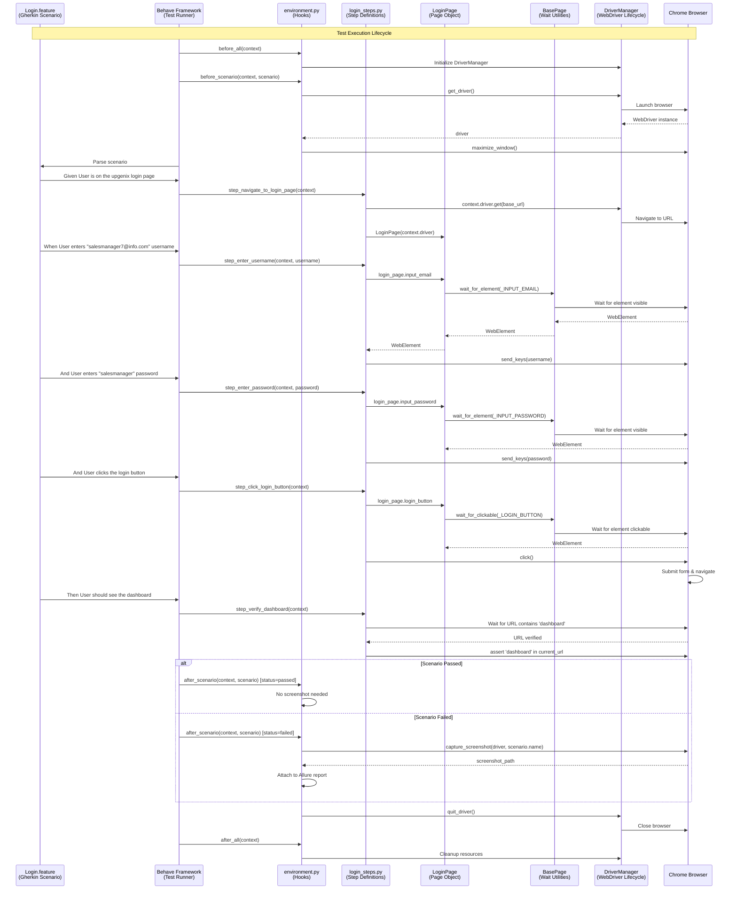

# Running Your First Test

This guide walks you through executing your first automated test with the Testinium QA Python framework. You'll learn how to run tests, understand test output, view reports, and troubleshoot common issues.

## Prerequisites

Before running your first test, ensure you have completed the following:

**✓ Installation Complete**
- Python 3.9+ installed and accessible via `python3 --version` or `python --version`
- Virtual environment created and activated
- All dependencies installed via `pip install -r requirements.txt`

**✓ Configuration Set Up**
- `.env` file created from `.env.example` with your test environment settings
- `config/config.yaml` reviewed and configured for your needs
- Browser configured (default: Chrome)

**✓ Test Credentials Configured**
- Test user credentials added to `.env` file:
  ```bash
  SALESMANAGER_USERNAME=salesmanager7@info.com
  SALESMANAGER_PASSWORD=salesmanager
  ```

**✓ Virtual Environment Activated**
```bash
# On macOS/Linux
source venv/bin/activate

# On Windows
venv\Scripts\activate

# Verify activation - you should see (venv) in your terminal prompt
```

**Verification Command:**
```bash
# Verify framework is ready
behave --version
# Expected output: behave 1.2.6

# Verify step definitions are discovered
behave --dry-run
# Expected: Should list all scenarios without errors
```

## Understanding the Test

Before running your first test, let's understand what the test does and how the framework components work together.

### The Login Feature Test

The framework includes a comprehensive login authentication test suite in `features/Login.feature`. This feature tests various login scenarios including:

- Valid credentials login (multiple user roles)
- Invalid credentials error handling
- Empty field validation
- Password masking verification
- Enter key functionality

**Source:** `features/Login.feature`

### Gherkin Syntax Basics

Behave uses Gherkin language to write test scenarios in a human-readable format. The key keywords are:

- **Feature:** High-level description of the functionality being tested
- **Scenario / Scenario Outline:** Specific test case or template for data-driven tests
- **Given:** Preconditions that set up the test state
- **When:** Actions performed during the test
- **Then:** Expected outcomes to verify
- **And / But:** Additional steps of the same type
- **Background:** Steps executed before every scenario in the feature
- **Examples:** Data tables for Scenario Outline parameterization
- **@Tags:** Labels for filtering and organizing tests

### Sample Login Scenario Breakdown

Let's examine a typical login scenario step by step:

```gherkin
@Login
Feature: Testinium app login feature
  User Story:
  As a user, I should be able to login with correct credentials to different accounts.

  Background: For the scenarios in the feature file, user is expected to be on login page
    Given User is on the upgenix login page

  @UPGN-286
  Scenario Outline: Users log in with valid credentials
    When User enters "<username>" username
    And User enters "<password>" password
    And User clicks the login button
    Then User should see the dashboard

    @SalesManager
    Examples: SalesManager's username and password
      |username               |password    |
      |salesmanager7@info.com |salesmanager|
```

**Line-by-Line Explanation:**

1. **`@Login`** - Tag for filtering tests (run with `behave --tags=@Login`)
2. **`Feature:`** - Names the feature being tested (login functionality)
3. **`Background:`** - Setup step executed before each scenario
4. **`Given User is on the upgenix login page`** - Navigates to login page
5. **`@UPGN-286`** - Jira ticket ID for traceability
6. **`Scenario Outline:`** - Template scenario using data from Examples table
7. **`When User enters "<username>" username`** - Inputs username (parameterized)
8. **`And User enters "<password>" password`** - Inputs password (parameterized)
9. **`And User clicks the login button`** - Submits login form
10. **`Then User should see the dashboard`** - Verifies successful authentication
11. **`@SalesManager`** - Subtag for specific user role
12. **`Examples:`** - Data table where each row becomes a separate test execution

**Source:** `features/Login.feature:1-26`

### Connection to Step Definitions

Each Gherkin step maps to a Python function in `features/steps/login_steps.py`:

**Gherkin Step:**
```gherkin
Given User is on the upgenix login page
```

**Corresponding Python Step Definition:**
```python
@given('User is on the upgenix login page')
def step_navigate_to_login_page(context):
    """Navigate to login page using configured URL from config.yaml"""
    config = ConfigReader()
    base_url = config.get_property('application.base_url')
    context.driver.get(base_url)
    context.login_page = LoginPage(context.driver)
```

**Source:** `features/steps/login_steps.py:90-113`

**Gherkin Step:**
```gherkin
When User enters "<username>" username
```

**Corresponding Python Step Definition:**
```python
@when('User enters "{username}" username')
def step_enter_username(context, username):
    """Enter username into the login form"""
    context.login_page = LoginPage(context.driver)
    context.login_page.input_email.send_keys(username)
```

**Source:** `features/steps/login_steps.py:121-138`

The step definition function receives:
- `context`: Behave context object for sharing state between steps
- `username`: Captured parameter from the Gherkin step (from Examples table)

### Connection to Page Objects

Step definitions interact with the application through Page Objects in `pages/login_page.py`:

**Page Object Implementation:**
```python
from pages.base_page import BasePage
from selenium.webdriver.common.by import By

class LoginPage(BasePage):
    """Login page object for Testinium application"""
    
    # Locators as private class attributes
    _INPUT_EMAIL = (By.NAME, "login")
    _INPUT_PASSWORD = (By.NAME, "password")
    _LOGIN_BUTTON = (By.XPATH, "//button[.='Log in']")
    
    @property
    def input_email(self):
        """Email input field - returns fresh WebElement with explicit wait"""
        return self.wait_for_element(self._INPUT_EMAIL)
    
    @property
    def input_password(self):
        """Password input field - returns fresh WebElement with explicit wait"""
        return self.wait_for_element(self._INPUT_PASSWORD)
    
    @property
    def login_button(self):
        """Login button - returns clickable WebElement with explicit wait"""
        return self.wait_for_clickable(self._LOGIN_BUTTON)
    
    def login(self, username: str, password: str):
        """High-level login method encapsulating full authentication workflow"""
        self.input_email.send_keys(username)
        self.input_password.send_keys(password)
        self.login_button.click()
```

**Source:** `pages/login_page.py:61-151`

**Key Design Patterns:**
- **Property-based locators:** Elements accessed via `@property` decorators return fresh references
- **Explicit waits:** Every element access uses `wait_for_element()` or `wait_for_clickable()`
- **Encapsulation:** HTML locators stored as private class attributes (`_INPUT_EMAIL`)
- **Thread safety:** Property pattern prevents stale element exceptions in parallel execution

### Architecture: Feature → Steps → Page Objects → WebDriver → Browser

The following sequence diagram shows the complete flow when executing a login test:



**Flow Summary:**
1. **Behave** parses `Login.feature` and identifies scenarios to execute
2. **environment.py hooks** manage WebDriver lifecycle (before/after)
3. **Step definitions** receive Gherkin steps and execute corresponding Python code
4. **Page Objects** provide element locators and interaction methods
5. **BasePage** ensures explicit waits for reliable element access
6. **DriverManager** manages thread-local WebDriver instances
7. **Browser** executes actual web interactions and navigation

## Running Your First Test

Now that you understand the test structure, let's execute it!

### Basic Test Execution Command

Execute the login feature test with this command:

```bash
behave features/Login.feature
```

**What This Command Does:**
- Launches the Behave test runner
- Parses `features/Login.feature` file
- Discovers step definitions in `features/steps/login_steps.py`
- Executes all scenarios in the feature file
- Generates console output showing test progress
- Creates reports in `reports/` directory

**Source:** `README.md:151`

### Understanding the Command Output

When you run the test, you'll see output similar to this:

```
Feature: Testinium app login feature # features/Login.feature:2
  User Story:
  As a user, I should be able to login with correct credentials to different accounts.

  Background: 
    Given User is on the upgenix login page ... passed in 2.341s

  @UPGN-286 @Login @SalesManager
  Scenario Outline: Users log in with valid credentials -- @1.1 SalesManager's username and password
    When User enters "salesmanager7@info.com" username ... passed in 0.143s
    And User enters "salesmanager" password ... passed in 0.089s
    And User clicks the login button ... passed in 0.256s
    Then User should see the dashboard ... passed in 1.124s

  @UPGN-286 @Login @SalesManager
  Scenario Outline: Users log in with valid credentials -- @1.2 SalesManager's username and password
    When User enters "salesmanager8@info.com" username ... passed in 0.137s
    And User enters "salesmanager" password ... passed in 0.091s
    And User clicks the login button ... passed in 0.243s
    Then User should see the dashboard ... passed in 1.089s

1 feature passed, 0 failed, 0 skipped
2 scenarios passed, 0 failed, 0 skipped
10 steps passed, 0 failed, 0 skipped, 0 undefined
Took 0m6.513s
```

**Output Breakdown:**

1. **Feature Header:**
   ```
   Feature: Testinium app login feature # features/Login.feature:2
   ```
   - Shows feature name and file location with line number

2. **Background Steps:**
   ```
   Background:
     Given User is on the upgenix login page ... passed in 2.341s
   ```
   - Background steps execute before each scenario
   - Timing shown for each step

3. **Scenario Execution:**
   ```
   @UPGN-286 @Login @SalesManager
   Scenario Outline: Users log in with valid credentials -- @1.1
   ```
   - Shows all tags associated with scenario
   - `@1.1` indicates first row from Examples table
   - Each step shows execution status and timing

4. **Step Results:**
   ```
   When User enters "salesmanager7@info.com" username ... passed in 0.143s
   ```
   - **`passed`**: Step executed successfully
   - **`failed`**: Step threw an exception or assertion failed
   - **`skipped`**: Step was not executed (previous step failed)
   - **`undefined`**: No step definition found (implementation missing)
   - Timing shows step execution duration in seconds

5. **Summary Statistics:**
   ```
   1 feature passed, 0 failed, 0 skipped
   2 scenarios passed, 0 failed, 0 skipped
   10 steps passed, 0 failed, 0 skipped, 0 undefined
   Took 0m6.513s
   ```
   - Summary of all features, scenarios, and steps
   - Total execution time

### Expected Successful Output

When all tests pass, you should see:
- ✅ All steps show `passed` status
- ✅ Green color for passed steps (if terminal supports colors)
- ✅ No assertion errors or exceptions
- ✅ Summary shows 0 failed scenarios
- ✅ Screenshots created only if failures occur

### Running Specific Scenario by Tag

Execute only login scenarios using tags:

```bash
# Run all scenarios tagged with @Login
behave --tags=@Login

# Run specific Jira ticket scenarios
behave --tags=@UPGN-286

# Run specific user role scenarios
behave --tags=@SalesManager

# Run multiple tags (OR logic - scenarios with any of these tags)
behave --tags=@Login,@SalesManager

# Exclude specific tags (run everything except @WIP)
behave --tags=~@WIP
```

**Source:** `README.md:148-157`

### Dry Run to Validate Without Execution

Validate that all steps have implementations without actually executing tests:

```bash
behave --dry-run features/Login.feature
```

**What Dry Run Does:**
- ✅ Parses feature files for syntax errors
- ✅ Checks that every step has a matching step definition
- ✅ Reports undefined steps (missing implementations)
- ✅ Does NOT launch browser or execute tests
- ✅ Completes in seconds (no actual test execution)

**Use Cases:**
- Verify new feature files before committing
- Check for typos in step text
- Identify missing step definitions
- Quick syntax validation in CI/CD pipelines

**Source:** `README.md:160`

### Verbose Output for Debugging

Enable detailed output to see more information during execution:

```bash
# Verbose mode - shows detailed step information
behave -v features/Login.feature

# Very verbose mode - shows even more details
behave -vv features/Login.feature

# Show all output (disable output capture)
behave --no-capture features/Login.feature

# Combine verbose and no-capture
behave -v --no-capture features/Login.feature
```

**Verbose Mode Benefits:**
- See print statements from step definitions
- View WebDriver commands and responses
- Debug failing tests with detailed stack traces
- Understand test execution flow

**Source:** `README.md:689`

## Understanding Test Output

Let's examine the test output in detail to understand what each part means.

### Step-by-Step Output Walkthrough

**Given Step Output:**
```
Given User is on the upgenix login page ... passed in 2.341s
```

**Interpretation:**
- **Given**: Precondition step type
- **"User is on the upgenix login page"**: Exact step text matching step definition
- **passed**: Step executed successfully without exceptions
- **2.341s**: Step took 2.341 seconds to complete

**Why 2+ seconds?** This step includes:
- Browser launch (first scenario only)
- Navigate to login page URL
- Wait for page to load
- Create LoginPage object

**When/And Step Output:**
```
When User enters "salesmanager7@info.com" username ... passed in 0.143s
And User enters "salesmanager" password ... passed in 0.089s
And User clicks the login button ... passed in 0.256s
```

**Interpretation:**
- **When/And**: Action step types
- **Parameterized values**: Username and password from Examples table
- **Faster execution**: Elements already loaded, only interaction time measured

**Then Step Output:**
```
Then User should see the dashboard ... passed in 1.124s
```

**Interpretation:**
- **Then**: Verification/assertion step type
- **1.124s**: Includes wait time for page navigation and dashboard element visibility

### Identifying Passed/Failed/Skipped Steps

**Passed Step:**
```
When User enters "salesmanager7@info.com" username ... passed in 0.143s
```
- ✅ Green color (in color terminals)
- ✅ Step executed successfully
- ✅ No exceptions or assertion errors
- ✅ Next step will execute

**Failed Step:**
```
Then User should see the dashboard ... FAILED in 10.034s
  AssertionError: User was not redirected to dashboard
  Expected 'dashboard' to be in URL, but found: https://example.com/web/login
```
- ❌ Red color (in color terminals)
- ❌ Step threw an exception or assertion failed
- ❌ Stack trace shown below the step
- ❌ Subsequent steps in scenario are skipped
- ❌ Screenshot captured automatically

**Skipped Step:**
```
And User should see welcome message ... skipped
```
- ⚠️ Yellow color (in color terminals)
- ⚠️ Step not executed because previous step failed
- ⚠️ No timing information

**Undefined Step:**
```
And User should see profile icon ... undefined
```
- 💡 Cyan color (in color terminals)
- 💡 No step definition found matching this text
- 💡 Behave suggests step definition template to implement

### Execution Time Metrics

**Step Timing:**
```
Given User is on the upgenix login page ... passed in 2.341s
```
- Individual step execution time in seconds
- Includes waits, browser operations, and assertion time
- Useful for identifying slow steps

**Scenario Timing:**
```
Took 0m6.513s
```
- Total time for entire test execution
- Includes all scenarios, steps, and overhead

**Performance Benchmarks:**
- **Fast step:** < 1 second (element interactions)
- **Medium step:** 1-3 seconds (page navigation, complex waits)
- **Slow step:** > 5 seconds (may indicate timeout or performance issue)

### Scenario Summary Interpretation

**Summary Line:**
```
1 feature passed, 0 failed, 0 skipped
2 scenarios passed, 0 failed, 0 skipped
10 steps passed, 0 failed, 0 skipped, 0 undefined
Took 0m6.513s
```

**What Each Number Means:**

- **Features:**
  - **passed**: Feature file executed with no scenario failures
  - **failed**: One or more scenarios failed in this feature
  - **skipped**: Feature not executed (filtered by tags)

- **Scenarios:**
  - **passed**: All steps in scenario passed
  - **failed**: At least one step failed
  - **skipped**: Scenario not executed (filtered by tags or previous failure)

- **Steps:**
  - **passed**: Step executed successfully
  - **failed**: Step threw exception or assertion failed
  - **skipped**: Step not executed (previous step failed)
  - **undefined**: No matching step definition found

- **Total Time:**
  - Time from test start to finish
  - Includes browser startup, teardown, and reporting overhead

## Viewing Test Reports

The framework generates multiple report formats for different use cases. Let's explore each one.

### HTML Report

**Location:** `reports/report.html`

**Opening the Report:**
```bash
# On macOS
open reports/report.html

# On Linux
xdg-open reports/report.html

# On Windows
start reports/report.html

# Or simply double-click the file in your file explorer
```

**HTML Report Structure:**

The HTML report provides a visual, interactive view of test results:

1. **Summary Section (Top):**
   - Total features, scenarios, steps
   - Pass/fail counts with percentage
   - Execution duration
   - Timestamp of test run

2. **Feature List:**
   - Each feature expandable/collapsible
   - Click to view scenarios within feature
   - Color-coded status indicators

3. **Scenario Details:**
   - Complete step list with status
   - Execution time per step
   - Error messages for failed steps
   - Tags associated with scenario

4. **Step Information:**
   - Step text with parameters highlighted
   - Status indicator (passed/failed/skipped)
   - Execution time
   - Stack trace for failures

5. **Screenshots (for failures):**
   - Thumbnail images embedded in report
   - Click to view full-size screenshot
   - Timestamped filename

**Benefits of HTML Report:**
- ✅ Shareable with non-technical stakeholders
- ✅ No special tools required (just a browser)
- ✅ Visual representation of test results
- ✅ Embedded screenshots for failures

**Source:** `README.md:469-477`

### JSON Report for Programmatic Analysis

**Location:** `reports/cucumber.json`

**Use Cases:**
- Integration with CI/CD reporting dashboards
- Custom report generation scripts
- Test result trend analysis
- Data import into test management tools

**Structure:**
```json
[
  {
    "keyword": "Feature",
    "name": "Testinium app login feature",
    "uri": "features/Login.feature",
    "elements": [
      {
        "keyword": "Scenario Outline",
        "name": "Users log in with valid credentials",
        "tags": ["@UPGN-286", "@Login", "@SalesManager"],
        "steps": [
          {
            "keyword": "When",
            "name": "User enters \"salesmanager7@info.com\" username",
            "result": {
              "status": "passed",
              "duration": 143285000
            }
          }
        ]
      }
    ]
  }
]
```

**Accessing JSON Data:**
```python
import json

# Load test results
with open('reports/cucumber.json') as f:
    results = json.load(f)

# Analyze results
features = results
for feature in features:
    feature_name = feature['name']
    scenarios = feature['elements']
    passed_count = sum(1 for s in scenarios if all(
        step['result']['status'] == 'passed' 
        for step in s['steps']
    ))
    print(f"{feature_name}: {passed_count}/{len(scenarios)} scenarios passed")
```

**Source:** `README.md:482-484`

### JUnit XML for CI Integration

**Location:** `reports/junit.xml`

**Use Cases:**
- Jenkins test result publishing
- GitLab CI test reporting
- GitHub Actions test annotations
- Azure DevOps test tracking

**Jenkins Integration Example:**
```groovy
// Jenkinsfile
stage('Run Tests') {
    steps {
        sh 'behave --format=junit --outfile=reports/junit.xml'
    }
}

stage('Publish Results') {
    steps {
        junit 'reports/junit.xml'  // Publishes to Jenkins UI
    }
}
```

**Benefits:**
- ✅ Standard format supported by all CI/CD tools
- ✅ Test trends tracked over time
- ✅ Failure notifications and dashboards
- ✅ Integration with quality gates

**Source:** `README.md:488-491`

### Screenshot Location for Failures

**Location:** `reports/screenshots/`

**Naming Convention:**
```
<scenario_name>_<timestamp>.png
```

**Example:**
```
reports/screenshots/Users_log_in_with_valid_credentials_20240115_143022.png
```

**Automatic Screenshot Capture:**

Screenshots are captured automatically on failure by the `after_scenario` hook in `features/environment.py`:

```python
def after_scenario(context, scenario):
    """Runs after each scenario - captures screenshots on failure"""
    if scenario.status == 'failed':
        screenshot_path = capture_screenshot(
            context.driver, 
            scenario.name
        )
        # Screenshot saved to reports/screenshots/
```

**Source:** `README.md:238-244`

**Viewing Screenshots:**
- Navigate to `reports/screenshots/` directory
- Open PNG files with any image viewer
- Screenshots show exact browser state at failure moment
- Useful for debugging element locator issues

### Allure Enhanced Reports (If Configured)

**Generating Allure Report:**
```bash
# Step 1: Run tests with Allure formatter
behave --format=allure_behave.formatter:AllureFormatter --outfile=reports/allure-results

# Step 2: View Allure report locally (requires Allure CLI installed)
allure serve reports/allure-results

# Step 3: Generate static Allure report for sharing
allure generate reports/allure-results --output reports/allure-report --clean
```

**Source:** `README.md:495-504`

**Allure Report Features:**
- 🎨 Beautiful, interactive UI
- 📊 Test result trends over time
- 📸 Embedded screenshots and logs
- 🏷️ Test categorization by tags
- ⏱️ Detailed timing breakdowns
- 📈 Flaky test detection
- 📋 Test retry history

**Opening Static Allure Report:**
```bash
# Open the generated index.html
open reports/allure-report/index.html
```

**Allure Installation (Optional):**
```bash
# On macOS
brew install allure

# On Linux
sudo apt-add-repository ppa:qameta/allure
sudo apt-get update
sudo apt-get install allure

# Or download from: https://github.com/allure-framework/allure2/releases
```

## Running More Tests

Now that you've run your first test successfully, let's explore more execution options.

### Run All Tests

Execute all feature files in the `features/` directory:

```bash
behave
```

**What Happens:**
- Discovers all `.feature` files in `features/` directory
- Executes all scenarios in all features
- Runs features in alphabetical order
- Generates complete test suite report

**Expected Output:**
```
10 features passed, 0 failed, 0 skipped
61 scenarios passed, 0 failed, 0 skipped
305 steps passed, 0 failed, 0 skipped, 0 undefined
Took 5m32.145s
```

**Source:** `README.md:145`

### Run Specific Feature File

Execute a single feature file:

```bash
# Run Login feature only
behave features/Login.feature

# Run CRM feature
behave features/Crm.feature

# Run Employee feature
behave features/EmployeeFc.feature
```

**Source:** `README.md:151`

### Run by Tags

Tags provide powerful filtering to run specific subsets of tests:

**Single Tag:**
```bash
# Run all login tests
behave --tags=@Login

# Run all CRM tests
behave --tags=@Crm

# Run specific Jira ticket
behave --tags=@UPGN-286
```

**Multiple Tags (OR Logic):**
```bash
# Run scenarios tagged with @Login OR @Logout
behave --tags=@Login,@Logout

# Run any SalesManager or PosManager tests
behave --tags=@SalesManager,@PosManager
```

**Excluding Tags:**
```bash
# Run everything EXCEPT @WIP (Work In Progress)
behave --tags=~@WIP

# Run everything except flaky tests
behave --tags=~@Flaky
```

**Tag Expressions (Complex Filtering):**
```bash
# Run Login tests for SalesManager only
behave --tags=@Login --tags=@SalesManager

# Run all tests except Login and Logout
behave --tags=~@Login --tags=~@Logout
```

**Source:** `README.md:148-157`

### Run Specific Scenarios

Execute scenarios by line number:

```bash
# Run scenario starting at line 14
behave features/Login.feature:14

# Run multiple specific scenarios
behave features/Login.feature:14 features/Login.feature:59
```

**Source:** `README.md:695`

### Parallel Execution Preview

Run tests in parallel for faster execution:

```bash
# Install parallel execution support (if not already installed)
pip install behave-parallel

# Run tests with 4 parallel processes
behave --processes 4 --parallel-element scenario

# Or use pytest for parallel execution
pytest tests/ -n 4 -v
```

**Source:** `README.md:183-191`

**Benefits of Parallel Execution:**
- ⚡ Significantly faster test execution (4x speedup with 4 processes)
- 🔄 Each scenario runs in isolated WebDriver instance
- 🧵 Thread-safe design using `threading.local()` pattern
- 📊 Combined reporting from all parallel processes

**Considerations:**
- Each process launches separate browser instance
- Requires sufficient system resources (CPU, memory)
- Test scenarios must be independent (no shared state)

**Learn More:** See [Parallel Execution Guide](../guides/parallel-execution.md) for detailed configuration.

## Common Test Execution Patterns

Here are common command patterns for different testing scenarios:

### Smoke Test Suite

Execute critical path tests to verify basic functionality:

```bash
# Tag smoke tests with @Smoke in your feature files
behave --tags=@Smoke

# Common smoke tests include:
# - Login/Logout
# - Dashboard access
# - Critical workflows
# - Data integrity checks
```

**Typical Use Cases:**
- ✅ Pre-deployment verification
- ✅ Quick sanity check after code changes
- ✅ CI/CD commit stage gate
- ✅ Morning test run to verify environment

### Regression Suite

Execute comprehensive test coverage:

```bash
# Tag regression tests with @Regression
behave --tags=@Regression

# Or run all tests (full regression)
behave

# Exclude unstable tests
behave --tags=@Regression --tags=~@Flaky
```

**Typical Use Cases:**
- ✅ Pre-release validation
- ✅ Major version testing
- ✅ Nightly automated runs
- ✅ Post-deployment verification

### Specific User Role Testing

Test functionality for specific user types:

```bash
# Test SalesManager workflows
behave --tags=@SalesManager

# Test PosManager workflows
behave --tags=@PosManager

# Test Admin functionality
behave --tags=@Admin

# Test all manager roles
behave --tags=@SalesManager,@PosManager
```

**Typical Use Cases:**
- ✅ Role-based access control testing
- ✅ Permission verification
- ✅ User-specific feature validation

### Rerun Failed Tests

Execute only scenarios that failed in the previous run:

```bash
# Step 1: First run with rerun formatter
behave --format=rerun --outfile=reports/rerun.txt

# Step 2: Rerun only failed scenarios
behave @reports/rerun.txt

# Or combine with other options
behave @reports/rerun.txt --format=html --outfile=reports/rerun_report.html
```

**Source:** `README.md:507-514`

**Typical Use Cases:**
- ✅ Debugging flaky tests
- ✅ Verifying bug fixes
- ✅ Quick validation without full suite run
- ✅ CI/CD retry logic

### Combine Multiple Formats for CI/CD

Generate multiple report formats simultaneously:

```bash
behave \
  --format=json --outfile=reports/cucumber.json \
  --format=html --outfile=reports/report.html \
  --format=junit --outfile=reports/junit.xml \
  --format=allure_behave.formatter:AllureFormatter \
  --outfile=reports/allure-results
```

**Source:** `README.md:173-177`

**Why Multiple Formats:**
- **JSON:** Machine-readable for dashboards
- **HTML:** Human-readable for developers
- **JUnit XML:** CI/CD integration (Jenkins, GitLab, GitHub Actions)
- **Allure:** Rich interactive reporting with trends

**CI/CD Pipeline Example:**
```bash
# Jenkins, GitHub Actions, GitLab CI
behave --tags=@Smoke \
       --format=json --outfile=reports/cucumber.json \
       --format=junit --outfile=reports/junit.xml \
       --format=html --outfile=reports/report.html
```

## Troubleshooting First Test Issues

Common issues when running your first test and how to resolve them.

### Test Fails to Start

**Issue: Driver Initialization Error**

**Symptoms:**
```
selenium.common.exceptions.WebDriverException: Message: 'chromedriver' executable needs to be in PATH
```

**Cause:** WebDriver not found or incompatible browser version

**Solution:**
```bash
# 1. Verify webdriver-manager is installed
pip install webdriver-manager

# 2. Check browser is installed and updated
google-chrome --version  # Linux
# Chrome: Help > About Google Chrome (auto-updates)

# 3. Clear webdriver cache and retry
rm -rf ~/.wdm/  # Linux/macOS
# On Windows: Delete C:\Users\<username>\.wdm\

# 4. Rerun test
behave features/Login.feature
```

**Source:** `README.md:615-622`

**Issue: BASE_URL Not Set**

**Symptoms:**
```
InvalidURL: Invalid URL '': No schema supplied. Perhaps you meant http://...
```

**Cause:** `BASE_URL` environment variable or `application.base_url` in config.yaml not configured

**Solution:**
```bash
# Option 1: Set in .env file
echo "BASE_URL=https://your-test-environment.com" >> .env

# Option 2: Set in config/config.yaml
# application:
#   base_url: https://your-test-environment.com

# Option 3: Set temporarily for this run
BASE_URL=https://your-test-environment.com behave features/Login.feature
```

**Issue: Invalid Credentials**

**Symptoms:**
```
Scenario: Users log in with valid credentials ... failed
  AssertionError: Error message not expected for valid credentials
```

**Cause:** Test user credentials incorrect or account locked

**Solution:**
```bash
# 1. Verify credentials in .env file
cat .env | grep USERNAME
cat .env | grep PASSWORD

# 2. Test credentials manually in browser
# Navigate to login page and attempt manual login

# 3. Update .env with correct credentials
# SALESMANAGER_USERNAME=salesmanager7@info.com
# SALESMANAGER_PASSWORD=salesmanager

# 4. Verify test user account is active (not locked/expired)
```

### Element Not Found Errors

**Issue: ElementNotFound or NoSuchElement**

**Symptoms:**
```
selenium.common.exceptions.NoSuchElementException: Message: no such element: Unable to locate element: {"method":"name","selector":"login"}
```

**Cause:** Element locator incorrect, timing issue, or page structure changed

**Solution:**
```bash
# 1. Increase timeout in config/config.yaml
# timeouts:
#   explicit: 15  # Increase from 10 to 15 seconds

# 2. Verify element locator in browser DevTools
# Right-click element → Inspect → Copy selector

# 3. Add explicit wait before interaction (if needed)
# Already implemented via BasePage.wait_for_element()

# 4. Check for dynamic page loading
# Ensure page fully loads before element access
```

**Source:** `README.md:652-662`

**Issue: Wait Timeout Too Short**

**Symptoms:**
```
selenium.common.exceptions.TimeoutException: Message: 
  Timeout waiting for element: (By.NAME: "login")
```

**Cause:** Element takes longer than configured timeout to appear

**Solution:**
```yaml
# Increase timeout in config/config.yaml
timeouts:
  explicit: 15        # Default is 10 seconds
  page_load: 45       # Default is 30 seconds
  script: 45          # Default is 30 seconds
```

**Verify Configuration:**
```python
# Check current timeout
from config.test_config import get_config
config = get_config()
print(f"Explicit timeout: {config.timeouts.explicit} seconds")
```

### Test Hangs

**Issue: Infinite Wait**

**Symptoms:**
- Test never completes
- Browser window remains open indefinitely
- No error messages in console

**Cause:** Element never becomes visible, modal dialog blocking, or network timeout

**Solution:**
```bash
# 1. Check for unexpected modal dialogs
# - Alert popups
# - Cookie consent banners
# - Notification permission requests

# 2. Add modal handling in page objects
# from selenium.common.exceptions import UnexpectedAlertPresentException
# try:
#     element.click()
# except UnexpectedAlertPresentException:
#     driver.switch_to.alert.accept()

# 3. Check network connectivity
ping your-test-environment.com

# 4. Increase page load timeout in config
# timeouts:
#   page_load: 60  # Increase if slow network
```

**Issue: Network Timeout**

**Symptoms:**
```
selenium.common.exceptions.TimeoutException: Message: timeout: Timed out receiving message from renderer
```

**Cause:** Slow network, unresponsive application, or insufficient timeout

**Solution:**
```yaml
# Increase page load timeout in config/config.yaml
timeouts:
  page_load: 60       # Increase from 30 to 60 seconds
  explicit: 20        # Also increase explicit wait
```

### Authentication Failures

**Issue: Check .env Credentials**

**Solution:**
```bash
# 1. Verify .env file exists and is loaded
ls -la .env
cat .env

# 2. Verify credentials format (no quotes, no spaces)
# CORRECT:
# SALESMANAGER_USERNAME=salesmanager7@info.com
# SALESMANAGER_PASSWORD=salesmanager

# INCORRECT:
# SALESMANAGER_USERNAME = "salesmanager7@info.com"  # Extra spaces and quotes
# SALESMANAGER_PASSWORD='salesmanager'              # Quotes not needed

# 3. Ensure .env file is in project root directory
pwd  # Should be testinium-qa-python/
```

**Issue: Verify Test User Account Active**

**Symptoms:**
```
Error message displayed: "Account has been locked"
Error message displayed: "User not found"
```

**Cause:** Test account deactivated, locked, or deleted in test environment

**Solution:**
```bash
# 1. Verify account status with administrator
# Contact test environment admin to verify account

# 2. Request account unlock or reactivation
# Test accounts may auto-lock after inactivity

# 3. Use different test account temporarily
# Update .env with alternative test user credentials

# 4. Reset password if expired
# Some environments enforce password expiration
```

**Issue: Check Password Special Characters**

**Symptoms:**
```
AssertionError: User was not redirected to dashboard
# But credentials are correct when tested manually
```

**Cause:** Password contains special characters causing issues in YAML/env parsing

**Solution:**
```bash
# In .env file, use plain text (no quotes needed for special chars)
SALESMANAGER_PASSWORD=P@ssw0rd!$pecial

# If using config.yaml, quote passwords with special characters
credentials:
  salesmanager:
    password: "P@ssw0rd!$pecial"

# Verify password is read correctly
python -c "from config.test_config import get_config; print(get_config().credentials.salesmanager_password)"
```

### Browser Issues

**Issue: Browser Doesn't Launch**

**Symptoms:**
```
selenium.common.exceptions.SessionNotCreatedException: Message: session not created: This version of ChromeDriver only supports Chrome version 120
```

**Cause:** Browser and WebDriver version mismatch

**Solution:**
```bash
# 1. Update browser to latest version
# Chrome: Help > About Google Chrome (auto-updates)
# Firefox: Help > About Firefox (auto-updates)

# 2. Clear webdriver-manager cache
rm -rf ~/.wdm/  # Forces fresh download

# 3. Verify browser version matches driver
google-chrome --version
chromedriver --version

# 4. webdriver-manager will auto-download matching driver on next run
behave features/Login.feature
```

**Source:** `README.md:643-649`

**Issue: WebDriver Permissions**

**Symptoms:**
```
PermissionError: [Errno 13] Permission denied: '/Users/username/.wdm/drivers/chromedriver/...'
```

**Cause:** WebDriver binary doesn't have execute permission

**Solution:**
```bash
# Grant execute permission to all drivers
chmod +x ~/.wdm/drivers/chromedriver/*/chromedriver  # macOS/Linux

# Or remove cache and let webdriver-manager redownload
rm -rf ~/.wdm/
behave features/Login.feature
```

**Issue: Headless Mode Required**

**Symptoms:**
- Tests fail in CI/CD but pass locally
- "Could not start a new session" in headless environment

**Cause:** CI/CD environment has no display server

**Solution:**
```yaml
# Set headless mode in config/config.yaml for CI
browser:
  type: chrome
  headless: true  # Enable for CI/CD environments
```

**Or override via environment variable:**
```bash
# In CI/CD pipeline
export HEADLESS=true
behave
```

**Source:** `README.md:665-675`

### Screenshot Issues

**Issue: Screenshots Not Captured on Failure**

**Symptoms:**
- Test fails but no screenshot in `reports/screenshots/`
- Screenshot directory doesn't exist

**Cause:** Screenshot capture not configured or directory permission issue

**Solution:**
```bash
# 1. Verify environment.py has after_scenario hook
cat features/environment.py | grep after_scenario

# 2. Create screenshots directory with write permissions
mkdir -p reports/screenshots
chmod 755 reports/screenshots

# 3. Verify screenshot helper is imported
# features/environment.py should have:
# from utilities.screenshot_helper import capture_screenshot

# 4. Enable debug logging to see screenshot capture
# Add to environment.py:
# import logging
# logging.basicConfig(level=logging.DEBUG)

# 5. Rerun failing test
behave features/Login.feature
```

**Source:** `README.md:677-684`

**Issue: Screenshot Directory Permissions**

**Symptoms:**
```
PermissionError: [Errno 13] Permission denied: 'reports/screenshots/scenario_name.png'
```

**Cause:** reports/screenshots/ directory not writable

**Solution:**
```bash
# Fix directory permissions
chmod -R 755 reports/
mkdir -p reports/screenshots
chmod 755 reports/screenshots

# Verify write access
touch reports/screenshots/test.png
rm reports/screenshots/test.png
```

**Issue: Selenium Screenshot Capability**

**Symptoms:**
```
WebDriverException: Message: unknown error: cannot get automation extension
```

**Cause:** Browser running in restricted mode or screenshot capability disabled

**Solution:**
```python
# Ensure browser launched with correct capabilities
# utilities/driver_manager.py should have:
chrome_options.add_argument('--enable-automation')
chrome_options.add_argument('--disable-dev-shm-usage')
# No need to modify unless custom driver setup
```

## Understanding Test Failures

When a test fails, follow this systematic approach to identify and resolve the issue.

### Reading Failure Stack Traces

**Example Failed Test Output:**
```
Scenario: Users log in with valid credentials ... failed in 10.524s
  File "features/steps/login_steps.py", line 245, in step_verify_dashboard
    assert 'dashboard' in context.driver.current_url, \
  AssertionError: User was not redirected to dashboard
  Expected 'dashboard' to be in URL, but found: https://example.com/web/login
```

**Stack Trace Analysis:**

1. **Failure Location:**
   ```
   File "features/steps/login_steps.py", line 245
   ```
   - Failed in `login_steps.py` at line 245
   - This is the `step_verify_dashboard` function

2. **Failure Type:**
   ```
   AssertionError: User was not redirected to dashboard
   ```
   - This is an assertion failure (expected vs actual mismatch)
   - Custom message explains what went wrong

3. **Expected vs Actual:**
   ```
   Expected 'dashboard' to be in URL, but found: https://example.com/web/login
   ```
   - **Expected:** URL contains 'dashboard' (successful login)
   - **Actual:** Still on login page (login failed)

4. **Root Cause Determination:**
   - User was not redirected → Login was not successful
   - Still on login page → Credentials rejected or login button not clicked
   - Check previous steps for root cause

### Identifying Root Cause

**Categories of Test Failures:**

**1. Application Bug:**
- ✅ Test is correctly implemented
- ✅ Test correctly validates expected behavior
- ❌ Application doesn't work as expected
- **Action:** Report bug to development team

**Example:**
```
AssertionError: Error message not displayed
Expected: Error message for invalid credentials
Actual: No error message shown, login button remains enabled
```
**Root Cause:** Application bug - error message not displayed for invalid credentials

**2. Test Bug:**
- ✅ Application works correctly
- ❌ Test implementation incorrect
- ❌ Test expectations wrong
- **Action:** Fix test implementation

**Example:**
```
NoSuchElementException: Unable to locate element: {"method":"name","selector":"login"}
```
**Root Cause:** Test bug - locator incorrect (element attribute changed or typo)

**3. Environment Issue:**
- ✅ Test correctly implemented
- ✅ Application works in other environments
- ❌ Environment configuration incorrect
- **Action:** Fix environment configuration

**Example:**
```
InvalidURL: Invalid URL '': No schema supplied
```
**Root Cause:** Environment issue - BASE_URL not configured in .env or config.yaml

**4. Timing Issue:**
- ✅ Test works sometimes
- ❌ Test fails intermittently
- ❌ Race condition or insufficient wait
- **Action:** Add explicit waits or increase timeouts

**Example:**
```
TimeoutException: Message: 
  Timeout waiting for element (By.ID: "oe_main_menu_navbar")
```
**Root Cause:** Timing issue - element takes longer than configured timeout to load

### Using Screenshots to Debug

**Locate Screenshot:**
```bash
# Navigate to screenshots directory
cd reports/screenshots

# List screenshots (most recent first)
ls -lt

# Open most recent screenshot
open $(ls -t | head -1)  # macOS
xdg-open $(ls -t | head -1)  # Linux
```

**What to Look For in Screenshot:**

1. **Login Page Still Visible:**
   - Indicates login was not successful
   - Check credentials, check for error message

2. **Error Message Displayed:**
   - Read error message text
   - May indicate wrong credentials, account locked, etc.

3. **Unexpected Modal Dialog:**
   - Cookie consent, notification permission, alert
   - May block test execution

4. **Element Visibility:**
   - Is expected element visible on screen?
   - Is element obscured by another element?

5. **Page Load State:**
   - Is page fully loaded or still loading?
   - Are spinners or loading indicators visible?

### Checking Browser Logs

**Enable Browser Logging:**
```python
# Add to step definition for debugging
from utilities.screenshot_helper import capture_browser_logs

# After failure, capture browser console logs
logs = capture_browser_logs(context.driver)
print(f"Browser console logs: {logs}")
```

**Source:** `README.md:709-714`

**Useful Log Messages:**
- JavaScript errors (may prevent page functionality)
- Network errors (failed API calls)
- 404 errors (missing resources)
- Security warnings (CORS, CSP violations)

**View Logs in DevTools:**
```bash
# Run test in non-headless mode with --no-capture
HEADLESS=false behave --no-capture features/Login.feature

# Browser will remain open, manually open DevTools:
# Chrome: F12 or Cmd+Option+I (Mac) or Ctrl+Shift+I (Windows/Linux)
# Firefox: F12 or Cmd+Option+K (Mac) or Ctrl+Shift+K (Windows/Linux)

# Check Console tab for JavaScript errors
# Check Network tab for failed requests
```

## Next Steps

Congratulations on running your first test! Here are recommended next steps to deepen your understanding:

**📖 Dive Deeper into Testing:**
- [Authentication Testing Guide](../guides/authentication-testing.md) - Detailed login/logout scenarios with advanced patterns
- [Page Object Model Guide](../guides/page-object-model.md) - Learn to create new page objects
- [Step Definitions Guide](../guides/step-definitions.md) - Write custom step definitions for your tests
- [Feature Files Guide](../guides/feature-files.md) - Master Gherkin syntax and BDD practices

**⚡ Optimize Test Execution:**
- [Parallel Execution Guide](../guides/parallel-execution.md) - Run tests faster with parallel processes
- [Configuration Management Guide](../guides/configuration-management.md) - Advanced configuration patterns
- [Wait Strategies Guide](../guides/wait-strategies.md) - Master explicit waits and avoid timeouts

**🧪 Explore Other Features:**
- [CRM Testing Guide](../guides/crm-testing.md) - CRM workflow automation
- [Employee Testing Guide](../guides/employee-testing.md) - Employee management scenarios
- [Inventory Testing Guide](../guides/inventory-testing.md) - Inventory workflow testing
- [Contact Testing Guide](../guides/contact-testing.md) - Contact management automation
- [Calendar Testing Guide](../guides/calendar-testing.md) - Calendar event testing
- [Notes Testing Guide](../guides/notes-testing.md) - Notes functionality testing
- [Sales Testing Guide](../guides/sales-testing.md) - Sales workflow automation
- [Session Testing Guide](../guides/session-testing.md) - Session management testing

**📚 API Reference:**
- [Login Page API](../api-reference/pages/login-page.md) - Detailed LoginPage class documentation
- [Login Steps API](../api-reference/steps/login-steps.md) - Complete step definitions reference
- [BasePage API](../api-reference/pages/base-page.md) - Core page object methods
- [DriverManager API](../api-reference/utilities/driver-manager.md) - WebDriver lifecycle management

**🚀 CI/CD Integration:**
- [Jenkins Integration Guide](../deployment/jenkins-integration.md) - Set up Jenkins CI/CD pipeline
- [GitHub Actions Guide](../deployment/github-actions.md) - Configure GitHub Actions workflows
- [GitLab CI Guide](../deployment/gitlab-ci.md) - GitLab CI/CD pipeline setup
- [Docker Deployment Guide](../deployment/docker.md) - Run tests in containers

**❓ Need Help?**
- [Troubleshooting Guide](../troubleshooting/common-errors.md) - Solutions to common issues
- [Configuration Issues](../troubleshooting/configuration-issues.md) - Fix configuration problems
- [WebDriver Issues](../troubleshooting/webdriver-issues.md) - Resolve browser and driver issues

---

**Congratulations!** You've successfully completed your first test execution. You now understand the test execution flow, report generation, and troubleshooting basics. Continue exploring the guides above to master the Testinium QA Python framework.
