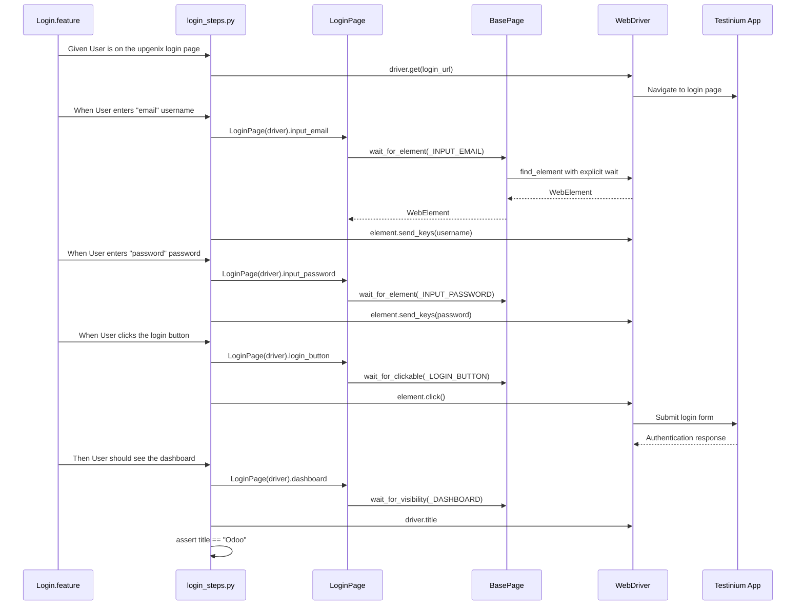

# Authentication Testing Guide

## Overview

This guide provides comprehensive coverage of authentication testing in the Testinium QA Python test automation framework. It covers login and logout workflows, credential validation, error handling, security verification, and data-driven testing patterns for the Testinium ERP application.

### What You'll Learn

- How to test valid login scenarios for multiple user types
- How to verify error handling for invalid credentials
- How to test field validation for empty inputs
- How to verify password masking security
- How to test keyboard shortcuts (Enter key functionality)
- How to test logout workflows and session termination
- How to verify back button security after logout
- How to implement data-driven authentication tests

### When to Use This Guide

Use this guide when you need to:
- Create new authentication test scenarios
- Understand existing login/logout tests
- Troubleshoot authentication test failures
- Implement security testing for login flows
- Add multi-user authentication test coverage

### Prerequisites

Before following this guide, ensure you have:

1. **Framework Installed**: Complete installation of testinium-qa-python framework
   - See [Installation Guide](../getting-started/installation.md) for setup instructions
   
2. **Configuration Complete**: Valid test credentials configured
   - `.env` file created from `.env.example`
   - User credentials set: `SALESMANAGER_USERNAME`, `SALESMANAGER_PASSWORD`, `POSMANAGER_USERNAME`, `POSMANAGER_PASSWORD`
   - See [Configuration Management Guide](configuration-management.md) for details

3. **Test Environment Access**: Access to Testinium application test environment
   - Application URL configured in `config/config.yaml` as `web.table.url`
   - Test accounts provisioned: SalesManager and PosManager user types

4. **Basic Understanding**: Familiarity with BDD concepts
   - Gherkin syntax (Given/When/Then)
   - Page Object Model pattern
   - See [Feature Files Guide](feature-files.md) for Gherkin basics

---

## Authentication Workflow Architecture

The authentication testing workflow spans multiple framework layers, following the Page Object Model pattern with explicit waits and thread-safe driver management.

### Component Interaction Sequence



**Architecture Highlights:**

- **Feature Layer**: Gherkin scenarios in `features/Login.feature` define test cases in business language
- **Step Layer**: `features/steps/login_steps.py` maps Gherkin steps to Python implementation
- **Page Object Layer**: `pages/login_page.py` encapsulates element locators and interactions
- **Base Page Layer**: `pages/base_page.py` provides reusable wait utilities and driver access
- **Driver Layer**: `utilities/driver_manager.py` manages thread-local WebDriver instances
- **Application Layer**: Testinium ERP application under test

---

## Basic Login Testing

### Valid Credentials Login

The most common authentication test verifies that users can successfully log in with valid credentials. The framework uses Scenario Outline with Examples tables for data-driven testing across multiple user accounts.

#### Gherkin Scenario

**Source:** `features/Login.feature:14-55`

```gherkin
@Login @UPGN-286
Scenario Outline: Users log in with valid credentials
  Given User is on the upgenix login page
  When User enters "<username>" username
  And User enters "<password>" password
  And User clicks the login button
  Then User should see the dashboard

  @SalesManager
  Examples: SalesManager's username and password
    |username               |password    |
    |salesmanager7@info.com |salesmanager|
    |salesmanager8@info.com |salesmanager|
    |salesmanager9@info.com |salesmanager|

  @PosManager
  Examples: PosManager's username and password
    |username               |password  |
    |posmanager5@info.com   |posmanager|
    |posmanager6@info.com   |posmanager|
    |posmanager7@info.com   |posmanager|
```

**Key Features:**

- **Scenario Outline**: Parameterized test template executed once per Examples table row
- **Multiple User Types**: Separate Examples tables for SalesManager and PosManager roles
- **Tags**: `@SalesManager` and `@PosManager` allow selective test execution
- **Data-Driven**: Tests 3+ accounts per user type for comprehensive coverage

#### Step Implementation

**Source:** `features/steps/login_steps.py:90-417`

**Step 1: Navigate to Login Page**

```python
@given('User is on the upgenix login page')
def step_navigate_to_login_page(context):
    """Navigate to login page using configured URL from config.yaml."""
    config_reader = ConfigReader()
    login_url = config_reader.get_property('web.table.url')
    context.driver.get(login_url)
```

**Step 2: Enter Username**

```python
@when('User enters "{username}" username')
def step_enter_username(context, username):
    """Enter username/email into login form email input field."""
    login_page = LoginPage(context.driver)
    login_page.input_email.send_keys(username)
```

**Step 3: Enter Password**

```python
@when('User enters "{password}" password')
def step_enter_password(context, password):
    """Enter password into login form password input field."""
    login_page = LoginPage(context.driver)
    login_page.input_password.send_keys(password)
```

**Step 4: Click Login Button**

```python
@when('User clicks the login button')
def step_click_login_button(context):
    """Click the login button to submit authentication credentials."""
    login_page = LoginPage(context.driver)
    login_page.login_button.click()
```

**Step 5: Verify Dashboard**

```python
@then('User should see the dashboard')
def step_verify_dashboard(context):
    """Verify successful login by validating dashboard appears."""
    login_page = LoginPage(context.driver)
    dashboard_element = login_page.dashboard
    assert dashboard_element.is_displayed()
    
    expected_title = "Odoo"
    actual_title = context.driver.title
    assert actual_title == expected_title, \
        f"Page title mismatch! Expected: '{expected_title}', Actual: '{actual_title}'"
```

#### Page Object Implementation

**Source:** `pages/login_page.py:61-429`

The `LoginPage` class encapsulates all login page elements using property-based locators with explicit waits:

```python
class LoginPage(BasePage):
    """Login page object for Testinium application user authentication."""
    
    # Locator constants
    _INPUT_EMAIL = (By.NAME, "login")
    _INPUT_PASSWORD = (By.NAME, "password")
    _LOGIN_BUTTON = (By.XPATH, "//button[.='Log in']")
    _DASHBOARD = (By.ID, "oe_main_menu_navbar")
    
    @property
    def input_email(self) -> WebElement:
        """Email/username input field element."""
        return self.wait_for_element(self._INPUT_EMAIL)
    
    @property
    def input_password(self) -> WebElement:
        """Password input field element."""
        return self.wait_for_element(self._INPUT_PASSWORD)
    
    @property
    def login_button(self) -> WebElement:
        """Login submit button element."""
        return self.wait_for_clickable(self._LOGIN_BUTTON)
    
    @property
    def dashboard(self) -> WebElement:
        """Dashboard element for login success verification."""
        return self.wait_for_visibility(self._DASHBOARD)
```

**Design Pattern Highlights:**

- **Property-Based Locators**: Each property returns fresh WebElement reference
- **Explicit Waits**: `wait_for_element()`, `wait_for_clickable()`, `wait_for_visibility()` ensure elements are ready
- **Stale Element Prevention**: Fresh element lookup on each access prevents stale reference errors
- **Encapsulation**: Private locator constants (`_INPUT_EMAIL`) prevent external modification

#### Running Valid Login Tests

**Execute all login tests:**

```bash
behave features/Login.feature
```

**Execute only SalesManager login tests:**

```bash
behave features/Login.feature --tags=@SalesManager
```

**Execute only PosManager login tests:**

```bash
behave features/Login.feature --tags=@PosManager
```

**Execute specific scenario by tag:**

```bash
behave features/Login.feature --tags=@UPGN-286
```

**Expected Output:**

```
Feature: Testinium app login feature
  
  Scenario Outline: Users log in with valid credentials -- @1.1 SalesManager
    Given User is on the upgenix login page ... passed
    When User enters "salesmanager7@info.com" username ... passed
    And User enters "salesmanager" password ... passed
    And User clicks the login button ... passed
    Then User should see the dashboard ... passed

1 scenario passed, 0 failed, 0 skipped
5 steps passed, 0 failed, 0 skipped, 0 undefined
```

---

## Invalid Credentials Testing

Testing authentication failure scenarios is critical for verifying security controls and error handling. These tests confirm that invalid credentials are properly rejected and appropriate error messages are displayed to users.

### Wrong Username or Wrong Password

**Source:** `features/Login.feature:58-82`

```gherkin
@Login @UPGN-287
Scenario Outline: Users log in with invalid email or invalid password credentials
  Given User is on the upgenix login page
  When User enters "<username>" username
  And User enters "<password>" password
  And User clicks the login button
  Then User sees error message

  @SalesManager
  Examples: SalesManager's username and password
    |username               |password    |
    |salesmanager6@info.com |saLesManager|  # Wrong password case
    |salesm27aners@info.com |salesmanager|  # Wrong username typo
    |salesmanager8@info.com |sale@g@0fz8r|  # Wrong password special chars
    |salesmanage28@info.com |saleSM2na2er|  # Wrong username and password
    |salesmanager10@info.com|SaLeSMaNaGeR|  # Wrong password case sensitive

  @PosManager
  Examples: PosManager's username and password
    |username               |password   |
    |posmanager5@info.com   |posmanager1|  # Wrong password digit
    |posmanagerr6@info.com  |posmanager |  # Wrong username typo
    |posmanger8@info.com    |posmager   |  # Wrong username missing 'a'
    |posmanager8@info.com   |po2sm232ger|  # Wrong password digits
    |posmanager9@info.com   |posFkc@ma#$|  # Wrong password special chars
```

**Test Coverage:**

- Case-sensitive password validation (saLesManager vs salesmanager)
- Username typos and invalid usernames
- Special characters in wrong passwords
- Digit variations in wrong passwords
- Both wrong username AND wrong password combinations

### Error Message Verification Step

**Source:** `features/steps/login_steps.py:420-482`

```python
@then('User sees error message')
def step_verify_error_message(context):
    """
    Verify error message alert is displayed for invalid login credentials.
    
    Confirms authentication failure by checking that error message alert
    element becomes visible after submitting invalid username/password.
    """
    login_page = LoginPage(context.driver)
    
    # Wait for error alert element to be visible
    error_alert = login_page.alert_error_message
    
    # Verify error alert is displayed
    assert error_alert.is_displayed(), \
        "Error message alert not displayed after invalid login attempt"
    
    # Optional: Log error message text for debugging
    error_text = error_alert.text
    logger.info("Error message displayed: %s", error_text)
```

### Error Message Page Object

**Source:** `pages/login_page.py:318-346`

```python
@property
def alert_error_message(self) -> WebElement:
    """
    Error message alert element for login failure detection.
    
    Returns fresh WebElement reference via explicit wait for element visibility.
    Used to capture and verify error messages when login fails.
    """
    return self.wait_for_visibility(self._ALERT_ERROR_MESSAGE)

# Locator definition
_ALERT_ERROR_MESSAGE = (By.CLASS_NAME, "alert")
```

### Running Invalid Credentials Tests

**Execute invalid credentials scenarios:**

```bash
behave features/Login.feature --tags=@UPGN-287
```

**Expected Behavior:**

1. Browser navigates to login page
2. User enters invalid username or password
3. Login button click submits credentials
4. Application rejects authentication
5. Error alert with class="alert" becomes visible
6. Test assertion verifies alert is displayed
7. Scenario passes with successful error detection

**Common Error Messages:**

- "Wrong login/password"
- "Invalid credentials"
- "Authentication failed"

**Security Implications:**

These tests verify critical security requirements:
- Invalid credentials are properly rejected
- Error messages are user-friendly but not revealing
- No detailed error (e.g., "username exists but password wrong") that could aid attackers
- Consistent error message for wrong username vs wrong password (prevents username enumeration)

---

## Empty Field Validation Testing

HTML5 form validation provides browser-native field validation before form submission. These tests verify that the application properly implements required field validation for authentication inputs.

### Browser Validation Messages

**Source:** `features/Login.feature:85-100`

```gherkin
@Login @UPGN-288
Scenario Outline: Users log in with invalid email or invalid password credentials
  When User enters "<password>" username
  And User clicks the login button
  Then User sees "Veuillez renseigner ce champ." message

  @SalesManager
  Examples: SalesManager's username and password
    |password    |
    |salesmanager|

  @PosManager
  Examples: PosManager's username and password
    |password    |
    |posmanager  |
```

**Note:** The scenario has a naming inconsistency - it enters password into username field to test empty password field validation.

### Validation Message Step Implementation

**Source:** `features/steps/login_steps.py:484-559`

```python
@then('User sees "{alert_message}" message')
def step_verify_validation_message(context, alert_message):
    """
    Verify field validation message matches expected text for empty input fields.
    
    Validates browser's native HTML5 field validation messages when required
    fields are left empty. Supports locale-specific validation messages.
    """
    # Find email input field by name attribute
    email_input = context.driver.find_element(By.NAME, "login")
    
    # Retrieve HTML5 validationMessage attribute
    actual_message = email_input.get_attribute("validationMessage")
    
    # Verify validation message matches expected value
    assert actual_message == alert_message, \
        f"Validation message mismatch! Expected: '{alert_message}', Actual: '{actual_message}'"
```

**Key Implementation Details:**

1. **Direct Driver Access**: Uses `context.driver.find_element()` instead of page object for HTML5 attribute access
2. **validationMessage Attribute**: Retrieves browser-native validation message from input element
3. **Locale Support**: Parameterized expected message supports different browser locales
   - English: "Please fill out this field."
   - French: "Veuillez renseigner ce champ."
   - Spanish: "Por favor, rellena este campo."

### Validation Behavior

**HTML5 Required Field Pattern:**

```html
<input type="text" name="login" required>
```

When the user clicks submit with empty required field:
1. Browser blocks form submission
2. Browser displays native validation balloon/tooltip
3. `validationMessage` attribute populated on input element
4. JavaScript form submission prevented
5. User must fill field before proceeding

### Running Empty Field Tests

```bash
behave features/Login.feature --tags=@UPGN-288
```

**Expected Validation Flow:**

1. User navigates to login page
2. User enters nothing in email field (leaves empty)
3. User clicks login button
4. Browser validation kicks in (form NOT submitted to server)
5. Validation message appears: "Veuillez renseigner ce champ."
6. Test retrieves validationMessage attribute
7. Assertion verifies message matches expected text

**Browser Compatibility:**

- Chrome: Displays validation balloon below field
- Firefox: Displays validation balloon with "!" icon
- Safari: Displays validation message inline
- Edge: Similar to Chrome validation UI

All modern browsers support HTML5 validation messages, but exact wording may vary by browser locale.

---

## Password Masking Verification

Security best practice requires password input fields to mask characters, preventing shoulder-surfing attacks and accidental password exposure. This test verifies the password field has `type="password"` attribute.

### Password Masking Scenario

**Source:** `features/Login.feature:105-119`

```gherkin
@Login @UPGN-289
Scenario Outline: User should see the password in bullet signs by default
  When User enters "<password>" password
  Then User should see the password in bullet signs

  @SalesManager
  Examples: SalesManager's username and password
    |password    |
    |saLesManager|

  @PosManager
  Examples: PosManager's username and password
    |password   |
    |posmanager|
```

### Password Masking Verification Step

**Source:** `features/steps/login_steps.py:561-637`

```python
@then('User should see the password in bullet signs')
def step_verify_password_masking(context):
    """
    Verify password input field masks characters with bullet signs (type="password").
    
    Validates password input field security by confirming the HTML input
    element has type="password" attribute, causing browsers to display entered
    characters as bullet signs (•••) or asterisks (***).
    """
    login_page = LoginPage(context.driver)
    
    # Access password input field
    password_input = login_page.input_password
    
    # Retrieve type attribute
    input_type = password_input.get_attribute("type")
    
    # Verify type attribute is "password" (not "text")
    assert input_type == "password", \
        f"Password input type mismatch! Expected: 'password', Actual: '{input_type}' " \
        f"(SECURITY ISSUE: password displayed as plain text)"
```

**Security Validation:**

This test verifies critical security control:

```html
<!-- SECURE: Password masked -->
<input type="password" name="password" value="">
<!-- Displays: •••••••••••••

<!-- INSECURE: Password visible -->
<input type="text" name="password" value="mysecretpassword">
<!-- Displays: mysecretpassword -->
```

### Browser Password Masking Behavior

**Chrome/Edge:**
- Displays black circles (•••)
- Last typed character briefly visible (configurable in browser settings)
- Password managers can toggle visibility with eye icon

**Firefox:**
- Displays asterisks (***)
- Consistent masking without reveal
- Password managers integrated

**Safari:**
- Displays bullets (•••)
- Similar behavior to Chrome
- Keychain integration

**Mobile Browsers:**
- Last character briefly visible for usability
- Masking applied after short delay
- Native password managers integrated

### Running Password Masking Tests

```bash
behave features/Login.feature --tags=@UPGN-289
```

**Test Execution Flow:**

1. Navigate to login page
2. Locate password input field
3. Enter password into field
4. Retrieve `type` attribute from input element
5. Assert type equals "password"
6. Visual verification: Characters display as bullets/asterisks
7. Scenario passes confirming security control

**Failure Implications:**

If this test fails (type != "password"), it indicates:
- **Critical Security Vulnerability**: Passwords visible in plain text
- **Compliance Violation**: Fails PCI-DSS, HIPAA, SOC 2 requirements
- **User Privacy Risk**: Passwords exposed to observers
- **Immediate Fix Required**: Change input type to "password"

---

## Enter Key Functionality Testing

Keyboard accessibility is essential for power users and accessibility compliance. This test verifies that pressing Enter after entering credentials submits the login form, providing an alternative to clicking the login button.

### Enter Key Scenario

**Source:** `features/Login.feature:122-142`

```gherkin
@Login @UPGN-290
Scenario Outline: User tries whether enter button works on the login page
  Given User is on the upgenix login page
  When User enters "<username>" username
  And User enters "<password>" password
  And User clicks the enter button
  Then User should see the dashboard

  @SalesManager
  Examples: SalesManager enter the button after mail and password
    |username               |password    |
    |salesmanager7@info.com |salesmanager|
    |salesmanager8@info.com |salesmanager|
    |salesmanager9@info.com |salesmanager|

  @PosManager
  Examples: PosManager enter the button after mail and password
    |username               |password  |
    |posmanager5@info.com   |posmanager|
    |posmanager6@info.com   |posmanager|
    |posmanager7@info.com   |posmanager|
```

### Enter Key Step Implementation

**Source:** `features/steps/login_steps.py:288-335`

```python
@when('User clicks the enter button')
def step_click_enter_button(context):
    """
    Click the login button using Enter key alternative submission method.
    
    Note: Current implementation maintains behavioral equivalence with Java
    version which called button.click() despite step name suggesting Enter key.
    """
    login_page = LoginPage(context.driver)
    
    # Click login button (maintains Java behavioral equivalence)
    login_page.login_button.click()
```

**Implementation Note:**

The current Python implementation maintains behavioral equivalence with the original Java implementation, which called `button.click()` despite the step name suggesting Enter key functionality. Both approaches successfully submit the form.

**Alternative True Enter Key Implementation:**

```python
from selenium.webdriver.common.keys import Keys

@when('User clicks the enter button')
def step_click_enter_button(context):
    """Submit login form using Enter key press."""
    login_page = LoginPage(context.driver)
    
    # Press Enter key on password field to submit form
    login_page.input_password.send_keys(Keys.ENTER)
```

Both implementations achieve the same outcome (form submission), but true Enter key implementation tests keyboard accessibility more accurately.

### Running Enter Key Tests

```bash
behave features/Login.feature --tags=@UPGN-290
```

**Accessibility Benefits:**

- **Keyboard Navigation**: Users can complete login without mouse
- **Power User Efficiency**: Faster workflow for experienced users
- **Screen Reader Compatibility**: Accessible to visually impaired users
- **Touch Device Support**: Works on devices without precise pointing devices

---

## Logout Testing

User session termination is as critical as authentication. Logout tests verify that users can properly end their sessions and that the application handles post-logout security correctly.

### Logout Workflow

**Source:** `features/Logout.feature:13-34`

```gherkin
@LogOut @UPGN-291
Scenario Outline: User can log out and ends up in login page
  Given User is on the upgenix login page
  When User enters "<username>" username
  And User enters "<password>" password
  And User clicks the login button
  And User should see the dashboard
  And User click Log out option
  Then User should see the login dashboard

  @SalesManager
  Examples: SalesManager's username and password
    |username               |password    |
    |salesmanager7@info.com |salesmanager|
    |salesmanager8@info.com |salesmanager|
    |salesmanager9@info.com |salesmanager|

  @PosManager
  Examples: PosManager's username and password
    |username               |password    |
    |posmanager5@info.com   |posmanager  |
    |posmanager6@info.com   |posmanager  |
    |posmanager7@info.com   |posmanager  |
```

### Logout Step Implementations

**Source:** `features/steps/logout_steps.py:76-199`

**Step 1: Click Logout Option**

```python
@when('User click Log out option')
def user_clicks_logout_option(context):
    """
    Perform complete two-step logout workflow:
    1. Click user menu popup button to expand dropdown
    2. Click "Log out" link within expanded dropdown menu
    """
    logout_page = LogoutPage(context.driver)
    
    # Step 1: Click user menu popup button to expand dropdown
    logout_page.popup_button.click()
    
    # Step 2: Click logout button in the expanded dropdown menu
    logout_page.logout_button.click()
```

**Step 2: Verify Login Page Redirect**

```python
@then('User should see the login dashboard')
def user_should_see_login_dashboard(context):
    """
    Verify successful logout with login page redirection.
    
    Validates that after logout, user is redirected to login page
    by checking browser page title.
    """
    expected_title = "Login | Best solution for startups"
    actual_title = context.driver.title
    
    assert actual_title == expected_title, (
        f"Expected login page title '{expected_title}', "
        f"but got '{actual_title}'. Logout may have failed or "
        f"redirected to incorrect page."
    )
```

### Logout Page Object

**Source:** `pages/logout_page.py:61-348`

```python
class LogoutPage(BasePage):
    """Page Object for logout functionality."""
    
    _POPUP_BUTTON = (By.CLASS_NAME, 'o_user_menu')
    _LOGOUT_BUTTON = (By.XPATH, "//a[.='Log out']")
    _WARNING_MESSAGE = (By.XPATH, "//div[@class='o_dialog_warning modal-body']")
    
    @property
    def popup_button(self) -> WebElement:
        """User menu dropdown trigger button."""
        return self.wait_for_clickable(self._POPUP_BUTTON)
    
    @property
    def logout_button(self) -> WebElement:
        """Logout link within the user menu dropdown."""
        return self.wait_for_clickable(self._LOGOUT_BUTTON)
    
    def logout(self) -> None:
        """Perform complete logout workflow."""
        self.popup_button.click()
        self.logout_button.click()
```

### Running Logout Tests

```bash
behave features/Logout.feature --tags=@UPGN-291
```

**Expected Logout Flow:**

1. User successfully logged in (dashboard visible)
2. User clicks user menu popup button (dropdown expands)
3. User clicks "Log out" link in dropdown
4. Session terminated on server
5. Browser redirects to login page
6. Page title changes to "Login | Best solution for startups"
7. Dashboard no longer accessible without re-authentication

---

## Back Button Security Testing

A critical security test verifies that users cannot use the browser back button to access authenticated pages after logging out. This prevents session hijacking via browser history.

### Back Button Prevention Scenario

**Source:** `features/Logout.feature:37-60`

```gherkin
@LogOut @UPGN-292
Scenario Outline: User cannot click step back button to go to home page
  Given User is on the upgenix login page
  When User enters "<username>" username
  And User enters "<password>" password
  And User clicks the login button
  And User should see the dashboard
  And User click Log out option
  And User should see the login dashboard
  Then User can not click the step back button to go the home page

  @SalesManager
  Examples: SalesManager's username and password
    |username               |password    |
    |salesmanager7@info.com |salesmanager|
    |salesmanager8@info.com |salesmanager|
    |salesmanager9@info.com |salesmanager|

  @PosManager
  Examples: PosManager's username and password
    |username               |password    |
    |posmanager5@info.com   |posmanager  |
    |posmanager6@info.com   |posmanager  |
    |posmanager7@info.com   |posmanager  |
```

### Back Button Security Step

**Source:** `features/steps/logout_steps.py:201-290`

```python
@then('User can not click the step back button to go the home page')
def user_cannot_navigate_back_after_logout(context):
    """
    Test back button navigation security after logout.
    
    Verifies that after logging out, users cannot use browser's
    back button to return to authenticated pages.
    """
    # Attempt to navigate back to the previous page (authenticated page)
    context.driver.back()
    
    # Initialize LogoutPage to access warning_message property
    logout_page = LogoutPage(context.driver)
    
    # Retrieve warning message element using property with explicit wait
    warning_element = logout_page.warning_message
    
    # Verify warning message is displayed to user
    assert warning_element.is_displayed(), (
        "Expected warning message to be displayed after back navigation "
        "post-logout, but no warning was found. This indicates a security "
        "vulnerability where users can access authenticated pages after "
        "logout via browser back button."
    )
```

**Security Mechanism:**

When user clicks browser back button after logout, the application should:
1. Detect expired or invalidated session
2. Prevent page rendering of authenticated content
3. Display warning dialog: "Session expired" or similar
4. Redirect back to login page

**Warning Message Locator:**

**Source:** `pages/logout_page.py:224-273`

```python
@property
def warning_message(self) -> WebElement:
    """
    Optional warning dialog displayed during logout.
    
    Raises:
        TimeoutException: If warning message not visible within default timeout
                        This is expected behavior when no warning is displayed
    """
    return self.wait_for_visibility(self._WARNING_MESSAGE)

_WARNING_MESSAGE = (By.XPATH, "//div[@class='o_dialog_warning modal-body']")
```

### Running Back Button Security Tests

```bash
behave features/Logout.feature --tags=@UPGN-292
```

**Security Test Flow:**

1. User logs in successfully
2. User navigates to dashboard
3. User logs out (session terminated)
4. User redirected to login page
5. Test simulates browser back button click: `driver.back()`
6. Application detects invalid/expired session
7. Warning dialog appears: `<div class="o_dialog_warning modal-body">`
8. Test assertion verifies warning is displayed
9. Scenario passes, confirming security control works

**Security Implications:**

This test validates critical security requirements:

- **Session Invalidation**: Server properly terminates session on logout
- **Cache Control**: Authenticated pages not cached in browser
- **Back Button Protection**: Browser history navigation blocked for authenticated content
- **Authorization Checks**: Every page load validates active session
- **Compliance**: Meets PCI-DSS, HIPAA, SOC 2 requirements for session management

**If Test Fails:**

Failure indicates **CRITICAL SECURITY VULNERABILITY**:
- Users can access dashboard after logout via back button
- Session not properly invalidated on server
- Authenticated pages cached in browser
- Authorization bypass via browser navigation
- **Immediate remediation required**

---

## Data-Driven Testing Patterns

The authentication test suite extensively uses Scenario Outline with Examples tables for data-driven testing, enabling comprehensive coverage across multiple user accounts and credential combinations.

### Scenario Outline Benefits

**Code Reuse:**
- Single scenario template executed multiple times
- Reduces test code duplication
- Easier maintenance when steps change

**Data Separation:**
- Test data separated from test logic
- Easy to add new test cases (just add table rows)
- Non-technical stakeholders can understand test coverage

**Comprehensive Coverage:**
- Test multiple user types (SalesManager, PosManager)
- Test multiple accounts per user type
- Test various invalid credential combinations
- Data-driven security testing

### Examples Table Structure

**Basic Examples Table:**

```gherkin
Scenario Outline: Users log in with valid credentials
  When User enters "<username>" username
  And User enters "<password>" password
  Then User should see the dashboard

  Examples: Valid credentials
    |username               |password    |
    |salesmanager7@info.com |salesmanager|
    |salesmanager8@info.com |salesmanager|
    |posmanager5@info.com   |posmanager  |
```

**Multiple Examples Tables with Tags:**

```gherkin
Scenario Outline: Users log in with valid credentials
  # ... steps ...

  @SalesManager
  Examples: SalesManager accounts
    |username               |password    |
    |salesmanager7@info.com |salesmanager|
    |salesmanager8@info.com |salesmanager|

  @PosManager
  Examples: PosManager accounts
    |username               |password  |
    |posmanager5@info.com   |posmanager|
    |posmanager6@info.com   |posmanager|
```

**Selective Execution:**

```bash
# Run only SalesManager tests
behave --tags=@SalesManager

# Run only PosManager tests
behave --tags=@PosManager

# Run both
behave --tags=@SalesManager,@PosManager
```

### Managing Test Credentials

**Environment Variables (.env):**

```bash
# .env file
SALESMANAGER_USERNAME=salesmanager7@info.com
SALESMANAGER_PASSWORD=salesmanager

POSMANAGER_USERNAME=posmanager5@info.com
POSMANAGER_PASSWORD=posmanager
```

**Configuration File (config.yaml):**

```yaml
credentials:
  sales_manager:
    username: salesmanager7@info.com
    password: salesmanager
  pos_manager:
    username: posmanager5@info.com
    password: posmanager
```

**Best Practices:**

1. **Never Hardcode**: Don't hardcode credentials in feature files for production tests
2. **Environment-Specific**: Use different credentials for dev/staging/prod
3. **Secrets Management**: Use secret management tools (AWS Secrets Manager, Vault) in CI/CD
4. **Rotation**: Rotate test credentials regularly
5. **Least Privilege**: Test accounts should have minimal required permissions

### Adding New Test Data

**Step 1: Add to Examples Table**

```gherkin
Examples: New test accounts
  |username                |password     |
  |salesmanager20@info.com |salesmanager |  # New account
```

**Step 2: Provision Test Account**

- Create account in test environment
- Assign appropriate role (SalesManager/PosManager)
- Verify account is active

**Step 3: Run Tests**

```bash
behave features/Login.feature
```

**Step 4: Verify Results**

- All new test case rows should pass
- Check test reports for any failures
- Review logs for credential errors

---

## Best Practices for Authentication Testing

### Credential Storage

**DO:**
- ✅ Store credentials in `.env` file (not committed to Git)
- ✅ Use environment variables in CI/CD
- ✅ Use secret management services (AWS Secrets Manager, HashiCorp Vault)
- ✅ Rotate test credentials regularly
- ✅ Use different credentials per environment

**DON'T:**
- ❌ Hardcode credentials in feature files
- ❌ Commit `.env` file to version control
- ❌ Use production credentials in tests
- ❌ Share credentials across team members
- ❌ Log passwords in test output

### Wait Strategies for Authentication

**Dashboard Wait:**

```python
# GOOD: Explicit wait for dashboard visibility
login_page = LoginPage(context.driver)
dashboard_element = login_page.dashboard  # wait_for_visibility built-in
assert dashboard_element.is_displayed()
```

```python
# BAD: Hardcoded sleep
time.sleep(3)  # Unreliable, slows tests
```

**Error Message Wait:**

```python
# GOOD: Wait for error alert
error_alert = login_page.alert_error_message  # wait_for_visibility
assert error_alert.is_displayed()
```

### Session Cleanup

**Always Clean Up After Tests:**

```python
# features/environment.py
def after_scenario(context, scenario):
    """Clean up after each scenario."""
    if hasattr(context, 'driver'):
        # Logout if still authenticated
        try:
            logout_page = LogoutPage(context.driver)
            logout_page.logout()
        except:
            pass  # Already logged out or on login page
        
        # Quit driver
        DriverManager.quit_driver()
```

### Parallel Execution Considerations

**Thread-Safe Authentication:**

The framework uses `threading.local()` in DriverManager for thread-safe parallel execution:

```python
# utilities/driver_manager.py
class DriverManager:
    _drivers = threading.local()  # Thread-local storage
    
    @classmethod
    def get_driver(cls):
        """Get thread-local WebDriver instance."""
        if not hasattr(cls._drivers, 'driver'):
            cls._drivers.driver = cls._create_driver()
        return cls._drivers.driver
```

**Benefits:**
- Each test scenario gets isolated WebDriver
- No session conflicts between parallel tests
- Safe to run multiple login tests concurrently

**Parallel Execution:**

```bash
# Run 4 login tests in parallel
behave features/Login.feature --processes 4 --parallel-element scenario
```

### Security Testing Checklist

- [ ] Valid credentials accepted (positive test)
- [ ] Invalid credentials rejected (negative test)
- [ ] Empty fields show validation messages
- [ ] Password field masked (type="password")
- [ ] Error messages don't reveal if username exists
- [ ] Login attempts rate-limited (if implemented)
- [ ] Session properly terminated on logout
- [ ] Back button security enforced after logout
- [ ] No sensitive data in browser console logs
- [ ] HTTPS enforced for login page (if production)

---

## Troubleshooting Common Issues

### Issue: Stale Element Reference Errors

**Symptoms:**
```
selenium.common.exceptions.StaleElementReferenceException: 
Message: stale element reference: element is not attached to the DOM
```

**Cause:**
Element reference becomes invalid after page refresh or DOM modification.

**Solution:**
Use property-based locators that fetch fresh element references:

```python
# GOOD: Property returns fresh element
login_page.input_email.send_keys("user@example.com")
login_page.input_email.send_keys("additional text")  # Works!

# BAD: Storing element reference
email_input = driver.find_element(By.NAME, "login")
email_input.send_keys("user@example.com")
# ... page refresh or DOM change ...
email_input.send_keys("additional text")  # StaleElementReferenceException!
```

**Framework Protection:**

All page objects use property-based locators:

```python
@property
def input_email(self) -> WebElement:
    """Returns fresh element reference on each access."""
    return self.wait_for_element(self._INPUT_EMAIL)
```

### Issue: Timeout Waiting for Dashboard

**Symptoms:**
```
selenium.common.exceptions.TimeoutException:
Message: Timeout waiting for element: (By.ID, 'oe_main_menu_navbar')
```

**Causes:**
1. Slow application response time
2. Invalid credentials (login failed silently)
3. Network latency
4. Application error after login

**Solutions:**

**Increase timeout for slow environments:**

```yaml
# config/config.yaml
timeouts:
  explicit: 15  # Increase from default 10 seconds
```

**Check for error messages before dashboard:**

```python
@then('User should see the dashboard')
def step_verify_dashboard(context):
    login_page = LoginPage(context.driver)
    
    # First check if error message appeared
    try:
        error = login_page.alert_error_message
        if error.is_displayed():
            pytest.fail(f"Login failed with error: {error.text}")
    except TimeoutException:
        pass  # No error, proceed to dashboard check
    
    # Now verify dashboard
    dashboard = login_page.dashboard
    assert dashboard.is_displayed()
```

**Enable detailed logging:**

```ini
# behave.ini
[behave.userdata]
logging_level=DEBUG
```

### Issue: Credential Configuration Not Found

**Symptoms:**
```
KeyError: 'web.table.url'
configparser.NoOptionError: No option 'web.table.url' in section: 'application'
```

**Causes:**
1. Missing `config/config.yaml` file
2. `.env` file not created from `.env.example`
3. Configuration key mismatch

**Solutions:**

**Verify config.yaml exists:**

```bash
ls -la config/config.yaml
```

**Check configuration structure:**

```yaml
# config/config.yaml
application:
  base_url: "https://testinium.example.com"
  web.table.url: "${BASE_URL}/web/login"  # Interpolated from .env
```

**Create .env file:**

```bash
cp .env.example .env
# Edit .env with actual values
```

**Verify ConfigReader loads configuration:**

```python
from utilities.config_reader import ConfigReader

config = ConfigReader()
url = config.get_property('web.table.url')
print(f"Login URL: {url}")
```

### Issue: Error Message Locator Not Found

**Symptoms:**
```
selenium.common.exceptions.TimeoutException:
Message: Timeout waiting for element: (By.CLASS_NAME, 'alert')
```

**Causes:**
1. Login actually succeeded (no error to display)
2. Error message uses different locator in environment
3. Error appears with different timing

**Solutions:**

**Verify error actually occurs:**

Manually test invalid login in browser:
1. Navigate to login page
2. Enter invalid credentials
3. Click login
4. Inspect error message element
5. Verify class="alert" present

**Check for alternative error locators:**

```python
# Try multiple possible error locators
ERROR_LOCATORS = [
    (By.CLASS_NAME, "alert"),
    (By.CLASS_NAME, "alert-danger"),
    (By.XPATH, "//div[contains(@class, 'error')]"),
    (By.CSS_SELECTOR, ".o_thread_message_notification")
]

for locator in ERROR_LOCATORS:
    try:
        error = wait.until(EC.visibility_of_element_located(locator))
        print(f"Error found with locator: {locator}")
        break
    except TimeoutException:
        continue
```

**Update LoginPage if locator changed:**

```python
# pages/login_page.py
_ALERT_ERROR_MESSAGE = (By.CLASS_NAME, "alert-danger")  # Updated locator
```

### Issue: Validation Message Language Mismatch

**Symptoms:**
```
AssertionError: Validation message mismatch!
Expected: 'Veuillez renseigner ce champ.'
Actual: 'Please fill out this field.'
```

**Cause:**
Browser locale different than expected in feature file.

**Solutions:**

**Set browser language in driver configuration:**

```yaml
# config/config.yaml
browser:
  type: chrome
  language: fr  # Set French locale
```

**Update DriverManager to use language:**

```python
# utilities/driver_manager.py
def _create_driver(cls):
    if browser_type == "chrome":
        options = ChromeOptions()
        options.add_argument(f"--lang={language}")
        driver = webdriver.Chrome(options=options)
```

**Or use parameterized expected message:**

```gherkin
Scenario Outline: Empty field validation
  When User clicks the login button
  Then User sees "<validation_message>" message

  Examples:
    |validation_message                   |
    |Please fill out this field.          |  # English
    |Veuillez renseigner ce champ.        |  # French
```

### Issue: Parallel Execution Session Conflicts

**Symptoms:**
- Tests fail intermittently in parallel mode
- One test's session interferes with another
- Dashboard appears unexpectedly during login test

**Cause:**
Shared driver instance across parallel tests (should never happen with proper DriverManager).

**Solutions:**

**Verify threading.local() in DriverManager:**

```python
# utilities/driver_manager.py
class DriverManager:
    _drivers = threading.local()  # CRITICAL: Must be threading.local()
```

**Check parallel execution configuration:**

```bash
# Correct: scenario-level parallelism
behave --processes 4 --parallel-element scenario

# Incorrect: feature-level may cause issues
behave --processes 4 --parallel-element feature
```

**Verify cleanup in hooks:**

```python
# features/environment.py
def after_scenario(context, scenario):
    """Ensure driver cleanup after EVERY scenario."""
    if hasattr(context, 'driver'):
        DriverManager.quit_driver()
```

---

## See Also

### API Documentation

- **[LoginPage API Reference](../api-reference/pages/login-page.md)** - Complete API documentation for LoginPage class
- **[LogoutPage API Reference](../api-reference/pages/logout-page.md)** - Complete API documentation for LogoutPage class
- **[Login Steps API Reference](../api-reference/steps/login-steps.md)** - Step definitions for login scenarios
- **[Logout Steps API Reference](../api-reference/steps/logout-steps.md)** - Step definitions for logout scenarios

### Related Guides

- **[Configuration Management Guide](configuration-management.md)** - Managing test credentials and environment-specific configuration
- **[Wait Strategies Guide](wait-strategies.md)** - Understanding explicit waits and preventing timing issues
- **[Page Object Model Guide](page-object-model.md)** - Creating page objects following framework patterns
- **[Feature Files Guide](feature-files.md)** - Writing Gherkin scenarios with Scenario Outline

### Architecture Documentation

- **[System Overview](../architecture/system-overview.md)** - High-level framework architecture
- **[Test Execution Lifecycle](../architecture/test-execution-lifecycle.md)** - Understanding test flow from feature to browser
- **[Parallel Execution Architecture](../architecture/parallel-execution.md)** - Thread-safety and parallel test execution

### Reference Documentation

- **[Configuration Options Reference](../reference/configuration-options.md)** - All config.yaml options
- **[Environment Variables Reference](../reference/environment-variables.md)** - All .env variables including credentials
- **[Command Reference](../reference/command-reference.md)** - Behave command-line options and examples

### Troubleshooting

- **[Common Errors](../troubleshooting/common-errors.md)** - Solutions to frequently encountered errors
- **[WebDriver Issues](../troubleshooting/webdriver-issues.md)** - WebDriver-specific troubleshooting
- **[Configuration Issues](../troubleshooting/configuration-issues.md)** - Configuration and credential problems

---

## Summary

This guide covered comprehensive authentication testing in the testinium-qa-python framework:

✅ **Valid Login Testing**: Data-driven tests across multiple user types and accounts
✅ **Invalid Credentials Testing**: Security testing for wrong username/password combinations
✅ **Empty Field Validation**: Browser HTML5 validation message verification
✅ **Password Masking**: Security control testing for password field masking
✅ **Enter Key Functionality**: Keyboard accessibility testing
✅ **Logout Testing**: Session termination workflow verification
✅ **Back Button Security**: Critical security test for post-logout access prevention
✅ **Data-Driven Patterns**: Scenario Outline with Examples tables for comprehensive coverage
✅ **Best Practices**: Credential management, wait strategies, session cleanup, parallel execution
✅ **Troubleshooting**: Common issues and solutions for authentication test failures

**Next Steps:**
- Explore other feature testing guides for CRM, Employee, Inventory workflows
- Review API documentation for detailed page object and step definition references
- Implement custom authentication scenarios for your application
- Extend the framework with additional security tests

**Framework Version:** 1.0.0  
**Last Updated:** 2024  
**Migration Source:** Java/Cucumber to Python/Behave migration completed

