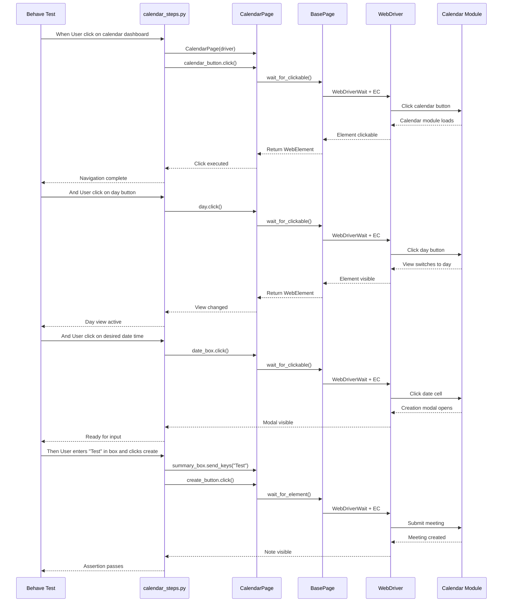
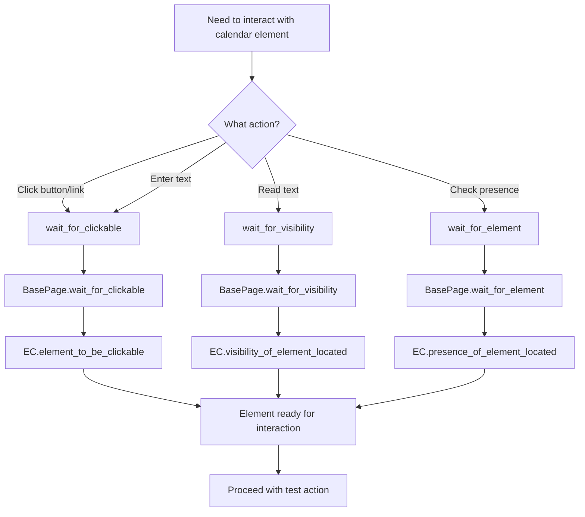

# Calendar Testing Guide

## Overview

This guide covers testing the Calendar/Meetings module in the Testinium ERP application using the Python Selenium + Behave BDD test automation framework. The calendar module is a critical component that enables team members to create, edit, and manage meetings and events collaboratively.

**What This Guide Covers:**
- Navigating to and verifying the calendar module
- Switching between Day, Week, and Month views
- Creating events by clicking time boxes in the calendar
- Editing existing calendar events
- Validating calendar button functionality
- Dynamic date validation patterns
- Calendar-specific wait strategies

**When to Use This Guide:**
- Testing calendar and meeting management features
- Validating view switching functionality
- Verifying event creation and editing workflows
- Implementing calendar-related test scenarios
- Troubleshooting calendar module test failures

## Prerequisites

Before testing the calendar module, ensure you have:

1. **Framework Installation:** Python 3.9+ with all dependencies installed (see [Installation Guide](../getting-started/installation.md))
2. **Test User Credentials:** PosManager account credentials configured in `.env` file
3. **Application Access:** Access to the Testinium ERP test environment
4. **Browser Configuration:** WebDriver set up for your target browser (Chrome, Firefox, etc.)
5. **Authentication:** User login completed (typically handled in Background step)

**Account Requirements:**
- **Account Type:** PosManager
- **Permissions:** Must have calendar module access
- **Purpose:** Calendar functionality testing requires PosManager-level privileges

## Calendar Module Architecture

The calendar testing implementation follows a three-layer architecture that maps Gherkin scenarios to page objects through step definitions.



**Architecture Layers:**
1. **Feature Layer:** Gherkin scenarios in `features/Calendar.feature`
2. **Step Definition Layer:** Python step implementations in `features/steps/calendar_steps.py`
3. **Page Object Layer:** Element locators and actions in `pages/calendar_page.py`
4. **Base Layer:** Explicit wait strategies in `pages/base_page.py`
5. **Infrastructure Layer:** Thread-local WebDriver management via `utilities/driver_manager.py`

## Basic Calendar Navigation

### Navigating to the Calendar Module

The first step in calendar testing is navigating to the calendar dashboard from the main application menu.

**Gherkin Scenario:**

```gherkin
@Calendar
Feature: Testinium app Calendar Module
  Background: As a Posmanager, I should be able to create and to see my meetings and events
    Given User login to test other features

  Scenario: Navigate to calendar module
    When User click on the calendar dashboard
    Then User should see the last stage of calendar view
```

**Source:** `features/Calendar.feature:11-16`

**Step Definition Implementation:**

```python
from behave import when, then
from selenium.webdriver.support.ui import WebDriverWait
from selenium.webdriver.support import expected_conditions as EC
from pages.calendar_page import CalendarPage

@when("User click on the calendar dashboard")
def user_clicks_on_the_calendar_dashboard(context):
    """Navigate to the calendar module by clicking the calendar dashboard button."""
    calendar_page = CalendarPage(context.driver)
    
    # Click calendar button and wait for visibility confirmation
    calendar_page.calendar_button.click()
    
    # Verify calendar button remains visible (confirms successful navigation)
    wait = WebDriverWait(context.driver, 10)
    wait.until(EC.visibility_of(calendar_page.calendar_button))

@then("User should see the last stage of calendar view")
def user_should_see_the_last_stage_of_calendar_view(context):
    """Verify calendar module fully loaded by checking container visibility and page title."""
    calendar_page = CalendarPage(context.driver)
    
    # Wait for calendar module container to be visible
    wait = WebDriverWait(context.driver, 10)
    wait.until(EC.visibility_of(calendar_page.calendar_module))
    
    # Verify page title matches expected value
    expected_dashboard = "Meetings - Odoo"
    actual_dashboard = context.driver.title
    
    assert actual_dashboard == expected_dashboard, \
        f"Title mismatch! Expected: '{expected_dashboard}', Got: '{actual_dashboard}'"
```

**Source:** `features/steps/calendar_steps.py:57-89, 188-227`

**Page Object Elements:**

```python
from selenium.webdriver.common.by import By
from pages.base_page import BasePage

class CalendarPage(BasePage):
    # Locator definitions
    _CALENDAR_BUTTON = (By.PARTIAL_LINK_TEXT, "Calendar")
    _CALENDAR_MODULE = (By.CLASS_NAME, "o_calendar_container")
    
    @property
    def calendar_button(self):
        """Calendar navigation link for accessing calendar module."""
        return self.wait_for_clickable(self._CALENDAR_BUTTON)
    
    @property
    def calendar_module(self):
        """Main calendar container element."""
        return self.wait_for_visibility(self._CALENDAR_MODULE)
```

**Source:** `pages/calendar_page.py:106, 109, 205-236`

**Key Points:**
- Uses `wait_for_clickable()` from BasePage to ensure button is interactable
- Verifies navigation success by checking both element visibility and page title
- Thread-safe through DriverManager's thread-local WebDriver instances

## View Switching Testing

### Testing Day, Week, and Month View Transitions

The calendar module supports three view modes: Day, Week, and Month. Testing view transitions ensures users can switch between these views seamlessly.

**Complete Gherkin Scenario:**

```gherkin
Scenario: Verify that all buttons work as expected at the Calendar stage
  When User click on the calendar dashboard
  And User click on day button
  And User click on week button
  And User click on month button
  Then User should see the last stage of calendar view
```

**Source:** `features/Calendar.feature:11-16`

**Step Definition Implementation:**

```python
@when("User click on day button")
def user_clicks_on_day_button(context):
    """Switch calendar view to day mode."""
    calendar_page = CalendarPage(context.driver)
    
    calendar_page.day.click()
    
    # Wait for day button to remain visible (confirms view changed)
    wait = WebDriverWait(context.driver, 10)
    wait.until(EC.visibility_of(calendar_page.day))

@when("User click on week button")
def user_clicks_on_week_button(context):
    """Switch calendar view to week mode."""
    calendar_page = CalendarPage(context.driver)
    
    calendar_page.week.click()
    
    # Wait for week button to remain visible (confirms view changed)
    wait = WebDriverWait(context.driver, 10)
    wait.until(EC.visibility_of(calendar_page.week))

@when("User click on month button")
def user_clicks_on_month_button(context):
    """Switch calendar view to month mode."""
    calendar_page = CalendarPage(context.driver)
    
    calendar_page.month.click()
    
    # Wait for month button to remain visible (confirms view changed)
    wait = WebDriverWait(context.driver, 10)
    wait.until(EC.visibility_of(calendar_page.month))
```

**Source:** `features/steps/calendar_steps.py:92-185`

**Page Object Properties:**

```python
class CalendarPage(BasePage):
    # View selection button locators
    _DAY_BUTTON = (By.XPATH, "//button[.='Day']")
    _WEEK_BUTTON = (By.XPATH, "//button[.='Week']")
    _MONTH_BUTTON = (By.XPATH, "//button[.='Month']")
    
    @property
    def day(self):
        """Day view button to switch calendar to daily view."""
        return self.wait_for_clickable(self._DAY_BUTTON)
    
    @property
    def week(self):
        """Week view button to switch calendar to weekly view."""
        return self.wait_for_clickable(self._WEEK_BUTTON)
    
    @property
    def month(self):
        """Month view button to switch calendar to monthly view."""
        return self.wait_for_clickable(self._MONTH_BUTTON)
```

**Source:** `pages/calendar_page.py:112-114, 238-284`

**Wait Strategy:**
- Each view button click is followed by explicit wait for element visibility
- Replaces Java implementation's `Thread.sleep(3000)` with proper WebDriverWait
- Confirms view transition completed before proceeding to next step

### Dynamic Date Validation

Advanced calendar testing includes validating that the displayed date header matches the selected view.

**Gherkin Scenario with Date Validation:**

```gherkin
Scenario: User can change display between Day-Week-Month
  When User click on the calendar dashboard
  And User click day on the calendar and display day
  Then User click month on the calendar and display month
```

**Source:** `features/Calendar.feature:18-21`

**Day View Validation Implementation:**

```python
import calendar

@when("User click day on the calendar and display day")
def user_clicks_day_on_the_calendar_and_display_day(context):
    """
    Switch to day view and validate the displayed date header format.
    
    Extracts day, month, and year from calendar DOM attributes and validates
    the date header matches format: "Meetings (Month Day, Year)"
    """
    calendar_page = CalendarPage(context.driver)
    
    # Click day button to switch to day view
    calendar_page.day.click()
    
    # Wait for day button visibility (confirms view switched)
    wait = WebDriverWait(context.driver, 10)
    wait.until(EC.visibility_of(calendar_page.day))
    
    # Extract day number from highlighted day element
    day_calendar = calendar_page.day_calendar.text
    
    # Extract month and year from data attributes (0-indexed month, so add 1)
    month_calendar = int(calendar_page.month_and_year_calendar.get_attribute("data-month")) + 1
    year_calendar = int(calendar_page.month_and_year_calendar.get_attribute("data-year"))
    
    # Convert month number to month name using Python calendar module
    month = calendar.month_name[month_calendar]
    
    # Build expected date header string
    expected_result = f"Meetings ({month} {day_calendar}, {year_calendar})"
    
    # Wait for date element to be visible and extract text
    wait.until(EC.visibility_of(calendar_page.date_actual))
    actual_result = calendar_page.date_actual.text
    
    # Validate date header matches expected format
    assert expected_result == actual_result, \
        f"Date header mismatch! Expected: '{expected_result}', Got: '{actual_result}'"
```

**Source:** `features/steps/calendar_steps.py:230-300`

**Month View Validation Implementation:**

```python
@then("User click month on the calendar and display month")
def user_click_month_on_the_calendar_and_display_month(context):
    """
    Switch to month view and validate the displayed date header format.
    
    Expected header format: "Meetings (Month Year)"
    """
    calendar_page = CalendarPage(context.driver)
    
    # Click month button to switch to month view
    calendar_page.month.click()
    
    # Wait for month button visibility (confirms view switched)
    wait = WebDriverWait(context.driver, 10)
    wait.until(EC.visibility_of(calendar_page.month))
    
    # Extract month and year from data attributes (0-indexed month, so add 1)
    month_calendar = int(calendar_page.month_and_year_calendar.get_attribute("data-month")) + 1
    year_calendar = int(calendar_page.month_and_year_calendar.get_attribute("data-year"))
    
    # Convert month number to month name
    month = calendar.month_name[month_calendar]
    
    # Build expected date header string (month view format, no day)
    expected_result = f"Meetings ({month} {year_calendar})"
    
    # Wait for date element to be visible and extract text
    wait.until(EC.visibility_of(calendar_page.date_actual))
    actual_result = calendar_page.date_actual.text
    
    # Validate date header matches expected format
    assert expected_result == actual_result, \
        f"Date header mismatch! Expected: '{expected_result}', Got: '{actual_result}'"
```

**Source:** `features/steps/calendar_steps.py:303-369`

**Key Technical Improvements:**
- **Eliminates hard-coded dates:** Dynamically extracts date from DOM attributes
- **Python calendar module:** Replaces verbose Java switch-case (96 lines) with elegant `calendar.month_name` lookup
- **Zero-indexed month handling:** Correctly adds 1 to data-month attribute value
- **Explicit waits:** No Thread.sleep() calls, uses WebDriverWait throughout

## Event Creation Testing

### Creating Events by Clicking Time Boxes

Users can create calendar events by clicking on available time slots in the day view. Testing this workflow ensures the event creation modal opens and events are saved successfully.

**Parameterized Gherkin Scenario:**

```gherkin
Scenario Outline: User can create event by clicking on daily time box
  When User click on the calendar dashboard
  And User click day on the calendar and display day
  And User click on desired date time
  Then User enters "<test>" in the box and clicks the create button

  Examples: Test name
    |test       |
    |Test test  |
```

**Source:** `features/Calendar.feature:23-31`

**Complete Event Creation Workflow:**

```python
from behave import step, then

@step("User click on desired date time")
def user_click_on_desired_date_time(context):
    """
    Click on a specific date cell to open the meeting creation dialog.
    
    Verifies that the note creation modal header becomes visible,
    confirming the creation dialog opened successfully.
    """
    calendar_page = CalendarPage(context.driver)
    
    # Click on date box to open meeting creation dialog
    calendar_page.date_box.click()
    
    # Wait for create note modal to be visible
    wait = WebDriverWait(context.driver, 10)
    wait.until(EC.visibility_of(calendar_page.create_note))
    
    # Verify modal is displayed
    assert calendar_page.create_note.is_displayed(), \
        "Create note modal is not displayed after clicking date box"

@then('User enters "{note}" in the box and clicks the create button')
def user_enters_note_in_the_box_and_clicks_the_create_button(context, note):
    """
    Enter meeting summary and create the meeting/note.
    
    Args:
        note: Meeting/note summary text captured from Gherkin step
    
    Example Gherkin:
        Then User enters "Team Standup Meeting" in the box and clicks the create button
    """
    calendar_page = CalendarPage(context.driver)
    
    # Store event name for validation
    event_name = note
    
    # Enter note text into summary box
    calendar_page.summary_box.send_keys(note)
    
    # Click create button to save the meeting
    calendar_page.create_button.click()
    
    # Wait for note to be created and visible
    wait = WebDriverWait(context.driver, 10)
    wait.until(EC.visibility_of(calendar_page.get_note))
    
    # Validate created note text matches input
    created_note_text = calendar_page.get_note.text
    
    assert created_note_text == event_name, \
        f"Created note text doesn't match! Expected: '{event_name}', Got: '{created_note_text}'"
```

**Source:** `features/steps/calendar_steps.py:372-463`

**Page Object Elements for Event Creation:**

```python
class CalendarPage(BasePage):
    # Date selection locator
    # TECHNICAL DEBT: Uses brittle index-based XPath [29]
    # May break if calendar structure changes
    _DATE_BOX = (By.XPATH, "(//td[@class='fc-widget-content'])[29]")
    
    # Modal and form elements
    _CREATE_NOTE = (By.XPATH, "//div[@class='modal-header']")
    _SUMMARY_BOX = (By.XPATH, "//input[@name='name']")
    _CREATE_BUTTON = (By.XPATH, "//button[@class='btn btn-sm btn-primary']")
    _GET_NOTE = (By.XPATH, "//div[@class='o_field_name o_field_type_char']")
    
    @property
    def date_box(self):
        """
        Specific date cell in calendar grid for meeting creation.
        
        WARNING: Uses brittle index-based XPath selector [29] which may break
        if calendar view changes. Preserved for behavioral equivalence.
        """
        return self.wait_for_clickable(self._DATE_BOX)
    
    @property
    def create_note(self):
        """Modal header for note/meeting creation dialog."""
        return self.wait_for_visibility(self._CREATE_NOTE)
    
    @property
    def summary_box(self):
        """Input field for meeting/note summary (name/title)."""
        return self.wait_for_element(self._SUMMARY_BOX)
    
    @property
    def create_button(self):
        """
        Button to create/save a new meeting or note.
        
        WARNING: Shares same XPath with edit_button. If both present,
        Selenium returns first matching element.
        """
        return self.wait_for_clickable(self._CREATE_BUTTON)
    
    @property
    def get_note(self):
        """Note field element displaying meeting/note details."""
        return self.wait_for_element(self._GET_NOTE)
```

**Source:** `pages/calendar_page.py:131, 134-136, 141, 146, 338-456`

**Event Creation Flow:**
1. Click `date_box` to select time slot → Modal opens
2. Wait for `create_note` modal header visibility
3. Enter event name in `summary_box`
4. Click `create_button` to save
5. Wait for `get_note` element with event name
6. Assert created note text matches input

**Technical Debt Awareness:**
- `date_box` uses index-based XPath `[29]` which is brittle
- `create_button` and `edit_button` share same locator (potential ambiguity)
- These are preserved for behavioral equivalence with Java implementation
- Consider adding unique `data-testid` attributes in the application

## Event Editing Testing

### Editing Existing Calendar Events

After creating events, users need to edit them to update meeting details. Testing the edit workflow ensures users can select, modify, and save event changes.

**Complete Edit Workflow Scenario:**

```gherkin
Scenario: User can edit a created event
  When User click on the calendar dashboard
  And User click day on the calendar and display day
  And User click on desired date time
  And User enters "Test" in the box and clicks the create button
  And User can see all the note
  And User can select the note
  And User can edit the information
  Then User can save all edit
```

**Source:** `features/Calendar.feature:33-41`

**Step Definitions for Edit Workflow:**

```python
@when("User can see all the note")
def user_can_see_all_the_note(context):
    """Verify the created note is visible in the calendar view."""
    calendar_page = CalendarPage(context.driver)
    
    # Wait for created note to be visible
    wait = WebDriverWait(context.driver, 10)
    wait.until(EC.visibility_of(calendar_page.created_note))
    
    # Verify note is displayed
    assert calendar_page.created_note.is_displayed(), \
        "Created note is not displayed in calendar view"

@when("User can select the note")
def user_can_select_the_note(context):
    """Select an existing note to open its details modal."""
    calendar_page = CalendarPage(context.driver)
    
    # Click on note to select it
    calendar_page.select_note.click()
    
    # Wait for note selection to complete
    wait = WebDriverWait(context.driver, 10)
    wait.until(EC.visibility_of(calendar_page.select_note))
    
    # Verify modal content is displayed
    wait.until(EC.visibility_of(calendar_page.created_modele))
    
    assert calendar_page.created_modele.is_displayed(), \
        "Note modal content is not displayed after selection"

@when("User can edit the information")
def user_can_edit_the_information(context):
    """
    Edit the selected meeting/note information.
    
    Workflow:
    1. Click edit button to enable editing mode
    2. Clear existing text
    3. Enter new text "Hello My Friends"
    4. Verify tags checkbox status
    """
    calendar_page = CalendarPage(context.driver)
    
    # Click edit button to enable editing mode
    calendar_page.edit_button.click()
    
    # Wait for edit button visibility confirmation
    wait = WebDriverWait(context.driver, 10)
    wait.until(EC.visibility_of(calendar_page.edit_button))
    
    # Clear existing text from edit field
    calendar_page.edit_text.clear()
    
    # Enter new text
    new_text = "Hello My Friends"
    calendar_page.edit_text.send_keys(new_text)
    
    # Wait for edit text field visibility
    wait.until(EC.visibility_of(calendar_page.edit_text))
    
    # Check if tags checkbox is selected (validation step)
    tags_selected = calendar_page.tags_checkbox.is_selected()

@then("User can save all edit")
def user_can_save_all_edit(context):
    """Save the edited meeting/note information."""
    calendar_page = CalendarPage(context.driver)
    
    # Click save button to persist changes
    calendar_page.save_button.click()
    
    # Wait for save operation to complete
    wait = WebDriverWait(context.driver, 10)
```

**Source:** `features/steps/calendar_steps.py:466-628`

**Page Object Elements for Editing:**

```python
class CalendarPage(BasePage):
    # Note display and selection
    _CREATED_NOTE = (By.CLASS_NAME, "o_field_name")
    _SELECT_NOTE = (By.XPATH, "//div[@class='o_field_name o_field_type_char']")
    
    # Edit modal elements
    _CREATED_MODELE = (By.XPATH, "//div[@class='modal-content']")
    _EDIT_BUTTON = (By.XPATH, "//button[@class='btn btn-sm btn-primary']")
    _EDIT_TEXT = (By.ID, "o_field_input_46")
    _TAGS_CHECKBOX = (By.ID, "o_field_input_59")
    _SAVE_BUTTON = (By.XPATH, "//span[.='Save']")
    
    @property
    def created_note(self):
        """Display element for created note/meeting name."""
        return self.wait_for_element(self._CREATED_NOTE)
    
    @property
    def select_note(self):
        """Note selection element for interacting with specific notes."""
        return self.wait_for_element(self._SELECT_NOTE)
    
    @property
    def created_modele(self):
        """Modal content container for created meeting/note."""
        return self.wait_for_visibility(self._CREATED_MODELE)
    
    @property
    def edit_button(self):
        """
        Button to edit an existing meeting or note.
        
        WARNING: Shares same XPath with create_button.
        """
        return self.wait_for_clickable(self._EDIT_BUTTON)
    
    @property
    def edit_text(self):
        """
        Text input field for editing meeting/note content.
        
        Note: Uses ID 'o_field_input_46' which may be dynamically generated.
        """
        return self.wait_for_element(self._EDIT_TEXT)
    
    @property
    def tags_checkbox(self):
        """
        Checkbox for selecting/managing meeting tags.
        
        Note: Uses ID 'o_field_input_59' which may be dynamically generated.
        """
        return self.wait_for_element(self._TAGS_CHECKBOX)
    
    @property
    def save_button(self):
        """Save button to persist meeting/note changes."""
        return self.wait_for_clickable(self._SAVE_BUTTON)
```

**Source:** `pages/calendar_page.py:147, 161, 154-158, 459-585`

**Edit Workflow Steps:**
1. **Verify Note Visible:** Assert `created_note.is_displayed()`
2. **Select Note:** Click `select_note` → Modal opens
3. **Wait for Modal:** Verify `created_modele.is_displayed()`
4. **Enable Editing:** Click `edit_button`
5. **Modify Content:** Clear and send keys to `edit_text`
6. **Check Tags:** Validate `tags_checkbox.is_selected()`
7. **Save Changes:** Click `save_button`

**Best Practices for Editing:**
- Always wait for modal visibility before interacting with edit fields
- Clear existing text before entering new values to prevent concatenation
- Verify form elements are interactable before clicking
- Consider adding explicit wait for save confirmation (success message or modal dismissal)

## Wait Strategies for Calendar Testing

### Explicit Waits for Dynamic Calendar Elements

Calendar modules often feature dynamic content that loads asynchronously. The framework uses explicit waits exclusively to handle timing issues reliably.

**No Implicit Waits or Thread.sleep():**

The Python implementation eliminates all `Thread.sleep()` calls from the Java version, replacing them with explicit WebDriverWait statements. This provides:
- **Reliability:** Tests proceed as soon as conditions are met
- **Performance:** No unnecessary fixed delays
- **Maintainability:** Wait conditions clearly document element state requirements

**Wait Strategy Decision Tree:**



**Common Wait Patterns in Calendar Testing:**

```python
from selenium.webdriver.support.ui import WebDriverWait
from selenium.webdriver.support import expected_conditions as EC

# Pattern 1: Wait for button to be clickable before clicking
calendar_page.day.click()  # Property uses wait_for_clickable internally
wait = WebDriverWait(context.driver, 10)
wait.until(EC.visibility_of(calendar_page.day))

# Pattern 2: Wait for modal to appear after action
calendar_page.date_box.click()
wait.until(EC.visibility_of(calendar_page.create_note))

# Pattern 3: Wait for element visibility before reading text
wait.until(EC.visibility_of(calendar_page.date_actual))
actual_result = calendar_page.date_actual.text

# Pattern 4: Wait for dynamic content after form submission
calendar_page.create_button.click()
wait.until(EC.visibility_of(calendar_page.get_note))
created_note_text = calendar_page.get_note.text
```

**BasePage Wait Utilities:**

The `CalendarPage` inherits wait strategies from `BasePage`:

```python
# From pages/base_page.py
class BasePage:
    def wait_for_element(self, locator, timeout=10):
        """Wait for element presence in DOM."""
        return WebDriverWait(self.driver, timeout).until(
            EC.presence_of_element_located(locator)
        )
    
    def wait_for_clickable(self, locator, timeout=10):
        """Wait for element to be clickable (visible and enabled)."""
        return WebDriverWait(self.driver, timeout).until(
            EC.element_to_be_clickable(locator)
        )
    
    def wait_for_visibility(self, locator, timeout=10):
        """Wait for element to be visible on page."""
        return WebDriverWait(self.driver, timeout).until(
            EC.visibility_of_element_located(locator)
        )
```

**Calendar-Specific Wait Considerations:**

1. **View Transitions:** After clicking day/week/month buttons, wait for view change confirmation
2. **Modal Dialogs:** Wait for modal visibility before interacting with form fields
3. **Dynamic Dates:** Wait for date element visibility before extracting text
4. **Event Creation:** Wait for created note visibility to confirm save operation
5. **Calendar Rendering:** Calendar grids load asynchronously, wait for container visibility

**Migration Note:**

The Java implementation used fixed delays:
```java
// Java - OLD PATTERN (DO NOT USE)
Thread.sleep(3000);  // Fixed 3-second delay
```

Python implementation uses conditional waits:
```python
# Python - NEW PATTERN (RECOMMENDED)
wait = WebDriverWait(context.driver, 10)  # Wait up to 10 seconds
wait.until(EC.visibility_of(element))      # Proceeds immediately when ready
```

**Source:** `features/steps/calendar_steps.py` module docstring lines 20-24, 30

## Page Object Pattern for Calendar Elements

### Property-Based Locator Pattern

The `CalendarPage` class implements the Page Object Model using property-based locators that return fresh WebElement references on each access. This pattern prevents stale element exceptions and improves test reliability.

**Locator Definition Pattern:**

```python
from selenium.webdriver.common.by import By
from pages.base_page import BasePage

class CalendarPage(BasePage):
    # Step 1: Define private locator constants
    _DAY_BUTTON = (By.XPATH, "//button[.='Day']")
    _SUMMARY_BOX = (By.XPATH, "//input[@name='name']")
    _CREATE_BUTTON = (By.XPATH, "//button[@class='btn btn-sm btn-primary']")
    
    # Step 2: Expose as properties with appropriate wait strategy
    @property
    def day(self):
        """Day view button to switch calendar to daily view."""
        return self.wait_for_clickable(self._DAY_BUTTON)
    
    @property
    def summary_box(self):
        """Input field for meeting/note summary."""
        return self.wait_for_element(self._SUMMARY_BOX)
    
    @property
    def create_button(self):
        """Button to create/save a new meeting or note."""
        return self.wait_for_clickable(self._CREATE_BUTTON)
```

**Source:** `pages/calendar_page.py:112, 135-136, 141, 238-429`

**Why Property-Based Locators?**

**Java PageFactory Pattern (OLD):**
```java
// Java - PageFactory pattern with @FindBy
public class CalendarP {
    @FindBy(xpath = "//button[.='Day']")
    public WebElement dayButton;  // Stale element risk
}
```

**Python Property Pattern (NEW):**
```python
# Python - Property-based pattern
class CalendarPage(BasePage):
    _DAY_BUTTON = (By.XPATH, "//button[.='Day']")
    
    @property
    def day(self):
        return self.wait_for_clickable(self._DAY_BUTTON)  # Fresh reference every time
```

**Advantages:**
1. **Prevents Stale Elements:** Each property access queries the DOM for a fresh WebElement
2. **Built-in Waits:** Wait strategy applied automatically on element access
3. **Thread Safety:** Works seamlessly with thread-local WebDriver instances
4. **Type Safety:** Can add type hints for better IDE support
5. **Cleaner Usage:** `calendar_page.day.click()` instead of `calendar_page.dayButton.click()`

### Calendar Page Object Element Categories

**Navigation Elements:**
```python
calendar_button  # Navigate to calendar module (PARTIAL_LINK_TEXT)
```

**View Control Elements:**
```python
day              # Switch to day view (XPATH)
week             # Switch to week view (XPATH)
month            # Switch to month view (XPATH)
```

**Calendar Display Elements:**
```python
calendar_module         # Main container (CLASS_NAME)
day_calendar           # Highlighted day (CLASS_NAME)
month_and_year_calendar  # Current date cell (XPATH)
date_actual            # Date display in control panel (XPATH)
date_box              # Date cell for meeting creation (XPATH with index [29])
```

**Event Creation Elements:**
```python
create_note     # Modal header (XPATH)
summary_box     # Event name input (XPATH)
create_button   # Create/save button (XPATH) - DUPLICATE LOCATOR WARNING
```

**Event Management Elements:**
```python
get_note        # Note field display (XPATH) - DUPLICATE LOCATOR WARNING
created_note    # Created note display (CLASS_NAME)
select_note     # Note selection (XPATH) - DUPLICATE LOCATOR WARNING
```

**Event Editing Elements:**
```python
edit_button     # Edit mode button (XPATH) - DUPLICATE LOCATOR WARNING
edit_text       # Edit input field (ID)
created_modele  # Modal content (XPATH)
tags_checkbox   # Tags selection (ID)
save_button     # Save changes (XPATH)
```

**Source:** `pages/calendar_page.py:102-161`

### Using CalendarPage in Tests

**Complete Usage Example:**

```python
from utilities.driver_manager import DriverManager
from pages.calendar_page import CalendarPage

# Get thread-local driver instance
driver = DriverManager.get_driver()

# Initialize page object
calendar_page = CalendarPage(driver)

# Navigate to calendar
calendar_page.calendar_button.click()

# Switch to day view
calendar_page.day.click()

# Create a meeting
calendar_page.date_box.click()
calendar_page.summary_box.send_keys("Team Standup Meeting")
calendar_page.create_button.click()

# Verify creation
assert "Team Standup Meeting" in calendar_page.created_note.text

# Edit the meeting
calendar_page.select_note.click()
calendar_page.edit_button.click()
calendar_page.edit_text.clear()
calendar_page.edit_text.send_keys("Daily Standup - Updated")
calendar_page.save_button.click()

# Cleanup
DriverManager.quit_driver()
```

**Source:** Example adapted from `pages/calendar_page.py:46-55, 629-652`

## Technical Debt and Known Issues

### Inherited Technical Debt

The `CalendarPage` class inherits several technical debt issues from the original Java implementation that should be understood when writing tests:

**1. Duplicate Locators for Create/Edit Buttons**

**Issue:** The `create_button` and `edit_button` properties use **identical XPath locators**, creating confusion about which button they actually target.

```python
# Both use the same XPath - potential for unexpected behavior
_CREATE_BUTTON = (By.XPATH, "//button[@class='btn btn-sm btn-primary']")
_EDIT_BUTTON = (By.XPATH, "//button[@class='btn btn-sm btn-primary']")
```

**Impact:**
- Behavior depends on which button is currently visible in the DOM
- Tests may pass/fail based on timing of modal transitions
- Creates ambiguity when debugging failures

**Workaround:** Be aware that these are the same locator and rely on DOM visibility state.

**Source:** `pages/calendar_page.py:135-136, 149-150`

**2. Duplicate Locators for Note Selection**

**Issue:** The `get_note` and `select_note` properties use **identical XPath locators**, which is problematic for test clarity.

```python
# Both use the same XPath
_GET_NOTE = (By.XPATH, "//div[@class='o_field_text oe_inline_full o_field_widget']")
_SELECT_NOTE = (By.XPATH, "//div[@class='o_field_text oe_inline_full o_field_widget']")
```

**Impact:**
- Semantic confusion about "getting" vs "selecting" a note
- Method names imply different purposes but target the same element
- Harder to understand test intent

**Workaround:** Use either locator interchangeably with awareness they are the same.

**Source:** `pages/calendar_page.py:141-142, 145-146`

**3. Brittle Index-Based Date Selection**

**Issue:** The `date_box` locator uses a **hard-coded index [29]** to select a specific date cell.

```python
# High-risk: Hardcoded index assumes specific calendar layout
_DATE_BOX = (By.XPATH, "(//td[@class='fc-widget-content'])[29]")
```

**Impact:**
- **Breaks if calendar layout changes** (different month, starting day, etc.)
- **Breaks if viewport size changes** (affects number of visible cells)
- **Not portable** across different test dates
- **Extremely fragile** - most likely cause of calendar test failures

**Workaround:** 
- Accept that tests may need adjustment when running in different months
- Consider implementing dynamic date calculation logic in future refactoring
- Document the expected test date/month in scenario descriptions

**Source:** `pages/calendar_page.py:125-126`

**4. Thread.sleep() Replaced with Explicit Waits**

**Improvement:** Unlike the Java implementation, the Python version **replaces all Thread.sleep() calls** with proper `WebDriverWait` explicit waits.

**Before (Java):**
```java
Thread.sleep(2000);  // Hard-coded wait
```

**After (Python):**
```python
wait = WebDriverWait(driver, timeout)
wait.until(EC.element_to_be_clickable(locator))
```

**Benefit:** More reliable, faster tests with better error messages.

**Source:** `features/steps/calendar_steps.py:20-24`

## Troubleshooting

### Issue: Calendar View Not Updating After Button Click

**Symptoms:**
- Click day/week/month button but view remains unchanged
- Test fails with "expected month view, got day view"

**Cause:**
- View transition animations not complete
- JavaScript not finished re-rendering calendar

**Solution:**
```python
# Add explicit wait for view transition
from selenium.webdriver.support import expected_conditions as EC

# Click view button
calendar_page.month.click()

# Wait for view to actually change - check for month-specific element
wait = WebDriverWait(driver, 10)
wait.until(EC.presence_of_element_located(
    (By.CLASS_NAME, "fc-month-view")  # Month view specific class
))
```

**Alternative:** Use date validation approach from `calendar_steps.py`:

```python
import calendar
import datetime

# Get current month name
current_month = calendar.month_name[datetime.datetime.now().month]

# Verify month view shows current month
assert current_month in calendar_page.month_and_year_calendar.text
```

**Source:** `features/steps/calendar_steps.py:175-180`

### Issue: Event Not Saving - Create Button Not Working

**Symptoms:**
- Click create button but modal doesn't close
- Event doesn't appear in calendar
- No error message displayed

**Cause:**
- Summary box empty (validation prevents save)
- Modal animation/transition in progress
- Create button not yet clickable

**Solution:**
```python
# Ensure summary is entered before clicking create
calendar_page.summary_box.send_keys("Meeting Title")

# Use wait_for_clickable to ensure button is ready
create_button = calendar_page.create_button  # Uses wait_for_clickable internally
create_button.click()

# Wait for modal to close
wait = WebDriverWait(driver, 10)
wait.until(EC.invisibility_of_element_located(
    (By.XPATH, "//div[@class='modal-content']")
))
```

**Source:** `pages/calendar_page.py:420-424`

### Issue: Stale Element Reference When Accessing Calendar Elements

**Symptoms:**
- `StaleElementReferenceException` errors
- "element is not attached to the page document"

**Cause:**
- Calendar DOM refreshes after view changes
- Stored element reference becomes invalid

**Solution:**
```python
# DON'T store element references
# WRONG:
day_button = calendar_page.day  # Element reference
time.sleep(1)
day_button.click()  # May be stale!

# DO access property each time
# CORRECT:
calendar_page.day.click()  # Fresh element lookup
time.sleep(1)  # If calendar refreshes
calendar_page.day.click()  # Fresh element lookup again
```

**Why Property Pattern Helps:** Each property access performs a new DOM query with explicit wait, getting a fresh element reference.

**Source:** `pages/calendar_page.py:46-55 (property-based pattern explanation)`

### Issue: Date Box Click Not Working (Index-Based Selection)

**Symptoms:**
- Click on date_box but wrong date selected
- `ElementNotInteractableException` error
- Click has no effect

**Cause:**
- **Hardcoded index [29]** doesn't match current calendar layout
- Calendar showing different month than expected
- Viewport size changed (responsive design affects cell count)

**Root Cause:** Known technical debt - brittle locator

```python
# Problematic locator
_DATE_BOX = (By.XPATH, "(//td[@class='fc-widget-content'])[29]")
```

**Solution:**

**Option 1: Verify Test Prerequisites**
- Ensure tests run in expected month
- Use consistent browser window size
- Document the target date in test scenario

**Option 2: Dynamic Date Selection (Future Enhancement)**
```python
# Calculate today's index dynamically (not currently implemented)
today = datetime.datetime.now().day
# XPath: //td[@data-date='2024-01-15']  # If data-date attribute exists
```

**Option 3: Use Visible Date Cells**
```python
# Click any visible date cell instead of hardcoded index
date_cells = driver.find_elements(By.XPATH, "//td[@class='fc-widget-content']")
date_cells[0].click()  # Click first available date
```

**Source:** `pages/calendar_page.py:125-126 (technical debt note)`

### Issue: Calendar Not Rendering Completely

**Symptoms:**
- Elements not found immediately after navigation
- Tests fail inconsistently (timing-dependent)

**Cause:**
- Calendar module loads asynchronously
- JavaScript initialization incomplete

**Solution:**
```python
# Wait for calendar navigation
calendar_page.calendar_button.click()

# Wait for calendar container to be present and visible
wait = WebDriverWait(driver, 15)
wait.until(EC.visibility_of_element_located(
    (By.CLASS_NAME, "o_calendar_container")
))

# Additional wait for JavaScript initialization
wait.until(EC.presence_of_element_located(
    (By.XPATH, "//div[@class='fc-view-container']")
))

# Now safe to interact with calendar elements
calendar_page.day.click()
```

**Source:** `features/steps/calendar_steps.py:240-244, 256-258`

### Issue: Edit Modal Not Opening

**Symptoms:**
- Click select_note but edit options don't appear
- Edit button not found

**Cause:**
- Note not fully rendered after creation
- Wrong note selected (if multiple notes exist)

**Solution:**
```python
# Wait for note to be fully created
wait = WebDriverWait(driver, 10)
wait.until(EC.text_to_be_present_in_element(
    (By.CLASS_NAME, "o_field_widget"),
    "Expected Note Title"
))

# Ensure note is clickable
calendar_page.select_note.click()

# Wait for edit button to appear
wait.until(EC.element_to_be_clickable(
    (By.XPATH, "//button[@class='btn btn-sm btn-primary']")
))
calendar_page.edit_button.click()
```

**Source:** `features/steps/calendar_steps.py:329-333, 345-347`

### Issue: Parallel Execution Failures

**Symptoms:**
- Tests pass individually but fail when run in parallel
- Intermittent failures with multiple workers

**Cause:**
- Shared test data (events with same names)
- Thread-local driver not properly isolated

**Solution:**
```python
# Use unique event names per test/thread
import uuid

event_name = f"Meeting-{uuid.uuid4()}"
calendar_page.summary_box.send_keys(event_name)

# Verify using the unique name
assert event_name in calendar_page.created_note.text
```

**Verify Thread-Local Driver:**
```python
# Each thread should have independent driver
from utilities.driver_manager import DriverManager

driver = DriverManager.get_driver()  # Thread-local instance
```

**Source:** `utilities/driver_manager.py:128-129 (threading.local explanation)`

## Best Practices for Calendar Testing

### 1. Wait for Calendar to Render Completely

**Always wait for full calendar initialization before interacting:**

```python
@when('User click on the calendar dashboard')
def step_impl(context):
    calendar_page = CalendarPage(context.driver)
    calendar_page.calendar_button.click()
    
    # Wait for calendar container
    wait = WebDriverWait(context.driver, 15)
    wait.until(EC.visibility_of_element_located(
        (By.CLASS_NAME, "o_calendar_container")
    ))
```

**Source:** `features/steps/calendar_steps.py:240-258`

### 2. Handle Dynamic Date Elements

**Use date validation instead of relying on visual checks:**

```python
import calendar
import datetime

# Get expected date values
current_month = calendar.month_name[datetime.datetime.now().month]
current_day = str(datetime.datetime.now().day)

# Validate calendar shows correct date
calendar_date = calendar_page.month_and_year_calendar.text
assert current_month in calendar_date
assert current_day in calendar_date
```

**Source:** `features/steps/calendar_steps.py:175-180, 193-195`

### 3. Event Cleanup After Tests

**Always clean up created events to prevent test data pollution:**

```python
# After test: Delete created events
@after_scenario
def cleanup_calendar_events(context, scenario):
    if 'calendar' in scenario.tags:
        # Navigate to calendar and delete test events
        # Implementation depends on application's delete functionality
        pass
```

**Alternatively:** Use unique event names with timestamps that can be filtered later.

### 4. Use Explicit Waits Over Thread.sleep()

**DON'T:**
```python
import time
calendar_page.day.click()
time.sleep(2)  # Brittle, wastes time
```

**DO:**
```python
from selenium.webdriver.support.ui import WebDriverWait
from selenium.webdriver.support import expected_conditions as EC

calendar_page.day.click()
wait = WebDriverWait(driver, 10)
wait.until(EC.visibility_of_element_located(
    (By.CLASS_NAME, "fc-day-view")
))
```

**Source:** `features/steps/calendar_steps.py:20-24 (migration note about removing Thread.sleep)`

### 5. Verify State Changes After Actions

**Always verify that actions had the expected effect:**

```python
# Click month view
calendar_page.month.click()

# Verify we're in month view
current_view = calendar_page.calendar_module.get_attribute("class")
assert "fc-month-view" in current_view

# OR verify by checking displayed date format
date_display = calendar_page.date_actual.text
assert len(date_display) > 5  # Month view shows full date range
```

### 6. Handle Modal Transitions Gracefully

**Wait for modals to fully open/close:**

```python
# Open event creation modal
calendar_page.date_box.click()

# Wait for modal to be fully visible
wait.until(EC.visibility_of_element_located(
    (By.XPATH, "//div[@class='modal-content']")
))

# Now safe to interact with modal elements
calendar_page.summary_box.send_keys("Event Title")

# After clicking save, wait for modal to close
calendar_page.create_button.click()
wait.until(EC.invisibility_of_element_located(
    (By.XPATH, "//div[@class='modal-content']")
))
```

### 7. Use Property-Based Locators Correctly

**Access page object properties each time you need the element:**

```python
# Fresh element reference with each access
calendar_page.day.click()         # Lookup and wait
calendar_page.week.click()        # Lookup and wait
calendar_page.month.click()       # Lookup and wait

# Each property access:
# 1. Queries DOM for fresh element
# 2. Applies appropriate wait strategy
# 3. Returns ready-to-use WebElement
```

### 8. Understand Known Technical Debt

**Be aware of the inherited issues and plan accordingly:**

- **Duplicate locators:** `create_button` == `edit_button` (same XPath)
- **Duplicate locators:** `get_note` == `select_note` (same XPath)
- **Brittle date selection:** `date_box` uses hardcoded index [29]

**Document workarounds in test scenarios and maintain test data carefully.**

**Source:** `pages/calendar_page.py:46-55 (technical debt documentation)`

### 9. Leverage Scenario Outlines for Data-Driven Tests

**Use Examples tables for testing multiple event names:**

```gherkin
Scenario Outline: User can create event with various names
  When User click on the calendar dashboard
  And User click day on the calendar and display day
  And User click on desired date time
  Then User enters "<event_name>" in the box and clicks the create button

  Examples: Event names
    | event_name           |
    | Team Standup         |
    | Client Meeting       |
    | Sprint Planning      |
    | Code Review Session  |
```

**Source:** `features/Calendar.feature:23-32`

### 10. Use Meaningful Assertion Messages

**Provide context when assertions fail:**

```python
# Not helpful
assert calendar_page.created_note.text

# Better
expected_text = "Team Standup"
actual_text = calendar_page.created_note.text
assert expected_text in actual_text, \
    f"Event not created. Expected '{expected_text}' in '{actual_text}'"
```

## See Also

**API Reference:**
- [CalendarPage API Reference](../api-reference/pages/calendar-page.md) - Complete API documentation
- [BasePage API Reference](../api-reference/pages/base-page.md) - Parent class wait methods
- [Calendar Step Definitions](../api-reference/steps/calendar-steps.md) - All step implementations

**Related Guides:**
- [Page Object Model Guide](page-object-model.md) - Understanding property-based locators
- [Wait Strategies Guide](wait-strategies.md) - Comprehensive wait patterns
- [Parallel Execution Guide](parallel-execution.md) - Running tests concurrently
- [Configuration Management](configuration-management.md) - Setting up test credentials

**Reference Documentation:**
- [Behave Configuration](../reference/behave-configuration.md) - Framework configuration
- [Environment Variables](../reference/environment-variables.md) - Credential configuration
- [Gherkin Syntax](../reference/gherkin-syntax.md) - Writing feature files

**Troubleshooting:**
- [Common Errors](../troubleshooting/common-errors.md) - General test failures
- [WebDriver Issues](../troubleshooting/webdriver-issues.md) - Driver-related problems

**Feature Files:**
- Source: `features/Calendar.feature` - All calendar test scenarios
- Source: `features/steps/calendar_steps.py` - Step implementations
- Source: `pages/calendar_page.py` - Page Object Model

---

**Document Version:** 1.0.0  
**Last Updated:** 2024-01-15  
**Framework Version:** Python 3.9+ | Selenium 4.15.2 | Behave 1.2.6

