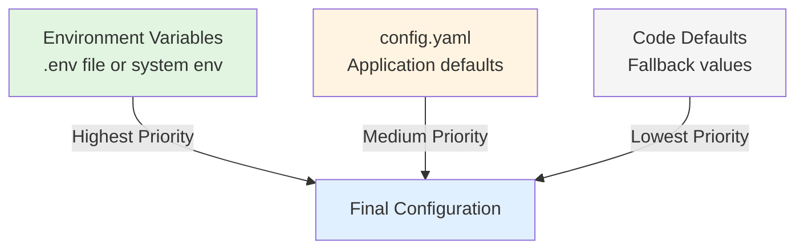
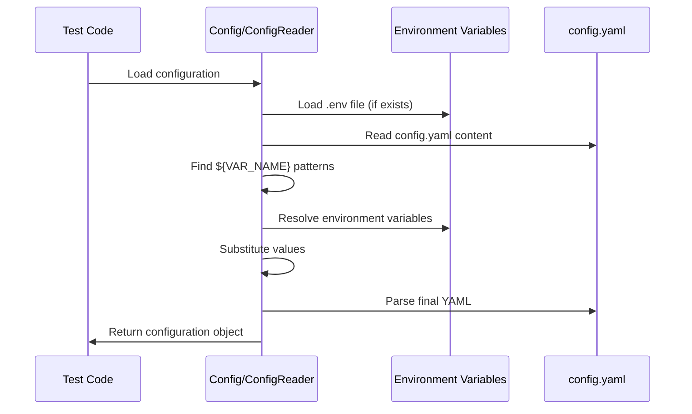

# Configuration Management Guide

## Overview

This guide provides comprehensive documentation on managing configuration in the Testinium test automation framework. Learn how to effectively use the configuration hierarchy, manage environment-specific settings, secure sensitive credentials, and customize browser, timeout, application, and reporting options.

**What You'll Learn:**
- Configuration hierarchy and precedence rules
- config.yaml structure and all available options
- Environment variable interpolation syntax
- Secrets management best practices for credentials
- Environment-specific configuration patterns
- Configuration access patterns via ConfigReader and Config dataclass
- Browser, timeout, application, and reporting customization
- Troubleshooting configuration issues

**When to Use This Guide:**
- Setting up tests for different environments (local, CI/CD, staging, production)
- Configuring browser settings for various test scenarios
- Managing test credentials securely
- Customizing timeouts for different application behaviors
- Troubleshooting configuration-related test failures

## Prerequisites

- Framework installed (see [Installation Guide](../getting-started/installation.md))
- Basic understanding of YAML syntax
- Familiarity with environment variables

## Configuration Architecture

The framework uses a three-layer configuration hierarchy with clear precedence rules, enabling flexible configuration management across different environments.



### Configuration Precedence Rules

The framework resolves configuration values using the following precedence (highest to lowest):

1. **Environment Variables** (.env file or system environment)
   - Highest priority
   - Override all other sources
   - Format: `BROWSER_TYPE=chrome`
   - Use for: Sensitive credentials, environment-specific URLs, CI/CD settings

2. **config.yaml Configuration**
   - Medium priority
   - Application-wide defaults
   - Format: YAML key-value pairs
   - Use for: Standard test settings, shared configuration across team

3. **Code Defaults**
   - Lowest priority
   - Fallback values in dataclasses
   - Built-in framework defaults
   - Use for: Framework behavior when no configuration provided

**Source:** `utilities/config_reader.py:67-71`, `config/test_config.py:265-309`

## config.yaml Structure

The `config/config.yaml` file is the primary configuration source for the test framework. It provides a well-structured, human-readable format for defining all test settings.

### Complete Configuration File Structure

```yaml
# config/config.yaml
browser:
  type: chrome                    # Browser type: chrome, firefox
  headless: false                 # Headless mode: true/false
  window_size: [1920, 1080]      # Window dimensions [width, height]
  implicit_wait: 0                # Always 0 - use explicit waits only

timeouts:
  explicit: 10                    # Default explicit wait (seconds)
  page_load: 30                   # Page load timeout (seconds)
  element_presence: 5             # Element presence timeout (seconds)
  clickability: 3                 # Element clickability timeout (seconds)

application:
  base_url: ${BASE_URL:https://testinium.example.com}
  login_url: ${BASE_URL:https://testinium.example.com}/login
  web_table_url: ${BASE_URL:https://testinium.example.com}/web-tables
  empl_title: "Employee Management"

credentials:
  username: ${TEST_USERNAME}
  password: ${TEST_PASSWORD}
  sales_manager_username: ${SALES_MANAGER_USERNAME}
  sales_manager_password: ${SALES_MANAGER_PASSWORD}
  pos_manager_username: ${POS_MANAGER_USERNAME}
  pos_manager_password: ${POS_MANAGER_PASSWORD}

reporting:
  screenshot_on_failure: true
  output_directory: reports/
  formats:
    - json
    - html
    - allure
  screenshot_directory: reports/screenshots/
```

**Source:** `config/config.yaml:1-162`

### Configuration Sections Explained

#### Browser Configuration

Controls WebDriver browser settings for test execution.

| Option | Type | Default | Description |
|--------|------|---------|-------------|
| `type` | string | chrome | Browser type: `chrome` or `firefox` |
| `headless` | boolean | false | Run browser without GUI (true for CI/CD) |
| `window_size` | array | [1920, 1080] | Browser window dimensions [width, height] in pixels |
| `implicit_wait` | integer | 0 | **Must be 0** - Framework uses explicit waits only |

**Use Cases:**
- **Local Development:** `headless: false` to see tests execute visually
- **CI/CD Pipelines:** `headless: true` to run tests in headless mode
- **Mobile Testing:** `window_size: [375, 812]` for mobile viewport simulation
- **Cross-Browser:** Switch `type` to test in different browsers

**Example:**
```yaml
browser:
  type: firefox
  headless: true
  window_size: [1280, 720]
  implicit_wait: 0
```

**Source:** `config/config.yaml:18-38`

#### Timeout Configuration

Standardized timeout values replacing inconsistent hardcoded timeouts from the original Java implementation.

| Option | Type | Default | Description |
|--------|------|---------|-------------|
| `explicit` | integer | 10 | Default explicit wait timeout for WebDriverWait |
| `page_load` | integer | 30 | Maximum time to wait for page load events |
| `element_presence` | integer | 5 | Timeout for element presence in DOM |
| `clickability` | integer | 3 | Timeout for element clickability (visible + enabled) |

**Tuning Guidance:**
- **Fast Applications:** Reduce timeouts to fail fast (explicit: 5s)
- **Slow Applications:** Increase timeouts to prevent flakiness (explicit: 20s)
- **Network Conditions:** Adjust page_load for slow networks (page_load: 60s)
- **Dynamic Content:** Increase element_presence for async loading

**Example:**
```yaml
timeouts:
  explicit: 15        # Slower application
  page_load: 45       # Slower network
  element_presence: 8
  clickability: 5
```

**Source:** `config/config.yaml:40-60`

#### Application URL Configuration

Application URLs with environment variable interpolation support for multi-environment deployments.

| Option | Type | Description |
|--------|------|-------------|
| `base_url` | string | Base application URL (supports ${BASE_URL} interpolation) |
| `login_url` | string | Login page URL (typically base_url + /login) |
| `web_table_url` | string | Web table page URL for employee management tests |
| `empl_title` | string | Expected employee page title for verification |

**Environment Variable Interpolation:**
```yaml
# In config.yaml
application:
  base_url: ${BASE_URL:https://testinium.example.com}
  login_url: ${BASE_URL:https://testinium.example.com}/login
```

This syntax means:
- Use `BASE_URL` environment variable if set
- Fall back to `https://testinium.example.com` if `BASE_URL` not set

**Example - Multiple Environments:**
```bash
# Local development (.env file)
BASE_URL=http://localhost:3000

# Staging environment (CI/CD)
BASE_URL=https://staging.testinium.example.com

# Production environment (CI/CD)
BASE_URL=https://testinium.example.com
```

**Source:** `config/config.yaml:62-85`

#### Credentials Configuration

**⚠️ SECURITY CRITICAL:** All credentials **MUST** be loaded from environment variables, never hardcoded in config.yaml or committed to version control.

| Credential | Environment Variable | Description |
|------------|---------------------|-------------|
| `username` | TEST_USERNAME | Default test user login |
| `password` | TEST_PASSWORD | Default test user password |
| `sales_manager_username` | SALES_MANAGER_USERNAME | Sales manager role login |
| `sales_manager_password` | SALES_MANAGER_PASSWORD | Sales manager role password |
| `pos_manager_username` | POS_MANAGER_USERNAME | POS manager role login |
| `pos_manager_password` | POS_MANAGER_PASSWORD | POS manager role password |

**Required Syntax in config.yaml:**
```yaml
credentials:
  username: ${TEST_USERNAME}           # Required variable, no default
  password: ${TEST_PASSWORD}           # Required variable, no default
  sales_manager_username: ${SALES_MANAGER_USERNAME}
  sales_manager_password: ${SALES_MANAGER_PASSWORD}
  pos_manager_username: ${POS_MANAGER_USERNAME}
  pos_manager_password: ${POS_MANAGER_PASSWORD}
```

**Note:** The `${VAR_NAME}` syntax (without `:default`) requires the environment variable to be set. This remediates the hardcoded credentials vulnerability from the original Java implementation.

**Source:** `config/config.yaml:87-110`

#### Reporting Configuration

Controls test execution reporting and artifact generation.

| Option | Type | Default | Description |
|--------|------|---------|-------------|
| `screenshot_on_failure` | boolean | true | Automatically capture screenshots when tests fail |
| `output_directory` | string | reports/ | Base directory for all test artifacts |
| `formats` | array | [json, html, allure] | Report formats to generate |
| `screenshot_directory` | string | reports/screenshots/ | Screenshot storage location |

**Report Formats:**
- **json:** Behave JSON output (`reports/cucumber.json`) for CI/CD integration
- **html:** Behave HTML report (`reports/cucumber-reports.html`) for human review
- **allure:** Allure test report format for enhanced visualization

**Customization Example:**
```yaml
reporting:
  screenshot_on_failure: true
  output_directory: test-results/
  formats:
    - json
    - allure
  screenshot_directory: test-results/failed-screenshots/
```

**Source:** `config/config.yaml:112-139`

## Environment Variable Interpolation

The framework supports powerful environment variable substitution in `config.yaml`, enabling dynamic configuration based on the execution environment.

### Interpolation Syntax

#### Required Variable (No Default)
```yaml
key: ${VAR_NAME}
```
- **Behavior:** Framework requires `VAR_NAME` environment variable to be set
- **If missing:** Raises `ValueError` with clear error message
- **Use for:** Required credentials, mandatory URLs

**Example:**
```yaml
credentials:
  username: ${TEST_USERNAME}  # Must be set in environment
```

#### Optional Variable (With Default)
```yaml
key: ${VAR_NAME:default_value}
```
- **Behavior:** Uses `VAR_NAME` if set, otherwise uses `default_value`
- **If missing:** Falls back to default value
- **Use for:** Environment-specific URLs, optional settings

**Example:**
```yaml
application:
  base_url: ${BASE_URL:https://testinium.example.com}  # Defaults to testinium.example.com
```

### How Interpolation Works

The framework performs environment variable substitution during configuration loading:



**Processing Steps:**
1. Load `.env` file to populate environment variables (if file exists)
2. Read raw `config.yaml` content as string
3. Find all `${VAR_NAME}` and `${VAR_NAME:default}` patterns using regex
4. Resolve each environment variable:
   - If `VAR_NAME` is set → Use environment value
   - If `VAR_NAME` not set and default provided → Use default
   - If `VAR_NAME` not set and no default → Raise error (except for optional credentials)
5. Substitute all placeholders with resolved values
6. Parse final YAML content into Python objects

**Source:** `config/test_config.py:265-309`

### Interpolation Examples

#### Example 1: Different Base URLs per Environment
```yaml
# config.yaml
application:
  base_url: ${BASE_URL:https://testinium.example.com}
```

```bash
# Local development (.env)
BASE_URL=http://localhost:3000

# CI/CD - Staging
export BASE_URL=https://staging.testinium.example.com

# CI/CD - Production
export BASE_URL=https://testinium.example.com
```

#### Example 2: Browser Configuration Override
```yaml
# config.yaml - Default to Chrome
browser:
  type: ${BROWSER_TYPE:chrome}
  headless: ${HEADLESS:false}
```

```bash
# Override to run Firefox in CI/CD
export BROWSER_TYPE=firefox
export HEADLESS=true
```

#### Example 3: Timeout Tuning
```yaml
# config.yaml
timeouts:
  explicit: ${TIMEOUT_EXPLICIT:10}
  page_load: ${TIMEOUT_PAGE_LOAD:30}
```

```bash
# Increase timeouts for slow test environment
export TIMEOUT_EXPLICIT=20
export TIMEOUT_PAGE_LOAD=60
```

## Secrets Management

Proper secrets management is critical for security. The framework provides secure patterns for handling sensitive credentials.

### Security Best Practices

#### ✅ DO: Use Environment Variables for Credentials

**Correct Pattern:**
```yaml
# config.yaml - CORRECT
credentials:
  username: ${TEST_USERNAME}
  password: ${TEST_PASSWORD}
```

```bash
# .env file (local development only)
TEST_USERNAME=testuser@example.com
TEST_PASSWORD=secure_password_here
```

#### ❌ DON'T: Hardcode Credentials in config.yaml

**Anti-Pattern:**
```yaml
# config.yaml - WRONG! NEVER DO THIS!
credentials:
  username: testuser@example.com      # ❌ Hardcoded
  password: password123               # ❌ Hardcoded and committed!
```

### Local Development Secrets Management

#### Step 1: Create .env File from Template
```bash
# Copy template
cp .env.example .env

# Edit .env with your local credentials
nano .env
```

#### Step 2: Configure .env File
```bash
# .env - This file is in .gitignore and never committed
TEST_USERNAME=your.email@example.com
TEST_PASSWORD=your_secure_password

SALES_MANAGER_USERNAME=sales.manager@example.com
SALES_MANAGER_PASSWORD=sales_secure_password

POS_MANAGER_USERNAME=pos.manager@example.com
POS_MANAGER_PASSWORD=pos_secure_password

BASE_URL=http://localhost:3000
```

#### Step 3: Verify .env is Ignored
```bash
# Check .gitignore includes .env
cat .gitignore | grep .env

# Output should include:
# .env

# Verify .env won't be committed
git status
# .env should NOT appear in untracked files
```

**Source:** `.env.example:1-31`

### CI/CD Secrets Management

#### GitHub Actions
```yaml
# .github/workflows/tests.yml
- name: Run tests
  env:
    TEST_USERNAME: ${{ secrets.TEST_USERNAME }}
    TEST_PASSWORD: ${{ secrets.TEST_PASSWORD }}
    BASE_URL: https://staging.testinium.example.com
  run: behave --tags=@Login
```

**Setup:** Add secrets in GitHub repository settings → Secrets and variables → Actions

#### Jenkins
```groovy
// Jenkinsfile
withCredentials([
    usernamePassword(
        credentialsId: 'testinium-credentials',
        usernameVariable: 'TEST_USERNAME',
        passwordVariable: 'TEST_PASSWORD'
    )
]) {
    sh 'behave --tags=@Login'
}
```

**Setup:** Add credentials in Jenkins → Manage Jenkins → Credentials

#### GitLab CI
```yaml
# .gitlab-ci.yml
test:
  script:
    - behave --tags=@Login
  variables:
    BASE_URL: https://staging.testinium.example.com
  # Secrets from GitLab CI/CD Variables
```

**Setup:** Add variables in GitLab project → Settings → CI/CD → Variables

## Environment-Specific Configuration

Manage configuration across different environments (local, CI/CD, staging, production) using environment variables and separate .env files.

### Multi-Environment Setup Pattern

#### Directory Structure
```
project-root/
├── config/
│   └── config.yaml              # Base configuration with interpolation
├── .env.local                   # Local development (gitignored)
├── .env.staging                 # Staging settings (optional, gitignored)
├── .env.production              # Production settings (optional, gitignored)
└── .env.example                 # Template for all environments (committed)
```

### Environment Configuration Examples

#### Local Development Environment

**.env.local:**
```bash
# Local development configuration
BASE_URL=http://localhost:3000
BROWSER_TYPE=chrome
HEADLESS=false

# Local test credentials
TEST_USERNAME=local.test@example.com
TEST_PASSWORD=local_dev_password

SALES_MANAGER_USERNAME=local.sales@example.com
SALES_MANAGER_PASSWORD=local_sales_password

POS_MANAGER_USERNAME=local.pos@example.com
POS_MANAGER_PASSWORD=local_pos_password

# Local debugging - verbose screenshots
SCREENSHOTS_ON_FAILURE=true
```

**Usage:**
```bash
# Load local environment
cp .env.local .env
behave features/
```

#### CI/CD Environment

**GitHub Actions (.github/workflows/tests.yml):**
```yaml
name: Test Suite

on: [push, pull_request]

jobs:
  test:
    runs-on: ubuntu-latest
    env:
      # CI/CD-specific configuration
      BASE_URL: https://ci-test.testinium.example.com
      BROWSER_TYPE: chrome
      HEADLESS: true  # Must be headless in CI/CD
      
      # Timeouts for CI environment
      TIMEOUT_EXPLICIT: 15
      TIMEOUT_PAGE_LOAD: 45
      
    steps:
      - uses: actions/checkout@v3
      
      - name: Run tests
        env:
          # Credentials from GitHub Secrets
          TEST_USERNAME: ${{ secrets.TEST_USERNAME }}
          TEST_PASSWORD: ${{ secrets.TEST_PASSWORD }}
          SALES_MANAGER_USERNAME: ${{ secrets.SALES_MANAGER_USERNAME }}
          SALES_MANAGER_PASSWORD: ${{ secrets.SALES_MANAGER_PASSWORD }}
          POS_MANAGER_USERNAME: ${{ secrets.POS_MANAGER_USERNAME }}
          POS_MANAGER_PASSWORD: ${{ secrets.POS_MANAGER_PASSWORD }}
        run: |
          pip install -r requirements.txt
          behave --tags=@Regression
```

#### Staging Environment

**.env.staging:**
```bash
# Staging environment configuration
BASE_URL=https://staging.testinium.example.com
BROWSER_TYPE=chrome
HEADLESS=true

# Staging credentials (loaded from CI/CD secrets)
TEST_USERNAME=${STAGING_TEST_USERNAME}
TEST_PASSWORD=${STAGING_TEST_PASSWORD}

# Staging-specific timeouts (slower than production)
TIMEOUT_EXPLICIT=15
TIMEOUT_PAGE_LOAD=45
```

#### Production Environment

**.env.production:**
```bash
# Production environment configuration
BASE_URL=https://testinium.example.com
BROWSER_TYPE=chrome
HEADLESS=true

# Production credentials (loaded from CI/CD secrets)
TEST_USERNAME=${PROD_TEST_USERNAME}
TEST_PASSWORD=${PROD_TEST_PASSWORD}

# Production-specific settings
TIMEOUT_EXPLICIT=10
TIMEOUT_PAGE_LOAD=30
```

### Environment Selection Script

Create a helper script to easily switch environments:

**scripts/set-environment.sh:**
```bash
#!/bin/bash
# Usage: ./scripts/set-environment.sh [local|staging|production]

ENVIRONMENT=${1:-local}

if [ -f ".env.${ENVIRONMENT}" ]; then
    cp ".env.${ENVIRONMENT}" .env
    echo "✓ Environment set to: ${ENVIRONMENT}"
    echo "✓ Configuration loaded from .env.${ENVIRONMENT}"
else
    echo "✗ Environment file not found: .env.${ENVIRONMENT}"
    exit 1
fi
```

**Usage:**
```bash
# Switch to local development
./scripts/set-environment.sh local

# Switch to staging
./scripts/set-environment.sh staging

# Switch to production
./scripts/set-environment.sh production
```

## Configuration Access Patterns

The framework provides two complementary ways to access configuration: `ConfigReader` (dictionary-style) and `Config` dataclass (type-safe).

### Pattern 1: ConfigReader (Dictionary-Style Access)

`ConfigReader` provides a singleton with dictionary-style property access using dot notation.

#### Basic Usage

```python
from utilities.config_reader import ConfigReader

# Get singleton instance
config = ConfigReader()

# Access configuration with dot notation
browser_type = config.get_property('browser.type', default='chrome')
timeout = config.get_property('timeouts.explicit', default=10)
base_url = config.get_property('application.base_url')

# Get all properties
all_config = config.get_all_properties()
print(all_config['browser'])  # {'type': 'chrome', 'headless': False, ...}
```

#### Features

**Dot Notation for Nested Keys:**
```python
# Access nested configuration values
config.get_property('browser.type')          # 'chrome'
config.get_property('browser.headless')      # False
config.get_property('timeouts.explicit')     # 10
config.get_property('application.base_url')  # 'https://...'
```

**Environment Variable Precedence:**
```python
# config.yaml has: browser.type: chrome
# Environment has: BROWSER_TYPE=firefox

config.get_property('browser.type')  # Returns 'firefox' (env var wins)
```

**Default Values:**
```python
# Provide default for missing keys
optional = config.get_property('optional.key', default='fallback')

# None as default is also valid
nullable = config.get_property('nullable.key', default=None)

# No default - raises KeyError if missing
required = config.get_property('required.key')  # Raises KeyError if not found
```

**Complete Example:**
```python
from utilities.config_reader import ConfigReader

def setup_test_environment():
    """Configure test environment using ConfigReader."""
    config = ConfigReader()
    
    # Browser configuration
    browser = config.get_property('browser.type', default='chrome')
    headless = config.get_property('browser.headless', default=False)
    
    # Application URLs
    base_url = config.get_property('application.base_url')
    login_url = config.get_property('application.login_url')
    
    # Timeouts
    explicit_wait = config.get_property('timeouts.explicit', default=10)
    page_load = config.get_property('timeouts.page_load', default=30)
    
    print(f"Browser: {browser}, Headless: {headless}")
    print(f"Base URL: {base_url}")
    print(f"Timeouts: explicit={explicit_wait}s, page_load={page_load}s")
```

**Source:** `utilities/config_reader.py:54-335`

### Pattern 2: Config Dataclass (Type-Safe Access)

`Config` dataclass provides type-safe, IDE-friendly access with nested configuration objects.

#### Basic Usage

```python
from config.test_config import Config

# Create Config instance
config = Config()

# Type-safe dot notation access
browser_type = config.browser.type              # str: 'chrome'
is_headless = config.browser.headless           # bool: False
window_width, window_height = config.browser.window_size  # Tuple[int, int]

explicit_timeout = config.timeouts.explicit     # int: 10
base_url = config.application.base_url          # str: 'https://...'
username = config.credentials.username          # Optional[str]

screenshot_on_fail = config.reporting.screenshot_on_failure  # bool: True
```

#### Features

**Type Safety with IDE Autocomplete:**
```python
from config.test_config import Config

config = Config()

# IDE provides autocomplete for config.browser.
# IDE knows config.browser.type is str
# IDE knows config.browser.headless is bool
# IDE knows config.timeouts.explicit is int

# Type hints prevent errors at development time
timeout: int = config.timeouts.explicit  # ✓ Type matches
timeout: str = config.timeouts.explicit  # ✗ Type checker warns
```

**Structured Access:**
```python
# Browser configuration
print(config.browser.type)           # 'chrome'
print(config.browser.headless)       # False
print(config.browser.window_size)    # (1920, 1080)

# Timeout configuration
print(config.timeouts.explicit)      # 10
print(config.timeouts.page_load)     # 30
print(config.timeouts.clickability)  # 3

# Application configuration
print(config.application.base_url)     # 'https://testinium.example.com'
print(config.application.login_url)    # 'https://testinium.example.com/login'

# Credentials configuration
print(config.credentials.username)     # 'testuser@example.com'
# Password not printed for security

# Reporting configuration
print(config.reporting.screenshot_on_failure)  # True
print(config.reporting.formats)                # ['json', 'html', 'allure']
```

**Backward-Compatible Dictionary Access:**
```python
# Config also supports get() method for backward compatibility
browser_type = config.get('browser.type')
timeout = config.get('timeouts.explicit')
optional = config.get('optional.key', 'default')
```

**Complete Example:**
```python
from config.test_config import Config

def configure_webdriver():
    """Configure WebDriver using type-safe Config dataclass."""
    config = Config()
    
    # Access browser settings with full type safety
    options = ChromeOptions() if config.browser.type == 'chrome' else FirefoxOptions()
    
    if config.browser.headless:
        options.add_argument('--headless')
    
    width, height = config.browser.window_size
    options.add_argument(f'--window-size={width},{height}')
    
    # Create driver with timeout configuration
    driver = webdriver.Chrome(options=options)
    driver.set_page_load_timeout(config.timeouts.page_load)
    
    # Navigate to application
    driver.get(config.application.base_url)
    
    return driver
```

**Source:** `config/test_config.py:139-444`

### Pattern Comparison

| Feature | ConfigReader | Config Dataclass |
|---------|--------------|------------------|
| **Access Style** | Dictionary-style with dot notation | Type-safe attribute access |
| **Type Safety** | Runtime (returns Any) | Compile-time (type hints) |
| **IDE Support** | Basic | Full autocomplete |
| **Flexibility** | More flexible | More structured |
| **Best For** | Dynamic key access, optional keys | Type-safe code, refactoring |
| **Singleton** | Yes (shared instance) | No (create per use) |

**Recommendation:** Use `Config` dataclass for type safety and IDE support. Use `ConfigReader` when dynamic key access or singleton pattern is needed.

## Troubleshooting Configuration Issues

### Issue: YAML Parsing Errors

**Symptoms:**
```
yaml.scanner.ScannerError: mapping values are not allowed here
```

**Causes:**
- Invalid YAML syntax (incorrect indentation, missing colons, special characters)
- Tabs instead of spaces
- Unquoted special characters in values

**Solutions:**

1. **Validate YAML Syntax:**
```bash
# Use online YAML validator or yamllint
pip install yamllint
yamllint config/config.yaml
```

2. **Check Indentation:**
```yaml
# ✗ WRONG - Inconsistent indentation
browser:
  type: chrome
    headless: false  # Too many spaces

# ✓ CORRECT - Consistent 2-space indentation
browser:
  type: chrome
  headless: false
```

3. **Quote Special Values:**
```yaml
# ✗ WRONG - Unquoted special characters
application:
  base_url: https://test.com?param=value  # ? causes parsing error

# ✓ CORRECT - Quoted values with special characters
application:
  base_url: "https://test.com?param=value"
```

### Issue: Missing Environment Variables

**Symptoms:**
```
ValueError: Required environment variable not set: TEST_USERNAME
```

**Causes:**
- Environment variable not defined in system or .env file
- Typo in environment variable name
- .env file not in project root

**Solutions:**

1. **Verify .env File Exists:**
```bash
# Check .env file exists in project root
ls -la .env

# If not, create from template
cp .env.example .env
```

2. **Check Environment Variable Names:**
```bash
# List all environment variables
printenv | grep TEST

# Verify variable name matches config.yaml
# config.yaml uses: ${TEST_USERNAME}
# Environment must have: TEST_USERNAME=value
```

3. **Load .env File Manually:**
```python
from dotenv import load_dotenv
load_dotenv()  # Loads .env from current directory

# Or specify path
load_dotenv(dotenv_path='/path/to/.env')
```

4. **Set Environment Variables in Current Session:**
```bash
# Temporary (current session only)
export TEST_USERNAME=testuser@example.com
export TEST_PASSWORD=password

# Verify
echo $TEST_USERNAME
```

### Issue: Environment Variable Interpolation Failures

**Symptoms:**
- Configuration shows `${VAR_NAME}` instead of actual value
- Empty strings for credentials
- Default values not working

**Causes:**
- Incorrect interpolation syntax
- Environment variables loaded after config parsing
- Special characters in variable names

**Solutions:**

1. **Use Correct Interpolation Syntax:**
```yaml
# ✗ WRONG - Shell-style interpolation
base_url: $BASE_URL

# ✗ WRONG - Double curly braces
base_url: ${{BASE_URL}}

# ✓ CORRECT - Config interpolation syntax
base_url: ${BASE_URL}
base_url: ${BASE_URL:https://default.com}
```

2. **Ensure .env File Loads Before Config:**
```python
# ✓ CORRECT - Load dotenv before creating Config
from dotenv import load_dotenv
from config.test_config import Config

load_dotenv()  # Load environment variables first
config = Config()  # Then load configuration
```

3. **Debug Environment Variable Loading:**
```python
import os
from dotenv import load_dotenv

# Load and verify
load_dotenv()
print(f"BASE_URL: {os.getenv('BASE_URL')}")  # Check if loaded
print(f"TEST_USERNAME: {os.getenv('TEST_USERNAME')}")

# If None, variable not loaded
```

### Issue: Configuration Precedence Confusion

**Symptoms:**
- Unexpected configuration values
- Environment variables not overriding config.yaml
- Changes to config.yaml not taking effect

**Causes:**
- Misunderstanding of precedence rules
- Cached configuration singleton
- Environment variable name mismatch

**Solutions:**

1. **Understand Precedence Order:**
```
Environment Variables > config.yaml > Code Defaults
(Highest)                              (Lowest)
```

2. **Check Environment Variable Format:**
```python
# config.yaml key: browser.type
# Environment variable must be: BROWSER_TYPE (dots → underscores, uppercase)

# config.yaml key: timeouts.explicit
# Environment variable must be: TIMEOUTS_EXPLICIT
```

3. **Reset Singleton Configuration:**
```python
from config.test_config import reset_config

# Reset singleton to reload configuration
reset_config()

# Create new instance with updated values
from config.test_config import get_config
config = get_config()
```

4. **Debug Configuration Resolution:**
```python
from utilities.config_reader import ConfigReader
import os

config = ConfigReader()

# Check where value comes from
key = 'browser.type'
env_key = key.upper().replace('.', '_')

print(f"YAML value: {config._config.get('browser', {}).get('type')}")
print(f"Environment variable {env_key}: {os.getenv(env_key)}")
print(f"Final value: {config.get_property(key)}")
```

### Issue: Credentials Not Loading in Tests

**Symptoms:**
- Login tests fail with empty credentials
- `AttributeError: 'NoneType' object has no attribute`
- Warnings: "Default test credentials not configured"

**Causes:**
- Credentials not set in environment
- Missing .env file
- Typo in credential variable names

**Solutions:**

1. **Verify Credentials in .env:**
```bash
# Check .env file contains all credentials
cat .env | grep USERNAME
cat .env | grep PASSWORD

# Should show:
# TEST_USERNAME=...
# TEST_PASSWORD=...
# SALES_MANAGER_USERNAME=...
# etc.
```

2. **Test Credential Loading:**
```python
from config.test_config import Config

config = Config()

# Check credentials loaded
print(f"Username set: {config.credentials.username is not None}")
print(f"Password set: {config.credentials.password is not None}")

if not config.credentials.username:
    print("❌ Credentials not loaded - check .env file")
else:
    print("✓ Credentials loaded successfully")
```

3. **Add Validation in Tests:**
```python
from behave import given
from config.test_config import Config

@given('user is on the login page')
def step_impl(context):
    config = Config()
    
    # Validate credentials before test execution
    if not config.credentials.username or not config.credentials.password:
        raise ValueError(
            "Test credentials not configured. "
            "Set TEST_USERNAME and TEST_PASSWORD in .env file."
        )
    
    context.config = config
    # Continue with test...
```

### Issue: Configuration Changes Not Taking Effect

**Symptoms:**
- Modified config.yaml values not reflected in tests
- Browser still uses old settings
- Timeout changes ignored

**Causes:**
- Configuration cached in singleton
- Changed wrong config file
- Configuration loaded before changes

**Solutions:**

1. **Restart Test Process:**
```bash
# Kill and restart test execution
# Configuration loads once per process

# Stop running tests (Ctrl+C)
# Run tests again
behave features/
```

2. **Clear Python Cache:**
```bash
# Remove cached bytecode
find . -type d -name __pycache__ -exec rm -r {} +
find . -name "*.pyc" -delete

# Restart tests
behave features/
```

3. **Verify Correct Config File:**
```bash
# Check which config file is being used
python -c "from config.test_config import Config; import os; print(os.path.abspath('config/config.yaml'))"

# Verify you're editing the correct file
```

4. **Reset Singleton for Testing:**
```python
# In test setup
from config import test_config

# Reset singleton
test_config._config_instance = None

# Load fresh configuration
config = test_config.Config()
```

### Issue: Parallel Execution Configuration Conflicts

**Symptoms:**
- Tests interfere with each other's configuration
- Credentials mixed between test threads
- Inconsistent browser settings across parallel tests

**Causes:**
- Shared singleton configuration modified by tests
- Environment variables changed during test execution
- Non-thread-safe configuration access

**Solutions:**

1. **Use Read-Only Configuration:**
```python
# ✓ CORRECT - Read configuration, don't modify
config = Config()
browser = config.browser.type  # Read only

# ✗ WRONG - Modifying shared configuration
config.browser.type = 'firefox'  # Affects all threads!
```

2. **Environment Variables Before Parallel Execution:**
```bash
# Set all environment variables before starting behave
export BROWSER_TYPE=chrome
export HEADLESS=true
export BASE_URL=https://test.com

# Then start parallel tests (environment fixed for all)
behave --processes 4 --parallel-element feature
```

3. **Separate Configuration Per Process:**
```python
# For advanced use cases, create config per test
def before_scenario(context, scenario):
    # Each scenario gets its own Config instance
    context.config = Config()
    # Configuration read from environment (same for all processes)
```

## Best Practices for Configuration Management

### ✅ DO: Use Environment Variables for Sensitive Data

```yaml
# config.yaml
credentials:
  username: ${TEST_USERNAME}
  password: ${TEST_PASSWORD}
```

```bash
# .env (gitignored)
TEST_USERNAME=testuser@example.com
TEST_PASSWORD=secure_password
```

**Why:** Prevents accidental credential commits, supports different credentials per environment.

### ✅ DO: Provide Defaults for Non-Sensitive Settings

```yaml
browser:
  type: ${BROWSER_TYPE:chrome}
  headless: ${HEADLESS:false}
```

**Why:** Tests work out-of-box with reasonable defaults, can be overridden when needed.

### ✅ DO: Validate Configuration on Startup

```python
from config.test_config import Config

def validate_configuration():
    """Validate configuration before running tests."""
    config = Config()
    
    # Check required credentials
    if not config.credentials.username:
        raise ValueError("TEST_USERNAME not set")
    if not config.credentials.password:
        raise ValueError("TEST_PASSWORD not set")
    
    # Validate URLs
    if not config.application.base_url.startswith('http'):
        raise ValueError("Invalid BASE_URL format")
    
    print("✓ Configuration validated successfully")

# In features/environment.py before_all
def before_all(context):
    validate_configuration()
```

**Why:** Fails fast with clear error messages instead of cryptic test failures.

### ✅ DO: Document Required Environment Variables

```yaml
# config.yaml - Add comments explaining variables
application:
  # BASE_URL: Application URL (required)
  # - Local: http://localhost:3000
  # - Staging: https://staging.testinium.example.com
  # - Production: https://testinium.example.com
  base_url: ${BASE_URL}
```

```bash
# .env.example - Provide template
# Copy this file to .env and fill in values

# Application URL (required)
BASE_URL=https://testinium.example.com

# Test Credentials (required)
TEST_USERNAME=your_username_here
TEST_PASSWORD=your_password_here
```

**Why:** Makes onboarding easier, reduces configuration errors.

### ✅ DO: Use Separate Environments for Different Test Stages

```bash
# Local development
cp .env.local .env

# CI/CD - staging
export BASE_URL=https://staging.testinium.example.com

# CI/CD - production
export BASE_URL=https://testinium.example.com
```

**Why:** Prevents accidentally running tests against production, isolates environments.

### ✅ DO: Version Control Configuration Templates

```bash
git add .env.example          # ✓ Commit template
git add config/config.yaml    # ✓ Commit with interpolation
git add .gitignore            # ✓ Ensure .env is ignored
```

**Why:** Team members get consistent configuration structure, no actual secrets committed.

### ❌ DON'T: Hardcode Credentials

```yaml
# ❌ WRONG
credentials:
  username: testuser@example.com
  password: password123
```

**Why:** Security vulnerability, credentials exposed in version control.

### ❌ DON'T: Commit .env Files

```bash
# ❌ WRONG
git add .env
git commit -m "Add configuration"
```

**Why:** Exposes sensitive credentials to anyone with repository access.

### ❌ DON'T: Modify Singleton Configuration During Tests

```python
# ❌ WRONG
from utilities.config_reader import ConfigReader

config = ConfigReader()
ConfigReader._config['browser']['type'] = 'firefox'  # Affects all tests!
```

**Why:** Causes race conditions in parallel execution, unpredictable test behavior.

### ❌ DON'T: Use Different Config Files for Different Environments

```bash
# ❌ WRONG - Anti-pattern
config/config-local.yaml
config/config-staging.yaml
config/config-production.yaml
```

**Why:** Duplication, harder to maintain, defeats purpose of environment variables.

**✓ CORRECT Alternative:**
```bash
# One config file with interpolation
config/config.yaml

# Different .env files (gitignored)
.env.local
.env.staging
.env.production
```

### ❌ DON'T: Use Implicit Waits

```yaml
# ❌ WRONG
browser:
  implicit_wait: 10  # Never use implicit waits
```

**Why:** Implicit waits interfere with explicit waits, cause unpredictable timing issues. Always use `implicit_wait: 0`.

## See Also

- [Getting Started - Configuration](../getting-started/configuration.md) - Initial configuration setup
- [API Reference - Config](../api-reference/config/test-config.md) - Complete Config dataclass API
- [API Reference - ConfigReader](../api-reference/utilities/config-reader.md) - ConfigReader singleton API
- [Deployment - CI/CD Integration](../deployment/jenkins-integration.md) - CI/CD configuration patterns
- [Troubleshooting - Configuration Issues](../troubleshooting/configuration-issues.md) - Additional troubleshooting
- [Environment Variables Reference](../reference/environment-variables.md) - Complete variable list
- [Configuration Options Reference](../reference/configuration-options.md) - All config.yaml options

---

**Documentation Version:** 1.0.0  
**Last Updated:** 2024  
**Framework Version:** Python 3.9+, Behave 1.2.6, Selenium 4.15.2
