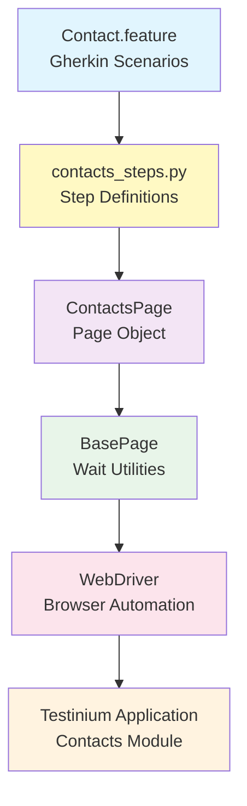
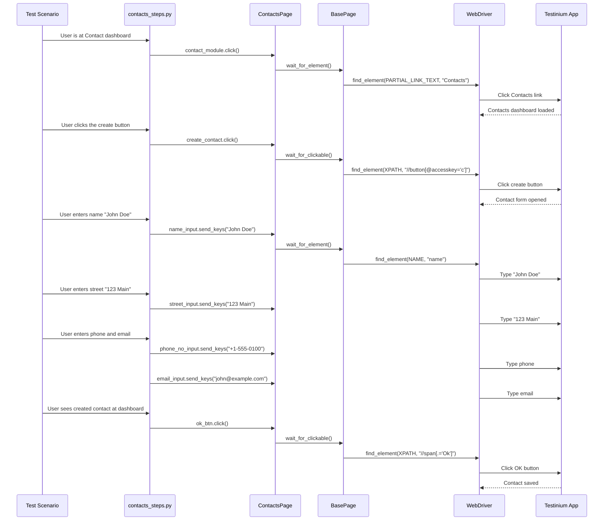

# Contact Management Testing Guide

## Overview

This guide provides comprehensive documentation for testing contact management functionality in the Testinium application using the Python Selenium + Behave BDD framework. Contact management encompasses complete CRUD (Create, Read, Update, Delete) operations for managing customer and vendor contacts with fields including name, street address, phone number, and email address.

**What You'll Learn:**
- Creating contacts with name, street, phone, and email fields
- Deleting contacts from different locations (list view and profile view)
- Editing existing contact information
- Printing due payment reports for contacts
- Best practices for contact testing with unique test data
- Troubleshooting common contact-specific issues

**Prerequisites:**
- Framework installed and configured (see [Installation Guide](../getting-started/installation.md))
- Valid test user credentials with Posmanager role
- Understanding of [Page Object Model](page-object-model.md) pattern
- Basic familiarity with [Gherkin syntax](../reference/gherkin-syntax.md)

**Feature Coverage:**
- Contact creation with validation
- Contact list navigation and selection
- Contact editing workflows
- Contact deletion from multiple locations
- Print and export functionality for due payments

## Contact Module Architecture

The contact management testing implementation follows a three-layer architecture connecting Gherkin scenarios to browser automation:



**Architecture Components:**

1. **Feature Layer** (`features/Contact.feature`)
   - Gherkin scenarios defining contact test cases
   - Scenario outlines with example data tables
   - Background steps for authentication and navigation

2. **Step Definition Layer** (`features/steps/contacts_steps.py`)
   - 14 step definitions implementing Gherkin steps
   - Context management with thread-local WebDriver
   - Logging and error handling for test execution tracking

3. **Page Object Layer** (`pages/contacts_page.py`)
   - ContactsPage class with 16 element properties
   - Property-based locators with explicit waits
   - Encapsulation of contact module UI interactions

4. **Base Utilities Layer** (`pages/base_page.py`)
   - Explicit wait strategies (wait_for_element, wait_for_clickable)
   - Common interaction methods (click, send_keys)
   - Stale element prevention through fresh lookups

**Source:** `features/Contact.feature`, `features/steps/contacts_steps.py`, `pages/contacts_page.py`

## Contact Creation Testing

Contact creation is the fundamental operation for adding new contacts to the system with name, street address, phone number, and email fields.

### Basic Contact Creation Scenario

The basic scenario demonstrates creating a single contact with all required fields:

```gherkin
Feature: Testinium app Inventory feature

  Background: As a Posmanager, should be able to create, delete, edit a contact
    Given User login to test other features
    Given User is at Contact dashboard

  Scenario: Create a new contact
    When User clicks the create button
    And User enters name "John Doe"
    And User enters street "123 Main Street"
    And User enters "+1-555-0100" and "john.doe@example.com"
    And User clicks save button
    Then User sees the created new contact details at dashboard
```

**Source:** `features/Contact.feature:8-14` (adapted from scenario outline)

### Data-Driven Contact Creation

Use Scenario Outlines with Examples tables for data-driven testing with multiple contact datasets:

```gherkin
Scenario Outline: Verify that the user can create a new contact
  When User clicks the create button
  And User enters name "<name>"
  And User enters "<street name>"
  And User enters "<phone number>" and "<email>"
  And User clicks save button
  Then User sees the created new contact details at dashboard
  
  Examples:
    | name       | street name      | phone number    | email               |
    | &Dustin    | Haussman         | +99999999999    | abcd@info.com       |
    | Jane Smith | 456 Oak Avenue   | +1-555-0200     | jane.smith@test.com |
    | Bob Wilson | 789 Pine Street  | +44-20-7946-0958| bob.wilson@uk.com   |
```

**Source:** `features/Contact.feature:8-18`

### Step Definition Implementation

The contact creation workflow is implemented through multiple coordinated step definitions:

```python
from behave import when, then
from pages.contacts_page import ContactsPage
import logging

logger = logging.getLogger(__name__)

@when("User is at Contact dashboard")
def user_is_at_contact_dashboard(context):
    """Navigate to the Contacts module dashboard."""
    logger.info("Navigating to Contact dashboard")
    contacts_page = ContactsPage(context.driver)
    contacts_page.contact_module.click()
    logger.debug("Clicked Contacts module navigation link")

@when("User clicks the create button")
def user_clicks_the_create_button(context):
    """Click the create contact button to open the contact creation form."""
    logger.info("Clicking create contact button")
    contacts_page = ContactsPage(context.driver)
    contacts_page.create_contact.click()
    logger.debug("Create contact form opened")

@when('User enters name "{name}"')
def user_enters_name(context, name):
    """Enter contact name in the name input field."""
    logger.info(f"Entering contact name: {name}")
    contacts_page = ContactsPage(context.driver)
    
    # Clear existing value and enter new name
    name_input = contacts_page.name_input
    name_input.clear()
    name_input.send_keys(name)
    logger.debug(f"Contact name '{name}' entered successfully")

@when('User enters street "{street_name}"')
def user_enters_street(context, street_name):
    """Enter street address in the street input field."""
    logger.info(f"Entering street address: {street_name}")
    contacts_page = ContactsPage(context.driver)
    contacts_page.street_input.send_keys(street_name)
    logger.debug(f"Street address '{street_name}' entered successfully")

@when('User enters "{phone_no}" and "{email}"')
def user_enters_phone_and_email(context, phone_no, email):
    """Enter phone number and email address in respective input fields."""
    logger.info(f"Entering phone: {phone_no} and email: {email}")
    contacts_page = ContactsPage(context.driver)
    
    # Enter phone number
    contacts_page.phone_no_input.send_keys(phone_no)
    logger.debug(f"Phone number '{phone_no}' entered")
    
    # Enter email address
    contacts_page.email_input.send_keys(email)
    logger.debug(f"Email address '{email}' entered")

@then("User sees the created new contact details at dashboard")
def user_sees_created_contact_at_dashboard(context):
    """Verify contact creation by saving and returning to dashboard."""
    logger.info("Verifying contact creation at dashboard")
    contacts_page = ContactsPage(context.driver)
    
    # Click contact module to refresh the view
    contacts_page.contact_module.click()
    logger.debug("Clicked contact module for dashboard refresh")
    
    # Click OK button to save contact
    contacts_page.ok_btn.click()
    logger.debug("Clicked OK button to save contact")
    logger.info("Contact creation verified and saved")
```

**Source:** `features/steps/contacts_steps.py:88-312`

### Contact Creation Workflow Sequence

The following sequence diagram illustrates the complete contact creation flow from test scenario to browser:



## Contact Deletion Testing

Contact deletion functionality allows removing contacts from the system. The framework supports deletion from two different locations: list view and profile view.

### Deletion from List View

Delete contacts after selecting them from the contact list:

```gherkin
Scenario: Verify that the user can delete a contact from list view
  When User clicks list section and choose the profile
  And User clicks Action to choose delete button
  Then User sees deleted profile
```

**Source:** `features/Contact.feature:19-24`

### Deletion Step Implementations

The deletion workflow involves navigating to the contact list, selecting a contact, and triggering the delete action:

```python
@when("User clicks list section and choose the profile")
def user_clicks_list_and_choose_profile(context):
    """Navigate to contact list section and select a specific contact profile."""
    logger.info("Navigating to contact list and selecting profile")
    contacts_page = ContactsPage(context.driver)
    
    # Click call list button to show contact list
    contacts_page.call_list.click()
    logger.debug("Clicked call list button")
    
    # Click contact checkbox to select profile
    # Note: Uses position-dependent locator (index [12])
    contacts_page.new_contact.click()
    logger.debug("Selected contact profile via checkbox")
    logger.info("Contact profile selected successfully")

@when("User clicks Action to choose delete button")
def user_clicks_action_to_choose_delete(context):
    """Open the action menu and select the delete option."""
    logger.info("Opening action menu to select delete option")
    contacts_page = ContactsPage(context.driver)
    
    # Click action menu dropdown
    contacts_page.action_input.click()
    logger.debug("Opened action menu")
    
    # Click delete option from menu
    contacts_page.delete_input.click()
    logger.debug("Clicked delete button from action menu")
    logger.info("Delete action initiated")

@then("User sees deleted profile")
def user_sees_deleted_profile(context):
    """Verify that the contact profile has been deleted."""
    logger.info("Verifying contact deletion")
    contacts_page = ContactsPage(context.driver)
    
    # Get delete confirmation message
    actual_msg = contacts_page.delete_input.text
    logger.debug(f"Delete confirmation message retrieved: '{actual_msg}'")
    
    # Define expected message
    expected_msg = "Deleted"
    
    # Perform assertion with descriptive error message
    assert actual_msg == expected_msg, (
        f"Delete confirmation message mismatch. "
        f"Expected: '{expected_msg}', Actual: '{actual_msg}'"
    )
    logger.info(f"Contact deletion verified - message matches: '{expected_msg}'")
```

**Source:** `features/steps/contacts_steps.py:319-533`

### Deletion from Profile View (Commented in Feature)

The feature file includes commented-out steps for deleting directly from profile view:

```gherkin
# Alternative deletion path (currently commented):
# When User clicks and goes directly to the profile
# And User clicks Action to choose delete button
# Then User sees deleted profile
```

**Note:** This deletion path is present in the feature file but commented out. The implementation supports this workflow through the same action menu steps used in list view deletion.

**Source:** `features/Contact.feature:22-23`

### Action Menu Interaction Pattern

The action menu provides access to various contact operations. Understanding this pattern is crucial for deletion workflows:

```python
# Action menu pattern used across contact operations
contacts_page = ContactsPage(context.driver)

# Step 1: Select the contact (from list or profile)
contacts_page.new_contact.click()  # or contacts_page.first_user.click()

# Step 2: Open the action menu
contacts_page.action_input.click()

# Step 3: Select the desired action (delete, edit, etc.)
contacts_page.delete_input.click()

# Step 4: Verify the action result
assert contacts_page.delete_input.text == "Deleted"
```

## Contact Editing Testing

Contact editing enables modification of existing contact information including name, street address, phone number, and email.

### Contact Edit Scenario

The edit workflow involves selecting a contact, entering edit mode, modifying fields, and saving changes:

```gherkin
Scenario Outline: Verify that the user can edit the contact
  When User selects the profile
  And User clicks for editing button
  And User enters name "<name>"
  And User enters "<street name>"
  And User enters "<phone number>" and "<email>"
  And User clicks save button
  Then User sees the updated contact details at dashboard
  
  Examples:
    | name       | street name      | phone number    | email               |
    | &Dustin    | Haussman         | +99999999999    | abcd@info.com       |
    | Alice Chen | 321 Maple Drive  | +86-10-8888-8888| alice.chen@cn.com   |
```

**Source:** `features/Contact.feature:26-36`

### Contact Edit Step Implementations

The editing workflow is implemented through profile selection and edit mode activation:

```python
@when("User selects the profile")
def user_selects_the_profile(context):
    """Select the first user/contact profile from the kanban view."""
    logger.info("Selecting contact profile")
    contacts_page = ContactsPage(context.driver)
    
    # Click first user in kanban view
    # Note: Uses position-dependent locator (index [1])
    contacts_page.first_user.click()
    logger.debug("Clicked first user profile")
    
    # Wait for edit title to be visible - confirms profile loaded
    edit_title_element = contacts_page.edit_title
    logger.debug("Edit title visible - profile loaded successfully")
    logger.info("Contact profile selected and loaded")

@when("User clicks for editing button")
def user_clicks_for_editing_button(context):
    """Click the edit button to enter edit mode for the contact."""
    logger.info("Clicking edit button to enter edit mode")
    contacts_page = ContactsPage(context.driver)
    
    # Click edit button to enable form fields
    contacts_page.edit_btn.click()
    logger.debug("Edit button clicked - edit mode activated")

@then("User sees the updated contact details at dashboard")
def user_sees_updated_contact_at_dashboard(context):
    """Verify contact update by navigating back to the contacts dashboard."""
    logger.info("Verifying updated contact at dashboard")
    contacts_page = ContactsPage(context.driver)
    
    # Click contact module to return to dashboard
    contacts_page.contact_module.click()
    logger.debug("Navigated back to contacts dashboard")
    logger.info("Contact update verified - returned to dashboard")
```

**Source:** `features/steps/contacts_steps.py:364-569`

### Complete Edit Workflow Example

Here's a complete example combining all steps for editing a contact:

```python
from behave import given, when, then
from pages.contacts_page import ContactsPage

@given("User is at Contact dashboard")
def navigate_to_contacts(context):
    contacts_page = ContactsPage(context.driver)
    contacts_page.contact_module.click()

@when("I edit the first contact")
def edit_first_contact(context):
    contacts_page = ContactsPage(context.driver)
    
    # Select the first contact profile
    contacts_page.first_user.click()
    
    # Wait for profile to load
    assert contacts_page.edit_title.is_displayed()
    
    # Click edit button
    contacts_page.edit_btn.click()
    
    # Modify contact fields
    contacts_page.name_input.clear()
    contacts_page.name_input.send_keys("Updated Name")
    
    contacts_page.street_input.clear()
    contacts_page.street_input.send_keys("456 Updated Street")
    
    contacts_page.phone_no_input.clear()
    contacts_page.phone_no_input.send_keys("+1-555-9999")
    
    contacts_page.email_input.clear()
    contacts_page.email_input.send_keys("updated@example.com")
    
    # Save changes
    contacts_page.ok_btn.click()
    
@then("The contact should be updated successfully")
def verify_contact_updated(context):
    contacts_page = ContactsPage(context.driver)
    
    # Return to dashboard
    contacts_page.contact_module.click()
    
    # Additional verification could check if updated data is visible
    # in the contact list or by reopening the contact profile
```

## Print and Export Functionality

The contacts module includes functionality to print and export due payment reports for contacts.

### Print Due Payments Scenario

```gherkin
Scenario: Verify that the user can print for his due payments
  When User selects the profile
  And User clicks the print button and then select due payments
  Then User can see the downloaded file
```

**Source:** `features/Contact.feature:38-41`

### Print Functionality Implementation

```python
@when("User clicks the print button and then select due payments")
def user_clicks_print_and_select_due_payments(context):
    """Click the print button to open print options menu."""
    logger.info("Opening print menu for due payments")
    contacts_page = ContactsPage(context.driver)
    
    # Click print button to open print options
    contacts_page.print_input.click()
    logger.debug("Print menu opened")
    logger.info("Print options menu displayed")

@then("User can see the downloaded file")
def user_can_see_downloaded_file(context):
    """Select due payments option from the print menu to trigger file download."""
    logger.info("Selecting due payments for download")
    contacts_page = ContactsPage(context.driver)
    
    # Click due payment button to initiate download
    contacts_page.due_payment.click()
    logger.debug("Due payments option clicked - download initiated")
    logger.info("Due payments download triggered successfully")
```

**Source:** `features/steps/contacts_steps.py:576-655`

**Important Note:** The step name "User can see the downloaded file" is somewhat misleading as the implementation only triggers the download but doesn't verify the file actually downloaded. File download verification would require additional assertions checking the downloads directory.

## Page Object Patterns for Contact Elements

The `ContactsPage` class encapsulates all contact module element locators using the property-based locator pattern with explicit waits.

### ContactsPage Class Structure

```python
from selenium.webdriver.common.by import By
from selenium.webdriver.remote.webelement import WebElement
from pages.base_page import BasePage

class ContactsPage(BasePage):
    """Page object for Contacts module providing element locators and interaction methods."""
    
    # Private locator constants (16 total)
    _CONTACT_MODULE = (By.PARTIAL_LINK_TEXT, "Contacts")
    _CREATE_CONTACT_BUTTON = (By.XPATH, "//button[@accesskey='c']")
    _NAME_INPUT = (By.NAME, "name")
    _STREET_INPUT = (By.NAME, "street")
    _PHONE_INPUT = (By.NAME, "phone")
    _EMAIL_INPUT = (By.NAME, "email")
    _OK_BUTTON = (By.XPATH, "//span[.='Ok']")
    _CALL_LIST_BUTTON = (By.XPATH, "//button[@accesskey='l']")
    _NEW_CONTACT_CHECKBOX = (By.XPATH, "(//div[@class='o_checkbox']/input)[12]")
    _ACTION_INPUT = (By.XPATH, "(//div[@class='o_cp_sidebar']/div/div)[2]")
    _DELETE_INPUT = (By.XPATH, "//a[@data-index='3']")
    _FIRST_USER = (By.XPATH, "(//div[@class='o_kanban_view o_res_partner_kanban o_kanban_ungrouped']/div)[1]")
    _EDIT_TITLE = (By.XPATH, "//div[@class='oe_title']")
    _EDIT_BUTTON = (By.XPATH, "//button[@class='btn btn-primary btn-sm o_form_button_edit']")
    _PRINT_INPUT = (By.XPATH, "//div[@class='btn-group o_dropdown open']")
    _DUE_PAYMENT = (By.XPATH, "(//div[@class='btn-group o_dropdown open']/button)")
    
    # Public property-based element accessors
    @property
    def contact_module(self) -> WebElement:
        """Contacts module navigation link in the main menu."""
        return self.wait_for_element(self._CONTACT_MODULE)
    
    @property
    def create_contact(self) -> WebElement:
        """Create contact button with accesskey 'c' for keyboard shortcut."""
        return self.wait_for_clickable(self._CREATE_CONTACT_BUTTON)
    
    @property
    def name_input(self) -> WebElement:
        """Contact name input field in the contact creation/edit form."""
        return self.wait_for_element(self._NAME_INPUT)
    
    @property
    def street_input(self) -> WebElement:
        """Contact street address input field in the contact form."""
        return self.wait_for_element(self._STREET_INPUT)
    
    @property
    def phone_no_input(self) -> WebElement:
        """Contact phone number input field in the contact form."""
        return self.wait_for_element(self._PHONE_INPUT)
    
    @property
    def email_input(self) -> WebElement:
        """Contact email address input field in the contact form."""
        return self.wait_for_element(self._EMAIL_INPUT)
    
    @property
    def ok_btn(self) -> WebElement:
        """OK button to confirm and save contact form changes."""
        return self.wait_for_clickable(self._OK_BUTTON)
    
    @property
    def call_list(self) -> WebElement:
        """Call list button with accesskey 'l' for keyboard shortcut."""
        return self.wait_for_clickable(self._CALL_LIST_BUTTON)
    
    @property
    def new_contact(self) -> WebElement:
        """Contact selection checkbox (position-dependent selector - index [12])."""
        return self.wait_for_element(self._NEW_CONTACT_CHECKBOX)
    
    @property
    def action_input(self) -> WebElement:
        """Action menu input element in the sidebar (position-dependent - index [2])."""
        return self.wait_for_element(self._ACTION_INPUT)
    
    @property
    def delete_input(self) -> WebElement:
        """Delete action link in the contact action menu."""
        return self.wait_for_clickable(self._DELETE_INPUT)
    
    @property
    def edit_btn(self) -> WebElement:
        """Edit button to modify existing contact details."""
        return self.wait_for_clickable(self._EDIT_BUTTON)
    
    @property
    def first_user(self) -> WebElement:
        """First user/contact card in the kanban view (position-dependent - index [1])."""
        return self.wait_for_clickable(self._FIRST_USER)
    
    @property
    def edit_title(self) -> WebElement:
        """Edit title section element in the contact form."""
        return self.wait_for_element(self._EDIT_TITLE)
    
    @property
    def print_input(self) -> WebElement:
        """Print dropdown menu element for contact printing operations."""
        return self.wait_for_element(self._PRINT_INPUT)
    
    @property
    def due_payment(self) -> WebElement:
        """Due payment button within the dropdown menu."""
        return self.wait_for_clickable(self._DUE_PAYMENT)
```

**Source:** `pages/contacts_page.py:79-561`

### Locator Strategy Breakdown

The ContactsPage uses multiple locator strategies for robustness:

| Strategy | Count | Elements | Stability |
|----------|-------|----------|-----------|
| NAME attribute | 4 | Form inputs (name, street, phone, email) | ✅ High - Stable |
| PARTIAL_LINK_TEXT | 1 | Contact module navigation | ✅ High - Stable |
| XPATH with accesskey | 2 | Create and call list buttons | ✅ High - Stable |
| XPATH text match | 1 | OK button | ✅ High - Stable |
| XPATH with data-index | 1 | Delete button | ⚠️ Medium - Depends on data attribute |
| XPATH with classes | 3 | Edit title, edit button, print input | ⚠️ Medium - Class-dependent |
| XPATH position-based | 3 | new_contact, action_input, first_user | ❌ Low - Brittle |

**Source:** `pages/contacts_page.py:132-191`

### Technical Debt: Position-Dependent Locators

⚠️ **Warning:** Three locators use position-based indexing which is brittle and may break with DOM changes:

1. **new_contact**: `(//div[@class='o_checkbox']/input)[12]`
   - Uses hardcoded index [12] to select specific checkbox
   - Risk: Breaks if contact order changes or new contacts added
   - Recommended: Request `data-testid="contact-checkbox-{contact_id}"` attribute

2. **action_input**: `(//div[@class='o_cp_sidebar']/div/div)[2]`
   - Uses hardcoded index [2] for sidebar element selection
   - Risk: Breaks if sidebar structure changes
   - Recommended: Request `data-testid="sidebar-action-menu"` attribute

3. **first_user**: `(//div[@class='o_kanban_view o_res_partner_kanban o_kanban_ungrouped']/div)[1]`
   - Uses index [1] to select first user in kanban view
   - Risk: Brittle with dynamic user lists
   - Recommended: Request `data-testid="contact-card-{index}"` attribute

These locators are preserved from the Java implementation for behavioral equivalence but should be refactored when the application team adds test identifiers.

**Source:** `pages/contacts_page.py:22-48`

### Property-Based Locator Pattern Benefits

The property-based pattern provides several advantages for contact testing:

1. **Fresh Element Lookups**: Each property call performs a new element search, preventing stale element references
2. **Built-in Explicit Waits**: Properties use BasePage wait methods (wait_for_element, wait_for_clickable)
3. **Encapsulation**: Private locator constants with public property accessors
4. **Thread Safety**: Each thread gets fresh element references via thread-local WebDriver
5. **Maintainability**: Locator changes only require updating the private constant

**Example Usage:**

```python
# Bad: Storing element reference (can become stale)
name_field = contacts_page.name_input  # WebElement reference
time.sleep(5)  # Page may refresh
name_field.send_keys("Test")  # May throw StaleElementReferenceException

# Good: Fresh lookup each time (prevents stale elements)
contacts_page.name_input.clear()  # Fresh lookup
contacts_page.name_input.send_keys("Test")  # Fresh lookup
```

## Wait Strategies for Contact Operations

All contact operations use explicit waits through BasePage utilities. Understanding when to use each wait method is crucial for reliable contact testing.

### BasePage Wait Methods

The ContactsPage inherits three primary wait methods from BasePage:

```python
class BasePage:
    def wait_for_element(self, locator: Tuple[str, str]) -> WebElement:
        """Wait for element presence in DOM (may not be visible)."""
        # Used for elements that just need to exist
        # Example: name_input, street_input, email_input
        
    def wait_for_clickable(self, locator: Tuple[str, str]) -> WebElement:
        """Wait for element to be visible AND enabled for clicking."""
        # Used for buttons and interactive elements
        # Example: create_contact, edit_btn, ok_btn, delete_input
        
    def wait_for_visibility(self, locator: Tuple[str, str]) -> WebElement:
        """Wait for element to be visible (may not be clickable)."""
        # Used for elements that need to be visible but not necessarily clickable
        # Example: Verification elements, status messages
```

**Source:** `pages/base_page.py` (inherited by ContactsPage)

### Wait Strategy Selection Guide

| Element Type | Wait Method | Reason |
|--------------|-------------|---------|
| Form inputs (name, street, phone, email) | `wait_for_element` | Input fields just need to exist in DOM |
| Buttons (create, edit, save, delete) | `wait_for_clickable` | Buttons must be visible and enabled |
| Navigation links (contact_module) | `wait_for_element` | Links may load slightly delayed |
| Action menu items | `wait_for_clickable` | Menu items must be clickable |
| Confirmation elements (edit_title) | `wait_for_element` | Confirms page loaded, doesn't need interaction |

### Contact Creation Wait Flow

The contact creation workflow demonstrates proper wait strategy application:

```python
@when("User creates a contact")
def create_contact(context):
    contacts_page = ContactsPage(context.driver)
    
    # Navigation: wait_for_element (link may not be immediately visible)
    contacts_page.contact_module.click()
    
    # Button: wait_for_clickable (must be visible and enabled)
    contacts_page.create_contact.click()
    
    # Form inputs: wait_for_element (just need to exist in DOM)
    contacts_page.name_input.send_keys("John Doe")
    contacts_page.street_input.send_keys("123 Main St")
    contacts_page.phone_no_input.send_keys("+1-555-0100")
    contacts_page.email_input.send_keys("john@example.com")
    
    # Save button: wait_for_clickable (must be clickable to save)
    contacts_page.ok_btn.click()
```

### Timeout Configuration

All waits use the timeout configured in `config/config.yaml`:

```yaml
timeouts:
  explicit: 20  # Default explicit wait timeout in seconds
  page_load: 30  # Page load timeout
```

**Override in specific tests if needed:**

```python
from config import get_config

config = get_config()
original_timeout = config.timeouts.explicit

# Temporarily increase timeout for slow operations
config.timeouts.explicit = 30
contacts_page.slow_loading_element.click()

# Restore original timeout
config.timeouts.explicit = original_timeout
```

### Avoiding Common Wait Pitfalls

❌ **Don't use Thread.sleep():**

```python
# Bad: Hard-coded sleep
contacts_page.create_contact.click()
time.sleep(3)  # May be too short or unnecessarily long
contacts_page.name_input.send_keys("Test")
```

✅ **Use property-based waits:**

```python
# Good: Property includes wait
contacts_page.create_contact.click()
contacts_page.name_input.send_keys("Test")  # Waits automatically
```

❌ **Don't store element references:**

```python
# Bad: Element can become stale
save_button = contacts_page.ok_btn
# ... other operations ...
save_button.click()  # May throw StaleElementReferenceException
```

✅ **Use properties for fresh lookups:**

```python
# Good: Fresh element lookup
# ... other operations ...
contacts_page.ok_btn.click()  # Fresh lookup with wait
```

## Troubleshooting Contact Testing Issues

This section covers common issues specific to contact management testing and their solutions.

### Issue: Contact Not Appearing After Creation

**Symptoms:**
- Contact form saves successfully
- OK button clicks without error
- Contact doesn't appear in dashboard list

**Possible Causes:**
1. Dashboard not refreshing after contact creation
2. Contact created but page needs manual refresh
3. Contact filtered out by current view settings

**Solution:**

```python
@then("User sees the created new contact details at dashboard")
def user_sees_created_contact_at_dashboard(context):
    contacts_page = ContactsPage(context.driver)
    
    # Explicitly refresh dashboard by clicking contact module
    contacts_page.contact_module.click()
    
    # Save the contact
    contacts_page.ok_btn.click()
    
    # Optional: Add explicit verification by searching for contact
    # This ensures contact is actually visible
    time.sleep(1)  # Brief pause for UI update
    contacts_page.contact_module.click()  # Navigate to refresh
```

**Diagnostic Steps:**
1. Check browser console for JavaScript errors
2. Verify network requests show successful POST/PUT
3. Check if contact appears after manual browser refresh (F5)
4. Verify user has permissions to create contacts

### Issue: Delete Confirmation Not Appearing

**Symptoms:**
- Delete button clicks successfully
- No confirmation dialog appears
- Contact remains in list

**Possible Causes:**
1. Position-dependent locator selecting wrong element
2. Action menu not fully opened before clicking delete
3. JavaScript not loaded for confirmation dialog

**Solution:**

```python
@when("User clicks Action to choose delete button")
def user_clicks_action_to_choose_delete(context):
    contacts_page = ContactsPage(context.driver)
    
    # Ensure action menu is fully opened
    contacts_page.action_input.click()
    
    # Add small wait for menu animation (if needed)
    from selenium.webdriver.support.ui import WebDriverWait
    from selenium.webdriver.support import expected_conditions as EC
    
    wait = WebDriverWait(context.driver, 10)
    wait.until(EC.element_to_be_clickable(contacts_page._DELETE_INPUT))
    
    # Now click delete
    contacts_page.delete_input.click()
```

**Diagnostic Steps:**
1. Verify action menu actually opens (inspect element)
2. Check if delete option is visible in the opened menu
3. Verify locator `//a[@data-index='3']` matches delete element
4. Check browser console for errors when clicking delete

### Issue: Edit Form Not Loading

**Symptoms:**
- Contact profile opens successfully
- Edit button clicks but form doesn't become editable
- Input fields remain disabled

**Possible Causes:**
1. Edit button requires double-click
2. JavaScript not initializing edit mode
3. User lacks edit permissions
4. Form still loading when edit clicked

**Solution:**

```python
@when("User clicks for editing button")
def user_clicks_for_editing_button(context):
    from selenium.webdriver.support.ui import WebDriverWait
    from selenium.webdriver.support import expected_conditions as EC
    
    contacts_page = ContactsPage(context.driver)
    
    # Wait for edit button to be fully ready
    edit_button = contacts_page.edit_btn
    
    # Ensure button is clickable
    wait = WebDriverWait(context.driver, 10)
    wait.until(EC.element_to_be_clickable(contacts_page._EDIT_BUTTON))
    
    # Click edit button
    edit_button.click()
    
    # Verify form became editable by checking if name input is enabled
    wait.until(lambda driver: contacts_page.name_input.is_enabled())
```

**Diagnostic Steps:**
1. Check if user has edit permissions for contacts
2. Verify edit button is actually clicking (add screenshot after click)
3. Check if form transitions to edit mode (button text may change)
4. Try waiting longer before clicking edit button

### Issue: Position-Dependent Locators Failing

**Symptoms:**
- `NoSuchElementException` when clicking new_contact, action_input, or first_user
- Tests work locally but fail in CI/CD
- Tests fail intermittently

**Possible Causes:**
1. Contact list order changed
2. New contacts added, changing indices
3. DOM structure changed
4. Application version updated

**Solution:**

```python
# Temporary workaround: Make locators more robust
from selenium.common.exceptions import NoSuchElementException

@when("User clicks list section and choose the profile")
def user_clicks_list_and_choose_profile(context):
    contacts_page = ContactsPage(context.driver)
    
    # Click call list
    contacts_page.call_list.click()
    
    # Try original locator first, fall back to alternatives
    try:
        # Original: index [12]
        contacts_page.new_contact.click()
    except NoSuchElementException:
        # Fallback: Find any checkbox that's visible
        driver = context.driver
        checkboxes = driver.find_elements(By.XPATH, "//div[@class='o_checkbox']/input")
        
        # Click first visible checkbox
        for checkbox in checkboxes:
            if checkbox.is_displayed():
                checkbox.click()
                break
```

**Long-term Solution:**
Work with development team to add data-testid attributes:

```html
<!-- Request from development team -->
<input data-testid="contact-checkbox-12345" class="o_checkbox" />
<div data-testid="sidebar-action-menu" class="o_cp_sidebar">
<div data-testid="contact-card-0" class="o_kanban_view">
```

Then update locators:

```python
_NEW_CONTACT_CHECKBOX = (By.XPATH, "//input[@data-testid^='contact-checkbox-']")
_ACTION_INPUT = (By.XPATH, "//div[@data-testid='sidebar-action-menu']")
_FIRST_USER = (By.XPATH, "(//div[@data-testid^='contact-card-'])[1]")
```

### Issue: Special Characters in Contact Names

**Symptoms:**
- Contact names with special characters (&, <, >, etc.) cause errors
- Names with unicode characters display incorrectly
- Email validation fails for valid international emails

**Possible Causes:**
1. Application doesn't properly encode special characters
2. Test framework encoding issues
3. XPath locators break with special characters

**Solution:**

```python
@when('User enters name "{name}"')
def user_enters_name(context, name):
    import html
    
    contacts_page = ContactsPage(context.driver)
    name_input = contacts_page.name_input
    name_input.clear()
    
    # Handle special characters properly
    # Note: The application may need HTML entity encoding
    # Example: "&Dustin" is used in feature file
    
    # Option 1: Send as-is (application handles encoding)
    name_input.send_keys(name)
    
    # Option 2: If application doesn't handle special chars, escape them
    # escaped_name = html.escape(name)
    # name_input.send_keys(escaped_name)
```

**Test Data Guidelines:**
- Use diverse character sets in scenario outlines
- Include special characters: &, <, >, ", ', @
- Test unicode characters: ñ, é, ü, 中, 日
- Verify international phone formats: +86, +44, +1
- Test international email domains: .cn, .jp, .co.uk

### Issue: Parallel Execution Contact Conflicts

**Symptoms:**
- Tests pass when run individually
- Tests fail when run in parallel
- Contact deletion affects other tests

**Possible Causes:**
1. Tests using same contact data
2. Tests not cleaning up created contacts
3. Race conditions in contact creation

**Solution:**

```python
import uuid
from datetime import datetime

@when('User creates a unique contact')
def create_unique_contact(context):
    # Generate unique contact data for each test execution
    unique_id = str(uuid.uuid4())[:8]
    timestamp = datetime.now().strftime("%Y%m%d%H%M%S")
    
    context.contact_name = f"TestContact_{unique_id}"
    context.contact_email = f"test_{timestamp}@example.com"
    context.contact_phone = f"+1-555-{timestamp[-4:]}"
    
    contacts_page = ContactsPage(context.driver)
    contacts_page.contact_module.click()
    contacts_page.create_contact.click()
    contacts_page.name_input.send_keys(context.contact_name)
    contacts_page.street_input.send_keys(f"Test Street {unique_id}")
    contacts_page.phone_no_input.send_keys(context.contact_phone)
    contacts_page.email_input.send_keys(context.contact_email)
    contacts_page.ok_btn.click()

# Cleanup in after_scenario hook
def after_scenario(context, scenario):
    # Delete test contacts created during scenario
    if hasattr(context, 'contact_name'):
        # Navigate to contact and delete
        # Implementation depends on search functionality
        pass
```

## Best Practices for Contact Testing

### Use Unique Test Data for Each Execution

Always generate unique contact data to avoid conflicts:

```python
import uuid
from datetime import datetime

def generate_unique_contact_data():
    """Generate unique contact data for test execution."""
    unique_id = str(uuid.uuid4())[:8]
    timestamp = datetime.now().strftime("%Y%m%d_%H%M%S")
    
    return {
        'name': f"Test_Contact_{unique_id}",
        'street': f"{timestamp}_Test_Street",
        'phone': f"+1-555-{timestamp[-7:-3]}-{timestamp[-3:]}",
        'email': f"test_contact_{timestamp}@testmail.com"
    }

# Usage in scenario outline
@when('User creates a unique contact')
def create_unique_contact(context):
    contact_data = generate_unique_contact_data()
    context.contact_data = contact_data  # Store for cleanup
    
    contacts_page = ContactsPage(context.driver)
    # ... create contact with unique data
```

### Clean Up Test Contacts After Execution

Implement cleanup hooks to remove test data:

```python
# In features/environment.py

def after_scenario(context, scenario):
    """Clean up test data after each scenario."""
    if hasattr(context, 'contact_data') and scenario.status == 'passed':
        try:
            # Delete the test contact
            contacts_page = ContactsPage(context.driver)
            
            # Navigate to contacts
            contacts_page.contact_module.click()
            
            # Search and delete test contact
            # (Requires search functionality implementation)
            search_and_delete_contact(context.driver, context.contact_data['name'])
            
            logger.info(f"Cleaned up test contact: {context.contact_data['name']}")
        except Exception as e:
            logger.warning(f"Failed to clean up test contact: {e}")
```

### Handle Special Characters Properly

Test with diverse character sets to ensure robustness:

```gherkin
Scenario Outline: Verify contact creation with special characters
  When User clicks the create button
  And User enters name "<name>"
  And User enters "<street>"
  And User enters "<phone>" and "<email>"
  And User clicks save button
  Then User sees the created new contact details at dashboard
  
  Examples:
    | name              | street           | phone            | email                    |
    | John O'Brien      | Main St.         | +1-555-0100      | john.obrien@example.com  |
    | María García      | Calle Mayor      | +34-91-123-4567  | maria.garcia@example.es  |
    | 张伟              | 北京路           | +86-10-1234-5678 | zhangwei@example.cn      |
    | Hans Müller       | Hauptstraße      | +49-30-12345678  | hans.mueller@example.de  |
    | Jean-Pierre Dubé  | Rue de Paris     | +33-1-23-45-67-89| jean.dube@example.fr     |
```

### Verify Contact Data Integrity

After creating or editing contacts, verify the data persists correctly:

```python
@then("The contact data should be saved correctly")
def verify_contact_data_saved(context):
    contacts_page = ContactsPage(context.driver)
    
    # Reopen the contact to verify data
    contacts_page.first_user.click()
    
    # Verify each field contains expected data
    assert context.contact_data['name'] in contacts_page.name_input.get_attribute('value')
    assert context.contact_data['street'] in contacts_page.street_input.get_attribute('value')
    assert context.contact_data['phone'] in contacts_page.phone_no_input.get_attribute('value')
    assert context.contact_data['email'] in contacts_page.email_input.get_attribute('value')
```

### Use Descriptive Scenario Names and Tags

Organize contact tests with clear naming and tags:

```gherkin
@contacts @smoke @create
Scenario: Verify basic contact creation
  # Core functionality test

@contacts @regression @delete
Scenario: Verify contact deletion from list view
  # Comprehensive deletion test

@contacts @regression @edit
Scenario: Verify contact editing preserves unmodified fields
  # Data integrity test

@contacts @edge-case @special-chars
Scenario Outline: Verify contact creation with special characters
  # Edge case testing
```

### Implement Proper Logging

Add comprehensive logging for debugging:

```python
import logging
logger = logging.getLogger(__name__)

@when('User creates a contact with name "{name}"')
def create_contact_with_name(context, name):
    logger.info(f"Creating contact with name: {name}")
    contacts_page = ContactsPage(context.driver)
    
    try:
        contacts_page.contact_module.click()
        logger.debug("Navigated to contacts module")
        
        contacts_page.create_contact.click()
        logger.debug("Opened contact creation form")
        
        contacts_page.name_input.send_keys(name)
        logger.debug(f"Entered name: {name}")
        
        # ... more operations ...
        
        logger.info(f"Successfully created contact: {name}")
    except Exception as e:
        logger.error(f"Failed to create contact {name}: {str(e)}")
        # Take screenshot for debugging
        context.driver.save_screenshot(f"contact_creation_failed_{name}.png")
        raise
```

### Validate Field Requirements

Test field validation rules:

```gherkin
@contacts @validation @negative
Scenario: Verify contact creation fails with missing required fields
  When User clicks the create button
  And User enters name ""
  And User clicks save button
  Then User should see validation error "Name is required"

@contacts @validation @email
Scenario Outline: Verify email validation
  When User clicks the create button
  And User enters name "Test User"
  And User enters "" and "<email>"
  And User clicks save button
  Then Contact creation should <result>
  
  Examples:
    | email                | result  |
    | valid@example.com    | succeed |
    | invalid.email        | fail    |
    | @example.com         | fail    |
    | user@                | fail    |
```

### Use Page Object Methods for Complex Workflows

Extend ContactsPage with workflow methods for reusability:

```python
# Add to pages/contacts_page.py

class ContactsPage(BasePage):
    # ... existing properties ...
    
    def create_contact(self, name: str, street: str, phone: str, email: str) -> None:
        """Complete workflow method for creating a contact."""
        self.contact_module.click()
        self.create_contact.click()
        
        self.name_input.clear()
        self.name_input.send_keys(name)
        
        self.street_input.clear()
        self.street_input.send_keys(street)
        
        self.phone_no_input.clear()
        self.phone_no_input.send_keys(phone)
        
        self.email_input.clear()
        self.email_input.send_keys(email)
        
        self.ok_btn.click()
    
    def delete_contact_from_list(self, contact_index: int = 12) -> None:
        """Complete workflow method for deleting a contact from list view."""
        self.call_list.click()
        # Note: Parameterize index for flexibility
        locator = (By.XPATH, f"(//div[@class='o_checkbox']/input)[{contact_index}]")
        checkbox = self.wait_for_element(locator)
        checkbox.click()
        
        self.action_input.click()
        self.delete_input.click()
    
    def edit_contact(self, name: str = None, street: str = None, 
                     phone: str = None, email: str = None) -> None:
        """Complete workflow method for editing a contact."""
        self.first_user.click()
        self.edit_btn.click()
        
        if name:
            self.name_input.clear()
            self.name_input.send_keys(name)
        
        if street:
            self.street_input.clear()
            self.street_input.send_keys(street)
        
        if phone:
            self.phone_no_input.clear()
            self.phone_no_input.send_keys(phone)
        
        if email:
            self.email_input.clear()
            self.email_input.send_keys(email)
        
        self.ok_btn.click()
```

## See Also

- [Page Object Model Guide](page-object-model.md) - Understanding the page object pattern
- [Step Definitions Guide](step-definitions.md) - Writing reusable step definitions
- [Wait Strategies Guide](wait-strategies.md) - Comprehensive wait strategy documentation
- [Configuration Management](configuration-management.md) - Setting up test environments
- [ContactsPage API Reference](../api-reference/pages/contacts-page.md) - Complete API documentation
- [contacts_steps API Reference](../api-reference/steps/contacts-steps.md) - Step definition reference
- [Parallel Execution Guide](parallel-execution.md) - Running contact tests in parallel
- [Troubleshooting Guide](../troubleshooting/index.md) - General troubleshooting resources

## Summary

This guide covered comprehensive contact management testing including:

✅ **CRUD Operations**: Complete Create, Read, Update, Delete workflows
✅ **Page Object Pattern**: Property-based locators with explicit waits
✅ **Step Definitions**: 14 reusable step implementations
✅ **Wait Strategies**: Proper wait method selection for reliability
✅ **Troubleshooting**: Common issues and solutions
✅ **Best Practices**: Unique test data, cleanup, validation, logging

**Key Takeaways:**

1. Use property-based locators for fresh element lookups
2. Apply correct wait strategies (wait_for_element vs wait_for_clickable)
3. Generate unique test data for each execution
4. Clean up test contacts after scenarios
5. Be aware of position-dependent locator brittleness
6. Implement comprehensive logging for debugging
7. Test with diverse character sets and edge cases

**Next Steps:**

1. Review the [ContactsPage API Reference](../api-reference/pages/contacts-page.md) for complete element documentation
2. Explore [Parallel Execution](parallel-execution.md) for running contact tests concurrently
3. Learn [Custom Reporters](custom-reporters.md) for enhanced test reporting
4. Implement [Advanced Configuration](configuration-management.md) for multiple environments

---

**Documentation Version:** 1.0.0  
**Last Updated:** 2024  
**Framework Version:** Python 3.9+, Selenium 4.x, Behave 1.2.6+  
**Source Files:** `features/Contact.feature`, `features/steps/contacts_steps.py`, `pages/contacts_page.py`
