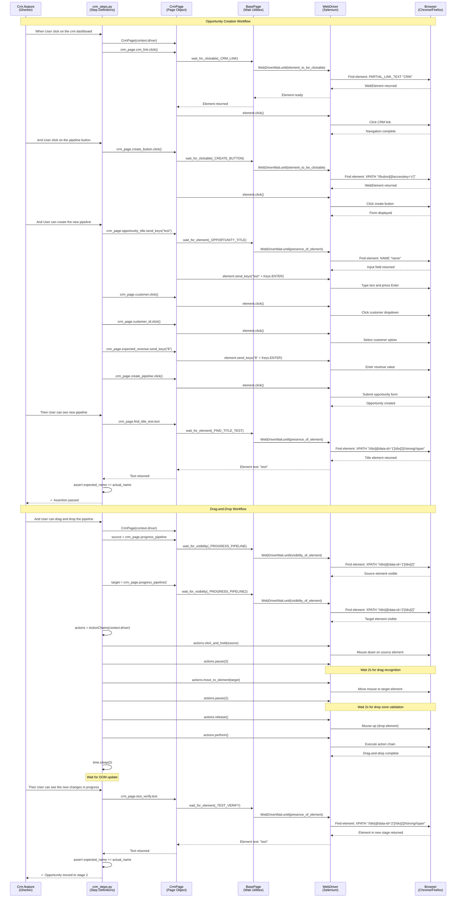

# CRM Testing Guide

## Overview

The CRM (Customer Relationship Management) module in the Testinium application provides comprehensive functionality for managing sales opportunities, pipeline visualization, customer records, and payment operations. This guide demonstrates how to effectively test CRM workflows using the Behave BDD framework with Page Object Model patterns.

**What This Guide Covers:**
- Opportunity creation and pipeline management
- Opportunity editing with dynamic field updates
- Drag-and-drop pipeline stage transitions
- Customer registration and search operations
- Payment and print operations
- Complete workflow testing patterns

**When to Use This Guide:**
- Testing sales pipeline functionality
- Validating opportunity lifecycle management
- Verifying customer management operations
- Testing drag-and-drop interactions
- Implementing CRM workflow test scenarios

## Prerequisites

Before testing CRM functionality, ensure you have:

1. **Framework Setup:**
   - Python 3.9+ installed and configured
   - Virtual environment activated
   - All dependencies installed (`pip install -r requirements.txt`)
   - Behave framework configured (see [Installation Guide](../getting-started/installation.md))

2. **Test Configuration:**
   - Valid test credentials in `.env` file (PosManager account)
   - CRM module accessible in test environment
   - Browser drivers installed (ChromeDriver, GeckoDriver)

3. **User Permissions:**
   - Account with "PosManager" role or equivalent
   - Access rights to create opportunities and customers
   - Permission to manage pipeline stages

4. **Test Data:**
   - Valid customer records for testing (e.g., "&CC" customer)
   - Test opportunity data with realistic values
   - Clean test environment (no conflicting data)

## CRM Module Architecture

The CRM testing implementation follows a three-layer architecture:

**Layer 1: Feature Files (Gherkin)**
- Location: `features/Crm.feature`
- Business-readable scenarios written in Gherkin syntax
- Defines expected behavior and acceptance criteria

**Layer 2: Step Definitions**
- Location: `features/steps/crm_steps.py`
- Implements Gherkin steps with Python code
- Orchestrates page object interactions
- Handles test assertions and validations

**Layer 3: Page Objects**
- Location: `pages/crm_page.py`
- Encapsulates CRM element locators and properties
- Provides wait utilities for synchronization
- Implements page-specific actions

**Source:** `features/Crm.feature`, `features/steps/crm_steps.py`, `pages/crm_page.py`

## Opportunity Management Testing

### Creating New Opportunities

The CRM module allows creating sales opportunities with title, customer assignment, expected revenue, and priority settings.

**Feature Scenario:**

```gherkin
@Smoke
Feature: Testinium app CRM Module

  Background: As a Posmanager, I should be able to create and to see my pipeline and customers
    Given User login to test other features

  Scenario: User can create pipeline in the displayed dashboard
    When User click on the crm dashboard
    And User click on the pipeline button
    And User can create the new pipeline
    And User can see the total price
    Then User can see new pipeline
```

**Source:** `features/Crm.feature:9-14`

**Step Implementation:**

```python
from behave import when, step
from pages.crm_page import CrmPage
from selenium.webdriver.common.keys import Keys

@when("User click on the crm dashboard")
def user_click_on_crm_dashboard(context):
    """Navigate to CRM dashboard."""
    crm_page = CrmPage(context.driver)
    crm_page.crm_link.click()

@step("User click on the pipeline button")
def user_click_on_pipeline_button(context):
    """Open opportunity creation form."""
    crm_page = CrmPage(context.driver)
    crm_page.create_button.click()

@step("User can create the new pipeline")
def user_create_new_pipeline(context):
    """Create opportunity with test data."""
    crm_page = CrmPage(context.driver)
    
    # Enter opportunity title
    crm_page.opportunity_title.send_keys("test" + Keys.ENTER)
    
    # Select customer from dropdown
    crm_page.customer.click()
    crm_page.customer_id.click()
    
    # Enter expected revenue
    crm_page.expected_revenue.clear()
    crm_page.expected_revenue.send_keys("8" + Keys.ENTER)
    
    # Select priority
    crm_page.priority.click()
    
    # Submit form
    crm_page.create_pipeline.click()
```

**Source:** `features/steps/crm_steps.py:90-238`

**Page Object Implementation:**

```python
from selenium.webdriver.common.by import By
from pages.base_page import BasePage

class CrmPage(BasePage):
    """Page object for CRM pipeline and opportunity management."""
    
    # Locators
    _CRM_LINK = (By.PARTIAL_LINK_TEXT, "CRM")
    _CREATE_BUTTON = (By.XPATH, "//button[@accesskey='c']")
    _OPPORTUNITY_TITLE = (By.NAME, "name")
    _CUSTOMER = (By.XPATH, "//table[@class='o_group o_inner_group o_group_col_6']//div//div//input")
    _CUSTOMER_ID = (By.XPATH, "//a[.='&CC']")
    _EXPECTED_REVENUE = (By.XPATH, "//div[@class='o_row']//input")
    _PRIORITY = (By.XPATH, "//table[@class='o_group o_inner_group o_group_col_6']//tr[4]//a[3]")
    _CREATE_PIPELINE = (By.XPATH, "//button[@name='close_dialog']")
    
    @property
    def crm_link(self):
        """CRM module navigation link."""
        return self.wait_for_clickable(self._CRM_LINK)
    
    @property
    def create_button(self):
        """Create button for new opportunity."""
        return self.wait_for_clickable(self._CREATE_BUTTON)
    
    @property
    def opportunity_title(self):
        """Opportunity title input field."""
        return self.wait_for_element(self._OPPORTUNITY_TITLE)
    
    @property
    def customer(self):
        """Customer input field."""
        return self.wait_for_element(self._CUSTOMER)
    
    @property
    def expected_revenue(self):
        """Expected revenue input field."""
        return self.wait_for_element(self._EXPECTED_REVENUE)
```

**Source:** `pages/crm_page.py:76-328`

### Validating Pipeline Opportunities

After creating an opportunity, validate that it appears correctly in the pipeline with accurate revenue calculations.

**Step Implementation:**

```python
@step("User can see the total price")
def user_see_total_price(context):
    """Validate total price calculation."""
    crm_page = CrmPage(context.driver)
    
    # Retrieve total price and validate calculation
    total_price_text = crm_page.total_price.text
    total_price = int(total_price_text) + 8
    expected_price = 89
    
    assert total_price == expected_price, (
        f"Total price mismatch: expected {expected_price}, "
        f"but calculated {total_price}"
    )

@step("User can see new pipeline")
def user_see_new_pipeline(context):
    """Verify opportunity appears with correct title."""
    crm_page = CrmPage(context.driver)
    
    actual_name = crm_page.find_title_test.text
    expected_name = "test"
    
    assert expected_name == actual_name, (
        f"Pipeline title mismatch: expected '{expected_name}', "
        f"but found '{actual_name}'"
    )
```

**Source:** `features/steps/crm_steps.py:246-368`

**Key Validation Points:**
1. **Revenue Calculation:** Total pipeline revenue updates when opportunities are added
2. **Opportunity Visibility:** New opportunities appear immediately in pipeline view
3. **Title Accuracy:** Opportunity title matches entered value exactly
4. **Data Persistence:** Opportunity data is saved correctly to backend

## Opportunity Editing Testing

### Updating Opportunity Information

CRM allows editing existing opportunities to update title, revenue, and win probability.

**Feature Scenario:**

```gherkin
Scenario Outline: User can change information in dashboard
  When User click on the crm dashboard
  And User can change any user's information like "<opportunity>" , "<revenue>" and "<probability>"
  And User can save information
  Then User can verify the information

  Examples: Expected name
    | opportunity | revenue | probability |
    | Test2       | 30      | 2           |
```

**Source:** `features/Crm.feature:16-24`

**Step Implementation with Parameterization:**

```python
@step('User can change any user\'s information like "{opportunity}" , "{revenue}" and "{probability}"')
def user_change_user_information(context, opportunity, revenue, probability):
    """
    Edit opportunity with parameterized values.
    
    Args:
        opportunity: New opportunity title
        revenue: New expected revenue
        probability: New win probability percentage
    """
    crm_page = CrmPage(context.driver)
    
    # Select opportunity to edit
    crm_page.button_pipeline.click()
    crm_page.edit_button.click()
    
    # Update opportunity title
    crm_page.opportunity_title_edit.clear()
    crm_page.opportunity_title_edit.send_keys(opportunity + Keys.ENTER)
    
    # Update expected revenue
    crm_page.expected_revenue_edit.clear()
    crm_page.expected_revenue_edit.send_keys(revenue + Keys.ENTER)
    
    # Update probability
    crm_page.probability_edit.clear()
    crm_page.probability_edit.send_keys(probability + Keys.ENTER)

@step("User can save information")
def user_save_information(context):
    """Save edited opportunity."""
    crm_page = CrmPage(context.driver)
    crm_page.save_edit.click()

@step("User can verify the information")
def user_verify_information(context):
    """Verify opportunity was updated."""
    crm_page = CrmPage(context.driver)
    
    # Navigate back to pipeline view
    crm_page.pipeline_side_button.click()
    
    # Verify updated title
    actual_name = crm_page.find_title_test.text
    expected_name = "Test2"
    
    assert expected_name == actual_name, (
        f"Verification failed: expected '{expected_name}', "
        f"but found '{actual_name}' after editing"
    )
```

**Source:** `features/steps/crm_steps.py:376-559`

**Editing Workflow Pattern:**
1. **Navigate to opportunity:** Click pipeline card to select
2. **Enter edit mode:** Click edit button (accesskey='a')
3. **Clear existing values:** Use `.clear()` before entering new data
4. **Submit with Keys.ENTER:** Send Keys.ENTER after each field update
5. **Save changes:** Click save button (accesskey='s')
6. **Verify updates:** Navigate back and validate changes persisted

### Technical Debt Warning: Generated IDs

The opportunity editing fields use generated IDs that may change:

```python
# CAUTION: These IDs are auto-generated and may break
_EXPECTED_REVENUE_EDIT = (By.XPATH, "//input[@id='o_field_input_125']")
_PROBABILITY_EDIT = (By.XPATH, "//input[@id='o_field_input_127']")
```

**Source:** `pages/crm_page.py:174-182`

**Mitigation Strategy:**
- Monitor test failures related to these locators
- Coordinate with development team for stable identifiers
- Use `name` attributes or `data-testid` attributes when available
- Implement fallback locators if IDs change

## Pipeline Stage Management

### Drag-and-Drop Operations

CRM pipeline stages support drag-and-drop for moving opportunities between stages (e.g., "New" → "Qualified" → "Proposal").

**Feature Scenario:**

```gherkin
Scenario: User can change the situation in progress
  When User click on the crm dashboard
  And User can drag and drop the pipeline
  Then User can see the new changes in progress
```

**Source:** `features/Crm.feature:26-29`

**Drag-and-Drop Implementation:**

```python
from selenium.webdriver.common.action_chains import ActionChains
import time

@step("User can drag and drop the pipeline")
def user_drag_and_drop_pipeline(context):
    """
    Drag opportunity from stage 1 to stage 2.
    
    Uses Selenium ActionChains for complex mouse operations:
    - clickAndHold: Press and hold on source element
    - pause: Wait for drag recognition
    - moveToElement: Move to target element
    - pause: Wait for drop zone validation
    - release: Drop the element
    """
    crm_page = CrmPage(context.driver)
    
    # Get source and target elements
    source_element = crm_page.progress_pipeline  # data-id='1'
    target_element = crm_page.progress_pipeline2  # data-id='2'
    
    # Create ActionChains instance
    actions = ActionChains(context.driver)
    
    # Execute drag-and-drop sequence
    actions.click_and_hold(source_element) \
           .pause(2) \
           .move_to_element(target_element) \
           .pause(2) \
           .release() \
           .perform()
    
    # Allow DOM update to complete
    time.sleep(2)

@step("User can see the new changes in progress")
def user_see_new_changes_in_progress(context):
    """Verify opportunity moved to new stage."""
    crm_page = CrmPage(context.driver)
    
    # Verify opportunity now appears in stage 2
    actual_name = crm_page.test_verify.text  # data-id='2'
    expected_name = "test"
    
    assert expected_name == actual_name, (
        f"Drag-and-drop verification failed: expected '{expected_name}' "
        f"in stage 2, but found '{actual_name}'"
    )
```

**Source:** `features/steps/crm_steps.py:567-725`

**Drag-and-Drop Best Practices:**
1. **Use ActionChains:** Required for complex mouse interactions
2. **Add pause() calls:** Allows browser to recognize drag state
3. **Wait for animations:** Use `time.sleep()` after perform() for DOM updates
4. **Verify target state:** Always validate element moved to correct stage
5. **Handle failures gracefully:** Wrap in try/except for better error messages

### Page Object Support for Drag-and-Drop

```python
@property
def progress_pipeline(self):
    """First pipeline stage (data-id='1') - drag source."""
    return self.wait_for_visibility(self._PROGRESS_PIPELINE)

@property
def progress_pipeline2(self):
    """Second pipeline stage (data-id='2') - drop target."""
    return self.wait_for_visibility(self._PROGRESS_PIPELINE2)

def drag_opportunity_to_stage(self, source_stage_id, target_stage_id):
    """
    Helper method for dragging opportunities between stages.
    
    Args:
        source_stage_id: Source stage data-id value
        target_stage_id: Target stage data-id value
    
    Example:
        crm_page.drag_opportunity_to_stage('1', '2')
    """
    source_locator = (By.XPATH, f"//div[@data-id='{source_stage_id}']/div[2]")
    target_locator = (By.XPATH, f"//div[@data-id='{target_stage_id}']/div[2]")
    self.drag_and_drop(source_locator, target_locator)
```

**Source:** `pages/crm_page.py:370-682`

## Customer Management Testing

### Registering New Customers

The CRM module provides customer registration with search and profile management capabilities.

**Feature Scenario:**

```gherkin
Scenario: User can register new customer and can print the profile
  When User click on the crm dashboard
  And User can register new customer
  Then User can print the profile
```

**Source:** `features/Crm.feature:31-34`

**Customer Registration Implementation:**

```python
@step("User can register new customer")
def user_register_new_customer(context):
    """
    Register new customer and validate search.
    
    Workflow:
    1. Navigate to customer management
    2. Open customer creation form
    3. Enter customer name
    4. Save customer record
    5. Perform search validation
    """
    crm_page = CrmPage(context.driver)
    
    # Navigate to customer management
    crm_page.customer_side_button.click()
    
    # Open creation form
    crm_page.create_customer.click()
    
    # Enter customer name
    crm_page.input_name.send_keys("Test" + Keys.ENTER)
    
    # Save customer
    crm_page.create_customer_button.click()
    
    # Validate search functionality
    crm_page.searching_text.send_keys("aa" + Keys.ENTER)

@step("User can print the profile")
def user_print_profile(context):
    """Access customer profile and print operations."""
    crm_page = CrmPage(context.driver)
    
    # Open customer profile
    crm_page.name_customer.click()
    
    # Access print dialog
    crm_page.print_button.click()
    
    # Access payment report
    crm_page.due_payment_button.click()
```

**Source:** `features/steps/crm_steps.py:733-860`

**Customer Management Page Objects:**

```python
# Customer Management Locators
_CUSTOMER_SIDE_BUTTON = (By.XPATH, "//a[@href='/web#menu_id=272&action=48']")
_CREATE_CUSTOMER = (By.XPATH, "//button[@accesskey='c']")
_INPUT_NAME = (By.XPATH, "//input[@name='name']")
_CREATE_CUSTOMER_BUTTON = (By.XPATH, "//button[@name='close_dialog']")
_SEARCHING_TEXT = (By.XPATH, "//input[@class='o_searchview_input']")
_NAME_CUSTOMER = (By.XPATH, "//span[.='&CC']")

# Payment and Print Operations
_DUE_PAYMENT_BUTTON = (By.XPATH, "//a[@data-section='print']")
_PRINT_BUTTON = (By.XPATH, "/html/body/div[1]/div[2]/div[1]/div[2]/div[2]/div/div[1]/button")
```

**Source:** `pages/crm_page.py:186-210`

### Critical Locator Issue: Print Button

The print button uses an **absolute XPath** which is extremely fragile:

```python
# CRITICAL TECHNICAL DEBT: Absolute XPath - HIGHEST RISK
_PRINT_BUTTON = (By.XPATH, "/html/body/div[1]/div[2]/div[1]/div[2]/div[2]/div/div[1]/button")
```

**Source:** `pages/crm_page.py:207-210`

**Impact:**
- Will break with any DOM structure change
- Highest priority technical debt
- Requires coordination with development team

**Recommended Fix:**
```python
# Request dev team to add stable identifier:
_PRINT_BUTTON = (By.XPATH, "//button[@data-testid='customer-print-button']")
# Or use data attribute:
_PRINT_BUTTON = (By.XPATH, "//button[@data-action='print']")
```

## Wait Strategies for CRM Testing

### Explicit Waits with Page Object Properties

All CRM page elements use explicit waits via BasePage utility methods:

```python
from pages.base_page import BasePage

class CrmPage(BasePage):
    @property
    def crm_link(self):
        """Wait for element to be clickable."""
        return self.wait_for_clickable(self._CRM_LINK)
    
    @property
    def opportunity_title(self):
        """Wait for element to be present."""
        return self.wait_for_element(self._OPPORTUNITY_TITLE)
    
    @property
    def progress_pipeline(self):
        """Wait for element to be visible."""
        return self.wait_for_visibility(self._PROGRESS_PIPELINE)
```

**Wait Method Selection:**
- **wait_for_clickable:** Use for buttons, links, interactive elements
- **wait_for_element:** Use for input fields, text elements, form fields
- **wait_for_visibility:** Use for elements that may be hidden initially
- **wait_for_text:** Use when validating specific text content appears

**Source:** `pages/crm_page.py:220-630`

### State Transition Waits

CRM workflows involve state transitions (creating → created, editing → saved, dragging → dropped) that require careful synchronization:

**1. Form Submission Waits:**
```python
# After clicking create, wait for success indicator
crm_page.create_pipeline.click()
# Property access automatically waits for next element
crm_page.find_title_test.text  # Waits for opportunity to appear
```

**2. Drag-and-Drop Waits:**
```python
# ActionChains.pause() for browser processing
actions.click_and_hold(source).pause(2).move_to_element(target).pause(2).release().perform()
# time.sleep() for DOM update after drop
time.sleep(2)
```

**3. Navigation Waits:**
```python
# Wait for navigation to complete
crm_page.pipeline_side_button.click()
# Next element access waits for page load
crm_page.button_pipeline.click()
```

### Avoiding Wait Anti-Patterns

**Anti-Pattern: Explicit WebDriverWait in Steps**
```python
# DON'T DO THIS - Redundant with page object waits
from selenium.webdriver.support.wait import WebDriverWait
wait = WebDriverWait(driver, 10)
wait.until(EC.visibility_of(crm_page.crm_link))
crm_page.crm_link.click()
```

**Correct Pattern: Trust Page Object Waits**
```python
# DO THIS - Page object handles synchronization
crm_page.crm_link.click()  # Property already waited for clickability
```

**Source:** `features/steps/crm_steps.py:34-39` (migration note on removing explicit waits)

## CRM Workflow Sequence Diagram

The following Mermaid diagram illustrates the complete CRM testing workflow from feature scenario through step definitions to page objects and browser interactions:



## Troubleshooting

### Issue: CRM Dashboard Not Loading

**Symptoms:**
- TimeoutException when clicking CRM link
- "Element not found" errors for crm_link
- Test fails at navigation step

**Causes:**
- User not logged in before accessing CRM
- Insufficient permissions (account lacks CRM access)
- CRM module not enabled in test environment

**Solutions:**

1. **Verify Login:**
```python
# Ensure Background step executes
Background: As a Posmanager, I should be able to create and to see my pipeline and customers
  Given User login to test other features
```

2. **Check User Permissions:**
```yaml
# In config.yaml or .env, verify account role
credentials:
  username: "posmanager_user"
  password: "secure_password"
# Account must have "PosManager" role or equivalent
```

3. **Increase Timeout:**
```python
# If network is slow, increase explicit wait timeout
from utilities.config_reader import ConfigReader
config = ConfigReader()
timeout = config.get_property("timeouts.explicit", 20)  # Increase from default 10
```

### Issue: Drag-and-Drop Operation Fails

**Symptoms:**
- Opportunity doesn't move to target stage
- No visual feedback during drag operation
- test_verify element not found in target stage

**Causes:**
- Insufficient pause duration for animation
- Elements not fully visible before drag
- JavaScript not enabled in browser

**Solutions:**

1. **Increase Pause Duration:**
```python
# Increase pause times if animations are slow
actions.click_and_hold(source) \
       .pause(3) \  # Increased from 2 seconds
       .move_to_element(target) \
       .pause(3) \  # Increased from 2 seconds
       .release() \
       .perform()
time.sleep(3)  # Increased from 2 seconds
```

2. **Verify Element Visibility:**
```python
# Ensure elements are scrolled into view
from selenium.webdriver.common.action_chains import ActionChains
actions = ActionChains(driver)
actions.move_to_element(source_element).perform()
time.sleep(1)
# Then proceed with drag-and-drop
```

3. **Use Alternative Drag Method:**
```python
# If ActionChains fails, try BasePage drag_and_drop
crm_page.drag_and_drop(
    crm_page._PROGRESS_PIPELINE,
    crm_page._PROGRESS_PIPELINE2
)
```

### Issue: Generated IDs Not Found (Expected Revenue/Probability Edit)

**Symptoms:**
- NoSuchElementException for o_field_input_125 or o_field_input_127
- Edit step fails when updating revenue or probability
- Works in one environment but not another

**Causes:**
- Generated IDs change between deployments
- Different application versions use different IDs
- DOM structure changed in recent release

**Solutions:**

1. **Inspect Current IDs:**
```bash
# Use browser DevTools to find current IDs
# Right-click element → Inspect
# Look for <input id="o_field_input_XXX">
```

2. **Update Locators:**
```python
# In pages/crm_page.py, update to current IDs
_EXPECTED_REVENUE_EDIT = (By.XPATH, "//input[@id='o_field_input_XXX']")  # Replace XXX
_PROBABILITY_EDIT = (By.XPATH, "//input[@id='o_field_input_YYY']")  # Replace YYY
```

3. **Use More Stable Locators:**
```python
# Better alternatives if available:
_EXPECTED_REVENUE_EDIT = (By.NAME, "expected_revenue")  # Use name attribute
_PROBABILITY_EDIT = (By.XPATH, "//label[contains(text(), 'Probability')]/..//input")  # Use label relationship
```

4. **Request Stable Identifiers:**
```
# Coordinate with development team to add:
<input data-testid="opportunity-revenue" ...>
<input data-testid="opportunity-probability" ...>
```

### Issue: Print Button Not Working

**Symptoms:**
- NoSuchElementException when clicking print button
- Test passes in dev environment but fails in staging/production
- Element exists but click has no effect

**Causes:**
- Absolute XPath is brittle and breaks with DOM changes
- Print dialog is browser-native and may be blocked
- Different DOM structure in different environments

**Solutions:**

1. **Update Absolute XPath:**
```python
# Inspect current DOM and update path
# Original: /html/body/div[1]/div[2]/div[1]/div[2]/div[2]/div/div[1]/button
# May need to change div indices: div[2] → div[3], etc.
```

2. **Use Relative XPath:**
```python
# More stable alternative:
_PRINT_BUTTON = (By.XPATH, "//button[contains(text(), 'Print') or @aria-label='Print']")
# Or use class if available:
_PRINT_BUTTON = (By.XPATH, "//div[@class='oe_form_buttons']//button[1]")
```

3. **Handle Print Dialog:**
```python
# Print may open browser native dialog - switch context if needed
current_window = driver.current_window_handle
# Perform print action
crm_page.print_button.click()
# If new window/dialog opens, handle it
all_windows = driver.window_handles
if len(all_windows) > 1:
    driver.switch_to.window(all_windows[-1])
    # Interact with print dialog
    driver.close()
    driver.switch_to.window(current_window)
```

### Issue: Total Price Calculation Fails

**Symptoms:**
- AssertionError: "Total price mismatch: expected 89, but calculated XX"
- Price text cannot be parsed as integer
- Calculation result doesn't match expected value

**Causes:**
- Existing opportunities in pipeline affecting total
- Currency formatting in price text (e.g., "$81" instead of "81")
- Test data not isolated (previous test runs left data)

**Solutions:**

1. **Clean Test Data:**
```python
# Add cleanup step in Background or @before_scenario
@before_scenario
def cleanup_test_opportunities(context):
    """Delete test opportunities before scenario."""
    crm_page = CrmPage(context.driver)
    crm_page.crm_link.click()
    # Delete opportunities with title "test" or "Test2"
    # Implementation depends on application capabilities
```

2. **Handle Currency Formatting:**
```python
# Strip currency symbols and thousands separators
import re
total_price_text = crm_page.total_price.text
# Remove non-digit characters except decimal point
numeric_text = re.sub(r'[^\d.]', '', total_price_text)
total_price = int(float(numeric_text)) + 8
```

3. **Use Dynamic Expected Value:**
```python
# Instead of hardcoded 89, calculate expected dynamically
initial_price = int(crm_page.total_price.text)  # Get price before adding opportunity
# Create opportunity with revenue 8
crm_page.create_pipeline.click()
# Verify new total
final_price = int(crm_page.total_price.text)
assert final_price == initial_price + 8, f"Price should increase by 8"
```

### Issue: Customer Search Returns No Results

**Symptoms:**
- Customer registration succeeds but search returns empty
- name_customer element not found after search
- Search works manually but fails in automation

**Causes:**
- Search timing - results not loaded before next step
- Search term doesn't match any customers
- Database not synchronized after customer creation

**Solutions:**

1. **Add Wait After Search:**
```python
crm_page.searching_text.send_keys("aa" + Keys.ENTER)
# Wait for search results to load
time.sleep(2)  # Or use explicit wait for results container
```

2. **Search for Created Customer:**
```python
# Instead of "aa", search for "Test" (the created customer)
crm_page.searching_text.send_keys("Test" + Keys.ENTER)
```

3. **Verify Customer Creation:**
```python
# Add explicit verification after creating customer
crm_page.create_customer_button.click()
# Wait for success message or customer to appear in list
success_message = crm_page.wait_for_element((By.XPATH, "//div[contains(@class, 'success')]"))
assert "created" in success_message.text.lower()
```

## Best Practices

### Test Data Isolation

**Principle:** Each test scenario should be independent and not rely on data from previous tests.

**Implementation:**

1. **Use Unique Identifiers:**
```python
import uuid
from datetime import datetime

# Generate unique opportunity title
timestamp = datetime.now().strftime("%Y%m%d_%H%M%S")
unique_id = str(uuid.uuid4())[:8]
opportunity_title = f"Test_{timestamp}_{unique_id}"

crm_page.opportunity_title.send_keys(opportunity_title + Keys.ENTER)
```

2. **Clean Up After Tests:**
```python
@after_scenario
def cleanup_crm_test_data(context):
    """Remove test opportunities and customers."""
    if "crm" in context.scenario.tags:
        crm_page = CrmPage(context.driver)
        # Navigate to pipeline
        crm_page.crm_link.click()
        # Delete test opportunities
        # (Implementation depends on delete functionality availability)
```

3. **Use Scenario Outlines for Multiple Datasets:**
```gherkin
Scenario Outline: Test multiple opportunity configurations
  When User creates opportunity with "<title>", "<revenue>", "<probability>"
  Then Opportunity appears with correct values

  Examples:
    | title       | revenue | probability |
    | Deal_A_001  | 10000   | 75          |
    | Deal_B_002  | 25000   | 50          |
    | Deal_C_003  | 50000   | 90          |
```

### Stage Transition Validation

**Principle:** Always validate state transitions completely before proceeding.

**Implementation:**

1. **Verify Opportunity Creation:**
```python
# Don't just create - verify it was created
crm_page.create_pipeline.click()

# Explicit verification
actual_title = crm_page.find_title_test.text
assert actual_title == expected_title, "Opportunity not created"

actual_revenue = crm_page.total_price.text
assert int(actual_revenue) > 0, "Revenue not set"
```

2. **Validate Edit Operations:**
```python
# After editing, verify each field individually
crm_page.save_edit.click()
crm_page.pipeline_side_button.click()

# Verify title
assert crm_page.find_title_test.text == new_title

# Verify revenue updated (may need to open details)
crm_page.button_pipeline.click()
# Navigate to details view and verify all fields
```

3. **Confirm Drag-and-Drop:**
```python
# After drag-and-drop, verify three things:
# 1. Element no longer in source stage
source_stage_opportunities = driver.find_elements(*crm_page._FIND_TITLE_TEST)
assert opportunity_title not in [opp.text for opp in source_stage_opportunities]

# 2. Element appears in target stage
target_stage_opportunities = driver.find_elements(*crm_page._TEST_VERIFY)
assert opportunity_title in [opp.text for opp in target_stage_opportunities]

# 3. Stage totals updated correctly
# Verify revenue totals changed in both stages
```

### Cleanup of Test Leads and Opportunities

**Principle:** Remove test data to prevent database bloat and test interference.

**Implementation:**

1. **Track Created Test Data:**
```python
# Use Behave context to track what was created
@step("User can create the new pipeline")
def user_create_new_pipeline(context):
    opportunity_title = "test"
    # ... create opportunity ...
    
    # Track for cleanup
    if not hasattr(context, 'created_opportunities'):
        context.created_opportunities = []
    context.created_opportunities.append(opportunity_title)
```

2. **Cleanup in After Hooks:**
```python
@after_scenario(tag="crm")
def cleanup_crm_data(context):
    """Delete opportunities created during test."""
    if hasattr(context, 'created_opportunities'):
        crm_page = CrmPage(context.driver)
        for opp_title in context.created_opportunities:
            # Navigate to opportunity
            crm_page.crm_link.click()
            # Find and delete (if delete functionality exists)
            # ... delete implementation ...
```

3. **Database-Level Cleanup (Advanced):**
```python
# If application provides API or database access
import requests

@after_scenario
def cleanup_via_api(context):
    """Use API to clean up test data."""
    if hasattr(context, 'created_opportunities'):
        api_base = os.getenv("API_BASE_URL")
        for opp_title in context.created_opportunities:
            # Find opportunity ID
            response = requests.get(
                f"{api_base}/api/opportunities",
                params={"title": opp_title}
            )
            if response.ok and response.json():
                opp_id = response.json()[0]["id"]
                # Delete via API
                requests.delete(f"{api_base}/api/opportunities/{opp_id}")
```

### Locator Maintenance

**Principle:** Use stable, maintainable locators and monitor for brittleness.

**Locator Stability Ranking (Best to Worst):**

1. **data-testid attributes** (most stable)
2. **name attributes** (stable for form fields)
3. **unique ID attributes** (stable if not generated)
4. **CSS classes** (moderately stable)
5. **Relative XPath with attributes** (moderately stable)
6. **Link text / partial link text** (language-dependent)
7. **Index-based XPath** (brittle)
8. **Absolute XPath** (most brittle - AVOID)

**Implementation:**

1. **Document Brittle Locators:**
```python
# Mark technical debt clearly
_PRIORITY = (By.XPATH, "//table[@class='o_group o_inner_group o_group_col_6']//tr[4]//a[3]")
# TECHNICAL DEBT: Index-based XPath - brittle to DOM changes
# TODO: Request data-testid from dev team
```

2. **Provide Fallback Locators:**
```python
def get_priority_element(self):
    """Get priority element with fallback strategies."""
    try:
        # Try primary locator
        return self.wait_for_clickable(self._PRIORITY)
    except TimeoutException:
        # Fallback: Try alternative locator
        alt_locator = (By.XPATH, "//label[contains(text(), 'Priority')]/..//a[last()]")
        return self.wait_for_clickable(alt_locator)
```

3. **Monitor Locator Failures:**
```python
# Log locator failures for tracking
import logging
logger = logging.getLogger(__name__)

@property
def print_button(self):
    try:
        return self.wait_for_clickable(self._PRINT_BUTTON)
    except TimeoutException:
        logger.error(
            f"LOCATOR FAILURE: _PRINT_BUTTON not found. "
            f"Locator: {self._PRINT_BUTTON}. "
            f"This is a known brittle locator - see pages/crm_page.py:207"
        )
        raise
```

4. **Coordinate with Development Team:**
```
# Request stable test attributes in application code:
Dear Dev Team,

Our test automation relies on stable element identifiers. The following
CRM elements would benefit from data-testid attributes:

1. Print button: data-testid="customer-print-button"
2. Expected revenue field: data-testid="opportunity-revenue-input"
3. Probability field: data-testid="opportunity-probability-input"
4. Priority selector: data-testid="opportunity-priority-select"

Current locators use generated IDs and absolute XPath, which break frequently.
Adding these attributes will improve test stability and reduce maintenance.

Technical debt reference: pages/crm_page.py lines 16-42
```

## Related Documentation

- **[Authentication Testing Guide](authentication-testing.md)** - Login procedures before accessing CRM
- **[Configuration Management Guide](configuration-management.md)** - Setting up test credentials and timeouts
- **[Page Object Model Guide](page-object-model.md)** - Understanding page object patterns used in CRM tests
- **[Wait Strategies Guide](wait-strategies.md)** - Deep dive into explicit wait patterns
- **[Parallel Execution Guide](parallel-execution.md)** - Running CRM tests in parallel safely

**API References:**
- **[CrmPage API Reference](../api-reference/pages/crm-page.md)** - Complete CRM page object documentation
- **[CRM Steps API Reference](../api-reference/steps/crm-steps.md)** - All CRM step definitions
- **[BasePage API Reference](../api-reference/pages/base-page.md)** - Inherited wait and interaction methods

**Architecture Documentation:**
- **[System Overview](../architecture/system-overview.md)** - Framework architecture
- **[Page Object Model Architecture](../architecture/page-object-model.md)** - POM design patterns

**Troubleshooting:**
- **[WebDriver Issues](../troubleshooting/webdriver-issues.md)** - Browser driver problems
- **[Common Errors](../troubleshooting/common-errors.md)** - General error solutions

## Summary

This guide covered comprehensive CRM testing patterns including:

✅ **Opportunity Management:** Creating and validating pipeline opportunities  
✅ **Opportunity Editing:** Updating title, revenue, and probability with parameterized scenarios  
✅ **Drag-and-Drop:** Moving opportunities between pipeline stages using ActionChains  
✅ **Customer Management:** Registering customers and accessing profiles  
✅ **Wait Strategies:** Property-based explicit waits preventing race conditions  
✅ **Technical Debt:** Documented brittle locators requiring maintenance  
✅ **Troubleshooting:** Solutions for common CRM testing issues  
✅ **Best Practices:** Data isolation, stage validation, and cleanup strategies

**Next Steps:**
1. Review the [CRM feature file](../../features/Crm.feature) for all scenarios
2. Explore [crm_steps.py](../../features/steps/crm_steps.py) for step implementations
3. Study [crm_page.py](../../pages/crm_page.py) page object patterns
4. Run CRM tests: `behave --tags=@Smoke features/Crm.feature`
5. Extend tests with custom scenarios for your application's CRM workflows

**Remember:** CRM tests demonstrate advanced patterns including drag-and-drop, dynamic forms, and complex state management. Use these patterns as templates for testing other modules with similar workflows.

