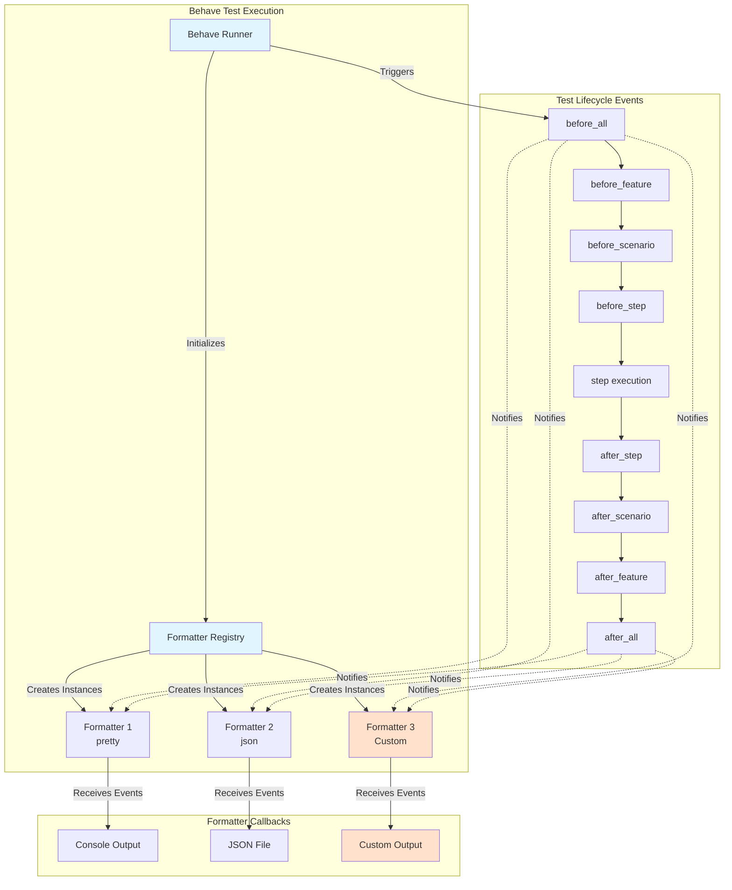
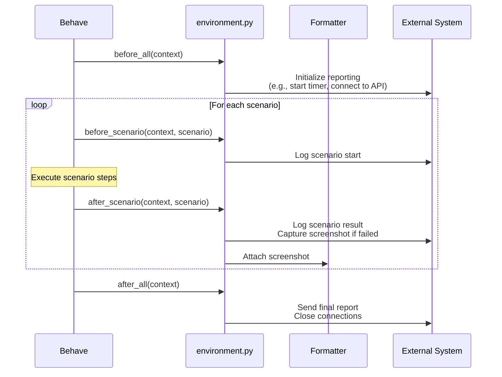

# Creating Custom Test Reporters

## Overview

This guide covers creating custom test reporters and formatters for the Testinium QA Python test automation framework. Learn how to extend Behave's reporting capabilities with custom formatters, integrate with CI/CD pipelines, customize Allure reports, and implement advanced reporting logic through environment hooks.

### What You'll Learn

- **Behave formatter architecture** and built-in formatter options
- **Creating custom formatters** by subclassing Behave's base Formatter class
- **Configuring multiple formatters** for comprehensive reporting
- **JUnit XML integration** for CI/CD platforms (Jenkins, Azure DevOps)
- **Allure report customization** with enhanced metadata and attachments
- **HTML and JSON report generation** with post-processing capabilities
- **Environment hook extensions** for custom reporting logic
- **CI/CD integration patterns** for automated report publishing
- **Troubleshooting** common reporter configuration issues

### When to Use Custom Reporters

Custom reporters are valuable when you need to:

- Generate reports in proprietary or team-specific formats
- Integrate with custom dashboards or monitoring systems
- Add business-specific metadata or metrics to test reports
- Implement custom failure analysis or categorization
- Generate reports optimized for specific stakeholder audiences
- Extend built-in formatters with additional functionality
- Create real-time test execution notifications

### Prerequisites

Before creating custom reporters, ensure you have:

- **Framework installed** and configured (see [Installation Guide](../getting-started/installation.md))
- **Working test suite** that executes successfully
- **Python knowledge** including object-oriented programming and inheritance
- **Behave understanding** of test execution lifecycle and context object
- **Report format knowledge** for your target output (HTML, JSON, XML, etc.)

## Behave Formatter Architecture

Behave's reporting system is built on a flexible formatter architecture that allows multiple formatters to run simultaneously during test execution.

### Built-in Formatters

Behave provides several built-in formatters out of the box:

| Formatter | Purpose | Output Format | Configuration |
|-----------|---------|---------------|---------------|
| **pretty** | Human-readable console output with colors | Console (ANSI) | `format = pretty` |
| **json** | Machine-readable JSON with scenario results | JSON file | `format = json` |
| **junit** | JUnit XML for CI/CD integration | XML file | `junit = true` |
| **html** | HTML report (via behave-html-formatter) | HTML file | `format = behave_html_formatter:HTMLFormatter` |
| **allure** | Allure framework integration | Allure results | `format = allure_behave.formatter:AllureFormatter` |
| **plain** | Simple text output without colors | Console (plain text) | `format = plain` |
| **progress** | Progress bar with test count | Console (minimal) | `format = progress` |
| **rerun** | Failed scenario tracking for re-execution | Text file | Uses `rerun_file` setting |

**Source:** `behave.ini:14-25, 34-37, 77-82`

### Formatter Architecture Diagram



### How Formatters Work

Formatters receive callbacks at each stage of test execution:

1. **Initialization:** Behave creates formatter instances based on configuration
2. **Event Notifications:** Formatters receive events for features, scenarios, and steps
3. **Data Processing:** Each formatter processes events according to its logic
4. **Output Generation:** Formatters write results to console, files, or external systems
5. **Cleanup:** Formatters finalize output and close resources

**Key Formatter Methods:**

- `__init__(stream, config)` - Initialize formatter with output stream and configuration
- `feature(feature)` - Called when a feature starts
- `scenario(scenario)` - Called when a scenario starts
- `step(step)` - Called when a step starts
- `result(step)` - Called after step execution with result status
- `close()` - Called at the end to finalize output

## Creating Custom Behave Formatters

Custom formatters allow you to generate reports in any format needed by your organization.

### Custom Formatter Implementation

Create a custom formatter by subclassing `behave.formatter.base.Formatter`:

```python
"""
Custom Behave Formatter Example
File: formatters/custom_formatter.py
"""

from behave.formatter.base import Formatter
import json
from datetime import datetime
from typing import Dict, List, Any


class CustomJSONFormatter(Formatter):
    """
    Custom JSON formatter with enhanced metadata and metrics.
    
    Generates a JSON report with execution timestamps, test metrics,
    and custom business logic for categorizing failures.
    
    Usage:
        behave -f formatters.custom_formatter:CustomJSONFormatter \\
               -o reports/custom-report.json
    """
    
    name = 'custom-json'
    description = 'Custom JSON formatter with enhanced metadata'
    
    def __init__(self, stream_opener, config):
        """
        Initialize custom formatter.
        
        Args:
            stream_opener: Callable that opens the output stream
            config: Behave configuration object
        """
        super().__init__(stream_opener, config)
        self.stream = stream_opener(name='custom-report')
        self.report_data = {
            'execution_start': datetime.now().isoformat(),
            'features': [],
            'summary': {
                'total_scenarios': 0,
                'passed': 0,
                'failed': 0,
                'skipped': 0,
                'total_steps': 0,
                'duration': 0.0
            }
        }
        self.current_feature = None
        self.current_scenario = None
    
    def feature(self, feature):
        """Called when a feature starts."""
        self.current_feature = {
            'name': feature.name,
            'filename': feature.filename,
            'description': feature.description,
            'tags': feature.tags,
            'scenarios': []
        }
        self.report_data['features'].append(self.current_feature)
    
    def scenario(self, scenario):
        """Called when a scenario starts."""
        self.current_scenario = {
            'name': scenario.name,
            'tags': scenario.tags,
            'status': 'unknown',
            'steps': [],
            'duration': 0.0
        }
        self.current_feature['scenarios'].append(self.current_scenario)
        self.report_data['summary']['total_scenarios'] += 1
    
    def result(self, step):
        """Called after each step execution with result."""
        step_data = {
            'keyword': step.keyword,
            'name': step.name,
            'status': step.status.name,
            'duration': step.duration if hasattr(step, 'duration') else 0.0,
            'error_message': str(step.error_message) if step.status.name == 'failed' else None
        }
        self.current_scenario['steps'].append(step_data)
        self.report_data['summary']['total_steps'] += 1
        
        # Update scenario status based on step results
        if step.status.name == 'failed':
            self.current_scenario['status'] = 'failed'
        elif self.current_scenario['status'] != 'failed' and step.status.name == 'passed':
            self.current_scenario['status'] = 'passed'
    
    def close(self):
        """Finalize report and write to output stream."""
        # Calculate final summary metrics
        self.report_data['execution_end'] = datetime.now().isoformat()
        
        for feature in self.report_data['features']:
            for scenario in feature['scenarios']:
                status = scenario['status']
                if status == 'passed':
                    self.report_data['summary']['passed'] += 1
                elif status == 'failed':
                    self.report_data['summary']['failed'] += 1
                else:
                    self.report_data['summary']['skipped'] += 1
        
        # Write JSON report to stream
        json.dump(self.report_data, self.stream, indent=2)
        self.stream.close()
```

**Implementation Notes:**

- Subclass `behave.formatter.base.Formatter` for access to formatter infrastructure
- Override lifecycle methods (`feature`, `scenario`, `result`) to capture test events
- Use `self.stream` for writing output (opened by Behave automatically)
- Implement `close()` to finalize and flush output
- Store configuration in `self.config` for accessing Behave settings

### Registering Custom Formatters

#### Option 1: Package Installation

If your formatter is part of a Python package:

```bash
# Install your formatter package
pip install my-custom-formatters

# Use with full module path
behave -f my_custom_formatters.json_formatter:CustomJSONFormatter \\
       -o reports/custom-report.json
```

#### Option 2: Local Module Path

For formatters in your project directory:

```bash
# Formatter in formatters/custom_formatter.py
behave -f formatters.custom_formatter:CustomJSONFormatter \\
       -o reports/custom-report.json
```

#### Option 3: Configuration in behave.ini

Configure default formatter in `behave.ini`:

```ini
[behave]
# Use custom formatter as default
format = formatters.custom_formatter:CustomJSONFormatter

# Specify output file
outfiles = reports/custom-report.json
```

**Source:** `behave.ini:14-32`

## Configuring Multiple Formatters

Behave supports running multiple formatters simultaneously for comprehensive reporting.

### Multiple Formatters via Command Line

The recommended approach is to specify multiple formatters using the `-f` flag:

```bash
# Generate pretty console output + JSON report + HTML report
behave -f pretty \\
       -f json -o reports/cucumber.json \\
       -f behave_html_formatter:HTMLFormatter -o reports/report.html
```

**Command Line Options:**

- `-f FORMAT` or `--format FORMAT` - Specify formatter (can be used multiple times)
- `-o FILE` or `--outfile FILE` - Output file for the preceding formatter
- Each `-f` can have its own `-o` for independent output destinations

**Source:** `behave.ini:146-148`

### Common Multi-Formatter Configurations

#### Configuration 1: Console + JSON + JUnit (CI/CD Standard)

```bash
behave -f pretty \\
       -f json -o reports/behave-reports/cucumber.json \\
       --junit --junit-directory reports/junit
```

This configuration provides:
- **pretty:** Real-time console feedback during test execution
- **json:** Machine-readable results for custom post-processing
- **junit:** XML reports for CI/CD test result publishing

#### Configuration 2: Pretty + Allure (Enhanced Visualization)

```bash
behave -f pretty \\
       -f allure_behave.formatter:AllureFormatter -o reports/allure-results
```

Generate Allure HTML report after execution:
```bash
allure serve reports/allure-results
```

This configuration provides:
- **pretty:** Console output for developer feedback
- **allure:** Rich HTML reports with test history, trends, and categories

#### Configuration 3: All Formatters (Maximum Coverage)

```bash
behave -f pretty \\
       -f json -o reports/cucumber.json \\
       -f behave_html_formatter:HTMLFormatter -o reports/report.html \\
       -f allure_behave.formatter:AllureFormatter -o reports/allure-results \\
       --junit --junit-directory reports/junit
```

**Warning:** Using many formatters simultaneously may impact test execution performance.

### Formatter Configuration Best Practices

1. **Development:** Use `pretty` for quick feedback
2. **CI/CD:** Always include `junit` for test result publishing
3. **Stakeholders:** Add `html` or `allure` for non-technical audiences
4. **Automation:** Include `json` for custom post-processing
5. **Performance:** Limit to 2-3 formatters per execution

## JUnit XML Reporter for CI/CD Integration

JUnit XML is the standard format for CI/CD test result integration.

### Enabling JUnit XML Reports

Configure JUnit XML output in `behave.ini`:

```ini
[behave]
# Enable JUnit XML report generation
junit = true

# Specify output directory for XML files
junit_directory = reports/junit
```

**Source:** `behave.ini:34-37`

Or via command line:

```bash
behave --junit --junit-directory reports/junit
```

### JUnit XML Structure

Behave generates one XML file per feature file:

```
reports/junit/
├── TESTS-Login.xml
├── TESTS-Logout.xml
├── TESTS-Crm.xml
└── TESTS-EmployeeFc.xml
```

Each XML file contains:
- **testsuite:** Top-level element with feature metadata
- **testcase:** One element per scenario with execution time
- **failure:** Details for failed scenarios with error messages
- **skipped:** Marker for skipped scenarios

### Jenkins Integration

#### Jenkinsfile Configuration

```groovy
pipeline {
    agent any
    
    stages {
        stage('Test') {
            steps {
                sh '''
                    # Activate virtual environment
                    source venv/bin/activate
                    
                    # Run tests with JUnit output
                    behave --junit --junit-directory reports/junit
                '''
            }
        }
    }
    
    post {
        always {
            // Publish JUnit test results
            junit 'reports/junit/*.xml'
            
            // Archive HTML reports
            archiveArtifacts artifacts: 'reports/**/*', allowEmptyArchive: true
            
            // Archive screenshots
            archiveArtifacts artifacts: 'reports/screenshots/**/*.png', allowEmptyArchive: true
        }
    }
}
```

**Source:** `behave.ini:173-186`

**Jenkins Configuration:**
1. Test results trend on build dashboard
2. Flaky test detection across builds
3. Test duration tracking
4. Failure categorization and analysis

### Azure DevOps Integration

#### azure-pipelines.yml Configuration

```yaml
trigger:
  - main

pool:
  vmImage: 'ubuntu-latest'

steps:
  - task: UsePythonVersion@0
    inputs:
      versionSpec: '3.11'
    displayName: 'Use Python 3.11'
  
  - script: |
      python -m venv venv
      source venv/bin/activate
      pip install -r requirements.txt
    displayName: 'Install dependencies'
  
  - script: |
      source venv/bin/activate
      behave --junit --junit-directory $(System.DefaultWorkingDirectory)/reports/junit
    displayName: 'Run Behave tests'
  
  - task: PublishTestResults@2
    inputs:
      testResultsFormat: 'JUnit'
      testResultsFiles: '**/reports/junit/*.xml'
      failTaskOnFailedTests: true
      testRunTitle: 'Behave Test Results'
    displayName: 'Publish test results'
    condition: always()
  
  - task: PublishBuildArtifacts@1
    inputs:
      pathToPublish: 'reports'
      artifactName: 'test-reports'
    displayName: 'Publish reports'
    condition: always()
```

**Source:** `behave.ini:183-186`

## Allure Report Customization

Allure provides rich, interactive HTML reports with test history, trends, and detailed analytics.

### Basic Allure Configuration

Configure Allure results directory in `behave.ini`:

```ini
[behave.userdata]
# Allure results directory for report generation
allure_results_dir = reports/allure-results
```

**Source:** `behave.ini:77-82`

### Running Tests with Allure

```bash
# Generate Allure results
behave -f allure_behave.formatter:AllureFormatter -o reports/allure-results

# Serve interactive Allure report
allure serve reports/allure-results

# Generate static HTML report
allure generate reports/allure-results --clean -o reports/allure-report
```

### Adding Allure Metadata in Tests

Enhance Allure reports with additional metadata using decorators:

```python
"""
Step definitions with Allure metadata
File: features/steps/login_steps.py (enhanced)
"""

import allure
from behave import given, when, then
from pages.login_page import LoginPage


@allure.feature('Authentication')
@allure.story('User Login')
@allure.severity(allure.severity_level.CRITICAL)
@given('User is on the login page')
def navigate_to_login(context):
    """Navigate to the login page."""
    with allure.step('Navigate to base URL'):
        login_page = LoginPage(context.driver)
        base_url = context.config_reader.get_property('application.base_url')
        context.driver.get(base_url)
    
    with allure.step('Verify login page is displayed'):
        assert login_page.input_email.is_displayed(), "Login page not displayed"
    
    context.login_page = login_page


@allure.severity(allure.severity_level.CRITICAL)
@when('User enters valid credentials')
def enter_credentials(context):
    """Enter valid username and password."""
    username = context.config_reader.get_property('credentials.username')
    password = context.config_reader.get_property('credentials.password')
    
    with allure.step(f'Enter username: {username}'):
        context.login_page.input_email.send_keys(username)
    
    with allure.step('Enter password'):
        context.login_page.input_password.send_keys(password)
        allure.attach(
            body='*' * len(password),
            name='Password (masked)',
            attachment_type=allure.attachment_type.TEXT
        )


@allure.severity(allure.severity_level.CRITICAL)
@then('User should be logged in successfully')
def verify_login_success(context):
    """Verify successful login."""
    with allure.step('Click login button'):
        context.login_page.login_button.click()
    
    with allure.step('Verify dashboard is displayed'):
        dashboard_visible = context.login_page.dashboard.is_displayed()
        allure.attach(
            body=str(dashboard_visible),
            name='Dashboard visible',
            attachment_type=allure.attachment_type.TEXT
        )
        assert dashboard_visible, "Dashboard not displayed after login"
```

**Allure Decorators:**

- `@allure.feature()` - Group tests by feature area
- `@allure.story()` - Group tests by user story
- `@allure.severity()` - Mark test criticality (BLOCKER, CRITICAL, NORMAL, MINOR, TRIVIAL)
- `@allure.issue()` - Link to issue tracker
- `@allure.testcase()` - Link to test case management system
- `@allure.link()` - Add custom links

**Allure Steps:**

- `with allure.step('description'):` - Create nested step hierarchy
- `allure.attach()` - Attach screenshots, logs, or data to report

### Automatic Screenshot Attachment

Screenshots are automatically attached to Allure reports in `after_scenario` hook:

```python
# From features/environment.py
if scenario.status == 'failed':
    screenshot_path = capture_screenshot(
        driver=context.driver,
        scenario_name=scenario.name,
        attach_to_allure=True  # Automatically attaches to Allure
    )
```

**Source:** `features/environment.py:353-368`

### Allure Categories for Failure Analysis

Create `categories.json` in Allure results directory for failure categorization:

```json
[
  {
    "name": "Login Failures",
    "matchedStatuses": ["failed"],
    "messageRegex": ".*login.*|.*authentication.*"
  },
  {
    "name": "Timeout Issues",
    "matchedStatuses": ["broken"],
    "messageRegex": ".*timeout.*|.*TimeoutException.*"
  },
  {
    "name": "Element Not Found",
    "matchedStatuses": ["broken"],
    "messageRegex": ".*NoSuchElementException.*|.*element not found.*"
  },
  {
    "name": "Stale Element",
    "matchedStatuses": ["broken"],
    "messageRegex": ".*StaleElementReferenceException.*"
  }
]
```

Place this file in `reports/allure-results/categories.json` before generating the report.

## HTML Report Generation

Generate standalone HTML reports using `behave-html-formatter`.

### Installation

```bash
pip install behave-html-formatter
```

### Configuration

Generate HTML report via command line:

```bash
behave -f behave_html_formatter:HTMLFormatter -o reports/report.html
```

**Source:** `behave.ini:148`

### HTML Report Features

The generated HTML report includes:
- **Executive summary** with pass/fail statistics
- **Feature list** with expandable scenarios
- **Step details** with execution times
- **Embedded screenshots** for failed scenarios
- **Tag filtering** for report navigation
- **Timeline view** of test execution
- **Export capabilities** to PDF or other formats

### Custom HTML Templates

Create custom HTML reports by subclassing HTMLFormatter:

```python
"""
Custom HTML formatter with branding
File: formatters/branded_html_formatter.py
"""

from behave_html_formatter import HTMLFormatter


class BrandedHTMLFormatter(HTMLFormatter):
    """Custom HTML formatter with company branding."""
    
    def __init__(self, stream_opener, config):
        super().__init__(stream_opener, config)
        self.template_vars['company_name'] = 'Testinium QA'
        self.template_vars['report_title'] = 'QA Test Execution Report'
        self.template_vars['custom_css'] = '''
            .header { background-color: #1e3a8a; color: white; }
            .passed { background-color: #22c55e; }
            .failed { background-color: #ef4444; }
        '''
```

## JSON Report Post-Processing

JSON reports enable custom dashboard integration and advanced analytics.

### Generating JSON Reports

```bash
behave -f json -o reports/cucumber.json
```

**Source:** `behave.ini:23, 29`

### JSON Report Structure

```json
{
  "keyword": "Feature",
  "name": "Login Feature",
  "uri": "features/Login.feature",
  "elements": [
    {
      "keyword": "Scenario",
      "name": "Valid login",
      "type": "scenario",
      "steps": [
        {
          "keyword": "Given",
          "name": "User is on the login page",
          "result": {
            "status": "passed",
            "duration": 2.1
          }
        }
      ]
    }
  ]
}
```

### Post-Processing Script

Create custom analytics from JSON reports:

```python
"""
JSON Report Post-Processing
File: scripts/process_test_results.py
"""

import json
from pathlib import Path
from typing import Dict, List
from datetime import datetime


def analyze_test_results(json_path: str) -> Dict:
    """
    Analyze Behave JSON results and generate metrics.
    
    Args:
        json_path: Path to cucumber.json report
        
    Returns:
        Dictionary with test metrics and analytics
    """
    with open(json_path, 'r') as f:
        features = json.load(f)
    
    metrics = {
        'total_features': len(features),
        'total_scenarios': 0,
        'passed_scenarios': 0,
        'failed_scenarios': 0,
        'total_steps': 0,
        'passed_steps': 0,
        'failed_steps': 0,
        'total_duration': 0.0,
        'failure_categories': {},
        'slowest_scenarios': []
    }
    
    scenario_durations = []
    
    for feature in features:
        for element in feature.get('elements', []):
            if element.get('type') == 'scenario':
                metrics['total_scenarios'] += 1
                
                scenario_passed = True
                scenario_duration = 0.0
                failure_reason = None
                
                for step in element.get('steps', []):
                    metrics['total_steps'] += 1
                    result = step.get('result', {})
                    status = result.get('status', 'unknown')
                    duration = result.get('duration', 0.0)
                    
                    scenario_duration += duration
                    
                    if status == 'passed':
                        metrics['passed_steps'] += 1
                    elif status == 'failed':
                        metrics['failed_steps'] += 1
                        scenario_passed = False
                        failure_reason = result.get('error_message', 'Unknown error')
                
                metrics['total_duration'] += scenario_duration
                
                if scenario_passed:
                    metrics['passed_scenarios'] += 1
                else:
                    metrics['failed_scenarios'] += 1
                    
                    # Categorize failure
                    category = categorize_failure(failure_reason)
                    metrics['failure_categories'][category] = \\
                        metrics['failure_categories'].get(category, 0) + 1
                
                scenario_durations.append({
                    'name': element.get('name'),
                    'duration': scenario_duration
                })
    
    # Find slowest scenarios
    scenario_durations.sort(key=lambda x: x['duration'], reverse=True)
    metrics['slowest_scenarios'] = scenario_durations[:10]
    
    return metrics


def categorize_failure(error_message: str) -> str:
    """Categorize failure based on error message."""
    if not error_message:
        return 'Unknown'
    
    error_lower = error_message.lower()
    
    if 'timeout' in error_lower:
        return 'Timeout'
    elif 'nosuchelementexception' in error_lower:
        return 'Element Not Found'
    elif 'staleelement' in error_lower:
        return 'Stale Element'
    elif 'assertion' in error_lower:
        return 'Assertion Failure'
    else:
        return 'Other'


def generate_dashboard_json(metrics: Dict, output_path: str):
    """Generate JSON for dashboard consumption."""
    dashboard_data = {
        'timestamp': datetime.now().isoformat(),
        'summary': {
            'pass_rate': (metrics['passed_scenarios'] / metrics['total_scenarios'] * 100)
                        if metrics['total_scenarios'] > 0 else 0,
            'total_tests': metrics['total_scenarios'],
            'passed': metrics['passed_scenarios'],
            'failed': metrics['failed_scenarios']
        },
        'metrics': metrics
    }
    
    with open(output_path, 'w') as f:
        json.dump(dashboard_data, f, indent=2)


if __name__ == '__main__':
    # Process test results
    metrics = analyze_test_results('reports/cucumber.json')
    
    # Generate dashboard JSON
    generate_dashboard_json(metrics, 'reports/dashboard.json')
    
    # Print summary
    print(f"Test Execution Summary:")
    print(f"  Total Scenarios: {metrics['total_scenarios']}")
    print(f"  Passed: {metrics['passed_scenarios']}")
    print(f"  Failed: {metrics['failed_scenarios']}")
    print(f"  Pass Rate: {metrics['passed_scenarios']/metrics['total_scenarios']*100:.1f}%")
    print(f"\\nFailure Categories:")
    for category, count in metrics['failure_categories'].items():
        print(f"  {category}: {count}")
```

**Usage:**

```bash
# Run tests and generate JSON
behave -f json -o reports/cucumber.json

# Process results
python scripts/process_test_results.py

# Output: reports/dashboard.json ready for dashboard integration
```

## Extending Environment Hooks for Custom Reporting

Behave's environment hooks provide powerful extension points for custom reporting logic.

### Environment Hook Overview

The `features/environment.py` file defines lifecycle hooks:



**Source:** `features/environment.py:1-515`

### Custom Reporting in before_all

Add custom initialization logic:

```python
"""
Enhanced environment.py with custom reporting
File: features/environment.py (extended)
"""

import logging
import requests
from datetime import datetime
from typing import Optional

logger = logging.getLogger(__name__)


def before_all(context):
    """Initialize test suite with custom reporting."""
    # Standard initialization
    from utilities.config_reader import ConfigReader
    context.config_reader = ConfigReader()
    
    # Custom: Initialize test run in external system
    try:
        context.test_run_id = start_test_run_tracking()
        logger.info(f"Started test run tracking: {context.test_run_id}")
    except Exception as e:
        logger.warning(f"Failed to start test run tracking: {e}")
        context.test_run_id = None
    
    # Custom: Start execution timer
    context.suite_start_time = datetime.now()
    logger.info(f"Test suite started at: {context.suite_start_time}")
    
    # Custom: Initialize metrics collection
    context.test_metrics = {
        'total_scenarios': 0,
        'passed': 0,
        'failed': 0,
        'skipped': 0,
        'total_duration': 0.0
    }


def start_test_run_tracking() -> str:
    """
    Start test run in external tracking system.
    
    Returns:
        Test run ID from external system
    """
    # Example: Send to custom dashboard API
    response = requests.post(
        'https://dashboard.example.com/api/test-runs',
        json={
            'project': 'Testinium QA',
            'timestamp': datetime.now().isoformat(),
            'environment': 'staging'
        },
        timeout=5
    )
    response.raise_for_status()
    return response.json()['run_id']
```

**Source:** `features/environment.py:78-146`

### Custom Reporting in before_scenario

Add scenario-level tracking:

```python
def before_scenario(context, scenario):
    """Initialize scenario with custom reporting."""
    # Standard WebDriver initialization
    from utilities.driver_manager import DriverManager
    context.driver = DriverManager.get_driver()
    
    # Custom: Start scenario timer
    context.scenario_start_time = datetime.now()
    
    # Custom: Log to external system
    if context.test_run_id:
        try:
            log_scenario_start(
                test_run_id=context.test_run_id,
                scenario_name=scenario.name,
                tags=scenario.tags
            )
        except Exception as e:
            logger.warning(f"Failed to log scenario start: {e}")
    
    # Custom: Initialize scenario metrics
    context.scenario_metrics = {
        'name': scenario.name,
        'tags': scenario.tags,
        'steps_executed': 0,
        'screenshots_captured': 0
    }


def log_scenario_start(test_run_id: str, scenario_name: str, tags: list):
    """Log scenario start to external system."""
    requests.post(
        f'https://dashboard.example.com/api/test-runs/{test_run_id}/scenarios',
        json={
            'name': scenario_name,
            'tags': tags,
            'status': 'running',
            'start_time': datetime.now().isoformat()
        },
        timeout=5
    )
```

**Source:** `features/environment.py:205-278`

### Custom Reporting in after_scenario

Enhanced failure reporting and metrics:

```python
def after_scenario(context, scenario):
    """Clean up scenario with custom reporting."""
    # Calculate scenario duration
    scenario_duration = (datetime.now() - context.scenario_start_time).total_seconds()
    
    # Update metrics
    context.test_metrics['total_scenarios'] += 1
    context.test_metrics['total_duration'] += scenario_duration
    
    if scenario.status.name == 'passed':
        context.test_metrics['passed'] += 1
    elif scenario.status.name == 'failed':
        context.test_metrics['failed'] += 1
    else:
        context.test_metrics['skipped'] += 1
    
    # Standard screenshot capture on failure
    if scenario.status == 'failed':
        if hasattr(context, 'driver') and context.driver is not None:
            from utilities.screenshot_helper import capture_screenshot
            screenshot_path = capture_screenshot(
                driver=context.driver,
                scenario_name=scenario.name,
                attach_to_allure=True
            )
            
            # Custom: Track screenshot in metrics
            if screenshot_path:
                context.scenario_metrics['screenshots_captured'] += 1
                
                # Custom: Upload screenshot to external system
                try:
                    upload_screenshot_to_dashboard(
                        test_run_id=context.test_run_id,
                        scenario_name=scenario.name,
                        screenshot_path=screenshot_path
                    )
                except Exception as e:
                    logger.warning(f"Failed to upload screenshot: {e}")
    
    # Custom: Send scenario result to external system
    if context.test_run_id:
        try:
            report_scenario_result(
                test_run_id=context.test_run_id,
                scenario_name=scenario.name,
                status=scenario.status.name,
                duration=scenario_duration,
                metrics=context.scenario_metrics
            )
        except Exception as e:
            logger.warning(f"Failed to report scenario result: {e}")
    
    # Standard WebDriver cleanup
    from utilities.driver_manager import DriverManager
    if hasattr(context, 'driver') and context.driver is not None:
        DriverManager.quit_driver()
        context.driver = None


def upload_screenshot_to_dashboard(test_run_id: str, scenario_name: str, 
                                   screenshot_path: str):
    """Upload screenshot to external dashboard."""
    with open(screenshot_path, 'rb') as f:
        files = {'screenshot': f}
        response = requests.post(
            f'https://dashboard.example.com/api/test-runs/{test_run_id}/screenshots',
            files=files,
            data={'scenario_name': scenario_name},
            timeout=10
        )
        response.raise_for_status()


def report_scenario_result(test_run_id: str, scenario_name: str, 
                           status: str, duration: float, metrics: dict):
    """Report scenario result to external system."""
    requests.patch(
        f'https://dashboard.example.com/api/test-runs/{test_run_id}/scenarios',
        json={
            'name': scenario_name,
            'status': status,
            'duration': duration,
            'end_time': datetime.now().isoformat(),
            'metrics': metrics
        },
        timeout=5
    )
```

**Source:** `features/environment.py:280-458`

### Custom Reporting in after_all

Finalize reporting and send summary:

```python
def after_all(context):
    """Finalize test suite with custom reporting."""
    # Calculate total suite duration
    suite_duration = (datetime.now() - context.suite_start_time).total_seconds()
    context.test_metrics['suite_duration'] = suite_duration
    
    # Log final metrics
    logger.info("=" * 80)
    logger.info("TEST SUITE SUMMARY")
    logger.info("=" * 80)
    logger.info(f"Total Scenarios: {context.test_metrics['total_scenarios']}")
    logger.info(f"Passed: {context.test_metrics['passed']}")
    logger.info(f"Failed: {context.test_metrics['failed']}")
    logger.info(f"Skipped: {context.test_metrics['skipped']}")
    logger.info(f"Total Duration: {suite_duration:.2f}s")
    logger.info("=" * 80)
    
    # Custom: Send final report to external system
    if context.test_run_id:
        try:
            finalize_test_run(
                test_run_id=context.test_run_id,
                metrics=context.test_metrics
            )
            logger.info(f"Test run finalized: {context.test_run_id}")
        except Exception as e:
            logger.error(f"Failed to finalize test run: {e}")
    
    # Custom: Generate executive summary email
    try:
        send_summary_email(metrics=context.test_metrics)
    except Exception as e:
        logger.warning(f"Failed to send summary email: {e}")
    
    # Standard cleanup
    from utilities.driver_manager import DriverManager
    try:
        DriverManager.quit_driver()
    except Exception as cleanup_error:
        logger.warning(f"Cleanup error: {cleanup_error}")


def finalize_test_run(test_run_id: str, metrics: dict):
    """Finalize test run in external system."""
    pass_rate = (metrics['passed'] / metrics['total_scenarios'] * 100) \\
                if metrics['total_scenarios'] > 0 else 0
    
    requests.patch(
        f'https://dashboard.example.com/api/test-runs/{test_run_id}',
        json={
            'status': 'completed',
            'end_time': datetime.now().isoformat(),
            'metrics': metrics,
            'pass_rate': pass_rate
        },
        timeout=5
    )


def send_summary_email(metrics: dict):
    """Send test execution summary via email."""
    import smtplib
    from email.mime.text import MIMEText
    
    pass_rate = (metrics['passed'] / metrics['total_scenarios'] * 100) \\
                if metrics['total_scenarios'] > 0 else 0
    
    message = f"""
    Test Execution Summary
    
    Total Scenarios: {metrics['total_scenarios']}
    Passed: {metrics['passed']}
    Failed: {metrics['failed']}
    Pass Rate: {pass_rate:.1f}%
    Duration: {metrics['suite_duration']:.2f}s
    """
    
    msg = MIMEText(message)
    msg['Subject'] = f"Test Results - {datetime.now().strftime('%Y-%m-%d')}"
    msg['From'] = 'qa@example.com'
    msg['To'] = 'team@example.com'
    
    # Send email (configure SMTP settings)
    # with smtplib.SMTP('smtp.example.com') as server:
    #     server.send_message(msg)
```

**Source:** `features/environment.py:148-199`

## CI/CD Integration Patterns

Integrate custom reporting with CI/CD pipelines for automated test result publishing.

### Jenkins Pipeline Integration

Complete Jenkins pipeline with custom reporting:

```groovy
pipeline {
    agent any
    
    environment {
        TEST_RUN_ID = UUID.randomUUID().toString()
        VENV_PATH = "${WORKSPACE}/venv"
    }
    
    stages {
        stage('Setup') {
            steps {
                sh '''
                    python3 -m venv ${VENV_PATH}
                    . ${VENV_PATH}/bin/activate
                    pip install -r requirements.txt
                '''
            }
        }
        
        stage('Test') {
            steps {
                sh '''
                    . ${VENV_PATH}/bin/activate
                    
                    # Run tests with multiple formatters
                    behave -f pretty \\
                           -f json -o reports/cucumber.json \\
                           -f allure_behave.formatter:AllureFormatter \\
                              -o reports/allure-results \\
                           --junit --junit-directory reports/junit \\
                           || true  # Continue even if tests fail
                '''
            }
        }
        
        stage('Report Processing') {
            steps {
                sh '''
                    . ${VENV_PATH}/bin/activate
                    
                    # Process JSON results
                    python scripts/process_test_results.py
                    
                    # Generate Allure report
                    allure generate reports/allure-results --clean -o reports/allure-report
                '''
            }
        }
        
        stage('Publish Results') {
            steps {
                // Publish JUnit XML
                junit 'reports/junit/*.xml'
                
                // Publish HTML reports
                publishHTML([
                    allowMissing: false,
                    alwaysLinkToLastBuild: true,
                    keepAll: true,
                    reportDir: 'reports/allure-report',
                    reportFiles: 'index.html',
                    reportName: 'Allure Report'
                ])
                
                // Archive all reports
                archiveArtifacts artifacts: 'reports/**/*', allowEmptyArchive: true
                
                // Custom: Send to dashboard
                sh '''
                    curl -X POST https://dashboard.example.com/api/jenkins-results \\
                         -H "Content-Type: application/json" \\
                         -d @reports/dashboard.json
                '''
            }
        }
    }
    
    post {
        always {
            // Archive screenshots
            archiveArtifacts artifacts: 'reports/screenshots/**/*.png', 
                            allowEmptyArchive: true
            
            // Clean workspace
            cleanWs()
        }
        
        failure {
            // Send notification on failure
            emailext (
                subject: "Test Execution Failed - Build ${BUILD_NUMBER}",
                body: """Test execution failed. See details:
                         ${BUILD_URL}""",
                to: 'qa-team@example.com'
            )
        }
    }
}
```

**Source:** `behave.ini:173-186`

### GitHub Actions Integration

```yaml
name: Test Execution with Custom Reporting

on:
  push:
    branches: [ main, develop ]
  pull_request:
    branches: [ main ]
  schedule:
    - cron: '0 2 * * *'  # Daily at 2 AM

jobs:
  test:
    runs-on: ubuntu-latest
    
    steps:
      - uses: actions/checkout@v3
      
      - name: Set up Python
        uses: actions/setup-python@v4
        with:
          python-version: '3.11'
      
      - name: Install dependencies
        run: |
          python -m pip install --upgrade pip
          pip install -r requirements.txt
      
      - name: Run tests
        run: |
          behave -f pretty \\
                 -f json -o reports/cucumber.json \\
                 -f allure_behave.formatter:AllureFormatter \\
                    -o reports/allure-results \\
                 --junit --junit-directory reports/junit
        continue-on-error: true
      
      - name: Process test results
        if: always()
        run: |
          python scripts/process_test_results.py
      
      - name: Generate Allure report
        if: always()
        uses: simple-elf/allure-report-action@master
        with:
          allure_results: reports/allure-results
          allure_report: reports/allure-report
      
      - name: Publish test results
        if: always()
        uses: EnricoMi/publish-unit-test-result-action@v2
        with:
          files: reports/junit/*.xml
      
      - name: Upload reports
        if: always()
        uses: actions/upload-artifact@v3
        with:
          name: test-reports
          path: reports/
      
      - name: Send to custom dashboard
        if: always()
        run: |
          curl -X POST ${{ secrets.DASHBOARD_URL }}/api/github-results \\
               -H "Content-Type: application/json" \\
               -H "Authorization: Bearer ${{ secrets.DASHBOARD_TOKEN }}" \\
               -d @reports/dashboard.json
      
      - name: Comment PR with results
        if: github.event_name == 'pull_request' && always()
        uses: actions/github-script@v6
        with:
          script: |
            const fs = require('fs');
            const metrics = JSON.parse(fs.readFileSync('reports/dashboard.json'));
            
            const comment = `## Test Results
            
            - **Total Tests:** ${metrics.summary.total_tests}
            - **Passed:** ${metrics.summary.passed} ✅
            - **Failed:** ${metrics.summary.failed} ❌
            - **Pass Rate:** ${metrics.summary.pass_rate.toFixed(1)}%
            
            [View Full Report](${context.payload.pull_request.html_url}/checks)`;
            
            github.rest.issues.createComment({
              owner: context.repo.owner,
              repo: context.repo.repo,
              issue_number: context.issue.number,
              body: comment
            });
```

## Troubleshooting Custom Reporters

Common issues and solutions when implementing custom reporters.

### Issue: Custom Formatter Not Loading

**Symptoms:**
```
behave: error: format=my_formatter:CustomFormatter is unknown
```

**Causes:**
1. Formatter module not in Python path
2. Incorrect module path specification
3. Class name mismatch
4. Missing formatter dependencies

**Solutions:**

1. **Verify module path:**
```bash
# Check if module is importable
python -c "from formatters.custom_formatter import CustomFormatter"
```

2. **Add to PYTHONPATH:**
```bash
export PYTHONPATH="${PYTHONPATH}:${PWD}"
behave -f formatters.custom_formatter:CustomFormatter -o reports/custom.json
```

3. **Use absolute imports:**
```python
# In custom formatter
from behave.formatter.base import Formatter  # Absolute import
```

4. **Install formatter package:**
```bash
pip install -e .  # Install project in editable mode
```

### Issue: Output File Not Created

**Symptoms:**
- Formatter runs but output file is empty or not created
- No error messages displayed

**Causes:**
1. Stream not closed properly
2. Output directory doesn't exist
3. Incorrect file path specification
4. Buffered writes not flushed

**Solutions:**

1. **Implement close() method:**
```python
def close(self):
    """Ensure data is written and stream is closed."""
    self.stream.flush()  # Flush buffered writes
    self.stream.close()  # Close stream properly
```

2. **Create output directory:**
```python
import os
from pathlib import Path

def __init__(self, stream_opener, config):
    super().__init__(stream_opener, config)
    
    # Ensure output directory exists
    output_dir = Path('reports/custom')
    output_dir.mkdir(parents=True, exist_ok=True)
```

3. **Use -o flag correctly:**
```bash
# Correct: -o comes immediately after -f
behave -f json -o reports/cucumber.json

# Incorrect: -o without preceding -f
behave -o reports/cucumber.json -f json  # May not work as expected
```

### Issue: CI/CD Integration Failures

**Symptoms:**
- Tests run locally but fail in CI/CD
- Reports not published
- JUnit XML files not recognized

**Causes:**
1. Different working directory in CI/CD
2. Missing report directories
3. Incorrect artifact paths
4. Permissions issues

**Solutions:**

1. **Use absolute paths in CI/CD:**
```groovy
// Jenkins
junit "${WORKSPACE}/reports/junit/*.xml"
archiveArtifacts artifacts: "${WORKSPACE}/reports/**/*"
```

2. **Create directories in pipeline:**
```bash
# Before running tests
mkdir -p reports/junit reports/allure-results reports/screenshots
```

3. **Verify artifact paths:**
```yaml
# GitHub Actions - check paths match
- uses: actions/upload-artifact@v3
  with:
    name: test-reports
    path: reports/  # Ensure this directory exists
```

4. **Fix permissions:**
```bash
chmod -R 755 reports/
```

### Issue: Allure Report Not Generating

**Symptoms:**
```
[ALLURE] Could not find any allure results
```

**Causes:**
1. allure-behave not installed
2. Incorrect Allure results directory
3. No test failures captured
4. Allure command not in PATH

**Solutions:**

1. **Install allure-behave:**
```bash
pip install allure-behave
```

2. **Verify Allure results directory:**
```bash
# Check directory exists and has JSON files
ls -la reports/allure-results/
```

3. **Configure userdata in behave.ini:**
```ini
[behave.userdata]
allure_results_dir = reports/allure-results
```

**Source:** `behave.ini:81-82`

4. **Install Allure command-line:**
```bash
# macOS
brew install allure

# Linux
sudo apt-get install allure

# Or download from: https://github.com/allure-framework/allure2/releases
```

### Issue: Multiple Formatters Conflict

**Symptoms:**
- Only one formatter produces output
- Formatters interfere with each other
- Performance degradation

**Causes:**
1. Formatters sharing same output file
2. Stream conflicts
3. Too many formatters running simultaneously

**Solutions:**

1. **Use unique output files:**
```bash
# Each formatter gets its own output
behave -f json -o reports/test1.json \\
       -f json -o reports/test2.json  # Different files
```

2. **Limit concurrent formatters:**
```bash
# Maximum 3-4 formatters recommended
behave -f pretty \\
       -f json -o reports/cucumber.json \\
       --junit --junit-directory reports/junit
# This is reasonable - pretty + json + junit
```

3. **Use formatters selectively:**
```bash
# Development: pretty only
behave -f pretty

# CI/CD: json + junit
behave -f json -o reports/cucumber.json --junit --junit-directory reports/junit
```

## Best Practices for Custom Reporting

### Formatter Design Principles

1. **Single Responsibility**
   - Each formatter should have one clear purpose
   - Avoid mixing console output with file generation
   - Separate data collection from presentation

2. **Error Handling**
   ```python
   def result(self, step):
       """Process step result with error handling."""
       try:
           # Process step data
           self.process_step(step)
       except Exception as e:
           # Log error but don't fail test execution
           logger.error(f"Formatter error: {e}", exc_info=True)
   ```

3. **Performance Considerations**
   - Minimize I/O operations during test execution
   - Buffer writes and flush in `close()`
   - Avoid expensive operations in result callbacks
   - Use async operations for external API calls

4. **Thread Safety**
   - Formatters receive events from single thread
   - Use thread-local storage if maintaining state
   - Synchronize access to shared resources

### Report Versioning

Version your report schemas for backward compatibility:

```python
class CustomFormatter(Formatter):
    SCHEMA_VERSION = '2.0'
    
    def close(self):
        report_data = {
            'schema_version': self.SCHEMA_VERSION,
            'generated_at': datetime.now().isoformat(),
            'results': self.results
        }
        json.dump(report_data, self.stream)
```

### Configuration Management

Make formatters configurable via behave userdata:

```python
def __init__(self, stream_opener, config):
    super().__init__(stream_opener, config)
    
    # Read configuration from behave userdata
    self.include_screenshots = config.userdata.getbool('include_screenshots', True)
    self.report_title = config.userdata.get('report_title', 'Test Report')
    self.api_endpoint = config.userdata.get('api_endpoint', None)
```

Usage:
```bash
behave -D include_screenshots=false \\
       -D report_title="Regression Tests" \\
       -f custom_formatter:CustomFormatter
```

### Graceful Degradation

Handle failures without breaking test execution:

```python
def send_to_external_system(self, data):
    """Send report to external system with fallback."""
    try:
        response = requests.post(self.api_endpoint, json=data, timeout=5)
        response.raise_for_status()
        logger.info("Report sent successfully")
    except requests.exceptions.Timeout:
        logger.warning("Report upload timed out - saving locally")
        self.save_local_backup(data)
    except Exception as e:
        logger.error(f"Failed to send report: {e}")
        self.save_local_backup(data)
```

### Documentation

Document your custom formatters:

```python
class CustomFormatter(Formatter):
    """
    Custom formatter for business metrics reporting.
    
    Generates JSON reports with business-specific KPIs including
    test coverage by feature area, failure trend analysis, and
    execution cost metrics.
    
    Configuration:
        include_costs (bool): Include cost calculations (default: False)
        cost_per_minute (float): Cost per minute of test execution
        
    Usage:
        behave -f formatters.custom:CustomFormatter \\
               -o reports/business-metrics.json \\
               -D include_costs=true \\
               -D cost_per_minute=0.50
    
    Output Format:
        JSON file with schema version 2.0
        See docs/schemas/business-metrics-schema.json
    """
```

## See Also

### Related Documentation

- **[Configuration Management](configuration-management.md)** - Advanced configuration patterns
- **[Parallel Execution](parallel-execution.md)** - Running tests in parallel
- **[Screenshot Management](screenshot-management.md)** - Screenshot capture and storage
- **[Environment Hooks](../api-reference/features/environment.md)** - Complete environment.py API reference

### API References

- **[behave.ini Configuration](../reference/behave-configuration.md)** - Complete behave.ini reference
- **[Environment Hooks API](../api-reference/features/environment.md)** - before_all, after_scenario, etc.
- **[Screenshot Helper API](../api-reference/utilities/screenshot-helper.md)** - capture_screenshot() function

### External Resources

- **[Behave Documentation](https://behave.readthedocs.io/)** - Official Behave framework documentation
- **[Allure Framework](https://docs.qameta.io/allure/)** - Allure reporting documentation
- **[JUnit XML Format](https://llg.cubic.org/docs/junit/)** - JUnit XML schema specification

### Examples

All code examples in this guide are available in the repository:

- Custom formatter: `formatters/custom_formatter.py` (example implementation)
- Post-processing script: `scripts/process_test_results.py` (example implementation)
- Jenkins pipeline: `Jenkinsfile` (example configuration)
- GitHub Actions: `.github/workflows/test.yml` (example workflow)

### Next Steps

After implementing custom reporters, consider:

1. **Integrate with dashboards** - Connect reports to Grafana, Kibana, or custom dashboards
2. **Automate report distribution** - Set up email/Slack notifications with report summaries
3. **Implement trending** - Track test metrics over time for trend analysis
4. **Add analytics** - Calculate advanced metrics like flaky test detection, failure patterns
5. **Create executive reports** - Generate stakeholder-friendly summary reports

---

**Documentation Version:** 1.0  
**Last Updated:** 2024-01-09  
**Framework Version:** Python 3.11 + Selenium 4.15 + Behave 1.2.6


