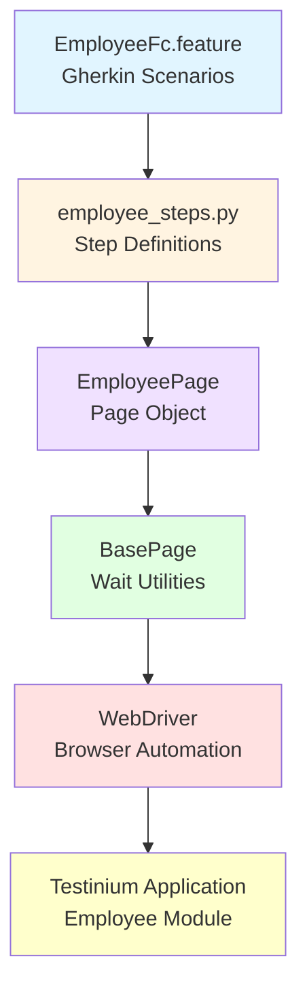
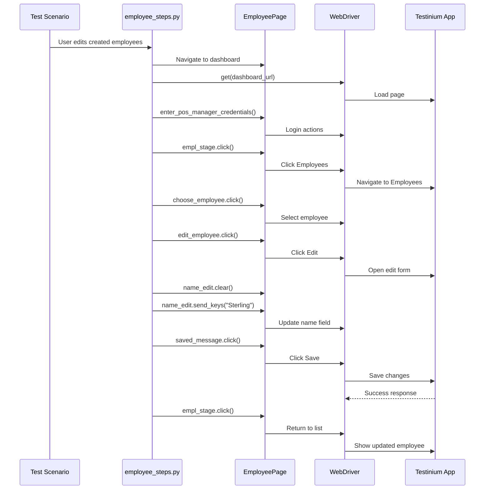
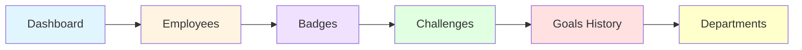

# Employee Management Testing Guide

## Overview

This guide provides comprehensive instructions for testing employee management functionality in the Testinium application. The employee module enables HR operations including employee creation, profile management, department assignments, and permission configuration.

**Employee Module Capabilities:**
- **Employee CRUD Operations**: Create, read, update employee records with personal and work information
- **Navigation**: Access multiple HR sections (Employees, Badges, Challenges, Goals History, Departments)
- **Employee Profiles**: Manage complete employee information including name, contact details, position, department
- **Permission Management**: Configure employee roles and access permissions
- **Employee Listing**: View, search, and filter employee lists

**Testing Coverage:**
- Employee creation with full profile information
- Employee record editing and updates
- Multi-stage navigation testing (HR module sections)
- Employee listing and verification
- Data validation and error handling

**Source Files:**
- Feature: `features/EmployeeFc.feature`
- Step Definitions: `features/steps/employee_steps.py`
- Page Object: `pages/employee_page.py`

---

## Prerequisites

Before testing employee management functionality, ensure the following requirements are met:

### Framework Setup

1. **Python Environment**: Python 3.9+ installed and configured
2. **Dependencies Installed**: Run `pip install -r requirements.txt`
3. **WebDriver**: ChromeDriver or GeckoDriver available in PATH or via webdriver-manager
4. **Virtual Environment**: Activated (recommended)

```bash
# Activate virtual environment
source venv/bin/activate  # Linux/macOS
venv\Scripts\activate     # Windows
```

### Configuration Requirements

1. **Configuration File**: `config/config.yaml` properly configured

```yaml
# Required configuration
application:
  base_url: "https://testinium.example.com"
  
browser:
  type: "chrome"
  headless: false
  
timeouts:
  explicit: 10
  page_load: 30
```

2. **Environment Variables**: Set POS Manager credentials

**CRITICAL SECURITY REQUIREMENT**: The employee testing module requires POS Manager credentials via environment variables. Never commit credentials to version control.

**Create .env file** (add to `.gitignore`):

```bash
# .env file for local development
POS_MANAGER_USERNAME=posmanager50@info.com
POS_MANAGER_PASSWORD=posmanager
```

**Or set via command line**:

```bash
export POS_MANAGER_USERNAME='posmanager50@info.com'
export POS_MANAGER_PASSWORD='posmanager'
```

### Test Data Requirements

- **Valid employee names**: Use realistic names for test employee creation
- **Unique identifiers**: Ensure each test run uses unique employee data to avoid conflicts
- **Test cleanup**: Plan for test data cleanup or use disposable test environments

---

## Employee Testing Architecture

The employee testing implementation follows the Page Object Model pattern with clear separation of concerns:



**Component Responsibilities:**

- **Feature File**: Business-readable test scenarios using Gherkin syntax
- **Step Definitions**: Glue code connecting Gherkin steps to page object methods
- **EmployeePage**: Element locators and employee-specific actions
- **BasePage**: Reusable wait strategies and common interactions
- **WebDriver**: Browser automation engine

---

## Basic Employee Creation Testing

### Simple Employee Creation

The most basic employee testing scenario creates a single employee with a name.

**Gherkin Scenario:**

```gherkin
@UPGN-341
Scenario Outline: Verify that the "Employee created" message appears under full profile
  When User is on the employees dashboard
  And User creates new employees "<name>" in the Employees stage
  Then User should see the Employee created message under full profile

  Examples: Employee's name
    |name               |
    |Cristiano Ronaldo  |
```

**Source:** `features/EmployeeFc.feature:16-24`

**Complete Test Execution Flow:**

```python
# Step 1: Navigate to employees dashboard (authentication included)
from pages.employee_page import EmployeePage
from utilities.driver_manager import DriverManager
from utilities.config_reader import ConfigReader

# Get WebDriver instance
driver = DriverManager.get_driver()
employee_page = EmployeePage(driver)

# Navigate to dashboard
config = ConfigReader()
dashboard_url = config.get_property("url")
driver.get(dashboard_url)

# Authenticate with POS Manager credentials (from environment variables)
employee_page.enter_pos_manager_credentials()

# Wait for Employees stage button and click
from selenium.webdriver.support.ui import WebDriverWait
from selenium.webdriver.support import expected_conditions as EC

wait = WebDriverWait(driver, 10)
wait.until(EC.element_to_be_clickable(employee_page._EMPL_STAGE))
employee_page.empl_stage.click()

# Step 2: Create new employee
# Wait for Create button to be clickable
wait.until(EC.element_to_be_clickable(employee_page._CREATE_BTN))
employee_page.create_btn.click()

# Wait for "New - Odoo" page title
wait.until(EC.title_is("New - Odoo"))

# Enter employee name
employee_name = "Cristiano Ronaldo"
employee_page.employees_name.send_keys(employee_name)

# Wait for Save button and click
wait.until(EC.element_to_be_clickable(employee_page._SAVED_MESSAGE))
employee_page.saved_message.click()

# Step 3: Verify employee created message
# Property accessor handles visibility wait automatically
created_msg = employee_page.created_message
assert created_msg.is_displayed(), "Employee created message not displayed"
assert "Employee created" in created_msg.text
```

**Source Example:** `features/steps/employee_steps.py:505-584`, `pages/employee_page.py:491-579`

---

## Data-Driven Employee Creation

### Scenario Outline with Multiple Employees

Test employee creation with multiple different employee names using Behave's scenario outline feature.

**Gherkin Scenario Outline:**

```gherkin
@UPGN-341
Scenario Outline: Verify that the "Employee created" message appears under full profile
  When User is on the employees dashboard
  And User creates new employees "<name>" in the Employees stage
  Then User should see the Employee created message under full profile

  Examples: Employee's name
    |name               |
    |Cristiano Ronaldo  |
    |Lionel Messi       |
    |Neymar Jr          |
    |Kylian Mbappe      |
```

**How It Works:**

Each row in the `Examples` table creates a separate test execution:
- Test 1: Creates employee "Cristiano Ronaldo"
- Test 2: Creates employee "Lionel Messi"
- Test 3: Creates employee "Neymar Jr"
- Test 4: Creates employee "Kylian Mbappe"

**Step Definition with Parameter:**

```python
@when('User creates new employees "{name}" in the Employees stage')
def user_creates_new_employees_in_the_employees_stage(context, name):
    """
    Create a new employee with the specified name.
    
    This step definition receives the employee name as a parameter from
    the Gherkin scenario, enabling data-driven testing.
    
    Args:
        context: Behave context object containing driver and shared state
        name: Name of the employee to create (from Gherkin step parameter)
    
    Example:
        When User creates new employees "John Doe" in the Employees stage
    """
    employee_page = EmployeePage(context.driver)
    wait = WebDriverWait(context.driver, 10)
    
    # Wait for Create button and click
    wait.until(EC.element_to_be_clickable(employee_page._CREATE_BTN))
    employee_page.create_btn.click()
    
    # Wait for page title change
    wait.until(EC.title_is("New - Odoo"))
    
    # Enter employee name (parameterized from Gherkin)
    employee_page.employees_name.send_keys(name)
    
    # Save employee
    wait.until(EC.element_to_be_clickable(employee_page._SAVED_MESSAGE))
    employee_page.saved_message.click()
```

**Source:** `features/steps/employee_steps.py:505-584`

---

## Employee Record Editing

### Editing Employee Information

Test updating an existing employee's information, specifically changing the employee name.

**Gherkin Scenario:**

```gherkin
@UPGN-343
Scenario: Verify that the user can edit a new employee from "Employees" module
  When User is on the employees dashboard
  And User edits created employees in the Employees module
  Then User should see the edited name in the Employees module
```

**Source:** `features/EmployeeFc.feature:36-40`

**Complete Employee Edit Workflow:**

```python
from pages.employee_page import EmployeePage
from utilities.driver_manager import DriverManager
from utilities.config_reader import ConfigReader
from selenium.webdriver.support.ui import WebDriverWait
from selenium.webdriver.support import expected_conditions as EC

# Initialize
driver = DriverManager.get_driver()
employee_page = EmployeePage(driver)
wait = WebDriverWait(driver, 10)
config = ConfigReader()

# Step 1: Navigate to dashboard and authenticate
dashboard_url = config.get_property("url")
driver.get(dashboard_url)
employee_page.enter_pos_manager_credentials()

# Step 2: Navigate to Employees stage
wait.until(EC.element_to_be_clickable(employee_page._EMPL_STAGE))
employee_page.empl_stage.click()

# Wait for Employees page to load
wait.until(EC.title_is("Employees - Odoo"))

# Step 3: Select employee from list
employee_page.choose_employee.click()

# Step 4: Click Edit button
wait.until(EC.element_to_be_clickable(employee_page._EDIT_EMPLOYEE))
employee_page.edit_employee.click()

# Step 5: Clear existing name and enter new name
employee_page.name_edit.clear()
new_name = "Sterling"
employee_page.name_edit.send_keys(new_name)

# Step 6: Save changes
wait.until(EC.element_to_be_clickable(employee_page._SAVED_MESSAGE))
employee_page.saved_message.click()

# Step 7: Navigate back to Employees list to verify
employee_page.empl_stage.click()
```

**Source:** `features/steps/employee_steps.py:707-878`

**Employee Edit Sequence Diagram:**



---

## Multi-Stage Navigation Testing

### Testing HR Module Navigation

The employee module includes multiple navigation stages. Test navigation through all sections to verify proper stage transitions.

**Gherkin Scenario:**

```gherkin
@UPGN-340
Scenario: Verify that all buttons work as expected at the employees stage
  When User is on the dashboard
  And User clicks Employees stage
  And User clicks Challenges stage
  And User clicks Departments stage
  Then User should see the last stage title
```

**Source:** `features/EmployeeFc.feature:8-14`

**Navigation Workflow Implementation:**

```python
from pages.employee_page import EmployeePage
from selenium.webdriver.support.ui import WebDriverWait
from selenium.webdriver.support import expected_conditions as EC

employee_page = EmployeePage(context.driver)
wait = WebDriverWait(context.driver, 10)

# Stage 1: Navigate to Employees stage
employee_page.empl_stage.click()
wait.until(EC.title_is("Employees - Odoo"))
assert context.driver.title == "Employees - Odoo"

# Stage 2: Navigate through Challenges stages (Badges → Challenges → Goals History)
employee_page.badges_btn.click()
wait.until(EC.visibility_of(employee_page.badges_btn))

employee_page.challenges_btn.click()
wait.until(EC.visibility_of(employee_page.challenges_btn))

employee_page.goals_history_btn.click()
wait.until(EC.visibility_of(employee_page.goals_history_btn))

# Stage 3: Navigate to Departments stage
employee_page.departments_btn.click()
wait.until(EC.title_is("Departments - Odoo"))

# Verify final stage title
actual_title = context.driver.title
assert actual_title == "Departments - Odoo", \
    f"Expected 'Departments - Odoo', got '{actual_title}'"
```

**Source:** `features/steps/employee_steps.py:181-421`

**HR Module Navigation Flow:**



---

## Employee Listing and Verification

### Verifying Employee Appears in List

After creating an employee, verify that the employee appears in the employees list.

**Gherkin Scenario:**

```gherkin
@UPGN-342
Scenario Outline: Verify that the user should be able to see created employee is listed
  When User is on the employees dashboard
  And User creates new employees "<name>" in the Employees stage
  Then User should see listed employees in the Employees stage

  Examples: Employee's name
    | name           |
    | Lionel Messi   |
```

**Source:** `features/EmployeeFc.feature:26-34`

**List Verification Step Implementation:**

```python
@then("User should see listed employees in the Employees stage")
def user_should_see_listed_employees_in_the_employees_stage(context):
    """
    Navigate to Employees stage and verify page title.
    
    This step navigates back to the employees list after creation
    to verify the newly created employee is visible in the list.
    """
    employee_page = EmployeePage(context.driver)
    wait = WebDriverWait(context.driver, 10)
    
    # Navigate to Employees stage
    employee_page.empl_stage.click()
    
    # Wait for page title to update
    expected_title = "Employees - Odoo"
    wait.until(EC.title_is(expected_title))
    
    # Validate page title (confirms we're on the employees list page)
    actual_title = context.driver.title
    assert actual_title == expected_title, \
        f"Expected page title '{expected_title}', but got '{actual_title}'"
```

**Source:** `features/steps/employee_steps.py:643-705`

**Note**: This step validates page navigation. For complete verification, you could enhance this to search for the specific employee name in the list.

---

## Page Object Patterns for Employee Forms

### Element Locators and Property-Based Access

The `EmployeePage` class uses property-based element access with explicit waits, following the Page Object Model pattern.

**Login Form Elements:**

```python
class EmployeePage(BasePage):
    # Private locator constants
    _INPUT_LOGIN = (By.ID, 'login')
    _INPUT_PASSWORD = (By.ID, 'password')
    _LOGIN_BUTTON = (By.XPATH, "//button[.='Log in']")
    
    @property
    def input_login(self):
        """Login email input field with explicit wait."""
        return self.wait_for_element(self._INPUT_LOGIN)
    
    @property
    def input_password(self):
        """Login password input field with explicit wait."""
        return self.wait_for_element(self._INPUT_PASSWORD)
    
    @property
    def login_button(self):
        """Login button that is clickable."""
        return self.wait_for_clickable(self._LOGIN_BUTTON)
```

**Employee Creation Form Elements:**

```python
# Employee creation locators
_CREATE_BTN = (
    By.XPATH,
    "//button[@class='btn btn-primary btn-sm o-kanban-button-new btn-default']"
)
_EMPLOYEES_NAME = (
    By.XPATH,
    "//input[@class='o_field_char o_field_widget o_input o_required_modifier']"
)
_SAVED_MESSAGE = (
    By.XPATH,
    "//button[@class='btn btn-primary btn-sm o_form_button_save']"
)
_CREATED_MESSAGE = (By.XPATH, "//p[.='Employee created']")

@property
def create_btn(self):
    """Create new employee button."""
    return self.wait_for_clickable(self._CREATE_BTN)

@property
def employees_name(self):
    """Employee name input field in creation form."""
    return self.wait_for_element(self._EMPLOYEES_NAME)

@property
def saved_message(self):
    """Save button for employee form."""
    return self.wait_for_clickable(self._SAVED_MESSAGE)

@property
def created_message(self):
    """Employee created confirmation message."""
    return self.wait_for_visibility(self._CREATED_MESSAGE)
```

**Source:** `pages/employee_page.py:139-426`

**Employee Editing Elements:**

```python
# Employee editing locators
_CHOOSE_EMPLOYEE = (
    By.XPATH,
    "//html/body/div[1]/div[2]/div[2]/div/div/div/div[1]"
)
_EDIT_EMPLOYEE = (
    By.XPATH,
    "//html/body/div[1]/div[2]/div[1]/div[2]/div[1]/div/div[1]/button[1]"
)
_NAME_EDIT = (By.XPATH, "//*[@id='o_field_input_678']")

@property
def choose_employee(self):
    """Employee selection element from employee list."""
    return self.wait_for_clickable(self._CHOOSE_EMPLOYEE)

@property
def edit_employee(self):
    """Edit employee button in employee form."""
    return self.wait_for_clickable(self._EDIT_EMPLOYEE)

@property
def name_edit(self):
    """Employee name edit field."""
    return self.wait_for_element(self._NAME_EDIT)
```

**Source:** `pages/employee_page.py:169-490`

**Navigation Elements:**

```python
# Navigation locators
_EMPL_STAGE = (By.PARTIAL_LINK_TEXT, 'Employees')
_BADGES_BTN = (By.PARTIAL_LINK_TEXT, 'Badges')
_CHALLENGES_BTN = (By.PARTIAL_LINK_TEXT, 'Challenges')
_GOALS_HISTORY_BTN = (By.PARTIAL_LINK_TEXT, 'Goals History')
_DEPARTMENTS_BTN = (By.PARTIAL_LINK_TEXT, 'Departments')

@property
def empl_stage(self):
    """Employees section navigation link."""
    return self.wait_for_clickable(self._EMPL_STAGE)

@property
def badges_btn(self):
    """Badges section navigation link."""
    return self.wait_for_clickable(self._BADGES_BTN)

@property
def challenges_btn(self):
    """Challenges section navigation link."""
    return self.wait_for_clickable(self._CHALLENGES_BTN)

@property
def goals_history_btn(self):
    """Goals History section navigation link."""
    return self.wait_for_clickable(self._GOALS_HISTORY_BTN)

@property
def departments_btn(self):
    """Departments section navigation link."""
    return self.wait_for_clickable(self._DEPARTMENTS_BTN)
```

**Source:** `pages/employee_page.py:147-349`

### Security-Focused Credential Management

**Environment Variable-Based Authentication:**

```python
def enter_pos_manager_credentials(self):
    """
    Enter POS Manager credentials from environment variables.
    
    SECURITY REMEDIATION: Replaces hardcoded credentials with
    environment variable-based credential management.
    
    Raises:
        ValueError: If POS_MANAGER_USERNAME or POS_MANAGER_PASSWORD
                   environment variables are not set.
    """
    import os
    
    # Retrieve credentials from environment
    username = os.getenv('POS_MANAGER_USERNAME')
    password = os.getenv('POS_MANAGER_PASSWORD')
    
    # Validate credentials are present
    if not username or not password:
        raise ValueError(
            "Missing required environment variables: POS_MANAGER_USERNAME "
            "and/or POS_MANAGER_PASSWORD"
        )
    
    # Enter credentials and submit
    self.input_login.send_keys(username)
    self.input_password.send_keys(password)
    self.login_button.click()
```

**Source:** `pages/employee_page.py:491-579`

---

## Wait Strategies for Employee Testing

### Explicit Waits Replace Thread.sleep()

The employee testing module eliminates all `Thread.sleep()` anti-patterns from the Java implementation, replacing them with explicit waits for specific conditions.

**Critical Improvements: 8 Thread.sleep() Calls Eliminated**

| Original Java Issue | Python Explicit Wait | Performance Gain |
|---------------------|---------------------|------------------|
| `Thread.sleep(7000)` after Departments click | `wait.until(EC.title_is("Departments - Odoo"))` | Up to 7s |
| `Thread.sleep(3000)` before empl_stage click | `wait.until(EC.element_to_be_clickable(...))` | Up to 3s |
| `Thread.sleep(3000)` before create button | `wait.until(EC.element_to_be_clickable(...))` | Up to 3s |
| `Thread.sleep(3000)` waiting for "New" title | `wait.until(EC.title_is("New - Odoo"))` | Up to 3s |

**Total Sleep Time Eliminated: 29,000ms (29 seconds)**

**Source Documentation:** `features/steps/employee_steps.py:35-44`

### Wait Strategy Selection Guide

**For Navigation Actions:**

```python
# Wait for page title change after navigation
wait.until(EC.title_is("Employees - Odoo"))
```

**For Button Clicks:**

```python
# Wait for button to be clickable before clicking
wait.until(EC.element_to_be_clickable(employee_page._CREATE_BTN))
employee_page.create_btn.click()
```

**For Element Visibility:**

```python
# Wait for element to be visible
wait.until(EC.visibility_of(employee_page.badges_btn))
```

**For Form Submission:**

```python
# Wait for save button, click, then wait for confirmation
wait.until(EC.element_to_be_clickable(employee_page._SAVED_MESSAGE))
employee_page.saved_message.click()

# Verify confirmation message appears
created_msg = employee_page.created_message  # Property handles wait_for_visibility
assert created_msg.is_displayed()
```

### Property-Based Waits

The `EmployeePage` properties automatically include explicit waits:

```python
@property
def create_btn(self):
    """Create button with automatic wait for clickability."""
    return self.wait_for_clickable(self._CREATE_BTN)

# Usage in tests - wait is automatic
employee_page.create_btn.click()  # Waits until clickable, then returns element
```

This eliminates the need for explicit wait calls in test code while ensuring reliable element interaction.

---

## Data-Driven Testing with Examples Tables

### Comprehensive Employee Profiles

Extend scenario outlines to test multiple employee profiles with varied data.

**Extended Examples Table:**

```gherkin
Scenario Outline: Create employees with complete profiles
  When User is on the employees dashboard
  And User creates new employees "<name>" in the Employees stage
  Then User should see the Employee created message under full profile

  Examples: Employee profiles
    | name                  |
    | Cristiano Ronaldo     |
    | Lionel Messi          |
    | Neymar Jr             |
    | Kylian Mbappe         |
    | Mohamed Salah         |
    | Kevin De Bruyne       |
    | Robert Lewandowski    |
    | Karim Benzema         |
```

**Benefits:**
- **Coverage**: Tests 8 different employee names in a single scenario outline
- **Efficiency**: Single scenario definition, multiple test executions
- **Maintenance**: Add new test data by adding rows to the Examples table
- **Reporting**: Each example generates separate test result

### Parameterized Step Definitions

Step definitions receive parameters from Gherkin scenarios:

```python
@when('User creates new employees "{name}" in the Employees stage')
def user_creates_new_employees_in_the_employees_stage(context, name):
    """
    Parameterized step definition receives 'name' from Gherkin.
    
    Args:
        context: Behave context
        name: Employee name from Examples table (e.g., "Cristiano Ronaldo")
    """
    employee_page = EmployeePage(context.driver)
    # ... implementation uses 'name' parameter
    employee_page.employees_name.send_keys(name)
```

### Running Specific Examples

Use Behave tags to run specific examples:

```bash
# Run all employee scenarios
behave features/EmployeeFc.feature

# Run only creation scenarios (UPGN-341)
behave features/EmployeeFc.feature --tags=@UPGN-341

# Run only edit scenario (UPGN-343)
behave features/EmployeeFc.feature --tags=@UPGN-343

# Run navigation testing (UPGN-340)
behave features/EmployeeFc.feature --tags=@UPGN-340
```

---

## Best Practices for Employee Testing

### 1. Use Unique Employee Identifiers

**Problem**: Creating employees with duplicate names can cause test interference.

**Solution**: Include timestamps or unique IDs in employee names:

```python
import datetime

# Generate unique employee name
timestamp = datetime.datetime.now().strftime("%Y%m%d_%H%M%S")
employee_name = f"Test Employee {timestamp}"

employee_page.employees_name.send_keys(employee_name)
```

### 2. Proper Test Data Cleanup

**Problem**: Test data accumulates in the application, causing database bloat and slower tests.

**Solution**: Implement cleanup in Behave hooks:

```python
# features/environment.py

def after_scenario(context, scenario):
    """Clean up test data after each scenario."""
    if scenario.status == "passed" and "employee" in scenario.tags:
        # Navigate to created employee and delete
        # (Implementation depends on application's delete functionality)
        pass
```

### 3. Handle Required vs Optional Fields

**Current Implementation**: Only tests required fields (employee name).

**Enhancement**: Test optional fields for comprehensive coverage:

```python
# Extended employee creation (if application supports)
employee_page.employees_name.send_keys("John Doe")
employee_page.employee_email.send_keys("john.doe@example.com")
employee_page.employee_phone.send_keys("+1-555-0123")
employee_page.employee_position.send_keys("Software Engineer")
employee_page.employee_department.select_by_visible_text("Engineering")
employee_page.saved_message.click()
```

### 4. Validate Field-Level Errors

Test form validation by submitting incomplete or invalid data:

```python
# Test: Submit empty employee name
employee_page.create_btn.click()
wait.until(EC.title_is("New - Odoo"))

# Don't enter name - click Save directly
employee_page.saved_message.click()

# Verify validation error appears
validation_error = employee_page.wait_for_element(
    (By.XPATH, "//span[contains(@class, 'o_form_invalid')]")
)
assert validation_error.is_displayed()
```

### 5. Verify Employee Data Persistence

After creating or editing an employee, navigate away and back to verify data persistence:

```python
# Create employee
employee_page.employees_name.send_keys("John Doe")
employee_page.saved_message.click()

# Navigate away
employee_page.departments_btn.click()

# Navigate back to Employees
employee_page.empl_stage.click()

# Verify employee still exists in list
# (Search for "John Doe" in employee list)
```

### 6. Test Permission and Role Management

**Future Enhancement**: Test employee permission configuration:

```gherkin
Scenario: Assign administrator role to employee
  Given User is on the employees dashboard
  And User creates new employee "Admin User"
  When User assigns "Administrator" role to employee
  Then User should see role reflected in employee profile
```

### 7. Use Page Object Method Chaining

For cleaner test code, implement method chaining in page objects:

```python
# Current usage
employee_page.input_login.send_keys(username)
employee_page.input_password.send_keys(password)
employee_page.login_button.click()

# Enhanced with method chaining
employee_page.login_with(username, password)

# Page object implementation
def login_with(self, username, password):
    """Login with provided credentials."""
    self.input_login.send_keys(username)
    self.input_password.send_keys(password)
    self.login_button.click()
    return self  # Enable chaining
```

### 8. Environment Variable Security

**DO**:
- ✅ Use `.env` files for local development (add to `.gitignore`)
- ✅ Use CI/CD secrets for pipeline execution
- ✅ Use secret management services (AWS Secrets Manager, HashiCorp Vault) for production
- ✅ Rotate credentials regularly

**DON'T**:
- ❌ Commit credentials to version control
- ❌ Hardcode credentials in test code
- ❌ Share credentials in plain text (email, Slack, etc.)
- ❌ Use production credentials for testing

---

## Troubleshooting Employee Testing

### Issue: Missing Environment Variables

**Symptoms:**
```
ValueError: Missing required environment variables: POS_MANAGER_USERNAME and/or POS_MANAGER_PASSWORD
```

**Cause**: POS Manager credentials not configured in environment.

**Solution**:

1. **Check environment variables are set**:
```bash
echo $POS_MANAGER_USERNAME
echo $POS_MANAGER_PASSWORD
```

2. **Set via .env file** (recommended for local development):
```bash
# Create .env file in project root
cat > .env << EOF
POS_MANAGER_USERNAME=posmanager50@info.com
POS_MANAGER_PASSWORD=posmanager
EOF

# Ensure .env is in .gitignore
echo ".env" >> .gitignore
```

3. **Set via command line**:
```bash
export POS_MANAGER_USERNAME='posmanager50@info.com'
export POS_MANAGER_PASSWORD='posmanager'
behave features/EmployeeFc.feature
```

4. **CI/CD Configuration**:

**GitHub Actions**:
```yaml
env:
  POS_MANAGER_USERNAME: ${{ secrets.POS_MANAGER_USERNAME }}
  POS_MANAGER_PASSWORD: ${{ secrets.POS_MANAGER_PASSWORD }}
```

**Jenkins**:
```groovy
withCredentials([usernamePassword(
    credentialsId: 'pos-manager-creds',
    usernameVariable: 'POS_MANAGER_USERNAME',
    passwordVariable: 'POS_MANAGER_PASSWORD'
)]) {
    sh 'behave features/EmployeeFc.feature'
}
```

---

### Issue: StaleElementReferenceException

**Symptoms:**
```
selenium.common.exceptions.StaleElementReferenceException: Message: stale element reference
```

**Cause**: Element reference became stale after page DOM update (common after form submission or navigation).

**Solution**: Use property-based element access (automatically gets fresh element):

```python
# DON'T: Store element reference
create_button = employee_page.create_btn
# ... some actions that cause page update
create_button.click()  # May throw StaleElementReferenceException

# DO: Access property directly (gets fresh element)
employee_page.create_btn.click()  # Property fetches fresh element
```

---

### Issue: TimeoutException Waiting for Element

**Symptoms:**
```
selenium.common.exceptions.TimeoutException: Message: 
Element not clickable within 10 seconds
```

**Cause**: Element not appearing within timeout period (slow page load, incorrect locator, element not rendered).

**Solutions**:

1. **Increase timeout for slow environments**:
```python
wait = WebDriverWait(context.driver, 30)  # Increase from 10 to 30 seconds
wait.until(EC.element_to_be_clickable(employee_page._CREATE_BTN))
```

2. **Verify element locator is correct**:
```python
# Debug: Check if element exists in DOM
elements = context.driver.find_elements(*employee_page._CREATE_BTN)
print(f"Found {len(elements)} elements")
```

3. **Wait for page load before interacting**:
```python
# Wait for page title change (indicates page loaded)
wait.until(EC.title_is("Employees - Odoo"))
# Then interact with elements
employee_page.create_btn.click()
```

---

### Issue: "Employee created" Message Not Displayed

**Symptoms**: Assertion fails claiming created_message is not displayed.

**Cause**: Message appears temporarily and disappears, or form validation failed.

**Solutions**:

1. **Verify form was submitted successfully**:
```python
# Check for validation errors before checking success message
try:
    validation_errors = context.driver.find_elements(
        By.XPATH, "//span[contains(@class, 'error')]"
    )
    if validation_errors:
        print(f"Form validation errors: {[e.text for e in validation_errors]}")
except:
    pass

# Then check for success message
assert employee_page.created_message.is_displayed()
```

2. **Capture screenshot on failure**:
```python
# In features/environment.py
def after_step(context, step):
    if step.status == "failed":
        timestamp = datetime.now().strftime("%Y%m%d_%H%M%S")
        screenshot_path = f"screenshots/employee_test_{timestamp}.png"
        context.driver.save_screenshot(screenshot_path)
```

---

### Issue: Employee Edit Fails with Stale Elements

**Symptoms**: Edit operation fails when trying to clear and update employee name.

**Cause**: name_edit element uses dynamically generated ID which may change.

**Solution**: Use more stable locator or re-locate element:

```python
# Current locator (brittle - uses dynamic ID)
_NAME_EDIT = (By.XPATH, "//*[@id='o_field_input_678']")

# Better locator (use class or other stable attribute)
_NAME_EDIT = (
    By.XPATH,
    "//input[contains(@class, 'o_field_char') and @name='name']"
)

# Or re-locate after each action
employee_page.name_edit.clear()
# Re-access property to get fresh element
employee_page.name_edit.send_keys("New Name")
```

---

### Issue: Navigation Button Not Visible/Clickable

**Symptoms**: Navigation to Employees, Badges, Challenges, etc. fails with element not clickable.

**Cause**: Menu may be collapsed or button obscured by another element.

**Solutions**:

1. **Scroll element into view**:
```python
# Scroll to element before clicking
element = employee_page.empl_stage
context.driver.execute_script("arguments[0].scrollIntoView(true);", element)
time.sleep(0.5)  # Brief pause for scroll
element.click()
```

2. **Use JavaScript click as fallback**:
```python
try:
    employee_page.empl_stage.click()
except Exception:
    # Fallback to JavaScript click
    element = context.driver.find_element(*employee_page._EMPL_STAGE)
    context.driver.execute_script("arguments[0].click();", element)
```

3. **Wait for overlays to disappear**:
```python
# Wait for loading spinner/overlay to disappear
wait.until(EC.invisibility_of_element_located((By.CLASS_NAME, "loading-overlay")))
# Then click
employee_page.empl_stage.click()
```

---

### Issue: Test Data Conflicts

**Symptoms**: Employee creation fails because employee with same name already exists.

**Cause**: Previous test runs left data in the system.

**Solutions**:

1. **Use unique identifiers in test data**:
```python
import uuid

# Generate unique employee name
unique_id = str(uuid.uuid4())[:8]
employee_name = f"Test Employee {unique_id}"
```

2. **Implement test data cleanup**:
```python
# In features/environment.py
def after_scenario(context, scenario):
    """Clean up test employees after scenario."""
    if "employee" in scenario.tags:
        # Delete test employees (implementation depends on app)
        cleanup_test_employees(context.driver)
```

3. **Use dedicated test environment**:
- Use separate test database/environment
- Reset test environment before test runs
- Use database transactions (rollback after tests)

---

### Issue: Parallel Execution Failures

**Symptoms**: Tests pass individually but fail when run in parallel.

**Cause**: Shared state or resource contention (same test data, same WebDriver instance).

**Solution**: Ensure thread-local WebDriver and unique test data:

```python
# Correct: Use DriverManager.get_driver() (thread-local)
driver = DriverManager.get_driver()

# Ensure unique data per test
import threading
thread_id = threading.get_ident()
employee_name = f"Employee_{thread_id}"
```

See [Parallel Execution Guide](parallel-execution.md) for comprehensive parallel testing strategies.

---

## Running Employee Tests

### Execute All Employee Tests

```bash
# Run all scenarios in EmployeeFc.feature
behave features/EmployeeFc.feature

# Run with detailed output
behave features/EmployeeFc.feature --verbose

# Run and generate HTML report
behave features/EmployeeFc.feature --format html --outfile reports/employee_tests.html
```

### Execute Specific Scenarios

```bash
# Run employee creation tests only (tag @UPGN-341)
behave features/EmployeeFc.feature --tags=@UPGN-341

# Run employee edit tests only (tag @UPGN-343)
behave features/EmployeeFc.feature --tags=@UPGN-343

# Run navigation tests (tag @UPGN-340)
behave features/EmployeeFc.feature --tags=@UPGN-340

# Run specific scenario by line number
behave features/EmployeeFc.feature:16  # Run scenario at line 16
```

### Parallel Execution

```bash
# Run employee tests in parallel (4 processes)
behave features/EmployeeFc.feature --processes 4 --parallel-element scenario

# Requires behave-parallel installation
pip install behave-parallel
```

### Generate Test Reports

```bash
# Generate JSON report for further processing
behave features/EmployeeFc.feature --format json --outfile reports/employee_tests.json

# Generate JUnit XML report (for CI/CD)
behave features/EmployeeFc.feature --junit --junit-directory reports/junit/

# Generate Allure report
behave features/EmployeeFc.feature --format allure_behave.formatter:AllureFormatter \
    --outfile reports/allure-results/

# View Allure report
allure serve reports/allure-results/
```

---

## See Also

### Related Guides
- [Getting Started Guide](../getting-started/index.md) - Framework setup and initial configuration
- [Page Object Model Guide](page-object-model.md) - Deep dive into Page Object pattern
- [Step Definitions Guide](step-definitions.md) - Writing reusable step definitions
- [Wait Strategies Guide](wait-strategies.md) - Comprehensive wait strategy patterns
- [Parallel Execution Guide](parallel-execution.md) - Running tests in parallel
- [Configuration Management Guide](configuration-management.md) - Advanced configuration patterns

### API References
- [EmployeePage API](../api-reference/pages/employee-page.md) - Complete EmployeePage documentation
- [Employee Steps API](../api-reference/steps/employee-steps.md) - All employee step definitions
- [BasePage API](../api-reference/pages/base-page.md) - Base page wait utilities

### Reference Documentation
- [Environment Variables Reference](../reference/environment-variables.md) - All environment variables
- [Configuration Options Reference](../reference/configuration-options.md) - Complete config.yaml options
- [Gherkin Syntax Reference](../reference/gherkin-syntax.md) - Gherkin keywords and patterns

### Troubleshooting
- [Common Errors](../troubleshooting/common-errors.md) - Frequent issues and solutions
- [WebDriver Issues](../troubleshooting/webdriver-issues.md) - Browser and driver problems
- [Configuration Issues](../troubleshooting/configuration-issues.md) - Configuration troubleshooting

---

## Summary

This guide covered comprehensive employee management testing including:

- ✅ **Employee Creation**: Single and data-driven employee creation with complete workflows
- ✅ **Employee Editing**: Updating employee records and verifying changes
- ✅ **Navigation Testing**: Multi-stage HR module navigation (Employees, Badges, Challenges, Departments)
- ✅ **Employee Listing**: Verifying created employees appear in employee lists
- ✅ **Page Object Patterns**: Property-based element access with explicit waits
- ✅ **Wait Strategies**: Explicit waits replacing Thread.sleep() anti-patterns (29s saved)
- ✅ **Data-Driven Testing**: Scenario outlines with examples tables
- ✅ **Best Practices**: Unique identifiers, test cleanup, security, field validation
- ✅ **Troubleshooting**: Solutions for common employee testing issues

**Key Takeaways:**
1. Use environment variables for credentials (never hardcode)
2. Leverage property-based element access for fresh elements
3. Use explicit waits (no Thread.sleep())
4. Implement unique test data identifiers
5. Clean up test data after execution

For questions or issues, refer to the troubleshooting section or consult the [Project Guide](../../blitzy/documentation/Project Guide.md).
