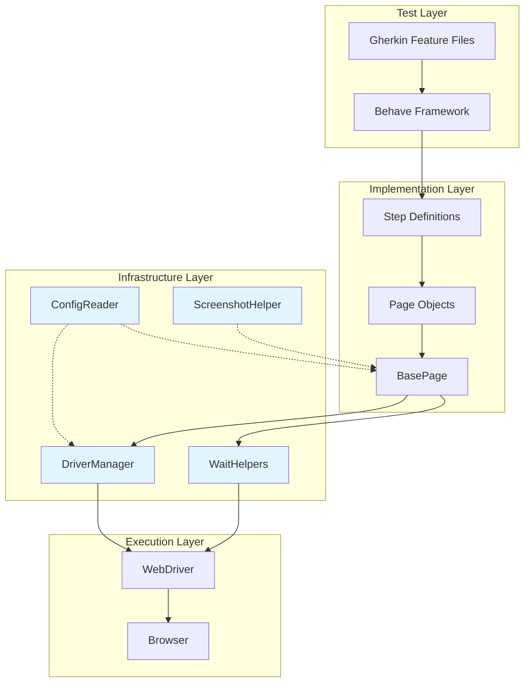

# Extending the Framework

## Overview

This guide provides comprehensive instructions for extending the Testinium QA Python test automation framework to meet your specific testing needs. The framework is designed with extensibility in mind, featuring clear extension points across utilities, page objects, step definitions, hooks, and configuration.

**When to Extend the Framework:**
- Adding support for new browsers (Edge, Safari, Opera)
- Creating custom wait conditions beyond the provided helpers
- Implementing reusable utility modules for common operations
- Building new page object patterns for complex UI components
- Integrating third-party tools (Appium, Playwright, monitoring services)
- Adding custom test lifecycle hooks
- Creating framework plugins for reusable extensions

**Prerequisites:**
- Understanding of the framework architecture (see [System Overview](../architecture/system-overview.md))
- Familiarity with Python 3.9+ and object-oriented programming
- Knowledge of Selenium WebDriver and Behave BDD framework
- Development environment set up (see [Development Setup](../contributing/development-setup.md))

**Extension Points:**

The framework provides the following primary extension points:

1. **Utilities Package (`utilities/`)**: Add new utility modules following existing patterns
2. **Page Objects (`pages/`)**: Create new page object patterns and components
3. **Step Definitions (`features/steps/`)**: Add new step definition modules
4. **Behave Hooks (`features/environment.py`)**: Extend test lifecycle hooks
5. **Configuration (`config/`)**: Add new configuration options and dataclasses
6. **Reporters**: Integrate custom reporting and formatters

---

## Framework Architecture for Extensions

Understanding the framework's layered architecture is crucial for effective extensions:



**Key Extension Principles:**

1. **Follow Existing Patterns**: Match the style and structure of existing modules
2. **Maintain Thread Safety**: Use `threading.local()` for parallel execution compatibility
3. **Use Explicit Waits Only**: No implicit waits (framework design principle)
4. **Comprehensive Docstrings**: Document all public APIs with Google-style docstrings
5. **Configuration-Driven**: Make extensions configurable via `config.yaml` or environment variables
6. **Proper Logging**: Use Python's `logging` module for observability
7. **Error Handling**: Implement comprehensive exception handling with custom exceptions
8. **Unit Testing**: Write tests for framework extensions in `tests/` directory

---

## Adding New Utility Modules

The `utilities/` package contains core infrastructure modules. You can add new utility modules following the established patterns.

### Utility Module Pattern

All utility modules in the framework follow a consistent pattern demonstrated by existing utilities like `config_reader.py`, `wait_helpers.py`, and `screenshot_helper.py`:

**Pattern Characteristics:**
- Comprehensive module-level docstring explaining purpose and migration context
- Singleton pattern where appropriate (see `ConfigReader`)
- Class-based organization with static/class methods
- Type hints on all function signatures
- Detailed method docstrings with Args, Returns, Raises, Examples
- Comprehensive logging using Python's `logging` module
- Proper exception handling with custom exception classes
- Thread-safety considerations documented

### Example: Creating a Custom Database Utility

Let's create a new utility module for database operations following framework patterns:

**Source:** Based on patterns from `utilities/config_reader.py` and `utilities/driver_manager.py`

```python
"""
Database Helper Module

Thread-safe database connection management for test data setup and verification.

This utility provides centralized database connection lifecycle management with
connection pooling, transaction support, and proper cleanup for test scenarios.

Example Usage:
    >>> from utilities.database_helper import DatabaseHelper
    >>> # Get database connection for current thread
    >>> db = DatabaseHelper.get_connection()
    >>> result = db.execute("SELECT * FROM users WHERE username = ?", (username,))
    >>> # Cleanup after test
    >>> DatabaseHelper.close_connection()
"""

import threading
import logging
from typing import Optional, Any, Dict, List, Tuple
import sqlite3  # Or psycopg2, pymysql, etc.

from utilities.config_reader import ConfigReader


# Configure module logger
logger = logging.getLogger(__name__)


class DatabaseConnectionError(Exception):
    """
    Custom exception for database connection failures.

    Raised when:
    - Database connection fails
    - Invalid connection parameters
    - Connection timeout
    - Database server unreachable

    Example:
        >>> try:
        ...     db = DatabaseHelper.get_connection()
        ... except DatabaseConnectionError as e:
        ...     logger.error(f"Failed to connect to database: {e}")
        ...     raise
    """


class DatabaseHelper:
    """
    Thread-safe database connection manager using threading.local().

    Provides centralized database connection management with proper lifecycle
    and thread isolation for parallel test execution. Each thread gets its
    own connection instance.

    Thread Safety:
        - Each thread gets its own connection via threading.local()
        - No shared state between threads
        - Compatible with behave-parallel and pytest-xdist

    Configuration:
        Reads from config/config.yaml via ConfigReader:
        - database.host: Database server hostname
        - database.port: Database server port
        - database.name: Database name
        - database.user: Database username
        - database.password: Database password

    Example:
        >>> # Get connection for current thread
        >>> db = DatabaseHelper.get_connection()
        >>> cursor = db.cursor()
        >>> cursor.execute("SELECT * FROM users WHERE id = ?", (user_id,))
        >>> result = cursor.fetchone()
        >>>
        >>> # Cleanup
        >>> DatabaseHelper.close_connection()
    """

    # Thread-local storage for database connections
    _thread_local = threading.local()

    @classmethod
    def get_connection(cls) -> Any:
        """
        Get database connection for current thread with lazy initialization.

        Returns same connection instance for repeated calls within same thread.
        Creates new connection on first call per thread.

        Thread Safety:
            Each thread calling this method gets its own connection instance
            stored in threading.local(). No synchronization needed.

        Returns:
            Connection: Thread-local database connection instance

        Raises:
            DatabaseConnectionError: If connection creation fails
            ConfigurationError: If required configuration missing

        Example:
            >>> conn = DatabaseHelper.get_connection()
            >>> cursor = conn.cursor()
            >>> cursor.execute("SELECT COUNT(*) FROM users")
            >>> count = cursor.fetchone()[0]
        """
        if not hasattr(cls._thread_local, 'connection') or cls._thread_local.connection is None:
            thread_name = threading.current_thread().name
            logger.info("No database connection for thread '%s', creating new connection", thread_name)

            try:
                cls._thread_local.connection = cls._create_connection()
                logger.info("Database connection created successfully for thread '%s'", thread_name)
            except Exception as e:
                logger.exception("Failed to create database connection for thread '%s': %s", thread_name, e)
                raise DatabaseConnectionError(f"Database connection failed for thread '{thread_name}': {e}") from e
        else:
            logger.debug("Returning existing connection for thread '%s'", threading.current_thread().name)

        return cls._thread_local.connection

    @classmethod
    def _create_connection(cls) -> Any:
        """
        Create new database connection based on configuration.

        Reads database configuration from ConfigReader and creates
        appropriate connection instance.

        Returns:
            Connection: Configured database connection

        Raises:
            DatabaseConnectionError: If connection fails
            ConfigurationError: If configuration retrieval fails
        """
        try:
            config = ConfigReader()
            db_host = config.get_property('database.host', default='localhost')
            db_port = config.get_property('database.port', default=5432)
            db_name = config.get_property('database.name')
            db_user = config.get_property('database.user')
            db_password = config.get_property('database.password')

            logger.info("Creating database connection: host='%s', database='%s'", db_host, db_name)

            # Example using SQLite (replace with your database driver)
            connection = sqlite3.connect(
                database=db_name,
                timeout=10.0,
                check_same_thread=False  # Allow thread-local usage
            )

            logger.info("Database connection created successfully")
            return connection

        except Exception as exc:
            error_msg = f"Database connection creation failed: {exc}"
            logger.exception(error_msg)
            raise DatabaseConnectionError(error_msg) from exc

    @classmethod
    def close_connection(cls) -> None:
        """
        Close database connection and remove thread-local reference.

        Properly terminates database connection and removes reference from
        thread-local storage. Ensures clean shutdown and prevents stale
        connection references.

        Thread Safety:
            Only affects current thread's connection. Other threads'
            connections remain unaffected.

        Idempotent:
            Safe to call multiple times. If no connection exists, completes
            silently without error.

        Example:
            >>> conn = DatabaseHelper.get_connection()
            >>> # Use connection...
            >>> DatabaseHelper.close_connection()
        """
        thread_name = threading.current_thread().name

        if hasattr(cls._thread_local, 'connection') and cls._thread_local.connection is not None:
            logger.info("Closing database connection for thread '%s'", thread_name)

            try:
                cls._thread_local.connection.close()
                logger.info("Database connection closed successfully for thread '%s'", thread_name)
            except Exception as exc:
                logger.warning("Error closing database connection for thread '%s': %s", thread_name, exc)
            finally:
                cls._thread_local.connection = None
                logger.debug("Thread-local connection reference cleared for thread '%s'", thread_name)
        else:
            logger.debug("No connection to close for thread '%s'", thread_name)


# Module-level convenience function
def get_db_connection() -> Any:
    """
    Module-level convenience function to get database connection.

    Returns:
        Connection: Thread-local database connection instance

    Raises:
        DatabaseConnectionError: If connection creation fails
    """
    return DatabaseHelper.get_connection()
```

**Source:** Pattern extracted from `utilities/driver_manager.py` lines 82-546

### Key Pattern Elements to Follow

1. **Module Docstring**: Comprehensive overview with purpose, usage examples, and migration notes if applicable
2. **Thread-Local Storage**: Use `threading.local()` for thread safety (lines 127-129 in `driver_manager.py`)
3. **Custom Exceptions**: Create specific exception classes for error scenarios (lines 59-79 in `driver_manager.py`)
4. **Class Methods**: Use `@classmethod` for manager pattern (lines 131-196 in `driver_manager.py`)
5. **Configuration Integration**: Load settings from `ConfigReader` (line 252 in `driver_manager.py`)
6. **Comprehensive Logging**: Log at appropriate levels (INFO for major events, DEBUG for details)
7. **Defensive Programming**: Null checks, exception handling, idempotent operations
8. **Convenience Functions**: Provide module-level functions for simpler imports (lines 513-546 in `driver_manager.py`)

### Registering New Utilities

Add your new utility to the `utilities/__init__.py` file for convenient imports:

```python
"""
Utilities Package

Core framework utilities for WebDriver management, configuration, waits, and helpers.
"""

from utilities.driver_manager import DriverManager, DriverInitializationError
from utilities.config_reader import ConfigReader
from utilities.wait_helpers import WaitHelpers
from utilities.screenshot_helper import capture_screenshot
from utilities.database_helper import DatabaseHelper, DatabaseConnectionError  # NEW

__all__ = [
    'DriverManager',
    'DriverInitializationError',
    'ConfigReader',
    'WaitHelpers',
    'capture_screenshot',
    'DatabaseHelper',  # NEW
    'DatabaseConnectionError',  # NEW
]
```

---

## Creating Custom Wait Conditions

The framework uses explicit waits exclusively via the `WaitHelpers` class. You can extend wait functionality in two ways: extending `WaitHelpers` or creating custom Expected Conditions.

### Approach 1: Extending WaitHelpers Class

Create a subclass of `WaitHelpers` with additional wait methods:

**Source:** Based on `utilities/wait_helpers.py` structure

```python
"""
Extended Wait Helpers Module

Custom wait conditions extending the base WaitHelpers class.

Provides additional wait conditions specific to your application's behavior
beyond the standard wait methods provided by WaitHelpers.
"""

from typing import Tuple
from selenium.webdriver.remote.webdriver import WebDriver
from selenium.webdriver.remote.webelement import WebElement
from selenium.common.exceptions import TimeoutException

from utilities.wait_helpers import WaitHelpers


class ExtendedWaitHelpers(WaitHelpers):
    """
    Extended wait helpers with custom wait conditions.

    Inherits all standard wait methods from WaitHelpers and adds
    application-specific wait conditions.

    Example:
        >>> from utilities.extended_wait_helpers import ExtendedWaitHelpers
        >>> waiter = ExtendedWaitHelpers(driver)
        >>> waiter.wait_for_ajax_complete()
        >>> waiter.wait_for_angular_ready()
    """

    def wait_for_ajax_complete(self, timeout: int = None) -> bool:
        """
        Wait for all AJAX requests to complete.

        Waits until jQuery.active count reaches 0, indicating all
        AJAX requests have completed. Useful for dynamic content loading.

        Args:
            timeout: Maximum time to wait in seconds (default: uses config timeout)

        Returns:
            bool: True if AJAX completed within timeout

        Raises:
            TimeoutException: If AJAX doesn't complete within timeout

        Example:
            >>> waiter.wait_for_ajax_complete(timeout=15)
            >>> # Now safe to interact with dynamically loaded elements
        """
        timeout = timeout or self.default_timeout

        try:
            self.wait.until(
                lambda driver: driver.execute_script("return jQuery.active == 0"),
                message=f"AJAX requests did not complete within {timeout} seconds"
            )
            logger.debug("AJAX requests completed successfully")
            return True

        except TimeoutException as e:
            logger.error("Timeout waiting for AJAX completion: %s", e)
            raise

    def wait_for_angular_ready(self, timeout: int = None) -> bool:
        """
        Wait for Angular framework to finish rendering.

        Waits until Angular's testability API reports ready state.
        Essential for Angular applications with async operations.

        Args:
            timeout: Maximum time to wait in seconds

        Returns:
            bool: True if Angular ready within timeout

        Raises:
            TimeoutException: If Angular doesn't become ready

        Example:
            >>> waiter.wait_for_angular_ready()
            >>> element = waiter.wait_for_clickable(locator)
        """
        timeout = timeout or self.default_timeout

        try:
            self.wait.until(
                lambda driver: driver.execute_script(
                    "return window.getAllAngularTestabilities().findIndex(x=>!x.isStable()) === -1"
                ),
                message=f"Angular did not become ready within {timeout} seconds"
            )
            logger.debug("Angular framework ready")
            return True

        except TimeoutException as e:
            logger.error("Timeout waiting for Angular ready: %s", e)
            raise

    def wait_for_file_download(self, filename: str, download_dir: str, timeout: int = None) -> bool:
        """
        Wait for file download to complete.

        Checks if specified file exists in download directory, indicating
        download completed successfully.

        Args:
            filename: Name of file to wait for
            download_dir: Directory where file will be downloaded
            timeout: Maximum time to wait in seconds

        Returns:
            bool: True if file appears within timeout

        Raises:
            TimeoutException: If file doesn't appear

        Example:
            >>> waiter.wait_for_file_download("report.pdf", "/tmp/downloads")
        """
        import os
        import time

        timeout = timeout or self.default_timeout
        end_time = time.time() + timeout
        filepath = os.path.join(download_dir, filename)

        while time.time() < end_time:
            if os.path.exists(filepath):
                logger.info("File download completed: %s", filepath)
                return True
            time.sleep(0.5)

        raise TimeoutException(f"File '{filename}' did not appear in '{download_dir}' within {timeout} seconds")
```

**Source:** Pattern based on `utilities/wait_helpers.py` lines 79-829

### Approach 2: Custom Expected Conditions

Create custom expected condition classes for complex wait scenarios:

```python
"""
Custom Expected Conditions

Reusable expected condition classes for Selenium WebDriverWait.

These can be used with WebDriverWait directly or integrated into
wait helper classes.
"""

from selenium.webdriver.support import expected_conditions as EC
from selenium.webdriver.remote.webdriver import WebDriver
from selenium.webdriver.remote.webelement import WebElement
from typing import Union, Tuple


class element_has_css_class:
    """
    Expected condition: Wait for element to have specific CSS class.

    Example:
        >>> from selenium.webdriver.support.ui import WebDriverWait
        >>> from utilities.custom_expected_conditions import element_has_css_class
        >>>
        >>> wait = WebDriverWait(driver, 10)
        >>> element = wait.until(
        ...     element_has_css_class((By.ID, "button"), "active")
        ... )
    """

    def __init__(self, locator: Tuple[str, str], css_class: str):
        """
        Initialize expected condition.

        Args:
            locator: Tuple of (By, locator_string)
            css_class: CSS class name to wait for
        """
        self.locator = locator
        self.css_class = css_class

    def __call__(self, driver: WebDriver) -> Union[bool, WebElement]:
        """
        Check if element has CSS class.

        Args:
            driver: WebDriver instance

        Returns:
            WebElement if class found, False otherwise
        """
        element = driver.find_element(*self.locator)
        if element and self.css_class in element.get_attribute("class"):
            return element
        return False


class element_attribute_contains:
    """
    Expected condition: Wait for element attribute to contain value.

    Example:
        >>> wait.until(
        ...     element_attribute_contains((By.ID, "progress"), "data-percent", "100")
        ... )
    """

    def __init__(self, locator: Tuple[str, str], attribute: str, value: str):
        self.locator = locator
        self.attribute = attribute
        self.value = value

    def __call__(self, driver: WebDriver) -> Union[bool, WebElement]:
        element = driver.find_element(*self.locator)
        if element:
            attr_value = element.get_attribute(self.attribute)
            if attr_value and self.value in attr_value:
                return element
        return False


class number_of_windows_to_be:
    """
    Expected condition: Wait for specific number of browser windows.

    Example:
        >>> # Wait for popup window to open
        >>> wait.until(number_of_windows_to_be(2))
        >>> driver.switch_to.window(driver.window_handles[1])
    """

    def __init__(self, num_windows: int):
        self.num_windows = num_windows

    def __call__(self, driver: WebDriver) -> bool:
        return len(driver.window_handles) == self.num_windows
```

### Using Custom Expected Conditions

```python
from selenium.webdriver.support.ui import WebDriverWait
from utilities.custom_expected_conditions import element_has_css_class, number_of_windows_to_be

# Wait for element to have 'active' CSS class
wait = WebDriverWait(driver, 10)
active_element = wait.until(
    element_has_css_class((By.ID, "submit-button"), "active")
)

# Wait for popup window to open
wait.until(number_of_windows_to_be(2))
driver.switch_to.window(driver.window_handles[1])
```

**See Also:**
- [Wait Strategies Guide](wait-strategies.md) for comprehensive wait pattern documentation
- [API Reference: WaitHelpers](../api-reference/utilities/wait-helpers.md) for complete WaitHelpers API

---

## Extending DriverManager for New Browsers

The `DriverManager` currently supports Chrome and Firefox. You can extend it to support additional browsers like Edge, Safari, or Opera.

**Source:** `utilities/driver_manager.py` lines 199-378

### Adding Microsoft Edge Support

Extend the `_create_driver()` method to handle Edge browser:

```python
# In utilities/driver_manager.py, add to imports:
from selenium.webdriver.edge.service import Service as EdgeService
from selenium.webdriver.edge.options import Options as EdgeOptions
from webdriver_manager.microsoft import EdgeChromiumDriverManager

# In _create_driver() method, add after Firefox block (around line 310):

elif browser_type.lower() == 'edge':
    # Configure Edge options
    edge_options = EdgeOptions()

    if headless:
        # Edge supports Chromium-style headless
        edge_options.add_argument('--headless=new')
        logger.debug("Edge headless mode enabled")

    # Add stability options for CI/CD environments
    edge_options.add_argument('--disable-gpu')
    edge_options.add_argument('--no-sandbox')
    edge_options.add_argument('--disable-dev-shm-usage')
    logger.debug("Edge stability options configured")

    # Use webdriver-manager to handle EdgeDriver binary
    logger.debug("Provisioning EdgeDriver binary via webdriver-manager")
    edge_service = EdgeService(EdgeChromiumDriverManager().install())

    # Create Edge driver
    driver = webdriver.Edge(service=edge_service, options=edge_options)
    logger.info("Edge WebDriver created successfully")
```

### Adding Safari Support

Safari requires a different approach as SafariDriver is built into macOS:

```python
# In utilities/driver_manager.py, add to imports:
from selenium.webdriver.safari.service import Service as SafariService
from selenium.webdriver.safari.options import Options as SafariOptions

# In _create_driver() method:

elif browser_type.lower() == 'safari':
    # Configure Safari options
    safari_options = SafariOptions()

    # Note: Safari doesn't support headless mode
    if headless:
        logger.warning("Safari does not support headless mode, ignoring headless configuration")

    # Safari requires enabling "Allow Remote Automation" in Develop menu
    # No webdriver-manager needed - SafariDriver included in macOS
    logger.debug("Using built-in Safari WebDriver")

    # Create Safari driver (no service needed for Safari)
    driver = webdriver.Safari(options=safari_options)
    logger.info("Safari WebDriver created successfully")
```

### Adding Opera Support

Opera uses a Chromium-based driver:

```python
# In utilities/driver_manager.py, add to imports:
from selenium.webdriver.opera.options import Options as OperaOptions
from webdriver_manager.opera import OperaDriverManager

# In _create_driver() method:

elif browser_type.lower() == 'opera':
    # Configure Opera options
    opera_options = OperaOptions()

    if headless:
        # Opera supports Chromium-style headless
        opera_options.add_argument('--headless=new')
        logger.debug("Opera headless mode enabled")

    # Add stability options
    opera_options.add_argument('--disable-gpu')
    opera_options.add_argument('--no-sandbox')
    logger.debug("Opera stability options configured")

    # Use webdriver-manager for OperaDriver
    logger.debug("Provisioning OperaDriver binary via webdriver-manager")
    opera_service = Service(OperaDriverManager().install())

    # Create Opera driver
    driver = webdriver.Opera(service=opera_service, options=opera_options)
    logger.info("Opera WebDriver created successfully")
```

### Updating Configuration

Add new browser types to `config/config.yaml`:

```yaml
browser:
  # Supported types: chrome, firefox, edge, safari, opera
  type: ${BROWSER_TYPE:chrome}
  headless: ${HEADLESS:false}
  window_size: [1920, 1080]
```

Update error message in `_create_driver()` to reflect new browsers:

```python
else:
    error_msg = (
        f"Unsupported browser type: '{browser_type}'. "
        f"Supported browsers: 'chrome', 'firefox', 'edge', 'safari', 'opera'. "
        f"Check configuration: browser.type in config/config.yaml "
        f"or BROWSER_TYPE environment variable."
    )
    logger.error(error_msg)
    raise ValueError(error_msg)
```

### Installing Required Dependencies

Update `requirements.txt` to include additional browser drivers:

```text
# Existing dependencies
selenium==4.15.2
webdriver-manager==4.0.1

# Additional browser support
# (already included in webdriver-manager for most browsers)
```

For Safari, no additional dependencies needed (built into macOS).

**Source:** Driver creation pattern from `utilities/driver_manager.py` lines 250-378

---

## New Page Object Patterns

Beyond the standard page object pattern provided by `BasePage`, you can create specialized patterns for complex UI components.

**Source:** `pages/base_page.py` structure and patterns

### Modal Dialog Component Pattern

Create a reusable modal dialog component that can be composed into page objects:

```python
"""
Modal Dialog Component

Reusable component for interacting with modal dialogs across the application.

This component encapsulates common modal dialog interactions and can be
composed into page objects that need to interact with modals.
"""

from selenium.webdriver.remote.webdriver import WebDriver
from selenium.webdriver.common.by import By
from selenium.webdriver.remote.webelement import WebElement
from typing import Optional

from pages.base_page import BasePage


class ModalDialogComponent(BasePage):
    """
    Reusable modal dialog component.

    Provides methods for interacting with modal dialogs that appear
    across multiple pages in the application.

    Example:
        >>> # In a page object
        >>> class UserManagementPage(BasePage):
        ...     def __init__(self, driver):
        ...         super().__init__(driver)
        ...         self.modal = ModalDialogComponent(driver)
        ...
        ...     def click_delete_user(self):
        ...         # Click delete triggers modal
        ...         self.delete_button.click()
        ...         # Use modal component to interact
        ...         self.modal.click_confirm()
    """

    # Modal dialog locators
    _MODAL_CONTAINER = (By.CSS_SELECTOR, ".modal-dialog")
    _MODAL_TITLE = (By.CSS_SELECTOR, ".modal-title")
    _MODAL_BODY = (By.CSS_SELECTOR, ".modal-body")
    _MODAL_CONFIRM_BUTTON = (By.CSS_SELECTOR, ".modal-footer button.btn-primary")
    _MODAL_CANCEL_BUTTON = (By.CSS_SELECTOR, ".modal-footer button.btn-secondary")
    _MODAL_CLOSE_X = (By.CSS_SELECTOR, ".modal-header button.close")

    @property
    def modal_container(self) -> WebElement:
        """Wait for and return modal container element."""
        return self.wait_for_visibility(self._MODAL_CONTAINER)

    @property
    def modal_title(self) -> WebElement:
        """Return modal title element."""
        return self.wait_for_element(self._MODAL_TITLE)

    @property
    def modal_body(self) -> WebElement:
        """Return modal body element."""
        return self.wait_for_element(self._MODAL_BODY)

    @property
    def confirm_button(self) -> WebElement:
        """Return modal confirm button."""
        return self.wait_for_clickable(self._MODAL_CONFIRM_BUTTON)

    @property
    def cancel_button(self) -> WebElement:
        """Return modal cancel button."""
        return self.wait_for_clickable(self._MODAL_CANCEL_BUTTON)

    def wait_for_modal_to_appear(self, timeout: int = 5) -> bool:
        """
        Wait for modal dialog to appear on screen.

        Args:
            timeout: Maximum time to wait in seconds

        Returns:
            bool: True if modal appears

        Raises:
            TimeoutException: If modal doesn't appear within timeout

        Example:
            >>> modal.wait_for_modal_to_appear()
            >>> modal.get_title_text()
        """
        self.wait_for_visibility(self._MODAL_CONTAINER, timeout=timeout)
        return True

    def get_title_text(self) -> str:
        """
        Get modal title text.

        Returns:
            str: Modal title text

        Example:
            >>> title = modal.get_title_text()
            >>> assert "Confirm Delete" in title
        """
        return self.modal_title.text

    def get_body_text(self) -> str:
        """
        Get modal body text.

        Returns:
            str: Modal body text

        Example:
            >>> message = modal.get_body_text()
            >>> assert "Are you sure?" in message
        """
        return self.modal_body.text

    def click_confirm(self) -> None:
        """
        Click confirm button in modal dialog.

        Waits for button to be clickable, clicks it, and waits for
        modal to disappear.

        Example:
            >>> modal.click_confirm()
            >>> # Modal should now be closed
        """
        self.confirm_button.click()
        self.wait_for_staleness(self._MODAL_CONTAINER)

    def click_cancel(self) -> None:
        """
        Click cancel button in modal dialog.

        Example:
            >>> modal.click_cancel()
            >>> # Modal should now be closed
        """
        self.cancel_button.click()
        self.wait_for_staleness(self._MODAL_CONTAINER)

    def close_modal(self) -> None:
        """
        Close modal using X button.

        Example:
            >>> modal.close_modal()
        """
        close_button = self.wait_for_clickable(self._MODAL_CLOSE_X)
        close_button.click()
        self.wait_for_staleness(self._MODAL_CONTAINER)
```

### Data Table Component Pattern

Create a reusable component for interacting with data tables:

```python
"""
Data Table Component

Reusable component for interacting with HTML tables across the application.

Provides methods for searching, sorting, pagination, and extracting data
from table elements.
"""

from selenium.webdriver.remote.webdriver import WebDriver
from selenium.webdriver.common.by import By
from selenium.webdriver.remote.webelement import WebElement
from typing import List, Dict, Optional

from pages.base_page import BasePage


class DataTableComponent(BasePage):
    """
    Reusable data table component.

    Provides methods for interacting with data tables including
    search, pagination, sorting, and data extraction.

    Args:
        driver: WebDriver instance
        table_selector: CSS selector for the table element

    Example:
        >>> table = DataTableComponent(driver, "#users-table")
        >>> rows = table.get_all_rows()
        >>> table.search("john@example.com")
        >>> table.sort_by_column(2)
    """

    def __init__(self, driver: WebDriver, table_selector: str):
        """
        Initialize data table component.

        Args:
            driver: WebDriver instance
            table_selector: CSS selector for table element
        """
        super().__init__(driver)
        self.table_selector = table_selector
        self._TABLE = (By.CSS_SELECTOR, table_selector)
        self._SEARCH_INPUT = (By.CSS_SELECTOR, f"{table_selector}_filter input")
        self._ROWS = (By.CSS_SELECTOR, f"{table_selector} tbody tr")
        self._HEADERS = (By.CSS_SELECTOR, f"{table_selector} thead th")
        self._PAGINATION_NEXT = (By.CSS_SELECTOR, ".paginate_button.next")
        self._PAGINATION_PREV = (By.CSS_SELECTOR, ".paginate_button.previous")

    @property
    def table(self) -> WebElement:
        """Return table element."""
        return self.wait_for_element(self._TABLE)

    def get_headers(self) -> List[str]:
        """
        Get all table header texts.

        Returns:
            List[str]: List of header texts

        Example:
            >>> headers = table.get_headers()
            >>> assert "Name" in headers
        """
        header_elements = self.driver.find_elements(*self._HEADERS)
        return [header.text for header in header_elements]

    def get_all_rows(self) -> List[WebElement]:
        """
        Get all table row elements.

        Returns:
            List[WebElement]: List of row elements

        Example:
            >>> rows = table.get_all_rows()
            >>> assert len(rows) > 0
        """
        return self.driver.find_elements(*self._ROWS)

    def get_row_data(self, row_index: int) -> List[str]:
        """
        Get data from specific row.

        Args:
            row_index: Zero-based row index

        Returns:
            List[str]: List of cell texts in the row

        Example:
            >>> first_row = table.get_row_data(0)
            >>> name = first_row[0]
        """
        rows = self.get_all_rows()
        if row_index >= len(rows):
            raise IndexError(f"Row index {row_index} out of range (table has {len(rows)} rows)")

        cells = rows[row_index].find_elements(By.TAG_NAME, "td")
        return [cell.text for cell in cells]

    def search(self, search_text: str) -> None:
        """
        Enter text into table search box.

        Args:
            search_text: Text to search for

        Example:
            >>> table.search("john@example.com")
            >>> rows = table.get_all_rows()
            >>> assert len(rows) == 1
        """
        search_input = self.wait_for_element(self._SEARCH_INPUT)
        search_input.clear()
        search_input.send_keys(search_text)
        # Wait for table to update after search
        import time
        time.sleep(0.5)  # Small delay for table filtering

    def sort_by_column(self, column_index: int) -> None:
        """
        Sort table by clicking column header.

        Args:
            column_index: Zero-based column index to sort by

        Example:
            >>> table.sort_by_column(2)  # Sort by 3rd column
        """
        headers = self.driver.find_elements(*self._HEADERS)
        if column_index >= len(headers):
            raise IndexError(f"Column index {column_index} out of range")

        headers[column_index].click()
        import time
        time.sleep(0.5)  # Wait for sort to apply

    def go_to_next_page(self) -> None:
        """
        Click next pagination button.

        Example:
            >>> table.go_to_next_page()
        """
        next_button = self.wait_for_clickable(self._PAGINATION_NEXT)
        next_button.click()

    def go_to_previous_page(self) -> None:
        """
        Click previous pagination button.

        Example:
            >>> table.go_to_previous_page()
        """
        prev_button = self.wait_for_clickable(self._PAGINATION_PREV)
        prev_button.click()

    def get_all_data(self) -> List[Dict[str, str]]:
        """
        Extract all table data as list of dictionaries.

        Returns:
            List[Dict[str, str]]: List of row data as dictionaries
                with column headers as keys

        Example:
            >>> data = table.get_all_data()
            >>> for row in data:
            ...     print(f"Name: {row['Name']}, Email: {row['Email']}")
        """
        headers = self.get_headers()
        rows = self.get_all_rows()

        table_data = []
        for row in rows:
            cells = row.find_elements(By.TAG_NAME, "td")
            row_dict = {headers[i]: cells[i].text for i in range(min(len(headers), len(cells)))}
            table_data.append(row_dict)

        return table_data
```

### Form Component Pattern

Create a reusable form component for complex forms:

```python
"""
Form Component

Reusable component for interacting with HTML forms.

Provides high-level methods for filling forms, validating fields,
and submitting data.
"""

from selenium.webdriver.remote.webdriver import WebDriver
from selenium.webdriver.common.by import By
from selenium.webdriver.remote.webelement import WebElement
from selenium.webdriver.support.ui import Select
from typing import Dict, Any, Optional

from pages.base_page import BasePage


class FormComponent(BasePage):
    """
    Reusable form component.

    Provides methods for filling and submitting forms with
    validation support.

    Args:
        driver: WebDriver instance
        form_selector: CSS selector for the form element

    Example:
        >>> form = FormComponent(driver, "#user-form")
        >>> form.fill_text_field("username", "john_doe")
        >>> form.select_dropdown("role", "Admin")
        >>> form.check_checkbox("active")
        >>> form.submit()
    """

    def __init__(self, driver: WebDriver, form_selector: str):
        """
        Initialize form component.

        Args:
            driver: WebDriver instance
            form_selector: CSS selector for form element
        """
        super().__init__(driver)
        self.form_selector = form_selector
        self._FORM = (By.CSS_SELECTOR, form_selector)
        self._SUBMIT_BUTTON = (By.CSS_SELECTOR, f"{form_selector} button[type='submit']")

    @property
    def form(self) -> WebElement:
        """Return form element."""
        return self.wait_for_element(self._FORM)

    def fill_text_field(self, field_name: str, value: str) -> None:
        """
        Fill text input field by name attribute.

        Args:
            field_name: Name attribute of input field
            value: Text value to enter

        Example:
            >>> form.fill_text_field("email", "user@example.com")
        """
        field_locator = (By.CSS_SELECTOR, f"{self.form_selector} input[name='{field_name}']")
        field = self.wait_for_element(field_locator)
        field.clear()
        field.send_keys(value)

    def select_dropdown(self, field_name: str, visible_text: str) -> None:
        """
        Select dropdown option by visible text.

        Args:
            field_name: Name attribute of select element
            visible_text: Visible text of option to select

        Example:
            >>> form.select_dropdown("country", "United States")
        """
        select_locator = (By.CSS_SELECTOR, f"{self.form_selector} select[name='{field_name}']")
        select_element = self.wait_for_element(select_locator)
        select = Select(select_element)
        select.select_by_visible_text(visible_text)

    def check_checkbox(self, field_name: str) -> None:
        """
        Check checkbox by name attribute.

        Args:
            field_name: Name attribute of checkbox input

        Example:
            >>> form.check_checkbox("terms_accepted")
        """
        checkbox_locator = (By.CSS_SELECTOR, f"{self.form_selector} input[name='{field_name}'][type='checkbox']")
        checkbox = self.wait_for_element(checkbox_locator)
        if not checkbox.is_selected():
            checkbox.click()

    def uncheck_checkbox(self, field_name: str) -> None:
        """
        Uncheck checkbox by name attribute.

        Args:
            field_name: Name attribute of checkbox input

        Example:
            >>> form.uncheck_checkbox("newsletter")
        """
        checkbox_locator = (By.CSS_SELECTOR, f"{self.form_selector} input[name='{field_name}'][type='checkbox']")
        checkbox = self.wait_for_element(checkbox_locator)
        if checkbox.is_selected():
            checkbox.click()

    def select_radio_button(self, field_name: str, value: str) -> None:
        """
        Select radio button by name and value.

        Args:
            field_name: Name attribute of radio input group
            value: Value attribute of specific radio to select

        Example:
            >>> form.select_radio_button("gender", "female")
        """
        radio_locator = (By.CSS_SELECTOR, f"{self.form_selector} input[name='{field_name}'][value='{value}']")
        radio = self.wait_for_clickable(radio_locator)
        radio.click()

    def fill_form(self, form_data: Dict[str, Any]) -> None:
        """
        Fill entire form with data dictionary.

        Args:
            form_data: Dictionary mapping field names to values

        Example:
            >>> form.fill_form({
            ...     "username": "john_doe",
            ...     "email": "john@example.com",
            ...     "role": "Admin",
            ...     "active": True
            ... })
        """
        for field_name, value in form_data.items():
            if isinstance(value, bool):
                if value:
                    self.check_checkbox(field_name)
                else:
                    self.uncheck_checkbox(field_name)
            elif isinstance(value, str):
                # Try text field first, then dropdown
                try:
                    self.fill_text_field(field_name, value)
                except:
                    try:
                        self.select_dropdown(field_name, value)
                    except:
                        logger.warning(f"Could not fill field: {field_name}")

    def submit(self) -> None:
        """
        Submit the form.

        Example:
            >>> form.submit()
        """
        submit_button = self.wait_for_clickable(self._SUBMIT_BUTTON)
        submit_button.click()

    def get_validation_error(self, field_name: str) -> Optional[str]:
        """
        Get validation error message for specific field.

        Args:
            field_name: Name attribute of field

        Returns:
            str: Error message text, or None if no error

        Example:
            >>> error = form.get_validation_error("email")
            >>> assert "Invalid email format" in error
        """
        error_locator = (By.CSS_SELECTOR, f"{self.form_selector} input[name='{field_name}'] + .error-message")
        try:
            error_element = self.driver.find_element(*error_locator)
            return error_element.text if error_element.is_displayed() else None
        except:
            return None
```

**Source:** Component patterns based on `pages/base_page.py` property-based locator pattern and method structure

### Using Components in Page Objects

Compose components into page objects:

```python
from pages.base_page import BasePage
from utilities.modal_dialog_component import ModalDialogComponent
from utilities.data_table_component import DataTableComponent
from utilities.form_component import FormComponent


class UserManagementPage(BasePage):
    """
    User Management page object with composed components.

    Demonstrates how to use reusable components in page objects.
    """

    def __init__(self, driver):
        super().__init__(driver)
        # Compose components
        self.user_table = DataTableComponent(driver, "#users-table")
        self.user_form = FormComponent(driver, "#user-form")
        self.confirmation_modal = ModalDialogComponent(driver)

    def create_new_user(self, user_data: Dict[str, str]) -> None:
        """
        Create new user using form component.

        Args:
            user_data: User data dictionary

        Example:
            >>> page.create_new_user({
            ...     "username": "jdoe",
            ...     "email": "jdoe@example.com",
            ...     "role": "Admin"
            ... })
        """
        self.user_form.fill_form(user_data)
        self.user_form.submit()

    def search_user(self, search_term: str) -> List[Dict[str, str]]:
        """
        Search for users using table component.

        Args:
            search_term: Text to search for

        Returns:
            List[Dict[str, str]]: Matching user records

        Example:
            >>> results = page.search_user("john")
        """
        self.user_table.search(search_term)
        return self.user_table.get_all_data()

    def delete_user_with_confirmation(self, row_index: int) -> None:
        """
        Delete user with modal confirmation.

        Args:
            row_index: Index of user row to delete

        Example:
            >>> page.delete_user_with_confirmation(0)
        """
        # Click delete button (would trigger modal)
        # Implementation depends on your UI
        # ...

        # Use modal component to confirm
        self.confirmation_modal.wait_for_modal_to_appear()
        assert "Are you sure" in self.confirmation_modal.get_body_text()
        self.confirmation_modal.click_confirm()
```

---

## Custom Behave Hooks

You can extend the test lifecycle by adding custom hooks in `features/environment.py`.

**Source:** `features/environment.py` lines 1-515

### Available Hook Points

Behave provides these lifecycle hooks:

- `before_all(context)`: Once before all features
- `after_all(context)`: Once after all features
- `before_feature(context, feature)`: Before each feature file
- `after_feature(context, feature)`: After each feature file
- `before_scenario(context, scenario)`: Before each scenario
- `after_scenario(context, scenario)`: After each scenario
- `before_step(context, step)`: Before each step
- `after_step(context, step)`: After each step
- `before_tag(context, tag)`: When a tag is encountered
- `after_tag(context, tag)`: After tag section complete

### Example: Custom Logging Hook

Add detailed step-level logging:

```python
def before_step(context: Context, step) -> None:
    """
    Log before each step execution.

    Provides detailed step-level logging for debugging.

    Args:
        context: Behave context object
        step: Behave Step object with keyword, name, text, table
    """
    logger.debug("=" * 60)
    logger.debug("STEP START: %s %s", step.keyword, step.name)
    if step.text:
        logger.debug("Step text data: %s", step.text[:100])
    if step.table:
        logger.debug("Step has table with %d rows", len(step.table.rows))
    logger.debug("=" * 60)


def after_step(context: Context, step) -> None:
    """
    Log after each step execution.

    Logs step result and execution time.

    Args:
        context: Behave context object
        step: Behave Step object with status, duration
    """
    logger.debug("STEP END: %s %s - Status: %s (%.2fs)",
                step.keyword, step.name, step.status, step.duration)

    if step.status == 'failed':
        logger.error("STEP FAILED: %s %s", step.keyword, step.name)
        if step.error_message:
            logger.error("Error: %s", step.error_message)
```

### Example: Database Setup/Teardown Hook

Add database setup and cleanup:

```python
from utilities.database_helper import DatabaseHelper

def before_feature(context: Context, feature) -> None:
    """
    Setup database before feature execution.

    Creates test database and loads test data for features
    that require database state.

    Args:
        context: Behave context object
        feature: Behave Feature object with tags, name
    """
    # Only setup database for features tagged with @database
    if "database" in feature.tags:
        logger.info("Setting up database for feature: %s", feature.name)

        try:
            # Get database connection
            context.db = DatabaseHelper.get_connection()

            # Load test data
            context.db.execute("INSERT INTO test_users (username, email) VALUES (?, ?)",
                             ("test_user", "test@example.com"))
            context.db.commit()

            logger.info("Database setup complete for feature: %s", feature.name)

        except Exception as e:
            logger.error("Database setup failed: %s", e)
            raise


def after_feature(context: Context, feature) -> None:
    """
    Cleanup database after feature execution.

    Removes test data and closes database connection.

    Args:
        context: Behave context object
        feature: Behave Feature object
    """
    if "database" in feature.tags:
        logger.info("Cleaning up database for feature: %s", feature.name)

        try:
            if hasattr(context, 'db') and context.db:
                # Clean up test data
                context.db.execute("DELETE FROM test_users WHERE username = 'test_user'")
                context.db.commit()

                # Close connection
                DatabaseHelper.close_connection()
                context.db = None

                logger.info("Database cleanup complete for feature: %s", feature.name)

        except Exception as e:
            logger.warning("Database cleanup error: %s", e)
```

### Example: API Mocking Hook

Setup API mocking for offline testing:

```python
try:
    import responses
    RESPONSES_AVAILABLE = True
except ImportError:
    RESPONSES_AVAILABLE = False


@responses.activate
def before_scenario(context: Context, scenario) -> None:
    """
    Setup API mocks for scenarios tagged with @mock_api.

    Configures response mocks for external API calls, enabling
    offline test execution.

    Args:
        context: Behave context object
        scenario: Behave Scenario object
    """
    # Call original before_scenario first
    # (existing driver setup from features/environment.py line 205-277)

    if "mock_api" in scenario.tags and RESPONSES_AVAILABLE:
        logger.info("Setting up API mocks for scenario: %s", scenario.name)

        # Mock external API responses
        responses.add(
            responses.GET,
            'https://api.example.com/users',
            json={'users': [{'id': 1, 'name': 'Test User'}]},
            status=200
        )

        responses.add(
            responses.POST,
            'https://api.example.com/users',
            json={'id': 2, 'name': 'New User'},
            status=201
        )

        context.api_mocked = True
        logger.info("API mocks configured for scenario: %s", scenario.name)
```

### Example: Performance Monitoring Hook

Add performance metrics collection:

```python
import time

def before_scenario(context: Context, scenario) -> None:
    """
    Start performance monitoring for scenarios tagged with @performance.

    Records start time and initializes performance metrics.

    Args:
        context: Behave context object
        scenario: Behave Scenario object
    """
    # Call original before_scenario for driver setup
    # ...

    if "performance" in scenario.tags:
        context.performance_start_time = time.time()
        context.performance_metrics = {
            'scenario_name': scenario.name,
            'start_time': context.performance_start_time,
            'page_load_times': []
        }
        logger.info("Performance monitoring started for scenario: %s", scenario.name)


def after_scenario(context: Context, scenario) -> None:
    """
    Log performance metrics after scenario.

    Calculates total execution time and logs performance data.

    Args:
        context: Behave context object
        scenario: Behave Scenario object
    """
    if "performance" in scenario.tags and hasattr(context, 'performance_start_time'):
        duration = time.time() - context.performance_start_time
        context.performance_metrics['duration'] = duration
        context.performance_metrics['status'] = scenario.status

        logger.info("=" * 80)
        logger.info("PERFORMANCE METRICS: %s", scenario.name)
        logger.info("Duration: %.2f seconds", duration)
        logger.info("Status: %s", scenario.status)
        if context.performance_metrics.get('page_load_times'):
            avg_page_load = sum(context.performance_metrics['page_load_times']) / len(context.performance_metrics['page_load_times'])
            logger.info("Average page load time: %.2f seconds", avg_page_load)
        logger.info("=" * 80)

    # Call original after_scenario for cleanup
    # (existing driver quit from features/environment.py line 280-457)
```

**Source:** Hook patterns from `features/environment.py` lines 78-457

---

## Plugin Development

Create reusable framework extensions as plugins that can be shared across projects.

### Plugin Structure

Organize plugins as Python packages with clear entry points:

```
framework_plugins/
├── __init__.py
├── custom_formatters/
│   ├── __init__.py
│   └── json_formatter.py
├── test_data_generators/
│   ├── __init__.py
│   └── faker_integration.py
├── api_clients/
│   ├── __init__.py
│   └── rest_client.py
└── database_helpers/
    ├── __init__.py
    └── fixtures.py
```

### Example: Custom JSON Formatter Plugin

Create a custom Behave formatter:

```python
"""
Custom JSON Formatter Plugin

Enhanced JSON formatter for Behave with additional metadata.

Installation:
    Add to requirements.txt or install via pip:
    pip install -e ./framework_plugins

Usage:
    behave --format custom_json --outfile reports/results.json
"""

import json
from behave.formatter.base import Formatter


class CustomJSONFormatter(Formatter):
    """
    Custom JSON formatter with enhanced metadata.

    Outputs test results in JSON format with additional fields
    like execution time, environment info, and custom tags.

    Register in setup.py:
        entry_points={
            'behave.formatters': [
                'custom_json = framework_plugins.custom_formatters.json_formatter:CustomJSONFormatter'
            ]
        }
    """

    name = 'custom_json'
    description = 'Custom JSON formatter with enhanced metadata'

    def __init__(self, stream_opener, config):
        super().__init__(stream_opener, config)
        self.stream = stream_opener.stream
        self.feature_count = 0
        self.scenario_count = 0
        self.results = {
            'features': [],
            'summary': {
                'total_features': 0,
                'total_scenarios': 0,
                'passed': 0,
                'failed': 0,
                'skipped': 0
            }
        }

    def feature(self, feature):
        """Process feature."""
        self.feature_count += 1
        self.current_feature = {
            'name': feature.name,
            'tags': list(feature.tags),
            'scenarios': []
        }

    def scenario(self, scenario):
        """Process scenario."""
        self.scenario_count += 1
        self.current_scenario = {
            'name': scenario.name,
            'tags': list(scenario.tags),
            'steps': [],
            'status': scenario.status.name,
            'duration': scenario.duration
        }

    def step(self, step):
        """Process step."""
        self.current_scenario['steps'].append({
            'keyword': step.keyword,
            'name': step.name,
            'status': step.status.name,
            'duration': step.duration
        })

    def result(self, step):
        """Process step result."""
        pass  # Handled in step()

    def eof(self):
        """Write results when all features complete."""
        # Finalize results
        self.results['summary']['total_features'] = self.feature_count
        self.results['summary']['total_scenarios'] = self.scenario_count

        # Write to stream
        json.dump(self.results, self.stream, indent=2)
```

### Example: Test Data Generator Plugin

Create a Faker integration plugin for test data generation:

```python
"""
Test Data Generator Plugin

Faker integration for generating realistic test data.

Installation:
    pip install faker

Usage:
    >>> from framework_plugins.test_data_generators import TestDataGenerator
    >>> generator = TestDataGenerator()
    >>> email = generator.generate_email()
    >>> name = generator.generate_full_name()
"""

from faker import Faker
from typing import Optional


class TestDataGenerator:
    """
    Test data generator using Faker library.

    Provides methods for generating realistic test data for
    various data types commonly used in tests.

    Example:
        >>> generator = TestDataGenerator(locale='en_US')
        >>> user_data = generator.generate_user_data()
        >>> print(user_data)
        {
            'first_name': 'John',
            'last_name': 'Doe',
            'email': 'john.doe@example.com',
            'phone': '+1-555-123-4567'
        }
    """

    def __init__(self, locale: str = 'en_US', seed: Optional[int] = None):
        """
        Initialize test data generator.

        Args:
            locale: Locale for generated data (default: en_US)
            seed: Random seed for reproducible data generation
        """
        self.faker = Faker(locale)
        if seed:
            Faker.seed(seed)

    def generate_email(self) -> str:
        """Generate random email address."""
        return self.faker.email()

    def generate_full_name(self) -> str:
        """Generate random full name."""
        return self.faker.name()

    def generate_phone_number(self) -> str:
        """Generate random phone number."""
        return self.faker.phone_number()

    def generate_address(self) -> str:
        """Generate random street address."""
        return self.faker.street_address()

    def generate_user_data(self) -> dict:
        """
        Generate complete user data dictionary.

        Returns:
            dict: User data with first_name, last_name, email, phone

        Example:
            >>> user = generator.generate_user_data()
            >>> # Use in test
            >>> page.fill_registration_form(**user)
        """
        return {
            'first_name': self.faker.first_name(),
            'last_name': self.faker.last_name(),
            'email': self.faker.email(),
            'phone': self.faker.phone_number(),
            'address': self.faker.street_address(),
            'city': self.faker.city(),
            'state': self.faker.state(),
            'zip_code': self.faker.zipcode()
        }

    def generate_company_data(self) -> dict:
        """Generate company data."""
        return {
            'name': self.faker.company(),
            'email': self.faker.company_email(),
            'phone': self.faker.phone_number(),
            'website': self.faker.url()
        }
```

### Using Plugins

Import and use plugins in your tests:

```python
# In step definitions
from framework_plugins.test_data_generators import TestDataGenerator
from behave import given, when, then

@given('a new user is generated')
def step_generate_user(context):
    """Generate test user data."""
    generator = TestDataGenerator(seed=12345)  # Reproducible data
    context.test_user = generator.generate_user_data()
    context.logger.info(f"Generated user: {context.test_user['email']}")

@when('user fills registration form with generated data')
def step_fill_registration(context):
    """Fill registration form with generated data."""
    from pages.registration_page import RegistrationPage

    page = RegistrationPage(context.driver)
    page.fill_registration_form(**context.test_user)
```

---

## Adding New Configuration Options

Extend the configuration system to support new settings.

**Source:** `config/test_config.py` dataclass structure

### Adding Configuration Dataclass

Add new configuration dataclass to `config/test_config.py`:

```python
# In config/test_config.py, add new dataclass:

@dataclass
class NotificationConfig:
    """
    Notification configuration settings.

    Attributes:
        email_enabled: Enable email notifications
        email_recipients: List of email addresses
        slack_enabled: Enable Slack notifications
        slack_webhook_url: Slack webhook URL
    """
    email_enabled: bool = False
    email_recipients: List[str] = field(default_factory=list)
    slack_enabled: bool = False
    slack_webhook_url: str = ""


# Update main Config dataclass:
@dataclass
class Config:
    """
    Main configuration dataclass.

    ... existing docstring ...
    """
    browser: BrowserConfig
    timeouts: TimeoutConfig
    application: ApplicationConfig
    credentials: CredentialsConfig
    reporting: ReportingConfig
    notifications: NotificationConfig  # NEW

    @staticmethod
    def from_dict(config_dict: dict) -> 'Config':
        """
        Create Config instance from dictionary.

        ... existing implementation ...
        """
        return Config(
            browser=BrowserConfig(**config_dict.get('browser', {})),
            timeouts=TimeoutConfig(**config_dict.get('timeouts', {})),
            application=ApplicationConfig(**config_dict.get('application', {})),
            credentials=CredentialsConfig(**config_dict.get('credentials', {})),
            reporting=ReportingConfig(**config_dict.get('reporting', {})),
            notifications=NotificationConfig(**config_dict.get('notifications', {}))  # NEW
        )
```

### Adding Configuration to config.yaml

Add corresponding section to `config/config.yaml`:

```yaml
# Existing configuration sections...

# Notification configuration
notifications:
  email_enabled: ${EMAIL_NOTIFICATIONS_ENABLED:false}
  email_recipients:
    - ${NOTIFICATION_EMAIL_1:qa-team@example.com}
    - ${NOTIFICATION_EMAIL_2:}
  slack_enabled: ${SLACK_NOTIFICATIONS_ENABLED:false}
  slack_webhook_url: ${SLACK_WEBHOOK_URL:}
```

### Using New Configuration

Access new configuration in code:

```python
from config.test_config import get_config

def send_test_results_notification(results: dict):
    """Send test results via configured notification channels."""
    config = get_config()

    if config.notifications.email_enabled:
        send_email_notification(
            recipients=config.notifications.email_recipients,
            subject="Test Results",
            body=format_results(results)
        )

    if config.notifications.slack_enabled:
        send_slack_notification(
            webhook_url=config.notifications.slack_webhook_url,
            message=format_results(results)
        )
```

---

## Integrating Third-Party Tools

### Appium for Mobile Testing

Extend DriverManager to support Appium for mobile automation:

```python
# In utilities/driver_manager.py, add Appium support:

from appium import webdriver as appium_webdriver
from appium.options.android import UiAutomator2Options
from appium.options.ios import XCUITestOptions

# In _create_driver() method:

elif browser_type.lower() == 'android':
    # Configure Appium options for Android
    options = UiAutomator2Options()
    options.platform_name = 'Android'
    options.device_name = config.get_property('mobile.device_name', default='Android Emulator')
    options.app = config.get_property('mobile.app_path')
    options.automation_name = 'UiAutomator2'

    appium_server_url = config.get_property('mobile.appium_url', default='http://localhost:4723')

    logger.info("Creating Appium driver for Android")
    driver = appium_webdriver.Remote(appium_server_url, options=options)
    logger.info("Appium Android driver created successfully")

elif browser_type.lower() == 'ios':
    # Configure Appium options for iOS
    options = XCUITestOptions()
    options.platform_name = 'iOS'
    options.device_name = config.get_property('mobile.device_name', default='iPhone Simulator')
    options.app = config.get_property('mobile.app_path')
    options.automation_name = 'XCUITest'

    appium_server_url = config.get_property('mobile.appium_url', default='http://localhost:4723')

    logger.info("Creating Appium driver for iOS")
    driver = appium_webdriver.Remote(appium_server_url, options=options)
    logger.info("Appium iOS driver created successfully")
```

Add mobile configuration to `config/config.yaml`:

```yaml
mobile:
  device_name: ${MOBILE_DEVICE_NAME:Android Emulator}
  app_path: ${MOBILE_APP_PATH:./apps/app-debug.apk}
  appium_url: ${APPIUM_SERVER_URL:http://localhost:4723}
  platform_version: ${PLATFORM_VERSION:13.0}
```

### Playwright as WebDriver Alternative

Create alternative driver manager using Playwright:

```python
"""
Playwright Driver Manager

Alternative to Selenium WebDriver using Playwright for faster,
more reliable browser automation.

Installation:
    pip install playwright
    playwright install

Usage:
    >>> from utilities.playwright_driver_manager import PlaywrightDriverManager
    >>> browser = PlaywrightDriverManager.get_browser()
    >>> page = browser.new_page()
"""

import threading
import logging
from typing import Optional
from playwright.sync_api import sync_playwright, Browser, Page

from utilities.config_reader import ConfigReader


logger = logging.getLogger(__name__)


class PlaywrightDriverManager:
    """
    Thread-safe Playwright browser manager.

    Provides similar interface to DriverManager but uses Playwright
    instead of Selenium WebDriver.

    Example:
        >>> browser = PlaywrightDriverManager.get_browser()
        >>> page = browser.new_page()
        >>> page.goto("https://example.com")
    """

    _thread_local = threading.local()

    @classmethod
    def get_browser(cls) -> Browser:
        """Get Playwright browser instance for current thread."""
        if not hasattr(cls._thread_local, 'browser') or cls._thread_local.browser is None:
            cls._thread_local.playwright = sync_playwright().start()
            config = ConfigReader()
            browser_type = config.get_property('browser.type', default='chromium')

            if browser_type == 'chrome' or browser_type == 'chromium':
                cls._thread_local.browser = cls._thread_local.playwright.chromium.launch(
                    headless=config.get_property('browser.headless', default=False)
                )
            elif browser_type == 'firefox':
                cls._thread_local.browser = cls._thread_local.playwright.firefox.launch(
                    headless=config.get_property('browser.headless', default=False)
                )
            elif browser_type == 'webkit':
                cls._thread_local.browser = cls._thread_local.playwright.webkit.launch(
                    headless=config.get_property('browser.headless', default=False)
                )

            logger.info("Playwright browser created successfully")

        return cls._thread_local.browser

    @classmethod
    def quit_browser(cls) -> None:
        """Quit Playwright browser."""
        if hasattr(cls._thread_local, 'browser') and cls._thread_local.browser:
            cls._thread_local.browser.close()
            cls._thread_local.playwright.stop()
            cls._thread_local.browser = None
            logger.info("Playwright browser closed")
```

---

## Best Practices for Framework Extensions

### 1. Maintain Consistency with Existing Patterns

**DO:**
- Follow existing naming conventions (snake_case for functions, PascalCase for classes)
- Use Google-style docstrings with Args, Returns, Raises, Examples
- Implement comprehensive logging at appropriate levels
- Use type hints on all function signatures
- Follow the threading.local() pattern for thread safety

**DON'T:**
- Mix coding styles (e.g., camelCase with snake_case)
- Skip docstrings or use incomplete documentation
- Ignore existing architectural patterns
- Introduce global mutable state
- Use implicit waits (framework uses explicit waits only)

### 2. Comprehensive Documentation

Every extension must include:

```python
"""
Module Name

Brief description of module purpose and functionality.

This module extends the framework by providing [specific functionality].
Compatible with [framework version] and follows [relevant patterns].

Example Usage:
    >>> from utilities.my_extension import MyExtension
    >>> extension = MyExtension()
    >>> result = extension.do_something()

Integration:
    Add to utilities/__init__.py:
    >>> from utilities.my_extension import MyExtension
    >>> __all__ = [..., 'MyExtension']
"""

class MyExtension:
    """
    Brief class description.

    Detailed explanation of what this class does, when to use it,
    and how it integrates with the framework.

    Thread Safety:
        [Explain thread safety guarantees or lack thereof]

    Configuration:
        [List any configuration requirements]

    Example:
        >>> ext = MyExtension()
        >>> result = ext.method()
    """

    def method(self, param: str) -> bool:
        """
        Brief method description.

        Detailed explanation of what this method does and when to use it.

        Args:
            param: Description of parameter

        Returns:
            bool: Description of return value

        Raises:
            ExceptionType: When and why this exception is raised

        Example:
            >>> result = ext.method("value")
            >>> assert result is True
        """
        pass
```

### 3. Unit Testing Framework Code

Write tests for all framework extensions:

```python
# tests/test_my_extension.py

import pytest
from utilities.my_extension import MyExtension


class TestMyExtension:
    """Unit tests for MyExtension class."""

    def setup_method(self):
        """Setup test fixtures."""
        self.extension = MyExtension()

    def test_basic_functionality(self):
        """Test basic functionality works as expected."""
        result = self.extension.method("test")
        assert result is True

    def test_error_handling(self):
        """Test error handling for invalid inputs."""
        with pytest.raises(ValueError):
            self.extension.method(None)

    def test_thread_safety(self):
        """Test thread safety in parallel execution."""
        import threading

        results = []

        def worker():
            result = self.extension.method("thread_test")
            results.append(result)

        threads = [threading.Thread(target=worker) for _ in range(10)]
        for thread in threads:
            thread.start()
        for thread in threads:
            thread.join()

        assert all(results)
```

### 4. Avoiding Breaking Changes

When modifying existing framework code:

**DO:**
- Add new optional parameters with default values
- Extend classes rather than modifying them
- Maintain backward compatibility
- Document migration path if breaking changes unavoidable
- Version your extensions

**DON'T:**
- Change existing function signatures without deprecation period
- Remove existing functionality without notice
- Modify core framework behavior unexpectedly
- Break existing tests

### 5. Versioning Extensions

Use semantic versioning for framework extensions:

```python
# In your extension module:
__version__ = "1.2.3"
__author__ = "Your Name"
__compatible_with__ = "framework>=1.0.0,<2.0.0"
```

Document version history:

```python
"""
Version History:
    1.2.3 (2024-01-15):
        - Fixed thread safety issue in method_x
        - Added support for new configuration option
    1.2.0 (2023-12-01):
        - Added method_y for enhanced functionality
        - Improved error messages
    1.0.0 (2023-10-01):
        - Initial release
"""
```

---

## Troubleshooting Extension Issues

### Import Errors

**Issue:** Module not found errors when importing extensions

**Causes:**
- Extension not added to `__init__.py`
- Python path not including extension directory
- Circular import dependencies

**Solutions:**

```bash
# Verify module is in Python path
python -c "import sys; print(sys.path)"

# Check for circular imports
python -v -c "from utilities.my_extension import MyExtension" 2>&1 | grep "import"

# Ensure __init__.py exports extension
cat utilities/__init__.py | grep MyExtension
```

Add extension to package init:

```python
# utilities/__init__.py
from utilities.my_extension import MyExtension

__all__ = [
    'DriverManager',
    'ConfigReader',
    'WaitHelpers',
    'MyExtension',  # Add your extension
]
```

### Circular Dependencies

**Issue:** `ImportError: cannot import name 'X' from partially initialized module`

**Cause:** Module A imports B, Module B imports A

**Solutions:**

1. **Refactor to remove circular dependency** (preferred):
   ```python
   # Extract common code to separate module
   # utilities/common.py
   class SharedUtility:
       pass

   # utilities/module_a.py
   from utilities.common import SharedUtility

   # utilities/module_b.py
   from utilities.common import SharedUtility
   ```

2. **Use late imports inside functions**:
   ```python
   # utilities/module_a.py
   def function_that_needs_b():
       from utilities.module_b import SomeClass  # Import inside function
       return SomeClass()
   ```

3. **Use TYPE_CHECKING for type hints**:
   ```python
   from typing import TYPE_CHECKING

   if TYPE_CHECKING:
       from utilities.module_b import SomeClass

   def function(param: 'SomeClass'):  # String annotation
       pass
   ```

### Configuration Conflicts

**Issue:** New configuration options not loading or causing errors

**Causes:**
- Missing from `config.yaml`
- Dataclass field without default value
- Environment variable not interpolated correctly
- Type mismatch in configuration

**Solutions:**

```python
# Provide defaults for all new configuration fields
@dataclass
class MyConfig:
    new_option: str = "default_value"  # Always provide default
    required_option: Optional[str] = None  # Use Optional for truly optional fields
```

```yaml
# In config.yaml, provide defaults in interpolation
my_config:
  new_option: ${MY_NEW_OPTION:default_value}
  required_option: ${REQUIRED_OPTION:}
```

Debug configuration loading:

```python
from config.test_config import get_config
import logging

logging.basicConfig(level=logging.DEBUG)
config = get_config()
print(f"Loaded config: {config}")
print(f"My extension config: {config.my_extension}")
```

### Hook Execution Order

**Issue:** Custom hooks not executing in expected order or conflicting with existing hooks

**Cause:** Multiple hooks defined for same event, unclear execution order

**Solutions:**

Document hook execution order:

```python
def before_scenario(context: Context, scenario) -> None:
    """
    Custom before_scenario hook.

    EXECUTION ORDER:
    1. Initialize WebDriver (original framework hook)
    2. Setup database (if @database tag present)
    3. Setup API mocks (if @mock_api tag present)
    4. Your custom setup here

    Args:
        context: Behave context object
        scenario: Behave Scenario object
    """
    # Call original setup logic first
    _original_before_scenario(context, scenario)

    # Then your custom logic
    if "custom_tag" in scenario.tags:
        _custom_setup(context, scenario)
```

Preserve original hooks:

```python
# At top of environment.py, preserve original hooks
from features import environment as original_env

_original_before_scenario = original_env.before_scenario

# Define your hook that calls original
def before_scenario(context: Context, scenario) -> None:
    _original_before_scenario(context, scenario)
    # Your custom logic
```

### Thread Safety Issues

**Issue:** Race conditions or state corruption in parallel execution

**Causes:**
- Shared mutable state without synchronization
- Not using threading.local() for per-thread storage
- Unprotected access to shared resources

**Solutions:**

Use threading.local() for thread-specific state:

```python
import threading

class MyExtension:
    _thread_local = threading.local()

    @classmethod
    def get_resource(cls):
        if not hasattr(cls._thread_local, 'resource'):
            cls._thread_local.resource = cls._create_resource()
        return cls._thread_local.resource
```

Use locks for shared resources:

```python
import threading

class SharedResourceManager:
    _lock = threading.Lock()
    _shared_resource = None

    @classmethod
    def get_resource(cls):
        with cls._lock:
            if cls._shared_resource is None:
                cls._shared_resource = cls._create_resource()
            return cls._shared_resource
```

Test for thread safety:

```python
import threading
import pytest

def test_extension_thread_safety():
    """Test that extension works correctly with multiple threads."""
    results = []
    errors = []

    def worker(thread_id):
        try:
            ext = MyExtension()
            result = ext.do_work(f"thread_{thread_id}")
            results.append((thread_id, result))
        except Exception as e:
            errors.append((thread_id, e))

    threads = [threading.Thread(target=worker, args=(i,)) for i in range(10)]

    for thread in threads:
        thread.start()

    for thread in threads:
        thread.join()

    assert len(errors) == 0, f"Thread safety errors: {errors}"
    assert len(results) == 10, f"Expected 10 results, got {len(results)}"
```

### Performance Issues

**Issue:** Extensions causing slow test execution

**Causes:**
- Synchronous operations blocking execution
- Inefficient algorithms
- Excessive logging
- Memory leaks

**Solutions:**

Profile your extension:

```python
import cProfile
import pstats

def profile_extension():
    profiler = cProfile.Profile()
    profiler.enable()

    # Run your extension
    ext = MyExtension()
    ext.do_work()

    profiler.disable()
    stats = pstats.Stats(profiler)
    stats.sort_stats('cumulative')
    stats.print_stats(10)  # Print top 10 slowest functions

profile_extension()
```

Use async operations where possible:

```python
import asyncio

class AsyncExtension:
    async def async_operation(self):
        """Non-blocking operation."""
        await asyncio.sleep(1)
        return "result"

    def sync_operation(self):
        """Synchronous wrapper for step definitions."""
        return asyncio.run(self.async_operation())
```

Optimize logging levels:

```python
# Use appropriate log levels
logger.debug("Detailed trace information")  # Not logged in production
logger.info("Important milestone")  # Logged at INFO level
logger.warning("Unexpected but handled")  # Always logged
logger.error("Error occurred")  # Always logged
```

---

## See Also

- [System Architecture Overview](../architecture/system-overview.md) - Understanding framework architecture
- [Component Interactions](../architecture/component-interactions.md) - How components work together
- [API Reference: DriverManager](../api-reference/utilities/driver-manager.md) - DriverManager complete API
- [API Reference: BasePage](../api-reference/pages/base-page.md) - BasePage complete API
- [API Reference: Environment Hooks](../api-reference/features/environment.md) - Behave hooks reference
- [Development Setup Guide](../contributing/development-setup.md) - Setting up development environment
- [Code Style Guide](../contributing/code-style-guide.md) - Framework coding standards
- [Testing Guidelines](../contributing/testing-guidelines.md) - Writing tests for framework code

---

**Framework Version:** 1.0.0  
**Last Updated:** 2024-01-15  
**Maintainer:** QA Team

