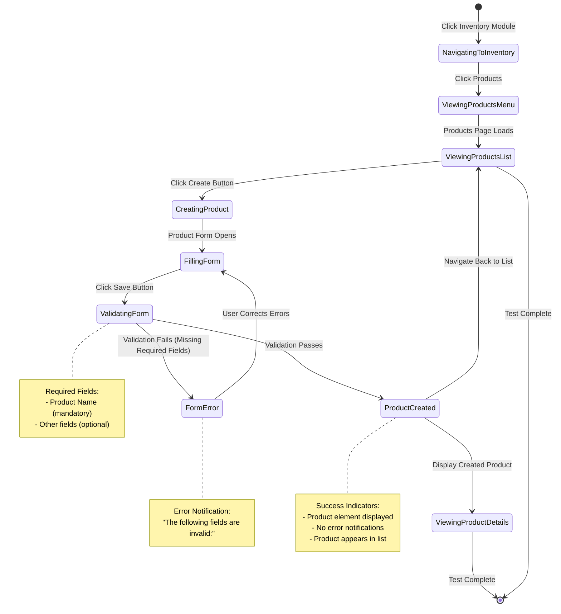
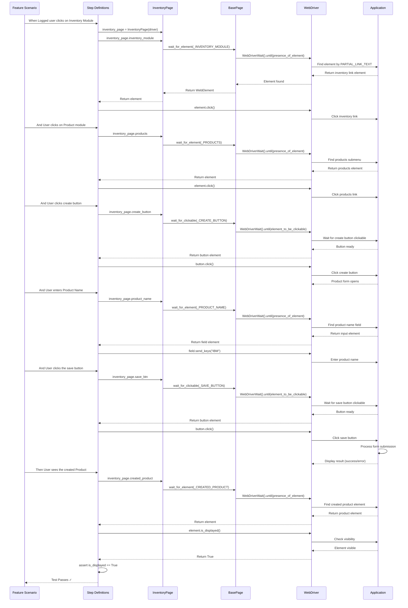

# Inventory Management Testing Guide

## Overview

This guide covers testing inventory and product management functionality in the Testinium test automation framework. The inventory module enables product creation, stock tracking, product validation, and inventory list management.

**What You'll Learn:**
- Testing product creation workflows with valid and invalid data
- Validating field-level error messages for incomplete product forms
- Verifying product list display and navigation
- Using page object patterns for inventory elements
- Implementing wait strategies for dynamic content
- Handling Odoo-specific UI elements in inventory management

**When to Use This Guide:**
- Creating automated tests for inventory management features
- Testing product creation and validation workflows
- Verifying inventory navigation and list displays
- Implementing test scenarios for stock management systems

## Prerequisites

Before following this guide, ensure you have:

1. **Framework Installed:** Complete installation per [Installation Guide](../getting-started/installation.md)
2. **Configuration Setup:** Browser and application configured per [Configuration Guide](../getting-started/configuration.md)
3. **Authentication:** Valid test user credentials with inventory access permissions (PosManager role)
4. **Test Data:** Understanding of test product names and inventory test data strategy
5. **Base Knowledge:** Familiarity with [Page Object Model](page-object-model.md) and [Step Definitions](step-definitions.md)

**Required Permissions:**
- User must have PosManager role or equivalent inventory management permissions
- Access to create, read, and update product records
- Ability to navigate inventory module and submenus

## Inventory Module Features

The inventory module in the Testinium application provides the following functionality that can be automated:

### Product Management
- **Product Creation:** Create new products with names, descriptions, SKUs, pricing
- **Product Editing:** Modify existing product details
- **Product Listing:** View and search product inventory
- **Field Validation:** Required field checks and data format validation

### Navigation Structure
```
Main Navigation
└── Inventory Module
    └── Products Submenu
        ├── Products List (Kanban/List view)
        ├── Create Button (new product form)
        └── Product Details (individual product pages)
```

### Key UI Components
- **Inventory Module Link:** Main navigation entry point
- **Products Submenu:** Access to product management
- **Create Button:** Initiates new product creation (Kanban view)
- **Product Form:** Input fields for product details
- **Save Button:** Submits product form
- **Error Notifications:** Field validation error messages
- **Product List:** Display of created products

## Basic Product Creation Testing

### Scenario: Create Product with Valid Data

This scenario tests the complete product creation workflow from navigation through form submission.

**Feature File Example:**

**Source:** `features/Inventory.feature:18-24`

```gherkin
Scenario: Verify that after creating a Product, the page title includes the Product name.
  When Logged user clicks on Inventory Module
  And User clicks on Product module
  And User clicks create button
  And User enters Product Name
  And User clicks the save button
  Then User sees the created Product
```

**Step Definition Implementation:**

**Source:** `features/steps/inventory_steps.py:57-86, 278-331, 383-439`

```python
from behave import when, then
from pages.inventory_page import InventoryPage

@when("Logged user clicks on Inventory Module")
def click_inventory_module(context):
    """Navigate to the Inventory module from main navigation."""
    inventory_page = InventoryPage(context.driver)
    inventory_module_element = inventory_page.inventory_module
    inventory_module_element.click()

@when("User enters Product Name")
def enter_product_name(context):
    """Enter a product name in the Product Name input field."""
    inventory_page = InventoryPage(context.driver)
    
    # Use default product name 'IBM' for testing
    product_name = "IBM"
    product_name_element = inventory_page.product_name
    product_name_element.send_keys(product_name)
    
    # Store product name in context for verification
    context.entered_product_name = product_name

@then("User sees the created Product")
def verify_created_product_displayed(context):
    """Verify that the newly created product is displayed."""
    inventory_page = InventoryPage(context.driver)
    created_product_element = inventory_page.created_product
    
    is_product_displayed = created_product_element.is_displayed()
    assert is_product_displayed, (
        "Created product should be displayed after successful product creation, "
        "but the product element is not visible on the page"
    )
```

**Page Object Implementation:**

**Source:** `pages/inventory_page.py:59-105, 171-368`

```python
from selenium.webdriver.common.by import By
from selenium.webdriver.remote.webelement import WebElement
from pages.base_page import BasePage

class InventoryPage(BasePage):
    """Page Object for Testinium Inventory and Product Management."""
    
    # Locators
    _INVENTORY_MODULE = (By.PARTIAL_LINK_TEXT, "Inventory")
    _PRODUCTS = (By.PARTIAL_LINK_TEXT, "Products")
    _CREATE_BUTTON = (By.CLASS_NAME, "o-kanban-button-new")
    _SAVE_BUTTON = (By.XPATH, "//button[@class='btn btn-primary btn-sm o_form_button_save']")
    _PRODUCT_NAME = (By.ID, "o_field_input_479")
    _CREATED_PRODUCT = (By.XPATH, "//span[@class='o_field_char o_field_widget o_required_modifier']")
    
    @property
    def inventory_module(self) -> WebElement:
        """Get the Inventory module navigation link element."""
        return self.wait_for_element(self._INVENTORY_MODULE)
    
    @property
    def products(self) -> WebElement:
        """Get the Products submenu link element."""
        return self.wait_for_element(self._PRODUCTS)
    
    @property
    def create_button(self) -> WebElement:
        """Get the Create button element for creating new products."""
        return self.wait_for_clickable(self._CREATE_BUTTON)
    
    @property
    def save_btn(self) -> WebElement:
        """Get the Save button element for product form submission."""
        return self.wait_for_clickable(self._SAVE_BUTTON)
    
    @property
    def product_name(self) -> WebElement:
        """Get the Product Name input field element."""
        return self.wait_for_element(self._PRODUCT_NAME)
    
    @property
    def created_product(self) -> WebElement:
        """Get the created product verification element."""
        return self.wait_for_element(self._CREATED_PRODUCT)
```

### Complete Workflow Execution

**Test Execution:**

```bash
# Run inventory product creation tests
behave features/Inventory.feature --tags=@product_creation

# Run specific scenario
behave features/Inventory.feature:18

# Run with HTML report
behave features/Inventory.feature --format html --outfile reports/inventory_report.html
```

**Expected Behavior:**
1. User navigates to Inventory module
2. Products submenu loads and is clicked
3. Product list page displays
4. Create button initiates new product form
5. Product name field accepts input
6. Save button submits form
7. Created product appears on confirmation page

## Field Validation Testing

### Scenario: Verify Required Field Error

This scenario tests that appropriate error messages appear when required fields are left blank.

**Feature File Example:**

**Source:** `features/Inventory.feature:26-31`

```gherkin
Scenario: Verify that if Product name field leaves blank, an error message 'The following fields are invalid:' is appeared
  When Logged user clicks on Inventory Module
  And User clicks on Product module
  And User clicks create button
  And User clicks the save button
  Then User should see the error
```

**Step Definition Implementation:**

**Source:** `features/steps/inventory_steps.py:234-276`

```python
@then("User should see the error")
def verify_field_error_displayed(context):
    """
    Verify that field validation error notification is displayed.
    
    Bug Fix Applied:
        Original Java implementation called isDisplayed() without assertion.
        This Python version adds proper assertion with descriptive error message.
    """
    inventory_page = InventoryPage(context.driver)
    field_error_element = inventory_page.field_error
    
    is_error_displayed = field_error_element.is_displayed()
    
    assert is_error_displayed, (
        "Field validation error notification should be displayed when "
        "required fields are missing, but error notification is not visible"
    )
```

**Page Object Locator:**

**Source:** `pages/inventory_page.py:126-127, 259-290`

```python
_FIELD_ERROR = (By.CLASS_NAME, "o_notification_manager")

@property
def field_error(self) -> WebElement:
    """
    Get the field error notification manager element.
    
    Returns element that displays field validation errors. Used for 
    verifying error states after form submission.
    """
    return self.wait_for_element(self._FIELD_ERROR)
```

### Error Verification Best Practices

**Check for Error Presence:**

```python
from selenium.common.exceptions import TimeoutException

def verify_no_errors_on_valid_submission(context):
    """Verify no error notifications appear after valid form submission."""
    inventory_page = InventoryPage(context.driver)
    
    try:
        # Try to find error notification with short timeout
        error_element = inventory_page.field_error
        
        # If found, check if it's actually displayed
        if error_element.is_displayed():
            error_text = error_element.text
            assert False, f"Unexpected error displayed: {error_text}"
    except TimeoutException:
        # No error element found - this is expected for valid submission
        pass
```

**Extract Error Message Text:**

```python
def log_validation_errors(context):
    """Log validation error details for debugging."""
    inventory_page = InventoryPage(context.driver)
    
    try:
        error_element = inventory_page.field_error
        if error_element.is_displayed():
            error_text = error_element.text
            print(f"Validation Error: {error_text}")
            
            # Store error in context for later verification
            context.last_error_message = error_text
    except TimeoutException:
        print("No validation errors found")
```

## Product List Verification Testing

### Scenario: Verify Product Appears in List

This scenario tests that newly created products appear in the product list after creation.

**Feature File Example:**

**Source:** `features/Inventory.feature:33-40`

```gherkin
Scenario: Verify that the user should be able to see created Product is listed after clicking the Products module.
  When Logged user clicks on Inventory Module
  And User clicks on Product module
  And User clicks create button
  And User enters Product Name
  And User clicks the save button
  And User clicks on Product module
  Then User should see the title includes the Product Name
```

**Step Definition Implementation:**

**Source:** `features/steps/inventory_steps.py:125-164, 333-381`

```python
@when("User see the products")
def verify_products_page(context):
    """
    Verify that the Products page is displayed with correct title.
    
    Bug Fix Applied:
        Original Java implementation checked title without assertion.
        This version adds proper assertion with descriptive error.
    """
    actual_title = context.driver.title
    expected_title = "Products - Odoo"
    
    assert actual_title == expected_title, (
        f"Page title mismatch: expected '{expected_title}', "
        f"but got '{actual_title}'"
    )

@then("User should see the title includes the Product Name")
def verify_product_title_in_list(context):
    """
    Verify that the products list is displayed after product creation.
    
    Bug Fix Applied:
        Original Java implementation called isDisplayed() without assertion.
        This version adds proper assertion with descriptive error.
    """
    inventory_page = InventoryPage(context.driver)
    products_list_element = inventory_page.products_list
    
    is_list_displayed = products_list_element.is_displayed()
    
    assert is_list_displayed, (
        "Products list should be displayed after product creation or form "
        "submission, but the list element is not visible on the page"
    )
```

**Page Object for List Verification:**

**Source:** `pages/inventory_page.py:152-156, 318-344`

```python
_PRODUCTS_LIST = (By.XPATH, "//span[.='EY']")

@property
def products_list(self) -> WebElement:
    """
    Get the specific product list element for verification.
    
    Note: This locator targets test product 'EY'. For testing with 
    different products, additional locator methods may be needed.
    """
    return self.wait_for_element(self._PRODUCTS_LIST)
```

## Navigation Testing

### Scenario: Verify Navigation to Product Form

This scenario tests the complete navigation path from main menu to product creation form.

**Feature File Example:**

**Source:** `features/Inventory.feature:11-16`

```gherkin
Scenario: Verify that User can reach New Products Form by clicking Inventory --> Products --> Create
  When Logged user clicks on Inventory Module
  And User clicks on Product module
  And User see the products
  And User clicks create button
  Then User should see the dashboard
```

**Complete Step Implementations:**

**Source:** `features/steps/inventory_steps.py:88-123, 166-195`

```python
@when("User clicks on Product module")
def click_product_module(context):
    """
    Navigate to the Products submenu within the Inventory module.
    
    Includes explicit wait for element visibility to ensure the 
    submenu is fully loaded before interaction.
    """
    inventory_page = InventoryPage(context.driver)
    products_element = inventory_page.products
    products_element.click()

@when("User clicks create button")
def click_create_button(context):
    """
    Click the Create button to initiate product creation workflow.
    
    This step clicks the 'Create' button typically displayed in 
    Kanban view to start the new product creation form.
    """
    inventory_page = InventoryPage(context.driver)
    create_button_element = inventory_page.create_button
    create_button_element.click()
```

### Navigation Verification Patterns

**Verify Navigation Success:**

```python
def verify_navigation_to_inventory(context):
    """Verify successful navigation to inventory module."""
    # Check URL contains inventory path
    current_url = context.driver.current_url
    assert "inventory" in current_url.lower(), (
        f"Expected URL to contain 'inventory', but got: {current_url}"
    )
    
    # Verify page title
    page_title = context.driver.title
    assert "Inventory" in page_title or "Products" in page_title, (
        f"Expected page title to contain 'Inventory' or 'Products', "
        f"but got: {page_title}"
    )
```

**Verify Form Loaded:**

```python
def verify_product_form_loaded(context):
    """Verify product creation form is fully loaded."""
    inventory_page = InventoryPage(context.driver)
    
    # Check multiple form elements are present
    assert inventory_page.product_name.is_displayed(), "Product name field not visible"
    assert inventory_page.save_btn.is_displayed(), "Save button not visible"
    
    # Verify form is in edit mode (not read-only)
    product_name_field = inventory_page.product_name
    assert product_name_field.is_enabled(), "Product name field is not enabled"
```

## Page Object Patterns for Inventory Elements

### Locator Strategy

The `InventoryPage` class uses multiple locator strategies optimized for different element types:

**Source:** `pages/inventory_page.py:111-165`

| Element Type | Locator Strategy | Example | Rationale |
|--------------|-----------------|---------|-----------|
| Navigation Links | `PARTIAL_LINK_TEXT` | `(By.PARTIAL_LINK_TEXT, "Inventory")` | Robust for text-based navigation |
| Buttons (Class-based) | `CLASS_NAME` | `(By.CLASS_NAME, "o-kanban-button-new")` | Simple for unique class names |
| Buttons (Complex) | `XPATH` | `//button[@class='btn btn-primary btn-sm o_form_button_save']` | Precise matching with multiple attributes |
| Input Fields | `ID` | `(By.ID, "o_field_input_479")` | Fast lookup when IDs available |
| Notifications | `CLASS_NAME` | `(By.CLASS_NAME, "o_notification_manager")` | Standard for notification components |
| List Items | `XPATH` | `//span[.='EY']` | Text-based verification |
| Form Widgets | `XPATH` | `//span[@class='o_field_char o_field_widget o_required_modifier']` | Complex class combinations |

### Property-Based Element Access

All elements use property-based access with explicit waits:

**Source:** `pages/inventory_page.py:171-189, 213-234`

```python
@property
def inventory_module(self) -> WebElement:
    """
    Get the Inventory module navigation link element.
    
    Returns:
        WebElement: Inventory module link with explicit wait for presence
    
    Raises:
        TimeoutException: If element not found within default timeout
    """
    return self.wait_for_element(self._INVENTORY_MODULE)

@property
def create_button(self) -> WebElement:
    """
    Get the Create button element for creating new products.
    
    Returns:
        WebElement: Create button with explicit wait for clickability
    
    Raises:
        TimeoutException: If button not clickable within default timeout
    """
    return self.wait_for_clickable(self._CREATE_BUTTON)
```

**Benefits of Property-Based Access:**
- Fresh element reference on each access (prevents stale element exceptions)
- Built-in explicit waits ensure element readiness
- Consistent error handling through BasePage methods
- Self-documenting code with clear property names

### Technical Debt: Generated DOM IDs

**Source:** `pages/inventory_page.py:129-150`

**⚠️ WARNING:** The `product_name` field uses a generated DOM ID `o_field_input_479`:

```python
_PRODUCT_NAME = (By.ID, "o_field_input_479")
```

**Known Issues:**
- Generated IDs may change when application DOM is regenerated
- Fragile locator that breaks with page structure changes
- Requires maintenance when application is updated

**Recommended Fix:**

Request development team to add stable `data-testid` attributes:

```html
<!-- Current (fragile) -->
<input id="o_field_input_479" name="name" />

<!-- Recommended (stable) -->
<input id="o_field_input_479" name="name" data-testid="product-name-input" />
```

Then update locator:

```python
_PRODUCT_NAME = (By.CSS_SELECTOR, "[data-testid='product-name-input']")
```

**Workarounds Until Fixed:**
- Use name attribute if stable: `(By.NAME, "name")`
- Use label association: XPath `//label[.='Product Name']/following-sibling::input`
- Accept technical debt and monitor for breakage

## Wait Strategies for Inventory Testing

### Explicit Waits via Page Object Properties

All `InventoryPage` properties use explicit waits through `BasePage` methods:

**Source:** `pages/inventory_page.py:56` (inherits from BasePage)

```python
class InventoryPage(BasePage):
    """
    Inherits common WebDriver utilities from BasePage for explicit 
    waits and element interaction patterns.
    """
```

### Wait Method Selection

**For Navigation Links (Presence Check):**

```python
# Uses wait_for_element() - waits for element presence in DOM
inventory_module = inventory_page.inventory_module
```

**For Interactive Buttons (Clickability Check):**

```python
# Uses wait_for_clickable() - waits for element to be clickable
create_button = inventory_page.create_button
save_button = inventory_page.save_btn
```

**For Form Fields (Presence and Enabled):**

```python
# Uses wait_for_element() then check is_enabled()
product_name_field = inventory_page.product_name
if product_name_field.is_enabled():
    product_name_field.send_keys("Test Product")
```

**For Error Notifications (Visibility Check):**

```python
# Uses wait_for_element() then check is_displayed()
try:
    error_element = inventory_page.field_error
    if error_element.is_displayed():
        print(f"Error: {error_element.text}")
except TimeoutException:
    print("No error notification found")
```

### Dynamic Content Wait Patterns

**Wait for Page Title Update:**

**Source:** `features/steps/inventory_steps.py:147-163`

```python
from selenium.webdriver.support.ui import WebDriverWait
from selenium.webdriver.support import expected_conditions as EC

def wait_for_products_page_title(driver, timeout=10):
    """Wait for Products page title to appear."""
    expected_title = "Products - Odoo"
    
    WebDriverWait(driver, timeout).until(
        EC.title_is(expected_title)
    )
    
    actual_title = driver.title
    assert actual_title == expected_title
```

**Wait for Element Text Content:**

```python
def wait_for_product_name_in_list(driver, product_name, timeout=10):
    """Wait for specific product to appear in list."""
    locator = (By.XPATH, f"//span[.='{product_name}']")
    
    WebDriverWait(driver, timeout).until(
        EC.visibility_of_element_located(locator)
    )
```

**Wait for Error Notification to Appear:**

```python
def wait_for_validation_error(driver, timeout=5):
    """Wait for validation error notification to appear."""
    locator = (By.CLASS_NAME, "o_notification_manager")
    
    try:
        element = WebDriverWait(driver, timeout).until(
            EC.visibility_of_element_located(locator)
        )
        return element
    except TimeoutException:
        return None
```

### Avoid Implicit Waits

**❌ DO NOT USE:**

```python
# Never use implicit waits - conflicts with explicit waits
driver.implicitly_wait(10)  # DON'T DO THIS
```

**✅ USE EXPLICIT WAITS:**

```python
# Always use explicit waits through page object properties
inventory_page.inventory_module.click()  # Built-in explicit wait
```

## Product Creation Workflow Diagram

### State Transition Diagram

The following diagram illustrates the state transitions during product creation and validation:



### Complete Workflow Sequence Diagram

The following sequence diagram shows the interaction flow from test scenario through step definitions to page objects:



## Advanced Testing Patterns

### Data-Driven Product Creation

Use Scenario Outlines for testing multiple product variations:

```gherkin
Scenario Outline: Create products with different names
  When Logged user clicks on Inventory Module
  And User clicks on Product module
  And User clicks create button
  And User enters product name "<product_name>"
  And User clicks the save button
  Then User sees product "<product_name>" created

  Examples:
    | product_name     |
    | Test Product 1   |
    | Test Product 2   |
    | Special Chars @# |
    | Unicode Product™ |
```

**Implementation with Parameterized Steps:**

```python
@when('User enters product name "{product_name}"')
def enter_custom_product_name(context, product_name):
    """Enter a custom product name from scenario outline."""
    inventory_page = InventoryPage(context.driver)
    product_name_element = inventory_page.product_name
    product_name_element.clear()
    product_name_element.send_keys(product_name)
    context.entered_product_name = product_name

@then('User sees product "{expected_name}" created')
def verify_custom_product_created(context, expected_name):
    """Verify product with specific name is created."""
    inventory_page = InventoryPage(context.driver)
    created_product_element = inventory_page.created_product
    
    assert created_product_element.is_displayed(), "Product not displayed"
    
    # Verify product name matches
    actual_name = created_product_element.text
    assert expected_name in actual_name, (
        f"Expected product name '{expected_name}', but got '{actual_name}'"
    )
```

### Cleanup After Product Creation

Always clean up test data to maintain test independence:

```python
from behave import given, when, then, after_scenario

@after_scenario(tag='product_creation')
def cleanup_created_products(context, scenario):
    """
    Clean up products created during test scenario.
    
    This hook runs after scenarios tagged with @product_creation
    to remove test data and maintain database cleanliness.
    """
    if hasattr(context, 'created_product_ids'):
        inventory_page = InventoryPage(context.driver)
        
        for product_id in context.created_product_ids:
            try:
                # Navigate to product
                context.driver.get(f"{context.base_url}/web#id={product_id}&model=product.product")
                
                # Delete product (implementation depends on UI)
                # This is a placeholder - adjust based on actual deletion workflow
                print(f"Cleaned up product ID: {product_id}")
            except Exception as e:
                print(f"Failed to cleanup product {product_id}: {e}")
```

### Verify Product in Database (Optional)

For thorough testing, verify database state:

```python
def verify_product_in_database(product_name, db_connection):
    """
    Verify product exists in database after UI creation.
    
    This provides additional validation beyond UI checks.
    """
    query = "SELECT * FROM product_product WHERE name = %s"
    cursor = db_connection.cursor()
    cursor.execute(query, (product_name,))
    result = cursor.fetchone()
    
    assert result is not None, f"Product '{product_name}' not found in database"
    return result
```

## Troubleshooting

### Issue: Inventory Module Link Not Found

**Symptoms:**
- `TimeoutException: Message: Element not found: (By.PARTIAL_LINK_TEXT, "Inventory")`
- Test fails at first step of inventory navigation

**Causes:**
- User not logged in before attempting inventory access
- User lacks inventory module permissions (not PosManager role)
- Application menu not fully loaded
- Different language/localization changes link text

**Solutions:**

```python
# Solution 1: Ensure login before inventory access
@given('User is logged in with inventory permissions')
def ensure_inventory_login(context):
    """Ensure user is logged in before accessing inventory."""
    from pages.login_page import LoginPage
    
    # Navigate to login page
    context.driver.get(context.config.application.base_url)
    
    # Perform login
    login_page = LoginPage(context.driver)
    login_page.login(
        context.config.credentials.valid_username,
        context.config.credentials.valid_password
    )
    
    # Wait for dashboard to load
    WebDriverWait(context.driver, 10).until(
        EC.url_contains("/web")
    )

# Solution 2: Wait for menu to fully load
def wait_for_main_menu_loaded(driver, timeout=10):
    """Wait for main application menu to fully load."""
    # Wait for menu container
    menu_locator = (By.CLASS_NAME, "o_menu_sections")
    WebDriverWait(driver, timeout).until(
        EC.presence_of_element_located(menu_locator)
    )
    
    # Additional wait for inventory link
    inventory_locator = (By.PARTIAL_LINK_TEXT, "Inventory")
    WebDriverWait(driver, timeout).until(
        EC.presence_of_element_located(inventory_locator)
    )

# Solution 3: Use alternative locator for different languages
_INVENTORY_MODULE_ALT = (By.XPATH, "//a[contains(@data-menu-xmlid, 'stock')]")
```

### Issue: Create Button Not Clickable

**Symptoms:**
- `TimeoutException: Element not clickable: (By.CLASS_NAME, "o-kanban-button-new")`
- Test fails when attempting to click create button

**Causes:**
- Products list not fully loaded
- Kanban view not active (list view instead)
- Button obscured by overlay or modal
- Insufficient wait time for dynamic content

**Solutions:**

```python
# Solution 1: Ensure Kanban view is active
def switch_to_kanban_view(driver):
    """Switch to Kanban view if not already active."""
    kanban_button = driver.find_element(By.CLASS_NAME, "o_kanban")
    if not kanban_button.is_selected():
        kanban_button.click()
        time.sleep(1)  # Wait for view switch

# Solution 2: Scroll to button before clicking
def click_create_button_with_scroll(inventory_page):
    """Click create button after scrolling it into view."""
    from selenium.webdriver import ActionChains
    
    create_btn = inventory_page.create_button
    
    # Scroll element into view
    driver = inventory_page.driver
    driver.execute_script("arguments[0].scrollIntoView(true);", create_btn)
    
    # Wait a moment for scroll
    time.sleep(0.5)
    
    # Click using Actions
    ActionChains(driver).move_to_element(create_btn).click().perform()

# Solution 3: Use JavaScript click as fallback
def click_with_javascript_fallback(element, driver):
    """Attempt normal click, fallback to JavaScript if needed."""
    try:
        element.click()
    except ElementClickInterceptedException:
        driver.execute_script("arguments[0].click();", element)
```

### Issue: Product Name Field Not Found (Generated ID)

**Symptoms:**
- `NoSuchElementException: Element not found: (By.ID, "o_field_input_479")`
- Test fails when attempting to enter product name

**Causes:**
- Generated DOM ID changed after application update
- Different form rendering creates different IDs
- Page structure changed

**Solutions:**

```python
# Solution 1: Use more robust locator strategies
_PRODUCT_NAME_ALTERNATIVES = [
    (By.ID, "o_field_input_479"),  # Original generated ID
    (By.NAME, "name"),              # Field name attribute
    (By.XPATH, "//input[@name='name']"),  # XPath by name
    (By.XPATH, "//label[contains(text(),'Product Name')]/following-sibling::*/input"),  # By label
]

def get_product_name_field_robust(driver):
    """Try multiple locator strategies to find product name field."""
    for locator in _PRODUCT_NAME_ALTERNATIVES:
        try:
            element = WebDriverWait(driver, 2).until(
                EC.presence_of_element_located(locator)
            )
            print(f"Found product name field using: {locator}")
            return element
        except TimeoutException:
            continue
    
    raise NoSuchElementException("Product name field not found with any locator")

# Solution 2: Inspect DOM and update locator
# Use browser DevTools to find current field identifier:
# 1. Open product form in browser
# 2. Inspect product name field
# 3. Note current ID or other stable attributes
# 4. Update _PRODUCT_NAME locator in inventory_page.py
```

### Issue: Field Error Not Displayed for Invalid Data

**Symptoms:**
- Assertion fails: "Field validation error notification should be displayed"
- Expected error notification doesn't appear

**Causes:**
- Error notification has different class name or structure
- Notification appears and disappears quickly
- Form validation changed to client-side only
- Wrong locator for error notification

**Solutions:**

```python
# Solution 1: Wait longer for error notification
def wait_for_error_notification(driver, timeout=5):
    """Wait explicitly for error notification to appear."""
    error_locator = (By.CLASS_NAME, "o_notification_manager")
    
    try:
        error_element = WebDriverWait(driver, timeout).until(
            EC.visibility_of_element_located(error_locator)
        )
        return error_element
    except TimeoutException:
        # Check for alternative error indicators
        inline_errors = driver.find_elements(By.CLASS_NAME, "o_form_invalid")
        if inline_errors:
            return inline_errors[0]
        raise

# Solution 2: Check for inline field errors
def check_for_inline_field_errors(driver):
    """Check for inline validation errors on fields."""
    invalid_fields = driver.find_elements(By.CLASS_NAME, "o_field_invalid")
    
    if invalid_fields:
        error_messages = []
        for field in invalid_fields:
            try:
                error_msg = field.find_element(By.CLASS_NAME, "o_form_invalid")
                error_messages.append(error_msg.text)
            except NoSuchElementException:
                pass
        
        return error_messages
    return []

# Solution 3: Capture screenshot for investigation
def capture_error_state_screenshot(driver, scenario_name):
    """Capture screenshot when error validation fails."""
    from utilities.screenshot_helper import capture_screenshot
    
    filename = f"error_validation_failed_{scenario_name}"
    capture_screenshot(driver, filename)
    print(f"Screenshot saved: {filename}")
```

### Issue: Products List Not Displaying After Creation

**Symptoms:**
- Assertion fails: "Products list should be displayed after product creation"
- Expected product list element not found

**Causes:**
- Navigation back to list didn't occur
- List view rendering delay
- Product creation actually failed
- Wrong locator for products list

**Solutions:**

```python
# Solution 1: Explicit navigation back to products list
def navigate_back_to_products_list(driver, base_url):
    """Explicitly navigate back to products list."""
    products_url = f"{base_url}/web#action=product_product_action&model=product.product"
    driver.get(products_url)
    
    # Wait for list to load
    WebDriverWait(driver, 10).until(
        EC.presence_of_element_located((By.CLASS_NAME, "o_list_view"))
    )

# Solution 2: Verify product creation succeeded first
def verify_product_creation_success(driver):
    """Verify product was actually created before checking list."""
    # Check for success notification
    try:
        success_notification = driver.find_element(By.CLASS_NAME, "o_notification_success")
        return success_notification.is_displayed()
    except NoSuchElementException:
        return False

# Solution 3: Use more flexible list verification
def verify_any_product_in_list(driver):
    """Verify any product appears in list, not specific test product."""
    # Look for any product row
    product_rows = driver.find_elements(By.CLASS_NAME, "o_data_row")
    
    assert len(product_rows) > 0, "No products found in list"
    print(f"Found {len(product_rows)} products in list")
```

## Best Practices for Inventory Testing

### Test Data Management

**Use Unique Product Names:**

```python
import uuid
from datetime import datetime

def generate_unique_product_name(prefix="TestProduct"):
    """Generate unique product name for test isolation."""
    timestamp = datetime.now().strftime("%Y%m%d_%H%M%S")
    unique_id = str(uuid.uuid4())[:8]
    return f"{prefix}_{timestamp}_{unique_id}"

# Usage in step definition
@when("User enters Product Name")
def enter_unique_product_name(context):
    inventory_page = InventoryPage(context.driver)
    
    # Generate unique name
    product_name = generate_unique_product_name("AutoTest")
    
    # Enter name
    inventory_page.product_name.send_keys(product_name)
    
    # Store for verification and cleanup
    context.entered_product_name = product_name
    if not hasattr(context, 'created_products'):
        context.created_products = []
    context.created_products.append(product_name)
```

### Test Isolation and Cleanup

**Always clean up test data:**

```python
@after_scenario(tag='inventory')
def cleanup_inventory_test_data(context, scenario):
    """Clean up inventory test data after scenarios."""
    if hasattr(context, 'created_products'):
        for product_name in context.created_products:
            try:
                delete_product_by_name(context.driver, product_name)
            except Exception as e:
                print(f"Warning: Failed to cleanup product {product_name}: {e}")
```

### Use Test-Specific Warehouses

**Create and use test warehouses:**

```python
def setup_test_warehouse(context):
    """Create test warehouse for inventory tests."""
    # Navigate to warehouse configuration
    # Create warehouse named "Test_Warehouse_[timestamp]"
    # Store warehouse ID in context
    context.test_warehouse_id = warehouse_id
    context.test_warehouse_name = warehouse_name
```

### Verify Audit Trails

**Check that inventory actions are logged:**

```python
def verify_inventory_audit_trail(context, action):
    """Verify inventory action appears in audit log."""
    # Navigate to audit log
    # Search for product name and action
    # Verify timestamp and user match
    pass
```

### Log Comprehensive Details

**Log inventory operations for debugging:**

```python
import logging

logger = logging.getLogger(__name__)

@when("User enters Product Name")
def enter_product_name_with_logging(context):
    """Enter product name with comprehensive logging."""
    inventory_page = InventoryPage(context.driver)
    product_name = generate_unique_product_name()
    
    logger.info(f"Entering product name: {product_name}")
    logger.debug(f"Current URL: {context.driver.current_url}")
    logger.debug(f"Page title: {context.driver.title}")
    
    product_name_element = inventory_page.product_name
    logger.debug(f"Product name field located: {product_name_element.get_attribute('id')}")
    
    product_name_element.send_keys(product_name)
    logger.info(f"Successfully entered product name: {product_name}")
    
    # Verify value entered correctly
    entered_value = product_name_element.get_attribute('value')
    assert entered_value == product_name, (
        f"Product name not entered correctly. Expected: {product_name}, Got: {entered_value}"
    )
    
    context.entered_product_name = product_name
```

### Performance Optimization

**Minimize navigation when testing multiple scenarios:**

```python
@given("User is on Products page")
def navigate_to_products_once(context):
    """Navigate to products page only if not already there."""
    current_url = context.driver.current_url
    
    if "product.product" in current_url:
        logger.info("Already on products page, skipping navigation")
        return
    
    # Perform navigation
    inventory_page = InventoryPage(context.driver)
    inventory_page.inventory_module.click()
    inventory_page.products.click()
```

### Error Message Validation

**Validate specific error messages, not just presence:**

```python
@then('User should see error message "{expected_message}"')
def verify_specific_error_message(context, expected_message):
    """Verify specific error message text appears."""
    inventory_page = InventoryPage(context.driver)
    error_element = inventory_page.field_error
    
    assert error_element.is_displayed(), "Error notification not displayed"
    
    actual_message = error_element.text
    assert expected_message in actual_message, (
        f"Expected error message '{expected_message}', "
        f"but got '{actual_message}'"
    )
```

## See Also

### Related Documentation

- **[Page Object Model Guide](page-object-model.md)** - Creating page objects for inventory modules
- **[Step Definitions Guide](step-definitions.md)** - Writing Behave step definitions
- **[Feature Files Guide](feature-files.md)** - Writing Gherkin scenarios for inventory tests
- **[Wait Strategies Guide](wait-strategies.md)** - Explicit wait patterns for dynamic content
- **[Configuration Management Guide](configuration-management.md)** - Managing test data and credentials

### API Reference

- **[InventoryPage API](../api-reference/pages/inventory-page.md)** - Complete API reference for InventoryPage class
- **[Inventory Steps API](../api-reference/steps/inventory-steps.md)** - All step definitions for inventory testing
- **[BasePage API](../api-reference/pages/base-page.md)** - Base page object methods and waits

### Source Code

- **Feature File:** `features/Inventory.feature`
- **Step Definitions:** `features/steps/inventory_steps.py`
- **Page Object:** `pages/inventory_page.py`
- **Migration Source:** Original Java implementation at `src/main/java/com/testinium/step_definitions/Inventory.java` and `src/main/java/com/testinium/pages/InventoryP.java`

### External Resources

- **Behave Documentation:** [https://behave.readthedocs.io/](https://behave.readthedocs.io/)
- **Selenium Python Documentation:** [https://selenium-python.readthedocs.io/](https://selenium-python.readthedocs.io/)
- **Odoo Documentation:** [https://www.odoo.com/documentation/](https://www.odoo.com/documentation/) (application under test)

---

**Last Updated:** 2024 (Generated from source code analysis)

**Maintainers:** Test Automation Team

**Questions or Issues?** See [Troubleshooting Guide](../troubleshooting/index.md) or [Contributing Guide](../contributing/index.md)

