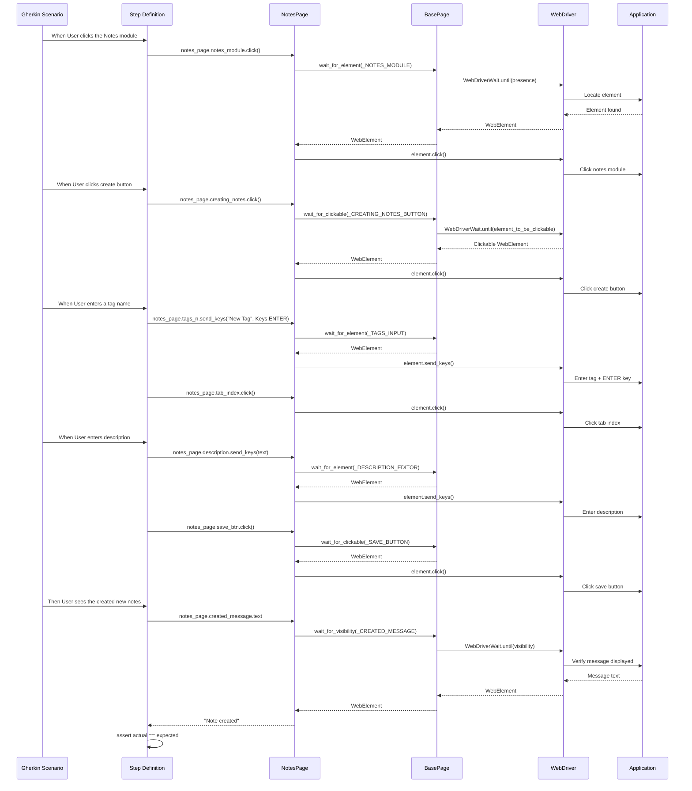

# Notes Functionality Testing Guide

## Overview

The Notes module in the Testinium application provides comprehensive note management capabilities including creating notes with tags and rich text content, editing existing notes, organizing notes across different sections (New, Today), and managing note lifecycle. This guide demonstrates how to test these features using the BDD framework with complete examples from Gherkin scenarios through step definitions to page object implementations.

**What You'll Learn:**
- Creating notes with tags and descriptions
- Editing note content and updating fields
- Organizing notes using drag-and-drop between sections
- Verifying note creation and display
- Page Object Model patterns for notes elements
- Wait strategies for note operations
- Troubleshooting common notes testing issues
- Best practices for notes test automation

**When to Use This Guide:**
- Implementing automated tests for notes functionality
- Understanding the complete test flow from feature file to page object
- Debugging notes-related test failures
- Extending the framework with new notes test scenarios
- Learning BDD patterns for CRUD operations

## Prerequisites

Before testing notes functionality, ensure you have:

**Framework Setup:**
- Test automation framework installed and configured
- Python 3.9+ with all dependencies from `requirements.txt`
- Virtual environment activated
- WebDriver configured for your browser (Chrome, Firefox, Edge)

**Test Environment:**
- Access to Testinium test application
- Valid test user credentials (PosManager account recommended)
- Base URL configured in `config/config.yaml` or `.env` file
- Test data prepared (note titles, descriptions, tags)

**Authentication:**
- User must be logged in before accessing Notes module
- Background step "Given User login to test other features" handles authentication
- See [Authentication Testing Guide](authentication-testing.md) for login details

**Configuration:**
```yaml
# config/config.yaml - Notes testing configuration
application:
  base_url: "https://testinium-app-url.com"
  
timeouts:
  explicit: 20  # Wait timeout for notes elements
  page_load: 30

browser:
  type: chrome  # or firefox, edge
  headless: false  # Set true for CI/CD
```

## Basic Note Creation

### Creating Notes with Tags and Description

The most common notes operation is creating a new note with categorization tags and descriptive content.

**Gherkin Scenario:**

```gherkin
Feature: Testinium app login feature
  User Story:
  Background: As a user, I can create new Notes and see the created notes on the list

  Scenario: Verify that User can create new Notes and see the created notes on the list
    When User clicks the Notes module
    And User clicks create button in Notes module
    And User enters a tag name
    And User enters description
    And User clicks save button
    Then User sees the created new notes
```

**Source:** `features/Notes.feature:10-16`

**Complete Workflow Example:**

```python
# Step 1: Navigate to Notes Module
@when("User clicks the Notes module")
def user_clicks_the_notes_module(context):
    """Navigate to Notes module by clicking navigation link."""
    notes_page = NotesPage(context.driver)
    notes_page.notes_module.click()  # Explicit wait handled by page object
```

**Source:** `features/steps/notes_steps.py:71-104`

```python
# Step 2: Click Create Button
@when("User clicks create button in Notes module")
def user_clicks_create_button_in_notes_module(context):
    """Initiate note creation workflow."""
    notes_page = NotesPage(context.driver)
    notes_page.creating_notes.click()  # wait_for_clickable ensures button is ready
```

**Source:** `features/steps/notes_steps.py:107-138`

```python
# Step 3: Enter Tag Name with Keyboard Interaction
@when("User enters a tag name")
def user_enters_a_tag_name(context):
    """Enter tag for note categorization with ENTER key submission."""
    notes_page = NotesPage(context.driver)
    
    # Send tag name followed by ENTER key to submit
    notes_page.tags_n.send_keys("New Tag", Keys.ENTER)
    
    # Click tab index to manage focus
    notes_page.tab_index.click()
```

**Source:** `features/steps/notes_steps.py:141-178`

**Key Pattern:** The tag entry uses `Keys.ENTER` to submit the tag, followed by clicking `tab_index` for focus management. This preserves the exact behavior from the original Java implementation.

```python
# Step 4: Enter Description and Save
@when("User enters description")
def user_enters_description(context):
    """Enter note description in rich text editor and save."""
    notes_page = NotesPage(context.driver)
    
    # Enter description text
    description_text = "This note is an example for the Testinium App"
    notes_page.description.send_keys(description_text)
    
    # Save the note
    notes_page.save_btn.click()
```

**Source:** `features/steps/notes_steps.py:181-218`

```python
# Step 5: Verify Note Creation
@then("User sees the created new notes")
def user_sees_the_created_new_notes(context):
    """Verify note creation success message."""
    notes_page = NotesPage(context.driver)
    
    # Get confirmation message
    actual_message = notes_page.created_message.text
    expected_message = "Note created"
    
    # Assert message matches
    assert actual_message == expected_message, (
        f"Note creation confirmation message mismatch. "
        f"Expected: '{expected_message}', Actual: '{actual_message}'"
    )
```

**Source:** `features/steps/notes_steps.py:255-300`

### Page Object Implementation for Note Creation

**Notes Page Object Locators:**

```python
# pages/notes_page.py - Element locators for note creation

# Navigation
_NOTES_MODULE = (By.PARTIAL_LINK_TEXT, "Notes")
_TAB_INDEX = (By.XPATH, "//a[. = 'Create and Edit...']")

# Create button
_CREATING_NOTES_BUTTON = (
    By.XPATH,
    "//button[@class='btn btn-primary btn-sm o-kanban-button-new']"
)

# Form inputs
_TAGS_INPUT = (By.XPATH, "//input[@class='o_input ui-autocomplete-input']")
_DESCRIPTION_EDITOR = (By.XPATH, "//div[@class='note-editable panel-body']")

# Action buttons
_SAVE_BUTTON = (
    By.XPATH,
    "//button[@class='btn btn-primary btn-sm o_form_button_save']"
)

# Confirmation message
_CREATED_MESSAGE = (By.XPATH, "//p[.='Note created']")
```

**Source:** `pages/notes_page.py:130-145`

**Property-Based Element Access Pattern:**

```python
@property
def creating_notes(self) -> WebElement:
    """Button to initiate new note creation.
    
    Returns fresh WebElement using explicit wait for clickability.
    Ensures button is visible and enabled before returning.
    """
    return self.wait_for_clickable(self._CREATING_NOTES_BUTTON)

@property
def tags_n(self) -> WebElement:
    """Input field for note tags/categories.
    
    Returns fresh WebElement using explicit wait for element presence.
    Used for entering comma-separated tags.
    """
    return self.wait_for_element(self._TAGS_INPUT)

@property
def description(self) -> WebElement:
    """Rich text editor for note content/description.
    
    Returns fresh WebElement using explicit wait for element presence.
    Content-editable div for entering note body text.
    """
    return self.wait_for_element(self._DESCRIPTION_EDITOR)

@property
def created_message(self) -> WebElement:
    """Confirmation message displaying 'Note created'.
    
    Returns fresh WebElement using explicit wait for visibility.
    Waits for element to be visible on page, not just present in DOM.
    """
    return self.wait_for_visibility(self._CREATED_MESSAGE)
```

**Source:** `pages/notes_page.py:232-313`

**Why Property-Based Locators?**
- Returns fresh WebElement references preventing stale element exceptions
- Explicit waits integrated into property access
- Thread-safe for parallel execution
- Cleaner syntax than PageFactory pattern

### Note Creation Workflow Diagram



## Editing Notes

### Updating Note Content

After creating notes, users can edit the content to update descriptions or modify tags.

**Gherkin Scenario:**

```gherkin
Scenario: Verify that User can edit the Notes
  When User clicks the Notes module
  And User clicks the edit button
  And User enters new description
  And User clicks save button
  And User enters new description
  Then User should see the Notes list
```

**Source:** `features/Notes.feature:18-24`

**Complete Edit Workflow:**

```python
# Step 1: Navigate to Notes Module (same as creation)
@when("User clicks the Notes module")
def user_clicks_the_notes_module(context):
    notes_page = NotesPage(context.driver)
    notes_page.notes_module.click()

# Step 2: Click Edit Button for Specific Note
@when("User clicks the edit button")
def user_clicks_the_edit_button(context):
    """Click edit button to enter note editing mode.
    
    Clicks the app_k element which identifies a specific note
    by its title 'BDD Approach Framework with Cucumber'.
    """
    notes_page = NotesPage(context.driver)
    notes_page.app_k.click()
```

**Source:** `features/steps/notes_steps.py:303-333`

**Application Identifier Locator:**

```python
# pages/notes_page.py - Locator for specific note
_APP_K = (By.XPATH, "//span[.='BDD Approach Framework with Cucumber']")

@property
def app_k(self) -> WebElement:
    """Application identifier element with specific note title.
    
    Contains exact text 'BDD Approach Framework with Cucumber'
    for identifying specific test note.
    """
    return self.wait_for_element(self._APP_K)
```

**Source:** `pages/notes_page.py:154, 337-355`

```python
# Step 3: Update Description
@when("User enters new description")
def user_enters_new_description(context):
    """Clear existing description and enter new content.
    
    NOTE: Uses InventoryPage.save_btn instead of NotesPage.save_btn
    per original implementation, indicating shared UI component.
    """
    notes_page = NotesPage(context.driver)
    inventory_page = InventoryPage(context.driver)
    
    # Clear existing content
    notes_page.description.clear()
    
    # Enter new description
    new_description = "FKASDFGASDFADSFADS"
    notes_page.description.send_keys(new_description)
    
    # Save using shared button from InventoryPage
    inventory_page.save_btn.click()
    
    # Return to notes module
    notes_page.notes_module.click()
```

**Source:** `features/steps/notes_steps.py:336-389`

**Important Pattern:** The edit workflow uses `InventoryPage.save_btn` instead of `NotesPage.save_btn`. This indicates a shared save button component across modules in the application architecture.

```python
# Step 4: Verify Notes List Display
@then("User should see the Notes list")
def user_should_see_the_notes_list(context):
    """Verify that Notes list is visible and displayed."""
    notes_page = NotesPage(context.driver)
    
    # Wait for notes module visibility
    notes_module_element = notes_page.notes_module
    notes_module_element.click()
    
    # Verify module is displayed
    assert notes_module_element.is_displayed(), (
        "Notes module should be displayed but is not visible"
    )
```

**Source:** `features/steps/notes_steps.py:392-432`

### Edit Workflow Best Practices

**1. Clear Before Entry:**
```python
# Always clear existing content before entering new text
notes_page.description.clear()
notes_page.description.send_keys("New content")
```

**2. Verify Element State:**
```python
# Ensure element is editable before interaction
assert notes_page.description.is_enabled(), "Description editor should be enabled"
notes_page.description.send_keys("Content")
```

**3. Handle Rich Text Editors:**
```python
# Rich text editors may require special handling
from selenium.webdriver.common.keys import Keys

# Clear with keyboard shortcut
notes_page.description.send_keys(Keys.CONTROL + "a")
notes_page.description.send_keys(Keys.DELETE)
notes_page.description.send_keys("New content")
```

## Organizing Notes with Drag-and-Drop

### Moving Notes Between Sections

The Notes module supports organizing notes into different sections (New, Today) using drag-and-drop operations.

**Gherkin Scenario:**

```gherkin
Scenario: Verify that User can move element from New section to Today section
  When User clicks the Notes module
  And User move element from New section to Today section
  Then User sees Today new added element
```

**Source:** `features/Notes.feature:26-29`

**Drag-and-Drop Implementation:**

```python
@when("User move element from New section to Today section")
def user_move_element_from_new_section_to_today_section(context):
    """Perform drag-and-drop operation to move note between sections.
    
    Uses ActionChains to implement complex drag-and-drop:
    1. Click and hold source element (new_table)
    2. Pause briefly for drag initiation
    3. Move to target element (today_table)
    4. Pause for positioning
    5. Release mouse to complete drop
    6. Perform to execute action chain
    """
    notes_page = NotesPage(context.driver)
    
    # Get source and target elements
    source_element = notes_page.new_table
    target_element = notes_page.today_table
    
    # Initialize ActionChains
    actions = ActionChains(context.driver)
    
    # Perform drag-and-drop with pauses for visual feedback
    actions.click_and_hold(source_element)\
           .pause(2)\
           .move_to_element(target_element)\
           .pause(2)\
           .release()\
           .perform()
```

**Source:** `features/steps/notes_steps.py:435-483`

**ActionChains Pattern Explanation:**
- `click_and_hold(source)` - Grabs the source element
- `pause(2)` - Wait 2 seconds for drag initiation (visual feedback)
- `move_to_element(target)` - Moves mouse to target location
- `pause(2)` - Wait 2 seconds for positioning
- `release()` - Drops the element
- `perform()` - Executes the entire action chain

```python
@then("User sees Today new added element")
def user_sees_today_new_added_element(context):
    """Verify that Today table contains the expected element."""
    notes_page = NotesPage(context.driver)
    
    # Get actual text from today table
    actual_table_text = notes_page.today_table.text
    expected_table_text = "Today"
    
    # Assert table text matches
    assert actual_table_text == expected_table_text, (
        f"Today table text verification failed. "
        f"Expected: '{expected_table_text}', Actual: '{actual_table_text}'"
    )
```

**Source:** `features/steps/notes_steps.py:486-530`

### Table Element Locators

**WARNING: These locators use brittle data-id attributes.**

```python
# pages/notes_page.py - Table organization elements
_NEW_TABLE = (By.XPATH, "(//div[@data-id='1193']/div)[2]")
_TODAY_TABLE = (By.XPATH, "(//div[@data-id='1194']/div)[1]")

@property
def new_table(self) -> WebElement:
    """Table container with data-id='1193' for new notes.
    
    WARNING: BRITTLE LOCATOR
    Uses data-id attribute with index-based XPath.
    May break with DOM structure changes.
    
    RECOMMENDATION: Post-migration, replace with:
    - data-testid: //div[@data-testid='new-notes-table']
    - aria-label: //div[@aria-label='New Notes']
    """
    return self.wait_for_element(self._NEW_TABLE)

@property
def today_table(self) -> WebElement:
    """Table container with data-id='1194' for today's notes.
    
    WARNING: BRITTLE LOCATOR
    Uses data-id attribute with index-based XPath.
    May break with DOM structure changes.
    
    RECOMMENDATION: Post-migration, replace with:
    - data-testid: //div[@data-testid='today-notes-table']
    - aria-label: //div[@aria-label='Today Notes']
    """
    return self.wait_for_element(self._TODAY_TABLE)
```

**Source:** `pages/notes_page.py:160-161, 358-429`

### Drag-and-Drop Best Practices

**1. Verify Elements are Draggable:**
```python
# Ensure source element exists and is visible
source = notes_page.new_table
assert source.is_displayed(), "Source element must be visible for drag"
assert source.is_enabled(), "Source element must be enabled"
```

**2. Add Pauses for Complex Actions:**
```python
# Pauses help with browser rendering and visual verification
actions = ActionChains(driver)
actions.click_and_hold(source)\
       .pause(1)  # Allow drag to initiate\
       .move_to_element(target)\
       .pause(1)  # Allow drop zone to highlight\
       .release()\
       .perform()
```

**3. Handle Drag-and-Drop Failures:**
```python
# Some applications use HTML5 drag-and-drop which may require JavaScript
try:
    # Try ActionChains first
    actions.click_and_hold(source).move_to_element(target).release().perform()
except Exception:
    # Fallback to JavaScript drag-and-drop
    driver.execute_script("""
        function simulateDragDrop(sourceNode, destinationNode) {
            var EVENT_TYPES = {
                DRAG_END: 'dragend',
                DRAG_START: 'dragstart',
                DROP: 'drop'
            }
            
            function createCustomEvent(type) {
                var event = new CustomEvent('CustomEvent')
                event.initCustomEvent(type, true, true, null)
                event.dataTransfer = {
                    data: {},
                    setData: function(type, val) {
                        this.data[type] = val
                    },
                    getData: function(type) {
                        return this.data[type]
                    }
                }
                return event
            }
            
            function dispatchEvent(node, type, event) {
                if (node.dispatchEvent) {
                    return node.dispatchEvent(event)
                }
            }
            
            var event = createCustomEvent(EVENT_TYPES.DRAG_START)
            dispatchEvent(sourceNode, EVENT_TYPES.DRAG_START, event)
            
            var dropEvent = createCustomEvent(EVENT_TYPES.DROP)
            dropEvent.dataTransfer = event.dataTransfer
            dispatchEvent(destinationNode, EVENT_TYPES.DROP, dropEvent)
            
            var dragEndEvent = createCustomEvent(EVENT_TYPES.DRAG_END)
            dragEndEvent.dataTransfer = event.dataTransfer
            dispatchEvent(sourceNode, EVENT_TYPES.DRAG_END, dragEndEvent)
        }
        
        simulateDragDrop(arguments[0], arguments[1]);
    """, source, target)
```

## Wait Strategies for Notes Testing

### Element Synchronization Patterns

Different notes operations require different wait strategies based on element state and interaction type.

**Wait Strategy Decision Matrix:**

| Operation | Wait Method | Reason |
|-----------|-------------|--------|
| Navigate to Notes module | `wait_for_element()` | Need element present in DOM |
| Click create button | `wait_for_clickable()` | Need button visible AND enabled |
| Enter tags | `wait_for_element()` | Input field needs to be present |
| Enter description | `wait_for_element()` | Rich text editor needs DOM presence |
| Click save button | `wait_for_clickable()` | Button must be enabled |
| Verify created message | `wait_for_visibility()` | Message must be visible to user |
| Drag-and-drop elements | `wait_for_element()` | Elements must be in DOM |

### Wait Method Implementations

**1. wait_for_element() - Element Present in DOM:**
```python
# Used when element just needs to exist, visibility not required
element = self.wait_for_element(locator)
# Waits until: element_located in DOM
# Use for: Input fields, containers, hidden elements
```

**2. wait_for_clickable() - Element Visible and Enabled:**
```python
# Used when element needs to be interacted with
element = self.wait_for_clickable(locator)
# Waits until: element_to_be_clickable (visible + enabled)
# Use for: Buttons, links, interactive elements
```

**3. wait_for_visibility() - Element Visible on Page:**
```python
# Used when element must be displayed to user
element = self.wait_for_visibility(locator)
# Waits until: visibility_of_element_located (displayed)
# Use for: Messages, confirmation dialogs, alerts
```

### Custom Wait for Note Save

```python
def wait_for_note_saved(notes_page, timeout=20):
    """Wait for note save operation to complete.
    
    Args:
        notes_page: NotesPage instance
        timeout: Maximum wait time in seconds
        
    Returns:
        bool: True if save confirmed, False otherwise
    """
    from selenium.webdriver.support.ui import WebDriverWait
    from selenium.webdriver.support import expected_conditions as EC
    
    try:
        WebDriverWait(notes_page.driver, timeout).until(
            EC.visibility_of(notes_page.created_message)
        )
        return True
    except TimeoutException:
        return False

# Usage in test
notes_page.save_btn.click()
assert wait_for_note_saved(notes_page), "Note save did not complete within timeout"
```

### Custom Wait for Drag-and-Drop Completion

```python
def wait_for_element_in_section(notes_page, section, expected_text, timeout=20):
    """Wait for element to appear in specific section after drag-and-drop.
    
    Args:
        notes_page: NotesPage instance
        section: 'new' or 'today'
        expected_text: Text content to verify
        timeout: Maximum wait time
        
    Returns:
        bool: True if element found in section
    """
    from selenium.webdriver.support.ui import WebDriverWait
    
    def element_text_matches(driver):
        table = notes_page.today_table if section == 'today' else notes_page.new_table
        return expected_text in table.text
    
    try:
        WebDriverWait(notes_page.driver, timeout).until(element_text_matches)
        return True
    except TimeoutException:
        return False

# Usage after drag-and-drop
actions.click_and_hold(source).move_to_element(target).release().perform()
assert wait_for_element_in_section(notes_page, 'today', 'Expected Note'),\
       "Element did not move to Today section"
```

## Troubleshooting Notes Testing

### Common Issues and Solutions

#### Issue 1: Rich Text Editor Not Accepting Input

**Symptoms:**
- `send_keys()` appears to work but no text entered
- Description field remains empty after `send_keys()`
- No exceptions thrown but text not visible

**Cause:**
Rich text editors often use `contenteditable` divs instead of standard input fields, which may require focus before accepting input.

**Solution:**
```python
# Click editor to focus before sending keys
notes_page.description.click()
notes_page.description.send_keys("Note content")

# Alternative: Use JavaScript to set content
driver.execute_script(
    "arguments[0].innerText = arguments[1];",
    notes_page.description,
    "Note content"
)

# Verify content was entered
assert notes_page.description.text == "Note content",\
       "Description content not entered correctly"
```

#### Issue 2: Tag Entry Not Working with ENTER Key

**Symptoms:**
- Tag appears in input but not added to tag list
- `Keys.ENTER` does not submit tag
- Multiple tags separated by comma not working

**Cause:**
Tag autocomplete component may require specific keyboard events or timing.

**Solution:**
```python
from selenium.webdriver.common.keys import Keys
import time

# Enter tag with explicit ENTER key
notes_page.tags_n.send_keys("automation", Keys.ENTER)

# Small pause to allow tag to be processed
time.sleep(0.5)

# Click tab index to confirm focus change
notes_page.tab_index.click()

# Verify tag was added (if visible in UI)
# Check for tag element in DOM
tag_locator = (By.XPATH, "//span[contains(@class, 'badge') and text()='automation']")
assert notes_page.wait_for_element(tag_locator).is_displayed()
```

#### Issue 3: Drag-and-Drop Operation Not Working

**Symptoms:**
- `ActionChains` completes without error
- Element doesn't move to target section
- Drop target doesn't highlight during drag

**Cause:**
- Application uses HTML5 drag-and-drop API
- Element not actually draggable
- Browser compatibility issues with ActionChains

**Solution:**
```python
# Option 1: Add longer pauses
actions = ActionChains(driver)
actions.click_and_hold(source)\
       .pause(3)  # Increase pause duration\
       .move_to_element(target)\
       .pause(3)\
       .release()\
       .perform()

# Option 2: Try offset-based drag
actions = ActionChains(driver)
actions.click_and_hold(source)\
       .move_by_offset(200, 100)  # Move by pixel offset\
       .release()\
       .perform()

# Option 3: Use JavaScript drag-and-drop simulation (see earlier example)

# Option 4: Verify elements are draggable
draggable = source.get_attribute('draggable')
assert draggable == 'true', f"Source element not draggable: {draggable}"
```

#### Issue 4: Created Message Not Visible

**Symptoms:**
- `TimeoutException` on `created_message.text`
- Message exists in DOM but `wait_for_visibility()` fails
- Test passes locally but fails in CI/CD

**Cause:**
- Message appears briefly then disappears
- Message hidden by modal or overlay
- Timing issue in headless browser

**Solution:**
```python
# Option 1: Use presence instead of visibility
from selenium.webdriver.support import expected_conditions as EC

message_locator = (By.XPATH, "//p[.='Note created']")
message = WebDriverWait(driver, 20).until(
    EC.presence_of_element_located(message_locator)
)
# Get text immediately before it disappears
message_text = message.text

# Option 2: Check for message class or attribute
message = notes_page.created_message
assert message.get_attribute('class') == 'success-message'

# Option 3: Reduce wait timeout for faster feedback
# In config.yaml:
timeouts:
  explicit: 10  # Reduce from 20 if message appears quickly
```

#### Issue 5: Save Button Not Clickable

**Symptoms:**
- `ElementNotInteractableException` when clicking save button
- `TimeoutException` waiting for button to be clickable
- Button visible but appears disabled

**Cause:**
- Button disabled until form validation passes
- Overlay or modal blocking button
- Button outside viewport

**Solution:**
```python
# Verify button state
save_button = notes_page.save_btn
print(f"Button enabled: {save_button.is_enabled()}")
print(f"Button displayed: {save_button.is_displayed()}")

# Scroll button into view
driver.execute_script("arguments[0].scrollIntoView(true);", save_button)

# Wait for button to be enabled
from selenium.webdriver.support import expected_conditions as EC
WebDriverWait(driver, 20).until(
    lambda d: save_button.is_enabled()
)

# Click with JavaScript if normal click fails
try:
    save_button.click()
except ElementNotInteractableException:
    driver.execute_script("arguments[0].click();", save_button)
```

#### Issue 6: Stale Element Reference

**Symptoms:**
- `StaleElementReferenceException` during test execution
- Error occurs after page refresh or AJAX update
- Element found initially but becomes stale

**Cause:**
- DOM updated after element retrieval
- Page navigation or dynamic content loading
- Using stored element reference instead of fresh lookup

**Solution:**
```python
# BAD: Storing element reference
notes_module = notes_page.notes_module  # Get element
notes_module.click()  # May be stale later
# ... other operations ...
notes_module.click()  # StaleElementReferenceException!

# GOOD: Use property accessor each time
notes_page.notes_module.click()  # Fresh element
# ... other operations ...
notes_page.notes_module.click()  # Fresh element again

# Property-based locators prevent stale elements
@property
def notes_module(self) -> WebElement:
    """Returns FRESH WebElement reference each time."""
    return self.wait_for_element(self._NOTES_MODULE)
```

### Debugging Commands

**Enable Detailed Logging:**
```python
# In step definition or test setup
import logging
logging.basicConfig(level=logging.DEBUG)
logger = logging.getLogger(__name__)

# In test
logger.debug(f"Description text: {notes_page.description.text}")
logger.debug(f"Created message visible: {notes_page.created_message.is_displayed()}")
```

**Take Screenshot on Failure:**
```python
# In Behave after_scenario hook (features/environment.py)
def after_scenario(context, scenario):
    if scenario.status == 'failed':
        from utilities.screenshot_helper import capture_screenshot
        screenshot_path = capture_screenshot(
            context.driver,
            f"notes_failure_{scenario.name}"
        )
        print(f"Screenshot saved: {screenshot_path}")
```

**Inspect Element State:**
```python
# Debug element properties
element = notes_page.save_btn
print(f"Tag name: {element.tag_name}")
print(f"Is displayed: {element.is_displayed()}")
print(f"Is enabled: {element.is_enabled()}")
print(f"Location: {element.location}")
print(f"Size: {element.size}")
print(f"Classes: {element.get_attribute('class')}")
print(f"Text: {element.text}")
```

## Best Practices for Notes Testing

### Test Data Management

**1. Use Unique Note Titles:**
```python
import uuid
from datetime import datetime

# Generate unique note title for test isolation
unique_title = f"Test Note {datetime.now().strftime('%Y%m%d_%H%M%S')}_{uuid.uuid4().hex[:8]}"

# Use in test
notes_page.tags_n.send_keys(unique_title, Keys.ENTER)
```

**2. Parameterized Tag Entry:**
```gherkin
# Use Scenario Outline for multiple tag variations
Scenario Outline: Create note with different tags
  When User creates note with tag "<tag>"
  Then Note should have tag "<tag>"
  
  Examples:
    | tag          |
    | automation   |
    | regression   |
    | smoke        |
    | integration  |
```

### Cleanup Test Notes

**Always cleanup test data to prevent test pollution:**

```python
# In Behave after_scenario hook
def after_scenario(context, scenario):
    """Cleanup test notes after scenario completes."""
    if hasattr(context, 'test_note_ids'):
        notes_page = NotesPage(context.driver)
        for note_id in context.test_note_ids:
            # Delete note by ID
            delete_note(driver, note_id)
        context.test_note_ids = []

def delete_note(driver, note_id):
    """Delete note by ID."""
    delete_button_locator = (
        By.XPATH,
        f"//div[@data-note-id='{note_id}']//button[@title='Delete']"
    )
    try:
        delete_button = WebDriverWait(driver, 10).until(
            EC.element_to_be_clickable(delete_button_locator)
        )
        delete_button.click()
        
        # Confirm deletion dialog if present
        confirm_locator = (By.XPATH, "//button[text()='Confirm']")
        confirm_button = WebDriverWait(driver, 5).until(
            EC.element_to_be_clickable(confirm_locator)
        )
        confirm_button.click()
    except TimeoutException:
        pass  # Note may already be deleted
```

### Page Object Patterns

**1. Encapsulate Complex Operations:**
```python
# In NotesPage class
def create_note_with_tags(self, tags: list, description: str) -> bool:
    """High-level method to create note with tags and description.
    
    Args:
        tags: List of tag strings
        description: Note description text
        
    Returns:
        bool: True if note created successfully
    """
    try:
        # Click create button
        self.creating_notes.click()
        
        # Enter tags
        for tag in tags:
            self.tags_n.send_keys(tag, Keys.ENTER)
            
        self.tab_index.click()
        
        # Enter description
        self.description.send_keys(description)
        
        # Save note
        self.save_btn.click()
        
        # Verify creation
        return "Note created" in self.created_message.text
    except Exception as e:
        self._logger.error(f"Failed to create note: {e}")
        return False

# Usage in step definition
@when('User creates note with tags "{tags}" and description "{description}"')
def create_note(context, tags, description):
    notes_page = NotesPage(context.driver)
    tag_list = [tag.strip() for tag in tags.split(',')]
    success = notes_page.create_note_with_tags(tag_list, description)
    assert success, "Note creation failed"
```

**2. Fluent Interface Pattern:**
```python
# Chain methods for readable test code
class NotesPage(BasePage):
    def navigate_to_notes(self):
        """Navigate to Notes module."""
        self.notes_module.click()
        return self
    
    def click_create(self):
        """Click create button."""
        self.creating_notes.click()
        return self
    
    def enter_tags(self, tags: list):
        """Enter list of tags."""
        for tag in tags:
            self.tags_n.send_keys(tag, Keys.ENTER)
        self.tab_index.click()
        return self
    
    def enter_description(self, text: str):
        """Enter note description."""
        self.description.send_keys(text)
        return self
    
    def save_note(self):
        """Click save button."""
        self.save_btn.click()
        return self
    
    def verify_created(self):
        """Verify note creation message."""
        assert "Note created" in self.created_message.text
        return self

# Fluent usage
(NotesPage(driver)
    .navigate_to_notes()
    .click_create()
    .enter_tags(['automation', 'testing'])
    .enter_description('Test note')
    .save_note()
    .verify_created())
```

### Handling Rich Text Formatting

**1. Plain Text Entry:**
```python
# Simple text without formatting
notes_page.description.send_keys("This is plain text content")
```

**2. Formatted Text with Keyboard Shortcuts:**
```python
from selenium.webdriver.common.keys import Keys

# Bold text
notes_page.description.send_keys("Bold text")
notes_page.description.send_keys(Keys.CONTROL + "b")

# Italic text
notes_page.description.send_keys(Keys.CONTROL + "i")
notes_page.description.send_keys("Italic text")
```

**3. HTML Content via JavaScript:**
```python
# Insert HTML formatted content
html_content = "<strong>Bold</strong> and <em>italic</em> text"
driver.execute_script(
    "arguments[0].innerHTML = arguments[1];",
    notes_page.description,
    html_content
)
```

### Parallel Execution Considerations

**Thread-Safe Note Creation:**
```python
# Each thread should use unique identifiers
import threading

def get_thread_unique_tag():
    """Generate thread-specific tag for parallel execution."""
    thread_id = threading.current_thread().ident
    return f"test_tag_{thread_id}_{uuid.uuid4().hex[:6]}"

# Usage in test
unique_tag = get_thread_unique_tag()
notes_page.tags_n.send_keys(unique_tag, Keys.ENTER)
```

**Avoid Race Conditions:**
```python
# BAD: Assuming specific note order
first_note = driver.find_element(By.XPATH, "(//div[@class='note'])[1]")

# GOOD: Select by unique attribute
note_locator = (By.XPATH, f"//div[@data-note-id='{unique_id}']")
specific_note = notes_page.wait_for_element(note_locator)
```

## See Also

**Related Guides:**
- [Authentication Testing Guide](authentication-testing.md) - Login requirements for notes testing
- [Page Object Model Guide](page-object-model.md) - Creating page objects for new modules
- [Step Definitions Guide](step-definitions.md) - Writing reusable step definitions
- [Parallel Execution Guide](parallel-execution.md) - Running notes tests in parallel
- [Wait Strategies Guide](wait-strategies.md) - Comprehensive wait patterns

**API Reference:**
- [NotesPage API](../api-reference/pages/notes-page.md) - Complete page object documentation
- [Notes Steps API](../api-reference/steps/notes-steps.md) - All step definitions
- [BasePage API](../api-reference/pages/base-page.md) - Wait methods and utilities

**External Resources:**
- [Selenium ActionChains Documentation](https://selenium-python.readthedocs.io/api.html#module-selenium.webdriver.common.action_chains)
- [Behave Step Decorators](https://behave.readthedocs.io/en/latest/api.html#step-decorators)
- [WebDriver Explicit Waits](https://selenium-python.readthedocs.io/waits.html)

---

**Document Version:** 1.0  
**Last Updated:** 2024  
**Source Features:** `features/Notes.feature`  
**Source Steps:** `features/steps/notes_steps.py:1-531`  
**Source Page Object:** `pages/notes_page.py:1-470`
