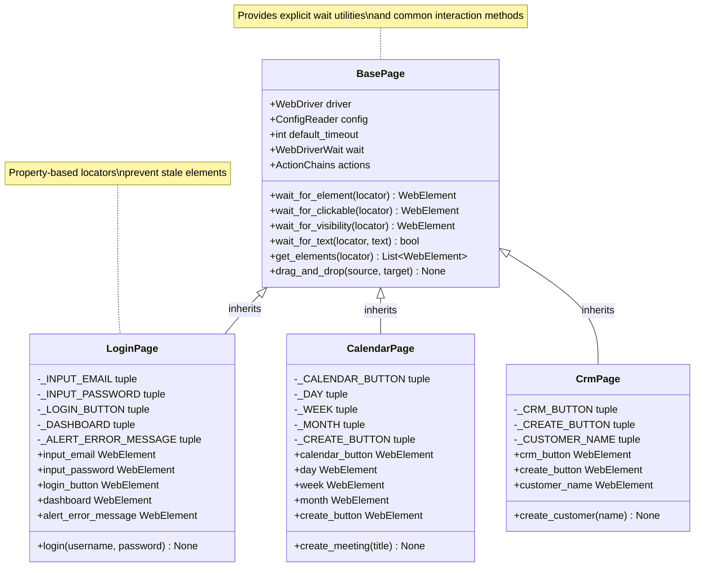

# Creating Page Objects

## Overview

The Page Object Model (POM) is a design pattern that creates an object-oriented representation of web pages in your test automation framework. This guide explains how to create maintainable, reusable page objects in the Testinium Python test framework.

**What You'll Learn:**
- Understanding the Page Object Model pattern and its benefits
- Creating page objects that inherit from BasePage
- Using property-based locators with the @property decorator
- Integrating explicit waits to prevent stale element exceptions
- Writing high-level action methods for business workflows
- Following best practices for maintainable test code

**When to Use This Guide:**
- Creating new page objects for untested pages
- Refactoring existing test code to use POM
- Understanding the framework's page object architecture
- Migrating from other patterns (e.g., Java PageFactory)

## Prerequisites

Before creating page objects, ensure you have:

- **Framework installed** - Complete setup from [Installation Guide](../getting-started/installation.md)
- **Python basics** - Understanding of classes, properties, and inheritance
- **Selenium knowledge** - Familiarity with WebDriver and element locators
- **BasePage understanding** - Review [BasePage API Reference](../api-reference/pages/base-page.md)

**Required Imports:**
```python
from pages.base_page import BasePage
from selenium.webdriver.common.by import By
from selenium.webdriver.remote.webelement import WebElement
```

## Understanding the Page Object Model

### What is the Page Object Model?

The Page Object Model is a design pattern that:

1. **Separates page structure from test logic** - Page locators and interactions are encapsulated in page classes
2. **Improves maintainability** - UI changes only require updates to page objects, not tests
3. **Increases reusability** - Page methods can be used across multiple tests
4. **Enhances readability** - Tests read like business workflows, not technical element interactions
5. **Reduces duplication** - Common actions are defined once in page objects

### Benefits of Property-Based Locators

This framework uses property-based locators instead of Java's PageFactory pattern:

**Traditional Approach (Java PageFactory):**
```java
@FindBy(name = "login")
public WebElement inputEmail;  // Stale element risk
```

**Property-Based Approach (Python):**
```python
_INPUT_EMAIL = (By.NAME, "login")  # Locator tuple

@property
def input_email(self):
    return self.wait_for_element(self._INPUT_EMAIL)  # Fresh element every time
```

**Advantages:**
- **No stale element exceptions** - Fresh WebElement reference on every access
- **Built-in explicit waits** - Elements automatically waited for before interaction
- **Encapsulation** - Locators are private, elements accessed via properties
- **Flexibility** - Can add custom logic in property getters

### Architecture Diagram



## BasePage Foundation

All page objects inherit from `BasePage`, which provides essential utilities for element interaction.

### Key Inherited Attributes

| Attribute | Type | Description |
|-----------|------|-------------|
| `driver` | WebDriver | Selenium WebDriver instance for browser control |
| `config` | ConfigReader | Access to framework configuration |
| `wait` | WebDriverWait | Pre-configured explicit wait instance |
| `actions` | ActionChains | For complex interactions (drag-and-drop, hover) |
| `default_timeout` | int | Default timeout in seconds (from config.yaml) |

### Key Inherited Methods

| Method | Purpose | When to Use |
|--------|---------|-------------|
| `wait_for_element(locator)` | Wait for element presence in DOM | Accessing any element |
| `wait_for_clickable(locator)` | Wait for element to be clickable | Before clicking buttons/links |
| `wait_for_visibility(locator)` | Wait for element to be visible | Verifying UI elements displayed |
| `wait_for_text(locator, text)` | Wait for specific text in element | Checking dynamic content updates |
| `get_elements(locator)` | Get all matching elements | Working with lists/tables |
| `drag_and_drop(source, target)` | Perform drag-and-drop | Moving elements visually |

**Source:** `pages/base_page.py:60-613`

## Creating a Page Object - Step by Step

### Step 1: Create the Class File

Create a new Python file in the `pages/` directory with naming convention `<page_name>_page.py`:

```bash
touch pages/dashboard_page.py
```

### Step 2: Import Required Modules

```python
"""
Dashboard Page Module

Page object for main dashboard with navigation and widget management.
"""

import logging
from typing import Tuple
from selenium.webdriver.common.by import By
from selenium.webdriver.remote.webelement import WebElement
from pages.base_page import BasePage
```

### Step 3: Define the Class and Inherit from BasePage

```python
class DashboardPage(BasePage):
    """
    Page Object for main application dashboard.
    
    This class provides access to dashboard navigation, widgets,
    and user profile elements following the property-based locator
    pattern for reliable element interaction.
    
    Attributes:
        Private locator tuples for all page elements
        Public properties returning fresh WebElement references
    
    Thread Safety:
        Thread-safe when each thread has its own WebDriver instance
    """
```

### Step 4: Define Locator Tuples

Define all element locators as **private class constants** using tuples of `(By.STRATEGY, "value")`:

```python
    # Navigation elements
    _DASHBOARD_BUTTON = (By.ID, "menu_dashboard")
    _CRM_BUTTON = (By.XPATH, "//a[@data-menu='crm']")
    _SALES_BUTTON = (By.XPATH, "//a[@data-menu='sales']")
    
    # User profile elements
    _USER_MENU = (By.CLASS_NAME, "o_user_menu")
    _LOGOUT_LINK = (By.LINK_TEXT, "Log out")
    
    # Dashboard widgets
    _WIDGET_CONTAINER = (By.CLASS_NAME, "o_dashboard")
    _WIDGET_TITLE = (By.CSS_SELECTOR, ".o_dashboard_title")
```

**Locator Strategies Available:**

| By Strategy | Example | Use Case |
|-------------|---------|----------|
| `By.ID` | `(By.ID, "submit")` | Unique element IDs (preferred) |
| `By.NAME` | `(By.NAME, "username")` | Form input names |
| `By.CLASS_NAME` | `(By.CLASS_NAME, "alert")` | Single CSS class |
| `By.CSS_SELECTOR` | `(By.CSS_SELECTOR, ".btn.primary")` | Complex CSS selectors |
| `By.XPATH` | `(By.XPATH, "//button[.='Submit']")` | Text-based or complex paths |
| `By.LINK_TEXT` | `(By.LINK_TEXT, "Click Here")` | Exact link text |
| `By.PARTIAL_LINK_TEXT` | `(By.PARTIAL_LINK_TEXT, "Click")` | Partial link text |
| `By.TAG_NAME` | `(By.TAG_NAME, "button")` | HTML tag names |

**Best Practices for Locators:**
1. **Prefer IDs** - Most stable and fastest
2. **Use data-testid attributes** - Request developers add them for testing
3. **Avoid positional XPaths** - `(//div)[3]` breaks easily
4. **Keep CSS simple** - Readable selectors are maintainable
5. **Name descriptively** - `_LOGIN_BUTTON` not `_BTN1`

### Step 5: Initialize the Page Object

```python
    def __init__(self, driver) -> None:
        """
        Initialize DashboardPage with WebDriver instance.
        
        Calls BasePage.__init__ to set up driver, configuration,
        wait utilities, and logging infrastructure.
        
        Args:
            driver: Selenium WebDriver instance from DriverManager
        
        Example:
            >>> from pages.dashboard_page import DashboardPage
            >>> dashboard = DashboardPage(driver)
        """
        super().__init__(driver)
        self._logger = logging.getLogger(__name__)
        self._logger.info("DashboardPage initialized")
```

### Step 6: Create Property-Based Element Accessors

Define properties for each element using the `@property` decorator:

```python
    @property
    def dashboard_button(self) -> WebElement:
        """
        Dashboard navigation button element.
        
        Returns fresh WebElement reference via explicit wait for
        element clickability.
        
        Returns:
            WebElement: Dashboard button when clickable
        
        Raises:
            TimeoutException: If button not clickable within timeout
        
        Example:
            >>> dashboard.dashboard_button.click()
        """
        self._logger.debug("Accessing dashboard_button element")
        return self.wait_for_clickable(self._DASHBOARD_BUTTON)
    
    @property
    def user_menu(self) -> WebElement:
        """
        User profile menu element.
        
        Returns fresh WebElement reference via explicit wait for
        element presence.
        
        Returns:
            WebElement: User menu element when present
        
        Example:
            >>> dashboard.user_menu.click()
        """
        self._logger.debug("Accessing user_menu element")
        return self.wait_for_element(self._USER_MENU)
```

**Choosing the Right Wait Method:**

| Element Type | Wait Method to Use | Reason |
|--------------|-------------------|--------|
| Buttons/Links | `wait_for_clickable()` | Ensures element is enabled and visible |
| Input Fields | `wait_for_element()` | Just needs to be present in DOM |
| Text/Labels | `wait_for_visibility()` | Needs to be visible to user |
| Hidden/Dynamic | `wait_for_element()` | May exist but not visible |

### Step 7: Add High-Level Action Methods

Create methods that encapsulate business workflows:

```python
    def navigate_to_crm(self) -> None:
        """
        Navigate to CRM module from dashboard.
        
        Clicks the CRM navigation button and waits for CRM page to load.
        Encapsulates the navigation workflow for cleaner test code.
        
        Raises:
            TimeoutException: If CRM button not clickable
        
        Example:
            >>> dashboard.navigate_to_crm()
            >>> # Now on CRM page
        """
        self._logger.info("Navigating to CRM module")
        self.dashboard_button.click()  # Ensure dashboard visible
        self.crm_button.click()
        self._logger.info("Navigated to CRM module")
    
    def logout(self) -> None:
        """
        Perform logout workflow from dashboard.
        
        Opens user menu and clicks logout link. Returns user to login page.
        
        Example:
            >>> dashboard.logout()
            >>> # User logged out, on login page
        """
        self._logger.info("Performing logout")
        self.user_menu.click()
        self.logout_link.click()
        self._logger.info("Logout completed")
```

**Benefits of High-Level Methods:**
- Tests read like business requirements: `dashboard.navigate_to_crm()`
- Workflows are reusable across multiple tests
- Changes to UI only require updating the page object
- Easier to maintain than repeating element interactions

## Complete Example: LoginPage

Here's the complete LoginPage implementation showing all concepts together:

```python
"""
Login Page Module

Page object for user authentication with email/password login.
"""

import logging
from typing import Tuple
from selenium.webdriver.common.by import By
from selenium.webdriver.remote.webelement import WebElement
from selenium.common.exceptions import TimeoutException
from pages.base_page import BasePage


class LoginPage(BasePage):
    """
    Login page object for user authentication.
    
    Provides element locators and login workflow methods following
    property-based locator pattern with explicit waits.
    """
    
    # Private locator tuples
    _INPUT_EMAIL: Tuple[str, str] = (By.NAME, "login")
    _INPUT_PASSWORD: Tuple[str, str] = (By.NAME, "password")
    _LOGIN_BUTTON: Tuple[str, str] = (By.XPATH, "//button[.='Log in']")
    _DASHBOARD: Tuple[str, str] = (By.ID, "oe_main_menu_navbar")
    _ALERT_ERROR_MESSAGE: Tuple[str, str] = (By.CLASS_NAME, "alert")
    
    def __init__(self, driver) -> None:
        """Initialize LoginPage with WebDriver instance."""
        super().__init__(driver)
        self._logger = logging.getLogger(__name__)
        self._logger.info("LoginPage initialized")
    
    # Property-based element accessors
    
    @property
    def input_email(self) -> WebElement:
        """
        Email input field element.
        
        Returns:
            WebElement: Email input when present in DOM
        
        Example:
            >>> login_page.input_email.send_keys("user@example.com")
        """
        self._logger.debug("Accessing input_email element")
        return self.wait_for_element(self._INPUT_EMAIL)
    
    @property
    def input_password(self) -> WebElement:
        """
        Password input field element.
        
        Returns:
            WebElement: Password input when present in DOM
        
        Example:
            >>> login_page.input_password.send_keys("SecurePass123")
        """
        self._logger.debug("Accessing input_password element")
        return self.wait_for_element(self._INPUT_PASSWORD)
    
    @property
    def login_button(self) -> WebElement:
        """
        Login submit button element.
        
        Returns:
            WebElement: Login button when clickable
        
        Example:
            >>> login_page.login_button.click()
        """
        self._logger.debug("Accessing login_button element")
        return self.wait_for_clickable(self._LOGIN_BUTTON)
    
    @property
    def dashboard(self) -> WebElement:
        """
        Dashboard element for login success verification.
        
        Returns:
            WebElement: Dashboard navbar when visible
        
        Example:
            >>> assert login_page.dashboard.is_displayed()
        """
        self._logger.debug("Accessing dashboard element")
        return self.wait_for_visibility(self._DASHBOARD)
    
    @property
    def alert_error_message(self) -> WebElement:
        """
        Error message alert for login failure detection.
        
        Returns:
            WebElement: Alert element when visible
        
        Example:
            >>> if login_page.alert_error_message.is_displayed():
            ...     print(login_page.alert_error_message.text)
        """
        self._logger.debug("Accessing alert_error_message element")
        return self.wait_for_visibility(self._ALERT_ERROR_MESSAGE)
    
    # High-level action method
    
    def login(self, username: str, password: str) -> None:
        """
        Perform complete login workflow.
        
        Encapsulates full authentication process:
        1. Clear and enter username
        2. Clear and enter password  
        3. Click login button
        
        Args:
            username: User's email address
            password: User's password (not logged for security)
        
        Raises:
            TimeoutException: If elements not found within timeout
        
        Example:
            >>> login_page.login("admin@example.com", "SecurePass123")
            >>> assert login_page.dashboard.is_displayed()
        """
        self._logger.info("Performing login for user: %s", username)
        
        try:
            # Enter username
            self._logger.debug("Entering username")
            email_field = self.input_email
            email_field.clear()
            email_field.send_keys(username)
            
            # Enter password (not logged for security)
            self._logger.debug("Entering password")
            password_field = self.input_password
            password_field.clear()
            password_field.send_keys(password)
            
            # Click login
            self._logger.debug("Clicking login button")
            self.login_button.click()
            
            self._logger.info("Login workflow completed")
            
        except TimeoutException as timeout_err:
            self._logger.error("Login failed - timeout: %s", timeout_err)
            raise
        except Exception as exc:
            self._logger.exception("Login failed: %s", exc)
            raise
```

**Source:** `pages/login_page.py:1-430`

**Usage in Behave Step Definition:**

```python
from behave import given, when, then
from pages.login_page import LoginPage

@when('User logs in with "{username}" and "{password}"')
def step_login(context, username, password):
    """Login with provided credentials."""
    login_page = LoginPage(context.driver)
    login_page.login(username, password)

@then('User should see the dashboard')
def step_verify_dashboard(context):
    """Verify successful login by checking dashboard visibility."""
    login_page = LoginPage(context.driver)
    assert login_page.dashboard.is_displayed(), "Dashboard not visible after login"
```

## Property-Based Locator Pattern Explained

### The Pattern

```python
# 1. Define locator tuple as private class constant
_ELEMENT_NAME = (By.STRATEGY, "locator_value")

# 2. Create property that calls wait method
@property
def element_name(self) -> WebElement:
    return self.wait_for_element(self._ELEMENT_NAME)
```

### Why This Works

**Problem with Traditional Approach:**
```python
# BAD: Storing WebElement reference directly
class LoginPage:
    def __init__(self, driver):
        self.login_button = driver.find_element(By.ID, "login")
        # This element reference becomes stale if page refreshes!
```

**Solution with Property-Based Pattern:**
```python
# GOOD: Fresh element reference on each access
class LoginPage(BasePage):
    _LOGIN_BUTTON = (By.ID, "login")
    
    @property
    def login_button(self):
        return self.wait_for_element(self._LOGIN_BUTTON)
        # New WebElement retrieved every time property accessed
```

### How It Prevents Stale Elements

1. **Property accessed**: `login_page.login_button`
2. **Property method called**: `def login_button(self):`
3. **Wait method invoked**: `self.wait_for_element(self._LOGIN_BUTTON)`
4. **Fresh element retrieved**: `driver.find_element(*self._LOGIN_BUTTON)`
5. **Fresh WebElement returned**: No stale reference!

**Every property access triggers:**
- Element re-location in current DOM
- Explicit wait for element condition
- Return of fresh WebElement reference

This pattern eliminates the most common cause of Selenium test failures: `StaleElementReferenceException`.

## Wait Method Integration

### Choosing the Appropriate Wait Method

Each property should use the wait method that best matches its element type:

```python
class ExamplePage(BasePage):
    _TEXT_FIELD = (By.ID, "input")
    _SUBMIT_BUTTON = (By.ID, "submit")
    _SUCCESS_MESSAGE = (By.CLASS_NAME, "success")
    _HIDDEN_FIELD = (By.ID, "hidden")
    
    @property
    def text_field(self):
        # Input fields: wait_for_element (just needs to exist)
        return self.wait_for_element(self._TEXT_FIELD)
    
    @property
    def submit_button(self):
        # Buttons/links: wait_for_clickable (needs to be enabled)
        return self.wait_for_clickable(self._SUBMIT_BUTTON)
    
    @property
    def success_message(self):
        # Text/labels: wait_for_visibility (needs to be visible)
        return self.wait_for_visibility(self._SUCCESS_MESSAGE)
    
    @property
    def hidden_field(self):
        # Hidden elements: wait_for_element (exists but not visible)
        return self.wait_for_element(self._HIDDEN_FIELD)
```

### Custom Timeouts for Slow Elements

Override default timeout for elements that load slowly:

```python
@property
def slow_loading_element(self):
    """Element that takes longer to appear."""
    return self.wait_for_element(
        self._SLOW_ELEMENT,
        timeout=30  # Override default 10 second timeout
    )
```

### Verifying Text Content

Use `wait_for_text()` for dynamic content verification:

```python
def verify_success_message(self, expected_text: str) -> bool:
    """
    Verify success message contains expected text.
    
    Args:
        expected_text: Text to verify in success message
    
    Returns:
        bool: True if text present within timeout
    
    Example:
        >>> page.verify_success_message("Saved successfully")
    """
    return self.wait_for_text(self._SUCCESS_MESSAGE, expected_text)
```

## Advanced Patterns

### Pattern 1: Page Object Composition

Compose complex pages from smaller page fragments:

```python
class HeaderFragment(BasePage):
    """Reusable header component present on multiple pages."""
    
    _SEARCH_BOX = (By.ID, "search")
    _USER_MENU = (By.CLASS_NAME, "user-menu")
    
    @property
    def search_box(self):
        return self.wait_for_element(self._SEARCH_BOX)
    
    @property
    def user_menu(self):
        return self.wait_for_element(self._USER_MENU)


class DashboardPage(BasePage):
    """Dashboard page composed with header fragment."""
    
    def __init__(self, driver):
        super().__init__(driver)
        self.header = HeaderFragment(driver)  # Composition
    
    def search(self, query: str):
        """Search using header search box."""
        self.header.search_box.send_keys(query)
```

### Pattern 2: Method Chaining with Page Returns

Return page objects from methods for fluent interfaces:

```python
class LoginPage(BasePage):
    def login(self, username: str, password: str):
        """Login and return DashboardPage."""
        self.input_email.send_keys(username)
        self.input_password.send_keys(password)
        self.login_button.click()
        
        # Return next page object for method chaining
        from pages.dashboard_page import DashboardPage
        return DashboardPage(self.driver)


# Usage with method chaining
dashboard = login_page.login("user@example.com", "pass").navigate_to_crm()
```

### Pattern 3: Waiting for Page Load

Add page load verification in `__init__`:

```python
class DashboardPage(BasePage):
    _PAGE_TITLE = (By.ID, "dashboard-title")
    
    def __init__(self, driver):
        super().__init__(driver)
        # Wait for page-specific element to confirm page loaded
        self.wait_for_visibility(self._PAGE_TITLE, timeout=15)
        self._logger.info("DashboardPage loaded successfully")
```

### Pattern 4: Working with Element Collections

Handle lists of elements (tables, cards, etc.):

```python
class CustomersPage(BasePage):
    _CUSTOMER_CARDS = (By.CLASS_NAME, "customer-card")
    _CUSTOMER_NAME = (By.CLASS_NAME, "customer-name")
    
    def get_customer_count(self) -> int:
        """Get total number of customer cards."""
        cards = self.get_elements(self._CUSTOMER_CARDS)
        return len(cards)
    
    def get_customer_names(self) -> list[str]:
        """Get list of all customer names."""
        # Wait for at least one card
        self.wait_for_element(self._CUSTOMER_CARDS)
        
        # Get all customer name elements
        name_elements = self.get_elements(self._CUSTOMER_NAME)
        return [elem.text for elem in name_elements]
    
    def click_customer_by_name(self, name: str) -> None:
        """Click customer card with specific name."""
        cards = self.get_elements(self._CUSTOMER_CARDS)
        for card in cards:
            if name in card.text:
                card.click()
                return
        raise ValueError(f"Customer '{name}' not found")
```

## Best Practices

### Do's ✅

1. **One page = One class** - Each web page gets its own page object
2. **Inherit from BasePage** - Leverage existing wait utilities
3. **Private locators** - Use `_LOCATOR_NAME` convention
4. **Property-based access** - Use `@property` decorator for elements
5. **Explicit waits** - Call appropriate wait methods in properties
6. **High-level methods** - Encapsulate workflows (e.g., `login()`)
7. **Return page objects** - Methods that navigate should return new page objects
8. **Descriptive names** - `input_email` not `elem1`
9. **Document migration** - Note Java equivalents if applicable
10. **Log operations** - Use `self._logger` for debugging

### Don'ts ❌

1. **Don't store WebElements** - Always use properties, not `self.element = driver.find_element()`
2. **Don't use implicit waits** - Only explicit waits via BasePage methods
3. **Don't put assertions in page objects** - Assertions belong in tests/steps
4. **Don't return test data** - Page objects interact with UI, tests verify data
5. **Don't duplicate locators** - Define each locator once
6. **Don't use `sleep()`** - Use explicit waits instead
7. **Don't access `driver` directly in properties** - Use BasePage wait methods
8. **Don't mix concerns** - Keep business logic in tests, UI interaction in page objects
9. **Don't hardcode timeouts** - Use configurable defaults or method parameters
10. **Don't create god objects** - Split complex pages into fragments

### Code Organization

```
pages/
├── __init__.py              # Export all page objects
├── base_page.py             # Abstract base class
├── login_page.py            # Authentication page
├── dashboard_page.py        # Main dashboard
├── crm_page.py              # CRM module page
├── fragments/               # Reusable page fragments
│   ├── __init__.py
│   ├── header_fragment.py
│   └── sidebar_fragment.py
└── modals/                  # Modal dialog page objects
    ├── __init__.py
    └── confirmation_modal.py
```

## Migration from Java PageFactory

### Java PageFactory Pattern

```java
public class LoginPage {
    private WebDriver driver;
    
    // Public WebElement fields with @FindBy
    @FindBy(name = "login")
    public WebElement inputEmail;
    
    @FindBy(name = "password")
    public WebElement inputPassword;
    
    @FindBy(xpath = "//button[.='Log in']")
    public WebElement button;
    
    public LoginPage(WebDriver driver) {
        this.driver = driver;
        PageFactory.initElements(driver, this);  // Initialize elements
    }
    
    public void login(String username, String password) {
        inputEmail.sendKeys(username);
        inputPassword.sendKeys(password);
        button.click();
    }
}
```

### Python Property-Based Pattern

```python
class LoginPage(BasePage):
    # Private locator tuples
    _INPUT_EMAIL = (By.NAME, "login")
    _INPUT_PASSWORD = (By.NAME, "password")
    _LOGIN_BUTTON = (By.XPATH, "//button[.='Log in']")
    
    def __init__(self, driver):
        super().__init__(driver)
        # No PageFactory.initElements() needed
    
    # Properties return fresh elements
    @property
    def input_email(self):
        return self.wait_for_element(self._INPUT_EMAIL)
    
    @property
    def input_password(self):
        return self.wait_for_element(self._INPUT_PASSWORD)
    
    @property
    def login_button(self):
        return self.wait_for_clickable(self._LOGIN_BUTTON)
    
    def login(self, username: str, password: str):
        self.input_email.send_keys(username)
        self.input_password.send_keys(password)
        self.login_button.click()
```

### Key Differences

| Aspect | Java PageFactory | Python Property-Based |
|--------|------------------|----------------------|
| Element Storage | Public fields | Private properties |
| Initialization | `PageFactory.initElements()` | Lazy evaluation via properties |
| Stale Elements | Common issue | Prevented by fresh references |
| Explicit Waits | Manual integration | Built-in via BasePage methods |
| Encapsulation | Public fields exposed | Locators private, elements via properties |
| Flexibility | Limited | Full control over element retrieval |

**Source:** `pages/login_page.py:89-100` (Migration Context)

## Troubleshooting

### Issue: StaleElementReferenceException

**Symptoms:**
```
selenium.common.exceptions.StaleElementReferenceException: stale element reference: 
element is not attached to the page document
```

**Cause:** Storing WebElement reference instead of using property-based access.

**Solution:**
```python
# BAD: Storing element reference
def __init__(self, driver):
    super().__init__(driver)
    self.button = driver.find_element(By.ID, "submit")  # Becomes stale!

# GOOD: Property-based access
_BUTTON = (By.ID, "submit")

@property
def button(self):
    return self.wait_for_clickable(self._BUTTON)  # Fresh every time
```

### Issue: TimeoutException - Element Not Found

**Symptoms:**
```
selenium.common.exceptions.TimeoutException: Message: Element not present within 10s: 
(By.ID, 'submit')
```

**Possible Causes:**
1. Locator is incorrect
2. Element loads slowly (need custom timeout)
3. Element is in iframe
4. Page hasn't fully loaded

**Solutions:**

```python
# Solution 1: Verify locator
# Use browser DevTools to confirm locator matches element

# Solution 2: Increase timeout for slow elements
@property
def slow_element(self):
    return self.wait_for_element(self._SLOW_ELEMENT, timeout=30)

# Solution 3: Switch to iframe first
def access_iframe_element(self):
    iframe = self.driver.find_element(By.ID, "myframe")
    self.driver.switch_to.frame(iframe)
    element = self.wait_for_element(self._IFRAME_ELEMENT)
    self.driver.switch_to.default_content()  # Switch back
    return element

# Solution 4: Wait for page load indicator
def wait_for_page_load(self):
    # Wait for loading spinner to disappear
    try:
        spinner = (By.CLASS_NAME, "loading-spinner")
        wait = WebDriverWait(self.driver, 30)
        wait.until_not(EC.presence_of_element_located(spinner))
    except TimeoutException:
        pass  # Spinner might not appear for fast loads
```

### Issue: Element Not Clickable / Obscured

**Symptoms:**
```
selenium.common.exceptions.ElementClickInterceptedException: element click intercepted
```

**Cause:** Another element is covering the target element.

**Solutions:**

```python
# Solution 1: Wait for clickable instead of just visible
@property
def button(self):
    return self.wait_for_clickable(self._BUTTON)  # Not just wait_for_element

# Solution 2: Scroll element into view
def click_button_with_scroll(self):
    button = self.wait_for_element(self._BUTTON)
    self.driver.execute_script("arguments[0].scrollIntoView(true);", button)
    self.wait_for_clickable(self._BUTTON).click()

# Solution 3: Close overlays first
def close_overlay_and_click(self):
    # Close any modal or overlay first
    try:
        overlay_close = self.wait_for_element((By.CLASS_NAME, "modal-close"), timeout=2)
        overlay_close.click()
    except TimeoutException:
        pass  # No overlay present
    
    self.button.click()
```

### Issue: Import Errors

**Symptoms:**
```python
ImportError: cannot import name 'LoginPage' from 'pages'
```

**Solution:**

```python
# Ensure page object is exported in pages/__init__.py
# pages/__init__.py:
from pages.login_page import LoginPage
from pages.dashboard_page import DashboardPage
from pages.crm_page import CrmPage

__all__ = [
    'LoginPage',
    'DashboardPage',
    'CrmPage',
]

# Then import from pages package:
from pages import LoginPage  # Correct
```

### Issue: Properties Not Working

**Symptoms:** Properties don't trigger, getting tuple instead of WebElement.

**Cause:** Forgot `@property` decorator.

**Solution:**

```python
# BAD: Missing @property decorator
def button(self):  # Returns method, not element
    return self.wait_for_element(self._BUTTON)

# GOOD: With @property decorator
@property
def button(self):  # Returns WebElement when accessed
    return self.wait_for_element(self._BUTTON)
```

### Issue: Multiple Elements with Same Locator

**Symptoms:** Clicking wrong element when multiple match.

**Solution:**

```python
# Solution 1: Make locator more specific
_SUBMIT_BUTTON = (By.XPATH, "//button[@type='submit' and @class='primary']")

# Solution 2: Use index with get_elements()
def get_second_submit_button(self):
    buttons = self.get_elements((By.CSS_SELECTOR, "button[type='submit']"))
    if len(buttons) >= 2:
        return buttons[1]  # Second button (0-indexed)
    raise ValueError("Second submit button not found")

# Solution 3: Request unique data-testid from developers
_SUBMIT_BUTTON = (By.CSS_SELECTOR, "[data-testid='submit-main']")
```

## See Also

### API Reference
- [BasePage API Reference](../api-reference/pages/base-page.md) - Complete BasePage documentation
- [LoginPage API Reference](../api-reference/pages/login-page.md) - Example page object reference
- [All Page Objects](../api-reference/pages/index.md) - Complete page object API catalog

### Related Guides
- [Writing Step Definitions](step-definitions.md) - Using page objects in Behave steps
- [Wait Strategies](wait-strategies.md) - Deep dive into explicit waits
- [Configuration Management](configuration-management.md) - Configuring timeouts

### Architecture Documentation
- [System Architecture](../architecture/system-overview.md) - Framework architecture overview
- [Page Object Model Architecture](../architecture/page-object-model.md) - Detailed POM design

### Troubleshooting
- [Common Errors](../troubleshooting/common-errors.md) - General error solutions
- [WebDriver Issues](../troubleshooting/webdriver-issues.md) - Element interaction problems

### External Resources
- [Selenium Documentation](https://www.selenium.dev/documentation/) - Official Selenium docs
- [PEP 257 Docstrings](https://peps.python.org/pep-0257/) - Python docstring conventions
- [Python Properties](https://docs.python.org/3/library/functions.html#property) - @property decorator

---

**Next Steps:**
1. Create your first page object following the step-by-step guide
2. Add properties for all page elements using appropriate wait methods
3. Write high-level action methods for common workflows
4. Use page objects in Behave step definitions
5. Review [Step Definitions Guide](step-definitions.md) for integration examples
