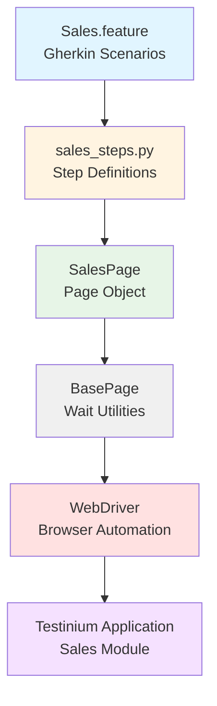
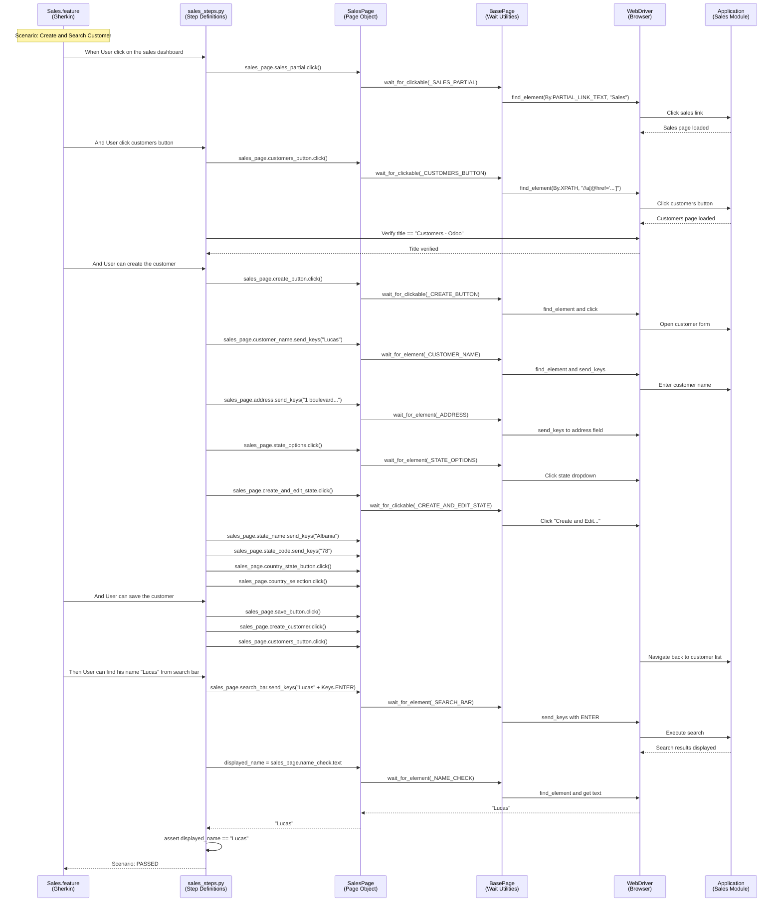

# Sales Testing Guide

## Overview

The Sales module in the Testinium application provides comprehensive customer management functionality within the sales workflow. This guide covers testing customer creation, search operations, validation handling, and customer data management using the BDD framework.

**What This Guide Covers:**
- Sales module navigation and customer management interface
- Customer creation workflow with name, address, state, and country fields
- Customer search and verification functionality
- Form validation testing for incomplete customer data
- Page Object Model patterns for sales elements
- Wait strategies for dynamic customer forms and dropdowns
- Complete code examples from Gherkin scenarios to step implementations to page objects

**When to Use This Guide:**
- Testing sales module customer management features
- Implementing new customer-related test scenarios
- Understanding the sales workflow test architecture
- Troubleshooting customer creation or search issues
- Extending sales functionality with additional test cases

**Prerequisites:**
- Framework installed and configured (see [Installation Guide](../getting-started/installation.md))
- Valid test credentials configured in `.env` file
- Understanding of [Page Object Model](page-object-model.md) pattern
- Familiarity with [Gherkin syntax](../reference/gherkin-syntax.md) and [step definitions](step-definitions.md)

**Source Files:**
- **Feature:** `features/Sales.feature`
- **Step Definitions:** `features/steps/sales_steps.py`
- **Page Object:** `pages/sales_page.py`

---

## Sales Module Architecture

The sales testing implementation follows a layered architecture connecting Gherkin scenarios to browser automation:



---

## Basic Customer Creation Testing

### Simple Customer Creation Scenario

The most common sales testing scenario involves creating a new customer and verifying it appears in the customer list.

**Gherkin Scenario:**

```gherkin
Scenario: Verify that User can reach New Customer Form by clicking Sales --> Customers --> Create
  When User click on the sales dashboard
  And User click customers button
  And User can create the customer
  And User can save the customer
  Then User can find his name "Lucas" from search bar
```

**Source:** `features/Sales.feature:12-17`

**Step-by-Step Workflow:**

1. **Navigate to Sales Dashboard** - Click sales module navigation link
2. **Access Customers Page** - Click customers button and verify page title
3. **Create Customer Record** - Fill customer form with name, address, state, country
4. **Save Customer** - Submit form and return to customer list
5. **Verify Customer** - Search for customer and confirm name matches

### Step Definition Implementation

**Step 1: Navigate to Sales Dashboard**

```python
@when('User click on the sales dashboard')
def user_click_on_sales_dashboard(context):
    """Navigate to sales dashboard by clicking the sales partial link."""
    logger.info("Step: User clicks on the sales dashboard")
    sales_page = SalesPage(context.driver)
    sales_page.sales_partial.click()
    logger.debug("Sales dashboard link clicked, waiting for page load")
```

**Source:** `features/steps/sales_steps.py:70-94`

**Step 2: Access Customers Page with Title Verification**

```python
@when('User click customers button')
def user_click_customers_button(context):
    """Navigate to customers page and verify page title."""
    logger.info("Step: User clicks customers button")
    sales_page = SalesPage(context.driver)
    
    sales_page.customers_button.click()
    logger.debug("Customers button clicked, waiting for page load")
    
    # Title verification
    expected_title = "Customers - Odoo"
    actual_title = context.driver.title
    
    logger.debug(f"Expected title: {expected_title}")
    logger.debug(f"Actual title: {actual_title}")
    
    assert actual_title == expected_title, \
        f"The title is not same as the expected! Expected: '{expected_title}', Actual: '{actual_title}'"
    
    logger.info("Customers page title verified successfully")
```

**Source:** `features/steps/sales_steps.py:97-140`

**Key Points:**
- Includes built-in title verification to ensure page loaded correctly
- Uses descriptive assertion messages for debugging failures
- Structured logging tracks test execution flow

**Step 3: Create Customer with Complete Form Data**

```python
@when('User can create the customer')
def user_can_create_customer(context):
    """Create a new customer with name, address, state, and country information."""
    logger.info("Step: User can create the customer")
    sales_page = SalesPage(context.driver)
    
    # Open customer creation form
    sales_page.create_button.click()
    logger.debug("Create button clicked")
    
    # Fill customer name
    customer_name = "Lucas"
    sales_page.customer_name.send_keys(customer_name)
    logger.debug(f"Customer name entered: {customer_name}")
    
    # Fill customer address
    customer_address = "1 boulevard auguste rodin 75000"
    sales_page.address.send_keys(customer_address)
    logger.debug(f"Customer address entered: {customer_address}")
    
    # Configure state information
    sales_page.state_options.click()
    logger.debug("State options dropdown opened")
    
    sales_page.create_and_edit_state.click()
    logger.debug("Create and Edit state option selected")
    
    # Enter state details
    state_name = "Albania"
    sales_page.state_name.send_keys(state_name)
    logger.debug(f"State name entered: {state_name}")
    
    state_code = "78"
    sales_page.state_code.send_keys(state_code)
    logger.debug(f"State code entered: {state_code}")
    
    # Select country
    sales_page.country_state_button.click()
    logger.debug("Country state button clicked")
    
    sales_page.country_selection.click()
    logger.debug("Country selected from dropdown")
    
    logger.info("Customer creation form completed")
```

**Source:** `features/steps/sales_steps.py:143-216`

**Step 4: Save Customer and Return to List**

```python
@when('User can save the customer')
def user_can_save_customer(context):
    """Save customer information and return to customers list view."""
    logger.info("Step: User can save the customer")
    sales_page = SalesPage(context.driver)
    
    # Save state/country information
    sales_page.save_button.click()
    logger.debug("Save button clicked for state/country data")
    
    # Create customer
    sales_page.create_customer.click()
    logger.debug("Create customer button clicked")
    
    # Return to customers list
    sales_page.customers_button.click()
    logger.debug("Navigated back to customers list")
    
    logger.info("Customer saved successfully")
```

**Source:** `features/steps/sales_steps.py:218-257`

**Step 5: Search and Verify Customer**

```python
@then('User can find his name "{name}" from search bar')
def user_can_find_name_from_search_bar(context, name):
    """Search for customer by name using search bar with keyboard Enter key."""
    logger.info(f"Step: User can find his name '{name}' from search bar")
    sales_page = SalesPage(context.driver)
    
    # Perform search with keyboard ENTER key
    sales_page.search_bar.send_keys(name + Keys.ENTER)
    logger.debug(f"Search executed for customer name: {name}")
    
    # Retrieve displayed customer name from search results
    displayed_name = sales_page.name_check.text
    
    logger.debug(f"Expected name: {name}")
    logger.debug(f"Displayed name: {displayed_name}")
    
    # Verify customer name matches
    assert displayed_name == name, \
        f"Customer name mismatch! Expected: '{name}', but found: '{displayed_name}'"
    
    logger.info(f"Customer name '{name}' verified successfully in search results")
```

**Source:** `features/steps/sales_steps.py:260-306`

**Key Points:**
- Uses `Keys.ENTER` for keyboard-based search execution
- Parameterized name allows reuse with different customer names
- Includes explicit assertion (critical bug fix from Java version which only printed values)

---

## Customer Validation Testing

### Testing Form Validation Errors

The sales module includes validation to ensure required fields are completed before customer creation.

**Gherkin Scenario:**

```gherkin
Scenario: Verify that if customer name field leaves blank, an error message 
          "The following fields are invalid:" is appeared.
  When User click on the sales dashboard
  And User click customers button
  And User can create new customer
  Then User can get the error
```

**Source:** `features/Sales.feature:19-23`

**Validation Test Steps:**

**Step 1: Attempt Customer Creation Without Required Fields**

```python
@step('User can create new customer')
def user_can_create_new_customer(context):
    """Initiate customer creation workflow without filling required fields."""
    logger.info("Step: User can create new customer (validation test)")
    sales_page = SalesPage(context.driver)
    
    # Open customer creation form
    sales_page.create_button.click()
    logger.debug("Create button clicked to open customer form")
    
    # Attempt to create customer without filling required fields
    sales_page.create_customer.click()
    logger.debug("Create customer button clicked without filling fields (testing validation)")
    
    logger.info("Customer creation attempted without required fields")
```

**Source:** `features/steps/sales_steps.py:309-347`

**Step 2: Verify Validation Error Message**

```python
@then('User can get the error')
def user_can_get_error(context):
    """Verify validation error message is displayed for incomplete customer data."""
    logger.info("Step: User can get the error (validation error verification)")
    sales_page = SalesPage(context.driver)
    
    # Retrieve validation error message from warning notification
    expected_warning_text = "The following fields are invalid:"
    actual_warning = sales_page.warning.text
    
    logger.debug(f"Expected warning text: {expected_warning_text}")
    logger.debug(f"Actual warning: {actual_warning}")
    
    # Verify error message contains expected text
    assert expected_warning_text in actual_warning, \
        f"Validation error not found! Expected text containing: '{expected_warning_text}', " \
        f"but got: '{actual_warning}'"
    
    logger.info("Validation error message verified successfully")
```

**Source:** `features/steps/sales_steps.py:350-393`

**Validation Testing Best Practices:**
- Uses substring match (`in` operator) for robustness since full message may include dynamic field names
- Tests negative scenarios to ensure application enforces data requirements
- Verifies error messages are user-friendly and descriptive

---

## Data-Driven Customer Testing

### Scenario Outline for Multiple Customers

Test customer search functionality with multiple customer names using Scenario Outline.

**Gherkin Scenario Outline:**

```gherkin
Scenario Outline: Verify that after creating a new customer, 
                   the page title includes the customer name.
  When User click on the sales dashboard
  And User click customers button
  Then User can find his name "<name>" from search bar

  Examples: Employee's name
    | name  |
    | Lucas |
```

**Source:** `features/Sales.feature:25-33`

**Key Points:**
- Uses `<name>` placeholder for parameterized testing
- Examples table provides test data (currently one example, easily extensible)
- Same step definitions reused with different parameter values
- Efficient way to test search functionality with multiple customer names

**Extending with More Test Data:**

```gherkin
Examples: Customer names
  | name          |
  | Lucas         |
  | John Smith    |
  | ACME Corp     |
  | Test Customer |
```

---

## Page Object Patterns for Sales Elements

### SalesPage Class Structure

The `SalesPage` class provides property-based access to all sales module elements with built-in explicit waits.

**Class Overview:**

```python
from selenium.webdriver.common.by import By
from pages.base_page import BasePage

class SalesPage(BasePage):
    """
    Sales page object for customer management functionality.
    
    Provides access to:
    - Navigation elements (sales dashboard, customers button)
    - Customer creation form fields (name, address, state, country)
    - Action buttons (create, save)
    - Search functionality
    - Validation notifications
    """
```

**Source:** `pages/sales_page.py:71-105`

### Locator Constants Pattern

All locators are defined as private class constants using tuple format `(By.STRATEGY, 'locator_value')`:

```python
class SalesPage(BasePage):
    # Navigation elements
    _SALES_PARTIAL = (By.PARTIAL_LINK_TEXT, "Sales")
    _CUSTOMERS_BUTTON = (By.XPATH, "//a[@href='/web#menu_id=447&action=48']/span")
    
    # Action buttons
    _CREATE_BUTTON = (By.XPATH, "//button[@class='btn btn-primary btn-sm o-kanban-button-new btn-default']")
    _SAVE_BUTTON = (By.XPATH, "//button[@class='btn btn-sm btn-primary']/span")
    _CREATE_CUSTOMER = (By.XPATH, "//button[@class='btn btn-primary btn-sm o_form_button_save']")
    
    # Form input fields
    _CUSTOMER_NAME = (By.XPATH, "//input[@id='o_field_input_470']")
    _ADDRESS = (By.XPATH, "//input[@id='o_field_input_474']")
    _STATE_OPTIONS = (By.XPATH, "//input[@id='o_field_input_477']")
    _STATE_NAME = (By.XPATH, "//input[@id='o_field_input_516']")
    _STATE_CODE = (By.XPATH, "//input[@id='o_field_input_517']")
    _COUNTRY_STATE_BUTTON = (By.XPATH, "//input[@id='o_field_input_518']")
    
    # Dropdown options
    _CREATE_AND_EDIT_STATE = (By.XPATH, "//li[.='Create and Edit...']")
    _COUNTRY_SELECTION = (By.XPATH, "//li[@id='ui-id-30']/a")
    
    # Search and validation
    _SEARCH_BAR = (By.XPATH, "//div[@class='o_searchview']/input")
    _NAME_CHECK = (By.XPATH, "//strong[@class='o_kanban_record_title oe_partner_heading']/span")
    _WARNING = (By.XPATH, "//div[@class='o_notification_manager']")
```

**Source:** `pages/sales_page.py:107-195`

**Technical Debt Note:**
Six locators use generated IDs (`o_field_input_470`, `474`, `477`, `516`, `517`, `518`) which are brittle and may change with application updates. Recommend requesting stable `data-testid` attributes from the development team for more maintainable test automation.

**Source:** `pages/sales_page.py:140-150`

### Property-Based Element Access

Each element is accessed through a `@property` method that returns a fresh WebElement reference with explicit wait:

```python
@property
def customer_name(self) -> WebElement:
    """
    Customer name input field.
    
    Returns:
        WebElement: Customer name input element
    
    Example:
        >>> sales_page.customer_name.send_keys("ACME Corporation")
    """
    return self.wait_for_element(self._CUSTOMER_NAME)

@property
def customers_button(self) -> WebElement:
    """
    Customers submenu button with specific href navigation.
    
    Returns:
        WebElement: Customers button span element
    
    Example:
        >>> sales_page.customers_button.click()
    """
    return self.wait_for_clickable(self._CUSTOMERS_BUTTON)
```

**Source:** `pages/sales_page.py:252-267`, `226-237`

**Benefits of Property-Based Locators:**
- **Fresh References:** Each property access queries the DOM, preventing stale element exceptions
- **Built-in Waits:** Properties use `wait_for_element()`, `wait_for_clickable()`, or `wait_for_visibility()`
- **Type Safety:** Type hints indicate return type (WebElement or List[WebElement])
- **Clean Syntax:** `sales_page.customer_name.send_keys("Test")` reads naturally
- **Prevents StaleElementReferenceException:** Common issue with Java PageFactory pattern

### Handling Dynamic Collections

The `all_customers` property returns a list of customer card elements:

```python
@property
def all_customers(self) -> List[WebElement]:
    """
    Collection of all customer kanban cards in current view.
    
    Returns:
        List[WebElement]: List of customer card elements (empty if none found)
    
    Example:
        >>> customers = sales_page.all_customers
        >>> print(f"Found {len(customers)} customers")
        >>> for customer in customers:
        ...     print(customer.text)
    """
    return self.get_elements(self._ALL_CUSTOMERS)
```

**Source:** `pages/sales_page.py:456-481`

**Usage Pattern:**
```python
# Wait for at least one customer card to appear
sales_page.wait_for_element(sales_page._ALL_CUSTOMERS)

# Then retrieve all customer cards
customers = sales_page.all_customers
logger.info(f"Found {len(customers)} customer(s)")

# Iterate through customer cards
for customer in customers:
    customer_name = customer.find_element(By.TAG_NAME, "span").text
    logger.debug(f"Customer: {customer_name}")
```

---

## Wait Strategies for Sales Module

### Explicit Waits in SalesPage

All SalesPage properties implement explicit waits through BasePage utility methods, ensuring reliable element interactions.

**Wait Strategy Selection:**

| Element Type | Wait Method Used | Timeout | Purpose |
|--------------|------------------|---------|---------|
| Clickable buttons | `wait_for_clickable()` | Default | Ensures element is visible, enabled, and clickable |
| Input fields | `wait_for_element()` | Default | Waits for element presence in DOM |
| Notifications | `wait_for_visibility()` | Default | Waits for element to be visible (not just present) |
| Navigation links | `wait_for_clickable()` | Default | Ensures link is ready for interaction |

**Source:** `pages/base_page.py` (inherited wait utilities)

### Wait Implementation Examples

**Wait for Clickable Button:**

```python
@property
def create_button(self) -> WebElement:
    """Create new customer button in kanban view."""
    return self.wait_for_clickable(self._CREATE_BUTTON)
```

**Source:** `pages/sales_page.py:239-250`

**Behavior:**
- Waits for element to be present in DOM
- Waits for element to be visible
- Waits for element to be enabled (not disabled)
- Returns element when all conditions are met
- Raises `TimeoutException` if timeout exceeded

**Wait for Element Presence (Input Fields):**

```python
@property
def customer_name(self) -> WebElement:
    """Customer name input field."""
    return self.wait_for_element(self._CUSTOMER_NAME)
```

**Source:** `pages/sales_page.py:252-267`

**Behavior:**
- Waits for element to be present in DOM
- Does not require element to be visible (useful for elements that might be off-screen)
- Returns as soon as element exists

**Wait for Visibility (Notifications):**

```python
@property
def warning(self) -> WebElement:
    """Warning notification container element."""
    return self.wait_for_visibility(self._WARNING)
```

**Source:** `pages/sales_page.py:442-454`

**Behavior:**
- Waits for element to be present in DOM
- Waits for element to have width and height greater than 0
- Useful for notifications that animate in

### Custom Wait for Dropdown Options

When working with dynamic dropdowns like state selection:

```python
# Click to open dropdown
sales_page.state_options.click()

# Wait for dropdown option to be clickable
sales_page.create_and_edit_state.click()  # Property includes wait_for_clickable()
```

The property-based locator pattern automatically handles the wait for the dropdown option to appear.

### Wait Strategy Best Practices

**1. Use Property-Based Locators (Automatic Waits):**
```python
# Good - Automatic wait included
sales_page.customer_name.send_keys("Test Customer")

# Avoid - Manual wait required
element = self.driver.find_element(By.XPATH, "//input[@id='o_field_input_470']")
element.send_keys("Test Customer")
```

**2. Wait for Page Transitions:**
```python
# After clicking navigation, verify page loaded
sales_page.customers_button.click()
expected_title = "Customers - Odoo"
actual_title = context.driver.title
assert actual_title == expected_title
```

**3. Wait for Search Results:**
```python
# After search, wait for name_check element
sales_page.search_bar.send_keys(name + Keys.ENTER)
displayed_name = sales_page.name_check.text  # Property includes wait
```

**4. Handle Dynamic Collections:**
```python
# Wait for at least one element before getting collection
sales_page.wait_for_element(sales_page._ALL_CUSTOMERS)
customers = sales_page.all_customers  # Now safe to retrieve list
```

---

## Complete Sales Workflow Sequence

The following sequence diagram illustrates the complete flow from Gherkin scenario through step definitions to page objects and browser:



**Key Interaction Points:**

1. **Gherkin → Step Definitions:** Behave matches Gherkin text to decorated Python functions
2. **Step Definitions → Page Object:** Steps instantiate SalesPage and call properties/methods
3. **Page Object → BasePage:** Properties delegate to BasePage wait utilities
4. **BasePage → WebDriver:** Wait utilities use Selenium WebDriverWait with expected conditions
5. **WebDriver → Application:** Browser automation commands interact with Testinium application
6. **Assertions in Steps:** Step definitions verify expected behavior (title, customer name)

---

## Troubleshooting Sales Testing Issues

### Common Issues and Solutions

#### Issue: "Customers - Odoo" Title Verification Fails

**Symptoms:**
```
AssertionError: The title is not same as the expected! Expected: 'Customers - Odoo', Actual: 'Home - Odoo'
```

**Cause:** 
- Navigation to customers page did not complete before title check
- Customers button click failed silently
- Application redirected due to session timeout

**Solution:**

1. **Add Explicit Wait Before Title Check:**
```python
# Wait for page URL to contain 'action=48'
WebDriverWait(context.driver, 10).until(
    EC.url_contains('action=48')
)
actual_title = context.driver.title
```

2. **Verify Element Clicked Successfully:**
```python
sales_page.customers_button.click()
logger.debug(f"Current URL: {context.driver.current_url}")
```

3. **Check for Session Timeout:**
- Verify test user is logged in before running sales scenarios
- Background step "Given User login to test other features" must execute successfully
- Check for login page redirect

---

#### Issue: Customer Name Search Returns No Results

**Symptoms:**
```
TimeoutException: Timeout waiting for element: //strong[@class='o_kanban_record_title oe_partner_heading']/span
```

**Cause:**
- Customer was not saved successfully
- Search executed before customer data indexed
- Customer name typo or case-sensitivity issue

**Solution:**

1. **Verify Customer Save Completed:**
```python
# Add explicit wait after clicking create_customer
sales_page.create_customer.click()
time.sleep(2)  # Allow database save to complete
sales_page.customers_button.click()
```

2. **Wait for Customer List to Load:**
```python
# Before searching, wait for customer list to appear
sales_page.wait_for_element(sales_page._ALL_CUSTOMERS)
sales_page.search_bar.send_keys(name + Keys.ENTER)
```

3. **Verify Customer Name Matches Exactly:**
```python
# Use case-insensitive comparison if needed
displayed_name = sales_page.name_check.text.strip()
assert displayed_name.lower() == name.lower(), \
    f"Customer name mismatch (case-insensitive check)"
```

---

#### Issue: "The following fields are invalid" Error Not Appearing

**Symptoms:**
```
AssertionError: Validation error not found! Expected text containing: 'The following fields are invalid:', but got: ''
```

**Cause:**
- Warning notification dismissed before test could read it
- Notification timeout occurred
- Application validation logic changed

**Solution:**

1. **Wait for Warning Notification:**
```python
# Increase wait time for warning notification
sales_page.warning  # Property includes wait_for_visibility
# Add additional explicit wait if needed
WebDriverWait(context.driver, 10).until(
    EC.visibility_of_element_located(sales_page._WARNING)
)
actual_warning = sales_page.warning.text
```

2. **Check Notification Manager Class:**
```python
# Verify notification HTML structure hasn't changed
notification = context.driver.find_element(By.XPATH, "//div[contains(@class, 'o_notification')]")
logger.debug(f"Notification HTML: {notification.get_attribute('outerHTML')}")
```

3. **Screenshot for Debugging:**
```python
# Capture screenshot before assertion
from utilities.screenshot_helper import capture_screenshot
capture_screenshot(context.driver, "validation_error_check")
actual_warning = sales_page.warning.text
```

---

#### Issue: Generated Element IDs Changed After Application Update

**Symptoms:**
```
TimeoutException: Timeout waiting for element: //input[@id='o_field_input_470']
NoSuchElementException: Unable to locate element: //input[@id='o_field_input_470']
```

**Cause:**
- Application deployed with new version
- Element IDs auto-generated and changed (e.g., `o_field_input_470` → `o_field_input_523`)

**Solution:**

1. **Inspect Current Element IDs:**
```python
# Use browser dev tools to inspect customer form
# Update locators in sales_page.py with new IDs
_CUSTOMER_NAME = (By.XPATH, "//input[@id='o_field_input_NEW_ID']")
```

2. **Request Stable Test IDs from Development:**
```html
<!-- Recommend this HTML structure to dev team -->
<input id="customer-name-input" data-testid="customer-name" />
```

```python
# Update locator to use stable data-testid
_CUSTOMER_NAME = (By.XPATH, "//input[@data-testid='customer-name']")
```

3. **Use Alternative Locator Strategy:**
```python
# Use label text or name attribute if ID unavailable
_CUSTOMER_NAME = (By.XPATH, "//label[text()='Name']/following-sibling::input")
# Or by name attribute
_CUSTOMER_NAME = (By.NAME, "customer_name")
```

**Source Reference:** `pages/sales_page.py:27-30` (Technical Debt note)

---

#### Issue: State Dropdown Not Opening

**Symptoms:**
- Click on `state_options` has no visible effect
- "Create and Edit..." option not appearing

**Cause:**
- JavaScript not fully loaded when click executed
- Click intercepted by overlay or modal
- Input field disabled or read-only

**Solution:**

1. **Use JavaScript Click:**
```python
# If standard click fails, use JavaScript executor
from selenium.webdriver.common.action_chains import ActionChains

state_input = sales_page.state_options
context.driver.execute_script("arguments[0].click();", state_input)
```

2. **Wait for Dropdown Animation:**
```python
sales_page.state_options.click()
time.sleep(0.5)  # Allow dropdown animation to complete
sales_page.create_and_edit_state.click()
```

3. **Scroll Element Into View:**
```python
state_input = sales_page.state_options
context.driver.execute_script("arguments[0].scrollIntoView(true);", state_input)
time.sleep(0.3)
state_input.click()
```

---

#### Issue: Search With Keys.ENTER Not Triggering

**Symptoms:**
- Search bar receives text but search doesn't execute
- Customer name not appearing in results

**Cause:**
- Application requires click on search button instead of ENTER key
- JavaScript event listener not responding to ENTER

**Solution:**

1. **Verify Keys Import:**
```python
# Ensure correct import at top of step file
from selenium.webdriver.common.keys import Keys
```

2. **Alternative: Find and Click Search Button:**
```python
# If ENTER doesn't work, look for search button
search_button = context.driver.find_element(By.XPATH, "//button[@title='Search']")
sales_page.search_bar.send_keys(name)
search_button.click()
```

3. **Use ActionChains for Key Press:**
```python
from selenium.webdriver.common.action_chains import ActionChains

search_field = sales_page.search_bar
search_field.send_keys(name)
ActionChains(context.driver).send_keys(Keys.ENTER).perform()
```

**Source Reference:** `features/steps/sales_steps.py:293` (Keys.ENTER usage)

---

## Best Practices for Sales Testing

### 1. Use Test Data Management

**Problem:** Hardcoded customer data ("Lucas", "Albania") makes tests brittle and not reusable.

**Solution - Faker Integration:**

```python
from faker import Faker

fake = Faker()

@when('User can create the customer')
def user_can_create_customer(context):
    sales_page = SalesPage(context.driver)
    
    # Generate dynamic test data
    customer_name = fake.name()
    customer_address = fake.address()
    state_name = fake.state()
    state_code = fake.bothify(text='##')
    
    # Store in context for later verification
    context.customer_name = customer_name
    
    sales_page.create_button.click()
    sales_page.customer_name.send_keys(customer_name)
    sales_page.address.send_keys(customer_address)
    # ... rest of form
```

**Benefits:**
- Each test run uses unique data
- Prevents conflicts from duplicate customer names
- More realistic test scenarios
- Easier parallel test execution

**Source Reference:** `features/steps/sales_steps.py:33-35` (Technical Debt note about hardcoded data)

---

### 2. Implement Customer Cleanup

**Problem:** Test customers accumulate in database, causing test data pollution.

**Solution - After Scenario Hook:**

```python
# In features/environment.py
def after_scenario(context, scenario):
    """Cleanup test customers after each scenario."""
    if 'sales' in scenario.tags:
        # Navigate to customer and delete
        if hasattr(context, 'customer_name'):
            sales_page = SalesPage(context.driver)
            sales_page.customers_button.click()
            
            # Search for test customer
            sales_page.search_bar.send_keys(context.customer_name + Keys.ENTER)
            
            # Delete customer (if delete functionality exists)
            # ... delete implementation
            
            logger.info(f"Cleaned up test customer: {context.customer_name}")
```

**Alternative - Database Cleanup:**
```python
# If application provides API for customer management
import requests

def after_scenario(context, scenario):
    if hasattr(context, 'customer_id'):
        api_url = f"{config.base_url}/api/customers/{context.customer_id}"
        requests.delete(api_url, headers=context.auth_headers)
```

---

### 3. Verify Financial Calculations

**Best Practice:** If sales module includes pricing/invoicing, always verify calculations.

**Example Pattern:**
```python
@then('User can verify order total is correct')
def verify_order_total(context):
    sales_page = SalesPage(context.driver)
    
    # Get individual item prices
    item_prices = [float(price.text.replace('$', '')) for price in sales_page.item_prices]
    
    # Calculate expected total
    expected_total = sum(item_prices)
    
    # Get displayed total
    displayed_total = float(sales_page.order_total.text.replace('$', ''))
    
    # Verify with tolerance for floating point
    assert abs(expected_total - displayed_total) < 0.01, \
        f"Order total mismatch! Expected: ${expected_total}, Got: ${displayed_total}"
```

---

### 4. Tag Sales Scenarios Appropriately

**Use Behave Tags for Organization:**

```gherkin
@sales @customer @smoke
Scenario: Verify that User can reach New Customer Form
  # ... steps

@sales @customer @validation @negative
Scenario: Verify that if customer name field leaves blank
  # ... steps

@sales @customer @search @regression
Scenario Outline: Verify customer search functionality
  # ... steps
```

**Run Specific Test Subsets:**
```bash
# Run only sales smoke tests
behave --tags=@sales --tags=@smoke

# Run all sales tests except validation
behave --tags=@sales --tags=~@validation

# Run sales customer tests
behave --tags=@sales --tags=@customer
```

---

### 5. Log Detailed Test Execution Information

**Structured Logging Best Practice:**

```python
import logging

logger = logging.getLogger(__name__)

@when('User can create the customer')
def user_can_create_customer(context):
    logger.info("=" * 60)
    logger.info("STEP: Creating new customer")
    logger.info("=" * 60)
    
    sales_page = SalesPage(context.driver)
    
    customer_data = {
        'name': 'Lucas',
        'address': '1 boulevard auguste rodin 75000',
        'state': 'Albania',
        'state_code': '78'
    }
    
    logger.info(f"Customer data: {customer_data}")
    
    # Implementation with detailed logging
    sales_page.create_button.click()
    logger.debug("✓ Create button clicked")
    
    sales_page.customer_name.send_keys(customer_data['name'])
    logger.debug(f"✓ Name entered: {customer_data['name']}")
    
    # ... rest of implementation
    
    logger.info("✓ Customer creation form completed successfully")
```

**Benefits:**
- Easier debugging of test failures
- Clear test execution trace
- Helpful for CI/CD log analysis
- Identifies exactly which step failed

---

### 6. Use Page Object Composition

**Pattern for Reusable Navigation:**

```python
class SalesPage(BasePage):
    def navigate_to_customers(self):
        """Navigate to customers page and verify title."""
        self.sales_partial.click()
        self.customers_button.click()
        
        expected_title = "Customers - Odoo"
        actual_title = self.driver.title
        assert actual_title == expected_title, \
            f"Failed to navigate to customers page. Title: {actual_title}"
        
        return self  # Enable method chaining
    
    def create_customer_with_data(self, name, address, state, state_code):
        """Create customer with provided data."""
        self.create_button.click()
        self.customer_name.send_keys(name)
        self.address.send_keys(address)
        
        self.state_options.click()
        self.create_and_edit_state.click()
        self.state_name.send_keys(state)
        self.state_code.send_keys(state_code)
        self.country_state_button.click()
        self.country_selection.click()
        
        return self
    
    def save_and_return_to_list(self):
        """Save customer and return to customer list."""
        self.save_button.click()
        self.create_customer.click()
        self.customers_button.click()
        return self
```

**Usage in Steps:**
```python
@when('User creates and saves customer')
def create_and_save_customer(context):
    sales_page = SalesPage(context.driver)
    
    sales_page.navigate_to_customers() \
              .create_customer_with_data("Lucas", "1 boulevard...", "Albania", "78") \
              .save_and_return_to_list()
```

**Benefits:**
- Reduces code duplication across steps
- Enables method chaining for fluent interface
- Encapsulates complex workflows
- Easier to maintain

---

### 7. Validate Data Persistence

**Best Practice:** Verify customer data persists correctly.

```python
@then('User can verify customer data is saved correctly')
def verify_customer_data_saved(context):
    sales_page = SalesPage(context.driver)
    
    # Search for customer
    sales_page.search_bar.send_keys(context.customer_name + Keys.ENTER)
    
    # Click on customer card to view details
    sales_page.all_customers[0].click()
    
    # Wait for detail view to load
    WebDriverWait(context.driver, 10).until(
        EC.presence_of_element_located((By.CLASS_NAME, "o_form_sheet"))
    )
    
    # Verify all fields match what was entered
    name_field = sales_page.customer_name
    assert name_field.get_attribute('value') == context.customer_name
    
    address_field = sales_page.address
    assert address_field.get_attribute('value') == context.customer_address
    
    logger.info("✓ Customer data persistence verified")
```

---

### 8. Handle Dynamic State/Country Selection

**Best Practice:** Make dropdown selection configurable.

```python
def select_state_option(context, state_name, state_code, country_name=None):
    """Reusable method for state/country selection."""
    sales_page = SalesPage(context.driver)
    
    sales_page.state_options.click()
    sales_page.create_and_edit_state.click()
    
    sales_page.state_name.send_keys(state_name)
    sales_page.state_code.send_keys(state_code)
    
    if country_name:
        sales_page.country_state_button.send_keys(country_name)
        # Wait for dropdown filtering
        time.sleep(0.5)
        
    sales_page.country_state_button.click()
    sales_page.country_selection.click()
```

---

## See Also

**Related Guides:**
- [Page Object Model Guide](page-object-model.md) - Deep dive into POM patterns
- [Step Definitions Guide](step-definitions.md) - Writing Behave step definitions
- [Feature Files Guide](feature-files.md) - Gherkin syntax and best practices
- [Wait Strategies Guide](wait-strategies.md) - Comprehensive wait patterns

**API References:**
- [SalesPage API](../api-reference/pages/sales-page.md) - Complete API documentation
- [Sales Step Definitions API](../api-reference/steps/sales-steps.md) - All step implementations
- [BasePage API](../api-reference/pages/base-page.md) - Inherited wait methods

**Reference Documentation:**
- [Configuration Options](../reference/configuration-options.md) - Test configuration
- [Gherkin Syntax Reference](../reference/gherkin-syntax.md) - Gherkin language guide
- [Command Reference](../reference/command-reference.md) - Behave CLI commands

**Architecture:**
- [Page Object Model Architecture](../architecture/page-object-model.md) - POM design patterns
- [Test Execution Lifecycle](../architecture/test-execution-lifecycle.md) - How tests run

---

**Document Information:**
- **Created:** Based on Agent Action Plan section 0.5
- **Source Features:** Sales.feature (customer management scenarios)
- **Source Steps:** sales_steps.py (8 step definitions)
