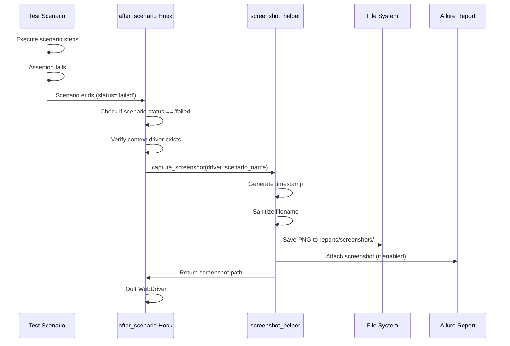

# Screenshot Management Guide

## Overview

This guide covers the comprehensive screenshot capture functionality in the Testinium QA Python test automation framework. The framework provides both automatic screenshot capture on test failures and manual screenshot capabilities for debugging and documentation purposes.

**What You'll Learn:**
- How automatic screenshot capture works via Behave hooks
- Manual screenshot capture techniques
- Filename sanitization for cross-platform compatibility
- Screenshot storage configuration
- Allure report integration
- Browser console log capture
- Screenshot organization strategies
- Best practices for screenshot management

**When to Use Screenshots:**
- **Automatic:** Capture evidence when tests fail for debugging
- **Manual:** Document specific test steps or UI states
- **Diagnostics:** Combine with browser logs for comprehensive failure analysis

## Prerequisites

- Framework installed and configured (see [Installation Guide](../getting-started/installation.md))
- WebDriver initialized via DriverManager
- Understanding of Behave scenario lifecycle

## Automatic Screenshot Capture on Test Failure

The framework automatically captures screenshots when test scenarios fail, implemented in the `after_scenario` Behave hook.

### How Automatic Capture Works



### Implementation Details

The automatic capture is configured in `features/environment.py` in the `after_scenario` hook:

```python
def after_scenario(context: Context, scenario) -> None:
    """
    Per-scenario teardown hook with automatic screenshot capture.
    """
    # Check if scenario failed
    if scenario.status == 'failed':
        logger.warning("Scenario FAILED: %s", scenario.name)
        
        # Defensive check: Ensure driver exists
        if hasattr(context, 'driver') and context.driver is not None:
            logger.info("Capturing failure screenshot...")
            
            # Capture screenshot using helper function
            screenshot_path = capture_screenshot(
                driver=context.driver,
                scenario_name=scenario.name,
                attach_to_allure=True
            )
            
            if screenshot_path:
                logger.info("Screenshot saved: %s", screenshot_path)
```

**Source:** `features/environment.py:280-410`

### Configuration

Enable or disable automatic screenshot capture in `config/config.yaml`:

```yaml
reporting:
  # Enable automatic screenshot capture on test failure
  screenshot_on_failure: true
  
  # Screenshot storage directory
  screenshot_directory: reports/screenshots/
```

**Source:** `config/config.yaml:117-139`

**Important:** Even when `screenshot_on_failure` is disabled in configuration, the `after_scenario` hook still attempts screenshot capture for failed scenarios. This ensures critical failure evidence is never lost.

## Manual Screenshot Capture

For manual screenshot capture during test execution, use the `capture_screenshot()` function from `utilities.screenshot_helper`.

### Basic Manual Capture

```python
from behave import given, when, then
from utilities.screenshot_helper import capture_screenshot

@when('User submits the registration form')
def submit_registration_form(context):
    # Perform action
    context.driver.find_element(By.ID, "submit-btn").click()
    
    # Manually capture screenshot for documentation
    screenshot_path = capture_screenshot(
        driver=context.driver,
        scenario_name="Registration Form Submitted",
        attach_to_allure=True
    )
    
    if screenshot_path:
        context.logger.info(f"Form submission screenshot: {screenshot_path}")
```

### Convenience Function for Quick Capture

For simpler use cases without Allure attachment:

```python
from utilities.screenshot_helper import take_screenshot

@then('Dashboard should display user information')
def verify_dashboard(context):
    # Verify dashboard elements
    assert context.driver.find_element(By.ID, "user-profile").is_displayed()
    
    # Quick screenshot without Allure
    screenshot_path = take_screenshot(context.driver, "Dashboard Verification")
    print(f"Screenshot saved to: {screenshot_path}")
```

**Source:** `utilities/screenshot_helper.py:324-336`

### Complete capture_screenshot() API

```python
def capture_screenshot(
    driver: WebDriver,
    scenario_name: str,
    attach_to_allure: bool = True
) -> Optional[str]:
    """
    Capture screenshot from WebDriver and save to filesystem.
    
    Args:
        driver: Selenium WebDriver instance for screenshot capture
        scenario_name: Name for the screenshot (used in filename)
        attach_to_allure: Whether to attach to Allure report (default: True)
    
    Returns:
        Absolute path to saved screenshot file on success, None on failure
    
    Example:
        >>> screenshot_path = capture_screenshot(driver, "Login Test Failed")
        >>> print(screenshot_path)
        '/absolute/path/reports/screenshots/Login_Test_Failed_20240115_143022.png'
    """
```

**Source:** `utilities/screenshot_helper.py:97-137`

## Filename Sanitization

All screenshot filenames are automatically sanitized for cross-platform compatibility, removing invalid filesystem characters and spaces.

### Sanitization Rules

The `sanitize_filename()` function removes or replaces characters that are invalid on Windows, Linux, or macOS:

**Removed Characters:**
- Forward slashes (`/`)
- Backslashes (`\`)
- Colons (`:`)
- Asterisks (`*`)
- Question marks (`?`)
- Double quotes (`"`)
- Less than (`<`)
- Greater than (`>`)
- Pipe (`|`)

**Transformations:**
- Spaces → Underscores (`_`)
- Leading/trailing underscores and dots → Removed
- Empty names → Default to `"screenshot"`
- Long names → Truncated to 200 characters

### Sanitization Examples

```python
from utilities.screenshot_helper import sanitize_filename

# Scenario names with special characters
sanitize_filename("User login: admin@example.com")
# Result: 'User_login_admin_example_com'

sanitize_filename("Order #12345 - Status: Pending")
# Result: 'Order__12345_-_Status_Pending'

sanitize_filename("   Complex/Path\\With:Invalid*Chars?   ")
# Result: 'Complex_Path_With_Invalid_Chars'

# Empty after sanitization
sanitize_filename("///:::***")
# Result: 'screenshot'  # Safe default
```

**Source:** `utilities/screenshot_helper.py:46-94`

## Timestamp Generation

Every screenshot filename includes an automatic timestamp for uniqueness and chronological sorting.

### Timestamp Format

Timestamps use the format: `YYYYMMDD_HHMMSS`

**Example:** `20240115_143022` represents January 15, 2024 at 2:30:22 PM

### Complete Filename Pattern

```
{sanitized_scenario_name}_{timestamp}.png
```

**Examples:**
- `Login_Test_Failed_20240115_143022.png`
- `Dashboard_Verification_20240115_150530.png`
- `User_Registration_Success_20240116_093045.png`

**Implementation:**

```python
from datetime import datetime

# Generate timestamp for unique filename
timestamp = datetime.now().strftime('%Y%m%d_%H%M%S')

# Construct filename
screenshot_filename = f"{sanitized_name}_{timestamp}.png"
```

**Source:** `utilities/screenshot_helper.py:143-150`

## Screenshot Storage Configuration

Screenshots are stored in a configurable directory with automatic directory creation.

### Default Storage Location

```
project_root/
└── reports/
    └── screenshots/
        ├── Login_Test_Failed_20240115_143022.png
        ├── Dashboard_Verification_20240115_150530.png
        └── User_Registration_Success_20240116_093045.png
```

### Configuration Options

Configure screenshot directory in `config/config.yaml`:

```yaml
reporting:
  # Screenshot storage directory for failure diagnostics
  # Screenshots named with timestamp and scenario name
  screenshot_directory: reports/screenshots/
  
  # Alternative configurations:
  # screenshot_directory: screenshots/  # Relative to project root
  # screenshot_directory: /tmp/test-screenshots/  # Absolute path
  # screenshot_directory: reports/${DATE}/screenshots/  # With variables
```

**Source:** `config/config.yaml:136-139`

### Directory Creation

The screenshot directory is automatically created if it doesn't exist:

```python
from pathlib import Path

# Define screenshot directory
screenshot_dir = Path("reports") / "screenshots"

# Ensure directory exists (create if necessary)
screenshot_dir.mkdir(parents=True, exist_ok=True)
```

**Source:** `utilities/screenshot_helper.py:152-157`

**Note:** `parents=True` creates intermediate directories, `exist_ok=True` prevents errors if directory already exists.

## Allure Report Integration

Screenshots can be automatically attached to Allure test reports for enhanced visualization.

### Enabling Allure Attachment

Allure integration requires the `allure-behave` package:

```bash
pip install allure-behave
```

When available, screenshots are automatically attached to Allure reports:

```python
from allure_commons.types import AttachmentType
import allure

# Attach screenshot to Allure report
screenshot_bytes = driver.get_screenshot_as_png()
allure.attach(
    screenshot_bytes,
    name=sanitized_name,
    attachment_type=AttachmentType.PNG
)
```

**Source:** `utilities/screenshot_helper.py:169-177`

### Controlling Allure Attachment

Control Allure attachment behavior with the `attach_to_allure` parameter:

```python
# With Allure attachment (default)
capture_screenshot(driver, "Login Failed", attach_to_allure=True)

# Without Allure attachment (filesystem only)
capture_screenshot(driver, "Debug Screenshot", attach_to_allure=False)
```

### Viewing Screenshots in Allure Reports

After generating Allure reports:

```bash
# Generate Allure report
allure generate reports/allure-results -o reports/allure-report --clean

# View Allure report
allure serve reports/allure-results
```

Screenshots appear in the Allure report under the failed test scenario with the sanitized scenario name.

## Browser Console Log Capture

Complement screenshots with browser console logs for comprehensive failure diagnostics.

### Capturing Browser Logs

```python
from utilities.screenshot_helper import capture_browser_logs

@then('Application should load without errors')
def verify_no_errors(context):
    # Check for JavaScript errors in browser console
    logs = capture_browser_logs(
        driver=context.driver,
        scenario_name="Application Load Verification",
        log_types=['browser']
    )
    
    if logs and logs.get('browser'):
        # Check for severe errors
        severe_errors = [log for log in logs['browser'] if 'SEVERE' in log]
        
        if severe_errors:
            for error in severe_errors:
                context.logger.error(f"Browser Error: {error}")
            
            # Optionally fail the test
            assert False, f"Found {len(severe_errors)} severe browser errors"
```

### Available Log Types

```python
# Capture multiple log types
logs = capture_browser_logs(
    driver=context.driver,
    scenario_name="Comprehensive Diagnostics",
    log_types=['browser', 'driver', 'performance']
)

# Access captured logs
browser_logs = logs.get('browser', [])
driver_logs = logs.get('driver', [])
performance_logs = logs.get('performance', [])
```

**Available Log Types:**
- `'browser'` - Browser console logs (JavaScript errors, warnings)
- `'driver'` - WebDriver command logs
- `'client'` - Client-side logs
- `'server'` - Server-side logs
- `'performance'` - Performance timing logs

**Source:** `utilities/screenshot_helper.py:194-321`

### Log File Format

Browser logs are saved alongside screenshots:

```
reports/screenshots/
├── Login_Test_Failed_20240115_143022.png
├── Login_Test_Failed_20240115_143022_logs.txt
└── Dashboard_Verification_20240115_150530.png
```

**Log File Contents:**

```
Browser Logs for Scenario: Login Test Failed
Captured at: 2024-01-15T14:30:22.123456
================================================================================

[BROWSER LOGS]
--------------------------------------------------------------------------------
[SEVERE] Uncaught TypeError: Cannot read property 'value' of null
[WARNING] Resource interpreted as Stylesheet but transferred with MIME type text/plain
[INFO] Page loaded successfully
```

**Source:** `utilities/screenshot_helper.py:281-293`

## Screenshot Organization Strategies

Organize screenshots effectively for different testing needs.

### Strategy 1: By Feature (Default)

Default organization with all screenshots in one directory:

```
reports/screenshots/
├── Login_Valid_Credentials_20240115_143022.png
├── Login_Invalid_Credentials_20240115_143045.png
├── CRM_Create_Contact_Failed_20240115_150530.png
├── Employee_Add_New_Employee_20240116_093045.png
└── Inventory_Stock_Update_20240116_101520.png
```

**Advantages:**
- Simple configuration
- Easy to find recent screenshots
- Works with default framework setup

**Disadvantages:**
- Can become cluttered with many tests
- Harder to organize by test run or feature area

### Strategy 2: By Date

Organize screenshots by date for historical tracking:

```python
from datetime import datetime
from pathlib import Path

def capture_screenshot_by_date(driver, scenario_name):
    """Capture screenshot organized by date."""
    date_str = datetime.now().strftime('%Y-%m-%d')
    screenshot_dir = Path("reports") / "screenshots" / date_str
    screenshot_dir.mkdir(parents=True, exist_ok=True)
    
    # Custom capture with date directory
    timestamp = datetime.now().strftime('%H%M%S')
    filename = f"{sanitize_filename(scenario_name)}_{timestamp}.png"
    filepath = screenshot_dir / filename
    
    driver.save_screenshot(str(filepath))
    return str(filepath.resolve())
```

**Directory Structure:**

```
reports/screenshots/
├── 2024-01-15/
│   ├── Login_Failed_143022.png
│   └── CRM_Error_150530.png
├── 2024-01-16/
│   ├── Employee_Failed_093045.png
│   └── Inventory_Error_101520.png
└── 2024-01-17/
    └── Dashboard_Issue_084030.png
```

### Strategy 3: By Test Result

Separate passed and failed test screenshots:

```python
def capture_screenshot_by_status(driver, scenario_name, scenario_status):
    """Organize screenshots by test result."""
    status_dir = "failed" if scenario_status == "failed" else "passed"
    screenshot_dir = Path("reports") / "screenshots" / status_dir
    screenshot_dir.mkdir(parents=True, exist_ok=True)
    
    # Continue with standard capture
    return capture_screenshot(driver, scenario_name)
```

**Directory Structure:**

```
reports/screenshots/
├── failed/
│   ├── Login_Invalid_Credentials_20240115_143022.png
│   ├── CRM_Create_Contact_20240115_150530.png
│   └── Employee_Delete_Failed_20240116_093045.png
└── passed/
    ├── Login_Valid_Credentials_20240115_143030.png
    ├── Dashboard_Load_Success_20240115_145020.png
    └── Inventory_Update_Success_20240116_101530.png
```

### Strategy 4: By Feature Area

Organize by feature module for large test suites:

```python
def capture_screenshot_by_feature(driver, scenario_name, feature_name):
    """Organize screenshots by feature area."""
    feature_slug = feature_name.lower().replace(" ", "_")
    screenshot_dir = Path("reports") / "screenshots" / feature_slug
    screenshot_dir.mkdir(parents=True, exist_ok=True)
    
    # Capture with feature directory
    return capture_screenshot(driver, scenario_name)
```

**Directory Structure:**

```
reports/screenshots/
├── authentication/
│   ├── Login_Failed_20240115_143022.png
│   └── Logout_Success_20240115_145030.png
├── crm/
│   ├── Create_Contact_Failed_20240115_150530.png
│   └── Edit_Contact_Success_20240115_151020.png
├── employee_management/
│   ├── Add_Employee_Failed_20240116_093045.png
│   └── Delete_Employee_Success_20240116_093530.png
└── inventory/
    ├── Stock_Update_Failed_20240116_101520.png
    └── Product_Search_Success_20240116_102015.png
```

## Complete Code Examples

### Example 1: Automatic Capture in after_scenario Hook

Complete implementation from `features/environment.py`:

```python
from behave.runner import Context
from utilities.driver_manager import DriverManager
from utilities.screenshot_helper import capture_screenshot
import logging

logger = logging.getLogger(__name__)

def after_scenario(context: Context, scenario) -> None:
    """
    Per-scenario teardown with automatic screenshot capture on failure.
    """
    logger.info("Scenario END: %s (Status: %s)", scenario.name, scenario.status)
    
    # Capture screenshot if scenario failed
    if scenario.status == 'failed':
        logger.warning("Scenario FAILED: %s", scenario.name)
        
        # Check driver exists before capture
        if hasattr(context, 'driver') and context.driver is not None:
            logger.info("Capturing failure screenshot...")
            
            try:
                # Capture screenshot with Allure attachment
                screenshot_path = capture_screenshot(
                    driver=context.driver,
                    scenario_name=scenario.name,
                    attach_to_allure=True
                )
                
                if screenshot_path:
                    logger.info("Screenshot saved: %s", screenshot_path)
                    
                    # Also attach to Behave report
                    screenshot_bytes = context.driver.get_screenshot_as_png()
                    scenario.attach(
                        data=screenshot_bytes,
                        mime_type='image/png',
                        name=scenario.name
                    )
                    logger.debug("Screenshot attached to Behave report")
                else:
                    logger.error("Screenshot capture failed")
                    
            except Exception as screenshot_error:
                logger.error(f"Screenshot error: {screenshot_error}", exc_info=True)
        else:
            logger.warning("Cannot capture screenshot: WebDriver not initialized")
    
    # Cleanup WebDriver
    if hasattr(context, 'driver') and context.driver is not None:
        DriverManager.quit_driver()
        context.driver = None
```

**Source:** `features/environment.py:280-458`

### Example 2: Manual Capture in Step Definition

```python
from behave import given, when, then
from selenium.webdriver.common.by import By
from utilities.screenshot_helper import capture_screenshot

@given('User is on the product page')
def navigate_to_product_page(context):
    """Navigate to product page and capture screenshot."""
    # Navigate
    context.driver.get("https://example.com/products")
    
    # Wait for page load
    context.page.wait_for_element((By.ID, "product-list"))
    
    # Manual screenshot for documentation
    screenshot_path = capture_screenshot(
        driver=context.driver,
        scenario_name="Product Page Loaded",
        attach_to_allure=True
    )
    context.logger.info(f"Product page screenshot: {screenshot_path}")

@when('User searches for "{product_name}"')
def search_product(context, product_name):
    """Search for product and capture results."""
    # Perform search
    search_box = context.driver.find_element(By.ID, "search")
    search_box.clear()
    search_box.send_keys(product_name)
    search_box.submit()
    
    # Wait for results
    context.page.wait_for_element((By.CLASS_NAME, "search-results"))
    
    # Capture search results for debugging
    capture_screenshot(
        driver=context.driver,
        scenario_name=f"Search Results for {product_name}",
        attach_to_allure=False  # Just filesystem storage
    )

@then('Product "{product_name}" should be displayed')
def verify_product_displayed(context, product_name):
    """Verify product is displayed in results."""
    products = context.driver.find_elements(By.CLASS_NAME, "product-card")
    
    product_found = any(
        product_name.lower() in product.text.lower()
        for product in products
    )
    
    if not product_found:
        # Capture screenshot before assertion fails
        capture_screenshot(
            driver=context.driver,
            scenario_name=f"Product Not Found: {product_name}",
            attach_to_allure=True
        )
    
    assert product_found, f"Product '{product_name}' not found in search results"
```

### Example 3: Combining Screenshots with Browser Logs

```python
from behave import then
from utilities.screenshot_helper import capture_screenshot, capture_browser_logs

@then('Application should be error-free')
def verify_no_errors(context):
    """Comprehensive error check with screenshot and logs."""
    
    # Capture screenshot of current state
    screenshot_path = capture_screenshot(
        driver=context.driver,
        scenario_name="Application State Check",
        attach_to_allure=True
    )
    
    # Capture browser console logs
    logs = capture_browser_logs(
        driver=context.driver,
        scenario_name="Application State Check",
        log_types=['browser']
    )
    
    # Analyze logs for errors
    if logs and logs.get('browser'):
        browser_logs = logs['browser']
        
        # Filter severe errors
        severe_errors = [
            log for log in browser_logs 
            if 'SEVERE' in log or 'ERROR' in log
        ]
        
        if severe_errors:
            context.logger.error(f"Found {len(severe_errors)} severe errors:")
            for error in severe_errors:
                context.logger.error(f"  - {error}")
            
            # Fail test with detailed message
            assert False, (
                f"Application has {len(severe_errors)} severe errors. "
                f"Screenshot: {screenshot_path}"
            )
        else:
            context.logger.info("No severe errors found in browser console")
    else:
        context.logger.info("No browser logs captured")
```

## Troubleshooting

### Issue: Screenshot Not Captured

**Symptoms:** No screenshot file created, no error logged

**Possible Causes:**
1. `screenshot_on_failure` set to `false` (but hook still tries)
2. WebDriver is `None` (initialization failed)
3. Directory permissions issue
4. Disk space full

**Solutions:**

```python
# Check driver exists
if hasattr(context, 'driver') and context.driver is not None:
    print(f"Driver exists: {context.driver}")
else:
    print("Driver is None - cannot capture screenshot")

# Check directory permissions
from pathlib import Path
screenshot_dir = Path("reports/screenshots")
if screenshot_dir.exists():
    print(f"Directory exists: {screenshot_dir.resolve()}")
    print(f"Writable: {os.access(screenshot_dir, os.W_OK)}")
else:
    print(f"Directory does not exist: {screenshot_dir}")
    screenshot_dir.mkdir(parents=True, exist_ok=True)

# Check disk space (Linux/macOS)
import shutil
total, used, free = shutil.disk_usage("/")
print(f"Free disk space: {free // (2**30)} GB")
```

### Issue: Filename Too Long Error

**Symptoms:** `OSError: [Errno 36] File name too long`

**Cause:** Scenario names exceeding filesystem limits (typically 255 characters)

**Solution:**

The `sanitize_filename()` function automatically truncates to 200 characters (leaving room for timestamp and extension):

```python
# Manual truncation if needed
def truncate_scenario_name(name, max_length=180):
    """Truncate long scenario names."""
    if len(name) > max_length:
        return name[:max_length] + "..."
    return name

# Use truncated name
truncated_name = truncate_scenario_name(scenario.name)
capture_screenshot(driver, truncated_name)
```

**Source:** `utilities/screenshot_helper.py:89-91`

### Issue: Permission Denied Error

**Symptoms:** `PermissionError: [Errno 13] Permission denied`

**Cause:** No write permissions for screenshot directory

**Solutions:**

```bash
# Check directory permissions
ls -la reports/screenshots/

# Fix permissions (Linux/macOS)
chmod -R 755 reports/screenshots/

# Fix ownership (Linux/macOS)
sudo chown -R $USER:$USER reports/screenshots/
```

**Windows:**
- Right-click `reports\screenshots` folder
- Properties → Security → Edit
- Grant "Full control" to your user account

### Issue: Allure Attachment Fails

**Symptoms:** Screenshot saved to filesystem but not in Allure report

**Possible Causes:**
1. `allure-behave` not installed
2. Allure results directory not configured
3. `attach_to_allure=False` in function call

**Solutions:**

```bash
# Install allure-behave
pip install allure-behave

# Verify installation
python -c "import allure; print('Allure available')"

# Check behave.ini configuration
cat behave.ini | grep allure
# Should show: userdata.allure_results_dir=reports/allure-results
```

**In code:**

```python
# Check if Allure is available
try:
    import allure
    print("Allure integration: AVAILABLE")
except ImportError:
    print("Allure integration: NOT AVAILABLE")
    print("Install with: pip install allure-behave")

# Ensure attach_to_allure is True
capture_screenshot(
    driver=context.driver,
    scenario_name=scenario.name,
    attach_to_allure=True  # Explicitly enable
)
```

### Issue: Screenshot Shows Blank Page

**Symptoms:** Screenshot captured but shows blank/white page

**Possible Causes:**
1. Page not fully loaded before screenshot
2. Screenshot taken during navigation
3. WebDriver timing issue

**Solutions:**

```python
from selenium.webdriver.support.ui import WebDriverWait
from selenium.webdriver.support import expected_conditions as EC
from selenium.webdriver.common.by import By

# Wait for page to fully load
WebDriverWait(context.driver, 10).until(
    EC.presence_of_element_located((By.TAG_NAME, "body"))
)

# Wait for specific content
WebDriverWait(context.driver, 10).until(
    EC.visibility_of_element_located((By.ID, "main-content"))
)

# Add small delay for dynamic content
import time
time.sleep(0.5)

# Then capture screenshot
capture_screenshot(context.driver, "Page Fully Loaded")
```

### Issue: Screenshots Not Attached to Behave Report

**Symptoms:** Screenshots in filesystem but not in HTML report

**Cause:** Missing `scenario.attach()` call in `after_scenario`

**Solution:**

Ensure both filesystem save and Behave attachment:

```python
# In after_scenario hook
if scenario.status == 'failed':
    # Capture to filesystem
    screenshot_path = capture_screenshot(
        driver=context.driver,
        scenario_name=scenario.name,
        attach_to_allure=True
    )
    
    # ALSO attach to Behave report
    if screenshot_path:
        screenshot_bytes = context.driver.get_screenshot_as_png()
        scenario.attach(
            data=screenshot_bytes,
            mime_type='image/png',
            name=scenario.name
        )
```

**Source:** `features/environment.py:375-387`

## Best Practices

### 1. Use Descriptive Scenario Names

Scenario names become screenshot filenames - make them descriptive:

```gherkin
# Good - Descriptive scenario names
Scenario: User login with valid credentials
Scenario: Create contact with required fields only
Scenario: Update inventory stock for existing product

# Avoid - Vague scenario names
Scenario: Test 1
Scenario: Check login
Scenario: Verify page
```

### 2. Configure Storage Location Appropriately

Choose storage location based on your environment:

```yaml
# Local development - relative path
reporting:
  screenshot_directory: reports/screenshots/

# CI/CD environment - preserve artifacts
reporting:
  screenshot_directory: /tmp/test-artifacts/screenshots/

# Shared network drive - team access
reporting:
  screenshot_directory: //shared/test-results/screenshots/
```

### 3. Clean Up Old Screenshots Periodically

Prevent disk space issues with cleanup strategy:

```python
from pathlib import Path
from datetime import datetime, timedelta
import os

def cleanup_old_screenshots(days_to_keep=7):
    """Remove screenshots older than specified days."""
    screenshot_dir = Path("reports/screenshots")
    cutoff_date = datetime.now() - timedelta(days=days_to_keep)
    
    if not screenshot_dir.exists():
        return
    
    deleted_count = 0
    for screenshot in screenshot_dir.glob("*.png"):
        # Get file modification time
        file_time = datetime.fromtimestamp(screenshot.stat().st_mtime)
        
        if file_time < cutoff_date:
            screenshot.unlink()
            deleted_count += 1
            print(f"Deleted old screenshot: {screenshot.name}")
    
    print(f"Cleanup complete: {deleted_count} screenshots removed")

# Run before test suite
cleanup_old_screenshots(days_to_keep=7)
```

### 4. Capture Screenshots at Strategic Moments

Don't over-capture, but don't under-capture:

```python
# Good - Strategic captures
@when('User completes checkout process')
def complete_checkout(context):
    # ... checkout steps ...
    
    # Capture after critical action
    capture_screenshot(context.driver, "Checkout Completed")

# Good - Before complex verification
@then('Order confirmation should display correct details')
def verify_order_confirmation(context):
    # Capture before verification for debugging
    capture_screenshot(context.driver, "Order Confirmation Page")
    
    # ... perform verifications ...

# Avoid - Excessive captures
@when('User clicks button')  # Too granular
def click_button(context):
    element.click()
    capture_screenshot(context.driver, "Button Clicked")  # Unnecessary
```

### 5. Combine Screenshots with Browser Logs

For comprehensive diagnostics:

```python
@then('Application should function without errors')
def verify_application_health(context):
    # Capture visual state
    screenshot_path = capture_screenshot(
        driver=context.driver,
        scenario_name="Application Health Check"
    )
    
    # Capture console logs
    logs = capture_browser_logs(
        driver=context.driver,
        scenario_name="Application Health Check"
    )
    
    # Analyze together
    if logs and logs.get('browser'):
        errors = [log for log in logs['browser'] if 'SEVERE' in log]
        if errors:
            context.logger.error(f"Screenshot: {screenshot_path}")
            context.logger.error(f"Browser errors: {errors}")
            assert False, "Application has errors"
```

### 6. Use Allure for Enhanced Visualization

Enable Allure for better screenshot organization:

```bash
# Run tests with Allure
behave --format allure_behave.formatter:AllureFormatter \
       -o reports/allure-results

# Generate and view report
allure serve reports/allure-results
```

Allure provides:
- Screenshots organized by test case
- Timeline view of test execution
- Screenshot thumbnails in test report
- Drill-down into failure details

### 7. Document Screenshot Locations in Test Reports

Help team members find screenshots:

```python
@then('Test should complete successfully')
def verify_test_complete(context):
    # Capture final state
    screenshot_path = capture_screenshot(
        driver=context.driver,
        scenario_name="Test Complete"
    )
    
    # Log location clearly
    context.logger.info("=" * 80)
    context.logger.info("TEST COMPLETE")
    context.logger.info(f"Screenshot saved to: {screenshot_path}")
    context.logger.info(f"View in Allure: allure serve reports/allure-results")
    context.logger.info("=" * 80)
```

### 8. Handle Screenshot Failures Gracefully

Never let screenshot failures break tests:

```python
def safe_capture_screenshot(driver, name):
    """Capture screenshot with comprehensive error handling."""
    try:
        return capture_screenshot(driver, name)
    except Exception as e:
        logger.warning(f"Screenshot capture failed: {e}")
        return None

# Use in critical paths
screenshot_path = safe_capture_screenshot(context.driver, "Critical Step")
if screenshot_path:
    logger.info(f"Screenshot: {screenshot_path}")
else:
    logger.warning("Continuing without screenshot")
```

## See Also

- **[Wait Strategies Guide](wait-strategies.md)** - Ensure pages load before screenshots
- **[Parallel Execution Guide](parallel-execution.md)** - Thread-safe screenshot capture
- **[Configuration Management Guide](configuration-management.md)** - Screenshot configuration
- **API Reference:**
  - [screenshot_helper API](../api-reference/utilities/screenshot-helper.md)
  - [environment.py Hooks](../api-reference/features/environment.md)
- **[Troubleshooting Guide](../troubleshooting/common-errors.md)** - General debugging

---

**Document Information:**
- **Created:** Based on framework migration from Java Selenium + Cucumber
- **Source Files:** `utilities/screenshot_helper.py`, `features/environment.py`, `config/config.yaml`
- **Last Updated:** Documentation reflects current implementation
