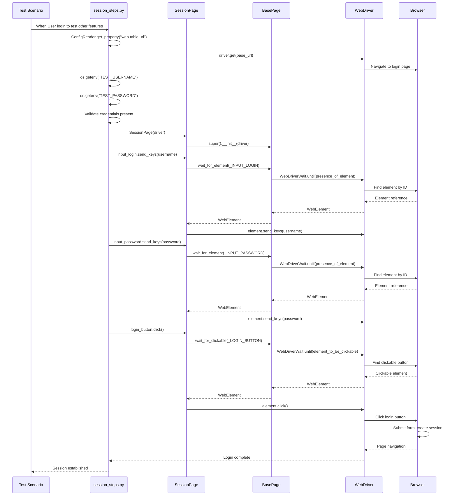
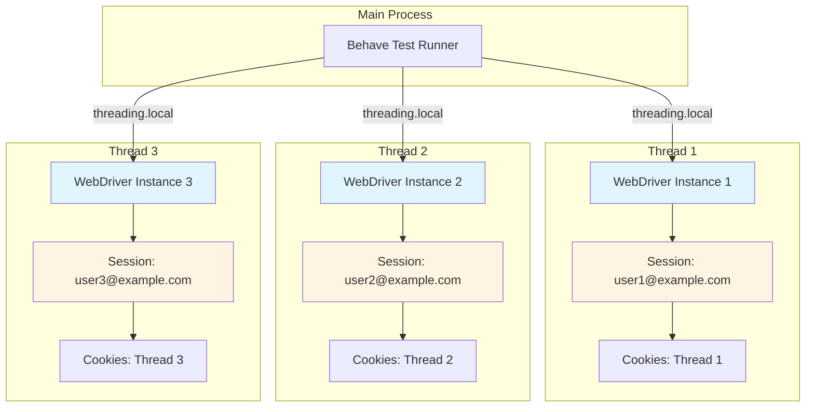

# Session Management Testing Guide

## Overview

This guide covers testing session management functionality in the Testinium test automation framework, focusing on authenticated session establishment, session persistence, concurrent session handling, and session security best practices.

**What You'll Learn:**
- How to establish authenticated sessions for testing
- Session persistence across page navigation and browser interactions
- Testing concurrent sessions with multiple WebDriver instances
- Session security patterns using environment variables
- Thread-safe session management for parallel test execution
- Session timeout and cleanup strategies
- Multi-tab and multi-window session behavior

**When to Use This Guide:**
- Setting up precondition authentication for feature tests
- Testing session-dependent workflows (CRM, sales, employee management)
- Implementing parallel test execution with isolated sessions
- Verifying session security and credential management
- Testing multi-user or multi-session scenarios

## Prerequisites

Before following this guide, ensure you have:

1. **Framework Setup:**
   - Python 3.9+ installed and configured
   - Virtual environment activated
   - All dependencies installed from `requirements.txt`
   - WebDriver configured (Chrome, Firefox, or Edge)

2. **Configuration:**
   - `config/config.yaml` contains `web.table.url` key with application URL
   - `.env` file created from `.env.example`
   - Test credentials configured in environment variables

3. **Environment Variables:**
   ```bash
   # Required in .env file (not committed to repository)
   TEST_USERNAME=salesmanager1@testinium.com
   TEST_PASSWORD=UserUser
   WEB_TABLE_URL=https://app.testinium.com
   ```

4. **Knowledge Prerequisites:**
   - Basic understanding of Selenium WebDriver sessions
   - Familiarity with Behave BDD framework
   - Understanding of page object model pattern
   - Basic knowledge of browser cookies and session storage

## Session Establishment Testing

### Understanding WebDriver Sessions

A WebDriver session represents a browser instance lifecycle from initialization to cleanup. Each session maintains:
- Browser cookies (authentication tokens, session identifiers)
- Session storage and local storage
- Browser window state and navigation history
- Isolated execution context for JavaScript

### Basic Login Workflow

The session module provides precondition login functionality to establish authenticated sessions for testing other features.

**Gherkin Scenario:**

```gherkin
Feature: Session Management
  
  Scenario: Users log in to access additional features
    When User login to test other features
    Then User should see the dashboard
```

**Source:** `features/Session.feature`

### Step Definition Implementation

The login step definition demonstrates secure credential handling and thread-safe session management:

```python
@when("User login to test other features")
def user_login_to_test_other_features(context: Context) -> None:
    """
    Perform precondition login to establish authenticated session.
    
    Workflow:
        1. Retrieve application URL from configuration
        2. Navigate to login page
        3. Retrieve credentials from environment variables
        4. Enter username and password
        5. Click login button
        6. Wait for page navigation
    """
    # Get application URL from config
    config_reader = ConfigReader()
    base_url = config_reader.get_property("web.table.url")
    
    # Navigate to login page
    context.driver.get(base_url)
    
    # Retrieve credentials from environment (SECURITY BEST PRACTICE)
    username = os.getenv("TEST_USERNAME")
    password = os.getenv("TEST_PASSWORD")
    
    # Validate credentials are present
    if not username or not password:
        raise EnvironmentError(
            "TEST_USERNAME and TEST_PASSWORD must be set in environment"
        )
    
    # Initialize page object
    session_page = SessionPage(context.driver)
    
    # Perform login with automatic waits
    session_page.input_login.send_keys(username)
    session_page.input_password.send_keys(password)
    session_page.login_button.click()
```

**Source:** `features/steps/session_steps.py:78-269`

### Page Object Implementation

The SessionPage provides property-based element access with automatic explicit waits:

```python
class SessionPage(BasePage):
    """Session page object for login form interactions."""
    
    # Locator constants
    _INPUT_LOGIN = (By.ID, "login")
    _INPUT_PASSWORD = (By.ID, "password")
    _LOGIN_BUTTON = (By.XPATH, "//button[.='Log in']")
    
    @property
    def input_login(self) -> WebElement:
        """Username input field with automatic presence wait."""
        return self.wait_for_element(self._INPUT_LOGIN)
    
    @property
    def input_password(self) -> WebElement:
        """Password input field with automatic presence wait."""
        return self.wait_for_element(self._INPUT_PASSWORD)
    
    @property
    def login_button(self) -> WebElement:
        """Login button with automatic clickable wait."""
        return self.wait_for_clickable(self._LOGIN_BUTTON)
```

**Source:** `pages/session_page.py:60-265`

### Session Establishment Sequence Diagram



## Session Persistence Testing

### Browser Cookie Management

WebDriver sessions persist authentication through browser cookies. Understanding cookie lifecycle is essential for session testing:

```python
# Example: Inspect session cookies after login
from selenium import webdriver

driver = webdriver.Chrome()
driver.get("https://app.testinium.com")

# Perform login
session_page = SessionPage(driver)
session_page.input_login.send_keys(os.getenv("TEST_USERNAME"))
session_page.input_password.send_keys(os.getenv("TEST_PASSWORD"))
session_page.login_button.click()

# Inspect session cookies
cookies = driver.get_cookies()
for cookie in cookies:
    if 'session' in cookie['name'].lower():
        print(f"Session cookie: {cookie['name']}")
        print(f"  Domain: {cookie['domain']}")
        print(f"  Secure: {cookie.get('secure', False)}")
        print(f"  HttpOnly: {cookie.get('httpOnly', False)}")
        print(f"  Expires: {cookie.get('expiry', 'Session')}")
```

### Session Persistence Across Page Navigation

Once authenticated, the session persists across page navigation within the same WebDriver instance:

```gherkin
Scenario: Session persists across page navigation
  Given User login to test other features
  When User navigates to CRM module
  And User navigates to Sales module
  And User navigates to Employee module
  Then User should remain authenticated on all pages
```

**Implementation Pattern:**

```python
# Session established once
@given("User login to test other features")
def establish_session(context):
    # Login once - session persists via cookies
    session_page = SessionPage(context.driver)
    # ... perform login ...

# Subsequent navigation maintains session
@when("User navigates to {module} module")
def navigate_to_module(context, module):
    # No re-authentication needed
    # Cookies automatically sent with requests
    context.driver.get(f"{base_url}/{module.lower()}")
```

### Session Cleanup

Proper session cleanup prevents resource leaks and ensures test isolation:

```python
# In features/environment.py
def after_scenario(context, scenario):
    """Clean up WebDriver session after each scenario."""
    if hasattr(context, 'driver'):
        # Delete all cookies (clear session)
        context.driver.delete_all_cookies()
        
        # Quit driver (closes browser, ends session)
        DriverManager.quit_driver()
```

**Source Pattern:** `features/environment.py` (Behave hooks)

## Concurrent Session Management

### Multiple WebDriver Instances

Testing concurrent sessions requires multiple WebDriver instances, each maintaining isolated sessions:

```python
# Example: Test concurrent user sessions
from utilities.driver_manager import DriverManager
from pages.session_page import SessionPage

# User 1 session
driver1 = DriverManager.get_driver()  # Uses threading.local()
driver1.get("https://app.testinium.com")
session_page1 = SessionPage(driver1)
session_page1.input_login.send_keys("user1@example.com")
session_page1.input_password.send_keys("password1")
session_page1.login_button.click()

# User 2 session (separate WebDriver instance required)
# Note: DriverManager.get_driver() returns thread-local instance
# For concurrent sessions in same thread, need separate driver creation
from selenium import webdriver
driver2 = webdriver.Chrome()
driver2.get("https://app.testinium.com")
session_page2 = SessionPage(driver2)
session_page2.input_login.send_keys("user2@example.com")
session_page2.input_password.send_keys("password2")
session_page2.login_button.click()

# Both sessions now active independently
# driver1 maintains user1 session
# driver2 maintains user2 session

# Cleanup both sessions
driver1.quit()
driver2.quit()
```

### Thread-Safe Session Management

The framework uses `threading.local()` to provide thread-safe session isolation for parallel test execution:

```python
# DriverManager implementation (thread-local storage)
class DriverManager:
    _drivers = threading.local()  # Each thread gets isolated storage
    
    @staticmethod
    def get_driver():
        """Returns thread-local WebDriver instance."""
        if not hasattr(DriverManager._drivers, 'instance'):
            DriverManager._drivers.instance = DriverManager._create_driver()
        return DriverManager._drivers.instance
```

**Benefits for Session Management:**
- Each parallel test thread has isolated WebDriver instance
- Sessions cannot interfere across threads
- Cookies and authentication isolated per thread
- Safe for parallel test execution with `behave --processes N`

### Parallel Execution Session Diagram



## Session Security Testing

### Secure Credential Management

**CRITICAL SECURITY PATTERN:** The framework uses environment variables for credentials, not configuration files.

**Anti-Pattern (Insecure - Java Implementation):**
```java
// DO NOT DO THIS - credentials in config files
String username = ConfigurationReader.getProperty("username");  // Hardcoded in file
String password = ConfigurationReader.getProperty("password");  // Committed to git
```

**Correct Pattern (Secure - Python Implementation):**
```python
# Credentials from environment variables (not committed)
username = os.getenv("TEST_USERNAME")  # From .env or CI/CD environment
password = os.getenv("TEST_PASSWORD")  # Never committed to repository

# Validation with informative errors
if not username or not password:
    raise EnvironmentError(
        "TEST_USERNAME and TEST_PASSWORD must be set. "
        "Add to .env file (local) or CI/CD environment configuration."
    )
```

**Source:** `features/steps/session_steps.py:197-223` (Security fix documentation)

### Environment-Specific Credentials

Different environments require different credentials:

```bash
# .env.local (local development)
TEST_USERNAME=developer@testinium.com
TEST_PASSWORD=DevPassword123

# .env.staging (staging environment)
TEST_USERNAME=staging_user@testinium.com
TEST_PASSWORD=StagingPass456

# .env.production (production - CI/CD only, never committed)
TEST_USERNAME=prod_tester@testinium.com
TEST_PASSWORD=<injected-by-ci-cd>
```

### Password Masking in Logs

Always mask passwords in logging output:

```python
# Correct: Password masked in logs
logger.info(
    "Retrieved credentials from environment: username=%s, password=***",
    username
)

# Incorrect: Password exposed in logs
logger.info(f"Username: {username}, Password: {password}")  # NEVER DO THIS
```

**Source:** `features/steps/session_steps.py:226-229`

### Session Token Security

Verify session cookies have secure attributes:

```python
# Check session cookie security attributes
def verify_session_security(driver):
    """Verify session cookies have secure flags."""
    cookies = driver.get_cookies()
    
    for cookie in cookies:
        if 'session' in cookie['name'].lower():
            # Session cookies should be:
            assert cookie.get('secure', False), \
                f"Cookie {cookie['name']} missing Secure flag"
            
            assert cookie.get('httpOnly', False), \
                f"Cookie {cookie['name']} missing HttpOnly flag"
            
            # Optional: Check SameSite attribute
            assert cookie.get('sameSite') in ['Strict', 'Lax'], \
                f"Cookie {cookie['name']} has weak SameSite policy"
```

## Multi-Tab Session Behavior

### Same-Session Multi-Tab Testing

WebDriver can manage multiple tabs/windows within the same session:

```python
# Open new tab while maintaining session
from selenium import webdriver

driver = DriverManager.get_driver()

# Establish session in first tab
session_page = SessionPage(driver)
# ... perform login ...

# Open new tab (shares cookies with first tab)
driver.execute_script("window.open('about:blank', '_blank');")

# Switch to new tab
driver.switch_to.window(driver.window_handles[1])

# Navigate to application (session cookies automatically sent)
driver.get("https://app.testinium.com/crm")

# Verify authenticated without re-login
# (cookies shared across tabs in same WebDriver session)

# Switch back to original tab
driver.switch_to.window(driver.window_handles[0])

# Close second tab
driver.switch_to.window(driver.window_handles[1])
driver.close()

# Switch back to main tab
driver.switch_to.window(driver.window_handles[0])
```

### Testing Scenario: Multi-Tab Workflow

```gherkin
Scenario: Session persists across multiple tabs
  Given User login to test other features
  When User opens CRM module in new tab
  And User opens Sales module in another new tab
  Then User should be authenticated in all tabs
  And Session cookies should be shared across tabs
```

**Implementation:**

```python
@when("User opens {module} in new tab")
def open_module_in_new_tab(context, module):
    """Open module in new browser tab, sharing session."""
    # Open new tab
    context.driver.execute_script("window.open('about:blank', '_blank');")
    
    # Switch to new tab
    context.driver.switch_to.window(context.driver.window_handles[-1])
    
    # Navigate to module (session cookies sent automatically)
    base_url = ConfigReader().get_property("web.table.url")
    context.driver.get(f"{base_url}/{module.lower()}")
    
    # Store tab handle for later reference
    if not hasattr(context, 'tabs'):
        context.tabs = {}
    context.tabs[module] = context.driver.current_window_handle
```

## Session Timeout Testing

### Simulating Session Timeout

While the current implementation doesn't explicitly test session timeouts, here's how to implement timeout scenarios:

```gherkin
Scenario: Session timeout after inactivity
  Given User login to test other features
  When User remains idle for 30 minutes
  Then User session should expire
  And User should be redirected to login page
```

**Implementation Approach:**

```python
import time
from selenium.common.exceptions import TimeoutException
from selenium.webdriver.support import expected_conditions as EC

@when("User remains idle for {duration} minutes")
def simulate_session_idle(context, duration):
    """
    Simulate session inactivity.
    
    Note: In real testing, use shorter timeouts or mock time.
    For demonstration, this shows the pattern.
    """
    # Option 1: Actually wait (not recommended for long durations)
    # time.sleep(int(duration) * 60)
    
    # Option 2: Manipulate session cookie expiry (if application supports)
    cookies = context.driver.get_cookies()
    for cookie in cookies:
        if 'session' in cookie['name'].lower():
            # Modify expiry to immediate past
            context.driver.delete_cookie(cookie['name'])
            # Session now expired
    
    # Option 3: Clear cookies to simulate timeout
    context.driver.delete_all_cookies()

@then("User session should expire")
def verify_session_expired(context):
    """Verify user session has expired."""
    # Attempt to access protected resource
    base_url = ConfigReader().get_property("web.table.url")
    context.driver.get(f"{base_url}/dashboard")
    
    # Should redirect to login page
    try:
        session_page = SessionPage(context.driver)
        assert session_page.input_login.is_displayed(), \
            "Expected redirect to login page after session expiry"
    except TimeoutException:
        raise AssertionError("Session did not expire as expected")
```

### Configurable Session Timeouts

Configure timeout behavior for different test scenarios:

```yaml
# config/config.yaml
session:
  timeout_minutes: 30
  idle_timeout_minutes: 15
  remember_me_days: 7

# Access in tests
timeout = ConfigReader().get_property("session.timeout_minutes")
```

## Wait Strategies for Session Management

### Waiting for Login Completion

After clicking login, wait for page transition:

```python
# Wait for login to complete by checking for dashboard element
from selenium.webdriver.support.ui import WebDriverWait
from selenium.webdriver.support import expected_conditions as EC

def wait_for_login_success(driver, timeout=10):
    """Wait for successful login by checking dashboard element."""
    dashboard_locator = (By.ID, "dashboard")
    
    try:
        WebDriverWait(driver, timeout).until(
            EC.presence_of_element_located(dashboard_locator)
        )
        return True
    except TimeoutException:
        # Login may have failed, check for error message
        error_locator = (By.CLASS_NAME, "alert-error")
        try:
            error_element = driver.find_element(*error_locator)
            raise AssertionError(f"Login failed: {error_element.text}")
        except NoSuchElementException:
            raise TimeoutException("Login did not complete within timeout")
```

### Waiting for Session Redirect

Handle redirects to login page when session expires:

```python
def wait_for_redirect_to_login(driver, timeout=5):
    """Wait for redirect to login page."""
    login_page_indicator = (By.ID, "login")
    
    WebDriverWait(driver, timeout).until(
        EC.presence_of_element_located(login_page_indicator)
    )
    
    # Verify URL contains login path
    assert '/login' in driver.current_url, \
        f"Expected login URL, got: {driver.current_url}"
```

### Session-Aware Wait Wrapper

Create a wrapper that handles session expiration:

```python
def session_aware_wait(driver, locator, timeout=10):
    """
    Wait for element with session expiration handling.
    
    If element not found and login page detected, raise specific error.
    """
    try:
        return WebDriverWait(driver, timeout).until(
            EC.presence_of_element_located(locator)
        )
    except TimeoutException:
        # Check if redirected to login (session expired)
        try:
            login_element = driver.find_element(By.ID, "login")
            raise SessionExpiredError(
                "Session expired - redirected to login page. "
                "Re-authenticate before continuing test."
            )
        except NoSuchElementException:
            # Not login page, different timeout issue
            raise TimeoutException(
                f"Element {locator} not found within {timeout}s"
            )

class SessionExpiredError(Exception):
    """Raised when session expires during test execution."""
    pass
```

## Troubleshooting

### Issue: TEST_USERNAME or TEST_PASSWORD Not Set

**Symptoms:**
```
EnvironmentError: TEST_USERNAME environment variable not set
```

**Cause:**
Environment variables not configured in `.env` file or CI/CD environment.

**Solution:**

1. Create `.env` file from template:
   ```bash
   cp .env.example .env
   ```

2. Add credentials to `.env`:
   ```bash
   TEST_USERNAME=salesmanager1@testinium.com
   TEST_PASSWORD=UserUser
   ```

3. Ensure `.env` loaded in test runner:
   ```python
   # features/environment.py
   from dotenv import load_dotenv
   
   def before_all(context):
       load_dotenv()  # Load .env file
   ```

4. For CI/CD, set environment variables in pipeline configuration:
   ```yaml
   # GitHub Actions example
   env:
     TEST_USERNAME: ${{ secrets.TEST_USERNAME }}
     TEST_PASSWORD: ${{ secrets.TEST_PASSWORD }}
   ```

### Issue: Session Not Persisting Across Steps

**Symptoms:**
- Login successful but subsequent steps show login page
- User repeatedly prompted for credentials
- Cookies not maintained between steps

**Cause:**
- WebDriver instance not shared in Behave context
- Driver quit prematurely
- Cookie domain mismatch

**Solution:**

1. Verify driver stored in context:
   ```python
   # features/environment.py
   def before_scenario(context, scenario):
       context.driver = DriverManager.get_driver()  # Store in context
   
   def after_scenario(context, scenario):
       # Don't quit until after scenario complete
       if hasattr(context, 'driver'):
           DriverManager.quit_driver()
   ```

2. Check cookie domain matches application domain:
   ```python
   cookies = driver.get_cookies()
   print([c['domain'] for c in cookies])
   # Should match your application domain
   ```

3. Verify navigation doesn't cross domains:
   ```python
   # If navigating to different domain, cookies won't transfer
   # Ensure all navigation within same domain
   ```

### Issue: Concurrent Sessions Interfering

**Symptoms:**
- Parallel tests failing randomly
- Session data mixed between threads
- Login credentials from one test appearing in another

**Cause:**
- Not using thread-local WebDriver storage
- Sharing WebDriver instance across threads
- Global state in page objects

**Solution:**

1. Always use DriverManager for thread-local drivers:
   ```python
   # Correct: Thread-local driver
   driver = DriverManager.get_driver()
   
   # Incorrect: Shared driver instance
   driver = webdriver.Chrome()  # Not thread-safe
   ```

2. Verify parallel execution configuration:
   ```ini
   # behave.ini
   [behave]
   # Each process gets isolated WebDriver
   format = progress
   jobs = 4
   ```

3. Ensure page objects instantiated per-thread:
   ```python
   # Correct: New instance per step
   session_page = SessionPage(context.driver)
   
   # Incorrect: Shared global page object
   # session_page = global_session_page  # NOT thread-safe
   ```

### Issue: Session Cookie Not Secure

**Symptoms:**
- Security scanner flags insecure cookies
- Session cookies missing Secure or HttpOnly flags

**Cause:**
- Application not setting secure cookie attributes
- Testing over HTTP instead of HTTPS

**Solution:**

1. Test over HTTPS:
   ```yaml
   # config/config.yaml
   application:
     base_url: https://app.testinium.com  # Use HTTPS
   ```

2. Verify application sets secure cookies (application-side fix):
   ```python
   # Check cookie attributes
   cookies = driver.get_cookies()
   for cookie in cookies:
       print(f"{cookie['name']}: Secure={cookie.get('secure')}, "
             f"HttpOnly={cookie.get('httpOnly')}")
   ```

3. If testing requires HTTP (local dev), document security limitation

### Issue: Multi-Tab Session Isolation

**Symptoms:**
- Changes in one tab don't appear in other tabs
- Cookies not shared across tabs
- Logout in one tab doesn't affect others

**Cause:**
- Using separate WebDriver instances (separate sessions)
- Application using localStorage instead of cookies (not shared)

**Solution:**

1. Use same WebDriver instance for shared session:
   ```python
   # Correct: Same driver, multiple tabs
   driver.execute_script("window.open('about:blank', '_blank');")
   driver.switch_to.window(driver.window_handles[1])
   
   # Incorrect: Different drivers (different sessions)
   driver2 = webdriver.Chrome()  # Separate session
   ```

2. If using localStorage, manually sync across tabs:
   ```python
   # Get localStorage from tab 1
   storage = driver.execute_script("return localStorage;")
   
   # Switch to tab 2
   driver.switch_to.window(driver.window_handles[1])
   
   # Set localStorage in tab 2
   for key, value in storage.items():
       driver.execute_script(
           f"localStorage.setItem('{key}', '{value}');"
       )
   ```

## Best Practices

### 1. Single Login Per Test Suite

Establish session once in `before_all`, reuse across scenarios:

```python
# features/environment.py
def before_all(context):
    """Establish shared session for all tests."""
    context.driver = DriverManager.get_driver()
    
    # Login once
    session_page = SessionPage(context.driver)
    session_page.input_login.send_keys(os.getenv("TEST_USERNAME"))
    session_page.input_password.send_keys(os.getenv("TEST_PASSWORD"))
    session_page.login_button.click()
    
    # Verify login success
    WebDriverWait(context.driver, 10).until(
        EC.presence_of_element_located((By.ID, "dashboard"))
    )

def after_all(context):
    """Clean up shared session."""
    DriverManager.quit_driver()
```

**Benefits:**
- Faster test execution (login once)
- Reduced server load
- More reliable tests (fewer authentication requests)

**Trade-offs:**
- Tests not fully isolated
- Shared state may cause issues
- Not suitable for tests that modify user data

### 2. Environment-Specific Credential Management

Use different credentials per environment:

```python
# Flexible credential retrieval
def get_test_credentials(environment='local'):
    """Get test credentials for specified environment."""
    env_prefix = environment.upper()
    
    username = os.getenv(f"{env_prefix}_TEST_USERNAME") or \
               os.getenv("TEST_USERNAME")
    password = os.getenv(f"{env_prefix}_TEST_PASSWORD") or \
               os.getenv("TEST_PASSWORD")
    
    return username, password

# Usage
username, password = get_test_credentials('staging')
```

### 3. Session Verification After Login

Always verify login success before proceeding:

```python
def login_with_verification(driver, username, password):
    """Login and verify success."""
    session_page = SessionPage(driver)
    session_page.input_login.send_keys(username)
    session_page.input_password.send_keys(password)
    session_page.login_button.click()
    
    # Wait for dashboard or error message
    try:
        WebDriverWait(driver, 10).until(
            EC.presence_of_element_located((By.ID, "dashboard"))
        )
        logger.info("Login successful")
        return True
    except TimeoutException:
        # Check for error message
        try:
            error = driver.find_element(By.CLASS_NAME, "alert-error")
            logger.error(f"Login failed: {error.text}")
            raise LoginFailedError(error.text)
        except NoSuchElementException:
            raise TimeoutException("Login did not complete")

class LoginFailedError(Exception):
    """Raised when login fails with error message."""
    pass
```

### 4. Cookie Inspection for Debugging

Add helper to inspect session state:

```python
def debug_session_cookies(driver):
    """Print all cookies for debugging."""
    logger.debug("Current cookies:")
    for cookie in driver.get_cookies():
        logger.debug(f"  {cookie['name']}: "
                    f"domain={cookie['domain']}, "
                    f"secure={cookie.get('secure', False)}, "
                    f"httpOnly={cookie.get('httpOnly', False)}, "
                    f"expiry={cookie.get('expiry', 'session')}")
```

### 5. Cleanup Between Tests

Ensure proper cleanup to prevent state leakage:

```python
# features/environment.py
def after_scenario(context, scenario):
    """Clean up after each scenario."""
    if hasattr(context, 'driver'):
        # Clear cookies (end session)
        context.driver.delete_all_cookies()
        
        # Clear local storage
        context.driver.execute_script("localStorage.clear();")
        context.driver.execute_script("sessionStorage.clear();")
        
        # Quit driver
        DriverManager.quit_driver()
```

### 6. Parallel Execution Session Isolation

When running parallel tests, ensure complete isolation:

```python
# Verify thread-local isolation
import threading

def verify_thread_isolation():
    """Verify each thread has isolated driver."""
    thread_id = threading.current_thread().ident
    driver = DriverManager.get_driver()
    
    # Tag driver with thread ID for verification
    driver.execute_script(
        f"window._thread_id = {thread_id};"
    )
    
    # Later, verify correct driver
    stored_thread = driver.execute_script(
        "return window._thread_id;"
    )
    assert stored_thread == thread_id, "Thread isolation violated!"
```

### 7. Session Timeout Configuration

Make timeout behavior configurable:

```yaml
# config/config.yaml
testing:
  session:
    # Use shorter timeout for testing
    timeout_seconds: 300  # 5 minutes for tests
    
production:
  session:
    # Normal timeout in production
    timeout_seconds: 1800  # 30 minutes
```

### 8. Security: Never Log Passwords

Always mask sensitive data in logs:

```python
# Secure logging pattern
logger.info(f"Logging in as user: {username}")
logger.debug(f"Using credentials: username={username}, password=***")

# NEVER do this:
# logger.info(f"Credentials: {username}:{password}")  # INSECURE!
```

## See Also

- [API Reference: SessionPage](../api-reference/pages/session-page.md)
- [API Reference: Session Step Definitions](../api-reference/steps/session-steps.md)
- [Configuration Management Guide](configuration-management.md)
- [Parallel Execution Guide](parallel-execution.md)
- [Authentication Testing Guide](authentication-testing.md)
- [Wait Strategies Guide](wait-strategies.md)
- [Environment Variables Reference](../reference/environment-variables.md)
- [Troubleshooting: Configuration Issues](../troubleshooting/configuration-issues.md)
